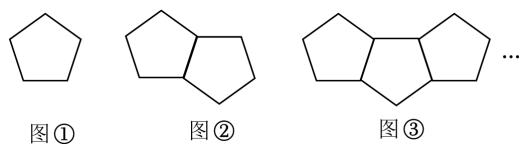
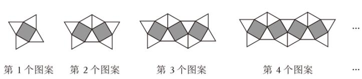
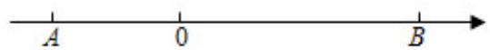
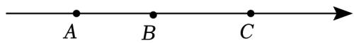

# 七年级第 次辅导练习11

# 一．选择题（共 8 小题）

1．下列方程为一元一次方程的是（ ）

A． $a + 3 = 0$ B． $x + 2 y = 5$ C． $1 + 1 = 2$ D． $y ^ { 2 } + y + 2 = 0$

2．下列各式进行的变形中，正确的是（ ）

A．若 $3 a = 2 b$ ，则 $3 a - 3 = 2 b + 3$ B．若 $3 a = 2 b$ ，则 $3 a c { = } 2 b c$ C．若 $3 a = 2 b$ ，则 $9 a = 4 b$ D．若 3a＝2b，则

3．如果﹣4是关于 $x$ 的方程 $2 k - x { = } 2$ 的解，那么 $k$ 等于（ ）

A．﹣10 B．﹣1 C．3 D．1

4．已知方程（ $5 { + a }$ ） $x ^ { | a | ^ { - } 4 } { + } 3 { = } 0$ 是一元一次方程，则 $a$ 的值为（ ）

A．5 B．﹣5 C．±5 D．0

5．《孙子算经》中有个问题：若三人共车，余两车空；若两人共车，剩九人步．问人与车各几何？意思是：若三个人乘一辆车，则空余两辆车；若两个人乘一辆车，则剩余 9 人需要步行．试问人和车辆各有多少？设有 $x$ 辆车，则根据题意可列出方程为（ ）

A．3（ $( x + 2 ) = 2 x - 9$ B．3 $( x + 2 ) = 2 x + 9$ C．3 $( x - 2 ) = 2 x - 9$ D．3 $( x - 2 ) = 2 x + 9$

6．小丽同学在做作业时，不小心将方程 $2 ( x - 3 ) - \pmb { \operatorname { \equiv } } \pmb { \operatorname { \equiv } } \pmb { x } + 1$ 中的一个常数污染了，在询问老师后，老师告诉她方程的解是 $x { = } 9$ ，请问这个被污染的常数■是（ ）

A．4 B．3 C．2 D．1

7．一个两位数，十位上的数是1，个位上的数是 $x$ ．把1与 $x$ 对调，新两位数比原两位数大18．根据题意列出的方程为（ ）

A． $1 0 x + 1 - 1 0 + x = 1 8$ B． $1 0 x { + } 1 ~ { - }$ （ $\ b _ { 1 0 + x } ) _ { \mathbf \beta } = 1 8$ C． $1 0 + x - 1 0 x + 1 = 1 8$ D． $1 0 { + x }$ ﹣（ $1 0 x + 1 ) = 1 8$

8．如图，是由一些小棒搭成的图案，按照这种方式摆下去，摆第 9个图案所用小棒的数量为（ ）

A．33 B．36 C．37 D．41

# 三．填空题（共 8 小题）

9． $x$ 的一半比它的 3 倍少 5，用等式表示应为

10．将方程 $\frac { 2 x - 3 y } { 3 } = 6$ 变形为用含 $y$ 的式子表示 $x$ ，那么 $x = .$

11．已知关于 $x$ 的方程 $2 x + m - 7 = 0$ 的解是 $x { = } 3$ ，则 $m$ 的值为

12．已知方程 $x ^ { 2 k ^ { - } 1 + 2 = 0 }$ 是关于 $x$ 的一元一次方程， $k { = }$

13．若 $m { + 1 }$ 与﹣4互为相反数，则 $m$ 的值为

14．甲队有37人，乙队有23人，现在从乙队抽调 $x$ 人到甲队，使甲队人数正好是乙队人数的2倍，根据

题意，列出方程是

15．已知 $5 a + 2 b = 3 b + 1 0$ ，利用等式性质可求得 $1 0 a \textmd { - } 2 b$ 的值是

16．如图是一组有规律的图案，它们是由边长相同的正方形和等边三角形镶嵌而成，按照这样的规律继续摆下去，第 个图案有2023 个三角形.

三．解答题（共 7 小题）17．解方程：（1） $5 x { = } 3$ （ $\cdot x { + 4 }$ ）； （2）6﹣3x＝2（4﹣x）

18．a※ $^ { b }$ 是新规定的这样一种运算法则： $a \ast b = a ^ { 2 } + 2 a b$ ，例如 $5 \ast ( - 2 ) = 5 ^ { 2 } + 2 \times 5 \times ( - 2 ) = 5$ ．

（1）求 $2 \divideontimes 3$ 的值；（2）若（﹣2）※ $: x = - \ 2 + x$ ，求 $x$ 的值．

19．为了加强公民的节水意识，合理利用水资源，某市采用价格调控手段达到节水的目的．该市自来水收费价格见价目表

<table><tr><td rowspan=1 colspan=2>价日表</td></tr><tr><td rowspan=1 colspan=1>每月用水量</td><td rowspan=1 colspan=1>单价</td></tr><tr><td rowspan=1 colspan=1>不超出6m的部分</td><td rowspan=1 colspan=1>2元／m</td></tr><tr><td rowspan=1 colspan=1>超出6m，不超出10m的部分</td><td rowspan=1 colspan=1>4元／m</td></tr><tr><td rowspan=1 colspan=1>超出10m的部分</td><td rowspan=1 colspan=1>8元/m</td></tr></table>

注：水费按月结算

若某户居民 1 月份用水 $8 . 3 m ^ { 3 }$ ，则应收水费： $2 \times 6 { + } 4 \times ( 8 . 3 - 6 ) = 2 1 . 2$ （元）

（1）若该户居民2月份收水费16元，计算该户2月份用水量；

（2）若该户居民3月份用水 $1 2 . 5 m ^ { 3 }$ ，则应收水费多少元？

20．如图，点 $A$ 在数轴上表示的数是﹣6，点 $B$ 表示的数是 $+ 1 0$ ， $P$ ， $\mathcal { Q }$ 两点同时分别以1个单位/秒和2个单位/秒的速度从 $A$ ， $B$ 两点出发，沿数轴做匀速运动，设运动时间为 $t$ （秒）．

（1）线段 $A B$ 的长度为 个单位；  
（2）如果点 $P$ 向右运动，点 $\boldsymbol { Q }$ 向左运动，求：  
$\textcircled{1}$ 当 $t { = } _ { - }$ 时， $P$ 与点 $\mathcal { Q }$ 相遇？ $\textcircled{2}$ 当 $=$ 时， $P Q { = } \frac { 1 } { 2 } A B ?$

（3）如果点 $P$ ，点 $\mathcal { Q }$ 同时向左运动，是否存在这样的时间 $t$ 使得 $P$ ， $\mathcal { Q }$ 两点到 $A$ 点距离相等？若存在，求出 $t$ 的值，若不存在，请说明理由

1．阅读材料：我们知道， $4 x - 2 x + x = ( 4 - 2 + 1 ) \ x = 3 x$ ，类似地，我们把（ $( a { + } b )$ ）看成一个整体，则4（ $\cdot a { + } b )$ ）﹣ $2 \ ( a + b ) + ( a + b ) = ( 4 - 2 + 1 ) \ ( a + b ) = 3 \ ( a + b )$ ．“整体思想”是中学教学解题中的一种重要的思想方法，它在多项式的化简与求值中应用极为广泛．

（1）把 $( m - n ) ^ { 2 }$ 看成一个整体，合并 $3 ~ ( m - n ) ^ { 2 } - 4 ~ ( m - n ) ^ { 2 } + 3 ~ ( m - n ) ^ { 2 }$ 的结果是 ；

（2）已知 $x ^ { 2 } + 2 y = 4$ ，则 $3 x ^ { 2 } + 6 y - 2$ 的值是（3）已知 $x ^ { 2 } { + } x y { = } 2$ ， $2 y ^ { 2 } + 3 x y = 5$ ，求 $2 x ^ { 2 } { + } 1 1 x y { + } 6 y ^ { 2 }$ 的值．

2．已知数 $a , \ b$ ， $c$ 在数轴上所对应的点分别为 $A$ ， $B$ ， $C$ ，如图所示，其中 $b = - 1$ ，且 $A B { = } 4$ ， $B C { = } 8$

（1）a＝

（2）若点 $B$ 保持静止，点 $A$ 以每秒 1 个单位长度的速度向左运动，同时点 $C$ 以每秒 3 个单位长度的速度向右运动，假设运动时间为 $t$ 秒，则 $A B = .$ ， $B C =$ （结果用含 $t$ 的代数式表示）；这种情况下， $3 A B - B C$ 的值是否随着时间 $t$ 的变化而变化？若变化，请说明理由；若不变，请求其值；

（3）若在点 $A$ 、 $C$ 开始运动的同时，点 $B$ 向右运动，并且 $A$ ， $C$ 两点的运动速度和运动方向与（2）中相同，当 $t { = } 3$ 时， $A C { = } 3 B C$ ，请直接写出点 $B$ 的运动速度． . →A B

3．预备知识：在数学中，把点 $A$ 与点 $B$ 之间的距离用 $A B$ 表示如图，在数轴上 $A$ 点表示数 $a$ ， $B$ 点表示数 $^ { b }$ ， $C$ 点表示数 $c$ ，已知数 $^ { b }$ 是最小的正整数，且a、 $c$ 满足$| a + 2 | + ~ ( c - 7 ) ~ ^ { 2 } = 0 .$

（1）a＝ ， $b { = }$ $c = _ { \mathrm { { . } } }$

（2）点 $A$ 、 $B$ 、 $C$ 开始在数轴上运动，若点 $A$ 以每秒 1 个单位长度的速度向左运动，同时，点 $B$ 和点 $C$ 分别以每秒 $m$ （ $m { < } 4$ ）个单位长度和 4 个单位长度的速度向右运动，运动 $t$ 秒钟后，求 $A$ ， $B$ ， $C$ 三点在数轴上所表示的数（用含 $m$ ， $t$ 的式子表示），若在此过程中， $B C ^ { - } A B$ 的值保持不变，求 $m$ 的值；

（3）在此数轴有上一动点 $\mathcal { Q }$ 对应的数为 $y$ ，求 $\cdot | y + 2 | + | y - 7 |$ 的最小值．

4.已知在数轴上A、 $B$ 两点对应的数分别为14、－6.

(1)若将数轴折叠，使点B恰好与表示2的点重合。则点A与表示 的点重合；

(2)若点C在点B左边部分的数轴上，且 $C A = 3 C B ,$ 求点 $C$ 表示的数；

(3)在(2)的条件下，点P从A点出发以每秒8个单位长度沿数轴向左运动，同时点 $Q$ 从 $\boldsymbol { . B }$ 点出发以每秒2个单位长度沿数轴向左运动；当点 $P$ 到达点 $C$ 后立即沿数轴以原速向右运动，点 $Q$ 到达点 $C$ 后，沿数轴以原速的6倍向右运动，设运动时间为i秒，当t为多少时，点 $P$ $Q$ 相距8个单位长度.