# 专题 1-1 一网打尽全等三角形模型（10 个模型）

导语：熟悉模型，补全结构

条件不足另外凑，凑不出来挠挠头，下次考试再来秀

# 题型•解读

# 目录

模型梳理. 2  
题型 $\Leftrightarrow$ 倍长中线模型. .14  
题型二 一线三等角模型. .16  
题型三 半角模型. . 23  
2022·山东日照真题. ..24  
题型四 手拉手模型. .. 31  
2022·张家界真题 ..34  
2022·贵阳中考 . ..35  
题型五 对角互补 $^ +$ 邻边相等模型 ..44  
题型六 平行线夹中点模型 ..47  
题型七 截长补短模型. . 50  
题型八 绝配角模型. .. 60  
2023·深圳宝安区二模. . 63  
2023·深圳中学联考二模. . 64  
题型九 婆罗摩笈模型. .... 70  
2022 武汉·中考真题 . ..71  
2020·宿迁中考真题. ..76  
题型十 脚蹬脚模型（海盗埋宝藏） ..87

# 满分·技巧

# 模型梳理

# 模型 1 倍长中线模型

# （一）基本模型

<table><tr><td rowspan=2 colspan=1>B     ,D      C/√ソE</td><td rowspan=1 colspan=1>已知：在△ABC中，AD是BC边上的中线，延长AD 到点E，使ED=AD，连接BE.</td></tr><tr><td rowspan=1 colspan=1>结论1：△ACD≌△EBD.</td></tr><tr><td rowspan=2 colspan=1>B          D`-   CF</td><td rowspan=1 colspan=1>已知：在△ABC中，点D是BC边的中点，点E是AB边上一点，连接ED，延长ED到点F，使DF=DE，连接CF.</td></tr><tr><td rowspan=1 colspan=1>结论2：△BDE≌△CDF.</td></tr><tr><td rowspan=2 colspan=1>AEB          D       C$</td><td rowspan=1 colspan=1>已知：在△ABC中，点D是BC边的中点，作CE⊥AD 于 E，BF ⊥ AD 于 F,</td></tr><tr><td rowspan=1 colspan=1>结论3：易证：△CDE≌△BDF(SAS)</td></tr></table>

# （二）结论推导

结论 1：△ACD≌△EBD

证明：∵AD 是 BC 边上的中线，∴ $\mathrm { C D } { = } \mathrm { B D }$ ．∵ $\angle \mathrm { A D C } = \angle \mathrm { E D B }$ ， $\mathrm { A D } { = } \mathrm { E D }$ ，∴△ACD≌△EBD结论 2：△BDE≌△CDF．

证明：∵点 D 是 BC 边的中点，∴B $\mathrm { D } { = } \mathrm { C D }$ ．∵ $\angle \mathrm { B D E } { = } \angle \mathrm { C D F }$ ， $\mathrm { D E = D F }$ ，∴△BDE≌△CDF．

# （三）解题技巧

遇到中点或中线，则考虑使用“倍长中线模型”，即延长中线，使所延长部分与中线相等，然后连接相应的顶点，构造出全等三角形．

# 模型 2 一线三等角模型

# （一）基本模型

<table><tr><td rowspan=2 colspan=1>3A     P         B</td><td rowspan=1 colspan=1>已知：点P在线段AB上，∠1=∠2=∠3，AP=BD （或 AC=BP 或 CP=PD).</td></tr><tr><td rowspan=1 colspan=1>结论1：△CAP≌△PBD.</td></tr><tr><td rowspan=2 colspan=1>A2λ  3PB</td><td rowspan=1 colspan=1>已知：点P在AB的延长线上，∠1=∠2= ∠3, AP=BD(或 AC=BP 或 CP=PD ).</td></tr><tr><td rowspan=1 colspan=1>结论2：△APC≌△BDP.</td></tr></table>

# （二）结论推导

结论 1：△CAP≌△PBD

证明：∵ $\angle 1 + \angle \mathrm { C } + \angle \mathrm { A P C } = 1 8 0 ^ { \circ }$ ， $\angle 2 + \angle \mathrm { B P D } + \angle \mathrm { A P C } = 1 8 0 ^ { \circ }$ ， $\angle 1 = \angle 2$ ，∴ $\angle C = \angle \mathrm { B P D }$ ∵ $\angle 1 = \angle 3$ ， $\mathrm { A P = B D }$ （或 $\operatorname { A C } { = } \operatorname { B P }$ 或 ${ \mathrm { C P } } { = } \mathrm { P D } .$ ），∴△CAP≌△PBD．

结论 2：△APC≌△BDP．

证明：∵ $\angle 1 = \angle \mathrm { C } + \angle \mathrm { A P C }$ ， $\angle 2 = \angle \mathrm { B P D } + \angle \mathrm { D }$ ， $\angle 3 = \angle \mathrm { B P D } + \angle \mathrm { A P C }$ ， $\angle 1 = \angle 2 = \angle 3$ ，∴ $\angle C = \angle \mathrm { B P D }$ ， $\angle \mathrm { A P C } = \angle \mathrm { D }$ ．∵ $\mathrm { A P = B D }$ （或 $\operatorname { A C } { = } \operatorname { B P }$ 或 ${ \mathrm { C P } } { = } \mathrm { P D }$ ），∴△APC≌△BDP．

# （三）解题技巧

在一条线段上出现三个相等的角，且有一组边相等时，则考虑使用一线三等角全等模型．找准三个等角，再根据平角性质、三角形内角和进行等角代换，判定三角形全等，然后利用全等三角形的性质解题．一线三等角模型常以等腰三角形、等边三角形、四边形（正方形或矩形）为背景，在几何综合题中考查

# 模型 3 半角模型

# （一）基本模型

<table><tr><td rowspan=2 colspan=1>等边三角形含半角BD</td><td rowspan=1 colspan=1>已知：△ABC是等边三角形，D为△ABC外一点，∠BDC=120°，BD=CD，点E，F分别在AB，AC上，∠EDF=60°.</td></tr><tr><td rowspan=1 colspan=1>结论1：EF=BE+CF，∠DEB= ∠DEF, ∠DFC= ∠DFE.</td></tr><tr><td rowspan=2 colspan=1>正方形含半角DFB    E C</td><td rowspan=1 colspan=1>已知：四边形ABCD是正方形，点E，F分别在BC，CD上，∠EAF=45°.</td></tr><tr><td rowspan=1 colspan=1>结论2：EF=BE+DF,∠AEB= ∠AEF， ∠AFD= ∠AFE.</td></tr><tr><td rowspan=2 colspan=1>等腰直角三角形含半角B    D     E C</td><td rowspan=1 colspan=1>已知：△ABC是等腰直角三角形，∠BAC=90°，点D，E在BC上，∠DAE=45°.</td></tr><tr><td rowspan=1 colspan=1>结论3：DE2=BD2+CE2.</td></tr></table>

# （二）结论推导

结论 1： $\scriptstyle { E F = B E + C F }$ ， $\angle D E B = \angle D E F$ ， $\angle D F C = \angle D F E$ ．  
证明：延长 $A C$ 到点 $G$ ，使 $C G { = } B E$ ，连接 $_ { D G }$   
∵ $\triangle A B C$ 是等边三角形，∴ $\angle A B C = \angle A C B = 6 0 ^ { \circ }$   
∵ $\angle B D C = 1 2 0 ^ { \circ }$ ， $B D { = } C D$ ，∴∠DBC＝∠DCB＝30°，  
∴ $\angle D B E = \angle D C F = 9 0 ^ { \circ }$ ， $\therefore \angle D B E = \angle D C G = 9 0 ^ { \circ } ,$ ，  
∴△BDE≌△CDG，∴ $D E { = } D G$ ， $\angle D E B = \angle G$ ， $\angle B D E { = } \angle C D G$ ．  
∵ $\angle E D F = 6 0 ^ { \circ }$ ， $\therefore \angle B D E + \angle C D F = 6 0 ^ { \circ } ,$ ，  
∴ $. \angle C D G + \angle C D F = 6 0 ^ { \circ }$ ，即 $\angle G D F { = } 6 0 ^ { \circ }$ ．  
∵ $D F { = } D F$ ，∴△DEF≌△DGF，  
∴ $E F { = } F G$ ， $\angle D E F { = \angle G }$ ， $\angle D F C = \angle D F E$ ∴ $\angle D E B = \angle D E F .$ ．  
∵ ${ \bf \nabla } \cdot { \cal F } G = { \cal C } G + { \cal C } F$ ，∴ $. E F { = } B E { + } C F$ ．  
结论 2： $\scriptstyle { E F = B E + D F }$ ， $\angle A E B = \angle A E F$ ， $\angle A F D = \angle A F E$   
证明：延长 $C B$ 到点 $G$ ，使 $B G { = } D F$ ，连接 $A G$   
∵正方形 ABCD，∴ $\angle A B G = \angle D = 9 0 ^ { \circ }$ ， $A B { = } A D$ ，  
∴△ABG≌△ADF，∴ $A G { = } A F$ ， $\angle G = \angle A F D$ ， $\angle B A G = \angle D A F$ .∵ $\angle E A F { = } 4 5 ^ { \circ }$ ，∴ $. \angle B A E + \angle D A F { = } 4 5 ^ { \circ } ,$ ，  
∴ $\angle B A E + \angle B A G = 4 5 ^ { \circ }$ ，即 $\angle E A G = 4 5 ^ { \circ }$   
∵ $A E { = } A E$ ，∴△AEF≌△AEG，  
∴ $E F { = } E G$ ， $\angle A E B = \angle A E F$ ， $\angle A F E { = \angle G }$   
∴ $\angle A F D = \angle A F E$ ．  
∵ $E G = B E + B G$ ，∴ $E F { = } B E { + } D F$   
结论 3： $D E ^ { 2 } = B D ^ { 2 } + C E ^ { 2 }$   
证明：将△ABD 绕点 $A$ 逆时针旋转 $9 0 ^ { \circ }$ 到 $\triangle A C F$ ，连接 $E F$   
∵ $\triangle A B C$ 是等腰直角三角形， $\angle B A C = 9 0 ^ { \circ }$ ，  
∴ $\angle B = \angle A C B = 4 5 ^ { \circ }$ ，∴ $\angle A C F = \angle B = 4 5 ^ { \circ } ,$ ，  
∴ $\scriptstyle E C F = 9 0 ^ { \circ } , \therefore E F ^ { 2 } = C F ^ { 2 } + C E ^ { 2 } = B D ^ { 2 } + C E ^ { 2 } ,$ ，  
∵ $\angle D A E { = } 4 5 ^ { \circ }$ ，∴∠BAD＋∠CAE＝45°，  
∴ $. \angle C A F + \angle C A E { = } 4 5 ^ { \circ }$ ，即 $\angle F A E { = } 4 5 ^ { \circ }$   
∵ $A E { = } A E$ ，∴△AEF≌△AED，  
∴ $E F { = } D E$ ，∴ $\scriptstyle . D E ^ { 2 } = B D ^ { 2 } + C E ^ { 2 }$ ．

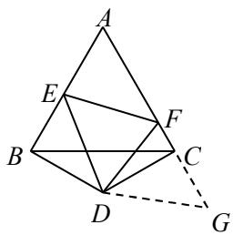

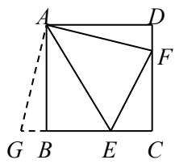

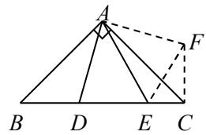

# （三）解题技巧

对于半角模型，一般情况下都需要做辅助线（延长或旋转），构造全等，通过等量代换得到相关的结论

# 模型 4 手拉手模型

# （一）基本模型

【淘宝店铺：向阳百分百】

<table><tr><td rowspan="2">0 B C</td><td>已知：在△ABC 和△ADE中，AB=AC，AD=AE，∠BAC=∠DAE， 连接BD，CE相交于O，连接OA.</td></tr><tr><td>结论1：△ABD≌△ACE，BD=CE, 结论2：∠BOC=∠BAC, 结论3：OA平分∠BOE.</td></tr></table>

# （二）结论推导

结论 1：△ABD≌△ACE， $B D { = } C E$ ． 证明：∵ $\angle B A C = \angle D A E$ ，∴ $\angle B A D = \angle C A E$ ∵ $A B { = } A C$ ， $A D { = } A E$ ，∴△ABD≌△ACE， ∴ $B D { = } C E$ ．

结论 2： $\angle B O C = \angle B A C$   
证明：设 $O B$ 与 $A C$ 相交于点 $F$   
∵△ABD≌△ACE，∴ $\angle A B D = \angle A C E$   
∵ $\angle A F B = \angle O F C$ ，∴ $\angle B O C = \angle B A C .$   
结论 3： $O A$ 平分 $\angle B O E$   
证明：过点 $A$ 分别做 $B D$ ， $C E$ 的垂线，垂足为 $G , \ H .$   
$\because \triangle A B D \cong \triangle A C E , \enspace \therefore S _ { \triangle A B D } = S _ { \triangle A C E } ,$ ，  
$\therefore \frac { 1 } { 2 } B D \cdot A G = \frac { 1 } { 2 } C E \cdot A H \ .$   
∵ $B D { = } C E$ ， $. A G { = } A H ,$ ，  
∴ $O A$ 平分 $\angle B O E$

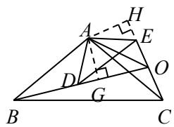

# （三）解题技巧

如果题目中出现两个等腰三角形，可以考虑连接对应的顶点，用旋转全等模型；如果只出现一个等腰三角形，可以用旋转的方法构造旋转全等

# 模型 5 对角互补 $^ +$ 邻边相等模型

模型解读：通过做垂线或者利用旋转构造全等三角形解决问题。

如图， $\angle E O F + \angle E C F = 1 8 0 ^ { \circ }$ ， $C E = C F$

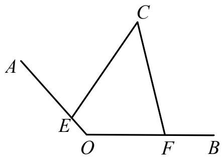  
作垂线

旋转

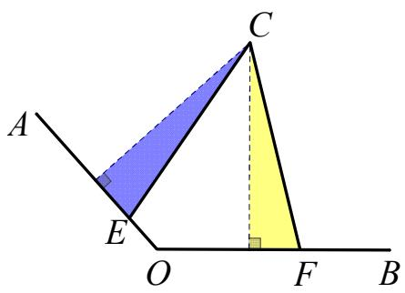

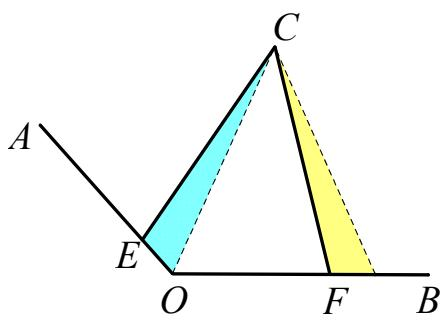

# 模型 6 平行线夹中点模型

如图， $A B / / C D$ ，点 $E$ 是 $B C$ 的中点

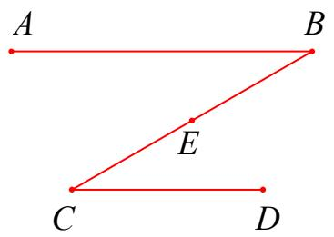

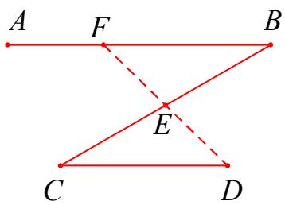  
图 $\textcircled{1}$

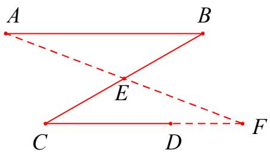  
图 $\textcircled{2}$

# 【模型分析】

如图 $\textcircled{1}$ ，延长 $D E$ 交 $A B$ 于点 $F$ ，易证：△DCE≌△FBE（AAS）。如图 $\textcircled{2}$ ，延长 $A E$ 交 $C D$ 延长线于点 $F$ ，易证：△ABE≌△FCE（AAS）

口诀：有中点，有平行，轻轻延长就能行

# 模型 7 截长补短模型

【模型解读】截长补短的方法适用于求证线段的和差倍分关系。截长: 指在长线段中截取一段等于已知线段: 补短: 指将短线段延长, 延长部分等于已知线段。该类题目中常出现等服三角形、角平分线等关键词句, 可以采用截长补短法构造全等三角形来完成证明过程, 截长补短法(往往需证 2 次全等) 。

$\textcircled{1}$ 截长：在较长的线段上截取另外两条较短的线段。

如图所示，在 BF 上截取 $\mathrm { B M = D F }$ ，易证△BMC≌△DFC（SAS），则 $\mathrm { M C } { = } \mathrm { F C } { = } \mathrm { F G }$ ，∠BCM=∠DCF，可得△MCF 为等腰直角三角形，又可证 $\angle C \mathrm { F E = } 4 5 ^ { \circ }$ ，∠CFG $\scriptstyle \mathsf { i = } 9 0 ^ { \circ }$ °，$\angle \mathrm { C F G } { = } \angle \mathrm { M C F }$ ，FG∥CM，可得四边形 CGFM 为平行四边形，则 $\mathrm { C G } { = } \mathbf { M } \mathrm { F }$ ，于是 BF=BM+MF=DF+CG.

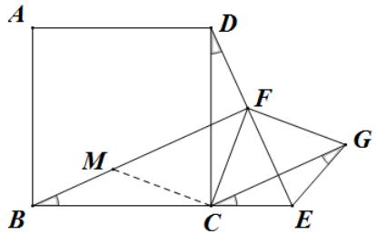

$\textcircled{2}$ 补短：选取两条较短线段中的一条进行延长，使得较短的两条线段共线并寻求解题突破。如图所示，延长 GC 至 N，使 $\mathrm { C N = D F }$ ，易证△CDF≌△BCN（SAS），  
可得 $\mathrm { C F { = } F G { = } B N }$ ，∠DFC $\varprojlim 2$ ∠BNC=135°，  
又知 $\angle F G C { = } 4 5 ^ { \circ }$ ，可证 BN∥FG，于是四边形 BFGN 为平行四边形，得 $\mathrm { B F { = } N G }$ ，所以 BF=NG=NC+CG=DF+CG.

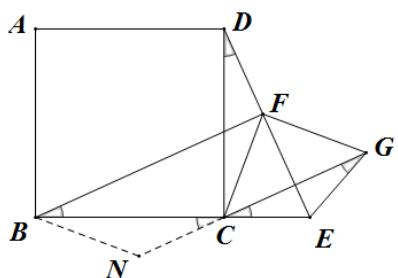

# 模型 8 绝配角模型

# （一）基本模型

<table><tr><td>1 1 E B D</td><td>已知：在△ABC中，∠ABC=90°，点D为边BC上一点， ∠C=2∠BAD，延长DB 到点E，使BE=BD，连接AE.</td></tr><tr><td>C</td><td>结论：AC=EC.</td></tr></table>

# （二）结论推导

结论： $A C { = } E C$ ． 证明：∵ $\angle A B C = 9 0 ^ { \circ }$ ， $B E { = } B D$ ，∴ $A E { = } A D$ ， ∴ $\angle E = \angle A D E$ ， $\angle B A E = \angle B A D$ ，∴ $\angle E A D { = } 2 \angle B A D$ ∵ $\angle C = 2 \angle B A D$ ，∴ $\angle E A D = \angle C$ ， ∴ $\angle C A E = \angle A D E = \angle E$ ，∴ $A C { = } E C$ ．

# （三）解题技巧

如果题目中出现二倍角，可以考虑用绝配角模型，构造等腰三角形，绝配角＋等腰三角形＋全等三角形一般同时出现，然后用勾股定理或相似求解．构造等腰三角形是这类绝配角问题的重要方法

# 模型 9 婆罗摩笈模型

如图，△ABC 和△DBE 是等腰直角三角形，连接 AD，CE，M， $N$ 分别在 AD，CE 上，且 MN经过点 B【性质 1：垂直得中点】若 $M N \bot C E$ ，则 $\textcircled{1}$ 点 $N$ 是 $A D$ 的中点， $\textcircled { 2 } S _ { \Delta C B E } = S _ { \Delta A B D }$ ， $\textcircled { 3 } C E { = } 2 B N$

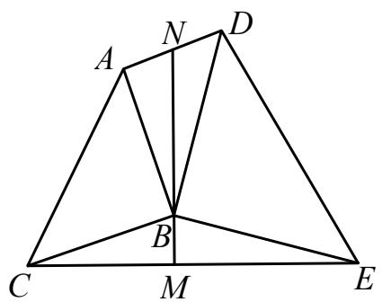

【证明】如图，（知垂直得中点，一线三垂直）

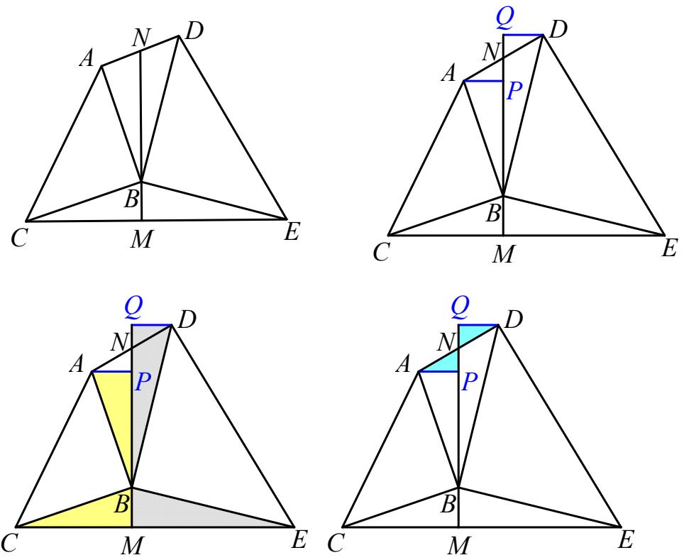

过 A 作 $\mathrm { A P \bot M N }$ ，垂足为 P，过 D 作 DQ⊥MN 交 MN 的延长线于 Q， 易证：△ABP≌△BCM,AP $=$ BM, $\cdot$ DQB≌△BME,DQ $=$ BM   
∴AP $=$ DQ   
易证： $\cdot$ APN≌△DQN   
∴ $\cdot$ DN   
$\textcircled{2}$ 如图，由 $\cdot$ 知， $\mathrm { S } _ { \Delta C B M } = \mathrm { S } _ { \Delta B A P }$ ， $\Delta E B M \qquad \Delta B D Q$ ， $\Delta A P N \qquad \Delta D Q N$ $\mathrm { \therefore S _ { \Delta A B D } = S _ { \Delta A B N } + S _ { \Delta D B N } = S _ { \Delta B A P } + S _ { \Delta A P N } + S _ { \Delta B D Q } - S _ { \Delta D Q N } }$   
$\Delta B A P \qquad \Delta B D Q \qquad \Delta C B M \qquad \Delta E B M \qquad \Delta C B E$ ,即 $\mathrm { S } _ { \Delta C B E } = \mathrm { S } _ { \Delta A B D }$ ， 得证. $\textcircled{3}$ 如图，由 $\cdot$ 得， $\mathrm { P N = Q N }$ ，   
$\cdot \mathrm { C E } = \mathrm { C M } + \mathrm { E M } = \mathrm { B P } + \mathrm { B Q } = \mathrm { B N } - \mathrm { N P } + \mathrm { B N } + \mathrm { Q N } = 2 \mathrm { B N }$ ，得证.

【性质 2：中点得垂直】若点 $N$ 是 $A D$ 的中点，则 $\textcircled { 1 } M N \bot C E$ 【证明】如图，（知中点得垂直，倍长中线）

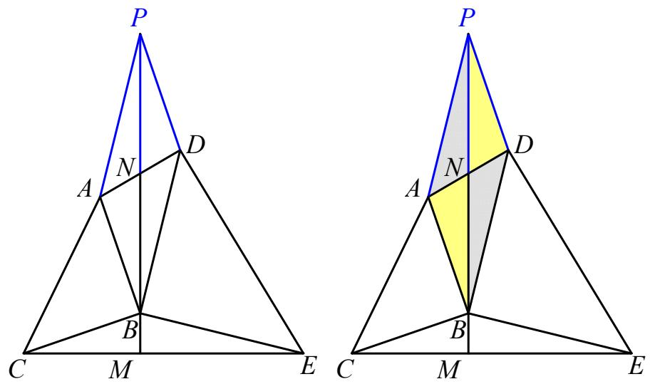

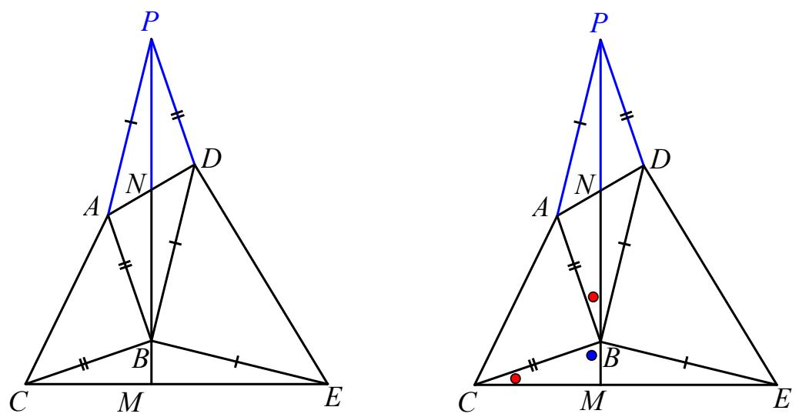

证明：延长 BN 至点 $\mathrm { P }$ ，使 $\mathrm { B N = P N }$ ，连结 PN，   
易证：△PAD≌BDA   
∴ ${ \tt B C } { = } { \tt P D }$ ， $\mathrm { B E = P A }$   
∵PA∥BD，∴ $\angle \mathrm { P A B } + \angle \mathrm { A B D } = 1 8 0 ^ { \circ }$ ，   
又∵∠ABC $=$ ∠DBE $= 9 0 ^ { \circ }$ °∴∠CBE＋∠ABD＝180°，∴∠CBE $=$ ∠PAB，   
易证：△CBE≌△PAB，   
∴∠BCM $=$ ∠ABN，

∵∠ABN＋∠CBM＝90°∴∠BCM＋∠CBM＝90° ∴ $\angle \mathrm { B M C } = 9 0 ^ { \circ }$ °

# 模型 10 脚蹬脚模型（海盗埋宝藏）

# 模型成立条件：等腰三角形顶角互补

已知：△ABC、△ADE 为等腰直角三角形， $\angle \mathrm { B } { = } \angle \mathrm { D } { = } 9 0 ^ { \circ }$ ， $\mathrm { A B } { = } \mathrm { C B }$ ， $\mathrm { A D = E D }$ ，点 F 为 CE 的中点，则△BFD是等腰直角三角形.

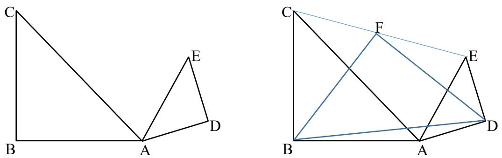

# 【证明】法一：倍长中线

延长 DF 至点 G，使得 $\mathrm { F G = F D }$ ，易证△DEF≌△GCF（SAS）；所以 $\mathrm { C G = E D = A D }$ ， $\angle 2 = \angle 7$ ；  
又 $\angle 1 + \angle 2 + \angle 3 = 3 6 0 ^ { \circ }$ ，  
$\angle 3 + \angle 4 + \angle 5 + \angle 6 + \angle 7 = 5 4 0 ^ { \circ }$ °（五边形内角和），$\angle 4 = \angle 6 = 9 0 ^ { \circ }$ ；  
所以 $\angle 3 + \angle 5 + \angle 7 = \angle 1 + \angle 2 + \angle 3$ ，所以 $\angle 1 = \angle 5$ ；  
则△BCG≌△BAD（SAS），  
所以 $\angle \mathrm { D B G } { = } 9 0 ^ { \circ }$ °， $\mathrm { B G } { = } \mathrm { B D }$ ；  
所以 $\mathrm { B F } { = } \frac 1 2 \mathrm { D G } { = } \mathrm { D F }$ ，BF⊥DF。

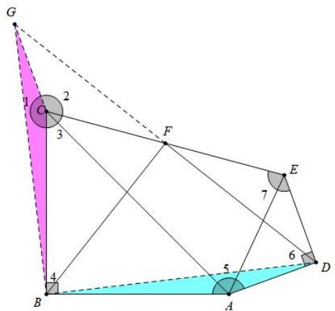

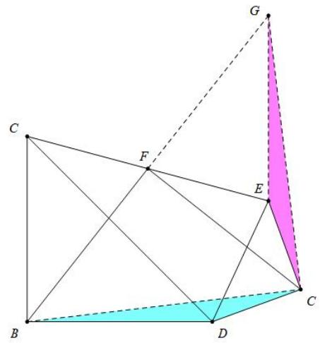

# 法二：构造手拉手模型

将△ABC 沿 AB 对称，将△ADE 沿 AD 对称  
连接 PE，CQ，易知 $\mathbf { \Delta } \cdot \triangle \mathbf { A C Q } \cong \triangle \mathbf { A P E }$ ，进而得出 $\mathrm { P E } { = } \mathrm { C Q }$ 且 PE⊥CQ，而 BE 是△CPE 的中位线，CD 是△CQE  
的中位线，故 $\mathrm { B F { = } D F }$ ，且 BF⊥FD

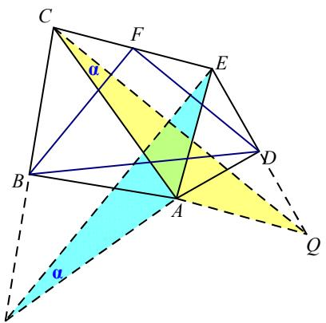

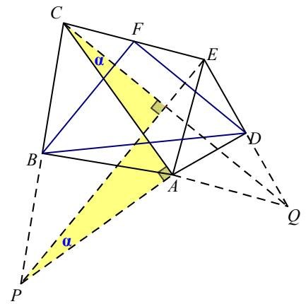

# 核心·题型

# 题型一 倍长中线模型

1．如图，在△ABC 中， $A D$ 是 $B C$ 边上的中线，点 $E$ 是 $A D$ 上一点， $B E { = } A C$ ， $B E$ 的延长线交 AC 于点 $F$ ，求证： $A { \cal F } { = } E { \cal F }$ ．

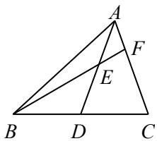

证明：延长 $A D$ 到点 $G$ ，使 $\cdot$ ，连接 $B G$ ∵ $\cdot$ 是 $B C$ 边上的中线，∴ $\cdot$ ∵ $\angle A D C = \angle G D B$ ， $\therefore \triangle A D C { \cong } \triangle G D B$ ，$\cdot$ ， $\angle D A C = \angle G$ ，∵ $\cdot _ { B E } { = } A C$ ，∴ $\cdot$ ， $\_$ ∵ $\angle A E F = \angle B E D$ ，∴ $-$ ，

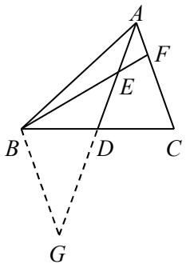

2．如图，在△ABC 中， $A D$ 平分 $\angle B A C$ ，点 $E$ 是 $B C$ 的中点，过点 $E$ 作 $E F / / A D$ ，交 $A C$ 于点 $F$ ，交 $B A$ 的延长线于点 $G$ ，求证： $B { G } { = } C F$

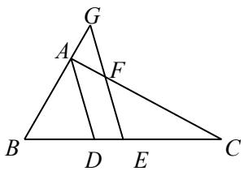

证明：延长 GE 到点 $\mathrm { H }$ ，使 $\cdot$ ，连接 CH

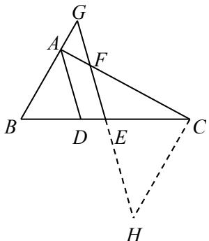

∵点 E 是 BC 的中点，∴BE ${ = } \mathrm { C E }$   
∵∠BE $\cdot$ EH，∴ $\cdot$ BEG≌△CEH，  
∴BG ${ } = \mathrm { C H }$ ， $\_$   
∵EF∥AD，∴ $\_$ ， $-$   
∵AD 平分 $\cdot$ BAC， $-$ ，

∴ $\cdot$ ∠CFE，∴CF $\cdot$ ，∴BG ${ } = \mathrm { C F }$

3．如图， $\triangle A B C { \cong } \triangle A D E$ ， $\angle A C B = \angle A E D = 9 0 ^ { \circ }$ ，连接 $E C$ 并延长，交 $B D$ 于点 $F$ ，求证： $F$ 为 $B D$ 的中点

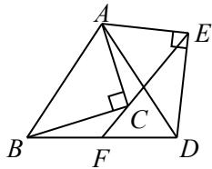

证明：过点 B 作 BG∥DE，交 EF 的延长线于点 G

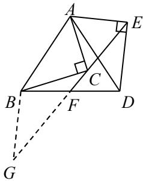

则 $\_$ ， $-$   
∵△ABC≌△ADE，∴AC $\cdot$ AE， ${ \mathrm { B C } } { = } { \mathrm { D E } }$ ，  
∴ $\angle { \mathrm { A C E } } = \angle { \mathrm { A } }$ EC  
$\therefore \angle \mathrm { A C B } = \angle \mathrm { A E D } = 9 0 ^ { \circ }$ ，∴∠BCF $\cdot$ ∠DEF，  
∴ $\angle \mathrm { G } { = } \angle \mathrm { B C F }$ ，∴BG $\mathrm { \Omega } = \mathrm { B C }$ ，∴BG $=$ DE，  
∴△BGF≌△DEF，∴BF $\cdot$ ，  
即 F 为 BD 的中点

考点分析：全等三角形的判定与性质，平行线的判定与性质，等腰三角形的判定与性质思路点拨：过点 B 作 BG∥DE，交 EF 的延长线于点 G．先根据△ABC≌△ADE，得 $\cdot$ ， $\mathrm { B C = D E }$ ，再证 $\mathrm { B G } { = } \mathrm { B C }$ ，最后证△BGF≌△DEF 即可

# 题型二 一线三等角模型

# 基础篇

1．如图， $\angle A B C = 9 0 ^ { \circ }$ ， $A B { = } B C$ ， $A D \perp B D$ 于点 $D$ ， $C E \bot B D$ 于点 $E$ ，求证： $C E { = } B D$ ． 证明：∵ $\angle A B C = 9 0 ^ { \circ }$ ， $\therefore \angle A B D + \angle E B C = 9 0 ^ { \circ }$ ∵ $\cdot$ ， $C E \bot B D$ ， $\therefore \angle A D B = \angle B E C = 9 0 ^ { \circ }$ ， ∴ $-$ ，∴ $\angle A = \angle E B C$

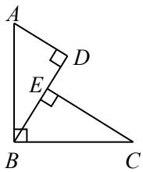

【淘宝店铺：向阳百分百】 ∵ $\cdot$ ，∴△ABD≌△BCE，∴ $\cdot$

2．如图，在△ABC 中， $\angle A C B = 9 0 ^ { \circ }$ ， $A C { = } B C$ ， $A D \bot C D$ 于点 $D$ ， $B E \bot C D$ 于点 $E$ ，若 $B E { = } 6$ ， $D E { = } 4$ ，则 $\triangle A C E$ 的面积为

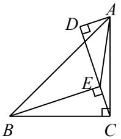

【答案】2

【解析】∵ $A D \bot C D$ ， $B E \bot C D$ ，∴ $\angle D = \angle B E C = 9 0 ^ { \circ }$ ，  
$-$   
∵ $\_$ ， $\therefore \angle D C A + \angle E C B = 9 0 ^ { \circ }$   
∴ $. \angle D C A = \angle E B C .$ $\cdot$ ，∴△CDA≌△BEC，  
∴ $A D { = } C E$ ， $C D { = } B E { = } 6$ ．  
∵ $\cdot$ ， $\_$ ，  
$\therefore S _ { \triangle A C E } = \frac { 1 } { 2 } C E \cdot A D = \frac { 1 } { 2 } \times 2 \times 2 = 2 .$

3．如图，在 $\mathrm { R t } \triangle A B C$ 中， $\angle A B C = 9 0 ^ { \circ }$ ， $B C = 1$ ， $A C { = } { \sqrt { 5 } }$ ，以 $A C$ 为直角边向外作等腰 Rt△ACD，连接$B D$ ，则 $B D$ 的长为

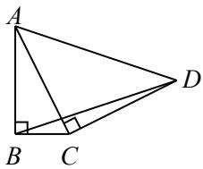

【答案】 $\sqrt { 1 0 }$

【解析】过点 D 作 DE⊥BC 于点 E

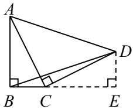

$\because \angle \mathrm { A B C } = 9 0 ^ { \circ } , \mathrm { B C } = 1 , \mathrm { A C } = \sqrt { 5 } \ ,$ ，  
${ \mathrm { \therefore A B } } = { \sqrt { A C ^ { 2 } - B C ^ { 2 } } } = 2 , \angle B A C + \angle A C B = 9 0 ^ { \circ } ,$ ，  
∵ $\_$ ，∴∠ECD＋∠ACB＝90°，  
∴ $\angle B \mathrm { A C } = \angle \mathrm { E C D }$ ．  
∵ $\angle { \mathrm { A B C } } = \angle { \mathrm { E } } = 9 0 ^ { \circ }$ ， $\cdot$ ，  
∴△ABC $=$ △CED， $-$   
∴ $\cdot$ ， $\sqrt { B E ^ { 2 } + D E ^ { 2 } } \sqrt { 1 0 }$ ．

【淘宝店铺：向阳百分百】

考点分析：等腰直角三角形的性质、全等三角形的判定与性质、勾股定理思路点拨：过点 D 作 DE⊥BC 于点 E，先证△ABC≌△CED，再在 Rt△BDE 中用勾股定理求解

4．如图，在Rt△ABC 中， $\angle A B C = 9 0 ^ { \circ }$ ，过点 $B$ 作 $B E \bot A C$ ，延长 $B E$ 到点 $D$ ，使得 $B D = A C$ ，连接 $A D$ ，$C D$ ，若 $A B = 4$ ， $A D = 5$ ，则 $C D$ 的长为

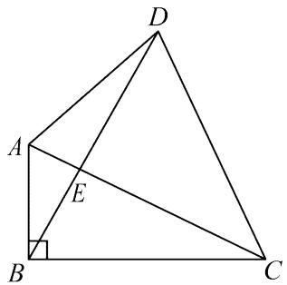

【答案】 $\sqrt { 5 8 }$

【详解】解：过 $\cdot$ 点分别作 $D G \bot B C$ 于点 $\cdot$ ， $D F \bot A B$ 交 $B A$ 的延长线于点 $F$ ，勾股即可

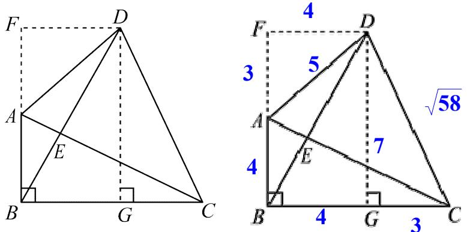

5．如图，已知 $A B { = } B C$ ， $A B \bot B C$ ， $A D \perp B D$ ， $B D { = } 2 A D$ ，求证： $C D { = } A B$

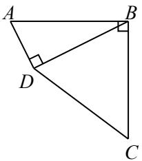

证明：过点 $C$ 作 $\cdot$ 于点 $\cdot$ ∵ $\cdot$ ，∴ $\_$ ， ∴ $\_$ (cid:)

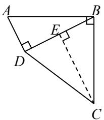

【淘宝店铺：向阳百分百】

∵ $\_$ ，CE⊥BD， $-$ ， $-$ ， $-$ ∵ $\cdot$ ，∴△ABD≌△BCE， $\mathbf { \partial } \cdot A D { = } B E$ ∵ $B D { = } 2 A D$ ，∴ $. B D { = } 2 B E$ ，∴ $B E { = } D E$ ， $\cdot$ ，∴ $\cdot$ ．

# 提高篇

6．如图， $\triangle A B C$ 和 $\triangle B D E$ 都是等腰直角三角形， $\angle B A C = \angle B D E = 9 0 ^ { \circ }$ ，点 $E$ 在 $B C$ 上，点 $F$ 是 $C E$ 的中点，连接 $A F$ ， $D F$ ，求证： $A F { = } D F$ 且 $A F \bot D F$

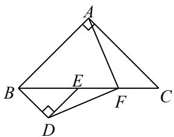

【解析】证明：过点 A 作 AG⊥BC 于点 G，过点 D 作 DH⊥BC 于点 H．

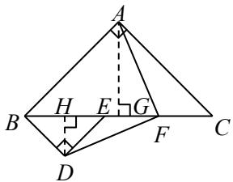

∵ $\cdot$ 和 $\cdot$ 都是等腰直角三角形， $\frac { 1 } { 2 } \qquad \frac { 1 } { 2 }$   
∵点 $F$ 是 $\cdot$ 的中点，∴ $\frac { 1 } { 2 }$ ，  
$\begin{array} { r l } { \frac { 1 } { 2 } } & { { } \frac { 1 } { 2 } } \end{array}$   
∴ $\cdot$ $= F H , \therefore F G = F H - G H = A G - G H = B G - G H = B H = D H .$   
∵ $-$ ，∴△AFG≌△FDH，  
∴ $A F { = } D F$ ， $\angle A F G = \angle F D H$   
∵ $\cdot \angle D F H + \angle F D H { = } 9 0 ^ { \circ }$ ，∴ $\angle D F H + \angle A F G = 9 0 ^ { \circ }$ ，  
∴ $\angle A F D = 9 0 ^ { \circ }$ ， $\therefore A F \bot D F$   
考点分析：等腰直角三角形的性质、全等三角形的判定与性质  
思路点拨：过点 $\cdot$ 作 $\cdot$ 于点 $G$ ，过点 $\cdot$ 作 $D H \bot B C$ 于点 $H .$ ．先根据等腰直角三角形的性质推导等线  
段，再证 $\triangle A F G \cong \triangle F D H$ ，即可得到结论

7．如图，在 $\triangle A B C$ 中， $\angle A C B = 9 0 ^ { \circ }$ ， $A C { = } B C$ ， $D$ 为 $A C$ 上一点， $C E \bot B D$ 于点 $E$ ，连接 $A E$ ，若 $C E { = } 4$ ，则 $\triangle A C E$ 的面积为

【淘宝店铺：向阳百分百】

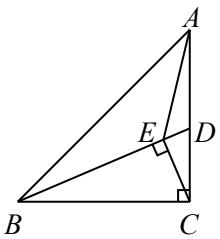

【答案】8

【解析】过点 A 作 AF⊥CE，交 CE 的延长线于点 F

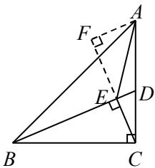

∵CE⊥BD，AF⊥CE，∴ $-$ ，   
$\therefore \angle \mathrm { E B C } + \angle \mathrm { B C E } = 9 0 ^ { \circ }$   
∵ $\angle \mathrm { A C B } = 9 0 ^ { \circ }$ ，∴ $\angle \mathrm { F C A } + \angle \mathrm { B C E } = 9 0 ^ { \circ }$ ，   
∴∠ $\mathrm { F C A } { = } \angle \mathrm { E B C }$   
∵ $\cdot$ ，∴△CAF≌△BCE，   
∴ $\_$ $\mathrm { \Sigma } _ { \mathrm { E } } = 4 , \ \mathrm { \Sigma } \mathrm { \cdot } \mathrm { S } \triangle \mathrm { A C E } \ = \frac { 1 } { 2 } \mathrm { C E } \ \bullet \ \mathrm { A F } = \frac { 1 } { 2 } \times 4 \times 4 = 8 .$

8．如图， $\triangle A B C$ 和 $\triangle C D E$ 都是等腰直角三角形， $\angle A C B = \angle C D E = 9 0 ^ { \circ }$ ，点 $A$ 在边 $D E$ 上，连接 $B E$ 交 $C D$ 于点 $F$ ，求证： $A E { = } 2 D F$ ．

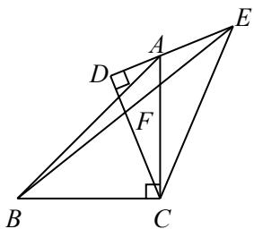

【答案】证明：过点 $B$ 作 $\cdot$ 于点 $G$ ．则 $\angle B G C = \angle C D A = 9 0 ^ { \circ }$ ，

$$
-
$$

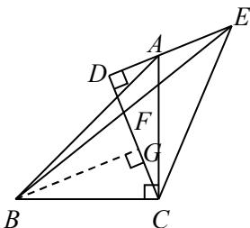

∵ $\angle A C B = 9 0 ^ { \circ }$ ， $\cdot \angle D C A + \angle G C B = 9 0 ^ { \circ } ,$ ，  
∴ $\angle D C A = \angle G B C$   
∵ $\cdot _ { A C } { = } B C$ ， $\_$ ，  
∴ $\cdot$ ， $\cdot$

∵ $C D { = } D E$ ，∴AE＝DG， $\cdot$ ∵ $-$ ， $\angle B G F = \angle E D F = 9 0 ^ { \circ }$ ， ∴△BFG≌△EFD，∴ $. F G { = } D F$ ， ∴ $-$

9．如图，把两个腰长相等的等腰三角形拼接在一起， $\scriptstyle A B = A C = A D$ ， $\angle B A D = 9 0 ^ { \circ }$ ，过点 $D$ 作 $D E \bot A C$ 于点 $E$ ，若 $B E { = } B C$ ， $D E { = } 8$ ，求 $A E$ 的长

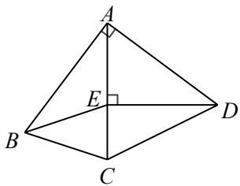

解：过点 $B$ 作 $\cdot$ 于点 $\cdot$

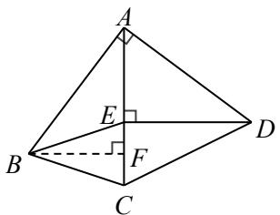

∵ $\angle B A D = 9 0 ^ { \circ }$ ，∴ $. \angle B A F + \angle D A E { = } 9 0 ^ { \circ }$   
∵ $\_$ ， $-$ ，  
∴ $\angle A B F = \angle D A E$   
∵ $\cdot \angle A F B = \angle D E A = 9 0 ^ { \circ }$ ，∴△ABF≌△DAE，$\_$   
∵ $\cdot$ ，BF⊥AC，∴ $\cdot$   
设 $E F { = } C F { = } x$ ，则 $\scriptstyle A E = 8 - x$ ， $\scriptstyle A D = A C = 8 + x$ ．  
在 $\mathrm { R t } \triangle A E D$ 中， $-$ ，  
解得 $\cdot$ ， $\scriptstyle \cdot . . A E = 8 - x = 6$

10．如图， $E$ 为正方形 ABCD 外一点，连接 $A E$ ， $D E$ ， $A E { = } A B$ ， $A F$ 平分 $\angle B A E$ 交 $D E$ 于点 $F$ ，连接 $C F$

（1）求 $\angle A F D$ 的度数；（2）求证： $A F \bot C F$

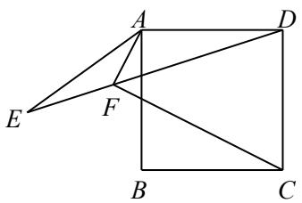

【答案】解：（1）过点 $\cdot$ 作 $A G \bot A F$ 交 $\cdot$ 于点 $G$

【淘宝店铺：向阳百分百】

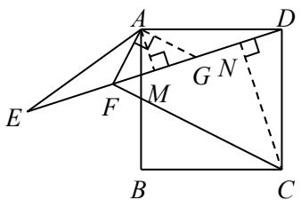

∵正方形 $\cdot$ ，∴ $\cdot$ ， $\angle B A D = 9 0 ^ { \circ }$ ， $-$ ，∴ $-$   
∵ $\cdot$ 平分 $\cdot$ ，∴ $-$ ，   
$-$   
∵ $\cdot$ ，∴ $\cdot$ ，∴ $. \angle E { = } \angle A D G$   
∴△AEF≌△ADG， $. A F { = } A G$ ，   
∴ $\angle A F D = \angle A G F = 4 5 ^ { \circ }$

（2）分别过点 $\cdot$ ， $\cdot$ 作 $D E$ 的垂线，垂足为 $M$ ， $\cdot$ 则 $\angle A M D = \angle D N C = 9 0 ^ { \circ }$ ， $-$ ∵正方形 $A B C D$ ，∴ $\cdot$ ， $\_$ ，$-$ ，$\therefore \triangle A D M { \triangle } { \triangle } D C N , { \therefore } A M { = } D N , D M { = } C N .$ ∵ $\angle A M F { = } 9 0 { ^ \circ }$ ， $\_$ ， $\_$ ，∴ $. D N { = } F M$ ，∴ $D M { = } F N$ ， $\therefore C N { = } F N$ ，$\cdot \angle C F N { = } 4 5 ^ { \circ }$ ，∴ $\angle A F C = 9 0 ^ { \circ }$ ，∴AF⊥CF

11．如图，在 $\triangle A B C$ 中， $A B { = } A C$ ，点 $D$ 在 $A B$ 上， $D E \bot A B$ ，交 $A C$ 于点 $E$ ，交 $B C$ 的延长线于点 $F$ ，若 $D F$ $= A C$ ， $A B { = } m$ ， $A E { = } n$ ，求 $A D + D E$ 的值（用含 $m$ ， $n$ 的式子表示）．

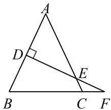

解：过点 A 作 AG⊥AB，过点 B 作 BG⊥BC，AG 与 BG 交于点 G，连接 GF 与 AC 交于点 O，则 $\angle \mathrm { G A B } = \angle \mathrm { B D F } = 9 0 ^ { \circ }$ $-$ ，

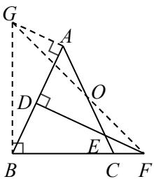

$\therefore \angle A { \mathrm { G B } } = \angle { \mathrm { D B F } } .$ ∵ $\scriptstyle \mathrm { \mathrm { ~ A B = A C = D F } }$ ，∴△AGB≌△DBF，

$-$ ， $\mathrm { A G } { = } \mathrm { D B }$ ，∴∠BGF＝∠BFG＝45° 设 $\angle \mathrm { B A C } = 2 \mathrm { x }$ ，则 $-$ ， $\angle \mathrm { G A O } = 9 0 ^ { \circ } + 2 \mathrm { x }$ ， $-$ ， $-$ ， $-$ ，∴∠AGO $=$ ∠AOG， ∴AG $= \mathrm { A O }$ ，∴ $\cdot$ ． ∵AG⊥AB，DF⊥AB，∴AG∥DF， $-$ $\therefore \angle \mathrm { A O G } = \angle \mathrm { E O F }$ ，∴∠EFO $\cdot$ ∠EOF， $\mathrm { E F = E O }$ ， $\mathrm { \dot { \cdot } A D + D E = A B - D B - D F - E F = m - A O - m - O E }$ $= 2 \mathrm { m } - \mathrm { A E } = 2 \mathrm { m } - \mathrm { n }$

# 题型三 半角模型

# 例 题

例 1 如图， $\triangle A B C$ 是边长为 1 的等边三角形， $D$ 为 $\triangle A B C$ 外一点， $B D = C D$ ， $\angle B D C = 1 2 0 ^ { \circ }$ ，点 $E$ ，$F$ 分别在 $A B$ ， $A C$ 上，且 $\angle E D F { = } 6 0 ^ { \circ }$ ，则 $\triangle A E F$ 的周长为

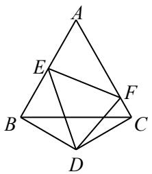

考点分析：等边三角形的性质、全等三角形的判定与性质

思路点拨：由半角模型可知 $\_$ ，则 $\triangle A E F$ 的周长 $-$ $\cdot$ ．

【解析】由半角模型可知 $\scriptstyle { E F = B E + C F }$ ，则 $\cdot$ 的周长 $-$ $\cdot$ ．

例 2 如图，在正方形 $A B C D$ 中，点 $E$ ， $F$ 分别在 $B C$ ， $C D$ 上， $\angle E A F { = } 4 5 ^ { \circ }$ ，△CEF 的周长为 2，则正方形ABCD 的边长为

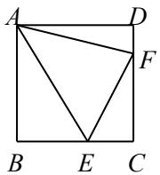

【答案】 1

【解析】由半角模型可知 $\scriptstyle { E F = B E + D F }$ ，则 $\cdot$ 的周长 $-$ ＝$\cdot$ ， $B C = 1$ ，即正方形 $\cdot$ 的边长为 1思路点拨：由半角模型可知 $\_$ ，则 $\cdot$ 的周长 $-$

$+ C D = 2 B C = 2$ ， $\cdot$ ，即正方形 ABCD 的边长为 1

例 3 如图，在 $\mathrm { R t } \triangle A B C$ 中， $\angle A C B = 9 0 ^ { \circ }$ ， $A C { = } B C$ ，点 $E$ ， $F$ 在 $A B$ 上， $\angle E C F { = } 4 5 ^ { \circ }$ ， $A E { = } 2$ ， $E F { = } 3$ ，则$B F$ 的长为

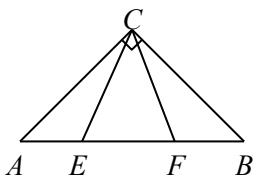

【答案】 $\sqrt { 5 }$

【解析】由半角模型可知 $\_$ ，则 $B F { = } \sqrt { E F ^ { 2 } - A E ^ { 2 } } = \sqrt { 3 ^ { 2 } - 2 ^ { 2 } } = \sqrt { 5 } \ .$ 思路点拨：由半角模型可知 EF2＝AE2＋BF2，则 BF＝ 2 2EF  AE ＝ 5 ．

# 2022·山东日照真题

例 4 如图 1， $\triangle A B C$ 是等腰直角三角形， $A C { = } B C { = } 4$ ， $\angle A C B = 9 0 ^ { \circ }$ ， $M$ ， $N$ 分别是边 $A C$ ， $B C$ 上的点，以CM，CN 为邻边作矩形 PMCN，交 $A B$ 于点 $E$ ， $F$ ．设 $C M { = } a$ ， $C N { = } b$ ，且 $a b { = } 8$ ．

（1）判断由线段 $A E$ ， $E F$ ， $B F$ 组成的三角形的形状，并说明理由；

（2） $\textcircled{1}$ 如图 2，当 $a { = } b$ 时，求 $\angle E C F$ 的度数；$\textcircled{2}$ 当 $a \neq b$ 时， $\textcircled{1}$ 中的结论是否成立？并说明理由思路点拨：（1）由条件可得 S 矩形 $\_$ ABC，则 S△PEF $= \mathrm { S } \triangle$ AEM $\cdot$ S△BFN， $E F ^ { 2 } \qquad A E ^ { 2 } + B F ^ { 2 }$ ，由线段 AE，EF，BF 组成的三角形是直角三角形；（2） $\textcircled{1}$ 过点 C 作 CH⊥EF 于点 H．当 $\cdot$ 时，可得 CM$\_$ ， $\triangle$ CEM≌△CEH， $\cdot$ CFN≌△CFH，则 $\angle E C \mathrm { M } = \angle \mathrm { E C H }$ ， $-$ ， $\angle \mathrm { E C F } = \angle \mathrm { E C H } +$ $\frac { 1 } { 2 }$ ； $\textcircled{2}$ 将△ACE 绕点 C 顺时针旋转 $\cdot$ 得到 $\triangle$ BCG，连接 FG．可证△CEF≌△CGF，则 $\cdot$ 中的结论成立

  
图 1

  
图 2

【解析】（1）由线段 AE，EF，BF 组成的三角形是直角三角形，理由如下：  
$\frac 1 2 \times 4 \times 4$ ，S 矩形 $\mathrm { P M C N } \ = \mathrm { a b } = 8 $ ，  
$\_$ 矩形 PMCN，∴S△PEF $\cdot$ AEM $^ +$ S△BFN，  
$\frac 1 4 E F ^ { 2 } \frac { 1 } { 4 } A E ^ { 2 } + \frac 1 4 B F ^ { 2 } E F ^ { 2 } A F ^ { 2 } $   
∴由线段 AE，EF，BF 组成的三角形是直角三角形

【淘宝店铺：向阳百分百】

（2） $\cdot$ 当 $\cdot$ 时， $a ^ { 2 }$ ， $\cdot { \mathrm { C M } } { = } { \mathrm { C N } } { = } { \mathrm { a } } { = } 2 { \sqrt { 2 } }$   
如图 1，过点 C 作 CH⊥EF 于点 H．  
$\begin{array} { c c c c c c c c c c c c c c c c c c c c c c c } { { } } & { { } } & { { } } & { { } } & { { } } & { { } } & { { } } & { { } } & { { } } & { { } } & { { } } & { { } } & { { } } & { { } } & { { } } & { { } } & { { } } & { { } } & { { } } & { { } } & { { } } & { { } } & { { } } & { { } } & { { } } & { { } } & { { } } & { { } } & { { } } & { { } } & { { } } & { { } } & { { } } & { { } } & { { } } & { { } } & { { } } & { { } } & { { } } & { { } } & { { } } & { { } } & { { } } & { { } } & { { } } & { { } } & { { } } & { { } } & { { } } & { { } } & { { } } & { { } } & { { } } & { { } } & { { } } & { { } } & { { } } & { { } } & { { } } & { { } } & { { } } & { { } } & { { } } & { { } } & { { } } & { { } } & { { } } & { { } } & { { } } & { { } } & { { } } & { { } } & { { } } & { { } } & { { } } & { { } } & { { } } & { { } } & { { } } & { { } } & { { } } & { { } } & { { } } & { { } } & { { } } & { { } } & { { } } & { { } } & { { } } & { { } } & { { } } & { { } } & { { } } & { { } } & { { } } & { { } } & { { } } & { { } } & { { } } & { { } } & { { } } & { { } } & { { } } & { } { } & { } & { { } } & { { } } & { { } } & { } & { { } } & { { } } & { } & { { } } &  \end{array}$ ，  
∴△CEM≌△CEH， $\triangle { \mathrm { C F N } } { \cong } \triangle { \mathrm { C F H } } ,$ ，  
$\therefore \angle \mathrm { E C M } = \angle \mathrm { E C H }$ ， $-$ ，  
$\therefore \angle \mathrm { E C F } = \angle \mathrm { E C H } + \angle \mathrm { F C H } = \frac { 1 } { 2 } \angle \mathrm { A C B } = 4 5 ^ { \circ } .$   
$\textcircled{2}$ 当 $\mathtt { a } \neq \mathtt { b }$ 时， $\cdot$ 中的结论仍然成立，理由如下：  
如图 2，将△ACE 绕点 C 顺时针旋转 $9 0 ^ { \circ }$ 得到 $\cdot$ BCG，连接 FG．  
则 $\angle { \mathrm { F B G } } = 9 0 ^ { \circ } , \therefore { \cal F G } ^ { 2 } = B G ^ { 2 } + B F ^ { 2 } = 4 E ^ { 2 } + B F ^ { 2 } .$   
∵ $E F ^ { 2 } \quad A E ^ { 2 } + B F ^ { 2 }$ ，∴EF $\cdot$ ．  
∵ $\cdot$ ， $\mathrm { C F } { = } \mathrm { C F }$ ，∴△CEF≌△CGF，  
$\therefore \angle \mathrm { E C F } = \angle \mathrm { G C F } = \frac { 1 } { 2 } \angle \mathrm { E C G } = \frac { 1 } { 2 } \angle \mathrm { A C B } = 4 5 ^ { \circ } .$

  
图 1

  
图 2

# 基 础

1．如图， $D$ 为等边 $\triangle A B C$ 外一点， $B D { = } C D$ ， $\angle B D C = 1 2 0 ^ { \circ }$ ，点 $E$ ， $F$ 分别在 $A B$ ， $A C$ 上，且 $\angle E D F { = } 6 0 ^ { \circ }$ ，若 $B E { = } 1$ ， $\triangle A E F$ 的周长为 4，则 $A E$ 的长为

【答案】1

【解析】由半角模型可知 $\_$ ，则 $\cdot$ 的周长 $-$ $\cdot$ ，∴ $A B { = } 2$ ．∵ $B E { = } 1$ ，∴ $\cdot$

2．如图，在正方形 $A B C D$ 中， $E$ ， $F$ 分别是 $B C$ ， $D C$ 上的点，且 $E F { = } B E { + } D F$

（1）求证： $\angle E A F { = } 4 5 ^ { \circ }$

（2）作 $\angle E F C$ 的平分线 $F G$ 交 $A E$ 的延长线于 $G$ ，连接 $C G$ ．探究 $B C$ ， $C F$ 与 $C G$ 的数量关系，并证明

【解析】解：（1）延长 $C B$ 到点 $\cdot$ ，使 $\cdot$ ，连接 $\cdot$   
∵正方形 ABCD，∴ $-$ ， $\cdot$ ，  
$-$   
∴ $-$   
$-$   
∵ $\cdot$ ，∴ $. \triangle A E F { \cong } \triangle A E P$ ，  
$-$   
（2）过点 $\cdot$ 作 $G H \bot D C$ 于点 $\cdot$   
∵△ABP≌△ADF，∴ $\_$   
$\therefore \angle A E F \cong \triangle A E P , \angle A E F = \angle P , \therefore \angle A E F = \angle A F D .$   
∵ $F G$ 平分 $\cdot$ ，∴ $\angle E F G = \angle G F H ,$ ，  
$\therefore \angle A F E + \angle E F G = \angle A F D + \angle G F H = 9 0 ^ { \circ }$   
∵ $\_$ ，∴ $. A F { = } F G$ ，∴△ADF≌△FHG，  
$-$   
∵ $\cdot$ ，∴ $. F H { = } D C$ ，  
$\therefore C H = D F , C H = G H = { \frac { \sqrt { 2 } } { 2 } } C G \ ,$   
$\therefore F H - C F { = } \frac { \sqrt { 2 } } { 2 } C G , \therefore B C { - } C F { = } \frac { \sqrt { 2 } } { 2 } C G .$

# 提 高

3．如图，在 $\mathrm { R t } \triangle A B C$ 中， $\angle C { = } 9 0 ^ { \circ }$ ， $A C { = } 6$ ， $B C { = } 8$ ， $A B { = } 1 0$ ，两锐角的角平分线交于点 $P$ ，点 $E$ ， $F$ 分别在边 AC， $B C$ 上，且 $\angle E P F { = } 4 5 ^ { \circ }$ ，则 $\triangle C E F$ 的周长为

【答案】 4

【解析】过点 P 作 AC，BC，AB 的垂线，垂足为 M，N，H

∵两锐角的角平分线交于点 P，∴ $. { \mathrm { P M } } { = } { \mathrm { P H } } { = } { \mathrm { P N } }$ ，  
∴四边形 PMCN 是正方形，∴ $\scriptstyle \cdot \mathrm { C M } = \mathrm { C N } = \mathrm { P M } = \mathrm { P N }$   
∵ $\_$ ，∴EF $\cdot$ ．  
$\frac { 1 } { 2 } A C \cdot P M + \frac { 1 } { 2 } B C \cdot P N + \frac { 1 } { 2 } A B \cdot P H \frac { 1 } { 2 } A C \cdot B C$ ，  
∴PM $( \mathrm { A C } + \mathrm { B C } + \mathrm { A B } ) = A C \cdot B C$ ，  
∴PM( $6 + 8 + 1 0 \mathbf { \Lambda } ) = 6 \times 8$ ，∴ $\mathrm { P M } = 2$ ， $\_$ ，  
∴ $\triangle$ CEF 的周长 $-$

4．如图，正方形 $A B C D$ 的边长是 4，点 $E$ 是 $B C$ 的中点，连接 $D E$ ， $D F \bot D E$ 交 $B A$ 的延长线于点 $F$ ，连接$E F$ ， $A C$ ， $D E$ ， $E F$ 分别与 $A C$ 交于点 $P$ ， $\mathcal { Q }$ ，则 $P Q =$

【答案】 $\frac { 5 { \sqrt { 2 } } } { 3 }$

【解答】连接 DQ，过点 F 作 FG⊥FB，交 CA 的延长线于点 G

∵正方形 ABCD，∴D $\backslash = \mathrm { D C }$ ， $\angle D \mathrm { A F } = \angle \mathrm { D C E } = \angle \mathrm { A D C } = \angle \mathrm { B } = 9 0 ^ { \circ }$ ， $\angle { \mathrm { Q C E } } = 4 5 ^ { \circ }$ ，  
∴FG∥BC，∴ $\angle \mathrm { G } { } = \angle \mathrm { Q C E } { } = 4 5 ^ { \circ }$ ，∴AF $=$ FG  
∵DF⊥DE，∴ $\angle { \mathrm { F D E } } = 9 0 ^ { \circ }$ ，∴ $\angle \mathrm { A D F } { = } \angle \mathrm { C D E }$ ，  
∴△ADF≌△CDE，∴AF $\cdot$ ， $\mathrm { D F = D E }$ ，  
∴FG $\cdot$ ，∴△FQG≌△EQC，  
∴QE ${ \boldsymbol { \mathbf { \mathit { \Pi } } } } = \mathbf { \boldsymbol { \mathrm { Q F } } }$ ，Q $\scriptstyle \ O _ { \mathrm { { Z } } } = \ O _ { \mathrm { { Q C } } }$ ，∴ $\cdot$ ，  
∴AQ $\_$   
∵正方形 ABCD 的边长是 4，点 E 是 BC 的中点，  
$\quad 4 { \sqrt { 2 } }$ ， $2 { \sqrt { 2 } }$ ，$. C \mathrm { G } { = } 6 \sqrt { 2 }$ ，∴ $3 { \sqrt { 2 } }$ ， $\cdot \mathrm { A Q } = \sqrt { 2 }$ ，

$\therefore ( { \sqrt { 2 } } ) ^ { 2 } + ( 3 { \sqrt { 2 } } - P Q ) ^ { 2 } = P Q ^ { 2 }$ ，解得 $\frac { 5 { \sqrt { 2 } } } { 3 }$

5．如图，在 $\mathrm { R t } \triangle \mathrm { A B C }$ 中， $\angle C { = } 9 0 ^ { \circ }$ ， $A C { = } 6$ ， $B C { = } 8$ ， $D$ 为边 $A C$ 上一点，将 $\triangle B C D$ 沿 $B D$ 翻折得到△$B E D$ ，延长 $D E$ 到点 $F$ ，使 $\angle D B F { = } 4 5 ^ { \circ }$ ，若 $S _ { \triangle A D F } = \frac { 1 } { 4 } S _ { \triangle B E F }$ ，则 $C D ^ { 2 } + E F ^ { 2 }$ 的值是

【答案】33

【解析】将四边形 AFBC 补成矩形 GHBC，使点 $F$ 在 $\cdot$ 上

∵ $\angle D B F { = } 4 5 ^ { \circ }$ ， $-$   
∵ $-$ ， $-$   
∵ $\begin{array} { r } { \cdot \angle H = \angle B E F { = } 9 0 ^ { \circ } , B F { = } B F , \therefore \triangle B H F { \ = } \triangle B E F , } \end{array}$ ，$\scriptstyle \cdot B H = B E = B C = 8 ,$ ， $\cdot$ ，四边形 GHBC 是正方形，$. D F { = } D E { + } E F { = } C D { + } H F .$   
设 $\_$ ，则 $-$ ，  
在 $\cdot$ 中， $( 8 - a ) ^ { 2 } + ( 8 - b ) ^ { 2 } = ( a + b ) ^ { 2 }$ ，  
整理得 $6 4 - 8 a - 8 b = a b$ $\textcircled{1}$   
∵ $\frac { 1 } { 4 }$ ， $\therefore S _ { \Delta B H F } = S _ { \Delta B E F } = 4 S _ { \Delta A D F } ,$ ，  
$\therefore 8 b = 4 ( 6 - a ) ( 8 - b )$ ，  
整理得 $-$ ． $\cdot$   
由 $\textcircled{1} \textcircled{2}$ 解得 $\_$ ，  
$-$

6．如图，在正方形 $A B C D$ 中，点 $E$ ， $F$ 分别在 $B C$ ， $C D$ 的延长线上，且 $\angle E A F { = } 4 5 ^ { \circ }$ （1）探究 $E F$ ， $B E$ ， $D F$ 之间的数量关系，并证明；（2）若 $C E { = } 5$ ， $D F { = } 2$ ，求正方形 ABCD 的边长【解析】（1）证明：在 BC 上截取 $\mathrm { B G = D F }$ ，连接 AG

∵正方形 ABCD，∴ $. { \mathrm { A B } } { = } { \mathrm { A D } }$ ， $-$ ，  
∴ $-$ ，∴ $\mathrm { A G } { = } \mathrm { A F }$ ， $-$   
∵ $\angle \mathrm { B A D } = 9 0 ^ { \circ }$ ， $\therefore \angle \mathrm { B A G } + \angle \mathrm { D A G } { = } 9 0 ^ { \circ }$ ，  
$-$ ，∴ $. \angle \mathrm { G A F } { = } 9 0 ^ { \circ }$   
∵ $\_$ ， $\therefore \angle \mathrm { E A G } = \angle \mathrm { E A F } = 4 5 ^ { \circ }$ ，  
∵ $\mathrm { A E } { = } \mathrm { A E }$ ，∴△AEG≌△AEF，  
∴EF $-$   
（2）设正方形 ABCD 的边长为 $\cdot$   
则 $\mathrm { C F } { = } _ { \mathrm { X } } { + } 2$ ， $-$   
在 Rt△CEF 中， $-$ ，  
解得 $\mathrm { x } = 1 0$ ，即 ABCD 的边长为 10

7．（1）问题背景：如图 1，在△ABC 中， $\angle B A C = 9 0 ^ { \circ }$ ， $A B { = } A C$ ，点 $E , \ F$ 在线段 $B C$ 上， $\angle E A F { = } 4 5 ^ { \circ }$ ，用等式表示线段 $B E$ ， $E F$ 与 $C F$ 的数量关系，并证明；

（2）拓展应用：如图 2，在 $\triangle A B C$ 中， $\angle B A C = 9 0 ^ { \circ }$ ， $A B { = } A C$ ，点 $E$ 在线段 $B C$ 上，点 $F$ 在 $B C$ 的延长线上， $\angle E A F { = } 4 5 ^ { \circ }$ ，若 $E C { = } 1$ ， $C F { = } 2$ ，求 $B E$ 的长

  
图 1

  
图 2

【答案】（1） $B E ^ { 2 } + C F ^ { 2 } = E F ^ { 2 }$

证明：如图 1，将 $\triangle A B E$ 绕点 $\cdot$ 逆时针旋转 $\cdot$ 到 $\triangle A C D$ ，连接 $\cdot$

  
图 1

  
图 2

$-$ ，  
∴ $\angle A C D = \angle B = 4 5 ^ { \circ }$ ， $\_$ ，  
$\therefore C D ^ { 2 } + C F ^ { 2 } = D F ^ { 2 } , \therefore B E ^ { 2 } + C F ^ { 2 } = D F ^ { 2 } .$   
$-$ ，  
$\therefore \angle C A D + \angle C A F = 4 5 ^ { \circ } , \therefore \angle E A F = \angle D A F = 4 5 ^ { \circ } .$   
$\because \angle E = \angle D , \angle F = \angle F , \therefore \triangle A E F \triangle \triangle A D F ,$ ，  
$\therefore D F = E F , \therefore B E ^ { 2 } + C F ^ { 2 } = E F ^ { 2 } .$ （2）如图 2，将 $\triangle A B E$ 绕点 $A$ 逆时针旋转 $9 0 ^ { \circ }$ 到 $\cdot$ ，连接 $\cdot$   
则 $-$ ， $\_$ $' \angle B A C = 9 0 ^ { \circ } , A B = A C , \therefore \angle B = \angle A C B = 4 5 ^ { \circ } ,$ ，  
∴ $-$ ，∴ $. \angle B C D { = } 9 0 ^ { \circ }$ ， $. \angle D C F { = } 9 0 ^ { \circ }$   
∵ $\angle E A F { = } 4 5 ^ { \circ }$ ， $\therefore \angle E A F { = \angle D A F } ,$ ，  
∵ $\cdot$ ， $\cdot$ ，∴△AEF≌△ADF，$\scriptstyle \cdot D F = E F = E C + C F = 1 + 2 = 3$ ，$\therefore B E = C D = { \sqrt { D F ^ { 2 } - C F ^ { 2 } } } = { \sqrt { 3 ^ { 2 } - 2 ^ { 2 } } } = { \sqrt { 5 } } .$

8．在矩形 $A B C D$ 中， $A B { = } 3$ ， $B C { = } 5$ ，点 $E$ 是 $C D$ 边上一点，将 $\triangle B C E$ 沿 $B E$ 折叠得到△BFE， $\angle A B F$ 的平分线与 $E F$ 的延长线交于点 $G$

（1）如图 1，当点 $F$ 落在 $A D$ 边上时，求 $D F$ 的长；

（2）如图 2，若 ${ \frac { E F } { F G } } = { \frac { 3 } { 1 0 } }$ ，求 $C E$ 的长；

（3）当点 $E$ 从点 $C$ 运动到点 $D$ 时，直接写出点 $G$ 运动的路径长解：（1）由题意， $-$ ，$\sqrt { B F ^ { 2 } - A B ^ { 2 } } \sqrt { { \sf 5 } ^ { 2 } - { \sf 3 } ^ { 2 } }$ ，$\scriptstyle \cdot D F = _ { A D } - _ { A F } = _ { 5 } - 4 = 1$

  
图 1

  
图 2

（2）过点 $\cdot$ 作 $B C$ 的平行线 MN，分别与 $B A$ ， $\cdot$ 的延长线交于点 M， $N .$

则 $\angle B M G = \angle B F G = 9 0 ^ { \circ }$   
∵ $-$ ， $B G = B G$ ，  
∴△BMG≌△BFG， $\cdot$ ， $B M { = } B F { = } B C$ ，  
∴四边形 BCNM 为正方形  
由 $\frac { E F } { F G } \quad \frac { 3 } { 1 0 }$ , 可设 $E F { = } 3 x$ ，则 $\cdot$ ， $-$ ，  
$-$   
在 $\mathrm { R t } \triangle G E N$ 中， $-$ ，  
解得 $5$ （舍去）或 x＝ 1 ，3  
∴ $\_$ （3）点 $\cdot$ 运动的路径长为 ${ \frac { 1 5 } { 4 } } ^ { \cdot }$   
提示：当点 $E$ 与点 $\cdot$ 重合时， $-$   
$-$   
在 $\mathrm { R t } \triangle G E N$ 中， $-$ ，  
解得 $\cdot$ ．  
当点 $E$ 与点 $D$ 重合时， $-$ ，  
$F G = M G = 5 - G N , G E = E F + F G = 8 - G N .$   
在 $\cdot$ 中， $2 ^ { 2 } + G N ^ { 2 } = ( 8 - G N ) ^ { 2 }$ ，  
解得 $G N { = } _ { 1 5 }$ ，点 $G$ 运动的路径长为154 4

# 题型四 手拉手模型

# 例题

例 1 在 $\triangle A B C$ 和 $\triangle A D E$ 中， $A B { = } A C$ ， $A D { = } A E$ ， $\angle B A C = \angle D A E = 9 0 ^ { \circ }$ ，探究且 $B D$ 与 $C E$ 的数量关系和位置关系，并证明．

例 2 如图， $P$ 为正方形 ABCD 外一点， $\angle A P D { = } 4 5 ^ { \circ }$ ，求证： $\angle B P C = 4 5 ^ { \circ }$

例 3 已知 $\triangle A B C$ 为等边三角形

（1）如图 1， $P$ 为 $\triangle A B C$ 外一点， $\angle B P C = 1 2 0 ^ { \circ }$ ，连接 $P A$ ， $P B$ ， $P C$ ，求证： $P A { = } P B { + } P C$ ；（2）如图 2， $P$ 为 $\triangle A B C$ 内一点， $P B { > } P C$ ， $\angle B P C = 1 5 0 ^ { \circ }$ ，若 $P A = 4$ ， $\triangle P B C$ 的面积为 $\sqrt { 3 }$ ，求 $\triangle A B C$ 的面积．

  
图 1

  
图 2

思路点拨：（1）将△ABP 绕点 $A$ 逆时针旋转 $6 0 ^ { \circ }$ 到 $\triangle A C Q$ ；（2）将 $\cdot$ 绕点 $\cdot$ 逆时针旋转 $6 0 ^ { \circ }$ 到 $\cdot$ ，连接 $\cdot$ ，证 $\triangle A C Q$ 和 $\cdot$ 都是直角三角形， $\cdot$ 的面积为 $\cdot$ 的面积的两倍， $\cdot$ 的面积 $= \triangle$ $A P Q$ 的面积＋△PCQ 的面积＋△PBC 的面积

# 基础篇

1．如图，△ABC 和 $\triangle A D E$ 都是等腰直角三角形， $\angle B A C = \angle B A C = 9 0 ^ { \circ }$ ， $D$ ， $E$ ， $C$ 三点在一条直线上， $B D { = } 1$ ， $B C = \sqrt { 1 0 }$ ，求 $D E$ 的长．

【答案】解：∵ $-$ ，∴ $\angle B A D = \angle C A E$   
∵ $\cdot$ ， $A D { = } A E$ ， $-$ ，  
$\_$ ， $\angle A B D = \angle A C E$ ，  
$\therefore \angle B D C = \angle B A C = 9 0 ^ { \circ } , \therefore D C = { \sqrt { B C ^ { 2 } - B D ^ { 2 } } } = 3 ,$ ，  
∴ $\scriptstyle \cdot D E = D C - C E = 3 - 1 = 2$ ．

2．如图， $\triangle A B C$ 和 $\triangle A D E$ 都是等腰直角三角形， $\angle B A C = \angle D A E = 9 0 ^ { \circ }$ ，点 $D$ 在 $\triangle A B C$ 内，BD 的延长线【淘宝店铺：向阳百分百】

与 $C E$ 交于点 $F$ ，若点 $F$ 为 $C E$ 的中点， $A D { = } 3$ ， $B D = 2 \sqrt { 2 }$ ，求 $D F$ 的长

【答案】解：∵ $\angle \mathrm { B A C } = \angle \mathrm { D A E }$ ，∴∠BAD $=$ ∠CAE  
∵ ${ \mathrm { A B } } { = } { \mathrm { A C } }$ ， $\cdot$ ，∴ $\triangle \mathrm { A B D } \cong \triangle \mathrm { A C E }$ ，$\begin{array} { r l } { 2 { \sqrt { 2 } } } \end{array}$ ， $\angle \mathrm { A B D } = \angle \mathrm { A C E }$ ，  
$\cdot \angle \mathrm { B F C } = \angle \mathrm { B A C } = 9 0 ^ { \circ }$   
∵点 F 为 CE 的中点，∴EF $= \sqrt { 2 }$   
∵ $\angle \mathrm { D A E } = 9 0 ^ { \circ }$ ， $\mathrm { A D } { = } 3$ ， $\quad 3 { \sqrt { 2 } }$   
$\therefore \mathrm { D F } = { \sqrt { D E ^ { 2 } - E F ^ { 2 } } } = 4$

3．如图，在 ${ \triangle A B C }$ 中， $A B = 8$ ，将 ${ \triangle A B C }$ 绕点 $B$ 按逆时针方向旋转 $3 0 ^ { \circ }$ 后得到 $\mathrm { V } A _ { 1 } B C _ { 1 }$ ，则阴影部分面积为

【答案】16

【详解】解：∵在 $\cdot$ 中， $A B { = } 8$ ，将 $\cdot$ 绕点 $\cdot$ 按逆时针方向旋转 $3 0 ^ { \circ }$ 后得到 $\triangle A _ { I } B C _ { I }$ ，  
$-$ ，  
$\_$ ，  
∴ $\triangle A _ { I } B A$ 是等腰三角形， $\_$ ，  
过点 $A _ { I }$ 作 $A _ { 1 } D \perp A B$ 于点 $D$   
$\therefore A _ { 1 } D = \frac { 1 } { 2 } A _ { 1 } B = 4$   
$\therefore S _ { _ { \Delta A _ { 1 } B A } } = \frac { 1 } { 2 } \times 8 { \times } 4 { = } 1 6 ,$ ，  
又∵ $S _ { \scriptscriptstyle { \mathbb { B H S } } } = S _ { \scriptscriptstyle { \triangle A _ { 1 } B A } } + S _ { \scriptscriptstyle { \triangle A _ { 1 } B C _ { 1 } } } - S _ { \scriptscriptstyle { \triangle A B C } }$

【淘宝店铺：向阳百分百】

$S _ { \triangle A _ { 1 } B C _ { 1 } } = S _ { \triangle A B C }$ ，$\therefore S _ { _ { \scriptscriptstyle  { \textmu \frac { \scriptscriptstyle 1 } } { \scriptscriptstyle \textmu \zeta } } } = S _ { _ { \scriptscriptstyle \triangle A _ { 1 } B A } } = 1 6 .$

# 提高篇

4．如图， $\triangle A B C$ 是等边三角形， $D$ 为△ABC 外一点， $\angle A D C = 3 0 ^ { \circ }$ ， $A D { = } 3$ ， $C D { = } 2$ ，则 $B D$ 的长为

【答案】 $\sqrt { 1 3 }$

【解析】将 $\triangle B C D$ 绕点 $\cdot$ 顺时针旋转 $\cdot$ 到 $\cdot$ ，连接 $\cdot$ ．

则 $\cdot$ ， $\cdot$ 为等边三角形， $D E { = } C D { = } 2$ ，∴ $\angle A D E = \angle A D C + \angle C D E = 3 0 ^ { \circ } + 6 0 ^ { \circ } = 9 0 ^ { \circ } ,$ ，$\cdot B D { = } A E { = } \sqrt { A D ^ { 2 } + D E ^ { 2 } } = \sqrt { 3 ^ { 2 } + 2 ^ { 2 } } = \sqrt { 1 3 }$

# 2022·张家界真题

5．如图，点 $O$ 是等边三角形 ABC 内一点， $O A = 2$ ， $O B = 1$ ， $O C { = } \sqrt { 3 }$ ，则 $\triangle A O B$ 与△BOC 的面积之和为（ ）．

A． $\frac { \sqrt { 3 } } { 4 }$ B． $\frac { \sqrt { 3 } } { 2 }$ C． $\frac { 3 { \sqrt { 3 } } } { 4 }$ D． 3

【答案】C

【解析】将 $\triangle A O B$ 绕点 $B$ 顺时针旋转 $\cdot$ 得到△CDB，连接 $\cdot$ 则 $\_$ ， $\cdot$ 是等边三角形，∴ $\_$ ∵ $O C { = } \sqrt { 3 }$ ，∴ $. O C ^ { 2 } + O D ^ { 2 } { = } C D ^ { 2 }$ ，$\_$ $\mathcal { O } C = 9 0 ^ { \circ } , \mathsf { \Omega } \mathfrak { \mathfrak { L } } \mathfrak { L } \mathfrak { C } O D = \frac { 1 } { 2 } \mathsf { x } 1 \mathsf { x } \sqrt { 3 } = \frac { \sqrt { 3 } } { 2 } , \mathsf { S } _ { \triangle B O D } = \frac { \sqrt { 3 } } { 4 } \mathsf { x } 1 ^ { 2 } = \frac { \sqrt { 3 } } { 4 } ,$ ${ \begin{array} { c c } { \frac { 3 { \sqrt { 3 } } } { 4 } } \end{array} } .$

# 2022· 贵 阳 中 考

6．如图，在四边形 ABCD 中，对角线 $A C$ ， $B D$ 相交于点 $E$ ， $A C { = } B C { = } 6$ ， $\angle A C B = \angle A D B = 9 0 ^ { \circ }$ ，若 $B E =$ 2AD，则△ABE 的面积是 ·

【答案】 $3 6 - 1 8 \sqrt { 2 }$

【解析】过点 C 作 CF⊥CD，交 BE 于点 F

则 $\triangle _ { \mathrm { A C D } } \cong \triangle _ { \mathrm { B C F } }$ ，∴ $\cdot$ ， $\mathrm { C D } { = } \mathrm { C F }$ ，  
$-$   
∵ $\cdot _ { \mathrm { B E } } { = } 2 \mathrm { A D }$ ， $\_$ ，∴BF $=$ EF，  
∴CF ${ \bf \Phi } = _ { \mathrm { B F } }$ ，∴ $\cdot \angle \mathrm { B C F } = \angle \mathrm { C B F } = 2 2 . 5 ^ { \circ }$ ，  
$\therefore \angle { \mathrm { A B F } } = \angle { \mathrm { C B F } } = 2 2 . 5 ^ { \circ }$   
过点 E 作 EG⊥AB 于点 G  
∴E $\mathrm { \Phi } _ { \mathrm { J } } ^ { \mathrm { v } } { = } \mathrm { E C }$ ， $\mathbf { \dot { \sigma } } \cdot \mathbf { A } \mathbf { E } = \sqrt { 2 } E G = \sqrt { 2 } E C$ ，  
∴S△AB $\mathrm { 3 E } \ = \frac { \sqrt { 2 } } { \sqrt { 2 } + 1 } \mathrm { S } \triangle \mathrm { A B C } \ = \frac { \sqrt { 2 } } { \sqrt { 2 } + 1 } \times \frac { 1 } { 2 } \times 6 \times 6 = 3 6 - 1 8 \sqrt { 2 } \ .$

7．如图，在四边形 $A B C D$ 中， $A D / / B C$ ， $A B { = } A C$ ，AB⊥AC，若 $\angle A B D = 3 0 ^ { \circ }$ ，求 $\angle A C D$ 的度数解：将 $\cdot$ 绕点 $A$ 逆时针旋转 $9 0 ^ { \circ }$ 得到 $\cdot$ ，连接 $\cdot$ ， $C E$ ， $D E$ ， $\cdot$ 交 $B D$ 于点 $O$

∵ $\cdot$ ，AB⊥AC，∴ $\angle B A C = 9 0 ^ { \circ }$ ， $\angle A B C = \angle A C B = 4 5 ^ { \circ } .$ ∵AD∥BC，∴ $\_$ ，∴ $\_$ ， $-$ $-$ ， $\cdot B D { = } B E$ ， $\angle A B E = \angle A B D = 3 0 ^ { \circ } ,$ ， $\_$ ，∴ $\triangle B D E$ 是等边三角形 $\because \angle A D B = \angle A E C , \therefore \angle E O D = \angle E A D = 9 0 ^ { \circ } ,$ $\therefore O B = O D , \therefore B C = C D , \therefore \angle B D C = \angle D B C .$ ∵ $\_$ ， $-$ ∴ $. \angle B D C = 1 5 ^ { \circ }$ ，∴ $\_$ ，∴ $\_$

8．如图，在 ${ \triangle A B C }$ 中， $\angle C A B = 6 0 ^ { \circ }$ ， $A B = 1 0$ ， $A C = 6$ ，将线段 $B C$ 绕着点 $B$ 逆时针旋转 $6 0 ^ { \circ }$ 得到 $A C ^ { \prime }$ ， $C C ^ { \prime }$ ，则 $\triangle A B C ^ { \prime }$ 的面积为

【答案】 $2 \sqrt { 2 }$

【详解】过 $B$ 点作 $B F \bot B C$ 交 $D C$ 延长线于点 $F$ ，连接 $A C$ ，如图，

根据旋转有： $\angle A B E = 9 0 ^ { \circ }$ ， $A B = A E$ ，  
∵ $\angle D = 4 5 ^ { \circ }$ ， $A D / / B C$ ，  
∴ $\angle B C F = 4 5 ^ { \circ }$ ，  
$\therefore B F \bot B C$ ，  
∴ $\angle C B F = 9 0 ^ { \circ }$ ，即 $\angle B C F = \angle B F C = 4 5 ^ { \circ }$   
$\therefore B F = B C = { \frac { \sqrt { 2 } } { 2 } } C F$ ， 即 $C F = 2 \sqrt { 2 }$ ，  
$\angle A B E = 9 0 ^ { \circ } \angle C B F = 9 0 ^ { \circ }$   
∴ $\angle A B C = \angle E B F$ ，  
又∵ $A B = A E$ ，  
$\triangle A B C { \cong } \triangle E B F$ ，  
$\therefore \angle B C A = \angle B F E = 4 5 ^ { \circ } , A C = F E ,$   
∴ $\angle A C F = \angle B C A + \angle B C F = 9 0 ^ { \circ }$ ，  
又 $\angle D = 4 5 ^ { \circ }$ ，  
∴ $\triangle A C D$ 为等腰直角三角形，  
∴ $A C = C D$ ，  
$E F = C D$ ，  
$\therefore E C + C F = C E + E D$ ，  
$C F = D E = 2 { \sqrt { 2 } }$

9．如图，在 ${ \triangle A B C }$ 中， $\angle C A B = 6 0 ^ { \circ }$ ， $A B = 1 0$ ， $A C = 6$ ，将线段 $B C$ 绕着点 $B$ 逆时针旋转 $6 0 ^ { \circ }$ 得到 $A C ^ { \prime }$ ， $C C ^ { \prime }$ ，则 $\triangle A B C ^ { \prime }$ 的面积为

【答案】 $1 0 { \sqrt { 3 } }$

【详解】延长 $A C$ 至 $D$ ，使得 $A D = B D$ ，连接 $B D$ ，如图

∵ $\angle C A B = 6 0 ^ { \circ }$   
∴ $\triangle A B D$ 为等边三角形  
∵ $B C$ 绕着点 $B$ 逆时针旋转 $6 0 ^ { \circ }$ 得到 $B C$ '  
∴ $\triangle B C C ^ { \prime }$ 为等边三角形  
$\therefore B C = B C ^ { \prime } , \angle C B C ^ { \prime } = 6 0 ^ { \circ }$   
$\therefore \angle D B A - \angle A B C = \angle C B C ^ { \prime } - \angle A B C$   
即 $\angle D B C = \angle A B C ^ { \prime }$ '  
在 $\triangle D B C$ 和 $\triangle A B C ^ { \prime }$ 中  
$\left\{ \begin{array} { c } { { D B = D B } } \\ { { \angle D B C = \angle A B C ^ { \prime } } } \\ { { B C = B C ^ { \prime } } } \end{array} \right.$   
$\therefore \Delta D B C \cong \Delta A B C ^ { \prime }$ （ SAS ）  
$\therefore S _ { \scriptscriptstyle \triangle D B C } = S _ { \scriptscriptstyle \triangle A B C } ,$   
过点 $B$ 作 $B E \bot A D$ 于点 $E$   
$\therefore \angle D B E = 9 0 ^ { \circ } - \angle D = 3 0 ^ { \circ }$   
$\therefore D E = { \frac { 1 } { 2 } } B D = { \frac { 1 } { 2 } } A B = 5$   
${ \begin{array} { c } { \displaystyle ^ { \angle } } \\ { \displaystyle B E = { \sqrt { B D ^ { 2 } - D E ^ { 2 } } } = 5 { \sqrt { 3 } } \quad D C = A D - A C = 1 0 - 6 = 4 } \\ { \displaystyle S _ { _ { \Delta D B C } } = { \frac { 1 } { 2 } } \cdot D C \cdot B E = { \frac { 1 } { 2 } } \times 4 \times 5 { \sqrt { 3 } } = 1 0 { \sqrt { 3 } } } \\ { \displaystyle S _ { _ { \Delta A B C } } = 1 0 { \sqrt { 3 } } } \end{array} }$

10．已知 $\triangle A B C$ 是等边三角形， $P A = 5$ ， $P B { = } 3$ （1）如图 1，点 $P$ 是 $\triangle A B C$ 内一点，且 $P C { = } 4$ ，求 $\angle B P C$ 的度数；（2）如图 2，点 $P$ 是 $\triangle A B C$ 外一点，且 $\angle A P B { = } 6 0 ^ { \circ }$ ，求 $P C$ 的长

  
图 1

  
图 2

【解答】（1）如图 1，将 $\cdot$ 绕点 $\cdot$ 顺时针旋转 $6 0 ^ { \circ }$ 到△AQC，连接 $P Q$   
则△PQC 是等边三角形， $\cdot$ ，  
∴ $\angle P Q C = 6 0 ^ { \circ }$ ， $P Q { = } P C { = } 4$   
∵ $^ { \bullet } P A = 5 , \therefore A Q ^ { 2 } + P Q ^ { 2 } = P A ^ { 2 } , \therefore \angle A Q P = 9 0 ^ { \circ } ,$ ，  
$-$   
（2）如图 2，将 $\triangle B P C$ 绕点 $\cdot$ 顺时针旋转 $\cdot$ 到 $\cdot$ ，连接 $P Q$   
则 $\triangle P Q C$ 是等边三角形， $\cdot$ ，  
$\angle P A Q = 3 6 0 ^ { \circ } - \angle P A C - \angle Q A C = 3 6 0 ^ { \circ } - \angle P A C - \angle P B C$   
$-$ ．

  
图 1

  
图 2

过点 $\mathcal { Q }$ 作 $Q H \bot P A$ 交 $\cdot$ 的延长线于点 $\cdot$ 则 $\angle Q A H = 6 0 ^ { \circ }$ ， $\frac { 1 } { 2 } A Q \quad \frac { 3 } { 2 } \qquad \sqrt { 3 } A H \quad \frac { 3 \sqrt { 3 } } { 2 }$ ∴ $\frac { 1 3 } { 2 } \qquad \sqrt { P H ^ { ^ 2 } + Q H ^ { ^ 2 } }$

11．△ABC 和△DEC 是等腰直角三角形， $\angle A C B = \angle D C E = 9 0 ^ { \circ }$ ， $A C = B C$ ， $C D = C E$

【淘宝店铺：向阳百分百】

  
图1

  
图2

  
图3

(1)【观察猜想】当 $\triangle A B C$ 和 $\triangle D E C$ 按如图 1 所示的位置摆放，连接 $B D$ 、 $A E$ ，延长 $B D$ 交 $A E$ 于点 $F$ ，猜想线段 $B D$ 和 $A E$ 有怎样的数量关系和位置关系

(2)【探究证明】如图 2，将 $\triangle D C E$ 绕着点 $C$ 顺时针旋转一定角度 $\alpha \big ( 0 ^ { \circ } < \alpha < 9 0 ^ { \circ } \big )$ ，线段 $B D$ 和线段 $A E$ 的数量关系和位置关系是否仍然成立？如果成立，请证明：如果不成立，请说明理由

(3)【拓展应用】如图 3，在 $\triangle A C D$ 中， $\angle A D C { = } 4 5 ^ { \circ }$ ， $C D = \sqrt { 2 }$ ， $A D = 4$ ，将 $A C$ 绕着点 $C$ 逆时针旋转 $9 0 ^ { \circ }$ 至 $B C$ ，连接 $B D$ ，求 $B D$ 的长

【答案】 $B D = A E$ ， $B D \perp A E$ ；(2)成立，理由见解析；(3) $2 \sqrt { 5 }$

【详解】（1） $B D = A E$ ， $B D \perp A E$ ，证明如下：在 $\triangle B C D$ 和 $\triangle A C E$ 中，  
$\mathrm { Q } \angle A C B = \angle D C E = 9 0 ^ { \circ } \quad A C = B C \quad C D = C E$ ，$\cdot _ { \triangle } B C D \cong _ { \triangle } A C E$ ，  
$\therefore B D = A E , \angle C B D = \angle C A E$ ，  
 $\angle A C B = 9 0 ^ { \circ }$ ，  
$\therefore \angle C B D + \angle B D C = 9 0 ^ { \circ }$   
 $\cdot \angle B D C = \angle A D F$ ，  
$\cdot \angle C A E + \angle A D F = 9 0 ^ { \circ }$ ，  
$\cdot . B D \perp A E$ ；  
（2）成立，理由如下：$\angle A C B = \angle D E C$ ，  
∴ $\cdot \angle A C B + \angle A C D = \angle D C E + \angle A C D$ ，即 $\angle B C D = \angle A C E$ ，  
在 $\triangle B C D$ 和 $\triangle A C E$ 中，  
∵ $A C = B C$ ， $\angle B C D = \angle A C E$ ， $C D = C E$ ，  
$\therefore \Delta B C D \cong \Delta A C E$ ，  
∴ $B D = A E$ ， $\angle C B D = \angle C A E$ ，  
∵ $\because \angle B G C = \angle A G F$ ，  
$\angle C B D + \angle B G C = \angle C A E + \angle A G F$   
∵ $\angle A C B = 9 0 ^ { \circ }$ ，$\therefore \angle C B D + \angle B G C = 9 0 ^ { \circ }$   
∴ $. \angle C A E + \angle A G F = 9 0 ^ { \circ }$ $\cdot \angle A F B = 9 0 ^ { \circ }$ ，  
$B D \bot A E$ ；  
（3）如图，过点 $\cdot$ 作 $C H \bot C D$ ，垂足为 $\cdot$ ，交 $\cdot$ 于点 $\cdot$ ，  
由旋转性质可得： $\angle A C B = 9 0 ^ { \circ }$ ， $A C = B C$ ，$\cdot _ { C H \perp C D }$ ，  
∴ $\angle D C H = 9 0 ^ { \circ }$ ，  
∵ $\angle A D C + \angle C H D = 9 0 ^ { \circ }$ ，且 $\angle A D C { = } 4 5 ^ { \circ }$ ，$. \angle C H D = 4 5 ^ { \circ }$ ，  
∴ $\angle C H D = \angle A D C$ ，  
∴ $C D = C H = { \sqrt { 2 } }$ ，  
在 RtVDCH 中： $D H = { \sqrt { C D ^ { 2 } + C H ^ { 2 } } } = { \sqrt { \left( { \sqrt { 2 } } \right) ^ { 2 } + \left( { \sqrt { 2 } } \right) ^ { 2 } } } = 2$ ，  
∵ $\angle A C B = \angle D C H = 9 0 ^ { \circ }$ ，  
∴ $\angle A C B + \angle A C H = \angle D C H + \angle A C H$ ，即 $\angle A C D = \angle B C H$ ，  
在 $\triangle A C D$ 和VBCH 中，  
∵ $A C = B C$ ， $\angle A C D = \angle B C H$ ， $C D = C H$ ，$\triangle A C D { \cong } \triangle B C H$ ，$\therefore B H = A D = 4 , \angle C B H = \angle D A C ,$ ，$\therefore \angle C B H + \angle 1 = \angle D A C + \angle 2$ ，  
∵ $\angle A C B = 9 0 ^ { \circ }$ ，$. \angle C B H + \angle 1 = 9 0 ^ { \circ }$ ，$\cdot \angle D A C + \angle 2 = 9 0 ^ { \circ }$ ，  
∴ $\angle B H A = 9 0 ^ { \circ }$ ，$\therefore B H \bot A D$ ，  
∴ $\triangle B H D$ 是直角三角形，  
在 $R t \triangle B D H$ 中， $B D = \sqrt { B H ^ { 2 } + D H ^ { 2 } } = \sqrt { 4 ^ { 2 } + 2 ^ { 2 } } = 2 \sqrt { 5 }$

12．如图， ${ \triangle A B C }$ 和 $\triangle D C E$ 都是等腰直角三角形， $\angle A C B = \angle D C E = 9 0 ^ { \circ }$ （1）猜想：如图 1，点 $E$ 在 $B C$ 上，点 $D$ 在 $A C$ 上，线段 $B E$ 与 $A D$ 的数量关系是 ___，位置关系是 ；

  
图1

  
图2

  
备用图

（2）探究：把 $\triangle C D E$ 绕点 $C$ 旋转到如图 2 的位置，连接 $A D$ ， $B E$ ，（1）中的结论还成立吗？说明理由；

（3）拓展：把 $\triangle C D E$ 绕点 $C$ 在平面内自由旋转，若 $A C = B C = 2 6$ ， $D E = 2 0$ ，当A， $E$ ， $D$ 三点在同一直线上时，则 $A E$ 的长是

【答案】（1） $B E = A D$ ， $B E \bot A D$ ；（2）成立，理由见解析；（3）34 或 14

【详解】解：（1）∵ $\triangle$ ABC 和△DCE 都是等腰直角三角形， $\angle A C B = \angle D C E = 9 0 ^ { \circ }$ ，∴BC=AC， $\mathrm { E C = D C }$ ，  
∴BC-EC $\cdot$ AC-DC，  
∴BE $\cdot$ AD，  
∵点 E 在 BC 上，点 D 在 AC 上，且 $\angle \mathrm { A C B } { = } 9 0 ^ { \circ }$ ，  
∴BE⊥AD，  
故答案为 $\cdot$ ，BE⊥AD；  
（2）（1）中结论仍然成立，理由：  
由旋转知， $\angle \mathrm { B C E } { = } \angle \mathrm { A C D }$ ，$\cdot _ { \mathrm { B C } = \mathrm { A C } }$ ， $\mathrm { E C = D C }$ ，  
∴△BCE≌△ACD（SAS），  
∴BE $\varprojlim .$ AD， $-$ ，  
如图 2， BE 与 AC 的交点记作点 H，BE 与 AD 的交点记作点 G，

  
图2

∵ $\cdot$ ，【淘宝店铺：向阳百分百】

∴∠CBE+∠BHC=90°，∴∠CAD+∠BHC=90°，∵∠BHC $\varprojlim 2$ ∠AHG，  
∴∠CAD+∠AHG=90°，$\_$ ，  
∴BE⊥AD；

（3） $\cdot$ 当点 E 在线段 AD 上时，如图 3，过点 C 作 CM⊥AD 于 M，

  
图 3

∵ $\triangle \mathrm { C D E }$ 时等腰直角三角形，且 $\cdot$ ，  
$\frac { 1 } { 2 }$ ，  
在 Rt△AMC 中， $\cdot$ ，  
根据勾股定理得， $A M = \sqrt { A C ^ { 2 } - C M ^ { 2 } } = \sqrt { 2 6 ^ { 2 } - 1 0 ^ { 2 } } = 2 4$ ，  
∴AE $\cdot$ AM-EM $\scriptstyle 1 = 2 4 - 1 0 = 1 4$ ；  
$\cdot$ 当点 D 在线段 AD 的延长线上时，如图 4，过点 C 作 CN⊥AD 于 N，∵ $\triangle \mathrm { C D E }$ 时等腰直角三角形，且 $\cdot$ ，  
$\scriptstyle \cdot \mathrm { E N = C N = } { \frac { 1 } { 2 } } \mathrm { D E = } 1 0 .$ ，  
在 Rt△ANC 中， $\cdot$ ，  
根据勾股定理得 $A N = \sqrt { A C ^ { 2 } - C N ^ { 2 } } = \sqrt { 2 6 ^ { 2 } - 1 0 ^ { 2 } } = 2 4$ ，$\scriptstyle \cdot { \mathrm { A E } } = \mathrm { A N } + \mathrm { E N } = 2 4 + 1 0 = 3 4$ ；  
综上，AE 的长为 14或 34

  
图 4

# 题型五 对角互补 $^ +$ 邻边相等模型

1．如图，在四边形 ABCD中， $\angle B + \angle D = 1 8 0 ^ { \circ }$ ， $A B = A D$ ， $A C = 2$ ， $\angle B A D = 6 0 ^ { \circ }$ ，则四边形 ABCD的面积等于

【答案】 $\sqrt { 3 }$

【详解】解：∵ $\angle B A D = 6 0 ^ { \circ }$ ， $A B = A D$ ，将 $\triangle A C D$ 绕点 A 逆时针旋转 $6 0 ^ { \circ }$ ，得 $\triangle A B C _ { 1 }$ ，如图所示，

∴ $\angle A B C _ { 1 } = \angle D$ ， $A C = A C _ { 1 }$ ，  
∴ $\angle C A C _ { 1 } = 6 0 ^ { \circ }$ ，  
∵ $\angle A B C + \angle D = 1 8 0 ^ { \circ }$ ，则 $\angle A B C + \angle A B C _ { 1 } = 1 8 0 ^ { \circ }$   
∴点 $C _ { 1 }$ 在 $C B$ 的延长线上，且 $A C _ { 1 } = A C$ ， $\angle C A C _ { 1 } = 6 0 ^ { \circ }$ ，  
∴ $\triangle A C C _ { 1 }$ 是等边三角形，过点 A 作 $A E \perp B C _ { 1 }$ 于 $E$ ， $A C = 2$ ，  
∴ $C C _ { 1 } = 2$ ， $A E = { \sqrt { 3 } }$ ，  
$\therefore S _ { \triangle A C C _ { 1 } = } = \frac { 1 } { 2 } C C _ { 1 } \bullet A E = \frac { 1 } { 2 } \times 2 \times \sqrt { 3 } = \sqrt { 3 } \ ,$ ，  
$\therefore S _ { \substack { _ { [ \mathbb { H } \ni \pmb { \mathscr { H } } \mathscr { H } \ A B C D } } } = S _ { \triangle A C C _ { 1 } } = \frac { \sqrt { 3 } } { 4 } A C ^ { 2 } = \frac { \sqrt { 3 } } { 4 } \times 2 ^ { 2 } = \sqrt { 3 }$

2．如图，在四边形 ABDC 中， $\angle B + \angle C = 1 8 0 ^ { \circ }$ ， $D B { = } D C$ ， $\angle B D C = 1 2 0 ^ { \circ }$ ，以 $D$ 为顶点作一个 $6 0 ^ { \circ }$ 角，角的两边分别交 $A B$ 、 $A C$ 于 $E$ 、 $F$ 两点，连接 $E F$ ，探索线段 $B E$ 、 $C F$ 、 $E F$ 之间的数量关系，并加以证明．

【解答】如图，结论： $\_$ ，  
理由如下：延长 AB 到 $\mathbf { M }$ ，使 $\mathrm { B M = C F }$ ，A  
∵ $-$ °，又 $-$ $\angle \mathrm { M B D } = \angle \mathrm { C } ,$ ， $\mathcal { E }$ F  
在 $\triangle$ BDM 和△CDF 中，B C  
$\left\{ \begin{array} { l l } { { B D = C D } } \\ { { \angle M B D = \angle C } } \\ { { B M = C F } } \end{array} \right.$ MD  
∴△BDM≌△CDF（SAS），  
$\cdot \mathrm { D M } = \mathrm { D F }$ ， $\angle \mathrm { B D M } = \angle \mathrm { C D F } ,$ ，  
∴ $\angle \mathrm { E D M } = \angle \mathrm { E D B } + \angle \mathrm { B D M } = \angle \mathrm { E D B } + \angle \mathrm { C D F } = \angle \mathrm { C D B } - \angle \mathrm { E D F } = 1 2 0 ^ { \circ } - 6 0 ^ { \circ } = 6 0 ^ { \circ } = \angle \mathrm { E D F } ,$ ，  
在 $\triangle$ DEM 和△DEF 中，  
$\left\{ \begin{array} { l l } { D E = D E } \\ { \angle E D M = \angle E D F } \\ { M M = D F } \end{array} \right.$ ，  
∴△DEM≌△DEF（SAS），  
∴EF $\cdot$ ，  
∴EF $-$

3．如图，已知Rt△ABC 中， $\angle A C B = 9 0 ^ { \circ }$ ，以斜边 $A B$ 为边向外作正方形 $A B D E$ ，且正方形的对角线交于点$O$ ，连接 $O C$ ．已知 $A C = 5$ ， $O C = 6 \sqrt { 2 }$ ，则另一直角边 $B C$ 的长为

【答案】7

【详解】解：如图，过点 $O$ 作 $O F \bot B C$ 于 $F$ ，过点 A 作 $A M \perp O F$ 于 $\cdot$ ，

四边形ABDE为正方形，  
∴ AOB  90 ， $O A = O B$ ，  
$\therefore \angle A O M + \angle B O F = 9 0 ^ { \circ }$ ，  
由 $\angle A M O = 9 0 ^ { \circ }$ ，  
$\therefore \angle A O M + \angle O A M = 9 0 ^ { \circ }$ ，$\therefore \angle B O F = \angle O A M$ ，  
在 $\triangle A O M$ 和 $\triangle B O F$ 中，  
$\left\{ \begin{array} { c } { { \angle A M O = \angle O F B = 9 0 ^ { \circ } } } \\ { { \angle O A M = \angle B O F } } \\ { { O A = O B } } \end{array} \right. ,$   
$\therefore \Delta A O M { \cong } \Delta O B F ( \mathrm { A A S } ) _ { \downarrow }$ ，  
$\therefore A M = O F , O M = F B ,$   
又 $\angle A C B = \angle A M F = \angle C F M = 9 0 ^ { \circ }$ ，  
四边形ACFM 为矩形，  
$\therefore A M = C F , A C = M F = 5 ,$   
 $O F = C F$ ，  
 $\triangle O C F$ 为等腰直角三角形，  
 $O C = 6 \sqrt { 2 }$ ，  
$\therefore C F ^ { 2 } + O F ^ { 2 } = O C ^ { 2 }$ ，  
解得： $C F = O F = 6$ ，$\therefore F B = O M = O F - F M = 6 - 5 = 1$ ，

则 $B C = C F + B F = 6 + 1 = 7$

4．如图，在四边形 ABCD 中， $\angle E C F { = } \alpha$ （ $( 0 ^ { \circ } < \alpha < 9 0 ^ { \circ }$ ）， $\angle B + \angle D = 1 8 0$ ， $C B { = } C D$ ，且$B E { + } D F { = } E F$ ，则 $\angle B C D =$ （用含 $\alpha$ 的代数式表示）.

【解答】如图，延长 AB 至点 G，使 $\mathrm { B G = D F }$ ，连接 CG，

可得△CBG≌△CDF，  
∴ $C G { = } C F$ ， $\angle B C G = \angle D C F$ ，  
若 $\_$ ，  
则 $E G { = } E F$ ，  
∴△ECF≌△ECG（SSS），  
∴ $\angle E C G = \angle E C F$ ，  
∴ $-$

# 题型六 平行线夹中点模型

1．如图，在四边形 $A B C D$ 中， $A D / / B C$ ，点 $E$ 是 $C D$ 的中点， $A E \bot B E$ ，求证： $A B { = } A D { + } B C$

证明：延长 $\cdot$ 交 $B C$ 的延长线于点 $F$ ∵AD∥BC， $-$ ∵点 $\cdot$ 是 $\cdot$ 的中点，∴ $\cdot$ ，$\therefore \triangle A D E \cong \triangle F C E , \therefore A D = C F , A E = E F .$ ∵ $A E \bot B E$ ， $-$

2．如图， $A B / / C D$ ， $\angle B C D = 6 0 ^ { \circ }$ ，点 $E$ 为 $A D$ 的中点，若 $A B { = } 2$ ， $B C { = } 6$ ， $C D { = } 8$ ，则 $B E$ 的长为

【答案】3

【解析】延长 $\cdot$ 交 $\cdot$ 于点 $F$

∵ $\cdot$ ，∴ $\angle A = \angle D$ ， $-$   
∵点 $E$ 为 $\cdot$ 的中点， $\_$ ，  
$\dot { } \cdot \triangle { \cal A } B E { \underline { { { \triangle } } } } \triangle { \cal D } F E , \dot { } \cdot \triangle { \cal B } E { = } E F , { \cal D } F { = } A B { = } 2 .$   
∵ $\cdot$ ，∴ $\cdot$   
∵ $\cdot$ ， $\angle B C D = 6 0 ^ { \circ }$ ，∴ $\triangle B C F$ 是等边三角形，  
∴ $. B F { = } B C { = } 6$ ，∴ $B E { = } 3$

# 深圳中考

3．如图，已知四边形 ABCD 为等腰梯形，AD∥BC， $A B { = } C D$ ， $A D = { \sqrt { 2 } }$ ，E 为 $C D$ 中点，连接 $A E$ ，且 $A E { = } 2 { \sqrt { 3 } }$ ，$\angle D A E = 3 0 ^ { \circ }$ ，作 $A E \bot A F$ 交 $B C$ 于 $F$ ，则 $B F { = }$ （ ）

A．1 $\mathrm { ~ B . ~ } 3 - \sqrt { 3 } \quad \mathrm { C . ~ } \sqrt { 5 } - 1 \quad \mathrm { ~ D . ~ } 4 { - } 2 \sqrt { 2 }$ 【解答】解：如图，延长 $A E$ 交 $\cdot$ 的延长线于 $\cdot$ ，

∵ $E$ 为 $C D$ 中点，  
$\cdot { \cal C } E { = } D E$ ，  
∵AD∥BC，  
∴ $. \angle D A E { = } \angle G { = } 3 0 ^ { \circ } ,$ ，  
在△ADE 和△GCE 中，  
$\left\{ \begin{array} { l l } { \angle D A E = \angle G } \\ { \angle A E D = \angle G E C } \\ { C E = D E } \end{array} \right. ,$   
$-$ ，  
$\begin{array} { c c } { { } } & { { } } \\ { { 2 \sqrt { 3 } } } & { { } } \end{array}$   
$-$   
∵AE⊥AF，  
$\therefore A F = \frac { \sqrt { 3 } } { 3 } A G = 4 \ \sqrt { 3 } \times \ \frac { \sqrt { 3 } } { 3 } = 4 ,$   
$\cdot$   
过点 $A$ 作 $A M \bot B C$ 于 $M$ ，过点 $\cdot$ 作 $\cdot$ 于 $\cdot$ ，  
则 $\scriptstyle M N = A D = { \sqrt { 2 } }$ ,  
∵四边形 ABCD 为等腰梯形，  
$\cdot$ ，  
$\frac { \sqrt { 3 } } { 2 }$   
$-$   
∵AF⊥AE，AM⊥BC，  
$-$ ，  
$\therefore F M = \frac { 1 } { 2 } A F = 4 \times \begin{array} { l } { 1 } \\ { - 2 } \end{array}$   
$-$

# 题型七 截长补短模型

1．如图， $\triangle A B C$ 中， $\angle B { = } 2 \angle A$ ， $\angle A C B$ 的平分线 $C D$ 交 $A B$ 于点 $D$ ，已知 $A C { = } 1 6 , B C { = } 9$ ，则 $B D$ 的长为

【答案】7

【详解】解：如图，在퐶퐴上截取 $C N = C B$ , 连接 $D N$ ,  
∵ $C D$ 平分 $\angle A C B$ ,  
$: \angle B C D = \angle N C D ,$ ,  
∵ $C D = C D$ ,  
$\therefore \triangle C B D \cong \triangle C N D ( S A S ) .$ ,  
∴ $\cdot$ , $\angle B = \angle C N D$ , $\cdot$ ,  
$\because B C = 9 , A C = 1 6 ,$ ,  
$-$ ,  
$-$ ,  
$-$ ,  
∵ $\angle B = 2 \angle A$ ,  
$\_$ ,  
$\therefore N D = N A , \therefore B D = A N = 7 .$

2．如图，正方形 $A B C D$ 中， $E$ 是 $B C$ 的中点， $E F \perp A E$ 交 $\angle D C E$ 外角的平分线于 $F$

（1）求证： $A E = E F$ ；

（2）如图，当 $E$ 是 $B C$ 上任意一点，而其它条件不变， $A E = E F$ 是否仍然成立？若成立，请证明，若不成立，请说明理由

【分析】（1）取 $A B$ 的中点 $H$ ，连接 $E H$ ，根据已知及正方形的性质利用 ASA判定 $\triangle A H E \cong \triangle E C F$ ，从而得到 $A E = E F : ( 2 )$ 成立，在 $A B$ 上取 $B H = B E$ ，连接 $E H$ ，根据已知及正方形的性质利用 $A S A$ 判定 $\triangle A H E \cong \triangle E C F$ ，从而得到 $A E = E F$

【详解】

（1）证明：取 $A B$ 的中点 $H$ ，连接 $E H$ ，如图；

 $A B C D$ 是正方形，  
$A E \bot E F$ ；  
$\angle 1 + \angle A E B = 9 0 ^ { \circ }$ ,  
$\angle 2 + \angle A E B = 9 0 ^ { \circ }$   
$\cdot \angle 1 = \angle 2$ ，  
$\because B H = B E$ ，  
∴ $\angle B H E = 4 5 ^ { \circ }$ ，  
又∵ $\angle F C G = 4 5 ^ { \circ }$ ，  
$. \angle A H E = \angle E C F = 1 3 5 ^ { \circ }$   
在 $\triangle A H E$ 和 $\triangle E C F$ 中  
$\left\{ \begin{array} { l l } { \angle 1 = \angle 2 } \\ { A H = E C } \\ { \angle A H E = \angle E C F } \end{array} \right.$   
$\cdot . \triangle A H E \cong \triangle E C F$ ，  
$. A E = E F$ ；  
（2）解：成立  
在 $A B$ 上取 $B H = B E$ ，连接 $E H$ ，  
 $A B C D$ 为正方形，  
 $A B = B C$ ，,  
 $A H = E C$ ， $\angle B H E = \angle B E H = 4 5 ^ { \circ }$ ，  
又∵ $\angle F C G = 4 5 ^ { \circ }$ ，

【淘宝店铺：向阳百分百】

$\angle A H E = \angle E C F = 1 3 5 ^ { \circ }$ ，在 $\triangle A H E$ 和 $\triangle E C F$ 中$\left\{ \begin{array} { l l } { \angle 1 = \angle 2 } \\ { A H = E C } \\ { \angle A H E = \angle E C F } \end{array} \right.$ $\therefore \triangle A H E \cong \triangle E C F$ ， $A E = E F$

3．如图， $\triangle$ 퐴퐵퐶和 $\triangle$ 퐵퐷퐶是等腰三角形，且 $A B = A C$ ， $B D = C D$ ， $\angle B A C = 8 0 ^ { \circ }$ ， $\angle B D C = 1 0 0 ^ { \circ }$ ，以 $D$ 为顶点作一个 $5 0 ^ { \circ }$ 角，角的两边分别交边 $A B$ ， $A C$ 于点 $E , ~ F$ ，连接 $E F$ ，点퐸、 $F$ 分别在 $A B$ 、CA 延长线上，则 $B E$ 、$E F$ 、퐹퐶之间存在什么样的关系？并说明理由

【答案】）EF $\cdot$ FC-BE

【分析】在 CA 上截取 $\cdot$ ,连接 DG，由等腰三角形的性质，可得 $\angle A B C = \angle A C B = 5 0 ^ { \circ }$ ， $-$ $ 4 0 ^ { \circ }$ ，进而证明△ $. B E D \cong \triangle$ 퐶퐺퐷(푆퐴푆)得到 $\cdot$ ，据此方法再证明 $-$ ，最后根据全等三角形的性质解题即可

【详解】在 CA 上截取 $\cdot$ BE,连接 DG$\cdot$ 是等腰三角形， $\angle B A C = 8 0 ^ { \circ }$ $\because \angle A B C = \angle A C B = 5 0 ^ { \circ }$

$\cdot \angle B D C = 1 0 0 ^ { \circ } , B D = C D$   
$\therefore \angle D B C = \angle D C B = 4 0 ^ { \circ }$   
$\therefore \angle E B D = \angle G C D = 9 0 ^ { \circ }$   
∵ $-$   
在 $\triangle$ 퐵퐸퐷和△ 퐶퐺퐷中，  
∵CG=BE， $\_$ $B D = C D$   
$-$   
$\therefore D G = D E$   
在 $\triangle$ 퐸퐷퐹和 $\cdot$ 퐺퐷퐹中，  
∵ $\cdot \mathrm { F D } { = } \mathrm { F D }$ ， $\_$ $E D = G D$   
$\therefore \triangle E D F \cong \triangle G D F ( S A S )$   
$\ : E F = F G = F C - C G = F C - B E$

4．如图， $\triangle A B C$ 为等腰直角三角形， $A B { = } A C$ ， $\angle B A C = 9 0 ^ { \circ }$ ，点 $D$ 在线段 $A B$ 上，连接 $C D$ ， $\angle A D C = 6 0 ^ { \circ }$ ，$A D { = } 2$ ，过 $C$ 作 $C E \bot C D$ ，且 $C E { = } C D$ ，连接 $D E$ ，交 $B C$ 于 $F$

（1）求 $\triangle C D E$ 的面积；（2）证明： $D F { + } C F { = } E F$

（1）解：在 $\mathrm { R t } \triangle A D C$ 中，∵ $A D { = } 2$ ， $\angle A D C = 6 0 ^ { \circ }$ ,$. \angle A C D = 3 0 ^ { \circ }$ ° ,  
∴ $\scriptstyle \cdot C D = C E = 2 A D = 4$ ，$\cdot _ { E C \bot C D }$ ，  
∴ $\_$ ,  
$\frac { 1 } { 2 } \frac { 1 } { 2 }$   
（2）证明：在 EF 上取一点 $\cdot$ ，使得 $\cdot$ ，  
∵ $E C = \mathrm { C D }$ ， $\angle \mathrm { E } = \angle \mathrm { C D F } { = } 4 5 ^ { \circ }$   
∴△ECM≌△DCF，  
∴CM $\cdot$ ，  
∵ $\_$

【淘宝店铺：向阳百分百】

$\angle { \mathrm { F D B } } = 1 8 0 ^ { \circ } - 6 0 ^ { \circ } - 4 5 ^ { \circ } = 7 5 ^ { \circ }$ $-$   
∴ $\triangle$ CFM 是等边三角形，  
∴C $\vec { \mathbf { \Gamma } } ^ {  } = \mathbf { M } \mathbf { F }$ ，  
∴ $-$

5．在 $\triangle$ 퐴퐵퐶中， $B E$ ， $C D$ 为 $\triangle$ 퐴퐵퐶的角平分线， $B E$ ， $C D$ 交于点 $F$

（1）求证： $\angle B F C = 9 0 ^ { \circ } + { \frac { \eta } { 2 } } \angle A$ ；

（2）已知 $\angle A = 6 0 ^ { \circ }$

$\textcircled{1}$ 如图 1，若 $B D = 4$ ， $B C = 6 . 5$ ，求 $C E$ 的长；

$\textcircled{2}$ 如图 2，若 $B F = A C$ ，求 $\angle A E B$ 的大小【答案】（1）证明见解析；（2）2.5；（3） $1 0 0 ^ { \circ }$ 【详解】解：（1）∵ 퐵퐸、퐶퐷分别是∠퐴퐵퐶与∠퐴퐶퐵的角平分线，$\therefore \angle F B C + \angle F C B = \frac { 1 } { 2 } ( 1 8 0 ^ { \circ } - \angle A ) = 9 0 ^ { \circ } - \frac { 1 } { 2 } \angle A ,$ ，$-$ ，$\cdot$ ，

  
图1

  
图2

（2）如解（2）图，在 BC 上取一点 G 使 $\mathrm { B G = B D }$ ，由（1）得 $\angle B F C = 9 0 ^ { \circ } + { \frac { \eta } { 2 } } \angle A ,$ ，【淘宝店铺：向阳百分百】

  
解（2）图

∵ $\angle B A C = 6 0 ^ { \circ }$ ，  
∴ $\_$ ，$-$ ，  
在 $\triangle$ 퐵퐹퐺与 $\triangle$ 퐵퐹퐷中，  
$\left\{ \begin{array} { c } { B F = B F } \\ { \angle F B G = \angle F B D } \\ { B D = B G } \end{array} \right.$   
$\therefore \triangle B F G \cong \triangle B F D$ （SAS）$-$ ，$-$ ，$\angle C F G = 1 2 0 ^ { \circ } - \angle B F G = 6 0 ^ { \circ }$ ，  
$\cdot \angle C F G = \angle C F E = 6 0 ^ { \circ }$   
在△ 퐹퐸퐶与△ 퐹퐺퐶中，  
(cid $\angle C F E = \angle C F G$ 퐶퐹 = 퐶퐹  
$\_$   
∴△ 퐹퐸퐶 ≅△ 퐹퐺퐶(퐴푆퐴)，  
$\cdot$ ，  
$\because B C = B G + C G ,$ ，  
$-$ ；  
$-$ ，  
$\therefore C E = 2 . 5$   
（3）如解（3）图，延长 BA 到 P，使 $\mathrm { A P { = } F C }$

，

  
解（3）图

∵ $\_$ ，  
$-$ ，  
在 $\cdot$ 퐵퐹퐶与△ 퐶퐴푃中，  
$\cdot$   
$-$ （SAS）  
∴∠푃 = ∠퐵퐶퐹， $B C = P C$ ，$. . . . P { } = . . A B C$ ，  
又∵ $\angle P = \angle B C F = \frac { 1 } { 2 } \angle A C B$ ，  
∴ $\_$ ，  
又∵ $\angle A C B + \angle A B C + \angle A = 1 8 0 ^ { \circ }$ ，  
$\cdot 3 \angle A B C + 6 0 ^ { \circ } = 1 8 0 ^ { \circ }$ ，$\_$ ， $\_$ ，$. \angle A B E = \frac { 1 } { 2 } \angle A B C = 2 0 ^ { \circ }$ ， $-$

6．课堂上，老师提出了这样一个问题：

  
图1

  
图2

  
图3

  
图 14

如图 1，在 ${ \triangle A B C }$ 中， $A D$ 平分 $\angle B A C$ 交 $B C$ 于点 $D$ ，且 $A B + B D = A C$ ，求证： $\angle A B C = 2 \angle A C B$ ，小明的方法是：如图 2，在 $A C$ 上截取 $A E$ ，使 $A E = A B$ ，连接 $D E$ ，构造全等三角形来证明

(1)小天提出，如果把小明的方法叫做“截长法”，那么还可以用“补短法”通过延长线段 $A B$ 构造全等三角形进行证明．辅助线的画法是：延长 $A B$ 至 $F$ ，使 $B F =$ _ __，连接 $D F$ 请补全小天提出的辅助线的画法，并在图 1 中画出相应的辅助线；

(2)小芸通过探究，将老师所给的问题做了进一步的拓展，给同学们提出了如下的问题：如图 3，点 $D$ 在 ${ \triangle A B C }$ 的内部， AD，BD，CD 分别平分BAC，ABC， $\angle A C B$ ，且 $A B + B D = A C$ ．求证：$\angle A B C { = } 2 \angle A C B$ ．请你解答小芸提出的这个问题（书写证明过程）；

(3)小东将老师所给问题中的一个条件和结论进行交换，得到的命题如下：如果在 ${ \triangle A B C }$ 中， $\angle A B C = 2 \angle A C B$ ，点 $D$ 在边 $B C$ 上， $A B + B D = A C$ ，那么 $A D$ 平分 $\angle B A C$ 小东判断这个命题也是真命题，老师说小东的判断是正确的．请你利用图 4 对这个命题进行证明．

【分析】（1）延长 $A B$ 至 $\cdot$ ，使 $B F { = } B D$ ，连接 $D F$ ，根据三角形的外角性质得到 $\angle A B C = 2 \angle F$ ，则可利用SAS证明 $\triangle A D F \cong \triangle A D C$ ，根据全等三角形的性质可证明结论；

（2）在 $A C$ 上截取 $A E$ ，使 $A E = A B$ ，连接 $D E$ ，则可利用SAS证明 $\triangle A D B \cong \triangle A D E$ ，根据全等三角形的性质即可证明结论；

（3）延长 $A B$ 至 $G$ ，使 $B G = B D$ ，连接 $_ { D G }$ ，则可利用SSS证明 $\triangle A D G \cong \triangle A D C$ ，根据全等三角形的性质、角平分线的定义即可证明结论

【解析】（1）证明：（1）如图 1，延长 $A B$ 至 $F$ ，使 $B F { = } B D$ ，连接 $D F$ ，则 $\angle B D F = \angle F$ ，  
∴ $\angle A B C = \angle B D F + \angle F = 2 \angle F$ ，  
∵ $A D$ 平分 $\angle B A C$   
$\angle B A D = \angle C A D$ ，  
$\because A B + B D = A C , B F = B D ,$ ，  
$\therefore A F = A C$ ，  
在 $\triangle A D F$ 和 $\triangle A D C$ 中，  
$\left\{ \begin{array} { c } { { A F = A C \phantom { } } } \\ { { \angle B A D = \angle C A D \phantom { } , } } \\ { { A D = A D } } \end{array} \right.$   
$\bullet _ { \cdot \bigtriangleup A D F } \cong _ { \Delta A D C ( \mathrm { S A S } ) }$ ，  
∴ $\angle A C B = \angle F$ ，  
∴ $\angle A B C = 2 \angle A C B$   
故答案为： $B D$ ．

  
图1

（2）证明：如图 3，在 $A C$ 上截取 $A E$ ，使 $A E = A B$ ，连接 $D E$

  
图3

∵ $A D _ { i }$ ， $B D$ ， $C D$ 分别平分BAC，ABC， $\angle A C B$ ，  
∴ $\angle D A B = \angle D A E$ ， $\angle D B A = \angle D B C$ ， $\angle D C A = \angle D C B$ ，  
∵ $A B + B D = A C$ ， $A E = A B$ ，  
$\mathbf { \partial } \cdot { \cal D } { \cal B } = { \cal C } { \cal E }$ ，  
在 $\triangle A D B$ 和 $\mathrm { V } A D E$ 中，  
$\left\{ \begin{array} { c } { { A B = A E \nonumber } } \\ { { \angle D A B = \angle D A E \nonumber , } } \\ { { A D = A D } } \end{array} \right.$   
$\triangle A D B \cong \triangle A D E ( \mathrm { S A S } )$ ，  
$\therefore B D = D E , \angle A B D = \angle A E D ,$ ，  
∴ $D E = C E$ ，  
$\angle E D C = \angle E C D$   
$\angle A E D = 2 \angle E C D$ ，  
$\therefore \angle A B D = 2 \angle E C D$ ，  
$\therefore \angle A B C = 2 \angle A C B .$   
（3）证明：如图 4：延长 $A B$ 至 $G$ ，使 $B G = B D$ ，连接 $_ { D G }$ ，则 $\angle B D G = \angle A G D$ ，  
$\therefore \angle A B C = \angle B D G + \angle A G D = 2 \angle A G D ,$ ，$\angle A B C = 2 \angle A C B$ ，  
$\therefore \angle A G D = \angle A C B$ ，  
$A B + B D = A C , B G = B D$ ，  
$\cdot \ A G = A C$ ，  
$\therefore \angle A G C = \angle A C G$ ，  
$\angle D G C = \angle D C G$ ，  
$\therefore D G = D C$ ，  
在 $\triangle A D G$ 和 $\triangle A D C$ 中，  
$\left\{ \begin{array} { l l } { A G = A C } \\ { D G = D C } \\ { A D = A D } \end{array} \right.$   
$\cdot _ { \cdot \bigtriangleup A D G } \cong _ { \bigtriangleup A D C } ( \mathrm { S S S } )$ ，  
∴ $\angle D A G = \angle D A C$ ，即 $A D$ 平分 $\angle B A C$

  
图4

# 题型八 绝配角模型

# 例 题

【例 1】如图，在 Rt△ABC 中， $\angle B A C = 9 0 ^ { \circ }$ ， $A B = 3$ ， $A C = 4$ ，点 $D$ 在边 $A C$ 上， $\angle A B D = \frac { 1 } { 2 } \angle$ $C$ ，求 $A D$ 的长．

解：延长 $D A$ 到点 $\cdot$ ，使 $\cdot$ ，连接 $\cdot$

∵ $\angle B A C = 9 0 ^ { \circ }$ ， $\therefore B E = B D$ ，  
∴ $\angle E = \angle B D E$ ， $-$ ，$\frac { 1 } { 2 }$ $\frac { 1 } { 2 }$ ，∴ $\_$ ，  
∴ $-$ ， $\cdot \angle E = \angle E B C$ ，$\sqrt { A B ^ { 2 } + A C ^ { 2 } } \sqrt { 3 ^ { 2 } + 4 ^ { 2 } }$ ，$\scriptstyle \cdot . 4 D = 4 E = E C - A C = 5 - 4 = 1$   
考点分析：线段垂直平分线的性质、等腰三角形的性质、勾股定理  
思路点拨：延长 $D A$ 到点 $\cdot$ ，使 $A E { = } A D$ ，连接 $\cdot$ ，证 $\angle E { = } \angle E B C$

【例 2】如图 1，在 $\mathrm { R t } \triangle A B C$ 中， $\angle A C B = 9 0 ^ { \circ }$ ， $A C { = } B C$ ，点 $D$ 为 $A B$ 的中点，点 $E$ 是 $B C$ 上一点，连接$D E$ ，过点 $D$ 作 $D F \bot D E$ ，交 $A C$ 于点 $F$ ．

（1）求证： $B E { = } C F$ ；

（2）如图 2，点 $M$ 为 $A C$ 上一点，且 $\angle E M C = 2 \angle B D E$ ， $B E { = } 2$ ， $C E { = } 5$ ，求 $E M$ 的长

  
图 1

  
图 2

解：（1）如图 1，连接 CD【淘宝店铺：向阳百分百】

  
图 1

  
图 2  
G

∵ $\_$ ， $\cdot$ ，点 D 为 AB 的中点，∴ $\cdot$ ， $-$ ， $\angle \mathrm { B D C } = 9 0 ^ { \circ }$ ∵DF⊥DE，∴ $\_$ ，∴ $\angle \mathrm { B D E } = \angle \mathrm { C D F } ,$ ，∴△BDE≌△CDF，∴BE $= \mathrm { C F }$

（2）如图 2，在 AC 上取点 F，使 $\cdot$ ，延长则 EF $\cdot$ ，∴ $\cdot$ ∠EFG，∠ $\_$ ，∴∠FEG $\cdot$ CEF连接 CD，DF．则 $-$ ，∴DE $\cdot$ ， $-$ ，$\therefore \angle D F E = \angle D E F = 4 5 ^ { \circ }$ ，∴ $-$ ，$\angle \mathrm { C D F } = \angle \mathrm { C E F }$ ，∴ $\angle \mathrm { B D E } = \angle \mathrm { C E F } ,$ ，∴∠FEG ${ \bf \Lambda } = 2 \angle \mathrm { B D E }$ $-$ ，∴∠FEG $\cdot$ ∠EMC，∴ $\angle \mathrm { M E G } = \angle \mathrm { E F G } = \angle \mathrm { G }$ ，∴EM $\cdot$ 设 $\_$ ，则 $\mathrm { M C } = \mathrm { x } - 2$ 在 Rt△EMC 中， $5 2 + ( \mathrm { x } - 2 ) 2 = \mathrm { x } 2$ ，解得 $\mathrm { x } = { \frac { 2 9 } { 4 } }$ , 即 EM 的长为 $\frac { 2 9 } { 4 }$

考点分析：线段垂直平分线的性质、等腰三角形的性质、勾股定理思路点拨：（1）连接 $C D$ ， $\_$ ；（2）在 $\cdot$ 上取点 $\cdot$ ，使 $\cdot$ ，延长 $A C$ 到点 $G$ ，使 $C G$ $\cdot$ ，连接 $\cdot$ ， $E G$ ，导角证 $E M { = } M G$ ，在 $\cdot$ 中用勾股定理列方程求出 $E M$ 的长

# 基础篇

1．如图，在 Rt△ABC 中， $\angle A B C = 9 0 ^ { \circ }$ ，点 $D$ 是边 $B C$ 上一点， $\angle B A D = \frac { 1 } { 2 } \angle C$ ， $A C { = } 6$ ， $B D = 1$ ，则 $C D$ 的长为_

【答案】4

【淘宝店铺：向阳百分百】

【解析】延长 $\cdot$ 到点 $E$ ，使 $B E { = } B D$ ，连接 $A E$

∵ $\_$ ， $\therefore A E = A D$ ，  
∴ $\_$ ， $\angle B A E = \angle B A D$ ，  
$\frac { 1 } { 2 }$ ．  
∵∠BAD＝ 1 ∠C，∴ $\angle E A D = \angle C$ ，2  
∴ $-$ ，∴ $\angle E = \angle C A E$ ，  
∴ $-$

2．如图，在 $\mathrm { R t } \triangle A B C$ 中， $\angle C = 9 0 ^ { \circ }$ ，点 $D$ ， $E$ 分别为 $B C$ ， $A C$ 上的点， $\angle B = 2 \angle C D E$ ， $\angle A D E { = } 4 5 ^ { \circ }$ ，$A B { = } 5$ ， $A E { = } 3$ ，则 $B D$ 的长为

【答案】2

【解析】在 $B A$ 上截取 $B F { = } B D$ ，连接 $D F$

则 $\angle B F D = \angle B D F = 9 0 ^ { \circ } - \frac { \ d } { \ d t } \frac { \angle B } { \ d t } = 9 0 ^ { \circ } - \angle C D E = \angle C E D ,$   
$\cdot \angle A F D = \angle A E D$ ， $-$ ，  
∴ $\_$ ， $\angle A D F { = } \angle A D E { = } 4 5 ^ { \circ } .$   
∵ $\cdot _ { \mathrm { A D } } { = } _ { \mathrm { A D } }$ ，∴ $-$ ，  
$\therefore \mathrm { A F } = \mathrm { A E } = 3$ ， $\therefore \mathrm { B D } = \mathrm { B F } = \mathrm { A B } - \mathrm { A F } = 5 - 3 = 2$

# 2023·深圳宝安区二模

3．如图，在Rt△ABC 中， $\angle B = 9 0 ^ { \circ }$ ，点 $D$ 为 $B C$ 中点， $\angle C = 2 \angle B A D$ ，则 $\frac { A D } { A C }$ 的值为 ．（后续计算用到相似）

【答案】 $\frac { \sqrt { 6 } } { 3 }$

【详解】解：延长 $C B$ 至 $\cdot$ ，使 $B E = B D$ ，连接 $A E$ ，设 $B D = a$ ，

∵ $\angle B = 9 0 ^ { \circ }$ ，  
∴ $\angle A B D = \angle A B E$ ，  
∴Rt△ABD≌Rt△ABEHL ，  
∴ $\angle E = \angle A D E$ ， $A E = A D$ ，  
∵ $\angle C = 2 \angle B A D$ ，  
$\angle C = \angle E A D$ ，  
∵ $\cdot \angle D = \angle C + \angle D A C$ ，  
$\angle E = \angle A D E = \angle E A C$ ，  
$A C = C E = 3 a$ ，  
∵ $\angle E = \angle A D E = \angle E A C$ ， $\angle C = \angle E A D$ ，  
$\therefore \triangle E C A \sim \triangle E A D$ ，${ \frac { C A } { A D } } { = } { \frac { A D } { E D } }$ 即 $\frac { 3 a } { A D } = \frac { A D } { 2 a }$ ,  
∴ $A D = { \sqrt { 6 } } a$ ，又 $A C = 3 a$ ，$\frac { A D } { A C } = \frac { \sqrt { 6 } a } { 3 a } = \frac { \sqrt { 6 } } { 3 }$ 故答案为： $\frac { \sqrt { 6 } } { 3 }$

# 2023·深圳中学联考二模

4．如图，在 ${ \triangle A B C }$ 中，点 $E$ 在边 $A C$ 上， $E C = E B$ ， $\angle C = 2 \angle A B E$ ， $A D \perp B E$ 交 $B E$ 的延长线于点 $D$ ，若 $A C = 2 2$ ，$B D = 1 6$ ，则 $A B = \_$

【答案】8 5

【详解】解：如图所示，延长 $B D$ 至 $F$ 使 $D F = B D$ ，作 $A G / / B C$ 交 $D F$ 于 $G$ ，

 $B D = D F$ ， $A D \perp B E$ ，  
AF  AB， $\angle F = \angle A B D$ ，$\cdot A G / / B C$ ，  
 $\angle A G D = \angle E B C$ ， $\angle G A E = \angle C$ ，  
 $E B = E C$ ， ,  
 $\angle E B C = \angle C$ ，$. \angle C = \angle E B C = \angle A G D = \angle G A E$ ，  
 AE  EG ，  
 $\angle C = 2 \angle A B E$ ，$\angle A G D = 2 \angle A B E = 2 \angle F$ ，  
FG  AG ，  
 AC  22 ， BD 16，  
$\therefore B G = B E + G E = C E + A E = A C = 2 2 { \mathrm { ~ , } }$ ，  
$\therefore A G = F G = B F - B D = 2 B D - B G = 2 \times 1 6 - 2 2 = 1 0 ,$ ，$\therefore D G = D F - F G = 1 6 - 1 0 = 6$ ，  
$\therefore A D = { \sqrt { A G ^ { 2 } - D G ^ { 2 } } } = { \sqrt { 1 0 ^ { 2 } - 6 ^ { 2 } } } = 8$ ，

$$
\therefore A B = \sqrt { A D ^ { 2 } + B D ^ { 2 } } = \sqrt { 8 ^ { 2 } + 1 6 ^ { 2 } } = 8 \sqrt { 5 }
$$

# 提高篇

5．如图， $\triangle A B C$ 是等边三角形，点 $D$ 在 $B C$ 的延长线上，点 $E$ 在线段 $A D$ 上， $\angle D A C { = } 2 \angle D B E$ ，BE 与 AC交于点 $F$ ，若 $C F { = } 1$ ， $D E { = } 2$ ，则 $C D$ 的长为 ·

【答案】3

【解析】在 $A D$ 上截取 $\cdot$ ，连接 $C G$

设 $\angle D B E { = } x$ ，则 $\_$ ， $\angle B A D = 6 0 ^ { \circ } + 2 x$ ，   
$-$ ，   
$\angle D G C = \angle E F C = 6 0 ^ { \circ } + x$ ，   
$\scriptstyle \cdot { A E } = A B = A C$ ， $-$   
∵ $-$ ，∴△ACG≌△AEF，   
∴ $. A G { = } A F$ ， $\therefore E G = C F = 1$ ，   
∴ $\scriptstyle { C D = D G = D E + E G = 2 + 1 = 3 }$

6．如图，在 $\triangle A B C$ 中，点 $E$ 在边 $A C$ 上， $E B = E A$ ， $\angle A = 2 \angle C B E$ ， $C D \perp B E$ 交 $B E$ 的延长线于点 $D$ ，$B D { = } 8$ ， $A C { = } 1 1$ ，则 $B C$ 的长为

【答案】 $4 { \sqrt { 5 } }$

【解析】过点 $C$ 作 CF∥AB 交 $B D$ 的延长线于点 $F$

则 $-$   
∵ $E B { = } E A$ ，∴ $\angle A = \angle A B E$ ，  
$\therefore \angle E C F = \angle F , \therefore E F = E C ,$ ，  
∴ $. B F { = } A C { = } 1 1$ ， $\therefore D F = B F - B D = 1 1 - 8 = 3 .$   
在 $B D$ 上取点 $G$ ，使 $D G = D F$ ，连接 $\cdot$   
则 $C F { = } C G$ ， $\therefore \angle C G F = \angle F = \angle E C F = \angle A = 2 \angle C B E$ ，  
$\therefore \angle C B G = \angle B C G , \therefore C G = B G = B D - D G = 5 ,$ ，$\sqrt { C G ^ { 2 } - D G ^ { 2 } } \sqrt { { 5 } ^ { 2 } - { 3 } ^ { 2 } }$ ，  
$\sqrt { B D ^ { 2 } + C D ^ { 2 } } \qquad \sqrt { 8 ^ { 2 } + 4 ^ { 2 } } \qquad 4 \sqrt { 5 }$ ．

7．如图，在 $\triangle A B C$ 中， $\angle A C B = 9 0 ^ { \circ }$ ，点 $D$ 为 $A B$ 中点，点 $E$ 在 $A C$ 边上， $A E { = } B C { = } 2$ ，将 $\triangle B C E$ 沿 $B E$ 折叠至 $\triangle B C ^ { \prime } E$ ，当 $C E / / C D$ 时， $C E$ 的长为

【答案】 23

【解析】延长 AC 到点 F，使 $\cdot$ ，连接 BF

∵ $\_$ ，∴BE $\cdot$ ，∴ $\_$   
∵点 D 为 AB 中点，∴CD $\cdot$ ，∴ $\angle \mathrm { A } { = } \angle \mathrm { A C D }$   
∵C′E∥CD， $-$ ，  
$-$ ，  
∴ $\_$ ，∴ $\mathrm { A B } { = } \mathrm { A F }$ ．  
设 $\_$ ，则 $\cdot$ ， $_ { \mathrm { A B } } { = } _ { \mathrm { A F } } { = } _ { 2 \mathrm { x } } { + } _ { 2 }$   
在 Rt△ABC 中， $\_$ ，

【淘宝店铺：向阳百分百】

解得 $\mathbf { x } = - 2$ （舍去）或 $\mathrm { x } = { \frac { 2 } { 3 } }$ ∴CE 的长为 $\frac { 2 } { 3 }$

8．如图，在 $\triangle A B C$ 中， $\angle A C B = 9 0 ^ { \circ }$ ，点 $D$ 为边 $B C$ 上一点， $B D { = } 2 C D$ ， $\angle D A C = 2 \angle A B C$ ，若 $A D = { \sqrt { 2 } }$ ，求 $A B$ 的长．

【答案】3

解：延长 BC 到点 E，使 $\mathrm { C E = C D }$ ，连接 AE，过点 B 作 AE 的垂线，垂足为 F

∵ $\_$ ，∴ $\cdot$ ，∴ $\angle E \mathrm { A C } = \angle \mathrm { D A C } = 2 \angle \mathrm { A B C } .$ $-$ ，∴∠FBE＝2∠ABC，$\therefore \angle \mathrm { A B F } = \angle \mathrm { A B C }$ ，∴ $\mathrm { A F } { = } \mathrm { A C }$ ，∴BF $= \mathrm { B C }$ ．  
设 $\cdot$ ，则 $\cdot$ ， ${ \mathrm { B F } } { = } \mathrm { B C } { = } 3 \mathrm { a }$ ， $\mathrm { B E } = 4 \mathrm { a }$ ，  
在 $\triangle$ ABE 中，由面积法得 $\mathrm { B E } \cdot \mathrm { A C } { = } \mathrm { A E } \cdot \mathrm { B F }$ ，  
$\begin{array} { c c } { { } } & { { } } \\ { { \begin{array} { c c } { { } } & { { \begin{array} { c c } { { A C } } & { { 3 } } \\ { { A E } } & { { 4 } } \end{array} } } \end{array} } } \end{array}$   
设 $\mathrm { A C } = 3 \mathrm { m }$ ，则 ${ \mathrm { A D } } { = } { \mathrm { A E } } { = } 4 { \mathrm { m } }$ ， $\mathrm { C D } { } = \sqrt { 7 } m$ ，  
$3 \sqrt { 7 } m 6 \sqrt { 2 } m \frac { 3 \sqrt { 2 } } { 2 } A D$

9．如图，在 $\mathrm { R t } \triangle A B C$ 中， $\angle A C B = 9 0 ^ { \circ }$ ， $A C = B C = 8$ ，点 $D$ 是 $A B$ 的中点，点 $E$ 是 $A C$ 上一点，∠$E B C = 2 \angle A D E$ ，求 $A E$ 的长

【答案】2

【解析】解：过点 D 作 DF⊥DE，交 BC 于点 F，延长 BC 到点 G，使 $\cdot$ ，连接 CD，EF，EG

【淘宝店铺：向阳百分百】

∵ $\_$ ， $\cdot$ ，点 D 是 AB 的中点，  
$\cdot _ { \cdot } \mathrm { A D } { = } \mathrm { B D } { = } \mathrm { C D }$ ，CD⊥AB， $-$ ，$\cdot \angle \mathrm { A D E } { = } \angle \mathrm { C D F }$ ，∴△ADE≌△CDF，  
∴AE＝CF， $\cdot$ ，∴ $\angle \mathrm { D E F } = \angle \mathrm { D F E } = 4 5 ^ { \circ }$ ，  
$-$ ，∴ $\angle C \mathrm { E F } = \angle C \mathrm { D F } = \angle \mathrm { A D E } .$   
∵∠EBC $\cdot$ ∠ADE，∴∠EBC＝2∠CEF  
∵ $\_$ ， $\cdot$ ，∴ $\cdot$ F，  
$-$ ， $\angle \mathrm { G } { = } \angle \mathrm { E F G }$ ，∴∠EBC $\cdot$ ∠GEF，  
$-$ ，∴ $\cdot$ E  
设 $\operatorname { A E } { = } _ { \mathrm { X } }$ ，则 $\_$ ， $\_$ ， $\operatorname { E C } { = } 8 - _ { \mathrm { { X } } }$ ，  
在 Rt△EBC 中， $8 2 + ( 8 - \mathrm { x } ) 2 = ( 8 + \mathrm { x } ) 2$ ，  
解得 $\mathbf { x } = 2$ ，即 AE 的长为 2

10．如图，在 $\mathrm { R t } \triangle A B C$ 中， $\angle B A C = 9 0 ^ { \circ }$ ， $A B { = } A C$ ，点 $D$ ， $E$ 分别在 $A C$ ， $B C$ 上， $\angle B D E { = } 2 \angle A B D$ ，$E F \bot B D$ 于点 $G$ ，交 $A B$ 于点 $F$ ，用等式表示线段 $B F$ 与 $A D$ 的数量关系，并证明．

【答案】 $\cdot$

【解析】证明：延长 $\cdot$ 到点 $D ^ { \prime }$ ，使 $\cdot$ ，连接 $\cdot$ ．

∵ $\angle B A C = 9 0 ^ { \circ }$ ， $\_$ ， $. \angle A B D = \angle A B D ^ { \prime }$ ，∴ $\angle D ^ { \prime } B D { = } 2 \angle A B D$   
∵ $\angle B D E { = } 2 \angle A B D$ ， $\angle D ^ { \prime } B D = \angle B D E$ ，∴D'B∥DE   
过点 $\cdot$ 作 $\cdot$ 交 $\cdot$ 的延长线于点 $\cdot$   
则 $\angle F ^ { \prime } B E = \angle C = \angle F B E$ ，四边形 $D ^ { \prime } B F ^ { \prime } D$ 为平行四边形， $\scriptstyle \cdot B F ^ { \prime } = D ^ { \prime } D = 2 A D , \angle F ^ { \prime } = \angle D ^ { \prime } = \angle B D D ^ { \prime } .$   
∵ $-$ ， $\therefore \angle B D D ^ { \prime } = \angle B F E$ ，   
∴ $\angle F ^ { \prime } { = } \angle B F E$ ．   
∵ $\cdot$ ，∴ $\triangle B E F { \cong } \triangle B E F ,$ ，   
∴ $\cdot$ ，∴ $\_$

11．如图，在四边形 ABCD 中，AD∥BC， $A B { = } A C$ ， $\angle A C D = 2 \angle A B D$ ，延长 $B A$ 到点 $E$ ，使 $A E { = } A B$ ，连接【淘宝店铺：向阳百分百】

$D E$ ，过点 $D$ 作 $D H \bot A E$ 于点 $H$ （1）求证： $\triangle A D E { \cong } \triangle A D C ;$ ；

（2）用等式表示线段 $A H$ 与 $C D$ 的数量关系，并证明；

（3）若 $A D = 2 { \sqrt { 5 } }$ ， $C D { = } 6$ ，求 $A B$ 的长

【解析】证明：（1）∵AD∥BC，∴ $-$ ， $\angle C A D = \angle A C B$   
∵ $A B { = } A C$ ， $\cdot$ ， $\angle A B C = \angle A C B$ ，$-$   
∵ $\cdot _ { A D } = _ { A D }$ ，∴△ADE≌△ADC  
（2） $\cdot$   
在 $H B$ 上截取 $H F { = } H E$ ，连接 $D F$   
则 $\cdot$ ， $\therefore \angle E = \angle D F A$   
∵△ADE≌△ADC， $\therefore \angle E { = } \angle A C D$ ， $\cdot$ ，  
∴ $\angle D F A = \angle A C D$ ．  
∵ $-$ ，∴ $\angle D F A = 2 \angle A B D$ ，$-$ ， $\therefore B F = D F = D E = C D$ ，$-$ ，  
∴BF＝2AH， $\_$   
（3）∵ $\cdot C D = 6 , \therefore A H = 3 , E D = 6 ,$ ，$\begin{array} { c c } { { } } & { { } } \\ { { } } & { { 2 \sqrt { 5 } \qquad } } \end{array}$ ，$-$ ，$-$

# 题型九 婆罗摩笈模型

1．如图， $\triangle A B E$ 和 $\triangle A C F$ 都是等腰直角三角形， $\angle B A E = \angle C A F = 9 0 ^ { \circ }$ ，连接 $B C$ ， $E F$ ， $A D$ 是 $B C$ 边上的中线，猜想 $A D$ 与 $E F$ 的数量关系与位置关系，并证明

【答案】猜想： ${ \mathrm { A D } } { = } { \frac { 1 } { 2 } }$ EF，AD⊥EF【解析】证明：延长 AD 到点 G，使 $\mathrm { D G } { = } \mathrm { A D }$ ，连接 BG

∵AD 是 BC 边上的中线，∴CD $\cdot$   
∵ $\angle \mathrm { A D C } = \angle \mathrm { C }$ DB，∴△ADC≌△GDB，  
∴AC $\mathrm { \Omega } = \mathrm { B G }$ ， $\angle D \mathrm { A C } = \angle \mathrm { G }$ ，  
∴AC∥BG，∴ $. \angle \mathrm { B A C } + \angle \mathrm { A B G } { = } 1 8 0 ^ { \circ }$   
∵ $\mathbf { \partial A C = A F }$ ，∴BG $\cdot$ AF．  
$\_$ ，∴∠BAC＋∠EAF＝180°，  
∴∠ $\mathrm { \Delta A B G = \angle E A F }$   
∵ $\cdot$ ，∴△ABG≌△EAF，  
∴AG $\cdot$ EF， $\angle \mathrm { G } { = } \angle \mathrm { A F E }$ ，  
${ \mathrm { \partial } } \cdot { \mathrm { A D } } = { \frac { 1 } { 2 } } { \mathrm { A G } } = { \frac { 1 } { 2 } }$ EF， $\angle D \mathrm { A C } = \angle \mathrm { A F E } .$   
延长 DA 交 EF 于点 H  
∵ $\_$ ， $-$ ，  
$\cdot \angle \mathrm { A F E } + \angle \mathrm { H A F } { = } 9 0 ^ { \circ }$ ，∴ $\_$ ，∴AD⊥EF

2．如图， $\mathbf { A B } { = } \mathbf { A E }$ ，AB⊥AE， $\mathrm { A D } { = } \mathrm { A C }$ ，AD⊥AC，点 M 为 BC 的中点，

求证： $\mathrm { D E } { = } 2 \mathrm { A M }$ .

【答案】见解析.

【详解】延长 AM 至 $\cdot$ ，使 $\mathrm { M N } { = } _ { \mathrm { A M } }$ ，连接 BN，

∵点 M 为 BC 的中点，  
$\cdot$ ，  
在△AMC 和△NMB 中  
$\scriptstyle A M = M N$   
AMC NMB  ＝  
 $C M { = } B M$   
∴△AMC≌△NMB（SAS），  
∴AC=BN， $\angle C = \angle N \mathrm { B M }$ ，  
∵AB⊥AE，AD⊥AC，  
∴∠EAB $= \angle D { \mathrm { A C } } { = } 9 0 ^ { \circ }$ ，  
∴∠EAD+∠BAC=180°，  
∴∠ABN=∠ABC+∠C=180 ゜-∠BAC=∠EAD，  
在△EAD 和△ABN 中  
$\left\{ \begin{array} { l } { { A E = A B } } \\ { { \angle E A D = \angle A B N } } \\ { { A D = B N } } \end{array} \right.$ ，  
∴△ABN≌△EAD（SAS），  
∴ $\scriptstyle \cdot \mathrm { D E = A N = } 2 \mathrm { M N }$

# 2022 武汉·中考真题

3．如图，在 $\mathrm { R t } _ { \Delta A B C }$ 中， $\angle A C B = 9 0 ^ { \circ }$ ， $A C > B C$ ，分别以 ${ \triangle A B C }$ 的三边为边向外作三个正方形 ABHL ，ACDE ，BCFG，连接 $D F$ ．过点 $C$ 作 $A B$ 的垂线 $C J$ ，垂足为 $J$ ，分别交 $D F$ ， $L H$ 于点 $I$ ， $K$ ．若 $C I = 5$ ， $C J = 4$ ，

则四边形 AJKL的面积是

【答案】80

【详解】连接 LC、EC、 $\cdot$ ， $L J$ ，

在正方形 ABHL ， ACDE ， BCFG 中  
ALK  LAB  EAC  ACD  BCF  90, AL  AB, EA  AC, BC  CF, AC  CD, AE  CD， AB  LH，  
$S _ { \scriptscriptstyle \mathrm { \overline { { 1 E } } \mathcal { H } \mathcal { H } \mathcal { L } A C D E } } = 2 S _ { \scriptscriptstyle \triangle E A C }$ ．  
$C K \bot L H$ ，  
$\therefore \angle C K L = 9 0 ^ { \circ } \ , C K \bot A B$   
$\angle C K L + \angle A L K = 1 8 0 ^ { \circ } \quad \angle C J A = \angle C J B = 9 0 ^ { \circ }$   
∴CK ∥AL，  
$S _ { \scriptscriptstyle \triangle C A L } = S _ { \scriptscriptstyle \triangle J A L }$ ．$\angle J K L = \angle A L K = \angle J A L = 9 0 ^ { \circ }$   
∴四边形 ALKJ 是矩形，  
$S _ { \scriptscriptstyle \mathrm { \# G } \scriptscriptstyle \mathrm { \# G } \scriptscriptstyle A L K J } = 2 S _ { \scriptscriptstyle \triangle A L J }$ ．$\therefore \angle L A B = \angle E A C$ ，  
$\angle L A B + \angle B A C = \angle E A C + \angle B A C$ ，  
$\angle E A B = \angle C A L$ ，$\begin{array} { r } { \cdot \ A L = A B , E A = A C , } \end{array}$   
$\_ C A L \cong \_ E A B$ ，  
$S _ { \scriptscriptstyle \triangle C A L } = S _ { \scriptscriptstyle \triangle E A B }$ ．

【淘宝店铺：向阳百分百】

$\therefore A E / / C D$ ，  
$\therefore S _ { \scriptscriptstyle \triangle E A B } = S _ { \scriptscriptstyle \triangle E A C }$ ．  
$\therefore S _ { \scriptscriptstyle \triangle J A L } = S _ { \scriptscriptstyle \triangle C A L } = S _ { \scriptscriptstyle \triangle B A E } = S _ { \scriptscriptstyle \triangle E A C }$   
$\therefore S _ { \mathrm { \# G \# G \it A L K { J } } } = 2 S _  \mathrm  \# G \it B \# G \it B \it = \it B \it C ^ { \mathrm { 2 } } \it B \it = \it B \it C ^ { \mathrm { 2 } } \it B \it = \it B \it C ^ { \mathrm { 2 } } \it B \it = \it B \it C ^ { \mathrm { 2 } } \it B \it = \it B \it C ^ { \mathrm { 2 } } \it B \it = \it B \it C ^ { \mathrm { 2 } } \it B \it = \it B \it C ^ { \mathrm { 2 } } \it B \it = \it B \it C ^ { \mathrm { 2 } } \it B \it = \it B \it C ^ { \mathrm { 2 } } \it B \it = \it B \it C ^ { \mathrm { 2 } } \it B \it = \it B \it C ^ { \mathrm { 2 } } \it B \it = \it B \it C ^ { \mathrm { 2 } } \it B \it \it = \it B \it C ^ { \mathrm { 2 } } \it B \it \it C B ^ { \mathrm { 2 } } \it B \it = \it B \it C ^ { \mathrm { 2 } } \it B \it C B ^ { \mathrm { 2 } } \it B \it = \it B \it C ^ { \mathrm { 2 } } \it B \it C B ^ { \mathrm { 2 } } \it B \it C B ^ { \mathrm { 2 } } \it B \it C B = \it C ^ { \mathrm { 2 } } \it B \it C B ^ { \mathrm { 2 } } \it B \it C B = ^ { \mathrm { 2 } } \it B \it C ^ { \mathrm { 2 } } \it B \it B \it C B = ^ { }$ $\angle D C A = \angle B C F = 9 0 ^ { \circ } , \angle D C F = \angle B C D$   
$\cdot \angle D C F = \angle B C D = 9 0 ^ { \circ }$ ,  
∵ $B C = C F , A C = C D _ { ; }$ ,  
$\therefore \Delta A B C \cong \Delta D C F$ ，  
$\therefore \angle C A B = \angle C D F , A B = D F$ ，  
∵ $\angle A C B = 9 0 ^ { \circ } , \angle C J B = 9 0 ^ { \circ }$ ，  
$\therefore \angle C A B + \angle A B C = 9 0 ^ { \circ } , \angle J C B + \angle C B J = 9 0 ^ { \circ }$ ，  
$\cdot \angle C A B = \angle J C B$ ，  
∵ $\angle D C I = \angle J C B$ ,  
$\therefore \angle D C I = \angle I D C$ ，  
$\phantom { } \ I D = C I = 5$ ，  
$\angle I D C + \angle D F C = 9 0 ^ { \circ } , \angle D I C + \angle I C F = 9 0 ^ { \circ }$ ，  
$\therefore \angle I C F = \angle I F C$ ，$I F = C I = 5$ ，  
$D F = 1 0$ ，  
∴ $A B = 1 0$ ．  
设 $A J = x , B J = 1 0 - x$ ，$\cdot \angle C A J = \angle B C J , \angle C J A = \angle C J B .$ ,  
$\triangle A C J \sim _ { \triangle } C B J$ ，  
$\therefore { \frac { C J } { B J } } = { \frac { A J } { C J } }$   
$\therefore { \frac { 4 } { 1 0 - x } } = { \frac { x } { 4 } } ,$   
∴ 1 2x  2，x  8，  
∵ AC  BC ，  
∴ AJ  BJ ，  
∴ x 10  x ，  
∴ x  5，  
∴ $x = 8$ ．  
$\begin{array} { l } { { \therefore A C ^ { 2 } = C J ^ { 2 } + A J ^ { 2 } = 4 ^ { 2 } + 8 ^ { 2 } = 8 0 , } } \\ { { \therefore S _ { _ { \mathrm { \tiny ~ E H E A L E J } } } = A C ^ { 2 } = 8 0 . } } \end{array}$

4．我们定义：如图 1，在 $\triangle A B C$ 中，把 $A B$ 绕点 $A$ 顺时针旋转 $\alpha$ （ $0 ^ { \circ } < a < 1 8 0 ^ { \circ }$ ）得到 $A B "$ ，把 $A C$ 绕点 $A$ 逆时针旋转 $\beta$ 得到 $A C ^ { \prime }$ ，连接 $B ^ { \prime } C ^ { \prime }$ ，当 $a + \beta = 1 8 0 ^ { \circ }$ 时，我们称 $\triangle A B ^ { \prime } C$ 是 $\triangle A B C$ 的“旋补三角形”， $\triangle A B ^ { \prime } C$ 边

B'C'上的中线 AD 叫做△ABC 的“旋补中线”

  
图1

  
图2

  
图3

  
图4

(1)[特例感知]在图 2，图 3 中， $\triangle A B ^ { \prime } C ^ { \prime }$ 是 $\triangle A B C$ 的“旋补三角形”， $A D$ 是 $\triangle A B C$ 的“旋补中线”

$\textcircled{1}$ 如图 2，当 $\triangle A B C$ 为等边三角形，且 $B C { = } 6$ 时，则 $A D$ 长为$\textcircled{2}$ 如图 3，当 $\angle B A C = 9 0 ^ { \circ }$ ，且 $B C = 7$ 时，则 $A D$ 长为(2)[猜想论证]在图 1 中，当 $\triangle A B C$ 为任意三角形时，猜想 $A D$ 与 $B C$ 的数量关系，并给予证明．（如果你没有找到证明思路，可以考虑延长 $A D$ 或延长 $B ^ { \prime } A$ ，…）

(3)[拓展应用]如图 4，在四边形 ABCD 中， $\angle B C D = 1 5 0 ^ { \circ }$ ， $A B { = } 1 2$ ， $C D { = } 6$ ，以 $C D$ 为边在四边形 ABCD 内部作等边 $\triangle P C D$ ，连接 $A P$ ， $B P$ ．若 $\triangle P A D$ 是 $\triangle P B C$ 的“旋补三角形”，请直接写出 $\triangle P B C$ 的“旋补中线”长及四边形 $A B C D$ 的边 $A D$ 长．

【答案】 $( 1 ) \textcircled { 1 } 3 \ ; \ \textcircled { 2 } 3 . 5$ $( 2 ) A D { = } { \frac { 1 } { 2 } } B C$ ，证明见解析(3)旋补中线长为 $\sqrt { 3 }$ ， $A D = 2 { \sqrt { 3 9 } }$

【分析】（1） $\textcircled{1}$ 首先证明 $\triangle A D B ^ { \prime }$ 是含有 $3 0 ^ { \circ }$ 是直角三角形，可得 $A D = { \frac { 1 } { 2 } } A B ^ { \prime }$ 即可解决问题$\textcircled{2}$ 首先证明 $\triangle B A C \cong \triangle B ^ { \prime } A C ^ { \prime }$ ，根据直角三角形斜边中线定理即可解决问题（2）结论： $A D = { \frac { 1 } { 2 } } B C$ ．如图 1 中，延长 $A D$ 到 $\cdot$ ，使得 $A D = D M$ ，连接 $B ^ { \prime } M$ ， $C ^ { \prime } M$ ，首先证明四边形 ACMB是平行四边形，再证明 $\triangle B A C \cong \triangle A B ^ { \prime } M$ ，即可解决问题

（3）如图 4 中，过点 $P$ 作 $P H \perp A B$ 于 $\cdot$ ，取 $\cdot$ 的中点 $J$ ，连接 $P J$ ．解直角三角形求出 BC，PJ，利用（2）中结论解决问题即可．

(1)解： $\cdot$ 如图 2 中，

  
图2

∵ ${ \triangle A B C }$ 是等边三角形，  
$\therefore A B = B C = A C = A B ^ { \prime } = A C ^ { \prime }$ ,  
∵ $D B ^ { \prime } = D C ^ { \prime }$ ，  
$A D \bot B ^ { \prime } C ^ { \prime }$ ，

【淘宝店铺：向阳百分百】

∵ $\angle B A C = 6 0 ^ { \circ }$ ， $\angle B A C + \angle B ^ { \prime } A C ^ { \prime } = 1 8 0 ^ { \circ }$   
$\cdot \angle B ^ { \prime } A C ^ { \prime } = 1 2 0 ^ { \circ }$ ，  
∴ $\angle B ^ { \prime } = \angle C ^ { \prime } = 3 0 ^ { \circ }$   
$\therefore A D = { \frac { 1 } { 2 } } A B ^ { \prime } = { \frac { 1 } { 2 } } B C = 3 ,$ ，  
故答案为：3．  
$\cdot$ 如图 3 中，  
∵ $\angle B A C = 9 0 ^ { \circ }$ ， $\angle B A C + \angle B ^ { \prime } A C ^ { \prime } = 1 8 0 ^ { \circ }$   
$\therefore \angle B ^ { \prime } A C ^ { \prime } = \angle B A C = 9 0 ^ { \circ } ,$   
$\because A B = A B ^ { \prime } , A C = A C ^ { \prime }$   
$\therefore \Delta B A C \cong \Delta B ^ { \prime } A C ^ { \prime } ( S A S )$   
∴ $B C = B ^ { \prime } C ^ { \prime }$ ，  
$B ^ { \prime } D = D C ^ { \prime }$ ，  
$A D = { \frac { 1 } { 2 } } B ^ { \prime } C ^ { \prime } = { \frac { 1 } { 2 } } B C = 3 . 5$   
故答案为：3.5  
(2)  
结论： $A D { = } { \frac { 1 } { 2 } } B C$   
理由：如图 1 中，延长 $\cdot$ 到 $M$ ，使得 $\cdot$ ，连接 B′M，C′M  
$\because B ^ { \prime } D = D C ^ { \prime } , A D = D M \ ,$   
∴四边形 $A C M B ^ { \prime }$ 是平行四边形，  
$A C ^ { \prime } = B ^ { \prime } M = A C$ ，  
∵ $\angle B A C + \angle B ^ { \prime } A C ^ { \prime } = 1 8 0 ^ { \circ } ,$ ， $\angle B ^ { \prime } A C ^ { \prime } + \angle A B ^ { \prime } M = 1 8 0 ^ { \circ }$   
$\angle B A C = \angle M B ^ { \prime } A$ ，  
∵ $A B = A B ^ { \prime }$ ，  
$\therefore \Delta B A C \cong \triangle A B ^ { \prime } M ( S A S ) ,$ ，  
∴ $B C = A M$ ，

  
图3

  
图1

$$
A D = { \frac { 1 } { 2 } } B C
$$

(3)如图 4 中，过点 $P$ 作 $\cdot$ 于 $H$ ，取 $\cdot$ 的中点 J，连接 $\cdot$

  
图4

∵ $\triangle P C D$ 是等边三角形，  
$P C = C D = P D = 6 , \angle P C D = \angle C P D = 6 0 ^ { \circ }$   
∵ $\_$ ，  
∴ $\_$ ，  
∵ $\triangle P A D$ 是 $\triangle \mathrm { P B C }$ 的“旋补三角形”，$\angle A P B = 1 8 0 ^ { \circ } - 6 0 ^ { \circ } = 1 2 0 ^ { \circ } , P A = P B$ $\cdot$ ，  
∴ $\cdot \ A H { = } H B { = } 6 , \ \angle A P H = \angle B P H = 6 0 ^ { \circ } ,$   
$\therefore \sin 6 0 ^ { \circ } = { \frac { B H } { P B } }$   
$\therefore \frac { \sqrt { 3 } } { 2 } = \frac { 6 } { P B } ,$   
∴ PB4 3，  
$B C = { \sqrt { P B ^ { 2 } - P C ^ { 2 } } } = { \sqrt { \left( 4 { \sqrt { 3 } } \right) ^ { 2 } - 6 ^ { 2 } } } = 2 { \sqrt { 3 } }$ ，  
∴PBC的“旋补中线”长 $= \frac { 1 } { 2 } B C = \sqrt { 3 }$ ，$\therefore B J = C J = { \sqrt { 3 } }$ ，  
$\therefore P J = \sqrt { P C ^ { 2 } + C J ^ { 2 } } = \sqrt { 3 9 } \ ,$ ，  
∵ $\triangle \mathrm { P B C }$ 也是 $\triangle P A D$ 的“旋补三角形”，  
$A D = 2 P J = 2 { \sqrt { 3 9 } }$

# 2020·宿迁中考真题

5．【感知】（1）如图 $\textcircled{1}$ ，在四边形 ABCD 中， $\angle C = \angle D = 9 0 ^ { \circ }$ ，点 E 在边 CD 上， $\angle A { \mathrm { E B } } { = } 9 0 ^ { \circ }$ ，求证： ${ \frac { A E } { E B } } { = } { \frac { D E } { C B } }$ 【探究】（2）如图 $\textcircled{2}$ ，在四边形 ABCD 中， $\angle C = \angle A D C = 9 0 ^ { \circ }$ ，点 E 在边 CD 上，点 F 在边 AD 的延长线上，$\angle \mathrm { F E G } = \angle \mathrm { A E B } = 9 0 ^ { \circ }$ ，且 ${ \frac { E F } { E G } } { = } { \frac { A E } { E B } }$ ， 连接 BG 交 CD 于点 H．求证： $\mathrm { B H { = } G H }$ ．

【拓展】（3）如图 $\textcircled{3}$ ，点 E 在四边形 ABCD 内， $\angle A \mathrm { E B } + \angle \mathrm { D E C } = 1 8 0 ^ { \circ }$ ，且 ${ \frac { A E } { E B } } { = } { \frac { D E } { E C } }$ ，过 E 作 EF 交 AD 于点 F，若 $\angle E F A = \angle A E B$ ，延长 FE 交 BC 于点 G．求证： $\mathrm { B G } { = } \mathrm { C G }$

  
图 $\textcircled{1}$

  
图 $\textcircled{2}$

  
图 $\textcircled{3}$

【答案】（1）见解析 （2）见解析 （3）见解析

【详解】（1）∵ $\angle C = \angle D = \angle A E B = 9 0 ^ { \circ }$ ，  
∴∠BEC+∠AED $\cdot$ ∠AED $\cdot$ ∠EAD $\cdot$ ，  
∴∠BEC $\cdot$ ∠EAD，  
∴Rt△AED $\subset \curvearrowright$ Rt△EBC，  
$ \frac { A E } { E B } = \frac { D E } { C B }$

（2）如图 1，过点 G 作 GM $\cdot$ CD 于点 M，

  
图1

同（1）的理由可知： ${ \frac { E F } { E G } } = { \frac { D E } { G M } }$ ,  
$\frac { E F } { E G } = \frac { A E } { E B } \frac { A E } { E B } = \frac { D E } { C B }$   
${ \frac { D E } { G M } } = { \frac { D E } { C B } }$   
∴ $. { \mathrm { C B } } { = } { \mathrm { G M } }$ ，  
在 BCH 和 GMH 中，  
$\left\{ \begin{array} { c } { { \angle C H B = \angle M H G } } \\ { { \angle C = \angle G M H = 9 0 ^ { \circ } } } \\ { { C B = G M } } \end{array} \right.$   
∴△BCH≌△GMH（AAS），  
∴BH=GH；  
（3）证明：如图 2，在 EG 上取点 M，使∠BME=∠AFE，  
过点 C 作 CN∥BM，交 EG 的延长线于点 N，则 $\_$ ，  
∵∠EAF+∠AFE+∠AEF $\underline { { \underline { { \mathbf { \Pi } } } } }$ ∠AEF $\cdot$ ∠AEB $\cdot$ ∠BEM $[ = 1 8 0 ^ { \circ }$ ，∠EFA $\cdot$ ∠AEB，  
∴∠EAF $\underline { { \underline { { \mathbf { \Pi } } } } } $ ∠BEM，  
∴ $\bigtriangleup$ AEF∽△EBM，$\frac { A E } { B E } { = } \frac { E F } { B M }$   
∵∠AEB+∠DEC=180°，∠EFA+∠DFE=180°，  
而∠EFA $\cdot$ ∠AEB，  
∴∠CED $\cdot$ ∠EFD，  
∵∠BMG+∠BME=180°，  
∴∠N=∠EFD，  
∵∠EFD+∠EDF+∠FED $\cdot$ ∠FED+∠DEC+∠CEN=180°，  
∴∠EDF=∠CEN，  
∴△DEF∽△ECN，  
$\ { \frac { D E } { E C } } { = } { \frac { E F } { C N } }$   
又 ${ \frac { A E } { E B } } { = } { \frac { D E } { E C } }$   
$\therefore \frac { E F } { B M } = \frac { E F } { C N } ,$   
∴ $\cdot$ ，  
在 $\cdot$ BGM 和△CGN 中，  
$\left\{ \begin{array} { c } { { \angle B G M = \angle C G N } } \\ { { \angle B M G = \angle N } } \\ { { B M = C N } } \end{array} \right.$   
∴△BGM≌△CGN（AAS），  
∴BG=CG．

  
图2

6．如图 1，2，3， $\triangle A B C$ 中，分别以 $A B$ ， $A C$ 为边作 Rt△ABE 和 $R t \triangle A C D$ ， $A B { = } A E$ ， $A C { = } A D$ ， $\angle B A E { = }$ $\angle C A D { = } 9 0 ^ { \circ }$ ，则有下列结论：

$\textcircled{1}$ 图 1 中 $S _ { \varDelta A B C } { = } S _ { \varDelta A D E }$ ；$\textcircled{2}$ 如图 2 中，若 $A M$ 是边 $B C$ 上的中线，则 $E D { = } 2 A M$ ；$\textcircled{3}$ 如图 3 中，若 $A M \bot B C$ ，则 $M A$ 的延长线平分 $E D$ 于点 $N$ ．

【淘宝店铺：向阳百分百】

（1）上述三个结论中请你选择一个感兴趣的结论进行证明，写出证明过程；

（2）能力拓展：将上述图形中的某一个直角三角形旋转到如图 4 所示的位置： $\triangle A B C$ 与 $\triangle A D E$ 均为等腰直角三角形， $\angle B A C = \angle D A E = 9 0 ^ { \circ }$ ，连接 $B D$ ， $C E$ ，若 $F$ 为 $B D$ 的中点，连接 $A F$ ，求证： $2 A F { = } C E$

  
图1

  
图2

  
图3

  
图 14

【答案】（1） $\textcircled{1}$ 证明见详解； $\cdot$ 证明见详解； $\textcircled{3}$ 证明见详解；（2）证明见详解

【详解】（1） $\cdot$ 图 1 中 $S _ { \triangle } A B C { = } S _ { \triangle } A D E$ ；  
证明：取 $D E$ 中点 $\cdot$ ，过 $\cdot$ 作 $E G / / A D$ ，交射线 $A F$ 于 $G$ ，  
∵点 $\cdot$ 为 $D E$ 中点，  
∴ $\cdot$ ，$\cdot$ ，  
∴ $\_$ ， $\angle G E A + \angle E A D = 1 8 0 ^ { \circ } ,$ ，  
在△GEF 和 $\cdot$ 中，  
$\left\{ \begin{array} { l l } { \angle G F E = \angle A F D } \\ { \angle G E F = \angle A D F } \\ { E F = D F } \end{array} \right.$   
∴△GEF≌△ADF（AAS），  
∴ $\cdot$ ， $\_$ ，  
$-$ ，$\cdot S _ { \triangle } E A D { = } S _ { \triangle } G E A$ ，  
∵ $-$ ，  
. $\cdot \angle B A C + \angle E A D = 3 6 0 ^ { \circ } - \angle B A E - \angle C A D = 1 8 0 ^ { \circ }$ $-$   
∴ $\_$ ，$\cdot G E { = } A D { = } A C$ ，  
在△GEA 和 $\cdot$ 中，  
$\left\{ \begin{array} { l l } { G E = C A } \\ { \angle G E A = \angle C A B } \\ { E A = A B } \end{array} \right.$   
∴△GEA≌△CAB（SAS），$\scriptstyle \cdot S _ { \triangle } A B C = S _ { \triangle G E A } = \mathrm { S } _ { \triangle } A D E$ ；$\textcircled{2}$ 如图 2 中，若 AM 是边 $\cdot$ 上的中线，则 $\_$ ；证明：取 $\cdot$ 中点 $F$ ，过 $E$ 作 $E G / / A D$ ，交射线 $A F$ 于 $G$ ，∵点 $\cdot$ 为 $\cdot$ 中点，  
∴ $E F { = } D F$ ，  
$: E G / / A D$ ，  
∴ $-$ ， $-$ ，  
在△GEF 和 $\triangle A D F$ 中，  
$\left\{ \begin{array} { l l } { \angle G F E = \angle A F D } \\ { \angle G E F = \angle A D F } \\ { E F = D F } \end{array} \right.$ ，  
∴△GEF≌△ADF（AAS），  
∴GE=AD，GF=AF= 1 AG  
2  
∵ $-$ ，  
∴ $-$   
$-$   
∴ $\_$ ，  
$\scriptstyle \cdot { G E } = A D = A C$ ，  
在△GEA 和 $\cdot$ 中，  
$\left\{ \begin{array} { l l } { G E = C A } \\ { \angle G E A = \angle C A B , } \\ { E A = A B } \end{array} \right.$ ，  
∴△GEA≌△CAB（SAS），  
∴ $\angle E A G = \angle A B C$ ， $A C { = } A G$ ，  
∵ $\ . A M$ 是边 $\cdot$ 上的中线，  
$\therefore B M = C M = \frac { 1 } { 2 } B C = \frac { 1 } { 2 } A G = A F ,$ ，  
在 $\triangle E A F$ 和 $\triangle A B M$ 中，  
$\left\{ \begin{array} { l } { E A = A B } \\ { \angle E A F = \angle A B M , } \\ { A F = B M } \end{array} \right.$ ，  
∴△EAF≌△ABM（SAS），  
∴ $E F { = } A M$ ，  
∵点 $F$ 为 $D E$ 中点，

  
【淘宝店铺：向阳百分百】

∴DE=2EF=2AM，

$\textcircled{3}$ 如图 3 中，若 $A M \bot B C$ ，则 MA 的延长线平分 $E D$ 于点 $\cdot$   
证明：过 $\cdot$ 作 $\cdot$ 交 $\cdot$ 延长线于 $\cdot$ ，过 $\cdot$ 作 $D O \bot M N$ 于 $\cdot$ ，  
∵ $\_$ ， $\angle D A C = 9 0 ^ { \circ }$ ，  
$\bullet \cdot \angle B A M + \angle E A P { = } 9 0 ^ { \circ }$ ， $-$ ，  
∵AM⊥BC，  
∴∠ABM+∠BAM=90°， $-$   
∴∠ABM=∠EAP， $\_$ ，  
∵EP⊥MN，  
∴ $\_$   
在 $\cdot$ 和 $\triangle A B M$ 中，  
$\left\{ \begin{array} { l } { \angle E P A = \angle A M B = 9 0 ^ { \circ } } \\ { \angle E A P = \angle A B M } \\ { E A = A B } \end{array} \right. ,$   
∴△EAP≌△ABM（AAS），  
$\cdot . E P { = } A M$ ，  
∵DO⊥MN，  
∴ $. \angle A O D { = } 9 0 ^ { \circ }$ ，  
在△CAM 和 $\triangle A D O$ 中，  
$\left\{ \begin{array} { l } { \angle C M A = \angle A O D } \\ { \angle M C A = \angle O A D , } \\ { A C = D A } \end{array} \right.$   
∴ CAM≌ ADO（AAS）$\cdot$ ，  
$\_$ ，  
在 EPN 和 $\cdot$ 中，  
$\left\{ \begin{array} { l } { \angle E P N = \angle D O N = 9 0 ^ { \circ } } \\ { \angle E N P = \angle D N O } \\ { E P = D O } \end{array} \right.$   
∴△EPN≌△DON（AAS），  
∴EN=DN，  
∴MA 的延长线平分 $\cdot$ 于点 $\cdot$   
（2）延长 $\cdot$ ，使 $F Q { = } A F$ ，连接 $\cdot$ ，将  
∵点 $\cdot$ 为 $\cdot$ 中点，  
∴ $D F { = } B F$ ，  
在 $\cdot$ 和 $\triangle B A F$ 中，  
$\scriptstyle { \left\{ \begin{array} { l l } { Q F = A F } \\ { \angle D F Q = \angle B F A } \\ { D F = B F } \end{array} \right. }$   
∴△DQF≌△BAF（SAS），$\cdot$ ， $\_$ ，  
∴DQ∥BA，  
∵ $\cdot$ 绕点 $A$ 逆时针旋转 $9 0 ^ { \circ }$ 得 $\cdot$   
∴ $\cdot \triangle A C E { \cong } \triangle A R D$ ， $\_$ ，  
$\scriptstyle \cdot _ { \cdot } A R = A C = A B = Q D$ ， $\cdot$ ，  
∵ $\angle C A B { = } 9 0 ^ { \circ }$ ，  
∴ $-$ ，  
∴R、A、 $B$ 三点共线，  
∵ $\cdot D Q / / B A$ ，  
∴ $\angle Q D A = \angle R A D$ ，  
在△DQA 和 $\triangle A R D$ 中，  
$\scriptstyle \left\{ { \begin{array} { l } { D Q = A R } \\ { \angle Q D A = \angle R A D } \\ { D A = A D } \end{array} } \right.$   
∴△DQA≌△ARD（SAS），  
$\therefore A Q = D R$ ，  
$\therefore 2 A F { = } A G { = } D R { = } C E$ ，  
$\cdot$ ．

7．综合与实践

以 ${ \triangle A B C }$ 的两边 $A B$ 、 $A C$ 为边，向外作正方形 ABDE 和正方形 ACFG ，连接 $E G$ ，过点 $A$ 作 $A M \perp B C$ 于 $M$ ，延长 $M A$ 交 $E G$ 于点 $N .$

  
图1

  
图2

  
图3

(1)如图 $\textcircled{1}$ ，若 $A B = A C$ ，证明： $E N = G N$ ；

(2)如图 $\textcircled{2}$ ， $\angle B A C = 9 0 ^ { \circ }$ ，（1）中结论，是否成立，若成立，请证明；若不成立，写出你的结论，并说明理由；

(3)如图 $\textcircled{3}$ ， $\angle B A C = 9 0 ^ { \circ }$ ， $A B = 5$ ， $A C = { \sqrt { 1 0 } }$ ，且 $A M = 3$ ，则 $S _ { \triangle A E G } =$

【详解】（1）∵ $A B = A C$ ， $A M \perp B C$ ，  
$. \angle B A M = \angle C A M$   
∵以 ${ \triangle A B C }$ 的两边 $A B$ 、 $A C$ 为边，向外作正方形ABDE和正方形ACFG，∴ $A E = A B = A C = A G$ ， $\angle E A B = \angle G A C = 9 0 ^ { \circ }$ ，  
$\angle E A N = \angle G A N$ ，  
$E N = G N$ ；

（2）过点 $E$ 作 $E P \perp A N$ 交 $A N$ 的延长线于 $P$ ，过点 $G$ 作 $G Q \bot A M$ 于 $\mathcal { Q }$ ，

∵四边形ABDE是正方形，  
$\therefore A B = A E , \angle B A E = 9 0 ^ { \circ }$   
$\therefore \angle E A P + \angle B A M = 1 8 0 ^ { \circ } - 9 0 ^ { \circ } = 9 0 ^ { \circ }$ ∵ $\cdot _ { \textit { A M } \perp \textit { B C } }$ ，  
∴? ABM ? BAM 90? ，  
∴ $\angle A B M = \angle E A P$ ，  
在 $\triangle A B M$ 和 $\triangle E A P$ 中，  
$\left\{ \begin{array} { l l } { \angle A B M = \angle E A P } \\ { \angle A M B = \angle P } \\ { A B = A E } \end{array} \right. ,$   
∴ABM≌EAPAAS ，  
∴ $E P = A M$ ；

【淘宝店铺：向阳百分百】

同理可得 $G Q = A M$ ，$\cdot \ E P = G Q$ ；  
在△EPN 和 $\triangle G Q N$ 中，  
$\left\{ \begin{array} { l l } { \angle P = \angle N Q G } \\ { \angle E N P = \angle G N Q } \\ { E P = G Q } \end{array} \right.$ ，  
$\scriptstyle \triangle E P N \cong \triangle G Q N ( \mathrm { A A S } )$ $. E N = N G$ ；  
即（1）中的结论成立；  
（3）在 $\operatorname { R t } _ { \Delta A B M }$ 中， $A B = 5 , A M = 3$ ，  
$\therefore B M = \sqrt { A B ^ { 2 } - A M ^ { 2 } } = \sqrt { 5 ^ { 2 } - 3 ^ { 2 } } = 4 ,$ ，  
在 $\mathrm { R t } _ { \triangle A C M }$ 中， $A C = { \sqrt { 1 0 } }$ ， $A M = 3$ ，  
$\therefore C M = \sqrt { A C ^ { 2 } - A M ^ { 2 } } = \sqrt { 1 0 - 3 ^ { 2 } } = 1 ,$ ，  
过点 $\cdot$ 作 $E P \perp A N$ 交 $A N$ 的延长线于 $\cdot$ ，过点 $\cdot$ 作 $G Q \bot A M$ 于 $\mathcal { Q }$ ，∵四边形ABDE是正方形，  
$\angle B = A E , \angle B A E = 9 0 ^ { \circ }$ ，  
$\angle E A P + \angle B A M = 1 8 0 ^ { \circ } - 9 0 ^ { \circ } = 9 0 ^ { \circ }$ ，$\therefore A M \bot B C$ ，  
$\angle A B M + \angle B A M = 9 0 ^ { \circ }$ ，  
$\dot { \cdot } \angle A B M = \angle E A P$ ，  
在 $\triangle A B M$ 和 $\triangle E A P$ 中，  
$\left\{ \begin{array} { l l } { \angle A B M = \angle E A P } \\ { \angle A M B = \angle P } \\ { A B = A E } \end{array} \right.$   
$\triangle A B M { \cong } \triangle E A P \big ( \mathrm { A A S } \big )$   
$\therefore E P = A M , A P = B M = 4 ,$   
同理可得 $G Q = A M$ ，  
$E P = G Q$ ；  
在△EPN 和 $\triangle G Q N$ 中，  
$\left\{ \begin{array} { l l } { \angle P = \angle N Q G } \\ { \angle E N P = \angle G N Q } \\ { E P = G Q } \end{array} \right.$   
∴EPN≌GQN AAS

  
图3

【淘宝店铺：向阳百分百】

$\cdot \ N P = N Q$ ，  
∵ $\angle C A G = 9 0 ^ { \circ }$ ，  
$\therefore \angle Q A G + \angle C A M = 1 8 0 ^ { \circ } - 9 0 ^ { \circ } = 9 0 ^ { \circ }$   
∵ $A M \perp B C$ ，  
$\angle A C M + \angle C A M = 9 0 ^ { \circ }$   
$\angle A C M = \angle Q A G$ ，  
在 $\triangle Q A G$ 和 $\triangle M C A$ 中，  
$\left\{ \begin{array} { l } { \angle Q A G = \angle M C A } \\ { \angle A Q G = \angle C M A , } \\ { A G = A C } \end{array} \right.$   
∴QAG≌MCAAAS ，  
∴ AQ  CM  1，  
∴ PQ  AP  AQ  4 1  3 ，  
∴ NP  NQ 3 2 ,3 5  
∴ 1AN  AQ  NQ  2 2  
$\therefore S _ { \scriptscriptstyle \mathrm { \partial } A E G } = \frac { 1 } { 2 } A N \cdot E P + \frac { 1 } { 2 } \cdot A N \cdot G Q = \frac { 1 } { 2 } \times \frac { 5 } { 2 } \times \left( 3 + 3 \right) = \frac { 1 5 } { 2 } ,$

8．我们定义：如图 1，在 ${ \triangle A B C }$ 中，把 $A B$ 绕点 $A$ 顺时针旋转 $\alpha ( 0 ^ { \circ } < \alpha < 1 8 0 ^ { \circ } )$ )得到 $A B ^ { \prime }$ ，把 $A C$ 绕点 $A$ 逆时针旋转 $\beta$ 得到 $A C ^ { \prime }$ ，连接 $B ^ { ' } C ^ { ' }$ ．当 $\alpha + \beta = 1 8 0 ^ { \circ }$ 时，我们称 $\triangle A B ^ { \prime } C ^ { \prime }$ 是 ${ \triangle A B C }$ 的“旋补三角形”， $\triangle A B ^ { \prime } C ^ { \prime }$ 边$B ^ { ' } C ^ { ' }$ 上的中线 $A D$ 叫做 ${ \triangle A B C }$ 的“旋补中线”，点 $A$ 叫做“旋补中心”

  
图1

  
图2

  
图3

(1)【探索一】如图 1， $\triangle A B ^ { \prime } C ^ { \prime }$ 是 ${ \triangle A B C }$ 的“旋补三角形”， $A D$ 是 ${ \triangle A B C }$ 的“旋补中线”，探索 $A D$ 与 $B C$ 的数量关系．

在探索这个问题之前，请先阅读材料：

【材料】如图 2 在 ${ \triangle A B C }$ 中，若 $A B = 1 0$ ， $B C = 8$ ．求 $A C$ 边上的中线 $B D$ 的取值范围．是这样思考的：延长$B D$ 至 $E$ ，使 $D E = B D$ ，连结 $C E$ ．利用全等将边 $A B$ 转化到 $C E$ ，在 $\triangle B C E$ 中利用三角形三边关系即可求出中线 $B D$ 的取值范围．中线 $B D$ 的取值范围是

请仿照上面材料中的方法，猜想图 1 中 $A D$ 与 $B C$ 的数量关系，并给予证明(2)【探索二】如图 3，当 $\alpha = \beta = 9 0 ^ { \circ }$ 时， $\triangle A B ^ { \prime } C ^ { \prime }$ 是 ${ \triangle A B C }$ 的“旋补三角形”， $A E \bot B C$ ，垂足为点 $E$ ， $A E$ 的反向延长线交 $B ^ { ' } C ^ { ' }$ 于点 $D$ ，探索 $A D$ 是否是 ${ \triangle A B C }$ 的“旋补中线”，如果是，请给出证明，如果不是，请说明理由．

【答案】 $( 1 ) 1 < B D < 9$ ； $B C = 2 A D$ ，证明见解析； $( 2 ) A D$ 是 ${ \triangle A B C }$ 的“旋补中线”， 证明见解析

【详解】（1）解：材料：由题意得： $A B = C E = 1 0$ ， $B C = 8$ ， $B E = 2 B D$ ，由三角形三边关系可得： $C E - B C < B E < C E + B C$ ，即 $2 < 2 B D < 1 8$ ，$\therefore 1 < B D < 9$ ，  
故答案为： $1 < B D < 9$ ；  
探索一： $B C = 2 A D$ ；  
证明：如图 1，延长 $A D$ 至点 $E$ 使 $A D = D E$ ，连接 $C ^ { \prime } E$ ，  
∵ $A D$ 是 ${ \triangle A B C }$ 的“旋补中线”，  
∴ $A D$ 是 $\triangle A B ^ { \prime } C ^ { \prime }$ 的中线，即 $B ^ { \prime } D = C D$ ，  
又∵ $\angle B ^ { \prime } D A = \angle C ^ { \prime } D E$ ，  
$\scriptstyle \triangle B ^ { \prime } D A \cong \triangle C ^ { \prime } D E ( \mathrm { S A S } )$   
∴ $A B ^ { \prime } { = } C ^ { \prime } E$ ， $\angle B ^ { \prime } A D = \angle E$ ，  
∵ $A B ^ { \prime } = A B$ ，  
∴ $A B = C ^ { \prime } E$ ，  
∵ $A D$ 是 ${ \triangle A B C }$ 的“旋补中线”，  
$\angle B A C + \angle B ^ { \prime } A C ^ { \prime } = \angle B A C + \angle B ^ { \prime } A D + \angle E A C = 1 8 0 ^ { \circ }$   
$\angle A C ^ { \prime } E + \angle E + \angle E A C = 1 8 0 ^ { \circ } \angle B ^ { \prime } A D = \angle E$   
$\angle B A C = \angle A C ^ { \prime } E$ ，  
$\begin{array} { r } { A C = A C ^ { \prime } \quad \angle B A C = \angle A C ^ { \prime } E \quad A B = C ^ { \prime } E } \end{array}$   
$\triangle A B C \cong \triangle C ^ { \prime } E A ( \mathrm { S A S } )$   
$B C = A E = 2 A D$

  
图1

（2） $A D$ 是 ${ \triangle A B C }$ 的“旋补中线”；证明：如图，作 $C ^ { \prime } H \perp A D$ 于 $H$ ，作 $B ^ { \prime } F \perp A D$ 交 $A D$ 延长线于 $\cdot$ ，

  
图3

$A E \bot B C$ ，  
∴ $\angle F = \angle B E A = 9 0 ^ { \circ }$ ，  
$\angle B A E + \angle B = 9 0 ^ { \circ }$ ，  
∵ $\alpha = \beta = 9 0 ^ { \circ }$ ，即 $\angle B A B ^ { \prime } = \angle C A C ^ { \prime } = 9 0 ^ { \circ }$ ，  
$\therefore \angle B A E + \angle B ^ { \prime } A F = 9 0 ^ { \circ }$ ，  
∴ $\angle B = \angle B ^ { \prime } A F$ ，  
又∵ $B A = A B ^ { \prime }$ ，  
$\triangle A B E \cong \triangle B ^ { \prime } A F ( \mathrm { A A S } )$ ，  
$\therefore B ^ { \prime } F { = } A E$ ，  
又∵ $\angle A E C = \angle C ^ { \prime } H A = 9 0 ^ { \circ }$ ， $\angle C A C ^ { \prime } = 9 0 ^ { \circ }$ ，  
$\cdot \angle C A E + \angle C = 9 0 ^ { \circ }$ ， $\angle C A E + \angle C ^ { \prime } A H = 9 0 ^ { \circ }$ ，  
$\angle C = \angle C ^ { \prime } A H$ ，  
∵ $C A = A C ^ { \prime }$ ，  
$\therefore \Delta A C E \cong \Delta C ^ { \prime } A H \left( \mathrm { A A S } \right) ,$ $A E { = } C ^ { \prime } H$ ，  
$\therefore B ^ { \prime } F { = } C ^ { \prime } H$ ，  
$\angle F = \angle C ^ { \prime } H D = 9 0 ^ { \circ } \quad \angle B ^ { \prime } D F = \angle C ^ { \prime } D H$   
${ \scriptstyle \triangle B ^ { \prime } D F \cong \triangle C ^ { \prime } D H ( \mathrm { A A S } ) }$ ，  
∴ $. B ^ { \prime } D = C ^ { \prime } D$ ，  
∴ $A D$ 是 $\triangle A B ^ { \prime } C ^ { \prime }$ 的中线，  
∴ $A D$ 是 ${ \triangle A B C }$ 的“旋补中线”

# 题型十 脚蹬脚模型（海盗埋宝藏）

1．如图， $\triangle A B C$ 和 $\triangle C D E$ 都是等腰直角三角形， $\angle B A C = \angle D E C = 9 0 ^ { \circ }$ ， $A$ ， $D$ ， $E$ 三点在一条直线上，求证： $\angle B D C = 9 0 ^ { \circ }$ ．

【解析】证明：过点 $\cdot$ 作 $B F \bot A E$ 交 $\cdot$ 的延长线于点 $\cdot$

【淘宝店铺：向阳百分百】

则 $-$ ， $\therefore \angle A B F + \angle B A F { = } 9 0 ^ { \circ }$   
∵ $\_$ ， $-$ ，   
$-$   
∵ $\cdot _ { A B } { = } A C$ ，∴ $-$ ， $\cdot$ ， $\cdot$ ，   
∵ $\cdot$ ，∴ $. A F { = } D E$ ，∴ $. D F { = } A E$ ，   
$\cdot _ { B F } { = } D F$ ， $\therefore \angle B D F { = } 4 5 ^ { \circ }$   
$-$ ，   
∴ $\_$

2．如图， $\triangle A B C$ 和 $\triangle A D E$ 都是等腰直角三角形， $\angle A C B = \angle A E D = 9 0 ^ { \circ }$ ，连接 $B D$ ，点 $F$ 为 $B D$ 的中点，连接 $C E$ ， $C F$ ， $E F$ ，求证： $\triangle C E F$ 是等腰直角三角形

【解析】证明：延长 EF 到点 G，使 FG $=$ EF，连接 BG，CG，CE，设直线 BC 与 DE 相交于点 H

则△BFG≌△DFE，∴ $-$ ， $\angle \mathrm { G B F } = \angle \mathrm { E D F }$ ，  
∴∠GBC $=$ ∠GBF＋∠FBC $\cdot$ ∠EDF＋∠FBC＝180°－∠H＝∠EAC  
∵ $\mathrm { \Delta A C = B C }$ ，∴△ACE≌△BCG，  
∴C $\mathrm { E } { = } \mathrm { C } \mathrm { G }$ ， $\angle \mathrm { A C E } = \angle \mathrm { B C G }$ ，  
$-$ ，  
∴ $\cdot$ CEG 是等腰直角三角形  
∵E $\vec { * } = \mathrm { F G }$ ，∴CF $\cdot$ EF 且 CF⊥EF，  
∴ $\cdot$ CEF 是等腰直角三角形

3．如图，在 $\mathrm { R t } \triangle A B C$ 中， $\angle A B C = 9 0 ^ { \circ }$ ， $A B { = } B C$ ，点 $D$ 是线段 $A C$ 上一点，连接 $B D$ ．以 $B D$ 直角边作等腰直角 $\triangle B D E$ ， $\angle D B E = 9 0 ^ { \circ }$ ，连接 $A E$ ，点 $F$ 为 $A E$ 中点，若 $A B { = } 4$ ， $B F { = } 1$ ，则 $A D$ 的长为 $4 \sqrt { 2 } - 2$

【淘宝店铺：向阳百分百】解：连接 $\cdot$ ，延长 $\cdot$ 、 $C E$ 交于 $T$ ，

∵ $-$ ，  
$-$ ，$-$ ，  
∴△ABD≌△CBE（SAS），  
$\therefore \angle B C E = \angle B A D = 4 5 ^ { \circ } , \angle A D B = \angle B E C ,$ ，$\_$ ，  
∵点 $\cdot$ 是 $\cdot$ 的中点，  
∴BT 是 $\cdot$ 的中位线，$\_$ ，  
∵ $\angle A D B = \angle B E C ,$ ，$-$ ，  
∵ $\_$ ， $\cdot$ ，  
∴△BDC≌△BET（AAS），$\_$ ，${ \sqrt { 2 } } \qquad $ ，  
故答案为： $4 \sqrt { 2 } - 2$ ．

4．如图， $\triangle A B C$ 与 $\triangle B D E$ 均为等腰直角三角形，BA⊥AC， $D E \bot B D$ ，点 $D$ 在 $A B$ 边上，连接 $E C$ ，取 $E C$ 中点 $F$ ，求证：

【淘宝店铺：向阳百分百】（1） $A F { = } D F$ ； （2）AF⊥DF．

证明：（1）连接 $B F$ ，延长 $\cdot$ 交 $\cdot$ 于点 $G$ ，  
∵ $\cdot \angle E B D = \angle A B C = 4 5 ^ { \circ }$ ，  
∴ $. \angle E B C { = } 9 0 ^ { \circ }$ ，  
在 $R T \triangle E B C$ 中， $F$ 为斜边中点，  
∴ $\cdot$ ，  
$\cdot \angle F B C = \angle F C B$ ，  
$-$ ，  
∵ $\cdot \angle E F B = \angle F B C + \angle F C B$ ，  
$-$ ，  
$\therefore 2 \angle D F B = 2 \angle F B C ,$ ，  
则 $\angle D F B = \angle F B C$ ，  
∴DG∥BC，  
∵ $\triangle B A C$ 为等腰直角三角形，且 DG∥BC， $A B { = } A C$ ，  
∴ $A D { = } A G$ ， $B D { = } C G$ ，  
∵ $B D { = } D E$ ，  
∴ $\cdot$ ，$-$ ，  
∴DE∥AC，$-$ ，  
在 $\cdot$ 和 $\cdot$ 中，

$$
\left\{ \begin{array} { l } { E F = C F } \\ { \angle D E F = \angle G C F } \\ { D E = C G } \end{array} \right.
$$

∴△DEF≌△GCF（SAS），  
∴ $\cdot$ ，  
∵ $\triangle D A G$ 为等腰直角三角形，$\cdot A F \bot D G$ ；  
（2）∵ $\cdot$ 为 $_ { D G }$ 中点，  
∴在 $\cdot$ 中， $A F { = } D F$

5．如图，四边形 ABCD 是正方形，点 $O$ 为对角线 AC 的中点（1）问题解决：如图 $\textcircled{1}$ ，连接 $B O$ ，分别取 $C B$ ， $B O$ 的中点 $P$ ， $\mathcal { Q }$ ，连接 $P Q$ ，则 $P Q$ 与 $B O$ 的数量关系是 ，位置关系是 ；

（2）问题探究：如图 $\textcircled{2}$ ， $\triangle A O E$ 是将图 $\textcircled{1}$ 中的 $\triangle A O B$ 绕点 $A$ 按顺时针方向旋转 $4 5 ^ { \circ }$ 得到的三角形，连接 $C E$ ，点 $P$ ， $\mathcal { Q }$ 分别为 $C E$ ， $B O ^ { \prime }$ 的中点，连接 $P Q$ ， $P B$ ．判断 $\triangle P Q B$ 的形状，并证明你的结论；

（3）拓展延伸：如图 $\textcircled{3}$ ， $\triangle A O E$ 是将图 $\textcircled{1}$ 中的△AOB 绕点 $A$ 按逆时针方向旋转 $4 5 ^ { \circ }$ 得到的三角形，连接 $B O ^ { \prime }$ ，点 $P$ ， $\mathcal { Q }$ 分别为 $C E$ ， $B O ^ { \prime }$ 的中点，连接 $P Q$ ， $P B$ ．若正方形 ABCD 的边长为 1，求 $\triangle P Q B$ 的面积

  
图①

  
图③

【答案】（1） $= { \frac { 1 } { 2 } }$ ， $\cdot$ ；（2） $\triangle P Q B$ 的形状是等腰直角三角形．理由见解析；（3） 31 6

【详解】解:（1）∵点 $\cdot$ 为对角线 $\cdot$ 的中点，∴BO⊥AC， $B O { = } C O$ ，  
∵ $\cdot$ 为 $\cdot$ 的中点， $\mathcal { Q }$ 为 $B O$ 的中点，  
$\therefore P Q / / O C , P Q = \frac { 1 } { 2 } O C ,$ ，  
∴PQ⊥BO， $P Q = { \frac { 1 } { 2 } } B O$ ；  
故答案为： $\quad = { \frac { 1 } { 2 } }$ ， $\cdot$

（2） $\triangle P Q B$ 的形状是等腰直角三角形．理由如下：连接 $O ^ { \prime } P$ 并延长交 $B C$ 于点 $\cdot$ ，

∵四边形 ABCD 是正方形，  
∴ $A B { = } B C$ ， $\angle A B C = 9 0 ^ { \circ }$ ，  
∵将 $\triangle A O B$ 绕点 $A$ 按顺时针方向旋转 $\cdot$ 得到 $\cdot$ ∴ $\cdot$ 是等腰直角三角形，O'E∥BC， $O ^ { \prime } E { = } O ^ { \prime } A$ ，∴ $-$ ， $-$ ，  
又∵点 $\cdot$ 是 $\cdot$ 的中点，  
∴ $\cdot$ ，  
在 $\cdot$ 和△FPC 中  
$\left\{ \begin{array} { l l } { \angle O ^ { \prime } E P = \angle F C P } \\ { \angle P O ^ { \prime } E = \angle P F C } \\ { P E = P C } \end{array} \right.$ ，  
∴△O'PE≌△FPC（AAS），  
$\therefore O ^ { \prime } E { = } F C { = } O ^ { \prime } A , O ^ { \prime } P { = } F P ,$ ，  
$\cdot . . A B - O ^ { \prime } A { = } C B - F C$ ，  
∴ $\cdot$ ，  
∴ $\cdot$ 为等腰直角三角形  
∴BP⊥O'F， $O ^ { \prime } P { = } B P$ ，  
∴ $\cdot$ 也为等腰直角三角形  
又∵点 $\cdot$ 为 $\cdot$ 的中点，  
$\cdot P Q \bot O ^ { \prime } B$ ，且 $P Q { = } B Q$ ，  
∴ $\triangle P Q B$ 的形状是等腰直角三角形；  
（3）延长 $\cdot$ 交 $B C$ 边于点 $\cdot$ ，连接 $P G$ ，O'P

  
图2

∵四边形 ABCD 是正方形，AC 是对角线，∴ $\angle E C G = 4 5 ^ { \circ }$ ，由旋转得，四边形 O'ABG 是矩形，

【淘宝店铺：向阳百分百】

∴ $O ^ { \prime } G = A B = B C ,$ ， $\angle E G C = 9 0 ^ { \circ }$ ，  
∴ $\cdot$ 为等腰直角三角形．  
∵点 $\cdot$ 是 $C E$ 的中点，  
∴ $. P C = P G = P E$ ， $\_$ ， $\angle E G P = 4 5 ^ { \circ }$   
在△O'GP 和 $\triangle B C P$ 中,  
$\left\{ \begin{array} { l } { { O ^ { \prime } G = B C } } \\ { { \angle O ^ { \prime } G P = \angle B C P , } } \\ { { P G = P C } } \end{array} \right.$   
∴△O'GP≌△BCP（SAS），  
∴ $-$ ，$\cdot \angle O ^ { \prime } P G - \angle G P B = \angle B P C - \angle G P B = 9 0 ^ { \circ } ,$ ，  
∴ $\_$ ，  
∴ $\triangle { O ^ { \prime } P B }$ 为等腰直角三角形，  
∵点 $\cdot$ 是 $\cdot$ 的中点，$\cdot P Q = \frac { 1 } { 2 } O ^ { \prime } B = B Q$ ，PQ⊥O'B，  
∵ $A B = 1$ ，$\mathbf { \varepsilon } = { \frac { \sqrt { 2 } } { 2 } }$   
∴O'B 2 2 '  O A  AB  2 2 （ ） 2 1 6  
∴BQ 64  
$= { \frac { 1 } { 2 } } \qquad \quad = { \frac { 1 } { 2 } } \times { \frac { \sqrt { 6 } } { 4 } } \times { \frac { \sqrt { 6 } } { 4 } } = { \frac { 3 } { 1 6 } }$

6．已知两个等腰 $\mathrm { R t } _ { \triangle A B C , \mathrm { R t } _ { \triangle } C E F }$ 有公共顶点 $C$ ， $\angle A B C = \angle C E F = 9 0 ^ { \circ }$ ，连接 $A F$ ， $M$ 是 $A F$ 的中点，连接MB、ME、CM ．

  
图1

  
图2

(1)如图 1，当 $C$ ， $B$ ， $E$ 三点共线时，若 $C E = 1 0$ ， $B$ 为 $C E$ 中点，求 $C M$ 的长；

(2)如图 1， 探索线段 $B M$ 与 $E M$ 的关系，并说明理由；

(3)将图 1 中 $\triangle C E F$ 绕点 $C$ 顺时针旋转 $4 5 ^ { \circ }$ 至图 2 所示，（2）中的结论是否仍然成立，若成立，请证明；若不【淘宝店铺：向阳百分百】

成立，请说明理由

(id:) $\frac { 5 { \sqrt { 1 0 } } } { 2 }$ 【答案】(1) $B M = E M$ ，理由见解析；(3)成立，证明见解析

【详解】（1）解： $\because \triangle A B C , \triangle C E F$ 是等腰直角三角形，  
∴ $A B = B C , C E = E F$ ， $\angle A C B = 4 5 ^ { \circ } , \angle E C F = 4 5 ^ { \circ } ,$ $\angle A C F = 9 0 ^ { \circ }$ ，  
∵ $C E = 1 0$ ， $\cdot$ 为 $C E$ 中点，  
$\therefore C E = E F = 1 0 , . A B = B C = 5$ ，  
$\begin{array} { l l } { { A C = \sqrt { A B ^ { 2 } + B C ^ { 2 } } = 5 \sqrt { 2 } } } & { { C F = \sqrt { C E ^ { 2 } + E F ^ { 2 } } = 1 0 \sqrt { 2 } } } \\ { { } } & { { } } \\ { { A F = \sqrt { A C ^ { 2 } + C F ^ { 2 } } = 5 \sqrt { 1 0 } } } & { { } } \end{array}$   
∵ $\cdot$ 是 $A F$ 的中点，  
$C M = \frac { 1 } { 2 } A F = \frac { 5 \sqrt { 1 0 } } { 2 }$

（2）解： $B M = E M$ ，理由如下：如图，延长 BM 交 $E F$ 于点 $\cdot$ ，

∵ $\angle A B C = \angle C E F = 9 0 ^ { \circ }$   
$\therefore A B / / E F$ ，  
$\angle B A M = \angle D F M$ ，  
∵ $\cdot$ 是 $A F$ 的中点，  
$\mathbf { A M } = \mathbf { F M }$ ，  
在 $\triangle A B M$ 和 $\triangle F D M$ 中，  
$\left\{ \begin{array} { c } { { \angle B A M = \angle D F M } } \\ { { A M = F M } } \\ { { \angle A M B = \angle F M D } } \end{array} \right. ,$   
$\triangle A B M \cong \triangle F D M ( \mathrm { A S A } )$   
$\begin{array} { r } { A B = D F B M = D M } \end{array}$ ，  
$B E = C E - B C , D E = E F - D F$ $\therefore B M = D E$ ，  
∴ $\triangle B D E$ 是等腰直角三角形，$\therefore E M = B M$ ；

（3）解：成立，证明如下：如图，延长 BM 交 $C F$ 于点 $D$ ，连接 $B E$ ，

根据题意得： $\angle B C E = 4 5 ^ { \circ }$ ，$\triangle A B C , \triangle C E F$ 是等腰直角三角形，  
∴ $, A B = B C , C E = E F$ ， $\angle B A C = \angle A C B = 4 5 ^ { \circ } , \angle E C F = 4 5 ^ { \circ }$ ，  
∴ $\angle A C F = 1 3 5 ^ { \circ }$ ，  
$\angle B A C + \angle A C F = 1 8 0 ^ { \circ }$ ，  
$A B / / C F$ ，  
$\angle B A M = \angle D F M$ ，  
∵ $^ { \cdot } M$ 是 $A F$ 的中点，  
$\mathbf { A M } = \mathbf { F M }$ ，  
在 $\triangle A B M$ 和 $\triangle F D M$ 中，  
$\left\{ \begin{array} { c } { { \angle B A M = \angle D F M } } \\ { { A M = F M } } \\ { { \angle A M B = \angle F M D } } \end{array} \right. ,$   
$\therefore \Delta A B M \cong \Delta F D M \left( \mathrm { A S A } \right) ,$ ，  
$\begin{array} { c l } { { \dot { \bullet } \cdot { \cal A } { \cal B } = { \cal D } { \cal F } ~ , ~ { \cal B } { \cal M } = { \cal D } { \cal M } ~ , } } \\ { { \dot { \bullet } \cdot { \cal A } { \cal B } = { \cal B } { \cal C } = { \cal D } { \cal F } ~ , } } \end{array}$ ，  
在 $\triangle B C E$ 和 $\triangle D F E$ 中，  
$\left\{ \begin{array} { c } { { B C = D F } } \\ { { \angle B C E = \angle D F E = 4 5 ^ { \circ } , } } \\ { { C E = F E } } \end{array} \right.$   
$\therefore \Delta B C E \cong \Delta D F E \left( \mathrm { S A S } \right) ,$   
$B E = D E , \angle B E C = \angle D E F$ $\angle B E D = \angle B E C + \angle C E D = \angle D E F + \angle C E D = \angle C E F = 9 0 ^ { \circ }$   
∴ $\triangle B D E$ 是等腰直角三角形，$. B M = E M$

7．已知两个等腰 $\mathrm { R t } _ { \triangle A B C , \mathrm { R t } _ { \triangle } C E F }$ 有公共顶点 $C$ ， $\angle A B C = \angle C E F = 9 0 ^ { \circ }$ ，连接 $A F , M$ 是 $A F$ 的中点，连接$M B , M E .$ ．

  
图1

  
图2

(1)如图 1，当 $C B$ 与 $C E$ 在同一直线上时，求证： $M B / / C F$ ；

(2)如图 2，当 $\angle B C E = 4 5 ^ { \circ }$ 时，求证： $B M = M E$ ．

【分析】（1）法一：延长 $A B$ 交 $C F$ 于点 $D$ ，易证 $\triangle C B D$ 为等腰直角三角形，得到 $A B = B C = B D$ ，进而得到 $B M$ 为 $\triangle A D F$ 的中位线，即可得证；法二：延长 $B M$ 交 $E F$ 于 $D$ ，证明 $\triangle A B M \cong \triangle F D M ( \mathrm { A S A } )$ ，进而推出$\triangle B D E$ 是等腰直角三角形，得到 $\angle E B M = 4 5 ^ { \circ }$ ，进而得到 $\angle E B M = \angle E C F$ ，即可得证；

（2）法一：延长 $A B$ 交 $C E$ 于点 $\cdot$ ，连接 $D F$ ，易得 $B M = { \frac { 1 } { 2 } } D F$ ， $M E = { \frac { 1 } { 2 } } A G$ ，证明 $\triangle A C G \cong \triangle D C F ( \mathrm { S A S } ) ,$ ，得到 $D F = A G$ ，即可得证；法二：延长 $B M$ 交 $C F$ 于 $D$ ，连接 $B E$ 、 $D E$ ，分别证明 $\triangle A B M \cong \triangle F D M ( \mathrm { A S A } )$ ，${ \scriptstyle \triangle B C E { \cong } \triangle D F E ( \mathrm { S A S } ) }$ 推出 $\triangle B D E$ 是等腰直角三角形，进而得证．

【详解】（1）解：法一：

如图：延长 $A B$ 交 $C F$ 于点 $D$ ，  
∵等腰 $\mathrm { R t } _ { \Delta A B C , \mathrm { R t } _ { \Delta } C E F }$ 有公共顶点 $C$ ， $\angle A B C = \angle C E F = 9 0 ^ { \circ }$ ，$\angle E C D = 4 5 ^ { \circ } \angle C B D = 9 0 ^ { \circ } \angle A B = B C$   
∴ $\cdot \angle B D C = 9 0 ^ { \circ } - 4 5 ^ { \circ } = 4 5 ^ { \circ } = \angle B C D$   
∴ $A B = B C = B D$ ，  
∴点 $B$ 为线段 $A D$ 的中点，  
又∵点 $M$ 为线段 $A F$ 的中点，  
∴ BM 为 $\triangle A D F$ 的中位线，  
$B M / / C F$ ；

法二：

如图，延长 $B M$ 交 $E F$ 于 $D$ ，  
∵ $\angle A B C = \angle C E F = 9 0 ^ { \circ } .$ ，  
$A B \bot C E , E F \bot C E$ ，  
$\therefore A B / / E F$ ，  
$\therefore \angle B A M = \angle D F M$ ，  
∵ $M$ 是 $A F$ 的中点，  
$A M = M F$ ，  
在 $\triangle A B M$ 和 $\triangle F D M$ 中，  
$\left\{ \begin{array} { c } { { \angle B A M = \angle D F M } } \\ { { A M = F M } } \\ { { \angle A M B = \angle F M D } } \end{array} \right. ,$   
$\therefore \Delta A B M \cong \Delta F D M \left( \mathrm { A S A } \right) ,$   
$A B = D F$ ，  
$B E = C E - B C , D E = E F - D F$ ，  
$\mathbf { \partial } \cdot \mathbf { \partial } B E = D E$ ，  
∴ $\mathbf { \nabla } \cdot \triangle B D E$ 是等腰直角三角形，  
∴ $\angle E B M = 4 5 ^ { \circ }$ ，  
∵在等腰直角 $\triangle C E F$ 中， $\angle E C F = 4 5 ^ { \circ }$ ，∴ $\angle E B M = \angle E C F$ ，  
∴ $M B / / C F$ ；  
（2）法一：  
如图，延长 $A B$ 交 $C E$ 于点 $\cdot$ ，连接 $D F$ ，则： $\angle C B D = 9 0 ^ { \circ }$ ，  
∵ $\angle B C E = 4 5 ^ { \circ }$ ，  
∴ $\angle B D C = 9 0 ^ { \circ } - 4 5 ^ { \circ } = 4 5 ^ { \circ } = \angle B C D$ ，  
$B D = B C$ ，  
∵ ${ \triangle A B C }$ 为等腰直角三角形，$A B = B C$ ，  
$A B = B C = B D A C = C D$ ，  
∴点 $B$ 为 $A D$ 中点，又点 $\cdot$ 为 $A F$ 中点，  
$B M = { \frac { 1 } { 2 } } D F$   
延长 $F E$ 与 $C B$ 交于点 $\cdot$ ，连接 $_ { A G }$ ，  
同法可得： $C E = E F = E G$ ， $C F = C G$ ，  
∴点 $\cdot$ 为 $F G$ 中点，又点 $\cdot$ 为 $A F$ 中点，  
$\therefore M E = { \frac { 1 } { 2 } } A G .$   
在 $\triangle A C G$ 与 $\triangle D C F$ 中，  
$\left\{ \begin{array} { c } { { A C = C D } } \\ { { \angle A C G = \angle D C F = 4 5 ^ { \circ } , } } \\ { { C G = C F } } \end{array} \right.$   
$\scriptstyle \triangle A C G \cong \triangle D C F ( \mathrm { S A S } )$ ，  
$D F = A G$ ，  
$B M = M E$ ．

法二：

如图，延长 BM 交 $C F$ 于 $D$ ，连接 $B E$ 、 $D E$ ，  
∵ ${ \triangle A B C }$ 为等腰直角三角形， $\triangle E C F$ 为等腰直角三角形，  
$\angle A C B = \angle B A C = 4 5 ^ { \circ }$ ， $\angle E C F = 4 5 ^ { \circ }$ ，  
∵ $\angle B C E = 4 5 ^ { \circ }$ ，  
∴ $. \angle A C D = 4 5 ^ { \circ } \times 2 + 4 5 ^ { \circ } = 1 3 5 ^ { \circ }$ ，  
$\angle B A C + \angle A C F = 4 5 ^ { \circ } + 1 3 5 ^ { \circ } = 1 8 0 ^ { \circ }$   
$\therefore A B / / C F$ ，  
$\angle B A M = \angle D F M$ ，  
∵ $M$ 是 $A F$ 的中点，  
$\mathbf { A M } = \mathbf { F M }$ ，  
在 $\triangle A B M$ 和 $\triangle F D M$ 中，  
$\left\{ \begin{array} { c } { { \angle B A M = \angle D F M } } \\ { { A M = F M } } \\ { { \angle A M B = \angle F M D } } \end{array} \right. ,$   
$\therefore \Delta A B M \cong \Delta F D M \left( \mathrm { A S A } \right) ,$ ，  
$\therefore A B = D F , B M = D M \ ,$ ，  
$A B = B C = D F$ ，  
在 $\triangle B C E$ 和 $\triangle D F E$ 中，  
$\left\{ \begin{array} { c } { { B C = D F } } \\ { { \angle B C E = \angle D F E = 4 5 ^ { \circ } , } } \\ { { C E = F E } } \end{array} \right.$   
$\therefore \Delta B C E \cong \Delta D F E \left( \mathrm { S A S } \right) ,$   
$B E = D E \angle B E C = \angle D E F$ ，  
$\angle B E D = \angle B E C + \angle C E D = \angle D E F + \angle C E D = \angle C E F = 9 0 ^ { \circ }$ ，  
$\triangle B D E$ 是等腰直角三角形，  
又∵ $B M = D M$ ，  
$\therefore B M = M E = { \frac { 1 } { 2 } } B D ,$   
∴ $\mathbf { \partial } _ { \cdot } B M = M E$

8．已知正方形 $A B C D$ 与正方形 $A E F G$ ，正方形 AEFG 绕点 $A$ 旋转一周（1）如图 $\textcircled{1}$ ，连接 $B G$ 、 $C F$ ，求 $\frac { C F } { B G }$ 的值；

（2）当正方形 AEFG 旋转至图 $\textcircled{2}$ 位置时，连接 $C F$ 、 $B E$ ，分别取 $C F$ 、BE 的中点 M、 $N$ ，连接 MN、试探究：MN 与 $B E$ 的关系，并说明理由；

  
图 ①

  
图 $\textcircled{2}$

  
备用图

解：（1）如图 $\cdot$ ，连接 $\cdot$ ，AC，

  
图 ①

∵四边形 ABCD 和四边形 AEFG 都是正方形，$\scriptstyle \cdot . . A C = { \sqrt { 2 } } A B$ ， $A F { = } \sqrt { 2 } A G$ ， $\angle C A B = \angle G A F = 4 5 ^ { \circ }$ ， $\angle B A D = 9 0 ^ { \circ }$ ，  
∴∠CAF＝∠BAG， ，ABAG  
$\therefore \triangle C A F \sim \triangle B A G ,$ ，  
∴ ＝ ；BG  
（2） $B E { = } 2 M N , ~ M N { \perp } B E ,$ ，  
理由如下：如图 $\textcircled{2}$ ，连接 $M E$ ，过点 $\cdot$ 作 $C H / / E F$ ，交直线 $\cdot$ 于 $H$ ，连接 $\cdot$ ，设 $C F$ 与 $\cdot$ 交点为 $P$ ， $C F$   
与 AG 交点为 $\cdot$ ，∵CH∥ $E F$ ，  
∴ $. \angle F C H { = \angle C F E } ,$ ，  
∵点 $M$ 是 $C F$ 的中点，∴ $C M { = } M F$ ，

  
图 $\textcircled{2}$

【淘宝店铺：向阳百分百】

又∵ $\angle C M H = \angle F M E$ ，  
∴△CMH≌△FME（ASA），  
∴ $\cdot$ ， $\cdot$ ，$\cdot$ ，  
∵CH∥EF，AG∥EF，  
∴CH∥AG，$. \angle H C F { = } \angle C R A$ ，  
∵AD∥BC，  
$-$ ，  
$\therefore \angle B C H = \angle B C F + \angle H C F = \angle A P R + \angle A R C$ ，$-$ ， $\angle B A E + \angle D A G = 1 8 0 ^ { \circ }$ ，  
∴ $\_$ ，  
又∵ $B C { = } A B$ ， $C H { = } A E$ ，  
∴△BCH≌△BAE（SAS），  
∴ $B H { = } B E$ ， $-$ ，  
$-$ ，  
∵ $\_$ ，点 $N$ 是 $\cdot$ 中点，$\cdot B H { = } 2 M N$ ，MN∥BH，$. B E { = } 2 M N$ ，MN⊥BE；

9．已知正方形 ABCD 与正方形 CEFG， $M$ 是 $A F$ 的中点，连接 DM，EM（1）如图 1，点 $E$ 在 $C D$ 上，点 $G$ 在 $B C$ 的延长线上，请判断 DM，EM 的数量关系与位置关系，并直接写出结论；

（2）如图 2，点 $E$ 在 $D C$ 的延长线上，点 $G$ 在 $B C$ 上，（1）中结论是否仍然成立？请证明你的结论

  
(图1)

  
(图2)

【解答】解：（1）结论：DM⊥EM， $D M = E M$ 理由：如图 1 中，延长 $\cdot$ 交 $A D$ 于 $H$

  
(图1)

∵四边形 $A B C D$ 是正方形，四边形 EFGC 是正方形，∴ $-$ ， $A D { = } C D$ ，  
$\cdot$ ，  
$\therefore \angle M A H = \angle M F E$ ，  
∵ $A M { = } M F$ ， $\angle A M H = \angle F M E ,$ ，  
∴△AMH≌△FME（AAS），  
$\_$ ， $A H { = } E F { = } E C$ ，  
$. D H { = } D E$ ，  
∵ $\_$   
∴DM⊥EM， $D M { = } M E$ ；

（2）如图 2 中，结论不变．DM⊥EM， $D M = E M$

  
(图2)

理由：如图 2 中，延长 $\cdot$ 交 $D A$ 的延长线于 $H$   
∵四边形 ABCD 是正方形，四边形 EFGC 是正方形，  
∴ $-$ ， $A D { = } C D$ ，  
∴AD∥EF，  
$-$ ，$\cdot _ { A M } { = } M F$ ， $\angle A M H = \angle F M E ,$ ，  
∴△AMH≌△FME，  
∴MH＝ME， $A H { = } E F { = } E C$ ，  
∴ $\cdot$ ，  
∵ $\cdot \angle E D H { = } 9 0 ^ { \circ }$   
∴DM⊥EM， $D M { = } M E$