# 专题 1-2 一文吃透相似三角形 12 个模型·共 14 类题型

# 题型·解读

# 目录

# 模型梳理 ..

题型一 A 字模型 .. 12  
2023·四川成都·真题 . 12  
2022 宜宾 ... 13  
2023·山东潍坊·真题 . 1 3  
2022·浙江杭州·真题 . . 14  
2023·浙江温州·真题 . 15  
2022 安徽 .. 1 7  
2023·广东·真题 .. . 19  
2023·山东泰安·真题 . . 20  
2023·四川眉山·真题 . . 21  
2022·江苏淮安·真题 . 2 2

# 题型二 “8”字型. . 25

2022·辽宁·真题 .. 2 5  
2023·四川乐山·真题 2 5  
2023·湖北武汉·真题 . 26  
2023·四川泸州·真题 . 28  
2023·浙江杭州·真题 . 29  
2023·四川眉山·统考中考真题 3 0  
2022 深圳 . 32

# 题型三 三角形内接矩形. .33

# 2022·山东东营·真题 . 33

# 题型四 倒数型（三平行结构） ..36

湖南株洲·统考中考真题 . 36  
2023·四川内江·真题 . 3 6  
2024届·深圳中学九年级期中 . 37

# 题型五 A 字型及 8 字型相结合. . 38

2023·黑龙江哈尔滨·真题 . 3 8  
2023·安徽·真题 . 3 9  
2023·陕西·真题 . 4 0

# 题型六 射影定理. .41

2023·湖南郴州·真题 . 41

# 2022 湘潭 . 42

# 题型七 子母模型（公共边公共角） ..45

2022·湖北鄂州·真题 . 45  
2023·四川凉山·真题 47

# 题型八 一线三等角模型. .55

2023·黑龙江大庆·真题 . 5 5   
2023·山东东营·真题 5 5   
浙江中考真题 . 5 9   
2023·浙江丽水·统考中考真题 6 1   
徐州中考 . 6 6   
2023·湖北武汉·统考中考真题 7 5

# 题型九 旋转相似模型（手拉手） .78

2023·湖南常德·真题 . 7 8  
2022 烟台 . 79  
2021 天门 . 7 9  
2022 河池 . 80  
2023·辽宁营口·真题 . 83  
2022 鞍山 . 88

# 题型十 作辅助线构造 A 字和 8 字型相似. .. 92

2023·湖北十堰·真题 .. 9 3  
2023·浙江·真题 . 9 4  
2023·江苏·中考真题 . 95  
2022·湖南常德·真题 . 97  
2022·四川绵阳·真题 . 98  
2022 襄阳 . 9 9  
2023·山东烟台·真题 . 103  
2022·湖北武汉·统考中考真题 . . 108

# 题型十一 反“8”字型相似（两组相似，四点共圆） . 114

2022·新疆·统考中考真题 . 114   
2023·浙江丽水·统考中考真题 . 115   
重庆中考 . 116

# 题型十二 十字架模型. . 118

2023·辽宁丹东·真题 .. 118  
2023·山东菏泽·中考真题 . 123  
2021·四川达州·统考中考真题 . 127

# 题型十三 对角互补模型. .131

# 深圳中考 . 131

# 题型十四 双高型. .135

#

# 满分·技巧

# 模型梳理

# 一、A 字模型

已知：在△ABC 中，点 D，E 分别在 AB，AC 上，且 DE∥BC

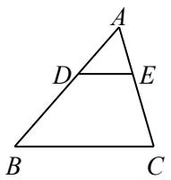

结论：△ADE∽△ABC， ${ \frac { A D } { A B } } = { \frac { A E } { A C } } = { \frac { D E } { B C } }$ ．（共线的边之比相等）

反 A 字型

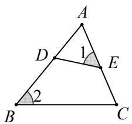

结论： ${ \frac { A D } { A C } } = { \frac { A E } { A B } } = { \frac { D E } { B C } }$ ．（共线的边之积相等）

构造 $\mathbf { A }$ 字模型：遇到线段上的比例端点可以考虑作平行线构造构造 A 字模型

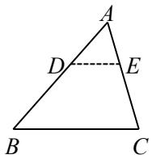

# 二、8 字模型

已知：AC 与 BD 相交于点 O，AB∥CD

【淘宝店铺：向阳百分百】

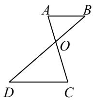

结论： $\triangle \mathrm { O A B } \sim \triangle \mathrm { O C D }$ ， $ { \frac { O A } { O C } } = { \frac { O B } { O D } } = { \frac { A B } { C D } }$ （共线的边之比相等）

构造 8 字模型：遇到三角形或平行四边形边上的比例端点时可以考虑作平行线构造构造 8 字模型

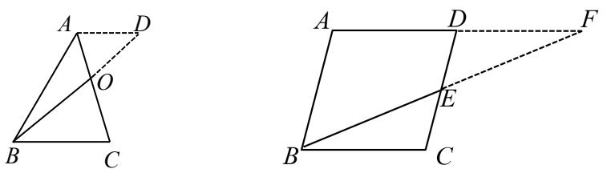

# 三、反 8 字模型（两组相似，四点共圆）

性质一：如左图， $\angle A = \angle D \Leftrightarrow \triangle A O B \backsim \triangle D O C \Leftrightarrow \frac { A B } { C D } = \frac { O A } { O D } = \frac { O B } { O C } .$

性质二：如右图， $\left\{ \begin{array} { l l } { \displaystyle { \angle A O D = \angle B O C } } \\ { \displaystyle { \frac { O A } { O D } = \frac { O B } { O C } \Rightarrow \frac { O A } { O B } = \frac { O D } { O C } } } \end{array} \right. \Delta A O D \backsim \Delta B O C$ (由第一组相似推出第二组相似)

性质三：四点共圆 (圆周角定理)

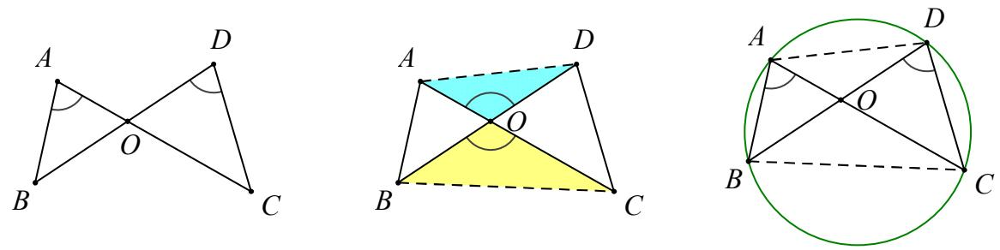

# 四、三角形内接矩形型

三角形的内接矩形：四个顶点都在三角形边上的矩形

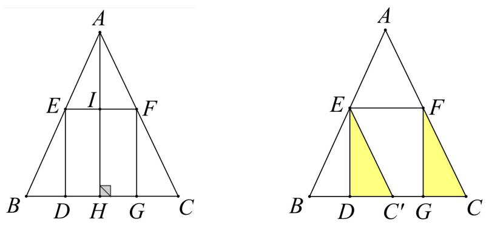

若四边形 DEFG 为矩形，则： $\triangle A E F \sim \triangle A B C \Rightarrow \frac { A I } { A H } = \frac { E F } { B C }$ 特别地，

(1)当四边形 DEFG 为正方形时，若假设其边长为 $a$ ，则： $\frac { A I } { A H } = \frac { E F } { B C } \Rightarrow \frac { A H - a } { A H } = \frac { a } { B C } \Rightarrow a = \frac { A H \cdot B C } { A H + B C }$

(2)当 $E F$ 为三角形的中位线时，矩形 DEFG 的面积最大，最大值为 $S _ { D E F G } = \frac { 1 } { 2 } S _ { \triangle A B C }$

$$
\frac { S _ { \scriptscriptstyle \triangle A E F } } { S _ { \scriptscriptstyle \triangle B D E } + S _ { \scriptscriptstyle \triangle C G F } } = \left( \frac { A E } { B E } \right) ^ { 2 }
$$

证明：把△FGC 向左平移至 $\triangle E D C ^ { \prime }$ ，则 $\Delta A E F \sim \Delta E B C ^ { \prime } , \therefore \frac { S _ { \triangle A E F } } { S _ { \triangle B D E } + S _ { \triangle C G F } } = \left( \frac { A E } { B E } \right) ^ { 2 }$

# 五、倒数模型（三平行结构）

<table><tr><td rowspan="3">倒数型相似 AB //EF // CD</td><td>示意图</td><td>结论</td></tr><tr><td>A D E B</td><td>1 1 1 EF − AB CD</td></tr><tr><td>F C</td><td>1 1 1 S△ABC + SΔBCF</td></tr></table>

# 六、射影定理模型（直角三角形和斜边上的高）

如图，直角三角形被斜边上的高分成的两个直角三角形与原三角形相似，即 $\triangle A C D \sim \triangle A B C \sim \triangle C B D$ 常见的结论有： $C A ^ { 2 } { = } A D \cdot A B$ ， $B C ^ { 2 } = B D \cdot B A$ ， $C D ^ { 2 } { = } D A { \cdot } D B$ （均满足：(公共边) $^ { 2 } =$ 共线的边之积）

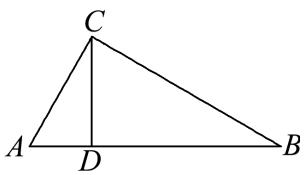

补充：（1）正方形、长方形中经常会出现射影定理模型（十字架模型），如图，A，B，E，G 四点组成射影定理模型．

（2）在圆中也会出现射影定理模型．

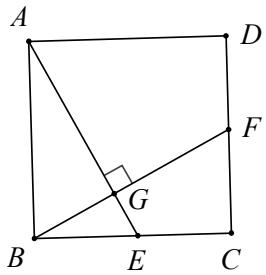

# 七、母子相似模型

（一）基本模型

<table><tr><td rowspan="3">B C</td><td>已知：在△ABC中，点D在AB上，∠ACD=∠B或∠ADC=∠ACB.</td></tr><tr><td>结论：△ACD∽△ABC，</td></tr><tr><td>AD _ AC_ CD AC−</td></tr></table>

# （二）结论推导

结论：△ACD∽△ABC， ${ \frac { A D } { A C } } = { \frac { A C } { A B } } = { \frac { C D } { B C } }$ ＝ CDBC ，AC 2＝AD·AB．证明：∵ $\angle \mathrm { A C D } = \angle \mathrm { B }$ 或 $\angle \mathrm { A D C } = \angle \mathrm { A C B }$ ， $\angle C _ { \mathrm { A D } } { = } \angle \mathrm { B A C }$ ，∴△ACD∽△ABC，∴ AD ${ \frac { A D } { A C } } = { \frac { A C } { A B } } = { \frac { C D } { B C } }$ ∴AC $2 { = } _ { \mathrm { A D } } \cdot _ { \mathrm { A B } }$ ．

母子相似模型也叫共边共角相似模型【淘宝店铺：向阳百分百】

# （三）解题技巧

如果在三角形中有一个公共角和一条公共边，则考虑使用母子相似模型，得到公共边的平方等于两条线段的乘积．

# 八、一线三等角模型

# （一）基本模型

<table><tr><td rowspan=2 colspan=1>23λB</td><td rowspan=1 colspan=1>已知：点P在线段AB上，∠1=∠2=∠3.</td></tr><tr><td rowspan=1 colspan=1>结论1：△CAP∽△PBD.</td></tr><tr><td rowspan=2 colspan=1>DPB</td><td rowspan=1 colspan=1>已知：点P在AB的延长线上，∠1=∠2=∠3.</td></tr><tr><td rowspan=1 colspan=1>结论2：△APC∽△BDP.</td></tr></table>

# （二）结论推导

结论 1： $\triangle C A P \sim \triangle P B D .$ -

证明：∵ $\angle 1 + \angle C + \angle A P C = 1 8 0 ^ { \circ }$ ， $\angle 2 + \angle B P D + \angle A P C = 1 8 0 ^ { \circ }$ ， $\angle 1 = \angle 2$ ，∴ $\angle C = \angle B P D$

结论 2： $\triangle A P C \sim \triangle B D P$ .

证明：∵ $\angle 1 = \angle C + \angle A P C$ ， $\angle 2 = \angle B P D + \angle D$ ，∠3＝∠BPD＋∠APC， $\angle 1 = \angle 2 = \angle 3$ ，∴ $\angle C = \angle B P D$ ， $\angle A P C = \angle D$ ，∴△APC∽△BDP．

# （三）解题技巧

在一条线段上出现三个相等的角时，则考虑使用一线三等角相似模型．找准三个等角，再根据平角性质、三角形内角和证三角形相似，然后利用相似三角形的性质解题．一线三等角模型常以一线三垂直（即 $\angle 1 =$ $\angle 2 = \angle 3 = 9 0 ^ { \circ }$ ，也称为 K 型）的形式出现在矩形或正方形中，在几何综合题中考查

# 九、旋转相似模型(手拉手)

【淘宝店铺：向阳百分百】

# （一）基本模型

<table><tr><td rowspan="2">E B C ↓ E D</td><td>已知：在△ABC中，点D，E分别在AB，AC上，且DE//BC， 将△ADE绕点A旋转.</td></tr><tr><td>结论：△ABD∽△ACE.</td></tr></table>

# （二）结论推导

结论： $\triangle A B D \sim \triangle A C E$   
证明：∵DE∥BC，∴ $\angle A D E { = } \angle A B C$ ， $\angle A E D = \angle A C B$ ，   
$\therefore \triangle A D E \sim \triangle A B C , \ \therefore \ \underbrace { A D } _ { A E } = \underbrace { A B } _ { A C } .$   
∵ $\angle B A D = \angle C A E$ ，∴△ABD∽△ACE

# （三）解题技巧

如果图形中出现共顶点、顶角相等、有旋转时，可以考虑用旋转相似模型；如果图形中没有出现共顶点、顶角相等，也没有旋转时，可以通过作辅助线构造旋转相似．在旋转相似模型中，有一对三角形相似，可以推出另一对三角形相似，再结合已知条件求解．

# 十、十字架模型

【正方形内的十字架结构】

垂直 相等，相等 垂直

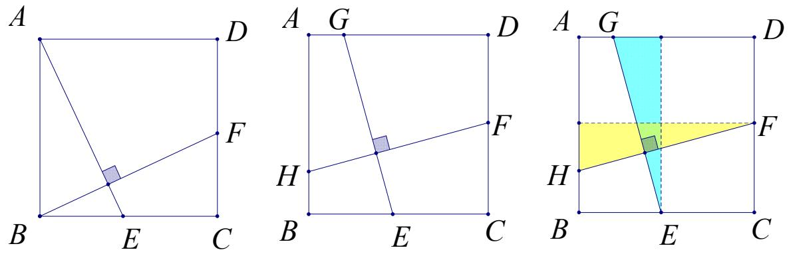

# 【十字结构在矩形中】

如图，在矩形 ABCD 中， $\mathrm { A B } { = } { \mathrm { m } }$ ， $\mathrm { A D } { = } \mathrm { n }$ ，在 AD 上有一点 E，若 CE⊥BD，则 ${ \frac { C E } { B D } } { = } { \frac { C D } { B C } } { = } { \frac { m } { n } }$ ，即 CE和 BD 之比等于矩形邻边之比

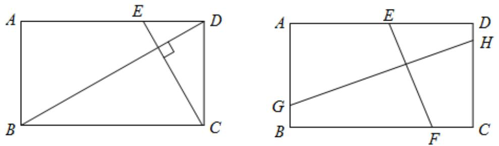

一般情况时，也满足（注意 E，F，G，H 四点的位置不能在同一条边上）

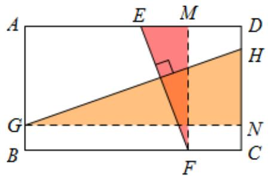

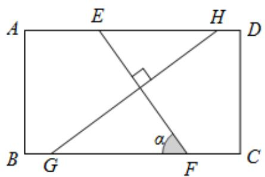

# 【十字结构在直角三角形中】

我们知道直角三角形是可以看成是连接矩形对角线后分成的图形，如图，补成矩形 ACBH，延长 CE 交 AH于点 G

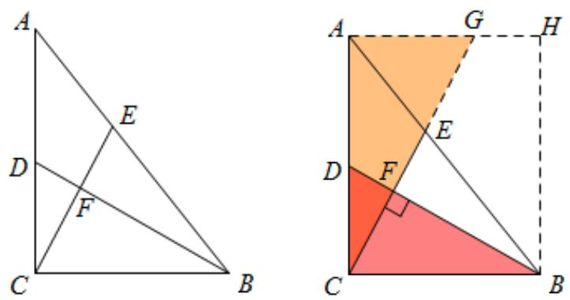

# 【十字结构在其他四边形中】：补成长方形即可

如图，把边长为 $A B = _ { 2 } \sqrt { 2 }$ ， $B C { = } 4$ 且 $\angle B = 4 5 ^ { \circ }$ 的平行四边形 ABCD 对折，使点 $B$ 和 $D$ 重合，求折痕 MN的长

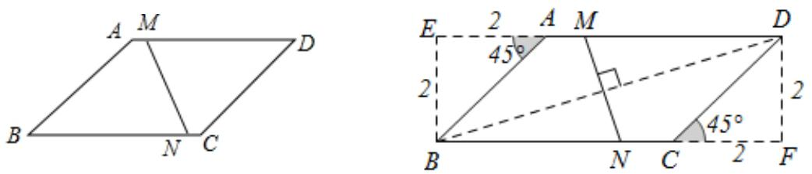

如图，若 $B A { = } B C { = } 6$ ， $D A { = } D C { = } 8$ ， $\angle B A D = 9 0 ^ { \circ }$ ． $D E \bot C F$ ，请求出 $D E$ ： $C F$ 的值

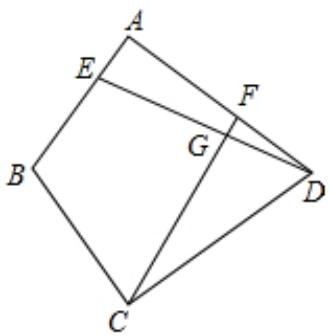

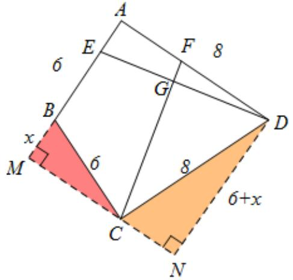

# 十一、对角互补模型

【模型解读】四边形或多边形构成的几何图形中，相对的角互补。该题型常用到的辅助线主要是顶定点向两边做垂线，从而证明两个三角形相似。

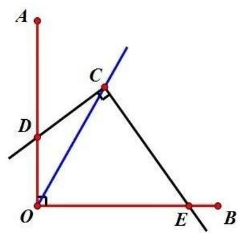

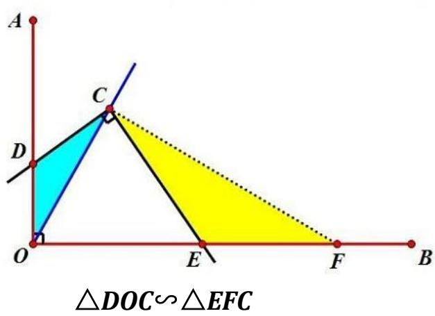

# 十二、双高模型

双高模型：可谓“相似成灾”

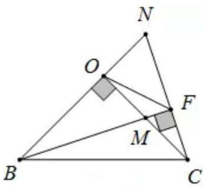

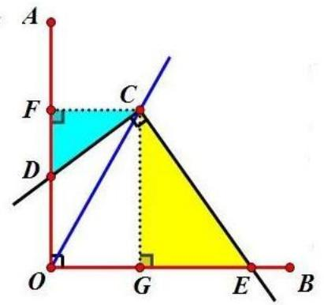

△FDC∽△GEC

共有 8 组相似！

①Rt△BOM∽Rt△BFN∽Rt△CFM∽Rt△CON;

②△BCM∽△OFM(蝴蝶相似必成队）

③△NOF∽△NCB（反 A 型）

# 核心·题型

# 题型一 A 字模型

# 2023·四川成都·真题

1．如图，在 ${ \triangle A B C }$ 中， $D$ 是边 $A B$ 上一点，按以下步骤作图： $\textcircled{1}$ 以点A为圆心，以适当长为半径作弧，分别交 $A B$ ， $A C$ 于点 $M$ ， $N$ ； $\textcircled{2}$ 以点 $D$ 为圆心，以 $A M$ 长为半径作弧，交 $D B$ 于点 $M ^ { \prime }$ ； $\textcircled{3}$ 以点 $M ^ { \prime }$ 为圆心，以 $M N$ 长为半径作弧，在 $\angle B A C$ 内部交前面的弧于点 $N ^ { \prime }$ ： $\textcircled{4}$ 过点 $N ^ { \prime }$ 作射线 $D N ^ { \prime }$ 交 $B C$ 于点 $E$ ．若$\triangle B D E$ 与四边形 $A C E D$ 的面积比为4 : 21，则 $\frac { B E } { C E }$ 的值为

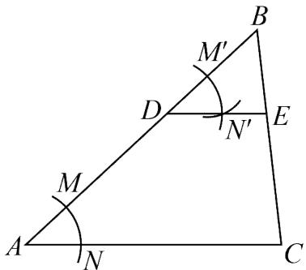

【答案】 $\frac { 2 } { 3 }$

【详解】解：根据作图可得 $\angle B D E = \angle A$ ，$\therefore D E / / \ A C$ ，  
$\triangle B D E ^ { \sim } \triangle B A C$ ，  
∵ $\triangle B D E$ 与四边形 $A C E D$ 的面积比为4 : 21，

【淘宝店铺：向阳百分百】

$\therefore { \frac { S _ { _ { \scriptscriptstyle \Delta B D C } } } { S _ { _ { \scriptscriptstyle \Delta B A C } } } } = { \frac { 4 } { 2 1 + 4 } } = \left( { \frac { B E } { B C } } \right) ^ { 2 }$   
BC BE 25   
BE 2   
C E 3

# 2022 宜 宾

2．如图， $\triangle A B C$ 中，点 $E , F$ 分别在边 $A B , A C$ 上， $\angle 1 = \angle 2$ ．若 $B C { = } 4$ ， $A F { = } 2$ ， $C F { = } 3$ ，则 $E F { = } $ .

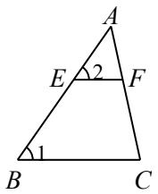

【答案】 $\frac { 8 } { 5 }$

【解析】∵ $\cdot$ ， $\angle A = \angle A$ ，∴△ABC∽△AEF，$\frac { B C } { E F } \quad \frac { A C } { A F }$ $\frac { 4 } { E F } \frac { 2 + 3 } { 2 }$ ∴EF＝ 85

# 2023·山东潍坊·真题

3．在《数书九章》（宋·秦九韶）中记载了一个测量塔高的问题：如图所示， $A B$ 表示塔的高度， $C D$ 表示竹竿顶端到地面的高度， $E F$ 表示人眼到地面的高度， $A B$ 、 $C D$ 、 $E F$ 在同一平面内，点 A、C、 $E$ 在一条水平直线上．已知 $A C = 2 0$ 米， $C E = 1 0$ 米， $C D = 7$ 米， $E F = 1 . 4$ 米，人从点 $F$ 远眺塔顶 $B$ ，视线恰好经过竹竿的顶端 $D$ ，可求出塔的高度．根据以上信息，塔的高度为 米．

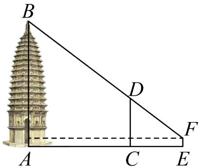

【答案】18.2

【详解】解：如图，过 $F$ 作 $F Q \bot A B$ 于 $\boldsymbol { Q }$ ，交 $C D$ 于 $H$ ，  
则 $F H = C E = 1 0$ ， $Q H = A C = 2 0$ ， $F Q = A E = A C + C E = 3 0 ~ , ~ E F = C H = A Q = 1 . 4 ~ ,$ ，  
$\cdot D H { = } 7 { - } 1 . 4 { = } 5 . 6$ ，

【淘宝店铺：向阳百分百】

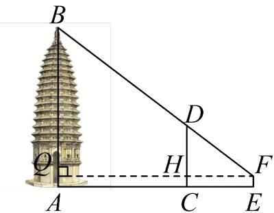

$D C / / B A$ ，  
$\therefore \Delta F D H ^ { \sim } { \_ } F B Q$ ，  
${ \frac { D H } { B Q } } = { \frac { F H } { F Q } }$ $\frac { 1 0 } { 3 0 } = \frac { 5 . 6 } { Q B }$ 解得： $Q B = 1 6 . 8$ ，经检验符合题意；∴ $A B = A Q + Q B = 1 . 4 + 1 6 . 8 = 1 8 . 2$ （米）

# 2022·浙江杭州·真题

4．如图，在 $\triangle A B C$ 中，点 $D$ ， $E$ ， $F$ 分别在边 $A B$ ，AC， $B C$ 上，连接 $D E$ ， $E F$ ，已知四边形 BFED 是平行四边形， $\frac { D E } { B C } = \frac { I } { 4 }$

(1)若 $A B = 8$ ，求线段 $A D$ 的长(2)若 $\nabla A D E$ 的面积为 1，求平行四边形 BFED 的面积．

【答案】(1)2；(2)6

【详解】（1）∵四边形 BFED 是平行四边形，  
∴ DE∥BC ,  
$\triangle A D E \sim \triangle A B C$ ，$\cdot \frac { D E } { B C } = \frac { A D } { A B }$ ,  
$\frac { D E } { B C } = \frac { I } { 4 }$ ,AD 1AB 4  
$\therefore A D = { \frac { 1 } { 4 } } A B = { \frac { 1 } { 4 } } \times 8 = 2 ;$ ；  
（2）∵四边形 BFED 是平行四边形，

【淘宝店铺：向阳百分百】

∴ DE∥BC ， EF∥AB， $\cdot$ ，  
∴ $\angle A E D = \angle E C F , \angle E A D = \angle C E F$   
∴ADE ∽EFC  
$\therefore \frac { S _ { \scriptscriptstyle \triangle A D E } } { S _ { \scriptscriptstyle \triangle E F C } } = \left( \frac { D E } { F C } \right) ^ { 2 } ,$ ,  
$\frac { D E } { B C } = \frac { I } { 4 }$ ，  
∴ FC  BC  DE  4DE  DE  3DE ，1DE DEFC 3 DE 3   
$\therefore { \frac { S _ { \scriptscriptstyle \Delta A D E } } { S _ { \scriptscriptstyle \Delta E F C } } } = \left( { \frac { D E } { F C } } \right) ^ { 2 } = \left( { \frac { 1 } { 3 } } \right) ^ { 2 } = { \frac { 1 } { 9 } } ,$   
$\triangle A D E \sim \triangle A B C ~ \frac { D E } { B C } = \frac { I } { 4 }$ ADES  DE 1ABCS  BC  4 16  
∵ 1 ADES△  ，  
∴ 9, 16 EFC ABCS  S  ，  
∴ 16 9 1 BFED ABC EFC ADES  S  S  S    

# 2023·浙江温州·真题

5．如图，已知矩形 $A B C D$ ，点 $E$ 在 $C B$ 延长线上，点 $F$ 在 $B C$ 延长线上，过点 $F$ 作 $F H \perp E F$ 交 $E D$ 的延长线于点 $H$ ，连结 $A F$ 交 $E H$ 于点 $G$ ， $G E = G H$

(1)求证： $B E = C F$ ，(2)当 $\frac { A B } { F H } = \frac { 5 } { 6 }$ ， $A D = 4$ 时，求 $E F$ 的长．【答案】(1)见解析； $( 2 ) E F = 6$

【详解】（1）解：∵ $F H \perp E F$ ， $G E = G H$ ，  
∴ $G E = G F = G H$ ，  
∴ $\angle G F E = \angle E$   
∵四边形 ABCD是矩形，  
∴ $A B = C D$ ， $\angle A B C = \angle D C B = 9 0 ^ { \circ } \ :$ ，  
$\triangle A B F { \cong } \triangle D C E ( \mathrm { A A S } )$ ，  
∴ $B { \cal F } = C E$ ，  
$\therefore B F - B C = C E - B C$ ，即 $B E = C F$

【淘宝店铺：向阳百分百】

（2）∵CD∥FH ，∴△DCE  △HFE ，$\cdot \frac { E C } { E F } = \frac { C D } { F H }$ • $\mathbf { \partial } \cdot { \cal C D } = { \cal A B }$ ，$\cdot \frac { C D } { F H } { = } \frac { A B } { F H } { = } \frac { 5 } { 6 } .$ 设 $B E = C F = x B C = A D = 4$ ，$\therefore C E = x + 4 , E F = 2 x + 4$ ，$\cdot { \frac { x + 4 } { 2 x + 4 } } = { \frac { 5 } { 6 } }$ 解得 $x = 1$ ，∴ $E F = 6$

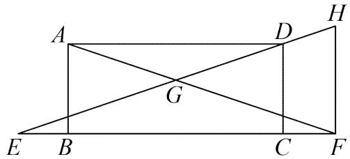

6．小言家窗外有一个路灯，每天晚上灯光都会透过窗户照进房间里，小言一直想知道这个路灯的准确高度，当学了相似三角形的知识后，她意识到自己可以解决这个问题了！如图，路灯顶部 A 处发光，光线透过窗子 $B C$ 照亮地面的长度为 $D E$ ，小言测得窗户距离地面高度 $B F = 0 . 7 \mathrm { m }$ ，窗高 $B C = 1 . 4  { \mathrm { m } }$ ，某一时刻，$F D = 0 . 7 \mathrm { m }$ ， $D E = 2 . 1 \mathrm { m }$ ，请你根据小言测得的数据，求出路灯的高度 $O A$

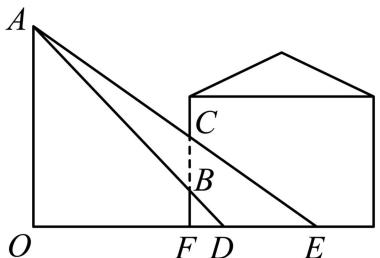

【答案】路灯的高度 $O A$ 为 6.3 米

【详解】解： $A O \bot O E$ 且 $B F \bot D F$ $\cdot \triangle A O D ^ { \sim } \triangle B F D$ ， $\triangle A O E { \sim } _ { \triangle } C F E$ ，$\cdot \frac { A O } { O D } { = } \frac { B F } { D F } { = } \frac { 0 . 7 } { 0 . 7 } { = } 1$ ，  
设 $O F = x$ ，则 $A O = O D = x + 0 . 7$ ，  
又 $\cdot _ { \triangle A O E } \sim _ { \triangle C F E }$ ，${ \frac { A O } { O E } } { = } { \frac { C F } { E F } }$ , 即 $\frac { 0 . 7 + x } { 2 . 8 + x } = \frac { 2 . 1 } { 2 . 8 }$   
解得： $x = 5 . 6$ ，

【淘宝店铺：向阳百分百】经检验 $x = 5 . 6$ 是原方程的解， $\cdot \ A O = x + 0 . 7 = 6 . 3 \mathrm { m }$

# 2022 安 徽

7．如图，四边形 ABCD 是正方形，点 $E$ 在边 $A D$ 上， $\triangle B E F$ 是以 $E$ 为直角顶点的等腰直角三角形， $E F$ ，$B F$ 分别交 $C D$ 于点 $M , N$ ，过点 $F$ 作 $A D$ 的垂线交 $A D$ 的延长线于点 $G$ ，连接 $D F$ ，若 $D E { = } 1$ ， $D F { = } _ { 2 { \sqrt { 2 } } }$ ，则 $M N { = }$

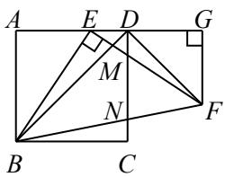

【答案】 $\frac { 2 6 } { 1 5 }$

【解析】延长 BC 与 GF 交于点 H

可证△ABE≌△GEF，∴E ${ \mathrm { G } } { = } _ { \mathrm { A B } } { = } _ { \mathrm { A D } }$ ， $\cdot$ ，  
∴DG $\cdot$ AE，∴ $\frac { \sqrt { 2 } } { 2 } D F$ ，  
$\scriptstyle \cdot \mathrm { B C } = \mathrm { C D } = \mathrm { G H } = \mathrm { E G } = \mathrm { D E } + \mathrm { D G } = 3$ ，  
∴BH $= 5$ ， $\cdot$   
可证△EDM∽△EGF， $\triangle \mathrm { B C N } \sim \triangle \mathrm { B H F }$ ，  
$\frac { D E } { D M } \quad \frac { E G } { G F } \quad \frac { B C } { N C } \quad \frac { B H } { F H }$   
$\frac { 1 } { D M } \frac { 3 } { 2 } \frac { 3 } { N C } \frac { 5 } { 1 }$   
$\frac { 2 } { 3 } \frac { 3 } { 5 }$   
$\therefore \mathrm { M N = C D - D M - N C } = \frac { 2 6 } { 1 5 } .$

8．（2023·深圳·九年级统考期中）如图，在 $\mathrm { R t } _ { \Delta A B C }$ 中， $\angle A B C = 9 0 ^ { \circ }$ ， $A B = 6$ ， $B C = 8$ ， BAC ， ACB的平分线相交于点 $E$ ，过点 $E$ 作 $E F / / B C$ 交 $A C$ 于点 $F$ ，则 $E F$ 的长为（ ）

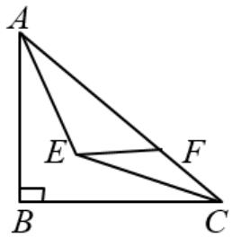

A． 52 B． 154 C． 83 D． 103

【答案】D

【分析】延长 $F E$ 交 $A B$ 于点 $D$ ，作 $E G \bot B C$ ，作 $E H \bot A C$ ，由 $E F / / B C$ 可证四边形 BDEG 是矩形，由角平分线可得 $\_$ 、 $\angle D A E { = } \angle H A E$ ，从而知四边形BDEG是正方形，再证 $-$ 得 $A D { = } A H$ ， $\cdot$ ，设 $B D { = } B G { = } x$ ，则 $\_$ ， $C G { = } C H { = } 8 – x$ ，由 $\cdot$ 可得 $\cdot$ ，即 $\_$ ， $\cdot$ ，再证 $\_$ 可得 $D F = \frac { 1 6 } { 3 }$ 据此得出 $\_$

【详解】解：如图，延长 $F E$ 交 $\cdot$ 于点 $\cdot$ ，作 $E G \bot B C$ 于点 $G$ ，作 $E H \bot A C$ 于点 $\cdot$ ，

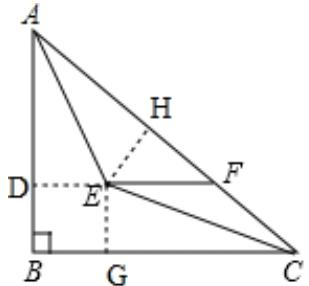

∵EF//BC， $\angle A B C { = } 9 0 ^ { \circ }$ ，  
∴FD⊥AB，  
∵EG⊥BC，  
∴四边形 BDEG 是矩形，  
∵ $A E$ 平分 $\cdot$ ， $\cdot$ 平分 $\angle A C B$ ，  
$\cdot { \cal E } { \cal D } { = } { \cal E } { \cal H } { = } { \cal E } { \cal G }$ ， $-$ ，  
∴四边形 BDEG 是正方形，  
在 $\triangle D A E$ 和 $\triangle H A E$ 中，  
$\left\{ \begin{array} { c } { \angle A D E = \angle A H E } \\ { \angle D A E = \angle H A E } \\ { A E = A E } \end{array} \right.$   
∴ $-$ ，  
∴ $. A D { = } A H$ ，  
同理△CGE≌△CHE（AAS），  
∴ $C G { = } C H$ ，  
设 $B D { = } B G { = } x$ ，则 $\_$ ， $\_$ ，  
$\therefore A C = \sqrt { A B ^ { 2 } + B C ^ { 2 } } = \sqrt { 6 ^ { 2 } + 8 ^ { 2 } } = 1 0 \ ,$ ，  
∴ $\_$ ，即 $\_$ ，  
解得： $\cdot$ ，  
$\scriptstyle \cdot . B D = D E = 2$ ， $\cdot$ ，  
∵DF//BC，  
∴ $\cdot \triangle A D F \sim \triangle A B C ,$ ，$\cdot \frac { A D } { A B } { = } \frac { D F } { B C }$   
$\therefore { \frac { 4 } { 6 } } = { \frac { D F } { 8 } } \therefore D F = { \frac { 1 6 } { 3 } } \therefore E F = { \frac { 1 6 } { 3 } } - 2 = { \frac { 1 0 } { 3 } }$

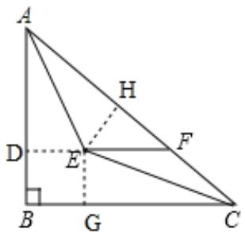

# 2023·广 东 ·真 题

9．边长分别为 10，6，4 的三个正方形拼接在一起，它们的底边在同一直线上（如图），则图中阴影部分的面积为

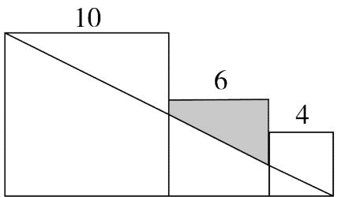

【答案】15 【详解】解：如图，

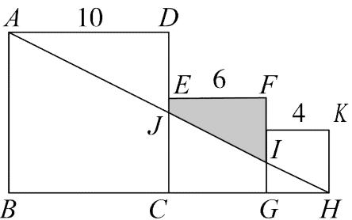

由题意可知 $A D = D C = 1 0 , C G = C E = G F = 6 , \angle C E F = \angle E F C$  90 ， GH  4，  
∴ $. C H = 1 0 = A D$ ，  
∵ $\angle D = \angle D C H = 9 0 ^ { \circ }$ , $\angle A J D = \angle H J C$ ，  
$\triangle A D J { \cong } \triangle H C J ( \mathrm { A A S } )$ ，

【淘宝店铺：向阳百分百】

∴ $\mathbf { \nabla } \cdot C J = D J = 5$ ，  
∴ EJ  1，  
∵GI∥CJ ，  
∴HGI∽HCJ ，GI GH 2CJ CH 5 ,  
∴GI  2 ，  
∴ FI  4 ，  
$\therefore S _ { \scriptscriptstyle { \dot { \imath } ^ { * } \bar { \jmath } ^ { * } \bar { \jmath } ^ { * } E J I F } } = \frac { 1 } { 2 } \big ( E J + F I \big ) { \cdot } E F = 1 5$

# 2023·山东泰安·真题

10．如图，在 ${ \triangle A B C }$ 中， $A C = B C = 1 6$ ，点 $D$ 在 $A B$ 上，点 $E$ 在 $B C$ 上，点 $B$ 关于直线 $D E$ 的轴对称点为点$B ^ { \prime }$ ，连接 $D B ^ { \prime }$ ， $E B ^ { \prime }$ ，分别与 $A C$ 相交于 $F$ 点， $G$ 点，若 $A F = 8$ ， ${ D F } = 7 , { B ^ { \prime } F } = 4$ ，则 $C G$ 的长度为

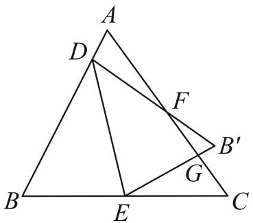

【答案】 4.5

【详解】解：∵ $A C = B C = 1 6$ ，  
∴ $\angle A = \angle B$ ，  
由折叠的性质可得 $\angle B = \angle B ^ { ' }$ ，  
∴ $\angle A = \angle B ^ { ' }$ ，  
又∵ $\angle A F D = \angle B ^ { \prime } F G$ ，  
$\triangle A F D \sim _ { \triangle } B ^ { \prime } F G$ ${ \frac { A F } { B ^ { \prime } F } } { = } { \frac { D F } { G F } }$ , 即 $\frac { 8 } { 4 } = \frac { 7 } { G F }$   
$G F = 3 . 5 \quad \therefore C G = A C - A F - G F = 4 . 5$

11．如图，在 $\mathrm { R t } \triangle A B C$ 中， $\angle C = 9 0 ^ { \circ }$ ，棱长为 1 的立方体的表面展开图有两条边分别在 $A C$ ， BC 上，有两个顶点在斜边 $A B$ 上则图中阴影部分的面积为

【淘宝店铺：向阳百分百】

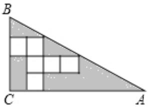

【答案】10【详解】解：如图：

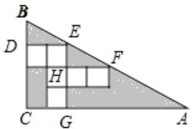

由 题 意 得 ： △BDE 、 EHF 、 △EGA 是 直 角 三 角 形 ， 四 边 形 DEGC 是  
$B C / / E G , D E / / H F / / A C , D E = H F = 2 , D C = E G = 3 , H E = 1$   
 $. \angle B D E = \angle E H F = \angle E G A = 9 0 ^ { \circ }$ ，DEB=HFE=GAE  
 $. \triangle E H F \sim \triangle E G A$   
$\therefore { \frac { H E } { E G } } = { \frac { H F } { A G } }$   
在 $\triangle B D E$ 和 $\triangle E H F$ 中  
$\left\{ \begin{array} { c } { \angle B D E = \angle E H F } \\ { D E = H F } \\ { \angle D E B = \angle H F E } \end{array} \right.$   
△BDE  △EHF  ASA ，  
DB  HE 1，  
1 23 A G  
 $A G = 6$ ，  
$\therefore S _ { \triangle \cup B C } = S _ { \triangle \cup D E } + S _ { \triangle E G A } + S _ { \triangle \natural \natural D E G C } = \frac { 1 } { 2 } \times 1 \times 2 + \frac { 1 } { 2 } \times 3 \times 6 + 2 \times 3 = 1 6 \quad \therefore$

# 2023·四川眉山·真题

12．如图， ${ \triangle A B C }$ 中， $A D$ 是中线，分别以点 $A$ ，点 $B$ 为圆心，大于 $\frac { 1 } { 2 } A B$ 长为半径作弧，两孤交于点 $M , N .$ ．直线 $M N$ 交 $A B$ 于点 $E$ ． 连接 $C E$ 交 $A D$ 于点 $F$ ．过点 $D$ 作 $D G / / C E$ ，交 $A B$ 于点 $G$ ．若 $D G = 2$ ，则 $C F$ 的长为

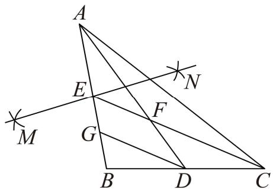

【答案】 $\frac { 8 } { 3 }$

【详解】解：由作图方法可知MN是线段 $A B$ 的垂直平分线，  
∴点 $\cdot$ 是 $A B$ 的中点，  
∴ $C E$ 是 ${ \triangle A B C }$ 的中线，  
又∵ $A D$ 是 ${ \triangle A B C }$ 的中线，且 $A D$ 与 $C E$ 交于点 $F$ ，  
∴点 $F$ 是 ${ \triangle A B C }$ 的重心，$\cdot C F = { \frac { 2 } { 3 } } C E ,$ ，  
$\therefore D G / / C E$ ，  
$\triangle B D G ^ { \sim } \triangle B C E$ ，$\cdot \frac { C E } { D G } = \frac { B C } { B D } = 2$ ，  
$\therefore C E = 2 D G = 4 \therefore C F = { \frac { 2 } { 3 } } C E = { \frac { 8 } { 3 } }$

# 2022·江苏淮安·真题

13．如图，在 $\mathrm { R t } \triangle A B C$ 中， $\angle C = 9 0 ^ { \circ }$ ， $A C = 3$ ， $B C = 4$ ，点 $D$ 是 $A C$ 边上的一点，过点 $D$ 作 $D F / / A B$ ，交 $B C$ 于点 $F$ ，作 $\angle B A C$ 的平分线交 $D F$ 于点 $E$ ，连接 $B E$ ．若 $\triangle A B E$ 的面积是 2，则 $\frac { D E } { E F }$ 的值是

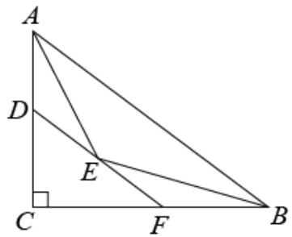

【答案】 $\frac { 3 } { 7 }$

【详解】解：在 $\mathrm { R t } \triangle A B C$ 中，由勾股定理得， $A B = 5$ ，∵ $\triangle A B E$ 的面积是 2，

【淘宝店铺：向阳百分百】

∴点 $E$ 到 $A B$ 的距离为 $\frac { 4 } { 5 }$ ，  
在 $\mathrm { R t } \triangle A B C$ 中，点 $C$ 到 $A B$ 的距离为 ${ \frac { A C \cdot B C } { A B } } = { \frac { 1 2 } { 5 } }$ ,  
∴点 $C$ 到 $D F$ 的距离为 $\frac { 8 } { 5 }$ ， ,  
$\therefore D F / / \ A B$ ，  
$\therefore \triangle C D F \sim \triangle C A B$ ，  
$\therefore { \frac { C D } { C A } } = { \frac { 2 } { 3 } } = { \frac { D F } { A B } } .$ ,  
${ \cal C } D = 2 { \cal D } F = \frac { 1 0 } { 3 }$   
∵ $A E$ 平分 $\angle C A B$ ，  
$\angle B A E = \angle C A E$ ，  
$D F / / \ A B$ ，  
∴ $\angle A E D = \angle B A E$ ，  
$\angle D A E = \angle D E A$ ，  
∴ $D A = D E = 1$ ，  
$\therefore E F = D F - D E = { \frac { 1 0 } { 3 } } - 1 = { \frac { 7 } { 3 } }$ $\frac { D E } { E F } = \frac { 3 } { 7 }$ 故答案为：

14．（2023 上·广东深圳·九年级统考期中）我国古代数学家赵爽利用影子对物体进行测量的方法，至今仍有借鉴意义．如图 1，身高 $1 . 5 \mathrm { m }$ 的小王晚上在路灯灯柱 $A H$ 下散步，他想通过测量自己的影长来估计路灯的高度，具体做法如下：先从路灯底部 $A$ 向东走 20 步到 $M$ 处，发现自己的影子端点落在点 $P$ 处，作好记号后，继续沿刚才自己的影子走 4 步恰好到达点 $P$ 处，此时影子的端点在点 $\varrho$ 处，已知小王和灯柱的底端在同一水平线上，小王的步间距保持一致

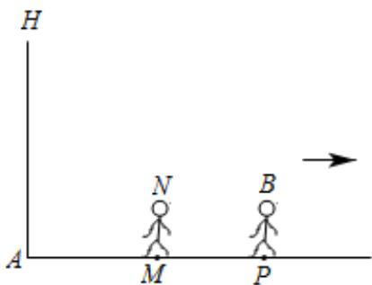  
图1

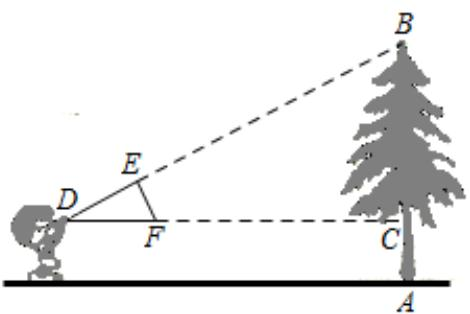  
图2

(1)请在图中画出路灯 $O$ 和影子端点 $\mathcal { Q }$ 的位置(2)估计路灯 $A O$ 的高，并求影长 $P Q$ 的步数．

(3)无论点光源还是视线，其本质是相同的，日常生活中我们也可以直接利用视线解决问题．如图 2，小明同学用自制的直角三角形纸板 $D E F$ 测量树的高度 $A B$ ，他调整自己的位置，设法使斜边 $D F$ 保持水平，并且边$D E$ 与点 $B$ 在同一直线上．测得 $D F = 0 . 5 \mathrm { m }$ ， $E F = 0 . 3 \mathrm { m }$ ， $C D = 1 0 \mathrm { m }$ ，小明眼睛到地面的距离为 $1 . 5 \mathrm { m }$ ，则树高 $A B$ 为_ _m

【答案】(1)见解析；(2)路灯 $A O$ 的高为 $\cdot$ ，影长 $P Q$ 为 $\frac { 2 4 } { 5 }$ 步；(3)9【详解】（1）路灯 $O$ 和影子端点 $\mathcal { Q }$ 的位置如图所示

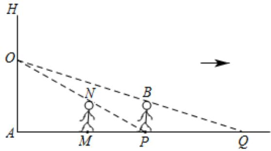

（2） $M N / / O A$ ，  
$\triangle P M N { \sim } \triangle P A O$ ，${ \frac { M N } { O A } } { = } { \frac { P M } { P A } }$ 即 $\frac { 1 . 5 } { O A } = \frac { 4 } { 4 + 2 0 }$   
解得 $O A = 9$   
$P B / / O A$ ，  
$\triangle Q P B ^ { \sim } \triangle Q A O$ ，${ \frac { P B } { O A } } = { \frac { P Q } { Q A } }$ 即 $\frac { 1 . 5 } { 9 } = \frac { P Q } { P Q + 2 4 }$   
解得 $P Q = \frac { 2 4 } { 5 }$   
∴路灯 $A O$ 的高为 $9 \mathrm { m }$ ，影长 $P Q$ 为

（3）如图，∵ $D F = 0 . 5 \mathrm { m }$ ， $E F = 0 . 3 \mathrm { m }$ ， $\angle D E F = 9 0 ^ { \circ }$ ，$\therefore D E = { \sqrt { D F ^ { 2 } - E F ^ { 2 } } } = { \sqrt { \left( 0 . 5 \right) ^ { 2 } - \left( 0 . 3 \right) ^ { 2 } } } = 0 . 4 \mathrm { { m } } ,$ ，

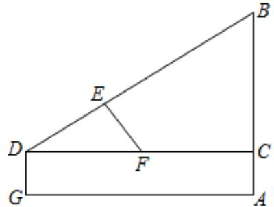

$\tan D = { \frac { E F } { D E } } = { \frac { 0 . 3 } { 0 . 4 } } = { \frac { 3 } { 4 } }$ ∵ tan $D = { \frac { B C } { C D } } = { \frac { 3 } { 4 } } = { \frac { B C } { 1 0 } }$ ， $C D = 1 0 \mathrm { m }$ ，

$\cdot B C = 7 . 5 \mathrm { m }$ ，  
∵四边形 $A C D G$ 是矩形，  
$\therefore D G = A C = 1 . 5 { \mathrm { m } } ,$ ，  
∴ $\cdot A B = A C + B C = 7 . 5 \mathrm { m } + 1 . 5 \mathrm { m } = 9 \mathrm { m }$

# 题型二 “8”字型

# 2022·辽 宁 ·真 题

15．如图，在正方形ABCD中， $E$ 为 $A D$ 的中点，连接 $B E$ 交 $A C$ 于点 $F$ ．若 $A B = 6$ ，则 $\triangle A E F$ 的面积为

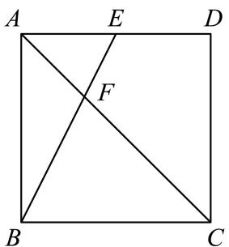

【答案】3

【详解】解：∵四边形 ABCD是正方形， $A B = 6$ ，  
∴ $A D = B C = A B = 6$ ， $A D / / B C$ ，  
$\triangle A E F \sim \triangle C B F$ ，${ \frac { E F } { B F } } { = } { \frac { A E } { B C } }$   
∵ $E$ 为 $A D$ 的中点，  
$\begin{array} { l } { { \displaystyle \therefore { \mathit { A } } E = \frac { 1 } { 2 } { \mathit { A } } D = \frac { 1 } { 2 } { \mathit { A } } B = \frac { 1 } { 2 } { \mathit { B } } C = 3 \ : , } } \\ { { \displaystyle : \frac { E F } { B F } = \frac { A E } { B C } = \frac { 1 } { 2 } \ : , \ : \ : S _ { \scriptscriptstyle { \mathrm { A } } \scriptscriptstyle { B } E } = \frac { 1 } { 2 } { \mathit { A } } E \cdot { \mathit { A } } B = 9 \ : , } } \\ { { \displaystyle : \frac { E F } { B E } = \frac { 1 } { 3 } \ : , \ : : S _ { \scriptscriptstyle { \mathrm { A } } \scriptscriptstyle { B } F } = \frac { 1 } { 3 } S _ { \scriptscriptstyle { \mathrm { A } } \scriptscriptstyle { B } E } = 3 } } \end{array}$

# 2023·四川乐山·真题

16．如图，在平行四边形 $A B C D$ 中， $E$ 是线段 $A B$ 上一点，连结 AC、 $D E$ 交于点 $F$ ．若 $\frac { A E } { E B } = \frac { 2 } { 3 }$ ， 则ADFS △A EFS△

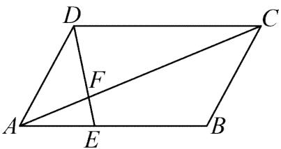

【答案】 $\frac { 5 } { 2 }$

【详解】解：∵四边形 $A B C D$ 是平行四边形，  
$\therefore A B = C D , A B \parallel C D ,$   
∴ $\cdot \angle A E F = \angle C D F , \angle E A F = \angle D C F$   
$\therefore \Delta E A F \sim \Delta D C F$ ，  
$\frac { D F } { E F } { = } \frac { C D } { A E } { = } \frac { A B } { A E }$ AE 2EB 3AB 5AE 2  
$\therefore \frac { S _ { \triangle A D F } } { S _ { \triangle A E F } } = \frac { D F } { E F } = \frac { A B } { A E } = \frac { 5 } { 2 }$

# 2023·湖北武汉·真题

17．如图， $D E$ 平分等边 ${ \triangle A B C }$ 的面积，折叠 $\triangle B D E$ 得到 $\triangle F D E , A C$ 分别与 $D F , E F$ 相交于 $G , H$ 两点．若${ \cal D } G = m , E H = n$ ，用含 $m , n$ 的式子表示 $G H$ 的长是

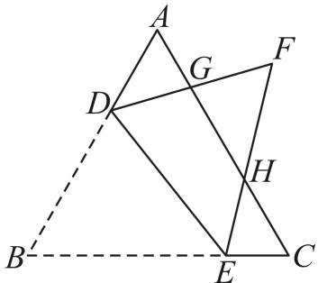

【答案】 $\sqrt { \mathbf { m } ^ { 2 } + \mathbf { n } ^ { 2 } }$

【详解】解： $\triangle A B C$ 是等边三角形，  
 $. \angle A = \angle B = \angle C = 6 0 ^ { \circ }$   
∵折叠 $\triangle B D E$ 得到 $\nabla F D E$ ，  
$\cdot _ { \triangle } B D E { \cong } _ { \triangle } F D E$ ，  
$\therefore S _ { \scriptscriptstyle \Delta B D E } = S _ { \scriptscriptstyle \Delta F D E } ~ \angle F = \angle B = 6 0 ^ { \circ } = \angle A = \angle C$ ，  
 $D E$ 平分等边 ${ \triangle A B C }$ 的面积，  
$\therefore S _ { \mathrm { \scriptsize { : \cdot \cdot } } \mathrm { \scriptsize { S \cdot \cdot \cdot } } \mathrm { \scriptsize { \it S i r a c e D } } } = S _ { \scriptstyle \triangle B D E } = S _ { \scriptstyle \triangle F D E } ,$ ，  
$\therefore S _ { _ { \scriptscriptstyle \Delta F H G } } = S _ { _ { \scriptscriptstyle \Delta A D G } } + S _ { _ { \scriptscriptstyle \Delta C H E } }$ ，  
又 $\angle A G D = \angle F G H , \angle C H E = \angle F H G$

【淘宝店铺：向阳百分百】

$\therefore \Delta A D G \sim _ { \Delta } F H G , _ { \Delta } C H E \sim _ { \Delta } F H G ,$ ，  
$\therefore \frac { S _ { \scriptscriptstyle \Delta A D G } } { S _ { \scriptscriptstyle \Delta F H G } } = \left( \frac { D G } { G H } \right) ^ { 2 } = \frac { m ^ { 2 } } { G H ^ { 2 } } , \frac { S _ { \scriptscriptstyle \Delta C H E } } { S _ { \scriptscriptstyle \Delta F H G } } = \left( \frac { E H } { G H } \right) ^ { 2 } = \frac { n ^ { 2 } } { G H ^ { 2 } } ,$   
$\therefore \frac { S _ { \triangle A D G } } { S _ { \triangle F H G } } + \frac { S _ { \triangle C H E } } { S _ { \triangle F H G } } = \frac { m ^ { 2 } + n ^ { 2 } } { G H ^ { 2 } } = \frac { S _ { \triangle A D G } + S _ { \triangle C H E } } { S _ { \triangle F H G } } = 1 ,$   
$\cdot \ G H ^ { 2 } = m ^ { 2 } + n ^ { 2 }$ ，  
解得 $G H = { \sqrt { m ^ { 2 } + n ^ { 2 } } }$ 或 $G H = - { \sqrt { m ^ { 2 } + n ^ { 2 } } }$ （不符合题意，舍去）

# 2023上·广东深圳·九年级南山实验教育集团南海中学校考期中

18．如图，在 $\square A B C D$ 中， $E$ 为 $A D$ 边上的点， $A E = 2 D E$ ，连接 $B E$ 交 $A C$ 于点 $F$ ， $\triangle A E F$ 的面积为 $4 \mathrm { c m } ^ { 2 }$ ，则 $\triangle A B C$ 的面积为 $\mathrm { c m } ^ { 2 }$ ．

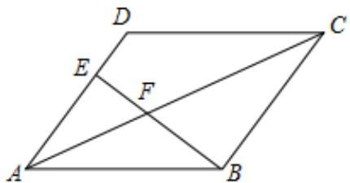

【答案】15

【详解】解：四边形 ABCD是平行四边形，  
$\because A D / / B C$ ， $A D = B C$ ，  
 $\angle A E F = \angle C B F$ ， $\angle E A F = \angle B C F$ ，  
$\cdot _ { \triangle A E F } \sim _ { \triangle C B F }$ ，  
$ \begin{array} { r l } { { \frac { 1 } { \sqrt { 3 } } } } & { = { \frac { \bar { d } \psi } { \sqrt { 3 } } } \ { \frac { - \bar { d } \psi } { \sqrt { 6 } } } } \\ & { \leq C \beta \ { \frac { 1 } { \sqrt { 3 } } } \ \exp } \\ & { \leq { \bar { d } } \ \delta - 2 { \bar { d } } \gamma } \\ & { \leq { \bar { d } } \ \delta - { \frac { 1 } { 2 } } \ \delta } \\ & { \quad \quad \quad \quad \quad \quad \quad \quad \quad \quad \quad \quad \quad \quad \quad \quad \quad \quad \quad \quad \quad \quad \quad \quad } \\ & { \quad \quad \quad \quad \quad \quad \quad \quad \quad \quad \quad \quad \quad \quad \quad \quad \quad \quad \quad \quad \quad \quad \quad \quad \quad \quad \quad \quad \quad \quad } \\ & { \quad \quad \quad \quad \quad \quad \quad \quad \quad \quad \quad \quad \quad \quad \quad \quad \quad \quad \quad \quad \quad \quad \quad \quad \quad \quad \quad \quad \quad \quad \quad \quad \quad \quad \quad \quad } \\ & { \quad \quad \quad \quad \quad \quad \quad \quad \quad \quad \quad \quad \quad \quad \quad \quad \quad \quad \quad \quad \quad \quad \quad \quad \quad \quad \quad \quad \quad \quad \quad \quad \quad \quad \quad \quad } \\ & { \quad \quad \quad \quad \quad \quad \quad \quad \quad \quad \quad \quad \quad \quad \quad \quad \quad \quad \quad \quad \quad \quad \quad \quad \quad \quad \quad \quad \quad \quad \quad \quad \quad \quad \quad \quad \quad } \\ & { \quad \quad \quad \quad \quad \quad \quad \quad \quad \quad \quad \quad \quad \quad \quad \quad \quad \quad \quad \quad \quad \quad \quad \quad \quad \quad \quad \quad \quad \quad \quad \quad \quad \quad } \\ & { \quad \quad \quad \quad \quad \quad \quad \quad \quad \quad \quad \quad \quad \quad \quad \quad \quad \quad \quad \quad \quad \quad \quad \quad \quad \quad \quad \quad \quad \quad \quad \quad \quad } \\ & { \quad \quad \quad \quad \quad \quad \quad \quad \quad \quad \quad \quad \quad \quad \quad \quad \quad \quad \quad \quad \quad \quad \quad \quad \quad \quad \quad \quad \quad \quad \quad \quad \quad \quad } \\ &  \quad \quad \quad \quad \quad \end{array}$

# 2023·四川泸州·真题

19．如图， $E$ ， $F$ 是正方形 $A B C D$ 的边 $A B$ 的三等分点， $P$ 是对角线 $A C$ 上的动点，当 $P E + P F$ 取得最小值时， $\frac { A P } { P C }$ 的值是

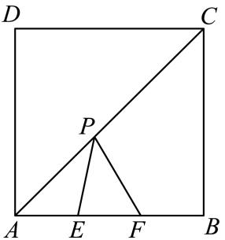

【答案】 $\frac { 2 } { 7 }$

【详解】解：作点 $F$ 关于 $A C$ 的对称点 $F ^ { \prime }$ ，连接 $E F ^ { \prime }$ 交 $A C$ 于点 $P ^ { \prime }$ ，过点 $F ^ { \prime }$ 作 $A D$ 的垂线段，交 $A C$ 于点$\cdot$ ，

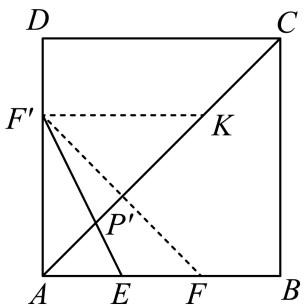

由题意得：此时 $F ^ { \prime }$ 落在 $A D$ 上，且根据对称的性质，当 $\cdot$   
设正方形 ABCD的边长为 $a$ ，则 $A F ^ { \prime } = A F = \frac { 2 } { 3 } a$ ，  
四边形 ABCD是正方形，  
$\therefore \angle F ^ { \prime } A K = 4 5 ^ { \circ } \quad \angle P ^ { \prime } A E = 4 5 ^ { \circ } \quad \ A C = { \sqrt { 2 } } a$ $\cdot \boldsymbol { F } ^ { \prime } \boldsymbol { K } \perp \boldsymbol { A } \boldsymbol { F } ^ { \prime }$ ，$. \angle F ^ { \prime } A K = \angle F ^ { \prime } K A = 4 5 ^ { \circ }$   
$\therefore A K = { \frac { 2 { \sqrt { 2 } } } { 3 } } a$   
 $\cdot \angle F ^ { \prime } P ^ { \prime } K = \angle E P ^ { \prime } A$ ，  
$\cdot . \triangle E ^ { \prime } K P ^ { \prime } \sim \triangle E A P ^ { \prime }$ ，  
$\therefore { \frac { F ^ { \prime } K } { A E } } = { \frac { K P ^ { \prime } } { A P ^ { \prime } } } = 2$ ，  
$\therefore A P ^ { \prime } = \frac { 1 } { 3 } A K = \frac { 2 } { 9 } \sqrt { 2 } a$ ，  
$\therefore C P ^ { \prime } = A C - A P ^ { \prime } = \frac { 7 } { 9 } \sqrt { 2 } a ,$   
 ${ \frac { A P ^ { \prime } } { C P ^ { \prime } } } { = } { \frac { 2 } { 7 } }$ 当 $P E + P F$ 取得最小值时， $\frac { A P } { P C }$ 的值是为 $\frac { 2 } { 7 }$

# 2023·浙江杭州·真题

20．在边长为1的正方形 ABCD中，点 $E$ 在边 $A D$ 上（不与点A ， $D$ 重合），射线 $B E$ 与射线 $C D$ 交于点 $F$ ．

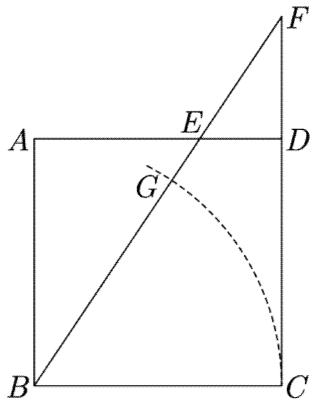

(1)若 $E D = \frac { 1 } { 3 }$ ， 求 $D F$ 的长．   
(2)求证： $A E \cdot C F = 1$ ．   
(3)以点 $B$ 为圆心， $B C$ 长为半径画弧，交线段 $B E$ 于点 $G$ ．若 $E G = E D$ ，求 $E D$ 的长

【答案】 $( 1 ) \frac { 1 } { 2 }$ (2)见解析 ${ ( 3 ) \frac { 1 } { 4 } }$

【详解】（1）解：由题知， $A B = B C = C D = D A = 1$ ，  
若 $E D = \frac { 1 } { 3 }$ 则 $A E = A D - E D = \frac { 2 } { 3 }$   
四边形 ABCD是正方形，  
 $\angle A = \angle F D E = 9 0 ^ { \circ }$ ，  
又 $\angle A E B = \angle F E D$ ，  
$\therefore \triangle A E B \sim \triangle D E F$ ，  
$\therefore { \frac { A B } { D F } } = { \frac { A E } { E D } }$   
即 $\mathrm { ~  ~ \imath ~ } \frac { 1 } { D F } { = } \frac { \displaystyle \frac { 2 } { 3 } } { \displaystyle \frac { 1 } { 3 } } ,$   
$\therefore D F = { \frac { 1 } { 2 } }$ （2）证明：四边形 $A B C D$ 是正方形，  
 $\angle A = \angle C = 9 0 ^ { \circ }$ ， $A B / / C D$ ，$\cdot \angle A B E = \angle F$ ，  
$\therefore \triangle A B E \sim _ { \triangle } C F B$ ，$\cdot \frac { A B } { C F } { = } \frac { A E } { B C }$   
 $\cdot \ A E \cdot C F = A B \cdot B C = 1 \times 1 = 1$   
（3）解：设 $E G = E D = x$ ，  
则 $A E = A D - A E = 1 - x \ , B E = B G + G E = B C + G E = 1 + x \ .$

在 $\mathrm { R t } \triangle A B E$ 中， $A B ^ { 2 } + A E ^ { 2 } = B E ^ { 2 }$ ，即 $1 ^ { 2 } + ( 1 - x ) ^ { 2 } = ( 1 + x ) ^ { 2 }$ ，解得 $x = \frac { 1 } { 4 }$

2023·四川眉山·统考中考真题

21．如图，Y ABCD中，点 $E$ 是 $A D$ 的中点，连接 $C E$ 并延长交 $B A$ 的延长线于点 $F$ ．

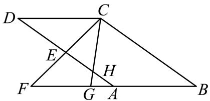

(1)求证： $A F = A B$ ；

(2)点 $G$ 是线段 $A F$ 上一点，满足 $\angle F C G = \angle F C D$ ， $C G$ 交 $A D$ 于点 $H$ ，若 $\mathit { A G } = 2 , \mathit { F G } = 6$ ，求 $G H$ 的长．

【答案】(1)见解析； $( 2 ) \frac { 6 } { 5 }$

【详解】（1）证明：四边形 ABCD是平行四边形， $. A B / / C D$ ， $A B = C D$ ，  
 $. \angle E A F = \angle D$ ，  
 $E$ 是 $A D$ 的中点，  
$\cdot \ A E = D E$ ，  
 $\cdot \angle A E F = \angle C E D$ ，  
$\therefore \Delta A E F \cong \Delta D E C ( { \mathrm { A S A } } ) ,$   
$\therefore A F = C D$ ，  
$\cdot \cdot A F = A B$ ；

（2）解：四边形ABCD是平行四边形，$\therefore D C = A B = A F = F G + G A = 8 , D C \mathcal { N } F A ,$ $\therefore \angle D C F = \angle F \angle D C G = \angle C G B$ ，• $\cdot \angle F C G = \angle F C D$ ，$\cdot \angle F = \angle F C G$ ，$\therefore G C = G F = 6$ ， $\angle D H C = \angle A H G$ ，$\cdot . \triangle A G H { \sim } \triangle D C H$ ，$\cdot { \frac { G H } { C H } } { = } { \frac { A G } { D C } }$ 设 $H G = x$ ,则 $C H = C G - G H = 6 - x$ ，可得方程 ${ \frac { x } { 6 - x } } = { \frac { 2 } { 8 } }$ 解得 $x = \frac { 6 } { 5 }$

22．如图，矩形 ABCD中，点 $E$ 在 $D C$ 上， $D E = B E$ ， $A C$ 与 $B D$ 相交于点 $O$ ． $B E$ 与 $A C$ 相交于点 $F$ ．

【淘宝店铺：向阳百分百】(1)证明： $\triangle O B F { \sim } \triangle E C F$ ；

(2)若 $O F = 3$ ， $E F = 2$ ，求 $B F$ 的长度．【答案】(1)证明见解析； $B F = 1 + \sqrt { 1 9 }$

【详解】（1）解：∵四边形 $A B C D$ 是矩形， $A C$ 与 $B D$ 相交于点 $O$ ，$O A = O C$ ，  
$\cdot \angle O D C = \angle O C D$ ，  
∵ $D E = B E$ ，  
$\therefore \angle E D B = \angle E B D$ ，  
∴ $\angle E C F = \angle O B F$ ，  
又∵ $\angle E F C = \angle O F B$ ，  
$\therefore \triangle { O B F } \sim \triangle { E C F }$ ；  
（2）解：∵ $\cdot \triangle O B F \sim \triangle E C F$ ，  
${ \frac { B F } { C F } } { = } { \frac { O F } { E F } }$ 即 $\frac { B F } { C F } { = } \frac { 3 } { 2 }$   
$B { \cal F } = \frac { 3 } { 2 } C { \cal F }$   
∵四边形 ABCD是矩形，  
$A B / / C D O A { = } O C$ ，  
∴ $\angle O A B = \angle O C D$ ，  
∴ $\angle F B O = \angle F A B$ ，  
$\therefore \triangle F B O \sim \triangle F A B ,$ ，  
${ \frac { O F } { B F } } { = } { \frac { B F } { A F } }$   
$\begin{array} { l } { { \displaystyle B F ^ { 2 } = O F \cdot A F = O F \cdot \left( O F + O A \right) = 3 \big ( O A + 3 \big ) } } \\ { { \displaystyle O A = \frac { 1 } { 3 } B F ^ { 2 } - 3 } } \\ { { \displaystyle C F = O C - O F = O A - O F = O A - 3 } } \\ { { \displaystyle O A = \frac { 2 } { 3 } B F + 3 } } \end{array}$   
${ \frac { 1 } { 3 } } B F ^ { 2 } - 3 = { \frac { 2 } { 3 } } B F + 3$ ，  
$\therefore B F ^ { 2 } - 2 B F - 1 8 = 0 ,$ ，  
解得 $B F = 1 + { \sqrt { 1 9 } }$ （负值已舍去）

# 2022 深 圳

23．在 $\mathrm { R t } \triangle A B C$ 中， $\angle A B C = 9 0 ^ { \circ }$ ， $A B { = } 3$ ， $B C { = } 5$ ， $A E { = } 2 \surd 5$ ，连接 $C E$ ，以 $C E$ 为底作等腰 $\mathbf { R t } \triangle C D E$ ，$C D { = } D E$ ，点 $F$ 是线段 $A E$ 上一点，连接 $B D$ ， $B F$ ， $\angle F B D { = } 4 5 ^ { \circ }$ ，则 $A F$ 的长为

【答案】 $\frac { 3 { \sqrt { 5 } } } { 4 }$

【解析】过点 D 作 DG⊥DB，交 BF 的延长线于点 G，连接 GE

$\cdot \angle \mathrm { F B D } { = } 4 5 ^ { \circ }$ ，∴DB＝DG  
$\_$ ， $-$   
∵CD＝ED，∴△BDC≌△GDE，  
$\cdot _ { \mathrm { { G E } } } { = } \mathrm { { B C } } { = } 5$ ， $\angle D \mathrm { B C } = \angle \mathrm { D G E } .$   
∵ $\_$ ， $\angle F B D { = } 4 5 ^ { \circ }$ ，  
$\therefore \angle { \mathrm { A B F } } + \angle { \mathrm { D B C } } = 4 5 ^ { \circ } , ~ \angle { \mathrm { E G F } } + \angle { \mathrm { D G E } } = 4 5 ^ { \circ } ,$ ，  
$\therefore \angle A \mathrm { B F } = \angle \mathrm { E G F }$   
∵∠AFB＝∠EFG，∴△ABF∽△EGF，  
$\begin{array} { c c } { { \begin{array} { c c } { { \underline { { { A } } } F } } & { { \underline { { { A } } } B } } \\ { { E F } } & { { \overline { { { E } } } G } } \end{array} } } & { { \begin{array} { c c } { { 3 } } \\ { { 5 } } \end{array} } } \end{array} \qquad \begin{array} { c c } { { \underline { { { 3 } } } } _ { A } { E } } & { { \begin{array} { c c } { { \frac { 3 \sqrt { 5 } } { 4 } } } & { { } } \end{array} } } \end{array}$

# 题型三 三角形内接矩形

# 2022·山东东营·真题

24．如图，在 ${ \triangle A B C }$ 中，点 $F , G$ 在 $B C$ 上，点 $E , H$ 分别在 $A B \setminus A C$ 上，四边形EFGH 是矩形， $E H = 2 E F , A D$ 是 ${ \triangle A B C }$ 的高． $B C = 8 , A D = 6$ ，那么 $E H$ 的长为

【答案】 $\frac { 2 4 } { 5 }$

【详解】∵四边形 EFGH 是矩形，  
$E H / / B C$ ，  
$\triangle A E H \sim _ { \triangle A B C }$ ，  
∵ $\cdot$ 和 $A D$ 分别是 $\cdot$ 和 $\triangle A B C$ 的高，  
$\frac { A M } { A D } = \frac { E H } { B C } , D M = E F$   
$A M = A D - D M = A D - E F = 6 - E F$   
∵ $E H { = } 2 E F$ ，  
代入可得： ${ \frac { 6 - E F } { 6 } } = { \frac { 2 E F } { 8 } }$ 解得 $E F { = } \frac { 1 2 } { 5 }$ $\therefore E H = 2 \times \frac { 1 2 } { 5 } = \frac { 2 4 } { 5 }$

25．如图， $A D$ 是 ${ \triangle A B C }$ 的高，点 $E , F$ 在 $B C$ 边上，点 $G$ 在 $A C$ 边上，点 $H$ 在 $B C$ 边上， $B C = 2 1 \mathrm { c m }$ ，高 $A D = 1 5 \mathrm { c m }$ ，四边形 EFGH 是 ${ \triangle A B C }$ 内接正方形，

$( 1 ) { \triangle A H G }$ 与 ${ \triangle A B C }$ 相似吗？为什么？(2)求内接正方形 EFGH 边长 $E F$ ．【答案】(1)相似，理由见解析;(2) $\frac { 3 5 } { 4 }$

【详解】（1）解：相似，理由如下：∵四边形EFGH 是 ${ \triangle A B C }$ 内接正方形，$H G / / B C$ ，  
$\triangle A H G \sim \triangle A B C$ ；

（2）设 $A D$ 与 $H G$ 的交点为 $M$ ，

$\triangle A H G \sim \triangle A B C$ ，  
${ \frac { H G } { B C } } = { \frac { A M } { A D } }$   
$\frac { H G } { 2 1 } = \frac { 1 5 - H G } { 1 5 }$ ,解得 $H G = \frac { 3 5 } { 4 }$

26．如图， $\triangle A B C$ 是一块锐角三角形余料，边 $B C = 1 2 0 \mathrm { m m }$ ，高 $A D { = } 8 0 \mathrm { m m }$ ，要把它加工成矩形零件 PQMN，使一边在 $B C$ 上，其余两个顶点分别在边 $A B$ 、 $A C$ 上．若这个矩形的边 $P N : P Q = 1 : 2$ ，则这个矩形的长、宽各是多少？

【答案】矩形的长为 ${ \frac { 4 8 0 } { 7 } } \mathrm { m m }$ ， 宽是 $\frac { 2 4 0 } { 7 }$

【详解】解：∵PQMN 是矩形，  
∴PQ∥BC，  
∴ $\_$ ，  
设边 $P N$ 为 $\cdot$ ，则 $\cdot$ 为 $\cdot$ ，  
$\therefore { \frac { P Q } { B C } } = { \frac { A P } { A B } }$   
即 ${ \frac { 2 x } { 1 2 0 } } = { \frac { A P } { A B } }$   
∵ $\cdot$ 是高，  
∴PN∥AD，  
$. \triangle P B N { \sim } \triangle A B D ,$ ，  
${ \frac { P N } { A D } } { = } { \frac { B P } { A B } }$   
即 ${ \frac { x } { 8 0 } } = { \frac { B P } { A B } }$   
$\_$ ，  
${ \frac { x } { 8 0 } } + { \frac { 2 x } { 1 2 0 } } = { \frac { B P } { A B } } + { \frac { A P } { A B } } \qquad $   
解得 $\frac { 2 4 0 } { 7 }$ $2 x { = } \frac { 4 8 0 } { 7 }$   
即长为 ${ \frac { 4 8 0 } { 7 } } \mathrm { m m }$ ，宽为 ${ \frac { 2 4 0 } { 7 } } \mathrm { m m }$   
答：矩形的长为 ${ \frac { 4 8 0 } { 7 } } \mathrm { m m }$ ， 宽是 ${ \frac { 2 4 0 } { 7 } } \mathrm { m m }$

27．如图，已知 $\triangle A B C$ 中， $B C { = } 1 0$ ， $B C$ 边上的高 $A H { = } 8$ ，四边形 DEFG 为内接矩形（1）当矩形 DEFG 是正方形时，求正方形的边长

（2）设 $E F { = } x$ ，矩形 DEFG 的面积为 $S$ ，求 $S$ 关于 $x$ 的函数关系式，当 $x$ 为何值时 $S$ 有最大值，并求出最大值．

【答案】（1） $\frac { 4 0 } { 9 }$ （2） $S = - \frac { 5 } { 4 } \bigl ( x - 4 \bigr ) ^ { 2 } + 2 0$ ，当 $x { = } 4$ 时， $\cdot$ 有最大值 20

【详解】（1）设 $\cdot$ ，则 ${ \mathrm { A K } } { = } { \mathrm { A H } } - { \mathrm { K H } } { = } { \mathrm { A H } } - { \mathrm { E F } } { = } 8 \textrm { - } \mathrm { y }$ ，  
∵四边形 DEFG 为矩形，  
∴GF∥BC，  
$-$ ，  
∴AK： $\mathrm { A H } =$ GF：BC，  
∵当矩形 DEFG 是正方形时， $\cdot$ ，  
∴(8﹣y)： ${ 8 = _ { \mathrm { y } } }$ ：10，  
解得： $\mathrm { y } = \frac { 4 0 } { 9 }$   
（2）设 $\cdot$ ，则 $\mathrm { K H } { = } _ { \mathrm { X } }$   
$-$ ，  
由（1）可知： ${ \frac { G F } { 1 0 } } { = } { \frac { 8 - x } { 8 } }$   
解得： $\mathrm { G F } = 1 0 - \frac { 5 } { 4 } \mathrm { x }$ x，  
${ \frac { 5 } { 4 } } \qquad { \frac { 5 } { 4 } } \qquad \qquad \qquad \frac { 5 } { 4 } \qquad \qquad \qquad \quad$ ，  
∴当 $\cdot$ 时 S有最大值，并求出最大值 20

# 题型四 倒数型（三平行结构）

# 湖南株洲·统考中考真题

28．如图，已知 AB、CD、EF 都与 BD 垂直，垂足分别是 B、D、F，且 $\mathbf { A } \mathbf { B } = 1$ ， $\mathrm { C D } { = } 3$ ，那么 EF 的长是( )

A． $\frac 1 3$ B． 23 C． 34 D． 45

【答案】C

【详解】∵ $A B$ 、 $C D$ 、 $E F$ 都与 $B D$ 垂直，  
$\_$ ，  
$\triangle D E F \triangle D A B , \triangle B E F \triangle B C D$   
${ \begin{array} { r l } { { \frac { E F } { A B } } } & { { \frac { D F } { D B } } } { \frac { E F } { C D } } } \\ { } & { } \end{array}  { \frac { B F } { B D } }$   
$\frac { E F } { A B } \begin{array} { c } { \frac { E F } { C D } } \end{array} \frac { D F } { D B } \begin{array} { c } { \frac { B F } { B D } } \end{array} \frac { B D } { B D }$   
∵ $\cdot$ ， $C D { = } 3$ ，  
$\frac { E F } { 1 } \frac { E F } { 3 } \therefore E F = \frac { 3 } { 4 } .$

# 2023·四川内江·真题

29．如图，在 ${ \triangle A B C }$ 中，点 $D$ 、 $E$ 为边 $A B$ 的三等分点，点 $F$ 、 $G$ 在边 $B C$ 上， $A C / / D G / / E F$ ，点 $H$ 为 $A F$ 与$_ { D G }$ 的交点．若 $A C = 1 2$ ，则 $D H$ 的长为（ ）

【淘宝店铺：向阳百分百】

A．1 B． 32 C．2 D．3

【答案】C

【详解】解： $D$ 、 $E$ 为边 $A B$ 的三等分点， $E F / / D G / / A C$ ，  
$\therefore B E = D E = A D B F = G F = C G A H = H F$   
 $A B = 3 B E$ ， $D H$ 是 $\triangle A E F$ 的中位线，  
 $D H = { \frac { 1 } { 2 } } E F$   
$\therefore E F / / A C$ ，$\therefore \angle B E F = \angle B A C , \angle B F E = \angle B C A ,$   
$\cdot . \triangle B E F ^ { \sim } \triangle B A C$ ，${ \frac { E F } { A C } } { = } { \frac { B E } { A B } }$ 即 ${ \frac { E F } { 1 2 } } { = } { \frac { B E } { 3 B E } }$ ,  
解得： $E F = 4$ ，  
$\therefore D H = \frac { 1 } { 2 } E F = \frac { 1 } { 2 } \times 4 = 2$

# 2024 届·深圳中学九年级期中

30．如图，在 ${ \triangle A B C }$ 中，点 $D$ 、 $E$ 为边 $A B$ 三等分点，点 $F$ 、 $G$ 在边 $B C$ 上， $A C / / D G / / E F$ ，点 $H$ 为 $A F$ 与$_ { D G }$ 的交点．若 $H D = 3$ ，则 $A C$ 的长为

【答案】18

【详解】解： $D$ 、 $E$ 为边 $A B$ 的三等分点，  
$B E = E D = D A$ ，  
$\because A C / / D G / / E F$ ，  
$\therefore B F : F G : G C = B E : E D : D A$ ， $A H : F H = A D : E D = 1$ ，  
$\therefore B F = G F = C G \ , A H = H F \ ,$ ，  
 $A B = 3 B E$ ， $D H$ 是 $\triangle A E F$ 的中位线，  
【淘宝店铺：向阳百分百】  
$\therefore D H = { \frac { 1 } { 2 } } E F$   
∵ $D H = 3$ ，则 $E F = 6$ ，  
$Q E F / / \ A C$ ，  
$\angle B E F = \angle B A C , \angle B F E = \angle B C A ,$   
$\cdot . \triangle B E F ^ { \sim } \triangle B A C$ ，  
${ \frac { E F } { A C } } { = } { \frac { B E } { A B } }$ , 即 $\frac { 6 } { A C } = \frac { B E } { 3 B E }$ 解得： $A C = 1 8$

# 题型五 A 字型及 8 字型相结合

# 2023·黑龙江哈尔滨·真题

31．如图， $A C$ ， $B D$ 相交于点 $O$ ， $A B / / D C$ ， $M$ 是 $A B$ 的中点，MN∥AC ，交 $B D$ 于点 $N$ ．若$D O : O B = 1 : 2$ ， $A C = 1 2$ ，则 $M N$ 的长为（ ）

A．2 B．4 C．6 D．8

【答案】B

【详解】解： $A B / / D C$ ，$\cdot { \triangle } D C O { \sim } { \triangle } B A O$ ，  
$\therefore { \frac { D O } { B O } } = { \frac { C O } { A O } } = { \frac { 1 } { 2 } }$   
$\therefore C O = { \frac { 1 } { 2 } } O A$ ，  
$\therefore C O = { \frac { 1 } { 3 } } A C $ ，  
$\because M N / / \operatorname { \partial } A C$ ，  
$\therefore \triangle B N M \sim \triangle B O A$ ，  
$\therefore { \frac { B M } { B A } } = { \frac { M N } { O A } }$ ,  
 $M$ 是 $A B$ 的中点，  
$\therefore { \frac { B M } { B A } } = { \frac { M N } { O A } } = { \frac { 1 } { 2 } } ,$   
$\backslash M N = \frac { 1 } { 2 } O A$

 $. M N = C O$ ，$\therefore M N = \frac { 1 } { 3 } A C = \frac { 1 } { 3 } { \times } 1 2 = 4$

32．如图，在平行四边形 $A B C D$ 中，过点 $B$ 的直线分别与 $A C$ ， $A D$ 及 $C D$ 的延长线相交于点 $E$ ， $F$ ， $G$ ，若$B E { = } 6$ ， $E F { = } 4$ ，则 $F G$ 的长为

【答案】 5

【解析】∵四边形 ABCD 是平行四边形，∴AD∥BC，AB∥CD，∴△AEF∽△CEB，△ABE∽△CGE，$\begin{array} { r } { \begin{array} { c c c c c c c } { \frac { A E } { C E } } & { \frac { E F } { B E } } & { \frac { A E } { C E } } & { \frac { B E } { E G } } & & { \frac { E F } { B E } } & { \frac { B E } { E G } } \end{array} } \end{array}$ $\frac { 4 } { 6 } = \frac { 6 } { E G }$ ∴ $\mathrm { E G } = 9$ ，∴FG $\cdot$

# 2023·安 徽 ·真 题

33．如图，点 $E$ 在正方形 $A B C D$ 的对角线 $A C$ 上， $E F \perp A B$ 于点 $F$ ，连接 $D E$ 并延长，交边 $B C$ 于点 $M$ ，交边 $A B$ 的延长线于点 $G$ ．若 $A F = 2$ ， $F B = 1$ ，则 $M G = { \bf \Xi } ( { \bf \Lambda } )$

A． $2 \sqrt { 3 }$ B． 3 5 C． $\sqrt { 5 } + 1$ D． $\sqrt { 1 0 }$

【答案】B

【详解】解：∵四边形 ABCD是正方形， $A F = 2$ ， $F B = 1$ ，  
$\cdot A D = B C = A B = A F + F G = 2 + 1 = 3$ ， $A D / / C B$ ， $A D \bot A B , C B \bot A B$ ，  
$E F \perp A B$ ，  
$\therefore A D / / E F / / B C$ $\frac { D E } { E M } { = } \frac { A F } { F B } { = } 2$ ，△ADE∽△CME ，$\cdot \frac { A D } { C M } = \frac { D E } { E M } = 2$   
则 $C M = \frac { 1 } { 2 } A D = \frac { 3 } { 2 }$

【淘宝店铺：向阳百分百】

$M B = 3 - C M = \frac { 3 } { 2 }$ ,  
∵BC∥AD ，  
∴GMB∽GDA，  
$\frac { B G } { A G } = \frac { M B } { D A } = \frac { \frac { 3 } { 2 } } { 3 } = \frac { 1 } { 2 }$   
$B G = A B = 3$ ，  
在 $\mathrm { R t } \triangle B G M$ 中， $M G = { \sqrt { M B ^ { 2 } + B G ^ { 2 } } } = { \sqrt { \left( { \frac { 3 } { 2 } } \right) ^ { 2 } + 3 ^ { 2 } } } = { \frac { 3 { \sqrt { 5 } } } { 2 } }$

# 2023·陕 西 ·真 题

34．如图， $D E$ 是 ${ \triangle A B C }$ 的中位线，点 $F$ 在 $D B$ 上， $D F = 2 B F$ ．连接 $E F$ 并延长，与 $C B$ 的延长线相交于点$M$ ．若 $B C = 6$ ，则线段 $C M$ 的长为（ ）

A． $\frac { 1 3 } { 2 }$ B．7 C． $\frac { 1 5 } { 2 }$ D．8

【答案】C

【详解】解： $D E$ 是 ${ \triangle A B C }$ 的中位线，  
DE∥BC ， $D E = \frac { 1 } { 2 } B C = \frac { 1 } { 2 } \times 6 = 3 ,$ ，  
$\therefore \Delta D E F \sim _ { \triangle B M F }$ ，  
$\therefore \frac { D E } { B M } = \frac { D F } { B F } = \frac { 2 B F } { B F } = 2$   
$\therefore B M = { \frac { 3 } { 2 } } ,$   
$\therefore C M = B C + B M = \frac { 1 5 } { 2 }$

35．如图，在 $\mathrm { ~ Y ~ } A B C D$ 中，延长 $A D$ 至点 E，使 $A D = 2 D E$ ，连接 $B E$ 交 $C D$ 于点 F，交 $A C$ 于点 $\mathbf { G }$ ，则 $\frac { C G } { A G }$ 的值是（ ）

A． 23 B． 13 C． $\frac { 1 } { 2 }$ D． 34

【答案】A

【分析】设 $\mathrm { D E } { = } \mathbf { X } ,$ 由 $A D = 2 D E$ 得出 $\cdot$ ， $_ { \mathrm { A E } } { = } 3 \mathrm { x }$ ，利用平行四边形的性质知 AE∥BC， $\_$ ，据此得出 $\Delta \mathrm { B C G } \sim \Delta \mathrm { E A G }$ ，利用相似三角形的性质得 ${ \frac { C G } { A G } } { = } { \frac { B C } { A E } }$ 即可得出答案．

【详解】解:设 $\mathrm { D E } { = } \mathbf { X }$ ，由 $A D = 2 D E$ 知 $_ { \mathrm { A D } = 2 \mathrm { x } }$ ,  
则 $_ { \mathrm { A E } } { = } 3 \mathrm { x }$ ,  
∵四边形 ABCD 是平行四边形，  
∴AE//BC， $\_$ ，  
∴BCG  EAG  
$\cdot \frac { C G } { A G } = \frac { B C } { A E } = \frac { 2 x } { 3 x } = \frac { 2 } { 3 }$

# 题型六 射影定理

# 2023·湖南郴州·真题

36．在 $\mathrm { R t } \triangle A B C$ 中， $\angle B A C = 9 0 ^ { \circ }$ ， $A D$ 是斜边 $B C$ 上的高(1)证明： $\triangle \ A B D { \sim } \triangle \ C B A$ ；(2)若 $A B = 6$ ， $B C = 1 0$ ，求 $B D$ 的长【答案】(1)见解析( $2 ) B D = \frac { 1 8 } { 5 }$

【详解】（1）证明：∵ $\angle B A C = 9 0 ^ { \circ }$ ， $A D$ 是斜边 $B C$ 上的高  
∴ $\angle A D B = 9 0 ^ { \circ }$ ， $\angle B + \angle C = 9 0 ^ { \circ }$   
∴ $. \angle B + \angle B A D = 9 0 ^ { \circ }$ ，  
∴ $\angle B A D = \angle C$   
又∵ $\angle B = \angle B$   
∴△ ABD∽△ CBA ，  
（2）∵△ ABD∽△ CBA  
${ \frac { A B } { C B } } { = } { \frac { B D } { A B } }$

【淘宝店铺：向阳百分百】又 $A B = 6$ ， $B C = 1 0$ $B D = \frac { A B ^ { 2 } } { C B } = \frac { 3 6 } { 1 0 } = \frac { 1 8 } { 5 }$

# 2022 湘 潭

37．如图，在 $\triangle A B C$ 中， $\angle B A C = 9 0 ^ { \circ }$ ， $A B { = } A C$ ，直线 $l$ 经过点 $A$ ，过点 $B$ ， $C$ 分别作 $l$ 的垂线，垂足分别为点 $D$ ， $E$ ，延长 $B D$ 交 $A C$ 于点 $F$ ，若 $C E { = } 3$ ， $D E { = } 1$ ，求△BFC 的面积

解：∵ $-$ ，∴ $-$ ∵ $-$ ， $\cdot$ ， ∴△ABD≌△CAE，∴ $\scriptstyle \mathrm { 1 D = C E = 3 }$ ， $\scriptstyle \cdot \mathrm { B D } = \mathrm { A E } = \mathrm { A D } + \mathrm { D E } = 4$ ， $\sqrt { A D ^ { 2 } + B D ^ { 2 } } \sqrt { 3 ^ { 2 } + 4 ^ { 2 } }$ ∵∠ABD $\cdot$ ∠FBA， $\angle \mathrm { A D B } = \angle \mathrm { F A B }$ ， ∴△ABD∽△FBA， $\frac { A F } { A B } \frac { A D } { B D } \frac { 3 } { 4 }$ $\frac { 3 } { 4 } A B \qquad \frac { 1 } { 4 } A B \quad \frac { 1 } { 4 } A C$ $\therefore \mathrm { S } \triangle \mathrm { B F C } = \frac { 1 } { 4 } \mathrm { S } \triangle \mathrm { A B C } = \frac { 1 } { 4 } \times \frac { 1 } { 2 } \times 5 \times 5 = \frac { 2 5 } { 8 } .$

38．如图，在四边形 ABCD 中，AC 与 BD 相交于点 O，∠ABC＝∠DAC＝90°，AB ＝ 1 ，BO $\mathit { \Pi } _ { A B } = \mathit { \Pi } _ { 1 } , \mathit { \Pi } _ { B O } = \mathit { \Pi } _ { 4 } , \mathit { \Pi } _ { \overline { { { 3 } } } } , \mathit { \Pi } _ { }$ $\frac { S _ { \triangle A B D } } { S _ { \triangle C B D } }$

【答案】 $\frac { 3 } { 3 2 }$ 【解析】过点 B 作 BE $\perp$ AC 于点 E

∵ $\cdot \angle \mathrm { D A C } = 9 0 ^ { \circ }$ ， $\therefore \angle \mathrm { B E O } = \angle \mathrm { D A O }$   
$-$ ，∴ $\cdot \triangle \mathrm { B O E } \sim \triangle \mathrm { D O A }$ ，$\cdot \frac { O E } { O A } = \frac { O B } { O D } = \frac { 4 } { 3 } .$   
$\therefore \angle A \mathrm { { E B } = \angle B E C = \angle A B C = 9 0 ^ { \circ } }$ ， $\angle \mathrm { B A E } = \angle \mathrm { C B E } = \angle \mathrm { C A B }$ ，  
∴△AEB∽△BEC∽△ABC， $\mathbf { \partial } \cdot { \frac { A E } { B E } } = { \frac { B E } { C E } } = { \frac { A B } { B C } } = { \frac { 1 } { 2 } } ,$ $-$   
设 $\mathrm { O E } { = } 4 \mathrm { a }$ ，则 $\mathrm { O A } { = } 3 \mathrm { a }$ ， $\mathrm { A E } { = } 7 \mathrm { a }$ ， $\cdot$ ， $\cdot$ ，  
$\frac { S _ { \triangle A B D } } { S _ { \triangle C B D } } \quad \frac { O A } { O C } \quad \frac { 3 a } { 3 2 a } \quad \frac { 3 } { 3 2 }$

39．如图，将矩形 ABCD 沿线段 AF 折叠，使点 D 落在 BC 边的点 E 处，过点 E 作 EG∥CD 交 AF 于点 G，连接 DG.

（1）求证：△AGE≌△AGD

（2）探究线段 EG、GF、AF 之间的数量关系，并说明理由；

（3）若 $\mathbf { A } \mathbf { G } { = } 6$ ， $\operatorname { E G } = 2 { \sqrt { 5 } }$ ，求 BE 的长.

【答案】（1）证明见解析；（2） $\mathrm { A F } { \cdot } \mathrm { G F } { = } 2 \mathrm { E G } ^ { 2 }$ ，证明见解析；（3）BE 的长为 $\frac { 1 2 } { 5 } \sqrt { 5 }$

【详解】(1)证明：∵ $\cdot$ AEF 是由 $\cdot$ ADF 折叠得到的 ∴AD $\vDash$ AE，∠DAG $\vDash$ ∠EAG 又∵AG $\fallingdotseq$ AG   
∴△AGE≌△AGD

（2） $\mathrm { A F } { \times } \mathrm { G F } { = } 2 \mathrm { E G } ^ { 2 }$ 证明如下：连接 DE 交 GF 于点 O

【淘宝店铺：向阳百分百】

∵△AEF 是由 $\triangle$ ADF 折叠得到  
∠DAG=∠EAG，DF=EF  
∵△AGE≌△AGD  
∴GD=GE， $\cdot$ AGD $\cdot$ ∠AGE  
∴∠ FGD $\cdot$ ∠FGE  
∵EG∥CD  
∴∠DFG $\vDash$ ∠FGE  
∴∠ FGD $\Vdash$ ∠DFG  
∴GD=DF  
∴GD $\cdot$ EG $\cdot$ EF=DF  
∴四边形 DGEF 是菱形  
AF⊥DE， $\mathrm { O F } = { \frac { 1 } { 2 } }$ GF  
$\therefore \angle A \mathrm { D F } = \angle \mathrm { D O F } = 9 0 ^ { \circ }$   
又∵∠DFO $\Vdash$ ∠DFA  
∴△DFO∽△AFD$\therefore { \frac { O F } { D F } } = { \frac { D F } { A F } }$   
$\begin{array} { c c } { { } } & { { 2 } } \\ { { } } & { { } } \end{array}$   
∵ $\mathrm { O F } { = } \frac { 1 } { 2 }$ GF, DF=EG  
${ \frac { 1 } { 2 } } 2$   
即： $\mathrm { A F } { \times } \mathrm { G F } { = } 2 \mathrm { E G } ^ { 2 }$   
（3）过点 G 作 GH⊥CD 于 H  
则四边形 CHGE 是矩形，  
∴CE=GH  
设 $\cdot$ ，则 $\mathrm { A F } { = } 6 { + } \mathrm { x }$ ∵AF×GF=2EG 2 $\sqrt { 5 }$ $\therefore x ( 6 + \mathrm { x } ) = 4 0$   
解得： $\cdot$ ∴GF $\div 4$ ,∴ $\_$

【淘宝店铺：向阳百分百】

在 Rt AEF 中  
${ \sqrt { A F ^ { 2 } - E F ^ { 2 } } } = { \sqrt { 1 0 ^ { 2 } - \left( 2 { \sqrt { 5 } } \right) ^ { 2 } } } = 4 { \sqrt { 5 } }$   
$\sqrt { 5 }$   
∵GH∥AD$-$ (  
$\ { \frac { G F } { A F } } { = } { \frac { G H } { A D } }$   
${ \frac { 4 } { 1 0 } } = { \frac { G H } { 4 { \sqrt { 5 } } } }$   
$\frac { 8 } { 5 } \sqrt { 5 }$   
${ \sqrt { 5 } } { \begin{array} { l } { { \frac { 8 } { 5 } } { \sqrt { 5 } } } \\ { { \sqrt { 5 } } } \end{array} } { \frac { 1 2 } { 5 } } { \sqrt { 5 } }$

# 2022·湖北鄂州·真题

40．如图，在边长为 6 的等边 $\triangle A B C$ 中， $D , E$ 分别为边 $B C , A C$ 上的点， $A D$ 与 $B E$ 相交于点 $P$ ，若 $B D { = } C E { = } 2$ ，则 $\triangle A B P$ 的周长为

【答案】 $6 + { \frac { 1 8 { \sqrt { 7 } } } { 7 } }$

【详解】  
法一图所示，过点 $E$ 作 $\cdot$ 于 $\cdot$ ，  
∵ $\triangle A B C$ 是等边三角形，  
∴ $\cdot$ ， $\angle A B D = \angle B A C = \angle B C E = 6 0 ^ { \circ }$ ，  
∵ $\cdot$ ， $\cdot$ ，  
∴ $\cdot$ ，

【淘宝店铺：向阳百分百】

$A F = A E \cdot \cos \angle E A F = 2 , E F = A E \cdot \sin \angle E A F = 2 { \sqrt { 3 } }$ ，  
$\cdot$ ，  
$\therefore B E = \sqrt { B F ^ { 2 } + E F ^ { 2 } } = 2 \sqrt { 7 } \ ,$ ，  
又∵ $\cdot$ ，  
∴△ABD≌△BCE（SAS），  
$-$ ，  
又∵ $-$ ，  
∴ $-$ ，${ \frac { B D } { A D } } = { \frac { B P } { A B } } = { \frac { D P } { B D } }$   
$\cdot \frac { 2 } { 2 \sqrt { 7 } } = \frac { B P } { 6 } = \frac { P D } { 2 }$ ,  
$B P { = } { \frac { 6 { \sqrt { 7 } } } { 7 } } , \ P D = { \frac { 2 { \sqrt { 7 } } } { 7 } }$   
$\therefore A P = A D - A P = { \frac { 1 2 { \sqrt { 7 } } } { 7 } } ,$   
∴ $\triangle A B P$ 的周长 $= A B + B P + A P = 6 + { \frac { 1 8 { \sqrt { 7 } } } { 7 } }$ ,  
故答案为： $6 + { \frac { 1 8 { \sqrt { 7 } } } { 7 } }$

法二：【解析】过点 A 作 AH⊥BC 于点 H则 $\mathrm { B H } = { \frac { 1 } { 2 } } B C = 3$ ， $\mathrm { A H } = 3 \sqrt { 3 }$ $\cdot \mathrm { B D } = 2 , \therefore \mathrm { D H } = 1 , \therefore \mathrm { A D } = \sqrt { A H ^ { 2 } + D H ^ { 2 } } = 2 \sqrt { 7 } \ .$ ∵ $\cdot$ ， $\_$ ， $\cdot$ ，∴△ABD≌△BCE，∴ $-$ $\cdot \angle \mathrm { A D B } = \angle \mathrm { B D P }$ ，∴△ABD∽△BPD，${ \begin{array} { c c c c c c c } { { \frac { B P } { A B } } } & { { \frac { P D } { B D } } } & { { \frac { B D } { A D } } } & { { } } & { { \frac { B P } { 6 } } } & { { \frac { P D } { 2 } } } & { { \frac { 2 } { 2 { \sqrt { 7 } } } } } \end{array} }$

$\frac { 6 { \sqrt { 7 } } } { 7 }$ $\frac { 2 { \sqrt { 7 } } } { 7 }$ $\therefore \mathrm { A P } = { \frac { 1 2 { \sqrt { 7 } } } { 7 } }$ ,∴△ABP 的周长 $= A B + A P + B P = 6 + { \frac { 1 8 { \sqrt { 7 } } } { 7 } } .$

2023·四川凉山·真题

41．如图，在 $\mathrm { ~ Y ~ } A B C D$ 中，对角线 $A C$ 与 $B D$ 相交于点 $O$ ， $\angle C A B = \angle A C B$ ，过点 $B$ 作 $B E \bot A B$ 交 $A C$ 于点 $E$ ．(1)求证： $A C \perp B D$ ；(2)若 $A B = 1 0$ ， $A C = 1 6$ ，求 $O E$ 的长

【答案】(1)见详解； $\frac { 9 } { 2 }$

【详解】（1）证明： $\angle C A B = \angle A C B$ ，  
 $A B = C B$ ，  
四边形 ABCD是平行四边形，  
四边形 ABCD是菱形，  
 $A C \perp B D$   
（2）解：四边形 $A B C D$ 是平行四边形，  
$\therefore O A = { \frac { 1 } { 2 } } A C = 8 ,$ ，  
$\because A C \sim B D , B E \bot A B ,$ ，  
$\therefore \angle A O B = \angle B O E = \angle A B E = 9 0 ^ { \circ } ,$   
$\therefore O B = { \sqrt { A B ^ { 2 } - O B ^ { 2 } } }$   
2 2 10  8  6 ，  
$\because \angle E B O + \angle B E O = 9 0 ^ { \circ } \ : ,$   
$\angle A B O + \angle E B O = 9 0 ^ { \circ }$   
 $. \angle B E O = \angle A B O$ ，  
$\cdot _ { \triangle } E B O \sim _ { \triangle } B A O$ ，$\cdot \frac { E O } { B O } = \frac { B O } { A O }$ ${ \frac { E O } { 6 } } = { \frac { 6 } { 8 } }$ 解得： $O E = \frac { 9 } { 2 }$

42．如图， ${ \triangle A B C }$ 和 $\triangle A G F$ 是等腰直角三角形， $\angle B A C = \angle G = 9 0 ^ { \circ }$ ， $\triangle A G F$ 的边 $A F$ ， $_ { A G }$ 交边 $B C$ 于点 $D$ ， $E$ ．若 $A D = 4$ ， $A E = 3$ ，则 $\frac { B E } { D C }$ 的值是

【答案】 $\frac { 9 } { 1 6 }$

【分析】利用等腰直角三角形的性质先证明 $\triangle A E D \sim \triangle B E A$ ，可得 $\frac { B E } { A B } = \frac { A E } { A D } = \frac { 3 } { 4 }$ ,设 $B E = 3 x$ ，则 $A B = 4 x = A C$ ,再证明 $\triangle A D E \sim \triangle C D A$ ， 可得 $\frac { A C } { C D } = \frac { A E } { A D } = \frac { 3 } { 4 }$ 可得 $C D = \frac { 1 6 } { 3 } x$ 从而可得结论

【详解】解：∵ ${ \triangle A B C }$ 和 $\triangle A G F$ 是等腰  
∴ $\angle B = \angle F = \angle F A G = 4 5 ^ { \circ } , A B = A C$   
∵ $\angle A E B = \angle A E D$ ，  
$\triangle A E D \sim _ { \triangle B E A }$ ，${ \frac { A D } { A B } } = { \frac { A E } { B E } } = { \frac { D E } { A E } }$ ,而 $A D = 4$ ， $A E = 3$ ，$\scriptstyle { \frac { B E } { A B } } = { \frac { A E } { A D } } = { \frac { 3 } { 4 } }$   
设 $B E = 3 x$ ，则 $A B = 4 x = A C$ ,  
同理可得： $\triangle A D E \sim \triangle C D A$ ，  
${ \frac { A D } { C D } } { = } { \frac { A E } { A C } } { = } { \frac { D E } { A D } }$   
$\therefore { \frac { A C } { C D } } = { \frac { A E } { A D } } = { \frac { 3 } { 4 } } .$ (id  
$\therefore { \frac { B E } { A B } } = { \frac { A C } { C D } } ,$ $\frac { 3 x } { 4 x } = \frac { 4 x } { C D }$ ,即 $C D = \frac { 1 6 } { 3 } x$ ，  
$\frac { B E } { C D } = \frac { 3 x } { \frac { 1 6 } { 3 } x } = \frac { 9 } { 1 6 }$

43．（2023 上·广东深圳·九年级校考期中）如图所示的一张矩形纸片 ABCD（ $A D > A B$ ），将纸片折叠一次，使点 $A$ 与 $C$ 重合，再展开，折痕 $E F$ 交 $A D$ 边于点 $E$ ，交 $B C$ 边于点 $F$ ，交 $A C$ 于点 $O$ ，分别连接 $A F$ 和CE．

（1）求证：四边形 AFCE 是菱形；  
（2）过 $E$ 点作 $A D$ 的垂线 $E P$ 交 $A C$ 于点 $P$ ，求证： $2 A E ^ { 2 } { = } A C { \bullet } A P$ ；

【答案】（1）见解析；（2）见解析；

【详解】解：（1）证明：当顶点 A 与 C 重合时，折痕 EF 垂直平分 AC，  
∴OA=OC， $\angle \mathrm { A O E } { = } \angle \mathrm { C O F } { = } 9 0 ^ { \circ }$ ，  
∵在矩形 ABCD 中，AD∥BC，  
∴∠EAO=∠FCO，  
在△AOE 和△COF 中，  
$\left\{ \begin{array} { l l } { \angle A O E = \angle C O F } \\ { O A = O C } \\ { \angle E A O = \angle F C O } \end{array} \right.$   
∴△AOE≌△COF（ASA），  
∴ $\mathrm { O E = O F }$ ，  
∵OA=OC，  
∴四边形 AFCE 是平行四边形，  
∵EF⊥AC，  
∴平行四边形 AFCE 是菱形  
（2）证明：∵∠AEP $\cdot$ ∠AOE=90°，∠EAO $\Vdash$ ∠EAP，  
∴△AOE∽△AEP，$\cdot \frac { A E } { A P } { = } \frac { A O } { A E } .$   
即 AE2 $\cdot$ AO•AP，  
∵ $\frac { 1 } { 2 }$ AC，  
∴ $\frac { 1 } { 2 }$ AC•AP，  
∴2AE2 $\cdot$ AC•AP

44．如图，在 $\triangle A B C$ 中，点 $D$ 在边 $A B$ 上， $\angle B A C$ 的平分线交 $C D$ 于点 $E$ ，交 $B C$ 于点 $F$ ，已知 $A D { = } 9$ ，BD$= 7$ ， $A C { = } 1 2$ ．

（1）求证： $A C ^ { 2 } = A D \cdot A B$ ；（2）若 $A E { = } 8$ ，求 $E F$ 的长

【详解】（1）证明：∵ $\cdot$ ， $\mathrm { B D } { = } 7$ ， $\cdot$ ，∴AB＝16， $\mathrm { A C } 2 { = } 1 4 4$ ，$-$ ，∴AC $\_$   
（2）解：∵AC $\_$ ， $\cdot \frac { A C } { A D } = \frac { A B } { A C }$   
∵ $\angle C _ { \mathrm { A D } } { = } \angle \mathrm { B A C }$ ，∴△ACD∽△ABC，  
∴ $\angle A C E = \angle A$ BF．  
∵AF 平分 $\angle$ BAC，∴ $\angle C \mathrm { A E } = \angle \mathrm { B A F } ,$ ，  
∴△ACE∽△ABF， $\cdot \frac { A E } { A F } { = } \frac { A C } { A B }$   
$\therefore { \frac { 8 } { \cdot + F } } = { \frac { 1 2 } { 1 6 } } , \mathrm { A F } = { \frac { 3 2 } { 3 } } , \mathrm { E F } = { \frac { 8 } { 3 } } .$

45．如图，在菱形 $A B C D$ 中， $\angle B = 6 0 ^ { \circ }$ ，点 $E$ 为 $A B$ 上一点，将 $\triangle A D E$ 沿 $D E$ 翻折，点 $A$ 落在 $A ^ { \prime }$ 处，连接$C A ^ { \prime }$ 并延长交 $D E$ 于点 $F$ ，若 $A ^ { \prime } C { = } 2$ ， $A ^ { \prime } F { = } 3$ ，求 $E F$ 的长

【详解】解：过点 A' 作 A'G∥DE，交 CD 于点 G，延长 EA' 交 CD 于点 H则 $\frac { C G } { D G } \quad \frac { A ^ { \prime } C } { A F } \quad \frac { 2 } { 3 } \qquad \frac { 3 } { 5 } C D \quad \frac { 3 } { 5 } A D$ 由题意， $\angle { \mathrm { H D E } } = \angle { \mathrm { A E D } } = \angle { \mathrm { H E D } }$ ，∴ $\mathrm { \Delta D H = E H }$ ，∴ $\frac { 3 } { 5 } A D$ 设 $\angle \mathrm { A D F } { = } \angle \mathrm { A ^ { \prime } D F } { = } \mathrm { x }$ ，则 $\angle { \mathrm { A ^ { \prime } D C } } = 6 0 ^ { \circ } - 2 \mathrm { x }$ ，$\angle D \mathrm { A ^ { \prime } C } = \angle \mathrm { D C A ^ { \prime } } = 6 0 ^ { \circ } + \mathrm { x } , ~ \mathrm { \Omega } \mathrm { \Omega } \mathrm { \Omega } \therefore \\\\\angle \mathrm { D F A ^ { \prime } } = 6 0 ^ { \circ }$ ，$-$ ．∵ $\angle \mathrm { A ^ { \prime } E F } = \angle \mathrm { D E A }$ '，∴△A'EF∽△DEA'，${ \begin{array} { l l l l l l } { { \mathit { E F } } } & { { \mathit { \Delta } } { \mathit { \frac { A ^ { \prime } E } { A ^ { \prime } D } } } } & { } & { { \mathit { \frac { E F } { 3 } } } } & { { \mathit { \frac { 3 } { 5 } } } } & { } & { } & { { \mathit { \frac { 9 } { 5 } } } } \end{array} }$

46．（2023 上·四川成都·九年级统考期末）在 ${ \triangle A B C }$ 中，点 $D$ ， $E$ 分别在边 $A B$ ， $B C$ 上，连接 $A E$ ， $C D$ 交于点 $O$ ，且 $\angle A D C = \angle A E C$ ，

(1)求证： $B D \cdot A B = B E \cdot B C$ ：  
(2)当 $D$ 为边 $A B$ 的中点时，且 $C E = 4$ ，  
$\textcircled{1}$ 若 $2 A O = 3 O E$ ，求 $A B$ ；  
$\textcircled{2}$ 若 $\triangle A E C$ 为等腰直角三角形，且 $\angle E A C = 9 0 ^ { \circ }$ ，求四边形 BDOE 的面积

【答案】(1)见解析； $2 \sqrt { 6 } \frac { 7 \sqrt { 3 } } { 3 } - 3$

【详解】（1）证明： $\angle A D C = \angle B + \angle B C D$ ， $\angle A E C = \angle B + \angle B A E$ ，又 $\angle A D C = \angle A E C$ ，  
 $\angle B C D = \angle B A E$ 且 $\angle B = \angle B$ ，  
$\therefore _ { \Delta A B E } \sim _ { \Delta C B D } ( \mathrm { A A } )$ ，  
$\therefore { \frac { B D } { B C } } = { \frac { B E } { A B } }$   
即： $B D \cdot A B = B E \cdot B C$ ；  
（2）解： $\cdot$ 过点 $D$ 做 $D F$ ∥ $A E$ ，设 $O E = 4 k$ ，则 $A O = 6 k$ ，  
又 $D$ 为 $A B$ 中点且 $D F / / A E$ ，  
$\therefore D F = { \frac { 1 } { 2 } } A E = 5 k .$ ．  
$\therefore { \frac { O E } { D F } } { = } { \frac { C E } { C F } } { = } { \frac { 4 } { 5 } }$   
$\therefore C F = 5$ ，  
$\therefore E F = B F = 1 , B C = 6 ,$   
又 $B D \cdot A B = B E \cdot B C$ ，  
$\therefore \frac { 1 } { 2 } A B \cdot A B = 2 \cdot 6$ ，  
解得： $A B = 2 { \sqrt { 6 } }$ ；  
$\cdot$ 过点A做 $A G \bot B C$ ，垂足为点 $G$ ，  
 $\triangle A E C$ 为等腰直角三角形，  
 $\angle A C E = \angle A E C = \angle A D C = 4 5 ^ { \circ }$ 且 $\angle D A C = \angle C A B$ ，  
$\therefore \triangle B A C \sim \triangle C A D$ ，${ \frac { A C } { B A } } { = } { \frac { A D } { A C } }$ ,  
又 $A B = 2 A D$ ，  
 $\cdot \ A B = { \sqrt { 2 } } A C = 4 \ ;$ ，  
在 $\mathrm { R t } \triangle A B G$ 中，  
$\begin{array} { r l } & { \mathrm { ~ \forall ~ } A B = 2 A G = 4 , } \\ & { \mathrm { ~ : ~ } \mathcal { L } M B G = 3 0 ^ { \circ } , } \\ & { \mathrm { ~ : ~ } B G = 2 \sqrt { 3 } , } \\ & { \mathrm { ~ : ~ } B G = 2 \sqrt { 3 } , } \\ & { \mathrm { ~ : ~ } S _ { S , \mathrm { a r g e } } = \frac { 1 } { 2 } S _ { S , \mathrm { a r d c } } = \frac { 1 } { 2 } \cdot \frac { 1 } { 2 } \cdot B G \cdot A G = \sqrt { 3 } + 1 , } \\ & { \mathrm { ~ : ~ } \mathcal { L } M B = 2 A G = 3 0 ^ { \circ } , } \\ & { \mathrm { ~ : ~ } S _ { S , \mathrm { a r g e } } = \frac { 1 } { 2 } \cdot A O \cdot A C = \frac { 4 \sqrt { 3 } } { 3 } , } \\ & { \mathrm { ~ : ~ } S _ { S , \mathrm { a r g e } } = S _ { S , \mathrm { a r g e } } - S _ { S , \mathrm { a r g e } } = 4 - \frac { 4 \sqrt { 3 } } { 3 } , } \\ & { \mathrm { ~ : ~ } S _ { \mathrm { a r g e } } = S _ { S , \mathrm { a r g e } } - S _ { S , \mathrm { a r g e } } = 4 \cdot \frac { 1 } { \lambda } , } \\ &  \mathrm { ~ : ~ } \mathcal { ~ } \alpha \end{array}$   
$\therefore S _ { \perp \perp \perp \mathcal { U } K B D O E } = S _ { \triangle B D C } - S _ { \triangle E O C } = ( \sqrt { 3 } + 1 ) - \left( 4 - \frac { 4 \sqrt { 3 } } { 3 } \right) = \frac { 7 \sqrt { 3 } } { 3 } - 3 .$

47．如图 1，在 $\triangle A B C$ 中， $A D$ 为中线，点 $E$ 在 $A C$ 的延长线上， $\angle E { = } \angle A B C$ ， $A D$ 的延长线交 $B E$ 于点 $F$

（1）求证： $\triangle A B C \sim \triangle A E B$ ；

（2）若 $A C { = } C E$ ， $B C { = } 6$ ，求 $E F$ 的长；

（3）如图 2，若 $B F { = } \sqrt { 3 }$ ， $B C { = } 4$ ，求 $E F$ 的长．【详解】（1）证明：∵∠ABC $\cdot$ ∠E，∠BAC $\cdot$ ∠EAB，∴△ABC∽△AEB．

  
图 1

  
图 2

（2）如图 1，过点 C 作 CG∥AF 交 EF 于点 G

  
图 1

  
图 2

∵AD 是中线，∴BD $= \mathrm { D C }$ ，∴BF $= \mathrm { F G }$   
∵ $\cdot$ ，∴F $\scriptstyle \mathrm { { \vec { G } } } = \mathrm { { G E } }$   
∵△ABC∽△AEB， $\frac { B C } { B E } \quad \frac { A C } { A B } \quad \frac { A B } { A E }$ ,  
∴AB $2 { = } \mathrm { A C } \cdot \mathrm { A E } { = } \mathrm { A C } 2$ ，∴ $\mathbf { \partial } \cdot \mathrm { A B } { } = { \sqrt { 2 } } _ { A } C$ ，  
$\therefore { \frac { B C } { B E } } = { \frac { 1 } { \sqrt { 2 } } } , \therefore \mathrm { B E } = \sqrt { 2 } B C = 6 { \sqrt { 2 } } ,$   
$\frac { 2 } { 3 } B E 4 \sqrt { 2 }$ ．（3）如图 2，过点 C 作 CH∥EF 交 AF 于点 H  
则 $\angle \mathrm { B D F } = \angle \mathrm { C D H }$ ， $-$   
∵ $\cdot$ ，∴△BDF≌△CDH，∴ $\cdot { \mathrm { C H } } { = } \mathrm { B F } { = } \sqrt { 3 }$   
设 $\mathrm { A C } { = } \mathrm { a }$ ， $\cdot$ ，则 AB $2 { = } \mathrm { A C } \cdot \mathrm { A E } { = } \mathrm { k } 2 { \mathrm { a } } 2$ ， $\cdot$   
∵CH∥EF，∴△ACH∽△AEF， ${ \frac { C H } { E F } } = { \frac { A C } { A E } }$   
$\therefore \frac { \sqrt { 3 } } { E F } = \frac { a } { k ^ { 2 } a } , \therefore \mathrm { E F } = \sqrt { 3 } k ^ { 2 } .$ ．  
$\frac { B C } { B E } \quad \frac { A C } { A B } \qquad \frac { 4 } { \sqrt { 3 } + \sqrt { 3 } k ^ { 2 } } \qquad \frac { a } { k a }$   
解得 $\frac { \sqrt { 3 } } { 3 }$ （舍去）或 $\mathrm { k } = \sqrt { 3 }$ ，$\mathbf { \dot { \varepsilon } } _ { \mathrm { { E F } } } = \sqrt { 3 } k ^ { 2 } = 3 \sqrt { 3 }$

48．如图，在 $\triangle A B C$ 中， $\angle B A C = 9 0 ^ { \circ }$ ， $A B { = } A C$ ，点 $D$ ， $E$ 在边 $B C$ 上， $\angle D A E { = } 4 5 ^ { \circ }$ ，过点 $B$ 作 $B F \bot B C$ ，交 $A D$ 的延长线于点 $F$ ，连接 $E F$ ．

（1）求证： $A E ^ { 2 } { = } B E \cdot D E$ ；  
（2）求证： $\triangle A F E { \sim } \triangle C A E$ ；  
（3）若 tan $\angle B E F { = } \ _ { \frac { 3 } { 4 } } ^ { \ , \ C E { = } 2 }$ ，求 $A F$ 的长．

【详解】（1）证明：∵∠BAC $\cdot$ ，AB＝AC， $\therefore \angle A B E = \angle A C E = 4 5 ^ { \circ }$ ∵ $\angle D \mathrm { A E } = 4 5 ^ { \circ }$ ，∴ $-$ ∵ $\angle { \mathrm { A E B } } = \angle { \mathrm { D E A } }$ ，∴△ABE∽△DAE，$\begin{array} { r l } { \frac { A E } { B E } } & { { } \frac { D E } { A E } } \end{array}$ ∴AE $\_$ ．

  
图 1

  
图 2

（2）如图 1，过点 A 作 AG⊥AF，交 BC 的延长线于点 G  
则 $-$ ， $-$   
∵ $\cdot$ ，∴△ABF≌△ACG  
∴A $\cdot$ ， $\_$   
∵ $\_$ ，∴ $\angle { \mathrm { G A E } } = 4 5 ^ { \circ }$   
∵ $\cdot$ ，∴△AEF≌△AEG，  
$-$ $-$ ，∴△AFE∽△CAE  
（3）∵ $\triangle$ ABF≌△ACG，∴BF ${ = } \mathrm { C G }$   
由 t $\mathrm { a n } \angle \mathrm { B E F } = \frac { 3 } { 4 }$ 可设 $\mathrm { B F } = 3 \mathrm { a }$ ，则 $\mathrm { B E } { = } 4 \mathrm { a }$ ，  
$\cdot$ ， $\_$ ， $\mathrm { E C } = 2 \mathrm { a } = 2$ ，  
∴ $\mathbf { \nabla } _ { \cdot } \mathbf { a } = 1$ ，∴BE $= 4$ ， $\cdot$ ， $\cdot$   
∵△AFE∽△CAE， $\frac { A F } { A C } \quad \frac { A E } { C E } \quad \frac { E F } { A E }$   
∴AE $2 { \mathrm { = C E } } \cdot { \mathrm { E F } } { = } 2 \times 5 { = } 1 0 , \ \therefore { \mathrm { A E } } { = } { \sqrt { 1 0 } }$   
如图 2，过点 A 作 AH⊥BC 于点 $\cdot$ ，则 $\mathrm { A H } { = } \mathrm { C H }$   
设 $\_$ ，则 $\_$   
在 Rt△AHE 中， $( \mathrm { x } - 2 ) 2 + \mathrm { x } 2 = 1 0$ ，  
解得 $\cdot$ （舍去）或 $\mathrm { x } = 3$ ，∴ $\quad 3 { \sqrt { 2 } }$ ，

$$
\therefore { \frac { A F } { 3 { \sqrt { 2 } } } } = { \frac { \sqrt { 1 0 } } { 2 } } , \therefore \mathrm { A F } = 3 { \sqrt { 5 } } .
$$

# 题型八 一线三等角模型

# 2023·黑龙江大庆·真题

49．在综合与实践课上，老师组织同学们以“矩形的折叠”为主题开展数学活动．有一张矩形纸片ABCD如图所示，点 $N$ 在边 $A D$ 上，现将矩形折叠，折痕为 $B N$ ，点A 对应的点记为点 $M$ ，若点 M 恰好落在边 $D C$ 上，则图中与 $\triangle N D M$ 一定相似的三角形是

【答案】 $\triangle M C B$

【详解】解：四边形ABCD是矩形，   
 $. \angle A = \angle D = \angle C = 9 0 ^ { \circ }$   
$\therefore \angle D N M + \angle D M N = 9 0 ^ { \circ }$   
由折叠的性质可得： $\angle B M N = \angle A = 9 0 ^ { \circ }$ ，   
$\cdot \angle N M D + \angle B M N + \angle B M C = 1 8 0 ^ { \circ }$ $. \angle N M D + \angle B M C = 9 0 ^ { \circ }$ ，   
 $. \angle D N M = \angle B M C$ ，NDM∽MCB

# 2023·山东东营·真题

50．如图， $\triangle A B C$ 为等边三角形，点 $D$ ， $E$ 分别在边 $B C$ ， $A B$ 上， $\angle A D E = 6 0 ^ { \circ }$ ，若 $B D = 4 D C$ ， $D E = 2 . 4$ ，则 $A D$ 的长为（ ）

A．1.8 B． 2.4 C．3 D．3.2

【答案】C

【淘宝店铺：向阳百分百】

【详解】解：∵ $\triangle A B C$ 为等边三角形，  
∴ $\angle B = \angle C = 6 0 ^ { \circ }$ ，  
∵ $\angle A D B = \angle A D E + \angle B D E = \angle C + \angle D A C$ ， $\angle A D E = 6 0 ^ { \circ }$ ，  
∴ $\angle B D E = \angle D A C$ ，  
$\therefore \triangle A D C \sim \triangle D E B$   
$\frac { A D } { D E } { = } \frac { A C } { B D }$   
$B D = 4 D C$ ，  
$B D = { \frac { 4 } { 5 } } B C$   
$\ { \frac { A D } { D E } } { = } { \frac { A C } { B D } } = { \frac { B C } { { \frac { 4 } { 5 } } B C } } { = } { \frac { 5 } { 4 } }$   
∵ DE  2.4  
$\therefore A D = \frac { 5 } { 4 } \times D E = 3$

51．如图， $\triangle A B C$ 和 $\triangle E D C$ 都是等腰直角三角形， $\angle A C B = \angle E C D = 9 0 ^ { \circ }$ ，顶点 $A$ 在边 $D E$ 上， $A B$ 与 $C D$ 相交于点 $F$ ，若 $A E { = } 2$ ， $A D { = } 4$ ，则 $\triangle A F C$ 的面积为

【答案】 $\frac { 1 0 } { 3 }$

【解析】∵ $\cdot$ ， $\mathrm { A D } { = } 4$ ，∴DE $= 6$ ， $\therefore C D = C E = 3 { \sqrt { 2 } }$   
由题意，△ADF∽△CEA， $\cdot \frac { A D } { D F } { = } \frac { C E } { A E }$   
$\frac { 4 } { D F } \frac { 3 \sqrt { 2 } } { 2 } \frac { 4 \sqrt { 2 } } { 3 }$   
$\therefore \mathrm { C F } = \frac { 5 \sqrt { 2 } } { 3 } = \frac { 5 } { 9 } C D .$   
$\frac { 5 } { 9 } \times \frac { 2 } { 3 } \times \frac { 2 } { 3 } \times \frac { 1 } { 3 } \times \frac { 2 } { 2 } \times 3 \sqrt { 2 } \times 3 \sqrt { 2 } \frac { 1 0 } { 3 }$

52．如图，在等边 $\triangle A B C$ 中， $A B { = } 6$ ，点 $D$ 是边 $A B$ 上一点， $B D { = } 2$ ，点 $F$ 是边 $A C$ 上一点，若在边 $B C$ 上只有一点 $E$ ，使 $\angle D E F = 6 0 ^ { \circ }$ ，则 $C F$ 的长为

【答案】4.5

【解析】由题意，△BDE∽△CEF， $ { \frac { B D } { C E } } = { \frac { B E } { C F } }$   
$\frac { 2 } { 6 - B E } \quad \frac { B E } { C F }$ ∴BE 2－6BE＋2CF＝0  
∵在边 BC 上只有一点 E，使 $\angle \mathrm { D E F } { = } 6 0 ^ { \circ }$ ，∴方程有两个相等的实数根，  
∴ $、 \triangle = 6 2 - 4 \times 2 \mathrm { C F } = 0$ ， $\cdot$

53．如图，将等边 $\triangle A B C$ 折叠，使点 $B$ 落在 $A C$ 边上的点 $F$ 处，折痕为 $D E$ ，若 $A F { = } 4$ ， $C F { = } 8$ ，则 $C E$ 的长为_

【答案】5

【解析】由题意，可知等边△ABC 的边长为 $4 + 8 = 1 2$   
设 $\_$ ， ${ \mathrm { B E } } { = } \mathrm { E F } { = } \mathrm { y }$ ，则 $\_$ ， $\mathrm { C E = } 1 2 \mathrm { - } \mathrm { y }$   
由 $\angle \mathrm { A } = \angle \mathrm { D F E } = \angle \mathrm { C } = 6 0 ^ { \circ }$ ，可得△ADF∽△CFE，$\frac { A D } { C F } \frac { A F } { C E } \frac { D F } { E F } \frac { 1 2 - x } { 8 } \frac { 4 } { 1 2 - y } \frac { x } { y }$   
$\therefore x = { \frac { 4 y } { 1 2 - y } } , \therefore \ { \frac { 1 2 - { \frac { 4 y } { 1 2 - y } } } { 8 } } = { \frac { 4 } { 1 2 - y } } ,$   
解得 $\mathrm { y } = 7$ ，∴ $\cdot { \mathrm { C E } } { = } 1 2 { - } \mathrm { y } { = } 5$

54．如图，点 $P$ 是等边 ${ \triangle A B C }$ 的一边 $B C$ 上的任意一点，且 $C P = 3 B P$ ，连接 $A P$ ，作 $A P$ 的垂直平分线交AB、 $A C$ 于 $M$ 、 $N$ 两点，则 $A M : A N$ 的值为

【答案】 $\frac { 5 } { 7 }$

【分析】连接PM、 $P N$ , 证明 $\triangle M P N \cong \triangle M A N$ ，再证明 $\triangle B P M \sim _ { \triangle } C N P$ ，即可得出绪论

【详解】连接PM、 $P N$ ，如图，

∵ ${ \triangle A B C }$ 是等边三角形，  
$\angle B A C = \angle B = \angle C = 6 0 ^ { \circ }$   
∵ MN 是 $A P$ 的垂直平分线，  
$\therefore P M = A M , P N = A N ,$   
又 $M N = M N$ ，  
$\therefore \triangle M P N \cong \triangle M A N$   
$\angle M P N = \angle M A N = 6 0 ^ { \circ }$   
$\therefore \angle B P M + \angle C P N = 1 2 0 ^ { \circ }$ ,  
又 $\angle B P M + \angle B M P = 1 2 0 ^ { \circ }$ ,  
∴ $. \angle C P N = \angle B M P ;$ ,  
又 $\angle B = \angle C$   
$\therefore \triangle B P M \sim _ { \triangle } C N P$ .  
$\cdot \cdot \frac { P M } { P N } { = } \frac { B P } { C N } { = } \frac { B M } { C P } .$   
: : : .  AM AN  PM PN  CBPM CCNP  
$C P = 3 B P$   
∴设 $B P = a$ ,则 $P C = 3 a$ ,  
$\begin{array} { l } { { C _ { _ { \Delta B P M } } = B M + M P + B P = A B + B P = 5 a , } } \\ { { C _ { _ { \Delta C N P } } = P N + N C + P C = P C + C N + A N = 7 a , } } \\ { { \displaystyle \mathrm { ~ } \therefore { \cal A } M : A N = \displaystyle \frac { 5 } { 7 } } } \end{array}$

55．如图，点 $F$ ， $G$ 分别在正方形 $A B C D$ 的边 $B C$ ， $C D$ 上， $E$ 为 $A B$ 中点，连接 $E D$ ，正方形 $F G Q P$ 的边 $P Q$ 恰好在 $D E$ 上，若正方形 $A B C D$ 边长为 7，则正方形 $F P Q G$ 面积为

【淘宝店铺：向阳百分百】

【答案】20

【详解】如图，设 $\angle A D E = \alpha$ ，则 $\angle D G Q = \angle G F C = \alpha$ ， tan $\alpha = \frac { 1 } { 2 }$   
设 $D Q = x , Q G = 2 x , D G = \sqrt { 5 } x , C G = 7 - \sqrt { 5 } x ,$ ，  
由 cos $\alpha = \frac { 7 - \sqrt { 5 } x } { 2 x } = \frac { 1 } { \sqrt { 5 } }$   
$x = { \sqrt { 5 } }$ ，  
$S = \left( 2 x \right) ^ { 2 } = 2 0$ ，  
故答案为：20

# 浙江中考真题

56．如图，矩形 ABCD 中，由 8 个面积均为 1 的小正方形组成的 $L$ 型模板如图放置，则矩形 ABCD 的周长为

【答案】8 5

【详解】解：根据等角的余角相等，得  
$\angle B A E = \angle C E F = \angle D F G .$   
又 $\angle B = \angle C = \angle D = 9 0 ^ { \circ }$ ， $\cdot$ ， $\cdot$ ，  
∴△ABE≌△ECF， $\_$   
∴ $\cdot$ ， $\cdot$ ， $D F$ ： $C E { = } F G$ ： $E F { = } 1$ ：2  
$\therefore B E : A B = 1 : 2$ ,  
设 $B E { = } x$ ，则 $A B { = } 2 x$ ，根据勾股定理，得  
$x ^ { 2 } + 4 x ^ { 2 } { = } 1 6$ ，  
$\frac { 4 } { 5 } \sqrt { 5 }$

则矩形 ABCD 的周长为： $2 { \left( 2 x + 3 x \right) } = 1 0 x = 8 { \sqrt { 5 } }$ .

57．如图，菱形 ABCD 与菱形 AEFG 相似， $A E F G$ 的顶点 $G$ 在 $A B C D$ 的 $B C$ 边上运动， $G F$ 与 $A B$ 相交于点$H$ ， $\angle E = 6 0 ^ { \circ }$ ．若 $C G = 3$ ， $A H = 7$ ，则菱形 ABCD 的边长为

【答案】9

【详解】解：连接 $A C$

∵菱形 $\cdot$ 菱形 AEFG，  
∴ $-$ ， $A B { = } B C$ ，  
∴ $\triangle A B C$ 是等边三角形，设 $A B { = } B C { = } A C { = } a$ ，则 $\cdot$ ， $\cdot$ ，  
$\_$ ，$-$ ，  
$-$ ，$. \angle B G H { = } \angle C A G$ ，  
∵ $\_$ ，  
∴ $. \triangle B G H \sim \triangle C A G .$ ，${ \frac { B G } { A C } } = { \frac { B H } { C G } }$ ${ \frac { a - 3 } { a } } = { \frac { a - 7 } { 3 } }$   
$\cdot { a } ^ { 2 } { - } 1 0 a { + } 9 { = } 0$ ，  
∴ $a { = } 9$ 或 1（舍弃），∴ $\ J B { = } 9$

# 2023·浙江丽水·统考中考真题

58．如图，在四边形 $A B C D$ 中， $A D / / B C , \angle C = 4 5 ^ { \circ }$ ，以 $A B$ 为腰作等腰直角三角形 $B A E$ ，顶点 $E$ 恰好落在 $C D$ 边上，若 $A D = 1$ ，则 $C E$ 的长是（ ）

A． $\sqrt { 2 }$ B． 2 C．2 D．1

【答案】A

【简证】如图，出现一线两等角可构造一线三等角，作 AF⊥AD 交 CD 延长线于 F，相似比为 $\sqrt { 2 }$ ，故 EC 为 $\sqrt { 2 }$

59．如图，将 8 个边长为 1 的小正方形叠放，过其四个角的顶点 A、E、F、G 作一个矩形 ABCD，则矩形ABCD 的面积为

【答案】 $\frac { 9 6 } { 5 }$ 【详解】如图，

∵四边形 ABCD 是矩形，AE、EF、FG 是 8 个小正方形组成的图$\cdot \angle C = \angle D = \angle E \mathrm { F G } = 9 0 ^ { \circ }$ ，  
∴ $9 0 ^ { \circ }$ ，  
∴ $\cdot$ ，  
$\therefore \triangle F D G \sim \triangle E C F$ ，$\frac { G D } { C F } = \frac { F D } { E C } = \frac { F G } { E F } = \frac { 2 } { 4 } = \frac { 1 } { 2 }$   
设 $G D = a$ ， $F D = b$ ，则 $C F = 2 a$ ， $E C = 2 b$ ，  
∵四边形 ABCD 是矩形，AE、EF、FG 是正方形的边，  
∴ $9 0 ^ { \circ }$ ，$\scriptstyle \cdot \angle 1 + \angle 2 = \angle 3 + \angle 4 = \angle 2 + \angle 3 = 9 0 ^ { \circ }$ ，  
$\cdot$ ，  
$\mathit { A E } = \mathit { E F } = 4$ ， $\angle \mathrm { B } { } = \angle \mathrm { C } { } = 9 0 ^ { \circ }$ ，  
$\therefore \triangle A B E \cong \triangle E C F$ ，  
$\scriptstyle A B = E C = 2 b \quad B E = C F = 2 a$ ，  
∵四边形 ABCD 是矩形，  
$\begin{array} { l } { A B = C D = C F + F D } \\ { 2 b = 2 a + b } \\ { b = 2 a } \end{array}$ ，  
在 $R t \triangle E C F$ 中， $\angle { \mathrm { C } } { = } 9 0 ^ { \circ }$ ， $E F = 4$ ， $C F = 2 a$ ， EC  2b  4a ，  
$\begin{array} { l } { { \displaystyle \dot { \hat { \mathbf { \alpha } } } { } \ E F ^ { 2 } = C F ^ { 2 } + E C ^ { 2 } \ , } } \\ { { \displaystyle \dot { \hat { \mathbf { \alpha } } } { } ^ { * } \ \cdot 4 ^ { 2 } = \left( 2 a \right) ^ { 2 } + \left( 4 a \right) ^ { 2 } \ , } } \\ { { \displaystyle \dot { \hat { \mathbf { \alpha } } } { } \ \cdot a ^ { 2 } = \frac { 4 } { 5 } \ , } } \end{array}$   
矩形 ABCD 的面积为：  
$\begin{array} { l } { C D \times B C = \displaystyle { \big ( C F + F D \big ) \big ( B E + E C \big ) } } \\ { = \big ( 2 a + 2 a \big ) \big ( 2 a + 4 a \big ) } \\ { = 2 4 a ^ { 2 } } \\ { = 2 4 \times \displaystyle { \frac { 4 } { 5 } } } \end{array}$

$= \frac { 9 6 } { 5 }$ 故答案为： $\frac { 9 6 } { 5 }$

60．如图，在 Rt△ABC 中， $\angle A B C = 9 0 ^ { \circ }$ ， $A B { = } B C$ ，点 $D$ 为 $B C$ 上一点，点 $E$ 为 $A D$ 上一点， $\angle B E D =$ $\angle C E D { = } 4 5 ^ { \circ }$ ，若 $B D { = } 3$ ，则 $C E$ 的长为

【答案】 $\frac { 1 8 { \sqrt { 5 } } } { 5 }$

【解析】∵ $\_$ ， $\cdot$ ，∴ $-$ ， $\mathrm { A C } = \sqrt { 2 } B A$   
$-$ ，∴△ABE∽△CAE，  
$\therefore { \frac { C E } { A E } } = { \frac { A E } { B E } } = { \frac { A C } { B A } } = { \sqrt { 2 } } , \ \therefore { \mathrm { C E } } = { \sqrt { 2 } } A E \ , \ \mathrm { A E } = { \sqrt { 2 } } B E \ ,$ ，  
$\cdot _ { \mathrm { { C E } } } { = } 2 \mathrm { { B E } }$ ， $\sqrt { 5 } B E$ ．  
过点 D 作 DF∥BE，交 CE 于点 F

则 $-$ ，∴DF $\cdot$ EF，$\cdot { \frac { B D } { C D } } = { \frac { E F } { C F } } = { \frac { D F } { C F } } = { \frac { B E } { C E } } = { \frac { 1 } { 2 } }$ $-$ ，$\therefore \mathrm { B C } = 9 , \therefore \sqrt { 5 } B E = 9 , \therefore \mathrm { B E } = \frac { 9 \sqrt { 5 } } { 5 } , \therefore \mathrm { C E } = \frac { 1 8 \sqrt { 5 } } { 5 } .$

61．如图，在矩形 $A B C D$ 中， $A B { = } 8$ ， $A D { = } 1 2$ ，点 $E$ 是 $A B$ 的中点，将 $\triangle A D E$ 沿 $D E$ 折叠，使点 $A$ 落在点 $F$ 处， $E F$ 的延长线交 $B C$ 于点 $G$ ，则 $B G$ 的长为

【答案】3

【解析】过点 F 作 MN∥BC，交 AB 于点 M，交 CD 于点 N

则 $-$ ，   
∴△EMF∽△FND， $\therefore { \frac { E M } { F N } } = { \frac { M F } { N D } } = { \frac { E F } { F D } } = { \frac { A E } { A D } } = { \frac { 4 } { 1 2 } } = { \frac { 1 } { 3 } } .$   
设 ${ \mathrm { M F } } { = } 3 { \mathrm { a } }$ ，则 $\cdot$ ， $\_$ ， $\mathrm { E M } { = } 4 { - } \mathrm { a }$ ，   
$\mathrm { C N } { = } \mathrm { B M } { = } \mathrm { a }$ ， $\_$ ，   
${ \frac { 4 } { 5 } } \qquad { \frac { 1 2 } { 5 } } \qquad { \frac { 1 6 } { 5 } }$   
∵MN∥BC，∴△EMF∽△EBG，   
$\frac { M F } { B G } \quad \frac { E M } { E B } \quad \frac { 4 } { 5 } \qquad \frac { 5 } { 4 } M F \qquad \quad \frac { 5 } { 4 } M F \qquad \quad \frac { 5 } { 4 } M F \qquad \quad \frac { 7 } { 4 } M F \qquad \quad \frac { 7 } { 4 } M F \qquad \quad \frac { 7 } { 4 } M F \qquad \quad \frac { 7 } { 4 } M F \qquad \quad \frac { 7 } { 4 } M F \qquad \quad \frac { 7 } { 4 } M F \qquad \quad \frac { 7 } { 4 } M F \qquad \quad \frac { 7 } { 4 } M F \qquad \quad \frac { 7 } { 4 } M F \qquad \quad \frac { 7 } { 4 } M F \qquad \quad \frac { 7 } { 4 } M F$ ．

62．（2021 南京）如图，将□ABCD 绕点 $A$ 逆时针旋转到 $\begin{array} { r l } { \square A B ^ { \prime } C ^ { \prime } D ^ { \prime } } \end{array}$ 的位置，使点 $B ^ { \prime }$ 落在 $B C$ 上， $B ^ { \prime } C ^ { \prime }$ 与$C D$ 交于点 $E$ ，若 $A B { = } 3$ ， $B C { = } 4$ ， $B B ^ { \prime } { = } 1$ ，则 $C E$ 的长为

【答案】 9

【解析】延长 $\mathrm { B ^ { \prime } C }$ 到点 F，使 $\cdot$ ，连接 EF

则 $\_$   
由旋转可知， $\mathrm { A B } { } = \mathrm { A B } ^ { \prime }$ ， $\therefore \angle \mathrm { B } = \angle \mathrm { A B ^ { \prime } B } = \angle \mathrm { A B ^ { \prime } C ^ { \prime } }$ ，   
∴ $\_$ EB′F， $\therefore \angle B = \angle F$ ，   
∵AB∥CD，∴ $-$ ，   
∴△ABB′∽△B′EF∽△ECF   
∵AB $= 3$ ， $\cdot$ ，∴B'C $\cdot$ ， $\mathrm { A B } { } = 3 \mathrm { B B } ^ { \prime }$ ，   
$\therefore \mathrm { B E } = \mathrm { B F } = 3 \mathrm { E F }$ ， $\_$   
设 $\mathrm { C F } { = } \mathrm { x }$ ，则 ${ \mathrm { C E } } { = } \mathrm { E F } { = } 3 \mathrm { x }$ ， $\mathrm { B F } = 9 \mathrm { x } = 3 + \mathrm { x }$ ，

$\therefore x = \frac { 3 } { 8 }$ $\therefore \mathrm { C E } = 3 \mathrm { x } = { \frac { 9 } { 8 } } .$

63．如图，在等边 $\triangle A B C$ 中，点 $D$ ， $E$ 分别在边 $A B$ ， $A C$ 上， $B D { = } 3$ ，将 $\triangle A D E$ 沿 $D E$ 翻折得到△FDE，使点 $F$ 落在边 $B C$ 上，且 $B { \cal F } { = } 4 C F$ ，则 $D E \cdot A F$ 的值为 .

【答案】 $\frac { 9 8 { \sqrt { 3 } } } { 3 }$

【解析】过点 D 作 DH⊥AC 于点 H

由题意， $\cdot$ ， $\mathrm { A E = E F }$   
由 $\mathrm { B F } { = } 4 \mathrm { C F }$ ，可设 $\cdot$ ，则 $\cdot$ ，$-$ ， $\cdot$ BDF 的周长 $\cdot$ ， $\triangle$ CFE 的周长 $= 6 \mathrm { x }$   
由一线三等角相似模型可知△BDF∽△CFE，  
$\begin{array} { r } { \frac { B F } { C E } \quad \frac { B D } { C F } \quad \frac { \bigtriangleup B D F [ \sharp \sharp ] \sharp } { \bigtriangleup C F E [ \sharp \sharp ] \sharp } \quad \frac { 9 x } { 6 x } \quad \frac { 3 } { 2 } } \end{array}$   
$\therefore { \frac { 3 } { C F } } = { \frac { 3 } { 2 } } , \therefore \mathrm { C F } = 2 , \therefore \mathrm { x } = 2 ,$   
$-$   
$\therefore \mathrm { A H } = \frac { 5 } { 2 } , \mathrm { D H } = \frac { 7 \sqrt { 3 } } { 2 } , \frac { 8 } { C E } = \frac { 3 } { 2 } ,$   
$\frac { 1 6 } { 3 } \qquad \frac { 1 4 } { 3 }$   
∵S 四边形 ADFE $= \frac { 1 } { 2 } D E \cdot \mathrm { A F } = 2 \mathrm { S } \triangle \mathrm { A D E } = \mathrm { A E } \cdot \mathrm { D H } ,$ ，  
$2 \times \frac { 1 4 } { 3 } \times \frac { 7 \sqrt { 3 } } { 2 } \frac { 9 8 \sqrt { 3 } } { 3 }$

64．如图，在△ABC 中， $A B { = } A C$ ， $\angle B A C = 9 0 ^ { \circ }$ ，点 $D$ 是 $B C$ 的中点，点 $E$ 在 $A B$ 边上，点 $F$ 在 $C A$ 的延长线上， $\angle E D F { = } 4 5 ^ { \circ }$ ， $D F$ 交 $A B$ 于 $G$

（1）求证： $\triangle B D E ^ { \sim } \triangle C F D$ ；（2）若 $\sin \angle B D E { = } \underbrace { { \sqrt { 5 } } } _ { 5 } , E F { = } 5$ ，求 $A F$ 的长．

【详解】（1）证明：∵ $\mathrm { { A B } } { = } \mathrm { { A C } }$ ， $\angle \mathrm { B A C } = 9 0 ^ { \circ }$ ， $. \angle \mathrm { B } = \angle \mathrm { C } = 4 5 ^ { \circ }$ ，  
$-$   
∵ $\angle \mathrm { E D F } { = } 4 5 ^ { \circ }$ ，∴ $-$ ，  
$-$ ，∴ $. \triangle \mathrm { B D E } \sim \triangle \mathrm { C F D }$   
（2）∵△BDE∽△CFD， $\frac { D E } { D F } \quad \frac { B E } { C D } \quad \frac { B E } { B D }$   
$-$ ， $\therefore \Delta \mathrm { D F E } \sim \Delta \mathrm { B D E } .$ ，  
${ \frac { \sqrt { 5 } } { 5 } } = { \frac { \sqrt { 5 } } { 1 + ( 1 - ( 1 - ( \frac { 2 } { 5 } ) ) } }$   
过点 E 作 EH⊥DF 于点 H  
∵ $\cdot _ { \mathrm { E F } } { = } 5$ ${ \sqrt { 5 } } \qquad { \sqrt { 1 0 } } \qquad 2 { \sqrt { 5 } } \qquad 3 { \sqrt { 5 } }$   
$-$ ， $\triangle \mathrm { D F E } \sim \triangle \mathrm { B D E }$ ，  
∴△CFD∽△DFE， $\cdot \frac { C F } { D F } = \frac { C D } { D E } = \frac { D F } { E F }$   
${ \frac { C F } { 3 { \sqrt { 5 } } } } \quad { \frac { C D } { \sqrt { 1 0 } } } \quad { \frac { 3 { \sqrt { 5 } } } { 5 } } \qquad 3 { \sqrt { 2 } }$ ，  
$\therefore \mathrm { A C } = \sqrt { 2 } C D = 6$ ，∴ $\mathrm { A F } { = } 3$

# 徐州中考

65．如图，已知：正方形 ABCD 中，一个以点 $A$ 为顶点的 $\angle E A F { = } 4 5 ^ { \circ }$ 绕着点 $A$ 旋转，角的两边分别与边 BC、$D C$ 的延长线交于点 $E$ 、 $F$ ，联结 $E F$

  
图1

  
图2

(1)如图 1，若 $\angle E A F$ 被对角线 $A C$ 平分时，求证： $C E { = } C F$ (2)如图 2，求证： $C E ^ { \bullet } C F { = } 2 A B ^ { 2 }$ 【答案】(1)见解析；(2)见解析

【详解】（1）∵四边形 ABCD 是正方形，∴ $-$ ，  
∵ $\_$ ，  
∴ $-$ ，∴ $\angle A C F = \angle A C E$ ，  
∴AC 平分 $\cdot$ ，  
∴ $\_$ ，  
∵ $\cdot$ ，  
∴△ACE≌△ACF（ASA），  
∴ $\cdot$ ；  
（2）∵四边形 $\cdot$ 是正方形，  
${ \sqrt { 2 } }$ ，  
∵ $\angle E A F { = } 4 5 ^ { \circ }$ ，  
∴ $. \angle F A C + \angle E A C = 4 5 ^ { \circ } ,$ ，  
∵ $\cdot$ 是 $\cdot$ 的一个外角，  
∴ $-$ ，  
∴ $\_$ ，  
由（1）得： $\angle A C F { = } \angle A C E$ ，  
$\_$ ，  
$\cdot \frac { E C } { A C } = \frac { A C } { C F }$   
$\cdot . { \cal A } C ^ { 2 } { = } C E { \cdot } C F ,$ ，  
$\therefore \mid ( \sqrt { 2 } \ A B ) ^ { 2 } = C E \bullet C F ,$ ，  
∴ $. C E ^ { \bullet } C F { = } 2 A B ^ { 2 }$

66．（2023上·四川成都·九年级统考期末）如图，点 $E$ 是正方形 ABCD 的对角线 $C A$ 延长线上一点，连接 $B E$ ，将 $B E$ 绕点 $B$ 顺时针旋转 $9 0 ^ { \circ }$ 至 $B F$ ，连接 $E F$ ， $E F$ 交 $A D$ 于点 $G$

(1)求证： $\triangle A B E \sim \triangle A E G$ ；

(2)若正方形 $A B C D$ 的边长为 4，点 $G$ 为 $A D$ 的中点，求 $A E$ 的长

【答案】(1)检查详解； $( 2 ) 2 \sqrt { 2 }$

【详解】（1）证明：∵ $A C$ 是正方形 $A B C D$ 的对角线，$\angle B A C = \angle B C A = \angle D A C = \angle D C A = 4 5 ^ { \circ } \quad \angle A B F + \angle F B C = 9 0 ^ { \circ } \quad \angle D = \angle A B C = 9 0 ^ { \circ }$ $\angle B A E = \angle A B C + \angle A C B = 9 0 ^ { \circ } + 4 5 ^ { \circ } = 1 3 5 ^ { \circ }$ ，  
$\angle E A G = \angle D + \angle A C D = 9 0 ^ { \circ } + 4 5 ^ { \circ } = 1 3 5 ^ { \circ }$ ，$\angle E A G = \angle E A B$ ，  
$B E$ 绕点 $B$ 顺时针旋转 $9 0 ^ { \circ }$ 至 $B F$ ，  
$\therefore B E = B F , \angle E B F = \angle A B E + \angle A B F = 9 0 ^ { \circ } ,$   
∴ $\cdot \angle F = \angle B E F = 4 5 ^ { \circ } = \angle A C B$ ，  
$\angle F E C = \angle A B E = \angle A E G$ ，  
又∵ $\angle E A G = \angle E A B$ ，  
$\therefore \Delta A B E \sim \Delta A E G$ ；  
（2）解：∵正方形 $A B C D$ 的边长为 4，点 $G$ 为 $A D$ 的中点，  
$\therefore A G = { \frac { 1 } { 2 } } A D = 2 ,$ ，  
由（1）得，  
$\triangle A B E \sim \triangle A E G$ ，$\cdot \frac { A E } { A B } { = } \frac { A G } { A E }$ ,  
$A E = { \sqrt { A B \times A G } } = { \sqrt { 4 \times 2 } } = 2 { \sqrt { 2 } }$

67．（2023 上·四川成都·九年级统考期末）如图，在菱形 $A B C D$ 中， $\angle A B C = 1 2 0 ^ { \circ }$ ，点 $E$ 是 $A D$ 边上一动点，连接 $B E$ ，将射线 $E B$ 绕点 $E$ 逆时针旋转 $6 0 ^ { \circ }$ ，分别交边 $C D$ 于点 $F$ ，交对角线 $B D$ 于点 $G$ .

(1)试判断 $\triangle A B D$ 的形状，并说明理由；   
(2)若 $A B = 3$ ， $A E = 1$ ，求 $_ { D G }$ 及 $E G$ 的长；   
(3)若 $\frac { D G } { B G } = \frac { 4 } { 2 1 }$ ，求 $\frac { E G } { G F }$ 的值.

【答案】(1)等边三角形，理由见解析； $D G = \frac { 2 } { 3 }$ ， $E G = \frac { 2 \sqrt { 7 } } { 3 }$ $\frac { E G } { G F }$ 的值为 $\frac { 1 } { 4 }$ 或 4

【详解】（1）在菱形 ABCD中， $\angle A B C = 1 2 0 ^ { \circ }$ ，  
$\angle A B D = \angle D B C = 6 0 ^ { \circ } \qquad A B = A D$ ，  
∴ $\triangle A B D$ 是等边三角形．  
（2）过 $B$ 点作 $B P \perp A D$ ，垂足为 $\cdot$ ，  
$\cdot \angle A B P = 3 0 ^ { \circ }$ ，  
$A P = { \frac { 1 } { 2 } } A B = { \frac { 3 } { 2 } }$   
${ \begin{array} { l } { \displaystyle \therefore B P = { \sqrt { A B ^ { 2 } - A P ^ { 2 } } } = { \frac { 3 { \sqrt { 3 } } } { 2 } } , } \\ { \displaystyle \because A E = 1 , } \\ { \displaystyle \therefore P E = { \frac { 1 } { 2 } } , } \end{array} }$   
$\therefore B E = { \sqrt { B P ^ { 2 } + P E ^ { 2 } } } = { \sqrt { \left( { \frac { 3 { \sqrt { 3 } } } { 2 } } \right) ^ { 2 } + \left( { \frac { 1 } { 2 } } \right) ^ { 2 } } } = { \sqrt { 7 } } \ ,$   
∵将射线 $E B$ 绕点 $E$ 逆时针旋转 $\cdot$ ，得到线段 $E F$ ，  
∴ $. \angle B E F = 6 0 ^ { \circ }$ ，$. \angle A E B + \angle D E F = 1 2 0 ^ { \circ }$ ，  
又∵ $\angle A E B + \angle A B E = 1 2 0 ^ { \circ }$ ，  
$\cdot \angle A B E = \angle D E F$   
∵ $\triangle A B D$ 是等边三角形，  
∴ $\cdot \angle A = \angle A D B = 6 0 ^ { \circ } ,$ ，  
$\therefore \Delta D E G \sim \Delta A B E$ ，  
$\therefore { \frac { D G } { A E } } = { \frac { D E } { A B } } = { \frac { E G } { B E } } ,$   
$\therefore { \frac { D G } { 1 } } = { \frac { 2 } { 3 } } = { \frac { E G } { \sqrt { 7 } } } ,$   
$\therefore D G = { \frac { 2 } { 3 } } , E G = { \frac { 2 { \sqrt { 7 } } } { 3 } } .$   
（3）设 $A B = m$ ， $A E = n$ ，  
如图，过 $\cdot$ 点作 $E H / / A B$ 交 $D B$ 于 $H$ ，  
∴ $\angle A = D E H = 6 0 ^ { \circ }$ ，  
∴ $\triangle D E H$ 是等边三角形，$. D H = E H = D E = m - n$ ，  
由（2）知 $\triangle D E G \sim \triangle A B E$ ，  
$\frac { D G } { A E } = \frac { D E } { A B }$   
${ \frac { D G } { n } } = { \frac { m - n } { m } }$   
∴ DG n  m n  mDG 4BG 21DG 4B D 254  
∴DG 25 m，  
${ \frac { n { \bigl ( } m - n { \bigr ) } } { m } } = { \frac { 4 } { 2 5 } } m$ ，∴ $n = \frac { 4 m } { 5 }$ 或 $n = \frac { m } { 5 }$   
∵ EH∥AB ，  
∴ EH∥DF ，  
$\therefore \frac { E G } { G F } = \frac { H G } { D G } = \frac { D H - D G } { D G } = \frac { m - n - \displaystyle \frac { 4 m } { 2 5 } } { \displaystyle \frac { 4 m } { 2 5 } } = \frac { 2 1 m - 2 5 n } { 4 m } ,$   
当 $n = \frac { 4 m } { 5 }$ 时， $\frac { E G } { G F } = \frac { 2 1 m - 2 5 n } { 4 m } = \frac { 1 } { 4 }$   
当 $n = \frac { m } { 5 }$ 时， $\frac { E G } { G F } = \frac { 2 1 m - 2 5 n } { 4 m } = 4$ $\frac { E G } { G F }$ 的值为 $\frac { 1 } { 4 }$ 或4 ．

68． $\mathrm { R t } \triangle B E F$ 和 $\mathrm { R t } \triangle D F G$ 是一副三角尺，且 $B E = D G$ ，按如图所示的方式恰好放置在矩形 $A B C D$ 内，点 $E$ 、$G$ 分别在边 $A D$ 、 $B C$ 上，点 $B$ 、 $D$ 恰好与矩形的顶点重合，则 ${ \frac { D C } { C G } } = -$

【答案】 ${ \frac { 2 { \sqrt { 3 } } } { 3 } } + 1$

【详解】解：过点 $F$ 作 $M N / / C D$ ，交 $A D , B C$ 分别于 $M , N$ ，

∵四边形 $A B C D$ 为矩形，  
∴四边形DCNM 和四边形AMNB均为矩形，  
∴ $. \angle D M F = \angle F N G = \angle F M A = \angle E A B = 9 0 ^ { \circ } , ~ C D = M N = A B , ~ D M = C N ;$ ；  
$\mathbf { R t } \triangle B E F$ 和 $\mathrm { R t } \triangle D F G$ 是一副三角尺，  
$D F = F G , \angle D F G = \angle F E B = 9 0 ^ { \circ } , \angle F B E = 3 0 ^ { \circ }$   
$: \angle M F D + \angle M D F = \angle G F N + \angle M F D = 9 0 ^ { \circ } , \angle B E A + \angle M F E = \angle A B E + \angle B E A = 9 0 ^ { \circ } ,$   
∴ $\angle M D F = \angle G F N , \angle M F E = \angle A B E$ ，  
${ \scriptstyle \triangle D M F { \cong } \triangle F N G ( A A S ) }$ ，  
$\therefore D M = F N , M F = G N$ ，  
设 $D M = x , M F = y$ ，  
则： $D M = F N = x , M F = G N = y$ ，  
∴ ${ \cal D } F ^ { 2 } = { \cal D } M ^ { 2 } + M F ^ { 2 } = x ^ { 2 } + y ^ { 2 } , { \cal D } G ^ { 2 } = { \cal D } F ^ { 2 } + F G ^ { 2 } = 2 { \cal D } F ^ { 2 } = 2 x ^ { 2 } + 2 y ^ { 2 } , { \cal M } N = F M + F N = x + y ,$ ，∵ $B E = D G$ ，  
$B E ^ { 2 } = 2 x ^ { 2 } + 2 y ^ { 2 }$ ，  
∵ $\angle F M A = \angle E A B , \angle M F E = \angle A B E$ ，  
∴FME∽EAB ，$\cdot \frac { M F } { A E } { = } \frac { E F } { B E }$ ,  
∵FBE  30，  
${ \begin{array} { l } { E F = { \cfrac { 1 } { 2 } } B F , B E = { \sqrt { B F ^ { 2 } - E F ^ { 2 } } } = { \frac { \sqrt { 3 } } { 2 } } B F } \\ { { \cfrac { M F } { A E } } = { \frac { E F } { B E } } = { \cfrac { 1 } { \sqrt { 3 } } } } \\ { A E = { \sqrt { 3 } } M F = { \sqrt { 3 } } y } \\ { A B ^ { 2 } = B E ^ { 2 } - A E ^ { 2 } = 2 x ^ { 2 } + 2 y ^ { 2 } - 3 y ^ { 2 } = 2 x ^ { 2 } - y ^ { 2 } } \\ { M N = A B } \end{array} }$   
$\left( x + y \right) ^ { 2 } = 2 x ^ { 2 } - y ^ { 2 }$ ，即： $x ^ { 2 } - 2 x y - 2 y ^ { 2 } = 0$ ，  
∴ $x = \left( 1 + { \sqrt { 3 } } \right) y$ 或 $x = \left( 1 - { \sqrt { 3 } } \right) y$ （不符合题意，舍去），  
$C D = M N = x + y = \left( 2 + { \sqrt { 3 } } \right) y , C G = C N - G N = D M - G N = x - y = { \sqrt { 3 } } y$ ，  
$\frac { D C } { C G } = \frac { \left( 2 + \sqrt { 3 } \right) y } { \sqrt { 3 } y } = \frac { \left( 2 + \sqrt { 3 } \right) } { \sqrt { 3 } } = \frac { 2 \sqrt { 3 } } { 3 } + 1$

69．在 $\triangle A B C$ 中， $\angle A C B = 9 0 ^ { \circ }$ ，点 $D$ 为 $A B$ 的中点，点 $E$ ， $F$ 分别在边 $A C$ ， $B C$ 上， $\angle E D F { = } 9 0 ^ { \circ }$ ，分别过点 $E$ ， $F$ 作 $A B$ 的垂线，垂足为 $G$ ， $H$

（1）如图 1，当 $A C { = } B C$ 时，求证： $A G { = } D H$ ；

（2）如图 2，当 $A C { \ne } B C$ 时，（1）中的结论是否仍然成立？请说明理由

  
图 1

  
图 2

【详解】（1）证明：如图 1，连接 CD  
∵ $\cdot _ { \mathrm { A C } } { = } \mathrm { B C }$ ， $\angle \mathrm { A C B } = 9 0 ^ { \circ }$ ，点 D 为 AB 的中点，  
$-$ ，CD⊥AB， $\cdot$   
∵ $\_$ ， $\angle \mathrm { C D E } = \angle \mathrm { B D F } ,$ ，  
∴△CDE≌△BDF，∴DE $\cdot$   
∵FH⊥AB，∴BH ${ \it \Delta } = \mathrm { F H }$ ．  
∵ $\_$ ， $-$ ，  
∴ $\cdot$ DEG≌△FDH，∴DG $\cdot$ ，∴DG $\cdot$   
∵ $\cdot$ ，∴A $\cdot$ ．

如图 2，过点 D 作 DM⊥AB，交 BC 于点 M

  
图 1

  
图 2

则 $-$ ， $\angle \mathrm { A } { = } \angle \mathrm { D M F } { = } 9 0 ^ { \circ } { - } \angle \mathrm { B }$ ，   
∴△ADE∽△MDF， $\begin{array} { l l } { { \frac { A D } { D M } } } & { { \frac { D E } { D F } } } \end{array}$   
$\_$ ， $\begin{array} { l l } { { \frac { B D } { D M } } } & { { \frac { D E } { D F } } } \end{array}$   
∵∠EDG $=$ ∠DFH， $-$ ，   
∴△DEG∽△FDH， $\begin{array} { r l } { \frac { D E } { D F } } & { { } \frac { D G } { F H } } \end{array}$ ,   
$\begin{array} { r l } { \frac { B D } { D M } } & { { } \frac { D G } { F H } } \end{array}$   
∵ $\cdot$ ， $-$ ，   
∴△MDB∽△FHB， $\begin{array} { r l } { \frac { B D } { D M } } & { { } \frac { B H } { F H } } \end{array}$ $ { \frac { D G } { F H } } = { \frac { B H } { F H } }$ ∴ $\mathrm { \Delta D G = B H }$ ，∴AG＝DH

70．（1）模型探究；如图 $1 , D , E , F$ 分别为 ${ \triangle A B C }$ 三边 $B C$ ， $A B \ , \ A C$ 上的点，且 $\angle B = \angle C = \angle E D F \cdot \angle B D E$ 与 $\triangle C F D$ 相似吗？请说明理由；

（2）模型应用： ${ \triangle A B C }$ 为等边三角形，边长为 8， $E$ 为 $A B$ 边上一点， $F$ 为射线 $A C$ 上一点，将 $\triangle A E F$ 沿 $E F$ 翻折，使 A 点落在射线 $C B$ 上的点 $D$ 处，且 $B D = 2$

$\textcircled{1}$ 如图 2，当点 $D$ 在线段 $C B$ 上时，求 $\frac { A E } { A F }$ 的值；

$\textcircled{2}$ 如图 3，当点 $D$ 落在线段 $C B$ 的延长线上时，求 $\triangle B D E$ 与 $\triangle C F D$ 的面积之比【答案】（1） $\triangle B D E \sim \triangle C F D$ ，理由见解析；（2） $\textcircled { 1 } \frac { A E } { A F } { = } \frac { 5 } { 7 } ; \textcircled { 2 } \frac { S _ { \triangle B D E } } { S _ { \triangle C F D } } { = } \frac { 1 } { 9 }$

  
图1

  
图2

  
图3

【详解】（1）解： $\triangle B D E \sim \triangle C F D$ ，理由如下：  
∵如图 1， $\angle B = \angle C = \angle E D F$ ，  
$\angle E D C = \angle B + \angle B E D = \angle E D F + \angle F D C$ ，  
∴ $\angle B E D = \angle F D C$ ，  
$\triangle B D E \sim \triangle C F D$ ，

  
图1

（2） $\cdot$ 如图 2，设 $\boldsymbol { A } \boldsymbol { E } = \boldsymbol { x } , \boldsymbol { A } \boldsymbol { F } = \boldsymbol { y }$ ，

  
图2

∵ ${ \triangle A B C }$ 为等边三角形，其边长为 8， $B D = 2$ ，$\cdot \angle A = \angle B = \angle C , A B = A C = B C = 8$ ，  
则 $B E = 8 - x , C F = 8 - y , C D = 6$   
∵ $\triangle E D F$ 是由 $\triangle A E F$ 沿 $E F$ 翻折得到，  
∴ $\angle B = \angle C = \angle E D F = \angle A , D E = A E = x$ $\cdot \angle E D C = \angle B + \angle B E D = \angle E D F + \angle F D C$   
∴ $. \angle B E D = \angle F D C$ ，  
$\therefore \triangle B D E \sim \triangle C F D ,$ ，  
$\therefore \frac { D E } { F D } = \frac { B E } { C D } = \frac { B D } { C F } , \textcircled { \ast } \frac { x } { y } = \frac { 8 - x } { 6 } = \frac { 2 } { 8 - y } ,$   
解得 ${ \frac { x } { y } } = { \frac { 5 } { 7 } }$ , 即 ${ \frac { A E } { A F } } = { \frac { 5 } { 7 } }$   
$\textcircled{2}$ 如图 3，设 $\boldsymbol { A } \boldsymbol { E } = \boldsymbol { x } , \boldsymbol { A } \boldsymbol { F } = \boldsymbol { y }$ ，  
∵ ${ \triangle A B C }$ 为等边三角形，其边长为 8， $B D = 2$ ，  
∴ $\angle A = \angle A B C = \angle A C B = 6 0 ^ { \circ } , A B = A C = B C = 8$ ，  
∴ $\angle D B E = \angle F C D = 1 2 0 ^ { \circ } , D C = 1 0$ ，  
又∵ $\triangle E D F$ 是由 $\triangle A E F$ 沿 $E F$ 翻折得到，  
∴ $\angle E D F = \angle A = \angle E B C = 6 0 ^ { \circ } , D E = A E = x , D F = A F = y , B E = 8 - x , C F = y - 8$ ，  
又∵ $\angle E B C = \angle B E D + \angle B D E , \angle E D F = \angle C D F + \angle B D E ,$   
∴ $\angle B E D = \angle C D F$ ，  
$\triangle B D E \sim \triangle C F D$ $ { \frac { D E } { D F } } = { \frac { B E } { C D } } = { \frac { B D } { C F } }$ 即 ${ \frac { x } { y } } = { \frac { 8 - x } { 1 0 } } = { \frac { 2 } { y - 8 } }$ ${ \frac { x } { y } } = { \frac { 1 } { 3 } }$ $\frac { D E } { F D } { = } \frac { A E } { A F } { = } \frac { 1 } { 3 }$ BDES △ DE 1即CFDS △ FD 9

  
图3

# 2023·湖北武汉·统考中考真题

71．问题提出：如图（1）， $E$ 是菱形 $A B C D$ 边 $B C$ 上一点， $\triangle A E F$ 是等腰三角形， $A E = E F$ ，$\angle A E F = \angle A B C = \alpha { \left( a \geq 9 0 ^ { \circ } \right) } , A F$ 交 $C D$ 于点 $G$ ，探究 $\angle G C F$ 与 $\alpha$ 的数量关系．

问题探究：

(1)先将问题特殊化，如图（2），当 $\alpha = 9 0 ^ { \circ }$ 时，直接写出 $\angle G C F$ 的大小；

(2)再探究一般情形，如图（1），求 $\angle G C F$ 与 $\alpha$ 的数量关系．

问题拓展：

【淘宝店铺：向阳百分百】

(3)将图（1）特殊化，如图（3），当 $\alpha = 1 2 0 ^ { \circ }$ 时，若 $\frac { D G } { C G } = \frac { 1 } { 2 }$ ，求 $\frac { B E } { C E }$ 的值．

$$
4 5 ^ { \circ } \qquad \angle G C F = { \frac { 3 } { 2 } } \alpha - 9 0 ^ { \circ } \qquad { \frac { B E } { C E } } = { \frac { 2 } { 3 } }
$$

【详解】（1）延长 $B C$ 过点 $\cdot$ 作 $F H \perp B C$ ，  
∵ $\angle B A E + \angle A E B = 9 0 ^ { \circ }$   
$\angle F E H + \angle A E B = 9 0 ^ { \circ }$ $\cdot \angle B A E = \angle F E H$ ，  
在 $\triangle E B A$ 和 $\triangle F H E$ 中  
$\left\{ \begin{array} { c } { \angle A B E = \angle E H F } \\ { \angle B A E = \angle F E H } \\ { A E = E F } \end{array} \right.$   
$\therefore \triangle A B E { \cong } \triangle B H F .$ ，  
$\cdot \ A B = E H$ ，  
BE  FH ，  
∴ BC  EH ，  
$\therefore B E = C H = F H$ ，  
∴ $\angle G C F = \angle F C H = 4 5 ^ { \circ }$

故答案为： $4 5 ^ { \circ }$

（2）解：在 $A B$ 上截取 $A N$ ，使 $A N = E C$ ，连接 $N E$   
ABC  BAE AEB  AEF FEC AEB 180，  
$\angle A B C = \angle A E F$ ，  
 $. \angle E A N = \angle F E C$   
 $A E = E F$ ，  
, $\cdot . \triangle A N E \cong \triangle E C F$   
 $\angle A N E = \angle E C F$   
 $A B = B C$ ,  
BN  BE  
 $\angle E B N = \alpha$ ，$. \angle B N E = 9 0 ^ { \circ } - { \frac { 1 } { 2 } } \alpha$ $\angle G C F = \angle E C F - \angle B C D = \angle A N E - \angle B C D$   
$= \left( 9 0 ^ { \circ } + { \frac { 1 } { 2 } } \alpha \right) - \left( 1 8 0 ^ { \circ } - \alpha \right) = { \frac { 3 } { 2 } } \alpha - 9 0 ^ { \circ } .$ （3）解：过点A作 $C D$ 的垂线交 $C D$ 的延长线于点 $P$ ，设菱形的边  
$\because { \frac { D G } { C G } } = { \frac { 1 } { 2 } } ,$ $\therefore D G = m , C G = 2 m$   
在 ${ \mathrm { R t } } _ { \Delta A D P }$ 中，$\therefore \angle A D C = \angle A B C = 1 2 0 ^ { \circ }$   
 $. \angle A D P = 6 0 ^ { \circ }$ ，  
$\therefore P D = { \frac { 3 } { 2 } } m , A P = { \frac { 3 } { 2 } } { \sqrt { 3 } } m$   
 $\alpha = 1 2 0 ^ { \circ }$ ，由（2）知， $\angle G C F = \frac { 3 } { 2 } a - 9 0 ^ { \circ } = 9 0 ^ { \circ }$ $\cdot \angle A G P = \angle F G C$   
$\therefore \triangle A P G \sim \triangle F C G \ .$   
$\therefore { \frac { A P } { C F } } = { \frac { P G } { C G } } ,$   
$\therefore \frac { \frac { 3 } { 2 } \sqrt { 3 } m } { C F } = \frac { \frac { 5 } { 2 } m } { 2 m } ,$   
$\therefore C F = { \frac { 6 { \sqrt { 3 } } } { 5 } } m$ ，  
在 $A B$ 上截取 $A N$ ，使 $A N = E C$ ，连接 $N E$ ，作 $B O \bot N E$ 于点 $O$   
由（2）知， $\triangle A N E { \cong } \triangle E C F$ ，  
$\therefore N E = C F$ ，  
∵ $A B = B C$ ，  
∴ BN  BE ， $O E = E F = \frac { 1 } { 2 } E N = \frac { \sqrt { 3 } } { 5 } m$ ．  
∵ $\angle A B C = 1 2 0 ^ { \circ }$ ，$\cdot \angle B N E = \angle B E N = 3 0 ^ { \circ }$ ，OE  
∵ cos30BE6  
∴ BE = ,m ．59  
CE 5 m  
$\therefore { \frac { B E } { C E } } = { \frac { 2 } { 3 } } .$

【淘宝店铺：向阳百分百】

# 题型九 旋转相似模型（手拉手）

# 2023·湖南常德·真题

72．如图 1，在 $\mathrm { R t } \triangle A B C$ 中， $\angle A B C = 9 0 ^ { \circ }$ ， $A B = 8$ ， $B C = 6$ ， $D$ 是 $A B$ 上一点，且 $A D = 2$ ，过点 $D$ 作 $D E / / B C$ 交 $A C$ 于 $E$ ，将 $\nabla A D E$ 绕 $A$ 点顺时针旋转到图 2 的位置．则图 2 中 $\ { \frac { B D } { C E } }$ 的值为

  
图1

  
图2

【答案】 $\frac { 4 } { 5 }$

【详解】∵在 $\mathrm { R t } \triangle A B C$ 中， $\angle A B C = 9 0 ^ { \circ }$ ， $A B = 8$ ， $B C = 6$ ，  
$A C = \sqrt { A B ^ { 2 } + B C ^ { 2 } } = 1 0$   
$D E / / B C$   
$\angle A D E = \angle A B C = 9 0 ^ { \circ } \quad \angle A E D = \angle A C B$   
∴△ADE ∽△ABC  
$\therefore { \frac { A D } { A B } } = { \frac { A E } { A C } }$   
$\therefore { \frac { A D } { A E } } = { \frac { A B } { A C } }$   
∵ $\angle B A C = \angle D A E$   
$\angle B A C + \angle C A D = \angle D A E + \angle C A D$   
∴ $. \angle B A D = \angle C A E$   
$\therefore \Delta A B D \sim \Delta A C E$   
${ \frac { B D } { C D } } = { \frac { A B } { A C } } = { \frac { 8 } { 1 0 } } = { \frac { 4 } { 5 } }$

# 2022 烟 台

73．如图， $\triangle A B C$ 和 $\triangle A D E$ 都是直角三角形， $\angle A B C = \angle A D E = 9 0 ^ { \circ }$ ，且 $\underbrace { A B } _ { B C } = \underbrace { A D } _ { D E } = \underbrace { 3 } _ { 4 }$ ，连接 $B D$ ， $C E$ ，并延长 $C E$ 交 $B D$ 于点 $F$ ，交 $A B$ 于点 $G$ ，求 $\sin \angle B F C$ 的值为

【答案】 4

【解析】∵∠ABC＝∠ADE＝90°， $\frac { A B } { B C } \quad \frac { A D } { D E }$ ∴△ABC∽△ADE，  
∴∠BAC＝∠DAE， $\frac { A B } { A C } \quad \frac { A D } { A E }$ $\therefore \angle \mathrm { B A D } = \angle \mathrm { C A E }$ ，  
∴△ABD∽△ACE，∴ $\angle \mathrm { A B F } { = } \angle \mathrm { A C G }$ ．  
∵ $\angle \mathrm { B G F } { = } \angle \mathrm { C G A }$ ，∴ $-$ ，  
$\frac { B C } { A C }$   
由 ${ \frac { A B } { B C } } = { \frac { 3 } { 4 } }$ 可设 $\cdot$ ，则 $\mathrm { B C } { = } 4 \mathrm { m }$ ， $\mathrm { A C } { = } 5 \mathrm { m }$ ，  
$\therefore \sin \angle \mathrm { B F C } = \frac { B C } { A C } = \frac { 4 m } { 5 m } = \frac { 4 } { 5 } .$

# 2021 天 门

74．如图，在 $\triangle A B C$ 中， $\angle B A C = 9 0 ^ { \circ }$ ， $\scriptstyle A B = A C = _ { 3 { \sqrt { 2 } } }$ ，点 $D$ 为平面内一点， $A D = 1$ ，连接 $D C$ ，将线段$D C$ 绕点 $D$ 顺时针旋转 $9 0 ^ { \circ }$ 得到 $D E$ ，连接 $B E$ ，若 $B E / / A C$ ，则 $D C$ 的长为

【答案】5 或 $\sqrt { 1 3 }$

【解析】∵ $\_$ ， $\cdot$ ， $\_$ ，DE＝DC，$\mathbf { \nabla } \cdot \mathrm { B C } = \sqrt { 2 } A C$ ， $\mathrm { E C } = \sqrt { 2 } D C$ ， $-$ ，  
$-$ ， $\therefore \Delta B C E \sim \Delta A C D$ ，  
$-$ ， $-$   
设 AD 交 BC 于点 F

【淘宝店铺：向阳百分百】

当点 D 在 $\triangle$ ABC 外部时，如图 1∵BE∥AC，∴ $-$ ，∴ $\angle \mathrm { A C E } = \angle \mathrm { A D C } ,$ ，$-$ ， $\_$ ，

  
图 1

  
图 2

$\therefore \mathrm { A F } = \mathrm { C F } = { \frac { \sqrt { 2 } } { 2 } } A C = 3 .$   
$\therefore \mathrm { A D } = 1 , \therefore \mathrm { D F } = 4 ,$ ，  
$\sqrt { C F ^ { 2 } + D F ^ { 2 } } \sqrt { 3 ^ { 2 } + 4 ^ { 2 } }$ ．  
当点 D 在△ABC 内部时，如图 2  
∵BE∥AC， $-$ ，  
$-$ ，  
∴ $\_$ ，∴DF＝2，  
$\therefore { \mathrm { D C } } = { \sqrt { C F ^ { 2 } + D F ^ { 2 } } } = { \sqrt { 3 ^ { 2 } + 2 ^ { 2 } } } = { \sqrt { 1 3 } } ~ .$   
综上所述，DC 的长为 5 或 $\sqrt { 1 3 }$

# 2022 河 池

$A B C D$ $E , \ F$ $B C$ $C D$ $ { B E } =  { C F } =  { \underline { { { 2 } } } _ { B C } } = 2$ ， $A E$ 与 $B F$ 交于点 $O$ ，$N$ 为 $A D$ 的中点，连接 $O N$ ，作 $O M \bot O N$ 交 $A B$ 于点 $M$ ，连接 $M N$ ，则 ta $1 \angle A M N { = }$

【答案】 $\frac { 5 } { 8 }$

【解析】∵四边形 ABCD 是正方形，  
∴AB $= \mathrm { B C }$ ， $-$   
∵ $\mathrm { \cdot _ { B E } = C F }$ ，∴ $\cdot$ ABE≌△BCF，  
∴∠BAE $\cdot$ ∠CBF．  
$\therefore \angle \mathrm { O B M } + \angle \mathrm { C B F } = 9 0 ^ { \circ }$ ，∴∠OBM＋∠BAE＝90°，  
∴ $\angle \mathrm { A O B } { = } 9 0 ^ { \circ }$   
∵ $\cdot \angle { \mathrm { O A N } } + \angle { \mathrm { B A E } } = 9 0 ^ { \circ }$ ，∴∠OBM $\cdot$ ∠OAN

【淘宝店铺：向阳百分百】

∵ $\mathrm { \Delta \cdot O M \bot O N }$ ，∴ $\_$ ，   
$-$ ，∴△OBM∽△OAN，   
$\frac { B M } { A N } \quad \frac { O B } { O A } \quad \frac { C F } { B C } \quad \frac { 2 } { 5 }$   
设 $\cdot$ ，则 $\mathrm { B C } = 1 0 \mathrm { a }$ ， $\cdot$ ， $\mathrm { B M } = 2 \mathrm { a }$ ， $\cdot$ ，   
∴t $\mathrm { a n } \angle \mathrm { A M N } = \frac { A N } { A M } = \frac { 5 a } { 8 a } = \frac { 5 } { 8 }$

76．如图，在四边形ABCD中， $\angle B A C = 9 0 ^ { \circ }$ ， $\angle A D C = \angle A C B = 6 0 ^ { \circ } , B D = 5 , C D = \sqrt { 3 }$ ，则 $A D$ 的长为

【答案】2

【解析】过点 A 作 AE⊥AD，过点 D 作 DE⊥CD 交 AE 于点 E

$\_$ ， $: \angle A D E = 3 0 ^ { \circ }$   
∵ $\angle \mathrm { B A C } = 9 0 ^ { \circ }$ ， $\angle A C B = 6 0 ^ { \circ }$ ， $\_$ ，  
∴△ABC∽△ADE，∴ $\frac { A B } { A C } \quad \frac { A D } { A E }$   
$\_$ ，∴ $\angle \mathrm { B A D } = \angle \mathrm { C A E }$ ，  
∴△ABD∽△ACE，∴ $\frac { B D } { C E } \frac { A B } { A C } \sqrt { 3 }$ ，  
$\therefore \mathrm { C E } = \frac { \sqrt { 3 } } { 3 } B D = \frac { 5 \sqrt { 3 } } { 3 } , \therefore \mathrm { D E } = \sqrt { C E ^ { 2 } - C D ^ { 2 } } = \frac { 4 \sqrt { 3 } } { 3 } ,$   
$\therefore \mathrm { A D } = { \frac { \sqrt { 3 } } { 2 } } D E = 2 .$   
77．如图，在 $\mathrm { R t } \triangle A B C$ 中， $\angle A C B = 9 0 ^ { \circ }$ ， $\angle A B C = 3 0 ^ { \circ }$ ，点 $P$ 为 $\triangle A B C$ 内一点， $P A = 2$ ， $P C = 3$ ， $P B { = } _ { 4 \sqrt { 3 } }$ ，求  
△ABC 的面积

【答案】 $\frac { 1 9 { \sqrt { 3 } } } { 2 }$

【解析】将△ACP 绕点 A 顺时针旋转 $6 0 ^ { \circ }$ 并扩大一倍到△ABD，连接 P  
过点 A 作 AE⊥BD，交 BD 的延长线于点 E  
则 $\mathrm { B D } { = } 2 \mathrm { P C } { = } 6$ ， $\angle \mathrm { D A P } = \angle \mathrm { B A C } = 6 0 ^ { \circ }$ ，△ABD∽△ACP，$\frac { A D } { A P } \quad \frac { A B } { A C }$ ∴△ADP∽△ABC，  
$\therefore \angle \mathrm { A P D } = \angle \mathrm { A C B } = 9 0 ^ { \circ } , \therefore \mathrm { P D } = \sqrt { 3 } P A = 2 \sqrt { 3 } \ ,$ ，  
∴BD $2 + \mathrm { P D } \ 2 { = } 6 \ 2 + ( 2 \sqrt { 3 } \ ) 2 { = } 4 8 { = } ( 4 \sqrt { 3 } \ ) 2 { = } \mathrm { P B } \ 2 ,$ ，  
∴ $. \angle \mathrm { B D P } { = } 9 0 ^ { \circ }$ ，∴四边形 APDE 是矩形，$\_$ ， $2 { \sqrt { 3 } }$ ，  
∴ $. \mathrm { B E } { = } 8$ ，∴AB $\begin{array} { c c c c c c c c c c c c c c c c c c c c c } { { } } & { { } } & { { } } & { { } } & { { } } & { { } } & { { 2 \sqrt { 3 } } } & { { } } & { { } } & { { } } & { { } } & { { } } & { { } } & { { } } & { { } } & { { } } & { { } } & { { } } & { { } } & { { } } & { { } } & { { } } & { { } } & { { } } & { { } } & { { } } & { { } } & { { } } & { { } } & { { } } & { { } } & { { } } & { { } } & { { } } & { { } } & { { } } & { { } } & { { } } & { { } } & { { } } & { { } } & { { } } & { { } } & { { } } & { { } } & { { } } & { { } } & { { } } & { { } } & { { } } & { { } } & { { } } & { { } } & { { } } & { { } } & { { } } & { { } } & { { } } & { { } } & { { } } & { { } } & { { } } & { { } } & { { } } & { { } } & { { } } & { { } } & { { } } & { { } } & { { } } & { { } } & { { } } & { { } } & { { } } & { { } } & { { } } & { { } } & { { } } & { { } } & { { } } & { { } } & { { } } & { { } } & { { } } & { { } } & { { } } & { { } } & { { } } & { { } } & { { } } & { { } } & { { } } & { { } } & { { } } & { { } } & { { } } & { { } } & { { } } & { { } } & { { } } & { { } } & { { } } & { { } } & { { } } & { { } } & { { } } & { { } } & { { } } & { { } } & { { } } &  { } &  \end{array}$ ，  
∴S AB ${ \frac { 1 } { 2 } } A C \cdot B C \quad { \frac { 1 } { 2 } } \times { \frac { 1 } { 2 } } A B \times { \frac { \sqrt { 3 } } { 2 } } A B \quad { \frac { \sqrt { 3 } } { 8 } } \qquad \quad { \frac { 1 9 { \sqrt { 3 } } } { 2 } }$

  
第 2 题

78．如图，在 $\triangle A B C$ 中， $\angle B A C = 9 0 ^ { \circ }$ ， $A B { = } 2 A C$ ，点 $D$ 为△ABC 外一点， $\angle B D C = \angle A C B$ ，若 $A D = _ { 2 { \sqrt { 2 } } }$ ，$C D = _ { 3 { \sqrt { 5 } } }$ ，求 $B D$ 的长．

【答案】10或 14

【解析】过点 B 作 BE⊥CD 于点 E，过点 D 作 DF $\cdot$ BD  
∵ $-$ ， $\angle \mathrm { B E D } { = } \angle \mathrm { B A C } { = } 9 0 ^ { \circ }$ ，$\therefore \angle \mathrm { D B F } = \angle \mathrm { A B C }$ ，∴ $-$   
$-$ ，∴△DBF∽△ABC，${ \frac { B D } { B F } } = { \frac { A B } { B C } }$ ∴△DBA∽△FBC， $\frac { A D } { C F } \frac { A B } { B C }$   
∵ $\_$ ， $\therefore \mathrm { B C } = { \sqrt { 5 } } A C$ ，  
$\therefore { \frac { 2 { \sqrt { 2 } } } { C F } } = { \frac { 2 A C } { \sqrt { 5 } A C } } , \therefore \mathrm { C F } = { \sqrt { 1 0 } } \ .$ ．$-$   
$-$ ，∴△EDF∽△ABC，$\frac { E F } { D E } \quad \frac { A C } { A B } \quad \frac { 1 } { 2 }$ $\_$   
在 Rt△CEF 中，∴EF $\sqrt { 5 } \sqrt { 1 0 }$ ，  
解得 $\sqrt { 5 }$ 或 $\mathrm { E F } = \frac { 7 \sqrt { 5 } } { 5 }$ , ∴ $. { \mathrm { D E } } = 2 { \sqrt { 5 } }$ 或 $\frac { 1 4 { \sqrt { 5 } } } { 5 }$ ,$\mathbf { \dot { \rho } } _ { \mathbf { \cdot B D } } = \sqrt { 5 } D E = 1 0$ 或 14

【淘宝店铺：向阳百分百】

  
第 3 题

79．如图，在 ${ \triangle A B C }$ 中， $\angle B A C = 9 0 ^ { \circ }$ ， $A B = A C$ ，将 $A C$ 绕着点 $C$ 按顺时针旋转 $6 0 ^ { \circ }$ 得到 $C D$ ，连接 $B D$ 交 AC于在 $E$ ，则 $\frac { A E } { E D } = -$

【答案】 $\frac { 3 { \sqrt { 2 } } - { \sqrt { 6 } } } { 6 }$ 【详解】解：连接 $A D$ ，

∵将 $A C$ 绕着点 $C$ 按顺时针旋转 $6 0 ^ { \circ }$ 得到 $C D$   
∴ $A C = C D$ ，  
$\therefore \triangle A C D$ 是等边三角形，  
∴ $A C = A D = C D$ ， $\angle A D C = \angle C A D = 6 0 ^ { \circ } ,$   
设 $A C = A D = C D = a$ ，则 $A B = A C = a$ ，  
取 $A C$ 的中点 $\cdot$ ，连接 $D H$ ，  
$A H = C H = \frac { 1 } { 2 } A C = \frac { 1 } { 2 } a \angle A H D = 9 0 ^ { \circ }$   
$D H = { \frac { \sqrt { 3 } } { 2 } } a$   
设 $A E = x$ ，则 $E H = A H - A E = { \frac { 1 } { 2 } } a - x$ ，$\angle B A C = 9 0 ^ { \circ }$ ，  
∴ $. \angle B A E = \angle D H E$ ，  
∵ $\angle A E B = \angle H E D$ ，  
$\therefore \Delta A E B \sim _ { \Delta } H E D$ ，$\cdot \frac { A E } { H E } { = } \frac { A B } { D H } .$ ,  
${ \frac { x } { { \frac { 1 } { 2 } } a - x } } = { \frac { a } { \frac { \sqrt { 3 } } { 2 } a } } \quad$   
解得 $x = \left( 2 - { \sqrt { 3 } } \right) a$ ，  
即 $A E = { \bigg ( } 2 - { \sqrt { 3 } } { \bigg ) } a$ ，  
$\begin{array} { l l l } { { \dot { \cdot } \ E H = A H - A E = { \displaystyle { \frac { 1 } { 2 } } } a - x = { \displaystyle { \frac { 1 } { 2 } } } a - \left( 2 - \sqrt { 3 } \right) a = { \displaystyle { \frac { 2 \sqrt { 3 } - 3 } { 2 } } } a \ , } } & { { } } \\ { { \dot { \cdot } \ D L E ^ { 2 } = 3 \left( 2 - \sqrt { 3 } \right) a ^ { 2 } \ , } } & { { } } & { { } } \\ { { \dot { \cdot } \quad \frac { A E } { E D } = \sqrt { \displaystyle { \frac { A E ^ { 2 } } { E D ^ { 2 } } } } \quad } } & { { = \sqrt { \displaystyle { \frac { \left( 2 - \sqrt { 3 } \right) ^ { 2 } a ^ { 2 } } { 3 \left( 2 - \sqrt { 3 } \right) a ^ { 2 } } } } \quad } } & { { = \sqrt { \displaystyle { \frac { 2 - \sqrt { 3 } } { 3 } } } \quad } } & { { = \frac { \sqrt { 6 - 3 \sqrt { 3 } } } { 3 } } } & { { = \frac { \sqrt { \displaystyle { \frac { 2 4 - 1 2 \sqrt { 3 } } { 4 } } } } { 3 } } } \\ { { \dot { \phantom { \frac { 2 } { 5 } } } \quad } } & { { { \displaystyle { \frac { \sqrt { 3 } } { E D } } } } } & { { = \sqrt { \displaystyle { \frac { \left( 2 - \sqrt { 3 } \right) a ^ { 2 } } { 3 \left( 2 - \sqrt { 3 } \right) a ^ { 2 } } } } \quad } } & { { = \sqrt { \displaystyle { \frac { 2 - \sqrt { 3 } } { 3 } } } \quad } } & { { = \frac { \sqrt { 6 - 3 \sqrt { 3 } } } { 3 } } } & { { = \frac { \sqrt { \displaystyle { \frac { 2 4 - 1 2 \sqrt { 3 } } { 4 } } } } { 3 } } } \end{array} \quad \nonumber  \displaystyle { \begin{array} { l } { { \dot { \sqrt { 2 } } \dot { \ \sigma } _ { \mu } ^ { 2 } } } \\ { { \dot { \sqrt { 3 } } \dot { \sigma } _ { \mu } ^ { 2 } } } \end{array} }$ 18 12 3 6 43  
$= { \frac { \sqrt { \frac { \left( 3 { \sqrt { 2 } } \right) ^ { 2 } - 2 \times 3 { \sqrt { 2 } } \times { \sqrt { 6 } } + \left( { \sqrt { 6 } } \right) ^ { 2 } } { 4 } } } { 3 } } = { \frac { \sqrt { \frac { \left( 3 { \sqrt { 2 } } - { \sqrt { 6 } } \right) ^ { 2 } } { 4 } } } { 3 } } = { \frac { 3 { \sqrt { 2 } } - { \sqrt { 6 } } } { 6 } }$

80．（2023上·广东深圳·九年级统考期中）问题背景：如图（1），已知 $\triangle A B C \sim \triangle A D E$ ，求证： $\triangle A B D \sim \triangle A C E$ ；尝试应用：如图（2），在 ${ \triangle A B C }$ 和 $\mathrm { V } A D E$ 中， $\angle B A C = \angle D A E = 9 0 ^ { \circ }$ ， $\angle A B C = \angle A D E = 3 0 ^ { \circ }$ ， $A C$ 与 $D E$ 相交于点 $F$ ．点 $D$ 在 $B C$ 边上， ${ \frac { A D } { B D } } = { \sqrt { 3 } }$ ，求 $\frac { D F } { C F }$ 的值；

拓展创新：如图（3）， $D$ 是 ${ \triangle A B C }$ 内一点， $\angle B A D = \angle C B D = 3 0 ^ { \circ }$ ， $\angle B D C = 9 0 ^ { \circ }$ ， $A B = 4$ ， $A C = 2 \sqrt { 3 }$ ，直接写出 $A D$ 的长

  
图1

  
图2

  
图3

【答案】问题背景：见详解；尝试应用：3；拓展创新： $A D = { \sqrt { 5 } }$

【详解】问题背景： $\triangle A B C \sim \triangle A D E$ ，∴∠BAC=∠DAE， $\frac { A B } { A D } { = } \frac { A C } { A E }$ ,  
$-$ ，  
∴∠BAD $\cdot$ ∠CAE，  
$\therefore \Delta A B D \sim \Delta A C E$ ；  
尝试应用：连接 CE，  
∵ $\angle B A C = \angle D A E = 9 0 ^ { \circ }$ ， $\angle A B C = \angle A D E = 3 0 ^ { \circ }$ ，  
$\therefore \Delta B A C \sim \Delta D A E$ ，$\cdot \frac { A B } { A C } { = } \frac { A D } { A E }$ ，  
$\therefore \angle B A D + \angle D A C = \angle A E + \angle D A C ,$ ，  
$-$ ，  
$\therefore \Delta A B D \sim \Delta A C E$ ，$\ { \frac { B D } { C E } } { = } { \frac { A D } { A E } }$   
由于 $\angle A D E = 3 0 ^ { \circ } , \angle D A E = 9 0 ^ { \circ }$ ，  
$\therefore t a n 3 0 ^ { \circ } = { \frac { A E } { A D } } = { \frac { \sqrt { 3 } } { 3 } } ,$   
即 ${ \frac { B D } { C E } } { = } { \frac { A D } { A E } } { = } { \sqrt { 3 } }$ ，  
$\because \frac { A D } { B D } = \sqrt { 3 }$ ，$\cdot \frac { A D } { C E } { = 3 }$ ，  
$\because \angle B A C = \angle D A E = 9 0 ^ { \circ } , \angle A B C = \angle A D E = 3 0 ^ { \circ } ,$ ，  
∴ $\angle C = \angle E = 6 0 ^ { ^ { \circ } }$ ，  
又∵ $\angle A F E = \angle D F C$ ，  
$\triangle A F E \sim \triangle D F C$ ，${ \frac { A F } { D F } } { = } { \frac { E F } { C F } }$ 即 $\frac { A F } { E F } { = } \frac { D F } { C F }$   
又∵ $\angle A F D = \angle E F C$   
$\therefore \triangle A D F ^ { \sim } \triangle E C F$ ，$\frac { D F } { C F } { = } \frac { A D } { C E } { = } 3$   
拓展创新： $A D = { \sqrt { 5 } }$   
如图，在 AD 的右侧作 $-$ ，AE 交 B

∵∠ADE ∠BAD+∠ABD，∠ABC $\varprojlim 2$ ∠ABD+∠CBD， $\angle B A D = \angle C B D = 3 0 ^ { \circ }$ ，

∴∠ADE=∠ABC，  
又∵∠DAE=∠BAC，  
$\therefore \Delta B A C \sim \Delta D A E$ ，  
${ \frac { A B } { A D } } { = } { \frac { A C } { A E } } { = } { \frac { B C } { D E } }$   
又∵ $-$ ，  
$-$ ，  
∴BAD∽CAE ，  
$\therefore { \frac { B D } { C E } } = { \frac { A B } { A C } } = { \frac { A D } { A E } } = { \frac { 4 } { 2 { \sqrt { 3 } } } } = { \frac { 2 { \sqrt { 3 } } } { 3 } } ,$   
设 $\mathrm { C D } { = } \mathbf { x }$ ，在直角三角形 BCD 中，由于 $\angle C \mathrm { B D } { = } 3 0 ^ { \circ }$ ，  
$\therefore B D = \sqrt { 3 } x , B C = 2 x , \therefore C E = \frac { 3 } { 2 } x , \therefore D E = \sqrt { ( \frac { 3 } { 2 } x ) ^ { 2 } - x ^ { 2 } } = \frac { \sqrt { 5 } } { 2 } x ,$ ，  
$\because { \frac { A B } { A D } } = { \frac { B C } { D E } } , { \therefore } { \frac { 4 } { A D } } = { \frac { 2 x } { \frac { \sqrt { 5 } } { 2 } x } } , { \therefore A D } = { \sqrt { 5 } }$

81．（2023 上·广东深圳·九年级深圳市高级中学校考期中）已知点 $E$ 在正方形 ABCD的对角线 $A C$ 上，正方形 AFEG 与正方形 ABCD有公共点 $A$

  
图1

  
图2

  
备用图

(1)如图 1，当点 $G$ 在 $A D$ 上， $F$ 在 $A B$ 上，求 $\frac { C E } { D G }$ 的值；

(2)将正方形 AFEG 绕 $A$ 点逆时针方向旋转 $\alpha \big ( 0 ^ { \circ } < \alpha \leq 9 0 ^ { \circ } \big )$ ，如图 2，直接写出 $\frac { C E } { D G }$ 的值；

(3)若 $A B = { \sqrt { 2 } }$ ， $A G = 1$ ，将正方形 AFEG 绕 $A$ 逆时针方向旋转 $\alpha \big ( 0 ^ { \circ } < \alpha \leq 3 6 0 ^ { \circ } \big )$ ，当 $C$ ， $G$ ， $E$ 三点共线时，求 $_ { D G }$ 的长度

【答案】 $\frac { C E } { D G } = \sqrt { 2 }$ ( ) 2CE  ；(3)当 C，G，E 三点共线时， DG 的长度为 $\frac { \sqrt { 6 } } { 2 } - \frac { \sqrt { 2 } } { 2 }$ 或 $ \frac { \sqrt { 6 } } { 2 } + \frac { \sqrt { 2 } } { 2 }$

【详解】（1）解：∵正方形AFEG 与正方形 $A B C D$ 有公共点 A，点 $G$ 在 $A D$ 上， $F$ 在 $A B$ 上，  
$\therefore G E / / D C$ ，  
${ \frac { A G } { D G } } = { \frac { A E } { E C } }$

【淘宝店铺：向阳百分百】

$\therefore { \frac { E C } { D G } } = { \frac { A E } { A G } } ,$   
∵四边形AFEG 是正方形，$A E = { \sqrt { 2 } } A G$ ，  
$\therefore { \frac { C E } { D G } } = { \frac { A E } { A G } } = { \sqrt { 2 } } \ ;$ ；  
（2）解：如图，连接 $A E$ ，  
∵正方形 AFEG 绕 A 点逆时针方向旋转 $\alpha \big ( 0 ^ { \circ } < \alpha \leq 9 0 ^ { \circ } \big )$ ，  
$\therefore \angle D A G = \angle C A E ,$ ，  
$\because { \frac { A G } { A E } } = { \frac { A D } { A C } } = { \frac { 1 } { \sqrt { 2 } } } ,$   
∴GAD∽EAC  
$\frac { C E } { D G } = \frac { A C } { A D } = \sqrt { 2 }$

（3）解： $\cdot$ 如图，

∵ $A B = { \sqrt { 2 } }$ ， $A G = 1$ ，  
$A D = A B = { \sqrt { 2 } } \qquad A E = { \sqrt { 2 } } A G = { \sqrt { 2 } } \qquad A C = { \sqrt { 2 } } A B = 2$ ，  
∵ $G$ ， $E$ ， $C$ 三点共线，  
∴在 $\mathrm { R t } \triangle A G C$ 中， $G C = \sqrt { A C ^ { 2 } - A G ^ { 2 } } = \sqrt { 3 }$ ，  
$C E = G C - G E = { \sqrt { 3 } } - 1$ ，  
由（2）可知 $\triangle G A D { \sim } _ { \triangle } E A C$ ，  
$\therefore \frac { C E } { D G } = \frac { A C } { D A } = \sqrt { 2 }$ ，  
$D G = { \frac { \sqrt { 2 } } { 2 } } C E = { \frac { \sqrt { 6 } } { 2 } } - { \frac { \sqrt { 2 } } { 2 } }$   
$\textcircled{2}$ 如图：  
由（2）知 $\triangle A D G \sim \triangle A C E$ ，  
$\frac { D G } { C E } = \frac { A D } { A C } = \frac { \sqrt { 2 } } { 2 }$   
$D G = { \frac { \sqrt { 2 } } { 2 } } C E$ ，  
∵四边形 ABCD是正方形，$A D = B C = { \sqrt { 2 } } A C = 2$ ，  
∵四边形AFEG 是正方形，$\therefore \angle A G E = 9 0 ^ { \circ } , G E = A G = 1 ,$   
∵ $\cdot$ ， $\cdot$ ， $E$ 三点共线，  
$\angle A G C = 9 0 ^ { \circ }$ ，  
$\begin{array} { l } { { \displaystyle \ddot { \bf \Big \langle } C G = \sqrt { A C ^ { 2 } - A { G ^ { 2 } } } = \sqrt { 2 ^ { 2 } - 1 ^ { 2 } } = \sqrt { 3 } \ , } } \\ { { \displaystyle \ddot { \bf \Big \langle } C E = C G + E G = \sqrt { 3 } + 1 \ , \ } } \\ { { \displaystyle \ddot { \bf \Big \langle } D G = \frac { \sqrt { 2 } } { 2 } C E = \frac { \sqrt { 6 } } { 2 } + \frac { \sqrt { 2 } } { 2 } . } } \end{array}$   
综上，当 C，G，E 三点共线时， $_ { D G }$ 的长度为 $\frac { \sqrt { 6 } } { 2 } - \frac { \sqrt { 2 } } { 2 }$ 或 $ \frac { \sqrt { 6 } } { 2 } + \frac { \sqrt { 2 } } { 2 }$

# 2022 鞍 山

82．在 $\triangle A B C$ 中， $A B { = } A C$ ， $\angle B A C = 1 2 0 ^ { \circ }$ ，点 $D$ 在边 $A C$ 上，连接 $D B$ ，将 $D B$ 绕点 $D$ 逆时针旋转 $1 2 0 ^ { \circ }$ 得到 $D E$ ，连接 $C E$ ，点 $F$ 在线段 $B D$ 上

（1）求证： $\triangle A B D \sim \triangle C B E$ ；（2）如图 1，若 $A F / / C E$ ， $A F { = } 5$ ， $C E { = } 1 2$ ，求 $\frac { A D } { D C }$ 的值；（3）如图 2，若 $A F / / D E$ ，若 $A F { = } 3$ ， $C E { = } \sqrt { 3 9 }$ ，求 $\frac { A D } { D C }$ 的值．【详解】（1）证明：∵ $A B { = } A C$ ， $D B { = } D E$ ， $-$ ，∴∠ABC＝∠ACB＝∠DBE＝∠DEB＝30°，BC＝ 3AB ，∴ $\angle A B D = \angle C B E$ ，∴ $-$ （2）如图 1，过点 $D$ 作 $\cdot$ 交 $\cdot$ 的延长线于点 $G$

  
图 1

  
图 2

  
图 1

  
图 2

$\because \triangle { \cal A } B D \backsim \triangle { C B E } , \therefore \underline { { { A D } } } = \underline { { { A B } } } ^ { \ l } = \frac { \sqrt { 3 } } { 3 } \ r ,$   
$\frac { \sqrt { 3 } } { 3 } C E 4 \sqrt { 3 }$   
∵ $\_$ ，∴ $\_$ ，  
$\therefore A G = { _ { 1 } } = { _ { 2 \sqrt { 3 } } }$ 2 3 ，DG＝6，  
∵ $\_$ ，∴ $\angle B C E = \angle B A D = 1 2 0 ^ { \circ }$ ，  
$. \angle D C E = 1 5 0 ^ { \circ }$   
∵AF∥CE，∴ $. \angle F A D = 3 0 ^ { \circ }$ ，∴ $\angle B A F { = } 9 0 ^ { \circ } { = } \angle B G D$   
∵ $-$ ，∴ $\cdot \triangle A B F \sim \triangle G B D$ ，  
$\therefore \frac { A B } { G B } = \frac { A F } { G D } = \frac { 5 } { 6 } , \frac { \cdot \cdot A B = 5 A G = 1 0 \sqrt { 3 } } { 6 } ,$ ，  
$\begin{array} { c c c c c c c c c c c c c c } { { } } & { { } } & { { } } & { { } } & { { } } & { { } } & { { } } & { { } } & { { } } & { { } } & { { } } & { { } } & { { } } & { { } } & { { } } & { { } } & { { } } & { { } } & { { } } & { { } } & { { } } & { { } } & { { } } & { { } } & { { } } & { { } } & { { } } & { { } } & { { } } & { { } } & { { } } & { { } } & { { } } & { { } } & { { } } & { { } } & { { } } & { { } } & { { } } & { { } } & { { } } & { { } } & { { } } & { { } } & { { } } & { { } } & { { } } & { { } } & { { } } & { { } } & { { } } & { { } } & { { } } & { { } } & { { } } & { { } } & { { } } & { { } } & { { } } & { { } } & { { } } & { { } } & { { } } & { { } } & { { } } & { { } } & { { } } & { { } } & { { } } & { { } } & { { } } & { { } } & { { } } & { { } } & { { } } & { { } } & { { } } & { { } } & { { } } & { { } } & { { } } & { { } } & { { } } & { { } } & { { } } & { { } } & { { } } & { { } } & { { } } & { { } } & { { } } & { { } } & { { } } & { { } } & { { } } & { { } } & { { } } & { { } } & { { } } & { { } } & { { } } & { { } } & { { } } & { { } } & { { } } & { { } } & { { } } & { { } } & { { } } & { { } } & { { } } & { } & { { } } &  \end{array}$ ，  
$\frac { A D } { D C } \frac { 4 \sqrt { 3 } } { 6 \sqrt { 3 } } \frac { 2 } { 3 }$

（3）如图 2，过点 $\cdot$ 作 $A H \bot B D$ 于点 $\cdot$ ∵ $\sqrt { 3 9 }$ ， $\frac { \sqrt { 3 } } { 3 } C E ^ { \sqrt { 1 3 } }$ ∵ $\angle A C B = \angle D E B = 3 0 ^ { \circ } , \enspace \enspace \mathring { \bullet } \angle C D E = \angle C B E = \angle A B D .$ ∵AF∥DE， $-$ ，

∴∠AFH＝60°， $\therefore F H =  _ { \frac { 1 } { 2 } A F } = _ { \frac { 3 } { 2 } } , A H = \frac { _ { 3 } \sqrt { 3 } } { 2 } ,$ ∴ $. D H = \sqrt { A D ^ { 2 } - A H ^ { 2 } } = \frac { \ L _ { 5 } } { \ L _ { 2 } } , \ L \ L = 1 .$ ∵ $\angle A D F = \angle B D A$ ，∴ $. \triangle F A D \sim \triangle A B D .$ ，$\therefore \frac { A D } { A B } = \frac { D F } { A F } ^ { = } \frac { 1 } { 3 } , \dot { \bar { \dots } } \frac { A D } { A C } ^ { = } \frac { 1 } { 3 } , \dot { \bar { \dots } } \frac { A D } { D C } ^ { = } \frac { 1 } { 2 } .$

83．如图，在 $\mathrm { R t } \triangle A B C$ 中， $\angle A C B = 9 0 ^ { \circ }$ ，点 $M$ 为 $A B$ 的中点，点 $E$ 为 $A C$ 上一点，点 $D$ 为$B E$ 上 一 点 ， $\angle A D E { = } \angle A B C$ ， $\angle A D M = \angle B D C$

（1）求证： $\triangle A D M ^ { \circ } \triangle B D C$ ；（2）用等式表示 $\angle C D E$ 与 $\angle A D E$ 的数量关系，并证明；（3）若 $A D { = } \sqrt { 1 3 }$ ， $B D { = } 6$ ，求 tan $\angle A D E$ 的值．

【详解】（1）证明：∵ $-$ ， $\angle A D E = \angle A B D + \angle D A M$ ，  
$-$ ，∴ $\angle D A M = \angle D B C$   
∵ $-$ ，∴ $\triangle A D M \sim \triangle B D C .$   
（2） $\angle C D E { = } 2 \angle A D E .$ ．  
证明：如图 1，连接 CM

  
图 1

  
图 2

∵ $\_$ ，点 $\cdot$ 为 $\cdot$ 的中点， ∴ $\cdot$ ，∴ $-$ ， ∴ $\angle A M C = 2 \angle A B C = 2 \angle A D E$ ∵△ADM∽△BDC，∴ $\underline { { \underline { { A D } } } } = \underline { { B D } } \ \cdot$ ∵ $-$ ，∴ $-$ ， ∴△ADB∽△MDC，∴ $-$ ， $\cdot \angle B M C = \angle B D C$ ，∴ $\angle A M C = \angle C D E$ ， ∴ $-$

【淘宝店铺：向阳百分百】

（3）如图 2，取 $\cdot$ 中点 $N$ ，连接 CN∵△ADB∽△MDC，∴ BD $\dot { \cdot } _ { B D } = \_ B = 2 ,$ ∴ $\cdot C D =  _ { \frac { 1 } { 2 } B D } = B N = D N = 3 ,$ ， $\dot { \cdot } \angle D N C = \angle D C N ,$ ，$\therefore \angle C D E { = } 2 \angle D N C$ ∵ $\cdot \angle C D E { = } 2 \angle A D E$ ，∴ $\angle D N C = \angle A D E$ ，$\therefore \angle B N C = \angle A D B$ ．∵ $\angle D A B = \angle N B C$ ，∴△ADB∽△BNC，$\therefore _ { \frac { A B } { B C } } = _ { A D } = { \frac { \sqrt { 1 3 } } { 3 } } .$ ．设 $\sqrt { 1 3 } a$ ，则 $B C = 3 a$ $\sqrt { A B ^ { 2 } - B C ^ { 2 } }$ ∴ $\begin{array} { r } { \frac { A C } { B C } \quad \frac { 2 a } { 3 a } \quad \frac { 2 } { 3 } } \end{array}$

84．如图，在 $\triangle A B C$ 和 $\triangle A D E$ 中， $\angle A B C = \angle A D E = 9 0 ^ { \circ }$ ， $\angle B A C = \angle D A E$ ，将△ADE 绕点 $A$ 旋转，直线$B D$ 与 $C E$ 相交于点 $F$

（1）求证： $\triangle A B D \sim \triangle A C E$ ；（2）连接 $A F$ ，判断 $A F$ 与 $C F$ 的位置关系，并说明理由；（3）若 $F$ 为 $B D$ 的中点， $A B { = } 8$ ， $B C { = } 1 1$ ， $A D { = } 2 \sqrt { 5 }$ ，直接写出 $B D$ 的长

  
备用图

【答案】（1）证明：∵∠ABC $\cdot$ ∠ADE， $-$ ，  
$-$ ，△ABC∽△ADE，  
$\cdot { \frac { A B } { A D } } = { \frac { A C } { A E } }$ ∴△ABD∽△ACE  
（2）如图 1，过点 C 作 CM⊥DF 于点 M

∵△ABD∽△ACE，∴∠ADB $=$ ∠AEC【淘宝店铺：向阳百分百】

$\because \angle \mathrm { A E C } + \angle \mathrm { A E F } = 1 8 0 ^ { \circ }$ ，∴∠ADB＋∠AEF＝180°，  
$-$ ．  
$\cdot \angle \mathrm { M F C } + \angle \mathrm { D F E } = 1 8 0 ^ { \circ }$ ，∴∠DAE $\cdot$ ∠MFC，  
$-$ ，∴△ABC∽△FMC，  
$\frac { A C } { F C } \frac { B C } { M C }$   
$-$ ，∴△AFC∽△BMC，  
$\therefore \angle \mathrm { A F C } = \angle \mathrm { M } = 9 0 ^ { \circ }$

（3） $\mathrm { B D } { = } 2 \sqrt { 5 }$ 或 $2 \sqrt { 3 7 }$

提示：如图 2、图 3，连接 AF 并延长至点 G，使 $\mathrm { F G } { = } \mathrm { A F }$ ，

  
图 2

  
图 3

连接 BG，CG，DG，延长 CB 交 DG 于点 H  
则四边形 ABGD 是平行四边形，  
∴DG∥AB， $2 \sqrt { 5 }$ ， $\_$ ，∴BH⊥DG  
∵AF⊥CF，∴CG $2 = { \mathrm { A B ~ } } 2 + { \mathrm { B C ~ } } 2 = 8 \ 2 + 1 1 \ 2 = 1 8 5$   
∵GH $\mathrm { ~ I ~ } 2 { = } \mathrm { B G ~ } 2 { - } \mathrm { B H ~ } 2 { = } \mathrm { C G ~ } 2 { - } \mathrm { C H ~ } 2$ ，  
$\begin{array} { r } { \dot { { \bf \theta } } ( 2 \sqrt { 5 } { \bf \theta } ) 2 - \mathrm { B H } { \bf \theta } 2 = 1 8 5 - ( \mathrm { \Delta B H } + 1 1 { \bf \theta } ) 2 , } \end{array}$ ，  
解得 $\mathrm { B H } = 2$ ，∴ $\cdot$ ，∴ $\cdot$ 或 $\cdot$ ，  
$\mathrm { \cdot B D } { = } \mathrm { B G } { = } 2 { \sqrt { 5 } }$ 或 ${ \mathrm { B D } } { = } \sqrt { 2 ^ { 2 } + 1 2 ^ { 2 } } = 2 \sqrt { 3 7 }$

# 题型十 作辅助线构造 A 字和 8 字型相似

85．在 ${ \triangle A B C }$ 中， $D$ 为 $A C$ 上的一点， $E$ 为 $C B$ 延长线上的一点， $B E = A D$ ， $D E$ 交 $A B$ 于 $F$ ．求证：

$$
E F \times B C = A C \times D F
$$

【答案】见解析

【详解】证明：过 $\cdot$ 作 $D G / / B C$ 交 $A B$ 于 $\cdot$ ，则 ${ \triangle } D F G$ 和△EFB相似，  
$\frac { D G } { B E } = \frac { D F } { E F }$ ,  
$B E = A D$ ，  
$\ { \frac { D G } { A D } } = { \frac { D F } { E F } }$   
由 $D G / / B C$ 可得 $\triangle A D G$ 和 ${ \triangle A B C }$ 相似，  
${ \frac { D G } { B C } } = { \frac { A D } { A C } } \quad { \frac { D G } { A D } } = { \frac { B C } { A C } }$   
$E F \times B C = A C \times D F$

# 2023·湖北十堰·真题

86．如图，在菱形 ABCD中，点 $E$ ， $F$ ， $G$ ， $H$ 分别是 $A B$ ， $B C$ ， $C D$ ， $A D$ 上的点，且 $B E = B F = C G = A H$ ，若菱形的面积等于 24， $B D = 8$ ，则 $E F + G H = .$

【答案】6

【淘宝店铺：向阳百分百】

【详解】解：连接 $A C$ ，交 $B D$ 于点 $\cdot$ ，如图所示：

∵四边形 $A B C D$ 是菱形， $B D = 8$ ，  
∴ $. A B = B C = A D = C D$ ， $A C \perp B D$ ， $\ A O = O C = { \frac { 1 } { 2 } } A C \ , B O = O D = { \frac { 1 } { 2 } } B D = 4 \ ,$   
$\begin{array} { l } { { S _ { \scriptscriptstyle \Psi \ / \in \it B \ / C \ / \ / = \it B } = \mathrm { \frac { 1 } { 2 } } \it A C \cdot B \it D = 2 4 } } \\ { { \ } } \\ { { { \cal A C } = 6 } } \\ { { { \cal A O } = 3 } } \\ { { { \cal A B } = \sqrt { { \it A O } ^ { 2 } + { \it B O } ^ { 2 } } = 5 = { \it A D } } } \\ { { { \cal B E } = { \it B F } = { \it C G } = { \it A H } } } \\ { { { \cal A E } = { \it C F } = { \it D H } = { \it B G } } } \\ { { \frac { B E } { 4 k } = \frac { B F } { C k } } } \end{array}$   
$E F / / A C$ ，  
同理可得 $G H / / A C$ ，  
设 $B E = B F = C G = A H = a$ ，则有 $D H = 5 - a$ ，$\cdot _ { E F / / A C }$ ，  
$\triangle B E F \sim \triangle B A C$ ，$\cdot$ 即 $\frac { a } { 5 } = \frac { E F } { 6 }$ ,  
$\therefore E F = { \frac { 6 } { 5 } } a$   
同理可得 ${ \frac { D H } { D A } } { = } { \frac { G H } { C A } }$ 即 $\frac { 5 - a } { 5 } = \frac { G H } { 6 }$ ,  
$G H = 6 - { \frac { 6 } { 5 } } a \quad \therefore E F + G H = 6$

# 2023·浙 江 ·真 题

87．如图，点 $P$ 是 ${ \triangle A B C }$ 的重心，点 $D$ 是边 $A C$ 的中点， $P E / / A C$ 交 $B C$ 于点 $E$ ， $D F / / B C$ 交 $E P$ 于点 $F$ ，若四边形 $C D F E$ 的面积为 6，则 ${ \triangle A B C }$ 的面积为（ ）

A．15 B．18 C．24 D．36

【答案】B

【详解】解：如图，连接 $B D$ ，

点 $\cdot$ 是 ${ \triangle A B C }$ 的重心，点 $D$ 是边 $A C$ 的中点， $\cdot$ 在 $B D$ 上，  
$\cdot . \ S _ { _ { \Delta A B C } } = 2 S _ { _ { \Delta B D C } }$ ，  
$B P : P D = 2 : 1$ ，  
$\because D F / / B C$ ，  
$\therefore \triangle D F P \sim \triangle B E P$   
$\therefore \frac { S _ { _ { \Delta D F P } } } { S _ { _ { \Delta B E P } } } = \frac { 1 } { 4 }$   
$Q E F / / A C$ ，  
$\therefore \triangle B E P \sim \triangle B C D ,$   
$\therefore { \frac { S _ { \scriptscriptstyle \Delta B E P } } { S _ { \scriptscriptstyle \Delta B C D } } } = \left( { \frac { B P } { B D } } \right) ^ { 2 } = \left( { \frac { 2 } { 3 } } \right) ^ { 2 } = { \frac { 4 } { 9 } } $   
设 $\triangle D F P$ 的面积为 $\cdot$ ，则 $\triangle B E P$ 的面积为 $4 m$ ， $\triangle B C D$ 的面积为 $9 m$ ，  
四边形CDFE 的面积为 6，  
 $m + 9 m - 4 m = 6$ ，  
 $m = 1$ ，  
 $\triangle B C D$ 的面积为 9，  
$. . . A B C$ 的面积是 18

# 2023·江苏·中考真题

88．如图，在平面直角坐标系中，一次函数 $y = \sqrt { 3 } x + b$ 的图象分别与 $x$ 轴、 $y$ 轴交于 $A , B$ 两点，且与反比例函数 $y = { \frac { k } { x } }$ 在第一象限内的图象交于点 $C$ ．若点 $\mathbf { A }$ 坐标为  2, 0 , ${ \frac { C A } { A B } } = { \frac { 1 } { 2 } }$ 则 $k$ 的值是（ ）．

【淘宝店铺：向阳百分百】

A． 3 B． 2 3 C． $3 \sqrt { 3 }$ D． 4 3

【答案】C

【详解】解：如图所示，过点 $C$ 作 $C D \perp p$ 轴于点 $D$ ，则CD∥OA

$\therefore \Delta B O A \sim \Delta B D C$   
$\therefore { \frac { C D } { A O } } = { \frac { B C } { B A } }$   
$\frac { C A } { A B } = \frac { 1 } { 2 } A \left( 2 , 0 \right)$   
$\therefore { \frac { B C } { B A } } = { \frac { 3 } { 2 } }$   
$\therefore { \frac { C D } { 2 } } = { \frac { 3 } { 2 } }$   
解得： $C D = 3$   
∵点 $A { \big ( } 2 , 0 { \big ) }$ 在 $y = \sqrt { 3 } x + b$ 上，  
$\therefore 2 { \sqrt { 3 } } + b = 0$   
解得： $b = - 2 \sqrt { 3 }$   
∴直线 $A B$ 的解析式为 $y = { \sqrt { 3 } } x - 2 { \sqrt { 3 } }$   
当 $x = 3$ 时， $y = \sqrt { 3 }$   
即 $C \left( 3 , { \sqrt { 3 } } \right)$   
又反比例函数 $y = { \frac { k } { x } }$ 在第一象限内的图象交于点 $C$   
$k = 3 \sqrt { 3 }$

# 2022·湖南常德·真题

89．如图，已知 $F$ 是 ${ \triangle A B C }$ 内的一点， $F D$ ∥ $B C$ ，FE ∥ AB ，若 $\boldsymbol { \mathbf { \ell } } _ { \boldsymbol { \Pi } } B D F E$ 的面积为 2， $B D = { \frac { 1 } { 3 } } B A$ ， $B E = { \frac { 1 } { 4 } } B C$ ，则 ${ \triangle A B C }$ 的面积是

【答案】12

【详解】解：如图所示：延长 $E F$ 、 $\cdot$ 分布交 AC 于点 $\cdot$ 、 $N$ ，

 FD∥BC ， FE ∥ AB ， 1BD  BA， 1BE  BC ， 3 4  
$\therefore C E = 3 B E , A D = 2 B D ,$ ，  
$\therefore { \frac { C M } { A M } } = { \frac { C E } { B E } } = 3 , { \frac { A N } { C N } } = { \frac { A D } { B D } } = 2 ,$   
令 $A M = x$ ，则 $C M = 3 x$ ，  
$\cdot \ A C = 4 x$ ，  
$\begin{array} { l } { \displaystyle { \therefore A N = \frac { 2 } { 3 } A C = \frac { 8 } { 3 } x , C N = \frac { 1 } { 3 } A C = \frac { 4 } { 3 } x } } \\ { \displaystyle { \ } } \\ { \displaystyle { \therefore M N = \frac { 5 } { 3 } x } } \\ { \displaystyle { \ \therefore \frac { N M } { A N } = \frac { 5 } { 8 } , \frac { N M } { M C } = \frac { 5 } { 9 } } } \end{array}$   
$S _ { \triangle N M F } \colon \ : S _ { \triangle N A D } = 2 5 \colon 6 4 , \ : \ : \ : S _ { \triangle N M F } \colon \ : \ : S _ { \triangle M E C } = 2 5 \colon 8 1$ ，  
设 $S _ { { \triangle N M F } } = 2 5 a , \enspace S _ { { \triangle N A D } } = 6 4 a , \enspace S _ { { \triangle M E C } } = 8 1 a$ ，  
$\cdot \ : S _ { \perp \perp \mathcal { H } \mathcal { H } \ : \varkappa E C N } = 5 6 a$ ，

【淘宝店铺：向阳百分百】$\cdot . S _ { \triangle A B C } = 2 + 1 2 0 a$ ，$\therefore { \frac { S _ { \scriptscriptstyle \triangle A D N } } { S _ { \scriptscriptstyle \triangle A B C } } } = { \frac { 6 4 a } { 2 + 1 2 0 a } } = \left( { \frac { A D } { A B } } \right) ^ { 2 } = { \frac { 4 } { 9 } }$ 求出 $a = { \frac { 1 } { 1 2 } } : S _ { \triangle A B C } = 2 + 1 2 0 a = 1 2$

# 2022·四川绵阳·真题

90．如图，四边形 ABCD 中， $\angle A D C = 9 0 ^ { \circ }$ ，AC⊥BC， $\angle A B C = 4 5 ^ { \circ }$ ， $A C$ 与 $B D$ 交于点 $E$ ，若 $A B = 2 { \sqrt { 1 0 } }$ ，$C D { = } 2$ ，则 $\triangle A B E$ 的面积为

【答案】 $\frac { 6 0 } { 7 }$

【详解】解：过点 $\cdot$ 作 $D F \bot A C$ 于点 $\cdot$ ，

∵AC⊥BC， $\angle A B C = 4 5 ^ { \circ }$ ，  
∴ $\cdot$ 为等腰直角三角形，  
$\therefore A C = B C = { \frac { \sqrt { 2 } } { 2 } } A B = 2 { \sqrt { 5 } } \ ,$ ，  
$-$ ，  
$A D = \sqrt { A C ^ { 2 } - C D ^ { 2 } } = 4$ ，  
∵ ACDS 1  AC  DF  1 ADCD，2 2  
∴ DF  4 5 ，5  
∴ 2 2 8 5AF  AD  DF  ，  
∴ 2 5C F  ，  
∵DF∥BC，  
∴△DEF∽△BEC，

【淘宝店铺：向阳百分百】

$\therefore { \frac { E F } { E C } } { = } { \frac { D F } { B C } }$ 即 $\frac { E F } { \frac { 2 } { 5 } \sqrt { 5 } - E F } = \frac { \frac { 4 } { 5 } \sqrt { 5 } } { 2 \sqrt { 5 } } \ : ,$ 解得： $E F = { \frac { 4 { \sqrt { 5 } } } { 3 5 } } \qquad A E = { \frac { 1 2 } { 7 } } { \sqrt { 5 } } \qquad S _ { \scriptscriptstyle { \mathrm { A A B E } } } = { \frac { 1 } { 2 } } A E \cdot B C = { \frac { 1 } { 2 } } \times { \frac { 1 2 } { 7 } } { \sqrt { 5 } } \times 2 { \sqrt { 5 } } = { \frac { 6 0 } { 7 } }$

# 2022 襄 阳

91．如图，在 $\triangle A B C$ 中， $D$ 是 $A C$ 的中点， $\triangle A B C$ 的角平分线 $A E$ 交 $B D$ 于点 $F$ ，若 $B F : F D = 3 : 1$ ， $A B +$ $B E { = } _ { 3 \sqrt { 3 } }$ ，则 $\triangle A B C$ 的周长为

【答案】 $5 \sqrt { 3 }$

【解析】过点 F 作 FG⊥AB 于点 G，FH⊥AC 于点 H，过点 D 作 DP∥AE，交 BC 于点 P

∵AE 是角平分线，∴FG $\cdot$ ，  
$\therefore \frac { S _ { \triangle A B F } } { S _ { \triangle A D F } } = \frac { \displaystyle \frac { 1 } { 2 } A B \cdot F G } { \displaystyle \frac { 1 } { 2 } A D \cdot F H } = \frac { B F } { F D } = 3 , \because \triangle \mathrm { D } = \frac { 1 } { 3 } A B .$   
∵D 是 AC 的中点，DP∥AE，∴EP $\cdot$ ，  
$\frac { B E } { E P } \quad \frac { B F } { F D } \qquad \quad \frac { B \ d H } { E P }$ ，  
$\therefore \mathrm { A C } = \frac { 2 } { 3 } A B , \mathrm { B C } = \frac { 5 } { 3 } B E ,$   
∴△ABC 的周长 $\frac { 5 } { 3 } A B + \frac { 5 } { 3 } B E \frac { 5 } { 3 } \times 3 \sqrt { 3 } 5 \sqrt { 3 }$

92．如图，在平行四边形 $A B C D$ 中 $E$ 为 $A B$ 的中点， $F$ 为 $A D$ 上一点， $E F$ 与 $A C$ 交于点 $H$ ， $F H = 3 \mathrm { c m }$ ，$E H = 6 \mathrm { { c m } }$ ， $A H = 4 \mathrm { c m }$ ，则 $H C$ 的长为（ ）

A． $2 2 \mathrm { c m }$ B． 20cm C．18cm D．16cm

【答案】B

【详解】解：延长 $F E$ 交 $C B$ 的延长线于点 $G$ ，如图所示：

∵四边形 ABCD是平行四边形，  
$A D / / B C$ ，  
∴ $. \angle E A F = \angle E B G$ ， $\angle A F E = \angle B G E$ ，  
∵ $E$ 为 $A B$ 的中点，  
∴ $A E = B E$ ，  
$\begin{array} { r l } & { \cdot \bigtriangleup A F E \stackrel { \triangledown } { \cdot } \bigtriangleup B O E , } \\ & { \cdot \bigtriangleup E G = E F , } \\ & { \cdot \bigtriangleup F E = E H + F H = 3 + 6 = 9 \big ( \mathrm { c m } \big ) , } \\ & { \cdot \bigtriangleup E G = 9 \mathrm { c m } , } \\ & { \cdot \bigtriangleup G H = G E + E H = 9 + 6 = 1 5 \big ( \mathrm { c m } \big ) , } \\ & { \cdot \bigtriangleup A D / B C , } \\ & { \cdot \frac { \bigstar A H } { C H } = \frac { F H } { G H } , } \end{array}$   
即 $\frac { 4 } { C H } = \frac { 3 } { 1 5 }$   
解得： $C H = 2 0 \mathrm { { c m } }$ ，经检验符合题意

93．如图，等腰Rt△ABC中， $\angle A C B = 9 0 ^ { \circ }$ ，点 $D$ 在 $A B$ 上，且 $A D = 2 D B$ ，连接 $C D$ ，过点A作 $A E \bot C D$ 于点 $E$ ，连接 $B E$ ，则 $\frac { A E } { B E }$ 的值是

【答案】 $\sqrt { 2 }$

【详解】解：过点 $B$ 作 $B F \perp E D$ ，交 $E D$ 延长线于点 $F$ ，如下图：

由题意可得： $\angle A E C = \angle C F B = 9 0 ^ { \circ } B C = A C A E / / B F$   
$\angle A C E + \angle B C F = \angle A C E + \angle C A E = 9 0 ^ { \circ }$   
∴ $\angle B C F = \angle C A E$   
$\therefore \Delta A C E \cong \Delta C B F \left( \mathrm { A A S } \right) ,$   
∴ BF  CE ， $A E = C F$ ，  
$\because A E / / B F$ ，  
∴ADE∽BDF ，  
$\frac { B F } { A E } { = } \frac { B D } { A D } { = } \frac { 1 } { 2 }$   
设 $B F = x$ ，则 $\mathit { A E } = { C F } = 2 x$ ， $C E = x$   
$\begin{array} { l } { { \hat { \bf \Pi } : E F = C F - C E = x , } } \\ { { \ \mathrm { ~ } } } \\ { { \hat { \bf \Pi } : E F = B F = x , } } \\ { { \ \mathrm { ~ } } } \\ { { \hat { \bf \Pi } : B E = \sqrt { E F ^ { 2 } + B F ^ { 2 } } = \sqrt { 2 } x , } } \\ { { \ \mathrm { ~ } } } \\ { { \therefore \displaystyle \frac { A E } { B E } = \frac { 2 x } { \sqrt { 2 } x } = \sqrt { 2 } } } \end{array}$

94．如图，在平行四边形 $A B C D$ 中，点 $E$ 在边 $B C$ 上，将 $\triangle A B E$ 沿着直线 $A E$ 翻折得到 $\triangle A F E$ ，点 $B$ 的对应点 $F$ 恰好落在线段 $D E$ 上，线段 $A F$ 的延长线交边 $C D$ 于点 $G$ ，如果点 $E$ 为边 $B C$ 的中点，则 $A F : F G$ 的值为（ ）

A．3 B．4 C．5 D．6

【答案】A

【详解】解：延长 $\cdot$ 、 $D E$ 交于点 $H$ ，如图所示：

在平行四边形 $A B C D$ 中， AB∥DC ，$\cdot \angle H = \angle E D C ,$ ，  
点 $E$ 为边 $B C$ 的中点，  
$\therefore B E = C E$ ，  
在 $\triangle B H E$ 和 $\triangle C D E$ 中，  
$\left\{ \begin{array} { l l } { \angle H = \angle E D C } \\ { \angle H E B = \angle D E C , } \\ { B E = C E } \end{array} \right.$ ，  
$\therefore \triangle B H E \cong \triangle C D E ( \mathrm { A A S } )$ ，  
$\therefore B H = C D E H = D E$ ，  
设 $A B = C D = a \ , A D = B C = b$ ，  
$\therefore B E = E F = { \frac { b } { 2 } } B H = C D = a$ ，  
将 $\triangle A B E$ 沿着直线 $A E$ 翻折得到 $\triangle A F E$ ，$\cdot \angle A E B = \angle A E D$ ，  
$\because A D / / B C$ ，  
$\begin{array} { r l } & { \cdots \bar { A } \bar { B } G E - \bar { A } \bar { A } \bar { B } , } \\ & { \cdots \bar { A } \bar { B } \bar { A } \bar { B } - \bar { A } \bar { A } \bar { B } - \bar { A } \bar { A } \bar { B } , } \\ & { \cdots \bar { A } \bar { B } \bar { D } \bar { B } , } \\ & { \cdots \bar { A } \bar { B } = \bar { B } \bar { B } \bar { B } - \bar { B } \bar { A } , } \\ & { \cdots \bar { A } \bar { B } = \bar { B } \bar { B } - \bar { B } \bar { B } , } \\ & { \cdots \bar { B } F - \bar { B } \bar { B } - \frac { \bar { B } } { 2 } , } \\ & { \cdots \bar { B } \bar { B } \bar { F } - \bar { B } \bar { B } , } \\ & { \cdots \bar { A } \bar { B } \bar { B } \bar { A } \bar { B } \bar { C } , } \\ & { \cdots \bar { B } \bar { A } \bar { B } \bar { C } \bar { B } \bar { C } , } \\ & { \cdots \bar { B } \bar { A } \bar { B } \bar { C } \bar { B } \bar { C } , } \\ & { \cdots \bar { B } \bar { A } \bar { B } \bar { C } \bar { B } \bar { C } , } \\ & { \cdots \bar { B } \bar { A } \bar { B } \bar { C } \bar { B } \bar { C } . } \end{array}$ $\cdot \frac { A F } { G F } = \frac { F H } { F D } = \frac { \frac { 3 b } { 2 } } { \frac { b } { 2 } } = 3$ ，即 $A F : F G = 3$

95．如图，点 $C$ 为线段 $A B$ 上一点，分别以 $A C , B C$ 为等腰三角形的底边，在 $A B$ 的同侧作等腰 $\triangle A C D$ 和等腰$\triangle B C E$ ，且 $\angle A = \angle C B E$ ．在线段 $E C$ 上取一点 $F$ ，使 $E F = A D$ ，连接 $B F , D E$

  
图1

  
图2

(1)如图 1，求证： $D E = B F$ ；

(2)如图 2，若 $A D = 2$ ， $B F$ 的延长线恰好经过 $D E$ 的中点 $G$ ，求 $B E$ 的长

【答案】(1)见解析； $B E = 2 + \sqrt { 2 }$

【详解】（1）证明：∵等腰 $\triangle A C D$ 和等腰 $\triangle B C E$ ，∴ $A D = C D$ ， $E C = E B$ ， $\angle A = \angle D C A$ ，  
∵ $\angle A = \angle C B E$ ，  
$\cdot \angle D C A = \angle C B E$ ，  
$C D / / B E$ ，  
$\angle D C E = \angle B E F$   
∵ $E F = A D$ ，  
∴ $E F = C D$ ，  
在 $\triangle D C E$ 和 $\triangle F E B$ 中， $\scriptstyle \left\{ { \begin{array} { l } { C D = E F } \\ { \angle D C E = \angle F E B } \\ { E C = E B } \end{array} } \right.$   
∴△DCE≌△FEBSAS ，  
∴ $D E = B F$ ；  
（2）解：取 $C F$ 的中点 $\mathrm { H }$ ，连接 $G H$ ，  
∵点 $G$ 是 $D E$ 的中点，  
∴ $G H$ 是 $\triangle F C D$ 的中位线，  
$\therefore G H = \frac { 1 } { 2 } C D = \frac { 1 } { 2 } A D = 1 , G H / / C D ,$   
设 $B E = a$ ，则 $C H = E H = { \frac { 1 } { 2 } } C E = { \frac { 1 } { 2 } } B E = { \frac { 1 } { 2 } } a$   
∵ $E F = A D = 2$ ，  
∴ $\cdot F H = { \frac { 1 } { 2 } } a - 2$ ，  
$\because C D / / B E$ ，  
$\therefore G H / / B E$ ，  
$\triangle F G H { \sim } \triangle F B E$ ，  
$\cdot \frac { G H } { B E } { = } \frac { F H } { E F }$ 即 $\frac { 1 } { a } = \frac { \frac { 1 } { 2 } a - 2 } { 2 }$   
整理得 $a ^ { 2 } - 4 a - 4 = 0$ ，  
解得 $a = 2 + 2 { \sqrt { 2 } }$ （负值已舍），  
经检验 $a = 2 + 2 { \sqrt { 2 } }$ 是所列方程的解，且符合题意，  
$\therefore B E = 2 + 2 { \sqrt { 2 } }$

96．如图，在直角 BAD 中，延长斜边 BD 到点 C，使得 $\mathrm { B D } { = } 2 \mathrm { D C }$ ，连接 AC，如果 $\mathrm { t a n B } = \frac { 5 } { 3 }$ 则 tan $\angle C A D$ 的值是（ ）

A． $\frac { \sqrt { 3 } } { 3 }$ B． 35 C． 13 D． 15

【答案】D

【详解】解：如图，延长 AD，过点 C 作 CE⊥AD，垂足为 E，

$\mathbf { \partial } \cdot \mathbf { \mathrm { t a n B } } = { \frac { 5 } { 3 } }$ 即 ${ \frac { A D } { A B } } = { \frac { 5 } { 3 } }$   
∴设 $_ { \mathrm { A D } } { = } 5 \mathrm { x }$ ，则 $\mathrm { A B } { = } 3 \mathrm { x }$ ，  
∵ $-$ ， $\angle C { \mathrm { E D } } = \angle \mathrm { B A D }$ ，  
∴ $\_$ DA，  
$\therefore { \frac { C E } { A B } } = { \frac { D E } { A D } } = { \frac { C D } { B D } } = { \frac { 1 } { 2 } } ,$

$\frac { 3 } { 2 } x \qquad \frac { 5 } { 2 } x$ $\frac { 1 5 } { 2 } x \qquad \frac { C E } { A E } = \frac { 1 } { 5 }$

97．（2023·扬州九年级联考期中）如图，点 $D$ 是 $\triangle A B C$ 边 $B C$ 上的一点，且 $\frac { B D } { D C } = \frac { 3 } { 4 }$  ， 点 $E$ 是 $A D$ 的中点，连接 $B E$ 并延长交 $A C$ 于点 $F$ ，则 $\frac { A F } { F C }$ 的值为

【答案】 $\frac { 3 } { 7 }$

【详解】解：作 $D H / / A C$ 交 $B F$ 于 $H$ ，如图，

$\therefore D H / / A F$ ，  
 $. \angle E D H = \angle E A F$ ， $\angle E H D = \angle E F A$ ，  
 $\cdot D E { = } A E$ ，  
$\therefore \Delta E D H \cong \Delta E A F ( A A S )$ ，  
$. D H = A F$ ，  
$\therefore { \frac { B D } { D C } } = { \frac { 3 } { 4 } } D H / / C F$   
$\therefore \angle B H D = \angle B F C , \angle B D H = \angle B C F , \angle H B D = \angle F B C ,$   
$\therefore \Delta B H D \sim _ { \Delta } B F C$ ，  
$\therefore { \frac { D H } { C F } } = { \frac { B D } { B C } } = { \frac { 3 } { 3 + 4 } } = { \frac { 3 } { 7 } } \therefore { \frac { A F } { C F } } = { \frac { 3 } { 7 } }$

98．（2023 上·广东深圳·九年级深圳市宝安中学（集团）校联考期中）如图， ${ \triangle A B C }$ 中，点 $D$ 在 $C A$ 的延长线上，且 $D A = 2 A C$ ，连接 $B D$ ， $C E$ 为中线，延长 $C E$ 交 $B D$ 于点 $F$ ．若 $\angle D = \angle A B C , D F = \sqrt { 3 }$ ，则

BA 【答案】 $\frac 4 3$

【详解】如图，作 $A G / / C F$ 交 $B D$ 于点 $G$ ， $A H / / B D$ 交 $B C$ 于点 $H$ ，

则 $\triangle D A G \sim \triangle D C F$ ，GAH∽CDB ，BFE∽BGA，DA DG AH CA BE BFD C D F ， DB CD ， BA BG ，  
∵ $D A = 2 A C$ ，  
∴ DC  3AC ， 2AD  DC ，3DG 2 AH 1D F 3 DB 3  
∵ DF  3 ，2D G3 3  
∴ 2 3DG  ，3  
$F G = \frac { 1 } { 3 } \sqrt { 3 }$ ，  
∵ $C E$ 是中线，  
$\begin{array} { r l } & { \frac { B E } { A B } - \frac { 1 } { 2 } } \\ & { \frac { B F } { B G } - \frac { 1 } { 2 } } \\ & { B F - F G - \frac { 1 } { 3 } \sqrt { 3 } } \\ & { B D - \frac { 4 } { 3 } \sqrt { 3 } } \\ & { \frac { A H } { \frac { 4 } { 3 } \sqrt { 3 } } - \frac { 1 } { 3 } } \end{array}$   
解得 $A H = \frac { 4 } { 9 } \sqrt { 3 }$ ，  
$\therefore A H / / B D$ ，  
∴ $\angle B A H = \angle A B D$ ，  
又∵ $\angle A B C = \angle D$ ，  
$\triangle A B H \sim \triangle B D A$ ，  
${ \frac { A B } { B D } } { = } { \frac { A H } { A B } }$ ,  
${ \frac { A B } { { \frac { 4 } { 3 } } { \sqrt { 3 } } } } = { \frac { { \frac { 4 } { 9 } } { \sqrt { 3 } } } { A B } }$   
$A B ^ { 2 } = { \frac { 4 } { 3 } } { \sqrt { 3 } } \times { \frac { 4 } { 9 } } { \sqrt { 3 } } = { \frac { 1 6 } { 9 } } \qquad A B = { \frac { 4 } { 3 } }$

99．（2023·四川成都·真题）如图，在 $\mathrm { R t } \triangle A B C$ 中， $\angle A B C = 9 0 ^ { \circ }$ ， $C D$ 平分 $\angle A C B$ 交 $A B$ 于点 $D$ ，过 $D$ 作$D E / / B C$ 交 $A C$ 于点 $E$ ，将 $\triangle D E C$ 沿 $D E$ 折叠得到 $\triangle D E F$ ， $D F$ 交 $A C$ 于点 $G$ ．若 $\frac { A G } { G E } = \frac { 7 } { 3 }$ 3E  ，则tan $A =$

【答案】 $\frac { 3 { \sqrt { 7 } } } { 7 }$

【详解】解：如图所示，过点 $G$ 作 $G M \perp D E$ 于 $M$ ，

∵ $C D$ 平分 $\angle A C B$ 交 $A B$ 于点 $D$ ， DE∥BC  
$\therefore \angle 1 = \angle 2 , \angle 2 = \angle 3$   
$\therefore \angle 1 = \angle 3$   
$E D = E C$   
∵折叠，  
∴ $\angle 3 = \angle 4$ ，  
∴ $\angle 1 = \angle 4$ ,

【淘宝店铺：向阳百分百】

又∵ $\angle D G E = \angle C G D$   
$\triangle D G E { \sim } _ { \triangle } C G D$   
$\therefore { \frac { D G } { C G } } = { \frac { G E } { D G } }$   
${ \cal D } G ^ { 2 } = G E \times G C$   
∵ $\angle A B C = 9 0 ^ { \circ }$ ， $D E / / B C$ ，则 $A D \perp D E$ ，  
$\therefore A D / / G M$   
$\begin{array} { l } { { \displaystyle { \frac { A G } { G E } = \frac { D M } { M E } } ~ \angle M G E = \angle A } } \\ { { \displaystyle { \frac { A G } { G E } = \frac { 7 } { 3 } = \frac { D M } { M E } } } } \end{array}$   
设 $G E = 3 , A G = 7$ ， $E M = 3 n$ ，则 $D M = 7 n$ ，则 $E C = D E = 1 0 n$ ，  
${ \cal D } G ^ { 2 } = G E \times G C$   
$D G ^ { 2 } = 3 \times { \left( 3 + 1 0 n \right) } = 9 + 3 0 n$   
在 $\ R t \triangle D G M$ 中， $G M ^ { 2 } = D G ^ { 2 } - D M ^ { 2 }$   
在Rt△GME 中， $G M ^ { 2 } = G E ^ { 2 } - E M ^ { 2 }$   
$\therefore D G ^ { 2 } - D M ^ { 2 } = G E ^ { 2 } - E M ^ { 2 }$   
即 $9 + 3 0 n - { \left( 7 n \right) } ^ { 2 } = 3 ^ { 2 } - { \left( 3 n \right) } ^ { 2 }$   
解得： $n = \frac 3 4$   
$E M = { \frac { 9 } { 4 } } G E = 3$   
则 $G M = { \sqrt { G E ^ { 2 } - M E ^ { 2 } } } = { \sqrt { 3 ^ { 2 } - { \Bigg ( } { \frac { 9 } { 4 } } { \Bigg ) } ^ { 2 } } } = { \frac { 3 { \sqrt { 7 } } } { 4 } }$   
∴ tan $\mid A = \tan \angle E G M = { \frac { M E } { M G } } = { \frac { \frac { 9 } { 4 } } { \frac { 3 { \sqrt { 7 } } } { 4 } } } = { \frac { 3 { \sqrt { 7 } } } { 7 } }$

# 2022·湖北武汉·统考中考真题

100．问题提出：如图（1）， ${ \triangle A B C }$ 中， $A B = A C$ ， $D$ 是 $A C$ 的中点，延长 $B C$ 至点 $E$ ，使 $D E = D B$ ，延长 $E D$ 交 $A B$ 于点 $F$ ，探究 $\frac { A F } { A B }$ 的值．

(1)先将问题特殊化．如图（2），当 $\angle B A C = 6 0 ^ { \circ }$ 时，直接写出 $\frac { A F } { A B }$ 的值；(id:)

(2)再探究一般情形．如图（1），证明（1）中的结论仍然成立问题拓展：如图（3），在 ${ \triangle A B C }$ 中， $A B = A C$ ， $D$ 是 $A C$ 的中点， $G$ 是边 $B C$ 上一点， $\frac { C G } { B C } = \frac { 1 } { n } \big ( n < 2 \big )$ ，延长 $B C$ 至点 $E$ ，使 $D E = D G$ ，延长 $E D$ 交 $A B$ 于点 $F$ ．直接写出 $\frac { A F } { A B }$ 的值（用含 $n$ 的式子表示）．

【答案】(1)[问题提出]（1） $\frac { 1 } { 4 }$ （2）见解析(2)[问题拓展] $\frac { 2 - n } { 4 }$ 【详解】（1）[问题探究]：（1）如图，

 ${ \triangle A B C }$ 中， $A B = A C$ ， $D$ 是 $A C$ 的中点， $\angle B A C = 6 0 ^ { \circ }$ ，  
$\therefore \triangle A B C$ 是等边三角形， $A D = { \frac { 1 } { 2 } } A B$   
 $\angle A B D = \angle D B E = 3 0 ^ { \circ }$ ， $\angle A = 6 0 ^ { \circ }$ ，  
 $D B = D E$ ，  
$. \angle E = \angle D B E = 3 0 ^ { \circ }$ ，  
 $\angle D C E = 1 8 0 ^ { \circ } - \angle A C B = 1 2 0 ^ { \circ }$ ，  
$\therefore \angle A D F = \angle C D E = 1 8 0 ^ { \circ } - \angle E - \angle D C E = 3 0 ^ { \circ }$   
 $\angle A = 6 0 ^ { \circ }$ ，  
$\therefore \angle A F D = 9 0 ^ { \circ }$ ，  
$\therefore A F = { \frac { 1 } { 2 } } A D$ ，  
$\therefore { \frac { A F } { A B } } = { \frac { { \frac { 1 } { 2 } } A D } { A B } } = { \frac { 1 } { 4 } } \cdot$

（2）证明：取 $B C$ 的中点 $H$ ，连接 $D H$

∵ $D$ 是 $A C$ 的中点，  
∴DH ∥ $A B$ ， $D H = { \frac { 1 } { 2 } } A B$   
∵ $A B = A C$ ，$\cdot . D H = D C$ ，  
$\therefore \angle D H C = \angle D C H .$   
∵ $\mathbf { \partial } \cdot \mathbf { \partial } B D = D E$ ，$\cdot \angle D B H = \angle D E C$   
∴ $\angle B D H = \angle E D C$ $\triangle D B H { \cong } \triangle D E C$   
∴ $B H = E C$ ．EB 3E H 2  
∵ DH ∥ AB ，$\therefore \triangle E D H \sim \triangle E F B$   
$\therefore { \frac { F B } { D H } } = { \frac { E B } { E H } } = { \frac { 3 } { 2 } } .$   
$\therefore \frac { F B } { A B } = \frac { 3 } { 4 } .$   
$\frac { A F } { A B } = \frac { 1 } { 4 }$

（2）[问题拓展]如图，取 $B C$ 的中点 $H$ ，连接 $D H$

∵ $D$ 是 $A C$ 的中点，  
∴ DH ∥ $A B$ ， $D H = { \frac { 1 } { 2 } } A B$   
∵ $A B = A C$ ，

【淘宝店铺：向阳百分百】

$D H = D C$ ， $\therefore \angle D H C = \angle D C H$ ∵ $D E = D G$ ， $\angle D G H = \angle D E C$ ∴ $\angle G D H = \angle E D C$ $\therefore \Delta D G H \cong \Delta D E C$ ∴ $G H = E C$ ． HE  CG CG BC   1 2n  BC  nCG $\therefore B G = ( n - 1 ) C G C = G H = { \frac { 1 } { 2 } } B C - B G = { \frac { 1 } { 2 } } n C G - \left( n - 1 \right) C G = \left( 1 - { \frac { n } { 2 } } \right) C G$ $\therefore { \frac { E B } { E H } } = { \frac { B C + C E } { E H } } = { \frac { n C G + \left( 1 - { \frac { n } { 2 } } \right) C G } { C G } } = 1 + { \frac { n } { 2 } } = { \frac { 2 + n } { 2 } } \ .$ ∵ DH ∥ AB ， ∴△EDH∽△EFB $\therefore \frac { F B } { D H } = \frac { E B } { E H } = \frac { 2 + n } { 2 } .$ $\therefore \frac { F B } { A B } = \frac { 2 + n } { 4 }$ $\therefore { \frac { A F } { A B } } = { \frac { 4 - 2 - n } { 4 } } = { \frac { 2 - n } { 4 } } .$ $\therefore \frac { A F } { A B } = \frac { 2 - n } { 4 }$

101．（2023·湖北武汉·统考模拟预测）问题背景

（1）如图 1，在 ${ \triangle A B C }$ 中， $A B = A C$ ， $D$ 是边 $A B$ 的中点，延长 $C B$ 至点 $E$ ，使 $D E = D C$ ，求证： $B C = 2 B E$ ；变式迁移

（2）如图 2，在 ${ \triangle A B C }$ 中， $A B = A C$ ，点 $D$ 在 $B A$ 的延长线上，点 $E$ 在边 $B C$ 上， $D E = D C$ ，点 $F$ 是 $D E$ 与$A C$ 的交点，且 $D F = F E$ ，求 $\frac { B E } { B C }$ 的值；  
问题拓展

（3）如图 3，在 ${ \triangle A B C }$ 中， $A B = A C$ ，若点 $D$ 在边 $A B$ 上，点 $E$ 在 $C B$ 的延长线上， $D E = D C$ ，点 $F$ 是 $E D$ 的延长线与 $A C$ 的交点，且 ${ \cal D } { \cal F } = n { \cal F } { \cal E }$ ，当 $A B = 1$ ， $\angle A B C = a$ 时，直接写出 $B E$ 的值（用含 $n$ ， $a$ 的式子表示）.

  
图1

  
图2

  
图3

【答案】（1）见解析；（2） $\frac { 1 } { 2 }$ ；（ 3） $B E = { \frac { 2 n \cdot \cos \alpha } { 1 - n } }$ 【详解】解：（1）证明：如图 1，

  
图1

作 $A G \bot B C$ 于 $G$ ，作 $D F \bot C E$ 于 $F$ ，  
$\therefore D F / / _ { \mathrm { ~ } A G }$ ，  
$\therefore { \frac { B F } { F G } } = { \frac { B D } { A D } }$   
 $D$ 是 $A B$ 的中点，  
$\begin{array} { l } { { \therefore B D = A D , } } \\ { { \ } } \\ { { \therefore \frac { B F } { F G } = 1 , } } \end{array}$ ，  
设 $B { \cal F } = { \cal F } G = a$ ，则 $B G = 2 a$ ，  
$\because A \mathbf { B } = \mathbf { A } \mathbf { C } D E = C D$   
${ \begin{array} { r l } & { \therefore C G = B G = 2 a \quad E F = C F \quad B C = 2 B G = 4 a } \\ & { \therefore C F = F G + C G = 3 a } \\ & { \therefore E F = C F = 3 a } \\ & { \therefore B E = E F - B F = 2 a } \\ & { \therefore B C = 2 B E } \end{array} }$   
（2）如图 2，

【淘宝店铺：向阳百分百】

作 $E H / / A B$ ，交 $A C$ 于 $G$ ，$. \angle B = \angle C E G$ ，  
 $\mathbf { \partial } \cdot \mathbf { A } \mathbf { B } = \mathbf { A } \mathbf { C }$ ，  
 $. \angle B = \angle A C B$ ，  
 $\angle C E G = \angle A C B$ ，  
$\therefore C G = E G$ ，  
 $D E = D C$ ，  
 $. \angle D E C = \angle D C E$ ，  
$\therefore \angle D E C - \angle C E G = \angle D C E - \angle A C B$ ，  
 $\angle D E H = \angle D C F$ ，  
 $\angle C E D = \angle C E D$ ，  
$\therefore \triangle D E H { \cong } \triangle D C F ( \mathrm { A S A } )$ ，  
 $. D H = D F$ ，  
1 12 2 DF  EF  DE  CD ，   
 DH  1 CD ，2 ,  
 EH ∥ AB ，  
$\therefore \frac { B E } { B C } = \frac { D H } { C D } = \frac { 1 } { 2 } ;$   
（3）如图，  
作 $E G / / \ A B$ ，交 $C A$ 的延长线于 $G$ ，交 $C D$ 的延长线于 $H$ ，  
由（2）得： $\triangle G E F { \cong } \triangle G C H$ ，  
$\cdot . E F = C H$ ，  
 $D E = C D$ ，  
$\therefore D H = D F$ ，  
$\therefore \frac { D H } { C H } { = } \frac { D F } { E F } { = } n ,$   
$\therefore { \frac { D H } { C D } } = { \frac { n } { 1 - n } } ,$   
 BG∥ AB ，  
$\therefore { \frac { B E } { B C } } = { \frac { D H } { C D } } = { \frac { n } { 1 - n } } ,$   
作 $A T \perp B C$ 于 $T$ ，  
 $\mathbf { \partial } \cdot \mathbf { A } \mathbf { B } = \mathbf { A } \mathbf { C }$ ，  
 $B C = 2 B T$ ，

  
图3

 BT  AB  cosABC  cos ，$\mathbf { \partial } \cdot B C = 2 \cos \alpha$ ，$\therefore { \frac { B E } { 2 \cos \alpha } } = { \frac { n } { 1 - n } } , \therefore B E = { \frac { 2 n \cdot \cos \alpha } { 1 - n } } .$

# 题型十一 反 $\mathbf { \ " } \mathbf { 8 } \mathbf { \ " }$ 字型相似（两组相似，四点共圆）

# 2022·新疆·统考中考真题

102．如图，四边形 ABCD 是正方形，点 $E$ 在边 $B C$ 的延长线上，点 $F$ 在边 $A B$ 上，以点 $D$ 为中心将 $\triangle D C E$ 绕点 $D$ 顺时针旋转 $9 0 ^ { \circ }$ 与 $\triangle \ D A F$ 恰好完全重合，连接 $E F$ 交 $D C$ 于点 $P$ ，连接 $A C$ 交 $E F$ 于点 $\mathcal { Q }$ ，连接$B Q$ ，若 $A Q \cdot D P = 3 { \sqrt { 2 } }$ ，则 $B Q = -$

【答案】 $\sqrt { 3 }$ 【详解】连接 $\cdot$ ，

∵ $\triangle D C E$ 绕点 $D$ 顺时针旋转 $9 0 ^ { \circ }$ 与 $\triangle \ D A F$ 完全重合，  
∴ $. D F { = } D E$ ， $\_$ ， $\triangle D A F \cong \triangle D C E$ ，  
$-$ ， $\angle A D F { = } \angle C D E$ ，  
∵四边形 ABCD 是正方形， $\cdot$ 是对角线，  
$-$ ，  
$\cdot \angle D F Q = \angle D A Q = 4 5 ^ { \circ }$ ，  
∴∠DFQ、 $\cdot$ 是同一个圆内弦 $\cdot$ 所对的圆周角，  
即点 $\cdot$ 、 $\cdot$ 、 $\cdot$ 、 $D$ 在同一个圆上（四点共圆，也可以用两次相似），  
$-$ ， $\_$ ，  
$\cdot \angle E D Q { = } 9 0 ^ { \circ } { - } 4 5 ^ { \circ } { = } 4 5 ^ { \circ }$ ， $\cdot$ -∠EDQ-∠DEQ=90°，  
$\therefore F Q = D Q = E Q$ ，  
∵A、 $\cdot$ 、C、 $D$ 是正方形顶点，  
∴AC、BD 互相垂直平分，  
∵点 $\cdot$ 在对角线 AC 上，  
$\cdot$ ，  
$\therefore B Q = D Q = F Q = E Q$ ，  
∵∠AQF=∠ADF， $\_$ ，  
$\therefore \angle A Q F = \angle C D E$ ，  
∵ $\angle F A Q = \angle P E D = 4 5 ^ { \circ } ,$ ，  
$\triangle A F Q ^ { \sim } \triangle E P D$ ，${ \frac { A Q } { D E } } = { \frac { F Q } { D P } }$   
$\therefore A Q \cdot D P = D E \cdot F Q = 3 { \sqrt { 2 } }$ ，  
∵BQ=DQ=FQ=EQ， $\cdot$ ，  
∴ $D E = { \sqrt { 2 } } D Q = { \sqrt { 2 } } B Q$ ，  
$D E \cdot F Q = \sqrt { 2 } B Q \cdot B Q = 3 \sqrt { 2 }$ ，  
$B Q = { \sqrt { \frac { 3 { \sqrt { 2 } } } { \sqrt { 2 } } } } = { \sqrt { 3 } }$

# 2023·浙江丽水·统考中考真题

103．如图，在四边形 ABCD中， $A D / / B C , \angle C = 4 5 ^ { \circ }$ ，以 $A B$ 为腰作等腰直角三角形 $B A E$ ，顶点 $E$ 恰好落在$C D$ 边上，若 $A D = 1$ ，则 $C E$ 的长是（ ）

A． $\sqrt { 2 }$ B． 2 C．2 D．1

【答案】A

【详解】解： $\triangle B A E$ 是以 $A B$ 为腰的等腰直角三角形，  
 $. B E = \sqrt { 2 } A B$ ， $\angle A B E = \angle A E B = 4 5 ^ { \circ }$ ， $\angle B A E = 9 0 ^ { \circ }$ ，  
$\because A D / / B C , \angle C = 4 5 ^ { \circ }$ ，  
 $. \angle A D E = 1 8 0 ^ { \circ } - \angle C = 1 3 5 ^ { \circ } ,$   
$\because \angle A D E + \angle A B E = 1 8 0 ^ { \circ } .$   
点 $A , B , E , D$ 四点共圆，在以 $B E$ 为直径的圆上，  
如图，连接 $B D$ ，

【淘宝店铺：向阳百分百】

由圆周角定理得： $\angle B D E = 9 0 ^ { \circ }$ ， $\angle A D B = \angle A E B = 4 5 ^ { \circ }$ ，$\therefore \angle A D B = \angle C = \angle C B D = 4 5 ^ { \circ }$ $\therefore \angle A B D + \angle D B E = 4 5 ^ { \circ } = \angle E B C + \angle D B E ,$ ，  
 $. \angle A B D = \angle E B C$ ，  
在 $\triangle A B D$ 和 $\triangle E B C$ 中， $\left\{ \begin{array} { l l } { \angle A D B = \angle C } \\ { \angle A B D = \angle E B C } \end{array} \right.$   
$\therefore \Delta A B D \sim _ { \Delta } E B C$ ，$\therefore \frac { C E } { A D } = \frac { E B } { A B } = \sqrt { 2 }$ ，  
$\therefore C E = { \sqrt { 2 } } A D = { \sqrt { 2 } } \times 1 = { \sqrt { 2 } }$

# 重庆中考

104．如图，正方形 $A B C D$ 中， $A D = 9$ ，点 $E$ 是对角线 $B D$ 上一点，连接 $A E$ ，过点 $E$ 作 $E F \perp A E$ ，交 $B C$ 于点 $F$ ，连接 $A F$ ，交 $B D$ 于点 $G$ ，将 $\triangle E F G$ 沿 $E F$ 翻折，得到 $\triangle E F M$ ，连接 $A M$ ，交 $E F$ 于点 $N$ ，若 $B { \cal F } = \frac 1 3 B { \cal C }$ ，则线段 $A M$ 的长是

【答案】 $\frac { 3 { \sqrt { 1 7 0 } } } { 4 }$

【详解】解：∵四边形ABCD是正方形，  
$A D \parallel B C , A B = B C = A D = 9$ ，  
$B F = { \frac { 1 } { 3 } } B C = 3$ ，  
在 $\mathrm { R t } _ { \Delta A B F }$ 中，根据勾股定理得： $A F = { \sqrt { A B ^ { 2 } + B F ^ { 2 } } } = { \sqrt { 9 ^ { 2 } + 3 ^ { 2 } } } = 3 { \sqrt { 1 0 } }$ ，$\therefore A D / / B C$ ，  
$\triangle A G D \sim \triangle F G B$ ，

【淘宝店铺：向阳百分百】

${ \frac { A G } { F G } } { = } { \frac { A D } { B F } }$ 即 $\frac { A G } { F G } = \frac { 9 } { 3 } = 3$   
∴ $A G = 3 F G$ ，  
$A G + F G = A F$ ，  
$\therefore 3 F G + F G = 3 \sqrt { 1 0 } \ ,$ ，  
$\therefore F G = { \frac { 3 { \sqrt { 1 0 } } } { 4 } } ,$   
∵ $B D$ 是正方形 ABCD的对角线，  
$\angle A B D = 4 5 ^ { \circ }$ ，  
$\therefore E F \bot A E$ ，  
$\angle A E F = 9 0 ^ { \circ } = \angle A B C$ ，  
$\angle A B C + \angle A E F = 1 8 0 ^ { \circ }$   
∴点 $A$ ， $B$ ， $F$ ， $E$ 四点共圆，  
∴ $\angle E F A = \angle E B A = 4 5 ^ { \circ }$   
∵将 $\triangle E F G$ 沿 $E F$ 翻折，得到 $\triangle E F M$ ，  
$\therefore F G = F M , \angle E F M = \angle E F G ,$ ，  
$F M = F G = \frac { 3 \sqrt { 1 0 } } { 4 } \angle E F M = \angle E F G = 4 5 ^ { \circ }$   
$\therefore \angle A F M = \angle E F M + \angle E F G = 4 5 ^ { \circ } + 4 5 ^ { \circ } = 9 0 ^ { \circ } ,$   
$A M = { \sqrt { A F ^ { 2 } + F M ^ { 2 } } } = { \sqrt { \left( 3 { \sqrt { 1 0 } } \right) ^ { 2 } + \left( { \frac { 3 { \sqrt { 1 0 } } } { 4 } } \right) ^ { 2 } } } = { \frac { 3 { \sqrt { 1 7 0 } } } { 4 } }$

105．如图，以 $\mathrm { R t } _ { \Delta A B C }$ 的斜边 $A B$ 为一边，在 ${ \triangle A B C }$ 的同侧作正方形 $A B D E$ ，设正方形的中心为 $O$ ，连接$O C$ ．若 $A B = 1 3$ ， $A C = 5$ ，则 $O C$ 的长为

【答案】 $\frac { 7 { \sqrt { 2 } } } { 2 }$

【详解】如图，取 $A B$ 的中点 $M$ ，连接 $O M$ ，以 $O M$ 为半径 $M$ 为圆心作 $\odot M$ ，过点 $O$ 作 $O N \bot O C$ ，  
 $\mathrm { R t } _ { \Delta A B C }$ 中， $A B = 1 3$ ， $A C = 5$ ，  
$\therefore B C = \sqrt { A B ^ { 2 } - A C ^ { 2 } } = 1 2$   
 四边形ABCD是正方形  
$\therefore O M = \frac { 1 } { 2 } A B \angle A O B = 9 0 ^ { \circ }$   
$\because \mathrm { R t } _ { \Delta } A B C < C = 9 0 ^ { \circ }$   
$\therefore C M = O M = M A = M B$   
$\cdot \ A , C , B , O$ 四点共圆，  
$Q \angle O A B = 4 5 ^ { \circ }$   
 $. \angle B C O = \angle B A O = 4 5 ^ { \circ }$   
$\because O N \bot O C$   
 $. . . C O N$ 是等腰直角三角形  
$\therefore C O = N O$   
 $\cdot \angle C O N = \angle A O B = 9 0 ^ { \circ }$   
$\therefore \angle A C O + \angle A O N = \angle B O N + \angle A O N$ $. \angle A C O = \angle B N O$   
又 $A O = B O$   
$\therefore \Delta A C O \cong \Delta B N O$ $. B N = A C = 5$   
 $. C N = C B - N B = 1 2 - 5 = 7$   
$\therefore C O = { \frac { 7 { \sqrt { 2 } } } { 2 } }$

# 题型十二 十字架模型

# 2023·辽宁丹东·真题

106．如图，在正方形 $A B C D$ 中， $A B = 1 2$ ，点 $E , F$ 分别在边 $B C , C D$ 上， $A E$ 与 $B F$ 相交于点 $G$ ，若 $B E = C F = 5$ ，则 $B G$ 的长为

【答案】 $\frac { 6 0 } { 1 3 }$

【详解】解：四边形 $A B C D$ 是正方形，  
$\angle A B E = \angle C = 9 0 ^ { \circ }$ ， $A B = B C$ ，  
 $B E = C F$ ，  
$\therefore \triangle A B E { \cong } \triangle B C F ( \mathrm { S A S } )$ ，  
$\therefore \angle B A E = \angle C B F$ ，  
 $\cdot \angle C B F + \angle A B G = 9 0 ^ { \circ }$   
 $. \angle B A E + \angle A B G = 9 0 ^ { \circ }$ ，  
$\cdot \angle B G E = 9 0 ^ { \circ }$ ，  
$. \angle B G E = \angle C$ ，  
又 $\angle E B G = \angle F B C$ ，  
$\cdot _ { \triangle } E B G \sim _ { \triangle } F B C$ ，${ \frac { B G } { B C } } = { \frac { B E } { B F } }$   
$\therefore B C = A B = 1 2 , C F = B E = 5$ ，  
$\therefore B F = { \sqrt { B C ^ { 2 } + C F ^ { 2 } } } = { \sqrt { 1 2 ^ { 2 } + 5 ^ { 2 } } } = 1 3$ ，  
$\therefore { \frac { B G } { 1 2 } } = { \frac { 5 } { 1 3 } } \therefore B G = { \frac { 6 0 } { 1 3 } }$

# 2024 届·深圳·九年级南山实验教育集团南海中学校考期中

107．如图，在正方形 $A B C D$ 中，点 $E$ 是边 $A D$ 上一点，其中 $A E : E D = 1 : 2$ ．线段 $B E$ 的垂直平分线分别交AB、BE、 $C D$ 于点 $F$ ， $G$ ， $H$ ，则 $\frac { A F } { C H }$ 的值为

【答案】2

【12345 模型秒杀】 tan $\angle A B E = \frac { 1 } { 2 } \Rightarrow$ tan $\angle A F E = \frac { 3 } { 4 }$ （和角公式，详情见本专辑“12345模型”）设 $A E { = } 3 t$ ，则 $\_$ ，故 $H C = 2 t$

【淘宝店铺：向阳百分百】

【常规法详解】解：过 $\cdot$ 点作 $H M \perp A B$ 于 $\cdot$ 点，交 $B E$ 于 $\cdot$ ，如图，设 $A E = x ,$ ， $E D = 2 x$ ，

∵四边形ABCD为正方形，$\therefore A B = B C = A D = 3 x , \angle A = \angle A B C = \angle C = 9 0 ^ { \circ } ,$   
在 $\mathrm { R t } \triangle A B E$ 中， $B E = \sqrt { A E ^ { 2 } + B E ^ { 2 } } = \sqrt { 1 0 } x$ ，  
∵ $F H$ 垂直平分 $B E$ ，  
$\therefore \angle B G F = 9 0 ^ { \circ } \ , B G = \frac { 1 } { 2 } B E = \frac { \sqrt { 1 0 } } { 2 } x \ ,$ ，  
∵ $\angle G B F = \angle A B E$ ， $\angle B G F = \angle A = 9 0 ^ { \circ }$ ，$\mathrm { V } B G F \sim \mathrm { V } B A E$ ，  
$\therefore B F : B E = B G : B A$ ，即 $B F : \sqrt { 1 0 } x = \frac { \sqrt { 1 0 } x } { 2 } : 3 x \ .$ ，  
解得 $B F = \frac { 5 } { 3 } x$   
$A F = A B - B F = 3 x - { \frac { 5 } { 3 } } x = { \frac { 4 } { 3 } } x$ $\angle H M B = \angle M B C = \angle C = 9 0 ^ { \circ }$ ，  
∴四边形BCHM 为矩形，  
$\begin{array} { r } { M H = B C H C = B M } \end{array}$ ，  
∴ $A B = M H$ ，  
∵ $\angle N M B = \angle H G N$ ， $\angle B N M = \angle H N G$ ，$\dot { \cdot } \angle M B N = \angle N H G$ ，  
在 $\triangle M H F$ 和 $\triangle A B E$ 中，  
$\left\{ \begin{array} { l l } { \angle H M F = \angle A } \\ { M H = A B } \\ { \angle M H F = \angle A B E } \end{array} \right.$   
$\therefore { \mathrm { V } M H F } \cong \mathrm { V } A B E .$ ，

【淘宝店铺：向阳百分百】

$F M = A E = x$ ，  
$\therefore B M = B F - F M = \frac { 5 } { 3 } x - x = \frac { 2 } { 3 } x ,$   
● HC 2 x ， $\therefore { \frac { A F } { C H } } = { \frac { \frac { 4 } { 3 } x } { \frac { 2 } { 3 } x } } = 2$ ,

108．（2023·江苏苏州·统考三模）【问题探究】课外兴趣小组活动时，同学们正在解决如下问题：

如图 1，在矩形 $A B C D$ 中，点 $E$ ， $F$ 分别是边 $D C$ ， $B C$ 上的点，连接 $A E \ : , \ : D F$ ，且 $A E \bot D F$ 于点 $G$ ，若 $A B = 6$ ，$B C = 8$ ，求 $\frac { D F } { A E }$ 的值．

  
图1

  
图2

  
图3

(1)请你帮助同学们解决上述问题，并说明理由

# 【初步运用】

(2)如图 2，在 ${ \triangle A B C }$ 中， $\angle B A C = 9 0 ^ { \circ }$ ， $\frac { A B } { A C } = \frac { 3 } { 4 }$ 4C  ，点 $D$ 为 $A C$ 的中点，连接 $B D$ ，过点 $\mathbf { A }$ 作 $A E \bot B D$ 于点 $E$ ，交 $B C$ 于点 $F$ ，求 $\frac { A F } { B D }$ 的值．

【灵活运用】

(3)如图 3，在四边形 ABCD中， $\angle B A D = 9 0 ^ { \circ }$ ， $\frac { A B } { A D } = \frac { 3 } { 4 }$ 4 ， $A B = B C$ ， $A D = C D$ ，点 $E$ ， $F$ 分别在边 $A B$ ， $A D$ 上，且 $D E \bot C F$ ，垂足为 $G$ ，则 $\frac { C F } { D E } = .$

【答案】 ${ \frac { 3 } { 4 } } \qquad { \frac { 1 2 } { 1 7 } } \qquad { \frac { 2 4 } { 2 5 } }$

【详解】（1）解：∵ $A E \bot D F$ ，  
$\therefore \angle E D G + \angle D E G = 9 0 ^ { \circ }$   
∵四边形 $A B C D$ 为矩形，  
$\begin{array} { r } { A B = C D = 6 \quad B C = A D = 8 \quad \angle C = \angle A D E = 9 0 ^ { \circ } } \end{array}$   
$\angle E D G + \angle D F C = 9 0 ^ { \circ }$ ，  
∴ $\angle D E G = \angle D F C$ ，

【淘宝店铺：向阳百分百】$\therefore \triangle A D E ^ { \sim } \triangle D C F$ $\frac { D F } { A E } = \frac { C D } { A D } = \frac { 6 } { 8 } = \frac { 3 } { 4 }$

（2）解：构造如图所示矩形 ABHC ，延长 $A F$ 交 $C H$ 于点 $\cdot$ ，  
由（1）中结论可得： $\triangle A B D \triangle C A G$ ，${ \frac { A B } { A C } } = { \frac { 3 } { 4 } }$   
∴设 $A B = C H = 3 k$ ， $A C = B H = 4 k$ ，  
∵点 $D$ 为 $A C$ 的中点，  
$A D = { \frac { 1 } { 2 } } A C = 2 k$ ，  
在 $\mathrm { R t } \triangle A B D$ 中，根据勾股定理可得： $B D = \sqrt { A D ^ { 2 } + A B ^ { 2 } } = \sqrt { 1 3 } k$ ，  
$\triangle A B D \sim _ { \triangle } C A G$ ，  
$\ \cdot { \frac { B D } { A G } } = { \frac { A B } { A C } } = { \frac { A D } { C G } } = { \frac { 3 } { 4 } }$ 则 $\frac { 2 k } { C G } = \frac { 3 } { 4 } , \frac { \sqrt { 1 3 } k } { A G } = \frac { 3 } { 4 } ,$   
解得： $C G = \frac { 8 } { 3 } k$ $A G = { \frac { 4 { \sqrt { 1 3 } } } { 3 } } k$ ，  
∵四边形ABHC为矩形，  
$A B / / C G$ ，$\angle B A F = \angle C G F , \angle A B F = \angle G C F$ ，  
$\triangle A B F \sim _ { \triangle } G C F$ ，  
$\therefore \frac { A F } { G F } = \frac { A B } { C G } , \mathrm { B p } \frac { A F } { \frac { 4 \sqrt { 1 3 } } { 3 } k - A F } = \frac { 3 k } { \frac { 8 } { 3 } k } ,$   
解得： $A F = \frac { 1 2 \sqrt { 1 3 } } { 1 7 } k$ ，  
$\frac { A F } { B D } = \frac { \frac { 1 2 \sqrt { 1 3 } } { 1 7 } k } { \sqrt { 1 3 } k } = \frac { 1 2 } { 1 7 }$   
（3）解：连接 $B D$ ，构造如图所示矩形 AMND ，过点 $N$ 作 $N P / / C F$ ，交 $A D$ 于点 $P$ ，  
∵ $A B = B C$ ， $A D = C D$ ， $B D = B D$ ，  
$\therefore \Delta A B D \cong \Delta C B D$ ，  
∴ $\angle B C D = \angle A = 9 0 ^ { \circ }$ ，  
$\therefore \angle B C M + \angle D C N = 9 0 ^ { \circ }$   
∵四边形AMND 为矩形，  
$\therefore \angle B C M + \angle C B M = 9 0 ^ { \circ } ,$ $\cdot \angle D C N = \angle C B M$ ，  
∵ $\angle M = \angle N = 9 0 ^ { \circ }$ ，  
$\therefore \Delta D C N \sim _ { \Delta } C B M$ ，$\frac { A B } { A D } = \frac { 3 } { 4 }$   
∴设 $A B = B C = 3 k A D = C D = 4 k$ ，${ \frac { B M } { C N } } { = } { \frac { C M } { D N } } { = } { \frac { 3 } { 4 } }$   
设 $B M = 3 x , C N = 4 x$ ，  
则 $C M = M N - C N = 4 k - 4 x$ ， $D N = A M = A B + B M = 3 k + 3 x ,$ ，${ \frac { 4 k - 4 x } { 3 k + 3 x } } = { \frac { 3 } { 4 } }$ 整理得： $x = { \frac { 7 } { 2 5 } } k$ ,  
$A M = A B + B M = 3 k + 3 \times \frac { 7 } { 2 5 } k = \frac { 9 6 } { 2 5 } k$   
由（1）中结论可得： $\frac { N P } { D E } = \frac { A M } { A D } = \frac { \frac { 9 6 } { 2 5 } k } { 4 k } = \frac { 2 4 } { 2 5 }$   
$\therefore N P / / C F$ ， $C N / / P F$ ，  
∴四边形 $F C N P$ 为平行四边形，  
$. C F = N P$ ，  
$\frac { C F } { D E } { = } \frac { N P } { D E } { = } \frac { 2 4 } { 2 5 }$   
故答案为： $\frac { 2 4 } { 2 5 }$

# 2023·山东菏泽·中考真题

109．（1）如图 1，在矩形 ABCD中，点 $E$ ， $F$ 分别在边 $D C$ ， $B C$ 上， $A E \bot D F$ ，垂足为点 $G$ ．求证：△ADE∽△DCF

  
图1

  
图2

  
图3

【问题解决】

（2）如图 2，在正方形 $A B C D$ 中，点 $E$ ， $F$ 分别在边 $D C$ ， $B C$ 上， $A E = D F$ ，延长 $B C$ 到点 $H$ ，使 $C H = D E$ ，连接 $D H$ ．求证： $\angle A D F = \angle H$

【类比迁移】

（3）如图 3，在菱形 $A B C D$ 中，点 $E$ ， $F$ 分别在边 $D C$ ， $B C$ 上， $A E = D F = 1 1$ ， $D E = 8$ ， $\angle A E D = 6 0 ^ { \circ }$ ，求$C F$ 的长．

【答案】（1）见解析 （2）见解析 （3）3

【详解】（1）证明：四边形 $A B C D$ 是矩形， $. \angle A D E = \angle D C F = 9 0 ^ { \circ }$ ，  
$. \angle C D F + \angle D F C = 9 0 ^ { \circ }$ ，  
 $A E \bot D F$ ，  
$. \angle D G E = 9 0 ^ { \circ }$ ，  
$\therefore \angle C D F + \angle A E D = 9 0 ^ { \circ } ,$   
 $. \angle A E D = \angle D F C$ ，  
$\cdot \triangle A D E ^ { \sim } \triangle D C F$ ；（2）证明：四边形 $A B C D$ 是正方形，  
 $. A D = D C$ ， AD∥BC ， $\angle A D E = \angle D C F = 9 0 ^ { \circ }$ ，  
 $A E = D F$ ，  
$\therefore \Delta A D E \cong \Delta D C F ( \mathrm { H L } )$ ，  
$\cdot \mathrm { D E } = \mathrm { C F }$ ，  
又 $C H = D E$ ，  
 $. { \cal C } F = { \cal C } H$ ，  
点 $H$ 在 $B C$ 的延长线上，  
$\therefore \angle D C H = \angle D C F = 9 0 ^ { \circ }$ ，  
 $D C = D C$ ，  
$\therefore \triangle D C F { \cong } { \triangle D C H ( \mathrm { S A S } ) }$ ，  
 $\angle H = \angle D F C$ ，  
$\therefore A D / / B C$ ，  
$. \angle A D F = \angle D F C = \angle H$ ；  
（3）解：如图，延长 $B C$ 到点 $G$ ，使 $C G = D E = 8$ ，连接 $_ { D G }$ ，  
四边形 ABCD是菱形，  
 $A D = D C$ ， $A D / / B C$ ，  
 $\angle A D E = \angle D C G$ ，  
$\therefore \Delta A D E \cong \Delta D C G ( S \mathrm { A S } )$   
$\therefore \angle D G C = \angle A E D = 6 0 ^ { \circ } , ~ D G = A E ,$ ，  
 $A E = D F$ ，  
 $D G = D F$ ，  
 $. . \Delta D F G$ 是等边三角形，  
$\cdot F G = F C + C G = D F = 1 1 , \quad \cdot \cdot F C = 1 1 - C G = 1 1 - 8 = 3$

110．已知四边形 ABCD 中，E，F 分别是 AB，AD 边上的点，DE 与 CF 交于点 G（1）如图 1，若四边形 ABCD 是矩形，且 DE $\perp$ CF．证明: $D E { \cdot } C D = C F { \cdot } A D$ ；

（2）如图 2，若四边形 ABCD 是平行四边形，试探究：当 $\angle \mathbf { B }$ 与∠EGC 满足什么关系时，使得 $D E { \cdot } C D = C F { \cdot } A D$ 成立？并证明你的结论；

（3）如图 3，若 $\mathrm { B A } { = } \mathrm { B C } { = } 3$ ， $\mathrm { D A } { = } \mathrm { D C } { = } 4$ ， $\angle \mathrm { B A D } = 9 0 ^ { \circ }$ ，DE⊥CF．求 $\frac { D E } { C F }$ 的值．【答案】（1）见解析；（2）当 $-$ 时， $D E { \cdot } C D ~ C F { \cdot } A D$ 成立．证明见解析；（3） $\frac { D E } { C F } = \frac { 2 5 } { 2 4 }$ 理由见解析.

  
图(1)

  
图(2)

  
图(3)

【详解】（1）证明：∵四边形 ABCD 是矩形，  
∴ $-$ ，  
∵CF⊥DE，  
∴ $. \angle \mathrm { D G F } { = } 9 0 ^ { \circ }$ ，  
∴∠ADE $^ +$ ∠CFD $\scriptstyle 1 = 9 0 ^ { \circ }$ ，∠ADE+∠AED $\scriptstyle 1 = 9 0 ^ { \circ }$ ，

【淘宝店铺：向阳百分百】

∴ $-$ ，  
∵ $\angle A = \angle C D F$ ，  
$-$ ，${ \frac { D E } { C F } } { = } { \frac { A D } { C D } }$ , 即 $D E { \cdot } C D ~ C F { \cdot } A D$ .  
（2）当 $-$ 时， $D E { \cdot } C D ~ C F { \cdot } A D$ 成立  
证明：∵四边形 ABCD 是平行四边形，  
∴ $\_$ ，AD∥BC，  
∴ $-$ ，  
∵ $-$ ，  
$-$ ，  
∵∠FDG $\cdot$ ∠EDA，  
∴△DFG∽△DEA，$\frac { D E } { A D } { = } \frac { D F } { D G }$   
∵ $\_$ ， $\angle \mathrm { B } + \angle \mathrm { E G C } { = } 1 8 0 ^ { \circ }$ ，∠EGC+∠DGC=180°，  
$-$ ，  
∵ $\angle \mathrm { G C D = \angle D C F }$ ，  
∴△CGD∽△CDF，${ \frac { D F } { D G } } = { \frac { C F } { C D } }$   
${ \frac { D E } { A D } } { = } { \frac { C F } { C D } }$   
$ \ { \frac { D E } { C F } } { = } { \frac { A D } { C D } }$   
即当 $-$ 时， ${ \frac { D E } { C F } } { = } { \frac { A D } { C D } }$ 成立  
（3）解： $\frac { D E } { C F } = \frac { 2 5 } { 2 4 }$   
理由是：过 C 作 CN⊥AD 于 N，CM $\perp$ AB 交 AB 延长线于设 $\cdot$ ，  
∵AB⊥AD，  
∴ $\scriptstyle \cdot \angle \mathrm { A } = \angle \mathrm { M } = \angle \mathrm { C N A } = 9 0 ^ { \circ }$ ，∴四边形 AMCN 是矩形，∴AM=CN， $\cdot$ ，  
∵在 BAD 和 BCD 中  
AD CD AB BC   
BD BD   
∴△BAD≌△BCD（SSS），$\cdot \angle \mathrm { B C D } { = } \angle \mathrm { A } { = } 9 0 ^ { \circ }$ ，  
∴∠ABC+∠ADC=180°，  
∵∠ABC+∠CBM=180°，  
∴∠CBM=∠ADC，  
$\therefore \angle C _ { \mathrm { { N D } } } = \angle \mathrm { M } = 9 0 ^ { \circ } ,$ ，  
∴△BCM∽△DCN，$\cdot { \frac { C M } { C N } } { = } { \frac { B C } { C D } }$   
$\begin{array} { c } { { \displaystyle { \frac { C M } { X } = \frac { 3 } { 4 } } } } \\ { { } } \\ { { C M = \displaystyle { \frac { 3 } { 4 } x } } } \end{array}$   
在 Rt△CMB 中， $C M = { \frac { 3 } { 4 } } x$ $\mathrm { B M } { = } \mathrm { A M } - \mathrm { A B } { = } \mathrm { x } - 3$ ，由勾股定理得： $B M ^ { 2 } + C M ^ { 2 } = B C ^ { 2 }$ ，  
$\left( x - 3 \right) ^ { 2 } + \left( { \frac { 3 } { 4 } } x \right) ^ { 2 } = 6 ^ { 2 }$   
解得 $\cdot$ （舍去）， $\mathrm { x } { = } \frac { 9 6 } { 2 5 }$   
$\therefore C N = \frac { 9 6 } { 2 5 }$   
∵ $\angle A = \angle { \mathrm { F G D } } { = } 9 0 ^ { \circ }$ ，  
∴∠AED+∠AFG=180°，  
$\because \angle \mathrm { A F G } + \angle \mathrm { N F C } = 1 8 0 ^ { \circ }$ ，  
∴∠AED=∠CFN，  
∵∠A=∠CNF=90°，  
∴ $-$ ，  
$\therefore { \frac { D E } { C F } } = { \frac { A D } { C N } } = { \frac { 4 } { \frac { 9 6 } { 2 5 } } } = { \frac { 2 5 } { 2 4 } }$

# 2021·四川达州·统考中考真题

111．某数学兴趣小组在数学课外活动中，对多边形内两要互相垂直的线段做了如下探究：

# 【观察与猜想】

（1）如图 1，在正方形 $A B C D$ 中，点 $E$ ， $F$ 分别是 $A B$ ， $A D$ 上的两点，连接 $D E$ ， $C F$ ， $D E \bot C F$ ，则 $\frac { D E } { C F }$ 的值为_ ；

【淘宝店铺：向阳百分百】

（2）如图 2，在矩形 ABCD中， $A D = 7$ ， $C D = 4$ ，点 $E$ 是 $A D$ 上的一点，连接 $C E$ ， $B D$ ，且 $C E \perp B D$ ，则$\frac { C E } { B D }$ 的值为_ ；

【类比探究】

（3）如图 3，在四边形 ABCD中， $\angle A = \angle B = 9 0 ^ { \circ }$ ，点 $E$ 为 $A B$ 上一点，连接 $D E$ ，过点 $C$ 作 $D E$ 的垂线交 $E D$ 的延长线于点 $G$ ，交 $A D$ 的延长线于点 $F$ ，求证： $D E \cdot A B = C F \cdot A D$ ；

【拓展延伸】

（4）如图 4，在 $R t \Delta A B D$ 中， $\angle B A D = 9 0 ^ { \circ }$ ， $A D = 9$ ，tan $\angle A D B = \frac { 1 } { 3 }$ ， 将 $\Delta A B D$ 沿 $B D$ 翻折，点A落在点 $C$ 处得 $\Delta C B D$ ，点 $E$ ， $F$ 分别在边 $A B$ ， $A D$ 上，连接 $D E$ ， $C F$ ，且 $D E \bot C F$ ．

$\textcircled{1}$ 求 $\frac { D E } { C F }$ 的值；$\textcircled{2}$ 连接 $B F$ ，若 $A E = 1$ ，直接写出 $B F$ 的长度【答案】（1）1；（2） $\frac { 4 } { 7 }$ （3）证明见解析；（4） ${ \frac { 5 } { 3 } } \qquad B F = { \frac { 3 } { 5 } } { \sqrt { 2 9 } }$

【详解】解：（1）四边形 $A B C D$ 是正方形，  
$\therefore A D = D C , \angle A = \angle C D F = 9 0 ^ { \circ }$   
$\therefore \angle A D E + \angle C D E = 9 0 ^ { \circ }$ ，  
 $\cdot D E \bot C F$ ，  
$\therefore \angle D C F + \angle C D E = 9 0 ^ { \circ }$ ，  
 $. \angle A D E = \angle D C F$ ，  
在 $\nabla A D E$ 和 $\triangle D C F$ 中， $\left\{ \begin{array} { l } { \angle A = \angle C D F = 9 0 ^ { \circ } } \\ { A D = D C } \\ { \angle A D E = \angle D C F } \end{array} \right.$   
$\therefore \triangle A D E \cong \triangle D C F ( A S A )$ ，  
$\therefore \mathrm { D E } = \mathrm { C F }$ ，  
$\cdot \frac { D E } { C F } { = } 1$   
（2）四边形 $A B C D$ 是矩形，  
$\therefore \angle A = \angle C D E = 9 0 ^ { \circ }$ ，  
$\therefore \angle A D B + \angle C D B = 9 0 ^ { \circ }$ ，  
$\because C E \perp B D$ ，  
$\therefore \angle D C E + \angle C D B = 9 0 ^ { \circ } ,$   
$\cdot \angle A D B = \angle D C E$ ，  
在 $\triangle A D B$ 和 $\triangle D C E$ 中， $\left\{ \begin{array} { l } { \angle A = \angle C D E = 9 0 ^ { \circ } } \\ { \angle A D B = \angle D C E } \end{array} \right.$   
$\cdot . . \triangle A D B \sim _ { \triangle } D C E$ ，  
$\therefore { \frac { C E } { B D } } = { \frac { C D } { A D } } = { \frac { 4 } { 7 } } ;$   
（3）如图，过点 $C$ 作 $C H \bot A F$ 交 $A F$ 的延长线于点 $H$ ，∵CG  EG ， $\angle A = \angle B = 9 0 ^ { \circ }$   
∴ $\angle G = \angle H = \angle A = \angle B = 9 0 ^ { \circ }$ ，  
∴四边形ABCH 为矩形，  
∴ $B = C H ~ , ~ \angle F C H + \angle C F H = \angle D F G + \angle F D G = 9 0 ^ { \circ } ,$  $\angle C F H = \angle D F G$ ，  
$\therefore \angle F C H = \angle F D G$ ，  
 $\cdot \angle E D A = \angle F D G$ ，  
$\cdot \angle F C H = \angle E D A$ ，  
在 $\triangle D E A$ 和 $\triangle \ C F H$ 中， $\left\{ \begin{array} { l } { { \angle E D A = \angle F C H } } \\ { { \angle A = \angle H = 9 0 ^ { \circ } } } \end{array} \right. ,$   
$\therefore \triangle D E A \sim \triangle C F H$ ，  
$\therefore { \frac { D E } { C F } } { = } { \frac { A D } { C H } }$ ,  
$\ { \frac { D E } { C F } } { = } { \frac { A D } { A B } }$   
$\therefore D E \cdot A B = C F \cdot A D ;$ ；

（4） $\textcircled{1}$ 过 $C$ 作 $C G \bot A D$ 于点 $G$ ，连接 $A C$ 交 $B D$ 于点 $H$ ，

∵ $C F \bot D E$ ， $\angle B A D = 9 0 ^ { \circ }$ ，  
$\angle F C G + \angle C F G = \angle C F G + \angle E D A = 9 0 ^ { \circ }$   
∴ $\angle F C G = \angle E D A$ ，  
在 $\triangle D E A$ 和△CFG 中， $\scriptstyle \int \angle E D A = \angle F C G $ (id:)  
$\therefore \Delta D E A \sim _ { \Delta } C F G$ ，$\cdot \frac { D E } { C F } { = } \frac { A D } { C G }$ ,  
在 $R t \triangle A B D$ 中， tan $\angle A D B = \frac { A B } { A D } = \frac { 1 } { 3 } , ~ A D = 9 .$ ，  
∴ $A B = 3$ ，在 RtADH 中， tan $\angle A D H = \frac { A H } { D H } = \frac { 1 } { 3 }$ ,  
设 $A H = a$ ，则 $D H = 3 a$ ，  
$\therefore A H ^ { 2 } + D H ^ { 2 } = A D ^ { 2 }$ ，即 $a ^ { 2 } + \left( 3 a \right) ^ { 2 } = 9 ^ { 2 }$ ，$a = { \frac { 9 } { 1 0 } } { \sqrt { 1 0 } }$ 9 1 0 或 a  $a = - { \frac { 9 } { 1 0 } } { \sqrt { 1 0 } }$ （舍去），  
$\therefore A H = { \frac { 9 } { 1 0 } } { \sqrt { 1 0 } } \ , D H = { \frac { 2 7 } { 1 0 } } { \sqrt { 1 0 } } \ ,$ ，  
由翻折的性质得： $D H \perp A C , A C = 2 A H = { \frac { 9 } { 5 } } { \sqrt { 1 0 } }$   
$\begin{array} { l } { { \displaystyle { \because S _ { \mathrm { \tiny ~ a A D C } } = \frac { 1 } { 2 } A C \cdot D H = \frac { 1 } { 2 } A D \cdot C G } \ , } } \\ { { \displaystyle { \therefore \frac { 1 } { 2 } \times \frac { 9 } { 5 } \sqrt { 1 0 } \times \frac { 2 7 } { 1 0 } \sqrt { 1 0 } = \frac { 1 } { 2 } \times 9 C G } \ , } } \end{array}$   
解得 $C G = \frac { 2 7 } { 5 }$ ,  
$\frac { D E } { C F } = \frac { A D } { C G } = \frac { 9 } { \frac { 2 7 } { 5 } } = \frac { 5 } { 3 }$   
$\cdot$ 由（4） $\cdot$ 已证： $\triangle D E A \sim _ { \triangle } C F G \quad \frac { D E } { C F } = \frac { 5 } { 3 }$   
$\therefore { \frac { A E } { F G } } = { \frac { D E } { C F } } = { \frac { 5 } { 3 } } ,$   
 $A E = 1$ ，$\cdot \frac { 1 } { F G } = \frac { 5 } { 3 }$ 解得 $F G = \frac { 3 } { 5 }$   
由翻折的性质得： $C D = A D = 9$ ，  
在 $R t \triangle C D G$ 中， $D G = \sqrt { C D ^ { 2 } - C G ^ { 2 } } = \frac { 3 6 } { 5 }$ ,  
$\therefore A F = A D - F G - D G = 9 - { \frac { 3 } { 5 } } - { \frac { 3 6 } { 5 } } = { \frac { 6 } { 5 } } ,$   
在 $R t \triangle A B F$ 中， $B F = \sqrt { A B ^ { 2 } + A F ^ { 2 } } = \sqrt { 3 ^ { 2 } + ( \frac 6 5 ) ^ { 2 } } = \frac 3 5 \sqrt { 2 9 }$

# 题型十三 对角互补模型

# 深圳中考

112．如图，在 Rt△ABC 中， $\angle A \mathbf { B } \mathbf { C } { = } 9 0 ^ { \circ }$ ， $\mathbf { A B } { = } 6$ ， $\mathrm { B C } { = } 8$ ，Rt△MPN， $\angle \mathrm { M P N } { = } 9 0 ^ { \circ }$ ，点 P 在 AC 上，PM 交AB 与点 E，PN 交 BC 与点 F，当 $\mathrm { P E } { = } 2 \mathrm { P F }$ 时， $\mathrm { A P = } _ { - }$

【淘宝店铺：向阳百分百】

【答案】6

【详解】解：如图，作 PQ⊥AB 于 Q，PR⊥BC 于 R

$\cdot \angle \mathrm { P Q B } = \angle \mathrm { Q B R } = \angle \mathrm { B R P } = 9 0 ^ { \circ }$ ，∴四边形 PQBR 是矩形，$-$ ，∴ $\angle { \mathrm { Q P E } } = \angle { \mathrm { R P F } }$ ，∴△QPE∽△RPF，$\therefore { \frac { P Q } { P R } } = { \frac { P E } { P F } } = 2 \ .$ ，$\_$ ，∵PQ∥BC，$-$ ，设 $\mathrm { P Q } = 4 \mathrm { x }$ ，则 $\cdot$ ， $\mathrm { A P } { = } 5 \mathrm { x }$ ，BQ＝2x，$\cdot 2 \mathrm { x } + 3 \mathrm { x } = 6$ ，$\frac { 6 } { 5 }$ ,∴ $\_$

113．（2023 上·广东深圳·九年级南山实验教育集团南海中学校考期中）已知在 $\mathrm { R t } \triangle A B C$ 中， $\angle B A C = 9 0 ^ { \circ }$ ，$A B = 2$ ， $A C = 4$ ， $D$ 为 $B C$ 边上的一点．过点 $D$ 作射线 $D E \bot D F$ ，分别交边 $A B$ 、 $A C$ 于点 $E$ 、 $F$ 问题发现

  
图1

  
图2

  
图3

（1）如图 1，当 $D$ 为 $B C$ 的中点，且 $D E \bot A B$ ， $D F \bot A C$ 时， $\frac { D E } { D F } =$ （2）若 $D$ 为 $B C$ 的中点，将 $\angle E D F$ 绕点 $D$ 旋转到图 2 位置时， $\frac { D E } { D F } =$ ；类比探究

（3）如图 3，若改变点 $D$ 的位置，且 ${ \frac { C D } { B D } } = { \frac { a } { b } }$ 时，求 $\frac { D E } { D F }$ 的值，并写出解答过程；问题解决

（4）如图 3，连接 $E F$ ，当 $C D =$ _时， $\triangle D E F$ 与 ${ \triangle A B C }$ 相似【答案】（1）2；（2）2；（3） $\frac { 2 b } { a }$ （4） $\sqrt { 5 } = x \frac { 8 \sqrt { 5 } } { 5 }$

【详解】解：（1）∵ DE⊥ AB， $D F \bot A C$ ， $\angle A = 9 0 ^ { \circ }$ ，$. D E / / A C$ ， $D F / / A B$ ，  
点 $D$ 是 $B C$ 的中点，  
 $D E$ ， $D F$ 是 ${ \triangle A B C }$ 的中位线，  
$\therefore D E = \frac { 1 } { 2 } A C = 2 , D F = \frac { 1 } { 2 } A B = 1 ,$   
则 $\frac { D E } { D F } = 2$ ，故答案为：2；

（2）如图 2，过点 $D$ 作 $D M \perp A B$ 于点 $M$ ，作 $D N \perp A C$ 于点 $N$ ，

  
图2

则 $\angle D M E = \angle D N F = \angle A = 9 0 ^ { \circ }$ ，  
 $\angle M D N = 9 0 ^ { \circ }$ ，即 $\angle M D E + \angle E D N = 9 0 ^ { \circ }$ ，$\cdot D E \bot D F$ ，  
 $\angle E D F = 9 0 ^ { \circ }$ ，即 $\angle E D N + \angle N D F = 9 0 ^ { \circ }$ ，  
 $. \angle M D E = \angle N D F$ ，  
$\cdot _ { \triangle } D M E ^ { \sim } { } _ { \triangle } D N F$ ，$\cdot \frac { D E } { D F } { = } \frac { D M } { D N }$ ,

由（1）知， $\frac { D M } { D N } = 2$ $\frac { D E } { D F } = 2$ ， 故答案为：2；

（3）如图 3，过点 $P$ 作 $D P \bot A B$ 于点 $P$ ， $D Q \bot A C$ 于点 $\boldsymbol { Q }$ ，

  
图3

$. \angle D P A = \angle D Q A = \angle A = 9 0 ^ { \circ }$ ， DP∥AC ， DQ∥AB ，四边形 $A P D Q$ 是矩形，  
 $D P = A Q$ ， $D Q = A P$ ，  
$\therefore { \frac { C D } { B D } } = { \frac { a } { b } }$ ,  
$\therefore { \frac { C D } { C B } } = { \frac { a } { a + b } } B D = { \frac { b } { a + b } }$   
Q DP∥AC ，  
$\therefore \Delta D Q C \sim _ { \Delta } B A C$ ，  
$\therefore { \frac { D Q } { A B } } = { \frac { C D } { C B } } ,$   
DQ∥AB，  
$\therefore \Delta D P B \sim \Delta C A B$ ，  
$\therefore { \frac { D P } { A C } } = { \frac { B D } { B C } }$   
$\therefore D Q = { \frac { C D } { C B } } \cdot A B = { \frac { 2 a } { a + b } } , D P = { \frac { B D } { B C } } \cdot A C = { \frac { 4 b } { a + b } } ,$   
同（2）的方法知，知， $\frac { D E } { D F } = \frac { D P } { D Q } = \frac { \frac { 4 b } { a + b } } { \frac { 2 a } { a + b } } = \frac { 2 b } { a } ;$ ；  
（4）如图 3，连接 $E F$ ，  
在 $\mathrm { R t } \triangle A B C$ 中，由勾股定理得： $B C = \sqrt { A B ^ { 2 } + A C ^ { 2 } } = \sqrt { 2 ^ { 2 } + 4 ^ { 2 } } = 2 \sqrt { 5 }$ ，  
 $\angle E D F = \angle A = 9 0 ^ { \circ }$   
 $. \triangle D E F$ 与 ${ \triangle A B C }$ 相似有如下两种情况：  
（Ⅰ） $\triangle D E F \sim _ { \triangle A C B }$ ，  
则 $\frac { D E } { D F } { = } \frac { A C } { A B }$ ,

  
图3

【淘宝店铺：向阳百分百】

由（3）可知， ${ \frac { 2 b } { a } } = { \frac { 4 } { 2 } }$   
整理，得： $a = b$ ，  
即， $C D = B D = { \sqrt { 5 } }$ ，  
（Ⅱ） $\triangle D E F \sim \triangle A B C$ ，  
则 ${ \frac { D E } { D F } } { = } { \frac { A B } { A C } }$ 由（3）可知， ${ \frac { 2 b } { a } } = { \frac { 2 } { 4 } }$   
整理，得： $a = 4 b$ ，  
$\therefore C D = { \frac { 4 } { 5 } } B C = { \frac { 8 { \sqrt { 5 } } } { 5 } }$ ；  
综上，当 $C D = { \sqrt { 5 } }$ 或 $\frac { 8 { \sqrt { 5 } } } { 5 }$ 时， $\triangle D E F$ 与 ${ \triangle A B C }$ 相似

# 题型十四 双高型

114．如图，锐角 $\triangle A B C$ 中， $A D$ ， $C E$ 分别为 BC，AB 边上的高，△ABC 和△BDE 的面积分别等于 18 和 2，$D E { = } 2$ ，则 $A C$ 边上的高为

【答案】6

【详解】解：∵ $\cdot$ ， $C E$ 分别为 $B C , A B$ 边上的高，  
∴ $-$ ， $\angle A B D = \angle E B C$ ，  
∴Rt△ABD∽Rt△CBE，$\displaystyle { \cdot \frac { A B } { B C } = \frac { B D } { B E } }$ ,  
$\therefore { \frac { A B } { B D } } = { \frac { B C } { B E } } ,$   
∵ $\cdot$ ，  
$-$ ，  
∵相似三角形面积比为相似比的平方，△ABC 和△BDE 的面积分别等于 18 和 2，  
${ \Bigg ( } { \frac { A C } { D E } } { \Bigg ) } ^ { 2 } = { \frac { 1 8 } { 2 } }$ ，$\cdot \frac { A C } { D E } { = 3 }$ $\scriptstyle \cdot { \cal A } C = 3 D E = 3 \times 2 = 6$ ，

∴AC 边上的高是 $\frac { 2 S _ { _ { \Delta A B C } } } { A C } = \frac { 2 \times 1 8 } { 6 } = 6$

115．如图．已知锐角 ${ \triangle A B C }$ ，AD、CE 分别是 BC、AB 边上的高， ${ \triangle A B C }$ 和△BDE的面积分别是 27和 3，${ \mathrm { D E } } { = } 6 { \sqrt { 2 } }$ ．

（1）证明： $\triangle B E D \sim \triangle B C A$ ；（2）求点 B 到直线 AC 的距离【答案】（1）证明见解析；（2） $\frac { 3 { \sqrt { 2 } } } { 2 }$

【详解】（1）∵AD $\cdot$ BC 于 $\mathrm { D }$ ，CE⊥AB 于 E，$\cdot \angle C E B = \angle A D B = 9 0 ^ { \circ }$ ，  
∵ $\angle B = \angle B$ ，  
$\cdot . . . . . A B D \sim _ { \Delta } C B E$ ，$\cdot \frac { B A } { B C } = \frac { B D } { B E }$ 即 ${ \frac { B E } { B C } } { = } { \frac { B D } { B A } }$   
在 $\triangle B E D$ 和VBCA中， $\left\{ { \frac { B E } { B C } } = { \frac { B D } { B A } } \right.$   
∴△BED  △BCA ；  
（2）由（1）知， $\triangle B E D \sim \triangle B C A$ ，  
$\therefore \frac { S _ { \scriptscriptstyle \triangle B E D } } { S _ { \scriptscriptstyle \triangle B C A } } = ( \frac { D E } { A C } ) ^ { 2 } ,$ ${ \triangle A B C }$ 和 $\triangle B D E$ 的面积分别为 27 和 3， $D E = 6 \sqrt { 2 }$ ，$\frac { 3 } { 2 7 } = ( \frac { 6 \sqrt { 2 } } { A C } ) ^ { 2 }$   
解得 $A C = 1 8 { \sqrt { 2 } }$ 或 $A C = - 1 8 { \sqrt { 2 } }$ （不符题意，舍去），  
设点 B 到直线 AC 的距离为 $\cdot$ ，  
$\therefore S _ { \scriptscriptstyle \Delta A B C } = { \frac { 1 } { 2 } } x \cdot A C$ ，即 $2 7 = { \frac { 1 } { 2 } } x \cdot 1 8 { \sqrt { 2 } }$ ，  
解得 $x = { \frac { 3 { \sqrt { 2 } } } { 2 } }$ ,  
即点 B 到直线 AC 的距离 $\frac { 3 { \sqrt { 2 } } } { 2 }$

【淘宝店铺：向阳百分百】

116．如图， $B D$ 是 ${ \triangle A B C }$ 边 $A C$ 上的高，点 $E$ 在边 $A B$ 上，联接 $C E$ 交 $B D$ 于点 $O$ ， $A D \cdot O C = A B \cdot O D$ ．(1)求证： $\triangle A B D \sim \triangle A C E$ ；(2)联接 $D E$ ，作 $A F$ 平分 $\angle B A C$ ，交 $B C$ 于点 $F$ ，交 $D E$ 于点 $G$ ．求证： $A F \cdot D E = A G \cdot B C$ ．

【详解】（1）证明：因为 $A D \cdot O C = A B \cdot O D$ ，  
所以 ${ \frac { A D } { A B } } { = } { \frac { O D } { O C } }$   
所以 ${ \frac { A D ^ { 2 } } { A B ^ { 2 } } } { = } { \frac { O D ^ { 2 } } { O C ^ { 2 } } }$ ,  
所以 ${ \frac { A D ^ { 2 } } { A B ^ { 2 } - A D ^ { 2 } } } = { \frac { O D ^ { 2 } } { O C ^ { 2 } - O D ^ { 2 } } }$   
因为 $B D$ 是 ${ \triangle A B C }$ 边 $A C$ 上的高，  
所以 $\angle A D B = \angle O D C = 9 0 ^ { \circ }$ ，  
所以 ${ \frac { A D ^ { 2 } } { B D ^ { 2 } } } { = } { \frac { O D ^ { 2 } } { C D ^ { 2 } } }$ 即 ${ \frac { A D } { B D } } { = } { \frac { O D } { C D } }$ ,  
所以 $\triangle A B D ^ { \circ } \triangle O C D$ ，  
所以 $\angle A B D = \angle A C E$ ，  
因为 $\angle A = \angle A$ ，  
所以 $\triangle A B D \sim \triangle A C E$

（2）证明：根据（1）得 $\triangle A B D \sim \triangle A C E$ ，所以 ${ \frac { A D } { A E } } { = } { \frac { A B } { A C } }$ ,所以 ${ \frac { A D } { A B } } { = } { \frac { A E } { A C } }$ ；

因为 $\angle D A E = \angle B A C$ ，所以 $\triangle D A E \sim \triangle B A C$ ，因为 $A F$ 平分 $\angle B A C$ ，所以 ${ \frac { D E } { B C } } { = } { \frac { A G } { A F } }$ 所以 $A F \cdot D E = A G \cdot B C$