# 专题 1-3 “12345”模型·选填压轴必备大招（共 3 种类型）

# 题型·解读

# 目录

# 知识点梳理..

# 例题演练...

【例 1·性质一】

2022 黔东南州 .

【例 2·性质二】：“345”三角形与倍半角..

【例 3·其它角的配凑】 9

【压轴题实战篇】一题多解.

# 重点题型·归类精练.. ..错误！未定义书签。

题型一：【性质一】·专练. .11  
2022 乐山 . 12  
2021 宜宾 . 12  
2022 黔东南州中考数学真题. .13

# 题型二 【性质二】解题：“345”三角形与倍半角... 22

2023·湖北黄冈·统考中考真题 . 23   
2022·四川泸州·统考中考真题 . 27   
2022北部湾经济区. .. 29   
2023·四川广元·统考中考真题. .. 36   
2023·呼和浩特·中考真题. .. 36

# 题型三：其它特殊角的配凑与正切和角公式的运用.. 38

2023·内蒙古·统考中考真题. . 38   
深圳中考真题. . 41

# 满分·技巧

# 知识点梳理

导语：在众多几何模型中，“12345”模型就像夜空中的木星一样明亮而璀璨，是中考解题的顶级神器，需要我们不断钻研、锤炼。初中几何，直角三角形具有举足轻重的地位，贯彻初中数学的始终，无论是一次函数、平行四边形、特殊平行四边形、反比例函数、二次函数、相似、圆，都离不开直角三角形。而在直角二角形中，345 的三角形比含有 $3 0 ^ { \circ }$ 的直角二角形的 1： ${ \sqrt { 3 } } : 2$ 以及含有 $4 5 ^ { \circ }$ 的直角三角形的 1：1： $\sqrt { 2 }$ 更加特殊更加重要。因为 345 不仅仅是自己特殊，更是可以在变化中隐藏更加特殊的变化(1：2： $\sqrt { 5 }$ 及 1：3：${ \sqrt { 1 0 } } )$ ，综合性非常大，深受命题老师的喜爱。

12345 模型介绍：若 tan $a = \frac { 1 } { 2 }$ tan $\beta = \frac { 1 } { 3 }$ ,

【性质一】 $\alpha + \beta = 4 5 ^ { \circ }$ ； 【性质二】 $\left\{ \begin{array} { l } { \tan 2 \alpha = { \displaystyle { \frac { 4 } { 3 } } } } \\ { \tan 2 \beta = { \displaystyle { \frac { 3 } { 4 } } } } \end{array} \right. ,$ 【性质三】 $\begin{array} { l } { \left\{ \tan ( \alpha + 4 5 ^ { \circ } ) = 2 \right. } \\ { \left. \tan ( \beta + 4 5 ^ { \circ } ) = 3 \right\} } \end{array}$

【简证】

1． 如图，在 $3 { \times } 3$ 的网格中标出了 $\angle 1$ 和 $\angle 2$ ，则 $\angle 1 + \angle 2 =$

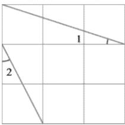

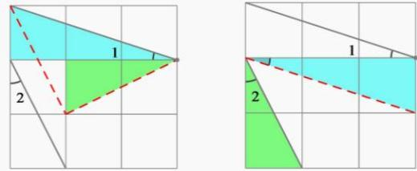

【图解】

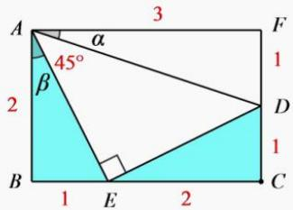

$a = \frac { 1 } { 3 }$ tan $\beta = \frac { 1 } { 2 }$

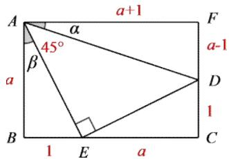

2． 如图 ，在△ABC 中， $\angle B \mathrm { A C } = 4 5 ^ { \circ }$ ，AD 是 BC 边上的高， $\mathrm { B D } { = } 3$ ， $\mathrm { D C } = 2$ ， AD 的长为

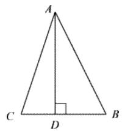  
第 2 题

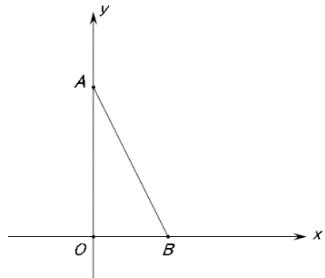  
第 3 题

3． A（0,6）B（3,0）在 $x$ 轴上有一点 P，若 $\angle P A B { = } 4 5 ^ { \circ }$ ，则 P 点坐标为

# 【“1 $2 ~ 3 ^ { 9 9 } + ^ { 6 6 } 4 ~ 5 ^ { 9 9 }$ 的来源】——构造倍半角

（一）基本模型

<table><tr><td rowspan="3">D A E B C</td><td>已知：在△ABC中，∠ACB=90°，AC=3，BC=4，点D在CA的延 长线上，点E在CB的延长线上，且AD=BE=AB.</td></tr><tr><td>结论1：∠D+∠E=45°. $\rac}$</td></tr><tr><td>$\frac{}$ 结论2：tan2∠D= tan2∠E= 4</td></tr><tr><td></td><td>1 1 结论3：tan∠D tan∠E 2 $\r$</td></tr></table>

因为在 ${ \frac { 1 } { 2 } } , \ { \frac { 1 } { 3 } }$ ， $4 5 ^ { \circ }$ 中出现数字 12345，所以这种模型叫做 12345 模型．

# （二）结论推导

结论 1： $\angle \mathrm { D } + \angle \mathrm { E } { = } 4 5 ^ { \circ }$   
证明：∵ $\mathrm { A D } { = } \mathrm { B E } { = } \mathrm { A B }$ ，∴ $\angle \mathrm { A B D } = \angle \mathrm { D }$ ， $\angle B _ { } \mathrm { A E } = \angle \mathrm { E }$ ，  
∴ $\angle \mathrm { B A C } = 2 \angle \mathrm { D }$ ， $\angle A \mathrm { B C } = 2 \angle \mathrm { E }$   
∵ $\angle \mathrm { A C B } = 9 0 ^ { \circ }$ ，∴∠BAC＋∠ABC＝90°，$\therefore 2 \angle \mathrm { D } + 2 \angle \mathrm { E } = 9 0 ^ { \circ }$ ，∴ $. \angle \mathrm { D } + \angle \mathrm { E } { = } 4 5 ^ { \circ } .$   
结论 2：tan2 $\angle \mathrm { D } = \frac { 4 } { 3 }$ ， tan $2 \angle \mathrm { E } = { \frac { 3 } { 4 } }$ BC 4  
证明：∵ $\angle \mathrm { A C B } { = } 9 0 ^ { \circ }$ ，∴tan2∠D＝tan∠BAC＝ 3 ，AC  
tan $\scriptstyle ? < \mathrm { E } = \tan \angle \mathrm { A B C } = { \frac { A C } { B C } } = { \frac { 3 } { 4 } } .$   
结论 3：tan $\angle \mathrm { D } = \frac { 1 } { 2 }$ ，tan $\angle \mathrm { E } = \frac { 1 } { 3 }$   
证明：∵ $\angle \mathrm { A C B } { = } 9 0 ^ { \circ }$ ， $\mathbf { A } \mathbf { C } { = } 3$ ， $\mathrm { B C } { = } 4$ ，∴ $\cdot \mathrm { A B } { = } \sqrt { 3 ^ { 2 } + 4 ^ { 2 } } = 5$ ，  
∴ $\scriptstyle \cdot \mathrm { A D } = \mathrm { B E } = \mathrm { A B } = 5$ ，∴ $\mathrm { C D } { = } 8$ ， $\mathrm { C E } = 9$ ，  
∴tan $\angle \mathrm { D } = { \frac { B C } { C D } } = { \frac { 4 } { 8 } } = { \frac { 1 } { 2 } }$ ，tan $\angle \mathrm { E } = \frac { A C } { C E } = \frac { 3 } { 9 } = \frac { 1 } { 3 } .$

# （三）解题技巧

如果题目中出现角的正切值或直角三角形的两条直角边的比为 ${ \frac { 1 } { 2 } } , { \frac { 1 } { 3 } } , { \frac { 4 } { 3 } } , { \frac { 3 } { 4 } }$ 或 $4 5 ^ { \circ }$ 配 $\frac { 1 } { 2 }$ $\frac 1 3$ 时（对于角$\mathfrak { a }$ 和 $\beta$ ，若满足 $\alpha + \beta = 4 5 ^ { \circ }$ ， $\mathrm { t a n a } { = } \frac { 1 } { 2 }$ 则一定有， $\tan \beta = \frac 1 3$ 并且这三个式子，只要满足其中任意两个，都可以推出第三个），则考虑使用 12345模型，将 $4 5 ^ { \circ }$ ， $9 0 ^ { \circ }$ ， $1 3 5 ^ { \circ }$ 这几个特殊的角度联系起来，简化此类选择题或填空题的运算．12345 模型在中考题中常以选择题或填空题的形式出现

除此之外，还能得出 $\left\{ { \begin{array} { l } { \tan ( \alpha + 4 5 ^ { \circ } ) = 2 } \\ { \tan ( \beta + 4 5 ^ { \circ } ) = 3 } \end{array} } \right.$ 你看出来了吗？(cid:)

【补充】其它角度配凑与正切和差公式$\cdot { \frac { 1 } { 7 } } \cdots + 4 5 ^ { \circ } = ^ { \ast } { \frac { 4 } { 3 } }$ ”和“ $\cdot { \frac { 3 } { 4 } } \cdot \cdot + 4 5 ^ { \circ } = \cdots 7 ^ { \circ }$ 正切和差公式： $\tan \left( A \pm B \right) = { \frac { \tan A \pm \tan B } { 1 \mp \tan A \cdot \tan B } }$

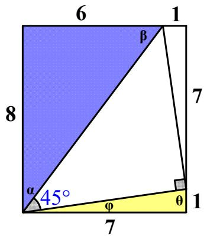

# 例题演练

# 实战练习

# 【例 1·性质一】

如图,正方形 ABCD 中, $\scriptstyle \mathbf { A B } = 6 , \mathbf { G }$ 是 BC 的中点,将△ABG 沿 AG 对折至△AFG,延长 GF 交 DC 于点 E,则 DE 长是( )

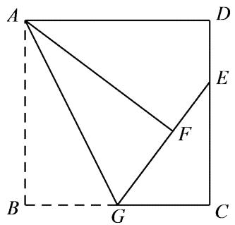

A．1 B．1.5 C．2 D．2.5

【答案】C

【解析】根据 BG 是 AB 的一半，可得 tan $\cdot$ ， 连接 AE，易证△AEF≌△AED，∴tan∠DAE=1/3，∴$\mathrm { D E } = 2$

【淘宝店铺：向阳百分百】

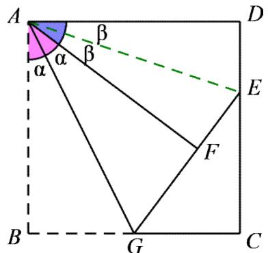

【变式 1-1】如 图 ， 在 矩 形 ABCD 中 ， $A B = 4$ ， $A D = 6$ ， 点 $E$ ， $F$ 分 别 在 边 BC， CD 上 ， ∠EAF$= 4 5 ^ { \circ }$ ， $B E { = } 2$ ，则 $D F$ 的长为

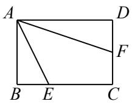

【答案】2

【解析】∵ $\_$ ， $\angle E A F { = } 4 5 ^ { \circ }$ ，∴∠BAE＋∠DAF＝45°  
∵t $\frac { B E } { A B } \frac { 2 } { 4 } \frac { 1 } { 2 }$ ∴ $\tan \angle D A F = \frac { 1 } { 3 }$ $\frac { D F } { A D } = \frac { 1 } { 3 }$ , $\cdot D F { = } \frac { 1 } { 3 } A D { = } 2 .$ ．

# 2022 黔东南州

【变式 1-2】如图，折叠边长为 $4 \mathrm { { c m } }$ 的正方形纸片 $A B C D$ ，折痕是 $D M$ ，点 $C$ 落在点 $E$ 处，分别延长 $M E$ ，$D E$ 交 $A B$ 于点 $F$ ， $G$ ，若点 $M$ 是 $B C$ 边的中点，则 $F G = \_$ _cm．

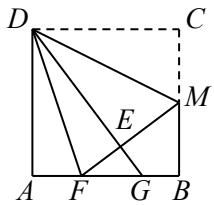

【答案】 53

【解析】连接 DF  
由题意， $\mathrm { D E = D C = D A }$ ， $-$   
∵ $\cdot$ ，∴ $\triangle$ DEF≌△DAF， $\angle \mathrm { E D F } = \angle \mathrm { A D F }$ ．∵ $\angle C _ { Ḋ } \mathrm { Ḋ M Ḍ } = \angle E _ { Ḋ } \mathrm { Ḋ M Ḍ Ḍ }$ ， $\angle \mathrm { A D C } = 9 0 ^ { \circ }$ ，∴ $\angle \mathrm { F D M } = 4 5 ^ { \circ }$ ∵ $\tan \angle C D M = \frac { C M } { C D } = \frac { 1 } { 2 }$ , ∴ta $\frac { A F } { A D } \frac { 1 } { 3 }$ tan∠DGA＝tan∠CDG＝ 43

【淘宝店铺：向阳百分百】∵ $-$ ，∴EF $\frac { 4 } { 3 }$ $\frac { 5 } { 4 } E F \frac { 5 } { 3 }$

【变式 1-3】在正方形 ABCD 中，边长为 6， $\mathrm { B E } { = } 2 \mathrm { A E }$ ，连接 DE，在 AD、BC 上分别存在点 G、F，连接GF 交 DE 于 $\mathrm { H }$ 点，且 $\angle \mathrm { G H D } { = } 4 5 ^ { \circ }$ ，求线段 $\mathrm { F G } { = } \_$ ·

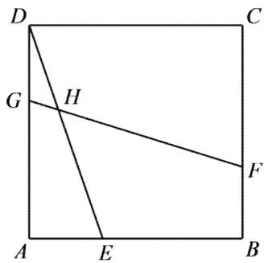

【答案】 $3 \sqrt { 5 }$ 【分析解答】

法一：观察发现 $\tan \angle A D E { = } 1 / 3$ ，且 $\angle \mathrm { G H D { = } 4 5 ^ { \circ } }$ ，条件已经具备，考虑 GF 可动，平移 GH，将α、β、 $4 5 ^ { \circ }$ 汇  
于直角处。可知 $\mathrm { C F } { = } 3$ ，  
所以 DF 长度为 $3 \sqrt { 5 }$

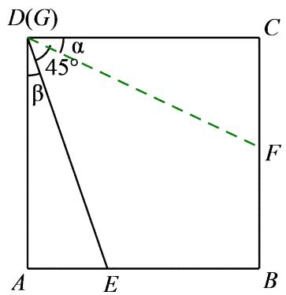

法二：平移【淘宝店铺：向阳百分百】

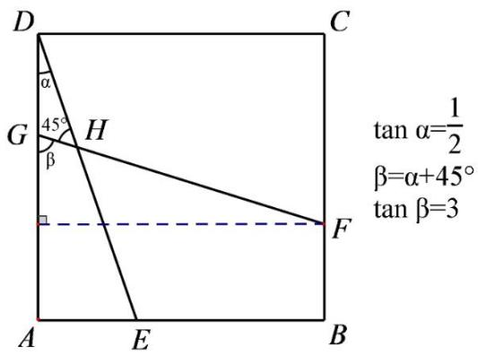

# 【例 2·性质二】：“345”三角形与倍半角

（广东省中考）如图，已知正方形 ABCD 的边长为 6，E 为 BC 的中点，将△ABE 沿直线 AE 折叠后，点 B 落在点 F 处，AF 交对角线 BD 于点 G，则 FG 的长是

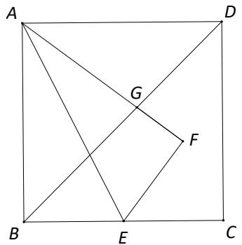

【答案】 $\frac { 1 2 } { 7 }$

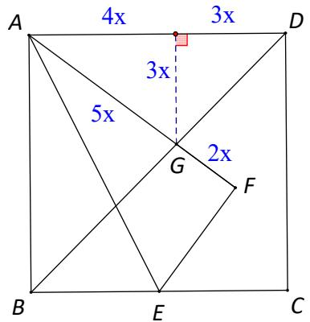

【变式 2-1】如图，将矩形 ABCD 沿 $B E$ 折叠，使得点 $C$ 落在点 $G$ 处，若 $D E { = } 1$ ， $C E { = } 2$ ， $B C { = } 6$ ，则 $A F$ 的长为 ．

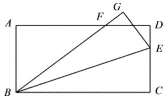

【答案】4

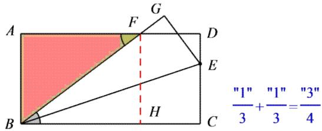

【变式 2-2】如图，在矩形 ABCD 中，对角线 AC 的垂直平分线交直线 BC 于点 E，交直线 AB 与点 F，若 $\mathbf { A } \mathbf { B } { = } 4$ ， $\mathrm { B E } { = } 3$ ，则 BF 的长为

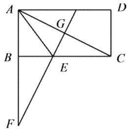

【答案】

【简证】易知 tan $\angle A C B = \tan \angle A F E = \frac { 1 } { 2 }$ 进而可知 $\mathrm { B F } { = } 2 \mathrm { B E } { = } 6$

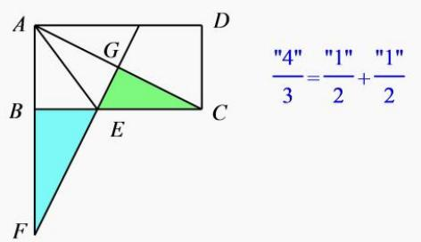

【变式 2-3】如图 ，等腰 Rt△ABC 中， $\angle \mathrm { C } { = } 9 0 ^ { \circ }$ ， D 为 BC 中点，将△ABC 折叠，使 A 点与 D 点重合，若 EF 为折痕，则 sin $\angle$ BED 的值为 •

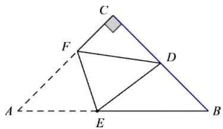

【答案】 3

【简证】连接 AD， tan $\cdot \angle C A D = \frac { 1 } { 2 } \Rightarrow \tan \angle D A B = \frac { 1 } { 3 } , \angle D E H = 2 \angle D A B \Rightarrow \tan \angle D E H = \frac { 3 } { 4 }$

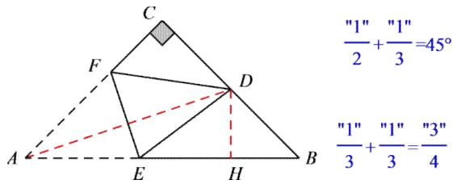

【例 3·其它角的配凑】

在如图的正方形方格纸上，每个小的四边形都是相同的正方形，A、B、C、D 都在格点处，AB 与 CD 相交于 O，则 tan∠BOD 的值等于

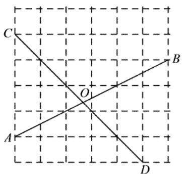

【分析解答】

取点 E 如图所示，则 $\angle O A E { = } a$ ， $\_$ ， $\angle B _ { } \mathrm { O D } { = } a + 4 5 ^ { \circ }$ ，tan∠BOD=3

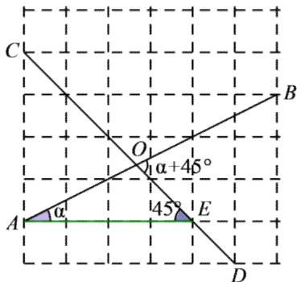

# 【压轴题实战篇】一题多解

如图，在等腰 Rt△ABC 中， $\angle \mathrm { B } { = } 9 0 ^ { \circ }$ ， $\mathrm { B A = B C }$ ，D 为 BC 上一点，且 $B D = 3$ ， $E$ 为 AD 上点，连接 CE， $\angle C \mathrm { E D = } 4 5 ^ { \circ }$ ， $C E = \sqrt { 2 } A E$ ，则 $C E$ 的长

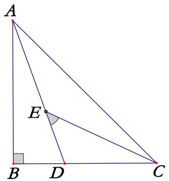

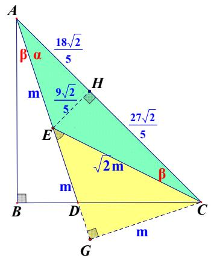

12345模型   
如图作辅助线   
易知tanα= 1 1 \$; tanβ= 3   
则AB=9AC=9 2   
EC= 10EH= 18 5 5

【法一】作 CG $\cdot$ ED 与 G，则△EGC 为等腰直角三角形，记 $\operatorname { E C } = { \sqrt { 2 } } m$ ，故 $-$ ，则 $\cdot$ ，则 tan $\alpha = \frac { 1 } { 2 }$ tan $\beta = \frac { 1 } { 3 }$ $\cdot$ $A C = 9 \sqrt { 2 }$ $E C = { \sqrt { 1 0 } } E H E H = { \frac { 1 } { 5 } } A C$ ，下略

【其它方法：4 种】

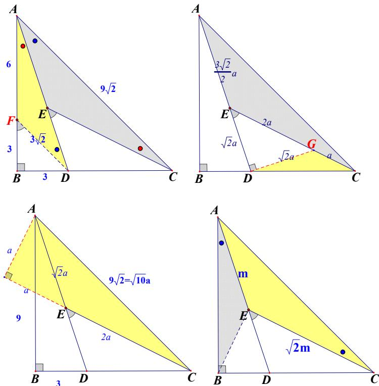

【简证】

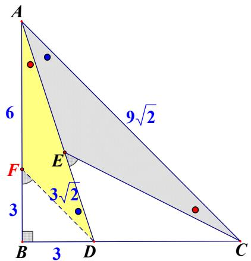

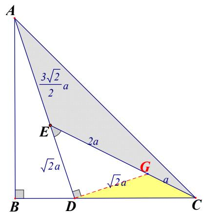

AF•ACECAD

△AEC△CGD设 $\scriptstyle \mathrm { { D C } = x } .$ ,则 $\operatorname { A C } { = } { \frac { 3 { \sqrt { 2 } } } { 2 } } x$ $\begin{array} { l } { \displaystyle \frac { 3 \sqrt { 2 } } { 2 } x = \sqrt { 2 } ( x + 3 ) \Longrightarrow x = 6 } \\ { \displaystyle \mathrm { A D } = 3 \sqrt { 1 0 } \Longrightarrow \mathrm { a } = \frac { 6 \sqrt { 5 } } { 5 } \Longrightarrow \mathrm { E C } = \frac { 1 8 \sqrt { 5 } } { 5 } } \end{array}$

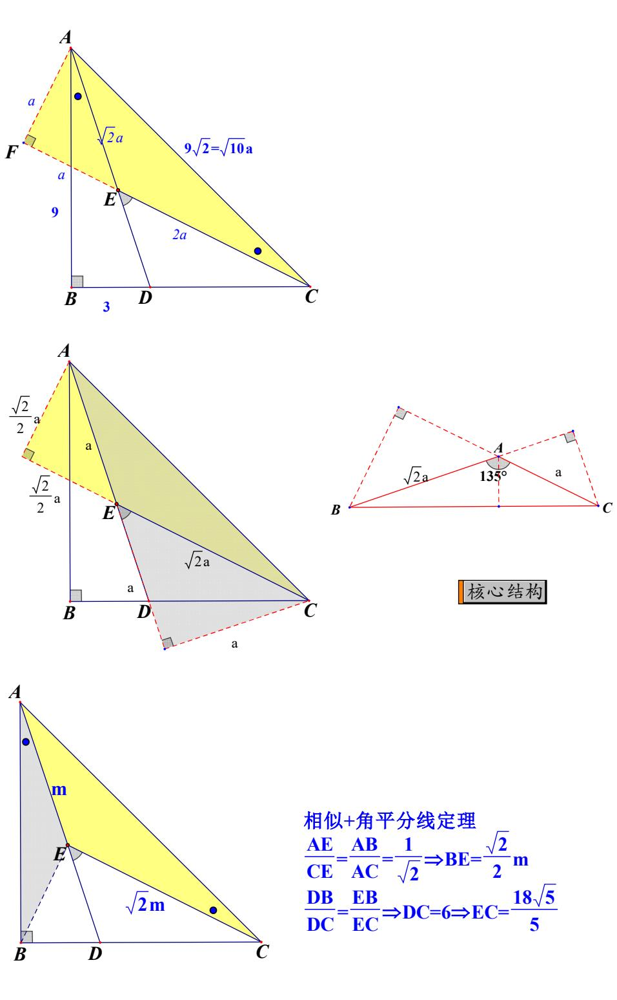

# 核心·题型

# 题型一：【性质一】·专练

# 2022 乐 山

1．如图，在 Rt△ABC 中， $\angle C = 9 0 ^ { \circ }$ ， $B C = { \sqrt { 5 } }$ ，点 $D$ 是 $A C$ 上一点，连接 $B D$ ．若 tan $\angle A = \frac { 1 } { 2 }$ ，tan$\angle A B D = \frac { 1 } { 3 }$ , 则 $C D$ 的长为（ ）

A． $2 \sqrt { 5 }$ B．3 C． $\sqrt { 5 }$ D．2

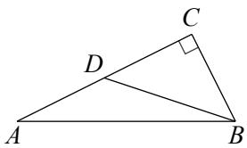

【答案】C

【解析】∵tan $\angle A = \frac { 1 } { 2 }$ tan $\frac { 1 } { 3 }$ ∴ $\_$ ∵ $\angle C = 9 0 ^ { \circ }$ ，∴ $\sqrt { 5 }$

# 2021 宜 宾

2．如图，在矩形纸片 $A B C D$ 中，点 $E$ ， $F$ 分别在边 $A B$ ， $A D$ 上，将矩形纸片沿 $C E$ ， $C F$ 折叠，点 $B$ 落在 $H$ 处，点 $D$ 落在 $G$ 处，点 $C , H , G$ 恰好在同一直线上，若 $A B { = } 6$ ， $A D { = } 4$ ， $B E { = } 2$ ，则 $D F$ 的长是（ ）

A．2 B． 74 C． $\frac { 3 { \sqrt { 2 } } } { 2 }$ D．3

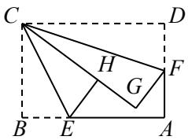

【答案】A

【解析】由题意， $-$ ， $-$   
∵ $\_$ ， $-$   
$\because \tan \angle \mathrm { B C E } = \frac { B E } { B C } = \frac { 2 } { 4 } = \frac { 1 } { 2 } , \therefore \tan \angle \mathrm { D C F } = \frac { 1 } { 3 } ,$ DF 1 $\therefore \mathrm { D F } = { \frac { 1 } { 3 } } C D = 2$ CD 3

3．如图，将已知矩形纸片 $A B C D$ 的边 $B C$ 斜着向 $A D$ 边对折，使点 $B$ 落在 $A D$ 上，记为点 $B ^ { \prime }$ ，折痕为 $C E$ ，再将 $C D$ 边斜向下对折，使点 $D$ 落在 $B ^ { \prime } C$ 上，记为点 $D ^ { \prime }$ ，折痕为 $C F$ ，若 $B ^ { \prime } D ^ { \prime } { = } 2$ ， $B E { = } \frac { 1 } { 3 } B C$ ，则矩

形纸片 ABCD 的面积为

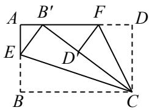

【答案】15

【解析】由题意， $\mathrm { B C } { = } \mathrm { B } ^ { \prime } \mathrm { C }$ ， $\mathrm { C D } { = } \mathrm { C D }$ ， $-$ ， $-$   
∵ $\angle \mathrm { B C D } = 9 0 ^ { \circ }$ ，∴∠ECF $\cdot$ ∠B'CE＋∠D'CF＝45°  
$\mathrm {  ~ \ddot { \ s } { \scriptstyle \mathrm { B E } } } = \frac { 1 } { 3 } B C \ , \ \mathrm {  ~ \dot { \ s } { \scriptstyle \mathrm { t a n } } } \angle \mathrm { B C E } = \frac { 1 } { 3 } , \ \mathrm {  ~ \dot { \ s } { \scriptstyle \mathrm { t a n } } } \angle \mathrm { D ^ { \prime } C F } = \frac { 1 } { 2 } , \ \mathrm { t a n } \angle \mathrm { B ^ { \prime } C B } = \frac { 3 } { 4 } .$   
∵AD∥BC，∴∠FB'D $\prime { = } \angle \mathrm { B ^ { \prime } C B }$ ，∴tan $\frac { 3 } { 4 }$ ，  
$\frac { 3 } { 4 } B D ^ { \prime } \frac { 3 } { 2 }$ ，  
$\therefore \mathrm { B C } = \mathrm { B ^ { \prime } C } = \mathrm { B ^ { \prime } D ^ { \prime } } + \mathrm { C D ^ { \prime } } = 2 + 3 = 5$ ，  
∴S 矩形 ABCD $= \mathrm { B C } \cdot \mathrm { C D } { = } 5 { \times } 3 { = } 1 5$

# 2022 黔东南州中考数学真题

4．如图，折叠边长为 $4 \mathrm { { c m } }$ 的正方形纸片 $A B C D$ ，折痕是 $D M$ ，点 $C$ 落在点 $E$ 处，分别延长 $M E$ 、DE 交 AB于点 $F$ 、 $G$ ，若点 $M$ 是 $B C$ 边的中点，则 $F G = \mathrm { c m }$ ．

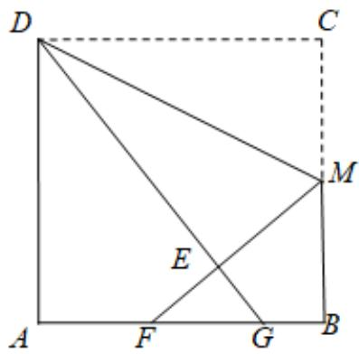

【答案】 53

【简证】连接 $D F$ ,易知△ADF≌△EDF（HL），记 tan $a = \frac { 1 } { 2 }$ , tan $\beta = \frac { 1 } { 3 }$ 则 $\left\{ \begin{array} { l l } { \angle A D G = 2 \beta } \\ { \angle F M B = 2 \alpha } \end{array} \right.$ 故 $\left\{ { \begin{array} { l } { { \displaystyle { F B = \frac { 4 } { 3 } M B = \frac { 8 } { 3 } } } } \\ { { \displaystyle { A G = \frac { 3 } { 4 } A D = 3 } } } \end{array} } , { \mathrm { ~ } F G = \frac { 8 } { 3 } + 3 - 4 = \frac { 5 } { 3 } } \right. \nonumber$

【常规法】解：连接 $D F$ ,如图，【淘宝店铺：向阳百分百】

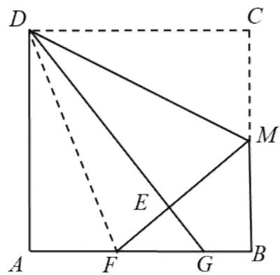

∵四边形 ABCD 是正方形，  
∴ $\cdot \ A B = B C = C D = D A = 4 , \angle A = \angle B = \angle C = \angle C D A = 9 0 ^ { \circ } .$   
∵点 $\cdot$ 为 $B C$ 的中点，  
$\therefore B M = C M = { \frac { 1 } { 2 } } B C = { \frac { 1 } { 2 } } \times 4 = 2$   
由折叠得， $M E = C M = 2 , D E = D C = 4$ , $\angle D E M = \angle C = 9 0 ^ { \circ }$ ,  
$\therefore \angle D E F = 9 0 ^ { \circ } , \angle F E G = 9 0 ^ { \circ } ,$   
设 $F E = x$ ,则有 ${ \cal D } F ^ { 2 } = { \cal D } E ^ { 2 } + E F ^ { 2 }$   
$D F ^ { 2 } = 4 ^ { 2 } + x ^ { 2 }$   
又在 RtFMB 中， $F M = 2 + x , B M = 2$ ，  
$\because F M ^ { 2 } = F B ^ { 2 } + B M ^ { 2 }$   
$\begin{array} { l } { { F M = F B + B M } } \\ { { \ } } \\ { { F B = \sqrt { F M ^ { 2 } - B M ^ { 2 } } = \sqrt { \left( 2 + x \right) ^ { 2 } - 2 ^ { 2 } } } } \\ { { \ } } \\ { { A F = A B - F B = 4 - \sqrt { \left( 2 + x \right) ^ { 2 } - 2 ^ { 2 } } } } \end{array}$   
在 $R t \Delta D A F$ 中， $D A ^ { 2 } + A F ^ { 2 } = D F ^ { 2 }$ ,  
$\therefore 4 ^ { 2 } + \left( 4 - \sqrt { \left( 2 + x \right) ^ { 2 } - 2 ^ { 2 } } \right) ^ { 2 } = 4 ^ { 2 } + x ^ { 2 } ,$   
解得， 24 , 83 x   （舍去）  
$F E = { \frac { 4 } { 3 } } ,$   
$F M = F E + M E = \frac { 4 } { 3 } + 2 = \frac { 1 0 } { 3 }$   
$\therefore F B = \sqrt { ( 2 + \frac { 4 } { 3 } ) ^ { 2 } - 2 ^ { 2 } } = \frac { 8 } { 3 }$   
∵∠ DEM 90  
$F E G = 9 0 ^ { \circ }$   
$\therefore \angle F E G = \angle B ,$   
又 $\angle G F E = \angle M F B .$ $F E G \sim \Delta F B M$

FG FE $\frac { F G } { \frac { 1 0 } { 3 } } = \frac { \frac { 4 } { 3 } } { \frac { 8 } { 3 } } \therefore F G = \frac { 5 } { 3 } ,$ FM FB 即

5．如图,在矩形 ABCD 中, $\scriptstyle \mathbf { A B } = 2 , \mathbf { B C } = 4$ ,点 E、F 分别在 BC、CD 上,若 $\mathrm { A E } { = } \sqrt { 5 }$ ， $\angle E A F { = } 4 5 ^ { \circ }$ ,则 AF 的长为

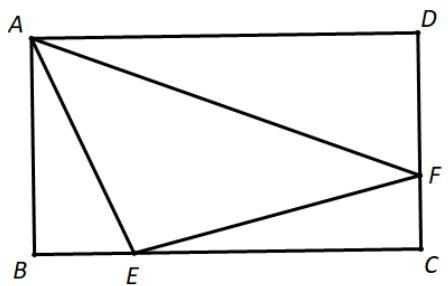

【答案】 $\frac { 4 { \sqrt { 1 0 } } } { 3 }$

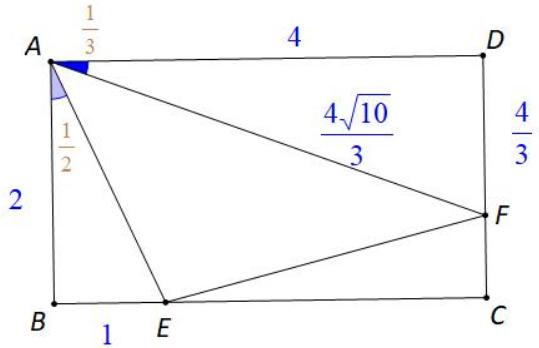

6．（丽水·中考）如图，在平面直角坐标系中，一次函数 $\scriptstyle \mathbf { y } = 2 \mathbf { x } - 1$ 的图像分别交 x、y 轴于点 A、B，将直线 AB 绕点 B 顺时针旋转 $4 5 ^ { \circ }$ ，交 $\mathbf { X }$ 轴于点 C，则直线 BC 的函数表达式是

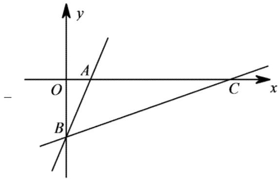

【解析】根据解析式可知： $\left\{ \begin{array} { l l } { \tan \angle A B O = { \frac { 1 } { 2 } } \Rightarrow \tan A C B = { \frac { 1 } { 3 } } } \\ { \angle A B C = 4 5 ^ { \circ } } \end{array} \right.$

【淘宝店铺：向阳百分百】即可求得 C 点坐标（3,0），可求得解析式

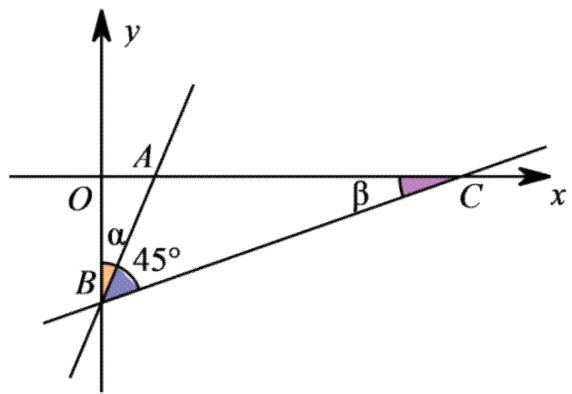

7．如图，在梯形 ABCD 中，AD//BC，AD $\perp$ CD， ${ \mathrm { B C } } { = } { \mathrm { C D } } { = } 2 { \mathrm { A D } }$ ，E 是 CD 上一点， $\angle A B E = 4 5 ^ { \circ }$ ，则 tan∠AEB 的值等于（ ）

A． 23 B．2 C． 25 D．3

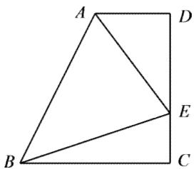

【答案】D

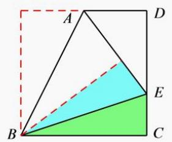

8．如图,三角形 OEF 的顶点 E,F 分别在正方形 ABCD 边 AB,CD 上,O 为正方形 ABCD 的中心,若 $\angle { \mathrm { E O F } } { = } 1 3 5 ^ { \circ }$ , $\mathrm { D F } { = } 1 , \mathrm { C F } { = } 2$ ,则 EF的长度为

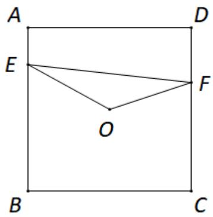

【淘宝店铺：向阳百分百】【答案】 $\frac { \sqrt { 1 4 5 } } { 4 }$

【简证】 $\alpha + \beta = 4 5 ^ { \circ }$ , tan $\alpha = { \frac { F N } { O N } } = { \frac { 1 } { 3 } } \Rightarrow$ tan $\beta = \frac { 3 } { 4 } \Rightarrow E F = \frac { \sqrt { 1 4 5 } } { 4 }$

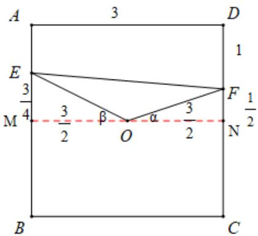

9．如图，已知正方形 ABCD 的边长为 $\sqrt { 1 0 }$ ，对角线 AC、BD 交于点 O，点 E 在 BC 上，且 $\mathrm { C E } { = } 2 \mathrm { B E }$ ,过 B 点作 BF⊥AE 于点 F，连接 OF，则线段 OF 的长度为 。

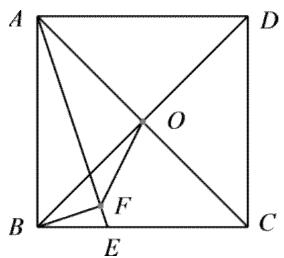

【答案】 $\sqrt { 2 }$ 【简证】

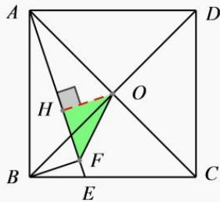

$H O = H F - B F = 1$ $O H = \sqrt { 2 }$

10．（四川省成都市中考模拟）如图，正方形 $A B C D$ ， $A B = 2$ ，点 $E$ 为 $A D$ 上一动点，将三角形 $A B E$ 沿 $B E$ 折叠，点 $A$ 落在点 $F$ 处，连接 $D F$ 并延长，与边 $A B$ 交于点 $G$ ，若点 $G$ 为 $A B$ 中点，则 $A E = _ { - }$

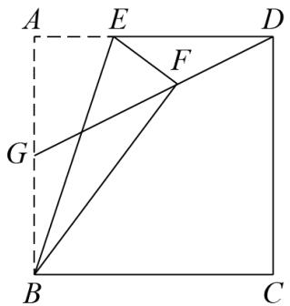

【答案】 $\frac { 2 } { 3 }$

【简证】延长 EF 至 H,易证△BFH≌△BCH(HL),则∠EBH $\cdot$ °，又因为 $\mathrm { H F = H C = H D }$ ，所以 $\cdot$ ，则∠BFH=∠ADG，故 tan $\angle A B F = \frac { 1 } { 3 } \Rightarrow A E = \frac { 2 } { 3 }$

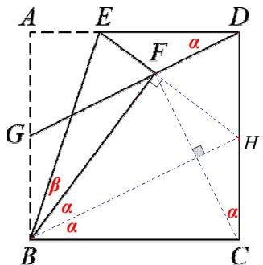

【常规法】解：如图，过点 $F$ 作 $A B$ 的平行线，分别交 $A D , B C$ 于点 $M , N$ ，

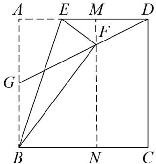

 四边形 ABCD是正方形， $A B = 2$ ，  
 $A D = 2$ ， $\angle A = 9 0 ^ { \circ }$ ，四边形ABNM 是矩形，  
$\therefore M N = A B = 2 , A M = B N , \angle B N F = \angle F M E = 9 0 ^ { \circ }$   
 点 $G$ 为 $A B$ 中点，  
 $\cdot A G = { \frac { 1 } { 2 } } A B = 1$ ，  
$\because M N \parallel A B$ ，  
$\therefore \triangle M D F \sim _ { \triangle A D G }$ ，$\cdot \frac { M F } { D M } { = } \frac { A G } { A D } { = } \frac { 1 } { 2 }$ , 即 $D M = 2 M F$ ，  
设 $M F = x$ ，则 $D M = 2 x , N F = 2 - x$ ，$. B N = A M = A D - D M = 2 - 2 x$ ，  
由折叠的性质得： $B F = A B = 2 , E F = A E , \angle B F E = \angle A = 9 0 ^ { \circ }$

$\therefore \angle E F M + \angle B F N = 9 0 ^ { \circ }$ 又 $\angle B N F = 9 0 ^ { \circ }$ ，$\therefore \angle F B N + \angle B F N = 9 0 ^ { \circ }$ ， $\angle E F M = \angle F B N$ ，在△EFM 和 $\triangle F B N$ 中， $\left\{ \begin{array} { l } { \angle F M E = \angle B N F = 9 0 ^ { \circ } } \\ { \angle E F M = \angle F B N } \end{array} \right. ,$ $\therefore \triangle E F M \sim \triangle F B N$ ，$\therefore { \frac { E F } { B F } } = { \frac { F M } { B N } } = { \frac { E M } { F N } } \qquad { \frac { E F } { 2 } } = { \frac { x } { 2 - 2 x } } = { \frac { E M } { 2 - x } }$ 解得 $E F = \frac { x } { 1 - x }$ $E M = { \frac { x { \big ( } 2 - x { \big ) } } { 2 - 2 x } }$ ,$\therefore A E = { \frac { x } { 1 - x } } ,$ 又 $A E + E M = A M$ ，$\therefore { \frac { x } { 1 - x } } + { \frac { x \left( 2 - x \right) } { 2 - 2 x } } = 2 - 2 x ,$ 解得 $x = \frac { 2 } { 5 }$ 或 $x = 2$ ，经检验， $x = \frac { 2 } { 5 }$ 是所列方程的解， $x = 2$ 不是所列方程的解，$\therefore A E = \frac { \frac { 2 } { 5 } } { 1 - \displaystyle \frac { 2 } { 5 } } = \frac { 2 } { 3 }$

11．如图，在 $\mathrm { R t } \triangle A B C$ 中， $\angle B A C = 9 0 ^ { \circ }$ ， $A B { = } A C$ ，点 $D$ ， $E$ 在边 $B C$ 上，tan $\angle B A D = \frac { 1 } { 3 }$ ， $\angle D A E { = } 4 5 ^ { \circ }$ ，将 $\triangle A B D$ 沿 $A D$ 翻折得到 $\triangle A B ^ { \prime } D$ ， $A B ^ { \prime }$ 交 $B C$ 于点 $F$ ，若 $D F { = } 3$ ，则 $E F$ 的长为 ·

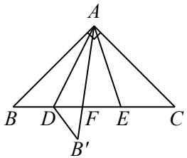

【答案】4

【解析】连接 B'E，过点 D 作 DG⊥AB 于点 G，过点 E 作 EH⊥AC 于点 H．∵ $\_$ ， $\cdot$ ，∴ $\angle \mathrm { B } = \angle \mathrm { C } = 4 5 ^ { \circ }$ ，∴∠AB'D $= \angle \mathrm { B } { = } 4 5 ^ { \circ }$ ， $\cdot$ ， $\cdot$

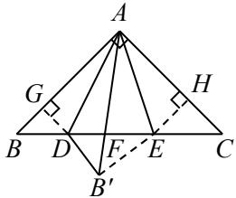

由 tan $\frac { 1 } { 3 }$ 可设 $\_$ ，则 $\cdot$ ， $\cdot$   
$\because \angle \mathrm { D A E } = 4 5 ^ { \circ } , \therefore \angle \mathrm { B A D } + \angle \mathrm { C A E } = 4 5 ^ { \circ } , \therefore \tan \angle \mathrm { C A E } = \frac { 1 } { 2 } .$   
设 $\_$ ，则 ${ \mathrm { A H } } = 2 { \mathrm { b } }$ ， $\cdot$ ，∴ $\cdot$   
∵ $\angle D \mathrm { A E } = 4 5 ^ { \circ }$ ，∴∠B'AD＋∠B'AE＝45°， $\angle \mathrm { B A D } + \angle \mathrm { C A E } { = } 4 5 ^ { \circ } ,$ ，   
$\therefore \angle \mathrm { B A D } = \angle \mathrm { B } ^ { \prime } \mathrm { A D }$ ，∴ $-$ ．   
∵ $\cdot _ { \mathrm { A B ^ { \prime } = A B = A C } }$ ， $\cdot$ ，∴ $\cdot$ AB'E≌△ACE   
$\begin{array} { r } { \begin{array} { c c c c c c c } { \boxed { E F } } & { \frac { S _ { \triangle A B ^ { \prime } E } } { S _ { \triangle A B ^ { \prime } D } } } & { \frac { S _ { \triangle A C E } } { S _ { \triangle A B D } } } & { \frac { E H } { D G } } & { \frac { b } { a } } & { \frac { 4 } { 3 } } \end{array} } \end{array}$   
$\frac { 4 } { 3 } D F \frac { 4 } { 3 } \times 3$

12．如图，正方形 ABCD 中，对角线 AC、BD 交于点 $\mathrm { o }$ ，点 E 是 OB 上一点，且 $\mathrm { O B } { = } 3 \mathrm { O E }$ ，连接 AE，过点 D 作 DG $\perp$ AE 于点 F，交 AB 边于点 G，连接 GE。若 $\scriptstyle { \mathrm { A D } } = 6 { \sqrt { 2 } }$ ，则 GE 的长是

【答案】 $\sqrt { 1 0 }$

【简证】易知 tan $\angle O A E = \frac { 1 } { 3 } , B E = 4 , \angle O D F = \angle O A E ^ { \mathrm { ~ \scriptsize ~ 1 ~ } } \tan \angle A D G = \frac { 1 } { 2 } \Rightarrow A G = 3 \sqrt { 2 }$ ，则 $E H = 2 { \sqrt { 2 } } \Rightarrow A H = 4 { \sqrt { 2 } } \Rightarrow G H = { \sqrt { 2 } }$ ，勾股可知 $G E = \sqrt { 1 0 }$

13．如图，已知正方形ABCD的边长为3， $E$ 是边 $B C$ 上一点， $B E { = } 1$ ，将 $\triangle A B E$ ， $\triangle A D F$ 分别沿折痕AE，AF向内折叠，点 $B$ ， $D$ 在点 $G$ 处重合，过点E作EH⊥AE，交AF的延长线于 $H$ ，则线段FH的长为

【淘宝店铺：向阳百分百】【答案】 52【简证】

易知△ADF≌△AGF $\angle E A F = 4 5 ^ { \circ } \mathbb { I }$ $A H = { \sqrt { 2 0 } }$ $\therefore t a n \angle G A F = \frac { 1 } { 2 } \mathbb { I } \quad A F = \frac { 3 \sqrt { 5 } } { 2 } , F H = A H - A F = \sqrt { 2 0 } - \frac { 3 \sqrt { 5 } } { 2 } = \frac { \sqrt { 5 } } { 2 }$

# 四点共圆型相似 $+ 1 2 3 4 5$ 模型

14．如图，在等腰直角 $\triangle A B C$ 中， $\angle B A C = 9 0 ^ { \circ }$ ， $B C { = } 6$ ，过点 $C$ 作 $C D \bot B C$ ， $C D { = } 2$ ，连接 $B D$ ，过点 $C$ 作$C E \bot B D$ ，垂足为 $E$ ，连接 $A E$ ，则 $A E$ 长为

【答案】 $\frac { 6 { \sqrt { 5 } } } { 5 }$ 【详解】

法一：二级结论

$\angle C B A { = } 4 5 ^ { \circ }$ ， ta $\mathrm { n } \angle C B D = \frac { 1 } { 3 }$ 故 ta $\mathrm { n } \angle B A E = \frac { 1 } { 2 }$ 设 AC 交 BE 于 F，故△蓝∽△黄 △AFE∽△BFC

【淘宝店铺：向阳百分百】易知相似比为1: 10  6 3 10AE  

法二：常规法

解：如图作 AM⊥BD 于 M，AN⊥CE 于 N

易证△ABM≌△ACN，可得 $\cdot$ ，四边形 AMEN 是正方形，设 $\mathrm { A M = E M = N E = A N = a , ~ B N }$ ＝b，  
在 Rt△BCD 中， $\sqrt { 6 ^ { 2 } + 2 ^ { 2 } }$   
$\sqrt { 1 0 }$ ， ${ \mathrm { C E } } = { \frac { B C \cdot C D } { B D } } = { \frac { 3 { \sqrt { 1 0 } } } { 5 } } , \ \mathrm { B E } = { \frac { 9 { \sqrt { 1 0 } } } { 5 } } ,$   
在 Rt△ABC 中， $3 { \sqrt { 2 } }$ ，  
则有 $\{ a + b = { \frac { 9 } { 5 } } { \sqrt { 1 0 } } ~ , ~ { \sqrt { \sharp + { \vec { \varphi } } } } ~ \mathrm { a } = { \frac { 3 { \sqrt { 1 0 } } } { 5 } } ~ , ~ \therefore \mathrm { A E } = { \sqrt { 2 } } ~ \mathrm { a } = { 5 } { \frac { 6 { \sqrt { 5 } } } { 5 } }$

# 2024届·深圳·九年级南山实验教育集团南海中学校考期中

15．如图，在正方形 $A B C D$ 中，点 $E$ 是边 $A D$ 上一点，其中 $A E : E D = 1 : 2$ ．线段 $B E$ 的垂直平分线分别交AB、BE、 $C D$ 于点 $F$ ， $G$ ， $H$ ，则 $\frac { A F } { C H }$ 的值为

【答案】2

【淘宝店铺：向阳百分百】

【简证】tan $\angle A B E = \frac { 1 } { 2 } \Rightarrow$ tan $\angle A F E = \frac { 3 } { 4 }$ （和角公式，详情见本专辑“12345模型”）设 $\cdot$ ，则 $\cdot$ ，故 $\mathrm { H C } { = } 2 t$

# 2023·湖北黄冈·统考中考真题

16．如图，矩形 $A B C D$ 中， $A B = 3$ ， $B C = 4$ ，以点 $B$ 为圆心，适当长为半径画弧，分别交 $B C$ ， $B D$ 于点 $E$ ，$F$ ，再分别以点 $E$ ， $F$ 为圆心，大于 $\frac { 1 } { 2 } E F$ 长为半径画弧交于点 $P$ ，作射线 $B P$ ，过点 $C$ 作 $B P$ 的垂线分别交 $B D , A D$ 于点 $M$ ， $N$ ，则 $C N$ 的长为（ ）

A． $\sqrt { 1 0 }$ B． 11 C． $2 \sqrt { 3 }$ D．4

【答案】A

【简证】易知tan $\alpha = \frac { 1 } { 3 }$ $C N = \sqrt { 1 0 } N D = \frac { \sqrt { 1 0 } } { 3 } C D = \sqrt { 1 0 }$ 【详解】解：如图，设 $B P$ 与 $C N$ 交于点 $O$ ，与 $C D$ 交于点 $R$ ，作 $R Q \perp B D$ 于点 $\cdot$ ，

矩形 ABCD中， $A B = 3$ ， $B C = 4$ ，  
 $C D = A B = 3$ ，  
$\therefore B D = \sqrt { B C ^ { 2 } + C D ^ { 2 } } = 5 .$   
由作图过程可知， $B P$ 平分 $\angle C B D$ ，  
四边形 $A B C D$ 是矩形，  
$\therefore C D \bot B C$ ，  
又 $R Q \perp B D$ ，$\cdot \ R Q = R C$ ，  
在 $\mathrm { R t } _ { \Delta B C R }$ 和 $\operatorname { R t } _ { \Delta } B Q R$ 中，  
$\left\{ { \begin{array} { l } { R Q = R C } \\ { B R = B R } \end{array} } \right.$   
 RtBCR ≌RtBQR HL ，$\cdot B C = B Q = 4$ ，  
$\therefore Q D = B D - B Q = 5 - 4 = 1$ ，  
设 $R Q = R C = x$ ，则 $D R = C D - C R = 3 - x$ ，  
在 $\operatorname { R t } _ { \Delta } D Q R$ 中，由勾股定理得 ${ \cal D } R ^ { 2 } = { \cal D } Q ^ { 2 } + { \cal R } Q ^ { 2 }$ ，  
即 $\left( 3 - x \right) ^ { 2 } = 1 ^ { 2 } + x ^ { 2 }$ ，  
解得 $x = \frac { 4 } { 3 }$   
$\therefore C R = { \frac { 4 } { 3 } }$   
$\begin{array} { l } { { \displaystyle \therefore B R = \sqrt { B C ^ { 2 } + C R ^ { 2 } } = \frac { 4 } { 3 } \sqrt { 1 0 } } } \\ { { \displaystyle \because \ S _ { \scriptscriptstyle \Delta B C R } = \frac { 1 } { 2 } C R \cdot B C = \frac { 1 } { 2 } B R \cdot O C } } \end{array}$   
$\therefore O C = \frac { C R \cdot B C } { B R } = \frac { \frac { 4 } { 3 } { \times } 4 } { \frac { 4 } { 3 } \sqrt { 1 0 } } = \frac { 2 } { 5 } \sqrt { 1 0 } .$   
 $\angle C O R = \angle C D N = 9 0 ^ { \circ }$ ， $\angle O C R = \angle D C N$ ，$\cdot \ \triangle { O C R } \sim _ { \triangle { D C N } }$ ，$\cdot \frac { O C } { D C } = \frac { C R } { C N }$ ， 即 $\frac { \frac { 2 } { 5 } \sqrt { 1 0 } } { 3 } = \frac { \frac { 4 } { 3 } } { C N }$ 解得 $C N = { \sqrt { 1 0 } }$

17．（2023·深圳市高级中学联考）如图，正方形 $A B C D$ 中， $E$ 是 $A D$ 中点，连接 $A C$ ， $C E$ ，作 $D F \bot C E$ 交 $A B$ 于 $F$ ，交 $C E$ 于 $P$ ，交 $A C$ 于 $H$ ，延长 $D F$ 交 $C B$ 延长线于 $G$ ，则 $\frac { P H } { G H }$ 的值为（ ）

A． $\frac { 1 } { 4 }$ B ． 12 C ． 1 D． $\frac { 2 } { 3 }$

【答案】C【简证】

【常规法详解】解：∵四边形 $A B C D$ 是正方形，  
$A D = D C , \angle D A B = \angle A D C = 9 0 ^ { \circ }$   
$\therefore D F \bot C E$ ，  
$\therefore \angle A D F = \angle D C E = 9 0 ^ { \circ } - \angle C D P ,$   
$\therefore \triangle A D F \cong \triangle D C E$ ，  
$\therefore A F = D E$ ，  
∵ $E$ 是 $A D$ 中点，  
$\therefore A F = D E = \frac { 1 } { 2 } A D = \frac { 1 } { 2 } A B = B F ,$   
$\angle D A F = \angle A B G = 9 0 ^ { \circ } , \angle A F D = \angle B F G$ ，  
$\therefore \triangle A D F \cong \triangle B G F$ ，  
∴ $B G = A D$ ，  
$\because A D / / C G$ ，  
$\therefore \triangle A D H { \sim } _ { \triangle } C G H , _ { \triangle } D E P { \sim } _ { \triangle } G C P ,$ $\cdot { \frac { D H } { G H } } = { \frac { A D } { C G } } = { \frac { 1 } { 2 } } , { \frac { D P } { G P } } = { \frac { D E } { C G } } = { \frac { 1 } { 4 } } ,$   
设 $D G = a$ ，  
则 ${ \cal D } { \cal P } = \frac { 1 } { 5 } a , { \cal D } { \cal H } = \frac { 1 } { 3 } a , G H = \frac { 2 } { 3 } a \ ,$ ,  
$P H = D H - D P = \frac { 1 } { 3 } a - \frac { 1 } { 5 } a = \frac { 2 } { 1 5 } a$

$\frac { P H } { G H } = \frac { \frac { 2 } { 1 5 } a } { \frac { 2 } { 3 } a } = \frac { 1 } { 5 }$ 故选：C.

18．如图，已知正方形 $A B C D$ 的边长为 4， $E$ 是 $A B$ 边延长线上一点， $B E { = } 2$ ， $F$ 是 $A B$ 边上一点，将△CEF沿 $C F$ 翻折，使点 $E$ 的对应点 $G$ 落在 $A D$ 边上，连接 $E G$ 交折痕 $C F$ 于点 $H$ ，则 $F H$ 的长是（ ）

A． 43 B． $\frac { \sqrt { 1 0 } } { 3 }$ C．1 D． $\frac { \sqrt { 5 } } { 3 }$

【答案】B

$\angle G E A = \tan \angle F G H = \frac { 1 } { 3 }$ $\angle G F A = \frac { 3 } { 4 }$ GF 5 10AE【简证】易知tan 故 tan FH , 10 9 10 3

【常规法详解】解：∵四边形 ABCD是边长为 4的正方形，  
$A B \ = \ A D \ = \ C D \ = \ C B \ = \ 4$ ， $\angle \mathrm { D } = \angle \mathrm { A } = \angle A B C$ ，  
∴ $\angle D = \angle C B E = 9 0 ^ { \circ }$ ，  
由翻折得 $C G = C E$ ， $G F = E F$ ， $C F$ 垂直平分 $E G$ ，  
在 $R t \triangle C D G$ 和 $R t { \triangle } C B E$ 中，  
$\left\{ { { C G = C E } \atop { C D = C B } } \right.$   
$\therefore R t \triangle C D G \cong R t \triangle C B E ( H L ) ,$ ，  
∴ $D G = B E = 2$ ，  
$\therefore A G = A D - D G = 4 - 2 = 2 ,$   
$\therefore A E = A B + B E = 4 + 2 = 6 ,$   
$E G = \sqrt { A G ^ { 2 } + A E ^ { 2 } } = \sqrt { 2 ^ { 2 } + 6 ^ { 2 } } = 2 \sqrt { 1 0 }$   
∵ $A G ^ { 2 } + A F ^ { 2 } = F G ^ { 2 }$ ，且 $A F = 6 - E F$ ，  
$\therefore 2 ^ { 2 } + ( 6 - E F ) ^ { 2 } = E F ^ { 2 } ,$ 解得 $E F = \frac { 1 0 } { 3 }$ ,  
$\therefore \frac { 1 } { 2 } E G \cdot F H = \frac { 1 } { 2 } E F \cdot A G = S _ { \scriptscriptstyle \triangle E F G } ,$ $\frac { 1 } { 2 } \times 2 \sqrt { 1 0 } F H = \frac { 1 } { 2 } \times \frac { 1 0 } { 3 } \times 2$ 解得 $F H = \frac { \sqrt { 1 0 } } { 3 }$

19．如图，在正方形 $A B C D$ 中，点 $E$ 在 $B C$ 上，点 $F$ 是 $C D$ 的中点， $\angle E A F { = } 4 5 ^ { \circ }$ ，连接 $A E$ 与 $B F$ 交于点 $G$ ，连接 $A F$ 与 $_ { D G }$ 交于点 $H$ ，则 $\frac { D H } { H G }$ 的值为_

【答案】 $\frac { 7 } { 1 0 }$

【解析】过点 G 作 GM⊥AF 于点 M，过点 D 作 DN⊥AF 于点 N

∵四边形 ABCD 是正方形，点 F 是 CD 的中点，  
∴ $\tan \angle \mathrm { D A F } = \angle \tan \angle \mathrm { C B F } = \frac { 1 } { 2 } .$   
∵∠AFB＝180°－∠AFD－∠BFC＝2( 90°－∠AFD ) $\cdot$ ∠DAF，  
$\frac { G M } { F M } \qquad \frac { 4 } { 3 }$   
设 $-$ ，则 $\cdot$ ， $\cdot$ ， $\mathrm { A N } { = } 2 \mathrm { D N } { = } 4 \mathrm { F N }$ ，  
$\mathrm { F N } { = } \frac { 1 } { 5 } A F { = } \frac { 7 } { 5 } a , \mathrm { D N } { = } 2 \mathrm { F N } { = } \frac { 1 4 } { 5 } a ,$   
$\therefore { \frac { D H } { H G } } = { \frac { D N } { G M } } = { \frac { \frac { 1 4 } { 5 } a } { 4 a } } = { \frac { 7 } { 1 0 } } .$

# 2022·四川泸州·统考中考真题

20．如图，在边长为 3 的正方形 $A B C D$ 中，点 $E$ 是边 $A B$ 上的点，且 $B E = 2 A E$ ，过点 $E$ 作 $D E$ 的垂线交正方

【淘宝店铺：向阳百分百】

形外角 $\angle C B G$ 的平分线于点 $F$ ，交边 $B C$ 于点 $M$ ，连接 $D F$ 交边 $B C$ 于点 $N$ ，则MN的长为（ ）

A ． 2 B． 56 C． $\frac { 6 } { 7 }$ D．1

【答案】B

【简证】易知 $\tan \angle A D E = \tan \angle A D E = \frac { 1 } { 3 } \Rightarrow \tan \angle C D N = \frac { 1 } { 2 } { M B } = \frac { 3 } { 2 } , N C = \frac { 2 } { 3 }$ 故 $M N = \frac { 5 } { 6 }$

【详解】在 AD 上截取 $\mathrm { A H } { = } \mathrm { A E }$ ，连接 HE

则 $-$ ， $\therefore \angle D \mathrm { H E } = 1 3 5 ^ { \circ }$   
由题意， $\mathrm { A D } { = } \mathrm { A B }$ ， $\angle { \mathrm { E B F } } = 1 3 5 ^ { \circ }$ ，  
$\cdot \mathrm { D H } { = } \mathrm { B E }$ ， $\angle D \mathrm { { H E } = \angle E B F }$   
∵ $-$ ， $-$ ，  
∴△HDE≌△BEF，∴ $\cdot$ ，∴ $\angle \mathrm { E D F } { = } 4 5 ^ { \circ }$ $\cdot _ { \mathrm { B E } } { = } 2 \mathrm { A E }$ ， ${ \mathrm { A D } } { = } { \mathrm { A B } } { = } 3 { \mathrm { A E } }$ ，∴tan $\angle \mathrm { A D E } = { \frac { 1 } { 3 } } .$   
$\therefore \tan \angle \mathrm { C D N } = \frac { 1 } { 2 } , \mathrm { B N } = \mathrm { C N } = \frac { 1 } { 2 } B C = \frac { 3 } { 2 } .$   
∵ $-$ ，∴△ADE≌△BEM，

【淘宝店铺：向阳百分百】

$\frac { 1 } { 3 } B E \frac { 2 } { 3 }$ 5   
∴MN＝BN－BM＝ 6

# 2022 北部湾经济区

21．如图，在正方形 $A B C D$ 中， $A B = 4 \sqrt { 2 }$ ，对角线 $A C$ ， $B D$ 相交于点 $O$ ．点 $E$ 是对角线 $A C$ 上一点，连接$B E$ ，过点 $E$ 作 $E F \bot B E$ ，分别交 $C D$ ， $B D$ 于点 $F$ ，G，连接 $B F$ 交 $A C$ 于点 $H$ ，将 $\triangle E F H$ 沿 $E F$ 翻折，点$H$ 的对应点 $H ^ { \prime }$ 恰好落在 $B D$ 上，得到 $\triangle E F H ^ { \prime }$ ．若点 $F$ 为 $C D$ 的中点，则 $\triangle E G H ^ { \prime }$ 的周长是

【答案】 $5 + { \sqrt { 5 } }$

【解析】过点 E 作 EP⊥AC，交 CB 的延长线于点 P

∵四边形 ABCD 是正方形，∴ $\cdot \angle \mathrm { E C B } = \angle \mathrm { E C F } = 4 5 ^ { \circ }$   
∴ $\cdot$ ，∴ $\angle \mathrm { P } { = } \angle \mathrm { E C F }$ ，∴EP $\cdot$   
∵ $\angle \mathrm { B E F } = 9 0 ^ { \circ }$ ，∴∠PEB $=$ ∠CEF，  
∴△EPB≌△ECF，∴EB $\cdot$ EF，$-$   
∵ $\_$ ，∴∠EBO $=$ ∠FBC1  
∵点 F 为 CD 的中点，∴tan∠EBO＝tan∠FBC＝ 2  
∵ $\cdot _ { \mathrm { A B } } { = } 4 \sqrt { 2 }$ ， $\cdot$ ，∴OE＝2  
∵∠H′EF $=$ ∠HEF $= 9 0 ^ { \circ }$ －∠BEO＝∠EBO，  
$\therefore \tan \angle { \mathrm { H E F } } = \tan \angle { \mathrm { E B O } } = \frac { 1 } { 2 } , \therefore \tan \angle { \mathrm { H ^ { \prime } E O } } = \frac { 4 } { 3 } ,$   
$\therefore \mathrm { O G } = { \frac { 1 } { 2 } } O E = 1 , \mathrm { O H } ^ { \prime } = { \frac { 4 } { 3 } } O E = { \frac { 8 } { 3 } } , \mathrm { E H } ^ { \prime } = { \frac { 5 } { 3 } } O E = { \frac { 1 0 } { 3 } } ,$   
∴ $. { \mathrm { E G } } = { \sqrt { 5 } }$ ， ${ \frac { 8 } { 3 } } \qquad { \frac { 5 } { 3 } }$   
∴△EGH′ 的周长 ${ \frac { 1 0 } { 3 } } { \sqrt { 5 } } { \frac { 5 } { 3 } } { \sqrt { 5 } }$

22．（2022 泰州）如图，在 $\triangle A B C$ 中， $\angle A C B = 9 0 ^ { \circ }$ ， $A C { = } 8$ ， $B C { = } 6$ ， $O$ 为 $\triangle A B C$ 的内心，过点 $O$ 的直线分别与边 $A C$ ， $A B$ 相交于点 $D$ ， $E$ ，若 $D E { = } C D { + } B E$ ，则线段 $C D$ 的长为

【淘宝店铺：向阳百分百】【答案】2 或 1

【解析】过点 O 作 AC 的垂线，分别与边 AC，AB 相交于点 D，E，连接 OA，OB，OC

∵ $\_$ ，∴DE∥BC  
∵O 为 $\triangle$ ABC 的内心，  
∴OA 平分∠BAC，OC 平分∠ACB，OB 平分 $\cdot$ ABC，OC 平分∠ACB，  
$\therefore \angle B O E = \angle O B C = \angle O B E$ ， $-$ ，  
∴BE $= \mathrm { O E }$ ， $\cdot$ ， $\mathrm { \Delta \cdot D E = o D + O E = C D + B E }$   
∵ $\cdot$ ， $\mathrm { B C } { = } 6$ ，∴t $\tan \angle B A C = \frac { 3 } { 4 } .$   
由 12345 模型可知 $\frac { 1 } { 3 }$   
设 $\mathrm { C D = O D = x }$ ，则 $\cdot$ ， $\mathrm { A C } = 4 \mathrm { x } = 8$ ，  
∴ $\mathbf { x } = 2$ ，即 CD 的长为 2（也可由直角三角形内切圆的半径与边长的公式求出 CD）  
过点 O 作 AB 的垂线，分别与边 AC，AB 相交于点 $\mathbf { D ^ { \prime } }$ ， $\cdot$ ，  
则 $\cdot$ ， $-$ ， $\angle \mathrm { O D D ^ { \prime } } = \angle \mathrm { O E ^ { \prime } E } = 9 0 ^ { \circ }$ ，$\langle \cdot \triangle \mathrm { { O D D ^ { \prime } } } \cong \triangle \mathrm { { O E ^ { \prime } E } }$ ，∴ $\_$ ， $\mathrm { D D ^ { \prime } { = } E ^ { \prime } E }$ ，  
$: { \mathrm { D } } ^ { \prime } \mathrm { E } ^ { \prime } = { \mathrm { O D } } ^ { \prime } + { \mathrm { O E } } ^ { \prime } = { \mathrm { O D } } + { \mathrm { O E } } = { \mathrm { D E } } = { \mathrm { C D } } + { \mathrm { B E } } = { \mathrm { C D } } ^ { \prime } + { \mathrm { D D } } ^ { \prime } + { \mathrm { B E } } ^ { \prime } - { \mathrm { E } } ^ { \prime } { \mathrm { E } } = { \mathrm { C D } } ^ { \prime } + { \mathrm { B E } } ^ { \prime } .$ $-$ ，  
$\frac { D D ^ { \prime } } { O D } \qquad \frac { 3 } { 4 }$   
$\frac { 3 } { 4 } O D \frac { 3 } { 2 } \qquad \frac { 1 } { 2 }$   
综上，线段 CD 的长为 2 或 $\frac { 1 } { 2 }$

23．如图，已知正方形 ABCD 中， $E$ 为 $B C$ 上一点．将正方形折叠起来，使点 $A$ 和点 $E$ 重合，折痕为 MN．若$\tan \angle A E N { \frac { 1 } { 3 } } , \ D C + C E = 1 0 .$

(1)求△ANE 的面积； ⑵求 $\sin \angle E N B$ 的值．【答案】 (1) 10 ; 3 (2 3) 5

24．如图．RtABC内接于 $_ { \odot O }$ ， $B C$ 为直径， $A B = 4$ ， $A C = 3$ ， $D$ 是 $\widehat { A B }$ 的中点， $C D$ 与 $A B$ 的交点为 $E$ ，则 $\frac { C E } { D E }$ 等于

【解答】解：连接 $_ { D O }$ ，交 $A B$ 于点 $F$ ，

 $D$ 是 $\widehat { A B }$ 的中点，  
DO  AB ， $A { \cal F } = B { \cal F }$ ，  
 $A B = 4$ ，  
 $A { \cal F } = B { \cal F } = 2$ ，  
 $F O$ 是 $\Delta A B C$ 的中位线， $A C / / D O$ ，  
 $B C$ 为直径， $A B = 4$ ， $A C = 3$ ，

【淘宝店铺：向阳百分百】

BC  5 ，  
 DO  2.5 ，  
 DF  2.5 1.5  1 ，  
 AC / /DO ，  
DEF∽CEA ，  
$\begin{array} { c } { \therefore \displaystyle \frac { C E } { D E } { = } \displaystyle \frac { A C } { D F } } \\ { \therefore \displaystyle \frac { C E } { D E } { = } \displaystyle \frac { 3 } { 1 } { = } 3 } \end{array} .$

25．如图， $A B$ 是圆 $O$ 的直径，点 $C$ 为左半圆上一点，CAB 的平分线与圆 $O$ 交于点 $D$ ，连接 $C B$ 交 $A D$ 于点 $N$ ，若 $\frac { D N } { N B } = \frac { 1 } { \sqrt { 5 } }$ 时，则cos $\angle B A D$ 的值为( )

A． 35 B． 45 C． $\frac { \sqrt { 5 } } { 5 }$ D． $\frac { 2 { \sqrt { 5 } } } { 5 }$

【答案】D

【解答】解：如图，连接 $B D$ ，

 $A B$ 是直径，  
 $\angle A D B = 9 0 ^ { \circ }$ ，  
 $B D$ 平分 $\angle B A C$ ，  
 $\angle C A D = \angle D A B$ ，  
$\therefore \widehat { C D } = \widehat { B D }$ ，  
 $C D = B D$ ，  
$\because \angle A B C = \angle A D C \angle D C B = \angle D A B$ ，  
$\cdot . \Delta D C N \sim \Delta B A N$ ，

$\begin{array} { c } { { \therefore \displaystyle \frac { C D } { A B } = \displaystyle \frac { D N } { B N } } } \\ { { \therefore \displaystyle \frac { B D } { A B } = \displaystyle \frac { 1 } { \sqrt { 5 } } } } \end{array}$ ，设 $D B = x , \quad A B = { \sqrt { 5 } } x$ ，$\therefore A D = { \sqrt { A B ^ { 2 } - D B ^ { 2 } } } = { \sqrt { 5 x ^ { 2 } - x ^ { 2 } } } = 2 x$ $\scriptstyle \cos \angle D A B = { \frac { A D } { A B } } = { \frac { 2 x } { \sqrt { 5 } x } } = { \frac { 2 { \sqrt { 5 } } } { 5 } }$

26．如图，四边形 ABCD 内接于 $_ { \odot O }$ ， $A B$ 为直径， $A D = C D$ ，过点 $D$ 作 $D E \bot A B$ 于点 $E$ ，连接 $A C$ 交 $D E$ 于点 $F$ ．若 s $\tan \angle C A B = \frac { 3 } { 5 }$ ， $D F = 5$ ，则 $B C$ 的长为 ( )

A．8 B．10 C．12 D．16

【答案】C

【解答】解：连接 $B D$ ，如图，  
 $A B$ 为直径，$\angle A D B = \angle A C B = 9 0 ^ { \circ }$   
 $A D = C D$ ，  
 $. \angle D A C = \angle D C A$ ，  
而 $\angle D C A = \angle A B D$ ，  
 $. \angle D A C = \angle A B D$ ，  
$\therefore D E \bot A B$ ，  
 $. \angle A B D + \angle B D E = 9 0 ^ { \circ }$   
而 $\angle A D E + \angle B D E = 9 0 ^ { \circ }$   
 $\angle A B D = \angle A D E$ ，$\therefore \angle A D E = \angle D A C$ ，  
 $. F D = F A = 5$ ，  
在 RtAEF 中， $\sin \angle C A B = \frac { E F } { A F } = \frac { 3 } { 5 }$ ,  
 $E F = 3$ ，  
$\therefore A E = { \sqrt { 5 ^ { 2 } - 3 ^ { 2 } } } = 4 D E = 5 + 3 = 8$   
$\therefore \angle A D E = \angle D B E , \angle A E D = \angle B E D ,$   
$\cdot . \Delta A D E ^ { \sim } \Delta D B E$ ，  
 $. D E : B E = A E : D E$ ，即 $8 : B E = 4 : 8$ ，  
 $B E = 1 6$ ，  
 $. A B = 4 + 1 6 = 2 0$ ，  
在RtABC 中， $\sin \angle C A B = \frac { B C } { A B } = \frac { 3 } { 5 }$   
$\therefore B C = 2 0 \times \frac { 3 } { 5 } = 1 2$

27．如图 ，PA 为 $_ { \odot 0 }$ 的切线，A 为切点，过 A 作 OP 的垂线 AB，垂足为点 C， 交⊙O 于点 B，延长 BO 与 $_ { \odot 0 }$ 交于点 D，与 PA 的延长线交于点 E．

⑴求证：PB 为 $_ { \odot 0 }$ 的切线；

⑵若 ta $n \angle A \mathbf { B } \mathbf { E } = \frac { 1 } { 2 }$ ， 求 sin $\angle \mathrm { E }$ ．【答案】（1）略（2） 35直接给出： ${ \mathrm { t a n } } \angle { \mathrm { A B E } } = { \frac { 1 } { 2 } }$ $P$ 提示： $\frac { \ " } { 2 } + \frac { \ " } { 2 } = \frac { \ " } { 3 }$ ∠PBE=90°PB=3,BE=4,PE=5, $\sin \angle E = \frac { 3 } { 5 }$

28．如图，已知点 $A { \left( 2 , 0 \right) }$ ， $B \mathopen { } \mathclose \bgroup \left( 0 , 1 \aftergroup \egroup \right)$ ， $O$ 为坐标原点，点 $O$ 关于直线 $A B$ 的对称点 $C$ 恰好落在反比例函数$y = { \frac { k } { x } } { \big ( } x > 0 { \big ) }$ 的图象上，则 $k = \_$

【答案】 3225【详解】法一：

易知 $5 m = 2 , C \left( 2 m , 4 m \right)$ ，故 $C { \left( \frac { 4 } { 5 } , \frac { 8 } { 5 } \right) } \Rightarrow k = \frac { 3 2 } { 2 5 }$

法二：常规法

解：作 $C D \perp p$ 轴于点 $D$ ，连接 $O C$ ，如图所示，点 $A { \left( 2 , 0 \right) }$ ， B 0，1 ，OB 1，OA  2 ， $. A B = \sqrt { O A ^ { 2 } + O B ^ { 2 } } = \sqrt { 1 ^ { 2 } + 2 ^ { 2 } } = \sqrt { 5 }$ ，点 $O$ 关于直线 $A B$ 的对称点为点 $C$ ，$\therefore A B \bot O C \quad \therefore S _ { \perp \perp \perp \mathcal { H } O A C B } = 2 S _ { \perp A O B } = \frac { 1 } { 2 } A B \cdot O C$ ，即 $2 \times \frac { 1 } { 2 } { \times } 2 { \times } 1 = \frac { 1 } { 2 } { \times } \sqrt { 5 } { \cdot } O C$ ，$\therefore O C = \frac { 4 \sqrt { 5 } } { 5 } , \because L D O C + L C O A = 9 0 ^ { \circ } , \angle C O A + \angle O A B = 9 0 ^ { \circ } , \therefore \angle D O C = \angle B A O ,$ ，tan $\angle D O C = \tan \angle B A O = \frac { 1 } { 2 }$ , $\frac { C D } { O D } = \frac { 1 } { 2 }$ ，设 $C \left( a , 2 a \right)$ ，  $O C ^ { 2 } = C D ^ { 2 } + O D ^ { 2 } \ ,$ ，$: \left( { \frac { 4 { \sqrt { 5 } } } { 5 } } \right) ^ { 2 } = a ^ { 2 } + { \left( 2 a \right) } ^ { 2 }$ ， 解得： $a = { \frac { 4 } { 5 } } , \therefore C \left( { \frac { 4 } { 5 } } , { \frac { 8 } { 5 } } \right) , \therefore k = { \frac { 4 } { 5 } } \times { \frac { 8 } { 5 } } = { \frac { 3 2 } { 2 5 } }$

# 2023·四川广元·统考中考真题

29．如图，在平面直角坐标系中，已知点 $A { \big ( } 1 , 0 { \big ) }$ ，点 $B ( 0 , - 3 )$ ，点 $C$ 在 $x$ 轴上，且点 $C$ 在点 A 右方，连接 $A B$ ，$B C$ ，若 ta $\displaystyle { _ { 1 \angle A B C = \frac { 1 } { 3 } } }$ ， 则点 $C$ 的坐标为

【答案】 $\left( { \frac { 9 } { 4 } } , 0 \right)$

【简证】易知tan $\angle O B C = \frac { 3 } { 4 }$ ,故 tan $\angle O B C = \frac { 3 } { 4 } O B = \frac { 9 } { 4 }$ 【详解】解： $A \left( 1 , 0 \right) \quad \quad B \left( 0 , - 3 \right) \qquad M = 1 , O B = 3 \quad \tan \angle O B A = { \frac { 1 } { 3 } } \qquad \tan \angle A B C = { \frac { 1 } { 3 } }$ ∴ $\angle A B O = \angle A B C$ ，过点A 作 $A D \perp B C$ 于点 $D$ ，

∵ $A O \bot B O , A D \bot B C$ ， $A B$ 是 $\angle O B C$ 的角平分线，∴ $A O = A D = 1$   
$\because \frac { S _ { \scriptscriptstyle \Delta A B O } } { S _ { \scriptscriptstyle \Delta A B C } } = \frac { \displaystyle \frac { 1 } { 2 } O A \times O B } { \displaystyle \frac { 1 } { 2 } A C \times O B } { = \frac { \displaystyle \frac { 1 } { 2 } O B \times O A } { \displaystyle \frac { 1 } { 2 } B C \times A D } }$ AC CBOA OB  
设 $C \left( m , 0 \right)$ ，则 $A C = m - 1 B C = \sqrt { 3 ^ { 2 } + m ^ { 2 } } \qquad \frac { m - 1 } { 1 } = \frac { \sqrt { 3 ^ { 2 } + m ^ { 2 } } } { 3 }$   
解得： $m = \frac { 9 } { 4 }$ 或 $m = 0$ （舍去）， $C \left( { \frac { 9 } { 4 } } , 0 \right)$

# 2023·呼和浩特·中考真题

30．如图，正方形 $A B C D$ 的边长为 $2 \sqrt { 5 }$ ，点 $E$ 是 $C D$ 的中点， $B E$ 与 $A C$ 交于点 $M$ ， $F$ 是 $A D$ 上一点，连接 $B F$ 分别交 $A C$ ， $A E$ 于点 $G$ ， $H$ ，且 $B F \perp A E$ ，连接 $M H$ ，则 $A H =$ ， $M H =$

【答案】 2 $\frac { 2 { \sqrt { 1 3 } } } { 3 }$

【简证】易知 $A F = { \sqrt { 5 } }$ ， $A H = 2 F H = 2$ ，接下来对△AME 分析，如图易知tan $\scriptstyle A = { \frac { 1 } { 3 } } , \tan E = { \frac { 4 } { 3 } }$ 过 $\cdot$ 作AE 的垂线段，设 $\cdot$ ，则 $A E = 1 5 x = 5$ ， $1 2 x - 2 = 2$ ，则 $M H = \frac { 2 \sqrt { 1 3 } } { 3 }$

【常规法思路】如图，证明 $\triangle A F B { \cong } \triangle D E A$ ，得到 $A F = D E$ ，勾股定理求出 $B F$ 的长，等积法求出 $A H$ 的长，证明 $\triangle A G F \sim _ { \triangle } C G B$ ，相似比求出 $_ { A G }$ 的长，证明 $\triangle A M B ^ { \circ } \triangle C M E$ ，求出 $A M$ 的长，证明 $\triangle A H G \sim _ { \triangle A N M }$ ，求出 $H N , M N$ 的长，再利用勾股定理求出 $M H$ 的长

【常规法】解：∵正方形 $A B C D$ 的边长为 $2 \sqrt { 5 }$ ，点 $E$ 是 $C D$ 的中点，  
$\therefore \angle B A D = \angle C D A = 9 0 ^ { \circ } , A B = A D = C D = 2 { \sqrt { 5 } } , D E = { \frac { 1 } { 2 } } C D = { \sqrt { 5 } } , A B \parallel C D , A D \parallel B C ,$ $\cdot A C = \sqrt { 2 } A D = 2 \sqrt { 1 0 }$ ，  
$\because B F \bot A H$ ，  
$\angle A H F = 9 0 ^ { \circ } = \angle B A D$ ，  
∴ $\cdot \angle D A E = \angle B A F = 9 0 ^ { \circ } - \angle A F H$ ，  
$\triangle A F B { \cong } \triangle D E A$ ，  
∴ $\cdot A F { = } D E { = } \sqrt { 5 }$ ，

【淘宝店铺：向阳百分百】

∴ 2 2 BF  AB  AF  5，  
ABFS 1 1 AB  AF  BF  AH ， 2 2  
∴ 2 5 5  5AH ，  
∴ AH  2 ；  
∵ AB  CD, AD  BC ，  
∴AGF∽CGB，AMB∽CME，  
$\frac { A G } { C G } = \frac { A F } { B C } = \frac { 1 } { 2 } , \frac { A M } { C M } = \frac { A B } { C E } = 2$   
$A G = \frac { 1 } { 3 } A C = \frac { 2 \sqrt { 1 0 } } { 3 } , A M = \frac { 2 } { 3 } A C = \frac { 4 \sqrt { 1 0 } } { 3 }$ $G H = \sqrt { A G ^ { 2 } - A H ^ { 2 } } = \frac { 2 } { 3 }$   
故点 $M$ 作 $M N \perp A E$ ，则： $G H \parallel M N$ ，$\triangle A H G \sim _ { \triangle A N M }$ ，  
$\frac { \mathit { A } \mathit { H } } { \mathit { A } \mathit { N } } { = } \frac { \mathit { G } \mathit { H } } { \mathit { M } \mathit { N } } { = } \frac { \mathit { A } \mathit { G } } { \mathit { A } \mathit { M } } { = } \frac { 1 } { 2 }$   
$A N = 2 A H = 4 , M N = 2 G H = \frac { 4 } { 3 }$   
∴ HN  2 ，  
$\therefore M H = { \sqrt { N M ^ { 2 } + N H ^ { 2 } } } = { \frac { 2 { \sqrt { 1 3 } } } { 3 } }$

# 题型三：其它特殊角的配凑与正切和角公式的运用

# 2023·内蒙古·统考中考真题

31．如图，在 $\mathrm { R t } \triangle A B C$ 中， $\angle A C B = 9 0 ^ { \circ } , A C = 3 , B C = 1$ ，将 ${ \triangle A B C }$ 绕点 $A$ 逆时针方向旋转 $9 0 ^ { \circ }$ ，得到$\triangle A B ^ { \prime } C ^ { \prime }$ ．连接 $B B ^ { \prime }$ ，交 $A C$ 于点 $D$ ，则 $\frac { A D } { D C }$ 的值为

【答案】5

【简证】因为 $\left\{ \begin{array} { l l } { \tan \angle A B C = 3 } \\ { \angle A B D = 4 5 ^ { \circ } } \end{array} \right. \Rightarrow \tan \alpha = \frac { 1 } { 2 } \Rightarrow C D = \frac { 1 } { 2 } ,$ 故 $\frac { A D } { D C } = 5$

【常规法】解：过点 $D$ 作 $D F \bot A B$ 于点 $F$ ，  
$\therefore \angle A C B = 9 0 ^ { \circ } , A C = 3 , B C = 1 ,$ ，  
$A B = \sqrt { 3 ^ { 2 } + 1 ^ { 2 } } = \sqrt { 1 0 }$ ，  
∵将 ${ \triangle A B C }$ 绕点 $A$ 逆时针方向旋转 $9 0 ^ { \circ }$ 得到 $\triangle A B ^ { \prime } C ^ { \prime }$ ，  
$\therefore A B = A B ^ { \prime } = \sqrt { 1 0 } \ , \angle B A B ^ { \prime } = 9 0 ^ { \circ } \ ,$   
∴ $\triangle A B B ^ { \prime }$ 是等腰直角三角形，  
∴ $\angle A B B ^ { \prime } = 4 5 ^ { \circ }$ ，  
又∵ $D F \bot A B$ ，  
∴ $\angle F D B = 4 5 ^ { \circ }$ ，  
∴ $\triangle D F B$ 是等腰直角三角形，  
∴ $D F = B F$ ，$S _ { _ { \triangle A D B } } = \frac { 1 } { 2 } \times B C \times A D = \frac { 1 } { 2 } \times D F \times A B$ ，即 $A D = { \sqrt { 1 0 } } D F$ ，$\angle C = \angle A F D = 9 0 ^ { \circ }$ ， $\angle C A B = \angle F A D$ ，  
$\therefore \triangle A F D \sim \triangle A C B$ ，${ \frac { D F } { B C } } { = } { \frac { A F } { A C } }$ 即 $A F = 3 D F$ ，  
又∵ $A F = { \sqrt { 1 0 } } - D F$ ，  
$D F = \frac { \sqrt { 1 0 } } { 4 }$   
$\therefore A D = \sqrt { 1 0 } \times \frac { \sqrt { 1 0 } } { 4 } = \frac { 5 } { 2 } , C D = 3 - \frac { 5 } { 2 } = \frac { 1 } { 2 } ,$   
$\frac { A D } { C D } = \frac { \frac { 5 } { 2 } } { \frac { 1 } { 2 } } = 5$ = 5 ，故答案为：5

32．如图， $A , B , C , D$ 是边长为 1 的小正方形组成的 $6 { \times } 5$ 网格中的格点，连接 $B D$ 交 $A C$ 于点 $E$ ，连接 $E F$ ．给出 4 个结论： $\textcircled{1} B F = E F$ ； $\textcircled { 2 } \angle A B E = \angle C E F$ ； $\textcircled{3}$ tan $\angle A E D = 2$ ； $\textcircled { 4 } C A \cdot C E = 1 0$ ．其中正确的是（ ）

A． $\textcircled{1} \textcircled{2} \textcircled{3}$ B． $\textcircled{1} \textcircled{2} \textcircled{4}$ C． $\textcircled{1} \textcircled{3} \textcircled{4}$ D． $\textcircled{2} \textcircled{3} \textcircled{4}$

【答案】B

【简证】易知 $\angle A = 4 5 ^ { \circ }$ ， ta $_ { 1 \angle E B A } = \frac { 1 } { 2 }$ tan $\angle D E A = 3$ ，故 $\cdot$ 错误，选 B

【详解】解：连接 $C D$ ， $G$ ， $H$ 为格点，如图，  
由题意得： $A D = 2 \ , A B = 4 \ , C D = C B = \sqrt { 1 0 } \ , \angle D A C = \angle B A C = 4 5 ^ { \circ } \ .$   
$\textstyle \left. \int D G = C H = 3 \right.$   
在 $\triangle D C G$ 和 $\triangle C B H$ 中， $\left\{ \begin{array} { l } { { { \cal D } \cup - \ell { \cal I } \ : - \ : \ : \forall } } \\ { { \angle D G C = \angle C H B = 9 0 ^ { \circ } \ : , \ : \ : \ : \cdot \triangle D C G \underline { { { \triangle } } } \triangle C B H ( \mathrm { S A S } ) , } } \\ { { { \cal C } G = B H = 1 } } \end{array} \right.$ ，  
 $\angle D C G = \angle C B H$ $\begin{array} { r l } { I } & { { } \because \angle C B H + \angle B C H = 9 0 ^ { \circ } \quad \therefore \angle D C G + \angle B C H = 9 0 ^ { \circ } } \end{array}$   
 $\angle D C B = 9 0 ^ { \circ }$ ， $\triangle D C B$ 为等腰直角三角形， $\angle C D B = \angle C B D = 4 5 ^ { \circ }$ ．  
 $\angle D A C = \angle B A C = 4 5 ^ { \circ } , \therefore \frac { B E } { D E } = \frac { A B } { A D } = \frac { 4 } { 2 } = 2 , \because F G / / B H , \therefore \frac { B F } { C F } = \frac { H G } { C G } = 2 , \therefore \frac { B E } { D E } = \frac { B F } { C F } ,$ $\cdot . E F \parallel C D$ ， $\angle F E B = \angle C D B = 4 5 ^ { \circ } , \because \angle F E B = \angle C B D = 4 5 ^ { \circ } ,$ ，  
 $. B F = E F$ ．  
 $\cdot$ 的结论正确；  
$\cdot \angle C A B = \angle C D B = 4 5 ^ { \circ } \quad \angle A E B = \angle D E C$ ，  
 $. \angle A B E = \angle D C E$ ．  
$\ k Q E F P C D$ ，  
 $. \angle C E F = \angle D C E$ ，  
 $. \angle A B E = \angle C E F$   
 $\textcircled{2}$ 的结论正确；  
 $\angle A E D = \angle E A B + \angle A B E = 4 5 ^ { \circ } + \angle A B E$ ， $\angle C B A = \angle C B D + \angle A B E = 4 5 ^ { \circ } + \angle A B E .$ ，  
 $. \angle A E D = \angle C B A$ ，  
在 $\mathrm { R t } \triangle C H B$ 中，  
tan $\angle C B A = { \frac { C H } { B H } } = 3$   
tan $\angle A E D = \tan \angle C B A = 3$ ，  
 $\textcircled{3}$ 的结论不正确；  
 $\cdot \angle C B D = \angle C A B = 4 5 ^ { \circ } , \angle E C B = \angle B C A ,$ ，  
$\because _ { \Delta B C E } \sim _ { \Delta A C B }$ ，$\therefore { \frac { C E } { C B } } = { \frac { C B } { C A } } ,$   
$\therefore C A \cdot C E = C B ^ { 2 } = ( \sqrt { 1 0 } ) ^ { 2 } = 1 0 \ ,$ ， $\cdot$ 的结论正确．  
综上，正确的结论有： $\textcircled{1} \textcircled{2} \textcircled{4}$

# 深圳中考真题

33．已知在平面直角坐标系中，点 A（3，0），B（-3，0），C（-3，8），点 F 为 x 轴上任意一动点，当 t $a \mathrm { n } \angle A C F = \frac { 1 } { 7 }$ 时，直接写出所有 F 点的坐标

【答案】 1 2(5, 0), ( F F $F _ { 1 } ( 5 , 0 ) , F _ { 2 } ( \frac { 4 3 } { 3 1 } , 0 )$

【解析】

$$
{ \mathrm { n } \angle B C F = \frac { \frac { 1 } { 7 } + \frac { 3 } { 4 } } { 1 - \frac { 1 } { 7 } \times \frac { 3 } { 4 } } = 1 \Rightarrow F _ { 1 } ( 5 , 0 ) } \qquad \tan { \angle B C F = \frac { \frac { 3 } { 4 } - \frac { 1 } { 7 } } { 1 + \frac { 1 } { 7 } \times \frac { 3 } { 4 } } = \frac { 1 7 } { 3 1 } \Rightarrow F _ { 2 } ( \frac { 4 3 } { 3 1 } , 0 ) }
$$

