# 专题 1-4 一文搞定反比例函数 7 个模型，13 类题型

# 题型·解读

知识点梳理.  
题型一 |k|模型.  
题型二 面积模型.  
题型三 垂直模型.  
题型四 比例端点模型.  
题型五 矩形模型（平行，比例性质）题型六 等线段模型.  
题型七 等角模型.  
题型八 反比例函数中的设而不求法.  
题型九 反比例函数与相似相似三角形结合.  
题型十 反比例函数与一次函数综合..  
题型十一 反比例函数中的探究类问题.  
题型十二 反比例函数与与几何综合..  
题型十三 反比例函数的找规律问题.

# 02 满分·技巧

【淘宝店铺：向阳百分百】

# 知识点梳理

【模型 1】|k|模型

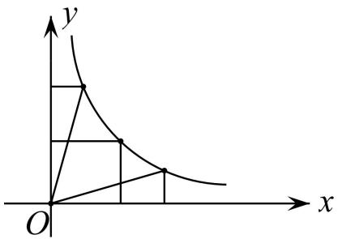

结论 1： $S _ { \mathrm { \# E } } { = } | k |$ ：结论 2： $S _ { \mathrm { \equiv / \# \mathcal { H } } } { = } | k |$

【模型 2】面积模型（四类）

类型一

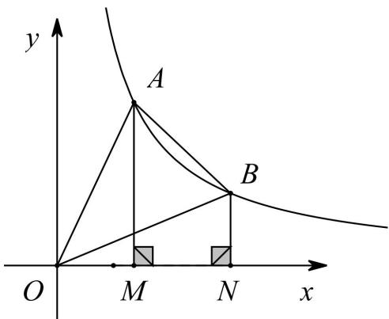

结论： $S _ { _ { \Delta A O B } } = S _ { _ { \mathrm { \# \# \# \# \# \# A B N M } } }$ 证明： $\cdot \cdot S _ { _ { \triangle A O B } } = S _ { _ { \perp \mathrm { { i } } \dot { 2 } \mathrm { { j } } \dddot { 4 } \dot { 4 } A O N B } } - S _ { _ { \triangle B O N } }$ $\begin{array} { r l } & { S _ { \Dot { \mathbb { H } ^ { \hat { \mathcal { H } } \hat { \mathcal { H } } \hat { \mathcal { H } } \hat { \mathcal { H } } M N M } } } = S _ { \Dot { \mathbb { H } \hat { \mathcal { H } } \hat { \mathcal { H } } A O N B } } - S _ { \Dot { \Delta A O M } } } \\ & { \cdot : S _ { \Dot { \Delta B O N } } = S _ { \Dot { \Delta A O M } } } \\ & { \cdot : S _ { \Dot { \Delta A O B } } = S _ { \Dot { \mathbb { H } ^ { \hat { \mathcal { H } } \hat { \mathcal { H } } \hat { \mathcal { H } } A O N M } } } . } \end{array}$

类型二

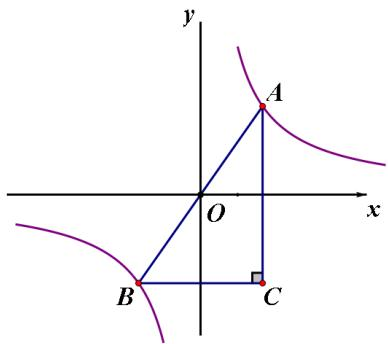

结论： $\textcircled{1}$ $\scriptstyle { \mathrm { A O } } = { \mathrm { B O } }$ ，AB 关于原点对称， $\textcircled{2}$ $\mathbf { S } _ { \triangle \mathrm { A B C } } = 4 | k |$

# 类型三

【淘宝店铺：向阳百分百】

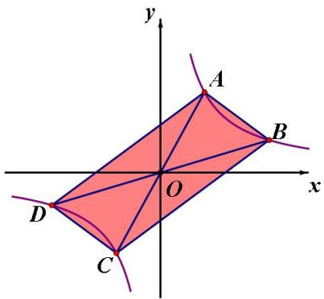

结论： $\textcircled{1}$ ABCD 为平行四边形， $\textcircled{2}$ $\dot { \mathbf { S } } _ { \mathrm { \ g q i \not { D } \mp \vec { \mu } \vec { \nu } \ A B C D } } = 4 \mathbf { S } _ { \triangle \mathrm { A O B } }$

类型四

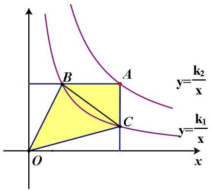

结论： $\mathrm { ~ S ~ } _ { \parallel \mathrm { i } ; \mathrm { j } \mp \mathrm { A B O C } } = k _ { 2 } - k _ { 1 }$

【模型 3】垂直模型

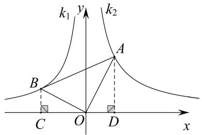

$$
O A \perp O B \Rightarrow \left| { \frac { k _ { 1 } } { k _ { 2 } } } \right| = { \frac { S _ { \Delta O B C } } { S _ { \Delta O A D } } } = \left( { \frac { O B } { O A } } \right) ^ { 2 }
$$

证明：作 BC⊥x 轴，AD⊥x 轴，则△BCO∽△ODA，∴ $. O A \bot O B \Rightarrow \left| { \frac { k _ { 1 } } { k _ { 2 } } } \right| = { \frac { S _ { \Delta O B C } } { S _ { \Delta O A D } } } = \left( { \frac { O B } { O A } } \right) ^ { 2 }$

# 【模型 4】比例端点模型

出现比例端点时可以考虑作垂线构造相似或设点坐标来转化

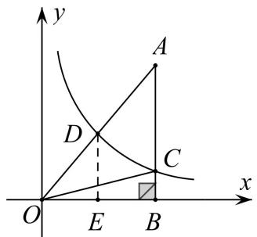

结论： BC ${ \frac { B C } { B A } } { = } \left( { \frac { O D } { O A } } \right) ^ { 2 }$

证明：过点 $\mathrm { D }$ 作 $\mathrm { D E } \bot x$ 轴， $\Delta O D E \sim \Delta O A B$ ，$\therefore { \frac { S _ { \triangle O D E } } { S _ { \triangle O A B } } } = \left( { \frac { O D } { O A } } \right) ^ { 2 } , ~ \because S _ { \triangle O D E } = S _ { \triangle O B C }$ $\therefore \left( { \frac { O D } { O A } } \right) ^ { 2 } = { \frac { S _ { \triangle O D E } } { S _ { \triangle O A B } } } = { \frac { S _ { \triangle O B C } } { S _ { \triangle O A B } } } = { \frac { B C } { B A } }$

# 【模型 5】矩形模型（平行性质和比例性质）

# 一、比例性质

如图,A,B 是反比例函数 $\mathrm { y } { = } \frac { k } { x }$ 图象上任意两点，过 A、B 作 x 轴、y 轴垂线段线段比（共线的线段之比为定值）

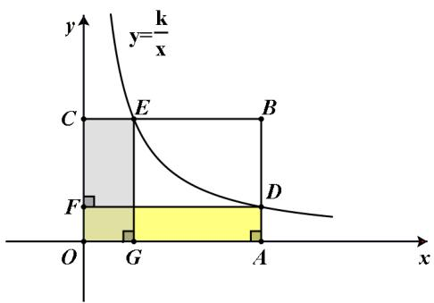

证明一：∵S 矩形 OADF＝S 矩形 OGEC， AO AD＝CE CO∴ CEAD =  
证明二： $\cdot \frac { S _ { \scriptscriptstyle \sharp \sharp \sharp \measuredangle A D F O } } { S _ { \scriptscriptstyle \sharp \sharp \measuredangle \measuredangle B C O } } = \frac { S _ { \scriptscriptstyle \sharp \boxplus \measuredangle C E G O } } { S _ { \scriptscriptstyle \sharp \boxplus \measuredangle \measuredangle A B C O } } \Rightarrow \frac { A D } { A B } = \frac { C E } { C B }$   
结论： ${ \frac { A D } { A B } } = { \frac { C E } { C B } }$

# 二、平行性质

【淘宝店铺：向阳百分百】

如图 1、图 2、图 3，点 $A$ 、 $B$ 是反比例函数 $y = { \frac { k } { x } }$ k 图象上的任意两点，过点 A 作 y 轴的垂线，垂足为点 C，过点 $B$ 作 $x$ 轴的垂线，垂足为点 $D$ ，连接 $A B$ 、 $C D$ ，则 $A B / / C D$ ．

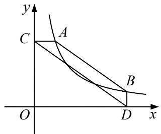  
图 1

  
图 2

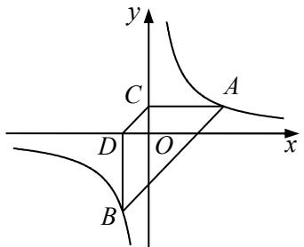  
图 3

下面以图 1 为例来证明（图 2、图 3 证法类似）：

法一：面积法（等积变形）

如图，易知 $S _ { \triangle A C E } { = } S _ { \triangle A D E }$ ，因为两个三角形同底等高，故 ED∥CA由平行关系还可以得出其它性质： $\triangle B E D \sim _ { \triangle B C A }$ ， ${ \frac { B E } { C E } } { = } { \frac { B D } { D A } }$ (平行线分线段成比例)

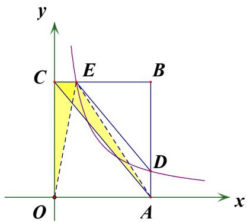

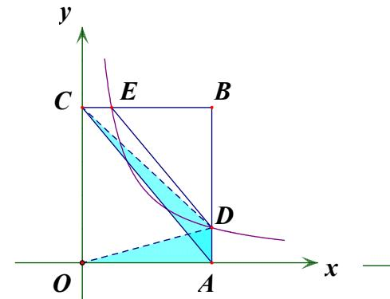

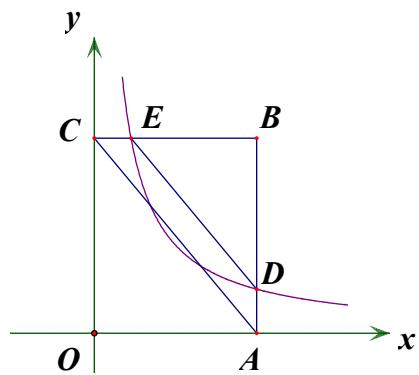

补充 简证

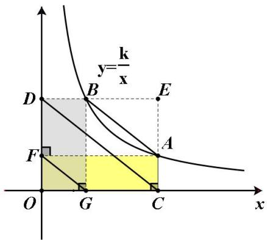

证明一:由比例性质可知， $\frac { A E } { E C } = \frac { E B } { E D } , \frac { O G } { O C } = \frac { O F } { O D }$ ,根据相似可知 AB∥CD∥GF  
证明二:∵ kSΔBDO = SΔBDC = kSΔ AOC = SΔ ADC =  
∴ BDC ADCSΔ = SΔ ∴ AB // CD ， 同理可证 CD∥GF

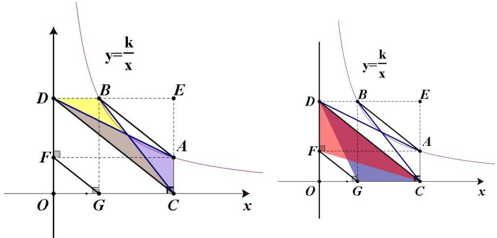

方法二：连接 OA、OB，延长 CA、DB 交于点 E

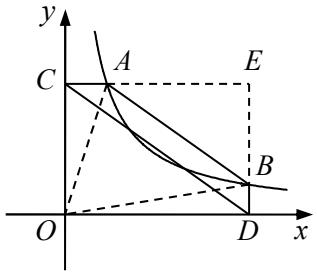

则 $O C { = } D E$ ， $O D { = } C E$   
由 $k$ 的几何意义可知 $S _ { \triangle A O C } = S _ { \triangle B O D }$   
$\begin{array} { l } { { \displaystyle { \therefore \frac { 1 } { 2 } } { \cal A } C \cdot O C = \frac { 1 } { 2 } { \cal B } D \cdot O D \mathrm {  ~ \Psi ~ } \therefore \frac { O D } { { \cal A } C } = \frac { O C } { { \cal B } D } } } \\ { { \displaystyle { \therefore \frac { C E } { { \cal A } C } } = \frac { D E } { { \cal B } D } \mathrm {  ~ \Psi ~ } \therefore \frac { { \cal A } E } { C E } = \frac { { \cal B } E } { D E } } } \end{array}$   
又∵ $\angle E = \angle E$ ，∴△EAB∽△ECD  
∴ $\angle E A B = \angle E C D$ ，∴AB∥CD  
方法三：延长 CA、DB 交于点 E  
设 $A { \Bigg ( } a , { \frac { k } { a } } { \Bigg ) } , B { \Bigg ( } b , { \frac { k } { b } } { \Bigg ) }$ ，则 $E { \Bigg ( } b , { \frac { k } { a } } { \Bigg ) }$   
$\therefore A E = b - a , C E = b , B E = \frac { k } { a } - \frac { k } { b } , D E = \frac { k } { a }$   
$\therefore { \frac { A E } { C E } } = { \frac { B E } { D E } } = { \frac { b - a } { b } }$   
又∵ $\angle \mathrm { E } { = } \angle \mathrm { E }$ ，∴△EAB∽△ECD  
∴∠EAB $=$ ∠ECD，∴AB∥CD

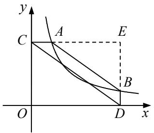

# 补充拓展：矩形模型中的翻折

如图，矩形 OABC 顶点 A，C 分别位于 x 轴，y轴正半轴，反比例函数 $y = { \frac { k } { x } }$ 在第一象限图象交矩形 OABC两边于 D，E 点，将△BED 沿 ED 翻折，若 B 点刚好落在 $x$ 轴上的点 F处，则 $\mathrm { E O = E F }$

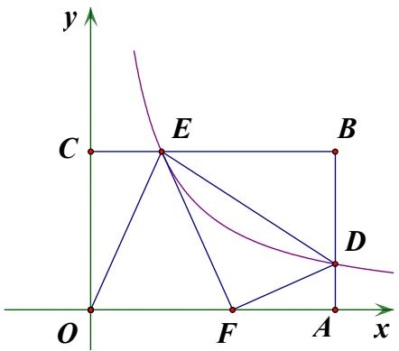

# 【模型六】等线段模型

如图 1、图 2，点 $A$ 、 $B$ 是反比例函数 $y = { \frac { k } { x } }$ 图象上的任意两点，直线 $A B$ 交 $y$ 轴于点 $C$ ，交 $x$ 轴于点 $D$ ，则$A C { = } B D$

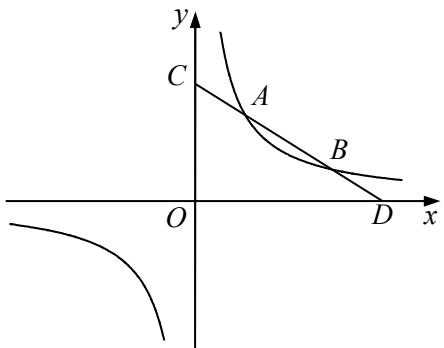  
图 1

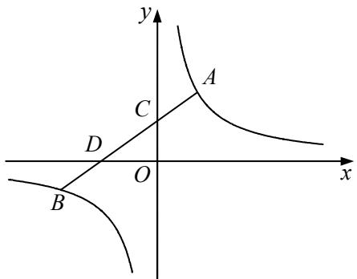  
图 2

证明：作 AE⊥y 轴于点 E，作 BF⊥x 轴于点 F  
由平行性质可知 AB∥EF  
∴四边形 CEFB 和四边形 AEFD 均为平行四边形$. \mathrm { B C } = \mathrm { E F } = \mathrm { A D }$ ，∴AC $=$ BD

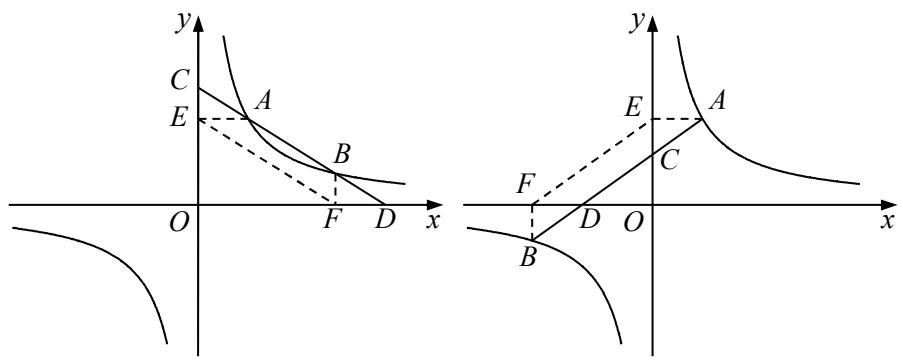

# 【模型七】等角模型

模型一：如图，点 A、 $B$ 是反比例函数 $y { = } \frac { k } { x }$ 图象上的任意两点，直线 $O B$ 交反比例函数 $y { = } \frac { k } { x }$ 的图象于另一点 $C$ ，直线 $A C$ 交 $x$ 轴于点 $D$ ，交 $y$ 轴于点 $E$ ，直线 $A B$ 交 $x$ 轴于点 $F$ ，交 $y$ 轴于点 $G$ ，则 $\angle A D F { = } \angle A F D$ ，$\angle A E G = \angle A G E$ ，由此可得 $A D { = } A F$ ， $C D = A E { = } A G { = } B F$ ， $A B { = } D E$ .

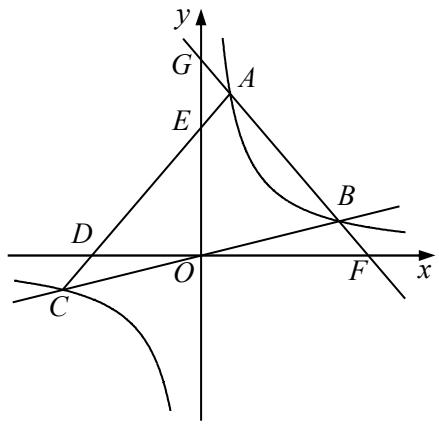

证明：作 $C N / / x$ 轴， $A N / / y$ 轴，BM⊥AN 于 M

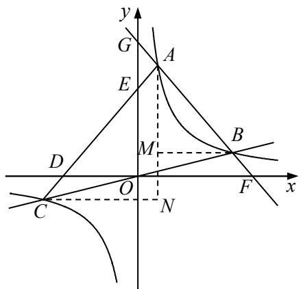

则 $\angle A D F { = \angle A C N }$ ， $\angle A F D = \angle A B M$ $\textit { A } ( a , \frac { k } { a } )$ $\textit { B } ( b , \frac { k } { b } )$ ，则 $C \ ( - b , \ - \frac { k } { b } )$   
$\therefore C N = a + b , A N = \frac { k } { a } + \frac { k } { b } , B M = b - a , A M = \frac { k } { a } - \frac { k } { b }$   
$\therefore \tan \angle A C N = { \frac { A N } { C N } } = { \frac { { \frac { k } { a } } + { \frac { k } { b } } } { a + b } } = { \frac { k } { a b } } , \tan \angle A B M = { \frac { A M } { B M } } = { \frac { { \frac { k } { a } } - { \frac { k } { b } } } { b - a } } = { \frac { k } { a b } }$   
∴tan∠ACN $\mathop { \bf { \tilde { \phi } } } =$ tan∠ABM，∴∠ACN＝∠ABM   
∴ $\angle A D F { = } \angle A F D$ ，∴ $A D { = } A F$ ， $\angle C E O = \angle F G O$   
∵ $\angle A E G = \angle C E O$ ，∴∠FGO＝∠AEG   
∴ $\scriptstyle A E = A G$   
∵ $A G { = } B F$ ，∴ $A E { = } B F$ ，∴ $A B { = } D E$   
∵ $C D { = } A E$ ，∴ $C D = A E = A G = B F$

模型二：如图，平行四边形 ABCD 顶点 A，B 位于反比例函数 $y = { \frac { k } { x } }$ 在第一象限的图象上，C，D 分别位于 $\mathbf { X }$ 轴正半轴和 y 轴正半轴上，则必然有 $\angle 1 = \angle 2$ ， $\angle 3 = \angle 4$

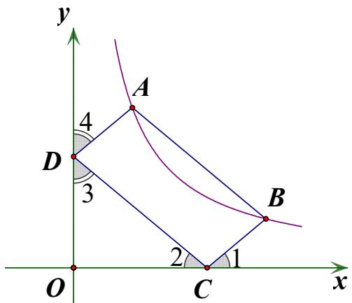

证明 1：延长直线 AB，分别交 $y$ 轴、 $\mathbf { X }$ 轴于 E，F。

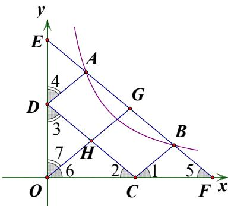

取 AB 中点 $\mathbf { G }$ ，连 GO 交 DC 于 $\mathrm { H }$ 。由反比例函数图象基本结论知，G 也是 EF 中点。∴ $\angle 6 = \angle 5 = \angle 2$ ，∴H 为 DC 中点，∴GO∥BC∴ $\angle 1 = \angle 6 = \angle 2$ ，进而可知 $\angle 3 = \angle 7 = \angle 4$

证明 2：延长直线 AB，分别交 y 轴、 $\mathbf { X }$ 轴于 E，F。

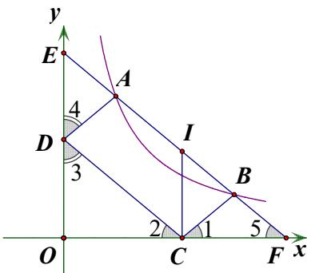

过 C 点作 y 轴平行线，交 AB 于 I，构平行四边形 EDCI. $\scriptstyle \cdot \mathrm { E I } = \mathrm { D C } = \mathrm { A B }$ ，即 $\mathrm { E A = I B }$ ，又由基本结论知 $\mathrm { E A = B F }$ ∴ $\mathrm { I B } { = } \mathrm { B F }$ ，∴ $\angle 2 = \angle 5 = \angle 1$ ，同理可证 $\angle 3 = \angle 4$

模型三：如图，平行四边形 ABCD 顶点 A，B 位于反比例函数 $y = { \frac { k } { x } }$ 在第一象限的图象上，C，D 分别位于 $y$ 轴负半轴和 $x$ 轴负半轴上，则必然有 $\angle 1 = \angle 2$ ， $\angle 3 = \angle 4$

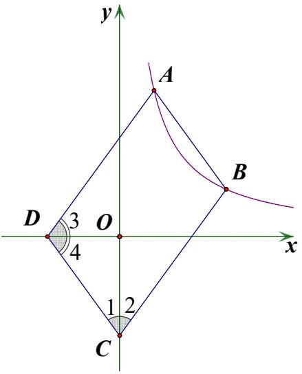

证明 1：延长直线 AB，分别交 $\mathsf { y }$ 轴、 $\mathbf { X }$ 轴于 E，F。取 AB 中点 $\mathbf { G }$ ，连 GO 并延长交 DC 于 H。由反比例函数图象基本结论知，G 也是 EF 中点。∴ $\angle 1 = \angle 5 = \angle 7 = \angle 6$ ，∴H 为 DC 中点，∴GH∥BC∴ $\angle 1 = \angle 6 = \angle 2$ ，进而可推 $\angle 3 = \angle 4$

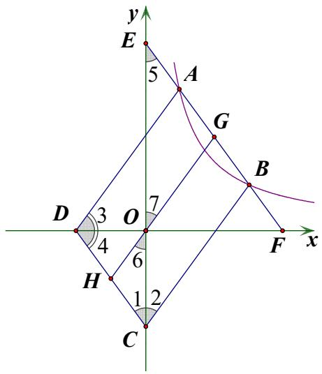

证明 2：延长直线 AB，分别交 y 轴、x 轴于 E，F。过 C 作 $\mathbf { X }$ 轴垂线，交直线 AB 于 I，构平行四边形 DCIF(cd: $\therefore \mathrm { F I } = \mathrm { D C } = \mathrm { A B }$ ,又由基本结论知 AE=BF,∴BE=BI∴ $\angle 1 = \angle 5 = \angle 2$ ，进而可推 $\angle 3 = \angle 4$

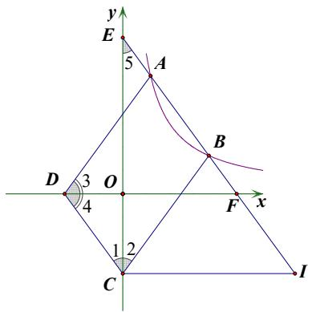

# 核心·题型

# 题型一 $| k / |$ 模型

1．如图是反比例函数 $y = \frac { k _ { 1 } } { x }$ 和 y  $y = \frac { k _ { 2 } } { x } ( k _ { 1 } < k _ { 2 } )$ 在第一象限的图象，直线 $A B / / y$ 轴，并分别交两条曲线于A、B两点，若 $S _ { \triangle A O B } { = } 4$ ，则 $k _ { 2 } - k _ { 1 }$ 的值是（ ）

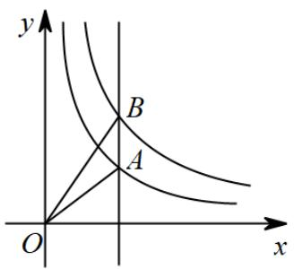

A．1 B．2 C．4 D．8

【答案】D

【详解】解：如图是反比例函数 $y = \frac { k _ { 1 } } { x }$ 和 $y = \frac { k _ { 2 } } { x } ( k _ { 1 } < k _ { 2 } )$ 在第一象限的图象，

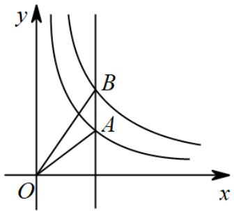

∵直线 $A B / / y$ 轴，  
设点 B（a，b），点 A 为（m，n），  
$k _ { 2 } = a b k _ { 1 } = m n$ ，

【淘宝店铺：向阳百分百】

$$
\begin{array} { l } { { \displaystyle \because S _ { \triangle { \cal O B } } = \frac { 1 } { 2 } a b - \frac { 1 } { 2 } m n = 4 \ : , } } \\ { { \displaystyle \therefore \frac { 1 } { 2 } k _ { 2 } - \frac { 1 } { 2 } k _ { 1 } = 4 \ : , \ : \ : \therefore k _ { 2 } - k _ { 1 } = 8 } } \end{array}
$$

2．如图，过 $y$ 轴正半轴上的任意一点 $P$ ，作 $x$ 轴的平行线，分别与反比例函数 $y = - { \frac { 6 } { x } }$ 和 $y = { \frac { 2 } { x } }$ 的图象交于点A和点 $B$ ，点 $C$ 是 $x$ 轴上的任意一点，连接 $A C$ 、 $B C$ ，则 ${ \triangle A B C }$ 的面积为（ ）

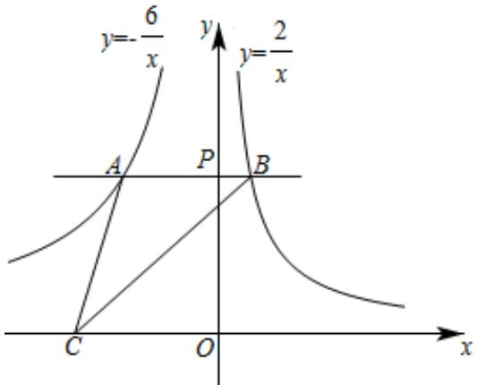

A．2 B．3 C．4 D．8

【答案】C

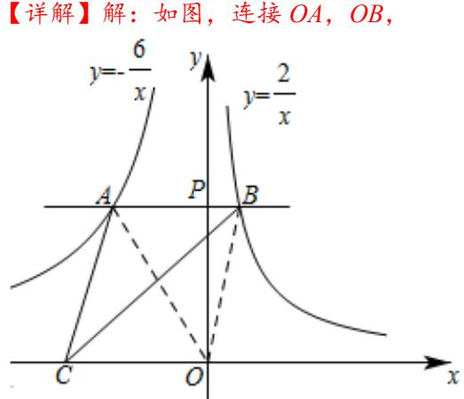

∵ $\triangle A O B$ 与 $\triangle A C B$ 同底等高，  
$\cdot . S _ { \varDelta } A O B { = } S _ { \varDelta } A C B$ ，  
∵ $\cdot$ 轴，  
∴AB⊥y 轴，  
∵A、 $\cdot$ 分别在反比例函数 $y = - { \frac { 6 } { x } } ( x < 0 )$ ）和 $\frac { 2 } { x }$ ）的图象上，$\cdot$ ， $S _ { \varDelta } B O P { = } 1$ ，  
. $\therefore S _ { \varDelta } A B C = S _ { \varDelta } A O B = S _ { \varDelta } A O P + S _ { \varDelta } B O P = 3 + 1 = 4$

# 2023 年辽宁省丹东市中考数学真题

3．如图，点 $A$ 是反比例函数 $y = { \frac { k } { x } } { \big ( } x > 0 { \big ) }$ 的图象上一点，过点 $A$ 作 $A C \perp x$ 轴，垂足为点 $C$ ，延长 $A C$ 至点 $B$ ，使 $B C = 2 A C$ ，点 $D$ 是 $y$ 轴上任意一点，连接 $A D$ ， $B D$ ，若 $\triangle A B D$ 的面积是 6，则 $k = _ { - }$

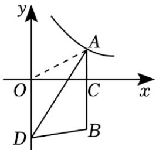

【答案】4

【详解】解：如图，连结 $O A$ 、 $O B$ ，

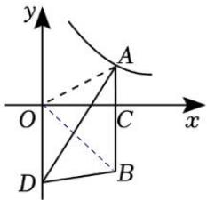

∵ $A B \perp x$ 轴，  
$O D / / A B$   
$S _ { \scriptscriptstyle \triangle O A B } = S _ { \scriptscriptstyle \triangle A B D } = 6$ ．  
$\because B C = 2 A C$ ，  
∵ 1 12 3AOC AOS  k  S 2B  ，  
∴ $\vert k \vert = 4$ ，  
∵图象位于第一象限，则 $k > 0 , ~ \therefore k = 4$

# 2022 年湖南省郴州市中考数学真题

4．如图，在函数 $y = { \frac { 2 } { x } } { \big ( } x > 0 { \big ) }$ 的图像上任取一点 $A$ ，过点 $A$ 作 $y$ 轴的垂线交函数 $y = - { \frac { 8 } { x } } { \big ( } x < 0 { \big ) }$ 的图像于点 $B$ ，连接 $O A$ ， $O B$ ，则 $\triangle A O B$ 的面积是（ ）

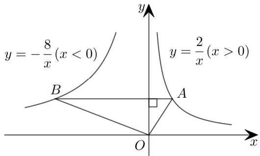

A．3 B．5 C．6 D．10

【答案】B

【详解】解：如图，作 $A D \perp x$ 轴， $B C \bot x$ 轴，

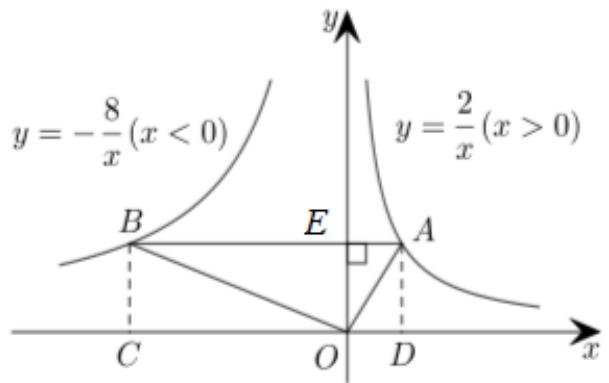

$$
\begin{array} { l } { \displaystyle { \mathrm {  ~ \psi ~ } _ { : } ^ { * } \ { \cal S } _ { O C B E } = B C \cdot B E = 8 , \ { \cal S } _ { A D O E } = A D \cdot A E = 2 } } \\ { \displaystyle } \\ { \displaystyle \mathrm {  ~ \cdot ~ } { \cal S } _ { O C B E } + { \cal S } _ { A D O E } = 1 0 } \\ { \displaystyle } \\  \displaystyle { \mathrm {  ~ \cdot ~ } { \cal S } _ { \Delta O B E } = \frac { 1 } { 2 } { \cal S } _ { O C B E } , \ { \cal S } _ { \Delta A O E } = \frac { 1 } { 2 } { \cal S } _ { A D O E } } \\ { \displaystyle } \\ { \displaystyle \mathrm {  ~ \cdot ~ } { \cal S } _ { \Delta A O B } = { \cal S } _ { \Delta O B E } + { \cal S } _ { \Delta A O E } = \frac { 1 } { 2 } \big ( { \cal S } _ { O C B E } + { \cal S } _ { A D O E } \big ) = 5 } \end{array}
$$

5．如图，直线 $x = t ( t > 0 )$ 与反比例函数 $y = { \frac { k } { x } } ( x > 0 )$ 、 $y = { \frac { - 1 } { x } } ( x > 0 )$ 的图象分别交于 $B$ 、 $C$ 两点， $A$ 为 $y$ 轴上任意一点， ${ \triangle A B C }$ 的面积为 3，则 $k$ 的值为

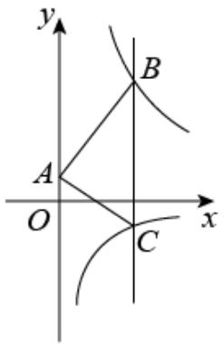

【答案】5

【详解】解：由题意得，点 $C$ 的坐标 $( { \mathit { \Omega } } _ { t } , \ \mathrm { \Pi } _ { - { \frac { 1 } { t } } } )$ ），点 $B$ 的坐标 $( { \mathit { \Omega } } _ { t } , \ { \frac { \mathit { k } } { t } } )$   
$\therefore B C = { \frac { 1 } { t } } + { \frac { k } { t } } ,$   
∵ ${ \triangle A B C }$ 的面积为 3，  
$\frac { 1 } { 2 } \times ( \frac { 1 } { t } + \frac { k } { t } ) \times t = 3$ ，解得 $k = 5$

# 2023·黑龙江齐齐哈尔·统考中考真题

6．如图，点 $A$ 在反比例函数 $y = { \frac { k } { x } } { \big ( } k \neq 0 { \big ) }$ 图像的一支上，点 $B$ 在反比例函数 $y = - { \frac { k } { 2 x } }$ 图像的一支上，点 $C$ ，$D$ 在 $x$ 轴上，若四边形 $A B C D$ 是面积为 9 的正方形，则实数 $k$ 的值为

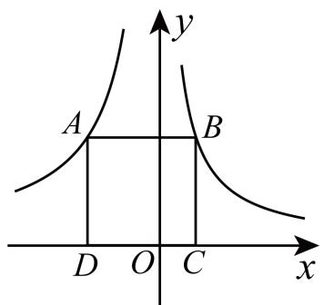

【答案】6

【详解】解：如图：

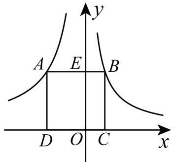

∵点 $A$ 在反比例函数 $y = { \frac { k } { x } } { \big ( } k \neq 0 { \big ) }$ 图像的一支上，点 $\cdot$ 在反比例函数 $y = - { \frac { k } { 2 x } }$ 图像的一支上，$\therefore S _ { O D A E } = \left| k \right| = - k , S _ { O C B E } = \left| { \frac { k } { 2 } } \right| = - { \frac { k } { 2 } }$ ∵四边形 $A B C D$ 是面积为 9 的正方形， $S _ { O D A E } + S _ { O C B E } = 9$ ，即 $- { \frac { k } { 2 } } - k = 9$ ，解得： $k = - 6$

# 题型二 面积模型

7．两个反比例函数 $y = { \frac { k } { x } }$ 和 $y = { \frac { 1 } { x } }$ 在第一象限内的图象如图所示，点 $P$ 在 $y = { \frac { k } { x } }$ 的图象上， $P C \perp x$ 轴于点 $C$ ，交 $y = { \frac { 1 } { x } }$ 的图象于点 $A$ ， $P D \perp y$ 轴于点 $D$ ，交 $y = { \frac { 1 } { x } }$ 的图象于点 $B$ ，当点 $P$ 在 $y = { \frac { k } { x } }$ 的图象上运动时，以下结论：

$\textcircled{1} \triangle { O D B }$ 与 $\triangle O C A$ 的面积相等；  
$\textcircled{2}$ 四边形 $P A O B$ 的面积不会发生变化；  
$\textcircled { 3 } P A$ 与 $P B$ 始终相等；  
$\textcircled{4}$ 当点 A 是 $P C$ 的中点时，点 $B$ 一定是 $P D$ 的中点．其中，正确的结论有（ ）个

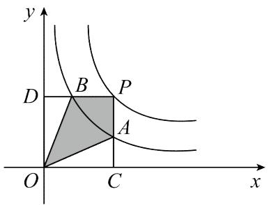

A．1 B．2 C．3 D．4

【答案】C

【详解】解：∵点 $A , B$ 均在反比例函数 $y = { \frac { 1 } { x } }$ 的图象上，且 $B D \perp y$ 轴， $A C \perp x$ 轴，$\therefore S _ { _ { \Delta O D B } } = \frac { 1 } { 2 } , S _ { _ { \Delta O C A } } = \frac { 1 } { 2 } ,$   
$S _ { \triangle { O D B } } = S _ { \triangle { O C A } }$ ，结论 $\textcircled{1}$ 正确；  
∵点 $P$ 在反比例函数 $y = { \frac { k } { x } }$ 的图象上，且 $P C \perp x$ 轴， $P D \perp p$ 轴，  
$\therefore S _ { \scriptscriptstyle { \perp O C P D } } = k$ ，  
$S _ { \scriptscriptstyle { [ \ P ] } \dot { \Sigma } \dot { \mathcal { I } } \ll P A O B } = S _ { \scriptscriptstyle { \Sigma O C P D } } - S _ { \scriptscriptstyle { \triangle O D B } } - S _ { \scriptscriptstyle { \triangle O C A } } = k - 1$ ，  
即四边形 $P A O B$ 的面积不会发生变化，结论 $\cdot$ 正确；  
设点 $P$ 的坐标为 $\left( m , { \frac { k } { m } } \right)$ 则点 $B$ 的坐标为 $\left( \frac { m } { k } , \frac { k } { m } \right)$ ，点 A 的坐标为 $A \left( m , { \frac { 1 } { m } } \right)$ $\therefore P A = { \frac { k } { m } } - { \frac { 1 } { m } } = { \frac { k - 1 } { m } } , P B = m - { \frac { m } { k } } = { \frac { m \left( k - 1 \right) } { k } } ,$   
 $P A$ 与 $P B$ 的关系无法确定，结论 $\cdot$ 错误；  
如图，连接 $O P$ ，  
点 A 是 $P C$ 的中点，  
$\therefore S _ { \scriptscriptstyle \triangle O A C } = S _ { \scriptscriptstyle \triangle O A P }$ ，  
$\because S _ { \mathrm { { } _ { \triangle O D P } } } = S _ { \mathrm { { } _ { \triangle O C P } } } = \frac { k } { 2 } ~ S _ { \mathrm { { \triangle O D B } } } = S _ { \mathrm { { } _ { \triangle O C A } } } = \frac { 1 } { 2 }$   
$\therefore S _ { \scriptscriptstyle \triangle O D P } - S _ { \scriptscriptstyle \triangle O D B } = S _ { \scriptscriptstyle \triangle O C P } - S _ { \scriptscriptstyle \triangle O C A }$ ，即 $S _ { \_ O B P } = S _ { \_ O A P }$ ，  
$\therefore S _ { \scriptscriptstyle \triangle O B P } = S _ { \scriptscriptstyle \triangle O A C } = S _ { \scriptscriptstyle \triangle O D B }$ ，  
∴点 $B$ 一定是 $P D$ 的中点，结论 $\textcircled{4}$ 正确；综上，正确的结论有 3 个

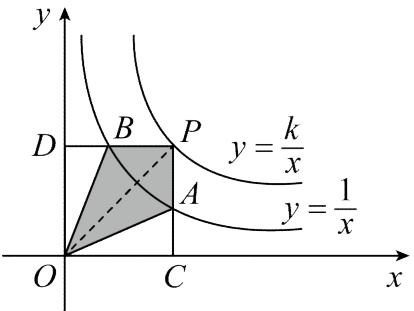

# 2022 年山东省日照市中考数学试卷

8．如图，矩形 OABC 与反比例函数 $y _ { 1 } = \frac { k _ { 1 } } { x }$ （ $. k _ { I }$ 是非零常数， $x { > } 0$ ）的图象交于点 $M , N ;$ ，与反比例函数 $y _ { 2 } = \frac { k _ { 2 } } { x }$ （ $k _ { 2 }$ 是非零常数， $x { > } 0$ ）的图象交于点 $B$ ，连接 $O M$ ，ON．若四边形 OMBN 的面积为 3，则 $k _ { I } - k _ { 2 } =$ （ ）

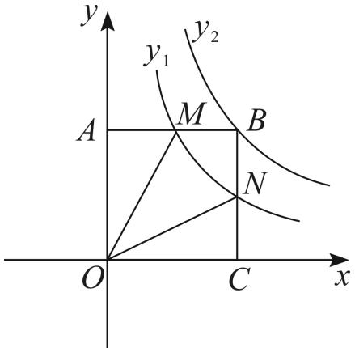

A．3 B．-3 C． $\frac { 3 } { 2 }$ D． $- { \frac { 3 } { 2 } }$

【答案】B

【详解】解：∵点 M、 $N$ 均是反比例函数 $y _ { 1 } = \frac { k _ { 1 } } { x }$ （ $\cdot$ 是非零常数， $\cdot$ ）的图象上，  
$S _ { \_ O A M } = S _ { \_ O C N } = { \frac { 1 } { 2 } } k _ { 1 }$   
∵矩形 $O A B C$ 的顶点 $B$ 在反比例函数 $y _ { 2 } = \frac { k _ { 2 } } { x }$ （ $\cdot$ 是非零常数， $\cdot$ ）的图象上，  
$\_$ ，  
∴S 四边形OMBN=S 矩形OABC-S△OAM-S△OCN=3，∴k2-k1=3，∴k1-k2=-3

9．如图，反比例函数 $y = { \frac { 6 } { x } }$ 在第一象限的图象上有两点 A， $B$ ，它们的横坐标分别是 2，6，则△AOB 的面积是

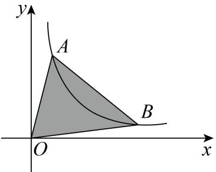

【答案】8

【详解】解：根据题意可得 A(2，3)， $B ( 6 , \ 1 )$ ，过点 $\cdot$ 作 $\cdot$ 轴，过点 $\cdot$ 作 $B D \perp x$ 轴，则 $\cdot$ ， $B D { = } 1$ ， $O C { = } 2$ ， $O D { = } 6$ ，DC=4$\cdot S _ { \_ O A B } = S _ { \_ O A C } + S _ { \_ B * \_ B * A C D B } - S _ { \_ O B D } = 2 \times 3 \div 2 + ( 3 + 1 ) \times 4 \div 2 - 6 \times 1 \div 2 = 3 + 8 - 3 = 8$

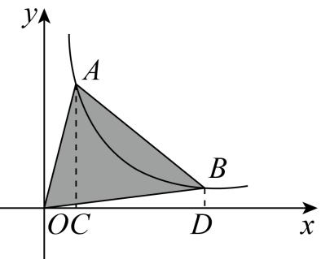

# 2023·广西·统考中考真题

10．如图，过 $y = { \frac { k } { x } } ( x > 0 )$ 的图象上点 $A$ ，分别作 $x$ 轴， $y$ 轴的平行线交 $y = - { \frac { 1 } { x } }$ 的图象于 $B , \ D$ 两点，以 $A B$ ，$A D$ 为邻边的矩形 $A B C D$ 被坐标轴分割成四个小矩形，面积分别记为 $S _ { 1 }$ $\ d s _ { 1 } ^ { \dag } , \ d s _ { 2 } ^ { \dag } , \ d s _ { 3 } ^ { \dag } , \ d s _ { 4 }$ ，若 $S _ { 2 } + S _ { 3 } + S _ { 4 } = \frac { 5 } { 2 }$ ，则 $k$ 的值为（ ）

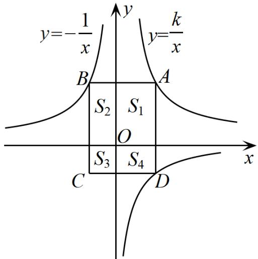

A．4 B．3 C．2 D．1

【答案】C

【详解】设 $A { \big ( } a , b { \big ) }$ ，则 $B { \Bigg ( } { - } { \frac { 1 } { b } } , b { \Bigg ) } D { \Bigg ( } a , { - } { \frac { 1 } { a } } { \Bigg ) } C { \Bigg ( } { - } { \frac { 1 } { b } } , { - } { \frac { 1 } { a } } { \Bigg ) }$   
∵点 A 在 $y = { \frac { k } { x } } ( x > 0 )$ 的图象上  
则 $S _ { 1 } = a b = k$ ，  
同理∵B，D 两点在 $y = - { \frac { 1 } { x } }$ 的图象上，  
则 $S _ { 2 } = S _ { 4 } = 1$   
故 3S $S _ { 3 } = \frac { 5 } { 2 } - 1 - 1 = \frac { 1 } { 2 }$

又∵ $S _ { 3 } = \left( - \frac { 1 } { b } \right) \times \left( - \frac { 1 } { a } \right) = \frac { 1 } { 2 } ,$ ，即 ${ \frac { 1 } { a b } } = { \frac { 1 } { 2 } }$ ，故 $a b = 2$ ，∴ k  2

# 2023 年湖北省黄石市中考数学真题

11．如图，点 $A { \Bigg ( } a , { \frac { 5 } { a } } { \Bigg ) }$ 和 $B \bigg ( b , \frac { 5 } { b } \bigg )$ 在反比例函数 $y = { \frac { k } { x } } { \big ( } k > 0 { \big ) }$ 的图象上，其中 $a ~ > ~ b ~ > ~ 0$ ．过点 $A$ 作 $A C \perp x$ 轴于点 $C$ ，则 ${ \triangle A O C }$ 的面积为 ；若 $\triangle A O B$ 的面积为 $\frac { 1 5 } { 4 }$ ， 则 $\frac { a } { b } = \_$

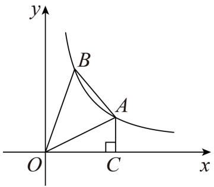

【答案】 52 2

【思路点拨】根据 $A { \Bigg ( } a , { \frac { 5 } { a } } { \Bigg ) }$ ，得出 5OC a, AC  ， 根据三角形面积公式，即可求出 $\triangle A O C$ 的面积；过点 B作 $B D \perp x$ 轴于点 $\mathrm { D }$ ， $B D$ 交 $O A$ 于点 E，根据 $S _ { \triangle O B D } = S _ { \triangle O D E } + S _ { \triangle O B E } = \frac { 5 } { 2 } , ~ S _ { \triangle A O C } = S _ { \triangle O D E } + S _ { \boxplus \boxplus \boxplus E D C A E } = \frac { 5 } { 2 }$ 得出$S _ { \_ O B E } = S _ { \scriptscriptstyle { \perp } \bar { 9 } \dot { 1 } \dot { 2 } \bar { 1 } \bar { 5 } \bar { . } D C A E }$ ，进而得出 $S _ { \scriptscriptstyle \Delta A O B } = S _ { \scriptscriptstyle \sharp \sharp \jmath \sharp , B D C A }$ ，根据梯形面积公式，列出方程，化简得 ${ \frac { a } { b } } - { \frac { b } { a } } = { \frac { 3 } { 2 } }$ 令 $x = \frac { a } { b }$ 则 $x - { \frac { 1 } { x } } = { \frac { 3 } { 2 } }$ 求出 $\cdot$ 的值，根据 $a ~ > ~ b ~ > ~ 0$ ，得出 $\frac { a } { b } > 1$ ，即 $x > 1$ ，即可解答

【详解】解： $A { \Bigg ( } a , { \frac { 5 } { a } } { \Bigg ) }$   
$\stackrel { \cdot } { \cdot } O C = a , A C = \frac { 5 } { a } ,$   
$S _ { \_ A O C } = \frac { 1 } { 2 } O C \cdot A C = \frac { 1 } { 2 } \cdot a \cdot \frac { 5 } { a } = \frac { 5 } { 2 }$   
过点 B 作 $B D \perp x$ 轴于点 $\mathrm { D }$ ， $B D$ 交 $O A$ 于点 E，  
$\begin{array} { l } { \displaystyle \ddot { \mathrm {  ~ \scriptstyle { \ x } ~ } } \cdot \delta \left( { b , \frac { 5 } { b } } \right) , } \\ { \displaystyle } \\ { \displaystyle \dot { \mathrm {  ~ \scriptstyle { \ x } ~ } } \cdot O D = b , B D = \frac { 5 } { b } , } \\ { \displaystyle \dot { \mathrm {  ~ \scriptstyle { \ x } ~ } } S _ { \alpha \partial B D } = \frac { 1 } { 2 } O D \cdot B D = \frac { 1 } { 2 } \cdot \frac { 5 } { b } \cdot b = \frac { 5 } { 2 } , } \\ { \displaystyle \dot { \mathrm {  ~ \scriptstyle { \ x } ~ } } S _ { \alpha \partial B D } = S _ { \alpha \partial B E } + S _ { \alpha \partial B E } = \frac { 5 } { 2 } , ~ S _ { \alpha \partial C } = S _ { \alpha O D E } + S _ { \mu _ { 1 } \dot { \imath } \dot { \imath } _ { 2 } \dot { \jmath } b \alpha D c a E } = \frac { 5 } { 2 } , } \end{array}$

【淘宝店铺：向阳百分百】

∴ OBE DCAES  S  四边形 ，  
$S _ { \scriptscriptstyle \triangle A O B } = S _ { \scriptscriptstyle \triangle O B E } + S _ { \scriptscriptstyle \triangle A B E } = S _ { \scriptscriptstyle  { \boxplus } \mathscr { H } \mathscr { H } D C A E } + S _ { \scriptscriptstyle \triangle A B E } = S _ { \scriptscriptstyle  { \boxplus } \mathscr { H } B D C A }$ ，  
$\therefore S _ { \mathrm { s s } \mathrm { B g g } B B D C d } = \frac { 1 } { 2 } C D \big ( A C + B D \big ) = \frac { 1 } { 2 } \times \big ( a - b \big ) \bigg ( \frac { 5 } { a } + \frac { 5 } { b } \bigg ) = \frac { 1 5 } { 4 } ,$   
整理得： ${ \frac { a } { b } } - { \frac { b } { a } } = { \frac { 3 } { 2 } }$ ,  
令 $x = \frac { a } { b }$   
则 $x - { \frac { 1 } { x } } = { \frac { 3 } { 2 } }$   
解得： $x _ { \mathrm { 1 } } = - { \frac { \mathrm { 1 } } { 2 } }$ （舍）， $x _ { 2 } = 2$ ，  
$\because a > b > 0$ ，  
$\cdot { \frac { a } { b } } { > } 1$ ，即 $x > 1$ ，$\frac { a } { b } = 2$ ，故答案为： ${ \frac { 5 } { 2 } } , 2 .$

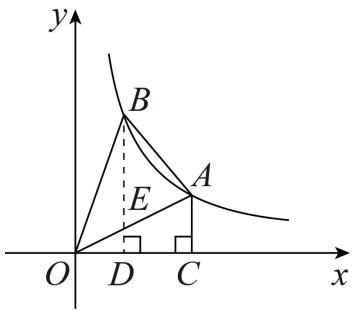

# 2023 年湖南省湘西中考真题

12．如图，点 $A$ 在函数 $y = \frac { 2 } { x } ( x > 0 )$ 的图象上，点 $B$ 在函数 $y = { \frac { 3 } { x } } ( x > 0 )$ 的图象上，且 $A B / / x$ 轴， $B C \perp x$ 轴于点 $C$ ，则四边形 $A B C O$ 的面积为（ ）

A．1 B．2 C．3 D．4

【答案】B

【详解】解：延长 $B A$ 交 y 轴于点 $D$ ，【淘宝店铺：向阳百分百】

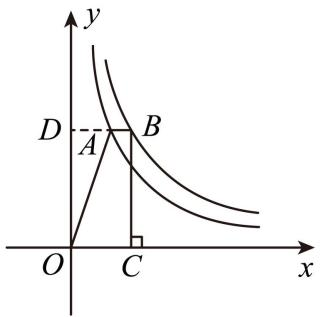

∵ $A B / / x$ 轴，  
∴ $D A \perp y$ 轴，  
∵点 $\cdot$ 在函数 $y = \frac { 2 } { x } ( x > 0 )$ 的图象上，  
$S _ { _ { \triangle A D O } } = \frac { 1 } { 2 } \times 2 = 1$   
∵ $B C \perp x$ 轴于点 $C$ ， $D B \bot y$ 轴，点 $\cdot$ 在函数 $y = { \frac { 3 } { x } } ( x > 0 )$ 的图象上，  
$\therefore S _ { \mathrm { \# G \# G } O C B D } = 3$ ，  
∴四边形 $A B C O$ 的面积等于 $S _ { \mathrm { \# E \# } \ell \mathcal { O } C B D } - S _ { \mathrm { \# D } O } = 3 - 1 = 2$   
江苏省南京市 2021 年中考数学试卷

13．如图，正比例函数 $y = k x$ 与函数 $y = { \frac { 6 } { x } }$ 的图像交于 $A , B$ 两点， $B C / / x$ 轴， $A C / / y$ 轴，则 $S _ { \scriptscriptstyle \triangle A B C } = \_$

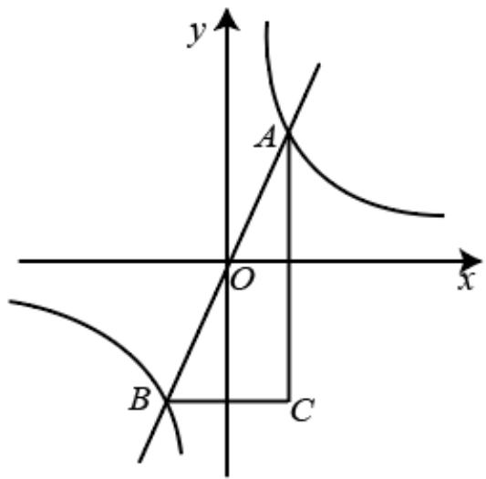

【答案】12

【详解】解：设 $\textit { A } ( t , \ { \frac { 6 } { t } } )$ ;  
∵正比例函数 $y = k x$ 与函数 $y = { \frac { 6 } { x } }$ 的图像交于 $\cdot$ ， $\cdot$ 两点，$\therefore B ( - t , - { \frac { 6 } { t } } )$ ,  
∵ $B C / / x$ 轴， $A C / / y$ 轴，

∴C（t， t 6 $S _ { _ { \Delta A B C } } = { \frac { 1 } { 2 } } B C \cdot A C = { \frac { 1 } { 2 } } \Big [ t - \big ( - t \big ) \Big ] \Bigg [ { \frac { 6 } { t } } - \Bigg ( - { \frac { 6 } { t } } \Bigg ) \Bigg ] = t \cdot { \frac { 1 2 } { t } } = 1 2$

# 题型三 垂直模型

14．已知点 $A$ ， $B$ 分别在反比例函数 $y = \frac { 2 } { x } ( x { > } 0 ) , y = \frac { - 8 } { x }$ （ $x { > } 0$ ）的图象上且 $O A \bot O B$ ，则 tanB 为（ ）

A． $\frac { 1 } { \sqrt { 2 } }$ B ． 12 C ． 3 D． 13

【答案】B

【详解】解：设点 A 的坐标为 $( x _ { 1 } \quad { \frac { 2 } { x _ { 1 } } } )$ ， 点 $B$ 的坐标为 $( x _ { 2 } \ , \quad - { \frac { 8 } { x _ { 2 } } } )$   
设线段 $O A$ 所在的直线的解析式为： $y = k _ { 1 } x$ ，线段 $O B$ 所在的直线的解析式为： $y = k _ { 2 } x$ ，  
则 $k _ { 1 } = \frac { 2 } { x _ { 1 } ^ { 2 } } k _ { 2 } = - \frac { 8 } { x _ { 2 } ^ { 2 } }$   
$\because O A \bot O B$ ，  
$\therefore k _ { 1 } k _ { 2 } = \frac { 2 } { x _ { 1 } ^ { 2 } } \cdot ( - \frac { 8 } { x _ { 2 } ^ { 2 } } ) = - 1$   
整理得： ${ { ( x _ { 1 } x _ { 2 } ) } ^ { 2 } } = 1 6$ ，  
$\therefore \tan B = \frac { O A } { O B } = \frac { \sqrt { x _ { 1 } ^ { 2 } + ( \frac { 2 } { x _ { 1 } } ) ^ { 2 } } } { \sqrt { x _ { 2 } ^ { 2 } + ( \frac { - 8 } { x _ { 2 } } ) ^ { 2 } } }$   
$\begin{array} { r l } & { = \sqrt { \frac { x _ { 2 } ^ { 2 } x _ { 1 } ^ { 4 } + 4 x _ { 2 } ^ { 2 } } { x _ { 1 } ^ { 2 } + 1 + x _ { 2 } ^ { 2 } } } } \\ & { = \sqrt { \frac { 4 x _ { 2 } ^ { 2 } + 1 6 x _ { 1 } ^ { 2 } } { 6 4 x _ { 1 } ^ { 2 } + 1 6 x _ { 2 } ^ { 2 } } } } \\ & { = \sqrt { \frac { 4 x _ { 2 } ^ { 2 } + 1 6 x _ { 1 } ^ { 2 } } { 6 4 x _ { 1 } ^ { 2 } + 1 6 x _ { 2 } ^ { 2 } } } } \\ & { = \sqrt { \frac { 2 ( 2 x _ { 2 } ^ { 2 } + 8 x _ { 1 } ^ { 2 } ) } { ( - 8 ) \times ( - 8 x _ { 1 } ^ { 2 } - 2 x _ { 2 } ^ { 2 } ) } } } \\ & { = \sqrt { - \frac { 2 } { - 8 } } } \\ & { = \frac { 1 } { 2 } } \end{array}$

15．如图，在 $x$ 轴的上方，直角 $\angle B O A$ 绕原点 $O$ 按顺时针方向旋转．若 $\angle B O A$ 的两边分别与函数 $y = - { \frac { 1 } { x } }$

【淘宝店铺：向阳百分百】

$y = { \frac { 2 } { x } }$ 的图象交于 $B$ 、 $A$ 两点，则 $\angle O A B$ 大小的变化趋势为（ ）

A．逐渐变小 B．逐渐变大 C．时大时小 D．保持不变

【答案】D

【详解】解：分别过 $\cdot$ 和 $\cdot$ 作 $\cdot$ 轴于点 $\cdot$ ， $\cdot$ 轴于点 $F$ ，  
则 $\_$ ，$\cdot \frac { B E } { O F } { = } \frac { O E } { A F }$   
设点 $\cdot$ 为 $( a , \ - \frac { 1 } { a } )$ ， $A$ 为 $\frac { 2 } { b }$   
则 ${ \frac { \partial } { \partial a } } { \frac { 1 } { \partial b } } = { \frac { 1 } { \partial b } } { \frac { 2 } { \partial b } }$   
可代入比例式求得 $a ^ { 2 } b ^ { 2 } = 2$ ，即 $a ^ { 2 } = \frac { 2 } { b ^ { 2 } }$ ,  
根据勾股定理可得： ${ \sqrt { O E ^ { 2 } + E B ^ { 2 } } } = { \sqrt { a ^ { 2 } + { \frac { 1 } { a ^ { 2 } } } } } \qquad { \sqrt { O F ^ { 2 } + A F ^ { 2 } } } = { \sqrt { b ^ { 2 } + { \frac { 4 } { b ^ { 2 } } } } }$   
$\therefore \tan \angle O A B = \frac { O B } { O A } = \frac { \sqrt { { a } ^ { 2 } + { \cfrac { 1 } { { a } ^ { 2 } } } } } { \sqrt { { b } ^ { 2 } + { \cfrac { 4 } { { b } ^ { 2 } } } } } = \frac { \sqrt { { \frac { 2 } { { b } ^ { 2 } } } + { \cfrac { { b } ^ { 2 } } { 2 } } } } { \sqrt { { b } ^ { 2 } + { \cfrac { 4 } { { b } ^ { 2 } } } } } = \frac { \sqrt { \frac { 1 } { 2 } ( \frac { 4 } { { b } ^ { 2 } } + { b } ^ { 2 } ) } } { \sqrt { { b } ^ { 2 } + \frac { 4 } { { b } ^ { 2 } } } } = \frac { \sqrt { 2 } } { 2 }$   
∴ $\angle O A B$ 大小是一个定值，因此 $\cdot$ 的大小保持不变  
故选：D

16．如图， 已知第一象限内的点 A 在反比例函数 y＝2x 的 图象上， 第二象限内的点 $B$ 在反比例函数 $y = { \frac { k } { x } }$ 的图象上， 且 $O A \bot O B$ ， $c o s A { = } \frac { \sqrt { 1 0 } } { 1 0 }$ 则 $k$ 的值为（ ）

A． $- 1 2 \sqrt { 3 }$ B．－16 C．－6 3 D．－18

【答案】D

【详解】解：过 $\cdot$ 作 $A N \bot x$ 轴于 $\cdot$ ，过 $\cdot$ 作 $\cdot$ 轴于 $\cdot$   
$\frac { \sqrt { 1 0 } } { 1 0 }$   
${ \frac { O A } { B A } } = { \frac { \sqrt { 1 0 } } { 1 0 } }$   
设 $O A = { \sqrt { 1 0 } } a$ ， $B A = 1 0 a$ ，  
$O B = \sqrt { A B ^ { 2 } - O A ^ { 2 } } = 3 \sqrt { 1 0 } a$ ，$\displaystyle \frac { O B } { O A } = 3$ ，  
∵ $\cdot O A \bot O B$ ，  
∴ $\cdot \angle B M O = \angle A N O = \angle A O B = 9 0 ^ { \circ }$ ，  
∴ $-$ ， $-$ ，  
∴ $\angle M B O = \angle A O N ,$ ，  
∴ $-$ ，$\cdot \frac { B M } { O N } = \frac { O M } { A N } = \frac { O B } { O A } = 3$ ，  
设 $A ~ ( x , ~ \frac { 2 } { x } ) , ~ O N { = } x , ~ A N { = } \frac { 2 } { x } ,$   
$\frac { 6 } { x }$ ，  
即 $B$ 的坐标是 $( \mathbf { \partial } - { \frac { 6 } { x } } , \ 3 \mathbf { \ } x )$ ，  
把 $\cdot$ 的坐标代入反比例函数 $y = { \frac { k } { x } }$ 得， $3 x = \frac { k } { - \frac { 6 } { x } } ,$   
解得， $\cdot$ ，  
故选： $\cdot$ ．

17．如图，已知 $A$ 是双曲线 $y = { \frac { 2 } { x } } { \big ( } x > 0 { \big ) }$ 上一点，过点 $A$ 作 $A B / / x$ 轴，交双曲线 $y = - { \frac { 3 } { x } } { \big ( } x < 0 { \big ) }$ 于点 $B$ ，若$O A \bot O B$ ，则 $\frac { O A } { O B }$ 的值为（ ）

A． $\frac { 2 } { 3 }$ B． 49 C． 6 D． $\frac { \sqrt { 6 } } { 2 }$

【答案】C【详解】

解： $A$ 点在双曲线 $y = \frac { 2 } { x } ( x > 0 )$ 上一点， 设 2A( ， $A ( \frac { 2 } { m } , m )$ ，  
$\boldsymbol { \mathrm { Q } } \boldsymbol { \mathit { A } } \boldsymbol { B } \mathrm { ~ / / ~ } \boldsymbol { x }$ 轴， $B$ 在双曲线 $y = - { \frac { 3 } { x } } ( x < 0 )$ 上，设 $B ( - \frac { 3 } { m } \quad m )$ ，  
$ \begin{array} { l } { \displaystyle { \langle z ^ { } , D { \cal A } ^ { 2 } = { \frac { 4 } { m ^ { 2 } } } ^ { + } m ^ { 2 } } ^ { - } } \\ { \displaystyle { \langle z ^ { } , D { \cal A } ^ { \perp } . O B \rangle } } \\ { \displaystyle { \langle z ^ { } , D { \cal A } ^ { 2 } + B O ^ { 2 } = { \cal A } B ^ { 2 } } \\ { \displaystyle { \langle \frac { 4 } { m ^ { 2 } } ^ { + } m ^ { 2 } + { \frac { 9 } { m ^ { 2 } } } ^ { + } m ^ { 2 } = ( { \frac { 2 } { m } } + { \frac { 3 } { m } } ) ^ { 2 } } \\ { \displaystyle { \langle z ^ { } , m ^ { 2 } = { \frac { 6 } { m ^ { 2 } } } ^ { - } } } \end{array} } }$   
$\therefore { \frac { A O ^ { 2 } } { B O ^ { 2 } } } = { \frac { \displaystyle { \frac { 4 } { m ^ { 2 } } } + m ^ { 2 } } { \displaystyle { \frac { 9 } { m ^ { 2 } } } + m ^ { 2 } } } = { \frac { \displaystyle { \frac { 1 0 } { m ^ { 2 } } } } { \displaystyle { \frac { 1 5 } { m ^ { 2 } } } } } = { \frac { 2 } { 3 } } ~ \therefore { \frac { A O } { B O } } = { \frac { \sqrt { 6 } } { 3 } }$

# 2023·福建·统考中考真题

18．如图，正方形四个顶点分别位于两个反比例函数 $y = { \frac { 3 } { x } }$ 和 $y = { \frac { n } { x } }$ 的图象的四个分支上，则实数n的值为（ ）

1 13 A． 3 B． 3 C． D．3

【答案】A

【详解】解：如图所示，连接正方形的对角线，过点 $A , B$ 分别作 $x$ 轴的垂线，垂足分别为 $C , D$ ，点 $B$ 在 $y = { \frac { 3 } { x } }$ 上，

$O B = O A \angle A O B = \angle B D O = \angle A C O = 9 0 ^ { \circ }$ ，  
$\angle C A O = 9 0 ^ { \circ } - \angle A O C = \angle B O D$   
$\triangle A O C { \cong } \triangle O B D$   
$S _ { \_ A O C } = S _ { \_ O B D } = { \frac { 3 } { 2 } } = { \frac { \left| n \right| } { 2 } }$   
∵A 点在第二象限，  
∴ $n = - 3$

# 2023·四川达州·统考中考真题

19．如图，一次函数 y  2x 与反比例函数 2y  的 图象相交于 $A , B$ 两点，以 AB 为边作等边三角形 ABC ，若反比例函数 $y = { \frac { k } { x } }$ 的图象过点 $C$ ，则 $k$ 的值为

【答案】6

【详解】如图所示，过点 A 作 $A D \perp x$ 轴交 $\cdot$ 轴于点 D，过点 C 作 $C E \perp x$ 轴于点 E，连接 $O C$ ，

∵一次函数 $y = 2 x$ 与反比例函数 $y = { \frac { 2 } { x } }$ 的图象相交于 $A , B$ 两点，  
∴联立 $\left\{ \begin{array} { l l } { { y = 2 x } } \\ { { } } \\ { { y = { \frac { 2 } { x } } } } \end{array} \right.$ $2 x = \frac { 2 } { x }$   
∴解得 $x = \pm 1$ ，  
$\begin{array} { r l } { A { \left( 1 , 2 \right) } } & { { } B { \left( - 1 , - 2 \right) } } \end{array}$   
$\therefore { \cal O } { \cal D } = 1 , A { \cal D } = 2 ,$   
$\therefore O A = { \sqrt { 1 ^ { 2 } + 2 ^ { 2 } } } = { \sqrt { 5 } } ,$ ，  
$A O = B O = \sqrt { 5 }$ ，  
∵ ${ \triangle A B C }$ 是等边三角形，  
$C O \bot A B \quad \angle A C O = \angle B C O = { \frac { 1 } { 2 } } \angle A C B = 3 0 ^ { \circ }$   
$A C = 2 O A = 2 { \sqrt { 5 } }$ ，  
$\therefore O C = \sqrt { A C ^ { 2 } - O A ^ { 2 } } = \sqrt { 1 5 } \ ,$ ，  
$\therefore \angle A O C = 9 0 ^ { \circ }$ ，  
$\therefore \angle A O D + \angle C O E = 9 0 ^ { \circ }$ ，  
∵ $\angle A D O = 9 0 ^ { \circ }$ ，  
$\angle A O D + \angle O A D = 9 0 ^ { \circ }$ ，  
∴ $\angle O A D = \angle C O E$ ，  
又∵ $\angle C E O = \angle O D A = 9 0 ^ { \circ }$ ，  
$\mathsf { V O C E } \{ \mathsf { \sim } \mathsf { V } A O D$ ，

$\cdot \frac { O C } { A O } = \frac { C E } { O D } = \frac { O E } { A D }$ 即 ${ \frac { \sqrt { 1 5 } } { \sqrt { 5 } } } = { \frac { C E } { 1 } } = { \frac { O E } { 2 } } ,$ ∴解得 $C E = \sqrt { 3 }$ ， $O E = 2 \sqrt { 3 }$ ，∴点 C 的坐标为 $\left( - 2 { \sqrt { 3 } } , { \sqrt { 3 } } \right)$

20．如图，点 $A$ 是双曲线 $y = { \frac { 3 } { x } }$ 上的动点，连结 $_ { A O }$ 并延长交双曲线于点 $B$ ，将线段 $A B$ 绕 $B$ 顺时针旋转 $6 0 ^ { \circ }$ 得到线段 $B C$ ，点 $C$ 在双曲线 $y = { \frac { k } { x } }$ 上的运动，则 $k ^ { = } -$

【答案】﹣9．

【详解】解：∵双曲线 $\mathrm { y } = { \frac { 3 } { x } }$ 关于原点对称，  
∴点 A 与点 B 关于原点对称  
∴O $\mathrm { A } { = } \mathrm { O B }$   
连接 OC，AC，如图所示  
∵将线段 AB 绕 B 顺时针旋转 $\cdot$ 得到线段 BC，  
∴ $\cdot$ ABC 是等边三角形， $\mathrm { O A } { = } \mathrm { O B }$ ，  
∴OC $\cdot$ AB， $\angle B { \mathrm { A C } } = 6 0 ^ { \circ }$ ，  
$\therefore \tan \angle \mathrm { O A C } = { \frac { O C } { O A } } = { \sqrt { 3 } } ,$ ，  
$\mathbf { \partial } \cdot \mathrm { O C } = { \sqrt { 3 } } \mathrm { O A }$   
过点 A 作 AE $\cdot$ 轴，垂足为 E，过点 C 作 CF⊥y 轴，垂足为  
∵AE⊥OE，CF⊥OF，OC⊥OA，  
∴ $\angle \mathrm { A E O } = \angle \mathrm { O F C }$ ， $\angle \mathrm { A O E } { = } 9 0 ^ { \circ } - \angle \mathrm { F O C } { = } \angle \mathrm { O C F } ,$ ，  
∴△AEO∽△OFC  
$\therefore { \frac { A E } { O F } } { = } { \frac { O E } { F C } } { = } { \frac { A O } { O C } } .$   
∵ ${ \sqrt { 3 } }$ ，  
∴ ${ \mathrm { . O F } } = { \sqrt { 3 } } { \mathrm { A E } }$ ， $\mathrm { F C } = \sqrt { 3 } \mathrm { E O }$   
设点 A 坐标为（a，b），  
∵点 A 在第一象限，  
∴ $. { \mathrm { A E } } { = } { \mathrm { a } }$ ， $\mathrm { O E = b }$   
$\therefore { \mathrm { O F } } = { \sqrt { 3 } } { \mathrm { A E } } = { \sqrt { 3 } } { \mathrm { a } }$ ， $\mathrm { F C } = { \sqrt { 3 } } \mathrm { E O } = { \sqrt { 3 } } \mathrm { b } .$   
∵点 A 在双曲线 $\frac { 3 } { x }$   
∴ab $\cdot$ ．$\scriptstyle \cdot \mathrm { F C } \bullet \mathrm { O F } = { \sqrt { 3 } } \ b \bullet { \sqrt { 3 } } \ a = 3 \mathrm { a b } = 9 ,$ ，  
设点 C 坐标为（x，y），  
∵点 C 在第四象限，  
∴FC $\cdot$ ， $\mathrm { O F = - \Delta y }$   
∴FC•OF $\cdot$ $( \mathbf { \partial } - \mathbf { \partial } _ { \mathbf { y } } ) \mathbf { \partial } = \mathbf { \partial } - \mathbf { \partial } _ { \mathbf { x } } \mathbf { y } { = } 9$   
∴ $\cdot$ ．  
∵点 C 在双曲线 $\frac { k } { x }$ $\cdot$

21．如图，点 $A$ 是双曲线 $y = - { \frac { 6 } { x } }$ 在第二象限分支上的一个动点，连接 $_ { A O }$ 并延长交另一个分支于点 $B$ ，以$A B$ 为底作等腰 ${ \triangle A B C }$ 且 $\angle A C B = 1 2 0 ^ { \circ }$ ，点 $C$ 在第一象限，随着点 $A$ 的运动，点 $C$ 始终在双曲线 $y = { \frac { k } { x } }$ 上运动，则 $k =$

【答案】 2

【详解】解：如图所示，连接 $C O$ ，过点A作 $A D \perp x$ 轴于点 $D$ ，过点 $C$ 作 $C E \perp x$ 轴于点 $E$ ，点 $C$ 在第一象限，随着点 $\cdot$ 的运动，点 $C$ 始终在双曲线 $y = { \frac { k } { x } }$ 上运动，

$\therefore k > 0$   
连接 $A O$ 并延长交另一分支于点 $B$ ，以 $A B$ 为底作等腰 $\triangle A B C$ ，且 $\angle A C B = 1 2 0 ^ { \circ }$ ，$\cdot . C O \bot A B$ ， $\angle C A B = 3 0 ^ { \circ }$ ，  
则 $\angle A O D + \angle C O E = 9 0 ^ { \circ }$ ，  
 $\cdot \angle D A O + \angle A O D = 9 0 ^ { \circ }$ ，$\cdot \angle D A O = \angle C O E$ ，  
又 $\angle A D O = \angle C E O = 9 0 ^ { \circ }$ ，  
$\therefore \Delta A O D \sim _ { \Delta } O C E$ ，  
$\begin{array} { r c l } { { } } & { { } } & { { \displaystyle \therefore \frac { A D } { E O } = \frac { O D } { C E } = \frac { O A } { O C } } } & { { = \tan 6 0 ^ { \circ } = \sqrt { 3 } ~ , } } \\ { { } } & { { } } & { { \displaystyle \therefore \frac { S _ { _ { \Delta A O D } } } { S _ { _ { \Delta E O C } } } = \left( \sqrt { 3 } \right) ^ { 2 } } } & { { = 3 , } } \end{array}$   
点A是双曲线 $y = - { \frac { 6 } { x } }$ 在第二象限分支上的一个动点，  
$\therefore S _ { _ { \Delta A O D } } = \frac { 1 } { 2 } \times \left| x y \right| = 3$   
$\therefore S _ { \_ E O C } = 1$ 即 $\scriptstyle { \frac { 1 } { 2 } } \times O E \times C E = 1 \quad \therefore k = O E \times C E = 2$

22．如图，RtOAB 的顶点 $O$ 与坐标原点重合， $\angle A O B = 9 0 ^ { \circ }$ ， $A O = { \sqrt { 2 } } B O$ ，当A 点在反比例函数 $y = { \frac { 1 } { x } } { \big ( } x > 0 { \big ) }$ 的图象上移动时， $B$ 点坐标满足的函数解析式为

【答案】 $y = - \frac { 1 } { 2 x }$

【详解】如图，作 $A C \perp x$ 轴于点 $\cdot$ ， $B D \perp x$ 轴于点 $D$   
∵ $\angle A O C + \angle O A C = 9 0 ^ { \circ }$ ， $\angle A O C + \angle B O D = 9 0 ^ { \circ }$   
$\because \angle O A C = \angle B O D$ ，  
' $\angle A C O = \angle O D B = 9 0 ^ { \circ }$ ，  
$\triangle A C O \sim _ { \triangle } O D B$ ，且相似比为 ${ \frac { A O } { B O } } = { \sqrt { 2 } }$ ．  
$\frac { S _ { _ { \Delta A C O } } } { S _ { _ { \Delta O D B } } } = ( \frac { A O } { B O } ) ^ { 2 } = 2$   
由反比例函数比例系数的几何意义可知 $S _ { _ { \Delta A C O } } = \frac { 1 } { 2 } { \times } 1 = \frac { 1 } { 2 }$   
$\therefore S _ { _ { \Delta O D B } } = \frac { 1 } { 4 } .$   
∴ $\cdot$ 点坐标满足的函数解析式为反比例函数，设其解析式为 $y = { \frac { k } { x } }$   
$\therefore | k | = 2 S _ { \scriptscriptstyle \Delta O D B } = \frac { 1 } { 2 } ,$   
∴ $k = \pm \frac { 1 } { 2 }$   
∵点 $\cdot$ 在第二象限，即 $k < 0$ ，  
$\therefore k = - { \frac { 1 } { 2 } } .$   
∴ $\cdot$ 点坐标满足的函数解析式为 $y = - { \frac { 1 } { 2 x } }$

故答案为： $y = - \frac { 1 } { 2 x }$

# 题型四 比例端点模型

23．如图，在平面直角坐标系中，梯形 OACB 的顶点 O 是坐标原点，OA 边在 y 轴正半轴上，OB 边在 x轴正半轴上，且 OA∥BC，双曲线 $\mathrm { y } { = } \frac { k } { x } ( \mathbf { x } { > } 0 )$ ）经过 AC 边的中点，若 $\mathrm { S } _ { \hbar ^ { \prime } \hbar \not \equiv 0 \mathrm { A C B } } { = } 4$ ，则双曲线 $\mathrm { y } { = } \frac { k } { x }$ 的k 值为（ ）

A．5 B．4 C．3 D．2

【答案】D

【详解】过 $A C$ 的中点 $P$ 作 $D E / / x$ 轴交 $y$ 轴于 $D$ ，交 $B C$ 于 $E$ ，作 $P F \perp x$ 轴于 $F$ ，如图，

在 $\triangle P A D$ 和 $\triangle P C E$ 中，  
$\left\{ \begin{array} { c } { \angle A P D = \angle C P E } \\ { \angle A D P = \angle P E C } \\ { P A = P C } \end{array} \right.$   
$\begin{array} { r l } & { \langle \ \cdot \ \cdot \ \Delta P A D \cong \Delta P C E \ ( A A S ) , } \\ & { \langle \ \cdot \ S _ { s \not \perp \theta B } = S _ { s \not \perp \theta B } , } \\ & { \langle \ \cdot \ S _ { \theta \oplus A \oplus B C } = S _ { \theta \oplus B \theta B } , } \\ & { \langle \ \cdot \ S _ { \theta \oplus B \oplus B F } = \displaystyle \frac { 1 } { 2 } S _ { \theta \oplus B \oplus B F } , } \\ & { \langle \ \cdot \ S _ { \theta \oplus B \oplus B F } = \displaystyle \frac { 1 } { 2 } S _ { \theta \oplus B \oplus B F } = \displaystyle \frac { 1 } { 2 } \times 4 = 2 \ , } \\ & { \langle \ \cdot \ | k | = 2 \ , } \end{array}$   
而 $k > 0 \therefore k = 2$

# 2022·浙江衢州·统考中考真题

24．如图，在 ${ \triangle A B C }$ 中，边 $A B$ 在 $x$ 轴上，边 $A C$ 交 $y$ 轴于点 $E$ ．反比例函数 $y = { \frac { k } { x } } { \big ( } x > 0 { \big ) }$ 的图象恰好经过点 $C$ ，与边 $B C$ 交于点 $D$ ．若 $A E = C E$ ， $C D = 2 B D$ ， $S _ { \scriptscriptstyle \triangle A B C } = 6$ ，则 $k = \_$

【答案】 $\frac { 1 2 } { 5 }$

【思路点拨】过点 $C$ 作 $C F \perp x$ 轴于点 $F$ ，过点 $D$ 作 $D G \perp x$ 轴于点 $G$ ，设点 $C$ 的坐标为 $\scriptstyle ( m , n )$ ，则$O F = m , C F = n , m n = k$ ，先根据相似三角形的判定可得 $\triangle A O E \sim \triangle A F C$ ，根据相似三角形的性质可得$A O = O F = m$ ，又根据相似三角形的判定证出 $\triangle B D G \sim \triangle B C F$ ，根据相似三角形的性质可得 $D G = { \frac { 1 } { 3 } } n$ ，$B G = \frac { 1 } { 3 } B F$ ，再根据反比例函数的解析式可得 $O G = 3 m$ ，从而可得 $B F = 3 m , A B = 5 m$ ，然后根据 $S _ { \scriptscriptstyle \triangle A B C } = 6$ 即可得出答案

【淘宝店铺：向阳百分百】

【详解】解：如图，过点 $C$ 作 $C F \perp x$ 轴于点 $F$ ，过点 $D$ 作 $D G \perp x$ 轴于点 $G$ ，

设点 $C$ 的坐标为 $\scriptstyle ( m , n )$ ，则 $O F = m , C F = n , m n = k$   
 $A E = C E$ ， $C D = 2 B D$ ，  
$\therefore { \frac { A E } { A C } } = { \frac { 1 } { 2 } } , { \frac { B D } { B C } } = { \frac { 1 } { 3 } } ,$ ，  
 $O E \bot x$ 轴， $C F \perp x$ 轴，  
$\therefore O E \parallel C F$ ，  
$\therefore \triangle A O E \sim \triangle A F C$ ，$\cdot \frac { A O } { A F } { = } \frac { A E } { A C } { = } \frac { 1 } { 2 }$ ， 即 $A O = { \frac { 1 } { 2 } } A F$ ，  
$\therefore A O = O F = m$ ，  
又 $C F \perp x$ 轴， $D G \perp x$ 轴，  
$\therefore C F \| D G$ ，  
$\therefore \triangle B D G \sim _ { \triangle } B C F$ ，$\cdot \frac { B G } { B F } = \frac { D G } { C F } = \frac { B D } { B C }$ 即 $\frac { B G } { B F } = \frac { D G } { n } = \frac { 1 } { 3 } ,$   
解得 $D G = { \frac { 1 } { 3 } } n$ ， $B G = \frac { 1 } { 3 } B F$   
将 $x = { \frac { 1 } { 3 } } n$ 代入反比例函数 $y = { \frac { k } { x } }$ 得： $y = \frac { k } { \frac { 1 } { 3 } n } = 3 m$ ,  
$\therefore D { \left( 3 m , \frac { 1 } { 3 } n \right) } , O G = 3 m$   
$\therefore F G = O G - O G = 2 m$ ，  
由 $B G = \frac { 1 } { 3 } B F$ 得： $B F = { \frac { 3 } { 2 } } F G = 3 m$ ，  
$\begin{array} { l } { { \therefore { \cal A } { \cal B } = { \cal A } { \cal O } + { \cal O } { \cal F } + { \cal B } { \cal F } = m + m + 3 m = 5 m , } } \\ { { \ } } \\ { { \displaystyle \mathrm { ~ } \because S _ { \mathrm { { \small a } } { \cal B } { \cal C } } = 6 , } } \\ { { \displaystyle \mathrm { ~ } \therefore \frac 1 2 { \cal A } { \cal B } \cdot { \cal C } { \cal F } = \frac 1 2 \times 5 m n = 6 , } } \end{array}$ ，  
解得 $m n = \frac { 1 2 } { 5 }$ 即 $k = \frac { 1 2 } { 5 }$

# 广东深圳·统考中考真题

25．如图，双曲线 $y = { \frac { k } { x } }$ 经过 Rt△BOC 斜边上的点 A，且满足 ${ \frac { A O } { A B } } = { \frac { 2 } { 3 } }$ ， 与 BC 交于点 D，S△BOD=21，求 k= ．

【答案】8

【详解】试题思路点拨：解：过A作AE $\perp x$ 轴于点E．因为 $-$ ，所以S四边形AECB ${ \bf \Pi } _ { \mathfrak { p } } = :$ S BOD=21，因为 AE∥BC，所以 OAE∽△OBC，所以 $\frac { S _ { \scriptscriptstyle \Delta O A E } } { S _ { \scriptscriptstyle \Delta O B C } } = \frac { S _ { \scriptscriptstyle \Delta 0 A E } } { S _ { \scriptscriptstyle \Delta O A E } + S _ { \scriptscriptstyle \mathrm { A E C B } } } = \ ( \frac { A O } { O B } ) \ 2 = \frac { 4 } { 2 5 }$ 所以 $\_$ ，则 $\cdot$ ．

26．如图， $\mathrm { R t } \triangle B O C$ 的一条直角边 $O C$ 在 $x$ 轴正半轴上，双曲线 $y = { \frac { k } { x } }$ 过 $\triangle B O C$ 的斜边 $O B$ 的中点A ，与另一直角边 $B C$ 相交于点 $D$ ，若 $\triangle B O D$ 的面积是 6，则 $k$ 的值是

【答案】4

【详解】解：设点 C 的坐标为 (a,0)(a  0) ，则 ( , )kD a a ，  
$\because S _ { _ { \Delta B O D } } = { \frac { 1 } { 2 } } O C \cdot B D = 6 \ ,$   
$\cdot \frac { a } { 2 } \cdot B D = 6$ ，解得 $B D = { \frac { 1 2 } { a } }$ ,  
$\therefore B C = \frac { k } { a } + \frac { 1 2 } { a } = \frac { k + 1 2 } { a }$

【淘宝店铺：向阳百分百】

$\therefore B ( a , { \frac { k + 1 2 } { a } } ) ,$ ，  
 点 $A$ 是 $\cdot$ 的中点，  
$\therefore A \left( { \frac { 0 + a } { 2 } } , { \frac { k + 1 2 } { 2 a } } \right)$ , 即 $A \left( { \frac { a } { 2 } } , { \frac { k + 1 2 } { 2 a } } \right)$ ,  
又 点 ( , a A $A ( \frac { a } { 2 } , \frac { k + 1 2 } { a } )$ 在双曲线上，  
$\therefore k = { \frac { a } { 2 } } \cdot { \frac { k + 1 2 } { a } } , \therefore k = 4$

27．如图，双曲线 $y = { \frac { k } { x } }$ 经过 $R t { \triangle } B O C$ 斜边上的点A ，且满足 ${ \frac { A O } { A B } } = { \frac { 1 } { 2 } }$ 与 $B C$ 交于点 $D$ ，BOD的面积为三う，2 ，则 $k =$

【答案】 $\frac 1 2$

【详解】解：过 $A$ 作 $A E \bot x$ 轴，垂足为 $E$ ，则 $-$ ，  
$\frac { A O } { A B } = \frac { 1 } { 2 }$ ${ \frac { A O } { O B } } = { \frac { 1 } { 3 } }$   
∵ $-$ ，  
∴△AOE∽△BOC，  
$\therefore { \frac { S _ { \scriptscriptstyle \Delta A O E } } { S _ { \scriptscriptstyle \Delta B O C } } } = \left( { \frac { O A } { O B } } \right) ^ { 2 } = \left( { \frac { 1 } { 3 } } \right) ^ { 2 } = { \frac { 1 } { 9 } } ,$   
∵点 $A$ ， $\cdot$ 分别在双曲线 $y = { \frac { k } { x } }$ 上  
$\begin{array} { l } { { S _ { \triangle / o c } = S _ { \triangle / o c } = \displaystyle \frac { 1 } { 2 } k } } \\ { { \ } } \\ { { S _ { s B o c } = S _ { s B o D } + S _ { s D o c } = 2 + \displaystyle \frac { 1 } { 2 } k } } \\ { { \ } } \\ { { S _ { s B o c } = 9 S _ { s A o c } = \displaystyle \frac { 9 } { 2 } k } } \\ { { \ } } \\ { { \displaystyle \frac { 9 } { 2 } k = 2 + \displaystyle \frac { 1 } { 2 } k } } \end{array}$

【淘宝店铺：向阳百分百】$\frac { 1 } { 2 }$ 故答案为： $\frac { 1 } { 2 }$

28．如图，已知三角形的顶点 $C$ 在反比例函数 $y = { \frac { 4 } { x } }$ 位于第一象限的图象上，顶点A 在 $x$ 轴的负半轴上，顶点 $B$ 在反比例函数 $y = { \frac { k } { x } } ( k \neq 0 )$ 位于第四象限的图象上， $B C$ 边与 $x$ 轴交于点 $D$ ， $C D = 2 B D$ ， $A C$ 边与$y$ 轴交于点 $E$ ， $A E = C E$ ，若 $\triangle A B D$ 面积为 $\frac { 5 } { 2 }$ 则 k 

【答案】 3.5

【详解】过 $C$ 作 $C F \perp A D$ 于 $F$ ，过 $B$ 作 $B H \perp A D$ 于点 $H$ ，如图示：

设 $C \left( x , { \frac { 4 } { x } } \right) \left( x > 0 \right)$ ，则OF  x ， $C F = { \frac { 4 } { x } }$ ,  
$\therefore O E / / C F / / B H$ ，  
$. . . _ { \Delta A O E ^ { \sim } \Delta A F C }$ ， $\triangle C D F ^ { \sim } \triangle B D H$ ，  
 $C D = 2 B D$ ， $A E = C E$ ，  
$\therefore A F = 2 x B H = { \frac { 2 } { x } }$   
$\therefore B \left( { \frac { k x } { 2 } } , - { \frac { 2 } { x } } \right) ,$   
$\therefore O H = - { \frac { k x } { 2 } } ,$   
$\therefore D F = { \frac { 2 } { 3 } } \ F H = { \frac { 2 } { 3 } } ( - \ { \frac { k x } { 2 } } - x ) = - \ { \frac { k x } { 3 } } - { \frac { 2 } { 3 } } \ x$   
$\therefore \frac { 1 } { 2 } \times A D \times B H = \frac { 1 } { 2 } \times ( 2 x - \frac { k x } { 3 } - \frac { 2 } { 3 } x ) \times \frac { 2 } { x } = \frac { 5 } { 2 }$ , 解得： $k = - 3 . 5$

29．如图，矩形 $O A B C$ 的顶点 $\mathbf { A }$ ， $C$ 分别在 $x$ 轴、 $y$ 轴的正半轴上，它的对角线 $O B$ 与函数 $y = { \frac { k } { x } } ( x > 0 )$ 的图象相交于点 $D$ ，且 $O D : O B = 1 : { \sqrt { 2 } }$ ，若矩形 $O A B C$ 的面积为24 ，则 $k$ 的值是

【答案】12

【详解】解：如图所示，过点 $D$ 作 $D E \bot x$ 轴于点 $E$ ，

∵四边形 $O A B C$ 是矩形，  
∴ $\angle B A O = 9 0 ^ { \circ }$ ，$D E / / A B$ ，$\therefore \Delta O D E ^ { \sim } \Delta O B A$ ，$\therefore O D : O B = 1 : { \sqrt { 2 } }$ ，$\frac { S _ { \triangle D E O } } { S _ { \triangle A B O } } = \left( \frac { O D } { O B } \right) ^ { 2 } = \frac { 1 } { 2 }$   
∵矩形 $O A B C$ 的面积为24，$S _ { \triangle A B O } = 1 2$   
$\therefore S _ { _ { \Delta O D E } } = \frac { 1 } { 2 } { \times } 1 2 = 6$   
∵函数 $y = { \frac { k } { x } } ( x > 0 )$ 过点 $D$ ，  
则 ${ \frac { \left| k \right| } { 2 } } = 6$   
又∵ $D$ 在第一象限，∴ $k = 1 2$

30．如图， $\mathrm { R t } \triangle B O C$ 的一条直角边 $O C$ 在 $x$ 轴正半轴上，双曲线 $y = { \frac { k } { x } }$ 过 $\triangle B O C$ 的斜边 $O B$ 的中点A ，与另

【淘宝店铺：向阳百分百】

一直角边 $B C$ 相交于点 $D$ ，若 $\triangle B O D$ 的面积是 6，则 $k$ 的值是

【答案】4

【详解】解：设点 C 的坐标为 (a,0)(a  0) ，则 ( , )kD a a ，  
$\because S _ { _ { \Delta B O D } } = { \frac { 1 } { 2 } } O C \cdot B D = 6$   
$\therefore { \frac { a } { 2 } } \cdot B D = 6$ ，解得 $B D = { \frac { 1 2 } { a } }$   
$\therefore B C = \frac { k } { a } + \frac { 1 2 } { a } = \frac { k + 1 2 } { a }$   
$\therefore B ( a , { \frac { k + 1 2 } { a } } ) ,$   
 点 $A$ 是 $\cdot$ 的中点，  
$\therefore A \left( { \frac { 0 + a } { 2 } } , { \frac { k + 1 2 } { 2 a } } \right)$ , 即 $A \left( { \frac { a } { 2 } } , { \frac { k + 1 2 } { 2 a } } \right)$ ,  
又 点 $A ( \frac { a } { 2 } , \frac { k + 1 2 } { a } )$ 在双曲线上，  
$\therefore k = { \frac { a } { 2 } } \cdot { \frac { k + 1 2 } { a } } \therefore k = 4$

31．（2023·辽宁锦州·统考一模）如图，矩形 $O A B C$ 的顶点 $A$ ， $C$ 分别在 $x$ 轴， $y$ 轴的正半轴上，点 $B$ 在第一象限，反比例函数 $y = { \frac { k } { x } } ( x > 0 )$ 的图象交矩形的对角线 $O B$ 于点 $D$ ，分别交 $B C$ ， $A B$ 于点 $E$ ， $F$ ，连接$D E$ ， $D F$ ．若 $O D = 2 B D$ ， $S _ { \perp \perp \perp \perp \perp \perp \perp } = 2$ ，则 $k = _ { - }$

【答案】 $\frac { 2 4 } { 5 }$

【详解】解：作 $D H \bot O A$ 于 $H$ ，连接 $O E$ 、 $O F$ ，

【淘宝店铺：向阳百分百】

∵ BA  OA ，  
$D H / / B A$ ，  
$\therefore \Delta O H D \sim _ { \Delta } O A B$ ，${ \frac { O H } { O A } } = { \frac { D H } { B A } } = { \frac { O D } { O B } }$   
$O D = 2 B D$ ，  
$\therefore { \frac { O H } { O A } } = { \frac { D H } { B A } } = { \frac { O D } { O B } } = { \frac { 2 } { 3 } } ,$   
设 $O H = 2 m , D H = 2 n$ ，则： $O A = 3 m , A B = 3 n$ ，  
$\therefore S _ { \mathrm { a f f } \ A B C O } = O A \cdot A B = 9 m n , S _ { \mathrm { a } O H D } = \frac { 1 } { 2 } O H \cdot D H = 2 m n \ ,$ ，  
∵点 $D$ ， $E$ ， $F$ ，在反比例函数 $y = { \frac { k } { x } } ( x > 0 )$ 的图象上，  
$\begin{array} { l } { { S _ { \scriptscriptstyle \Delta O C E } = S _ { \scriptscriptstyle \Delta O A F } = S _ { \scriptscriptstyle \Delta O D H } = 2 m n = \displaystyle \frac { k } { 2 } } } \\ { { \ O D = 2 B D } } \\ { { S _ { \scriptscriptstyle \Delta O D F } = 2 S _ { \scriptscriptstyle \Delta B D F } , S _ { \scriptscriptstyle \Delta O D E } = 2 S _ { \scriptscriptstyle \Delta B D E } } } \\ { { S _ { \scriptscriptstyle \perp \lambda j \lambda j \lambda \partial B D F } = S _ { \scriptscriptstyle \Delta O D F } + S _ { \scriptscriptstyle \Delta B D F } + S _ { \scriptscriptstyle \Delta O D E } + S _ { \scriptscriptstyle \Delta B D E } = 3 \big ( S _ { \scriptscriptstyle \Delta B D F } + S _ { \scriptscriptstyle \Delta B D E } \big ) } } \end{array}$   
即： $S _ { \mathrm { p q } _ { \mathrm { i } } \mathrm { j } \mathrm { \# } \mathrm { \# } \mathrm { \# } O E B F } = 3 S _ { \mathrm { \# } \mathrm { i } \mathrm { \# } \mathrm { \# } D E B F } = 6$ ，  
$\because S _ { \perp \perp \perp \mathcal { H } O E B F } = S _ { \perp \perp \mathcal { H } A B C O } - S _ { \triangle O C E } - S _ { \triangle O A F } = 5 m n $ ，  
$\therefore 5 m n = 6$ ，6mn  5  
$\therefore \frac { k } { 2 } = 2 m m = \frac { 1 2 } { 5 } , \therefore k = \frac { 2 4 } { 5 }$

32．如图，已知梯形 $A B C O$ 的底边 $A O$ 在 $x$ 轴上，BC∥AO，AB⊥AO，过点 $C$ 的双曲线 $y = { \frac { k } { x } }$ 交 $O B$ 于点 $D$ ，且 $O D$ ： $D B = 1$ ：2，若 $\triangle O B C$ 的面积等于 6，则 $k$ 的值为

【答案】 $\frac { 3 } { 2 }$

【详解】解：过点 $\cdot$ 作 $\cdot$ 轴于点 $E$ ，过点 $\cdot$ 作 $D F \bot x$ 轴于点 $F$ ，

∵梯形 ABCO 的底边 $A O$ 在 $\cdot$ 轴上，BC//AO，AB⊥A  
∴四边形 OABE 是矩形，  
$\therefore S _ { \varDelta } O B E { = } S _ { \varDelta } O A B$ ，  
∵过点 $C$ 的双曲线 $y = { \frac { k } { x } }$ 交 $O B$ 于点 $D$ ，  
$-$ ，  
$-$ ，  
∵DF//AB，  
∴△ODF∽△OBA，  
∵OD： $D B { = } 1 { : } ~ 2$ ，  
∴OD：OB=1：3，  
∴S△ODF：S△OAB=1：9，  
∴S△ODF： $\_$ 8，  
$\begin{array} { l } { \displaystyle { \therefore S _ { \varDelta } O D F { = } \frac { 1 } { 8 } S _ { \mathit { \ v a y s } } A B D F { = } \frac { 1 } { 8 } \times 6 { = } \frac { 3 } { 4 } , } } \\ { \displaystyle { \ } } \\ { \displaystyle { \therefore k { = } \frac { 3 } { 2 } } } \end{array}$

# 题型五 矩形模型（平行，比例性质）

33．如图，已知双曲线 $y = { \frac { k } { x } } { \big ( } x < 0 { \big ) }$ 经过矩形 $O A B C$ 边 $A B$ 的中点 $F$ ，交 $B C$ 于点 $E$ ，且四边形OEBF 的面积为 3，则 $k = _ { - }$

【淘宝店铺：向阳百分百】【答案】3

【详解】解：设点 $E ( m , { \frac { k } { m } } )$ ，  
∵ $F$ 是 $A B$ 的中点，  
$F ( 2 m , \frac { k } { 2 m } )$   
∵四边形 $O A B C$ 是矩形，  
$S _ { O A B C } = \left| \frac { k } { m } \right| \times \left| 2 m \right| = - 2 k$ ，  
$\because S _ { _ \Delta O E C } = \frac { \left| { k } \right| } { 2 } = - \frac { k } { 2 } , S _ { _ \Delta O A F } = \frac { \left| { k } \right| } { 2 } = - \frac { k } { 2 } ,$   
$\therefore S _ { O E B F } = S _ { O A B C } - S _ { \scriptscriptstyle \mathrm { \Delta } O A F } - S _ { \scriptscriptstyle \mathrm { \Delta } O E C } = - 2 k + { \frac { k } { 2 } } + { \frac { k } { 2 } } = - k ,$ ，  
∵四边形 $O E B F$ 的面积为 3，  
∴ $\cdot - k = 3$ ，  
∴ $k = - 3$ ，故答案为 $^ { - 3 }$

2023 年黑龙江省绥化市中考数学真题

34．在平面直角坐标系中，点 $A$ 在 $y$ 轴的正半轴上， $A C$ 平行于 $x$ 轴，点 $B$ ， $C$ 的横坐标都是 3， $B C = 2$ ，点 $D$ 在 $A C$ 上，且其横坐标为 1，若反比例函数 $y = \frac { k } { x } ( x > 0$ ）的图像经过点 $B$ ， $D$ ，则 $k$ 的值是（ ）

A．1 B．2 C．3

【答案】C

【详解】设 $B \left( 3 , m \right)$ ，  
∵点 $\cdot$ ， $C$ 的横坐标都是 3， $B C = 2$ ， $A C$ 平行于 $\cdot$ 轴，点 $\cdot$ 在 $A C$ 上，且其横坐标为 1，  
$C { \left( 3 , m + 2 \right) } , D { \left( 1 , m + 2 \right) }$ ，  
∴ $3 m = m + 2$ ，

【淘宝店铺：向阳百分百】解得 $m = 1$ ，$B { \big ( } 3 , 1 { \big ) } \qquad k = 3 \times 1 = 3$

2023 年辽宁省本溪市、铁岭市、辽阳市中考数学真题

35．如图，矩形ABCD的边 $A B$ 平行于 $x$ 轴，反比例函数 $y = { \frac { k } { x } } { \big ( } x > 0 { \big ) }$ 的图象经过点 $B , D$ ，对角线 $C A$ 的延长 线经过原点 $o$ ，且 $A C = 2 A O$ ，若矩形 $A B C D$ 的面积是 8，则 $k$ 的值为

【答案】6

【详解】解：延长 $C D$ 交 $x$ 轴于点 $F$ ，如图，  
由点 $\cdot$ 在反比例函数 $y = { \frac { k } { x } } { \big ( } x > 0 { \big ) }$ 的图象上，则设 $D \bigg ( a , \frac { k } { a } \bigg )$   
∵矩形 $A B C D$ 的边 $A B$ 平行于 $x$ 轴， $A B / / C D$ ， $A D \perp C D$ ，  
∴ $C D \perp p$ 轴， $A D / / O F$ ，  
则 ${ \cal D } F = a , { \cal O } F = \frac { k } { a }$ ，  
$\therefore A D / / O F$ ，  
$\triangle C D A \sim \triangle C F O$ ，${ \frac { C D } { C F } } { = } { \frac { A D } { O F } } { = } { \frac { A C } { O C } }$   
∵ $A C = 2 A O$ ，AC 2OC 3 ,  
$C D = \frac { 2 } { 3 } C F = 2 D F = 2 a A D = \frac { 2 } { 3 } O F = \frac { 2 k } { 3 a }$   
$A D \cdot C D = 8$ ，即 $2 a \times \frac { 2 k } { 3 a } = 8$ ，   
∴ $k = 6$ ，  
故答案为：6．

# 2023 年浙江省绍兴市中考数学真题

36．如图，在平面直角坐标系 $x O y$ 中，函数 $y = \frac { k } { x } \left( \begin{array} { l } { k } \\ { x } \end{array} \right.$ 为大于 0 的常数， $x > 0$ ）图象上的两点 $A \big ( x _ { 1 } , y _ { 1 } \big ) , B \big ( x _ { 2 } , y _ { 2 } \big )$ 满足 $x _ { 2 } = 2 x _ { 1 }$ ． ${ \triangle A B C }$ 的边 $A C / / x$ 轴，边 $B C / / y$ 轴，若 ${ \triangle } O A B$ 的面积为 6，则 ${ \triangle A B C }$ 的面积是 .

【答案】2

【 思 路 点 拨 】 过 点 $A . B$ 作 $A F \perp y$ 轴 于 点 $F$ ， $A D \perp x$ 轴 于 点 $D$ ， $B E \bot x$ 于 点 $E$ ， 利 用$S _ { \widehat { \pi } \widehat { y } \widehat { \pi } F A B E O } = S _ { _ { \mathrm { a } A F O } } + S _ { _ { \mathrm { a } A B O } } + S _ { _ { \mathrm { a } B O E } } = k + 6 \quad S _ { \widehat { \pi } \widehat { y } \widehat { \pi } F A B E O } = S _ { \widehat { y } \widehat { \pi } \widehat { y } \widehat { \pi } A F O D } + S _ { \widehat { \pi } \widehat { y } \widehat { \pi } \widehat { y } A D E B } = k + S _ { \widehat { \pi } \widehat { y } \widehat { \pi } \widehat { y } F B }$ ，得到 $S _ { \# \# \mathcal { H } \# E A D E B } = 6$ ，结合 梯 形 的 面 积 公 式 解 得 $x _ { 1 } y _ { 1 } { = } 8$ 再 由 三 角 形 面 积 公 式 计 算$S _ { \scriptscriptstyle \mathrm { s } A B C } = \frac { 1 } { 2 } A C ? B C \quad \frac { 1 } { 2 } ( x _ { 2 } - \ x _ { 1 } ) ? ( y _ { 1 } \quad y _ { 2 } ) = \frac { 1 } { 2 } x _ { 1 } ? \frac { 1 } { 2 } y _ { 1 } \quad \frac { 1 } { 4 } x _ { 1 } y _ { 1 }$ ，即可解答．

【详解】解：如图，过点 $A . B$ 作 $A F \perp y$ 轴于点 $F$ ， $A D \perp x$ 轴于点 $D$ ， $B E \bot x$ 于点 $E$ ，

$: S _ { { \overline { { \substack { \scriptstyle { \mathrm { \tiny ~ \frac { 1 } } { \scriptstyle { \mathrm { \tiny ~ \frac { 1 } } { \scriptstyle { \mathrm { \tiny ~ \frac { 1 } } { \scriptstyle { \mathrm { \tiny ~ \frac { 1 } } } { \scriptstyle { \mathrm { \tiny ~ \frac { 1 } } { \scriptstyle { \mathrm \ddots } } } } } } } } } } } } } } } = S _ { { \mathrm { \tiny ~ \frac { _ { \scriptstyle \mathrm { \tiny ~ \ A F O } } } } } } + S _ { { \mathrm { \tiny ~ \frac { _ { \scriptstyle \mathrm { \tiny ~ \ A B O } } } } } } + S _ { { \mathrm { \tiny ~ \frac { _ { \scriptstyle \Delta B O E } } } } } = k + 6$ $S _ { \textmd { ‰} } = S _ { \textmd { \textmu \textmu \textmu \textmu \textit {  } } } + S _ { \textmu \textmu \textit { \textmu \textmu \textit {  } } } = k + S _ { \textmu \textmu \textit { \textmu \textmu \textit {  } } }$ ADEB  S 梯形 6    
$\begin{array} { l } { \displaystyle \therefore \frac { ( y _ { 2 } + y _ { 1 } ) ( x _ { 2 } - x _ { 1 } ) } { 2 } = 6 } \\ { \displaystyle \because x _ { 2 } = 2 x _ { 1 } } \end{array}$

【淘宝店铺：向阳百分百】

2 112 y  y   
$\therefore { \frac { ( y _ { 2 } + y _ { 1 } ) ( x _ { 2 } - x _ { 1 } ) } { 2 } } = { \frac { ( { \frac { 1 } { 2 } } y _ { 1 } + y _ { 1 } ) ( 2 x _ { 1 } - x _ { 1 } ) } { 2 } } = { \frac { 3 } { 4 } } y _ { 1 } x _ { 1 } = 6$   
 x1y1=8   
 k  8   
$S _ { \scriptscriptstyle \mathrm { s } A B C } = \frac { 1 } { 2 } A C { \ P } C \quad \frac { 1 } { 2 } ( x _ { 2 } - \ x _ { 1 } ) \ P ( y _ { 1 } \quad y _ { 2 } ) = \frac { 1 } { 2 } x _ { 1 } \ P \frac { 1 } { 2 } y _ { 1 } \quad \frac { 1 } { 4 } x _ { 1 } y _ { 1 } = \frac { 1 } { 4 } { \ P } \quad 2 \quad \frac { 1 } { 8 } \quad \frac { 1 } { 2 } x _ { 2 } = \frac { 1 } { 8 } \quad 2 \quad \frac { 1 } { 8 } \quad \frac { 1 } { 2 } x _ { 1 } = 0 .$

37．如图，在平面直角坐标系 $x O y$ 中，矩形 $O A B C$ 的边 $O A$ 、 $O C$ 分别在 $x$ 轴和 $y$ 轴正半轴上， $O A { = } 6$ ，OC$= 4$ ，点 $P$ 是 $B C$ 边上一个动点，过点 $P$ 的反比例函数 $y = { \frac { k } { x } }$ 图象与 $A B$ 边交于点 $\mathcal { Q }$ ，若将 $\triangle B P Q$ 沿 $P Q$ 折叠，点 $B$ 的对应点 $D$ 恰好落在对角线 $A C$ 上，则 $k$ 的值是

【答案】12

提示：由题意可得 $B$ （6，4）， $\cdot$   
则 $\cdot$ $B Q { = } 4 - \frac { k } { 6 }$   
$\therefore { \frac { B P } { B Q } } = { \frac { 3 } { 2 } } = { \frac { B C } { B A } } , \ \therefore \triangle B P Q ^ { \curve } \triangle B C A$   
∴ $-$   
连接 $\cdot$ 交 $P Q$ 于点 $\cdot$

则 $B E { = } D E$ ，∴ $\cdot$ ， $\cdot$ ∴ $\cdot$ （3，4），∴ $k { = } 1 2$

38．如图，直线 $y = - 3 x + 4$ 与双曲线 $y = { \frac { k } { x } }$ k 交于 A、B 两点，过点 A 作 AC⊥x 轴于 C，过点 B 作 BD⊥y 轴于 $D$ ，连接 $C D$ ，若四边形 $A C D B$ 的面积为 10，则 $k$ 的值为 ·

【答案】－4

提示：令 $- 3 x + 4 = { \frac { k } { x } }$ 即 $3 x ^ { 2 } - 4 x + k = 0$   
设 $\_$ ），点 $\cdot$ 的横坐标为 $b$ ，则 $a + b = { \frac { 4 } { 3 } }$ $\cdot$   
设 $\cdot$ 交 $\cdot$ 轴于点 $\cdot$ ，则 $A C / / E D$ ， $\cdot$   
∴四边形 ACDB 是平行四边形  
$-$   
解得 $a = { \frac { 2 2 } { 9 } }$ （舍去）或 $a { = } - \ { \frac { 2 } { 3 } }$   
$-$

39．如图，在平面直角坐标系 $x O y$ 中，矩形 $O A B C$ 的边 $O A$ 、 $O C$ 分别在 $x$ 轴、 $y$ 轴的正半轴上，点 $B$ 的坐标为（8，4），反比例函数 $y = { \frac { k } { x } }$ 的图象分别与边 $A B$ 、 $B C$ 交于点 $E$ 、 $F$ ，将 $\triangle B E F$ 沿 $E F$ 翻折，点 $B$ 恰好落在 $x$ 轴上点 $D$ 处，则 $\triangle B E F$ 的面积为

【答案】25提示：连接 AC、 $\cdot$

由性质知 EF∥AC，BD⊥EF  
∴BD⊥AC，∴△ABD∽△BCA  
由 $B$ （8，4）可得 $\cdot$ ， $\cdot$ ， $A B { = } { \frac { 1 } { 2 } } B C$   
$\therefore A D = { \frac { 1 } { 2 } } A B = 2$   
设 $\_$ ，则 $\cdot$   
在 $\mathrm { R t } \triangle A D E$ 中， $2 ^ { 2 } + ( 4 - a ) ^ { 2 } = a ^ { 2 }$   
解得 $a = \frac { 5 } { 2 }$ $\cdot$

40．如图，在矩形 AOBC 中， $O B = 4$ ， $O A = 3$ ，分别以 $O B$ 、 $O A$ 所在直线为 $x$ 轴和 $y$ 轴，建立如图所示的平面直角坐标系， $F$ 是边 $B C$ 上的一个动点（不与 $B$ 、 $C$ 重合），过 $F$ 点的反比例函数 $y = { \frac { k } { x } } { \big ( } k > 0 { \big ) }$ 的图象与 $A C$ 边交于点 $E$ ，将 $\triangle C E F$ 沿 $E F$ 对折后， $C$ 点恰好落在 $O B$ 上的点 $D$ 处，则 $k$ 的值为

【答案】 $\frac { 2 1 } { 8 }$

【详解】如图，过点 $E$ 作 $E M \perp x$ 轴于点 $M$ ，

∵四边形 $\cdot$ 为矩形， $\cdot$ ， $\cdot$ ，$\scriptstyle \cdot B C = O A = 3$ ， $\cdot$ ， $\angle C = 9 0 ^ { \circ }$ ， $\angle O B C = 9 0 ^ { \circ }$   
$\therefore A ( 0 , 3 ) , O ( 0 , 0 ) , B ( 4 , 0 ) , C ( 4 , 3 )$   
∵点 $F$ 在边 $\cdot$ 上，点 $E$ 在边 $\cdot$ 上，  
$\therefore x _ { F } = 4 , y _ { E } = 3 .$ ．  
又∵点 $E$ ， $\cdot$ 在反比例函数 $y = { \frac { k } { x } } { \big ( } k > 0 { \big ) }$ 的图象上，  
$\begin{array} { l l l } { { \displaystyle y _ { _ { F } } = \frac { k } { x _ { _ { F } } } = \frac { k } { 4 } } } & { { \displaystyle x _ { _ { E } } = \frac { k } { y _ { _ { E } } } = \frac { k } { 3 } } } \\ { { } } & { { } } \\ { { \displaystyle E \bigg ( \frac { k } { 3 } , 3 \bigg ) } } & { { \displaystyle F \bigg ( 4 , \frac { k } { 4 } \bigg ) } } \\ { { } } & { { } } \\ { { \displaystyle A E = \frac { k } { 3 } } } & { { \displaystyle B F = \frac { k } { 4 } } } \end{array}$   
$E C = A C - A E = 4 - { \frac { k } { 3 } } C F = B C - B F = 3 - { \frac { k } { 4 } }$   
∵ $\triangle C E F$ 沿 $E F$ 对折后得到 $\triangle D E F$ ，  
$\angle E D F = \angle C = 9 0 ^ { \circ } \quad E D = E C = 4 - { \frac { k } { 3 } } \quad D F = C F = 3 - { \frac { k } { 4 } }$   
$\angle M D E + \angle F D B = 9 0 ^ { \circ }$   
∵ $E M \perp x$ 轴，$. \angle E M D = 9 0 ^ { \circ }$   
$: \angle M D E + \angle M E D = 9 0 ^ { \circ } \ : , \ : \ : \angle E M D = \angle O B C = 9 0 ^ { \circ } \ : .$   
∴ $\angle M E D = \angle B D F$ ．  
$\cdot \triangle M E D ^ { \sim } \triangle B D F$   
$\therefore \frac { E M } { D B } = \frac { E D } { D F } = \frac { 4 - \frac { k } { 3 } } { 3 - \frac { k } { 4 } } = \frac { \frac { 1 2 - k } { 3 } } { \frac { 1 2 - k } { 4 } } = \frac { 4 } { 3 } .$   
∵四边形 $\cdot$ 是矩形，$\angle E A O = \angle A O M = 9 0 ^ { \circ }$ (id  
又∵ $E M \perp x$ 轴，  
∴ $\angle E M O = 9 0 ^ { \circ }$   
∴四边形 $E A O M$ 是矩形，$E M = O A = 3$   
$\therefore D B = { \frac { E M } { \frac { 4 } { 3 } } } = { \frac { 9 } { 4 } }$   
在 $\mathrm { R t } \triangle D B F$ 中，满足 $D F ^ { 2 } = D B ^ { 2 } + B F ^ { 2 }$ ， 即 $\quad ( 3 - { \frac { k } { 4 } } ) ^ { 2 } = \left( { \frac { 9 } { 4 } } \right) ^ { 2 } + \left( { \frac { k } { 4 } } \right) ^ { 2 }$

41．如图，矩形OABC 的顶点A ， $C$ 分别在 $x$ 轴， $y$ 轴正半轴上，反比例函数 $y = \frac { k } { x } ( k > 0 , x > 0 )$ 的图象分别与

【淘宝店铺：向阳百分百】

矩形OABC两边 $A B \ , \ B C$ 交于点 $D \ , \ E$ ，沿直线 $D E$ 将 $\Delta D B E$ 翻折得到 $\Delta D F E$ ，且点 $F$ 恰好落在直线 $O A$ 上．下列四个结论： $\textcircled { 1 } C E = A D$ ； $\textcircled { 2 } \frac { C E } { B E } = \frac { A D } { B D }$ $\textcircled{3}$ tan $\angle F E D = \frac { A F } { A B }$ $\textcircled { 4 } O E = E F$ ．其中结论正确的有 ．（仅填代号即可）

【答案】 $\cdot$

【详解】解：设 $O A = a$ ，得 $E ( \frac { k } { b } , b ) , D ( a , \frac { k } { a } ) ,$ ，$\therefore C E = { \frac { k } { b } } A D = { \frac { k } { a } }$  四边形 $O A B C$ 是矩形，$\therefore O A = B C = a \ , O C = A B = b \ ,$ ，$\therefore B E = a - { \frac { k } { b } } , B D = b - { \frac { k } { a } } ,$ $\therefore \frac { C E } { B E } = \frac { k } { a b - k } \frac { A D } { B D } = \frac { k } { a b - k }$ ${ \frac { C E } { B E } } { = } { \frac { A D } { B D } }$ , 故 $\textcircled{2}$ 正确；$\because \ { \frac { C E } { B E } } = { \frac { A D } { B D } }$ $\therefore { \frac { C E } { B C } } = { \frac { A D } { A B } } ,$  $B C \neq A B$ ， $C E \neq A D$ ，故 $\cdot$ 错误；过点 $E$ 作 $E G \bot O A$ 于点 $G$ ，

 $. \angle E G A = \angle F A D = 9 0 ^ { \circ }$ ，且 $\angle B = \angle E F D = 9 0 ^ { \circ }$ ，$\cdot \angle 1 + \angle 2 = 9 0 ^ { \circ }$ ，  
 $\cdot \angle 2 + \angle 3 = 9 0 ^ { \circ }$ ，  
 $\cdot \angle 1 = \angle 3$ ，  
$\therefore \Delta E G F \sim \Delta F A D$ ，  
$\therefore { \frac { D F } { E F } } = { \frac { A F } { E G } }$ $\angle E G A = \angle G A B = 9 0 ^ { \circ }$ ，  
四边形EGAB 是矩形，  
$\therefore E B = A G \ , E G = A B \ ,$ ，$\therefore \frac { D F } { E F } { = } \frac { A F } { A B }$   
在RtEFD 中， tan $\angle F E D = \frac { D F } { E F }$   
tan $\angle F E D = \frac { A F } { A B }$ 故 $\textcircled{3}$ 正确；AB  
BE EF a   k $B D = F D = b - { \frac { k } { a } }$ 且 $\Delta E G F \sim \Delta F A D$ ，b  
EF AFDF AD  
GF  kb ,  
$\therefore C E = O G = { \frac { k } { b } }$ $\cdot { \cal O } { \cal G } = { \cal G } { \cal F }$ ，  
$\because E G \bot O F$ ，  
 $E G$ 垂直平分 $O F$ ， $E O = E F$ ，故 $\cdot$ 正确

# 题型六 等线段模型

42．如图，已知函数 $y = - x + 2$ 的图象与 $x$ 轴、 $y$ 轴分别交于点 $C$ 、 $B$ ，与双曲线 $y = { \frac { k } { x } }$ 交于点 A 、 $D$ ，若$A B + C D = B C$ ，则 $k$ 的值为

【答案】3

【详解】解：已知函数 $y = - x + 2$ 的图象与 $x$ 轴、 $\cdot$ 轴分别交于点 C、B，

【淘宝店铺：向阳百分百】

把 $\cdot$ 代入， $y { = } 2$ ； $y = 0$ 代入， $x { = } 2$ ；  
∴B、 $\cdot$ 的坐标分别是 0, 2 、 2,0 ，  
则 $O B = 2 , O C = 2 , B C = 2 { \sqrt { 2 } }$ ，  
设点 $\cdot$ 的坐标是 $\left( - m , n \right)$ ，过点 $\cdot$ 作 $A E \perp x$ 轴于 $\cdot$ 点，  
∵AE∥OB，  
$\triangle C B O \sim \triangle C A E$ ，  
$\cdot \frac { O C } { C E } = \frac { O B } { A E } = \frac { B C } { A C } ,$   
函数 $y = - x + 2$ 的图象与函数 $y = { \frac { k } { x } }$ 的图象都关于直线 $y = x$ 对称，由对称性可知 $A B = C D$ ，  
又∵ $A B + C D = B C$ ，  
$\therefore B C = 2 A B = 2 C D$ ，  
即 ${ \frac { 2 } { m + 2 } } = { \frac { 2 } { n } } = { \frac { 2 } { 3 } }$   
  
解得 $m = 1 , n = 3$ ，  
∴点 $\cdot$ 的坐标是 $\left( - 1 , 3 \right)$ ，  
∵点 $A$ 在双曲线 $y = { \frac { k } { x } }$ 上，  
$k = - 1 \times 3 = - 3$ ，  
故答案为：-3

# 2023 年辽宁省锦州市中考数学真题

43．如图，在平面直角坐标系中， $\triangle A O C$ 的边 $O A$ 在 $y$ 轴上，点 $C$ 在第一象限内，点 $B$ 为 $A C$ 的中点，反比例函数 $y = { \frac { k } { x } } { \big ( } x > 0 { \big ) }$ 的图象经过 $B$ ， $C$ 两点．若 ${ \triangle A O C }$ 的面积是 6，则 $k$ 的值为

【淘宝店铺：向阳百分百】

【答案】4

【详解】解：过 $\cdot$ ， $C$ 两点分别作 $\cdot$ 轴的垂线，垂足分别为 $\cdot$ ， $\cdot$ ，

$B D / / C E$ ，  
$\therefore \Delta A B D \sim \Delta A C E$ ，${ \frac { B D } { C E } } { = } { \frac { A B } { A C } }$   
设 $\cdot$ 点坐标为 $\left( m , { \frac { k } { m } } \right)$ 则 $B D = m$ ，  
∵点 $B$ 为 $A C$ 的中点，  
$\therefore { \frac { B D } { C E } } { = } { \frac { A B } { A C } } { = } { \frac { 1 } { 2 } } ,$ $C E = 2 B D = 2 m$ ，  
∴ $C$ 点坐标为 $\left( 2 m , { \frac { k } { 2 m } } \right)$ ,  
设直线 $B C$ 的解析式为 $y = a x + b$ ，  
$\therefore \left\{ \begin{array} { l } { \displaystyle { m a + b = \frac { k } { m } } } \\ { \displaystyle { 2 m a + b = \frac { k } { 2 m } } } \end{array} , \right. \hat { \mathscr { H } } { \neq \mathord { \left/ { \vphantom { \left| \bar { \Theta } + \bar { \varphi } \right| } { \left| \bar { \Theta } \right.}  \kern - delimiterspace } \Xi \right\} { }  _ { \displaystyle { b = \frac { 3 k } { 2 m } } } ^ { \displaystyle { a = - \frac { k } { 2 m ^ { 2 } } } } ,$   
∴直线 $B C$ 的解析式为 $y = - { \frac { k } { 2 m ^ { 2 } } } x + { \frac { 3 k } { 2 m } }$ ，  
当 $x = 0$ 时， $y = \frac { 3 k } { 2 m }$   
∴A 点坐标为 $\left( 0 , \frac { 3 k } { 2 m } \right)$   
根据题意得 $\frac { 1 } { 2 } \cdot \frac { 3 k } { 2 m } \cdot 2 m = 6$ ，  
解得 $k = 4$

44．如图，直线 $y = 2 x$ 与双曲线 $y = { \frac { k } { x } }$ k 交于 A、B 两点，AC⊥AB 交双曲线于点 C，连接 BC，则 sin∠ABC的值是_

【答案】 $\cdot$

提示：设 AC 分别交 y 轴、 $\mathbf { X }$ 轴于点 D、E由直线 $y = 2 \mathrm { x }$ 可得 $\_$ 设 $\_$ ，则 $\_$ ， $\_$ ， $\cdot$ $\cdot$ ， $\_$

45．如图，在平面直角坐标系 $x O y$ 中，直线 $y = { \frac { 3 } { 2 } } x$ 与双曲线 $y = \frac { 6 } { x }$ 相交于 $A$ ， $B$ 两点， $C$ 是第一象限内双曲线上一点，连接 $C A$ 并延长交 $y$ 轴于点 $P$ ，连接 $B P$ ， $B C$ ．若 $\triangle P B C$ 的面积是 20，则点 $C$ 的坐标为

【答案】（14，9 ）提示：连接 $\cdot$ ，延长 $\cdot$ 交 $\cdot$ 轴于点 $D$

由对称性可知 $O A { = } O B$ ， $\therefore S _ { \triangle P O C } = \frac { 1 } { 2 } S _ { \triangle P B C } = 1 0$   
由等线段性质可知 $\cdot$ ，∴ $P C { = } A D$ ， $\therefore S _ { \triangle A O D } = S _ { \triangle P O C } = 1 0$   
令 $\cdot$ ，解得 $x = \pm 2$ ，∴A（2，3）  
$\cdot$ ，∴ $O D { = } \frac { 2 0 } { 3 }$ 即 $x _ { D } = { \frac { 2 0 } { 3 } }$   
由 $-$ 得： $\frac { 2 0 } { 3 } - x _ { C } = 2 - 0$   
解得 $\cdot$ $\cdot$

46．如图，在平面直角坐标系 $x O y$ 中，直线 $y = m x$ 与双曲线 $y { = } \frac { k } { x } \left( k { > } 0 \right)$ 相交于 $A , B$ 两点，直线 $y { = } \frac { 1 } { 2 } m x$ $+ n$ 经过点 $B$ ，与双曲线交于另一点 $C$ ，若 $\triangle A B C$ 的面积为 6，则 $k$ 的值为

【答案】4

提示：设直线 BC 交 $\mathbf { X }$ 轴于点 D，交 y 轴于点 E，则 CD $=$ BE作 BF $\perp \mathrm { y }$ 轴于点 F，CG⊥x 轴于点 G

设 A（a，b），则 B（－a，－b）， $\mathrm { B F } { = } \mathrm { a }$ ， $\cdot$   
$\mathrm { \ m a = b , ~ - ~ \frac { 1 } { 2 } ~ \ m a + n = - b }$   
$\_$ OF， $\cdot$ OF$\cdot$ ， $-$   
连接 OC，延长 AC 交 $\cdot$ 轴于点 H  
则 $\mathrm { A C = C H }$ ， $\mathrm { O G } { = } 2 \mathrm { G H }$ ，∴ $. \mathrm { O H } { = } 3 \mathrm { a }$   
∵S△ABC $\cdot$ ， $-$ $\cdot$ ， $\cdot 3 \mathrm { a } \cdot \mathrm { C G } { = } 6$ $\_$ ， $\therefore \mathrm { k = o G } \cdot \mathrm { C G } { = } 2 \mathrm { a } \cdot \mathrm { C G } { = } 4$

47．如图，直线 $l$ 与反比例函数 $y = { \frac { k } { x } }$ k 的图象在第二象限交于 B，C 两点，与 x 轴交于点 A，连接 OC，∠ACO的角平分线交 $x$ 轴于点 $D$ ．若 $A B : B C : C O = 1 : 2 : 2$ ， $\triangle C O D$ 的面积为 6，则 $k$ 的值为

【答案】 $- 7 . 5$

提示：由 ${ \mathrm { A B } } : { \mathrm { B C } } : { \mathrm { C O } } = 1 : 2 : 2$ ，可设 C（5a，3c），则 B（15a，c），A（20a，0）

由 CD 平分 $\cdot$ ACO 可得： $\frac { \mathrm { A D } } { \mathrm { D O } } = \frac { \mathrm { A C } } { \mathrm { C O } } = \frac { 3 } { 2 }$ （可通过作 DE∥AC 交 OC 于 E 转化角平分线定理）

∴D（8a，0）  
$\therefore \mathrm { S } \triangle \mathrm { C O D } = 6 ,$ ， $\therefore \frac { 1 } { 2 } \times ( - 8 0 ) \times 3 0 = 6 , \therefore \mathrm { a c } = - \frac { 1 } { 2 }$   
$-$

48．如图，一次函数 $\scriptstyle y = k x + b$ 的图象与反比例函数 $y = { \frac { m } { x } }$ 的图象相交于 $A , B$ 两点，与 $x$ 轴交于点 $C$ （ $- \sqrt { 3 }$ ，0），连接 $B O$ 并延长交反比例函数 $y = { \frac { m } { x } }$ 的图象于点 $D$ ，若 $\angle B A D = 1 2 0 ^ { \circ }$ ， $\triangle A B D$ 的面积为 $2 \sqrt { 3 }$ ，则点$A$ 的坐标为

【答案】 $( \frac { \sqrt { 3 } } { 2 } , \frac { 3 } { 2 } )$

提示：设 AB 交 y 轴于点 E，取 CE 中点 F，连接 OA、OF

则 ${ \mathrm { O F } } { = } { \mathrm { C F } } { = } \mathrm { E }$ F  
由等线段性质可知 $\cdot$ ，∴BF $\cdot$ AF  
由对称性可知 $\mathrm { B O = O D }$ ，∴OF 是 $\cdot$ ABD 的中位线  
∴OF∥AD，∴ $-$   
$\cdot \angle \mathrm { F C O } = \angle \mathrm { F O C } = 3 0 ^ { \circ }$   
∵C（ $\cdot$ ，0），∴ $\cdot$ ， $\mathrm { O E } = 1$   
$\cdot$ $\cdot$ $\cdot$ ，∴S△ABO $= \sqrt { 3 }$ ， $\cdot$

∴S FBO $\cdot$ 2S OCF，∴ $\cdot \mathrm { B C } { = } \mathrm { C F } { = } { \frac { 1 } { 2 } } \mathrm { C E }$ ， $\mathrm { \cdot } \mathrm { A E } { = } \frac { 1 } { 2 } \mathrm { C E }$ ∵C（－ 3，0）， $\therefore x _ { \mathrm { A } } = \frac { \sqrt { 3 } } { 2 } , y _ { \mathrm { A } } = 1 + \frac { 1 } { 2 } = \frac { 3 } { 2 }$ $( \frac { \sqrt { 3 } } { 2 } , \frac { 3 } { 2 } )$

# 湖北随州·统考中考真题

49．如图，直线 $A B$ 与双曲线 $y = { \frac { k } { x } } ( k > 0 )$ 在第一象限内交于A、 $B$ 两点，与 $x$ 轴交于点 $C$ ，点 $B$ 为线段 $A C$ 的中点，连接 $O A$ ，若 $\triangle A O C$ 的面积为 3，则 $k$ 的值为

【答案】2

【思路点拨】设 A 点坐标为 $\left( a , { \frac { k } { a } } \right)$ ，C 点坐标为 $( b , 0 )$ ，求出 B 点坐标为 $\left( { \frac { a + b } { 2 } } , { \frac { k } { 2 a } } \right)$ ，根据 B 点在 $y = { \frac { k } { x } } ( k > 0 )$ 上可得 ${ \frac { a + b } { 2 } } \cdot { \frac { k } { 2 a } } = k$ ，整理得 $b = 3 a$ ，再根据三角形面积公式得 $\frac { 1 } { 2 } \cdot 3 a \cdot \frac { k } { a } = 3$ 可得 $\mathrm { k \Omega }$ 的值

【详解】解：设 A 点坐标为 $\left( a , { \frac { k } { a } } \right)$ , C 点坐标为 $( b , 0 )$ ，  
 $B$ 恰为 $A C$ 的中点，  
 $B$ 点的坐标为 $\left( { \frac { a + b } { 2 } } , { \frac { k } { 2 a } } \right)$ ,  
 $B$ 点在 $y = { \frac { k } { x } } ( k > 0 )$ 的图象上，  
$\therefore { \frac { a + b } { 2 } } \cdot { \frac { k } { 2 a } } = k$   
b  3a  
3 OAC  S   
$\therefore \frac { 1 } { 2 } b \cdot \frac { k } { a } = 3$   
$\therefore { \frac { 1 } { 2 } } \cdot 3 a \cdot { \frac { k } { a } } = 3$   
 k  2

# 2021·贵州毕节·统考中考真题

50．如图，直线 $A B$ 与反比例函数 $y = \frac { k } { x } \big ( k > 0 , x > 0 \big )$ 的图象交于 $A$ ， $B$ 两点，与 $x$ 轴交于点 $C$ ，且 $A B = B C$ 连接 $O A$ ．已知 ${ \triangle } O A C$ 的面积为 12，则 $k$ 的值为

【答案】8.

【详解】解：如图所示，过点 $\cdot$ 作 $\cdot$ 轴交 $\cdot$ 轴于 $E$ ，过点 $B$ 作 $B F \bot x$ 轴交 $x$ 轴于 $F$ ∵ $\cdot$ 轴， $B F \bot x$ 轴， $A B { = } B C$   
∴ $E F { = } F C$ ， $\cdot$ （中位线定理）  
设 $\cdot$ 点坐标为（ $\textbf { \textit { a } } \frac { k } { a }$ 则 $B$ 点坐标为（ $( 2 a \ , \frac { k } { 2 a } )$   
$-$   
$-$   
$S _ { \triangle O A C } { = } \frac { 1 } { 2 } O C { \bullet } A E = \frac { 1 } { 2 } { \bullet } 3 a { \bullet } \frac { k } { a } { = } 1 2$   
解得 $k = 8$   
故答案为：8.

51．如图，已知直线 $y = - 2 x + 4$ 与 $x$ 轴交于点 A，与 y 轴交于点 B，与双曲线 $y = \frac { \mathbf { k } } { \mathbf { x } } \left( \mathbf { x } > 0 \right)$ 交于 C、D 两【淘宝店铺：向阳百分百】

点，且 $\angle \mathrm { A O C } = \angle \mathrm { A D O }$ ，则 k 的值为

【答案】 8

【详解】解：由已知得 $\mathrm { O A } { = } 2$ ， $\mathrm { O B } { = } 4$ ，根据勾股定如图，过点 C 作 CE⊥x 轴于 E，作 CG⊥y 轴 G，过GD，CH，  
∵点 C，D 是反比例图象上的点，  
$\therefore \mathrm { S } _ { \mathrm { \# \mathbb { S } \mathrm { \# } \mathrm { \ : \mathbb { F } D H O } } } = \mathrm { S } _ { \mathrm { \# \mathbb { E } \mathrm { \# } \mathrm { \ : \mathbb { G } C E O } } } .$ ，  
$\frac { 1 } { 2 } \qquad \frac { 1 } { 2 } \qquad \_$   
$\therefore S _ { \Delta \mathrm { D G H } } = S _ { \Delta \mathrm { G H C } }$ ．  
∴点 C，D 到 GH 的距离相等  
∴CD∥GH  
∴四边形 BDHG 和四边形 GHAC 都是平行四边形∴BD $\cdot$ ， $\cdot$   
即 $\cdot$ ；  
设 $\_$ ，  
$-$ ，  
$-$ ，  
∴△AOC∽△ADO，  
${ } \cdot { \frac { A O } { A C } } { = } { \frac { A D } { A O } } .$   
$\_$ ，  
$\sqrt { 5 }$ ，  
$\cdot \mathrm { m } = \sqrt { 5 } \pm 1$ （舍去 $\sqrt { 5 } + 1 )$ ，  
过点 C 作 CE⊥x 轴于点 E，  
∴△ACE∽△ABO，  
${ \frac { A E } { A O } } { = } { \frac { C E } { O B } } { = } { \frac { A C } { A B } }$   
$: \frac { A E } { 2 } = \frac { C E } { 4 } = \frac { \sqrt { 5 } - 1 } { 2 \sqrt { 5 } } \ : ,$   
$\frac { \sqrt { 5 } - 1 } { \sqrt { 5 } } \qquad \frac { 2 ( \sqrt { 5 } - 1 ) } { \sqrt { 5 } }$   
${ \begin{array} { r l r l r l } { { \frac { { \sqrt { 5 } } - 1 } { \sqrt { 5 } } } } & { { \frac { { \sqrt { 5 } } + 1 } { \sqrt { 5 } } } } & & { { \frac { { \sqrt { 5 } } + 1 } { \sqrt { 5 } } } \times { \frac { 2 \left( { \sqrt { 5 } } - 1 \right) } { \sqrt { 5 } } } } & { { \frac { 8 } { 5 } } } \end{array} }$   
故答案为： $\frac { 8 } { 5 }$

# 江苏省宿迁市 2021 年中考数学真题

52．如图，点 $A$ 、 $B$ 在反比例函数 $\mathbf { y } = { \frac { \mathbf { k } } { x } } ( x { > } 0 )$ 的图像上，延长 $A B$ 交 $x$ 轴于 $C$ 点，若 $\triangle A O C$ 的面积是 12，且点 $B$ 是 $A C$ 的中点，则 $k \ =$

【答案】8

【详解】解：作 $A D \bot O C$ ，设 $\boldsymbol { A } \Bigg ( m , \frac { k } { m } \Bigg ) \quad \boldsymbol { C } \Bigg ( n , 0 \Bigg )$   
$\therefore A D = { \frac { k } { m } } , O C = n$   
 $\Delta A O C$ 的面积为 12  
$\therefore S _ { \mathrm { a } A O C } = { \frac { 1 } { 2 } } \times O C \times A D = { \frac { 1 } { 2 } } \times n \times { \frac { k } { m } } = { \frac { n k } { 2 m } } = 1 2$   
 B 点是 AC 中点  
 B 点坐标 $\left( { \frac { m + n } { 2 } } , { \frac { k } { 2 m } } \right)$

【淘宝店铺：向阳百分百】

 B 点在反比例图像上  
$\therefore \frac { k } { 2 m } = k \times \frac { 2 } { m + n }$   
又 $k \neq 0$   
$\therefore n = 3 m$   
$\therefore \frac { 3 m k } { 2 m } = 1 2$   
$\therefore k = 8$   
故答案是：8．

53．如图，A，B 是反比例函数 $y = \frac { k } { x } ( \mathbf { k } \neq 0 )$ 图象上的两点，延长线段 AB 交 y 轴于点 C，且 B 为线段 AC 的中点，过点 A 作 $\mathbf { A D \perp x }$ 轴于点 $\mathrm { D }$ ，E 为线段 OD 的三等分点，且 OE＜DE．连接 AE，BE．若 S△ABE$= 7$ ，则 $\mathbf { k }$ 的值为

【答案】-12

【详解】解：设 $\mathrm { A } ( \mathrm { m } , \ { \frac { k } { m } } )$ C(0，n)，则 D(m，0)， $\frac 1 3$   
∵B 为 AC 的中点，  
∴AB ${ \bf \Xi } = { \bf B } { \bf C }$ ，  
$\therefore \mathrm { B } ( \frac { m } { 2 } , \ \frac { \frac { k } { m } + n } { 2 } ) ,$   
∵点 B 在反比例函数 $y = { \frac { k } { x } }$ $\cdot$ 的图象上，  
$\therefore { \frac { m } { 2 } } . { \frac { { \frac { k } { m } } + n } { 2 } } = k$   
$\_$ ，  
∴ $\mathrm { . m n } { = } 3 \mathrm { k }$ ，  
如图，连接 EC，OA，  
∵ $\cdot$ ，  
$\therefore S _ { \Delta \mathrm { A E C } } = 2 S _ { \Delta \mathrm { A E B } } = 1 4 _ { \cdot }$ ，  
$\begin{array} { r } { \bullet ^ { \bullet } \mathrm { S } _ { \triangle \mathrm { A E C } } = \mathrm { S } _ { \triangle \mathrm { A E O } } + \mathrm { S } _ { \triangle \mathrm { A C O } } - \mathrm { S } _ { \triangle \mathrm { E C O } } , } \end{array}$ ，  
$\begin{array} { l } { { \displaystyle \therefore 1 4 = \frac { 1 } { 2 } \cdot \left( - \frac { 1 } { 3 } m \right) \cdot \frac { k } { m } + \frac { 1 } { 2 } n \left( - m \right) - \frac { 1 } { 2 } \cdot \left( - \frac { 1 } { 3 } m \right) \cdot n \ : , } } \\ { { \displaystyle \therefore 1 4 = - \frac { k } { 6 } \cdot \frac { 3 k } { 2 } + \frac { k } { 2 } \ : , } } \end{array}$   
$\cdot$

# 题型七 等角模型

54．如图，直线 $y = k x$ 与反比例函数 $y = { \frac { m } { x } }$ 的图象交于 $A , \ B$ 两点，过点 $A$ 作 $A D / / x$ 轴，交 $y$ 轴于点 $D$ ，直 线 $B D$ 交反比例函数 $y = { \frac { m } { x } }$ 的图象于另一点 $C$ ，则 $\frac { C A } { C B }$ 的值为_

【答案】 $\frac { 1 } { 3 }$

提示：设 $\cdot$ 交 $x$ 轴于点 $E$

由对称性知 $O A { = } O B$   
∵ $\cdot$ 轴，∴ $\cdot$   
由等线段性质知 $B E { = } C D$   
∴ $. D E { = } B E { = } C D$   
由等角性质知 $\angle C A D = \angle C D A$   
∴ $\cdot$ ， $\cdot$

55．如图，直线 $y = 2 x$ 与双曲线 $y { = } \frac { k } { x }$ k 交于 A、B 两点，过点 A 作 AC⊥AB 交 y 轴于点 C，连接 BC 并延长交双曲线于点 $D$ ，连接 $A D$ ，则 $\frac { A D } { B D }$ 的值为

【答案】 $\frac { 5 } { 1 3 }$

提示：作 $A F / / x$ 轴交 $y$ 轴于点 $\cdot$ ，交 $\cdot$ 于点 $F$ 设 B（a，2a），则 A（－a，－2a），双曲线为 y＝ 2a 2$A E = a , O E = 2 a , C E = \frac { 1 } { 2 } a , O C = \frac { 5 } { 2 } a , C \ ( 0 , \ - \frac { 5 } { 2 } a )$ 直线 $\cdot$ ： $y = { \frac { 9 } { 2 } } x - { \frac { 5 } { 2 } } a$ ， 则 $\cdot$ 由等角性质可得 $A D { = } F D$ ，点 $\cdot$ 在线段 $\cdot$ 的垂直平分线上$\therefore D \ ( - \frac { 4 } { 9 } a , \ - \frac { 9 } { 2 } a )$ $\begin{array} { r } { \therefore \frac { A D } { B D } = \frac { F D } { B D } = \frac { x _ { F } - x _ { D } } { x _ { B } - x _ { D } } = \frac { \displaystyle \frac { 1 } { 9 } a + \frac { 4 } { 9 } a } { a + \frac { 4 } { 9 } a } = \frac { 5 } { 1 3 } } \end{array}$

56．如图，在平面直角坐标系中，□ABCD 的顶点 $A$ 、 $B$ 分别在 $y$ 轴、 $x$ 轴的正半轴上，顶点 C、 $D$ 在反比例函数 $y = { \frac { k } { x } }$ 的图象上，若 $A B { = } 2 A D$ ， $O A { = } 2$ ，□ABCD 的面积为 8，则点 $D$ 的坐标为_

【答案】（2，3）提示：连接 $A C$ ，作 $C E \bot x$ 轴于 $\cdot$ ， $\cdot$ 轴于 $\cdot$

由等角性质可知 $-$ ，∴△ABO∽△CBE  
∵ $\_$ ， $\_$   
∴ $\cdot$ ， $\cdot$ ，∴C（k，1）  
$\therefore O E = k , O B = \frac { 2 } { 3 } k , B E = \frac { 1 } { 3 } k$   
$\begin{array} { r l r } & { \hfill \quad \hfill ^ { \circ } } & { \hfill ^ { \circ } , } \\ & { \quad \quad : . . S _ { \scriptscriptstyle { \Delta A B C } } = S _ { \scriptscriptstyle { \mathrm { B B } } A O E C } - S _ { \Delta A O B } - S _ { \Delta C B E } = \frac { 1 } { 2 } ( 1 + 2 ) k - \frac { 1 } { 2 } \times \frac { 2 } { 3 } k \times 2 - \frac { 1 } { 2 } \times \frac { 1 } { 3 } k \times 1 = \frac { 2 } { 3 } k } \\ & { \quad \quad \ddots S _ { \scriptscriptstyle { \Delta A B C D } } = 8 , \quad : . . S _ { \scriptscriptstyle { \Delta A B C } } = 4 , \quad : . . \frac { 2 } { 3 } k = 4 } \\ & { \quad \quad \quad \quad \quad \quad \quad \quad \quad \quad \quad \quad \quad \quad \quad \quad \quad \quad \quad \quad \quad \quad \quad \quad } \\ & { \quad : . k = 6 , \ : . . B E = \frac { 1 } { 3 } k = 2 } \end{array}$   
易证△ADF≌△CBE， $\scriptstyle \cdot D F = B E = 2 , A F = C E = 1$   
∴ $. F O { = } 1 { + } 2 { = } 3$ ，∴ $D$ （2，3）

# 湖北武汉·中考真题

57．如图，已知四边形 ABCD 是平行四边形， $B C { = } 2 A B$ ， $A$ ， $B$ 两点的坐标分别是(-1，0)，(0，2)，C， $D$ 两点在反比例函数 $y = { \frac { k } { x } } ( x < 0 )$ 的图象上，则 $k$ 的值等于

【答案】-12

【详解】设 $\frac { k } { a }$   
∵四边形 $A B C D$ 是平行四边形，  
∴AC 与 $B D$ 的中点坐标相同，  
$\mathbf { \partial } \cdot \mathbf { \partial } ( { \frac { a - 1 } { 2 } } , { \frac { k } { 2 a } } ) = ( { \frac { x } { 2 } } , { \frac { y + 2 } { 2 } } ) ,$   
解得： $x = a - 1$ ， $y = \frac { k - 2 a } { a }$ 即 $\textit { D } ( a - 1 , \ \frac { k - 2 a } { a } ) ,$   
$\frac { k - 2 a } { a } \frac { k } { a - 1 }$ 即 $k = 2 a - 2 a ^ { 2 }$ ，  
∵ $B C = 2 A B$ ， $\cdot$ ， $\cdot$ 两点的坐标分别是（-1，0），（0，2），  
∴ $\scriptstyle A B = { \sqrt { 5 } }$ ， $\mathrm { B C } { = } 2 \sqrt { 5 }$ ，  
$( \frac { k } { a } - 2 ) ^ { 2 } \quad ( 2 \sqrt { 5 } ) ^ { 2 }$ ，  
$a ^ { 4 } + k ^ { 2 } - 4 k a = 1 6 a ^ { 2 }$ ，  
$\therefore a ^ { 4 } + ( 2 a - 2 a ^ { 2 } ) ^ { 2 } - 4 a ( 2 a - 2 a ^ { 2 } ) = 1 6 a ^ { 2 } ,$   
解得： ${ \boldsymbol { a } } ^ { 2 } = 4$ ，  
∵ $a { < } 0$ ,  
$\begin{array} { r l r } { a = - 2 \quad } & { { } } & { k = - 2 \times 2 - 2 \times ( - 2 ) ^ { 2 } = - 1 2 } \end{array}$

58．如图，在直角坐标系中，平行四边形 $A B C D$ 的顶点 $A { \big ( } 0 , 2 { \big ) }$ 、 $B \big ( 1 , 0 \big )$ 在 $y$ 轴、 $x$ 轴上，另两个顶点 $C$ 、 $D$ 在第一象限内，且 $\scriptstyle A D = 3 A B$ ；若反比例函数 $y = { \frac { k } { x } } ( k > 0 )$ 的图象经过 $C$ ， $D$ 两点，则 $k$ 的值是

【答案】24

【思路点拨】设 $D \bigg ( x , \frac { k } { x } \bigg ) ( x > 0 , k > 0 )$ ，根据平行四边形的对边平行得到 $C \left( x + 1 , { \frac { k } { x } } - 2 \right)$ 然后由勾股定理和反比例函数图象上点的横纵坐标的乘积等于 $k$ 列出方程组，通过解方程组可以求得 $k$ 的值

【详解】解：如图， 在直角坐标系中，平行四边形 $A B C D$ 的顶点 $A { \big ( } 0 , 2 { \big ) }$ 、 $B \mathopen { } \mathclose \bgroup \left( 1 , 0 \aftergroup \egroup \right)$ ，$\cdot C D = A B = \sqrt { 2 ^ { 2 } + 1 ^ { 2 } } = \sqrt { 5 }$ ， $A B / / C D$ ，  
又 $\scriptstyle A D = 3 A B$ ，  
 $A D = 3 { \sqrt { 5 } }$ ．

$D \bigg ( x , \frac { k } { x } \bigg ) ( x > 0 , k > 0 )$ ，则 $C \Bigg ( x + 1 , \frac { k } { x } - 2 \Bigg )$ 则 $\left\{ \begin{array} { l } { \displaystyle x ^ { 2 } + ( \frac { k } { x } - 2 ) ^ { 2 } = 4 5 } \\ { \displaystyle k = \big ( x + 1 \big ) \bigg ( \frac { k } { x } - 2 \bigg ) } \end{array} \right.$ 解得 $\left\{ { \begin{array} { l } { x = 3 } \\ { k = 2 4 } \end{array} } \right.$ 故答案是：24

59．如图，平行四边形ABCD的顶点A， $B$ 的坐标分别是 $A ( - 1 , 0 )$ ， $B ( 0 , - 2 )$ ，顶点 $C$ ， $D$ 在双曲线 $y = { \frac { k } { x } }$ 上，边 $A D$ 交 $y$ 轴于点 $E$ ，且四边形 $B C D E$ 的面积是 $\triangle A B E$ 面积的 5 倍，则 $k =$

【答案】12

【详解】如图，过 $C$ 、 $D$ 两点作 $x$ 轴的垂线，垂足为 $F$ 、 $G$ ． $_ { D G }$ 交 $B C$ 于 M 点，过 $C$ 点作 $C H \bot D G$ ．垂足为 $H$

∵四边形 $A B C D$ 是平行四边形，∴ $\angle A B C = \angle A D C$ ，$B O \parallel D G$ ， $\therefore \angle O B C = \angle G D E$ ，∴ $\angle H D C = \angle A B O$ ，$\triangle C D H \quad \triangle A B O ( A A S ) \qquad C H = A O = 1 \quad D H = O B = 2$ ，设 $C ( m + 1 , n )$ ， $D ( m , n + 2 )$ ，则 $( m + 1 ) n = m ( n + 2 ) = k$ ，解得 $n = 2 m$ ，

【淘宝店铺：向阳百分百】

$\therefore D ( m , 2 m + 2 )$   
设直线 $A D$ 解析式为 $y = a x + b$ ，将 $A ( - 1 , 0 )$ ， $D ( m , 2 m + 2 )$ 两点代入  
得 $\scriptstyle { \left\{ { \begin{array} { l } { - a + b = 0 \mathrm { \text O } } \\ { m a + b = 2 m + 2 \mathrm { \text O } } \end{array} } \right. }$ 由 $\textcircled{1}$ 得： $a = b$ ，  
代入 $\textcircled{2}$ 得： $m b + b = 2 m + 2$ ，即 $b ( m + 1 ) = 2 ( m + 1 )$ ，解得 $b = 2$ ， $\cdot \left\{ { a = 2 \atop b = 2 } \right. ,$   
$\begin{array} { r c l } { { } } & { { } } & { { \displaystyle \therefore y = 2 x + 2 ~ . ~ E ( 0 , 2 ) ~ , ~ B E = 4 ~ , ~ { \cal S } _ { \mathrm { s } \bot B E } = \frac { 1 } { 2 } \cdot B E \cdot { \cal A } { \cal O } = 2 ~ , } } \\ { { } } & { { } } & { { } } \\ { { } } & { { } } & { { \displaystyle \because S _ { \perp \perp \perp \perp \perp \mathrm { B } C D E } = 5 S _ { \mathrm { s } \ A B E } = 5 \times \frac { 1 } { 2 } \times 4 \times 1 = 1 0 ~ , } } \end{array}$   
$S _ { \perp \perp \perp \perp \perp \perp K B C D E } = S _ { \scriptscriptstyle \triangle A B E } + S _ { \scriptscriptstyle \perp \perp \perp \perp \perp \perp K B E D M } = 1 0$ ，即 $2 + 4 \times m = 1 0$ ，解得： $m = 2$ ， $\cdot n = 2 m = 4$ ，$k = ( m + 1 ) \cdot n = 3 \times 4 = 1 2$ ．故答案为 12

# 题型八 反比例函数中的设而不求法

60．（2023·深圳市一模）如图，A、B 是函数 $\mathbf { y } { = } \frac { 1 2 } { x }$ 上两点， $\mathrm { P }$ 为一动点，作 $P B \parallel \boldsymbol { y }$ 轴，111 $P A \| x$ 轴．若$S _ { \triangle B O P } { = } 3 . 6$ ，则 $\begin{array} { r } { \mathbf { S } _ { \Delta \mathrm { A B P } } = \mathbf { \Phi } ( \qquad ) } \end{array}$ ）

A．3.6 B．4.8 C．5.4 D．6

【答案】C

【思路点拨】延长 $B P$ ，交 $x$ 轴于点 $\cdot$ ，由题意可设点 $A \bigg ( a , \frac { 1 2 } { a } \bigg ) , B \bigg ( b , \frac { 1 2 } { b } \bigg )$ ，则有 $A P = a - b , B P = \frac { 1 2 } { b } - \frac { 1 2 } { a } , O C = b$ ，然后由 $\mathrm { S } _ { \Delta \mathrm { B O P } } { = } 3 . 6$ 可进行求解问题

【详解】解：延长 $B P$ ，交 $\cdot$ 轴于点 $\cdot$ ，如图所示：

∵ $\cdot$ 轴， $\cdot$ 轴，  
$A P \bot B P$ ， $B C \perp x$ 轴，  
由题意可设点 $A \{ a , \frac { 1 2 } { a } \} , B \{ b , \frac { 1 2 } { b } \}$ 则有 $A P = a - b , B P = \frac { 1 2 } { b } - \frac { 1 2 } { a } , O C = b$ ，$\_$ ，$\frac { 1 } { 2 } B P { \cdot } O C = 3 . 6$ ，即 $\left( { \frac { 1 2 } { b } } - { \frac { 1 2 } { a } } \right) b = 7 . 2$ ，  
解得： $b = \frac { 2 } { 5 } a$   
$S _ { _ { \Delta A P B } } = { \frac { 1 } { 2 } } A P \cdot B P = { \frac { 1 } { 2 } } { \Bigg ( } { \frac { 1 2 } { b } } - { \frac { 1 2 } { a } } { \Bigg ) } ( a - b ) = { \frac { 1 } { 2 } } \times \left( { \frac { 3 0 } { a } } - { \frac { 1 2 } { a } } \right) \times { \frac { 3 } { 5 } } a = 5 . 4$   
湖北武汉·中考真题

61．如图，点 A 在双曲线 $\mathbf { y } { = } { \frac { k } { x } }$ 的第一象限的那一支上，AB 垂直于 y 轴与点 B，点 C 在 $\mathbf { X }$ 轴正半轴上，且$\mathrm { O C } { = } 2 \mathrm { A B }$ ，点 E 在线段 AC 上，且 $\mathrm { A E } { = } 3 \mathrm { E C }$ ，点 $\mathrm { D }$ 为 OB 的中点，若△ADE 的面积为 3，则 k 的值为

【答案】 $\frac { 1 6 } { 3 }$

【详解】如图，连接 DC，

∵ $\cdot$ ， $\cdot$ ADE 的面积为 3，∴ $\bigtriangleup$ CDE 的面积为 1.  
∴ $\cdot$ ADC 的面积为 4.  
∵点 A 在双曲线 $\frac { k } { x }$ 的第一象限的那一支上，  
∴设 A 点坐标为 $( \mathrm { x } , \frac { k } { x } )$   
∵ $\_$ ，∴ $\mathrm { O C } { = } 2 \mathrm { x }$ .  
∵点 D 为 OB 的中点，∴ $\cdot$ ADC 的面积为梯形 BOCA 面积的一半，∴梯形 BOCA 的面积为 8.∴梯形 BOCA 的面积 $\stackrel { \cdot } { \underset { \lambda } { = } } \frac { 1 } { 2 } ( x + 2 x ) \cdot \frac { k } { x } = \frac { 1 } { 2 } \cdot 3 x \cdot \frac { k } { x } = 8$ ，解得 $\mathbf { k } = { \frac { 1 6 } { 3 } }$

62．如图，在平面直角坐标系中，矩形 $A B C D$ 的顶点 $A$ ， $B$ 在 $x$ 轴的正半轴上，反比例函数 $y = \frac { k } { x } ( k > 0 , x > 0 )$ 的图象经过顶点 $D$ ，分别与对角线 $A C$ ，边 $B C$ 交于点 $E , F$ ，连接 $E F , A F$ ．若点 $E$ 为 $A C$ 的中点， $\triangle A E F$ 的面积为 1，则 $k$ 的值为（ ）

A． $\frac { 1 2 } { 5 }$ B． 32 C．2 D．3

【答案】D

【详解】解：设 $\cdot$ 点坐标为 $( a , { \frac { k } { a } } )$ ，k  
∵四边形 ABCD 是矩形，则 $A$ 点坐标为 $( a , 0 )$ ， $C$ 点纵坐标为 a  
∵点 $E$ 为 $\cdot$ 的中点，则 $E$ 点纵坐标为 $\frac { 0 + \displaystyle \frac { k } { a } } { 2 } = \displaystyle \frac { k } { 2 a } $   
∵点 $E$ 在反比例函数图象上，代入解析式得 ${ \frac { k } { 2 a } } = { \frac { k } { x } }$ 解得， $x = 2 a$ ，  
∴ $E$ 点坐标为 $( 2 a , \frac { k } { 2 a } )$   
同理可得 $\cdot$ 点坐标为 $( 3 a , { \frac { k } { a } } )$ ,  
∵点 $\cdot$ 在反比例函数图象上，同理可得 $F$ 点坐标为 $( 3 a , \frac { k } { 3 a } )$   
∵点 $E$ 为 $\cdot$ 的中点， $\triangle A E F$ 的面积为 1，  
$\therefore S _ { \scriptscriptstyle \triangleq A C F } = 2$ ， 即 $\frac { 1 } { 2 } C F \cdot A B = 2$ ，可得， $\frac { 1 } { 2 } ( \frac { k } { a } - \frac { k } { 3 a } ) ( 3 a - a ) = 2$ ，  
解得 $k = 3$ ，故选： $D$

# 2022·辽宁鞍山·统考中考真题）

63．如图，在平面直角坐标系中， $O$ 是坐标原点．在 $R t \nabla O A B$ 中， $\angle O A B = 9 0 ^ { \circ }$ ，边 $O A$ 在 $y$ 轴上，点 $D$ 是边$O B$ 上一点，且 $O D : D B = 1 : 2$ ，反比例函数 $y = { \frac { k } { x } } { \big ( } x > 0 { \big ) }$ 的图象经过点 $D$ 交 $A B$ 于点 $C$ ，连接 $O C$ ．若 $S _ { \_ O B C } = 4$ ，则 $k$ 的值为

【答案】1

【详解】解：∵反比例函数 $y = { \frac { k } { x } } { \big ( } x > 0 { \big ) }$ 的图象经过点 $D$ ， $\angle O A B = 9 0 ^ { \circ }$ ，  
$\therefore D ( m , { \frac { k } { m } } )$   
∵ $O D$ ： $\cdot$ ：2，  
$\frac { 3 k } { m }$   
$\therefore A B = 3 m , O A = { \frac { 3 k } { m } } ,$   
∴反比例函数  0k x  的图象经过点 D 交 AB 于点 C，∠OAB＝90°，  
$\therefore S _ { \triangle A O C } = \frac { 1 } { 2 } k$   
$\cdot S _ { \_ O B C } { = } 4$ ，  
$\begin{array} { r } { S _ { \_ A O B } - S _ { \_ A O C } { = } 4 } \end{array}$ ，即 $\frac { 1 } { 2 } \times 3 m \cdot \frac { 3 k } { m } - \frac { 1 } { 2 } k = 4 .$ ，  
解得 $\cdot$ ，故答案为：1

64．（2022·浙江温州·统考一模）如图， $\square O A B C$ 位于平面直角坐标系中，点 $B$ 在 $x$ 轴正半轴上，点 $A$ 及 $A B$ 的中点 $D$ 在反比例函数 $y = { \frac { k } { x } }$ 的图象上，点 $C$ 在反比例函数 $y = - { \frac { 4 } { x } } { \big ( } x > 0 { \big ) }$ 的图象上，则 $k$ 的值为

【答案】2

【详解】如图，过点 $A , C$ 分别作 $x$ 轴的垂线，垂足分别为 $E , F$ ，

$\therefore \angle A E O = \angle C F B = 9 0 ^ { \circ }$   
四边形 $A B C D$ 是平行四边形  
$\therefore A O = B C , A O / / B C$   
 $\angle A O E = \angle C B F$   
$\therefore \Delta A O E \cong \Delta C B F$   
∴ $A E = C F O E = B F$   
$\therefore O B - O E = O B - B F$   
即 $O F = E B$   
 $C F \perp x$ 轴， $C$ 在 $y = - { \frac { 4 } { x } }$ L  
$\therefore S _ { \triangle A E B } = S _ { \triangle C F O } = 2$   
$\frac { 1 } { 2 } A E \times E B = 2$ ，即 $E B = \frac { 4 } { 4 E }$   
设 $A { \big ( } m , n { \big ) }$ ，则 $E \big ( m , 0 \big )$   
$\therefore E B = { \frac { 4 } { n } }$   
$\therefore B \left( { \frac { 4 } { n } } + m , 0 \right)$   
 $D$ 是 $A B$ 的中点  
$\therefore D \left( { \frac { 2 } { n } } + m , { \frac { n } { 2 } } \right)$   
 $D$ ， A 在 $y = { \frac { k } { x } }$ 上,  
$\therefore m n = ( \frac { 2 } { n } + m ) \times \frac { n } { 2 }$   
即 $m n = 1 + \frac { m n } { 2 }$   
得 $m n = 2$   
$\therefore k = m n = 2$   
故答案为：2

65．（2022上·四川成都·九年级统考期末）如图，在平面直角坐标系 $x O y$ 中， $\triangle A O B$ 的顶点 $A$ 在函数$y = { \frac { 4 } { x } } ( x > 0 )$ 的图象上，顶点 $B$ 在 $x$ 轴正半轴上，边 $A O$ ， $A B$ 分别交的数 $y = { \frac { 1 } { x } } ( x > 0 )$ ， $y = { \frac { 4 } { x } } ( x > 0 )$ 的图象于点 $M$ ， $N _ { \ast }$ ．连接 $M N$ ，若 $M N / / x$ 轴，则 $\triangle A O B$ 的面积为

【答案】6

【详解 $1 \because M N / / x$ 轴，$\triangle A M N \sim _ { \triangle A O B }$ ，点 $M$ ， $\cdot$ 的纵坐标相同，设 $\cdot$ 点的坐标为 $\left( { \frac { 1 } { b } } , b \right)$ ， $N$ 点的坐标为 $\left( \frac { 4 } { b } , b \right)$ ，

$M N = { \frac { 3 } { b } }$ 如图，过点 $\cdot$ 作 $M E \perp x$ 轴，点 $A$ 作 $A F \perp x$ 轴，

$\therefore \Delta M O E \sim _ { \Delta A O F } ,$ ，  
根据反比例函数与三角形的面积关系可得： $S _ { \_ A O F } = 2$ ， $S _ { \_ M O E } = 0 . 5$ ，  
$\therefore \frac { S _ { \scriptscriptstyle \Delta M O E } } { S _ { \scriptscriptstyle \Delta A O F } } = \frac { 0 . 5 } { 2 } = \frac { 1 } { 4 } ,$   
∵相似三角形中面积比等于相似比的平方，  
$\frac { O M } { O A } = \frac { 1 } { 2 }$   
$\therefore { \frac { A M } { O A } } = { \frac { 1 } { 2 } } ,$   
∵AMN∽AOB ，  
$\cdot \frac { A M } { O A } { = } \frac { M N } { O B } { = } \frac { 1 } { 2 } ,$   
即 $\frac { \frac { 3 } { b } } { O B } = \frac { 1 } { 2 } :$   
$O B = \frac { 6 } { b }$   
∵ $M$ 点的坐标为 $\left( \frac { 4 } { b } , b \right)$ ,  
∴ $M E = b$ ，  
∴ $A F = 2 b$ ，$S _ { _ { \Delta A O B } } = \frac { 1 } { 2 }$ OB 鬃 $A F = \frac { 1 } { 2 } \textcircled { \div } \frac { 6 } { b } \quad 2 b = 6$

# 题型九 反比例函数与相似相似三角形结合

# 江苏宿迁·统考中考真题

66．如图，点 A 在反比例函数 ${ \bf y } { } = \frac { k } { x } ( { \bf x } > 0 )$ ）的图象上，点 B 在 $\mathbf { X }$ 轴负半轴上，直线 AB 交 y 轴于点 C，若 ${ \frac { A C } { B C } } = { \frac { 1 } { 2 } }$ ， $\triangle \mathrm { A O B }$ 的面积为 6，则 $\mathbf { k }$ 的值为

【淘宝店铺：向阳百分百】

【答案】6

【思路点拨】过点A作 $A D \perp y$ 轴于 $D$ ，则 $\mathrm { D } A D C { \sim } \mathrm { D } B O C$ ，由线段的比例关系求得AOC 和ACD的面积，再根据反比例函数的 $k$ 的几何意义得结果

【详解】解：过点A 作 $A D \perp y$ 轴于 $D$ ，则 $\mathrm { D } A D C { \sim } \mathrm { D } B O C$ ，

$\therefore { \frac { D C } { O C } } = { \frac { A C } { B C } } = { \frac { 1 } { 2 } }$   
${ \frac { A C } { B C } } = { \frac { 1 } { 2 } }$ $\Delta A O B$ 的面积为 6，  
$\begin{array} { l } { \displaystyle { \therefore S _ { \scriptscriptstyle { \mathrm { D } A O C } } = \frac { 1 } { 3 } S _ { \scriptscriptstyle { \mathrm { D } A O B } } = 2 } } \\ { \displaystyle { \mathrm { ~ } } } \\ { \displaystyle { \therefore S _ { \scriptscriptstyle { \mathrm { D } A C D } } = \frac { 1 } { 2 } S _ { \scriptscriptstyle { \mathrm { D } A O C } } = 1 } } \end{array}$   
 $\Delta A O D$ 的面积 $= 3$ ，  
根据反比例函数 $k$ 的几何意义得， ${ \frac { 1 } { 2 } } | k | = 3$ ，  
$\begin{array} { l } { { \backslash \mid k \mid = 6 } } \\ { { \ } } \\ { { \therefore k > 0 } } \\ { { \ } } \\ { { \therefore k = 6 } } \end{array}$ ，  
故答案为：6

# 深圳统考真题

67．如图，已知点 $A$ 在反比例函数 $y = \frac { k } { x } ( x < 0 )$ ）上，作 $\operatorname { R t } \triangle A B C$ ，点 $D$ 是斜边 AC的中点，连接 DB 并延长交 $y$ 轴于点 $E$ ，若 $\triangle B C E$ 的面积为 7，则 $k$ 的值为

【答案】14

【思路点拨】根据反比例函数系数 k 的几何意义，证明△ABC∽△EOB，根据相似比求出 BA•BO 的值，从而求出△AOB 的面积

【详解】解：连接 OA  
∵ $\triangle$ BCE 的面积为 7，$\cdot { \frac { 1 } { 2 } } \operatorname { B C } \bullet \operatorname { O E } = 7 ,$ ，$\_$ ，  
∵点 D 为斜边 AC 的中点，$-$ ，  
$-$ ，  
又 $\angle { \mathrm { E O B } } = \angle { \mathrm { A B C } } = 9 0 ^ { \circ }$ ，  
∴△EOB∽△ABC，$\cdot \frac { B C } { O B } { = } \frac { A B } { O E } ,$   
∴AB•OB• $=$ BC•OE，  
$\frac { 1 } { 2 } \qquad \frac { k } { 2 }$   
$-$ ，  
故答案为 14

# 徐州·统考真题

68．如图，平面直角坐标系中， $O$ 为原点，点 $A , \ B$ 分别在 $y$ 轴、 $x$ 轴的正半轴上． $\triangle A O B$ 的两条外角平分线交于点 $P$ ， $P$ 在反比例函数 $y = \frac { k } { x } \big ( k > 0 , x > 0 \big )$ 的图像上． $P A$ 的延长线交 $x$ 轴于点 $C$ ，PB 的延长线交$y$ 轴于点 $D$ ，连接 $C D$ ．若 $O D = 3$ ， $O C = 5$ ，则 $k$ 的值为

【答案】7.5

【思路点拨】作 $P M \bot O A$ 于点 $\cdot$ 于 $N , P H \bot A B$ 于 $H$ ，连接 $\cdot$ ，利用角平分线的性质得到 $P M { = } P N$ ，设点 $\cdot$ ${ \mathrm { ~  ~ \Lambda ~ } } ^ { \mathrm { ~ \tiny ~ ( ~ m ~ , ~ } \ m \mathrm { ~ \tiny ~ ) ~ } }$ ），则 $\cdot$ ，通过证明 $\triangle C O P ^ { \lnot } \triangle P O D$ ，得到 $\_$ ，即可得到 $k$ 值.

【详解】过 $P$ 作 $\cdot$ 于点 $\cdot$ ， $\cdot$ 于 $N$ ，  
∵ $P A$ ， $P B$ 分别平分 $\cdot$ 的两个外角，  
∴PM=PH， $P H { = } P N$ ，  
∴PM=PN，  
设点 $P$ （m,m），  
则有 $k { = } m ^ { 2 }$ ，  
∴ $\angle P O A = \angle P O B = \angle C P D = 4 5 ^ { \circ }$ ，  
$-$ ，$-$ ，∠APO+∠OPD=45°$\cdot \angle P C O = \angle O P D$ ，  
$\because \triangle C O P ^ { \sim } \triangle P O D$ ，$\_$ ,  
$\therefore O P = { \sqrt { 1 5 } }$ ，  
根据勾股定理，得 $m ^ { 2 } { + } m ^ { 2 } { = } 1 5$ ,  
解得 $k { = } m ^ { 2 } { = } 7 . 5$

69．如图，已知双曲线 $y = { \frac { 1 2 } { x } }$ （ $. x { < } 0 .$ ）和 $y = \frac { k } { x } ( x { > } 0 ) , y = \frac { 1 2 } { x }$ 与直线交于点 $A$ ，将直线 $O A$ 向下平移与双曲线 $y = { \frac { 1 2 } { x } }$ ， 与 $y$ 轴分别交于点 $B , P$ ，与双曲线 $y = { \frac { k } { x } }$ 交于点 $C$ ， $S _ { \triangle } A B C { = } 6$ ， $B P$ ： $C P { = } 2$ ：1，则 $k$ 的值为

【答案】﹣3．

【思路点拨】如图连接 OB、OC，作 $B E \bot O P$ 于点 $C F \perp O P$ 于点 $\cdot$ ．根据 OA//BC，得到 $S _ { \Delta O B C } = S _ { \Delta A B C } { = } 6$ 根据已知条件得到 $S _ { \Delta O P B } = 4 , S _ { \Delta O P C } { = } 2$ ，根据相似三角形的性质即可得到结论．

【详解】解：如图连接 $\cdot$ ， $\cdot$ ， $C F \bot y$ 轴于 $F$ ，过 $B$ 作 $B E \bot y$ 轴于 $E$ ,

∵OA∥BC，  
$-$ ，  
$P B : P C = 2 : 1$ ，  
∴S OPB＝4， $S _ { \triangle } O P C { = } 2$ ，$\mathrm { \mathrm { } } ^ { \bullet } S _ { \Delta } O B E { = } \frac { 1 } { 2 } \mathrm { \times } 1 2 { = } 6 ,$   
$\therefore S _ { \scriptscriptstyle \triangle P B E } = 6 - 4 = 2 ,$   
 $C F \perp y$ 轴， $B E \bot y$ 轴，  
 CF //BE ,  
$\_$ ，  
$\frac { S _ { \scriptscriptstyle \triangle C F P } } { S _ { \scriptscriptstyle \triangle B E P } } = \left( \frac { C P } { P B } \right) = \frac { 1 } { 4 } ,$   
$\therefore S _ { _ { \Delta C F P } } = \frac { 1 } { 2 } ,$   
$2 - { \frac { 1 } { 2 } } = { \frac { 3 } { 2 } }$   
∴ k  3．

# 2023·江苏盐城·统考中考真题

70．如图，在平面直角坐标系 $x O y$ 中，点 A ， $B$ 都在反比例函数 $y = { \frac { k } { x } } { \big ( } x > 0 { \big ) }$ 的图象上，延长 $A B$ 交 $y$ 轴于点 $C$ ，过点A作 $A D \perp y$ 轴于点 $D$ ，连接 $B D$ 并延长，交 $x$ 轴于点 $E$ ，连接 $C E$ .若 $A B = 2 B C$ ， $\triangle B C E$ 的面积是4.5，则 $k$ 的值为

【答案】6

【思路点拨】过点 $\cdot$ 作 $B F \perp A D$ 于点 $F$ ，连接 $A E$ ，设点 $\cdot$ 的坐标为 $\left( a , { \frac { k } { a } } \right)$ ，点 $\cdot$ 的坐标为 $\left( b , { \frac { k } { b } } \right)$ ，则 $A D = a$ ,$A F = a - b , B F = \frac { k } { b } - \frac { k } { a }$ 证明 $\triangle A B F \sim \triangle A C D$ ， 则 ${ \frac { A B } { A C } } { = } { \frac { A F } { A D } }$ 得到 $a = 3 b$ ，根据 $S _ { \_ A B E } = 2 _ { \triangle } B C E = 9$ ，进一步列式即可求出 $k$ 的值.

【详解】解：过点 $B$ 作 $B F \perp A D$ 于点 $\cdot$ ，连接 $A E$ ，设点 $\cdot$ 的坐标为 $\left( a , { \frac { k } { a } } \right)$ ，点 $\cdot$ 的坐标为 $\left( b , { \frac { k } { b } } \right)$ ， 则 $A D = a$ ,$\begin{array} { l } { \displaystyle { A F = a - b , B F = \frac { k } { b } - \frac { k } { a } , } } \\ { \displaystyle { \mathrm { } \because \ A B = 2 B C , } } \\ { \displaystyle { \mathrm { } \therefore \frac { A B } { A C } = \frac { 2 } { 3 } , } } \end{array}$

∵ $A D \perp y$ 轴于点 $D$ ，  
$\therefore C D \| B F$ ，  
$\therefore \Delta A B F \sim \Delta A C D$ ，${ \frac { A B } { A C } } { = } { \frac { A F } { A D } }$   
$\therefore { \frac { A B } { A C } } = { \frac { a - b } { a } } = { \frac { 2 } { 3 } } ,$   
∴ $a = 3 b$ ，  
∵ $A B = 2 B C$ ， $\triangle B C E$ 的面积是 4.5，  
$\therefore S _ { \scriptscriptstyle \triangle A B E } = 2 \triangle B C E = 9$ ，  
$\begin{array} { c } { { \displaystyle { \therefore \frac { 1 } { 2 } A D \cdot B F + \frac { 1 } { 2 } A D \cdot O D = 9 \mathrm { , } } } } \\ { { \displaystyle { \therefore \frac { 1 } { 2 } a \left( \frac { k } { b } - \frac { k } { a } \right) + \frac { 1 } { 2 } a \cdot \frac { k } { a } = 9 \mathrm { , } } } } \end{array}$

【淘宝店铺：向阳百分百】则 $\frac { 1 } { 2 } 3 b \left( \frac { k } { b } - \frac { k } { 3 b } \right) + \frac { 1 } { 2 } 3 b \cdot \frac { k } { 3 b } = 9 ,$ 即 $\frac { 3 } { 2 } k - \frac { 1 } { 2 } k + \frac { 1 } { 2 } k = 9 ,$ 解得 $k = 6$

71．（2023·江苏泰州·统考一模）如图，在 $\mathrm { R t } _ { \Delta } O A B$ 中， $\angle O B A = 9 0 ^ { \circ }$ ， $O A$ 在 $x$ 轴上， $A C$ 平分 $\angle O A B$ ，OD平分 $\angle A O B$ ， $A C$ 与 $O D$ 相交于点 $E$ ，且 $O C = { \sqrt { 5 } }$ ， $C E = \sqrt { 2 }$ ，反比例函数 $y = \frac { k } { x } ( \mathbf { k } \neq 0 , \mathbf { x } > 0 )$ 的图象经过点 $E$ ，则 $k$ 的值为

【答案】 $\frac { 1 8 } { 5 }$

【思路点拨】通过作垂线构造直角三角形，根据直角三角形的两锐角的平分线的夹角为 $4 5 ^ { \circ }$ ，求出$\angle C E F = 4 5 ^ { \circ }$ ，在 $\mathrm { R t } \triangle C E F$ 中根据特殊锐角三角函数值可求出 $C F$ 、 $E F$ ，在 $\mathrm { R t } \triangle C O F$ 中，根据勾股定理求出 $O F$ ，再根据 $\scriptstyle \mathrm { V } F O G \sim \mathrm { V } H O E$ ，得出 ${ \frac { S _ { \scriptscriptstyle { \mathrm { V F O G } } } } { S _ { \scriptscriptstyle { \mathrm { V H O E } } } } } = { \frac { O G ^ { 2 } } { O E ^ { 2 } } } = { \frac { ( { \sqrt { 5 } } ) ^ { 2 } } { ( 2 + 1 ) ^ { 2 } } } = { \frac { 5 } { 9 } }$ ， 进而求出 HOESV $S _ { \mathrm { v } H O E } = \frac { 9 } { 5 }$ ， 最后根据反比例函数系数 $k$ 的几何意义求出结果即可

【详解】解：过点 $C$ 作 $C F \perp O D$ ，垂足为 $F$ ，延长 $C F$ 交 $O A$ 于点 $G$ ，过点 $E$ 作 $E H \perp O A$ ，垂足为 $H$ ，

 $A C$ 平分 $\angle O A B$ ， $O D$ 平分 $\angle A O B$ ， $\angle O B A = 9 0 ^ { \circ }$ ，  
$\therefore \angle E O A + \angle E A O = \frac { 1 } { 2 } \big ( \angle B O A + \angle B A O \big ) = \frac { 1 } { 2 } \big ( 1 8 0 ^ { \circ } - 9 0 ^ { \circ } \big ) = 4 5 ^ { \circ } = \angle C E F ,$ ，  
在 $\mathrm { R t } \triangle C E F$ 中， $\angle C E F = 4 5 ^ { \circ }$ ， $C E = \sqrt { 2 }$ ，  
$\therefore C F = E F = { \frac { \sqrt { 2 } } { 2 } } { \times } { \sqrt { 2 } } = 1 ,$ ，  
在 $\mathrm { R t } \triangle C O F$ 中， $O C = { \sqrt { 5 } }$ ， $C F = 1$ ，  
$\therefore O F = \sqrt { O C ^ { 2 } - C F ^ { 2 } } = 2 ,$ ，  
在 $\mathrm { R t } \triangle C O F$ 和 $\mathrm { R t } \triangle O G F$ 中，  
$Q \angle O F C = \angle O F G = 9 0 ^ { \circ } , O F = O F , \angle C O F = \angle G O F ,$ ，  
$\therefore { \mathrm { R t V } } O C F { \cong } { \mathrm { R t V } } O G F { \big ( } \mathrm { A S A } { \big ) }$ ，  
$\therefore O G = O C = { \sqrt { 5 } } F C = F G = 1$ ，

【淘宝店铺：向阳百分百】

$Q \angle O F G = 9 0 ^ { \circ } = \angle O H E$ ， $\angle F O G = \angle H O E$ ，  
$\because { \mathrm { V } } F O G { \sim } { \mathrm { V } } H O E$ ，  
$\therefore { \frac { S _ { \mathrm { v } _ { F O G } } } { S _ { \mathrm { v } _ { H O E } } } } = { \frac { O G ^ { 2 } } { O E ^ { 2 } } } = { \frac { ( { \sqrt { 5 } } ) ^ { 2 } } { ( 2 + 1 ) ^ { 2 } } } = { \frac { 5 } { 9 } }$   
$\mathrm { ~ \sf ~ { ~ R ~ Q ~ S ~ } ~ } _ { \mathrm { V } F O G } = \frac { 1 } { 2 } \mathrm { \times } 1 \mathrm { \times } 2 = 1 \mathrm { \ } .$ ，  
$\therefore S _ { \mathrm { v } { \cal H } O E } = \frac { 1 } { 2 } \big | k \big | = \frac { 9 } { 5 }$   
 $k = \frac { 1 8 } { 5 } ($ 负值舍去)

72．诺贝尔物理学奖是有关于“复杂系统的理解”，我们可以用动力系统的方法来研究复杂系统．已知直线$y = x - 2$ ，双曲线 $y = { \frac { 3 } { x } }$ ，点 $A _ { I } \ ( 1 , \ - 1 )$ ，我们从 $A _ { I }$ 点出发构造无穷点列 $A _ { 2 } ( x _ { 2 } , y _ { 2 } ) , A _ { 3 } ( x _ { 3 } , y _ { 3 } ) \ldots$ 构造规则为：若点 $A n ( \bf { x } _ { n } , \psi _ { y _ { n } } )$ ）在直线 $y = x - 2$ 上，那么下一个点 $\mathbf { A } _ { \mathrm { n + 1 } } ( \mathbf { x } _ { \mathrm { n + 1 } } , \mathbf { y } _ { \mathrm { n + 1 } } )$ ）就在双曲线 $y = { \frac { 3 } { x } }$ 上，且 ${ \bf x } _ { \mathrm { n + 1 } } = { \bf x } _ { \mathrm { n } }$ ；若点 $A n \ ( \bf { x } _ { n } , \bf { y } _ { n } )$ 在双曲线 $y = { \frac { 3 } { x } }$ 上，那么下一个点 $\mathbf { A } _ { \mathrm { n + 1 } } ~ ( \mathbf { \Phi } _ { \mathbf { X } _ { \mathrm { n + 1 } } } , ~ \mathbf { y } _ { \mathrm { n + 1 } } )$ 就在直线 $y = x - 2$ 上，且 ${ \bf y } _ { \mathrm { n + 1 } } = { \bf y } _ { \mathrm { n } }$ ，根据规则，点 $A _ { 3 }$ 的坐标为 ．无限进行下去，无限接近的点的坐标

【答案】 （5，3） （3，1）

【思路点拨】先根据题意求出 $A _ { 2 }$ 从而可以求出 $A _ { 3 }$ 的坐标，从而求出 $A _ { 4 }$ ， $A _ { 5 }$ ， $A _ { 6 }$ ， $A _ { 7 }$ 的坐标，可以发现结合函数图象可知此时这个点列慢慢的向一次函数与反比例函数的交点靠近，则无限进行下去，无限接近的点的坐标即为一次函数与反比例函数的交点，由此求解即可

【详解】解：∵点 $\cdot$ （1， $\cdot$ ）满足一次函数解析式 $y = x - 2$ ，即点 $\cdot$ 在直线 $y = x - 2$ 上，  
∴点 $A _ { 2 }$ 的横坐标为 1且点 $A _ { 2 }$ 在反比例函数 $y = { \frac { 3 } { x } }$   
∴点 $A _ { 2 }$ 的纵坐标为3，  
∴点 $A _ { 3 }$ 的纵坐标为 3，且点 $A _ { 3 }$ 在直线 $y = x - 2$ 上，  
∴点 $A _ { 3 }$ 的横坐标为 5，  
∴点 $A _ { 3 }$ 的坐标为（5，3），  
同理点 $A _ { 4 }$ 的坐标为 35 5   ， ， $A _ { 5 } \left( { \frac { 1 3 } { 5 } } , { \frac { 3 } { 5 } } \right) \quad A _ { 6 } \left( { \frac { 1 3 } { 5 } } , { \frac { 1 5 } { 1 3 } } \right) \qquad A _ { 7 } \left( { \frac { 4 1 } { 1 3 } } , { \frac { 1 5 } { 1 3 } } \right)$

结合函数图象可知此时这个点列慢慢的向一次函数与反比例函数的交点靠近，∴无限进行下去，无限接近的点的坐标即为一次函数与反比例函数的交点，联立 $\left\{ \begin{array} { l l } { \displaystyle y = x - 2 } \\ { \displaystyle y = \frac { 3 } { x } } \end{array} \right.$ 解得 $\displaystyle \int _ { y = 1 } ^ { x = 3 } \dot { \vec { \mathbf { x } } } \left\{ \begin{array} { l } { x = - 1 } \\ { y = - 3 } \end{array} \right.$ （舍去），故答案为：（5，3），（3，1）

# 2022·江苏镇江·统考中考真题

73．如图，一次函数 $y = 2 x + b$ 与反比例函数 $y = { \frac { k } { x } } { \big ( } k \neq 0 { \big ) }$ 的图像交于点 $A \left( 1 , 4 \right)$ ，与 $y$ 轴交于点 $B$ ．

(1) k  _， $b =$

(2)连接并延长 $A O$ ，与反比例函数 $y = { \frac { k } { x } } { \big ( } k \neq 0 { \big ) }$ 的图像交于点 $C$ ，点 $D$ 在 y 轴上，若以 $O$ 、 $C$ 、 $D$ 为顶点的三角形与 $\triangle A O B$ 相似，求点 $D$ 的坐标

【答案】(1)4，2

(2)点 $D$ 的坐标为 0, 2 、 $\left( 0 , - { \frac { 1 7 } { 2 } } \right)$

【思路点拨】对于（1），将点 $A$ 的坐标代入两个关系式，即可得出答案；  
对于（2），先求出 $\cdot$ ， $B O$ ， $\cdot$ ，再确定点 $\cdot$ 的位置，然后分两种情况COD∽AOB 和COD∽BOA，再根据相似三角形的对应边成比例求出答案即可【详解】（1）将点 $A$ （1，4）代入一次函数 $y = 2 x + b$ ，得$4 = 2 + b$ ，  
解得 $b = 2$ ，  
一次函数的关系式为 $y = 2 x + 2$ ；  
将点 $A$ （1，4）代入反比例函数 $y = { \frac { k } { x } }$ ， 得  
$4 \ = \ k$ ，

【淘宝店铺：向阳百分百】

反比例函数的关系式为 $y = { \frac { 4 } { x } }$   
故答案为：4，2；  
（2）点 $\cdot$ 与点 $\cdot$ 关于原点对称，可知点 $C$ 的坐标是（-1，-4）当 $\scriptstyle x = 0$ 时， $\cdot$ ，  
∴点 $\cdot$ （0，2），  
∴OB $\cdot$ ．  
根据勾股定理可知 $A O = C O = { \sqrt { 1 ^ { 2 } + 4 ^ { 2 } } } = { \sqrt { 1 7 } }$   
当点 $D$ 落在 $y$ 轴的正半轴上，则 $\angle C O D > \angle A B O$ ，  
∴ $\triangle C O D$ 与 $\triangle A B O$ 不可能相似  
当点 $D$ 落在 $y$ 轴的负半轴上，  
若 $\triangle C O D ^ { \sim } \triangle A O B$ ，  
则 ${ \frac { C O } { A O } } = { \frac { D O } { B O } } = { \frac { C D } { A B } } .$   
∵ $C O = A O$ ，  
$B O = D O = 2$ ，  
$\therefore D ( 0 , - 2 ) ;$ ；  
若 $\triangle C O D { \sim } { \sim } _ { \triangle } B O A$ ， 则 ${ \frac { O D } { O A } } { = } { \frac { O C } { O B } }$   
∵ $O A = C O = { \sqrt { 1 7 } }$ ， $B O = 2$ ，  
$\therefore D O = { \frac { 1 7 } { 2 } } ,$   
$\therefore D { \Bigg ( } 0 , - { \frac { 1 7 } { 2 } } { \Bigg ) } .$ ．  
综上所述：点 $D$ 的坐标为 $\left( 0 , - 2 \right)$ 、 $\left( 0 , - { \frac { 1 7 } { 2 } } \right)$

# 2023·江苏镇江·统考中考真题

74．如图，正比例函数 $y = - 3 x$ 与反比例函数 $y = { \frac { k } { x } } { \big ( } k \neq 0 { \big ) }$ 的图象交于 $A$ ， $B \big ( 1 , m \big )$ 两点，点 $C$ 在 $x$ 轴负半轴上，$\angle A C O = 4 5 ^ { \circ } .$

(1) $m =$ _， $k =$ _，点 $C$ 的坐标为(2)点 $P$ 在 $x$ 轴上，若以 $B$ ， $O$ ， $P$ 为顶点的三角形与 $\triangle A O C$ 相似，求点 $P$ 的坐标．

【淘宝店铺：向阳百分百】【答案】(1) 3 ， $^ { - 3 }$ ， $\left( - 4 , 0 \right)$ (2)点 $P$ 的坐标为 4,0 或 $\left( { \frac { 5 } { 2 } } , 0 \right)$

【思路点拨】（1）点 $B$ 是两函数图象的交点，利用待定系数法求出 $\cdot$ ， $\cdot$ 的值；根据“A， $\cdot$ 两点关于原点对称”求出点 $\cdot$ 的坐标，过点 $A$ 作 $\cdot$ 轴的垂线，利用等腰直角三角形的性质，结合图形，求出点 $C$ 的坐标

（2）根据点 $\cdot$ 在 $\cdot$ 轴上，结合图形，排除点 $\cdot$ 在 $\cdot$ 轴负半轴上的情形，当点 $P$ 在 $\cdot$ 轴正半轴上时，两个三角形中已有一对角相等，而夹角的两边的对应关系不确定，故分类讨论： $\triangle A O C \sim _ { \triangle B O P }$ ； $\cdot$ $\triangle A O C { \sim } _ { \triangle } P O B$ ．分别求出两种情况下 $O P$ 的长，从而得出点 $\cdot$ 的坐标

【详解】（1）（1）将 $B \big ( 1 , m \big )$ 代入 $y = - 3 x$ ，得 $m = - 3 \times 1 = - 3$ ，  
$B ( 1 , - 3 )$   
将 $B \mathopen { } \mathclose \bgroup \left( 1 , - 3 \aftergroup \egroup \right)$ 代入 $y = { \frac { k } { x } }$ 得 $- 3 = { \frac { k } { 1 } }$   
$k = - 3$ ．  
如图，过点 $\cdot$ 作 $A D \perp x$ 轴于点 $\cdot$ ，则 $\angle A D C = 9 0 ^ { \circ }$   
∵点 $\cdot$ ， $B$ 关于原点 $\cdot$ 对称，  
$\begin{array} { r l } {  { A \big ( - 1 , 3 \big ) } } \end{array}$ ，  
$\therefore { \cal O } { \cal D } = 1 , ~ { \cal A } { \cal D } = 3 ~ .$   
又∵ $\angle A C O = 4 5 ^ { \circ }$ ，  
$\cdot C D = A D = 3$ ，  
$\therefore O C = O D + C D = 1 + 3 = 4$ ，  
$\therefore C ( - 4 , 0 )$ ．  
故答案为： $^ { - 3 }$ ， $^ { - 3 }$ ， $\left( - 4 , 0 \right)$   
（2）由（1）可知， $B \mathopen { } \mathclose \bgroup \left( 1 , - 3 \aftergroup \egroup \right)$ ， $A \left( - 1 , 3 \right)$   
当点 $P$ 在 $x$ 轴的负半轴上时， $\angle B O P > 9 0 ^ { \circ }$ ，  
∴ $. \angle B O P > \angle A O C$   
又∵ $\angle B O P > \angle A C O ,$ ， $\angle B O P > \angle C A O$ ，  
∴ $\triangle B O P$ 与 $\triangle A O C$ 不可能相似．  
当点 $P$ 在 $x$ 轴的正半轴上时， $\angle A O C = \angle B O P$

$\textcircled{1}$ 若 $\triangle A O C \sim _ { \triangle B O P }$ ， 则 ${ \frac { O A } { O B } } { = } { \frac { O C } { O P } }$ ,∵ $O A = O B$ ，

【淘宝店铺：向阳百分百】

$O P = O C = 4$ ，∴ P4，0 ；

$\textcircled{2}$ 若 $\triangle A O C { \sim } _ { \triangle } P O B$ ， 则 ${ \frac { O A } { O P } } { = } { \frac { O C } { O B } }$ ,   
又∵ $O A = { \sqrt { \left( - 1 \right) ^ { 2 } + 3 ^ { 2 } } } = { \sqrt { 1 0 } } , O B = { \sqrt { 1 ^ { 2 } + \left( - 3 \right) ^ { 2 } } } = { \sqrt { 1 0 } } O C = 4$ ，   
$\begin{array} { c } { { O P = { \displaystyle \frac { 5 } { 2 } } } } \\ { { { } } } \\ { { P \left( { \displaystyle \frac { 5 } { 2 } } , 0 \right) } } \end{array}$   
综上所述，点 $P$ 的坐标为4，0 或 $\left( { \frac { 5 } { 2 } } , 0 \right)$

# 2023·山东泰安·统考中考真题

75．如图，一次函数 $y _ { 1 } = - 2 x + 2$ 的图象与反比例函数 $y _ { 2 } = { \frac { k } { x } }$ 的图象分别交于点A，点 $B$ ，与 $y$ 轴， $x$ 轴分别交于点 $C$ ，点 $D$ ，作 $A E \perp y$ 轴，垂足为点 $E$ ， $O E = 4$ ．

(1)求反比例函数的表达式；(2)在第二象限内，当 $y _ { 1 } < y _ { 2 }$ 时，直接写出 $x$ 的取值范围；(3)点 $P$ 在 $x$ 轴负半轴上，连接 $P A$ ，且 $P A \bot A B$ ，求点 $P$ 坐标【答案】 $( 1 ) y = - { \frac { 4 } { x } }$ (2) 1 x  0 ；(3) 9, 0【思路点拨】（1）求出点 A 坐标，即可求出反比例函数解析式；

（2）观察图象特点，即可得出取值范围；

（3）先证明三角形相似，再根据相似三角形的性质求出线段 $P D$ 长，最后由线段和差即可求出 $O P$ 的长

【详解】（1）∵ $O E = 4$ ， $A E \perp y$ 轴，  
$E ( 0 , 4 )$ ，点 A 的纵坐标为4，  
∵点 A 在 $y _ { 1 } = - 2 x + 2$ 图象上，  
∴当 $y = 4$ 时， $4 = - 2 x + 2$ ，解得： $x = - 1$ ，  
∴点 A 坐标为 $( - 1 , 4 )$ ，  
∵反比例函数 $y _ { 2 } = { \frac { k } { x } }$ 的图象过点A ，  
$\therefore k = - 1 \times 4 = - 4$ ，  
∴反比例函数的表达式为： $y = - { \frac { 4 } { x } }$   
（2）如图，在第二象限内，当 $y _ { 1 } < y _ { 2 }$ 时， $- 1 < x < 0$ ，

（3）如图，过 A 作 $A M \perp x$ 轴于点 $M$ ，

∵ $A E \perp y$ 轴，  
$\therefore \angle A E O = \angle E O M = \angle O M A = 9 0 ^ { \circ }$ ，  
∴四边形 AEOM 是矩形，  
$\therefore A M = O E = 4 , O M = A E = 1 ,$ ，  
$P A \bot A B$ ，  
∴ $\angle P A D = 9 0 ^ { \circ }$ ，即： $\angle P A M + \angle D A M = 9 0 ^ { \circ }$ ，  
$\therefore \angle D A M + \angle A D M = 9 0 ^ { \circ }$   
$\angle P A M = \angle A D M$ ，  
$\therefore \angle D A M = \angle A P D$ ，  
$\triangle P A D \sim _ { \triangle A M D }$ ，  
$\cdot \frac { A D } { M D } = \frac { P D } { A D } ,$   
由 $y = - 2 x + 2$ 得： $y = 0$ 时， $- 2 x + 2 = 0$ ，解得： $x = 1$ ，  
∴点 $D \left( 1 , 0 \right)$ ，  
$A D = \sqrt { \left( - 1 - 1 \right) ^ { 2 } + \left( 4 - 0 \right) ^ { 2 } } = 2 \sqrt { 5 } \ M D = 2$ ，  
${ \frac { 2 { \sqrt { 5 } } } { 2 } } = { \frac { P D } { 2 { \sqrt { 5 } } } }$   
∴ $P D = 1 0$ ，  
∴点 $P ( - 9 , 0 )$

【淘宝店铺：向阳百分百】

# 2023·四川成都·统考中考真题

76．如图，在平面直角坐标系 $x O y$ 中，直线 $y = - x + 5$ 与 $y$ 轴交于点 $A$ ，与反比例函数 $y = { \frac { k } { x } }$ 的图象的一个交点为 $B ( a , 4 )$ ，过点 $B$ 作 $A B$ 的垂线 $l$

(1)求点 $A$ 的坐标及反比例函数的表达式；  
(2)若点 $C$ 在直线 $l$ 上，且 ${ \triangle A B C }$ 的面积为 5，求点 $C$ 的坐标；  
$( 3 ) P$ 是直线 l 上一点，连接 $P A$ ，以 $P$ 为位似中心画 $\triangle \ P D E$ ，使它与 $\triangle P A B$ 位似，相似比为 $m$ ．若点 $D$ ， $E$ 恰好都落在反比例函数图象上，求点 $P$ 的坐标及 $m$ 的值  
【答案】(1)点 $\cdot$ 的坐标为 $( 0 , 5 )$ ，反比例函数的表达式为 $y = { \frac { 4 } { x } }$   
(2)点 $\cdot$ 的坐标为(6,9)或 $( - 4 , - 1 )$   
(3)点 $\cdot$ 的坐标为 $\left( - \frac { 1 } { 4 } , \frac { 1 1 } { 4 } \right)$ ； $m$ 的值为 3

【思路点拨】（1）利用直线 $y = - x + 5$ 解析式可的点 $\cdot$ 的坐标，将点 $B ( a , 4 )$ 代入 $y = - x + 5$ 可得 $\cdot$ 的值，再将点 $B$ 代入反比例函数解析式可得 $\cdot$ 的值，从而得解；

（2）设直线 $\cdot$ 于 $y$ 轴交于点 $M$ ，由点 $B$ 的坐标和直线 $l$ 是 $A B$ 的垂线先求出点 $\cdot$ 的坐标，再用待定系数法求直线 $l$ 的解析式 $y = x + 3$ ， $C$ 点坐标为 $\textstyle { \left( t , ~ t + 3 \right) }$ ，根据 $S _ { \triangle A B C } = \frac { 1 } { 2 } A M \ P | x _ { B } ~ x _ { C } | = 5 ~ x _ { B } , x _ { C }$ 分别代表点 $\cdot$ 与点 $\cdot$ 的横坐标)可得点 $\cdot$ 的横坐标，从而得解；

（3） 位似图形的对应点与位似中心三点共线可知点 $B$ 的对应点也在直线 $\cdot$ 上，不妨设为点 $\cdot$ ，则点 $\cdot$ 的对应点是点 $D$ ，直线 $l$ 与双曲线的解析式联立方程组得到 $E \left( - 4 , - 1 \right)$ ，由 $\triangle P A B ^ { \circ } \triangle P D E$ 得到 $A B / / D E$ ，继而得到直线 $A B$ 与直线 $D E$ 的解析式中的一次项系数相等，设直线 $D E$ 的解析式是： $y = - x + b _ { 2 }$ ，将 $E \left( - 4 , - 1 \right)$ 代入 $y = - x + b _ { 2 }$ 求得 $D E$ 的解析式是： $y = - x - 5$ ，再将直线 $D E$ 与双曲线的解析式联立求得 $D \left( - 1 , - 4 \right)$ ，再用待定系数法求出 $A D$ 的解析式是 $y = 9 x + 5$ ，利用直线 $A D$ 的解析式与直线 $l$ 的解析式联立求得点 $P$ 的坐标为$\left( - \frac { 1 } { 4 } , \frac { 1 1 } { 4 } \right)$ 再用两点间的距离公式得到 $B P = \frac { 5 } { 4 } \sqrt { 2 }$ $E P = \frac { 1 5 } { 4 } \sqrt { 2 }$ 2 从而 求得 m $m = \frac { E P } { B P } = 3$

【详解】（1）解：令 $x = 0$ ，则 $y = - x + 5 = 5$ ∴点 $\cdot$ 的坐标为 (0,5) ，  
将点 $B ( a , 4 )$ 代入 $y = - x + 5$ 得： $4 = - a + 5$ 解得： $a = 1$   
$B ( 1 , 4 )$   
将点 $B ( 1 , 4 )$ 代入 $y = { \frac { k } { x } }$ 得： $4 = { \frac { k } { 1 } }$   
解得： $k = 4$   
∴反比例函数的表达式为 $y = { \frac { 4 } { x } }$ ;

（2）解：设直线 $l$ 于 $\cdot$ 轴交于点 $M$ ，直线 $y = - x + 5$ 与 $x$ 轴得交点为 $\cdot$ ，

令 $y = - x + 5 = 0$ 解得： $x = 5$   
∴ $N ( 5 , 0 )$ ，  
∴ $O A = O N = 5$ ，  
又∵ $\angle A O N = 9 0 ^ { \circ }$ ，  
$\therefore \angle O A N = 4 5 ^ { \circ }$   
$\begin{array} { r l } { A ( 0 , 5 ) } & { { }  B ( 1 , 4 ) } \end{array}$   
$\therefore A B = { \sqrt { \left( 1 - 0 \right) ^ { 2 } + \left( 4 - 5 \right) ^ { 2 } } } = { \sqrt { 2 } }$   
又∵直线 $\cdot$ 是 $A B$ 的垂线即 $\angle A B M = 9 0 ^ { \circ }$ ， $\angle O A N = 4 5 ^ { \circ }$ ，  
$\therefore A B = B M = \sqrt { 2 } , A M = \sqrt { A B ^ { 2 } + B M ^ { 2 } } = 2$   
∴ M 0, 3  
设直线 $\cdot$ 的解析式是： $y = k _ { 1 } x + b _ { 1 }$ ，  
将点 $M \left( 0 , 3 \right)$ ，点 $B ( 1 , 4 )$ 代入 $y = k _ { 1 } x + b _ { 1 }$ 得： $\begin{array} { l } { \left\{ k _ { 1 } + b _ { 1 } = 4 \right. } \\ { \left. b _ { 1 } = 3 \right. } \end{array}$   
解得： $\begin{array} { r } { \left\{ { k _ { 1 } = 1 } \atop { b _ { 1 } = 3 } \right. } \end{array}$   
∴直线 $\cdot$ 的解析式是： $y = x + 3$ ，

【淘宝店铺：向阳百分百】

设点 $\cdot$ 的坐标是 $\textstyle { \left( t , ~ t + 3 \right) }$   
∵ ABCS△ = 1 B AM ? x $x _ { c } \big | = \frac { 1 } { 2 } \cdot$ 2 1 创 - $t | = 5$ ， ${ ( x _ { B } , x _ { C } }$ 分别代表点 $B$ 与点 $C$ 的横2  
解得： $t = - 4$ 或 6，  
当 $t = - 4$ 时， $t + 3 = - 1$ ；  
当 $t = 6$ 时， $t + 3 = 9$ ，  
∴点 $\cdot$ 的坐标为(6,9)或 $( - 4 , - 1 )$   
（3）∵位似图形的对应点与位似中心三点共线，  
∴点 $B$ 的对应点也在直线 $\cdot$ 上，不妨设为点 $\cdot$ ，则点 $\cdot$ 的对应点是点 $\cdot$ ，  
∴点 $E$ 是直线 $\cdot$ 与双曲线 $y = { \frac { 4 } { x } }$ 的另一个交点，  
将直线 $l$ 与双曲线的解析式联立得： $\left\{ y = \frac { 4 } { x } \right.$   
3  
解得： $\begin{array} { r } { \left\{ \begin{array} { l l l } { x = 1 } \\ { y = 4 } \end{array} \right. } \end{array} \quad \left\{ \begin{array} { l l } { x = - 4 } \\ { y = - 1 } \end{array} \right.$   
$\textstyle E { \bigl ( } - 4 , - 1 { \bigr ) }$   
画出图形如下：  
又∵ $\triangle P A B ^ { \circ } \triangle P D E$   
∴ $\cdot \angle P A B = \angle P D E$   
$A B / / D E$   
∴直线 $A B$ 与直线 $D E$ 的解析式中的一次项系数相等，  
设直线 $D E$ 的解析式是： $y = - x + b _ { 2 }$   
将点 $E \left( - 4 , - 1 \right)$ 代入 $y = - x + b _ { 2 }$ 得： $- 1 = - { \left( - 4 \right) } + b _ { 2 }$   
解得： $b _ { 2 } = - 5$   
∴直线 $D E$ 的解析式是： $y = - x - 5$   
∵点 $\cdot$ 也在双曲线 $y = { \frac { 4 } { x } }$   
∴点 $D$ 是直线 $D E$ 与双曲线 $y = { \frac { 4 } { x } }$ 的另一个交点，  
将直线 $D E$ 与双曲线的解析式联立得： $\left\{ \begin{array} { l l } { \displaystyle y = \frac { 4 } { x } } \\ { \displaystyle y = - x - 5 } \end{array} \right.$   
解得： $\left\{ \begin{array} { l l } { x = - 1 } \\ { y = - 4 } \end{array} \right. \quad \left\{ x = - 4 \right.$   
$D ( - 1 , - 4 )$   
设直线 $A D$ 的解析式是： $y = k _ { 3 } x + b _ { 3 }$   
将点 $A ( 0 , 5 )$ ， $D ( - 1 , - 4 )$ 代入 $y = k _ { 3 } x + b _ { 3 }$ 得： $\left\{ { \begin{array} { l } { { - k _ { 3 } + b _ { 3 } = - 4 } } \\ { { b _ { 3 } = 5 } } \end{array} } \right.$   
解得： $\begin{array} { r } { \left\{ { k _ { 1 } = 9 } \atop { b _ { 1 } = 5 } \right. } \end{array}$   
∴直线 $A D$ 的解析式是： $y = 9 x + 5$ ，  
又将直线 $A D$ 的解析式与直线 $l$ 的解析式联立得： $\left\{ { \begin{array} { l } { y = 9 x + 5 } \\ { y = x + 3 } \end{array} } \right.$   
解得： $\left\{ { \begin{array} { l } { x = - { \cfrac { 1 } { 4 } } } \\ { y = { \cfrac { 1 1 } { 4 } } } \end{array} } \right.$   
∴点 $P$ 的坐标为 $\left( - \frac { 1 } { 4 } , \frac { 1 1 } { 4 } \right)$   
$B P = { \sqrt { \left( - { \frac { 1 } { 4 } } - 1 \right) ^ { 2 } + \left( { \frac { 1 1 } { 4 } } - 4 \right) ^ { 2 } } } = { \frac { 5 } { 4 } } { \sqrt { 2 } }$   
$\begin{array} { l } { \displaystyle { E P = \sqrt { \left[ - \frac { 1 } { 4 } - \left( - 4 \right) \right] ^ { 2 } + \left[ \frac { 1 1 } { 4 } - \left( - 1 \right) \right] ^ { 2 } } = \frac { 1 5 } { 4 } \sqrt { 2 } } } \\ { \displaystyle { \therefore m = \frac { E P } { B P } = 3 } } \end{array}$

# 题型十 反比例函数与一次函数综合

# 【题型梳理】

1、比大小，2、由交点个数求参数的值或范围，3、一次函数平移后相关问题；4、与几何结合

77．定义：在平面直角坐标系 $x O y$ 中，函数图象上到两条坐标轴的距离之积等于 $n \left( n \neq 0 \right)$ 的点，叫做该函数图象的“ $_ n$ 阶积点”．例如，点 $\left( 3 , - { \frac { 3 } { 2 } } \right)$ 为一次函数 $y = - \frac { 3 } { 2 } x + 3$ 图象的“ $\frac { 9 } { 2 }$ 阶积点”．若 $y$ 关于 $x$ 的一次函数 $y = n x + 4 n - 6$ 图象的 $^ { * } n$ 阶积点”恰好有 3 个，则 $n$ 的值为

【答案】1或 3【淘宝店铺：向阳百分百】

【思路点拨】设点 $\left( x , y \right)$ 是一次函数 $y = n x + 4 n - 6$ 图象上的“ $\cdot$ 阶积点”，得出 $\left| x \right| \cdot \left| y \right| = n$ ，则 $n > 0$ ，推出 $\left| y \right| = \frac { n } { \left| x \right| }$ ，一次函数 $y = n x + 4 n - 6$ 经过一、三象限，易得 $y = { \frac { n } { x } }$ 经过一、三象限，一次函数 $y = n x + 4 n - 6$ 经过一、三象限，则 ny  函 数图象与 $y = n x + 4 n - 6$ 函数图象有 2 个交点；根据 $y$ 关于 $x$ 的一次函数 $y = n x + 4 n - 6$ 图象的 “n 阶 积 点 ” 恰 好 有 3 个 ， 得 出 ny   函数图象与 $y = n x + 4 n - 6$ 函数图象有 1 个交点，则方程$- { \frac { n } { x } } = n x + 4 n - 6$ ，有两个相等的实数根，根据一元二次方程根的判别式求解即可

【详解】解：∵ $y = n x + 4 n - 6$ ，$y = n { \bigl ( } x + 4 { \bigr ) } - 6$ ，  
当 $x = - 4$ 时， $y = - 6$ ，即一次函数 $y = n x + 4 n - 6$ 经过点 $\left( - 4 , - 6 \right)$ ，  
∵y 关于 $x$ 的一次函数 $y = n x + 4 n - 6$ 图象上存在 $_ n$ 阶积点”，  
设点 $\left( x , y \right)$ 是一次函数 $y = n x + 4 n - 6$ 图象上的 $\cdot$ 阶积点”，  
∴ $\left| x \right| \cdot \left| y \right| = n$ ，则 $n > 0$ ，  
∴ $\left| y \right| = \frac { n } { \left| x \right| }$ 一次函数 $y = n x + 4 n - 6$ 经过一、三象限，$y = { \frac { n } { x } }$ 或 y  $y = - { \frac { n } { x } }$ $y = { \frac { n } { x } }$ 经过一、三象限，一次函数 $y = n x + 4 n - 6$ 经过一、三象限，$y = { \frac { n } { x } }$ 函数图象与 $y = n x + 4 n - 6$ 函数图象有 2 个交点；$\cdot _ { y }$ 关于 $x$ 的一次函数 $y = n x + 4 n - 6$ 图象的 $^ { * } n$ 阶积点”恰好有 3 个，$y = - { \frac { n } { x } }$ 函数图象与 $y = n x + 4 n - 6$ 函数图象有 1 个交点，  
联立得： $\left\{ \begin{array} { l l } { \displaystyle y = - \frac { n } { x } } \\ { \displaystyle y = n x + 4 n - 6 } \end{array} \right.$ ,  
则 $- { \frac { n } { x } } = n x + 4 n - 6$ ，  
整理得： $n x ^ { 2 } + ( 4 n - 6 ) x + n = 0$ ，  
$\therefore \Delta = b ^ { 2 } - 4 a c = \left( 4 n - 6 \right) ^ { 2 } - 4 n ^ { 2 } = 0$ ，解得： $n = 1$ 或 3

78．（2023·江西吉安·校考三模）如图，一次函数 1 32  x  的图象与反比例函数  ky xx $y = { \frac { k } { x } } { \big ( } x > 0 { \big ) }$ 于点 $B$ ，与 $x$ 轴交于点 $A$ ，与 $y$ 轴交于点 $D$ ， $C$ 为反比例函数 $y = { \frac { k } { x } } { \big ( } x > 0 { \big ) }$ 的图象上的点，且 $C A \bot A B$ 于点 $A$

(1)求 $\triangle A O D$ 的面积． (2)若 $A C = 2 A B$ ，求 $k$ 的值．

【答案】(1)9(2) $\frac { 4 3 2 } { 2 5 }$

【思路点拨】（1）由一次函数的解析式求得 A、D 的坐标，然后利用三角形面积公式即可求解；（2）作 $B E \bot x$ 轴于 E， $C F \perp x$ 轴于 F，设 $B ( m , ~ n )$ ，则 $B E = n$ ， $O E = m$ ， $A E = m - 6$ ，通过证得 $\triangle A B E \sim \triangle C A F$ ，求得 $C F = 2 m - 1 2$ ， $A F = 2 n$ ， $O F = O A - A F = 6 - 2 n$ ，即可得出 $C \left( 6 - 2 n , 2 m - 1 2 \right)$ ，由反比例函数 $y = { \frac { k } { x } } { \big ( } x > 0 { \big ) }$ 的图象经过 B、C 点，得出 $k = m n = { \bigl ( } 6 - 2 n { \bigr ) } { \bigl ( } 2 m - 1 2 { \bigr ) }$ ，根据一次函数 $y = \frac { 1 } { 2 } x - 3$ 的图象经过点 B，即可得出$n = { \frac { 1 } { 2 } } m - 3$ ，即可得出 $m = 2 n + 6$ ，代入 $m n = { \left( 6 - 2 n \right) } { \left( 2 m - 1 2 \right) }$ 得到关于 $\mathrm { n }$ 的方程，解方程求得 $\cdot$ 的值，进一步求得 $\cdot$ 的值，由 $k = m n$ 即可求得 $\cdot$ 的值

【详解】（1）解：令 $x = 0$ ，则 $y = { \frac { 1 } { 2 } } x - 3 = - 3$ ，令 $y = 0$ ， 则 ${ \frac { 1 } { 2 } } x - 3 = 0$ ，解得 $x = 6$ ，  
∴ A6，0 ， $D \left( 0 , - 3 \right)$ ，  
∴ $O A = 6$ ， $O D = 3$ ，  
∴△AOD的面积 $= \frac { 1 } { 2 } O A \cdot O D = \frac { 1 } { 2 } \times 6 \times 3 = 9$ ；

（2）解：作 $B E \bot x$ 轴于 E， $C F \perp x$ 轴于 $\mathrm { F }$ ，如图所示：

设 $B ( m , ~ n )$ ，则 $B E = n ~ , ~ O E = m$ ，  
∵ $O A = 6$ ，  
∴ $A E = m - 6$ ，  
∵ $\cdot _ { C A \perp A B }$ 于点 A，  
$\angle C A F + \angle B A E = 9 0 ^ { \circ }$ ，  
(cid:) $\therefore \angle B A E + \angle A B E = 9 0 ^ { \circ } ,$ ，  
$\angle C A F = \angle A B E$ ，  
∵ $\angle A F C = \angle B E A$ ，  
$\triangle A B E \sim \triangle C A F$ ，  
∴ 2CF AF AC   ， 即 2CF AF  ，  
$\begin{array} { l } { { \therefore C F = 2 m - 1 2 , \quad A F = 2 n , } } \\ { { \ } } \\ { { \therefore { \cal O } F = { \cal O } A - A F = 6 - 2 n , } } \\ { { \ \therefore C \big ( 6 - 2 n , 2 m - 1 2 \big ) , } } \end{array}$   
∵反比例函数  0k x  的图象经过 B、C 点，  
$\begin{array} { l } { { \displaystyle k = m n = \big ( 6 - 2 n \big ) \big ( 2 m - 1 2 \big ) } } \\ { ~ } \\ { { \displaystyle n = \frac { 1 } { 2 } m - 3 } } \\ { { \phantom { \displaystyle n = m n = } { m = 2 n + 6 } } } \\ { { \phantom { \displaystyle n = m n = \big ( 6 - 2 n \big ) \big ( 2 n - 1 2 \big ) } \big ( 2 n + 6 - 2 n \big ) 4 n } } \end{array}$   
解得 $n _ { 1 } = \frac { 9 } { 5 } , ~ n _ { 2 } = 0$ （舍去），  
$\therefore m = 2 n + 6 = { \frac { 4 8 } { 5 } } ,$   
$k = m n = \frac { 4 8 } { 5 } \times \frac { 9 } { 5 } = \frac { 4 3 2 } { 2 5 }$

# 2023·山东淄博·统考中考真题

79．如图，直线 $y = k x + b$ 与双曲线 $y = { \frac { m } { x } }$ 相交于点 $A \left( 2 , 3 \right)$ ， $B \big ( n , 1 \big )$

(1)求双曲线及直线对应的函数表达式；

【淘宝店铺：向阳百分百】

(2)将直线 $A B$ 向下平移至 $C D$ 处，其中点 $C \left( - 2 , 0 \right)$ ，点 $D$ 在 $y$ 轴上．连接 $A D$ ， $B D$ ，求 $\triangle A B D$ 的面积；

(3)请直接写出关于 $x$ 的不等式 $k x + b > \frac { m } { x }$ 的解集．

【答案】 $( 1 ) y = \frac { 6 } { x } , y = - \frac { 1 } { 2 } x + 4$   
(2)10  
$2 < x < 6$

【思路点拨】1 将 $A \left( 2 , 3 \right)$ 代入双曲线 $y = { \frac { m } { x } }$ 求出 $m$ 的值，从而确定双曲线的解析式，再将点 $B \big ( n , 1 \big )$ 代入$y = { \frac { 6 } { x } }$ 确定 $B$ 点坐标，最后用待定系数法求直线的解析式即可；

2 由平行求出直线 $C D$ 的解析式为 $y = - { \frac { 1 } { 2 } } x - 1 ,$ 过点 $D$ 作 $D G \bot A B$ 交于 $G$ ，设直线 $A B$ 与 $y$ 轴的交点为 $H$ ，与 $x$ 轴的交点为 $F$ , 可推导出 $\angle H D G = \angle H F O$ , 再由 $\cos \angle H F O = \frac { 2 } { \sqrt { 5 } }$ ，求出 DG  $D G = \frac { 2 } { \sqrt { 5 } } D H = 2 \sqrt { 5 }$ , 则 $\triangle A B D$ 的面积 $= { \frac { 1 } { 2 } } \times 2 { \sqrt { 5 } } \times 2 { \sqrt { 5 } } = 1 0 ;$

3 数形结合求出 $\cdot$ 的范围即可.

【详解】（1）将 $A \left( 2 , 3 \right)$ 代入双曲线 $y = { \frac { m } { x } }$ ∴ $m = 6$ ,  
∴双曲线的解析式为 $y = { \frac { 6 } { x } }$   
将点 $B \big ( n , 1 \big )$ 代入 $y = { \frac { 6 } { x } }$   
∴ $n = 6$ ,  
$\therefore B \left( 6 , 1 \right)$ ,  
将 $A \left( 2 , 3 \right) , B \left( 6 , 1 \right)$ 代入 $y = k x + b$ ,  
$\therefore { \left\{ \begin{array} { l l } { 2 k + b = 3 } \\ { 6 k + b = 1 } \end{array} \right. }$   
解得 $\left\{ k = - { \frac { 1 } { 2 } } \right. ,$   
∴直线解析式为 $y = - { \frac { 1 } { 2 } } x + 4$ ；  
（2）∵直线 $A B$ 向下平移至 $C D$ ,  
$\therefore A B \parallel C D$ ,  
设直线 $C D$ 的解析式为 $y = - { \frac { 1 } { 2 } } x + n ,$ ，将点 $C \left( - 2 , 0 \right)$ 代入 $y = - { \frac { 1 } { 2 } } x + n .$ ,$1 + n = 0$ 解得 $n = - 1$   
∴直线 $C D$ 的解析式为 $y = - { \frac { 1 } { 2 } } x - 1$   
$\therefore D ( 0 , - 1 )$   
过点 $D$ 作 $D G \bot A B$ 交于 $G$ ,  
设直线 $A B$ 与 $y$ 轴的交点为 $H$ ，与 $x$ 轴的交点为 $F$ ,  
$\therefore H ( 0 , 4 ) , F ( 8 , 0 ) ,$ $\cdot \angle H F O + \angle O H F = 9 0 ^ { \circ } , \angle O H G + \angle H D G = 9 0 ^ { \circ } ,$   
$\therefore \angle H D G = \angle H F O .$ (id  
$O H = 4 , O F = 8$ ,  
$\dot { \cdot } H F = 4 \sqrt { 5 }$ ，  
$\therefore \cos \angle H F O = \frac { 2 } { \sqrt { 5 } }$   
∵ DH  5，  
$\therefore D G = { \frac { 2 } { \sqrt { 5 } } } D H = 2 { \sqrt { 5 } }$   
 $A B = 2 { \sqrt { 5 } }$ ，  
∴ABD 的面积 $= { \frac { 1 } { 2 } } \times 2 { \sqrt { 5 } } \times 2 { \sqrt { 5 } } = 1 0$

（3）由图可知 $2 < x < 6$ 时, $- { \frac { 1 } { 2 } } x - 1 > { \frac { 6 } { x } }$

# 2022·江苏徐州·统考中考真题

80．如图，一次函数 $y = k x + b ( k > 0 )$ 的图像与反比例函数 $y = { \frac { 8 } { x } } ( x > 0 )$ 的图像交于点 A ，与 $x$ 轴交于点 $B$ ，与y 轴交于点 $C$ ， $A D \perp x$ 轴于点 $D$ ， $C B = C D$ ，点 $C$ 关于直线 $A D$ 的对称点为点 $E$

(1)点 $E$ 是否在这个反比例函数的图像上？请说明理由；

(2)连接 $A E$ 、 $D E$ ，若四边形 $A C D E$ 为正方形

$\textcircled{1}$ 求 $k$ 、 $^ b$ 的值；

$\textcircled{2}$ 若点 $P$ 在 $y$ 轴上，当 $\left| P E - P B \right|$ 最大时，求点 $P$ 的坐标【答案】(1)点 $E$ 在这个反比例函数的图像上，理由见解析$k = 1$ ， $b = 2$ ； $\cdot$ 点 $P$ 的坐标为 $( 0 , - 2 )$

  
备用图

【思路点拨】（1）设点A 的坐标为 $( m , { \frac { 8 } { m } } )$ ， 根据轴对称的性质得到 $A D \bot C E$ ， $A D$ 平分 $C E$ ，如图，连接 $C E$ 交 $A D$ 于 $H$ ，得到 $C H = E H$ ，再结合等腰三角形三线合一得到 $C H$ 为 $\Delta A C D$ 边 $A D$ 上的中线，即 $A H = H D$ ，求出 $H \left( m , \frac { 4 } { m } \right)$ 进而求得 $E ( 2 m , \frac { 4 } { m } )$ 于是得到点 $E$ 在这个反比例函数的图像上；

（2） $\cdot$ 根据正方形的性质得到 $A D = C E$ ， $A D$ 垂直平分 $C E$ ，求得 $C H = { \frac { 1 } { 2 } } A D$ ，设点 A 的坐标为 $( m , { \frac { 8 } { m } } )$ ， 得到 $m = 2$ （负值舍去），求得 $A ( 2 , 4 )$ ， $C ( 0 , 2 )$ ，把 $A ( 2 , 4 )$ ， $C ( 0 , 2 )$ 代入 $y = k x + b$ 得，解方程组即可得到结论；$\textcircled{2}$ 延长 $E D$ 交 $y$ 轴于 $P$ ，根据已知条件得到点 $B$ 与点 $D$ 关于 $y$ 轴对称，求得 $\left| P E - P D \right| = \left| P E - P B \right|$ ，则点 $P$ 即为符合条件的点，求得直线 $D E$ 的解析式为 $y = x - 2$ ，于是得到结论

【详解】（1）解：点 $E$ 在这个反比例函数的图像上理由如下：一次函数 $y = k x + b ( k > 0 )$ 的图像与反比例函数 $y = { \frac { 8 } { x } } ( x > 0 )$ 的图像交于点 A ，设点A的坐标为 $( m , { \frac { 8 } { m } } )$ 点 $C$ 关于直线 $A D$ 的对称点为点 $E$ ，$\cdot . . A D \perp C E$ ， $A D$ 平分 $C E$ ，连接 $C E$ 交 $A D$ 于 $H$ ，如图所示：

 $. C H = E H$ ，  
$\cdot _ { A D \perp x }$ 轴于 $D$ ，  
 $C E / / x$ 轴， $\angle A D B = 9 0 ^ { \circ }$ ，  
$\therefore \angle C D O + \angle A D C = 9 0 ^ { \circ }$ ，  
 $C B = C D$ ，  
 $\angle C B O = \angle C D O$ ，  
在 $\Delta A B D$ 中， $\angle A B D + \angle B A D = 9 0 ^ { \circ }$ ，  
 $. \angle C A D = \angle C D A$ ，  
 $C H$ 为 $\Delta A C D$ 边 $A D$ 上的中线，即 $A H = H D$ ，$\begin{array} { r l } & { \phantom { \frac { 4 } { 5 } } : H \biggl ( m , \frac { 4 } { m } \biggr ) , } \\ & { \phantom { \frac { 4 } { 5 } } } \\ & { \phantom { \frac { 4 } { 5 } } : E ( 2 m , \frac { 4 } { m } ) , } \\ & { \phantom { \frac { 4 } { 5 } } } \\ & { \phantom { \frac { 4 } { 5 } } : 2 m \times \frac { 4 } { m } = 8 , } \end{array}$ ，  
点 $E$ 在这个反比例函数的图像上；

（2）解： $\textcircled{1}$ 四边形 $A C D E$ 为正方形， $A D = C E$ ， $A D$ 垂直平分 $C E$ ，$\cdot C H = { \frac { 1 } { 2 } } A D$ ，设点A的坐标为 $( m , { \frac { 8 } { m } } )$ ，$\therefore C H = m A D = { \frac { 8 } { m } }$ $\therefore m = \frac { 1 } { 2 } \times \frac { 8 } { m }$  $m = 2$ （负值舍去）， $A ( 2 , 4 )$ ， $C ( 0 , 2 )$ ，把 $A ( 2 , 4 )$ ， $C ( 0 , 2 )$ 代入 $y = k x + b$ 得 $\begin{array} { l } { { \left\{ 2 k + b = 4 \right. } }  \\ { { \left. b = 2 \right. } } \end{array}$ ,$\therefore { \left\{ { k = 1 \atop b = 2 } \right. } ^ { }$ $\cdot$ 延长 $E D$ 交 $y$ 轴于 $P$ ，如图所示：

 $C B = C D$ ， $O C \bot B D$ ，  
点 $B$ 与点 $D$ 关于 $y$ 轴对称，  
 $\displaystyle { \big | P E - P D \big | } = \big | P E - P B \big |$ ，则点 $P$ 即为符合条件的点，  
由 $\cdot$ 知， $A ( 2 , 4 )$ ， $C ( 0 , 2 )$ ，  
 $D ( 2 , 0 )$ ， $E ( 4 , 2 )$ ，  
设直线 $D E$ 的解析式为 $y = a x + n$ ，$\left\{ { \begin{array} { l } { 2 a + n = 0 } \\ { 4 a + n = 2 } \end{array} } \right.$ 解得 $\scriptstyle { \left\{ \begin{array} { l } { a = 1 } \\ { n = - 2 } \end{array} \right. } ,$   
直线 $D E$ 的解析式为 $y = x - 2$ ，  
当 $x = 0$ 时， $y = - 2$ ，即 $\left( 0 , - 2 \right)$ ，故当 $\left| P E - P B \right|$ 最大时，点 $P$ 的坐标为 (0, 2)

2022·四川绵阳·统考中考真题

81．如图，一次函数 $y = k _ { 1 } x + b$ 与反比例函数 $y = \frac { k _ { 2 } } { x }$ 2k 在第一象限交于 M (2,8) 、N 两点，NA垂直 x 轴于点 A ，$O$ 为坐标原点，四边形OANM 的面积为 38

(1)求反比例函数及一次函数的解析式；

【淘宝店铺：向阳百分百】

(2)点 $P$ 是反比例函数第三象限内的图象上一动点，请简要描述使 $\triangle P M N$ 的面积最小时点 $P$ 的位置（不需证明），并求出点 $P$ 的坐标和 $\triangle P M N$ 面积的最小值

【答案】 $\mid ( 1 ) y = \frac { 1 6 } { x } , y = - x + 1 0 $ ；$P ( - 4 , - 4 ) S _ { \triangle P M N } = 5 4$ ．

【思路点拨】（1）利用待定系数法即可求出反比例函数解析式，再利用四边形OANM 的面积为 38．求出$N ( 8 , 2 )$ ，进一步利用待定系数法即可求出一次函数解析式；

（2）平移一次函数与 $y = { \frac { 1 6 } { x } }$ 在第三象限有唯一交点 $\cdot$ ，此时 $P$ 到 $\cdot$ 的距离最短， $\triangle P M N$ 的面积最小，设平移后的一次函数解析式为： $y = - x + a$ ，联立 $y = { \frac { 1 6 } { x } }$ 解得： $a { = } - 8$ ，进一步求出： $x { = } - 4$ ，即 $P ( - 4 , - 4 )$ ，连 接 $P M$ ， $\cdot$ ， 过 点 $P$ 作 $P B \perp N A$ 的 延 长 线 交 于 点 $\cdot$ ， 作 $M C \bot P B$ 交 于 点 $C$ ， 根 据$S _ { \triangle P M N } = S _ { \triangle P M C } + S _ { \lbrack { \mathrm { { q } } } i { \dot { 2 } } { \mathrm { { f } } } \xi M C B N } - S _ { \triangle P N B }$ 以及点的坐标即可求出 $\triangle P M N$ 的面积．

【详解】（1）解：∵ $M ( 2 , 8 )$ 在 $y = \frac { k _ { 2 } } { x }$ 上  
∴ $k _ { 2 } = 1 6$ ，即反比例函数解析式为： $y = { \frac { 1 6 } { x } }$   
设 $N ( n , { \frac { 1 6 } { n } } )$   
∵四边形 $O A N M$ 的面积为 38．  
$\cdot { \frac { 1 } { 2 } } \times 2 \times 8 + { \frac { 1 } { 2 } } { \binom { 1 6 } { n } } \times { \big ( } n - 2 { \big ) } = 3 8$ ，整理得： $2 n ^ { 2 } - 1 5 n - 8 = 0$ ，  
解得： $n { = } - \frac { 1 } { 2 }$ （舍去）， n=8 ，  
∴ $N ( 8 , 2 )$ ，  
将 $N \left( 8 , 2 \right) \not \in { \mu } M ( 2 , 8 )$ 代入 $y = k _ { 1 } x + b$ 可得： $\begin{array} { r } { \left\{ 2 k _ { 1 } + b = 8 \right. } \\ { \left. 8 k _ { 1 } + b = 2 \right. } \end{array}$ 解得： $\begin{array} { l } { \left\{ k _ { 1 } = - 1 \atop { b = 1 0 } \right. } \end{array}$   
∴一次函数解析式为： $y = - x + 1 0$   
（2）解：平移一次函数 $y = - x + 1 0$ 到第三象限，与 $y = { \frac { 1 6 } { x } }$ 在第三象限有唯一交点 $\cdot$ ，此时 $\cdot$ 到 $\cdot$ 的距离  
最短， $\triangle P M N$ 的面积最小，  
设平移后的一次函数解析式为： $y = - x + a$ ，联立 $y = { \frac { 1 6 } { x } }$ 可得： $- x + a = { \frac { 1 6 } { x } }$ 整理得： $x ^ { 2 } - a x + 1 6 = 0$ ，  
∵有唯一交点 $P$ ，  
$\scriptstyle \cdot \Delta = a ^ { 2 } - 4 \times 1 \times 1 6 = 0$ ，解得： $a { = } - 8$ 或 $a { = } 8$ （舍去），  
将 $a { = } - 8$ 代入 $x ^ { 2 } - a x + 1 6 = 0$ 得： $x ^ { 2 } - 8 x + 1 6 = 0$ ，解得： $x { = } - 4$   
经检验： $x { = } - 4$ 是分式方程 $- x + a = { \frac { 1 6 } { x } }$ 的根，  
$P ( - 4 , - 4 )$ ，  
连接 $P M$ ， $P N$ ，过点 $\cdot$ 作 $P B \perp N A$ 的延长线交于点 $B$ ，作 $M C \bot P B$ 交于点 $\cdot$ ，

$$
\begin{array} { c l } { { } } & { { P ( - 4 , - 4 ) ~ N \left( 8 , 2 \right) ~ M ( 2 , 8 ) } } \\ { { } } & { { } } \\ { { } } & { { S _ { \scriptscriptstyle { ( \Delta P M C } } = \displaystyle \frac { 1 } { 2 } \times \left( 4 + 2 \right) \times \left( 8 + 4 \right) = 3 6 } } \\ { { } } & { { } } \\ { { } } & { { S _ { \scriptscriptstyle { ( \mathrm { B i 2 i f y M C M N } } } = \displaystyle \frac { 1 } { 2 } \times \left( 6 + 1 2 \right) \times 6 - 5 4 } } \\ { { } } & { { } } \\ { { } } & { { S _ { \scriptscriptstyle { ( \Delta P M B } } = \displaystyle \frac { 1 } { 2 } \times \left( 2 + 4 \right) \times \left( 8 + 4 \right) = 3 6 } } \\ { { } } & { { } } \\ { { } } & { { S _ { \scriptscriptstyle { ( \Delta P M N } } = S _ { \scriptscriptstyle { ( \Delta P M C } } + S _ { \scriptscriptstyle { ( 1 2 i f f y M C o M N } } - S _ { \scriptscriptstyle { ( \Delta P M B } ) } = 3 6 + 5 4 - 3 6 - 5 4 } } \end{array}
$$

# 2022·四川资阳·中考真题

82．如图，一次函数 1y  kx  b 的图象与反比例函数 2 6y x 的 图象交于点 $A ( 1 , m )$ 和点 $B ( n , - 2 )$ ．

(1)求一次函数的表达式；  
(2)结合图象，写出当 $x > 0$ 时，满足 $y _ { 1 } > y _ { 2 }$ 的 $x$ 的取值范围；  
(3)将一次函数的图像平移，使其经过坐标原点．直接写出一个反比例函数表达式，使它的图像与平移后的一次函数图像无交点．  
【答案】(1)一次函数的表达式为 $y = 2 x + 4$   
$( 2 ) x > 1$   
(3) $y = - { \frac { 1 } { x } }$

【淘宝店铺：向阳百分百】

【思路点拨】（1）将A、 $B$ 两点的坐标解出来，然后利用待定系数法求一次函数的解析式；

（2）当 $x > 0$ ，求得一次函数的图像在反比例函数的图像上方对应 $x$ 的即可；

（3）将一次函数平移后即可得到新的一次函数的解析式，根据一次函数图像即可判断反比例函数的系数k，进而得到反比例函数的解析式

【详解】（1）解：由题意得： $m = \frac { 6 } { 1 } = 6$ ， $- 2 = \frac { 6 } { n }$ $\ m = 6 , n = - 3$ ，  
$A ( 1 , 6 ) , B ( - 3 , - 2 )$ ，  
由题意得 $\displaystyle { \left\{ \begin{array} { l l } { k + b = 6 } \\ { - 3 k + b = - 2 } \end{array} \right. }$   
解得： $\left\{ { k = 2 \atop b = 4 } \right.$   
一次函数的表达式为： $y = 2 x + 4$ ；

（2）解：由图像可知，当 $x > 0$ 时，一次函数的图像在反比例函数的图像上方对应 $x$ 的值为 $x > 1$ ，当 $x > 0$ 时，满足 $y _ { 1 } > y _ { 2 }$ 的 $x$ 的取值范围为 $x > 1$ ；（3）解：一次函数 $y = 2 x + 4$ 的图像平移后为 $y = 2 x$ ，函数图像经过第一、三象限，要使正比例函数 $y = 2 x$ 与反比例函数没有交点，则反比例的函数图像经过第二、四象限，则反比例函数的 $k < 0$ ，当 $k = - 1$ 时，满足条件，反比例函数的解析式为 $y = - { \frac { 1 } { x } }$

# 2023·黑龙江大庆·统考中考真题

83．一次函数 $y = - x + m$ 与反比例函数 $y = { \frac { k } { x } }$ 的图象交于 A ， $B$ 两点，点 A 的坐标为1，2

  
图1

  
图2

(1)求一次函数和反比例函数的表达式；

(2)求 ${ \triangle } O A B$ 的面积；

(3)过动点 $T ( t , 0 )$ 作 $x$ 轴的垂线 $l$ ， $l$ 与一次函数 $y = - x + m$ 和反比例函数 $y = { \frac { k } { x } }$ 的图象分别交于 $M$ ， $N$ 两点，当 $M$ 在 $N$ 的上方时，请直接写出 $t$ 的取值范围

【答案】(1)一次函数的解析式为 $y = - x + 3$ ，反比例函数的解析式为 $y = { \frac { 2 } { x } }$   
$\frac { 3 } { 2 }$   
$( 3 ) t < 0$ 或 $1 < t < 2$

【思路点拨】（1）把 $A \left( 1 , 2 \right)$ 分别代入一次函数和反比例函数求出m、 $k$ 的值即可得到答案；

（2）联立 $\left\{ \begin{array} { l l } { \displaystyle y = - x + 3 } \\ { \displaystyle y = \frac { 2 } { x } } \end{array} \right.$ 求出点 $B$ 的坐标，令直线 $A B$ 与 $x$ 交于点 $C$ ，由直线 AB 求出点 $C$ 的坐标，最后由$S _ { \_ { A O B } } = S _ { \_ { A O C } } - S _ { \_ { B O C } } = { \frac { 1 } { 2 } } \cdot O C \cdot y _ { _ { A } } - { \frac { 1 } { 2 } } \cdot O C \cdot y _ { _ { B } }$ 进行计算即可得到答案；

（3）直接由函数图象即可得到答案

【详解】（1）解：把 $A \left( 1 , 2 \right)$ 代入一次函数 $y = - x + m$ ，得 $- 1 + m = 2$ ，  
解得： $m = 3$ ，  
一次函数的解析式为： $y = - x + 3$ ，  
把 $A \left( 1 , 2 \right)$ 代入反比例函数 $y = { \frac { k } { x } }$   
得 $\frac { k } { 1 } = 2$ ，  
解得： $k = 2$ ，  
反比例函数的解析式为： $y = { \frac { 2 } { x } }$ ；  
（2）解：联立 $\left\{ { \begin{array} { l } { y = - x + 3 } \\ { y = { \frac { 2 } { x } } } \end{array} } \right.$   
解得： $\left\{ { x = 1 \atop y = 2 } \right. \ast \left\{ { x = 2 \atop y = 1 } \right. ,$   
$\therefore B \left( 2 , 1 \right)$ ，  
令直线 $A B$ 与 $x$ 交于点 $C$ ，如图，  
当 $y = 0$ 时， $- x + 3 = 0$ ，  
解得： $x = 3$ ，  
$\therefore C ( 3 , 0 )$ ，  
$\therefore S _ { _ { \_ { \Delta A O B } } } = S _ { _ { \Delta A O C } } - S _ { _ { \_ B O C } } = { \frac { 1 } { 2 } } \cdot O C \cdot y _ { _ { A } } - { \frac { 1 } { 2 } } \cdot O C \cdot y _ { _ { B } } = { \frac { 1 } { 2 } } \times 3 \times 2 - { \frac { 1 } { 2 } } \times 3 \times 1 = { \frac { 3 } { 2 } }$

（3）解：由图象可得：

当 $M$ 在 $N$ 的上方时， $t$ 的取值范围为： $t < 0$ 或 $1 < x < 2$

# 2023·湖北黄冈·统考中考真题

84．如图，一次函数 $y _ { 1 } = k x + b ( k \neq 0 )$ 与函数为 $y _ { 2 } = { \frac { m } { x } } ( x > 0 )$ 的图象交于 $A ( 4 , 1 ) , B { \biggl ( } { \frac { 1 } { 2 } } , a { \biggr ) }$ 两点

(1)求这两个函数的解析式；  
(2)根据图象，直接写出满足 $y _ { 1 } - y _ { 2 } > 0$ 时 $x$ 的取值范围；  
(3)点 $P$ 在线段 $A B$ 上，过点 $P$ 作 $x$ 轴的垂线，垂足为 $M$ ，交函数 $y _ { 2 }$ 的图象于点 $\mathcal { Q }$ ，若 $\triangle P O Q$ 面积为 3，求点 $P$ 的坐标．

【答案】 $y _ { 1 } = - 2 x + 9 y _ { 2 } = { \frac { 4 } { x } } ( x > 0 )$ $( 2 ) \frac { 1 } { 2 } < x < 4$

(3)点 $\cdot$ 的坐标为 2,5 或 $\left( { \frac { 5 } { 2 } } , 4 \right)$

【思路点拨】（1）将 $A ( 4 , 1 )$ 代入 $y _ { 2 } = { \frac { m } { x } } ( x > 0 )$ 可求反比例函数解析式，进而求出点 $B$ 坐标，再将 $A ( 4 , 1 )$ 和点 $\cdot$ 坐标代入 $y _ { 1 } = k x + b ( k \neq 0 )$ 即可求出一次函数解析式；

（2）直线 $A B$ 在反比例函数图象上方部分对应的 $x$ 的值即为所求；

（3）设点 $P$ 的横坐标为 $p$ ，代入一次函数解析式求出纵坐标，将 $x = p$ 代入反比例函数求出点 $\cdot$ 的纵坐标，进而用含 $p$ 的代数式表示出 $P Q$ ，再根据 $\triangle P O Q$ 面积为 3 列方程求解即可

【详解】（1）解：将 $A ( 4 , 1 )$ 代入 $y _ { 2 } = { \frac { m } { x } } ( x > 0 )$ ，可得 $1 = \frac { m } { 4 }$ ,解得 $m = 4$ ，  
反比例函数解析式为 $y _ { 2 } = { \frac { 4 } { x } } ( x > 0 )$ ；  
$\therefore B { \left( { \frac { 1 } { 2 } } , a \right) }$ 在 $y _ { 2 } = { \frac { 4 } { x } } ( x > 0 )$ 图象上，  
$\therefore \frac { a } { \frac { 1 } { 2 } } = 8$   
 1 , 82B     ，  
将 $A ( 4 , 1 )$ ， $B \biggl ( \frac { 1 } { 2 } , 8 \biggr )$ 代入 $y _ { 1 } = k x + b$ ，得：$\left\{ { \begin{array} { l } { 4 k + b = 1 } \\ { 1 } \\ { 2 } \end{array} } \right.$   
解得 $\left\{ { \begin{array} { l } { k = - 2 } \\ { b = 9 } \end{array} } \right.$ ,  
一次函数解析式为 $y _ { 1 } = - 2 x + 9$ ；（2）解： $\frac { 1 } { 2 } < x < 4$ ，理由如下：  
由（1）可知 $A ( 4 , 1 ) , B \biggl ( \frac 1 2 , 8 \biggr )$   
当 $y _ { 1 } - y _ { 2 } > 0$ 时， $y _ { 1 } > y _ { 2 }$ ，  
此时直线 $A B$ 在反比例函数图象上方，此部分对应的 $x$ 的取值范围为 $\frac { 1 } { 2 } < x < 4$ ，即满足 $y _ { 1 } - y _ { 2 } > 0$ 时， $\cdot$ 的取值范围为 $\frac { 1 } { 2 } < x < 4$ ；  
（3）解：设点 $P$ 的横坐标为 $p$ ，  
将 $x = p$ 代入 $y _ { 1 } = - 2 x + 9$ ，可得 $y _ { 1 } = - 2 p + 9$ ，  
$\therefore P ( p , - 2 p + 9 )$   
将 $x = p$ 代入 $y _ { 2 } = { \frac { 4 } { x } } ( x > 0 )$ ， 可得 $y _ { 2 } = \frac { 4 } { p }$   
$\begin{array} { l } { { \displaystyle : \cdot \mathcal { Q } \Bigg ( p , \frac { 4 } { p } \Bigg ) . } } \\ { { \displaystyle : \cdot \mathcal { P Q } = - 2 p + 9 - \frac { 4 } { p } , } } \\ { { \displaystyle } } \\ { { \displaystyle : S _ { s p o g } = \frac { 1 } { 2 } P \mathcal { Q } \cdot x _ { r } = \frac { 1 } { 2 } \times \left( - 2 p + 9 - \frac { 4 } { p } \right) } . p = 3 , }  \end{array}$   
整理得 $2 p ^ { 2 } - 9 p + 1 0 = 0$ ，  
解得 $p _ { 1 } = 2 p _ { 2 } = \frac { 5 } { 2 }$   
当 $p = 2$ 时， $- 2 p + 9 = - 2 \times 2 + 9 = 5$ ，  
当 $p = \frac { 5 } { 2 }$ 时， $- 2 p + 9 = - 2 \times \frac { 5 } { 2 } + 9 = 4$ ，  
点 $P$ 的坐标为 2,5 或 $\left( { \frac { 5 } { 2 } } , 4 \right)$

# 题型十一 反比例函数中的探究类问题

# 2023·山东济南·统考中考真题

# 85．综合与实践

【淘宝店铺：向阳百分百】

如图 1，某兴趣小组计划开垦一个面积为 $8 \mathrm { m } ^ { 2 }$ 的矩形地块ABCD种植农作物，地块一边靠墙，另外三边用木栏围住，木栏总长为 $a \mathrm { m } ^ { 2 }$

【问题提出】

小组同学提出这样一个问题：若 $a = 1 0$ ，能否围出矩形地块？

# 【问题探究】

小颖尝试从“函数图象”的角度解决这个问题：  
设 $A B$ 为 $x \mathrm { m }$ ， $B C$ 为 $y \mathbf { m }$ ．由矩形地块面积为 $8 \mathrm m ^ { 2 }$ ，得到 $x y = 8$ ，满足条件的 $\scriptstyle ( x , y )$ 可看成是反比例函数 $y = { \frac { 8 } { x } }$   
的图象在第一象限内点的坐标；木栏总长为 $1 0 \mathrm { m }$ ，得到 $2 x + y = 1 0$ ，满足条件的 $\scriptstyle ( x , y )$ 可看成一次函数  
$y = - 2 x + 1 0$ 的图象在第一象限内点的坐标，同时满足这两个条件的 $\scriptstyle ( x , y )$ 就可以看成两个函数图象交点的坐  
标．

如图 2，反比例函数 $y = { \frac { 8 } { x } } { \big ( } x > 0 { \big ) }$ 的图象与直线 $l _ { 1 }$ ： $y = - 2 x + 1 0$ 的交点坐标为 $\left( 1 , 8 \right)$ 和 _，因此，木栏总长为 $1 0 \mathrm { m }$ 时，能围出矩形地块，分别为： $A B = 1 { \mathrm { m } }$ ， $B C = 8 \mathrm { m }$ ；或 $A B =$ _m， $B C =$ _m．

（1）根据小颖的思路点拨思路，完成上面的填空

【类比探究】

（2）若 $a = 6$ ，能否围出矩形地块？请仿照小颖的方法，在图 2 中画出一次函数图象并说明理由

【问题延伸】【淘宝店铺：向阳百分百】

当木栏总长为am时，小颖建立了一次函数 $y = - 2 x + a$ ．发现直线 $y = - 2 x + a$ 可以看成是直线 $y = - 2 x$ 通过平移得到的，在平移过程中，当过点2, 4时，直线 $y = - 2 x + a$ 与反比例函数 $y = { \frac { 8 } { x } } { \big ( } x > 0 { \big ) }$ 的图象有唯一交点．（3）请在图 2 中画出直线 $y = - 2 x + a$ 过点2, 4 时的图象，并求出 $a$ 的值

# 【拓展应用】

小颖从以上探究中发现“能否围成矩形地块问题”可以转化为“ $y = - 2 x + a$ 与 $y = { \frac { 8 } { x } }$ 图象在第一象限内交点的存在问题”．

（4）若要围出满足条件的矩形地块，且 $A B$ 和 $B C$ 的长均不小于 $1 \mathrm { m }$ ，请直接写出 $a$ 的取值范围【答案】（1）4, 2；4；2；（2）不能围出，理由见解析；（3）图见解析， $a \ : = \ : 8$ ；（4） $8 \leq a \leq 1 7$ 【思路点拨】（1）联立反比例函数和一次函数表达式，求出交点坐标，即可解答；

（2）根据 $a = 6$ 得出， $y = - 2 x + 6$ ，在图中画出 $y = - 2 x + 6$ 的图象，观察是否与反比例函数图像有交点，若有交点，则能围成，否则，不能围成；

（3）过点 2, 4 作 $l _ { 1 }$ 的平行线，即可作出直线 $y = - 2 x + a$ 的图象，将点2, 4 代入 $y = - 2 x + a$ ，即可求出 $a$ 的值；

（4）根据存在交点，得出方程 $- 2 x + a = \frac { 8 } { x } \big ( a > 0 \big )$ 有实数根，根据根的判别式得出 $a \geq 8$ ，再得出反比例函数图象经过点1,8 ，8,1 ，则当 $y = - 2 x + a$ 与 $y = { \frac { 8 } { x } }$ 图象在点1,8左边，点8,1右边存在交点时，满足题意；根据图象，即可写出取值范围

【详解】解：（1）∵反比例函数 $y = { \frac { 8 } { x } } { \big ( } x > 0 { \big ) }$ ， 直线 $l _ { 1 }$ ： $y = - 2 x + 1 0$ ，∴联立得： $\left\{ \begin{array} { l } { \displaystyle y = \frac { 8 } { x } } \\ { \displaystyle y = - 2 x + 1 0 } \end{array} \right. ,$

解得： $\left\{ { \begin{array} { l } { x _ { 1 } = 1 } \\ { y _ { 1 } = 8 } \end{array} } \right. \quad \left\{ x _ { 2 } = 4 \atop  \right.$   
∴反比例函与直线 $l _ { 1 }$ ： $y = - 2 x + 1 0$ 的交点坐标为 1,8 和 4, 2 ，  
当木栏总长为 $1 0 \mathrm { m }$ 时，能围出矩形地块，分别为： $A B = 1 \mathrm { m }$ ， $B C = 8 \mathrm { m }$ ；或 $A B = 4 \mathrm { m }$ ， $B C = 2  { \mathrm { m } }$   
故答案为： 4, 2 4；2（2）不能围出  
∵木栏总长为 $6 \mathrm { m }$ ，  
∴ $2 x + y = 6$ ，则 $y = - 2 x + 6$ ，  
画出直线 $y = - 2 x + 6$ 的图象，如图中 $l _ { 2 }$ 所示：∵ $l _ { 2 }$ 与函数 $y = { \frac { 8 } { x } }$ 图象没有交点，  
∴不能围出面积为 $8 \mathrm { m } ^ { 2 }$ 的矩形；  
（3）如图中直线 $l _ { 3 }$ 所示， $l _ { 3 }$ 即为 $y = - 2 x + a$ 图

将点 2, 4 代入 $y = - 2 x + a$ ，得： $4 = - 2 \times 2 + a$ ，解得 $a \ : = \ : 8$ ；

（4）根据题意可得∶ 若要围出满足条件的矩形地块， $y = - 2 x + a$ 与 $y = { \frac { 8 } { x } }$ 图象在第一象限内问题，  
即方程 $- 2 x + a = \frac { 8 } { x } \big ( a > 0 \big )$ 有实数根，  
整理得： $2 x ^ { 2 } - a x + 8 = 0$ ，  
${ \Delta } = \left( - { a } \right) ^ { 2 } - 4 \times 2 \times 8 \geq 0$ ，  
解得： $a \geq 8$ ，  
把 $x = 1$ 代入 $y = { \frac { 8 } { x } }$ 得： $y = \frac { 8 } { 1 } = 8$ ，  
∴反比例函数图象经过点1,8，  
把 $y = 1$ 代入 $y = { \frac { 8 } { x } }$ 得： $1 = { \frac { 8 } { x } }$ 解得： $x = 8$ ，  
∴反比例函数图象经过点8,1，  
令 $A \left( 1 , 8 \right)$ ， $B \left( 8 , 1 \right)$ ，过点 $A \left( 1 , 8 \right)$ ， $B \left( 8 , 1 \right)$ 分别作直线 $l _ { 3 }$ 的平行线，  
由图可知，当 $y = - 2 x + a$ 与 $y = { \frac { 8 } { x } }$ 图象在点 $A$ 左边，点 $B$ 右边存在交点时，满足题意；  
把8,1 代入 $y = - 2 x + a$ 得： $1 = - 1 6 + a$ ，  
解得： $a = 1 7$ ，  
$\cdot 8 \leq a \leq 1 7$

# 2023·江苏连云港·统考中考真题

86．【问题情境 建构函数】

（1）如图 1，在矩形 $A B C D$ 中， $A B = 4 , M$ 是 $C D$ 的中点， $A E \bot B M$ ，垂足为 $E$ ．设 $B C = x , A E = y$ ，试用含 $x$ 的代数式表示 $y$

【由数想形 新知初探】

（2）在上述表达式中， $y$ 与 $x$ 成函数关系，其图像如图 2 所示．若 $x$ 取任意实数，此时的函数图像是否具有对称性？若有，请说明理由，并在图 2 上补全函数图像

【数形结合 深度探究】【淘宝店铺：向阳百分百】

（3）在“ $x$ 取任意实数”的条件下，对上述函数继续探究，得出以下结论： $\textcircled{1}$ 函数值 $y$ 随 $x$ 的增大而增大； $\textcircled{2}$ 函数值 $y$ 的取值范围是 $- 4 { \sqrt { 2 } } < y < 4 { \sqrt { 2 } }$ ； $\textcircled{3}$ 存在一条直线与该函数图像有四个交点； $\textcircled{4}$ 在图像上存在四点A、B、C、 $D$ ，使得四边形 $A B C D$ 是平行四边形．其中正确的是 ．（写出所有正确结论的序号）

【抽象回归 拓展总结】

（4）若将（1）中的“ $A B = 4$ ”改成“ $A B = 2 k$ ”，此时 $y$ 关于 $x$ 的函数表达式是 _；一般地，当 $k \neq 0 , x$ 取任意实数时，类比一次函数、反比例函数、二次函数的研究过程，探究此类函数的相关性质（直接写出 3条即可）．

【答案】（1） $y = { \frac { 4 x { \sqrt { x ^ { 2 } + 4 } } } { x ^ { 2 } + 4 } } ( x > 0 )$ ；（2） $x$ 取任意实数时，对应的函数图像关于原点成中心对称，见解析；（3） $\textcircled{1} \textcircled{4}$ ；（4） $y = \frac { 2 k x \sqrt { x ^ { 2 } + k ^ { 2 } } } { x ^ { 2 } + k ^ { 2 } } ( x > 0 , k > 0 )$ ，见解析

【思路点拨】（1）证明 $\mathrm { R t } _ { \triangle A B E } \sim \mathrm { R t } _ { \triangle B M C }$ ，得出 ${ \frac { A B } { B M } } = { \frac { A E } { B C } }$ ， 进而勾股定理求得 $B M$ ，即 $\frac { 4 } { \sqrt { x ^ { 2 } + 4 } } = \frac { y } { x }$ ， 整理后即可得出函数关系式；

（2）若 $P ( a , b )$ 为图像上任意一点，则 $b { } = { \frac { 4 a { \sqrt { a ^ { 2 } + 4 } } } { a ^ { 2 } + 4 } }$ ．设 $P ( a , b )$ 关于原点的对称点为 $\boldsymbol { Q }$ ，则 $\mathcal { Q } ( - a , - b )$ ．当 $x = - a$ 时，可求得 $y = - b$ ．则 $\mathcal { Q } ( - a , - b )$ 也在 $y = { \frac { 4 x { \sqrt { x ^ { 2 } + 4 } } } { x ^ { 2 } + 4 } }$ 的图像上，即可得证，根据中心对称的性质补全函数图象即可求解；

（3）根据函数图象，以及中心对称的性质，逐项思路点拨判断即可求解；

（4）将（1）中的 4 换成 $2 k$ ，即可求解；根据（2）的图象探究此类函数的相关性质，即可求解

【详解】（1）在矩形 $A B C D$ 中， $\angle A B C = \angle B C M = 9 0 ^ { \circ }$ ，  
$\cdot \angle A B E + \angle M B C = 9 0 ^ { \circ }$   
$\therefore A E \bot B M$ ，$\angle A E B = 9 0 ^ { \circ }$ ，  
$\cdot \angle B A E + \angle A B E = 9 0 ^ { \circ }$   
∴ $\angle A E B = \angle B C M , \angle M B C = \angle B A E$   
∴RtABE∽RtBMC ， ${ \frac { A B } { B M } } = { \frac { A E } { B C } }$   
∵ $A B = 4$ ，点 $M$ 是 $C D$ 的中点，∴ $C M = \frac { 1 } { 2 } C D = \frac { 1 } { 2 } A B = 2$   
在 ${ \mathrm { R t } } \triangle B M C$ 中， $B M = { \sqrt { B C ^ { 2 } + C M ^ { 2 } } } = { \sqrt { x ^ { 2 } + 2 ^ { 2 } } } = { \sqrt { x ^ { 2 } + 4 } }$ ，$\frac { 4 } { \sqrt { x ^ { 2 } + 4 } } = \frac { y } { x }$ $y = { \frac { 4 x } { \sqrt { x ^ { 2 } + 4 } } } = { \frac { 4 x { \sqrt { x ^ { 2 } + 4 } } } { x ^ { 2 } + 4 } }$   
∴ $y$ 关于 $x$ 的表达式为： $y = { \frac { 4 x { \sqrt { x ^ { 2 } + 4 } } } { x ^ { 2 } + 4 } } ( x > 0 ) .$

（2） $x$ 取任意实数时，对应的函数图像关于原点成中心对称

理由如下：

若 $P ( a , b )$ 为图像上任意一点，则 $b { } = { \frac { 4 a { \sqrt { a ^ { 2 } + 4 } } } { a ^ { 2 } + 4 } }$   
设 $P ( a , b )$ 关于原点的对称点为 $\boldsymbol { Q }$ ，则 $\mathcal { Q } ( - a , - b )$   
当 $x = - a$ 时，  
$y = { \frac { 4 \left( - a \right) { \sqrt { \left( - a \right) ^ { 2 } + 4 } } } { \left( - a \right) ^ { 2 } + 4 } } = - { \frac { 4 a { \sqrt { a ^ { 2 } + 4 } } } { a ^ { 2 } + 4 } } = - b$   
$\therefore \mathcal { Q } ( - a , - b )$ 也在 $y = { \frac { 4 x { \sqrt { x ^ { 2 } + 4 } } } { x ^ { 2 } + 4 } }$ 的图像上  
∴当 $x$ 取任意实数时， $y = { \frac { 4 x { \sqrt { x ^ { 2 } + 4 } } } { x ^ { 2 } + 4 } }$ 的图像关于原点对称．  
函数图像如图所示

（3）根据函数图象可得 $\cdot$ 函数值 $y$ 随 $x$ 的增大而增大，故 $\textcircled{1}$ 正确，$\cdot$ 由(1)可得函数值 $\left| y \right| < A B$ ，故函数值的范围为 $- 4 < y < 4$ ，故 $\textcircled{2}$ 错误；$\cdot$ 根据中心对称的性质，不存在一条直线与该函数图像有四个交点，故 $\textcircled{3}$ 错误；$\cdot$ 因为平行四边形是中心对称图形，则在图像上存在四点A、B、C、 $D$ ，使得四边形 ABCD是平行四边形，故 $\cdot$ 正确；故答案为： $\cdot$

（4） $y$ 关于 $x$ 的函数表达式为 $y = { \frac { 2 k x { \sqrt { x ^ { 2 } + k ^ { 2 } } } } { x ^ { 2 } + k ^ { 2 } } } ( x > 0 , k > 0 ) \ ;$ ；

当 $k \neq 0 , x$ 取任意实数时，有如下相关性质：  
当 $k > 0$ 时，图像经过第一、三象限，函数值 $y$ 随 $x$ 的增大而增大， $y$ 的取值范围为 $- 2 k < y < 2 k$ ；当 $k < 0$ 时，图像经过第二、四象限，函数值 $y$ 随 $x$ 的增大而减小， $y$ 的取值范围为 $2 k < y < - 2 k$ ；函数图像经过原点；

# 2022·湖北荆州·统考中考真题

87．小华同学学习函数知识后，对函数 $y = \left\{ { \begin{array} { l } { 4 x ^ { 2 } \left( - 1 < x \leq 0 \right) } \\ { \quad - { \frac { 4 } { x } } { \big ( } x \leq - 1 { \underline { { \sharp } } } { \big ) } } \end{array} } \right.$ 通过列表、描点、连线，画出了如图 1 所示的图象

【淘宝店铺：向阳百分百】

<table><tr><td rowspan=1 colspan=1>x</td><td rowspan=1 colspan=1>…</td><td rowspan=1 colspan=1>-4</td><td rowspan=1 colspan=1>-3</td><td rowspan=1 colspan=1>−2:</td><td rowspan=1 colspan=1>-1:</td><td rowspan=1 colspan=1>-\frac}$</td><td rowspan=1 colspan=1>1\r$</td><td rowspan=1 colspan=1>→4</td><td rowspan=1 colspan=1>0</td><td rowspan=1 colspan=1>1</td><td rowspan=1 colspan=1>2</td><td rowspan=1 colspan=1>3</td><td rowspan=1 colspan=1>4</td><td rowspan=1 colspan=1>…</td></tr><tr><td rowspan=1 colspan=1>y</td><td rowspan=1 colspan=1>…</td><td rowspan=1 colspan=1>1</td><td rowspan=1 colspan=1>$\frac{ }$</td><td rowspan=1 colspan=1>2</td><td rowspan=1 colspan=1>4</td><td rowspan=1 colspan=1>$\frac}$</td><td rowspan=1 colspan=1>1</td><td rowspan=1 colspan=1>$frac{}$</td><td rowspan=1 colspan=1>0</td><td rowspan=1 colspan=1>-4</td><td rowspan=1 colspan=1>-2</td><td rowspan=1 colspan=1>$\frac  }$</td><td rowspan=1 colspan=1>-1</td><td rowspan=1 colspan=1>…</td></tr></table>

  
图1

  
图2

(1)【观察发现】 $\textcircled{1}$ 写出函数的两条性质： _； $\textcircled{2}$ 若函数图象上的两点 $\left( { { X } _ { 1 } } , { { y } _ { 1 } } \right) , \left( { { X } _ { 2 } } , { { y } _ { 2 } } \right)$ 满足$x _ { 1 } + x _ { 2 } = 0$ ，则 $y _ { 1 } + y _ { 2 } = 0$ 一定成立吗？ _．（填“一定”或“不一定”）

(2)【延伸探究】如图 2，将过 $A \left( - 1 , 4 \right)$ ， $B ( 4 , - 1 )$ 两点的直线向下平移 $n$ 个单位长度后，得到直线 $l$ 与函数$y = - { \frac { 4 } { x } } { \big ( } x \leq - 1 { \big ) }$ 的图象交于点 $P$ ，连接 $P A$ ， $P B$ ．

$\textcircled{1}$ 求当 $n { = } 3$ 时，直线 $l$ 的解析式和 $\triangle P A B$ 的面积；$\textcircled{2}$ 直．接．用．含． $n$ 的．代．数．式．表．示． $\triangle P A B$ 的面积

【答案】 $\cdot$ 当 $\cdot$ 时， $\cdot$ 随 $\cdot$ 的增大而减小； $x \leq - 1 , x \geq 1$ 两段图象关于原点对称；（答案不唯一）$\cdot$ 不一定；  
${ \frac { 1 5 } { 2 } } \qquad { \frac { 5 } { 2 } } n$

【思路点拨】（1） $\cdot$ 直接观察图象写出两条性质即可（答案不唯一）； $\cdot$ 不成立举出反例即可；

（2）求出 $\cdot$ 所在直线解析式，利用函数图象平移规律即可求得直线 $l$ 的解析式；求解 $\cdot$ 的面积时，以$A B$ 为底边，设直线 $\cdot$ 与 $y$ 轴交点记为 $\cdot$ ，如详解中图所示，过点 $\cdot$ 向直线 $l$ 作垂线，垂足记为 $\cdot$ ，因为平行线之间的距离处处相等，所以 $A B$ 边上的高为 $C Q$ ，表示出 $C Q$ 即可求出三角形面积

【详解】（1） $\textcircled{1}$ 观察函数图像可得其性质：当 $x { > } 0$ 时， $y$ 随 $\cdot$ 的增大而减小； $x \leq - 1 , x \geq 1$ 两段图象关于原点对称；

$\cdot$ 不一定，当 $x _ { 1 } = - \frac { 1 } { 2 }$ 时， $y _ { 1 } = 1$ ，当 $x _ { 2 } = \frac { 1 } { 2 }$ 时， $y _ { 2 } = - 8$ ，此时 $y _ { 1 } + y _ { 2 } \neq 0$ ；

（2） $\cdot$ 设 $\cdot$ 所在直线解析式为： $y = k x + b$ ，

将 $A \left( - 1 , 4 \right)$ ， $B ( 4 , - 1 )$ 代入得， $\begin{array} { l } { { \left\{ - k + b = 4 \right. } }  \\ { { \left. 4 k + b = - 1 \right. } } \end{array} ,$   
解方程组得 $\left\{ \begin{array} { l l } { k = - 1 } \\ { b = 3 } \end{array} \right.$ ,  
则 $\cdot$ 所在直线解析式为： $y = - x + 3$ ，  
∵ $\cdot$ ，向下平移三个单位后，  
直线 l 解析式为：y=-x，  
如下图所示，设直线 $\cdot$ 与 $\cdot$ 轴交点记为 $\cdot$ ，则 $C$ 点坐标为（0，3），  
过点 $C$ 向直线 $\cdot$ 作垂线，垂足记为 $\cdot$ ，  
易知直线 $\cdot$ 过原点，且 $\cdot$ ，  
∴直线 $\cdot$ 、直线 $\cdot$ 与 $\cdot$ 轴负方向夹角都为 $4 5 ^ { \circ }$ ，  
则 $-$ ，且 $\cdot$ ，  
在等腰直角 ${ \_ } C O Q$ 中， $\frac { 3 { \sqrt { 2 } } } { 2 }$   
则 $A$ 、 $\cdot$ 两点之间距离为 $\sqrt { ( - 1 - 4 ) ^ { 2 } + [ 4 - ( - 1 ) ] ^ { 2 } } = 5 \sqrt { 2 }$ ，  
在 $\triangle P A B$ 中以 $A B$ 为底边，因为平行线之间的距离处处相等，所以 $\cdot$ 边上的高为 $C Q { = } \frac { 3 \sqrt { 2 } } { 2 }$ ,$S _ { \triangle P A B } = \frac { 1 } { 2 } A B \cdot C Q = \frac { 1 } { 2 } \cdot 5 \sqrt { 2 } \cdot \frac { 3 \sqrt { 2 } } { 2 } = \frac { 1 5 } { 2 }$   
故直线 $\cdot$ 的解析式为 $y = - x + 3$ ， $\cdot$ 的面积为 $\frac { 1 5 } { 2 }$ ；  
$\textcircled{2}$ 如下图所示，直线 $\cdot$ 与 $\cdot$ 轴交点记为 $\cdot$ ，则 $\cdot$ 的长度即为向下平移的距离 $n$ ，  
由 $\textcircled{1}$ 知 $\triangle C D Q$ 为等腰直角三角形，  
则 $C Q ^ { ' } = C D \cdot \sin 4 5 ^ { \circ } = { \frac { \sqrt { 2 } } { 2 } } C D \ ,$   
$S _ { \triangle P A B } = \frac { 1 } { 2 } A B \cdot C Q ^ { ^ { \prime } } = \frac { 1 } { 2 } \cdot 5 \sqrt { 2 } \cdot \frac { \sqrt { 2 } } { 2 } n = \frac { 5 } { 2 } n .$

# 2021·广东深圳·统考中考真题

88．探究：是否存在一个新矩形，使其周长和面积为原矩形的 2 倍、 $\frac { 1 } { 2 }$ 倍、 $k$ 倍（1）若该矩形为正方形，是否存在一个正方形，使其周长和面积都为边长为 2的正方形的 2倍？（填“存在”或“不存在”）．

（2）继续探究，是否存在一个矩形，使其周长和面积都为长为 3，宽为 2的矩形的 2 倍？

同学们有以下思路：

设新矩形长和宽为 $x \ , \ y$ ，则依题意 $x + y = 1 0$ ， $x y = 1 2$ ，联立 $\left\{ { \begin{array} { l } { x + y = 1 0 } \\ { x y = 1 2 } \end{array} } \right.$ 得 $x ^ { 2 } - 1 0 x + 1 2 = 0$ ，再探究根的情况：根据此方法，请你探究是否存在一个矩形，使其周长和面积都为原矩形的 $\frac { 1 } { 2 }$ 倍；如图也可用反比例函数与一次函数证明 $l _ { 1 }$ ： $y = - x + 1 0$ ， $l _ { 2 }$ ： $y = { \frac { 1 2 } { x } }$ ，那么，

$\textcircled{1}$ 是否存在一个新矩形为原矩形周长和面积的 2 倍？

$\textcircled{2}$ 请探究是否有一新矩形周长和面积为原矩形的 $\frac { 1 } { 2 }$ ，若存在，用图像表达；

$\textcircled{3}$ 请直接写出当结论成立时 $k$ 的取值范围：

【淘宝店铺：向阳百分百】

【答案】（1）不存在；（2） $\cdot$ 存在； $\cdot$ 不存在，见解析； $k . . . \frac { 2 4 } { 2 5 }$ 【思路点拨】（1）直接求出边长为 2 的正方形周长与面积，再求出周长扩大 2 倍即边长扩大 2 倍时正方形的面积，比较是否也为 2 倍即可；

（2） $\cdot$ 依题意根据一元二次方程根的情况判断即可； $\cdot$ 设新矩形长和宽为 $x , y$ ，则依题意 $x + y = \frac { 5 } { 2 }$ ， $x y = 3$ ，联立，求出关于 $x , y$ 的一元二次方程，判断根的情况； $\textcircled{3}$ 设新矩形长和宽为 $\cdot$ 和 $\cdot$ ，则由题意 $x + y = 5 k$ ， $x y = 6 k$ ，同样列出一元二次方程，利用根的判别式进行求解即可

【详解】（1）边长为 2的正方形，周长为 8，面积为 4；当周长为其 2 倍时，边长即为 4，面积原来的 4 倍，故不存在；  
（2） $\textcircled{1}$ 存在；  
∵ $\ { } ^ { \cdot } x ^ { 2 } - 1 0 x + 1 2 = 0$ 的判别式 $\Delta > 0$ ，方程有两组正数解，故存在；  
从图像来看， $l _ { 1 }$ ： $y = - x + 1 0$ ， $l _ { 2 }$ ： $y = { \frac { 1 2 } { x } }$ 在第一象限有两个交点，故存在；  
$\cdot$ 设新矩形长和宽为 $x , \ y$ ，则依题意 $x + y = \frac { 5 } { 2 }$ ， $x y = 3$ ，联立 $\left\{ { \begin{array} { l } { \displaystyle x + y = { \frac { 5 } { 2 } } } \\ { \displaystyle x y = 3 } \end{array} } \right.$ 得 2 x 5 3 0 x   ，因为 $\varDelta < 0$ ，此方程无解，故这样的新矩形不存在；  
从图像来看， 1l ： $y = - x + \frac { 5 } { 2 }$ ， $l _ { 2 }$ ： $y = { \frac { 3 } { x } }$ 在第一象限无交点，故不存在；

$k . . . \frac { 2 4 } { 2 5 }$ 设新矩形长和宽为 $x$ 和 $\cdot$ ，则由题意 $x + y = 5 k$ ， $x y = 6 k$ ， 联立 $\left\{ { \begin{array} { l } { x + y = 5 k } \\ { x y = 6 k } \end{array} } \right.$ 得 $x ^ { 2 } - 5 k x + 6 k = 0$ ， $\Delta = 2 5 k ^ { 2 } - 2 4 k . . 0$ ，故 $k . . . \frac { 2 4 } { 2 5 }$

# 2023·四川达州·统考中考真题

89．【背景】在一次物理实验中，小冉同学用一固定电压为12V的蓄电池，通过调节滑动变阻器来改变电流大小，完成控制灯泡L（灯丝的阻值 $R _ { \mathrm { L } } = 2 \Omega$ ）亮度的实验（如图），已知串联电路中，电流与电阻 R、 $R _ { \mathrm { L } }$

之间关系为 $I = \frac { U } { R + R _ { \mathrm { L } } }$ ，通过实验得出如下数据：

<table><tr><td rowspan=1 colspan=1>R/Ω</td><td rowspan=1 colspan=1></td><td rowspan=1 colspan=1>1</td><td rowspan=1 colspan=1>a</td><td rowspan=1 colspan=1>3</td><td rowspan=1 colspan=1>4</td><td rowspan=1 colspan=1>6</td></tr><tr><td rowspan=1 colspan=1>I/A</td><td rowspan=1 colspan=1></td><td rowspan=1 colspan=1>4</td><td rowspan=1 colspan=1>3</td><td rowspan=1 colspan=1>2.4</td><td rowspan=1 colspan=1>2</td><td rowspan=1 colspan=1>b</td></tr></table>

(1) a  _， $b =$

(2)【探究】根据以上实验，构建出函数 $y = { \frac { 1 2 } { x + 2 } } { \big ( } x \geq 0 { \big ) }$ ，结合表格信息，探究函数 $y = { \frac { 1 2 } { x + 2 } } { \big ( } x \geq 0 { \big ) }$ 的图 象与性质．

$\textcircled{1}$ 在平面直角坐标系中画出对应函数 $y = { \frac { 1 2 } { x + 2 } } { \big ( } x \geq 0 { \big ) }$ 的图象；

$\textcircled{2}$ 随着自变量 $x$ 的不断增大，函数值 $y$ 的变化趋势是

(3)【拓展】结合（2）中函数图象思路点拨，当 $x \ge 0$ 时， $\frac { 1 2 } { x + 2 } \geq - \frac { 3 } { 2 } x + 6$ 的解集为

【答案】(1)2，1.5  
$( 2 ) \textcircled{ 1 }$ 见解析； $\cdot$ 函数值 $y$ 逐渐减小  
(3) $x \ge 2$ 或 $x = 0$

【思路点拨】（1）根据解析式求解即可；

（2） $\textcircled{1}$ 根据表格数据，描点连线画出函数图象； $\cdot$ 根据图象可得出结论；

（3）求出第一象限的交点坐标，结合图象可得结论

【详解】（1）解：由题意， $I = \frac { 1 2 } { R + 2 }$ 当 $I = 3$ 时，由 $3 = { \frac { 1 2 } { a + 2 } }$ 得 $a = 2$ ，

【淘宝店铺：向阳百分百】

当 $R = 6$ 时， $b = \frac { 1 2 } { 6 + 2 } = 1 . 5$ ，故答案为：2，1.5；

（2）解： $\cdot$ 根据表格数据，描点、连线得到函数 $y = { \frac { 1 2 } { x + 2 } } { \big ( } x \geq 0 { \big ) }$ 的图象如图：

$\textcircled{2}$ 由图象可知，随着自变量 $x$ 的不断增大，函数值 $y$ 逐渐减小，故答案为：函数值 $y$ 逐渐减小；

（3）解：当 $x = 2$ 时， $y = - \frac { 3 } { 2 } \times 2 + 6 = 3$ ，当 $x = 0$ 时， $y = 6$ ，∴函数 $y = { \frac { 1 2 } { x + 2 } } { \big ( } x \geq 0 { \big ) }$ 与函数 $y = - \frac { 3 } { 2 } x + 6$ 的图象交点坐标为 2,3， 0,6 ，在同一平面直角坐标系中画出函数 $y = - \frac { 3 } { 2 } x + 6$ 的图象，如图，

由图知，当 $x \ge 2$ 或 $x = 0$ 时， $\frac { 1 2 } { x + 2 } \geq - \frac { 3 } { 2 } x + 6$ 即当 $x \geq 0$ 时， $\frac { 1 2 } { x + 2 } \geq - \frac { 3 } { 2 } x + 6$ 的解集为 $x \ge 2$ 或 $x = 0$ ，故答案为： $x \ge 2$ 或 $x = 0$

# 2023·浙江衢州·统考中考真题

90．视力表中蕴含着很多数学知识，如：每个“E”形图都是正方形结构，同一行的“E”是全等图形且对应着同一个视力值，不同的检测距离需要不同的视力表

素材1 国际通用的视力表以5米为检测距离，任选视力表中7个视力值 $n$ ，测得对应行的“E”形图边长 $b ( \mathrm { m m } )$ ，在平面直角坐标系中描点如图 1

探究 1 检测距离为 5米时，归纳 $n$ 与 $^ { b }$ 的关系式，并求视力值 1.2所对应行的“E”形图边长素材 2 图 2为视网膜成像示意图，在检测视力时，眼睛能看清最小“E”形图所成的角叫做分辨视角 $\theta$ ，视力值 $n$ 与分辨视角 $\theta$ （分）的对应关系近似满足 $n = \frac { 1 } { \theta } \big ( 0 . 5 \leq \theta \leq 1 0 \big )$ ．

  
图1

探究 2 当 $n { \geq } 1 . 0$ 时，属于正常视力，根据函数增减性写出对应的分辨视角 $\theta$ 的范围素材 3 如图 3，当 $\theta$ 确定时，在 $A$ 处用边长为 $b _ { 1 }$ 的 I 号“E”测得的视力与在 $B$ 处用边长为 $b _ { 2 }$ 的Ⅱ号“E”测得的视力相同

探究 3 若检测距离为 3 米，求视力值 1.2 所对应行的“E”形图边长

【答案】探究1:检测距离为 5 米时，视力值 1.2 所对应行的“ $E$ ”形图边长为 $6 \mathrm { m m }$ ，视力值 1.2 所对应行的“ $E$ ”形图边长为 $6 \mathrm { m m }$ ；  
探究 $2 : 0 . 5 \leq \theta \leq 1 . 0$ ；

探究 3：检测距离为 $3 \mathrm { m }$ 时，视力值 1.2 所对应行的“ $E$ ”形图边长为 ${ \frac { 1 8 } { 5 } } \mathrm { m m }$

【思路点拨】探究 1：由图象中的点的坐标规律得到 $n$ 与 $^ { b }$ 成反比例关系，由待定系数法可得 $n = \frac { 7 . 2 } { b }$ 将$n = 1 . 2$ 代入 $n = \frac { 7 . 2 } { b }$ 得： $b = 6$ ；  
探究 2：由 $n = \frac { 1 } { \theta }$ 知在自变量 $\theta$ 的取值范围内， $n$ 随着 $\theta$ 的增大而减小，故当 $n { \geq } 1 . 0$ 时， $0 < \theta \leq 1 . 0$ ，即可得 $0 . 5 \leq \theta \leq 1 . 0$ ；  
探究 3：由素材可知，当某人的视力确定时，其分辨视角也是确定的，可得 $\frac { 6 } { 5 } = \frac { b _ { 2 } } { 3 }$ 即可解得答案【详解】探究1:  
由图象中的点的坐标规律得到 $n$ 与 $^ b$ 成反比例关系，  
设 $n = \frac { k } { b } ( k \neq 0 )$ ，将其中一点(9,0.8) 代入得： $0 . 8 = { \frac { k } { 9 } }$   
解得： $k = 7 . 2$ ，  
 $n = \frac { 7 . 2 } { b }$ 将其余各点一一代入验证，都符合关系式；  
将 $n = 1 . 2$ 代入 $n = \frac { 7 . 2 } { b }$ 得： $b = 6$ ；  
答：检测距离为 5 米时，视力值 1.2所对应行的“ $E$ ”形图边长为 $6 \mathrm { m m }$ ，视力值 1.2所对应行的“ $E$ ”形图边长为 $6 \mathrm { m m }$ ；  
探究 2 :  
$n = \frac { 1 } { \theta }$   
在自变量 $\theta$ 的取值范围内， $n$ 随着 $\theta$ 的增大而减小，  
当 $n { \geq } 1 . 0$ 时， $0 < \theta \leq 1 . 0$ ，  
 $0 . 5 \leq \theta \leq 1 0$ ，  
$\cdot 0 . 5 \leq \theta \leq 1 . 0$ ；  
探究 3：由素材可知，当某人的视力确定时，其分辨视角也是确定的，由相似三角形性质可得$\frac { b _ { 1 } } { \mathbb { K } _ { \underline { { \breve { \imath } } } \underline { { \breve { \imath } } } \underline { { \breve { \jmath } } } } ^ { \sum } \mathbb { M } \mathbb { M } _ { \underline { { \breve { \imath } } } \underline { { \breve { \jmath } } } \underline { { \breve { \jmath } } } _ { 1 } } ^ { \prod } \mathbb { E } _ { \underline { { \breve { \imath } } } \underline { { \breve { \jmath } } } _ { 1 } } ^ { \sum } } = \frac { b _ { 2 } } { \mathbb { K } _ { \underline { { \breve { \imath } } } \underline { { \breve { \jmath } } } \underline { { \breve { \jmath } } } \underline { { \breve { \jmath } } } \underline { { \breve { \jmath } } } \underline { { \breve { \jmath } } } \underline { { \breve { \jmath } } } _ { 2 } } ^ { \sum } } ,$   
由探究 1 知 $b _ { 1 } = 6$ ，  
$\frac { 6 } { 5 } = \frac { b _ { 2 } } { 3 }$ 解得 $b _ { 2 } = \frac { 1 8 } { 5 }$

# 题型十二 反比例函数与与几何综合

91．如图，平面直角坐标系中，矩形 $A B C D$ 的顶点 $B$ 在 $x$ 轴负半轴上，边 $C D$ 与 $x$ 轴交于点 $E$ ，连接 $A E$ ，$A E / / y$ 轴，反比例函数 $y = { \frac { k } { x } } { \big ( } x > 0 { \big ) }$ 的图象经过点 A ，及 $A D$ 边上一点 $F$ ， $A F = 4 F D$ ，若 $D A = D E , O B = 2$ ，则 $k$ 的值为

【答案】15

【思路点拨】根据矩形的性质、已知条件可得VADE、ABE 、BCE 均为等腰直角三角形，进而根据点在坐标系中的位置设 $E \big ( \boldsymbol { x } , 0 \big )$ ，并过 $D$ 点作 $D H \bot A E$ 于 $H$ ，再根据点与点之间的相对位置、反比例函数的解析式用含 $x$ 、 $k$ 表示出 $A \left( x , { \frac { k } { x } } \right)$ $F \left( { \frac { 7 x + 4 } { 5 } } , { \frac { 3 x + 6 } { 5 } } \right)$ 然后利用反比例函数的解析式得到关于 $k$ 的方程，解方程即可得解

【详解】∵ $A D = A E$ ， $\angle A D E = 9 0 ^ { \circ }$   
∴VADE为等腰直角三角形  
∴ $\angle D A E = 4 5 ^ { \circ }$ $\angle B A E = 9 0 ^ { \circ } - \angle D A E = 4 5 ^ { \circ }$   
$\therefore \triangle A B E$ 为等腰直角三角形  
$\angle A B E { = } 4 5 ^ { \circ }$ $\angle C B E = 4 5 ^ { \circ }$   
∴ $\triangle B C E$ 为等腰直角三角形  
设 $E \big ( \boldsymbol { x } , \boldsymbol { 0 } \big )$ ，则 $A \left( x , { \frac { k } { x } } \right)$ 过 $D$ 点作 $D H \bot A E$ 于 $H$ ，如图：  
$\mathbf { \dot { \hat { \alpha } } } , D H \mathbf { \beta } = { \frac { 1 } { 2 } } A E = { \frac { 1 } { 2 } } B E = { \frac { 1 } { 2 } } { \big ( } x + 2 { \big ) }$   
$\therefore D H + O E = x + { \frac { 1 } { 2 } } { \big ( } x + 2 { \big ) } = { \frac { 3 x + 2 } { 2 } }$   
$D \left( { \frac { 3 x + 2 } { 2 } } , { \frac { x + 2 } { 2 } } \right)$   
∵ $A F = 4 F D$   
∴点 $F$ 的横坐标为 $\frac { 3 x + 2 } { 2 } - \frac { x + 2 } { 2 } \cdot \frac { 1 } { 4 + 1 } = \frac { 7 x + 4 } { 5 }$ 、纵坐标为 ${ \frac { x + 2 } { 2 } } + { \frac { x + 2 } { 2 } } \cdot { \frac { 1 } { 1 + 4 } } = { \frac { 3 x + 6 } { 5 } }$   
$\begin{array} { l } { \displaystyle { \therefore F \left( \frac { 7 x + 4 } { 5 } , \frac { 3 x + 6 } { 5 } \right) } } \\ { \displaystyle { \ } } \\ { \displaystyle { \ } } \\ { \displaystyle { \therefore \ A E = \frac { k } { x } } } \end{array}$   
$k = x { \bigl ( } x + 2 { \bigr ) }$   
$k = { \frac { 7 x + 4 } { 5 } } \cdot { \frac { 3 x + 6 } { 5 } } = x \cdot { \big ( } x + 2 { \big ) }$   
$\therefore ( 7 x + 4 ) ( 3 x + 6 ) = 2 5 x ( x + 2 )$   
∴ $x = 3$ 或 $x = - 2$ （不合题意舍去）

【淘宝店铺：向阳百分百】

$$
\therefore k = x ( x + 2 ) = 3 \times ( 3 + 2 ) = 1 5
$$

# 2022·浙江湖州·统考中考真题

92．如图，已知在平面直角坐标系 $x O y$ 中，点 $A$ 在 $x$ 轴的负半轴上，点 $B$ 在 $y$ 轴的负半轴上，tan $\angle A B O = 3$ ，以 $A B$ 为边向上作正方形 ABCD．若图像经过点 $C$ 的反比例函数的解析式是 $y = { \frac { 1 } { x } }$ 则图像经过点 $D$ 的反比例函数的解析式是

【答案】 $y = - { \frac { 3 } { x } }$

【详解】解：过点 $C$ 作 $\cdot$ 轴于点 $E$ ，过点 $\cdot$ 作 $\cdot$ 轴于点 $F$ ，如图：

∵ tan $\angle A B O = { \frac { O A } { O B } } = 3$ ，  
设 $O B = x$ ， $O A = 3 x$ ，  
∴点 $A$ 为（ $- 3 x \ , 0 )$ ），点 $\cdot$ 为 $\left( 0 , \quad - x \right)$ ；  
∵四边形 ABCD 是正方形，  
$A D = A B = B C \angle D A B = \angle A B C = 9 0 ^ { \circ }$   
$\angle A D F + \angle D A F = \angle D A F + \angle B A O$ ，  
∴ $\angle A D F = \angle B A O$ ，  
同理可证： $\angle A D F = \angle B A O = \angle C B E$ ，  
$\angle A F D = \angle B O A = \angle C E B = 9 0 ^ { \circ }$   
$\begin{array} { r } { \Delta A D F \quad \Delta B A O \quad \Delta C B E } \end{array}$ ，  
$\therefore O A = F D = E B = 3 x , O B = F A = E C = x ,$ ，  
∴ $\cdot O E = O F = 2 x$ ，  
∴点 $C$ 的坐标为 $( ~ x ~ , ~ 2 x )$ ，点 $D$ 的坐标为（ $- 2 x \ , \quad 3 x \ )$ ，∵点 $\cdot$ 在函数 $y = { \frac { 1 } { x } }$ 的函数图像上，  
∴ $2 x ^ { 2 } = 1$ ，即 $x ^ { 2 } = { \frac { 1 } { 2 } }$ ;  
$\therefore - 2 x \cdot 3 x = - 6 x ^ { 2 } = - 6 \times \frac { 1 } { 2 } = - 3 ,$   
∴经过点 $\cdot$ 的反比例函数解析式为 $y = - { \frac { 3 } { x } }$ 故答案为： $y = - { \frac { 3 } { x } }$

# 2023·山东·统考中考真题

93．如图，在平面直角坐标系中，点 $A , B$ 在反比例函数 $y = { \frac { k } { x } } ( x > 0 )$ 的图象上．点 A 的坐标为 $\left( \mathrm { m } , 2 \right)$ ．连接$O A , O B , A B$ ．若 $O A = A B , \angle O A B = 9 0 ^ { \circ }$ ，则 $k$ 的值为

【答案】 $2 \sqrt { 5 } - 2 - 2 + 2 \sqrt { 5 }$

【思路点拨】过点A 作 $C D \perp p$ 轴于点 $D$ ，过点 $B$ 作 $B C \bot C D$ 于点 $C$ ，证明 $\triangle D A O { \cong } { \triangle } C B A$ ，进而根据全等三 角形的性质得出 $D A = C B , A C = O D$ ，根据点 $A \left( m , 2 \right)$ ，进而得出 $B { \left( 2 + m , 2 - m \right) }$ ，根据点 $A , B$ 在反比例函数 $y = { \frac { k } { x } } ( x > 0 )$ 的图象上．列出方程，求得 $m$ 的值，进而即可求解．

【详解】解：如图所示，过点A 作 $C D \perp p$ 轴于点 $D$ ，过点 $B$ 作 $B C \bot C D$ 于点 $C$ ，

$\angle C = \angle C D O = 9 0 ^ { \circ }$ $O A = A B , \angle O A B = 9 0 ^ { \circ }$ ∴ $. \angle D A O = 9 0 ^ { \circ } - \angle C A B = \angle C B A$ $\therefore \Delta D A O { \cong } \Delta C B A$ $\boldsymbol { D } \boldsymbol { A } = \boldsymbol { C } \boldsymbol { B } , \boldsymbol { A } \boldsymbol { C } = \boldsymbol { O } \boldsymbol { D }$

【淘宝店铺：向阳百分百】

∵点 A 的坐标为 $\left( \mathfrak { m } , 2 \right)$   
$\therefore A C = O D = 2 , A D = B C = m$   
$\therefore B \left( 2 + m , 2 - m \right)$   
∵ $A , B$ 在反比例函数 $y = { \frac { k } { x } } ( x > 0 )$ 的图象上，  
$\therefore 2 m = ( 2 + m ) ( 2 - m )$   
解得： $m = { \sqrt { 5 } } - 1$ 或 $m = - { \sqrt { 5 } } - 1$ （舍去）  
$k = 2 m = 2 \sqrt { 5 } - 2$   
故答案为： $2 { \sqrt { 5 } } - 2$

# 2023·四川内江·统考中考真题

94．如图，在平面直角坐标系中， $O$ 为坐标原点， $M N$ 垂直于 $x$ 轴，以 $M N$ 为对称轴作 $\triangle O D E$ 的轴对称图形，对称轴 MN 与线段 $D E$ 相交于点 $F$ ，点 $D$ 的对应点 $B$ 恰好落在反比例函数 $y = { \frac { k } { x } } ( x < 0 )$ 的图象上，点 $O$ 、$E$ 的对应点分别是点 $C$ 、A．若点 $A$ 为 $O E$ 的中点，且 $S _ { \triangle E A F } = \frac { 1 } { 4 }$ , 则 $k$ 的值为

【答案】6

【思路点拨】连接 $B O$ ，设 $A G = E G = a$ ，由对称的性质知 $E C = A O = A E = 2 a$ ， $A C = E O = 4 a$ ，利用相似三角形的判定和性质求得 EODS△ $S _ { \triangle E O D } = \frac { 1 } { 8 } { \times } 1 6 = 2$ ，则 $S _ { \triangle A C B } = 2$ ，根据 $S _ { \triangle O C B } = S _ { \triangle A C B } + S _ { \triangle A O B }$ 以及反比例函数的几何意义求解即可

【详解】解：连接 $B O$ ，设对称轴 $M N$ 与 $\cdot$ 轴交于点 $\cdot$ ，∵ $\triangle O D E$ 与 $\triangle C B A$ 关于对称轴 $M N$ ，【淘宝店铺：向阳百分百】

∴ $A G = E G$ ， $A C = E O$ ， $E C = A O$ ，  
∵点 $\cdot$ 为 $O E$ 的中点，  
设 $A G = E G = a$ ，则 $E C = A O = A E = 2 a$ ，  
∴ $A C = E O = 4 a$ ，  
${ \cal S } _ { \triangle E A F } = \frac { 1 } { 4 }$   
$\therefore S _ { \triangle E G F } = \frac { 1 } { 2 } S _ { \triangle E A F } = \frac { 1 } { 8 } ,$   
∵GF  OD ，  
∴△EFG∽△EDO，  
$\frac { S _ { \triangle E G F } } { S _ { \triangle E O D } } = \left( \frac { E G } { E O } \right) ^ { 2 } \qquad \frac { 1 } { S _ { \triangle E O D } } = \left( \frac { a } { 4 a } \right) ^ { 2 }$   
$\begin{array} { r l } & { \quad \quad : S _ { \triangle k G D } = \frac { 1 } { 8 } \times 1 6 = 2 , } \\ & { \quad \quad \quad \quad \quad \quad \quad \quad \quad \quad \quad \quad \quad \quad \quad \quad \quad \quad \quad \quad \quad \quad } \\ & { \quad \quad \quad \quad \quad \quad \quad : S _ { \triangle k G B } = 2 , } \\ & { \quad \quad \quad \quad \quad \quad \quad \quad \quad \quad \quad \quad \quad \quad \quad \quad \quad \quad \quad \quad \quad \quad \quad \quad \quad \quad \quad \quad \quad \quad } \\ & { \quad \quad \quad \quad \quad \quad \quad : S _ { \triangle k G B } = S _ { \triangle k G B } + S _ { \triangle u Q B } = 2 + 1 = 3 , } \\ & { \quad \quad \quad \quad \quad \quad \quad \quad \quad \quad \quad \quad \quad \quad \quad \quad \quad \quad \quad \quad \quad \quad \quad \quad \quad \quad \quad \quad \quad } \\ & { \quad \quad \quad \quad \quad \quad \quad \quad \quad \quad \quad \quad \quad \quad \quad \quad \quad \quad \quad \quad \quad \quad \quad \quad \quad \quad \quad } \\ & { \quad \quad \quad \quad \quad \quad \quad \quad \quad \quad \quad \quad \quad \quad \quad \quad \quad \quad \quad \quad \quad \quad \quad \quad \quad \quad \quad } \\ & { \quad \quad \quad \quad \quad \quad \quad \quad \quad \quad \quad \quad \quad \quad \quad \quad \quad \quad \quad \quad \quad \quad \quad \quad \quad \quad \quad } \\ & { \quad \quad \quad \quad \quad \quad \quad \quad \quad \quad \quad \quad \quad \quad \quad \quad \quad \quad \quad \quad \quad \quad \quad \quad \quad \quad } \\ & { \quad \quad \quad \quad \quad \quad \quad \quad \quad \quad \quad \quad \quad \quad \quad \quad \quad \quad \quad \quad \quad \quad \quad \quad \quad \quad \quad } \\ & { \quad \quad \quad \quad \quad \quad \quad \quad \quad \quad \quad \quad \quad \quad \quad \quad \quad \quad \quad \quad \quad \quad \quad \quad \quad \quad } \\ & { \quad \quad \quad \quad \quad \quad \quad \quad \quad \quad \quad \quad \quad \quad \quad \quad \quad \quad \quad \quad \quad \quad \quad \quad \quad \quad } \\ &  \quad \quad \quad \quad \quad \quad \quad \quad \quad \quad \quad \quad \quad \quad \quad \quad \quad \quad \quad  \end{array}$

# 2023·浙江宁波·统考中考真题

95．如图，点 $A$ ， $B$ 分别在函数 $y = \frac { a } { x } ( a > 0 )$ 图象的两支上（ $A$ 在第一象限），连接 $A B$ 交 $x$ 轴于点 $C$ ．点 $D$ ，$E$ 在函数 $y = \frac { b } { x } ( b < 0 , x < 0 )$ 图象上， $A E / / x$ 轴， $B D / /  { y }$ 轴，连接 $D E , B E$ ．若 $A C = 2 B C$ ， $\triangle A B E$ 的面积为 9，四边形 $A B D E$ 的面积为 14，则 $a - b$ 的值为 ， $a$ 的值为

【答案】 12 9

【思路点拨】如图，延长 $B D$ ， $A E$ 交于点 $\boldsymbol { Q }$ ， $B D$ 与 $x$ 轴交于点 $K$ ，而 $A E / / x$ 轴， $B D / / \ y$ 轴，可得 $\angle Q = 9 0 ^ { \circ }$ ，△BDE 的 面 积 是 5 ， 设 $A { \bigg ( } m , { \frac { a } { m } } { \bigg ) }$ , $B { \Bigg ( } n , { \frac { a } { n } } { \Bigg ) }$ , 则 $Q { \left( n , { \frac { a } { m } } \right) }$ , $D { \bigg ( } n , { \frac { b } { n } } { \bigg ) }$ $E \left( \frac { b m } { a } , \frac { a } { m } \right)$ 利 用 面 积 可 得${ \big ( } b - a { \big ) } { \big ( } b m - a n { \big ) } = 1 0 n a { \textcircled { \mathrm { 1 } } }$ ， ${ \big ( } n - m { \big ) } { \big ( } a - b { \big ) } = 1 8 n \textcircled { 2 }$ ，由 $O K / / A Q$ ， $A C = 2 B C$ ，可得 $Q K = 2 B K$ ，可得 $n = - 2 m$ $\textcircled{3}$ ，再利用方程思想解题即可

【详解】解：如图，延长 $B D$ ， $A E$ 交于点 $\boldsymbol { Q }$ ， $B D$ 与 $x$ 轴交于点 $K$ ，而 $A E / / x$ 轴， $B D / / \ y$ 轴，  
∴ $. \angle Q = 9 0 ^ { \circ }$ ，  
∵ $\triangle A B E$ 的面积为 9，四边形ABDE的面积为 14，  
∴ $\triangle B D E$ 的面积是 5，设 $A { \bigg ( } m , { \frac { a } { m } } { \bigg ) } B { \bigg ( } n , { \frac { a } { n } } { \bigg ) }$   
$\therefore Q { \left( n , { \frac { a } { m } } \right) } , D { \left( n , { \frac { b } { n } } \right) } , E { \left( { \frac { b m } { a } } , { \frac { a } { m } } \right) }$   
$\therefore B D = \frac { b } { n } - \frac { a } { n } , E Q = \frac { b m } { a } - n , A E = m - \frac { b m } { a } , B Q = \frac { a } { m } - \frac { a } { n } ,$ $\therefore \frac { 1 } { 2 } ( \frac { b } { n } - \frac { a } { n } ) ( \frac { b m } { a } - n ) = 5 , \frac { 1 } { 2 } \left( m - \frac { b m } { a } \right) \left( \frac { a } { m } - \frac { a } { n } \right) = 9 ,$   
整理得： ${ \big ( } b - a { \big ) } { \big ( } b m - a n { \big ) } = 1 0 n a { \textcircled { \mathrm { 1 } } }$ ， ${ \big ( } n - m { \big ) } { \big ( } a - b { \big ) } = 1 8 n \textcircled { 2 }$ ，∵OK ∥AQ ， $A C = 2 B C$ ，  
$\cdot \frac { B K } { Q K } { = } \frac { B C } { A C } { = } \frac { 1 } { 2 }$   
. $Q K = 2 B K$ ，  
${ \frac { a } { m } } = 2 \times \left( - { \frac { a } { n } } \right)$ 则 $n = - 2 m$ ，  
把 $\textcircled{3}$ 代入 $\cdot$ 得： $- 3 m { \big ( } a - b { \big ) } = 1 8 \times { \big ( } - 2 m { \big ) }$ ，  
$\cdot \ : a - b = 1 2$ ，即 $b = a - 1 2$ ，  
把 $\cdot$ 代入 $\cdot$ 得： $( b - a ) ( b + 2 a ) = - 2 0 a$ ，  
把 $\textcircled{4}$ 代入 $\cdot$ 得： $a = 9$ ；  
故答案为：12；9

# 2023·陕西·统考中考真题

96．如图，在矩形 $O A B C$ 和正方形 $C D E F$ 中，点 $A$ 在 $y$ 轴正半轴上，点 C， $F$ 均在 $x$ 轴正半轴上，点 $D$ 在边$B C$ 上， $B C = 2 C D$ ， $A B = 3$ ．若点 $B$ ， $E$ 在同一个反比例函数的图象上，则这个反比例函数的表达式是

【淘宝店铺：向阳百分百】【答案】 $y = { \frac { 1 8 } { x } }$

【思路点拨】设正方形 $C D E F$ 的边长为 $\cdot$ ，根据 $B C = 2 C D$ ， $A B = 3$ ，得到 $B \left( 3 , 2 m \right)$ ，根据矩形对边相等得到 $O C = 3$ ，推出 $E { \big ( } 3 + m , m { \big ) }$ ，根据点 $B , E$ 在同一个反比例函数的图象上，得到 $3 \times 2 m = \left( 3 + m \right) m$ ，得到 $m = 3$ ，推出 $y = { \frac { 1 8 } { x } }$

【详解】解：∵四边形 $O A B C$ 是矩形，$O C = A B = 3$ ，  
设正方形CDEF 的边长为 $\cdot$ ，  
$\begin{array} { l } { \therefore C D = C F = E F = m , } \\ { \ } \\ { \because \ B C = 2 C D , } \\ { \ \therefore \ B C = 2 m , } \\ { \ \therefore \ B \left( 3 , 2 m \right) , \ E \left( 3 + m , m \right) , } \end{array}$   
设反比例函数的表达式为 $y = { \frac { k } { x } }$   
$3 \times 2 m = { \bigl ( } 3 + m { \bigr ) } m$   
解得 $m = 3$ 或 $m = 0$ （不合题意，舍去），  
$B \left( 3 , 6 \right)$ ，$\therefore k = 3 \times 6 = 1 8$ ，  
∴这个反比例函数的表达式是 $y = { \frac { 1 8 } { x } }$ ,  
故答案为： $y = { \frac { 1 8 } { x } }$

# 2023·辽宁鞍山·统考中考真题

97．如图，在 ${ \triangle A B C }$ 中， $B A = B C$ ，顶点 $C$ ， $B$ 分别在 $x$ 轴的正、负半轴上，点 $A$ 在第一象限，经过点 $A$ 的反比例函数 $y = { \frac { k } { x } } { \big ( } x > 0 { \big ) }$ 的图象交 $A C$ 于点 $E$ ，过点 $E$ 作 $E F \perp x$ 轴，垂足为点 $F$ ．若点 $E$ 为 $A C$ 的中点，$B D = 2 A D$ ， $B { \cal F } - { \cal C } { \cal F } = 3$ ，则 $k$ 的值为

【答案】4

【思路点拨】过点A作 $A H \perp x$ 轴于点 $H$ ，证明 $\triangle A H C \sim \triangle E F C$ ，得 $A H = 2 E F , C F = H F$ ，再根据 $B { \cal F } - { \cal C } { \cal F } = 3$ ，可得 $B H = 3$ ，再证明 $\triangle D O B ^ { \sim } \triangle B H A$ ，得到 $O B , O H$ 的长，设 $C F = H F = a$ ， $E F = b$ ，得到 $A , E$ 的坐标，根据两点在同一反比例函数上，可解得 $a$ 的值，从而可得 $B A = B C = 5$ ，再利用勾股定理解得 $A H = 4$ ，从而求得 $k$ 的值．

【详解】解：如图，过点A 作 $A H \perp x$ 轴于点 $H$ ，

 $E F \perp x$ 轴，  
 AH ∥EF   
 $\angle H A C = \angle F E C$ ，  
$\cdot . \triangle A H C \sim \triangle E F C$ ，  
 $E$ 是 $A C$ 的中点，  
$\cdot \frac { A C } { E C } { = } \frac { H C } { F C } { = } 2$   
$\therefore H F = F C$ ，  
$\because B F - F C = 3$ ，  
$\therefore B F - F C = B F - H F = 3$ ，  
即 $B H = 3$ ，  
同理可得 $\triangle A H B { \sim } \triangle D O B$ ，  
 $\cdot B D = 2 A D$ ，  
$\therefore { \frac { A B } { B D } } = { \frac { B H } { B O } } = { \frac { 3 } { 2 } } ,$   
$\therefore B O = 2 , O H = B H - B O = 1 ,$   
设 $\textstyle F C = a , E F = b$ ，则 $H F = a$ ， $A H = 2 b$ ，  
$\therefore A { \big ( } 1 , 2 b { \big ) } , E { \big ( } 1 + a , b { \big ) }$ ，  
$\ Q A , E$ 都在反比例函数上，  
$\cdot 1 \times 2 b = \bigl ( 1 + a \bigr ) \times b$ ，  
解得 $a = 1$ ，  
$\therefore B A = B C = B H + H F + F C = 5$ ，  
在 $\mathrm { R t } \triangle A B H$ 中， $A H = \sqrt { A B ^ { 2 } - B H ^ { 2 } } = 4$ ，  
$\therefore A ( 1 , 4 )$ ，  
$\dot { \cdot } , k = 1 \times 4 = 4$ ，  
故答案为：4．

# 2022·山东济南·统考中考真题

98．如图，一次函数 $y = { \frac { 1 } { 2 } } x + 1$ 的图象与反比例函数 $y = { \frac { k } { x } } { \big ( } x > 0 { \big ) }$ 的图象交于点 $A \left( a , 3 \right)$ ，与 $y$ 轴交于点 B．

  
备用图

(1)求 $a$ ， $k$ 的值；

(2)直线 $C D$ 过点 $A$ ，与反比例函数图象交于点 $C$ ，与 $x$ 轴交于点 $D$ ， $A C { = } A D$ ，连接 $C \mathrm { B }$ ．

$\textcircled{1}$ 求 $\triangle A B C$ 的面积；

$\textcircled{2}$ 点 $P$ 在反比例函数的图象上，点 $\mathcal { Q }$ 在 $x$ 轴上，若以点 $A$ ， $B$ ， $P$ ， $\mathcal { Q }$ 为顶点的四边形是平行四边形，请求出所有符合条件的点 $P$ 坐标

【答案】 $a = 4$ ， $k = 1 2$ ；$\textcircled{2} \textcircled { 1 } 8$ ； $\textcircled{2}$ 符合条件的点 $P$ 坐标是 $\left( 6 , 2 \right) \acute { \ast } \boldsymbol { \rho } \left( 3 , 4 \right)$

【思路点拨】（1）将点 $A \left( a , 3 \right)$ 代 入 $y = { \frac { 1 } { 2 } } x + 1$ ，求出 $a = 4$ ，即可得 $A \left( 4 , 3 \right)$ ，将点 $A \left( 4 , 3 \right)$ 代入 $y = { \frac { k } { x } }$ 即可求出 $\cdot$ ；

（2） $\textcircled{1}$ 如图，过 $\cdot$ 作 $A M \perp x$ 轴于点 $M$ ，过 $C$ 作 $C N \perp x$ 轴于点 $N$ ，交 $A B$ 于点 $E$ ，求出 $C \left( 2 , 6 \right)$ ， $E \left( 2 , 2 \right)$ ，得到 $C E$ ，进一步可求出 $\cdot$ 的面积； $\cdot$ 设 $P \big ( x _ { 1 } , y _ { 1 } \big )$ ， $\mathcal { Q } ( x _ { 2 } , 0 )$ ．分情况讨论：ⅰ、当四边形 $A B Q P$ 为平行

【淘宝店铺：向阳百分百】

四边形时，ⅱ、当四边形 $A P B Q$ 为平行四边形时，计算即可

【详解】（1）解：将点 $A \left( a , 3 \right)$ 代入 $y = { \frac { 1 } { 2 } } x + 1$ ，得 $a = 4$ ， $A \left( 4 , 3 \right)$ ，  
将点 $A \left( 4 , 3 \right)$ 代入 $y = { \frac { k } { x } }$ ， 得 $k = 4 \times 3 = 1 2$ ，  
反比例函数的解析式为 $y = { \frac { 1 2 } { x } }$

（2）解： $\textcircled{1}$ 如图，过 $\cdot$ 作 $A M \perp x$ 轴于点 $M$ ，过 $C$ 作 $C N \perp x$ 轴于点 $N$ ，交 $A B$ 于点 $E$ ，

$A M / / C N$ ，  
∵ AC  AD ，1AM D A2CN DC  
∴CN  6 ，  
$\therefore x _ { c } = { \frac { 1 2 } { 6 } } = 2$ ，  
∴C 2,6 ，  
∴ E  2, 2 ，  
$C E = 6 - 2 = 4$ ，  
$S _ { \triangle A B C } = S _ { \triangle A C E } + S _ { \triangle B C E } = \frac { 1 } { 2 } \times 4 \times 2 + \frac { 1 } { 2 } \times 4 \times 2 = 8$

$\cdot$ 分两种情况：设 $P ( x _ { 1 } , y _ { 1 } ) , Q ( x _ { 2 } , 0 )$

ⅰ、如图，当四边形 $A B Q P$ 为平行四边形时，

∵点 $B$ 向下平移 1 个单位、向右平移 $X _ { 2 }$ 个单位得到点 $\boldsymbol { Q }$ ，∴点 A 向下平移 1 个单位，向右平移 $X _ { 2 }$ 个单位得到点 $P$ ，$\therefore y _ { 1 } = 3 - 1 = 2 , x _ { 1 } = \frac { 1 2 } { 2 } = 6 ,$   
$P ( 6 , 2 )$

【淘宝店铺：向阳百分百】ⅱ、如图，当四边形 $A P B Q$ 为平行四边形时，

∵点 $\boldsymbol { Q }$ 向上平移 1 个单位，向左平移 $X _ { 2 }$ 个单位得到点 $B$ ，  
∴点 A 向上平移 1 个单位，向左平移 $X _ { 2 }$ 个单位得到点 $P$ ，  
$\therefore y _ { 1 } = 3 + 1 = 4 , x _ { 1 } = \frac { 1 2 } { 4 } = 3 ,$   
$P ( 3 , 4 )$ ．  
综上所述，符合条件的点 $P$ 坐标是 $\begin{array} { r l } { ( 6 , 2 ) } & { { } \left( 3 , 4 \right) } \end{array}$

# 2023·四川凉山·统考中考真题

99．阅读理解题：

阅读材料：

如图 1，四边形 ABCD是矩形，△AEF 是等腰直角三角形，记 $\angle B A E$ 为 $\alpha$ 、 $\angle F A D$ 为 $\beta$ ，若 $\tan \alpha = { \frac { 1 } { 2 } }$ $\mathrm { t a n } \beta = { \frac { 1 } { 3 } } .$

  
图1

证明：设 $B E = k$ ，∵ tan $\alpha = \frac { 1 } { 2 }$ , $A B = 2 k$   
易证 $\triangle A E B { \cong } \triangle E F C ( \mathrm { A A S } )$   
∴ $E C = 2 k , C F = k$ ，  
$\therefore F D = k , A D = 3 k$

∴ $\tan \beta = \frac { D F } { A D } = \frac { k } { 3 k } = \frac { 1 } { 3 } ,$ 若 $\alpha + \beta = 4 5 ^ { \circ }$ 时，当 tan $\alpha = \frac { 1 } { 2 }$ , tan $\beta = \frac { 1 } { 3 }$ 同理：若 $\alpha + \beta = 4 5 ^ { \circ }$ 时，当 $\tan \alpha = \frac { 1 } { 3 }$ 则 $\tan \beta = \frac 1 2$ 根据上述材料，完成下列问题：

如图 2，直线 $y = 3 x - 9$ 与反比例函数 $y = \frac { m } { x } ( x > 0 )$ 的图象交于点 $\mathbf { A }$ ，与 $x$ 轴交于点 $B$ ．将直线 $A B$ 绕点 A 顺时针旋转 $4 5 ^ { \circ }$ 后的直线与 $y$ 轴交于点 $E$ ，过点 $\mathbf { A }$ 作 $A M \perp x$ 轴于点 $M$ ，过点A作 $A N \perp y$ 轴于点 $N$ ，已知 $O A = 5$

(1)求反比例函数的解析式；  
(2)直接写出 tanBAM、tan $\angle N A E$ 的值；(3)求直线 $A E$ 的解析式

【答案】 $y = { \frac { 1 2 } { x } } ( x > 0 )$ ，(2) tan $\angle B A M = \frac { 1 } { 3 }$ , tan NAE  1 2 (3) y  1 1x  2【思路点拨】（1）首先求出点 $B \left( 3 , 0 \right)$ ，然后设 $A \left( a , 3 a - 9 \right)$ ，在 $\mathrm { R t } \triangle A O M$ 中，利用勾股定理求出 $a = 4$ ，得到 $A \left( 4 , 3 \right)$ ，然后代入 $y = \frac { m } { x } ( x > 0 )$ 求解即可；

（2）首先根据 $A \left( 4 , 3 \right)$ ， $B \left( 3 , 0 \right)$ 得到 $M O = 4$ ， $B O = 3$ ，求出 $M B = 1$ ， $A M = 3$ ，然后利用正切值的概念求出 tan $\angle B A M = \frac { B M } { A M } = \frac { 1 } { 3 }$ 然 后 证 明 出 四 边 形 NOMA 是 矩 形 ， 得 到 $\angle B A M + \angle N A E = 4 5 ^ { \circ }$ ， 然 后 由tan $\angle B A M = \frac { 1 } { 3 }$ 即可求出tan $\angle N A E = \frac { 1 } { 2 }$

【淘宝店铺：向阳百分百】

（3）首先根据矩形的性质得到 $\scriptstyle A N = O M = 4$ ， $N O = A M = 3$ ，然后利用tan $\angle N A E = \frac { 1 } { 2 }$ 求出 $N E = 2$ ，进而得到 $E \big ( 0 , 1 \big )$ ，然后设直线 $A E$ 的解析式为 $y = k x + b$ ，利用待定系数法将 $E \big ( 0 , 1 \big )$ 和 $A \left( 4 , 3 \right)$ 代入求解即可

【详解】（1）将 $y = 0$ 代入 $y = 3 x - 9$ 得， $x = 3$ ，  
$\cdot \ : B \left( 3 , 0 \right)$ ，∵直线 $y = 3 x - 9$ 与反比例函数 $y = \frac { m } { x } ( x > 0 )$ 的图象∴设 $A \left( a , 3 a - 9 \right)$ ，  
$A M \bot x O A = 5$ ，  
∴在 $\operatorname { R t } \triangle A O M$ 中， $O M ^ { 2 } + A M ^ { 2 } = A O ^ { 2 }$ ，  
$\therefore a ^ { 2 } + \left( 3 a - 9 \right) ^ { 2 } = 5 ^ { 2 } .$ ，  
∴解得 1a  4 ， 2 75a  ，  
∵点 A 的横坐标要大于点 B 的横坐标，  
∴ 2a  $a _ { 2 } = \frac { 7 } { 5 }$ 应舍去，  
∴ $a = 4$ ，  
$\therefore A ( 4 , 3 )$ ，  
∴将 $A \left( 4 , 3 \right)$ 代入 $y = \frac { m } { x } ( x > 0 )$ ，解得 $m = 1 2$ ；  
∴反比例函数的解析式为 $y = { \frac { 1 2 } { x } } ( x > 0 )$ ；  
（2） $\because A ( 4 , 3 ) , B ( 3 , 0 ) ,$ ，  
$\therefore M O = 4 , B O = 3 ,$ ，  
∴ MB 1， $A M = 3$ ，  
$A M \perp x$ ，  
∴ tan BAM  $\angle B A M = \frac { B M } { A M } = \frac { 1 } { 3 }$   
$A N \bot y \quad \angle N O M = 9 0 ^ { \circ }$ ，  
∴四边形 NOMA是矩形，  
$\angle N A M = 9 0 ^ { \circ }$ ，  
∵将直线 $A B$ 绕点 A 顺时针旋转 $4 5 ^ { \circ }$ 后的直线与 $y$ 轴交于点 $E$ ，∴ $\angle B A E = 4 5 ^ { \circ }$ ，  
$\therefore \angle B A M + \angle N A E = 4 5 ^ { \circ }$ ，  
tan $\angle B A M = \frac { 1 } { 3 }$   
∴ tan $\angle N A E = \frac { 1 } { 2 }$

（3）∵四边形NOMA是矩形，$\therefore A N = O M = 4 , N O = A M = 3 ,$ ，$\because A N \bot y , \tan \angle N A E = \frac { 1 } { 2 } ,$ 【淘宝店铺：向阳百分百】

$\frac { N E } { A N } { = } \frac { 1 } { 2 }$ 即 $\frac { N E } { 4 } = \frac { 1 } { 2 }$   
∴解得 $N E = 2$ ，  
$\begin{array} { l } { { \therefore O E = O N - N E = 1 , } } \\ { { \ } } \\ { { \therefore E ( 0 , 1 ) , } } \end{array}$ ，  
∴设直线 $A E$ 的解析式为 $y = k x + b$ ，  
∴将 $E \big ( 0 , 1 \big )$ 和 $A \left( 4 , 3 \right)$ 代入得， $\begin{array} { l } { \displaystyle { \int b = 1 } } \\ { \displaystyle { \left. 4 k + b = 3 \right. } } \end{array}$   
∴解得 $\left\{ { { b = 1 \atop k = \frac { 1 } { 2 } } } \right. ,$   
∴直线 $A E$ 的解析式为 $y = { \frac { 1 } { 2 } } x + 1$

# 题型十三 反比例函数的找规律问题

# 2023·山东枣庄·统考中考真题

100．如图，在反比例函数 $y = { \frac { 8 } { x } } ( x > 0 )$ 的图象上有 $P _ { 1 } , P _ { 2 } , P _ { 3 } , \cdots P _ { 2 0 2 4 }$ 等点，它们的横坐标依次为 1，2，3，…，2024，分别过这些点作 $x$ 轴与 $y$ 轴的垂线，图中所构成的阴影部分的面积从左到右依次为$S _ { 1 } , S _ { 2 } , S _ { 3 } , \cdots , S _ { 2 0 2 3 }$ ，则 $S _ { 1 } + S _ { 2 } + S _ { 3 } + \cdots + S _ { 2 0 2 3 } =$ d:)

【答案】 $\frac { 2 0 2 3 } { 2 5 3 }$

【详解】当 $x = 1$ 时， $P _ { 1 }$ 的纵坐标为 8，当 $x = 2$ 时， $P _ { 2 }$ 的纵坐标为 4，当 $x = 3$ 时， $P _ { 3 }$ 的纵坐标为 $\frac { 8 } { 3 }$ ，当 $x = 4$ 时， $P _ { 4 }$ 的纵坐标为2，

当 $x = 5$ 时， $P _ { 5 }$ 的纵坐标为 $\frac { 8 } { 5 }$ ，  
则 $S _ { 1 } = 1 \times ( 8 - 4 ) = 8 - 4$ ；  
1 (4 S   8 )3  4 83  
8 81 ( 2) S     23 3  
4 1 (2 S    8 )5 2 8 5 ； 8 8  
S 1n n   
$S _ { 1 } + S _ { 2 } + S _ { 3 } + . . . + S _ { n } = 8 - 4 + 4 - { \frac { 8 } { 3 } } + { \frac { 8 } { 3 } } - 2 + 2 - { \frac { 8 } { 5 } } + \cdot \cdot \cdot + { \frac { 8 } { n } } - { \frac { 8 } { n + 1 } } = 8 - { \frac { 8 } { n + 1 } } = { \frac { 8 n } { n + 1 } }$   
$\therefore S _ { 1 } + S _ { 2 } + S _ { 3 } + \ldots + S _ { 2 0 2 3 } = { \frac { 8 \times 2 0 2 3 } { 2 0 2 4 } } = { \frac { 2 0 2 3 } { 2 5 3 } } .$

101．如图，点 $A _ { 1 } , A _ { 2 } , A _ { 3 } , \cdots A _ { 2 0 2 2 }$ 加在 $x$ 轴上，且 $O A _ { 1 } = A _ { 1 } A _ { 2 } = A _ { 2 } A _ { 3 } = \cdots = A _ { 2 0 2 1 } A _ { 2 0 2 2 }$ ，分别过点 $A _ { 1 } , A _ { 2 } , A _ { 3 } , \cdots A _ { 2 0 2 2 }$ 作 $y$ 轴的平行线与反比例函数 $y = { \frac { 2 } { x } } { \big ( } x > 0 { \big ) }$ 的图象分别交于点 $B _ { 1 } , B _ { 2 } , B _ { 3 } , \cdots B _ { 2 0 2 2 }$ ，分别过点$B _ { 1 } , B _ { 2 } , B _ { 3 } , \cdots B _ { 2 0 2 2 }$ 作 $x$ 轴的平行线，分别于 $y$ 轴交于点 $C _ { 1 } , C _ { 2 } , C _ { 3 } , \cdots , C _ { 2 0 2 2 }$ ，连接 $O B _ { 1 } , O B _ { 2 } , O B _ { 3 } , \cdots O B _ { 2 0 2 2 }$ ，那么图中从左到右第 2022个阴影部分的面积为（ ）

1 1 $\frac { 1 } { 2 0 2 3 }$ $\frac { 1 } { 2 0 2 3 ^ { 2 } }$ A． B． C． D． 2022 22022

【答案】B

【详解】解：根据题意可知 1 1 2 2 3 3OB C OB C OB CS S S      $S _ { \Delta O B _ { 1 } C _ { 1 } } = S _ { \Delta O B _ { 2 } C _ { 2 } } = S _ { \Delta O B _ { 3 } C _ { 3 } } = \frac { 1 } { 2 } | k | = 1$ ，$O A _ { 1 } = A _ { 1 } A _ { 2 } = A _ { 2 } A _ { 3 } , A _ { 1 } B _ { 1 } / / A _ { 2 } B _ { 2 } / / A _ { 3 } B _ { 3 } / / y$ 轴，设图中阴影部分的面积从左向右依次为 $S _ { 1 }$ ， $S _ { 2 }$ ， $S _ { 3 }$ 则 $S _ { 1 } = \frac { 1 } { 2 } | \boldsymbol { k } | = 1$ ，

【淘宝店铺：向阳百分百】

∵ $O A _ { 1 } = A _ { 1 } A _ { 2 } = A _ { 2 } A _ { 3 }$ ，  
∴ 2 22 : 1 : 4 OB CS S  ， 3 33 : 1 : 9 OB CS S  ，∴ 2S 2 2 1 3S 23 1  
∴第 $n$ 个阴影部分的面积是： $\frac { 1 } { n ^ { 2 } }$   
∴图中从左到右第 2022个阴影部分的面积为： $\frac { 1 } { 2 0 2 2 ^ { 2 } }$ ，故 B 正确

102．如图， $\triangle O A _ { 1 } B _ { 1 }$ ， $\triangle A _ { 1 } A _ { 2 } B _ { 2 }$ ， $\triangle A _ { 2 } A _ { 3 } B _ { 3 }$ ，…是分别以 $A _ { 1 }$ ， $A _ { 2 }$ ， $A _ { 3 }$ ，…为直角顶点，一条直角边在 $x$ 轴正半轴上的等腰直角三角形，其斜边的中点 $C _ { 1 } \left( x _ { 1 } , y _ { 1 } \right)$ ， $C _ { 2 } \left( x _ { 2 } , y _ { 2 } \right)$ ， $C _ { 3 } \left( x _ { 3 } , y _ { 3 } \right)$ ，…均在反比例函数$y = { \frac { 4 } { x } } ( x > 0 )$ 的图象上，则 $y _ { 1 } + y _ { 2 } + \cdots + y _ { 2 0 2 1 }$ 的值为（ ）

A． $2 \sqrt { 2 0 2 1 }$ B．900 C． $2 \sqrt { 2 0 2 2 }$ D． $\phantom { + } 4 \sqrt { 5 0 5 }$

【答案】A

【详解】解：过 $\cdot$ 、 $\cdot$ 、C3…分别作 $\cdot$ 轴的垂线，垂足分别为 $D _ { I }$ 、 $D _ { 2 }$ 、D3  
则 $\scriptstyle \angle O D _ { I } C _ { I } = \angle O D _ { 2 } C _ { 2 } = \angle O D _ { 3 } C _ { 3 } = 9 0 ^ { \circ }$ ，  
∵三角形 $\cdot$ 是等腰直角三角形，  
∴ $\_$ ，  
∴ $\_$ ，  
∴ $\cdot$ ，  
其斜边的中点 $\cdot$ 在反比例函数 $y = { \frac { 4 } { x } }$ 上，  
∴C（2，2），即 $y _ { I } { = } 2$ ，$\_$ ，  
∴ $\_$ ，  
设 $\cdot$ ，则 $\cdot$ 此时 $\cdot$ $\cdot$ ），代入 $y = { \frac { 4 } { x } }$ 得： $a \ ( 4 + a ) \ = 4$ ，  
解得： $a { = } 2 \sqrt { 2 } - 2$ ，即： $2 \sqrt { 2 } - 2$ ，  
同理： $y _ { 3 } = 2 \sqrt { 3 } - 2 \sqrt { 2 }$ ，

【淘宝店铺：向阳百分百】

$y _ { 4 } = 2 \sqrt { 4 } - 2 \sqrt { 3 }$ ，  
$y _ { 2 0 2 l } { = } 2 \sqrt { 2 0 2 1 } - 2 \sqrt { 2 0 2 0 }$ ，  
∴y1+y2+…+y2021=2+ 2 2  2 + 2 3  2 2 +...+ 2 2021  2 2020 = 2 2021 ，  
故选 A．

103．滑草是同学们喜欢的一项运动，滑道两边形如两条双曲线．如图，点 $A _ { 1 }$ 、 $A _ { 2 }$ 、 $A _ { 3 }$ ……在反比例函数$y = \frac { 1 } { x } \big ( x > 0 \big )$ 的图象上，点 $B _ { 1 }$ 、 $B _ { 2 }$ 、 $B _ { 3 }$ ，一反比例函数 $y = \frac { k } { x } ( k { > } 1 , x { > } 0 )$ 的图象上， $A _ { 1 } B _ { 1 }$ ∥ $A _ { 2 } B _ { 2 }$ ……∥ y轴，已知点 $A _ { 1 }$ 、 $A _ { 2 }$ ……的横坐标分别为 1、2……，令四边形 $A _ { 1 } A _ { 2 } B _ { 2 } B _ { 1 }$ 、 $A _ { 2 } A _ { 3 } B _ { 3 } B _ { 2 }$ …的面积分别为 $S _ { 1 }$ 、$S _ { 2 }$ ……，若 $S _ { 1 0 } = 2 1$ ，则 $k$ 的值为

【答案】221

【详解】解：∵ $A _ { 1 } B _ { 1 } / / A _ { 2 } B _ { 2 } \qquad / / y$ 轴，  
∴A和 $B _ { 1 }$ 的横坐标相等， $A _ { 2 }$ 和 $B _ { 2 }$ 的横坐标相等，…， $A _ { n }$ 和 $B _ { n }$ 的横坐标相等，  
∵点 $A _ { 1 }$ ， $A _ { 2 }$ …的横坐标分别为 1，2，…，  
∴点 $B _ { 1 }$ ， $B _ { 2 }$ …的横坐标分别为 1，2，…，  
∵点 $A _ { 1 }$ ， $A _ { 2 }$ ， $A _ { 3 }$ …在反比例函数 $y = \frac { 1 } { x } \big ( x > 0 \big )$ 的图象上，点 $B _ { 1 }$ ， $B _ { 2 }$ ， $B _ { 3 }$ …反比例函数 $y = \frac { k } { x } ( k { > } 1 , x { > } 0 )$ 的图  
象上，  
∴ 1 1 A B  k 1， 2 2 12 2kA B   ，  
∴ 1 1 11 12 2 2kS k           
1 3 32 2 2k        
3 ( 1) k  ，  
同理得： $A _ { 3 } B _ { 3 } = \frac { k } { 3 } - \frac { 1 } { 3 } = \frac { 1 } { 3 } \big ( k - 1 \big ) A _ { 4 } B _ { 4 } = \frac { 1 } { 4 } ( k - 1 )$   
$\therefore S _ { 2 } = { \frac { 1 } { 2 } } \times 1 \times \left[ { \frac { 1 } { 3 } } \big ( k - 1 \big ) + { \frac { 1 } { 2 } } \big ( k - 1 \big ) \right] = { \frac { 1 } { 2 } } \times { \frac { 5 } { 6 } } \big ( k - 1 \big ) ,$ ，  
$S _ { 3 } = \frac { 1 } { 2 } { \times } 1 { \times } \boxed { \frac { 1 } { 4 } ( k - 1 ) + \frac { 1 } { 3 } ( k - 1 ) } = \frac { 1 } { 2 } { \times } \frac { 7 } { 1 2 } ( k - 1 ) ,$ ，  
$S _ { n } = \frac { 1 } { 2 } \times \frac { 2 n + 1 } { n ( n + 1 ) } \times ( k - 1 )$ ，  
∵ $S _ { 1 0 } = 2 1$ ，$\cdot \frac { 1 } { 2 } \times \frac { 2 \times 1 0 + 1 } { 1 0 \times 1 1 } \times ( k - 1 ) = 2 1$ ，解得： $k = 2 2 1$

104．如图，已知等边 $\triangle O A _ { 1 } B _ { 1 }$ 的顶点 $A _ { 1 }$ 在双曲线 $y = { \frac { \sqrt { 3 } } { x } } { \big ( } x > 0 { \big ) }$ 上，点 $B _ { 1 }$ 的坐标为 $\left( 2 , 0 \right)$ ；在 $B _ { 1 }$ 的右侧作等边$\triangle B _ { 1 } A _ { 2 } B _ { 2 }$ ，顶点 $A _ { 2 }$ 在双曲线上，点 $B _ { 2 }$ 在 $x$ 轴上；在 $B _ { 2 }$ 的右侧作等边 $\triangle B _ { 2 } A _ { 3 } B _ { 3 }$ ，顶点 $A _ { 3 }$ 在双曲线上，点 $B _ { 3 }$ 在 $x$ 轴上；…以此类推，点 $B _ { 6 }$ 的横坐标为

【答案】 $2 \sqrt { 6 }$

【详解】解：如图所示，过点 $A _ { 2 }$ 作 $A _ { 2 } C \bot B _ { 1 } B _ { 2 }$ 于 $\cdot$ ，  
设 $B _ { 1 } C = a$ ，  
∵ $\bf \Pi _ { \Delta \Delta } \triangle B _ { 1 } \it A _ { 2 } B _ { 2 }$ 是等边三角形， $A _ { 2 } C \bot B _ { 1 } B _ { 2 }$ ，  
$\cdot \ A _ { 2 } B _ { 1 } = B _ { 1 } B _ { 2 } = 2 B _ { 1 } C = 2 a$ ，  
$A _ { 2 } C = \sqrt { A _ { 2 } B _ { 1 } ^ { 2 } - B _ { 1 } C ^ { 2 } } = \sqrt { 3 } a$ ，  
∵点 $B _ { 1 }$ 的坐标为 $\left( 2 , 0 \right)$ ，

【淘宝店铺：向阳百分百】

$\begin{array} { l } { \therefore O C = O B _ { 1 } + B _ { 1 } C = 2 + a , } \\ { \therefore A _ { 2 } \left( 2 + a , \sqrt { 3 } a \right) , } \end{array}$ ，  
∵顶点 $A _ { 2 }$ 在双曲线 $y = { \frac { \sqrt { 3 } } { x } } { \big ( } x > 0 { \big ) }$ 上，$\therefore \sqrt { 3 } a \left( 2 + a \right) = \sqrt { 3 } \ ,$ ，  
解得 $a = { \sqrt { 2 } } - 1$ 或 $a = - { \sqrt { 2 } } - 1$ （舍去）；$\begin{array} { l } { { O B _ { 2 } = 2 + 2 a = 2 \sqrt 2 } } \\ { { \ } } \\ { { B _ { 2 } \left( 2 \sqrt 2 , 0 \right) } } \end{array}$   
同理可得 $O B _ { 2 } = 2 \sqrt { 3 }$ ，  
$\therefore B _ { 3 } \left( 2 { \sqrt { 3 } } , 0 \right)$ ，  
∴以此类推可知 $B _ { n } \left( 2 { \sqrt { n } } , 0 \right)$ ，  
$\therefore B _ { 6 } \left( 2 \sqrt { 6 } , 0 \right)$   
∴点 $B _ { 6 }$ 的横坐标为 $2 \sqrt { 6 }$ ，  
故答案为： $2 \sqrt { 6 }$ ．

105．如图，线段 $A B$ 端点 $A { \big ( } 0 , 1 { \big ) }$ 、端点 $B \mathopen { } \mathclose \bgroup \left( 1 , 6 \aftergroup \egroup \right)$ ，曲线 $B C$ 是双曲线 $y = k x ^ { - 1 }$ 的一部分，点 $C$ 的横坐标是6．由点 $C$ 开始，不断重复曲线“ $A - B - C$ ”，形成一组波浪线．已知点 $P ( 2 0 1 9 , m )$ ， $Q \big ( 2 0 2 2 , n \big )$ 均在该组波浪线上，分别过点 $P$ 、 $\boldsymbol { Q }$ 向 $x$ 轴作垂线段，垂足分别为 $D$ 和 $E$ ，则四边形 $P D E Q$ 的面积为

【答案】 $\frac 9 2$

【详解】解：∵线段 $A B$ 端点 $A { \big ( } 0 , 1 { \big ) }$ 、端点 $B \big ( 1 , 6 \big )$ ，设线段 $A B$ 所在直线函数解析式为 $y = a x + b$ ，

$\therefore \left\{ { a + b = 6 } \atop { b = 1 }  \right. ,$   
解得： $\begin{array} { c } { { \left\{ \begin{array} { l } { { a = 5 } } \\ { { b = 1 } } \end{array} \right. , } }  \end{array}$   
∴线段 $A B$ 所在直线函数解析式为 $y = 5 x + 1$ ，  
∵曲线 $B C$ 是双曲线 $y = { \frac { k } { x } }$ 的一部分，点 $B$ 的坐标为 $\left( 1 , 6 \right)$ ，  
$k = 6 \times 1 = 6$ ，  
∴双曲线 $y = { \frac { 6 } { x } }$   
∵点 $C$ 在该双曲线上，点 $C$ 的横坐标是6，  
$\therefore y = { \frac { 6 } { 6 } } = 1 ,$   
即点 $C$ 的坐标为 6,1 ，  
∵点 $P ( 2 0 1 9 , m )$ ， $Q \big ( 2 0 2 2 , n \big )$ 均在该组波浪线上，  
又∵ $2 0 1 9 \div 6 = 3 3 6 \cdots 3$ ， $2 0 2 2 \div 6 = 3 3 7$ ，  
$\therefore m = \frac { 6 } { 3 } = 2 , n = \frac { 6 } { 6 } = 1 ,$   
∵分别过点 $P$ 、 $\boldsymbol { Q }$ 向 $x$ 轴作垂线段，垂足分别为 $D$ 和 $E$ ，  
$\therefore P D = 2 , Q E = 1 , D E = 2 0 2 2 - 2 0 1 9 = 3 ,$ ，  
∴四边形 $P D E Q$ 是梯形，  
∴四边形 $P D E Q$ 的面积是： $\frac { 1 } { 2 } \big ( P D + Q E \big ) D E = \frac { 1 } { 2 } \times \big ( 2 + 1 \big ) \times 3 = \frac { 9 } { 2 } .$   
故答案为： $\frac { 9 } { 2 }$

106．如图，一次函数 $y = x$ 与反比例函数 $y = { \frac { 1 } { x } } { \big ( } x > 0 { \big ) }$ 的图象交于点 $A$ ，过点 $A$ 作 $A B \perp O A$ 交 $x$ 轴于点 $B$ ，作 $B A _ { 1 } / / O A$ 交反比例函数图象于点 $A _ { 1 }$ ，过点 $A _ { 1 }$ 作 $A _ { 1 } B _ { 1 } \bot A _ { 1 } B$ 交 $x$ 轴于点 $B _ { 1 }$ ，再作 $B _ { 1 } A _ { 2 }$ ∥ $B A _ { 1 }$ 交反比例函数图象于点 $A _ { 2 }$ ，依次进行下去，……，则点 $A _ { 2 0 2 2 }$ 的纵坐标为

【答案】 ${ \sqrt { 2 0 2 2 } } - { \sqrt { 2 0 2 1 } }$

【详解】如图，分别过点A, $A _ { 1 } , A _ { 2 }$ 作 $x$ 轴的垂线，垂足分别为 $C , D , E$ .

∵一次函数 $y = x$ 与反比例函数 $y = { \frac { 1 } { x } }$ 的图象交于点 A ，∴联立 $\left\{ \begin{array} { l l } { \displaystyle y = x } \\ { \displaystyle y = \frac { 1 } { x } } \end{array} \right. ,$ 解得 $\left\{ { \begin{array} { l } { x = 1 } \\ { y = 1 } \end{array} } , \right.$   
∴点 $A$ 的坐标为 1,1 .  
$\therefore A C = O C = 1 , \angle A O C = 4 5 ^ { \circ } ,$   
$\because A B \bot O A$ ，  
∴ ${ \triangle } O A B$ 是等腰直角三角形.  
 $. O B = 2 O C = 2$ ，  
$\because A _ { 1 } B \Vert O A$ ，  
$\dot { \cdot } \angle A _ { 1 } B D = 4 5 ^ { \circ }$ ，  
设 $B D = m$ , 则 $A _ { 1 } D = m$ ,  
∴点 $A _ { 1 }$ 的坐标为 $\left( m + 2 , \ m \right)$ ，  
∵点 $A _ { 1 }$ 在反比例函数 $y = { \frac { 1 } { x } }$ 上,  
$\therefore m ( m + 2 ) = 1$ ，  
解得 $m = 1 + { \sqrt { 2 } }$ 或 $m = - 1 - { \sqrt { 2 } }$ (负值舍去).  
∴点 $A _ { 1 }$ 的坐标为 $\left( { \sqrt { 2 } } + 1 , { \sqrt { 2 } } - 1 \right)$ ；  
 $\cdot A _ { 1 } B _ { 1 } \perp A _ { 1 } B$ ，$\therefore B B _ { 1 } = 2 B D = 2 { \sqrt { 2 } } - 2$ ，  
$\cdot O B _ { 1 } = 2 \sqrt { 2 }$ ，  
$\because B _ { 1 } A , \parallel B A _ { 1 }$ ，  
$\dot { \cdot } \angle A _ { 2 } B _ { 1 } E = 4 5 ^ { \circ }$ ，  
设 $B _ { 1 } E = t$ , 则 $A _ { 2 } E = t$ ,  
∴点 $A _ { 2 }$ 的坐标为 $\left( t + 2 { \sqrt { 2 } } , t \right)$ .  
∵点 $A _ { 2 }$ 在反比例函数 $y = { \frac { 1 } { x } }$ 上,  
$\therefore t \left( t + 2 { \sqrt { 2 } } \right) = 1$ ，  
解得 $t = - { \sqrt { 2 } } + { \sqrt { 3 } } , t = - { \sqrt { 2 } } - { \sqrt { 3 } }$ (负值舍去).  
∴点 $A _ { 2 }$ 的坐标为 $\left( { \sqrt { 3 } } + { \sqrt { 2 } } , { \sqrt { 3 } } - { \sqrt { 2 } } \right)$ ；  
同理点 $A _ { 3 }$ 的坐标为 $\left( 2 + { \sqrt { 3 } } , 2 - { \sqrt { 3 } } \right)$ ；  
以此类推，可得点 $A _ { 2 0 2 2 }$ 的纵坐标为 ${ \sqrt { 2 0 2 2 } } - { \sqrt { 2 0 2 1 } }$