# 专题 1-5 正方形基本型（母题溯源）

# 题型·解读

模型解读..

【模型一】中点 $^ +$ 折叠.

【模型二】双中点（十字架模型拓展）

【模型三】对角线模型. (ci:)

【模型四】半角模型.

题型一 中点 $^ +$ 折叠模型. 15

题型二 双中点模型（十字架拓展） .19

2023·东营·中考真题 . 19  
2203·绥化·中考真题 . . 22

题型三 对角线模型. .27

2023·攀枝花·中考真题. 34   
2023·四川宜宾·统考中考真题. . 35

题型四 半角模型（七个性质） .37

2023·重庆·中考真题 . . 37

2023·眉山·中考真题 . . 38

2022 达州·中考真题. ..40

# 满分·技巧

# 模型解读

【模型一】中点 $^ +$ 折叠  
性质一： $A A ^ { \prime } \bot A ^ { \prime } D$ ；性质二：F，G 为中点；性质三： $A ^ { \prime } G \bot C G$ ;性质四： $\angle E B G = 4 5 ^ { \circ }$ ；性质五： $D G = 2 C G$ ；性质六：tan $\angle D C N = \frac { 1 } { 3 }$

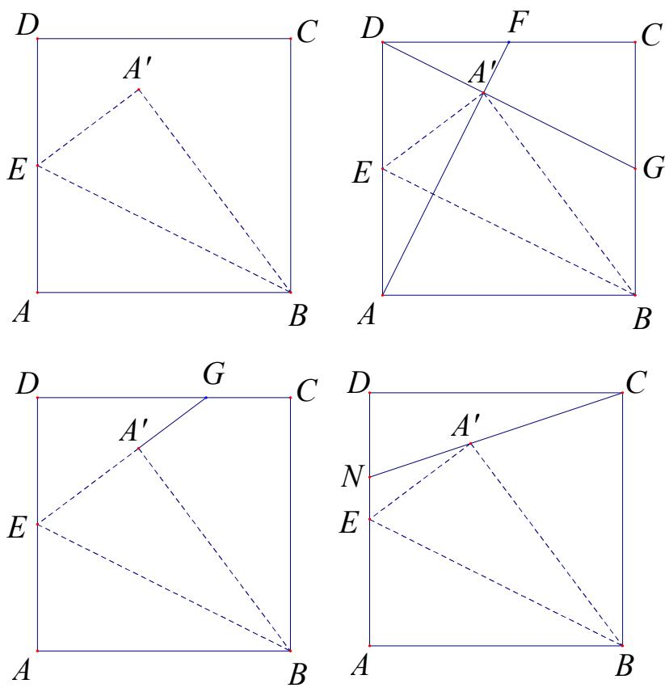

性质一证明： AA A D  

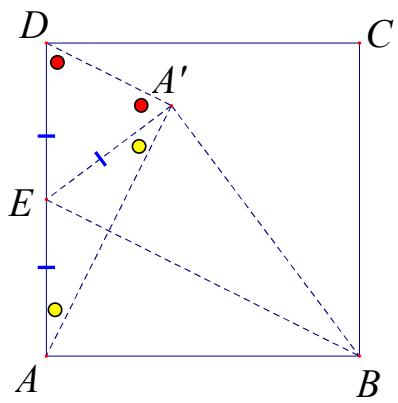

性质二证明： $\mathbf { G }$ 是 BC 中点

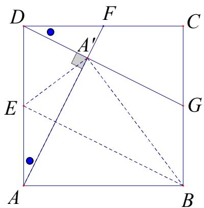

性质三，四证明： $\mathbf { H L }$ 全等

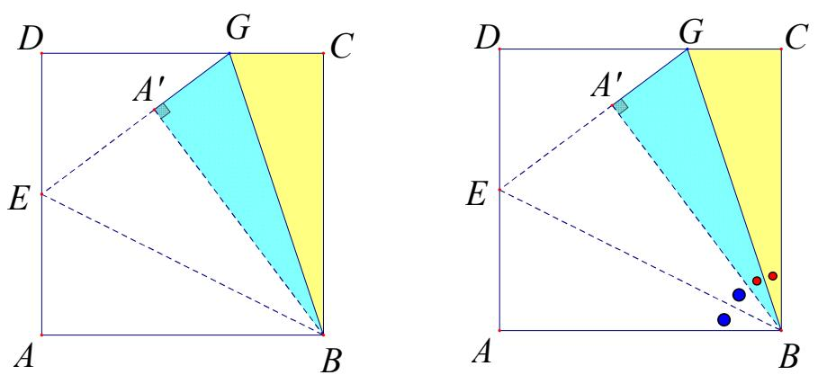

性质五证明：勾股，或 $^ { 6 6 } 1 2 3 4 5 ^ { \prime \prime }$ 模型

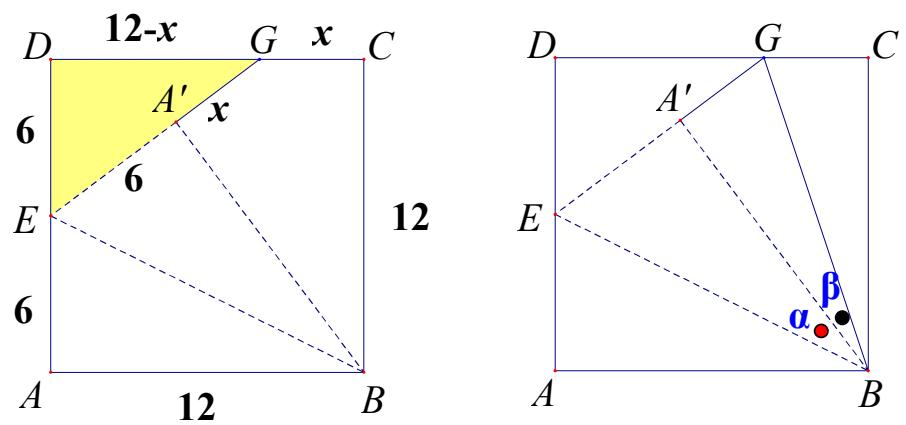

【12345模型说明】易知 $\alpha + \beta = 4 5 ^ { \circ }$ ， tan $\alpha = \frac { 1 } { 2 }$ $\tan \beta = \frac 1 3$ =\，\$ 记 $\mathbf { A B } = \mathbf { 1 } 2 \Rightarrow C G = 4 , D G = 8$

性质六证明：12345 模型

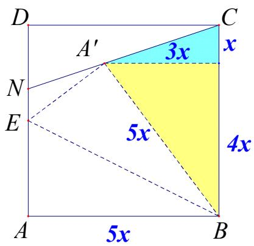

【模型二】双中点（十字架模型拓展）

(1)知 2 推 1： $\textcircled{1} \mathbf { M }$ 中点； $\textcircled{2} \textcircled { N }$ 是中点； $\textcircled{3}$ AM⊥DN

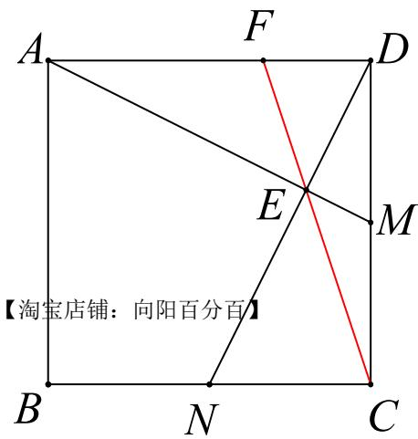

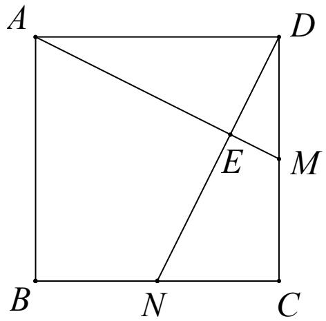

(2)已知： $\mathbf { M }$ 是中点， $_ \mathrm { N }$ 是中点，连接 CE 并延长，交 AD 于 F

$\textcircled{1}$ 求 $E M : E D : E N : A E =$ $\textcircled{2}$ 证明：EC 平分∠NEM$\textcircled{3}$ 求 $\frac { D F } { A F }$

【解析】

$$
E D : E N : A E = 1 : 2 : 3 : 4
$$

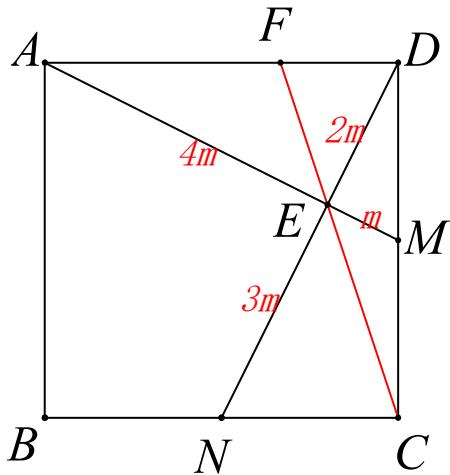

证明：法一：角平分线逆定理

法三：四点共圆

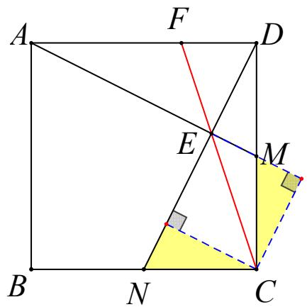

法二：旋转相似（手拉手模型）

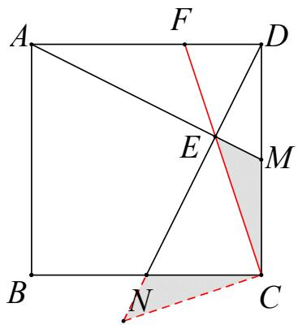

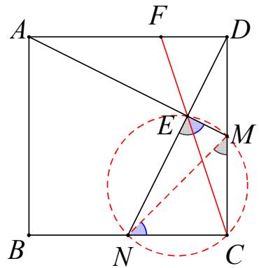

$\textcircled{2}$ 法一：角平分线定理

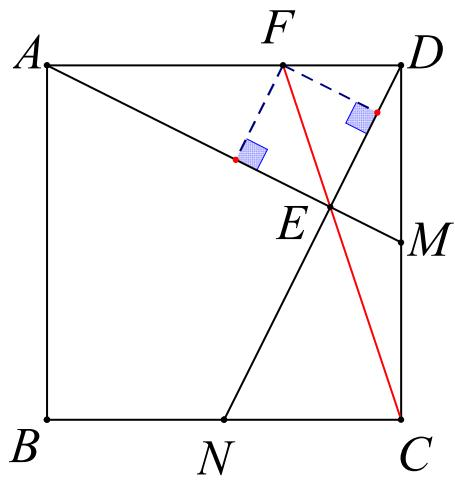

法二：12345模型（正切和角公式）

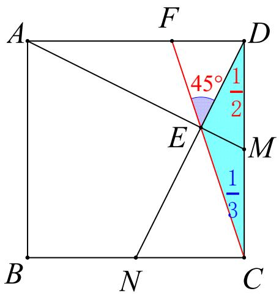

F在角平分线上，过F作角两边垂线$\cdot \frac { \mathrm { D F } } { \mathrm { A F } } { = } \frac { \mathrm { S } _ { \Delta \mathrm { D E F } } } { \mathrm { S } _ { \Delta \mathrm { A E F } } } { = } \frac { \mathrm { D E } } { \mathrm { A E } } { = } \frac { 1 } { 2 }$ （角平分线定理2）

∠DEF=45°,∠EDC= tan∠DCF=2 3

（3）已知：M， $_ \mathrm { N }$ 是中点，O 是中心，连接 OE， $\textcircled{1}$ 求 DE:EG:GN ; $\textcircled{2}$ 证 $\angle { \mathrm { O E C } } { = } 9 0 ^ { \circ }$

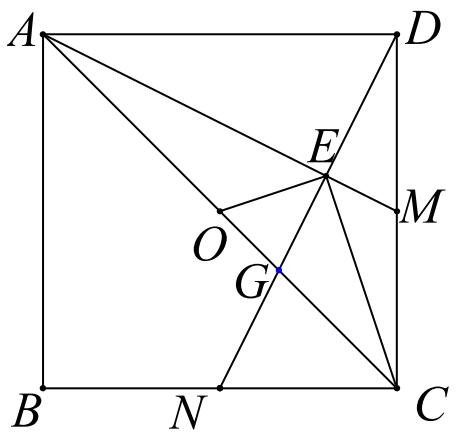

【解析】第一问

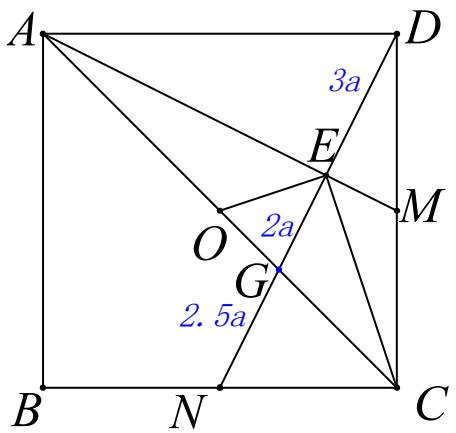

NE= 3, DG= 2 ro 12345模型

法一：由（2）可知 $\_$ °，故构造手拉手模型可得△黄≌△黄(SAS)，从而可得 $\_$ °，得证

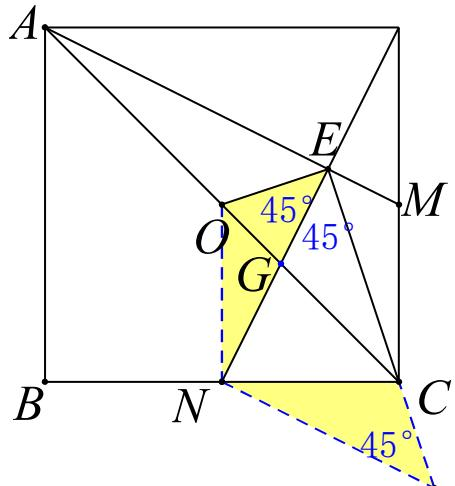

或者换个方向也可以， 像这种方方正正的图形也可以试试建系

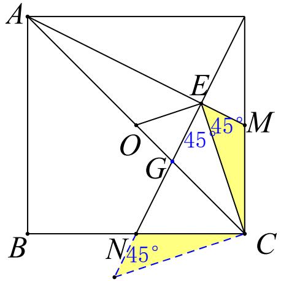

法二：四点共圆

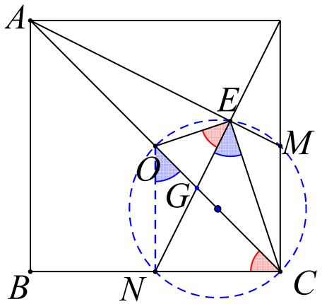

（4）已知：M，N 是中点,连接 BE，证 $\mathrm { B E = C D }$

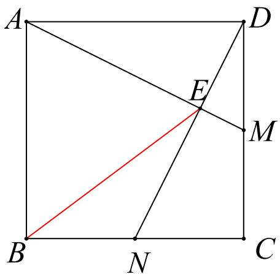

【解析】法一 斜边上的中线等于斜边一般

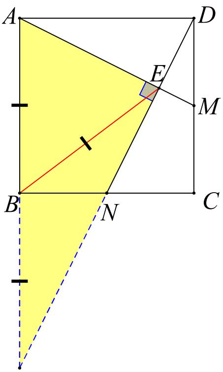

【淘宝店铺：向阳百分百】

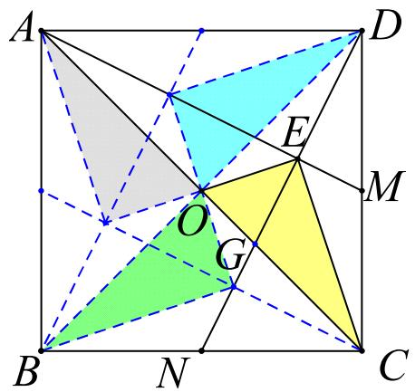

法二：过 AD 的中点 P 作 AE 垂线，交 AM 于 Q，可得 Q 是 AE 中点，则 BQ 垂直平分 AE，故 $\mathrm { A B } { = } \mathrm { B E }$

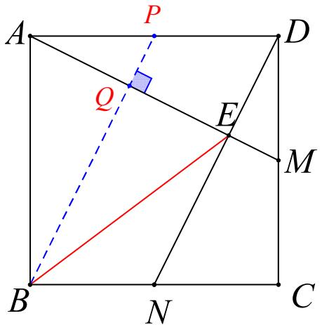

法三：对角互补得四点共圆，导角得等腰

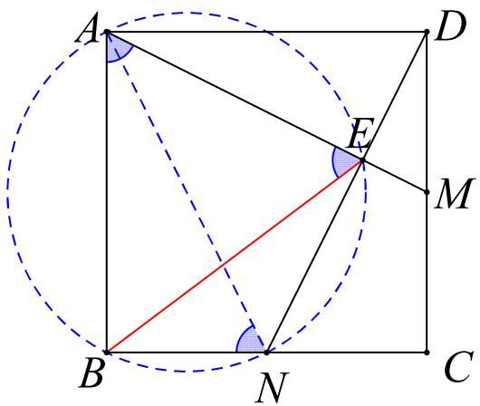

法四：勾股定理，由（2）可知 DE： $\cdot$ ，设值求值即可

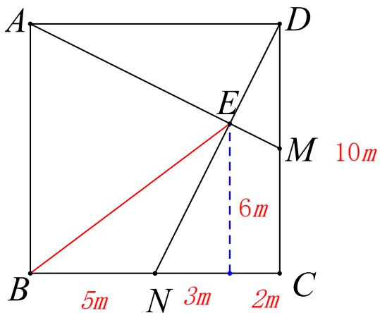

（5）已知： $\mathbf { M }$ ， $_ \mathrm { N }$ 是中点,连接 BE，AH⊥BE 于 H，交 DN 于 K，证 $\mathrm { A K } { = } \mathrm { C D }$

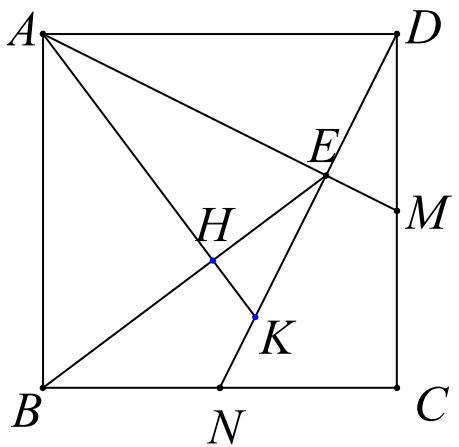

【解析】法一：构造玄图导等腰

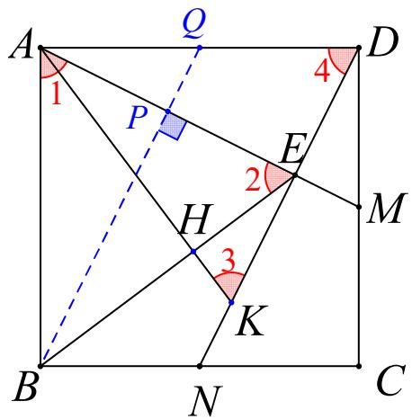

法二：四点共圆

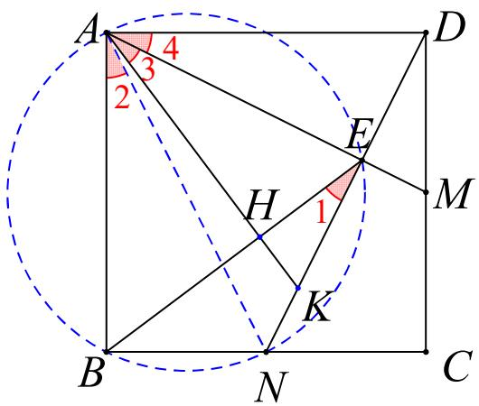

法三：建系求坐标（略）

∠1=∠2=∠3=∠4

# 【模型三】对角线模型

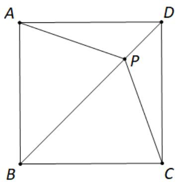  
$P A { = } P C$

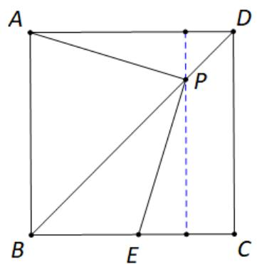

互推关系 OPALPE $\Rightarrow P A = P E$ $\scriptstyle { \odot } P A = P E { \Longrightarrow } P A \bot P E$

# 【模型四】半角模型

如图，已知 ABCD 为正方形， $\angle \mathrm { F A E } { = } 4 5 ^ { \circ }$ ，对角线 BD 交 AE 于 M，交 AF 与 N，AG⊥EF

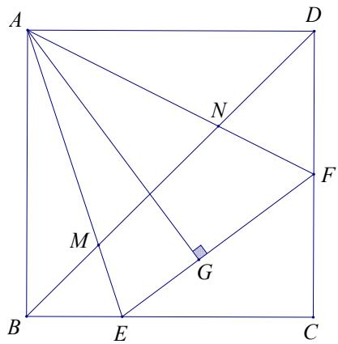

# 5个条件知 1 推 4

$\textcircled{1}$ $\angle \mathrm { E A F } { = } 4 5 ^ { \circ }$ $\textcircled{2}$ $B E + D F = E F$ $\textcircled{3}$ $A G \perp E F$ ， $\mathrm { A G } { = } \mathrm { A B }$ $\textcircled{4}$ AE 平分 $\angle$ BEF$\textcircled{5}$ AF 平分 $\angle D \mathrm { F E }$

【性质一】5 个条件知 1 推 4（全等）

【性质二】 $B M ^ { 2 } + N D ^ { 2 } { = } M N ^ { 2 }$ （勾股证）

【性质三】 $\angle \mathrm { M G N } { = } 9 0 ^ { \circ }$

【性质四】 $\textcircled { 1 } A M ^ { 2 } = M N \cdot M D$ ； $\textcircled { 2 } A N ^ { 2 } = N M \bullet N B$ ； $\textcircled { 3 } S _ { A B C D } { = } B N { \cdot } D M$ （2 组子母，1 共享型相似）

【性质五】△ANE，△AMF，是 2 个隐藏的等腰直角三角形（反 8 字相似或四点共圆）

【性质六】 $\triangle \mathrm { A M N } \sim \triangle \mathrm { A F E }$ ，且相似比为 $\frac { \sqrt { 2 } } { 2 }$ （用全等导角）

【性质七】 $\frac { N D } { E C } { = } \frac { B M } { F C } { = } \frac { \sqrt { 2 } } { 2 }$ （旋转相似）

【性质一】 ${ \pmb { D } } { \pmb { F } } { + } { \pmb { B } } { \pmb { E } } { = } { \pmb { E } } { \pmb { F } }$ 易证 $\triangle \mathrm { A B E } \cong \triangle \mathrm { A G E }$ ，易证△AGF≌△ADF【性质二】 $B M ^ { 2 } { + } N D ^ { 2 } { = } M N ^ { 2 }$ 简证，如图【性质三】 $\angle \mathrm { M G N } { = } 9 0 ^ { \circ }$ °简证，如图：两组全等

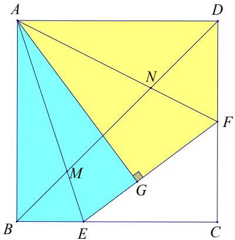

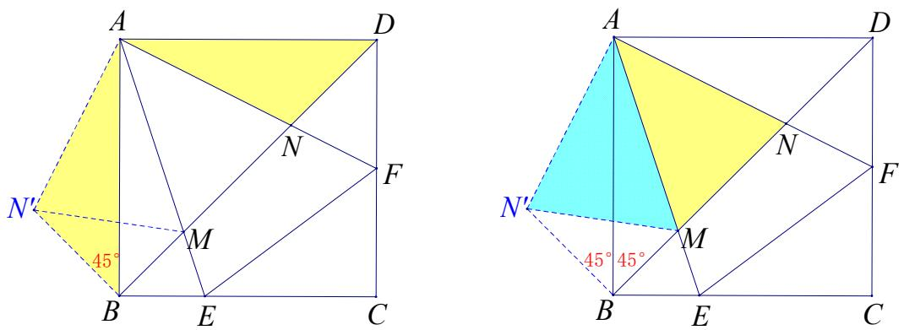

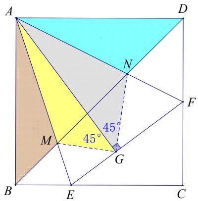

【性质四】 $\textcircled { 1 } A M ^ { 2 } = M N \cdot M D$ ； $\textcircled { 2 } A N ^ { 2 } = N M \bullet N B$ ； $\textcircled { 3 } S _ { A B C D } { = } B N { \cdot } D M$ （2 组子母，1 共享型相似）简证 $\textcircled{3}$ ，如图

$S _ { A B C D } = \mathrm { B N } \cdot \mathrm { D M }$ （共享型相似）

∠1=45°+∠2=∠BAN $\Rightarrow$ △BAN∽△DMA $\Rightarrow$ BN•DM=AB•AD【性质五】 $\triangle$ ANE，△AMF，是 2 个隐藏的等腰直角三角形简证，以△ANE 为例，△AMF 方法相同

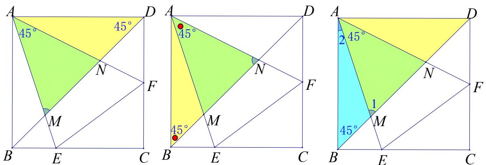

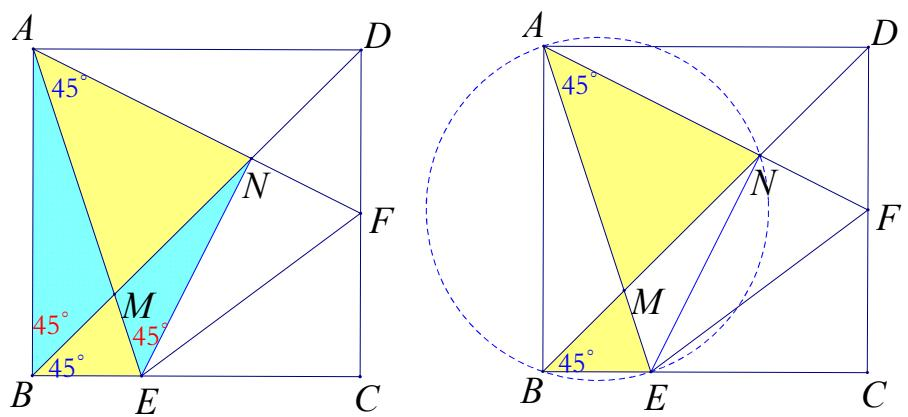

法一：两次相似 $\triangle \mathrm { A M N } \sim \triangle \mathrm { B M E } \Rightarrow \frac { A M } { B M } = \frac { N M } { E M } \mid \triangle \mathrm { B M A } \^ { \circ } \triangle \mathrm { E M N } \mid \angle \mathrm { A B M } = \angle \mathrm { N E M } = 4 5 ^ { \circ }$ d法二：ABEN 四点共圆，对角互补 $\angle { \mathrm { A B E } } + \angle { \mathrm { A N E } } { = } 1 8 0 ^ { \circ }$ 或∠ABN=∠AEN【性质六】△AMN∽△AFE，且相似比为 $\frac { \sqrt { 2 } } { 2 }$ 先证相似，易知 $\angle 1 = \angle 2 = \angle 3$ ，故相似成立相似比为： ${ \frac { A H } { A G } } = { \frac { A H } { A B } } = { \frac { \sqrt { 2 } } { 2 } }$

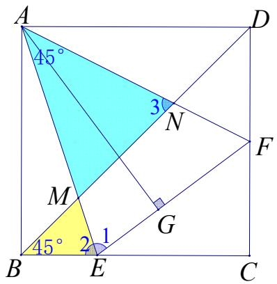

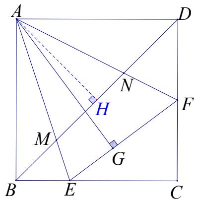

【性质七】 $\frac { N D } { E C } { = } \frac { B M } { F C } { = } \frac { \sqrt { 2 } } { 2 }$

$$
\textcircled { 1 } \ \frac { N D } { E C } = \ \frac { \sqrt { 2 } } { 2 }
$$

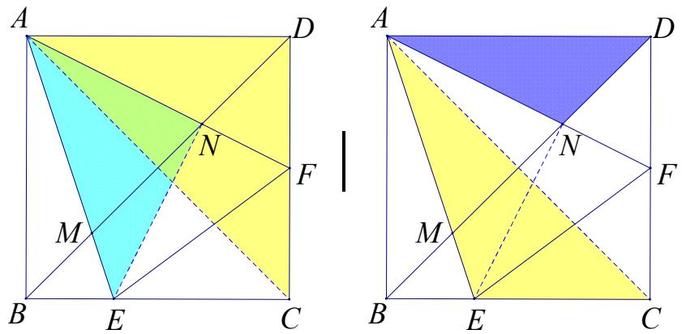

${ \frac { N D } { E C } } = { \frac { \sqrt { 2 } } { 2 } } $

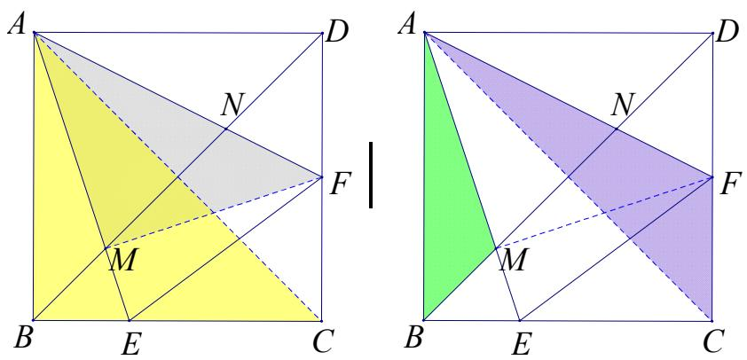

# 核心·题型

# 题型一 中点 $^ +$ 折叠模型

1．如图，在边长 4的正方形 $A B C D$ 中， $E$ 是边 $B C$ 的中点，将 $\Delta C D E$ 沿直线 $D E$ 折叠后，点 $C$ 落在点 $F$ 处，再将其打开、展平，得折痕 $D E$ ．连接 $C F$ 、 $B F$ 、 $E F$ ，延长 $B F$ 交 $A D$ 于点 $G$ ．则下列结论： $\textcircled { 1 } B G = D E$ ；$\textcircled { 2 } C F \perp B G$ ； $\textcircled{3}$ sin $\angle D F G = \frac { 1 } { 2 }$ ; $\textcircled { 4 } S _ { \Delta D F G } = \frac { 1 2 } { 5 }$ 其中正确的有 ( )

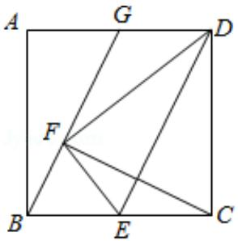

A．1 个 B．2 个 C．3 个 D．4 个

【解答】解：四边形 ABCD 是正方形，  
$\therefore A B = B C = A D = C D = 4 \quad \angle A B C = \angle B C D = 9 0 ^ { \circ }$   
 $E$ 是边 $B C$ 的中点，  
$\cdot . B E = C E = 2$ ，  
将 $\Delta C D E$ 沿直线 $D E$ 折叠得到 $\Delta D F E$ ，  
$: D F = C D = 4 ~ E F = C E = 2 ~ Z D F E = Z D C E = 9 0 ^ { \circ } ~ Z D E F = Z D E C$ ，  
 $E F = E B$ ，  
 $. \angle E B F = \angle B F E$ ，  
$\therefore \angle E B F = \angle B F E = \frac { 1 } { 2 } ( 1 8 0 ^ { \circ } - \angle B E F ) , \angle C E D = \angle F E D = \frac { 1 } { 2 } ( 1 8 0 ^ { \circ } - \angle B E F ) ,$   
 $. \angle G B E = \angle D E C$ ，  
$\cdot . B G / / D E$ ，$\because B E / / D G$ ，  
四边形BEDG是平行四边形，  
 $B G = D E$ ，故 $\cdot$ 正确；  
 $E F = C E$ ，  
 $. \angle E F C = \angle E C F$ ，  
$\therefore \angle F B E + \angle B C F = \angle B F E + \angle C F E = { \frac { 1 } { 2 } } \times 1 8 0 ^ { \circ } = 9 0 ^ { \circ } ,$  $. \angle B F C = 9 0 ^ { \circ }$ ，  
$. C F \bot B G$ ，故 $\textcircled{2}$ 正确；  
$\cdot \angle A B G + \angle C B G = \angle B F E + \angle D F G = 9 0 ^ { \circ }$   
 $\angle A B G = \angle D F G$ ，  
 AB  4 ， DG  BE  2 ，  
 $A G = 2$ ，  
 $B G = 2 \sqrt { 5 }$ ，  
$\therefore \sin \angle D F G = \sin \angle A B G = { \frac { A G } { B G } } = { \frac { 2 } { 2 { \sqrt { 5 } } } } = { \frac { \sqrt { 5 } } { 5 } }$ 故 $\cdot$ 错误；过 $G$ 作 $G H \perp D F$ 于 $H$ ，  
tan $\angle G F H = \tan \angle A B G = \frac { 1 } { 2 } ,$   
设 $G H = x$ ，则 $F H = 2 x$ ，  
 $D H = { \sqrt { D G ^ { 2 } - x ^ { 2 } } }$ ，  
$\therefore D F = F H + D H = 2 x + { \sqrt { D G ^ { 2 } - x ^ { 2 } } } = 4$ ，  
解得： $x = 1 . 2 ~ , ~ x = 2$ （舍去），  
$\cdot \ G H = 1 . 2$ ，  
$\cdot . S _ { _ { \Delta D F G } } = \frac { 1 } { 2 } \times 4 \times 1 . 2 = \frac { 1 2 } { 5 }$ 故 $\textcircled{4}$ 正确；

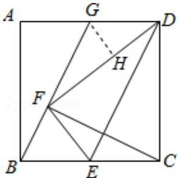

2．如图，正方形 $A B C D$ 中， $A B = 1 2$ ，点 $E$ 在边 $B C$ 上， $B E = E C$ ，将 $\Delta D C E$ 沿 $D E$ 对折至 $\Delta D F E$ ，延长 $E F$ 交边 $A B$ 于点 $G$ ，连接 $_ { D G }$ ， $B F$ ，给出以下结论： $\textcircled { 1 } \Delta D A G \cong \Delta D F G$ ； $\textcircled { 2 } B G = 2 A G$ ； $\textcircled { 3 } B F / / D E$ ； $\textcircled{4}$ $S _ { \Delta B E F } = \frac { 7 2 } { 5 }$ 其中所有正确结论的个数是 ( )

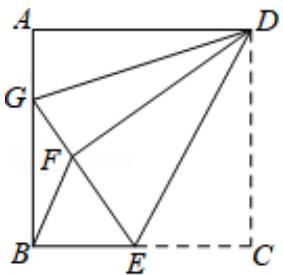

A．1 B．2 C．3 D．4

【解答】解：如图，由折叠可知， $D F = D C = D A$ ， $\angle D F E = \angle C = 9 0 ^ { \circ }$  $. \angle D F G = \angle A = 9 0 ^ { \circ }$ ，  
在 RtADG 和 RtFDG 中，  
$\left\{ \begin{array} { l l } { A D = D F } \\ { D G = D G } \end{array} \right.$   
$\therefore R t \Delta A \mathrm { { D G } \cong R t \Delta F D G ( H L ) }$ ，故 $\cdot$ 正确；  
正方形边长是 12，  
 $. B E = E C = E F = 6$ ，  
设 $A G = F G = x$ ，则 $E G = x + 6 B G = 1 2 - x$ ，  
由勾股定理得： $E G ^ { 2 } = B E ^ { 2 } + B G ^ { 2 }$ ，  
即： $( x + 6 ) ^ { 2 } = 6 ^ { 2 } + ( 1 2 - x ) ^ { 2 }$ ，  
解得： $x = 4$   
$\therefore A G = G F = 4 \ , B G = 8 \ , B G = 2 A G \ ,$ ，故 $\textcircled{2}$ 正确，  
 $E F = E C = E B$ ，  
 $. \angle E F B = \angle E B F$ ，  
 $\angle D E C = \angle D E F$ ， $\angle C E F = \angle E F B + \angle E B F$ ，  
 $. \angle D E C = \angle E B F$ ，  
$\dot { } , B F / / D E$ ，故 $\textcircled{3}$ 正确；  
$S _ { _ { \Delta G B E } } = \frac { 1 } { 2 } \times 6 \times 8 = 2 4 S _ { _ { \Delta B E F } } = \frac { E F } { E G } \cdot S _ { _ { \Delta G B E } } = \frac { 6 } { 1 0 } \times 2 4 = \frac { 7 2 } { 5 }$ 故④正确．综上可知正确的结论的是 4 个

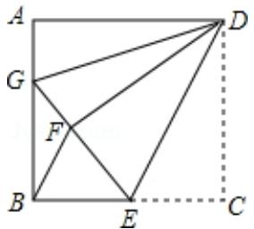

3．如图，矩形 $A B C D$ 中， $A B = 3 { \sqrt { 6 } }$ ， $B C = 1 2$ ， $E$ 为 $A D$ 中点， $F$ 为 $A B$ 上一点，将 $\Delta A E F$ 沿 $E F$ 折叠后，点 $A$ 恰好落到 $C F$ 上的点 $G$ 处，则折痕 $E F$ 的长是 $2 { \sqrt { 1 5 } }$

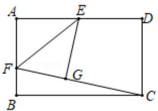

【解答】解：如图，连接 $E C$ ，  
四边形 ABCD为矩形，$. \angle A = \angle D = 9 0 ^ { \circ } , B C = A D = 1 2 , D C = A B = 3 { \sqrt { 6 } } ,$ ，  
 $E$ 为 $A D$ 中点，  
$\therefore A E = D E = { \frac { 1 } { 2 } } A D = 6$   
由翻折知， $\Delta A E F \cong \Delta G E F$ ，  
$\therefore A E = G E = 6 , \angle A E F = \angle G E F , \angle E G F = \angle E A F = 9 0 ^ { \circ } = \angle D ,$ ，  
 $G E = D E$ ，  
 $E C$ 平分 $\angle D C G$ ，$. \angle D C E = \angle G C E$ ，  
$\therefore \angle G E C = 9 0 ^ { \circ } - \angle G C E \quad \angle D E C = 9 0 ^ { \circ } - \angle D C E$ ，$: \angle G E C = \angle D E C$ ，  
$\therefore \angle F E C = \angle F E G + \angle G E C = \frac { 1 } { 2 } \times 1 8 0 ^ { \circ } = 9 0 ^ { \circ }$ $\therefore \angle F E C = \angle D = 9 0 ^ { \circ }$ ，  
又 $\angle D C E = \angle G C E$ ，  
$\therefore \Delta F E C \sim \Delta E D C$ ，$\cdot \frac { F E } { D E } = \frac { E C } { D C }$   
$\because E C = { \sqrt { D E ^ { 2 } + D C ^ { 2 } } } = { \sqrt { 6 ^ { 2 } + ( 3 { \sqrt { 6 } } ) ^ { 2 } } } = 3 { \sqrt { 1 0 } }$ ，  
$\therefore \frac { F E } { 6 } = \frac { 3 \sqrt { 1 0 } } { 3 \sqrt { 6 } }$   
 FE  2 15

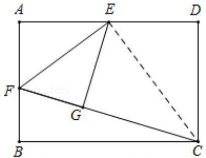

# 题型二 双中点模型（十字架拓展）

# 2023·东营·中考真题

1．如图，正方形 ABCD的边长为 4，点 $E$ ， $F$ 分别在边 $D C$ ， $B C$ 上，且 $B { \cal F } = C E$ ， $A E$ 平分 $\angle C A D$ ，连接$D F$ ，分别交 $A E$ ， $A C$ 于点 $G$ ， $M$ ， $P$ 是线段 $_ { A G }$ 上的一个动点，过点 $P$ 作 $P N \perp A C$ 垂足为 $N$ ，连接 $P M$ ，有下列四个结论： $\textcircled{1} A E$ 垂直平分 $D M$ ； $\textcircled { 2 } P M + P N$ 的最小值为 $3 \sqrt { 2 }$ ； $\textcircled { 3 } C F ^ { 2 } = G E \cdot A E$ ； $\textcircled { 4 } S _ { \Delta A D M } = 6 \sqrt { 2 }$ ．其中正确的是（ ）

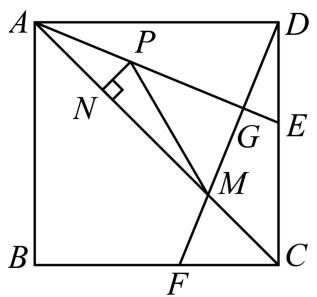

A． $\textcircled{1} \textcircled{2}$ B． $\textcircled{2} \textcircled{3} \textcircled{4}$ C． $\textcircled{1} \textcircled{3} \textcircled{4}$ D． $\textcircled{1} \textcircled{3}$

【答案】D

【详解】解：  ABCD 为正方形，  
 $. B C = C D = A D$ ， $\angle A D E = \angle D C F = 9 0 ^ { \circ } ,$ ，  
$\cdot B F = C E$ ，  
 $D E = F C$ ，  
$\cdot _ { \triangle A D E } { \cong } _ { \triangle D C F } ( \mathrm { S A S } )$ .  
$: \angle D A E = \angle F D C$ ,  
$\therefore \angle A D E = 9 0 ^ { \circ }$ ,  
$\therefore \angle A D G + \angle F D C = 9 0 ^ { \circ } .$   
 $. \angle A D G + \angle D A E = 9 0 ^ { \circ }$ ，  
 $. \angle A G D = \angle A G M = 9 0 ^ { \circ }$ .  
 $A E$ 平分 $\angle C A D$ ，  
 $. \angle D A G = \angle M A G$ .  
 $A G = A G$ ，  
ADG ≌ AMGASA .  
 $D G = G M$ ，  
 $\angle A G D = \angle A G M = 9 0 ^ { \circ }$ ，  
$A E$ 垂直平分 $D M$   
故 $\cdot$ 正确.  
由 $\cdot$ 可知， $\angle A D E = \angle D G E = 9 0 ^ { \circ }$ ， $\angle D A E = \angle G D E$ ，$\cdot _ { \triangle A D E } \neg _ { \triangle D G E }$ ，  
$\cdot \frac { D E } { G E } = \frac { A E } { D E }$ ,  
$\cdot D E ^ { 2 } = G E \cdot A E$ ，由 $\cdot$ 可知 $D E = C F$ ，  
$\cdot _ { \mathbf { \nabla } } C F ^ { 2 } = G E \cdot A E$ .  
故 $\cdot$ 正确.  
 $A B C D$ 为正方形，且边长为 4，  
 $. A B = B C = A D = 4$ ，  
在 $\mathrm { R t } \triangle A B C$ 中， $A C = { \sqrt { 2 } } A B = 4 { \sqrt { 2 } }$ .  
由 $\cdot$ 可知， $\triangle A D G \cong \triangle A M G ( \mathrm { A S A } )$ ，  
$\cdot \ A M = A D = 4$ ，  
$\therefore C M = A C - A M = 4 { \sqrt { 2 } } - 4 .$   
由图可知， ${ \triangle } D M C$ 和△ADM 等高，设高为 $h$ ，  
$\therefore S _ { _ { \Delta A D M } } = S _ { _ { \Delta A D C } } - S _ { _ { \Delta D M C } } ,$ ，  
$\therefore { \frac { 4 \times h } { 2 } } = { \frac { 4 \times 4 } { 2 } } - { \frac { ( 4 { \sqrt { 2 } } - 4 ) \cdot h } { 2 } }$   
∴ $\cdot h = 2 \sqrt { 2 }$ ，  
$\therefore S _ { \mathrm { { } _ { \triangle A D M } } } = \frac { 1 } { 2 } \cdot A M \cdot h = \frac { 1 } { 2 } \times 4 \times 2 \sqrt { 2 } = 4 \sqrt { 2 } .$   
故 $\cdot$ 不正确.  
由 $\cdot$ 可知， $\triangle A D G \cong \triangle A M G \big ( \mathrm { A S A } \big ) ,$ ，  
 $. D G = G M$ ，  
 $M$ 关于线段 $_ { A G }$ 的对称点为 $D$ ，过点 $D$ 作 $D N ^ { \prime } \bot A C$ ，交 $A C$ 于 $N ^ { \prime }$ ，交 $A E$ 于 $P ^ { \prime }$ ， $. P M + P N$ 最小即为 $D N ^ { \prime }$ ，如图所示，由 $\cdot$ 可知 $\triangle A D M$ 的高 $h = 2 \sqrt { 2 }$ 即为图中的 $D N ^ { \prime }$ ， $. D N ^ { \prime } { = } 2 \sqrt { 2 }$ .  
故 $\textcircled{2}$ 不正确.  
综上所述，正确的是 $\cdot$

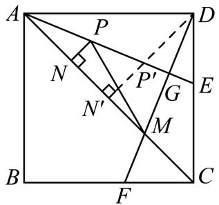

2．如图，正方形 $A B C D$ 中，点 $E$ 、 $F$ 、 $G$ 分别为边 $A B$ 、 $B C$ 、 $A D$ 上的中点，连接 $A F$ 、 $D E$ 交于点 $M$ ，连接 $G M$ 、 $C G$ ， $C G$ 与 $D E$ 交于点 $N$ ，则结论 $\textcircled { 1 } G M \perp C M$ ； $\textcircled { 2 } C D = D M$ ； $\textcircled{3}$ 四边形 $A G C F$ 是平行四边形； $\textcircled { 4 } \angle C M D = \angle A G M$ 中，正确的有 ( )个．

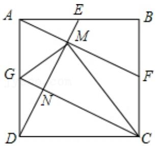

A．1 B．2 C．3 D．4

【答案】 $B$

【解答】解： $\cdot A G / / F C$ 且 $A G = F C$ ，  
四边形 AGCF 为平行四边形，故 $\cdot$ 正确；  
 $. \angle G A F = \angle F C G = \angle D G C$ ， $\angle A M N = \angle G N D$   
在 $\Delta A D E$ 和 $\Delta B A F$ 中，  
$\because \left\{ \begin{array} { l l } { A E = B F } \\ { \angle D A E = \angle A B F , } \\ { A D = A B } \end{array} \right.$ ，  
$\therefore \Delta A D E \cong \Delta B A F ( S A S )$ ，  
 $. \angle A D E = \angle B A F$ ，$\cdot \angle A D E + \angle A E M = 9 0 ^ { \circ }$ $\therefore \angle E A M + \angle A E M = 9 0 ^ { \circ }$ $. \angle A M E = 9 0 ^ { \circ }$   
 $\angle G N D = 9 0 ^ { \circ }$   
 $. \angle D E \bot A F$ ， $D E \bot C G$   
 $G$ 点为 $A D$ 中点，  
GN 为 $\Delta A D M$ 的中位线，  
即 $C G$ 为 $D M$ 的垂直平分线，  
 $G M = G D$ ， $C D = C M$ ，故 $\cdot$ 错误；  
在 $\Delta G D C$ 和 GMC 中，  
$\because { \left\{ \begin{array} { l l } { D G = M G } \\ { C D = C M } \\ { C G = C G } \end{array} \right. }$ ，$\therefore \Delta G D C \cong \Delta G M C ( S S S )$ ，$\therefore \angle C D G = \angle C M G = 9 0 ^ { \circ }$ ，  
$\angle M G C = \angle D G C$ ，  
$\therefore G M \bot C M$ ，故 $\cdot$ 正确；$\therefore \angle C D G = \angle C M G = 9 0 ^ { \circ }$ ，  
 $G$ 、 $D$ 、 $C$ 、 $M$ 四点共圆，$\because \angle A G M = \angle D C M$ ，  
 $C D = C M$ ，  
 $\angle C M D = \angle C D M$ ，  
在RtAMD 中， $\angle A M D = 9 0 ^ { \circ }$ ，  
$. . D M < A D$ ，  
 $. D M < C D$ ，  
 $\angle D M C \neq \angle D C M$ ，  
 $\angle C M D \neq \angle A G M$ ，故 $\cdot$ 错误

# 2203·绥化·中考真题

3．如图，在正方形 ABCD中，点 $E$ 为边 $C D$ 的中点，连接 $A E$ ，过点 $B$ 作 $B F \perp A E$ 于点 $F$ ，连接 $B D$ 交 $A E$ 于点 $G$ ， $F H$ 平分 $\angle B F G$ 交 $B D$ 于点 $H$ ．则下列结论中，正确的个数为（ ）

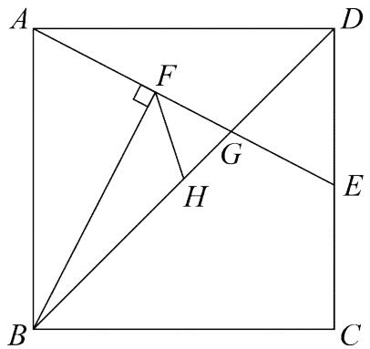

$\textcircled { 1 } A B ^ { 2 } = B F \cdot A E$ ； $\textcircled { 2 } S _ { \triangle B G F } : S _ { \triangle B A F } = 2 : 3$ ； $\textcircled{3}$ 当 $A B = a$ 时， $B D ^ { 2 } - B D \cdot H D = a ^ { 2 }$

A．0 个 B．1 个 C．2 个 D．3 个

【答案】D

【详解】∵四边形ABCD是正方形，$\cdot \angle B A D = \angle A D E = 9 0 ^ { \circ } \ , A B = A D$ $\therefore B F \bot A E$ $\angle A B F = 9 0 ^ { \circ } - \angle B A F = \angle D A E$ ∴ cos $\angle A B F = \cos \angle E A D$ 即 $\frac { B F } { A B } { = } \frac { A D } { A E }$ 又 $A B = A D$ ,∴ $A B ^ { 2 } = B F \cdot A E$ ，故 $\cdot$ 正确；设正方形的边长为 $a$ ，∵点 $E$ 为边 $C D$ 的中点，∴ $D E = { \frac { a } { 2 } } .$ ∴ tan $\angle A B F = \tan \angle E A D = \frac { 1 } { 2 } ,$ 在 $\mathrm { R t } \triangle A B E$ 中， $A B = \sqrt { A F ^ { 2 } + B F ^ { 2 } } = \sqrt { 5 } A F = a$ ，$A F = { \frac { \sqrt { 5 } } { 5 } } a$ 在 Rt△ADE 中， 2 2 5aAE  AD  DE 

【淘宝店铺：向阳百分百】

$\begin{array} { r l } & { : \cdot B F = \mathcal { A } E - \mathcal { A } F = \frac { \sqrt { \hat { S } } } { 2 } a - \frac { \sqrt { \hat { S } } } { 5 } a = \frac { 3 \sqrt { \hat { S } } } { 1 0 } a , } \\ & { : \cdot A B ^ { [ \gamma ] } D F } \\ & { : \cdot \delta C \mathcal { A } \mathcal { B } ^ { \alpha } } \\ & { : \cdot \frac { A G } { G E } = \frac { 4 B } { D E } - 2 } \\ & { : \cdot G E = \frac { 1 } { 3 } A E = \frac { \sqrt { \hat { S } } } { 6 } a } \\ & { : \cdot F \mathcal { C } = A E - \mathcal { A } F - G E - \frac { \sqrt { \hat { S } } } { 2 } a - \frac { \sqrt { \hat { S } } } { 5 } a - \frac { \sqrt { \hat { S } } } { 1 5 } a = \frac { 2 \sqrt { \hat { S } } } { 1 5 } a } \\ & { : \cdot F \mathcal { C } = A E - \mathcal { A } F - G E - \frac { \sqrt { \hat { S } } } { 2 } a - \frac { \sqrt { \hat { S } } } { 5 } a - \frac { \sqrt { \hat { S } } } { 6 } a = \frac { 2 \sqrt { \hat { S } } } { 1 5 } a } \\ & { \quad \cdot \frac { \sqrt { \hat { S } } } { 5 } a } \end{array}$ $\therefore \frac { A F } { F G } = \frac { \frac { \sqrt { 5 } } { 5 } a } { \frac { 2 \sqrt { 5 } } { 1 5 } a } = \frac { 3 } { 2 }$ $\therefore S _ { \triangle B G F } : S _ { \triangle B A F } = 2 : 3$ ，故 $\textcircled{2}$ 正确；∵ $A B = a$ ，$\therefore B D ^ { 2 } = A B ^ { 2 } + A D ^ { 2 } = 2 a ^ { 2 } ,$ 如图所示，过点 $H$ 分别作 $B F , A E$ 的垂线，垂足分别

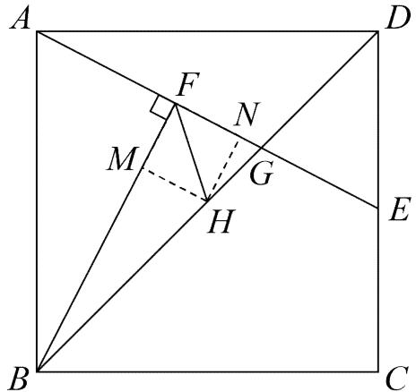

又∵ $B F \perp A E$ ，  
∴四边形FMHN 是矩形，  
∵ $F H$ 是 $\angle B F G$ 的角平分线，$. H M = H N$ ，  
∴四边形FMHN 是正方形，  
$F N = H M = H N$   
$B F = 2 A F = \frac { 2 \sqrt { 5 } } { 5 } a , F G = \frac { 2 \sqrt { 5 } } { 1 5 } a$   
$\frac { M H } { B M } = \frac { F G } { B F } = \frac { 1 } { 3 }$   
设 $M H = b$ ，则 $B F = B M + F M = B M + M H = 3 b + b = 4 b$   
在 $\mathrm { R t } \triangle B M H$ 中， $B H = \sqrt { B M ^ { 2 } + M H ^ { 2 } } = \sqrt { 1 0 } b$ ，  
$B F = \frac { 2 \sqrt { 5 } } { 5 } a$   
${ \frac { 2 { \sqrt { 5 } } } { 5 } } a = 4 b$   
解得： $b = { \frac { \sqrt { 5 } } { 1 0 } } a$   
$\therefore B H = { \sqrt { 1 0 } } \times { \frac { \sqrt { 5 } } { 1 0 } } a = { \frac { \sqrt { 2 } } { 2 } } a \ ,$   
$\therefore B D ^ { 2 } - B D \cdot H D = 2 a ^ { 2 } - { \sqrt { 2 } } a \times { \frac { \sqrt { 2 } } { 2 } } a = a ^ { 2 }$ ，故 $\cdot$ 正确

4．如图，已知 $E$ ， $F$ 分别为正方形 $A B C D$ 的边 $A B$ ， $B C$ 的中点， $A F$ 与 $D E$ 交于点 $M$ ， $o$ 为 $B D$ 的中点，则下列结论：

$\mathrm { ( 1 ) } \angle A M E = 9 0 ^ { \circ } : \ \textcircled { 2 } \angle B A F = \angle E D B \ ; \ \textcircled { 3 } \angle B M O = 9 0 ^ { \circ } : \ \textcircled { 4 } M D = 2 A M = 4 E M \ ;$ $\textcircled { 5 } A M = \frac { 2 } { 3 } M F$ ．其中正确结论的是 ( )

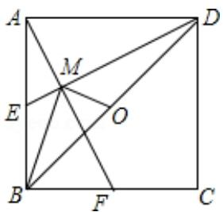

A． $\textcircled{1} \textcircled{3} \textcircled{4}$ B． $\textcircled{2} \textcircled{4} \textcircled{5}$ C． $\textcircled{1} \textcircled{3} \textcircled{4} \textcircled{5}$ D． $\textcircled{1} \textcircled{3} \textcircled{5}$

【解答】解：在正方形 $A B C D$ 中， $A B = B C = A D$ ， $E$ 、 $F$ 分别为边 $A B$ ， $B C$ 的中点，  
$\therefore A E = B F = { \frac { 1 } { 2 } } B C$   
在 $\Delta A B F$ 和 $\Delta D A E$ 中，  
$\left\{ \begin{array} { l l } { A E = B F } \\ { \angle A B C = \angle B A D \ , } \\ { A B = A D } \end{array} \right.$   
 $. \Delta A B F \cong \Delta D A E ( S A S ) ,$ ，  
$\cdot \angle B A F = \angle A D E$ ，  
 $\cdot \angle B A F + \angle D A F = \angle B A D = 9 0 ^ { \circ }$   
$\therefore \angle A D E + \angle D A F = \angle B A D = 9 0 ^ { \circ }$   
$\cdot \angle A M D = 1 8 0 ^ { \circ } - ( \angle A D E + \angle D A F ) = 1 8 0 ^ { \circ } - 9 0 ^ { \circ } = 9 0 ^ { \circ } ,$ ， $. \angle A M E = 1 8 0 ^ { \circ } - \angle A M D = 1 8 0 ^ { \circ } - 9 0 ^ { \circ } = 9 0 ^ { \circ }$ ，故 $\textcircled{1}$ 正确； $D E$ 是 $\Delta A B D$ 的中线，  
 $\angle A D E \neq \angle E D B$ ，  
 $. \angle B A F \ne \angle E D B$ ，故 $\cdot$ 错误；  
 $\angle B A D = 9 0 ^ { \circ }$ ， $A M \perp D E$ ，  
$\cdot , \Delta A E D \sim \Delta M A D \sim \Delta M E A$ ，$\therefore \frac { A M } { E M } = \frac { M D } { A M } = \frac { A D } { A E } = 2$   
$\therefore A M = 2 E M , M D = 2 A M$   
 $. M D = 2 A M = 4 E M$ ，故 $\textcircled{4}$ 正确；  
设正方形 $A B C D$ 的边长为 $2 a$ ，则 $B F = a$ ，  
在 RtABF 中， $A F = \sqrt { A B ^ { 2 } + B F ^ { 2 } } = \sqrt { 5 } a$ ，  
 $\angle B A F = \angle M A E$ ， $\angle A B C = \angle A M E = 9 0 ^ { \circ }$ ，  
$\cdot . \Delta A M E \sim \Delta A B F$ ，  
$\cdot \frac { A M } { A B } { = } \frac { A E } { A F }$   
即 ${ \frac { A M } { 2 a } } = { \frac { a } { \sqrt { 5 } a } }$ ，  
解得 $A M = { \frac { 2 { \sqrt { 5 } } } { 5 } } a$ ，  
$\therefore M F = A F - A M = { \sqrt { 5 } } a - { \frac { 2 { \sqrt { 5 } } } { 5 } } a = { \frac { 3 { \sqrt { 5 } } } { 5 } } a$ ，  
 $A M = { \frac { 2 } { 3 } } M F$ ， 故 $\cdot$ 正确；  
如图，过点 $M$ 作 $M N \perp A B$ 于 $N$ ，  
则 ${ \frac { M N } { B F } } { = } { \frac { A N } { A B } } { = } { \frac { A M } { A F } }$   
即 $\frac { M N } { a } = \frac { A N } { 2 a } = \frac { \frac { 2 \sqrt { 5 } } { 5 } a } { \sqrt { 5 } a } \ ,$   
解得 $M N = \frac { 2 } { 5 } a A N = \frac { 4 } { 5 } a$ ，  
$\therefore N B = A B - A N = 2 a - { \frac { 4 } { 5 } } a = { \frac { 6 } { 5 } } a ,$   
根据勾股定理， $B M = \sqrt { B N ^ { 2 } + M N ^ { 2 } } = \frac { 2 \sqrt { 1 0 } } { 5 } a$ ，过点 $M$ 作 $G H / / A B$ ，过点 $o$ 作 $O K \perp G H$ 于 $K$ ，则 $O K = a - { \frac { 2 } { 5 } } a = { \frac { 3 } { 5 } } a$ 5  a ， $M K = \frac 6 5 a - a = \frac 1 5 a ~ ,$   
在 RtMKO 中， $M O = \sqrt { M K ^ { 2 } + O K ^ { 2 } } = \frac { \sqrt { 1 0 } } { 5 } a$ ，根据正方形的性质， $B O = 2 a \times \frac { \sqrt { 2 } } { 2 } = \sqrt { 2 } a$ ，  
$\begin{array} { l } { { \displaystyle \because B M ^ { 2 } + M O ^ { 2 } = ( { \frac { \displaystyle 2 \sqrt { 1 0 } } { \displaystyle 5 } } a ) ^ { 2 } + ( { \frac { \displaystyle \sqrt { 1 0 } } { \displaystyle 5 } } a ) ^ { 2 } = 2 a ^ { 2 } , } } \\ { { \displaystyle B O ^ { 2 } = ( { \sqrt { 2 } } a ) ^ { 2 } = 2 a ^ { 2 } , } } \\ { { \displaystyle \therefore B M ^ { 2 } + M O ^ { 2 } = B O ^ { 2 } , } } \end{array}$

BMO 是直角三角形， $\angle B M O = 9 0 ^ { \circ }$ ，故 $\textcircled{3}$ 正确；综上所述，正确的结论有 $\cdot$ 共 4 个

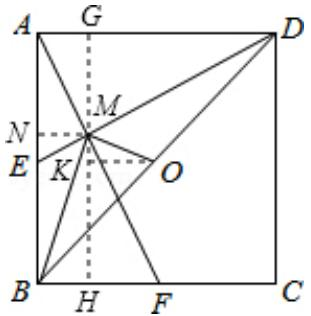

5．如图，在正方形 $A B C D$ 中， $E , \ F$ 分别在 $C D$ 、 $A D$ 边上，且 $C E = D F$ ，连接 $B E$ 、 $C F$ 相交于 $G$ 点．则下列结论： $\textcircled { 1 } B E = C F$ ； $\textcircled { 2 } S _ { \scriptscriptstyle \Delta B C G } = S _ { \scriptscriptstyle \textmu _ { 1 } j _ { 1 } j _ { 2 } j _ { 3 } ^ { \prime } \scriptscriptstyle \mathscr { D } F G E }$ ； $\textcircled { 3 } C G ^ { 2 } = B G \cdot G E \ ; \textcircled { 4 }$ $\textcircled{4}$ 当 $E$ 为 $C D$ 中点时，连接 $_ { D G }$ ，则 $\angle F G D = 4 5 ^ { \circ }$ ，正确的结论是 ．（填序号）

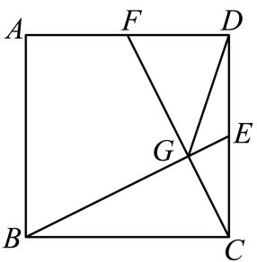

【答案】 $\textcircled{1} \textcircled{2} \textcircled{3} \textcircled{4}$

【分析】 $\textcircled{1}$ 由“SAS”可证 $\scriptstyle \Delta B C E \cong \Delta C D F$ ，可得 $B E = C F$ ；  
$\textcircled{2}$ 由全等三角形的性质可得 $S _ { \_ B C Q } = S _ { \_ C D F }$ ，由面积和差关系可得 $S _ { \_ B C G } = S _ { \tt p q i j j \not \in { D F G E } }$ ；$\cdot$ 通过证明 $\triangle B C G \sim \triangle C E G$ ， 可得 ${ \frac { C G } { B G } } = { \frac { G E } { G C } }$ 可得结论；  
$\textcircled{4}$ 通过证明点 $\cdot$ ，点 $E$ ，点 $\cdot$ ，点 $\cdot$ 四点共圆，可证 $\angle D E F = \angle D G F = 4 5 ^ { \circ }$   
【详解】解：∵四边形 ABCD是正方形，  
∴ $B C = C D$ ， $\angle B C D = \angle C D F = 9 0 ^ { \circ }$ ，  
在 $\triangle B C E$ 和 $\triangle C D F$ 中，  
$\left\{ \begin{array} { l } { { B C = C D } } \\ { { \angle B C D = \angle C D F = 9 0 ^ { \circ } , } } \\ { { C E = D F } } \end{array} \right.$   
$\therefore \Delta B C E \cong \Delta C D F \left( \mathrm { S A S } \right) ,$   
∴ $B E = C F$ ，故 $\cdot$ 正确，  
$\therefore \Delta B C E \cong \Delta C D F$ ，  
$-$ ，  
$\therefore S _ { \_ B C G } = S _ { \ / { \mathbb { J } } \ / \mathrm { q } \mathrm { i } \mathcal { \underline { { \jmath } } } \mathcal { H } \mathrm { \xi } \ / D F G E }$ ；故 $\textcircled{2}$ 正确，$\therefore \Delta B C E \cong \Delta C D F$ ，  
∴ $. \angle D C F = \angle E B C$ ，  
∵ $\angle D C F + \angle B C G = 9 0 ^ { \circ }$ ，

$\cdot \angle E B C + \angle B C G = 9 0 ^ { \circ }$ $\angle B G C = \angle E G C = 9 0 ^ { \circ }$ ，$\triangle B C G \sim \triangle C E G$ ，$\cdot \frac { C G } { B G } = \frac { G E } { G C }$ ∴ $C G ^ { 2 } = B G \cdot G E$ ；故 $\cdot$ 正确；如图，连接 $E F$ ，

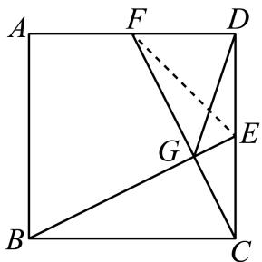

∵点 $\cdot$ 是 $C D$ 中点，   
$D E = C E$ ，   
∵ $C E = D F$ ，   
$D F = C E = D E$ ，   
$\cdot \angle D F E = \angle D E F = 4 5 ^ { \circ }$ ，   
∵ $\angle A D C = \angle E G F = 9 0 ^ { \circ }$ ，   
∴点 $\cdot$ ，点 $E$ ，点 $\cdot$ ，点 $\cdot$ 四点共圆， ∴ $\angle D E F = \angle D G F = 4 5 ^ { \circ }$ ，故 $\textcircled{4}$ 正确； 综上所述：正确的有 $\textcircled{1} \textcircled{2} \textcircled{3} \textcircled{4}$

# 题型三 对角线模型

1．如图，在边长为 1 的正方形 $A B C D$ 中，动点 $F$ ， $E$ 分别以相同的速度从 $D$ ， $C$ 两点同时出发向 $C$ 和 $B$ 运动（任何一个点到达即停止），连接 $A E , B F$ 交于点 $P$ ，过点 $P$ 作 $P M / / C D$ 交 $B C$ 于 $M$ 点， $P N / / B C$ 交 $C D$ 于 $N$ 点，连接 MN ，在运动过程中则下列结论： $\textcircled{1}$ $\begin{array} { r } { \mathrm { 1 ) } \Delta A B E \cong \Delta B C F \mathrm { ~ } ; \textcircled { \cdot } A E = B F \mathrm { ~ } ; \textcircled { \cdot } A E \perp B F \mathrm { ~ } ; \textcircled { \cdot } C F ^ { 2 } = P E bullet B F \mathrm { ~ } ; } \end{array}$ ；

$\textcircled{5}$ 线段 $M N$ 的最小值为 $\frac { { \sqrt { 5 } } - 2 } { 2 }$ ．其中正确的结论有(

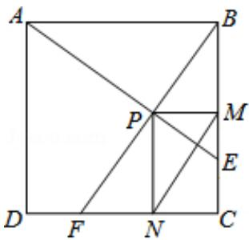

A．2 个 B．3 个 C．4 个 D．5 个【解答】解：动点 $F$ ， $E$ 的速度相同， $D F = C E$ ，

【淘宝店铺：向阳百分百】

又 $C D = B C$ ，  
 $C F = B E$ ，  
在 $\Delta A B E$ 和 $\Delta B C F$ 中，  
$\left\{ \begin{array} { l } { A B = B C } \\ { \angle A B E = \angle B C F = 9 0 ^ { \circ } } \\ { B E = C F } \end{array} \right.$   
 $. \Delta A B E \cong \Delta B C F ( S A S )$ ，故 $\cdot$ 正确；  
 $\angle B A E = \angle C B F$ ， $A E = B F$ ，故 $\textcircled{2}$ 正确；  
 $\angle B A E + \angle B E A = 9 0 ^ { \circ }$ ，  
 $. \angle C B F + \angle B E A = 9 0 ^ { \circ }$ ，  
 $\angle A P B = 9 0 ^ { \circ }$ ，故 $\cdot$ 正确；  
在 $\Delta B P E$ 和 $\Delta B C F$ 中，  
$\because \angle B P E = \angle B C F , \angle P B E = \angle C B F ,$ ，  
$\therefore \Delta B P E \sim \Delta B C F$ ，  
$\therefore { \frac { P E } { C F } } { = } { \frac { B E } { B F } }$ ，  
$\therefore C F \bullet B E = P E \bullet B F$ ，  
 $C F = B E$ ，  
 $C F ^ { 2 } = P E { \bullet } B F$ ，故 $\textcircled{4}$ 正确；  
点 $P$ 在运动中保持 $\angle A P B = 9 0 ^ { \circ }$ ，  
点 $P$ 的路径是一段以 $A B$ 为直径的弧，  
如图，设 $A B$ 的中点为 $G$ ，连接 $C G$ 交弧于点 $P$ ，此时 $C P$ 的长度最小，在 RtBCG 中， $C G = \sqrt { B C ^ { 2 } + B G ^ { 2 } } = \sqrt { 1 + \frac { 1 } { 4 } } = \frac { \sqrt { 5 } } { 2 } \ ,$   
$\because P G = { \frac { 1 } { 2 } } A B = { \frac { 1 } { 2 } } \ ,$   
$\therefore M N = C P = C G - P G = { \frac { \sqrt { 5 } } { 2 } } - { \frac { 1 } { 2 } } = { \frac { \sqrt { 5 } - 1 } { 2 } } ,$   
即线段 $M N$ 的最小值为 $\frac { \sqrt { 5 } - 1 } { 2 }$ ， 故 $\cdot$ 错误；  
综上可知正确的有 4 个，  
故选： $C$ ．

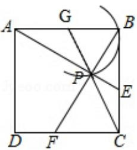

2．如图，正方形 ABCD 中， $A B = 3$ ，点 $E$ 是对角线 $A C$ 上的一点，连接 $D E$ ，过点 $E$ 作 $E F \perp D E$ ，交 $A B$ 于点 $F$ ，连接 $D F$ 交 $A C$ 于点 $G$ ，下列结论：

$\textcircled { 1 } D E = E F$ ； $\textcircled { 2 } \angle A D F = \angle A E F$ ； $\textcircled { 3 } D G ^ { 2 } = G E { \cdot } G C$ ； $\textcircled{4}$ 若 $A F = 1$ ，则 $E G = \frac { 5 } { 4 } \sqrt { 2 }$ ，其中结论正确的个数是( )

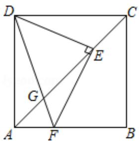

A．1 B．2 C．3 D．4

【解答】解：如图，连接 $B E$ ，

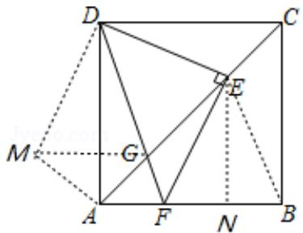

四边形 ABCD 为正方形，  
$\therefore C B = C D \angle B C E = \angle D C E = 4 5 ^ { \circ }$ ，  
在 $\Delta B E C$ 和 $\Delta D E C$ 中，  
$\left\{ \begin{array} { l l } { D C = B C } \\ { \angle D C E = \angle B C E } \\ { C E = C E } \end{array} \right.$ ，  
$\therefore \Delta D C E \cong \Delta B C E ( S A S ) ,$   
DE  BE ， CDE  CBE ，  
ADE  ABE ，  
DAB  90 ， $\angle D E F = 9 0 ^ { \circ }$ ，  
$\therefore \angle A D E + \angle A F E = 1 8 0 ^ { \circ }$ ，  
 $\angle A F E + \angle E F B = 1 8 0 ^ { \circ }$   
 $\angle A D E = \angle E F B$ ，  
 $. \angle A B E = \angle E F B$ ，$\mathbf { \partial } \cdot { \cal E } F = B { \cal E }$ ，  
 ${ \cal D } E = E { \cal F }$ ，故 $\textcircled{1}$ 正确；$\therefore \angle D E F = 9 0 ^ { \circ } , D E = E F ,$ ，$\cdot \angle E D F = \angle D F E = 4 5 ^ { \circ }$ ，  
$\therefore \angle D A C = 4 5 ^ { \circ } \quad \angle A G D = \angle E G F$ ，  
 $\angle A D F = \angle A E F$ ，故 $\textcircled{2}$ 正确；  
 $\cdot \angle G D E = \angle D C G = 4 5 ^ { \circ } \quad \angle D G E = \angle C G D$ ，  
$\therefore \Delta D G E \sim \Delta C G D$ ，$\ : { \frac { D G } { E G } } = { \frac { C G } { D G } }$   
即 $D G ^ { 2 } = G E { \cdot } C G$ ，故 $\cdot$ 正确；  
如图，过点 $E$ 作 $E N \perp A B$ 于点 $N$ ，  
$\begin{array} { r l } & { \cdot \cdot A F = 1 , \quad A B = 3 , } \\ & { \cdot \cdot B F = 2 , \quad A C = \sqrt { 3 ^ { 2 } + 3 ^ { 2 } } = 3 \sqrt { 2 } , } \\ & { \cdot B E = E F , } \\ & { \cdot E N = B N = 1 , } \\ & { \cdot A N = 2 , } \\ & { \cdot A E = \sqrt { 2 ^ { 2 } + 2 ^ { 2 } } = 2 \sqrt { 2 } , } \\ & { \cdot C E = A C - A E = \sqrt { 2 } , } \end{array}$ ，  
将 $\Delta D E C$ 绕点 $A$ 逆时针旋转 $9 0 ^ { \circ }$ 得到 $\Delta D M A$ ，连接 $_ { M G }$ ，  
易证 $\Delta D M G \cong \Delta D E G ( S A S )$ ， $\Delta { } A M G$ 是直角三角形，$. M G = G E$ ，  
$\therefore M G ^ { 2 } = E G ^ { 2 } = A M ^ { 2 } + A G ^ { 2 } = C E ^ { 2 } + A G ^ { 2 } ,$   
设 $E G = x$ ，则 $A G = 2 { \sqrt { 2 } } - x$ ，  
$\therefore ( { \sqrt { 2 } } ) ^ { 2 } + ( 2 { \sqrt { 2 } } - x ) ^ { 2 } = x ^ { 2 } \ ,$ ，  
解得： $x = \frac { 5 } { 4 } \sqrt { 2 }$ ，即 $E G = \frac { 5 } { 4 } \sqrt { 2 }$ ，故 $\textcircled{4}$ 正确．  
故选： $D$ ．

3．如图，正方形 ABCD 中，点 $E$ ， $F$ 分别为边 $B C$ ， $C D$ 上的点，连接 $A E$ ， $A F$ ，与对角线 $B D$ 分别交于点 $G$ ， $H$ ，连接 $E H$ ．若 $\angle E A F = 4 5 ^ { \circ }$ ，则下列判断错误的是 ( )

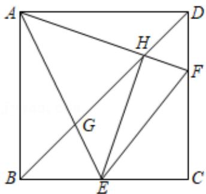

A． $B E + D F = E F$ B． $B G ^ { 2 } + H D ^ { 2 } = G H ^ { 2 }$ C． $E$ ， $F$ 分别为边 $B C$ ， $C D$ 的中点 D． $A H \bot E H$

【解答】解：如图 1，将 $\Delta A D F$ 绕点 $A$ 顺时针旋转 $9 0 ^ { \circ }$ 得到 $\Delta A B M$ ，此时 $A B$ 与 $A D$ 重合，

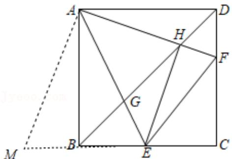  
图1

由旋转可得： $A B = A D$ ， $B M = D F$ ， $\angle D A F = \angle B A M$ ， ABM  D  90 ，  
$\therefore \angle A B M + \angle A B E = 9 0 ^ { \circ } + 9 0 ^ { \circ } = 1 8 0 ^ { \circ }$ ，  
点 $M$ ， $B$ ， $E$ 在同一条直线上  
 $\angle E A F = 4 5 ^ { \circ }$ ，  
DAF  BAE  BAD  EAE  90  45  45  
 $\angle B A E = \angle D A F$ ，  
$\therefore \angle B A M + \angle B A E = 4 5 ^ { \circ }$ (cid:)  
即 $\angle M A E = \angle F A E$   
在 $\Delta A M E$ 与 $\Delta A F E$ 中，  
$\left\{ \begin{array} { l l } { { \cal A } { \cal M } = { \cal A } { \cal F } } \\ { { \cal L } { \cal M } { \cal A } { \cal E } = { \cal L } { \cal F } { \cal A } { \cal E } \ , } \\ { { \cal A } { \cal E } = { \cal A } { \cal E } } \end{array} \right.$ ，  
$\therefore \Delta A M E \cong \Delta A F E ( S A S )$ ，  
$. M E = E F$ ，  
 $E F = B E + D F$ ，故 $A$ 选项不合题意，  
如图 2，将 $\Delta A D H$ 绕点 $A$ 顺时针旋转 $9 0 ^ { \circ }$ 得到 $\Delta A B N$ ，此时 $A B$ 与 $A D$ 重合，$\cdot \Delta A D H \cong \Delta A B N$ ，  
 $A N = A H$ ， $\angle B A N = \angle D A H$ ， ADH  ABN  45 ， $D H = B N$ ， $. \angle N B G = 9 0 ^ { \circ }$ ，  
$\therefore B N ^ { 2 } + B G ^ { 2 } = N G ^ { 2 }$ ，  
$\cdot \angle E A F = 4 5 ^ { \circ }$ ，  
$\therefore \angle D A F + \angle B A E = 4 5 ^ { \circ }$ ，  
$\therefore \angle B A N + \angle B A E = 4 5 ^ { \circ } = \angle N A E$ ，  
 $. \angle N A E = \angle E A F$ ，  
又 $A N = A H$ ， $A G = A G$ ，  
$\cdot . \Delta A N G \cong \Delta A H G ( S A S )$ ，  
 $G H = N G$ ，  
$\therefore B N ^ { 2 } + B G ^ { 2 } = N G ^ { 2 } = G H ^ { 2 } ,$   
 $. D H ^ { 2 } + B G ^ { 2 } = G H ^ { 2 }$ ，故 $B$ 选项不合题意；  
$\therefore \angle E A F = \angle D B C = 4 5 ^ { \circ } \ ,$ ，  
点 $A$ ，点 $B$ ，点 $E$ ，点 $H$ 四点共圆，  
$\therefore \angle A H E = \angle A B E = 9 0 ^ { \circ } \ ,$ ，  
 $. A H \bot H E$ ，故 $D$ 选项不合题意，  
故选： $C$ ．

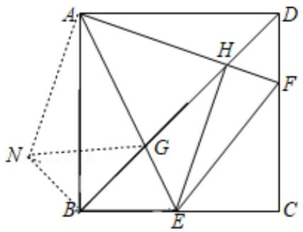  
图2

4．在正方形 $A B C D$ 中，点 $E$ 为 $B C$ 边上一点且 $C E = 2 B E$ ，点 $F$ 为对角线 $B D$ 上一点且 $B { \cal F } = 2 D { \cal F }$ ，连接 $A E$ 交 $B D$ 于点 $G$ ，过点 $F$ 作 $F H \bot A E$ 于点 $H$ ，连接 $C H$ 、 $C F$ ，若 $H G = 2 c m$ ，则 $\Delta C H F$ 的面积是 $\frac { 5 6 } { 5 } - c m ^ { 2 }$

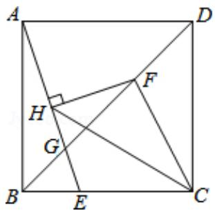

【淘宝店铺：向阳百分百】

【解答】解：如图，过 $F$ 作 $F I \perp B C$ 于 $I$ ，连接 $F E$ ， $F A$ ，  
$\therefore F I / / C D$ ，  
 $C E = 2 B E$ ， $B { \cal F } = 2 D { \cal F }$ ，  
设 $B E = E I = I C = a C E = F I = 2 a A B = 3 a$ ，  
则 $F E = F C = F A = \sqrt { 5 } a$ ，  
 $H$ 为 $A E$ 的中点，  
$\therefore H E = { \frac { 1 } { 2 } } A E = { \frac { \sqrt { 1 0 } a } { 2 } } ,$   
四边形 ABCD 是正方形，  
 $B G$ 平分 $\angle A B C$ ，  
$\therefore { \frac { E G } { A G } } = { \frac { B E } { A B } } = { \frac { 1 } { 3 } }$   
$\therefore H G = \frac { 1 } { 4 } A E = \frac { \sqrt { 1 0 } } { 4 } a = 2 \ ,$   
$\therefore a = { \frac { 4 } { 5 } } { \sqrt { 1 0 } }$   
$\therefore S _ { _ { \Delta C H F } } = S _ { _ { \Delta H E F } } + S _ { _ { \Delta C E F } } - S _ { _ { \Delta C E H } } = \frac { 1 } { 2 } ( \frac { \sqrt { 1 0 } } { 2 } a ) ^ { 2 } + \frac { 1 } { 2 } \cdot 2 a \cdot 2 a - \frac { 1 } { 2 } \cdot 2 a \cdot \frac { 3 } { 2 } a = \frac { 7 } { 4 } a ^ { 2 } = \frac { 5 6 } { 5 }$   
故答案为： $\frac { 5 6 } { 5 }$

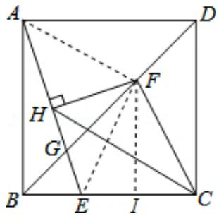

5.如图，正方形 AFBH,点 T 是边 AF 上一动点,M 是 HT 的中点,MN⊥HT 交 AB 于 N,当点 T 在 AF 上运动时, $\frac { M N } { H T }$ 的值是否发生改变?若改变求出其变化范围:若不改变请求出其值并给出你的证明

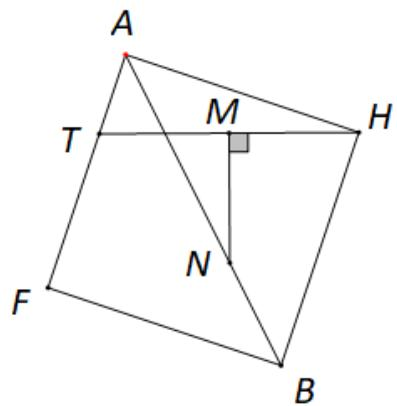

【解析】易知 $\cdot$ ，证明 $\_$ 即可

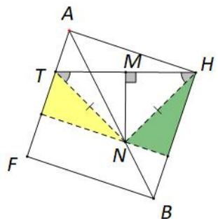

TN=HNTNLHN

# 2023·攀枝花·中考真题

6．如图，已知正方形 ABCD的边长为 3，点 $P$ 是对角线 $B D$ 上的一点， $P F \perp A D$ 于点 $F$ ， $P E \bot A B$ 于点 $E$ ，连接 $P C$ ，当 $P E : P F = 1 : 2$ 时，则 $P C =$ （ ）

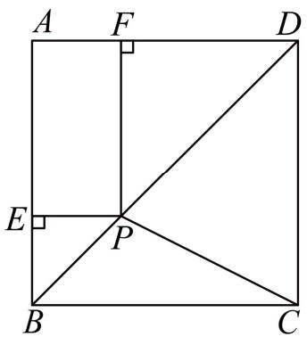

A． 3 B．2 C． $\sqrt { 5 }$ D． $\frac { 5 } { 2 }$

【答案】C

【分析】先证四边形 AEPF是矩形，可得 $P E = A F$ ， $\angle P F D = 9 0 ^ { \circ }$ ，由等腰直角三角形的性质可得 $P F = D F$ ，可求 $A F$ ， $D F$ 的长，由勾股定理可求 $A P$ 的长，由“SAS”可证 $\triangle A B P \cong \triangle C B P$ ，可得 $A P = P C = { \sqrt { 5 } }$

【淘宝店铺：向阳百分百】【详解】解：如图：

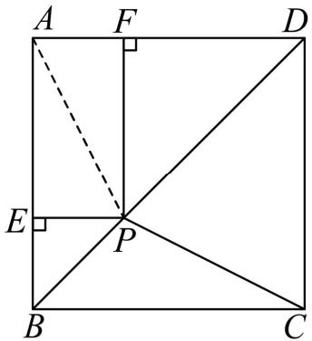

连接 $A P$ ，  
 四边形ABCD是正方形，  
 $A B = A D = 3$ ， $\angle A D B = 4 5 ^ { \circ }$ ，  
$\because P F \bot A D P E \bot A B \angle B A D = 9 0 ^ { \circ }$   
四边形 AEPF是矩形，  
$\therefore P E = A F \angle P F D = 9 0 ^ { \circ }$   
$\therefore \triangle P F D$ 是等腰直角三角形，  
$. P F = D F$ ，  
$\because P E : P F = 1 : 2$ ，  
$\cdot A F : D F = 1 : 2$ ，  
$\therefore A F = 1 , D F = 2 = P F ,$ ，  
$\therefore A P = { \sqrt { A F ^ { 2 } + P F ^ { 2 } } } = { \sqrt { 1 + 4 } } = { \sqrt { 5 } }$ ，  
 $A B = B C$ ， $\angle A B D = \angle C B D = 4 5 ^ { \circ } , B P = B P ,$   
△ABP≌△CBP(SAS) ，  
$\scriptstyle \cdot { A P } = P C = { \sqrt { 5 } }$

# 2023·四川宜宾·统考中考真题

7. 如图，边长为 6 的正方形 $A B C D$ 中， $M$ 为对角线 $B D$ 上的一点，连接 $A M$ 并延长交 $C D$ 于点 $P$ ．若 $P M = P C$ ，则 AM 的长为（ ）

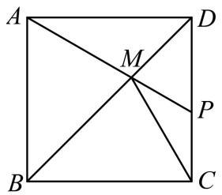

A． $3 { \left( { \sqrt { 3 } } - 1 \right) }$ B． $3 \left( 3 { \sqrt { 3 } } - 2 \right)$ C． 6 3 1 D． 6 3 3  2

【答案】C

【详解】解： 四边形ABCD是边长为 6的正方形，$. A D = C D = 6 , \angle A D C = 9 0 ^ { \circ } , \angle A D M = \angle C D M = 4 5 ^ { \circ }$

在△ADM 和VCDM 中， $\left\{ \begin{array} { l } { D M = D M } \\ { \angle A D M = \angle C D M = 4 5 ^ { \circ } , } \\ { A D = C D } \end{array} \right.$   
$\therefore \Delta A D M \cong \Delta C D M ( \mathrm { S A S } )$ ，  
$. \angle D A M = \angle D C M$ ，  
 $P M = P C$ ，  
 $. \angle C M P = \angle D C M$ ，  
$. \angle A P D = \angle C M P + \angle D C M = 2 \angle D C M = 2 \angle D A M$ ，  
又 $\angle A P D + \angle D A M = 1 8 0 ^ { \circ } - \angle A D C = 9 0 ^ { \circ }$ ，  
 $. \angle D A M = 3 0 ^ { \circ }$ ，  
设 $P D = x$ ，则 $A P = 2 P D = 2 x$ ， $P M = P C = C D - P D = 6 - x ,$ ，  
$\therefore A D = \sqrt { A P ^ { 2 } - P D ^ { 2 } } = \sqrt { 3 } x = 6 .$ ，  
解得 $x = 2 \sqrt { 3 }$ ，  
$\therefore P M = 6 - x = 6 - 2 \sqrt { 3 } , \quad { \cal A P } = 2 x = 4 \sqrt { 3 } ,$ ，  
$\therefore A M = A P - P M = 4 { \sqrt { 3 } } - \left( 6 - 2 { \sqrt { 3 } } \right) = 6 \left( { \sqrt { 3 } } - 1 \right)$

# 题型四 半角模型（七个性质）

# 2023·重庆·中考真题

1．如图，在正方形 ABCD中，点 $E$ ， $F$ 分别在 $B C$ ， $C D$ 上，连接 $A E$ ， $A F$ ， $E F$ ， $\angle E A F = 4 5 ^ { \circ }$ ．若 $\angle B A E = \alpha$ ，则 $\angle F E C$ 一定等于（ ）

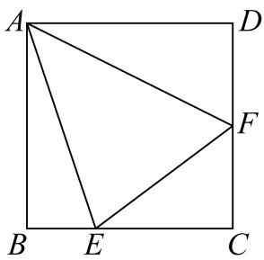

A． $2 \alpha$ B． $9 0 ^ { \circ } - 2 \alpha$ C． $4 5 ^ { \circ } - \alpha$ D． $9 0 ^ { \circ } - \alpha$

【答案】A

【详解】将 $\triangle A D F$ 绕点 A 逆时针旋转 $9 0 ^ { \circ }$ 至 $\triangle A B H$ ，

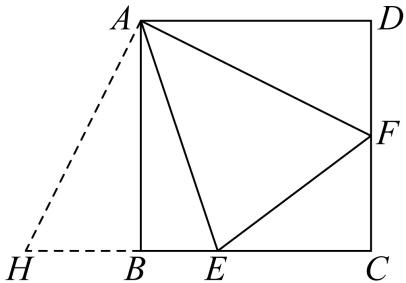

∵四边形ABCD是正方形，  
∴ $A B = A D$ ， $\angle A B C = \angle D = \angle B A D = \angle C = 9 0 ^ { \circ }$   
由旋转性质可知： $\angle D A F = \angle B A H$ ， $\angle D = \angle A B H = 9 0 ^ { \circ } , ~ A F = A H ~ ,$ ，$\angle A B H + \angle A B C = 1 8 0 ^ { \circ }$ ，  
∴点 $H$ ， $B$ ， $C$ 三点共线，  
$\therefore \angle B A E = \alpha , \angle E A F = 4 5 ^ { \circ } , \angle B A D = \angle H A F = 9 0 ^ { \circ } ,$ $\angle D A F = \angle B A H = 4 5 ^ { \circ } - \alpha \quad \angle E A F = \angle E A H = 4 5 ^ { \circ }$ $\angle A H B + \angle B A H = 9 0 ^ { \circ }$   
∴ $\angle A H B = 4 5 ^ { \circ } + \alpha$ ，  
在 $\triangle A E F$ 和 $\triangle A E H$ 中  
$\left\{ \begin{array} { l l } { \displaystyle A F = A H } \\ { \angle F A E = \angle H A E } \\ { A E = A E } \end{array} \right. ,$   
$\triangle A F E { \cong } \triangle A H E ( S A S )$ $\cdot \angle A H E = \angle A F E = 4 5 ^ { \circ } + \alpha$ ，  
∴ $\angle A H E = \angle A F D = \angle A F E = 4 5 ^ { \circ } + \alpha$ ，

∴ $\angle D F E = \angle A F D + \angle A F E = 9 0 ^ { \circ } + 2 \alpha$ ， ∵ $\angle D F E = \angle F E C + \angle C = \angle F E C + 9 0 ^ { \circ }$ ， ∴ $\angle F E C = 2 \alpha$

# 2023·眉山·中考真题

2．如图，在正方形 $A B C D$ 中，点 $E$ 是 $C D$ 上一点，延长 $C B$ 至点 $F$ ，使 $B { \cal F } = D E$ ，连结 $A E , A F , E F$ ， $E F$ 交$A B$ 于点 $K$ ，过点 $A$ 作 $A G \bot E F$ ，垂足为点 $H$ ，交 $C F$ 于点 $G$ ，连结 $H D ;$ ， $H C$ ． 下列四个结论： $\textcircled { 1 } A H = H C$ ；$\textcircled { 2 } H D = C D$ ； $\textcircled { 3 } \angle F A B = \angle D H E$ ； $\textcircled { 4 } A K \cdot H D = \sqrt { 2 } H E ^ { 2 }$ ．其中正确结论的个数为（ ）

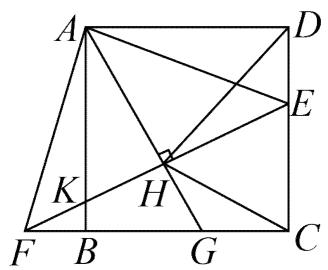

A．1 个 B．2 个 C．3 个 D．4 个

【答案】C

【分析】根据正方形 $A B C D$ 的性质可由SAS定理证 $\triangle A B F { \cong } \triangle A D E$ ，即可判定△AEF 是等腰直角三角形，进而可得 $H E = H F = A H = { \frac { 1 } { 2 } } E F$ ，由直角三角形斜边中线等于斜边一半可得 $H C = { \frac { 1 } { 2 } } E F$ ；由此即可判断 $\cdot$ 正确；再根据 $\angle A D H + \angle E A D = \angle D H E + \angle A E H$ ，可判断 $\textcircled{3}$ 正确，进而证明 $\triangle A F K \sim \triangle H D E$ ，可得 $\frac { A F } { H D } { = } \frac { A K } { H E }$ 结合 $A F = { \sqrt { 2 } } A H = { \sqrt { 2 } } H E$ ，即可得出结论 $\textcircled{4}$ 正确，由 $\angle A E D$ 随着 $D E$ 长度变化而变化，不固定，可 判断 $\textcircled{2}$ $H D = C D$ 不一定成立

【详解】解：∵正方形 $A B C D$ ，  
∴ $A B = A D$ ， $\angle A D C = \angle A B C = \angle B A D = \angle B C D = 9 0 ^ { \circ } ,$   
$\angle A B F = \angle A D C = 9 0 ^ { \circ }$ ，  
∵ $B { \cal F } = D E$ ，  
$\triangle A B F { \cong } \triangle A D E \ ( \mathrm { S A S } )$ ，  
$\angle B A F = \angle D A E A F = A E$ ，  
$\angle F A E = \angle B A F + \angle B A E = \angle D A E + \angle B A E = \angle B A D = 9 0 ^ { \circ }$ ∴△AEF 是等腰直角三角形， $\angle A E F = \angle A F E = 4 5 ^ { \circ }$ ，  
$\because A H \bot E F$ ，  
$\therefore H E = H F = A H = { \frac { 1 } { 2 } } E F \ ,$   
∵ $\angle D C B = 9 0 ^ { \circ }$ ，  
∴ $C H = H E = { \frac { 1 } { 2 } } E F$   
∴ $C H = A H$ ，故 $\cdot$ 正确；

【淘宝店铺：向阳百分百】

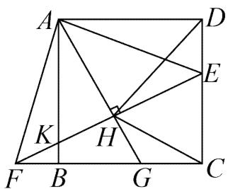

又∵ $A D = C D , H D = H D$ ,  
$\therefore \Delta A H D \cong \Delta C H D ( \mathrm { S S S } )$ ,  
$: \angle A D H = \angle C D H = \frac { 1 } { 2 } \angle A D C = 4 5 ^ { \circ }$ ，  
∵ $\angle A D H + \angle E A D = \angle D H E + \angle A E H$ ，即： $4 5 ^ { \circ } + \angle E A D = \angle D H E + 4 5 ^ { \circ }$ ，∴ $\angle E A D = \angle D H E$ ，  
∴ $\angle F A B = \angle D H E = \angle E A D$ ，故 $\textcircled{3}$ 正确，  
又∵ $\angle A F E = \angle A D H = 4 5 ^ { \circ }$ ，  
$\triangle A F K \sim \triangle H D E$ ，  
$\frac { A F } { H D } { = } \frac { A K } { H E }$   
又∵ $A F = \sqrt { 2 } A H = \sqrt { 2 } H E$ ，  
$\mathbf { \dot { \sigma } } \cdot A K \cdot H D = { \sqrt { 2 } } H E ^ { 2 }$ ，故 $\textcircled{4}$ 正确，  
∵若 $H D = C D$ ，则 $\angle D H C = \angle D C H = { \frac { 1 8 0 ^ { \circ } - 4 5 ^ { \circ } } { 2 } } = 6 7 . 5 ^ { \circ }$   
又∵ $C H = H E$ ，  
∴ $\angle H C E = \angle H E C = 6 7 . 5 ^ { \circ }$ ，  
而点 $\cdot$ 是 $C D$ 上一动点， $\angle A E D$ 随着 $D E$ 长度变化而变化，不固定，而 $\angle H E C = 1 8 0 ^ { \circ } - \angle A E D - 4 5 ^ { \circ } = 1 3 5 ^ { \circ } - \angle A E D$ ，  
则故 $\angle H E C = 6 7 . 5 ^ { \circ }$ 不一定成立，故 $\textcircled{2}$ 错误；  
综上，正确的有 $\textcircled{1} \textcircled{3} \textcircled{4}$ 共 3 个

3．如图，在正方形 $A B C D$ 中，点 $E$ ， $F$ 分别在 $B C$ ， $C D$ 上， $A E = A F$ ， $A C$ 与 $E F$ 相交于点 $G$ ．下列结论：$\textcircled{1} A C$ 垂直平分 $E F$ ； $\textcircled { 2 } B E + D F = E F$ ； $\textcircled{3}$ 当 $\angle D A F = 1 5 ^ { \circ }$ 时， $\Delta A E F$ 为等边三角形； $\textcircled{4}$ 当 $\angle E A F = 6 0 ^ { \circ }$ 时，$\angle A E B = \angle A E F$ ．其中正确的结论是 ( )

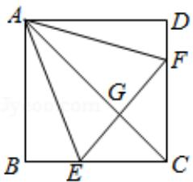

A． $\textcircled{1} \textcircled{3}$ B． $\textcircled{2} \textcircled{4}$ C． $\textcircled{1} \textcircled{3} \textcircled{4}$ D． $\textcircled{2} \textcircled{3} \textcircled{4}$

【解答】解：四边形 $A B C D$ 是正方形，  
$. A B = A D = B C = C D$ $D = B C = C D \ , \angle B = \angle D = 9 0 ^ { \circ } \ , \angle A C D = \angle A C B = 4 5 ^ { \circ } \ ,$   
 $A B = A D$ ， $A E = A F$ ，

【淘宝店铺：向阳百分百】

$\therefore R t \Delta A \mathbf { B } \mathrm { { E } \cong R t \Delta A D F ( H L ) }$ ，  
$.  B E = D F$ ，  
 $C E = C F$ ，  
又 $\angle A C D = \angle A C B = 4 5 ^ { \circ }$ ，  
 $A C$ 垂直平分 $E F$ ，故 $\cdot$ 正确；  
 $C E = C F$ ， $\angle B C D = 9 0 ^ { \circ }$ ， $A C$ 垂直平分 $E F$ ，  
 $. E G = G F$ ，  
当 $A E$ 平分 $\angle B A C$ 时， $B E = E G$ ，即 $B E + D F = E F$ ，故 $\cdot$ 错误；$\therefore R \mathrm { t } \Delta \mathrm { A B E } \cong R \mathrm { t } \Delta \mathrm { A D F }$ ，  
 $\angle D A F = \angle B A E = 1 5 ^ { \circ }$ ，  
 $. \angle E A F = 6 0 ^ { \circ }$ ，  
又 $A E = A F$ ，  
 $\Delta A E F$ 是等边三角形，故 $\cdot$ 正确；  
 $A E = A F$ ， $\angle E A F = 6 0 ^ { \circ }$ ，  
 $. \Delta A E F$ 是等边三角形，  
 $\angle A E F = 6 0 ^ { \circ }$ ，  
 $\angle B A C = 4 5 ^ { \circ }$ ， $\angle C A E = 3 0 ^ { \circ }$ ，  
 $\angle B A E = 1 5 ^ { \circ }$ ，  
 $\angle A E B = 7 5 ^ { \circ } \neq \angle A E F$ ，故 $\cdot$ 错误.

# 2022 达州·中考真题

4．如图，在边长为 2 的正方形 $A B C D$ 中，点 $E , \ F$ 分别为 $A D$ ， $C D$ 边上的动点（不与端点重合），连接 $B E$ ，$B F$ ，分别交对角线 $A C$ 于点 $P$ ， $\mathcal { Q }$ ．点 $E , \ F$ 在运动过程中，始终保持 $\angle E B F = 4 5 ^ { \circ }$ ，连接 $E F$ ， $P F$ ， $P D$ ．以下结论： $\textcircled{1} P B = P D$ ； $\textcircled { 2 } \angle E F D = 2 \angle F B C$ ； $\textcircled { 3 } P Q = P A + C Q$ ； $\textcircled{4} \triangle B P F$ 为等腰直角三角形； $\textcircled{5}$ 若过点 $B$ 作$B H \perp E F$ ，垂足为 $H$ ，连接 $D H$ ，则 $D H$ 的最小值为 $2 \sqrt { 2 } - 2$ ．其中所有正确结论的序号是

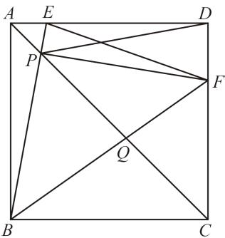

【答案】 $\textcircled{1} \textcircled{2} \textcircled{4} \textcircled{5}$

【分析】连接 $\cdot$ ，延长 $D A$ 到 $\cdot$ ，使 $\cdot$ ，连接 $B M$ ，根据正方形的性质及线段垂直平分线的性质定理即可判断 $\cdot$ 正确；通过证明 $\triangle B C F \cong \triangle B A M ( S A S )$ ， $\triangle E B F \cong \triangle E B M ( S A S )$ ，可证明 $\textcircled{2}$ 正确；作 $\angle C B N = \angle A B P$ ，交 $A C$ 的延长线于 $K$ ，在 $\cdot$ 上截取 $B N { = } B P$ ，连接 $C N _ { : }$ ，通过证明 $\triangle A B P \cong \triangle C B N$ ，可判断 $\textcircled{3}$ 错误；通过证明 ${ \triangle B Q P } \sim { \triangle C Q F }$ ， $\triangle B C Q \sim \triangle P F Q$ ，利用相似三角形的性质即可证明 $\cdot$ 正确；当点 $B$ 、 $H _ { \cdot }$ 、 $D$ 三点共线时，$D H$ 的值最小，分别求解即可判断 $\textcircled{5}$ 正确

【详解】

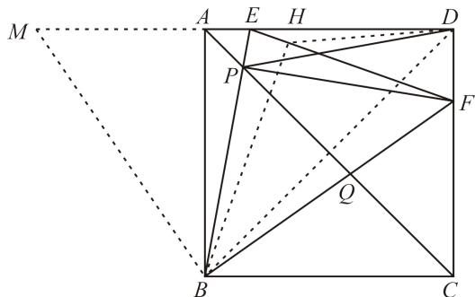

如图 1，连接 $B D$ ，延长 $D A$ 到 $\cdot$ ，使 $\cdot$ ，连接 $\cdot$ ，  
 四边形 $\cdot$ 是正方形，  
 $A C$ 垂直平分 $B D$ ， $B A = B C , \angle B C F = 9 0 ^ { \circ } = \angle B A D = \angle A B C ,$ ，∴ $P B = P D$ ， $\angle B C F = \angle B A M$ ， $\angle F B C = 9 0 ^ { \circ } - \angle B F C$ ，故 $\cdot$ 正确；$\therefore \triangle B C F \cong \triangle B A M ( S A S )$ ，  
$\therefore \angle C B F = \angle A B M , B F = B M , \angle M = \angle B F C$ ，  
 $\cdot \angle E B F = 4 5 ^ { \circ }$ ，  
 $. \angle A B E + \angle C B F = 4 5 ^ { \circ }$ ，  
$\cdot \angle A B E + \angle A B M = 4 5 ^ { \circ }$ ，  
即 $\angle E B M = \angle E B F$ ，  
 $B E = B E$ ，  
$\therefore \_ E B F \cong \_ E B M ( S A S )$ ，  
 $. \angle M = \angle E F B , \angle M E B = \angle F E B$ ，  
 $\angle E F B = \angle C F B$ ，  
$\therefore \angle E F D = 1 8 0 ^ { \circ } - ( \angle E F B + \angle C F B ) = 1 8 0 ^ { \circ } - 2 \angle B F C$   
 $\angle E F D = 2 \angle F B C$ ，故 $\cdot$ 正确；如图 2，作 $\angle C B N = \angle A B P$ ，交 $A C$ 的延长线于 $\cdot$ ，在 $\cdot$ 上截取 $B N { = } B P$ ，连接 CN，$\cdot _ { \triangle A B P } \cong _ { \triangle C B N }$ ，  
 $. \angle B A P = \angle B C N = 4 5 ^ { \circ }$ ，  
 $\angle A C B = 4 5 ^ { \circ }$ ，  
 $. \angle N C K = 9 0 ^ { \circ }$ ，  
 $\angle C N K \neq \angle K$ ，即 $C N \neq C K$ ，  
 $. P Q \neq P A + C Q$ ，故 $\textcircled{3}$ 错误；  
如图 1，  
 四边形 $\cdot$ 是正方形，  
 $. \angle E B F = \angle B C P = \angle F C P = 4 5 ^ { \circ }$ ，  
 $\angle B Q P = \angle C Q F$ ，  
$\because \triangle B Q P \sim \triangle C Q F$ ，  
$\therefore { \frac { B Q } { C Q } } = { \frac { P Q } { F Q } }$ $\cdot \angle B Q C = \angle P Q F \ ,$   
$\therefore \triangle B C Q \sim \triangle P F Q$ ，$\therefore \angle B C Q = \angle P F Q = 4 5 ^ { \circ } ,$ $\angle P B F = \angle P F B = 4 5 ^ { \circ }$ ，  
 $. \angle B P F = 9 0 ^ { \circ }$ ，  
 $\triangle B P F$ 为等腰直角三角形，故 $\textcircled{4}$ 正确；  
如图 1，当点 $\cdot$ 、 $\cdot$ 、 $D$ 三点共线时， $\cdot$ 的值最小，  
$\therefore B D = { \sqrt { 2 ^ { 2 } + 2 ^ { 2 } } } = 2 { \sqrt { 2 } } \ $ ，$\cdot \angle B A E = \angle B H E = 9 0 ^ { \circ } , B E = B E$ ，$\therefore \triangle B A E \cong \triangle B H E ( A A S )$ ，  
 $. B A = B H = 2$ ，$. D H = B D - B H = 2 \sqrt { 2 } - 2$ ，故 $\cdot$ 正确

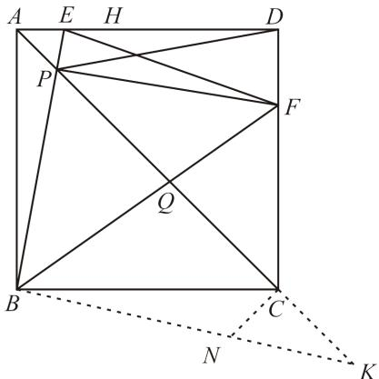

5．如图，点 $M , N$ 分别是正方形 $A B C D$ 的边 $B C , C D$ 上的两个动点，在运动过程中保持 $\angle M A N = 4 5 ^ { \circ }$ ， $A M$ 、$A N$ 分别与对角线 $B D$ 交于点 $E$ 、 $F$ ，连接 $E N$ 、 FM 相交于点 $O$ ，以下结论： $\textcircled { 1 } M N = B M + D N$ ； $\textcircled{2}$ $B E ^ { 2 } + D F ^ { 2 } = E F ^ { 2 }$ ； $\textcircled { 3 } B C ^ { 2 } = B F \cdot D E$ ； $\textcircled { 4 } O M = \sqrt { 2 } O F$ ，一定成立的是

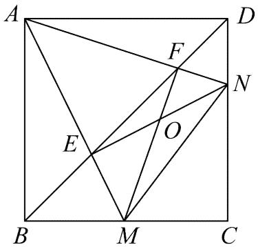

【答案】 $\cdot$

【 分 析 】 由 旋 转 的 性 质 可 得 A $M ^ { \prime } = A M$ ， $B M = D M ^ { \prime }$ ， $\angle B A M = \angle D A \ M ^ { \prime }$ ， MA $M ^ { \prime } = 9 0 ^ { \circ }$ ，$\angle A B M = \angle A D M ^ { \prime } = 9 0 ^ { \circ }$ ，由 $S A S$ 可证 $\triangle A M N { \cong } \triangle A M ^ { \prime } N$ ，可得 $M N = N M ^ { \prime }$ ，可得 $M N = B M + D N$ ，故 $\cdot$ 正确；由SAS可证 $\triangle A E F { \cong } \triangle A E D ^ { \ * }$ ，可得 $E F = D ^ { \not \propto } E$ ，由勾股定理可得 $B E ^ { 2 } + D F ^ { 2 } = E F ^ { 2 }$ ；故 $\cdot$ 正确；通过证明 $\triangle D A E \sim _ { \triangle B F A }$ ，可得 ${ \frac { D E } { A B } } { = } { \frac { A D } { B F } }$ 可证 $B C ^ { 2 } = B F \cdot D E$ ，故 $\textcircled{3}$ 正确；通过证明点A ，点 $B$ ，点 $M$ ，点 $F$ 四点 共 圆 ， $\angle A B M = \angle A F M = 9 0 ^ { \circ }$ ， $\angle A M F = \angle A B F = 4 5 ^ { \circ }$ ， $\angle B A M = \angle B F M$ ， 可 证 $M O = { \sqrt { 2 } } E O$ ， 由$\angle B A M \ne \angle D A N$ ，可得 $O E \neq O F$ ，故 $\textcircled{4}$ 错误，即可求解．

【详解】解：将 $\triangle A B M$ 绕点 A 逆时针旋转 $9 0 ^ { \circ }$ ，得到 $\triangle A D M ^ { \prime }$ ，将 $\triangle A D F$ 绕点 A 顺时针旋转 $9 0 ^ { \circ }$ ，得到 $\triangle A B \ D ^ { \notin }$ ，

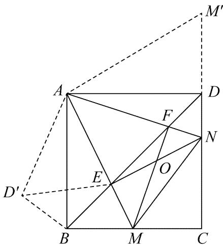

 $\textit { A M } ^ { \prime } = \textit { A M }$ ， $B M = D M ^ { \prime }$ ， $\angle B A M = \angle D A M ^ { \prime }$ ， $\angle M A M ^ { \prime } = 9 0 ^ { \circ }$ ，  
$\therefore \angle A D M + \angle A D C = 1 8 0 ^ { \circ }$ ，  
点 $M ^ { \prime }$ 在直线 $C D$ 上，  
 $\angle M A N = 4 5 ^ { \circ }$ ，  
 $. \angle D A N + \angle M A B = 4 5 ^ { \circ } = \angle D A N + \angle D A M ^ { \prime } = \angle M ^ { \prime } A N ,$ ，  
$\therefore \angle M ^ { \prime } A N = \angle M A N = 4 5 ^ { \circ }$ ，  
又 $A N = A N$ ， $A M = A M ^ { \prime }$ ，  
$\cdot _ { \triangle A M N } { \cong } _ { \triangle A M ^ { \prime } } N ~ S A S$ ，  
 $. M N { = } N M ^ { \prime }$ ，  
$\therefore M ^ { \prime } N = M ^ { \prime } D + D N = B M + D N$ ，  
 $M N = B M + D N$ ；故 $\cdot$ 正确；  
 将 $\triangle A D F$ 绕点 A 顺时针旋转 $9 0 ^ { \circ }$ ，得到 $\triangle A B \ D ^ { \notin }$ ，  
 $A F = A D ^ { \alpha }$ ， $D F = D ^ { \notin } B$ ， $\angle A D F = \angle A B \ D ^ { \phi } = 4 5 ^ { \circ } \angle D A F = \angle B A \ D ^ { \phi }$ ，  
$\therefore \angle D ^ { \notin } B E = 9 0 ^ { \circ }$ ，  
$\cdot \angle M A N = 4 5 ^ { \circ }$ ，  
 $\cdot \angle B A E + \angle D A F = 4 5 ^ { \circ } = \angle B A D ^ { \circ } + \angle B A E = \angle D ^ { \circ } A E$ ，  
$\therefore \angle D ^ { \acute { \iota } } A E = \angle E A F = 4 5 ^ { \circ }$ ，  
又 $A E = A E$ ， $A F = A D ^ { \alpha }$ ，  
$\therefore \Delta A E F \cong \Delta A E D ^ { \not \downarrow } \quad S A S$ ），  
$\therefore E F = D ^ { \prime } E$ ，  
$\cdot D ^ { \prime } E ^ { 2 } = B E ^ { 2 } + D ^ { \prime } B ^ { 2 }$ ，  
$\mathbf { \dot { \theta } } \cdot B E ^ { 2 } + D F ^ { 2 } = E F ^ { 2 }$ ；故 $\textcircled{2}$ 正确；  
 $\angle B A F = \angle B A E + \angle E A F = \angle B A E + 4 5 ^ { \circ } , \angle A$ $\angle A E F = \angle B A E + \angle A B E = 4 5 ^ { \circ } + \angle B A E$ ，$. \angle B A F = \angle A E F$ ，  
又 $\angle A B F = \angle A D E = 4 5 ^ { \circ }$ ，  
$\therefore \Delta D A E \sim _ { \Delta B F A }$ ，  
$\cdot \frac { D E } { A B } { = } \frac { A D } { B F }$   
又 $A B = A D = B C$ ，  
$\cdot \cdot B C ^ { 2 } = D E \cdot B F$ ，故 $\cdot$ 正确；  
 $\cdot \angle F B M = \angle F A M = 4 5 ^ { \circ }$ ，  
点 A，点 $B$ ，点 $M$ ，点 $F$ 四点共圆，  
 $. \angle A B M = \angle A F M = 9 0 ^ { \circ }$ ， $\angle A M F = \angle A B F = 4 5 ^ { \circ }$ ， $\angle B A M = \angle B F M$ ，  
同理可求 $\angle A E N = 9 0 ^ { \circ }$ ， $\angle D A N = \angle D E N$ ，  
 $. \angle E O M = 4 5 ^ { \circ } = \angle E M O$ ，  
 $. E O = E M$ ，  
 $. M O = { \sqrt { 2 } } \ E O$ ，  
$\therefore \angle B A M \neq \angle D A N$ ，  
 $. \angle B F M \ne \angle D E N$ ，  
 $. E O \neq F O$ ，  
 $. O M \neq \sqrt { 2 } F O$ ，故 $\cdot$ 错误

6．如图，点 $M \ 、 N$ 分别是正方形 ABCD 的边 $B C , C D$ 上的两个动点，在运动过程中保持 $\angle M A N = 4 5 ^ { \circ }$ ，AM 、$A N$ 分别与对角线 $B D$ 交于点 $E$ 、 $F$ ，连接 $E N$ 、 $F M$ 相交于点 $o$ ，以下结论： $\textcircled { 1 } M N = B M + D N$ ； $\textcircled{2}$ $B E ^ { 2 } + D F ^ { 2 } = E F ^ { 2 }$ ； $\textcircled { 3 } B C ^ { 2 } = B F \cdot D E$ ； $\textcircled { 4 } O M = \sqrt { 2 } O F$ ，一定成立的是( )

A． $\textcircled{1} \textcircled{2} \textcircled{3}$ B． $\textcircled{1} \textcircled{2} \textcircled{4}$ C． $\textcircled{2} \textcircled{3} \textcircled{4}$ D． $\textcircled{1} \textcircled{2} \textcircled{3} \textcircled{4}$ 【解答】解：将 $\Delta A B M$ 绕点 $A$ 逆时针旋转 $9 0 ^ { \circ }$ ，得到 $\Delta A D M ^ { \prime }$ ，将 $\Delta A D F$ 绕点 $A$ 顺时针旋转 $9 0 ^ { \circ }$ ，得到 $\Delta A B D ^ { \prime }$ ，

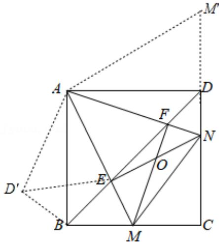

$. A M ^ { \prime } = A M$ ， $B M = D M ^ { \prime }$ ， $\angle B A M = \angle D A M ^ { \prime }$ ， MAM   90 ， $\angle A B M = \angle A D M ^ { \prime } = 9 0 ^ { \circ }$ ，$\therefore \angle A D M ^ { \prime } + \angle A D C = 1 8 0 ^ { \circ }$ ，点 $M ^ { \prime }$ 在直线 $C D$ 上， $\angle M A N = 4 5 ^ { \circ }$ ， $D A N + \angle M A B = 4 5 ^ { \circ } = \angle D A N + \angle D A M ^ { \prime } = \angle M ^ { \prime } A N$ ，$\therefore \angle M ^ { \prime } A N = \angle M A N = 4 5 ^ { \circ }$ ，又 $A N = A N$ ， $A M = A M ^ { \prime }$ ，

【淘宝店铺：向阳百分百】

$\therefore \Delta A M N \cong \triangle A M ^ { \prime } N ( S A S ) ,$ ，  
 $. M N = N M ^ { \prime }$ ，  
$\therefore M ^ { \prime } N = M ^ { \prime } D + D N = B M + D N$ ，  
$\dot { \cdot } M N = B M + D N$ ；故 $\textcircled{1}$ 正确；  
将 $\Delta A D F$ 绕点 $A$ 顺时针旋转 $9 0 ^ { \circ }$ ，得到 $\Delta A B D ^ { \prime }$ ，  
 AF  AD ， $D F = D ^ { \prime } B$ ， $\angle A D F = \angle A B D ^ { \prime } = 4 5 ^ { \circ } \angle D A F = \angle B A D ^ { \prime }$   
 $. \angle D ^ { \prime } B E = 9 0 ^ { \circ }$ ，  
 $\cdot \angle M A N = 4 5 ^ { \circ }$ ，  
$\cdot \angle B A E + \angle D A F = 4 5 ^ { \circ } = \angle B A D ^ { \prime } + \angle B A E = \angle D ^ { \prime } A E$ ，  
 $. \angle D ^ { \prime } A E = \angle E A F = 4 5 ^ { \circ }$ ，  
又 $A E = A E \ , A F = A D ^ { \prime }$ ，  
$\therefore \Delta A E F \cong \Delta A E D ^ { \prime } ( S A S )$ ，  
 $E F = D ^ { \prime } E$ ，  
 $\cdot D ^ { \prime } E ^ { 2 } = B E ^ { 2 } + D ^ { \prime } B ^ { 2 }$ ，  
 $. B E ^ { 2 } + D F ^ { 2 } = E F ^ { 2 }$ ；故 $\textcircled{2}$ 正确；  
$\therefore \angle B A F = \angle B A E + \angle E A F = \angle B A E + 4 5 ^ { \circ } \quad \angle A E F = \angle B A E + \angle A B E = 4 5 ^ { \circ } + \angle B A E$ ， $. \angle B A F = \angle A E F$ ，  
又 $\angle A B F = \angle A D E = 4 5 ^ { \circ }$ ，  
$\cdot \Delta D A E \sim \Delta B F A$ ，  
$\cdot \frac { D E } { A B } { = } \frac { A D } { B F }$   
又 $A B = A D = B C$ ，  
 $B C ^ { 2 } = D E \cdot D F$ ，故 $\textcircled{3}$ 正确；  
$\therefore \angle F B M = \angle F A M = 4 5 ^ { \circ }$ ，  
点 $A$ ，点 $B$ ，点 $M$ ，点 $F$ 四点共圆，  
$. \angle A B M = \angle A F M = 9 0 ^ { \circ } \angle A M F = \angle A B F = 4 5 ^ { \circ }$ ， $\angle B A M = \angle B F M$ ，  
同理可求 $\angle A E N = 9 0 ^ { \circ }$ ， $\angle D A N = \angle D E N$ ，  
$\therefore \angle E O M = 4 5 ^ { \circ } = \angle E M O$ ，  
 $. E O = E M$ ，  
$\cdot \ M O = { \sqrt { 2 } } E O$ ，  
$\therefore \angle B A M \neq \angle D A N$ ，  
$\cdot \angle B F M \ne \angle D E N$ ，  
 $E O \neq F O$ ，  
 $O M \neq \sqrt { 2 } F O$ ，故 $\cdot$ 错误

7．如图，正方形 $A B C D$ 的对角线相交于点 $o$ ，点 $M$ ， $N$ 分别是边 $B C$ ， $C D$ 上的动点（不与点 $B$ ， $C$ ， $D$ 重合）， AM ， $A N$ 分别交 $B D$ 于 $E$ ， $F$ 两点，且 $\angle M A N = 4 5 ^ { \circ }$ ，则下列结论： $\textcircled { 1 } M N = B M + D N$ ； $\textcircled{2}$ $\Delta A E F \sim \Delta B E M$ ； $\textcircled { 3 } \frac { A F } { A M } = \frac { \sqrt { 2 } } { 2 }$ ； $\textcircled{4} \Delta F M C$ 是等腰三角形．其中正确的有 ( )

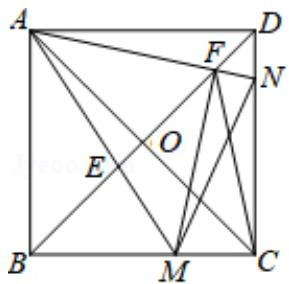

A．1 个 B．2 个 C．3 个 D．4 个

【解答】解：将ABM 绕点 $A$ 逆时针旋转 $9 0 ^ { \circ }$ 至 $\Delta A D M ^ { \prime }$ ，  
 $\cdot \angle M ^ { \prime } A N = \angle D A N + \angle M A B = 4 5 ^ { \circ } , \quad A M ^ { \prime } = A M , B M = D M ^ { \prime } ,$ $\cdot \angle M ^ { \prime } A N = \angle M A N = 4 5 ^ { \circ } , \quad A N = A N ,$ ，  
$\begin{array} { r l } { \therefore \Delta A M N \cong { } } & { { } A M ^ { \prime } N ^ { \prime } ( S A S ) } \end{array}$ ，$. M N = N M ^ { \prime }$ ，  
$\therefore M ^ { \prime } N = M ^ { \prime } D + D N = B M + D N ,$ ，  
 $. M N = B M + D N$ ；故 $\cdot$ 正确；$\cdot \angle F D M ^ { \prime } = 1 3 5 ^ { \circ } , \angle M ^ { \prime } A N = 4 5 ^ { \circ } ,$ ，$. \angle M ^ { \prime } + \angle A F D = 1 8 0 ^ { \circ }$ ，  
$\because \angle A F E + \angle A F D = 1 8 0 ^ { \circ }$ ，  
$\cdot \angle A F E = \angle M ^ { \prime }$ ，  
 $\angle A M B = \angle M ^ { \prime }$ ，  
 $\angle A M B = \angle A F E$ ，  
 $\cdot \angle E A F = \angle E B M = 4 5 ^ { \circ }$ ，  
$\cdot . \Delta A E F \sim \Delta B E M$ ，故 $\cdot$ 正确；  
 ${ \frac { A E } { B E } } = { \frac { E F } { E M } }$ ，即 (id:) ${ \frac { A E } { E F } } = { \frac { B E } { E M } }$ ，  
 $\angle A E B = \angle M E F$ ，  
$\cdot . \Delta A E B \sim \Delta F E M$ ，$\therefore \angle E M F = \angle A B E = 4 5 ^ { \circ }$ ，  
 $. \Delta A F M$ 是等腰直角三角形，$\frac { A F } { A M } = \frac { \sqrt { 2 } } { 2 }$ 故 $\cdot$ 正确；  
在 $\Delta A D F$ 与 $\Delta C D F$ 中， $\left\{ \begin{array} { l } { { A D = C D } } \\ { { \angle A D F = \angle C D F = 4 5 ^ { \circ } , } } \\ { { D F = D F } } \end{array} \right.$   
$\therefore \Delta A D F \cong \Delta C D F ( S A S )$ ，$\cdot \ A F = C F$ ，  
 $A { \cal F } = M { \cal F }$ ，  
 $. F M = F C$ ，$. \Delta F M C$ 是等腰三角形，故 $\cdot$ 正确；

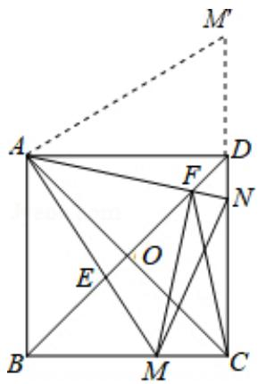

8．如图，在正方形ABCD中，对角线 $A C$ ， $B D$ 相交于点 $O$ ， $F$ 是线段 $O D$ 上的动点（点 $F$ 不与点 $O , \ D$ 重合）连接 $C F$ ，过点 $F$ 作 $F G \bot C F$ 分别交 $A C$ ， $A B$ 于点 $H , \ G$ ，连接 $C G$ 交 $B D$ 于点 $M$ ，作 $O E \parallel C D$ 交 $C G$ 于点 $E$ ， $E F$ 交 $A C$ 于点 $N$ ．有下列结论： $\textcircled{1}$ 当 $B G = B M$ 时， $A G = { \sqrt { 2 } } B G$ ； $\textcircled { 2 } C N ^ { 2 } = B M ^ { 2 } + D F ^ { 2 } ; \textcircled { 3 }$ $\textcircled{3}$ $\angle G F M = \angle G C H$ 时， $C F ^ { 2 } = C N \cdot B C$ ； $\textcircled { 4 } \frac { O H } { O M } = \frac { O F } { O C }$ ．其中正确的是 （填序号）．

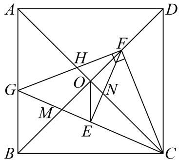

【答案】 $\textcircled{1} \textcircled{2} \textcircled{3}$

【分析】 $\textcircled{1}$ 正确．利用面积法证明 ${ \frac { A G } { B G } } = { \frac { A C } { B C } } = { \sqrt { 2 } }$ 即可；  
$\cdot$ 正确．如图 3 中，将 $\triangle C B M$ 绕点 $C$ 顺时针旋转 $9 0 ^ { \circ }$ 得到 $\triangle C D W$ ，连接 $F W$ ．则 $C M = C W$ ， $B M = D W$ ，$\angle M C W = 9 0 ^ { \circ }$ ， $\angle C B M = \angle C D W = 4 5 ^ { \circ }$ ，证明 $F M = F W$ ，利用勾股定理，即可解决问题；  
$\textcircled{3}$ 正确．如图 2中，过点 $M$ 作 $M P \bot B C$ 于 $P$ ， $M Q \bot A B$ 于 $\boldsymbol { Q }$ ，连接 $A F$ ．想办法证明 $C M = C F$ ，再利用相似三角形的性质，解决问题即可；  
$\cdot$ 错误．假设成立，推出 $\angle O F H = \angle O C M$ ，显然不符合条件  
【详解】解：如图 1 中，过点 $G$ 作 $G T \perp A C$ 于 $T$

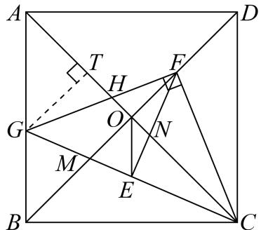  
图1

 $B G = B M$ ，  
 $. \angle B G M = \angle B M G$ ，  
• $\cdot \angle B G M = \angle G A C + \angle A C G$ ， $\angle B M G = \angle M B C + \angle B C M$ ，  
 四边形 ABCD是正方形，  
$\therefore \angle G A C = \angle M B C = 4 5 ^ { \circ } , \quad A C = \sqrt { 2 } B C ,$   
$\because \angle A C G = \angle B C G$ ，  
$\because G B \bot C B G T \bot A C$   
 $G B = G T$ ，  
$\because { \frac { S _ { \scriptscriptstyle \Delta B C G } } { S _ { \scriptscriptstyle \Delta A C G } } } = { \frac { B G } { A G } } = { \frac { { \frac { 1 } { 2 } } \cdot B C \cdot G B } { { \frac { 1 } { 2 } } \cdot A C \cdot G T } } = { \frac { B C } { A C } } = { \frac { 1 } { \sqrt { 2 } } } ,$   
 $A G = { \sqrt { 2 } } B G$ ，故 $\cdot$ 正确，  
过点 $F$ 作 $S T / / \ A D$ ，如图所示：  
∴四边形 ASTD 是矩形，  
∵ $\angle B D C = 4 5 ^ { \circ }$ ，  
∴ ${ D T } = F T$ ，  
在正方形 $A B C D$ 中， $A D = C D = S T$ ，  
$\therefore S T - F T = C D - D T$ ，即 $S F = C T$ ，  
∵ $\angle S F G + \angle T F C = \angle T F C + \angle T C F = 9 0 ^ { \circ }$ ，$\angle S F G = \angle T C F$ ，  
∵ $\angle G S F = \angle F T C = 9 0 ^ { \circ }$ ，  
$\triangle S F G \cong \triangle T C F$ ，  
∴ $F G = F C$ ，  
$\angle F C G = 4 5 ^ { \circ }$ ，  
如图 3 中，将 $\triangle C B M$ 绕点 $C$ 顺时针旋转 $9 0 ^ { \circ }$ 得到 $\triangle C D W$ ，连接 $F W$ ．则 $C M = C W$ ， $B M = D W$ ， $\angle M C W = 9 0 ^ { \circ }$ ，  
$\angle C B M = \angle C D W = 4 5 ^ { \circ } ,$ ，  
∵ $\angle F C W = \angle M C W - \angle F C G = 9 0 ^ { \circ } - 4 5 ^ { \circ } = 4 5 ^ { \circ }$ ，$. \angle F C G = \angle F C W = 4 5 ^ { \circ }$ ，  
∵ $C M = C W$ ， $C F = C F$ ，$\therefore \Delta C F M \cong \Delta C F W ( \mathrm { S A S } )$ ，  
 $F M = F W$ ，  
 $\cdot \angle F D W = \angle F D C + \angle C D W = 4 5 ^ { \circ } + 4 5 ^ { \circ } = 9 0 ^ { \circ } \ ,$ ，  
$\cdot , F W ^ { 2 } = D F ^ { 2 } + D W ^ { 2 }$ ，  
$\therefore F M ^ { 2 } = B M ^ { 2 } + D F ^ { 2 }$ ，  
$\because B D \bot A C , F G \bot C F ,$ ，  
$\therefore \angle C O F = 9 0 ^ { \circ } , \angle C F G = 9 0 ^ { \circ } ,$   
$\therefore \angle F C N + \angle O F C = 9 0 ^ { \circ } \quad \angle O F C + \angle G F M = 9 0 ^ { \circ }$ $. \angle F C N = \angle G F M$ ，$\cdot { \cal O } E \| C D$ ， $A B \parallel C D$ ， $\cdot$ 为 $A C$ 的中点，$\frac { C E } { G E } = \frac { O C } { O A } = 1$ 1  ，即 CE  GE ，  
$F E \bot C G$ ，  
∵ $F C = F G$ ，  
$\cdot \angle E F C = \angle E F G = 4 5 ^ { \circ }$ ；  
$\therefore \angle N F C = \angle F G M = 4 5 ^ { \circ } F G = C F$ ，  
$\therefore \triangle C F N { \cong } \triangle F G M ( \mathrm { A S A } )$ ，  
 $C N = F M$ ，$. C N ^ { 2 } = B M ^ { 2 } + D F ^ { 2 }$ ，故 $\textcircled{2}$ 正确，  
如图 2 中，过点 $M$ 作 $M P \bot B C$ 于 $P$ ， $M Q \bot A B$ 于 $\boldsymbol { Q }$ ，连接 $A F$ ．

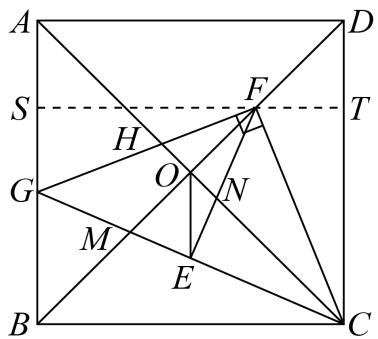

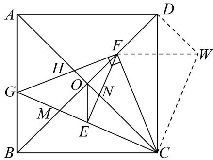  
图3

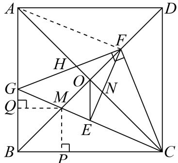  
图2

 $\cdot \angle O F H + \angle F H O = 9 0 ^ { \circ }$ ， $\angle F H O + \angle F C O = 9 0 ^ { \circ }$ ，$. \angle O F H = \angle F C O$ ，

【淘宝店铺：向阳百分百】

 $A B = C B$ ， $\angle A B F = \angle C B F$ ， $B { \cal F } = B { \cal F }$ ，$\therefore \Delta A B F \cong \Delta C B F ( \mathrm { S A S } )$ ，  
 $A { \cal F } = C { \cal F }$ ，BAF  BCF ，  
 CFG  CBG  90 ，  
 BCF  BGF  180 ，  
 BGF  AGF  180 ，  
 $\angle A G F = \angle B C F = \angle G A F$ ，  
AF  FG ，  
 FG  FC ，  
 $\angle F C G = \angle B C A = 4 5 ^ { \circ }$ ，  
 $\angle A C F = \angle B C G$ ，  
MQ∥CB ，$\therefore \angle G M Q = \angle B C G = \angle A C F = \angle O F H$ ，  
 $\cdot \angle M Q G = \angle F O H = 9 0 ^ { \circ } F H = M G$ ，  
FOH≌MQG(AAS) ，  
$\cdot M Q = O F$ ，  
 $\cdot \angle B M P = \angle M B Q$ ， MQ  AB， MP  BC ，  
$\backslash \ M Q = \ M P$ ，  
$. M P = O F$ ，  
$\because \angle C P M = \angle C O F = 9 0 ^ { \circ } , \angle P C M = \angle O C F ,$   
$\therefore \Delta C P M \cong \Delta C O F ( \mathrm { A A S } )$ ，  
 $C M = C F$ ，  
$\because O E / / A G , O A = O C ,$ ，  
 $E G = E C$ ，  
 $\triangle F C G$ 是等腰直角三角形，  
 $. \angle G C F = 4 5 ^ { \circ }$ ，  
$\cdot \angle C F N = \angle C B M$ ，  
$\cdot \angle F C N = \angle B C M$ ，  
$\cdot _ { \triangle } B C M { \sim } _ { \triangle } F C N$ ，  
 ${ \frac { C M } { C N } } { = } { \frac { C B } { C F } }$ ，即 $C M { \cdot } C F = C N { \cdot } C B$ ，  
 $. C F ^ { 2 } = C B \cdot C N$ ，故 $\textcircled{3}$ 正确，  
假设 $\frac { O H } { O M } { = } \frac { O F } { O C }$ 成立，  
 $\cdot \angle F O H = \angle C O M$ ，$\cdot _ { \triangle F O H } \sim _ { \triangle C O M }$ ，  
 $. \angle O F H = \angle O C M$ ，显然这个条件不成立，

9．（2023·广东深圳·校联考模拟预测）如图，等腰直角 $\triangle A M P$ 中， $\angle P A M = 9 0 ^ { \circ }$ ，顶点 $M , P$ 在正方形 ABCD的 $B C$ 边及 $C D$ 边的延长线上动点． $B D$ 交 $M P$ 于点 $F$ ，连接 $A F$ 并延长，交 $C D$ 于 $N$ ， $A M$ 交 $B D$ 于点 $E$ ．以下结论： $\textcircled { 1 } M N = M B + D N \textcircled { 2 } B E ^ { 2 } + D F ^ { 2 } = E F ^ { 2 } \textcircled { 3 } B C ^ { 2 } = E B \cdot D B \textcircled { 4 }$ 若 tan $\angle P M N = \frac { 1 } { 3 }$ ，则 $\frac { B M } { C M } = 1$ ，其中正确的是 ．（填写正确的序号）

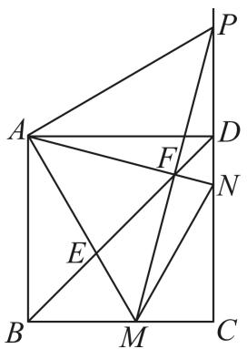

【答案】 $\textcircled{1} \textcircled{2} \textcircled{3} \textcircled{4}$

【分析】由正方形及等腰直角三角形的性质，可证得 $\triangle A B M \cong \triangle A D P$ ， $\angle A B D = \angle C B D = \angle A M F = 4 5 ^ { \circ }$ ， 可证得 $B M = D P$ ，点 $\_$ 四点共圆， $\angle M A N = \angle P A N = 4 5 ^ { \circ }$ ，由SAS可证 $\triangle A M N \cong \triangle A P N$ ，可得 $M N = P N$ ，可 得 $M N = B M + D N$ ， 故 $\textcircled{1}$ 正 确 ； 由 SAS 可 证 $\triangle A E F \cong \triangle A E D ^ { \prime }$ ， 可 得 $E F = D ^ { \prime } E$ ， 由 勾 股 定 理 可 得$B E ^ { 2 } + D F ^ { 2 } = E F ^ { 2 }$ ；故 $\textcircled{2}$ 正确；通过证明 $\triangle D A E \sim \triangle B F A$ ， 可得 ${ \frac { D E } { B A } } { = } { \frac { A D } { F B } }$ 故 $\cdot$ 正确；由 $M N = P N$ 可得tan $\angle P M N = \tan \angle M P C = \frac { 1 } { 3 }$ ， 设正方形的边长为 $a$ ，可得 $\frac { M C } { a + a - M C } = \frac { 1 } { 3 }$ , $M C = { \frac { 1 } { 2 } } a$ ， 故 $\textcircled{4}$ 正确，即可求解

【详解】解：四边形 $A B C D$ 是正方形， $\triangle A M P$ 是等腰直角三角形， $. \angle A B D = \angle C B D = \angle A M F = 4 5 ^ { \circ } \quad A B = A D \quad A M = A P$   
$\cdot _ { \triangle A B M } \cong _ { \triangle A D P } ( \mathrm { H L } )$ ，点 $\cdot$ 、 $\cdot$ 、M、 $F$ 四点共圆，  
 $B M = D P$ ， $\angle M A N = \angle F B M = 4 5 ^ { \circ }$ ，  
 $\cdot \angle P A M = 9 0 ^ { \circ }$   
 $. \angle P A N = \angle M A N = 4 5 ^ { \circ }$ ，  
又 $A N = A N$ ， $A M = A P$ ，  
$\therefore \triangle A M N \cong \triangle A P N \left( \mathrm { S A S } \right)$ ，  
 $M N = P N$ ，  
• $\cdot P N = P D + D N = B M + D N$ ，  
 $M N = B M + D N$ ，故 $\textcircled{1}$ 正确；  
如图：将 $\triangle A D F$ 绕点 $\cdot$ 顺时针旋转 $9 0 ^ { \circ }$ ，得到 $\triangle A B D ^ { \prime }$ ，连接 $D ^ { \prime } E$ ，

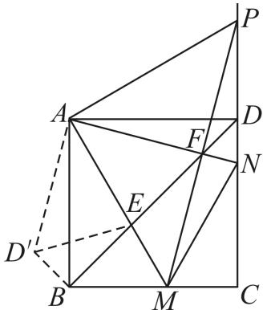

 $A { \cal F } = A { \cal D } ^ { \prime }$ ， $D F = D ^ { \prime } B$ ， $\angle A D F = \angle A B D ^ { \prime } = 4 5 ^ { \circ } , \angle D A F = \angle B A D ^ { \prime } ,$ ，

 $. \angle D ^ { \prime } B E = 9 0 ^ { \circ }$ ，  
 $\angle M A N = 4 5 ^ { \circ }$ ，$. \angle B A E + \angle D A F = 4 5 ^ { \circ } = \angle B A D ^ { \prime } + \angle B A E = \angle D ^ { \prime } A E$ ，$\therefore \angle D ^ { \prime } A E = \angle E A F = 4 5 ^ { \circ }$ ，  
又 $A E = A E$ ， $A { \cal F } = A { \cal D } ^ { \prime }$ ，  
$\therefore \triangle A E F \cong \triangle A E D ^ { \prime } ( \mathrm { S A S } )$ ，  
$\mathbf { \partial } \cdot { \cal E } { \cal F } = { \cal D } ^ { \prime } { \cal E }$ ，$\cdot D ^ { \prime } E ^ { 2 } = B E ^ { 2 } + D ^ { \prime } B ^ { 2 }$   
 $. B E ^ { 2 } + D F ^ { 2 } = E F ^ { 2 }$ ；故 $\cdot$ 正确；  
$\therefore \angle B A F = \angle B A E + \angle E A F = \angle B A E + 4 5 ^ { \circ } , \angle A E F = \angle B A E + \angle A B E = 4 5 ^ { \circ } + \angle B A E ,$ ，  
 $. \angle B A F = \angle A E F$ ，  
又 $\angle A B F = \angle A D E = 4 5 ^ { \circ }$ ，  
$\therefore \Delta D A E \sim _ { \Delta B F A }$ ，$\cdot \frac { D E } { B A } { = } \frac { A D } { B F }$   
又 $A B = A D = B C$ ，  
 $. B C ^ { 2 } = D E \cdot B F$ ，故 $\cdot$ 正确；  
 $\cdot M N = P N$ ，$. \angle P M N = \angle M P C$ ，  
tan $\angle P M N = \frac { 1 } { 3 }$   
tan  $\angle P M N = \tan \angle M P C = \frac { M C } { P C } = \frac { 1 } { 3 } ,$   
设正方形的边长为 $a$ ，  
$\therefore { \frac { M C } { P C } } = { \frac { M C } { a + B M } } = { \frac { M C } { a + a - M C } } = { \frac { 1 } { 3 } }$   
解得 $M C = { \frac { 1 } { 2 } } a$ ,  
$\therefore M B = M C$ ，$\frac { B M } { C M } = 1$ ，故 $\textcircled{4}$ 正确