导语：见到 2倍角的条件，首先想到“导”，将图形中的角度都推导出来，挖掘出隐藏边的信息，再观察角度的位置，结合其他条件，这里做题的经验，总结了六个字：翻、延、倍、分、导、造

# 题型·归纳

# 目录

知识点梳理.

策略一：向外构造等腰（大角减半） 策略二：向内构造等腰（小角加倍或大角减半） 策略三：沿直角边翻折半角（小角加倍） 策略四：邻二倍角的处理.

【经典例题讲解】  
【一题多解 1】围绕 2 倍角条件，解法围绕“翻” “延” 倍”“分” .【一题多解 2】常规法与倍半角处理对比.  
策略五：绝配角模型.

# 题型一 向外构造等腰三角形（大角减半）

2023·深圳南山区联考二模.   
2023·山西·统考中考真题.

题型二 向内构造等腰（小角加倍或大角减半）

题型三 沿直角边翻折半角（小角加倍）

2023·深圳宝安区二模 .   
2023·深圳中学联考二模

题型四 邻二倍角的处理.

题型五 绝配角.

题型六 坐标系中的二倍角问题.

宿迁·中考.   
盐城·中考.   
河南·中考..   
2023·内蒙古赤峰·统考中考真题.   
江苏苏州·统考中考真题

内蒙古鄂尔多斯·统考中考真题. 2022·内蒙古呼和浩特·统考中考真题. 2023·湖北黄冈·统考中考真题

题型七 其它构造方式..

# 知识点·梳理

# 知识点梳理

策略一：向外构造等腰（大角减半）

已知条件：如图，在△ABC 中， $\angle A B C { = } 2 \angle A C B$

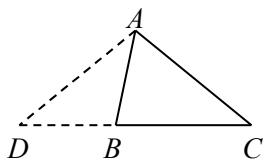

辅助线作法：延长 $C B$ 到 $D$ ，使 $B D { = } B A$ ，连接 AD结论： $A D { = } A C$ ， $\triangle B D A \sim \triangle A D C$

策略二：向内构造等腰（小角加倍或大角减半）

已知条件：如图，在△ABC 中， $\angle A B C = 2 \angle B$

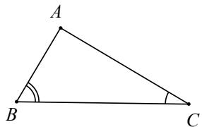

辅助线作法：法一：作 $\angle A B C$ 的平分线交 $A C$ 于点 $D$ ，结论： $\angle D B C = \angle C$ ， $D B { = } D C$

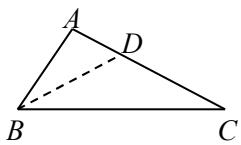

法二：在 $B C$ 上取一点 $E$ ，使 $A E { = } C E$ ，则 $\angle A E B = 2 \angle C = \angle B$ （作 $A C$ 中垂线得到点 $E$ ）

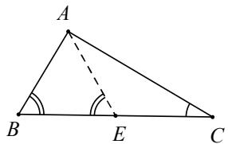

总结：策略一和策略二都是当 2 倍角和 1 倍角共边时对应的构造方法，下面我们再来看看不在同一个三角

# 形中时该如何处理

策略三：沿直角边翻折半角（小角加倍）

已知条件：如图，在 $\mathrm { R t } \triangle A B C$ 中， $\angle A C B = 9 0 ^ { \circ }$ ，点 $D$ 为边 $B C$ 上一点，连接 $A D$ ， $\angle B { = } 2 \angle C A D$

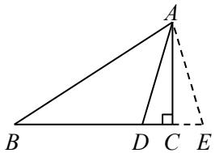

辅助线作法：沿 $A C$ 翻折△ACD 得到△ACE结论： $A D { = } A E$ ， $\angle D A E = \angle B$ ， $B A { = } B E$ ，△ADE∽△BAE

# 策略四：邻二倍角的处理

已知条件：如图，在 Rt△ABC 中， $\angle C = 9 0 ^ { \circ }$ ，点 $D$ 为边 BC 上一点， $\angle B A D { = } 2 \angle C A D$

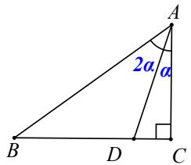

辅助线作法：

法一：向外构造等腰（导角得相似）  
延长 $A D$ 到 $E$ ，使 $A E { = } A B$ ，连接 BE  
结论： $B D { = } B E$ ， $\angle D B E = \angle B A D$ ，△BDE∽△ABE

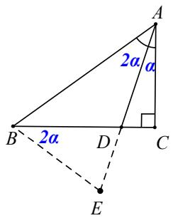

法二：作平行线，把二倍角转到同一个三角形中延长 $A D$ 到 $F$ ，使 $C E / / A B$ ，则 $\angle F = \angle B A D$

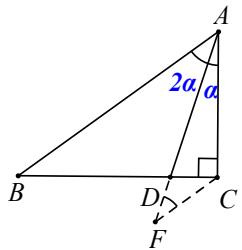

# 【经典例题讲解】

例题 1 如图，在正方形 ABCD 中， $A B = 1$ ，点 $E , \ F$ 分别在边 $B C$ 和 $C D$ 上， $A E { = } A F$ ， $\angle E A F { = } 6 0 ^ { \circ }$ ，则 CF的长是( )

． $\frac { { \sqrt { 3 } } + 1 } { 4 }$ $\mathbf { B } . \ { \frac { \sqrt { 3 } } { 2 } }$ ． 31 D． 23【简析】(1)方法一(常规解法)：如图，连接 EF，易证△AEF 为等边三角形，

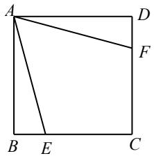

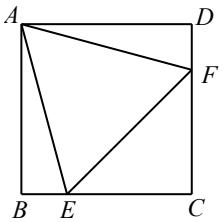

且 $\triangle A D F { \cong } \triangle A B E ( H L )$ ，则 $\cdot$ ，从而 $\cdot$ ，即△CEF 为等腰直角三角形；设 $\cdot$ ，则 $D F { = } 1 - \chi$ ， $A F { = } E F { = } \sqrt { 2 } \ x$ ，在 Rt△ADF 中，由勾股定理可得 $\cdot$ ，解得 $x { = } \sqrt { 3 } - 1 ( x { = } - \sqrt { 3 } - 1$ 舍去)，故选 $\cdot$ ；  
方法二(倍半角模型)：如图，在边 $\cdot$ 上取点 $\cdot$ ，使 $A P { = } P F$ ，

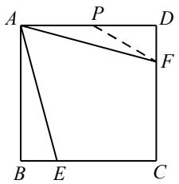

同上可得 $\_$ ，则 $-$ ，从而 $\angle D P F = 3 0 ^ { \circ }$ °；设 $\cdot$ ，则 $\cdot$ ，AP$= P F { = } 2 x$ ，故 $A D = ( 2 + \sqrt { 3 } { \bf \sigma } ) x { = } 1$ ，解得 $\scriptstyle x = 2 - { \sqrt { 3 } }$ ， $\cdot C F = \sqrt { 3 } - 1$ ，选 $C$

例题 2 如图，正方形 ABCD 的边长为 4，点 $E$ 是 $C D$ 的中点， $A F$ 平分 $\angle B A E$ ，交 $B C$ 于点 $F$ ，将△ADE 绕点 $A$ 顺时针旋转 $9 0 ^ { \circ }$ 得 $\triangle A B G$ ，则 $C F$ 的长为

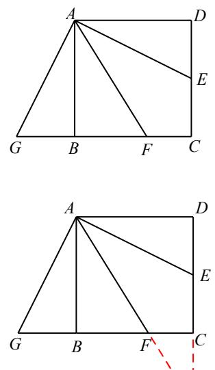  
图17-2-3

【简析 $\cdot$ 方法一(常规解法)：由题可得 $-$ ，即∠AFG$\cdot$ ，故 $\scriptstyle { F G = A G = A E = 2 { \sqrt { 5 } } }$ ，从而 $\_$ ；  
方法二(倍半角模型)：如图 $1 7 - 2 - 3$ ，延长 $A F$ 、DC 交于点 $\cdot$ ，易得 $\angle P = \angle B A F = \angle E A F$ ，则 $\cdot$ $\cdot$ ，故 $\cdot$ ， $\cdot$ ：又易证△PCF∽△PDA，故 ${ \frac { C F } { D A } } { = } { \frac { C P } { D P } }$ 即 $\cdot$ 从而 $C F { = } 6 - \sqrt { 5 }$ ；

【反思】方法一的关键是通过导角得到等腰 $\triangle A F G$ ，方法二由“倍角∠AED”造“半角 $\angle P$ ”，并且这里的构造是通过“角平分线＋平行线 等腰三角形”自然衍生出来的

例题 3 如图，面积为 24 的□ABCD 中，对角线 BD 平分 $\angle A B C$ ，过点 $D$ 作 $D E \bot B D$ 交 BC 的延长线于点 $E$ ，$D E { = } 6$ ，则 $s \mathrm { i n } \angle D C E$ 的值为( )

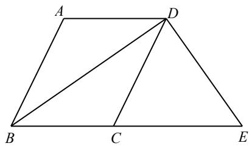

【简析】方法一(常规解法)：如图，作 $\cdot$ 于点 $G$ ，由题易得 $\angle C B D = \angle A B D = \angle C D B$ ，则 $B C { = } C D$ ；进一步由 DE⊥BD，可得 $\_$ ，则 $C D { = } C E { = } B C$ ，从而 $-$ ，即 $S \triangle B D E { = } 2 4$ ，故 $\cdot$ ， $\cdot$ ，所以 $\cdot$ $\cdot$ ， $\sin \angle D C E = \frac { 2 4 } { 5 }$ 选 $A$

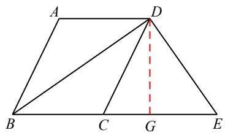

方法二(倍半角模型)：如图，在 BD 上取点 $\cdot$ ，使 $E F { = } B F$ ，易证 $\angle D F E { = } 2 \angle E B F$ ， $-$ ，故 $\cdot$ $\_$ ，要求 $\cdot$ 的值，只需求 $\cdot$ ；设 $\_$ ，同上可得 $\cdot$ ，则 $\cdot$ ，在△DEF 中，由勾股定理可得 $\_$ ，解得 $\cdot$ 从面 $\cdot$ 即 $s { \mathrm { i n } } \angle D C E$ $\cdot$ 选 A．

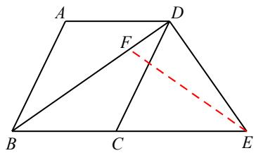

【反思】方法一通过作高是线构造 △CDG，结合面积法求解，方法二由“半角 $\angle C B D$ ”造“倍角 $\cdot$ ”，结合勾股定理列方程求

例题 4 如图，在 Rt△ABC 中， $\angle A C B = 9 0 ^ { \circ }$ ， $A B { = } 1 0$ ， $B C { = } 6$ ，CD∥AB， $\angle A B C$ 的平分线 BD 交 AC 于点 $E$ ，则 $D E { = }$

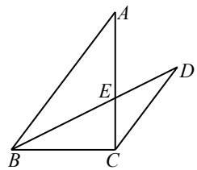

简析(1)方法一(常规解法)：由题得 $\angle C B D = \angle A B D = \angle D$ ，则 $C D { = } B C { = } 6$ ；又易得△CDE∽△ABE，则 ${ \frac { C E } { A E } } = { \frac { D E } { B E } }$ $\frac { C D } { A B } \frac { 3 } { 5 }$ 故 $\frac { 3 } { 8 }$ ，从而 $B E { = } 3  \sqrt { 5 } \ , D E { = } \frac { 3 } { 5 } B E { = } \frac { 9 \sqrt { 5 } } { 5 } ;$ 方法二(倍半角模型)：如图，延长 $C B$ 至点 $F$ ，使 $B F { = } A B { = } 1 0$ ，连接 $A F$ ，由题可得 $\cdot$ ， $\cdot$ ，则 tan$\angle F = \frac { 1 } { 2 }$ 又易得 $\angle C B E { = \angle F }$ ，故 tan $\frac { 1 } { 2 }$ ， 即 ${ \frac { C E } { B C } } = { \frac { 1 } { 2 } }$ 从而 $\cdot$ ， $B E { = } 3 \sqrt { 5 }$ ；再作 $\cdot$ 于点 $G$ ，易得 $\frac { 2 } { \sqrt { 5 } } \frac { \frac { 1 2 \sqrt { 5 } } { 5 } } { 5 }$ ；同上可得 $C B { = } C D$ ，故 $\frac { 2 4 { \sqrt { 5 } } } { 5 }$ 因此 $D E { = } B D { - } B E { = } \frac { 9 \sqrt { 5 } } { 5 }$ ；

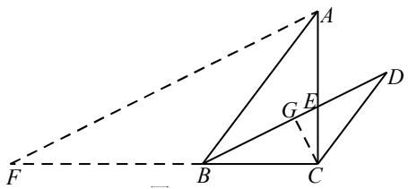

总结：具体问题具体对待，并非哪一种方法绝对简单，需根据问题特征选取较为合适的方法【一题多解 1】围绕 2 倍角条件，解法围绕“翻” “延” 倍”“分”如图，在 $\triangle A B C$ 中， $\angle A B C { = } 2 \angle A C B$ ， $A B { = } 3$ ， $B C { = } 5$ ，求线段 AC 的长

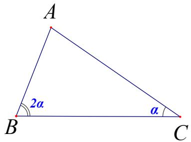

法 1：延长或翻折向外构造等腰（双等腰）

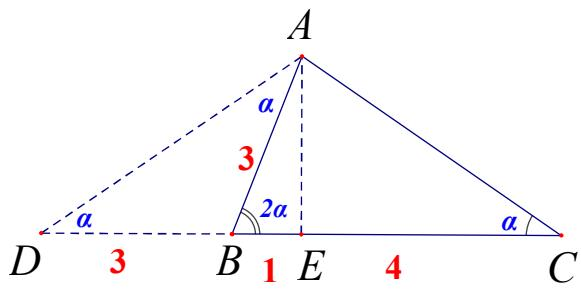

易知 $A E = 2 { \sqrt { 2 } } \Rightarrow A C = 2 { \sqrt { 6 } }$ 法 3：作角平分线

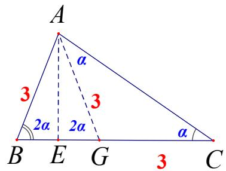  
法 2：翻折或取点向内构造等腰（双等腰）

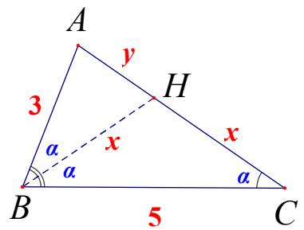

$$
\tan \angle A \mathrm { B H } \backsim \triangle \mathrm { A C B } \mid \frac { 3 } { x + y } = \frac { y } { 3 } = \frac { x } { 5 }
$$

法 4：翻折一边 $^ +$ 平行线向外作等腰(补成等腰梯形)

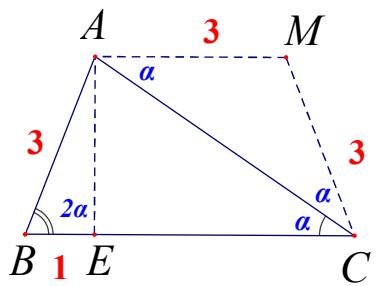

法 5：向外延长作等腰易知△ABC∽△ADC

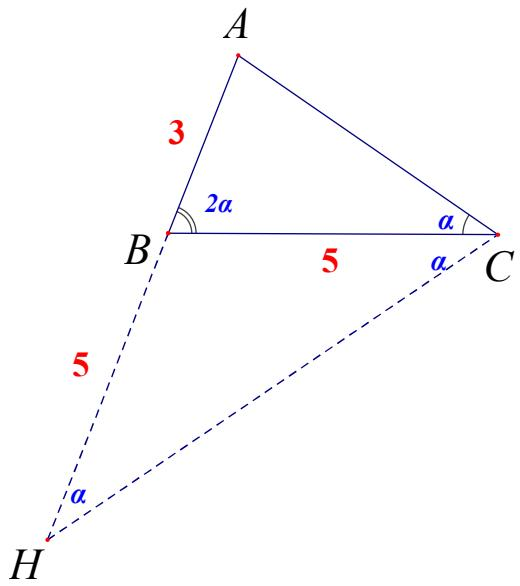

# 【一题多解 2】常规法与倍半角处理对比

如图， $A B$ 为 $\odot O$ 的直径，BC、CD 是 $\odot O$ 的切线，切点分别为点 $B , \ D$ ，点 $E$ 为线段 $O B$ 上的一个动点，连接 OD、CE、DE，已知 $A B { = } 2 { \sqrt { 5 } }$ ， $B C { = } 2$ ，当 $C E { + } D E$ 的值最小时，则 $\frac { C E } { D E }$ 的值为( )

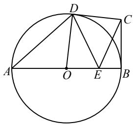

A． $\frac { 9 } { 1 0 }$ ${ \mathsf { B } } . \quad { \frac { 2 } { 3 } }$ $\mathsf C . \frac { \sqrt { 5 } } { 3 }$ $\mathrm { D } . \frac { 2 \sqrt { 5 } } { 5 }$ 简析(1)方法一(常规解法)：如图，作点 $C$ 关于 $\cdot$ 的对称点 $C ^ { \prime }$ ，连接 $C ^ { \prime } D$ ，交 AB 于点 $\cdot$ ，连接 $C E$ ，此时 $C E$ $+ D E$ 取得最小值，且 $\frac { C E } { D E } \quad \frac { C ^ { \prime } E } { D E }$ 再作 $\cdot$ 于点 $G$ ，连接 OC、 $B D$ ，易证△OBC≌△ODC，则 $\cdot$ $\_$ ，故 ${ \frac { 2 } { 3 } }$ c0 $\frac { \sqrt { 5 } } { 3 }$ 从而 BD＝ABsin $\angle A = \frac { 4 \sqrt { 5 } } { 3 }$ 又易证$\angle B D G = \angle A$ ，故 $\cdot$ cos $\_$ cos $\angle A = { \frac { 4 { \sqrt { 5 } } } { 3 } } \times { \frac { \sqrt { 5 } } { 3 } } = { \frac { 2 0 } { 9 } }$ 由 $\_$ ，可得 ${ \frac { C ^ { \prime } E } { D E } } = { \frac { C ^ { \prime } B } { D G } }$ $\frac { 9 } { 1 0 }$ 因此 $\frac { C E } { D E }$ ，选 $\cdot$ ；

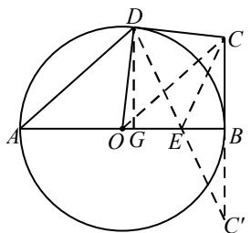

方法二(倍半角模型)：如图 $1 7 - 4 - 3$ ，同上作相关辅助线，易得 $-$ ；在 $\cdot$ 上取点 $\cdot$ ，使 OF$= C F$ ，则 $\angle B F C = 2 \angle B O C = \angle D O G$ ；设 $O F { = } C F { = } x$ ，则 $\sqrt { 5 }$ ，在 $\mathrm { R t } \triangle B C F$ 中，由勾股定理得 $4 + ( \sqrt { 5 }$ $\cdot$ ，解得 $\scriptstyle x = { _ { 9 { \sqrt { 5 } } } }$ 10 ，故 $\sin \angle D O G { = } \sin \angle B F C { = } \underbrace { 4 { \sqrt { 5 } } } _ { 9 }$ ，从而 $\frac { 2 0 } { 9 }$ ，下略；

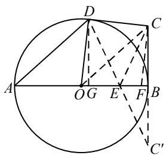

方法三(面积法)：如图 $\cdot$ ，同上作相关辅助线(为说理方便，省去部分线段)，则 $-$ $C O C ^ { \prime }$ ；再作 $C H \bot O C ^ { \prime }$ 于点 $H ^ { \prime }$ ，易得 $C H { = } \ _ { C C ^ { \prime } \cdot O B } = \frac { _ { 4 } \sqrt { 5 } } { 3 }$ ，故 $\sin \angle D O G { = } \sin \angle C O C ^ { \prime } { = } \underbrace { 4 { \sqrt { 5 } } } _ { 9 }$ 4 5 ，下略．

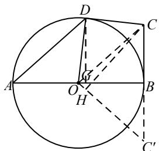

反思：本题结构相当于已知“半角∠BOC”求“倍角 $\cdot$ ，方法一通过作高法，构造直角三角形求解；方法二构造“倍半角模型”，结合勾股定理列方程求解；方法三依然基于导角分析，借助对称性，结合面积法求解．以上提供的三种方法都是“倍半角”处理的常见方法

如图， $A B$ 为 $\odot O$ 的直径， $D$ 是弧 $B C$ 的中点，BC 与 AD、OD 分别交于点 E、 F．

(1)求证： $D O / / A C$ ；

(2)求证： $D E \cdot D A = D C ^ { 2 }$ (3)若 tan $\angle C A D = \frac { 1 } { 2 }$ ，求 $s \mathrm { i n } \angle C D A$ 的值。

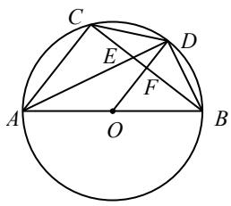

简析(1)如图，连接 OC，易证 $D O \bot B C$ 且 AC⊥BC，故 DO//AC；

(2)由题可得 $-$ ，故 $\triangle D C E ^ { \sim } \triangle D A C$ ，进一步可证 $D E \cdot D A = D C ^ { 2 }$ ；  
(3)方法一(母子型相似)：由 tan $\cdot$ 可得 $\cdot$ 又 $\_$ ， 故 $\cdot$ 设 $\cdot$ $= k$ ，则 $D C = 2 k$ ， $D A = 4 k$ ， $A E { = } 3 k$ ；又易证 ${ \frac { F E } { C E } } { = } { \frac { D E } { A E } }$ 故 ${ \frac { F E } { C E } } { = } { \frac { 1 } { 3 } }$ 由此再设 $F E { = } m$ ，则 $\cdot$ ， $C F { = }$ $4 m$ ，从而 $\cdot$ ， $A C { = } 6 m$ ，因此 $\cdot$ 即 $\sin \angle C D A = \frac { 3 } { 5 }$   
方法二(角平分线之双垂法)：如，作 $E G \bot A B$ 于点 $\cdot$ ，易证 $\triangle A E C { \cong } \triangle A E G$ ；由 tan $\cdot$

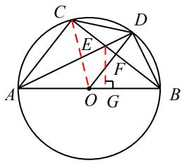

可设 $\cdot$ ， $\cdot$ ，则 $\cdot$ ， $A G = 2$ ；又易得△BEG∽△BAC， ${ \frac { B C } { B G } } = { \frac { B A } { B E } } = { \frac { A C } { E G } } = 2 ,$ ，；再设 $\cdot$ ，则$\cdot$ $-$ ， $B E { = } B C { - } C E { = } 2 x { - } 1$ ，从而有 $\_$ ，解得 $\cdot$ 所以 $A B =$ ${ \frac { 1 0 } { 3 } } , \sin \angle B = { \frac { A C } { A B } } = { \frac { 3 } { 5 } }$ 即 $\cdot$ 方法三(角平分线之对称策略)：如图，连接 $\cdot$ 并延长，交 $\cdot$ 的延长线于点 $\cdot$ ，由题可设 $B D = P D = 1$ ，

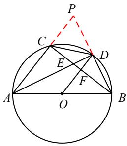

则 $\cdot$ ， $\cdot$ ；又 $\sin \angle P B C = \sin \angle P A D = \frac { \sqrt { 5 } } { 5 }$ 故 $P C = P B \cdot \sin \angle P B C = { \frac { 2 { \sqrt { 5 } } } { 5 } }$ 从而 $A C =$ $\cdot$ 因此s $\cdot$ , 即 $\cdot$ 方法四(倍半角模型)：如图 $1 7 - 1 4 - 4$ ，在 $A C$ 上取点 $\cdot$ ，使 $\cdot$ ，则 $\angle C M E { = } 2 \angle C A D { = } \angle B A C$ ；

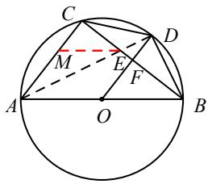

由题可设 $C E { = } 1$ ， $\cdot$ ，再设 $A M { = } M E { = } x$ ，则 $\cdot$ ，在 Rt△CME 中，由勾股定理可得 $\cdot$ ,解得 $x = \frac { 5 } { 4 }$ 从而 $\cdot$ 故c $\cdot$ 即 co ${ \mathsf { s } } \angle B A C = { \frac { 3 } { 5 } }$ 所以 si $_ { 1 \angle B } = \frac { 3 } { 5 }$ $\cdot$ 反思：本题的结构为已知“半角 $\angle C A D ^ { \prime }$ 求"倍角 $\cdot$ ，从而转化为其余角 $\angle C D A$ 。以上提供的前三种方法都是借助相似或三角函数等进行计算，属常规思路，方法四基于导角分析，构造“倍半角模型”，显得尤为简单、直接，直指问题本质。

# 策略五：绝配角模型

【释义】当 $m$ ， $n$ 两个角满足 $m + 2 n { = } 1 8 0 ^ { \circ }$ °时，称其为一对绝配角，或者：半角的余角与它本身称为绝配资料整理【淘宝店铺：向阳百分百】

角

【举例】常见的剧配角组合如下：

<table><tr><td rowspan=1 colspan=1>绝配角</td><td rowspan=1 colspan=1>组合1</td><td rowspan=1 colspan=1>组合2</td><td rowspan=1 colspan=1>组合3</td><td rowspan=1 colspan=1>组合4</td><td rowspan=1 colspan=1>组合5</td></tr><tr><td rowspan=1 colspan=1>m</td><td rowspan=1 colspan=1>2a</td><td rowspan=1 colspan=1>90+2a</td><td rowspan=1 colspan=1>90-2a</td><td rowspan=1 colspan=1>60+2a</td><td rowspan=1 colspan=1>60-2a</td></tr><tr><td rowspan=1 colspan=1>n</td><td rowspan=1 colspan=1>90-α</td><td rowspan=1 colspan=1>45-α</td><td rowspan=1 colspan=1>45+α</td><td rowspan=1 colspan=1>60-α</td><td rowspan=1 colspan=1>60-α</td></tr></table>

【解 决】

思路 $( - )$ ：根据三角形内角和是 $1 8 0 ^ { \circ }$ ，构造等腰三角形。

思路 $( \bar { - } )$ ：根据平角是 $1 8 0 ^ { \circ }$ ， $m$ 和 2 个 $n$ 构成一个平角(有两条边在同一直线上)

用一句话概括为：有等腰找等腰，没等腰造等腰

其中“等腰”指的是以 $m$ 为顶角、以 $n$ 为底角的等腰三角形，了解绝配角模型，可以给我们提供一些辅助线思路

# （一）共顶共边翻折

当两个角满足两个角满足 $m + 2 n = 1 8 0 ^ { \circ }$ °时，且共顶点共一边，这样的两个角是什么样的呢?

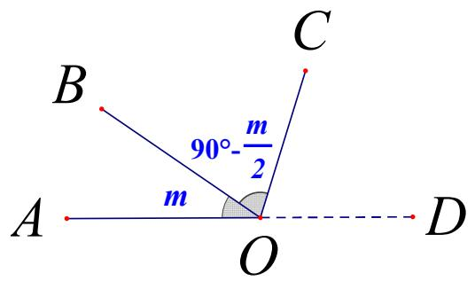

发现 OD 为 $\angle A O B$ 邻补角的平分线，此时处理问题一般用翻折，把 OB 沿 OD 翻折例题 1：已知 Rt△ABC 中 $\angle C = 9 0 ^ { \circ }$ °， $D E = 3 D C$ ， $2 \angle E { = } \angle C A D$ ，求 $\frac { A E } { A D }$ 的值．方法一：分析： $\angle E A C$ 与∠DAC 是共点 A 的绝配角，绝配角重叠，要翻折两次

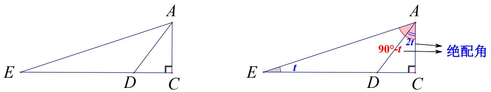

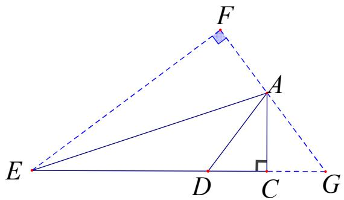

解：将△AEC 关于 AE 作轴对称图形，将△ADC 关于 AC 作轴对称图形，如图，△EFG 为直角三角形  
设 $D C = x$ ， $D E = 3 x$ , 则 $E F = 4 x$ , $C G = x \Rightarrow E G = 5 x \Rightarrow F G = 3 x$   
${ } _ { \triangle } G A C \sim _ { \triangle } G E F \Rightarrow A C = \frac { 4 } { 3 } x , A D = \frac { 5 } { 3 } x , A E = \frac { 4 \sqrt { 1 0 } } { 3 } x$   
即可求出 $\frac { A E } { A D } = \frac { 4 \sqrt { 1 0 } } { 5 }$

方法二：分析：由于 $\angle C _ { } \mathrm { A D } { = } 2 \mathrm { t }$ ，构造一个以 $\angle \mathbf { A }$ 为顶点的等腰△ADK，然后出现△ECA\~△DCK

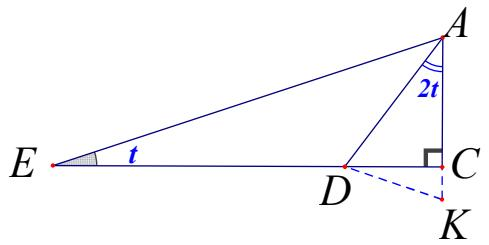

解：构造以 $\angle \mathbf { A }$ 为顶点的等腰 $\triangle \mathrm { A D K } ( \mathrm { A D } { = } \mathrm { A K } )$   
导角易得 $\angle C _ { Ḋ } \mathrm { Ḋ K Ḍ } = \angle \mathrm { A E C Ḍ }$ ， $\triangle$ ECA\~ADCK  
 $\frac { A C } { C K } = \frac { E C } { D C } = 4$ ，设 $\mathrm { C K } { = } _ { \mathrm { X } }$ ， $\operatorname { A C } { = } 4 \mathbf { x }$ ， ${ \mathrm { A D } } { = } 5 \mathbf { x }$ ， $\mathrm { D C } = 3 \mathbf { x }$ ， $\mathrm { E D } { = } 9 \mathbf { x }$   
$A E = 4 { \sqrt { 1 0 } } x , { \frac { A E } { A D } } = { \frac { 4 { \sqrt { 1 0 } } } { 5 } }$

# (二)共三角形等腰

(1)若 $m , n = 9 0 ^ { \circ } - { \frac { m } { 2 } }$ 为同一个三角形的内角，则此时三角形为等腰三角形．

(2)若 $m , n = 9 0 ^ { \circ } + { \frac { m } { 2 } }$ 分别为同一个三角形的内角和外角，则另一内角为 $9 0 ^ { \circ } - \frac { m } { 2 }$ ，此时三角形为等腰三角形

$m , n = 9 0 ^ { \circ } - { \frac { m } { 2 } }$ 分别为同一个三角形的内角和外角，此时可以以 $m$ 为顶角作等腰三角形，此时会构成另一个相似的等腰三角形

(4)若 $m , n = 9 0 ^ { \circ } + { \frac { m } { 2 } }$ 为同一个三角形的内角，与(3)的情况相同

总结：“半角的余角，等腰形来找”

例题 2：如图在矩形 ABCD 中，点 $E$ ， $F$ 分别为 $A D$ ， $C D$ 的中点，连接 BE， $B F$ ，且 $\angle A B E { = } 2 \angle F B C$ ，若 BE$= 5$ ，则 $B F$ 的长度为

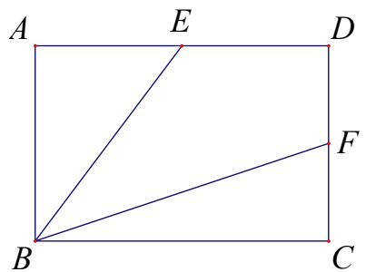

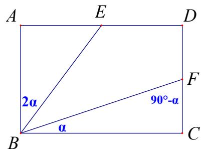

解法 一：将 $\triangle$ BFC 沿 $C B$ 翻折 ，交 DC 的延 长线于 点 $G$ ，延长 CD 交 $B E$ 的延 长线于 点 $H$ ，$\angle G = \angle B F C = 9 0 ^ { \circ } - \alpha$ , $\angle H { = } 2 \alpha$ ， $\triangle B H G$ 为等腰， $5 x { = } 1 0$ ， $x { = } 2$ ， $A E { = } 3$ ， $B C { = } 6$ ， $B F { = } 3 { \sqrt { 5 } }$ ．

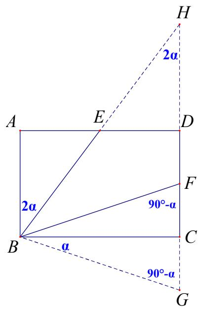

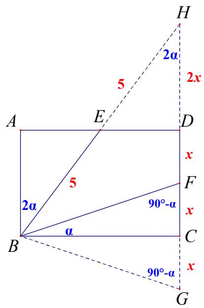

解法二：连接并延长交 BA 的延长导角，得出△FHC 为等腰三角形，平行不改变形状，△GBH 为等腰三角形。根据腰

等得出 $1 0 - x { = } 4 x$ ，可求 $B F { = } 3 \sqrt { 5 }$

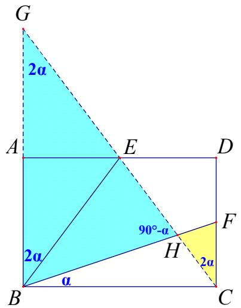

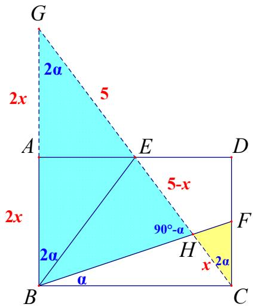

解法三：取 $A B$ 中点 $G$ ，连接 CG，延长 BE 交 $C D$ 的延长线于点 $H$ ，得到 $\triangle B C F { \cong } \triangle C B G$ ，导角得出△BGK 为等腰平行不改变形状， $\triangle H K C$ 也为等腰。根据腰等得出 $1 0 - x { = } 4 x$ ，可求 $B F$

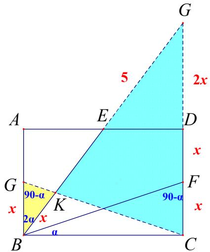

以上三种解法都是利用造全等，转移角，构等腰，得出边的等量关系来求解。此题还可以构直接造等腰。用相似得出边的数量关系求解。请看解法四

解法四：可以直接利用 $\angle A B E { = } 2 \alpha$ ,构等腰△GBE， $\triangle \mathrm { B C F } { \sim } \triangle \mathrm { E A G } \vert \frac { A E } { B C } { = } \frac { G A } { C F }$ .根据腰等得出 $\frac { 5 } { 2 } x = 5$ ,可求 BF

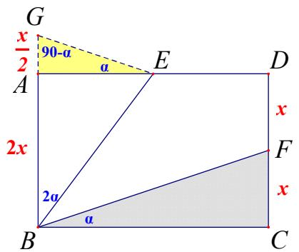

# 重点题型·归类精练

# 题型一 向外构造等腰三角形（大角减半）

1．如图，在△ABC 中， $\angle A B C = 2 \angle C$ ， $B C { = } a$ ， $A C { = } b$ ， $A B { = } c$ ，探究 $a$ ， $b$ ， $c$ 满足的关系．

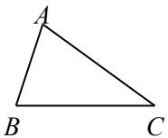

解：延长 $C B$ 到 $D$ ，使 $B D { = } A B { = } c$ ，连接 AD则 $\_$ ，∴ $\angle A B C = 2 \angle \mathrm { D }$ ∵ $\_$ ，∴ $\angle D = \angle C$ ，$\_$ ， $\triangle B A D \sim \triangle A C D .$ ，$\cdot$ $\cdot \frac { b } { c } = \frac { a + c } { b } ,$ $\therefore b ^ { 2 } = c ( a + c ) .$ ．

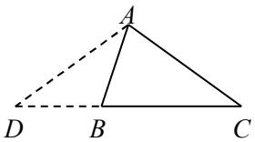

2．如图，在 $\triangle A B C$ 中， $\angle A B C = 2 \angle C$ ， $A B { = } 3$ ， $A C { = } 2 \sqrt { 6 }$ ，求 $B C$ 的长解：延长 $C B$ 到 $\cdot$ ，使 $D B { = } A B { = } 3$ ，连接 AD则 $\angle D = \angle D A B$ ，∴ $\_$ $-$ ，$\scriptstyle \cdot A D = A C = 2 { \sqrt { 6 } }$ ， $\_$ ，$\cdot$ $: \frac { 2 \sqrt { 6 } } { 3 } = \frac { C D } { 2 \sqrt { 6 } } ,$

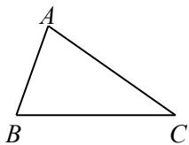

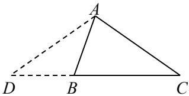

资料整理【淘宝店铺：向阳百分百】 ∴ $C D { = } 8$ ，∴ $\cdot$

# 2023·深圳南山区联考二模

3．一副三角板按如图 1 放置，图 2 为简图， $D$ 为 $A B$ 中点， $E$ 、 $F$ 分别是一个三角板与另一个三角板直角边AC、 BC 的交点，已知 $A E { = } 2$ ， $C E { = } 5$ ，连接 $D E$ ， $M$ 为 $B C$ 上一点，且满足 $\angle C M E { = } 2 \angle A D E$ ，EM=

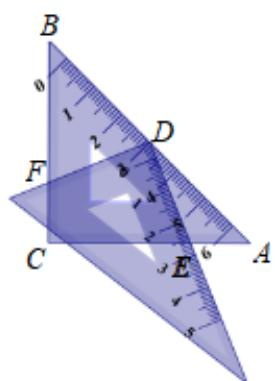  
图1

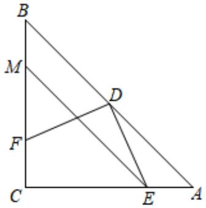  
图2

【答案】 29  
4

【分析】由 $\mathrm { C E } { = } 5$ ， $_ { \mathrm { A E } = 2 }$ ，得 $\cdot$ ，利用勾股定理，得到 AD 的长度，过 E 作 EN⊥AD 于 N，求出 EN和DN的长度，由于 $-$ E，延长MB至P，是 $\cdot$ ，可以证明 $\triangle D N E \sim \triangle P C E$ ， $\cdot$ ，在 RtMCE中，利用勾股定理列出方程，即可求解

【详解】解：如图，过 E 作 EN⊥AD 于 N，

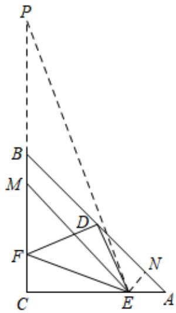

 $\angle E N D = \angle E N A = 9 0 ^ { \circ } .$ ,  
 $. \angle N E A = \angle A = 4 5 ^ { \circ }$ ,  
∴ $\cdot$ ，  
$\therefore A E = { \sqrt { N E ^ { 2 } + N A ^ { 2 } } } = { \sqrt { 2 } } N A ,$   
$\therefore N E = N A = { \frac { A E } { \sqrt { 2 } } } = { \sqrt { 2 } } ,$   
同理， $A D = { \frac { A C } { \sqrt { 2 } } } = { \frac { 7 { \sqrt { 2 } } } { 2 } } ,$   
$\therefore D N = A D - N A = { \frac { 5 { \sqrt { 2 } } } { 2 } } ,$   
延长 MB 至 P，使 $\cdot$ ，连接 PE，  
∴可设 $\angle M P E = \angle M E P = x ,$ ，  
$\angle E M C = \angle M P E + \angle M E P = 2 x ,$ ，  
$\cdot \angle E M C = 2 \angle A D E .$ ,  
 $. \angle A D E = \angle M P E = x .$ ,  
又 $\angle D N E = \angle P C E = 9 0 ^ { \circ } .$   
$\cdot _ { \cdot \triangle D N E } \sim _ { \triangle P C E }$ ,  
$\therefore { \frac { C E } { P E } } = { \frac { N E } { D N } } = { \frac { \sqrt { 2 } } { \frac { 5 { \sqrt { 2 } } } { 2 } } } = { \frac { 2 } { 5 } } ,$   
$\therefore P C = { \frac { 2 5 } { 2 } } ,$   
设 $M P = M E = x .$ , 则 $C M = { \frac { 2 5 } { 2 } } - x ,$ ,  
在 $R t { \_ } M C E$ 中， $M E ^ { 2 } = C M ^ { 2 } + C E ^ { 2 }$ ,  
$\therefore \left( { \frac { 2 5 } { 2 } } - x \right) ^ { 2 } + 2 5 = x ^ { 2 } , \therefore x = { \frac { 2 9 } { 4 } } ,$

# 2023·山西·统考中考真题

4．如图，在四边形 $A B C D$ 中， $\angle B C D = 9 0 ^ { \circ }$ ，对角线 $A C , B D$ 相交于点 $O$ ．若$A B = A C = 5 , B C = 6 , \angle A D B = 2 \angle C B D$ ，则 $A D$ 的长为

【答案】 $\frac { \sqrt { 9 7 } } { 3 }$

【 思 路 点 拨】 过 点 $A$ 作 $A H \perp B C$ 于 点 $\cdot$ ， 延 长 $A D$ ， $B C$ 交 于 点 $\cdot$ ， 根 据 等 腰 三 角 形 性 质 得 出$B H = H C = { \frac { 1 } { 2 } } B C = 3$ ，根据勾股定理求出 $A H = \sqrt { A C ^ { 2 } - C H ^ { 2 } } = 4$ ，证明 $\angle C B D = \angle C E D$ ，得出 $D B = D E$ ，根据等腰三角形性质得出 $C E = B C = 6$ ，证明 $C D / / A H$ ，得出 ${ \frac { C D } { A H } } { = } { \frac { C E } { H E } }$ 求出 $C D = { \frac { 8 } { 3 } }$ 根据勾股定理求出

$D E = { \sqrt { C E ^ { 2 } + C D ^ { 2 } } } = { \sqrt { 6 ^ { 2 } + { \Bigg ( } { \frac { 8 } { 3 } } { \Bigg ) } ^ { 2 } } } = { \frac { 2 { \sqrt { 9 7 } } } { 3 } }$ 根据 $C D / / A H$ ，得出 ${ \frac { D E } { A D } } { = } { \frac { C E } { C H } }$ 即 $\frac { \frac { 2 \sqrt { 9 7 } } { 3 } } { A D } = \frac { 6 } { 3 }$ ， 求出结果即可【详解】解：过点 $\cdot$ 作 $A H \perp B C$ 于点 $\cdot$ ，延长 $A D$ ， $B C$ 交于点 $\cdot$ ，如图所示：

则 $\angle A H C = \angle A H B = 9 0 ^ { \circ }$ ，  
∵ $\begin{array} { r } { A B = A C = 5 , B C = 6 } \end{array}$ ，  
$\therefore B H = H C = { \frac { 1 } { 2 } } B C = 3$ ，  
$\therefore A H = \sqrt { A C ^ { 2 } - C H ^ { 2 } } = 4$ ，  
∵ $\angle A D B = \angle C B D + \angle C E D$ ， $\angle A D B = 2 \angle C B D$ ，  
$\angle C B D = \angle C E D$ ，  
$\therefore D B = D E$ ，  
∵ $\cdot \angle B C D = 9 0 ^ { \circ }$ ，  
$O C \bot B E$ ，  
$\therefore C E = B C = 6$ ，  
∴ EH  CE  CH  9 ，  
∵ DC  BE ， AH  BC ，  
∴CD∥AH ，  
$\therefore \Delta E C D \sim \Delta E H A$ ，  
$\therefore { \frac { C D } { A H } } = { \frac { C E } { H E } } .$   
即 ${ \frac { C D } { 4 } } = { \frac { 6 } { 9 } }$   
解得： $C D = { \frac { 8 } { 3 } }$   
$\begin{array} { l } { \displaystyle \dot { : } D E = \sqrt { C E ^ { 2 } + C D ^ { 2 } } = \sqrt { 6 ^ { 2 } + \left( \frac { 8 } { 3 } \right) ^ { 2 } } = \frac { 2 \sqrt { 9 7 } } { 3 } \mathrm { , } } \\ { \displaystyle \dot { : } C D / \ { \cal A H } , } \\ { \displaystyle \dot { : } \frac { D E } { { \cal A D } } = \frac { C E } { C H } \mathrm { , } } \\ { \displaystyle \dot { \mathbb P } \| \frac { 2 \sqrt { 9 7 } } { \displaystyle \frac { 3 } { { \cal A D } } } = \frac { 6 } { 3 } , } \end{array}$   
解得： $A D = \frac { \sqrt { 9 7 } } { 3 }$

5．如图，在 $\mathrm { R t } \triangle A B C$ 中， $\angle A C B = 9 0 ^ { \circ }$ ， $A C { = } 6$ ， $B C { = } 8$ ， $A D$ 平分 $\angle B A C$ ，AD 交 BC 于点 D，ED⊥AD 交 AB于点 $E$ ， $\triangle A D E$ 的外接圆 $\odot O$ 交 $A C$ 于点 $F$ ，连接 $E F$

(1)求证： $B C$ 是 $\odot O$ 的切线；

(2)求 $\odot O$ 的半径 $r$ 及 $\angle 3$ 的正切值

图17-8-1简析(1)如图，连接 $\cdot$ ，由题易得 $\angle 2 = \angle 1 = \angle O D A$ ，则 OD∥AC，故 $\angle O D B = \angle C = 9 0 ^ { \circ }$ ，即 OD⊥BC，所以 $\cdot$ 是 $\cdot$ 的切线；

(2)方法一(常规解法)：由 OD∥AC，可得△BOD∽△BAC，则 $\frac { O D } { A C } \quad \frac { O B } { A B }$ ， 即 $\frac { r } { 6 } \quad \frac { 1 0 - r } { 1 0 }$ 解得 $r { = } \frac { 1 5 } { 4 }$ ； 又可 $\frac { B D } { B C } \quad \frac { O D } { A C }$ 故 ${ \frac { B D } { B C } } = { \frac { 5 } { 8 } }$ , 从而 ${ \frac { C D } { B C } } = { \frac { 3 } { 8 } }$ 即 $\frac { 3 } { 8 }$ ，所以 tan $\angle 3 = \tan \angle 2 = \frac { C D } { A C } = \frac { 1 } { 2 }$ ；

方法二(倍半角模型)：如图 $1 7 - 8 - 3$ ，延长 $C A$ 至点 $\cdot$ ，使 $A P { = } A B { = } 1 0$ ，易证 $\angle 3 = \angle 2 = \angle 1 = \angle P$ ，故tan $\begin{array} { r } { \frac { B C } { P C } \quad \frac { 1 } { 2 } } \end{array}$ 又由 tan $\angle 2 = \frac { 1 } { 2 }$ 可得 $\cdot$ ，故 $B D { = } 5$ ，从而易得 $r { = } O D { = } \frac 3 4 B D { = } \frac 1 4$

6．如图， $A B$ 为 $\odot O$ 的直径，点 $P$ 在 $A B$ 的延长线上，点 $C$ 在 $\odot O$ 上，且 $P C ^ { 2 } { = } P B \cdot P \mathrm { A }$

(1)求证： $P C$ 是 $\odot O$ 的切线；

(2)已知 $P C = 2 0$ ， $P B { = } 1 0$ ，点 $D$ 是弧 $A B$ 的中点， $D E \bot A C$ ，垂足为 $E$ ， $D E$ 交 $A B$ 于点 $F$ ，求 $E F$ 的长简析 $\cdot$ 17-9-1如图，连接 $O C$ ，由 $\_$ ，可得 $\frac { P C } { P A } \quad \frac { P B } { P C }$ ， 又 $\cdot$ ，故△PCB∽△PAC，从而 $\angle P C B = \angle$ $A { = } \angle A C O$ ，进一步可证 $-$ ，即 $\cdot$ ，所以 $\cdot$ 是 $\odot O$ 的切线；(2)方法一(常规解法)：连接 $O D$ ，易证 $\cdot$ ；由 $P C 2 = P B ^ { \cdot } P A$ ，可得 $P A = 4 0$ ， $A B { = } 3 0$ ；又由△PCB∽△PAC，可得 $\frac { C B } { A C } \quad \frac { P B } { P C } \quad \frac { 1 } { 2 }$ 故 $\angle D = \tan \angle A = \frac { 1 } { 2 }$ 从而 $O F { = } \frac { 1 } { 2 } O D { = } \frac { 1 5 } { 2 }$ $\frac { 1 5 } { 2 }$ 进一步可得$\frac { 3 { \sqrt { 5 } } } { 2 }$ ；

方法二(倍半角模型)：同上可得 $A B { = } 3 0$ ，则 $O C { = } 1 5$ ， $O P { = } 2 5$ ，即 OC： $\cdot$ ： $\cdot$ ：4：5；如图 $\cdot$ ，延长 $\cdot$ 至点 $Q$ ，使 $O Q { = } O P$ ，易得 tan $\angle D = \tan \angle A = \tan \angle Q = \frac { 1 } { 2 }$ ， 下略．

  
图17-9-3

反思：这是一个确定性问题，其结构相当于已知“倍角∠POC”求“半角∠A”，方法一利用“母子型相思似”求解，方法二构造“倍半角模型”求解，相对而言，前者更简单，后者更通用

# 题型二 向内构造等腰（小角加倍或大角减半）

7．如图，在 △ABC 中， $\angle A C B = 9 0 ^ { \circ }$ ，点 $D$ 为边 $A B$ 上一点， $\angle A C D { = } 2 \angle B , \frac { A D } { B D } { = } \frac { 1 } { 3 }$ 求 $\cos B$ 的值．

解：过点 $\cdot$ 作 $C E \bot A B$ 于点 $E$

∵ $\cdot \angle A C B { = } 9 0 ^ { \circ }$ ，∴ $\angle A C E = 9 0 ^ { \circ } - \angle B C E = \angle \mathrm { B }$   
∵ $\_$ ，∴ $\angle A C D { = } 2 \angle A C E .$ ，  
∴ $\_$ ，∴ $\angle A = \angle C D E$ ，  
∴ $\cdot$ ，∴ $. A E { = } D E$   
设 $\_$ ，则 $\cdot$ ， $B D { = } 6 a$ ， $B E { = } 7 a$   
∵ $\_$ ， $-$ ，  
∴△CEA∽△BEC，∴AE $\cdot$   
$-$ ，  
$\cdot$

8．如图，在 $\mathrm { R t } \triangle A B C$ 中， $\angle B A C = 9 0 ^ { \circ }$ ，点 $D$ 为边 $B C$ 上一点， $\angle B A D { = } 2 \angle C$ ， $B D = 2$ ， $C D { = } 3$ ，求 $A D$ 的长

解：过点 A 作 $A E \bot B C$ 于点 $E$ ∵ $\_$ ，∴ $-$ ∵ $\angle B A D { = } 2 \angle C$ ，∴ $-$ ，∴ $\angle B A E { = } \angle D A E$ ，∴ $\angle B = \angle A D E$ ，∴ $. A B { = } A D$ ， $\therefore B E = D E = \frac { 1 } { 2 } B D = 1 , \therefore C E = 4 .$ ∵ $\angle B A E { = \angle C }$ ， $\angle A E B = \angle C E A = 9 0 ^ { \circ } ,$ ，

资料整理【淘宝店铺：向阳百分百】∴△ABE∽△CAE， $\cdot$ $\therefore { \frac { A E } { 1 } } = { \frac { 4 } { A E } } , \therefore A E = 2 , \therefore A D = { \sqrt { D E ^ { 2 } + A E ^ { 2 } } } = { \sqrt { 5 } } .$

9．如图，BM 是以 $A B$ 为直径的 $\odot O$ 的切线， $B$ 为切点， $B C$ 平分 $\angle A B M$ ，弦 CD 交 $A B$ 于点 $E$ ， $D E { = } O E$

(1)求证： $\triangle A C B$ 是等腰直角三角形；(2)求证： $O A ^ { 2 } { = } O E { \cdot } D C$ ；  
(3)求 tan $\angle A C D$ 的值图17-10-1简析(1)由题易得 $\_$ ，从而易证 $. \triangle A C B$ 是等腰直角三角形；  
(2)如图，连接 OC、OD，易证 $\angle D O E = \angle D = \angle O C D$ ，故△DOE∽△DCO，从而易得 $O D ^ { 2 } { = } D E ^ { * } D C$ ，即 $\cdot$ ；

图17-10-2(3)方法一(倍半角模型)：如图，连接 $\cdot$ 、 $B D$ ，设 $\angle A C D = x$ ，则 $\angle A B D = x$ ， $\angle A O D { = } 2 x$ ，从而 $\angle C E O = 4 X$ ，$\angle C A E { = } 3 x { = } 4 5 ^ { \circ }$ °，所以 $\chi = 1 5 ^ { \circ }$ °；在 $B D$ 上取点 $\cdot$ ，使 $\cdot$ ，则 $\angle A F D = 3 0 ^ { \circ }$ ；由此可设 $A D { = } k$ ，则 $\cdot$ $= \sqrt { 3 } k$ ， $A F { = } B F { = } 2 k$ ，从而 $B D { = } ( 2 + \sqrt { 3 } ) k$ ，故 tan $\begin{array} { r l r l } { \frac { A D } { B D } } & { { } } & { } & { { } \sqrt { 3 } } \end{array}$ ，即 tan $\sqrt { 3 }$ ；

方法二(解三角形)：同上可得 $\angle A C D = 1 5 ^ { \circ }$ ，则 $\angle B C E = 7 5 ^ { \circ }$ ， $\_$ °；如图 $\_$ ，作 EG⊥BC于点 $G$ ，可设 $\cdot$ ，则 $O B { = } O C { = } \sqrt { 3 }$ ， $B C { = } \sqrt { 6 }$ ， $B E { = } \sqrt { 3 } + 1$ ，从而 $\frac { B E } { \sqrt { 2 } } \frac { \sqrt { 6 } + \sqrt { 2 } } { 2 }$ ， $C G { = } B C$ $- B G = { \frac { { \sqrt { 6 } } - { \sqrt { 2 } } } { 2 } }$ 故 tan $\quad { \frac { C G } { E G } } \qquad { \sqrt { 3 } }$

  
图17-10-4

反思：(2)主要通过换边，结合相似证乘积式；(3)通过导角得到 $\cdot$ ，方法一借助“倍半角模型”，由特殊角$3 0 ^ { \circ }$ 求“特殊半角” $^ { 1 5 ^ { \circ } }$ ，方法二的本质是解 BCE，显然前者更为简便

10．如图，在四边形 ABCD 中， $\angle A B D { = } 2 \angle B D C$ ， $A B { = } A C { = } B D { = } 4$ ， $C D { = } 1$ ，求 $B C$ 的长解：过点 $B$ 作 $\cdot$ 于点 $E$ ，过点 $C$ 作 $\cdot$ 于点 F．

∵ $A B { = } B D$ ，∴ $A E { = } D E$ ， $\angle A B E { = } 2 \angle D B E$ ，  
∴ $-$   
∵ $\angle A B D { = } 2 \angle B D C$ ，∴ $\angle B D C = \angle D B E$ ，  
∴CD∥BE，∴CD⊥AD，  
∴四边形 CDEF 是矩形， $A D { = } \sqrt { A C ^ { 2 } { - } C D ^ { 2 } } { = } \sqrt { 1 5 }$ ，  
$\therefore E F = C D = 1 , A E = D E = { \frac { \sqrt { 1 5 } } { 2 } } ,$   
$-$   
$\therefore B C = { \sqrt { B F ^ { 2 } + C F ^ { 2 } } } = { \sqrt { 1 0 } } .$

11．如图，在 $\triangle A B C$ 中， $\angle C { = } 2 \angle B$ ，点 $D$ 是 $B C$ 的中点， $A E$ 是 $B C$ 边上的高，若 $A E { = } 4$ ， $C E { = } 2$ ，求 $D E$ 的长．

解：取 $A B$ 的中点 $M$ ，连接 $\cdot$ ， $M E$ ．∵点 $\cdot$ 是 $\cdot$ 中点，∴MD是 $\triangle A B C$ 的中位线，∴MD∥AC， $\cdot$ ，∴ $\_$ ∵ $\cdot$ ，∴ $\angle B D M = 2 \angle B$ ∵AE 是 $B C$ 边上的高，∴ $\angle A E B = 9 0 ^ { \circ }$ $\therefore M E = { \frac { 1 } { 2 } } A B = M B , \because \angle B = \angle M E D ,$ ∴ $-$ ，∴ $-$ ，$\therefore D E = D M = { \frac { 1 } { 2 } } A C = { \frac { 1 } { 2 } } { \sqrt { A E ^ { 2 } + C E ^ { 2 } } } = { \sqrt { 5 } } .$

12．如图，在△ABC 中， $\angle A B C = 2 \angle C$ ， $A D \bot B C$ 于点 $D$ ， $A E$ 为 $B C$ 边上的中线， $B D = 3$ ， $D E { = } 2$ ，求 $A E$ 的长．

解：延长 $\cdot$ 到 $F$ ，使 $\cdot$ ，连接 $A F$ 则 $\_$ ，∴ $\angle A B C = 2 \angle F$ ∵AE 是中线，∴ $\cdot$ ， $\_$ ∵ $\angle A B C = 2 \angle C$ ，∴ $\cdot$ ，∴ $A F { = } A C$ ∵AD⊥BC，∴ $. D F { = } D C$ ， $-$ ，$-$ ，$-$ ， $\therefore A E { = } { \sqrt { D E ^ { 2 } { + } A D ^ { 2 } } } { = } { \sqrt { 1 1 } } .$

13．如图，在△ABC 中， $A B { = } A C { = } 5$ ，点 $D$ 为 $B C$ 边上一点， $B D { = } 2 D C$ ，点 $E$ 在 $A D$ 的延长线上， $\angle A B C { = } 2$ ∠DEC， $A D \cdot D E { = } 1 8$ ，求 sin $\angle B A C$ 的值

解：延长 $C B$ 到 $\cdot$ ，使 $B E { = } A B$ ，连接 $\cdot$ ，过点 $\cdot$ 作 $A G \bot B C$ 于点 G，过点 $B$ 作 BH⊥AC 于点 $\cdot$ 则 $\_$ ，∴ $\_$

∵ $-$ ，∴ $\angle F { = } \angle D E C$   
∵ $-$ ， , $\cdot \frac { A D } { D F } = \frac { C D } { D E } .$ $-$   
设 $C D { = } a$ ，则 $B D { = } 2 a , D F { = } 2 a { + } 5$ ，  
$\_$ ，解得 $\cdot$ （舍去）或 $a = 2$ ，  
$\cdot$

14．如图，在□ABCD 中， $\angle D { = } 2 \angle A C B$ ， $A E$ 平分 $\angle B A C$ 交 $B C$ 于点 $E$ ，若 $B E { = } 2$ ， $C E { = } 3$ ，求 $A E$ 的长解：延长 $C B$ 到 $\cdot$ ，使 $\cdot$ ，连接 $A F$ ，过点 A 作 $A H \bot B C$ 于点 $\cdot$ ，过点 $\cdot$ 作 $\cdot$ 于点 $\cdot$ ，EN⊥AC 于点 $N$

则 $\angle F { = } \angle B A F$ ，∴ $\_$   
∵四边形 ABCD 是平行四边形，∴ $\_$   
∵ $\_$ ，∴ $-$ ，  
∴ $\_$ ，∴ $\cdot$ ，△ABF∽△CAF， $\cdot \frac { A F } { B F } { = } \frac { C F } { A F } .$   
∵AE 平分 $\angle B A C$ ，∴ $\cdot$ ，  
$\therefore \frac { B E } { C E } = \frac { S _ { \triangle ^ { A B E } } } { S _ { \triangle ^ { A C E } } } = \frac { \frac { 1 } { 2 } A B \cdot E M } { \frac { 1 } { 2 } A C \cdot E N } = \frac { A B } { A C } = \frac { 2 } { 3 } , \because \cdot \frac { A B } { A F } = \frac { 2 } { 3 } .$   
设 $\cdot$ ，则 $-$ ，$\cdot$ 解得 $x { = } 2$ ，∴ $\cdot$ ， $\_$ ，  
$-$   
$\therefore A E = { \sqrt { A H ^ { 2 } + E H ^ { 2 } } } = 3 { \sqrt { 2 } }$

15．如图，在四边形 ABCD 中，AD∥BC， $A B { = } A C { = } 4$ ， $C D { = } 2 \sqrt { 1 1 }$ ， $\angle A B D { = } 2 \angle D B C$ ，求 BD 的长．解：延长 $B A$ 到 $P$ ，使 $P A { = } A B$ ，过点 $\cdot$ 作 $P E \bot B D$ 于点 $\cdot$ ，连接 AE，PD∵AD∥BC，∴ $\_$ ∵ $-$ ，∴ $-$ ∵AD∥BC，∴ $\angle P A D = \angle A B C$ ， $\angle C A D = \angle A C B$ ∵ $\cdot$ ，∴ $\cdot$ ， $\_$ ，∴ $\_$ 资料整理【淘宝店铺：向阳百分百】∵AD＝AD，∴△PAD≌△CAD，∴PD＝CD＝2 11$\because P A = A B , \angle P E B = 9 0 ^ { \circ } , \therefore A E = \frac { 1 } { 2 } P B = A B = 4 ,$ ∴ $-$ ，∴ $\angle A D B = \angle D A E$ ，$\therefore D E = A E = 4 , \therefore P E ^ { 2 } = P D ^ { 2 } - D E ^ { 2 } = 2 8 ,$ ，$\therefore B E = \sqrt { P B ^ { 2 } - P E ^ { 2 } } = 6 , \therefore B D = B E + D E = 1 0 .$

# 题型三 沿直角边翻折半角（小角加倍）

16．如图，在 Rt△ABC 中， $\angle A C B = 9 0 ^ { \circ }$ ，点 $D$ 为边 $B C$ 上一点， $\angle B { = } 2 \angle C A D$ ， $A B \cdot C D { = } 5$ ，求 $A D$ 的长

解：延长 $B C$ 到 $\cdot$ ，使 $C E { = } C D$ ，连接 $A E$

$-$ ，  
∴ $\angle C A D = \angle C A E$ ， $\_$   
∵ $\angle B { = } 2 \angle C A D$ ，∴ $\angle B = \angle D A E$ ，  
∴ $-$ ，∴△ABE∽△DAE， $B E { = } A B$ ，$\frac { A E } { D E } = \frac { B E } { A E }$ ∴AE2＝BE·DE＝BE·2CD＝10，$\scriptstyle \cdot _ { \ l } A D = A E = { \sqrt { 1 0 } }$

17．如图，在 Rt△ABC 中， $\angle A C B = 9 0 ^ { \circ }$ ，点 $D$ 为 $B C$ 边上一点， $B D { = } 2 C D$ ， $\angle B { = } 2 \angle D A C$ ， $A B { = } 4$ ，求 AD的长．

解：延长 $\cdot$ 到 $\cdot$ ，使 $C E { = } C D$ ，连接 $\cdot$

∵ $\_$ ， $\cdot$ ，  
∴ $\_$ ， $\angle D A C = \angle E A C$   
∵ $\angle B { = } 2 \angle D A C$ ，∴ $\angle B = \angle D A E$ ，  
∴ $-$   
设 $\_$ ，则 $-$ ，  
∴ $\cdot$ ， $\therefore x = 1$ ，∴ $\cdot$ ， $\_$ ，  
$\_$

18．如图，在 $\mathrm { R t } \triangle A B C$ 中， $\angle A C B = 9 0 ^ { \circ }$ ，点 $D$ 为边 $B C$ 上一点， $\angle B { = } 2 \angle D A C$ ， $B D = 3$ ， $D C = 2$ ，求 $A D$ 的长．

解：延长 $\cdot$ 到点 $E$ ，使 $C E { = } C D$ ，连接 $\cdot$

∵AC⊥BC， $\therefore A D { = } A E$ ，  
∴ $\angle A D E { = \angle E }$ ， $\angle D A C = \angle E A C$   
∵ $\_$ ，∴ $\_$ ，  
∴ $-$ ， $\cdot$ ，△ABE∽△DAE，$\cdot \frac { A E } { B E } { = } \frac { D E } { A E }$   
$-$ ，$\frac { A E } { 7 } = \frac { 4 } { A E }$ $\therefore A D = A E = 2 { \sqrt { 7 } } .$

# 2023·深圳宝安区二模

19．如图，在 $\mathrm { R t } \triangle A B C$ 中， $\angle B = 9 0 ^ { \circ }$ ，点 $D$ 为 $B C$ 中点， $\angle C = 2 \angle B A D$ ，则 $\frac { A D } { A C }$ 的值为

资料整理【淘宝店铺：向阳百分百】

【答案】 $\frac { \sqrt { 6 } } { 3 }$

【详解】解：延长 $C B$ 至 $\cdot$ ，使 $B E = B D$ ，连接 $A E$ ，设 $B D = a$ ，

∵B  90 ，  
∴ $\angle A B D = \angle A B E$ ，  
∴Rt△ABD≌Rt△ABEHL ，  
∴E  ADE ， $A E = A D$ ，  
∵ $\angle C = 2 \angle B A D$ ，  
$\therefore \angle C = \angle E A D$ ，$\angle D = \angle C + \angle D A C$ ，  
$\therefore \angle E = \angle A D E = \angle E A C ,$ ，  
$\therefore A C = C E = 3 a$ ，  
∵ $\angle E = \angle A D E = \angle E A C$ ， $\angle C = \angle E A D$ ，  
$\therefore \triangle E C A \sim \triangle E A D$ ，${ \frac { C A } { A D } } { = } { \frac { A D } { E D } }$ , 即 $\frac { 3 a } { A D } = \frac { A D } { 2 a }$   
∴ $A D = { \sqrt { 6 } } a$ ，又 $A C = 3 a$ ，$\frac { A D } { A C } = \frac { \sqrt { 6 } a } { 3 a } = \frac { \sqrt { 6 } } { 3 }$ 故答案为： $\frac { \sqrt { 6 } } { 3 }$

20．如图，在 Rt△ABC 中， $\angle A C B = 9 0 ^ { \circ }$ ，点 $D$ 为 $A C$ 的中点，连接 $B D$ ， $\angle A { = } 2 \angle D B C$ ，求 tan $\angle A B D$ 的值．

【答案】

解：延长 AC 到 $E$ ，使 $\cdot$ ，连接 $\cdot$ ，过点 $\cdot$ 作 $D H \bot A B$ 于点 $\cdot$

∵ $\_$ ， $\cdot$ ，  
∴ $\_$ ， $\_$ ，  
∴ $\angle D B E { = } 2 \angle D B C$   
∵ $-$ ，  
∴ $\angle A B E { = } \angle B D E { = } \angle E$ ， $\cdot$ ，△ABE∽△BDE，  
$\cdot \frac { A B } { B E } = \frac { B D } { D E } , \therefore \frac { A E } { B D } = \frac { B D } { D E } .$   
设 $A D { = } C D { = } C E { = } a$ ，则 $A B { = } A E { = } 3 a , D E { = } 2 a$ ，  
$\begin{array} { l } { { \displaystyle { \dot { \cdot } } \frac { 3 a } { B D } = \frac { B D } { 2 a } , ~ { \dot { \cdot } } B D = { \sqrt { 6 } } a , ~ { \dot { \cdot } } B C = { \sqrt { { \dot { \sqrt { 5 } } } a } } , } } \\ { { \displaystyle { \dot { \cdot } } \sin A = \frac { D H } { A D } = \frac { B C } { A B } , ~ { \dot { \cdot } } \frac { D H } { a } = \frac { \sqrt { { \dot { \sqrt { 5 } } } a } } { 3 a } , } } \\ { { \displaystyle { \dot { \cdot } } D H = \frac { \sqrt { { \dot { \sqrt { 5 } } } } } { 3 } a , ~ A H = \frac { 2 } { 3 } a , ~ B H = \frac { 7 } { 3 } a } , } \\ { { \displaystyle { \dot { \cdot } } \tan { \angle } A B D = \frac { D H } { B H } = \frac { \sqrt { { \dot { \sqrt { 5 } } } } } { 7 } } . } \end{array}$

# 2023·深圳中学联考二模

21．如图，在 ${ \triangle A B C }$ 中，点 $E$ 在边 $A C$ 上， $E C = E B$ ， $\angle C = 2 \angle A B E$ ， $A D \perp B E$ 交 $B E$ 的延长线于点 $D$ ，若$A C = 2 2$ ， $B D = 1 6$ ，则 $A B = \_$

【答案】8 5

【详解】解：如图所示，延长 $B D$ 至 $F$ 使 $D F = B D$ ，作 $A G / / B C$ 交 $D F$ 于 $G$ ，

 $B D = D F$ ， $A D \perp B E$ ，  
 $A F = A B$ ， $\angle F = \angle A B D$ ，  
$\therefore A G / / B C$ ，  
AGD  EBC， $\angle G A E = \angle C$ ，  
 $E B = E C$ ，  
 $. \angle E B C = \angle C$ ，  
$\therefore \angle C = \angle E B C = \angle A G D = \angle G A E$ ，  
 AE  EG ，  
 C  2ABE ，  
AGD  2ABE  2F ，  
FG  AG ，  
 AC  22 ， BD 16，  
BG  BE GE  CE  AE  AC  22 ，  
 AG  FG  BF  BD  2BD  BG  216  22 10 ，  
DG  DF  FG 16 10  6，  
$\therefore A D = { \sqrt { A G ^ { 2 } - D G ^ { 2 } } } = { \sqrt { 1 0 ^ { 2 } - 6 ^ { 2 } } } = 8$ ，

$$
\therefore A B = \sqrt { A D ^ { 2 } + B D ^ { 2 } } = \sqrt { 8 ^ { 2 } + 1 6 ^ { 2 } } = 8 \sqrt { 5 }
$$

22．如图，在△ABC 中， $\angle A C B = 9 0 ^ { \circ }$ ， $B E$ 平分 $\angle A B C$ ，点 $D$ 为 $B C$ 边上一点， $B D { = } 2 C D$ ， $\angle A B C { = } 2 \angle D A C$ ，求 $\frac { A E } { E C }$ 的值．

解：延长 $B C$ 到 $\cdot$ ，使 $\cdot$ ，连接 $A F$

∵ $\angle A C B = 9 0 ^ { \circ }$ ， $\cdot$ ，  
∴ $\_$ ， $\_$   
∵ $\angle A B C { = } 2 \angle D A C$ ，∴ $\angle A B C = \angle D A F$ ，  
∴ $-$ ，$\cdot \frac { A F } { B F } { = } \frac { D F } { A F }$   
设 ${ \cal C } F { = } C D { = } a$ ，则 $B D = 2 a , D F = 2 a , B F = 4 a ,$ ，  
$-$   
∵BE 平分 $\angle A B C$ ，∴ $\_$   
∵ $-$ ， $\therefore \triangle B C E \sim \triangle A C F ,$ ，$\frac { C E } { C F } = \frac { B C } { A C }$ $\frac { C E } { a } = \frac { 3 a } { \sqrt { 7 } a }$ $\cdot$ ，$\mathbf { \partial } \cdot A E { = } \frac { 4 \sqrt { 7 } } { 7 } a$ AE 4EC 3

23．如图，在△Rt△ABC 中， $\angle B A C = 9 0 ^ { \circ }$ ， $D$ ， $E$ 分别是边 AB，BC 上的点，DC 平分 $\angle A D E$ ， $\angle B { = } 2 \angle A C D$ ，求 $C E$ 的长

解：延长 BA 到 $\cdot$ ，使 $A F { = } A D$ ，连接 $\cdot$ ，过点 $E$ 作 $\cdot$ 于点 $\cdot$

资料整理【淘宝店铺：向阳百分百】

∵ $\_$ ， $-$   
∵ $\angle B { = } 2 \angle A C D$ ，∴ $\angle B = \angle D C F$ ，∴ $\angle B C F { = } \angle C D F { = } \angle F$ ，   
∴ $B F { = } B C$ ．   
设 $\cdot$ ，则 $\cdot$ ， $-$ ，   
∴ $\_$ ， $\_$ ， $\cdot . B H { = } D H$   
设 $\cdot$ ，则 $-$ ， $-$ ， $\cdot$   
∵EH⊥AB， $\angle B A C = 9 0 ^ { \circ }$ °，∴EH∥AC，   
$\cdot \frac { B H } { A H } = \frac { B E } { C E }$ $\cdot$ ，解得 $\cdot$ （舍去）或 $\scriptstyle x = 9$ ，   
∴ $\_$ ．

24．如图，在△ABC 中， $\angle B { = } 2 \angle C$ ， $A D$ 是中线， $A B { = } 6$ ， $A D { = } \sqrt { 4 1 }$ ，求 $B C$ ，AC 的长解：过点 $\cdot$ 作 $\cdot$ 于点 $\cdot$ ，在 $\cdot$ 上截取 $\cdot$ ，连接 $A E$ ．

则 $A E { = } A B { = } 6$ ，∴ $\angle A E B = \angle B = 2 \angle C$ ，  
∴ $\angle E A C = \angle C$ ， $\_$   
设 $B H { = } E H { = } x$ ，则 $\cdot$ ， $B D { = } C D { = } x + 3$ ，  
∴ $\cdot$ ， $\_$ ，  
$\cdot B H { = } \sqrt { A B ^ { 2 } { - } A H ^ { 2 } } { = } 2$ ， $\cdot$ ， $C H { = } 8$ ，  
$\_$

25．如图，在 $\mathrm { R t } \triangle A B C$ 中， $\angle B A C = 9 0 ^ { \circ }$ ， $A B { = } A C$ ，点 $D , \ E$ 分别为边 BC，AC 上的点，连接 AD，DE，∠AED$= 2 \angle D A E$ ， $C E { = } 7$ ， $B D { = } 1 8 \sqrt { 2 }$ ，求 $D E$ 的长．

解：过点 $D$ 作 $D G \bot A B$ 于点 G，DH⊥AC 点 $H$ ，

在 $\cdot$ 上截取 $\cdot$ ，连接 $\cdot$   
则 $D E { = } D F$ ，∴ $\angle D F E = \angle A E D = 2 \angle D A E ,$ ，  
∴ $-$ ，∴ $. A F { = } D F$   
∵ $\_$ ， $A B { = } A C$ ，∴ $\_$ ，  
$\cdot A H { = } D G { = } { \frac { \sqrt { 2 } } { 2 } } B D { = } 1 8$ ， $C H { = } D H$   
设 $\_$ ，则 $F H { = } E H { = } x { - } 7$ ， $-$ ，  
在 $\cdot$ 中， $\_$ ，  
$-$ ，解得 $\cdot$ （舍去）或 $\cdot$ ，$\cdot D E { = } D F { = } 2 5 { - } x { = } 1 3$

26．如图，在 $\triangle A B C$ 中， $\angle C { = } 2 \angle B$ ， $A D$ 平分 $\angle B A C$ ， $B D { = } 3$ ， $C D = 2$ ，求 $A D$ 的长解：在 AB 上截取 $A E { = } A C$ ，连接 $D E$ ，过点 $A$ 作 $A F \bot B C$ 于点 $F$ ，过点 $\cdot$ 作 $D G \bot A B$ 于点 $\cdot$ ，DH⊥AC 于点 $\cdot$

∵ $-$ ， $A D { = } A D$ ，∴△ADE≌△ADC，  
$-$ ，  
∴ $\_$ ， $\_$   
∵ $\angle D A E { = } \angle D A C$ ，∴DG＝DH，  
$\cdot$   
∴ $A C { = } 4$ ，∴ $A B { = } 6$   
∵ $\cdot A F ^ { 2 } { = } A B ^ { 2 } { - } B F ^ { 2 } { = } A C ^ { 2 } { - } C F ^ { 2 } ,$ ，

$-$ ，解得 $\cdot$ $\therefore D F { = } \frac { 3 } { 2 } , A F ^ { 2 } { = } 6 ^ { 2 } { - } B F ^ { 2 } { = } \frac { 6 3 } { 4 } ,$ $\_$

# 题型四 邻二倍角的处理

27．如图，在△ABC 中， $A D \bot B C$ 于点 $D$ ， $\angle D A C { = } 2 \angle D A B$ ， $B D { = } 4$ ， $D C { = } 9$ ，求 $A D$ 的长

解：延长 $D A$ 到 $E$ ，使 $\cdot$ ，连接 EC

则 $\_$ ，∴ $\_$   
∵ $\angle D A C { = } 2 \angle D A B$ ，∴ $\angle D A B = \angle E$   
∵ $\angle A D B = \angle E D C = 9 0 ^ { \circ }$ ，∴△ABD∽△ECD， $\cdot \frac { A D } { E D } = \frac { B D } { C D } = \frac { 4 } { 9 } .$   
设 $A D { = } 4 m$ ，则 $E D { = } 9 m$ ， $\_$ ，   
$-$ ，   
$\cdot A D { = } 4 m { = } 1 2$ ．

28．如图，在 Rt△ABC 中， $\angle A = 9 0 ^ { \circ }$ ，点 $D$ 为边 $A C$ 上一点， $\angle D B C = 2 \angle A B D$ ， $C D = 3$ ， $B C = 7$ ，求 $B D$ 的长．

例 1

解：延长 BD 到 $E$ ，使 $\cdot$ ，连接 $C E$

设 $\cdot$ ，则 $\angle D B C = 2 \alpha$ ， $-$ ，   
$\angle C D E = \angle A D B = 9 0 ^ { \circ } - \alpha .$ ，   
∴ $-$ ，∴ $C E { = } C D { = } 3$ ，△CDE∽△BCE， $\cdot$ $\cdot$ 9 ∴DE   
$\therefore B D = B E - D E = 7 - { \frac { 9 } { 7 } } = { \frac { 4 0 } { 7 } } .$

29．如图，在 $\mathrm { R t } \triangle A B C$ 中， $\angle A C B = 9 0 ^ { \circ }$ ，点 $D$ 为 $B C$ 边上一点， $\angle B A D = 2 \angle C A D$ ， $B D { = } 1 0$ ， $D C = 3$ ，求AD 的长．

解：延长 $\cdot$ 到 $\cdot$ ，使 $A E { = } A B$ ，连接 $B E$ ．

设 $\cdot$ ，则 $\_$ ， $\angle A B E = \angle E = 9 0 ^ { \circ } - \alpha$ ，   
$-$ ，   
∴ $-$ ，∴ $\_$ ，△BDE∽△ABE， $\frac { B E } { D E } = \frac { A E } { B E }$ ∴AE·DE＝BE2＝100，   
$\cdot D E \left( A D + D E \right) = 1 0 0 , ~ \therefore 2 D E ^ { 2 } + 2 A D \cdot D E = 2 0 0 .$   
$\cdot A C ^ { 2 } = A B ^ { 2 } - B C ^ { 2 } = A D ^ { 2 } - D C ^ { 2 } ,$ ，   
$-$ ，   
$\cdot D E ^ { 2 } + 2 A D \cdot D E = 1 6 0$ ， $\cdot D E ^ { 2 } + 1 6 0 { = } 2 0 0$ ，   
∴ $D E ^ { 2 } { = } 4 0$ ， $\cdot$ ， $\cdot 2 \sqrt { 1 0 } A E { = } 1 0 0$ ，   
$\cdot A E { = } 5 \sqrt { 1 0 }$ ， $\cdot A D { = } 3 \sqrt { 1 0 }$ ．

30．如图，在 $\triangle A B C$ 中，点 $E$ 在边 $A C$ 上， $E B = E A$ ， $\angle A = 2 \angle C B E$ ， $C D \bot B E$ 交 BE 的延长线于点 $D$ ，$B D { = } 8$ ， $A C { = } 1 1$ ，则 $B C$ 的长为

资料整理【淘宝店铺：向阳百分百】

【答案】 $4 { \sqrt { 5 } }$

【解析】过点 $\cdot$ 作 CF∥AB 交 BD的延长线于点 $\cdot$

则 $\_$ ， $\angle F { = } \angle A B E$   
∵ $\cdot$ ，∴ $\_$ ，  
∴ $\_$ ，∴ $E F { = } E C$ ，  
$\therefore B F = A C = 1 1 , \therefore D F = B F - B D = 1 1 - 8 = 3 .$   
在 $B D$ 上取点 $G$ ，使 $D G = D F$ ，连接 $C G$   
则 $C F { = } C G$ $-$ ，  
∴ $\angle C B G = \angle B C G$ ， $\scriptstyle \cdot { C G = B G = B D - D G = 5 }$ ，  
$\ { \mathrm { \hat { \cdot } } } \ C D = { \sqrt { C G ^ { 2 } - D G ^ { 2 } } } = { \sqrt { 5 ^ { 2 } - 3 ^ { 2 } } } = 4 ,$ ，  
$\therefore B C = { \sqrt { B D ^ { 2 } + C D ^ { 2 } } } = { \sqrt { 8 ^ { 2 } + 4 ^ { 2 } } } = 4 { \sqrt { 5 } } .$

31．如图，在 $\triangle A B C$ 中， $A B { = } A C$ ，点 $D$ 在 $C A$ 的延长线上， $\angle A B C { = } 2 \angle D B A$ ，DE⊥BA 交 BA 的延长线于点$E$ ，若 $B E { = } 8$ ， $C D { = } 1 1$ ，求 $B D$ 的长

解：过点 $D$ 作 DF∥BC 交 BE 的延长线于点 $\cdot$ ，在 $E B$ 上截取 $E G { = } E F$ ，连接 $_ { D G }$

则 $\angle F = \angle A B C = 2 \angle D B A$ ， $\angle A D F = \angle C$   
∵ $\cdot$ ，∴ $\_$ ，   
∴ $\angle F { = } \angle A D F$ ，∴ $\cdot$ ， $\_$ ，   
$\scriptstyle \cdot . E G = E F = B F - B E = 1 1 - 8 = 3$   
∵DE⊥BA，∴ $D F { = } D G$ ，∴∠DGE＝∠F＝2∠DBA，   
∴ $\angle B D G = \angle D B A$ ，∴ $\scriptstyle \cdot D G = B G = B E - E G = 5$ ，   
$\dot { \cdot } D E = \sqrt { D G ^ { 2 } - E G ^ { 2 } } = 4 , \dot { \cdot } \dot { \cdot } B D = \sqrt { B E ^ { 2 } + D E ^ { 2 } } = 4 \sqrt { 5 } .$ ．

# 题型五 绝配角

32．如图，在 $\mathrm { R t } \triangle A B C$ 中， $\angle C = 9 0 ^ { \circ }$ ，点 $D$ ， $E$ 分别为 $B C$ ，AC 上的点， $\angle B { = } 2 \angle C D E$ ， $\angle A D E { = } 4 5 ^ { \circ }$ ，AB$= 5$ ， $A E { = } 3$ ，则 $B D$ 的长为

【答案】2

【解析】在 BA 上截取 $B F { = } B D$ ，连接 $\cdot$

则 $\angle B F D = \angle B D F = 9 0 ^ { \circ } - \frac { 1 } { 2 } \angle B = 9 0 ^ { \circ } - \angle C D E = \angle C E D ,$   
∴ $. \angle A F D = \angle A E D$ ， $\angle B D F + \angle C D E { = } 9 0 ^ { \circ } ,$ ，  
$: \angle E D F = 9 0 ^ { \circ }$ ， $-$   
∵ $\cdot _ { A D } { = } A D$ ，∴△ADF≌△ADE，  
∴ $\_$ ， $\therefore B D = B F = A B - A F = 5 - 3 = 2 .$

33．如图，在 $\mathrm { R t } \triangle A B C$ 中， $\angle B A C = 9 0 ^ { \circ }$ ，点 $D$ 为边 $A B$ 上一点， $\angle A C D = 2 \angle B$ ，若 $B D = 2$ ， $A D { = } 4$ ，求 CD的长．

解：延长 $\cdot$ 到点 $E$ ，连接 $D E$ ，使 $\_$ ∵ $A D = 3$ ， $\cdot$ ，∴ $. A B { = } 4$ ∵ $\angle A D E { = \angle B }$ ， $-$ ∴△ADE∽△ABC，∴AE ＝ $\cdot \frac { A E } { A C } = \frac { A D } { A B } = \frac { 2 } { 3 } .$ 设 $-$ ，则 $\_$ ，$-$ ∴ $\cdot$ ．设 $\cdot$ ，则 $\cdot$ ， $C D { = } C E { = } 5 x$ ，$-$

34．如图，在 $\mathrm { R t } \triangle A B C$ 中， $\angle A C B = 9 0 ^ { \circ }$ ，点 $D$ 为边 $B C$ 上一点， $B D { = } 2 C D$ ， $\angle D A C { = } 2 \angle B$ ， $A D { = } \sqrt { 2 }$ ，求 $A B$ 的长．

解：延长 AC 到 $\cdot$ ，使 $A E { = } A D$ ，连接 $\cdot$ 设 $\cdot$ ，则 $\_$ ， $\angle A D E { = } \angle E { = } 9 0 ^ { \circ } { - } \alpha$ ，

$-$   
∵ $-$ ，∴△ABC∽△EDC，  
$\cdot \frac { A B } { D E } = \frac { A C } { C E } = \frac { B C } { D C } = 3 .$   
设 $\cdot$ ，则 $A C { = } 3 a$ ， $\cdot$ ，  
$-$ $\scriptstyle \cdot D E = { \sqrt { D C ^ { 2 } + C E ^ { 2 } } } = 1$ ， $\_$

35．如图，在 $\triangle A B C$ 中， $\angle B A C = 4 5 ^ { \circ }$ ， $A D \bot B C$ 于点 $D$ ，点 $E$ 在线段 $A D$ 上， $\angle C E D { = } 2 \angle B A D$ ，若 $A E { = } 9$ ，$D E { = } 3$ ，求 $B C$ 的长

解：在 AD 上取点 $P$ ，连接 $P C$ ，使 $\cdot$ ，过点 $\cdot$ 作 $\cdot$ 于点 $H$

则 $\angle P A C = \angle A C P$   
设 $\cdot$ ，则 $\_$ ， $\angle D C E = 9 0 ^ { \circ } - 2 \alpha$ ，   
$-$ ，   
∴ $-$ ．   
∵ $\angle C D E { = } \angle P D C$ ，∴△CDE∽△PDC， $\cdot$ $. C D ^ { 2 } { = } D E \cdot P \mathrm { D }$   
设 $P E { = } x$ ，则 $P D { = } x { + } 3$ ， $\_$ ，   
$C D ^ { 2 } = ( 9 - x ) ^ { 2 } - ( x + 3 ) ^ { 2 }$ ，   
$-$ ，解得 $\cdot$   
$\mathrm {  { ~ \bar { \cdot } ~ } } C D ^ { 2 } = 3 \left( x + 3 \right) = 1 6 , \mathrm {  { ~ \bar { \cdot } ~ } } C D = 4 ,$ ，   
$\_$ $\cdot \angle B C H = \angle A C D , \angle B H C = \angle A D C = 9 0 ^ { \circ } ,$ ，   
$\_$   
$\_$ ，

资料整理【淘宝店铺：向阳百分百】$\cdot A B ^ { 2 } { = } 2 A H ^ { 2 } { = } 1 8 0$ ， $\_$ $\cdot B C { = } B D { + } C D { = } 6 { + } 4 { = } 1 0$

36．如图， $\triangle A B C$ 是等边三角形，点 $D$ 在 $B C$ 的延长线上，点 $E$ 在线段 $A D$ 上， $\angle D A C { = } 2 \angle D B E$ ，BE 与 AC交于点 $F$ ，若 $C F { = } 1$ ， $D E = 2$ ，则 $C D$ 的长为

【答案】3

【解析】在 AD 上截取 $D G = D C$ ，连接 CG

设 $\angle D B E { = } { _ { X } } ,$ ，则 $\cdot$ ， $-$ ，  
$\angle A B E = \angle A E B = 6 0 ^ { \circ } - x , \angle D = 6 0 ^ { \circ } - 2 x ,$ ，  
$-$ ，  
$\_$ ， $\angle A G C = \angle A F E$   
∵ $\angle C A G = \angle E A F$ ，∴△ACG≌△AEF，  
$-$ ，$-$

37．如图，在△ABC 中， $\angle A C B = 9 0 ^ { \circ }$ ，点 $D$ 为边 $B C$ 上一点， $B D { = } 2 C D$ ， $\angle D A C { = } 2 \angle A B C$ ，若 $A D = { \sqrt { 2 } }$ ，求$A B$ 的长．

【答案】3

解：延长 BC 到点 $E$ ，使 $C E { = } C D$ ，连接 $\cdot$ ，过点 $B$ 作 $\cdot$ 的垂线，垂足为 $F$ ．

∵ $\angle A C B = 9 0 ^ { \circ }$ ， $\cdot A E { = } A D$ ，∴∠EAC＝∠DAC＝2∠ABC  
∵ $-$   
∴ $\angle A B F { = } \angle A B C$ ，∴ $\cdot$ ，∴ $\cdot$   
设 $C D { = } a$ ，则 $3 D = 2 a , B F = B C = 3 a , B E = 4 a ,$ ，  
在 $\triangle A B E$ 中，由面积法得 $B E \cdot A C { = } A E \cdot B F$ ，  
$\frac { A C } { A E } \quad \frac { 3 } { 4 }$   
设 $\cdot$ ，则 $\_$ ， $C D { = } \sqrt { 7 } m$ ，  
B $3 { \sqrt { 7 } } m ~ 6 { \sqrt { 2 } } m ~ { \frac { 3 { \sqrt { 2 } } } { 2 } } A D$

38．如图，在四边形 ABCD 中，AD∥BC，AC⊥CD， $A B { = } A C$ ， $\angle A B D { = } 2 \angle A D C$ ， $C D { = } 2 \sqrt { 5 }$ ，求 $A D$ 的长．解：延长 BA 到点 $E$ ，使 $\cdot$ ，延长 $A E$ 到点 $F$ ，使 $\cdot$ ，连接 $\cdot$ ，DF

∵AD∥BC，∴ $-$ ， $-$ $\cdot$ ，∴ $-$ ， $: \angle D A E = \angle D A C$   
∵ $\cdot$ ，∴ $\_$ ，  
$\cdot$ ， $-$ ， $\angle A D E { = } \angle A D C$ ，  
∴ $. A D { = } F D$ ，∴ $\_$ ， $\angle A D E { = } \angle F D E$ ，  
∵ $\cdot \angle A B D = 2 \angle A D C , \therefore \angle A B D = 2 \angle A D E = \angle A D F$ ，$\therefore \angle B D F = \angle D A E = \angle F , \therefore B D = B F .$   
设 $A B { = } A C { = } x$ ，则 $\cdot$ ， $B D { = } B F { = } 3 x$ ，

资料整理【淘宝店铺：向阳百分百】 $\therefore D E = { \sqrt { B D ^ { 2 } - B E ^ { 2 } } } = { \sqrt { 5 } } x = 2 { \sqrt { 5 } } , \therefore$ $\cdot$ ， $\cdot A E { = } 2$ ， $\therefore A D = \sqrt { A E ^ { 2 } + A D ^ { 2 } } = 2 \sqrt { 6 } .$ ．

39．如图，在 $\triangle A B C$ 中，点 $D$ 为边 $B C$ 上一点， $\angle A D C = 6 0 ^ { \circ }$ ， $\angle B A D { = } 2 \angle C A D$ ， $B D { = } 5$ ， $C D = 1$ ，求 $A D$ 的长．

解：延长 BC 到 $\cdot$ ，使 $B E { = } B A$ ，连接 $\cdot$ ，过点 $\cdot$ 作 $A H \bot C E$ 于点 $H$

设 $\cdot$ ，则 $\_$ ， $\angle B = 6 0 ^ { \circ } - 2 \alpha$ ，   
$-$ ，   
∴ $\_$ ， $\therefore \angle A C E = \angle B A E = \angle E$ ，   
∴ $\cdot$ ， $\triangle A C E \sim \triangle B A E$ ，   
$\_$ ．   
设 $C H { = } E H { = } x$ ，则 $D H { = } _ { X + 1 }$ ， $A H { = } \sqrt { 3 } x { + } \sqrt { 3 }$ ， $C E { = } 2 x$ ，   
$\cdot$ ， $A E ^ { 2 } = x ^ { 2 } + ( { \sqrt { 3 } } x + { \sqrt { 3 } } ) ^ { 2 }$ ，   
$\bullet . x ^ { 2 } + ( \sqrt { 3 } x + \sqrt { 3 } ) ^ { 2 } = 2 x ( 2 x + 6 )$ ，解得 $\cdot$ $-$

40．如图，在 $\mathrm { R t } \triangle A B C$ 中， $\angle B A C = 9 0 ^ { \circ }$ ， $A B { = } A C$ ，点 $D$ 是 $B C$ 的中点，点 $E$ 是边 AC上一点，连接 BE，DE，$\angle A B E { = } 2 \angle E D C$ ， $A E { = } 3$ ，求 $D E$ 的长

解：在 $E A$ 上截取 $E F { = } E C$ ，延长 $C A$ 到 $\cdot$ ，使 $A G { = } A F$ ，连接 $B F$ ，BG∵ $\_$ ， $\cdot _ { B F } { = } B G$ ， $\_$ 资料整理【淘宝店铺：向阳百分百】

∵点 $\cdot$ 是 $B C$ 的中点，∴DE 是 $\cdot$ 的中位线，∴DE∥BF  
∵ $\angle B A C = 9 0 ^ { \circ }$ ， $A B { = } A C$ ，∴ $\angle A B C = \angle C = 4 5 ^ { \circ }$   
设 $\cdot$ ，则 $-$ ，  
$\_$ ， $\angle E B G = 4 5 ^ { \circ } + \alpha$ ，  
∴ $\_$ ，∴ $. B E { = } G E$   
设 $\_$ ，则 $A G = A F = 3 - x , A B = A C = 3 + x ,$ ，  
$B E { = } G E { = } 6 { - } x$   
在 $\cdot$ 中， $-$ ，  
解得 $\cdot$ ，∴ $\cdot$ ， $\cdot$ ，  
$ \therefore B F { = } \sqrt { A B ^ { 2 } { + } A F ^ { 2 } } = 2 \sqrt { 5 }$ ， $\therefore D E = \frac { 1 } { 2 } B F = \sqrt { 5 } .$

41．如图，在△ABC 中， $\angle B A C = 1 2 0 ^ { \circ }$ ， $A B { = } A C$ ，点 $D$ 是 $B C$ 的中点，点 $E$ 是边 $A C$ 上一点，连接 BE，DE，$\angle A B E { = } 2 \angle E D C$ ， $C E { = } 2 \sqrt { 6 }$ ，求 $A E$ 的长

解：延长 BA 到 $\cdot$ ，使 $B F { = } B E$ ，连接 $\cdot$ ， $E F$ ，过点 $\cdot$ 作 $\cdot$ 于点 $\cdot$

∵ $\angle B A C = 1 2 0 ^ { \circ }$ ， $A B { = } A C$ ，∴ $\angle E A F { = } 6 0 ^ { \circ }$ ， $\angle A B C = \angle C = 3 0 ^ { \circ } .$   
∵点 $D$ 是 BC 的中点，∴ $\angle B A D = \angle E A D = 6 0 ^ { \circ }$ ， $\_$ ，  
∴ $\angle E A D = \angle E A F .$   
设 $\angle E D C = \alpha$ ，则 $\angle A B E = 2 \alpha , ~ \angle F = \angle B E F = 9 0 ^ { \circ } - \alpha .$ ，  
$\_$ ， $\therefore \angle A D E { = \angle F }$ $\cdot _ { A E } { = } A E$ ，∴ $\triangle A D E { \cong } \triangle A F E$ ， $\therefore A D { = } A F$   
设 $\cdot$ ，则 $\cdot$ ， $\cdot$ ， $A B { = } A C { = } 2 x { + } 2 { \sqrt { 6 } }$ ，  
$B H { = } 3 x { + } 2 \sqrt { 6 }$ ， $A F { = } A D { = } x { + } \sqrt { 6 } , B E { = } B F { = } 3 x { + } 3 \sqrt { 6 } .$   
在 Rt△BEH 中， $B H ^ { 2 } + E H ^ { 2 } = B E ^ { 2 }$ ，  
$-$ ，  
解得 $\cdot$ （舍去）或 $\cdot$ ，$\cdot A E { = } 2 x { = } 2 \sqrt { 6 } { + } 8$

42．如图，在 $\triangle A B C$ 中， $\angle B A C = 9 0 ^ { \circ }$ ， $A B { = } A C$ ，点 $D$ ， $E$ 分别为边 AC，BC 上的点， $\angle A B D { = } 2 \angle B A E$ ，BE$= 3 \sqrt { 2 }$ ， $C D { = } 7$ ，求 $B D$ 的长

资料整理【淘宝店铺：向阳百分百】

解：延长 $\cdot$ 到 $F$ ，使 $\cdot$ ，连接 $\cdot$ ，过点 A 作 $A H \bot B C$ 于点 $\cdot$

∵ $\_$ ， $A B { = } A C$ ，∴ $\angle A B C = \angle C = 4 5 ^ { \circ }$   
设 $\angle B A E { = } \alpha$ ，则 $\angle A E H = 4 5 ^ { \circ } + \alpha$ ， $\angle A B D { = } 2 \alpha$ ，  
$-$ ，  
∴ $\_$   
∵ $\angle A H E { = } \angle B A F { = } 9 0 ^ { \circ }$ ，∴△AEH∽△BFA，$\cdot \frac { A F } { E H } = \frac { A B } { A H } = \sqrt { 2 }$ ， $\therefore A F = \sqrt { 2 } E H$ ．  
设 $\cdot$ ，则 $\cdot$ ， $A H = B H = \sqrt { 2 } x + 3 \sqrt { 2 }$ ，  
$A B { = } A C { = } 2 x { + } 6$ ， $\_$ ， $B D { = } D F { = } A D { + } A F { = } 4 x { - } 1 .$ ，  
在 Rt△ABD 中， $( 2 x + 6 ) ^ { 2 } + ( 2 x - 1 ) ^ { 2 } = ( 4 x - 1 ) ^ { 2 }$ ，  
解得 $x { = } - 1$ 或 $x { = } \frac { 9 } { 2 }$ $-$

43．如图，在等边△ABC 中，点 $D$ ， $E$ 分别为边 $B C$ ，AC 上的点，连接 $A D$ ， $D E$ ， $\angle A D B { = } 2 \angle C D E$ ， $B D { = } 3$ ，$C E { = } 4$ ，求 $C D$ 的长

解：在 AC 上截取 $A F { = } B D$ ，在 $C E$ 上截取 $C G { = } E F$ ，连接 $\cdot$ ，DG，过点 $D$ 作 $D H \bot A B$ 于点 $H$

∵ $\cdot$ 是等边三角形，∴ $A C { = } B C$ ， $\angle C = 6 0 ^ { \circ }$ ，  
∴ $C F { = } C D$ ，∴ $\cdot$ CDF 是等边三角形，  
$\cdot$ ， $\angle D F E = \angle C$ ，∴△DEF≌△DGC，  
∴ $. D E { = } D G$ ， $\_$ ，  
∴ $\_$ ， $\_$   
设 $\angle G D F { = } \angle C D E { = } \alpha$ ，则 $\angle A D B { = } 2 \alpha$ ，  
$-$ ，  
$-$ ，∴ $\angle E D G = \angle D A G$ ，

∴ $-$ ， $-$ $-$ $-$ ，∴ $-$

44．如图，在 $\mathrm { R t } \triangle A B C$ 中， $\angle A C B = 9 0 ^ { \circ }$ ，点 $D$ 为 $A B$ 边上一点， $A D { < } B D$ ， $\angle A D C { = } 2 \angle A C D$ ， $A B { = } 8$ ， $C D =$ 3，求 AD 的长

解：在 DB 上截取 $D E { = } D C$ ，延长 $B A$ 到 $\cdot$ ，使 $\cdot$ ，连接 $\cdot$ ， $C F$

则 $\_$ ， $\_$   
设 $\angle A C D { = } \alpha$ ，则 $\angle B C D = 9 0 ^ { \circ } - \alpha , ~ \angle A D C = 2 \alpha ,$ ，  
$\angle D C E = \angle A E C = \alpha , \angle D C F = \angle F = 9 0 ^ { \circ } - \alpha ,$ ，  
∴ $\angle A C D = \angle A E C$ ， $\_$   
∵ $-$ ， $\_$ ，  
∴ $. \triangle A C D \sim \triangle A E C ,$ ， $\triangle B C D \sim \triangle B F C .$ ，  
$\cdot$   
$-$   
设 $\cdot$ ，则 $-$ ，  
$-$ ，  
$\_$ ，  
解得 $\cdot$ 或 $x { = } 6$ （舍去），即 $A D$ 的长为 2

45．如图，在 $\mathrm { R t } \triangle A B C$ 中， $\angle A C B = 9 0 ^ { \circ }$ ， $A C { = } 6$ ， $B C { = } 8$ ，点 $D$ ， $E$ 为边 $B C$ 上两点（点 $D$ 在点 $E$ 左侧），且$B D { = } C E$ ， $\angle D A E { = } { \frac { 1 } { 2 } } \angle B A C$ ，求 $D E$ 的长．

解：作 $\cdot$ 的角平分线 $A F$ 交 $\cdot$ 于点 $F$ ，过点 $F$ 作 $\cdot$ 于点 $G$ ，

过点 $A$ 作 $A H \bot A F$ 交 $B C$ 的延长线于点 $G$ $-$   
∵ $\cdot _ { A C = 6 }$ ， $B C { = } 8$ ， $\scriptstyle \cdot _ { A B } = { \sqrt { 6 ^ { 2 } + 8 ^ { 2 } } } = 1 0$   
设 $F G { = } F C { = } x$ ，则 $\cdot$   
$\therefore S _ { \scriptscriptstyle \triangle A B F } = \frac { 1 } { 2 } A B \cdot F G = \frac { 1 } { 2 } B F \cdot A C , \therefore A B \cdot F G = B F \cdot A C ,$ $\cdot 1 0 x { = } 6 \left( 8 - x \right)$ ，解得 $\_$ ，   
$\cdot \frac { A C } { C H } = \tan H = \tan \angle C A F = \frac { F C } { A C } = \frac { 1 } { 2 } , ~ \therefore C H = 2 A C = 1 2 .$   
设 $B D { = } C E { = } x$ ，则 $-$ ，   
$\_$   
∵ $\cdot$ ，∴ $-$   
$\_$   
$-$   
解得 $x { = } 3 0$ （舍去）或 $\cdot$ ，∴ $-$

# 题型六 坐标系中的二倍角问题

# 宿迁·中考

46．如图，抛物线 $y = x ^ { 2 } + b x + c$ 交 $\boldsymbol { x }$ 轴于 $A$ 、 $B$ 两点，其中点 $A$ 坐标为(1，0)，与 $y$ 轴交于点 $C ( 0 , \ - 3 )$ 。

(1)求抛物线的函数表达式；  
(2)连接 $A C$ ，点 $P$ 在抛物线上，且满足 $\angle P A B { = } 2 \angle A C O$ ， 求点 $P$ 的坐标；

简析(1)抛物线的函数表达式为 $\cdot$ (2)如图，在 $\cdot$ 上取点 $\cdot$ ，使 $\cdot$ ，则 $-$ ；设 $\cdot$ ，则 $\cdot$ ，在 Rt△AOE中，由勾股定理可得 $1 + t ^ { 2 } = ( 3 - t ) ^ { 2 }$ ，解得 $\cdot$ 故 tan $\cdot$ , 即 tan $\angle P A B = \frac { 3 } { 4 }$

$\cdot$ 当点 $\cdot$ 在 $X$ 轴上方时，作 $\cdot$ 轴于点 $\cdot$ ，则 ${ \frac { P G } { A G } } = { \frac { 3 } { 4 } }$ ； 设 $P G { = } 3 m { > } 0$ ，则 $\cdot$ ，点 $P$ 的坐标为 $( 1 -$   
$\cdot$ ， $3 m \mathbf { \bar { \Sigma } }$ )，将其代人抛物线的解析式，可得 $-$ ，解得 $m { = } \frac { 1 9 } { 1 6 } ( m { = } 0$ 舍去)，  
故点 $P$ 的坐标为( $( - \frac { 1 5 } { 4 } , \frac { 5 7 } { 1 6 } )$   
$\cdot$ 当点 $\cdot$ 在 $\cdot$ 轴下方时，同理可得 $\cdot$   
综上所述：点 $\cdot$ 的坐标为 $\cdot$ )或 $\cdot$

# 盐城·中考

47．如图，二次函数 $y = k ( x - 1 ) ^ { 2 } + 2$ 的图像与一次函数 $y { = } k x { - } k { + } 2$ 的图像交于 $A$ 、 $B$ 两点，点 $B$ 在点 $A$ 的右侧，直线 $A B$ 分别与 $\boldsymbol { x }$ 轴、 $y$ 轴交于 $C$ 、 $D$ 两点，其中 $k < 0$

(1)求 AB 两点的横坐标；

(2)二次函数图像的对称轴与 $\boldsymbol { x }$ 轴交于点 $E$ ， 是否存在实数 $k$ ， 使得 $\angle O D C { = } 2 \angle B E C$ ? 若存在，求出 $k$ 的值；  
若不存在，说明理由。

  
图17-17-1

  
备用图

# 简析

(1)令 $k ( x - 1 ) ^ { 2 } + 2 = k x - k + 2$ ，即 $\cdot$ ，解得 $x { = } 1$ 或 2，即 $A$ 、 $\cdot$ 两点的横坐标分别为 1、2；

(2)由前知 A(1，2)， $B \left( 2 , k { + } 2 \right)$ ；

$\textcircled{1}$ 情形一：当 $k { + } 2 { > } 0$ ，即 $\cdot$ 时，点 $\cdot$ 在 $\cdot$ 轴上方，如图(已隐去抛物线)过点 $\cdot$ 分别向 $\boldsymbol { X }$ 轴、对称轴作垂线，垂足依次为 $G$ 、 $H$ ， 则 tan BEC ? $\frac { B G } { E G } = k + 2$ ；在EA 的延长线上取点 $F$ ， 使 $\cdot$ ，连接 $\cdot$ ，则 $-$ ， 又 $-$ ， 故 $\cdot$ $\cdot$ ； 易 得 $B H = 1$ ， $A H = \mathit { \texttt { - k } }$ ， 则 $A F = A B = \sqrt { k ^ { 2 } + 1 } ,$ ， 从 而 $\cdot$ ， 故 tan $\cdot$ $\frac { B H } { F H } = \frac { 1 } { \sqrt { k ^ { 2 } + 1 } - k } = \sqrt { k ^ { 2 } + 1 } + k$ ，所以有 $\cdot$ ，解得 $k = - \sqrt { 3 } ( k = \sqrt { 3 }$ 舍去)；$\cdot$ 情形二：当 $k { + } 2 { < } 0$ ，即 $k < - 2$ 时，点 $\cdot$ 在 $\boldsymbol { X }$ 轴下方，

如图(已隐去抛物线)，同上作相关辅助线，同理有 tan BEC? $\_$ ，从而- $\cdot$ ，解得 $k = { \frac { - 4 - { \sqrt { 7 } } } { 3 } } ( k = { \frac { - 4 + { \sqrt { 7 } } } { 3 } } > - 2$ ，故舍去)；  
综上所述：k 的值为－ 3 或 4 7 .- -

反思：（2）是一个等腰三角形存在性问题，可借助代数方法盲解盲算，这里并未展开；（3）中存在“倍半角”关系，这里首先利用平行导角，将 $\angle O D C$ 转化为 $\angle B A H$ ， 借助 A、 $\cdot$ 两点的坐标来刻画其正切值，然后构造其“半角” $\cdot$ ， 最后列方程求解需。要特别提醒的是，这里根据点 $\cdot$ 的纵坐标的正负性，即点 $\cdot$ 与 $\cdot$ 轴的位置关系分两类讨论，很容易漏解。另外，本题还有其他解法，请自行探究。

# 河南·中考

48．如图，抛物线 $y { = } a x ^ { 2 } + 6 x { + } c$ 交 $\boldsymbol { x }$ 轴于 $A$ 、 $B$ 两点，交 $y$ 轴于点 $C$ 。 直线 $y = x - 5$ 经过点 $B$ 、 C 。

（1）求抛物线的解析式；

（2）过点 $A$ 的直线交直线 $B C$ 于点 $M$ 连接 $A C$ ，当直线 $A M$ 与直线 $B C$ 的夹角等于 $\angle A C B$ 的 2 倍时，请直接写出点 $M$ 的坐标。

  
图17-18-1

  
备用图

简析：(1)抛物线的解析式为 $\cdot$

(2)如图，当 $-$ 时，有 $-$ ，此时点 $\cdot$ 符合题意；再过点 A 作 AC的垂线，交直线$B C$ 于点 $\cdot$ ，作 $R S \bot x$ 轴于点 $\cdot$ ，

易证 tan $\cdot$ , 即 $\cdot$ 又易证 $R S { = } B S$ ，故 $\cdot$ 从而 $B S = \frac { 1 } { 6 } A B = \frac { 2 } { 3 }$ 点 $\cdot$ 的坐  
标为 $\cdot$ 易证点 $M$ 为 $\cdot$ 的中点，所以点 $M$ 的坐标 $\cdot$   
如图，作 $\cdot$ 于点 $G$ ，再作 $A M$ 关于直线 $_ { A G }$ 的对称线段 $\cdot$

则 $\angle A M ^ { \prime }$ ′ $M { = } \angle A M M ^ { \prime } { = } 2 \angle A C B$ ，故点 $\cdot$ ′是符合题意的另一个点；作 $\cdot$ 轴于点 $\cdot$ ，易证 $\cdot$ $B H { = } 2$ ，则点 $G$ 的坐标为(3，﹣2)；因为点 $G$ 为 MM 的中点，所以点 $\cdot$ 的坐标为 $\left( { \frac { 2 3 } { 6 } } , - { \frac { 7 } { 6 } } \right)$ 因此，点 $\cdot$ 的坐标为 $\cdot$ )或 $\cdot$

反思：第(2)问看似“倍半角”问题，却采取了“垂直处理”策略，结合中点坐标公式加以解决。“成也模型，败也模型”，切勿形成思维定式，盲目套用模型。当然，这两个问题都还有其他的处理方式，可自行探索。总结的话：数学中转化思想无处不在，所谓“倍半角”问题，其解题策略大体也是围绕着转化思想进行的，或将“倍角”变为“半角”，或将“半角”变为“倍角”，最终转化为等角问题，当然变化手段可能不一，比如作“倍角”的角平分线或者构造等腰三角形，再如将“半角”翻折等。总之，具体问题需要具体对待，并无绝对的通法、简法，一切都要依据题目的条件以及结论去分析、构造，以至于解决。

资料整理【淘宝店铺：向阳百分百】

49．如图，抛物线 $y = x ^ { 2 } - 6 x + 5$ 与 $x$ 轴交于点 $A$ ， $B$ ，与 $y$ 轴交于点 $C$ ，点 $D \left( 2 , m \right)$ 在抛物线上，点 $E$ 在直 线 $B C$ 上，若 $\angle D E B = 2 \angle D C B$ ，则点 $E$ 的坐标是

【答案】 $( \frac { 1 7 } { 5 } , \frac { 8 } { 5 } ) \neq \sigma ( \frac { 3 3 } { 5 } , - \frac { 8 } { 5 } )$

【分析】先根据题意画出图形，先求出 $D$ 点坐标，当 $E$ 点在线段 $B C$ 上时: $\angle D E B$ 是 $\triangle$ DCE 的外角，$\angle D E B = 2 \angle D C B$ ，而 $\angle D E B = \angle D C E + \angle C D E$ ，所以此时 $\angle D C E = \angle C D E$ ，有 $C E = D E$ ，可求出 $B C$ 所在直线的解析式 $y = - x + 5$ ，设 $E$ 点 $( a , - a + 5 )$ 坐标，再根据两点距离公式， $C E = D E$ ，得到关于 $a$ 的方程，求解$a$ 的值，即可求出 $E$ 点坐标；当 $E$ 点在线段 $C B$ 的延长线上时，根据题中条件，可以证明 $B C ^ { 2 } + B D ^ { 2 } = D C ^ { 2 }$ ，得到 $\angle D B C$ 为直角三角形，延长 $E B$ 至 $E ^ { \prime }$ ，取 $B E ^ { \prime } = B E$ ，此时， $\angle D E ^ { \prime } E = \angle D E E ^ { \prime } = 2 \angle D C B$ ，从而证明 $E ^ { \prime }$ 是要找的点，应为 $O C = O B$ ， $\triangle O C B$ 为等腰直角三角形， 点 $E$ 和 $E ^ { \prime }$ 关于 $B$ 点对称，可以根据 $E$ 点坐标求出 $E ^ { \prime }$ 点坐标．

【详解】解：在 $y = x ^ { 2 } - 6 x + 5$ 中，当 $x = 0$ 时， $y = 5$ ，则有 $C \big ( 0 , 5 \big )$ ，  
令 $y = 0$ ，则有 $x ^ { 2 } - 6 x + 5 = 0$ ，  
解得： $x _ { 1 } = 1 , x _ { 2 } = 6$ ，  
$\ A { \big ( } 1 , 0 { \big ) } , \ B { \big ( } 5 , 0 { \big ) }$ ，  
根据 $D$ 点坐标，有 $m = 2 ^ { 2 } - 6 \times 2 + 5 = - 3$   
所以 $D$ 点坐标2，3

设 $B C$ 所在直线解析式为 $y = k x + b$ ，其过点 $C \left( 0 , 5 \right)$ 、 $B \left( 5 , 0 \right)$ 有 $\begin{array} { r } { \left\{ { b = 5 } \atop { 5 k + b = 0 } , \right. } \end{array}$

解得 $\left\{ { \begin{array} { l } { k = - 1 } \\ { b = 5 } \end{array} } \right.$   
∴ $B C$ 所在直线的解析式为： $y = - x + 5$   
当 $E$ 点在线段 $B C$ 上时，设 $E ( a , - a + 5 )$   
$\angle D E B = \angle D C E + \angle C D E$   
而 $\angle D E B = 2 \angle D C B$   
$\therefore \angle D C E = \angle C D E$   
$\mathbf { \partial } \cdot { \cal C } E = D E$   
因为： $E ( a , - a + 5 ) ~ C ( 0 , 5 ) ~ D ( 2 , - 3 )$   
有 ${ \sqrt { a ^ { 2 } + ( - a + 5 - 5 ) ^ { 2 } } } = { \sqrt { ( a - 2 ) ^ { 2 } + [ - a + 5 - ( - 3 ) ] ^ { 2 } } }$   
解得： $a = { \frac { 1 7 } { 5 } } , - a + 5 = { \frac { 8 } { 5 } }$   
所以 $E$ 点的坐标为: $( \frac { 1 7 } { 5 } , \frac { 8 } { 5 } )$   
当 $E$ 在 $C B$ 的延长线上时，  
在 $\triangle B D C$ 中， $B D ^ { 2 } = ( 5 - 2 ) ^ { 2 } + 3 ^ { 2 } = 1 8$ ， $B C ^ { 2 } = 5 ^ { 2 } + 5 ^ { 2 } = 5 0 , D C ^ { 2 } = ( 5 + 3 ) ^ { 2 } + 2 ^ { 2 } = 6 8$   
$B D ^ { 2 } + B C ^ { 2 } = D C ^ { 2 }$   
∴ BD  BC  
如图延长 $E B$ 至 $E ^ { \prime }$ ，取 $B E ^ { \prime } = B E$ ，则有 $\triangle D E E ^ { \prime }$ 为等腰三角形， ${ \boldsymbol { D } } { \boldsymbol { E } } = { \boldsymbol { D } } { \boldsymbol { E } } ^ { \prime }$ ，  
$\therefore \angle D E E ^ { \prime } = \angle D E ^ { \prime } E$   
又∵ $\angle D E B = 2 \angle D C B$   
$\angle D E E = 2 \angle D C B$   
则 $E ^ { \prime }$ 为符合题意的点，  
$\begin{array} { c } { \because O C = O B = 5 } \\ { \therefore \angle O B C = 4 5 ^ { \circ } } \end{array}$   
$E ^ { \prime }$ 的横坐标： $5 + ( 5 - \frac { 1 7 } { 5 } ) = \frac { 3 3 } { 5 }$ 纵坐标为 $- { \frac { 8 } { 5 } }$ ；综上 $\cdot$ 点的坐标为： $( \frac { 1 7 } { 5 } , \frac { 8 } { 5 } )$ 或 $( \frac { 3 3 } { 5 } , - \frac { 8 } { 5 } )$   
故答案为： $\left( \frac { 1 7 } { 5 } , \frac { 8 } { 5 } \right) \mathbin { \lrcorner } \frac { \ast } { \ x } \left( \frac { 3 3 } { 5 } , - \frac { 8 } { 5 } \right)$

50．如图，在平面直角坐标系中，点 A 、 $B$ 的坐标分别为 $\left( - 4 , 0 \right)$ 、0, 4 ，点 $C \left( 3 , n \right)$ 在第一象限内，连接 $A C$ 、$B C$ ．已知 $\angle B C A = 2 \angle C A O$ ，则 $n =$

【答案】 $\frac { 1 4 } { 5 }$

【分析】过点 C 作 CD⊥y 轴，交 y 轴于点 D，则 CD∥AO，先证 $\vartriangle$ CDE≌ $\triangle$ CDB（ASA），进而可得 $\cdot$ $\mathrm { D B } { = } 4 { - } \mathrm { n }$ ，再证 $\Delta A O E ^ { \sim }$ CDE，进而可得 $\frac { 4 } { 3 } = \frac { 2 n - 4 } { 4 - n }$ 由此计算即可求得答案

【详解】解：如图，过点 C 作 CD⊥y 轴，交 y 轴于点 $\mathrm { D }$ ，则 CD∥AO，

$\cdot \angle \mathrm { D C E } = \angle \mathrm { C A O }$ ，$-$ ，∴ $-$ ，∴ $-$ ，∵CD⊥y 轴，∴ $-$ ，又∵CD $\cdot$ ，$\cdot \ \triangle \ C D E \cong \triangle$ CDB（ASA），∴D $\mathrm { E } { = } \mathrm { D } \mathrm { B }$ ，∵B（0，4），C（3，n），∴CD $\cdot$ ， $\mathrm { O D } { = } { \mathrm { n } }$ ， $\cdot$ ，$\cdot { \mathrm { D E } } { = } { \mathrm { D B } } { = } { \mathrm { O B } } { - } { \mathrm { O D } } { = } { 4 } { - } { \mathrm { n } }$ ，$-$ $\ = \mathtt { n - \ ( 4 \mathrm { - } \mathtt { n } ) }$ $\cdot$ ，∵A（－4，0），∴ $\cdot$ ，∵CD∥AO，

资料整理【淘宝店铺：向阳百分百】

$\therefore \Delta A O E \sim \Delta$ CDE，$\cdot \frac { A O } { C D } { = } \frac { O E } { D E }$ ,  
$\frac { 4 } { 3 } = \frac { 2 n - 4 } { 4 - n }$ ,  
解得： $n = \frac { 1 4 } { 5 }$

# 内蒙古鄂尔多斯·统考中考真题

51．如图 1，抛物线 $\scriptstyle \mathbf { y } = \mathbf { x } ^ { 2 } + \mathbf { b } \mathbf { x } + \mathbf { c }$ 交 $\mathbf { X }$ 轴于 A，B 两点，其中点 A 的坐标为(1，0)，与 y 轴交于点 C（(0，﹣3)．

（1）求抛物线的函数解析式；

（2）如图 2，连接 AC，点 P 在抛物线上，且满足 $\angle P \mathrm { A B } { = } 2 \angle \mathrm { A C O }$ ，求点 P 的坐标．【答案】（1） $\mathrm { y } = \mathrm { x } ^ { 2 } + 2 \mathrm { x } - 3$ ；（2） $\frac { 1 5 } { 4 } \frac { 5 7 } { 1 6 }$ ， 9 , 3 9【分析】（1）将点 A，点 C 坐标代入解析式可求解；

  
图1

  
图2

（2）在 BO 上截取 $\cdot$ ，连接 CE，过点 E 作 EF⊥AC，由“SAS”可证△OCE≌△OCA，可得 $\cdot$ ∠ECO， ${ \mathrm { C E } } = { \mathrm { A C } } = { \sqrt { 1 0 } }$ ，由面积法可求 EF 的长，由勾股定理可求 CF 的长，可求 tan∠ECA $\cdot$ tan∠PAB $=$ $\frac 3 4$

【详解】解：（1）∵抛物线 $\cdot$ 交 $\mathbf { X }$ 轴于点 A（1，0），与 y 轴交于点 C（0，﹣3），  
$\scriptstyle { \left\{ \begin{array} { l l } { 0 = 1 + b + c } \\ { c = - 3 } \end{array} \right. }$ 解得： $\scriptstyle { \left\{ { b = 2 \atop c = - 3 } \right. }$ ∴抛物线解析式为： $y = \mathbf { x } ^ { 2 } + 2 \mathbf { x } - 3$ ；,  
（2）如图，在 BO 上截取 $\mathrm { O E } { = } \mathrm { O A }$ ，连接 CE，过点 E 作 EF $\cdot$ AC，  
∵点 A（1，0），点 C（0，﹣3），  
∴ $\mathrm { \Omega } . \mathrm { O A } = 1$ ， $\cdot$ ，  
$\sqrt { O A ^ { 2 } + O C ^ { 2 } } \sqrt { 1 + 9 } \sqrt { 1 0 }$ ，  
∵ $\mathrm { \cdot _ { O E } = O A }$ ， $-$ ， $\cdot$ ，  
∴ $\cdot \triangle \mathrm { O C E } \cong \triangle \mathrm { O C A }$ （SAS），  
∴ $\angle \mathrm { A C O } = \angle \mathrm { E C O }$ ， ${ \mathrm { C E } } { = } \mathrm { A C } { = } { \sqrt { 1 0 } }$ ，  
∴ $-$ ，  
∵ $-$ ，  
$\cdot \angle \mathrm { P A B } { = } \angle \mathrm { E C A }$ ，  
$\therefore S _ { \Delta \mathrm { A E C } } = \frac { 1 } { 2 } \mathrm { A E } { \times } \mathrm { O C } = \frac { 1 } { 2 } \mathrm { A C } { \times } \mathrm { E F } ,$ ，  
${ \therefore } \mathrm { E F } = { \frac { 2 \times 3 } { \sqrt { 1 0 } } } = { \frac { 3 { \sqrt { 1 0 } } } { 5 } } ,$   
$\therefore { \mathrm { C F } } = { \sqrt { C E ^ { 2 } - E F ^ { 2 } } } = { \sqrt { 1 0 - { \frac { 1 8 } { 5 } } } } = { \frac { 4 { \sqrt { 1 0 } } } { 5 } } ,$   
$\frac { E F } { C F } \frac { 3 } { 4 }$   
如图 2，当点 $\mathrm { P }$ 在 AB 的下方时，设 AO 与 y 轴交于点 N，  
∵ $\_$ ，$\begin{array} { c c } { { \underline { { { O N } } } } } & { { \underline { { { 3 } } } } } \\ { { A O } } & { { 4 } } \end{array}$   
$\therefore \mathrm { O N } = { \frac { 3 } { 4 } } .$   
∴点 N $( 0 , \ { \frac { 3 } { 4 } } )$   
又∵点 A（1，0），  
∴直线 AP 解析式为： $\frac { 3 } { 4 } \frac { 3 } { 4 }$   
联立方程组得： $\left\{ y = { \frac { 3 } { 4 } } x - { \frac { 3 } { 4 } } \right.$   
解得： $\left\{ x _ { 1 } = 1 \atop { y _ { 1 } = 0 }  \right. \overset { \partial } { \underset { \left| y _ { 2 } = - \frac { 3 9 } { 1 6 } \right. } { \left| x _ { 2 } = - \frac { 9 } { 4 } \right. } } ,$   
∴点 P 坐标为： $\frac { 9 } { 4 } \qquad \frac { 3 9 } { 1 6 }$   
当点 P 在 AB 的上方时，同理可求直线 AP 解析式为： $\mathrm { y } = - \ \frac { 3 } { 4 } \mathrm { x } + \frac { 3 } { 4 }$   
联立方程组得： $\left\{ y = - { \frac { 3 } { 4 } } x + { \frac { 3 } { 4 } } \right.$ ,  
解得： $\left\{ x _ { 1 } = 1 \atop { y _ { 1 } = 0 } \right. \stackrel { \Rightarrow } { \scriptscriptstyle \vec { \mathcal { X } } } \left\{ x _ { 2 } = - \frac { 1 5 } { 4 } \right. ,$   
∴点 P 坐标为： $\frac { 1 5 } { 4 } \frac { 5 7 } { 1 6 }$   
综上所述：点 P 的坐标为 $( - \frac { 1 5 } { 4 } , \frac { 5 7 } { 1 6 } )$ $\frac { 9 } { 4 } \qquad \frac { 3 9 } { 1 6 }$

# 2022·内蒙古呼和浩特·统考中考真题

52．如图，抛物线 $y = - { \frac { 1 } { 2 } } x ^ { 2 } + b x + c$ 经过点 $B ( 4 , 0 )$ 和点 $C ( 0 , 2 )$ ，与 $x$ 轴的另一个交点为 A ，连接 $A C$ 、 $B C$ (1)求抛物线的解析式及点 A 的坐标；(2)如图，点 $P$ 是第一象限内抛物线上的动点，过点 $P$ 作 $P Q / / y$ 轴，分别交 $B C$ 、 $x$ 轴于点 $M$ 、 $N$ ，当△PMC中有某个角的度数等于 $\angle O B C$ 度数的 2 倍时，请求出满足条件的点 $P$ 的横坐标

【答案】 $y = - { \frac { 1 } { 2 } } x ^ { 2 } + { \frac { 3 } { 2 } } x + 2$ ；

(2)2 或 $\frac { 3 } { 2 }$

【分析】（1）利用待定系数法解答，即可求解；

（ ）先求出 tan $\angle O B C = \frac { O C } { O B } = \frac { 1 } { 2 }$ ， 再 求 出 直 线 BC 的 解 析 式 ， 然 后 设 点 $P { \left( a , - { \frac { 1 } { 2 } } a ^ { 2 } + { \frac { 3 } { 2 } } a + 2 \right) }$ , 则

$M \left( a , - { \frac { 1 } { 2 } } a + 2 \right)$ ， $C F { = } a$ ，可得 $P M = - \frac { 1 } { 2 } a ^ { 2 } + 2 a$ ，再分三种情况讨论：若 $\angle P C M = 2 \angle O B C$ ，过点 $C$ 作 $/ /$ 轴交 $\cdot$ 于点 $F$ ；若 $-$ ；若 $\angle C P M { = } 2 \angle O B C$ ，过点 $P$ 作 $P G$ 平分∠CPM，则 $-$ ， 即可求解．

【详解】（1）解：把点 $B ( 4 , 0 )$ 和点 $C ( 0 , 2 )$ 代入，得：  
$\left\{ { \begin{array} { l } { \displaystyle - { \frac { 1 } { 2 } } \times 1 6 + 4 b + c = 0 } \\ { c = 2 } \end{array} } \right.$ ， 解得： $\left\{ \begin{array} { l l } { \displaystyle b = \frac { 3 } { 2 } , } \\ { \displaystyle c = 2 } \end{array} \right.$ ，  
∴抛物线的解析式为 $y = - { \frac { 1 } { 2 } } x ^ { 2 } + { \frac { 3 } { 2 } } x + 2$ ，  
令 $y = 0$ ，则 $y = - { \frac { 1 } { 2 } } x ^ { 2 } + { \frac { 3 } { 2 } } x + 2$ ，  
解得： $x _ { 1 } = - 1 , x _ { 2 } = 4$ ，  
∴点 $\cdot$ （-1，0）；  
（2）解：∵点 $\cdot$ （4，0）， $\cdot$ （0，2），  
∴ $\cdot$ ， $O C { = } 2$ ，  
∴ tan $\angle O B C = { \frac { O C } { O B } } = { \frac { 1 } { 2 } } ,$   
设直线 $B C$ 的解析式为 $y = k x + b _ { 1 } \left( k \neq 0 \right)$ ，  
把点 $\cdot$ （4，0）， $\cdot$ （0，2）代入得：  
$\begin{array} { l } { { \left\{ 4 k + b _ { \scriptscriptstyle 1 } = 0 \right. } } \\ { { \left. b _ { \scriptscriptstyle 1 } = 2 \right. } } \end{array}$ ，解得： $\left\{ { { k = - \frac 1 2 } \atop { { \it b _ { 1 } } = 2 } } \right. ,$   
∴直线 $B C$ 的解析式为 $y = - { \frac { 1 } { 2 } } x + 2$ ，  
设点 $P { \left( a , - { \frac { 1 } { 2 } } a ^ { 2 } + { \frac { 3 } { 2 } } a + 2 \right) }$ 则 $M \left( a , - { \frac { 1 } { 2 } } a + 2 \right)$ ，  
$P M = \left( - { \frac { 1 } { 2 } } a ^ { 2 } + { \frac { 3 } { 2 } } a + 2 \right) - \left( - { \frac { 1 } { 2 } } a + 2 \right) = - { \frac { 1 } { 2 } } a ^ { 2 } + 2 a$ ，  
若 $\angle P C M = 2 \angle O B C$ ，过点 $C$ 作 $C F / / x$ 轴交 $P M$ 于点 $F$ ，如图甲所示，∴ $-$ ，即 tan $\angle F C M = \tan \angle O B C = \frac { 1 } { 2 }$   
$-$ ，  
∵ $P Q / / y$ 轴，  
∴CF⊥PQ，  
$\_$ ，  
$F M = - \frac { 1 } { 4 } a ^ { 2 } + a$ ，  
(cid:) $\cdot \frac { - \frac { 1 } { 4 } a ^ { 2 } + a } { a } { = \frac { 1 } { 2 } }$ 解得：解得： $a { = } 2$ 或 0（舍去），  
∴点 $\cdot$ 的横坐标为 2；  
若 $-$ ，  
∵ $-$ ，$\cdot \angle B M N { = } 2 \angle O B C$ ，$-$ ，$\_$ ，与 tan $\angle O B C = \frac { O C } { O B } = \frac { 1 } { 2 }$ 相矛盾，不合题意，舍去；  
若 $\angle C P M { = } 2 \angle O B C$ ，如图乙所示，过点 $P$ 作 $\cdot$ 平分 $\cdot$ ，则 $-$ ，  
∵ $-$ ，  
∴△PMG∽△BMN，  
$\therefore \angle P G M = \angle B N M = 9 0 ^ { \circ }$ ，$\_$ ，  
∵ $\cdot$ 平分 $\angle C P M$ ，即 $-$ ，  
$\therefore \angle P C M = \angle P M C ,$ ，$. P C { = } P M$ ，  
$- { \frac { 1 } { 2 } } a ^ { 2 } + 2 a = { \sqrt { a ^ { 2 } + \left( - { \frac { 1 } { 2 } } a ^ { 2 } + { \frac { 3 } { 2 } } a + 2 - 2 \right) ^ { 2 } } }$   
解得： $a = \frac { 3 } { 2 }$ 或 0（舍去），  
∴点 $\cdot$ 的横坐标为 $\frac { 3 } { 2 }$ ；  
综上所述，点 $P$ 的横坐标为 2 或 $\frac { 3 } { 2 }$

  
图甲

  
图乙

# 2023·湖北黄冈·统考中考真题

53．已知抛物线 $y = - { \frac { 1 } { 2 } } x ^ { 2 } + b x + c$ 与 $x$ 轴交于 $A , B ( 4 , 0 )$ 两点，与 $y$ 轴交于点 $C ( 0 , 2 )$ ，点 $P$ 为第一象限抛物线上的点，连接 $C A , C B , P B , P C$ ．

  
图1

  
备用图

(1)直接写出结果； $b = \_$ ， $c =$ _____，点 $A$ 的坐标为_____， tan $\angle A B C =$ _(2)如图 1，当 $\angle P C B = 2 \angle O C A$ 时，求点 $P$ 的坐标；

【答案】 $( 1 ) \frac { 3 } { 2 }$ ，2， 1,0 ， $\frac { 1 } { 2 }$ ；(2) 2, 3

【分析】（1）利用待定系数法求二次函数解析式即可求得 $b = \frac { 3 } { 2 } , \ c = 2$ ，从而可得 $O B = 4$ ， $O C = 2$ ，由 $y = 0$ ，可得 $- { \frac { 1 } { 2 } } x ^ { 2 } + { \frac { 3 } { 2 } } x + 2 = 0$ ，求得 $A \left( - 1 , 0 \right)$ ，在 $R t { \triangle } C O B$ 中，根据正切的定义求值即可；（2）过点 $C$ 作 $C D \mathrm { ~ / ~ } x$ 轴，交 $B P$ 于点 $D$ ，过点 $\cdot$ 作 $P E / / x$ 轴，交 $y$ 轴于点 $E$ ， 由 tan $\angle O C A = \tan \angle A B C = \frac { 1 } { 2 }$ 即 $\angle O C A = \angle A B C$ ，再由 $\angle P C B = 2 \angle A B C$ ，可得 $\angle E P C = \angle B C$ ，证明 ${ } _ { \triangle } P E C { } _ { \sim \triangle } B O C$ ， 可得 $\frac { E P } { O B } { = } \frac { E C } { O C }$ 设点$\cdot$ 坐标为 $\left( t , - \frac { 1 } { 2 } t ^ { 2 } + \frac { 3 } { 2 } t + 2 \right)$ 可得 $\frac { t } { 4 } = \frac { - \frac { 1 } { 2 } t ^ { 2 } + \frac { 3 } { 2 } t } { 2 }$ 再进行求解即可；

【详解】（1）解：∵抛物线 $y = - \frac { 1 } { 2 } x ^ { 2 } + b x + c$ 经过点 $B ( 4 , 0 )$ ， $C ( 0 , 2 )$   
$\therefore \left\{ { \begin{array} {} { c } { \left[ - 8 + 4 b + c = 0 \right. } \\ { \left. c = 2 \right. } \end{array} } \right.$ , 解得： $\left\{ \begin{array} { l } { { \displaystyle b = \frac { 3 } { 2 } } , } \\ { { \displaystyle c = 2 } } \end{array} \right.$   
∴抛物线解析式为： $y = - { \frac { 1 } { 2 } } x ^ { 2 } + { \frac { 3 } { 2 } } x + 2$ ，  
∵抛物线 $y = - { \frac { 1 } { 2 } } x ^ { 2 } + b x + c$ 与 $\cdot$ 轴交于 $\cdot$ 、 $B ( 4 , 0 )$ 两点，  
∴ $y = 0$ 时， $- { \frac { 1 } { 2 } } x ^ { 2 } + { \frac { 3 } { 2 } } x + 2 = 0$ ，解得： $x _ { 1 } ^ { } = - 1 , x _ { 2 } ^ { } = 4$ ，  
$\therefore A ( - 1 , 0 )$ ，  
∴ $O B = 4$ ， $O C = 2$ ，  
在 $R t { \triangle } C O B$ 中， tan $\angle A B C = \frac { O C } { O B } = \frac { 2 } { 4 } = \frac { 1 } { 2 }$

故答案为： ${ \frac { 3 } { 2 } } , 2 , \left( - 1 , 0 \right) , { \frac { 1 } { 2 } } ;$

（2）解：过点 $C$ 作 $C D / / { } x$ 轴，交 $B P$ 于点 $\cdot$ ，过点 $P$ 作 $P E / / x$ 轴，交 $\cdot$ 轴于点 $\cdot$   
$\because A O = 1 , O C = 2 , O B = 4 ,$ ，  
∴ tan $\angle O C A = \frac { A O } { C O } = \frac { 1 } { 2 }$   
由（1）可得，tan $\angle A B C = \frac { 1 } { 2 }$ , 即 tan $\angle O C A = \tan \angle A B C$ ，  
∴ $\angle O C A = \angle A B C$ ，  
∵ $\angle P C B = 2 \angle O C A$ ，  
$\angle P C B = 2 \angle A B C$ ，  
∵ $C D \mathrm { ~ / ~ } x$ 轴， $E P / / x$ 轴，  
$\therefore \angle A C B = \angle D C B \ , \angle E P C = \angle P C D \ ,$   
∴ $\angle E P C = \angle B C$ ，  
又∵ $\angle P E C = \angle B O C = 9 0 ^ { \circ }$ ，  
$\triangle P E C \sim \triangle B O C$ ，  
$\frac { E P } { O B } { = } \frac { E C } { O C }$   
设点 $P$ 坐标为 $\left( t , - \frac { 1 } { 2 } t ^ { 2 } + \frac { 3 } { 2 } t + 2 \right)$ , 则 $E P = t$ ， $E C = - { \frac { 1 } { 2 } } t ^ { 2 } + { \frac { 3 } { 2 } } t + 2 - 2 = - { \frac { 1 } { 2 } } t ^ { 2 } + { \frac { 3 } { 2 } } t \ ,$   
$\frac { t } { 4 } = \frac { - \frac { 1 } { 2 } t ^ { 2 } + \frac { 3 } { 2 } t } { 2 }$ 解得： $t = 0$ （舍）， $t = 2$ ，  
∴点 $P$ 坐标为2,3

  
图1

54．（2020·湖南张家界·中考真题）如图，抛物线 $y = a x ^ { 2 } - 6 x + c$ 交 $x$ 轴于 $A , { \mathcal { B } }$ 两点，交 $y$ 轴于点 $C$ ．直线$y = - x + 5$ 经过点 $B , C$

（1）求抛物线的解析式；

（2）在直线 $B C$ 上是否存在点 $M$ ，使 $A M$ 与直线 $B C$ 的夹角等于 $\angle A C B$ 的 2 倍？若存在，请求出点 $M$ 的坐标；若不存在，请说明理由

【答案】（1） $y = x ^ { 2 } - 6 x + 5$ ；

（2）存在使 $A M$ 与直线 $B C$ 的夹角等于 $\angle A C B$ 的 2 倍的点，且坐标为 $\cdot$ ${ \frac { 1 3 } { 6 } } , { \frac { 1 7 } { 6 } }$ ${ \mathrm { M } } _ { 2 } \ ( { \frac { 2 3 } { 6 } } , \ { \frac { 7 } { 6 } } ) .$

【分析】（1）先根据直线 $y = - x + 5$ 经过点 $B , C$ ，即可确定 B、C 的坐标，然后用带定系数法解答即可；

（2）作 AN⊥BC 于 $_ \mathrm { N }$ ， $\mathrm { N H \perp x }$ 轴于 $\cdot$ ，作 AC 的垂直平分线交 BC 于 M1，AC 于 E；然后说明△ANB 为等腰直角三角形，进而确定 $_ \mathrm { N }$ 的坐标；再求出 AC 的解析式，进而确定 $\cdot$ 的解析式；然后联立直线 BC和 $\cdot$ 的解析式即可求得 $\cdot$ 的坐标；在直线 BC 上作点 $\cdot$ 关于 $\cdot$ 点的对称点 $\cdot$ ，利用中点坐标公式即可确定点 $\mathrm { M } _ { 2 }$ 的坐标

【详解】解：（1）∵直线 $y = - x + 5$ 经过点 $B , C$ ∴当 $\scriptstyle \mathbf { X } = 0$ 时，可得 $\scriptstyle { \mathrm { y } = 5 }$ ，即 C 的坐标为（0,5）当 $\cdot$ 时，可得 $\mathrm { x } { = } 5$ ，即 B 的坐标为（5,0）$\left\{ \begin{array} { l l } { 5 = a \cdot 0 ^ { 2 } - 6 \times 0 + c } \\ { 0 = 5 ^ { 2 } a - 6 \times 5 + c } \end{array} \right.$ 解得 $\begin{array} { l } { \displaystyle { \int } a = 1 } \\ { \displaystyle { \bigcup } c = 5 } \end{array}$ ∴该抛物线的解析式为 $y = x ^ { 2 } - 6 x + 5$

（2）如图：作 AN⊥BC 于 N， $\cdot$ 轴于 $\mathrm { H }$ ，作 AC 的垂直平分线交 BC 于 M1，AC 于 E，∵ $\_$ ，  
$\cdot \angle \mathrm { A C M _ { 1 } } { = } \angle \mathrm { C A M _ { 1 } }$   
$-$ B  
∵ $\triangle$ ANB 为等腰直角三角形.  
$\scriptstyle \cdot _ { \mathrm { A H } } = \mathrm { B H } = \mathrm { N H } = 2$   
∴N（3，2）  
设 AC 的函数解析式为 $5 ^ { = } \mathrm { k x } + 6$   
∵C(0，5),A(1，0)  
$\displaystyle { \cdot \left\{ \begin{array} { l l } { 5 = k \cdot 0 + b } \\ { 0 = k + b } \end{array} \right. }$ 解得 $\cdot$ ， ${ \mathrm { k } } = - 5$   
∴AC 的函数解析式为 $\cdot$ 设 $\cdot$ 的函数解析式为 $\frac { 1 } { 5 }$   
∵点 E 的坐标为 $\frac { 1 } { 2 } , \frac { 5 } { 2 }$   
${ \frac { 5 } { 2 } } \frac { 1 } { 5 } \frac { 1 } { 2 }$ ， 解得： $\mathrm { n } { = } \frac { 1 2 } { 5 }$   
∴ $\cdot$ 的函数解析式为 $\frac { 1 } { 5 } \frac { 1 2 } { 5 }$   
$\therefore { \left\{ \begin{array} { l l } { y = - x + 5 } \\ { \displaystyle y = { \frac { 1 } { 5 } } x + { \frac { 1 2 } { 5 } } } \end{array} \right. } { \overbrace { \mathbb { H } ^ { \mu } + \lambda { \overline { { \operatorname { f } } } } } } { \left\{ \begin{array} { l l } { x = { \frac { 1 3 } { 6 } } } \\ { \displaystyle y = { \frac { 1 7 } { 6 } } } \end{array} \right. }$   
∴ $\mathrm { M } _ { 1 }$ 的坐标为 $( \frac { 1 3 } { 6 } , \frac { 1 7 } { 6 } )$ ；  
在直线 BC 上作点 $\cdot$ 关于 $\cdot$ 点的对称点 $\mathrm { M } _ { 2 }$ 设 $\mathbf { M } _ { 2 }$ （a， $- \mathrm { a } + 5$ ）  
则有：3= 6 $\frac { { \frac { 1 3 } { 6 } } + a } { 2 }$ 解得 $\mathrm { a } { = } \frac { 2 3 } { 6 }$   
$\therefore - a + 5 = \frac { 7 } { 6 }$   
∴ $\cdot$ 的坐标为 $\frac { 2 3 } { 6 } \frac { 7 } { 6 }$   
综上，存在使 $A M$ 与直线 $B C$ 的夹角等于 $\angle A C B$

# 题型七 其它构造方式

55．如图，在 $\mathrm { R t } \triangle A B C$ 中， $\angle A C B = 9 0 ^ { \circ }$ ， $A C { = } B C$ ，点 $D$ ， $E$ 分别在边 AC，BC 上，且 $\angle D B C = 2 \angle B A E$ ，AE$= 2$ ， $B D = \sqrt { 5 }$ ，求 $A B$ 的长．

解：延长 $\cdot$ 到 $F$ ，使 $C F { = } C D$ ，连接 $A F$ 资料整理【淘宝店铺：向阳百分百】

∵ $\angle A C F = \angle B C D = 9 0 ^ { \circ }$ ， $A C { = } B C$ ，∴△ACF≌△BCD，  
$\scriptstyle \cdot _ { \cdot } A F = B D = { \sqrt { 5 } }$ ， $\angle F A C = \angle D B C = 2 \angle B A E$   
设 $\angle B A E { = } \alpha$ ，则 $-$ ，  
$\angle A E F { = } 4 5 ^ { \circ } { + } \alpha$ ，∠EAC＝45°－α， $\_$ ，  
∴ $-$ ， $\scriptstyle \cdot _ { \cdot } E F = A F = { \sqrt { 5 } }$ $\cdot A C ^ { 2 } = A E ^ { 2 } - E C ^ { 2 } = A F ^ { 2 } - C F ^ { 2 }$ ，  
$\therefore 2 ^ { 2 } - E C ^ { 2 } = ( { \sqrt { 5 } } ) ^ { 2 } - ( { \sqrt { 5 } } - E C ) ^ { 2 }$ ，解得 $\cdot$ ，  
$\therefore A C ^ { 2 } = 2 ^ { 2 } - E C ^ { 2 } = \frac { 1 6 } { 5 } , \therefore A B = A C = \frac { 4 \sqrt { 5 } } { 5 } .$

56．如图，在四边形 ABCD 中， $A D / / B C$ ， $A B { = } A C$ ， $\angle A C D { = } 2 \angle A B D$ ， $A D { = } 1 9$ ， $C D { = } 2 5$ ，求 $A B$ 的长解：过点 $\cdot$ 作 $\cdot$ 于点 $\cdot$ ，延长 $\cdot$ 到 $\cdot$ ，使 $F H { = } C H$ ，连接 $D F$ ，

延长 $C F$ 到 $E$ ，使 $\cdot$ ，连接 $\cdot$   
则 $-$ ，∠E＝∠EDF，  
∴ $-$ ， $\angle D F H { = } 2 \angle E$ ，∴ $\angle E { = } \angle A B \mathrm { D }$   
∵AD∥BC，∴ $\_$   
∵ $\cdot$ ，∴ $\angle A B C = \angle A C B$ ，  
∴ $\_$ ，∴ $-$   
∵ $\cdot _ { A D } { = } A D$ ，∴△ADE≌△ADB， $\_$   
设 $\_$ ，则 $\cdot$ ， $\_$ ， $\cdot$   
$\_$   
$-$

57．如图，在△ABC 中， $A B { = } 4$ ， $A C { = } 5$ ， $D$ 为△ABC 内一点， $\angle B D C = 2 \angle B A D$ ， $B D { = } C D$ ，求△ABD 的面积解：将△CDA 绕点 $D$ 顺时针旋转到△BDE，连接 AE，过点 $\cdot$ 作 $D G \bot A B$ 于点 G，DH⊥AE 于点 H则 $\_$ ， $\cdot$ ， $\angle A D E = \angle B D C = 2 \angle B A D$ ，$-$ ，$\cdot \angle B A E = \angle B A D + \angle D A H = \angle A D H + \angle D A H = 9 0 ^ { \circ }$ ，$\_$ $\therefore S _ { _ { \Delta A B D } } = { \frac { 1 } { 2 } } A B \cdot D G = { \frac { 1 } { 2 } } { \times } 4 \times { \frac { 3 } { 2 } } = 3 .$

58．如图，在等边△ABC 中，点 $D$ 在边 $A B$ 上，点 $E$ 在 $B C$ 的延长线上， $\angle C A E { = } 2 \angle D C B$ ， $B D = 2$ ， $A D { = } 6$ ，求 $C E$ 的长．

解：在 BC 上截取 $\cdot$ ，连接 $A F$ ，过点 $\cdot$ 作 $A H \bot B C$ 于点 $H$

∵ $\cdot$ 是等边三角形，∴ $. A B { = } B C$   
∵ $\_$ ，∴△ABF≌△CBD，   
∴ $-$ ，   
∵ $\cdot$ ， $\cdot$ ，∴ $C F { = } 6$ ， $A B { = } 8$ ， $\cdot$   
设 $\angle F A B = \angle D C B = \alpha$ ，则 $\_$ ， $\angle C A F { = } 6 0 ^ { \circ } { - } \alpha$ ，   
$\_$ ， $\_$ ，   
∴ $\cdot$ ．

设 $\cdot$ ，则 $A E { = } E F { = } x + 6$ ， $\cdot$ 在 $\mathrm { R t } \triangle A H E$ 中， $\_$ ，$-$ ，解得 $x { = } 7$ ，∴ $C E$ 的长为 7

59．如图，在四边形 ABCD 中， $A B { = } A D$ ， $B D$ 平分 $\angle A B C$ ， $\angle D A C { = } 2 \angle A D B$ ，若 $C D { = } 4$ ， $B D { = } 1 0$ ，求△ACD的面积．

解：过点 A 作 $A E \bot B D$ 于点 $\cdot$ ， $A F \bot C D$ 于点 $\cdot$

∵ $\cdot _ { A B } { = } A D$ ，∴∠ABD＝∠ADB， $B E { = } D E { = } \frac { 1 } { 2 } B D { = } 5 . \nonumber$ ．  
∵BD 平分 $\angle A B C$ ，∴ $\_$ ，  
∴ $\angle A D B = \angle D B C$ ，∴AD∥BC，∴ $-$   
∵ $-$ ，∴ $\angle A C B = 2 \angle A D B = 2 \angle D B C$ ，  
∴ $\_$ ， $-$ ，  
∴ $\_$ ，∴ $\angle D A C { = } 2 \angle D A F$ ，∴ $-$   
∵ $-$ ， $\cdot$ ， $\therefore \triangle A D F { \cong } \triangle D A E$ ，  
$\cdot . A F { = } D E { = } 5$ ， $\therefore S _ { \scriptscriptstyle \Delta A C D } = \frac { 1 } { 2 } C D \cdot A F = \frac { 1 } { 2 } { \times } 4 { \times } 5 = 1 0 .$

60．如图，在 $\triangle A B C$ 中， $A B { = } A C$ ，点 $D$ ， $E$ 分别是边 AC，BC 上的点，连接 $A E$ 与 $B D$ 交于点 $F$ ， $\angle B F E = \angle$ $B A C { = } 2 \angle A E B$ ，探究 $A F$ ， $E F$ 与 $B F$ 的数量关系，并证明

解：在 $B D$ 上截取 $B G { = } A E$ ，连接 AG∵ $\cdot _ { A B } { = } A C$ ，∴ $\_$ ，

∴ $\angle B A C = 1 8 0 ^ { \circ } - 2 \angle C$ ，  
∴ $\cdot$ ，  
∴ $\angle A B E + \angle A E B = 9 0 ^ { \circ }$ ，∴ $. \angle B A E { = } 9 0 ^ { \circ }$   
∵ $\angle A F D = \angle B F E = \angle B A C$ ，∴ $\_$ ，  
∴△ABG≌△CAE，∴ $\_$ ， $\_$ ，  
∴ $\angle A G F = \angle A E B = 9 0 ^ { \circ } - \angle C , \angle G A F = 9 0 ^ { \circ } - \angle B A G = 9 0 ^ { \circ } - \angle C ,$   
∴ $\_$ $\angle G A F , \therefore A F = G F = B F - B G = B F - A E = B F - A F - E F .$ ，  
$\cdot { B F } { = } 2 A F { + } E F$

61．如图，在△ABC 中，点 $D$ 为边 $B C$ 上一点， ${ \frac { B D } { D C } } = { \frac { 3 } { 4 } }$ ＝ ， 点 $E$ 为 $A D$ 的中点，若 $\angle B A C = \angle B E D = 2 \angle C E D$ ，求 $\frac { B E } { A D }$ 的值．

解：过点 $C$ 作 CG∥BE 交 AD 的延长线于点 G，在 AG 上取点 $\cdot$ ，连接 $C F$ ，使 $C F { = } C G$

则△BDE∽△CDG，∴BE ＝ BD ＝   
设 $\angle C E D = \alpha$ ，则 $\angle C F G = \angle G = \angle B E D = \angle B A C = 2 \alpha ,$ ，   
∴ $\_$ ， $-$ ，   
∴EF＝CF＝CG，△ABE∽△CAF，∴AB ＝ $\cdot$   
设 $\cdot$ ， $A E { = } D E { = } a$ ，则 $E F { = } C F { = } C G { = } 4$ ， $D F { = } 4 { - } a$ ， $A F { = } a + 4$ ，   
$\cdot { \frac { a } { 4 } } = { \frac { 3 } { a + 4 } } ;$ 解得 $a = - 6$ （舍去）或 $a = 2$ ，   
∴AF＝a＋4＝6，∴AB $\cdot \frac { A B } { A C } = \frac { B E } { A F } = \frac { 1 } { 2 } .$

62．如图，在 $\mathrm { R t } \triangle A B C$ 中， $\angle B A C = 9 0 ^ { \circ }$ ，点 $P$ 为 $B C$ 边上一点，连接 $A P$ ，分别过点 $B$ ， $C$ 作 $A P$ 的垂线，垂足为 $D$ ， $E$ ，若 $\angle A D C { = } 2 \angle A B C$ ， $\frac { B P } { P C } = \frac { 3 } { 4 }$ 求 tan $\angle A C B$ 的值．

解：延长 $\cdot$ 到 $\cdot$ ，使 $D F { = } D C$ ，连接 $B F$ ， $C F$

则 $\_$ ，∴ $\angle A D C = 2 \angle E F C$   
∵ $\angle A D C = 2 \angle A B C$ ，∴ $\angle E F C = \angle A B C$   
∵ $\angle F E C = \angle B A C = 9 0 ^ { \circ }$ ，∴△EFC∽△ABC，$\cdot$ $\_$ ，  
∴ $\_$ ， $\_$ ，  
∴ $\_$ ， $-$ ，  
∴△DBF∽△EFC，∴BD ＝ $\cdot$ $\therefore D F \cdot E F { = } B D \cdot C E .$   
∵ $\cdot \angle B D P = \angle C E P = 9 0 ^ { \circ } , \angle B P D = \angle C P E ,$   
∴△BDP∽△CEP， $\cdot$   
设 $\cdot$ ， $\cdot$ ， $ D E { = } a , E F { = } b$ ，则 $\_$ ，  
$\begin{array} { r l } & { \therefore \left( a + b \right) b = 3 \times 4 = 1 2 , \therefore b ^ { 2 } + a b = 1 2 , \therefore 2 a b = 2 4 - 2 b ^ { 2 } \cdot } \\ & { \because D C ^ { 2 } = C E ^ { 2 } + D E ^ { 2 } , \therefore \left( a + b \right) ^ { 2 } = 1 6 + a ^ { 2 } , } \\ & { \therefore b ^ { 2 } + 2 a b = 1 6 , \therefore b ^ { 2 } + 2 4 - 2 b ^ { 2 } = 1 6 , \therefore b = 2 \sqrt { 2 } , } \\ & { \cdot \tan \angle A C B = \tan \angle E C F = \frac { E F } { C E } = \frac { b } { 4 } = \frac { \sqrt { 2 } } { 2 } . } \end{array}$

63．如图，在 $\mathrm { R t } \triangle A B C$ 中， $\angle B A C = 9 0 ^ { \circ }$ ，点 $D$ ， $E$ 为边 $B C$ 上两点（点 $D$ 在点 $E$ 左侧）， $\angle B A D = \angle C A E$ ，∠$A E D { = } 2 \angle A D E$ ， $B D = 7$ ， $C E { = } 2$ ，求 $A E$ ， $D E$ 的长

解：取 $B C$ 中点 $G$ ，过点 A 作 $A H \bot B C$ 于点 $\cdot$ ，在 $\cdot$ 上截取 $\cdot$ ，连接 AG，AF．

则 $\_$ ，∴ $\angle B A G = \angle \mathrm { B }$   
设 $-$ ，则 $-$ ， $-$ ， $-$   
$\angle G A E { = } 6 0 ^ { \circ } { - } 2 \alpha { . }$ ， $\angle A F E = \angle A E F = 1 2 0 ^ { \circ } - 4 \alpha , \angle D A F = 3 0 ^ { \circ } + 2 \alpha ,$ ，   
∴ $\_$ ， $\_$ ，   
$\cdot D F { = } A F { = } A E { = } G E$ ， $\cdot _ { E F } { = } D G$   
设 $D F { = } A F { = } A E { = } G E { = } x$ ，则 $A G = B G = C G = x + 2$ ，   
$-$ ，   
$E H = F H = \frac { 1 } { 2 } E F = \frac { 5 - x } { 2 } , D E = x - ( 5 - x ) = 2 x - 5 ,$ ，   
$G H = x + { \frac { 5 } { 2 } } - { \frac { 1 } { 2 } } x = { \frac { 5 + x } { 2 } } .$ $\cdot ^ { \bullet } A H ^ { 2 } { = } A G ^ { 2 } { - } G H ^ { 2 } { = } A E ^ { 2 } { - } E H ^ { 2 } ,$ ，   
$\_$   
解得 $x { = } 4$ ，∴ $\cdot$ ， $\_$

64．如图，在正方形 ABCD 中，点 $E$ ， $F$ 分别在 $B A$ ， $B C$ 的延长线上，连接 $D E$ ， $E F$ ， $D E { = } \sqrt { 7 }$ ， $E F { = } 5$ ，∠$B E F { = } 2 \angle D E F$ ，求 $B F$ 的长

解：如图 1，图 2，过点 $D$ 作 $D G \bot D E$ 交射线 $\cdot$ 于点 $G$ ，连接 EG

  
图 1

  
图 2

∵四边形 ABCD 是正方形，∴ $\cdot$ ， $\angle D A E = \angle D C G = \angle A D C = 9 0 ^ { \circ }$ ，∴ $\angle A D E { = } \angle C D G$ ， $\cdot \triangle A D E \cong \triangle C D G$ ，  
$\cdot D E { = } D G { = } { \sqrt { 7 } }$ ， $-$   
如图 1，当 $\cdot$ 在 $\cdot$ 内部时，延长 $B F$ 到 $\cdot$ ，使 $\cdot$ ，连接 $\cdot$ ．  
设 $\cdot$ ，则 $-$ ，  
$-$   
∴ $. \angle F E G = \angle E H G$ ．  
∵ $\angle E G F { = \angle H G E }$ ，∴△EGF∽△HGE，  
$\therefore { \frac { E G } { G F } } = { \frac { G H } { E G } } , \therefore G F \cdot G H = E G ^ { 2 } , \therefore G F ( G F + 5 ) = 1 4 ,$ ，  
解得 $G F { = } - 7$ （舍去）或 $\cdot$ $-$ ，  
$\therefore B F ^ { 2 } - B G ^ { 2 } = E F ^ { 2 } - E G ^ { 2 } ,$   
$-$ ，  
$-$ ，  
$\therefore 4 B F - 2 ^ { 2 } = 5 ^ { 2 } - 1 4 , \therefore B F = \frac { 1 5 } { 4 } .$   
$\cdot$ 如图 2，当 $\cdot$ 在 $\angle B E D$ 外部时  
∵ $-$ ，∴ $-$   
∵△ADE≌△CDG，∴ $\_$ ，  
∴ $\angle D E F = \angle C G { \bf D }$ ．  
∵ $D E { = } D G$ ，∴ $\_$ ，$\cdot \angle G E F { = } \angle E G F , \therefore G F { = } E F { = } 5 .$   
由 $\textcircled{1}$ 知， $-$ ，  
$\therefore 1 0 B F - 5 ^ { 2 } = 5 ^ { 2 } - 1 4 , \therefore B F = \frac { 1 8 } { 5 } .$