# 专题 2-2 费马点与加权费马点详细总结

# 题型·解读

# 知识点梳理

【常规费马点】

【加权费马点】

题型一 普通费马点最值问题

题型二 加权费马点·单系数型

题型三 加权费马点·多系数型

# 满分·技巧

# 知识点梳理

# 【常规费马点】

【问题提出】如图△ABC 所有的内角都小于 120 度，在△ABC 内部有一点 P，连接 PA、PB、PC，当 $P A \mathrm { + } P B \mathrm { + } P C$ 的值最小时，求此时 $\angle A P B$ 与 $\angle A P C$ 的度数.

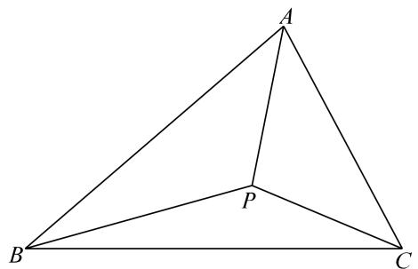

【问题处理】如图1，将△ACP绕着点C顺时针旋转60度得到 $\triangle A ' C P ^ { \ast }$ ，则 $\triangle A C P \cong \triangle A ^ { \prime } C P ^ { \prime }$ ， $C P { = } C P ^ { \ast }$ ， $\cdot$ ，又∵ $\_$ ，∴△PCP’是等边三角形，∴ $P P ^ { \ast } { = } P C$ ， $\therefore P A + P B + P C = P ^ { \prime } A ^ { \prime } + P B + P P ^ { \prime }$ ，

如图2，当且仅当点B、P、 $\cdot$ 、A’共线时， $P A + P B + P C$ 最小，最小值为A’B，此时 $\angle B P C = \angle A P C = \angle A P B =$ 120°

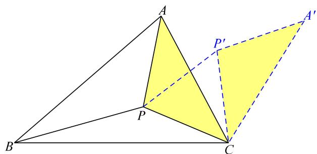  
图1

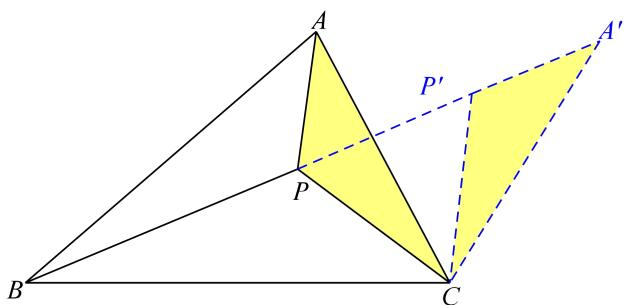  
图2

【问题归纳】如费马点就是到三角形的三个顶点的距离之和最小的点．费马点结论：

$\textcircled{1}$ 对于一个各角不超过 $\cdot$ 的三角形，费马点是对各边的张角都是 $\cdot$ 的点，所以三角形的费马点也叫三角形的等角中心；

$\cdot$ 对于有一个角超过 $\cdot$ 的三角形，费马点就是这个内角的顶点

【如何作费马点】如图3，连接AA’，我们发现△ACA’为等边三角形，点P在A’B上，同理，我们可以得到等边 $\triangle B A B ^ { \prime }$ ，点 $P$ 也在CB’上，因此，我们可以以 ABC三角形任意两边为边向外构造等边三角形，相应连线的交点即为费马点。（最大角小于 $1 2 0 ^ { \circ }$ 时）

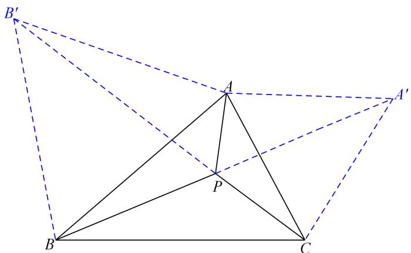  
图3

【例 1】如图，在△ABC 中， $\angle A C B { = } 9 0 ^ { \circ }$ °， $A B { = } A C { = } 1$ ， $P$ 是△ABC 内一点，求 $P A { + } P B { + } P C$ 的最小值．

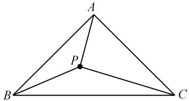

【答案】 6 22

【分析】如图，以 $A C$ 为边构造等边 $\triangle A C D$ ，连接 BD， $B D$ 的长即为 $\_$ 的最小值．至于点 $P$ 的位资料整理【淘宝店铺：向阳百分百】

置？这不重要！

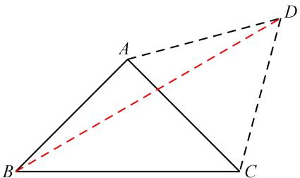

如何求 BD？考虑到 $\triangle$ ABC 和△ACD 都是特殊的三角形，过点 D 作 DH⊥BA 交 BA 的延长线于 H 点，根据勾股定理， $B D ^ { 2 } = B H ^ { 2 } + D H ^ { 2 }$ 即可得出结果

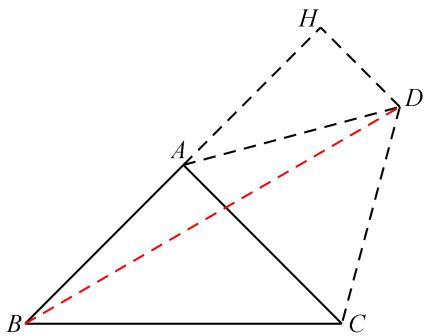

【练习1】如图，已知矩形 $A B C D$ ， $A B { = } 4$ ， $B C { = } 6$ ，点 $M$ 为矩形内一点，点 $E$ 为 $B C$ 边上任意一点，则 $M A { + } M D { + } M E$ 的最小值为

【分析】依然构造 $6 0 ^ { \circ }$ °旋转，将三条折线段转化为一条直线段分别以 $\cdot$ 、 $A M$ 为边构造等边 $\triangle A D F$ 、等边△AMG，连接 $F G$ ，

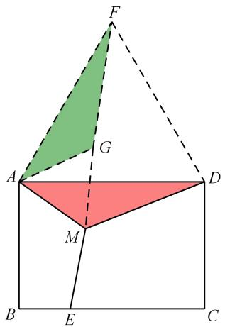

易证 $\triangle A M D \cong \triangle A G F$ ，∴ $M D { = } G F$ ∴ $\cdot M E + M A + M D = M E + E G + G F$ 资料整理【淘宝店铺：向阳百分百】

过 $F$ 作 $F H \bot B C$ 交 $B C$ 于 $H$ 点，线段 $F H$ 的长即为所求的最小值

# 【加权费马点】

如果所求最值中三条线段的系数有不为1的情况，我们把这类问题归为加权费马点问题，解决方法类似，也是通过旋转进行线段转化，只不过要根据系数的情况选择不同的旋转或放缩方法。

# 【类型一 单系数类】

当只有一条线段带有不为 1 的系数时，相对较为简单，一般有两种处理手段，一种是旋转特殊角度： $\sqrt { 2 }$ 对应旋转 $9 0 ^ { \circ }$ ， $\sqrt { 3 }$ 对应旋转 $1 2 0 ^ { \circ }$ 另一种是旋转放缩，对应三角形三边之比

【例3】在等边三角形ABC中，边长为4， $P$ 为三角形ABC内部一点，求 $A P + B P + { \sqrt { 2 } } P C$ 的最小值【简析】本题有 2 种解题策略，旋转特殊角和旋转放缩【策略一：旋转特殊角】如图 1， $\cdot$ 绕点 $C$ 逆时针旋转 $9 0 ^ { \circ }$ ，易知 $P ^ { \prime } P { = } \sqrt { 2 } \ P C$ ， $A ^ { \prime } B$ 即为所求方法一：如图 2， $\cdot$ ， $\cdot$ ， $P ^ { \star }$ ， $A ^ { \prime }$ ’共线时取最小，此时 $-$ ，易知 $\cdot$ ，$-$

  
原图

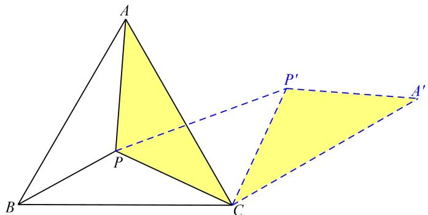  
图1

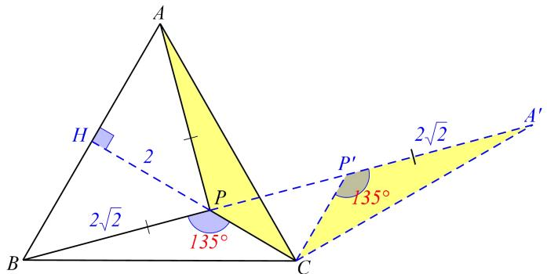  
图2

方法二：作 $\cdot$ 于 $\cdot$ ，易知 $\angle A ^ { \prime } C H = 3 0 ^ { \circ }$ ，∴ $A H = 2$ ， $-$ ，由勾股可得 $\cdot$ $\cdot$

  
图3

【策略二：旋转放缩】可按如下方法去旋转放缩（方法不唯一）  
如图 4，将三角形 BPC 绕点 $B$ 旋转 $\cdot$ °，再扩大为原来的 $\sqrt { 2 }$ 倍，得到△BP'C'  
则 $A P + B P + \sqrt { 2 } P C = A P + P P ^ { \prime } + P ^ { \prime } C \ge A C ^ { \prime }$   
补充：也可以按图 5 方式旋转

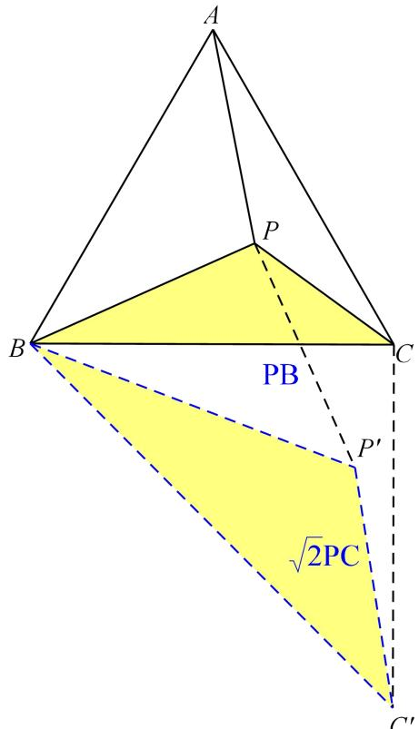  
图4

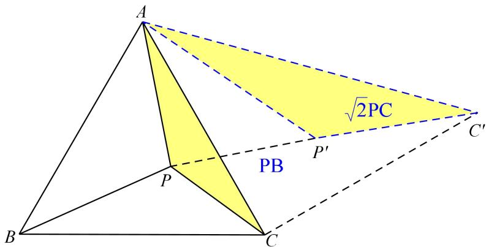  
原5

【练习2】在Rt△ABC中， $A C { = } 3$ ， $B C { = } 2 \sqrt { 3 }$ ， $P$ 为三角形ABC内部一点，求 $A P + B P + { \sqrt { 3 } } P C$ 的最小值【策略一：旋转特殊角】如图 1， $\triangle A P C$ 绕点 $C$ 逆时针旋转 $1 2 0 ^ { \circ }$ ，则有 $\cdot$ ，$A P + B P + P C = A P ^ { \prime } + B P + P P ^ { \prime } \leq A ^ { \prime } B = 2 { \sqrt { 7 } }$

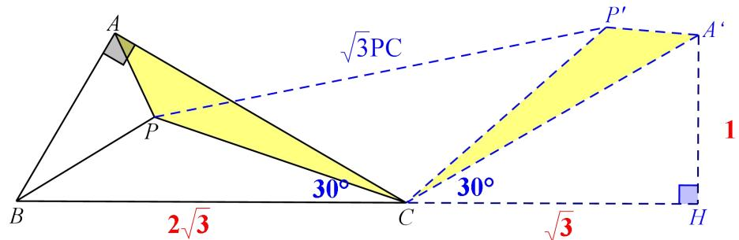  
图1

【策略二：旋转放缩】如图 2， $\triangle A P C$ 绕点 $A$ 逆时针旋转 $\cdot$ ，再扩大为原来的 $\sqrt { 3 }$ 倍，则 $A P + B P + \sqrt { 3 } P C = P P ^ { \prime } + B P + P ^ { \prime } C ^ { \prime } \geq B C ^ { \prime }$ ，计算略

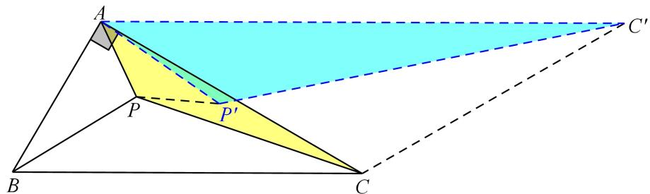  
图2

# 【类型二 多系数类】

其实当三条线段的三个系数满足勾股数的关系时，都是符合加权费马点的条件的。

以不同的点为旋转中心，旋转不同的三角形得到的系数是不同的，对于给定的系数，我们该如何选取旋转中心呢？我们总结了以下方法：

1. 将最小系数提到括号外；

2.中间大小的系数确定放缩比例；

3.最大系数确定旋转中 $\aleph$ （例如最大系数在 PA前面，就以 A 为旋转中 $\aleph$ ），旋转系数不为 1 的两条线段所在的三角形。

【例 3】如图，在△ABC 中， $\angle A C B = 6 0 ^ { \circ }$ ， $B C = 3$ ， $A C = 4$ ，在△ABC 内部有一点 P，连接PA，PB，PC ，则（1） ${ \frac { 1 } { 2 } } P A + { \frac { \sqrt { 3 } } { 2 } } P B + P C$ 的最小值为 _；（2） ${ \frac { \sqrt { 3 } } { 2 } } P A + { \frac { 1 } { 2 } } P B + P C$ 的最小值为

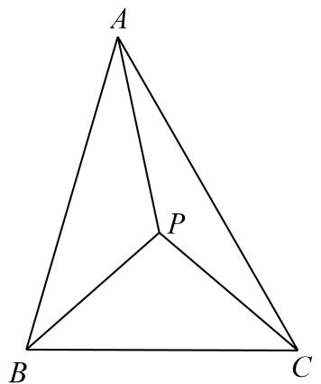

【简答】（1）将最小系数 $\frac { 1 } { 2 }$ 提到括号外，得到 $\frac { 1 } { 2 } ( P A + \sqrt { 3 } P B + 2 P C )$

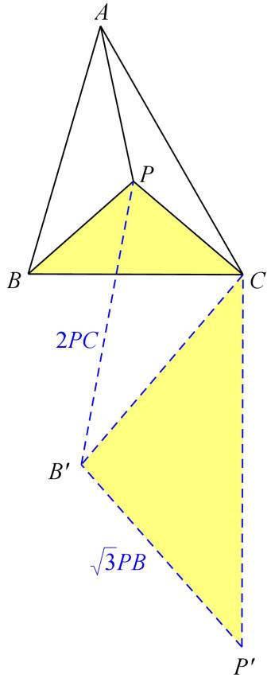  
图1

中间大小系数为 $\sqrt { 3 }$ ，故放大倍数为 $\sqrt { 3 }$ 倍，最大系数在 PC 前面，故以点 C 为旋转中心，旋转 $\triangle$ PBC如图 1，将 $\cdot$ PBC 绕点 C 逆时针旋转 $9 0 ^ { \circ }$ ，并放大为 $\sqrt { 3 }$ 倍， $B ^ { \prime } P ^ { \prime } = \sqrt { 3 } B P$ ， $P P ^ { \prime } { = } 2 P C$ ${ \frac { 1 } { 2 } } { \Bigl ( } P A + { \sqrt { 3 } } P B + 2 P C { \Bigr ) } = { \frac { 1 } { 2 } } { \bigl ( } P A + P P ^ { \prime } + P ^ { \prime } B ^ { \prime } { \bigr ) } \geq { \frac { 1 } { 2 } } A B ^ { \prime } = { \frac { \sqrt { 7 9 } } { 2 } } .$

（2）将最小系数 $\frac { 1 } { 2 }$ 提到括号外，得到 $\frac { 1 } { 2 } ( \sqrt { 3 } P A + P B + 2 P C )$ ，

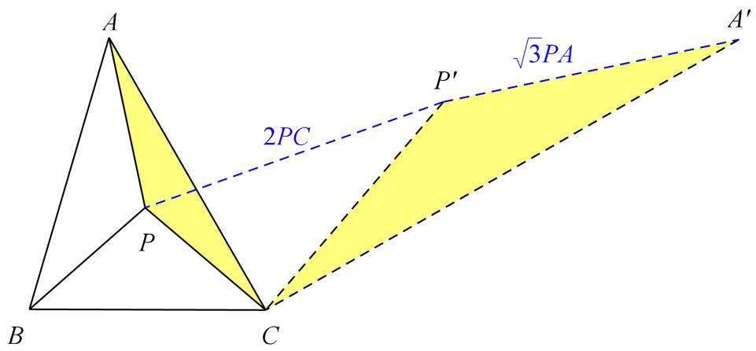  
图2

如图 2，将 $\triangle$ APB 绕点 C 逆时针旋转 $\cdot$ °，并放大为 $\sqrt { 3 }$ 倍， $A ^ { \prime } P ^ { \prime } { = } \sqrt { 3 } A P$ ， $P P ^ { \prime } { = } 2 P C$

$$
\frac { 1 } { 2 } ( \sqrt { 3 } P A + P B + 2 P C ) = \frac { 1 } { 2 } \big ( A ^ { \prime } P ^ { \prime } + B P + P P ^ { \prime } \big ) \geq \frac { 1 } { 2 } A ^ { \prime } B = \sqrt { 9 3 }
$$

【练习3】如图，在△ABC中， $A C B = 6 0 ^ { \circ } , B C = 3 \sqrt { 3 } , A C = 6$ ，在 $\triangle A B C$ 内部有一点 $P$ ，连接 $P A$ ，PB，PC ，则 $2 P A + P B + { \sqrt { 5 } } P C$ 的最小值为

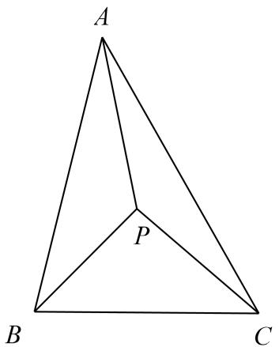

【简答】将 $\cdot$ PAC绕点 C 顺时针旋转 $9 0 ^ { \circ }$ 并放大 2 倍，得到 P AC△   ， $P ^ { ' } A ^ { ' } = 2 P A$ ， $P P ^ { ' } = \sqrt { 5 } P C$

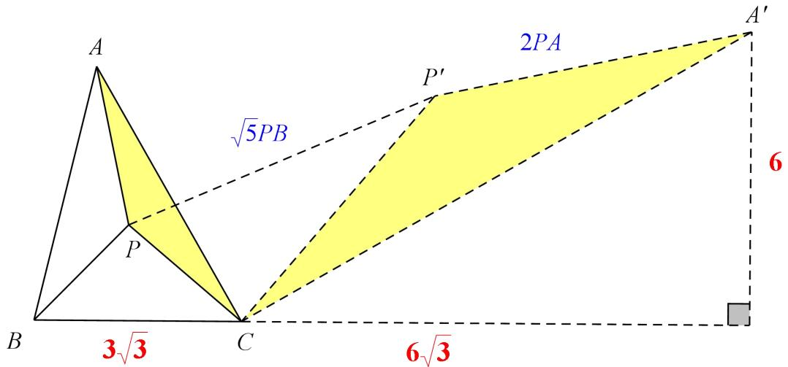

$\therefore 2 P A + P B + \sqrt { 5 } P C = A ^ { \prime } P ^ { \prime } + P ^ { \prime } P + P B \geq A ^ { \prime } B , \because A C = 2 A C = 1 2 , \angle A ^ { \prime } C B = 9 .$ $\angle A ^ { \prime } C B = 9 0 ^ { \circ } + 6 0 ^ { \circ } = 1 5 0 ^ { \circ }$ ，  
1 36 6 3AH A C CH A C     ，   ， $B H = 9 \sqrt { 3 }$ ， 由 勾 股 定 理 可 得 $\overset { \prime } { A B } = 3 \sqrt { 3 1 }$ ，2 2  
$2 P A + P B + { \sqrt { 5 } } P C$ 的最小值为 $3 \sqrt { 3 1 }$ .

# 03 核心·题型

# 题型一 普通费马点最值问题

1．（2021 滨州）如图，在△ABC 中， $\angle A C B = 9 0 ^ { \circ }$ ， $\angle B A C = 3 0 ^ { \circ }$ ， $A B = 2$ ，点 $P$ 是 $\triangle A B C$ 内一点，则PA＋PB＋PC的最小值为

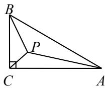

【答案】 $\sqrt { 7 }$

【解析】将 $\cdot$ ABP 绕点 A 顺时针旋转 $6 0 ^ { \circ }$ 到△AB′P′，连接 P′P，B′C

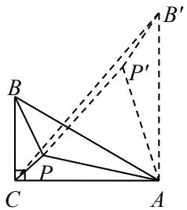

则 $\_$ ， $\cdot$ ， $\angle \mathrm { B A B ^ { \prime } } { = } 6 0 ^ { \circ }$ ， $\cdot$ ， $\angle \mathrm { P A P ^ { \prime } { = } } 6 0 ^ { \circ }$ ，  
∴ $\triangle$ P′PA是等边三角形，∴PA $\cdot$   
∵ $\angle \mathrm { B A C } = 3 0 ^ { \circ }$ ，∴ $\_$ ，  
$\because \angle \mathrm { A C B } = 9 0 ^ { \circ } , \therefore \mathrm { A C } = { \frac { \sqrt { 3 } } { 2 } } { \cal A } { \cal B } = \sqrt { 3 } ,$ ，  
$\therefore \mathrm { B ^ { \prime } C } = \sqrt { A C ^ { 2 } + B ^ { \prime } A ^ { 2 } } = \sqrt { 7 }$ $-$ ，  
$\_$ 的最小值为 $\sqrt { 7 }$

2．问题背景：如图 1，将△ABC 绕点 $A$ 逆时针旋转 $6 0 ^ { \circ }$ 得到△ADE， $D E$ 与 $B C$ 交于点 $P$ ，可推出结论：PA$+ P C = P E .$

问题解决：如图 2，在 $\triangle M N G$ 中， $M N { = } 6$ ， $\angle M = 7 5 ^ { \circ }$ ， $\scriptstyle M G = 4 { \sqrt { 2 } }$ ，点 $o$ 是△MNG 内一点，则点 $o$ 到 $\triangle$ MNG 三个顶点的距离和的最小值是

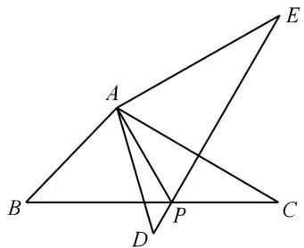  
图1

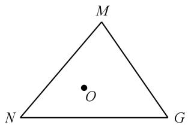  
图2

【解析】过点 $\cdot$ 作 $H Q \perp N M$ 交 NM 延长线于 $\cdot$ 点，根据 $\_$ ， $\_$ ，可得 $\cdot$ ，∴△MHQ 是等腰直角三角形， ∴MQ＝HQ＝4， ∴NH＝ 2 2NQ  HQ  100 16  2 29

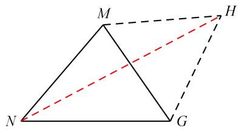

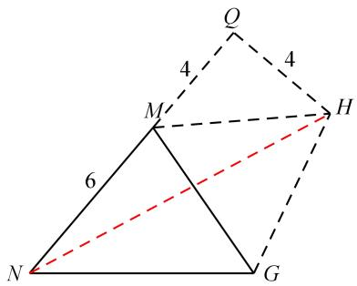

4．如图，在△ABC 中， $\angle C A B { = } 9 0 ^ { \circ }$ ， $A B { = } A C { = } 2$ ， $P$ 是 $\triangle A B C$ 内一点，求 $P A + P B + P C$ 的最小值【解析】如图 1，以 AD 为边构造等边 $\cdot$ ，连接 BD，BD的长即为 $P A + P B + P C$ 的最小值考虑到 $\triangle A B C$ 和 $\cdot$ 都是特殊的三角形，所以构造特殊直角三角形如图 2，过点 D 作 DH⊥BA 交 BA 的延长线于 H 点，根据勾股定理， 2 2 2BD  BH  DH = 6+ 2

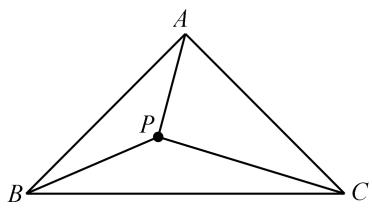

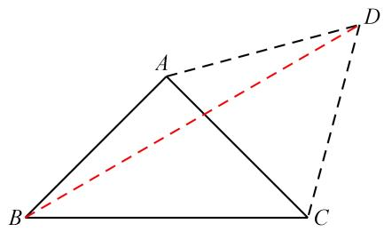  
图 1

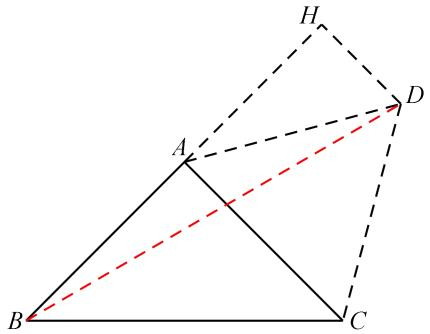  
图 2

5．已知，在△ABC 中， $\angle A C B = 3 0 ^ { \circ }$ ， $A C { = } 4$ ， $A B { = } \sqrt { 7 } ( C B > C A )$ 点 $P$ 是 $\triangle A B C$ 内一动点，则 $P A + P B + P C$ 的最小值为

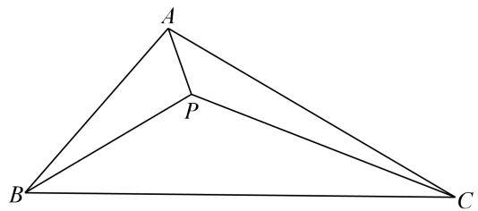  
原图

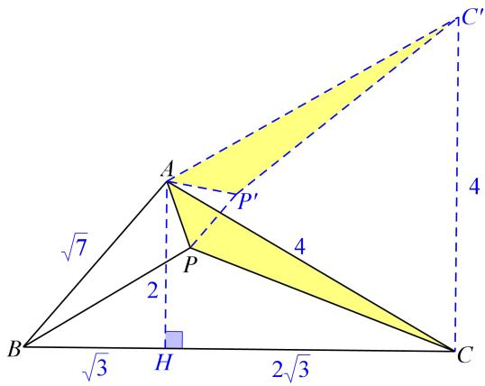  
图 1

【解析】如图1，将 $\triangle A P C$ 逆时针旋转 $\cdot$ ，得 $\triangle A P ^ { \circ } C$ ， $B C '$ 即 $P A + P B + P C$ 最小值，考虑到$\cdot$ ，∴ $\angle B C C = 9 0 ^ { \circ }$ ，作 $A H \bot B C$ ，可得 $\cdot$ ， $\therefore B C ^ { \ast } = \sqrt { 4 3 }$

6．如图，已知矩形 ABCD， $A B { = } 4$ ， $B C { = } 6$ ，点 $M$ 为矩形内一点，点 $E$ 为 $B C$ 边上任意一点，则 $M A + M D +$ 资料整理【淘宝店铺：向阳百分百】

ME 的最小值为

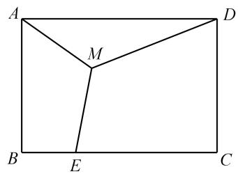

【解析】如图 1，依然构造 $\cdot$ 旋转，将三条折线段转化为一条直线段．分别以 AD、AM 为边构造等边△ADF、等边 $\cdot$ ，连接 FG，易证 $\triangle A M D { \cong } \triangle A G F ,$ ，∴ $\cdot M D { = } G F \cdot \dot { \cdot } M E + M A + M D { = } M E + E G + G F$ 如图 2，过 F 作 FH⊥BC 交 BC 于 H 点，线段 FH 的长即为所求的最小值．FG＝4＋ 2 3

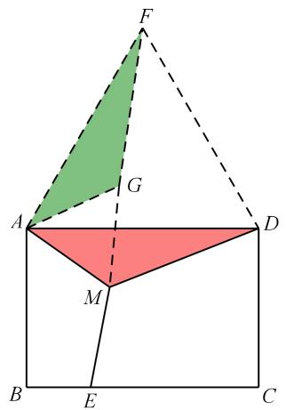

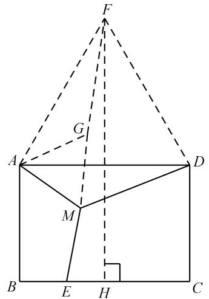

7． A、B、C、 $D$ 四个城市恰好为一个边长为 $2 a$ 正方形的四个顶点，要建立一个公路系统使得每两个城市之间都有公路相通，并使整个公路系统的总长度（ $\langle A P + B P + P Q + D Q + C Q \rangle$ ）最小，则应当如何修建？最小长度是多少？

【解析】如图 1， $\cdot$ ABP 绕点 $B$ 逆时针旋转 $6 0 ^ { \circ }$ ，得到 $\triangle A ^ { \prime } P ^ { \prime } B$ ；同样，将△DCQ 绕点 $\cdot$ 顺时针旋转 $6 0 ^ { \circ }$ ，得到 $\triangle D ' C Q '$ ，连结 $A ^ { \prime } A$ 、 $D ' D$ ，则 $\cdot$ 、 $\cdot$ 均为等边三角形，连结 $P P ^ { \ast }$ 、 $\cdot$ ，则 $\triangle B P P ^ { \prime }$ ，△QCQ’均为等边三角形， $-$

资料整理【淘宝店铺：向阳百分百】

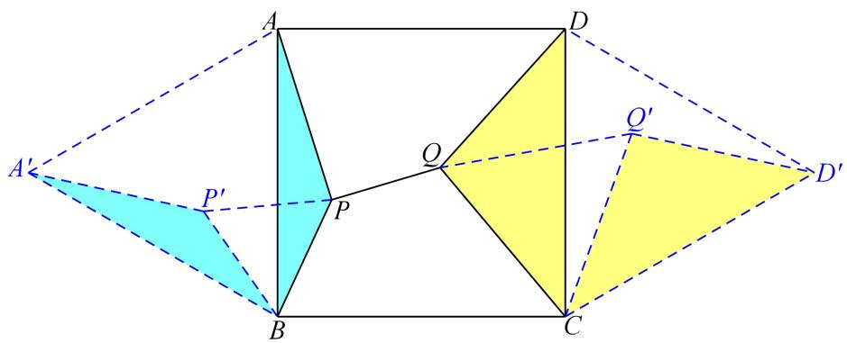  
图1

如图 2，当点 $A ^ { \prime }$ ， $\cdot$ ， $P$ ， $Q$ ， $\cdot$ ， $\cdot$ 共线时，整个公路系统的总长取到最小值，为线段 $\cdot$ 的长，此时点 $\cdot$ ，$Q$ 在 $\cdot$ ’上，最小值为 $\left( 2 + 2 { \sqrt { 3 } } \right) \mathrm { a }$

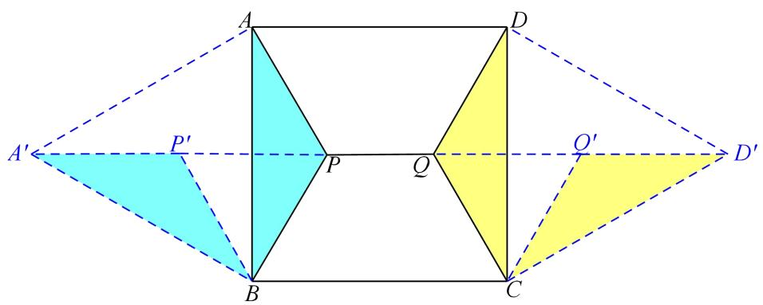  
图2

# 2023·随州中考真题

8．1643 年，法国数学家费马曾提出一个著名的几何问题：给定不在同一条直线上的三个点 A，B，C，求平面上到这三个点的距离之和最小的点的位置，意大利数学家和物理学家托里拆利给出了分析和证明，该点也被称为“费马点”或“托里拆利点”，该问题也被称为“将军巡营”问题．

(1)下面是该问题的一种常见的解决方法，请补充以下推理过程：（其中 $\textcircled{1}$ 处从“直角”和“等边”中选择填空，  
$\textcircled{2}$ 处从“两点之间线段最短”和“三角形两边之和大于第三边”中选择填空， $\textcircled{3}$ 处填写角度数， $\textcircled{4}$ 处填写该三角  
形的某个顶点）  
当 ${ \triangle A B C }$ 的三个内角均小于 $1 2 0 ^ { \circ }$ 时，  
如图 1，将 $\triangle A P C$ 绕，点 $C$ 顺时针旋转 $6 0 ^ { \circ }$ 得到 $\triangle A ^ { \prime } P ^ { \prime } C$ ，连接 $P P ^ { \prime }$ ，

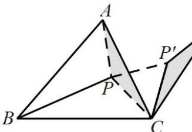  
图1

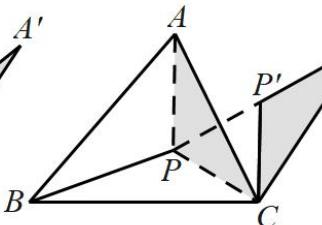  
图2

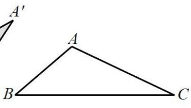  
图3

由 $P C = P ^ { \prime } C$ ， $\angle P C P ^ { \prime } = 6 0 ^ { \circ }$ ，可知 $\triangle P C P ^ { \prime }$ 为 $\textcircled{1}$ 三角形，故 $P P ^ { \prime } = P C$ ，又 $P ^ { \prime } A ^ { \prime } = P A$ ，故

$$
P A + P B + P C = P A ^ { \prime } + P B + P P ^ { \prime } \geq A ^ { \prime } B ,
$$

由 $\textcircled{2}$ 可知，当 $B$ ， $P$ ， $P ^ { \prime }$ ， $A$ 在同一条直线上时， $P A + P B + P C$ 取最小值，如图 2，最小值为 $A ^ { \prime } B$ ，此时的 $P$ 点为该三角形的“费马点”，且有 $\angle A P C = \angle B P C = \angle A P B = 3 0 ^ { \circ }$ ；

已知当 ${ \triangle A B C }$ 有一个内角大于或等于 $1 2 0 ^ { \circ }$ 时，“费马点”为该三角形的某个顶点．如图 3，若 $\angle B A C \ge 1 2 0 ^ { \circ }$ ，则该三角形的“费马点”为 $\textcircled{4}$ 点

(2)如图 4，在 ${ \triangle A B C }$ 中，三个内角均小于 $1 2 0 ^ { \circ }$ ，且 $A C = 3$ ， $B C = 4 ,$ ， $\angle A C B = 3 0 ^ { \circ }$ ，已知点 $P$ 为 ${ \triangle A B C }$ 的“费马点”，求 $P A + P B + P C$ 的值；

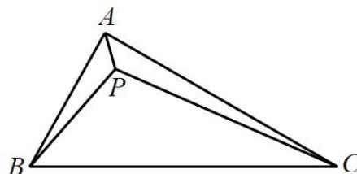  
图4

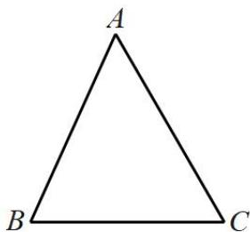  
图5

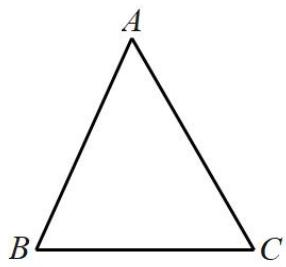

(3)如图 5，设村庄 $A$ ， $B$ ， $C$ 的连线构成一个三角形，且已知 $A C = 4 \mathrm { k m }$ ， $B C = 2 \sqrt { 3 } \mathrm { k m }$ ， $\angle A C B = 6 0 ^ { \circ }$ ．现欲建一中转站 $P$ 沿直线向 $A$ ， $B$ ， $C$ 三个村庄铺设电缆，已知由中转站 $P$ 到村庄 $A$ ， $B$ ， $C$ 的铺设成本分别为 $a$ 元/ $\mathrm { k m }$ ， $a$ 元/ $\mathrm { k m }$ ， $\sqrt { 2 } a$ 元/ $\mathrm { k m }$ ，选取合适的 $P$ 的位置，可以使总的铺设成本最低为 _元．（结果用含 $a$ 的式子表示）

【答案】 $\cdot$ 等边； $\textcircled{2}$ 两点之间线段最短； $\textcircled{3}$ $1 2 0 ^ { \circ }$ ； $\textcircled{4} \textcircled{4}$ (2) 5  
(3) $2 \sqrt { 1 3 } a$

【解题思路】（1）根据旋转的性质和两点之间线段最短进行推理分析即可得出结论；

（2）根据（1）的方法将 $\triangle A P C$ 绕，点 $C$ 顺时针旋转 $6 0 ^ { \circ }$ 得到 $\triangle A ^ { \prime } P ^ { \prime } C$ ，即可得出可知当 $\cdot$ ， $P$ ， $P ^ { \prime }$ ， $\cdot$ 在同一 条 直 线 上 时 ， $P A + P B + P C$ 取 最 小 值 ， 最 小 值 为 $A ^ { \prime } B$ ， 在 根 据 $\angle A C B = 3 0 ^ { \circ }$ 可 证 明$\angle A C A ^ { \prime } = \angle A ^ { \prime } C P ^ { \prime } + \angle B C P + \angle P C P ^ { \prime } = 9 0 ^ { \circ }$ ，由勾股定理求 $A ^ { \prime } B$ 即可，

（3）由总的铺设成本 $= a ( P A + P B + { \sqrt { 2 } } P C )$ ，通过将△APC绕，点 $\cdot$ 顺时针旋转 $9 0 ^ { \circ }$ 得到 $\triangle A ^ { \prime } P ^ { \prime } C$ ，得到等腰直角 $\triangle P P ^ { \prime } C$ ，得到 $\sqrt { 2 } P C = P P ^ { \prime }$ ，即可得出当 $B$ ， $P$ ， $P ^ { \prime }$ ， $\cdot$ 在同一条直线上时， $P ^ { \prime } A ^ { \prime } + P B + P P ^ { \prime }$ 取最小值，即 $P A + P B + \sqrt { 2 } P C$ 取最小值为 $A ^ { \prime } B$ ，然后根据已知和旋转性质求出 $A ^ { \prime } B$ 即可．

【详解】（1）解：∵ $P C = P ^ { \prime } C$ ， $\angle P C P ^ { \prime } = 6 0 ^ { \circ }$ ，  
∴ $\triangle P C P ^ { \prime }$ 为等边三角形；  
∴ $. P P ^ { \prime } { = } P C$ ， $\angle P ^ { \prime } P C = \angle P P ^ { \prime } C = 6 0 ^ { \circ }$ ，  
又 $P ^ { \prime } A ^ { \prime } = P A$ ，故 $P A + P B + P C = P A ^ { \prime } + P B + P P ^ { \prime } \geq A ^ { \prime } B \ ,$ ，  
由两点之间线段最短可知，当 $B$ ， $P$ ， $P ^ { \prime }$ ， $A$ 在同一条直线上时， $P A + P B + P C$ 取最小值，最小值为 $A ^ { \prime } B$ ，此时的 $\cdot$ 点为该三角形的“费马点”，  
$\therefore \angle B P C + \angle P ^ { \prime } P C = 1 8 0 ^ { \circ } , \angle A ^ { \prime } P ^ { \prime } C + \angle P P ^ { \prime } C = 1 8 0 ^ { \circ } ,$ ，  
∴ $\angle B P C = 1 2 0 ^ { \circ }$ ， $\angle A ^ { \prime } P ^ { \prime } C = 1 2 0 ^ { \circ }$ ，  
又∵ $\triangle A P C \cong \triangle A ^ { \prime } P ^ { \prime } C$ ，  
$\angle A P C = \angle A P ^ { \prime } C = 1 2 0 ^ { \circ }$ ，  
$\angle A P B = 3 6 0 ^ { \circ } - \angle A P C - \angle B P C = 1 2 0 ^ { \circ }$   
$\therefore \angle A P C = \angle B P C = \angle A P B = 1 2 0 ^ { \circ }$ ；  
∵ $\cdot \angle B A C \geq 1 2 0 ^ { \circ }$ ，  
$B C > A C B C > A B$ ，  
$\therefore B C + A B > A C + A B , B C + A C > A B + A C ,$   
∴三个顶点中，顶点 $\cdot$ 到另外两个顶点的距离和最小  
又∵已知当 ${ \triangle A B C }$ 有一个内角大于或等于 $1 2 0 ^ { \circ }$ 时，“费马点”为该三角形的某个顶点∴该三角形的“费马点”为点 A，  
故答案为： $\textcircled{1}$ 等边； $\textcircled{2}$ 两点之间线段最短； $\textcircled { 3 } 1 2 0 ^ { \circ } : \textcircled { 4 } \mathbf { A }$   
（2）将 $\triangle A P C$ 绕，点 $C$ 顺时针旋转 $6 0 ^ { \circ }$ 得到 $\triangle A ^ { \prime } P ^ { \prime } C$ ，连接 $P P ^ { \prime }$ ，  
由（1）可知当 $B$ ， $\cdot$ ， $P ^ { \prime }$ ， $A$ 在同一条直线上时， $P A + P B + P C$ 取最小值，最小值为 $A ^ { \prime } B$ ，  
∵ $\angle A C P = \angle A ^ { \prime } C P ^ { \prime }$ ，$\angle A C P + \angle B C P = \angle A ^ { \prime } C P ^ { \prime } + \angle B C P = \angle A C B = 3 0 ^ { \circ }$   
又∵ $\angle P C P ^ { \prime } = 6 0 ^ { \circ }$   
∴ $\angle B C A ^ { \prime } = \angle A ^ { \prime } C P ^ { \prime } + \angle B C P + \angle P C P ^ { \prime } = 9 0 ^ { \circ }$ ，  
由旋转性质可知： $A C = A ^ { \prime } C = 3$ ，  
$A ^ { \prime } B = \sqrt { B C ^ { 2 } + A ^ { \prime } C ^ { 2 } } = \sqrt { 4 ^ { 2 } + 3 ^ { 2 } } = 5$ ，$P A + P B + P C$ 最小值为5，  
（3）∵总的铺设成本 $\mathbf { \nabla } = P A \bullet a + P B \bullet a + P C \bullet { \sqrt { 2 } } a = a ( P A + P B + { \sqrt { 2 } } P C )$   
∴当 $P A + P B + \sqrt { 2 } P C$ 最小时，总的铺设成本最低，  
将 $\triangle A P C$ 绕，点 $\cdot$ 顺时针旋转 $9 0 ^ { \circ }$ 得到 $\triangle A ^ { \prime } P ^ { \prime } C$ ，连接 $P P ^ { \prime }$ ， $A ^ { \prime } B$   
由旋转性质可知： $P ^ { \prime } C = P C$ ， $\angle P C P ^ { \prime } = \angle A C A ^ { \prime } = 9 0 ^ { \circ } , P ^ { \prime } A ^ { \prime } = P A , A ^ { \prime } C = A C = 4 \mathrm { k m } ,$ ，  
资料整理【淘宝店铺：向阳百分百】

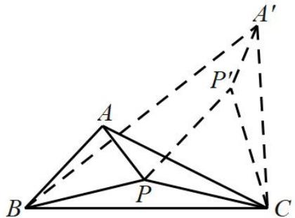

$\begin{array} { l } { { P P ^ { \prime } = \sqrt 2 P C } } \\ { { P A + P B + \sqrt 2 P C = P A + P B + P P } } \end{array}$ 当 $\cdot$ ， $P$ ， $P ^ { \prime }$ ， $A$ 在同一条直线上时， $P ^ { \prime } A ^ { \prime } + P B + P P ^ { \prime }$ 取最小值，即 $P A + P B + \sqrt { 2 } P C$ 取最小值为 $A ^ { \prime } B$ ，

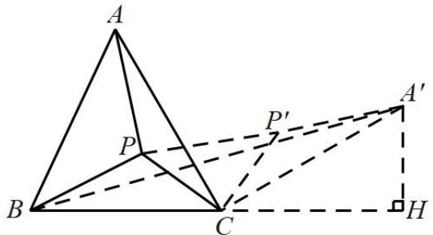

过点 $A ^ { \prime }$ 作 $A ^ { \prime } H \bot B C$ ，垂足为 $H$ ，$\cdot \angle A C B = 6 0 ^ { \circ } \ , \angle A C A ^ { \prime } = 9 0 ^ { \circ }$ ，  
$: \angle A ^ { \prime } C H = 3 0 ^ { \circ }$ ，  
∴ $. A ^ { \prime } H = \frac { 1 } { 2 } A ^ { \prime } C = 2 { \bf k m } _ { \perp }$ ，  
$H C = { \sqrt { A C ^ { 2 } - A H ^ { 2 } } } = { \sqrt { 4 ^ { 2 } - 2 ^ { 2 } } } = 2 { \sqrt { 3 } } ( { \mathrm { k m } } )$ ，  
$\therefore B H = B C + C H = 2 \sqrt { 3 } + 2 \sqrt { 3 } = 4 \sqrt { 3 } ( \mathrm { k m } ) ,$   
$A ^ { \prime } B = \sqrt { A H ^ { 2 } + B H ^ { 2 } } = \sqrt { ( 4 \sqrt { 3 } ) ^ { 2 } + 2 ^ { 2 } } = 2 \sqrt { 1 3 } ( \mathrm { k m } )$   
$P A + P B + \sqrt { 2 } P C$ 的最小值为 $2 \sqrt { 1 3 } \mathrm { k m }$   
总的铺设成本 $= P A \bullet a + P B \bullet a + P C \bullet \sqrt { 2 } a = a ( P A + P B + \sqrt { 2 } P C ) = 2 \sqrt { 1 3 } a$ （元）

# 广东省江门市一模

9．如图，在 ${ \triangle A B C }$ 中， $\angle B A C = 9 0 ^ { \circ } , A B = 5 , A C = 2 { \sqrt { 3 } }$ ，点 $P$ 为 ${ \triangle A B C }$ 内部一点，则点 $P$ 到 ${ \triangle A B C }$ 三个顶点之和的最小值是

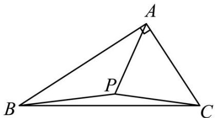

【答案】 $\sqrt { 6 7 }$

【分析】将 $\triangle A B P$ 绕着点 $A$ 顺时针旋转 $6 0 ^ { \circ }$ ，得到 $\triangle A E H$ ，连接 $E P$ ， $C H$ ，过点 $\cdot$ 作 $C N \bot A H$ ，交 $H A$ 的延长线于 $\cdot$ ，由旋转的性质可得 $\angle B A P = \angle H A E$ ， $A E = A P$ ， $A H = A B = 5$ ， $\angle B A H = 6 0 ^ { \circ }$ ， $B P = H E$ ，易得$\triangle A E P$ 是等边三角形，可得 $A E = A P = E P$ ，进而得到 $A P + B P + P C = E P + E H + P C$ ，当点 H、E、 $P$ 、 $C$ 共线时， $A P + B P + P C$ 有最小值 $H C$ ，再求出 $C N$ 和 $H N$ 的长度，由勾股定理可求解

【详解】解：将 $\triangle A B P$ 绕着点 $A$ 顺时针旋转 $6 0 ^ { \circ }$ ，得到 $\triangle A E H$ ，连接 $E P$ ， $C H$ ，过点 $C$ 作 $C N \perp A H$ ，交 $H A$ 的延长线于 $N$ ，

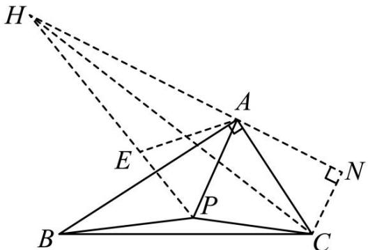

∴BAP  HAE ， $A E = A P$ ， $A H = A B = 5$ ， $\angle B A H = 6 0 ^ { \circ }$ ， $B P = H E$ $\therefore \angle H A B = \angle E A P = 6 0 ^ { \circ }$ ，  
∴ $\triangle A E P$ 是等边三角形，$\mathbf { \partial } \cdot { \mathcal { A } } E = { \mathcal { A } } P = E P$ ，  
$\therefore A P + B P + P C = E P + E H + P C$   
∴当点 $\cdot$ 、E、 $P$ 、 $C$ 共线时， $A P + B P + P C$ 有最小值 $H C$   
∵ $' \angle N A C = 1 8 0 ^ { \circ } - \angle B A H - \angle B A C = 1 8 0 ^ { \circ } - 6 0 ^ { \circ } - 9 0 ^ { \circ } = 3 0 ^ { \circ } , A C = 2 \sqrt { 3 } ,$ ，$\therefore C N = \frac { 1 } { 2 } A C = \sqrt { 3 }$ ，  
$\therefore A N = { \sqrt { A C ^ { 2 } - C N ^ { 2 } } } = { \sqrt { \left( 2 { \sqrt { 3 } } \right) ^ { 2 } - \left( { \sqrt { 3 } } \right) ^ { 2 } } } = 3 ,$ ，$H N = A H + A N = 5 + 3 = 8$   
在 $\mathrm { R t } \triangle C N H$ 中， $C H = { \sqrt { H N ^ { 2 } + C N ^ { 2 } } } = { \sqrt { 8 ^ { 2 } + \left( { \sqrt { 3 } } \right) ^ { 2 } } } = { \sqrt { 6 7 } }$ ，  
即点 $\cdot$ 到 ${ \triangle A B C }$ 三个顶点之和的最小值是 $\sqrt { 6 7 }$

# 武汉中考

10．问题背景：如图 1，将△ABC 绕点 $A$ 逆时针旋转 $6 0 ^ { \circ }$ 得到 $\triangle A D E$ ， $D E$ 与 $B C$ 交于点 $P$ ，可推出结论：$P A { + } P C { = } P E$

问题解决：如图 2，在△MNG 中， $M N { = } 6$ ， $\angle M = 7 5 ^ { \circ }$ °， $\scriptstyle { M G = 4 { \sqrt { 2 } } }$ ，点 $O$ 是△MNG 内一点，则点 $O$ 到△MNG三个顶点的距离和的最小值是

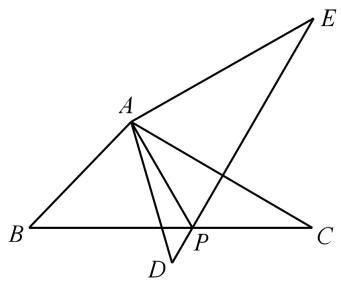  
图1

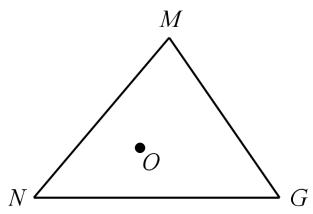  
图2

【答案】 $2 \sqrt { 2 9 }$

【分析】本题的问题背景实际上是提示了解题思路，构造 $\cdot$ 的旋转，当然如果已经了解了费马点问题，直接来解决就好了！

资料整理【淘宝店铺：向阳百分百】

如图，以 MG 为边作等边△MGH，连接 NH，则 NH 的值即为所求的点 O 到△MNG 三个顶点的距离和的最小值．（此处不再证明）

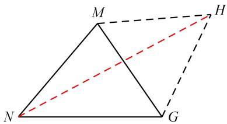

过点 H 作 $_ \mathrm { H Q \perp N M }$ 交 NM 延长线于 Q 点，  
根据 $\angle N M G { = } 7 5 ^ { \circ }$ ， $\angle { \mathrm { G M H } } { = } 6 0 ^ { \circ }$ ，可得 $\cdot$   
∴ ${ \bigtriangleup } \mathrm { M H Q }$ 是等腰直角三角形，  
$\therefore \mathrm { M Q } = \mathrm { H Q } = 4$ ，  
$\therefore \mathrm { N H } = \sqrt { N Q ^ { 2 } + H Q ^ { 2 } } = \sqrt { 1 0 0 + 1 6 } = 2 \sqrt { 2 9 } \ .$

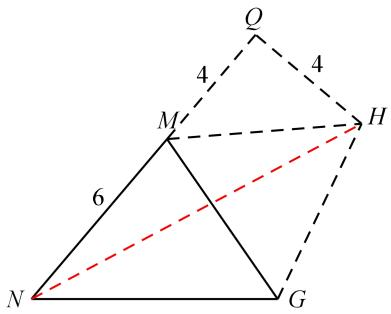

# 2023·四川宜宾·中考真题

11．如图，抛物线 $y = a x ^ { 2 } + b x + c$ 经过点 $A \left( - 3 , 0 \right)$ ，顶点为 $M \left( - 1 , m \right)$ ，且抛物线与 $y$ 轴的交点 $B$ 在 $\left( 0 , - 2 \right)$ 和$\left( 0 , - 3 \right)$ 之间（不含端点），则下列结论：

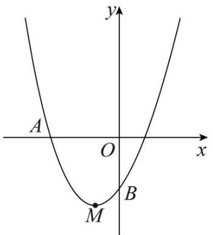

$\textcircled{1}$ 当 $- 3 \leq x \leq 1$ 时， $y \le 0$ ；  
$\textcircled{2}$ 当 $\triangle A B M$ 的面积为 $\frac { 3 { \sqrt { 3 } } } { 2 }$ 时， $a = { \frac { \sqrt { 3 } } { 2 } }$   
$\textcircled{3}$ 当 $\triangle A B M$ 为直角三角形时，在 $\triangle A O B$ 内存在唯一点 $P$ ，使得 $P A + P O + P B$ 的值最小，最小值的平方为资料整理【淘宝店铺：向阳百分百】

$1 8 + 9 \sqrt { 3 }$ ．

其中正确的结论是 ．（填写所有正确结论的序号）

【答案】 $\textcircled{1} \textcircled{2}$

【解题思路】根据条件可求抛物线与 $X$ 轴的另一交点坐标，结合图象即可判断 $\cdot$ ；设抛物线为$y = a ( x - 1 ) ( x + 3 )$ ，即可求出点 $\cdot$ 的坐标，根据割补法求面积，判断 $\textcircled{2}$ ；分三种情况讨论，然后以点 $o$ 为旋转中心，将 $\triangle A O B$ 顺时针旋转 $6 0 ^ { \circ }$ 至 $\triangle A O A$ ，连接 $A A ^ { ' } , P P ^ { ' } , A ^ { ' } B$ ，得到 $P A + P O + P B = P ^ { \prime } A + P P ^ { \prime } + P B \geq A ^ { \prime } B$ ，判断 $\textcircled{3}$

【详解】解：∵抛物线 $y = a x ^ { 2 } + b x + c$ 经过点 $A { \big ( } { - } 3 , 0 { \big ) }$ ，顶点为 $M \left( - 1 , m \right)$ ，∴对称轴 $x { = } - 1$ ，  
∴抛物线与 $\chi$ 轴的另一交点坐标为 $\left( 1 , 0 \right)$ ，  
由图象可得：当 $- 3 \leq x \leq 1$ 时， $y \le 0$ ；  
∴ $\textcircled{1}$ 正确，符合题意；  
∵抛物线与 $\chi$ 轴的另一交点坐标为 $\left( 1 , 0 \right)$ ，  
∴设抛物线为 $y = a ( x - 1 ) ( x + 3 )$ ，  
当 $x { = } - 1$ 时， $y = - 4 a$ ，当 $\scriptstyle x = 0$ 时， $y = - 3 a$ ，  
$\begin{array} { l l } { { M \left( - 1 , - 4 a \right) } } & { { { B \left( 0 , - 3 a \right) } } } \end{array}$ ，  
如图所示，过点 $M$ 作平行于 $y$ 轴的直线 $l$ ，过点 $\cdot$ 作 $A E \bot l$ ，过点 $\cdot$ 作 $B N \perp l$   
$S _ { \ v \ / { A B M } } = S _ { \ v \ / { A M F } } + S _ { \ v B M F } = \frac { 1 } { 2 } \times M F \times \it { A O } = \frac { 3 \sqrt { 3 } } { 2 }$   
设直线 $A B$ 的解析式为 $y = k ^ { ' } x + b ^ { ' }$ ，  
把 $B \mathopen { } \mathclose \bgroup \left( 0 , - 3 a \aftergroup \egroup \right)$ ， $A \left( - 3 , 0 \right)$ 代入得： $\left\{ \begin{array} { c } { { - 3 k ^ { \prime } + b ^ { \prime } = 0 } } \\ { { b ^ { \prime } = - 3 a } } \end{array} \right. ,$   
解得： $\left\{ \begin{array} { l } { { k ^ { \prime } = - a } } \\ { { b ^ { \prime } = - 3 a } } \end{array} \right. ,$ ，  
∴直线 $A B$ 的解析式为 $y = - a x - 3 a$   
当 $x { = } - 1$ 是， $y = - 2 a$ ，  
$F \left( - 1 , - 2 a \right)$ ，  
∴ $M F = 2 a$ ，${ \frac { 1 } { 2 } } \times 2 a \times 3 = { \frac { 3 { \sqrt { 3 } } } { 2 } }$   
解得： $a = { \frac { \sqrt { 3 } } { 2 } }$ 故 $\cdot$ 正确；  
∵点 $B$ 是抛物线与 $\cdot$ 轴的交点，  
∴当 $x = 0$ 时， $y = - 3 a$ ，  
$\therefore B ( 0 , - 3 a )$ ，  
$\therefore \triangle A B M$ 为直角三角形，  
当 $\angle A M B = 9 0 ^ { \circ }$ 时，  
$\therefore A M ^ { 2 } + B M ^ { 2 } = A B ^ { 2 }$ ，  
∵ $A M = { \sqrt { \left( - 2 \right) ^ { 2 } + \left( - 4 a \right) ^ { 2 } } } = { \sqrt { 4 + 1 6 a ^ { 2 } } } \ , B M = { \sqrt { \left( - 1 \right) ^ { 2 } + \left( - a \right) ^ { 2 } } } = { \sqrt { 1 + a ^ { 2 } } } \ , A B = { \sqrt { \left( - 3 \right) ^ { 2 } + \left( - 3 a \right) ^ { 2 } } } = { \sqrt { 1 + a ^ { 2 } } } \ .$ 29  9a ，$4 + 1 6 a ^ { 2 } + 1 + a ^ { 2 } = 9 + 9 a ^ { 2 }$ ，整理得： $8 a ^ { 2 } = 4$ ，  
解得： $a = { \frac { \sqrt { 2 } } { 2 } }$ 或 $- { \frac { \sqrt { 2 } } { 2 } }$ （舍）  
$B \left( 0 , - { \frac { 3 { \sqrt { 2 } } } { 2 } } \right)$   
当 $\angle A B M = 9 0 ^ { \circ }$ 时，  
$A B ^ { 2 } + B M ^ { 2 } = A M ^ { 2 }$ ，  
$4 + 1 6 a ^ { 2 } = 9 + 9 a ^ { 2 } + 1 + a ^ { 2 }$ ，整理得： $6 a ^ { 2 } = 6$   
解得： $a = 1$ 或 $^ { - 1 }$ （舍）  
$B ( 0 , - 3 )$ ，  
当 $\angle M A B = 9 0 ^ { \circ }$ 时，  
$\therefore A B ^ { 2 } + A M ^ { 2 } = B M ^ { 2 } ,$ ，  
$4 + 1 6 a ^ { 2 } + 1 + a ^ { 2 } = 9 + 9 a ^ { 2 }$ ，无解；  
以点 $\cdot$ 为旋转中心，将 $\triangle A O B$ 顺时针旋转 $6 0 ^ { \circ }$ 至 $\triangle A O A$ ，连接 $A A ^ { ' }$ ， $P P$ ， ' AB ，如图所示，

则 $\triangle A O A$ ， ${ \triangle } P O P$ 为等边三角形，$\therefore O P = P P ^ { \prime } , A P = A P ^ { \prime }$ ，$P A + P O + P B = P ^ { \prime } A ^ { \prime } + P P ^ { \prime } + P B \geq A ^ { \prime } B$ ，∵ $\triangle A O A$ 为等边三角形， $A \left( - 3 , 0 \right)$

$\begin{array} { l } { { \displaystyle x _ { _ { \perp } } = - \frac { 3 } { 2 } ~ y _ { _ { \perp } } = \frac { 3 } { 2 } \times \tan 6 0 ^ { \circ } = \frac { 3 \sqrt { 3 } } { 2 } } } \\ { { \displaystyle A _ { \perp } ^ { \perp \perp } \frac { 3 } { 2 } \frac { 3 \sqrt { 3 } } { 2 } } } \end{array}$   
当 $B \Bigg ( 0 , - \frac { 3 \sqrt { 2 } } { 2 } \Bigg )$ 时，  
$A ^ { ' } B ^ { 2 } = { \frac { \sqrt [ { 4 } ] { 2 } } { 1 6 } } ^ { 2 } + { \frac { \sqrt [ { 4 } ] { 6 } } { 1 6 } } ^ { 2 } + { \frac { 3 \sqrt { 2 } } { 2 } } ^ { 2 } = { \frac { 5 4 } { 4 } } + { \frac { 9 \sqrt { 6 } } { 2 } }$   
当 $B ( 0 , - 3 )$ 时，  
$A ^ { ' } B ^ { 2 } = \frac { 1 1 \Xi } { 1 2 } ^ { 2 } + \frac { 1 1 \Xi } { 1 2 } + 3 = 1 8 + 9 \sqrt { 3 }$ ，此时不符合题意，故 $\textcircled{3}$ 错误；故答案为： $\textcircled{1} \textcircled{2}$

# 一题四问，从特殊到一般

12．背景资料：在已知 ${ \triangle A B C }$ 所在平面上求一点 $P$ ，使它到三角形的三个顶点的距离之和最小.这个问题是法国数学家费马 1640年前后向意大利物理学家托里拆利提出的，所求的点被人们称为“费马点”．如图1，当 ${ \triangle A B C }$ 三个内角均小于 $1 2 0 ^ { \circ }$ 时，费马点 $P$ 在 ${ \triangle A B C }$ 内部，当 $\angle A P B = \angle A P C = \angle C P B = 1 2 0 ^ { \circ }$ 时，则$P A + P B + P C$ 取得最小值

  
图1

  
图2

  
图3

  
图4

  
图5

(1)如图 2，等边 ${ \triangle A B C }$ 内有一点 $P$ ，若点 $P$ 到顶点 $A$ 、 $B$ 、 $C$ 的距离分别为 3，4，5，求 $\angle A P B$ 的度数，为了解决本题，我们可以将 $\triangle A B P$ 绕顶点 $A$ 旋转到 $\triangle A C P ^ { \prime }$ 处，此时 $\triangle A C P ^ { \prime } \cong \triangle A B P$ 这样就可以利用旋转变换，将三条线段 $P A$ 、 $P B$ 、 $P C$ 转化到一个三角形中，从而求出 $\angle A P B =$ ；

知识生成：怎样找三个内角均小于 $1 2 0 ^ { \circ }$ 的三角形的费马点呢？为此我们只要以三角形一边在外侧作等边三角形并连接等边三角形的顶点与 ${ \triangle A B C }$ 的另一顶点，则连线通过三角形内部的费马点．请同学们探索以下问题．

(2)如图 3， ${ \triangle A B C }$ 三个内角均小于 $1 2 0 ^ { \circ }$ ，在 ${ \triangle A B C }$ 外侧作等边三角形 $\triangle A B B ^ { \prime }$ ，连接 $C B ^ { \prime }$ ，求证： $C B ^ { \prime }$ 过 ${ \triangle A B C }$ 的费马点．

(3)如图 4，在 $R T { \triangle } A B C$ 中， $\angle C = 9 0 ^ { \circ }$ ， $A C = 1$ ， $\angle A B C = 3 0 ^ { \circ }$ ，点 $P$ 为 ${ \triangle A B C }$ 的费马点，连接 $A P \ 、 B P \ 、 C P$ ，求 $P A + P B + P C$ 的值

(4)如图 5，在正方形ABCD中，点 $E$ 为内部任意一点，连接 $A E$ 、 $B E$ 、 $C E$ ，且边长 $A B = 2$ ；求 $A E + B E + C E$ 的最小值

【答案】 $\cdot$ ；(2)见详解； $( 3 ) \sqrt { 7 } \ ; \ ( 4 ) \sqrt { 6 } + \sqrt { 2 }$ ．

【分析】（1）根据旋转性质得出 $\triangle A B P \triangle A C P ^ { \prime }$ ，得出 $\angle B A P { = } \angle C A P ^ { \prime }$ ， $-$ ， $\_$ ，根据 $\cdot$ 为等边三角形，得出 $\angle B A C { = } 6 0 { ^ \circ }$ ，可证 $\cdot$ 为等边三角形， $\cdot$ ， $\angle A P ^ { \prime } P { = } 6 0 ^ { \circ }$ ，根据勾股定理逆定理 $P P ^ { \prime 2 } + P ^ { \prime } C ^ { 2 } = 3 ^ { 2 } + 4 ^ { 2 } = 2 5 = P C ^ { 2 }$ ，得出 $\triangle P P ^ { \prime } C$ 是直角三角形， $\_$ ，可求 $-$ $-$ 即可；

（2）将 $\triangle A P B$ 逆时针旋转 $6 0 ^ { \circ }$ ，得到 $\triangle A B ^ { \prime } P ^ { \prime }$ ，连结 $\cdot$ ，根据 $-$ ， $\cdot$ ， $\cdot$ ， $A B { = } A B ^ { \prime }$ ，根 据 $\angle \ P A P ^ { \prime } = \ \angle \ B A B ^ { \prime } { = } 6 0 ^ { \circ }$ ， $\triangle A P P ^ { \prime }$ 和 $\triangle A B B ^ { \prime }$ 均 为 等 边 三 角 形 ， 得 出 $\cdot$ ， 根 据$P A + P B + P C = P P ^ { \prime } + P ^ { \prime } B ^ { \prime } + P C$ ，根据两点之间线段最短得出点 $\cdot$ ，点 $\cdot$ ，点 $\cdot$ ，点 $B$ ′四点共线时， $P A + P B + P C$ $\cdot$ ，点 $P$ 在 $C B ^ { \prime }$ 上即可；

（3）将 $\cdot$ 逆时针旋转 $6 0 ^ { \circ }$ ，得到 $\cdot$ ，连结 $B B ^ { \prime }$ ， $\cdot$ ，得出 $-$ ，可证△APP′和 $\triangle A B B ^ { \prime }$ 均为等边三角形，得出 $\cdot$ ， $\cdot$ ， $\angle A B B ^ { \prime } { = } 6 0 ^ { \circ }$ ，根据 $P A + P B + P C = P P ^ { \prime } + P ^ { \prime } B ^ { \prime } + P C$ ，可得点 $C$ ，点 $\cdot$ ，点 $P ^ { \prime }$ ，点 $B ^ { \prime } \boxdot$ 点共线时， $P A + P B + P C$ ，利用 $\cdot$ 直角三角形性质得出 $A B { = } 2 A C { = } 2$ ，根据勾股定理 ${ \sqrt { A B ^ { 2 } - A C ^ { 2 } } } = { \sqrt { 2 ^ { 2 } - 1 ^ { 2 } } } = { \sqrt { 3 } }$ ，可求 $B B ^ { \prime } { = } A B { = } 2$ ，根据 $\angle C B B ^ { \prime } = \angle A B C + \angle A B \mathrm { B ^ { \prime } } = 3 0 ^ { \circ } + 6 0 ^ { \circ } = 9 0 ^ { \circ }$ ，在$\cdot$ ′中， $B ^ { \prime } C { = } \sqrt { B C ^ { 2 } + B B ^ { \prime } { } ^ { 2 } } = \sqrt { \left( \sqrt { 3 } \right) ^ { 2 } + 2 ^ { 2 } } { = } \sqrt { 7 }$ 即可；

（4）将 $\triangle B C E$ 逆时针旋转 $6 0 ^ { \circ }$ 得到 $\cdot$ ，连结 $\cdot$ ， $B B ^ { \prime }$ ，过点 $\cdot$ ′作 $B ^ { \prime } F \bot A B$ ，交 $\cdot$ 延长线于 $F$ ，得出$\triangle B C E \cong \triangle C E ^ { \prime } B ^ { \prime }$ ， $B E { = } B ^ { \prime } E ^ { \prime }$ ， $C E { = } C E ^ { \prime }$ ， $\cdot$ ， 可证 $\cdot$ 与 $\triangle B C B$ ′均为等边三角形，得出 $E E { ' } { = } E C$ ， $\cdot$ ，$\angle B ^ { \prime } B C = 6 0 ^ { \circ }$ ， $A E + B E + C E = A E + E E ^ { \prime } + E ^ { \prime } B ^ { \prime }$ ， 得 出 点 $C$ ， 点 $E$ ， 点 $E ^ { \prime }$ ， 点 $\cdot$ 四 点 共 线 时 ，$A E + B E + C E = A E + E E ^ { \prime } + E ^ { \prime } B ^ { \prime }$ ，根据四边形 $A B C D$ 为正方形，得出 $\cdot$ ， $\angle A B C { = } 9 0 ^ { \circ }$ ，可求 $\cdot$ $F B B ^ { \prime } = 1 8 0 ^ { \circ } - \angle A B C - \angle C B B ^ { \prime } = 1 8 0 ^ { \circ } - 9 0 ^ { \circ } - 6 0 ^ { \circ } = 3 0 ^ { \circ }$ ，根据 $3 0 ^ { \circ }$ 直角三角形性质得出 ${ \frac { 1 } { 2 } } B B ^ { \prime } = { \frac { 1 } { 2 } } \times 2 = 1$ ，勾股定理BF ${ \sqrt { B B ^ { \prime 2 } - B ^ { \prime } F ^ { 2 } } } = { \sqrt { 2 ^ { 2 } - 1 ^ { 2 } } } = { \sqrt { 3 } }$ 可 求 $-$ $\sqrt { 3 }$ ， 再 根 据 勾 股 定 理${ \sqrt { A F ^ { 2 } + B ^ { \prime } F ^ { 2 } } } = { \sqrt { \left( 2 + { \sqrt { 3 } } \right) ^ { 2 } + 1 ^ { 2 } } } = { \sqrt { 6 } } + { \sqrt { 2 } }$ 即可．

【详解】（1）解：连结 $P P ^ { \prime }$ ，  
$\triangle A B P \quad \triangle A C P ^ { \prime }$   
∴ $-$ ， $-$ ， $\cdot$ ，BP=CP′=4，∵ $\cdot$ 为等边三角形，  
$\_$   
$\therefore \angle P A P ^ { \prime } = \angle P A C + \angle C A P ^ { \prime } = \angle P A C + \angle B A P = 6 0 ^ { \circ } ,$ ，  
∴ $\cdot$ 为等边三角形，  
, $\therefore P P ^ { \prime } { = } A P { = } 3$ ， $\_$ ，  
在 $\cdot$ 中， $P C { = } 5$ ，  
$P P ^ { \prime 2 } + P ^ { \prime } C ^ { 2 } = 3 ^ { 2 } + 4 ^ { 2 } = 2 5 = P C ^ { 2 }$   
∴ $\cdot$ 是直角三角形， $\angle P P ^ { \prime } C { = } 9 0 ^ { \circ }$ ，  
$\therefore \angle A P ^ { \prime } C = \angle A P P + \angle P P C = 6 0 ^ { \circ } + 9 0 ^ { \circ } = 1 5 0 ^ { \circ } ,$ ，  
$\cdot \angle A P B { = } \angle A P ^ { \prime } C { = } 1 5 0 ^ { \circ }$ ，  
故答案为 $1 5 0 ^ { \circ }$ ；  
（2）证明：将 $\cdot$ 逆时针旋转 $6 0 ^ { \circ }$ ，得到 $\cdot$ ，连结 $P P ^ { \prime }$ ，$-$ ，  
∴ $. A P { = } A P ^ { \prime }$ ， $P B { = } P B ^ { \prime }$ ， $\cdot$ ，  
∵ $\cdot \angle P A P ^ { \prime } { = } \angle B A B ^ { \prime } { = } 6 0 ^ { \circ } .$ ，  
∴ $\triangle A P P$ ′和 $\triangle A B B$ ′均为等边三角形，$. P P { = } A P$ ，  
$P A + P B + P C = P P ^ { \prime } + P ^ { \prime } B ^ { \prime } + P C$ ，  
∴点 $\cdot$ ，点 $P$ ，点 $P ^ { \prime }$ ，点 $\cdot$ ′四点共线时， $P A + P B + P C _ { i \bar { \imath } \cdot \jmath } = C B ^ { \prime }$ ，  
∴点 $\cdot$ 在 $\cdot$ 上，  
∴ $C B ^ { \prime }$ 过 ${ \triangle A B C }$ 的费马点  
（3）解：将 $\cdot$ 逆时针旋转 $\cdot$ ，得到 $\cdot$ ，连结 $\cdot$ ， $\cdot$ ，  
∴△APB≌△AP′B′，  
∴ $. A P { ^ { \prime } = } A P$ ， $\cdot$ ，

资料整理【淘宝店铺：向阳百分百】

∵ $\cdot \angle P A P ^ { \prime } = \angle B A B ^ { \prime } = 6 0 ^ { \circ } ,$ ，  
∴ $\cdot$ ′和 $\cdot$ ′均为等边三角形，  
$-$ ，$P A + P B + P C = P P ^ { \prime } + P ^ { \prime } B ^ { \prime } + P C$   
∴点 $\cdot$ ，点 $P$ ，点 $\cdot$ ，点 $B$ ′四点共线时， $P A + P B + P C _ { i \bar { \imath } \cdot \jmath } = C B ^ { \prime }$ ，  
∵ $\angle C = 9 0 ^ { \circ } \quad A C = 1 \quad \angle A B C = 3 0 ^ { \circ }$ $\scriptstyle \cdot { \mathcal { A } } B = 2 A C = 2$ ，根据勾股定理 ${ \sqrt { A B ^ { 2 } - A C ^ { 2 } } } = { \sqrt { 2 ^ { 2 } - 1 ^ { 2 } } } = { \sqrt { 3 } }$ $\cdot B B ^ { \prime } { = } A B { = } 2$ ，$\cdot \angle C B B ^ { \prime } = \angle A B C + \angle A B \mathrm { B } ^ { \prime } = 3 0 ^ { \circ } + 6 0 ^ { \circ } = 9 0 ^ { \circ }$ ，  
∴在 Rt△CBB′中， ${ \sqrt { B C ^ { 2 } + B B ^ { \prime 2 } } } = { \sqrt { \left( { \sqrt { 3 } } \right) ^ { 2 } + 2 ^ { 2 } } } = { \sqrt { 7 } }$   
$P A + P B + P C \sqrt { 7 }$ ；  
（4）解：将 $\cdot$ 逆时针旋转 $\cdot$ 得到 $\cdot$ ，连结 $E E ^ { \prime }$ ， $B B ^ { \prime }$ ，过点 $B$ ′作 $\cdot$   
∴ $\cdot \triangle B C E \cong \triangle C E ^ { \prime } B ^ { \prime }$ ，$\cdot$ ， $\cdot$ ， $\cdot$   
∵ $-$ ，  
∴ $\triangle E C E ^ { \prime }$ 与 $\cdot$ ′均为等边三角形，  
$\therefore E E ^ { \prime } = E C , B B ^ { \prime } = B C , \angle B ^ { \prime } B C = 6 0 ^ { \circ }$ ，  
$A E + B E + C E = A E + E E ^ { \prime } + E ^ { \prime } B ^ { \prime }$ ，  
∴点 $\cdot$ ，点 $\cdot$ ，点 $E ^ { \prime }$ ，点 $\cdot$ ′四点共线时， $A E + B E + C E = A E + E E ^ { \prime } + E ^ { \prime } B ^ { \prime }$ ，  
∵四边形 $A B C D$ 为正方形，  
$\_$ ， $\angle A B C { = } 9 0 ^ { \circ }$ ，  
∴∠FBB $\cdot$ -∠ABC-∠CBB′=180°-90°-60°=30°，  
∵ $\cdot$ ，  
${ \frac { 1 } { 2 } } B B ^ { \prime } = { \frac { 1 } { 2 } } \times 2 = 1 \qquad { \sqrt { B B ^ { \prime } { } ^ { 2 } - B ^ { \prime } { \cal F } ^ { 2 } } } = \sqrt { 2 ^ { 2 } - 1 ^ { 2 } } = \sqrt { 3 }$   
$\therefore A F = A B + B F = 2 + \sqrt { 3 }$ ，

$\therefore A B ^ { \prime } = { \sqrt { A F ^ { 2 } + B ^ { \prime } F ^ { 2 } } } = { \sqrt { \left( 2 + { \sqrt { 3 } } \right) ^ { 2 } + 1 ^ { 2 } } } = { \sqrt { 6 } } + { \sqrt { 2 } } \ ,$ $\therefore A E + B E + C E = A B ^ { \prime } = { \sqrt { 6 } } + { \sqrt { 2 } } .$ ．

# 题型二 加权费马点·单系数型

# 2023·武汉·慧泉中学校月考

13．如图，Rt△ABC 中， $\angle C A B = 3 0 ^ { \circ }$ ， $B C = \frac { 3 } { 2 }$ ，点 $P$ 为 ${ \triangle A B C }$ 内一点，连接 $P A , P B , P C$ ，则 $P C + P B + { \sqrt { 3 } } P A$ 的最小值为

【答案】 ${ \frac { 3 } { 2 } } { \sqrt { 1 3 } }$

【分析】作辅助线如详解图，根据等腰三角形的性质和勾股定理可求得 $D P = { \sqrt { 3 } } A P$ ，于是所求$P C + P B + { \sqrt { 3 } } P A$ 的最小值转化为求 $D E + P D + P B$ 的最小值，根据两点之间线段最短可得 $D E + P D + P B$ 的最小值即为线段 $E B$ 的长，然后求出 $E B$ 的长即可解决问题.

【详解】解：将 $\triangle A C P$ 绕点 $\cdot$ 逆时针旋转 $1 2 0 ^ { \circ }$ ，得到 $\triangle A E D$ ，连接 $D P , E B$ ，过点 $E$ 作 $E F \perp B A$ 交 $B A$ 的延长线于点 $\cdot$ ，过点 $\cdot$ 作 $A M \perp D P$ 于点 $M$ ，如图，

则 $A D = A P , D E = C P , \angle D A P = 1 2 0 ^ { \circ } , \angle E A C = 1 2 0 ^ { \circ }$ ，  
$A M \perp D P$ ，$D M = P M , \angle A D M = \angle A P M = 3 0 ^ { \circ }$ ，$A M = { \frac { 1 } { 2 } } A P$   
$\therefore P M = \sqrt { A P ^ { 2 } - A M ^ { 2 } } = \frac { \sqrt { 3 } } { 2 } A P ,$   
$D P = 2 P M = { \sqrt { 3 } } A P$ ，  
$\therefore P C + P B + { \sqrt { 3 } } P A = D E + P D + P B \geq E B$ ，即 $P C + P B + { \sqrt { 3 } } P A$ 的最小值为 $E B$ 的长（当点 $\cdot$ 、 $\cdot$ 、 $P$ 、 $B$ 四点  
共线时取最小值），  
∵ $\mathbf { R t } \triangle A B C$ 中， $\angle C A B = 3 0 ^ { \circ } , B C = \frac { 3 } { 2 } ,$   
$A B = 2 B C = 3 , A C = \sqrt { 3 ^ { 2 } - \left( \frac { 3 } { 2 } \right) ^ { 2 } } = \frac { 3 } { 2 } \sqrt { 3 }$ ，$\therefore A E = A C = { \frac { 3 { \sqrt { 3 } } } { 2 } } ,$ $\angle C A B = 3 0 ^ { \circ } , \angle E A C = 1 2 0 ^ { \circ }$   
∴ $\angle E A F = 3 0 ^ { \circ }$ ，  
则在直角三角形 $A E F$ 中， $E F = \frac { 1 } { 2 } A E = \frac { 3 \sqrt { 3 } } { 4 } , A F = \sqrt { 3 } E F = \frac { 9 } { 4 } ,$   
$\therefore B F = 3 + { \frac { 9 } { 4 } } = { \frac { 2 1 } { 4 } } \ , \therefore B E = { \sqrt { B F ^ { 2 } + E F ^ { 2 } } } = { \sqrt { \left( { \frac { 3 { \sqrt { 3 } } } { 4 } } \right) ^ { 2 } + \left( { \frac { 2 1 } { 4 } } \right) ^ { 2 } } } = { \frac { 3 } { 2 } } { \sqrt { 1 3 } }$   
西安市铁一中二模

14．已知，如图在 ${ \triangle A B C }$ 中， $\angle A C B = 3 0 ^ { \circ }$ ， $B C = 5$ ， $A C = 6$ ，在 ${ \triangle A B C }$ 内部有一点 $D$ ，连接 DA、DB、DC．则$D A + D B + \sqrt { 2 } D C$ 的最小值是

【答案】 $\sqrt { 9 1 }$

【分析】把 $\triangle C D B$ 顺时针旋转 $\cdot$ 到 $\triangle C D ^ { \prime } B ^ { \prime }$ ，过 $\cdot$ 作 $B ^ { \prime } E \bot A C$ ，交 $\cdot$ 延长于 $E$ ，则 $C D { = } C D ^ { \prime }$ ， $\cdot$ ，$\angle C D D ^ { \prime } = \angle C D ^ { \prime } D = 4 5 ^ { \circ }$ ，可求 $\begin{array} { r l } { \sqrt { 2 } C D } \end{array}$ ，在 $R t \triangle C E B ^ { \prime }$ 中，可求 $C E = \frac { 5 } { 2 }$ ， $\frac { 1 7 } { 2 }$ ， $\frac { 5 { \sqrt { 3 } } } { 2 }$ 当点 $A$ 、 $\cdot$ 、$\cdot$ 、 $\cdot$ 四点在一直线时， $A B ^ { \prime }$ 最短，可求 $\sqrt { 2 } C D \sqrt { 9 1 }$

【详解】解：把 $\triangle C D B$ 顺时针旋转 $9 0 ^ { \circ }$ 到 $\triangle C D ^ { \prime } B ^ { \prime }$ ，过 $B ^ { \prime }$ 作 $B ^ { \prime } E \bot A C$ ，交 $A C$ 延长于 $\cdot$ ，  
则 $\cdot$ ， $B D { = } B ^ { \prime } D ^ { \prime }$ ， $-$ ，  
$\sqrt { 2 } C D$ ，  
∵ $\cdot \angle A C B = 3 0 ^ { \circ } , \angle B ^ { \prime } C B = 9 0 ^ { \circ } ,$ ，  
∴ $\angle B ^ { \prime } C E = 1 8 0 ^ { \circ } - \angle A C B - \angle B C B ^ { \prime } = 1 8 0 ^ { \circ } - 3 0 ^ { \circ } - 9 0 ^ { \circ } = 6 0 ^ { \circ }$   
在 $\cdot$ 中，  
$\times \frac { 1 } { 2 } = \frac { 5 } { 2 }$   
$\therefore A E = A C + C E = 6 + \frac { 5 } { 2 } = \frac { 1 7 } { 2 } ,$   
$\times \frac { \sqrt { 3 } } { 2 } = \frac { 5 \sqrt { 3 } } { 2 }$   
当点 $A$ 、 $\cdot$ 、 $D ^ { \prime }$ 、 $\cdot$ 四点在一直线时， $\cdot$ 最短，  
$\therefore A B ^ { \prime } _ { \mathit { \Pi } } = { \sqrt { A E ^ { 2 } + B ^ { \prime } E ^ { 2 } } } = { \sqrt { \left( { \frac { 1 7 } { 2 } } \right) ^ { 2 } + \left( { \frac { 5 { \sqrt { 3 } } } { 2 } } \right) ^ { 2 } } } = { \frac { \sqrt { 3 6 4 } } { 2 } } = { \sqrt { 9 1 } } ,$ ，  
$A B ^ { \prime } { = } B ^ { \prime } D ^ { \prime } { + } D ^ { \prime } D { + } A D { = } B D { + } \sqrt { 2 } C D { + } A D { = } \sqrt { 9 1 } .$   
故答案为： $\sqrt { 9 1 }$

15．如图，矩形 $A B C D$ 中， $A B = 2$ ， $B C = 3$ ，点 $E$ 是 $A B$ 的中点，点 $F$ 是 $B C$ 边上一动点．将 ABEF 沿着 $E F$ 翻折，使得点 $B$ 落在点 $B ^ { \prime }$ 处，若点 $P$ 是矩形内一动点，连接 $P B ^ { \prime }$ 、 $P C$ 、 $P D$ ，则 $P B ^ { \prime } + \sqrt { 2 } P C + P D$ 的最小值为

资料整理【淘宝店铺：向阳百分百】【答案】 $\sqrt { 2 6 } - 1$

【分析】将 $\triangle C D P$ 绕点 $C$ 顺时针旋转 $9 0 ^ { \circ }$ 得到 $\triangle C D P ^ { \prime }$ ，连接 $P P ^ { \prime }$ ，连接 $E D$ '，由等腰三角形 $C P P ^ { \prime }$ 得出$P P ^ { \prime } = { \sqrt { 2 } } P C$ ，再由折叠得出点 $B ^ { \prime }$ 的轨迹在点 $E$ 为圆心， $E B$ 为半径的圆周上，所以 $E B ^ { \prime } + P B ^ { \prime } + P P ^ { \prime } + P ^ { \prime } D ^ { \prime }$ 的最小值为 $E D ^ { \prime }$ ，即 $P B ^ { \prime } + \sqrt { 2 } P C + P D$ 的最小值为 $E D ^ { \prime } - E B$ '，经计算答出答案即可

【详解】解：将 $\triangle C D P$ 绕点 $C$ 顺时针旋转 $9 0 ^ { \circ }$   
连接 $P P ^ { \prime }$ '，连接 $E D ^ { \prime }$ ，  
则 $B$ ， $C$ ， $D$ '共线， $P D = P ^ { \prime } D ^ { \prime }$ ，$\therefore C D ^ { \prime } = C D = A B = 2$ ，  
$\therefore P P ^ { \prime } = { \sqrt { 2 } } P C$ ，  
 点 $E$ 是 $A B$ 的中点，  
$\therefore E B = { \frac { 1 } { 2 } } A B = { \frac { 1 } { 2 } } \times 2 = 1$ ，  
$\therefore B D ^ { \prime } = B C + C D ^ { \prime } = 3 + 2 = 5$ ，  
$\therefore E D ^ { \prime } = \sqrt { B E ^ { 2 } + D ^ { \prime } B ^ { 2 } }$   
2 2 1  5  
$= \sqrt { 2 6 }$ ，  
由 $\triangle B E F$ 折叠成 $\triangle B ^ { \prime } E F$ ，  
 $. E B = E B ^ { \prime } = E A$ ，  
点 $B$ 在以点 $E$ 为圆 $\cdot$ ， $E B$ 为半径的圆上，  
 $E B ^ { \prime } = 1$ ，  
 两点间线段最短，  
$\begin{array} { r } { \therefore E D ^ { \prime } \leq E B ^ { \prime } + P B ^ { \prime } + P P ^ { \prime } + P ^ { \prime } D ^ { \prime } , } \end{array}$   
即 $E D ^ { \prime } { \leq } E B ^ { \prime } { + } P B ^ { \prime } { + } \sqrt { 2 } P C + P D$   
$\therefore \sqrt { 2 6 } \leq 1 + P B ^ { \prime } + \sqrt { 2 } P C + P D$ ，  
$\therefore P B ^ { \prime } + \sqrt { 2 } P C + P D \geq \sqrt { 2 6 } - 1 ,$ ，  
则 $P B ^ { \prime } + \sqrt { 2 } P C + P D$ 的最小值为 $\sqrt { 2 6 } - 1$   
故答案为： $\sqrt { 2 6 } - 1$

# 题型三 加权费马点·多系数型

16．在边长为4的正△ABC中有一点P，连接PA、PB、 $P C$ ，求（ ${ } - { \frac { 1 } { 2 } } A P + B P + { \frac { \sqrt { 5 } } { 2 } } P C { } )$ ²的最小值

  
原图

【解析】如图 1， $\cdot$ 绕点 $C$ 逆时针旋转 $9 0 ^ { \circ }$ ，取 $P ^ { \ast } C$ ， $A ^ { \prime } C$ 的中点 M，N易知 $\cdot$ ，

  
图1

则 AP＋BP＋ 5 PC＝MN＋BP＋PM≤BN， $B N ^ { 2 } { = } 2 0 + 8 { \sqrt { 3 } }$ 即为所求2 2

17．在等边三角形 ABC 中，边长为 4， $P$ 为三角形 ABC 内部一点，求 $3 A P + 4 B P + 5 ~ P C$ 的最小值

  
原图

【解析】如图 1， $\triangle A P C$ 绕点 $\cdot$ 逆时针旋转 $\cdot$ ，在 $P ^ { \ast } C$ ， $A ^ { \prime } C$ 上取 $M$ ， $N$ ，使 $\cdot$ ， $C N { = } \frac 3 4 C A ^ { , }$ ，易知 ${ } ^ { \circ } \ P M = { \frac { 5 } { 4 } } \ P C , ~ M N = { \frac { 3 } { 4 } } \ P ^ { \prime } A ^ { \prime } = { \frac { 3 } { 4 } } P A , ~ 3 A P + 4 B P + 5 P C = 4 ~ ( M N + B P + P M ) ~ \leqslant B N$

  
图1

# 成都七中育才学校月考

18．在 $\triangle A B C$ 中， $A B = 3$ ， $A C = 4$ ， $\angle B A C$ 的角平分线交 $B C$ 于 $E$ ，过 $C$ 作射线 $A E$ 的垂线，垂足为 $D$ ，连接 $B D$ ，当 $S _ { \triangle A C E } - S _ { \triangle B E D }$ 取大值时，在 $\triangle A C D$ 内部取点 $P$ ，则 $\frac { 3 P C + 4 P D + 5 P A } { 4 }$ 的最小值是

【答案】 $\sqrt { 2 9 }$

【分析】延长 $C D$ 交 $A B$ 于点 $F$ ，过点A作 $B C$ 边上的高 $A H$ ，得出 $\triangle A D F { \cong } \triangle A D C$ ，则 $B F = 1$ ，根据 $A D$ 是资料整理【淘宝店铺：向阳百分百】

$\angle B A C$ $\frac { B E } { E C } = \frac { 3 } { 4 }$ ，设 $S _ { \triangle B D E } = 3 S$ ，则 $S _ { \_ E D C } = 4 S$ ，过点 $D$ 分别 作 $A F , A C$ 的垂线，垂足为 $M , N$ ，得出 $S = \frac { 1 } { 4 2 } S _ { \triangle A B C }$ ， $S _ { \triangle A C E } - S _ { \triangle B E D } = 2 1 S$ ，则当 $S _ { \_ A B C }$ 最大时， $S _ { \triangle A C E } - S _ { \triangle B E D }$ 取得最大值，进而可得当$\angle C A B = 9 0 ^ { \circ }$ 时， ABCS 取得最大值，则 $\angle C A D = 4 5 ^ { \circ }$ ，延长 $B A$ 至 $C ^ { \prime }$ ，使得 $A C ^ { \prime } = { \frac { 3 } { 4 } } A C = 3$ ，作 $P ^ { \prime } A \bot P A$ ，$A P ^ { \prime } { = } \frac { 3 } { 4 } A P$ ，连接 $P ^ { \prime } P , C ^ { \prime } P ^ { \prime }$ ，构造 $\triangle C ^ { \prime } A P ^ { \prime } \sim _ { \triangle } C A P$ ，可得 ${ \frac { 3 P C + 4 P D + 5 P A } { 4 } } = P ^ { \prime } C ^ { \prime } + P P ^ { \prime } + P D \ge C ^ { \prime } D$ ， 进 而 勾股定理，即可求解

【详解】解：如图所示，延长 $C D$ 交 $A B$ 于点 $F$ ，过点A作 $B C$ 边上的高 $A H$ ，

∵ $\angle B A C$ 的角平分线交 $B C$ 于 $E$ ， $A D \perp C F$ $\therefore \angle F A D = \angle C A D , \angle A D C = \angle A D F$   
又 $A D = A D$   
$\triangle A D F { \cong } \triangle A D C$ ，  
∴ $. A F = A C = 4 , D C = D F$   
则 $B F = 1$   
∵ $A D$ 是 $\angle B A C$ 的角平分线，设 $E$ 到 $A B$ 的距离为 $d$ ，则 $E$ 到 $A C$ 的距离也为 $d$ ，  
$\frac { S _ { \triangle A B E } } { S _ { \triangle A E C } } = \frac { \displaystyle \frac { 1 } { 2 } B E \times A H } { \displaystyle \frac { 1 } { 2 } E C \times A H } = \frac { \displaystyle \frac { 1 } { 2 } A B \times d } { \displaystyle \frac { 1 } { 2 } A C \times d }$   
$\therefore { \frac { B E } { E C } } = { \frac { 3 } { 4 } } ,$   
设 $S _ { \triangle B D E } = 3 S$ ，则 $S _ { \_ E D C } = 4 S$   
$\begin{array} { l } { \because D C = D F } \\ { \therefore S _ { \triangle B D F } = S _ { \triangle B D C } = 7 S , } \end{array}$ ，  
过点 $D$ 分别作 $A F , A C$ 的垂线，垂足为 $M , N$   
∴ DM  DN 2 7 14S S  ，1ABDS 1 3 14 21 , ADC   S  S S 1 4 14 28   S  S2 2  
∴ 28 4 24AEC ADC AECS  S  S  S  S  S   ， $S _ { \scriptscriptstyle \Delta A B C } = 2 S _ { \scriptscriptstyle \Delta A D C } - S _ { \scriptscriptstyle \Delta F B C } = 2 \times 2 8 S - 2 \times 7 S = 4 2 S$   
∴ 24 3 21ACE BEDS△  S△  S  S  S1S  S42 ABC  
∴当 $S _ { \scriptscriptstyle \triangle A B C }$ 最大时， $S _ { \triangle A C E } - S _ { \triangle B E D }$ 取得最大值，  
设 $A B$ 边上的高为 $C G$ $C G = A C \times \sin \angle C A B$ $S _ { _ { \triangle A B C } } = \frac { 1 } { 2 } A B \times A C \times \sin \angle C A B$ ∴当 $\angle C A B = 9 0 ^ { \circ }$ 时， $S _ { \_ A B C }$ 取得最大值，  
则 $\angle C A D = 4 5 ^ { \circ }$ ，则 $\triangle A D C$ 是等腰直角三角形，则 $A D = { \frac { \sqrt { 2 } } { 2 } } A C = 2 { \sqrt { 2 } }$ ，  
如图所示，延长 $B A$ 至 $C ^ { \prime }$ ，使得 $A C ^ { \prime } = { \frac { 3 } { 4 } } A C = 3$ ，作 $P ^ { \prime } A \bot P A$ ， $A P ^ { \prime } { = } \frac { 3 } { 4 } A P$ ，连 接 $P ^ { \prime } P , C ^ { \prime } P ^ { \prime }$   
$\begin{array} { l } { { \angle C ^ { \prime } A P ^ { \prime } = \angle C A P } } \\ { { \triangle C ^ { \prime } A P ^ { \prime } \backsim \triangle C A P } } \\ { { P ^ { \prime } C ^ { \prime } = \displaystyle \frac { 3 } { 4 } P C } } \end{array}$   
在 $\mathrm { R t } \triangle A P P ^ { \prime }$ 中， $P P ^ { \prime } = \sqrt { A P ^ { \prime 2 } + A P ^ { 2 } } = \frac { 5 } { 4 } A P$   
${ \frac { 3 P C + 4 P D + 5 P A } { 4 } } = P ^ { \prime } C ^ { \prime } + P P ^ { \prime } + P D \ge C ^ { \prime } D$   
当 $P , P ^ { \prime } , C ^ { \prime }$ 三点共线时， $C D$ 最小，此时如图所示，过点 $C ^ { \prime }$ 作 $C ^ { \prime } Q \bot D A$ 于点 $\boldsymbol { Q }$ ，  
∵ $\angle C A Q = \angle B A D = 4 5 ^ { \circ } \angle A C = 3$   
$A Q = C ^ { \prime } Q = { \frac { 3 } { 2 } } { \sqrt { 2 } }$   
$D Q = A D + A Q = 2 { \sqrt { 2 } } + { \frac { 3 } { 2 } } { \sqrt { 2 } } = { \frac { 7 } { 2 } } { \sqrt { 2 } }$ ${ \mathrm { R t } } _ { \Delta Q D C ^ { \prime } }$ 中， $D C ^ { \prime } = { \sqrt { Q C ^ { \prime } { } ^ { 2 } + Q D ^ { 2 } } } = { \sqrt { \left( { \frac { 3 } { 2 } } { \sqrt { 2 } } \right) ^ { 2 } + \left( { \frac { 7 } { 2 } } { \sqrt { 2 } } \right) ^ { 2 } } } = { \sqrt { 2 9 } }$

# 一题八问，练到位

19．如图，在 $\triangle A B C$ 中， $\angle A C B = 3 0 ^ { \circ } , B C = 6 , A C = 5$ ，在 ${ \triangle A B C }$ 内部有一点 $P$ ，连接 $P A$ 、 $P B$ 、 $P C$ ．（加权费马点）求：

（1） $P A + P B + P C$ 的最小值；

（2） $P A + P B + \sqrt { 2 } P C$ 的最小值资料整理【淘宝店铺：向阳百分百】（3） $P A + P B + \sqrt { 3 } P C$ 的最小值；

（4） $2 P A + P B + \sqrt { 3 } P C$ 的最小值（5） $\frac { 1 } { 2 } P A + P B + \frac { \sqrt { 3 } } { 2 } P C$ 的最小值；

（6） $2 P A + 4 P B + 2 { \sqrt { 3 } } P C$ 的最小值（7） $4 P A + 2 P B + 2 \sqrt { 3 } P C$ 的最小值；

（8） $3 P A + 4 P B + 5 P C$ 的最小值

【答案】（1） $\sqrt { 6 1 }$ ；（2） $\sqrt { 9 1 }$ ；（3） $\sqrt { 6 1 + 3 0 { \sqrt { 3 } } }$ ；（4） $2 { \sqrt { 3 4 } } \qquad { \frac { 1 3 } { 2 } }$ （6）26；（7） $4 { \sqrt { 3 4 } }$ ；（8） 21【分析】（1）将 $\triangle B P C$ 绕点 $B$ 顺时针旋转 $6 0 ^ { \circ }$ 得到 $\triangle B P ^ { \prime } C ^ { \prime }$ ，则 $B P ^ { \prime } = B P$ ， $P ^ { \prime } C = P C$ ， $\angle P B P ^ { \prime } = 6 0 ^ { \circ }$ ，可以推出 $\triangle B P P ^ { \prime }$ 为等边三角形，得到 $B P = P P ^ { \prime }$ ，则 $P A + P B + P C = P A + P P ^ { \prime } + P C ^ { \prime }$ ，即可得到 $\cdot$ 、 $\cdot$ 、 $P ^ { \prime }$ 、 $C ^ { \prime }$ 四点资料整理【淘宝店铺：向阳百分百】

共线时， $P A + P B + P C$ 最小，最小值为 $A C ^ { \prime }$ ，然后证明 $\angle A C C ^ { \prime } = \angle A C B + \angle B C C ^ { \prime } = 9 0 ^ { \circ }$ ，由此利用勾股定理求解即可；

（ 2 ） 将 $\triangle B P C$ 绕 点 $\cdot$ 逆 时 针 旋 转 $9 0 ^ { \circ }$ 得 到 $\triangle C P ^ { \prime } B ^ { \prime }$ ， 则 可 证 明 $P P ^ { \prime } = \sqrt { 2 } P C$ ， 从 而 得 到$P A + P B + \sqrt { 2 } P C = P A + P P + P B$ ，则当 $\cdot$ 、 $\cdot$ 、 $P ^ { \prime }$ 、 $B ^ { \prime }$ 四点共线时 $P A + P B + P C$ 最小，最小值为 $A B ^ { \prime }$ ，过点 A 再作 BC 的垂线，垂足为 E，利用勾股定理求出 2 2 5 3AE  AC CE  ， $B ^ { \prime } E = B ^ { \prime } C + E C = \frac { 1 7 } { 2 }$ 由此即可得到答案；

（ 3 ） 将 $\triangle B P C$ 绕 点 $\cdot$ 逆 时 针 旋 转 $1 2 0 ^ { \circ }$ 得 到 $\triangle B ^ { \prime } P C ^ { \prime }$ 则 可 证 明 $P P ^ { \prime } = \sqrt { 3 } C P$ 则$P A + P B + \sqrt { 3 } P C = P A + P P ^ { \prime } + P ^ { \prime } B ^ { \prime }$ ，故当 $\cdot$ 、 $\cdot$ 、 $P ^ { \prime }$ 、 $B ^ { \prime }$ 四点共线时 $P A + P B + \sqrt { 3 } P C$ 最小，最小值为 $A B ^ { \prime }$ ，过点 $A$ 再作 $B ^ { \prime } C$ 的垂线，垂足为 $E$ ，利用勾股定理求出 $C E = { \sqrt { A C ^ { 2 } - A E ^ { 2 } } } = { \frac { 5 { \sqrt { 3 } } } { 2 } }$ ， $B ^ { \prime } E = C E + C B ^ { \prime } = { \frac { 1 2 + 5 { \sqrt { 3 } } } { 2 } } ,$ 由此即可得到答案；

（4）将 $\triangle B P C$ 绕点 $\cdot$ 顺时针旋转 $6 0 ^ { \circ }$ ，得到 $\mathrm { V } C P ^ { \prime } A ^ { \prime }$ ，再将 $\mathrm { V } C P ^ { \prime } A ^ { \prime }$ 以点 $\cdot$ 为位似中心放大 2倍，得到 $\mathrm { V } C P ^ { \prime \prime } A ^ { \prime \prime }$ ，连接 $P P ^ { \prime }$ ，先证明 $P ^ { \prime } P = { \sqrt { 3 } } C P$ ，则可以得到 $2 P A + P B + { \sqrt { 3 } } P C = A ^ { \prime \prime } P ^ { \prime \prime } + P ^ { \prime \prime } P + P B$ ，故当 $A ^ { \prime \prime }$ ， $P ^ { \prime \prime }$ ， $P$ ， $B$ 共线时 $2 P A + P B + \sqrt { 3 } P C$ 最小，最小为 $A " B$ ，然后证明 $\angle B C A ^ { \prime \prime } = \angle A C B + \angle A C A ^ { \prime \prime } = 9 0 ^ { \circ }$ ，即可利用勾股定理求解；

同（4）原理可证得当 $A ^ { \prime \prime }$ ， $P ^ { \prime \prime }$ ， $P$ ， $B$ 共线时 ${ \frac { 1 } { 2 } } P A + P B + { \frac { \sqrt { 3 } } { 2 } } P C$ 最小，最小为 $A " B$ ，然后证明$\angle B C A ^ { \prime \prime } = \angle A C B + \angle A C A ^ { \prime \prime } = 9 0 ^ { \circ }$ ，由此求解即可；

（6）由 $2 P A + 4 P B + 2 \sqrt { 3 } P C = 4 \Bigg ( \frac { 1 } { 2 } ~ P A + P B + \frac { \sqrt { 3 } } { 2 } ~ P C \Bigg )$ 可由 （5 ）得 ： $2 P A + 4 P B + 2 { \sqrt { 3 } } P C$ 的最小值为 26；（7）由 $4 P A + 2 P B + 2 \sqrt { 3 } P C = 2 ( 2 P A + P B + \sqrt { 3 } P C )$ 可由（4）得 $4 P A + 2 P B + 2 \sqrt { 3 } P C$ 的最小值为 $4 { \sqrt { 3 4 } }$ ；（8）将 $\triangle B P C$ 绕点 $C$ 顺时针旋转 $9 0 ^ { \circ }$ ，得到 $\mathrm { V } C P ^ { \prime } A ^ { \prime }$ ，再将 $\mathrm { V } C P ^ { \prime } A ^ { \prime }$ 以点 $C$ 为位似中心缩小 $\frac 3 4$ 倍，得到V ${ } ^ { \prime } C P ^ { \prime \prime } A ^ { \prime \prime }$ ，同 理 可 以 证 得 当 $A$ 、 $\cdot$ 、 $P ^ { \prime \prime }$ 、 $A ^ { \prime \prime }$ ， 共 线 时 $3 P A + 4 P B + 5 P C$ 的 值 最 小 ． 在 $\triangle B C A ^ { \prime \prime }$ 中 ，BCA  ACB  ACA  120∠ ∠ o， 34AC  C $A ^ { \prime \prime } C = \frac { 3 } { 4 } C A = \frac { 1 5 } { 4 }$ , 过点 $A ^ { \prime \prime }$ 作 $A ^ { \prime \prime } E \bot B C$ 交 $\cdot$ 延长线于 $\cdot$ ，然后 求出 $E A "$ ，$B E$ 的长，由此即可求解

【详解】解：（1）如图 3-2，将 $\triangle B P C$ 绕点 $B$ 顺时针旋转 $6 0 ^ { \circ }$ 得到 $\triangle B P ^ { \prime } C ^ { \prime }$ ∴ $B P ^ { \prime } = B P$ $\begin{array} { r l } { P } & { { } \ P ^ { \prime } C = P C \quad \angle P B P ^ { \prime } = 6 0 ^ { \circ } } \end{array}$ ，  
$_ { \triangle B P P ^ { \prime } }$ 为等边三角形，  
$B P = P P ^ { \prime }$ ，  
$P A + P B + P C = P A + P P ^ { \prime } + P C ^ { \prime }$   
∴A、 $\cdot$ 、 $P ^ { \prime }$ 、 $C ^ { \prime }$ 四点共线时， $P A + P B + P C$ 最小，最小值为 $A C ^ { \prime }$ 同理可证 $\triangle B C C ^ { \prime }$ 为等边三角形，  
$\therefore C C ^ { \prime } = B C = 6 , \angle B C C ^ { \prime } = 6 0 ^ { \circ } ,$ ，  
$\therefore \angle A C C ^ { \prime } = \angle A C B + \angle B C C ^ { \prime } = 9 0 ^ { \circ } ,$ ，  
$\therefore A C ^ { \prime } = \sqrt { A C ^ { 2 } + C C ^ { \prime 2 } } = \sqrt { 6 1 } \ ;$ ；  
$P A + P B + P C$ 的最小值为 $\sqrt { 6 1 }$ ；（2）如图 3-4，将 $\triangle B P C$ 绕点 $\cdot$ 逆时针旋转 $9 0 ^ { \circ }$ 得到 $\triangle C P ^ { \prime } B ^ { \prime }$ ，  
$B ^ { \prime } P ^ { \prime } = B P \quad P ^ { \prime } C = P C \quad \angle P C P ^ { \prime } = 9 0 ^ { \circ } \quad \angle P ^ { \prime } C B ^ { \prime } = \angle P C B \quad C B ^ { \prime } = C B = 6 $ $\therefore P P ^ { \prime } = \sqrt { P C ^ { 2 } + P ^ { \prime } C ^ { 2 } } = \sqrt { 2 } P C ,$   
$P A + P B + { \sqrt { 2 } } P C = P A + P P + P B$ ，  
∴当 $A$ 、 $\cdot$ 、 $P ^ { \prime }$ 、 $B ^ { \prime }$ 四点共线时， $P A + P B + P C$ 最小，最小值为 $A B ^ { \prime }$ ∵ $\_$ ，  
$\angle A C P + \angle P C B = \angle A C P + \angle P ^ { \prime } C B ^ { \prime } = 3 0 ^ { \circ }$   
$\angle A C B ^ { \prime } = \angle P C P ^ { \prime } + \angle A C P + \angle P ^ { \prime } C B ^ { \prime } = 1 2 0 ^ { \circ }$   
过点 $\cdot$ 再作 $B ^ { \prime } C$ 的垂线，垂足为 $E$ ，  
$\cdot \angle A E C { = } 9 0 ^ { \circ }$ ， $\_$ ，  
$\_$ ，  
$\mathbf { \partial } \cdot C E = { \frac { 1 } { 2 } } A C = { \frac { 5 } { 2 } }$   
$A E = { \sqrt { A C ^ { 2 } - C E ^ { 2 } } } = { \frac { 5 { \sqrt { 3 } } } { 2 } } B ^ { \prime } E = B ^ { \prime } C + E C = { \frac { 1 7 } { 2 } }$   
$\therefore A B ^ { \prime } = \sqrt { A E ^ { 2 } + B ^ { \prime } E ^ { 2 } } = \sqrt { 9 1 } \ ,$ ，  
$P A + P B + \sqrt { 2 } P C$ 的最小值为 $\sqrt { 9 1 }$ ；（3）如图 3-6，将 $\triangle B P C$ 绕点 $\cdot$ 逆时针旋转 $1 2 0 ^ { \circ }$ 得到 $\triangle B ^ { \prime } P C ^ { \prime }$ ，  
∴ BP  BP ， $P ^ { \prime } C = P C$ ， $\angle P C P ^ { \prime } = 1 2 0 ^ { \circ }$ ， $\angle P ^ { \prime } C B ^ { \prime } = \angle P C B \ , C B ^ { \prime } = C B = 6 \ ,$ ，$\angle C P P ^ { \prime } = \angle C P ^ { \prime } P = 3 0 ^ { \circ }$ ，  
过点 $C$ 作 $C E \bot P P ^ { \prime }$ 于 $\cdot$ ，  
$\begin{array} { r c l } { { } } & { { } } & { { : C E = \displaystyle \frac { 1 } { 2 } C P ~ , ~ P E = P ^ { \prime } E ~ , } } \\ { { } } & { { } } & { { } } \\ { { } } & { { } } & { { : ~ P E = \sqrt { P C ^ { 2 } - C E ^ { 2 } } = \displaystyle \frac { \sqrt { 3 } } { 2 } C P ~ , } } \\ { { } } & { { } } & { { } } \\ { { } } & { { } } & { { : ~ P P ^ { \prime } = \sqrt { 3 } C P ~ , } } \\ { { } } & { { } } & { { } } \\ { { } } & { { } } & { { : ~ P A + P B + \sqrt { 3 } P C = P A + P P ^ { \prime } + P ^ { \prime } B ^ { \prime } ~ , } } \end{array}$   
∴当 $\cdot$ 、 $\cdot$ 、 $P ^ { \prime }$ 、 $B ^ { \prime }$ 四点共线时， $P A + P B + \sqrt { 3 } P C$ 最小，最小值为 $A B ^ { \prime }$ $\_$ ，$\angle A C P + \angle P C B = \angle A C P + \angle P ^ { \prime } C B ^ { \prime } = 3 0 ^ { \circ }$ $\angle A C B ^ { \prime } = \angle P C P ^ { \prime } + \angle A C P + \angle P ^ { \prime } C B ^ { \prime } = 1 5 0 ^ { \circ }$ ，  
过点 $\cdot$ 再作 $B ^ { \prime } C$ 的垂线，垂足为 $\cdot$ ，  
∴ $. \angle A E C { = } 9 0 ^ { \circ }$ ， $\angle A C E { = } 3 ^ { \circ }$ ，$\ A E = { \frac { 1 } { 2 } } A C = { \frac { 5 } { 2 } }$   
∴ 2 2 5 3CE  AC  AE  ，  
$\therefore B ^ { \prime } E = C E + C B ^ { \prime } = { \frac { 1 2 + 5 { \sqrt { 3 } } } { 2 } }$ $\therefore A B ^ { \prime } = \sqrt { A E ^ { 2 } + B ^ { \prime } E ^ { 2 } } = \sqrt { 6 1 + 3 0 \sqrt { 3 } }$ ，$\cdot P A + P B + \sqrt { 3 } P C$ 的最小值为 $\sqrt { 6 1 + 3 0 { \sqrt { 3 } } }$ ；

（4）如图 3-8，将 $\triangle B P C$ 绕点 $\cdot$ 顺时针旋转 $6 0 ^ { \circ }$ ，得到V CPA，再将V CPA以点 $C$ 为位似中心放大 2 倍，得到 $\mathrm { V } C P ^ { \prime \prime } A ^ { \prime \prime }$ ，连接 $P P ^ { \prime }$

由旋转的性质得 $C A ^ { \prime } = C A = 5$ ， $C P ^ { \prime } { = } C P$ ， $P A = P ^ { \prime } A ^ { \prime }$ ， $\angle P C P ^ { \prime } { = } \angle A C A ^ { \prime } { = } 6 0 ^ { \circ }$ ，$. C A ^ { \prime \prime } { = } 1 0$ ， $C P ^ { \prime \prime } = 2 C P$ ， $P ^ { \prime \prime } A ^ { \prime \prime } { = } 2 A ^ { \prime } P ^ { \prime } { = } 2 A P$ ， $\triangle P C P ^ { \prime }$ 是等边三角形，$P P ^ { \prime } = P ^ { \prime } C = P ^ { \prime } P ^ { \prime }$ ， $\angle P P C = 6 0 ^ { \circ }$ ，  
$\angle P P ^ { \prime \prime } P { = } \angle P ^ { \prime \prime } P P ^ { \prime } { = } 3 0 ^ { \mathrm { { o } } }$ ，  
$\angle P ^ { \prime \prime } P C { = } 9 0 ^ { \circ }$ ，  
$\therefore P ^ { \prime \prime } P = \sqrt { C P ^ { \prime \prime } - C P ^ { 2 } } = \sqrt { 3 } C P ,$ ，  
$2 P A + P B + { \sqrt { 3 } } P C = A ^ { \prime \prime } P ^ { \prime \prime } + P ^ { \prime \prime } P + P B$ ，  
∴当 $A ^ { \prime \prime }$ ， $P ^ { \prime \prime }$ ， $P$ ， $B$ 共线时 $2 P A + P B + { \sqrt { 3 } } P C$ 最小，最小为 $A " B$ ，  
$\therefore \angle B C A ^ { \prime \prime } = \angle A C B + \angle A C A ^ { \prime \prime } = 9 0 ^ { \circ } \ ,$   
$\therefore A ^ { \prime \prime } B = \sqrt { B C ^ { 2 } + A ^ { \prime \prime } C ^ { 2 } } = 2 \sqrt { 3 4 } \ ,$ ，  
$\dot { \cdot } 2 P A + P B + \sqrt { 3 } P C$ 的最小值为 $2 \sqrt { 3 4 }$ ；

（5）如图 3-10，将 $\triangle B P C$ 绕点 $C$ 顺时针旋转 $6 0 ^ { \circ }$ ，得到 $\mathrm { V } C P ^ { \prime } A ^ { \prime }$ ，再将 $/ \ C P ^ { \prime } A ^ { \prime }$ 以点 $\cdot$ 为位似中心缩小 2 倍，得到 $\mathrm { V } C P ^ { \prime \prime } A ^ { \prime \prime }$ ，

同（4）原理可证得当 $A ^ { \prime \prime }$ ， $P ^ { \prime \prime }$ ， $P$ ， $B$ 共线时 $\frac { 1 } { 2 } P A + P B + \frac { \sqrt { 3 } } { 2 } P C$ 最小，最小为 $A " B$ ，∵ BCA  ACB  ACA=90∠ ∠ ∠ o ，在 RtBCA中， BC  6， 1=CA C $C A " = \frac { 1 } { 2 } C A = \frac { 5 } { 2 }$

  
图3-10

$B A ^ { \prime \prime } { = } \sqrt { B C ^ { 2 } + A ^ { \prime \prime } C ^ { 2 } } = \frac { 1 3 } { 2 }$   
$\frac { 1 } { 2 } P A + P B + \frac { \sqrt { 3 } } { 2 } P C$ 最小为 $\frac { 1 3 } { 2 }$ ；  
（6） $2 P A + 4 P B + 2 \sqrt { 3 } P C = 4 \mathrm { \Bigg ( } \frac { 1 } { 2 } P A + P B + \frac { \sqrt { 3 } } { 2 } P C \mathrm { \Bigg ) }$ ∴由（5）得： $2 P A + 4 P B + 2 { \sqrt { 3 } } P C$ 的最小值为 26；（7） $4 P A + 2 P B + 2 \sqrt { 3 } P C = 2 ( 2 P A + P B + \sqrt { 3 } P C )$ ∴由（4）得 $4 P A + 2 P B + 2 \sqrt { 3 } P C$ 的最小值为 $4 { \sqrt { 3 4 } }$ ；  
（8）如图 3-12，将 $\triangle B P C$ 绕点 $C$ 顺时针旋转 $9 0 ^ { \circ }$ ，得到 $\mathrm { V } C P ^ { \prime } A ^ { \prime }$ ，再将 $\mathrm { V } C P ^ { \prime } A ^ { \prime }$ 以点 $\cdot$ 为位似中  
得到 $\mathrm { V } C P ^ { \prime \prime } A ^ { \prime \prime }$ ，  
同理可以证得当 $A$ 、 $P$ 、 $P ^ { \prime \prime }$ 、 $A ^ { \prime \prime }$ ，共线时 $3 P A + 4 P B + 5 P C$ 的值最小  
在 $\triangle B C A ^ { \prime \prime }$ 中， $\angle B C A ^ { \prime \prime } = \angle A C B + \angle A C A ^ { \prime \prime } = 1 2 0 ^ { \circ } A ^ { \prime \prime } C = \frac { 3 } { 4 } C A = \frac { 1 5 } { 4 }$   
过点 $A ^ { \prime \prime }$ 作 $A ^ { \prime \prime } E \bot B C$ 交 $\cdot$ 延长线于 $E$ ，  
∴ $\cdot \angle A ^ { \prime \prime } C E = 6 0 ^ { \circ }$ ，$\angle C A ^ { \prime \prime } E = 3 0 ^ { \circ }$ ，$C E = \frac { 1 } { 2 } C A " = \frac { 1 5 } { 8 }$   
$E A ^ { \prime \prime } = { \sqrt { A ^ { \prime } C ^ { 2 } - C E ^ { 2 } } } = { \frac { 1 5 { \sqrt { 3 } } } { 8 } } B E = B C + C E = 6 + { \frac { 1 5 } { 8 } }$   
$\therefore B A ^ { \prime } = { \sqrt { A ^ { \prime } E ^ { 2 } + B E ^ { 2 } } } = { \sqrt { \left( 6 + { \frac { 1 5 } { 8 } } \right) ^ { 2 } + \left( { \frac { 1 5 { \sqrt { 3 } } } { 8 } } \right) ^ { 2 } } } = { \frac { 2 1 } { 4 } } , 3 P A + 4 P B +$ 的最小值为 21

