# 专题 2-3 八种隐圆类最值问题，圆来如此简单

在中考数学中，有一类高频率考题，几乎每年各地都会出现，明明图形中没有出现“圆”，但是解题中必须用到“圆”的知识点，像这样的题我们称之为“隐圆模型”。

正所谓：有“圆”千里来相会，无“圆”对面不相逢。“隐圆模型”的题的关键突破口就在于能否看出这个“隐藏圆”。一旦“圆”形毕露，则答案手到擒来！

# 题型·解读

# 知识点梳理

# 题型 $\backsimeq$ 定点定长得圆

2023年湖北省鄂州市中考数学真题  
2023·邵阳市中考真题  
2023·广西南宁市二模  
2022·辽宁抚顺·中考真题  
2022·长春·中考真题

# 题型二 直角的对边是直径

2023·菏泽市中考真题   
2022·通辽·中考真题   
2023·汕头市金平区一模   
2023·广州市天河区三模   
2022·成都市成华区二诊

# 题型三 对角互补得圆

2023年·广元市一模

# 题型四 定弦定角得圆

2023·成都市新都区二模  
2023·成都市金牛区二模  
2023·达州·中考真题

# 题型五 四点共圆

# 题型六 相切时取到最值

2023·随州市中考真题  
2022·江苏无锡·中考真题  
2022扬州中考真题

# 题型七 定角定高面积最小、周长最小问题

# 题型八 米勒角（最大张角）模型

徐州中考

# 满分·技巧

# 知识点梳理

# 一、定点定长得圆

在几何图形中，通过折叠、旋转，滑梯模型得到动点的轨迹为绕定点等于定长的圆，从而画出动点轨迹，并进行计算

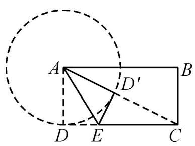

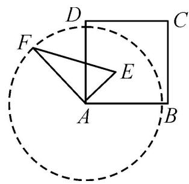

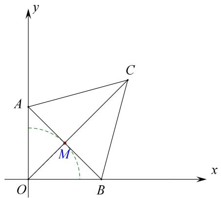

# 二、直角的对边是直径

前世：在 $\odot 0$ 中，AB 为直径，则始终有AB所对的 $\angle \mathrm { C } { = } 9 0 ^ { \circ }$

今生：若有 $A B$ 是固定线段，且总有 $\angle A C B = 9 0 ^ { \circ }$ ，则 $C$ 在以 $A B$ 为直径径的圆上．(此类型本来属于定弦定角，但是因为比较特殊，故单独分为一类)

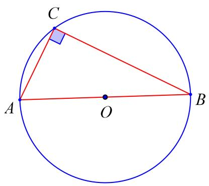

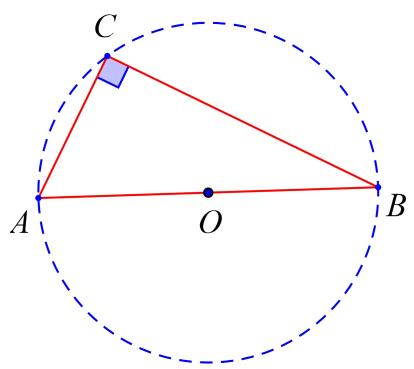

# 三、对角互补

前世：在 $\odot O$ 上任意四点A， $B$ ，C， $D$ 所围成的四边形对角互补

今生：若四边形ABCD对角互补，则A， $B$ ， $C$ ， $D$ 四点共圆

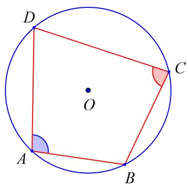

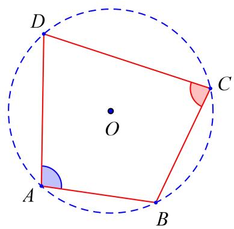

# 四、定弦定角模型

定角模型是直角模型的一种变形形式，其依据是已知定角，则根据“同弧所对的圆周角相等”得到动点的轨迹为圆弧，再画出对应图形进行计算

前世：在 $\odot 0$ 中，若弦 AB 长度固定则弦AB 所对的圆周角都相等(注意：弦AB 在劣弧 AB 上也有圆周角，需要根据题目灵活运用)

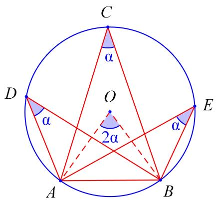

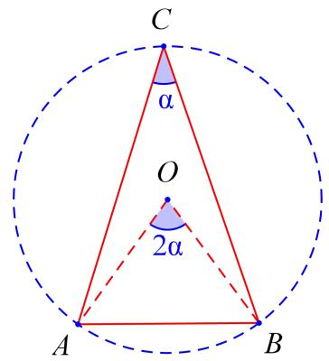

今生：若有一固定线段 $A B$ 及线段 $A B$ 所对的 $\angle C$ 大小固定，根据圆的知识可知 $C$ 点并不是唯一固定的点， $C$ 在 $\odot O$ 的优弧ACB上均可(至于是优弧还是劣弧取决于 $\angle C$ 的大小，小于 $9 0 ^ { \circ }$ ，则 $C$ 在优弧上运动；等于 $9 0 ^ { \circ }$ °，则 $C$ 在半圆上运动；大于 $9 0 ^ { \circ }$ 则 $C$ 在劣弧运动)

# 五、四点共圆模型

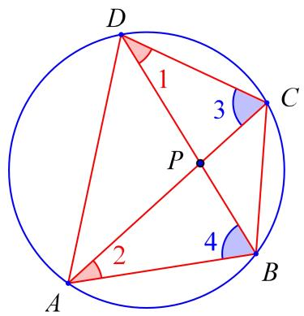

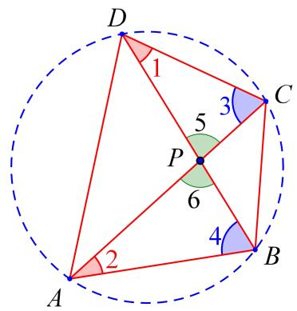

前世:在 $\odot 0$ 中，ABCD 是圆的内接四边形，则有 $\angle 1 = \angle 2$ ， $\angle 3 = \angle 4$ ，△BPC\~△APD(同理△BPA\~△CPD)今生:若四边形 ABCD 中有 $\angle 1 = \angle 2$ (通常情况下 $\angle 5 = \angle 6$ 对顶角相等，故不需要 $\angle 3 = \angle 4$ ，实际应用中长用 $\angle 1 = \angle 2$ ， $\angle 5 = \angle 6$ )则 ABCD 四点(某些不能直接使用四点共圆的地区，可以通过证明两次三角形相似也可)，选填题可以直接使用

# 六、定角定高（探照灯模型）

什么叫定角定高，如右图，直线 $B C$ 外一点 $A$ ， $A$ 到直线 $B C$ 距离为定值（定高），∠BAC 为定角。则$\triangle A B C$ 的面积有最小值。又因为，像探照灯一样所以也叫探照灯模型。

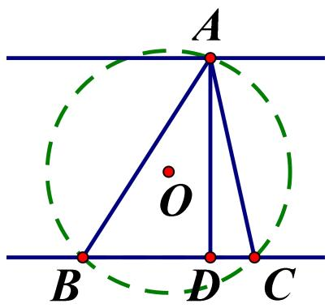

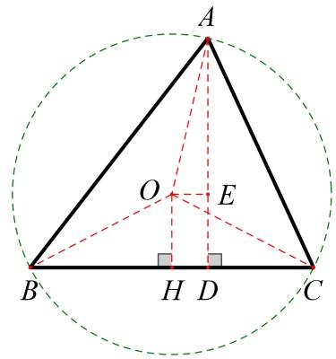

问题解决：如果顶角和高，都为定值，那么三角形ABC的外接圆的大小，也就是半径，是会随着 $A$ 点的运动而发生变化的。从而弦BC的长也会发生变化，它会有一个最小值，由于它的高 $A D$ 是定值，因此三角形ABC的面积就有一个最小值。

所谓定角定高是指三角形的一条边和这条边上的高是定值．一般是考查直角三角形，此时我们可

以取斜边中点，利用直角三角形斜边上的中线等于斜边的一半的性质及斜垂关系来解决面积最小值问题；通过构造平行线的对称点来解决周长最小值的问题．这类问题都是在等腰时取得最小值

当定角不是直角时，通过构造平行线的对称点来解决周长最小值的方法仍然适用，而面积最小值可以通过构造三角形的外心或外接圆来解决

# 七、米勒角（最大张角）问题

【问题提出】己知点 A， $B$ 是 $\angle M O N$ 的边 ON 上的两个定点，点 $P$ 是边 OM 上的动点，当 $P$ 在何处时， $\angle A P B$ 最大?

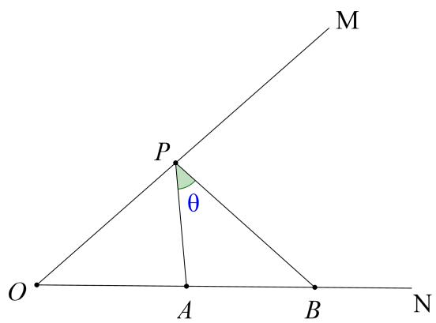

米勒问题在初中最值的考察过程中，也成为最大张角或最大视角问题.

# 米勒定理：

已知点 AB 是 $\angle \mathrm { M O N }$ 的边 ON 上的两个定点，点 P 是边 OM 上的一动点，则当且仅当三角形 ABP 的外接圆与边 OM 相切于点 P 时，∠APB 最大。

知识铺垫：对于同一个圆来说，同弧所对的圆周角 $>$ 圆外角，即 $\angle C = \angle D > \angle P$

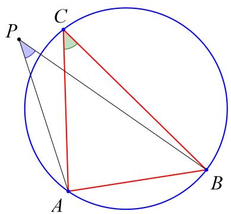

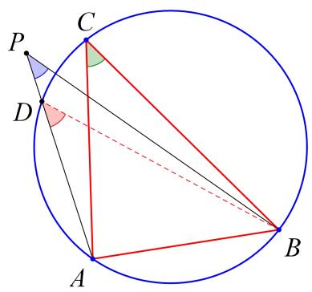

# 问题解决

证明：在直线 l 上任取一点 $Q$ （不与 $P$ 点重合），连接 AQ、 $B Q$ ， $\angle A Q B$ 即为圆 $o$ 的圆外角资料整理【淘宝店铺：向阳百分百】

∴ $\angle A P B { > } \angle A Q B$ ， $\angle A P B$ 最大∴当圆与直线 l 相切时， $\angle A P B$ 最大

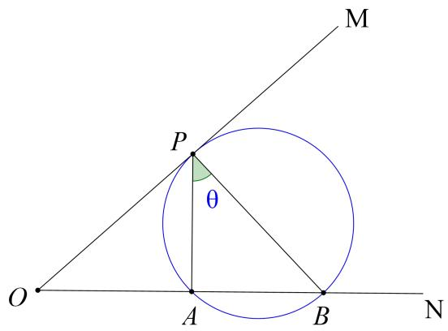

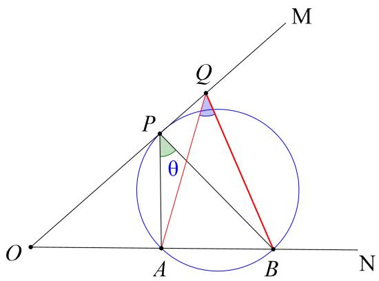

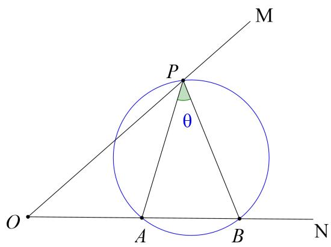

# 03 核心·题型

# 题型一 定点定长得圆

1．如图，在矩形 ABCD 中，已知 $A B { = } 3$ ， $B C { = } 4$ ，点 $P$ 是 $B C$ 边上一动点（点 $P$ 不与 $B$ ， $C$ 重合），连接$A P$ ，作点 $B$ 关于直线 $A P$ 的对称点 $M$ ，则线段 $M C$ 的最小值为（ ）

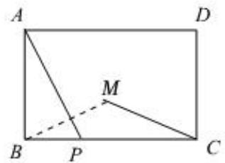

A．2 B． 52 C．3 D ． $\sqrt { 1 0 }$

【答案】A

【思路点拨】根据对称性得到动点 $\cdot$ 的轨迹是在以 $A$ 圆心，3 为半径的圆上，根据点圆模型，在矩形中利用勾股定理求出线段长即可

【详解】解：连接 AM，如图所示：

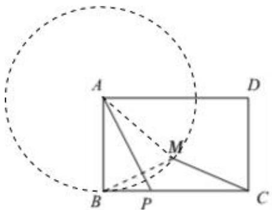

∵点 $B$ 和 $M$ 关于 $\cdot$ 对称，$\scriptstyle \cdot { \mathcal { A } } B = A M = 3$ ，  
∴ $\cdot$ 在以 $A$ 圆心，3 为半径的圆上，  
∴当 $A$ ， $\cdot$ ， $\cdot$ 三点共线时， $\cdot$ 最短，  
∵在矩形 $A B C D$ 中， $\sqrt { 3 ^ { 2 } + 4 ^ { 2 } } = 5$ ，  
$A M { = } A B { = } 3 , ~ \therefore C M { = } 5 - 3 { = } 2$

2．如图 ，在矩形 ABCD 中， $A B { = } 2$ ， $A D { = } 3$ ，点 $E , \ F$ 分别为 $A D , D C$ 边上的点，且 $\mathrm { E F } = 2$ ， $G$ 为 $E F$ 的中点， $P$ 为 $B C$ 边上一动点，则 $P A { + } P G$ 的最小值为？

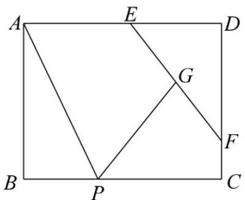

【答案】4

【简析】简单：G 的运动轨迹为圆，求 $\mathrm { A P { + } P G }$ 典型的“将军饮马”问题，故做 A 关于 BC 的对称点 A'，则$A P + P G = A ^ { ' } P + P G$ ，当 A'、P、G 三点共线时，最短，又因为 $A ^ { ' }$ 为固定点，G 在圆上运动，可知当 A'、G、D 三点共线时，此时 A'G 最短，为 4

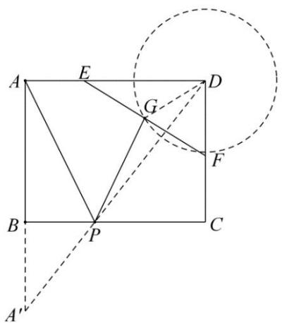

# 2023 年湖北省鄂州市中考数学真题

3．如图，在平面直角坐标系中， $o$ 为原点， $O A = O B = 3 { \sqrt { 5 } }$ ，点 $C$ 为平面内一动点， $B C = \frac { 3 } { 2 }$ 连 接 $A C$ ，点 $M$ 是线段AC上的一点，且满足 $C M : M A = 1 : 2$ ．当线段 $O M$ 取最大值时，点 $M$ 的坐标是（ ）

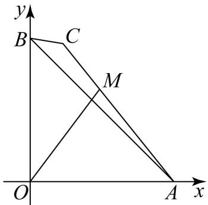

A． $\left( \frac { 3 } { 5 } , \frac { 6 } { 5 } \right)$ B． 3 65, 55 5    C ． 6 12,5 5    D ． 6 1 25 , 55 5   

【答案】D

【思路点拨】由题意可得点 $C$ 在以点 $B$ 为圆心， $\frac { 3 } { 2 }$ 为半径的 $O B$ 上，在 $x$ 轴的负半轴上取点 $D \left( - { \frac { 3 { \sqrt { 5 } } } { 2 } } , 0 \right)$ ,连接 $B D$ ，分别过 $C$ 、 $M$ 作 $C F \bot O A$ ， $M E \bot O A$ ，垂足为 $F$ 、 $E$ ，先证 $\triangle O A M ^ { \sim } \triangle D A C$ ，得 $\frac { O M } { C D } = \frac { O A } { A D } = \frac { 2 } { 3 }$ 从而当 $C D$ 取得最大值时， $O M$ 取得最大值，结合图形可知当 $D$ ， $B$ ， $C$ 三点共线，且点 $B$ 在线段 $D C$ 上时，$C D$ 取得最大值，然后分别证 $\triangle B D O \sim \triangle C D F$ ， $\triangle A E M \sim _ { \triangle A F C }$ ，利用相似三角形的性质即可求解．

【详解】解：∵点 $C$ 为平面内一动点， $B C = \frac { 3 } { 2 }$ ，  
∴点 $C$ 在以点 $B$ 为圆心， $\frac { 3 } { 2 }$ 为半径的 $O B$ 上，  
在 $x$ 轴的负半轴上取点 $D \left( - { \frac { 3 { \sqrt { 5 } } } { 2 } } , 0 \right)$ 连接 $B D$ ，分别过 $C$ 、 $M$ 作 $C F \bot O A$ ， $M E \bot O A$ ，垂足为 $F$ 、 $E$ ，  
∵OA  OB  3 5 ，  
$\therefore A D = O D + O A = { \frac { 9 { \sqrt { 5 } } } { 2 } } ,$ 2OAAD 3  
$\therefore C M : M A = 1 : 2$ ，  
$\therefore { \frac { O A } { A D } } = { \frac { 2 } { 3 } } = { \frac { C M } { A C } } ,$ ，  
$\therefore \angle O A M = \angle D A C$ ，  
$\triangle O A M ^ { \sim } \triangle D A C$ ，  
$\cdot \frac { O M } { C D } { = } \frac { O A } { A D } { = } \frac { 2 } { 3 } ,$   
∴当 $C D$ 取得最大值时， $O M$ 取得最大值，结合图形可知当 $D$ ， $B$ ， $C$ 三点共线，且点 $B$ 在线段 $D C$ 上时，CD  
取得最大值，  
$\because O A = O B = 3 \sqrt { 5 } , O D = \frac { 3 \sqrt { 5 } } { 2 } ,$   
$\therefore B D = { \sqrt { O B ^ { 2 } + O D ^ { 2 } } } = { \sqrt { \left( 3 { \sqrt { 5 } } \right) ^ { 2 } + \left( { \frac { 3 { \sqrt { 5 } } } { 2 } } \right) ^ { 2 } } } = { \frac { 1 5 } { 2 } } ,$   
∴ $\cdot C D = B C + B D = 9$ ，  
$\frac { O M } { C D } = \frac { 2 } { 3 }$   
∴ $O M = 6$ ，  
∵ $y$ 轴 $\perp x$ 轴， $C F \bot O A$ ，  
$\angle D O B = \angle D F C = 9 0 ^ { \circ }$ ，  
∵ $\angle B D O = \angle C D F$ ，  
$\therefore \Delta B D O \sim _ { \Delta } C D F$ ，  
${ \frac { O B } { C F } } { = } { \frac { B D } { C D } } { \frac { 3 { \sqrt { 5 } } } { C F } } { = } { \frac { \frac { 1 5 } { 2 } } { 9 } }$   
解得 $C F = \frac { 1 8 \sqrt { 5 } } { 5 }$   
同理可得， $\triangle A E M \sim _ { \triangle A F C }$ ，  
$\frac { M E } { C F } = \frac { A M } { A C } = \frac { 2 } { 3 } \frac { M E } { \frac { 1 8 \sqrt { 5 } } { 5 } } = \frac { 2 } { 3 }$   
解得 $M E = \frac { 1 2 \sqrt { 5 } } { 5 }$   
$\therefore O E = { \sqrt { O M ^ { 2 } - M E ^ { 2 } } } = { \sqrt { 6 ^ { 2 } - \left( { \frac { 1 2 { \sqrt { 5 } } } { 5 } } \right) ^ { 2 } } } = { \frac { 6 { \sqrt { 5 } } } { 5 } }$ ∴当线段 $O M$ 取最 大值 时， 点 $M$ 的坐 标是 $\left( { \frac { 6 { \sqrt { 5 } } } { 5 } } , { \frac { 1 2 { \sqrt { 5 } } } { 5 } } \right)$

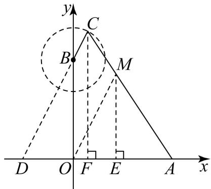

# 2023·邵阳市中考真题

4．如图，在矩形 $A B C D$ 中， $A B = 2 , A D = { \sqrt { 7 } }$ ，动点 $P$ 在矩形的边上沿 $B  C  D  A$ 运动．当点 $P$ 不与点 $A . B$ 重合时，将 $\triangle A B P$ 沿 $A P$ 对折，得到 $\triangle A B ^ { \prime } P$ ，连接 $C B ^ { \prime }$ ，则在点 $P$ 的运动过程中，线段 $C B ^ { \prime }$ 的最小值为

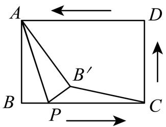

【答案】 ${ \sqrt { 1 1 } } - 2$

【思路点拨】根据折叠的性质得出 $B ^ { \prime }$ 在 $\mathbf { A }$ 为圆 $\therefore \Delta$ ，2为半径的弧上运动，进而分类讨论当点 $P$ 在 $B C$ 上时，当点 $P$ 在 $D C$ 上时，当 $P$ 在 $A D$ 上时，即可求解

【详解】解：∵在矩形 $A B C D$ 中， $A B = 2 , A D = { \sqrt { 7 } }$ ，$B C = A D = \sqrt { 7 } \quad A C = \sqrt { B C ^ { 2 } + A B ^ { 2 } } = \sqrt { 7 + 4 } = \sqrt { 1 1 }$ ，如图所示，当点 $P$ 在 $B C$ 上时，

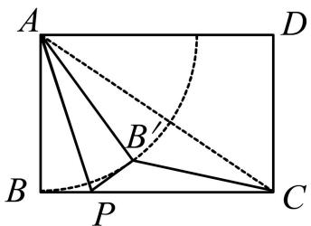

∵ $A B ^ { \prime } = A B = 2$ ∴ $B ^ { \prime }$ 在A 为圆心，2为半径的弧上运动，当 $A , B ^ { \prime } , C$ 三点共线时， $C B ^ { \prime }$ 最短，此时 $C B ^ { \prime } { = } A C { - } A B ^ { \prime } { = } \sqrt { 1 1 } { - } 2 ,$ ，当点 $P$ 在 $D C$ 上时，如图所示，

此时 $C B { > } \sqrt { 1 1 } { - } 2$ 当 $P$ 在 $A D$ 上时，如图所示，此时 $C B { > } \sqrt { 1 1 } { - } 2$ 综上所述， $C B ^ { \prime }$ 的最小值为 $\sqrt { 1 1 } - 2$

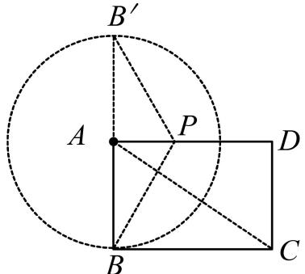

# 2023·广西南宁市二模

5．在矩形ABCD中， $A B = 3$ ，将 $A B$ 绕点 $B$ 顺时针旋转 $\alpha$ （ $0 ^ { \circ } < \alpha { < } 9 0 ^ { \circ }$ ）得到 $B E$ ，连接 $D E$ ，若 $D E$ 的最小值为 2，则 $B C$ 的长为

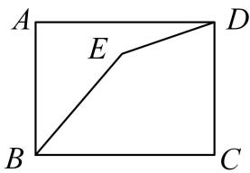

【答案】4

资料整理【淘宝店铺：向阳百分百】

【思路点拨】根据三角形不等式得到 $B E + D E { > } B D$ ，当点 $B$ ，点 $E$ ，点 $\cdot$ 三点共线时， $B E + D E$ 取得最小值，得到 $B D = 5$ ，根据勾股定理计算 $B C$ 即可

【详解】∵ $B E + D E { > } B D$ ，  
∴当点 $\cdot$ ，点 $E$ ，点 $\cdot$ 三点共线时， $B E + D E$ 取得最小值，  
∵ $B E = A B = 3$ ,  
$D E$ 的最小值为 2，  
∴ $B D = 5$ ，  
∵矩形 $A B C D$ ， $A B = 3$ ，  
∴ $. \ A B = C D = 3 , \angle B C D = 9 0 ^ { \circ }$   
$\mathbf { \dot { \theta } } \cdot B C = \sqrt { B D ^ { 2 } - C D ^ { 2 } } = 4$

# 2022·辽宁抚顺·中考真题

6．如图，正方形ABCD的边长为 10，点 $G$ 是边 $C D$ 的中点，点 $E$ 是边 $A D$ 上一动点，连接 $B E$ ，将 $\triangle A B E$ 沿$B E$ 翻折得到 $\triangle F B E$ ，连接 $G F$ ．当 $G F$ 最小时， $A E$ 的长是

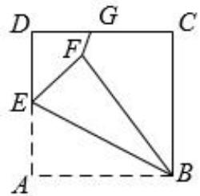

【答案】 $5 \sqrt { 5 } - 5$

【详解】解： $\textcircled{1}$ 分析所求线段 $G F$ 端点： $G$ 是定点、 $F$ 是动点； $\cdot$ 动点 $F$ 的轨迹：正方形 ABCD的边长为10，点 E 是边 $A D$ 上一动点，连接 $B E$ ，将 $\triangle A B E$ 沿 $B E$ 翻折得到 $\triangle F B E$ ，连接 $G F$ ，则 $B F = B A = 1 0$ ，因此动点轨迹是以 $B$ 为圆心， $B A = 1 0$ 为半径的圆周上，如图所示：

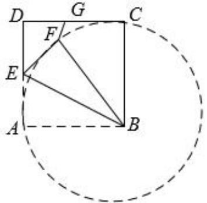

$\cdot$ 最值模型为点圆模型； $\textcircled{4} G F$ 最小值对应的线段为 $G B { - } 1 0$ ； $\cdot$ 求线段长，连接 $G B$ ，如图所示：

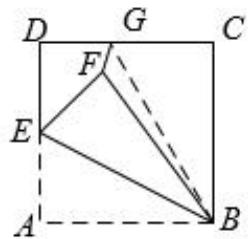

在 $R t \Delta B C G$ 中， $\angle C = 9 0 ^ { \circ }$ ，正方形ABCD的边长为 10，点 G 是边 $C D$ 的中点，则 $C G = 5 , B C = 1 0$ ，根据勾资料整理【淘宝店铺：向阳百分百】

股定理可得 $B G = \sqrt { C G ^ { 2 } + B C ^ { 2 } } = \sqrt { 5 ^ { 2 } + 1 0 ^ { 2 } } = 5 \sqrt { 5 }$ ，当G、F、 $B$ 三点共线时， $G F$ 最小为 $5 \sqrt { 5 } - 1 0$ ，接下来，求 $A E$ 的长：连接 $E G$ ，如图所示

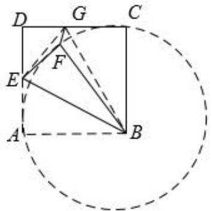

根 据 翻 折 可 知 $E F = E A , \angle E F B = \angle E A B = 9 0 ^ { \circ }$ 设 $A E = x$ ， 则 根 据 等 面 积 法 可 知$S _ { { \scriptscriptstyle \mathrm { I E } } { \scriptscriptstyle \mathcal { H } } { \scriptscriptstyle \mathcal { H } } } = S _ { { \scriptscriptstyle \Delta E D G } } + S _ { { \scriptscriptstyle \Delta B C G } } + S _ { { \scriptscriptstyle \Delta B A E } } + S _ { { \scriptscriptstyle \Delta B E G } }$ , 即$1 0 0 = { \frac { 1 } { 2 } } D E \cdot D G + { \frac { 1 } { 2 } } B C \cdot C G + { \frac { 1 } { 2 } } A B \cdot A E + { \frac { 1 } { 2 } } B G \cdot E F = { \frac { 1 } { 2 } } { \Big [ } { \mathsf { 5 } } { \big ( } 1 0 - x { \big ) } + { \mathsf { 5 } } { \mathsf { x } } 1 0 + 1 0 x + { \mathsf { 5 } } { \mathsf { \sqrt { 5 } } } x { \Big ] }$ 整理 得 $( { \sqrt { 5 } } + 1 ) x = 2 0$ ，解得 $x = A E = { \frac { 2 0 } { \sqrt { 5 } + 1 } } = { \frac { 2 0 \left( { \sqrt { 5 } } - 1 \right) } { \left( { \sqrt { 5 } } + 1 \right) \left( { \sqrt { 5 } } - 1 \right) } } = 5 { \sqrt { 5 } } - 5$

7．如图，在矩形 $A B C D$ 中， $A B { = } 3$ ， $A D { = } 4$ ， $E$ 、 $F$ 分别是边 $A D$ 、 $B C$ 上的动点，且 $C F { = } 2 A E$ ，连接 $E F$ ，将四边形 ABFE 沿 $E F$ 翻折，点 $A , B$ 的对应点分别为 $A ^ { \prime } , B ^ { \prime }$ ，连接 $A ^ { \prime } D$ ，则 $A ^ { \prime } D$ 的最小值为

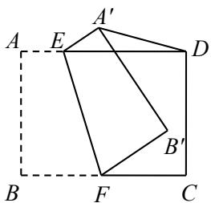

【答案】 73－5  
3

提示：连接 $\cdot$ 交 $E F$ 于点 $\cdot$ ，连接 $O A$ 、 $O D$ ，作 $\cdot$ 于 $\cdot$ 则 $-$ $-$ $\_$

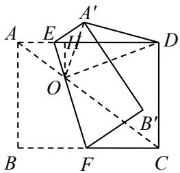

$$
\begin{array} { l } { { \therefore D H = A D - A H = 4 - \displaystyle \frac { 4 } { 3 } = \displaystyle \frac { 8 } { 3 } , \ O D = \sqrt { O H ^ { 2 } + D H ^ { 2 } } = \displaystyle \frac { \sqrt { 7 3 } } { 3 } } } \\ { { \therefore A ^ { \prime } D \geqslant O D - O A ^ { \prime } = \displaystyle \frac { \sqrt { 7 3 } - 5 } { 3 } } } \end{array}
$$

8．如图，半圆 $O$ 的直径 $A B$ 的长为 6，长度为 2 的弦 $C D$ 在半圆上滑动， $E$ 是 $C D$ 的中点， $D F \bot A B$ 于 $F$ ，连接 AC、 $E F$ ，当线段 $E F$ 的长最大时， $A C$ 的长为 ·

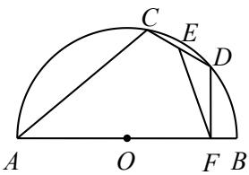

【答案】 $\cdot$

提示：连接 $O D$ 、 $O E$ ，取 $\cdot$ 的中点 $\cdot$ ，连接 $M E$ 、 $M F$

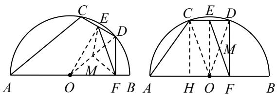

则 $O E \bot C D$ ， $M E { = } M F { = } { \frac { 1 } { 2 } } O D$   
$E F { \leqslant } M E { + } M F { = } O D$ ，当 $\cdot$ 、M、 $F$ 三点共线时 $E F$ 最大  
此时四边形 EOFD 为矩形，CD∥AB  
连接 $O C$ ，作 $C H \bot A B$ 于 $H$   
则 $-$

# 2022·长春·中考真题

9．如图，在Y ABCD中， $A B = 4$ ， $A D = B D = { \sqrt { 1 3 } }$ ，点 $M$ 为边 $A B$ 的中点，动点 $P$ 从点 $A$ 出发，沿折线 $A D - D B$ 以每秒 $\sqrt { 1 3 }$ 个单位长度的速度向终点 $B$ 运动，连结 $P M$ ．作点 $A$ 关于直线 $P M$ 的对称点 $A ^ { \prime }$ ，连结 $A ^ { \prime } P$ 、$A ^ { \prime } M$ ．设点 $P$ 的运动时间为 $t$ 秒

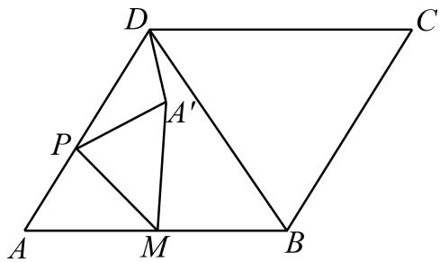

(1)点 $D$ 到边 $A B$ 的距离为 ;  
(2)用含 $t$ 的代数式表示线段 $D P$ 的长；  
(3)连结 $A ^ { \prime } D$ ，当线段 $A ^ { \prime } D$ 最短时，求 $\triangle D P A ^ { \prime }$ 的面积；(4)当 $M$ 、 $A ^ { \prime }$ 、 $C$ 三点共线时，直接写出 $t$ 的值．

【答案】(1)3

(2)当 $0 { \le } t { \le } 1$ 时， $D P = \sqrt { 1 3 } - \sqrt { 1 3 } t$ ；当 $1 < t \leq 2$ 时， $P D = \sqrt { 1 3 } t - \sqrt { 1 3 }$ ；$( 3 ) \frac { 3 } { 5 }$   
(4 ) $\frac { 2 } { 3 }$ 或 $\frac { 2 0 } { 1 1 }$

【思路点拨】（1）连接 $D M$ ，根据等腰三角形的性质可得 $D M \bot A B$ ，再由勾股定理，即可求解；

（2）分两种情况讨论：当 $0 { \le } t { \le } 1$ 时，点 $P$ 在 $\cdot$ 边上；当 $1 < t \leq 2$ 时，点 $P$ 在 $\cdot$ 边上，即可求解；

（3）过点 $\cdot$ 作 $\cdot$ 于点 $\cdot$ ，根据题意可得点 $\cdot$ 的运动轨迹为以点 $\cdot$ 为圆心，AM 长为半径的圆，可得到当点 $D$ 、 $\cdot$ 、 $\cdot$ 三点共线时，线段 $A ^ { \prime } D$ 最短，此时点 $\cdot$ 在 $A D$ 上，再证明 $-$ ，可得$D E = 3 - 3 t , P E = 2 - 2 t$ ，从而得到 $A ^ { \prime } E = D E - A ^ { \prime } D = 2 - 3 t$ ，在 $R t \triangle A ^ { \prime } P E$ 中，由勾股定理可得 $t = \frac { 2 } { 5 }$ ， 即可求解；（4）分两种情况讨论：当点 $A ^ { \prime }$ 位于 $M ,$ 、 $C$ 之间时，此时点 $P$ 在 $A D$ 上；当点 $A ^ { \prime }$ （ $A ^ { \prime \prime }$ ）位于 $\cdot$ 的延长线上时，此时点 $\cdot$ 在 $B D$ 上，即可求解

【详解】（1）解：如图，连接 $D M$ ，

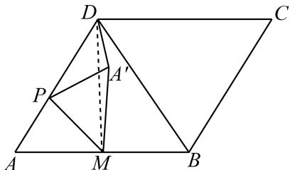

∵ $\cdot A B { = } 4$ ， $A D = B D = { \sqrt { 1 3 } }$ ，点 $\cdot$ 为边 $A B$ 的中点，  
$\cdot . A M { = } B M { = } 2$ ， $\cdot$ ，  
$\therefore D M = \sqrt { A D ^ { 2 } - A M ^ { 2 } } = 3 ,$ ，  
即点 $\cdot$ 到边 $A B$ 的距离为 3；  
故答案为：3  
（2）解：根据题意得：当 $\cdot$ 时，点 $P$ 在 $A D$ 边上，  
$D P = \sqrt { 1 3 } - \sqrt { 1 3 } t$ ；  
当 $\cdot$ 时，点 $\cdot$ 在 $\cdot$ 边上， $P D = \sqrt { 1 3 } t - \sqrt { 1 3 }$ ；  
综上所述，当 $\cdot$ 时， $D P = \sqrt { 1 3 } - \sqrt { 1 3 } t$ ；当 $\cdot$ 时， $P D = \sqrt { 1 3 } t - \sqrt { 1 3 }$ ；（3）解：如图，过点 $\cdot$ 作 $P E \bot D M$ 于点 $E$ ，  
∵作点 $A$ 关于直线 $P M$ 的对称点 $A ^ { \prime }$ ，$\_$ ，  
∴点 $A$ 的运动轨迹为以点 $\cdot$ 为圆心， $A M$ 长为半径的圆，  
∴当点 $\cdot$ 、 $\cdot$ 、 $M$ 三点共线时，线段 $A ^ { \prime } D$ 最短，此时点 $\cdot$ 在 $\cdot$ 上，  
∴ $A ^ { \prime } D { = } 1$ ，  
根据题意得： $A ^ { \prime } P = A P = \sqrt { 1 3 } t$ ， $D P = \sqrt { 1 3 } - \sqrt { 1 3 } t$ ，  
由（1）得： $D M \bot A B$ ，  
∵PE⊥DM，  
∴PE∥AB，  
∴ $-$ ，$\frac { P D } { A D } = \frac { D E } { D M } = \frac { P E } { A M }$   
$\therefore { \frac { { \sqrt { 1 3 } } - { \sqrt { 1 3 } } t } { \sqrt { 1 3 } } } = { \frac { D E } { 3 } } = { \frac { P E } { 2 } } ,$   
解得： $D E = 3 - 3 t , P E = 2 - 2 t$ ，  
$A ^ { \prime } E = D E - A ^ { \prime } D = 2 - 3 t$ ，  
在 $R t \triangle A ^ { \prime } P E$ 中， $\boldsymbol { A } ^ { \prime } \boldsymbol { P } ^ { 2 } = \boldsymbol { P } \boldsymbol { E } ^ { 2 } + \boldsymbol { A } ^ { \prime } \boldsymbol { E } ^ { 2 }$ ，$\left( { \sqrt { 1 3 } } t \right) ^ { 2 } = \left( 2 - 2 t \right) ^ { 2 } + \left( 2 - 3 t \right) ^ { 2 }$ ，解得： $t = \frac { 2 } { 5 }$ ，$P E = \frac { 6 } { 5 }$   
$\therefore S _ { \triangle D P A ^ { \prime } } = \frac { 1 } { 2 } A ^ { \prime } D \cdot P E = \frac { 1 } { 2 } { \times } 1 { \times } \frac { 6 } { 5 } = \frac { 3 } { 5 } ;$ （4）解：如图，  
当点 $\cdot$ 、 $A ^ { \prime }$ 、 $C$ 三点共线时，且点 $A ^ { \prime }$ 位于 M、 $C$ 之间时，此时  
连接 $\cdot$ ， $\cdot$ ，过点 $P$ 作 $\cdot$ 于点 $F$ ，过点 $\cdot$ 作 $\cdot$   
∵ $\cdot$ 为直径，  
∴ $\angle A = 9 0 ^ { \circ }$ ，即 $A A ^ { \prime } \bot A ^ { \prime } B$ ，$\cdot P M / / A ^ { \prime } B$ ，$\cdot \angle P M F { = } \angle A B A ^ { \prime }$ ，  
过点 $\cdot$ 作 $C N \bot A B$ 交 $\cdot$ 延长线于点 $N$ ，  
在Y ABCD中， $A B / / D C$ ，  
∵DM⊥AB，  
∴DM∥CN，  
∴四边形 CDMN 为平行四边形，  
∴CN=DM=3， $\scriptstyle M N = C D = 4$ ，  
∴ $C M { = } 5$ ，  
∴ sin $\angle C M N = { \frac { C N } { C M } } = { \frac { 3 } { 5 } }$ ，  
∵ A M=2，  
∴ 32AG   65 58  
∴MG5 ，  
$B G = B M - M G = \frac { 2 } { 5 }$   
∴ tan $\angle A ^ { \prime } B A = { \frac { A ^ { \prime } G } { B G } } = 3$ ，  
∴ tan $\angle P M F = \tan \angle A ^ { \prime } B A = 3$ ，$\frac { P F } { F M } = 3$ ，即 $\cdot$ ，∵ tan $\angle D A M = \frac { D M } { A M } = \frac { P F } { A F } = \frac { 3 } { 2 }$ $\mathord { \mathrm { s } } \angle D A M = \frac { A M } { A D } = \frac { A F } { A P } = \frac { 2 } { \sqrt { 1 3 } }$   
$P F = \frac { 3 } { 2 } A F$ $3 F M = \frac { 3 } { 2 } A F$ ， 即 $A F { = } 2 F M$ ，  
∵ $\cdot$ ，$A F = \frac { 4 } { 3 }$ ，  
$\therefore \frac { \frac { 4 } { 3 } } { \sqrt { 1 3 } t } = \frac { 2 } { \sqrt { 1 3 } }$ 解得： $t = \frac { 2 } { 3 }$ ；  
如图，当点 $A ^ { \prime }$ （ $A ^ { \prime \prime }$ ）位于 $\cdot$ 的延长线上时，此时点 $\cdot$ 在 $B D$ 上， $P B = 2 \sqrt { 1 3 } - \sqrt { 1 3 } t$ ，  
过点 $A ^ { \prime \prime }$ 作 $A ^ { \prime \prime } G ^ { \prime } \bot A B$ 于点 $\cdot$ ，则 $\angle A M A ^ { \prime \prime } = \angle C M N$ ，取 $A A "$ 的中点 $\cdot$ ，则点 $\cdot$ 、 $\cdot$ 、 $H$ 三点共线，过点 $H$ 作$H K \bot A B$ 于点 $K$ ，过点 $\cdot$ 作 $P T \bot A B$ 于点 $T$ ，  
同理： AG $A ^ { \prime \prime } G ^ { \prime } = \frac { 6 } { 5 } , A G ^ { \prime } = \frac { 2 } { 5 }$   
∵HK⊥AB， $A ^ { \prime \prime } G ^ { \prime } \bot A B$ ，  
$\cdot { \cal H } K / / A ^ { \prime \prime } G ^ { \prime }$ ，  
$\therefore \triangle A H K \sim _ { \triangle A } A ^ { \prime \prime } G ^ { \prime }$ ，  
∵点 $H$ 是 $A A "$ 的中点，  
$\therefore { \frac { H K } { A ^ { \prime \prime } G ^ { \prime } } } { = } { \frac { A K } { A G ^ { \prime } } } { = } { \frac { A H } { A A ^ { \prime \prime } } } { = } { \frac { 1 } { 2 } } ,$   
$\begin{array} { l } { { \displaystyle { \therefore H K = \frac { 3 } { 5 } } , A K = \frac { 1 } { 5 } } , }  \\ { { \displaystyle { } } } \\ { { \displaystyle { \therefore M K = \frac { 9 } { 5 } } , } } \end{array}$   
∴ tan $\angle P M T = \tan \angle H M K = \frac { H K } { M K } = \frac { 1 } { 3 }$   
$\frac { P T } { M T } = \frac { 1 } { 3 }$ 即 $\cdot$ ，  
∵ $\angle P B T = { \frac { D M } { B M } } = { \frac { P T } { B T } } = { \frac { 3 } { 2 } }$ cos $\cdot \angle P B T = \frac { B T } { P B } = \frac { B M } { B D } = \frac { 2 } { \sqrt { 1 3 } }$   
$\begin{array} { l } { { \displaystyle \therefore B T = \frac { 2 } { 3 } P T \ , } } \\ { { \displaystyle \therefore M T = \frac { 9 } { 2 } B T \ , } } \end{array}$   
$\therefore M T + B T = B M = 2$ ，  
$\therefore B T = { \frac { 4 } { 1 1 } } ,$

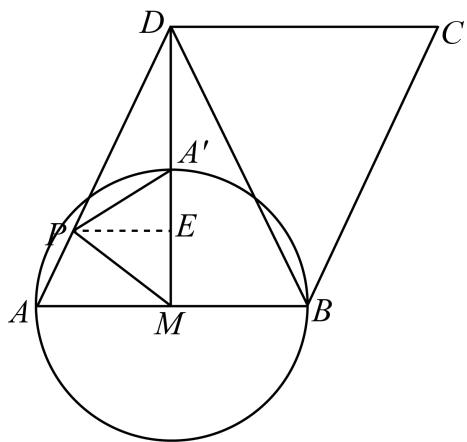

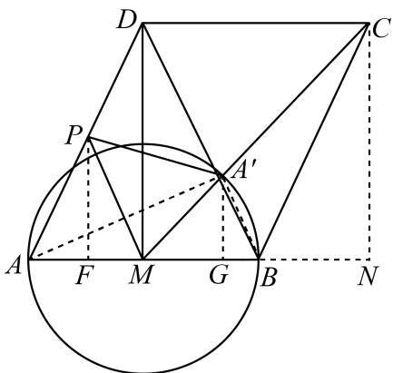

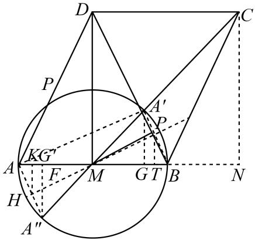

$\frac { \frac { 4 } { 1 1 } } { 2 { \sqrt { 1 3 } } - { \sqrt { 1 3 } } t } = { \frac { 2 } { \sqrt { 1 3 } } }$ , 解得： $t = { \frac { 2 0 } { 1 1 } }$ ; 综上所述， $t$ 的值为 $\frac { 2 } { 3 }$ 或 $\frac { 2 0 } { 1 1 }$

# 题型二 直角的对边是直径

10．如图，在 ${ \triangle } A B C$ 中， $\angle A C B = 3 0 ^ { \circ }$ ， $A C = 4$ ， $D$ 为 $B C$ 上的一个动点，以 $B D$ 为直径的 $_ { \odot O }$ 与 $A B$ 相切于点 $B$ ，交 $A D$ 于点 $E$ ，则 $C E$ 的最小值为

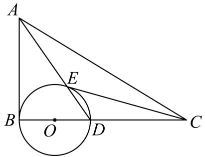

【答案】 $\sqrt { 1 3 } - 1$

【思路点拨】取 $A B$ 的中点 $\cdot$ ，连接 $B E$ ， $E F$ ， $\cdot$ ，则 $C E \geq C F - E F$ ．由 $A B$ 与 $_ { \odot O }$ 相切，可得 $\angle A B C = 9 0 ^ { \circ }$ ，$A B = { \frac { 1 } { 2 } } A C = 2$ $\scriptstyle 1 C = 2 , B C = { \sqrt { A C ^ { 2 } - A B ^ { 2 } } } = 2 { \sqrt { 3 } } , C F = { \sqrt { B F ^ { 2 } + B C ^ { 2 } } } = { \sqrt { 1 3 } }$ ．根据 $B D$ 是 $_ { \odot O }$ 的直径，可得 $\triangle A B E$ 是直角三角形，从而 $E F = \frac { 1 } { 2 } A B = 1$ ，因此 $C E \ge \sqrt { 1 3 } - 1$ ，即 $C E$ 的最 小值 为 $\sqrt { 1 3 } - 1$ ．【详解】取 $A B$ 的中点 $F$ ，连接 $B E$ ， $E F$ ， $\cdot$ ，则 $C E \geq C F - E F$

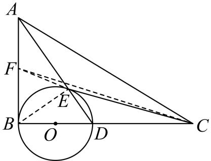

∵ $A B$ 与 $_ { \odot O }$ 相切，  
$\therefore A B \bot B C$ ，即 $\angle A B C = 9 0 ^ { \circ }$ ，  
∵ $\angle A C B = 3 0 ^ { \circ }$ ， $A C = 4$ ，  
$A B = \frac { 1 } { 2 } A C = \frac { 1 } { 2 } \times 4 = 2$ ，  
$B C = \sqrt { A C ^ { 2 } - A B ^ { 2 } } = \sqrt { 4 ^ { 2 } - 2 ^ { 2 } } = 2 \sqrt { 3 } \ .$   
∵点 $\cdot$ 是 $A B$ 的中点，  
$B F = \frac { 1 } { 2 } A B = \frac { 1 } { 2 } \times 2 = 1$ ，  
∴在 $\mathrm { R t } _ { \Delta B C F }$ 中， $C F = { \sqrt { B F ^ { 2 } + B C ^ { 2 } } } = { \sqrt { 1 ^ { 2 } + \left( 2 { \sqrt { 3 } } \right) ^ { 2 } } } = { \sqrt { 1 3 } } ~ .$   
∵ $B D$ 是 $_ { \odot O }$ 的直径，  
$\angle B E D = 9 0 ^ { \circ }$ ，  
∴ $\angle A E B = 1 8 0 ^ { \circ } - \angle B E D = 1 8 0 ^ { \circ } - 9 0 ^ { \circ } = 9 0 ^ { \circ }$   
∵点 $F$ 是 $A B$ 的中点，  
$E F = \frac { 1 } { 2 } A B = \frac { 1 } { 2 } \times 2 = 1$ ，  
∴ $\cdot C E \ge C F - E F = \sqrt { 1 3 } - 1$ ，即 $C E$ 的最小值为 $\sqrt { 1 3 } - 1$

11．（2021 威海）如图，在正方形 $A B C D$ 中， $A B { = } 2$ ，点 $E$ ， $F$ 分别在边 $A B$ ， $B C$ 上， $A E { = } B F$ ，连接 $D E$ 与 $A F$ 交于点 $G$ ，连接 $B G$ ，则 $B G$ 的最小值为

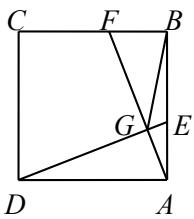

【答案】 $\sqrt { 5 } - 1$

【解析】取 AD 的中点 M，连接 BM，GM，

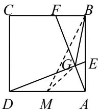

则 $\frac 1 2 A D \frac 1 2 A B$ ，  
$\therefore \mathrm { B M } = \sqrt { A M ^ { 2 } + A B ^ { 2 } } = \sqrt { 1 ^ { 2 } + 2 ^ { 2 } } = \sqrt { 5 } \ .$ ．  
∵四边形 ABCD 是正方形，  
$\_$ ， $\angle \mathrm { D A E } = \angle \mathrm { A B F } = 9 0 ^ { \circ } .$   
∵ $\cdot$ ，∴ $\cdot$ DAE≌△ABF，  
$\therefore \angle A D E = \angle B A F$   
$-$ ，  
$\therefore \angle { \mathrm { A D E } } + \angle { \mathrm { D A F } } = 9 0 ^ { \circ }$ ，∴ $\_$   
$\frac { 1 } { 2 } A D$ ．  
$-$ ，∴BG $\geqslant$ BM－GM，  
∴BG 的最小值为 $\sqrt { 5 } - 1$

12．（2023·嘉兴·二模）在 $\mathrm { R t } \triangle A B C$ 中， $\angle C = 9 0 ^ { \circ } , \angle A = 3 0 ^ { \circ } , B C = 2$ ，点 $D , E$ 分别是 $A B , A C$ 的中点，点 $F$ 是$A C$ 上的一个动点，连结 $D F$ ，作 $B Q \perp D F$ 交 $D F$ 于点 $\mathcal { Q }$ ，连结 $E Q$ ． 点 $F$ 从点 $C$ 向点A运动的过程

中， $E Q$ 的最小值为

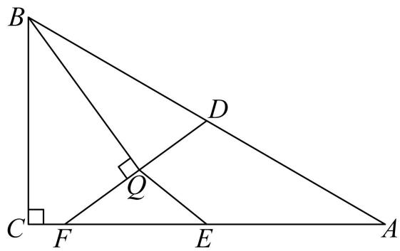

【答案】 $\sqrt { 3 } - 1$

【思路点拨】作 $E N \perp A B$ 于 $N$ ，取 $B D$ 中点 $M$ ，连接 $M \mathcal { Q }$ ， $M E$ ，由直角三角形的性质求出 $M \mathcal { Q }$ 的长，MB的长， $E N$ 的长， $A N$ 的长，得到MN 的长，由勾股定理求出 $M E$ 的长，由 $E Q \ge M E - M Q$ ，即可求出 $E Q$ 的最小值．

【详解】解：如图，作 $E N \perp A B$ 于 $N$ ，取 $B D$ 中点 $M$ ，连接 $M \mathcal { Q }$ ， $M E$ ，

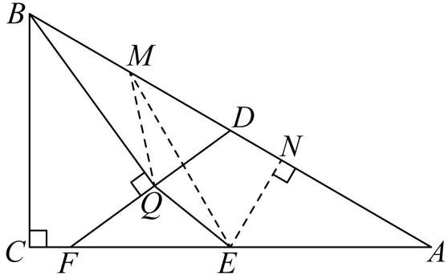

$\because \angle C = 9 0 ^ { \circ } , \angle A = 3 0 ^ { \circ } , B C = 2 ,$ ，  
$\therefore A B = 2 B C = 4 , A C = { \sqrt { 3 } } B C = 2 { \sqrt { 3 } } ,$ ，  
 $D$ 是 $A B$ 中点，  
$\therefore B D = { \frac { 1 } { 2 } } \ A B = 2 \ ,$ ，  
 $\angle B Q D = 9 0 ^ { \circ }$ ， $M$ 是 $B D$ 中点，  
$\therefore M Q = \frac { 1 } { 2 } \ B D = 1 , M B = \frac { 1 } { 2 } \ B D = 1 ,$ ，  
 $E$ 是 $A C$ 的中点，  
$\therefore A E = { \frac { 1 } { 2 } } \ A C = { \sqrt { 3 } }$ ，  
$\therefore N E = { \frac { 1 } { 2 } } \ A E = { \frac { \sqrt { 3 } } { 2 } } \ , A N = { \sqrt { 3 } } \ N E = { \frac { 3 } { 2 } } \ ,$   
$\therefore M N = A B - M B - A N = 4 - 1 - { \frac { 3 } { 2 } } = { \frac { 3 } { 2 } } ,$   
$\therefore M E = \sqrt { M N ^ { 2 } + E N ^ { 2 } } = \sqrt { 3 } \ ,$ ，  
$\therefore E Q \geq M E - M Q$ ，  
 $E Q \ge \sqrt { 3 } - 1$ ， $E Q$ 的最小值是 $\sqrt { 3 } - 1$

13．如图，在平面直角坐标系 $x O y$ 中，矩形 $O A B C$ 的边 $O A$ 、 $O C$ 分别在 $x$ 轴、 $y$ 轴的正半轴上， $O A = 6$ ，资料整理【淘宝店铺：向阳百分百】

$O C { = } 4$ ，点 $D$ 是线段 $O A$ 上的一个动点，连接 $C D$ ，以 $C D$ 为边作矩形 CDEF，使得边 $E F$ 经过点 $B$ ，当点 $F$ 到原点 $O$ 的距离最大时，点 $F$ 的坐标为

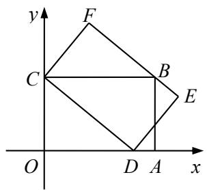

【答案】（24，32）

提示：取 $\cdot$ 中点 $M$ ，连接 $\cdot$ 、OM、FM

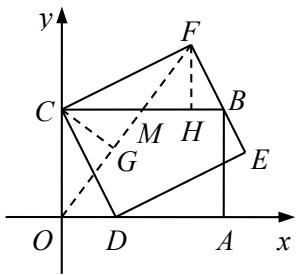

则 $-$   
$-$ ，当点 $\cdot$ 在 $O M$ 延长线上时 $O F$ 最大作 $\cdot$ 于 $\cdot$ ， $F H \bot B C$ 于 $\cdot$   
则△FMH≌△CMG（AAS），∴ $F H { = } C G$ ， $\cdot$ 在△COM 中，由面积法可得 CG＝ 12， 勾股得 $\cdot$ $\_$

# 2023·菏泽市中考真题

14．如图，在四边形 $A B C D$ 中， $\angle A B C = \angle B A D = 9 0 ^ { \circ }$ , $A B = 5 , A D = 4 , A D < B C$ ，点 $E$ 在线段 $B C$ 上运动，点$F$ 在线段 $A E$ 上， $\angle A D F = \angle B A E$ ，则线段 $B F$ 的最小值为

【答案】 $\sqrt { 2 9 } - 2$

【思路点拨】设 $A D$ 的中点为 $\cdot$ ，以 $A D$ 为直径画圆，连接 $O B$ ，设 $O B$ 与 $_ { \odot O }$ 的交点为点 $F ^ { \prime }$ ，证明 $\angle D F A = 9 0 ^ { \circ }$ ，可知点 $F$ 在以 $A D$ 为直径的半圆上运动，当点 $F$ 运动到 $O B$ 与 $_ { \odot O }$ 的交点 $F ^ { \prime }$ 时，线段 $B F$ 有最小值，据此求解即可．

【详解】解：设 $A D$ 的中点为 $O$ ，以 $A D$ 为直径画圆，连接 $O B$ ，设 $O B$ 与 $_ { \odot O }$ 的交点为点 $F ^ { \prime }$ ，

$\angle A B C = \angle B A D = 9 0 ^ { \circ }$   
$A D / / B C$ ，  
∴ $\angle D A E = \angle A E B$ ，  
∵ $\angle A D F = \angle B A E$ ，  
$\angle D F A = \angle A B E = 9 0 ^ { \circ }$ ，  
∴点 $\cdot$ 在以 $A D$ 为直径的半圆上运动，  
∴当点 $\cdot$ 运动到 $O B$ 与 $_ { \odot O }$ 的交点 $F ^ { \prime }$ 时，线段 $B F$ 有最小值，  
∵ $A D = 4$ ，  
$\therefore A O = O F ^ { \prime } = \frac { 1 } { 2 } A D = 2 \ , \nonumber$ ，  
$\therefore B O = \sqrt { 5 ^ { 2 } + 2 ^ { 2 } } = \sqrt { 2 9 } \ ,$   
$B F$ 的最小值为 $\sqrt { 2 9 } - 2$

15．（2023·武汉·一模）如图， $\mathrm { R t } \triangle A B C$ 中， $\angle A C B = 9 0 ^ { \circ }$ ， $A C = 4 { \sqrt { 3 } }$ ， $B C = 6$ ．点 $P$ 为 ${ \triangle A B C }$ 内一点，且满足 $P A ^ { 2 } + P C ^ { 2 } = A C ^ { 2 }$ ．当 $P B$ 的长度最小时，则 $\triangle A C P$ 的面积是

【答案】 $6 \sqrt { 3 }$

【思路点拨】取 $A C$ 中点 $O$ ，连接 $O P$ ， $B O$ ，由 $P A ^ { 2 } + P C ^ { 2 } = A C ^ { 2 }$ 即可得到 $\angle A P C = 9 0 ^ { \circ }$ ，再由 $B P \geq B O - O P$ ，可得当点 $\cdot$ 在线段 $B O$ 上时， $B P$ 有最小值，然后利用直角三角形的性质可得 $P O = A O = C O = { \frac { 1 } { 2 } } A C = 2 { \sqrt { 3 } }$ ，即可推出 $\angle B O C = 6 0 ^ { \circ }$ ，则 $\triangle C O P$ 是等边三角形，求得 $\triangle C O P$ 的面积，根据 $O A = O C$ 可得 $S _ { \triangle A C P } = 2 S _ { \triangle C O P } = 6 \sqrt { 3 }$ 【详解】解：如图，取 $A C$ 的中点 $O$ ，连接 $O P$ ， $B O$ ，

∵ $P A ^ { 2 } + P C ^ { 2 } = A C ^ { 2 }$ ，  
∴ $\angle A P C = 9 0 ^ { \circ }$ ，  
∴点 $P$ 在以 $A C$ 为直径的圆上运动，  
在 $\triangle B P O$ 中， $B P \geq B O - O P$ ，  
∴当点 $\cdot$ 在线段 $B O$ 上时， $B P$ 有最小值，  
∵点 $\cdot$ 是 $A C$ 的中点， $\angle A P C = 9 0 ^ { \circ }$ ，  
$P O = A O = C O = { \frac { 1 } { 2 } } A C = 2 { \sqrt { 3 } }$ ，  
∴ tan $\angle B O C = \frac { C B } { O C } = \sqrt { 3 }$ ，  
∴ $. \angle B O C = 6 0 ^ { \circ }$ ，  
∴ $\triangle C O P$ 是等边三角形，  
$\begin{array} { l } { { \displaystyle { \cal S } _ { \triangle c o P } = \frac { \sqrt { 3 } } { 4 } { \cal O C } ^ { 2 } = \frac { \sqrt { 3 } } { 4 } \times 1 2 = 3 \sqrt { 3 } \ } } \\ { { \displaystyle { \cal O A } = { \cal O C } } } \\ { { \displaystyle { \cal S } _ { \triangle A C P } = 2 S _ { \triangle c o P } = 6 \sqrt { 3 } } } \end{array}$

# 2022·通辽·中考真题

16．如图， $_ { \odot O }$ 是 ${ \triangle A B C }$ 的外接圆， $A C$ 为直径，若 $A B = 2 { \sqrt { 3 } }$ ， $B C = 3$ ，点 $P$ 从 $B$ 点出发，在 ${ \triangle A B C }$ 内运动且始终保持 $\angle C B P = \angle B A P$ ，当 $C$ ， $P$ 两点距离最小时，动点 $P$ 的运动路径长为

【答案】 ${ \frac { \sqrt { 3 } } { 3 } } \pi$

【思路点拨】根据题中的条件可先确定点 $\cdot$ 的运动轨迹，然后根据三角形三边关系确定 $\cdot$ 的长最小时点 $\cdot$ 的位置，进而求出点 $P$ 的运动路径长

【详解】解： $A C$ 为 $_ { \odot O }$ 的直径，  
 $\angle A B C = 9 0 ^ { \circ }$ .  
 $. \angle A B P + \angle P B C = 9 0 ^ { \circ } .$   
$\ Q \ \angle P A B = \angle P B C$ ,  
$\therefore \angle P A B + \angle A B P = 9 0 ^ { \circ } .$   
∴ $\angle A P B = 9 0 ^ { \circ }$ .  
∴点 $P$ 在以 $\cdot$ 为直径的圆上运动，且在 $\cdot$ 的内部，  
如图，记以 $\cdot$ 为直径的圆的圆心为 $O _ { 1 }$ ，连接 $O _ { 1 } C$ 交 $\odot O _ { 1 }$ 于点 $P ^ { \prime }$ ，连接 $O _ { 1 } P , C P$ .$\scriptstyle { \mathrm { Q ~ C P } } \geq O _ { 1 } C - O _ { 1 } P ,$   
∴当点 $O _ { 1 } , P , C$ 三点共线时，即点 $P$ 在点 $P ^ { ' }$ 处时， $\cdot$ 有最小值，$\therefore A B = 2 { \sqrt { 3 } }$   
$\therefore { \cal O } _ { 1 } B = \sqrt { 3 }$   
在 $R t \Delta B C O _ { 1 }$ 中， tan $\angle B O _ { 1 } C = \frac { B C } { O _ { 1 } B } = \frac { 3 } { \sqrt { 3 } } = \sqrt { 3 }$ .  
$B O _ { 1 } C = 6 0 ^ { \circ } .$   
$\stackrel { \sum } { B P ^ { \prime } } = \frac { 6 0 \pi \times \sqrt { 3 } } { 1 8 0 } = \frac { \sqrt { 3 } } { 3 } \pi .$

$\therefore C , P$ 两点距离最小时，点 $\cdot$ 的运动路径长为 ${ \frac { \sqrt { 3 } } { 3 } } \pi$ .

17．（2023·广州·三模）如图，矩形 $A B C D$ 中， $A B = 2$ ， $B C = 2 \sqrt { 3 }$ ，点 $E , \ F$ 分别是线段 $A D$ ，BC上的动点，且 $A E = C F$ ，过 $D$ 作 $E F$ 的垂线，垂足为 $H$

（1）当 $A E = \sqrt { 3 } - 1$ 时， $\angle B F E =$ （2）当 $E$ 在 $A D$ 上运动时， $C H$ 的最小值为

【答案】 45 1

【思路点拨】（1）过点 $F$ 作 $F M \perp B C$ 于 $\cdot$ ，由条件可得四边形ABME是矩形，由题意可得 $M F = E M$ ，从而问题解决；

（2）连接 $B D$ 交 $E F$ 于点 $\cdot$ ，可证明 $\triangle D O E { \cong } \triangle B O F$ ，易得 $O D = \frac { 1 } { 2 } B D = 2$ ，由 $D H \perp E F$ 知， $M H = 2$ ，即点 $\cdot$ 在以 $O D$ 中点 $M$ 为圆 $\cdot$ ，1 为半径的圆上运动，当点 $\cdot$ 与点 $A$ 重合时， $C H$ 的值最小，由三角函数知识即可求得此时最小值

【详解】解：（1）过点 $F$ 作 $F M \perp B C$ 于 $M$ ，如图，则 $\angle B M E = \angle E M F = 9 0 ^ { \circ }$ ；  
∵四边形 $A B C D$ 为矩形，  
∴ $\angle A = \angle B = 9 0 ^ { \circ }$ ，  
∴四边形ABME是矩形，  
$\therefore E M = A B = 2 , B M = A E = \sqrt { 3 } - 1 ;$   
∵ $\cdot _ { \textit { A E } = C F }$ ，  
$\therefore C F = B M = \sqrt { 3 } - 1 ,$ ，  
$\therefore M F = B C - B M - C F = 2 \sqrt { 3 } - 2 ( \sqrt { 3 } - 1 ) = 2 \ ,$ ，  
$M E = M F$ ，  
$\therefore F M \bot B C$ ，  
∴ $\angle B F E = 4 5 ^ { \circ }$ ，  
故答案为：45；  
（2）连接 $B D$ 交 $E F$ 于点 $\cdot$ ，如图，  
由矩形性质知： $A D / / C B$ ， $A D = B C = 2 { \sqrt { 3 } }$ ，  
$\angle D E F = \angle B F E A D - A E = B C - C F$   
∴ $D E = B F$ ，  
∵ $\angle E O D = \angle F O B$ ，  
$\therefore \Delta D O E { \cong } \triangle B O F$ ，  
∴ $O D = O B$ ，  
由勾股定理得 $B D = \sqrt { A B ^ { 2 } + A D ^ { 2 } } = 4$ ，  
$\therefore O D = { \frac { 1 } { 2 } } B D = 2 ,$ ，  
∵ $D H \perp E F$ ，设 $O D$ 中点为 $\cdot$ ，  
∴ $. M H = 2$ ，  
即点 $H$ 在以点 $\cdot$ 为圆心，1为半径的圆上运动，  
由于点 $E$ 在 $A D$ 边上运动，  
∴当点 $\cdot$ 与点 $A$ 重合时，即 $E F$ 与 $A C$ 重合时， $C H$ 的值最小，  
$\therefore A C = B D = 4 , \cos \angle A C D = \frac { C D } { A C } = \frac { C H } { C D } ,$   
$C H = { \frac { C D ^ { 2 } } { A C } } = { \frac { 4 } { 4 } } = 1$   
即 $C H$ 的最小值为 1

18．（2023·安阳·一模）如图，正方形 $A B C D$ 的边长为 $2 \sqrt { 2 }$ ，点 $E$ 是 $A B$ 边上的一个动点，点 $F$ 是 $C D$ 边上的一个动点，且 $A E = C F$ ，过点 $B$ 作 $B G \bot E F$ 于点 $G$ ，连接 $A G$ ，则 $_ { A G }$ 长的最小值为

【答案】 $\sqrt { 5 } - 1$

【思路点拨】连接 $A F$ ， $C E$ ， $A C$ ，设 $A C$ 与 $E F$ 的交点为点 $\cdot$ ，得到平行四边形 $A E C F$ ，点 $O$ 是 $A C$ 的中点，连接 $B D$ ，则 $B D$ 经过点 $O$ ，且 $O A \bot O B$ ，G 在以 BO 为直径的圆上运动，取 $O B$ 的中点 $H _ { ; }$ ，连接 $A H , G H$ ，根据三角形三边不等关系式，计算最值即可

资料整理【淘宝店铺：向阳百分百】

【详解】如图，连接 $A F$ ， $C E$ ， $A C$ ，设 $A C$ 与 $E F$ 的交点为点 $\cdot$ ，  
∵正方形 $A B C D$ ，  
$\| A E \| C F$ ，  
∵ $A E = C F$ ，  
∴四边形 $A E C F$ 是平行四边形，  
∴ $. A O = C O , O E = O F$ ，  
∴点 $O$ 是 $A C$ 的中点，连接 $B D$ ，  
∵正方形 $A B C D$ ，  
∴点 $O$ 是 $B D$ 的中点，且 $O A \bot O B$ ，  
取 $O B$ 的中点 $H$ ，连接 $A H , G H$ ，  
$B G \bot E F$ ，  
$\therefore A H = \sqrt { A O ^ { 2 } + O H ^ { 2 } } , G H = \frac { 1 } { 2 } O B ,$   
$G H + A G \geq A H ;$   
∴当 $A , G , H$ 三点共线时， $_ { A G }$ 取得最小值，  
∵正方形 $A B C D$ 的边长为 $2 \sqrt { 2 }$ ，  
$\therefore A C = B D = \sqrt { \left( 2 \sqrt { 2 } \right) ^ { 2 } + \left( 2 \sqrt { 2 } \right) ^ { 2 } } = 4 \ ,$   
$\therefore O A = O B = O C = O D = 2 ,$ ，  
$G H = \frac { 1 } { 2 } O B = 1 A H = \sqrt { 2 ^ { 2 } + 1 ^ { 2 } } = \sqrt { 5 }$ ，  
∴ $A G$ 长的最小值为 $\sqrt { 5 } - 1$

19．（2023·深圳·模拟预测）如图，在矩形 $A B C D$ 中， $A B = 3$ ， $B C = 4$ ， $E$ 为边 $B C$ 上一动点， $F$ 为 $A E$ 中点， $G$ 为 $D E$ 上一点， $B { \cal F } = { \cal F } { \cal G }$ ，则 $C G$ 的最小值为

【答案】 $\sqrt { 1 3 } - 2$

【思路点拨】连接 $_ { A G }$ ，根据矩形的性质可得 $\angle A B C = \angle B C D = \angle A D C = 9 0 ^ { \circ }$ ， $D C = A B = 3$ ，根据中点的性质和 直 角 三 角形斜边上的中线是斜边的一半可得 $B { \cal F } = \frac 1 2 A { \cal E } = A { \cal F } = E { \cal F }$ ， 推 得 $A F = F G = E F$ ， 则$\angle A G E = \angle A G D = 9 0 ^ { \circ }$ ，根据圆周角定理可知：点 $G$ 在以 $A D$ 为直径的圆上运动，取 $A D$ 的中点 $o$ ，当 $o$ ， $G$ ，$C$ 三点共线时， $C G$ 的值最小，由此可解答

【详解】解：如图 1，连接 $_ { A G }$ ，

  
图1

四边形ABCD是矩形，  
$\angle A B C = \angle B C D = \angle A D C = 9 0 ^ { \circ } ~ D C = A B = 3 ~ .$ ，  
∵ $F$ 是 $A E$ 的中点，  
$\therefore B F = \frac { 1 } { 2 } A E = A F = E F ,$ ，$B { \cal F } = { \cal F } { \cal G }$ ，  
$A F = F G = E F$   
$\therefore \angle A G E = \angle A G D = 9 0 ^ { \circ } ,$ ，  
∴点 $G$ 在以 $A D$ 为直径的圆上运动，取 $A D$ 的中点 $o$ ，连接 $O G$ ，如图 2：

  
图2

当 $o$ ， $G$ ， $C$ 三点共线时， $C G$ 的值最小，$O D = O G = 2$ ，∴ $O C = \sqrt { 2 ^ { 2 } + 3 ^ { 2 } } = \sqrt { 1 3 }$ ，∴ $C G$ 的最小值为 $\sqrt { 1 3 } - 2$

# 2023·汕头市金平区一模

20．如图， $A B$ 为 $_ { \odot O }$ 的直径，点 $C$ 为 $O B$ 中点，弦 $D E$ 经过点 $C$ ，且 $D E \bot A B$ ．点 $F$ 为 $\widehat { A E B }$ 上一动点，连接 $D F \cdot A G \bot D F$ 于点 $G _ { \cdot }$ ．若 $A B = 4$ ，在点 $F$ 运动过程中，线段 $O G$ 的长度的最小值为

【答案】 $\sqrt { 3 } - 1$

【思路点拨】如图，连接 $A D$ ， $O D$ ，取 $A D$ 的中点 $R$ ，由 $A G \bot D F$ ．可得 $G$ 在以 $R$ 为圆心， $A D$ 为直径的圆上运动，（圆的一部分）当 $R$ ， $O$ ， $\cdot$ 三点共线时， $O G$ 最小，再求解 $C D = { \sqrt { 2 ^ { 2 } - 1 ^ { 2 } } } = { \sqrt { 3 } }$ ，2 2 AD  CD  AC  2 3 ，可得 RA  RG  3 ，sinCAD  $\sin \angle C A D = \frac { \sqrt { 3 } } { 2 \sqrt { 3 } } = \frac { 1 } { 2 }$ 则 ${ \frac { R O } { A O } } = { \frac { 1 } { 2 } }$ =， 可得 $R O = 1$ ，从而可得答案．

【详解】解：如图，连接 $A D$ ， $O D$ ，取 $A D$ 的中点 $R$ ，  
∵ $A G \bot D F$   
∴ $G$ 在以 $R$ 为圆心， $A D$ 为直径的圆上运动，（圆的一部分）  
当 $R$ ， $O$ ， $\cdot$ 三点共线时， $O G$ 最小，  
∵ $A B = 4$ ，点 $\cdot$ 为 $O B$ 中点，$\cdot O B = O A = O D = 2$ ， $O C = 1$ ，  
$\therefore D E \bot A B$ ，  
$C D = { \sqrt { 2 ^ { 2 } - 1 ^ { 2 } } } = { \sqrt { 3 } }$ ，  
$\therefore A D = \sqrt { C D ^ { 2 } + A C ^ { 2 } } = 2 \sqrt { 3 } \ ,$ ，  
∴ RA  RG  3 ，sinCAD  \\$ 12 3 21RO2AO  
$R O = 1 \quad : { \cdot } O G = R G - R O = { \sqrt { 3 } } - 1$

21．如图，矩形 $A B C D$ 中， $A B = 2$ ， $B C = 2 \sqrt { 3 }$ ，点 $E , \ F$ 分别是线段AD， $B C$ 上的动点，且 $A E = C F$ ，过$D$ 作 $E F$ 的垂线，垂足为 $H$

（1）当 $A E { = } \sqrt { 3 }$ 1时， $\angle B F E =$ （2）当 $E$ 在 $A D$ 上运动时， $C H$ 的最小值为

【答案】 45 1

【思路点拨】（1）过点 $F$ 作 $F M \perp B C$ 于 $M$ ，由条件可得四边形ABME是矩形，由题意可得 $M F = E M$ ，从而问题解决；

（2）连接 $B D$ 交 $E F$ 于点 $\cdot$ ，可证明 $\triangle D O E { \cong } \triangle B O F$ ，易得 $O D = \frac { 1 } { 2 } B D = 2$ ，由 $D H \perp E F$ 知， $M H = 2$ ，即点 $\cdot$ 在以 $O D$ 中点 $\cdot$ 为圆心，1 为半径的圆上运动，当点 $E$ 与点 $\cdot$ 重合时， $C H$ 的值最小，由三角函数知识即可求得此时最小值

【详解】解：（1）过点 $\cdot$ 作 $F M \perp B C$ 于 $\cdot$ ，如图，则 $\angle B M E = \angle E M F = 9 0 ^ { \circ }$ ；  
∵四边形 $A B C D$ 为矩形，  
∴ $\angle A = \angle B = 9 0 ^ { \circ }$ ，  
∴四边形ABME是矩形，  
$E M = A B = 2 B M = A E = \sqrt { 3 } - 1$ ；  
∵ $A E = C F$ ，  
$\therefore C F = B M = \sqrt { 3 } - 1 ,$ ，  
$\therefore M F = B C - B M - C F = 2 \sqrt { 3 } - 2 ( \sqrt { 3 } - 1 ) = 2 \ ,$ ，  
$\therefore M E = M F$ ，  
$F M \perp B C$ ，  
∴ $. \angle B F E = 4 5 ^ { \circ }$   
故答案为：45；

（2）连接 $B D$ 交 $E F$ 于点 $O$ ，如图，资料整理【淘宝店铺：向阳百分百】

由矩形性质知： $A D / / C B$ ， $A D = B C = 2 { \sqrt { 3 } }$ ，$. \angle D E F = \angle B F E$ ， $A D - A E = B C - C F$   
∴ $D E = B F$ ，  
∵ $\cdot \angle E O D = \angle F O B$ ，  
$\triangle D O E { \cong } \triangle B O F$ ，  
∴ $O D = O B$ ，  
由勾股定理得 $B D = \sqrt { A B ^ { 2 } + A D ^ { 2 } } = 4$ ，  
$O D = { \frac { 1 } { 2 } } B D = 2$ ，  
∵ $D H \perp E F$ ，设 $O D$ 中点为 $M$ ，  
∴ $M H = 2$ ，  
即点 $\cdot$ 在以点 $M$ 为圆心，1为半径的圆上运动，  
由于点 $E$ 在 $A D$ 边上运动，  
∴当点 $E$ 与点 $\cdot$ 重合时，即 $E F$ 与 $A C$ 重合时， $C H$ 的值最小，  
$\therefore A C = B D = 4 , \cos \angle A C D = \frac { C D } { A C } = \frac { C H } { C D } ,$   
∴ $C H = { \frac { C D ^ { 2 } } { A C } } = { \frac { 4 } { 4 } } = 1$ ，即 $C H$ 的最小值为 1

# 2022·成都市成华区二诊

22．如图，在 $\Delta A B C$ 中， $\angle C = 9 0 ^ { \circ } , \angle B = 3 0 ^ { \circ } , A C = 2 { \sqrt { 3 } }$ ．若点 $D$ 为平面上一个动点，且满足 $\angle A D C = 6 0 ^ { \circ }$ ，则线段 $B D$ 长度的最小值为 ，最大值为

【答案】 $2 { \sqrt { 7 } } - 2 \qquad 2 { \sqrt { 1 3 } } + 2$

【思路点拨】根据题意进行分类讨论，即当点 $D$ 在 $A C$ 右侧时，点 $D$ 在 $\widehat { A C }$ 上运动；当点 $\cdot$ 在 $A C$ 左侧时，点 $\cdot$ 在 $\widehat { A C }$ 上运动，再分别计算即可

【详解】 $\cdot$ 如图，

以 $A C$ 为底边，在 $\cdot$ 的右侧作等腰三角形 $A O C$ ，使 $\angle O A C = \angle O C A = 3 0 ^ { \circ }$   
则 $\angle A O C = 1 2 0 ^ { \circ }$   
以 $O$ 为圆心，以 $C O$ 长为半径画优弧 $\widehat { A C }$ ，连接 $B O$ 交 $\widehat { A C }$ 于点 $E$   
则当点 $\cdot$ 在 $A C$ 右侧时，点 $D$ 在 $\widehat { A C }$ 上运动  
过点 $\cdot$ 作 $O F \bot B C$ 于 $\cdot$ $\because \angle A C B = 9 0 ^ { \circ } , \angle A B C = 3 0 ^ { \circ }$   
tan $\angle A B C = \frac { A C } { B C } = \frac { \sqrt { 3 } } { 3 }$ $\therefore B C = { \sqrt { 3 } } A C = 6$   
过点 $\cdot$ 作 $O M \bot A C$ 于 $\cdot$ $\cdot O C = O A$   
$\therefore C M = A M = { \frac { 1 } { 2 } } A C = { \sqrt { 3 } }$   
tan $\angle O C A = \tan 3 0 ^ { \circ } = { \frac { O M } { M C } } = { \frac { \sqrt { 3 } } { 3 } }$   
$\therefore O M = { \frac { \sqrt { 3 } } { 3 } } M C = 1$   
$\therefore C O = 2 M O = 2$ $\cdot . O E = O C = 2$   
 $\cdot \angle C M O = \angle C F O = \angle M C F = 9 0 ^ { \circ }$   
四边形 MCFO 为矩形  
$\therefore C F = O M = 1 , O F = C M = \sqrt { 3 }$   
$\therefore B F = 6 - 1 = 5$   
在 $R t { \triangle } B O F$ 中， $B O = \sqrt { B F ^ { 2 } + O F ^ { 2 } } = 2 \sqrt { 7 }$   
$\therefore B E = 2 { \sqrt { 7 } } - O E = 2 { \sqrt { 7 } } - 2$   
当点 $D$ 于点 $\cdot$ 不重合时， $B D > O B - O D$   
当点 $\cdot$ 于点 $\cdot$ 重合时， $B D = O B - O D$ $\therefore B D \geq O B - O D$   
当 $\cdot$ 、 $\cdot$ 、 $O$ 三点共线时（此时，点 $\cdot$ 与 $\cdot$ 重合）， $B D$ 有最小值为 $2 { \sqrt { 7 } } - 2$   
$\cdot$ 如图，  
以 $\cdot$ 为底边，在 $A C$ 的左侧作等腰三角形 $o ^ { \prime }$ ，使 $\angle O ^ { \prime } A C = \angle O ^ { \prime } C A = 3 0 ^ { \circ }$   
则 $\angle A O ^ { \prime } C = 1 2 0 ^ { \circ }$   
以 $O ^ { \prime }$ 为圆心，以 $o ^ { \prime }$ 长为半径画优弧 $\widehat { A C }$ ，连接 $B O ^ { \prime }$ 并延长交 $\widehat { A C }$ 于点 $\cdot$   
 $\cdot \angle A D C = 6 0 ^ { \circ }$   
则当点 $\cdot$ 在 $A C$ 左侧时，点 $\cdot$ 在 $\widehat { A C }$ 上运动  
过点 $O$ 作 $O F \bot B C$ 于 $\cdot$   
• $\cdot \angle A C B = 9 0 ^ { \circ } , \angle A B C = 3 0 ^ { \circ }$   
$\therefore \angle C A B = 6 0 ^ { \circ } , A C = \frac { 1 } { 2 } A B$ $\scriptstyle \ldots A B = 2 A C = 4 { \sqrt { 3 } }$   
 $\cdot \angle C A O ^ { \prime } = 3 0 ^ { \circ }$   
 $. \angle B A O ^ { \prime } = 9 0 ^ { \circ }$   
同 $\cdot$ 可求 $O ^ { \prime } A = O ^ { \prime } C = 2$   
在 $R t \triangle A B O ^ { \prime }$ 中， $B O ^ { \prime } { = } \sqrt { A O ^ { \prime } { } ^ { 2 } + A B ^ { 2 } } = 2 \sqrt { 1 3 }$   
当点 $D$ 于点 $\cdot$ 不重合时， $B D < O ^ { \prime } B - O ^ { \prime } D$   
当点 $D$ 于点 $E$ 重合时， $B D = O ^ { \prime } B - O ^ { \prime } D$   
$\cdot B D \le { \cal O } ^ { \prime } B - { \cal O } ^ { \prime } D$   
当 $\cdot$ 、 $D$ 、 $O$ 三点共线时（此时，点 $\cdot$ 与 $E$ 重合）， $B D$ 有最大值为 $2 { \sqrt { 1 3 } } + 2$   
故答案为： $2 { \sqrt { 7 } } - 2$ ， $2 { \sqrt { 1 3 } } + 2$

23．如图，在矩形 $A B C D$ 中， $A B = 3$ ， $B C = 4$ ， $E$ 为边 $B C$ 上一动点， $F$ 为 $A E$ 中点， $G$ 为 $D E$ 上一点， $B { \cal F } = { \cal F } { \cal G }$ ，则CG 的最小值为

【答案】 $ { \sqrt { 1 3 } } - 2 - 2 + { \sqrt { 1 3 } }$

【思路点拨】连接 $_ { A G }$ ，根据矩形的性质可得 $\angle A B C = \angle B C D = \angle A D C = 9 0 ^ { \circ }$ ， $D C = A B = 3$ ，根据中点的性质和 直 角 三 角形斜边上的中线是斜边的一半可得 $B { \cal F } = \frac 1 2 A { \cal E } = A { \cal F } = E { \cal F }$ ， 推 得 $A F = F G = E F$ ， 则$\angle A G E = \angle A G D = 9 0 ^ { \circ }$ ，根据圆周角定理可知：点 $G$ 在以 $A D$ 为直径的圆上运动，取 $A D$ 的中点 $o$ ，当 $O , G$ ，资料整理【淘宝店铺：向阳百分百】

C三点共线时， $C G$ 的值最小，由此可解答【详解】解：如图 1，连接 $_ { A G }$ ，

  
图1

 四边形ABCD是矩形，  
$\angle A B C = \angle B C D = \angle A D C = 9 0 ^ { \circ } ~ D C = A B = 3$ ，  
∵ $F$ 是 $A E$ 的中点，  
$\therefore B F = \frac { 1 } { 2 } A E = A F = E F ,$ ，  
$B { \cal F } = { \cal F } { \cal G }$ ，  
$A F = F G = E F$ ，  
$\angle A G E = \angle A G D = 9 0 ^ { \circ }$ ，  
∴点 $G$ 在以 $A D$ 为直径的圆上运动，取 $A D$ 的中点 $O$ ，连接 $O G$ ，如图 2：

  
图2

当 $o$ ， $G$ ， $C$ 三点共线时， $C G$ 的值最小，$. O D = O G = 2$ ，∴ $O C = \sqrt { 2 ^ { 2 } + 3 ^ { 2 } } = \sqrt { 1 3 }$ ，∴ $C G$ 的最小值为 $\sqrt { 1 3 } - 2$

24．如图，在矩形 $A B C D$ 中， $\ A B = 4 , B C = 3$ ， $E$ ， $F$ 分别为 $A B$ ， $C D$ 边的中点．动点 $P$ 从点 $E$ 出发沿 $E A$ 向点 $A$ 运动，同时，动点 $\mathcal { Q }$ 从点 $F$ 出发沿 $F C$ 向点 $C$ 运动，连接 $P Q$ ，过点 $B$ 作 $B H \perp P Q$ 于点 $H ,$ ，连接 $D H$ ．若点 $P$ 的速度是点 $\mathcal { Q }$ 的速度的2倍，在点 $P$ 从点 $E$ 运动至点 $A$ 的过程中，线段 $D H$ 长度的最小值为

【答案】 ${ \sqrt { 1 3 } } - { \sqrt { 2 } }$ 资料整理【淘宝店铺：向阳百分百】

【思路点拨】连接 $E F$ 交 $P Q$ 于 $M$ ，连接 $B M$ ，取BM 的中点 $O$ ，连接 $O H , O D$ ，过点 $O$ 作 $O N \bot C D$ 于 $\cdot$ ，易得四边形 $B C F E$ 为矩形， $\triangle F M Q ^ { \sim } \triangle E M P$ ，推出 $O D$ 和 $O H$ 的长，根据 $D H \geq O D - O H$ ，得到当 $O$ ， $H$ ， $\cdot$ 共线时， $D H$ 最小，进行求解即可

【详解】解：连接 $E F$ 交 $P Q$ 于 $M$ ，连接 $B M$ ，取 $B M$ 的中点 $\cdot$ ，连接 $O H , O D$ ，过点 $O$ 作 $O N \bot C D$ 于 $\cdot$ ．

则： $M O = O B$ ，  
∵矩形 $A B C D$ ， $\ A B = 4 , B C = 3$ ， $\cdot$ ， $F$ 分别为 $A B$ ， $C D$ 边的中点，  
∴ BC CD， $B E = { \frac { 1 } { 2 } } A B = 2 , F C = { \frac { 1 } { 2 } } C D = { \frac { 1 } { 2 } } A B = 2 E F / / B C ~ C D / / A B$ ，  
∴四边形BCFE为矩形， $M F / / O N / / B C$ ， $\triangle F M Q ^ { \sim } \triangle E M P$ ，  
$\therefore \frac { F M } { M E } = \frac { F Q } { P E } = \frac { 1 } { 2 } , F N = C N = 1 , D N = D F + F N = 3 ,$ ，  
$E M = { \frac { 2 } { 3 } } E F = { \frac { 2 } { 3 } } B C = 2$ ，  
$F M = 1 O N = \frac { 1 } { 2 } \big ( F M + B C \big ) = 2$ ，  
∴ 2 2 2 2OD  DN  ON  3  2  13 ，  
∵ BH  PQ ，  
$\angle B H M = 9 0 ^ { \circ }$ ，  
∵ $O M = O B$ ，  
$O H = \frac { 1 } { 2 } B M = \frac { 1 } { 2 } \times \sqrt { E M ^ { 2 } + B E ^ { 2 } } = \sqrt { 2 }$ ，$\therefore D H \geq O D - O H ,$ ，  
∴ ${ D H \geq \sqrt { 1 3 } - \sqrt { 2 } }$ ，由于 $\cdot$ 和 $\cdot$ 点都是定点，所以其中点 $\cdot$ 也是定点，当  
∴ $D H$ 的最小值为 ${ \sqrt { 1 3 } } - { \sqrt { 2 } }$

# 题型三 对角互补得圆

25．（2023·广东深圳·统考二模）如图，矩形 ABCD 中， $\angle B A C { = } 6 0 ^ { \circ }$ ，点 $E$ 在 $A B$ 上，且 $B E$ ： $A B { = } 1$ ：3，点$F$ 在 $B C$ 边上运动，以线段 $E F$ 为斜边在点 $B$ 的异侧作等腰直角三角形 $G E F$ ，连接 $C G$ ，当 $C G$ 最小时，$\frac { C F } { A D }$ 的值为（ ）

A． $\frac { \sqrt { 3 } } { 9 }$ B． 1 C． $\frac { 1 } { 2 }$ D． $\frac { \sqrt { 3 } } { 3 }$

【答案】A

【思路点拨】如图 1，取 $\cdot$ 的中点 $O$ ，连接 $\cdot$ ， $\cdot$ ，作射线 $\cdot$ ，证明 $\cdot$ ， $\cdot$ ， $G$ ， $F$ 在以 $\cdot$ 为圆心的圆上，得点 $G$ 在 $\angle A B C$ 的平分线上，当 $C G \bot B G$ 时， $C G$ 最小，此时，画出图 2，根据 $\triangle B C G$ 是以 $\cdot$ 为斜边的等腰直角三角形，证明△EGB≌△FGC，可得 $\cdot$ ，设 $A B { = } m$ ，根据 $\_$ ，可得 $\frac { 1 } { 3 }$ ，根据含 30 度角的直角三角形可得 $A D$ ，进而可得结论．

【详解】解：如图 1，取 $\cdot$ 的中点 $O$ ，连接 $\cdot$ ， $\cdot$ ，作射线 $B G$ ，

  
图1

∵四边形 ABCD 是矩形，$\_$   
∵ $\cdot$ 是 $E F$ 的中点，  
$\therefore O B = O E = O F$ $\cdot \angle E G F { = } 9 0 ^ { \circ }$ ， $\cdot$ 是 $\cdot$ 的中点，  
$\scriptstyle \cdot O G = O E = O F$   
$\therefore O B { = } O G { = } O E { = } O F$   
∴B， $\cdot$ ， $G$ ，在以 $\cdot$ 为圆心的圆上，  
$-$ ,  
∵ $\_$ ， $E G { = } F G$ ，  
$\therefore \angle G E F = \angle G F E = 4 5 ^ { \circ }$ $\_$   
∴BG 平分 $\angle A B C$ ，  
∴点 $G$ 在 $\angle A B C$ 的平分线上，  
当 $\cdot$ 时， $\cdot$ 最小，

此时，如图 2，

  
图2

∵ $B G$ 平分∠ABC，  
$\frac { 1 } { 2 }$   
:'CGLBG  
∴ $\triangle B C G$ 是以 $\cdot$ 为斜边的等腰直角三角形， $\_$   
$\cdot$   
∵ $-$   
∴∠EGF-∠BGF=∠BGC-∠BGF,  
$-$   
在 $\triangle E G B$ 和△FGC 中，  
(id $B G { = } C G$   
$\stackrel { \dag } { \underset { \dleftarrow } { \angle } } E G B { = } \angle F G C$   
$E G { = } F G$   
∴△EGB≌△FGC(SAS)，  
∴ $\cdot$   
∵四边形 $\cdot$ 是矩形，  
$\therefore A D = B C$   
设 $A B { = } m$   
$\cdot B E : A B { = } 1 : 3$   
$\frac 1 3$ ，  
在 $\cdot$ 中， $\angle B A C { = } 6 0 { ^ \circ }$ ，  
$\therefore \angle A C B = 3 0 ^ { \circ }$   
$\cdot { \mathcal { A } } C = 2 A B { = 2 \mathrm { m } }$   
$\therefore B C = \sqrt { A C ^ { 2 } - A B ^ { 2 } } = \sqrt { 3 } m$   
$\therefore A D = \sqrt { 3 } m , \therefore \frac { C F } { A D } = \frac { \frac { 1 } { 3 } m } { \sqrt { 3 } m } = \frac { \sqrt { 3 } } { 9 }$

26．如图，在矩形 $A B C D$ 中， $A B { = } 3$ ， $B C { = } 5$ ，点 $E$ 在对角线 $A C$ 上，连接 $B E$ ，作 $E F \bot B E$ ，垂足为 $E$ ，直

线 $E F$ 交线段 $D C$ 于点 $F$ ，则 ${ \frac { E F } { B E } } = _ { } - \quad$ 解：如图，连接 BF，取 BF 的中点 O，连接 OE，OC

∵四边形 ABCD 是矩形，EF⊥BE，  
∴四边形 EFCB 对角互补，  
∴B，C，F，E 四点共圆，$-$ °， $_ { \mathrm { A B } } { = } _ { \mathrm { C D } } { = } 3$ ， ${ \mathrm { B C } } = { \mathrm { A D } } = 5$ ，  
∵ $\mathrm { O B = O F }$ ，  
$\therefore { \mathrm { O E } } { = } { \mathrm { O B } } { = } { \mathrm { O F } } { = } { \mathrm { O C } }$ ，  
∴B，C，F，E 四点在以 O 为圆心的圆上，  
∴∠EB $\cdot$ F，  
∴tan∠EBF $\cdot$ tan∠ACD，  
$\frac { E F } { E B } { = } \frac { A D } { C D } { = } \frac { 5 } { 3 }$

27．如图，在四边形 ABCD 中， $\angle B A D = \angle B C D = 9 0 ^ { \circ }$ ， $\angle A C D = 3 0 ^ { \circ }$ ， $A D { = } 2$ ， $E$ 是 $A C$ 的中点，连接$D E$ ，则线段 $D E$ 长度的最小值为

解：∵ $-$ ∴A、 $\cdot$ 、 $\cdot$ 、 $\cdot$ 四点共圆，且 $\cdot$ 为直径，取 $B D$ 中点 $\cdot$ ，则圆心为点 $O$ ，  
资料整理【淘宝店铺：向阳百分百】  
连接 $\cdot$ 、 $\cdot$ ，取 $\cdot$ 中点 $\cdot$ ，连接 $E F$ ， $D F$ ，  
∵ $\angle A C D = 3 0 ^ { \circ }$   
∴ $\_$ ,  
∵ $\cdot$ ，  
∴ $\cdot$ 为等边三角形，  
∴ $-$ ，  
∴ $\_$ °，则 $\sqrt { 3 }$ ，  
∵ $\cdot$ 是 $\triangle A O C$ 的中位线，  
$\frac { 1 } { 2 }$ ，  
在 $\triangle D E F$ 中， $\_$ ，  
∴当 $D$ 、 $\cdot$ 、 $\cdot$ 三点共线时， $D E$ 取到最小，最小值为 $\sqrt { 3 } - 1$

# 2023 年·广元市一模

28．如图，正方形ABCD的边长为 4，点 $E$ 是 $B C$ 边上的动点，过点 $E$ 作 $E F \bot A E$ 交 $C D$ 于点 $F$ ，点 $G$ 在 $A E$ 上，且 $E G = E F$ ，点 $M .$ 、 $N$ 分别为 $G F$ 、 $C D$ 的中点，连接 $M N$ ，则 $M N$ 的最小值为

【答案】 $\sqrt { 2 }$

【思路点拨】如图，连接 $A C$ ， $B D$ 交于点 $o$ ，证明 $\angle B C D = 9 0 ^ { \circ }$ ， $\angle A C D = 4 5 ^ { \circ }$ ，连接 $M E$ ， $C M$ ，而 $E G = E F$ ，$E F \bot A E$ ，证明 $E M \perp G F$ ， $\angle M E F = 4 5 ^ { \circ }$ ，可得 $E , M , F ,$ ， $C$ 在以 $E F$ 为直径的圆上， $\angle M C N = \angle M E F = 4 5 ^ { \circ }$ ，资料整理【淘宝店铺：向阳百分百】

则 $M$ 在线段 $A C$ 上运动，当 $N M \perp A C$ 时，MN 最短，从而可得答案

【详解】解：如图，连接 $A C$ ， $B D$ 交于点 $O$ ，  
∵正方形ABCD的边长为 4，  
∴ $\angle B C D = 9 0 ^ { \circ }$ ， $\angle A C D = 4 5 ^ { \circ }$ ，  
连接 $M E$ ， $C M$ ，而 $E G = E F$ ， $E F \perp A E$ ，  
∴ $\triangle G E F$ 为等腰直角三角形，  
∵点 $M$ 为 $G F$ 的中点，  
$E M \perp G F \angle M E F = 4 5 ^ { \circ }$ ，$\angle E M F = 9 0 ^ { \circ } = \angle B C D$ ，  
$E$ ， $M$ ， $F$ ， $C$ 在以 $E F$ 为直径的圆上，$\angle M C N = \angle M E F = 4 5 ^ { \circ }$ ，  
∴ $M$ 在线段 $A C$ 上运动，  
当 $N M \perp A C$ 时， $M N$ 最短，  
∵ $N$ 为 $C D$ 的中点，  
∴ $C N = 2$ ，此时 $\triangle M C N$ 为等腰直角三角形，∴ $M N = C N \bullet \sin 4 5 ^ { \circ } = 2 \times { \frac { \sqrt { 2 } } { 2 } } = { \sqrt { 2 } }$

29．（2023·广东深圳·统考二模）如图，点 $G$ 是 ${ \triangle A B C }$ 内的一点，且 $\angle B G C = 1 2 0 ^ { \circ }$ ， $\triangle B C F$ 是等边三角形，若 $B C = 3$ ，则 $F G$ 的最大值为

【答案】 $2 \sqrt { 3 }$

【思路点拨】如图，作△BFC 的外接圆 $_ { \odot O }$ ，连接 $O G$ ， $O F$ ， $O C$ ，过点 $O$ 作 $O H \bot C F$ 于点 $H$ ．说明 $B$ ，$F$ ， $C$ ， $G$ 四点共圆，求出 $O F$ ，利用三角形三边关系可得结论

【详解】解：如图，作△BFC的外接圆 $_ { \odot O }$ ，连接 $O G$ ， $O F$ ， $O C$ ，过点 $O$ 作 $O H \bot C F$ 于点 $H$ ．

∵ $\triangle B C F$ 是等边三角形，  
$\angle B F C = \angle F B C = 6 0 ^ { \circ } ~ C B = C F = 3$   
∵ $\angle B G C = 1 2 0 ^ { \circ }$ ，  
∴点 $G$ 在 $\triangle B C F$ 的外接圆上，  
$\cdot \ : O G = O F = O C$ ，  
$\because O H \bot C F$ ，  
$\therefore F H = C H = { \frac { 3 } { 2 } }$   
$\angle F O C = 2 \angle F B C = 1 2 0 ^ { \circ }$   
$\angle O F C = \angle O C F = 3 0 ^ { \circ }$   
$O F = { \frac { F H } { \cos 3 0 ^ { \circ } } } = { \sqrt { 3 } }$ ，  
$\therefore F G \leq O F + O G = 2 { \sqrt { 3 } } \ ,$ ，  
∴ $F G$ 的最大值为 $2 \sqrt { 3 }$

# 题型四 定弦定角得圆

30．如图，在 $\triangle A B C$ 中， $B C { = } 2$ ，点 $D$ 是 $B C$ 的中点， $\angle D A C = 4 5 ^ { \circ }$ ，则 $A B ^ { 2 } { + } A C ^ { 2 }$ 的最大值为

【答案】6

提示：作 $\cdot$ 的外接圆，作 $E C \bot B C$ 交圆于点 $\cdot$ ，连接 BE、CE、DE作 $\cdot$ 于 $\cdot$ ，则 $\cdot$ 是圆的直径资料整理【淘宝店铺：向阳百分百】

∵ $\angle D E C = \angle D A C = 4 5 ^ { \circ }$ ，∴△EDC 是等腰直角三角形$\scriptstyle \cdot ^ { \prime } B C = 2 , \displaystyle \therefore B D = D C = 1 , \displaystyle \therefore D E = \sqrt { 2 } D C = \sqrt { 2 }$ $-$   
$\therefore A B ^ { 2 } + A C ^ { 2 } = A H ^ { 2 } + ( 1 + D H ) ^ { 2 } + A H ^ { 2 } + ( 1 - D H ) ^ { 2 } = 2 + 2 ( A H ^ { 2 } + D H ^ { 2 } )$   
$= 2 + 2 A D ^ { 2 } { \leqslant } 2 + 2 D E ^ { 2 } = 6$   
即 $\cdot$ 的最大值为 6

31．如图， $\triangle A B C$ 中， $\angle B A C = 6 0 ^ { \circ }$ ， $A B { = } 5$ ， $A C { = } 8$ ， $P$ 是 $\triangle A B C$ 内一点， $\angle B P C = 1 2 0 ^ { \circ }$ ，连接 $A P$ ，则 $A P$ 长的最小值为

【答案】2 3  
提示：作 $B D \bot A C$ 于 $\cdot$   
$\_$   
$-$   
∵ $\_$ ，∴点 $P$ 在以 $\cdot$ 为弦的一段圆弧上运动

设圆心为 $O$ ，连接 $O A$ 、 $O B$ 、OC、OP则 $-$ ∵ $-$ ，∴∠OBP＋∠OCP＝120°$\therefore \angle B O C = 1 2 0 ^ { \circ } , \therefore O B = O C = O P = \frac { \sqrt { 3 } } { 3 } B C = \frac { 7 \sqrt { 3 } } { 3 }$ 设圆弧交 $A C$ 于点 $E$ ，连接 $B E$ 、 $\cdot$ 则 $\cdot$ ， $-$ ∴ $\triangle A B E$ 是等边三角形， $\cdot$ $\therefore \angle A O B \cong \triangle A O E , \angle O A B = \angle O A E = 3 0 ^ { \circ } .$ ，∴AO⊥BE设垂足为 $\cdot$ ，则 $\cdot$ $\_$ 资料整理【淘宝店铺：向阳百分百】$\_$ ，即 $A P$ 长的最小值为 $2 \sqrt { 3 }$

32．如图，在 $\triangle A B C$ 中， $\angle B A C = 1 2 0 ^ { \circ }$ ，点 $D$ 为 $B C$ 边上一点，且 $B D { = } 3 D C$ ，若 $A D { = } 1$ ，则 $\triangle A B C$ 的面积的最大值为_

【答案】 4 3  
3

提示：过点 $B$ 作 $\cdot$ 交 $\cdot$ 的延长线于点 $E$

则△BDE∽△CDA$\therefore B D = 3 D C , \therefore D E = 3 A D = 3 , \therefore A E = 4$   
$\therefore \angle B A C = 1 2 0 ^ { \circ } , \therefore \angle A B E = 6 0 ^ { \circ }$   
∴ $\triangle A B E$ 是定边定角面积最大问题， $\cdot$ ， $\cdot$   
∴ $\cdot$ 的面积的最大值为： $\cdot$   
∴ $\triangle A B D$ 的面积的最大值为 $\cdot$ ， $\cdot$ 的面积的最大值为 $\cdot$

33．如图， $\triangle A B C$ 中， $\angle B A C = 3 0 ^ { \circ }$ ， $A D$ 是中线， $A D { = } 2$ ，求 $\triangle A B C$ 面积的最大值．【答案】延长 $A D$ 到点 $\cdot$ ，使 ${ D E } \mathrm { = } A D$ ，连接 $C E$

则 $\triangle A B D \cong \triangle E C D , ~ \therefore A B = C E , ~ \angle B = \angle D C E$ $\scriptstyle \cdot { \mathcal { A } } E = 2 A D = 4 , A B / / C E , \therefore \angle A C E = 1 5 0 ^ { \circ }$   
∴点 $C$ 在以 $A E$ 为弦、圆周角为 $1 5 0 ^ { \circ }$ 的一段圆弧上运动  
当 $\cdot$ 即 $\cdot$ 时， $\triangle A B C$ 的面积取得最大值  
此时 $\cdot$ ， $-$   
解 $\triangle A B D$ ，可得 $B D { = } 4 { - } 2 \sqrt { 3 }$ ， $\cdot$   
∴ $\triangle A B C$ 面积面积最大值为 $\cdot$

# 2023·成都市新都区二模

34．如图，在边长为6的等边 ${ \triangle A B C }$ 中，动点 $D$ 在 $A B$ 边上（与点A， $B$ 均不重合），点 $E$ 在边 $A C$ 上，且$A E = B D$ ， $C D$ 与 $B E$ 相交于点 $G$ ，连接 $A G .$ 当点 $D$ 在 $A B$ 边上运动时， $_ { A G }$ 的最小值为

【答案】 $2 \sqrt { 3 }$

【思路点拨】作辅助线，建立全等三角形，证明 $\triangle A D F \cong \triangle B C E$ 和 $\triangle B A F \cong \triangle D A F ( \mathrm { S A S } )$ ，证明 $\angle B G C = 1 2 0 ^ { \circ }$ ，再作 ${ \triangle B G C }$ 的外接圆 $o$ ，即点 $G$ 在以 $O$ 为圆心， $O B$ 为半径的圆上运动，计算 $_ { A O }$ 和 $O G$ 的长，计算其差可得结论．

【详解】解：如图，过点A作 $A D / / B C$ ，过点 $C$ 作 $C D / / A B$ ，  
 $\triangle A B C$ 是等边三角形，  
四边形ABCD是菱形， $\angle A B C = 6 0 ^ { \circ }$ ，  
$\therefore \angle B A D = 1 2 0 ^ { \circ } B C = A D \angle D A C = 6 0 ^ { \circ }$ ，  
DAF  CBE ，  
 BE  AF ，  
ADF  △BCE SAS ，  
DF  CE ，BCE  ADF ，  
 AB  AD ，BAF  DAF ， AF  AF ，  
$\therefore \triangle B A F \cong \triangle D A F ( \mathrm { S A S } ) _ { \mathrm { ~ ; ~ } }$ ，$. \angle A D F = \angle A B F$ ，  
 $. \angle A B F = \angle B C E$ ，  
$\therefore \angle B G C = 1 8 0 ^ { \circ } - \left( \angle G B C + \angle G C B \right) = 1 8 0 ^ { \circ } - \angle C B E = 1 2 0 ^ { \circ } ,$   
如图，作 ${ \triangle B G C }$ 的外接圆 $O$ ，即点 $G$ 在以 $O$ 为圆心， $O B$ 为半径的圆上运动，  
$\cdot \angle B O C = 1 2 0 ^ { \circ }$ ，  
 $\cdot O B = O C$ ，  
$\because \angle O B C = \angle O C B = 3 0 ^ { \circ }$ ，  
连接 $_ { A O }$ ，交 $_ { \odot O }$ 于 $G$ ，交 $B C$ 于 $M$ ，此时 $_ { A G }$ 最小， $A O$ 是 $B C$ 的垂直平分线，  
$\therefore B M = C M = 3$ ，  
$\therefore O M = { \frac { C M } { \sqrt { 3 } } } = { \sqrt { 3 } } \ .$   
 $O C = 2 \sqrt { 3 }$ ，  
OB OC， $\angle B O C = 1 2 0 ^ { \circ }$ ，  
 $. \angle B C O = 3 0 ^ { \circ }$ ，$. \angle A C O = 9 0 ^ { \circ }$ ，$. \angle O A C = 3 0 ^ { \circ }$ ，  
$\because \cos 3 0 ^ { \circ } = { \frac { A C } { A O } } = { \frac { 6 } { A O } } = { \frac { \sqrt { 3 } } { 2 } }$ $. A O = 4 { \sqrt { 3 } }$ ，  
 $A G$ 的最小值为 $A O - O C = 4 { \sqrt { 3 } } - 2 { \sqrt { 3 } } = 2 { \sqrt { 3 } }$

# 2023·成都市金牛区二模

35．在菱形 $A B C D$ 中， $\angle A B C = 1 2 0 ^ { \circ }$ ，点 $P$ 是对角线 $B D$ 上一动点，点 $\boldsymbol { Q }$ 是 $A D$ 边上一动点， $D P$ 与 $A Q$ 始资料整理【淘宝店铺：向阳百分百】

终相等，连结AP、 $B Q$ ，交点为 $E$ ，连结 $C E$ ，则 tan $\angle D C E$ 的最小值是

【答案】 $\frac { 2 { \sqrt { 3 } } - { \sqrt { 6 } } } { 2 }$

【思路点拨】先证明 $\angle A E B = 1 2 0 ^ { \circ }$ ，根据定长定角构造辅助圆，当 $C E$ 与 $_ { \odot O }$ 相切时， $\angle O C E$ 最大，此时 $\angle D C E$ 最小，设半径 $O A = a$ ，然后利用解直角三角形和相似三角形的性质列出关于 $E F$ 的方程，表示出 $E F$ 即可求出 tan $\angle D C E$ 的最小值

【详解】解：∵在菱形ABCD中， $\angle A B C = 1 2 0 ^ { \circ }$ ，  
∴ $\angle B A Q = \angle A D P = 6 0 ^ { \circ }$ ， $A B = A D$ ，  
又∵ $D P = A Q$ ，  
$\triangle A D P \cong \triangle B A Q ( \mathrm { S A S } )$   
∴ $\angle A P D = \angle B Q A$ ，  
∴ $\angle A E B = \angle D A P + \angle B Q A = \angle D A P + \angle A P D = 1 2 0 ^ { \circ }$   
∴点 $\cdot$ 在对角线 $B D$ 上运动时， $\angle A E B$ 的大小保持不变，  
作 $\triangle A B E$ 的外接圆，圆心为 $\cdot$ ，连接 $O C$ 、连接 $O D$ 交 $C E$ 于点 $F$ ，  
则 $O D \perp A B$ ， $O D \bot C D$ ，  
当 $C E$ 与 $_ { \odot O }$ 相切时， $\angle O C E$ 最大，此时 $\angle D C E$ 最小，  
设 $O A = a$ ，则菱形边长为 $\sqrt { 3 } a$ ， $O D = 2 a$ ，  
∴在 $\mathsf { R t } \triangle O D C$ 中 $O C = \sqrt { O D ^ { 2 } + C D ^ { 2 } } = \sqrt { 7 } a$ ，  
在 $\Re { \ t } \triangle O E C$ 中 $C E = \sqrt { O C ^ { 2 } - O E ^ { 2 } } = \sqrt { 6 } a$ ，  
$\because \angle O F E = \angle C F D , \angle O E F = \angle F D C = 9 0 ^ { \circ } ,$   
$\therefore \triangle C D F \sim \triangle O E F$ ，$ { \frac { O E } { C D } } { = } { \frac { E F } { D F } } { = } { \frac { O F } { C F } }$ 即 $\frac { a } { \sqrt { 3 a } } = \frac { E F } { D F } = \frac { 2 a - D F } { \sqrt { 6 } a - E F }$   
解得 $E F = \frac { 2 \sqrt { 3 } - \sqrt { 6 } } { 2 } a$ ，

$\angle D C E = \tan \angle E O F = \frac { E F } { O E } = \frac { 2 \sqrt { 3 } - \sqrt { 6 } } { 2 }$ ∴ tan $\angle D C E$ 的最小值是 $\frac { 2 { \sqrt { 3 } } - { \sqrt { 6 } } } { 2 }$

# 2023·达州·中考真题

36．在 ${ \triangle A B C }$ 中， $A B = 4 \sqrt { 3 }$ ， $\angle C = 6 0 ^ { \circ }$ ，在边 $B C$ 上有一点 $P$ ，且 $B P = { \frac { 1 } { 2 } } A C$ ，连接 $A P$ ，则 $A P$ 的最小值为

【答案】 $2 { \sqrt { 1 3 } } - 2$

【思路点拨】如图，作 ${ \triangle A B C }$ 的外接圆，圆心为 $M$ ，连接AM 、BM 、 $C M$ ，过 $M$ 作 $M D \perp A B$ 于 $D$ ，过 $B$ 作 $B N \perp A B$ ，交 $B P$ 的垂直平分线于 $N$ ，连接 $A N$ 、 $B N$ 、 $P N$ ，以 $N$ 为圆心， $B N \big ( P N \big )$ 为半径作圆；结合圆周角定理及垂径定理易得 $A M = B M = C M = 4$ ，再通过圆周角定理、垂直及垂直平分线的性质、三角形内角和定理易得 $\angle A M C = \angle P N B$ ，从而易证 $\triangle A M C \sim _ { \triangle } P N B$ 可得 $\frac { C M } { P N } { = } \frac { A C } { P B } { = } \frac { 2 } { 1 }$ 即 ${ P N } = \frac { 1 } { 2 } { C M } = 2$ 勾股定理即可求得$A N = 2 \sqrt { 1 3 }$ 在 $\triangle A P N$ 中由三角形三边关系 $A P \geq A N - P N$ 即可求解

【详解】解：如图，作 ${ \triangle A B C }$ 的外接圆，圆心为 $M$   
作 $B N \perp A B$ ，交 $B P$ 的垂直平分线于 $N$ ，连接 $A N$ 、  
 $\angle C = 6 0 ^ { \circ }$ ， $M$ 为 ${ \triangle A B C }$ 的外接圆的圆心，  
 $. \angle A M B = 1 2 0 ^ { \circ }$ ， $A M = B M$ ，$\therefore \angle M A B = \angle M B A = 3 0 ^ { \circ }$ ，$. M D = { \frac { 1 } { 2 } } A M$ ，  
$\therefore M D \perp A B$ ，  
$\therefore A D = \frac { 1 } { 2 } A B = 2 \sqrt { 3 } ,$ ，  
在 $\mathrm { R t } \triangle A D M$ 中，  
$\therefore A M ^ { 2 } = M D ^ { 2 } + A D ^ { 2 }$ ，  
$\therefore A M ^ { 2 } = \left( { \frac { 1 } { 2 } } A M \right) ^ { 2 } + \left( 2 \sqrt { 3 } \right) ^ { 2 }$   
$\therefore A M = 4$ ，  
即 $A M = B M = C M = 4$ ，  
由作图可知 $B N \perp A B$ ， $N$ 在 $B P$ 的垂直平分线上，$. \angle P B N = \angle B P N = 9 0 ^ { \circ } - \angle A B C$ ，  
$\therefore \angle P N B = 1 8 0 ^ { \circ } - \left( \angle P B N + \angle B P N \right) = 2 \angle A B C$   
又 $M$ 为 ${ \triangle A B C }$ 的外接圆的圆心，  
$\because \angle A M C = 2 \angle A B C$ ，  
 $. \angle A M C = \angle P N B$ ，  
$\because \frac { C M } { P N } = \frac { A M } { B N }$   
AMC PNB ，  
$\therefore { \frac { C M } { P N } } = { \frac { A C } { P B } } ,$   
$\because B P = { \frac { 1 } { 2 } } A C ,$ ，  
$\therefore { \frac { C M } { P N } } = { \frac { A C } { P B } } = { \frac { 2 } { 1 } }$   
即 ${ P N } = \frac { 1 } { 2 } { C M } = 2$ ，  
$. P N = B N = 2$ ，  
在 $\mathrm { R t } \triangle A B N$ 中，  
$A N = \sqrt { A B ^ { 2 } + B N ^ { 2 } } = \sqrt { \left( 4 \sqrt { 3 } \right) ^ { 2 } + 2 ^ { 2 } } = 2 \sqrt { 1 3 } \ ,$ ，  
在 $\triangle A P N$ 中，  
$A P \ge A N - P N = 2 \sqrt { 1 3 } - 2 ,$ ，  
即 $A P$ 最小值为 $2 { \sqrt { 1 3 } } - 2$ ，  
故答案为： $2 { \sqrt { 1 3 } } - 2$

# 题型五 四点共圆

37．如图，在 $\triangle A B C$ 中， $\angle C = 9 0 ^ { \circ }$ ， $A C { = } 3$ ， $B C { = } 4$ ，点 $D$ 是 $B C$ 边上一动点， $B E \bot A D$ 交 $A D$ 的延长线于点 $E$ ，则 $\frac { D E } { A D }$ 的最大值为_

【答案】 $\cdot$

资料整理【淘宝店铺：向阳百分百】【解析】作 $\cdot$ 的外接圆，则 $\cdot$ 是圆的直径，点 $\cdot$ 在圆上作 $E F \bot B C$ 于 $F$ ，则△ADC∽△EDF， $\cdot$ 当点 $E$ 为弧 $\cdot$ 中点时， $\cdot$ 最大， $\cdot$ 的值最大圆的半径为 $\cdot$ 此时 $\cdot$ DEAD 3

38．如图，在 $\triangle A B C$ 中， $\angle B A C = 1 2 0 ^ { \circ }$ ， $\scriptstyle A B = A C = { \sqrt { 3 } }$ ， $A D \bot A C$ 交 $B C$ 于点 $D$ ，点 $E$ 是 $A B$ 边上一动点，过 $A$ 、 $D$ 、 $E$ 三点的圆交 $E C$ 于点 $F$ ，连接 $A F$ ，则 $A F$ 的最小值是

【答案】 ${ \sqrt { 7 } } - 2$ 提示：连接 $D F$ ，则 $\angle E F D = \angle E A D = 1 2 0 ^ { \circ } - 9 0 ^ { \circ } = 3 0 ^ { \circ }$

∴ $\angle D F C = 1 5 0 ^ { \circ }$ ，∴点 $F$ 在以 $\cdot$ 为弦，圆心角为 $1 5 0 ^ { \circ }$ 的圆弧上运动  
取圆弧的圆心 O，连接 $A O$ 、 $\cdot$ 、 $F O$ ，作 $O H \bot B C$ 于 $\cdot$   
则 $\_$   
∵ $\scriptstyle \cdot _ { A B = A C = { \sqrt { 3 } } }$ ， $\angle B A C = 1 2 0 ^ { \circ }$ ，∴ $. \angle A C B = 3 0 ^ { \circ }$   
∴ $\cdot$ ， $\cdot$ ， $\_$ ，∴FO＝CO＝2  
$\_$   
$\cdot { \cal A } F { \geq } { \cal A } O { - } F O { = } { \sqrt { 7 } } { - } 2$

39．如图，在△ABC 中， $\angle B A C = 1 2 0 ^ { \circ }$ ， $\scriptstyle A B = A C = 2$ ，点 $D$ 是 $B C$ 边上一点， $B D { = } 2 D C$ ，点 $E$ 、 $F$ 分别是边AB、 $A C$ 上的动点，且 $\angle E D F = 1 2 0 ^ { \circ }$ ，连接 $E F$ ，则线段 $E F$ 长的最小值为

【答案】 3提示：作 $\cdot$ 的外接圆 $\odot O$ ，连接 $\cdot$ 、 $O D$ 、 $O E$ 、OF，作 AG⊥BC 于 G，OH⊥EF 于 $\cdot$

$\because \angle B A C = 1 2 0 ^ { \circ } , A B = A C = 2 , \therefore \angle B = \angle C = 3 0 ^ { \circ }$   
$\therefore A G = 1$   
$-$ $\cdot O E { = } O F , ~ \therefore \angle O E F { = } \angle O F E { = } 3 0 ^ { \circ }$   
$\because \angle B A C = 1 2 0 ^ { \circ } , \therefore \angle B A C = \angle E O F$   
∴O、A、 $\cdot$ 、 $F$ 四点共圆（或推导相似）  
$\therefore \angle O A F { = } \angle O E F { = } 3 0 ^ { \circ }$   
$-$ ， $\cdot \angle B A O + \angle B = 1 8 0 ^ { \circ }$   
∴AO∥BC，∴ $O D \geqslant A G$ ，∴OD≥1  
∵ $\cdot$ ，∴OE≥1， $\cdot$ ∴EF≥ 3

# 题型六 相切时取到最值

40．如图，矩形 $A B C D$ 中， $A B { = } 6$ ， $A D { = } 8$ ，点 $E$ 是 $C D$ 边上一动点， $B G \bot A E$ 于点 $G$ ，连接 CG 并延长交$A D$ 于点 $F$ ，则 $A F$ 的最大值为

【答案】 $\cdot$

提示：∵ $B G \bot A E$ ，∴点 $\cdot$ 在以 $\cdot$ 为直径的一段圆弧上

显然当 $\cdot$ 与圆弧相切时 $\cdot$ 最大  
设圆心为 $\cdot$ ，连接 $O F$ 、OG、OC  
则 $\cdot$ ， $A F { = } F G$ ， $O G = { \frac { 1 } { 2 } } A B { = } 3$ ， $C G = B C = 8$ ， $\angle F O C = 9 0 ^ { \circ }$   
$\_$ ， $\cdot$ ， $\scriptstyle { \mathit { A F } } = F G = { \frac { 9 } { 8 } }$ , 即 $\cdot$ 的最大值为 $\frac { 9 } { 8 }$

# 2023·随州市中考真题

41．如图，在矩形ABCD中， $A B = 5$ ， $A D = 4$ ， $M$ 是边 $A B$ 上一动点（不含端点），将△ADM 沿直线 $D M$ 对折，得到 $\triangle N D M$ ．当射线 $C N$ 交线段 $A B$ 于点 $P$ 时，连接 $D P$ ，则 $\triangle C D P$ 的面积为 ；DP 的最大值为

【答案】 10 2 5

【思路点拨】（1）根据等底等高的三角形和矩形面积关系分析求解；

（2）结合勾股定理分析可得，当 $A P$ 最大时， $D P$ 即最大，通过分析点 $N$ 的运动轨迹，结合勾股定理确定AP的最值，从而求得 $D P$ 的最大值

【详解】解：由题意可得 $\triangle C D P$ 的面积等于矩形 $A B C D$ 的一半，  
∴ $\triangle C D P$ 的面积为 $\frac { 1 } { 2 } A B \cdot A D = \frac { 1 } { 2 } \times 4 \times 5 = 1 0$ ，  
在 $R t \triangle A P D$ 中， $P D = \sqrt { A D ^ { 2 } + A P ^ { 2 } }$ ，  
∴当 $A P$ 最大时， $D P$ 即最大，  
由题意可得点 $N$ 是在以 $D$ 为圆心 4 为半径的圆上运动，当射线CN 与圆相切时， $A P$ 最大，此时 C、N、M  
三点共线，如图：  
由题意可得： $A D = N D$ ， $\angle M N D = \angle B A D = \angle B = 9 0 ^ { \circ }$ ，  
∴ $\angle N D C + \angle D C N = 9 0 ^ { \circ }$ ， $\angle D C N + \angle M C B = 9 0 ^ { \circ }$ ，  
$\therefore \angle N D C = \angle M C B$   
∵ $A D = B C$ ，  
∴ $D N = B C$ ，  
$\triangle N D C { \cong } \triangle B C M$ ，  
∴ $\cdot C N = B M = \sqrt { C D ^ { 2 } - D N ^ { 2 } } = 3 \ ,$ ，  
∴ $A P = A B - B P = 2$ ，  
在 $R t \triangle A P D$ 中， $P D = { \sqrt { A D ^ { 2 } + A P ^ { 2 } } } = { \sqrt { 4 ^ { 2 } + 2 ^ { 2 } } } = 2 { \sqrt { 5 } }$

# 2022·江苏无锡·中考真题

42．△ABC 是边长为 5的等边三角形， $\triangle D C E$ 是边长为 3的等边三角形，直线 $B D$ 与直线 $A E$ 交于点 $F$ ．如图，若点 $D$ 在 $\triangle A B C$ 内， $\angle D B C = 2 0 ^ { \circ }$ ，则 $\angle B A F { = }$ °；现将 $\triangle D C E$ 绕点 $C$ 旋转 1周，在这个旋转过程中，线段 $A F$ 长度的最小值是

【答案】 80 $4 - { \sqrt { 3 } } / - { \sqrt { 3 } } + 4$

【思路点拨】利用 SAS 证明 $\triangle$ BDC≌△AEC，得到 $-$ ，据此可求得∠BAF 的度数；利用全等三角形的性质可求得 $\angle A { \mathrm { F B } } { = } 6 0 ^ { \circ }$ ，推出 A、B、C、F 四个点在同一个圆上，当 BF 是圆 C 的切线时，即当CD⊥BF 时，∠FBC 最大，则 $\angle$ FBA 最小，此时线段 AF 长度有最小值，据此求解即可

【详解】解：∵ $\triangle$ ABC 和△DCE 都是等边三角形，∴AC=BC， $\mathrm { D C = E C }$ ， $-$ ，资料整理【淘宝店铺：向阳百分百】

$-$ 即∠DC $\mathrm { B } = \angle \mathrm { E } ($ CA，  
在△BCD 和△ACE 中， $\left\{ \begin{array} { c } { { C D = C E } } \\ { { \angle B C D = \angle A C E \ , } } \\ { { B C = A C } } \end{array} \right.$ ∴△ACE≌△BCD（ SAS），  
∴∠EAC $\cdot$ ∠DBC，  
∵ $\_$ ，  
$: \angle \mathrm { E A C } { = } 2 0 ^ { \circ }$ ，  
∴∠BAF $\underline { { \underline { { \mathbf { \Pi } } } } }$ ∠BAC+∠EAC $\cdot$ ；  
设 BF 与 AC 相交于点 H，如图：  
∵△ACE≌△BCD  
∴AE=BD，∠EAC $\mathop { : = }$ ∠DBC，且∠AHF $\underline { { \underline { { \mathbf { \Pi } } } } }$ ∠BHC，  
∴∠AFB $=$ ∠ACB=60°，  
∴A、B、C、F 四个点在同一个圆上，  
∵点 D 在以 C 为圆心，3 为半径的圆上，当 BF 是圆 C 的切线时，即当 CD⊥BF 时，∠FBC 最大，则∠FBA  
最小，  
∴此时线段 AF 长度有最小值，  
在 Rt△BCD 中， $\cdot$ ， $\mathrm { C D } { = } 3$ ，  
∴BD= ${ \sqrt { 5 ^ { 2 } - 3 ^ { 2 } } } =$ ，即 $\mathrm { A E } { = } 4$ ，$-$ ，$\_$ ，  
∴∠FDE ∠FED $\scriptstyle 1 = 3 0 ^ { \circ }$ ，  
∴FD $\cdot$ FE，  
过点 F 作 FG $\perp$ DE 于点 G，  
$\frac { 3 } { 2 }$ $\therefore \mathrm { F E = D F } = \frac { D G } { \cos 3 0 ^ { \circ } } = \sqrt { 3 }$ ，  
∴AF $\cdot$ AE-FE $^ { = 4 }$ - $\sqrt { 3 }$

43．如图，在 $\triangle A B C$ 中， $\angle B A C = 9 0 ^ { \circ }$ ， $\angle C = 6 0 ^ { \circ }$ ， $A B { = } 6$ ，点 $D$ 是 $B C$ 边上一动点，过点 $D$ 作 $D E \bot A D$ ，交 $A B$ 于点 $E$ ，则线段 $A E$ 长度的最小值为 .

【答案】4

【解析】取 AE 的中点 F，连接 DF，过点 F作 FG⊥BC 于点 G

则 $\mathrm { D F } \geqslant \mathrm { F G }$ ， $\cdot$   
当 DF⊥BC 时 DF 最小，AE 最小  
∵ $\_$ ， $\angle C = 6 0 ^ { \circ }$ ，∴ $\angle \mathrm { B } = 3 0 ^ { \circ }$   
设 $\cdot$ ，则 $\cdot$ ， $\mathrm { B F } { = } 2 \mathrm { x }$ ， $\mathrm { A B } { = } 3 \mathrm { x } { = } 6$ ，  
∴ $\cdot$ ，∴ $. { \mathrm { A E } } = 2 { \mathrm { x } } = 4$ ，  
∴线段 AE 长度的最小值为 4

# 题型七 定角定高面积最小、周长最小问题

44．如图，点 $A$ 是直线 $l$ 外一点， $A H \bot l$ 于 $H$ ， $A H { = } 2$ ，点 $B$ 、 $C$ 是直线 l 上的动点，且 $\angle B A C = 9 0 ^ { \circ }$ ，探究$\triangle A B C$ 面积的最小值和周长的最小值，并说明理由

【答案】取 $\cdot$ 的中点 $\cdot$ ，连接 $\cdot$ ， 则 $-$

$$
S _ { \triangle A B C } = \frac { 1 } { 2 } B C \bullet A H \geqslant \frac { 1 } { 2 } \bullet 2 A H \bullet A H = A H ^ { 2 } = 2 ^ { 2 }
$$

资料整理【淘宝店铺：向阳百分百】$\triangle A B C$ 面积的最小值为 4此时△ABC 是等腰直角三角形

下面来探究周长：  
过点 $A$ 作直线 $m / / l$ ，作点 $B$ 关于直线 $m$ 的对称点 $B ^ { \prime }$ ，  
连接 $A B ^ { \prime }$ 、B′B、 $\cdot$ ，B′B 交直线 $m$ 于点 $E$   
则 $A B + A C = A B ^ { \prime } + A C \geq B ^ { \prime } C$   
当 $B ^ { \prime }$ 、 $\cdot$ 、 $C$ 三点在同一条直线上时，上式取等号  
此时 $\angle B ^ { \prime } A E + \angle E A H + \angle C A H = 1 8 0 ^ { \circ }$   
∵ $-$ ，∴∠B′AE＋∠CAH＝90°  
又∵ $\angle B ^ { \prime } A E = \angle B A E = \angle A B H = \angle C A H$ $-$   
∴此时 $\cdot$ 是等腰直角三角形，点 $\cdot$ 与点 $\cdot$ 重合， $B C$ 也同时取得最小值  
$A B = A C = \sqrt { 2 } A H = 2 \sqrt { 2 } , B C = 2 A H = 4$   
$-$   
$\cdot$ 周长的最小值为 $\cdot$

45．如图，在△ABC 中， $\angle B A C = 6 0 ^ { \circ }$ ， $A D \bot B C$ 于点 $D$ ，且 $A D { = } 4$ ，则 $\triangle A B C$ 面积的最小值为

【答案】 $\frac { 1 6 { \sqrt { 3 } } } { 3 }$

解：作 $\cdot$ 的外接圆 $\cdot$ ，连接 $\cdot$ ，OB，OC，过点 $O$ 作 $O E \bot B C$ 于点 $\cdot$ ，

∵∠BAC＝60 ,  
∴∠BOC＝120°  
∵ $\cdot$ ，$\cdot \angle O B C = \angle O C B = 3 0 ^ { \circ }$ 中设 $\odot O$ 的半径为 $r$ ，则 ${ \begin{array} { r l r l r l } { { \frac { 1 } { 2 } } } & { } & { { \frac { 1 } { 2 } } } & { } & { { \frac { \sqrt { 3 } } { 2 } } } \end{array} }$   
$O B { = } \frac { \sqrt { 3 } } { 2 } r ,$ ，  
${ \sqrt { 3 } } \qquad { \frac { 1 } { 2 } }$   
$r { \geqslant } 4$ ，解得： $r \geq \frac { 8 } { 3 }$ ， $\frac { 8 { \sqrt { 3 } } } { 3 }$ ABCS 1 1 8 3 16 342 2 3 3  BC  AD     ，∴△ABC 的面积的最小值为 $\frac { 1 6 { \sqrt { 3 } } } { 3 }$ .

46．在 $\mathrm { R t } \triangle A B C$ 中， $\angle A C B = 9 0 ^ { \circ }$ ， $A B = { \sqrt { 7 } }$ ， $A C { = } 2$ ，过点 $B$ 作直线 $m / / A C$ ，将 $\triangle A B C$ 绕点 $C$ 顺时针旋转得到 $\triangle A ^ { \prime } B ^ { \prime } C ^ { \prime }$ （点 $A$ 、 $B$ 的对应点分别为 $A ^ { \prime } \setminus B ^ { \prime } )$ ）， $C A ^ { \prime }$ 、 $C B ^ { \prime }$ 的延长线分別交直线 $m$ 于点 $P$ 、 $\mathcal { Q }$ ．试探究四边形 $P A ^ { \prime } B ^ { \prime } Q$ 的面积是否存在最小值．若存在，求出四边形 $P A ^ { \prime } B ^ { \prime } Q$ 的最小面积；若不存在，请说明理由．

【 $\begin{array} { r l } & { \mathcal { E } \Dot { \overline { { \ast } } } \mathbf { 1 } \ \because \angle A C B = 9 0 ^ { \circ } , \ A B = \sqrt { 7 } , \ A C = 2 , \ \therefore B C = \sqrt { A B ^ { 2 } - A C ^ { 2 } } = \sqrt { 3 } , \ S _ { \Delta A B C } = \frac { 1 } { 2 } \ A C \bullet B C = \sqrt { 3 } , \ P Q = \sqrt { 3 } \ \mathrm { k g } \ \mathrm { k g } \mathrm { k g } \mathrm { k g } \mathrm { k g } \mathrm { k g } \mathrm { k g } \mathrm { k g } \mathrm { k g } \mathrm { k g } \mathrm { k g } \mathrm { k g } \mathrm { k g } \mathrm { k g } \mathrm { k g } \mathrm { k g } \mathrm { k g } \mathrm { k g } \mathrm { k g } \mathrm { k g } \mathrm { m } } \\ & { S _ { \mathrm { e } \ni \mathcal { F } B  } H B Q = S _ { \Delta P C Q } \ - \ S _ { \Delta A B C } = S _ { \Delta P C Q } - S _ { \Delta A B C } = S _ { \Delta P C Q } - \sqrt { 3 } = \frac { 1 } { 2 } \times P Q \times \sqrt { 3 } - \sqrt { 3 } = \frac { \sqrt { 3 } } { 2 } \ P Q - \sqrt { 3 } . } \end{array}$ 3  
∴ 3  
∴当 $P Q$ 最小时， $\textit { S } _ { \perp \perp \# \mathcal { P } 4 ^ { \prime } B ^ { \prime } Q }$ 最小  
取 $\cdot$ 中点 $\cdot$ ，连接 $C D$ ，则 $\_$   
$-$   
即四边形 $\cdot$ 的面积存在最小值，最小值为 $\cdot$

47．如图，点 $A$ 是直线 $l$ 外一点，点 $A$ 到直线 $l$ 的距离为 2，点 $B$ 、 $C$ 是直线 $l$ 上的两个动点，且 $\angle B A C =$ $3 0 ^ { \circ }$ ，求线段 $B C$ 长度的最小值

资料整理【淘宝店铺：向阳百分百】 【答案】8－4 3

作△ABC 的外接圆 $\odot O$ ，连接 $O A$ 、OB、OC，作 OG⊥BC 于 G

则 $\_$ ， $\angle B O C { = } 2 \angle B A C { = } 6 0 ^ { \circ }$   
∴ $\triangle { O B C }$ 是等边三角形， $\cdot$   
∵OA＋OG≥AH，AH＝2， $\cdot$   
∴ $O B \geq 8 - 4 { \sqrt { 3 } }$ ， $\cdot B C { \geqslant } 8 { - } 4 { \sqrt { 3 } }$   
即线段 $\cdot$ 长度的最小值为 $\cdot$   
此时 $A$ 、 $\cdot$ 、 $\cdot$ 三点共线，即点 $\cdot$ 与点 $\cdot$ 重合，点 $O$ 落在 $A H$ 上， $\cdot$ ， $\cdot$ 是等腰三角形

48．如图，正方形 ABCD 的边长为 1，点 $E$ 、 $F$ 分别是边 $B C$ 、 $C D$ 上的动点， $\angle E A F { = } 6 0 { ^ \circ }$ ，求△AEF 面积的最小值．

【答案】延长 $C D$ 至 $\cdot$ ，使 $\cdot$ ，则△ABE≌△ADG∴ $. A E { = } A G$ ， $-$

∵ $\angle B A D = 9 0 ^ { \circ }$ ， $\_$ ，∴ $-$ $\cdot \angle D A G + \angle D A F { = } 3 0 ^ { \circ }$ ，即 $\_$   
作 $E M \bot A F$ 于 $\cdot$ ， $G N \bot A F$ 于 $\cdot$   
则 $\cdot$ ， $\cdot$   
$\because S _ { \triangle A E F } = \frac { 1 } { 2 } A F \cdot E M , S _ { \triangle A F G } = \frac { 1 } { 2 } A F \cdot G N , \dot { \mathrm { } } \cdot S _ { \triangle A E F } = \sqrt { 3 } S _ { \triangle A F G }$

资料整理【淘宝店铺：向阳百分百】

∴当 $S _ { \triangle A F G }$ 最小时 $S _ { \triangle A E F }$ 最小  
取 $\cdot$ 的外心 $\cdot$ ，连接 $O A$ 、 $O F$ 、 $\cdot$ ，作 $\cdot$ 于 $\cdot$   
则 $\_$ ， $-$   
∴ $\triangle { O F G }$ 是等边三角形，∴ $F G { = } O F$ ， $\cdot$   
$\because O A + O H \geqslant A D , A D = 1 , \therefore O F + \frac { \sqrt { 3 } } { 2 } O F \geqslant 1$   
∴ $. O F { \geqslant } 4 { - } 2 { \sqrt { 3 } }$ ，∴FG≥4－2 3  
$\bullet \cdot S _ { \triangle A F G } = \frac { 1 } { 2 } F G \cdot A D = \frac { 1 } { 2 } F G , \therefore S _ { \triangle A F G } \geqslant 2 - \sqrt { 3 }$   
$\therefore S _ { \Delta A E F } \geqslant 2 \sqrt { 3 } - 3$   
即 $\cdot$ 面积的最小值为 $2 \sqrt { 3 } - 3$   
此时 $\cdot$ 、 $O$ 、 $H$ 三点共线，即点 $\cdot$ 与点 $\cdot$ 重合， $\cdot$ ， $A E { = } A F$ ， $\triangle A E F$ 是等边三角形

49．如图，在△ABC 中， $\angle B A C = 1 2 0 ^ { \circ }$ ， $A B { = } A C$ ，点 $D$ 是 $B C$ 边上的一点， $B D { = } 2$ ， $C D { = } 4$ ，点 $E$ 、 $F$ 分别是边 $A B$ 、 $A C$ 上的动点，且 $\angle E D F = 1 2 0 ^ { \circ }$ ，求 $\triangle D E F$ 的面积的最小值

【答案】连接 AD，作 AM⊥BC 于 M，DH⊥AB 于 H，DG 平分∠EDF 交 AB 于 G

则 $-$   
∵ $\mathrm { B D } { = } 2$ ， $\mathrm { C D } { = } 4$ ，∴BC＝6$\cdot _ { \mathrm { A B } } { = } _ { \mathrm { A C } }$ ，∴BM＝CM＝3，∴DM＝1$-$ ，∴∠B＝∠C＝30°  
∴ $\cdot$ ，∴ $\_$   
∴∠ADG $=$ ∠CDF， $\_$   
∴ $. \angle D \mathrm { A G } = 3 0 ^ { \circ }$ ， $\_$ ，∠DFA＝∠DGH  
∴△DGH∽△DFA，∴ $\_$ ， $\cdot _ { \cdot } \mathrm { S } _ { \Delta \mathrm { D E F } } { = } 2 \mathrm { S } _ { \Delta \mathrm { D E G } }$   
问题转化为求△DEG 的面积的最小值，而△DEG 是定角定高  
∴当 $\cdot$ 时△DEG 的面积最小，此时△DEG 是等边三角形，易求其面积为 $\frac { \sqrt { 3 } } { 3 }$   
∴△DEF 的面积的最小值为2 3

50．如图，在四边形 $A B C D$ 中， $\angle A B C = 9 0 ^ { \circ }$ ， $\angle A D C = 4 5 ^ { \circ }$ ， $B D { = } 2$ （1）求△ABC 周长的最小值；（2）当△ABC 的周长最小时，求四边形 $A B C D$ 面积的最大值【答案】（1）作线段 $B D$ 关于 $\cdot$ 的对称线段 $B ^ { \prime } D$ ，作线段 $B D$ 关于 $\cdot$ 的对称线段 $B " D$ 连接 $B ^ { \prime } A$ 、 $\cdot$ 、 $B ^ { \prime } B ^ { \prime \prime }$ ，

则 $B ^ { \prime } D { = } B ^ { \prime \prime } D { = } B D { = } 2$ ， $\angle A D B ^ { \prime } { = } \angle A D B$ ，∠CDB″＝∠CDB$\angle B ^ { \prime } D B ^ { \prime \prime } = 2 \angle A D B + 2 \angle C D B = 2 \angle A D C = 9 0 ^ { \circ }$   
$\_$   
$\cdot . A B + B C + A C = A B ^ { \prime } + A C + B ^ { \prime \prime } C \geq B ^ { \prime } B ^ { \prime \prime }$   
∴ $\triangle A B C$ 周长的最小值为 $\cdot$   
（2）当点 $A$ 、 $C$ 都落在线段 $B ^ { \prime } B ^ { \prime \prime }$ 上时， $\triangle A B C$ 的周长最小  
此时 $-$   
$\_$   
当 $S _ { \triangle A C D }$ 最小时， $\textit { S } _ { \perp \hphantom { - } \parallel \hphantom { - } \parallel B C D }$ 最大  
作 $\cdot$ 于 $E$ ，则 $D E { = } \frac { \sqrt { 2 } } { 2 } B ^ { \prime } D { = } \sqrt { 2 }$   
在 $\cdot$ 中， $\angle A D C = 4 5 ^ { \circ }$ ， $D E { = } \sqrt { 2 }$   
问题转化为定角定高面积最小，当 $A D { = } C D$ 时 $\triangle A C D$ 的面积最小  
此时 $\angle A D E = \angle C D E = 2 2 . 5 ^ { \circ }$   
在 $E D$ 上截取 $E F { = } A E$ ，连接 $\cdot$   
则 $-$ ， $-$   
∴ $\_$ ， $\therefore E F + { \sqrt { 2 } } E F { = } { \sqrt { 2 } }$   
∴ $. E F { = } 2 { - } \sqrt { 2 }$ ， $\therefore A C = 2 A E = 2 E F = 4 - 2 { \sqrt { 2 } }$   
$-$   
$-$   
即四边形 $\cdot$ 面积的最大值为 $4 - 2 \sqrt { 2 }$

51．如图，在等边 $\triangle A B C$ 中，点 $D$ 是 $B C$ 边上的一点， $B D { = } 2$ ， $C D { = } 4$ ，点 $E$ 、 $F$ 分别是边 $A B$ 、 $A C$ 上的动点，且 $\angle E D F { = } 9 0 ^ { \circ }$ ，则 $\triangle D E F$ 的面积的最小值为

【答案】24－12 3  
提示：作 $D G \bot A B$ 于 $G$ ， $D H \bot A C$ 于 $H$ ，在 $F C$ 上取点 $\cdot$ ，连接 $D P$ ，使 $\_$   
∵ $\cdot$ 是等边三角形，∴ $\cdot$ ， $-$   
∵ $\angle E D F { = } 9 0 ^ { \circ }$ ，∴ $. \angle E D P = 1 2 0 ^ { \circ }$   
$\therefore \angle G D H = \angle E D P , \therefore \angle E D G = \angle P D H$   
$\therefore \triangle D E G \sim \triangle D P H , \therefore \frac { D E } { D P } = \frac { D G } { D H } = \frac { B D } { C D } = \frac { 2 } { 4 }$   
∴ $-$   
问题转化为求 $\triangle D P F$ 的面积的最小值，而 $\triangle D P F$ 是定角定高  
∴当 $D P { = } D F$ 时 $\triangle D P F$ 的面积最小，易求其面积为 $\cdot$   
∴ $\triangle D E F$ 的面积的最小值为 $\cdot$

# 题型八 米勒角（最大张角）模型

52．如图， $A$ ， $B$ 表示足球门边框（不考虑球门的高度）的两个端点，点 $C$ 表示射门点，连接 AC，BC，则∠ACB 就是射门角．在不考虑其它因素的情况下，一般射门角越大，射门进球的可能性就越大．球员甲带球线路 $E D$ 与球门 $A B$ 垂直， $D$ 为垂足，点 $C$ 在 $E D$ 上，当 $\angle A C B$ 最大时就是带球线路 $E D$ 上的最佳射门角．若 $A B { = } 4$ ， $B D { = } 1$ ，则当球员甲在此次带球中获得最佳射门角时 $D C$ 的长度为（ ）

A．2 B．3 C． $\sqrt { 5 }$ D． $\sqrt { 1 5 }$ 解：当 $\triangle \mathrm { D B C } \sim \triangle \mathrm { D }$ CA 时， $\cdot$ ACB 最大，${ \frac { B D } { C D } } { = } { \frac { C D } { A D } }$

资料整理【淘宝店铺：向阳百分百】

$-$ ，  
$\cdot _ { \mathrm { C D } } = \sqrt { 5 }$ ，  
故球员甲在此次带球中获得最佳射门角时 DC 的长度为 $\sqrt { 5 }$

53．如图，在正方形 ABCD 中，边长为 4， $M$ 是 $C D$ 的中点，点 $P$ 是 $B C$ 上一个动点，当 $\angle D P M$ 的度数最大时，则 $B P { = }$

【答案】 $4 { - } 2 \sqrt { 2 }$   
解：作△PMD 的外接圆，则圆心 $O$ 在 $\cdot$ 的中垂线上移动，  
∵ $\cdot \angle D O M { = } 2 \angle D P M ,$ ，  
∴当 $\angle D O M$ 最大时， $\angle D P M$ 最大，  
当 $\odot O$ 与 $\cdot$ 相切时， $\cdot$ 最大，  
∵ $\cdot$ 是 $\cdot$ 的中点， $C D { = } 4$ ，  
∴ $\_$ ，  
连接 $\cdot$ ，则 $\cdot$ ，  
$\because \angle C = 9 0 ^ { \circ } , O N \bot C D ,$   
∴四边形 OPCN 是矩形，  
$-$ ，  
在 $\mathrm { R t } \triangle M O N$ 中，由勾股定理得，  
$\sqrt { 0 M ^ { 2 } - M N ^ { 2 } } \sqrt { 3 ^ { 2 } - 1 ^ { 2 } } 2 \sqrt { 2 }$ ，  
即 $2 \sqrt { 2 }$ ，  
$\therefore B P = B C - P C = 4 - 2 { \sqrt { 2 } } ,$ ，  
故答案为： $4 { - } 2 \sqrt { 2 }$

54．在直角坐标系中，给定两点 M（1，4）， $N$ （﹣1，2），在 $x$ 轴的正半轴上，求一点 $P$ ，使 $\angle M P N$ 最大，则 $P$ 点的坐标为

解：过点 M、 $_ \mathrm { N }$ 、P 三点的圆的圆心在线段 MN 的中垂线： $y = - x + 3$ 上，  
∠MPN 为弦 MN 所对应的圆周角，  
∴当圆的半径最小时有∠MPN 最大，  
∵P 在 $\mathbf { X }$ 轴上运动，  
∴当圆与 $\cdot$ 轴相切时，圆的半径最小，即此时∠MPN 最大  
设此时 P点坐标为：（p，0），  
则圆心 Q 的坐标为（p， $\cdot$ ），  
∵MQ $=$ PQ，  
∴ $\left( 1 - \mathrm { p } \right) 2 + \left( \mathrm { p } { + } 1 \right) 2 = \left( 3 - \mathrm { p } \right) 2 ,$ ，  
解得： $\cdot$ 或 $\cdot$ （舍），  
∴P 点坐标为（1，0），  
故答案为：（1，0）

55．如图，某雕塑 MN 位于河段 $O A$ 上，游客 $P$ 在步道上由点 $O$ 出发沿 $O B$ 方向行走．已知 $\angle A O B = 3 0 ^ { \circ }$ ，$M N { = } 2 O M { = } 4 0 m$ ，当观景视角 $\angle M P N$ 最大时，游客 $P$ 行走的距离 $O P$ 是 米.

解：如图，取 $\cdot$ 的中点 $F$ ，过点 $\cdot$ 作 $\cdot$ 于 $\cdot$ ，以直径 MN 作 $\cdot$ ，

∵ $\cdot { M N } { = } 2 O M { = } 4 0 m$ ，点 $\cdot$ 是 $M N$ 的中点，  
∴ $. M F { = } F N { = } 2 0 m$ ， $\cdot$ ，  
∵ $\angle A O B = 3 0 ^ { \circ }$ °， $\cdot$ ，  
${ \sqrt { 3 } } \qquad { \sqrt { 3 } } \qquad $ ，  
∴ $\cdot$ ，  
又∵EF⊥ $\cdot$ ，  
∴ $\cdot$ 是 $\cdot$ 的切线，切点为 $\cdot$ ，  
∴当点 $P$ 与点 $\cdot$ 重合时，观景视角 $\cdot$ 最大，  
此时 $\sqrt { 3 }$ ，故答案为： $\sqrt { 3 }$

56．已知点 A、B 的坐标分别是（0，1）、（0，3），点 C 是 x 轴正半轴上一动点，当∠ ACB最大时，点 C 的坐标为

【解答】解：过点 A、B 作 $\cdot$ ，点 $\odot \mathrm { P }$ 与 $\cdot$ 轴相切于点 C 时，∠ACB 最大，  
连接 PA、PB、PC，作 $\mathrm { P H \bot y }$ 轴于 $\mathrm { H }$ ，如图，  
∵点 A、B 的坐标分别是（0，1）、（0，3），  
∴ $\mathrm { \Omega } _ { \mathrm { O A } } = 1$ ， $_ { \mathrm { A B } } { = } 3 - 1 { = } 2$ ，  
∵PH⊥AB，  
∴ $\_$ ，  
∴ $\mathrm { O H } { = } 2$ ，  
∵点 $\cdot$ 与 $\mathbf { X }$ 轴相切于点 C，  
∴PC⊥x 轴，  
∴四边形 PCOH 为矩形，$\_$ ，  
∴PA $\cdot$ ，  
在 Rt△PAH 中， $\mathrm { P H } = { \sqrt { P A ^ { 2 } - A H ^ { 2 } } } = { \sqrt { 3 } }$ ，  
∴C 点坐标为（ $\sqrt { 3 }$ ）  
故答案为（ $\sqrt { 3 } ~ , ~ 0 )$ ）．

57．如图，在矩形 ABCD 中， $A B { = } 6$ ， $A D { = } 8$ ，点 $E$ ， $F$ 分别是边 $C D$ ， $B C$ 上的动点，且 $\angle A F E { = } 9 0 ^ { \circ }$

（1）证明： $\triangle A B F \sim \triangle F C E$ ；

（2）当 $D E$ 取何值时， $\angle A E D$ 最大

（1）证明：∵四边形 ABCD 是矩形，  
∴ $\_$   
∵ $\_$   
∴ $-$ °，∵∠EFC+∠FEC＝90°  
∴ $\angle A F B = \angle F E C$ ， ∴△ABF∽△FCE  
（2）取 $A E$ 的中点 $o$ ，连接 OD、 $\cdot$   
∵ $-$ °（对角互补），  
∴A、D、E、 $\cdot$ 四点共圆，  
∴ $\_$ ，  
∴当⊙O 与 BC 相切时， $\cdot$ 的值最大，易知 $B F { = } C F { = } 4$ ，  
∵ $\_$ ，  
$\begin{array} { l } { { \displaystyle \therefore \frac { A B } { F C } = \frac { B F } { E C } , } } \\ { { \displaystyle \therefore \frac { 6 } { 4 } = \frac { 4 } { E C } , } } \end{array}$   
$\therefore E C = { \frac { 8 } { 3 } } , \therefore D E = D C - C E = 6 - { \frac { 8 } { 3 } } = { \frac { 1 0 } { 3 } }$ ∴当 $D E { = } \frac { 1 0 } { 3 }$ 时，∠AED 的值最大

58．辅助圆之定角定高求解探究

（1）如图 $\textcircled{1}$ ，已知线段 $A B$ ，以 $A B$ 为斜边，在图中画出一个直角三角形；

（2）如图 $\textcircled{2}$ ，在 $\Delta A B C$ 中， $\angle A C B = 6 0 ^ { \circ }$ ， $C D$ 为 $A B$ 边上的高，若 $C D = 4$ ，试判断 $A B$ 是否存在最小值，若存在，请求出 $A B$ 最小值；若不存在，请说明理由；

（3）如图 $\textcircled{3}$ ，某园林单位要设计把四边形花园划分为几个区域种植不同花草，在四边形 $A B C D$ 中， $\angle A = 4 5 ^ { \circ }$ ，$\angle B = \angle D = 9 0 ^ { \circ }$ ， $C B = C D = 6 { \sqrt { 2 } }$ ，点 $E$ 、 $F$ 分别为 $A B$ 、 $A D$ 上的点，若保持 $C E \bot C F$ ，那么四边形 AECF的面积是否存在最大值，若存在，请求出面积的最大值，若不存在，请说明理由

  
图①

  
图②

  
图③

【解答】解：（1）如图 $\cdot$ 中， $\Delta A B C$ 即为所求

  
图①

（2）如图 $\textcircled{2}$ 中，作ABC 的外接圆 $_ { \odot O }$ ，连接 $O A$ ， $O B$ ， $O C$ ，作 $O E \bot A B$ 于 $E$ ．设 $O A = O C = 2 x$ $\begin{array} { l } { { \because \angle A O B = 2 \angle A C B = 1 2 0 ^ { \circ } , O A = O B , O E \perp A B , } } \\ { { \therefore A E = E B , \angle A O E = \angle B O E = 6 0 ^ { \circ } , } } \\ { { \therefore O E = \displaystyle \frac { 1 } { 2 } O A = x , \displaystyle A E = \sqrt { 3 } x , } } \end{array}$ OC OECD ，3x4 ， 4x ，  $x$ 的最小值为 $\frac 4 3$ $A B = 2 \sqrt { 3 } x$ ， $A B$ 的最小值为 $\frac { 8 { \sqrt { 3 } } } { 3 }$

  
图 $\textcircled{2}$

（3）如图 $\cdot$ 中，连接 $A C$ ，延长 $B C$ 交 $A D$ 的延长线于 $G$ ，将 $\Delta C D F$ 顺时针旋转得到CBH ，作CEH 的外接圆 $\odot O$

  
图③

 $\cdot \angle A D C = \angle A B C = 9 0 ^ { \circ } \ , \quad A C = A C \ , C D = C B \ ,$   
$\therefore \mathrm { R t } \Delta \mathrm { A C D } \cong \mathrm { R t } \Delta \mathrm { A C B } ( \mathrm { H L } )$ ，  
$\therefore S _ { \scriptscriptstyle { \Delta A C D } } = S _ { \scriptscriptstyle { \Delta A C B } }$ ，  
资料整理【淘宝店铺：向阳百分百】  
 $\angle D A B = 4 5 ^ { \circ }$ ，  
 $\angle D C B = 1 3 5 ^ { \circ }$ ，  
 $. \angle D C G = 4 5 ^ { \circ }$ ，  
$\cdot \angle C D G = 9 0 ^ { \circ }$ ，  
 $. C D = D G = 6 { \sqrt { 2 } }$ ，$. C G = \sqrt { 2 } C D = 1 2$ ，  
$\therefore A B = G B = 1 2 + 6 { \sqrt { 2 } } \ ;$ ，  
由（2）可知，当 $\Delta C E H$ 的外接圆的圆心 $O$ 在线段 $B C$ 上时， $\Delta E C H$ 的面积最小，此时四边形 AFCE的面积  
最大，设 $O C = O E = r$ ，易知 $O B = E B = { \frac { \sqrt { 2 } } { 2 } } r$  $\cdot r + { \frac { \sqrt { 2 } } { 2 } } r = 6 { \sqrt { 2 } }$ ，  
$\therefore r = 6 { \sqrt { 2 } } ( 2 - { \sqrt { 2 } } )$ ，  
$\therefore E H = \sqrt { 2 } r = 1 2 ( 2 - \sqrt { 2 } ) ,$ ，  
四边形 AFCE的面积的最大值 $= 2 \times \frac { 1 } { 2 } \times ( 1 2 + 6 \sqrt { 2 } ) \times 6 \sqrt { 2 } - \frac { 1 } { 2 } \times 1 2 ( 2 - \sqrt { 2 } ) \times 6 \sqrt { 2 } = 1 4 4 \ .$

59．问题提出

（1）如图 $\textcircled{1}$ ，在矩形 ABCD 中， $A B { = } 2 A D$ ， $E$ 为 $C D$ 的中点，则∠AEB ＞ ∠ACB（填 ${ } ^ { \# } > { } ^ { \prime \prime } { } ^ { \# } < { } ^ { \prime \prime } { } ^ { \# } = { } ^ { \prime \prime } { } _ { \varkappa }$ ）；问题探究

（2）如图 $\textcircled{2}$ ，在正方形 ABCD 中， $P$ 为 $C D$ 边上的一个动点，当点 $P$ 位于何处时， $\angle A P B$ 最大？并说明理由；问题解决

（3）如图 $\textcircled{3}$ ，在一幢大楼 $A D$ 上装有一块矩形广告牌，其侧面上、下边沿相距 6 米（即 $A B { = } 6$ 米），下边沿到地面的距离 $B D { = } 1 1 . 6$ 米．如果小刚的眼睛距离地面的高度 $E F$ 为 1.6 米，他从远处正对广告牌走近时，在 $P$ 处看广告效果最好（视角最大），请你在图 $\textcircled{3}$ 中找到点 $P$ 的位置，并计算此时小刚与大楼 $A D$ 之间的距离．

  
图①

  
图②

  
图③

解：（1） $\angle A E B > \angle A C B$ ，理由如下：

  
图1

如图 1，过点 $E$ 作 $E F \bot A B$ 于点 $\cdot$ ，  
∵在矩形 ABCD 中， $A B { = } 2 A D$ ， $\cdot$ 为 $C D$ 中点，∴四边形 ADEF 是正方形，  
∴ $\_$   
同理， $\_$ °   
∴ $\_$   
而在直角 $\cdot$ 中， $\angle A B C = 9 0 ^ { \circ }$   
$\_$   
$\therefore \angle A E B > \angle A C B .$   
故答案为： $\cdot$ ；

（2）当点 $P$ 位于 $C D$ 的中点时， $\cdot$ 最大，理由如下：假设 $P$ 为 $C D$ 的中点，如图 2，作 $\triangle A P B$ 的外接圆 $\cdot$ ，则此时 $\cdot$ 切 $\cdot$ 于点 $P$ ，

  
图2

在 $\cdot$ 上取任意异于 $P$ 点的点 $E$ ，连接 $\cdot$ ，与 $\cdot$ 交于点 $F$ ，连接 $B E$ ， $\cdot$ ，  
∵ $\cdot$ 是 $\triangle E F B$ 的外角，  
$\because \angle A F B > \angle A E B$ ，  
∵ $-$ ，  
$-$ ，  
故点 $\cdot$ 位于 $\cdot$ 的中点时， $\cdot$ 最大：

（3）如图 3，过点 $\cdot$ 作 $\cdot$ 交 $\cdot$ 于点 $C$ ，作线段 $\cdot$ 的垂直平分线，垂足为点 $\mathcal { Q }$ ，并在垂直平分线上取点 $\cdot$ ，使 $O A { = } C Q$ ，

  
图3

以点 $O$ 为圆心， $\cdot$ 长为半径作圆，则 $\odot O$ 切 $\cdot$ 于点 $G$ ，连接 $O G$ ，并延长交 $D F$ 于点 $P$ ，此时点 $\cdot$ 即为资料整理【淘宝店铺：向阳百分百】

小刚所站的位置，  
由题意知 $\sqrt { 0 A ^ { 2 } - A Q ^ { 2 } }$ ${ \frac { 1 } { 2 } } \qquad { \frac { 1 } { 2 } } \qquad { \frac { 1 } { 2 } } \qquad \qquad { \frac { 1 } { 2 } } \qquad \qquad \qquad { \frac { 1 } { 2 } } \qquad \qquad \qquad \qquad { \frac { 1 } { 2 } } \qquad \qquad \qquad \qquad \qquad { \frac { 1 } { 2 } } \qquad \qquad \qquad \qquad \qquad \qquad \qquad \qquad \qquad \qquad \qquad \qquad \qquad \qquad \qquad \qquad \qquad \qquad \qquad \qquad \qquad \qquad \qquad \qquad \qquad \qquad \qquad \qquad \qquad \qquad \qquad \qquad \qquad \qquad \qquad \qquad \qquad \qquad \qquad \qquad \qquad \qquad \qquad \qquad \qquad \qquad \qquad \qquad \qquad \qquad \qquad \qquad \qquad \qquad \qquad \qquad \qquad \qquad \qquad \qquad \qquad \qquad \qquad \qquad \qquad \qquad \qquad \qquad \qquad \qquad \qquad \qquad \qquad \qquad \qquad \qquad \qquad \qquad \qquad \qquad \qquad \qquad \qquad \qquad \qquad \qquad \qquad \qquad \qquad \qquad \qquad \qquad \qquad \qquad \qquad \qquad \qquad \qquad \qquad \qquad \qquad \qquad \qquad \qquad \qquad \qquad \qquad \qquad \qquad \qquad \qquad \qquad \qquad \qquad \qquad \qquad \qquad \qquad \qquad \qquad \qquad \qquad \qquad \qquad \qquad \qquad \qquad \qquad \qquad \qquad \qquad \qquad \qquad \qquad \qquad \qquad \qquad \qquad \qquad \qquad \qquad \qquad \qquad \qquad \qquad \qquad \qquad \qquad \qquad \qquad \qquad \qquad \qquad \qquad \qquad \qquad \qquad \qquad \qquad \qquad \qquad \qquad \qquad \qquad \qquad \qquad \qquad \qquad $ ，  
$B D { = } 1 1 . 6$ 米， ${ \frac { 1 } { 2 } } A B = 3$ 米， $\_$ 米，  
∴ $-$ 米，  
∴ $\cdot D P { = } \sqrt { 1 3 ^ { 2 } - 3 ^ { 2 } } = 4 \sqrt { 1 0 }$ 米，  
即小刚与大楼 $A D$ 之间的距离为 $\sqrt { 1 0 }$ 米时看广告牌效果最好

60．如图，在平面直角坐标系 $x O y$ 中，点 $A$ 与点 $B$ 的坐标分别是（1，0），（7，0）

（1）对于坐标平面内的一点 $P$ ，给出如下定义：如果 $\angle A P B { = } 4 5 ^ { \circ }$ °，那么称点 $P$ 为线段 $A B$ 的“完美点”

$\textcircled{1}$ 设 $A$ 、B、 $P$ 三点所在圆的圆心为 C，则点 $C$ 的坐标是 _， $\odot C$ 的半径是$\textcircled{2} y$ 轴正半轴上是否有线段 $A B$ 的“完美点”？如果有，求出“完美点”的坐标；如果没有，请说明理由；

（2）若点 $P$ 在 $y$ 轴负半轴上运动，则当 $\angle A P B$ 的度数最大时，点 $P$ 的坐标为

解：（1） $\textcircled{1}$ ∵点 $\cdot$ 与点 $\cdot$ 的坐标分别是（1，0），（7，0），  
$-$ $\cdot A B { = } 6$ ．  
过点 $C$ 作 $C D \bot A B$ 于点 $D$ ，如图，则 $\scriptstyle { \mathcal { A } } D = B D = { \frac { 1 } { 2 } } A B = 3$   
∴ $-$   
∵ $\_$ °  
$-$   
∵CD⊥AB， $C A { = } C B$ ，  
∴ $\frac 1 2$ ．  
∴C（4，3）．  
$\sqrt { A D ^ { 2 } + C D ^ { 2 } } = 3 \sqrt { 2 }$ ，  
∴ $\cdot$ 的半径是 $\sqrt { 2 }$   
故答案为：（4，3）； $\sqrt { 2 }$ ；  
$\textcircled { 2 } y$ 轴正半轴上有线段 $\cdot$ 的“完美点”，理由：  
设 $\cdot$ 交 $y$ 轴于点 $D$ ， $\cdot$ ，连接 $\cdot$ ， $C E$ ，过点 $C$ 作 $C G \bot C D$ 于点 $\cdot$ ， $\cdot$ 于点 $F$ ，如图，则 $\angle A E B = \angle A D B = \angle A P B = 4 5 ^ { \circ }$   
∴ $\cdot$ ， $E$ 为 $\cdot$ 轴正半轴上线段 $\cdot$ 的“完美点”则 $E G = D G = \frac { 1 } { 2 } D E , C D = C E = 3 \sqrt { 2 } \ .$   
∵ $C G \bot D E$ ，CF⊥AB， $\angle O = 9 0 ^ { \circ }$ °  
∴四边形 OFCG 为矩形  
$\cdot C G { = } O F { = } 4 , \ O G { = } C F { = } 3 .$   
在 $\cdot$ 中，  
∵ $-$ ，  
$\begin{array} { r l } { \sqrt { C E ^ { 2 } - C G ^ { 2 } } } & { { } \sqrt { 2 } } \end{array}$ ．  
$\scriptstyle \cdot G E = D G = { \sqrt { 2 } }$ ．  
$\therefore O E = O G - G E = 3 - \sqrt { 2 } , O D = O G + D G = 3 + \sqrt { 2 } .$   
$\sqrt { 2 } \sqrt { 2 } \sqrt { 2 }$   
∴y 轴正半轴上有线段 $A B$ 的“完美点”，“完美点”的坐标为（0， $\sqrt { 2 }$ ）或（0， $3 - \sqrt { 2 } )$ ；（2）设 $\odot C$ 与 $\cdot$ 轴负半轴切于点 $\cdot$ ，在 $y$ 轴负半轴上任取一点 $\cdot$ （与点 $\cdot$ 不重合），  
连接 $B Q$ ， $A \mathcal { Q }$ ， $\cdot$ 与 $\cdot$ 交于点 $D$ ，连接 $A D$ ，如图，  
则 $\angle A P B = \angle A D B$ ，  
∵ $\_$ ，  
$\_$   
∴当 $P$ 运动到 $\odot C$ 与 $y$ 轴相切时， $\cdot$ 的度数最大  
连接 $\cdot$ 并延长交 $\cdot$ 于点 $E$ ，连接 $\cdot$ ，如图，  
∵ $O P$ 是 $\cdot$ 的切线，  
$\therefore C P \bot O P$ ，  
$\therefore \angle O P A + \angle A B E { = } 9 0 ^ { \circ }$   
∵ $\cdot$ 为 $\cdot$ 的直径，$\_$   
$-$   
$\therefore \angle O P A = \angle E$ ，  
∴ $\_$ ，  
$-$ ，  
∵ $-$   
∴ $. \triangle O A P { \sim } \triangle O P B$ ，  
$\therefore { \frac { 0 A } { O P } } = { \frac { O P } { O B } } .$   
∴ $O P ^ { 2 } { = } O A { \bullet } O B$ ${ \sqrt { 0 A \cdot 0 B } } = { \sqrt { 1 \times 7 } } = { \sqrt { 7 } }$   
$\therefore P \ ( 0 , \ - \ { \sqrt { 7 } } \ )$ ．故答案为（0， $- \ \sqrt { 7 } \ )$ ）

61．如图，平面直角坐标系中， $O$ 为原点，点 $A$ 、 $B$ 分别在 $y$ 轴、 $x$ 轴的正半轴上．AOB的两条外角平分线交于点 $P$ ， $P$ 在反比例函数 $y = { \frac { 9 } { x } }$ 的图象上． $P A$ 的延长线交 $x$ 轴于点 $C$ ， $P B$ 的延长线交 y轴于点 $D$ ，连接 $C D$

（1）求 $\angle P$ 的度数及点 $P$ 的坐标；

（2） $\Delta A O B$ 的面积是否存在最大值？若存在，求出最大面积；若不存在，请说明理由【解答】解：（1）如图，作 $P M \perp O A$ 于 $M$ ， $P N \perp O B$ 于 $N$ ， $P H \perp A B$ 于 $H$

PMA  PHA  90 ，  
PAM  PAH ， $P A = P A$ ，  
PAM  PAH (AAS) ，  
$\therefore P M = P H \ , \angle A P M = \angle A P H \ ,$   
同理可证： $\Delta B P N \cong \Delta B P H$ ，  
$\therefore P H = P N \quad \angle B P N = \angle B P H$   
$\cdot . P M = P N$ ，  
$\cdot \angle P M O = \angle M O N = \angle P N O = 9 0 ^ { \circ }$   
四边形PMON 是矩形，  
$\cdot \angle M P N = 9 0 ^ { \circ }$ ，  
$\therefore \angle A P B = \angle A P H + \angle B P H = \frac { 1 } { 2 } ( \angle M P H + \angle N P H ) = 4 5 ^ { \circ }$   
 $P M = P N$ ，  
可以假设 $P ( m , m )$ ，  
 $P ( m , m )$ 在 $y = { \frac { 9 } { x } }$ 上  
$\begin{array} { l } { { \langle { \bf \dot { \sigma } } ^ { m ^ { 2 } = 9 } } } \\ { { \ } } \\ { { \langle { \bf \dot { \sigma } } ^ { \prime } m > 0 } } \\ { { \ } } \\ { { \therefore m = 3 } } \\ { { \ } } \\ { { \therefore P ( 3 , 3 ) } } \end{array}$ ，．

（2）定角定高模型

$\mathbf { S } _ { \Delta \mathrm { A O B } } { = } \mathbf { S }$ 正方形-2S△ABp=9-PE•A'B $=$ 9-3AB  
作△PBA'的外接OG，PG+GH≥PE\$\rac }\$  
∴r+ 2 r≥3,AB=√2r=→AB≥6√2-6  
$A \mathrm { B } _ { \mathrm { m i n } } { = } 6 \sqrt { 2 } { \ - } { \it \ t }$ 5(当且仅当PA=PB时)  
S△AoB的最大值为27-18√2  
法二 设 $O A = a$ ， $O B = b$ ，则 $A M = A H = 3 - a$ ， $B N = B H = 3 - b$ ，  
$\cdot \cdot A B = 6 - a - b$ ，  
$\therefore O A + O B + A B = 6$ ，  
2 2a  b  a  b  6 ，  
2 ab  2ab6 ，  
(2  2) ab6 ，  
 ab3(2  2) ，  
ab54  36 2 ，  
$\therefore S _ { _ { \Delta A O B } } = { \frac { 1 } { 2 } } a b \bullet 2 7 - 1 8 { \sqrt { 2 } }$   
 $\Delta A O B$ 的面积的最大值为 $2 7 - 1 8 { \sqrt { 2 } }$

