# 专题 2-4 瓜豆轨最值模型：为什么我们喜欢手拉手（直线与曲线）

# 题型·解读

# 【例题 1】三种处理策略

# 【例题 2】饮马类瓜豆与加权线段和问题

# 【瓜豆圆介绍】

# 题型一 轨迹为直线型·构造中位线求

2023·广东深圳·统考三模

# 题型二 轨迹为直线型·构造手拉手

经典例题·宿迁中考  
2023·黑龙江绥化·中考真题  
2023·湖北黄冈·统考中考真题  
2023·西安市交通大学附属中学初三月考

# 题型三 轨迹为直线型·将军饮马加权线段和问题

# 题型四 轨迹为圆弧型·构造中位线

2023·山东泰安·中考真题

# 题型五 轨迹为圆弧型·构造手拉手

2023·四川宜宾·统考中考真题  
2022 沈阳中考  
2022·盐城市一模  
2023·深圳外国语学校中考模拟

# 题型六 路径相关问题

2022·山东滨州·统考中考真题   
2023·海南·统考中考真题

# 题型七 当线段最小值时求其它量

2022·广东广州·中考真题   
2023·四川·广元中考真题

# 满分·技巧

初中阶段如遇求轨迹长度仅有 2 种类型：“直线型”和“圆弧型”（两种类型中还会涉及点往返探究“往资料整理【淘宝店铺：向阳百分百】

返型”），对于两大类型该如何断定，通常老师会让学生画图寻找 3 处以上的点来确定轨迹类型进而求出答案，对于填空选择题而言不外乎是个好方法，但如果要进行说理很多考生难以解释清楚

# 一、我们先来解释一下瓜豆原理：定角定比，主从联动

瓜豆原理：一个主动点，一个从动点（根据某种约束条件，跟着主动点动），当主动点运动时，从动点的轨迹相同

# 只要满足：

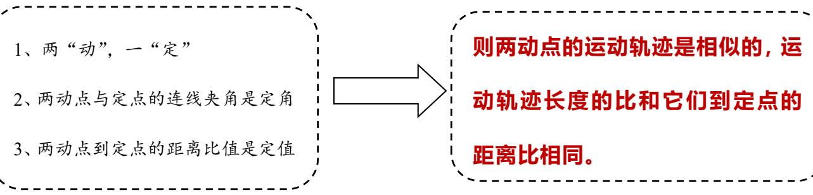

# 【例题 1】三种处理策略

如图， $D$ 、 $E$ 是边长为 4 的等边三角形 ABC 上的中点， $P$ 为中线 $A D$ 上的动点，把线段$P C$ 绕 $C$ 点逆时针旋转 $6 0 ^ { \circ }$ ，得到 $P ^ { \prime }$ ’， $E P ^ { \prime }$ ’的最小值

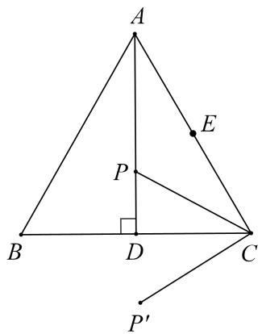

# 【分析】

结合这个例题我们再来熟悉一下瓜豆模型第一层：点 $P ^ { \prime }$ ’运动的轨迹是直线吗？

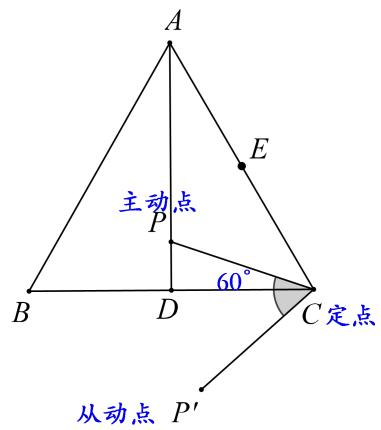

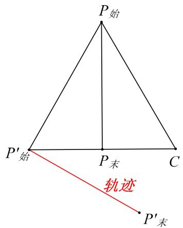

答：是直线，可以通过 $P$ 在 $A$ ， $D$ 时，即始末位置时 $P ^ { \bullet }$ 对应的位置得到直线轨迹，对于选填题，可找出从动点的始末位置，从而快速定位轨迹，若要说理则需要构造手拉手证明.

第二层：点 $P ^ { \prime }$ ’的运动长度和点 $P$ 的运动长度相同吗？

答：因为点 $P ^ { \star }$ 与点 $P$ 到定点 C 的距离相等，则有运动路径长度相等，若要说理则同样需要构造手拉手结构，通过全等证明.

第三层：手拉手模型怎么构造？

答：以旋转中心 $C$ 为顶点进行构造，其实只要再找一组对应的主从点即可，简单来说就是从 $P$ 点的轨迹即线段 $A D$ 中再找一个点进行与 $P$ 点类似的的旋转，比如把线段 AD 中的点 A 绕 $C$ 点逆时针旋转$6 0 ^ { \circ }$ ，即为点 $B$ ，连接 $B P ^ { \ast }$ 即可得到一组手拉手模型，虽然前面说是任意点，但一般来说我们选择一个特殊位置的点进行旋转后的点位置也是比较容易确定的，比如说点 $D$ 进行旋转也是比较方便

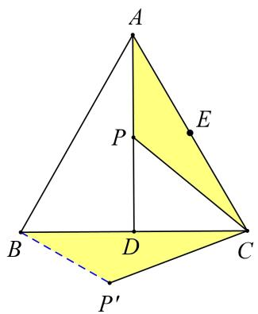

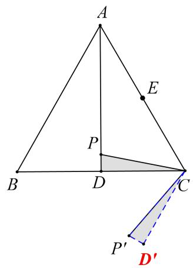

第四层：分析 $\angle C A P$ 和 $\angle C B P ^ { \prime }$

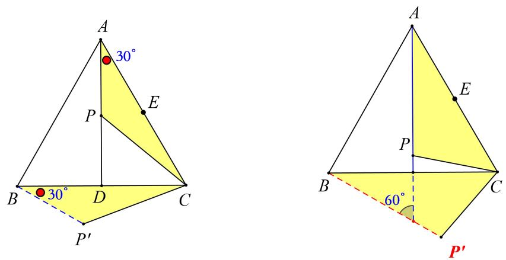

答：由全等可知 $\angle C A P = \angle C B P ^ { \circ }$ ，因为 $B$ 为定点，所以得到 $P ^ { \bullet }$ 轨迹为直线 $B P ^ { \ast }$ 第五层：点 $P$ 和点 $P ^ { : }$ ’轨迹的夹角和旋转角的关系答：不难得出本题主动点与从动点轨迹的夹角等于旋转角，要注意的是如果旋转角是钝角，那么主动点与从动点轨迹的夹角等于旋转角的补角，这个在后面的例题中会出现.

大气层：前面提到，如果是选填题，可以通过找从动点的始末位置快速定位轨迹线段，或者通过构造手拉手，通过全等或相似得出相等角然后得出轨迹，这两种方法都是先找出从动点 $P ^ { \prime }$ 的轨迹，再作垂线段并求出垂线段的长得到最小值，那么还有其他方法吗？

答：还可以对关键点进行旋转来构造手拉手模型，从而代换所求线段，构造如下将点 $E C$ 绕点 $C$ 顺时针旋转 $6 0 ^ { \circ }$ ，构造手拉手模型(SAS全等型)，从而得到 $P ^ { \prime } E { = } P G$ ，最小值即为点$G$ 到 $A D$ 的距离

要注意的是因为要代换 $P ^ { \prime } E$ ，所以 $E$ 点的旋转方式应该是从 $P ^ { \prime } \left| \right.$ ，所以是顺时针旋转，求轨迹时的旋转方式则是 $P | P ^ { \prime }$ ，注意区分.

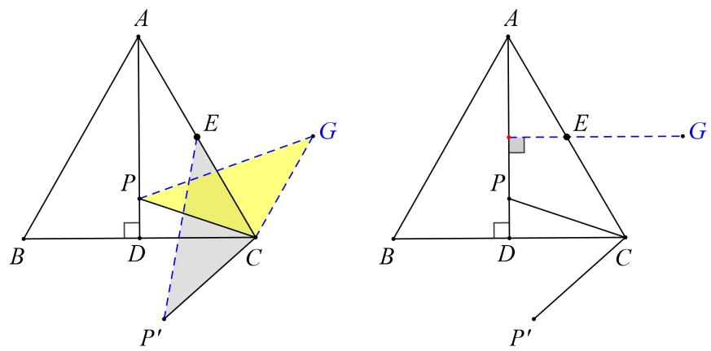

# 解析

# 策略一：找从动点轨迹

连接 $B P ^ { \prime }$ ’，

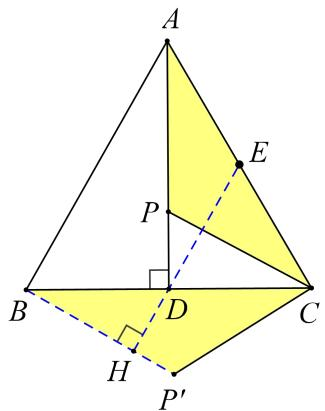

由旋转可得， $C P { = } C P ^ { \prime }$ ， $\angle P ^ { \prime } C P { = } 6 0 ^ { \circ }$ ，  
∵ $\triangle A B C$ 是等边三角形，  
∴ $A C { = } B C$ ， $\angle A C B = 6 0 ^ { \circ }$ ，  
∴ $\angle A C B = \angle P C P ^ { \prime } ,$ ，  
∴△ACP≌△BCP’(SAS)，  
∴ $\angle C B P ^ { \prime } { = } \angle C A P ,$ ，  
∵边长为 4 的等边三角形 $A B C$ 中， $P$ 是对称轴 $A D$ 上的一个动点，  
$\therefore \angle C A P = 3 0 ^ { \circ } , ~ B D = 2 ,$ ，  
∴ $. \angle C B P ^ { \prime } { = } 3 0 ^ { \circ }$ ，  
即点 $P ^ { \prime }$ 的运动轨迹为直线 $B P ^ { \prime }$ ，  
∴当 $D P ^ { \prime } \bot B P ^ { \prime }$ 时， $E P ^ { \prime }$ 最短，  
此时， $E P ^ { \prime } = \frac { 1 } { 2 } B D + E D = \qquad + 2 = 3$   
∴ $E P$ ’的最小值是 3

# 策略二：反向旋转关键点构造手拉手代换所求线段

将点 $E$ 绕 $C$ 点顺时针旋转 $6 0 ^ { \circ }$ 得到点 $G$ ，连接 PG，CG，EP’

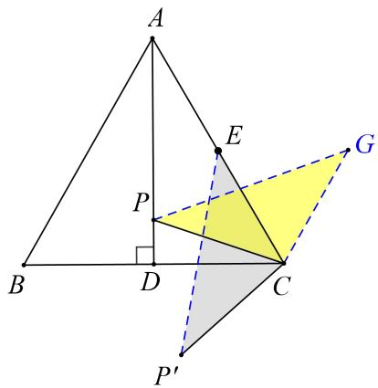

由旋转可得 $E C { = } \ C G$ ， $C P { = } C P ^ { \prime }$ ， $\angle P ^ { \prime } C P { = } 6 0 ^ { \circ }$ ， $\angle E C G = 6 0 ^ { \circ }$ ，  
∴△ECG 是等边三角形， $E G = 2$   
∵ $\cdot \angle P C P ^ { \prime } = \angle E C G$   
$\therefore \angle P C G = \angle E C P ^ { , }$   
∴△GCP≌△ECP’(SAS)，  
$\cdot _ { E P ^ { \prime } = G P }$ ，  
过点 $G$ 作 $A D$ 的垂线 $G H$ 垂足为 $H$ ， $G H$ 即为所求  
∵ $\angle G E C = \angle A C D$   
∴HE∥DC  
∵ $\angle G H D = \angle A D C$   
∴HG∥DC  
故 $G$ ， $E$ ， $H$ 三点共线，则有 HE∥DC  
又 $E$ 是 $A C$ 中点，分线段成比例可知 $H$ 是 $A D$ 中点  
$\therefore H E =$   
$-$   
∴ $E P ^ { \prime }$ 的最小值是 3

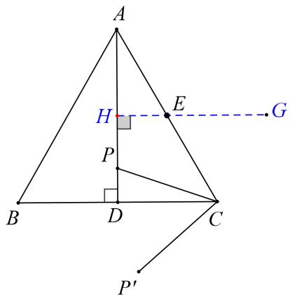

总共提到了 3 种处理方式：

1.找始末，定轨迹  
2.在轨迹上找一点旋转，构造手拉手模型，再通过角度相等得到从动点轨迹.  
3.反向旋转相关定点，构造手拉手模型，代换所求线段，即逆向构造.

# 【例题 2】饮马类瓜豆与加权线段和问题

已知点 $A { \big ( } 2 , 0 { \big ) }$ ，点 $B$ 是直线 $y = - 2$ 上一个动点，将线段 $A B$ 绕点 $B$ 逆时针旋转 $9 0 ^ { \circ }$ 得到线段 $B C$ .

角度 1：反向旋转构造手拉手（不用求从动点轨迹，直接转换为垂线段最短）

（1）求 $O C$ 的最小值

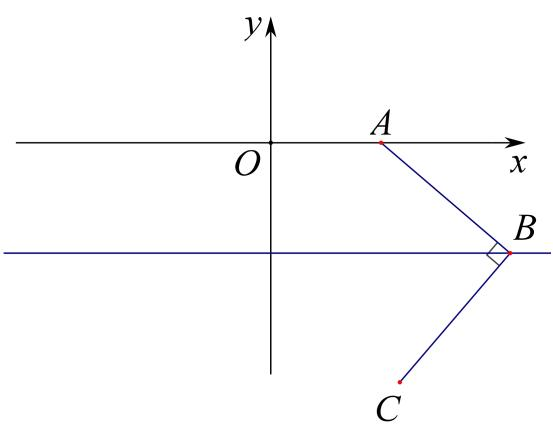

【简析】如图，构造等腰直角△AOE， $E ( 1 , - 1 )$ 由旋转相似可知 $O C = \sqrt { 2 } B E \leq \sqrt { 2 }$

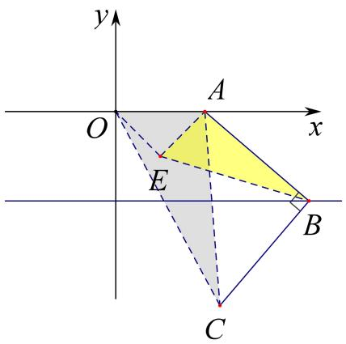

# 角度 2：构造手拉手求从动点轨迹

（2）求 $\sqrt { 2 } B C + O C$ 的最小值

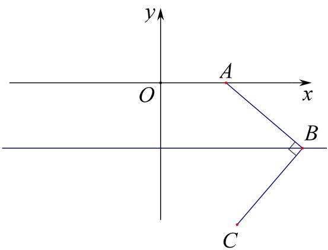

【简析 $\mathbf { 1 } { \sqrt { 2 } } B C + O C = A C + O C$ ，求出 C 点轨迹，再将军饮马，如图，在 B 点轨迹上取一点 $M \left( 2 , - 2 \right)$ ，构 造 旋 转 相 似 ， 易 知 $\angle C A N = 9 0 ^ { \circ }$ ， 可 知 C 点 轨 迹 为 $y = - x - 2$ ， 作 $O ^ { \prime } \left( - 2 , - 2 \right)$ ，$A C + O C = A C + O ^ { \prime } C \geq A O ^ { \prime } = 2 { \sqrt { 5 } }$ ，补充：此时加权线段和对应三边之比

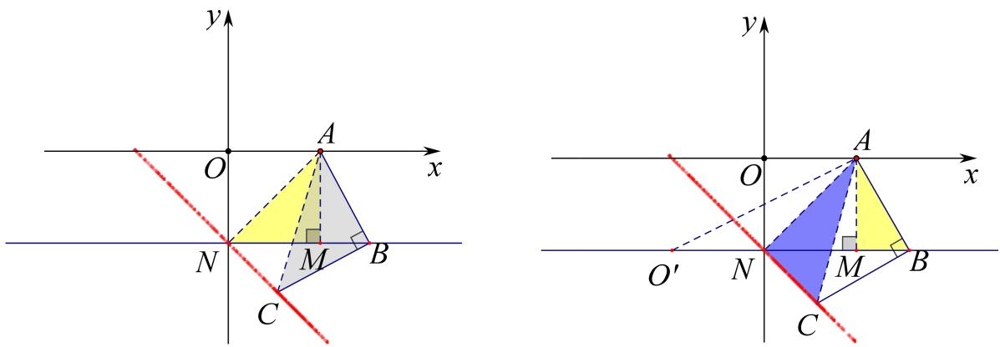

# 角度 3：构造旋转相似求加权线段和

（3）记 $D \big ( 0 , 2 \big )$ ， $\textcircled{1}$ 求 $D C + O B$ 的最小值； $\textcircled{2}$ 求 $\sqrt { 2 } O B + O C$ 的最小值

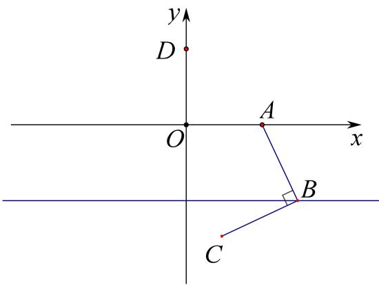

【简析】 $\textcircled{1}$ 由旋转相似可知 $D C = \sqrt { 2 } O B$ ，则 $D C + O B = \left( { \sqrt { 2 } } + 1 \right) O B \leq 2 { \sqrt { 2 } } + 2$

$\textcircled { 2 } \sqrt { 2 } O B + O C = D C + O C = D C + O ^ { \prime } C \geq D O ^ { \prime } = 2 \sqrt { 5 }$ ，补充：此时加权线段和对应相似比

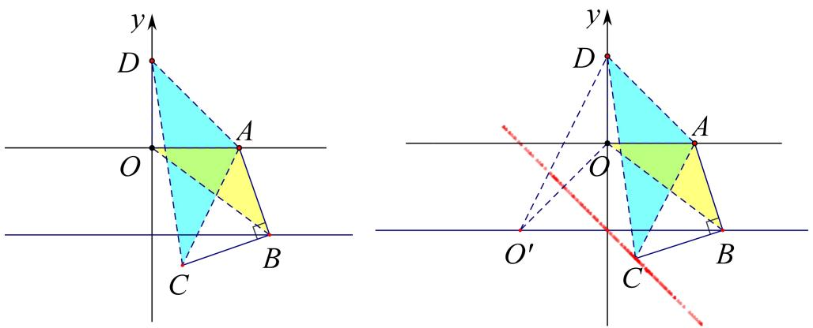

# 【瓜豆圆介绍】

如图，P 是圆 O 上一个动点，A 为定点，连接 AP，Q 为 AP 中点。当点 P 在圆 O 上运动时，Q 点轨迹是？

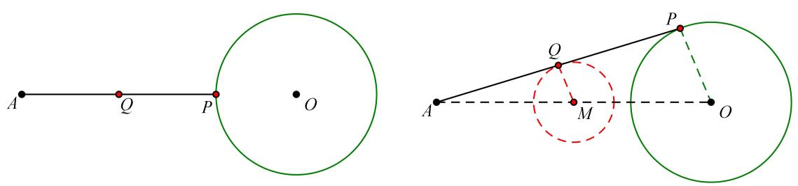

【分析】观察动图可知点 Q 轨迹是个圆，而我们还需确定的是此圆与圆 O 有什么关系？

考虑到 Q 点始终为 AP 中点，连接 AO，取 AO 中点 M，则 M点即为 Q 点轨迹圆圆心，半径 MQ 是OP 一半，任意时刻，均有△AMQ∽△AOP，QM:PO $\ L =$ AQ:AP=1:2

【小结】

确定 Q 点轨迹圆即确定其圆心与半径，由 A、Q、P 始终共线可得：A、M、O 三点共线，由 Q 为 AP中点可得： ${ \mathrm { A M } } { = } \frac 1 2 { \mathrm { A O } }$ ．

Q 点轨迹相当于是 P点轨迹成比例缩放根据动点之间的相对位置关系分析圆心的相对位置关系；根据动点之间的数量关系分析轨迹圆半径数量关系

# 核心·题型

# 题型一 轨迹为直线型·构造中位线求

# 2023·广东深圳·统考三模

1．如图所示， $A B = 4$ ， $A C = 2$ ，以 $B C$ 为底边向上构造等腰直角三角形 $B C D$ ，连接 $A D$ 并延长至点 $P$ ，使 $A D = P D$ ，则 $P B$ 长的取值范围为

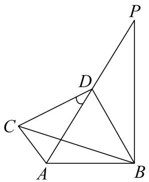

【答案】 $4 - 2 \sqrt { 2 } \leq P B \leq 4 + 2 \sqrt { 2 }$

【分析】以 $A B$ 为斜边作等腰直角三角形 $A B F$ ，延长 $A F$ 至点 $\cdot$ ．使 $A { \cal F } = E { \cal F }$ ，连接 $E P , B E$ ．利用等腰直角三角形的性质得出 $\Delta A B C \sim \Delta F B D$ 利用相似三角形的性质求出 $D F = { \sqrt { 2 } }$ ，再利用三角形中位线的性质求出 $P E = 2 \sqrt { 2 }$ ，由 $\Delta A B F$ 是等腰直角三角形， $A { \cal F } = { \cal F } { \cal E }$ ，得出 $B F$ 垂直平分 $A E$ ，进而求出$B E = 4$ ，继而利用三角形的三边关系即可求出答案

【详解】解：如图，以 $A B$ 为斜边作等腰直角三角形 $A B F$ ，延长 $A F$ 至点 $\cdot$ ．使 $A { \cal F } = E { \cal F }$ ，连接 $E P$ 、

$B E$

∵ $\Delta C B D$ 和 $\Delta A B F$ 都是等腰直角三角形，$B C = \sqrt { C D ^ { 2 } + B D ^ { 2 } } = \sqrt { 2 } B D \quad A B = \sqrt { A F ^ { 2 } + B F ^ { 2 } } = \sqrt { 2 } B F$   
$\frac { B C } { B D } = \frac { A B } { B F } = \sqrt { 2 } \angle C B D = \angle A B F = 4 5 ^ { \circ }$   
∴ $\angle C B D - \angle C B F = \angle A B F - \angle C B F$ ，即 $\angle F B D = \angle A B C$ ，  
$\therefore \triangle A B C \sim \triangle F B D$ ，${ \frac { A C } { D F } } { = } { \frac { B C } { B D } } { = } { \sqrt { 2 } }$   
∵ $A C = 2$ ，  
$D F = { \frac { A C } { \sqrt { 2 } } } = { \frac { 2 } { \sqrt { 2 } } } = { \sqrt { 2 } }$ ，$\therefore A D = D P , A F = F E ,$ ，  
$\therefore D F$ 是 $\triangle A E P$ 的中位线，  
$E P = 2 D F = 2 { \sqrt { 2 } }$ ，  
∵ $\Delta A B F$ 是等腰直角三角形， $A { \cal F } = { \cal F } { \cal E }$ ，  
$\therefore B F$ 垂直平分 $A E$ ，  
$B A = B E$ ，  
∵ $A B = 4$ ，  
∴ $B E = 4$ ，  
$4 - 2 \sqrt { 2 } \leq P B \leq 4 + 2 \sqrt { 2 }$ ，  
故答案为： $4 - 2 \sqrt { 2 } \leq P B \leq 4 + 2 \sqrt { 2 }$

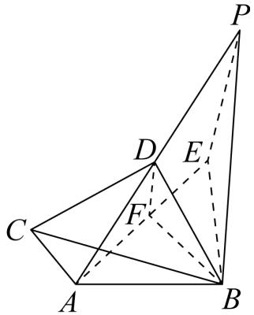

# 题型二 轨迹为直线型·构造手拉手

# 经典例题·宿迁中考

2．如图，正方形 ABCD 的边长为 4， $E$ 为 $B C$ 上一点，且 $B E { = } 1$ ， $F$ 为 $A B$ 边上的一个动点，连接EF，以 EF 为边向右侧作等边△EFG，连接 $C G$ ，则 $C G$ 的最小值为

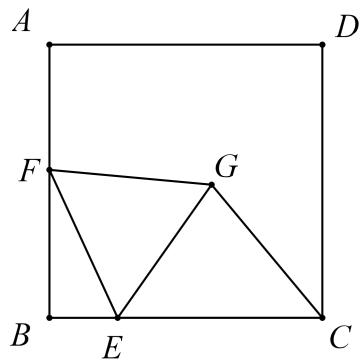

# 【分析】

现在，我们分别用上面提到的 3种策略来处理这个题目

策略一：找始末，定轨迹

我们分别以 $B E$ ， $\cdot$ 为边，按题目要求构造等边三角形得到 $\cdot$ 与 $\cdot$ ，连接 $G _ { 1 }$ 与 $\cdot$ 得到点 $G$ 的轨迹，再作垂线 $C H$ 得到最小值.

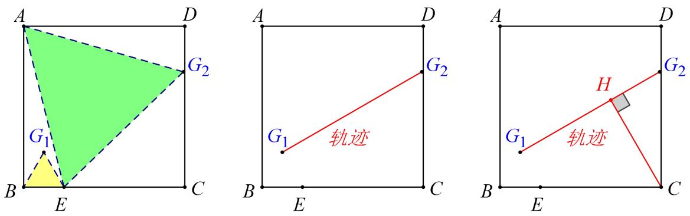

前面提到过从动点轨迹和主动点轨迹的夹角与旋转角有关，我们可以调用这个结论，得到 $\cdot$ $= 6 0 ^ { \circ }$ °

进一步得到△MBG1为等腰三角形后，求 $C H$ 就不难了，可得 $C H { = } \frac { 5 } { 2 }$ 策略二：在点 $\cdot$ 轨迹上找一点进行旋转.我们分别对 $A$ ， $\cdot$ 顺时针旋转 $6 0 ^ { \circ }$ ，构造手拉手模型，再通过角度相等得到从动点轨迹，对 $\cdot$ 点旋转会得到一个正切值为 $\frac 1 4$ 的角，即 tan $\angle G \mathrm { M } \mathrm { \nabla { E } } = \tan \angle A \mathrm { F E } = \frac { 1 } { 4 }$ 然后进一步算出最值【简证】 $E M = A E = { \sqrt { 1 7 } } \Rightarrow E N = 1 \Rightarrow \angle N E C = 1 2 0 ^ { \circ } \Rightarrow I C = { \frac { 3 } { 2 } }$ ,则 $C H { = } \frac { 5 } { 2 }$ 对 $\cdot$ 点旋转得到 $\angle E M G = \angle F B E = 9 0 ^ { \circ }$ °，相对来说要容易一些.

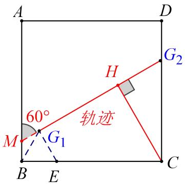

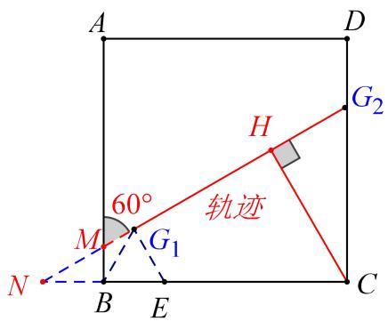

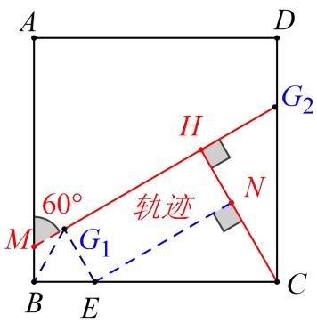

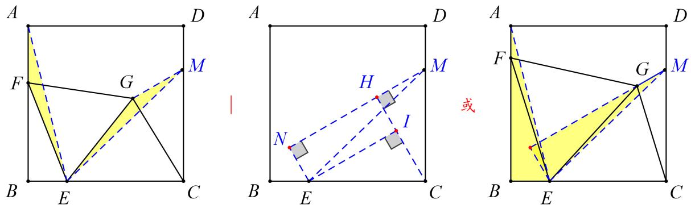

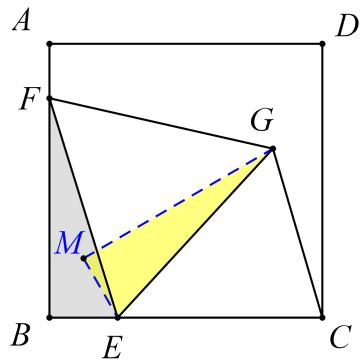

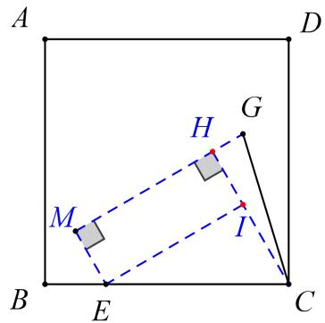

策略三：反向旋转相关定点，构造手拉手模型，代换所求线段.  
讲点 $C$ 逆时针旋转 $\cdot$ °，得到点 $H$ ，易证 $\Delta C G E \cong \Delta H F E$ ，则有 $C G { = } H F$ ，作 $\cdot$ 于 $M$ ，HM即为所求．相比之下，先求轨迹后再求垂线段时，比较麻烦，而反向旋转代换所求线段感觉清爽很多.

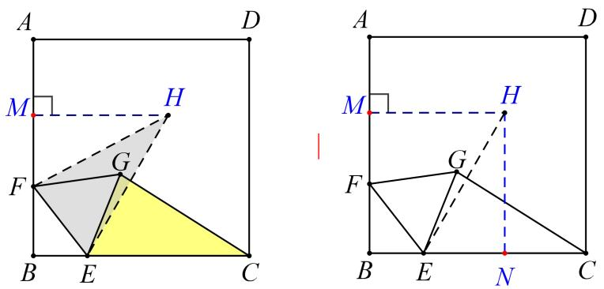

3．如图，在平行四边形 $A B C D$ 中，点 $E$ 为射线 $A D$ 上一动点，连接 $B E$ ，将 $B E$ 绕点 $B$ 逆时针旋转 $6 0 ^ { \circ }$ 得到 $B F$ ，连接 $A F$ ， $A B = 1 2$ ， $\angle A B C { = } 4 5 ^ { \circ }$ ，求 $A F$ 的最小值

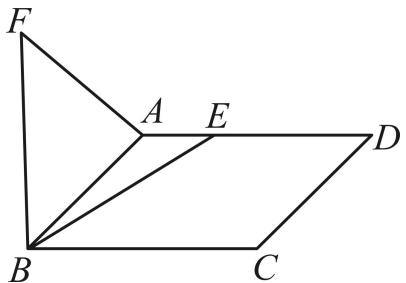

【思路点拨】将 $A B$ 顺时针旋转 $6 0 ^ { \circ }$ ，作等边 $\triangle A B K$ ，根据手拉手模型可知 $A F = E K$ ，根据垂线段最短可知，当 $E K \perp A D$ 时， $K E$ 的值最小，利用勾股定理求解 $E K$ 即可求解

【答案】 $3 \sqrt { 6 } + 3 \sqrt { 2 }$

【详解】解：如图，以 $A B$ 为边向下作等边 $\triangle A B K$ ，连接 $E K$ ，在 $E K$ 上取一点 $T$ 使得 $A T = T K$ ，∵ $B E = B F$ ， $B K = B A$ ， $\angle E B F = \angle A B K = 6 0 ^ { \circ } \qquad \angle A B F = \angle K B E \qquad { \scriptstyle \triangle A B F } \sqcap { \cal B E } { \cal B E } { \cal B E } { \cal B } { \cal B } { \cal B } { \cal B } { \cal B } { \cal B } { \cal B } { \cal B } { \cal B } { \cal B } { \cal B } { \cal B } { \cal B } { \cal B } { \cal B } { \cal B } { \cal B } { \cal B } { \cal B } { \cal B } { \cal B } { \cal B } { \cal B } { \cal B } { \cal B } { \cal B } { \cal B } { \cal B } { \cal B } { \cal B } { \cal B } { \cal B } { \cal B } { \cal B } { \cal B } { \cal B } { \cal B } { \cal B } { \cal B } { \cal B } { \cal B } { \cal B } { \cal B } { \cal B } { \cal B } { \cal B } { \cal B } { \cal B } { \cal B } { \cal B } { \cal B } { \cal B } { \cal B } { \cal B } { \cal B } { \cal B } { \cal B } { \cal B } { \cal B } { \cal B } { \cal B } { \cal B } { \cal B } { \cal B } { \cal B } { \cal B } { \cal B } { \cal B } { \cal B } { \cal B } { \cal B } { \cal B } { \cal B } { \cal B } { \cal B } { \cal B } { \cal B } { \cal B } { \cal B } { \cal B } { \cal B } { \cal B } { \cal B } { \cal B } { \cal B } { \cal B } { \cal B } { \cal B } { \cal B } { \cal B } { \cal B } { \cal B } { \cal B } { \cal B } { \cal B } { \cal B } { \cal B } { \cal B } { \cal B } { \cal B } { \cal B } { \cal B } { \cal B } { \cal B } { \cal B } { \cal B } { \cal B }  { \cal B } { \cal B } { \cal B } { \cal B } { \cal B }  \cal B { \cal B } { \cal B }  { \cal B } { \cal B }  \cal B { \cal B } { \cal B }  { \cal B \cal B }  { \cal B } { \cal B }  \cal B { \cal B } { \cal B }  { \cal B }  \cal B { \cal B } { \cal B }  { \cal B }  \cal$ ∴ $A F = E K$ ，根据垂线段最短可知，当 $E K \perp A D$ 时， $K E$ 的值最小，∵四边形 $A B C D$ 时平行四边形$A D / / B C$ ， $\therefore \angle A B C = 4 5 ^ { \circ } , \therefore \angle B A D = 1 8 0 ^ { \circ } - \angle A B C = 1 3 5 ^ { \circ } , \because \angle B A K = 6 0 ^ { \circ } , \therefore \angle E A K = 7 5 ^ { \circ } ,$ ，∵ $\angle A E K = 9 0 ^ { \circ }$ ，∴ $\angle A K E = 1 5 ^ { \circ }$ ， $\therefore T K = T A$ ，∴TAK  AKT 15，∴ATE  TAK AKT 30设 $A E = a$ ，则 $A T = T K = 2 a$ ， $E T = \sqrt { 3 } a$ ，在 RtAEK 中， $\boldsymbol { A } \boldsymbol { K } ^ { 2 } = \boldsymbol { A } \boldsymbol { E } ^ { 2 } + \boldsymbol { E } \boldsymbol { K } ^ { 2 }$ $\therefore a ^ { 2 } + \left( 2 a + { \sqrt { 3 } } a \right) ^ { 2 } = 1 2 ^ { 2 }$ ，解得 $a = 3 { \sqrt { 6 } } - { \sqrt { 2 } } { \mathrm { ) } } \qquad E K = 2 a + { \sqrt { 3 } } a = 3 { \sqrt { 6 } } + 3 { \sqrt { 2 } }$ 即 $A F$ 的最小值为 $3 \sqrt { 6 } + 3 \sqrt { 2 }$

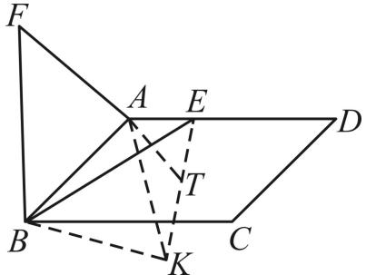

4．（2023·洛阳·二模）如图，在 ${ \triangle A B C }$ 中， $A B = A C = 2$ ， $\angle B A C = 1 2 0 ^ { \circ }$ ，对称轴 $A D$ 交 $B C$ 于点 $D$ ，点 $E$ 是直线 $A D$ 上的一个动点，连接 $E C$ ，将线段 $E C$ 绕点 $C$ 逆时针旋转 $3 0 ^ { \circ }$ 得 $F C$ ，连接 $D F$ ，则 $D F$ 长的最小值为

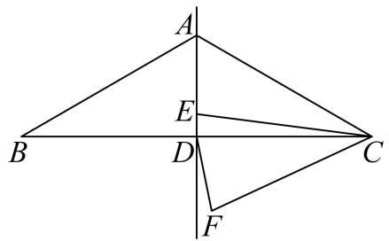

【答案】 $\frac { 2 { \sqrt { 3 } } - 3 } { 2 }$

【分析】在 $A C$ 上取一点 $G$ ，使 $C G = C D$ ，连接 $E G$ ，根据全等三角形的性质可得 $C D = C G = { \sqrt { 3 } }$ ，再 求出 $\angle D C F = \angle G C E$ ，根据旋转的性质可得 $C E = C F$ ，然后利用“边角边”证明 $\triangle D C F$ 和 $_ { \triangle G C E }$ 全等， 再根据全等三角形对应边相等可得 $D F = E G$ ，然后根据垂线段最短可得 $E G \perp A D$ 时最短，再根据 $\angle C A D = 6 0 ^ { \circ }$ 求解即可

【详解】解：如图，在 $A C$ 上取一点 $G$ ，使 $C G = C D$ ，连接 $E G$ ，

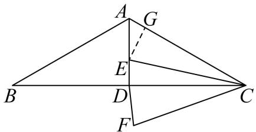

 $\cdot A B = A C = 2$ ， $\angle B A C = 1 2 0 ^ { \circ }$ ，$. \angle A C B = 3 0 ^ { \circ }$ ，  
$\cdot C D = \sqrt { 3 }$ ，  
旋转角为 $3 0 ^ { \circ }$ ，$. \angle E C F = 3 0 ^ { \circ }$ ，  
 $. \angle E C F = \angle A C B$ ，  
$. \angle G C E = \angle D C F$ ，$C D = C G$ ，  
又 $C E$ 旋转到 $C F$ ，  
 $C E = C F$ ，   
$\cdot . \triangle D C F { \cong } \triangle G C E ( \mathrm { S A S } )$ ，  
$. D F = E G$ ，  
根据垂线段最短， $E G \perp A D$ 时，

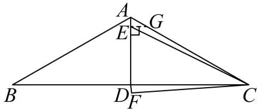

$\because \angle C A D = { \frac { 1 } { 2 } } \times 1 2 0 ^ { \circ } = 6 0 ^ { \circ } \qquad A G = A C - C G = 2 - { \sqrt { 3 } }$ 资料整理【淘宝店铺：向阳百分百】

$$
\therefore E G = A G \cdot \sin 6 0 ^ { \circ } = ( 2 - { \sqrt { 3 } } ) \times { \frac { \sqrt { 3 } } { 2 } } = { \sqrt { 3 } } - { \frac { 3 } { 2 } } , ~ \therefore D F = { \sqrt { 3 } } - { \frac { 3 } { 2 } }
$$

5．（2023·广东深圳·校考模拟预测）如图，在 ${ \triangle A B C }$ 中， $\angle A C B = 9 0 ^ { \circ }$ ， $A C = B C = 4$ ， $P$ 是 ${ \triangle A B C }$ 的高 $C D$ 上一个动点，以 $B$ 点为旋转中心把线段 $B P$ 逆时针旋转 $4 5 ^ { \circ }$ 得到 $B P ^ { \prime }$ ，连接 $D P ^ { \prime }$ ，则 $D P ^ { \prime }$ 的最小值是

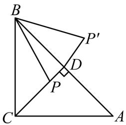

【答案】 $2 \sqrt { 2 } - 2$

【分析】在 $B C$ 上截取 $B E = B D$ ，根据等腰直角三角形的性质求得 BA 和 $B E$ ，再证明${ \scriptstyle \triangle B D P ^ { \prime } { \overset { \smile } { = } } \triangle B E P \left( \mathrm { S A S } \right) }$ ，从而可得到 $P E = D P ^ { \prime }$ ，则当 $P E \bot C D$ 时， $P E$ 有最小值，即 $D P ^ { \prime }$ 有最小值，再求得 $P E$ ，从而求得 $D P ^ { \prime }$ 的最小值

【详解】解：如图，在 $B C$ 上截取 $B E = B D$ ，连接 $E P$

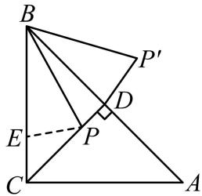

∵ $\cdot \angle A C B = 9 0 ^ { \circ } , A C = B C = 4 C D \perp A B ,$ ，  
∴ 2 2 2 2BA  AC  BC  4  4  4 2 ， $\angle A B C = \angle B A C = \angle B C D = \angle D C A = 4 5 ^ { \circ } \ , B D = C D = A D = 2 \sqrt { 2 } = B E \ ,$ ，  
∵以 $\cdot$ 点为旋转中心把线段 $B P$ 逆时针旋转 $4 5 ^ { \circ }$ 得到 $B P ^ { \prime }$ ，  
$B P = B P ^ { \prime } , ~ \angle P B P ^ { \prime } = 4 5 ^ { \circ }$ ，  
∴ $\angle A B C = \angle P B P ^ { \prime } = 4 5 ^ { \circ } ,$ ，  
$\therefore \angle A B C - \angle P B D = \angle P B P ^ { \prime } - \angle P B D$ ，  
即 $\angle E B P = \angle D B P$ ，  
又∵ $B E = B D , B P = B P$ ，  
$\therefore \Delta B D P ^ { \prime } \cong \Delta B E P \left( \mathrm { S A S } \right) ,$ ，  
∴ $P E = D P ^ { \prime }$ ，  
∴当 $P E \bot C D$ 时， $P E$ 有最小值，即 $D P ^ { \prime }$ 有最小值，  
$P E \bot C D$ ， $\angle B C D = 4 5 ^ { \circ }$ ，  
$\therefore C E = \sqrt { 2 } P E = B C - B E = 4 - 2 \sqrt { 2 }$   
$P E = { \frac { \sqrt { 2 } } { 2 } } C E = { \frac { \sqrt { 2 } } { 2 } } \times \left( 4 - 2 { \sqrt { 2 } } \right) = 2 { \sqrt { 2 } } - 2$ ，  
$\therefore D P ^ { \prime } = P E = 2 { \sqrt { 2 } } - 2 .$   
即 $D P ^ { \prime }$ 的最小值是 $2 \sqrt { 2 } - 2$

6．如图， ${ \triangle A B C }$ 是边长为6的等边三角形，点 $E$ 为高 $B D$ 上的动点．连接 $C E$ ，将 $C E$ 绕点 $C$ 顺时针旋转 $6 0 ^ { \circ }$ 得到 $C F$ ．连接 $A F$ ， $E F$ ， $D F$ ，则 $\triangle C D F$ 周长的最小值是

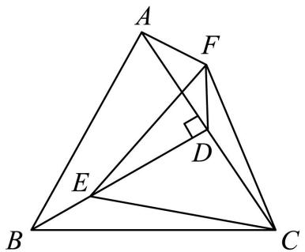

【答案】 $3 + 3 \sqrt { 3 }$

【分析】根据题意，证明 $\triangle C B E { \cong } \triangle C A F$ ，进而得出 $F$ 点在射线 $A F$ 上运动，作点 $C$ 关于 $A F$ 的对称点$C ^ { \prime }$ ，连接 $D C ^ { \prime }$ ，设 $C C ^ { \prime }$ 交 $A F$ 于点 $O$ ，则 $\angle A O C { = } 9 0 ^ { \circ }$ ，则当 $D , F , C ^ { \prime }$ 三点共线时， $F C + F D$ 取得最小值，即 $F C + F D = F ^ { \prime } C ^ { \prime } + F ^ { \prime } D = C D ^ { \prime }$ ，进而求得 $C ^ { \prime } D$ ，即可求解

【详解】解：∵ $E$ 为高 $B D$ 上的动点$\angle C B E = \frac { 1 } { 2 } \angle A B C = 3 0 ^ { \circ }$   
∵将 $C E$ 绕点 $C$ 顺时针旋转 $6 0 ^ { \circ }$ 得到 $C F$ ． ${ \triangle A B C }$ 是边长为6的等边三角形，  
$\therefore C E = C F , \angle E C F = \angle B C A = 6 0 ^ { \circ } , B C = A C$   
$\therefore \Delta C B E \cong \Delta C A F$ $\therefore \angle C A F = \angle C B E = 3 0 ^ { \circ } ,$ ，  
∴ $F$ 点在射线 $A F$ 上运动，  
如图所示，  
作点 $C$ 关于 $A F$ 的对称点 $C ^ { \prime }$ ，连接 $D C ^ { \prime }$ ，设 $C C ^ { \prime }$ 交 $A F$ 于点 $O$ ，则 $\angle A O C { = } 9 0 ^ { \circ }$   
在 $\mathrm { R t } _ { \Delta A O C }$ 中， $\angle C A O = 3 0 ^ { \circ }$ ，则 $C O = { \frac { 1 } { 2 } } A C = 3$ ，  
则当 $D , F , C ^ { \prime }$ 三点共线时， $F C + F D$ 取得最小值，即 $F C + F D = F ^ { \prime } C ^ { \prime } + F ^ { \prime } D = C D ^ { \prime }$   
∵ $C C ^ { \prime } = A C = 6$ ， $\angle A C O = \angle C ^ { \prime } C D$ ， $C O { = } C D$   
$\triangle A C O \cong \triangle C ^ { \prime } C D$   
∴ $. \angle C ^ { \prime } D C = \angle A O C = 9 0 ^ { \circ }$   
在 $\triangle C ^ { \prime } D C$ 中， $C ^ { \prime } D = \sqrt { C C ^ { \prime } { } ^ { 2 } - C D ^ { 2 } } = \sqrt { 6 ^ { 2 } - 3 ^ { 2 } } = 3 \sqrt { 3 } \ .$ ,  
∴ $\triangle C D F$ 周长的最小值为 $C D + F C + C D = C D + D C ^ { \prime } = 3 + 3 { \sqrt { 3 } }$

7．（2022·山东日照·统考中考真题）如图，在平面直角坐标系 $x O y$ 中，点 $A$ 的坐标为（0，4）， $P$ 是 $x$ 轴上一动点，把线段 $P A$ 绕点 $P$ 顺时针旋转 $6 0 ^ { \circ }$ 得到线段 $P F$ ，连接 $O F$ ，则线段 $O F$ 长的最小值是

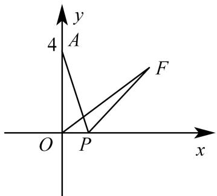

【答案】2

【分析】点 $F$ 运动所形成的图象是一条直线，当 $\cdot$ 时，垂线段 $O F$ 最短，当点 $F _ { I }$ 在 $\cdot$ 轴上时，由勾股定理得： $P _ { 1 } O = F _ { 1 } O = \frac { 4 \sqrt { 3 } } { 3 }$ ，进而得 $P _ { 1 } A = P _ { 1 } F _ { 1 } = A F _ { 1 } = { \frac { 8 { \sqrt { 3 } } } { 3 } }$ 求得点 $F _ { I }$ 的坐标为 $\left( { \frac { 4 { \sqrt { 3 } } } { 3 } } , 0 \right)$ ,当点 $\cdot$ 在 $y$ 轴上时，求得点 $\cdot$ 的坐标为（0，-4），最后根据待定系数法，求得直线 $F _ { I } F _ { 2 }$ 的解析式为 $\sqrt { 3 }$ ，再由线段中垂线性质得出 $F _ { 1 } F _ { 2 } = A F _ { 1 } = \frac { 8 \sqrt { 3 } } { 3 }$ 在 $R t \triangle O F _ { I } F _ { 2 }$ 中，设点 $\cdot$ 到 $\cdot$ 的距离为 $h$ ，则根据面积法得 $\frac { 1 } { 2 } { \times } O F _ { 1 } { \times } O F _ { 2 } = \frac { 1 } { 2 } { \times } F _ { 1 } F _ { 2 } { \times } h$ ，即 ${ \frac { 1 } { 2 } } \times { \frac { 4 { \sqrt { 3 } } } { 3 } } \times 4 = { \frac { 1 } { 2 } } \times { \frac { 8 { \sqrt { 3 } } } { 3 } } \times h$ ，解得 $h { = } 2$ ，根据 垂线段最短，即可得到线段 $\cdot$ 的最小值为 2

【详解】解：∵将线段 $\cdot$ 绕点 $\cdot$ 顺时针旋转 $6 0 ^ { \circ }$ 得到线段 $P F$   
∴ $. \angle A P F { = } 6 0 ^ { \circ }$ ， $\cdot$ ，  
∴ $\triangle A P F$ 是等边三角形，  
∴ $. A P { = } A F$ ，  
如图，当点 $F _ { I }$ 在 $\cdot$ 轴上时， $\cdot$ 为等边三角形，  
则 $\_$ ， $\angle A P _ { I } F _ { I } { = } 6 0 ^ { \circ }$ ，$\_$ ，  
$\cdot$ ， $\angle A O P _ { I } { = } 9 0 ^ { \circ }$ ，  
∴ $\_$ ，且 $A O { = } 4$ ，  
由勾股定理得： $P _ { 1 } O = F _ { 1 } O = \frac { 4 \sqrt { 3 } } { 3 }$ ,  
$\therefore P _ { 1 } A = P _ { 1 } F _ { 1 } = A F _ { 1 } = { \frac { 8 { \sqrt { 3 } } } { 3 } } ,$   
∴点 $\cdot$ 的坐标为 $\left( { \frac { 4 { \sqrt { 3 } } } { 3 } } , 0 \right)$   
如图，当点 $\cdot$ 在 $\cdot$ 轴上时，  
∵ $\triangle P _ { 2 } A F _ { 2 }$ 为等边三角形， $\cdot$ ，  
$\cdot . A O { = } F _ { 2 } O { = } 4$ ，  
∴点 $F _ { 2 }$ 的坐标为（0，-4），  
$\cdot ^ { \mathrm { \ t a n \it { \ L O F _ { 1 } } F _ { 2 } } } = \frac { O F _ { 2 } } { O F _ { 1 } } = \frac { 4 } { \frac { 4 \sqrt { 3 } } { 3 } } = \sqrt { 3 } \ : ,$ (d  
$\_$ ，  
∴点 $F$ 运动所形成的图象是一条直线，  
∴当 $O F \bot F _ { I } F _ { 2 }$ 时，线段 $\cdot$ 最短，  
设直线 $F _ { I } F _ { 2 }$ 的解析式为 $\cdot$ ，  
则 $\left\{ { \frac { 4 { \sqrt { 3 } } } { 3 } } k + b = 0 \right.$ (  
解得 $\left\{ \begin{array} { l l } { k = \sqrt { 3 } } \\ { b = - 4 } \end{array} \right.$ ∴直线 $\cdot$ 的解析式为 $y = \sqrt { 3 } x - 4$ ，∵ $\_$ ， $\cdot$ ，  
$F _ { 1 } F _ { 2 } = A F _ { 1 } = { \frac { 8 { \sqrt { 3 } } } { 3 } }$ 在 $R t \triangle O F _ { I } F _ { 2 }$ 中， $\cdot$ ，  
设点 $O$ 到 $F _ { I } F _ { 2 }$ 的距离为 $\cdot$ ，则 $\frac { 1 } { 2 } { \times } O F _ { 1 } { \times } O F _ { 2 } = \frac { 1 } { 2 } { \times } F _ { 1 } F _ { 2 } { \times } h$ ，${ \frac { 1 } { 2 } } \times { \frac { 4 { \sqrt { 3 } } } { 3 } } \times 4 = { \frac { 1 } { 2 } } \times { \frac { 8 { \sqrt { 3 } } } { 3 } } \times h$ ，解得 $\cdot$ ，即线段 $\cdot$ 的最小值为 2

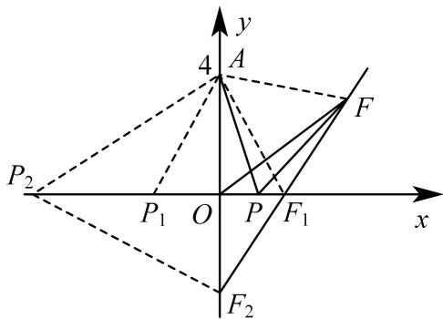

# 2023·湖北黄冈·统考中考真题

8．如图，已知点 $A ( 3 , 0 )$ ，点 $B$ 在 $y$ 轴正半轴上，将线段 $A B$ 绕点 $A$ 顺时针旋转 $1 2 0 ^ { \circ }$ 到线段 $A C$ ，若点 $C$ 的坐标为 $( 7 , h )$ ，则 $h = .$

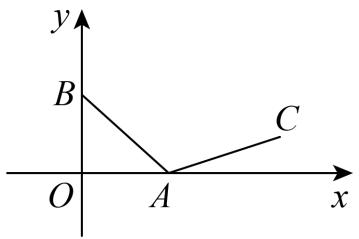

【答案】 $\frac { 2 { \sqrt { 3 } } } { 3 }$ 【分析】

思路一：构造手拉手得出 BC 中点轨迹

思路二：在 $\cdot$ 轴上取点 $\cdot$ 和点 $E$ ，使得 $\angle A D B = \angle A E C = 1 2 0 ^ { \circ }$ ，过点 $\cdot$ 作 $C F \perp x$ 于点 $\cdot$ ，在Rt△CEF中，解直角三角形可得 $E F = { \frac { \sqrt { 3 } } { 3 } } h$ ， $C E = \frac { 2 \sqrt { 3 } } { 3 } h$ ，再证明 ${ \triangle } C A E { \cong } { \triangle } A B D \left( { \mathrm { A A S } } \right)$ ，则 $A D = C E = { \frac { 2 { \sqrt { 3 } } } { 3 } } h$ ，$A E = B D$ ，求得 $O D = 3 - { \frac { 2 { \sqrt { 3 } } } { 3 } } h$ 在 $\mathrm { R t } _ { \Delta B O D }$ 中，得 $B D = 6 - { \frac { 4 { \sqrt { 3 } } } { 3 } } h$ ， $A E = B D = 6 - { \frac { 4 { \sqrt { 3 } } } { 3 } } h$ ， 得到$3 + 6 - { \frac { 4 { \sqrt { 3 } } } { 3 } } h + { \frac { \sqrt { 3 } } { 3 } } h = 7$ ，解方程即可求得答案

【法一简证】如图，取 $\cdot$ 中点 $\cdot$ ，作 RT△OAN， $\angle A O N { = } 3 0 ^ { \circ }$ ，则 $N { \Bigg ( } { \frac { 9 } { 4 } } , { \frac { 3 { \sqrt { 3 } } } { 4 } } { \Bigg ) }$ , △AON∽△ABM由旋转相似可知 $\triangle A O B \sim \triangle A N M .$ ，故 $\_$ °，故 $M$ 点轨迹为 $l _ { O N } : y = \frac { \sqrt { 3 } } { 3 } x$ ，当 $x = { \frac { 7 } { 2 } } \Rightarrow y = { \frac { 7 { \sqrt { 3 } } } { 6 } }$ 则 $M \left( \frac { 7 } { 2 } , \frac { 7 \sqrt { 3 } } { 6 } \right)$ 而 $B O = 2 N M = 2 { \sqrt { \left( { \frac { 5 } { 4 } } \right) ^ { 2 } + \left( { \frac { 5 { \sqrt { 3 } } } { 1 2 } } \right) ^ { 2 } } } = { \frac { 5 { \sqrt { 3 } } } { 3 } } ,$   
故 $h = 2 \times { \frac { 7 { \sqrt { 3 } } } { 6 } } - { \frac { 5 { \sqrt { 3 } } } { 3 } } = { \frac { 2 { \sqrt { 3 } } } { 3 } }$

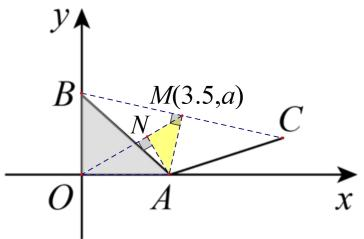

【法二详解】解：在 $\cdot$ 轴上取点 $D$ 和点 $E$ ，使得 $\angle A D B = \angle A E C = 1 2 0 ^ { \circ }$ ，过点 $C$ 作 $C F \perp x$ 于点 $F$ ，

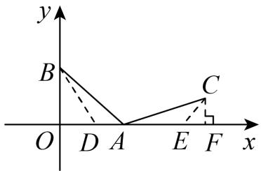

∵点 $C$ 的坐标为 $( 7 , h )$ ，  
$\therefore O F = 7 \ , C F = h ,$   
在 $\mathrm { R t } \triangle C E F$ 中， $\angle C E F = 1 8 0 ^ { \circ } - \angle A E C = 6 0 ^ { \circ } , C F = h ,$   
$E F = { \frac { C F } { \tan 6 0 ^ { \circ } } } = { \frac { \sqrt { 3 } } { 3 } } h ~ C E = { \frac { C F } { \sin 6 0 ^ { \circ } } } = { \frac { 2 { \sqrt { 3 } } } { 3 } } h$   
∵ $\angle B A C = 1 2 0 ^ { \circ }$ ，$\angle B A D + \angle C A E = \angle B A D + \angle A B D = 1 2 0 ^ { \circ }$   
∴ $\angle C A E = \angle A B D$ ，  
∵ $A B = C A$ ，  
∴CAE≌ABD AAS，  
$\therefore A D = C E = { \frac { 2 \sqrt { 3 } } { 3 } } h \ , A E = B D \ ,$   
∵点 $A ( 3 , 0 )$ ，  
∴ $O A = 3$ ，  
$\therefore O D = O A - A D = 3 - { \frac { 2 { \sqrt { 3 } } } { 3 } } h ,$ ，  
在 $\mathrm { R t } _ { \Delta B O D }$ 中， $\angle B D O = 1 8 0 ^ { \circ } - \angle A D B = 6 0 ^ { \circ }$ ,  
$\begin{array} { l } { { \displaystyle B D = \frac { O D } { \cos \angle B D O } = \frac { O D } { \cos 6 0 ^ { \circ } } = 2 \Bigg ( 3 - \frac { 2 \sqrt { 3 } } { 3 } h \Bigg ) = 6 - \frac { 4 \sqrt { 3 } } { 3 } h } } \\ { { \displaystyle A E = B D = 6 - \frac { 4 \sqrt { 3 } } { 3 } h } } \\ { { \displaystyle O A + A E + E F = O F } } \\ { { \displaystyle 3 + 6 - \frac { 4 \sqrt { 3 } } { 3 } h + \frac { \sqrt { 3 } } { 3 } h = 7 } } \end{array}$   
解得 $h = \frac { 2 \sqrt { 3 } } { 3 }$

9．如图，在 ${ \triangle A B C }$ 中， $\angle A C B = 9 0 ^ { \circ }$ ， $A C = 1 5$ ， $B C = 9$ ，点 $P$ 是线段 $A C$ 上的一个动点，连接 $B P$ ，将线段 $B P$ 绕点 $P$ 逆时针旋转 $9 0 ^ { \circ }$ 得到线段 $P D$ ，连接 $A D$ ，则线段 $A D$ 的最小值是

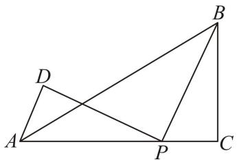

【答案】 $3 \sqrt { 2 }$ 【分析】法一：

法二：过点 $D$ 作 $D E \bot A C$ 于 $E$ ，有旋转的性质可得 $D P = B P$ ， $\angle D P B = 9 0 ^ { \circ }$ ，由“ AAS ”可证$\triangle D E P { \cong } \triangle P C B$ ，可得 $D E { = } C P$ ， $E P = B C = 9$ ，可求 $A E + D E = 6$ ，由勾股定理和二次函数的性质可求解．

【详解】解：如图，过点 $D$ 作 $D E \bot A C$ 于 $E$ ，

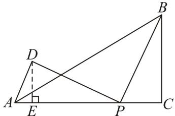

将线段 $B P$ 绕点 $P$ 逆时针旋转 $9 0 ^ { \circ }$ 得到线段 $P D$ ，$. D P { = } B P$ ， $\angle D P B = 9 0 ^ { \circ }$ ，  
 $. \angle D P E + \angle B P C = 9 0 ^ { \circ }$ ，且 $\angle B P C + \angle P B C = 9 0 ^ { \circ }$ ，资料整理【淘宝店铺：向阳百分百】  
 $\angle D P E = \angle P B C$ ，且 $D P = B P$ ， $\angle D E P = \angle C = 9 0 ^ { \circ }$ ，  
 $\triangle D E P \cong \triangle P C B ( \mathrm { A A ^ { \prime } }$ S)  
 $D E = C P$ ， $E P = B C = 9$ ，  
$\because A E + P C = A C - E P = 6$   
 $\cdot \ A E + D E = 6$ ，  
$\because A D ^ { 2 } = A E ^ { 2 } + D E ^ { 2 }$ ，  
$\therefore A D ^ { 2 } = A E ^ { 2 } + ( 6 - A E ) ^ { 2 }$   
 $A D ^ { 2 } = 2 ( A E - 3 ) ^ { 2 } + 1 8$ ，当 $A E = 3$ 时， $A D$ 有最小值为 $3 \sqrt { 2 }$

# 2023·西安市交通大学附属中学初三月考

10．如图，矩形 $A B C D$ 中， $A B = 6$ ， $B C = 8$ ， $E$ 为 $B C$ 上一点，且 $B E = 2$ ， $F$ 为 $A B$ 边上的一个动点，连接 $E F$ ，将 $E F$ 绕着点 $E$ 顺时针旋转 $4 5 ^ { \circ }$ 到 $E G$ 的位置，连接 $F G$ 和 $C G$ ，则 $C G$ 的最小值为

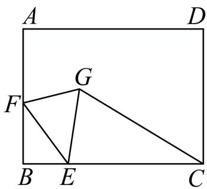

【答案】 $2 + 3 { \sqrt { 2 } } 3 { \sqrt { 2 } } + 2$

【分析】如图，将线段 $B E$ 绕点 $E$ 顺时针旋转 $4 5 ^ { \circ }$ 得到线段 $E T$ ，连接 $D E$ 交 $C G$ 于 $J$ ．首先证明$\angle E T G = 9 0 ^ { \circ }$ ，推出点 $G$ 在射线 $T G$ 上运动，推出当 $C G \bot T G$ 时， $C G$ 的值最小，进一步即得答案【详解】解：如图，将线段 $B E$ 绕点 $E$ 顺时针旋转 $4 5 ^ { \circ }$ 得到线段 $E T$ ，连接 $G T$ ，连接 $D E$ 交 $C G$ 于 $J$

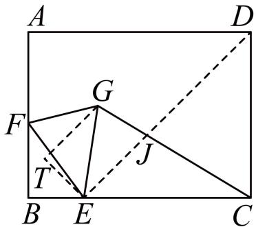

四边形ABCD是矩形，  
$\therefore A B = C D = 6 , \angle B = \angle B C D = 9 0 ^ { \circ } ,$   
$\therefore \angle B E T = \angle F E G = 4 5 ^ { \circ }$   
$\therefore \angle B E F = \angle T E G$ ，  
在 $\triangle E B F$ 和 $\triangle E T G$ 中，  
$\left\{ \begin{array} { l l } { E B = E T } \\ { \angle B E F = \angle T E G , } \\ { E F = E G } \end{array} \right.$   
$. \triangle E B F { \cong } \triangle E T G$ （SAS），  
$. \angle B = \angle E T G = 9 0 ^ { \circ }$   
点 $G$ 在射线 $T G$ 上运动，  
当 $C G \bot T G$ 时， $C G$ 的值最小，  
$\therefore B C = 8 B E = 2 C D = 6$ ，  
$. C E = C D = 6$ ，  
$\therefore \angle C E D = \angle B E T = 4 5 ^ { \circ }$   
$\therefore \angle T E J = 9 0 ^ { \circ } = \angle E T G = \angle J G T = 9 0 ^ { \circ } \ ,$ ，  
四边形ETGJ 是矩形，  
$\therefore D E / / G T G = T E = B E = 2$ ，  
$\therefore C J \bot D E$ ，  
 $J E = J D$ ，  
$\therefore C J = \frac { 1 } { 2 } ~ D E = 3 \sqrt { 2 }$ ，  
$\therefore C G = C J + G J = 2 + 3 { \sqrt { 2 } } \ ,$ ，  
 $C G$ 的最小值为 $2 + 3 \sqrt { 2 }$

11．如图，矩形 $A B C D$ 中， $A B = 6$ ， $B C = 4$ ，点 $E$ ， $F$ 分别为边 $A B$ ， $C D$ 上的动点，且 $A E = C F$ ，将线段 $E F$ 绕点 $F$ 逆时针旋转 $9 0 ^ { \circ }$ 得到线段 $F G$ ，连接 $_ { D G }$

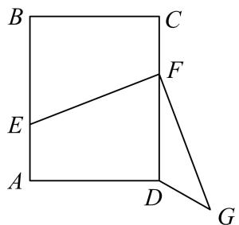

（1）当点 $E$ 为 $A B$ 的中点时，线段 $_ { D G }$ 的长是（2）当点 $E$ 在边 $A B$ 上运动时，线段 $_ { D G }$ 的最小值是

【答案】 $\frac { 2 { \sqrt { 5 } } } { 5 }$

【分析】取 $E F$ 的中点为 $\cdot$ ，过点 $O$ 作 $O H \perp C D$ 于点 $\cdot$ ，在 $C D$ 的延长线上截取 $H M = A D = 4$ ，连接OM ， $G M$ ，先证 $\frac { O F } { O H } { = } \frac { F G } { H M }$ 推出 $\triangle O F G \sim \triangle O H M$ ，进而可得 $\angle O G F = \angle O M H$ ，可证 $\cdot$ ， $\cdot$ ， $\cdot$ ，$F$ 在同一个圆上，得到 $\angle O M G = 1 8 0 ^ { \circ } - \angle E F G = 9 0 ^ { \circ }$ ， $\angle F M G = \angle F O G$ ，点 $\cdot$ 在过点 $M$ 且与 $O M$ 垂直的直线上运动，最后根据“垂线段最短”可得当 $D G \bot M G$ 时， $_ { D G }$ 取最小值，证明 $\triangle D G M ^ { \sim } { \triangle } G F O$ ，求出 $D G = \frac { 2 \sqrt { 5 } } { 5 }$

【详解】如图，取 $E F$ 的中点为 $O$ ，过点 $O$ 作 $O H \perp C D$ 于点 $H$ ，在 $C D$ 的延长线上截取 $H M = A D = 4$ ，连接 $O M$ ， $G M$ ，则 $\angle O H M = 9 0 ^ { \circ }$ ${ \cal { H } } = 9 0 ^ { \circ } ~ D H = { \frac { 1 } { 2 } } C D = 3 D M = M H - D H = 4 - 3 = 1$ ，

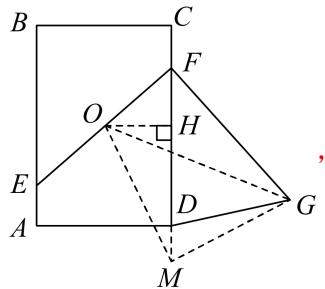

 $E F$ 的中点为 $O$ ，  
$\therefore O H = { \frac { 1 } { 2 } } A D = { \frac { 1 } { 2 } } H M$   
由旋转可知 $E F = F G$ ， $\angle E F G = \angle O H M = 9 0 ^ { \circ }$ ，  
$\therefore O F = { \frac { 1 } { 2 } } E F = { \frac { 1 } { 2 } } F G$ ，  
又 $O H = \frac { 1 } { 2 } A D = \frac { 1 } { 2 } H M$ ，  
$\therefore { \frac { O F } { O H } } = { \frac { F G } { H M } }$   
$\therefore \triangle O F G \sim _ { \triangle } O H M$ ，  
 $\angle O G F = \angle O M H$ ，  
 $O$ ， $\cdot$ ， $G$ ， $F$ 在同一个圆上，  
 $. \angle O M G = 1 8 0 ^ { \circ } - \angle E F G = 9 0 ^ { \circ }$ ， $\angle F M G = \angle F O G$ ，  
即点 $\cdot$ 在过点 $\cdot$ 且与 $O M$ 垂直的直线上运动，  
当 $D G \bot M G$ 时， $_ { D G }$ 取最小值，  
此时，如下图所示：  
 $\angle F M G = \angle F O G$ ， $\angle D G M = \angle G F O = 9 0 ^ { \circ }$ ，  
DGM∽GFO ， $\cdot \frac { D G } { F G } { = } \frac { D M } { O G }$   
${ \mathrm { ~  ~ { ~ D M = 1 ~ } ~ } } O G = \sqrt { O F ^ { 2 } + F G ^ { 2 } } = \sqrt { \left( { \frac { 1 } { 2 } } F G \right) ^ { 2 } + F G ^ { 2 } } = { \frac { \sqrt { 5 } } { 2 } } F G \quad { \therefore } { \frac { D G } { F G } } = { \frac { 1 } { { \frac { \sqrt { 5 } } { 2 } } F G } } \quad { \therefore } D G = { \frac { 2 \sqrt { 5 } } { 5 } }$

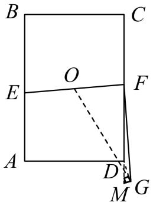

12．如图,在矩形 ABCD 中, ${ \mathrm { A B } } { = } 3 , { \mathrm { B C } } { = } 4 , { \mathrm { P } }$ 是对角线 AC 上的动点,连接 DP,将直线 DP绕点 P 顺时针旋转,使 $\angle 1 = \angle 2$ ,且过点 D 作 DG⊥PG,连接 CG.则 CG 最小值为资料整理【淘宝店铺：向阳百分百】

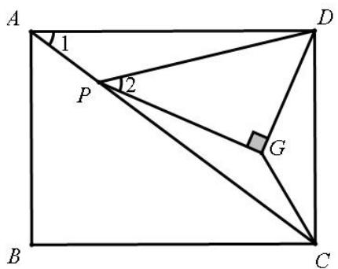

【答案】 $\frac { 3 6 } { 2 5 }$

【分析】策略一：得到 G 点轨迹直线后，画出起点 $\mathsf { G } _ { 1 }$ 和终点 $\mathsf { G } _ { 2 }$

策略 2：旋转相似:

【解析】

如图，作 $D H \bot A C$ 于 $\cdot$ ，连接 $H G$ 延长 $H G$ 交 $C D$ 于 $F$ ，作 $\cdot$ 于 $\cdot$ ．

△ADH∽△PDG，  
∴△ADP∽△DHG，  
∴ $\angle D H G = \angle D A P =$ 定值，  
∴点 $\cdot$ 在射线 $\cdot$ 上运动，∴当 $\cdot$ 时， $\cdot$ 的值最小，  
∵四边形 ABCD 是矩形，∴ $\angle A D C = 9 0 ^ { \circ }$ ，∴ $\angle A D H + \angle H D F { = } 9 0 ^ { \circ }$ ，∵∠DAH＋∠ADH＝90°，  
∴ $-$ ，∴ $\cdot$ ，∵∠FCH＋∠CDH＝90°，∠FHC＋∠FHD＝90°，  
∴ $\_$ ， $\scriptstyle \cdot F H = F C = D F = 1$ ．5，在 Rt△ADC 中，∵ $\angle A D C = 9 0 ^ { \circ }$ ， $A D { = } 4$ ， $C D { = } 3$ ，$A C = \sqrt { 3 2 + 4 2 } = 5 , D H = \frac { A { \mathrm { D } } \cdot D C } { A C } = \frac { 1 2 } { 5 } , \therefore C H = \sqrt { C D 2 - D H 2 } = \frac { 9 } { 5 } , \therefore E H = \frac { D H \cdot C H } { C D } = \frac { 3 6 } { 2 5 } ,$   
∵ $\_$ ， $-$ ， $\cdot$ ，  
∴△CGF≌△HEF(AAS)，∴ $\scriptstyle . C G = H E = { \frac { 3 6 } { 2 5 } } , \therefore C G$ 的最小值为 $\cdot$

13．如图，正方形 ABCD 的边长为 4， $E$ 为 BC 上一点，且 $B E = 1$ ， $F$ 为 AB 边上的一个动点，连接 $E F$ ，以 $E F$ 为底向右侧作等腰直角 $\triangle E F G$ ，连接 $C G$ ， 则 $C G$ 的 最 小 值为

【分析】

策略一：反向构造＋伸缩

如图从主动点F到从动点G可以理解为，将线段FE绕定点E顺时针旋转了 $4 5 ^ { \circ }$ 再缩短为原来的 $\frac { \sqrt { 2 } } { 2 }$ ,反向构造则需要把 CE 绕点 E 逆时针旋转 45°，再扩大变为原来的 $\sqrt { 2 }$ 倍，得到 EH，显然△ECH 为等腰直角三角形，进一步得到△FEH ∽△GEC ，相似比为 $\sqrt { 2 }$ ，所以 $C G { = } \frac { \sqrt { 2 } } { 2 } F H { \geq } 2 \sqrt { 2 }$

策略二：求轨迹— 以 BE 为底向上作等腰 Rt△BHE，易得 G 点轨迹所在直线为 BD，故 CG 最小值为 $2 \sqrt { 2 }$

# 【变式训练】双动点

14．如图，正方形 ABCD 的边长为 4， $E$ 为 $B C$ 上一点， $F$ 为 AB 边上一点，连接 $E F$ ，以$E F$ 为底向右侧作等腰直角 $\triangle E F G$ ，连接 $C G$ ，则 AG 的最小值为

【分析】

虽然是双动点，仍可以操作操作

策略一：代换所求线段 ，取 $\mathrm { A H } { = } \mathrm { A F }$ ，易知 $\triangle \mathrm { A } F G \lnot \triangle H F E$ ，则有 $A G { = } \frac { \sqrt { 2 } } { 2 } H E \geq 2 \sqrt { 2 }$ ，变中有不变．

策略二：求轨迹，以 BE 为底向上作等腰直角三角形 BHE，显然 H 点在对角线 BD 上，由相似可知$\_$ °，故 G 点轨迹为 BD， 其本质还是旋转相似.

其他方法：对角互补＋邻边相等可得全等，显然 $\cdot$ ，故 BG 平分∠ABC，则点 G 轨迹对应直线 BD．

# 题型三 轨迹为直线型·将军饮马加权线段和问题

15．如图，在矩形ABCD中， $A B = 5$ ， $B C = 9$ ， $E$ 是边 $A B$ 上一点， $A E = 2$ ， $F$ 是直线 $B C$ 上一动点，将线 $E F$ 绕点 $E$ 逆时针旋转 $9 0 ^ { \circ }$ 得到线段 $E G$ ，连接 $C G$ ， $_ { D G }$ ，则 $C G + D G$ 的最小值是

资料整理【淘宝店铺：向阳百分百】

【答案】13

【分析】将 $\triangle F B E$ 绕点 $E$ 逆时针旋转 $9 0 ^ { \circ }$ 得到 $\triangle G H E$ ，延长 $G H$ 交 $B C$ 于点 $M$ ，延长 $C B$ 至点 $N$ ，使$C M = N M$ ，连接 $D N$ ，由矩形的条件和旋转的性质可得 $E H = E B = 3$ ， $\angle B = \angle B E H = \angle E H G = 9 0 ^ { \circ }$ ，可说明四边形EBMH 是矩形，然后由正方形的性质可得到 $C N = 1 2$ ， $G M \perp C N$ ，从而说明 $G M$ 是CN的垂直平分线，进一步推导出 $C G + D G = N G + D G \geq N D$ ，当点 $N$ ， $G$ ， $D$ 三点共线时， $C G + D G$ 取最小值，最后由勾股定理可求解

【详解】解：将 $\triangle F B E$ 绕点 $E$ 逆时针旋转 $9 0 ^ { \circ }$ 得到 $\triangle G H E$ ，  
使 $C M = N M$ ，连接 $D N$ ，  
∵在矩形 $A B C D$ 中， $A B = 5 B C = 9 A E = 2$ ，  
$\therefore E B = A B - A E = 3 , \angle B = \angle B C D = 9 0 ^ { \circ } , C D = 5$ ，  
∴ $E H = E B = 3 \quad \angle B = \angle B E H = \angle E H G = 9 0 ^ { \circ }$ ，  
∴ $\angle E H M = 9 0 ^ { \circ }$ ，  
∴四边形EBMH 是矩形，  
$B M = E H = 3 \quad \angle B M H = 9 0 ^ { \circ }$   
$C N = 2 C M = 2 \times { \left( 9 - 3 \right) } = 1 2 G M \bot C N$ ，  
∴GM 是 $C N$ 的垂直平分线，$C G = N G$ ，  
∵ $F$ 是直线 $B C$ 上一动点，  
$C G + D G = N G + D G \geq N D$ ，  
∴当点 $N$ ， $G$ ， $D$ 三点共线时， $C G + D G$ 取最小值 $N D$ ，  
在 $R t { \triangle } N C D$ 中， $C N = 1 2$ ， $C D = 5$ ，  
$N D = \sqrt { C N ^ { 2 } + C D ^ { 2 } } = \sqrt { 1 2 ^ { 2 } + 5 ^ { 2 } } = 1 3 ,$   
∴ $C G + D G$ 的最小值是13  
故答案为：13．

16．如图，已知 $\angle C A B { = } 3 0 ^ { \circ }$ ， $A B { = } 2$ ，点 $D$ 在射线 $A C$ 上，以 $B D$ 为边作正方形 BDEF，连接 $A E$ 、$B E$ ，则 $A E { + } B E$ 的最小值为

【答案】 ${ \sqrt { 2 } } + { \sqrt { 6 } }$ 提示：以 $A B$ 为边作等腰 $\mathrm { R t } \triangle A B G$ ，连接 $\cdot$

则 $\cdot$ ， $\cdot$ ， $-$   
$\therefore \Delta G B E \sim \Delta A B D$ ，∴ $\angle E G B = \angle C A B = 3 0 ^ { \circ }$ ，∴ $\_$   
∴点 $E$ 在直线 $\cdot$ 上运动  
作点 $\cdot$ 关于 $\cdot$ 的对称点 $\cdot$ ，连接 $\cdot$ ′、 $\cdot$ 、B′E、B′G  
则 $\_$ ， $B ^ { \prime } G { = } B G$   
∴ $\triangle B ^ { \prime } G B$ 是等边三角形， $\_$   
又∵ $\cdot$ ， $\cdot$ ， $-$   
∴ $-$ ，∴AB′⊥BG  
设垂足为 $H$ ，则 $\cdot$   
$\therefore B ^ { \prime } H = \sqrt { 3 } B H = \sqrt { 6 } , \therefore A B ^ { \prime } = A H + B ^ { \prime } H = \sqrt { 2 } + \sqrt { 6 }$   
$\cdot { \mathcal { A } } E + B E { = } A E + B ^ { \prime } E \geqslant A B ^ { \prime } { = } \sqrt { 2 } + \sqrt { 6 }$   
即 $A E + B E$ 的最小值为 ${ \sqrt { 2 } } + { \sqrt { 6 } }$

17．如图，在矩形 ABCD 中， $A B { = } 5$ ， $B C { = } 8$ ，点 $M$ 为边 $B C$ 的中点， $P$ 是直线 $A D$ 上的一个动点，以 $M P$ 为边在 $M P$ 右侧作 $R t \triangle M P Q$ ，且 $P M { = } P Q$ ，连结 $A M$ ， $A Q$ ，则 $\triangle A M Q$ 周长的最小值为

【答案】 $\sqrt { 2 2 1 } \sqrt { 4 1 }$

【分析】因为 $\triangle A M Q$ 的周长为 $A M { + } A Q { + } M Q$ ，其中 $\cdot$ 的长可以由直角 $\cdot$ 中利用勾股定理求得，为定值，所以只需要求得 $A Q + M Q$ 的最小值即可，由题意可得，点 $A$ ， $\cdot$ 为定点， $\mathcal { Q }$ 为动点，即“一动两定”问题，只需要找到动点 $\mathcal { Q }$ 的运动轨迹即可，过 $A$ 作 $A M \bot A N _ { \ l }$ ，使 $\cdot$ ，先证△MAN$\cdot$ ，再证 $\_$ ，得到 $\angle M A P = \angle M N Q$ ，延长 $\cdot$ 交直线 $A D$ 于 $H$ ，可以得到 $\cdot$ $= 4 5 ^ { \circ }$ ，则 $\cdot$ 点在经过 $\cdot$ 点，且与直线 $A D$ 夹角为 $4 5 ^ { \circ }$ 的直线 $\cdot$ 上运动，此题就变成了“在直线 NH上找一点 $\mathcal { Q }$ ，使 $A Q + Q M$ 最小“的将军饮马问题，所以过 $\cdot$ 作关于 $\cdot$ 的对称点 $\cdot$ ，连接 $K M$ 交 $\cdot$ 于 $\cdot$ ， $\cdot$ 的最小值为 $M K$ ，利用勾股定理可求出 $K M$ 的值，即可解决

【详解】解：如图 1，过 $A$ 做 $A N \bot A M$ ，使 $A N { = } A M$ ，连接 MN， $N \mathcal { Q }$ ，

  
图1

则 $\angle A M N = \angle A N M = 4 5 ^ { \circ }$ ，  
∵ $\cdot$ 是直角三角形，且 $\cdot$ ，  
∴ $\cdot \angle P M Q { = } \angle A M N { = } 4 5 ^ { \circ }$ ， $-$ ，$\_$ ，${ \frac { A M } { P M } } { = } { \frac { M N } { M Q } }$   
∵ $\_$ ，  
∴ $\angle A M P = \angle N M Q$ ，  
$\_$ ，  
∴ $\angle M A P = \angle M N Q$ ，  
延长 $M \mathcal { Q }$ 交 $\cdot$ 于 $H$ ，设 $A D$ 与 $M N$ 交于点 $O$ ，  
则 $\angle A O M + \angle A M N = \angle N O H + \angle N H O ,$ ，  
∵ $\angle A O M = \angle H O H ,$ ，$\cdot \angle N H O = \angle A M N { = } 4 5 ^ { \circ }$ ，  
∴直线 $\cdot$ 与直线 $A D$ 夹角为 $\cdot$ ，  
∴ $\cdot$ 在经过 $\cdot$ 点且与直线 $\cdot$ 夹角为 $\cdot$ 的直线 $\mathit { N H }$ 上运动，  
如图 2，过 $M$ 作 $\cdot$ 于 $\cdot$ ，过 $N$ 作 $\cdot$ 于 $F$ ，  
则 $-$ ，  
$-$ ，  
∴ $-$ ，  
在△AME 与 $\triangle N A F$ 中，  
$\left\{ \begin{array} { l l } { \angle A E M = \angle N F A } \\ { \angle A M E = \angle N A F } \\ { A M = N A } \end{array} \right.$   
∴△AME≌△NAF（AAS），  
∴ $. A E { = } N F$ ， $E M { = } A F$ ，  
∵ $^ { \cdot } M$ 是 $\cdot$ 的中点， $B C { = } 8$ ，$\cdot$ ，  
∵四边形 ABCD 是矩形，  
$-$ ，  
∴四边形 ABME 是矩形，  
$-$ ，  
在直角 $\cdot$ 中， $\_$ ，  
$-$ ，  
$\therefore F H = N F { = } 4$ ，$-$ ，  
在直角 $\triangle A B M$ 中， $\sqrt { A B ^ { 2 } + B M ^ { 2 } } \sqrt { 4 1 }$ ，  
如图 3，过 $\cdot$ 作关于直线 $\cdot$ 的对称点 $\cdot$ ，连接 $K M$ 交直线 $\cdot$ 于点 $\cdot$ ，  
此时 $\mathit { N H }$ 垂直平分 $\cdot$ ，  
则 $\scriptstyle A Q = Q K$ ，  
$\therefore \angle Q + Q M + \angle M = Q K + Q M + \sqrt { 4 1 } = M K + \sqrt { 4 1 }$ 为 $\triangle A B C$ 的周长的最小值，  
连接 $K H$ 并延长交 $\cdot$ 于 $\cdot$ ，  
则 $-$ ， $\_$ ，  
∴ $. \angle A H K { = } 9 0 ^ { \circ }$ ，  
∵AD∥BC，  
∴ $. \angle M F K { = } \angle A H K { = } 9 0 ^ { \circ }$ ，  
∵ $-$ ，  
∴四边形 EMTH 为矩形，  
$\therefore M T = E H = _ { A } H - _ { A } E = 8 - 4 = 5 , H T = E M = _ { A } B = 5$ ，  
在直角 $\cdot$ 中， $K T { = } K H { + } H T { = } 1 4$ ， $\cdot$ ，  
$\sqrt { M T ^ { 2 } + K T ^ { 2 } } \sqrt { 2 2 1 }$ ，∴△AMQ 的周长最小值为 $\sqrt { 2 2 1 } \sqrt { 4 1 }$

  
图2

  
图3

18．如图，在矩形 $A B C D$ 中， $A B { = } 2$ ， $A D = 2 { \sqrt { 3 } }$ ，点 $E$ 为边 $A D$ 上一动点，以 $C E$ 为边向右作直角三角形 $C E F$ ，使 $\angle C E F { = } 9 0 ^ { \circ }$ ， $\angle C F E = 3 0 ^ { \circ }$ ，连接 $B E$ ， $B F$ ，求 $B E + \frac { 1 } { 2 } B F$ 的最小值

【答案】 $\sqrt { 3 7 }$

【解析】解：以 BC 为斜边向下作 Rt△BCG，使 $\angle \mathrm { C B G } = 3 0 ^ { \circ }$ ，连接 EG

则 $\frac { 1 } { 2 } B C \sqrt { 3 }$ ，△BGC∽△FEC，∴△EGC∽△FBC，  
$\begin{array} { r } { \frac { E G } { B F } \quad \frac { E C } { F C } \quad \frac { 1 } { 2 } \qquad \frac { 1 } { 2 } B F } \end{array}$   
作点 G 关于 AD的对称点 $\mathrm { G } ^ { \prime }$ ，连接 G'G 交 BC 于点 $\cdot$ ，连接 G'B，G'E  
则 G'G⊥BC， $\mathrm { C H } { = } \frac { 1 } { 2 } C G = \frac { \sqrt { 3 } } { 2 } , ~ \mathrm { G H } { = } \frac { 3 } { 2 } ,$   
$\mathrm { B H } { = } \frac { 3 \sqrt { 3 } } { 2 } , \mathrm { G H } { = } \frac { 1 1 } { 2 } ,$   
$\therefore \mathrm { B G } ^ { \prime } = \sqrt { B H ^ { 2 } + G ^ { \prime } H ^ { 2 } } = \sqrt { 3 7 }$ ，  
$\therefore \mathrm { B E } + { \frac { 1 } { 2 } } B F = \mathrm { B E } + \mathrm { E G } = \mathrm { B E } + \mathrm { E G } ^ { \prime } \geq \mathrm { B G } ^ { \prime } = { \sqrt { 3 7 } }$ ，  
$\frac { 1 } { 2 } B F$ 的最小值为 $\sqrt { 3 7 }$ ．

20．如图，在平面直角坐标系 $x O y$ 中，点 $A$ 的坐标为（1， $\sqrt { 3 } ~ )$ ），点 $P$ 是 $x$ 轴上的一动点，连接 $A P$ ，将线段 $A P$ 绕点 $A$ 逆时针旋转 $1 2 0 ^ { \circ }$ 得到 $A Q$ ，连接 $O Q$ ， $P Q$ ，求 ${ \sqrt { 3 } } O Q + P Q$ 的最小值

【答案】 $2 \sqrt { 2 1 }$

【解析】解：连接 $A O$ ，将线段 $\cdot$ 绕点 $\cdot$ 逆时针旋转 $1 2 0 ^ { \circ }$ 得到 $\cdot$ ，连接 $R Q$ ，

过点 $A$ 作 $A G \bot x$ 轴于点 $\cdot$   
∵ $-$ ， $\_$   
∵ $\cdot$ ，∵ $\scriptstyle A P = A Q$ ， $\_$ ，$\cdot$ ， $\_$ ．  
∵ $\cdot$ 的坐标为（1， $\sqrt { 3 }$ ），∴ $\cdot$ ， $A G = { \sqrt { 3 } }$ ，  
$\frac { A G } { O G } \quad \sqrt { 3 } \qquad \qquad \quad$ ．  
∵ $\angle O A R = 1 2 0 ^ { \circ }$ ，∴AR∥x 轴  
∵ $\scriptstyle A P = A Q$ ， ${ \sqrt { 3 } } A Q$ ，  
$\therefore { \sqrt { 3 } } O Q + P Q = { \sqrt { 3 } } ( O Q + A Q ) .$   
作点 $\cdot$ 关于 $\mathcal Q R$ 的对称点 $\cdot$ ，连接 $A A ^ { \prime }$ ， $\cdot$ ， $\cdot$ ，  
过点 $A ^ { \prime }$ 作 $\cdot$ 轴于点 $H$ ．  
则 $\scriptstyle A ^ { \prime } R = A R = A O = 2 O G = 2 , \angle A ^ { \prime } R Q = \angle A R Q = 6 0 ^ { \circ } ,$ ，  
∴ $\angle A ^ { \prime } R A = 1 2 0 ^ { \circ }$ ，∴A'R∥AO，  
∴相当于将线段 $\cdot$ 平移到 $\cdot$ ，  
∴A'（4， $2 { \sqrt { 3 } } 2 { \sqrt { 3 } } 2 { \sqrt { 3 } }$ ，  
$\therefore A ^ { \prime } O = \sqrt { O H ^ { 2 } + A ^ { \prime } H ^ { 2 } } = 2 \sqrt { 7 } \ .$ ，  
$\sqrt { 3 } O Q \sqrt { 3 } \sqrt { 3 } \sqrt { 3 } \sqrt { 2 1 }$

# 题型四 轨迹为圆弧型·构造中位线

19．（2023·周口·三模）如图，正方形ABCD的边长是 8，点 $E$ 是 $B C$ 边的中点，连接 $D E$ ，点 $F$ 是线段 $D E$ 上不与点 $D$ ， $E$ 重合的一个动点，连接 $B F$ ，点 $G$ 是线段 $B F$ 的中点，则线段 $_ { A G }$ 的最资料整理【淘宝店铺：向阳百分百】

小值为【答案】 $4 \sqrt { 2 }$

【分析】连接 $A C$ ，与 $B D$ 相交于点 $H ,$ 取 $B E$ 中点 $\cdot$ ，连接 $H G , \ I G$ ，由正方形 ABCD的边长是 8 得到 $\angle B A D = 9 0 ^ { \circ }$ , $A B = A D = 8$ ， $B H = D H = { \frac { 1 } { 2 } } B D$ ， $A H \perp B D$ ，由中位线定理得到 $H G \parallel D E$ ，IG∥ DE,则 $G _ { \setminus }$ 、H、 $I$ 三点共线，即点 $\cdot$ 的运动轨迹是线段 $H I$ ，由 $A H \perp B D$ ，当点 $\cdot$ 和点 $H$ 重合时，线段值 $_ { A G }$ 最小，由勾股定理求出 $B D = 8 \sqrt { 2 }$ ，即可得到 $A H = \frac { 1 } { 2 } B D = 4 \sqrt { 2 }$ ，得到线段 $_ { A G }$ 的最小值．【详解】解：连接 $A C$ ，与 $B D$ 相交于点 $H ,$ 取 $B E$ 中点 $I _ { \colon }$ ，连接 $H G , \ I G$ ，

∵正方形 $A B C D$ 的边长是 8，  
$\angle B A D = 9 0 ^ { \circ } , A B = A D = 8 B H = D H = { \frac { 1 } { 2 } } B D A H \bot B D$   
∵点 $\cdot$ 是线段 $B F$ 的中点，  
$\therefore H G \parallel D E$ ， $I G / / D E ,$ ,  
$\therefore G , H , I$ 三点共线，  
∴点 $\cdot$ 的运动轨迹是线段 $H I$ ，  
∵ $A H \perp B D$ ，  
∴当点 $\cdot$ 和点 $\cdot$ 重合时，线段值 $_ { A G }$ 最小，  
$\therefore B D = \sqrt { A B ^ { 2 } + A D ^ { 2 } } \ = \ \sqrt { 8 ^ { 2 } + 8 ^ { 2 } } \ = \ 8 \sqrt { 2 } \ ,$   
∴ $A H = \frac { 1 } { 2 } B D = 4 \sqrt { 2 }$ ，即线段 $_ { A G }$ 的最小值为 $4 \sqrt { 2 }$

# 2023·山东泰安·中考真题

20．如图，在平面直角坐标系中，Rt△AOB 的一条直角边 $O B$ 在 $x$ 轴上，点 $A$ 的坐标为 (6，4)；$\mathrm { R t } _ { \Delta } C O D$ 中， $\angle C O D = 9 0 ^ { \circ }$ ， $O D = 4 { \sqrt { 3 } } ,$ ， $\angle D = 3 0 ^ { \circ }$ ，连接 $B C$ ，点 $M$ 是 $B C$ 中点，连接 $A M$ ．将$\mathrm { R t } _ { \Delta } C O D$ 以点 $O$ 为旋转中心按顺时针方向旋转，在旋转过程中，线段 $A M$ 的最小值是（ ）

A．3 B． $6 \sqrt { 2 } - 4$ C． $2 { \sqrt { 1 3 } } - 2$ D．2

【答案】A

【分析】如图所示，延长 $B A$ 到 $\cdot$ ，使得 $A E = A B$ ，连接 $O E$ ， $C E$ ，根据点 $\cdot$ 的坐标为 (6，4)得到 $B E = 8$ ，再证明AM 是 $\triangle B C E$ 的中位线，得到 $A M = { \frac { 1 } { 2 } } C E$ ；解 $\mathrm { R t } _ { \Delta } C O D$ 得到 $O C = 4$ ，进一步求出点 $\cdot$ 在以 $O$ 为圆心，半径为 4的圆上运动，则当点 $M$ 在线段 $O E$ 上时， $C E$ 有最小值，即此时 $A M$ 有最小值，据此求出 $C E$ 的最小值，即可得到答案

【详解】解：如图所示，延长 $B A$ 到 $\cdot$ ，使得 $A E = A B$ ，连接 $O E$ ， $C E$ ，∵ $\scriptstyle { \mathrm { R t } } \displaystyle { \triangle A O B }$ 的一条直角边 $O B$ 在 $x$ 轴上，点 $A$ 的坐标为 $^ { ( - 6 , 4 ) }$ ，$\therefore A B = 4 , O B = 6$ ，  
∴ $\ A E = A B = 4$ ，  
∴ $B E = 8$ ，  
∵点 $\cdot$ 为 $B C$ 中点，点 $\cdot$ 为 $B E$ 中点，  
∴AM 是 $\triangle B C E$ 的中位线，  
∴ $\cdot \ A M = { \frac { 1 } { 2 } } C E \ ;$ ；  
在 $\mathsf { R t } _ { \triangle } C O D$ 中， $\angle C O D = 9 0 ^ { \circ } , \ O D = 4 { \sqrt { 3 } } , \angle D = 3 0 ^ { \circ }$ ，  
$O C = { \frac { \sqrt { 3 } } { 3 } } O D = 4$ ，  
∵将 $\mathrm { R t } _ { \Delta } C O D$ 以点 $O$ 为旋转中心按顺时针方向旋转，  
∴点 $\cdot$ 在以 $\cdot$ 为圆心，半径为 4 的圆上运动，  
∴当点 $\cdot$ 在线段 $O E$ 上时， $C E$ 有最小值，即此时 $A M$ 有最小值，∵ $O E = \sqrt { B E ^ { 2 } + O B ^ { 2 } } = 1 0$ ，  
∴ $C E$ 的最小值为 $1 0 - 4 = 6$ ，  
∴ $A M$ 的最小值为 3，故选 A

21．如图，点 $A$ ， $B$ 的坐标分别为 $A ( 2 , 0 )$ ， $B ( 0 , 2 )$ ，点 $C$ 为坐标平面内一点， $B C = 1$ ，点 $M$ 为线段 $A C$ 的中点，连接 $O M$ ，则 $O M$ 的最大值为( )

A． $\sqrt { 2 } + 1$ B． 12  C． $2 \sqrt { 2 } + 1$ D． 12 2  2

【答案】B

【解答】解：如图，点 $C$ 为坐标平面内一点， $B C = 1$ ， $C$ 在 $\odot B$ 上，且半径为 1，取 $O D = O A = 2$ ，连接 $C D$ ，

$\therefore A M = C M O D = O A$ ，  
OM 是 $\Delta A C D$ 的中位线，  
$\therefore O M = { \frac { 1 } { 2 } } C D ,$   
当 $O M$ 最大时，即 $C D$ 最大，而 $D$ ， $B$ ， $C$ 三点共线时，当 $C$ 在 $D B$ 的延长线上时，OM 最大，  
 $O B = O D = 2$ ， $\angle B O D = 9 0 ^ { \circ }$ ，  
$\therefore B D = 2 { \sqrt { 2 } }$ ，  
$. C D = 2 \sqrt { 2 } + 1$ ，  
 $O M = \frac { 1 } { 2 } C D = \sqrt { 2 } + \frac { 1 } { 2 }$ ，即 $O M$ 的最大值为 ${ \sqrt { 2 } } + { \frac { 1 } { 2 } }$

22．如图，在半径为 4的 $\odot O$ 中，弦 $A C = 4 \sqrt { 2 }$ ， $B$ 是 $_ { \odot O }$ 上的一动点（不与点 $A$ 重合）， $D$ 是 $A B$ 的中点， $M$ 为 $C D$ 的中点，则 $A M$ 的最大值为

【答案】 $\sqrt { 1 3 } + 1$

【分析】连接 $A O$ ， $B O$ ，取 $A O$ 的中点 $E$ ，连接 $D E$ ，根据三角形中位线的性质得到 $D E = { \frac { 1 } { 2 } } O B = 2$ ，得到点 $D$ 在以 $\cdot$ 为圆心，以 2 为半径的圆上运动，连接 $C E$ ，取 $C E$ 的中点 $\cdot$ ，连接 $G M$ ， $A G$ ，同理得到点 $\cdot$ 在以点 $G$ 为圆心，以 1 为半径的圆上运动，进而得到当点 $A$ ， $G$ ， $\cdot$ 三点共线时，AM取得最大值，即 $A G + G M$ 的长度，取线段 $O E$ 的中点 $F$ ，连接 $G F$ ，然后利用勾股定理求解即可【详解】如图所示，连接 $_ { A O }$ ， $B O$ ，取 $_ { A O }$ 的中点 $\cdot$ ，连接 $D E$

∵ $D$ 是 $A B$ 的中点， $E$ 是 $A O$ 的中点，  
$D E$ 是 ${ \triangle A B O }$ 的中位线，  
$\therefore D E = { \frac { 1 } { 2 } } O B = 2 ,$ ，  
∴点 $D$ 在以 $E$ 为圆心，以 2 为半径的圆上运动，  
连接 $C E$ ，取 $C E$ 的中点 $\cdot$ ，连接 $G M$ ， AG  
∵ $^ { \cdot } M$ 为 $C D$ 的中点， $G$ 是 $C E$ 的中点，  
$G M = { \frac { 1 } { 2 } } D E = 1$   
∴点 $M$ 在以点 $G$ 为圆心，以 1 为半径的圆上运动，  
∴ $A M \leq A G + G M$   
∴如图所示，当点 $A$ ， $G$ ， $\cdot$ 三点共线时，AM 取得最大值，即 $A G + G M$ 的长度，取线段 $O E$ 的中  
点 $F$ ，连接 $G F$ ，  
∵ $\odot O$ 的半径为 4  
$O A = O B = 4$   
∵ AC  4 2  
$O A ^ { 2 } + O B ^ { 2 } = 4 ^ { 2 } + 4 ^ { 2 } = 3 2 A C ^ { 2 } = \left( 4 \sqrt { 2 } \right) ^ { 2 } = 3 2$   
$O A ^ { 2 } + O B ^ { 2 } = A C ^ { 2 }$ $\angle A O C { = } 9 0 ^ { \circ }$   
∵点 $F$ 是 $O E$ 的中点，点 $\cdot$ 是 $C E$ 的中点，  
∴ $G F = { \frac { 1 } { 2 } } O C = 2$ ，且 $G F / / O C$ ，  
$\angle A F G = \angle A O C = 9 0 ^ { \circ }$ $\cdot O F { = } \frac { 1 } { 2 } O E { = } 1$   
∴ $A F = A O - O F = 4 - 1 = 3$   
∴在 $\mathrm { R t } \triangle A F G$ 中， $A G = { \sqrt { A F ^ { 2 } + G ^ { 2 } } } = { \sqrt { 3 ^ { 2 } + 2 ^ { 2 } } } = { \sqrt { 1 3 } }$ $\cdot A G + G M = { \sqrt { 1 3 } } + 1$   
∴ $A M$ 的最大值为 $\sqrt { 1 3 } + 1$

# 题型五 轨迹为圆弧型·构造手拉手

# 2023·四川宜宾·统考中考真题

23．如图， $M$ 是正方形 $A B C D$ 边 $C D$ 的中点， $P$ 是正方形内一点，连接 $B P$ ，线段 $B P$ 以 $B$ 为中心逆时针旋转 $9 0 ^ { \circ }$ 得到线段 $B Q$ ，连接 $M Q$ ．若 $A B = 4$ ， $M P = 1$ ，则 $M Q$ 的最小值为

【答案】 $2 { \sqrt { 1 0 } } - 1$

【分析】连接 $B M$ ，将BM 以 $B$ 中心，逆时针旋转 $9 0 ^ { \circ }$ ， $M$ 点的对应点为 $E$ ，由 $P$ 的运动轨迹是以M为圆心，1为半径的半圆，可得： $\mathcal { Q }$ 的运动轨迹是以 $E$ 为圆心，1为半径的半圆，再根据“圆外一定点到圆上任一点的距离，在圆心、定点、动点，三点共线时定点与动点之间的距离最短”，所以当 $M$ 、$\mathcal { Q }$ 、 $E$ 三点共线时， $M Q$ 的值最小，可求 $M E = \sqrt { 2 } B M = 2 \sqrt { 1 0 }$ ，从而可求解．

【详解】解，如图，连接 $B M$ ，将BM 以 $B$ 中心，逆时针旋转 $9 0 ^ { \circ }$ ， $M$ 点的对应点为 $E$ ，

 $P$ 的运动轨迹是以 $M$ 为圆心，1为半径的半圆，  
 $\mathcal { Q }$ 的运动轨迹是以 $E$ 为圆心，1为半径的半圆，  
如图，当 $ { \boldsymbol { M } } \_ { \mathbf { \Sigma } } \mathcal { Q }$ 、 $E$ 三点共线时， $M Q$ 的值最小，  
四边形ABCD是正方形，  
 $\cdot C D = A B = B C = 4$ ， $\angle C = 9 0 ^ { \circ }$ ，  
 $M$ 是 $C M$ 的中点，  
 $C M = 2$ ，  
$\therefore B M = { \sqrt { C M ^ { 2 } + B C ^ { 2 } } }$   
$= { \sqrt { 2 ^ { 2 } + 4 ^ { 2 } } } = 2 { \sqrt { 5 } }$ ，  
由旋转得： $B M = B E$ ，  
$\therefore M E = { \sqrt { 2 } } B M = 2 { \sqrt { 1 0 } }$ ，  
$\therefore M Q = M E - E Q$   
$= 2 \sqrt { 1 0 } - 1$ ，  
 $M Q$ 的值最小为 $2 { \sqrt { 1 0 } } - 1$

# 2022 沈阳中考

24．如图，在 $\triangle A B C$ 中， $A B { = } 8$ ， $A C = 3 \sqrt { 3 }$ ，将 $C B$ 绕点 $C$ 逆时针旋转 $9 0 ^ { \circ }$ 得到 $C D$ ，连接 $A D$ ，则$A D$ 的最大值是

分析：旋转的性质、等腰直角三角形的性质、相似三角形的判定与性质、勾股定理  
思路：定点为 B，A、D 两点旋转相似中的定位是一样的，BD 是斜边，则构造以 AB 为斜边的等腰  
直角三角形，  
思路 2：将 AB 绕点 A 逆时针旋转 $\cdot$ 得到 AE，连接 BD，BE，DE，证△EBD∽△ABC，  
可得 $\sqrt { 2 } A C  { \mathrm { ~ \textrm ~ { ~ ~ } ~ } } 3 \sqrt { 6 }$ ，由 $\mathrm { A D } { \leqslant } \mathrm { A E } + \mathrm { D E }$ ，可得 AD 的最大值

总结：熟悉模型，补全结构【答案】 $8 + 3 \sqrt { 6 }$

【解析】

法一：如图，构造等腰直角三角形 ABE，由旋转相似可知 $A D = { \sqrt { 2 } } C E$ ，而 $C E \leq B E + B C = 4 { \sqrt { 2 } } + 3 { \sqrt { 3 } }$ ，故 $A D \leq 4 + 3 { \sqrt { 6 } }$

法二：将 $\cdot$ 绕点 $A$ 逆时针旋转 $9 0 ^ { \circ }$ 得到 $A E$ ，连接 $B D$ ，BE，DE

由题意， $\triangle A B E$ 和 $\cdot$ 都是等腰直角三角形，  
$\therefore B E = \sqrt { 2 } A B , B D = \sqrt { 2 } B C , \angle A B E = \angle C B D = 4 5 ^ { \circ } ,$ ，  
$\cdot \frac { B E } { A B } = \frac { B D } { B C } = \sqrt { 2 }$ ， $\_$ ，  
∴△EBD∽△ABC， $\frac { D E } { A C } \quad \frac { B D } { B C } \quad \sqrt { 2 }$ ，  
$\sqrt { 2 } A C \qquad 3 \sqrt { 6 }$ ．  
∵ $A B { = } 8$ ， $\scriptstyle A D \leqslant A E + D E$ ，  
∴ $A D$ 的最大值是 $8 + 3 \sqrt { 6 }$

25．如图，点 $P$ 是正方形 $A B C D$ 所在平面内一点， $\angle A P B { = } 9 0 ^ { \circ }$ ，连接 $D P$ ，将线段 $D P$ 绕点 $D$ 逆时针旋转 $9 0 ^ { \circ }$ 得到线段 $D Q$ ，连接 $A Q$ ，若 $A B { = } 2$ ，则线段 $A Q$ 的最大值为

【答案】 $\cdot$

提示：连接 $C Q$ ，过点 $\mathcal { Q }$ 作 $\cdot$ 交 $\cdot$ 延长线于点 $\cdot$

由题意，可得 $\triangle D A P \cong \triangle D C Q$ （SAS）  
$-$   
$\_$ （ASA）  
$\therefore \angle C Q E = \angle A P B = 9 0 ^ { \circ } , C E = A B = 2$   
取 $\cdot$ 中点 $M$ ，连接 AM、QM  
则 $\scriptstyle { \mathcal { Q M } } = C M = { \frac { 1 } { 2 } } C E = 1$ ，∴ $. B M { = } 3$ ， $A M { = } \sqrt { 1 3 }$   
∵ $-$ ， $\_$

# 2022·盐城市一模

26．如图，在直角坐标系中，点 $A$ 坐标为（2，0），点 $B$ 的坐标为（6，0），以 $B$ 点为圆心，2长为半径的圆交 $x$ 轴于 $C , \ D$ 两点，若 $P$ 是 $\odot B$ 上一动点，连接 $P A$ ，以 $P A$ 为一直角边作 $R t \triangle P A Q$ ，使得 tan $\angle A P Q = \frac { 1 } { 2 }$ 连接 $D Q$ ，则 $D Q$ 的最小值为

【答案】 $2 \sqrt { 1 0 } - 1$

【详解】解：如图，取点 $M$ （2，-2），连接 AM，MQ、PB，

∵ $-$ ，  
$\_$ ，  
$\therefore { \frac { A M } { A B } } = { \frac { A Q } { A P } } = { \frac { 1 } { 2 } } ,$   
∴△MAQ∽△BAP，  
$\frac { 1 } { 2 }$ ，  
∴ $\cdot$ 点在以 $M$ 为圆心，以 1为半径的圆上，由图象可得：  
$\cdot$ 的最小值为： $D M ^ { \ b { - } } M Q$ ，  
$\scriptstyle A D = O D - O A = 6 + 2 - 2 = 6 ,$ ，  
由勾股定理可得： $D M { = } \sqrt { A D ^ { 2 } + A M ^ { 2 } } = 2 \sqrt { 1 0 }$ ，∴DQ 的最小值等于： $2 \sqrt { 1 0 } - 1$ .

# 2023·深圳外国语学校中考模拟

27．如图，已知正方形ABCD的边长为 4，以点 $A$ 为圆心，2 为半径作圆， $E$ 是 $\odot A$ 上的任意一点，将线段 $D E$ 绕点 $D$ 顺时针方向旋转 $9 0 ^ { \circ }$ 并缩短到原来的一半，得到线段 $D F$ ，连接 $A F$ ，则 $A F$ 的最小值是

【答案】 $2 { \sqrt { 5 } } - 1$

【分析】通过证 $\triangle E D A \sim \triangle F D T$ 可得 $F T = 1$ ，由勾股定理可得 $A T = \sqrt { A D ^ { 2 } + D T ^ { 2 } } = 2 \sqrt { 5 }$ ，根据三角形三边关系求 $A F$ 的最小值即可；

【详解】解：如图，取 $C D$ 中点 T，连接AE、FT、AT ，

∵四边形 $A B C D$ 是正方形，  
∴ $A D = C D = 4$ ， $\angle A D C = 9 0 ^ { \circ }$ ，  
$D T = C T = \frac { 1 } { 2 } C D = 2 , \ D E = 2 D F$ $\frac { D E } { D F } { = } \frac { A D } { D T } { = } 2$ ，  
∵ $\angle E D F = \angle A D C = 9 0 ^ { \circ }$ ，$\angle E D A = \angle F D T$ ，  
$\therefore \Delta E D A \sim _ { \Delta } F D T$ ，  
$\frac { A E } { T F } = \frac { E D } { F D } = 2$ ， 中  
$\therefore F T = 1$ ，  
∵ $A T = \sqrt { A D ^ { 2 } + D T ^ { 2 } } = 2 \sqrt { 5 }$ ，  
∴ $. A F \ge A T - T F$ ，  
∴ $A F \geq 2 { \sqrt { 5 } } - 1$ ，∴ $A F$ 的最小值为 $2 { \sqrt { 5 } } - 1$

28．如图， $A B = 4$ ， $o$ 为 $A B$ 的中点， $_ { \odot O }$ 的半径为 1，点 $P$ 是 $_ { \odot O }$ 上一动点，以PB 为直角边的等腰直角三角形 $P B C$ （点 $P$ 、 $B$ 、 $C$ 按逆时针方向排列），则线段 $A C$ 的长的取值范围为

【答案】 ${ \sqrt { 2 } } \leq A C \leq 3 { \sqrt { 2 } }$

【解答】解：如图，作 $O K \bot A B$ ，在 $O K$ 上截取 $O K = O A = O B$ ，连接 $A K$ 、 $B K$ 、 KC 、OP

$\therefore O K = O A = O B O K \bot A B \therefore K A = K B \angle A K B = 9 0 ^ { \circ }$ ，  
 $\Delta A K B$ 是等腰直角三角形， $\angle O B K = \angle P B C$ ， $\angle O B P = \angle K B C$ ，  
$\because { \frac { O B } { B K } } = { \frac { P B } { B C } } = { \frac { \sqrt { 2 } } { 2 } } \quad \therefore \Delta O B P ^ { \infty } \Delta K B C \quad \therefore { \frac { K C } { O P } } = { \frac { B C } { P B } } = { \sqrt { 2 } } \quad \cdot \cdot O P = 1$   
 $K C = \sqrt { 2 }$ ，点 $C$ 的运动轨迹是以点 $K$ 为圆心， $K C$ 为半径的圆， $A K = { \sqrt { 2 } } O A = 2 { \sqrt { 2 } }$ ，  
 $A C$ 的最大值为 $3 \sqrt { 2 }$ ， $A C$ 的最小值 ${ \sqrt { 2 } } \quad \cdots { \sqrt { 2 } } \bullet { \cal A } C \bullet 3 { \sqrt { 2 } }$

29．如下图，在正方形 $A B C D$ 中， $A B = 6$ ，点 $E$ 是以 $B C$ 为直径的圆上的点，连接 $D E$ ，将线段 $D E$ 绕点 $D$ 逆时针旋转 $9 0 ^ { \circ }$ ，得到线段 $D F$ ，连接 $C F$ ，则线段 $C F$ 的最大值与最小值的和

【答案】 $6 \sqrt { 5 }$

【分析】连接 $E O$ 、 $_ { D O }$ ，将 $_ { D O }$ 绕点 $D$ 逆时针旋转 $9 0 ^ { \circ }$ ，得到线段 $D P$ ，连接 $P F , P C$ ，根据旋转的性质得出 $\triangle E D O { \cong } \triangle F D P$ ，进而可得点 $F$ 在以 $P$ 为圆心，3为半径的圆上运动，则线段 $C F$ 的最大值与最小值的和为 $P C - 3 + P C + 3 = 2 P C$ ，进而勾股定理求得 $P C$ 的长，即可求解

【详解】解：如图所示，连接 $E O$ 、 $_ { D O }$ ，将 $_ { D O }$ 绕点 $D$ 逆时针旋转 $9 0 ^ { \circ }$ ，得到线段 $D P$ ，连接 $P F , P C$ ，

∵线段 $D E$ 绕点 $D$ 逆时针旋转 $9 0 ^ { \circ }$ ， $_ { D O }$ 绕点 $D$ 逆时针旋转 $9 0 ^ { \circ }$   
$D E = D F , D O = D P \quad \angle E D F = \angle O D P = 9 0 ^ { \circ }$   
∴ $\angle E D O + \angle O D F = \angle O D F + \angle F D P$ ，  
∴ $\angle E D O = \angle F D P$ ，

资料整理【淘宝店铺：向阳百分百】

∴EDO≌FDP  
$\therefore P F = O E = { \frac { 1 } { 2 } } B C = 3$   
则点 $F$ 在以 $P$ 为圆心，3为半径的圆上运动，  
∴线段 $C F$ 的最大值与最小值的和为 $P C - 3 + P C + 3 = 2 P C$   
在 $\mathsf { R t } \triangle O D C$ 中， $O C = 3 , C D = 6$   
$D P = O D = { \sqrt { 3 ^ { 2 } + 6 ^ { 2 } } } = 3 { \sqrt { 5 } }$   
如图所示，过点 $P$ 作 $P H \bot A D$ 交 $A D$ 的延长线于点 $H$ ，过点 $P$ 作 $P G \bot C D$ 于点 $G$ ，  
则四边形 $D G P H$ 是矩形，  
$P G = D H$ ，  
在 $\mathrm { R t } \triangle H D P$ 与 $\mathbb { R } \mathrm { t } \triangle C D O$ 中，  
$\left\{ \begin{array} { l } { D P = D O } \\ { H P = O C } \end{array} \right. ,$   
∴RtHDP≌RtCDO$D H = D C = G P = 6 D G = H P = 3$ ，  
在 $R t { \triangle } P G C$ 中， $P C = \sqrt { G C ^ { 2 } + P G ^ { 2 } } = 3 \sqrt { 5 }$ ，  
∴线段 $C F$ 的最大值与最小值的和为 $6 \sqrt { 5 }$

# 题型六 路径相关问题

# 2022·山东滨州·统考中考真题

30．正方形ABCD的对角线相交于点 $O$ （如图 1），如果 $\angle B O C$ 绕点 $O$ 按顺时针方向旋转，其两边分别与边 $A B , B C$ 相交于点 $E$ 、 $F$ （如图 2），连接 $E F$ ，那么在点 $E$ 由 $B$ 到 $A$ 的过程中，线段 $E F$ 的中点 $G$ 经过的路线是（ ）

  
图1

  
图2

A．线段 B．圆弧 C．折线 D．波浪线

【答案】A

【分析】连接 $O G , B G$ ，根据题意可知 $\angle E B F = \angle E O F = 9 0 ^ { \circ }$ 则线段 $E F$ 的中点 $G$ 经过的路线是 $O B$ 的线段垂直平分线的一段，即线段

【详解】连接 $O G , B G$ ，根据题意可知 $\angle E B F = \angle E O F = 9 0 ^ { \circ }$ ，

$\therefore O G = B G = { \frac { 1 } { 2 } } E F ,$   
∴点 $\cdot$ 在线段 $\cdot$ 的垂直平分线上  
则线段 $E F$ 的中点 $\cdot$ 经过的路线是 $O B$ 的线段垂直平分线的一段，即线段

# 2023·海南·统考中考真题

31．如图，在正方形 $A B C D$ 中， $A B = 8$ ，点 $E$ 在边 $A D$ 上，且 $A D = 4 A E$ ，点 $P$ 为边 $A B$ 上的动点，连接 $P E$ ，过点 $E$ 作 $E F \perp P E$ ，交射线 $B C$ 于点 $F$ ，则 $\frac { E F } { P E } = -$ ．若点 $M$ 是线段 $E F$ 的中点，则当点 $P$ 从点 $A$ 运动到点 $B$ 时，点 $M$ 运动的路径长为

【答案】 4 16

【分析】过 $F$ 作 $F K \perp A D$ 交 $A D$ 延长线于点 $K$ ，证明 $\triangle A E P \sim \triangle K F E$ ，得到 $\frac { E F } { P E } { = } \frac { F K } { A E }$ 即可求解；过 $M$ 作 $G H \perp A D$ 交 $A D$ 于点 $G$ ，交 $B C$ 于点 $H$ ，证明 $\triangle E G M \cong \triangle F H M$ ，得到 $M G = M H$ ，故点 $M$ 的运动轨迹是一条平行于 $B C$ 的线段，当点 $P$ 与 A 重合时， $B F _ { _ 1 } = A E = 2$ ，当点 $P$ 与 $B$ 重合时，由$\triangle E F _ { 1 } B ^ { \cup } \triangle F _ { 2 } F _ { 1 } E$ 得到 $\frac { 2 } { 8 } = \frac { 8 } { F _ { 1 } F _ { 2 } }$ ，即 $F _ { 1 } F _ { 2 } = 3 2$ ，从而求解．

【详解】解：过 $F$ 作 $F K \perp A D$ 交 $A D$ 延长线于点 $K$

则四边形ABFK 为矩形， $\angle A = \angle K = 9 0 ^ { \circ }$   
∴ $A B = F K = 8$   
由题意可得： $A E = { \frac { 1 } { 4 } } A D = 2$   
$E F \bot P E$   
∴ $\angle A E P + \angle K E F = \angle P E F = 9 0 ^ { \circ }$   
又∵ $\angle P E A + \angle A P E = 9 0 ^ { \circ }$   
∴ $. \angle A P E = \angle K E F$   
∴AEP∽KFE   
$\therefore \frac { E F } { P E } = \frac { F K } { A E } = 4$   
过 $M$ 作 $G H \perp A D$ 交 $A D$ 于点 $G$ ，交 $B C$

于点 $H$ ，如下图

∵ AD∥CB ，GH  AD  
∴GH  BC  
在 $_ { \triangle E G M }$ 和△FHM 中  
$\left\{ \begin{array} { l l } { \angle M G E = \angle M H F } \\ { \angle E M G = \angle F M H } \\ { M E = M F } \end{array} \right.$   
∴EGM ≌FHM AAS  
∴ $M G = M H$ ，  
故点 $M$ 的运动轨迹是一条平行于 $B C$ 的线段，  
当点 $P$ 与A重合时， $B F _ { 1 } = A E = 2$   
当点 $P$ 与 $B$ 重合时， $\angle B E F _ { 2 } = \angle F _ { 2 } + \angle E B F _ { 1 } = 9 0 ^ { \circ }$ ， $\angle B E F _ { 1 } + \angle E B F _ { 1 } = 9 0 ^ { \circ }$   
$\angle F _ { 2 } = \angle B E F _ { 1 }$ $\angle E F _ { 1 } F _ { 2 } = \angle E F _ { 1 } B = 9 0 ^ { \circ }$   
$\triangle E F _ { 1 } B ^ { \triangle F _ { 2 } } \cal { F } _ { 2 } F _ { 1 } E$   
${ \frac { B F _ { 1 } } { E F _ { 1 } } } = { \frac { E F _ { 1 } } { F _ { 1 } F _ { 2 } } } \qquad { \frac { 2 } { 8 } } = { \frac { 8 } { F _ { 1 } F _ { 2 } } }$   
解得 $F _ { 1 } F _ { 2 } = 3 2$   
∵ $M _ { 1 }$ 、 $M _ { 2 }$ 分别为 $E F _ { 1 }$ 、 $E F _ { 2 }$ 的中点  
∴ $M _ { 1 } M _ { 2 }$ 是 $\triangle E F _ { 1 } F _ { 2 }$ 的中位线  
∴ $\cdot M _ { 1 } M _ { 2 } = \frac { 1 } { 2 } F _ { 1 } F _ { 2 } = 1 6$ ，即点 $M$ 运动的路径长为16

32．如图，在矩形 $A B C D$ 中， $A B { = } 2$ ， $A D { = } 4$ ，动点 $E$ 从点 $A$ 运动到点 $D$ ，以 $C E$ 为边在 $C E$ 的右侧构造正方形 CEFG，连接 $A F$ ，则 $A F$ 的最小值为 _，点 $F$ 运动的路径长为

【答案】 $3 \sqrt { 2 }$ ， $4 \sqrt { 2 }$

【解析】

法一：如图，作等腰直角三角形 AGC，易知△ACF∽△GCE，且 $A F = { \sqrt { 2 } } G E$ 而 $G E \geq G H$ ，由 12345 模型可知 tan $\angle A G H = \tan \angle B A G = \frac { 1 } { 3 }$ ,故 $A H = { \frac { \sqrt { 1 0 } } { 1 0 } } A G = 1$ ，则 $G H = 3$ 故 AF的最小值为 $3 \sqrt { 2 }$ ，又因为 $\frac { C E } { C F } = \frac { \sqrt { 2 } } { 2 }$ 故 F的路径为点 E 路径的 $\sqrt { 2 }$ 倍，故 F的路径为 $4 \sqrt { 2 }$ 法二：延长 AD 到点 P，使 $\mathrm { D P = D C }$ ，连接 FP，过点 F 作 AD 的垂线，垂足为 H

注：

由一线三等角全等模型可知△CDE≌△EHF，(注：也可以用旋转相似来证)  
$-$ ， $\cdot$ ，  
∴ED ${ \boldsymbol { \mathbf { \mathit { \Phi } } } } = \mathrm { H P }$ ，∴FH ${ \boldsymbol { \mathbf { \mathit { \Phi } } } } = \mathrm { H P }$ ，∴ $\cdot$

当 AF⊥FP 时 AF 最小，最小值 $= \frac { \sqrt { 2 } } { 2 } A P = \frac { \sqrt { 2 } } { 2 } ( 4 + 2 ) = 3 \sqrt { 2 }$ ∵ $\angle { \mathrm { F H P } } = 9 0 ^ { \circ }$ ， $\mathrm { F H = H P }$ ， $\sqrt { 2 } H P \sqrt { 2 } E D$ ．当动点 E 从点 A 运动到点 D 时，DE 的长从 AD 变化到 $0$ ，∴点 F 运动的路径长为 $\sqrt { 2 } A D 4 \sqrt { 2 }$

33．如图，矩形 ABCD 中， $A B { = } 8$ ， $A D { = } 4$ ， $E$ 为边 $A D$ 上一个动点，连接 $B E$ ，取 $B E$ 的中点 $G$ ，点 $G$ 绕点 $E$ 逆时针旋转 $9 0 ^ { \circ }$ 得到点 $F$ ，连接 $C F$ ，在点 $E$ 从 $A$ 到 $D$ 的运动过程中，点 $G$ 的运动路径= ， $\triangle C E F$ 面积的最小值是

【答案】 2 15

【分析】连接 BD，取 BD 的中点 M，AB 的中点 N，连接 MN，因为 GN 为△ABE 的中位线，故 G的运动路径为线段 MN；过点 F 作 AD 的垂线交 AD 的延长线于点 H，则△FEH $\infty$ △EBA，设 $\cdot$ ，可得出△CEF 面积与 $\cdot$ 的函数关系式，再根据二次函数图象的性质求得最小值

【详解】解：连接 BD，取 BD 的中点 M，AB 的中点 N，连接 MN，

∵E 为边 AD 上一个动点，点 E 从 A 到 D 的运动，G 是 BE 的中点  
∴当 E 在 A 点时，BE 与 AB 重合，G 与 AB 的中点 N 重合，  
当 E 运动到 D 点时，BE 与 BD 重合，G 与 BD 的中点 M 重合，  
∴E 在从 A 到 D 的运动过程中，MN 为△ABE 的中位线，$\cdot M N { = } \frac { 1 } { 2 } A D { = } 2$ ．  
故 G 的运动路径 $\cdot$ ，  
过点 F 作 AD 的垂线交 AD 的延长线于点 H，  
∵ $\angle \mathrm { A } { = } \angle \mathrm { H } { = } 9 0 ^ { \circ }$ ， $\angle { \mathrm { F E B } } { = } 9 0 ^ { \circ }$ ，  
∴∠FEH $[ = 9 0 ^ { \circ }$ - $\angle$ BEA $\underline { { \underline { { \mathbf { \Pi } } } } } =$ ∠EBA，∴△FEH∽△EBA，$\frac { H F } { A E } { = } \frac { H E } { A B } { = } \frac { E F } { B E } ,$   
 $G$ 为 $B E$ 的中点，  
$\begin{array} { c } { \displaystyle { \therefore F E = G E = \frac { 1 } { 2 } B E , } } \\ { \displaystyle { \frac { H F } { A E } = \frac { H E } { A B } = \frac { E F } { B E } = \frac { 1 } { 2 } , } } \end{array}$   
设 $\cdot$ ， ∵ $\begin{array} { r l r } { \mathrm { ~ } } & { { } } & { = 8 , A D = 4 } \end{array}$ ,  
${ \begin{array} { l } { \cdot { \mathrm { H F } } = { \frac { 1 } { 2 } } x , E H = 4 , } \\ { \cdot D H = A E = x , } \\ { \cdot \cdot S _ { x c E } = S _ { m e c } + S _ { x c E } - S _ { s c E } } \\ { = { \cfrac { 1 } { 2 } } x ( { \frac { 1 } { 2 } } x + 8 ) + { \cfrac { 1 } { 2 } } \times 8 ( 4 - x ) - { \cfrac { 1 } { 2 } } \times 4 \bullet { \frac { 1 } { 2 } } x } \\ { = { \cfrac { 1 } { 4 } } x ^ { 2 } + 4 x - 1 6 - 4 x - x } \\ { = { \cfrac { 1 } { 4 } } x ^ { 2 } - x + 1 6 , } \end{array} }$   
∴当 $x = - \frac { - 1 } { 2 \times \displaystyle \frac { 1 } { 4 } } = 2$ 时， $\triangle$ CEF 面积的最小值 $= \frac { 1 } { 4 } \times 4 - 2 + 1 6 = 1 5$ .

# 题型七 当线段最小值时求其它量

# 2022·广东广州·中考真题

34．如图，在矩形 $A B C D$ 中， $B C { = } 2 A B$ ，点 $P$ 为边 $A D$ 上的一个动点，线段 $B P$ 绕点 $B$ 顺时针旋转$6 0 ^ { \circ }$ 得到线段 $B P ^ { \prime }$ ，连接 $P P "$ ， $C P "$ ．当点 $P ^ { \prime }$ 落在边 $B C$ 上时， $\angle P P C$ 的度数为 ； 当线段 $C P "$ 的长度最小时， $\angle P P C$ 的度数为

【答案】 $1 2 0 ^ { \circ } / 1 2 0$ 度 $\cdot$ 度

【分析】如图，以 $A B$ 为边向右作等边 $\cdot$ ，连接 $\cdot$ ．利用全等三角形的性质证明 $\_$ ，推出点 $\cdot$ 在射线 $E P ^ { \prime }$ 上运动，如图 1 中，设 $\cdot$ 交 $B C$ 于点 $O$ ，再证明 $\cdot$ 是等腰直角三角形，可得结论．

【详解】解：如图，以 $A B$ 为边向右作等边 $\triangle A B E$ ，连接 $\cdot$

∵ $\cdot$ 是等边三角形，  
∴ $\angle A B E = \angle P B P ^ { \prime } = 6 0 ^ { \circ }$ ， $B P { = } B P ^ { \prime }$ ， $B A = B E$ ，  
∴ $\angle A B P = \angle E B P ^ { \prime }$ ，  
在 $\triangle A B P$ 和 EBP′中 $\left\{ \begin{array} { c } { { B A = B E } } \\ { { \angle A B P = \angle E B P ^ { \prime } , } } \\ { { B P = B P ^ { \prime } } } \end{array} \right.$   
∴△ABP≌△EBP′（SAS），$\cdot \angle B A P = \angle B E P ^ { \prime } = 9 0 ^ { \circ }$ ，  
∴点 $\cdot$ 在射线 $\cdot$ 上运动，  
如图 1 中，设 $E P ^ { \prime }$ 交 $B C$ 于点 $O$ ，  
当点 $\cdot$ 落在 $B C$ 上时，点 $\cdot$ 与 $\cdot$ 重合，此时 $-$ ，  
当 $\cdot$ 时， $C P ^ { \prime }$ 的长最小，此时 $-$ ，  
$\therefore E O = \frac { 1 } { 2 } O B , O P ^ { \prime } = \frac { 1 } { 2 } O C ,$   
$\therefore E P ^ { \prime } = E O + O P ^ { \prime } = \frac { 1 } { 2 } O B + \frac { 1 } { 2 } O C = \frac { 1 } { 2 } B C ,$ ，  
∵ $B C = 2 A B$ ，  
$\cdot . E P ^ { \prime } { = } A B { = } E B$ ，  
∴ $-$ ，  
$\therefore \angle B P ^ { \prime } C = 4 5 ^ { \circ } + 9 0 ^ { \circ } = 1 3 5 ^ { \circ } ,$ ，  
∴ $, \angle P P ^ { \prime } C = \angle B P ^ { \prime } C - \angle B P ^ { \prime } P = 1 3 5 ^ { \circ } - 6 0 ^ { \circ } = 7 5 ^ { \circ }$

  
图1

# 2023·辽宁·中考真题

35．如图，线段 $A B = 8$ ，点 $C$ 是线段 $A B$ 上的动点，将线段 $B C$ 绕点 $B$ 顺时针旋转 $1 2 0 ^ { \circ }$ 得到线段 $B D$ ，连接 $C D$ ，在 $A B$ 的上方作 $\mathrm { R t } \Delta D C E$ ，使 $\angle D C E = 9 0 ^ { \circ }$ , $\angle E = 3 0 ^ { \circ }$ ，点 $F$ 为 $D E$ 的中点，连接 $A F$ ，当 $A F$ 最小时， $\Delta B C D$ 的面积为

【答案】 $\sqrt { 3 }$

【分析】连接 $C F$ ， $B F$ ， $B F _ { i }$ $\it C D$ 交于点 P，由直角三角形的性质及等腰三角形的性质可得 $B F$ 垂直平分 $C F$ ， $\angle A B F = 6 0 ^ { \circ }$ 为定角，可得点 F 在射线 $B F$ 上运动，当 $A F \perp B F$ 时， $A F$ 最小，由含 30度角直角三角形的性质即可求解

【详解】解：连接 $C F$ ， $B F$ ， $B F$ ， $C D$ 交于点 P，如∵ $\angle D C E = 9 0 ^ { \circ }$ ，点 $F$ 为 $D E$ 的中点，  
∴ $F C = F D$ ，  
∵ $\angle E = 3 0 ^ { \circ }$ ，  
∴ $. \angle F D C = 6 0 ^ { \circ }$ ,  
$\therefore \triangle F C D$ 是等边三角形，  
∴ $. \angle D F C = \angle F C D = 6 0 ^ { \circ } \ ;$ ；  
∵线段 $B C$ 绕点 $B$ 顺时针旋转 $1 2 0 ^ { \circ }$ 得到线段 $B D$ ，$\therefore B C = B D$ ，  
∵ $F C = F D$ ，  
∴ $B F$ 垂直平分 $C F$ ， $\angle A B F = 6 0 ^ { \circ }$ ，  
∴点 F 在射线 $B F$ 上运动，  
∴当 $A F \perp B F$ 时， $A F$ 最小，  
此时 $\angle F A B = 9 0 ^ { \circ } - \angle A B F = 3 0 ^ { \circ }$ ，  
$\cdot B F = { \frac { 1 } { 2 } } A B = 4 ;$ ；  
∵ $\cdot \angle B F C = \frac { 1 } { 2 } \angle D F C = 3 0 ^ { \circ }$ ，  
$\therefore \angle F C B = \angle B F C + \angle A B F = 9 0 ^ { \circ } ,$ ，  
$B C = { \frac { 1 } { 2 } } B F = 2$ ，  
$\because P B = { \frac { 1 } { 2 } } B C = 1 ,$ ，  
∴由勾股定理得 $P C = \sqrt { B C ^ { 2 } - P B ^ { 2 } } = \sqrt { 3 }$ ，  
∴ $\cdot C D = 2 P C = 2 { \sqrt { 3 } }$ ，  
$S _ { \triangle B C D } = \frac { 1 } { 2 } C D \cdot P B = \frac { 1 } { 2 } \times 2 \sqrt { 3 } \times 1 = \sqrt { 3 }$ ；

36．如图，在等边 $\triangle A B C$ 中，点 $D$ 在 $B C$ 边上，点 $E$ 在 $A B$ 的延长线上，且 $B E { = } C D$ ，连接 $D E$ ，将线段 $D E$ 绕点 $D$ 顺时针旋转 $1 2 0 ^ { \circ }$ 得到 $D F$ ，连接 $C F$ ，当 $C F$ 取得最小值时，求 $\frac { B D } { C D }$ 的值．

【答案】3

【解析】解：如图 1，在 $A B$ 上截取 $\cdot$ ，连接 $A D$ ， $\cdot$ ，

  
图 1

  
图 2

过点 $\cdot$ 作 $\cdot$ ，交 $B C$ 于点 $\cdot$   
∵ $\triangle A B C$ 是等边三角形，  
∴ $. A B { = } B C$ ， $\_$ ，  
$\cdot _ { \cdot } A G { = } C D$ ， $\triangle G B D$ 是等边三角形，  
$\cdot B D { = } G D$ ， $\angle B G D = \angle G B D$ ，  
∴ $-$   
∵ $\cdot$ ， $\cdot _ { A } G { = } B E$ ，  
∴△AGD≌△EBD，∴ $\cdot$   
∵ $\cdot$ ，∴ $. A D { = } D F$   
∵FH∥AC， $\therefore \angle F H D = \angle A C B = 6 0 ^ { \circ } = \angle E G D$   
∵ $\triangle G B D$ 是等边三角形，  
∴ $\_$ ， $: \angle G D H = 1 2 0 ^ { \circ } :$ ，  
∵ $\angle E D F = 1 2 0 ^ { \circ }$ ，∴ $\angle E D G = \angle F D H ,$ ，  
∵ $\cdot$ ， $-$ ，

资料整理【淘宝店铺：向阳百分百】

∴ $D G = D H$ ， $E G { = } F H$ ，  
∵ $\cdot$ ， $\cdot$ ， $-$ ，  
∴四边形 AFHC 是平行四边形，  
∴AF∥BC，∴当 $\cdot$ 时 $C F$ 最小  
如图 2，过点 $A$ 作 $\cdot$ 于点 $M$   
则 $\cdot$ ，四边形 AMCF 是矩形，  
$\cdot . A M { = } C F$ ．  
∵ $A D { = } D F$ ，∴△ADM≌△FDC，  
∴ $\cdot$ ，∴ $\cdot$ ， $\frac { B D } { C D }$

# 2023·四川·广元中考真题

37．如图 1，已知线段 $A B$ ， $A C$ ，线段 $A C$ 绕点A在直线 $A B$ 上方旋转，连接 $B C$ ，以 $B C$ 为边在 $B C$ 上方作 $\mathrm { R t } _ { \Delta B D C }$ ，且 $\angle D B C = 3 0 ^ { \circ }$

  
图1

  
图2

  
图3

(1)若 $\angle B D C = 9 0 ^ { \circ }$ ，以 $A B$ 为边在 $A B$ 上方作 $\mathrm { R t } \triangle B A E$ ，且 $\angle A E B = 9 0 ^ { \circ }$ ， $\angle E B A = 3 0 ^ { \circ }$ ，连接 $D E$ ，用等式表示线段 $A C$ 与 $D E$ 的数量关系是

(2)如图 2，在(1)的条件下，若 $D E \bot A B$ ， $A B = 4$ ， $A C = 2$ ，求 $B C$ 的长；

(3)如图 3，若 $\angle B C D = 9 0 ^ { \circ }$ ， $A B = 4$ ， $A C = 2$ ，当 $A D$ 的值最大时，求此时 tanCBA的值

【答案】 $( 1 ) A C = \frac { 2 } { 3 } \sqrt { 3 } D E$ $\begin{array} { l l } { { } } & { { B C = 2 \sqrt { 7 } } } \\ { { } } & { { { \frac { \sqrt { 3 } } { 5 } } } } \end{array}$

【分析】（1）在 RtBDC 中， $\angle D B C = 3 0 ^ { \circ }$ ， $\mathrm { R t } \triangle B A E$ ，且 $\angle A E B = 9 0 ^ { \circ }$ ， $\angle E B A = 3 0 ^ { \circ }$ ，可得$\triangle A B E \sim \triangle C B D$ ，根据相似三角形的性质得出 ${ \frac { A B } { B C } } = { \frac { B E } { B D } }$ ， $\angle D B E = \angle C B A$ ，进而证明 $\triangle A B C \triangle E B D$ ，根据相似三角形的性质即可求解；

（2）延长 $D E$ 交 $A B$ 于点 $F$ ，如图所示，在 $\mathrm { R t } _ { \Delta A E F }$ 中，求得 $E F , A F$ ，进而求得 $B F$ 的长，根据（1）的结论，得出 $D E = \sqrt { 3 }$ ，在 $\mathrm { R t } _ { \Delta B F D }$ 中，勾股定理求得 $B D$ ，进而根据 $\triangle A B C \triangle E B D$ ，即可求解．（3）如图所示，以 $A B$ 为边在 $A B$ 上方作 $\mathrm { R t } \triangle B A E$ ，且 $\angle E A B = 9 0 ^ { \circ }$ ， $\angle E B A = 3 0 ^ { \circ }$ ，连接 $B E$ ， $E A$ ，

$E D , E C$ ，同（1）可得 $\triangle B D E \sim _ { \triangle B C A }$ ，进而得出 $D$ 在以 $E$ 为圆心， $\frac { 4 { \sqrt { 3 } } } { 3 }$ 为半径的圆上运动，当点 $A , E , D$ 三点共线时， $A D$ 的值最大，进而求得cos $\angle B D A = \frac { 2 \sqrt { 7 } } { 7 }$ $\sin \angle B D A = \frac { \sqrt { 2 1 } } { 7 }$ 根据 $\triangle A B C \triangle E B D$ 得出 $\angle B D E = \angle B C A$ ，过点A作 $A F \perp B C$ ，于点 $F$ ，分别求得 $A F , C F$ ,然后求得 $B F$ ，最后根据正切的定义即可求解．

【详解】（1）解：在RtBDC中， $\angle D B C = 3 0 ^ { \circ }$ ， $\mathrm { R t } \triangle B A E$ ，且 $\angle A E B = 9 0 ^ { \circ }$ ， $\angle E B A = 3 0 ^ { \circ }$ ，  
∴△ABE∽△CBD ， $\angle D B E + \angle E B C = \angle A B C + \angle E B C B = A B \times \cos \angle A B E = \frac { \sqrt { 3 } } { 2 } \ A B$   
$\therefore { \frac { A B } { B C } } = { \frac { B E } { B D } } , \angle D B E = \angle C B A ,$ ，  
∴△ABC∽△EBD  
${ \frac { A C } { D E } } = { \frac { A B } { B E } } = { \frac { A B } { \frac { \sqrt { 3 } } { 2 } A B } } = { \frac { 2 { \sqrt { 3 } } } { 3 } }$   
$\therefore A C = { \frac { 2 } { 3 } } { \sqrt { 3 } } D E .$   
故答案为： $A C = \frac { 2 } { 3 } \sqrt { 3 } D E$

（2）∵ $\mathrm { R t } \triangle B A E$ ，且 $\angle A E B = 9 0 ^ { \circ }$ ， $\angle E B A = 3 0 ^ { \circ }$ ， $A B = 4$ $A E = A B \cdot \sin \angle E B A = { \frac { 1 } { 2 } } A B = 2 \qquad \angle B A E = 6 0 ^ { \circ }$ 延长 $D E$ 交 $A B$ 于点 $F$ ，如图所示，

$\cdot _ { D E \perp A B }$ ，  
∴ $\angle B F D = \angle D F A = 9 0 ^ { \circ }$ ，  
∴在 $\mathrm { R t } _ { \Delta A E F }$ 中， $E F = A E \times \sin \angle B A E = \frac { \sqrt { 3 } } { 2 } \times 2 = \sqrt { 3 } , \quad A F = \frac { 1 } { 2 } A E = 1 , \therefore B F = A B - A F = 4 - 1 = 3 ,$ 由（1）可得 $A C = \frac { 2 } { 3 } \sqrt { 3 } D E , \therefore D E = \frac { \sqrt { 3 } } { 2 } A C = \sqrt { 3 } , \therefore D F = D E + E F = 2 \sqrt { 3 } ,$ ，在RtBFD中， $B D = \sqrt { B F ^ { 2 } + D F ^ { 2 } } = \sqrt { 3 ^ { 2 } + \left( 2 \sqrt { 3 } \right) ^ { 2 } } = \sqrt { 2 1 }$ ，  
$\triangle A B C ^ { \acute { \infty } } \triangle E B D \qquad \frac { B C } { B D } = \frac { A C } { D E } = \frac { 2 \sqrt { 3 } } { 3 }$   
$\therefore B C = { \frac { 2 { \sqrt { 3 } } } { 3 } } \times { \sqrt { 2 1 } } = 2 { \sqrt { 7 } } , \therefore B C = 2 { \sqrt { 7 } } ;$ ；

（3）解：如图所示，以 $A B$ 为边在 $A B$ 上方作 $\mathrm { R t } \triangle B A E$ ，且 $\angle E A B = 9 0 ^ { \circ }$ ， $\angle E B A = 3 0 ^ { \circ }$ ，连接 $B E$ ，$E A$ ， ED,EC，

同（1）可得 $\triangle B D E \sim _ { \triangle B C A }$   
则 ${ \frac { D E } { A C } } = { \frac { B D } { B C } } = { \frac { 2 { \sqrt { 3 } } } { 3 } } \ ,$   
∵ $A C = 2$ ，则 $D E = \frac { 4 \sqrt { 3 } } { 3 }$   
在 $\mathrm { R t } _ { \Delta A E B }$ 中， $A B = 4 \ , A E = A B \times \tan \angle E B A = 4 \times \frac { \sqrt { 3 } } { 3 } = \frac { 4 \sqrt { 3 } } { 3 } \ ,$   
∴ $D$ 在以 $E$ 为圆心， $\frac { 4 { \sqrt { 3 } } } { 3 }$ 为半径的圆上运动，  
∴当点 $A , E , D$ 三点共线时， $A D$ 的值最大，此时如图所示，则 $A D = A E + D E = \frac { 8 \sqrt { 3 } } { 3 }$ ,  
在 $\mathrm { R t } \triangle A B D$ 中， $B D = { \sqrt { A B ^ { 2 } + A D ^ { 2 } } } = { \sqrt { 4 ^ { 2 } + { \Bigg ( } { \frac { 8 { \sqrt { 3 } } } { 3 } } { \Bigg ) } ^ { 2 } } } = { \frac { 4 { \sqrt { 2 1 } } } { 3 } }$   
∴ $\cos \angle B D A = { \frac { A D } { B D } } = { \frac { \frac { 8 { \sqrt { 3 } } } { 3 } } { \frac { 4 { \sqrt { 2 1 } } } { 3 } } } = { \frac { 2 { \sqrt { 7 } } } { 7 } } \sin \angle B D A = { \frac { A B } { B D } } = { \frac { 4 } { \frac { 4 { \sqrt { 2 1 } } } { 3 } } } = { \frac { \sqrt { 2 1 } } { 7 } }$   
∵ $\cdot \triangle A B C \sim \triangle E B D$ ，∴ $\angle B D E = \angle B C A$ ，过点A作 $A F \perp B C$ ，于点 $F$ ，  
$: C F = A C \times \cos \angle A C B = 2 \times \frac { 2 \sqrt { 7 } } { 7 } = \frac { 4 \sqrt { 7 } } { 7 } , A F = A C \times \sin \angle A C B = \frac { 2 \sqrt { 2 1 } } { 7 } ,$   
∵DBC  30 ， ∴ BC 32 BD 3 4 21 2 72 3  ，  
$B F = B C - C F = 2 \sqrt { 7 } \ : - \frac { 4 \sqrt { 7 } } { 7 } = \frac { 1 0 \sqrt { 7 } } { 7 } \quad \mathrm { R t a } A F B \qquad \tan \angle C B A = \frac { A F } { F B } = \frac { \frac { 2 \sqrt { 2 1 } } { 7 } } { \frac { 1 0 \sqrt { 7 } } { 7 } } = \frac { \sqrt { 3 } } { 5 }$ 2 21

