# 专题 2-5 最值模型之阿氏圆与胡不归

# 题型•解读

# 知识点梳理

# 模块一 胡不归模型

【题型 1】胡不归模型·已有相关角直接作垂线

【题型 2】胡不归模型·构造相关角再作垂线

【题型 3】胡不归模型·取最值时对其它量进行计算

# 模块二 阿氏圆模型

【题型 4】点在圆外：向内取点（系数小于 1）

【题型 5】点在圆内：向外取点（系数大于 1）

【题型 6】一内一外提系数

【题型 7】隐圆型阿氏圆

# 满分·技巧

# 知识点梳理

# 一、胡不归模型讲解

如图，一动点 $P$ 在直线 MN 外的运动速度为 $V _ { 1 }$ ，在直线 $M N$ 上运动的速度为 $V _ { 2 }$ ，且 $V _ { \mathrm { 1 } } { < } V _ { \mathrm { 2 } }$ ，A、 $B$ 为定点，点 $C$ 在直线 MN 上，确定点 $C$ 的位置使 $\frac { A C } { V _ { 2 } } + \frac { B C } { V _ { 1 } }$ 的值最小

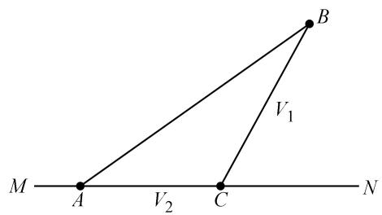

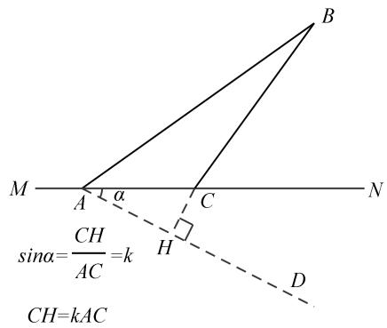

$\frac { A C } { V _ { 2 } } + \frac { B C } { V _ { 1 } } { = } \frac { 1 } { V _ { 1 } } \left( B C + \frac { V _ { 1 } } { V _ { 2 } } A C \right)$ ，记 $k = \frac { V _ { 1 } } { V _ { 2 } }$ 即 求 $B C + k A C$ 的最 小值 ．

构造射线 $A D$ 使得 sin $\angle D A N { = } k$ ， $C H / A C { = } k$ ， $C H { = } k A C$ ．

将问题转化为求 $B C { + } C H$ 最小值，过 $B$ 点作 $B H \bot A D$ 交 MN 于点 $C$ ，交 $A D$ 于 $H$ 点，此时 $B C + C H$ 取到最小值，即 $B C + k A C$ 最小

# 二、阿氏圆模型讲解

# 【模型来源】

所谓阿圆，就是动点到两定点距离之比为定值，那么动点的轨迹就是圆，这个圆，称为阿波罗尼斯圆，简称为阿圆．其本质就是通过构造母子相似，化去比例系数，转化为两定一动将军饮马型求最值，难点在于如何构造母子相似

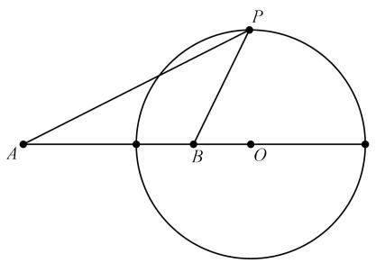

【模型建立】

如图 1 所示， $\odot O$ 的半径为 $R$ ，点 $A$ 、 $B$ 都在 $\odot O$ 外 ， $P$ 为 $\odot O$ 上一动点，已知 $R { = } \frac { 2 } { 5 } O B$

连接 $P A , \ P B$ ，则当 $\cdot P A + \frac { 2 } { 5 } P B ^ { \prime }$ 的值最小时， $P$ 点的位置如何确定？

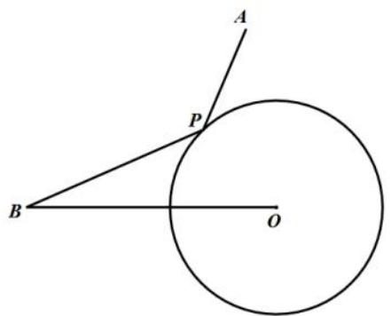  
图1

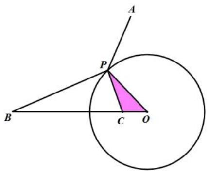  
图2

解决办法：如图 2，在线段 OB 上截取 $O C$ 使 $O C = \frac { 2 } { 5 } R$ ，则可说明△BPO 与△PCO 相似，则有 $\frac { 2 } { 5 } P B$

$= P C$ 。故本题求 $\mathrm { \Sigma } ^ { \mathrm { * } } P A \mathrm { + } \frac { 2 } { 5 } P B ^ { \mathrm { * } }$ 的最小值可以转化为 $^ { \cdot \cdot } P A + P C ^ { , }$ 的最小值，其中与 A 与 $C$ 为定点， $P$ 为动点，故当 A、P、 $C$ 三点共线时， ${ } ^ { \cdot \cdot } P A + P C ^ { , }$ 值最小。

# 03 核心·题型

# 模块一 胡不归模型

# 【题型 1】胡不归模型·已有相关角直接作垂线

# 2023·西 安 ·二 模

1．如图，在菱形ABCD中， $\angle A B C = 6 0 ^ { \circ }$ ， $A D = 6$ ，对角线 $A C$ 、 $B D$ 相交于点 $o$ ，点 $E$ 在线段 $A C$ 上，且 $A E = 2$ ，点 $F$ 为线段 $B D$ 上的一个动点，则 $E F + { \frac { 1 } { 2 } } B F$ 的最小值为

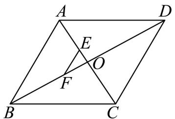

【答案】 $2 \sqrt { 3 }$

【分析】过 $F$ 作 $F M \perp B C$ ，由菱形ABCD， $\angle A B C = 6 0 ^ { \circ }$ ，得到 $B D$ 为 $\angle A B C$ 平分线，求出 $\angle F B M = 3 0 ^ { \circ }$ ，在 $\mathrm { R t } \triangle F B M$ 中，利用 $3 0 ^ { \circ }$ 角所对的直角边等于斜边的一半，得到 $F M = { \frac { 1 } { 2 } } F$ ，故 $E F + { \frac { 1 } { 2 } } B F = E F + F M$ ，求出 $E F + F M$ 的最小值即为所求最小值，当 $E$ 、 $F$ 、 $M$ 三点共线时最小，求出即可

【详解】解：过 $F$ 作 $F M \perp B C$ ，  
菱形 $A B C D$ ， $\angle A B C = 6 0 ^ { \circ }$ ，  
 $. \angle F B M = \frac { 1 } { 2 } \angle A B C = 3 0 ^ { \circ }$ ， $A B = B C$ ，即 $\triangle A B C$ 为等边三角形， $\angle A C M = 6 0 ^ { \circ }$ ，  
在 $\mathrm { R t } \triangle F B M$ 中， $F M = { \frac { 1 } { 2 } } B F$ ，  
$\therefore E F + { \frac { 1 } { 2 } } B F = E F + F M$ ，  
当 $E$ 、 $F$ 、 $M$ 三点共线时，取得最小值，  
$\because A E = 2 A C = A B = B C = 6$   
$\therefore E C = A C - A E = 6 - 2 = 4$ ，  
在 $\mathrm { R t } _ { \Delta E C M }$ 中， $E M = E C \cdot \sin 6 0 ^ { \circ } = 4 \times { \frac { \sqrt { 3 } } { 2 } } = 2 { \sqrt { 3 } }$ ，  
则 $E F + \frac { 1 } { 2 } B F$ 的最小值为 $2 \ { \sqrt { 3 } }$   
故答案为：2 $\sqrt { 3 }$ ．

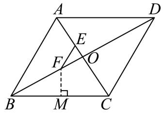

# 2023·保 定 ·一 模

2．如图，在矩形 $A B C D$ 中，对角线AC， $B D$ 交于点 $O$ ， $A B = O B = 3$ ，点 $M$ 在线段 $A C$ 上，且$A M = 2$ ．点 $P$ 为线段 $O B$ 上的一个动点．

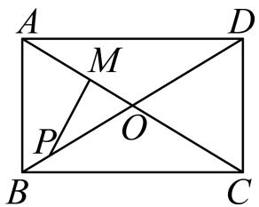

（1） $\angle O B C =$ ；

（2） 1MP  P 的最小值为【答案】 30 2

【分析】（1）由矩形的性质得到 $O A = O B = O C = O D ,$ ， $\angle A B C = 9 0 ^ { \circ }$ ，又由 $A B = O B$ 得到 ${ \triangle } O A B$ 是等边三角形，则 $\angle A B O = 6 0 ^ { \circ }$ ，即可得到答案；

（2）过点 $\cdot$ 作 $P E \bot B C$ 于点 $E$ ，过点 $\cdot$ 作 $M F \perp B C$ 于点 $\cdot$ ，证明 $M P + { \frac { 1 } { 2 } } P B = M P + P E \geq M F$ ，进一求解 $M F$ 即可得到答案

【详解】解：（1）∵四边形ABCD是矩形，$O A = O B = O C = O D ,$ ， $\angle A B C = 9 0 ^ { \circ }$   
∵ $A B = O B$ ，  
∴ $\scriptstyle A B = O B = O A$ ，  
$\therefore \triangle O A B$ 是等边三角形，  
∴ $\angle A B O = 6 0 ^ { \circ }$ ，  
∴ $\angle O B C = \angle A B C - \angle A B O = 9 0 ^ { \circ } - 6 0 ^ { \circ } = 3 0 ^ { \circ } ~ ,$   
故答案为：30．

（2）过点 $P$ 作 $P E \bot B C$ 于点 $E$ ，过点 $\cdot$ 作 $M F \perp B C$ 于点 $\cdot$ ，

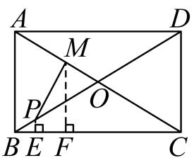

在 $\mathrm { R t } \triangle B P E$ 中，  
由（1）知： $\angle P B E = 3 0 ^ { \circ }$ ，  
$P E = \frac { 1 } { 2 } P B$ ，  
$M P + \frac { 1 } { 2 } P B = M P + P E \geq M F$   
在矩形 $A B C D$ 中，  
$\begin{array} { r } { A C = 2 O A = 2 O B = 6 , } \end{array}$ $\mathbf { \partial } \cdot \mathbf { \partial } _ { A M } = 2$ ，$C M = A C - A M = 6 - 2 = 4$ ，  
在 $\mathrm { R t } \triangle C M F$ 中， $\angle M C F = \angle O B C = 3 0 ^ { \circ }$ ，  
$M F = { \frac { 1 } { 2 } } C M = 2$ ，$M P + \frac { 1 } { 2 } P B$ 的最小值为 2

# 2023·湘西·中考真题

3．如图， $\odot O$ 是等边三角形 $A B C$ 的外接圆，其半径为 4．过点 $B$ 作 $B E \bot A C$ 于点 $E$ ，点 $P$ 为线段 $B E$ 上一动点（点 $P$ 不与 $B$ ， $E$ 重合），则 $C P + \frac { 1 } { 2 } B P$ 的最小值为

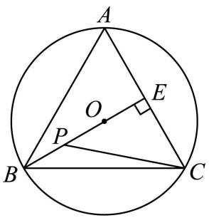

【答案】6

【分析】过点 $\cdot$ 作 $P D \perp A B$ ，连接CO并延长交 $A B$ 于点 $F$ ，连接 $_ { A O }$ ，根据等边三角形的性质和圆内接三角形的性质得到 $O A = O B = 4$ ， $C F \perp A B$ ，然后利用含 $3 0 ^ { \circ }$ 角直角三角形的性质得到$O E = { \frac { 1 } { 2 } } O A = 2$ ，进而求出 $B E = B O + E O = 6$ ，然 后利 用 $C P + \frac { 1 } { 2 } B P = C P + P D \leq C F$ 代入求解即可【详解】如图所示，过点 $\cdot$ 作 $P D \perp A B$ ，连接CO并延长交 $A B$ 于点 $\cdot$ ，连接 $_ { A O }$

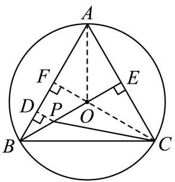

∵ ${ \triangle A B C }$ 是等边三角形，BEAC  
$\therefore \angle A B E = \angle C B E = \frac { 1 } { 2 } \angle A B C = 3 0 ^ { \circ }$   
∵ $\odot O$ 是等边三角形 $A B C$ 的外接圆，其半径为 4  
$O A = O B = 4 C F \bot A B$   
∴ $. \angle O B A = \angle O A B = 3 0 ^ { \circ }$   
$\angle O A E = \angle O A B = \frac { 1 } { 2 } \angle B A C = 3 0 ^ { \circ }$   
∵ BE  AC  
$O E = { \frac { 1 } { 2 } } O A = 2$   
∴ BE  BO  EO  6  
∵ PD  AB ，ABE  30  
$\therefore P D = { \frac { 1 } { 2 } } P B$   
$\therefore C P + { \frac { 1 } { 2 } } B P = C P + P D \leq C F$   
∴ $C P + \frac { 1 } { 2 } B P$ 的最小值为 $C F$ 的长度  
∵ ${ \triangle A B C }$ 是等边三角形， $B E \bot A C$ ，CF AB  
$C F = B E = 6$ $C P + \frac { 1 } { 2 } B P$ 的最小值为 6

4．如图， $A B = A C$ ， $A { \Big ( } 0 , { \sqrt { 1 5 } } { \Big ) }$ ， $C$ （1，0）， $D$ 为射线 AO 上一点，一动点 $P$ 从 $A$ 出发，运动路径为 $A - D - C$ ，在 $A D$ 上的速度为 4 个单位/秒，在 $C D$ 上的速度为 1 个单位/秒，则整个运动时间最少时， $D$ 的坐标为

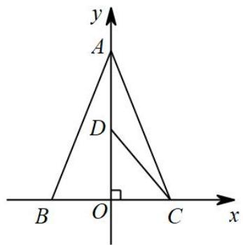

【答案】 $\left( 0 , \frac { \sqrt { 1 5 } } { 1 5 } \right)$

【分析】如图，作 $\cdot$ 于 $H$ ，CM⊥AB 于 $M$ ，交 $A O$ 于 $\cdot$ ．运动时间 $t = { \frac { A D } { 4 } } + { \frac { C D } { 1 } } = { \frac { A D } { 4 } } + C D$ ，由 $\triangle A H D \sim \triangle A O B$ ，推出 $D H = \frac { 1 } { 4 } A D$ ， 可得 ${ \frac { 1 } { 4 } } A D + C D = C D + D H$ ，推出 当 $C$ ， $D$ ， $H$ 共线 且和 $C M$ 重合时，运动时间最短．

【详解】如图，作 $D H \perp A B$ 于 $\cdot$ ，CM  AB于 $M$ ，交 $\cdot$ 于 $D ^ { \not \circ }$

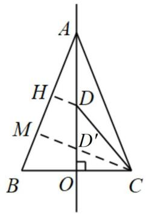

∵运动时间 $t = { \frac { A D } { 4 } } + { \frac { C D } { 1 } } = { \frac { A D } { 4 } } + C D$ ，  
∵ $A B = A C$ ， $A O \bot B C$ ，  
$\therefore B O = O C = 1$ ，  
$A ( 0 , \sqrt { 1 5 } ) \qquad A B = A C \quad A O \perp B C$ ，  
∴ $A B = A C = { \sqrt { O A ^ { 2 } + O B ^ { 2 } } } = { \sqrt { 1 5 + 1 } } = 4$ ，  
$\therefore \angle D A H = \angle B A O , \angle D H A = \angle A O B = 9 0 ^ { \circ }$ ，  
∴△AHD∽△AOB ，  
$\frac { A D } { A B } { = } \frac { D H } { O B }$ ,  
$\therefore D H = { \frac { 1 } { 4 } } A D ,$ ，  
$\therefore \frac { 1 } { 4 } A D + C D = C D + D H \ ,$   
∴当 $\cdot$ ， $\cdot$ ， $H$ 共线且和 $\cdot$ 重合时，运动时间最短  
$\therefore { \frac { 1 } { 2 } } B C \cdot A O = { \frac { 1 } { 2 } } A B \cdot C M$ ，  
$C M = { \frac { \sqrt { 1 5 } } { 2 } }$   
∴ $A M = \sqrt { A C ^ { 2 } - C M { } ^ { 2 } } = \sqrt { 4 ^ { 2 } - \left( \frac { \sqrt { 1 5 } } { 2 } \right) ^ { 2 } } = \frac { 7 } { 2 }$   
∵ $A D ^ { \prime } = 4 M D ^ { \prime }$ ，设 $M D ^ { \prime } = m$ ，则 $A D ^ { \prime } = 4 m$ ，  
则有： $1 6 m ^ { 2 } - m ^ { 2 } = \frac { 4 9 } { 4 }$   
∴ $m = \frac { 7 \sqrt { 1 5 } } { 3 0 }$ 或 $- { \frac { 7 { \sqrt { 1 5 } } } { 3 0 } }$ （舍去），  
$A D ^ { \prime } = \frac { 1 4 \sqrt { 1 5 } } { 1 5 }$   
∴ 150,D   

# 2023·江苏宿迁中考模拟

5．如图，二次函数 $y = a x ^ { 2 } + 2 a x - 3 a$ 与 $x$ 轴交于点 $A$ ， $B$ ，对称轴为直线 l，顶点 $C$ 到 $x$ 轴的距离为$2 \sqrt { 3 }$ ．点 $P$ 为直线 $l$ 上一动点，另一点从 $C$ 出发，先以每秒 2 个单位长度的速度沿 $C P$ 运动到点$P$ ，再以每秒 1 个单位长度的速度沿 $P A$ 运动到点 $A$ 停止，则时间最短为 秒．

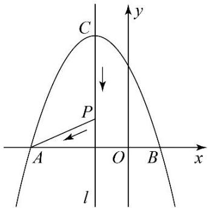

【答案】 $2 \sqrt { 3 }$

【分析】如图，连接 $A C , B C$ ，作 $A D \perp B C$ 于点 $D$ ， $A D$ 与 $E C$ 交点即为符合题意的点 $P$ ，可得$A B = A C = B C$ ，利用 $3 0 ^ { \circ }$ 角所对的直角边等于斜边的一半得到动点运动的时间为 $\frac { C P } { 2 } + A P$ 解题即可

【详解】如图，连接 $A C , B C$ ，作 $A D \perp B C$ 于点 $D$ ， $A D$ 与 $E C$ 交点即为符合题意的点 $P$ ，  
令 $y = 0$ ，则 $a x ^ { 2 } + 2 a x - 3 a = 0$ ，  
解得 $x = - 3$ 或 $x = 1$ ，  
∴A， $B$ 两点坐标为 $\left( - 3 , 0 \right)$ ， 1，0，  
∴ $A B = 4$ ，  
∵ $\cdot$ ， $B$ 两点关于 $l$ 对称，  
资料整理【淘宝店铺：向阳百分百】  
∴ $A E = B E = 2$ ，  
∵顶点 $C$ 到 $x$ 轴的距离为 $2 \sqrt { 3 }$ ，  
$A C = B C = \sqrt { E A ^ { 2 } + E C ^ { 2 } } = 4$ $A B = A C = B C$ ，  
∵ $A D , C E$ 都是 ${ \triangle A B C }$ 的高，  
$A D = C E = 2 { \sqrt { 3 } }$ ，  
由题意得动点运动的时间为 $\frac { C P } { 2 } { + } A P$ ，  
∵ ${ \triangle A B C }$ 是等边三角形， $C E \bot A B$ ，$\angle P C D = \frac { 1 } { 2 } \angle A C B = 3 0 ^ { \circ }$ ，  
∵作 $P D \perp C D$ ，$P D = { \frac { 1 } { 2 } } C P$   
${ \frac { 1 } { 2 } } C P + A P = P D + A P = 2 { \sqrt { 3 } }$   
显然在 $l$ 上另取一点 $P ^ { \prime }$ ，连接 $P ^ { \prime } A , \ P ^ { \prime } D$ ，  
$P ^ { \prime } A + P ^ { \prime } D \geq A D$ ，  
∴当 $P A + P D = A D$ 时，运动时间最短为 $2 \sqrt { 3 }$ ，  
故答案为： $2 \sqrt { 3 }$ ．

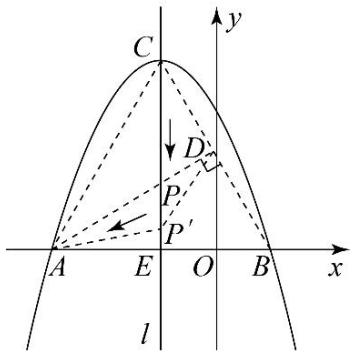

# 2023·四川自贡·统考中考真题

6．如图，直线 $y = - { \frac { 1 } { 3 } } x + 2$ 与 $x$ 轴， $y$ 轴分别交于 $A$ ， $B$ 两点 ， 点 $D$ 是线 段 $A B$ 上一动点，点 $H$ 是直线 y  $y = - { \frac { 4 } { 3 } } x + 2$ 上的一动点，动点 $E \big ( m , 0 \big )$ ， $F \left( m + 3 , 0 \right)$ ，连接 $B E$ ， $D F$ ， $H D$ ．当 $B E + D F$ 取最小值时， $3 B H + 5 D H$ 的最小值是

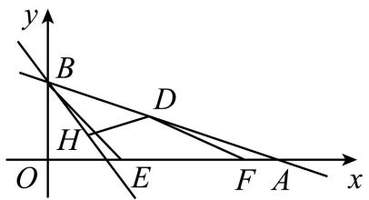

【答案】 $\frac { 3 9 } { 2 }$

【分析】作出点 $C ( 3 , - 2 )$ ，作 $C D \perp A B$ 于点 $\mathrm { D }$ ，交 $\mathbf { X }$ 轴于点 F，此时 $B E + D F$ 的最小值为 $C D$ 的长，利用解直角三角形求得 $F { \left( \frac { 1 1 } { 3 } , 0 \right) }$ ， 利用待定系数法求得直线 $C D$ 的解析式，联立即可求得点 D 的坐标，过点 D 作 $D G \bot y$ 轴于点 $\mathrm { G }$ ，此时 $3 B H + 5 D H$ 的最小值是 $5 D G$ 的长，据此求解即可

【详解】解：∵直线 1 23   x  与 x 轴，y 轴分别交于 A，B 两点，  
∴ B 0，2 ， A6，0 ，  
作点 B 关于 $\cdot$ 轴的对称点 $B ^ { \prime } ( 0 , - 2 )$ ，把点 $B ^ { \prime }$ 向右平移 3 个单位得到 $C ( 3 , - 2 )$ ，  
作 $C D \perp A B$ 于点 $\cdot$ ，交 $\mathbf { X }$ 轴于点 F，过点 $B ^ { \prime }$ 作 $B ^ { \prime } E / / C D$ 交 $\cdot$ 轴于点 E，则四边形 $E F C B ^ { \prime }$ 是平行四边  
形，  
此时， $B E = B ^ { \prime } E = C F$ ，  
$\therefore B E + D F = C F + D F = C D$ 有最小值，  
作 $C P \perp x$ 轴于点 $\mathrm { P }$ ，  
则 $C P = 2$ ， $O P = 3$ ，  
∵ $\angle C F P = \angle A F D$ ，  
∴ $\angle F C P = \angle F A D$ ，  
∴ tan $\angle F C P = \tan \angle F A D$ ，$\frac { P F } { P C } { = } \frac { O B } { O A }$ 即 ${ \frac { P F } { 2 } } = { \frac { 2 } { 6 } }$ ,$P F = \frac { 2 } { 3 }$ 则 $F { \left( \frac { 1 1 } { 3 } , 0 \right) }$   
设直线 $C D$ 的解析式为 $y = k x + b$ ，  
则 $\left\{ \begin{array} { l l } { 3 k + b = - 2 } \\ { 1 1 } \\ { \displaystyle \frac { 3 } { 3 } k + b = 0 } \end{array} \right.$ 解得 $\begin{array} { l } { \displaystyle { \int k = 3 } } \\ { \displaystyle { \left[ b = - 1 1 \right. } } \end{array}$   
∴直线 $C D$ 的解析式为 $y = 3 x - 1 1$ ，  
联立， $\begin{array}{c} { \begin{array} { l } { \displaystyle { \{ y = 3 x - 1 1 \qquad \quad } [ x = { \frac { 3 9 } { 1 0 } } { \bigcirc } } \\ { \displaystyle { y = - { \frac { 1 } { 3 } } x + 2 \qquad } } \end{array}  } \qquad { \mathrm { ~ f ~ } } \qquad x = { \frac { 3 9 } { 1 0 } }  \\ { \displaystyle { \{ y = { \frac { 7 } { 1 0 } }  } \qquad }  \end{array}  { \begin{array} { l } { \displaystyle { D { ( { \frac { 3 9 } { 1 0 } } , { \frac { 7 } { 1 0 } } ) } } } \\ { \displaystyle { {  ( y = { \frac { 7 } { 1 0 } } ) } } } \end{array} }$

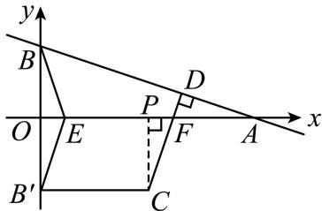

过点 D 作 $D G \perp y$ 轴于点 G，

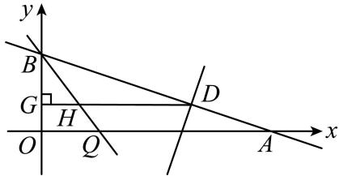

直线 $y = - { \frac { 4 } { 3 } } x + 2$ 与 $\cdot$ 轴的交点为 $Q { \left( { \frac { 3 } { 2 } } , 0 \right) }$ 则 $B Q = \sqrt { O Q ^ { 2 } + O B ^ { 2 } } = \frac { 5 } { 2 }$ ,$\therefore \sin \angle O B Q = \frac { O Q } { B Q } = \frac { \frac { 3 } { 2 } } { \frac { 5 } { 2 } } = \frac { 3 } { 5 } , \therefore H G = B H \sin \angle G B H = \frac { 3 } { 5 } B H ,$ $\therefore 3 B H + 5 D H = 5 { \left( \frac { 3 } { 5 } \ B H + D H \right) } = 5 { \big ( } \ H G + D H { \big ) } = 5 D G ,$ ，即 $3 B H + 5 D H$ 的最小值是 $5 D G = 5 \times \frac { 3 9 } { 1 0 } = \frac { 3 9 } { 2 }$

# 2023·成都市七中校考

7．如图，在矩形ABCD中， $A B = 4$ ， $A D = 8$ ，点 $E$ ， $F$ 分别在边 $A D$ ， $B C$ 上，且 $A E = 3$ ，沿直线$E F$ 翻折，点A的对应点 $A ^ { \prime }$ 恰好落在对角线 $A C$ 上，点 $B$ 的对应点为 $B ^ { \prime }$ ，点 $M$ 为线段 $A A ^ { \prime }$ 上一动点，则 $E M + \frac { \sqrt { 5 } } { 5 } A ^ { \prime } M$ 的最小值为

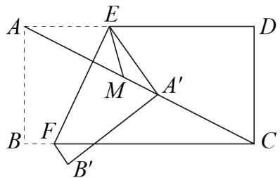

【答案】 $\frac { 1 2 } { 5 }$

【分析】过点 M作 $M N \perp A ^ { \prime } E$ 于点 N，作点 E 关于 $A C$ 的对称点 G，连接 $_ { M G }$ ．由勾股定理求出 $A D$ 的长，根据锐角三角函数的知识可得 $M N = \frac { \sqrt { 5 } } { 5 } A ^ { \prime } E$ ，从而可得当 G，M，N 三点共线时 $G M + M N$ 取得最小值，即 $E M + \frac { \sqrt { 5 } } { 5 } A ^ { \prime } M$ 取得最小值，然后利用锐角三角函数和勾股定理可求出 $G N$ 的长．【详解】解：如图，过点 $\cdot$ 作 $M N \perp A ^ { \prime } E$ 于点 N，作点 E 关于 $A C$ 的对称点 G，连接 $_ { M G }$ ，则 $E M = M G$

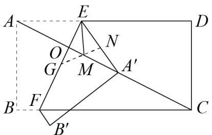

由折叠的性质可知， $E F \perp A C$ ， $A E = A ^ { \prime } E$ ， $\angle A E F = \angle A ^ { \prime } E F$ ，  
∴ $\angle D A C = \angle A A ^ { \prime } E$ ．∵四边形ABCD是矩形，∴ $C D = A B = 4$ ， $\angle D = 9 0 ^ { \circ }$   
∴ $A D = \sqrt { A D ^ { 2 } + C D ^ { 2 } } = 4 \sqrt { 5 }$ $\cdot \sin \angle D A C = { \frac { C D } { A C } } = { \frac { \sqrt { 5 } } { 5 } }$ ∴sin AA E   $\angle A A ^ { \prime } E = \frac { \sqrt { 5 } } { 5 } = \frac { M N } { A ^ { \prime } M }$ $M N = \frac { \sqrt { 5 } } { 5 } A ^ { \prime } M$   
$\therefore E M + \frac { \sqrt { 5 } } { 5 } A ^ { \prime } M = G M + M N ,$ ，  
∴当 G，M， $\cdot$ 三点共线时 $G M + M N$ 取得最小值，即 $E M + \frac { \sqrt { 5 } } { 5 } A ^ { \prime } M$ 取得最小值，  
∵ $\cdot \angle D A C + \angle A E F = 9 0 ^ { \circ }$ ， $\angle E G N + \angle A ^ { \prime } E F = 9 0 ^ { \circ } , \therefore \angle E G N = \angle D A C ,$ ，  
$\therefore \sin \angle E G N = \sin \angle D A C = { \frac { \sqrt { 5 } } { 5 } } = { \frac { E N } { G E } } .$   
$\because \sin \angle D A C = \frac { O E } { A E } = \frac { \sqrt { 5 } } { 5 } , A E = 3 , \therefore O E = \frac { 3 \sqrt { 5 } } { 5 } , \therefore G E = \frac { 6 \sqrt { 5 } } { 5 } , \therefore \frac { \sqrt { 5 } } { 5 } = \frac { E N } { \frac { 6 \sqrt { 5 } } { 5 } } , \therefore E N = \frac { 6 } { 5 } ,$   
$G N = \sqrt { \left( \frac { 6 \sqrt { 5 } } { 5 } \right) ^ { 2 } - \left( \frac { 6 } { 5 } \right) ^ { 2 } } = \frac { 1 2 } { 5 }$   
即 $E M + \frac { \sqrt { 5 } } { 5 } A ^ { \prime } M$ 取得最小值是 $\frac { 1 2 } { 5 }$

# 【题型 2】胡不归模型·构造相关角再作垂线

8．如图，在长方形ABCD中， $A B = 2$ ， $A D = 2 { \sqrt { 3 } }$ ，点 $E$ 在 $B C$ 上，连接 $D E$ ，在点 $E$ 的运动过程中，$B E + \sqrt { 2 } D E$ 的最小值为

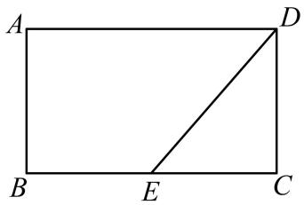

【答案】 $2 + 2 { \sqrt { 3 } } / 2 { \sqrt { 3 } } + 2$

【分析】在线段 $B C$ 下方作 $\angle C B M { = } 4 5 ^ { \circ }$ ，过点 $E$ 作 $E F \perp B M$ 于点 $F$ ，连接 $D F$ ，求出此时的 $D F$ 的长度便可

【详解】解：∵四边形ABCD是矩形， $A B = 2$ ， $A D = 2 { \sqrt { 3 } }$ ，资料整理【淘宝店铺：向阳百分百】

$\therefore \angle D C E = 9 0 ^ { \circ } , C D = A B = 2 , B C = A D = 2 { \sqrt { 3 } }$ ，  
$\therefore B E = 2 \sqrt { 3 } - C E \ ,$ ，  
在线段 $B C$ 下方作 $\angle C B M { = } 4 5 ^ { \circ }$ ，过点 $E$ 作 $E F \perp B M$ 于点 $F$ ，连接 $D F$ ，  
∴ EF  2 BE ，2  
$\therefore { \frac { \sqrt { 2 } } { 2 } } B E + D E = E F + D E \geq D F .$   
当 $D$ 、 $E$ 、 $F$ 三点共线时， $\frac { \sqrt { 2 } } { 2 } B E + D E = E F + D E = D F$ 的值最小，  
此时 $\angle D E C = \angle B E F = 4 5 ^ { \circ }$ ，  
∴ $\scriptstyle C E = C D = 2$ ，  
$\begin{array} { l } { { B E = 2 \sqrt { 3 } - 2 \quad D E = \sqrt { 2 ^ { 2 } + 2 ^ { 2 } } = 2 \sqrt { 2 } } } \\ { { E F = \displaystyle \frac { \sqrt { 2 } } { 2 } B E = \sqrt { 6 } - \sqrt { 2 } } } \end{array}$   
$\cdot \frac { \sqrt { 2 } } { 2 } B E + D E$ 的最小值为： $E F + D E = \sqrt { 2 } + \sqrt { 6 }$ ，  
∴ BE  2DE 的最小值为 2 2BE DE    $B E + \sqrt { 2 } D E = \sqrt { 2 } \left( \frac { \sqrt { 2 } } { 2 } B E + D E \right) = 2 + 2 \sqrt { 3 }$

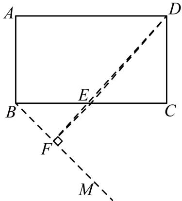

# 2023·广 西 二 模

9．如图所示，在 ${ \triangle A B C }$ 中， $\angle A = 3 0 ^ { \circ }$ ， $M$ 为线段 $A B$ 上一定点， $P$ 为线段 $A C$ 上一动点．当点 $P$ 在运动的过程中，满足 $P M + { \frac { 1 } { 2 } } A P$ 的值最小时，则 $\angle A P M = \_$

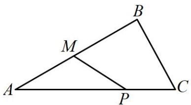

【答案】 $1 2 0 ^ { \circ }$

【详解】解：作 $\angle C A F = \angle C A B$ ，过 $M$ 作 $M D \perp A F$ 交 $A C$ 于一点即为点 $\cdot$ ，∵ $\angle C A B = 3 0 ^ { \circ }$ ，

资料整理【淘宝店铺：向阳百分百】

∴ $\angle C A F = \angle C A B = 3 0 ^ { \circ }$ ，$\cdot$ ，  
∴当 $M D \perp A F$ 时 $P M + { \frac { 1 } { 2 } } A P$ 的值最小，  
∴在 $\triangle A D P$ 中， $\angle A P M = 9 0 ^ { \circ } + 3 0 ^ { \circ } = 1 2 0 ^ { \circ }$ ,  
故答案为 $1 2 0 ^ { \circ }$ ；

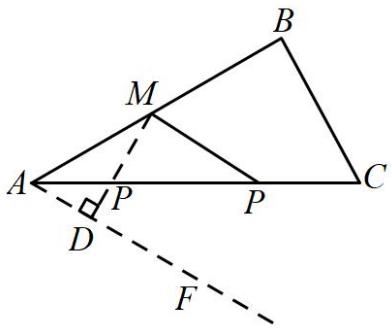

10．如图， $\angle A C B = 9 0 ^ { \circ }$ ， $A C = 2$ ， $A B = 4$ ，点 $P$ 为 $A B$ 上一点，连接 $P C$ ，则 $P C + \frac { 1 } { 2 } P B$ 的最小值为 3 ．

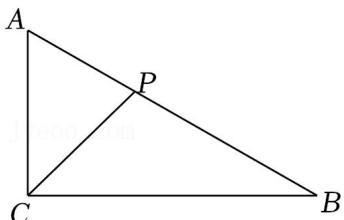

【答案】3

【解答】解：作 $\angle A B E = 3 0 ^ { \circ }$ ，过点 $C$ 作 $C D \perp B E$ 于点 $D$ 则此时 $P C + \frac { 1 } { 2 } P B$ 最小，  $\angle A C B = 9 0 ^ { \circ }$ ， $A C = 2$ ， $A B = 4$ ， $\therefore \sin \angle C B A = \frac { A C } { A B } = \frac { 2 } { 4 } = \frac { 1 } { 2 } \ , B C = \sqrt { 4 ^ { 2 } - 2 ^ { 2 } } = 2 \sqrt { 3 } \ ,$ ， $\therefore \angle C B A = 3 0 ^ { \circ }$ $\displaystyle { . D P = \frac { 1 } { 2 } P B }$ ， $\cdot \angle C B E = 6 0 ^ { \circ }$ ， $\therefore \sin 6 0 ^ { \circ } = { \frac { D C } { B C } } = { \frac { C D } { 2 { \sqrt { 3 } } } } = { \frac { \sqrt { 3 } } { 2 } } ,$ 解得： $D C = 3$ ， $\therefore P C + { \frac { 1 } { 2 } } P B = D C = 3$ 故答案为：3．

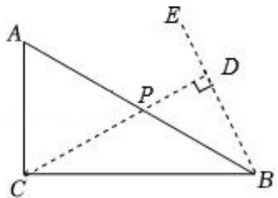

11．如图，AC 是圆 $O$ 的直径， $A C = 4$ ，弧 $B A = 1 2 0 ^ { \circ }$ ，点 $D$ 是弦 $A B$ 上的一个动点，那么 $O D + \frac { 1 } { 2 } B D$ 的最小值为( )

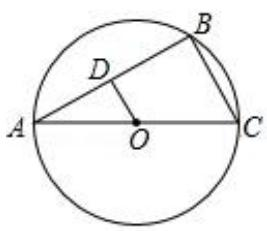

A． $\frac { \sqrt { 3 } } { 2 }$ B． $\sqrt { 3 }$ C． $1 + { \frac { \sqrt { 3 } } { 2 } }$ D． $1 + { \sqrt { 3 } }$

【答案】 $B$

【解答】解： $\widehat { B A }$ 的度数为 $1 2 0 ^ { \circ }$ ， $\angle C = 6 0 ^ { \circ }$ ，AC 是直径， $\angle A B C = 9 0 ^ { \circ }$ ， $\angle A = 3 0 ^ { \circ }$ ，作 $B K / / C A$ ， $D E \bot B K$ 于 $E$ ， $O M \perp B K$ 于 $M$ ，连接 $O B$ $\therefore B K / / A C$ ， $\angle D B E = \angle B A C = 3 0 ^ { \circ }$ ，在 RtDBE 中， $D E = \frac { 1 } { 2 } B D$ ， $\therefore O D + \frac { 1 } { 2 } B D = O D + D E \ ,$ ，

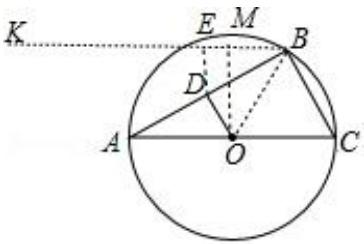

根据垂线段最短可知，当点 $E$ 与 $M$ 重合时， $O D + \frac { 1 } { 2 } B D$ 的值最小，最小值为OM ，  
$\because \angle B A O = \angle A B O = 3 0 ^ { \circ }$   
 $. \angle O B M = 6 0 ^ { \circ }$ ，  
在 $\mathrm { R t } \Delta \mathrm { O B M }$ 中，  
 $O B = 2$ ， $\angle O B M = 6 0 ^ { \circ }$ ，  
OM  OB sin 60  3 ，  
$\frac { 1 } { 2 } D B + O D$ 的最小值为 $\sqrt { 3 }$ ，故选： $B$

12．如图，在 $\Delta A B C$ 中， $\angle A = 1 5 ^ { \circ }$ ， $A B = 1 0$ ， $P$ 为 $A C$ 边上的一个动点（不与 $A$ 、 $C$ 重合），连接 $B P$ ，

则 Jid:) ${ \frac { \sqrt { 2 } } { 2 } } A P + P B$ 的最小值是(

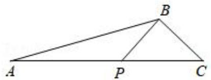

A． 5 2 B． 5 3 C． $\frac { 1 0 { \sqrt { 3 } } } { 3 }$ D．8

【答案】B

【解答】解：如图，以 $A P$ 为斜边在 $A C$ 下方作等腰 $\mathrm { R t } \Delta \mathrm { A D P }$ ，过 $B$ 作 $B E \bot A D$ 于 $E$ ，

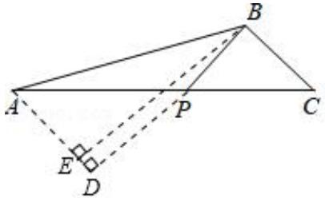

$\cdot \angle P A D = 4 5 ^ { \circ }$ ，  
$\therefore \sin \angle P A D = { \frac { D P } { A P } } = { \frac { \sqrt { 2 } } { 2 } }$   
$\therefore D P = { \frac { \sqrt { 2 } } { 2 } } A P$   
$\therefore \frac { \sqrt { 2 } } { 2 } A P + P B = D P + P B \overline { { { \cal { H } } } } B E ,$ ，  
$\therefore \angle B A C = 1 5 ^ { \circ }$ ，  
$\cdot \angle B A D = 6 0 ^ { \circ }$ ，  
$\therefore B E = A B \sin 6 0 ^ { \circ } = 5 { \sqrt { 3 } }$ ，${ \frac { \sqrt { 2 } } { 2 } } A P + P B$ 的最小值为 $5 \sqrt { 3 }$ ．故选： $B$ ．

13．如图，在 Rt△ABC 中， $\angle A C B = 9 0 ^ { \circ }$ ， $\angle B = 3 0 ^ { \circ }$ ， $A B { = } 4$ ，点 $D$ 、 $F$ 分别是边 $A B$ ， $B C$ 上的动点，连接 $C D$ ，过点 $A$ 作 $A E \bot C D$ 交 $B C$ 于点 $E$ ，垂足为 $G$ ，连接 $G F$ ，则 $G F + \frac { 1 } { 2 } F B$ 的最小值是

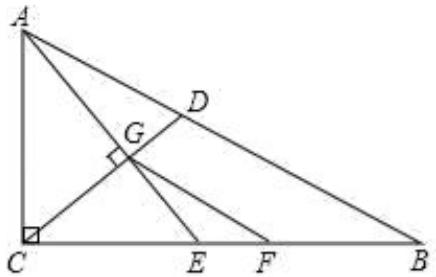

【答案】 ${ \frac { 3 { \sqrt { 3 } } } { 2 } } - 1$

【分析】由 $\frac 1 2$ 联想到给 $\cdot$ 构造含 $3 0 ^ { \circ }$ 角的直角三角形，故把 $\cdot$ 补成等边△ABP，过 $\cdot$ 作

资料整理【淘宝店铺：向阳百分百】

$\cdot$ 的垂线 $\cdot$ ， $\frac { 1 } { 2 }$ ，易得当 G、F、 $\cdot$ 成一直线时， $G F \mathrm { + } \frac { 1 } { 2 } F B$ 最短，又由于点 $\cdot$ 为动点，易证点 $\cdot$ 在以 $A C$ 为直径的圆上，求点 $G$ 到 $\cdot$ 的最短距离即当点 $G$ 在点 $\cdot$ 到 $\cdot$ 的垂线段上时， $G Q$ 的长度

【详解】延长 $A C$ 到点 $\cdot$ ，使 $\cdot$ ，连接 $B P$ ，过点 $\cdot$ 作 $\cdot$ 于点 $\cdot$ ，取 $\cdot$ 中点 $O$ ，连接  
$\cdot$ ，过点 $O$ 作 $O Q \bot B P$ 于点 $\mathcal { Q }$ ，  
∵ $\_$ ， $\_$ ， $A B { = } 4$   
∴ $. \ A C = C P { = } 2$ ， $\_$   
∴ $\triangle A B P$ 是等边三角形  
∴ $\_$   
∴ Rt△FHB 中， $\frac { 1 } { 2 }$   
∴当 $\cdot$ 、 $\cdot$ 、 $H$ 在同一直线上时，  
${ \frac { 1 } { 2 } } \qquad $ 取得最小值  
∵ $\cdot$ 于点 $G$ $. \angle A G C = 9 0 ^ { \circ }$   
∵ $\cdot$ 为 $A C$ 中点$\cdot O A { = } O C { = } O G { = } { \frac { 1 } { 2 } } A C$   
∴A、 $C$ 、 $G$ 三点共圆，圆心为 $\cdot$ ，即点 $\cdot$ 在 $\odot O$ 上运动，  
∴当点 $G$ 运动到 $\cdot$ 上时， $G H$ 取得最小值  
∵Rt△OPQ 中， $\angle P = 6 0 ^ { \circ }$ ， $\cdot$ ， $s i n \angle P { = } { \frac { O Q } { O P } } { = } { \frac { \sqrt { 3 } } { 2 } }$   
∴ $O Q = { \frac { \sqrt { 3 } } { 2 } } O P = { \frac { 3 { \sqrt { 3 } } } { 2 } }$ ∴ $G H$ 最小值为 ${ \frac { 3 { \sqrt { 3 } } } { 2 } } - 1$

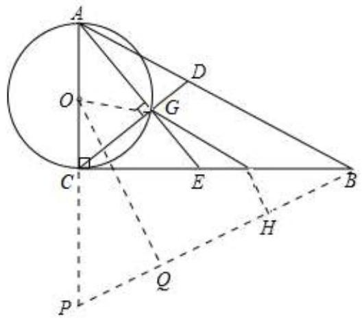

14．如图，在 $\mathrm { R t } \triangle A B C$ 中， $\angle A C B = 9 0 ^ { \circ }$ ， $A C = 4$ ， $B C = 3$ ，点 $D$ 是斜边 $A B$ 上的动点，则 $C D + \frac { \sqrt { 2 } } { 2 } A D$ 的最小值为

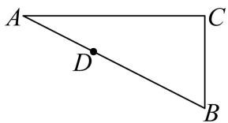

【答案】 $\frac { 1 4 { \sqrt { 2 } } } { 5 }$

【分析】根据两点之间线段最短画出图形，再根据锐角三角函数及相似三角形判定可知 $\triangle B C E ^ { \sim } \triangle B A C$ ，最后利用相似三角形的性质及直角三角形的性质即可解答

【详解】解：过点A做 $\angle B A M = 4 5 ^ { \circ }$ ，过点 $D$ 作 $D H \perp A M$ 于 $H$ ，过点 $C$ 作 $C E \bot A B$ 于点 $E$ ，

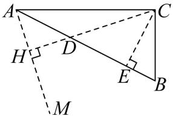

$\therefore D H = A D \cdot \sin \angle D A H = A D \cdot \sin 4 5 ^ { \circ } = { \frac { \sqrt { 2 } } { 2 } } A D ,$   
$C D + { \frac { \sqrt { 2 } } { 2 } } A D = C D + D H$   
∵两点之间线段最短，  
∴当 $C _ { \setminus }$ 、 $D$ 、 $H$ 共线时， $C D + D H$ 的值最小，  
即 $C D + D H$ 的最小值为 $C H$ ，

【法一：正切和角公式】详情见本专辑 1-3 “12345模型”tan $\angle C A H = \frac { 1 + \frac { 3 } { 4 } } { 1 - \frac { 3 } { 4 } } = 7$ 7 ，故△AHC 的三边之比为 $1 { : } 7 : 5 { \sqrt { 2 } }$ ，则 答案 为 $\frac { 1 4 { \sqrt { 2 } } } { 5 }$

【法二：常规法】  
∵ $\angle A C B = 9 0 ^ { \circ }$ ， $A C = 4$ ， $B C = 3$ ，  
$A B = \sqrt { A C ^ { 2 } + B C ^ { 2 } } = 5$ ，  
$C E \bot A B$ ，  
$\angle C E B = \angle A C B = 9 0 ^ { \circ }$ ，  
∵ $\angle B = \angle B$ ，  
$\triangle B C E \sim _ { \triangle B A C }$ ，  
$\therefore { \frac { C E } { A C } } = { \frac { B E } { B C } } = { \frac { B C } { A B } } = { \frac { 3 } { 5 } } ,$   
$C E = \frac { 3 } { 5 } \times 4 = \frac { 1 2 } { 5 } B E = \frac { 3 } { 5 } \times 3 = \frac { 9 } { 5 }$   
$\therefore \angle C D E = \angle A D H = 4 5 ^ { \circ } , \therefore D E = C E = \frac { 1 2 } { 5 } ,$   
$\therefore C D = \sqrt { 2 } C E = \frac { 1 2 \sqrt { 2 } } { 5 } , A D = A B - D E - B E = 5 - \frac { 1 2 } { 5 } - \frac { 9 } { 5 } = \frac { 4 } { 5 } ,$   
$\therefore D H = \frac { \sqrt { 2 } } { 2 } A D = \frac { \sqrt { 2 } } { 2 } \times \frac { 4 } { 5 } = \frac { 2 \sqrt { 2 } } { 5 } \ , \therefore C H = C D + D H = \frac { 1 2 \sqrt { 2 } } { 5 } + \frac { 2 \sqrt { 2 } } { 5 } = \frac { 1 4 \sqrt { 2 } } { 5 }$ 故答案为 $\frac { 1 4 { \sqrt { 2 } } } { 5 }$

2023·广东深圳·统考三模

15．如图，在 $\triangle A C E$ 中， $C A { = } C E$ ， $\angle C A E { = } 3 0 ^ { \circ }$ ， $_ { \odot O }$ 经过点 C，且圆的直径 $A B$ 在线段 $A E$ 上

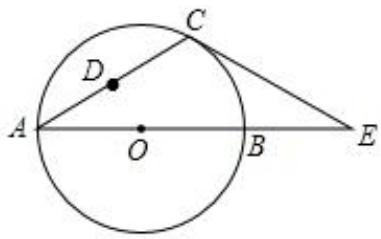

（1）试说明 $C E$ 是 $\odot O$ 的切线；

（2）若 $\triangle A C E$ 中 $A E$ 边上的高为 $h$ ，试用含 $h$ 的代数式表示 $_ { \odot O }$ 的直径 $A B$ ；

（3）设点 $D$ 是线段 $A C$ 上任意一点（不含端点），连接 $O D$ ，当 $\frac { 1 } { 2 } C D \mathrm { + } O D$ 的最小值为 6时，求 $_ { \odot O }$ 的直径 $A B$ 的长

【答案】（1）证明见试题解析；（2） ${ \frac { 4 { \sqrt { 3 } } } { 3 } } h$ h ；（3） $8 \sqrt { 3 }$

【详解】解：（1）连接 $O C$ ，如图 1，∵ $\cdot$ ， $\_$ ，∴ $-$ ， $\scriptstyle \angle C O E = 2 \angle A = 6 0 ^ { \circ }$ ，  
$\_$ ，  
∴ $\cdot$ 是 $\cdot$ 的切线；（2）过点 $C$ 作 $\cdot$ 于 $H$ ，连接 $\cdot$ ，  
如图 2，由题可得 $C H { = } h$ ，在 $R t \triangle O H C$ 中， $C H { = } O C { \bullet } s i n \angle C O H$ ，$\therefore h = O C \bullet s i n 6 0 ^ { \circ } = { \frac { \sqrt { 3 } } { 2 } } O C ,$ ， ${ \begin{array} { l l } { { \frac { 2 h } { \sqrt { 3 } } } } & { { \frac { 2 { \sqrt { 3 } } } { 3 } } h } \end{array} }$   
${ \frac { 4 { \sqrt { 3 } } } { 3 } } h$ ；  
（3）作 $\cdot$ 平分 $\cdot$ ，交 $\odot O$ 于 $F$ ，连接 $A F$ 、 $C F$ 、 $\cdot$ ，  
如图 3，则 ${ \frac { 1 } { 2 } } \qquad { \frac { 1 } { 2 } } \qquad \qquad \qquad \quad$ ，  
∵ $O A { = } O F { = } O C$ ，∴ $\triangle A O F$ 、 $\triangle C O F$ 是等边三角形，  
$-$ ，∴四边形 $\cdot$ 是菱形，  
∴根据对称性可得 $\cdot$ ，过点 $D$ 作 $D H \bot O C$ 于 $H$ ，∵ $\cdot$ ， $\cdot \angle O C A = \angle O A C = 3 0 ^ { \circ } ,$ ，  
∴DH=DC•sin∠DCH=DC•sin30°= 1 DC，$\scriptstyle \cdot \frac { 1 } { 2 } C D + O D = D H + F D$   
根据两点之间线段最短可得：当 $F , D , H$ 三点共线时， $\cdot$ （即 $\frac { 1 } { 2 }$ ）最小，此时 FH=OF•s  
$\angle F O H { = } \frac { \sqrt { 3 } } { 2 } O F { = } 6$ ，则 OF=4 3 ， $A B { = } 2 O F { = } 8 { \sqrt { 3 } }$ ，  
∴当 $\frac { 1 } { 2 } C D \mathrm { + } O D$ 的最小值为 6 时， $\cdot$ 的直径 $\cdot$ 的长为 $8 \sqrt { 3 }$

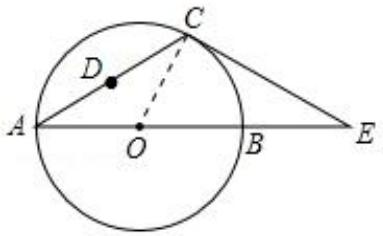  
图1

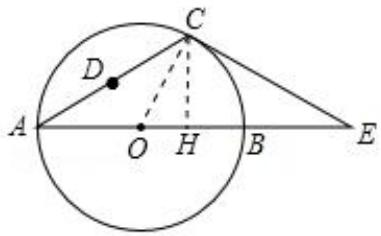  
图2

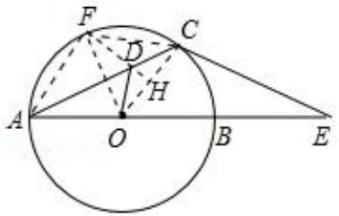  
图3

16．如图，矩形 ABCD的对角线 $A C$ ， $B D$ 相交于点 $O$ ， $\Delta C O D$ 关于 $C D$ 的对称图形为 $\Delta C E D$

（1）求证：四边形 $O C E D$ 是菱形；

（2）连接 $A E$ ，若 $A B = 6 c m$ ， $B C = \sqrt { 5 } c m$ ．

$\textcircled{1}$ 求sinEAD 的值；

$\textcircled{2}$ 若点 $P$ 为线段 $A E$ 上一动点（不与点 $A$ 重合），连接 $O P$ ，一动点 $\mathcal { Q }$ 从点 $O$ 出发，以 $1 c m / s$ 的速度沿线段 $O P$ 匀速运动到点 $P$ ，再以 $1 . 5 c m / s$ 的速度沿线段 $P A$ 匀速运动到点 $A$ ，到达点 $A$ 后停止运动，当点 $\boldsymbol { Q }$ 沿上述路线运动到点 $A$ 所需要的时间最短时，求 $A P$ 的长和点 $Q$ 走完全程所需的时间

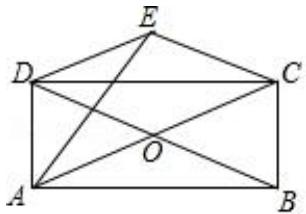

资料整理【淘宝店铺：向阳百分百】

【解答】（1）证明：四边形 $A B C D$ 是矩形  
$\therefore O D = O B = O C = O A$ ，  
 $\Delta E D C$ 和 $\Delta O D C$ 关于 $C D$ 对称，  
$\therefore D E = D O C E = C O$ ，  
$\therefore D E = E C = C O = O D$ ，  
四边形 $C O D E$ 是菱形

（2） $\textcircled{1}$ 设 $A E$ 交 $C D$ 于 $K$ 四边形CODE 是菱形，$\therefore D E / / A C , D E = O C = O A$ ，$\therefore { \frac { D K } { K C } } = { \frac { D E } { A C } } = { \frac { 1 } { 2 } }$ $\cdot A B = C D = 6$ ，$\therefore D K = 2 C K = 4$ ，在RtADK 中， $A K = { \sqrt { A D ^ { 2 } + D K ^ { 2 } } } = { \sqrt { ( { \sqrt { 5 } } ) ^ { 2 } + 2 ^ { 2 } } } = 3$ ，$\therefore \sin \angle D A E = { \frac { D K } { A K } } = { \frac { 2 } { 3 } }$

$\cdot$ 作 $P F \perp A D$ 于 $F$ ．易知 $P F = A P \cdot \sin \angle D A E = \frac { 2 } { 3 } A P ,$   
点 $\mathcal { Q }$ 的运动时间 $t = \frac { O P } { 1 } + \frac { A P } { \frac { 3 } { 2 } } = O P + \frac { 2 } { 3 } A P = O P + P F$   
当 $O$ 、 $P$ 、 $F$ 共线时， $O P + P F$ 的值最小，此时 $O F$ 是 $\Delta A C D$ 的中位线，  
$\therefore O F = \frac { 1 } { 2 } C D = 3 . A F = \frac { 1 } { 2 } A D = \frac { \sqrt { 5 } } { 2 } , P F = \frac { 1 } { 2 } D K = 1 ,$   
$\therefore A P = { \sqrt { ( { \frac { \sqrt { 5 } } { 2 } } ) ^ { 2 } + 1 ^ { 2 } } } = { \frac { 3 } { 2 } }$   
当点 $\mathcal { Q }$ 沿上述路线运动到点 $A$ 所需要的时间最短时， $A P$ 的长为 $\frac { 3 } { 2 } c m$ ，点 $\mathcal { Q }$ 走完全程所需的时间  
为 $3 s$ ．

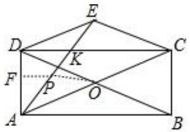

17．抛物线 $y = - x ^ { 2 } + b x + c$ 与 $x$ 轴交于 $A$ 、 $B$ 两点，与 $y$ 轴交于点 $C$ ，且 $B ( - 1 , 0 )$ ， $C ( 0 , 3 )$

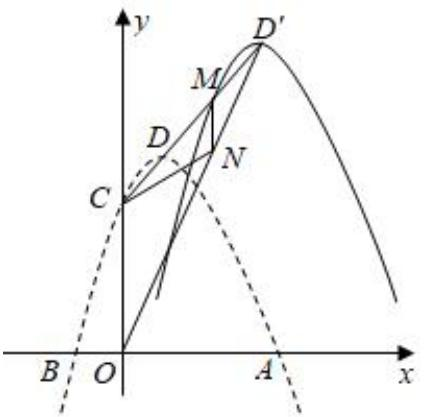

（1）求抛物线的解析式；（2）如图，点 $D$ 是抛物线的顶点，将抛物线沿 $C D$ 方向平移，使点 $D$ 落在点 $D ^ { \prime }$ 处，且 $D D ^ { \prime } = 2 C D$ ，  
点 $M$ 是平移后所得抛物线上位于 $D ^ { \prime }$ 左侧的一点， $M N / \gamma$ 轴交直线 $O D ^ { \prime }$ 于点 $N$ ，连结 $C N$ ．当  
$\frac { \sqrt { 5 } } { 5 } D ^ { \prime } N + C N$ 的值最小时，求 $M N$ 的长  
【解答】解：（1） $\cdot y = - x ^ { 2 } + b x + c$ 经过 $B ( - 1 , 0 )$ ， $C ( 0 , 3 )$ ，$\displaystyle { \left\{ { c = 3 \atop - 1 - b + c = 0 } \right. }$ 解得 $\left\{ { { b = 2 \atop c = 3 } } \right.$ 抛物线的解析式为 $y = - x ^ { 2 } + 2 x + 3$ ．  
（2）如图，连接 $A D ^ { \prime }$ ，过点 $N$ 作 $N J \perp A D ^ { \prime }$ 于 $J$ ，过点 $C$ 作 $C T \perp A D ^ { \prime }$ 于 $T$   
抛物线 $y = - x ^ { 2 } + 2 x + 3 = - ( x - 1 ) ^ { 2 } + 4$ ，顶点 $D ( 1 , 4 )$ ， $C ( 0 , 3 )$ ，  
直线 $C D$ 的解析式为 $y = x + 3 , C D = { \sqrt { 2 } }$ ，$\cdot D D ^ { \prime } = 2 C D ~ , ~ \because D D ^ { \prime } = 2 \sqrt { 2 } ~ , ~ C D ^ { \prime } = 3 \sqrt { 2 } ~ , ~ \therefore D ^ { \prime } ( 3 , 6 ) ~ , ~ \because A ( 3 , 0 ) ~ ,$ ，  
 $A D ^ { \prime } \perp x$ 轴， $. O D ^ { \prime } = { \sqrt { O A ^ { 2 } + D ^ { \prime } A ^ { 2 } } } = { \sqrt { 3 ^ { 2 } + 6 ^ { 2 } } } = 3 { \sqrt { 5 } }$ ，  
$\cdot \sin \angle O D ^ { \prime } A = \frac { O A } { O D ^ { \prime } } = \frac { \sqrt { 5 } } { 5 } \ , \because C T \perp A D ^ { \prime } , \ \therefore C T = 3 \ , \ \because N J \perp A D ^ { \prime } \ ,$ ，  
$\therefore N J = N D ^ { \prime } \cdot \sin \angle O D ^ { \prime } A = \frac { \sqrt { 5 } } { 5 } D ^ { \prime } N , \therefore \frac { \sqrt { 5 } } { 5 } D ^ { \prime } N + C N = C N + N J , \because C N + N J \mp C T ,$   
 $\frac { \sqrt { 5 } } { 5 } D ^ { \prime } N + C N$ 3 ， $\frac { \sqrt { 5 } } { 5 } D ^ { \prime } N + C N$ 的最小值为 3，此时 $N$ 为 $O D ^ { \prime }$ 与 $C T$ 的交点， $N ( 1 . 5 , 3 )$ ，  
平移后抛物线的解析式为 $y = - ( x - 3 ) ^ { 2 } + 6$ ， $M N$ 平行 $y$ 轴，将 $x = 1 . 5$ 代入抛物线解析式，  
$\therefore M ( 1 . 5 , 3 . 7 5 ) \quad \quad \therefore M N = 0 . 7 5$

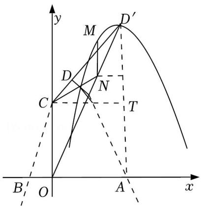

# 模块二 阿氏圆模型

# 【题型 4】点在圆外：向内取点（系数小于 1）

18．如图，已知正方 ABCD 的边长为 6，圆 B 的半径为 3，点 P 是圆 B 上的一个动点，则 $P D - { \frac { 1 } { 2 } } P C$ 的最大值为

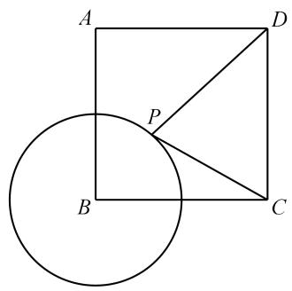

【答案】 $\frac { 1 5 } { 2 }$

【分析】当 P点运动到 BC 边上时，此时 $\mathrm { P C } { = } 3$ ，根据题意要求构造 $\frac { 1 } { 2 } P C$ ，在 BC 上取 M 使得此时$\mathrm { P M } { = } \frac { 3 } { 2 }$ 则在点 P 运动的任意时刻，均有 $\frac { 1 } { 2 } P C$ ，从而将问题转化为求 PD-PM 的最大值．连接PD，对于△PDM，PD-PM $\cdot$ DM，故当 D、M、P 共线时，PD-PM=DM 为最大值 $\frac { 1 5 } { 2 }$

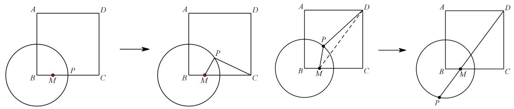

19．如图，在 RtABC中， $\angle A C B = 9 0 ^ { \circ }$ ， $C B = 4$ ， $C A = 6$ ，圆 $C$ 的半径为 2，点 $P$ 为圆上一动点，连接 $A P$ ， $B P$ ．

求 $\textcircled { 1 } A P + \frac { 1 } { 2 } B P$ ； $\textcircled { 2 } 2 A P + B P$ ； $\textcircled { 3 } \frac { 1 } { 3 } A P + B P$ ； $\textcircled{4} A P + 3 B P$ 的最小值．【解答】解： $\cdot$ 取 $C E$ 的中点 $D$ ，连结 $P D$ ， $A D$ ，$\begin{array} { l } { { \because C D = 1 , C B = 4 , C P = 2 , \therefore \frac { C D } { C P } = \frac { C P } { B C } = \frac { 1 } { 2 } , } } \\ { { \ } } \\ { { \because \angle P C D = \angle B C P , \therefore \Delta P C D ^ { \infty } \Delta B C P , \therefore \frac { P D } { P B } = \frac { C D } { C P } = \frac { 1 } { 2 } , \therefore P D = \frac { 1 } { 2 } P B , } } \end{array}$  $A P + { \frac { 1 } { 2 } } P B = A P + P D$ ，当 $P$ 在 $A D$ 上时， $A P + P D$ 最小，最小值为 $A F$ 的长， $A F = \sqrt { A C ^ { 2 } + C F ^ { 2 } } = \sqrt { 3 7 }$ ， $A P + { \frac { 1 } { 2 } } B P$ 的最小值为 $\sqrt { 3 7 }$ ，$\textcircled { 2 } \because 2 A P + B P = 2 ( A P + \frac { 1 } { 2 } B P )$ ， $. 2 A P + B P$ 的最 小值 为 $2 \sqrt { 3 7 }$ ，$\cdot$ 在 $D C$ 取一点 $G$ ，使 $C G = \frac { 1 } { 3 } D C = \frac { 2 } { 3 }$

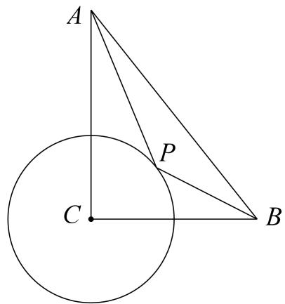

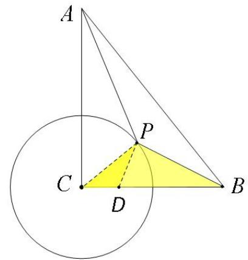

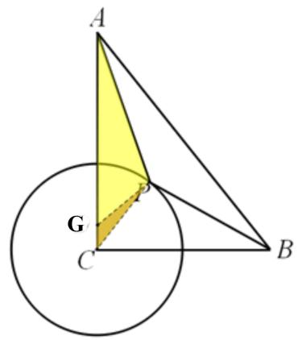

$\begin{array} { l } { { \because { \displaystyle \frac { C G } { P C } } { = } \frac { \displaystyle \frac { 2 } { 3 } } { \displaystyle 2 } { = } \frac { 1 } { 3 } , { \displaystyle \frac { C P } { A C } } { = } \frac { 2 } { 6 } { = } \frac { 1 } { 3 } , { \displaystyle \therefore \frac { C G } { P C } } { = } \frac { C P } { A C } , } } \\ { { { } } } \\ { { { } \ { \because \angle A C P } { = } \angle P C G , { \displaystyle \therefore \Delta C G P ^ { \scriptscriptstyle \odot } \Delta C P A } , { \displaystyle \therefore \frac { G P } { A P } } { = } \frac { C G } { P C } { = } \frac { 1 } { 3 } , { \displaystyle \therefore G P } { = } \frac { 1 } { 3 } { \cal A } P \ , } } \end{array}$ $\cdot \frac { 1 } { 3 } A P + B P = G P + B P \overline { { \mathcal { H } } } B G$ ，当 $P$ 在 $B G$ 上 $B$ ， $G P + B P = B G$ ，$B G = \sqrt { B C ^ { 2 } + C G ^ { 2 } } = \sqrt { \frac { 1 4 8 } { 9 } } = \frac { 2 \sqrt { 3 7 } } { 3 }$ , $\cdot \frac { 1 } { 3 } A P + B P$ 的最小值为 $\frac { 2 { \sqrt { 3 7 } } } { 3 }$ ,$\cdot$ $\because A P + 3 B P = 3 ( \frac { 1 } { 3 } A P + B P ) , \because A P +$ $A P + 3 B P$ 的最小值为 $2 \sqrt { 3 7 }$

20．如图， $A B$ 为 $_ { \odot O }$ 的直径， $A B { = } 2$ ，点 $C$ 与点 $D$ 在 $A B$ 的同侧，且 $A D \perp A B$ ，BC  AB， $A D { = } 1$ ，BC＝3，点 P 是O上的一动点，则 $\frac { \sqrt { 2 } } { 2 } P D + P C$ 的最小值为

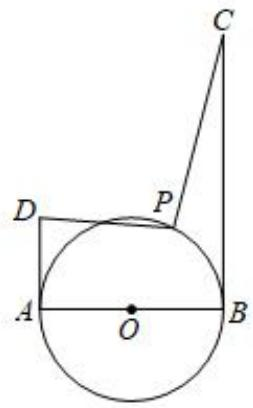

【答案】 $\frac { \sqrt { 3 4 } } { 2 }$

【分析】连接 $O D$ ，先利用勾股定理求得 $O D = \sqrt { 2 }$ ， $\angle A O D = 4 5 ^ { \circ }$ ，在 $O D$ 上截取 $O I = \frac { \sqrt { 2 } } { 2 }$ ， 过 $I$ 作$I H \perp A B$ 于 $H$ ， $I G \perp B C$ 于 $G$ ，求得 $B G = I H = \frac { 1 } { 2 }$ ， $I G = B H = \frac { 3 } { 2 }$ , $C G = \frac { 5 } { 2 }$ 进而求得 $C I = { \frac { \sqrt { 3 4 } } { 2 } }$ ， 证明 ${ \scriptstyle \triangle P O I ^ { \sim } \sim } { \_ { D O P } }$ 求得 $P I = \frac { \sqrt { 2 } } { 2 } P D$ ， 利用两点之间线段最短得到 ${ \frac { \sqrt { 2 } } { 2 } } P D + P C = P I + P C \geq I C$ ，当C、P、 $I$ 共线时取等号，即可求解

【详解】解：连接 $O D$ ，∵AB 为 $_ { \odot O }$ 的直径， $A B { = } 2$ ，

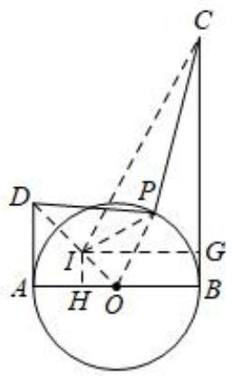

∴ $O A = O B = 1$ ， ∵在 $R t \triangle A O D$ 中， $O A = A D = 1$ ，  
$\therefore O D = \sqrt { A D ^ { 2 } + O A ^ { 2 } } = \sqrt { 2 } \ , \angle A O D = 4 5 ^ { \circ } \ ,$ ，  
在 $O D$ 上截取 $O I = \frac { \sqrt { 2 } } { 2 }$ 过 $I$ 作 $I H \perp A B$ 于 $H$ ， $I G \perp B C$ 于 $G$ ，连接 $I P$ 、 $I C$ ，  
∴四边形IHBG是矩形， $I H = O H = { \frac { \sqrt { 2 } } { 2 } } O I = { \frac { 1 } { 2 } }$ ,  
$\therefore B G = I H = { \frac { 1 } { 2 } } , I G = B H = O H + O B = { \frac { 3 } { 2 } } ,$   
$C G = B C - B G = 3 - { \frac { 1 } { 2 } } = { \frac { 5 } { 2 } }$   
在 $R t { \triangle } C I G$ 中， $C I = { \sqrt { I G ^ { 2 } + C G ^ { 2 } } } = { \sqrt { \left( { \frac { 3 } { 2 } } \right) ^ { 2 } + \left( { \frac { 5 } { 2 } } \right) ^ { 2 } } } = { \frac { \sqrt { 3 4 } } { 2 } }$ $\cdot \frac { O I } { O P } { = } \frac { O P } { O D } { = } \frac { \sqrt { 2 } } { 2 }$ $\angle P O D$ 是公共角，  
$\triangle P O I ^ { \sim } \triangle D O P$ ，$\frac { P I } { P D } { = } \frac { O P } { O D } { = } \frac { \sqrt { 2 } } { 2 }$ 则 $P I = \frac { \sqrt { 2 } } { 2 } P D$ ，$\cdot \frac { \sqrt { 2 } } { 2 } P D + P C = P I + P C \ge I C$ ，当 $C , \ P , \ I$ 共线时取等号，  
故 2 PD  PC 的最小值为 34CI  ，  
故答案为： $\frac { \sqrt { 3 4 } } { 2 }$

21．如图，正方形 $A B C D$ 边长为 $2 \sqrt { 2 }$ ，内切圆 $O$ 上一动点 $P$ ，连接 $A P , D P$ ，则 $A P \mathrm { + } \frac { \sqrt { 2 } } { 2 } P D$ + 2PD 的最小值 为_

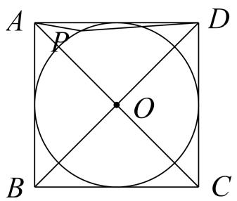

【答案】 $\sqrt { 5 }$

作 $\scriptstyle \mathbf { E O } = { \frac { 1 } { 2 } } \mathbf { D O } = 1$   
∵△OEP\~ΔOPD  
\$\2c}\$PD=EP2  
2 -PD+AP=EP+AP≥AE=√5  
2

22．如图，等边三角形 $A B C$ 边长为 $4 \sqrt { 3 }$ ，圆 $O$ 是 $\triangle A B C$ 的内切圆， $P$ 是圆 $O$ 上一动点，连接 $P B$ 、 $P C$ ，则 $B P + { \frac { 1 } { 2 } } C P $ 的最小值为_

【答案】 $\sqrt { 2 1 }$

易知 $\mathbf { C O } { = } 4$ $\mathbf { O H } { = } 2$   
作 $\scriptstyle \mathbf { O D } = { \frac { 1 } { 4 } } \mathbf { O C } = 1$   
$\mathbf { \nabla } \cdot \triangle \mathbf { O D P } { \sim } \triangle \mathbf { O P C }$   
$\therefore \mathrm { P D } = { \frac { 1 } { 2 } } \mathrm { P C }$   
$\mathrm { B P } { = } { \frac { 1 } { 2 } } \mathrm { P C } { = } \mathrm { B P } { + } \mathrm { D P } { \geq } \mathrm { B D } { = } { \sqrt { 2 1 } }$

23．如图，在平面直角坐标系中，M(6，3)，N(10，0)，A(5，0)，点 $P$ 为以 $O A$ 为半径的圆 $O$ 上一动点，则 $P M + \frac { 1 } { 2 } P N$ 的最小值为_

【答案】 $\frac { \sqrt { 8 5 } } { 2 }$ 作 $\mathbf { O B } { = } \frac { 1 } { 4 } \mathbf { O N } { = } \frac { 5 } { 2 }$ $\mathbf { \partial } \cdot \triangle \mathbf { O P B } { \sim } \triangle \mathbf { O N P }$ $\therefore \mathbf { P B } = \frac { 1 } { 2 } \mathbf { P N }$ 1 85PM+=PN≥BM=2 2

# 2023·山东烟台·统考中考真题

24．如图，抛物线 $y = x ^ { 2 } - 6 x + 5$ 与 $x$ 轴交于 $A , B$ 两点，与 $y$ 轴交 于点 $C , A B = 4$ ，以点 $B$ 为圆心，画半径为 2 的圆，点 $P$ 为 $\odot B$ 上一个动点，请求出 $P C + \frac { 1 } { 2 } P A$ 的最小值．

【答案】 $\sqrt { 4 1 }$

【分析】在 $A B$ 上取点 $F$ ，使 $B F = 1$ ，连接 $C F$ ，证得 ${ \frac { B F } { P B } } { = } { \frac { P B } { A B } }$ ，又 $\angle P B F = \angle A B P$ ，得到 $\triangle P B F \sim \triangle A B P$ ，推出 $P F = \frac { 1 } { 2 } P A$ ， 进而得到当点 $\cdot$ 、 $\cdot$ 、 $F$ 三点共线时， $P C + \frac { 1 } { 2 } P A$ 的值最小，即为线段 $C F$ 的长，利用勾股定理求出 $C F$ 即可．

【详解】如图，在 $A B$ 上取点 $F$ ，使 $B F = 1$ ，连接 $C F$ ，∵ $P B = 2$ ，$: \frac { B F } { P B } = \frac { 1 } { 2 }$ ${ \frac { P B } { A B } } = { \frac { 2 } { 4 } } = { \frac { 1 } { 2 } }$ $\therefore \frac { B F } { P B } = \frac { P B } { A B }$ 又∵ $\angle P B F = \angle A B P$ ，$\triangle P B F \sim _ { \triangle A B P }$ ，$\frac { P F } { P A } { = } \frac { B F } { P B } { = } \frac { 1 } { 2 }$ 即 $P F = \frac { 1 } { 2 } P A$ ，$P C + { \frac { 1 } { 2 } } P A = P C + P F \geq C F$ ∴当点 $C$ 、 $P$ 、 $\cdot$ 三点共线时， $P C + \frac { 1 } { 2 } P A$ 的值最小，即为线段 $C F$ 的长，$O C = 5 , O F = O B - 1 = 5 - 1 = 4$ ，$\therefore C F = \sqrt { O C ^ { 2 } + O F ^ { 2 } } = \sqrt { 5 ^ { 2 } + 4 ^ { 2 } } = \sqrt { 4 1 } \ ,$ ，∴ $P C + \frac { 1 } { 2 } P A$ 的最小值为 $\sqrt { 4 1 }$ ．

25．如图 1，抛物线 $y = a x ^ { 2 } + ( a + 3 ) x + 3$ 与 $x$ 轴交于点 $A$ （4，0），与 $y$ 轴交于点 $B$ ，点 $E$ 是线段 $O A$ 上的一个动点，过点 $E$ 作 $x$ 轴的垂线交直线 $A B$ 于点 $N$ ，交抛物线于点 $P$ ，过点 $P$ 作 $P M \bot A B$ 于点 $M$ ．

（1）求抛物线的函数表达式；

（2）当 $\frac { M N } { N E } { = } \frac { 6 } { 5 }$ 时，求点 $E$ 的坐标；

（3）如图 2，在（2）条件下，将线段 $O E$ 绕点 $O$ 逆时针旋转得到 $O E ^ { \prime }$ ，连接 $E ^ { \prime } A , \ E ^ { \prime } B$ ，求 $E ^ { \prime } A + \frac { 2 } { 3 }$ $E ^ { \prime } B$ 的最小值．

  
图 1

  
图 2

【答案】（1）∵抛物线 $\_$ 与 $\cdot$ 轴交于点 $A$ （4，0）  
$-$ ，解得 $a { = } - \ { \frac { 3 } { 4 } }$   
∴抛物线的函数表达式为 $\cdot$   
（2）∵A（4，0），∴ $\cdot$   
$\cdot$ ，∴B（0，3），∴ $O B = 3$   
$\therefore A B = \sqrt { 3 ^ { 2 } + 4 ^ { 2 } } = 5$   
∵ $P E \bot O A$ ，PM⊥AB，∴∠PMN＝∠AEN＝90°， $-$   
∴△PMN∽△AEN， $\cdot$   
设直线 $A B$ 的函数表达式为 $\cdot$   
$\cdot$   
∴直线 $A B$ 的函数表达式为 $\cdot$   
设 $\cdot$ ），则 $P$ $P ~ ( m , ~ - ~ \frac { 3 } { 4 } ~ m ^ { 2 } + \frac { 9 } { 4 } ~ m + 3 ) , ~ N ~ ( m , ~ - ~ \frac { 3 } { 4 } ~ m + 3 )$   
$-$   
∵ $\cdot \angle A E N = \angle A O B = 9 0 ^ { \circ } , \angle N A E = \angle B A O$   
$-$   
$-$   
$\cdot$   
$-$   
（3）在 $\cdot$ 上取点 $\cdot$ ，连接 $E ^ { \prime } D$ 、 $A D$ ，使 $-$   
则 $\triangle O E ^ { \prime } D \triangle O B E ^ { \prime }$ $\cdot \frac { E ^ { \prime } D } { E ^ { \prime } B } = \frac { O D } { O E ^ { \prime } } = \frac { O E ^ { \prime } } { O B } = \frac { 2 } { 3 }$   
$\_$   
$\therefore E ^ { \prime } A + \frac { 2 } { 3 } E ^ { \prime } B = E ^ { \prime } A + E ^ { \prime } D \geqslant A D$   
$\because A D = \sqrt { O A ^ { 2 } + O D ^ { 2 } } = \frac { 4 \sqrt { 1 0 } } { 3 } , \therefore E ^ { \prime } A + \frac { 2 } { 3 } E ^ { \prime } B \geqslant \frac { 4 \sqrt { 1 0 } } { 3 }$   
即 $\cdot$ 的最小值为 $\cdot$

# 【题型 5】点在圆内：向外取点（系数大于 1）

26．如图，在 $_ { \odot O }$ 中，点 $A$ 、点 $B$ 在 $_ { \odot O }$ 上， $\angle A O B = 9 0 ^ { \circ }$ ， $O A = 6$ ，点 $C$ 在 $O A$ 上，且 $O C = 2 A C$ ，点 $D$ 是 $O B$ 的中点，点 $M$ 是劣弧 $A B$ 上的动点，则 $C M + 2 D M$ 的最小值为

【答案】 $4 { \sqrt { 1 0 } }$

【分析】延长 $O B$ 到 $T$ ，使得 $B T = O B$ ，连接 $M T$ ， $C T$ ，利用相似三角形的性质证明 $M T = 2 D M$ ，求 $C M + 2 D M$ 的最小值问题转化为求 $C M + M T$ 的最小值．求出 $C T$ 即可判断

【详解】解：延长 $O B$ 到 $T$ ，使得 $B T = O B$ ，连接 $M T$ ， $C T$

OM  6，OD  DB  3，OT 12，  
$\cdot \cdot O M ^ { 2 } = O D \cdot O T$ ，  
OM OTOD OM  
 $\cdot \angle M O D = \angle T O M$ ，  
$\cdot . \triangle M O D \sim \triangle T O M$ ，  
$\therefore { \frac { D M } { M T } } { = } { \frac { O M } { O T } } { = } { \frac { 1 } { 2 } } ,$   
 $. M T = 2 D M$ ，  
$\therefore C M + 2 D M = C M + M T \geq C T$   
又在 $\mathrm { R t } \triangle { O C T }$ 中， $\angle C O T = 9 0 ^ { \circ }$ ， $O C = 4$ ， $O T = 1 2$ ，  
资料整理【淘宝店铺：向阳百分百】

$\therefore C T = { \sqrt { O C ^ { 2 } + O T ^ { 2 } } } = { \sqrt { 4 ^ { 2 } + 1 2 ^ { 2 } } } = 4 { \sqrt { 1 0 } }$ $\therefore C M + 2 D M \geq 4 { \sqrt { 1 0 } }$ ， $. C M + 2 D M$ 的最小值为 $4 { \sqrt { 1 0 } }$

27．如图， $\angle A O B { = } 9 0 ^ { \circ }$ °， $O A { = } O B { = } 1$ ，圆 $O$ 的半径为 $\sqrt { 2 }$ ， $P$ 是圆 $O$ 上一动点， $P A \mathrm { + } \sqrt { 2 } P B$ 的最小值为

【答案】 $\sqrt { 5 }$

点在圆内，反向操作延长OB至点C， $\scriptstyle \mathbf { C O } = 2 \mathbf { O B } = 2$ $\scriptstyle { \frac { \mathbf { O P } } { \mathbf { O C } } } = { \frac { \mathbf { O C } } { \mathbf { O B } } } = { \sqrt { 2 } } \Rightarrow \Delta \mathbf { O P B } \sim \Delta \mathbf { O C P }$

28．已知扇形 COD 中， $\angle C O D { = } 9 0 ^ { \circ }$ ， $O C { = } 6$ ， $O A { = } 3$ ， $O B { = } 5$ ，点 $P$ 是弧 $C D$ 上一点， $2 P A { + } P B$ 的最小值为_

【答案】12

点在圆内，反向操作延长OA至点E， $\scriptstyle \mathbf { E O } = 4 \mathbf { O A } = 1 2$ $\mathrm { \frac { O P } { O E } { = } \frac { O A } { O P } { = } \frac { 1 } { 2 } \Rightarrow \Delta O P A { \sim } \Delta O E P }$ $2 \mathrm { P A } + \mathrm { P B } = \mathrm { P E } + \mathrm { P B } \geq \mathrm { B E } = 1 3$

# 【题型 6】一内一外提系数

29．如图，在 $\Delta A B C$ 中， $\angle A B C = 9 0 ^ { \circ }$ ， $A B = 2 B C = 6$ ， $B D = 1$ ， $P$ 在以 $B$ 为圆心 3 为半径的圆上，则 $A P + 6 P D$ 的最小值为 $3 \sqrt { 3 7 }$

【解答】解：在 $A B$ 上取点 $E$ ，使 $B E = \frac { 3 } { 2 }$

 AB  2BC  6 ，$\therefore { \frac { B P } { A B } } = { \frac { B E } { B P } } = { \frac { 1 } { 2 } } ,$

 $\angle P B E = \angle A B P$ ，  
PBE∽ABP ，$\ \cdot \ { \frac { P E } { P A } } { = } { \frac { B P } { A B } } { = } { \frac { 1 } { 2 } } \ ,$   
$\therefore P E = \frac { 1 } { 2 } P A$ ，  
在 $B D$ 延长线上取 $B F = 9$ ，$\therefore B D = 1$ ，  
则 $\frac { B F } { P B } { = } \frac { B P } { B D } { = } 3$ ，  
又 $\angle P B D = \angle F B P$ ，  
PBD∽FBP ，$\cdot \frac { P F } { P D } { = } \frac { P B } { B D } { = } 3$ ，  
PF  3PD ，  
$\therefore P A + 6 P D = 2 ( \frac { 1 } { 2 } P A + 3 P D ) = 2 ( P E + P F )$ ，  
当 $P$ 为 $E F$ 和圆的交点时 $P E + P F$ 最小，即 $P A + 6 P D$ 最小，且值为 $2 E F$ ，  
$\therefore E F = { \sqrt { B E ^ { 2 } + B F ^ { 2 } } } = { \sqrt { ( { \frac { 3 } { 2 } } ) ^ { 2 } + 9 ^ { 2 } } } = { \frac { 3 { \sqrt { 3 7 } } } { 2 } }$ $. P A + 6 P D$ 的最小值为 $2 E F = 3 \sqrt { 3 7 }$ ，  
故答案为： $3 \sqrt { 3 7 }$

30．如图，正方形 $A B C D$ 边长为 4， $L$ 是 $C D$ 的中点， $Y$ 在 $\odot C$ 上， $\mid \sqrt { 2 } L Y - Y A \mid$ 的最大值是 $2 \sqrt { 2 }$ ，$2 \sqrt { 2 } L Y + Y A$ 的最小值是 $4 { \sqrt { 1 0 } }$

【解答】解：(1)如图，连接 $A C$ ， $B D$ ，交于点 $O$ ，连接 $C Y$ ， $O Y$ ，OL ，四边形 ABCD是正方形，

$\therefore C Y = C B = 4 A C = { \sqrt { 2 } } B C = 4 { \sqrt { 2 } }$ ，  
$\therefore { \frac { C Y } { A C } } = { \frac { 1 } { \sqrt { 2 } } } , { \frac { O C } { C Y } } = \sqrt { 2 } ,$   
$\therefore { \frac { C Y } { A C } } { = } { \frac { O C } { C Y } }$ ,  
 $\cdot \angle Y C O = \angle A C Y$ ，  
YCO∽ACY ，  
$\therefore { \frac { O Y } { A Y } } { = } { \frac { C Y } { A C } } { = } { \frac { 1 } { \sqrt { 2 } } } ,$   
$\therefore O Y = { \frac { \sqrt { 2 } } { 2 } } A Y$ ，  
$\because \mid L Y - O Y \mid \cdot O L$ ，  
$\therefore \mid L Y - { \frac { \sqrt { 2 } } { 2 } } A Y \mid = \mid L Y - O Y \mid \bullet O L$ ，  
当 $L$ 、 $O$ 、 $Y$ 在一条直线上时，  
$\mid L Y - O Y \mid = O L = 2$ ，  
$\therefore { \sqrt { 2 } } L Y - A Y | = { \sqrt { 2 } } | L Y - { \frac { \sqrt { 2 } } { 2 } } A Y | = 2 { \sqrt { 2 } }$   
(2)延长 CD 至点 $\mathrm { H }$ ，使 $\mathrm { C H } { = } 2 \mathrm { C D }$   
显然 $2 \sqrt { 2 } L Y { = } \sqrt { 2 } H Y$ ，由（1）可知 $Y A { = } \sqrt { 2 } Y O$   
$2 \sqrt { 2 } L Y + Y A { = } \sqrt { 2 } \left( Y H + Y O \right)$   
由勾股定理可得， $Y H + Y O \geq 2 { \sqrt { 1 0 } }$ ，故 $2 { \sqrt { 2 } } L Y + Y A \geq 4 { \sqrt { 1 0 } }$ .

# 【题型 7】隐圆型阿氏圆

# 2023·咸 阳 ·三 模

31．如图，在菱形ABCD中，对角线AC、 $B D$ 相交于点 $O$ ，点 $E$ 、 $F$ 分别是 $O D$ 、 $O C$ 上的两个动点，且 $E F = 4$ ， $P$ 是 $E F$ 的中点，连接OP、PC、 $P D$ ，若 $A C = 1 2 , B D = 1 6$ ，则 $P C + { \frac { 1 } { 4 } } P D$ 的最小值为

【答案】 $\frac { \sqrt { 1 4 5 } } { 2 }$

【分析】在 $O D$ 上取一点 $G$ ，使得 $O G = \frac { 1 } { 2 }$ ,连接 $P G$ 、 $C G$ ．根据菱形的性质可知 $O C = 6 , O D = 8$ ，则$\frac { O G } { O P } = \frac { O P } { O D } = \frac { 1 } { 4 }$ 结合 $\angle G O P = \angle P O D$ ， 可得 $\triangle P O G ^ { \sim } \triangle D O P$ ，利用相似三角形的性质证得$P G = { \frac { 1 } { 4 } } P D$ ,根据 $P C + P G \geq C G$ 可知 $C G$ 的长即为 $P C + { \frac { 1 } { 4 } } P D$ 的最小值，利用勾股定理求出 $C G$ 便可 解决问题．

【详解】解：如图，在 $O D$ 上取一点 $G$ ，使得 $O G = \frac { 1 } { 2 }$ 连接PG、 $C G$

∵四边形 $A B C D$ 为菱形， $A C = 1 2 , B D = 1 6$ ，  
$O C = \frac { 1 } { 2 } A C = 6 , O D = \frac { 1 } { 2 } B D = 8 A C \bot B D$   
∵ $E F = 4$ ， $\cdot$ 是 $E F$ 的中点，  
$O P = { \frac { 1 } { 2 } } E F = 2$ ，  
$\therefore { \frac { O G } { O P } } = { \frac { \frac { 1 } { 2 } } { 2 } } = { \frac { 1 } { 4 } } , { \frac { O P } { O D } } = { \frac { 2 } { 8 } } = { \frac { 1 } { 4 } } ,$   
又∵ $\angle G O P = \angle P O D$ ，  
$\therefore \Delta P O G \sim \Delta D O P$ ，$\frac { G P } { P D } = \frac { 1 } { 4 }$ 即 $G P = \frac { 1 } { 4 } P D$ ，  
∵ $P C + P G \geq C G$ ，

∴当点 $\cdot$ 、 $\cdot$ 、 $\cdot$ 在同一直线上时， $P C + { \frac { 1 } { 4 } } P D$ 取得最小值，此时 $P C + { \frac { 1 } { 4 } } P D = P C + P G = C G = { \sqrt { O C ^ { 2 } + O G ^ { 2 } } } = { \frac { \sqrt { 1 4 5 } } { 2 } }$

# 2023·宿 迁 ·三 模

32．如图，在平面直角坐标系中， $A { \big ( } 2 , 0 { \big ) }$ 、 $B \mathopen { } \mathclose \bgroup \left( 0 , 2 \aftergroup \egroup \right)$ 、 $C \left( 5 , 2 \right)$ 、 $D \left( 4 , 4 \right)$ ，点 $P$ 在第一象限，且$\angle A P B = 1 3 5 ^ { \circ }$ ，则 $\sqrt { 2 } P D + 4 P C$ 的最小值为

【答案】 $6 \sqrt { 1 0 }$

【分析】取一点 $T \left( { \frac { \sqrt { 2 } } { 2 } } , 0 \right)$ ， 以 O 为圆心，OT 为半径作圆，与 $O D$ 交于点 F，连接 $P F$ ， $P C$ ，FC ，首 先 利 用 四 点 共 圆 证 明 $O P = 2$ ， 再 利 用 相 似 三 角 形 的 性 质 证 明 $\sqrt { 2 } P D = 4 P F$ ， 推 出$\sqrt { 2 } P D + 4 P C = 4 P F + 4 P C = 4 ( \ P F + P C )$ ，根据 $P F { + } P C \geq F C$ ，利用两点之间的距离公式，即可求出$F C$ 的最小值，即可得．

【详解】解：如图所示，取一点 $T { \left( \frac { \sqrt { 2 } } { 2 } , 0 \right) }$ ， 以 O 为圆心，OT 为半径作圆，与 $O D$ 交于点 F，连接PF，PC，FC ，

$A \left( 2 , 0 \right) B \left( 0 , 2 \right) D \left( 4 , 4 \right)$   
$O A = O B = 2 O D = { \sqrt { 4 ^ { 2 } + 4 ^ { 2 } } } = 4 { \sqrt { 2 } }$ ，  
以 O 为圆心， $O A$ 为半径作 $\odot O$ ，在优弧 $A B$ 上取一点 $\mathrm { Q }$ ，连接QB， $\mathcal { Q } A$ ，  
$\angle Q = \frac { 1 } { 2 } \angle A O B = 4 5 ^ { \circ } \angle A P B = 1 3 5 ^ { \circ }$   
$: \angle Q + \angle A P B = 4 5 ^ { \circ } + 1 3 5 ^ { \circ } = 1 8 0 ^ { \circ } \ : ,$   
∴A，P，B，Q 四点共圆，  
∴ $O P = O A = 2$ ，  
资料整理【淘宝店铺：向阳百分百】  
∵OP  2 ， 2OF  ， OD  4 2 ，  
∴ 2OP  OFOD ，  
OP OD  
OF OP  
∵ $\angle P O F = \angle P O D$ ，  
$\therefore \triangle P O F \sim \triangle D O P$ ，  
$\begin{array} { l } { \displaystyle { \frac { P F } { P D } = \frac { O F } { O P } = \frac { \sqrt { 2 } } { 4 } } } \\ { \displaystyle { \sqrt { 2 } P D = 4 P F } } \\ { \displaystyle { \sqrt { 2 } P D + 4 P C = 4 P F + 4 P C = 4 \big ( \mathit { P F } + \mathit { P C } \big ) } } \end{array}$   
过点 F 作 $F G \bot O A$ 于点 G，  
$D \big ( 4 , 4 \big ) ~ O F = \frac { \sqrt { 2 } } { 2 }$   
$\therefore \angle D O G = 4 5 ^ { \circ }$   
∴点 F 的坐标为 $\left( \frac { 1 } { 2 } , \frac { 1 } { 2 } \right)$ ，  
$\because C ( 5 , 2 )$ ，  
$F C = { \sqrt { \left( 5 - { \frac { 1 } { 2 } } \right) ^ { 2 } + \left( 2 - { \frac { 1 } { 2 } } \right) ^ { 2 } } } = { \frac { 3 { \sqrt { 1 0 } } } { 2 } }$   
∵ $P F { + } P C \geq F C$ ，即 $\sqrt { 2 } P D + 4 P C = 4 \big ( P F + P C \big ) \geq 4 F C = 6 \sqrt { 1 0 }$   
$\cdot \sqrt { 2 } P D + 4 P C$ 的最小值是 $6 \sqrt { 1 0 }$

33．如图，在 RtABC中， $\angle A C B = 9 0 ^ { \circ }$ ， $A C = 6$ ， $B C = 8$ ， $D$ 、 $E$ 分别是边 $B C$ 、 $A C$ 上的两个动点，且 $D E = 4$ ， $P$ 是 $D E$ 的中点，连接 $P A$ ， $P B$ ，则 $P A + { \frac { 1 } { 4 } } P B$ 的最小值为

【答案】 $\frac { \sqrt { 1 4 5 } } { 2 }$

【解答】解：如图，在 $C B$ 上取一点 $F$ ，使得 $C F = { \frac { 1 } { 2 } }$ 连接 $P F$ ， $A F$

DCE  90 ， DE  4 ， $D P = P E$ ，  
PC  1 2DE  ，2CF 1 CPCP 4 , CB 4   
$\therefore { \frac { C F } { C P } } { = } { \frac { C P } { C B } }$   
 $\cdot \angle P C F = \angle B C P$ ，  
PCF∽BCP ，PF CF 1PB CP 4  
$\therefore P F = { \frac { 1 } { 4 } } P B$ ，  
$\therefore P A + { \frac { 1 } { 4 } } P B = P A + P F$   
PA  PFAF ， $A F = { \sqrt { C F ^ { 2 } + A C ^ { 2 } } } = { \sqrt { ( { \frac { 1 } { 2 } } ) ^ { 2 } + 6 ^ { 2 } } } = { \frac { \sqrt { 1 4 5 } } { 2 } }$   
$\therefore P A + \frac { 1 } { 4 } P B \mathcal { \# } \frac { \sqrt { 1 4 5 } } { 2 }$ , $\cdot P A + \frac { 1 } { 4 } P B$ 的最小值为 $\frac { \sqrt { 1 4 5 } } { 2 }$

34．如图，在边长为 6 的正方形 $A B C D$ 中， $M$ 为 $A B$ 上一点，且 $B M = 2$ ， $N$ 为边 $B C$ 上一动点．连接 $M N$ ，将 $\triangle B M N$ 沿MN翻折得到 $\triangle P M N$ ，点 $P$ 与点 $B$ 对应，连接 $P A$ ， $P C$ ，则 $P A + 2 P C$ 的最小值为

【答案】 $6 \sqrt { 5 }$

【分析】由折叠的性质可得，点 $P$ 在以 $M$ 为圆心，以2为半径的圆上，在线段 $M A$ 上取一点 $E$ ，使得$M E = 1$ 利 用 相 似 三 角 形 的 性 质 得 到 $P E = \frac { 1 } { 2 } P A$ 从 而 得 到$P A + 2 P C = 2 { \left( { \frac { 1 } { 2 } } P A + P C \right) } = 2 { \left( P E + P C \right) } \geq 2 C E$ ，当 且仅 当 $P$ 、C、 $E$ 三点共线时，取得最小值 $2 C E$ ，即可求解．

【详解】解：由题意可得： $P M = B M = 2$ ∴点 $P$ 在以 $M$ 为圆心，以2为半径的圆上，在线段 $M A$ 上取一点 $E$ ，使得 $M E = 1$ ，则 $B E = 3$

∵ $\scriptstyle A M = A B - B M = 4$ ， $M P = 2$   
$\therefore { \frac { M P } { A M } } { = } { \frac { M E } { P M } } { = } { \frac { 1 } { 2 } }$   
又∵ $\angle E M P = \angle P M A$   
$\triangle E M P \sim _ { \triangle } P M A$   
$\cdot \frac { P E } { P A } { = } \frac { M E } { P M } { = } \frac { 1 } { 2 }$   
$P E = \frac { 1 } { 2 } P A$   
$\therefore P A + 2 P C = 2 { \Bigg ( } { \frac { 1 } { 2 } } P A + P C { \Bigg ) } = 2 { \big ( } P E + P C { \big ) } \geq 2 C E$

如下图所示，当且仅当 $P$ 、 $C$ 、 $E$ 三点共线时，取得最小值 $2 C E$

$C E = \sqrt { B E ^ { 2 } + B C ^ { 2 } } = 3 \sqrt { 5 } \ .$ ，∴ $, P A + 2 P C$ 的最小值为： $6 \sqrt { 5 }$

35．如图，在平面直角坐标系中， $A ( 2 , 0 )$ 、 $B ( 0 , 2 )$ 、 $C ( 4 , 0 )$ 、 $D ( 3 , 2 )$ ， $P$ 是 $\Delta A O B$ 外部的第一象限内一动点，且 $\angle B P A = 1 3 5 ^ { \circ }$ ，则 $2 P D + P C$ 的最小值是

【答案】 $4 \sqrt { 2 }$

【解答】解：如图，取一点 $T ( 1 , 0 )$ ，连接 $O P$ ， $P T$ ， $T D$ ，

 A(2,0) 、 B(0,2) 、 $C ( 4 , 0 )$ ，  
$\therefore O A = O B = 2 , O C = 4 .$ ，  
以 $O$ 为圆心 $O A$ 为半径作 $\odot O$ ，在优弧 $A B$ 上取一点 $\mathcal { Q }$ ，连接 $\mathcal Q B$ ， $\mathcal { Q } A$ ，  
$\because \angle Q = \frac { 1 } { 2 } \angle A O B = 4 5 ^ { \circ } \angle A P B = 1 3 5 ^ { \circ }$   
$\therefore \angle Q + \angle A P B = 1 8 0 ^ { \circ }$   
A、 $P$ 、 $B$ 、 $\mathcal { Q }$ 四点共圆，  
$\therefore O P = O A = 2$ ，  
$\because O P = 2 \ , O T = 1 \ , O C = 4 \ ,$ ，  
$\therefore O P ^ { 2 } = O C \cdot O T$ ，  
$\therefore { \frac { O P } { O C } } { = } { \frac { O T } { O P } } ,$   
$\therefore \angle P O T = \angle P O C \ ,$ ，  
POT∽POC ，  
1PT OP2PC OC  
$\therefore P T = { \frac { 1 } { 2 } } P C$ ，  
$\therefore 2 P D + P C = 2 ( P D + \frac { 1 } { 2 } P C ) = 2 ( P D + P T ) \ ,$ ，  
PD  PTDT ， $D T = \sqrt { 2 ^ { 2 } + 2 ^ { 2 } } = 2 \sqrt { 2 }$ ，  
$\cdot 2 P D + P C$ 4 $\cdot \sqrt { 2 }$ ，  
$\cdot 2 P D + P C$ 的最小值是 $4 \sqrt { 2 }$