# 专题 2-6 逆等线之乾坤大挪移

# 01 题型·解读

# 题型一 平移，对称或构造平行四边形

2022年四川省内江中考  
2022 滨州中考

# 题型二 构造 SAS 型全等拼接线段

2022·贵州遵义·统考中考真题   
2023·日照·二模   
2023·咸阳·二模   
2023·深圳中学联考   
2023·甘肃武威中考真题拆解   
2023·黄冈中考真题拆解

# 题型三 构造相似求加权线段和

2023年成都市天府新区二模  
2022·广州中考真题（7 种解法）  
2023·湖北黄石中考拆解

# 题型四 取到最小值时对其它量进行计算

湖北武汉·中考真题

# 满分·技巧

# 一、什么是逆等线段。

两个动点分别在直线上运动，且它们各自到某一定点的距离始终相等,那么这两条始终相等的线段称为逆等线段。

# 二、解题步骤:

1.找三角形。找一条逆等线段，一条动线段构成的三角形。(图中本身就有的三角形，不要添加辅助  
线以后构成的三角形)  
资料整理【淘宝店铺：向阳百分百】

2.确定该三角形的不变量。在动点移动过程中，该三角形有一个边长度不变，有一个角的大小不变。

3.从另一逆等线段的定点引一条线。使得线段长度等于第二步中的那个不变的边长，与这个逆等线段的夹角等于第二步中那个不变的角。

4.问题转化为将军饮马问题求最值。

【模型解读】

△ABC 中，D、E 分别是 AB、AC 上的动点，且 $\mathrm { A D } { = } \mathrm { C E }$ ，即逆向相等，则称 AD 和 CE 为逆等线，就是怎么别扭怎么来。

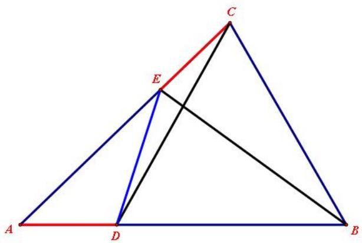

一般情况下，题目中有两个没有首尾相连的线段相等，即两定两动，也归为逆等线问题。

观察图形，我们很容易发现，AD 和 CE 没有首尾相连，所以，一般通过平移或者作平行等方法构造全等三角形来实现线段转移，从而使逆等线段产生关系，最终解决问题。

这样解释很笼统很枯燥，我们以具体例题来描述

如图，在 $\triangle$ ABC 中， $\angle \mathrm { A B C } = 6 0 ^ { \circ }$ ， $\mathrm { B C } { = } 8$ ， $\mathrm { A C } { = } 1 0$ ，点 D、E 分别是 AB、AC 上的动点，且 $_ \mathrm { A D = C E }$ ，求 $\mathrm { C D + B E }$ 的最小值。

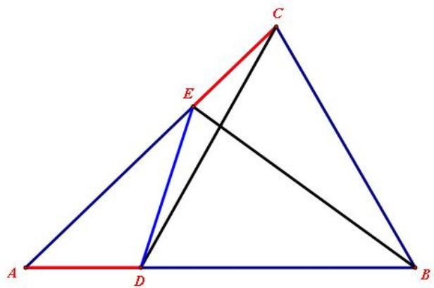

分析思路：

$\textcircled{1}$ AD 在△ADC 中，那么我们就以 CD 为一边构造另一个三角形与之全等，这个也叫做一边一角造全等。

$\textcircled{2}$ 即过点 C 作 CF//AB，且 $\mathrm { C F } { = } \mathrm { A C }$ 。（构造一边一角，得全等）

$\textcircled{3}$ 构造出△ADC≌△CEF ( SAS),证出 $\mathrm { E F { = } C D }$

$\textcircled{4}$ $\mathrm { C D + B E { = } E F { + } B E }$ ，根据两点之间，线段最短，连接 BF，则 BF 即为所求此时，B、E、F 三点共线，本题中，也可以利用三角形三边关系去求最值

$\textcircled{5}$ 求 BF

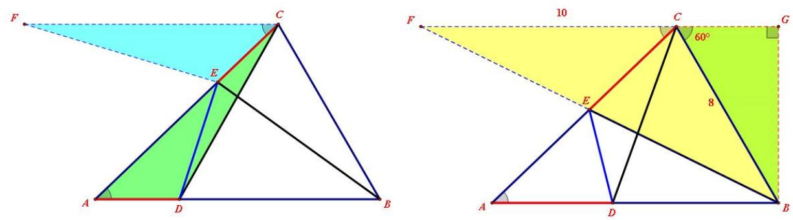

# 03 核心·题型

# 题型一 平移，对称或构造平行四边形

# 2022 年四川省内江中考

1．如图，矩形 ABCD 中， $A B { = } 6$ ， $A D { = } 4$ ，点 $E$ 、 $F$ 分别是 $A B , \ D C$ 上的动点， $E F / / B C$ ，则 $A F { + } C E$ 的最小值是

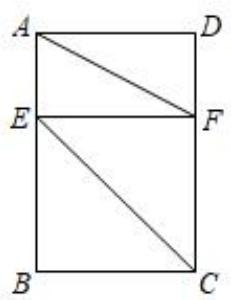

【答案】10

【分析】延长 $\cdot$ 到 $\cdot$ ，使 $\cdot$ ，连接 $\cdot$ ，证明四边形 EFGC 是平行四边形，得出 $\cdot$ ，得出当点 $A$ 、 $\cdot$ 、 $\cdot$ 三点共线时， $\cdot$ 的值最小，根据勾股定理求出 $\cdot$ 即可

【详解】解：延长 $B C$ 到 $G$ ，使 $\cdot$ ，连接 $\cdot$ ，

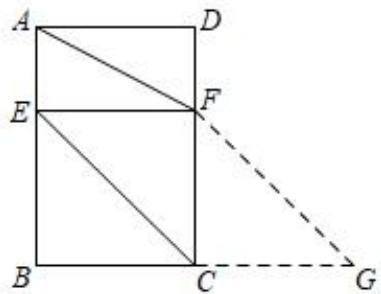

∵ $E F / / C G$ ， $\cdot$ ，  
∴四边形 EFGC 是平行四边形，  
∴ $\cdot$ ，  
$\cdot . . A F { + } C E { = } A F { + } F G$ ，  
∴当点 $\cdot$ 、 $F$ 、 $G$ 三点共线时， $A F { + } C E$ 的值最小为 $\cdot$ ，  
由勾股定理得， $A G = \sqrt { A B ^ { 2 } + B G ^ { 2 } } = \sqrt { 6 ^ { 2 } + ( 4 + 4 ) ^ { 2 } } = 1 0 ,$   
∴ $A F { + } C E$ 的最小值为 10

2．如图，Rt△ABC 中， $\angle A C B = 9 0 ^ { \circ }$ ， $\angle B = 3 0 ^ { \circ }$ °， $D$ ， $E$ 为 $A B$ 边上的两个动点，且 $A D { = } B E$ ，连接 $C D$ ， $C E$ ，若 $A C { = } 2$ ，则 $C D { + } C E$ 的最小值为

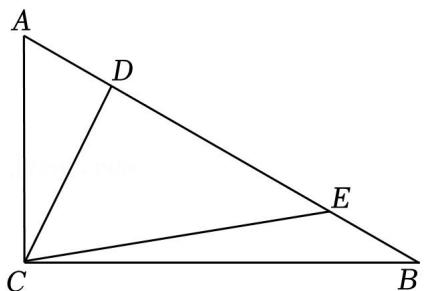

【答案】4解：如图：

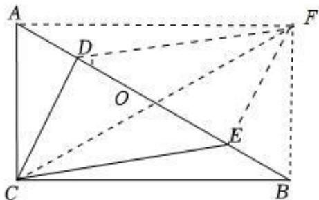

构造矩形 ACBF，连接 DF，EF，CF 交 AB 于点 O，  
则 $\cdot$ ， $\cdot$ ， $\cdot$ ，  
∵ $\cdot$ ， ∴ $\cdot$ ，∴四边形 CEFD 为平行四边形，  
∴DF $\cdot$ ， ∴ $-$ ，  
∵Rt△ABC 中， $\angle \mathrm { A C B } = 9 0 ^ { \circ }$ °， $\cdot$   
∴ $_ { \mathrm { A B } } { = } 2 \mathrm { A C } { = } 4$ ，∴ $\_$ ， 故答案为：4

3．如图，在矩形 $A B C D$ 中， $A B = 1 ,$ ， $A D = 2$ ，点 $E$ 在 $A D$ 上，点 $F$ 在 $B C$ 上，且 $A E = C F$ ，连结 $C E$ ， $D F$ ，则 $C E + D F$ 的最小值为

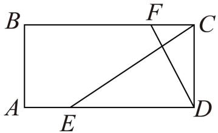

【答案】 $2 \sqrt { 2 }$

【 分 析 】 证 $\triangle B A E \cong \triangle D C F$ 得 $C E + D F = C E + B E$ ， 作 点 $B$ 关 于 $A D$ 的 对 称 点 $B ^ { \prime }$ ， 则$C E + B E = C E + B ^ { \prime } E \geq C B ^ { \prime }$ ，据此即可求解

【详解】解：连接 $B E$ ，作点 $B$ 关于 $A D$ 的对称点 $B ^ { \prime }$ ，连接 $C B ^ { \prime }$ ， $E B ^ { \prime }$

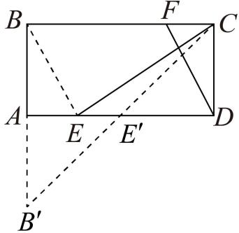

由题意得： $A B = C D , \angle B A E = D C F = 9 0 ^ { \circ }$   
∵ $\cdot _ { \textit { A E } = C F }$   
$\therefore \Delta B A E \cong \Delta D C F$   
$\therefore B E = D F , C E + D F = C E + B E$ $\mathbf { \nabla } \cdot \boldsymbol { B } \boldsymbol { E } = \boldsymbol { B } ^ { \prime } \boldsymbol { E }$ ,  
$\therefore C E + B E = C E + B ^ { \prime } E \geq C B ^ { \prime }$   
$C B ^ { \prime } = \sqrt { C B ^ { 2 } + B B ^ { \prime 2 } } = \sqrt { 2 ^ { 2 } + 2 ^ { 2 } } = 2 \sqrt { 2 }$   
∴ $C E + D F$ 的最小值为 $2 \sqrt { 2 }$

# 2022 滨州中考

4．如图，在矩形 ABCD 中， $A B { = } 5$ ， $A D { = } 1 0$ ，点 $E$ 是边 $A D$ 上的一个动点，过点 $E$ 作 $E F \bot A C$ ，分别交对角线 $A C$ ，直线 $B C$ 于点 $O , F$ ，则在点 $E$ 移动的过程中， $A F { + } F E { + } E C$ 的最小值为

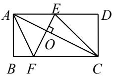

【答案】 $\frac { 2 5 + 5 { \sqrt { 5 } } } { 2 }$

【解析】∵ $\mathrm { A B } { = } 5$ ， $\mathrm { A D } { = } 1 0$ ， $\cdot \mathrm { A C } = \sqrt { 5 ^ { 2 } + 1 0 ^ { 2 } } = 5 \sqrt { 5 }$   
∵EF⊥AC，∴由矩形内十字架模型可知，  
$\frac { E F } { A C } = \frac { A B } { A D } , \therefore \frac { E F } { 5 \sqrt { 5 } } = \frac { 5 } { 1 0 } , \therefore \mathrm { E F } = \frac { 5 \sqrt { 5 } } { 2 } .$   
以 EF，EC 为邻边作□EFGC，则 $\mathrm { E C } { = } \mathrm { F G }$ ， $\frac { 5 { \sqrt { 5 } } } { 2 }$ ,

$$
\sqrt [ A ] { \bigotimes _ { \begin{array} { c } { A } \\ { B } \end{array} } ^ { E } }
$$

$\angle \mathrm { A C G } = \angle \mathrm { E O C } = 9 0 ^ { \circ }$   
在 $\cdot$ ACG 中， $\sqrt { A C ^ { 2 } + C G ^ { 2 } } \qquad \frac { 2 5 } { 2 }$ ，  
$\frac { 2 5 + 5 { \sqrt { 5 } } } { 2 }$   
∴AF $\cdot$ FE＋EC 的最小值为 $\frac { 2 5 + 5 { \sqrt { 5 } } } { 2 }$

5．如图，在矩形 $A B C D$ 中， $A B = 6$ ， $A D = 5$ ，点 $P$ 在边 $A D$ 上，点 $\mathcal { Q }$ 在边 $B C$ 上，且 $A P = C Q$ ，连接 $C P$ ， $\mathcal { Q } D$ ，则 $P C + Q D$ 的最小值为

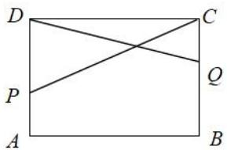

【答案】13

【分析】连接 $B P$ ，在 $\cdot$ 的延长线上截取 $\cdot$ ，连接 $P E$ ， $C E$ ， $P C + Q D = P C + P B$ ，则 $P C { + } Q D$ 的最小值转化为 $\cdot$ 的最小值，在 $B A$ 的延长线上截取 $\cdot$ ，则 $P C + Q D = P C + P B = P C + P E \geq C E$ ，根据勾股定理可得结果

【详解】解：如图，连接 $\cdot$ ，

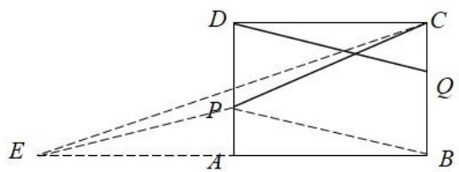

在矩形 $A B C D$ 中， $A D$ ∥BC， $A D { = } B C$ ，  
∵ $\cdot$ ，  
∴AD-AP=BC-CQ，$\cdot$ ，DP∥BQ，  
∴四边形 DPBQ 是平行四边形，  
∴PB∥DQ， $\cdot$ ，  
则 $\_$ ，则 $P C + Q D$ 的最小值转化为 $P C { + } P B$ 的最小值，  
在 $\cdot$ 的延长线上截取 $A E { = } A B { = } 6$ ，连接 $\cdot$ ，  
∵ $\cdot P A \bot B E$ ，  
∴PA 是 $B E$ 的垂直平分线，  
∴ $\cdot$ ，  
$-$ ，  
连接 $C E$ ，则 $-$ ，  
∵ $\scriptstyle B E = 2 A B = 1 2$ ， $B C { = } A D { = } 5$ ，  
${ \sqrt { B E ^ { 2 } + B C ^ { 2 } } } = { \sqrt { 1 2 ^ { 2 } + 5 ^ { 2 } } }$   
∴ $P C { + } P B$ 的最小值为 13

6．如图，正方形 $A B C D$ 的边长为 2， $M$ 是 $B C$ 的中点， $N$ 是 $A M$ 上的动点，过点 $N$ 作 $E F \perp A M$ 分别交 $A B$ ， $C D$ 于点 $E$ ， $F$ ．

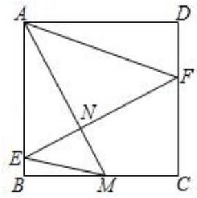

（1）AM 的长为（2） $E M + A F$ 的最小值为【答案】 $\sqrt { 5 }$ $\sqrt { 1 0 }$

【分析】(1)根据正方形的性质求得 $\cdot$ 与 $\cdot$ ，再由勾股定理求得 $\cdot$ ；

(2)过 $\cdot$ 作 $\cdot$ 于 $G$ ，证明 $-$ 得 $A M { = } E F$ ，再将 $E F$ 沿 $\cdot$ 方向平移至 MH，连接 $F H$ ，当 $\cdot$ 三点共线时， $-$ 的值最小，由勾股定理求出此时的 $A H$ 的值便可

【详解】解：(1)∵正方形 $\cdot$ 的边长为 2，$\scriptstyle \cdot { \mathcal { A } } B = B C = 2$ ， $\_$ ，  
∵ $\cdot$ 是 $\cdot$ 的中点，  
$\frac { 1 } { 2 }$ ，  
$\cdot \ A M = \sqrt { A B ^ { 2 } + B M ^ { 2 } } = \sqrt { 5 } \ ,$ ，  
故答案为： $\sqrt { 5 }$ ；

(2)过 $\cdot$ 作 $F G \bot A B$ 于 $\cdot$ ，则 $\_$ ，∠ABM=∠FGE=90°，

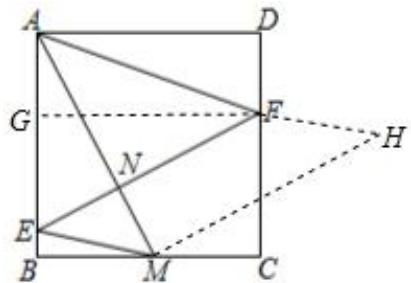

∵EF⊥AM，  
∴∠BAM+∠AEN=∠AEN+∠GFE=90°，  
$-$ ，  
∴△ABM≌△FGE(ASA)，  
∴ $. A M { = } E F$ ，  
将 $\cdot$ 沿 $\cdot$ 方向平移至 $\cdot$ ，连接 $\cdot$ ，则 $E F { = } M H$ ， $\angle A M H { = } 9 0 ^ { \circ }$ ， $\cdot$ ，  
当 $\cdot$ 、 $\cdot$ 、 $\cdot$ 三点共线时， $-$ 的值最小，  
此时 $E M + A F = A H = \sqrt { A M ^ { 2 } + M H ^ { 2 } } = \sqrt { 5 + 5 } = \sqrt { 1 0 }$ ，∴ $E M { + } A F$ 的最小值为 $\sqrt { 1 0 }$

# 题型二 构造SAS型全等拼接线段

7．如图，在 $\triangle A B C$ 中， $\angle A B C = 9 0 ^ { \circ }$ ， $\angle A = 6 0 ^ { \circ }$ ， $A B { = } 2$ ， $D$ 、 $E$ 分别是 AC、AB 上的动点，且 AD$= B E$ ， $F$ 是 $B C$ 的中点，则 $B D + E F$ 的最小值为

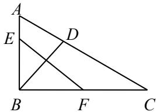

【答案】 $\sqrt { 1 3 }$ 提示：作 $\cdot$ 且 $B G { = } A B$ ，连接 $G E$ ，作 $G H \bot B C$ 于 $H$ 则 $\angle G B H = \angle C = 3 0 ^ { \circ }$ ， $G H { = } 1$ ， $H B = \sqrt { 3 }$ BF＝ 3， $H F { = } 2 \sqrt { 3 }$ ， $G F { = } \sqrt { 1 3 }$ $\_$ （SAS）， $\cdot$ $-$ ，最小值为 $\cdot$

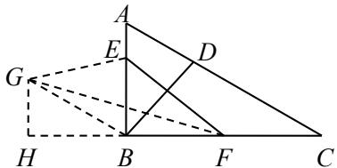

8．如图，矩形 $A B C D$ 中， $A B { = } 3$ ， $A D { = } 3 \sqrt { 3 }$ ，点 $E , \ F$ 分别是对角线 $A C$ 和边 $C D$ 上的动点，且 AE$= C F$ ，则 $B E { + B F }$ 的最小值是

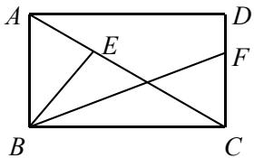

【答案】3 7

提示：作 $A G \bot A C$ 且 $\cdot$ ，连接 BG、EG

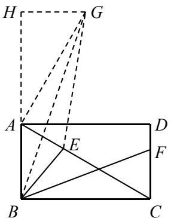

则 $\triangle G A E { \cong } \triangle B C F , ~ B F { = } G E$   
$B E + B F { = } B E + G E { \geq } B G$   
解 $\triangle A B G$ 得 $\cdot$ ， $\cdot$ 的最小值是 $\cdot$

9．如图，在矩形 $A B C D$ 中， $A B { = } 2$ ， $A D { = } 4$ ， $E$ 为边 $B C$ 上一点， $A E { = } A D$ ， $M$ 、 $N$ 分别为线段 $A E$ 、$B E$ 上的动点，且 $A M { = } E N$ ，连接 $D M$ 、 $D N$ ，则 $D M { + } D N$ 的最小值为

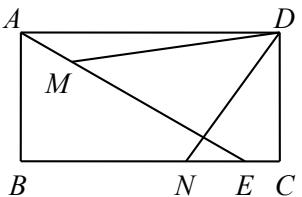

【答案】 $4 \sqrt { 2 }$ 提示：连接 $\cdot$

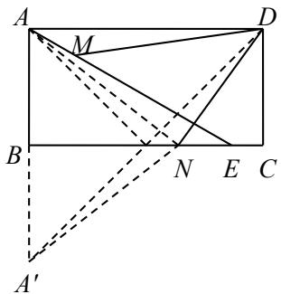

由题意， $A D { = } A E$ ， $-$ ， $A M { = } E N$   
∴△ADM≌△EAN，∴ $\cdot$   
延长 $A B$ 至点 $A ^ { \prime }$ ，使 $\cdot$ ，连接 $\cdot$ 、A'D  
则 $\cdot$ $-$   
当 $\cdot$ 、N、 $D$ 三点共线时 $\cdot$ 的值最小  
此时 $\cdot$ ， $\cdot$   
∴点 $\cdot$ 在线段 $\cdot$ 的垂直平分线上  
$\_$   
$\cdot D M { + } D N { \geq } A ^ { \prime } D { = } 2 A N { = } 4 { \sqrt { 2 } }$   
即 $D M + D N$ 的最小值为 $\cdot$

10．如图，菱形 $A B C D$ 中， $\angle A B C = 6 0 ^ { \circ }$ ， $A B { = } 2$ ， $E$ 、 $F$ 分别是边 $B C$ 和对角线 $B D$ 上的动点，且 $B E$ $= D F$ ，则 $A E { + } A F$ 的最小值为

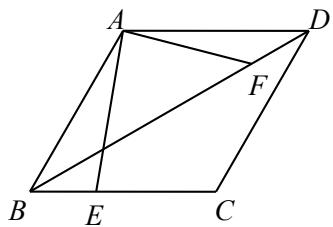

【答案】 $2 \sqrt { 2 }$

提示：作 $\cdot$ 且 $\cdot$ ，连接 $\cdot$ 、EG则 $\cdot$ ， $-$ 又∵ $\cdot$ ，∴△ADF≌△GBE，∴ $. . A F { = } E G$ $\therefore A E + A F = A E + E G \geq _ { A } G = { \sqrt { 2 } } A B = 2 { \sqrt { 2 } }$ 即 $\cdot$ 的最小值为 $\cdot$

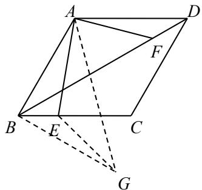

11．如图，在平面直角坐标系 $x O y$ 中，点 $A$ （0，6）， $C$ （4，3）， $C D \bot y$ 轴于 $D$ ，连接 $O C$ ，E、 $F$ 分别是线段 $C D , O C$ 上的动点，且 $C E { = } O F$ ，连接 $A E , A F$ ，则 $A E { + } A F$ 的最小值为 ,此时点 $E$ 的坐标为

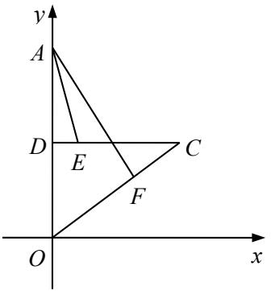

【答案】 $\cdot$ 0）

提示：在 $x$ 轴上取点 $\cdot$ （5，0），连接 $A B$ 、AC、BF

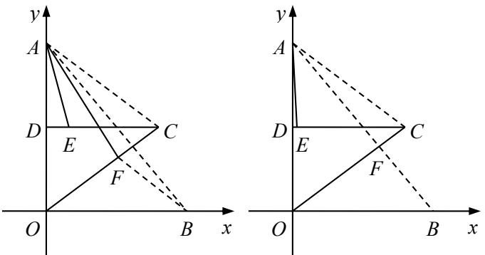

∵A（0，6）， $\cdot$ （4，3）， $C D \bot y$ 轴，∴ $A D { = } O D { = } 3$ $\_$ ， $C D$ 是 $A O$ 的垂直平分线，∴ $C A { = } C O$   
∴ $-$   
又∵ $\cdot$ ，∴ $-$ （SAS），∴ $\cdot$   
∵A（0，6）， $B$ （5，0）， $\cdot$   
$-$ ，即 $\cdot$ 的最小值为 $\cdot$   
此时点 $\cdot$ 落在线段 $\cdot$ 上，即直线 $A B$ 与 $O C$ 的交点  
易求直线 $A B$ ： $y = - { \frac { 6 } { 5 } } x + 6$ ，直线 $O C$ ： $y = { \frac { 3 } { 4 } } x$   
可得 $F$ $( \frac { 4 0 } { 1 3 } , \frac { 3 0 } { 1 3 } )$ $C E { = } O F { = } \frac { 5 0 } { 1 3 } , D E { = } C D { - } C E { = } 4 { - } \frac { 5 0 } { 1 3 } { = } \frac { 2 } { 1 3 }$   
∴此时点 $\cdot$ 的坐标为 $\cdot$ 0）

12．如图，在 $\mathrm { R t } \triangle A B C$ 中， $\angle B = 9 0 ^ { \circ }$ ， $\angle A C B = 3 0 ^ { \circ }$ ， $A B { = } 2$ ，将 $\triangle A B C$ 绕点 $A$ 顺时针旋转 $3 0 ^ { \circ }$ 到 $\bigtriangleup$ $A B ^ { \prime } C ^ { \prime }$ ，M、 $N$ 分别为边 $A C ^ { \prime }$ 、 $B ^ { \prime } C ^ { \prime }$ 上的动点，且 $A M { = } C ^ { \prime } N$ ，连接 CM、CN，则 $C M { + } C N$ 的最小值为_

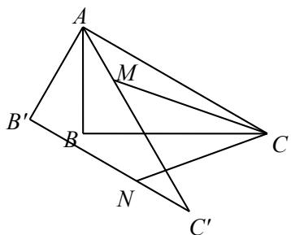

【答案】 $4 \sqrt { 2 }$   
提示：连接 $\cdot$   
由题意， $A M { = } C ^ { \prime } N$ ， $-$ ， $\cdot$   
∴△ACM≌△C'AN，∴ $. C M { = } A N$   
延长 $A B ^ { \prime }$ 至点 $\cdot$ ，使 $A ^ { \prime } B ^ { \prime } { = } A B ^ { \prime }$ ，连接 $A ^ { \prime } N .$ 、A'C  
则 $A N { = } A ^ { \prime } N ,$ ， $\therefore C M + C N = A N + C N = A ^ { \prime } N + C N \geq _ { A ^ { \prime } C }$   
当 $A ^ { \prime }$ 、 $\cdot$ 、 $C$ 三点共线时 $C M { + } C N$ 的值最小  
此时 $A ^ { \prime } N { = } C N , ~ \therefore A N { = } ~ { \frac { 1 } { 2 } } A ^ { \prime } C { = } C N$   
∴点 $\cdot$ 在线段 $\cdot$ 的垂直平分线上  
$-$   
$-$   
即 $\cdot$ 的最小值为 $4 \sqrt { 2 }$

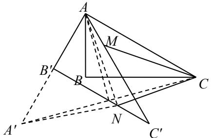

# 2022·贵州遵义·统考中考真题

13．如图，在等腰直角三角形 $A B C$ 中， $\angle B A C = 9 0 ^ { \circ }$ ，点 $M \ , \ N$ 分别为 $B C$ ， $A C$ 上的动点，且 $A N = C M$ ，$A B = { \sqrt { 2 } }$ ．当 $A M + B N$ 的值最小时，CM 的长为

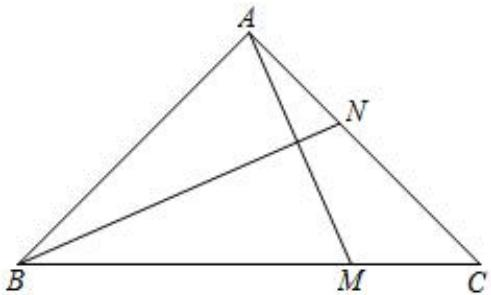

【答案】 $2 - { \sqrt { 2 } }$

【分析】过点A作 $A D / / B C$ ，且 $A D = A C$ ，证明 $\triangle A N D { \cong } \triangle C M A$ ，可得 $A M = D N$ ，当 $B , N , D$ 三点  
共线时， $B N + A M$ 取得最小值，证明 $A B = B M$ ，即可求解  
资料整理【淘宝店铺：向阳百分百】  
【详解】如图，过点A作 $A D / / B C$ ，且 $A D = A C$ ，连接 $D N$ ，如图 1 所示，  
$. \angle D A N = \angle A C M$ ，  
又 $A N = C M$ ，  
$\cdot _ { \triangle A N D } { \cong } _ { \triangle } C M A$ ，  
 $. A M = D N$ ，  
$\therefore B N + A M = B N + D N \geq B D ,$ ，  
当 $B , N , D$ 三点共线时， $B N + A M$ 取得最小值，  
此时如图 2 所示，  
在等腰直角三角形 $A B C$ 中， $\angle B A C = 9 0 ^ { \circ }$ ， $A B = { \sqrt { 2 } }$   
$\therefore B C = \sqrt { 2 } A B = 2$ ，  
$\therefore \Delta A N D { \cong } \Delta C M A$ ，  
$\therefore \angle A D N = \angle C A M$ ，  
$\therefore A D = A C = A B$ ，  
$\dot { \cdot } \angle A D N = \angle A B N$ ，  
$\because A D / / B C$ ，  
$\angle A D N = \angle M B N$ ，  
 $. \angle A B N = \angle M B N$ ，  
设 $\angle M A C = \alpha$ ，  
 $. \angle B A M = \angle B A C - \alpha = 9 0 ^ { \circ } - \alpha$ ，  
$\therefore \angle A B M = \angle A B N + \angle N B M = 2 \alpha = 4 5 ^ { \circ } ,$   
 $. \alpha = 2 2 . 5 ^ { \circ }$ ，  
$: \angle A M B = 1 8 0 ^ { \circ } - \angle B A M - \angle A B M = 1 8 0 ^ { \circ } - 9 0 ^ { \circ } + \alpha - 4 5 ^ { \circ } = 6 7 . 5 ^ { \circ }$ ， $\angle B A M = 9 0 ^ { \circ } - 2 2 . 5 ^ { \circ } = 6 7 . 5 ^ { \circ }$ ，  
$\cdot \cdot A B = B M = { \sqrt { 2 } }$ ，  
$\therefore C M = B C - B M = 2 - { \sqrt { 2 } }$ ，  
即 $B N + A M$ 取得最小值时，CM 的长为 $2 - { \sqrt { 2 } }$ ，  
故答案为： $2 - { \sqrt { 2 } }$

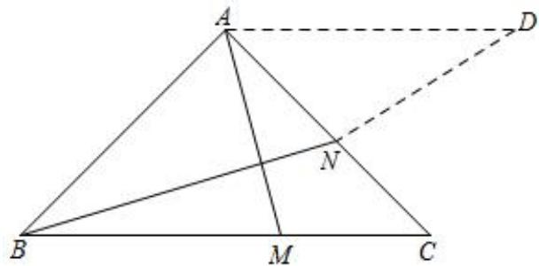  
图1

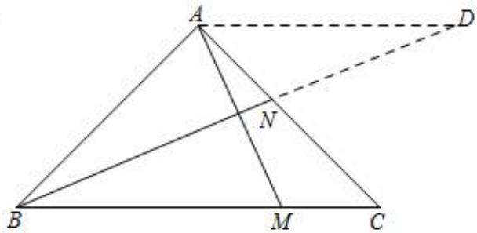  
图2

# 2023·日 照 ·二 模

14．如图，在平面直角坐标系中，等腰Rt△ABC 三个顶点在坐标轴上， $\angle B A C = 9 0 ^ { \circ }$ ，点 $D$ ， $E$ 分别为BC，AC 上的两个动点，且 $A E = C D , A C = 2 { \sqrt { 2 } }$ ．当 $A D + B E$ 的值最小时，则点 $D$ 的坐标为

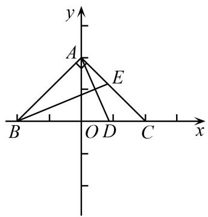

【答案】 $\left( 2 { \sqrt { 2 } } - 2 , 0 \right) \ \left( - 2 + 2 { \sqrt { 2 } } , 0 \right)$

【分析】如图：过点 $\cdot$ 作 $C B ^ { \prime } \bot B C$ 使 $C B ^ { \prime } = A B$ ，连接 $B ^ { \prime } D$ ；证 $\triangle A B E \cong \triangle C B ^ { \prime } D ( \mathrm { S A S } )$ 可得 $D B ^ { \prime } = B E$ ，$A B = C B ^ { \prime }$ ；将 $A D + B E$ 最小值可转化成 $A D + C B ^ { \prime }$ 最小值，则当 $\cdot$ 、 $\cdot$ 、 $B$ 在同一直线上时， $A D + B E$ 最小，即 $A B ^ { \prime }$ 长度；；再根据 $A C = 2 \sqrt { 2 }$ 求得 $A B = C B ^ { \prime } = A C = 2 \sqrt { 2 }$ 、 $O A = O C = { \frac { \sqrt { 2 } } { 2 } } \times 2 { \sqrt { 2 } } = 2$ ，即$A { \big ( } 0 , 2 { \big ) } , B ^ { \prime } { \Big ( } 2 , - 2 { \sqrt { 2 } } { \Big ) }$ ；再运用待定系数法求得直线 $A B ^ { \prime }$ 表达式，最后将 $y = 0$ 代入表达式求得 $\cdot$ 的值即可解答

【详解】解：如图：过点 $C$ 作 $C B ^ { \prime } \bot B C$ 使 $C B ^ { \prime } = A B$ ，连接 $B ^ { \prime } D$ 在 $\triangle A B E$ 和 $\triangle C B ^ { \prime } D$ 中，  
$\left\{ \begin{array} { c } { \boldsymbol { A  B } = \boldsymbol { C } \boldsymbol { B } ^ { \prime } } \\ { \angle B \boldsymbol { A } \boldsymbol { E } = \angle B ^ { \prime } \boldsymbol { C } \boldsymbol { D } , } \\ { \boldsymbol { A } \boldsymbol { E } = \boldsymbol { C } \boldsymbol { D } } \end{array} \right.$   
$\scriptstyle \triangle A B E \cong \triangle C B ^ { \prime } D ( \mathrm { S A S } )$   
$\therefore D B ^ { \prime } = B E \ , A B = C B ^ { \prime } \ ,$   
∴ $A D + B E$ 最小值可转化成 $A D + C B ^ { \prime }$ 最小值，  
当 A、D、B 在同一直线上时， $A D + B E$ 最小，即 $A B ^ { \prime }$ 长度；∵ $A C = 2 \sqrt { 2 }$ ，  
$A B = C B ^ { \prime } = A C = 2 { \sqrt { 2 } } O A = O C = { \frac { \sqrt { 2 } } { 2 } } \times 2 { \sqrt { 2 } } = 2$   
$\therefore A \left( 0 , 2 \right) , B ^ { \prime } \left( 2 , - 2 { \sqrt { 2 } } \right)$   
设 $A B ^ { \prime }$ 表达式为: $y = k x + b \big ( k < 0 \big )$ ，由题意可得：  
$\left\{ { \begin{array} { l } { b = 2 } \\ { 2 k + b = - 2 { \sqrt { 2 } } } \end{array} } \right.$   
解得： $\left\{ \begin{array} { l } { { b = 2 } } \\ { { k = - \sqrt { 2 } - 1 } } \end{array} \right. ,$   
∴ $A B ^ { \prime }$ 表达式为: $y = - { \Big ( } { \sqrt { 2 } } + 1 { \Big ) } x + 2$ ，  
将 $y = 0$ 代入得: $0 = - { \Big ( } { \sqrt { 2 } } + 1 { \Big ) } x + 2$ ，  
解得： $x = 2 \sqrt { 2 } - 2$ ，  
∴ $\cdot$ 点坐标为 $\left( 2 { \sqrt { 2 } } - 2 , 0 \right)$

故答案为： $\left( 2 { \sqrt { 2 } } - 2 , 0 \right)$

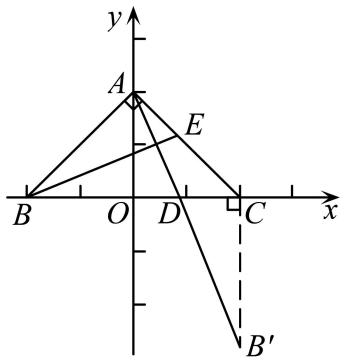

# 2023·咸 阳 ·二 模

15．如图，在 $\mathrm { R t } \triangle A B C$ 中， $A C = 2$ ， $B C = 1$ ， $\angle A B C = 9 0 ^ { \circ }$ ，点 $P$ 是边 $B C$ 上的动点，在边AC上截取 $C Q = B P$ ，连接 $A P , \ B Q$ ，则 $A P + B Q$ 的最小值为

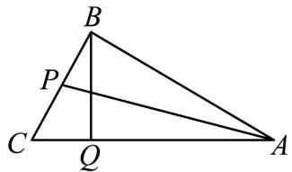

【答案】 $\sqrt { 7 }$

【分析】由“SAS”可证 $\triangle A B P { \cong } \triangle D C Q$ ，可得 $A P = D Q$ ，则 $A P + B Q$ 的最小值为 $B D$ ，由勾股定理可求解

【详解】解：过点 $\cdot$ 作 $C D \perp A C$ ，并截取 $C D = A B$ ，连接 $\it D Q , \it B D$ ，设 $B D$ 交 $A C$ 于点 $E$ ，  
$A C = 2 , \ B C = 1 , \ C A B C = 9 0 ^ { \circ }$ ，  
$\therefore A B = \sqrt { A C ^ { 2 } - B C ^ { 2 } } = \sqrt { 4 - 1 } = \sqrt { 3 } \ , \cos \angle A C B = \frac { 1 } { 2 } ,$ $. \angle A C B = 6 0 ^ { \circ }$ ，  
∵ $A B = C D = { \sqrt { 3 } }$ ， $\angle A B P = \angle D C Q = 9 0 ^ { \circ } , B P = C Q ,$ ，  
$\therefore \Delta A B P \cong \Delta D C Q \left( \mathrm { S A S } \right) ,$ ，  
∴ $A P = D Q$ ，  
∴ $A P + B Q = D Q + B Q$ ，  
在 $\triangle B D Q$ 中， $B Q + D Q > B D$ ，  
∴ $\cdot A P + B Q$ 的最小值为 $B D$ ，  
如图，过点 $\cdot$ 作 $B F \bot C D$ 于 $F$ ，  
$B F / / A C$ ，  
∴ $\angle F B C = \angle A C B = 6 0 ^ { \circ }$ ，  
∴ $\angle B C F = 3 0 ^ { \circ }$ ，  
∴ 12BF  BC  12 ， CF 32 ，  
$\therefore F D = \frac { 3 \sqrt { 3 } } { 2 }$ ,  
$\therefore B D = \sqrt { B F ^ { 2 } + F D ^ { 2 } } = \sqrt { \frac { 2 7 } { 4 } + \frac { 1 } { 4 } } = \sqrt { 7 }$

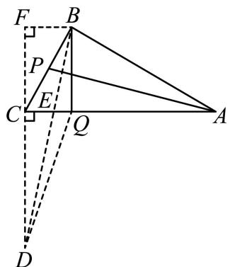

# 2023·深圳中学联考

16．如图，点 $E$ 是正方形 $A B C D$ 内部一个动点，且 $A D = E B = 8$ ， $B F = 2$ ，则 $D E + C F$ 的最小值为（ ）

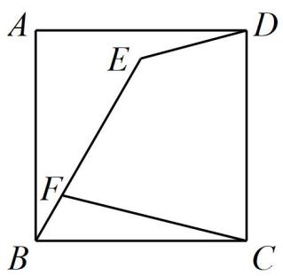

A．10 B． 3 11 C． $7 \sqrt { 2 }$ D． $\sqrt { 9 7 }$

【答案】A

【分析】取 $B G = B F = 2$ ，则 $C G = 8 - 2 = 6$ ,证明 $\triangle B G E { \cong } \triangle B F C$ 得出 $\angle B E G = \angle B C F$ ，进而证明$\angle F C E = \angle G E C$ ，即可证明 $\triangle F C E { \cong } \triangle G E C$ ，得出 $E G = C F$ ，则当 $E , G , D$ 三点共线时， $D E + C F$ 取得最小值，最小值为 $_ { D G }$ 的长，勾股定理即可求解

【详解】解：如图所示，取 $B G = B F = 2$ ，则 $C G = 8 - 2 = 6$ ,连接 $E G$ ，

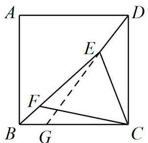

∵ $A D = E B = 8$ ， $B F = 2$ ，  
∴点 $E$ 在以 $B$ 为圆 $\therefore \because 8$ 为半径的圆上运动，点 $F$ 在以 $B$ 为圆心2为半径的圆上运动，  
在 $\triangle B G E , \triangle B F C$ 中，  
$\left\{ \begin{array} { l l } { B F = B G } \\ { \angle E B G = \angle C B F } \\ { B E = B C } \end{array} \right.$   
$\therefore \Delta B G E \cong \Delta B F C$ ，  
∴ $\angle B E G = \angle B C F$ ， $\angle B G E = \angle B F C$   
$\angle F G C = \angle C F E$ ，  
∵ $B E = B C = 8$ ，  
∴ $\angle B E C = \angle B C E$ ，  
即 $\angle F E C = \angle G C E$ ，  
$\cdot \angle F C E = \angle G E C$ ，  
又 $C G = E F = 6$ ， $\angle F G C = \angle C F E$ ，  
$\triangle F C E { \cong } \triangle G E C$ ，$E G = F C$ ，  
当 $E G = F C$ 时，则当 $E , G , D$ 三点共线时， $D E + C F$ 取得最小值，最小值为 $_ { D G }$ 的长，  
在 $\mathbb { R t } \triangle C D G$ 中， $D G = \sqrt { D C ^ { 2 } + C G ^ { 2 } } = 1 0$

17．如图，在 $\mathrm { R t } \triangle A B C$ 中， $\angle A C B = 9 0 ^ { \circ }$ °， $A B { = } 6$ ， $B C { = } 4$ ， $D$ ， $E$ 分别是 AC，AB 上的动点，且 AD$= B E$ ，连结 $B D$ ， $C E$ ，则 $B D { + } C E$ 的最小值为

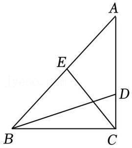

【答案】 $2 \sqrt { 1 3 }$

解：过 $B$ 作 $\cdot$ ，在平行线上取 $B F { = } A B$ ，连接 $\cdot$ ，如图：

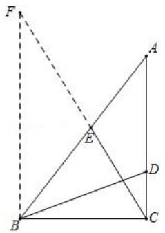

∴ $\_$ ，  
∵ $\cdot$ ， $B E { = } A D$ ，  
∴△BEF≌△ADB（SAS）， ∴ $\cdot$ ， ∴BD+CE＝EF+CE，  
当 $C$ ， $\cdot$ ， $F$ 共线时， $E F { + } C E$ 最小，即 $B D { + } C E$ 最小，最小值即为 $\cdot$ 的长度，  
∵BF∥AC， $\angle A C B = 9 0 ^ { \circ }$ ，  
∴ $\angle F B C = 9 0 ^ { \circ }$ ${ \sqrt { B c ^ { 2 } + B F ^ { 2 } } } \quad 2 { \sqrt { 1 3 } }$ ，  
∴ $\cdot$ 最小为 $2 \sqrt { 1 3 }$ ， 故答案为： $2 \sqrt { 1 3 }$

18．如图，菱形 ABCD 中， $\angle A B C = 6 0 ^ { \circ }$ ， $A B { = } 2$ ， $E$ 、 $F$ 分别是边 $B C$ 和对角线 $B D$ 上的动点，且$B E { = } D F$ ，则 $A E { + } A F$ 的最小值为

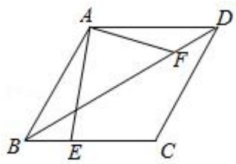

【答案】 $2 \sqrt { 2 }$

【详解】解：如图， $B C$ 的下方作 $\_$ ，在 $B T$ 上截取 $B T$ ，使得 $\cdot$ ，连接 $\cdot$ ，AT∵四边形 ABCD 是菱形， $\_$ ，

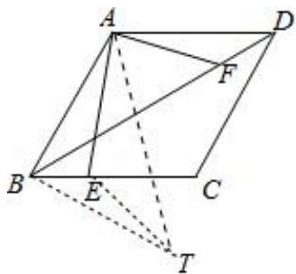

${ \frac { 1 } { 2 } } \qquad { \frac { 1 } { 3 } } \qquad \qquad { \frac { 1 } { 3 } } \qquad \qquad \qquad { \frac { 1 } { 3 } } \qquad \qquad \qquad \qquad \qquad \qquad \frac { 1 } { 3 } \qquad \qquad \qquad \qquad \qquad \qquad \frac { 1 } { 3 } \qquad \qquad \qquad \qquad \qquad \qquad \frac { 1 } { 3 } \qquad \qquad \qquad \qquad \qquad \qquad \qquad \frac { 1 } { 3 } \qquad \qquad \qquad \qquad \qquad \qquad \qquad \qquad \qquad \qquad \frac { 1 } { 3 } \qquad \qquad \qquad \qquad \qquad \qquad \qquad \qquad \qquad \qquad \qquad \qquad \qquad \qquad \qquad \qquad \qquad \qquad \qquad \qquad \qquad \qquad \qquad \qquad \qquad \qquad \qquad \qquad \qquad \qquad \qquad \qquad \qquad \qquad \qquad \qquad \qquad \qquad \qquad \qquad \qquad \qquad \qquad \qquad \qquad \qquad \qquad \qquad \qquad \qquad \qquad \qquad \qquad \qquad \qquad \qquad \qquad \qquad \qquad \qquad \qquad \qquad \qquad \qquad \qquad \qquad \qquad \qquad \qquad \qquad \qquad \qquad \qquad \qquad \qquad \qquad \qquad \qquad \qquad \qquad \qquad \qquad \qquad \qquad \qquad \qquad \qquad \qquad \qquad \qquad \qquad \qquad \qquad \qquad \qquad \qquad \qquad \qquad \qquad \qquad \qquad \qquad \qquad \qquad \qquad \qquad \qquad \qquad \qquad \qquad \qquad \qquad \qquad \qquad \qquad \qquad \qquad \qquad \qquad \qquad \qquad \qquad \qquad \qquad \qquad \qquad \qquad \qquad \qquad \qquad \qquad \qquad \qquad \qquad \qquad \qquad \qquad \qquad \qquad \qquad \qquad \qquad \qquad \qquad \qquad \qquad \qquad \qquad \qquad \qquad \qquad $   
∵AD＝BT，∠ADF＝∠TBE＝30°， $\cdot$ ，  
∴△ADF≌△TBE（SAS），∴ $\cdot$ ，  
∵ $-$ ，  
$\sqrt { A B ^ { 2 } + B T ^ { 2 } } \qquad 2 \sqrt { 2 }$ ，∴ $-$ ，∵AE+ET≥AT，∴AE+AF≥ 2 2 ，  
$A E { + } A F$ 的最小值为 $2 \sqrt { 2 }$ ，故答案为 $2 \sqrt { 2 }$

# 2023·甘肃武威中考真题拆解

19．如图 1，抛物线 $y = - x ^ { 2 } + b x$ 与 $x$ 轴交于点A，与直线 $y = - x$ 交于点 $B ( 4 , - 4 )$ ，点 $C ( 0 , - 4 )$ 在 $y$ 轴上．点 $P$ 从点 $B$ 出发，沿线段 $B O$ 方向匀速运动，运动到点 $O$ 时停止

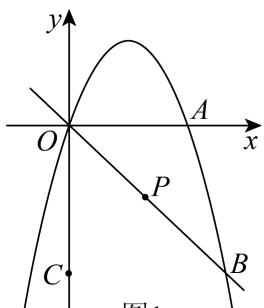  
图1

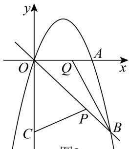  
图2

(1)求抛物线 $y = - x ^ { 2 } + b x$ 的表达式；

(2)如图 2，点 $P$ 从点 $B$ 开始运动时，点 $\boldsymbol { Q }$ 从点 $o$ 同时出发，以与点 $P$ 相同的速度沿 $x$ 轴正方向匀速运动，点 $P$ 停止运动时点 $\boldsymbol { Q }$ 也停止运动．连接 $B Q$ ， $P C$ ，求 $C P + B Q$ 的最小值

【答案】 $y = - x ^ { 2 } + 3 x$ (2) $4 \sqrt { 3 }$

【分析】（1）用待定系数法求二次函数解析式即可；

（2）由题意得， $B P = O Q$ ，连接 $B C$ ．在 $O A$ 上方作 ${ \triangle } O M Q$ ，使得 $\angle M O Q = 4 5 ^ { \circ }$ ， $O M = B C$ ，证明$\triangle C B P { \cong } \triangle M O Q ( \mathrm { S A S } )$ ，根据 $C P + B Q = M Q + B Q \geq M B$ 得出 $C P + B Q$ 的最小值为 $M B$ ，利用勾股定理求得 $M B$ ，即可得解

【详解】（1）解：∵抛物线 $y = - x ^ { 2 } + b x$ 过点 $B ( 4 , - 4 )$ ，$- 1 6 + 4 b = - 4$ ，  
$b = 3$ ，  
$y = - x ^ { 2 } + 3 x$ ；  
（2）如图 2，由题意得， $B P = O Q$ ，连接 $B C$   
在 $O A$ 上方作 ${ \triangle } O M Q$ ，使得 $\angle M O Q = 4 5 ^ { \circ }$ ， $O M = B C$ ，  
∵ $O C = B C = 4$ ， $B C \bot O C$ ，  
∴ $\angle C B P = 4 5 ^ { \circ }$ ，  
∴ $\angle C B P = \angle M O Q$ ，  
∵ $B P = O Q$ ， $\angle C B P = \angle M O Q$ ， $B C = O M$ ，  
$\triangle C B P { \cong } \triangle M O Q ( \mathrm { S A S } )$ ，  
∴ $C P = M Q$ ，  
$C P + B Q = M Q + B Q \geq M B$ （当 $M$ ， $\boldsymbol { Q }$ ， $B$ 三点共线时最短），  
∴ $C P + B Q$ 的最小值为 $M B$ ，  
∵ $\angle M O B = \angle M O Q + \angle B O Q = 4 5 ^ { \circ } + 4 5 ^ { \circ } = 9 0 ^ { \circ }$   
$\therefore M B = \sqrt { O M ^ { 2 } + O B ^ { 2 } } = \sqrt { 4 ^ { 2 } + \left( 4 \sqrt { 2 } \right) ^ { 2 } } = 4 \sqrt { 3 } \ ,$ ，  
即 $C P + B Q$ 的最小值为 $4 \sqrt { 3 }$

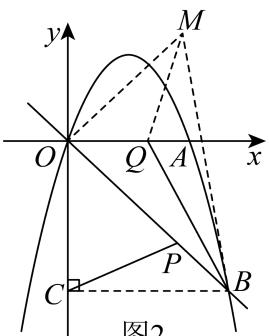  
图2

# 2023·黄冈中考真题拆解

20．已知抛物线 $y = - { \frac { 1 } { 2 } } x ^ { 2 } + { \frac { 3 } { 2 } } x + 2$ 与 $x$ 轴交于 $A , B ( 4 , 0 )$ 两点 ，与 $y$ 轴交 于点 $C ( 0 , 2 )$ ，点 $P$ 为第一象限抛物线上的点，连接 $C A , C B , P B , P C$

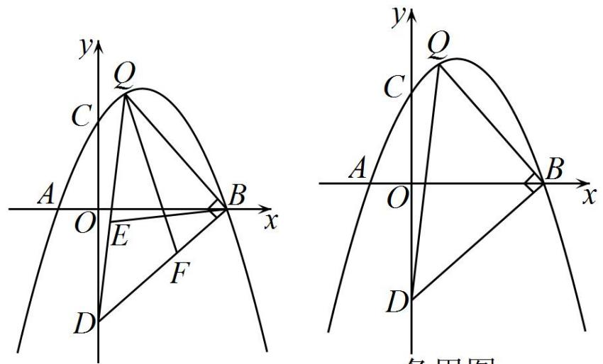  
备用图

如图 2，点 $D$ 在 $y$ 轴负半轴上， $O D = O B$ ，点 $\mathcal { Q }$ 为抛物线上一点， $\angle Q B D = 9 0 ^ { \circ }$ ，点 $E , F$ 分别为 $\triangle B D Q$ 的边 $D Q , D B$ 上的动点， $Q E = D F$ ，记 $B E + Q F$ 的最小值为 $m$ ．

$\textcircled{1}$ 求 $m$ 的值；

$\textcircled{2}$ 设 $\triangle P C B$ 的面积为 $S$ ，若 $S = { \frac { 1 } { 4 } } m ^ { 2 } - k$ ，请直接写出 $k$ 的取值范围．

【答案】 $m = 2 { \sqrt { 1 7 } } 1 3 \leq k < 1 7$

【分析】 $\cdot$ 作 $D H \bot D Q$ ，且使 $D H = B Q$ ，连接 $F H$ ．根据 SAS 证明 $\scriptstyle \Delta B Q E { \cong } \Delta H D F$ ， 可 得$B E + Q F = F H + Q F \geq Q H$ ，即 $\mathcal { Q } , F , H$ 共线时， $B E + Q F$ 的值最小．作 $Q G \bot A B$ 于点 $G$ ，设 $G ( n , 0 )$ ，则 $\mathcal { Q } \biggl ( n , - \frac { 1 } { 2 } n ^ { 2 } + \frac { 3 } { 2 } n + 2 \biggr )$ 根据 $Q G = B G$ 求出点 $\mathcal { Q }$ 的坐标，燃然后利用勾股定理求解即可；

$\textcircled{2}$ 作 $P T / / \ y$ 轴，交 $B C$ 于点 $\cdot$ ，求出 $B C$ 解析式，设 $T { \Bigg ( } a , - { \frac { 1 } { 2 } } a + 2 { \Bigg ) }$ , $P { \left( a , - { \frac { 1 } { 2 } } a ^ { 2 } + { \frac { 3 } { 2 } } a + 2 \right) }$ 利 用 三角形面积公式表示出 $\cdot$ ，利用二次函数的性质求出 $S$ 的取值范围，结合 $\textcircled{1}$ 中结论即可求解．

【详解】解： $\cdot$ 如图 2，作 $D H \perp D Q$ ，且使 $D H = B Q$ ，连接∵ $\angle B Q D + \angle B D Q = 9 0 ^ { \circ }$ ， $\angle H D F + \angle B D Q = 9 0 ^ { \circ }$ ，  
$\cdot \angle Q D = \angle H D F$ ，  
$\begin{array} { r } { Q E = D F D H = B Q } \end{array}$ ，  
$\therefore \Delta B Q E \cong \Delta H D F ( \mathrm { S A S } )$ ，  
$\cdot \ B E = F H$ ，  
$\therefore B E + Q F = F H + Q F \geq Q H ,$   
∴ $\cdot$ ， $\cdot$ ， $H$ 共线时， $B E + Q F$ 的值最小．作 $Q G \bot A B$ 于点 $G$ ，∵ $O B = O D$ ， $\angle B O D = 9 0 ^ { \circ }$ ，  
$\angle O B D = 4 5 ^ { \circ }$ ，  
∵ $\angle Q B D = 9 0 ^ { \circ }$ ，  
$\angle Q B G = 4 5 ^ { \circ }$ ，  
∴ $Q G = B G$ ．  
设 $G ( n , 0 )$ ，则 $\mathcal { Q } \biggl ( n , - \frac { 1 } { 2 } n ^ { 2 } + \frac { 3 } { 2 } n + 2 \biggr )$   
$- { \frac { 1 } { 2 } } n ^ { 2 } + { \frac { 3 } { 2 } } n + 2 = 4 - n$ ，解得 $n = 1$ 或 $n = 4$ （舍 去），  
$\therefore Q ( 2 , 3 )$ ，  
$\begin{array} { r l } { Q G = B G = 4 - 1 = 3 } \end{array}$ ，  
$\therefore B Q = D H = 3 \sqrt { 2 } \ , Q D = 5 \sqrt { 2 } \ ,$ ，  
$\therefore m = Q H = \sqrt { \left( 3 \sqrt { 2 } \right) ^ { 2 } + \left( 5 \sqrt { 2 } \right) ^ { 2 } } = 2 \sqrt { 1 7 } \ ;$ ；  
$\cdot$ 如图 3，作 $P T / / \ y$ 轴，交 $B C$ 于点 $T _ { \mathrm { : } }$ ，待定系数法可求 $B C$ 解析式为 $y = - { \frac { 1 } { 2 } } x + 2$ ，  
设 $T { \Bigg ( } a , - { \frac { 1 } { 2 } } a + 2 { \Bigg ) } \quad P { \Bigg ( } a , - { \frac { 1 } { 2 } } a ^ { 2 } + { \frac { 3 } { 2 } } a + 2 { \Bigg ) }$ ，  
则 $S = \frac 1 2 \left( - \frac 1 2 a ^ { 2 } + \frac 3 2 a + 2 + \frac 1 2 a - 2 \right) \times 4 = - \left( a - 2 \right) ^ { 2 } + 4$   
$0 < S \le 4$ ，  
∴ 1 20 4 m  k  ，4  
$0 < 1 7 - k \leq 4$ ，  
$\therefore 1 3 \leq k < 1 7$

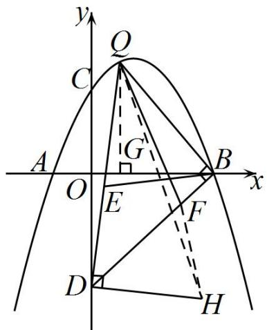  
图2

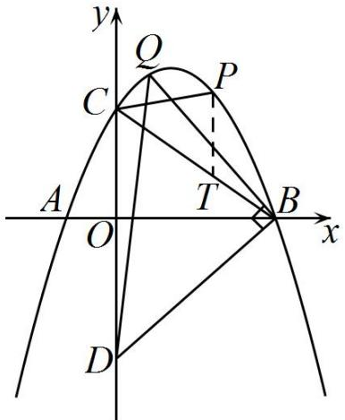  
图3

# 题型三 构造相似求加权线段和

# 2023 年成都市天府新区二模

21．如图，在 $\mathrm { R t } \triangle A B C$ 中， $\angle B A C = 9 0 ^ { \circ }$ ， $A B = 1$ ， $A C = 2$ ． $D$ ， $E$ 分别是边 $A B$ ， $A C$ 上的动点，且 $C E = 2 A D$ ，则 $B E + 2 C D$ 的最小值为

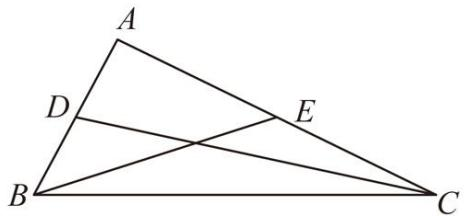

【答案】 $\sqrt { 2 9 }$

【分析】过 $C$ 作 $C F \bot A C$ 于 $F$ ，使 $C F = 2 A C = 4$ ，连接 $E F$ 、 $B F$ ，即可得到 $E F = 2 C D$ ，$B E + 2 C D = B E + E F \geq B F$ ，即最小值为 $B F$ 的长．

【详解】方法一：过 $C$ 作 $C F \bot A C$ 于 $F$ ，使 $C F = 2 A C = 4$ ，连接 $E F$ 、 $B F$ ，

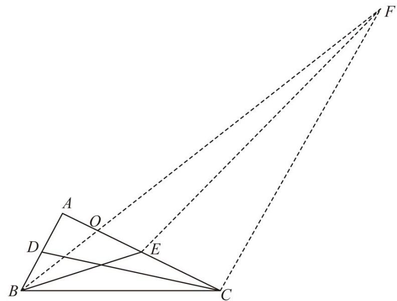

∵ $C E = 2 A D$ ，  
$\therefore { \frac { C E } { A D } } = { \frac { C F } { A C } } = 2 \ ,$   
∵ $\angle D A C = \angle F A C = 9 0 ^ { \circ }$ ，  
$\therefore \Delta D A C \sim \Delta E C F$ ，$\frac { C E } { A D } = \frac { C F } { A C } = \frac { E F } { C D } = 2$ ，即 $E F = 2 C D$ ，  
$B E + 2 C D = B E + E F \geq B F$   
∴当 $B .$ 、E、 $F$ 三点共线时 $B E + 2 C D$ 有最小值，最小值为 $B F$ 的长  
∵ $\cdot \angle D A C = \angle F A C = 9 0 ^ { \circ }$   
$\therefore A B / / C F$ ，  
${ \frac { O B } { O F } } { = } { \frac { O A } { O C } } { = } { \frac { A B } { C F } }$   
$A B = 1 A C = 2 C F = 2 A C = 4$   
$\therefore { \frac { O B } { O F } } = { \frac { O A } { O C } } = { \frac { A B } { C F } } = { \frac { 1 } { 4 } } ,$   
$B F = \frac { 5 } { 4 } O F , O C = \frac { 4 } { 5 } A C = \frac { 8 } { 5 }$   
$O F = { \sqrt { O C ^ { 2 } + C F ^ { 2 } } } = { \sqrt { \left( { \frac { 8 } { 5 } } \right) ^ { 2 } + 4 ^ { 2 } } } = { \frac { 4 } { 5 } } { \sqrt { 2 9 } }$ ，  
$\therefore B F = { \frac { 5 } { 4 } } O F = { \sqrt { 2 9 } }$   
$B E + 2 C D$ 的最小值为 $\sqrt { 2 9 }$

方法二： $A D = x$ ，则 $C E = 2 A D = 2 x$ ， $A E = A C - C E = 2 - 2 x$ ，

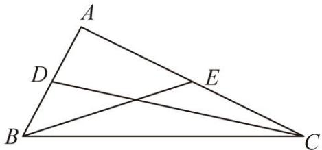

$B E = { \sqrt { A E ^ { 2 } + A B ^ { 2 } } } = { \sqrt { \left( 2 - 2 x \right) ^ { 2 } + 1 ^ { 2 } } } C D = { \sqrt { A D ^ { 2 } + A C ^ { 2 } } } = { \sqrt { x ^ { 2 } + 2 ^ { 2 } } }$   
设 $2 y = B E + 2 C D$ ，  
${ \begin{array} { l } { \displaystyle \therefore y = { \frac { 1 } { 2 } } B E + C D = { \frac { 1 } { 2 } } { \sqrt { \left( 2 - 2 x \right) ^ { 2 } + 1 ^ { 2 } + { \sqrt { x ^ { 2 } + 2 ^ { 2 } } } } } = { \sqrt { \left( x - 1 \right) ^ { 2 } + { \frac { 1 } { 4 } } + { \sqrt { x ^ { 2 } + 4 } } } } } \\ { = { \sqrt { \left( x - 1 \right) ^ { 2 } + \left( 0 - { \frac { 1 } { 2 } } \right) ^ { 2 } + { \sqrt { \left( x - 0 \right) ^ { 2 } + \left( 0 + 2 \right) ^ { 2 } } } } } } \end{array} }$   
∴y可以看成点 $M \left( x , 0 \right)$ 到点 $A { \bigg ( } 1 , { \frac { 1 } { 2 } } { \bigg ) } B { \big ( } 0 , - 2 { \big ) }$ 的距离之和，  
∴当 $M \left( x , 0 \right)$ 、 $A { \left( 1 , \frac { 1 } { 2 } \right) }$ 、 $B ( 0 , - 2 )$ 三点共线时 $y$ 最小 ，最 小值 $y = A B = { \sqrt { \left( 0 - 1 \right) ^ { 2 } + \left( - 2 - { \frac { 1 } { 2 } } \right) ^ { 2 } } } = { \frac { \sqrt { 2 9 } } { 2 } }$

22．如图，已知 $B C \bot A B$ ， $B C { = } A B { = } 3$ ， $E$ 为 $B C$ 边上一动点，连接 $A E$ ， $D$ 点在 $A B$ 延长线上，且 $C E$ $= 2 B D$ ，则 $A E + 2 C D$ 的最小值为

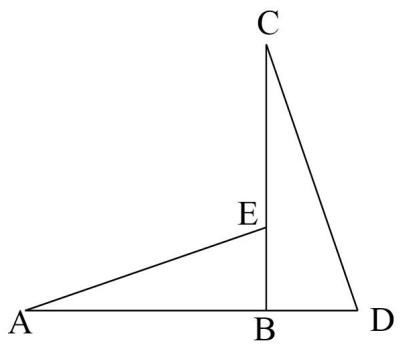

【答案】 $\cdot$   
解：作 CF⊥CB，且使得 $\cdot$ ，连接 EF  
过点 A 做 AG⊥CF，交 FC 延长线于点 G$\cdot$   
∴△FCE∽△CBD， $\mathrm { E F } { = } 2 \mathrm { C D }$   
∴AE+2CD $\vDash$ AE+EF  
当 A、E、F三点一线时，AE+EF 取到最小值，此时 $_ { \mathrm { A E + E F = A F } }$   
易知：四边形 ABCG 为正方形 $_ { \mathrm { A G } = 3 , \mathrm { C G } = 3 }$

资料整理【淘宝店铺：向阳百分百】$\cdot$ 在 $\cdot$ FAG中，由勾股定理得 $\cdot$ $\mathrm { A E } { + } 2 \mathrm { C D }$ 的最小值为 $\cdot$

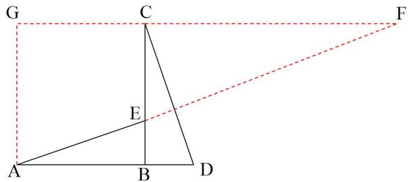

23．如图，菱形 ABCD 的边长为 1， $\angle \mathrm { A B C } = 6 0 ^ { \circ }$ ．E，F分别是 BC，BD 上的动点，且 $\mathrm { C E = D F }$ ，则 $\mathrm { A E ^ { + } A F }$ 的最小值为 。

【答案】 $\sqrt { 2 }$

【解答】解：如图，连接 AC，过点 C 作 CT⊥CA，使得 $\_$ ，连接 AT

∵四边形 ABCD 是菱形，1  
$-$ ，∠ABC＝∠ADC＝60°，∠ADB＝ ∠ADC＝30°2  
∴△ABC 是等边三角形，  
∴ $\_$ ， $\_$ ，  
∵AC⊥CT，  
∴ $\angle E C = 3 0 ^ { \circ }$   
∴∠A $\mathrm { D F } = \angle \mathrm { E C T }$ ，  
∵ $\cdot$ ， $\mathrm { C T } { = } \mathrm { D A }$ ，

资料整理【淘宝店铺：向阳百分百】

∴△ADF≌△TCE（SAS），  
∴AF $\cdot$ ，  
$-$ ，  
∵ $\_$ °， $_ { \mathrm { A C } } { = } { \mathrm { C T } } { = } 1$ ，  
$\therefore \mathrm { A T } = { \sqrt { A C ^ { 2 } + C T ^ { 2 } } } = { \sqrt { 1 ^ { 2 } + 1 ^ { 2 } } } = { \sqrt { 2 } } \ ,$ ，  
$\cdot \mathrm { A E } \mathrm { + } \mathrm { A F } \geqslant \sqrt { 2 }$ ，∴AE+AF 的最小值为 $\sqrt { 2 }$

24．如图，在矩形 ABCD 中， $\mathrm { A D } { = } 4$ ， $\scriptstyle \mathrm { A B } = 4 { \sqrt { 3 } }$ ，E，F 分别是 BD，BC 上的一动点，且 $\mathrm { B F } { = } 2 \mathrm { D E }$ ，则 $\mathrm { A F } { + } 2 \mathrm { A E }$ 的最小值是 。

【答案】 $4 { \sqrt { 1 3 } }$

【解答】解：连接 DF，延长 AB 到 T，使得 $\mathrm { B T } { = } \mathrm { A B }$ ，连接 DT

∵四边形 ABCD 是矩形，  
∴∠B $\scriptstyle \mathrm { 1 D = \angle A B C = 9 0 } ^ { \circ }$ °，BC∥AD，  
∴tan $\angle \mathrm { D B A } = \frac { A D } { A B } = \frac { \sqrt { 3 } } { 3 }$ , $\angle \mathrm { A D E } = \angle \mathrm { D B F }$ ，  
∴ $\_$   
∴BD $\cdot$ ，  
∵ $\cdot$ ，  
$\frac { B D } { A D } \quad \frac { B F } { D E } \qquad $   
∴△DBF∽△ADE，  
$\therefore \frac { D F } { A E } = \frac { B D } { A D } = 2 ,$   
$\cdot _ { \mathrm { { D F } } } { = } 2 \mathrm { { A E } }$ ，  
∴AF+2AE $=$ AF+DF，  
∵FB⊥AT，BA＝BT，  
∴FA ${ } = \mathrm { F T }$ ，  
∴ $-$ ，  
∵ $\sqrt { A T ^ { 2 } + A D ^ { 2 } } 4 \sqrt { 1 3 }$   
$\cdot _ { \mathrm { A F } + 2 \mathrm { A E } } \geqslant 4 \sqrt { 1 3 }$ ，  
∴AF $+ 2$ AE 的最小值为 $4 { \sqrt { 1 3 } }$

25．如图，等腰直角△ABC 中，斜边 $\mathrm { B C } { = } 2$ ，点 D、E 分别为线段 AB 和 B C 上的动点， $B E = \sqrt { 2 } A D$ ，求 $\mathrm { A E } + \sqrt { 2 } \mathrm { C D }$ 的最小值.

【答案】 $\cdot$   
解：作 BF⊥BC 并且使得 $\mathrm { B F } { = } 2$ ，连接 EF  
∵ $\cdot$ ∴△BEF∽△ADC  
∴EF $= \sqrt { 2 }$ CD $\cdot \mathrm { A E } + \sqrt { 2 } \mathrm { C D } { = } \mathrm { A E } { + } \mathrm { E F }$   
当 A、E、F 三点共线时， $\cdot$ 取到最小值，此时 $\cdot$   
反向延长 BF，过点 A作 AH⊥BF于点 H  
在 Rt△AHF 中，由勾股定理易得： $\scriptstyle { \mathrm { A F } = { \sqrt { 1 0 } } }$   
∴ $\cdot$ 的最小值为 $\cdot$

26．如图，在菱形 ABCD 中， $\angle B A D = 1 2 0 ^ { \circ }$ ， $A B = 6$ ，连接 $B D$ ．

(1)求 $B D$ 的长；

(2)点 $E$ 为线段 $B D$ 上一动点（不与点 $B , D$ 重合）， 点 $F$ 在边 $A D$ 上，且 $B E { = } \sqrt { 3 } D F$ ，当四边形 ABEF的面积取得最小值时， $C E { + } \sqrt { 3 } C F$ 的值是否也最小？如果是，求 $C E { + } \sqrt { 3 } C F$ 的最小值；如果不是，请说明理由．

【答案】 $B D = 6 { \sqrt { 3 } }$ ；(2)最小值为 12【分析】（1）证明 $\cdot$ 是等边三角形，可得 $B O = \ 3 { \sqrt { 3 } }$ ，即可求解；

（2）过点 $E$ 作 $A D$ 的垂线，分别交 $A D$ 和 $\cdot$ 于点 $\cdot$ ， $N$ ， 根据菱形的面积可求出 $\mathit { M N } { = } 3 \sqrt { 3 }$ ，设$B E { = } x$ ，则 $E N { = } \frac 1 2 x$ $3 { \sqrt { 3 } } - { \frac { 1 } { 2 } } x$ ，再由 ${ \sqrt { 3 } }$ ，可得 $D F { = } \frac { \sqrt { 3 } } { 3 } x$ 从而得到四边形 ABEF 的面积 $s = S _ { \varDelta } A B D - S _ { \varDelta } D E F \ = \frac { \sqrt { 3 } } { 1 2 } \Bigl ( x - 3 \sqrt { 3 } \Bigr ) ^ { 2 } + \frac { 2 7 \sqrt { 3 } } { 4 }$ ， 作 $C H \bot A D$ 于 $H$ ，可得当点 $E$ 和 $F$ 分别到达点 $O$ 和点 $H$ 位置时， $\cdot$ 和 $C E$ 分别达到最小值；再由 $s = { \frac { \sqrt { 3 } } { 1 2 } } { \Big ( } x - 3 { \sqrt { 3 } } { \Big ) } ^ { 2 } + { \frac { 2 7 { \sqrt { 3 } } } { 4 } }$ 可得当 $x = 3 \sqrt { 3 }$ ，即 $\sqrt { 3 }$ 时， $\cdot$ 达到最小值，从而得到此时点 $E$ 恰好在点 $\cdot$ 的位置，而点 $\cdot$ 也恰好在点 $H$ 位置，即可求解

【详解】（1）解∶连接 $\cdot$ ，设 $A C$ 与 $\cdot$ 的交点为 $\cdot$ ，如图，

∵四边形 $\cdot$ 是菱形，  
∴AC⊥BD ， $\cdot$ ， $\cdot$ ， $\cdot$ 平分 $\cdot$ ，  
∵ $\angle B A D = 1 2 0 ^ { \circ }$ ，∴ $\angle C A B { = } 6 0 ^ { \circ }$ ，  
∴ $\triangle A B C$ 是等边三角形，  
$\therefore B O = A B \cdot \sin 6 0 ^ { \circ } = 6 \times { \frac { \sqrt { 3 } } { 2 } } = 3 { \sqrt { 3 } } ,$ ，  
$\therefore B D = 2 B O = 6 { \sqrt { 3 } }$ ；  
（2）解：如图，过点 $\cdot$ 作 $\cdot$ 的垂线，分别交 $\cdot$ 和 $\cdot$ 于点 $M$ ， $N$ ，∵△ABC 是等边三角形，  
$\scriptstyle \cdot . . A C = A B = 6$ ，  
由（1）得： $B D { = } 6 \sqrt { 3 }$ ；  
菱形 $A B C D$ 中，对角线 $\cdot$ 平分 $\cdot$ ，AB∥CD，BC=AB=6，  
∴MN⊥BC，  
∵ $\_$ ，  
∴ $\_$ ，  
∴ $\angle E B N = 3 0 ^ { \circ }$ ；  
$\frac { 1 } { 2 }$   
$S _ { \stackrel { * * } { * * } \pi \beta . B C D } = { \frac { 1 } { 2 } } A C \cdot B D = M N \cdot B C$ ，  
$\cdot . M N { = } 3 \sqrt { 3 }$ ，  
设 $B E { = } x$ ，则 $E N { = } { \frac { 1 } { 2 } } x$   
$\therefore E M = M N - E N = 3 \sqrt { 3 } - \frac { 1 } { 2 } x$ ，  
$6 \times 3 { \sqrt { 3 } } = 1 8 { \sqrt { 3 } }$ ，  
$\therefore S _ { \varDelta } A B D { = } \ { \frac { 1 } { 2 } } S _ { \not \equiv \not \equiv \not { A } } A B C D { = } 9 \sqrt { 3 } \ ,$ ，  
∵ ${ \sqrt { 3 } }$ ，  
${ \frac { B E } { \sqrt { 3 } } } = { \frac { \sqrt { 3 } } { 3 } } x$ ，  
$\frac { 1 } { 2 } \qquad \frac { 1 } { 2 } \cdot \frac { \sqrt { 3 } } { 3 } x \left( 3 \sqrt { 3 } - \frac { 1 } { 2 } x \right) \quad - \frac { \sqrt { 3 } } { 1 2 } x ^ { 2 } + \frac { 3 } { 2 } x$   
记四边形 $\cdot$ 的面积为 $\cdot$ ，  
$\qquad 9 { \sqrt { 3 } } \qquad - { \frac { \sqrt { 3 } } { 1 2 } } x ^ { 2 } + { \frac { 3 } { 2 } } x \quad = { \frac { \sqrt { 3 } } { 1 2 } } { \Big ( } x - 3 { \sqrt { 3 } } { \Big ) } ^ { 2 } + { \frac { 2 7 { \sqrt { 3 } } } { 4 } }$ ∵点 $\cdot$ 在 $\cdot$ 上，且不在端点，∴ $\_$ ，即 $0 < x < 6 \sqrt { 3 }$ ；

作 $C H \bot A D$ 于 $\cdot$ ，如图，

∵ $C O \bot B D$ ， $C H \bot A D$ ，而点 $E$ 和 $\cdot$ 分别在 $B D$ 和 $A D$ 上，  
∴当点 $\cdot$ 和 $F$ 分别到达点 $O$ 和点 $\cdot$ 位置时， $\cdot$ 和 $C E$ 分别达到最小值；  
在菱形 $A B C D$ 中， $\cdot$ ， $\cdot$ ，∵ $\_$ ，∴ $\_$ ，  
∴ $\cdot$ 是等边三角形， $\cdot A H { = } D H { = } 3$ ，∴ $\quad 3 { \sqrt { 3 } }$ ，  
$\therefore s = { \frac { \sqrt { 3 } } { 1 2 } } { \Big ( } x - 3 { \sqrt { 3 } } { \Big ) } ^ { 2 } + { \frac { 2 7 { \sqrt { 3 } } } { 4 } }$ ∴当 $x = 3 \sqrt { 3 }$ ，即 $\begin{array} { r l } { { 3 } \sqrt { 3 } } \end{array}$ 时， $\cdot$ 达到最小值，∵ ${ \sqrt { 3 } }$ ，∴ $\cdot$ ，此时点 $E$ 恰好在点 $O$ 的位置，而点 $F$ 也恰好在点 $H$ 位置，∴当四边形 ABEF 面积取得最小值时， $C E$ 和 $\cdot$ 也恰好同时达到最小值，  
∴ $\sqrt { 3 }$ CF 的值达到最小，其最小值为 $\mathrm { C O } + \sqrt { 3 } \mathrm { C H } { = } 3 + \sqrt { 3 } \times 3 \sqrt { 3 } { = } 1 2$

【其它几何构造方法】

法 2： $E E + { \sqrt { 3 } } C F$ 核心是处理 $\sqrt { 3 } C F$ ，刚好有 $B E = { \sqrt { 3 } } D F$ ，还有 $C E$ 和 $\cdot$ 两个动点需要拼一起，所以考虑把△CDF 放大 $\sqrt { 3 }$ 倍后拼到 BE 处过 $B$ 作 $B I \perp B C , B I - B D = \sqrt { 3 } C D \Rightarrow \triangle C D F \hookrightarrow \triangle I B E \qquad \sqrt { 3 } C F \qquad + I E \ge C I = 2 B C = 1 2$ 法 3：过 $D$ 作 $D G \bot C D$ ，取 $D G = { \frac { \sqrt { 3 } } { 3 } } C D \Rightarrow \triangle D G F { \sim } \triangle B C E$ 则 $C E + { \sqrt { 3 } } C F = { \sqrt { 3 } } \left( { \frac { \sqrt { 3 } } { 3 } } C E + C F \right) = { \sqrt { 3 } } \left( G F + C F \right) \geq { \sqrt { 3 } } C G = 1 2$ 法 4：先把 $D F$ 放大 $\sqrt { 3 }$ 倍，再把△CBE 拼过来，延长 $C D$ 到 $\cdot$ 使 $\cdot$ ，作 GH∥AD 交 $\cdot$ 于 $H$ ，作 GO⊥CG 且 $G O = A B = 6 \Rightarrow \triangle C D F \sim \triangle C G H$ ，下略

法 5：CE 对称转化为 $\cdot$ ，过 $\cdot$ 作 $B I \bot A B$ ， $B I = B D = \sqrt { 3 } A B \Rightarrow \triangle C D F \sim \triangle I B E$ 由于对称性， $C E { = } A E$ ，所以拼在上面也可以\~这个算凑数吧

法 6：先把 $D F$ 放大 $\sqrt { 3 }$ 倍，再把△CBE 拼过来延长 $D C$ 到 $\cdot$ 使 $D G = B D$ ,作 $G H / / C F$ 交 $\cdot$ 于 $\cdot$ 作 $D O \bot D C$ ，且 $-$ ，$D H = { \sqrt { 3 } } D F = B E , G H = { \sqrt { 3 } } C F$ 则有 $C E + { \sqrt { 3 } } C F = O H + G H \geq O G = 1 2$

法 7：先把 $B E$ 缩小放大 $\sqrt { 3 }$ 倍到 $\cdot$ ，再把△CDF 拼过来  
在 $B C$ 上取 $C H = 2 \sqrt { 3 }$ ，过 $\cdot$ 作 $\cdot$ 交 $\cdot$ 于 $\cdot$ ，作 $\cdot$ ，则 $H G = A B \Rightarrow \triangle C I H \sim \triangle C E B , B E = \sqrt { 3 } \ H I ,$ ，  
$-$   
故 $C E + { \sqrt { 3 } } C F = { \sqrt { 3 } } \left( { \frac { \sqrt { 3 } } { 3 } } C E + C F \right) = { \sqrt { 3 } } ( C I + G I ) \geq { \sqrt { 3 } } C G = 1 2$

# 2023·湖北黄石中考拆解

27．如图，在平面直角坐标系中，抛物线 $y = - { \frac { 1 } { 3 } } x ^ { 2 } + { \frac { 1 } { 3 } } x + 4$ 与 $x$ 轴交于两点 $A ( - 3 , 0 ) , B ( 4 , 0 )$ ，与 $y$ 轴交于点 $C \big ( 0 , 4 \big )$ ．若点 $D$ ， $E$ 分别是线段 $A C$ ， $A B$ 上的动点，且 $A E = 2 C D$ ，求 $C E + 2 B D$ 的最小值．

【答案】 $\sqrt { 2 3 3 }$

【分析】作 $\angle E A G = \angle B C D$ ，证明 $\triangle B C D \sim \triangle G A E$ 且相似比为1:2，故当 $C$ 、 $E$ 、 $G$ 共线时， $C E + 2 B D = C E + E G = C G$ 为最小，进而求解

【详解】解：作 $\angle E A G = \angle B C D$ ，

设 $A G = 2 B C = 2 \times 4 { \sqrt { 2 } } = 8 { \sqrt { 2 } }$ ，  
 $A E = 2 C D$ ，$\cdot . \triangle B C D ^ { \sim } \triangle G A E$ 且相似比为1:2，  
则 $E G = 2 B D$ ，  
故当 $C$ 、 $E$ 、 $G$ 共线时， $C E + 2 B D = C E + E G = C G$ 为最小，  
在 ${ \triangle A B C }$ 中，设 $A C$ 边上的高为 $h$ ，$S _ { \triangle A B C } = \frac { 1 } { 2 } \times A C \cdot h = \frac { 1 } { 2 } \times A B \times C O$ ，  
即 $5 h = 4 \times 7$ ，解得： $h = \frac { 2 8 } { 5 }$   
则 $\sin \angle A C D = { \frac { h } { B C } } = { \frac { \frac { 2 8 } { 5 } } { 4 { \sqrt { 2 } } } } = { \frac { \sqrt { 9 8 } } { 1 0 } } = \sin \angle E A G$ sin EAG  ，则 tan EAG  7，  
过点 $G$ 作 $G N \perp x$ 轴于点 $N$ ，则 $N G = A G \cdot \sin \angle E A G = \frac { 5 6 } { 5 }$ 即点 $G$ 的纵坐标为： $- { \frac { 5 6 } { 5 } }$ ,  
同理可得，点 $G$ 的横坐标为： $- { \frac { 7 } { 5 } }$ 即点 $G \biggl ( - \frac { 7 } { 5 } , - \frac { 5 6 } { 5 } \biggr )$   
由点 $C$ 、 $G$ 的坐标得， $C G = { \sqrt { \left( 0 + { \frac { 7 } { 5 } } \right) ^ { 2 } + \left( 4 + { \frac { 5 6 } { 5 } } \right) ^ { 2 } } } = { \sqrt { 2 3 3 } }$   
即 $C E + 2 B D$ 的最小值为 $\sqrt { 2 3 3 }$ ．

# 题型四 取到最小值时对其它量进行计算

28．如图， $A D$ 为等边 ${ \triangle A B C }$ 的高， $M , N$ 分别为线段AD、AC上的动点，且 $A M = B N$ ，当 $B M + C N$ 取得最小值时， $\angle A N C = \_$

【答案】 $1 0 5 ^ { \circ }$

【分析】解：如图，作 $B E \bot B C$ ，使 $B E = A B$ ，连接 $C E$ 交 $A B$ 于点 $F$ ，连接 $N E$ ,则 $\angle B C E = \angle B E C = 4 5 ^ { \circ }$ .可证 $\angle N B E = \angle M A B$ ，从而得证 $\triangle N B E { \cong } \triangle M A B ( \mathrm { A A S } )$ ，于是 $E N = B M$ ， $B M + C N = E N + C N \geq E C$ .当点 $\cdot$ 与点 $F$ 重合时， $B M + C N$ 取最小值．于是 $\angle A N C = \angle A F C = \angle A B C + \angle E C B = 1 0 5 ^ { \circ }$

【详解】解：如图，作 $B E \bot B C$ ，使 $B E = A B$ ，连接 $C E$ 交 $A B$ 于点 $F$ ，连接 $N E$ ,∵ ${ \triangle A B C }$ 是等边三角形，  
∴ $\angle A B C = 6 0 ^ { \circ }$ ， $A B = B C$ .  
∴ $\mathbf { \partial } _ { \cdot } B E = B C$ ，  
$\angle B C E = \angle B E C = 4 5 ^ { \circ }$ ，  
∵ $\angle E B D = \angle A D C = 9 0 ^ { \circ }$ ，  
$E B / / A D$ .  
∴ $\angle N B E = \angle M A B$ .  
又∵ $B E = A B , B N = A M$ ，  
$\triangle N B E { \cong } \triangle M A B ( \mathrm { A A S } )$ .  
∴ $E N = B M$ .  
$B M + C N = E N + C N \geq E C$   
当点 $\cdot$ 与点 $F$ 重合时， $E N + C N = E C$ ,取最小值，则 $B M + C N$ 取最小值此时， $\angle A N C = \angle A F C = \angle A B C + \angle E C B = 6 0 ^ { \circ } + 4 5 ^ { \circ } = 1 0 5 ^ { \circ }$   
故答案为： $1 0 5 ^ { \circ }$

29．如图，已知 $\mathrm { R t } \triangle A B C$ ， $\angle C = 9 0 ^ { \circ }$ ， $\angle C A B = 3 0 ^ { \circ }$ ， $B C { = } 2$ ，点 $M$ ， $N$ 分别为 $C B$ ， $C A$ 上的动点，且始终保持 $B M { = } C N$ ，则当 $A M { + } B N$ 取最小值时， $C N { = } .$

【答案】 $\sqrt { 3 } - 1$

【分析】过点 $\cdot$ 作 $B D / / _ { A C }$ ，使 $B D = B C = 2$ ，连接 $\cdot$ 与 $\cdot$ 交于点 $M ^ { \prime }$ ，连接 $D M$ ，可证得$\triangle C B N \cong \triangle B D M ( S A S )$ ，得到 $B N { = } D M$ ， $-$ ，则有当 $\cdot$ 、 $M .$ 、 $D$ 在同一直线上时，即 $M$ 在 $M ^ { \prime }$ 点位置时，即有 $C N = B M ^ { \prime }$ ，利用 $\mathbf { \Sigma } / / \mathbf { \Sigma }$ ，证得 $\triangle B D M ^ { \prime } \sim \triangle C A M ^ { \prime }$ ，得到 ${ \frac { B D } { A C } } { = } { \frac { B M ^ { \prime } } { C M ^ { \prime } } }$ 设 $\_$ ，则 $C M ^ { \prime } { = } 2 - x$ ，再利用已知的线段长度即可求出 $\cdot$ ，即问题得解．

【详解】过点 $\cdot$ 作 $/ / $ ，使 $B D { = } B C { = } 2$ ，连接 $\cdot$ 与 $B C$ 交于点 $M ^ { \prime }$ ，连接 $\cdot$ ，如图：

在 $\cdot$ 与 $\triangle B D M$ 中，  
$\left\{ \begin{array} { c } { { C N = B M } } \\ { { Z C = \angle M B D = 9 0 ^ { \circ } \ , } } \\ { { B C = D B } } \end{array} \right.$   
$\bigtriangleup C B N \cong \bigtriangleup B D M ( S A S )$ ，  
$\_$ ，$\cdot . . 4 M { + } B N { = } A M { + } D M ,$ ，  
∴当 $\cdot$ 、M、 $D$ 在同一直线上时，即 $M$ 在 $M ^ { \prime }$ 点位置时， $A M { + } B N$ 最小为 $\cdot$ ，  
此时 $C N = B M ^ { \prime }$ ，  
∵BD∥AC，  
$\triangle B D M ^ { \prime } \sim \triangle C A M ^ { \prime }$ ，$\cdot \frac { B D } { A C } { = } \frac { B M ^ { \prime } } { C M ^ { \prime } }$ $\therefore \angle C = 9 0 ^ { \circ } , \angle C A B = 3 0 ^ { \circ } , B C = 2 ,$   
∴ $A C = { \frac { B C } { \tan 3 0 ^ { \circ } } } = 2 { \sqrt { 3 } }$ ，  
设 $C N { = } B M ^ { \prime } { = } x$ ，则 $C M ^ { \prime } { = } 2 - x$ ，$\frac { 2 } { 2 { \sqrt { 3 } } } = \frac { x } { 2 - x }$ 解得 $x = \sqrt { 3 } - 1$

30．如图， $A H$ 是正三角形 $A B C$ 中 $B C$ 边上的高，在点 $A$ ， $C$ 处各有一只电子乌龟 $P$ 和 $\mathcal { Q }$ 同时起步以相同的速度分别沿 $A H$ ， $C A$ 向前匀速爬动．确定当两只电子乌龟到 $B$ 点距离之和 $P B + Q B$ 最小资料整理【淘宝店铺：向阳百分百】

时， $\angle P B Q$ 的度数为

【答案】 $3 0 ^ { \circ }$

解：过点 C 作 CD⊥BC，取 $\mathrm { C D } { = } \mathrm { A B }$ ，连接 BD，

∵ $\cdot$ ABC 是等边三角形，AH 是 BC 边上的高，  
∴ $-$ °， $\angle \mathrm { B A H } = 3 0 ^ { \circ }$   
∴ $\_$ ，  
∴ $\angle \mathrm { B A H } = \angle \mathrm { A C D }$ ，  
在△ABP 和△CDQ 中， $\scriptstyle { \left\{ \begin{array} { l l } { A B = C D } \\ { \angle B A P = \angle D C Q } \\ { A P = C Q } \end{array} \right. }$   
，∴△ABP≌△CDQ（SAS），∴B $\cdot$ ， $\_$ ，  
∴当 B、Q、D 共线时， $\mathrm { P B ^ { + } Q B }$ 最小，连接 BD 交 AC 于 Q，  
∴∠AP $\mathrm { B } { = } \angle \mathrm { A } ($ QB，∴ $\angle \mathrm { P B Q } = \angle \mathrm { Q A H } = 3 0 ^ { \circ }$ °，故答案为： $3 0 ^ { \circ }$

31．如图，已知直线 $A B$ ： $y = { \frac { \sqrt { 5 5 } } { 3 } } x + { \sqrt { 5 5 } }$ 分别交 $x$ 轴、 $y$ 轴于点 $B$ 、 $A$ 两 点， $C$ （3，0）， $D$ 、 $E$ 分别为线段 $A O$ 和线段 $A C$ 上一动点， $B E$ 交 $y$ 轴于点 $H$ ，且 $A D { = } C E$ ．当 $B D { + } B E$ 的值最小时，则 $H$ 点的坐标为_

【答案】（0，4）  
解：由题意 A（0， $\sqrt { 5 5 } ^ { ) }$ ），B（﹣3，0），C（3，0），∴AB $\cdot$ AC＝8，  
取点 F（3，8），连接 CF，EF，BF．  
∵C（3，0），∴CF∥OA，∴ $\angle \mathrm { E C F } = \angle \mathrm { C A O } ,$ ，  
∵ $\cdot$ ，AO⊥BC，∴∠CAO $\cdot$ ∠BAD，∴∠BAD $\cdot$ ，  
∵ $\_$ ， $\mathrm { A D } { = } \mathrm { E C }$ ，  
∴△ECF≌△DAB（SAS），∴BD $\cdot$ EF，∴BD+B $\cdot$ E+EF，  
∵BE $^ +$ EF≥BF，∴ $\mathrm { B D + B E }$ 的最小值为线段 BF 的长，  
∴当 B，E，F 共线时， $\mathrm { B D + B E }$ 的值最小，  
∵直线 BF 的解析式为： $\mathrm { y } = \frac { 4 } { 3 } \mathrm { x } + 4$ ，  
∴H（0，4），∴当 $\cdot$ 的值最小时，则 H 点的坐标为（0，4）

# 湖北武汉·中考真题

32．如图（1），在 ${ \triangle A B C }$ 中， $A B = A C$ ， $\angle B A C = 9 0 ^ { \circ }$ ，边 $A B$ 上的点 $D$ 从顶点A出发，向顶点 $B$ 运动，同时，边 $B C$ 上的点 $E$ 从顶点 $B$ 出发，向顶点 $C$ 运动， $D$ ， $E$ 两点运动速度的大小相等，设$x = A D$ ， $y = A E + C D$ ， $y$ 关于 $x$ 的函数图象如图（2），图象过点0, 2，则图象最低点的横坐标是

【答案】 $\sqrt { 2 } - 1$

【分析】先根据图形可知 $-$ ，进而求得 $\_$ 、 $\mathrm { B C } { = } \sqrt { 2 }$ 以及图象最低点的函数值即为 $\mathrm { A E + C D }$ 的 最 小 值 ； 再 运 用勾股定理求得 CD、AE，然后根据 $\cdot$ 得 到${ \sqrt { x ^ { 2 } + 1 } } \ { \sqrt { \left( { \frac { \sqrt { 2 } } { 2 } } - x \right) ^ { 2 } + \left( { \frac { \sqrt { 2 } } { 2 } } \right) ^ { 2 } } }$ 可知其表示点（x，0）到（0,-1）与 $\frac { \sqrt { 2 } } { 2 } \frac { \sqrt { 2 } } { 2 }$ 的距离之和，然后得当三点共线时有函数值.最后求出该直线的解析式，进而求得 $\cdot$ 的值

【详解】解：由图可知，当 $\cdot$ 时， $_ \mathrm { A E + C D = A B + A C = 2 }$   
∴A $scriptstyle { \mathrm { . B } } = { \mathrm { A C } } = 1$ ， $\mathrm { B C } { = } \sqrt { 2 }$ ，图象最低点函数值即为 $\mathrm { A E ^ { + C D } }$ 的最小值  
由题意可得： $\sqrt { x ^ { 2 } + 1 } \qquad \sqrt { \left( \frac { \sqrt { 2 } } { 2 } - x \right) ^ { 2 } + \left( \frac { \sqrt { 2 } } { 2 } \right) ^ { 2 } }$   
$\therefore \mathrm { A E + C D } = \sqrt { x ^ { 2 } + 1 } + \sqrt { ( \frac { \sqrt { 2 } } { 2 } - x ) ^ { 2 } + ( \frac { \sqrt { 2 } } { 2 } ) ^ { 2 } }$ 即点（x，0）到（0,-1）与 $( { \frac { \sqrt { 2 } } { 2 } } , { \frac { \sqrt { 2 } } { 2 } } )$ 的距离之和  
∴当这三点共线时， $\cdot$ 最小  
设该直线的解析式为 $\scriptstyle { \mathrm { y = k x + b } }$   
$\left\{ { \frac { - 1 = b } { 2 } } = { \frac { \sqrt { 2 } } { 2 } } k + b \right. \qquad $ 解得 $\scriptstyle { \left\{ \begin{array} { l l } { k = { \sqrt { 2 } } + 1 } \\ { b = - 1 } \end{array} \right. }$   
$\therefore y = \left( { \sqrt { 2 } } + 1 \right) x - 1$   
当 $\cdot$ 时， $\mathbf { x } { = } \sqrt { 2 } - 1$