# 专题 2－7 二次函数中的最值问题

# 01 题型·解读

# 一题可破万题山——二次函数最值常见模型小结，一题 20问

# 题型一 【铅垂高系列】

2023·四川凉山·中考真题  
2022·天津·中考真题  
2022·湖北襄阳·统考中考真题  
2023·湖南娄底·中考真题  
2023·湖南中考真题  
2023·青海西宁·中考真题  
2023·四川广安·中考真题  
2023·湖南永州·中考真题  
2022·四川广元·中考真题

# 题型二 【线段和差最值篇】

2023·湖南张家界中考真题   
2022·山东淄博·统考中考真题   
2022·四川遂宁中考真题

# 题型三 【构造二次函数模型求最值】

2023·山东东营·中考真题  
2023·四川巴中·中考真题  
2023·湖南张家界中考真题  
2023·山东聊城·中考真题  
2022·湖北襄阳中考真题  
2023·湖北荆州中考真题  
2022·江苏连云港中考真题  
2022·湖南岳阳·中考真题  
2023·宁夏·中考真题  
2023·湖北襄阳中考真题

# 题型四 【加权线段最值】

2023·四川内江·中考真题  
2023·黑龙江绥化·中考真题

# 资料整理【淘宝店铺：向阳百分百】

2022·天津·统考中考真题

# 满分·技巧

# 一题可破万题山— 二次函数最值常见模型小结，一题20问

母题：如图，已知抛物线过 A（4，0）、 $B$ （0，4）、C（－2，0）三点， $P$ 是抛物线上一点

（1） 求抛物线解析式

【答案】 $y = - { \textstyle { \frac { 1 } { 2 } } } x ^ { 2 } + x + 4$

# 【铅垂高系列】

本来这个属于构造二次函数型最值问题，但是比较特殊所以单独拿出来（2） （☆）若 $P$ 在直线 $A B$ 上方，求四边形 PBCA 面积最大值，【答案】16 补充二级结论 $P D _ { \mathrm { m a x } } = \left| a \right| \cdot \left( \frac { x _ { 1 } - x _ { 2 } } { 2 } \right) ^ { 2 }$

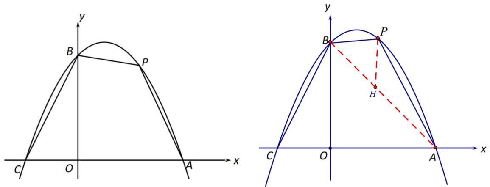

【思路分析】先分离出面积为定值的 $\triangle A B C$ $\triangle A B C$ 面积为 12  
设 $P ( m , - \frac { 1 } { 2 } m ^ { 2 } + m + 4 )$ ， $H ( m , - m + 4 )$   
$P H = - \frac { 1 } { 2 } m ^ { 2 } + 2 m$ (上面的点减去下面的点)  
当m  $m = - { \frac { b } { 2 a } } = 2$ 时， $P H$ 取最大值 2，此时△APB 面积为： $S { = } { \frac { 1 } { 2 } } P H \cdot A O { = } 4 ( A O$ 是△PBH，△PAH  
两个三角形高之和)

（3） （☆）若 $P$ 在直线 $A B$ 上方，作 $P F \bot A B$ ， $F$ 在线段 $A B$ 上，求 $P F$ 最大值

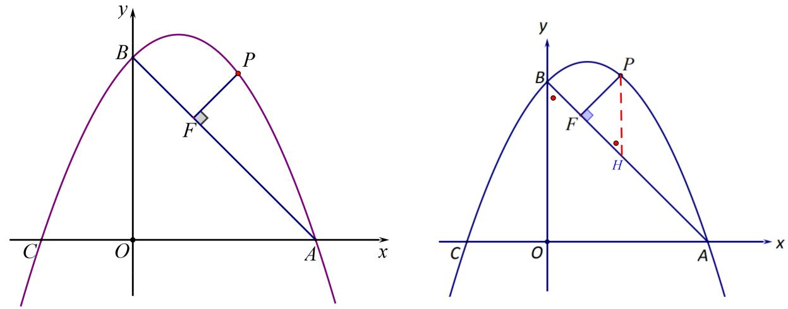

【答案】 2

【思路分析 $\mathbf { \lambda } _ { \mathbf { { l } } }$ 过 $P$ 作 $P H$ 平行 $y$ 轴， $H$ 在 $A B$ 上导角可知 $\triangle P F H { \sim } \triangle A O B$ 为等腰直角三角形， $P H$ 取最大时， $P F$ 也取到最大（4） $( \star )$ 若 $P$ 在直线 $A B$ 上方，作 $P F \bot A B$ ，交线段 AB 于 $F$ ，作 $P E / / y$ 轴交 $A B$ 于 $E$ ，求 $\triangle P E F$ 周长和面积的最大值

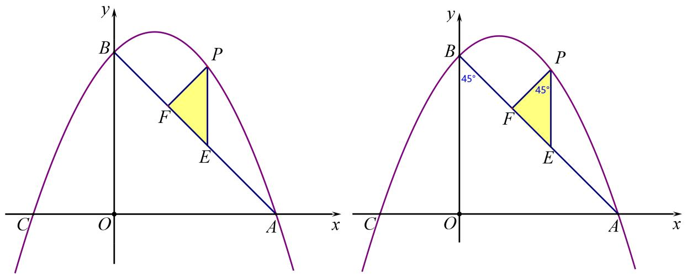

【答案】 $2 + 2 \sqrt { 2 }$ 和 1

【思路分析】△PEF 形状固定， $P F = F E = { \frac { \sqrt { 2 } } { 2 } } P E$ （5） 若 $P$ 在直线 AB 上方，连接 $O P$ ，交 $A B$ 于 $D$ ，求 $\frac { P D } { O D }$ 的最大值

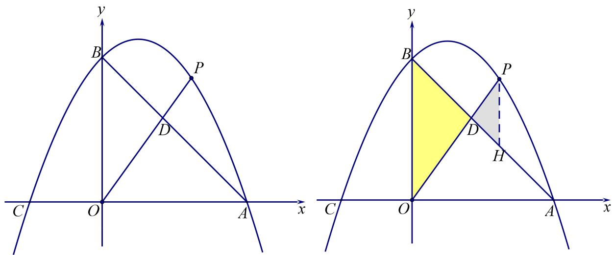

【答案】

【思路分析】化斜为直，平行线，构造 8 字相似转换 ${ \frac { P D } { O D } } { = } { \frac { P H } { B O } }$ （6） （★☆）若 $P$ 在直线 $A B$ 上方，连接 $C P$ ，交 $A B$ 于 $D$ ，△PDA 面积为 $S _ { 1 }$ ， $\triangle C D A$ 面积为 $S _ { 2 }$ ，求 $\frac { S _ { 2 } } { S _ { 1 } }$ 的最小值

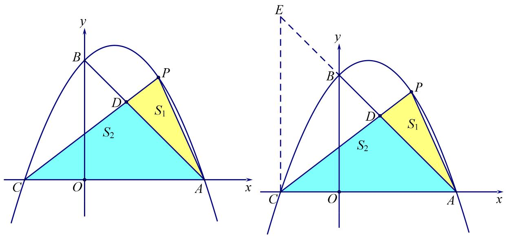

【答案】 13

【思路分析】化斜为自

第一步：面积比转换为共线的边之比 $\frac { S _ { 2 } } { S _ { 1 } } { = } \frac { C D } { P D }$ 第二步：构造，共线的边之比转换成平行边之比 $\frac { C D } { P D } = \frac { C G } { P H } = \frac { 6 } { P H }$ （7） （★☆）点 $D$ 是点 $B$ 关于关于 $\boldsymbol { x }$ 轴的对称点，连接 $C D$ ，点 $P$ 是第一象限上一点，求△PCD 面积最大值

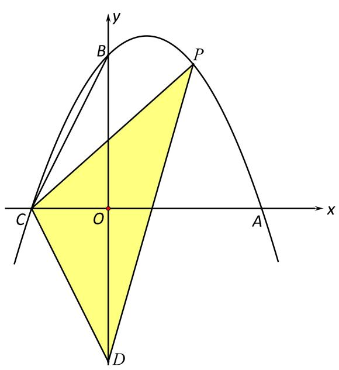

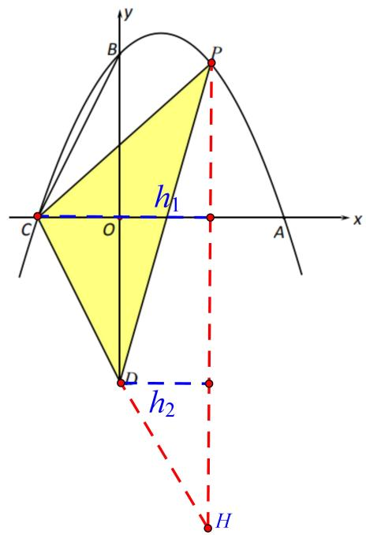

【答案】12【思路分析】

过动点 $P$ 作 $y$ 轴平行线交对边(延长)于点 $H$ $S _ { \triangle P C D } = S _ { \triangle P C H } - S _ { \triangle P D M } = \frac { 1 } { 2 } P H \cdot C O = P H = - \frac { 1 } { 2 } m ^ { 2 } + 3 m + 8 \leq \frac { 2 5 } { 2 }$ 推导过程如下：以 $P H$ 为底，设△PHC 的高为 $h 1$ ，△PDH 的高为 $h _ { 2 }$ $\frac { 1 } { 2 } P H \cdot h _ { 1 } - \frac { 1 } { 2 } P M \cdot h _ { 2 } = \frac { 1 } { 2 } P H \cdot ( h _ { 1 } - h _ { 2 } ) = \frac { 1 } { 2 } P H \cdot C O$

# 【几何构造最值篇】

（8） （☆）点 $E$ 是对称轴与 $\boldsymbol { x }$ 轴交点，过 $E$ 作一条任意直线 $l ,$ ，（点 $B$ 、 $C$ 分别在直线 l 的异侧），设 $\boldsymbol { C } , \boldsymbol { B }$ 两点到直线 $l$ 的距离分别为 $m , ~ n$ ，求 $m + n$ 的最大值

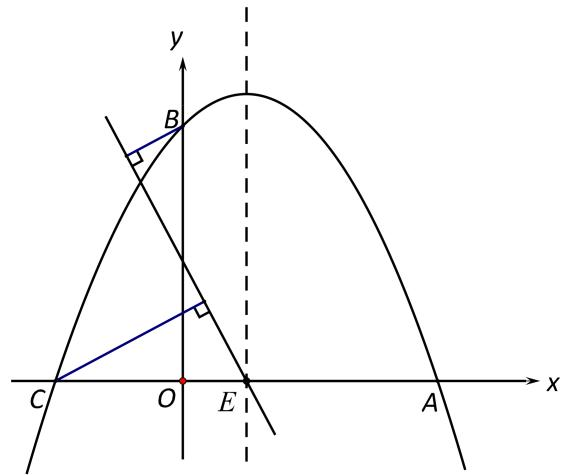

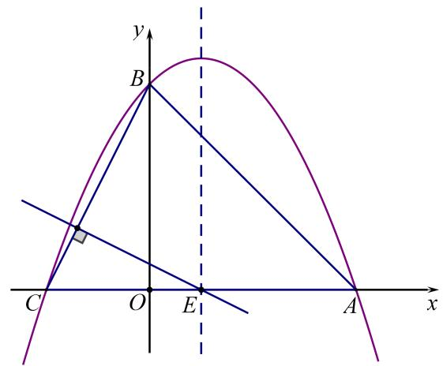

【答案】2 5

【思路分析】 $m + n \geq B C$

特殊位置时有最小值，大多数题目都是共线时有最值，所以要重点去分析共线时的情况

（9） （☆）已知线段 $B C$ 上有两点 $E ( 1 , \ 3 )$ ， $F ( 3 , \quad 1 )$ ，试在 $\boldsymbol { x }$ ， $y$ 轴上有两动点 $M$ 和 $N$ ，使得四边形 FMNE 周长最小。

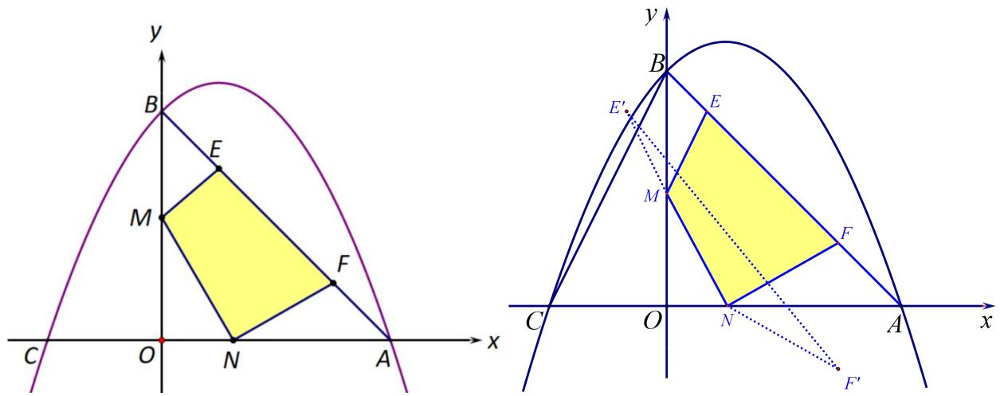

【答案】 $2 \sqrt { 5 }$

【思路分析】作两次对称即可，普通将军饮马问题， $E M + M N + F N = E ^ { \prime } M + M N + N F ^ { \prime } { \geq } E ^ { \prime } F ^ { \prime }$

（10） （★）若 $y$ 轴上有两点 $M$ （0， $a$ ）和 $N$ （0， $a + 2$ ），求△CMN 周长的最小值

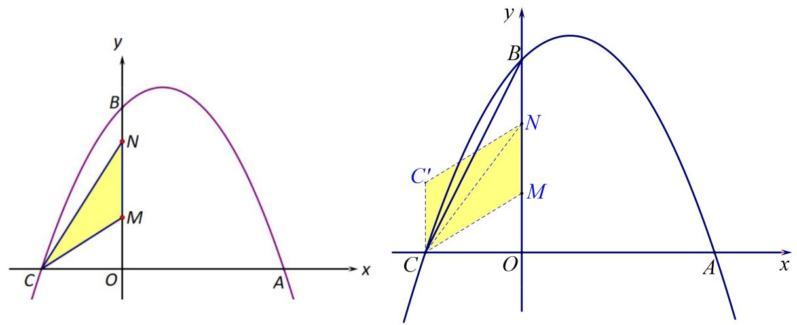

【答案】 $2 { + } 2 { \sqrt { 5 } }$

【思路分析】造桥选址问题， $C$ 点向上平移 2个单位，得到平行四边形CC'NM ，故 $C M + C N = C ^ { \prime } N + C N$ ，接下来就是常规的将军饮马了

（11） （★☆）点 $D$ 为抛物线顶点，直线 $A D$ 上有一点 $Q$ ，连接 $B Q$ ，将△BDQ 沿 BQ 折叠得 $\triangle B D ^ { \prime } Q$ ，

$\textcircled{1}$ 求 $O D '$ 的最小值

$\textcircled{2}$ 连接 $O D '$ ， $M$ 是线段 $O D$ ’的中点，求 AM 的最小值

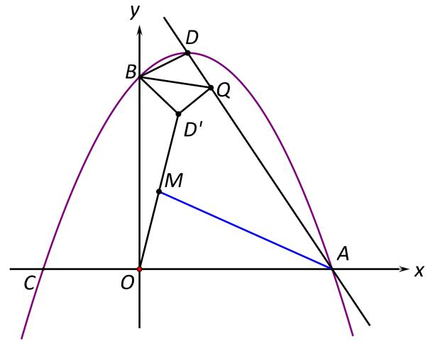

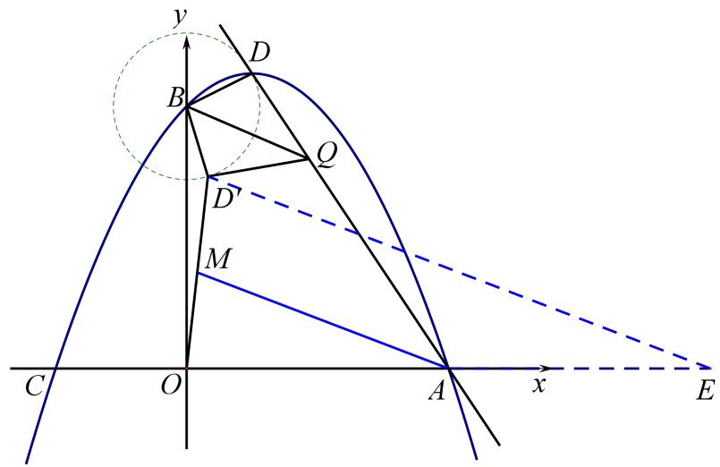

【答案】①4－ 5 ；② $\textcircled { 2 } \frac { 9 \sqrt { 5 } } { 8 }$

【思路分析】 $( 1 ) D ^ { \prime }$ 轨迹为圆（2）把 A 点变为中点，则 AM 是中位线，点圆最值问题

（12） （ $( \star \star \sf _ { A } )$ （隐圆）若在第一象限的抛物线下方有一动点 $D$ ，满足 $D A { = } O A$ ，过 $D$ 作 $D E \bot x$ 轴于点 $E$ ，设 $\triangle A D E$ 的内心为 $I$ ，试求 $B I$ 的最小值

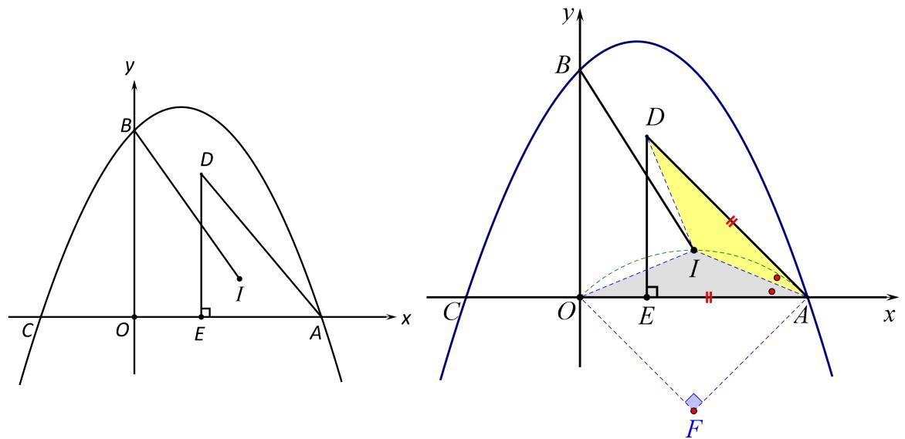

【答案】 ${ \sqrt { 1 0 } } - 2 { \sqrt { 2 } }$

【思路分析】易知△ADI≌△AOI(SAS)， $\angle A I D = \angle A I O = 1 3 5 ^ { \circ }$ ，而 $O A$ 为定线段则点 $I$ 在以 $O A$ 为弦，所含的圆周角等于 $1 3 5 ^ { \circ }$ 的圆弧上，设该圆的圆心为 $F$ ，连接 $F O$ ， $F A$ ， $\angle O F A$ $= 9 0 ^ { \circ }$ °，故 $r = { \frac { \sqrt { 2 } } { 2 } } A O = 2 { \sqrt { 2 } }$ ， $B I \geq B F - r = \sqrt { 1 0 } - 2 \sqrt { 2 }$

# 【构造二次函数模型求最值】

（13） （☆） $P$ 在第一象限，作 $P Q / / x$ 轴交抛物线于 $Q$ ，过 $P$ 、 $Q$ 作 $\boldsymbol { x }$ 轴垂线交 $\boldsymbol { x }$ 轴于 $H , ~ G$ 两点，资料整理【淘宝店铺：向阳百分百】

求矩形 PQGH 周长的最大值

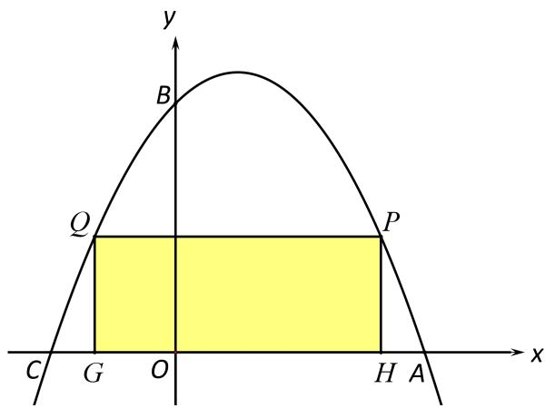

【答案】13

【思路分析】设点坐标，用字母表示长和宽设 $P { \bigg ( } a , \ - { \frac { 1 } { 2 } } a ^ { 2 } + a + 4 { \bigg ) }$ , 则 $P H = - \frac { 1 } { 2 } a ^ { 2 } + a + 4$ ， 而 $P$ 和 $Q$ 点到对称轴的距离为 $a - 1$ ，则$P Q = 2 a - 2$ ，PQGH 的周长为： $2 { \big ( } P Q + P H { \big ) } = 4 a - 4 - a ^ { 2 } + 2 a + 8 = - a ^ { 2 } + 6 a + 4 = - { \big ( } a - 3 { \big ) } ^ { 2 } + 1 3 \leq 1 3$ （14） （★）在线段 $A C$ 上有一点 $D$ ， $A B$ 上有一点 $E$ ，且 $D E / / B C$ ，求△BDE 面积的最大值

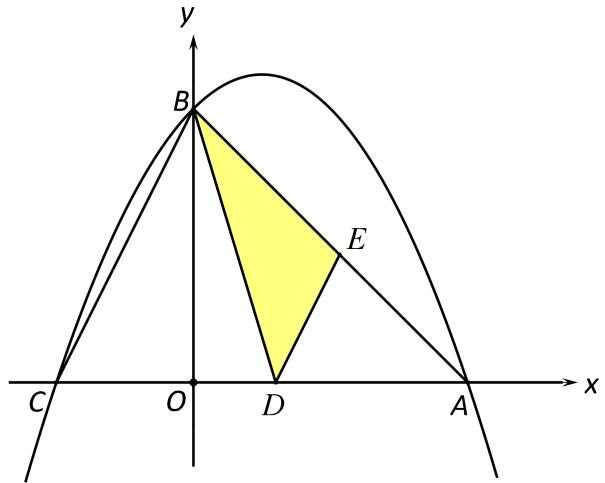

【答案】3

【思路分析】易知 $\triangle A D E \sim \triangle A C B$ ，利用相似比得出高之比设 $A D { = } 3 m$ ，则 $E$ 点到 $\boldsymbol { x }$ 轴的距离为 $2 m$ ， $\triangle B D E$ 的面积为： $\frac { 1 } { 2 } \times 3 m \left( 4 - 2 m \right) = 3 m \left( 2 - m \right) \leq 3$ （15） （★★☆） $P$ 是第一象限上一点，线段 $P C$ 交 $B C$ 于点 $D$ ，交 $y$ 轴于点 $E$ ， $\triangle A D P$ 和△BDE 的面积分别为 $S _ { 1 }$ 、 $S _ { 2 }$ ，求 $S _ { 1 } { - } S _ { 2 }$ 的最大值

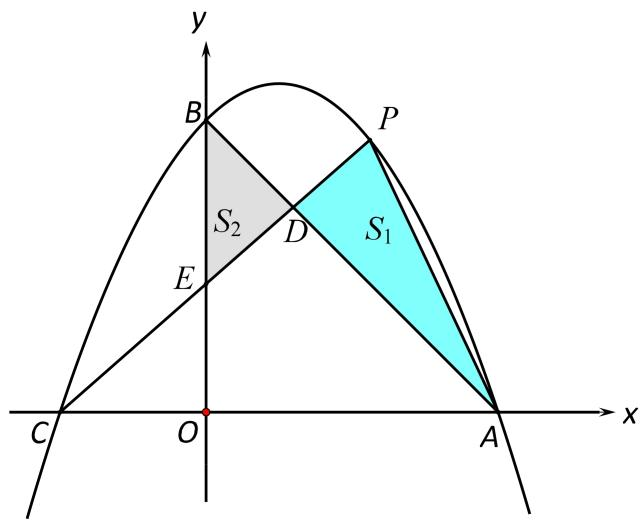

【答案】 $\frac { 8 } { 3 }$

$P \left( a , \mathrm { ~ } - \frac { 1 } { 2 } a ^ { 2 } + a + 4 \right) , E O = \frac { 2 } { a + 2 } \cdot y _ { p } = \frac { - a ^ { 2 } + 2 a + 8 } { a + 2 } = - a + 4$ 则 $B E = a$ $a , S _ { 1 } - S _ { 2 } = S _ { \scriptscriptstyle \Delta P A C } - S _ { \scriptscriptstyle \Delta B O C } - S _ { \scriptscriptstyle \Delta E O C } = \frac { 1 } { 2 } A C \cdot y _ { p } - 8 - \left( 4 - a \right) = - \frac { 3 } { 2 } a ^ { 2 } + 4 a \leq \frac { 8 } { 3 }$ （16） （★★☆）抛物线对称交抛物线于点 $D$ ，交 $\boldsymbol { x }$ 轴于点 $E , \ M$ 是线段 $D E$ 上的动点，$N ( n , \ \mathrm { ~ 0 ~ } )$ 为 $\boldsymbol { x }$ 轴上一点，且 $B M \bot N M$ ．

$\textcircled{1}$ 求 $n$ 的变化范围

$\textcircled{2}$ 当 $n$ 取最大值时，将直线 BN 向上平移 $t$ 个单位，使线段 $B N$ 与抛物线有两个交点，求 $t$ 的取值范围．

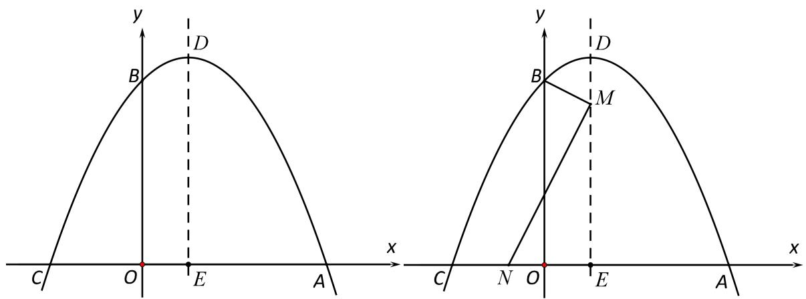

【答案】（1） $- 3 \leq n \leq 3 . 2 5$ ，（2） $\frac { 6 3 } { 3 2 } \leq t < 2$ 【思路分析】 $\textcircled{1}$ 由勾股定理构造出关于 $n$ 的函数模型，【详解】 $\textcircled{1}$ 设 $M$ 坐标为 $( 1 , ~ m )$ $\therefore N M ^ { 2 } + B M ^ { 2 } = B N ^ { 2 } , \therefore ( n - 1 ) ^ { 2 } + m ^ { 2 } + 1 + ( m - 4 ) ^ { 2 } = n ^ { 2 } + 4 ^ { 2 }$

整理得： $n = m ^ { 2 } - 4 m + 1 = ( m - 2 ) ^ { 2 } - 3$ ，由 $0 \leq m \leq 4 . 5$ 可知 ， $- 3 \leq n \leq 3 . 2 5$   
${ \textcircled { 2 } } y = - 2 x + { \frac { 1 3 } { 2 } } \Rightarrow$ 设平移后： $y = - 2 x + 6 . 5 + t$   
分析：向上平移当 $N$ 点落在抛物线上时，恰好有 2个交点，  
此时 $N$ 点坐标为 $( \frac { 1 3 } { 4 } , \frac { 6 3 } { 3 2 } )$ ，则 $t = \frac { 6 3 } { 3 2 }$   
继续向上平移，当 $\triangle = 0$ ，此时只有一个交点  
$- 2 x + 6 . 5 + t = \frac { 1 } { 2 } x ^ { 2 } + x + 4$   
$- { \frac { 1 } { 2 } } x ^ { 2 } + 3 x + { \frac { 5 } { 2 } } + t = 0$   
$\Delta = 9 + 2 ( - \frac { 5 } { 2 } - t ) = 0 \Rightarrow t = 2$   
综上 $\frac { 6 3 } { 3 2 } \leq t < 2$

# 【加权线段最值】

（17） （ ） 若 $y$ 轴上有一动点 $M$ ，求 $A M + \frac { \sqrt { 5 } } { 5 } B M$ 的最小值及 $M$ 点坐标

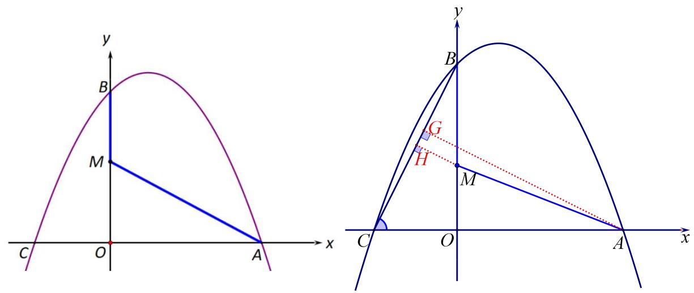

【答案】 $\frac { 1 2 { \sqrt { 5 } } } { 5 }$ ， $M$ （0，2）

【思路分析】胡不归问题，作垂直代换加权线段即可作 MH⊥BC 于 $H$ ，则 $A M + { \frac { \sqrt { 5 } } { 5 } } B M = A M + M L \geq A G$ ， $_ { A G }$ 即所求

【法一：等面积】 $A G = { \frac { 2 S _ { \Delta A B C } } { B C } } = { \frac { A C \cdot B O } { C B } }$ ，再由相似求出 $M$ 点坐标

法二：tan $\angle B C O = 2 \Rightarrow { \frac { A G } { C G } } = 2 \Rightarrow { \frac { A G } { A C } } = { \frac { 2 { \sqrt { 5 } } } { 5 } }$ 再由三角函数求 $M$ 点坐标

法三：求出 $_ { A G }$ 解析式

（18） $( \star )$ 若动点 $D$ 从点 $A$ 出发先以 $V _ { 1 }$ 的速度朝 $\boldsymbol { x }$ 轴负方向运动到 $G$ ，再以 $V _ { 2 }$ 的速度向 $B$ 点运动，且 $V _ { \mathrm { 1 } } { } = ~ 2 V _ { \mathrm { 2 } }$ ，当运动时间最短时，求点 $G$ 的坐标（ $V _ { 1 }$ 为定值）

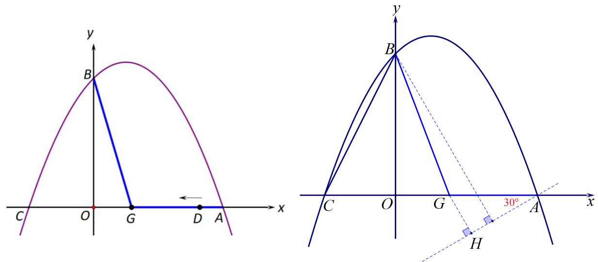

【答案】 $\left( { \frac { 4 { \sqrt { 3 } } } { 3 } } , 0 \right)$

【思路分析】还是胡不归问题，只不过需要翻译成加权线段和

【简析】设运动总时间为 $t$ ， $t = { \frac { A G } { V _ { 1 } } } + { \frac { B G } { V _ { 2 } } } = { \frac { A G } { 2 V _ { 1 } } } + { \frac { B G } { V _ { 2 } } } = { \frac { 1 } { V _ { 2 } } } { \left( { \frac { 1 } { 2 } } A G + B G \right) }$ 以 A 为顶点，在 $\boldsymbol { x }$ 轴下方构造一个 $3 0 ^ { \circ }$ 的角，作垂线即可进行代换， ${ \frac { 1 } { 2 } } A G = G H$ ，当 $O G = { \frac { B O } { \sqrt { 3 } } } = { \frac { 4 { \sqrt { 3 } } } { 3 } }$ 时取到最小值

（19） （☆☆）将线段 CO 绕 $o$ 点进行旋转，得线段 $C O$ ，在旋转过程中，求 $A C ^ { \prime } + { \frac { 1 } { 2 } } B C ^ { \prime }$ 的最小值．

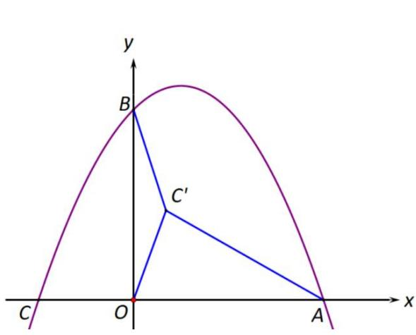

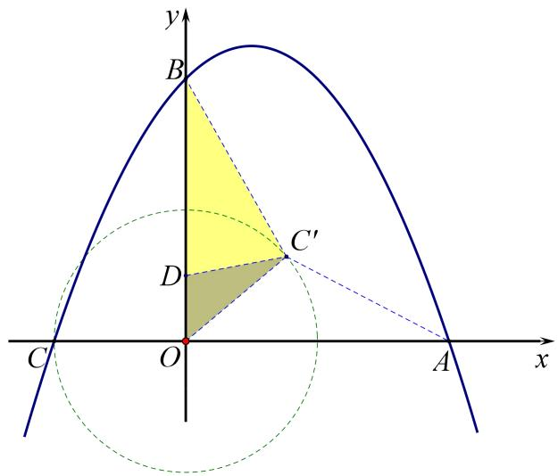

【答案】 $\sqrt { 2 6 }$

【思路分析】通过构造子母型相似代换 ${ \frac { 1 } { 2 } } B C ^ { \prime }$ ，阿氏圆模型取点 $D \big ( 0 , 1 \big )$ ，通过 SAS 可知 $\triangle O D C ^ { \prime } \sim \triangle O C ^ { \prime } B$ ，相似比为 2，故 ${ \frac { 1 } { 2 } } B C ^ { \prime } = D C ^ { \prime }$ ，$A C ^ { \prime } + { \frac { 1 } { 2 } } B C ^ { \prime } = A C ^ { \prime } + D C ^ { \prime } \geq A D = { \sqrt { 2 6 } }$

（20） （★☆）点 $D$ （3，4）， $G$ 是 $\boldsymbol { x }$ 轴上一动点，求 $G D - { \frac { \sqrt { 2 } } { 2 } } A G$ 的最小值

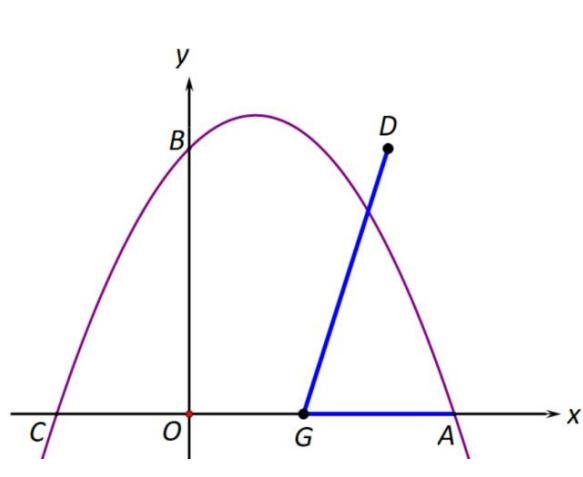

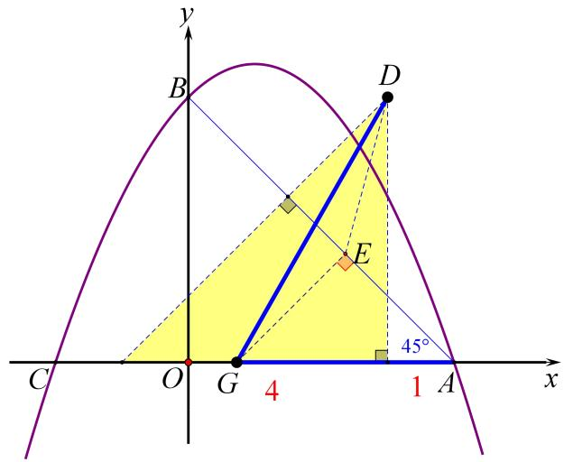

【答案】 $\frac { 3 { \sqrt { 2 } } } { 2 }$

【思路分析】相减型胡不归，反方向构造相关角

如图，作 $G E \bot A B$ 于 $E$ ，易知 ${ \frac { \sqrt { 2 } } { 2 } } A G = G E$ ， $G D - \frac { \sqrt { 2 } } { 2 } A G = G D - G E \leq D E ,$ ，当 G，D， $E$ 三点共线时取到最小值，此时 $D E \bot A B$ ， DG  4 2 ， $D E = { \frac { A G } { \sqrt { 2 } } } = { \frac { 5 { \sqrt { 2 } } } { 2 } }$

# 核心·题型

# 题型一 【铅垂高系列】

# 2023·四川凉山·中考真题

1．如图，已知抛物线与 $x$ 轴交于 $A \left( 1 , 0 \right)$ 和 $B \left( - 5 , 0 \right)$ 两点，与 $y$ 轴交于点 $C$ ．直线 $y = - 3 x + 3$ 过抛物 线的顶点 $P$ ．

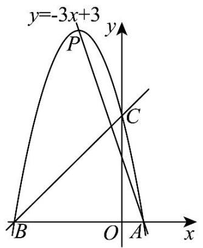

(1)求抛物线的函数解析式；

(2)若直线 $x = m \left( - 5 < m < 0 \right)$ 与抛物线交于点 $E$ ，与直线 $B C$ 交于点 $F$ ， $E F$ 取得最大值时，求 $m$ 的值和 $E F$ 的最大值

【答案】 $y = - x ^ { 2 } - 4 x + 5$

$( 2 ) \textcircled{ 1 }$ 当 $m = - \frac { 5 } { 2 }$ 时， $E F$ 有最大值，最大值为 $\frac { 2 5 } { 4 }$ ； ② 3，8 或 4，5 或 $\left( { \sqrt { 2 } } - 5 , 6 { \sqrt { 2 } } - 2 \right)$

【分析】（1）利用待定系数法求解即可；

（2）先求出 $C \left( 0 , 5 \right)$ ，进而求出直线 $B C$ 的解析式为 $y = x + 5$ ，则 $E \left( m , - m ^ { 2 } - 4 m + 5 \right)$ ， $F { \left( \begin{array} { l l } { m } & { m + 5 } \end{array} \right) } ~ ;$ 进一步求出 $E F = - \left( m + { \frac { 5 } { 2 } } \right) ^ { 2 } + { \frac { 2 5 } { 4 } }$ 由此即可利用二次函数的性质求出答案

【详解】（1）解：∵抛物线与 $x$ 轴交于 $A \left( 1 , 0 \right) { \acute { \ast } } \approx B \left( - 5 , 0 \right)$ 两点，  
∴抛物线对称轴为直线 $x = { \frac { - 5 + 1 } { 2 } } = - 2$ ，  
在 $y = - 3 x + 3$ 中，当 $x = - 2$ 时， $y = 9$ ，  
资料整理【淘宝店铺：向阳百分百】  
∴抛物线顶点 $\cdot$ 的坐标为2，9，  
设抛物线解析式为 $y = a \left( x + 2 \right) ^ { 2 } + 9$ ，  
$a \left( 1 + 2 \right) ^ { 2 } + 9 = 0 \qquad a = - 1$ ，  
∴抛物线解析式为 $y = - { \big ( } x + 2 { \big ) } ^ { 2 } + 9 = - x ^ { 2 } - 4 x + 5$ （2）解：∵抛物线解析式为 $y = - x ^ { 2 } - 4 x + 5$ ，点 $\cdot$ 是抛物线与 $\cdot$ 轴的交点，$C ( 0 , 5 )$ ，设直线 $B C$ 的解析式为 $y = k x + b _ { 1 }$ ，  
$\begin{array} { l } { { \left\{ ^ { - 5 k + b _ { 1 } } _ { } = 0 \qquad \right\} } k = 1 } \\ { { b _ { 1 } = 5 \qquad } } \end{array} \qquad \left\{ ^ { k = 1 } \begin{array} { l } { { \qquad \left\{ k _ { } = 1 \atop { b = 5 } \right. } }  \\ { { \qquad \left\{ b = 5 \atop { b = 5 } \right. } }  \end{array} \right.$   
∴直线 $B C$ 的解析式为 $y = x + 5$ ，  
∵直线 $x = m \left( - 5 < m < 0 \right)$ 与抛物线交于点 $E$ ，与直线 $B C$ 交于点 $F$   
$E { \big ( } m , - m ^ { 2 } - 4 m + 5 { \big ) } , F { \big ( } m  m + 5 { \big ) }$   
$E F = - m ^ { 2 } - 4 m + 5 - \left( m + 5 \right) = - m ^ { 2 } - 5 m = - \left( m + \frac { 5 } { 2 } \right) ^ { 2 } + \frac { 2 5 } { 4 }$   
∵ $- 1 < 0$ ，∴当 $m = - \frac { 5 } { 2 }$ 时， $E F$ 有最大值，最大值为 $\frac { 2 5 } { 4 }$ ；

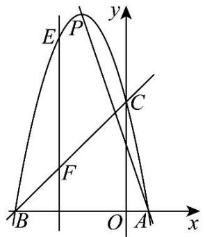

2022·广东·统考中考真题）如图，抛物线 $y = x ^ { 2 } + b x + c$ （b， $c$ 是常数）的顶点为 $C$ ，与 $x$ 轴交于 $A$ ，$B$ 两点， $A \left( 1 , 0 \right)$ ， $A B = 4$ ，点 $P$ 为线段 $A B$ 上的动点，过 $P$ 作 $P Q / / B C$ 交 $A C$ 于点 $\mathcal { Q }$

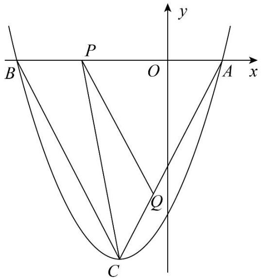

(1)求该抛物线的解析式；

(2)求 ${ \triangle } C P Q$ 面积的最大值，并求此时 $P$ 点坐标【答案】(1) $) y = x ^ { 2 } + 2 x - 3$ (2)2； $\cdot$ （-1，0）

【分析】（1）用待定系数法将 $A$ ， $\cdot$ 的坐标代入函数一般式中，即可求出函数的解析式；

（2）分别求出 $C$ 点坐标，直线 $\cdot$ ， $\cdot$ 的解析式， $P Q$ 的解析式为： $\cdot$ ，进而求出 $\cdot$ ， $\mathcal { Q }$ 的坐 标以及 $n$ 的取值范围，由 $S _ { \triangle C P Q } = S _ { \triangle C P A } - S _ { \triangle A P Q }$ 列出函数式求解即可

【详解】（1）解：∵点 $\cdot$ （1，0）， $A B { = } 4$ ，  
∴点 $\cdot$ 的坐标为（-3，0），  
将点 $\cdot$ （1，0）， $\cdot$ （-3，0）代入函数解析式中得：$\left\{ \begin{array} { l l } { 0 = 1 + b + c } \\ { 0 = 9 - 3 b + c } \end{array} \right.$   
解得： $\cdot$ ， $c { = } { - } 3$ ，  
∴抛物线的解析式为 $y = x ^ { 2 } + 2 x - 3$ ；  
（2）解：由（1）得抛物线的解析式为 $y = x ^ { 2 } + 2 x - 3$ ，  
顶点式为： $y = ( x + I ) ^ { 2 } - 4$ ，  
则 $\cdot$ 点坐标为：（-1，-4），  
由 $\cdot$ （-3，0）， $C$ （-1，-4）可求直线 $\cdot$ 的解析式为： $\cdot$ ，  
由 $A$ （1，0）， $\cdot$ （-1，-4）可求直线 $\cdot$ 的解析式为： $\cdot$ ，  
∵PQ∥BC，  
设直线 $P Q$ 的解析式为： $\cdot$ ，与 $\cdot$ 轴交点 $P \left( { \frac { n } { 2 } } , 0 \right)$   
由 $\left\{ \begin{array} { l l } { y = - 2 x + n } \\ { y = 2 x - 2 } \end{array} \right.$ 解得： $Q \left( { \frac { n + 2 } { 4 } } , { \frac { n - 2 } { 2 } } \right)$ ,  
∵ $\cdot$ 在线段 $\cdot$ 上，  
$- 3 < \frac { n } { 2 } < 1$ ，  
∴ $\cdot$ 的取值范围为 $\scriptstyle - 6 < n < 2$ ，  
则 $S _ { \triangle C P Q } = S _ { \triangle C P A } - S _ { \triangle A P Q }$   
$\begin{array} { l } { { = { \displaystyle \frac { 1 } { 2 } } \times \left( 1 - { \frac { n } { 2 } } \right) \times 4 - { \frac { 1 } { 2 } } \times \left( 1 - { \frac { n } { 2 } } \right) \times \left( - { \frac { n - 2 } { 2 } } \right) } } \\ { { = - { \displaystyle \frac { 1 } { 8 } } { \big ( } n + 2 { \big ) } ^ { 2 } + 2 } } \end{array}$   
∴当 $n { = } { - } 2$ 时，即 $P$ （-1，0）时， $S _ { \triangle C P Q }$ 最大，最大值为 2．

# 2022·天津·中考真题

2．已知抛物线 $y = a x ^ { 2 } + b x + c$ （a， $^ { b }$ ， $c$ 是常数， $a > 0$ ）的顶点为 $P$ ，与 $x$ 轴相交于点 $A ( - 1 , 0 )$ 和点$B$ ．

(1)若 $b = - 2 , c = - 3$ ，  
$\textcircled{1}$ 求点 $P$ 的坐标；  
$\textcircled{2}$ 直线 $x = m$ （ $m$ 是常数， $1 < m < 3$ ）与抛物线相交于点 $M$ ，与 $B P$ 相交于点 $G$ ，当 $_ { M G }$ 取得最大值时，求点 $M$ ， $G$ 的坐标

【答案】 $( 1 ) \textcircled { 1 } ( 1 , - 4 )$ ； $\textcircled{2}$ 点 $M$ 的坐标为 $( 2 , - 3 )$ ，点 $\cdot$ 的坐标为 (2,2) ；

【分析】（1） $\textcircled{1}$ 将 $b$ 、 $\cdot$ 的值代入解析式，再将 $\cdot$ 点坐标代入解析式即可求出 $\cdot$ 的值，再用配方法求出顶点坐标即可； $\textcircled{2}$ 先令 $\cdot$ 得到 $\cdot$ 点坐标，再求出直线 $B P$ 的解析式，设点 $\cdot$ 的坐标为$\left( m , m ^ { 2 } - 2 m - 3 \right)$ ，则点 $G$ 的坐标为 $( m , 2 m - 6 )$ ，再表示出 $\cdot$ 的长，配方求出最值得到 $M$ 、 $G$ 的坐标；

（2）根据 $3 b = 2 c$ ，解析式经过 $\cdot$ 点，可得到解析式： $y = a x ^ { 2 } - 2 a x - 3 a$ ，再表示出 $P$ 点坐标， $\cdot$ 点坐标，接着作点 $P$ 关于 $\cdot$ 轴的对称点 $P ^ { \prime }$ ，作点 $N$ 关于 $\cdot$ 轴的对称点 $N ^ { \prime }$ ，再把 $P ^ { \prime }$ 和 $N ^ { \prime }$ 的坐标表示出来，由题意可知，当 $P F + F E + E N$ 取得最小值，此时 $P F + F E + E N = P ^ { \prime } N ^ { \prime } = 5$ ，将字母代入可得：$P ^ { \prime } N ^ { \prime 2 } = P ^ { \prime } H ^ { 2 } + H N ^ { \prime 2 } = 9 + 4 9 a ^ { 2 } = 2 5$ ，求出 $a$ 的值，即可得到 $\cdot$ 、 $F$ 的坐标；

【详解】（1） $\textcircled{1}$ ∵抛物线 $y = a x ^ { 2 } + b x + c$ 与 $x$ 轴相交于点 $A ( - 1 , 0 )$ ，$\textstyle a - b + c = 0$ ．又 $b = - 2 , c = - 3$ ，得 $a = 1$   
∴抛物线的解析式为 $y { = } x ^ { 2 } - 2 x - 3$   
∵ $y = x ^ { 2 } - 2 x - 3 = ( x - 1 ) ^ { 2 } - 4$ ，  
∴点 $\cdot$ 的坐标为 $( 1 , - 4 )$   
$\cdot$ 当 $y = 0$ 时，由 $x ^ { 2 } - 2 x - 3 = 0$ ，  
解得 $x _ { 1 } = - 1 , x _ { 2 } = 3$   
∴点 $B$ 的坐标为(3，0)  
设经过 $\cdot$ ， $\cdot$ 两点的直线的解析式为 $y = k x + n$ ，  
有 $\left\{ { \begin{array} { l } { 3 k + n = 0 , } \\ { k + n = - 4 . } \end{array} } \right.$ 解得 $\left\{ { { k = 2 } , \atop { n = - 6 . } } \right.$ .  
∴直线 $B P$ 的解析式为 $y = 2 x - 6$

∵直线 $x = m$ （ $\cdot$ 是常数， $1 < m < 3$ ）与抛物线 $y { = } x ^ { 2 } - 2 x - 3$ 相交于点 $M$ ，与 $B P$ 相交于点 $\cdot$ ，如图所示：

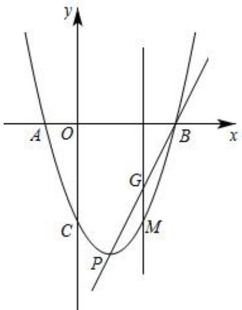

∴点 $\cdot$ 的坐标为 $\left( m , m ^ { 2 } - 2 m - 3 \right)$ ，点 $\cdot$ 的坐标为 $( m , 2 m - 6 )$ $M G = ( 2 m - 6 ) - \left( m ^ { 2 } - 2 m - 3 \right) = - m ^ { 2 } + 4 m - 3 = - ( m - 2 ) ^ { 2 } + 1$ ∴当 $m = 2$ 时， $_ { M G }$ 有最大值 1此时，点 $\cdot$ 的坐标为(2,3)，点 $\cdot$ 的坐标为 $( 2 , - 2 )$

# 2022·湖北襄阳·统考中考真题

3．在平面直角坐标系中，直线 $y = m x - 2 m$ 与 $x$ 轴， $y$ 轴分别交于 $A$ ， $B$ 两点，顶点为 $D$ 的抛物线 $y$ $= - x ^ { 2 } + 2 m x - m ^ { 2 } + 2$ 与 $y$ 轴交于点 $C$ ．

(1)如图，当 $m = 2$ 时，点 $P$ 是抛物线 $C D$ 段上的一个动点

$\textcircled{1}$ 求 $A$ ， $B$ ， $C$ ， $D$ 四点的坐标；  
$\textcircled{2}$ 当 $\triangle P A B$ 面积最大时，求点 $P$ 的坐标；  
【答案】（1）∵直线 $y = m x - 2 m$ 与 $\cdot$ 轴， $y$ 轴分别交于 $\cdot$ ， $\cdot$ 两点，  
∴A（2，0）， $B$ （0， $\phantom { } - 2 m ,$ ）  
$y = - x ^ { 2 } + 2 m x - m ^ { 2 } + 2 = - ( x - m ) ^ { 2 } + 2$ ，  
∴抛物线的顶点坐标是 $D$ （ $\cdot$ ）

资料整理【淘宝店铺：向阳百分百】

令 $\scriptstyle x = 0$ ，则 $y = - m ^ { 2 } + 2$ ，  
$\therefore C ( 0 , - m ^ { 2 } + 2 )$ ．  
$\cdot$ 当 $m { = } 2$ 时， $- 2 m = - 4$ ，则 $- m ^ { 2 } + 2 = - 2$ ，  
∴点 $\cdot$ （0，-4）， $C$ （0，-2）， $D$ （2，2）；  
$\textcircled{2}$ 由上可知，直线 $\cdot$ 的解析式为 $y = 2 x - 4$ ，抛物线的解析式为 $y = - x ^ { 2 } + 4 x - 2$ ，如图，过点 $\cdot$ 作 $P E / / \ y$ 轴交直线 $A B$ 于点 $E$   
设点 $\cdot$ 的横坐标为 $\cdot$ ，  
$\therefore P ( t , - t ^ { 2 } + 4 t - 2 ) , E ( t , 2 t - 4 ) ,$   
$\therefore P E = - t ^ { 2 } + 4 t - 2 - ( 2 t - 4 ) = - t ^ { 2 } + 2 t + 2 ,$ ，  
∴△PAB 的面积 ${ \frac { 1 } { 2 } } \times ( 2 - 0 ) \times ( - t ^ { 2 } + 2 t + 2 ) = - ( t - 1 ) ^ { 2 } + 3$   
∵ $\cdot _ { - 1 } < 0$ ，∴当 $\cdot$ 时， $\triangle P A B$ 的面积的最大值为 3，此时 $\cdot$ （1，1）

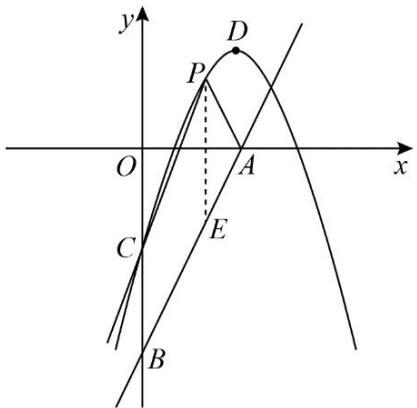

# 2023·湖南娄底·中考真题

4．如图，抛物线 $y = x ^ { 2 } + b x + c$ 过点 $A { \big ( } { - } 1 , 0 { \big ) }$ 、点 $B \left( 5 , 0 \right)$ ，交 $y$ 轴于 点 $C$ ．

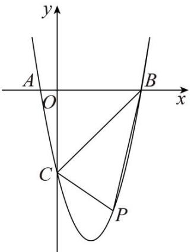

(1)求 $^ { b }$ ， $c$ 的值

(2)点 $P \big ( x _ { 0 } , y _ { 0 } \big ) \big ( 0 < x _ { 0 } < 5 \big )$ 是抛物线上的动点,当 $x _ { 0 }$ 取何值时，PBC的面积最大？并求出 ${ \triangle } P B C$ 面积的最大值.

【答案】 $b = - 4$ ， $c = - 5$ 资料整理【淘宝店铺：向阳百分百】(2)当 $x _ { 0 } = \frac { 5 } { 2 }$ 时， $\triangle \mathrm { P B C }$ 的面积由最大值，最大值为 $\frac { 1 2 5 } { 8 }$ 【分析】（1）将将 $A { \bigl ( } { - } 1 , 0 { \bigr ) }$ 、 $B \left( 5 , 0 \right)$ 代入抛物线 $y = x ^ { 2 } + b x + c$ 即可求解；（2）由（1）可知： $y = x ^ { 2 } - 4 x - 5$ ，得 $C ( 0 , - 5 )$ ，可求得 $B C$ 的解析式为 $y = x - 5$ ，过点 $\cdot$ 作 $P E \bot x$ 轴，交 $B C$ 于点 $E$ ，交 $x$ 轴于点 $\mathcal { Q }$ ，易得 $P E = y _ { E } - y _ { 0 } = - { x _ { 0 } } ^ { 2 } + 5 x _ { 0 }$ ，根据 $\triangle \mathrm { P B C }$ 的面 积 $= S _ { \triangle P E C } + S _ { \triangle P E B }$ ，可得PBC的面积 $= { \frac { 1 } { 2 } } P E \cdot \left( x _ { 0 } - x _ { c } \right) + { \frac { 1 } { 2 } } P E \cdot \left( x _ { B } - x _ { 0 } \right) = - { \frac { 5 } { 2 } } { \left( x _ { 0 } - { \frac { 5 } { 2 } } \right) } ^ { 2 } + { \frac { 1 2 5 } { 8 } }$ 即 可求 解；

【详解】（1）解：将 $A { \bigl ( } { - } 1 , 0 { \bigr ) }$ 、 $B \left( 5 , 0 \right)$ 代入抛物线 $y = x ^ { 2 } + b x + c$ 中，可得： $\displaystyle { \binom { 1 - b + c = 0 } { 2 5 + 5 b + c = 0 } }$ 解得： $\begin{array} { c } { { \left\{ b = - 4 \right. } } \\ { { \left. c = - 5 \right. } } \end{array} ,$   
即： $b = - 4$ ， $c = - 5$ ；  
（2） $\cdot$ 由（1）可知： $y = x ^ { 2 } - 4 x - 5$ ，  
当 $x = 0$ 时， $y = - 5$ ，即 $C ( 0 , - 5 )$ ，  
设 $B C$ 的解析式为： $y = k x + b$ ，  
将 $B \left( 5 , 0 \right)$ ， $C ( 0 , - 5 )$ 代入 $y = k x + b$ 中，  
可得 $\left\{ { \begin{array} { l } { 5 k + b = 0 } \\ { b = - 5 } \end{array} } \right.$ 解得： $\begin{array} { l } { \left\{ k = 1 \atop { b = - 5 } , \right. } \end{array}$   
∴ $B C$ 的解析式为： $y = x - 5$ ，  
过点 $P$ 作 $P E \bot x$ 轴，交 $B C$ 于点 $E$ ，交 $x$ 轴于点 $\boldsymbol { Q }$ ，

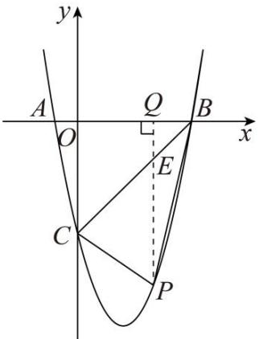

∵ $P \big ( x _ { 0 } , y _ { 0 } \big ) \big ( 0 < x _ { 0 } < 5 \big )$ ，则 $y _ { 0 } = { x _ { 0 } } ^ { 2 } - 4 x _ { 0 } - 5$ ，∴点 $E$ 的横坐标也为 $x _ { 0 }$ ，则纵坐标为 $y _ { E } = x _ { 0 } - 5$ ，$P E = y _ { E } - y _ { 0 } = \left( x _ { 0 } - 5 \right) - \left( x _ { 0 } ^ { 2 } - 4 x _ { 0 } - 5 \right) = - x _ { 0 } ^ { 2 } + 5 x _ { 0 }$ PBC的面积 $= S _ { \triangle P E C } + S _ { \triangle P E B }$ $\begin{array} { l } { \displaystyle = \frac 1 2 P E \cdot \left( x _ { 0 } - x _ { c } \right) + \frac 1 2 P E \cdot \left( x _ { _ B } - x _ { 0 } \right) } \\ { \displaystyle = \frac 1 2 P E \cdot \left( x _ { _ B } - x _ { c } \right) } \\ { \displaystyle = \frac 5 2 \big ( - { x _ { 0 } } ^ { 2 } + 5 x _ { 0 } \big ) } \end{array}$ $= - { \frac { 5 } { 2 } } { \Bigg ( } x _ { 0 } - { \frac { 5 } { 2 } } { \Bigg ) } ^ { 2 } + { \frac { 1 2 5 } { 8 } }$ , $- \frac { 5 } { 2 } < 0$ ， ∴当 $x _ { 0 } = \frac { 5 } { 2 }$ 时， $\triangle \mathrm { P B C }$ 的面 积有 最大 值， 最大 值为 $\frac { 1 2 5 } { 8 }$

# 2023·湖南中考真题

5．如图，在平面直角坐标系中，抛物线 $y = a x ^ { 2 } + x + c$ 经过点 $A \left( - 2 , 0 \right)$ 和点 $B \left( 4 , 0 \right)$ ，且与直线$l : y = - x - 1$ 交于 $D$ 、 $E$ 两点（点 $D$ 在点 $E$ 的右侧），点 $M$ 为直线 $l$ 上的一动点，设点 $M$ 的横坐标为 $t$ ．

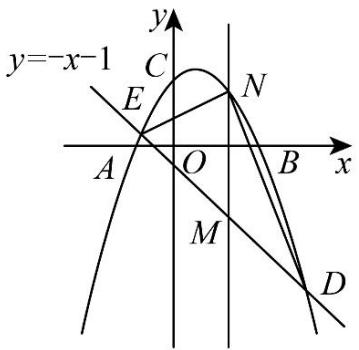

(1)求抛物线的解析式

(2)过点 $M$ 作 $x$ 轴的垂线，与拋物线交于点 $N$ ．若 $0 < t < 4$ ，求 $\triangle N E D$ 面积的最大值

【答案】(1 $y = - \frac { 1 } { 2 } x ^ { 2 } + x + 4$ ， $( 2 ) 7 { \sqrt { 1 4 } }$ 【分析】（1）待定系数法求解析式即可求解；

（2）根据题意，联立抛物线与直线，求得点 $D , E$ 的横坐标，表示出 $M N$ 的长，根据二次函数的性质求得MN的最大值，根据 ENDS $S _ { \_ E N D } = \frac { 1 } { 2 } \big ( x _ { _ { D } } - x _ { _ { E } } \big ) \times M N$ 即可求解；

【详解】（1）解：∵抛物线 $y = a x ^ { 2 } + x + c$ 经过点 $A { \big ( } { - } 2 , 0 { \big ) }$ 和点 $B \left( 4 , 0 \right)$ ，$\therefore \left\{ \begin{array} { l l } { 4 a - 2 + c = 0 } \\ { 1 6 a + 4 + c = 0 } \end{array} \right. ,$   
解得： $\left\{ { \begin{array} { l } { \displaystyle a = - { \frac { 1 } { 2 } } } , } \\ { \displaystyle c = 4 } \end{array}  \right.$   
∴抛物线解析式为： $y = - \frac { 1 } { 2 } x ^ { 2 } + x + 4$ ；  
（2）解：∵抛物线 $y = - \frac { 1 } { 2 } x ^ { 2 } + x + 4$ 与直线 $l : y = - x - 1$ 交于 $D$ 、 $E$ 两点 ，（点 $D$ 在点 $E$ 的右侧）  
联立 $\left\{ \begin{array} { l l } { \displaystyle y = - \frac { 1 } { 2 } x ^ { 2 } + x + 4 } \\ { \displaystyle y = - x - 1 } \end{array} \right.$ ，  
解得： $\left\{ \begin{array} { l l } { { x = 2 + { \sqrt { 1 4 } } } } & { { \quad { \sqrt { x = 2 - { \sqrt { 1 4 } } } } } } \\ { { y = - 3 - { \sqrt { 1 4 } } } } & { { \quad { \left\lfloor { y = - 3 + { \sqrt { 1 4 } } } \right. } } } \end{array} \right.$

资料整理【淘宝店铺：向阳百分百】

$\therefore D \Big ( 2 + \sqrt { 1 4 } , - \sqrt { 1 4 } - 3 \Big ) , E \Big ( 2 - \sqrt { 1 4 } , \sqrt { 1 4 } - 3 \Big ) ,$   
$\therefore x _ { _ { D } } - x _ { _ { E } } = \left( 2 + \sqrt { 1 4 } \right) - \left( 2 - \sqrt { 1 4 } \right) = 2 \sqrt { 1 4 } \ ,$   
∵点 $M$ 为直线 $l$ 上的一动点，设点 $M$ 的横坐标为 $t$   
则 $M \left( t , - t - 1 \right) N \left( t , - { \frac { 1 } { 2 } } t ^ { 2 } + t + 4 \right)$   
$\therefore M N = - { \frac { 1 } { 2 } } t ^ { 2 } + t + 4 - \left( - t - 1 \right) = - { \frac { 1 } { 2 } } t ^ { 2 } + 2 t + 5 = - { \frac { 1 } { 2 } } { \left( t - 2 \right) } ^ { 2 } + 7$ ，当 $t = 2$ 时， MN 取得 最大 值为 7 ，ENDS  D Ex  x  MN ，2  
∴当 $M N$ 取得最大值时， $S _ { \triangle E N D }$ 最大，  
$\therefore S _ { _ { \scriptscriptstyle \triangle E N D } } = \frac { 1 } { 2 } { \times } 2 \sqrt { 1 4 } \times 7 = 7 \sqrt { 1 4 }$ ，∴NED面积的最大值 $7 { \sqrt { 1 4 } }$

# 2023·青海西宁·中考真题

6．如图，在平面直角坐标系中，直线 $l$ 与 $x$ 轴交于点 $A { \left( 6 , 0 \right) }$ ，与 $y$ 轴交于点 $B ( 0 , - 6 )$ ，抛物线经过点 $A$ ， $B$ ，且对称轴是直线 $x = 1$

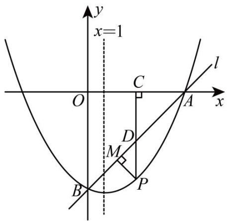

(1)求直线 $l$ 的解析式；(2)求抛物线的解析式；

(3)点 $P$ 是直线 $l$ 下方抛物线上的一动点，过点 $P$ 作 $P C \perp x$ 轴，垂足为 $C$ ，交直线 $l$ 于点 $D$ ，过点 $P$ 作 $P M \perp l$ ，垂足为 $M$ ．求 $P M$ 的最大值及此时 $P$ 点的坐标

【答案】 $y = x - 6$

$$
y = \frac { 1 } { 4 } x ^ { 2 } - \frac { 1 } { 2 } x - 6
$$

(3) $P M$ 的最大值是 $\frac { 9 { \sqrt { 2 } } } { 8 }$ ， 此时的 $P$ 点坐标是 $\left( 3 , - { \frac { 2 1 } { 4 } } \right)$

【分析】（1）利用待定系数法求解即可；

（2）根据题意可设抛物线的解析式为 $y = a ( x - 1 ) ^ { 2 } + k$ ，再利用待定系数法求解即可；

（3）由题意易证△PDM 为等腰直角三角形，即得出 $P M = { \frac { \sqrt { 2 } } { 2 } } P D$ ．设点 $P$ 的坐标为 $\left( t , { \frac { 1 } { 4 } } t ^ { 2 } - { \frac { 1 } { 2 } } t - 6 \right)$

则 $D \big ( t , t - 6 \big )$ ，从而可求出 $P D = t - 6 - \left( \frac { 1 } { 4 } t ^ { 2 } - \frac { 1 } { 2 } t - 6 \right) = - \frac { 1 } { 4 } ( t - 3 ) ^ { 2 } + \frac { 9 } { 4 }$ 再 结 合 二 次 函 数 的 性 质 可 知 ：当 $t = 3$ 时， $P D$ 有最大值是 $\frac 9 4$ 此时 $P M$ 最大，进而即可求解

【详解】（1）解：设直线 $\cdot$ 的解析式为 $y = m x + n { \big ( } m \neq 0 { \big ) }$ ，把 $A$ ， $\cdot$ 两点的坐标代入解析式，得 $\left\{ { 6 m + n = 0 \atop { n = - 6 } } \right. ,$   
解得： $\left\{ { \begin{array} { l } { m = 1 } \\ { n = - 6 } \end{array} } \right. ,$   
∴直线 $\cdot$ 的解析式为 $y = x - 6$ ；（2）解：设抛物线的解析式为 $y = a { \bigl ( } x - h { \bigr ) } ^ { 2 } + k { \bigl ( } a \neq 0 { \bigr ) }$ ，∵抛物线的对称轴为直线 $x = 1$ ，  
$y = a ( x - 1 ) ^ { 2 } + k$   
把 $A$ ， $\cdot$ 两点坐标代入解析式，得 $\left\{ { { 2 5 a + k = 0 } \atop { a + k = - 6 } } , \right.$   
解得： $\left\{ \begin{array} { l } { \displaystyle a = \frac { 1 } { 4 } } \\ { \displaystyle k = - \frac { 2 5 } { 4 } } \end{array} \right.$   
∴抛物线的解析式为  21 2514 4y  x    $y = { \frac { 1 } { 4 } } { \bigl ( } x - 1 { \bigr ) } ^ { 2 } - { \frac { 2 5 } { 4 } } = { \frac { 1 } { 4 } } x ^ { 2 } - { \frac { 1 } { 2 } } x - 6$ ；

（3）解： $\begin{array} { l l } { { A { \left( 6 , 0 \right) } } } & { { B { \left( 0 , - 6 \right) } } } \end{array}$ ，  
$O A \ = \ O B \ = \ 6$   
∵在 $\triangle A O B$ 中 $\angle A O B = 9 0 ^ { \circ }$ ，  
∴ $, \angle O A B = \angle O B A = 4 5 ^ { \circ }$   
∵ $P C \perp x$ 轴， $P M \perp l$ ，  
∴ $\angle P C A = \angle P M D = 9 0 ^ { \circ } .$   
在 $\mathrm { R t } _ { \triangle A D C }$ 中， $\angle P C A = 9 0 ^ { \circ }$ ， $\angle O A B = 4 5 ^ { \circ }$ ，  
$\cdot \angle A D C { = } 4 5 ^ { \circ }$ ，  
$\cdot \angle P D M = \angle A D C = 4 5 ^ { \circ }$   
在 $\mathrm { R t } _ { \Delta } P M D$ 中， $\angle P M D = 9 0 ^ { \circ }$ ， $\angle P D M = 4 5 ^ { \circ }$ ，  
${ \bf \partial } \cdot \sin 4 5 ^ { \circ } = { \frac { P M } { P D } } ,$   
$\therefore P M = { \frac { \sqrt { 2 } } { 2 } } P D \ .$   
设点 $P$ 的坐标为 $\left( t , { \frac { 1 } { 4 } } t ^ { 2 } - { \frac { 1 } { 2 } } t - 6 \right)$ , 则 $D \left( t , t - 6 \right)$ ，  
$\therefore P D = t - 6 - \left( { \frac { 1 } { 4 } } t ^ { 2 } - { \frac { 1 } { 2 } } t - 6 \right) = - { \frac { 1 } { 4 } } t ^ { 2 } + { \frac { 3 } { 2 } } t = - { \frac { 1 } { 4 } } ( t - 3 ) ^ { 2 } + { \frac { 9 } { 4 } } .$ $\cdot - \frac { 1 } { 4 } < 0$ ， ∴当 $t = 3$ 时， $P D$ 有最大值是 $\frac 9 4$ ，此 时 $P M$ 最大，

$\therefore P M _ { \mathrm { m a x } } = \frac { \sqrt { 2 } } { 2 } P D = \frac { \sqrt { 2 } } { 2 } \times \frac { 9 } { 4 } = \frac { 9 \sqrt { 2 } } { 8 } ,$ 当 $t = 3$ 时， ${ \frac { 1 } { 4 } } t ^ { 2 } - { \frac { 1 } { 2 } } t - 6 = { \frac { 1 } { 4 } } \times 3 ^ { 2 } - { \frac { 1 } { 2 } } \times 3 - 6 = - { \frac { 2 1 } { 4 } } \qquad P { \left( 3 , - { \frac { 2 1 } { 4 } } \right) }$ ∴PM 的最大值是 $\frac { 9 { \sqrt { 2 } } } { 8 }$ 此时的 $P$ 点坐标是 $\left( 3 , - { \frac { 2 1 } { 4 } } \right)$

# 2023·四川广安·中考真题

7．如图，二次函数 $y = x ^ { 2 } + b x + c$ 的图象交 $x$ 轴于点 $A , \ B$ ，交 $y$ 轴于点 $C$ ，点 $B$ 的坐标为 $\left( 1 , 0 \right)$ ，对称轴是直线 $x { = } - 1$ ，点 $P$ 是 $x$ 轴上一动点， $P M \perp x$ 轴，交直线 $A C$ 于点 $M$ ，交抛物线于点 $N$

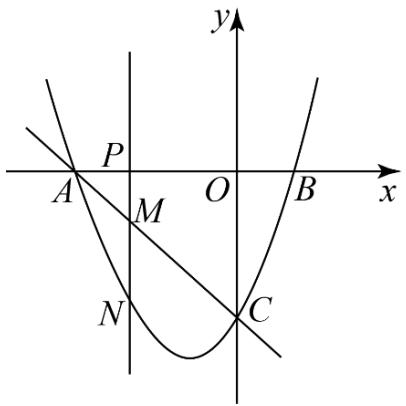

(1)求这个二次函数的解析式  
(2)若点 $P$ 在线段 $A O$ 上运动（点 $P$ 与点A、点 $O$ 不重合），求四边形 ABCN 面积的最大值，并求出此  
时点 $P$ 的坐标

【答案】 $y = x ^ { 2 } + 2 x - 3$

$S _ { \perp \perp \perp \mathcal { H } \perp A B C N }$ 最大值为 $\frac { 7 5 } { 8 }$ 此时 $P \left( - \frac { 3 } { 2 } , 0 \right)$

【分析】（1）先根据二次函数对称轴公式求出 $b = 2$ ，再把 $B \mathopen { } \mathclose \bgroup \left( 1 , 0 \aftergroup \egroup \right)$ 代入二次函数解析式中进行求解即可；

（2）先求出 $A { \left( - 3 , 0 \right) } C { \left( 0 , - 3 \right) }$ ，则 $A B = 4$ ， $O C = 3$ ，求出直线 $A C$ 的解析式为 $y = - x - 3$ ，设 $P ( m , 0 )$ ，则 $M \left( m , - m - 3 \right)$ ， $N { \Big ( } m , m ^ { 2 } + 2 m - 3 { \Big ) }$ ，则 $M N = - m ^ { 2 } - 3 m$ ；再由 $S _ { \textsc { p q j } \textsc { j } \textsc { k } . A B C N } = S _ { \triangle A B C } + S _ { \triangle A C N }$ 得 到$S _ { \ p q _ { 1 } \dot { 2 } \dot { 2 } \ddot { 5 } A B C N } = - \frac { 3 } { 2 } \Biggl ( m + \frac { 3 } { 2 } \Biggr ) ^ { 2 } + \frac { 7 5 } { 8 }$ 故当 $m = - \frac { 3 } { 2 }$ 时， $S _ { \perp \perp \perp \perp \perp B C N }$ 最大，最大值为 $\frac { 7 5 } { 8 }$ 此时点 P 的坐标为$\left( - { \frac { 3 } { 2 } } , 0 \right)$ ；

【详解】（1）解：∵二次函数 $y = x ^ { 2 } + b x + c$ 的对称轴为直线 $x { = } - 1$ ，  
$\therefore - { \frac { b } { 2 } } = - 1 ,$   
$b = 2$ ，  
∵二次函数经过点 $B \mathopen { } \mathclose \bgroup \left( 1 , 0 \aftergroup \egroup \right)$ ，

资料整理【淘宝店铺：向阳百分百】

$\therefore 1 ^ { 2 } + b + c = 0$ ，即 $1 + 2 + c = 0$ ，  
∴ $c = - 3$ ，  
∴二次函数解析式为 $y = x ^ { 2 } + 2 x - 3$ ；  
（2）解：∵二次函数经过点 $B \mathopen { } \mathclose \bgroup \left( 1 , 0 \aftergroup \egroup \right)$ ，且对称轴为直线 $x { = } - 1$ ，$\therefore A ( - 3 , 0 )$ ，  
∴ $A B = 4$ ，  
∵二次函数 $y = x ^ { 2 } + 2 x - 3$ 与 y 轴交于点 C，  
$C { \big ( } 0 , - 3 { \big ) } \qquad O C = 3$ ；  
设直线 $A C$ 的解析式为 $y = k x + b ^ { \prime }$ ， $\scriptstyle { \left\{ \begin{array} { l l } { - 3 k + b ^ { \prime } = 0 } \\ { b ^ { \prime } = - 3 } \end{array} \right. } \quad { \mathrm { ~ } } \quad { \left\{ k = - 1 \atop b ^ { \prime } = - 3 \right.}  $ ∴直线 $A C$ 的解析式为 $y = - x - 3$ ，  
设 $P ( m , 0 )$ ，则 $M \left( m , - m - 3 \right)$ ，  2N m，m  2m  3 ，  
$M N = - m - 3 - \left( m ^ { 2 } + 2 m - 3 \right) = - m ^ { 2 } - 3 m$ ；  
$\begin{array} { r l } & { \boldsymbol { M } \boldsymbol { N } = - m - \boldsymbol { \varsigma } - [ N + 2 m - 3 \boldsymbol { \varsigma } ] , } \\ & { \begin{array} { r l } & { S _ { \perp , \boldsymbol { A } \boldsymbol { E } \boldsymbol { x } } = \frac { 1 } { 2 } A B - \boldsymbol { \itOmega } C = \frac { 1 } { 2 } \times 4 \boldsymbol { \bf { S } } = 3 } \\ & { S _ { \perp , \boldsymbol { A } \boldsymbol { E } \boldsymbol { x } } = S _ { \perp , \boldsymbol { A } \boldsymbol { E } \boldsymbol { x } } + S _ { \perp , \boldsymbol { A } \boldsymbol { E } \boldsymbol { x } } } \end{array} } \\ & { \begin{array} { r l } & { S _ { \perp , \boldsymbol { A } \boldsymbol { E } \boldsymbol { x } } = S _ { \perp , \boldsymbol { A } \boldsymbol { E } \boldsymbol { x } } + S _ { \perp , \boldsymbol { A } \boldsymbol { E } \boldsymbol { x } } } \\ & { = S _ { \perp , \boldsymbol { A } \boldsymbol { E } \boldsymbol { x } } + S _ { \perp , \boldsymbol { A } \boldsymbol { E } \boldsymbol { x } } + S _ { \perp , \boldsymbol { A } \boldsymbol { E } \boldsymbol { x } } } \end{array} } \\ &  \begin{array} { r l } & { = \frac { 1 } { 2 } A \boldsymbol { P } \cdot \boldsymbol { M } \boldsymbol { N } + \frac { 1 } { 2 } \boldsymbol { O } \boldsymbol { P } \cdot \boldsymbol { M } \boldsymbol { N } + \boldsymbol { \it 6 } } \\ & { - \frac { 1 } { 2 } \times 3 \big ( - m ^ { 2 } - 3 m \big ) + 6 } \\ & { = - \frac { 3 } { 2 } \bigg ( m + \frac { 3 } { 2 } \bigg ) ^ { 2 } + \frac { 7 5 } { 8 } } \end{array} \end{array}$ ，  
$\displaystyle { \cdot - \frac { 3 } { 2 } < 0 }$ ， ∴当 $m = - \frac { 3 } { 2 }$ 时， $S _ { \perp \perp \perp \mathcal { H } \Xi A B C N }$ 最大 ，最 大值 为 $\frac { 7 5 } { 8 }$ , ∴此

# 2023·湖南永州·中考真题

8．如图，抛物线 $y = a x ^ { 2 } + b x + c$ （ $a$ ， $^ { b }$ ， $c$ 为常数）经过点 $F \big ( 0 , 5 \big )$ ，顶点坐标为2,9，点 $P ( x _ { 1 } , y _ { 1 } )$ 为抛物线上的动点， $P H \perp x$ 轴于 $H$ ，且 $x _ { 1 } \geq \frac 5 2$

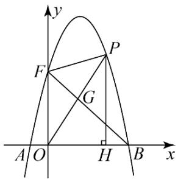

(1)求抛物线的表达式；资料整理【淘宝店铺：向阳百分百】(2)如图，直线 :OP y  $O P : y = \frac { y _ { 1 } } { x _ { 1 } } x$ 交 $B F$ 于点 $G$ ，求 $\frac { S _ { \triangle B P G } } { S _ { \triangle B O G } }$ 的最大值；

【答案】 $y = - x ^ { 2 } + 4 x + 5 \frac { 5 } { 4 } \frac { 5 + \sqrt { 5 } } { 2 }$

【分析】（1）根据顶点式坐标公式和待定系数法分别求出 $a$ ， $^ { b }$ ， $c$ 值，即可求出抛物线解析式

（2）利用抛物线的解析式可知道 $B$ 点坐标，从而求出直线 $B F$ 的解析式，从而设 $G \big ( m , - m + 5 \big )$ ，根据直线 $O P$ 的解析式 $y = { \frac { y _ { 1 } } { x _ { 1 } } } x$ 1y x 可推出 m  $m = \frac { 5 x _ { 1 } } { x _ { 1 } + y _ { 1 } }$ 从而可以用 $x _ { 1 } , y _ { 1 }$ 表 达 $G T$ 长度，在观察图形可知$\frac { S _ { \triangle B P G } } { S _ { \triangle B O G } } = \frac { P H } { G T } - 1$ ，将其 $G T$ 和 $P H$ 长度代入，即可将面积比转化成二次函数的形式，根据 $P$ 横坐标取值范围以及此二次函数的图像性质即可求出 $\frac { S _ { \triangle B P G } } { S _ { \triangle B O G } }$ 的最大值．

【详解】（1）解：抛物线 $y = a x ^ { 2 } + b x + c$ （a， $^ { b }$ ， $c$ 为常数）经过点 $F \big ( 0 , 5 \big )$ ，顶点坐标为2,9 ，  
$\therefore c = 5 , - { \frac { b } { 2 a } } = 2 , { \frac { 4 a c - b ^ { 2 } } { 4 a } } = 9 ,$   
$\therefore \left\{ { \frac { b = - 4 a } { 2 0 a - b ^ { 2 } } } = 9 \right. \quad \therefore \left\{ \begin{array} { l l } { \begin{array} { r l r l } \end{array} } \end{array}  \right.$ $\begin{array} { c } { { \left\{ { a = - 1 } \atop { b = 4 } \right. } }  \end{array}$ 抛物线的解析式为： $y = - x ^ { 2 } + 4 x + 5$   
故答案为： $y = - x ^ { 2 } + 4 x + 5$

（2）解：过点 $G$ 作 $G T \perp x$ 轴于点 $T$ ，如图所示，

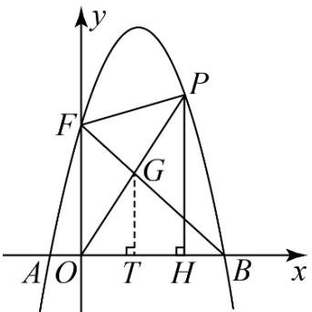

抛物线的解析式为： $y = - x ^ { 2 } + 4 x + 5$ ，且与 $x$ 轴交于 $\mathbf { A }$ ， $B$ 两点，  
$\therefore B \left( 5 , 0 \right) \quad \because F \left( 0 , 5 \right)$ ，  
设直线 $B F$ 的解析式为： $y = k x + b ^ { \prime }$ ， 则 $\left\{ { \begin{array} { l } { 5 k + b ^ { \prime } = 0 } \\ { b ^ { \prime } = 5 } \end{array} } \right.$ $\begin{array} { r } { \left\{ \begin{array} { l l } { \displaystyle k = - 1 } \\ { \displaystyle b ^ { \prime } = 5 } \end{array} \right. , } \end{array}$   
直线 $B F$ 的解析式为： $y = - x + 5$   
 $G$ 在直线 $B F$ 上， $G \big ( m , - m + 5 \big )$ ，  
 $G$ 在直线 $O P$ 上， $O P$ 的解析式为： $y = { \frac { y _ { 1 } } { x _ { 1 } } } x$ ，  
$\therefore - m + 5 = \frac { y _ { 1 } } { x _ { 1 } } m , \therefore m = \frac { 5 x _ { 1 } } { x _ { 1 } + y _ { 1 } } .$   
$\therefore G T = - m + 5 = - { \frac { 5 x _ { 1 } } { x _ { 1 } + y _ { 1 } } } + 5 = { \frac { 5 y _ { 1 } } { x _ { 1 } + y _ { 1 } } }$   
$\mathrm {  ~ \because S _ { \Delta \ B P G } = S _ { \Delta B P O } - S _ { \Delta B O G } }$ ，  
资料整理【淘宝店铺：向阳百分百】

$\begin{array} { r l } & { : \frac { S _ { \Delta \omega \Delta _ { \omega } } } { S _ { \Delta \omega } } = \frac { S _ { \Delta \omega } - S _ { \Delta \omega \Delta _ { \omega } } } { S _ { \Delta \omega \Delta } } - \frac { S _ { \Delta \omega \Delta _ { \omega } } } { S _ { \Delta \omega \Delta } } - 1 \frac { S _ { \omega } \times S _ { \omega } \times H } { 2 } } \\ & { : \frac { P H } { S _ { \Delta \omega \Delta } } } \\ & { : \frac { P H } { C } - \frac { S _ { \Delta } } { S _ { \Delta \omega } } - \frac { S _ { \Delta } } { S _ { \Delta \omega } } } \\ & { : \frac { S _ { \Delta \omega } } { S _ { \Delta \omega } } = \frac { P H } { C H } - \frac { S _ { \Delta } } { S _ { \Delta \omega } } } \\ & { : \frac { S _ { \Delta \omega \Delta } } { S _ { \Delta \omega } } = \frac { P H } { C H } - \frac { S _ { \Delta } + S _ { \Delta } } { S _ { \Delta \omega } } - 1 } \\ & { : \frac { P \left( S _ { \omega } , \frac { S _ { \Delta } ^ { 2 } } { S _ { \Delta \omega } } + \frac { S _ { \Delta } } { S _ { \Delta \omega } } + \frac { S _ { \Delta } } { S _ { \Delta \omega } } - 1 \right) - 1 } { S _ { \Delta \omega \Delta } } \left( x _ { \Delta } - \frac { S _ { \Delta } ^ { 2 } } { 2 } \right) + \frac { S _ { \Delta } } { 4 } } \\ & { : \frac { S _ { \Delta \omega \Delta } } { S _ { \Delta \omega \Delta } } = \frac { S _ { \Delta } } { S _ { \Delta \omega } } - 1 = \frac { S _ { \Delta } - S _ { \Delta } ^ { 2 } + S _ { \Delta } + S _ { \Delta } } { S _ { \Delta \omega } } - 1 = \frac { S _ { \Delta } } { S _ { \Delta } } \left( x _ { \Delta } - \frac { S _ { \Delta } ^ { 2 } } { 2 } \right) + \frac { S _ { \Delta } } { 4 } } \\ &  : \frac  S _  \ \end{array}$ 当 $x = \frac { 5 } { 2 }$ 时， $\frac { \mathrm { \bf S } _ { \triangle B P G } } { \mathrm { \bf S } _ { \triangle B O G } }$ 有最大值，且最大值为： $- { \frac { 1 } { 5 } } \times \left( { \frac { 5 } { 2 } } - { \frac { 5 } { 2 } } \right) ^ { 2 } + { \frac { 5 } { 4 } } = { \frac { 5 } { 4 } }$ 故答案为：

# 2022·四川广元·中考真题

9．在平面直角坐标系中，直线 $y = - x - 2$ 与 $x$ 轴交于点 $A$ ，与 $y$ 轴交于点 $B$ ，抛物线 $\scriptstyle { y = a x ^ { 2 } + b x + c }$ （ $a > 0$ ）经过 $A$ ， $B$ 两点，并与 $x$ 轴的正半轴交于点 $C$ ．

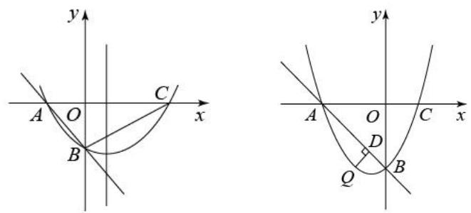

(1)求 $a$ ， $^ { b }$ 满足的关系式及 $c$ 的值；

(2)当 $a { = } \frac { 1 } { 4 }$ 时，若点 $P$ 是抛物线对称轴上的一个动点，求△PAB 周长的最小值；

(3)当 $a = 1$ 时，若点 $\mathcal { Q }$ 是直线 $A B$ 下方抛物线上的一个动点，过点 $\mathcal { Q }$ 作 $Q D \bot A B$ 于点 $D$ ，当 $\mathcal { Q } D$ 的值最大时，求此时点 $\mathcal { Q }$ 的坐标及 $\mathcal { Q } D$ 的最大值．

【答案】 $\cdot$ ， $\cdot$ ； $( 2 ) \triangle$ PAB 的周长最小值是 $\sqrt { 5 } \sqrt { 2 }$ ；(3)此时 Q（-1，-2），DQ 最大值为 $\frac { \sqrt { 2 } } { 2 }$

【分析】（1）先求得点 A、点 B 的坐标，再利用待定系数法求解即可；

（2）先利用对称性找出 $\cdot$ PAB 周长最小时点 P 的位置，此时 $\cdot$ ，△PAB 的周长最小值为：$-$ ，根据勾股定理求出 AB、BC 的长即可求出△PAB 最小值；

（3）过点Q作QF⊥x轴交于F点，交直线AB于点E，得到 $-$ ，推出 $\mathrm { Q D = E D = } \frac { \sqrt { 2 } } { 2 }$ EQ，设 Q（t， $t 2 + \mathrm { t } - 2 )$ ），E（t，-t-2），求得 $\mathrm { Q E ^ { = } { - } t { 2 - } } 2 \mathrm { t }$ ，再利用二次函数的性质即可求解．

【详解】（1）解：∵直线 $\cdot$ 与 $\cdot$ 轴交于点 A，与 y 轴交于点 B，  
∴点 A 的坐标为(-2，0)，点 B 的坐标为(0，-2)，  
∵抛物线 $\cdot$ （ $\cdot$ ）经过 A，B 两点，  
$\therefore \left\{ \begin{array} { c c c } { { 4 a - 2 b + c = 0 } } & { { . . } } & { { . } } \\ { { c = - 2 } } & { { . } } & { { . } } \end{array} \right. \ .$

（2）解：当 $\mathrm { a } { = } \frac { 1 } { 4 }$ 时，则 $\mathsf { b } { = } { - } { \frac { 1 } { 2 } }$ , ∴抛物线的解析式为 $y = \frac { 1 } { 4 } \times 2 - \frac { 1 } { 2 } x - 2$ 抛物线的对称轴为直线 $\cdot$ ，∵点 A 的坐标为(-2，0)，∴点 C 的坐标为(4，0)

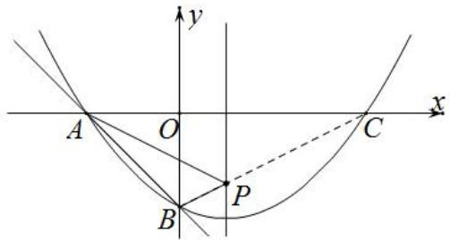

△PAB 的周长为： $\_$ ，且 AB 是定值，  
∴当 $\cdot$ 最小时， $\cdot$ PAB 的周长最小，  
∵点 A、C 关于直线 $\mathbf { x } { = } 1$ 对称，  
∴连接 BC 交直线 $\cdot$ 于点 P，此时 $\mathrm { P B + P A }$ 值最小，  
∵ $\cdot _ { \mathrm { A P = C P } }$ ，  
∴△PAB 的周长最小值为： $\mathrm { P B } + \mathrm { P A } + \mathrm { A B } { = } \mathrm { B C } + \mathrm { A B }$ ，  
∵A（-2，0），B（0，-2），C（4，0），  
∴OA $\cdot$ ， $\mathrm { O B } { = } 2$ ， $\mathrm { O C } { = } 4$ ，  
由勾股定理得 $\mathrm { B C } { = } 2 { \sqrt { 5 } }$ ， ${ \mathrm { A B } } { = } 2 { \sqrt { 2 } }$ ，  
∴ $\triangle$ PAB 的周长最小值是： $2 { \sqrt { 5 } } + 2 { \sqrt { 2 } }$   
（3）解：当 $\cdot$ 时， $\cdot$ ，  
∴抛物线的解析式为 $y = x _ { 2 } + - x - 2$ ，  
过点 Q 作 QF⊥x 轴交于 F 点，交直线 AB 于点 E，  
∵A（-2，0），B（0，-2），  
$\cdot$ ，  
$\_$ ，  
∵QD⊥AB，  
∴∠AEF $\cdot$ ∠QED $\cdot$ ∠EQD=45°，  
$\mathrm { \cdot } \mathrm { Q D } { = } \mathrm { E D } { = } \frac { \sqrt { 2 } } { 2 } .$ EQ，  
设 Q（t， $t 2 + t - 2 .$ ），E（t，-t-2），  
∴QE $\cdot$ -t-2-(t2+t-2)=-t2-2t，  
${ \frac { \sqrt { 2 } } { 2 } } \qquad { \frac { \sqrt { 2 } } { 2 } } \qquad { \frac { \sqrt { 2 } } { 2 } } \qquad { \frac { \sqrt { 2 } } { 2 } } \qquad { \frac { \sqrt { 2 } } { 2 } } \qquad $   
当 $\mathrm { t } = - 1$ 时，DQ 有最大值 $\frac { \sqrt { 2 } } { 2 }$ 此时 Q（-1，-2）

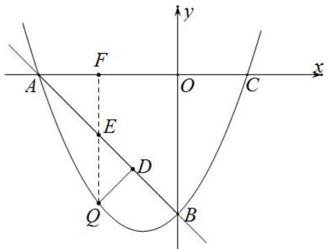

10．已知抛物线 $y = \frac { 1 } { 4 } x ^ { 2 } - 4$ 与 $x$ 轴交于 $A$ 、 $B$ 两点，顶点为 $C$ ，连接 $B C$ ，点 $P$ 在线段 $B C$ 下方的抛物线上运动

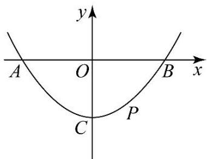  
图1

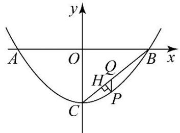  
图2

(1)如图 1，连接 $P B$ ， $P C$ ，若 $S _ { \triangle P B C } = \frac { 3 } { 2 }$ 求点 $P$ 的坐标．(2)如图 2，过点 $P$ 作 $P Q / / _ { \mathit { y } }$ 轴交 $B C$ 于点 $\mathcal { Q }$ ， $P H \perp B C$ 交 $B C$ 于点 $H$ ，求 $\triangle P Q H$ 周长的最大值．【答案】 $( 1 ) P ( 1 , - { \frac { 1 5 } { 4 } } )$ 或 $( 3 , - \frac { 7 } { 4 } )$ ；(2)最大值为 $\sqrt { 2 } + 1$ ；

【分析】（1）如图，作 $P D / / _ { y }$ 轴，交直线 $B C$ 于点 $\cdot$ ，由 $y = { \frac { 1 } { 4 } } x ^ { 2 } - 4$ ，得 $C ( 0 , - 4 )$ ， $B ( 4 , 0 )$ ，待定系数法确定直线 $B C$ 解析式为 $y = x - 4$ ， 设 $P ( m , { \frac { 1 } { 4 } } m ^ { 2 } - 4 )$ ，则 $D ( m , m - 4 )$ ， $P D = { } - { \frac { 1 } { 4 } } m ^ { 2 } + m$ ， 得$S _ { \_ P B C } = \frac { 1 } { 2 } P D \bullet ( x _ { \scriptscriptstyle B } - x _ { \scriptscriptstyle C } ) = \frac { 1 } { 2 } ^ { , } ( - \frac { 1 } { 4 } m ^ { 2 } + m ) ^ { , } 4 = \frac { 3 } { 2 }$ ， 解 得 $m = 1$ 或 3 ，于 是 $P ( 1 , - { \frac { 1 5 } { 4 } } )$ 或 $( 3 , - \frac { 7 } { 4 } )$

（ 2 ） 如 图 ， 可 证 得 $\triangle P H Q$ 是 等 腰 直 角 三 角 形 ， $P H = Q H = { \frac { \sqrt { 2 } } { 2 } } P Q$ $\triangle P Q H$ 周 长$= P Q + P H + Q H = ( \sqrt { 2 } + 1 ) P Q$ , 同 , 设 $P ( m , { \frac { 1 } { 4 } } m ^ { 2 } - 4 )$ ， $\triangle P Q H$ 周 长$= ( \sqrt { 2 } + 1 ) P Q = - \frac { \sqrt { 2 } + 1 } { 4 } ( m - 2 ) ^ { 2 } + \sqrt { 2 } + 1 \pounds \sqrt { 2 } + 1$ ，得 当 $m = 2$ 时，最大值为 $\sqrt { 2 } + 1$

【详解】（1）解：如图，作 $P D / / _ { \mathcal { Y } }$ 轴，交直线 $B C$ 于点 $D$ ，

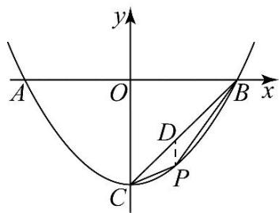

由 $y = \frac { 1 } { 4 } x ^ { 2 } - 4$ 2 4 x  ， x  0 时， y  4 ，得 C(0, 4) ，  
$y = 0$ ， 则 ${ \frac { 1 } { 4 } } x ^ { 2 } - 4 = 0$ ，解得 $x = - 4$ 或 $x = 4$ ，得 $B ( 4 , 0 )$ ,  
设直线 $B C$ 解析式为 $y = k x + b ( k \neq 0 )$ ，则 $\begin{array} { l } { { \left\{ b = - 4 \right. } }  \\ { { \left\{ 4 k + b = 0 \right. } }  \end{array}$ 解得 $\left\{ \begin{array} { l l } { k = 1 } \\ { b = - 4 } \end{array} \right.$   
$y = x - 4$   
设 $P ( m , { \frac { 1 } { 4 } } m ^ { 2 } - 4 )$ ，则 $D ( m , m - 4 )$ ， $P D = ~ ( m - ~ 4 ) ^ { - } ~ ( \frac { 1 } { 4 } m ^ { 2 } - 4 ) = - ~ \frac { 1 } { 4 } m ^ { 2 } + ~ m$   
$\therefore S _ { \scriptscriptstyle  { \bf  { a }  { \bf ~ S } _ { \scriptscriptstyle  { \bf ~ A } } } } = \mathrm { \small ~ \frac { 1 } { 2 } ~ } P D \bullet ( x _ { \scriptscriptstyle  { \bf ~ B } } - x _ { \scriptscriptstyle C } ) = \mathrm { \small ~ \frac { 1 } { 2 } ~ } \cdot \mathrm { \small ~ ( - \frac { ~ 1 } { ~ 4 } m \mathrm { \scriptsize ~ \frac { ~ } { ~ } + ~ } \ m ) ~ } ^ { \prime } \mathrm { \small ~ 4 = \mathrm { ~ \frac { ~ 3 } { ~ 2 } ~ } } ,$   
解得， $m = 1$ 或 3， ${ \frac { 1 } { 4 } } m ^ { 2 } - 4 = - \ { \frac { 1 5 } { 4 } }$ 或 $- { \frac { 7 } { 4 } }$ $P ( 1 , - \frac { 1 5 } { 4 } )$ 或 $( 3 , - \frac { 7 } { 4 } )$   
（2）解：如图， $O B = O C$ ， $\angle B O C = 9 0 ^ { \circ }$   
$\angle O B C = \angle O C B = 4 5 ^ { \circ }$   
$\cdot P Q / / \ y$ 轴  
$\therefore \angle D P Q H = \angle D O C B = 4 5 ^ { \circ }$ °  
$\mathrm { D } H P Q = 1 8 0 ^ { \circ } - \mathrm { D } P H Q - \mathrm { D } P Q H = 4 5 ^ { \circ }$   
$P H = Q H = { \frac { \sqrt { 2 } } { 2 } } P Q$   
∴ $\triangle P Q H$ 周长 $= P Q + P H + Q H = ( \sqrt { 2 } + 1 ) P Q$

同（1），设 $P ( m , { \frac { 1 } { 4 } } m ^ { 2 } - 4 )$ ，则 $\mathcal { Q } ( m , m ^ { - } \ 4 )$ ， $P Q = ( m - 4 ) { } ^ { - } ( \frac { 1 } { 4 } m ^ { 2 } - 4 ) = - \frac { 1 } { 4 } m ^ { 2 } + m$ $\cdot \triangle P Q H$ 周长 $\therefore = ( \sqrt { 2 } + 1 ) P Q ^ { - } = ( \sqrt { 2 } + 1 ) ( - \frac { 1 } { 4 } m ^ { 2 } + m ) = - \frac { \sqrt { 2 } + 1 } { 4 } ( m ^ { 2 } - 4 m ) = - \frac { \sqrt { 2 } + 1 } { 4 } ( m - 2 ) ^ { 2 } + \sqrt { 2 } + 1 \pounds \ \sqrt { 2 } + 1$ ∴当 $m = 2$ 时，点 $\cdot$ 在线段 $B C$ 下方的抛物线上，此时 $\triangle P Q H$ 周长有最大值，最大值为 $\sqrt { 2 } + 1$

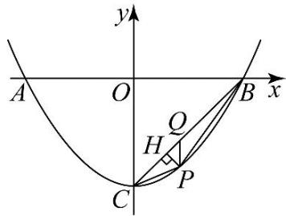

# 题型二 【线段和差最值篇】

# 2023·湖南张家界中考真题

11．如图，在平面直角坐标系中，已知二次函数 $y = a x ^ { 2 } + b x + c$ 的图象与 $x$ 轴交于点 $A \left( - 2 , 0 \right)$ 和点$B \mathopen { } \mathclose \bgroup \left( 6 , 0 \aftergroup \egroup \right)$ 两点，与 $y$ 轴交于点 $C \left( 0 , 6 \right)$ ．点 $D$ 为线段 $B C$ 上的一动点

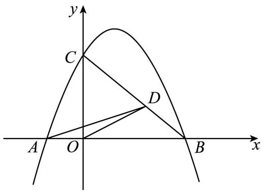

(1)求二次函数的表达式；(2)如图，求 $\triangle A O D$ 周长的最小值；

【答案】( $1 ) y = - \frac { 1 } { 2 } x ^ { 2 } + 2 x + 6 , ( 2 ) 1 2$

【分析】（1）根据题意设抛物线的表达式为 $y = a ( x + 2 ) ( x - 6 )$ ，将0,6代入求解即可；（2）作点 $O$ 关于直线 $B C$ 的对称点 $\cdot$ ，连接 $E C$ 、 $E B$ ，根据点坐特点及正方形的判定得出四边形OBEC为正方形， $E \big ( 6 , 6 \big )$ ，连接 $\cdot$ ，交 $B C$ 于点 $D$ ，由对称性 $\left| D E \right| = \left| D O \right|$ ，此时 $\left| D O \right| + \left| D A \right|$ 有最小值为 $\cdot$ 的长，再由勾股定理求解即可

【详解】（1）解：由题意可知，设抛物线的表达式为 $y = a ( x + 2 ) ( x - 6 )$ ，将 $\left( 0 , 6 \right)$ 代入上式得： $6 = a { \bigl ( } 0 + 2 { \bigr ) } { \bigl ( } 0 - 6 { \bigr ) } a = - { \frac { 1 } { 2 } }$   
所以抛物线的表达式为 $y = - \frac { 1 } { 2 } x ^ { 2 } + 2 x + 6$ ；  
（2）作点 $\cdot$ 关于直线 $B C$ 的对称点 $E$ ，连接 $E C$ 、 $E B$ ，  
$B \mathopen { } \mathclose \bgroup \left( 6 , 0 \aftergroup \egroup \right) \quad C \mathopen { } \mathclose \bgroup \left( 0 , 6 \aftergroup \egroup \right) \quad \angle B O C = 9 0 ^ { \circ }$   
∴ $O B = O C = 6$ ，∵ $O$ 、 $\cdot$ 关于直线 $B C$ 对称，∴四边形OBEC为正方形，$\therefore E ( 6 , 6 )$ ， 连接 $A E$ ，交 $B C$ 于点 $D$ ，由对称性 $\left| D E \right| = \left| D O \right|$ ，  
此时 $\left| D O \right| + \left| D A \right|$ 有最小值为 $A E$ 的长，  
$A E = \sqrt { A B ^ { 2 } + B E ^ { 2 } } = \sqrt { 8 ^ { 2 } + 6 ^ { 2 } } = 1 0$   
∵ $\triangle A O D$ 的周长为 $D A + D O + A O$ ，  
$A O = 2$ ， $D A + D O$ 的最小值为 10，  
∴ $\triangle A O D$ 的周长的最小值为 $1 0 + 2 = 1 2$ ；

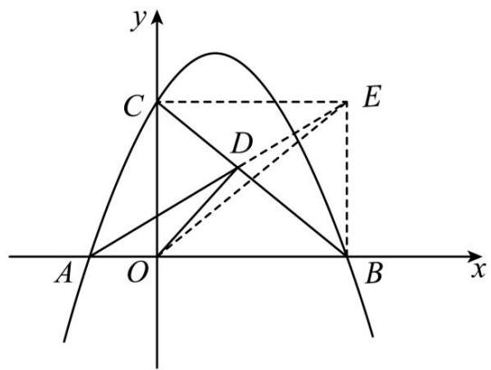

# 2022·四川遂宁中考真题

12．如图，在平面直角坐标系中，抛物线 $y = x ^ { 2 } + b x + c$ 与 $x$ 轴交于 $A$ 、 $B$ 两点，与 $y$ 轴交于点 $C$ ，其中点 $A$ 的坐标为 $\left( - 1 , 0 \right)$ ，点 $C$ 的坐标为 $\left( 0 , - 3 \right)$

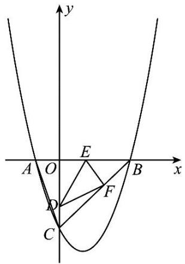  
图1

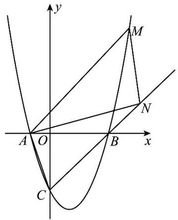  
图2

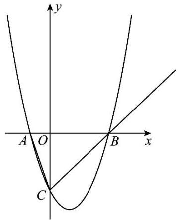  
备用图

(1)求抛物线的解析式；

(2)如图 1， $E$ 为 ${ \triangle A B C }$ 边 $A B$ 上的一动点， $F$ 为 $B C$ 边上的一动点， $D$ 点坐标为 $\left( 0 , - 2 \right)$ ，求 $\triangle D E F$ 周长的最小值

【答案】 $y = x ^ { 2 } - 2 x - 3$ (2) $\triangle D E F$ 周长的最小值为 $\sqrt { 2 6 }$ 【分析】（1）直接利用待定系数法求解即可；

（2）设 $D _ { 1 }$ 为 $D$ 关于直线 $A B$ 的对称点， $D _ { 2 }$ 为 $\cdot$ 关于直线 $B C$ 的对称点，连接 $D _ { 1 } E$ 、 $D _ { 2 } F$ 、 $D _ { 1 } D _ { 2 }$ ，由对称的性质可知当 $D _ { 1 }$ 、 $E$ 、 $\cdot$ 、 $D _ { 2 }$ 在同一直线上时， $\triangle D E F$ 的周长最小，最小值为 $D _ { 1 } D _ { 2 }$ 的长度，再证明 ${ \triangle B O C }$ 为等腰直角三角形，再由勾股定理求解即可；

【详解】（1） $\textstyle A { \bigl ( } - 1 , 0 { \bigr ) }$ ， $C ( 0 , - 3 )$ 在 $y = x ^ { 2 } + b x + c$ 上，$\left\{ { \begin{array} { l } { 0 = 1 - b + c } \\ { - 3 = c } \end{array} } \right.$ $\scriptstyle { \left\{ { \begin{array} { l } { b = - 2 } \\ { c = - 3 } \end{array} } \right. }$ ∴抛物线的解析式为 $y { = } x ^ { 2 } - 2 x - 3$ （2）如图，设 $D _ { 1 }$ 为 $\cdot$ 关于直线 $A B$ 的对称点， $D _ { 2 }$ 为 $\cdot$ 关于直线 $B C$ 的对称点，

资料整理【淘宝店铺：向阳百分百】连接 $D _ { 1 } E$ 、 $D _ { 2 } F$ 、 $D _ { 1 } D _ { 2 }$ ，

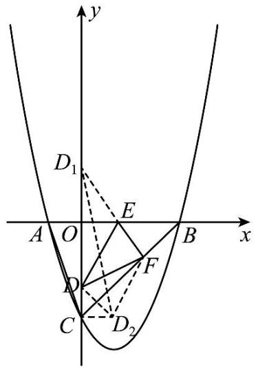

由对称的性质可知 $D E = D _ { 1 } E$ ， $D F = D _ { 2 } F$ ，  
$\triangle D E F$ 的周长为 ${ \cal D } _ { 1 } E + E F + { \cal D } _ { 2 } F$ ，  
∴当 $D _ { 1 }$ 、 $E , \ F .$ 、 $D _ { 2 }$ 在同一直线上时， $\triangle D E F$ 的周长最小，最小值为 $D _ { 1 } D _ { 2 }$ 的长度  
令 $y = 0$ ，则 $x ^ { 2 } - 2 x - 3 = 0$ ，解得 $x _ { 1 } = 3$ ， $x _ { 2 } = - 1$   
∴ $\cdot$ 的坐标为3,0，  
∴ $O B = O C = 3$ ， ${ \triangle B O C }$ 为等腰直角三角形．  
∵ $\cdot$ 垂直平分 $D D _ { 2 }$ ，且 $\cdot$ 的坐标为 $\left( - 2 , 0 \right)$ ，  
$\therefore D _ { 2 } \left( 1 , - 3 \right)$ ．  
又∵ $\cdot$ 、 $D _ { 1 }$ 关于 $x$ 轴对称，  
${ D _ { 1 } ( 0 , 2 ) }$ ，  
$\therefore D _ { 1 } D _ { 2 } = \sqrt { C D _ { 2 } ^ { 2 } + C D _ { 1 } ^ { 2 } } = \sqrt { 2 5 + 1 } = \sqrt { 2 6 } \ ,$ ，  
∴ $\triangle D E F$ 周长的最小值为 $\sqrt { 2 6 }$

# 2022·山东淄博·统考中考真题

13．如图，抛物线 $y = - \ x ^ { 2 } + b x + c$ 与 $x$ 轴相交于 $A$ ， $B$ 两点（点 $A$ 在点 $B$ 的左侧），顶点 $D$ （1，4）在直线 $l$ ： $y = { \frac { 4 } { 3 } } x + t$ 上，动点 $P ( m , n )$ 在 $x$ 轴上方的抛物线上

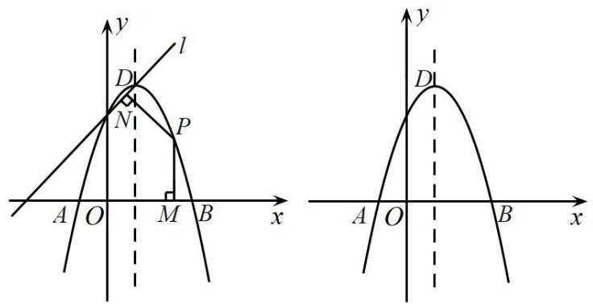  
（备用图）

(1)求这条抛物线对应的函数表达式；

(2)过点 $P$ 作 $P M \bot x$ 轴于点 $M$ ，PN⊥l 于点 $N$ ，当 $1 < m < 3$ 时，求 $P M { + } P N$ 的最大值

【答案】 $\mathrm { ~  ~ { ~ - ~ } ~ }$ (2)最大值 $\frac { 2 2 } { 5 }$

【分析】（1）利用顶点式可得结论；

（2）如图，设直线 $\cdot$ 交 $\cdot$ 轴于点 $T$ ，连接 $\cdot$ ， $\cdot$ ， $B D$ 交 $P M$ 于点 $J$ ，设 $P \left( m , - m ^ { 2 } + 2 m + 3 \right) ;$ ，$S _ { \scriptscriptstyle { \perp } j j j \ll D T B P } = S _ { \scriptscriptstyle { \triangle } P D T } + S _ { \scriptscriptstyle { \triangle } P B T }$ ，推出 $S _ { \perp \perp \perp \perp \perp }$ 最大时， $P M + P N$ 的值最大，求出四边形 $D T B P$ 的面积的最大值，可得结论；

【详解】（1）解：∵抛物线的顶点为 $\cdot$ （1，4），∴根据顶点式，抛物线的解析式为 $y = - { \bigl ( } x - 1 { \bigr ) } ^ { 2 } + 4 = - x ^ { 2 } + 2 x + 3$ ；（2）解：如图，设直线 $l$ 交 $\cdot$ 轴于点 $T$ ，连接 $\cdot$ ， $\cdot$ ，$B D$ 交 $P M$ 于点 $\cdot$ ，设 $P \left( m , - m ^ { 2 } + 2 m + 3 \right)$ ，

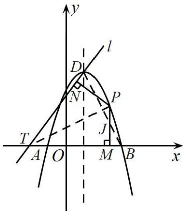

点 $D \left( 1 , 4 \right)$ ，在直线 $\cdot$ ： $y = { \frac { 4 } { 3 } } x + t$ 上 $\begin{array} { l } { \displaystyle { 4 = \frac { 4 } { 3 } + t \qquad t = \frac { 8 } { 3 } } } \end{array}$   
∴直线 $D T$ 的解析式为 $y = \frac { 4 } { 3 } x + \frac { 8 } { 3 }$ ，  
令 $y = 0$ ，得到 $x = - 2$ ，  
$\begin{array} { r c l } { { } } & { { } } & { { \therefore T \left( - 2 , 0 \right) , } } \\ { { } } & { { } } & { { } } \\ { { } } & { { } } & { { \therefore O T = 2 , } } \\ { { } } & { { } } & { { } } \\ { { } } & { { } } & { { \because B \left( 3 , 0 \right) , } } \end{array}$ ，  
∴ BT  5，  
∵ 2 2DT  3  4  5 ，  
∴ $D T = B T$ ，  
∵ PM  BT ， PN  DT ，  
$S _ { \perp 3 2 / \mathcal { U } D T B P } = S _ { \triangle P D T } + S _ { \triangle P B T } = \frac { 1 } { 2 } \times D T \times P N + \frac { 1 } { 2 } \times B T \times P M = \frac { 5 } { 2 } \big ( P M + P N \big )$   
∴ $S _ { \perp \perp \perp \mathcal { H } \xi D T B P }$ 最大时， $P M + P N$ 的值最大，  
∵ $D ( 1 , 4 )$ ， $B \left( 3 , 0 \right)$ ，∴直线 $B D$ 的解析式为 $y = - 2 x + 6$ ，  
$J \left( m , - 2 m + 6 \right) \qquad \quad P J = - m ^ { 2 } + 4 m - 3$ ，  
$\mathrm { \Large ~ : ~ } S _ { \scriptscriptstyle { [ \mathrm { H } ] \bar { \lambda } ] \bar { \lambda } ] \bar { \lambda } } \bar { \lambda } \bar { \lambda } P B T B P } = S _ { \scriptscriptstyle { \Delta D T B } } + S _ { \scriptscriptstyle { \Delta B D P } } = \frac { 1 } { 2 } \times 5 \times 4 + \frac { 1 } { 2 } \times \left( - m ^ { 2 } + 4 m - 3 \right) \times 2$   
2 m  4m  7  
$= - { \big ( } m - 2 { \big ) } ^ { 2 } + 1 1$ ，  
∵二次项系数 $- 1 { < } 0$ ，  
∴ $m = 2$ 时， $S _ { \perp \perp \perp \perp \perp \perp }$ 最大，最大值为 11，∴ $P M + P N$ 的最大值 $= { \frac { 2 } { 5 } } \times 1 1 = { \frac { 2 2 } { 5 } }$

# 题型三 【构造二次函数模型求最值】

# $2 0 2 3 \cdot$ 山东东营·中考真题

14．如图，抛物线过点 $O \big ( 0 , 0 \big )$ ， $E \big ( 1 0 , 0 \big )$ ，矩形 $A B C D$ 的边 $A B$ 在线段 $O E$ 上（点 $B$ 在点 $A$ 的左侧），点 $C$ ， $D$ 在抛物线上，设 $B \big ( t , 0 \big )$ ，当 $t = 2$ 时， $B C = 4$

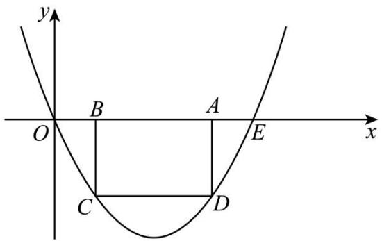

(1)求抛物线的函数表达式；(2)当 $t$ 为何值时，矩形 $A B C D$ 的周长有最大值？最大值是多少？

【答案】 $y = { \frac { 1 } { 4 } } x ^ { 2 } - { \frac { 5 } { 2 } } x$

(2)当 $t = 1$ 时，矩形 $A B C D$ 的周长有最大值，最大值为 $\frac { 4 1 } { 2 }$ 【分析】（1）设抛物线的函数表达式为 $y = a x { \bigl ( } x - 1 0 { \bigr ) } { \bigl ( } a \neq 0 { \bigr ) }$ ，求出点 $\cdot$ 的坐标，将点 $C$ 的坐标代入即可求出该抛物线的函数表达式；

资料整理【淘宝店铺：向阳百分百】

（2）由抛物线的对称性得 $A E = O B = t$ ，则 $A B = 1 0 - 2 t$ ，再得出 $B C = - \frac { 1 } { 4 } t ^ { 2 } + \frac { 5 } { 2 } t$ 根据矩形的周长公式，列出矩形周长的表达式，并将其化为顶点式，即可求解；

【详解】（1）解：设抛物线的函数表达式为 $y = a x { \bigl ( } x - 1 0 { \bigr ) } { \bigl ( } a \neq 0 { \bigr ) }$   
∵当 $t = 2$ 时， $B C = 4$ ，∴点 $\cdot$ 的坐标为2,4．将点 $\cdot$ 坐标代入表达式，得 $2 a { \left( 2 - 1 0 \right) } = - 4$ ，解得  
$a = { \frac { 1 } { 4 } } .$   
∴抛物线的函数表达式为 $y = \frac { 1 } { 4 } x ^ { 2 } - \frac { 5 } { 2 } x$ （2）解：由抛物线的对称性得： $A E = O B = t , \therefore A B = 1 0 - 2 t$   
当 $x = t$ 时， $B C = - { \frac { 1 } { 4 } } t ^ { 2 } + { \frac { 5 } { 2 } } t$   
∴矩形 $A B C D$ 的周长为 $2 \big ( A B + B C \big ) = 2 \Bigg [ \big ( 1 0 - 2 t \big ) + \Bigg ( - \frac { 1 } { 4 } t ^ { 2 } + \frac { 5 } { 2 } t \Bigg ) \Bigg ] = - \frac { 1 } { 2 } t ^ { 2 } + t + 2 0 = - \frac { 1 } { 2 } \big ( t - 1 \big ) ^ { 2 } + \frac { 4 1 } { 2 } .$ $- \frac { 1 } { 2 } < 0$ ，∴当 $t = 1$ 时，矩形 $A B C D$ 的周长有最大值，最大值为 $\frac { 4 1 } { 2 }$

# 2023·四川巴中·中考真题

15．在平面直角坐标系中，抛物线 $y = a x ^ { 2 } + b x + c ( a \neq 0 )$ 经过点 $A ( - 1 , 0 )$ 和 $B ( 0 , 3 )$ ，其顶点的横坐标为1．

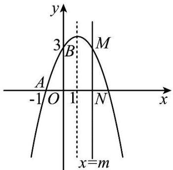

(1)求抛物线的表达式  
(2)若直线 $x = m$ 与 $x$ 轴交于点 $N$ ，在第一象限内与抛物线交于点 $M$ ，当 $m$ 取何值时，使得 $A N + M N$   
有最大值，并求出最大值

【答案】 $( 1 ) y = - x ^ { 2 } + 2 x + 3$ (2)当 $m = \frac { 3 } { 2 }$ 时， $A N + M N$ 有最大值为 $\frac { 2 5 } { 4 }$ 【分析】（1）待定系数法求解析式即可求解；

（2）设 $M \left( m , - m ^ { 2 } + 2 m + 3 \right)$ ，进而分别表示出 $M N , A N$ ，得出关于 $m$ 的二次函数，根据二次函数的性质， $0 < m < 3$ ，即可求得最大值；

【详解】（1）解： 抛物线的顶点横坐标为1对称轴为 $x = 1$

资料整理【淘宝店铺：向阳百分百】

$\therefore A ( - 1 , 0 )$   
与 $\mathbf { X }$ 轴另一交点为 $( 3 , 0 )$   
∴设抛物线为 $y = a ( x + 1 ) ( x - 3 )$   
$\ Q \ B ( 0 , 3 )$   
$. a = - 1$   
$\ \cdot \ y = - ( x + 1 ) ( x - 3 )$   
∴抛物线的表达式为 $y = - x ^ { 2 } + 2 x + 3$   
（2） $M$ 在抛物线上  
∴设 $M \left( m , - m ^ { 2 } + 2 m + 3 \right)$   
 $M$ 在第一象限  
$\begin{array} { l } { { \therefore M N = - m ^ { 2 } + 2 m + 3 \quad A N = m + 1 } } \\ { { \therefore A N + M N = - m ^ { 2 } + 2 m + 3 + m + 1 } } \\ { { = - m ^ { 2 } + 3 m + 4 } } \\ { { \ \because \ 0 < m < 3 } } \end{array}$   
∴当 $m = \frac { 3 } { 2 }$ 时， $A N + M N$ 有最大值为 $\frac { 2 5 } { 4 }$

# 2023·湖南张家界中考真题

16．如图，在平面直角坐标系中，已知二次函数 $y = - \frac { 1 } { 2 } x ^ { 2 } + 2 x + 6$ 的图象与 $x$ 轴交于点 $A \left( - 2 , 0 \right)$ 和点$B \mathopen { } \mathclose \bgroup \left( 6 , 0 \aftergroup \egroup \right)$ 两点，与 $y$ 轴交于点 $C \left( 0 , 6 \right)$ ．点 $D$ 为线段 $B C$ 上的一动点

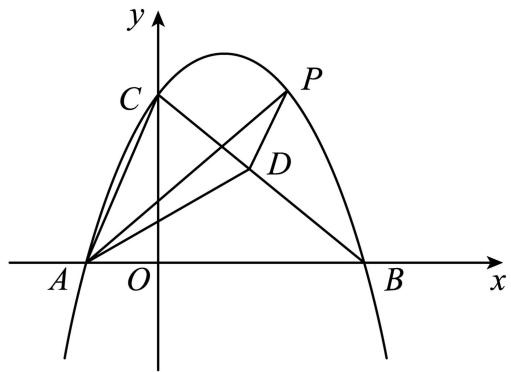

如图，过动点 $D$ 作 $D P / / A C$ 交抛物线第一象限部分于点 $P$ ，连接 $P A , P B$ ，记 $\triangle P A D$ 与 $\triangle P B D$ 的面积和为 $S$ ，当 $S$ 取得最大值时，求点 $P$ 的坐标，并求出此时 $S$ 的最大值．

【答案】 $\left( 3 , \frac { 1 5 } { 2 } \right) \quad S _ { \scriptscriptstyle  { \boxplus } \scriptscriptstyle \mathscr { K } / \scriptscriptstyle \mathscr { E } } = \frac { 2 7 } { 2 }$

【分析】由待定系数法确定直线 $B C$ 的表达式为 $y = - x + 6$ ，直线 $A C$ 的表达式为 $y = 3 x + 6$ ，设$P \left( m , - \frac { 1 } { 2 } m ^ { 2 } + 2 m + 6 \right)$ 然后结合图形及面积之间的关系求解即可

【详解】由已知点 $A \left( - 2 , 0 \right) , B \left( 6 , 0 \right) , C \left( 0 , 6 \right) ,$ ，  
设直线 $B C$ 的表达式为 $y = k x + n$ ，  
资料整理【淘宝店铺：向阳百分百】  
将 $B \mathopen { } \mathclose \bgroup \left( 6 , 0 \aftergroup \egroup \right)$ ， $C \left( 0 , 6 \right)$ 代入 $y = k x + n$ 中， $\displaystyle { \left\{ \begin{array} { l l } { 6 k + n = 0 } \\ { n = 0 } \end{array} \right. }$ , 解得 $\left\{ \begin{array} { l l } { k = - 1 } \\ { n = 6 } \end{array} \right.$   
∴直线 $B C$ 的表达式为 $y = - x + 6$ ，  
同理可得：直线 $A C$ 的表达式为 $y = 3 x + 6$ ，  
$P D / / A C$ ，  
∴设直线 $P D$ 表达式为 $y = 3 x + h$ ，  
由（1）设 $P \left( m , - \frac { 1 } { 2 } m ^ { 2 } + 2 m + 6 \right)$ 代入直线 $P D$ 的表达式  
得： $h = - \frac { 1 } { 2 } m ^ { 2 } - m + 6$ ，  
∴直线 $P D$ 的表达式为： $y = 3 x - { \frac { 1 } { 2 } } m ^ { 2 } - m + 6$ ，  
由 $\begin{array} { r } { \imath \left\{ \begin{array} { l } { \displaystyle { y = - x + 6 } } \\ { \displaystyle { y = 3 x - \frac { 1 } { 2 } m ^ { 2 } - m + 6 } } \end{array} \right. , \quad \overbrace { \vec { \tau } + \frac { 8 } { 8 } m ^ { 2 } + \frac { 1 } { 4 } m } ^ { \displaystyle { x = \frac { 1 } { 8 } m ^ { 2 } + \frac { 1 } { 4 } m } } , \qquad \forall \equiv \gamma . } \end{array}$   
${ \cal D } \bigg ( \frac { 1 } { 8 } m ^ { 2 } + \frac { 1 } { 4 } m , - \frac { 1 } { 8 } m ^ { 2 } - \frac { 1 } { 4 } m + 6 \bigg )$   
∵ $\cdot$ ， $\cdot$ 都在第一象限，  
$\begin{array} { r l } & { \quad : \quad S = S _ { \triangle \rho A D } + S _ { \triangle \rho B D } = S _ { \triangle \rho A B } - S _ { \triangle \rho B A } } \\ & { = \cfrac { 1 } { 2 } \vert A B \vert \left[ \left( - \frac { 1 } { 2 } m ^ { 2 } + 2 m + 6 \right) - \left( - \frac { 1 } { 8 } m ^ { 2 } - \frac { 1 } { 4 } m + 6 \right) \right] } \\ & { = \cfrac { 1 } { 2 } \times 8 \left( - \frac { 3 } { 8 } m ^ { 2 } + \frac { 9 } { 4 } m \right) } \\ & { = - \cfrac { 3 } { 2 } m ^ { 2 } + 9 m = - \cfrac { 3 } { 2 } \left( m ^ { 2 } - 6 m \right) } \\ & { \quad = - \cfrac { 3 } { 2 } \left( m - 3 \right) ^ { 2 } + \cfrac { 2 7 } { 2 } , } \end{array}$   
∴当 $m = 3$ 时，此时 $\cdot$ 点为 $\left( 3 , { \frac { 1 5 } { 2 } } \right)$   
$S _ { \scriptscriptstyle \boxplus \nmid \ l \not } = { \frac { 2 7 } { 2 } }$

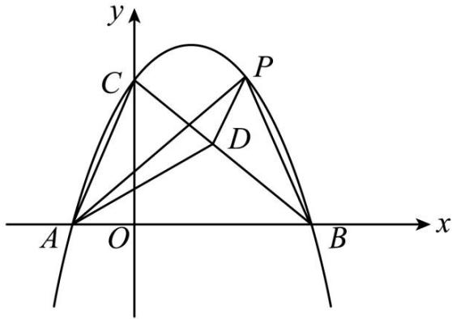

17．如图 $\textcircled{1}$ ，抛物线 $y = a x ^ { 2 } + b x - 9$ 与 $x$ 轴交于点 $A \left( - 3 , 0 \right)$ ， $B \mathopen { } \mathclose \bgroup \left( 6 , 0 \aftergroup \egroup \right)$ ，与 $y$ 轴交于点 $C$ ，连接 AC，BC.点 $P$ 是 $x$ 轴上任意一点

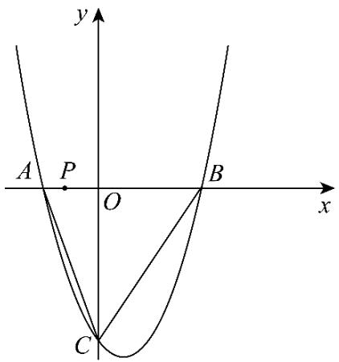  
图 $\textcircled{1}$

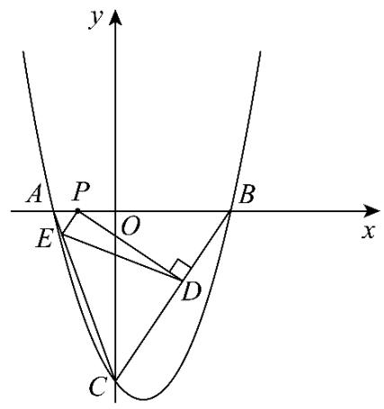  
图 $\textcircled{2}$

(1)求抛物线的表达式；

(2)如图 $\textcircled{2}$ ，当点 $P ( m , 0 )$ 从点 $A$ 出发沿 $x$ 轴向点 $B$ 运动时（点 $P$ 与点 $A$ ， $B$ 不重合），自点 $P$ 分别作$P E / / B C$ ，交 $A C$ 于点 $E$ ，作 $P D \perp B C$ ，垂足为点 $D$ ．当 $m$ 为何值时，VPED面积最大，并求出最大值．

【答案】(1) $) y = \frac 1 2 x ^ { 2 } - \frac 3 2 x - 9$ $m = \frac { 3 } { 2 }$ 时， $S _ { \triangle P D E }$ 有最大值，最大值为 $1 0 \frac { 1 } { 8 }$

【分析】（1）将 $A \left( - 3 , 0 \right)$ ， $B \mathopen { } \mathclose \bgroup \left( 6 , 0 \aftergroup \egroup \right)$ 代入 $y = a x ^ { 2 } + b x - 9$ ，待定系数法确定函数解析式；  
（2）如图，过点 $D$ 作 $D G \bot A B$ ，过点 $\cdot$ 作 $E F \perp A B$ ，垂足为 $G$ ， $\cdot$ ，  
可证 $\Game F P E = \ G D B P$ ， $\Game P D G = \ G D B P$ ；运用待定系数法求直线 $A C$ 解析式 $y = - 3 x - 9$ ，直线 $B C$ 解析式 $y = \frac { 3 } { 2 } x - 9$ ；设点 $E ( p , - 3 p - 9 )$ ， $D ( q , \frac { 3 } { 2 } q - 9 )$ ，则 $P F = \ m - \ p P G = \ q - \ m E F = 3 p + 9$ ，$D G = - \frac { 3 } { 2 } q + 9$ ，运用解直角三角形， $\mathrm { R t } _ { \Delta B O C }$ 中 ， $B C = { \sqrt { O C ^ { 2 } + O B ^ { 2 } } } = { \sqrt { 1 1 7 } }$ ， $\tan \mathrm { p } O B C = \frac { 3 } { 2 }$ Rt△PEF 中 , $\tan \mathrm { { p } } \ : { F P E } = \frac { E F } { P F } = \frac { 3 } { 2 }$ , 可 得 $p = \frac { 1 } { 3 } ( m ^ { - } \ 6 ) , P F = \frac { 2 } { 3 } ( m ^ { + } \ 3 ) ,$ $P E = P F \bullet { \frac { \sqrt { 1 1 7 } } { 6 } } = \ { \frac { \sqrt { 1 1 7 } } { 9 } } ( m + \ 3 )$ Rt△PDG 中 ， t $\operatorname { a n } \operatorname { p } P D G = { \frac { P G } { D G } } = { \frac { 3 } { 2 } }$ ， 可得， $q = \frac { 1 } { 1 3 } ( 4 m + 5 4 )$ ，$P G = - \ { \frac { 9 } { 1 3 } } ( m ^ { - } \ 6 ) P D = \ P G \bullet \frac { \sqrt { 1 1 7 } } { 9 } = - \ \frac { \sqrt { 1 1 7 } } { 1 3 } ( m ^ { - } \ 6 )$ ，于是 $S _ { _ { \Delta P D E } } = \frac { 1 } { 2 } P D \bullet P E = - \frac { 1 } { 2 } ( m + 3 ) ( m - 6 ) ,$ ，从而确定 $m = \frac { 3 } { 2 }$ 时，最大值为 $1 0 \frac { 1 } { 8 }$

【详解】（1）将 $A \left( - 3 , 0 \right)$ ， $B \mathopen { } \mathclose \bgroup \left( 6 , 0 \aftergroup \egroup \right)$ 代入 $y = a x ^ { 2 } + b x - 9$ ，得 $\left\{ \begin{array} { l l } { 9 a - 3 b - 9 = 0 } \\ { 3 6 a + 6 b - 9 = 0 } \end{array} \right.$ 解得 $\left\{ { \begin{array} { l } { \displaystyle a = { \frac { 1 } { 2 } } } \\ { \displaystyle b = - { \frac { 3 } { 2 } } } \end{array} } \right.$

∴抛物线解析式为： $y = { \frac { 1 } { 2 } } x ^ { 2 } - { \frac { 3 } { 2 } } x - 9$ （2）如图，过点 $D$ 作 $D G \bot A B$ ，过点 $E$ 作 $E F \perp A B$ ，垂足为 $\cdot$ ， $\cdot$ ，

$P E / / B C$ ， $P D \perp B C$ $\therefore \mathrm { D } D P E = \mathrm { \ D } P D B = \mathrm { \ } 9 0 ^ { \circ }$ $\textcircled { 1 } F P E + \textcircled { 1 } D P B = 9 0 ^ { \circ }$ $\cdot \cdot \mathrm { \nabla } \mathrm { \sf ~ D } D P B + \mathrm { \nabla } \mathrm { \sf ~ D } B P = 9 0 ^ { \circ }$ $\dot { \cdot } \mathrm { ~ D ~ } F P E = \mathrm { ~ D ~ } D B P$ ，同理可得 $\Game P D G = \ G D B P$ 设直线 $A C$ 的解析式为： $y = k x + h$ 则 $\displaystyle { \left\{ - 3 k + h = 0 \right. }$ 解得 $\left\{ \begin{array} { l } { k = - 3 } \\ { h = - 9 } \end{array} \right.$ ∴直线 $\begin{array} { r l } { A C } & { { } { }  y = - 3 x - 9 } \end{array}$ 同理由点 $B ( 6 , 0 )$ ， $C ( 0 , - 9 )$ ，可求得直线 $B C$ ： $y = \frac { 3 } { 2 } x - 9$ 设点 $E ( p , - 3 p - 9 )$ ， $D ( q , \frac { 3 } { 2 } q - 9 )$ ，则 $\quad = \ m - \ p \quad P G = \ q ^ { - } \ m E F = \ 3 p ^ { + } \ 9 \quad D G = - \ \frac { 3 } { 2 } q ^ { + } \ 9$ $\mathrm { R t } _ { \Delta B O C }$ 中， $O B = 6 O C = 9$ $B C = { \sqrt { O C ^ { 2 } + O B ^ { 2 } } } = { \sqrt { 6 ^ { 2 } + 9 ^ { 2 } } } = { \sqrt { 1 1 7 } }$ ∴ tan Ð OBC = $O B C = \frac { 9 } { 6 } = \frac { 3 } { 2 }$ ,$\mathrm { R t } \triangle P E F$ 中， tan $\mathrm { ~ ) ~ } F P E = \frac { E F } { P F } { = \tan \mathrm { ~ } \mathrm { ~ } O B C = \frac { 3 } { 2 } }$ $\frac { 3 p + 9 } { m - p } = \frac { 3 } { 2 }$ 2 解得 $p = \frac { 1 } { 3 } ( m - 6 )$ ，$P F = \ m - \ p = \ { \frac { 2 } { 3 } } ( m + \ 3 )$ $\therefore \cos \oplus F P E = { \frac { P F } { P E } } = \cosh O B C = { \frac { O B } { B C } } = { \frac { 6 } { \sqrt { 1 1 7 } } }$

$P E = \ P F \bullet { \frac { \sqrt { 1 1 7 } } { 6 } } = \frac { \sqrt { 1 1 7 } } { 9 } ( m + \ 3 )$   
$\mathbb { R } { \mathrm { t } } \triangle P D G$ 中， tan Ð $P D G = { \frac { P G } { D G } } { = }$ tan Ð $O B C = \frac { 3 } { 2 }$   
$\therefore \frac { q - m } { - \frac { 3 } { 2 } q + 9 } = \frac { 3 } { 2 }$ ，解得， $q = \frac { 1 } { 1 3 } ( 4 m + 5 4 )$   
$P G = q - m = - \frac { 9 } { 1 3 } ( m - 6 )$   
$\sin \beta P D G = { \frac { P G } { P D } } = \sin \beta O B C = { \frac { 9 } { \sqrt { 1 1 7 } } }$   
$\therefore P D = P G \bullet { \frac { \sqrt { 1 1 7 } } { 9 } } = - \ { \frac { \sqrt { 1 1 7 } } { 1 3 } } ( m ^ { - } \ 6 )$   
$\therefore S _ { \scriptscriptstyle  { s } P D D E } = \frac { 1 } { 2 } P D \bullet P E = \frac { 1 } { 2 } \bullet \frac { \sharp \widehat { \vec { \textbf { k } } } } { \lVert \boldsymbol { \nabla } \rVert } \frac { 1 1 7 } { 1 3 } ( m - \textbf { 6 } ) \bullet \frac { \sqrt { 1 7 } } { 9 } ( m + \textbf { 3 } ) = - \ \frac { 1 } { 2 } ( m + \textbf { 3 } ) ( m - \textbf { 6 } )$ ，  
即 PDES $S _ { _ { \Delta P D E } } = - \frac { 1 } { 2 } ( m ^ { + } \ 3 ) ( m ^ { - } \ 6 ) = - \frac { 1 } { 2 } ( m ^ { - } \ \frac { 3 } { 2 } ) ^ { 2 } + 1 0 \frac { 1 } { 8 }$   
$\cdot - \frac { 1 } { 2 } < 0$ $m = \frac { 3 } { 2 }$ 时， $- 3 < m < 6$ ， $S _ { \triangle P D E }$ 有最 大值 ，最 大值 为 $1 0 \frac { 1 } { 8 }$

# 2022·湖北襄阳中考真题

18．在平面直角坐标系中，直线 $y = m x - 2 m$ 与 $x$ 轴， $y$ 轴分别交于 $A$ ， $B$ 两点，顶点为 $D$ 的抛物线 $y$ $= - x ^ { 2 } + 2 m x - m ^ { 2 } + 2$ 与 $y$ 轴交于点 $C$ ．

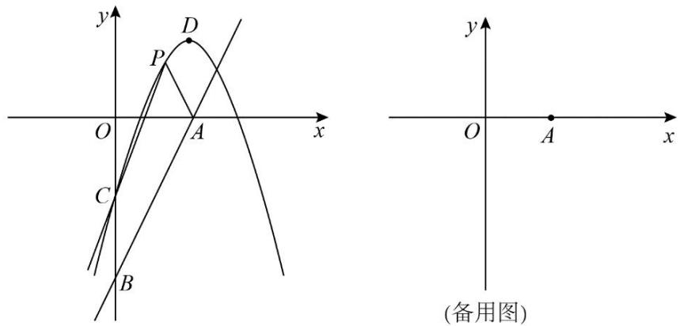

在 $y$ 轴上有一点 $M \ ( 0 , \ { \frac { 7 } { 3 } } m )$ ，当点 $C$ 在线段 $M B$ 上时，$\textcircled{1}$ 求 $m$ 的取值范围； $\textcircled{2}$ 求线段 $B C$ 长度的最大值【答案】 $( 2 ) \textcircled { 1 } \frac { 2 } { 3 } \leq m \leq 1 + \sqrt { 3 } \frac { 1 } { \mathscr { P } } - 3 \leq m \leq 1 - \sqrt { 3 } ; \textcircled { 2 } 1 3$ 【分析】对于（2），由（1）可知，点 $B$ ， $\cdot$ 的坐标，再根据点 $\cdot$ 在线段 $M B$ 上，分两种情况讨论，求出 $\cdot$ 的答案即可；对于 $\textcircled{2}$ ，根据 $\cdot$ 中的情况分别表示 $B C$ ，再配方二次函数的性质求出答案即可．

【详解】知 $B$ （0， $\cdot$ ）， $\cdot$ （0， $\cdot$ ），

$\textcircled{1} \because y$ 轴上有一点 $M ( 0 , \frac { 7 } { 3 } m )$ $\cdot$ $\cdot$   
∴需分两种情况讨论：  
当 $\frac { 7 } { 3 } m \geq - m ^ { 2 } + 2 \geq - 2 m$ ${ \frac { 2 } { 3 } } \leq m \leq 1 + { \sqrt { 3 } }$ ，当 $\frac { 7 } { 3 } m \leq - m ^ { 2 } + 2 \leq - 2 m$ $- 3 \le m \le 1 - \sqrt { 3 }$ ∴ $m$ 的取值范围是 ${ \frac { 2 } { 3 } } \leq m \leq 1 + { \sqrt { 3 } }$ 或 $- 3 \le m \le 1 - \sqrt { 3 }$ ；$\cdot$ 当 ${ \frac { 2 } { 3 } } \leq m \leq 1 + { \sqrt { 3 } }$ 时，  
$: B C = - m ^ { 2 } + 2 - ( - 2 m ) = - m ^ { 2 } + 2 m + 2 = - ( m - 1 ) ^ { 2 } + 3 ,$ ，∴当 $m { = } 1$ 时， $\cdot$ 的最大值为 3；  
当 $- 3 \le m \le 1 - \sqrt { 3 }$ 时，  
$\therefore B C = - 2 m - ( - m ^ { 2 } + 2 ) = m ^ { 2 } - 2 m - 2 = ( m - 1 ) ^ { 2 } - 3 ,$ 当 $m { = } { - } 3$ 时，点 $M$ 与点 $C$ 重合， $B C$ 的最大值为 13，  
∴BC 的最大值是 13

# 2023·湖北荆州中考真题

19．已知： $y$ 关于 $x$ 的函数 $y = ( a - 2 ) x ^ { 2 } + ( a + 1 ) x + b$ (1)若函数的图象与坐．标．轴．有两个公共点，且 $a = 4 b$ ，则 $a$ 的值是(2)如图，若函数的图象为抛物线，与 $x$ 轴有两个公共点 $A { \big ( } { - } 2 , 0 { \big ) }$ ， $B \left( 4 , 0 \right)$ ，并与动直线$l : x = m ( 0 < m < 4 )$ 交于点 $P$ ，连接 $P A$ ， $P B$ ， $P C$ ， $B C$ ，其中 $P A$ 交 $y$ 轴于点 $D$ ，交 $B C$ 于点 $E$ ．设$\triangle P B E$ 的面积为 $\mathrm { S } _ { \mathrm { 1 } }$ ， $\triangle C D E$ 的面积为 $\mathrm { S } _ { 2 }$

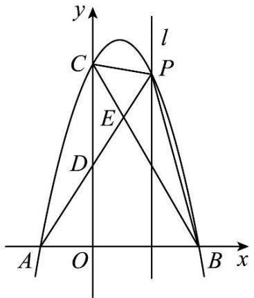

$\textcircled{1}$ 当点 $P$ 为抛物线顶点时，求 $\triangle \mathrm { P B C }$ 的面积；

$\textcircled{2}$ 探究直线 $l$ 在运动过程中， $S _ { 1 } - S _ { 2 }$ 是否存在最大值？若存在，求出这个最大值；若不存在，说明理

由．

【答案】(1)0或 2 或 $- { \frac { 1 } { 4 } }$ (2) $\cdot$ ， $\textcircled{2}$ 存在， $\frac { 1 6 } { 3 }$

【分析】（1）根据函数与坐标轴交点情况，分情况讨论函数为一次函数和二次函数的时候，按照图像的性质以及与坐标轴交点的情况即可求出 $a$ 值

（2） $\textcircled{1}$ 根据A和 $B$ 的坐标点即可求出抛物线的解析式，即可求出顶点坐标 $P$ ，从而求出 $P H$ 长度，再利用A和 $B$ 的坐标点即可求出 $B C$ 的直线解析式，结合 $x _ { F } = x _ { P }$ 即可求出 $F$ 点坐标，从而求出 $P F$ 长度，最后利用面积法即可求出 $\triangle \mathrm { P B C }$ 的面积$\textcircled{2}$ 观察图形，用 $m$ 值表示出点 $P$ 坐标，再根据平行线分线段成比例求出 $O D$ 长度，利用割补法表示出 $\mathrm { ~ \mathsf ~ { ~ S ~ } ~ } _ { 1 } \mathrm { ~ \mathsf ~ { ~ S ~ } ~ } _ { 2 }$ ，将二者相减转化成关于 $m$ 的二次函数的顶点式，利用 $m$ 取值范围即可求出 $S _ { 1 } - S _ { 2 }$ 的最小值．

【详解】（1）解：函数的图象与坐标轴有两个公共点，  
$\therefore ( a - 2 ) x ^ { 2 } + ( a + 1 ) x + b = 0 ,$ ，  
 $a = 4 b$ ，  
$\therefore \left( a - 2 \right) x ^ { 2 } + \left( a + 1 \right) x + \frac { a } { 4 } = 0$   
当函数为一次函数时， $a - 2 = 0$ ，  
 $a = 2$ ．  
当函数为二次函数时，  
$\left( a - 2 \right) x ^ { 2 } + \left( a + 1 \right) x + \frac { a } { 4 } = 0$   
若函数的图象与坐标轴有两个公共点，即与 $x$ 轴， $y$ 轴分别只有一个交点时，  
$\therefore \Delta = b ^ { 2 } - 4 a c = \left( a + 1 \right) ^ { 2 } - 4 \left( a - 2 \right) \cdot { \frac { a } { 4 } } = 4 a + 1 = 0 ,$ ，  
$\therefore a = - { \frac { 1 } { 4 } }$   
当函数为二次函数时，函数的图象与坐标轴有两个公共点， 即其中一点经过原点，  
$\therefore b = 0 , \because a = 4 b , \therefore a = 0 .$   
综上所述， $a = 2$ 或 $0$ ．故答案为： $\cdot$ 或 2 或 $- { \frac { 1 } { 4 } }$

（2）解： $\cdot$ 如图所示，设直线 $l$ 与 $B C$ 交于点 $F$ ，直线 $l$ 与 $A B$ 交于点 $H$

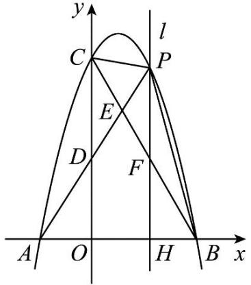

依题意得： $\displaystyle { \int } 2 a + b = 1 0$ 解得： $\begin{array} { c } { { \left\{ a = 1 \right. } }  \\ { { \left. b = 8 \right. } } \end{array}$   
抛物线的解析式为： $y = - x ^ { 2 } + 2 x + 8 = - ( x - 1 ) ^ { 2 } + 9$   
点 $P$ 为抛物线顶点时， $P ( 1 , 9 )$ ， $C ( 0 , 8 )$ ，  
$\therefore P H = 9 x _ { _ { P } } = 1$ ，  
由 $B \left( 4 , 0 \right)$ ， $C \left( 0 , 8 \right)$ 得直线 $B C$ 的解析式为 $y = - 2 x + 8$ ，  
 $F$ 在直线 $B C$ 上，且在直线 $l$ 上，则 $F$ 的横坐标等于 $P$ 的横坐标，  
 $. F ( 1 , 6 )$ ，  
$\therefore F H = 6 , O H = 1$ ，  
$\therefore P F = P H - F H = 9 - 6 = 3 , B H = O B - O H = 4 - 1 = 3$   
$\therefore \mathbf { S } _ { \scriptscriptstyle \triangle P B C } = \mathbf { S } _ { \scriptscriptstyle \triangle P F C } + \mathbf { S } _ { \scriptscriptstyle \triangle P F B } = { \frac { 1 } { 2 } } x _ { P } \cdot O H + { \frac { 1 } { 2 } } H B \cdot P F = { \frac { 1 } { 2 } } \times 3 \times 1 + { \frac { 1 } { 2 } } \times 3 \times 3 = 6$   
故答案为：6  
$S _ { 1 } - S _ { 2 }$ 存在最大值，理由如下：  
如图，设直线 $x = m$ 交 $x$ 轴于 $H$ ．  
由 $\textcircled{1}$ $O B = 4 A O = 2 A B = 6 O C = 8 A H = 2 + m P \left( m , - m ^ { 2 } + 2 m + 8 \right)$   
$\therefore P H = - m ^ { 2 } + 2 m + 8$ ，  
$\because O D \bot x , P H \bot A B ,$ ，  
$\therefore O D / / P H$ ，  
${ \frac { A O } { A H } } { = } { \frac { O D } { P H } }$   
即 ${ \frac { 2 } { 2 + m } } = { \frac { O D } { - m ^ { 2 } + 2 m + 8 } }$   
$\therefore O D = 8 - 2 m$   
$\mathbf { \nabla } \cdot \mathbf { S } _ { 1 } = \mathbf { S } _ { \triangle P A B } - \mathbf { S } _ { \triangle A O D } - \mathbf { S } _ { \triangle \sharp \sharp \mathcal { H } E B O B } ~ \mathbf { S } _ { 2 } = \mathbf { S } _ { \triangle O B C } - \mathbf { S } _ { \sharp \sharp \mathcal { H } E B O B }$ ，  
$\therefore \mathrm { S } _ { 1 } - \mathrm { S } _ { 2 } = \mathrm { S } _ { \scriptscriptstyle { \Delta P A B } } - \mathrm { S } _ { \scriptscriptstyle { A Q D } } - \mathrm { S } _ { \scriptscriptstyle { \Delta Q B C } } = { \frac { 6 \left( - m ^ { 2 } + 2 m + 8 \right) } { 2 } } - { \frac { 2 \left( 8 - 2 m \right) } { 2 } } - { \frac { 4 \times 8 } { 2 } } = - 3 m ^ { 2 } + 8 m \ ,$ ，  
$\therefore \mathbf { S } _ { 1 } - \mathbf { S } _ { 2 } = - 3 \Bigg ( m - \frac { 4 } { 3 } \Bigg ) ^ { 2 } + \frac { 1 6 } { 3 }$ Q 3  0 ， 0  m  4 ，当 $m = \frac { 4 } { 3 }$ 时， $S _ { 1 } - S _ { 2 }$ 有最大值，最

# 2022·江苏连云港中考真题

20．已知二次函数 $y = x ^ { 2 } + ( m - 2 ) x + m - 4$ ，其中 $m { > } 2$ (1)当该函数的图像经过原点 $O ( 0 , 0 )$ ，求此时函数图像的顶点A的坐标；

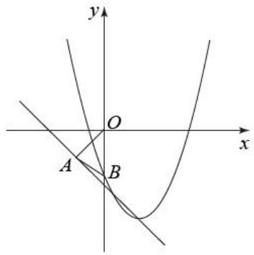

(2)如图，在（1）的条件下，若平移该二次函数的图像，使其顶点在直线 $\ y ~ = ~ - x - 2$ 上运动，平移后所得函数的图像与 $y$ 轴的负半轴的交点为 $B$ ，求 $\triangle A O B$ 面积的最大值

【答案】 $( 1 ) A { \big ( } { - } 1 , { - } 1 { \big ) }$   
(2)见解析  
(3)最大值为 98

【分析】（1）先利用待定系数法求出二次函数解析式，再将二次函数解析式化为顶点式即可得到答案；

（2）先根据顶点坐标公式求出顶点坐标为 $\left( \frac { 2 - m } { 2 } , \frac { - m ^ { 2 } + 8 m - 2 0 } { 4 } \right)$ 然后分别证明顶点坐标的横纵坐标都小于 0 即可；

（3）设平移后图像对应的二次函数表达式为 $y = x ^ { 2 } + b x + c$ ，则其顶点坐标为 $\left( - \frac { b } { 2 } , \frac { 4 c - b ^ { 2 } } { 4 } \right)$ 然后求出点 B 的坐标，根据平移后的二次函数顶点在直线 $\ y ~ = ~ - x - 2$ 上推出 $c = \frac { b ^ { 2 } + 2 b - 8 } { 4 }$ 过点 A 作AH  OB ，垂足为 H ，可以推出 =AOBS△ $S _ { { \triangle A O B } } = - { \frac { 1 } { 8 } } ( b + 1 ) ^ { 2 } + { \frac { 9 } { 8 } }$ ,由此即可求解．

【详解】（1）解：将 $O ( 0 , 0 )$ 代入 $y = x ^ { 2 } + ( m - 2 ) x + m - 4$ ，  
解得 $m = 4$   
由 $m > 2$ ，则 $m = 4$ 符合题意，  
$\begin{array} { l } { \therefore y = x ^ { 2 } + 2 x = ( x + 1 ) ^ { 2 } - 1 , } \\ { \therefore A \left( - 1 , - 1 \right) . } \end{array}$

（2）解：由抛物线顶点坐标公式得顶点坐标为 $\left( \frac { 2 - m } { 2 } , \frac { - m ^ { 2 } + 8 m - 2 0 } { 4 } \right) .$ $\begin{array} { l } { m > 2 } \\ { m - 2 > 0 } \\ { 2 - m < 0 } \\ { \displaystyle \frac { 2 - m } { 2 } < 0 } \end{array}$

$\because \frac { - m ^ { 2 } + 8 m - 2 0 } { 4 } = - \frac { 1 } { 4 } ( m - 4 ) ^ { 2 } - 1 \leq - 1 < 0 ,$ ，∴二次函数 $y = x ^ { 2 } + ( m - 2 ) x + m - 4$ 的顶点在第三象限

（3）解：设平移后图像对应的二次函数表达式为 $y = x ^ { 2 } + b x + c$ ，  
当 $x = 0$ 时， $y = c$ ，  
$B ( 0 , c )$   
将 $\left( - \frac { b } { 2 } , \frac { 4 c - b ^ { 2 } } { 4 } \right)$ 代入 $\ y ~ = ~ - x - 2$ ，  
解得 $c = \frac { b ^ { 2 } + 2 b - 8 } { 4 }$ $\cdot _ { B \left( 0 , c \right) }$ 在 $y$ 轴的负半轴上，  
$\therefore c < 0$ ．  
$O B = - c = - { \frac { b ^ { 2 } + 2 b - 8 } { 4 } }$   
过点A作 $A H \bot O B$ ，垂足为 $H$ ，  
$A ( - 1 , - 1 )$ ，  
∴ $A H = 1$   
在 $\triangle A O B$ 中， $S _ { \triangle A O B } = \frac { 1 } { 2 } O B \cdot A H = \frac { 1 } { 2 } \times \left( - \frac { b ^ { 2 } + 2 b - 8 } { 4 } \right) \times 1$   
$\begin{array} { l } { { \displaystyle = - \frac { 1 } { 8 } b ^ { 2 } - \frac { 1 } { 4 } b + 1 } } \\ { { \displaystyle = - \frac { 1 } { 8 } ( b + 1 ) ^ { 2 } + \frac { 9 } { 8 } } } \end{array}$   
∴当 $b = - 1$ 时，此时 $c < 0$ ， $\triangle A O B$ 面积有最大值，最大值为 $\frac { 9 } { 8 }$

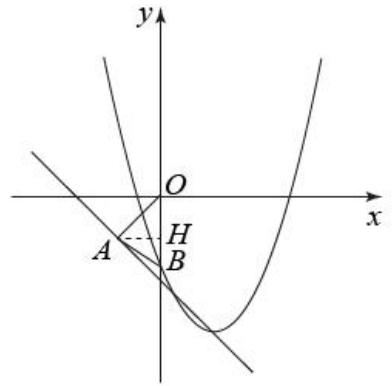

# 2022·湖南岳阳·中考真题

21．如图 1，在平面直角坐标系 $x O y$ 中，抛物线 $F _ { 1 }$ ： $y = x ^ { 2 } + b x + c$ 经过点 $A { \big ( } { - } 3 , 0 { \big ) }$ 和点 $B \mathopen { } \mathclose \bgroup \left( 1 , 0 \aftergroup \egroup \right)$

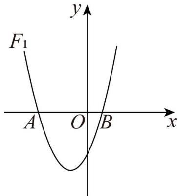  
图1

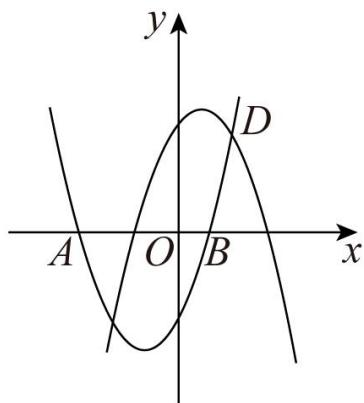  
图2

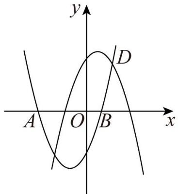  
图3

(1)求抛物线 $F _ { 1 }$ 的解析式；

(2)如图 2，作抛物线 $F _ { 2 }$ ，使它与抛物线 $F _ { 1 }$ 关于原点 $o$ 成中心对称，请直接写出抛物线 $F _ { 2 }$ 的解析式；

(3)如图 3，将（2）中抛物线 $F _ { 2 }$ 向上平移 2个单位，得到抛物线 $F _ { 3 }$ ，抛物线 $F _ { 1 }$ 与抛物线 $F _ { 3 }$ 相交于 $C$ ，$D$ 两点（点 $C$ 在点 $D$ 的左侧）．

$\textcircled{1}$ 求点 $C$ 和点 $D$ 的坐标；

$\textcircled{2}$ 若点 $M$ ， $N$ 分别为抛物线 $F _ { 1 }$ 和抛物线 $F _ { 3 }$ 上 $C$ ， $D$ 之间的动点（点 $M$ ， $N$ 与点 $C$ ， $D$ 不重合），试求四边形CMDN面积的最大值

$$
{ \sharp } \equiv { \bf 1 } \left( 1 \right) y = x ^ { 2 } + 2 x - 3 , ( 2 ) y = - x ^ { 2 } + 2 x + 3 , ( 3 ) \mathbb { G } \left( - 2 , - 3 \right) \ddot { \ast } D \left( 2 , 5 \right) ; \mathbb { 2 } 1 6
$$

【分析】（1）将点 $A \left( - 3 , 0 \right)$ 和点 $B \mathopen { } \mathclose \bgroup \left( 1 , 0 \aftergroup \egroup \right)$ 代入 $y = x ^ { 2 } + b x + c$ ，即可求解；

（2）利用对称性求出函数 $F _ { 1 }$ 顶点 $( - 1 , - 4 )$ 关于原点的对称点为 $\left( 1 , 4 \right)$ ，即可求函数 $F _ { 2 }$ 的解析式；

（3） $\cdot$ 通过联立方程组 $\left\{ \begin{array} { l l } { y = - x ^ { 2 } + 2 x + 5 } \\ { y = x ^ { 2 } + 2 x - 3 } \end{array} \right.$ 求出 $C$ 点和 $D$ 点坐标即可；

$\cdot$ 求出直线 $C D$ 的解析式，过点 $M$ 作 $M F / / \ y$ 轴交 $C D$ 于点 $F$ ，过点 $N$ 作 $N E / / \ y$ 轴交于点 $E$ ，设$M \big ( m , m ^ { 2 } + 2 m - 3 \big ) \ , N \big ( n , - n ^ { 2 } + 2 n + 5 \big ) \ , \exists \downarrow \ F \big ( m , 2 m + 1 \big ) \ , N \big ( n , 2 n + 1 \big ) \ ,$ 可 求 $M F = - m ^ { 2 } + 4$ ，$N E = - n ^ { 2 } + 4$ ，由 $S _ { \perp \perp \dot { \gamma } \dot { \mathcal { H } } C M D N } = S _ { \triangle C D N } + S _ { \triangle C D M } = 2 \big ( M F + N E \big )$ ，分别求出 $M F$ 的最大值 4， $N E$ 的最大值4，即可求解．

【详解】（1）解：将点 $A \left( - 3 , 0 \right)$ 和点 $B \mathopen { } \mathclose \bgroup \left( 1 , 0 \aftergroup \egroup \right)$ 代入 $y = x ^ { 2 } + b x + c$ ，  
$\cdot \left\{ { \begin{array} { l } { 9 - 3 b + c = 0 } \\ { 1 + b + c = 0 } \end{array} } \right.$ , 解得 $\left\{ { \begin{array} { l } { b = 2 } \\ { c = - 3 } \end{array} } \right.$   
$y = x ^ { 2 } + 2 x - 3$   
（2） $y = x ^ { 2 } + 2 x - 3 = ( x + 1 ) ^ { 2 } - 4$ ，  
∴抛物线的顶点 $( - 1 , - 4 )$ ，  
∵顶点 $( - 1 , - 4 )$ 关于原点的对称点为 $\left( 1 , 4 \right)$ ，  
∴抛物线 $F _ { 2 }$ 的解析式为 $y = - ( x - 1 ) ^ { 2 } + 4$ ，

$$
\therefore y = - x ^ { 2 } + 2 x + 3 .
$$

（3）由题意可得，抛物线 $F _ { 3 }$ 的解析式为 $y = - ( x - 1 ) ^ { 2 } + 6 = - x ^ { 2 } + 2 x + 5$ ，$\textcircled{1}$ 联立方程组 $\left\{ \begin{array} { l } { { y = - x ^ { 2 } + 2 x + 5 } } \\ { { y = x ^ { 2 } + 2 x - 3 } } \end{array} \right. ,$   
解得 $x = 2$ 或 $x = - 2$ ，  
$\therefore C ( - 2 , - 3 ) \precneq D ( 2 , 5 ) ;$ ；  
$\textcircled{2}$ 设直线 $C D$ 的解析式为 $y = k x + b$ ，  
$\displaystyle : \int _ { } ^ { - 2 k + b = - 3 } \ d $ 解得 $\left\{ { k = 2 \atop b = 1 } \right.$   
$y = 2 x + 1$ ，  
过点 $M$ 作 $M F / / \ y$ 轴交 $C D$ 于点 $F$ ，过点 $N$ 作 $N E / / \ y$ 轴交于点 $E$ ，如图所示：  
设 $M \left( m , m ^ { 2 } + 2 m - 3 \right)$ ， $N { \Big ( } n , - n ^ { 2 } + 2 n + 5 { \Big ) }$ ，  
则 $F { \big ( } m , 2 m + 1 { \big ) } \quad N { \big ( } n , 2 n + 1 { \big ) }$   
$M F = 2 m + 1 - \left( m ^ { 2 } + 2 m - 3 \right) = - m ^ { 2 } + 4$   
$N E = - n ^ { 2 } + 2 n + 5 - 2 n - 1 = - n ^ { 2 } + 4 ,$ ，  
$- 2 < m < 2 - 2 < n < 2$   
∴当 $m = 0$ 时， $M F$ 有最大值4，  
当 $n = 0$ 时， $N E$ 有最大值4，  
$S _ { \perp \perp \perp \mathcal { R } C M D N } = S _ { \triangle C D N } + S _ { \triangle C D M } = \frac { 1 } { 2 } \times 4 \times \left( M F + N E \right) = 2 \left( M F + N E \right)$   
∴当 $M F + N E$ 最大时，四边形CMDN面积的最大值为 16

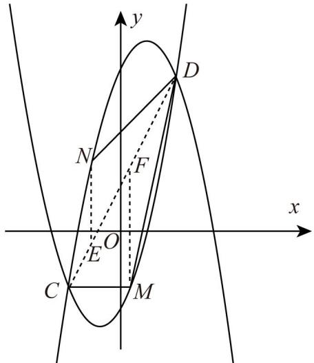

# 2023·宁夏·中考真题

22．如图，抛物线 $y = a x ^ { 2 } + b x + 3 ( a \neq 0 )$ 与 $x$ 轴交于A， $B$ 两点，与 $y$ 轴交于点 $C$ ．已知点A的坐标 是 $( - 1 , 0 )$ ，抛物线的对称轴是直线 $x = 1$

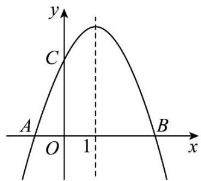  
备用图

(1)直接写出点 $B$ 的坐标；

(2)在对称轴上找一点 $P$ ，使 $P A + P C$ 的值最小．求点 $P$ 的坐标和 $P A + P C$ 的最小值；

(3)第一象限内的抛物线上有一动点 $M$ ，过点 $M$ 作 $M N \perp x$ 轴，垂足为 $N$ ，连接 $B C$ 交 $M N$ 于点 $\mathcal { Q }$ ．依题意补全图形，当 $M Q + \sqrt { 2 } C Q$ 的值最大时，求点 $M$ 的坐标

【答案】(1)3,0

(2)点 $P ( 1 , 2 )$ ， $P A + P C$ 的最小值为 $3 \sqrt { 2 }$

$( 3 ) M \left( \frac { 5 } { 2 } , \frac { 7 } { 4 } \right)$

【分析】（1）根据抛物线的对称性，进行求解即可；

（2）根据抛物线的对称性，得到 $P A + P C = P B + P C \geq B C$ ，得到当 $P , B , C$ 三点共线时， $P A + P C$ 的值最小，为 $B C$ 的长，求出直线 $B C$ 的解析式，解析式与对称轴的交点即为点 $P$ 的坐标，两点间的距离公式求出 $B C$ 的长，即为 $P A + P C$ 的最小值；

（3）根据题意，补全图形，设 $M \left( m , - m ^ { 2 } + 2 m + 3 \right)$ ，得到 $N \big ( m , 0 \big )$ ， $\mathcal { Q } \big ( m , - m + 3 \big )$ ，将 $M Q + \sqrt { 2 } C Q$ 的最大值转化为二次函数求最值，即可得解

【详解】（1）解：∵点 $A { \bigl ( } { - } 1 , 0 { \bigr ) }$ 关于对称轴的对称点为点 $B$ ，对称轴为直线 $x = 1$ ，∴点 $B$ 为3,0 ；  
（2）当 $x = 0$ 时， $y = 3$ ，  
$\therefore C ( 0 , 3 )$ ，  
连接 $B C$ ，  
$\because B ( 3 , 0 )$ ，  
$B C = \sqrt { 3 ^ { 2 } + 3 ^ { 2 } } = 3 \sqrt { 2 }$ ，  
∵点A关于对称轴的对称点为点 $B$ ，$P A + P C = P B + P C \geq B C$ ，  
∴当 $P , B , C$ 三点共线时， $P A + P C$ 的值最小，为 $B C$ 的长，设直线 $B C$ 的解析式为： $y = k x + n$ ，  
则： $\begin{array} { l } { { \displaystyle { \int } n = 3 } } \\ { { \displaystyle { \left\{ 3 k + n = 0 \right. } } }  \end{array}$ 解得： $\begin{array} { l } { { \left\{ n = 3 \atop { k = - 1 } \right. } }  \end{array}$   
$\dot { \mathbf { \nabla } } \cdot \boldsymbol { y } = - x + 3$ ，  
∵点 $P$ 在抛物线的对称轴上，  
$\therefore P ( 1 , 2 )$ ；  
∴点 $P ( 1 , 2 )$ ， $P A + P C$ 的最小值为 $3 \sqrt { 2 }$ ；

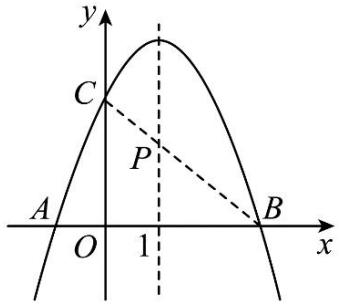

（3）过点 $M$ 作 $M N \perp x$ 轴，垂足为 $N$ ，连接 $B C$ 交 $M N$ 于点 $\mathcal { Q }$ ，如图所示，

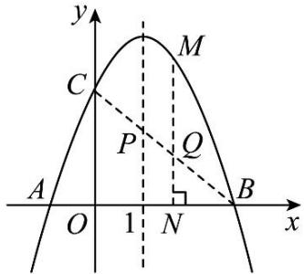

$A ( - 1 , 0 ) , B ( 3 , 0 )$   
设抛物线的解析式为： $y = a ( x + 1 ) ( x - 3 )$ ，  
$\mathbf { \chi } _ { C \left( 0 , 3 \right) }$ ，  
$3 = - 3 a$ ，  
$\therefore a = - 1$ ，  
$\therefore y = - ( x + 1 ) ( x - 3 ) = - x ^ { 2 } + 2 x + 3$ ，  
设 $M \left( m , - m ^ { 2 } + 2 m + 3 \right)$ ，则： $N ( m , 0 )$ ，  
由（2）知：直线 $B C$ ： $y = - x + 3$ ，  
$Q \left( m , - m + 3 \right)$ ，  
$M Q = - m ^ { 2 } + 2 m + 3 + m - 3 = - m ^ { 2 } + 3 m$ ，  
$C ( 0 , 3 ) , B ( 3 , 0 )$ ，  
$O C = O B = 3 B N = 3 - m$ ，  
$\cdot \angle O B C = \angle O C B = 4 5 ^ { \circ }$ ，  
$\angle N Q B = \angle O B C = 4 5 ^ { \circ }$ ，  
$\therefore B Q = \sqrt { 2 } B N = \sqrt { 2 } \left( 3 - m \right) ,$ ，  
$C Q = B C - B Q = 3 { \sqrt { 2 } } - 3 { \sqrt { 2 } } + { \sqrt { 2 } } m = { \sqrt { 2 } } m$ ，  
$M Q + \sqrt { 2 } C Q = - m ^ { 2 } + 3 m + \sqrt { 2 } \cdot \sqrt { 2 } m = - m ^ { 2 } + 5 m = - \left( m - { \frac { 5 } { 2 } } \right) ^ { 2 } + { \frac { 2 5 } { 4 } }$   
∴当 $m = \frac { 5 } { 2 }$ 时， $M Q + \sqrt { 2 } C Q$ 有最大值，此时 $M \left( { \frac { 5 } { 2 } } , { \frac { 7 } { 4 } } \right)$   
在平面直角坐标系 $x O y$ 中，已知抛物线 $y = - x ^ { 2 } + 2 m x + 3 m$ ，点 $A$ （3，0）

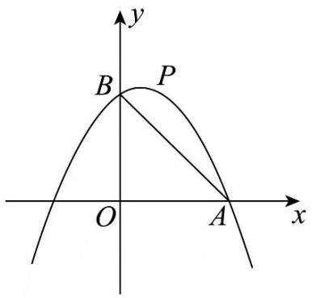

(1)当抛物线过点 $A$ 时，求抛物线的解析式；

(2)在（1）的条件下，抛物线与 $y$ 轴交于点 $B$ ，点 $P$ 是抛物线上位于第一象限的点，连接 $A B$ ， $P D$ 交于点 $M$ ， $P D$ 与 $y$ 轴交于点 $N$ ．设 $S { = } S _ { \triangle } P A M { - } S _ { \triangle } B M N$ ，问是否存在这样的点 $P$ ，使得 $S$ 有最大值？若存在，请求出点 $P$ 的坐标，并求出 $S$ 的最大值；若不存在，请说明理由

【答案】 $\cdot$ ；(2)存在，点 $P$ 的坐标是（1，4）， $S _ { _ { \mathtt { H } \mathtt { X } } } = { \frac { 9 } { 4 } }$ 过程见解析【分析】（1）把 $x { = } 3$ ， $y { = } 0$ 代入 $y = - x ^ { 2 } + 2 m x + 3 m$ ，从而求得 $m$ ，进而求得抛物线的解析式；

（2）将抛物线的解析式变形为： $\cdot$ （ $\cdot$ ），进而根据 $2 x + 3 = 0$ ，求得 $\cdot$ 的值，进而求得结果；

（3）将 $S$ 变形为： $S = \left( S _ { \triangle } P A M + S _ { \mathrm { { \small ~ w i g i t } } } A O N M \right) \ - \ \left( S _ { \mathrm { { \small ~ w i g i t } } } A O N M + S _ { \triangle } B M N \right) \ = S _ { \mathrm { { \small ~ w i g i t } } } A O N P - S _ { \triangle } A O B$ ，设 $P$ （ $\cdot$ ， $\cdot$ ），设 $\cdot$ 的解析式为： $\cdot$ ，将点 $\cdot$ 和点 $D$ 坐标代入，从而求得 $P D$ 的解析式，进而求得点 $N$ 的坐标，进而求得 $\cdot$ 关于 $m$ 的解析式，进一步求得结果

【详解】（1）解：把 $x { = } 3$ ， $y = 0$ 代入 $\_$ 得，  
- $\scriptstyle - 9 + 6 m + 3 m = 0$ ，  
∴ $m { = } 1$ ，  
$\cdot$ ；  
（2）证明：∵ $\cdot$ （ $2 x + 3 ,$ ），  
∴当 $\cdot$ 时，即 $x = - { \frac { 3 } { 2 } }$ 时， $y = - { \frac { 9 } { 4 } }$   
∴无论 $\cdot$ 为何值，抛物线必过定点 $D$ ，点 $D$ 的坐标是 $\left( - { \frac { 3 } { 2 } } , - { \frac { 9 } { 4 } } \right)$ ；（3）如图，  
连接 $O P$ ，  
设点 $P$ （ $\cdot$ ， $- m ^ { 2 } + 2 m + 3 )$ ），  
设 $P D$ 的解析式为： $\cdot$ ，  
$\left\{ { \begin{array} { c } { \displaystyle - { \frac { 3 } { 2 } } k + b = - { \frac { 9 } { 4 } } } \\ { \displaystyle k m + b = - m ^ { 2 } + 2 m + 3 } \end{array} } \right.$   
$\therefore \left\{ \begin{array} { l } { { k = - { \displaystyle { \frac { 1 } { 2 } } } \big ( 2 m - 7 \big ) } } \\ { { b = - { \displaystyle { \frac { 3 } { 2 } } } m + 3 } } \end{array} \right. ,$   
∴ $P D$ 的解析式为： $y = - \frac { 1 } { 2 } \left( 2 m - 7 \right) x - \frac { 3 } { 2 } m + 3$ ，  
当 $x { = } 0$ 时， $- \frac { 3 } { 2 } m + 3$ ，  
∴点 $N$ 的坐标是（0， $- \frac { 3 } { 2 } m + 3 )$ ），$\cdot O N = - \frac { 3 } { 2 } m + 3$ ，  
∵S=S△PAM-S△BMN，  
$\begin{array} { r l } & { \therefore S = \ ( S _ { \triangle } P A M + S _ { \shuffle \# \# \# } A O N M ) \ - \ ( S _ { \shuffle \# \# \# } A O N M + S _ { \triangle } B M N ) \ = S _ { \shuffle \# \# } A O N P - S _ { \triangle } A O B , } \\ & { \ \ddots \ S _ { \boxplus \# \# A O N P } = S _ { \triangle A O P } + S _ { \triangle P O N } = \displaystyle \frac { 1 } { 2 } O A \cdot y _ { P } + \displaystyle \frac { 1 } { 2 } \ O N \cdot x _ { P } } \\ & { \ = \displaystyle \frac { 1 } { 2 } \times 3 \cdot \left( - m ^ { 2 } + 2 m + 3 \right) + \displaystyle \frac { 1 } { 2 } m \cdot \left( - \displaystyle \frac { 3 } { 2 } m + 3 \right) = - \displaystyle \frac { 9 } { 4 } { \ - \frac { m ^ { 2 } } { 2 } + \displaystyle \frac { 9 } { 2 } } m + \displaystyle \frac { 9 } { 2 } , } \end{array}$   
当 $x { = } 0$ 时， $y = - x ^ { 2 } + 2 x + 3 = 3$ ，  
∴点 $\cdot$ 的坐标是（0，3）， $\cdot$ ，  
$S _ { _ { \Delta A O B } } = \frac { 1 } { 2 } \times 3 ^ { 2 } = \frac { 9 } { 2 } ,$   
$S = S _ { \boxplus \underline { { \land } } \underline { { \land } } \underline { { q } } \underline { { q } } \underline { { o } } N P } - S _ { \underline { { \land } } \underline { { o } } \underline { { o } } B } = \frac { 9 } { 4 } m ^ { 2 } \ + \frac { 9 } { 2 } m + \frac { 9 } { 2 } \ \frac { 9 } { 2 } \quad - \frac { 9 } { 4 } m ^ { 2 } + \frac { 9 } { 2 } m \quad - \frac { 9 } { 4 } ( m - 1 ) ^ { 2 } + \frac { 9 } { 4 }$   
∴当 $m = 1$ 时， $S _ { _ { \mathtt { H } \mathtt { X } } } = { \frac { 9 } { 4 } }$

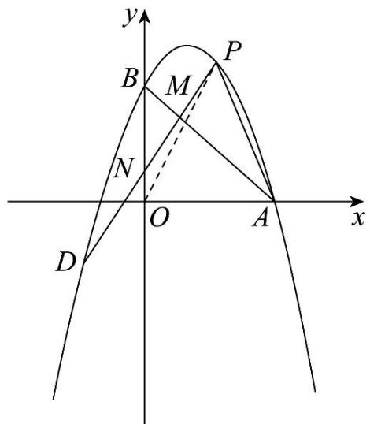

当 $m = 1$ 时， $- m ^ { 2 } + 2 m + 3 = - 1 ^ { 2 } + 2 \times 1 + 3 = 4$ ，∴点 $P$ 的坐标是（1，4）

# 2023·湖北襄阳中考真题

23．在平面直角坐标系中，直线 $l : y = k x + b$ 经过抛物线 $y = x ^ { 2 } + 2 m x + 2 m ^ { 2 } - m ( m \neq 0 )$ 的顶点

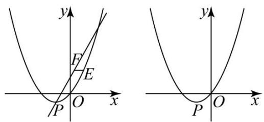  
备用图

(1)如图，当抛物线经过原点时，其顶点记为 $P$   
$\textcircled{1}$ 求抛物线的解析式并直接写出点 $P$ 的坐标；  
$\textcircled { 2 } t \leq x \leq t + 1$ 时， $y$ 的最小值为 2，求 $t$ 的值；  
$\textcircled{3}$ 当 $k = 2$ 时.动点 $E$ 在直线 $l$ 下方的抛物线上，过点 $E$ 作 $E F / / x$ 轴交直线 $l$ 于点 $F$ ，令 $S = E F$ ，求 S的最大值．  
(2)当抛物线不经过原点时，其顶点记为 $\mathcal { Q }$ .当直线 $l$ 同时经过点 $\boldsymbol { Q }$ 和（1）中抛物线的顶点 $P$ 时，设直线 $l$ 与抛物线的另一个交点为 $B$ ，与 $y$ 轴的交点为A.若 $\left| Q B - Q A \right| \geq 1$ ，直接写出 $k$ 的取值范围

【答案】 $( 1 ) \textcircled{ 1 }$ 抛物线的解析式为 $y = x ^ { 2 } + x$ ，顶点 $P$ 的坐标为 $\left( - { \frac { 1 } { 2 } } , - { \frac { 1 } { 4 } } \right)$ ； $\textcircled{2} t$ 的值为 $^ { - 3 }$ 或 1； $\textcircled{3}$ S 取得最大值 $\frac { 1 } { 2 }$

$( 2 ) k$ 的取值范围为 $k \leq - \sqrt { 3 }$ 或 $k \geq \sqrt { 3 }$

【分析】（1）由抛物线经过原点，可得 $2 m ^ { 2 } - m = 0$ ，即可求得 $m = \frac { 1 } { 2 }$ $\textcircled{1}$ 利用配方法将抛物线解析式化为顶点式即可求得答案；

$\textcircled{2}$ 分三种情况：当 $t + 1 < - \frac { 1 } { 2 }$ ，即 $t < - \frac { 3 } { 2 }$ 时， $y$ 随 $x$ 增大而减小，当 $- \frac { 3 } { 2 } \leq t \leq - \frac { 1 } { 2 }$ 时，则若 $t \leq x \leq t + 1$ 时，$y$ 的最小值为 $- { \frac { 1 } { 4 } }$ 不符合题意，当 $t > - \frac { 1 } { 2 }$ 时， $y$ 随 $x$ 增大而增大，分别列方程求解即可；

$\textcircled{3}$ 把 $P \left( - { \frac { 1 } { 2 } } , - { \frac { 1 } { 4 } } \right)$ 代入 $y = 2 x + b$ ，可得 $y = 2 x + \frac { 3 } { 4 }$ ，设点 $E \left( m , m ^ { 2 } + m \right)$ ， 可得 $F \left( \frac { 1 } { 2 } m ^ { 2 } + \frac { 1 } { 2 } m - \frac { 3 } { 8 } , m ^ { 2 } + m \right)$ ,进而可得 $S = E F = m - \left( { \frac { 1 } { 2 } } m ^ { 2 } + { \frac { 1 } { 2 } } m - { \frac { 3 } { 8 } } \right) = - { \frac { 1 } { 2 } } m ^ { 2 } + { \frac { 1 } { 2 } } m + { \frac { 3 } { 8 } } = - { \frac { 1 } { 2 } } { \left( m - { \frac { 1 } { 2 } } \right) } ^ { 2 } + { \frac { 1 } { 2 } }$ 利用二次函数的性质即可求得答案；

（2）利用配方法可得 $\mathcal { Q } \big ( - m , m ^ { 2 } - m \big )$ ，运用待定系数法可得直线 $l$ 的解析式为 $y = \left( - m + \frac { 1 } { 2 } \right) x - \frac { 1 } { 2 } m$ 可得资料整理【淘宝店铺：向阳百分百】

$A { \bigg ( } 0 , - { \frac { 1 } { 2 } } m { \bigg ) } B { \bigg ( } - 2 m + { \frac { 1 } { 2 } } , 2 m ^ { 2 } - 2 m + { \frac { 1 } { 4 } } { \bigg ) }$ ， 分两 种情 况：当 $m > \frac { 1 } { 2 }$ 时 ，点 $B$ 在第二象限，点A 在 $y$ 轴的负半轴上，作点 $\mathbf { A }$ 关于点 $\mathcal { Q }$ 的对称点 $A ^ { \prime }$ ，则 $A ^ { \prime } \left( - 2 m , 2 m ^ { 2 } - \frac { 3 } { 2 } m \right)$ ， $\mathcal { Q } A = \mathcal { Q } A ^ { \prime }$ ，再由 $\left| Q B - Q A \right| \geq 1$ ，即 $\left| A ^ { \prime } B \right| ^ { 2 } \geq 1$ ，可得 $\left[ \left( - 2 m + \frac { 1 } { 2 } \right) - \left( - 2 m \right) \right] ^ { 2 } + \left[ \left( 2 m ^ { 2 } - 2 m + \frac { 1 } { 4 } \right) - \left( 2 m ^ { 2 } - \frac { 3 } { 2 } m \right) \right] ^ { 2 } \geq 1$ ，解不等式即可求得答案；当 $m < \frac { 1 } { 2 }$ 时，点 $B$ 在第一象限，点 $\boldsymbol { Q }$ 在A、 $B$ 之间，作点 $\mathbf { A }$ 关于点 $\mathcal { Q }$ 的对称点 $A ^ { \prime }$ ，同理可求得答案．

【详解】（1）∵抛物线经过原点，  
$2 m ^ { 2 } - m = 0$ ，  
解得： $m = 0$ 或 $m = \frac { 1 } { 2 }$ ，  
∵ $m \neq 0$ ，$\cdot ^ { m = } \frac { 1 } { 2 } ,$

$\textcircled{1}$ 抛物线的解析式为 $y = x ^ { 2 } + x$ ，$\therefore y = x ^ { 2 } + x = \left( x + { \frac { 1 } { 2 } } \right) ^ { 2 } - { \frac { 1 } { 4 } } ,$ ∴顶点 $P$ 的坐标为 $\left( - { \frac { 1 } { 2 } } , - { \frac { 1 } { 4 } } \right)$

$\cdot$ 当 $t + 1 < - \frac { 1 } { 2 }$ 即 $t < - \frac { 3 } { 2 }$ 时， $y$ 随 $x$ 增大而减小，  
由题意得： $\left( t + 1 \right) ^ { 2 } + t + 1 = 2$ ，  
解得： $t _ { 1 } = - 3 ~ , ~ t _ { 2 } = 0$ （舍去），  
∴t的值为 $^ { - 3 }$ ，  
当 $- \frac { 3 } { 2 } \leq t \leq - \frac { 1 } { 2 }$ 时，则若 $t \leq x \leq t + 1$ 时， $y$ 的最小值为 $- { \frac { 1 } { 4 } }$ ， 不符合题意，当 $t > - \frac { 1 } { 2 }$ 时 ， $y$ 随 $x$ 增大而增大，  
由题意得： $t ^ { 2 } + t = 2$ ，  
解得： $t _ { 1 } = - 2$ （舍去）， $t _ { 2 } = 1$ ，  
∴t的值为 1，  
综上所述， $t$ 的值为 $^ { - 3 }$ 或 1；  
$\cdot$ 由题意得：当 $k = 2$ 时，则 $y = 2 x + b$ ，  
∵ $y = 2 x + b$ 经过点 $P \left( - { \frac { 1 } { 2 } } , - { \frac { 1 } { 4 } } \right)$   
$2 \times \left( - \frac { 1 } { 2 } \right) + b = - \frac { 1 } { 4 }$ 可得 $b = \frac { 3 } { 4 }$   
$\therefore y = 2 x + \frac { 3 } { 4 }$   
由 $2 x + \frac { 3 } { 4 } = x ^ { 2 } + x$ ， 可得 $x _ { 1 } = - \frac { 1 } { 2 } x _ { 2 } = \frac { 3 } { 2 }$   
设点 $E \big ( m , m ^ { 2 } + m \big )$ ， 且 $- \frac { 1 } { 2 } < m < \frac { 3 } { 2 }$ ,  
资料整理【淘宝店铺：向阳百分百】∵ $E F / / x$ 轴，  
$y _ { E } = y _ { F } = m ^ { 2 } + m = 2 x _ { F } + { \frac { 3 } { 4 } }$   
可得： $x _ { { \scriptscriptstyle F } } = \frac { 1 } { 2 } m ^ { 2 } + \frac { 1 } { 2 } m - \frac { 3 } { 8 }$ ， 则 $F \left( { \frac { 1 } { 2 } } m ^ { 2 } + { \frac { 1 } { 2 } } m - { \frac { 3 } { 8 } } , m ^ { 2 } + m \right)$   
$S = E F = m - \left( { \frac { 1 } { 2 } } m ^ { 2 } + { \frac { 1 } { 2 } } m - { \frac { 3 } { 8 } } \right) = - { \frac { 1 } { 2 } } m ^ { 2 } + { \frac { 1 } { 2 } } m + { \frac { 3 } { 8 } } = - { \frac { 1 } { 2 } } { \left( m - { \frac { 1 } { 2 } } \right) } ^ { 2 } + { \frac { 1 } { 2 } }$ 1 1  
∵ 02  ， 2 2 m  ，  
∴当 $m = \frac { 1 } { 2 }$ 时，S取得最大值 $\frac { 1 } { 2 }$ ；  
$\begin{array} { c l c r } { { ( 2 ) } } & { { \cdots \nonumber y = x ^ { 2 } + 2 m x + 2 m ^ { 2 } - m = \left( x + m \right) ^ { 2 } + m ^ { 2 } - m \ , } } \\ { { } } & { { } } \\ { { } } & { { \therefore \ Q \left( - m , m ^ { 2 } - m \right) , } } \end{array}$   
∵直线l $: \ y = k x + b$ 经过点 $P$ 、 $\mathcal { Q }$ ，  
$\therefore \left\{ \begin{array} { l } { { \displaystyle - \frac { 1 } { 2 } k + b = - \frac { 1 } { 4 } } } \\ { { \displaystyle - m k + b = m ^ { 2 } - m } } \end{array} , \right. \hat { \mathscr { H } } \sharp \hat { \mathscr { H } } : \left\{ \begin{array} { l } { { \displaystyle k = - m + \frac { 1 } { 2 } } } \\ { { \displaystyle - \frac { 1 } { 2 } m } } \end{array} \right. ,$   
∴直线 $l$ 的解析式为 $y = \left( - m + \frac { 1 } { 2 } \right) x - \frac { 1 } { 2 } m$   
令 $x = 0$ ，得 $y = - \frac { 1 } { 2 } m$ ，  
$\therefore A \left( 0 , - \frac { 1 } { 2 } m \right) ,$   
联立方程得： $x ^ { 2 } + 2 m x + 2 m ^ { 2 } - m = \left( - m + { \frac { 1 } { 2 } } \right) x - { \frac { 1 } { 2 } } m \ ,$ ，  
解得： $x _ { 1 } = - m$ ， $x _ { 2 } = - 2 m + \frac { 1 } { 2 }$ ，  
当 $x = - 2 m + \frac { 1 } { 2 }$ 时， $y = \left( - m + \frac { 1 } { 2 } \right) \left( - 2 m + \frac { 1 } { 2 } \right) - \frac { 1 } { 2 } m = 2 m ^ { 2 } - 2 m + \frac { 1 } { 4 } ,$ ，  
$\therefore B \left( - 2 m + \frac { 1 } { 2 } , 2 m ^ { 2 } - 2 m + \frac { 1 } { 4 } \right) ,$   
当 $m > \frac { 1 } { 2 }$ 时，点 $B$ 在第二象限，点A在 $y$ 轴的负半轴上，作点A关于点  
则 $A ^ { \prime } \left( - 2 m , 2 m ^ { 2 } - \frac { 3 } { 2 } m \right) , ~ Q A = Q A ^ { \prime } \ ,$

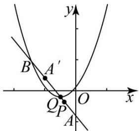

$\therefore | Q B - Q A | \geq 1$ $\therefore \left| Q B - Q A ^ { \prime } \right| \geq 1$ ，

即 $\left| A ^ { \prime } B \right| ^ { 2 } \geq 1$ ，  
$\therefore \left[ \left( - 2 m + \frac { 1 } { 2 } \right) - \left( - 2 m \right) \right] ^ { 2 } + \left[ \left( 2 m ^ { 2 } - 2 m + \frac { 1 } { 4 } \right) - \left( 2 m ^ { 2 } - \frac { 3 } { 2 } m \right) \right] ^ { 2 } \geq 1 ,$ ，  
化简得： $m ^ { 2 } - m - \frac { 1 1 } { 4 } \geq 0$ ，  
令 $m ^ { 2 } - m - \frac { 1 1 } { 4 } = 0$   
解得： $m _ { 1 } = - \sqrt { 3 } + \frac { 1 } { 2 }$ （舍去）， $m _ { 2 } = \sqrt { 3 } + \frac { 1 } { 2 }$ ，  
$\begin{array} { r l } & { m \geq \sqrt { 3 } + \displaystyle \frac { 1 } { 2 } } \\ & { } \\ & { m = - k + \displaystyle \frac { 1 } { 2 } } \\ & { } \\ & { - k + \displaystyle \frac { 1 } { 2 } \geq \sqrt { 3 } + \displaystyle \frac { 1 } { 2 } } \\ & { } \\ & { k \leq - \sqrt { 3 } } \end{array}$   
当 $m < \frac { 1 } { 2 }$ 时，点 $B$ 在第一象限，点 $\boldsymbol { Q }$ 在A、 $B$ 之间，作点 A 关于点 $\boldsymbol { Q }$ 的对称点 $A ^ { \prime }$ ，如图，  
则 $A ^ { \prime } \bigg ( - 2 m , 2 m ^ { 2 } - \frac { 3 } { 2 } m \bigg ) ~ Q A = Q A ^ { \prime }$   
∵ QB  QA  1，  
$\ | Q B - Q A ^ { \prime } | \geq 1$ ，  
即 $\left| A ^ { \prime } B \right| ^ { 2 } \geq 1$ ，  
$\therefore \left[ \left( - 2 m + \frac { 1 } { 2 } \right) - \left( - 2 m \right) \right] ^ { 2 } + \left[ \left( 2 m ^ { 2 } - 2 m + \frac { 1 } { 4 } \right) - \left( 2 m ^ { 2 } - \frac { 3 } { 2 } m \right) \right] ^ { 2 } \geq 1 ,$ ，  
化简得： $m ^ { 2 } - m - \frac { 1 1 } { 4 } \geq 0$ ，  
令 $m ^ { 2 } - m - \frac { 1 1 } { 4 } = 0$ ，  
解得： 1 13m    ， $m _ { 1 } = - \sqrt { 3 } + \frac { 1 } { 2 } , m _ { 2 } = \sqrt { 3 } + \frac { 1 } { 2 }$ （舍去）， $\therefore m = - \sqrt { 3 } + \frac { 1 } { 2 } , \because m = - k + \frac { 1 } { 2 } ,$   
∴ $- k + \frac { 1 } { 2 } \leq - \sqrt { 3 } + \frac { 1 } { 2 }$ ∴ $k \geq \sqrt { 3 }$ ；综上所述， $k$ 的取 值范 围为 $k \leq - \sqrt { 3 }$ 或 $k \geq \sqrt { 3 }$

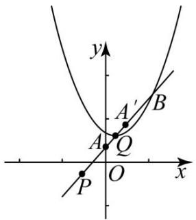

# 题型四 【加权线段最值】

# 2023·四川内江·中考真题

24．如图，在平面直角坐标系中，抛物线 $y = a x ^ { 2 } + b x + c$ 与 $x$ 轴交于 $B \left( 4 , 0 \right)$ ， $C \left( - 2 , 0 \right)$ 两点．与 $y$ 轴交于点 $A ( 0 , - 2 )$

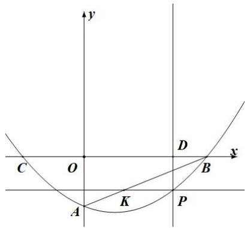

(1)求该抛物线的函数表达式；  
(2)若点 $P$ 是直线 $A B$ 下方抛物线上的一动点，过点 $P$ 作 $x$ 轴的平行线交 $A B$ 于点 $K$ ，过点 $P$ 作 $y$ 轴的平行线交 $x$ 轴于点 $D$ ，求与 $\frac { 1 } { 2 } P K + P D$ 的最大值及此时点 $P$ 的坐标；

【答案】 $( 1 ) y = { \frac { 1 } { 4 } } x ^ { 2 } - { \frac { 1 } { 2 } } x - 2$ (2)存在， $\frac { 1 } { 2 } P K + P D$ 的最大值为 $\begin{array} { r l } { \displaystyle \frac { 2 5 } { 8 } } & { { } P \left( \displaystyle \frac { 3 } { 2 } , - \displaystyle \frac { 3 5 } { 1 6 } \right) } \end{array}$ (3) 1, 6 或 1, 4

【分析】（1）将A、 $B$ 、 $C$ 代入抛物线解析式求解即可；

（ 2 ） 可 求 直 线 $A B$ 的 解 析 式 为 $y = { \frac { 1 } { 2 } } x - 2$ ， 设 $P \left( m , \frac { 1 } { 4 } m ^ { 2 } - \frac { 1 } { 2 } m - 2 \right) \qquad 0 < m < 4$ ， 可 求$K \left( { \frac { 1 } { 2 } } m ^ { 2 } - m , { \frac { 1 } { 4 } } m ^ { 2 } - { \frac { 1 } { 2 } } m - 2 \right)$ , 从而可求 $\frac { 1 } { 2 } P K + P D = - \frac { 1 } { 2 } m ^ { 2 } + \frac { 3 } { 2 } m + 2$ ，即可求解；

【详解】（1）解：由题意得 $\left\{ \begin{array} { l l } { \displaystyle 1 6 a + 4 b + c = 0 } \\ { \displaystyle 4 a - 2 b + c = 0 } \\ { \displaystyle c = - 2 } \\ { \qquad } \end{array} , \right. \mathtt { N } _ { \sharp } ^ { \sharp } \mathbb { A } _ { \mp } ^ { \sharp } \mathbb { \breve { \mp } } \pm \left\{ \begin{array} { l } { \displaystyle a = \frac 1 4 } \\ { \displaystyle b = - \frac 1 2 , } \\ { \displaystyle c = - 2 } \end{array} \right.$ 抛物线的解析式为 $y = { \frac { 1 } { 4 } } x ^ { 2 } - { \frac { 1 } { 2 } } x - 2$

（2）解：设直线 $A B$ 的解析式为 $y = k x + b$ ，则有 $\left\{ { \begin{array} { l } { 4 k + b = 0 } \\ { b = - 2 } \end{array} } \right.$ ， 解得： $\left\{ \begin{array} { l l } { \displaystyle k = \frac { 1 } { 2 } } \\ { \displaystyle b = - 2 } \end{array} \right.$

直线 $A B$ 的解析式为 $y = { \frac { 1 } { 2 } } x - 2$ ；$\begin{array} { c c } { { P \bigg ( m , \displaystyle { \frac { 1 } { 4 } } m ^ { 2 } - \displaystyle { \frac { 1 } { 2 } } m - 2 \bigg ) } } & { { 0 < m < 4 } } \\ { { \therefore \displaystyle { \frac { 1 } { 2 } } x - 2 = \displaystyle { \frac { 1 } { 4 } } m ^ { 2 } - \displaystyle { \frac { 1 } { 2 } } m - 2 } } & { { } } \end{array}$ 解得： $x = \frac { 1 } { 2 } m ^ { 2 } - m$ $\begin{array} { r l } &  \mathbb { E } \{ \frac { 1 } { 2 } \} \nabla \cdot \mathbf { u } ^ { \lambda } - \frac { 1 } { 2 } \mathbf { u } ^ { \lambda } + \frac { 1 } { 2 } \mathbf { u } ^ { \lambda } - \frac { 1 } { 2 } \mathbf { u } ^ { \lambda } - \mathbf { j } ^ { \lambda } \cdot \mathbf { j } ^ { \lambda } \cdot \mathbf { j } ^ { \lambda } \cdot \mathbf { j } ^ { \lambda } \cdot \mathbf { j } ^ { \lambda } \cdot \mathbf { j } ^ { \lambda } \cdot \mathbf { j } ^ { \lambda } \cdot \mathbf { j } ^ { \lambda } \cdot \mathbf { j } ^ { \lambda } \cdot \mathbf { j } ^ { \lambda } \cdot \mathbf { j } ^ { \lambda } \cdot \mathbf { j } ^ { \lambda } \cdot \mathbf { j } ^ { \lambda } \cdot \mathbf { j } ^ { \lambda } \cdot \mathbf { j } ^ { \lambda } \cdot \mathbf { j } ^ { \lambda } \cdot \mathbf { j } ^ { \lambda } \cdot \mathbf { j } ^ { \lambda } \cdot \mathbf { j } ^ { \lambda } \cdot \mathbf { j } ^ { \lambda } \cdot \mathbf { j } ^ { \lambda } \cdot \mathbf { j } ^ { \lambda } \cdot \mathbf { j } ^ { \lambda } \cdot \mathbf { j } ^ { \lambda } \cdot \mathbf { j } ^ { \lambda } \cdot \mathbf { j } ^ { \lambda } \cdot \mathbf { j } ^ { \lambda } \cdot \mathbf { j } ^ { \lambda } \cdot \mathbf { j } ^ { \lambda } \cdot \mathbf { j } ^ { \lambda } \cdot \mathbf { j } ^ { \lambda } \cdot \mathbf { j } ^ { \lambda } \cdot \mathbf { j } ^ { \lambda } \cdot \mathbf { j } ^ { \lambda } \cdot \mathbf { j } ^ { \lambda } \cdot \mathbf { j } ^ { \lambda } \cdot \mathbf { j } ^ { \lambda } \cdot \mathbf { j } ^ { \lambda } \cdot \mathbf { j } ^ { \lambda } \cdot \mathbf { j } ^ { \lambda } \cdot \mathbf { j } ^ { \lambda } \cdot \mathbf { j } ^ { \lambda } \cdot \mathbf { j } ^ { \lambda } \cdot \mathbf { j } ^ { \lambda } \cdot \mathbf { j } ^ { \lambda } \cdot \mathbf { j } ^ { \lambda } \cdot \mathbf { j } ^ { \lambda } \cdot \mathbf { j } ^ { \lambda } \cdot \mathbf { j } ^ { \lambda } \cdot \end{array}$ 2当 $m = \frac { 3 } { 2 }$ 时， $\frac { 1 } { 2 } P K + P D$ 的最大值为 $\frac { 2 5 } { 8 }$ 故 $\frac { 1 } { 2 } P K + P D$ 的最大值为 ${ \frac { 2 5 } { 8 } } , P \left( { \frac { 3 } { 2 } } , - { \frac { 3 5 } { 1 6 } } \right)$

# 2023·黑龙江绥化·中考真题

25．如图，抛物线 $y _ { 1 } = a x ^ { 2 } + b x + c$ 的图象经过 $A ( - 6 , 0 )$ ， $B ( - 2 , 0 )$ ， $C ( 0 , 6 )$ 三点，且一次函数 $y = k x + 6$ 的图象经过点 $B$

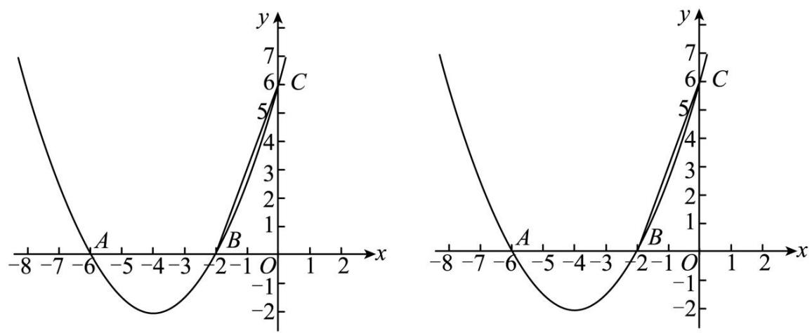

(1)求抛物线和一次函数的解析式

(2)将抛物线 $y _ { 1 } = a x ^ { 2 } + b x + c$ 的图象向右平移8个单位长度得到抛物线 $y _ { 2 }$ ，此抛物线的图象与 $x$ 轴交于 $M$ ， $N$ 两点（ $M$ 点在 $N$ 点左侧）．点 $P$ 是抛物线 $y _ { 2 }$ 上的一个动点且在直线 $N C$ 下方．已知点 $P$ 的横坐标为 $m$ ．过点 $P$ 作 $P D \perp N C$ 于点 $D$ ．求 $m$ 为何值时， $C D + \frac { 1 } { 2 } P D$ 有最大值，最大值是多少？

【答案】 $( 1 ) y _ { 1 } = \frac { 1 } { 2 } x ^ { 2 } + 4 x + 6 , y = 3 x + 6$ (2)当 $m = \frac { 1 3 } { 3 }$ 时， $C D + { \frac { 1 } { 2 } } P D$ 的最大值为 $\frac { 1 6 9 { \sqrt { 2 } } } { 2 4 }$ 【分析】（1）待定系数法求解析式即可求解；

（2）得出 $\triangle C O N$ 是等腰直角三角形， $\triangle H P D$ 是等腰直角三角形，则 $H D = D P = { \frac { \sqrt { 2 } } { 2 } } H P$ ，点 $P$ 在抛物线 $y _ { 2 }$ 上，且横坐标为 $m ,$ ，得出 $H ( m , - m + 6 )$ ，进而可得 $H D = D P = \frac { \sqrt { 2 } } { 2 } ( - \frac { 1 } { 2 } m { } ^ { 2 } + 3 m ) = - \frac { \sqrt { 2 } } { 4 } m { } ^ { 2 } + \frac { 3 \sqrt { 2 } } { 2 } m$ ,则 $C D + { \frac { 1 } { 2 } } P D = - { \frac { 3 { \sqrt { 2 } } } { 8 } } \left( m - { \frac { 1 3 } { 3 } } \right) ^ { 2 } + { \frac { 1 6 9 { \sqrt { 2 } } } { 2 4 } }$ 根据二次函数的性质即可求解．

【详解】（1）解：把 $A ( - 6 , 0 )$ ， $B ( - 2 , 0 )$ ， $C ( 0 , 6 )$ 代入 $y _ { 1 } = a x ^ { 2 } + b x + c$   
得 $\left\{ \begin{array} { c c } { { 3 6 a - 6 b + c = 0 } } & { { } } \\ { { 4 a - 2 b + c = 0 } } & { { \ , \quad \hat { \textmd { \textmu q } } \hat { \textmd { + } } \hat { \textmd { + } } } } \\ { { c = 6 } } & { { } } \\ { { } } & { { } } \end{array} \right\} \begin{array} { c c } { { a = \displaystyle { \frac { 1 } { 2 } } } } \\ { { b = \displaystyle { 4 } } } \\ { { c = 6 } } \end{array}$   
$y _ { 1 } = \frac 1 2 x ^ { 2 } + 4 x + 6$   
把 $B ( - 2 , 0 )$ 代入 $y = k x + 6$ 得 $k = 3$   
$\therefore y = 3 x + 6$   
（2）∵ $\mathbf { \partial } y _ { 1 } = \frac { 1 } { 2 } x ^ { 2 } + 4 x + 6$ 向右平移 8 个单位长度得到抛物线 $y _ { 2 } = \frac { 1 } { 2 } \big ( x - 8 \big ) ^ { 2 } + 4 \big ( x - 8 \big ) + 6$   
当 $y _ { 2 } = 0$ ，即 $\frac { 1 } { 2 } \big ( x - 8 \big ) ^ { 2 } + 4 \big ( x - 8 \big ) + 6 = 0$   
解得： $x _ { 1 } = 2 , x _ { 2 } = 6$   
$\therefore M ( 2 , 0 ) , ~ N ( 6 , 0 )$   
∵ $y _ { 2 }$ 过 $M$ ， $N$ ， $C$ 三点  
$\therefore y _ { 2 } = { \frac { 1 } { 2 } } x ^ { 2 } - 4 x + 6$

在直线 $N C$ 下方的抛物线 $y _ { 2 }$ 上任取一点 $P$ ，作 $P H \perp x$ 轴交 $N C$ 于点 $H$ ，过点 $H$ 作 $H G \perp y$ 轴于点 $G$ .

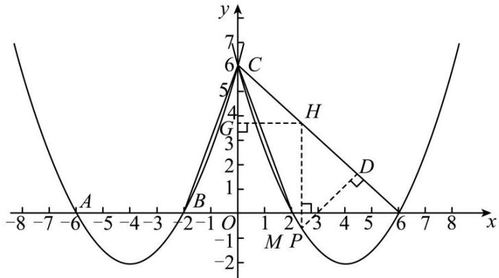

$\begin{array} { r l } { N ( 6 , 0 ) } & { { } \ C ( 0 , 6 ) } \end{array}$   
$\therefore O N = O C$   
∴ $\triangle C O N$ 是等腰直角三角形  
∵ $\angle C H G = 4 5 ^ { \circ } \angle G H P = 9 0 ^ { \circ }$   
∴ $\angle P H D = 4 5 ^ { \circ }$   
又 $P D \perp C N$ $\cdot \triangle H P D$ 是等腰直角三角形  
$\therefore H D = D P = { \frac { \sqrt { 2 } } { 2 } } H P$   
∵点 $P$ 在抛物线 $y _ { 2 }$ 上，且横坐标为 $m$   
$\begin{array} { l } { C G = G H = m } \\ { \ } \\ { C H = \sqrt { 2 } m } \\ { y _ { C N } = - x + 6 } \\ { \ } \\ { H ( m , - m + 6 ) } \end{array}$   
$\begin{array} { l } { \displaystyle { \therefore H P = - m + 6 - \left( \frac { 1 } { 2 } m ^ { 2 } - 4 m + 6 \right) = - \frac { 1 } { 2 } m ^ { 2 } + 3 m } } \\ { \displaystyle { \therefore H D = D P = \frac { \sqrt { 2 } } { 2 } \left( - \frac { 1 } { 2 } m ^ { 2 } + 3 m \right) = - \frac { \sqrt { 2 } } { 4 } m ^ { 2 } + \frac { 3 \sqrt { 2 } } { 2 } m } } \\ { \displaystyle { \therefore C D + \frac { 1 } { 2 } P D = C H + H D + \frac { 1 } { 2 } P D = C H + \frac { 3 } { 2 } P D = \sqrt { 2 } n + \frac { 3 } { 2 } \left( - \frac { \sqrt { 2 } } { 4 } m \stackrel { 2 } { + } ^ { 3 } \frac { \sqrt { 2 } } { 2 } m \right) } } \end{array}$   
$= - { \frac { 3 { \sqrt { 2 } } } { 8 } } \left( m - { \frac { 1 3 } { 3 } } \right) ^ { 2 } + { \frac { 1 6 9 { \sqrt { 2 } } } { 2 4 } }$   
∴当 $m = \frac { 1 3 } { 3 }$ 时， $C D + { \frac { 1 } { 2 } } P D$ 的最大值为 $\frac { 1 6 9 { \sqrt { 2 } } } { 2 4 }$

# 题型五 【几何构造最值篇】

# 2022·天津·统考中考真题

26．已知抛物线 $y = a x ^ { 2 } + b x + c$ （a， $^ { b }$ ， $c$ 是常数， $a > 0$ ）的顶点为 $P$ ，与 $x$ 轴相交于点 $A ( - 1 , 0 )$ 和点 $B$ ．

若 $3 b = 2 c$ ，直线 $x = 2$ 与抛物线相交于点 $N$ ， $E$ 是 $x$ 轴的正半轴上的动点， $F$ 是 $y$ 轴的负半轴上的动点，当 $P F + F E + E N$ 的最小值为 5 时，求点 $E$ ， $F$ 的坐标

【答案】 $( 1 ) \textcircled { 1 } ( 1 , - 4 )$ ； $\cdot$ 点 $\cdot$ 的坐标为 (2, 3) ，点 $G$ 的坐标为 (2, 2) ；  
(2)点 $E { \left( { \frac { 5 } { 7 } } , 0 \right) }$ 和点 $F \left( 0 , - { \frac { 2 0 } { 2 1 } } \right)$ ；

【分析】（1） $\textcircled{1}$ 将 $b$ 、 $\cdot$ 的值代入解析式，再将 $A$ 点坐标代入解析式即可求出 $\cdot$ 的值，再用配方法求出顶点坐标即可； $\textcircled{2}$ 先令 $\cdot$ 得到 $B$ 点坐标，再求出直线 $B P$ 的解析式，设点 $M$ 的坐标为$\left( m , m ^ { 2 } - 2 m - 3 \right)$ ，则点 $G$ 的坐标为 $( m , 2 m - 6 )$ ，再表示出 $M G$ 的长，配方求出最值得到 $\cdot$ 、 $G$ 的坐标；

（2）根据 $3 b = 2 c$ ，解析式经过 $\cdot$ 点，可得到解析式： $y = a x ^ { 2 } - 2 a x - 3 a$ ，再表示出 $\cdot$ 点坐标， $\cdot$ 点坐标，接着作点 $\cdot$ 关于 $\cdot$ 轴的对称点 $P ^ { \prime }$ ，作点 $\cdot$ 关于 $\cdot$ 轴的对称点 $N ^ { \prime }$ ，再把 $P ^ { \prime }$ 和 $N ^ { \prime }$ 的坐标表示出来，由题意可知，当 $P F + F E + E N$ 取得最小值，此时 $P F + F E + E N = P ^ { \prime } N ^ { \prime } = 5$ ，将字母代入可得：$P ^ { \prime } N ^ { \prime 2 } = P ^ { \prime } H ^ { 2 } + H N ^ { \prime 2 } = 9 + 4 9 a ^ { 2 } = 2 5$ ，求出 $\cdot$ 的值，即可得到 $\cdot$ 、 $F$ 的坐标；

【详解】（1） $\cdot$ ∵抛物线 $y = a x ^ { 2 } + b x + c$ 与 $x$ 轴相交于点 $A ( - 1 , 0 )$ ，  
$\textstyle a - b + c = 0$ ．又 $b = - 2 , c = - 3$ ，得 $a = 1$   
∴抛物线的解析式为 $y { = } x ^ { 2 } - 2 x - 3$   
∵ $y = x ^ { 2 } - 2 x - 3 = ( x - 1 ) ^ { 2 } - 4$ ，  
∴点 $P$ 的坐标为 $( 1 , - 4 )$   
（2）由（1）知 $a - b + c = 0$ ，又 $3 b = 2 c$ ，  
$b = - 2 a , c = - 3 a \qquad ( a > 0 )$   
∴抛物线的解析式为 $y = a x ^ { 2 } - 2 a x - 3 a$   
∵ $y = a x ^ { 2 } - 2 a x - 3 a = a \left( x - 1 \right) ^ { 2 } - 4 a$ ，  
∴顶点 $\cdot$ 的坐标为 $( 1 , - 4 a )$   
∵直线 $x = 2$ 与抛物线 $y = a x ^ { 2 } - 2 a x - 3 a$ 相交于点 $\cdot$ ，  
∴点 $N$ 的坐标为 $( 2 , - 3 a )$   
作点 $P$ 关于 $y$ 轴的对称点 $P ^ { \prime }$ ，作点 $N$ 关于 $\cdot$ 轴的对称点 $N ^ { \prime }$ ，如图所示：  
得点 $P ^ { \prime }$ 的坐标为 $( - 1 , - 4 a )$ ，点 $N ^ { \prime }$ 的坐标为 $( 2 , 3 a )$   
当满足条件的点 $\cdot$ ， $F$ 落在直线 $P ^ { \prime } N ^ { \prime }$ 上时， $P F + F E + E N$ 取得最小值，  
此时， $P F + F E + E N = P ^ { \prime } N ^ { \prime } = 5$   
延长 $P ^ { \prime } P$ 与直线 $x = 2$ 相交于点 $\cdot$ ，则 $P ^ { \prime } H \bot N ^ { \prime } H$   
在 $R t \triangle P ^ { \prime } H N ^ { \prime }$ 中， $P ^ { \prime } H = 3 , H N ^ { \prime } = 3 a - ( - 4 a ) = 7 a$   
$P ^ { \prime } N ^ { \prime 2 } = P ^ { \prime } H ^ { 2 } + H N ^ { \prime 2 } = 9 + 4 9 a ^ { 2 } = 2 5$   
解得 $a _ { 1 } = \frac { 4 } { 7 } , a _ { 2 } = - \frac { 4 } { 7 }$ （舍）  
∴点 $P ^ { \prime }$ 的坐标为 $\left( - 1 , - { \frac { 1 6 } { 7 } } \right)$ 点 $N ^ { \prime }$ 的坐标为 $\left( 2 , { \frac { 1 2 } { 7 } } \right)$   
则直线 $P ^ { \prime } N ^ { \prime }$ 的解析式为 $y = \frac { 4 } { 3 } x - \frac { 2 0 } { 2 1 }$   
∴点 $E { \left( { \frac { 5 } { 7 } } , 0 \right) }$ 和点 $F \left( 0 , - { \frac { 2 0 } { 2 1 } } \right)$

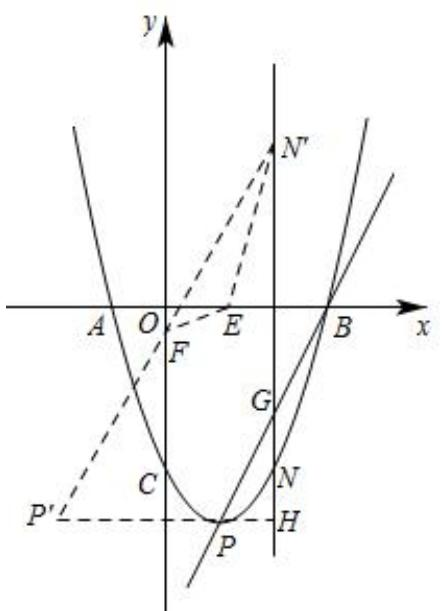