# 专题 3-1 二次函数中的 10 类定值、定点问题

二次函数背景下的定值与定点问题，解析法类似于高中，但并不超纲！因为解题方法比较特殊，同学们要专门学习和练习，才能在考场上应对自如，这些方法包括联立、转化等，对同学们的代数功底与几何功底都有较高的要求.

# 题型·解读

# 知识点梳理

一、定值问题二、定点问题

# 题型一 面积定值

2022·山东淄博·中考真题   
2023·福建厦门三模

# 题型二 线段长为定值

2024 届湖北天门市九年级月考  
2024届福建龙岩市统考期中  
2020·西藏·中考真题

# 题型二 线段和定值

2023广州市二中月考  
2022·四川巴中·中考真题  
2024届湖北黄石市·九年级统考  
2023·四川乐山·统考二模  
2023·海口华侨中学考模  
2023·江苏徐州·4 月模拟  
2022·湖南张家界·中考真题

# 题型三 加权线段和定值

2023·四川广元·中考真题  
2020·四川德阳·中考真题

# 题型四 线段乘积为定值

2023·四川南充·中考真题   
2024届·武汉市东湖高新区统考   
2024届福建省福州屏东中学月考   
2024届福州市晋安区统考   
2023·福建福州·校考三模

# 满分·技巧

# 题型五 比值为定值

2023年广西钦州市一模  
2023福建厦门一中模拟  
2023年福州市屏东中学中考模拟  
武汉·中考真题

# 题型六 横（纵）坐标定值

2023·湖北潜江、天门、仙桃、江汉油田·中考真 题 2024届湖北潜江市初 12校联考

# 题型七 角度为定值

2023·成都武侯区西川中学三模 四川乐山·统考中考真题

# 题型八 其它定值问题

2023·浙江湖州·统考一模  
2024届福建省南平市统考  
2023年湖北省武汉市新观察中考四调

# 题型九 结合韦达定理求定点

2023年湖北省武汉市外国语学校中考模拟  
2024届武汉市青山区九年级统考  
2024届武汉市新洲区 12月统考  
2024届·福建厦门市第九中学期中  
2023·武汉光谷实验中学中考模拟  
2023广东省梅州市九年级下期中  
2024届福州市九校联盟期中  
2023年湖北省武汉市新观察中考四调

# 题型十 已知定值求定点

2024届武汉市洪山区九年级统考  
2024届湖北省武汉市新洲区九年级上期中  
2023年广州市天河外国语学校中考三模

# 知识点梳理

# 一、定值问题

一般来说，二次函数求解几何线段代数式定值问题属于定量问题，方法采用:

1.参数计算法：即在图形运动中，选取其中的变量(如线段长，点坐标)作为参数,将要求的定值用参数表示出，然后消去参数即得定值。

2.韦达定理法：当涉及到直线(一次函数图象或 $x$ 轴)与二次函数交点时，先联立方程消去 y之后整理得到一元二次方程，借助韦达定理可得到交点横坐标与参数的关系，可以将要求的定值代数式用交点横坐标的和或积表示，往往会刚好抵消掉参数，则得到定值。

简单的引例 1 如下：若线段 $\scriptstyle A B = x + 2$ ，线段 $P Q { = } { - } x { + } 7$ ，那么 $A B + P Q = x + 2 - x + 7 = 9$ ；即线段$A B$ 与线段 $P Q$ 的和等于 9，是一个定值

简单的引例 2 如下：求证不论 $m$ 取任何实数，二次函数 $y = x ^ { 2 } - 2 ( m + 1 ) x + m ( m + 2 )$ ）的图象与 $\boldsymbol { x }$ 轴的两个交点之间的距离 $d$ 为定值。通过令 $y = 0$ ，可以求得方程的两个实数根分别为 $x 1 = m$ ，$\scriptstyle x 2 = m + 2$ ，则两个交点之间的距离 $d = x 1 - x 2 = | m - m - 2 | = 2$ ，是一个定值

# 二、定点问题

函数的解析式中除自变量外，还有待定的系数，此时函数的图象会随着待定的系数的变化而变化。图象变化过程中，有时始终会经过某个固定的点，定点问题是一个难点。

# 方法：使待定的系数 $\pmb { k }$ 失去影响力

【例】证明：无论 $k$ 取何值，抛物线 $y = x ^ { 2 } + k x - 3 k$ 都经同一定点.  
第一步：先找出所有含 $\pmb { k }$ 的项，再提公因式 $\pmb { k }$   
$y = x ^ { 2 } + k x - 3 k = x ^ { 2 } + k \left( x - 3 \right)$   
第二步：令与 $\pmb { k }$ 相乘的因式为 $\mathbf { 0 }$ ，此时 $\pmb { k }$ 就不起作用了  
令 $x - 3 = 0$ ，此时 $y = x ^ { 2 } + k \left( x - 3 \right) = 9$   
在一个函数中，知 $x$ 可求 $y$ ，这个坐标就是定点，故无论 $k$ 取何值，函数都经过定点3,9总结：因为当 $x$ 取某个值时，使含 $k$ 项全部抵消了，即 $k$ 不起作用了!

【例 2】（2022·山东日照真题）在平面直角坐标系 $x O y$ 中，已知抛物线 $\scriptstyle { y = - x ^ { 2 } + 2 m x + 3 m }$ ，点 ${ \cal A } \left( 3 , \mathrm { { \bf 0 } } \right)$ .

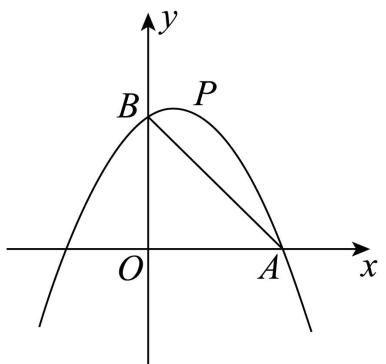

证明：无论 $\pmb { m }$ 为何值，抛物线必过定点 $\pmb { D }$ ，并求出点 $\pmb { D }$ 的坐标；

【思路点拨】将抛物线的解析式变形为： $\scriptstyle { y = - x ^ { 2 } + m }$ （ $2 x + 3 )$ ），进而根据 $2 x + 3 = 0$ ，求得 $x$ 的值【详解】证明：∵ $\cdot _ { y = - x ^ { 2 } + m }$ （ $2 x + 3 .$ ），∴当 $2 x + 3 = 0$ 时，即 $x = - { \frac { 3 } { 2 } }$ 时， $y = - { \frac { 9 } { 4 } }$ ∴无论 $m$ 为何值，抛物线必过定点 $D$ ，点 $D$ 的坐标是 $\left( - \frac { 3 } { 2 } , - \frac { 9 } { 4 } \right)$

【例 3】（2022·江苏连云港·真题）已知二次函数 $y = x ^ { 2 } + ( m - 2 ) x + m - 4$ ，其中 $m > 2$ ．求证：二次函数 $y = x ^ { 2 } + ( m - 2 ) x + m - 4$ 的顶点在第三象限

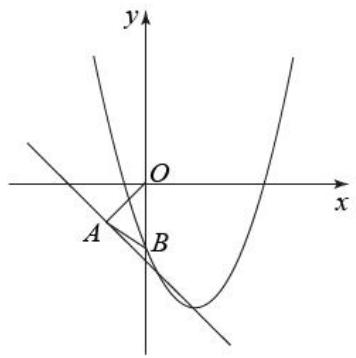

【思路点拨】先根据顶点坐标公式求出顶点坐标为 $\left( \frac { 2 - m } { 2 } , \frac { - m ^ { 2 } + 8 m - 2 0 } { 4 } \right)$ , 然后分别证明顶点坐标的横纵坐标都小于 0 即可；

【详解】解：由抛物线顶点坐标公式得顶点坐标为 $\left( { \frac { 2 - m } { 2 } } , { \frac { - m ^ { 2 } + 8 m - 2 0 } { 4 } } \right) .$

$$
\because m > 2 \ , \therefore m - 2 > 0 \ , \therefore 2 - m < 0 \ , \therefore \frac { 2 - m } { 2 } < 0 \ .
$$

$\because { \frac { - m ^ { 2 } + 8 m - 2 0 } { 4 } } = - { \frac { 1 } { 4 } } ( m - 4 ) ^ { 2 } - 1 \leq - 1 < 0$ ， ∴二次 函数 $y = x ^ { 2 } + ( m - 2 ) x + m - 4$ 的顶 点在 第三 象限 ．

# 03 核心·题型

# 题型一 面积定值

# 2022·山东淄博·中考真题

1．如图，抛物线 $y = - \ x ^ { 2 } + b x + c$ 与 $x$ 轴相交于 $A$ ， $B$ 两点（点 $A$ 在点 $B$ 的左侧），顶点 $D$ （1，4）在直线 $l$ ： $y = { \frac { 4 } { 3 } } x + t$ 上，动点 $P ~ ( m , ~ n )$ 在 $x$ 轴上方的抛物线上

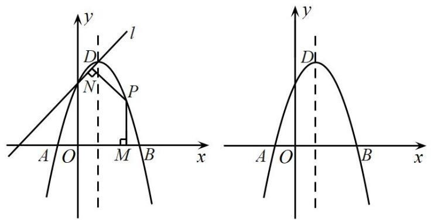  
（备用图）

(1)求这条抛物线对应的函数表达式；

(2)设直线 $A P$ ， $B P$ 与抛物线的对称轴分别相交于点 $E$ ， $F$ ，请探索以 $A$ ， $F$ ， $B$ ， $G$ （ $G$ 是点 $E$ 关于 $x$ 轴的对称点）为顶点的四边形面积是否随着 $P$ 点的运动而发生变化，若不变，求出这个四边形的面积；若变化，说明理由．

【答案】 $( 1 ) y = - x ^ { 2 } + 2 x + 3$ (2)定值 16

【思路点拨】（1）利用顶点式可得结论；

（2）如图，设 $P \left( m , - m ^ { 2 } + 2 m + 3 \right)$ ，求出直线 $\cdot$ ， $B P$ 的解析式，可得点 $E$ ， $F$ 的坐标，求出 $F G$ 的长，可得结论

【详解】（1）解：∵抛物线的顶点为 $D$ （1，4），∴根据顶点式，抛物线的解析式为 $y = - { \bigl ( } x - 1 { \bigr ) } ^ { 2 } + 4 = - x ^ { 2 } + 2 x + 3$ ；

（2）解：四边形 AFBG 的面积不变理由：如图，设 $P \left( m , - m ^ { 2 } + 2 m + 3 \right)$ ，

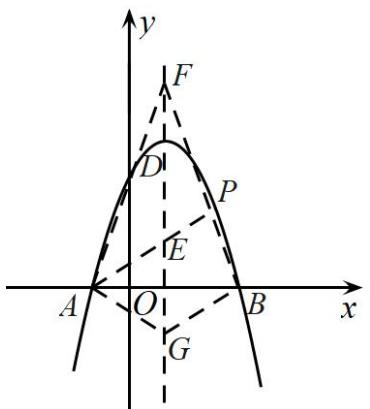

∵ A1,0 ， B 3,0 ，  
∴直线 $\cdot$ 的解析式为 $y = - ( m - 3 ) x - m + 3$ ，  
$E { \big ( } 1 , - 2 m + 6 { \big ) }$ ，  
∵ $\cdot$ ， $G$ 关于 $\cdot$ 轴对称，  
$G ( 1 , 2 m - 6 )$ ，  
∴直线 $P B$ 的解析式为 $y = - ( m + 1 ) x + 3 ( m + 1 )$ ，  
$F { \bigl ( } 1 , 2 m + 2 { \bigr ) }$ ，  
$G F = 2 m + 2 - { \left( 2 m - 6 \right) } = 8$ ，  
∴四边形 AFBG 的面积 $= \frac { 1 } { 2 } \times A B \times F G = \frac { 1 } { 2 } \times 4 \times 8 = 1 6$ ，∴四边形 AFBG 的面积是定值．

# 2023·福建厦门三模

2．已知抛物线 $y = a x ^ { 2 } - 6 a x$ 经过点 $A \left( 1 , 5 \right)$

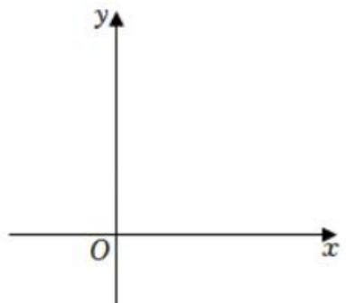

(1)求抛物线的解析式及其顶点 $E$ 的坐标  
(2)将点 A向右平移 2 个单位，再向上平移 2个单位得到点 $B$ ，若点 $F$ 为抛物线上的一个动点，则以线段 $F B$ 为直径的圆与直线 $y = \frac { 2 9 } { 4 }$ 交于点 $C$ ， $D$ ， $\triangle E C D$ 的面积是否为定值？若是，求出它的值；若不是，请说明理由

【答案】 $y = - x ^ { 2 } + 6 x$ ， 3,9 ；(2)是， $\frac { 7 { \sqrt { 7 } } } { 1 6 }$

【思路点拨】（1）待定系数法求出函数解析式，转化为顶点式，求出点 $E$ 的坐标；资料整理【淘宝店铺：向阳百分百】

（2）平移得到点 $B$ 的坐标，设 $F \big ( a , b \big )$ ，两点间的坐标公式得到 $B F ^ { 2 } = \left( a - 3 \right) ^ { 2 } + \left( b - 7 \right) ^ { 2 } = 9 - b + \left( b - 7 \right) ^ { 2 } ,$ 中点坐标公式，得到 $B F$ 的中点 $M$ 的坐标为 $\left( \frac { 3 + a } { 2 } , \frac { 7 + b } { 2 } \right)$ 进而求出点 $M$ 到直线 $y = \frac { 2 9 } { 4 }$ 的 距 离 ， 利用垂径定理，得到 $\biggl ( { \frac { C D } { 2 } } \biggr ) ^ { 2 } + d ^ { 2 } = \biggl ( { \frac { B F } { 2 } } \biggr ) ^ { 2 }$ 求出 $C D$ 的长 ，再求 出点 $E \big ( 3 , 9 \big )$ 到直线 $y = \frac { 2 9 } { 4 }$ 的距离，然后利用面积公式进行求解即可

【详解】（1）解：将点 $A \left( 1 , 5 \right)$ 代入 $y = a x ^ { 2 } - 6 a x$ 得， $a - 6 a = 5$ ，  
∴ $a = - 1$ ，  
$\therefore y = - x ^ { 2 } + 6 x$ ，  
$\therefore y = - x ^ { 2 } + 6 x = - { \bigl ( } x - 3 { \bigr ) } ^ { 2 } + 9 ,$   
∴函数的顶点 $E$ 的坐标为 3,9  
（2）由题意得， $B \left( 3 , 7 \right)$ ，设 $F \big ( a , b \big )$ ，则 $b = - a ^ { 2 } + 6 a = - { \bigl ( } a - 3 { \bigr ) } ^ { 2 } + 9$ ，  
$\therefore B F ^ { 2 } = \left( a - 3 \right) ^ { 2 } + \left( b - 7 \right) ^ { 2 } = 9 - b + \left( b - 7 \right) ^ { 2 }$ ， $B F$ 的中点坐标为 $\left( \frac { 3 + a } { 2 } , \frac { 7 + b } { 2 } \right)$ 记为点 $M$ ，  
∴点 $M$ 到直线 $y = \frac { 2 9 } { 4 }$ 的距离为 $d = \left| { \frac { 7 + b } { 2 } } - { \frac { 2 9 } { 4 } } \right| = \left| { \frac { 2 b - 1 5 } { 4 } } \right|$ ,  
由垂径定理得， $\left( \frac { C D } { 2 } \right) ^ { 2 } + d ^ { 2 } = \left( \frac { B F } { 2 } \right) ^ { 2 } , { \mathit { \Omega } } : C D ^ { 2 } + 4 \left| \frac { 2 b - 1 5 } { 4 } \right| ^ { 2 } = B F ^ { 2 } = 9 - b + \left( b - 7 \right) ^ { 2 } , { \mathit { \Omega } } : C D ^ { 2 } = \frac { 7 } { 4 } ,$ $C D = { \frac { \sqrt { 7 } } { 2 } }$ ∵点 $E \big ( 3 , 9 \big )$ 到直线 $y = \frac { 2 9 } { 4 }$ 的距离为 $h = 9 - { \frac { 2 9 } { 4 } } = { \frac { 7 } { 4 } }$   
$\therefore S _ { \triangle E C D } = \frac { 1 } { 2 } C D \cdot h = \frac { 1 } { 2 } \times \frac { \sqrt { 7 } } { 2 } \times \frac { 7 } { 4 } = \frac { 7 \sqrt { 7 } } { 1 6 }$ ECD的面积为定值 $\frac { 7 { \sqrt { 7 } } } { 1 6 }$

# 题型二 线段长为定值

# 2024 届湖北天门市九年级月考

3．如图，已知抛物线 $y = - x ^ { 2 } + m x + m - 2$ 的顶点为 $A$ ，且经过点 $B \left( 3 , - 3 \right)$

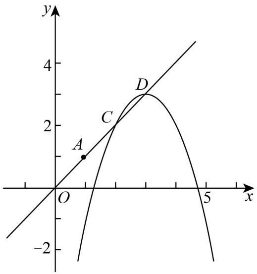

(1)求顶点 $A$ 的坐标；  
(2)如图，将原抛物线沿射线 $O A$ 方向进行平移得到新的抛物线，新抛物线与射线 $O A$ 交于 $C , D$ 两点，请问：在抛物线平移的过程中，线段 $C D$ 的长度是否为定值？若是，请求出这个定值；若不是，请说明理由．

【答案】(1)1,1(2) $\sqrt { 2 }$ ，过程见解析

【思路点拨】（1）根据待定系数法，可得函数解析式，根据配方法，可得顶点坐标；

（2）根据平移规律，可得新抛物线，根据联立抛物线与 $O A$ 的解析式，可得 $C$ 、 $D$ 点的横坐标，根据勾股定理，可得答案

【详解】（1）解：把 $B \left( 3 , - 3 \right)$ 代入 $y = - x ^ { 2 } + m x + m - 2$ 得：$- 3 = - 9 + 3 m + m - 2$ ，  
解得 $m = 2$ ，  
$y = - x ^ { 2 } + 2 x = - { \bigl ( } x - 1 { \bigr ) } ^ { 2 } + 1$ ，  
∴顶点 $\cdot$ 的坐标是1,1 ；  
（2）在抛物线平移的过程中，线段 $C D$ 的长度是定值，  
设直线 $O A$ 的解析式为 $y = k x$ ，把点 $\cdot$ 的坐标1,1代入得， $1 = k$ ，  
∴直线 $O A$ 的解析式为 $y = x$ ，  
∴可设新的抛物线解析式为 $y = - ( x - a ) ^ { 2 } + a$ ，  
联立 $\left\{ y = - { \bigl ( } x - a { \bigr ) } ^ { 2 } + a \right.$ ，  
$\therefore - ( x - a ) ^ { 2 } + a = x _ { \mathrm { ~ } }$ ，  
$\ x _ { 1 } = a , x _ { 2 } = a - 1$   
$\therefore x _ { 1 } - x _ { 2 } = a - \left( a - 1 \right) = 1 ,$   
$\therefore y _ { 1 } = x _ { 1 } = a , y _ { 2 } = x _ { 2 } = a - 1 ,$   
$\therefore y _ { 1 } - y _ { 2 } = 1$ ，

资料整理【淘宝店铺：向阳百分百】

即 $\cdot$ 、 $D$ 两点的横坐标的差是 1， $\cdot$ 、 $D$ 两点间的纵坐标的差为 1，$\therefore C D = { \sqrt { \left( x _ { 1 } - x _ { 2 } \right) ^ { 2 } + \left( y _ { 1 } - y _ { 2 } \right) ^ { 2 } } } = { \sqrt { 1 ^ { 2 } + 1 ^ { 2 } } } = { \sqrt { 2 } } \ ,$ ，∴在抛物线平移的过程中，线段 $C D$ 的长度是定值

# 2024 届福建龙岩市统考期中

4．已知，抛物线 $y = { \frac { 1 } { 2 } } x ^ { 2 } + b x + c$ 的对称轴为直线 $x = 2$ ，抛物线与 $x$ 轴的另一个交点为 $A$ ，顶点为 $B$

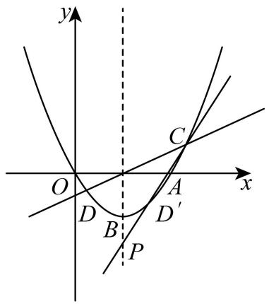

(1)求抛物线的解析式；

(2)如图，设直线 $y = k x - 2 k$ （ $k { \neq } 0$ ）与抛物线交于 $C , D$ 两点，点 $D$ 关于直线 $x = 2$ 的对称点为 $D ^ { \not \circ }$ ，直线 $C D ^ { \prime }$ 与直线 $x = 2$ 交于点 $P$ ，求证： $B P$ 的长为定值

【答案】(1 $y = \frac { 1 } { 2 } x ^ { 2 } - 2 x$ (2)点 $P ( 2 , - 4 )$ 为定点， $B P$ 为定值 2【思路点拨】（1）根据题意利用待定系数法求解即可；

（2）根据题意联立两个函数得出 $C \Big ( k + 2 + \sqrt { k ^ { 2 } + 4 } , k ^ { 2 } + k \sqrt { k ^ { 2 } + 4 } \Big ) , D \Big ( k + 2 - \sqrt { k ^ { 2 } + 4 } , k ^ { 2 } - k \sqrt { k ^ { 2 } + 4 } \Big ) ,$ 再由题意确定直线 $C D ^ { \prime }$ 的解析式，即可求解．

【详解】（1）解：抛物线的对称轴为直线 $x = 2$ ，过原点，可得，  
$\left\{ - { \frac { c = 0 } { 2 \cdot { \frac { 1 } { 2 } } } } = 2 \right.$ ；解得 $\left\{ { \begin{array} { l } { c = 0 } \\ { b = - 2 } \end{array} } \right.$ ； 即解析式为： $y = \frac { 1 } { 2 } x ^ { 2 } - 2 x$ ．（2） $C , D$ 为 $y = k x - 2 k$ 与抛物线的交点，  
$\left\{ \begin{array} { l l } { \displaystyle y = k x - 2 k } \\ { \displaystyle y = \frac { 1 } { 2 } x ^ { 2 } - 2 x } \end{array} \right.$

解得： $\begin{array}{c} \{ \begin{array} { l l } { x _ { 1 } = k + 2 - \sqrt { k ^ { 2 } + 4 } } \\ { y _ { 1 } = k ^ { 2 } - k \sqrt { k ^ { 2 } + 4 } } \end{array}  \Rightarrow \pmb { \mathscr { X } } _ { 1 } = k + 2 + \sqrt { k ^ { 2 } + 4 }  \\ { y _ { 2 } = k ^ { 2 } + k \sqrt { k ^ { 2 } + 4 } } \end{array}  ;$ $\therefore C { \sqrt { k + 2 + { \sqrt { k ^ { 2 } + 4 } } , k ^ { 2 } + k { \sqrt { k ^ { 2 } + 4 } } } } ) , D { ( k + 2 - { \sqrt { k ^ { 2 } + 4 } } , k ^ { 2 } - k { \sqrt { k ^ { 2 } + 4 } } ) }$

$D ^ { \not \emptyset }$ 与 $D$ 关于直线 $x = 2$ 对称，得： $D ^ { \prime } { \Big ( } 2 - k + { \sqrt { k ^ { 2 } + 4 } } , k ^ { 2 } - k { \sqrt { k ^ { 2 } + 4 } } { \Big ) }$   
设直线 $C D ^ { \prime }$ 的解析式为： $y = m x + n$ ，  
$\left\{ \begin{array} { l l } { \Big ( k + 2 + \sqrt { k ^ { 2 } + 4 } \Big ) m + n = k ^ { 2 } + k \sqrt { k ^ { 2 } + 4 } } \\ { \Big ( 2 - k + \sqrt { k ^ { 2 } + 4 } \Big ) m + n = k ^ { 2 } - k \sqrt { k ^ { 2 } + 4 } } \end{array} \right.$   
解得： $\left\{ \begin{array} { c } { { m = \sqrt { k ^ { 2 } + 4 } } } \\ { { n = - 2 \sqrt { k ^ { 2 } + 4 } - 4 } } \end{array} \right. ;$

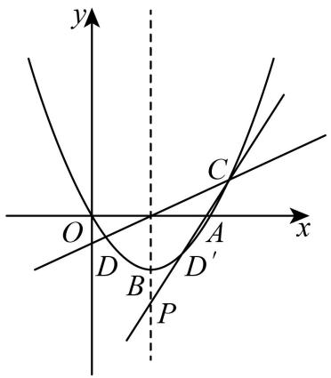  
图 (2)

即直线 $C D ^ { \prime }$ 的解析式为： $y = \sqrt { k ^ { 2 } + 4 } x + - 2 \sqrt { k ^ { 2 } + 4 } - 4$ ，当 $x = 2$ 时， $y = - 4$ ．点 $P ( 2 , - 4 )$ 为定点， $B P$ 为定值 2．$2 0 2 0 \cdot$ ·西藏·中考真题

5．在平面直角坐标系中，二次函数 $y = \frac { 1 } { 2 } x ^ { 2 } + b x + c$ 的图象与 $x$ 轴交于 $A ( \mathit { \Omega } - 2 , \ 0 )$ ， $B ( 4 , \ 0 )$ 两点，交 y轴于点 $C$ ，点 $P$ 是第四象限内抛物线上的一个动点

（1）求二次函数的解析式；

（2）如图乙，过 $A$ ， $B$ ， $P$ 三点作 $\odot M$ ，过点 $P$ 作 $P E \bot x$ 轴，垂足为 $D$ ，交 $\odot M$ 于点 $E$ ．点 $P$ 在运动过程中线段 $D E$ 的长是否变化，若有变化，求出 $D E$ 的取值范围；若不变，求 $D E$ 的长

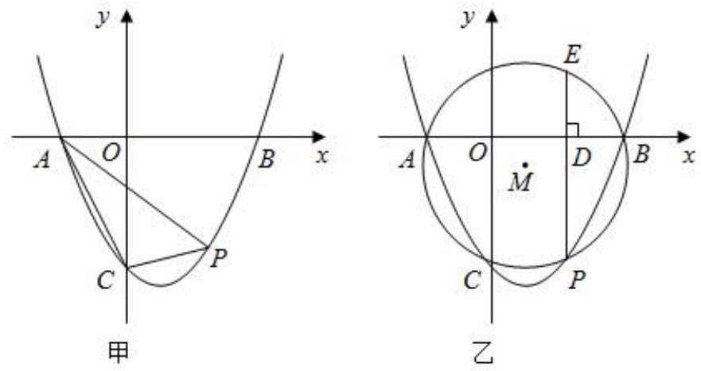

【答案】（1） $y = \frac { 1 } { 2 } x ^ { 2 } - x - 4$ ；（2） $P ( 3 , \mathrm { ~  ~ - ~ } \frac { 5 } { 2 } )$ ；（3）没有变化，2【思路点拨】（1）由二次函数 $y = \frac { 1 } { 2 } x ^ { 2 } + b x + c$ 的图象与 $x$ 轴交于 $A ( - 2 , 0 )$ ， $B ( 4 , 0 )$ 两点，可得二次函数的解析式为 $y = \frac 1 2 ( x + 2 ) ( x - 4 )$ ，由此即可解决问题

（2）结论：点 $P$ 在运动过程中线段 $D E$ 的长是定值， $D E = 2$ ．根据 $A M = M P$ ，根据方程求出 $t$ ，再利用中点坐标公式，求出点 $E$ 的纵坐标即可解决问题

【详解】解：（1）二次函数 $y = \frac { 1 } { 2 } x ^ { 2 } + b x + c$ 的图象与 $x$ 轴交于 $A ( - 2 , 0 )$ ， $B ( 4 , 0 )$ 两点，  
二次函数的解析式为 $y = \frac 1 2 ( x + 2 ) ( x - 4 )$ ，  
即 $y = \frac 1 2 x ^ { 2 } - x - 4$

（2）结论：点 $P$ 在运动过程中线段 $D E$ 的长是定值， $D E = 2$ 理由：如图乙中，连接 $A M$ ， $P M$ ， $E M$ ，设 $M ( 1 , t )$ ， $P [ m$ $\frac 1 2 ( m + 2 ) ( m - 4 ) ] \quad \quad E ( m , n )$

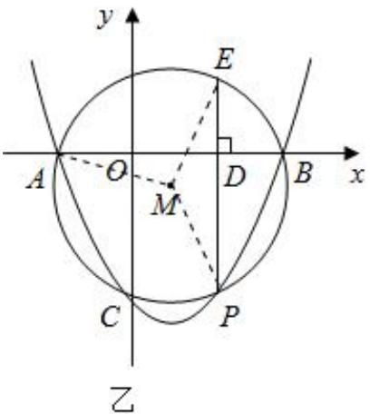

由题意 $A ( - 2 , 0 )$ ， $A M = P M$ ，  
$\therefore 3 ^ { 2 } + t ^ { 2 } = ( m - 1 ) ^ { 2 } + [ \frac { 1 } { 2 } ( m + 2 ) ( m - 4 ) - t ] ^ { 2 }$ ，  
解得 $t = 1 + \frac { 1 } { 4 } ( m + 2 ) ( m - 4 )$ ，  
$\because M E = P M , P E \bot A B , \quad \ldots t = \frac { n + \frac { 1 } { 2 } ( m + 2 ) ( m - 4 ) } { 2 } ,$   
$\therefore n = 2 t - { \frac { 1 } { 2 } } ( m + 2 ) ( m - 4 ) = 2 [ 1 + { \frac { 1 } { 2 } } ( m + 2 ) ( m - 4 ) ] - { \frac { 1 } { 2 } } ( m + 2 ) ( m - 4 ) = : \quad : D E = 2$   
点 $P$ 在运动过程中线段 $D E$ 的长是定值， $D E = 2$

# 题型二 线段和定值

# 2023 广州市二中月考

6．已知抛物线 $y = \frac { 1 } { 4 } x ^ { 2 } - 4$ 与 $x$ 轴交于 A、 $B$ 两点，顶点为 $C$ ，连接 $B C$ ，点 $P$ 在线段 $B C$ 下方的抛物线上运动

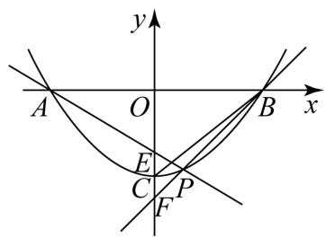

如图，直线 $P A$ ， $P B$ 分别与 $y$ 轴交于点 $E , \ F$ ，当点 $P$ 运动时， $O E + O F$ 是否为定值？若是，试求出该定值；若不是，请说明理由

【答案】当点 P 运动时， $O E + O F$ 为定值，定值为 8

【思路点拨】当点 P 运动时， $O E + O F$ 为定值．如图，过点 $\cdot$ 作 $P I \perp A B$ ，交 $A B$ 于点 I，同（1），令 $P ( m , { \frac { 1 } { 4 } } m ^ { 2 } - 4 )$ ，则 $P I = \mathrm { ~ - ~ } \frac { 1 } { 4 } m ^ { 2 } + ~ 4$ 可证 $\triangle O A E \sim \triangle I A P$ ，得 $O E = \frac { O A } { L A } { \bullet I P } = \frac { 4 } { m ^ { + } 4 } I P$ ，同理， ${ \triangle B I P } \sim { \triangle B O F }$ ，得 $O F = \frac { O B } { B I } { \bullet I P } = \frac { 4 } { 4 - \ m } I P$ ， 于是 $O E ^ { + } O F ^ { = } ~ ( \frac { 4 } { m ^ { + } ~ 4 } + \frac { 4 } { 4 ^ { - } m } ) I P = ~ \frac { ^ { - } 3 2 } { m ^ { ^ { 2 } } - 1 6 } ~ ^ { \cdot } ~ ( - ~ \frac { 1 } { 4 } m ^ { ^ { 2 } } + 4 ) = ~ 8 ~ .$

【详解】解：当点 P 运动时， $O E + O F$ 为定值  
如图，过点 P作 $P I \perp A B$ ，交 $A B$ 于点 $\cdot$ ，同（1），令 $P ( m , { \frac { 1 } { 4 } } m ^ { 2 } - 4 )$ ，则 $P I = \mathrm { ~ - ~ } \frac { 1 } { 4 } m ^ { 2 } + ~ 4$ $\bullet \ \cdot \ \Theta A O E = \ \Theta A I P = \ 9 0 ^ { \circ } \ , \quad \Theta O A E = \ \Theta L A P$   
$\triangle O A E \sim _ { \triangle I A P }$ $\ { \frac { O E } { I P } } = \ { \frac { O A } { L A } }$   
$O E = \ \frac { O A } { L A } \bullet I P = \ \frac { 4 } { m + \ 4 } I P$   
同理， ${ \triangle B I P } \sim { \triangle B O F }$ ， 得 $\frac { I P } { O F } = \frac { B I } { B O }$   
$\therefore O F = \frac { O B } { B I } \bullet I P = \frac { 4 } { 4 - m } I P$   
$O E ^ { + } ~ O F ^ { = } ~ ( \frac { 4 } { m ^ { + } ~ 4 } + \frac { 4 } { 4 ^ { - } ~ m } ) I P ^ { = } ~ \frac { ^ { - ~ 3 2 } } { m ^ { ^ { 2 } } - 1 6 } ^ { , } ~ ( - ~ \frac { 1 } { 4 } m ^ { ^ { 2 } } + 4 ) ^ { = } ~ 8$ ．

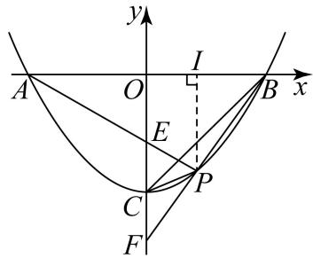

7．如图 1，抛物线 $y = a x ^ { 2 } + 2 x + c$ ，交 $x$ 轴于 $A , B$ 两点，交 $y$ 轴于点 $C$ ， $F$ 为抛物线顶点，直线 $E F$ 垂直于 $x$ 轴于点 $E$ ，当 $y \ge 0$ 时， $- 1 \leq x \leq 3$

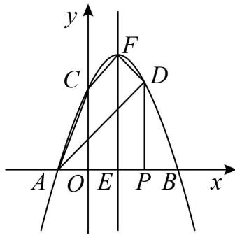  
图1

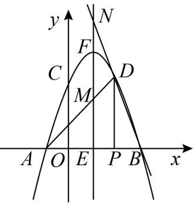  
图2

(1)求抛物线的表达式；

(2)点 $P$ 是线段 $B E$ 上的动点（除 $B$ 、 $E$ 外），过点 $P$ 作 $x$ 轴的垂线交抛物线于点 $D$ ，如图 2，直线 $A D$ ，$B D$ 分别与抛物线对称轴交于 $M$ 、 $N$ 两点．试问， $E M + E N$ 是否为定值？如果是，请求出这个定值；如果不是，请说明理由

【答案】 $y = - x ^ { 2 } + 2 x + 3$ (2) $\cdot$ 4； $\textcircled{2}$ 是，定值为8，理由见解析

【思路点拨】（1）由当 $y \ge 0$ 时， $- 1 \leq x \leq 3$ ，可知 $x _ { 1 } = - 1$ ， $x _ { 2 } = 3$ 是 $a x ^ { 2 } + 2 x + c = 0$ 的两根，代入方程可得 $a , c$ 从而得解；

（2） $\cdot$ 把 $x = 2$ 代入抛物线解析式可得 $D$ 点坐标，再 $x = 0$ 代入抛物线解析式可得 $\cdot$ 点坐标，从 而 得 知 线 段 $C D / / x$ 轴 ， 利 用 配 方 法 可 知 点 $\cdot$ 坐 标 ， 从 而 利 用$S _ { \perp \perp \perp \mathcal { U } A C F D } = S _ { \triangle F C D } + S _ { \triangle A C D } = \frac { 1 } { 2 } C D \left( y _ { F } - y _ { A } \right)$ 求面积；

$\cdot$ 设 $D \big ( m , - m ^ { 2 } + 2 m + 3 \big ) ( 1 < m < 3 )$ ，用待定系数法求出直线 $A D$ 与直 线 $B D$ 的解析式，再令 $x = 1$ 得 $y _ { M }$ $y _ { N }$ ，从而得出 $M E$ ， $N E$ 的长，从而得到 $N E + M E$ 是定值 8

【详解】（1）解：∵当 $y \ge 0$ 时， $- 1 \leq x \leq 3$ ，∴ $x _ { 1 } = - 1$ ， $x _ { 2 } = 3$ 是 $a x ^ { 2 } + 2 x + c = 0$ 的两根， $A ( - 1 , 0 ) , B ( 3 , 0 )$ ，$\left\{ { \begin{array} { l } { a - 2 + c = 0 } \\ { 9 a + 6 + c = 0 } \end{array} } \right.$ 解得： $\scriptstyle { \left\{ \begin{array} { l l } { a = - 1 } \\ { c = 3 } \end{array} \right. }$ ,  抛物 线的 表达 式为 ： $y = - x ^ { 2 } + 2 x + 3$ ；

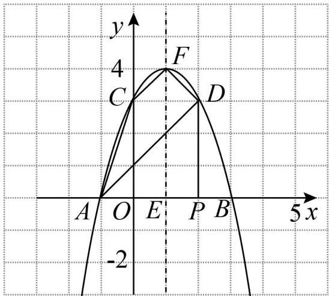

（2） $\textcircled{1}$ 把 $x = 2$ 代入 $y = - x ^ { 2 } + 2 x + 3$ 得： $y = 3$ ，  
 $. D ( 2 , 3 )$ ．  
又当 $x = 0$ ， $y = 3$ ， $C ( 0 , 3 )$ ，线段 $C D / / x$ 轴．  
$\cdot : y = - x ^ { 2 } + 2 x + 3 = - ( x - 1 ) ^ { 2 } + 4 , \therefore F ( 1 , 4 ) , S _ { \mid \mid \bar { \mathcal { H } } \mid \mathcal { H } \llangle C E D } = S _ { \triangle F C D } + S _ { \triangle A C D } = \frac { 1 } { 2 } C D \big ( y _ { F } - y _ { A } \big ) = 4 \ ;$   
$\cdot$ 设 $D \big ( m , - m ^ { 2 } + 2 m + 3 \big ) ( 1 < m < 3 )$ ，  
直线 $A D : y = k _ { 1 } x + b _ { 1 } \ , B D : y = k _ { 2 } x + b _ { 2 }$ ，  
因此可得：  
$\left\{ \begin{array} { l l } { { 0 = - k _ { 1 } + b _ { 1 } } } & { { \quad \left\{ 0 = 3 k _ { 2 } + b _ { 2 } \right. } } \\ { { - m ^ { 2 } + 2 m + 3 = k _ { 1 } m + b _ { 1 } } } & { { \quad \left. - m ^ { 2 } + 2 m + 3 = k _ { 2 } m + b _ { 2 } \right. } } \end{array} \right.$   
解得： $\begin{array} { c } { \left\{ k _ { 1 } = 3 - m \atop { \vphantom { \ d } } b _ { 1 } = 3 - m \atop { \vphantom { \ d } } b _ { 1 } = 3 - m \right.}   \end{array}$ 或 $\left\{ \begin{array} { l l } { k _ { 2 } = - 1 - m } \\ { b _ { 2 } = 3 m + 3 } \end{array} \right.$ ，直线 $A D : y = ( 3 - m ) x + ( 3 - m )$ ，  
$B D : y = - ( m + 1 ) x + 3 ( m + 1 ) .$   
令 $x = 1$ 得 $y _ { M } = 6 - 2 m$ $- 2 m , y _ { \scriptscriptstyle N } = 2 m + 2 , \ : \ : \cdot M E = 6 - 2 m , N E = 2 m + 2 , \ : \ : \cdot N E + M E = 8 .$ ．

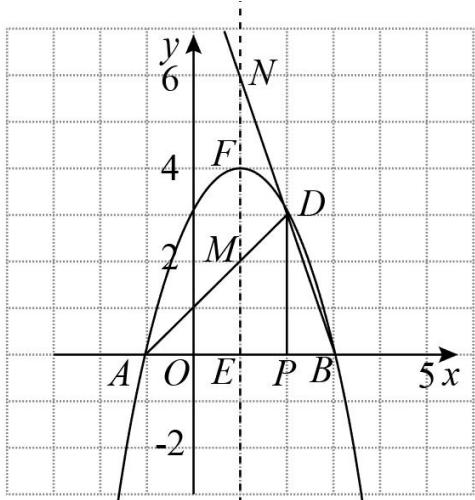

2024 届湖北黄石市·九年级统考

8．如图，抛物线 $y = a x ^ { 2 } + b x + c$ 过点 $A ( - 1 , 0 )$ ，点 $B ( 3 , 0 )$ ，点 $C ( 0 , 3 )$ ，直线 $l$ 为该二次函数图象的对称轴，交 $x$ 轴于点 $E$   
资料整理【淘宝店铺：向阳百分百】

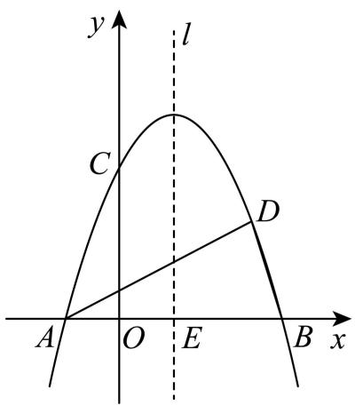  
图1

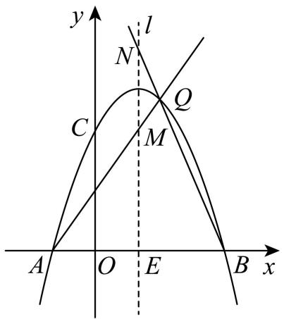  
图2

(1)求抛物线的解析式；

(2)若点 $\mathcal { Q }$ 为 $x$ 轴上方二次函数图象上一动点，过点 $\mathcal { Q }$ 作直线AQ， $B Q$ 分别交直线 l 于点 M， $N$ ，在点 $\mathcal { Q }$ 的运动过程中， $E M + E N$ 的值是否为定值？若是，请求出该定值；若不是，请说明理由．

【答案】 $y = - x ^ { 2 } + 2 x + 3$ (2)是定值，值为 8

【思路点拨】（1）待定系数法求解析式即可；

（2）设 $\scriptstyle Q \left( m , - m ^ { 2 } + 2 m + 3 \right)$ ，直线 $A Q$ 的解析式为 $y = k \big ( x + 1 \big )$ ，将 $Q \left( m , - m ^ { 2 } + 2 m + 3 \right)$ 代入 $y = k \left( x + 1 \right)$ 得， $- m ^ { 2 } + 2 m + 3 = k { \bigl ( } m + 1 { \bigr ) }$ ，解得， $k = 3 - m$ ，则 $A Q$ 的 解 析 式 为 $y = \left( 3 - m \right) \left( x + 1 \right)$ ，当 $x = 1$ 时，$y = 2 \left( 3 - m \right) = 6 - 2 m$ ，则 $M \left( 1 , 6 - 2 m \right)$ ，即 $M E = 6 - 2 m$ ，同理可得， $N E = 2 m + 2$ ，然后求解作答即可．

【详解】（1）解：将 $A ( - 1 , 0 )$ ，点 $B ( 3 , 0 )$ ，点 $C ( 0 , 3 )$ 代入 $y = a x ^ { 2 } + b x + c$ 得，$\left\{ \begin{array} { l l } { a - b + c = 0 } \\ { 9 a + 3 b + c = 0 } \\ { c = 3 } \end{array} \right.$ ，解得， $\left\{ \begin{array} { l } { { a = - 1 } } \\ { { b = 2 } } \\ { { c = 3 } } \end{array} \right. , \ \stackrel { . } { \cdot } \ { y } = - x ^ { 2 } + 2 x + 3 \ ;$ ；

（2）解：由题意知，抛物线对称轴直线 $l = { \frac { - 1 + 3 } { 2 } } = 1$ ,如图 1，连接 $B B ^ { \prime }$ 交 $A D$ 于 $R$ ，

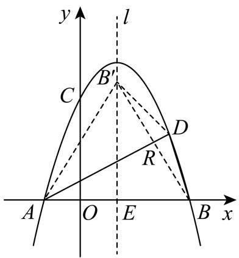  
图1

由翻折的性质可知， $A B ^ { \prime } = A B = 4$ ， $R$ 为 $B B ^ { \prime }$ 的中点，  
设 $B ^ { \prime } ( 1 , \ n )$ ，则 $E { \big ( } 1 , 0 { \big ) }$ ， $A E = 2$ ， $B ^ { \prime } E = n$ ，  
由勾股定理得， $\boldsymbol { A } \boldsymbol { B } ^ { \prime 2 } = \boldsymbol { A } \boldsymbol { E } ^ { 2 } + \boldsymbol { B } ^ { \prime } \boldsymbol { E } ^ { 2 }$ ，即 $4 ^ { 2 } = 2 ^ { 2 } + n ^ { 2 }$ ，  
解得， $n = 2 \sqrt { 3 }$ 或 $n = - 2 \sqrt { 3 }$ （舍去），  
$\therefore B ^ { \prime } \left( 1 , 2 { \sqrt { 3 } } \right)$ ，则 $R \left( 2 , { \sqrt { 3 } } \right)$ ，  
设直线 $A D$ 的解析式为 $y = k x + b ^ { \prime }$ ，  
将 $A ( - 1 , 0 )$ ， $R \left( 2 , { \sqrt { 3 } } \right)$ 代入得，  
$\left\{ { \begin{array} { l } { - k + b ^ { \prime } = 0 } \\ { 2 k + b ^ { \prime } = { \sqrt { 3 } } } \end{array} } \right.$ 解得， $\left\{ k = { \frac { \sqrt { 3 } } { 3 } } \right. \ , \ \therefore y = { \frac { \sqrt { 3 } } { 3 } } x + { \frac { \sqrt { 3 } } { 3 } } \ ;$   
（3）解：设 $\mathcal { Q } \left( m , - m ^ { 2 } + 2 m + 3 \right)$ ，直线 $A Q$ 的解析式为 $y = k ^ { \prime } { \bigl ( } x + 1 { \bigr ) }$ ，  
将 $\scriptstyle Q \left( m , - m ^ { 2 } + 2 m + 3 \right)$ 代入 $y = k ^ { \prime } { \bigl ( } x + 1 { \bigr ) }$ 得，  
$- m ^ { 2 } + 2 m + 3 = k ^ { \prime } { \left( m + 1 \right) }$   
解得， $k ^ { \prime } = 3 - m$ ，  
∴ $A Q$ 的解析式为 $y = \left( 3 - m \right) \left( x + 1 \right)$ ，  
当 $x = 1$ 时， $y = 2 { \bigl ( } 3 - m { \bigr ) } = 6 - 2 m$ ，  
则 $M \left( 1 , 6 - 2 m \right)$ ，即 $M E = 6 - 2 m$ ，  
同理可得，直线 $B Q$ 的解析式为 $y = - ( m + 1 ) ( x - 3 )$ ，  
当 $x = 1$ 时， $y = 2 \left( m + 1 \right) = 2 m + 2$ ，  
则 $N \left( 1 , 2 m + 2 \right)$ ，即 $N E = 2 m + 2$ ，  
$\cdot M E + N E = 8$ ，  
$\cdot \ M E + N E$ 的值为定值，定值为 8

# 2023·四川乐山·统考二模

9．如图，已知二次函数 $y = a x ^ { 2 } + b x + 4$ 的图像与 $x$ 轴交于 $A ( - 2 , 0 )$ ， $B ( 4 , 0 )$ 两点，与 $y$ 轴交于点 $C$ ，抛物线的顶点为 $D$ ，点 $P$ 是 $x$ 轴上方抛物线上的一个动点，过 $P$ 作 $P N \perp x$ 轴于 $N$ ，交直线 $B C$ 于 $M$ ．

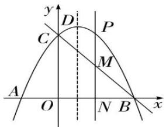

(1)求二次函数表达式及顶点 $D$ 的坐标；  
(2)设抛物线对称轴与 $x$ 轴交于点 $H$ ，连接 $A P$ 交对称轴于 $E$ ，连接 $B P$ 并延长交对称轴于 $F$ ，证明$H E + H F$ 的值为定值，并求出这个定值

【答案】(1)二次函数的表达式为 $y = - \frac { 1 } { 2 } x ^ { 2 } + x + 4$ ，顶点 $\cdot$ 的坐标为 $\left( 1 , { \frac { 9 } { 2 } } \right)$ (2)见解析，这个定值为 9

【思路点拨】（1）将 $A$ $B$ 点代入二次函数表达式中求得 $a$ 、 $b$ 的值即可确定函数解析式，然后再化成顶点式即可确定顶点 $\cdot$ 坐标；

（2）如图，过点 $\cdot$ 作 $P G \bot x$ 轴于点 $\cdot$ ，设点 $\cdot$ 的坐标为 $\left( t , - { \frac { 1 } { 2 } } t ^ { 2 } + t + 4 \right)$ 再说明 $P G / / D H$ 可得AHE  AGP 、BGP  BHF ，即 ${ \frac { E H } { P G } } { = } { \frac { A H } { A G } }$ ， ${ \frac { P G } { F H } } = { \frac { B G } { B H } }$ ；进而得到 $E H = { \frac { A H \cdot P G } { A G } }$ ， $F H = { \frac { B H \cdot P G } { B G } }$ ；然后分当点 $\cdot$ 在 $B H$ 上和 $A H$ 上两种情况，分别 $E H + F H$ 的值即可解答．

【详解】（1）解：∵ $A ( - 2 , 0 )$ ， $B ( 4 , 0 )$ 在二次函数的图像上，  
∴将 $\cdot$ ， $\cdot$ 点代入二次函数表达式中，  
得 $\left\{ \begin{array} { c } { 4 a + \left( - 2 \right) b + 4 = 0 } \\ { 1 6 a + 4 b + 4 = 0 } \end{array} \right.$ , 解得 $\left\{ { \begin{array} { l } { \displaystyle a = - { \frac { 1 } { 2 } } } \\ { \displaystyle b = 1 } \end{array} } \right.$   
∴二次函数的表达式为 $y = - \frac { 1 } { 2 } x ^ { 2 } + x + 4$ ，将其化为顶点式为 $y = - \frac { 1 } { 2 } { \bigl ( } x - 1 { \bigr ) } ^ { 2 } + \frac { 9 } { 2 }$   
∴顶点 $\cdot$ 的坐标为 $\left( 1 , { \frac { 9 } { 2 } } \right)$   
（2）解：如图，过点 $\cdot$ 作 $P G \bot x$ 轴于点 $\cdot$ ，设点 $P$ 的坐标为 $\left( t , - { \frac { 1 } { 2 } } t ^ { 2 } + t + 4 \right)$   
∵ $D H \perp x$ 轴于点 $\cdot$ ，  
$\therefore P G / / D H$ ，  
$\therefore \Delta A H E \sim \Delta A G P$ ， BGP  BHF ，  
${ \frac { E H } { P G } } = { \frac { A H } { A G } } \quad { \frac { P G } { F H } } = { \frac { B G } { B H } }$   
$\therefore E H = \frac { A H \cdot P G } { A G } , F H = \frac { B H \cdot P G } { B G } ,$   
当点 $\cdot$ 在 $B H$ 上时，  
$A H = B H = 3 A G = t + 2 B G = 4 - t ~ P G = - { \frac { 1 } { 2 } } t ^ { 2 } + t + 4$ ，  
$\therefore E H + F H = 3 { \left( \frac { P G } { t + 2 } + \frac { P G } { 4 - t } \right) } = 3 \cdot \left( - { \frac { 1 } { 2 } } \right) \left( t + 2 \right) \left( t - 4 \right) { \frac { 4 - t + t + 2 } { \left( t + 2 \right) \left( 4 - t \right) } } = 9 ;$   
同理：当点 $G$ 在 $A H$ 上，由抛物线对称性可知，结果相同  
综上可知， $H E + H F$ 的结果为定值，且这个定值为 9

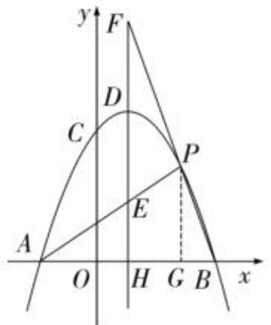

# 2023·海口华侨中学考模

10．如图 1，抛物线 $y = a x ^ { 2 } + b x + 3$ 交 $x$ 轴于点 $A { \big ( } { - } 1 , 0 { \big ) }$ 和点 $B \left( 3 , 0 \right)$ ，交于 $y$ 轴点 $C$ ， $F$ 为抛抛物线顶点，点 $\mathcal { Q } ( 2 , 3 )$ 在抛物线上

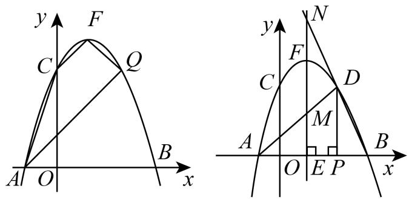

(1)求该抛物线所对应的函数解析式

(2)直线 $E F$ 垂直于 $x$ 轴于点 $E$ ，点 $P$ 是线段 $B E$ 上的动点（除 $B$ 、 $E$ 外）过点 $P$ 作 $x$ 轴的垂线交抛物线于点 $D$ ，连接 $D A , D Q ,$ 如图 2，直线 $A D , B D$ 分别与抛物线对称轴交于 $M , N$ 两点．试问： $E M + E N$ 是否为定值？如果是，请直接写出这个定值；如果不是，请说明理由

【答案】 $( 1 ) y = - x ^ { 2 } + 2 x + 3$ $( 2 ) E M + E N$ 是为定值，定值为 8

【思路点拨】分 $\angle A D Q = 9 0 ^ { \circ }$ 或 $\angle A Q D = 9 0 ^ { \circ }$ 两种情况结合一次函数图象的性质分析求解；

【详解】（1）∵抛物线 $y = a x ^ { 2 } + b x + 3$ 经过点 $A { \big ( } { - } 1 , 0 { \big ) }$ ， $B \left( 3 , 0 \right)$ ，资料整理【淘宝店铺：向阳百分百】

$\displaystyle : \left\{ \begin{array} { l l } { a - b + 3 = 0 } \\ { 9 a + 3 b + 3 = 0 } \end{array} \right.$ 解得 $\left\{ { \begin{array} { l } { a = - 1 } \\ { b = 2 } \end{array} } \right.$ ∴该抛物线的函数表达式为： $y = - x ^ { 2 } + 2 x + 3$ ；

（2）设 $D \left( m , - m ^ { 2 } + 2 m + 3 \right)$   
由 $\cdot$ 、 $D$ 的坐标得，直线 $A D$ 的表达式为： $y = - ( m - 3 ) ( x + 1 )$ ，当 $x = 1$ 时， $y = - 2 ( m - 3 ) = - 2 m + 6 = E M$ ；  
由点 $B$ 、 $D$ 的坐标得，直线 $B D$ 的表达式为： $y = - ( m + 1 ) ( x - 3 )$ ，当 $x = 1$ 时， $y = 2 m + 2 = E N$   
则 $E M + E N$ 是为定值，定值为 8

# 2023·江苏徐州·4 月模拟

11．如图，已知抛物线 $y = - x ^ { 2 } + a x$ 经过点 $A ( 4 , 0 )$ 和 $B ( 1 , m )$ 点，其对称轴交 $x$ 轴于点 $H$ ，点 $C$ 是抛物线在直线 $A B$ 上方的一个动点（不含 $A$ ， $B$ 两点）

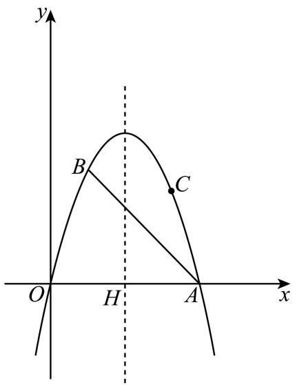

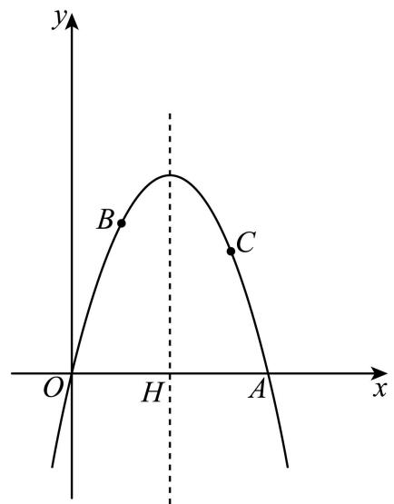  
备用图

(1)求 $a$ ， $m$ 的值；

(2)若直线 $A C$ 、 $O C$ 分别交该抛物线的对称轴于点 $E , \ F$ ，试问 $E H + F H$ 是否为定值，若是，请求出该定值；若不是，请说明理由

【答案】 $\quad { a = 4 \quad } \ m = 3$ (2)是定值，8

【思路点拨】（1）用待定系数法求出抛物线表达式，进而求解；

（2）求出直线 $A C$ 的表达式为： $y = - t ( x - 4 )$ ，直线CO的表达式为： $y = ( - t + 4 ) x$ ，即可求解．

【详解】（1）解：将点A 的坐标代入抛物线表达式得： $0 = - 1 6 + 4 a$ ，解得： $a = 4$ ，即抛物线的表达式为： $y = - x ^ { 2 } + 4 x$ ，  
当 $x = 1$ 时， $y = - x ^ { 2 } + 4 x = 3$ ，即点 $B ( 1 , 3 )$ ，即 $m = 3$ ，  
故 $a = 4$ ， $m = 3$ ；

资料整理【淘宝店铺：向阳百分百】

（2）是定值，理由：  
设点 $C ( t , - t ^ { 2 } + 4 t )$ ，  
由点A 、 $C$ 的坐标得：直线 $A C$ 的表达式为： $y = - t ( x - 4 )$ ，  
当 $x = 2$ 时， $y = 2 t$ ，即点 $E ( 2 , 2 t )$ ，则 $E H = 2 t$ ，  
由点 $C$ 的坐标得，直线CO的表达式为： $y = ( - t + 4 ) x$ ，  
当 $x = 2$ 时， $y = ( - t + 4 ) x = - 2 t + 8$ ，即点 $F ( 2 , - 2 t + 8 )$ ，则 $F H = - 2 t + 8$ ，  
则 $E H + F H = 2 t - 2 t + 8 = 8$ ，为定值

# 2022·湖南张家界·中考真题

12．如图，已知抛物线 $y = a x ^ { 2 } + b x + 3 ( a \neq 0 )$ 的图像与 $x$ 轴交于 $A ( 1 , 0 )$ ， $B ( 4 , 0 )$ 两点，与 $y$ 轴交于点 $C$ ，点 $D$ 为抛物线的顶点

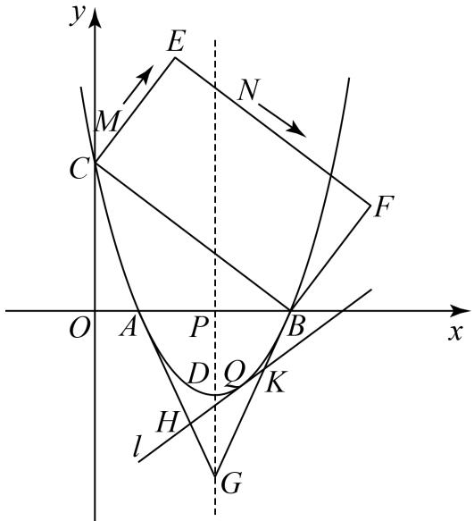

(1)求抛物线的函数表达式及点 $D$ 的坐标；

(2)抛物线的对称轴与 $x$ 轴交于点 $P$ ，点 $G$ 是点 $P$ 关于点 $D$ 的对称点，点 $\mathcal { Q }$ 是 $x$ 轴下方抛物线图像上的动点．若过点 $\mathcal { Q }$ 的直线 $l : y = k x + m ( \left| k \right| < \frac { 9 } { 4 } )$ 与抛物线只有一个公共点，且分别与线段 $G A$ 、 $G B$ 相交于点 $H$ 、 $K$ ，求证： $G H + G K$ 为定值

【答案】(1) $y = \frac { 3 } { 4 } x ^ { 2 } - \frac { 1 5 } { 4 } x + 3$ ；顶点为 $D ( \frac { 5 } { 2 } , - \frac { 2 7 } { 1 6 } )$ (2)见解析

【思路点拨】（1）设二次函数表达式为： $y = a x ^ { 2 } + b x + 3$ ，将 $A ( 1 , 0 )$ 、 $B ( 4 , 0 )$ 代入 $y = a x ^ { 2 } + b x + 3$ ，进行计算即可得 $y = \frac { 3 } { 4 } x ^ { 2 } - \frac { 1 5 } { 4 } x + 3$ ，根据二次函数的性质即可得；

（2）根据对称的性质得 $G ( \frac { 5 } { 2 } , - \frac { 2 7 } { 8 } )$ ，根据直线 $l : y = k x + m ( \left| k \right| < \frac { 9 } { 4 } )$ 与抛物线图像只有一个公共点，即可得 $m = \frac { 1 4 4 - ( 4 k + 1 5 ) ^ { 2 } } { 4 8 }$ 利用待定系数法可得直线 $G A$ 的解析式为： $y = - { \frac { 9 } { 4 } } x + { \frac { 9 } { 4 } }$ 直线 $G B$ 的解析式为： $y = \frac { 9 } { 4 } x - 9$ ，联立 $\left\{ \begin{array} { l l } { \displaystyle y = k x + \frac { 1 4 4 - ( 4 k + 1 5 ) ^ { 2 } } { 4 8 } } \\ { \displaystyle y = - \frac { 9 } { 4 } x + \frac { 9 } { 4 } } \end{array} \right.$ ，结合 已知 $\left| k \right| < \frac { 9 } { 4 }$ , 解得： $x _ { { _ H } } = \frac { 4 k + 2 1 } { 1 2 }$ ， 同理可得： $x _ { _ { K } } = \frac { 4 k + 3 9 } { 1 2 }$ 运用三角函数求出 $\cdot$ ， $\cdot$ 即可 得

【详解】（1）解：设二次函数表达式为： $y = a x ^ { 2 } + b x + 3$ ，  
将 $A ( 1 , 0 )$ 、 $B ( 4 , 0 )$ 代入 $y = a x ^ { 2 } + b x + 3$ 得：  
$\begin{array} { l } { { \left\{ a + b + 3 = 0 \right. } } \\ { { \left\{ 1 6 a + 4 b + 3 = 0 \right. } } \end{array}$ 解得， $\left\{ { a = \frac { 3 } { 4 } } \right. \nonumber$ 抛物线的函数表达式为： $y = \frac { 3 } { 4 } x ^ { 2 } - \frac { 1 5 } { 4 } x + 3$ ，又 $\therefore - { \frac { b } { 2 a } } = - { \frac { - { \frac { 1 5 } { 4 } } } { 2 \times { \frac { 3 } { 4 } } } } = { \frac { 5 } { 2 } } , { \frac { 4 a c - b ^ { 2 } } { 4 a } } = { \frac { 4 \times { \frac { 3 } { 4 } } \times 3 - ( - { \frac { 1 5 } { 4 } } ) ^ { 2 } } { 4 \times { \frac { 3 } { 4 } } } } = { \frac { 2 7 } { 1 6 } } ,$   
顶点为 $D ( \frac { 5 } { 2 } , - \frac { 2 7 } { 1 6 } )$ ；  
（2）解：点 $P ( \frac { 5 } { 2 } , 0 )$ 关于点 $D ( \frac { 5 } { 2 } , - \frac { 2 7 } { 1 6 } )$ 的对称点为点 $G$ ，  
$\therefore G ( \frac { 5 } { 2 } , - \frac { 2 7 } { 8 } )$   
直线 $l : y = k x + m ( \left| k \right| < \frac { 9 } { 4 } )$ 与抛物线图像只有一个公共点，  
$\frac { 3 } { 4 } x ^ { 2 } - \frac { 1 5 } { 4 } x + 3 = k x + m$ 只有一个实数解，  
 ${ \bf \omega } = 0$ ，  
即： $[ - ( \frac { 1 5 } { 4 } + k ) ] ^ { 2 } - 4 \times \frac { 3 } { 4 } \cdot ( 3 - m ) = 0$ ，  
解得： $m = \frac { 1 4 4 - ( 4 k + 1 5 ) ^ { 2 } } { 4 8 }$   
利用待定系数法可得直线 $G A$ 的解析式为： $y = - { \frac { 9 } { 4 } } x + { \frac { 9 } { 4 } }$ 直线 $G B$ 的解析式为： $y = \frac { 9 } { 4 } x - 9$   
联立 $\left\{ \begin{array} { l l } { \displaystyle y = k x + \frac { 1 4 4 - ( 4 k + 1 5 ) ^ { 2 } } { 4 8 } } \\ { \displaystyle y = - \frac { 9 } { 4 } x + \frac { 9 } { 4 } } \end{array} \right.$ ，结合已知 $\left| k \right| < \frac { 9 } { 4 }$   
解得： Hx $x _ { { \scriptscriptstyle H } } = \frac { 4 k + 2 1 } { 1 2 }$ 同理可得： $x _ { \scriptscriptstyle K } = \frac { 4 k + 3 9 } { 1 2 }$ ，  
则： $G H = \frac { ( \frac { 5 } { 2 } - x _ { H } ) } { \sin { \angle A G P } } = ( \frac { 5 } { 2 } - \frac { 4 k + 2 1 } { 1 2 } ) \times \frac { \sqrt { 9 7 } } { 4 } , G K = \frac { ( x _ { k } - \frac { 5 } { 2 } ) } { \sin { \angle B G P } } = ( \frac { 4 k + 3 9 } { 1 2 } - \frac { 5 } { 2 } ) \times \frac { \sqrt { 9 7 } } { 4 } ,$   
$\therefore G H + G K = ( \frac { 5 } { 2 } - \frac { 4 k + 2 1 } { 1 2 } ) \times \frac { \sqrt { 9 7 } } { 4 } + ( \frac { 4 k + 3 9 } { 1 2 } - \frac { 5 } { 2 } ) \times \frac { \sqrt { 9 7 } } { 4 } = \frac { 3 \sqrt { 9 7 } } { 8 } ~ ,$

 $. G H + G K$ 的值为 $\frac { 3 { \sqrt { 9 7 } } } { 8 }$

# 题型三 加权线段和定值

# 2023·四川广元·中考真题

13．如图 1，在平面直角坐标系中，已知二次函数 $y = a x ^ { 2 } + b x + 4$ 的图象与 $x$ 轴交于点 $A { \big ( } { - } 2 , 0 { \big ) }$ ，$B \left( 4 , 0 \right)$ ，与 $y$ 轴交于点 $C$ ．

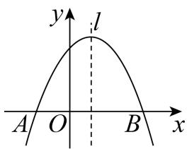  
图1

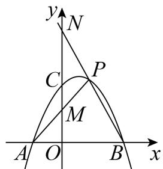  
图2

(1)求抛物线的解析式；

(2)如图 2 ， $P$ 为第一象限内抛物线上一点，连接 $A P$ 交 $y$ 轴于点 $M$ ，连接 $B P$ 并延长交 $y$ 轴于点 $N$ ，在点 $P$ 运动过程中， $O M + { \frac { 1 } { 2 } } O N$ 是否为定值？若是，求出这个定值；若不是，请说明理由

【答案】( $y = - \frac { 1 } { 2 } x ^ { 2 } + x + 4$

$O M + \frac { 1 } { 2 } O N = 6$ ，理由见解析【思路点拨】（1）待定系数法求解析式即可；

（2）先求得抛物线的对称轴为直线 $x = 1$ ，设 $l$ 与 $x$ 交于点 $G$ ，过点 $E$ 作 $E D \perp l$ 于点 $D$ ，证明$\triangle D F G { \cong } \triangle G B F$ ，设 $F \left( l , m \right)$ ，则 $D E = 1 + m$ ， $D G = D F + F G = G B + F G = 3 + m$ ，进而得出 $E$ 点的坐标，代入抛物线解析式，求得 $m$ 的值，同理可求得当点 $\cdot$ 在 $\cdot$ 轴下方时的坐标；当 $E$ 点与 $\mathbf { A }$ 点重合时，求得另一个解，进而即可求解；

【详解】（1）解：将点 $A \left( - 2 , 0 \right)$ ， $B \left( 4 , 0 \right)$ ，代入 $y = a x ^ { 2 } + b x + 4$ 得 $\begin{array} { l } { { \left\{ 4 a - 2 b + 4 = 0 \right. } } \\ { { \left. 1 6 a + 4 b + 4 = 0 \right. } } \end{array}$ 解得： $\left\{ \begin{array} { l l } { \displaystyle a = - \frac { 1 } { 2 } } \\ { \displaystyle b = 1 } \end{array} \right.$ ∴抛物 线解 析式 为 $y = - \frac { 1 } { 2 } x ^ { 2 } + x + 4$ ；

（2）设 $P ( s , t )$ ，直线 $A P$ 的解析式为 $y = d x + f$ ， $B P$ 的解析式为 $y = g x + h$ ，  
∵点 $A \left( - 2 , 0 \right)$ ， B 4,0 ， $P ( s , t )$ ，  
$\left\{ \begin{array} { l l } { - 2 d + f = 0 } & { { } \quad \int 4 g + h = 0 } \\ { s d + f = t } & { { } \quad \left\{ s g + h = t \right. } \end{array} \right.$ 解得： $\left\{ \begin{array} { l } { { d = \displaystyle \frac { t } { s + 2 } } } \\ { { f = \displaystyle \frac { 2 t } { s + 2 } } } \end{array} , \right. \left\{ \begin{array} { l } { { g = \displaystyle \frac { t } { s - 4 } } } \\ { { h = \displaystyle \frac { 4 t } { 4 - s } } } \end{array} \right.$   
∴直线 $A P$ 的解析式为 $y = \frac { t } { s + 2 } x + \frac { 2 t } { s + 2 }$ $B P$ 的解析式为 $y = \frac { t } { s - 4 } x + \frac { 4 t } { 4 - s }$ 对于 $y = \frac { t } { s + 2 } x + \frac { 2 t } { s + 2 }$ 当 $x = 0$ 时， $y = \frac { 2 t } { s + 2 }$ 即 $M \left( 0 , \frac { 2 t } { s + 2 } \right)$ ,  
对于 $y = \frac { t } { s - 4 } x + \frac { 4 t } { 4 - s }$ 当 $x = 0$ 时， $y = \frac { 4 t } { 4 - s }$ 即 $N { \left( 0 , \frac { 4 t } { 4 - s } \right) }$ ,  
∵ $P ( s , t )$ 在抛物线上，则 $t = - { \frac { 1 } { 2 } } s ^ { 2 } + s + 4 = - { \frac { 1 } { 2 } } { \big ( } s - 4 { \big ) } { \big ( } s + 2 { \big ) }$   
$\begin{array} { c } { { \displaystyle O M + \frac { 1 } { 2 } O N = \frac { 2 t } { s + 2 } + \frac { 1 } { 2 } \times \frac { 4 t } { 4 - s } = \frac { 1 2 t } { - s ^ { 2 } + 2 s + 8 } } } \\ { { { } } } \\ { { = \displaystyle \frac { - 6 \left( s - 4 \right) \left( s + 2 \right) } { - \left( s - 4 \right) \left( s + 2 \right) } = 6 } } \\ { { { } } } \\ { { O M + \displaystyle \frac { 1 } { 2 } O N \qquad 6 } } \end{array}$

# $2 0 2 0 \cdot$ 四川德阳·中考真题

14．如图 1，抛物线 $y { = } a x ^ { 2 } - 2 a x - 3 a \ ( a { \neq } 0 )$ ）与 $x$ 轴交于点 $A , \ B$ ．与 $y$ 轴交于点 $C$ ．连接 AC，BC．已知 $\triangle A B C$ 的面积为 2

（1）求抛物线的解析式；

（2）如图 2，平行于 $y$ 轴的直线交抛物线于点 $M$ ，交 $x$ 轴于点 $N$ （2，0）．点 $D$ 是抛物线上 $A$ ， $M$ 之间的一动点，且点 $D$ 不与 $A$ ， $M$ 重合，连接 $D B$ 交 $M N$ 于点 $E$ ．连接 $A D$ 并延长交 $M N$ 于点 $F$ ．在点 $D$ 运动过程中， $3 N E { + } N F$ 是否为定值？若是，求出这个定值；若不是，请说明理由．

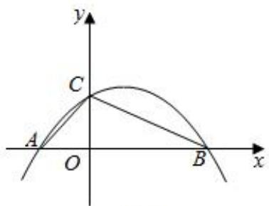  
图1

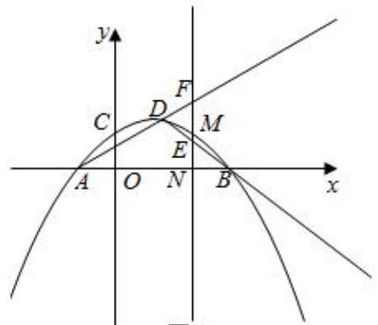  
图2

【答案】（1） $y = - \frac { 1 } { 3 } x ^ { 2 } + \frac { 2 } { 3 } x + 1$ ；（2）是，3NE+NF 为定值 4【思路点拨】（1）先将抛物线解析式变形，可得 $A$ 和 $B$ 的坐标，从而得 $\scriptstyle A B = 1 + 3 = 4$ ，根据三角形 ABC的面积为 2 可得 $O C$ 的长，确定点 $\cdot$ 的坐标，根据点 $C$ 的坐标，利用待定系数法即可求出二次函数

的解析式；

（2）设点 $D ~ ( n , ~ - ~ \frac { 1 } { 3 } n ^ { 2 } + \frac { 2 } { 3 } n + 1 )$ ），利用待定系数法求直线 $A D$ 和 $\cdot$ 的解析式，表示 $F N$ 和 $O K$ 的长，直接代入计算可得结论

【详解】（1）如图 1， $y = a x ^ { 2 } - 2 a x - 3 a = a ( x ^ { 2 } - 2 x - 3 ) = a ( x - 3 ) ( x + 1 ) ,$

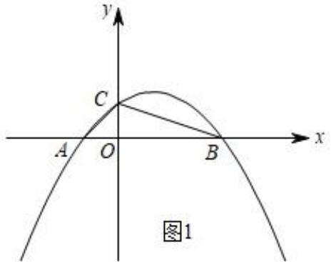

∴A（﹣1，0），B（3，0），  
∴ $A B { = } 4$ ，  
∵△ABC 的面积为 2，即 $\frac { 1 } { 2 } A B \bullet O C = 2$ ，  
∴ $\cdot$ ，  
∴C（0，1），  
将 $\cdot$ （0，1）代入 $\_$ ，得： $\cdot$ ，  
$\therefore a { = } - \ { \frac { 1 } { 3 } } ,$   
∴该二次函数的解析式为 ${ \frac { 1 } { 3 } } \quad { \frac { 2 } { 3 } } \quad$

（2）如图 3，设点 $D$ （n， $\mathrm { ~ - ~ } \frac { 1 } { 3 } n ^ { 2 } { + } \frac { 2 } { 3 } n { + } 1 )$ ），延长 $\cdot$ 交 $\cdot$ 轴于 $K$ ，

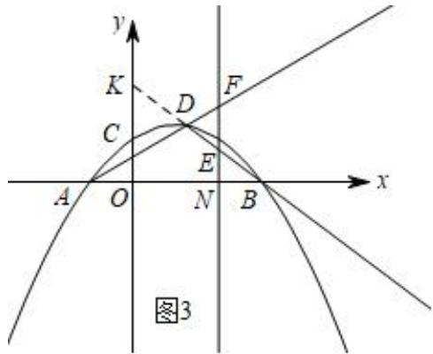

∵A（﹣1，0），  
设 $A D$ 的解析式为： $y = k x + b$ ，  
则 $\left\{ \begin{array} { l l } { \displaystyle - k + b = 0 } \\ { \displaystyle n k + b = - \frac { 1 } { 3 } n ^ { 2 } + \frac { 2 } { 3 } n + 1 } \end{array} \right.$ 解得： $\left\{ \begin{array} { l } { \displaystyle k = - \frac 1 3 n + 1 } \\ { \displaystyle b = - \frac 1 3 n + 1 } \end{array} \right. ,$ ∴ $A D$ 的解析式为： ${ \frac { 1 } { 3 } } n + 1 { \frac { 1 } { 3 } } n + 1$ ，  
当 $\cdot$ 时， ${ \frac { 2 } { 3 } } \qquad { \frac { 1 } { 3 } } \qquad $ ，  
∴F（2，3﹣n），  
$\therefore F N { = } 3 - n$ ，  
同理得直线 $\cdot$ 的解析式为： $y = ( - \frac { 1 } { 3 } n - \frac { 1 } { 3 } ) \ x { x } + n + 1$ ，  
∴K（0， $n { + } 1 \atop $ ），  
∴ $\cdot$ ，  
∵N（2，0）， $\cdot$ （3，0），  
$\frac { B N } { O B } = \frac { 1 } { 3 }$   
∵EN∥OK，  
$\cdot \frac { E N } { O K } { = } \frac { B N } { O B } { = } \frac { 1 } { 3 } ,$   
$\cdot$ ，  
$-$ ，  
∴在点 $D$ 运动过程中， $3 N E { + } N F$ 为定值 4

# 题型四 线段乘积为定值

# 2023·四川南充·中考真题

15．如图 1，抛物线 $y = a x ^ { 2 } + b x + 3$ （ $a \neq 0$ ）与 $x$ 轴交于 $A \left( - 1 , 0 \right)$ ， $B \left( 3 , 0 \right)$ 两点，与 $y$ 轴交于点 $C$

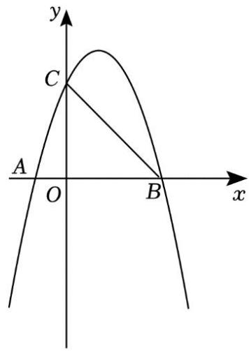  
图1

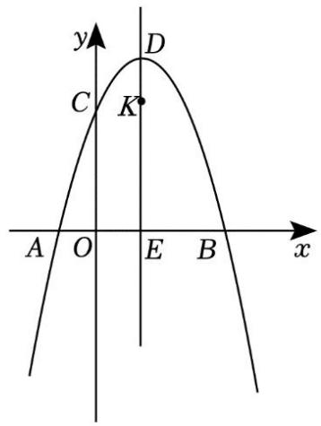  
图2

(1)求抛物线的解析式；

(2)如图 2，抛物线顶点为 $D$ ，对称轴与 $x$ 轴交于点 $E$ ，过点 $K ( 1 , 3 )$ 的直线（直线 $K D$ 除外）与抛物线交于 $G$ ， $H$ 两点，直线 $_ { D G }$ ， $D H$ 分别交 $x$ 轴于点 $M$ ， $N _ { \ast }$ ．试探究 $E M \cdot E N$ 是否为定值，若是，求出该定值；若不是，说明理由

【答案】 $y = - x ^ { 2 } + 2 x + 3$ 资料整理【淘宝店铺：向阳百分百】(2)定值，理由见详解

【思路点拨】（1）将 $A \left( - 1 , 0 \right)$ ， $B \left( 3 , 0 \right)$ 两点代入抛物线的解析式即可求解；

（2）可设直线 $G H$ 的解析式为 $y = k \left( x - 1 \right) + 3$ ， $G { \big ( } m , - m ^ { 2 } + 2 m + 3 { \big ) }$ ， $H \left( n , - n ^ { 2 } + 2 n + 3 \right)$ ， 可求$\displaystyle \int _ { \vphantom { \displaystyle } m n = - k } ^ { \qquad }$ ，再求直线 DG 的解析式为 y  m 1x  m  3 ，从而可求 1EM   $E M = 1 - \frac { m + 3 } { m - 1 }$ 同理可求$E N$ ，即可求解

【详解】（1）解：抛物线 $y = a x ^ { 2 } + b x + 3 ( a \neq 0 )$ 与 $\cdot$ 轴交于 $A \left( - 1 , 0 \right)$ ， $B { \left( 3 , 0 \right) }$ 两点，$\displaystyle : { \left\{ \begin{array} { l l } { a - b + 3 = 0 } \\ { 9 a + 3 b + 3 = 0 } \end{array} \right. }$ 解得 $\left\{ { \begin{array} { l } { a = - 1 } \\ { b = 2 } \end{array} } \right.$ 故抛物线的解析式为 $y = - x ^ { 2 } + 2 x + 3$

（2）解：是定值，

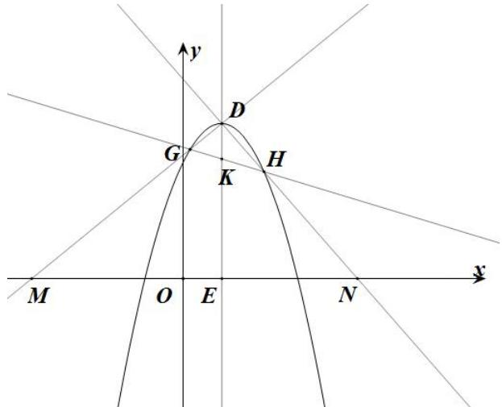

理由：如图，直线 $G H$ 经过 $K ( 1 , 3 )$ ，  
可设直线 $G H$ 的解析式为 $y = k \left( x - 1 \right) + 3$ ，  
 $G$ 、 $H$ 在抛物线上，  
可设 $G \left( m , - m ^ { 2 } + 2 m + 3 \right)$ ， $H \left( n , - n ^ { 2 } + 2 n + 3 \right)$ ，  
$\therefore k ( x - 1 ) + 3 = - x ^ { 2 } + 2 x + 3$ ，  
整理得： $x ^ { 2 } + \left( k - 2 \right) x - k = 0$ ，  
$\therefore x _ { 1 } = m , x _ { 2 } = n$ ，  
$\therefore { \left\{ { m n = 2 - k } \atop { m n = - k } \right.}  $   
当 $x = 1$ 时， $y = - 1 ^ { 2 } + 2 \times 1 + 3 = 4$ ，  
$\therefore D ( 1 , 4 )$ ，  
设直线 $_ { D G }$ 的解析式为 $y = k _ { 1 } x + b _ { 1 }$ ，则有  
$\begin{array} { c } { { \left\{ m k _ { 1 } + b _ { 1 } = - m ^ { 2 } + 2 m + 3 \right. } } \\ { { \left. k _ { 1 } + b _ { 1 } = 4 \right. } } \end{array}$   
解得 $\begin{array} { l } { \left\{ k _ { 1 } = - \big ( m - 1 \big ) \right. } \\ { \left. b _ { 1 } = m + 3 \right. } \end{array}$   
直线 $_ { D G }$ 的解析式为 $y = - ( m - 1 ) x + m + 3$ ，  
资料整理【淘宝店铺：向阳百分百】当 $y = 0$ 时， $- { \big ( } m - 1 { \big ) } x + m + 3 = 0$ ，  
解得： $x = \frac { m + 3 } { m - 1 }$ ,  
$\therefore M \left( \frac { m + 3 } { m - 1 } , 0 \right)$   
$\begin{array} { l } { \displaystyle \therefore E M = 1 - \frac { m + 3 } { m - 1 } } \\ { \displaystyle = - \frac { 4 } { m - 1 } , } \end{array}$   
同理可求： $E N = \frac { 4 } { n - 1 }$   
$\begin{array} { r l } & { \cdot \cdot E M \cdot E N = - \frac { 4 } { m - 1 } \cdot \stackrel { \cdot } { n } } \\ & { = - \frac { 1 6 } { m n - \left( m + n \right) + 1 } } \\ & { = - \frac { 1 6 } { 2 - k - \left( - k \right) + 1 } } \\ & { = - \frac { 1 6 } { - k - \left( 2 - k \right) + 1 } } \end{array}$   
$= 1 6$ ；当 $G$ 与 $H$ 对调位置后，同理可求 $E M \cdot E N { = } 1 6$ ；故 $E M \cdot E N$ 的定值为16

# 2024 届·武汉市东湖高新区统考

16．如图 1，抛物线 $C _ { 1 } : y = - x ^ { 2 } + b x + c$ 与 $x$ 轴于交 $A \left( - 3 , 0 \right)$ ， $B \mathopen { } \mathclose \bgroup \left( 1 , 0 \aftergroup \egroup \right)$ 两点，交 $y$ 轴于点 $C$ ，连接 $A C$ ，点 $D$ 为 $A C$ 上方抛物线上的一个动点，过点 $D$ 作 $D E \bot A C$ 于点 $E$ ．

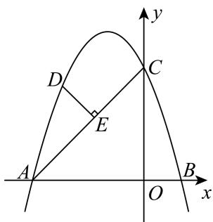  
图1

  
图2

(1)求抛物线的解析式；

(2)如图 2，将抛物线 $C _ { 1 }$ 沿 $y$ 轴翻折得到抛物线 $C _ { 2 }$ ，抛物线 $C _ { 2 }$ 的顶点为 $F$ ，对称轴与 $x$ 轴交于点 $G$ ，过点 $H \left( 1 , 2 \right)$ 的直线（直线 $F H$ 除外）与抛物线交于 $J , \ I$ 两点，直线FJ， $F I$ 分别交 $x$ 轴于点 $M , N .$ 试探究GM·GN 是否为定值，若是，求出该定值：若不是，说明理由

【答案】 $y = - x ^ { 2 } - 2 x + 3$ (2)8

【思路点拨】（1）利用待定系数法求解析式；

（2）由翻折得抛物线 $C _ { 2 }$ 的解析式为 $y = - x ^ { 2 } + 2 x + 3 = - { \bigl ( } x - 1 { \bigr ) } ^ { 2 } + 4$ ，可设直线 $\cdot$ 的 解 析 式 为$y = k \left( x - 1 \right) + 2$ ，直线 $F J$ 的解析式为 $y = - { \bigl ( } j - 1 { \bigr ) } x + j + 3$ ，当 $y = 0$ 时， $- { \big ( } j - 1 { \big ) } x + j + 3 = 0$ ， 得$M \left( \frac { j + 3 } { j - 1 } , 0 \right) , G M = - \frac { 4 } { j - 1 }$ 同理可求： $G N = \frac { 4 } { i - 1 }$ 故 $G M \cdot G N$ 的定 值为 8

【详解】（1）解： 抛物线经过点 $A \left( - 3 , 0 \right)$ ， $B \mathopen { } \mathclose \bgroup \left( 1 , 0 \aftergroup \egroup \right)$ $\cdot { \left\{ \begin{array} { l l } { - 9 - 3 b + c = 0 } \\ { - 1 + b + c = 0 } \end{array} \right. } \therefore \left\{ b = - 2 { \begin{array} { l } { } \\ { c = 3 } \end{array} } \right. .$ 抛物线的解析式为 $y = - x ^ { 2 } - 2 x + 3$

（2）是定值，理由如下：  
将抛物线 $C _ { 1 }$ 沿 $\cdot$ 轴翻折得到抛物线 $C _ { 2 }$   
 $C _ { 2 }$ 的解析式为 $y = - x ^ { 2 } + 2 x + 3 = - { \bigl ( } x - 1 { \bigr ) } ^ { 2 } + 4$ $\cdot F ( 1 , 4 )$   
直线 $J I$ 经过 $H ( 1 , 2 )$ ，  
可设直线 $J I$ 的解析式为 $y = k \left( x - 1 \right) + 2$   
 $J$ 、 $\cdot$ 在抛物线上，  
可设 $J \left( j , - j ^ { 2 } + 2 j + 3 \right)$ ， $I { \left( i , - i ^ { 2 } + 2 i + 3 \right) }$ ，  
$\therefore k ( x - 1 ) + 2 = - x ^ { 2 } + 2 x + 3$ ，  
整理得： $x ^ { 2 } + { \bigl ( } k - 2 { \bigr ) } x - k - 1 = 0$ ，  
$\therefore x _ { 1 } = j , x _ { 2 } = i ,$ ，  
$\therefore \left\{ { \begin{array} { l } { j + i = 2 - k } \\ { j i = - k - 1 } \end{array} } , \right.$   
设直线 $\cdot$ 的解析式为 $y = k _ { 1 } x + b _ { 1 }$ ，则有 $\left\{ \begin{array} { c } { j k _ { 1 } + b _ { 1 } = - j ^ { 2 } + 2 j + 3 } \\ { k _ { 1 } + b _ { 1 } = 4 } \end{array} \right.$   
解得 $\left\{ \begin{array} { c } { k _ { 1 } = - \left( j - 1 \right) } \\ { b _ { 1 } = j + 3 } \end{array} \right.$ cd  
直线 $F J$ 的解析式为 $y = - \ \left( j - 1 \right) x + j + 3$ ，  
当 $y = 0$ 时， $- { \big ( } j - 1 { \big ) } x + j + 3 = 0$ ，  
解得： $x = \frac { j + 3 } { j - 1 }$ ,  
$\therefore M \left( { \frac { j + 3 } { j - 1 } } , 0 \right)$   
$\therefore G M = 1 - \frac { j + 3 } { j - 1 } = - \frac { 4 } { j - 1 } ,$   
同理可求： $G N = \frac { 4 } { i - 1 }$   
$\therefore G M \cdot G N = - { \frac { 4 } { j - 1 } } \cdot { \frac { 4 } { i - 1 } } = - { \frac { 1 6 } { j i - \left( j + i \right) + 1 } } = - { \frac { 1 6 } { - k - 1 - \left( 2 - k \right) + 1 } } = - { \frac { 1 6 } { - 2 } } = 8 \ ;$   
故 $G M \cdot G N$ 的定值为 8

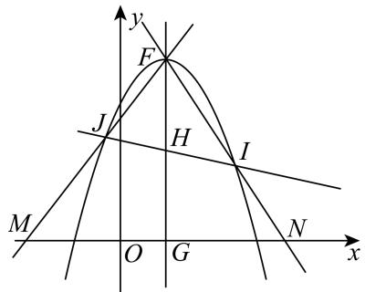  
图3

# 2024 届福建省福州屏东中学月考

17．如图，在平面直角坐标系中，抛物线 $y = ( x - m ) ( x + 1 )$ （其中 $m > 0$ ），交 $x$ 轴于 $^ { A , B }$ 两点（点A在点 $B$ 的左侧），交 $y$ 轴负半轴于点 $C$

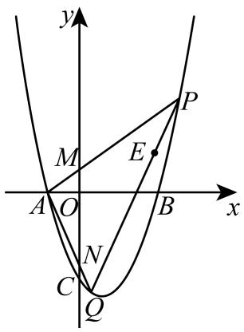

(1)求点A 的坐标；

(2)如图，平面上一点 $E \big ( m , 2 \big )$ ，过点 $E$ 作任意一条直线交抛物线于P、 $\boldsymbol { Q }$ 两点，连接 $_ { A P , A Q }$ ，分别交$y$ 轴于 $M , N$ 两点，则 $O M$ 与 $O N$ 的积是否为定值？若是，求出此定值；若不是，请说明理由

【答案】 $( 1 ) A \left( - 1 , 0 \right)$ $\textmu m$ 与 $O N$ 的积是定值 2【思路点拨】（1）由题意即可求解；

（ 2 ） 设 直 线 $P Q$ 的 解 析 式 为 ： $y = a x + n$ ， $P ( x _ { 1 } , y _ { 1 } ) , Q ( x _ { 2 } , y _ { 2 } )$ ， 联 立 抛 物 线 解 析 式 可 得$x _ { 1 } + x _ { 2 } = a + m { - } 1 , x _ { 1 } \cdot x _ { 2 } = a m { - } m { - } 2$ ，作 $P S \perp x$ 轴， $\mathcal { Q } T \perp x$ 轴，可得 ${ \triangle A M O } { \sim } _ { \triangle A P S }$ 即可求解．

【详解】（1）解：∵抛物线 $y = ( x - m ) ( x + 1 )$ （其中 $m > 0$ ），交 $x$ 轴于 $^ { A , B }$ 两点（点A 在点 $B$ 的左侧），∴点A 的坐标为 $A { \big ( } { - } 1 , 0 { \big ) }$ ；  
（2）解：∵ $y = ( x - m ) ( x + 1 )$ ，  
当 $y = 0$ ，解得 $x { = } - 1$ 或 $x = m$ ，  
$A ( - 1 , 0 ) , B ( m , 0 )$ ，  
∵过点 $E \big ( m , 2 \big )$ 作任意一条直线交抛物线于 $P$ 、 $\boldsymbol { Q }$ 两点，  
资料整理【淘宝店铺：向阳百分百】  
设直线 $P Q$ 的解析式为： $y = a x + n$ ， $P ( x _ { 1 } , y _ { 1 } ) , Q ( x _ { 2 } , y _ { 2 } )$ ，  
$\cdot . 2 = a m + n$ ，则 $n = 2 - a m$ ，  
∴直线 $P Q$ 的解析式为： $y = a x + 2 - a m$ ，  
联立 $\left\{ \begin{array} { c } { { y = x ^ { 2 } - \bigl ( m - 1 \bigr ) x - m } } \\ { { y = a x + 2 - a m } } \end{array} \right.$ 整理得： $x ^ { 2 } + ( 1 - m - a ) x + a m - m - 2 = 0$ ，  
$\therefore x _ { 1 } + x _ { 2 } = a + m - 1 , x _ { 1 } \cdot x _ { 2 } = a m - m - 2 \ ,$ ，  
作 $P S \perp x$ 轴， $\mathcal { Q } T \perp x$ 轴，如图，  
$\triangle A M O \sim _ { \triangle A P S }$ ，$\cdot \frac { M O } { A O } { = } \frac { P S } { A S }$ 即 $\frac { M O } { 1 } = \frac { ( x _ { 1 } + 1 ) ( x _ { 1 } - m ) } { x _ { 1 } + 1 }$   
 $O M = x _ { 1 } - m$ ，同理 $O N = - ( x _ { 2 } - m )$ ，  
 $. O M \cdot O N = - \left( x _ { 1 } - m \right) \left( x _ { 2 } - m \right) = - \left[ x _ { 1 } \cdot x _ { 2 } - m \left( x _ { 1 } + x _ { 2 } \right) + m ^ { 2 } \right] = - \left[ a m - m - 2 - m \left( a + m - 1 \right) + m ^ { 2 } \right] = 2 \cdot$ ， 为  
定值

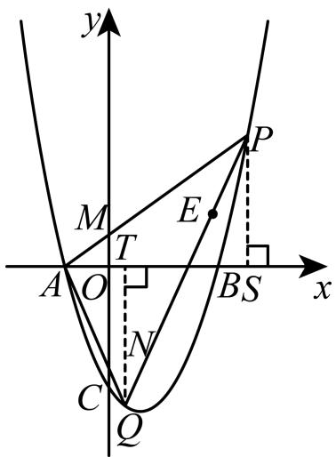

# 2024 届福州市晋安区统考

18．如图，在平面直角坐标系中，抛物线 $y = x ^ { 2 } + b x + c$ 交 $x$ 轴于 $A { \big ( } { - } 1 , 0 { \big ) }$ ， $B \left( 3 , 0 \right)$ 两点 ，交 $y$ 轴于点 $C$ ．

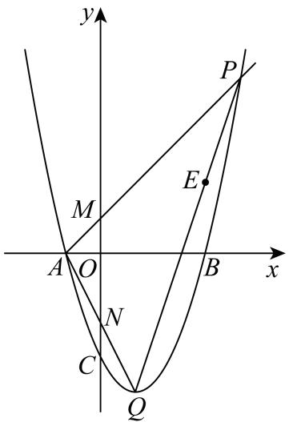

(1)求二次函数解析式；

(2)如图，平面上一点 $E \big ( 3 , 2 \big )$ ，过点 $E$ 作任意一条直线交抛物线于 $P$ 、 $\mathcal { Q }$ 两点，连接 $A P$ 、 $A Q$ ，分别交 $y$ 轴于 $M$ 、 $N$ 两点，则 $O M$ 与 $O N$ 的积是否为定值？若是，求出此定值；若不是，请说明理由

【答案】 $y = x ^ { 2 } - 2 x - 3$ (2)是定值，为 2，理由见解析【思路点拨】（1）利用待定系数法求解即可；

（2）设直线 $P Q$ 的解析式为 $y = a x + b$ ， $P ( x _ { 1 } , y _ { 1 } )$ ， $\mathcal { Q } ( x _ { 2 } , y _ { 2 } )$ ，由直线 $P Q$ 过 点 $E ( m , 2 )$ ，可得其解析式为 $y = a x + 2 - 3 a$ ，与抛物线联立得到 $x _ { 1 } + x _ { 2 } = a + 2$ ， $x _ { 1 } \cdot x _ { 2 } = 3 a - 5$ ，作 $P S \perp x$ 轴于点S，作 $\varrho T \perp x$ 轴于点 $T$ ，证明 ${ \triangle A M O } { \sim } _ { \triangle A P S }$ ，可得 $O M = x _ { 1 } - 3$ ， $O N = - ( x _ { 2 } - 3 )$ ，代入计算 $O M \cdot O N$ ，即可得出$O M \cdot O N$ 是一个定值

【详解】（1）∵抛物线 $y = x ^ { 2 } + b x + c$ 交 $x$ 轴于 $A { \bigl ( } { - } 1 , 0 { \bigr ) }$ ， $B \left( 3 , 0 \right)$ 两点 ，$\displaystyle \cdot \left\{ \begin{array} { l l } { 1 - b + c = 0 } \\ { 9 + 3 b + c = 0 } \end{array} \right.$ 解得 $\left\{ \begin{array} { l l } { b = - 2 } \\ { c = - 3 } \end{array} \right. \dot { \cdot } \ \boldsymbol { y } = x ^ { 2 } - 2 x - 3$ ；

（2）是定值，为 2，理由：  
过点 $E ( 3 , 2 )$ 作一直线交抛物线于 $P$ 、 $\mathcal { Q }$ 两点，  
设直线 $P Q$ 的解析式为 $y = a x + b$ ， $P ( x _ { 1 } , y _ { 1 } )$ ， $\mathcal { Q } ( x _ { 2 } , y _ { 2 } )$ ，  
$\cdot 2 = 3 a + b$ ，得 $b = 2 - 3 a$ ，  
直线 $P Q$ 的解析式为 $y = a x + 2 - 3 a$ ，  
∵抛物线 $y = x ^ { 2 } - 2 x - 3$ ，  
∴联立 $\textcircled{1} \textcircled{2}$ 得： $x ^ { 2 } - { \big ( } a + 2 { \big ) } x + 3 a - 5 = 0$ ，  
$\therefore x _ { 1 } + x _ { 2 } = a + 2 , x _ { 1 } \cdot x _ { 2 } = 3 a - 5 ,$ ，  
如图，作 $P S \perp x$ 轴于点S，作 $\mathcal { Q } T \perp x$ 轴于点 $T$ ，  
则 ${ \triangle A M O } { \sim } _ { \triangle A P S }$ ，  
$\therefore { \frac { M O } { A O } } = { \frac { P S } { A S } } , \mathrm { } \mathrm { } \mathrm { } \mathrm { } \mathrm { } \mathrm { } \mathrm { } \mathrm { } \mathrm { } \mathrm { } \mathrm { } \mathrm { } \mathrm { } \mathrm { } \mathrm { } \mathrm { } \mathrm { } \mathrm { } \mathrm { } \mathrm { } \mathrm { } \mathrm { } \mathrm { } \mathrm { } \mathrm { } \mathrm { } \mathrm { } \mathrm { } \mathrm { } \mathrm { } \mathrm { } \mathrm { } \mathrm { } \mathrm { } \mathrm { } \mathrm { } \mathrm { } \mathrm { } \mathrm { } \mathrm { } \mathrm { } \mathrm { } \mathrm { } \mathrm { } \mathrm { } \mathrm { } \mathrm { } \mathrm { } \mathrm { } \mathrm { } \mathrm { } \mathrm { } \mathrm { } \mathrm { } \mathrm { } \mathrm { } \mathrm { } \mathrm { } \mathrm { } \mathrm { } \mathrm { } \mathrm { } \mathrm { } \mathrm { } \mathrm { } \mathrm { } \mathrm { } \mathrm { } \mathrm { } \mathrm { } \mathrm { } \mathrm { } \mathrm { } \mathrm { } \mathrm { } \mathrm { } \mathrm { } \mathrm { } \mathrm { } \mathrm { } \mathrm { } \mathrm { } \mathrm { } \mathrm { } \mathrm { } \mathrm { } \mathrm { } \mathrm { } \mathrm { } \mathrm { } \mathrm { } \mathrm { } \mathrm { } \mathrm { } \mathrm { } \mathrm { } \mathrm { } \mathrm { } \mathrm { } \mathrm { } \mathrm { } \mathrm { } \mathrm { } \mathrm { } \mathrm { } \mathrm { } \mathrm { } \mathrm { } \mathrm { } \mathrm { } \mathrm { } \mathrm { } \mathrm { } \mathrm { } \mathrm { } \mathrm { } \mathrm { } \mathrm { } \mathrm { } \mathrm { } \mathrm { } \mathrm { } \mathrm { } \mathrm { } \mathrm { } \mathrm { } \mathrm { } \mathrm { } \mathrm { } \mathrm { } \mathrm { } \mathrm { } \mathrm { } \mathrm { } \mathrm { } \mathrm { } \mathrm { } \mathrm { } \mathrm { } \mathrm { } \mathrm { } \mathrm { } \mathrm { } \mathrm { } \mathrm { } \mathrm { } \mathrm { } \mathrm { } \mathrm { } \mathrm { } \mathrm { } \mathrm { } \mathrm { } \mathrm { } \mathrm { } \mathrm { } \mathrm { } \mathrm { } $   
 $O M = x _ { 1 } - 3$ ，同理， $O N = - ( x _ { 2 } - 3 )$ ，  
${ \begin{array} { r l } & { \cdot \cdot O M \cdot O N = - \left( x _ { 1 } - 3 \right) \left( x _ { 2 } - 3 \right) } \\ & { = - { \Bigl [ } x _ { 1 } \cdot x _ { 2 } - 3 { \bigl ( } x _ { 1 } + x _ { 2 } { \bigr ) } + 3 ^ { 2 } { \Bigr ] } } \\ & { = - { \Bigl [ } 3 a - 5 - 3 { \bigl ( } a + 2 { \bigr ) } + 3 ^ { 2 } { \Bigr ] } } \\ & { = - { \bigl ( } 3 a - 5 - 3 a - 6 + 3 ^ { 2 } { \bigr ) } } \\ & { = - 3 a + 5 + 3 a + 6 - 3 ^ { 2 } } \end{array} }$   
$= 2$ ，为定值

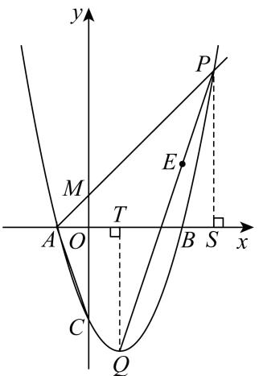

# 2023·福建福州·校考三模

19．如图，直线： $y = { \frac { 1 } { 2 } } x + 2$ 交 $x$ 轴于点A，交 $y$ 轴于点 $B$ ，点 $C$ 在 $y$ 轴上 ， $C B = O B$ ，经过点A ，$C$ 的抛物线： $\pmb { y } = \pmb { a x } ^ { 2 } - \pmb { x } + \pmb { c }$ 交直线 $A B$ 于另一点 $D$

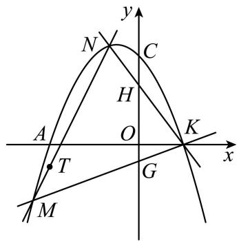

(1)求抛物线的解析式；

(2)抛物线与 $x$ 轴的另一个交点为 $K$ ，过点 $T ( t , - 1 ) \bigl ( t < 0 \bigr )$ 的任意直线 $M N$ （不与 $y$ 轴平行）与抛物线交于点 $M$ 、 $N$ ，直线 $K M$ 、 $K N$ 分别交 $y$ 轴于点 $G$ 、 $H$ ，是否存在 $t$ 的值使得 $O G$ 与 $O H$ 的积为定值？若存在，求 $t$ 的值，若不存在，请说明理由

【答案】( $y = - \frac { 1 } { 2 } x ^ { 2 } - x + 4$ ，(2)存在， $t = - 4$

【思路点拨】（1）在 $y = { \frac { 1 } { 2 } } x + 2$ 中，可得 $A ( - 4 , 0 )$ ， $B ( 0 , 2 )$ ， $O B = 2$ ，即知 $C ( 0 , 4 )$ ，用待定系数法得抛物线的解析式为 $y = - \frac { 1 } { 2 } x ^ { 2 } - x + 4$ ；

（2） 由 $y = - { \frac { 1 } { 2 } } x ^ { 2 } - x + 4$ 得 $K ( 2 , 0 )$ ，设 $N ( e , - \frac { 1 } { 2 } e ^ { 2 } - e + 4 )$ ， $M ( f , - \frac { 1 } { 2 } f ^ { 2 } - f + 4 )$ ， 直 线 $K N$ 的 解 析 式 为$y = k ( x - 2 )$ ，可得 $H ( 0 , e + 4 )$ ， $O H = e + 4$ ，同理得 $G ( 0 , f + 4 )$ ，  
可得 $O G = - f - 4$ ，从而 $O H \cdot O G = ( e + 4 ) ( - f - 4 ) = - e f - 4 e - 4 f - 1 6$ ，设直线 $M N$ 的解 析式 为 $y = k ^ { \prime } ( x - t ) - 1$ ，有 $x ^ { 2 } + 2 ( k ^ { \prime } + 1 ) x - 2 k ^ { \prime } t - 1 0 = 0$ ， 根 据 韦 达 定 理 得 $e + f = - 2 ( k ^ { \prime } + 1 )$ ， $e f = - 2 k ^ { \prime } t - 1 0$ 可 求 得$O H \cdot O G = - e f - 4 e - 4 f - 1 6 = ( 2 t + 8 ) k ^ { \prime } + 2$ ，故当 $t = - 4$ 时， $O H \cdot O G = 2$ ．【详解】（1）解：在 $y = { \frac { 1 } { 2 } } x + 2$ 中，令 $x = 0$ 得 $y = 2$ ，令 $y = 0$ 得 $x = - 4$ ，$\therefore A ( - 4 , 0 ) , B ( 0 , 2 ) , O B = 2 ,$ ，  
 $\cdot C B = O B$ ，  
 $C B = 2$ ，CO  CB  OB  4，  
$\therefore C ( 0 , 4 )$ ，  
抛物线 $\pmb { y } = \pmb { a x } ^ { 2 } - \pmb { x } + \pmb { c }$ 经过 $A ( - 4 , 0 )$ ， $C ( 0 , 4 )$ ，  
$\therefore { \left\{ \begin{array} { l l } { 1 6 a + 4 + c = 0 } \\ { c = 4 } \end{array} \right. } ,$   
解得 $\left\{ { \begin{array} { l } { \displaystyle a = - { \frac { 1 } { 2 } } } , } \\ { \displaystyle c = 4 } \end{array}  \right.$ ，  
抛物线的解析式为 $y = - { \frac { 1 } { 2 } } x ^ { 2 } - x + 4$ ；

（2）存在 $t$ 的值使得 $O H$ 与 $O G$ 的积为定值，理由如下：

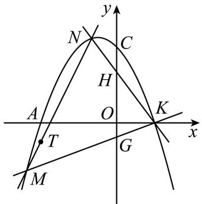

在 $y = - { \frac { 1 } { 2 } } x ^ { 2 } - x + 4$ 中，令 $y = 0$ 得 $- { \frac { 1 } { 2 } } x ^ { 2 } - x + 4 = 0$ ，  
解得 $x = - 4$ 或 $x = 2$ ，  
 $K ( 2 , 0 )$ ，  
设 $N ( e , - \frac { 1 } { 2 } e ^ { 2 } - e + 4 )$ ， $M ( f , - \frac { 1 } { 2 } f ^ { 2 } - f + 4 )$ ，  
设直线 $K N$ 的解析式为 $y = k ( x - 2 )$ ，  
将点 $N ( e , - \frac { 1 } { 2 } e ^ { 2 } - e + 4 )$ 代入 $y = k ( x - 2 )$ ，得 $k = - \frac 1 2 e - 2$ ，  
直线 $K N$ 的解析式为 $y = - ( \frac { 1 } { 2 } e + 2 ) ( x - 2 )$ ，  
令 $x = 0$ ，则 $y = e + 4$ ，  
 $. H ( 0 , e + 4 )$ ，  
 $O H = e + 4$ ，  
设直线 $M K$ 的解析式为 $y = m ( x - 2 )$ ，  
点 $M ( f , - \frac { 1 } { 2 } f ^ { 2 } - f + 4 )$ 代入 $y = m ( x - 2 )$ ，得 $m = - \frac { 1 } { 2 } f - 2$ ，  
直线 $M K$ 的解析式为 $y = - ( \frac 1 2 f + 2 ) ( x - 2 )$ ，  
令 $x = 0$ ，则 $y = f + 4$ ，  
$\cdot \ G ( 0 , f + 4 )$ ，  
$\therefore O G = - f - 4$ ，  
$\therefore O H \cdot O G = ( e + 4 ) ( - f - 4 ) = - e f - 4 e - 4 f - 1 6 \ ,$   
设直线 $M N$ 的解析式为 $y = k ^ { \prime } ( x - t ) - 1$ ，  
联立方程组 $\left\{ \begin{array} { l } { { \displaystyle y = k ^ { \prime } ( x - t ) - 1 } } \\ { { \displaystyle y = - \frac { 1 } { 2 } x ^ { 2 } - x + 4 } } \end{array} \right.$   
$\therefore x ^ { 2 } + 2 ( k ^ { \prime } + 1 ) x - 2 k ^ { \prime } t - 1 0 = 0$ ，  
$\therefore e + f = - 2 ( k ^ { \prime } + 1 ) e f = - 2 k ^ { \prime } t - 1 0$   
OH  OG  ef  4e  4 f 16  2kt 10  8k  8 16  (2t  8)k  2 ，  
当 $2 t + 8 = 0$ 时， $O H \cdot O G$ 为定值 2，当 $t = - 4$ 时， $O H \cdot O G = 2$

# 题型五 比值为定值

# 2023 年广西钦州市一模

20．定义：由两条与 $x$ 轴有着相同的交点，并且开口方向相同的抛物线所围成的封闭曲线称为“月牙线”．如图，抛物线 $C _ { 1 } : y = - x ^ { 2 } + 2 x + 3$ 与抛物线 $C _ { 2 } : y = a x ^ { 2 } - 2 a x + c$ 组成一个开口向下的“月牙线”，抛物线 $C _ { 1 }$ 与抛物线 $C _ { 2 }$ 与 $x$ 轴有相同的交点 $M , N ($ （点 $M$ 在点 $N$ 左侧），与 $y$ 轴的交点分别为点A，B 0,1

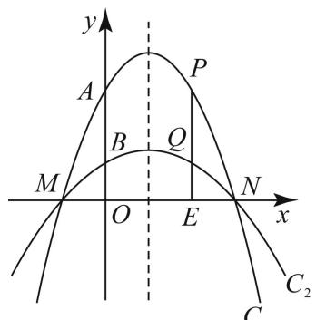  
图 $\textcircled{1}$

(1)求出点 $M$ ， $N$ 的坐标和抛物线 $C _ { 2 }$ 的解析式；

(2)点 $P$ 是 $x$ 轴上方抛物线 $C _ { 1 }$ 上的点，过点 $P$ 作 $P Q \bot x$ 轴于点 $E$ ，交抛物线 $C _ { 2 }$ 于点 $\mathcal { Q }$ ，试证明： $\frac { P Q } { Q E }$ 的值为定值，并求出该定值；

【答案】 $M ( - 1 , 0 )$ ， N (3,0) ； $y = - \frac { 1 } { 3 } x ^ { 2 } + \frac { 2 } { 3 } x + 1$ (2)证明见解析，该定值为 2

【思路点拨】（1）先由 $- x ^ { 2 } + 2 x + 3 = 0$ 求得 $x _ { 1 } = - 1$ ， $x _ { 2 } = 3$ ，可得点 $\cdot$ 的坐标，将点 $M ( - 1 , 0 )$ ， $B \mathopen { } \mathclose \bgroup \left( 0 , 1 \aftergroup \egroup \right)$ 代入抛物线 $y = a x ^ { 2 } - 2 a x + c$ ，利用待定系数法即可求抛物线 $C _ { 2 }$ 的解析式；

（2）设 $P { \Big ( } t , - t ^ { 2 } + 2 t + 3 { \Big ) } { \Big ( } - 1 < t < 3 { \Big ) }$ ，则 $\mathcal { Q } \biggl ( t , - \frac { 1 } { 3 } t ^ { 2 } + \frac { 2 } { 3 } t + 1 \biggr )$ 可得 $P Q = - { \frac { 2 } { 3 } } t ^ { 2 } + { \frac { 4 } { 3 } } t + 2$ ， $\ Q E = - { \frac { 1 } { 3 } } t ^ { 2 } + { \frac { 2 } { 3 } } t + 1$ ,进而可得 $\frac { P Q } { Q E } = \frac { - \frac { 2 } { 3 } t ^ { 2 } + \frac { 4 } { 3 } t + 2 } { - \frac { 1 } { 3 } t ^ { 2 } + \frac { 2 } { 3 } t + 1 } = 2$ 即可证得结论；

（3）由抛物线 $C _ { 1 } : \ y = - x ^ { 2 } + 2 x + 3$ 可得点 $A ( 0 , 3 )$ ，两条抛物线的对称轴均为直线 $x = { \frac { - 1 + 3 } { 2 } } = 1$ ，进而求得 $D ( 2 , 1 )$ ，连接 $B D$ ，由于等腰直角三角形可知 $A D = { \sqrt { 2 } } A B = 2 { \sqrt { 2 } }$ ，分两种情况讨论：当 $A D = F D$ 时， $F D = 2 \sqrt { 2 }$ ，当 $A D = A F$ 时， $A F = 2 \sqrt { 2 }$ ，分别进行讨论即可求解．

【详解】（1）解：∵抛物线 $y = - x ^ { 2 } + 2 x + 3$ 与 $\cdot$ 轴交于点 $\cdot$ 、 $\cdot$ ，且当 $- x ^ { 2 } + 2 x + 3 = 0$ 时，解得 $x _ { 1 } = - 1$ ， $x _ { 2 } = 3$ ，  
$\begin{array} { r l } { M ( - 1 , 0 ) } & { { } \ N ( 3 , 0 ) } \end{array}$ ；  
将点 $M ( - 1 , 0 )$ ， $B \mathopen { } \mathclose \bgroup \left( 0 , 1 \aftergroup \egroup \right)$ 代入抛物线 $y = a x ^ { 2 } - 2 a x + c$ ，  
得 $\left\{ { \begin{array} { l } { a + 2 a + c = 0 } \\ { c = 1 } \end{array} } \right.$ 解得 $\left\{ { \begin{array} { l } { \displaystyle a = - { \frac { 1 } { 3 } } } \\ { \displaystyle c = 1 } \end{array} } \right.$   
∴抛物线 $C _ { 2 }$ 的解析式为 $y = - \frac { 1 } { 3 } x ^ { 2 } + \frac { 2 } { 3 } x + 1$ 3 分  
（2）证明：设 $P { \Big ( } t , - t ^ { 2 } + 2 t + 3 { \Big ) } { \Big ( } - 1 < t < 3 { \Big ) }$ ， 则 $\mathcal { Q } \biggl ( t , - \frac { 1 } { 3 } t ^ { 2 } + \frac { 2 } { 3 } t + 1 \biggr )$ ,  
$\therefore P Q = - t ^ { 2 } + 2 t + 3 - ( - { \frac { 1 } { 3 } } t ^ { 2 } + { \frac { 2 } { 3 } } t + 1 ) = - { \frac { 2 } { 3 } } t ^ { 2 } + { \frac { 4 } { 3 } } t + 2 \ ,$   
$Q E = - { \frac { 1 } { 3 } } t ^ { 2 } + { \frac { 2 } { 3 } } t + 1 \qquad { \frac { P Q } { Q E } } = { \frac { - { \frac { 2 } { 3 } } t ^ { 2 } + { \frac { 4 } { 3 } } t + 2 } { - { \frac { 1 } { 3 } } t ^ { 2 } + { \frac { 2 } { 3 } } t + 1 } } = 2$   
PQ  
∴ $\mathcal { Q } E$ 的值为定值，该定值为 2

# 2023 福建厦门一中模拟

21．如图，抛物线 $y = x ^ { 2 } + m x + n$ 经过 $\left( 0 , - 3 \right)$ ,2, 3 两点，与 $x$ 轴交于 $A . B$ 两点

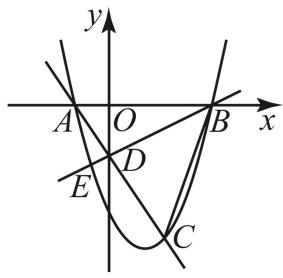

(1)求抛物线的解析式：  
(2)点 $C$ 为第四象限抛物线上一动点，点 $C$ 横坐标为 $t$ ，直线 $A C$ 与 $y$ 交于点 $D$ ，连接 $B C$ ．  
如图，直线 $B D$ 与抛物线交于点 $E$ ，连接 $A E$ ．问： $\frac { S _ { \triangle A D E } } { S _ { \triangle B D C } }$ 是否为定值？若是，请求出这个定值：若  
不是，请说明理由

【答案】 $( 1 ) y { = } x ^ { 2 } - 2 x - 3$ (2) $\frac { S _ { \triangle A D E } } { S _ { \triangle B D C } }$ 是定值，定值为 $\frac { 1 } { 9 }$ 理由见解析【思路点拨】（1）直接利用待定系数法求解即可；

（2）利用待定系数法依次求出直线 $A C$ 和 $B D$ 的解析式，将直线 $B D$ 的解析式与抛物线的解析式联立，求出点 E 的坐标，再根据 ADE ABE ABDS  S  S   $S _ { \scriptscriptstyle \mathrm { s } A D E } = S _ { \scriptscriptstyle \mathrm { s } A B E } - S _ { \scriptscriptstyle \mathrm { s } A B D } = \frac { 1 } { 2 } A B \big ( y _ { \scriptscriptstyle D } - y _ { \scriptscriptstyle E } \big ) , S _ { \scriptscriptstyle \mathrm { s } B D C } = S _ { \scriptscriptstyle \mathrm { s } A B C } - S _ { \scriptscriptstyle \mathrm { s } A B D } = \frac { 1 } { 2 } A B \big ( y _ { \scriptscriptstyle D } - y _ { \scriptscriptstyle C } \big )$ 即可证明 $\frac { S _ { \triangle A D E } } { S _ { \triangle B D C } }$ 是否为定值．

【详解】（1）解：∵抛物线 $y = x ^ { 2 } + m x + n$ 经过 $\left( 0 , - 3 \right) , \left( 2 , - 3 \right)$ 两点，  
$\therefore \left\{ { \begin{array} { l } { - 3 = n } \\ { - 3 = 2 ^ { 2 } + 2 m + n } \end{array} } \right.$ 解得： $\begin{array} { c } { { \left\{ n = - 3 \right. } }  \\ { { \left. m = - 2 \right. } } \end{array}$   
∴抛物线的解析式为 $y { = } x ^ { 2 } - 2 x - 3$

（2） $\frac { S _ { \triangle A D E } } { S _ { \triangle B D C } }$ 是定值，定值为 $\frac { 1 } { 9 }$ ， 理由如下：

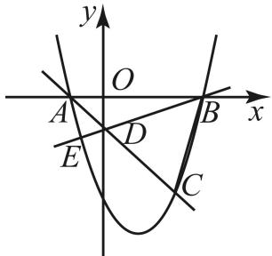

设直线 $A C$ 的解析式为 $y = k x + b$ ,将 $A \left( - 1 , 0 \right)$ ， $C \left( t , t ^ { 2 } - 2 t - 3 \right)$ 代入 $y = k x + b$ ,可得 $\left\{ \begin{array} { l l } { 0 = - k + b } \\ { t ^ { 2 } - 2 t - 3 = k t + b } \end{array} \right.$ 解得 $\left\{ \begin{array} { l l } { k = t - 3 } \\ { b = t - 3 } \end{array} \right.$ ∴直线 $A C$ 的解析式为 $y = \left( t - 3 \right) x + \left( t - 3 \right)$ ，令 $x = 0$ ，则 $y = t - 3$ ，

$D ( 0 , \ t - 3 )$   
设直线 $B D$ 的解析式为 $y = m x + n$ ,  
将 $B \left( 3 , 0 \right)$ ， $D ( 0 , \ t - 3 )$ 代入 $y = m x + n$ ,  
可得 $\left\{ { \begin{array} { l } { 0 = 3 m + n } \\ { t - 3 = n } \end{array} } \right.$ 解得 $\left\{ { \begin{array} { l } { m = { \frac { 3 - t } { 3 } } } \\ { n = t - 3 } \end{array} } \right.$ ,  
∴直线 $B D$ 的解析式为 $y = \frac { 3 - t } { 3 } x + ( t - 3 )$ ，  
联立 $\left\{ y = { \frac { 3 - t } { 3 } } x + \left( t - 3 \right) \right.$ ， 解得 $x = 3$ 或 $x = - { \frac { t } { 3 } }$   
∴点 $E$ 的横坐标为 $- \frac { t } { 3 }$   
∴点 $\cdot$ 的纵坐标为： $\left( - \frac { t } { 3 } \right) ^ { 2 } - 2 \left( - \frac { t } { 3 } \right) - 3 = \frac { t ^ { 2 } } { 9 } + \frac { 2 t } { 3 } - 3$ ，$S _ { \scriptscriptstyle \mathrm { A } \scriptscriptstyle \mathrm { A } D E } = S _ { \scriptscriptstyle \mathrm { A } \scriptscriptstyle \mathrm { A } B E } - S _ { \scriptscriptstyle \mathrm { A } \scriptscriptstyle \mathrm { A } B D } = { \frac { 1 } { 2 } } A B \big ( y _ { D } - y _ { E } \big ) = { \frac { 1 } { 2 } } A B \Bigg [ t - 3 - \bigg ( { \frac { t ^ { 2 } } { 9 } } + { \frac { 2 t } { 3 } } - 3 \bigg ) \Bigg ] = A B \cdot { \frac { 3 t - t ^ { 2 } } { 1 8 } }$   
$\begin{array} { l } { { S _ { \scriptscriptstyle \mathrm { s B D C } } = S _ { \scriptscriptstyle \mathrm { s A B C } } - S _ { \scriptscriptstyle \mathrm { s A B D } } = \displaystyle \frac { 1 } { 2 } { \cal A } B \left( y _ { D } - y _ { C } \right) = \displaystyle \frac { 1 } { 2 } { \cal A } B \left[ t - 3 - \left( t ^ { 2 } - 2 t - 3 \right) \right] = { \cal A } B \cdot \displaystyle \frac { 3 t - t ^ { 2 } } { 2 } , } } \\ { { \displaystyle \mathrm { } } } \\ { { \therefore \displaystyle \frac { S _ { \scriptscriptstyle \mathrm { s A D E } } } { S _ { \scriptscriptstyle \mathrm { s B D C } } } = \displaystyle \frac { { \cal A } B \cdot \displaystyle \frac { 3 t - t ^ { 2 } } { 1 8 } } { { \cal A } B \cdot \displaystyle \frac { 3 t - t ^ { 2 } } { 2 } } = \displaystyle \frac { 1 } { 9 } . } } \end{array}$

# 2023 年福州市屏东中学中考模拟

22．已知抛物线 $y = x ^ { 2 } - 4 x + c$ 与直线 $y = - 1$ 有且只有一个公共点

(1)求这条抛物线的解析式；

(2)将该抛物线沿直线 $y = - { \frac { 1 } { 2 } } x$ 沿左上方平移 $\sqrt { 5 }$ 个单位后得到抛物线 $C$ ，点 $A$ 是抛物线 $C$ 上的的任意一点，且点 $A$ 在第一象限的抛物线上，点 $A$ 的横坐标为 $m$ ， $A$ 和 $B$ 两点关于原点对称，过点 $A$ 作$A D \perp y$ 轴，垂足为点 $D$ ，连接 $B D$ 交抛物线于 $M , \ N$ 两点（点 $M$ 在点 $N$ 的右侧）

$\textcircled{1}$ 用含 $m$ 的式子表示直线 $B D$ 的解析式；

$\textcircled{2}$ 设直线 $A M$ 与直线 $A N$ 与 $x$ 轴分别交于 $P$ 、 $\mathcal { Q }$ 两点，求证： $\frac { P Q } { A D }$ 为定值．

【答案】(1) $y = x ^ { 2 } - 4 x + 3$

$( 2 ) \textcircled{ 1 }$ 直线 $B D$ 的解析式为 $y = 2 m x + m ^ { 2 }$ ， $\cdot$ 证明见解析【思路点拨】（1）联立抛物线与直线： $x ^ { 2 } - 4 x + c = - 1$ ，根据 $\Delta = 0$ 求出 $c = 3$ ，即可得到抛物线的解析式；

（2） $\cdot$ 根据抛物线解析式求出顶点坐标为 $E { \left( 2 , - 1 \right) }$ ，得到点 $E \big ( 2 , - 1 \big )$ 的坐标满足解析式 $y = - { \frac { 1 } { 2 } } x$ 由此得到将该抛物线沿直线 $y = - { \frac { 1 } { 2 } }$ 左上方平移 $\sqrt { 5 }$ 个单位后得到抛物线 $\cdot$ 解析式为： $y = x ^ { 2 }$ ， 可设点 $\cdot$ 的坐标为 $\left( m , m ^ { 2 } \right)$ ， $m > 0$ ，得到点 $\cdot$ 坐标为 $\left( 0 , m ^ { 2 } \right)$ ，点 $B$ 坐标为 $\left( - m , - m ^ { 2 } \right)$ ， 利用待定系数法求出直线 $B D$ 的解析式；  
$\cdot$ 由 $\scriptstyle { \left\{ \begin{array} { l l } { y = x ^ { 2 } } \\ { y = 2 m x + m ^ { 2 } } \end{array} \right. }$ 得 $x ^ { 2 } = 2 m x + m ^ { 2 }$ ， 求 解 方 程 得 $x = m \pm { \sqrt { 2 } } m$ ，得到当 $m > 0$ 时点 $M$ 与点 $N$ 的坐标，分别求出直线 $A N$ 的解析式，直线 $A M$ 的解析式，由此得到点 $P$ 、 $\mathcal { Q }$ 的坐标，由此计算即可得 $\frac { P Q } { A D }$ 为定值．【详解】（1）联立抛物线与直线： $x ^ { 2 } - 4 x + c = - 1$ ，  
∵ $\Delta = 0$ ，即 $4 ^ { 2 } - 4 { \bigl ( } c + 1 { \bigr ) } = 0$ ，解得 $c = 3$ ，  
这条抛物线的解析式为 $y = x ^ { 2 } - 4 x + 3$ ；  
（2） $\therefore y = x ^ { 2 } - 4 x + 3 = \left( x - 2 \right) ^ { 2 } - 1 \ ,$ ，  
该抛线的对称轴为直线 $x = 2$ ，顶点坐标为 $E \left( 2 , - 1 \right)$ ，  
点 $E \big ( 2 , - 1 \big )$ 的坐标满足解析式 $y = - { \frac { 1 } { 2 } } x$   
抛物线 $y = x ^ { 2 } - 4 x + 3$ 的顶点 $\cdot$ 在直线 $y = - { \frac { 1 } { 2 } } x$ 上  
 $O E = { \sqrt { 5 } }$ ，直线 $y = - { \frac { 1 } { 2 } } x$ 过原点，  
将该抛物线沿直线 1 2    x 向左上方平移 5 个单位后得到抛物线 C 解析式为： 2y = x ，点 $A$ 在第一象限的抛物线 $\cdot$ 上，  
可设点 $\cdot$ 的坐标为 $\left( m , m ^ { 2 } \right) m > 0$ ，  
 $A D \perp y$ 轴，垂足为点 $\cdot$ ，  
点 $\cdot$ 坐标为 $\left( 0 , m ^ { 2 } \right) \quad A D = m$ ，  
 $A$ 、 $\cdot$ 关于坐标原点对称，  
点 $B$ 坐标为 $\left( - m , - m ^ { 2 } \right)$ ，  
$\cdot$ 设直线 $B D$ 的解析式为 $y = k x + b$ ，  
代入 $\cdot$ 、 $D$ 坐标得 $\scriptstyle { \left\{ { \begin{array} { l } { \scriptstyle - m ^ { 2 } = - m k + b } \\ { m ^ { 2 } = b } \end{array} } \right. }$ 得 $\begin{array} { c } { { \left\{ k = 2 m \right. } }  \\ { { \left. b = m ^ { 2 } \right. } } \end{array}$   
故直线 $B D$ 的解析式为 $y = 2 m x + m ^ { 2 }$ ；  
$\cdot$ 证明：由 $\scriptstyle { \left\{ \begin{array} { l l } { y = x ^ { 2 } } \\ { y = 2 m x + m ^ { 2 } } \end{array} \right. }$ ，得 $x ^ { 2 } = 2 m x + m ^ { 2 }$ ，  
化简整理得 $\left( x - m \right) ^ { 2 } = 2 m ^ { 2 }$ ， $x = m \pm { \sqrt { 2 } } m$ ，  
 $M$ 点在 $\cdot$ 点的右侧，  
∵ $m > 0$ 时， $M \left( \left( 1 + \sqrt { 2 } \right) m , \left( 3 + 2 \sqrt { 2 } \right) m ^ { 2 } \right) , N \left( \left( 1 - \sqrt { 2 } \right) m , \left( 3 - 2 \sqrt { 2 } \right) m ^ { 2 } \right) ,$   
资料整理【淘宝店铺：向阳百分百】  
设直线 $A N$ 的解析式为 $y = k _ { 1 } x + b _ { 1 }$ ，  
$\therefore \left\{ \begin{array} { l l } { m k _ { 1 } + b _ { 1 } = m ^ { 2 } } \\ { \Bigl ( 1 - \sqrt { 2 } \Bigr ) m k _ { 1 } + b _ { 1 } = \Bigl ( 3 - 2 \sqrt { 2 } \Bigr ) m ^ { 2 } } \end{array} \right.$   
解得 $\begin{array} { r } { \left\{ \begin{array} { l l } { \displaystyle k _ { 1 } = \Big ( 2 - \sqrt { 2 } \Big ) m } \\ { \displaystyle b _ { 1 } = \Big ( \sqrt { 2 } - 1 \Big ) m ^ { 2 } } \end{array} \right. , } \end{array}$   
$\begin{array} { l } { \therefore y = \left( 2 - \sqrt { 2 } \right) m x + \left( \sqrt { 2 } - 1 \right) m ^ { 2 } } \\ { \therefore Q \left( - \displaystyle \frac { \sqrt { 2 } } { 2 } m , 0 \right) } \end{array}$   
同理可得直线 $A M$ 的解析式为 $y = \left( 2 + { \sqrt { 2 } } \right) m x + \left( - { \sqrt { 2 } } - 1 \right) m ^ { 2 }$ ，  
$\begin{array} { r l } & { \therefore P \Bigg ( \frac { \sqrt { 2 } } { 2 } m , 0 \Bigg ) , } \\ & { \therefore P Q = \sqrt { 2 } m , } \\ & { \because A D = m , } \\ & { \therefore \frac { P Q } { 4 D } = \sqrt { 2 } , } \end{array}$ $\frac { P Q } { A D }$ 为定值．

# 武汉·中考真题

23．抛物线 $\scriptstyle y = a x ^ { 2 } + c$ 与 $x$ 轴交于 $A$ 、 $B$ 两点，顶点为 $C$ ，点 $P$ 在抛物线上，且位于 $x$ 轴下方（1）如图 1，若 $P$ （1，－3）、 $B$ （4，0），求该抛物线的解析式；

（2） 如图 2，已知直线 $P A , P B$ 与 $y$ 轴分别交于 $E , F$ 两点．当点 $P$ 运动时， $\frac { O E + O F } { O C }$ 是否为定值？若是，试求出该定值；若不是，请说明理由

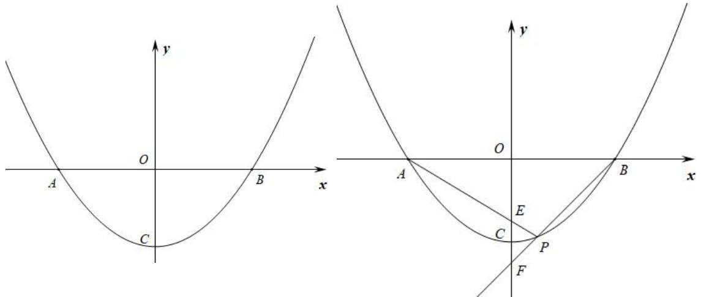

【答案】（1） $\frac { 1 } { 5 } \frac { 1 6 } { 5 }$ （2）是定值，等于 2.

资料整理【淘宝店铺：向阳百分百】

【详解】（1）将 $\cdot$ （1，－3）、 $\cdot$ （4，0）代入 $\cdot$ 得 $\left\{ { \begin{array} { l } { 1 6 a + c = 0 } \\ { a + c = - 3 } \end{array} } \right.$ 解得 $\left\{ \begin{array} { l } { \displaystyle { a = \frac { 1 } { 5 } } } \\ { \displaystyle { c = - \frac { 1 6 } { 5 } } } \end{array} \right. ,$ ∴抛物线的解析式为： $y = \frac { 1 } { 5 } x ^ { 2 } - \frac { 1 6 } { 5 }$

（2）设 $B \ ( b , \ 0 )$ ），则 $A$ （-b，0）有 $a b ^ { 2 } + c = 0$ ，  
$- { \frac { c } { a } }$   
过点 $\cdot$ $\cdot$ 作 $P H \bot A B$ ，有 $y _ { 0 } = a { x _ { 0 } } ^ { 2 } + c$ ，  
易证： $\_$ ，则 $\frac { O E } { O A } = \frac { P H } { H A } \frac { O E } { b } = \frac { - y _ { 0 } } { x _ { 0 } + b }$ $O E = \frac { - b y _ { 0 } } { x _ { 0 } + b }$ 同理得 ${ \frac { O F } { O B } } = { \frac { P H } { B H } }$   
$\therefore \frac { O F } { b } = \frac { - y _ { 0 } } { b - x _ { 0 } } ,$   
$O F = \frac { - b y _ { 0 } } { b - x _ { 0 } }$ 则 $O E + O F { = } - b y _ { 0 } \cdot ( \frac { 1 } { b + x _ { 0 } } + \frac { 1 } { b - x _ { 0 } } )$   
$O E + O F = \frac { - 2 b ^ { 2 } y _ { 0 } } { b ^ { 2 } - { x _ { 0 } } ^ { 2 } } = \frac { - 2 \cdot ( - \frac { c } { a } ) \cdot y _ { 0 } } { - \frac { c } { a } - \frac { y _ { 0 } - c } { a } } = - 2 c \qquad \frac { O E + O F } { O C } = \frac { - 2 c } { - c } = 2$ $\frac { O E + O F } { O C }$ 是定值，等于 2．

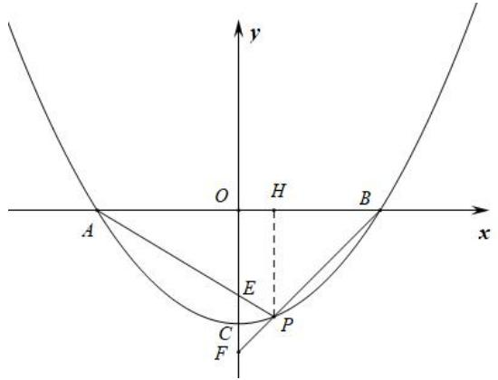

# 题型六 横（纵）坐标定值

2023·湖北潜江、天门、仙桃、江汉油田·中考真题

24．如图 1，在平面直角坐标系 $x O y$ 中，已知抛物线 $y = a x ^ { 2 } + b x - 6 { \bigl ( } a \neq 0 { \bigr ) }$ 与 $x$ 轴交于点$A \left( - 2 , 0 \right) , B \left( 6 , 0 \right)$ ，与 $y$ 轴交于点 $C$ ，顶点为 $D$ ，连接 $B C$

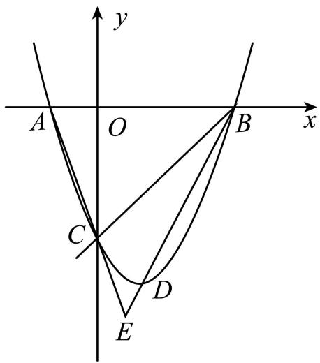  
图1

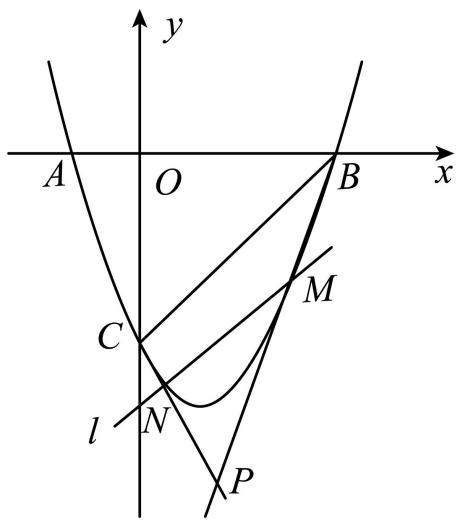  
图2

(1)抛物线的解析式为 _；（直接写出结果）

(2)如图 2，若动直线 $l$ 与抛物线交于 $M , N$ 两点（直线l与 $B C$ 不重合），连接 $C N , B M$ ，直线 $C N$ 与 BM交于点 $P$ ．当 $M N / / B C$ 时，点 $P$ 的横坐标是否为定值，请说明理由．

【答案】 $( 1 ) y = \frac { 1 } { 2 } x ^ { 2 } - 2 x - 6$ (2)3，理由见解析

【思路点拨】（1）待定系数法求解析式即可求解；

（2）设点 $M$ 的坐标 为 1 2, 2 62m m m      ， 点 $N$ 的坐标 为 1 2, 2 62n m m     ． 由点 $B \mathopen { } \mathclose \bgroup \left( 6 , 0 \aftergroup \egroup \right)$ ，点 $C ( 0 , - 6 )$ ，可得到直线 $B C$ 的解析式为： $y _ { B C } = x - 6$ ．得出点 $N$ 的坐标可以表示为 $N \bigg ( 6 - m , \frac { 1 } { 2 } m ^ { 2 } - 4 m \bigg )$ 由点$C ( 0 , - 6 )$ ，点 $N \left( 6 - m , \frac { 1 } { 2 } m ^ { 2 } - 4 m \right)$ ，得直线 $C N$ 的 解 析 式 为 ： $y _ { C N } = \left( - \frac { 1 } { 2 } m + 1 \right) x - 6$ ．同理可得可得到直线 $B M$ 的解析式为： $y _ { B M } = \left( { \frac { 1 } { 2 } } m + 1 \right) x - 3 m - 6$ ．联立可得 $x = 3$ ，则 点 $P$ 的横 坐标 为定 值 3 ．【详解】（1）解：∵抛物线 $y = a x ^ { 2 } + b x - 6 { \bigl ( } a \neq 0 { \bigr ) }$ 与 $x$ 轴交于点 $A \left( - 2 , 0 \right) , B \left( 6 , 0 \right)$ ，$\therefore \left\{ \begin{array} { l l } { 4 a - 2 b - 6 = 0 } \\ { 3 6 a + 6 b - 6 = 0 } \end{array} \right. ,$

解得： $\left\{ \begin{array} { l l } { \displaystyle a = \frac { 1 } { 2 } } \\ { \displaystyle b = - 2 } \end{array} \right.$

∴抛物线解析式为 $y = \frac { 1 } { 2 } x ^ { 2 } - 2 x - 6$ ；

（2）设点 $M$ 的坐标为 $\left( m , \frac { 1 } { 2 } m ^ { 2 } - 2 m - 6 \right)$ ，点 $N$ 的坐 标为 ${ \binom { 1 } { n , \frac { 1 } { 2 } m ^ { 2 } - 2 m - 6 } } .$   
∵直线 $M N$ 与 $B C$ 不重合，  
∴ $m \neq 0$ 且 $m \neq 6 , n \neq 0$ 且 $n \neq 6$

如图 3，由点 $B \mathopen { } \mathclose \bgroup \left( 6 , 0 \aftergroup \egroup \right)$ ，点 $C ( 0 , - 6 )$ ，

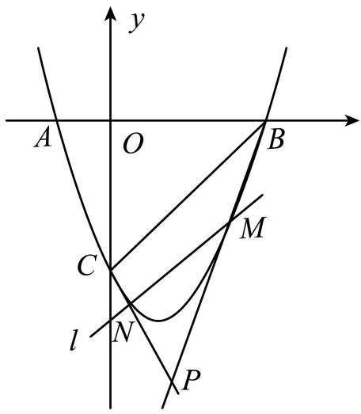  
图3

可得到直线 $B C$ 的解析式为： $y _ { B C } = x - 6$ $\cdot M N / / B C$ ，  
∴可设直线 $M N$ 的解析式为： $y _ { _ { M N } } = x + t$   
将 $y _ { _ { M N } } = x + t$ 代入 $y = \frac { 1 } { 2 } x ^ { 2 } - 2 x - 6$ ，  
得 ${ \frac { 1 } { 2 } } x ^ { 2 } - 3 x - 6 - t = 0$ ．  
∴ $. \ m + n = 6$ ．  
∴点 $N$ 的坐标可以表示为 $N \left( 6 - m , \frac { 1 } { 2 } m ^ { 2 } - 4 m \right)$   
设直线 $C N$ 的解析式为： $y = k _ { 2 } x + b _ { 2 }$ ，  
由点 $C ( 0 , - 6 )$ ，点 $N \left( 6 - m , \frac { 1 } { 2 } m ^ { 2 } - 4 m \right)$ ， 得  
$\begin{array} { c } { { 0 + b _ { 2 } = - 6 } } \\ { { \left\{ \vphantom { \left( 6 - m \right) } \left( 6 - m \right) k _ { 2 } + b _ { 2 } = \displaystyle \frac { 1 } { 2 } m ^ { 2 } - 4 m \right\} } }  \end{array}$   
解得 $\left\{ k _ { 2 } = - \frac { 1 } { 2 } m + 1 \atop b _ { 2 } = - 6 \right.$   
∴直线 $C N$ 的解析式为： $y _ { _ { C N } } = \left( - \frac { 1 } { 2 } m + 1 \right) x - 6$ ．  
同上，由点 $B \mathopen { } \mathclose \bgroup \left( 6 , 0 \aftergroup \egroup \right)$ ，点 $M \left( m , \frac { 1 } { 2 } m ^ { 2 } - 2 m - 6 \right)$ ，  
可得到直线BM 的解析式为： BMy $y _ { B M } = \left( { \frac { 1 } { 2 } } m + 1 \right) x - 3 m - 6$ $\left( - { \frac { 1 } { 2 } } m + 1 \right) x - 6 = \left( { \frac { 1 } { 2 } } m + 1 \right) x - 3 m - 6$   
∴ $m x = 3 m$ ．

∴ $x = 3$ ∴点 $P$ 的横坐标为定值 3

# 2024 届湖北潜江市初 12 校联考

25．如图，抛物线 $y = x ^ { 2 } + b x + c$ 与 $x$ 轴交于 $A$ ， $B$ 两点（ $A$ 在 $B$ 左侧），与 $y$ 轴交于点 $C$ ，点 $A$ 的坐标为 $\left( - 3 , 0 \right)$ ，对称轴为直线 $x { = } - 1$ ．点 $P$ 是 $x$ 轴上一动点， $P M \perp x$ 轴，交直线 $A C$ 于点 $M$ ，交抛物线于点 $N$

(1)求这个二次函数的解析式  
(2)若点 $M$ 在线段 $A C$ 上运动（点 $M$ 与点 $A$ 、点 $C$ 不重合），点 $D$ 是射线 $M P$ 上一动点，连接 $A D , C D$ ，直线 $A D$ 、 $C D$ 分别交抛物线于 $E , \ F$ ，连接 $E F$ ，当 $M N$ 平分 $E F$ 时，点 $D$ 的横坐标是否为定值，请说明理由．

【答案】 $y = x ^ { 2 } + 2 x - 3$ (2)点 D 的横坐标是定值， $x _ { { D } } = - \frac { 3 } { 2 }$

【思路点拨】（1）根据二次函数的对称性求出点 B 的坐标，从而用两点式求出函数解析式；

（2）设点 E 的坐标为 $\left( m , m ^ { 2 } + 2 m - 3 \right)$ ，则点 F 的坐标为 $\left( n , n ^ { 2 } + 2 n - 3 \right)$ ，求出 $y _ { _ { A E } } = \left( m - 1 \right) x + 3 \left( m - 1 \right) ,$ ，$y _ { _ { C F } } = \big ( n + 2 \big ) x - 3$ ，由 $M N$ 平分 $E F$ ，列出式子求出答案

【详解】（1）解：点 A 的坐标为 $\left( - 3 , 0 \right)$ ，对称轴为直线 $x { = } - 1$ ，点 B 的坐标为 $\left( 1 , 0 \right)$ ，  
$\therefore y = ( x + 3 ) ( x - 1 ) = x ^ { 2 } + 2 x - 3 ;$ ；  
（2）解：点 D 的横坐标是定值， $x _ { { D } } = - \frac { 3 } { 2 }$   
设点 E 的坐标为 $\left( m , m ^ { 2 } + 2 m - 3 \right)$ ，则点 F 的坐标为 $\left( n , n ^ { 2 } + 2 n - 3 \right)$ ，  
点 A 的坐标为 $\left( - 3 , 0 \right)$ ，点 C 的坐标为 $\left( 0 , - 3 \right)$ ，  
$\therefore y _ { _ { A E } } = \left( m - 1 \right) x + 3 \left( m - 1 \right)$   
$\begin{array} { l } { { \displaystyle y _ { _ { C F } } = \big ( n + 2 \big ) x - 3 \ , } } \\ { { \displaystyle \therefore \ x _ { _ D } = \frac { 3 m } { n - m + 3 } \ , } } \end{array}$

 $M N$ 平分 $E F$ ，$\begin{array} { r l } {  { \cdot \frac { 3 m } { n - m + 3 } = \frac { m + n } { 2 } } } \\ & { \cdot \coth ( m + n ) \bigl ( n - m + 3 \bigr ) = n ^ { 2 } - m ^ { 2 } + 3 m + 3 n } \\ & { \cdot \ c ^ { 2 } - n ^ { 2 } + 3 m - 3 n = 0 } \\ & { \cdot \bigl ( m - n \bigr ) \bigl ( m + n + 3 \bigr ) = 0 } \\ & { \cdot \ m { m \neq n } } \\ & { \cdot \ m { m + n } - 3 } \end{array}$ ，$\ . \ x _ { _ { D } } = { \frac { 3 m } { n - m + 3 } } = { \frac { m + n } { 2 } } = - { \frac { 3 } { 2 } }$ 即 D 点的横坐标是定值 $- { \frac { 3 } { 2 } }$

# 题型七 角度为定值

# 2023·成都武侯区西川中学三模

26．如图，在平面直角坐标系 $x O y$ 中，抛物线 $y = a x ^ { 2 } + b x - \frac { 3 } { 2 }$ 与 $x$ 轴交于 $A { \bigl ( } { - } 1 , 0 { \bigr ) }$ ， $B \left( 3 , 0 \right)$ 两点，其顶点为 $M$ ．直线 $y = k x - k$ 与抛物线相交于 $E$ ， $F$ 两点（点 $E$ 在点 $F$ 的左侧）．

(1)求抛物线的函数表达式和点 $M$ 的坐标；

(2)当线段 $E F$ 被抛物线的对称轴分成长度比为1:4的两部分时，求 $k$ 的值；

(3)连接 $E M$ ， $F M$ ，试探究 $\angle E M F$ 的大小是否为定值．若是，请求出该定值；若不是，请说明理由．

【答案】 $y = \frac { 1 } { 2 } x ^ { 2 } - x - \frac { 3 } { 2 }$ , (1,-2)$( 2 ) \frac { 3 } { 2 }$ 或 $- { \frac { 3 } { 2 } }$ (3)定值， $\angle E M F = 9 0 ^ { \circ }$ ，理由见详解【思路点拨】（1）将A 、 $B$ 代入解析式即可求解；

（2）可求直线 $y = k x - k$ 过定点 $G \big ( 1 , 0 \big )$ ，设 $F \left( m , \frac 1 2 m ^ { 2 } - m - \frac 3 2 \right) \_ E \left( n , \frac 1 2 n ^ { 2 } - n - \frac 3 2 \right) \ O \left( m ^ { 2 } \right)$ ，则有 $F \left( m , k m - k \right)$ ，

$E { \big ( } n , k n - k { \big ) }$ ， 可求 $\frac { E G } { F G } = \frac { 1 } { 4 }$ 或 $\frac { E G } { F G } = 4$ ， $\cdot$ 当 $\frac { E G } { F G } = \frac { 1 } { 4 }$ 时，过 $F$ 作 $F P \bot G M$ 交 $G M$ 于 $P$ ， 过 $E$ 作$E Q \bot G M$ 交 $G M$ 于 $\mathcal { Q }$ ，可求 $\left\{ \begin{array} { l } { { k m - k = - 4 \left( k n - k \right) } } \\ { { \displaystyle { \frac { 1 } { 2 } m ^ { 2 } - m - \frac { 3 } { 2 } = - 4 \left( \frac { 1 } { 2 } n ^ { 2 } - n - \frac { 3 } { 2 } \right) } } } \end{array} \right.$ 从而可求 $\begin{array} { c } { { \left\{ m = 5 \right. } }  \\ { { \left. n = 0 \right. } } \end{array}$ 求得 $E { \Bigg ( } 0 , - { \frac { 3 } { 2 } } { \Bigg ) }$ ， ,接可求解； $\cdot$ 当 $\frac { E G } { F G } = 4$ 时，由 $\cdot$ 同理可求 $\left\{ { \begin{array} { l } { m = 2 } \\ { n = - 3 } \end{array} } \right.$ 即可求解；

（3）分别过 $E$ 、 $F$ 作 $y$ 轴的平行线交过 $M$ 作 $x$ 轴的平行线于 $C$ 、 $D$ ，可求 ${ \frac { 1 } { 2 } } x ^ { 2 } - x - { \frac { 3 } { 2 } } = k x - k$ ，从而可得 $\scriptstyle { \left\{ \begin{array} { l l } { m + n = 2 + 2 k } \\ { m n = 2 k - 3 } \end{array} \right. }$ 从而可求 $\textstyle { \big ( } m - 1 { \big ) } { \big ( } 1 - n { \big ) } = 4$ ， 可 得 $1 - n = \frac { 4 } { m - 1 }$ , 由 tan $\angle D M F = { \frac { M D } { F D } }$ 和tan $\angle C M E = { \frac { E C } { C M } }$ 可证 tan $\angle D M F =$ tan $\angle C M E$ ，从而可得 $\angle D M F = \angle C M E$ ，即可求证

【详解】（1）解：由题意得  
$\left\{ \begin{array} { l } { \displaystyle a - b - \frac { 3 } { 2 } = 0 } \\ { \displaystyle 9 a + 3 b - \frac { 3 } { 2 } = 0 } \end{array} \right.$ ，解得： $\left\{ \begin{array} { l l } { { a = { \displaystyle { \frac { 1 } { 2 } } } } } & { { \therefore y = { \displaystyle { \frac { 1 } { 2 } } } x ^ { 2 } - x - { \displaystyle { \frac { 3 } { 2 } } } } } \\ { { b = - 1 } } & { { } } \end{array} \right.$ 当 $x = - { \frac { - 1 } { 2 \times { \frac { 1 } { 2 } } } } = 1$ 时 ，y $\cdot$ ， M 1, 2 ，  
故抛物线的函数表达式为 $y = \frac { 1 } { 2 } x ^ { 2 } - x - \frac { 3 } { 2 }$ ， $M$ 的坐标为 $\left( 1 , - 2 \right)$ （2）解：由 $y = k x - k$ 得  
$y = k \left( x - 1 \right)$ ，  
当 $x = 1$ 时， $y = 0$ ，  
直线 $y = k x - k$ 过定点 $G \big ( 1 , 0 \big )$ ，  
设 $F \left( m , \frac { 1 } { 2 } m ^ { 2 } - m - \frac { 3 } { 2 } \right)$ , $E \left( n , \frac { 1 } { 2 } n ^ { 2 } - n - \frac { 3 } { 2 } \right)$   
则有 $F { \big ( } m , k m - k { \big ) } \quad E { \big ( } n , k n - k { \big ) }$ ，  
线段 $E F$ 被抛物线的对称轴分成长度比为1:4的两部分，  
$\therefore { \frac { E G } { F G } } = { \frac { 1 } { 4 } } \quad { \frac { E G } { F G } } = 4$   
$\textcircled{1}$ 当 $\frac { E G } { F G } = \frac { 1 } { 4 }$ 时，  
如图，过 $F$ 作 $F P \bot G M$ 交 $G M$ 于 $P$ ，过 $E$ 作 $E Q \bot G M$ 交 $G M$ 于 $\mathcal { Q }$ ，$\begin{array} { l } { \displaystyle \therefore E Q / / F F } \\ { \displaystyle } \\ { \therefore \frac { G Q } { G P } = \frac { E G } { F G } = \frac { 1 } { 4 } } \\ { \displaystyle } \\ { \therefore P G = y _ { _ { F } } = \frac { 1 } { 2 } m ^ { 2 } - m - \frac { 3 } { 2 } } \end{array}$   
或 $P G = k m - k$ ，  
$G Q = - y _ { E } = - \left( { \frac { 1 } { 2 } } n ^ { 2 } - n - { \frac { 3 } { 2 } } \right)$   
或 $G Q = - { \big ( } k n - k { \big ) }$ ，  
$\therefore \left\{ \begin{array} { l } { { k m - k = - 4 \big ( k n - k \big ) } } \\ { { \displaystyle { \frac { 1 } { 2 } } m ^ { 2 } - m - { \frac { 3 } { 2 } } = - 4 \bigg ( { \frac { 1 } { 2 } } n ^ { 2 } - n - { \frac { 3 } { 2 } } \bigg ) } , } \end{array} \right.$ 整理得： $\left\{ \begin{array} { l l } { { m = 5 - 4 n } } \\ { { m ^ { 2 } - 2 m + 4 n ^ { 2 } - 8 n - 1 5 = 0 } } \end{array} \right. ,$ 解得： $\begin{array} { c c } { { \{ m = 5  } }  & { { {  m = - 3  } } } \\ { { n = 0 } } & { { {  \begin{array} { l } { { n = 2 } } \end{array} } } } \end{array}$   
此时 $m > 0$ ，  
$\therefore { \left\{ { m = - 3 } \atop { n = 2 } \right. }$ （舍去），  
故 $\begin{array} { c } { { \left\{ m = 5 \right. } }  \\ { { \left. n = 0 \right. } } \end{array}$   
当 $n = 0$ 时， $y = - \frac { 3 } { 2 }$   
$\therefore E \left( 0 , - { \frac { 3 } { 2 } } \right) ,$   
当 $x = 0$ 时， $k \times 0 - k = - \frac { 3 } { 2 }$   
解得： $k = \frac { 3 } { 2 }$ ；  
$\textcircled{2}$ 当 $\frac { E G } { F G } = 4$ 时，如图，

由 $\cdot$ 同理可求 $\begin{array} { l } { { \left\{ m = 2 \right. } }  \\ { { \left. n = - 3 \right. } } \end{array}$

当 $n = - 3$ 时， $y = \frac { 1 } { 2 } \times 9 + 3 - \frac { 3 } { 2 } = 6$ ,  
$\therefore E ( - 3 , 6 )$ ，  
当 $x = - 3$ 时， $- 3 k - k = 6$ ，  
解得： $k = - \frac { 3 } { 2 }$   
综上所述： $k$ 的值为 $\frac { 3 } { 2 }$ 或 $- { \frac { 3 } { 2 } }$

（3）解：定值， $\angle E M F = 9 0 ^ { \circ }$ ；理由：如图，分别过 $E$ 、 $F$ 作 $y$ 轴的平行线交过 $M$ 作 $x$ 轴的平行线于 $C$ 、 $D$ ，

 $. \angle E C M = \angle F D M = 9 0 ^ { \circ }$ ，  
$\therefore \angle D M F + \angle D F M = 9 0 ^ { \circ }$ ，  
由（2）得： ${ \frac { 1 } { 2 } } x ^ { 2 } - x - { \frac { 3 } { 2 } } = k x - k$ ，  
整理得： $x ^ { 2 } - \left( 2 + 2 k \right) x + 2 k - 3 = 0$ ，  
$\scriptstyle \cdot { \begin{array} { l } { \displaystyle \int m + n = 2 + 2 k } \\ { \displaystyle \cdot \{ m n = 2 k - 3 \atop \begin{array} { l } { \displaystyle } \\ { \cdot { m + n - m n = 5 } } \end{array} } } \\ { \displaystyle \cdot { m + n - m n - 1 = 4 } } \\ { \displaystyle \cdot ( m - 1 ) ( 1 - n ) = 4 } \\ { \displaystyle \cdot 1 - n = { \frac { 4 } { m - 1 } } } \end{array} $   
在 $\mathrm { R t } \triangle F D M$ 中， tan $\angle D M F = { \frac { M D } { F D } }$   
$\begin{array} { l } { \displaystyle = \frac { m - 1 } { \frac { 1 } { 2 } m ^ { 2 } - m - \frac { 3 } { 2 } + 2 } } \\ { \displaystyle = \frac { 2 } { m - 1 } , } \end{array}$   
在 $\mathrm { R t } \triangle C M E$ 中， tan $\angle C M E = { \frac { E C } { C M } }$   
$= { \frac { { \frac { 1 } { 2 } } n ^ { 2 } - n - { \frac { 3 } { 2 } } + 2 } { 1 - n } }$

$\begin{array} { l } { \displaystyle = \frac { 1 } { 2 } \big ( 1 - n \big ) } \\ { \displaystyle = \frac { 1 } { 2 } \times \frac { 4 } { m - 1 } } \\ { \displaystyle = \frac { 2 } { m - 1 } } \end{array}$ ，tan $\angle D M F = \tan \angle C M E$ ， $. \angle D M F = \angle C M E$ ，$\therefore \angle D M F + \angle C M E = 9 0 ^ { \circ }$  $. \angle E M F = 9 0 ^ { \circ }$

# 四川乐山·统考中考真题

27．如图 1，二次函数 $\scriptstyle y = a x ^ { 2 } + b x + c$ 的图象与 $\boldsymbol { x }$ 轴分别交于 A、 $B$ 两点，与 $y$ 轴交于点 C．若 tan∠$A B C { = } 3$ ，一元二次方程 $a x ^ { 2 } + b x + c { = } 0$ 的两根为﹣8、2

（1）求二次函数的解析式；

（2）直线 $l$ 绕点 $A$ 以 $A B$ 为起始位置顺时针旋转到 $A C$ 位置停止，l 与线段 $B C$ 交于点 $D$ ， $P$ 是 $A D$ 的中点．如图 2，过点 $D$ 作 $D E$ 垂直 $\boldsymbol { x }$ 轴于点 $E$ ，作 $D F \bot A C$ 所在直线于点 $F$ ，连结 PE、 $P F$ ，在 $l$ 运动过程中， $\angle E P F$ 的大小是否改变？请说明理由；

  
图1  
图2

【答案】（1） $\frac { 3 } { 8 } \frac { 9 } { 4 }$ ；（2） $\textcircled{1} \sqrt { 1 0 }$ ； $\cdot$ ∠EPF 的大小不会改变，理由见解析【思路点拨】（1）由 $y = a x ^ { 2 } + b x + c$ 与 $x$ 轴分别交于 A、 $B$ 两点，且一元二次方程 $a x ^ { 2 } + b x + c = 0$ 的两根为－8、2，可得点 $A$ 、点 $\cdot$ 的坐标，即可得到 $\cdot$ 的长，又由 tan $\cdot$ ，得到点 $C$ （0，－6），将 A、 $\cdot$ 、 $\cdot$ 的坐标代入二次函数中，即可得到二次函数解析式；

（2） $\cdot$ 的大小不会改变．由于， $P$ 为 $\mathrm { R t } \triangle A E D$ 斜边 $A D$ 的中点，故 $P E { = } \frac { 1 } { 2 } A D { = } P A$ ，从而 $\cdot$ $\frac { 1 } { 2 }$ ，同理有 $\angle P A F { = } \angle P F A { = } { \frac { 1 } { 2 } } \angle D P F$ ，即可得到 $\angle E P F { = } 2 \angle E A F$ ，故 $\cdot$ 的大小不会改变．

【详解】解：（1）∵函数 $y = a x ^ { 2 } + b x + c$ 的图象与 $x$ 轴分别交于 $\cdot$ 、 $B$ 两点，且一元二次方程  
$a x ^ { 2 } + b x + c = 0$ 的两根为－8、2，  
资料整理【淘宝店铺：向阳百分百】∴A（－8，0）、B（2，0），即 $\cdot$ ，  
又∵tan $\angle A B C { = } 3$ ，∴ $\cdot$ ，即 $\cdot$ ，  
将 A（－8，0）、 $\cdot$ （2，0）代入 $y = a x ^ { 2 } + b x - 6$ 中，  
$\begin{array} { c } { { \left\{ 6 4 a - 8 b - 6 = 0 \right. } } \\ { { \left. 4 a + 2 b - 6 = 0 \right. } } \end{array}$ 解得： $\begin{array} { r } { \left\{ a = \displaystyle \frac { 3 } { 8 } \right. } \\ { \left. b = \displaystyle \frac { 9 } { 4 } \right. } \end{array}$ ∴二次函数解析式为： $y = \frac 3 8 x ^ { 2 } + \frac 9 4 x - 6$ ；（2） $\angle E P F$ 的大小不会改变．理由如下：  
∵DE⊥AB，∴在 $\mathrm { R t } \triangle A E D$ 中， $P$ 为斜边 AD 的中点， $\frac { 1 } { 2 }$ ， $\therefore \angle P A E = \angle P E A = \frac { 1 } { 2 } \angle E P D ,$ ，同理可得： $\frac { 1 } { 2 }$ ，∴ $\cdot \angle E P F { = } \angle E P D { + } \angle F P D { = } 2$ （ $\angle P A E + \angle P A F )$ ），即 $\cdot$ ∠EAF，又∵∠EAF 大小不变，∴ $\angle E P F$ 的大小不会改变

# 题型八 其它定值问题

# 2023·浙江湖州·统考一模

28．如图，已知抛物线 $y = x ^ { 2 } + b x + c$ 的对称轴为直线 $x = 2$ ，且与 $x$ 轴交于 $A$ ， $B$ 两点，与 $y$ 轴交于 $C$ 点，其中 $A ( 1 , 0 )$ ，连结 $B C$

(1)求点 $C$ 的坐标及此抛物线的表达式；(2)当 $n \leq x \leq 5$ 时，函数的最大值与最小值的差是一个定值，直接写出 $n$ 的取值范围

【答案】(1)点 $C ( 0 { , } 3 )$ ； $y = x ^ { 2 } - 4 x + 3$ (2) $- 1 \leq n \leq 2$

【思路点拨】（1）根据题意，用待定系数法求函数解析式即可；

（2）根据函数的性质和函数图象以及函数的最大值与最小值的差是一个定值得出结论；

【详解】（1）∵对称轴为直线 $x = 2$ ， $\ - { \frac { b } { 2 a } } = 2$ ， $b = - 4$ ，∵抛物线 $y = x ^ { 2 } - 4 x + c$ 与 $y$ 轴交于 $C$ 点， $A ( 1 , 0 )$ ）代入得： $c = 3$ ，∴抛物线的解析式为 $y = x ^ { 2 } - 4 x + 3$ ，由抛物线的表达式知，点 $C ( 0 { , } 3 )$ ；（2）当 $x = n$ 和 $x = 5$ 在对称轴两侧时，  
此时，抛物线在 $x = 2$ 时，取得最小值，  
当 $x = n$ 和 $x = 5$ 关于 $x = 2$ 对称时，最大值相等且为定值，即 $x = 5$ 时， $y$ 的值为最大值，  
此时，函数的最大值与最小值的差是一个定值，  
此时 $n = - 1$ ，即 $- 1 \leq n \leq 2$ ，函数的最大值与最小值的差是一个定值  
资料整理【淘宝店铺：向阳百分百】

# 2024 届福建省南平市统考

29．抛物线 $y = a x ^ { 2 } - 3$ 与 $x$ 轴相交于 $A , \ B$ 两点，且 $x _ { \scriptscriptstyle A } < x _ { \scriptscriptstyle B }$ ，点 $C$ 为抛物线在第一象限上的点，顶点为 $P$ ， $O$ 为坐标原点

(1)若点 $C \left( 1 , 3 \right)$ 时，求 $a$ 的值； (2)直线 $C A$ ： $y = k x + b$ 交 $y$ 轴于点 $D$ ，直线 $C B$ 交 $y$ 轴于点 $E$ ，求证： $O E - O D$ 为定值．

【答案】(1)6(2)见解析

【思路点拨】（1）把 $C \left( 1 , 3 \right)$ 代入 $y = a x ^ { 2 } - 3$ ，得 $3 = a - 3$ ，即可求出 $a$ 的值；（2）设直线 $\begin{array} { r l } { C A } & { { } y = k x + b } \end{array}$ 与抛物线 $y = a x ^ { 2 } - 3$ 交于 $C \_ { \mathrm { ~ \tiny ~ A ~ } }$ 两点，联立 $\left\{ \begin{array} { l l } { y = a x ^ { 2 } - 3 } \\ { y = k x + b } \end{array} \right.$ 得出 $x _ { _ { A } } \cdot x _ { _ { C } } = { \frac { - b - 3 } { a } }$ ,设直线 $B C$ 为： $y = k _ { 1 } x + b _ { 1 }$ ，联立 $\left\{ { \begin{array} { l } { y = k _ { 1 } x + b _ { 1 } } \\ { y = a x ^ { 2 } - 3 } \end{array} } \right.$ ，得出 $x _ { _ B } \cdot x _ { _ c } = { \frac { - b _ { _ 1 } - 3 } { a } }$ ，再由 $x _ { \mathrm { \mathcal { A } } } + x _ { B } = 0$ 得出 $- b - b _ { 1 } = 6$ ，最后再根据 $O E - O D = - b _ { 1 } - b = 6$ 即可得到答案．

【详解】（1）解：把 $C \left( 1 , 3 \right)$ 代入 $y = a x ^ { 2 } - 3$ ，得 $3 = a - 3$ ，解得： $a = 6$ ；（2）解：设直线 $C A$ ： $y = k x + b$ 与抛物线 $y = a x ^ { 2 } - 3$ 交于 $C$ 、 A 两点，联立 $\left\{ \begin{array} { l l } { y = a x ^ { 2 } - 3 } \\ { y = k x + b } \end{array} \right.$ 解得： $a x ^ { 2 } - b x - b - 3 = 0 , \therefore x _ { _ A } \cdot x _ { _ C } = \frac { - b - 3 } { a } \textcircled { 1 } ,$

设直线 $B C$ 为： $y = k _ { 1 } x + b _ { 1 }$ ，联立 $\left\{ { \begin{array} { l } { y = k _ { 1 } x + b _ { 1 } } \\ { y = a x ^ { 2 } - 3 } \end{array} } \right.$ ， 解得： $a x ^ { 2 } - k _ { 1 } x - b - 3 = 0$ ， $\mathbf { \partial } _ { \cdot } \mathbf { x } _ { B } \cdot \mathbf { \partial } \mathbf { x } _ { c } = { \frac { - b _ { 1 } - 3 } { a } } \textcircled { 2 } ,$ A， $B$ 为抛物线 $y = a x ^ { 2 } - 3$ 与 $x$ 轴的交点，抛物线的对称轴为 $x = 0$ ，  
 $. x _ { . 4 } + x _ { B } = 0$ ， $\textcircled{1} + \textcircled { 2 }$ 得： $( x _ { \mathit { 1 } } + x _ { \mathit { B } } ) \cdot x _ { \mathit { C } } = \frac { - b - 3 } { a } + \frac { - b _ { 1 } - 3 } { a } = 0$   
解得 ： 1 6 0 b b     ， 1 b  b  6 ，直线 CA ： y  kx  b 交 y 轴于点 D ，直线 BC ： 1 1y  k x  b 交 y轴于点 $E$ ， $\therefore D ( 0 , \ b )$ ， $E { \left( 0 , \ b _ { _ { 1 } } \right) }$ ，  $x _ { \scriptscriptstyle A } < x _ { \scriptscriptstyle B }$ ， $C$ 为抛物线在第一象限上的点，  
$D$ 在 $x$ $E$ 在 $x$ $b { > } 0$ $b _ { 1 } < 0$ $\therefore O E - O D = - b _ { 1 } - b = 6$ $O E - O D$ 为定值.

# 2023 年湖北省武汉市新观察中考四调

30．已知抛物线 $y = - \frac { 1 } { 2 } x ^ { 2 } + \frac { 3 } { 2 }$ 与 $x$ 轴交于A、 $B$ 两点 ( A 点在左侧 )

  
图1

  
图2

(1) $A E / / B F$ ， $A E$ 、 $B F$ 分别交抛物线于 $E$ 、 $F$ 两点， $A E$ 的解析式为 $y = k _ { 1 } x + b _ { 1 } ( E$ 点在第一象限)，$B F$ 的解析式为 $y = k _ { 2 } x + b _ { 2 }$ ，直接写出 $b _ { 1 } + b _ { 2 }$ 的值 $( F$ 点在第三象限)；

(2)在（1）的条件下，若 $E F = 2 \sqrt { 3 0 }$ ，求证： $E F$ 一定与定直线平行【思路点拨】（1）令 $y = 0$ ，得 $- { \frac { 1 } { 2 } } x ^ { 2 } + { \frac { 3 } { 2 } } = 0$ ，可得 $A \left( - { \sqrt { 3 } } , 0 \right)$ ， $B \left( { \sqrt { 3 } } , 0 \right)$ ，设 $A E$ 交 $y$ 轴于 $G$ 点， $B F$ 交 $y$ 轴于 $H$ 点，可证得 $\triangle A G O { \cong } \triangle B H O$ ，得出 $O G = O H$ ，由一次函数图象与 $y$ 轴的交点坐标为 $G \big ( 0 , b _ { 1 } \big )$ ，$H \big ( 0 , b _ { 2 } \big )$ ，即可求得答案；

（2）联立方程组得 ${ \frac { 1 } { 2 } } x ^ { 2 } + k _ { 1 } x + b _ { 1 } - { \frac { 3 } { 2 } } = 0$ ，则 $x _ { \mathit { A } } \cdot x _ { \mathit { E } } = 2 b _ { 1 } - 3$ ，同理 可得 ： $x _ { B } \cdot x _ { F } = 2 b _ { 2 } - 3$ ，结合（1）的结论可得 $x _ { \scriptscriptstyle B } \big ( x _ { \scriptscriptstyle F } - x _ { \scriptscriptstyle E } \big ) = - 6$ ，进而可得 $x _ { F } - x _ { E } = - 2 \sqrt { 3 }$ ， 设 $E F$ 的 解 析 式 为 $y = k x + b$ ， 可 得$y _ { F } - y _ { E } = k \big ( x _ { F } - x _ { E } \big ) = - 2 \sqrt { 3 } k$ ，再由 $E F = 2 \sqrt { 3 0 }$ ，可 求得 $k = 3$ ，即直线 $E F$ 与直线 $y = 3 x$ 平行．

【详解】（1）解： $\therefore y = - \frac { 1 } { 2 } x ^ { 2 } + \frac { 3 } { 2 }$ 令 $y = 0$ ， 得 $- { \frac { 1 } { 2 } } x ^ { 2 } + { \frac { 3 } { 2 } } = 0$ ,解得： $x _ { 1 } = - \sqrt { 3 } \ , x _ { 2 } = \sqrt { 3 } \ , \therefore A \left( - \sqrt { 3 } , 0 \right) , B \left( \sqrt { 3 } , 0 \right) ,$  $O A = O B = { \sqrt { 3 } }$ ，设 $A E$ 交 $y$ 轴于 $G$ 点， $B F$ 交 $y$ 轴于 $H$ 点，如图， $\cdot \ A E \parallel B F$ ， $\angle G A O = \angle H B O$ ，又 $\angle A O G = \angle B O H$ ，AGO≌BHOAAS， $O G = O H$ ， $A E$ 的解析式为 $y = k _ { 1 } x + b _ { 1 } ( E$ 点在第一象限)， $B F$ 的解析式为 $y = k _ { 2 } x + b _ { 2 } ( F$ 点在第三象限)，

  
图1

$\therefore G \left( 0 , b _ { 1 } \right) , H \left( 0 , b _ { 2 } \right) ,$   
点 $G$ 在 $y$ 轴正半轴上，点 $H$ 在 $y$ 轴负半轴上，且 $O G = O H$ ，$\cdot _ { \cdot } b _ { 1 } + b _ { 2 } = 0$ ；  
（2）证明： $A E$ 的解析式为 $y = k _ { 1 } x + b _ { 1 }$ ，与抛物线的解析式联立得： $\left\{ \begin{array} { l } { \displaystyle y = k _ { \mathrm { l } } x + b _ { \mathrm { l } } } \\ { \displaystyle y = - \frac { 1 } { 2 } x ^ { 2 } + \frac { 3 } { 2 } } \end{array} \right. ,$   
$\frac { 1 } { 2 } x ^ { 2 } + k _ { 1 } x + b _ { 1 } - \frac { 3 } { 2 } = 0$ ，则 $x _ { \mathit { A } } \cdot x _ { \mathit { E } } = 2 b _ { 1 } - 3$ ，同理可得： $x _ { B } \cdot x _ { F } = 2 b _ { 2 } - 3$ ，  
$\therefore x _ { _ { A } } \cdot x _ { _ { E } } + x _ { _ { B } } \cdot x _ { _ { F } } = 2 \left( b _ { 1 } + b _ { 2 } \right) - 6$ ，由（1）知： $b _ { 1 } + b _ { 2 } = 0$ ， $\therefore x _ { _ { A } } \cdot x _ { _ { E } } + x _ { _ { B } } \cdot x _ { _ { F } } = - 6$ ，  
$\because x _ { _ { A } } + x _ { _ { B } } = 0 \quad \therefore x _ { _ { B } } \left( x _ { _ { F } } - x _ { _ { E } } \right) = - 6$ ，  
$\therefore x _ { _ B } = \sqrt { 3 } , \therefore x _ { _ F } - x _ { _ E } = - 2 \sqrt { 3 }$ ，设 $E F$ 的解析式为 $y = k x + b$ ，  
则 $\left\{ \begin{array} { l } { k x _ { _ { E } } + b = y _ { _ { E } } } \\ { k x _ { _ { F } } + b = y _ { _ { F } } } \end{array} \right. , \therefore y _ { _ { F } } - y _ { _ { E } } = k \left( x _ { _ { F } } - x _ { _ { E } } \right) = - 2 \sqrt { 3 } k$ ，  
$\therefore E F = 2 { \sqrt { 3 0 } } \quad \ \cdot . \ E F ^ { 2 } = \left( 2 { \sqrt { 3 0 } } \right) ^ { 2 } \qquad \left( x _ { F } - x _ { E } \right) ^ { 2 } + \left( y _ { F } - y _ { E } \right) ^ { 2 } = \left( 2 { \sqrt { 3 0 } } \right) ^ { 2 }$ ，  
$\cdot \left( - 2 { \sqrt { 3 } } \right) ^ { 2 } + \left( - 2 { \sqrt { 3 } } k \right) ^ { 2 } = 1 2 0$ ， $\cdot k ^ { 2 } + 1 = 1 0$ ，解得： $k = \pm 3$ ，  
又 $\cdot k > 0 , \therefore k = 3$ ，即直线 $E F$ 与直线 $y = 3 x$ 平行， $E F$ 一定与定直线平行

# 题型九 结合韦达定理求定点

# 2023 年湖北省武汉市外国语学校中考模拟

31．抛物线 $y = - x ^ { 2 } + 2 m x - m ^ { 2 } + 2 m$ ，（ $m > 0$ ）交 $x$ 轴于 $A$ ， $B$ 两点（ $\boldsymbol { \mathcal { A } }$ 在 $B$ 的左边）， $C$ 是抛 物线 的顶点．

(1)当 $m = 2$ 时，直接写出 $A$ ， $B$ ， $C$ 三点的坐标；

(2)如图，将抛物线平移使其顶点为（0，1），点 $P$ 为直线 $y = x + 3$ 上的一点，过点 $P$ 的直线 $P E$ ， $P F$ 与抛物线只有一个公共点，问直线 $E F$ 是否过定点，请说明理由

【答案】 $A { \big ( } 0 , 0 { \big ) }$ ， $B \left( 4 , 0 \right)$ ， $C \left( 2 , 4 \right)$

(2)直线 $E F$ 一定结果定点 $\left( - \frac { 1 } { 2 } , - 1 \right)$ 理由见解析

【思路点拨】（1）把 $m = 2$ 代入函数解析式，令 $y = 0$ ，求出 $x$ 的值，可求 $A$ 、 $B$ 的坐标，把解析式化为顶点式可求 $\cdot$ 的坐标；

（2）由题意知 $P \left( p , p + 3 \right)$ ，设过点 $P$ 的直线为 $y = a x + c$ ，与抛物线解析式联立方程组，利用过点 $\cdot$ 的直线 $P E$ ， $P F$ 与抛物线只有一个公共点，得出 $a$ 与 $\cdot$ 的关系式，则直线 $P E$ 解析式为$y = a _ { 1 } x - a _ { 1 } p + p + 3$ ，直线 $P F$ 解析式为 $y = a _ { 2 } x - a _ { 2 } p + p + 3$ ，分别与抛物线解析式联立，设点 $\cdot$ 的横坐标为 $x _ { E }$ ，则 $x _ { E }$ 是 $x ^ { 2 } + a _ { 1 } x - a _ { 1 } p + p + 2 = 0$ 的 根 ， 利 用 根 与 系 数 的 关 系 可 求 $x _ { E } = - \frac { 1 } { 2 } a _ { 1 }$ ， 同理可求$x _ { F } = - \frac { 1 } { 2 } a _ { 2 }$ ，则 $x _ { E }$ ， $x _ { F }$ 是方程 $x ^ { 2 } - 2 p x - p - 2 = 0$ 的两个实数根，方程变形为 $- x ^ { 2 } + 1 = - 2 p x - p - 1$ ，于是得到，点 $E$ 、 $F$ 是抛物线 $\cdot$ 与直线 $y = - 2 p x - p - 1$ 的交点，则结论可得

【详解】（1）解：当 $m = 2$ 时，函数解析式为 $y = - x ^ { 2 } + 4 x$ ，  
当 $y = 0$ 时， $- x ^ { 2 } + 4 x = 0$ ，解得 $x _ { 1 } = 0 , x _ { 2 } = 4$ ，  
$A ( 0 , 0 )$ ， $B \left( 4 , 0 \right)$ ，  
$y = - x ^ { 2 } + 4 x = - { \bigl ( } x - 2 { \bigr ) } ^ { 2 } + 4$ ，  
$\therefore C ( 2 , 4 )$ ，（2）解：由题意知：平移后抛物线解析式为 $y = - x ^ { 2 } + 1$ ，  
∵点 $P$ 为直线 $y = x + 3$ 上的一点，  
∴设 $P \left( p , p + 3 \right)$ ，  
设过点 $P$ 的直线为 $y = a x + c$ ，  
$\ p + 3 = a p + c$ ，  
$\therefore c = - a p + p + 3$ ，  
$y = a x - a p + p + 3$ ，  
联立方程组 $\left\{ \begin{array} { l l } { y = a x - a p + p + 3 } \\ { y = - x ^ { 2 } + 1 } \end{array} \right.$ ,  
$\therefore x ^ { 2 } + a x - a p + p + 2 = 0 ,$ ，  
∵过点 $\cdot$ 的直线 $P E$ ， $P F$ 与抛物线只有一个公共点，  
∴ $\scriptstyle \triangle = a ^ { 2 } - 4 \left( - a p + p + 2 \right) = 0$ ，即 $a ^ { 2 } + 4 a p - 4 a - 8 = 0$ ，  
$a _ { 1 } + a _ { 2 } = - 4 p ~ a _ { 1 } a _ { 2 } = - 4 p - 8$   
则直线 $P E$ 解析式为 $y = a _ { 1 } x - a _ { 1 } p + p + 3$ ，  
直线 $P F$ 解析式为 $y = a _ { 2 } x - a _ { 2 } p + p + 3$ ，  
联立方程组 $\left\{ { \begin{array} { l } { y = a _ { 1 } x - a _ { 1 } p + p + 3 } \\ { y = - x ^ { 2 } + 1 } \end{array} } \right.$ ,  
$x ^ { 2 } + a _ { 1 } x - a _ { 1 } p + p + 2 = 0$ ，  
设点 $\cdot$ 的横坐标为 $x _ { E }$ ，则 $x _ { E }$ 是 $x ^ { 2 } + a _ { 1 } x - a _ { 1 } p + p + 2 = 0$ 的根，  
∵过点 $\cdot$ 的直线 $P E$ 与抛物线只有一个公共点，  
$\cdot x ^ { 2 } + a _ { 1 } x - a _ { 1 } p + p + 2 = 0$ 有两个相等的实根，  
$\begin{array} { l } { { \displaystyle \therefore x _ { _ { E } } + x _ { _ { E } } = - a _ { _ { 1 } } , } } \\ { ~ } \\ { { \displaystyle \therefore x _ { _ { E } } = - \frac { 1 } { 2 } a _ { _ { 1 } } , } } \end{array}$   
同理设点 $\cdot$ 的横坐标为 $x _ { F }$ ， $x _ { \scriptscriptstyle F } = - \frac { 1 } { 2 } a _ { { } _ { 2 } }$   
$x _ { E } + x _ { F } = - \frac { 1 } { 2 } \big ( a _ { 1 } + a _ { 2 } \big ) = 2 p x _ { E } \cdot x _ { F } = \frac { 1 } { 4 } a _ { 1 } \cdot a _ { 2 } = - p - 2$ ，  
∴ $x _ { E }$ ， $x _ { F }$ 是方程 $x ^ { 2 } - 2 p x - p - 2 = 0$ 的两个实数根，  
$\therefore x ^ { 2 } - 1 = 2 p x + p + 1 ,$ ，  
$- x ^ { 2 } + 1 = - 2 p x - p - 1$ ，即点 $E$ ， $F$ 的坐标满足方程组 $\left\{ \begin{array} { l l } { y = - x ^ { 2 } + 1 } \\ { y = - 2 p x - p - 1 } \end{array} \right.$   
∴点 $\cdot$ 、 $F$ 是抛物线 $\cdot$ 与直线 $y = - 2 p x - p - 1$ 的交点，  
$\therefore y = - 2 p x - p - 1 = - p \left( 2 x + 1 \right) - 1 ,$   
∴直线 $E F$ 一定结果定点 1 , 12     

# 2024 届武汉市青山区九年级统考

32．已知抛物线 $y { = } x ^ { 2 } - 2 x - 3$ 与 $x$ 轴交于点 $A$ ， $B$ （点 $A$ 在点 $B$ 的左侧），与 $y$ 轴交于点 $C$ ．

(1)直接写出 $A$ ， $B$ ， $C$ 三点的坐标；

(2)如图， $M , N$ 是抛物线上异于 $B , C$ 的两个动点，若直线 $B N$ 与直线CM 的交点始终在直线 $y = 2 x - 9$ 上．求证：直线 $M N$ 必经过一个定点，并求该定点坐标【答案】 $A { \big ( } { - } 1 , 0 { \big ) }$ ，点 $B \left( 3 , 0 \right)$ ，点 $C ( 0 , - 3 )$ ；

(2)直线 $M N$ 恒过定点 2, 1【思路点拨】（1）令 $x = 0$ 和 $y = 0$ ，解方程可求解；

（2）设点 $M ( x _ { M } , \ y _ { M } ) , \ N ( x _ { N } , \ y _ { N } )$ ，直线 $M N ; y = k ^ { \prime } x + b ^ { \prime }$ ，直线 $C M$ ： $y = k _ { 1 } x + b _ { 1 }$ ，直线 BN： $y = k _ { 2 } x + b _ { 2 }$ ，将点 $C$ 、 $\cdot$ 的坐标代入可得： $b _ { 1 } = - 3 , b _ { 2 } = - 3 k _ { 2 }$ ，联立直线 $M N$ 与抛物线的解析式可得出$x _ { { \scriptscriptstyle M } } + x _ { { \scriptscriptstyle N } } = k ^ { \prime } + 2$ ， $x _ { { \scriptscriptstyle M } } \cdot x _ { { \scriptscriptstyle N } } = - b ^ { \prime } - 3$ ，同理： $x _ { { \scriptscriptstyle M } } + x _ { { \scriptscriptstyle C } } = k _ { { \scriptscriptstyle 1 } } + 2$ ， $x _ { N } + x _ { B } = k _ { 2 } + 2$ ，进而可得： $k ^ { \prime } = k _ { 1 } + k _ { 2 } - 1$ ，$b ^ { \prime } = - k _ { 1 } k _ { 2 } - 2 k _ { 2 } + k _ { 1 } - 1$ ，根据直线 $B N$ 与直线 $C M$ 的交点始终在直线 $y = 2 x - 9$ 上，可得 $k _ { 1 } k _ { 2 } = 3 k _ { 1 } - 2$ ，$b ^ { \prime } = - 2 k ^ { \prime } - 1$ ，即直线 $M N { : } y = k ^ { \prime } x - 2 k ^ { \prime } - 1 = k ^ { \prime } ( x - 2 ) - 1$ ，故直线 $M N$ 恒过定点 $\left( 2 , - 1 \right)$

【详解】（1）对于 $y { = } x ^ { 2 } - 2 x - 3$ ，令 $y = 0$ ，则 $0 = x ^ { 2 } - 2 x - 3$ ，

$x _ { 1 } = - 1 , x _ { 2 } = 3$ ，  
∴点 $A ( - 1 , 0 )$ ，点 $B ( 3 , 0 )$ ，  
令 $x = 0$ ，则 $y = - 3$ ，  
∴点 $C ( 0 , - 3 )$ ；  
（2）证明：如图 2，设点 $M ( x _ { M } , \ y _ { M } ) , \ N ( x _ { N } , \ y _ { N } )$ ，  
直线MN： $y = k ^ { \prime } x + b ^ { \prime }$ ，直线 $C M$ ： $y = k _ { 1 } x + b _ { 1 }$ ，直线 $B N$ ： $y = k _ { 2 } x + b _ { 2 }$ ，  
整理得： $x ^ { 2 } - { \bigl ( } k ^ { \prime } + 2 { \bigr ) } x - b ^ { \prime } - 3 = 0$ ，  
则 $\begin{array} { r l } { x _ { M } + x _ { N } = k ^ { \prime } + 2 } & { { } ~ x _ { M } \cdot x _ { N } = - b ^ { \prime } - 3 } \end{array}$ ，  
同理： $x _ { { \scriptscriptstyle M } } + x _ { { \scriptscriptstyle C } } = k _ { { \scriptscriptstyle 1 } } + 2$ ， $x _ { N } + x _ { B } = k _ { 2 } + 2$ ，  
$x _ { C } = 0 , x _ { B } = 3$ ，  
$x _ { { \scriptscriptstyle M } } = k _ { 1 } + 2 , x _ { { \scriptscriptstyle N } } = k _ { 2 } - 1$ ，  
$k ^ { \prime } = x _ { { \scriptscriptstyle M } } + x _ { { \scriptscriptstyle N } } - 2 = k _ { 1 } + 2 + k _ { 2 } - 1 - 2 = k _ { 1 } + k _ { 2 } - 1$ ，  
$b ^ { \prime } = - x _ { M } \bullet x _ { N } - 3 = - { \left( k _ { 1 } + 2 \right) } { \left( k _ { 2 } - 1 \right) } - 3 = - k _ { 1 } k _ { 2 } - 2 k _ { 2 } + k _ { 1 } + 2 - 3 = - k _ { 1 } k _ { 2 } - 2 k _ { 2 } + k _ { 1 } - 1$ ，  
联立直线 $C M$ 与直线 $B N$ 的解析式得： $\left\{ \begin{array} { l l } { y = k _ { 1 } - 3 } \\ { y = k _ { 2 } x - 3 k _ { 2 } } \end{array} \right.$   
解得： $\left\{ \begin{array} { l l } { \displaystyle x = \frac { 3 - 3 k _ { 2 } } { k _ { 1 } - k _ { 2 } } } \\ { \displaystyle y = \frac { 3 k _ { 2 } - 3 k _ { 1 } k _ { 2 } } { k _ { 1 } - k _ { 2 } } } \end{array} \right. ,$   
∵直线 $B N$ 与直线 $C M$ 的交点始终在直线 $y = 2 x - 9$ 上，  
$2 \times \frac { 3 - 3 k _ { 2 } } { k _ { 1 } - k _ { 2 } } - 9 = \frac { 3 k _ { 2 } - 3 k _ { 1 } k _ { 2 } } { k _ { 1 } - k _ { 2 } }$   
化简得： $k _ { 1 } k _ { 2 } = 3 k _ { 1 } - 2$ ，  
∴ $\begin{array} { r l r l } { b ^ { \prime } = - k _ { 1 } k _ { 2 } - 2 k _ { 2 } + k _ { 1 } - 1 } & { = - 3 k _ { 1 } + 2 - 2 k _ { 2 } + k _ { 1 } - 1 } & { = - 2 k _ { 1 } - 2 k _ { 2 } + 1 } & { = - 2 { \left( k _ { 1 } + k _ { 2 } \right) } + 1 } & { = - 2 { \left( k ^ { \prime } + 1 \right) } + 2 k _ { 1 } - 1 } \end{array}$ 1  
$= - 2 k ^ { \prime } - 1$ ，  
∴直线MN： $y = k ^ { \prime } x - 2 k ^ { \prime } - 1 = k ^ { \prime } { \bigl ( } x - 2 { \bigr ) } - 1$ ，  
∴不论 $k ^ { \prime }$ 为何值，均有 $x = 2$ 时， $y = - 1$ ，  
即：直线 $M N$ 恒过定点 $\left( 2 , - 1 \right)$

33．抛物线 $C _ { 1 }$ ： $y { = } x ^ { 2 } - 2 x - 3$ 与 $x$ 轴交于 $A$ ， $B$ 两点（点 $A$ 在点 $B$ 的左边），与 $y$ 轴交于点 $C$

(1)直接写出点 $A$ ， $B$ ， $C$ 的坐标；  
(2)如图，将抛物线 $C _ { 1 }$ 平移得到抛物线 $C _ { 2 }$ ，使其顶点为原点，过点 $P \left( - 1 , 0 \right)$ 的直线交抛物线于 $E$ ， $F$ 两点（点 $E$ 在点 $F$ 的上方），过点 $E$ 作直线 $y = - 2 x$ 的平行线交抛物线于另一点 $M$ ，连接 $F M$ ，求证：直线 $F M$ 必过一定点

【答案】(1)点 $\cdot$ ， $\cdot$ ， $C$ 的坐标分别是 $( - 1 , 0 )$ ， 3, 0, 0, 3 ；(2)见解析．

【思路点拨】（1）令 $y = 0$ 和 $x = 0$ ，分别解方程即可求解；

（2）由平移得 $\begin{array} { r l } { C _ { 2 } } & { { } \ y = x ^ { 2 } } \end{array}$ ，求得直线 $E M$ 和 $F M$ 的解析式，据此求解即可．

【详解】（1）解：令 $y = 0$ 得 $x ^ { 2 } - 2 x - 3 = 0$ ，  
解得 $x _ { 1 } = - 1$ ， $x _ { 2 } = 3$ ，  
令 $x = 0$ 得 $y = - 3$ ，  
∴点 $\cdot$ ， $B$ ， $\cdot$ 的坐标分别是 $\left( - 1 , 0 \right) , \left( 3 , 0 \right) , \left( 0 , - 3 \right)$ ；  
（2）解：由平移得 ${ \cal C } _ { _ 2 } \mathrm { ~  ~ \psi ~ } y = x ^ { 2 }$ ，  
设点 $E { \Big ( } e , e ^ { 2 } { \Big ) }$ ， $F \left( f , f ^ { 2 } \right)$ ， $M \left( m , m ^ { 2 } \right)$ ， $P E$ 的解析式为 $y = k x + k$ ，  
联立 $\scriptstyle { \left\{ \begin{array} { l l } { y = k x + k } \\ { y = x ^ { 2 } } \end{array} \right. }$ ，得 $x ^ { 2 } - k x - k = 0$ ，  
$ e + f = k e f = - k$ ，  
$\therefore e + f + e f = 0 . \textcircled { \scriptsize { 1 } }$   
∵ $E M$ 与直线 $y = - 2 x$ 平行，  
∴设直线 $E M$ 的解析式为 $y = - 2 x + b$ ，  
联立 $\left\{ \begin{array} { c } { y = - 2 x + b } \\ { y = x ^ { 2 } } \end{array} \right.$ , 得 $x ^ { 2 } + 2 x - b = 0$ ，  
∴ $e + m = - 2$ ， $\cdot$   
联立 $\textcircled{1} \textcircled{2}$ 得 $- m f = \left( m + f \right) + 2$   
设直线 $F M$ 的解析式为 $y = n x + t$   
$\cdot \left\{ { { m } ^ { 2 } } = n m + t \right.$ 解得 ${ \begin{array} { c } { \left( n = m + f \right. } \\ { \left. t = - m f \right. } \end{array} } ,$   
∴直线 $F M$ 的解析式为 $y = ( m + f ) x - m f = ( m + f ) x + ( m + f ) + 2$ ，  
当 $x { = } - 1$ 时， $y = 2$ ，故直线 $F M$ 经过定点 $\left( - 1 , 2 \right)$

# 2024 届·福建厦门市第九中学期中

34．已知抛物线 $y = x ^ { 2 } + b x + c$ 关于直线 $x = 1$ 对称，且过点 2,1

(1)求抛物线的解析式；

(2)过 $D \big ( m , - 1 \big )$ 的直线 $D E$ ： $y = k _ { 1 } x + b _ { 1 } \left( k _ { 1 } > 0 \right)$ 和直线 $D F$ ： $y = k _ { 2 } x + b _ { 2 } \left( k _ { 2 } < 0 \right)$ 均与抛物线有且只有一 个交点．

$\textcircled{1}$ 求 $k _ { 1 } k _ { 2 }$ 的值；

$\textcircled{2}$ 平移直线 $D E$ ， $D F$ ，使平移后的两条直线都经过点 $R \left( 1 , 0 \right)$ ，且分别与抛物线相交于 $G$ 、 $H$ 和 $P$ 、$\mathcal { Q }$ 两点，若 $M , \ N$ 分别为 $G H$ ， $P Q$ 的中点，证明直线 $M N$ 经过定点

【答案】 $y = x ^ { 2 } - 2 x + 1$ $( 2 ) \textcircled { 1 } k _ { 1 } k _ { 2 } = - 4$ ； $\cdot$ 见解析

【思路点拨】（1）根据抛物线的对称轴得出 $- { \frac { b } { 2 } } = 1$ ，求出 $\cdot$ 的值，再将点2,1代入求出 $c$ 的值，即可得出抛物线解析式；

（2） $\textcircled{1}$ 把 $D \big ( m , - 1 \big )$ 分别代入两个解析式，得出 $b _ { 1 } = - k _ { 1 } m - 1 , b _ { 2 } = - k _ { 2 } m - 1$ ，则直线 $D E$ ： $y = k _ { 1 } x - k _ { 1 } m - 1$ 和直线 $D F$ ： $y = k _ { 2 } x - k _ { 2 } m - 1$ ，根据直线 $D E$ ： $y = k _ { 1 } x + b _ { 1 } \left( k _ { 1 } > 0 \right)$ 和直线 $D F _ { \mathrm { { i } } }$ ： $y = k _ { 2 } x + b _ { 2 } \big ( k _ { 2 } < 0 \big )$ 均与抛物线有且只有一个交点，得出方程 $k _ { 1 } x - k _ { 1 } m - 1 = x ^ { 2 } - 2 x + 1 , k _ { 2 } x - k _ { 2 } m - 1 = x ^ { 2 } - 2 x + 1$ 有两 个相 等实 数根 ，求 出 $\Delta _ { 1 } = { k _ { 1 } } ^ { 2 } + \left( 4 - 4 m \right) k _ { 1 } - 4 = 0 \quad , \quad \Delta _ { 2 } = { k _ { 2 } } ^ { 2 } + \left( 4 - 4 m \right) k _ { 2 } - 4 = 0$ ， 即 可 推 出 $k _ { 1 } , k _ { 2 }$ 是 方 程$k ^ { 2 } + \left( 4 - 4 m \right) k - 4 = 0$ 的两根，根据一元二次方程根于系数的关系即可求解；$\textcircled{2}$ 根据 $G H / / D E , P Q / / D F$ ，且 $G H , P Q$ 都经过 $R \left( 1 , 0 \right)$ ，可以设直线 $G H$ 的解析式为 $y = k _ { 1 } \left( x - 1 \right)$ ，直线 $P Q$ 的解析式为 $y = k _ { 2 } \left( x - 1 \right)$ ，结合 $k _ { 1 } k _ { 2 } = - 4$ ，推出直线 $P Q$ 的解析式为 $y = - { \frac { 4 } { k _ { 1 } } } { \big ( } x - 1 { \big ) }$ ，联立方程，得出 $\cdot$ 、 $\cdot$ 、G、 $H$ 的横坐标，再根据中点坐标公式得出点 $M$ 和点 $\cdot$ 的横坐标，进而得出点 $\cdot$ 和点 $\cdot$ 的坐标，最后用待定系数法求出直线 $M N$ 的解析式，即可求证．

【详解】（1）解：∵抛物线 $y = x ^ { 2 } + b x + c$ 关于直线 $x = 1$ 对称，  
$\therefore - { \frac { b } { 2 } } = 1$   
∴ $b = - 2$ ，

将点 2,1 代入 $y = x ^ { 2 } - 2 x + c$ 得： $1 = 4 - 4 + c$ ∴ $c = 1$ ，∴抛物线的解析式为 $y = x ^ { 2 } - 2 x + 1$ ；

（2） $\cdot$ 解：∵直线 $D E$ ： $y = k _ { 1 } x + b _ { 1 } \left( k _ { 1 } > 0 \right)$ 和直线 $D F$ ： $y = k _ { 2 } x + b _ { 2 } \big ( k _ { 2 } < 0 \big )$ 过 $D \big ( m , - 1 \big )$ ，  
$\therefore k _ { 1 } m + b _ { 1 } = - 1 , k _ { 2 } m + b _ { 2 } = - 1 ,$ ，  
$\therefore b _ { 1 } = - k _ { 1 } m - 1 , b _ { 2 } = - k _ { 2 } m - 1 ,$ ，  
∴直线 $D E \colon \ y = k _ { 1 } x - k _ { 1 } m - 1$ 和直线 $D F$ ： $y = k _ { 2 } x - k _ { 2 } m - 1$ ，  
∵直线 $D E$ ： $y = k _ { 1 } x + b _ { 1 } \left( k _ { 1 } > 0 \right)$ 和直线 $D F$ ： $y = k _ { 2 } x + b _ { 2 } \left( k _ { 2 } < 0 \right)$ 均与抛物线有且只有一个交点，  
$k _ { 1 } x - k _ { 1 } m - 1 = x ^ { 2 } - 2 x + 1 , k _ { 2 } x - k _ { 2 } m - 1 = x ^ { 2 } - 2 x + 1$ ，  
$x ^ { 2 } - \left( 2 + k _ { 1 } \right) x + \left( k _ { 1 } m + 2 \right) = 0 , x ^ { 2 } - \left( 2 + k _ { \ 2 } \right) x + \left( k \ m + 2 \ \right) = 0$   
$\Delta _ { 1 } = \left[ - \left( 2 + k _ { 1 } \right) \right] ^ { 2 } - 4 \left( k _ { 1 } m + 2 \right) = { k _ { 1 } } ^ { 2 } + \left( 4 - 4 m \right) k _ { 1 } - 4 = 0$ ，$\Delta _ { 2 } = \left[ - \left( 2 + k _ { 2 } \right) \right] ^ { 2 } - 4 \left( k _ { 2 } m + 2 \right) = { k _ { 2 } } ^ { 2 } + \left( 4 - 4 m \right) k _ { 2 } - 4 = 0$   
∴ $k _ { 1 } , k _ { 2 }$ 是方程 $k ^ { 2 } + \left( 4 - 4 m \right) k - 4 = 0$ 的两根，  
$k _ { 1 } k _ { 2 } = - 4$ ；  
$\textcircled{2}$ 证明： $\because G H / / D E , P Q / / D F$ ，且 $G H , P Q$ 都经过 $R \left( 1 , 0 \right)$ ，  
∴设直线 $G H$ 的解析式为 $y = k _ { 1 } \left( x - 1 \right)$ ，直线 $P Q$ 的解析式为 $y = k _ { 2 } \left( x - 1 \right)$ ，∵ $k _ { 1 } k _ { 2 } = - 4$ ，则 $k _ { 2 } = - \frac { 4 } { k _ { 1 } }$   
∴直线 $P Q$ 的解析式为 $y = - { \frac { 4 } { k _ { 1 } } } { \big ( } x - 1 { \big ) }$   
联立方程组 $\left\{ { \begin{array} { l } { y = x ^ { 2 } - 2 x + 1 } \\ { y = k _ { 1 } { \bigl ( } x - 1 { \bigr ) } } \end{array} } \right.$   
整理得， $x ^ { 2 } - { \left( 2 + k _ { 1 } \right) } x + 1 + k _ { 1 } = 0$ ，  
设点 $\cdot$ 横坐标为 $x _ { G }$ ，点 $\cdot$ 横坐标为 $x _ { H }$ ，  
$\therefore x _ { \scriptscriptstyle G } + x _ { \scriptscriptstyle H } = 2 + k _ { \scriptscriptstyle 1 } ,$ ，  
∵点 $M$ 为 $G H$ 中点，  
∴点 $\cdot$ 横坐标为 $x _ { { \scriptscriptstyle G } } + x _ { { \scriptscriptstyle H } } = \frac { 2 + k _ { { \scriptscriptstyle 1 } } } { 2 }$ ，则点 $\cdot$ 纵坐标为 $y = k _ { 1 } \left( \frac { 2 + k _ { 1 } } { 2 } - 1 \right) = \frac { k _ { 1 } ^ { ~ 2 } } { 2 }$ $\therefore M \left( \frac { 2 + k _ { 1 } } { 2 } , \frac { { k _ { 1 } } ^ { 2 } } { 2 } \right) ,$   
同理可求 $N \left( \frac { 2 + k _ { 2 } } { 2 } , \frac { { k _ { 2 } } ^ { 2 } } { 2 } \right)$ , 即 $N \left( 1 - \frac { 2 } { k _ { 1 } } , \frac { 8 } { k _ { 1 } ^ { ~ 2 } } \right)$   
设直线 $M N$ 的解析式为 $y = m x + n$ ，  
$\left\{ \begin{array} { l l } { { m { \left( { \displaystyle \frac { 2 + k _ { 1 } } { 2 } } \right) } } + { n = \displaystyle \frac { k _ { 1 } ^ { ~ 2 } } { 2 } } } \\ { { m { \left( 1 - \displaystyle \frac { 2 } { k _ { 1 } } \right) } + n = \displaystyle \frac { 8 } { k _ { 1 } ^ { ~ 2 } } } } \end{array} \right.$   
解得 $\left\{ \begin{array} { l } { { m = \displaystyle \frac { k _ { 1 } ^ { 2 } - 4 } { k _ { 1 } } } } \\ { { n = 2 - \displaystyle \frac { k _ { 1 } ^ { 2 } - 4 } { k _ { 1 } } } } \end{array} \right.$   
∴直线 $M N$ 的解析式为 $y = \frac { k _ { 1 } ^ { 2 } - 4 } { k _ { 1 } } x + 2 - \frac { k _ { 1 } ^ { 2 } - 4 } { k _ { 1 } } = \frac { k _ { 1 } ^ { 2 } - 4 } { k _ { 1 } } \big ( x - 1 \big ) + 2 ,$   
当 $x = 1$ 时， $y = 2$ ，∴直线 $M N$ 经过定点 $\left( 1 , 2 \right)$

2024 届·武汉市武珞路中学期中）已知过点 $D ( 0 , - 2 )$ 的直线 $A D$ ： $y = { \frac { 1 } { 2 } } x - 2$ 与抛物线 $G _ { 1 }$ ：$y = - { \frac { 1 } { 4 } } x ^ { 2 } + b x + c$ 的图象交于点A ， $B$ ，点A 在 $x$ 轴上，抛物线与 $y$ 轴交于点 $C \big ( 0 , 2 \big )$ ．

  
图1

  
备用图

(1)求抛物线 $G _ { 1 }$ 的解析式；

(2)将抛物线 $G _ { 1 }$ 平移使得其顶点和原点重合，得到新抛物线 $G _ { 2 }$ ，过点 $\mathcal { Q } ( - 2 , - 3 )$ 的直线交抛物线 $G _ { 2 }$ 于 $T$ 、$N$ 两点，过点 $F \left( - 6 , - 3 \right)$ 的直线交抛物线 $G _ { 2 }$ 于 $T$ 、 $M$ 两点．求证：直线 $M N$ 过定点，并求出定点的坐标．

【答案】 $( 1 ) y = - { \frac { 1 } { 4 } } x ^ { 2 } + { \frac { 1 } { 2 } } x + 2$ (2)直线 $M N$ 过定点，且定点的坐标为0,3【思路点拨】（1）利用待定系数法求解即可；

（2）由平移得 $G _ { 2 } \qquad y = - { \frac { 1 } { 4 } } x ^ { 2 }$ 利用二次函数与一元二次方程的关系求得 $x _ { _ { N } } = - { \frac { 2 ( t + 6 ) } { t + 2 } }$ $x _ { _ M } = - { \frac { 6 ( t + 2 ) } { t + 6 } }$ 据此进一步计算即可求解

【详解】（1）解：由 $0 = { \frac { 1 } { 2 } } x - 2$ 得 $x = 4$ ，A 为 $\left( 4 , 0 \right)$ ，将A 为 $\left( 4 , 0 \right)$ ， $C \left( 0 , 2 \right)$ 代入得：

$\left\{ \begin{array} { c } { { 0 = - 4 + 4 b + c } } \\ { { 2 = 0 + 0 + c } } \end{array} \right.$ 解得， $\left\{ { \begin{array} { l } { b = { \frac { 1 } { 2 } } } \\ { c = 2 } \end{array} } \right.$ 抛物线 $G _ { 1 }$ 的解析式为 $y = - { \frac { 1 } { 4 } } x ^ { 2 } + { \frac { 1 } { 2 } } x + 2$ ；

（2）解：平移得 $G _ { 2 }$ ： $y = - { \frac { 1 } { 4 } } x ^ { 2 }$   
设 $T { \left( t , - { \frac { 1 } { 4 } } t ^ { 2 } \right) }$ 设 $N T$ 直线为 $y = k _ { 1 } x + b _ { 1 }$ ，  
将 $\mathcal { Q } ( - 2 , - 3 )$ 代入， $- 3 = - 2 k _ { 1 } + b _ { 1 } , b _ { 1 } = 2 k _ { 1 } - 3$ ，  
NT 直线为 $y = k _ { 1 } x + 2 k _ { 1 } - 3$ ，  
由 $- \frac { 1 } { 4 } x ^ { 2 } = k _ { 1 } x + 2 k _ { 1 } - 3$ 得，  
Nx ， t 是 ${ \frac { 1 } { 4 } } x ^ { 2 } + k _ { 1 } x + 2 k _ { 1 } - 3 = 0$ 两根，  
则 $t + x _ { _ { N } } = - 4 k _ { 1 } \textcircled { 1 } t \cdot x _ { _ { N } } = 8 k _ { 1 } - 1 2 \textcircled { 2 }$ ，  
$+ 2 \times$ 得， $t \cdot x _ { _ { N } } + 2 t + 2 x _ { _ { N } } = - 1 2$ ，  
解得 $x _ { _ { N } } = - { \frac { 2 ( t + 6 ) } { t + 2 } }$   
设 $M T$ 直线为 $y = k _ { 2 } x + b _ { 2 }$ ，将 $\mathcal { Q } \left( - 6 , - 3 \right)$ 代入， $- 3 = - 6 k _ { 2 } + b _ { 2 }$ ， $b _ { 2 } = 6 k _ { 2 } - 3$ ，  
$M T$ 直线为 $y = k _ { 2 } x + 6 k _ { 2 } - 3$ ，  
由 $- \frac { 1 } { 4 } x ^ { 2 } = k _ { 2 } x + 6 k _ { 2 } - 3$ 得， $x _ { M }$ ， t 是 ${ \frac { 1 } { 4 } } x ^ { 2 } + k _ { 2 } x + 6 k _ { 2 } - 3 = 0$ 两根 ，  
则 $t + x _ { { \scriptscriptstyle M } } = - 4 k _ { \scriptscriptstyle 2 } \textcircled { 3 }$ ， $t \cdot x _ { { \scriptscriptstyle M } } = 2 4 k _ { 2 } - 1 2$ ，  
$\textcircled {4 } + 6 \times \textcircled { 3 }$ 得， $t \cdot x _ { \scriptscriptstyle M } + 6 t + 6 x _ { \scriptscriptstyle M } = - 1 2$ ，  
解得 $x _ { _ M } = - { \frac { 6 ( t + 2 ) } { t + 6 } }$   
$\therefore x _ { _ M } \cdot x _ { _ N } = - { \frac { 6 ( t + 2 ) } { t + 6 } } \times \left[ - { \frac { 2 ( t + 6 ) } { t + 2 } } \right] = 1 2 \ ,$   
设 $M N$ 直线为 $y = k x + n$ ，  
由 $- { \frac { 1 } { 4 } } x ^ { 2 } = k x + n$ 得 $x _ { M }$ ， $x _ { \scriptscriptstyle N }$ 是 ${ \frac { 1 } { 4 } } x ^ { 2 } + k x + n = 0$ 的两根， $x _ { \scriptscriptstyle M } \cdot x _ { \scriptscriptstyle N } = 4 n = 1 2$ ，  
 $n = 3$ ， $M N$ 直线为 $y = k x + 3$ ，直线 $M N$ 过定点，且定点的坐标为 0,3  
2023·武汉光谷实验中学中考模拟

35．已知抛物线 $C _ { 1 } : y = a x ^ { 2 } - 2 a x + c$ 经过点 $C ( 2 , 3 )$ ，与 $x$ 轴交于 $A ( - 1 , 0 )$ ， $B$ 两点，与 $y$ 轴交于 $D$ 点

(1)求抛物线 $C _ { 1 }$ 的解析式；

(2)如图，将抛物线 $C _ { 1 }$ 沿 $x$ 轴平移得 $C _ { 2 }$ ，使 $C _ { 2 }$ 的顶点落在 $y$ 轴上，若过定点 $F ( 0 . 5 , 1 )$ 的直线交抛物线于 $M$ 、 $N$ 两点，过 $M$ 点的直线 $y = - x + b$ 与抛物线交于点 $P$ ，求证：直线 $N P$ 必过定点

【答案】 $( 1 ) y = - x ^ { 2 } + 2 x + 3$ (2)见解析

【思路点拨】（1）利用待定系数法即可求得答案；

（2）先求得平移后的抛物线 $C _ { 2 }$ 的解析式为： $y = - x ^ { 2 } + 4$ ，设 $M ( m , - m ^ { 2 } + 4 )$ ， $N ( n , - n ^ { 2 } + 4 )$ ，则直 线 MN的解析式为 $y = - ( m + n ) x + m n + 4$ ，由直线MN 经过定点 $F ( 0 . 5 , 1 )$ ，可得 $m + n = 2 m n + 6$ ，再由直线$y = - x + b$ 经 过 点 $M ( m , - m ^ { 2 } + 4 )$ ， 可 得 直 线 $M P$ 的 解 析 式 为 $y = - x - m ^ { 2 } + m + 4$ ， 进 而 求 得$P ( 1 - m , - m ^ { 2 } + 2 m + 3 )$ ，再运用待定系数法求得直线 $P N$ 的解析式为 $y = ( m - n - 1 ) x - { \frac { 1 } { 2 } } ( m - n ) + 7$ ，当 $x = \frac { 1 } { 2 }$ 时， $y = { \frac { 1 } { 2 } } ( m - n - 1 ) - { \frac { 1 } { 2 } } ( m - n ) + 7 = { \frac { 1 3 } { 2 } }$ 即直线 $N P$ 必过 定点 $( \frac { 1 } { 2 } , ~ \frac { 1 3 } { 2 } )$

【详解】（1）解：抛物线 $y = a x ^ { 2 } - 2 a x + c$ 经过点 $A ( - 1 , 0 )$ ， $C ( 2 , 3 )$ ，$\cdot \left\{ { a + 2 a + c = 0 \atop 4 a - 4 a + c = 3 } \right.$ 解得： $\scriptstyle { \left\{ \begin{array} { l l } { a = - 1 } \\ { c = 3 } \end{array} \right. }$ , 抛物线 $C _ { 1 }$ 的解 析式 为 $y = - x ^ { 2 } + 2 x + 3$ ；

（2）证明：如图 2，抛物线 $C _ { 1 } : y = - x ^ { 2 } + 2 x + 3 = - ( x - 1 ) ^ { 2 } + 4$ ，将抛物线 $C _ { 1 }$ 沿 $x$ 轴平移得 $C _ { 2 }$ ，使 $C _ { 2 }$ 的顶点落在 $y$ 轴上，抛物线 $C _ { 2 }$ 的解析式为： $y = - x ^ { 2 } + 4$ ，

  
图2

设 $M ( m , - m ^ { 2 } + 4 )$ ， $N ( n , - n ^ { 2 } + 4 )$ ，  
则直线 $M N$ 的解析式为 $y = - ( m + n ) x + m n + 4$ ，  
直线MN 经过定点 $F ( 0 . 5 , 1 )$ ，  
$\therefore 1 = - { \frac { 1 } { 2 } } ( m + n ) + m n + 4$ ，  
$\cdot m + n = 2 m n + 6$ ，  
直线 $y = - x + b$ 经过点 $M ( m , - m ^ { 2 } + 4 )$ ，  
$\cdot - m ^ { 2 } + 4 = - x + b$ ，  
解得： $b = - m ^ { 2 } + m + 4$ ，  
直线 $M P$ 的解析式为 $y = - x - m ^ { 2 } + m + 4$ ，  
由 $- x ^ { 2 } + 4 = - x - m ^ { 2 } + + m + 4$ ，  
解得： $x = m$ 或 $x = 1 - m$ ，  
$\therefore P ( 1 - m , - m ^ { 2 } + 2 m + 3 )$ ，  
设直线 $P N$ 的解析式为 $y = k ^ { \prime } x + b ^ { \prime }$ ，把 $P ( 1 - m , - m ^ { 2 } + 2 m + 3 )$ ， $N ( n , - n ^ { 2 } + 4 )$ 代入，  
得 $\left\{ \begin{array} { l } { { ( 1 - m ) k ^ { \prime } + b ^ { \prime } = - m ^ { 2 } + 2 m + 3 } } \\ { { n k ^ { \prime } + b ^ { \prime } = - n ^ { 2 } + 4 } } \end{array} \right.$   
解得： $\left\{ \begin{array} { l l } { \displaystyle k ^ { \prime } = m - n - 1 } \\ { \displaystyle b ^ { \prime } = - m n + n + 4 } \end{array} , \right. \because m + n = 2 m n + 6 \ , ~ \therefore m n = \frac { m + n } { 2 } - 3 \ ,$   
$\therefore b ^ { \prime } = - { \frac { m + n } { 2 } } + 3 + n + 4 = - { \frac { 1 } { 2 } } ( m - n ) + 7 \ ,$   
直线 $P N$ 的解析式为 $y = ( m - n - 1 ) x - { \frac { 1 } { 2 } } ( m - n ) + 7$ ，$x = \frac { 1 } { 2 }$ 时， $y = \frac 1 2 ( m - n - 1 ) - \frac 1 2 ( m - n ) + 7 = \frac { 1 3 } 2 ,$   
直线 $N P$ 必过定点 $( { \frac { 1 } { 2 } } \quad { \frac { 1 3 } { 2 } } )$

# 2023 广东省梅州市九年级下期中

36．如图，抛物线 $y = - x ^ { 2 } + 2 x + 6$ 与 $x$ 轴分别相交于A ， $B$ 两点（点A 在点 $B$ 的左侧）， $C$ 是 $A B$ 的中点，平行四边形 $C D E F$ 的顶点 $D$ ， $E$ 均在抛物线上

  
图（1）

  
图（2）

(1)直接写出点 $C$ 的坐标；

(2)如图（2），若点 $F$ 在抛物线上，连接 $D F$ ，求证：直线 $D F$ 过一定点

【答案】 $( 1 ) \bigl ( 1 , 0 \bigr )$ ，(2)见解析

【思路点拨】（1）令 $y = 0$ ，求出点A， $B$ 两点坐标，根据 $C$ 是 $A B$ 的中点，即可求解；

（2）设直线 $D F$ 的解析式为 $y = m x + n$ ，联立 $\left\{ { \begin{array} { l } { y = - x ^ { 2 } + 2 x + 6 } \\ { y = m x + n } \end{array} } \right.$ 可得 $x ^ { 2 } + \left( m - 2 \right) x + n - 6 = 0$ ， 从 而得到 $x _ { \scriptscriptstyle D } + x _ { \scriptscriptstyle F } = 2 - m$ ，再由平行四边形的性质，可得 $x _ { E } = 1 - m$ ， $y _ { { E } } = m \left( 2 - m \right) + 2 n$ ，再由点 $E$ 在抛物线上，可得 $n = - m + \frac { 7 } { 2 }$ 从而得到直线 $D F$ 的解析式为 $y = m x - m + { \frac { 7 } { 2 } } = m \left( x - 1 \right) + { \frac { 7 } { 2 } }$ 即可求解【详解】（1）解：当 $y = 0$ 时，则 $- x ^ { 2 } + 2 x + 6 = 0$ ，解得： $x _ { 1 } = 1 + { \sqrt { 7 } }$ ， $x _ { 2 } = 1 - { \sqrt { 7 } }$ ，$\therefore A \left( 1 - { \sqrt { 7 } } , 0 \right)$ ， $B \left( 1 + { \sqrt { 7 } } , 0 \right)$ ， $C$ 是 $A B$ 的中点， $C \left( 1 , 0 \right)$ ；

（2）解：设直线 $D F$ 的解析式为 $y = m x + n$ ，联立得： $\left\{ { \begin{array} { l } { y = - x ^ { 2 } + 2 x + 6 } \\ { y = m x + n } \end{array} } \right.$ 整理得： $x ^ { 2 } + \left( m - 2 \right) x + n - 6 = 0 ~ , ~ \therefore x _ { _ { D } } + x _ { _ { F } } = 2 - m ~ ,$ ，四边形 $C D E F$ 为平行四边形，$\begin{array} { r l } { } & { \therefore x _ { c } - x _ { D } = x _ { F } - x _ { E } , y _ { c } - y _ { D } = y _ { F } - y _ { E } , } \\ { } & { } \\ { \therefore x _ { E } = x _ { F } + x _ { D } - x _ { c } = 2 - m - 1 = 1 - m , } \\ { } & { } \\ { y _ { E } = y _ { F } + y _ { D } - y _ { C } = m x _ { F } + n + m x _ { D } + n = m \ ( x _ { F } + x _ { D } \ ) + \texttt { \lambda } \hat { a } = m \ ( 2 - m \ ) \texttt { \lambda } , } \end{array}$ 点 $E$ 在抛物线上， $\therefore m { \big ( } 2 - m { \big ) } + 2 n = - { \big ( } 1 - m { \big ) } ^ { 2 } + 2 { \big ( } 1 - m { \big ) } + 6$ ，解得： $n = - m + \frac { 7 } { 2 }$ 直线 $D F$ 的解析式为 $y = m x - m + { \frac { 7 } { 2 } } = m \left( x - 1 \right) + { \frac { 7 } { 2 } }$ 直线 $D F$ 过定点 $\left( 1 , { \frac { 7 } { 2 } } \right)$

# 2024 届福州市九校联盟期中

37．已知二次函数图象的顶点在原点，且点 $C \left( 2 , 1 \right)$ 在此二次函数的图象上

(1)求二次函数的表达式；  
(2)如图，直线 $y = k x - 2 k$ 与二次函数的图象交于 $D$ 、 $E$ 两点，过点 $D$ 的直线 $y = x + b$ 交二次函数的图象于点 $F$ ，求证：直线 $E F$ 过定点

【答案】 $( 1 ) y \ = \ { \frac { 1 } { 4 } } \ x ^ { 2 }$

(2)见解析

【思路点拨】（1）根据顶点是原点，设函数解析式为 $y = a x ^ { 2 }$ ，将2,1代入求得 $a$ 的值即可得到二次函数的表达式；

（2）联立 $\left\{ \begin{array} { l l } { \displaystyle y = k x - 2 k } \\ { \displaystyle y = \frac { 1 } { 4 } x ^ { 2 } } \end{array} \right.$ 得到 $x ^ { 2 } - 4 k x + 8 k = 0$ ，则 $\left\{ { \begin{array} { l } { \displaystyle x _ { _ { E } } + x _ { _ { D } } = 4 k } } \\ { \displaystyle x _ { _ { E } } \cdot x _ { _ { D } } = 8 k } \end{array}  \right. \textcircled { 1 }$ ，联立 $\left\{ \begin{array} { l l } { y = x + b } \\ { \displaystyle y = \frac { 1 } { 4 } x ^ { 2 } } \end{array} \right.$ 得到 ${ \frac { 1 } { 4 } } x ^ { 2 } - x - b = 0$ ，则 $\left\{ { \begin{array} { l } { x _ { _ { D } } + x _ { _ { F } } = 4 } \\ { x _ { _ { D } } \cdot x _ { _ { F } } = - 4 b } \end{array} } \right.$ ，令 $l _ { \scriptscriptstyle E F } \colon \ y = m x + n$ ， 联 立 $\left\{ \begin{array} { l l } { \displaystyle y = m x + n } \\ { \displaystyle y = \frac { 1 } { 4 } x ^ { 2 } } \end{array} \right.$ 得到 $\begin{array} { c c } { { \displaystyle { \frac { 1 } { 4 } } x ^ { 2 } - m x - n = 0 \quad } } & { { \left\{ x _ { { \cal E } } + x _ { { \cal F } } = 4 m \begin{array} { l } { { } } \\ { { y _ { \cal E } \cdot x _ { { \cal F } } = - 4 n } } \end{array} \right. } } \end{array}$ 整理得到 $n = - 2 m + 2$ ，得到 $\begin{array} { r l } { l _ { E F } } & { { } \ y = m x - 2 m + 2 = m \left( x - 2 \right) + 2 } \end{array}$ ， 即可证明结论

【详解】（1）解：∵ $\left( 0 , 0 \right)$ 为顶点，∴设函数解析式为 $y = a x ^ { 2 }$ ，  
将2,1 代入得 $1 = 4 a$ ，∴ $a = { \frac { 1 } { 4 } }$ ∴函数解析式为 $y \ = \ { \frac { 1 } { 4 } } \ x ^ { 2 }$ （2）解：联立 $\left\{ \begin{array} { l } { \displaystyle \boldsymbol { y } = k \boldsymbol { x } - 2 k } \\ { \displaystyle \boldsymbol { y } = \frac { 1 } { 4 } \boldsymbol { x } ^ { 2 } } \end{array} \right. \overset { \ell ^ { \infty } } { \underset { \ell ^ { \infty } } { \longrightarrow } } \boldsymbol { \sharp } \boldsymbol { \sharp } \boldsymbol { \underline { \boldsymbol { x } } } ^ { 2 } - 4 k \boldsymbol { x } + 8 k = 0 \ , ~ \therefore \left\{ \boldsymbol { x } _ { E } + \boldsymbol { x } _ { D } = 4 k \begin{array} { l } { \displaystyle \boldsymbol { \mathcal { D } } , } \\ { \displaystyle \boldsymbol { x } _ { E } \cdot \boldsymbol { x } _ { D } = 8 k } \end{array} \right. \mathbb { O } \left( \frac { 3 } { 2 } , \frac { 2 \pi } { \boldsymbol { \mathcal { D } } _ { E } } \right) = 0 .$   
联立 $\left\{ \begin{array} { l l } { \displaystyle y = x + b } \\ { \displaystyle y = \frac { 1 } { 4 } x ^ { 2 } } \end{array} \right.$ 得到 $\frac { 1 } { 4 } x ^ { 2 } - x - b = 0 , \left\{ { x _ { { D } } + x _ { { F } } = 4 \atop x _ { { D } } \cdot x _ { { F } } = - 4 b } \mathcal { \left( 2 \right) } , \right.$   
令 $l _ { _ { E F } } \quad y = m x + n$ ，联立 $\left\{ \begin{array} { l l } { \displaystyle y = m x + n } \\ { \displaystyle y = \frac { 1 } { 4 } x ^ { 2 } } \end{array} \right.$ 得到 $\begin{array} { c c } { { \displaystyle { \frac { 1 } { 4 } } x ^ { 2 } - m x - n = 0 \quad } } & { { \left\{ x _ { { \cal E } } + x _ { { \cal F } } = 4 m \begin{array} { l } { { } } \\ { { y _ { \cal E } \cdot x _ { { \cal F } } = - 4 n } } \end{array} \right. } } \end{array}$   
由 $\cdot$ 可得 $x _ { F } = 4 - x _ { D }$ 代入 $\textcircled{3}$ 得， $x _ { _ { E } } + 4 - x _ { _ { D } } = 4 m , \quad \cdot \cdot x _ { _ { E } } = x _ { _ { D } } + 4 m - 4 @ ,$ ，  
$x _ { E } \left( 4 - x _ { D } \right) = - 4 n \ , \therefore 4 x _ { E } - x _ { E } \cdot x _ { D } = - 4 n , \therefore 4 x _ { E } - 8 k = - 4 n \textcircled { 6 } ,$   
由∵ $x _ { _ { E } } + x _ { _ { D } } = 4 k \quad x _ { _ { E } } = x _ { _ { D } } + 4 m - 4$   
$\begin{array} { c } { { \therefore 2 x _ { \scriptscriptstyle E } = 4 m - 4 + 4 k , } } \\ { { \therefore 4 x _ { \scriptscriptstyle E } = 8 m - 8 + 8 k \textcircled { 5 } } } \end{array}$   
将 $\textcircled{5}$ 代入 $\cdot$   
$\begin{array} { l } { 8 m - 8 + 8 k - 8 k = - 4 n } \\ { 2 m - 2 = - n } \end{array}$   
即 $n = - 2 m + 2$ ，  
$l _ { E F } \ y = m x - 2 m + 2 = m \left( x - 2 \right) + 2$   
∴ $l _ { E F }$ 过定点 2, 2

# 2023 年湖北省武汉市新观察中考四调

38．已知抛物线 $y = - \frac { 1 } { 2 } x ^ { 2 } + \frac { 3 } { 2 }$ 与 $x$ 轴交于A、 $B$ 两点 ( A 点在左侧 )

  
图1

  
图2

若 $P { \left( 0 , { \frac { 1 } { 2 } } \right) }$ ， $M$ 、 $N$ 、 $C$ 都在抛物线上，且四边形 MNCP 为平行四边形，求证： $M C$ 必过一定点．

【答案】证明：设 $M C$ 解析式 $y = k x + b$ ，与抛物线的解析式联立，得 $\left\{ \begin{array} { l l } { \displaystyle y = k x + b } \\ { \displaystyle y = - \frac { 1 } { 2 } x ^ { 2 } + \frac { 3 } { 2 } } \end{array} \right.$   
$\therefore x ^ { 2 } + 2 k x + 2 b - 3 = 0$ ，  
设 $M \left( x _ { 1 } , y _ { 1 } \right)$ ， $C \left( x _ { 2 } , y _ { 2 } \right)$ ， $N \left( \boldsymbol { x } _ { N } , \boldsymbol { y } _ { N } \right)$ ，  
$\therefore x _ { 1 } + x _ { 2 } = - 2 k$ ，  
$\cdot \cdot P { \left( 0 , \frac { 1 } { 2 } \right) }$ ， 且四边形MNCP为平行四边形，  
$\therefore x _ { _ { N } } - x _ { _ { 1 } } = x _ { _ { 2 } } - 0 \quad y _ { _ { N } } - y _ { _ { 1 } } = y _ { _ { 2 } } - { \frac { 1 } { 2 } }$   
$\therefore x _ { _ { N } } = x _ { 1 } + x _ { 2 } \qquad y _ { _ { N } } = y _ { 1 } + y _ { 2 } - { \frac { 1 } { 2 } }$   
$\therefore x _ { N } = - 2 k y _ { N } = k x _ { 1 } + b + k x _ { 2 } + b - { \frac { 1 } { 2 } } = k \left( x _ { 1 } + x _ { 2 } \right) + 2 b - { \frac { 1 } { 2 } } = - 2 k ^ { 2 } + 2 b - { \frac { 1 } { 2 } }$   
$\therefore N \left( - 2 k , - 2 k ^ { 2 } + 2 b - \frac { 1 } { 2 } \right)$ 点 $N$ 在抛物线上， $y _ { N } = - \frac { 1 } { 2 } x _ { N } ^ { 2 } + \frac { 3 } { 2 }$ $\therefore - 2 k ^ { 2 } + 2 b - \frac { 1 } { 2 } = - \frac { 1 } { 2 } \left( - 2 k \right) ^ { 2 } + \frac { 3 } { 2 } ,$   
解得： $b = 1$ ，直线 $M C$ 过定点 0,1

# 题型十 已知定值求定点

# 2024 届武汉市洪山区九年级统考

39．如图 1，抛物线 $y = - x ^ { 2 } + 2 x + 3$ 与 $x$ 轴交于A ， $B$ 两点，与 $y$ 轴交于 $C$ 点．

(1)直接写出 $A$ ， $B$ ， $C$ 点的坐标；资料整理【淘宝店铺：向阳百分百】

(2)如图 2 所示，过A 作两条直线分别交抛物线于第一象限点 $P \ , \ Q$ ，交 $y$ 轴于 $M \ , \ N \ , \ O M \cdot O N = n$ ．当$n$ 为定值时，直线 $P Q$ 是否必定经过某一定点？若经过，请你求出该定点坐标（用含 $n$ 的式子表示）；若不经过，请说明理由．

【答案】(1)点A、 $B$ 、 $C$ 的坐标分别为： $\left( - 1 , 0 \right)$ 、 3, 0 、 0, 3(2)直线 $\cdot$ 过点 $\left( 3 , n \right)$

【思路点拨】（1）对于 $y = - x ^ { 2 } + 2 x + 3$ ，当 $x = 0$ 时， $y = 3$ ，当 $y = - x ^ { 2 } + 2 x + 3 = 0$ 时， $x { = } - 1$ 或 3，即可求解；  
（2）求出 $O M = 3 - a$ ，同理可得： $O N = 3 - b$ ，进而求解

【详解】（1）对于 $y = - x ^ { 2 } + 2 x + 3$ ，当 $x = 0$ 时， $y = 3$ ，当 $y = - x ^ { 2 } + 2 x + 3 = 0$ 时， $x { = } - 1$ 或 3，即点A 、 $B$ 、 $C$ 的坐标分别为： $( - 1 , 0 )$ 、 3, 0 、 0, 3 ；

（2）经过定点，理由：  
设点 $P$ 、 $\mathcal { Q }$ 的坐标分别为： $\left( a , - a ^ { 2 } + 2 a + 3 \right)$ 、 $\left( b , - b ^ { 2 } + 2 b + 3 \right)$ ，  
由点A 、 $P$ 坐标得，直线 $A P$ 的表达式为： $y = - ( a - 3 ) ( x + 1 )$ ，  
当 $x = 0$ 时， $y = 3 - a = O M$ ，  
同理可得： $O N = 3 - b$ ，  
则 ${ \big ( } a - 3 { \big ) } { \big ( } b - 3 { \big ) } = n$ ，  
即 $a b - 3 { \bigl ( } a + b { \bigr ) } + 9 - n = 0$ ，  
设直线 $P Q$ 的表达式为： $y = k x + m$ ，  
联立 $P Q$ 和二次函数表达式并整理得： $x ^ { 2 } + { \bigl ( } k - 2 { \bigr ) } x + m - 3 = 0$ ，  
则 $a + b = 2 - k a b = m - 3$ ，  
则 $m - 3 - 3 \mathopen { } \mathclose \bgroup \left( 2 - k \aftergroup \egroup \right) + 9 - n = 0$ ，  
即 $m = n - 3 k$ ，则 $P Q$ 的表达式为： $y = k x - 3 k + n = k { \bigl ( } x - 3 { \bigr ) } + n$ ，则直线 $P Q$ 过点 $\left( 3 , n \right)$

2024 届湖北省武汉市新洲区九年级上期中

40．如图 1，抛物线 $y = a x ^ { 2 } + a x - 2 a \left( a < 0 \right)$ 与 $x$ 轴交于 $A$ ， $B$ 两点（点 $A$ 在点 $B$ 左边 ），与 $y$ 轴交于点 $C$ ，点 $P ( 2 , h )$ 在抛物线上，且 ${ \triangle A B C }$ 的面积为 $\frac { 3 } { 2 }$

  
图1

  
图2

(1)求抛物线的解析式；

(2)如图 2，直线 $E F : y = m x + n { \big ( } m > 0 { \big ) }$ 交抛物线于 $E$ ， $F$ 两点，直线 $P F$ ， $P E$ 分别与 $y$ 轴的正、负半轴交于 $M$ ， $N$ 两点，且 $O M \cdot O N = 4 $ ．求证：直线 $E F$ 必过定点，并求出这个定点的坐标．

【答案】( $\mathbf { \partial } . ) \mathbf { y } = - \frac { 1 } { 2 } \mathbf { x } ^ { 2 } - \frac { 1 } { 2 } \mathbf { x } + 1$ (2)证明见解析，顶点坐标为 $( - 1 , - 1 )$

【思路点拨】（1）根据解析式求出 $A , B$ 两点坐标得到 $A B$ 的长，再根据 ${ \triangle A B C }$ 的面积为 $\frac { 3 } { 2 }$ 求出 $O C$ 的长度即点 $\cdot$ 纵坐标，代入解析式得到 $\cdot$ 的值，即可求解；

（2）根据 $P$ 点坐标，分别设出PM、PN解析式，将 $M , N$ 两点坐标表示出来，再根据 $O M { \cdot } O N = 4 $ 求出 $\cdot$ 、 $\cdot$ 的关系，从而得到直线 $E F$ 解析式，当 $m$ 为 $0$ 时即为定点

【详解】（1）解：令 $y = 0$ ， $a x ^ { 2 } + a x - 2 a = 0$ ，$\therefore x _ { 1 } = - 2 x _ { 2 } = 1$ ，  
令 $x = 0$ ，则 $y = - 2 a$ ，  
$\because S _ { \triangle A B C } = { \frac { 1 } { 2 } } A B \cdot O C = { \frac { 3 } { 2 } } ,$   
$\therefore { \frac { 1 } { 2 } } ( 1 + 2 ) ( - 2 a ) = \frac { 3 } { 2 }$   
$\therefore a = - { \frac { 1 } { 2 } }$   
抛物线的解析式为： $\mathbf { y } = - \frac { 1 } { 2 } \mathbf { x } ^ { 2 } - \frac { 1 } { 2 } \mathbf { x } + 1$ ；  
（2）解：设 $P M$ 的解析式为： $y = k _ { 1 } ( x - 2 ) - 2$ ， $P N$ 的解析式为： $y = k _ { 2 } ( x - 2 ) - 2$ ，  
$\begin{array} { r l } & { \therefore M \big ( 0 , - 2 k _ { 1 } - 2 \big ) \quad N \big ( 0 , - 2 k _ { 2 } - 2 \big ) } \\ & { \because O M \cdot O N = 4 } \\ & { \therefore 4 \big ( k _ { 1 } + 1 \big ) \big ( k _ { 2 } + 1 \big ) = - 4 } \\ & { \therefore k _ { 1 } k _ { 2 } + k _ { 1 } + k _ { 2 } + 1 = - 1 } \end{array}$   
联立直线 $P M$ 与抛物线得： $k _ { 1 } ( x - 2 ) - 2 = - \frac { 1 } { 2 } x ^ { 2 } - \frac { 1 } { 2 } x + 1$   
$\therefore x _ { p } \cdot x _ { F } = - 2 \big ( 2 k _ { 1 } + 3 \big ) ,$ ，  
 $x _ { F } = - 2 k _ { 1 } - 3$ 同理： $x _ { { \scriptscriptstyle E } } = - 2 k _ { 2 } - 3$ ，  
联立直线 $E F$ 与抛物线得： $m x + n = - { \frac { 1 } { 2 } } x ^ { 2 } - { \frac { 1 } { 2 } } x + 1$   
$\therefore x _ { _ { E } } + x _ { _ { F } } = - 2 m - 1 , x _ { _ { E } } \cdot x _ { _ { F } } = 2 n - 2 ,$ ，  
即： $- 2 k _ { 1 } - 3 - 2 k _ { 2 } - 3 = - 2 m - 1 , ~ \mathopen { } \mathclose \bgroup \left( - 2 k _ { 1 } - 3 \aftergroup \egroup \right) \mathopen { } \mathclose \bgroup \left( - 2 k _ { 2 } - 3 \aftergroup \egroup \right) = 2 n - 2$ ，  
$\therefore k _ { 1 } + k _ { 2 } = { \frac { 2 m - 5 } { 2 } } k _ { 1 } \cdot k _ { 2 } = { \frac { n - 3 m + 2 } { 2 } }$   
$\therefore n = m - 1$ ，  
$\therefore y = m x + n = m x + m - 1 = m ( x + 1 ) - 1$ ，即：顶点坐标为 $\left( - 1 , - 1 \right)$

41．经过点 $A \left( p , q \right)$ 、 $M \left( p - q , t \right)$ 、 $N { \big ( } q - p , t { \big ) }$ 的抛物线 $G : y = x ^ { 2 } + b x + c$ 与 $x$ 轴只有一个公共点，其中 $p \neq q$ 且 $p < 0$

(1)求抛物线的解析式；

(2)连接 $A O$ ，作 $O B \bot O A$ ，交抛物线于点 $B$ ，求证直线 $A B$ 过定点，并求出该定点的坐标．

【答案】 $y = x ^ { 2 }$ $( 2 ) \textcircled { 2 }$

【思路点拨】（1）由抛物线过点 M、N 知，抛物线的对称轴为 y 轴，再抛物线与 $\mathbf { X }$ 轴只有一个公共点，则抛物线的顶点为原点，从而可得抛物线的解析式；

（2）设直线 $A B$ 的解析式为 $y = k x + n$ ，设 $B ( m , m ^ { 2 } )$ ，联立直线解析式与抛物线解析式得：$x ^ { 2 } - k x - n = 0$ ，由根与系数的关系得 $m p = - n$ ；另一方面由勾股定理得： $O A ^ { 2 } + O B ^ { 2 } = A B ^ { 2 }$ ，即可求得 $m p = - 1$ ，即 $n = 1$ ，从而可确定直线 $A B$ 过定点

【详解】（1）解：∵ $M \left( p - q , t \right)$ 、 $N { \big ( } q - p , t { \big ) }$ 两点的纵坐标相同，横坐标互为相反数，且抛物线过这两点，  
∴抛物线 $G : y = x ^ { 2 } + b x + c$ 的对称轴为 y 轴，  
∴ $b = 0$ ；  
∵抛物线 $G : y = x ^ { 2 } + b x + c$ 与 $\mathbf { X }$ 轴只有一个公共点，  
∴抛物线的顶点必为原点，  
即 $c = 0$ ；  
∴抛物线的解析式为 $y = x ^ { 2 }$ ；（2）设直线 $A B$ 的解析式为 $y = k x + n$ ，设 $B ( m , m ^ { 2 } )$ ，  
联立直线解析式与抛物线解析式 $\scriptstyle { \left\{ \begin{array} { l l } { y = k x + n } \\ { y = x ^ { 2 } } \end{array} \right. }$ 整理得： $x ^ { 2 } - k x - n = 0$ ，则 p、m 是上述一元二次方程的两个实数根，且 $m p = - n$ ；  
由勾股定理有： $O A ^ { 2 } + O B ^ { 2 } = A B ^ { 2 }$ ，  
即 $p ^ { 2 } + q ^ { 2 } + m ^ { 2 } + m ^ { 4 } = ( m - p ) ^ { 2 } + ( m ^ { 2 } - q ) ^ { 2 }$ ，  
又 $q = p ^ { 2 }$ ，  
$\therefore 2 p m + 2 p ^ { 2 } m ^ { 2 } = 0$ ，  
∵ $m p \neq 0$ ，  
∴ $m p = - 1$ ，  
即 $n = 1$ ，  
∴直线 $A B$ 的解析式为 $y = k x + 1$ ，  
上式中，当 $x = 0$ 时， $y = 1$ ，  
∴直线 $A B$ 过定点 $( 0 , 1 )$