# 专题 3-2 一网打尽 14 类·二次函数存在性问题

# 题型·解读

# 解题策略梳理

# 题型一 等腰直角三角形存在性问题

本溪中考  
辽宁阜新中考  
2023·湖南娄底·统考中考真题  
2023·四川广元·中考真题

# 题型二 等腰三角存在性问题

山东泰安中考  
甘肃白银中考  
江苏盐城中考（删减）  
贵港中考（删减）  
四川眉山中考删减  
辽宁葫芦岛中考（删减）

# 题型三 直角三角形存在性问题

兰州中考（删减）   
辽宁本溪中考   
贵州安顺中考真题   
怀化中考真题   
2023·四川内江·中考真题   
2023·海口华侨中学考模

# 题型四 平行四边形存在性问题

【例 4.1】对边相等  
【例 4.2】两定两动： $x$ 轴 $^ +$ 抛物线【例 4.3】两定两动：对称轴 $^ +$ 抛物线【例 4.4】两定两动：斜线 $^ +$ 抛物线【例 4.5】两定两动：抛物线 $^ +$ 抛物线【例 4.6】三定一动

2023·四川南充·中考真题资料整理【淘宝店铺：向阳百分百】

2023·山东聊城·中考真题  
2023·四川巴中·中考真题  
2023-2024 学年武汉市洪山区九年级统考

# 题型五 正方形存在性问题

例 5.1：两动点：构造等腰直角定第 3点  
例 5.2：两定两动：抛物线 $+ .$ 抛物线  
南充中考真题  
2023·黑龙江绥化中考真题  
2023·四川凉山·中考真题  
2022·四川遂宁·中考真题  
2023年广西钦州市一模  
2020·四川德阳·中考真题

# 题型六 菱形存在性问题

例 6.1  
例 6.2  
例 6.3  
2023·湖南邵阳市·中考真题  
2023·四川广安·中考真题

# 题型七 矩形存在性问题

【例 7.1】

【例 7.2】两定两动  
2023·海南·中考真题  
2023·内蒙古自治区呼伦贝尔市、兴安盟中  
考真题  
2022·贵州黔西·中考真题  
2022·贵州黔东南·中考真题  
2022·湖北随州·中考真题

# 题型八 相似三角形存在性问题

【例 8.1】

【例 8.2】

【例 8.3】

【练习 1】

【练习 2】

【练习 3】

2022·湖南张家界·中考真题

# 题型九 角的存在性问题之转化为相似或全等三角形

2023厦门一中模拟  
2023-2024 学年福建省福州屏东中学月考  
2023-2024学年湖北天门市九年级月考  
2024届福州市晋安区统考  
深圳福田区模拟

# 题型十 角的存在性问题之转化为等腰三

# 角形问题

2023年湖北省武汉市外国语学校模拟武汉·中考真题

# 题型十一 角的存在性问题之化为正切值

# 满分·技巧

# 或斜率

【例 11.1】

【例 11.2】

# 题型十二 角的存在性问题之与特殊角结合

【例 12.1】【例 12.2】

2023·浙江湖州·统考一模

2024届·武汉市武珞路中学期中  
2022年长沙市雅礼教育集团中考一模  
锦州中考真题  
江苏盐城中考真题

# 题型十四 角的存在性问题之动点是角的

# 题型十三 角的存在性问题之 2 倍角半角

# 顶点——构造圆

【例 14】内蒙赤峰·中考：一题四法

山东日照中考真题甘肃兰州·中考真题四川资阳·中考真题

# 解题策略梳理

# 一、等腰三角形的存在性问题：几何法与代数法讲解

# 【问题描述】

如图，点 $A$ 坐标为（1,1），点 $B$ 坐标为（4,3），在 $x$ 轴上取点 $C$ 使得△ABC 是等腰三角形

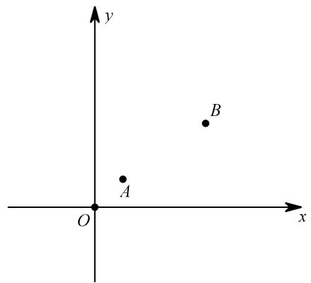

【几何法】“两圆一线”得坐标

（1）以点 $A$ 为圆心， $A B$ 为半径作圆，与 $x$ 轴的交点即为满足条件的点 $C$ ，有 $A B { = } A C$ ； （2）以点 $B$ 为圆心， $A B$ 为半径作圆，与 $x$ 轴的交点即为满足条件的点 $C$ ，有 $B A { = } B C$ ； （3）作 $A B$ 的垂直平分线，与 $x$ 轴的交点即为满足条件的点 $C$ ，有 $C A { = } C B$

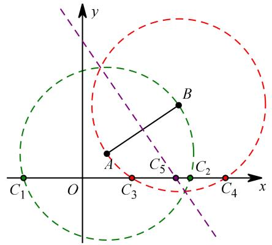

【注意】若有三点共线的情况，则需排除作图并不难，问题是还需要把各个点坐标算出来，可通过勾股或者三角函数来求

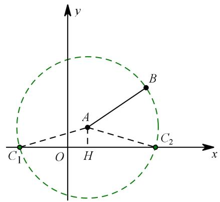

$A C _ { 1 } = A B = \sqrt { ( 4 - 1 ) ^ { 2 } + ( 3 - 1 ) ^ { 2 } } = \sqrt { 1 3 }$ 作 $A H \bot x$ 轴于 $H$ 点， $A H { = } 1$ $C _ { 1 } H { = } C _ { 2 } H { = } \sqrt { 1 3 { - } 1 } { = } 2 \sqrt { 3 }$ C1(1-2√3,0) C2(1+2√3,0)

$C _ { 3 } \mathrm { . }$ $C _ { 4 }$ 同理可求，下求 $C _ { 5 }$

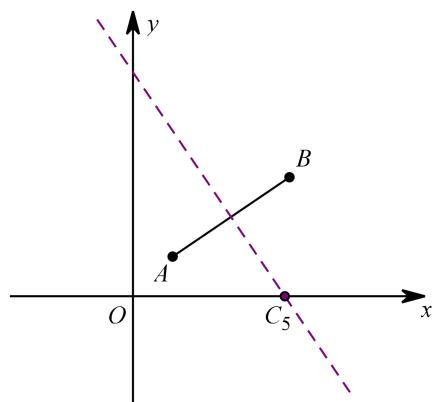

显然垂直平分线这个条件并不太适合这个题目，如果 A、 $B$ 均往下移一个单位，当点 $A$ 坐标为（1,0），点 $B$ 坐标为（4,2）时，可构造直角三角形勾股解：

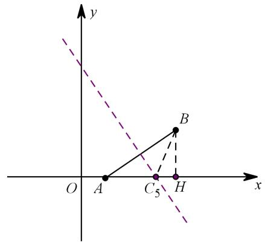

$A H { = } 3$ $B H { = } 2$   
设 ${ \mathrm { \Delta } } A C { \mathrm { } } _ { 5 } { = } x$ ，则 $B C _ { 5 } { = } x$ $C _ { 5 } H { = } 3 { - } x$   
$( 3 - x ) ^ { 2 } + 2 ^ { 2 } = x ^ { 2 }$   
解得： $x { = } \frac { 1 3 } { 6 }$   
故 $C _ { 5 }$ 坐标为 $( \frac { 1 9 } { 6 } , 0 )$

而对于本题的 $C _ { 5 }$ ，或许代数法更好用一些

# 二、直角三角形存在性问题：几何法与代数法讲解

【问题描述】如图，在平面直角坐标系中，点 $\pmb { A }$ 坐标为（1,1），点 $\pmb { B }$ 坐标为（5,3），在 $x$ 轴上找一点 $c$ 使得 $\triangle A B C$ 是直角三角形，求点 $c$ 坐标

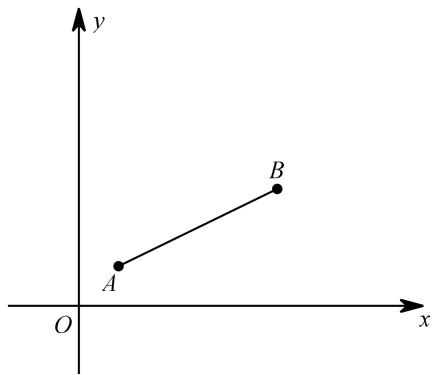

【几何法】两线一圆得坐标

（1）若 $\angle A$ 为直角，过点 $\pmb { A }$ 作 $\pmb { A } \pmb { B }$ 的垂线，与 $\boldsymbol { x }$ 轴的交点即为所求点 $c$ ；  
（2）若 $\angle B$ 为直角，过点 $\pmb { B }$ 作 $\pmb { A } \pmb { B }$ 的垂线，与 $\boldsymbol { x }$ 轴的交点即为所求点 $c$ ；  
（3）若 $\angle C$ 为直角，以 $\pmb { A } \pmb { B }$ 为直径作圆，与 $\boldsymbol { x }$ 轴的交点即为所求点 $c$ ．（直径所对的圆周角为直角）

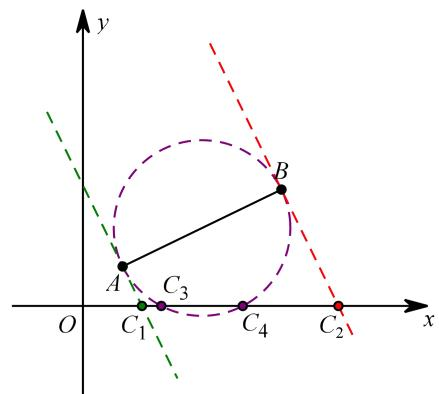

重点还是如何求得点坐标， $C _ { 1 } \mathrm { { \cdot } }$ 、 $C _ { 2 }$ 求法相同，以 $C _ { 2 }$ 为例：

# 【构造三垂直】

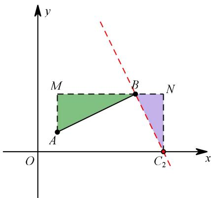

易证 $\triangle A M B \setminus \triangle B N C _ { 2 }$   
$\frac { A M } { B N } { = } \frac { M B } { N C _ { 2 } }$   
由 $A$ $B$ 坐标得 $A M { = } 2$ $B M { = } 4$ $N C _ { 2 } { = } 3$   
代入得： $B N { = } \frac { 3 } { 2 }$   
故 $C _ { 2 }$ 坐标为 $( \frac { 1 3 } { 2 } , \ 0 )$

$C _ { 3 } \mathrm { . }$ $C _ { 4 }$ 求法相同，以 $C _ { 3 }$ 为例：

易证 $\triangle A M C _ { 3 } \setminus \triangle C _ { 3 } N B , ~ \frac { A M } { C _ { 3 } N } = \frac { M C _ { 3 } } { N { \bf B } }$ 由A、 $B$ 坐标得 $A M { = } 1$ $B N { = } 3$ ，设 ${ \cal M } { \cal C } _ { 3 } { = } a$ $C _ { 3 } N { = } b$ 代入得： ${ \frac { 1 } { b } } = { \frac { a } { 3 } }$ ，即 $a b { = } 3$ ，又 $a + b { = } 4$ ，故 $\scriptstyle { a = 1 }$ 或3故 $C _ { 3 }$ 坐标为（2,0）， $C _ { 4 }$ 坐标为（4,0)

构造三垂直步骤：

第一步：过直角顶点作一条水平或竖直的直线；第二步：过另外两端点向该直线作垂线，即可得三垂直相似

# 【代数法】表示线段构勾股

还剩下 $C _ { 1 }$ 待求，不妨来求下 $C _ { 1 }$ ：

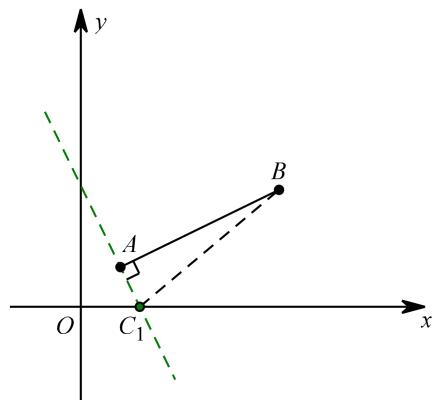

（1）表示点：设 $C _ { 1 }$ 坐标为 $( m , \mathrm { ~ \bf ~ 0 ~ } )$ ），又 $\pmb { A }$ （1，1）、 $\pmb { B }$ （5，3）；（2）表示线段： $A B = 2 { \sqrt { 5 } }$ ， $A C _ { 1 } = \sqrt { \left( m - 1 \right) ^ { 2 } + 1 ^ { 2 } }$ ， $B C _ { 1 } = \sqrt { \left( m - 5 \right) ^ { 2 } + 3 ^ { 2 } } \ ;$ ；（3）分类讨论：当 $\angle B A C _ { 1 }$ 为直角时， $A B ^ { 2 } + A C _ { 1 } ^ { 2 } = B C _ { 1 } ^ { 2 }$ ；（4）代入得方程： $2 0 + { \left( m - 1 \right) } ^ { 2 } + 1 ^ { 2 } = { \left( m - 5 \right) } ^ { 2 } + 3 ^ { 2 }$ ，解得： $m = \frac { 3 } { 2 }$

# 三、等腰直角三角形在性问题方法突破

【三垂直构造等腰直角三角形】通过对下面数学模型的研究学习，解决问题

【模型呈现】如图，在 $R t \triangle A B C$ ， $\angle A C B { = } 9 0 ^ { \circ }$ ，将斜边 $A B$ 绕点 $A$ 顺时针旋转 $9 0 ^ { \circ }$ 得到 $A D$ ，过点 $D$ 作 $D E \bot A C$ 于点 $E$ ，可以推理得到 $\triangle A B C { \cong } \triangle D A E$ ，进而得到 $A C { = } D E$ ， $B C { = } A E$ 我们把这个数学模型成为“ $\cdot K$ 型”．

推理过程如下：

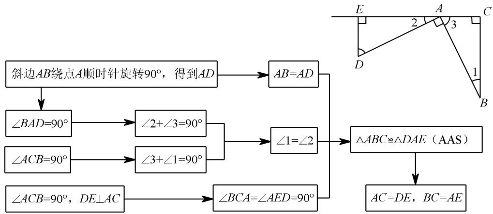

# 【模型迁移】

【兰州中考（删减）】二次函数 $y = a x ^ { 2 } + b x + 2$ 的图像交 $x$ 轴于点 $A$ （-1,0）， $B$ （4,0）两点，交 $y$ 轴于点 $C$ ．动点 $M$ 从点 $A$ 出发，以每秒 2个单位长度的速度沿 $A B$ 方向运动，过点 $M$ 作 $M N \perp x$ 轴交直线 $B C$ 于点 $N$ ，交抛物线于点 $D$ ，连接 $A C$ ，设运动的时间为 $t$ 秒

（1）求二次函数 $y = a x ^ { 2 } + b x + 2$ 的表达式；资料整理【淘宝店铺：向阳百分百】

（2）在直线MN 上存在一点 $P$ ，当 PBC 是以 BPC 为直角的等腰直角三角形时，求此时点 $D$ 的坐标．

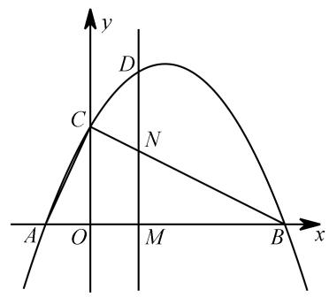

【分析】

（1） $y = - { \frac { 1 } { 2 } } x ^ { 2 } + { \frac { 3 } { 2 } } x + 2 ;$ ；  
（2）本题直角顶点 $\mathrm { P }$ 并不确定，以 BC 为斜边作等腰直角三角形，直角顶点即为 P点，再过点 P作水平线，得三垂直全等  
设 $\mathrm { H P } { = } \mathbf { a }$ ， $\mathrm { P Q = b }$ ，则 $\mathbf { B Q = a }$ ， $\mathrm { C H = b }$ ，  
由图可知： $\begin{array} { c } { { \left( a + b = 4 \right. } } \\ { { \left. b - a = 2 \right. } } \end{array}$ ，解得： $\left\{ \begin{array} { l l } { { a = 1 } } \\ { { b = 3 } } \end{array} \right. .$   
故 D 点坐标为（1,3）

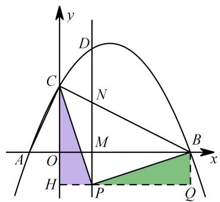

同理可求此时 $D$ 点坐标为（3,2）

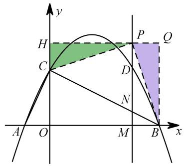

# 思路 2：等腰直角的一半还是等腰直角．

如图，取 $B C$ 中点 $M$ 点，以 BM 为一直角边作等腰直角三角形，则第三个顶点即为 $P$ 点．根据 $B$ 点和 $M$ 点坐标，此处全等的两三角形两直角边分别为 1和 2，故 $P$ 点坐标易求

$P$ 点横坐标同 $D$ 点，故可求得 $D$ 点坐标

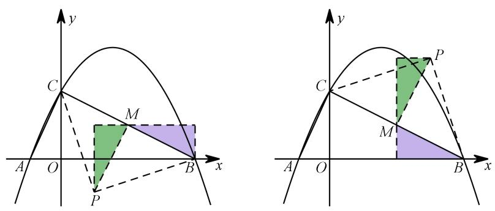

# 四、平行四边形存在性问题方法突破

考虑到求证平行四边形存在，必先了解平行四边形性质：

（1）对应边平行且相等；  
（2）对角线互相平分  
这是图形的性质，我们现在需要的是将其性质运用在在坐标系中：

（1）对边平行且相等可转化为： $\left\{ \begin{array} { l l } { x _ { _ { A } } - x _ { _ { B } } = x _ { _ { D } } - x _ { _ { C } } } \\ { y _ { _ { A } } - y _ { _ { B } } = y _ { _ { D } } - y _ { _ { C } } } \end{array} \right. ,$ ，可以理解为点 $\pmb { B }$ 移动到点 $\pmb { A }$ ，点 $c$ 移动到点 $\pmb { D }$ ，移动路径完全相同

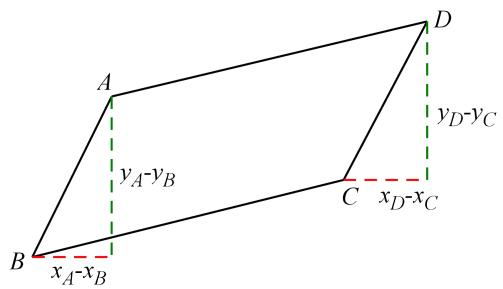

（2）对角线互相平分转化为： $\left\{ \frac { x _ { _ { A } } + x _ { _ { C } } } { 2 } = \frac { x _ { _ { B } } + x _ { _ { D } } } { 2 } \right. ,$

可以理解为 $A C$ 的中点也是 $\pmb { B D }$ 的中点

【小结】虽然由两个性质推得的式子并不一样，但其实可以化为统一：

$$
\{ \begin{array} { l } { { x _ { \scriptscriptstyle A } - x _ { \scriptscriptstyle B } = x _ { \scriptscriptstyle D } - x _ { \scriptscriptstyle C } } } \\ { { y _ { \scriptscriptstyle A } - y _ { \scriptscriptstyle B } = y _ { \scriptscriptstyle D } - y _ { \scriptscriptstyle C } } } \end{array}   \{ \begin{array} { l } { { x _ { \scriptscriptstyle A } + x _ { \scriptscriptstyle C } = x _ { \scriptscriptstyle D } + x _ { \scriptscriptstyle B } } } \\ { { y _ { \scriptscriptstyle A } + y _ { \scriptscriptstyle C } = y _ { \scriptscriptstyle D } + y _ { \scriptscriptstyle B } } } \end{array}  ,
$$

$$
\left\{ \begin{array} { l l } { \displaystyle { \frac { x _ { _ { A } } + x _ { _ C } } { 2 } } = \frac { x _ { _ { B } } + x _ { _ { D } } } { 2 } } \\ { \displaystyle { \frac { y _ { _ { A } } + y _ { _ { C } } } { 2 } } = \frac { y _ { _ { B } } + y _ { _ { D } } } { 2 } } \end{array} \right. \to \left\{ \begin{array} { l l } { \displaystyle x _ { _ { A } } + x _ { _ C } = x _ { _ { B } } + x _ { _ { D } } } \\ { \displaystyle y _ { _ { A } } + y _ { _ { C } } = y _ { _ { B } } + y _ { _ { D } } } \end{array} \right. .
$$

当 $A C$ 和 $\pmb { B D }$ 为对角线时，结果可简记为： $A + C = B + D$ （各个点对应的横纵坐标相加）

以上是对于平行四边形性质的分析，而我们要求证的是平行四边形存在性问题，此处当有一问：若坐标系中的 4个点 $A \setminus B \setminus C \setminus D$ 满足 $\scriptstyle \cdot _ { A + C } = B + D ^ { \prime }$ ，则四边形 ABCD 是否一定为平行四边形？反例如下：

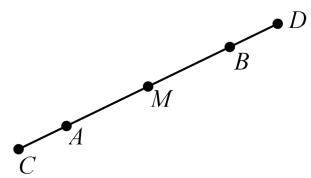

之所以存在反例是因为“四边形 ABCD 是平行四边形”与“AC、BD 中点是同一个点”并不是完全等价的转化，故存在反例

虽有反例，但并不影响运用此结论解题，另外，还需注意对对角线的讨论：

（1）四边形 ABCD 是平行四边形：AC、BD 一定是对角线．

（2）以 A、B、C、 $\pmb { D }$ 四个点为顶点是四边形是平行四边形：对角线不确定需要分类讨论

# 【题型分类】

平行四边形存在性问题通常可分为“三定一动”和“两定两动”两大类问题．

# 1．三定一动

已知 $\pmb { A }$ （1，2） $\pmb { B }$ （5，3） $c$ （3，5），在坐标系内确定点 $\pmb { D }$ 使得以 $A \setminus B \setminus C \setminus D$ 四个点为顶点的四边形是平行四边形

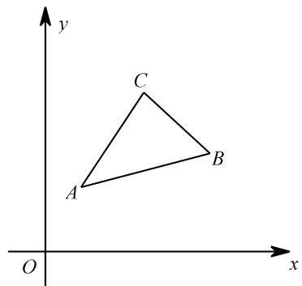

思路 1：利用对角线互相平分，分类讨论：

设 $\pmb { D }$ 点坐标为 $( m , ~ n )$ ，又 $\pmb { A }$ （1，2） $\pmb { B }$ （5，3） $c$ （3，5），可得：

（1） $\pmb { B C }$ 为对角线时， 5 3 1 m    ，可得 D1 7,6 ；

（2） $A C$ 为对角线时， 1 3 5 m    ，解得 D2 1,4 ；

（3） $\pmb { A } \pmb { B }$ 为对角线时， 1 5 3 m    ，解得 D3 3,0 ．

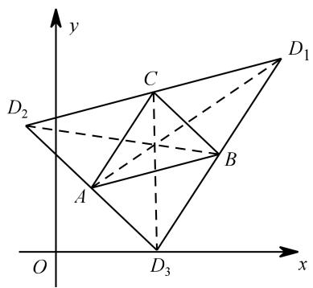

当然，如果对这个计算过程非常熟悉的话，也不用列方程解，直接列算式即可比如： $D _ { 1 } { = } B + C - A$ ， $D _ { 2 } { = } A + C - B$ ， $D _ { 3 } = A + B - C$ ．（此处特指点的横纵坐标相加减）

# 2．两定两动

已知 $\pmb { A }$ （1，1）、 $\pmb { B }$ （3，2），点 $c$ 在 $\boldsymbol { x }$ 轴上，点 $\pmb { D }$ 在 $\boldsymbol { y }$ 轴上，且以 A、B、C、 $\pmb { D }$ 为顶点的四边形是平行四边形，求 $\mathbf { \psi } _ { C } , \mathbf { \psi } _ { D }$ 坐标

【分析】

设 $c$ 点坐标为 $( m , \mathrm { ~ \bf ~ 0 ~ } )$ ， $\pmb { D }$ 点坐标为 $( \boldsymbol { \mathbf { 0 } } , \boldsymbol { \mathbf { \ell } } _ { n } )$ ，又 $\pmb { A }$ （1，1）、 $\pmb { B }$ （3，2）

（1）当 $\pmb { A } \pmb { B }$ 为对角线时， $\left\{ { 1 + 3 = m + 0 } \atop { 1 + 2 = 0 + n }  \right.$ ，解得 $\begin{array} { c } { { { \left( m = 4 \right. } } } \\ { { { \left. n = 3 \right. } } } \end{array}$ ，故 $C ~ ( 4 , ~ 0 ) , ~ D ~ ( 0 , ~ 3 ) ;$ ；

（2）当 $A C$ 为对角线时， $\left\{ { 1 + m = 3 + 0 } \atop { 1 + 0 = 2 + n }  \right.$ ，解得 $\begin{array} { c } { { \left( m = 2 \right. } } \\ { { \left. n = - 1 \right. } } \end{array}$ ，故 $( 2 , \ 0 ) , \ D \ ( \bf { 0 } , \ { - } 1 ) ;$ ；

（3）当 $\pmb { A D }$ 为对角线时， $\left\{ { 1 + 0 = 3 + m \atop 1 + n = 2 + 0 } \right.$ ，解得 $\left\{ { \begin{array} { l } { m = - 2 } \\ { n = 1 } \end{array} } \right.$ ，故 $C ~ ( - 2 , ~ 0 ) , ~ D ~ ( 0 , ~ 1 ) .$ ．

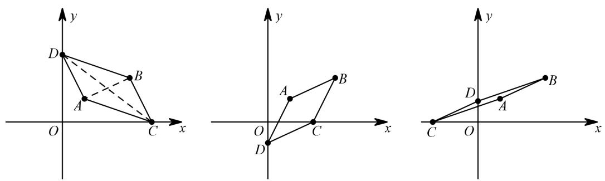

【动点综述】

“三定一动”的动点和“两定两动”的动点性质并不完全一样，“三定一动”中动点是在平面中，横纵坐标都不确定，需要用两个字母表示，这样的我们姑且称为“全动点”，而有一些动点在坐标轴或者直线或者抛物线上，用一个字母即可表示点坐标，称为“半动点”

从上面例子可以看出，虽然动点数量不同，但本质都是在用两个字母表示出 4 个点坐标．若把一个字母称为一个“未知量”也可理解为：全动点未知量 $\scriptstyle \mathbf { \underline { { \hat { \Pi } } } } = .$ 半动点未知量 $\mathbf { \nabla } \cdot \mathbf { \times } 2$ .

找不同图形的存在性最多可以有几个未知量，都是根据图形决定的，像平行四边形，只能有 2个未知量．究其原因，在于平行四边形两大性质：

（1）对边平行且相等；（2）对角线互相平分

但此两个性质统一成一个等式： $\left\{ { \begin{array} { l } { x _ { _ { A } } + x _ { _ { C } } = x _ { _ { B } } + x _ { _ { D } } } \\ { y _ { _ { A } } + y _ { _ { C } } = y _ { _ { B } } + y _ { _ { D } } } \end{array} } \right. ,$

两个等式，只能允许最多存在两个未知数，即我们刚刚所讲的平行四边形存在性问题最多只能存在2个未知量．由图形性质可知未知量，由未知量可知动点设计，由动点设计可化解问题

# 五、矩形的存在性问题方法突破

矩形的判定：（1）有一个角是直角的平行四边形；（2）对角线相等的平行四边形；（3）有三个角为直角的四边形．

【题型分析】

矩形除了具有平行四边形的性质之外，还有“对角线相等”或“内角为直角”，因此相比起平行四边形，坐标系中的矩形满足以下 3 个等式：

A C B Dx x x x     
A C B Dy y y y    （AC 为对角线时）   
       2 2 2 2A C A C B D B Dx x y y x x y y       

因此在矩形存在性问题最多可以有 3 个未知量，代入可以得到三元一次方程组，可解．确定了有 3 个未知量，则可判断常见矩形存在性问题至少有 2 个动点，多则可以有 3 个

题型如下：

（1）2个定点 $+ 1$ 个半动点 $+ 1$ 个全动点；（2）1个定点 $+ 3$ 个半动点

# 【解析思路】

思路 1：先直角，再矩形

在构成矩形的 4 个点中任取 3 个点，必构成直角三角形，以此为出发点，可先确定其中 3 个点构造直角三角形，再确定第 4 个点．对“2定 $+ 1$ 半动 $+ 1$ 全动”尤其适用

引例：已知 $A$ （1，1）、B（4，2），点 $C$ 在 $x$ 轴上，点 $D$ 在平面中，且以 A、B、C、 $D$ 为顶点的四边形是矩形，求 $D$ 点坐标

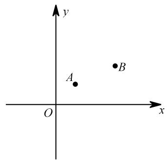

【分析】

点 $C$ 满足以 $A , B , C$ 为顶点的三角形是直角三角形，构造“两线一圆”可得满足条件的点 $C$ 有 $C _ { 1 } \bigg ( \frac { 4 } { 3 } , 0 \bigg )$ 、$C _ { 2 } \bigg ( \frac { 1 4 } { 3 } , 0 \bigg ) \setminus \ { C _ { 3 } } \left( 2 , 0 \right) \setminus \ C _ { 4 } \left( 3 , 0 \right)$

在点 $C$ 的基础上，借助点的平移思路，可迅速得到点 $D$ 的坐标

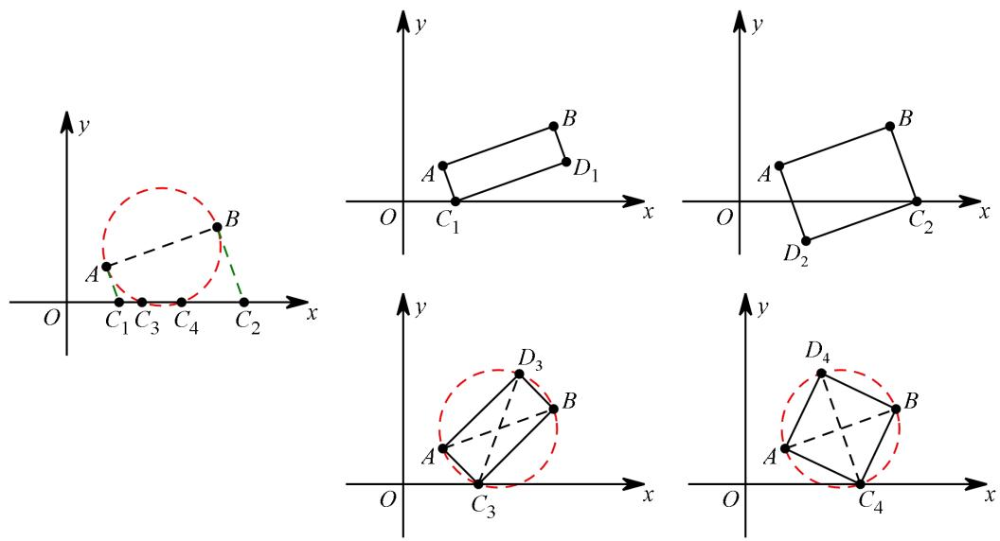

【小结】这种解决矩形存在性问题的方法相当于在直角三角形存在性问题上再加一步求 $D$ 点坐标，也是因为这两个图形之间的密切关系方能如此

思路 2：先平行，再矩形

当 $A C$ 为对角线时， $A$ 、 $B$ 、C、 $D$ 满足以下 3 个等式，则为矩形：

$$
\left\{ \begin{array} { l l } { x _ { A } + x _ { C } = x _ { B } + x _ { D } } \\ { y _ { A } + y _ { C } = y _ { B } + y _ { D } } \\ { \sqrt { \left( x _ { A } - x _ { C } \right) ^ { 2 } + \left( y _ { A } - y _ { C } \right) ^ { 2 } } = \sqrt { \left( x _ { B } - x _ { D } \right) ^ { 2 } + \left( y _ { B } - y _ { D } \right) ^ { 2 } } } \end{array} \right.
$$

其中第 1、2个式子是平行四边形的要求，再加上式 3可为矩形．表示出点坐标后，代入点坐标解方程即可．

无论是“2 定 1 半 1 全”还是“1 定 3 半”，对于我们列方程来解都没什么区别，能得到的都是三元一次方程组．

引例：已知 $A$ （1，1）、B（4，2），点 $C$ 在 $x$ 轴上，点 $D$ 在坐标系中，且以 A、B、C、 $D$ 为顶点的四边形是矩形，求 $D$ 点坐标

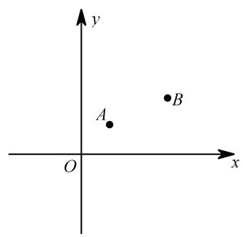

【分析】

设 $C$ 点坐标为 $\left( \begin{array} { l l } { a , } & { 0 } \end{array} \right)$ ， $D$ 点坐标为 $\left( \ b , \ c \right)$ ，又 $A$ （1，1）、 $B$ （4，2）．

先考虑平行四边形存在性：

（1） $A B$ 为对角线时， $\left\{ { \begin{array} { l } { 1 + 4 = a + b } \\ { 1 + 2 = c + 0 } \end{array} } \right.$ ，满足此条件的 $C , \ D$ 使得 以 $A$ 、 $B$ 、C 、 $D$ 为顶点的四边形是平行四边形，另外 $A B { = } C D$ ，得： ${ \sqrt { \left( 4 - 1 \right) ^ { 2 } + \left( 2 - 1 \right) ^ { 2 } } } = { \sqrt { \left( a - b \right) ^ { 2 } + \left( 0 - c \right) ^ { 2 } } } \ ,$ ，3a  2a 综合以上可解： $\ b = 2$ 或 $\left\{ b = 3 \right.$ ．故 $C$ （3，0）、 $D$ （2 ， 3）或 $C$ （2，0）、 $D$ （3，3）3c  3c 

（2）AC 为对角线时， $\left\{ \begin{array} { l l } { 1 + a = 4 + b } \\ { 1 + 0 = 2 + c } \end{array} \right.$ ，另外 $A C { = } B D$ ，得 ${ \sqrt { \left( a - 1 \right) ^ { 2 } + \left( 0 - 1 \right) ^ { 2 } } } = { \sqrt { \left( b - 4 \right) ^ { 2 } + \left( c - 2 \right) ^ { 2 } } }$ ， 综合以上可解得： $\left\{ \begin{array} { l l } { a = \displaystyle \frac { 1 4 } { 3 } } \\ { b = \displaystyle \frac { 5 } { 3 } } \\ { c = - 1 } \end{array} \right.$ ．故 $C { \biggl ( } { \frac { 1 4 } { 3 } } , 0 { \biggr ) } , D { \biggl ( } { \frac { 5 } { 3 } } , - 1 { \biggr ) }$ （3） $A D$ 为对角线时， $\left\{ { 1 + b = 4 + a \atop 1 + c = 2 + 0 } \right.$ ，另外 $A D { = } B C$ ，得 ${ \sqrt { \left( b - 1 \right) ^ { 2 } + \left( c - 1 \right) ^ { 2 } } } = { \sqrt { \left( a - 4 \right) ^ { 2 } + \left( 0 - 2 \right) ^ { 2 } } }$ ，综合以上可解得： $\left\{ \begin{array} { l l } { \displaystyle a = \frac { 4 } { 3 } } \\ { \displaystyle b = \frac { 1 3 } { 3 } } \\ { c = 1 } \end{array} \right.$ ．故 $C { \left( \frac { 1 4 } { 3 } , 0 \right) } \setminus D { \left( \frac { 1 3 } { 3 } , 1 \right) } .$

【小结】这个方法是在平行四边形基础上多加一个等式而已，剩下的都是计算的故事

【代数法】表示线段构相等

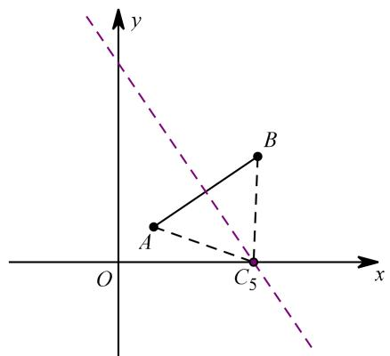

（1）表示点：设点 $C _ { 5 }$ 坐标为 $( m , \mathbf { \mu } _ { 0 } )$ ，又 $A$ 点坐标（1,1）、 $B$ 点坐标（4,3），（2）表示线段： $A C _ { 5 } = \sqrt { \left( m - 1 \right) ^ { 2 } + \left( 0 - 1 \right) ^ { 2 } } ~ , ~ B C _ { 5 } = \sqrt { \left( m - 4 \right) ^ { 2 } + \left( 0 - 3 \right) ^ { 2 } }$ （3）分类讨论：根据 $A C _ { 5 } = B C _ { 5 }$ ，可得： ${ \sqrt { \left( m - 1 \right) ^ { 2 } + 1 ^ { 2 } } } = { \sqrt { \left( m - 4 \right) ^ { 2 } + 3 ^ { 2 } } }$ ，（4）求解得答案：解得： $m = \frac { 2 3 } { 6 }$ ，故 $C _ { 5 }$ 坐标为 $\left( { \frac { 2 3 } { 6 } } , 0 \right)$ ．

【小结】

几何法：（1）“两圆一线”作出点；（2）利用勾股、相似、三角函数等求线段长，由线段长得点坐标代数法：（1）表示出三个点坐标 A、B、C；（2）由点坐标表示出三条线段：AB、AC、BC；（3）根据题意要求取 $\textcircled{1} A B { = } A C$ 、 $\textcircled{2} A B { = } B C$ 、 $\textcircled { 3 } A C { = } B C$ ；（4）列出方程求解

问题总结：

（1）两定一动：动点可在直线上、抛物线上；（2）一定两动：两动点必有关联，可表示线段长度列方程求解；（3）三动点：分析可能存在的特殊边、角，以此为突破口

# 六、菱形的存在性问题方法突破

作为一种特殊的平行四边形，我们已经知道可以从以下几种方式得到菱形：

（1）有一组邻边相等的平行四边形菱形；（2）对角线互相垂直的平行四边形是菱形；（3）四边都相等的四边形是菱形资料整理【淘宝店铺：向阳百分百】

坐标系中的菱形存在性问题也是依据以上去得到方法．和平行四边形相比，菱形多一个“对角线互相垂直”或“邻边相等”，但这两者其实是等价的，故若四边形 ABCD 是菱形，则其 4 个点坐标需满足：

$$
\left\{ \begin{array} { l l } { x _ { _ { A } } + x _ { _ { C } } = x _ { _ { B } } + x _ { _ { D } } } \\ { y _ { _ { A } } + y _ { _ { C } } = y _ { _ { B } } + y _ { _ { D } } } \\ { \sqrt { \left( x _ { _ { A } } - x _ { _ { B } } \right) ^ { 2 } + \left( y _ { _ { A } } - y _ { _ { B } } \right) ^ { 2 } } = \sqrt { \left( x _ { _ { C } } - x _ { _ { B } } \right) ^ { 2 } + \left( y _ { _ { C } } - y _ { _ { B } } \right) ^ { 2 } } } \end{array} \right.
$$

考虑到互相垂直的两条直线斜率之积为 1 在初中并不适合直接用，故取两邻边相等即根据菱形的图形性质，我们可以列出关于点坐标的 3 个等式，故菱形存在性问题点坐标最多可以有 3 个未知量，与矩形相同

因此就常规题型而言，菱形存在性至少有 2 个动点，多则有 3 个动点，可细分如下两大类题型：

（1）2个定点 $+ 1$ 个半动点 $+ 1$ 个全动点（2）1个定点 $^ { + 3 }$ 个半动点

解决问题的方法也可有如下两种：

思路 1：先平四，再菱形设点坐标，根据平四存在性要求列出 $\cdot \angle 1 + C = B + D ^ { \circ }$ （AC、BD 为对角线），再结合一组邻边相等，得到方程组

思路 2：先等腰，再菱形在构成菱形的 4 个点中任取 3 个点，必构成等腰三角形，根据等腰存在性方法可先确定第 3个点，再确定第 4 个点

1．看个例子：

如图，在坐标系中， $A$ 点坐标（1,1）， $B$ 点坐标为（5,4），点 $C$ 在 $x$ 轴上，点 $D$ 在平面中，求 $D$ 点坐标，使得以 A、B、 $C$ 、 $D$ 为顶点的四边形是菱形

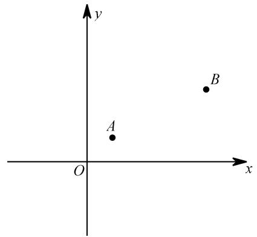

思路 1：先平四，再菱形

设 $C$ 点坐标为 $( m , \mathbf { \mu } _ { 0 } )$ ， $D$ 点坐标为 $( p , \ q )$

（1）当 $A B$ 为对角线时，由题意得：（ $A B$ 和 $C D$ 互相平分及 $A C { = } B C$ ）

$$
\left\{ \begin{array} { l l } { \displaystyle 1 + 5 = m + p } & { \mathrm { , ~ } \frac { \sharp \mathcal { R } \mathcal { H } \Xi } { \sharp \mathcal { H } \Xi \mathfrak { L } } \mathfrak { L } \mathfrak { L } } \\ { \displaystyle \left( m - 1 \right) ^ { 2 } + \big ( 0 - 1 \big ) ^ { 2 } = \big ( m - 5 \big ) ^ { 2 } + \big ( 0 - 4 \big ) ^ { 2 } } & { \displaystyle \left[ q = 5 \right. } \end{array} \right. ,
$$

（2）当 $A C$ 为对角线时，由题意得：（ $A C$ 和 $B D$ 互相平分及 $B A { = } B C$ ）

$\displaystyle { \begin{array} { l } { \displaystyle 1 + m = 5 + p } \\ { \displaystyle 1 + 0 = 4 + q } \\ { \displaystyle \left( 1 - 5 \right) ^ { 2 } + \left( 1 - 4 \right) ^ { 2 } = \left( m - 5 \right) ^ { 2 } + \left( 0 - 4 \right) ^ { 2 } } \end{array} }$ ，解 得： $\begin{array} { l } { \{ m = 2 \atop { p = - 2 \atop p = - 3 } \} m = 8 } \\ { \{ q = - 3 \atop { q = - 3 } } \end{array}$

（3）当 $A D$ 为对角线时，由题意得：

$\left\{ \begin{array} { l l } { 1 + p = 5 + m } \\ { 1 + q = 4 + 0 } \\ { \left( 1 - 5 \right) ^ { 2 } + \left( 1 - 4 \right) ^ { 2 } = \left( 1 - m \right) ^ { 2 } + \left( 1 - 0 \right) ^ { 2 } } \end{array} \right.$ ，解 得： $\left\{ { \begin{array} { l } { m = 1 + 2 { \sqrt { 6 } } } \\ { p = 5 + 2 { \sqrt { 6 } } \ { \frac { \operatorname { g } { \ddot { \chi } } } { \sqrt { 6 } } } { \Bigg \{ } p = 5 - 2 { \sqrt { 6 } } } \\ { q = 3 } \end{array} }  \right.$

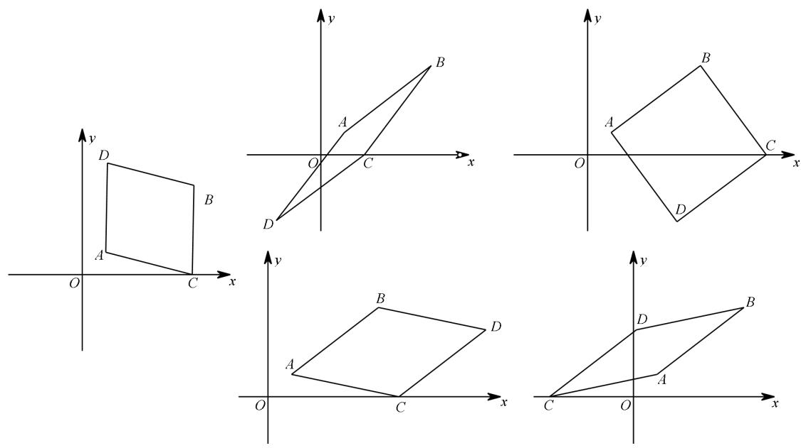

思路 2：先等腰，再菱形

先求点 $C$ ，点 $C$ 满足由 $A$ 、 $B$ 、 $C$ 构成的三角形一定是等腰三角形，用等腰存在性问题的方法先确定$C$ ，再确定 $D$ 点

（1）当 $A B { = } A C$ 时，$C$ 点坐标为 $\left( 1 + 2 { \sqrt { 6 } } , 0 \right)$ ，对应 $D$ 点坐标为 $\left( 5 + 2 { \sqrt { 6 } } , 3 \right)$ ；$C$ 点坐标为 $\left( 1 - 2 { \sqrt { 6 } } , 0 \right)$ ，对应 $D$ 点坐标为 $\left( 5 - 2 { \sqrt { 6 } } , 3 \right)$ ．

（2）当 $B A { = } B C$ 时，$C$ 点坐标为（8，0），对应 $D$ 点坐标为（4，-3）；$C$ 点坐标为（2，0），对应 $D$ 点坐标为（-2，-3）

（3） $A C { = } B C$ 时，$C$ 点坐标为 $\left( { \frac { 3 9 } { 8 } } , 0 \right)$ $D$ 点坐标为 $\left( { \frac { 9 } { 8 } } , 5 \right)$

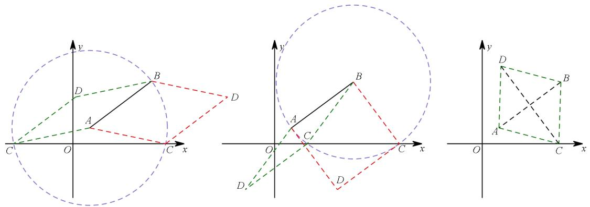

以上只是两种简单的处理方法，对于一些较复杂的题目，还需具体问题具体分析，或许有更为简便的方法．

# 七、正方形的存在性问题方法突破

作为特殊四边形中最特殊的一位，正方形拥有更多的性质，因此坐标系中的正方形存在性问题变化更加多样，从判定的角度来说，可以有如下：

（1）有一个角为直角的菱形；  
（2）有一组邻边相等的矩形；  
（3）对角线互相垂直平分且相等的四边形  
依据题目给定的已知条件选择恰当的判定方法，即可确定所求的点坐标

从未知量的角度来说，正方形可以有 4 个“未知量”，因其点坐标满足 4 个等量关系，考虑对角线性质，互相平分（2 个）垂直（1 个）且相等（1个）

比如在平面中若已知两个定点，可以在平面中确定另外两个点使得它们构成正方形，而如果要求在某条线上确定点，则可能会出现不存在的情况，即我们所说的未知量小于方程个数，可能无解

从动点角度来说，关于正方形存在性问题可分为：

（1）2个定点 $^ { + 2 }$ 个全动点；（2）1个定点 $^ { + 2 }$ 个半动点 $+ 1$ 个全动点;甚至可以有：（3）4个半动点

不管是哪一种类型，要明确的是一点，我们肯定不会列一个四元一次方程组求点坐标！

常用处理方法：

思路 1：从判定出发若已知菱形，则加有一个角为直角或对角线相等；若已知矩形，则加有一组邻边相等或对角线互相垂直；若已知对角线互相垂直或平分或相等，则加上其他条件

思路 2：构造三垂直全等

若条件并未给关于四边形及对角线的特殊性，则考虑在构成正方形的 4个顶点中任取 3 个，必是等腰直角三角形，若已知两定点，则可通过构造三垂直全等来求得第 3 个点，再求第 4 个点

总结：构造三垂直全等的思路仅适合已知两定点的情形，若题目给了 4 个动点，则考虑从矩形的判定出发，观察该四边形是否已为某特殊四边形，考证还需满足的其他关系

正方形的存在性问题在中考中出现得并不多，正方形多以小题压轴为主  
例：在平面直角坐标系中， $A$ （1,1）， $B$ （4,3），在平面中求 $C$ 、 $D$ 使得以 $A$ 、 $B$ 、 $C$ 、 $D$ 为顶点的四  
边形是正方形．

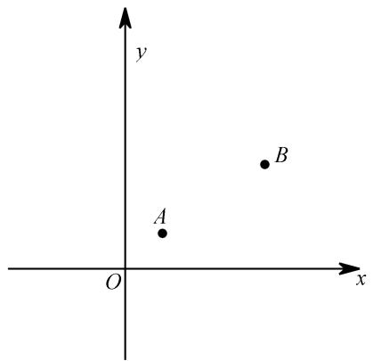

如图，一共 6 个这样的点 $C$ 使得以 $A$ 、 $B$ 、 $C$ 为顶点的三角形是等腰直角三角形至于具体求点坐标，以 $C _ { 1 }$ 为例，构造 $\triangle A M B { \cong } \triangle C _ { 1 } N A$ ，即可求得 $C _ { 1 }$ 坐标．至于像 $C _ { 5 }$ 、 $C _ { 6 }$ 这两个点的坐标，不难发现， $C _ { 5 }$ 是 $A C _ { 3 }$ 或 $B C _ { 1 }$ 的中点， $C _ { 6 }$ 是 $B C _ { 2 }$ 或 $A C _ { 4 }$ 的中点

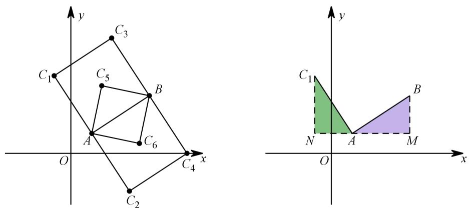

题无定法，具体问题还需具体分析，如上仅仅是大致思路

# 八、相似三角形存在性问题

# 【模型解读】

在坐标系中确定点，使得由该点及其他点构成的三角形与其他三角形相似，即为“相似三角形存在性问题”．

# 【相似判定】

判定 1：三边对应成比例的两个三角形是相似三角形；  
判定 2：两边对应成比例且夹角相等的两个三角形是相似三角形；  
判定 3：有两组角对应相等的三角形是相似三角形  
以上也是坐标系中相似三角形存在性问题的方法来源，根据题目给的已知条件选择恰当的判定方法，解决问题．

# 【题型分析】

资料整理【淘宝店铺：向阳百分百】

通常相似的两三角形有一个是已知的，而另一三角形中有 1 或 2 个动点，即可分为“单动点”类、“双动点”两类问题

# 【思路总结】

根据相似三角形的做题经验，可以发现，判定 1 基本是不会用的，这里也一样不怎么用，对比判定

2、3 可以发现，都有角相等！

所以，要证相似的两个三角形必然有相等角，关键点也是先找到一组相等角．

然后再找：

思路 1：两相等角的两边对应成比例；

思路 2：还存在另一组角相等

事实上，坐标系中在已知点的情况下，线段长度比角的大小更容易表示，因此选择方法可优先考虑

思路 1．

# 一、如何得到相等角？

# 二、如何构造两边成比例或者得到第二组角？

搞定这两个问题就可以了

# 九、角的存在性问题

# 方法突破

除了特殊几何图形存在性问题外，相等角存在性也是二次函数压轴题中常见的题型，根据题目给的不同的条件，选择恰当的方式去构造相等角，是此类问题的关键

回顾一下在几何图形中有哪些方法能得到相等角，大概如下：

（1）平行：两直线平行，同位角、内错角相等；

（2）角平分线：角平分线分的两个角相等；

（3）等腰三角形：等边对等角；

（4）全等（相似）三角形：对应角相等；

（5）三角函数：若两个角的三角函数值相等，则两角相等；

（6）圆周角定理：同圆或等圆中，同弧或等弧所对的圆周角相等

也许还有，但大部分应该都在此了，同样，在抛物线背景下亦可用如下思路构造相等角

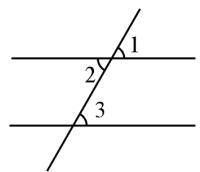

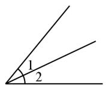

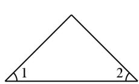  
等腰三角形： $\angle 1 = \angle 2$

平行： $\angle 1 = \angle 3$ $\angle 2 = \angle 3$

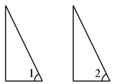  
全等三角形： $\angle 1 = \angle 2$

角平分线： $\angle 1 = \angle 2$

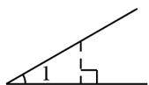

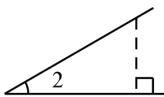

三角函数：若 $\scriptstyle { \mathrm { t a n } } \angle 1 = { \mathrm { t a n } } \angle 2$ ，则 $\angle 1 = \angle 2$

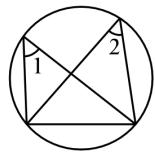

圆周角定理： $\angle 1 = \angle 2$

想得到相等角，先考虑如何度量角，除了角度之外，另外的方法便是求出角的三角函数值，因此在以上 6 种方案当中，若无明显条件，可考虑求出角的三角函数值来构造相等角

# 03 核心·题型

# 题型一 等腰直角三角形存在性问题

# 本溪中考

1．如图，在平面直角坐标系中，抛物线 $y = \frac { 1 } { 2 } x ^ { 2 } + b x + c$ 与 $x$ 轴交于 $A$ 、 $B$ 两点，点 $B$ （3,0），经过点 $A$ 的直线 $A C$ 与抛物线的另一交点为 $C ( 4 , \frac { 5 } { 2 } )$ ，与 $y$ 轴交点为 $D$ ，点 $P$ 是直线 $A C$ 下方的抛物线上的一个动点（不与点 $A$ 、 $C$ 重合）

（1）求该抛物线的解析式

（2）点 $\boldsymbol { Q }$ 在抛物线的对称轴上运动，当 $\Delta O P Q$ 是以 $O P$ 为直角边的等腰直角三角形时，请直接写出符合条件的点 $P$ 的坐标

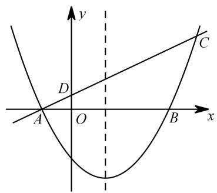

【分析】

（1） $y = { \frac { 1 } { 2 } } x ^ { 2 } - x - { \frac { 3 } { 2 } } ;$   
（2） $\textcircled{1}$ 当 $\angle \mathrm { P O Q }$ 为直角时，  
考虑 Q 点在对称轴上，故过点 Q 向 y 轴作垂线，垂线段长为 1，可知过点 P 向 x 轴作垂线，长度必  
为 1，故 $\mathrm { P }$ 的纵坐标为 $\cdot$ ．如下图，不难求出 $\cdot$ 点坐标  
设 P点坐标为 $\left( m , \frac { 1 } { 2 } m ^ { 2 } - m - \frac { 3 } { 2 } \right)$ ,  
可得： $\left| { \frac { 1 } { 2 } } m ^ { 2 } - m - { \frac { 3 } { 2 } } \right| = 1$   
解得： $\begin{array} { r } { m _ { 1 } = 1 + \sqrt { 2 } \quad m _ { 2 } = 1 - \sqrt { 2 } \quad m _ { 3 } = 1 + \sqrt { 6 } \quad m _ { 4 } = 1 - \sqrt { 6 } } \end{array}$ （舍）．  
如下图，对应 $\mathrm { P }$ 点坐标分别为 $\begin{array} { r l } { \left( 1 + { \sqrt { 2 } } , - 1 \right) \ } & { { } \left( 1 - { \sqrt { 2 } } , - 1 \right) \ \quad \left( 1 + { \sqrt { 6 } } , 1 \right) } \end{array}$   
$\cdot$ 当 $\cdot$ 为直角时，如图构造△OMP≌△PNQ，可得： $\cdot$   
设 P点坐标为 $\left( m , \frac { 1 } { 2 } m ^ { 2 } - m - \frac { 3 } { 2 } \right) ,$   
则 $P M = \left| 0 - \left( \frac { 1 } { 2 } m ^ { 2 } - m - \frac { 3 } { 2 } \right) \right| = \left| - \frac { 1 } { 2 } m ^ { 2 } + m + \frac { 3 } { 2 } \right| , ~ \mathrm { Q N } = \left| m - 1 \right| ,$   
$\left| - { \frac { 1 } { 2 } } m ^ { 2 } + m + { \frac { 3 } { 2 } } \right| = \left| m - 1 \right|$ ，  
若 $- { \frac { 1 } { 2 } } m ^ { 2 } + m + { \frac { 3 } { 2 } } = m - 1$ ，解得： $m _ { 1 } = { \sqrt { 5 } } \ , m _ { 2 } = - { \sqrt { 5 } }$ （舍 ）．  
若 $- { \frac { 1 } { 2 } } m ^ { 2 } + m + { \frac { 3 } { 2 } } = - m + 1$ ，解得： $m _ { 1 } = 2 - { \sqrt { 5 } } m _ { 2 } = 2 + { \sqrt { 5 } }$ （舍 ）  
如下图，对应 $\mathrm { P }$ 点坐标分别为 $\begin{array} { r l } { \left( { \sqrt { 5 } } , 1 - { \sqrt { 5 } } \right) \ } & { { } \left( 2 - { \sqrt { 5 } } , 1 - { \sqrt { 5 } } \right) } \end{array}$

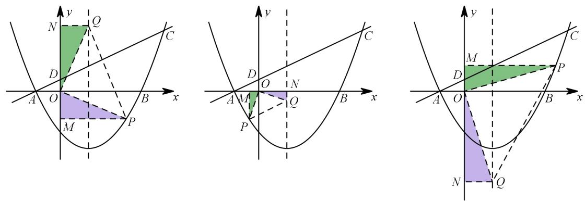

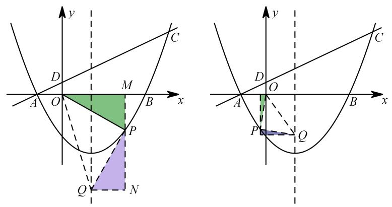

对于构造三垂直来说，直角顶点已知的和直角顶点的未知的完全就是两个题目！也许能画出大概位置，但如何能画出所有情况，才是问题的关键其实只要再明确一点，构造出三垂直后，表示出一组对应边，根据相等关系列方程求解即可

# 辽宁阜新中考

2．如图，抛物线 $y = a x ^ { 2 } + b x + 2$ 交 $x$ 轴于点 $A ( - 3 , 0 )$ 和点 $B ( 1 , 0 )$ ，交 $y$ 轴于点 $C$

（1）求这个抛物线的函数表达式  
（2）点 $D$ 的坐标为 $( - 1 , 0 )$ ，点 $P$ 为第二象限内抛物线上的一个动点，求四边形 $A D C P$ 面积的最大值（3）点 $M$ 为抛物线对称轴上的点，问：在抛物线上是否存在点 $N$ ，使 $\Delta M N O$ 为等腰直角三角形，资料整理【淘宝店铺：向阳百分百】

且MNO为直角？若存在，请直接写出点 $N$ 的坐标；若不存在，请说明理由．

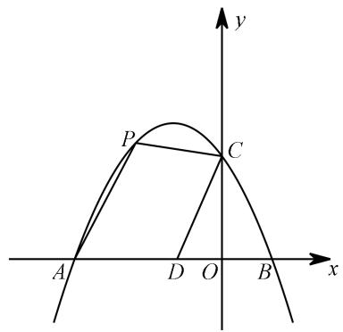

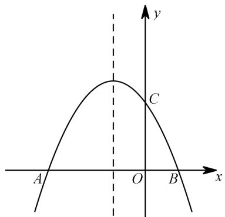  
备用图

【分析】

（1） $y = - { \frac { 2 } { 3 } } x ^ { 2 } - { \frac { 4 } { 3 } } x + 2 ;$ ；  
（2）连接 AC，将四边形面积拆为△APC 和△ADC 面积，考虑△ADC 面积为定值，面积最大即可，铅垂法可解；  
（3）过点 $_ \mathrm { N }$ 作 $\mathrm { N E \bot x }$ 轴交 $\cdot$ 轴于 E 点，  
如图 1，过点 M向 NE 作垂线交 EN 延长线于 F 点，  
易证△OEN≌△NFM，可得： $\mathrm { N E { = } F M }$   
设 N 点坐标为 $\left( m , - \frac { 2 } { 3 } m ^ { 2 } - \frac { 4 } { 3 } m + 2 \right)$ 则 $N E = \left| - \frac { 2 } { 3 } m ^ { 2 } - \frac { 4 } { 3 } m + 2 \right| F M = \left| m + 1 \right|$ ，$\left| - \frac { 2 } { 3 } m ^ { 2 } - \frac { 4 } { 3 } m + 2 \right| = \left| m + 1 \right|$   
$- \frac { 2 } { 3 } m ^ { 2 } - \frac { 4 } { 3 } m + 2 = m + 1$ ，解得： $m _ { 1 } = \frac { - 7 + \sqrt { 7 3 } } { 4 }$ （图 1）， $m _ { 2 } = \frac { - 7 - \sqrt { 7 3 } } { 4 }$ （图 4）对应 $\cdot$ 点坐标分别为 $\left( { \frac { - 7 + { \sqrt { 7 3 } } } { 4 } } , { \frac { - 3 + { \sqrt { 7 3 } } } { 4 } } \right) \setminus \ \left( { \frac { - 7 - { \sqrt { 7 3 } } } { 4 } } , { \frac { - 3 - { \sqrt { 7 3 } } } { 4 } } \right) ;$ ；  
$- \frac { 2 } { 3 } m ^ { 2 } - \frac { 4 } { 3 } m + 2 = - m - 1$ ，解得： $m _ { 3 } = \frac { - 1 + \sqrt { 7 3 } } { 4 }$ （图 2）、 $m _ { 4 } = \frac { - 1 - \sqrt { 7 3 } } { 4 }$ （图 3）对应 $\cdot$ 点坐标分别为 $\left( { \frac { - 1 + { \sqrt { 7 3 } } } { 4 } } , { \frac { - 3 - { \sqrt { 7 3 } } } { 4 } } \right) \quad \left( { \frac { - 1 - { \sqrt { 7 3 } } } { 4 } } , { \frac { - 3 + { \sqrt { 7 3 } } } { 4 } } \right)$

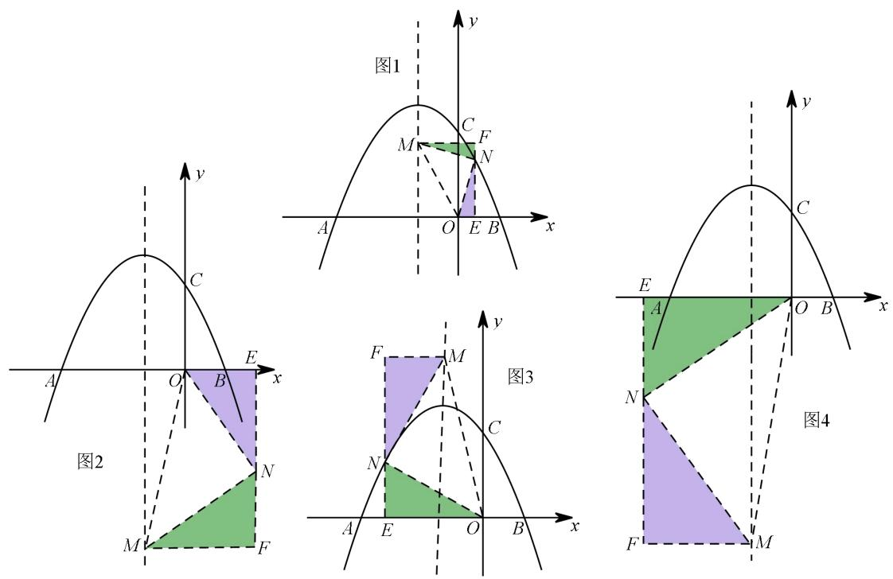

当直角顶点不确定时，问题的一大难点是找出所有情况，而事实上，所有的情况都可以归结为同一个方程： $\cdot$ ．故只需在用点坐标表示线段时加上绝对值，便可计算出可能存在的其他情况

# 2023·湖南娄底·统考中考真题

3．如图，抛物线 $y = x ^ { 2 } + b x + c$ 过点 $A { \big ( } { - } 1 , 0 { \big ) }$ 、点 $B \left( 5 , 0 \right)$ ，交 $y$ 轴于点 $C$ ．

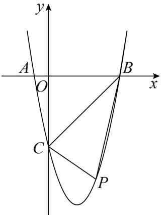

(1)求 $^ { b }$ ， $c$ 的值

(2)点 $P \big ( x _ { 0 } , y _ { 0 } \big ) \big ( 0 < x _ { 0 } < 5 \big )$ 是抛物线上的动点，过点 $P$ 作 $P E \bot x$ 轴，交 $B C$ 于点 $E$ ，再过点 $P$ 作 $P F / / x$ 轴，交抛物线于点 $F$ ，连接 $E F$ ，问：是否存在点 $P$ ，使 $P E F$ 为等腰直角三角形？若存在，请求出点 $P$ 的坐标；若不存在，请说明理由

【答案】 $b = - 4$ ， $c = - 5$

(2)当点 $P$ 的坐标为 $\left( { \frac { 7 - { \sqrt { 3 3 } } } { 2 } } , { \frac { 3 - 3 { \sqrt { 3 3 } } } { 2 } } \right)$ 或 4, 5 时，  $P E F$ 为等 腰直 角三 角形

【分析】（1）将将 $A { \bigl ( } { - } 1 , 0 { \bigr ) }$ 、 $B \left( 5 , 0 \right)$ 代入抛物线 $y = x ^ { 2 } + b x + c$ 即可求解；  
（2）  
由题意可知抛物线的对称轴为 42 1x  对 2      ，则 0 4 Fx   x ，分两种情况：当点 P 在对称轴左侧时，即 $0 < x _ { 0 } < 2$ 时，当点 $P$ 在对称轴右侧时，即 $2 < x _ { 0 } < 5$ 时，分别进行讨论求解即可【详解】（1）解：将 $A { \bigl ( } { - } 1 , 0 { \bigr ) }$ 、 $B \left( 5 , 0 \right)$ 代入抛物线 $y = x ^ { 2 } + b x + c$ 中，可得： $\displaystyle { \binom { 1 - b + c = 0 } { 2 5 + 5 b + c = 0 } }$ 解得： $\begin{array} { c } { { \left\{ b = - 4 \right. } }  \\ { { \left. c = - 5 \right. } } \end{array}$   
即： $b = - 4$ ， $c = - 5$ ；  
（2）存在，当点 $P$ 的坐标为 $\left( { \frac { 7 - { \sqrt { 3 3 } } } { 2 } } , { \frac { 3 - 3 { \sqrt { 3 3 } } } { 2 } } \right)$ 或  4, 5 时，  $P E F$ 为等 腰直 角三 角形  
理由如下：由 $\textcircled{1}$ 可知 $P E = - { x _ { 0 } } ^ { 2 } + 5 x _ { 0 }$ ，  
由题意可知抛物线的对称轴为直线x 对 $x _ { \scriptscriptstyle \vec { \times } \vec { \jmath } } = - \frac { - 4 } { 2 \times 1 } = 2$ ，  
$\cdot _ { P F } / / x$ 轴，  
∴EPF  90， 0 Fx x $\frac { x _ { 0 } + x _ { F } } { 2 } = x _ { \tt X \ / \ / } = 2$ ，则 $x _ { F } = 4 - x _ { 0 }$ ，  
当点 $P$ 在对称轴左侧时，即 $0 < x _ { 0 } < 2$ 时，

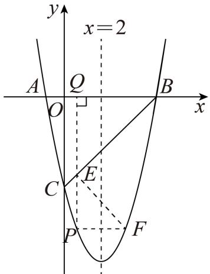

$P F = x _ { _ { F } } - x _ { _ { 0 } } = 4 - 2 x _ { _ { 0 } }$ ，当 $P E = P F$ 时， $P E F$ 为等腰直角三角形，即： $- { x _ { 0 } } ^ { 2 } + 5 x _ { 0 } = 4 - 2 x _ { 0 }$ ，整理得： $x _ { 0 } ^ { \ 2 } - 7 x _ { 0 } + 4 = 0$ ，解得： $x _ { 0 } = \frac { 7 - \sqrt { 3 3 } } { 2 } ( x _ { 0 } = \frac { 7 + \sqrt { 3 3 } } { 2 } > 2$ ， 不符合题意，舍去）此时 $y _ { 0 } = { x _ { 0 } } ^ { 2 } - 4 x _ { 0 } - 5 = { \frac { 3 - 3 { \sqrt { 3 3 } } } { 2 } }$ ，即点 $P \left( { \frac { 7 - { \sqrt { 3 3 } } } { 2 } } , { \frac { 3 - 3 { \sqrt { 3 3 } } } { 2 } } \right) ;$ ；当点 $P$ 在对称轴右侧时，即 $2 < x _ { 0 } < 5$ 时，

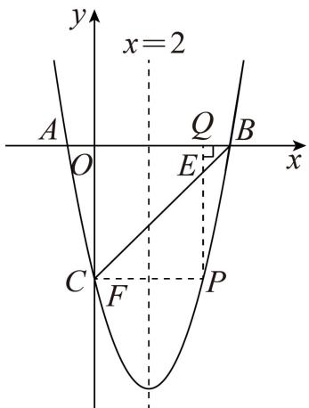

$P F = x _ { 0 } - x _ { F } = 2 x _ { 0 } - 4$ ，当 $P E = P F$ 时， $\textsf { \textsf { a } } P E F$ 为等腰直角三角形，  
即： $- { x _ { 0 } } ^ { 2 } + 5 x _ { 0 } = 2 x _ { 0 } - 4$ ，整理得： ${ x _ { 0 } } ^ { 2 } - 3 x _ { 0 } - 4 = 0$ ，  
解得： $x _ { 0 } = 4$ （ $x _ { 0 } = - 1 < 2$ ，不符合题意，舍去）  
此时： $y _ { 0 } = 4 ^ { 2 } - 4 \times 4 - 5 = - 5$ ，即点 $P ( 4 , - 5 )$ ；  
综上所述，当点 $P$ 的坐标为 $\left( { \frac { 7 - { \sqrt { 3 3 } } } { 2 } } , { \frac { 3 - 3 { \sqrt { 3 3 } } } { 2 } } \right)$ 或4, 5 时， $P E F$ 为等 腰直 角三 角形

# 2023·四川广元·中考真题

4．如图1，在平面直角坐标系中，已知二次函数 $y = a x ^ { 2 } + b x + 4$ 的图象与 $x$ 轴交于点 $A \left( - 2 , 0 \right) , B \left( 4 , 0 \right)$ ，与 $y$ 轴交于点 $C$

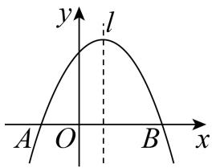  
图1

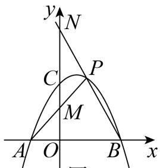  
图2

(1)求抛物线的解析式；

(2)已知 $E$ 为抛物线上一点， $F$ 为抛物线对称轴l上一点，以 $B$ ， $E$ ， $F$ 为顶点的三角形是等腰直角三角形，且 $\angle B F E = 9 0 ^ { \circ }$ ，求出点 $F$ 的坐标；

【答案】( $y = - \frac { 1 } { 2 } x ^ { 2 } + x + 4$ ， $F ( 1 , 1 )$ 或 $F \left( 1 , - 5 \right)$ 或 $F \left( 1 , - 3 \right)$

【分析】（1）待定系数法求解析式即可；

（2）先求得抛物线的对称轴为直线 $x = 1$ ，设 $l$ 与 $x$ 交于点 $G$ ，过点 $E$ 作 $E D \perp l$ 于点 $D$ ，证明$\triangle D F G { \cong } \triangle G B F$ ，设 $F \left( l , m \right)$ ，则 $D E = 1 + m$ ， $D G = D F + F G = G B + F G = 3 + m$ ，进而得出 $E$ 点的坐标，代入抛物线解析式，求得 $m$ 的值，同理可求得当点 $F$ 在 $\cdot$ 轴下方时的坐标；当 $E$ 点与 $\mathrm { A }$ 点重合时，求得另一个解，进而即可求解；

【详解】（1）解：将点 $A \left( - 2 , 0 \right)$ ， $B \left( 4 , 0 \right)$ ，代入 $y = a x ^ { 2 } + b x + 4$   
得 $\begin{array} { l } { { \left\{ 4 a - 2 b + 4 = 0 \right. } } \\ { { \left. 1 6 a + 4 b + 4 = 0 \right. } } \end{array}$ 解得： $\left\{ \begin{array} { l l } { \displaystyle a = - \frac { 1 } { 2 } } \\ { \displaystyle b = 1 } \end{array} \right.$ ∴抛物 线解 析式 为 $y = - \frac { 1 } { 2 } x ^ { 2 } + x + 4$ ；（2）∵点 $A \left( - 2 , 0 \right)$ ， $B \left( 4 , 0 \right)$ ，  
∴抛物线的对称轴为直线 $l$ ： $x = { \frac { - 2 + 4 } { 2 } } = 1$ ，  
如图所示，设 $l$ 与 $x$ 交于点 $G$ ，过点 $E$ 作 $E D \perp l$ 于点 $D$   
∵以 $B$ ， $E$ ， $F$ 为顶点的三角形是等腰直角三角形，且 $\angle B F E = 9 0 ^ { \circ }$ ，$\mathbf { \partial } \cdot \boldsymbol { E } \boldsymbol { F } = B \boldsymbol { F }$ ，  
∵ $\angle D F E = 9 0 ^ { \circ } - \angle B F G = \angle G B F$ ，  
$\triangle D F E { \cong } \triangle G B F$ ，  
∴ $G F = D E , G B = F D$   
设 $F \left( l , m \right)$ ，则 $D E = m$ ， $D G = D F + F G = G B + F G = 3 + m$   
$\therefore E \left( 1 + m , 3 + m \right) ,$ ，  
∵ $E$ 点在抛物线 $y = - \frac { 1 } { 2 } x ^ { 2 } + x + 4$ 上  
$3 + m = - { \frac { 1 } { 2 } } { \big ( } 1 + m { \big ) } ^ { 2 } + { \big ( } 1 + m { \big ) } + 4$   
解得： $m = - 3$ （舍去）或 $m = 1$ ,  
$\therefore F ( 1 , 1 ) ,$ ，  
如图所示，设 $l$ 与 $x$ 交于点 $G$ ，过点 $E$ 作 $E D \perp l$ 于点 $D$

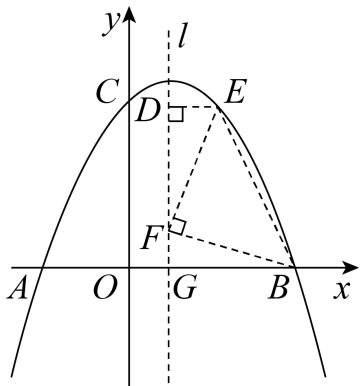

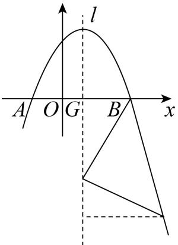

∵以 $B$ ， $E$ ， $F$ 为顶点的三角形是等腰直角三角形，且 $\angle B F E = 9 0 ^ { \circ }$ ，$E F = B F$ ，

∵ $\angle D F E = 9 0 ^ { \circ } - \angle B F G = \angle G B F$ ，  
$\triangle D F E { \cong } \triangle G B F$ ，  
∴ $G F = D E , G B = F D$   
设 $F \left( l , m \right)$ ，则 $D E = m$ ， $D G = D F + F G = G B + F G = 3 - m$   
$E { \big ( } 1 - m , m - 3 { \big ) }$ ，  
∵ $E$ 点在抛物线 $y = - \frac { 1 } { 2 } x ^ { 2 } + x + 4$ 上  
$m - 3 = - { \frac { 1 } { 2 } } { \big ( } 1 - m { \big ) } ^ { 2 } + { \big ( } 1 - m { \big ) } + 4$   
解得： $m = 3$ （舍去）或 $m = - 5$ ，  
$\therefore F \left( 1 , - 5 \right) ,$ ，  
当 $E$ 点与A点重合时，如图所示，

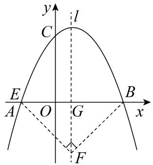

∵ $A B = 6$ ， $\triangle A B F$ 是等腰直角三角形，且 $\angle B F E = 9 0 ^ { \circ }$ ，∴ $G F { = } \frac { 1 } { 2 } A B = 3$ 此时 $F \left( 0 , - 3 \right)$ ，综上所述， $F \big ( 1 , 1 \big )$ 或 $F \left( 1 , - 5 \right)$ 或 $F \left( 1 , - 3 \right)$

# 题型二 等腰三角存在性问题

# 山东泰安中考

5．如图，在平面直角坐标系中，二次函数 $y = a x ^ { 2 } + b x + c$ 交 $x$ 轴于点 $A ( - 4 , 0 )$ 、 $B ( 2 , 0 )$ ，交 $y$ 轴于点$C ( 0 , 6 )$ ，在 $y$ 轴上有一点 $E ( 0 , - 2 )$ ，连接 $A E$

（1）求二次函数的表达式；

（2）若点 $D$ 为抛物线在 $x$ 轴负半轴上方的一个动点，求 $\Delta A D E$ 面积的最大值；

（3）抛物线对称轴上是否存在点 $P$ ，使 $\Delta A E P$ 为等腰三角形？若存在，请直接写出所有 $P$ 点的坐标，若不存在请说明理由．

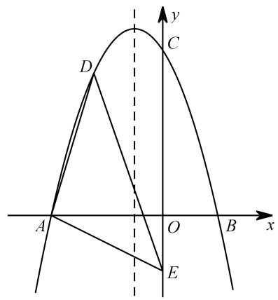

【分析】

$$
y = - { \frac { 3 } { 4 } } x ^ { 2 } - { \frac { 3 } { 2 } } x + 6
$$

（2）可用铅垂法，当点 D 坐标为 $\left( - 2 , 6 \right)$ 时， $\triangle$ ADE 面积最大，最大值为 14；

（3）这个问题只涉及到 A、E 两点及直线 $\cdot$ （对称轴）

$\textcircled{1}$ 当 $\mathrm { A E } { = } \mathrm { A P }$ 时，以 A 为圆心，AE 为半径画圆，与对称轴交点即为所求 P点  
∵ $\cdot _ { \mathrm { A E } = 2 \sqrt { 5 } }$ ，∴ $A P _ { 1 } = 2 { \sqrt { 5 } }$ ，又 $\cdot$ ，∴ $P _ { 1 } H = { \sqrt { 1 1 } }$ ，  
故 $P _ { 1 } \big ( - 1 , \sqrt { 1 1 } \big )$ 、 $P _ { 2 } \left( - 1 , - { \sqrt { 1 1 } } \right)$   
$\textcircled{2}$ 当 $\mathrm { E A = E P }$ 时，以 E 点为圆 $\cdot$ ，EA 为半径画圆，与对称轴交点即为所求 P点  
过点 E 作 EM 垂直对称轴于 $\mathbf { M }$ 点，则 $\mathrm { E M } { = } 1$ ， $P _ { 3 } M = P _ { 4 } M = { \sqrt { \left( 2 { \sqrt { 5 } } \right) ^ { 2 } - 1 ^ { 2 } } } = { \sqrt { 1 9 } }$ ，  
故 $P _ { 3 } \left( - 1 , - 2 + \sqrt { 1 9 } \right) , P _ { 4 } \left( - 1 , - 2 - \sqrt { 1 9 } \right) .$   
$\textcircled{3}$ 当 $\mathrm { P A } { = } \mathrm { P E }$ 时，作 AE 的垂直平分线，与对称轴交点即为所求 P点  
设 $P _ { 5 } \left( - 1 , m \right)$ ， $P _ { 5 } A ^ { 2 } = \left( - 1 + 4 \right) ^ { 2 } + \left( m - 0 \right) ^ { 2 } , P _ { 5 } E ^ { 2 } = \left( - 1 - 0 \right) ^ { 2 } + \left( m + 2 \right) ^ { 2 }$ $m ^ { 2 } + 9 = { \left( m + 2 \right) } ^ { 2 } + 1$ ，解得： $\mathrm { m } { = } 1$ ．  
故 $P _ { 5 } \left( - 1 , 1 \right)$ ．  
综上所述，P 点坐标为 $\left( - 1 , \sqrt { 1 1 } \right) \ , P _ { 2 } \left( - 1 , - \sqrt { 1 1 } \right) \ , P _ { 3 } \left( - 1 , - 2 + \sqrt { 1 9 } \right) \ , P _ { 4 } \left( - 1 , - 2 - \sqrt { 1 9 } \right) \ , P _ { 5 } \left( - 1 , 1 \right) .$

【补充】“代数法”用点坐标表示出线段，列方程求解亦可以解决

6．如图，抛物线 $y = a x ^ { 2 } + b x + 4$ 交 $x$ 轴于 $A ( - 3 , 0 )$ ， $B ( 4 , 0 )$ 两点，与 $y$ 轴交于点 $C$ ，连接 $A C$ ， $B C$ ．点$P$ 是第一象限内抛物线上的一个动点，点 $P$ 的横坐标为 $m$ ．

（1）求此抛物线的表达式；

（2）过点 $P$ 作 $P M \perp x$ 轴，垂足为点 $M$ ， $P M$ 交 $B C$ 于点 $\mathcal { Q }$ ．试探究点 $P$ 在运动过程中，是否存在这样的点 $\mathcal { Q }$ ，使得以 $A$ ， $C$ ， $\mathcal { Q }$ 为顶点的三角形是等腰三角形．若存在，请求出此时点 $\mathcal { Q }$ 的坐标，若不存在，请说明理由；

【分析】

$y = - { \frac { 1 } { 3 } } x ^ { 2 } + { \frac { 1 } { 3 } } x + 4 ;$ （2） $\textcircled{1}$ 当 $\mathrm { C A } { = } \mathrm { C Q }$ 时，∵CA $^ { = 5 }$ ，∴ $\cdot$ ，考虑到 CB 与 y 轴夹角为 $\cdot$ ，故过点 Q 作 y 轴的垂线，垂足记为 H，则 $C H = Q H = { \frac { 5 { \sqrt { 2 } } } { 2 } }$ 故 Q 点坐标为 $\left( { \frac { 5 { \sqrt { 2 } } } { 2 } } , 4 - { \frac { 5 { \sqrt { 2 } } } { 2 } } \right) .$ $\cdot$ 当 $\mathrm { A C } { = } \mathrm { A Q }$ 时，考虑直线 BC 解析式为 $\scriptstyle \mathbf { y } = \mathbf { - x } + 4$ ，可设 Q 点坐标为（m， $- \mathrm { m } { + 4 } \mathrm { \cdot }$ ），$A Q = \sqrt { \left( m + 3 \right) ^ { 2 } + \left( - m + 4 - 0 \right) ^ { 2 } } \ ,$ 即 ${ \sqrt { \left( m + 3 \right) ^ { 2 } + \left( - m + 4 - 0 \right) ^ { 2 } } } = 5$ ，解得： $\mathrm { m } { = } 1$ 或 0（舍），故 Q 点坐标为（1，3）$\cdot$ 当 $\mathrm { Q A } { = } \mathrm { Q C }$ 时，作 AC 的垂直平分线，显然与线段 BC 无交点，故不存在综上所述，Q 点坐标为 $\left( { \frac { 5 { \sqrt { 2 } } } { 2 } } , 4 - { \frac { 5 { \sqrt { 2 } } } { 2 } } \right)$ 或（1，3）．

# 江苏盐城中考（删减）

7．如图所示，二次函数 $y = k ( x - 1 ) ^ { 2 } + 2$ 的图像与一次函数 $y = k x - k + 2$ 的图像交于 $A$ 、 $B$ 两点，点$B$ 在点 $A$ 的右侧，直线 $A B$ 分别与 $x$ 、 $y$ 轴交于 $C$ 、 $D$ 两点，其中 $k < 0$ ．

（1）求 $A$ 、 $B$ 两点的横坐标；（2）若 $\Delta O A B$ 是以 $O A$ 为腰的等腰三角形，求 $k$ 的值．

# 【分析】

（1）A、B 两点横坐标分别为 1、2；（2）求 $\mathrm { k \Omega }$ 的值等价于求 B 点坐标，B 点横坐标始终为 2，故点 B 可以看成是直线 $\cdot$ 上的一个动点，满足△OAB 是以 OA 为腰的等腰三角形，又 A 点坐标为（1，2），故 $O A = { \sqrt { 5 } }$ $\textcircled{1}$ 当 $\cdot$ 时，即 $O B = { \sqrt { 5 } }$ ，

记直线 $\mathbf { x } { = } 2$ 与 $\mathbf { X }$ 轴交点为 H 点，∵ $\cdot$ ，∴ $\mathrm { B H } { = } 1$ ，故 B 点坐标为（2，1）或（2，-1）， $\cdot$ 或-3$\cdot$ 当 $\mathrm { A O } { = } \mathrm { A B }$ 时，易知 B 点坐标为（2，0）， $\cdot$ 综上所述， $\mathrm { k \Omega }$ 的值为-1 或-2 或-3

# 贵港中考（删减）

8．如图，已知二次函数 $y = a x ^ { 2 } + b x + c$ 的图像与 $x$ 轴相交于 $A ( - 1 , 0 )$ ， $B ( 3 , 0 )$ 两点，与 $y$ 轴相交于点$C ( 0 , - 3 )$ ．

（1）求这个二次函数的表达式；

（2）若 $P$ 是第四象限内这个二次函数的图像上任意一点， $P H \perp x$ 轴于点 $H$ ，与线段 $B C$ 交于点 $M$ ，连接 $P C$ ．当 $\Delta P C M$ 是以 $P M$ 为一腰的等腰三角形时，求点 $P$ 的坐标

【分析】

（1） $y = x ^ { 2 } - 2 x - 3$ ；  
（2） $\cdot$ 当 $\cdot$ 时，（特殊角分析）  
考虑 $\_$ ，∴ $. \angle \mathrm { P C M } { = } 4 5 ^ { \circ }$ ，  
即△PCM 是等腰直角三角形，P点坐标为（2，-3）；  
$\textcircled{2}$ 当 ${ \mathrm { M P } } { = } { \mathrm { M C } }$ 时，（表示线段列方程）  
设 P点坐标为 $\left( m , m ^ { 2 } - 2 m - 3 \right)$ ，则 M点坐标为 $\left( m , m - 3 \right)$ ，  
故线段 $P M = \left( m - 3 \right) - \left( m ^ { 2 } - 2 m - 3 \right) = - m ^ { 2 } + 3 m$   
故点 M 作 y轴的垂线，垂足记为 $\cdot$ ，则 $\mathrm { M N = m }$ ，  
考虑△MCN 是等腰直角三角形，故 $M C = \sqrt { 2 } m$ ，$- m ^ { 2 } + 3 m = \sqrt { 2 } m$ ，解得 $m = 3 - \sqrt { 2 }$ 或 0（舍），  
故 $\cdot$ 点坐标为 $\left( 3 - { \sqrt { 2 } } , 2 - 4 { \sqrt { 2 } } \right)$

综上所述，P 点坐标为（2，-3）或 $\left( 3 - { \sqrt { 2 } } , 2 - 4 { \sqrt { 2 } } \right)$

9．如图，在平面直角坐标系中，抛物线 $y = - \frac { 4 } { 9 } x ^ { 2 } + b x + c$ 经过点 $A ( - 5 , 0 )$ 和点 $B ( 1 , 0 )$ ．

（1）求抛物线的解析式及顶点 $D$ 的坐标；

（2）如图，连接 $A D$ 、 $B D$ ，点 $M$ 在线段 $A B$ 上（不与 $A$ 、 $B$ 重合），作 $\angle D M N = \angle D B A$ ，MN 交线段 $A D$ 于点 $N$ ，是否存在这样点 $M$ ，使得 $\Delta D M N$ 为等腰三角形？若存在，求出 $A N$ 的长；若不存在，请说明理由

【分析】

$y = - \frac { 4 } { 9 } x ^ { 2 } - \frac { 1 6 } { 9 } x + \frac { 2 0 } { 9 }$ 顶点 D 坐标为 2, 4 ；

（2）考虑到 $-$ ，即有△BMD∽△ANM（一线三等角）

$\cdot$ 当 $\mathrm { M D } { = } \mathrm { M N }$ 时，有△BMD≌△ANM，可得 $_ { \mathrm { A M = B D = 5 } }$ ，故 $\_$ ；

$\textcircled{2}$ 当 $\cdot$ 时，则 $\angle N \mathrm { D M = \angle N M D = \angle D A B }$ ，  
△MAD∽△DAB，可得 $\mathrm { A M } { = } \frac { 2 5 } { 6 } , B M { = } \frac { 1 1 } { 6 }$ ${ \frac { A N } { B M } } { = } { \frac { A M } { B D } }$ 即 $\frac { A N } { \frac { 1 1 } { 6 } } = \frac { \frac { 2 5 } { 6 } } { 5 } ,$   
解得： $A N = \frac { 5 5 } { 3 6 }$

$\textcircled{3}$ 当 $\cdot$ 时， $\angle D _ { Ḋ } \mathrm  N M Ḍ Ḍ = \angle D _ { Ḋ } \mathrm { M N Ḍ Ḍ = \angle D A B _ { Ḋ } }$ ，显然不成立，故不存在这样的点 M综上，AN 的值为 1或 $\frac { 5 5 } { 3 6 }$

# 辽宁葫芦岛中考（删减）

10．如图，直线 $y = - x + 4$ 与 $x$ 轴交于点 $B$ ，与 $y$ 轴交于点 $C$ ，抛物线 $y = - x ^ { 2 } + b x + c$ 经过 $B$ ， $C$ 两点，与 $x$ 轴另一交点为 $A$ ．点 $P$ 以每秒 $\sqrt { 2 }$ 个单位长度的速度在线段 $B C$ 上由点 $B$ 向点 $C$ 运动（点$P$ 不与点 $B$ 和点 $C$ 重合），设运动时间为 $t$ 秒，过点 $P$ 作 $x$ 轴垂线交 $x$ 轴于点 $E$ ，交抛物线于点$M$ ．

（1）求抛物线的解析式；

（2）如图，连接 $A M$ 交 $B C$ 于点 $D$ ，当PDM 是等腰三角形时，直接写出 $t$ 的值

【分析】

（1） $y = - x ^ { 2 } + 3 x + 4$ ；  
（2） $\textcircled{1}$ 考虑到 $\_$ ，当 $\mathrm { D P = D M }$ 时，即 $\angle D \mathrm { M P = } 4 5 ^ { \circ }$ ，直线 AM： $\scriptstyle \mathbf { y } = \mathbf { x } + 1$ ，  
联立方程： $- x ^ { 2 } + 3 x + 4 = x + 1$ ，  
解得： $x _ { 1 } = 3 x _ { 2 } = - 1$ （舍）  
此时 $\mathrm { t } = 1$ ．  
$\cdot$ 当 $\mathrm { P D } { = } \mathrm { P M }$ 时， $\angle \mathrm { P M D } { = } \angle \mathrm { P D M } { = } 6 7 . 5 ^ { \circ }$ ，∠MAB=22.5°，  
考虑 t $\sqrt { 2 } - 1$ ，  
直线 AM： $y = \left( { \sqrt { 2 } } - 1 \right) x + { \sqrt { 2 } } - 1$ ，  
联立方程： $- x ^ { 2 } + 3 x + 4 = { \sqrt { 2 } } - 1 ) x + { \sqrt { 2 } } - 1$   
解得： $x _ { 1 } = 5 - { \sqrt { 2 } }$ ， $x _ { 2 } = - 1$ （舍）  
此时 $\mathrm { t } = \sqrt { 2 } - 1$

综上所述，t 的值为 1或 $\sqrt { 2 } - 1$ 附：tan $\sqrt { 2 } - 1$

$$
1 2 2 . 5 ^ { \circ } = { \frac { 1 } { \sqrt { 2 } + 1 } } = { \sqrt { 2 } } - 1
$$

# 题型三 直角三角形存在性问题

# 兰州中考（删减）

11．通过对下面数学模型的研究学习，解决问题

【模型呈现】

如图，在 $R t \triangle A B C$ ， $\angle A C B { = } 9 0 ^ { \circ }$ ，将斜边 $A B$ 绕点 $A$ 顺时针旋转 $9 0 ^ { \circ }$ 得到 $A D$ ，过点 $D$ 作 $D E \bot A C$ 于  
点 $E$ ，可以推理得到 $\triangle A B C { \cong } \triangle D A E$ ，进而得到 $A C { = } D E$ ， $B C { = } A E$   
我们把这个数学模型成为“ $^ { \mathfrak { k } }$ 型”

推理过程如下：

【模型迁移】

二次函数 $y = a x ^ { 2 } + b x + 2$ 的图像交 $x$ 轴于点 $A$ （-1,0）， $B$ （4,0）两点，交 $y$ 轴于点 $C$ ．动点 $M$ 从点 $A$ 出发，以每秒 2 个单位长度的速度沿 $A B$ 方向运动，过点 $M$ 作 $M N \perp x$ 轴交直线 $B C$ 于点 $N$ ，交抛物线于点 $D$ ，连接 $A C$ ，设运动的时间为 $t$ 秒

（1）求二次函数 $y = a x ^ { 2 } + b x + 2$ 的表达式；

（2）在直线 $M N$ 上存在一点 $P$ ，当 $\Delta P B C$ 是以 $\angle B P C$ 为直角的等腰直角三角形时，求此时点 $D$ 的坐标．

【分析】

（1） $y = - { \frac { 1 } { 2 } } x ^ { 2 } + { \frac { 3 } { 2 } } x + 2$ ；  
（2）本题直角顶点 P并不确定，以 BC 为斜边作等腰直角三角形，直角顶点即为 P点，再过点 P作水平线，得三垂直全等  
设 $\cdot$ ， $\mathrm { P Q = b }$ ，则 $\cdot$ ， $\cdot$ ，  
由图可知： $\begin{array} { c } { { \left\{ a + b = 4 \right. } } \\ { { \left. b - a = 2 \right. } } \end{array}$ ， 解得： $\left\{ \begin{array} { l l } { { a = 1 } } \\ { { b = 3 } } \end{array} \right. .$ ．  
故 D 点坐标为（1,3）

同理可求此时 D 点坐标为（3,2）

思路 2：等腰直角的一半还是等腰直角．  
如图，取 BC 中点 M 点，以 BM 为一直角边作等腰直角三角形，则第三个顶点即为 P点．根据 B 点  
和 M 点坐标，此处全等的两三角形两直角边分别为 1和 2，故 P 点坐标易求  
P点横坐标同 D 点，故可求得 D 点坐标

12．如图，在平面直角坐标系中，抛物线 $y = \frac { 1 } { 2 } x ^ { 2 } + b x + c$ 与 $x$ 轴交于 $A$ 、 $B$ 两点，点 $B$ （3,0），经过点 $A$ 的直线 $A C$ 与抛物线的另一交点为 $C ( 4 , \frac { 5 } { 2 } )$ ，与 $y$ 轴交点为 $D$ ，点 $P$ 是直线 $A C$ 下方的抛物线上的一个动点（不与点 $A$ 、 $C$ 重合）

（1）求该抛物线的解析式

（2）点 $Q$ 在抛物线的对称轴上运动，当 $\Delta O P Q$ 是以 $O P$ 为直角边的等腰直角三角形时，请直接写出符合条件的点 $P$ 的坐标

【分析】

（1） $y = { \frac { 1 } { 2 } } x ^ { 2 } - x - { \frac { 3 } { 2 } } ;$   
（2） $\cdot$ 当 $\cdot$ 为直角时，  
考虑 Q 点在对称轴上，故过点 Q 向 y 轴作垂线，垂线段长为 1，可知过点 P 向 x 轴作垂线，长度必  
为 1，故 P的纵坐标为 $\pm 1$ ．如下图，不难求出 P点坐标  
设 P点坐标为 $\left( m , \frac { 1 } { 2 } m ^ { 2 } - m - \frac { 3 } { 2 } \right)$   
可得： $\left| { \frac { 1 } { 2 } } m ^ { 2 } - m - { \frac { 3 } { 2 } } \right| = 1$   
解得： $m _ { 1 } = 1 + \sqrt { 2 } ~ , ~ m _ { 2 } = 1 - \sqrt { 2 } ~ , ~ m _ { 3 } = 1 + \sqrt { 6 } ~ , ~ m _ { 4 } = 1 - \sqrt { 6 } ~ ( \frac { \triangle } { \triangle } { \ E } ) .$   
如下图，对应 $\mathrm { P }$ 点坐标分别为 $\begin{array} { r l } { \left( 1 + { \sqrt { 2 } } , - 1 \right) \ } & { { } \left( 1 - { \sqrt { 2 } } , - 1 \right) \ \quad \left( 1 + { \sqrt { 6 } } , 1 \right) } \end{array}$

$\cdot$ 当 $\cdot$ OPQ 为直角时，如图构造△OMP≌△PNQ，可得： $\mathrm { P M } { = } \mathrm { Q N }$

设 P点坐标为 $\left( m , \frac { 1 } { 2 } m ^ { 2 } - m - \frac { 3 } { 2 } \right)$ ,   
则 $P M = \left| 0 - \left( { \frac { 1 } { 2 } } m ^ { 2 } - m - { \frac { 3 } { 2 } } \right) \right| = \left| - { \frac { 1 } { 2 } } m ^ { 2 } + m + { \frac { 3 } { 2 } } \right| \qquad \left| m - 1 \right|$ ，   
$\left| - { \frac { 1 } { 2 } } m ^ { 2 } + m + { \frac { 3 } { 2 } } \right| = \left| m - 1 \right|$ ，   
若 $- { \frac { 1 } { 2 } } m ^ { 2 } + m + { \frac { 3 } { 2 } } = m - 1$ ，解得： $m _ { 1 } = \sqrt { 5 }$ ， $m _ { 2 } = - { \sqrt { 5 } }$ （舍 ）．   
若 $- { \frac { 1 } { 2 } } m ^ { 2 } + m + { \frac { 3 } { 2 } } = - m + 1$ ，解得： $m _ { 1 } = 2 - \sqrt { 5 }$ ， $m _ { 2 } = 2 + \sqrt { 5 }$ （舍）．   
如下图，对应 $\cdot$ 点坐标分别为 $\left( { \sqrt { 5 } } , 1 - { \sqrt { 5 } } \right) , \left( 2 - { \sqrt { 5 } } , 1 - { \sqrt { 5 } } \right) .$

对于构造三垂直来说，直角顶点已知的和直角顶点的未知的完全就是两个题目！也许能画出大概位置，但如何能画出所有情况，才是问题的关键其实只要再明确一点，构造出三垂直后，表示出一组对应边，根据相等关系列方程求解即可

# 【对称轴上寻找点】

# 贵州安顺中考真题

13．如图，已知抛物线 $y = a x ^ { 2 } + b x + c ( a \neq 0 )$ 的对称轴为直线 $x = - 1$ ，且抛物线与 $x$ 轴交于 $A$ 、 $B$ 两点，与 $y$ 轴交于 $C$ 点，其中 $A ( 1 , 0 )$ ， $C ( 0 , 3 )$

（1）若直线 $y = m x + n$ 经过 $B$ 、 $C$ 两点，求直线 $B C$ 和抛物线的解析式；

（2）在抛物线的对称轴 $x = - 1$ 上找一点 $M$ ，使点 $M$ 到点 $A$ 的距离与到点 $C$ 的距离之和最小，求出点 $M$ 的坐标；

（3）设点 $P$ 为抛物线的对称轴 $x = - 1$ 上的一个动点，求使 $\Delta B P C$ 为直角三角形的点 $P$ 坐标

【分析】

（1）直线 BC： $y = x + 3$ 抛物线： $y = - x ^ { 2 } - 2 x + 3$ ；

（2）将军饮马问题，考虑到 M 点在对称轴上，且点 A 关于对称轴的对称点为点 B，故  
$\mathrm { M A ^ { + } M C = M B + M C }$ ，∴当 B、M、C 三点共线时，M 到 A 和 C 的距离之后最小，此时 M点坐标为（-1，  
2）；（3）两圆一线作点 P：

以 $P _ { 1 }$ 为例，构造△PNB∽△BMC，考虑到 $\_$ ，∴ $\_$ ，故 $P _ { 1 }$ 点坐标为（-1，-2）

易求 $P _ { 2 }$ 坐标为（1,4）

$P _ { 3 }$ 、 $P _ { 4 }$ 求法类似，下求 $P _ { 3 }$ ：  
已知 $\mathrm { P N } { = } 1$ ， $\cdot$ ，设 $\cdot$ ， $\cdot$ ，  
由相似得： ${ \frac { 1 } { b } } = { \frac { a } { 2 } }$ 即 $\mathrm { a b } { = } 2$ ，由图可知： $\cdot$ ，  
故可解： $b _ { 1 } = { \frac { 3 + { \sqrt { 1 7 } } } { 2 } }$ $b _ { 2 } = { \frac { 3 - { \sqrt { 1 7 } } } { 2 } }$ （舍），对应 $P _ { 3 }$ 坐标 为 $\left( - 1 , { \frac { 3 + { \sqrt { 1 7 } } } { 2 } } \right)$

类似可求 $P _ { 4 }$ 坐标为 $\left( - 1 , { \frac { 3 - { \sqrt { 1 7 } } } { 2 } } \right)$

# 【抛物线上寻找点】

# 怀化中考真题

14．如图，在平面直角坐标系中，抛物线 $y = a x ^ { 2 } + 2 x + c$ 与 $x$ 轴交于 $A ( - 1 , 0 )$ ， $B ( 3 , 0 )$ 两点，与 $y$ 轴交于点 $C$ ，点 $D$ 是该抛物线的顶点．

（1）求抛物线的解析式和直线 $A C$ 的解析式；

（2）请在 $y$ 轴上找一点 $M$ ，使 $\Delta B D M$ 的周长最小，求出点 $M$ 的坐标；

（3）试探究：在拋物线上是否存在点 $P$ ，使以点 $A$ ， $P$ ， $C$ 为顶点， $A C$ 为直角边的三角形是直角三角形？若存在，请求出符合条件的点 $P$ 的坐标；若不存在，请说明理由

【分析】

（1）抛物线： $y = - x ^ { 2 } + 2 x + 3$ ，直线 AC： $\scriptstyle \mathbf { y } = 3 \mathbf { x } + 3$ ；（2）看图，M 点坐标为（0,3）与 C 点重合了

（3）考虑到 AC 为直角边，故分别过 A、C 作 AC 的垂线，与抛物线交点即为所求 P点，有如下两种情况，

先求过 A 点所作垂线得到的点 P：  
设 P点坐标为 $\left( m , - m ^ { 2 } + 2 m + 3 \right)$ ，  
则 $\cdot$ ， $\mathrm { A M } = 0 - \left( - m ^ { 2 } + 2 m + 3 \right) = m ^ { 2 } - 2 m - 3 ~ ,$ ，易证△PMA∽△ANC，且 $\cdot$ ， $\mathrm { C N } { = } 1$ ，  
${ \frac { m + 1 } { 3 } } = { \frac { m ^ { 2 } - 2 m - 3 } { 1 } }$ 解得： 1m  $m _ { 1 } = \frac { 1 0 } { 3 } m _ { 2 } = - 1$ （舍），故第 1 个 P 点坐标为 $\left( { \frac { 1 0 } { 3 } } , - { \frac { 1 3 } { 9 } } \right)$ ；  
再求过点 C 所作垂线得到的点 P：

$P M = 3 - \left( - m ^ { 2 } + 2 m + 3 \right) = m ^ { 2 } - 2 m , \mathrm { C N = m } ,$ ，${ \frac { m } { m ^ { 2 } - 2 m } } = { \frac { 3 } { 1 } }$ 解得： $m _ { 1 } = \frac { 7 } { 3 } , m _ { 2 } = 0$ （舍），故第 2 个 P 点坐标为 $\left( \frac { 7 } { 3 } , \frac { 2 0 } { 9 } \right)$ 综上所述，P 点坐标为 $\left( { \frac { 1 0 } { 3 } } , - { \frac { 1 3 } { 9 } } \right) \quad \left( { \frac { 7 } { 3 } } , { \frac { 2 0 } { 9 } } \right)$

# $2 0 2 3 \cdot$ 四川内江·中考真题

15．如图，在平面直角坐标系中，抛物线 $y = a x ^ { 2 } + b x + c$ 与 $x$ 轴交于 $B \left( 4 , 0 \right)$ ， $C \left( - 2 , 0 \right)$ 两点．与 $y$ 轴交于点 $A ( 0 , - 2 )$ ．

(1)求该抛物线的函数表达式；  
(2)在抛物线的对称轴上是否存在一点 $M$ ，使得 $\triangle M A B$ 是以 $A B$ 为一条直角边的直角三角形：若存在，请求出点 $M$ 的坐标，若不存在，请说明理由

【分析】（1）将A、 $B \mathrm { ~  ~ { ~ \cal ~ C ~ } ~ }$ 代入抛物线解析式求解即可；

（2）过A作 $A M _ { 2 } \perp A B$ 交抛物线的对称轴于 $M _ { 2 }$ ，过 $B$ 作 $B M _ { 1 } \perp A B$ 交抛物线的对称轴于 $M _ { 1 }$ ，连接$A M _ { 1 }$ ，设 $M _ { \mathrm { 1 } } \left( 1 , n \right)$ ， 可求 $A M _ { 1 } ^ { 2 } = n ^ { 2 } + 4 n + 5$ ， $B M _ { 1 } ^ { ~ 2 } = n ^ { 2 } + 9$ ，由 $A B ^ { 2 } + B M _ { 1 } ^ { 2 } = A M _ { 1 } ^ { 2 }$ ，可求 $M _ { 1 }$ ， 进而求出直线 $B M _ { 1 }$ 的解析式，即可求解

【详解】（1）解：由题意得

$\left( a = \frac { 1 } { 4 } \right)$ $\displaystyle \left\{ { 1 6 a + 4 b + c = 0 } \atop { 4 a - 2 b + c = 0 } \right.$ ，解得： $\left| b = - { \frac { 1 } { 2 } } \right.$  抛物 线的 解析 式为 $y = { \frac { 1 } { 4 } } x ^ { 2 } - { \frac { 1 } { 2 } } x - 2$ 2c  

（2）解：存在，

如图，过A作 $A M _ { 2 } \perp A B$ 交抛物线的对称轴于 $M _ { 2 }$ ，过 $B$ 作 $B M _ { 1 } \perp A B$ 交抛物线的对称轴于 $M _ { 1 }$ ，连接资料整理【淘宝店铺：向阳百分百】

$A M _ { 1 }$ ，

∵抛物线 $y = { \frac { 1 } { 4 } } x ^ { 2 } - { \frac { 1 } { 2 } } x - 2$ 的对称轴为直线 $x = 1$ ，  
设 $M _ { \mathrm { 1 } } \left( 1 , n \right)$ ，  
$\begin{array} { r l } & { \cdot \ \cdot A M _ { 1 } ^ { 2 } = 1 ^ { 2 } + \left( n + 2 \right) ^ { 2 } } \\ & { = n ^ { 2 } + 4 n + 5 \ , } \\ & { \cdot \ a ^ { 2 } = 2 ^ { 2 } + 4 ^ { 2 } = 2 0 \ , } \\ & { B M _ { 1 } ^ { 2 } = \left( 4 - 1 \right) ^ { 2 } + n ^ { 2 } } \\ & { = n ^ { 2 } + 9 \ , } \\ & { \cdot \ \cdot A B ^ { 2 } + B M _ { 1 } ^ { 2 } = A M _ { 1 } ^ { 2 } } \\ & { \cdot \ \cdot n ^ { 2 } + 9 + 2 0 = n ^ { 2 } + 4 n } \end{array}$ ，  
，  
解得： $n = 6$ ，  
$\therefore M _ { 1 } ( 1 , 6 )$ ；  
设直线 $B M _ { 1 }$ 的解析式为 $y = k _ { 1 } x + b _ { 1 }$ ，则有  
$\begin{array} { l } { \displaystyle { \int k _ { 1 } + b _ { 1 } = 6 } } \\ { \displaystyle { \left. 4 k _ { 1 } + b _ { 1 } = 0 \right. } } \end{array}$ 解得 $\left\{ \begin{array} { l l } { k _ { 1 } = - 2 } \\ { b _ { 1 } = 8 } \end{array} \right.$ , 直线 $B M _ { 1 }$ 解析 式为 $y = - 2 x + 8$ ，$\cdot A M _ { \scriptscriptstyle 2 } / / B M _ { \scriptscriptstyle 1 }$ ，且经过 $A ( 0 , - 2 )$ ，  
直线 $A M _ { 2 }$ 解析式为 $y = - 2 x - 2$ ，  
当 $x = 1$ 时， $y = - 2 \times 1 - 2 = - 4$ ，  
 $M _ { 2 } \left( 1 , - 4 \right)$ ；综上所述：存在， $M$ 的坐标为1,6 或 $( 1 , - 4 )$

# 2023·海口华侨中学考模

16．如图 1，抛物线 $y = a x ^ { 2 } + b x + 3$ 交 $x$ 轴于点 $A { \big ( } { - } 1 , 0 { \big ) }$ 和点 $B \left( 3 , 0 \right)$ ，交于 $y$ 轴点 $C$ ， $F$ 为抛抛物线

顶点，点 $\mathcal { Q } ( 2 , 3 )$ 在抛物线上 (1)求该抛物线所对应的函数解析式

  
图1

  
图2

(2)如图 2，直线 $E F$ 垂直于 $x$ 轴于点 $E$ ，点 $P$ 是线段 $B E$ 上的动点（除 $B$ 、 $E$ 外）过点 $P$ 作 $x$ 轴的垂线交抛物线于点 $D$ ，连接 $D A , D Q$ ，当 $\triangle A Q D$ 是直角三角形时，求出所有满足条件的 $D$ 点的横坐标

【答案】 $y = - x ^ { 2 } + 2 x + 3$ $( 2 ) \mathcal { Q }$ 点坐标为 $\frac { 3 + { \sqrt { 5 } } } { 2 }$

【分析】分 $\angle A D Q = 9 0 ^ { \circ }$ 或 $\angle A Q D = 9 0 ^ { \circ }$ 两种情况结合一次函数图象的性质分析求解；

【详解】（1）∵抛物线 $y = a x ^ { 2 } + b x + 3$ 经过点 $A { \big ( } { - } 1 , 0 { \big ) }$ ， $B \left( 3 , 0 \right)$ ，$\left\{ { \begin{array} { l } { a - b + 3 = 0 } \\ { 9 a + 3 b + 3 = 0 } \end{array} } \right.$ 解得 $\left\{ { \begin{array} { l } { a = - 1 } \\ { b = 2 } \end{array} } \right.$   
∴该抛物线的函数表达式为： $y = - x ^ { 2 } + 2 x + 3$ ；（2）∵点 $P$ 在线段 $E B$ 上，  
∴ $\angle D A Q$ 不可能为直角，  
∴当 $\triangle A Q D$ 为直角三角形时，有 $\angle A D Q = 9 0 ^ { \circ }$ 或 $\angle A Q D = 9 0 ^ { \circ }$ ，  
ⅰ．当 $\angle A Q D = 9 0 ^ { \circ }$ 时，则 $D Q \bot A Q$ ，$\therefore A ( - 1 , 0 )$ ， $\mathcal { Q } ( 2 , 3 )$ ，  
∴直线 $A \mathcal { Q }$ 解析式为 $y = x + 1$ ，  
∴设直线 $\cdot$ 解析式为 $y = - x + b ^ { \prime }$ ，  
把 $\mathcal { Q } ( 2 , 3 )$ 代入可求得 $b ^ { \prime } = 5$ ，  
∴直线 $\cdot$ 解析式为 $y = - x + 5$ ，  
联立直线 $\cdot$ 和抛物线解析式可得 ${ \left\{ \begin{array} { l l } { y = - x + 5 } \\ { y = - x ^ { 2 } + 2 x + 3 } \end{array} \right. } ,$   
解得 $\left\{ \begin{array} { l l } { x = 1 } \\ { y = 4 } \end{array} \right. \quad \left\{ x = 2 \atop y = 3 \right.$ $D ( 1 , 4 )$ （舍）或 $D \big ( 2 , 3 \big )$ （舍）  
∴此种情况不存在  
ⅱ．当 $\angle A D Q = 9 0 ^ { \circ }$ 时，设 $D \left( t , - t ^ { 2 } + 2 t + 3 \right)$ ，  
设直线 $A D$ 的解析式为 $y = k _ { 1 } x + b _ { 1 }$ ，

把 $A$ 、 $D$ 坐标代入可得 $\left\{ \begin{array} { c } { { - k _ { 1 } + b _ { 1 } = 0 } } \\ { { t k _ { 1 } + b _ { 1 } = - t ^ { 2 } + 2 t + 3 } } \end{array} \right.$ 解得 $k _ { 1 } = - { \bigl ( } t - 3 { \bigr ) }$ ，设直线 $D Q$ 解析式为 $y = k _ { 2 } x + b _ { 2 }$ ，同理可求得 $k _ { 2 } = - t$ ，$A D \bot D Q \qquad k _ { 1 } k _ { 2 } = - 1$ ，即 $t \left( t - 3 \right) = - 1$ ，解得 $t = { \frac { 3 \pm { \sqrt { 5 } } } { 2 } }$ 当 $t = { \frac { 3 - { \sqrt { 5 } } } { 2 } }$ 时， $t = \frac { 3 - \sqrt { 5 } } { 2 } < 1$ ， $t = { \frac { 3 - { \sqrt { 5 } } } { 2 } }$ （舍）当 $t = { \frac { 3 + { \sqrt { 5 } } } { 2 } }$ 时， $\therefore 1 < t = \frac { 3 + \sqrt { 5 } } { 2 } < 3$ ， $D$ 点横坐标为 $t = { \frac { 3 + { \sqrt { 5 } } } { 2 } }$ 综上可知： $\cdot$ 点横坐标 $\frac { 3 + { \sqrt { 5 } } } { 2 }$

# 题型四 平行四边形存在性问题

# 【例 4.1】对边相等

17．如图，在平面直角坐标系 $x O y$ 中，已知抛物线 $y = a x ^ { 2 } - 2 x + c$ 与直线 $y = k x + b$ 都经过 $A ( 0 , - 3 )$ 、$B ( 3 , 0 )$ 两点，该抛物线的顶点为 $C$

（1）求此抛物线和直线 $A B$ 的解析式；

（2）设直线 $A B$ 与该抛物线的对称轴交于点 $E$ ，在射线 $E B$ 上是否存在一点 $M$ ，过 $M$ 作 $x$ 轴的垂线交抛物线于点 $N$ ，使点 M、 $N$ 、 $C$ 、 $E$ 是平行四边形的四个顶点？若存在，求点 $M$ 的坐标；若不存在，请说明理由；

# 【分析】

（1）抛物线： $y = x ^ { 2 } - 2 x - 3$ ，直线 AB： $y = x - 3$ ；  
（2）考虑 EC∥MN，故若使点 M、N、C、E 是平行四边形，则 $\mathrm { E C = M N }$ 即可，∵E（1，-2）、C（1，-4），∴EC $: = 2$ ，  
设 M 点坐标为（m， $\cdot$ ）（ $\cdot$ ），则 $\cdot$ 点坐标为 $\left( m , m ^ { 2 } - 2 m - 3 \right)$ ，  
则 $M N = \left| \left( m ^ { 2 } - 2 m - 3 \right) - \left( m - 3 \right) \right| = \left| m ^ { 2 } - 3 m \right|$   
由题意得： $\left| m ^ { 2 } - 3 m \right| = 2$ ，$m ^ { 2 } - 3 m = 2$ ，解得： $m _ { 1 } = \frac { 3 + \sqrt { 1 7 } } { 2 }$ , $m _ { 2 } = \frac { 3 - \sqrt { 1 7 } } { 2 }$ （舍），对应 $\mathrm { P }$ 点坐标为 $\left( { \frac { 3 + { \sqrt { 1 7 } } } { 2 } } , { \frac { - 3 + { \sqrt { 1 7 } } } { 2 } } \right)$ ；  
$m ^ { 2 } - 3 m = - 2$ ，解得： $m _ { 3 } = 2 , m _ { 4 } = 1$ （舍）  
对应 $\cdot$ 点坐标为（2，-1）

综上，P 点坐标为 $\left( { \frac { 3 + { \sqrt { 1 7 } } } { 2 } } , { \frac { - 3 + { \sqrt { 1 7 } } } { 2 } } \right)$ 或（2，-1）．

# 【例 4.2】两定两动： $x$ 轴 $^ +$ 抛物线

18．如图，已知抛物线 $y = a x ^ { 2 } + b x + c ( a \neq 0 )$ 经过点 $A ( 3 , 0 )$ ， $B ( - 1 , 0 )$ ， $C ( 0 , - 3 )$ ．

（1）求该抛物线的解析式；

（2）若点 $\mathcal { Q }$ 在 $x$ 轴上，点 $P$ 在抛物线上，是否存在以点 $B$ ， $C$ ， $\mathcal { Q }$ ， $P$ 为顶点的四边形是平行四边形？若存在，求点 $P$ 的坐标；若不存在，请说明理由

【分析】

（1）抛物线： $y = x ^ { 2 } - 2 x - 3$ ；

（2）列方程组求：设 $\left( m , m ^ { 2 } - 2 m - 3 \right) \qquad \left( n , 0 \right)$ ，又 B（-1，0）、C（0，-3），若 BC 为对角线，由题意得： $\left\{ \begin{array} { l l } { - 1 + 0 = m + n } \\ { 0 - 3 = m ^ { 2 } - 2 m - 3 + 0 } \end{array} \right.$ 解得： $\left\{ \begin{array} { l } { m = 2 } \\ { n = - 3 } \end{array} \right. \overset { \vartriangle } { \vec { x } } \left\{ \begin{array} { l } { m = 0 } \\ { n = - 1 } \end{array} \right.$ （舍），故对应的 P（2，-3）；若 BP 为对角线，由题意得： $\displaystyle { \int } { m - 1 = n + 0 }$ 解得： $\begin{array} { c c } { { \left\{ m = 2 \atop { } \right.}  }  & { { \left\{ m = 0 \atop { } \right. } } \\ { { \left. n = 1 \right. } } & { { \left. n = - 1 \right. } } \end{array}$ （舍），

故对应的 P（2，-3）；  
若 BQ 为对角线，由题意得： $\left\{ \begin{array} { l l } { n - 1 = m + 0 } \\ { 0 + 0 = m ^ { 2 } - 2 m - 3 - 3 } \end{array} \right.$ 解得： $\left\{ \begin{array} { l l } { m = 1 + { \sqrt { 7 } } } \\ { n = 2 + { \sqrt { 7 } } } \end{array} \right. \overset { \ast } { \times } \left\{ \begin{array} { l l } { m = 1 - { \sqrt { 7 } } } \\ { n = 2 - { \sqrt { 7 } } } \end{array} \right. ,$ 故对应的 $\mathrm { P } \left( 1 + { \sqrt { 7 } } , 3 \right)$ 、 $\left( 1 - { \sqrt { 7 } } , 3 \right)$

综上所述，P 点坐标为（2，-3）、1 7,3、 $\left( 1 - { \sqrt { 7 } } , 3 \right)$

# 【例 4.3】两定两动：对称轴 $^ +$ 抛物线

19．如图，在平面直角坐标系中，已知抛物线 $y = a x ^ { 2 } + b x + 2 ( a \neq 0 )$ 与 $x$ 轴交于 $A ( - 1 , 0 )$ ， $B ( 3 , 0 )$ 两点，与 $y$ 轴交于点 $C$ ，连接 $B C$

（1）求该抛物线的解析式，并写出它的对称轴；

（2）若点 $N$ 为抛物线对称轴上一点，抛物线上是否存在点 $M$ ，使得以 $B$ ， $C$ ， $M$ ， $N$ 为顶点的四边形是平行四边形？若存在，请直接写出所有满足条件的点 $M$ 的坐标；若不存在，请说明理由．

【分析】

（1）抛物线： $y = - \frac { 2 } { 3 } x ^ { 2 } + \frac { 4 } { 3 } x + 2$ ，对称轴：直线 $\mathbf { x } { = } 1$ ；

（2）设 $\mathbf { M }$ 点坐标为 $\left( m , - \frac { 2 } { 3 } m ^ { 2 } + \frac { 4 } { 3 } m + 2 \right)$ $\cdot$ 点坐标为 $\left( 1 , n \right)$ ，  
又 B（3，0）、C（0，2）  
若 BC 为对角线，由题意得： $\left\{ \begin{array} { l l } { { 3 + 0 = m + 1 } } \\ { { } } \\ { { 0 + 2 = - { \displaystyle \frac { 2 } { 3 } } m ^ { 2 } + { \displaystyle \frac { 4 } { 3 } } m + 2 + n } } \end{array} \right.$ 解得： $\left\{ { \begin{array} { l } { m = 2 } \\ { n = 0 } \end{array} } \right. ,$ 故 M 点坐标为（2，2）；  
若 BN 为对角线，由题意得： $\left\{ \begin{array} { l l } { \displaystyle 3 + 1 = m + 0 } & { \displaystyle  m = 4 } \\ { \displaystyle 0 + n = - \frac { 2 } { 3 } m ^ { 2 } + \frac { 4 } { 3 } m + 2 + 2 } & { \displaystyle \hbar \# \neq / \stackrel { \circledast } { \ P } : } \\ { \displaystyle n = - \frac { 4 } { 3 } } & { 3 } \end{array} \right. \left\{ m = - \frac { 4 } { 3 } , \begin{array} { l l } { \displaystyle 3 + 1 = m + 2 } \\ { \displaystyle n = - \frac { 4 } { 3 } } \end{array} \right.$ 故 M 点坐标为 $\left( 4 , - { \frac { 1 0 } { 3 } } \right)$ ；  
若 BM 为对角线，由题意得： $\{ \begin{array} { l } { { m + 3 = 1 + 0 } } \\ { { \displaystyle - \frac { 2 } { 3 } m ^ { 2 } + \frac { 4 } { 3 } m + 2 + 0 = 2 + n } } \end{array} , \begin{array} { l } { { \hbar \notin \dot { { \frac { \varphi } { 4 } } } \dot { \zeta } \stackrel {  } { : } } } \\ { { \displaystyle \frac { \hbar } { \hbar } + \dot { \zeta } \stackrel {  } { - } } 3 } \end{array}  \{ m = - \frac { 1 6 } { 3 } , \begin{array} { l } { { \displaystyle } } \\ { { \displaystyle - \frac { 2 } { 3 } m ^ { 2 } + \frac { \ddot { \zeta } } { 2 } + 0 = 2 + n } } \end{array} $ 故 M 点坐标为 $\left( - 2 , - { \frac { 1 0 } { 3 } } \right)$   
综上所述，M 点坐标为（2，2）、 $\left( 4 , - { \frac { 1 0 } { 3 } } \right) \quad \left( - 2 , - { \frac { 1 0 } { 3 } } \right)$

# 【例 4.4】两定两动：斜线 $^ +$ 抛物线

20．如图，在平面直角坐标系中，直线 $y = - { \frac { 1 } { 2 } } x + 2$ 与 $x$ 轴交于点 $A$ ，与 $y$ 轴 交 于 点 $B$ ，抛物线$y = - { \frac { 1 } { 2 } } x ^ { 2 } + b x + c$ 经过 $A$ ， $B$ 两点且与 $x$ 轴的负半轴交于点 $C$ ．

（1）求该抛物线的解析式；

（2）已知 $E$ ， $F$ 分别是直线 $A B$ 和抛物线上的动点，当 $B$ ， $O$ ， $E$ ， $F$ 为顶点的四边形是平行四边形时，直接写出所有符合条件的 $E$ 点的坐标

【分析】

（1）抛物线： $y = - { \frac { 1 } { 2 } } x ^ { 2 } + { \frac { 3 } { 2 } } x + 2$   
（2）设 E 点坐标为 $\left( m , - \frac { 1 } { 2 } m + 2 \right)$ F点坐标为 $\left( n , - { \frac { 1 } { 2 } } n ^ { 2 } + { \frac { 3 } { 2 } } n + 2 \right)$   
又 B（0，2）、O（0，0），  
$\textcircled{1}$ 若 OB 为对角线，由题意得： $\left\{ \begin{array} { l l } { \displaystyle 0 + 0 = m + n } \\ { \displaystyle 0 + 2 = - \frac { 1 } { 2 } m + 2 - \frac { 1 } { 2 } n ^ { 2 } + \frac { 3 } { 2 } n + 2 } \end{array} \right.$   
解得： $\begin{array} { r } { \left\{ \begin{array} { l l } { m _ { 1 } = - 2 - 2 \sqrt { 2 } } \\ { n _ { 1 } = 2 + 2 \sqrt { 2 } } \end{array} \right. \stackrel { \ast } { \ast } \ast \left\{ \begin{array} { l l } { m _ { 2 } = - 2 + 2 \sqrt { 2 } } \\ { n _ { 2 } = 2 - 2 \sqrt { 2 } } \end{array} \right. , } \end{array}$   
故 E 点坐标为 $\left( - 2 - 2 { \sqrt { 2 } } , 3 + { \sqrt { 2 } } \right) \qquad \left( - 2 + 2 { \sqrt { 2 } } , 3 - { \sqrt { 2 } } \right)$   
$\textcircled{2}$ 若 OE 为对角线，由题意得： $\left\{ \begin{array} { l l } { { 0 + m = 0 + n } } \\ { { \displaystyle 0 - \frac { 1 } { 2 } m + 2 = 2 - \frac { 1 } { 2 } n ^ { 2 } + \frac { 3 } { 2 } n + 2 } } \end{array} \right.$   
解得： $\left\{ \begin{array} { l l } { { m _ { 3 } = 2 + 2 \sqrt { 2 } } } & { { \quad \left\{ m _ { 4 } = 2 - 2 \sqrt { 2 } \right. } } \\ { { n _ { 3 } = 2 + 2 \sqrt { 2 } } } & { { \quad \left\{ n _ { 4 } = 2 - 2 \sqrt { 2 } \right. } } \end{array} \right.$   
故 E 点坐标为 $\left( 2 + 2 { \sqrt { 2 } } , 1 - { \sqrt { 2 } } \right) { \overset { * } { \operatorname { \ - x } } } \left( 2 - 2 { \sqrt { 2 } } , 1 + { \sqrt { 2 } } \right) ;$   
$\textcircled{3}$ 若 OF为对角线，由题意得： $\left\{ \begin{array} { l l } { \displaystyle 0 + n = 0 + m } \\ { \displaystyle 0 - \frac 1 2 n ^ { 2 } + \frac 3 2 n + 2 = 2 - \frac 1 2 m + 2 } \end{array} \right.$ 解得： $\begin{array} { l } { { \left\{ m _ { \scriptscriptstyle 5 } = 2 \right. } }  \\ { { \left. n _ { \scriptscriptstyle 5 } = 2 \right. } } \end{array}$   
故 E 点坐标为（2，1）

# 【例 4.5】两定两动：抛物线 $^ +$ 抛物线

21．如图，在平面直角坐标系 $x O y$ 中，抛物线 $L _ { 1 } : y = x ^ { 2 } + b x + c$ 过 点 $C ( 0 , - 3 )$ ， 与 抛 物 线$L _ { 2 } : y = - \frac { 1 } { 2 } x ^ { 2 } - \frac { 3 } { 2 } x + 2$ 的一个交点为 $A$ ，且点 $A$ 的横坐标为 2，点 $P \cdot \mathcal { Q }$ 分别是抛物线 $L _ { 1 } \setminus L _ { 2 }$ 上的动点．

（1）求抛物线 $L _ { \mathrm { 1 } }$ 对应的函数表达式；

（2）若以点 $A$ 、 $C$ 、 $P$ 、 $\mathcal { Q }$ 为顶点的四边形恰为平行四边形，求出点 $P$ 的坐标

  
备用图

# 【分析】

（1） $L _ { 1 }$ 解析式： $y = x ^ { 2 } - 2 x - 3$ ；  
（2）虽然两个动点均在抛物线上，仍可用设点坐标的方法求解设 P点坐标为 $\left( m , m ^ { 2 } - 2 m - 3 \right)$ ，Q 点坐标为 $\left( n , - { \frac { 1 } { 2 } } n ^ { 2 } - { \frac { 3 } { 2 } } n + 2 \right)$ 又 C（0，-3）、A（2，-3），  
$\cdot$ 若 CA 为对角线，由题意得; $\left\{ \begin{array} { l l } { { 0 + 2 = m + n } } \\ { { \ldots } } \\ { { - 3 - 3 = m ^ { 2 } - 2 m - 3 - { \frac { 1 } { 2 } } n ^ { 2 } - { \frac { 3 } { 2 } } n + 2 } } \end{array} \right.$ 解得： $\left\{ { \begin{array} { l l } { m = - 3 } \\ { n = 5 } \end{array} } \right. \quad \left\{ m = 0 \right.$ （舍），故 P 点坐标为（-3，12）；  
$\cdot$ 若 CP为对角线，由题意得： $\left\{ \begin{array} { l } { { 0 + m = 2 + n } } \\ { { } } \\ { { - 3 + m ^ { 2 } - 2 m - 3 = - 3 - { \frac { 1 } { 2 } } n ^ { 2 } - { \frac { 3 } { 2 } } n + 2 } } \end{array} \right. ,$ 解得： $\left\{ m = 3 \atop { n = 1 } \right. \quad \left\{ n = - { \frac { 4 } { 3 } } \right. \qquad $ 故 $\cdot$ 点坐标为（3，0）或 $\left( - { \frac { 4 } { 3 } } , { \frac { 1 3 } { 9 } } \right)$ ；$\cdot$ 若 CQ 为对角线，由题意得： $\left\{ \begin{array} { l l } { { 0 + n = 2 + m } } \\ { { \ldots - { \displaystyle \frac { 1 } { 2 } } n ^ { 2 } - { \displaystyle \frac { 3 } { 2 } } n + 2 = - 3 + m ^ { 2 } - 2 m - 3 } } \end{array} \right.$ 解得： $\left\{ { \begin{array} { l } { m = - 1 } \\ { n = 1 } \end{array} } \right.$ 或 $\begin{array} { c } { { \left( m = 0 \right. } } \\ { { \left. n = 2 \right. } } \end{array}$ （舍），故 $\mathrm { P }$ 点坐标为（-1，0）  
综上所述，P 点坐标为（-3，12）、（3，0）、 $\left( - { \frac { 4 } { 3 } } , { \frac { 1 3 } { 9 } } \right)$ （-1，0）．

# 【例 4.6】三定一动

22．如图，已知抛物线交 $x$ 轴于 $A$ 、 $B$ 两点，交 $y$ 轴于 $C$ 点， $A$ 点坐标为 $( - 1 , 0 )$ ， $O C = 2$ ， $O B = 3$ ，点 $D$ 为抛物线的顶点

（1）求抛物线的解析式；

（2） $P$ 为坐标平面内一点，以 $B$ 、 $C$ 、 $D$ 、 $P$ 为顶点的四边形是平行四边形，求 $P$ 点坐标

【分析】

（1）抛物线： $y = - \frac { 2 } { 3 } x ^ { 2 } + \frac { 4 } { 3 } x + 2$ ；  
（2）设 P 点坐标为（m，n），又 B（3，0）、C（0，2）、 $\mathrm { D } { \bigg ( } 1 , { \frac { 8 } { 3 } } { \bigg ) }$ $\textcircled{1}$ 若 BC 为对角线，由题意得： $\left\{ \begin{array} { l l } { 3 + 0 = m + 1 } & { \displaystyle { m = 2 } } \\ { 0 + 2 = n + { \frac { 8 } { 3 } } } & { \displaystyle { \sharp \sharp \ j \sharp } : } \\ { 0 + { 2 = n + { \frac { 8 } { 3 } } } } & { \displaystyle { \mathscr { R } = - { \frac { 2 } { 3 } } } } \end{array} \right. ,$ 故 $P _ { 1 }$ 的坐标为 $\left( 2 , - { \frac { 2 } { 3 } } \right)$ ；  
$\cdot$ 若 BD 为对角线，由题意得： $\begin{array}{c} \{ \begin{array} { l l } { { 3 + 1 = m + 0 } } & { { [ m = 4  } } \\ { {  0 + { \cfrac { 8 } { 3 } } = n + 2 } } \end{array} ,   \sharp \sharp \frac { \gamma \Theta } { 4 } : \frac { \varphi } { \varphi } : \begin{array} { l } { {  \rule { 0 ex } { 5 ex } } } \\ { {  \rule { 0 ex } { 5 ex } } | } \end{array}    \end{array} \{  _ { n = \frac { 2 } { 3 } } ,$ 故 $P _ { 2 }$ 坐标为 $\left( 4 , { \frac { 2 } { 3 } } \right)$ ；  
$\textcircled{3}$ 若 BP为对角线，由题意得： $\{ \begin{array} { l l } { { m + 3 = 0 + 1 } } & { { [ m = - 2  } } \\ { {  n + 0 = 2 + { \frac { 8 } { 3 } } , } } & { { \displaystyle \sharp \sharp \ j \Xi : \ } } \end{array}  \ \{ \begin{array} { l } { { m = - 2 } } \\ { { \displaystyle n = { \frac { 1 4 } { 3 } } } } \end{array}  ,$ 故 $P _ { 3 }$ 坐标为 $\left( - 2 , { \frac { 1 4 } { 3 } } \right)$

综上所述，P 点坐标为 $\left( 2 , - { \frac { 2 } { 3 } } \right) \quad \left( 4 , { \frac { 2 } { 3 } } \right) \quad \left( - 2 , { \frac { 1 4 } { 3 } } \right)$

# 2023·四川南充·中考真题

23．如图，抛物线 $y = a x ^ { 2 } + b x + 3$ （ $a \neq 0$ ）与 $x$ 轴交于 $A { \bigl ( } { - } 1 , 0 { \bigr ) }$ ， $B \left( 3 , 0 \right)$ 两点，与 $y$ 轴交于点 $C$

(1)求抛物线的解析式；

(2)点 $P$ 在抛物线上，点 $\mathcal { Q }$ 在 $x$ 轴上，以 $B , \ C , \ P , \ Q$ 为顶点的四边形为平行四边形，求点 $P$ 的坐标；

【答案】 $( 1 ) y = - x ^ { 2 } + 2 x + 3$ (2) 2, 3 $\therefore \left( 1 - { \sqrt { 7 } } , - 3 \right) \precneqq \left( 1 + { \sqrt { 7 } } , - 3 \right)$

【分析】（1）将 $A ( - 1 , 0 ) , \ B ( 3 , 0 )$ 两点代入抛物线的解析式即可求解；

（2）根据 $\cdot$ ， $\mathcal { Q }$ 的不确定性，进行分类讨论： $\cdot$ 过 $C$ 作 $C P / / x$ 轴，交抛物线于 $P _ { 1 }$ ，过 $P _ { 1 }$ 作 $P _ { 1 } Q _ { 1 } / / B C$ ，交 $x$ 轴于 $\mathcal { Q }$ ，可得 $y _ { P _ { 1 } } = 3$ ，由 $- x ^ { 2 } + 2 x + 3 = 3$ ，可求解； $\textcircled{2}$ 在 $x$ 轴的负半轴上取点 $Q _ { 2 }$ ，过 $Q _ { 2 }$ 作$Q _ { 2 } P _ { 2 } / / B C$ ，交抛物线于 $P _ { 2 }$ ，同时使 $Q _ { 2 } P _ { 2 } = B C$ ，连接 $C Q _ { 2 }$ 、 $B P _ { 2 }$ ，过 $P _ { 2 }$ 作 $P _ { 2 } D \bot x$ 轴，交 $x$ 轴于 $D$ ，$y _ { { P _ { 2 } } } = - 3$ ，即可求解； $\cdot$ 当 $B C$ 为平行四边形的对角线时，在 $\cdot$ 中，只要点 $\mathcal { Q }$ 在点 $B$ 的左边，且满足$B Q = B Q _ { 1 }$ ，也满足条件，只是点 $\cdot$ 的坐标仍是 $\textcircled{1}$ 中的坐标

【详解】（1）解：抛物线 $y = a x ^ { 2 } + b x + 3 ( a \neq 0 )$ 与 $\cdot$ 轴交于 $A \left( - 1 , 0 \right)$ ， $B { \left( 3 , 0 \right) }$ 两点，$\therefore \left\{ { \begin{array} { l } { a - b + 3 = 0 } \\ { 9 a + 3 b + 3 = 0 } \end{array} } \right.$ 解得 $\left\{ { \begin{array} { l } { a = - 1 } \\ { b = 2 } \end{array} } \right.$ 故抛物线的解析式为 $y = - x ^ { 2 } + 2 x + 3$

（2）解： $\textcircled{1}$ 如图，过 $C$ 作 $C P / / x$ 轴，交抛物线于 $P _ { 1 }$ ，过 $P _ { 1 }$ 作 $P _ { 1 } Q _ { 1 } / / B C$ ，交 $x$ 轴于 $\mathcal { Q }$ ，

四边形 $B C P _ { 1 } Q _ { 1 }$ 是平行四边形，  
 $y _ { P _ { 1 } } = 3$ ， $\_ { - x ^ { 2 } + 2 x + 3 = 3 }$ ，解得： $x _ { \mathrm { 1 } } = 2$ ， $x _ { 2 } = 0$ ， $P _ { 1 } ( 2 , 3 )$ ；  
$\textcircled{2}$ 如图，在 $x$ 轴的负半轴上取点 $Q _ { 2 }$ ，过 $Q _ { 2 }$ 作 $Q _ { 2 } P _ { 2 } / / B C$ ，交抛物线于 $P _ { 2 }$ ，同时使 $Q _ { 2 } P _ { 2 } = B C$ ，连接 $C Q _ { 2 }$ 、$B P _ { 2 }$ ，过 $P _ { 2 }$ 作 $P _ { 2 } D \bot x$ 轴，交 $x$ 轴于 $D$ ，  
四边形 $B C Q _ { 2 } P _ { 2 }$ 是平行四边形， $\angle C B Q _ { 2 } = \angle P _ { 2 } Q _ { 2 } B$ ，  
在 $\triangle C B Q _ { 2 }$ 和 $\triangle P _ { 2 } Q _ { 2 } B$ 中， $\left\{ \begin{array} { l } { B Q _ { 2 } = Q _ { 2 } B } \\ { \angle C B Q _ { 2 } = \angle P _ { 2 } Q _ { 2 } B \ , \ \therefore \ \triangle C B Q _ { 2 } { \triangle } P _ { 2 } Q _ { 2 } B ( \mathrm { S A S } ) , } \\ { C B = P _ { 2 } Q _ { 2 } } \end{array} \right.$   
$\therefore P _ { 2 } D = C O = 3 , \therefore y _ { P _ { 2 } } = - 3 , \therefore - x ^ { 2 } + 2 x + 3 = - 3 ,$ ，  
解得 ${ \mathrm { ~  ~ { ~ \bar { { r } } ~ } : ~ } } x _ { 1 } = 1 - { \sqrt { 7 } } \ , x _ { 2 } = 1 + { \sqrt { 7 } } \ , \ { \mathrm { ~  ~ \cdot ~ } } { \cal P } _ { 2 } \left( 1 - { \sqrt { 7 } } , - 3 \right) ;$

如上图，根据对称性： $P _ { 3 } \left( 1 + { \sqrt { 7 } } , - 3 \right)$ ，$\cdot$ 当 $B C$ 为平行四边形的对角线时，由 $\cdot$ 知，点 $\mathcal { Q }$ 在点 $B$ 的左边，且 $B Q = B Q _ { 1 } = 2$ 时，也满足条件，此时点 $\cdot$ 的坐标仍为2,3；综上所述： $P$ 的坐标为 2,3或 $\left( 1 - { \sqrt { 7 } } , - 3 \right) { \ddot { \operatorname { \Rightarrow } } } \left( 1 + { \sqrt { 7 } } , - 3 \right) .$

# 2023·山东聊城·中考真题

24．如图 $\textcircled{1}$ ，抛物线 $y = a x ^ { 2 } + b x - 9$ 与 $x$ 轴交于点 $A \left( - 3 , 0 \right)$ ， $B \mathopen { } \mathclose \bgroup \left( 6 , 0 \aftergroup \egroup \right)$ ，与 $y$ 轴交于点 $C$ ，连接 $A C , B C$ .点 $P$ 是 $x$ 轴上任意一点

  
图 $\textcircled{1}$

  
图 $\textcircled{2}$

(1)求抛物线的表达式；

(2)点 $\mathcal { Q }$ 在抛物线上，若以点 $A$ ， $C$ ， $P$ ， $\mathcal { Q }$ 为顶点， $A C$ 为一边的四边形为平行四边形时，求点 $Q$ 的坐标.

【答案】 $y = { \frac { 1 } { 2 } } x ^ { 2 } - { \frac { 3 } { 2 } } x - 9$ (2)点 $\mathcal { Q }$ 坐标 $( 3 , - 9 )$ ， 或 $( \frac { 3 } { 2 } + \frac { 3 \sqrt { 1 7 } } { 2 } , 9 )$ 或 $( \frac { 3 } { 2 } - \frac { 3 \sqrt { 1 7 } } { 2 } , 9 )$

【分析】（1）将 $A \left( - 3 , 0 \right)$ ， $B \mathopen { } \mathclose \bgroup \left( 6 , 0 \aftergroup \egroup \right)$ 代入 $y = a x ^ { 2 } + b x - 9$ ，待定系数法确定函数解析式；

（2）由二次函数 $y = { \frac { 1 } { 2 } } x ^ { 2 } - { \frac { 3 } { 2 } } x - 9$ ，求得点 $C ( 0 , - 9 )$ ，设点 $P ( m , 0 )$ ，点 $Q ( n , \frac { 1 } { 2 } n ^ { 2 } - \frac { 3 } { 2 } n - 9 )$ ，分类讨论：当 $A C$ 为边， $A \mathcal { Q }$ 为对角线时，当 $A C$ 为边， $A P$ 为对角线时，运用平行四边形对角线互相平分性质，构建方程求解．

【详解】（1）将 $A \left( - 3 , 0 \right)$ ， $B \mathopen { } \mathclose \bgroup \left( 6 , 0 \aftergroup \egroup \right)$ 代入 $y = a x ^ { 2 } + b x - 9$ ，得  
$\left\{ \begin{array} { l l } { 9 a - 3 b - 9 = 0 } \\ { 3 6 a + 6 b - 9 = 0 } \end{array} \right.$ 解得 $\left\{ { \begin{array} { l } { \displaystyle a = { \frac { 1 } { 2 } } } \\ { \displaystyle b = - { \frac { 3 } { 2 } } } \end{array} } \right.$   
∴抛物线解析式为： $y = { \frac { 1 } { 2 } } x ^ { 2 } - { \frac { 3 } { 2 } } x - 9$ （2）二次函数 $y = { \frac { 1 } { 2 } } x ^ { 2 } - { \frac { 3 } { 2 } } x - 9$ ，当 $x = 0$ 时， $y = - 9$ ∴点 $C ( 0 , - 9 )$   
设点 $P ( m , 0 )$ ，点 $Q ( n , \frac { 1 } { 2 } n ^ { 2 } - \frac { 3 } { 2 } n - 9 )$ ，  
当 $A C$ 为边， $A Q$ 为对角线时，  
∵四边形 $A C Q P$ 为平行四边形，  
∴ $A Q$ ， $C P$ 互相平分  
$\cdot { \frac { 1 } { 2 } } n ^ { 2 } - { \frac { 3 } { 2 } } n - 9 = \mathbf { \partial } - \mathbf { \partial } 9$ 解得， $n = 0$ （舍去）或 $n = 3$ 点 $\cdot$ 坐标 $( 3 , - 9 )$ ；

当 $A C$ 为边， $A P$ 为对角线时，

同理得， ${ \frac { 1 } { 2 } } n ^ { 2 } - { \frac { 3 } { 2 } } n - 9 + ( - 9 ) = 0$   
解得， $n = { \frac { 3 } { 2 } } + { \frac { 3 { \sqrt { 1 7 } } } { 2 } }$ 或 n = $n = { \frac { 3 } { 2 } } - { \frac { 3 { \sqrt { 1 7 } } } { 2 } }$ ,  
${ \frac { 1 } { 2 } } n ^ { 2 } - { \frac { 3 } { 2 } } n - 9 = 9$   
∴点 $\mathcal { Q }$ 坐标 $( \frac { 3 } { 2 } + \frac { 3 \sqrt { 1 7 } } { 2 } , 9 )$ 或 $( \frac { 3 } { 2 } - \frac { 3 \sqrt { 1 7 } } { 2 } , 9 )$   
综上，点 $\mathcal { Q }$ 坐标 $( 3 , - 9 )$ ，或 $( \frac { 3 } { 2 } + \frac { 3 \sqrt { 1 7 } } { 2 } , 9 )$ 或 $( \frac { 3 } { 2 } - \frac { 3 \sqrt { 1 7 } } { 2 } , 9 )$   
$2 0 2 3 \cdot$ 四川巴中·中考真题

25．在平面直角坐标系中，抛物线 $y = a x ^ { 2 } + b x + c ( a \neq 0 )$ 经过点 $A ( - 1 , 0 )$ 和 $B ( 0 , 3 )$ ，其顶点的横坐标为1．

(1)求抛物线的表达式

(2)若点 $P$ 为抛物线 $y = a x ^ { 2 } + b x + c ( a \neq 0 )$ 的对称轴上一动点，将抛物线向左平移1个单位长度后， $\boldsymbol { Q }$ 为平移后抛物线上一动点．在（2）的条件下求得的点 $M$ ，是否能与A、 $P$ 、 $\mathcal { Q }$ 构成平行四边形？若能构成，求出 $\mathcal { Q }$ 点坐标；若不能构成，请说明理由

【答案】 $y = - x ^ { 2 } + 2 x + 3$ (2)能， $\mathcal { Q } _ { 1 } \bigg ( - \frac { 1 } { 2 } , \frac { 1 5 } { 4 } \bigg ) , \ Q _ { 2 } \bigg ( \frac { 7 } { 2 } , - \frac { 3 3 } { 4 } \bigg ) , \ Q _ { 3 } \bigg ( - \frac { 3 } { 2 } , \frac { 7 } { 4 } \bigg )$

【分析】（1）待定系数法求解析式即可求解；

（2）由（1）知， $y = - x ^ { 2 } + 2 x + 3$ 向左平移后的抛物线为 $y = - x ^ { 2 } + 4$ ，由（2）知 $M \left( \frac { 3 } { 2 } , \frac { 1 5 } { 4 } \right) , A ( - 1 , 0 )$ ，设 $P ( 1 , y _ { P } ) , Q \big ( x _ { Q } , y _ { Q } \big )$ ，假设存在以A、 $P$ 、 $\mathcal { Q }$ 、 $M$ 为顶点的平行四边形．根据中点坐标公式，分类讨论即可求解， $\cdot$ 当以 $A M$ 为对角线时， $\textcircled{2}$ 当以 $_ { A Q }$ 为对角线时， $\textcircled{3}$ 当以 $A P$ 为对角线时

【详解】（1）解： 抛物线的顶点横坐标为1  
对称轴为 $x = 1$   
$\because A ( - 1 , 0 )$   
与 $x$ 轴另一交点为 $( 3 , 0 )$   
∴设抛物线为 $y = a ( x + 1 ) ( x - 3 )$   
$\ Q \ B ( 0 , 3 )$   
 $a = - 1$   
$\therefore y = - ( x + 1 ) ( x - 3 )$   
∴抛物线的表达式为 $y = - x ^ { 2 } + 2 x + 3$ （2）由（1）知， $y = - x ^ { 2 } + 2 x + 3$ 向左平移后的抛物线为 $y = - x ^ { 2 } + 4$   
$M \left( \frac { 3 } { 2 } , \frac { 1 5 } { 4 } \right) , A ( - 1 , 0 )$   
设 $P ( 1 , y _ { P } ) , Q \big ( x _ { Q } , y _ { Q } \big )$ ，假设存在以 $\mathbf { A }$ 、 $P$ 、 $\boldsymbol { Q }$ 、 $M$ 为顶点的平行四边形  
$\cdot$ 当以 $A M$ 为对角线时，  
平行四边形对角线互相平分  
2A Mx  x 2Q Px  x , 即 $\frac { - 1 + \frac { 3 } { 2 } } { 2 } = \frac { 1 + x _ { \varrho } } { 2 }$   
$\therefore x _ { Q } = - \frac { 1 } { 2 }$   
 $\mathcal { Q }$ 在抛物线 $y = - x ^ { 2 } + 4$ 上  
$\therefore y _ { Q } = \frac { 1 5 } { 4 }$   
 $\mathcal { Q }$ 的坐标为 $\left( - \frac { 1 } { 2 } , \frac { 1 5 } { 4 } \right)$   
$\cdot$ 当以 $_ { A Q }$ 为对角线时  
同理可得 ${ \frac { x _ { \scriptscriptstyle A } + x _ { \scriptscriptstyle Q } } { 2 } } = { \frac { x _ { \scriptscriptstyle P } + x _ { \scriptscriptstyle M } } { 2 } }$ ， 即 $\frac { - 1 + x _ { \varrho } } { 2 } = \frac { 1 + \frac { 3 } { 2 } } { 2 }$   
Q x $x _ { \scriptscriptstyle Q } = \frac { 7 } { 2 }$ 则 $y _ { Q } = - { \frac { 3 3 } { 4 } }$   
 $\mathcal { Q }$ 的坐标为 $\left( { \frac { 7 } { 2 } } , - { \frac { 3 3 } { 4 } } \right)$   
$\cdot$ 当以 $A P$ 为对角线时  
$\frac { x _ { { \scriptscriptstyle A } } + x _ { { \scriptscriptstyle P } } } { 2 } = \frac { x _ { { \scriptscriptstyle Q } } + x _ { { \scriptscriptstyle M } } } { 2 } \qquad \frac { - 1 + 1 } { 2 } = \frac { x _ { { \scriptscriptstyle Q } } + \frac { 3 } { 2 } } { 2 }$   
 $x _ { \it Q } = - \frac { 3 } { 2 }$ 则 Qy $y _ { \it Q } = \frac { 7 } { 4 }$   
 $\mathcal { Q }$ 的坐标为 $\left( - \frac { 3 } { 2 } , \frac { 7 } { 4 } \right)$   
综上所述：存在以A、 $P$ 、 $\mathcal { Q }$ 、 $M$ 为顶点的平行四边形  
$\mathcal { Q }$ 的坐标为 $\mathcal { Q } _ { 1 } \bigg ( - \frac { 1 } { 2 } , \frac { 1 5 } { 4 } \bigg ) , \ Q _ { 2 } \bigg ( \frac { 7 } { 2 } , - \frac { 3 3 } { 4 } \bigg ) , \ Q _ { 3 } \bigg ( - \frac { 3 } { 2 } , \frac { 7 } { 4 } \bigg )$   
2023-2024 学年武汉市洪山区九年级统考

26．如图，抛物线 $y = - x ^ { 2 } + 2 x + 3$ 与 $x$ 轴交于A ， $B$ 两点，与 $y$ 轴交于 $C$ 点

(1)直接写出 $A$ ， $B$ ， $C$ 点的坐标；  
(2)点 $D$ 是抛物线上一点，点 $E$ 位于第四象限．若由 $B$ ， $C$ ， $D$ ， $E$ 四点组成的平行四边形面积为 30，求 $E$ 点坐标；

【答案】(1)点A、 $B$ 、 $C$ 的坐标分别为： $\left( - 1 , 0 \right)$ 、 3, 0 、 0, 3(2)点 $E$ 的坐标为： $( 1 , - 8 )$

【分析】（1）对于 $y = - x ^ { 2 } + 2 x + 3$ ，当 $x = 0$ 时， $y = 3$ ，当 $y = - x ^ { 2 } + 2 x + 3 = 0$ 时， $x { = } - 1$ 或 3，即可求解；

（2） $\textcircled{1}$ 当 $B C$ 是边时，用数形结合的方法求出点 $T ( 0 , - 7 )$ ，即可求解；当 $D E$ 在 $B C$ 上方时，同理可解； $\cdot$ 当 $B C$ 是对角线时，由 $S _ { _ { \triangle B C D } } = 1 5 = \frac { 1 } { 2 } \times D H \times O B$ ，即可求解．

【详解】（1）对于 $y = - x ^ { 2 } + 2 x + 3$ ，当 $x = 0$ 时， $y = 3$ ，  
当 $y = - x ^ { 2 } + 2 x + 3 = 0$ 时， $x { = } - 1$ 或 3，  
即点A 、 $B$ 、 $C$ 的坐标分别为： $( - 1 , 0 )$ 、 $\left( 3 , 0 \right)$ 、 0, 3 ；（2）由点 $B$ 、 $C$ 的坐标得，直线 $B C$ 的表达式为： $y = - x + 3$ ， $B C = 3 \sqrt { 2 }$ ，  
$\textcircled{1}$ 当 $B C$ 是边时，如下图，  
当 $D E$ 在 $B C$ 下方时，  
设 $D E$ 交 $y$ 轴于点 $T$ ，过点 $T$ 作 $T G \perp B C$ 于点 $G$ ，  
则由 $B$ ， $C$ ， $D$ ， $E$ 四点组成的平行四边形面积 $= B C \times T G = 3 { \sqrt { 2 } } \times G T = 3 0$ ，则 $G T = \frac { 1 0 } { \sqrt { 2 } }$   
由 $O B = O C = 3$ 知， $\angle T C G = 4 5 ^ { \circ }$ ，  
则 $C T = \sqrt { 2 } G T = 1 0$ ，  
则点 $T ( 0 , - 7 )$ ，  
则直线 $D E$ 的表达式为： $y = - x - 7$ ，  
联立 $y = - x ^ { 2 } + 2 x + 3$ 和 $y = - x - 7$ 并解得： $x = 5$ （舍去）或 $^ { - 2 }$ ，即点 $D \left( - 2 , - 5 \right)$ ；  
点 $C$ 向右平移 3 个单位向下平移 3个单位得到点 $B$ ，  
则点 $D$ 向右平移 3 个单位向下平移 3 个单位得到点 $E$ ，  
故点 $E ( 1 , - 8 )$ ；  
当 $D E$ 在 $B C$ 上方时，  
同理可得：直线 $D E$ 的表达式为： $y = - x + 1 3$ ，  
经验证，该方程和抛物线无交点，  
即无解；  
$\textcircled{2}$ 当 $B C$ 是对角线时，如下图：则 $S _ { \triangle B C D } = 1 5$ ，  
设点 $D \left( x , - x ^ { 2 } + 2 x + 3 \right)$ ， 则点 $H ( x , - x + 3 )$ ，则 $D H = - x ^ { 2 } + 3 x$ ，  
则 $S _ { \triangle B C D } = 1 5 = \frac { 1 } { 2 } \times D H \times O B = \frac { 3 } { 2 } \times \left( - x ^ { 2 } + 3 x \right) ,$ ，该方程无解；  
综上，点 $E$ 的坐标为： $( 1 , - 8 )$

# 题型五 正方形存在性问题

# 例 5.1：两动点：构造等腰直角定第 3 点

27．如图，抛物线 $y = x ^ { 2 } + b x + c$ 与 $x$ 轴交于 A（-1，0），B（3，0）两点

（1）求抛物线的解析式；

（2）是否存在过 A、B 两点的抛物线，其顶点 P关于 $\mathbf { X }$ 轴的对称点为 Q，使得四边形 APBQ 为正方形？若存在，求出此抛物线的解析式；若不存在，请说明理由．

【分析】

（1）抛物线： $y = x ^ { 2 } - 2 x - 3$ ；

（2）已知 A（-1，0）、B（3，0），故构造以 AB 为斜边的等腰直角△APB，如下：

若四边形 APBQ 是正方形，易得 P 点坐标为（1，2）或（1，-2），当 P 点坐标为（1，2）时，易得抛物线解析式为 $y = - \frac { 1 } { 2 } \bigl ( x - 1 \bigr ) ^ { 2 } + 2$ ；当 P 点坐标为（1，-2）时，易得抛物线解析式为 $y = \frac { 1 } { 2 } \big ( x - 1 \big ) ^ { 2 } - 2$ 综上所述，抛物线解析式为 $y = - \frac { 1 } { 2 } \bigl ( x - 1 \bigr ) ^ { 2 } + 2$ 或 $y = \frac { 1 } { 2 } \bigl ( x - 1 \bigr ) ^ { 2 } - 2$ ．【小结】看到两个定点，不管题目如何描述第 3 个点的位置，均可通过构造等腰直角三角形确定第3个点，再求得第 4个点．

# 例 5.2：两定两动：抛物线 $^ +$ 抛物线

28．如图，在平面直角坐标系中，将一个正方形 ABCD 放在第一象限斜靠在两坐标轴上，且点 A（0，2）、点 B（1，0），抛物线 $y = a x ^ { 2 } - a x - 2$ 经过点 C

（1）求点 C 的坐标；

（2）求抛物线的解析式；

（3）在抛物线上是否存在点 P 与点 Q（点 C、D 除外）使四边形 ABPQ 为正方形？若存在求出点 P、资料整理【淘宝店铺：向阳百分百】

Q 两点坐标，若不存在说明理由

【分析】

（1）C（3，1）；  
（2）抛物线： $y = { \frac { 1 } { 2 } } x ^ { 2 } - { \frac { 1 } { 2 } } x - 2$ ；

（3）考虑 A、B、P构成等腰直角三角形且 $\angle \mathrm { B }$ 为直角，故可作出点 P 如下：

构造三垂直全等：△AMB≌△BNP，  
即可求得 P 点坐标为（-1，-1），将点 P代入抛物线解析式，成立，  
即点 P 在抛物线上

根据点 P 构造点 Q，通过点的平移易得点 Q 坐标为（-2，1），

代入抛物线解析式，成立，即点 Q 也在抛物线上，

故存在，点 P 坐标为（-1，-1），点 Q 坐标为（-2，1）

【小结】本题数据设计得巧妙，由 A、B 确定的点 P 恰好在抛物线上，由 A、B、P 确定的点 D 恰好也在抛物线上，故存在这样的一组 P、Q，当然若适当调整数据，则答案完全可以变成不存在

# 南充中考真题

29．如图，抛物线顶点 P（1，4），与 y 轴交于点 C（0，3），与 $x$ 轴交于点 A，B．

（1）求抛物线的解析式

（2）若 M、N 为抛物线上两个动点，分别过点 M、N 作直线 BC 的垂线段，垂足分别为 D、E．是否存在点 M、N 使四边形 MNED 为正方形？如果存在，求正方形 MNED 的边长；如果不存在，请说明理由

【分析】

（1）抛物线： $y = - x ^ { 2 } + 2 x + 3$ ；  
（2）由题意可得：MN∥BC，四边形 MNED 是矩形，若要变为正方形，可考虑 $\textcircled{1}$ 对角线互相垂直；$\textcircled{2}$ 有一组邻边相等  
思路 1：考虑对角线  
连接 ME，则 $\triangle$ MDN 为等腰直角三角形， $\angle \mathrm { M E D } { = } 4 5 ^ { \circ }$ ，  
即 $\mathrm { M E \perp x }$ 轴，  
设 M 点坐标为 $\left( m , - m ^ { 2 } + 2 m + 3 \right)$ ，  
则 E 点坐标为 $\left( m , - m + 3 \right)$ ，  
$\textcircled{1}$ 当 M 点在 E 点上方时，可推得 $_ \mathrm { N }$ 点坐标为 $\left( \frac { - m ^ { 2 } + 5 m } { 2 } , \frac { - m ^ { 2 } + m + 6 } { 2 } \right) ,$ 将点 $_ \mathrm { N }$ 坐标代入抛物线： $y = - ( x + 1 ) ( x - 3 )$ ，  
得： $- \left( \frac { - m ^ { 2 } + 5 m + 2 } { 2 } \right) \left( \frac { - m ^ { 2 } + 5 m - 6 } { 2 } \right) = \frac { - m ^ { 2 } + m + 6 } { 2 } ,$ 化简得： ${ \frac { 1 } { 2 } } { \Big ( } m ^ { 2 } - 5 m - 2 { \Big ) } { \big ( } m - 2 { \big ) } { \big ( } m - 3 { \big ) } = { \big ( } m - 3 { \big ) } { \big ( } m + 2 { \big ) }$ $\frac { 1 } { 2 } \left( m ^ { 3 } - 7 m ^ { 2 } + 8 m + 4 \right) = m + 2$ ，  
解得： $m _ { 1 } = 1 m _ { 2 } = 6$ （舍）  
此时 $\mathrm { M E } { = } 2$ ，正方形边长为 $\sqrt { 2 }$ ；  
$\textcircled{2}$ 当 $\mathbf { M }$ 点在 E 点下方时，同理可解： $\mathrm { m } { = } 6$   
此时 $\cdot$ ，正方形边长为 $9 \sqrt { 2 }$   
综上，正方形边长为 $\sqrt { 2 }$ 或 $9 \sqrt { 2 }$   
思路 2：考虑邻边相等  
考虑 M、N 两点均未知，但 MN∥BC，

故可设直线 MN 解析式为 $\scriptstyle \mathbf { y } = \mathbf { - x } + \mathbf { b }$ ，

联立方程： $- x ^ { 2 } + 2 x + 3 = - x + b$ ，  
化简为： $x ^ { 2 } - 3 x + \left( b - 3 \right) = 0$ ，  
${ \sqrt { 2 } } \left| x _ { 1 } - x _ { 2 } \right| = { \sqrt { 2 } } { \sqrt { \left( x _ { 1 } + x _ { 2 } \right) ^ { 2 } - 4 x _ { 1 } x _ { 2 } } } = { \sqrt { 4 2 - 8 b } }$   
$M D = \frac { \sqrt { 2 } } { 2 } M E = \frac { \sqrt { 2 } } { 2 } \big | b - 3 \big |$   
∵ $\cdot$ ，  
$\sqrt { 4 2 - 8 b } = \frac { \sqrt { 2 } } { 2 } \big | b - 3 \big |$   
解得： $b _ { 1 } = 5 , b _ { 2 } = - 1 5$   
代入得边长为 $\sqrt { 2 }$ 或 $9 \sqrt { 2 }$

【小结】其实只要能将计算进行下去，在已知矩形的前提下，无论选边还是选对角线，都能解决问题

# 2023·黑龙江绥化中考真题

30．如图，抛物线 $y _ { 1 } = a x ^ { 2 } + b x + c$ 的图象经过 $A ( - 6 , 0 )$ ， $B ( - 2 , 0 )$ ， $C ( 0 , 6 )$ 三点，且一次函数 $y = k x + 6$ 的图象经过点 $B$ ．

(1)求抛物线和一次函数的解析式

(2)点 $E$ ， $F$ 为平面内两点，若以 $E$ 、 $F$ 、 $B$ 、 $C$ 为顶点的四边形是正方形，且点 $E$ 在点 $F$ 的左侧．这资料整理【淘宝店铺：向阳百分百】

样的 $E$ ， $F$ 两点是否存在？如果存在，请直接写出所有满足条件的点 $E$ 的坐标：如果不存在，请说明理由．

【答案】 $( 1 ) y _ { 1 } = \frac { 1 } { 2 } x ^ { 2 } + 4 x + 6$ ， $y = 3 x + 6$ (2)满足条件的 E、F两点存在， $E _ { \mathrm { l } } ( - 8 , 2 )$ ， $E _ { 2 } ( 4 , - 2 )$ ， $E _ { 3 } ( - 4 , 4 )$

【分析】（1）待定系数法求解析式即可求解；

（2） $\textcircled{1}$ 当 $B C$ 为正方形的边长时，分别过 $B$ 点 $C$ 点作 $E _ { 1 } E _ { 2 } \perp B C$ ， $F _ { 1 } F _ { 2 } \perp B C$ ，使 $E _ { 1 } B = E _ { 2 } B = B C$ ，$C F _ { 1 } = C F _ { 2 } = B C$ ，连接 $E _ { 1 } F _ { 1 } \setminus E _ { 2 } F _ { 2 }$ ，证明 $\triangle B E _ { 1 } H _ { 1 } { \cong } \triangle C B O ( \mathrm { A A S } )$ ，得出 $E _ { 1 } H _ { 1 } = B O = 2$ ， $H _ { 1 } B = O C = 6$ ，则 $E _ { \mathrm { l } } ( - 8 , 2 )$ 同理可得， $E _ { 2 } ( 4 , - 2 )$ ； $\textcircled{2}$ 以 $B C$ 为正方形的对角线时，过 $B C$ 的中点 $G$ 作 $E _ { 3 } F _ { 3 } \perp B C$ ，使 $E _ { 3 } F _ { 3 }$ 与 $B C$ 互相平分且相等，则四边形 $E _ { 3 } B F _ { 3 } C$ 为正方形，过点 $E _ { 3 }$ 作 $E _ { 3 } N \perp y$ 轴于点 $N$ ，过点 $B$ 作$B M \perp E _ { 3 } N$ 于 点 $M$ ， 证 明 $\triangle C E _ { 3 } N \cong \triangle E _ { 3 } B M ( \mathrm { A A S } )$ ， 得 出 $E _ { 3 } B = 2 \sqrt { 5 }$ ， 在 $\mathrm { R t } \triangle E _ { 3 } N C$ 中 ，$E _ { 3 } C ^ { 2 } = C N ^ { 2 } + E _ { 3 } N ^ { 2 }$ ，解得 $C N = 2$ 或 4，进而即可求解；

【详解】（1）解：把 $A ( - 6 , 0 )$ ， $B ( - 2 , 0 )$ ， $C ( 0 , 6 )$ 代入 $y _ { 1 } = a x ^ { 2 } + b x + c$ 得 $\left\{ \begin{array} { l l } { { 3 6 a - 6 b + c = 0 } } & { { \qquad } } & { { \left\{ a = { \frac { 1 } { 2 } } \right. } } \\ { { 4 a - 2 b + c = 0 } } & { { \qquad } } & { { b = 4 } } \\ { { c = 6 } } & { { \qquad } } & { { c = 6 } } \end{array} \right.$ $y _ { 1 } = \frac 1 2 x ^ { 2 } + 4 x + 6$ ，把 $B ( - 2 , 0 )$ 代入 $y = k x + 6$ 得 $k = 3$ ， $\dot { } , y = 3 x + 6$ （2）满足条件的 $E$ 、 $F$ 两点存在， $E _ { \mathrm { l } } ( - 8 , 2 )$ ， $E _ { 2 } ( 4 , - 2 )$ ， $E _ { 3 } ( - 4 , 4 )$

解： $\cdot$ 当 $B C$ 为正方形的边长时，分别过 $B$ 点 $C$ 点作 $E _ { 1 } E _ { 2 } \perp B C$ ， $F _ { 1 } F _ { 2 } \perp B C$ ，使 $E _ { 1 } B = E _ { 2 } B = B C$ ，$C F _ { 1 } = C F _ { 2 } = B C$ ，连接 $E _ { 1 } F _ { 1 }$ 、 $E _ { 2 } F _ { 2 }$ .

过点 $E _ { 1 }$ 作 $E H _ { 1 } \bot x$ 轴于 $H _ { 1 }$ .  
$B E _ { 1 } = C B , \angle B O C = \angle E _ { 1 } H _ { 1 } B = 9 0 ^ { \circ } = \angle E _ { 1 } B C$ 又 $\angle B E _ { 1 } H _ { 1 } = 9 0 ^ { \circ } - \angle E _ { 1 } B H _ { 1 } = \angle C B O$ ，  
$\therefore \triangle B E _ { 1 } H _ { 1 } { \cong } \triangle C B O ( \mathrm { A A S } ) ,$ ，  
$\therefore E _ { 1 } H _ { 1 } = B O = 2 , H _ { 1 } B = O C = 6$   
$\therefore E _ { 1 } ( - 8 , 2 )$   
同理可得， $E _ { 2 } ( 4 , - 2 )$   
$\cdot$ 以 $B C$ 为正方形的对角线时，过 $B C$ 的中点 $G$ 作 $E _ { 3 } F _ { 3 } \perp B C$ ，使 $E _ { 3 } F _ { 3 }$ 与 $B C$ 互相平分且相等，则四  
边形 $E _ { 3 } B F _ { 3 } C$ 为正方形，  
过点 $E _ { 3 }$ 作 $E _ { 3 } N \perp y$ 轴于点 $N$ ，过点 $B$ 作 $B M \perp E _ { 3 } N$ 于点 $M$ $\therefore C E _ { 3 } = B E _ { 3 } , \angle C N E _ { 3 } = \angle E _ { 3 } M B = 9 0 ^ { \circ } \ ,$   
又 $\angle B E _ { 3 } M = 9 0 ^ { \circ } - \angle C E _ { 3 } N = \angle E _ { 3 } C N$   
$\therefore \Delta C E _ { 3 } N \cong \triangle E _ { 3 } B M ( \mathrm { A A S } )$   
$C N { = } E _ { 3 } M B M { = } E _ { 3 } N$   
∵ BC  2 10  
$\therefore E _ { 3 } G = B G = \sqrt { 1 0 }$   
$\therefore E _ { 3 } B = 2 { \sqrt { 5 } }$   
在 $\mathrm { R t } \triangle E _ { 3 } N C$ 中， $E _ { 3 } C ^ { 2 } = C N ^ { 2 } + E _ { 3 } N ^ { 2 }$   
$\therefore ( 2 { \sqrt { 5 } } ) ^ { 2 } = C N ^ { 2 } + ( 6 - C N ) ^ { 2 }$   
解得 $C N = 2$ 或 4  
当 $C N = 4$ 时， $E _ { 3 } ( 2 , 2 )$ ，此时点 $E$ 在点 $F$ 右侧故舍去；当 $C N = 2$ 时， $E _ { 3 } ( - 4 , 4 )$ .  
综上所述： $E _ { \mathrm { l } } ( - 8 , 2 )$ ， $E _ { 2 } ( 4 , - 2 )$ ， $E _ { 3 } ( - 4 , 4 )$

# 2023·四川凉山·中考真题

31．如图，已知抛物线与 $x$ 轴交于 $A \left( 1 , 0 \right)$ 和 $B \left( - 5 , 0 \right)$ 两点，与 $y$ 轴交于点 $C$ ．直线 $y = - 3 x + 3$ 过抛物 线的顶点 $P$ ．

(1)求抛物线的函数解析式；

(2)若直线 $x = m \left( - 5 < m < 0 \right)$ 与抛物线交于点 $E$ ，与直线 $B C$ 交于点 $F$ ,当 $\triangle E F C$ 是等腰三角形时，求点 $E$ 的坐标．

【答案】 $( 1 ) y = - x ^ { 2 } - 4 x + 5$ ，(2)3，8 或 4，5 或  2  5，6 2  2【分析】（1）利用待定系数法求解即可；

（2）设直线 $x = m$ 与 $x$ 轴交于 $H$ ，先证明 $\triangle B H F$ 是等腰直角三角形，得到 $\angle E F C = \angle B F H = 4 5 ^ { \circ }$ ；再分如图 3-1 所示，当 $E C = F C$ 时， 如图 3-2 所示，当 $E F = E C$ 时， 如图 3-3 所示，当 $E F = C F$ 时，三种情况利用等腰三角形的定义进行求解即可

【详解】（1）解：∵抛物线与 $x$ 轴交于 $\begin{array} { r l } { A \left( 1 , 0 \right) } & { { } B \left( - 5 , 0 \right) } \end{array}$ 两点，  
∴抛物线对称轴为直线 $x = { \frac { - 5 + 1 } { 2 } } = - 2$ ，  
在 $y = - 3 x + 3$ 中，当 $x = - 2$ 时， $y = 9$ ，  
∴抛物线顶点 $\cdot$ 的坐标为2，9，  
设抛物线解析式为 $y = a \left( x + 2 \right) ^ { 2 } + 9$ ，  
$a { \left( 1 + 2 \right) } ^ { 2 } + 9 = 0$ ，  
∴ $a = - 1$ ，  
∴抛物线解析式为 $y = - { \bigl ( } x + 2 { \bigr ) } ^ { 2 } + 9 = - x ^ { 2 } - 4 x + 5$ （2）设直线 $x = m$ 与 $\cdot$ 轴交于 $\cdot$ ，  
$B H = m + 5 H F = m + 5$   
∴ $B H = H F$ ，  
$\therefore \triangle B H F$ 是等腰直角三角形，  
∴ $. \angle E F C = \angle B F H = 4 5 ^ { \circ }$ ；  
如图 3-1 所示，当 $E C = F C$ 时，  
过点 $\cdot$ 作 $C G \bot E F$ 于 $\cdot$ ，则 $G \left( m , 5 \right)$   
∴点 $G$ 为 $E F$ 的中点，  
由（2）得 $E \left( m , - m ^ { 2 } - 4 m + 5 \right)$ ， $F ( m , \ m + 5 )$ ，${ \frac { - m ^ { 2 } - 4 m + 5 + m + 5 } { 2 } } = 5$ ，$m ^ { 2 } + 3 m = 0$ ，  
解得 $m = - 3$ 或 $m = 0$ （舍去），$\boldsymbol { E } \left( - 3 , 8 \right)$ ；  
如图 3-2 所示，当 $E F = E C$ 时，则 $\triangle E F C$ 是等腰直角三角形，  
∴ $\angle F E F = 9 0 ^ { \circ }$ ，即 $C E \bot E F$ ，  
∴点 $E$ 的纵坐标为 5，  
$\therefore - m ^ { 2 } - 4 m + 5 = 5$ ，  
解得 $m = - 4$ 或 $m = 0$ （舍去），  
$E \left( - 4 , 5 \right)$   
如图 3-3 所示，当 $E F = C F$ 时，过点 $\cdot$ 作 $C G \bot E F$ 于 $\cdot$ ，  
同理可证 $\triangle C F G$ 是等腰直角三角形，  
$\cdot F G = C G = - m$ ，  
$\therefore C F = \sqrt { 2 } C G = - \sqrt { 2 } m \ ,$   
∴ 2m 5m   2m，  
$\therefore m ^ { 2 } + \left( 5 - { \sqrt { 2 } } \right) m = 0 ,$   
解得 $m = \sqrt { 2 } - 5$ 或 $m = 0$ （舍去），  
$\begin{array} { l l } { E F = C F = - { \sqrt { 2 } } \times \left( { \sqrt { 2 } } - { 5 } \right) = { 5 { \sqrt { 2 } } } - 2 } & { H F = { \sqrt { 2 } } } \\ { { } } & { { } } \\ { H E = 6 { \sqrt { 2 } } - 2 } \\ { { } } & { E \left( { \sqrt { 2 } } - { 5 . 6 { \sqrt { 2 } } } - 2 \right) } \end{array}$ ，  
综上所述，点 $\cdot$ 的坐标为 $\left( - 3 { , } 8 \right)$ 或 4，5 或 $\left( { \sqrt { 2 } } - 5 , 6 { \sqrt { 2 } } - 2 \right)$

  
图3-1

  
图3-2

  
图3-3

# 2022·四川遂宁·中考真题

32．如图，在平面直角坐标系中，抛物线 $y = x ^ { 2 } + b x + c$ 与 $x$ 轴交于 $A , \ B$ 两点，与 $y$ 轴交于点 $C$ ，其中点 $A$ 的坐标为 $\left( - 1 , 0 \right)$ ，点 $C$ 的坐标为 $\left( 0 , - 3 \right)$

(1)求抛物线的解析式；

(2)如图 2， $N$ 为射线 $C B$ 上的一点， $M$ 是抛物线上的一点，M、 $N$ 均在第一象限内， $B$ 、 $N$ 位于直线AM 的同侧，若 $M$ 到 $x$ 轴的距离为 $d$ ， $\triangle A M N$ 面积为 $2 d$ ，当 $\triangle A M N$ 为等腰三角形时，求点 $N$ 的坐标．

【答案】 $y = x ^ { 2 } - 2 x - 3$

$\cdot$ 的坐标为 $\left( { \frac { 7 } { 2 } } , { \frac { 1 } { 2 } } \right) \quad \left( 1 + { \sqrt { 2 1 } } , - 2 + { \sqrt { 2 1 } } \right) \quad \left( 6 + { \sqrt { 2 1 } } , 3 + { \sqrt { 2 1 } } \right)$

【分析】（1）直接利用待定系数法求解即可；

（2）连接 BM，表示出 $S _ { \triangle A B M } = 2 d$ ，可证 $A M / / B N$ ，再求出直线 $\cdot$ 的解析式为 $y = x - 3$ ，直线AM 的解析式为 $y = x + 1$ ，可得 $\cdot$ 的坐标4,5 ，设 $N$ 的坐标为 $\left( \operatorname { t } , t - 3 \right)$ ，过点 $M$ 作 $x$ 轴的平行线 $\cdot$ ，过点 $N$ 作 $y$ 轴的平行线交 $x$ 轴于点 $\cdot$ ，交直线 $l$ 于点 $\mathcal { Q }$ ，则得 $A M = 5 { \sqrt { 2 } }$ ， $A N = \sqrt { \left( t + 1 \right) ^ { 2 } + \left( t - 3 \right) ^ { 2 } }$ $M N = \sqrt { \left( t - 4 \right) ^ { 2 } + \left( t - 8 \right) ^ { 2 } }$ ，根据等腰三角形的性质，分类讨论 $\cdot$ $A M = A N$ 时， $A M = M N$ 时， $\cdot$ $A N = M N$ 时，分别计算即可

【详解】（1） $\textstyle A { \bigl ( } - 1 , 0 { \bigr ) }$ ， $C ( 0 , - 3 )$ 在 $y = x ^ { 2 } + b x + c$ 上，

$\left\{ { \begin{array} { l } { 0 = 1 - b + c } \\ { - 3 = c } \end{array} } \right.$ $\left\{ { \begin{array} { l } { b = - 2 } \\ { c = - 3 } \end{array} } \right.$ ∴抛物线的解析式为 $y { = } x ^ { 2 } - 2 x - 3$   
（2）∵ $M$ 到 $x$ 轴的距离为 $\cdot$ ， $A B = 4$ ，连接 $B M$ ，  
$\therefore S _ { \triangle A B M } = 2 d$ ．  
又∵ $S _ { \triangle A M N } = 2 d$ ，  
$S _ { \triangle A B M } = S _ { \triangle A M N }$ ，  
∴B、 $N$ 到 $A M$ 的距离相等  
又∵B、 $\cdot$ 在 $A M$ 的同侧，  
∴ AM ∥BN  
设直线 $B C$ 的解析式为 $y = k x + m$ ，则 $\left\{ { - 3 = m \atop 0 = 3 k + m } , \right.$   
$\therefore { \left\{ { k = 1 \atop m = - 3 } \right. }$   
∴直线 $B C$ 的解析式为 $y = x - 3$ ，  
∴设直线 $A M$ 的解析式为 $y = x + n$   
$\delta ( - 1 , 0 )$ ，  
∴设直线 $A M$ 的解析式为 $y = x + 1$ ，  
$\left\{ \begin{array} { l l } { y = x + 1 } \\ { y = x ^ { 2 } - 2 x - 3 } \end{array} \right.$ ， 解得 $\begin{array} { c c } { { \left\{ x _ { 1 } = - 1 \atop { y _ { 1 } = 0 } \right. } }  & { { \left. \int x _ { 2 } = 4 \right. } } \end{array}$   
∴ $M$ 的坐标4,5 ．  
∵点 $N$ 在射线 $\cdot$ 上，  
∴设 $\cdot$ 的坐标为 $\left( \operatorname { t } , t - 3 \right)$   
$\because A \left( - 1 , 0 \right) , M \left( 4 , 5 \right) , N \left( t , t - 3 \right) ,$ ，  
过点 $M$ 作 $\cdot$ 轴的平行线 $\cdot$ ，  
过点 $N$ 作 $\cdot$ 轴的平行线交 $\cdot$ 轴于点 $\cdot$ ，交直线 $l$ 于点 $\mathcal { Q }$ ，

则易得 $A M = 5 { \sqrt { 2 } }$ ， $A N = \sqrt { \left( t + 1 \right) ^ { 2 } + \left( t - 3 \right) ^ { 2 } } \ , \quad M N = \sqrt { \left( t - 4 \right) ^ { 2 } + \left( t - 8 \right) ^ { 2 } } \ ,$ ∵ $\triangle A M N$ 为等腰三角形

$\textcircled { 1 } A M = A N$ 时， ${ \sqrt { \left( t + 1 \right) ^ { 2 } + \left( t - 3 \right) ^ { 2 } } } = 5 { \sqrt { 2 } }$ ，  
解得 $t _ { 1 } = 1 + \sqrt { 2 1 } \ , t _ { 2 } = 1 - \sqrt { 2 1 }$   
$A M = M N$ 时， ${ \sqrt { \left( t - 4 \right) ^ { 2 } + \left( t - 8 \right) ^ { 2 } } } = 5 { \sqrt { 2 } }$ ，  
解得 $t _ { 1 } = 6 + { \sqrt { 2 1 } } t _ { 2 } = 6 - { \sqrt { 2 1 } }$   
$\textcircled { 3 } A N = M N$ 时， ${ \sqrt { \left( t + 1 \right) ^ { 2 } + \left( t - 3 \right) ^ { 2 } } } = { \sqrt { \left( t - 4 \right) ^ { 2 } + \left( t - 8 \right) ^ { 2 } } }$ ，解 得 $t = \frac { 7 } { 2 }$   
∵ $\cdot$ 在第一象限，  
∴ $t > 3$ ，∴t 的取值为 $\frac { 7 } { 2 }$ $1 + \sqrt { 2 1 }$ ， $6 + { \sqrt { 2 1 } }$ ， ∴ $N$ 的坐标为 $\left( \frac { 7 } { 2 } , \frac { 1 } { 2 } \right)$ 或 $\left( 1 + { \sqrt { 2 1 } } , - 2 + { \sqrt { 2 1 } } \right)$ 或  
$\left( 6 + { \sqrt { 2 1 } } , 3 + { \sqrt { 2 1 } } \right)$

# 2023 年广西钦州市一模

33．定义：由两条与 $x$ 轴有着相同的交点，并且开口方向相同的抛物线所围成的封闭曲线称为“月牙线”．如图 $\textcircled{1}$ ，抛物线 $C _ { 1 } : y = - x ^ { 2 } + 2 x + 3$ 与抛物线 $C _ { 2 } : y = a x ^ { 2 } - 2 a x + c$ 组成一个开口向下的“月牙线”，抛物线 $C _ { 1 }$ 与抛物线 $C _ { 2 }$ 与 $x$ 轴有相同的交点 $M , \ N$ （点 $M$ 在点 $N$ 左侧），与 $y$ 轴的交点分别为点A ， $B \mathopen { } \mathclose \bgroup \left( 0 , 1 \aftergroup \egroup \right)$

  
图 $\textcircled{1}$

  
图 $\textcircled{2}$

(1)求出点 M， $N$ 的坐标和抛物线 $C _ { 2 }$ 的解析式；

(2)如图 $\textcircled{2}$ ，点 $D$ 是点 $B$ 关于抛物线对称轴的对称点，连接 $A D$ ，在 $x$ 轴上是否存在点 $F$ ，使得 $\triangle A D F$ 是以 $A D$ 为腰的等腰三角形？若存在，请求出点 $F$ 的坐标；若不存在，请说明理由．

【答案】 $( 1 ) M ( - 1 , 0 )$ ， $N ( 3 , 0 ) ; y = - { \frac { 1 } { 3 } } x ^ { 2 } + { \frac { 2 } { 3 } } x + 1$

(2)在 $\cdot$ 轴上存在点 $\cdot$ ，使得 $\triangle A D F$ 是以 $A D$ 为腰的等腰三角形，点 $\cdot$ 的坐标为 $\left( 2 + { \sqrt { 7 } } , 0 \right)$ 或 $\left( 2 - { \sqrt { 7 } } , 0 \right)$

【分析】（1）先由 $- x ^ { 2 } + 2 x + 3 = 0$ 求得 $x _ { 1 } = - 1$ ， $x _ { 2 } = 3$ ，可得点 $\cdot$ ， $\cdot$ 的坐标，将点 $M ( - 1 , 0 )$ ， $B \mathopen { } \mathclose \bgroup \left( 0 , 1 \aftergroup \egroup \right)$ 代入抛物线 $y = a x ^ { 2 } - 2 a x + c$ ，利用待定系数法即可求抛物线 $C _ { 2 }$ 的解析式；

（2）由抛物线 $\begin{array} { r l } { C _ { 1 } } & { { } \ y = - x ^ { 2 } + 2 x + 3 } \end{array}$ 可得点 $A ( 0 , 3 )$ ，两条抛物线的对称轴均为直线 $x = { \frac { - 1 + 3 } { 2 } } = 1$ ，进而资料整理【淘宝店铺：向阳百分百】

求得 $D ( 2 , 1 )$ ，连接 $B D$ ，由于等腰直角三角形可知 $A D = { \sqrt { 2 } } A B = 2 { \sqrt { 2 } }$ ，分两种情况讨论：当 $A D = F D$ 时， $F D = 2 \sqrt { 2 }$ ，当 $A D = A F$ 时， $A F = 2 \sqrt { 2 }$ ，分别进行讨论即可求解

【详解】（1）解：∵抛物线 $y = - x ^ { 2 } + 2 x + 3$ 与 $\cdot$ 轴交于点 $\cdot$ 、 $N _ { z }$ ，且当 $- x ^ { 2 } + 2 x + 3 = 0$ 时，解得 $x _ { 1 } = - 1$ ， $x _ { 2 } = 3$ ，  
$\cdot \ M ( - 1 , 0 )$ ， $N ( 3 , 0 )$ ；  
将点 $M ( - 1 , 0 )$ ， $B \mathopen { } \mathclose \bgroup \left( 0 , 1 \aftergroup \egroup \right)$ 代入抛物线 $y = a x ^ { 2 } - 2 a x + c$ ，  
得 $\left\{ { \begin{array} { l } { a + 2 a + c = 0 } \\ { c = 1 } \end{array} } \right.$ 解得 $\left\{ \begin{array} { l l } { \displaystyle a = - \frac { 1 } { 3 } } \\ { \displaystyle c = 1 } \end{array} \right.$   
∴抛物线 $C _ { 2 }$ 的解析式为 $y = - \frac { 1 } { 3 } x ^ { 2 } + \frac { 2 } { 3 } x + 1$ ； 3 分  
（2）存在  
由抛物线 $C _ { 1 }$ ： $y = - x ^ { 2 } + 2 x + 3$ 可得点 $A ( 0 , 3 )$ ，两条抛物线的对称轴均为直线 $x = { \frac { - 1 + 3 } { 2 } } = 1$ ，  
∵点 $D$ 是点 $\cdot$ 关于抛物线对称轴的对称点， $B ( 0 , 1 )$ ，  
$D ( 2 , 1 )$ ，  
如解图，连接 $B D$ ，  
∵ $A B = B D = 2$ ，  
∴ $\triangle A B D$ 为等腰直角三角形，  
∴ $A D = { \sqrt { 2 } } A B = 2 { \sqrt { 2 } }$ ，  
假设存在，设点 $F ( m , 0 )$ ，分两种情况讨论：  
$\cdot$ 当 $A D = F D$ 时， $F D = 2 \sqrt { 2 }$ ，如解图 $\textcircled{1}$ ，过点 $\cdot$ 作 $D C \perp x$ 轴于点 $\cdot$ ，连接 $A F$ ， $D F$ ，  
则 $C D = 1$ ， $C F = 2 - m$ ，由勾股定理可知 $C D ^ { 2 } + C F ^ { 2 } = D F ^ { 2 }$ ，  
$1 ^ { 2 } + ( 2 - m ) ^ { 2 } = ( 2 { \sqrt { 2 } } ) ^ { 2 }$ ，解得： $m _ { 1 } = 2 + { \sqrt { 7 } }$ ， $m _ { 2 } = 2 - \sqrt { 7 }$ ，  
$\therefore F _ { 1 } \left( 2 + { \sqrt { 7 } } , 0 \right) , F _ { 2 } \left( 2 - { \sqrt { 7 } } , 0 \right) ;$   
$\textcircled{2}$ 当 $A D = A F$ 时， $A F = 2 \sqrt { 2 }$ ，如解图 $\cdot$ ，由勾股定理可得 $O F ^ { 2 } + O A ^ { 2 } = A F ^ { 2 }$ ，  
$m ^ { 2 } + 3 ^ { 2 } = ( 2 \sqrt { 2 } ) ^ { 2 }$ ，此方程无解  
，∴此种情况不存在．  
综上所述，在 $x$ 轴上存在点 $\cdot$ ，使得 $\triangle A D F$ 是以 $A D$ 为腰的等腰三角形，点 $F$ 的坐标为  
$\left( 2 + { \sqrt { 7 } } , 0 \right)$ 或 $\left( 2 - { \sqrt { 7 } } , 0 \right)$

  
图 $\textcircled{1}$

  
图 $\textcircled{2}$

34．如图 1，抛物线 $y = a x ^ { 2 } - 2 a x - 3 a \ ( a \neq 0 )$ ）与 $x$ 轴交于点 $A , \ B$ ．与 $y$ 轴交于点 $C$ ．连接 AC，BC．已知△ABC 的面积为 2．

（1）求抛物线的解析式；

（2）平行于 $x$ 轴的直线与抛物线从左到右依次交于 $P$ ， $\mathcal { Q }$ 两点．过 $P$ ， $\mathcal { Q }$ 向 $x$ 轴作垂线，垂足分别为 $G$ ， $H$ ．若四边形 PGHQ 为正方形，求正方形的边长；

【答案】（1） $y = - \frac { 1 } { 3 } x ^ { 2 } + \frac { 2 } { 3 } x + 1$ ；（2） $6 + 2 { \sqrt { 1 3 } }$ 或 $- 6 + 2 { \sqrt { 1 3 } }$ ；（3 ）是 ， $3 N E { + } N F$ 为定值 4【分析】（1）先将抛物线解析式变形，可得 $\cdot$ 和 $\cdot$ 的坐标，从而得 $\_$ ，根据三角形 ABC 的面积为 2 可得 $O C$ 的长，确定点 $C$ 的坐标，根据点 $C$ 的坐标，利用待定系数法即可求出二次函数的解析式；

（2）设点 $P$ 的纵坐标为 $m$ ，当 $\cdot$ 时， $- \ \frac { 1 } { 3 } x ^ { 2 } + \frac { 2 } { 3 } x + 1 = m$ ，解方程可得 $\cdot$ 和 $\mathcal { Q }$ 两点的坐标，从而得$\cdot$ 和 $H$ 的坐标，再利用正方形的性质可得出关于 $m$ 的方程，解之即可得出结论；

【详解】（1）如图 1， $y = a x ^ { 2 } - 2 a x - 3 a = a ( x ^ { 2 } - 2 x - 3 ) = a ( x - 3 ) ( x + 1 ) ,$ ，

∴A（﹣1，0），B（3，0），  
∴ $\ A B { = } 4$ ，  
∵△ABC 的面积为 2，即 $\frac { 1 } { 2 } A B \bullet O C = 2$ ，  
∴ $\cdot$ ，  
∴C（0，1），  
将 $C$ （0，1）代入 $\_$ ，得： $\cdot$ ，

$\therefore a = - \ \frac { 1 } { 3 } ,$ ∴该二次函数的解析式为 $y = - \ \frac 1 3 x ^ { 2 } + \frac 2 3 x + 1$ （2）如图 2，设点 $\cdot$ 的纵坐标为 $m$ ，当 $\cdot$ 时， ${ \frac { 1 } { 3 } } \quad \quad { \frac { 2 } { 3 } } \quad \quad$ ，

解得： $x _ { I } { = } 1 { + } \sqrt { 4 - 3 m }$ ， $\sqrt { 4 - 3 m }$ ，  
∴点 $\cdot$ 的坐标为 $\sqrt { 4 - 3 m }$ $m )$ ），点 $\mathcal { Q }$ 的坐标为 $\sqrt { 4 - 3 m }$ ，m），  
∴点 $\cdot$ 的坐标为（ $\left( 1 - \sqrt { 4 - 3 m } \right.$ ，0），点 $H$ 的坐标为（ $( 1 + \sqrt { 4 - 3 m }$ ，0），  
∵矩形 PGHQ 为正方形，  
∴PQ=PG，  
$\sqrt { 4 - 3 m } \sqrt { 4 - 3 m }$ ，  
解得： $m _ { I } { = } - 6 - 2 \sqrt { 1 3 }$ ， $m _ { 2 } { = } - 6 { + } 2 \sqrt { 1 3 }$ ，  
∴当四边形 $P G H Q$ 为正方形时，边长为 $6 { + } 2 { \sqrt { 1 3 } }$ 或 $2 { \sqrt { 1 3 } } \ - \ 6$

# 题型六 菱形存在性问题

# 例 6.1

35．综合与探究

如图，抛物线 $y = x ^ { 2 } + b x + c$ 与 $x$ 轴交于 $A$ 、 $B$ 两点，与 $y$ 轴交于 $C$ 点， $O A { = } 2$ ， $O C { = } 6$ ，连接 AC 和BC．

（1）求抛物线的解析式；

（2）若点 $M$ 是 $y$ 轴上的动点，在坐标平面内是否存在点 $N$ ，使以点 $A$ 、 $C$ 、M、 $N$ 为顶点的四边形是菱形？若存在，请直接写出点 $N$ 的坐标；若不存在，请说明理由

  
备用图

【分析】

（1）抛物线： $y = x ^ { 2 } - x - 6$ ；

（2）先考虑 $\mathbf { M }$ 点位置，即由 A、C、M 三点构成的三角形是等腰三角形：$\textcircled{1}$ 当 $\cdot$ 时，即 $\begin{array} { r l } { 2 { \sqrt { 1 0 } } } \end{array}$ ，M 点坐标为 $\left( 0 , - 6 - 2 { \sqrt { 1 0 } } \right) , \left( 0 , - 6 + 2 { \sqrt { 1 0 } } \right) ,$ 对应 $\cdot$ 点坐标为 $\left( - 2 , - 2 { \sqrt { 1 0 } } \right)$ 、 $\left( - 2 , 2 { \sqrt { 1 0 } } \right)$ $\cdot$ 当 $\cdot$ 时，即 $\begin{array} { r l } { 2 { \sqrt { 1 0 } } } & { { } } \end{array}$ ，M 点坐标为（0，6），对应 $\cdot$ 点坐标为（2，0）$\textcircled{3}$ 当 $\cdot$ 时，勾股定理可求得 M 点坐标为 $\left( 0 , - { \frac { 8 } { 3 } } \right)$ 对应 $\cdot$ 点坐标为 $\left( - 2 , - { \frac { 1 0 } { 3 } } \right)$ 综上，N 点坐标为 $\left( - 2 , - 2 { \sqrt { 1 0 } } \right) \quad \left( - 2 , 2 { \sqrt { 1 0 } } \right) \qquad \left( - 2 , - { \frac { 1 0 } { 3 } } \right)$ 如下图依次从左到右

# 例 6.2

综合与探究

如图 1 所示，直线 $\scriptstyle { y = } { x + c }$ 与 $x$ 轴交于点 $A$ （-4,0），与 $y$ 轴交于点 $C$ ，抛物线 $y = - x ^ { 2 } + b x + c$ 经过点 $A$ ，C．

（1）求抛物线的解析式

（2）如图 2 所示， $M$ 是线段 $O A$ 的上一个动点，过点 $M$ 垂直于 $x$ 轴的直线与直线 $A C$ 和抛物线分别交于点 $P$ 、 $N$ ．若点 $P$ 恰好是线段 $M N$ 的中点，点 $F$ 是直线 $A C$ 上一个动点，在坐标平面内是否存在点 $D$ ，使以点 $D$ ， $F$ ， $P$ ， $M$ 为顶点的四边形是菱形？若存在，请直接写出点 $D$ 的坐标；若不存在，请说明理由

  
图1

  
图2

【分析】

（1）抛物线解析式： $y = - x ^ { 2 } - 3 x + 4$ ；  
（2）设 M点坐标为 $( \mathrm { m } , 0 ) ( - 4 < \mathrm { m } < 0 )$ ），  
则 N 点坐标为 $\left( m , - m ^ { 2 } - 3 m + 4 \right)$ ，P点坐标为（m， $\cdot$ ），  
若 P是 MN 中点，则 $- m ^ { 2 } - 3 m + 4 = 2 { \left( m + 4 \right) }$ ，  
解得： $m _ { \mathrm { 1 } } = - 1$ ， $m _ { 2 } = - 4$ （舍）  
故 P（-1，3）、M（-1，0）  
考虑到 F 点在直线 AC 上，故可先确定 F 点位置，再求得 D 点坐标．当 $\cdot$ 时，

$\mathrm { P F } { = } 3$ ，可得 $F _ { 1 } \left( - 1 + { \frac { 3 { \sqrt { 2 } } } { 2 } } , 3 + { \frac { 3 { \sqrt { 2 } } } { 2 } } \right) \setminus F _ { 2 } \left( - 1 - { \frac { 3 { \sqrt { 2 } } } { 2 } } , 3 - { \frac { 3 { \sqrt { 2 } } } { 2 } } \right) ,$ 对应 D 点坐标分别为 $D _ { 1 } \left( - 1 + \frac { 3 \sqrt { 2 } } { 2 } , \frac { 3 \sqrt { 2 } } { 2 } \right) , D _ { 2 } \left( - 1 - \frac { 3 \sqrt { 2 } } { 2 } , - \frac { 3 \sqrt { 2 } } { 2 } \right) .$ 当 $\cdot$ 时，

${ \mathrm { M P } } { = } { \mathrm { M F } }$ ，可得 $F _ { 3 } \left( - 4 , 0 \right)$ ，对应 D 点坐标为 $D _ { 3 } \left( - 4 , 3 \right)$ 当 $\cdot$ 时，

$\mathrm { F P { = } F M }$ ，F 点在 PM 垂直平分线上，可得 $F _ { 4 } \left( - \frac { 5 } { 2 } , \frac { 3 } { 2 } \right)$ ，对应 $\mathrm { D }$ 点坐标为 $D _ { 4 } \bigg ( \frac { 1 } { 2 } , \frac { 3 } { 2 } \bigg )$ ．综上所述，D 点坐标有 $D _ { 1 } \left( - 1 + { \frac { 3 { \sqrt { 2 } } } { 2 } } , { \frac { 3 { \sqrt { 2 } } } { 2 } } \right) \quad D _ { 2 } \left( - 1 - { \frac { 3 { \sqrt { 2 } } } { 2 } } , - { \frac { 3 { \sqrt { 2 } } } { 2 } } \right) \quad D _ { 3 } \left( - 4 , 3 \right) \quad D _ { 4 } \left( { \frac { 1 } { 2 } } , { \frac { 3 } { 2 } } \right)$

# 例 6.3

如图，已知直线 $y = - 2 x + 4$ 分别交 $x$ 轴、 $y$ 轴于点 $A , \ B$ ，抛物 线过 $A , \ B$ 两点，点 $P$ 是线段 $A B$ 上一动点，过点 $P$ 作 $P C \bot x$ 轴于点 $C$ ，交抛物线于点 $D$ .

（1）若抛物线的解析式为 $y = - 2 x ^ { 2 } + 2 x + 4$ ，设其顶点为 $M$ ，其对称轴交 $A B$ 于点 $N$ ．$\textcircled{1}$ 求点 $M$ 、 $N$ 的坐标；$\textcircled{2}$ 是否存在点 $P$ ，使四边形 MNPD 为菱形？并说明理由

【分析】

（1） $\cdot$ 点坐标为 $\left( \frac { 1 } { 2 } , \frac { 9 } { 2 } \right)$ ，N 点坐标为 $\left( { \frac { 1 } { 2 } } , 3 \right)$

$\textcircled{2}$ 由题意可知 MN∥PD，故四边形 MNPD 若是菱形，首先 $\mathrm { M N = P D }$   
考虑到 M、N 是定点，可先求得 $M N = \frac { 3 } { 2 }$   
设 $P ( m , - 2 m + 4 )$ ，则 $D \left( m , - 2 m ^ { 2 } + 2 m + 4 \right)$   
$P D = - 2 m ^ { 2 } + 2 m + 4 - { \left( - 2 m + 4 \right) } = - 2 m ^ { 2 } + 4 m ,$   
令 $P D = \frac { 3 } { 2 }$ 即 $- 2 m ^ { 2 } + 4 m = \frac { 3 } { 2 }$   
解得： $m _ { 1 } = \frac { 1 } { 2 } m _ { 2 } = \frac { 3 } { 2 }$   
故 P点坐标为 $\left( { \frac { 3 } { 2 } } , 1 \right)$ D 点坐标为 $\left( \frac { 3 } { 2 } , \frac { 5 } { 2 } \right)$   
但此时仅仅满足四边形 MNPD 是平行四边形，本题要求的是菱形，故还需加邻边相等  
但此时 P、D 已定，因此接下来要做的只是验证邻边是否相等  
由两点间距离公式得： $P N = { \sqrt { \left( { \frac { 2 } { 3 } } - { \frac { 1 } { 2 } } \right) ^ { 2 } + \left( 1 - 3 \right) ^ { 2 } } } = { \sqrt { 5 } } \neq { \frac { 3 } { 2 } }$   
$\cdot$ ，故不存在点 P 使四边形 MNPD 是菱形

【小结】为什么此题会不存在，表面上看是不满足邻边相等，究其原因，是因为 M、N 是定点，P、D 虽为动点但仅仅是半动点，且 P、D 横坐标相同，故本题只需一个字母便可表示出 4 个点的坐标，对于菱形四个点满足：

$\left\{ \begin{array} { l l } { x _ { _ { A } } + x _ { _ { C } } = x _ { _ { B } } + x _ { _ { D } } } \\ { y _ { _ { A } } + y _ { _ { C } } = y _ { _ { B } } + y _ { _ { D } } } \\ { \sqrt { \left( x _ { _ { A } } - x _ { _ { B } } \right) ^ { 2 } + \left( y _ { _ { A } } - y _ { _ { B } } \right) ^ { 2 } } = \sqrt { \left( x _ { _ { C } } - x _ { _ { B } } \right) ^ { 2 } + \left( y _ { _ { C } } - y _ { _ { B } } \right) ^ { 2 } } } \end{array} \right.$   
若只有 1 个未知数或 2 个未知数，便出现方程个数 $\cdot$ 未知量个数的情况，就有可能会无解方程个数 $<$ 未知数个量，可能无法确定有限组解；  
方程个数 $\cdot$ 未知数个量，可能会无解

特殊图形的存在性，其动点是在线上还是在平面上，是有 1 个动点还是有 2 个动点，都是由其图形本身决定，矩形和菱形相比起平行四边形，均多一个等式，故对动点位置的要求可以有 3 个半动点或者 1 个全动点+1 个半动点，若减少未知量的个数，反而可能会产生无解的情况

不难想象，对于正方形来说，可以有 4 个未知量，比如在坐标系中已知两定点，若要作正方形，只能在平面中再取另外两动点，即 2 个全动点，当然，也有可能是 1全动 $\cdot$ 半动，甚至是 4 个半动点

# 2023·湖南邵阳市·中考真题

36．如图，在平面直角坐标系中，抛物线 $y = a x ^ { 2 } + x + c$ 经过点 $A { \big ( } { - } 2 , 0 { \big ) }$ 和点 $B \left( 4 , 0 \right)$ ，且与直线$l : y = - x - 1$ 交于 $D .$ 、 $E$ 两点（点 $D$ 在点 $E$ 的右侧），点 $M$ 为直线 $l$ 上的一动点，设点 $M$ 的横坐标为 $t$ ．

  
备用图

  
备用图

(1)求抛物线的解析式

(2)抛物线与 $y$ 轴交于点 $C$ ，点 $R$ 为平面直角坐标系上一点，若以B、C、M、 $R$ 为顶点的四边形是菱形，请求出所有满足条件的点 $R$ 的坐标

【答案】 $y = - \frac { 1 } { 2 } x ^ { 2 } + x + 4$

(2) R 点 为 $R \left( { \frac { 3 - { \sqrt { 3 9 } } } { 2 } } , { \frac { - 5 + { \sqrt { 3 9 } } } { 2 } } \right)$ 或 $R \left( { \frac { 3 + { \sqrt { 3 9 } } } { 2 } } , { \frac { - { \sqrt { 3 9 } } - 5 } { 2 } } \right)$ 或 $R \left( { \frac { - 5 - { \sqrt { 3 9 } } } { 2 } } , { \frac { 3 + { \sqrt { 3 9 } } } { 2 } } \right)$ 或

$$
R { \left( \frac { - 5 + { \sqrt { 3 9 } } } { 2 } , \frac { 3 - { \sqrt { 3 9 } } } { 2 } \right) } ^ { \frac { 4 } { \it \vec { x } } } R { \left( \frac { 9 } { 2 } , \frac { 9 } { 2 } \right) }
$$

【分析】（1）待定系数法求解析式即可求解；

（2）根据题意，分别求得 $B C , B M ^ { 2 } , C M ^ { 2 }$ ， $\textcircled{1}$ 当 $B C$ 为对角线时， $M B = C M$ ， $\textcircled{2}$ 当 $B C$ 为边时，分$B M = B C$ ， $B C = M C$ ，根据勾股定理即可求解

【详解】（1）解：∵抛物线 $y = a x ^ { 2 } + x + c$ 经过点 $A { \big ( } { - } 2 , 0 { \big ) }$ 和点 $B \mathopen { } \mathclose \bgroup \left( 4 , 0 \aftergroup \egroup \right)$ ，$\cdot \left\{ { 4 a - 2 + c = 0 \atop 1 6 a + 4 + c = 0 } \right.$ 解得： $\left\{ \begin{array} { l l } { \displaystyle a = - \frac { 1 } { 2 } } \\ { \displaystyle c = 4 } \end{array} \right.$ ∴抛物线解析式为： $y = - \frac { 1 } { 2 } x ^ { 2 } + x + 4$ ；

（2）∵抛物线与 $y$ 轴交于点 $C$ ，$y = - \frac { 1 } { 2 } x ^ { 2 } + x + 4$ ，当 $x = 0$ 时， $y = 4$ ，即 $C ( 0 , 4 )$ ，  
$\because B ( 4 , 0 ) , M ( t , - t - 1 )$   
$\therefore B C = \sqrt { 4 ^ { 2 } + 4 ^ { 2 } } = 4 \sqrt { 2 } ,$   
$B M ^ { 2 } = \left( 4 - t \right) ^ { 2 } + \left( - t - 1 \right) ^ { 2 } = 2 t ^ { 2 } - 6 t + 1 7 { } ~ C M ^ { 2 } = t ^ { 2 } + \left( t + 5 \right) ^ { 2 } = 2 t ^ { 2 } + 1 0 t + 2 5$ ，  
$\textcircled{1}$ 当 $B C$ 为对角线时， $M B = C M$ ，  
$\therefore 2 t ^ { 2 } - 6 t + 1 7 = 2 t ^ { 2 } + 1 0 t + 2 5$ ，解得： $t = - { \frac { 1 } { 2 } }$ $\therefore M \left( - { \frac { 1 } { 2 } } , - { \frac { 1 } { 2 } } \right)$   
∵ $B C , M R$ 的中点重合， $\left\{ { \begin{array} { l } { \displaystyle R _ { x } - { \frac { 1 } { 2 } } = 4 } \\ { \displaystyle R _ { y } - { \frac { 1 } { 2 } } = 4 } \end{array} } \right.$ 解得： $\left\{ { \begin{array} { l l } { R _ { x } = { \cfrac { 9 } { 2 } } } \\ { R _ { y } = { \cfrac { 9 } { 2 } } } \end{array} } \right. \qquad R \left( { \cfrac { 9 } { 2 } } , { \cfrac { 9 } { 2 } } \right)$   
$\textcircled{2}$ 当 $B C$ 为边时，  
当四边形BMRC为菱形， $B M = B C$ $2 t ^ { 2 } - 6 t + 1 7 = \left( 4 { \sqrt { 2 } } \right) ^ { 2 }$ ，  
解得： $t = { \frac { 3 - { \sqrt { 3 9 } } } { 2 } }$ 或t  $t = { \frac { 3 + { \sqrt { 3 9 } } } { 2 } }$ ,  
$\begin{array} { l } { { - t - 1 = - \displaystyle \frac { 3 - \sqrt { 3 9 } } { 2 } - 1 = \displaystyle \frac { - 5 + \sqrt { 3 9 } } { 2 } \quad - t - 1 = - \displaystyle \frac { 3 + \sqrt { 3 9 } } { 2 } - 1 = \displaystyle \frac { - 5 - \sqrt { 3 9 } } { 2 } } } \\ { { M \displaystyle \left( \frac { 3 - \sqrt { 3 9 } } { 2 } , \frac { - 5 + \sqrt { 3 9 } } { 2 } \right) \quad M \left( \displaystyle \frac { 3 + \sqrt { 3 9 } } { 2 } , \displaystyle \frac { - \sqrt { 3 9 } - 5 } { 2 } \right) } } \end{array}$ 由 $C M , B R$ 的中点重合，  
$\left\{ \begin{array} { l l } { { R _ { x } + 4 = \displaystyle \frac { 3 - \sqrt { 3 9 } } { 2 } + 0 } } & { { \left[ R _ { x } + 4 = \displaystyle \frac { 3 + \sqrt { 3 9 } } { 2 } + 0 \right. } } \\ { { R _ { y } + 0 = \displaystyle \frac { - 5 + \sqrt { 3 9 } } { 2 } + 4 } } & { { \left[ R _ { y } + 0 = \displaystyle \frac { - 5 - \sqrt { 3 9 } } { 2 } + 4 \right. } } \end{array} \right.$   
解得： $\left\{ \begin{array} { l l } { { R _ { x } = \displaystyle \frac { - 5 - \sqrt { 3 9 } } { 2 } } } & { { } } \\ { { R _ { y } = \displaystyle \frac { 3 + \sqrt { 3 9 } } { 2 } } } & { { } } \end{array} \right. \ \left\{ \begin{array} { l l } { { R _ { x } = \displaystyle \frac { - 5 + \sqrt { 3 9 } } { 2 } } } \\ { { R _ { y } = \displaystyle \frac { 3 - \sqrt { 3 9 } } { 2 } } } \end{array} \right.$   
$\therefore R { \left( \frac { - 5 - { \sqrt { 3 9 } } } { 2 } , \frac { 3 + { \sqrt { 3 9 } } } { 2 } \right) } \ ) ^ { \frac { 3 } { 3 ! } } R { \left( \frac { - 5 + { \sqrt { 3 9 } } } { 2 } , \frac { 3 - { \sqrt { 3 9 } } } { 2 } \right) } ,$   
当 $B C = M C$ 时；  
如图所示，即四边形CMRB是菱形，  
点 $R$ 的坐标即为四边形BMRC为菱形时， $M$ 的坐标，  
∴ $R$ 点为 $R \left( { \frac { 3 - { \sqrt { 3 9 } } } { 2 } } , { \frac { - 5 + { \sqrt { 3 9 } } } { 2 } } \right)$ 或 $R { \Bigg ( } { \frac { 3 + { \sqrt { 3 9 } } } { 2 } } , { \frac { - { \sqrt { 3 9 } } - 5 } { 2 } } { \Bigg ) } ,$   
综 上 所 述 ， $R$ 点 为 $R \left( { \frac { 3 - { \sqrt { 3 9 } } } { 2 } } , { \frac { - 5 + { \sqrt { 3 9 } } } { 2 } } \right)$ 或 $R \left( { \frac { 3 + { \sqrt { 3 9 } } } { 2 } } , { \frac { - { \sqrt { 3 9 } } - 5 } { 2 } } \right)$ 或 $R \left( { \frac { - 5 - { \sqrt { 3 9 } } } { 2 } } , { \frac { 3 + { \sqrt { 3 9 } } } { 2 } } \right)$ 或  
$R { \left( \frac { - 5 + { \sqrt { 3 9 } } } { 2 } , \frac { 3 - { \sqrt { 3 9 } } } { 2 } \right) } \quad R { \left( \frac { 9 } { 2 } , \frac { 9 } { 2 } \right) }$

# 2023·四川广安·中考真题

37．如图，二次函数 $y = x ^ { 2 } + b x + c$ 的图象交 $x$ 轴于点A， $B$ ，交 $y$ 轴于点 $C$ ，点 $B$ 的坐标为 $\left( 1 , 0 \right)$ ，对 称轴是直线 $x { = } - 1$ ，点 $P$ 是 $x$ 轴上一动点， $P M \perp x$ 轴，交直线 $A C$ 于点 $M$ ，交抛物线于点 $N$ ．

(1)求这个二次函数的解析式

(2)若点 $P$ 在 $x$ 轴上运动，则在 $y$ 轴上是否存在点 $\boldsymbol { Q }$ ，使以 $M$ 、 $N$ 、 $C \mathrm { { \Omega } }$ 、 $\boldsymbol { Q }$ 为顶点的四边形是菱形？若存在，请直接写出所有满足条件的点 $\boldsymbol { Q }$ 的坐标；若不存在，请说明理由．

$$
y = x ^ { 2 } + 2 x - 3 ~ Q ( 0 , - 1 ) ~ Q \Bigl ( 0 , 3 \sqrt { 2 } - 1 \Bigr ) ~ Q \Bigl ( 0 , - 1 - 3 \sqrt { 2 } \Bigr )
$$

【分析】（1）先根据二次函数对称轴公式求出 $b = 2$ ，再把 $B \mathopen { } \mathclose \bgroup \left( 1 , 0 \aftergroup \egroup \right)$ 代入二次函数解析式中进行求解即可；

（2）分如图 3-1，图 3-2，图 3-3，图 3-4，图 3-5，图 3-6 所示， $M C$ 为对角线和边，利用菱形的性资料整理【淘宝店铺：向阳百分百】

质进行列式求解即可

【详解】（1）解：∵二次函数 $y = x ^ { 2 } + b x + c$ 的对称轴为直线 $\mathfrak { c } = - 1 , \ \therefore - \frac { b } { 2 } = - 1 , \ \therefore b = 2$ ，∵二次函数经过点 $B \mathopen { } \mathclose \bgroup \left( 1 , 0 \aftergroup \egroup \right)$ ， $\therefore 1 ^ { 2 } + b + c = 0$ ，即 $1 + 2 + c = 0$ ，∴ $c = - 3$ ，∴二次函数解析式为 $y = x ^ { 2 } + 2 x - 3$ ；

（2）解：设 $P ( m , 0 )$ ，则 $M \left( m , - m - 3 \right)$ ， $N \left( m , m ^ { 2 } + 2 m - 3 \right) ,$ $P M \perp x$ 轴，  
∴ $P M \ / \ / I I \ y$ 轴，即 $M N / / C Q$ ，  
∴MN、 $C Q$ 是以 $M$ 、 $N .$ 、 $C _ { \setminus }$ 、 $\boldsymbol { Q }$ 为顶点的菱形的边；

如图 3-1 所示，当 $M C$ 为对角线时，

  
图3-1

∵ $\cdot O A = O C = 3$ ，  
∴ $\triangle A O C$ 是等腰直角三角形，  
$\angle A C O = 4 5 ^ { \circ }$   
∵ $Q M = Q C$ ，  
$\angle Q M C = \angle Q C M = 4 5 ^ { \circ }$ ，  
∴ $. \angle M Q C = 9 0 ^ { \circ }$ ，  
∴ $M Q ^ { \setminus } \ y$ 轴，  
$\cdot \ : N C \perp y$ 轴，即 $N C / / x$ 轴，  
∴点 $C$ 与点 $\cdot$ 关于抛物线对称轴对称，  
∴点 $N$ 的坐标为 $\left( - 2 , - 3 \right)$ ，  
∴ $\scriptstyle . C Q = C N = 2$ ，  
$\therefore \mathcal { Q } ( 0 , - 1 )$ ；  
如图 3-2 所示，当 $M C$ 为边时，则 $M N = C M$ ，  
$\because M \left( m , - m - 3 \right) , C \left( 0 , - 3 \right) , N \left( m , m ^ { 2 } + 2 m - 3 \right)$   
$\therefore C M = \sqrt { m ^ { 2 } + \left[ \left( - m - 3 \right) - \left( - 3 \right) \right] ^ { 2 } } = - \sqrt { 2 } m , M N = m ^ { 2 } + 2 m - 3 - \left( - m - 3 \right) = m ^ { 2 } + 3 m - m ^ { 2 } .$   
$\therefore m ^ { 2 } + 3 m = - { \sqrt { 2 } } m ,$ ，  
解得 $m = - 3 - \sqrt { 2 }$ 或 $m = 0$ （舍去），  
$\begin{array} { l c r } { { C Q = C M = - \sqrt { 2 } m = 3 \sqrt { 2 } + 2 } } \\ { { Q \left( 0 , 3 \sqrt { 2 } - 1 \right) } } \end{array}$ ，  
如图 3-3 所示，当 $M C$ 为边时，则 $M N = C M$ ，  
同理可得 $C M = - \sqrt { 2 } m$ ，  
$- m ^ { 2 } - 3 m = - \sqrt { 2 } m$ ，  
解得 $m = \sqrt { 2 } - 3$ 或 $m = 0$ （舍去），  
$\begin{array} { l c l } { { C Q = C M = - \sqrt { 2 } m = 3 \sqrt { 2 } - 2 } } \\ { { { } } } \\ { { Q \left( 0 , - 1 - 3 \sqrt { 2 } \right) } } \end{array}$ ，  
如图 3-4 所示，当 $M C$ 为边时，则 $C M = M N$ ，

  
图3-2

  
图3-4

同理可得 $m ^ { 2 } + 3 m = { \sqrt { 2 } } m$ ，解得 $m = \sqrt { 2 } - 3$ （舍去）或 $m = 0$ （舍去）；如图 3-5 所示，当 $M C$ 为对角线时，

  
图3-5

$\therefore \angle M C Q = \angle A C O = 4 5 ^ { \circ }$   
∵ $C Q = M Q$ ，  
∴ $\angle Q C M = \angle Q M C = 4 5 ^ { \circ }$   
∴ $\angle M Q C = 9 0 ^ { \circ }$ ，  
∴ $M Q \ ^ { \setminus } \ y$ 轴，  
$N C \perp y$ 轴，这与题意相矛盾，  
∴此种情形不存在  
如图 3-6 所示，当MC为对角线时，设 $M C ,$ ，QN 交于 $\cdot$ ，$M N / / y$ 轴，  
∴ $\angle N M C = 1 8 0 ^ { \circ } - \angle M C O = 1 3 5 ^ { \circ }$   
∵ $N Q \bot C M$ ，  
∴ $\angle N S M = 9 0 ^ { \circ }$ ，这与三角形内角和为 180 度矛盾，∴此种情况不存在；  
综上所述， $Q ( 0 , - 1 )$ 或 $ { Q \big ( } 0 , 3 \sqrt { 2 } - 1 \big )$ 或 $Q \Big ( 0 , - 1 - 3 \sqrt { 2 } \Big )$

  
图3-6

# 题型七 矩形存在性问题

# 【例 7.1】

38．如图，抛物线 $y = a x ^ { 2 } + b x + c$ 与 $x$ 轴交于点 $A$ （-1，0），点 $B$ （-3，0），且 $O B { = } O C$

（1）求抛物线的解析式；

（2）抛物线上两点 M， $N$ ，点 $M$ 的横坐标为 $m$ ，点 $N$ 的横坐标为 $m { + 4 }$ ．点 $D$ 是抛物线上 M、 $N$ 之间的动点，过点 $D$ 作 $y$ 轴的平行线交 $M N$ 于点 $E$ $\textcircled{1}$ 求 $D E$ 的最大值；$\textcircled{2}$ 点 $D$ 关于点 $E$ 的对称点为 $F$ ，当 $m$ 为何值时，四边形 MDNF 为矩形

【分析】

（1）抛物线： $y = - x ^ { 2 } - 4 x - 3$ ；  
（2） $\textcircled{1}$ 像 DE 这样的线段的最大值，就是当 D 点在 MN 水平位置的中点处时最大，个结论的话  
如果不知道，就只能一步步算了，  
由题意可知： $\left( m , - m ^ { 2 } - 4 m - 3 \right) \qquad \left( m + 4 , - m ^ { 2 } - 1 2 m - 3 5 \right)$   
点斜式求直线 MN：k  $k _ { _ { M N } } = \frac { - m ^ { 2 } - 1 2 m - 3 5 - \left( - m ^ { 2 } - 4 m - 3 \right) } { m + 4 - m } = - \left( 2 m + 8 \right)$   
直线 MN： $y = - \left( 2 m + 8 \right) \left( x - m \right) - m ^ { 2 } - 4 m - 3$ ，  
整理得： $y = - \bigl ( 2 m + 8 \bigr ) x + m ^ { 2 } + 4 m - 3$   
设 D 点坐标为 $\left( d , - d ^ { 2 } - 4 d - 3 \right)$ ，则 E 点坐标为 $\left( d , - \bigl ( 2 m + 8 \bigr ) d + m ^ { 2 } + 4 m - 3 \right)$ ，$\begin{array} { l } { { D E = - d ^ { 2 } - 4 d - 3 - \left[ - \big ( 2 m + 8 \big ) d + m ^ { 2 } + 4 m - 3 \right] } } \\ { { \ } } \\ { { \qquad = - d ^ { 2 } + \big ( 2 m + 4 \big ) d - m ^ { 2 } - 4 m } } \\ { { \ } } \\ { { \qquad = - \Big [ d - \big ( m + 2 \big ) \Big ] ^ { 2 } + 4 } } \end{array}$   
故当 $\cdot$ 时，DE 取到最大值为 4  
$\textcircled{2}$ 若四边形 MDNF 是矩形，根据对角线互相平分，则 E 点必为 MN 中点，  
故 E 点横坐标为 $\mathrm { m } { + 2 }$ ，则 D 点横坐标也为 $\mathrm { m } { + 2 }$ ，  
且由 $\cdot$ 可知，此时 $\mathrm { D E } { = } 4$ ，  
又矩形对角线相等，因此只要满足 $\cdot$ ，则有矩形 MDNF  
${ \begin{array} { r l } & { M N = { \sqrt { \left[ \left( m + 4 \right) - m \right] ^ { 2 } + \left[ \left( - m ^ { 2 } - 1 2 m - 3 5 \right) - \left( - m ^ { 2 } - 4 m - 3 \right) \right] ^ { 2 } } } } \\ & { \quad \quad = { \sqrt { 4 ^ { 2 } + \left( 8 m + 3 2 \right) ^ { 2 } } } = 8 } \end{array} }$   
解得： $m _ { 1 } = - 4 + { \frac { \sqrt { 3 } } { 2 } }$ ， $m _ { 2 } = - 4 - { \frac { \sqrt { 3 } } { 2 } }$   
故当 $\mathrm { m }$ 的值为 $- 4 + { \frac { \sqrt { 3 } } { 2 } }$ 或 $- 4 - \frac { \sqrt { 3 } } { 2 }$ 时，四边形 MDNF 是矩形  
考虑到第 $\textcircled{1}$ 问中已经得到了 $\cdot$ ，故本题优先考虑利用对角线相等求解，事实上，构造三垂直使  
MDN 是直角三角形，也可以解决问题

构造△MED∽△DFN，$\frac { M E } { D F } { = } \frac { D E } { N F }$ 即 ${ \frac { - 4 m - 1 2 } { 2 } } = { \frac { 2 } { 4 m + 2 0 } }$ 同样可解得： $m _ { 1 } = - 4 + { \frac { \sqrt { 3 } } { 2 } }$ , $m _ { 2 } = - 4 - { \frac { \sqrt { 3 } } { 2 } }$

# 【例 7.2】两定两动

39．如图，直线 $\scriptstyle { y = x - 3 }$ 与坐标轴交于 $A$ 、 $B$ 两点，抛物线 $y = { \frac { 1 } { 4 } } x ^ { 2 } + b x + c$ 经过点 $B$ ，与直线 $\scriptstyle { y = } x - 3$ 交于点 $E$ （8，5），且与 $x$ 轴交于 $C$ ， $D$ 两点

（1）求抛物线的解析式；

（2）点 $P$ 在抛物线上，在坐标平面内是否存在点 $\mathcal { Q }$ ，使得以点 $P$ ， $\mathcal { Q }$ ， $B$ ， $C$ 为顶点的四边形是矩形？若存在，请直接写出点 $\boldsymbol { Q }$ 的坐标；若不存在，请说明理由

【分析】

（1）抛物线： $y = \frac { 1 } { 4 } x ^ { 2 } - x - 3$ ；  
（2）B、C 为定点，P 在抛物线上，Q 在平面中，即为“2 定 $\cdot$ 半动 $\cdot$ 全动”类型先确定 $\cdot$ 点使得由 P、B、C 构成的三角形为直角三角形，  
设 P点坐标为 $\left( m , \frac { 1 } { 4 } m ^ { 2 } - m - 3 \right)$ ,  
$\cdot$ 当 $\angle \mathrm { P B C } { = } 9 0 ^ { \circ }$ 时，构造三垂直相似： $\cdot$ PEB∽△BFC  
$P E = { \frac { 1 } { 4 } } m ^ { 2 } - m - 3 - \left( - 3 \right) = { \frac { 1 } { 4 } } m ^ { 2 } - m$   
$B E = - m ~ B F = 6 - 0 = 6 ~ C F = 0 - \left( - 3 \right) = 3 ~$ ，  
由相似可知： ${ \frac { P E } { B F } } { = } { \frac { E B } { C F } }$ 即 $\frac { \frac { 1 } { 4 } m ^ { 2 } - m } { 6 } = \frac { - m } { 3 } ,$   
解得： $m _ { 1 } = - 4$ ， $m _ { 2 } = 0$ （舍），代入得 P 点坐标为（-4，5），  
根据点的平移可知对应的 Q 点坐标为（2，8）  
$\textcircled{2}$ 当 $\angle \mathrm { P C B } { = } 9 0 ^ { \circ }$ 时，同理可构造相似：  
$\frac { 6 - m } { { \frac { 1 } { 4 } } m ^ { 2 } - m - 3 } = \frac { 1 } { 2 }$ ，解得： $m _ { \mathrm { 1 } } = - 1 0$ ， $m _ { 2 } = 6$ （舍）  
代入得 P 点坐标为（-10，32），根据点的平移可知对应的 Q 点坐标为（-16，29）  
另外以 BC 为直径作圆，与抛物线并无交点，故不存在以 P 点为直角顶点的情况  
综上所述，Q 点坐标为（2，8）或（-16，29）

# 2023·海南·中考真题

40．如图 1，抛物线 $y = x ^ { 2 } + b x + c$ 交 $x$ 轴于 $A$ ， $B \left( 3 , 0 \right)$ 两点，交 $y$ 轴于点 $C ( 0 , - 3 )$ ．点 $P$ 是抛物线上一动点．

  
图1

  
图2

(1)求该抛物线的函数表达式；

(2)当动点 $P$ 在直线 $B C$ 上方时，在平面直角坐标系是否存在点 $\mathcal { Q }$ ，使得以 $B$ ，C，P， $\mathcal { Q }$ 为顶点的四边形是矩形？若存在，请求出点 $\mathcal { Q }$ 的坐标；若不存在，请说明理由

【答案】 $y = x ^ { 2 } - 2 x - 3$

(2)在平面直角坐标系内存在点 $\mathcal { Q }$ ，使得以 $\cdot$ 、C、 $\cdot$ 、 $\cdot$ 为顶点的四边形是矩形，此时点 $\mathcal { Q }$ 的坐标为 5,2 或 $\left( { \frac { 5 + { \sqrt { 5 } } } { 2 } } , { \frac { - 1 - { \sqrt { 5 } } } { 2 } } \right)$

【分析】（1）利用待定系数法求解即可；

（2）当 $B C$ 为矩形的边时，画出符合题意的矩形， $P B$ 交 $y$ 轴于点 $E$ ， $C Q$ 交 $\cdot$ 轴于点 $\cdot$ ，连接 $E F$ ，过点 $P$ 作 $P M \perp y$ 轴于点 $M$ ，过点 $\mathcal { Q }$ 作 $\varrho N \perp x$ 轴于点 $\cdot$ ，利用等腰直角三角形的判定与性质及矩形的判定与性质得到 $N F = Q N = P M = M E$ ，利用待定系数法求得直线 $P B$ 的解析式与抛物线的解析式联立方程组求得点 $\cdot$ 的坐标，则 $P M = 2$ ，进而得到 $O N$ 、 $\mathcal Q N$ 的长度，即可得出结果；当 $B C$ 为对角线时，画出相应的图形，求出结果即可；

【详解】（1）解：由题意可得， $\left\{ \begin{array} { c } { { c = - 3 } } \\ { { 0 = 9 + 3 b + c } } \end{array} \right.$ 解得 $\left\{ { \begin{array} { l } { b = - 2 } \\ { c = - 3 } \end{array} } , \right.$ ∴抛物线的解析式为 $y = x ^ { 2 } - 2 x - 3$ ；

（2）解：在平面直角坐标系内存在点 $\mathcal { Q }$ ，使得以 $B$ 、 $C , \ P .$ 、 $\mathcal { Q }$ 为顶点的四边形是矩形，理由如下：如图，当 $B C$ 为边时，四边形 $B C Q P$ 为符合条件的矩形， $P B$ 交 $y$ 轴于点 $\cdot$ ， $C Q$ 交 $\cdot$ 轴于点 $\cdot$ ，连接$E F$ ，过点 $P$ 作 $P M \perp y$ 轴于点 $\cdot$ ，过点 $\cdot$ 作 $\varrho N \perp x$ 轴于 点 $\cdot$ ，

∵ $O C = O B = 3$ ，$\angle O B C = \angle O C B = 4 5 ^ { \circ }$   
∵四边形 $B C Q P$ 为矩形，$\angle P B C = \angle Q C B = 9 0 ^ { \circ }$ ，  
∴ $\cdot \angle O B E = \angle O C F = 4 5 ^ { \circ }$ ，  
∴ $\triangle { O B E }$ 和 $\triangle O C F$ 为等腰直角三角形，$\cdot O B = O C = O E = O F = 3$ ，  
∵四边形 $B C F E$ 为正方形，$\therefore C F = B E , \angle E F C = \angle B E F = 9 0 ^ { \circ } ,$ ，  
∴四边形 $E F Q P$ 为矩形，  
$\therefore Q F = P E$ ，  
∵ $\cdot \angle M E P = \angle B E O = 4 5 ^ { \circ } , \angle Q F N = \angle O F C = 4 5 ^ { \circ } ,$   
∴△PME 和 $\triangle Q N F$ 为全等的等腰直角三角形，$\therefore N F = Q N = P M = M E$ ，  
∵ $O E = 3$ ，  
$E ( 0 , 3 )$ ，  
设直线 $B E$ 的解析式为 $y = k x + n { \bigl ( } k \neq 0 { \bigr ) }$ ，  
$\therefore \left\{ \begin{array} { c } { { 3 k + n = 0 } } \\ { { n = 3 } } \end{array} , \right. \ \stackrel { \cdot } { \cdot } \left\{ \begin{array} { c } { { k = - 1 } } \\ { { n = 3 } } \end{array} , \right.$   
∴直线 $B E$ 的解析式为 $y = - x + 3$ ，  
联立方程组得 $\left\{ \begin{array} { c } { { y = - x + 3 } } \\ { { y = x ^ { 2 } - 2 x - 3 } } \end{array} , \right.$   
解得 $\left\{ { \begin{array} { l } { x = 3 } \\ { y = 0 } \end{array} } \right. \quad \left\{ { \begin{array} { l } { x = - 2 } \\ { y = 5 } \end{array} } \right.$   
$\therefore P ( - 2 , 5 )$ ，  
$P M = 2$ ，  
$\therefore Q N = N F = 2 ,$ ，  
$\begin{array} { l c r } { { O N = O F + N F = 3 + 2 = 5 } } \\ { { } } \\ { { Q \left( - 5 , 2 \right) } } \end{array}$ ，  
如图，当 $B C$ 为对角线时，四边形 $B P C Q$ 为矩形，  
则 $\angle P E B = \angle B D Q = 9 0 ^ { \circ }$ ， $\angle P B Q = 9 0 ^ { \circ }$ ，  
∵ $\angle P B E + \angle E P B = \angle P B E + \angle D B Q = 9 0 ^ { \circ }$   
∴ $\angle E P B = \angle D B Q$ ，  
$\therefore \Delta B E P \sim _ { \Delta Q D B }$ ，${ \frac { P E } { D B } } = { \frac { B E } { D Q } }$   
设点 $P$ 的坐标为： $\begin{array} { r l } { \Big ( t , t ^ { 2 } - 2 t - 3 \Big ) \Big ( t \big \langle 0 \mathbb { E } t \big \rangle 3 \Big ) } & { { } Q \big ( x _ { Q } , ~ y _ { Q } \big ) } \end{array}$ ，  
∵C0,3， B 3,0 ，  
$x _ { \scriptscriptstyle Q } = 3 - t \mathrm { ~ \quad ~ } y _ { \scriptscriptstyle Q } = - t ^ { 2 } + 2 t$ ，  
∴  2Q 3t,t  2t ，  
$\begin{array} { l } { { \therefore D \dot { Q } = t ^ { 2 } - 2 t , B D = - t , E P = - t ^ { 2 } + 2 t + 3 , B E = 3 - t , } } \\ { { \therefore \displaystyle \frac { - t ^ { 2 } + 2 t + 3 } { - t } = \frac { 3 - t } { t ^ { 2 } - 2 t } , } } \end{array}$   
整理得： $t ^ { 3 } - 4 t ^ { 2 } + 2 t + 3 = 0$ ，  
分解因式得： ${ \big ( } t - 3 { \big ) } { \big ( } t ^ { 2 } - t - 1 { \big ) } = 0$ ，  
解得： $t _ { \mathrm { 1 } } = 3$ （舍去）， $t _ { 2 } = \frac { 1 + \sqrt { 5 } } { 2 } < 3$ （舍去）， $t _ { 3 } = \frac { 1 - \sqrt { 5 } } { 2 } < 0$ ，  
∴此时点 $\mathcal { Q }$ 的坐标为： $\left( { \frac { 5 + { \sqrt { 5 } } } { 2 } } , { \frac { - 1 - { \sqrt { 5 } } } { 2 } } \right)$   
综上所述，在平面直角坐标系内存在点 $\cdot$ ，使得以 $B$ 、 $C$ 、 $P$ 、 $\mathcal { Q }$ 为顶点的四边形是矩形，此时点 $\mathcal { Q }$   
的坐标为5, $2 \mathbf { ) } \supset \mathbf { \vec { x } } \left( \frac { 5 + \sqrt { 5 } } { 2 } , \frac { - 1 - \sqrt { 5 } } { 2 } \right)$

# 2023·内蒙古自治区呼伦贝尔市、兴安盟中考真题

41．如图，在平面直角坐标系中，抛物线 $y = - x ^ { 2 } + b x + c$ 与 $x$ 轴的交点分别为A和 $B \mathopen { } \mathclose \bgroup \left( 1 , 0 \aftergroup \egroup \right)$ （点A在点资料整理【淘宝店铺：向阳百分百】

$B$ 的左侧），与 $y$ 轴交于点 $C \left( 0 , 3 \right)$ ，点 $P$ 是直线 $A C$ 上方抛物线上一动点

(1)求抛物线的解析式；

(2)如图 2，设点 $M$ 为抛物线对称轴上一动点，当点 $P$ ，点 $M$ 运动时，在坐标轴上确定点 $N$ ，使四边形PMCN 为矩形，求出所有符合条件的点 $N$ 的坐标

【答案】 $( 1 ) y = - x ^ { 2 } - 2 x + 3$

(2)符合条件的 $N$ 点坐标为： $N \big ( 0 , 4 \big )$ 或 $N \left( { \frac { 1 - { \sqrt { 1 4 5 } } } { 6 } } , 0 \right)$

【分析】（1）利用待定系数法即可求解；

（2）先求得抛物线的顶点 $P ( - 1 , 4 )$ ，对称轴为 $x { = } - 1$ ，分当点 $N$ 在 $y$ 轴上和点 $N$ 在 $x$ 轴负半轴上时，两种情况讨论，当点 $N$ 在 $x$ 轴负半轴上时，证明 $\triangle C M G \sim \triangle N C O$ ，求得 $C G = - \frac { 1 } { 3 } t$ 再证明△CMG≌△PNH ，求得点 $P$ 的坐标为 $\left( t - 1 , - \frac { 1 } { 3 } t \right)$ 由点 $P$ 在抛 物线 上， 列式 计算 求解 即可

【详解】（1）解：∵抛物线 $y = - x ^ { 2 } + b x + c$ 与 $x$ 轴交于点 $B ( 1 , 0 )$ ，与 $y$ 轴交于点 $C ( 0 , 3 )$ $\left\{ { \begin{array} { l } { \displaystyle - 1 + b + c = 0 } \\ { c = 3 } \end{array} } \right.$   
解得 $\scriptstyle { \left\{ { \begin{array} { l } { b = - 2 } \\ { c = 3 } \end{array} } \right. }$   
抛物线的解析式为： $y = - x ^ { 2 } - 2 x + 3$ ；  
（2）解： $y = - x ^ { 2 } - 2 x + 3 = - { \bigl ( } x + 1 { \bigr ) } ^ { 2 } + 4$ ，  
则抛物线的顶点 $P ( - 1 , 4 )$ ，对称轴为 $x { = } - 1$ ，  
情况一：当点 $N$ 在 $y$ 轴上时， $P$ 为抛物线的顶点，

∵四边形PMCN 为矩形，∴ $N$ 与 $P$ 纵坐标相同，$\therefore N \left( 0 , 4 \right)$ ；

情况二：当点 $N$ 在 $x$ 轴负半轴上时，四边形PMCN 为矩形，过 $M$ 作 $y$ 轴的垂线，垂足为 $G$ ，过 $P$ 作 $x$ 轴的垂线，垂足为 $H$ ，

设 $N \left( t , 0 \right)$ ，则 $O N = - t$ ，  
$\therefore \angle M C N = \angle C N P = 9 0 ^ { \circ } , C M = N P ,$   
$\therefore \angle M C G + \angle O C N = 9 0 ^ { \circ }$ ，$\angle O N C + \angle O C N = 9 0 ^ { \circ }$ ，  
∴ $\angle M C G = \angle O N C$ ，  
又∵ $\angle C G M = \angle C O N = 9 0 ^ { \circ }$ ，  
$\therefore \Delta C M G \sim \Delta N C O$ ，$\frac { C G } { O N } = \frac { M G } { O C }$   
∵抛物线对称轴为 $x { = } - 1$ ，点 $M$ 在对称轴上， $C \left( 0 , 3 \right)$ ，  
$M G = 1 O C = 3$ ，${ \frac { C G } { - t } } = { \frac { 1 } { 3 } }$ 即 $C G = - \frac { 1 } { 3 } t$ t ，  
∵ $\angle M C G + \angle C M G = 9 0 ^ { \circ } , \angle O N C + \angle P N H = 9 0 ^ { \circ } ,$ ，  
∴ $\angle C M G = \angle P N H$ ，  
$\triangle C M G { \cong } \triangle P N H$ ，  
$\therefore N H = M G = 1 , H P = C G = - \frac { 1 } { 3 } t ,$   
$\therefore O H = O N + N H = - t + 1$ ，  
∴点 $P$ 的坐标为 $\left( t - 1 , - \frac { 1 } { 3 } t \right)$ ,  
∵点 $P$ 在抛物线上，  
$\therefore - { \frac { 1 } { 3 } } t = - { \big ( } t - 1 { \big ) } ^ { 2 } - 2 { \big ( } t - 1 { \big ) } + 3 ,$ ，  
解得 $t _ { 1 } = { \frac { 1 - { \sqrt { 1 4 5 } } } { 6 } }$ ， $t _ { 2 } = \frac { 1 + \sqrt { 1 4 5 } } { 6 }$ （舍去），  
$\therefore N \left( { \frac { 1 - { \sqrt { 1 4 5 } } } { 6 } } , 0 \right) ,$ ，

$N$ $N \big ( 0 , 4 \big )$ $N \left( { \frac { 1 - { \sqrt { 1 4 5 } } } { 6 } } , 0 \right)$

# 2022·贵州黔西·中考真题

42．如图，在平面直角坐标系中，经过点 $A ( 4 , 0 )$ 的直线 $A B$ 与 $y$ 轴交于点 $B \left( 0 , 4 \right)$ ．经过原点 $O$ 的抛物线 $y = - x ^ { 2 } + b x + c$ 交直线 $A B$ 于点 $A$ ， $C$ ，抛物线的顶点为 $D$

  
备用图

(1)求抛物线 $y = - x ^ { 2 } + b x + c$ 的表达式；

$( 2 ) P$ 是抛物线上一动点， $\mathcal { Q }$ 是平面直角坐标系内一点．是否存在以点 $A$ ， $C$ ， $P$ ， $\mathcal { Q }$ 为顶点的四边形是矩形？若存在，直接写出点 $\mathcal { Q }$ 的坐标；若不存在，请说明理由

【答案】 $( 1 ) y = - x ^ { 2 } + 4 x$

(2)存在， 5,1或 $( - 4 , - 2 ) \operatorname { \lrcorner } { \left( { \frac { 7 - { \sqrt { 5 } } } { 2 } } , { \frac { 1 - { \sqrt { 5 } } } { 2 } } \right) } { \overset { \ast } { \operatorname { \lrcorner } } } { \left( { \frac { 7 + { \sqrt { 5 } } } { 2 } } , { \frac { 1 + { \sqrt { 5 } } } { 2 } } \right) }$ 【分析】（1）利用待定系数法求出抛物线的解析式；

(2)画出图形，分 $A C$ 是四边形的边和 $\cdot$ 是四边形的对角线，进行讨论，利用勾股定理、相似三角形的判定与性质、函数图像的交点、平移等知识点进行解答即可得出答案

【详解】（1）解：∵抛物线 $y = - x ^ { 2 } + b x + c$ 过点 $A ( 4 , 0 )$ ， $O \big ( 0 , 0 \big )$   
$\cdot \left\{ \begin{array} { c } { { - 1 6 + 4 b + c = 0 } } \\ { { c = 0 . } } \end{array} \right.$ , 解得 ${ \left\{ \begin{array} { l l } { b = 4 } \\ { c = 0 } \end{array} \right. } ,$   
∴抛物线的表达式为 $y = - x ^ { 2 } + 4 x$   
（2）存在．满足条件的点 $\mathcal { Q }$ 的坐标有 4 个．5,1 ，4,2， ${ \Bigg ( } { \frac { 7 - { \sqrt { 5 } } } { 2 } } , { \frac { 1 - { \sqrt { 5 } } } { 2 } } { \Bigg ) } , { \Bigg ( } { \frac { 7 + { \sqrt { 5 } } } { 2 } } , { \frac { 1 + { \sqrt { 5 } } } { 2 } } { \Bigg ) } .$ ．理  
由如下：  
$\cdot$ 如图，若 $\cdot$ 是四边形的边  
当 $x = 2$ 时， $y = - 2 + 4 = 2$   
∴拋物线的对称轴与直线 $A B$ 相交于点 $R \left( 2 , 2 \right)$   
过点 $C$ ， $A$ 分别作直线 $\cdot$ 的垂线交抛物线于点 $P _ { 1 }$ ， $P _ { 2 }$ ，  
∵ C 1,3 ， $D \left( 2 , 4 \right)$ ，  
$C D = { \sqrt { 2 } } \qquad C R = { \sqrt { 2 } } \qquad R D = 2$   
$\left( { \sqrt { 2 } } \right) ^ { 2 } + \left( { \sqrt { 2 } } \right) ^ { 2 } = 2 ^ { 2 }$ ，  
$\therefore C D ^ { 2 } + C R ^ { 2 } = D R ^ { 2 } .$   
∴ $\angle R C D = 9 0 ^ { \circ }$   
∴点 $P _ { 1 }$ 与点 $D$ 重合  
当 $C P _ { 1 } / / A Q _ { 1 }$ ， $C P _ { 1 } = A Q _ { 1 }$ 时，四边形 $A C P _ { 1 } Q _ { 1 }$ 是矩形  
∵ $C \left( 1 , 3 \right)$ 向右平移 1 个单位，向上平移 1 个单位得到 $P _ { 1 } ( 2 , 4 )$   
∴ $A ( 4 , 0 )$ 向右平移 1 个单位，向上平移 1 个单位得到 $\mathcal { Q } _ { 1 } ( 5 , 1 )$   
此时直线 $P _ { 1 } C$ 的解析式为 $y = x + 2$   
∵直线 $P _ { 2 } A$ 与 $P _ { 1 } C$ 平行且过点 $A ( 4 , 0 )$ ，  
∴直线 $P _ { 2 } A$ 的解析式为 $y = x - 4$   
∵点 $P _ { 2 }$ 是直线 $y = x - 4$ 与拋物线 $y = - x ^ { 2 } + 4 x$ 的交点，  
$- x ^ { 2 } + 4 x = x - 4$ ．  
解得 $x _ { 1 } = - 1 x _ { 2 } = 4$ （舍去）  
$\therefore P _ { 2 } \left( - 1 , - 5 \right)$ ．当 $A C / / P _ { 2 } Q _ { 2 }$ ， $A C { = } P _ { 2 } Q _ { 2 }$ 时，四边形 $A C Q _ { 2 } P _ { 2 }$ 是矩形  
∵ $A ( 4 , 0 )$ 向左平移 3 个单位，向上平移 3 个单位得到 $C \left( 1 , 3 \right)$   
$P _ { 2 } \left( - 1 , - 5 \right)$ 向左平移 3 个单位，向上平移 3 个单位得到 $\mathcal { Q } _ { 2 } \left( - 4 , - 2 \right)$   
$\textcircled{2}$ 如图，若 $\cdot$ 是四边形的对角线，

当 $\angle A P _ { 3 } C = 9 0 ^ { \circ }$ 时．过点 $P _ { 3 }$ 作 $P _ { 3 } H \bot x$ 轴，垂足为 $\cdot$ ，过点 $C$ 作 $C K \perp P _ { 3 } H$ ，垂足为 $\cdot$   
可得 $\angle P _ { 3 } K C = \angle A H P _ { 3 } = 9 0 ^ { \circ }$ ， $\angle P _ { 3 } C K = \angle A P _ { 3 } H$   
$\therefore \triangle P _ { 3 } C K ^ { \smile } \triangle A P _ { 3 } H$ $\frac { P _ { 3 } K } { C K } { = } \frac { A H } { P _ { 3 } H }$   
${ \frac { - t ^ { 2 } + 4 t - 3 } { t - 1 } } = { \frac { 4 - t } { - t ^ { 2 } + 4 t } }$   
∵点 $\cdot$ 不与点 $A$ ， $C$ 重合，  
∴ $t \neq 1$ 和 $t \neq 4$ ．  
$\therefore t ^ { 2 } - 3 t + 1 = 0 \ .$ ．  
$\therefore t _ { 3 , 4 } = { \frac { 3 \pm { \sqrt { 5 } } } { 2 } } .$   
∴如图，满足条件的点 $\cdot$ 有两个．即 $P _ { 3 } \left( { \frac { 3 + { \sqrt { 5 } } } { 2 } } , { \frac { 5 + { \sqrt { 5 } } } { 2 } } \right) , P _ { 4 } \left( { \frac { 3 - { \sqrt { 5 } } } { 2 } } , { \frac { 5 - { \sqrt { 5 } } } { 2 } } \right) .$ 当 $P _ { 3 } C / / A Q _ { 3 }$ ， $P _ { 3 } C = A Q _ { 3 }$ 时，四边形 $A P _ { 3 } C Q _ { 3 }$ 是矩形  
$\because \vert \because \vert \frac { 3 + \sqrt { 5 } } { 2 } , \frac { 5 + \sqrt { 5 } } { 2 } \vert$ 向左平移 $\frac { 1 + { \sqrt { 5 } } } { 2 }$ 个单 位， 向下 平移 $\frac { - 1 + { \sqrt { 5 } } } { 2 }$ 个单位得到 $C \left( 1 , 3 \right)$ ∴ $A ( 4 , 0 )$ 向左平移 $\frac { 1 + { \sqrt { 5 } } } { 2 }$ 个单位，向下平移 1 5  个单位得到 $Q _ { 3 } \left( { \frac { 7 - { \sqrt { 5 } } } { 2 } } , { \frac { 1 - { \sqrt { 5 } } } { 2 } } \right)$ (cid:)当 $P _ { 4 } C / / A Q _ { 4 }$ ， $P _ { 4 } C { = } A Q _ { 4 }$ 时，四边形 $A P _ { 4 } C Q _ { 4 }$ 是矩形  
$\because P _ { 4 } \left( \frac { 3 - \sqrt { 5 } } { 2 } , \frac { 5 - \sqrt { 5 } } { 2 } \right)$ 向右平移 $\frac { - 1 + { \sqrt { 5 } } } { 2 }$ 个单 位， 向上 平移 $\frac { 1 + { \sqrt { 5 } } } { 2 }$ 个单位得到 $C \left( 1 , 3 \right)$   
∴ $A ( 4 , 0 )$ 向右平移 $\frac { - 1 + { \sqrt { 5 } } } { 2 }$ 个单位，向上平移 $\frac { 1 + { \sqrt { 5 } } } { 2 }$ 个单位得到 $Q _ { 4 } \left( { \frac { 7 + { \sqrt { 5 } } } { 2 } } , { \frac { 1 + { \sqrt { 5 } } } { 2 } } \right) .$ 7 5 1 5   7 5 1 5     
综上，满足条件的点 $\cdot$ 的坐标为 5,1或 4,2或 或2 2 2 2

# 2022·贵州黔东南·中考真题

43．如图，抛物线 $y = a x ^ { 2 } + 2 x + c$ 的对称轴是直线 $x = 1$ ，与 $x$ 轴交于点 $\mathbf { A }$ ， $B \left( 3 , 0 \right)$ ，与 $y$ 轴交于点 $C$ ， 连接 $A C$ ．

  
(备用图)

(1)求此抛物线的解析式；

(2)已知点 $E$ 是抛物线对称轴上的点，在坐标平面内是否存在点 $F$ ，使以点 $B$ 、 $C$ 、 $E$ 、 $F$ 为顶点的四边形为矩形，若存在，请直接写出点 $F$ 的坐标；若不存在，请说明理由．

【答案】 $( 1 ) y = - x ^ { 2 } + 2 x + 3$

(2)存在点 $F$ 的坐标为（4，1）或（-2，1）或 $\left( 2 , { \frac { 3 + { \sqrt { 1 7 } } } { 2 } } \right) \quad \left( 2 , { \frac { 3 - { \sqrt { 1 7 } } } { 2 } } \right)$

【分析】（1）根据抛物线的对称轴是直线 $x = 1$ ，可得 $\cdot$ ，再把点 $B \left( 3 , 0 \right)$ 代入，即可求解；

（2）先求出 $A C ^ { 2 } = O A ^ { 2 } + O C ^ { 2 } = 1 0$ ，设点 $\_$ ），可得 $A N ^ { 2 } = 2 m ^ { 2 } - 4 m + 1 0$ ， $C N ^ { 2 } = 2 m ^ { 2 }$ ，再分三种情况讨论：当 $A C { = } A N$ 时，当 $A C { = } C N$ 时，当 $A N { = } C N$ 时，即可求解；

（3）设点 $E$ （1， $\cdot$ ），点 $\cdot$ ，然后分两种情况讨论：当 $B C$ 为边时，当 $B C$ 为对角线时，即可求解．

【详解】（1）解：∵抛物线 $y = a x ^ { 2 } + 2 x + c$ 的对称轴是直线 $x = 1$ ，$\cdot - \frac { 2 } { 2 a } = 1$ ，解得： $a { = } _ { - } 1$ ，  
∵抛物线过点 $B \left( 3 , 0 \right)$ ，  
∴ $\ d s - \ d s - \ d s - \ d s - \ d s - \ d d - \frac { \ d d } { \ d d - \ d d - \ d s } - \ d d - \frac { \ d d } { \ d d - \ d s } - \ d d - \frac { \ d d } { \ d d - \ d s }$ ，解得： $c { = } 3$ ，  
∴抛物线解析式为 $y = - x ^ { 2 } + 2 x + 3$ ；

（2）解：存在，理由如下：资料整理【淘宝店铺：向阳百分百】

∵点 $\cdot$ （3，0）， $\cdot$ （0，3），  
$\therefore O B { = } O C$ ，  
$\begin{array} { r l } { \mathbf { \sigma } } & { { } = 3 \sqrt { 2 } } \end{array}$ ，  
设点 $\cdot$ （1， $\cdot$ ），点 $\textit { F } \left( \boldsymbol { s } , \textit { t } \right)$ ，  
当 $B C$ 为边时，点 $C$ 向右平移 3 个单位向下平移 3 个单位得到点 $B$ ，同样 $\cdot$ （F）向右平移 3个单位  
向下平移 3 个单位得到点 $\cdot$ $( E )$ ），且 $B E { = } C F$ （ $C E { = } B F .$ ），如图，

$$
\left\{ \begin{array} { c } { { 1 + 3 = s } } \\ { { n - 3 = t } } \\ { { \left( 1 - 3 \right) ^ { 2 } + n ^ { 2 } = s ^ { 2 } + \left( t - 3 \right) ^ { 2 } } } \end{array} \right. \quad \left\{ \begin{array} { c } { { s + 3 = 1 } } \\ { { t - 3 = n } } \\ { { \left( 1 - 0 \right) ^ { 2 } + \left( n - 3 \right) ^ { 2 } = \left( s - 3 \right) ^ { 2 } + \left( t - 0 \right) ^ { 2 } } } \end{array} \right.
$$

解得： $\left\{ \begin{array} { l l } { n = 4 } \\ { s = 4 \ Zdot { s } } \\ { t = 1 } \end{array} \right. \left\{ \begin{array} { l l } { n = - 2 } \\ { s = - 2 } \\ { t = 1 } \end{array} , \right.$

∴此时点 $\cdot$ 的坐标为（4，1）或（-2，1）；当 $B C$ 为对角线时， $\cdot$ ，且 $\cdot$ 与 $\cdot$ 的中点重合，如图，

1 3s  2 2 $\begin{array} { l l } { { \displaystyle { \left[ n = { \frac { 3 + \sqrt { 1 7 } } { 2 } } \right. } } } & { { \left[ n = { \frac { 3 - \sqrt { 1 7 } } { 2 } } \right. } } \\ { { \displaystyle s = 2 } } & { { \left. \begin{array} { l } { { s = 2 } } \\ { { t = \frac { 3 - \sqrt { 1 7 } } { 2 } } } \end{array} \right] } } \end{array}$   
n t 3，解得：  
2 2  
   2 21 3 2s n t     
∴此时点 $F$ 的坐标为 $\eta \left( 2 , { \frac { 3 + { \sqrt { 1 7 } } } { 2 } } \right) { \vec { \operatorname { x } } } \left( 2 , { \frac { 3 - { \sqrt { 1 7 } } } { 2 } } \right) ;$

$\left( 2 , { \frac { 3 + { \sqrt { 1 7 } } } { 2 } } \right)$ 3 17综上所述，存在点 $F$ 的坐标为（4，1）或（-2，1）或 或 2,2

# 2022·湖北随州·中考真题

44．如图 1，平面直角坐标系 $x O y$ 中，抛物线 $y = a x ^ { 2 } + b x + c + ( a < 0 )$ 与 $x$ 轴分则点 $A$ 和点 $B \mathopen { } \mathclose \bgroup \left( 1 , 0 \aftergroup \egroup \right)$ ，与 $y$ 轴交于点 $C$ ，对称轴为直线 $x { = } - 1$ ，且 $O A = O C$ ， $P$ 为抛物线上一动点．

  
图1

  
图2

(1)直接写出抛物线的解析式；

(2)设 $M$ 为抛物线对称轴上一动点，当 $P$ ， $M$ 运动时，在坐标轴上是否存在点 $N$ ，使四边形 PMCN 为矩形？若存在，直接写出点 $P$ 及其对应点 $N$ 的坐标；若不存在，请说明理由

$y = - x ^ { 2 } - 2 x + 3$

(2)存在， $P _ { 1 } ( - 1 , 4 ) , N _ { 1 } ( 0 , 4 ) ; P _ { 2 } \left( \frac { - 5 - \sqrt { 1 4 5 } } { 6 } , \frac { \sqrt { 1 4 5 } - 1 } { 1 8 } \right) , N _ { 2 } \left( \frac { 1 - \sqrt { 1 4 5 } } { 6 } , 0 \right) ; P _ { 3 } \left( \frac { - 5 + \sqrt { 1 4 5 } } { 6 } , \frac { - \sqrt { 1 4 5 } - 1 } { 1 8 } \right) ,$ $N _ { 3 } \left( \frac { 1 + \sqrt { 1 4 5 } } { 6 } , 0 \right)$

【分析】（1）根据已知条件，列出方程组求出 $a$ ， $b$ ， $c$ 的值即可；

（2）根据题目要求，分类讨论当当 $N$ 在 $y$ 轴上时；当 $\cdot$ 在 $\cdot$ 轴负半轴上时，设 $N ( t , 0 )$ ，用 $t$ 表示出点 $\cdot$ 的坐标，解出 $\cdot$ ，写出点 $P$ 及其对应点 $\cdot$ 的坐标

【详解】（1）解：∵ $O A = O C$ ，  
$\therefore C ( 0 , c )$ ， $A { \left( - c , 0 \right) }$ ，  
∵ $B \mathopen { } \mathclose \bgroup \left( 1 , 0 \aftergroup \egroup \right)$ ，对称轴为直线 $x { = } - 1$ ， $c > 0$ ，  
$\left\{ \begin{array} { c } { \displaystyle 0 = a + b + c } \\ { \displaystyle - \frac { b } { 2 a } = - 1 } \\ { \displaystyle 0 = a c ^ { 2 } + b c + c } \end{array} \right.$ 解得 $\left\{ \begin{array} { l l } { a = - 1 } \\ { b = - 2 } \\ { c = 3 } \end{array} \right.$ c  
∴抛物线的解析式为： $y = - x ^ { 2 } - 2 x + 3$

（2）存在点 $\cdot$

资料整理【淘宝店铺：向阳百分百】$\cdot$ 当 $N$ 在 $\cdot$ 轴上时，

∵四边形 PMCN 为矩形，  
此时， $P _ { 1 } \left( - 1 , 4 \right)$ ， $N _ { \scriptscriptstyle 1 } ( 0 , 4 )$ ；  
$\textcircled{2}$ 当 $\cdot$ 在 $x$ 轴负半轴上时，如图所示，四边形 PMCN 为矩形，过 $\cdot$ 作 y轴的垂线，垂足为 $D$ ，过 $P$ 作 $x$ 轴的垂线，垂足为 $\cdot$ ，设 $N \big ( t , 0 \big )$ ，则 $O N = - t$ ，

$. \angle C D M = \angle N E P = 9 0 ^ { \circ }$ ∵四边形 PMCN 为矩形，$\therefore \angle M C N = \angle C N P = 9 0 ^ { \circ } , C M = N P ,$ ∵ $\angle M C D + \angle O C N = 9 0 ^ { \circ } \quad \angle O N C + \angle O C N = 9 0 ^ { \circ }$ ∴ $\angle M C D = \angle O N C$ ，又∵ $\angle C D M = \angle C O N = 9 0 ^ { \circ }$ ，$\therefore \Delta C M D \sim _ { \Delta } C N O$ ，${ \frac { C D } { O N } } { = } { \frac { M D } { O C } }$ 又∵点 $\cdot$ 在对称轴上， $C \left( 0 , 3 \right)$ ，$\therefore D M = 1 , O C = 3$ ，${ \frac { C D } { - t } } = { \frac { 1 } { 3 } }$ 即 $C D = - { \frac { 1 } { 3 } } t$ ∵ $\angle M C D + \angle C M D = 9 0 ^ { \circ } \angle O N C + \angle P N E = 9 0 ^ { \circ }$ ，∴ $\angle C M D = \angle P N E$ ，$\scriptstyle \triangle C M D \cong \Delta N P E ( A A S )$

$\therefore N E = M D = 1 , E P = C D = - \frac { 1 } { 3 } t ,$   
$\cdot O E = O N + E N = - t + 1 \ ,$ ，  
∴ $P$ 点的坐标为 $\left( t - 1 , - \frac { 1 } { 3 } t \right)$   
∵ $\cdot$ 点在抛物线 $y = - x ^ { 2 } - 2 x + 3$ 上，  
$- { \frac { 1 } { 3 } } t = - { \big ( } t - 1 { \big ) } ^ { 2 } - 2 { \big ( } t - 1 { \big ) } + 3$   
解得t  $t _ { 1 } = { \frac { 1 - { \sqrt { 1 4 5 } } } { 6 } }$ ， $t _ { 2 } = \frac { 1 + \sqrt { 1 4 5 } } { 6 }$ （舍），  
$P _ { 2 } \Bigg ( \frac { - 5 - \sqrt { 1 4 5 } } { 6 } , \frac { \sqrt { 1 4 5 } - 1 } { 1 8 } \Bigg ) \quad N _ { 2 } \Bigg ( \frac { 1 - \sqrt { 1 4 5 } } { 6 } , 0 \Bigg )$

$\cdot$ 当 $\cdot$ 在 $\cdot$ 轴正半轴上时，如图所示，四边形 $P M C N$ 为矩形，过 $M$ 作 y轴的垂线，垂足为 $\cdot$ ，过 $P$ 作 $\cdot$ 轴的垂线，垂足为 $E$ ，设 $N \big ( t , 0 \big )$ ，则 $O N = t$ ，

$. \angle C D M = \angle N E P = 9 0 ^ { \circ }$ ，∵四边形 PMCN 为矩形时，$\angle M C N = \angle C N P = 9 0 ^ { \circ } C M = N P$ ∵ $\angle M C D + \angle O C N = 9 0 ^ { \circ } \ , \angle O N C + \angle O C N = 9 0 ^ { \circ } \ ,$ ∴ $\angle M C D = \angle O N C$ ，又∵ $\angle C D M = \angle C O N = 9 0 ^ { \circ }$ ，$\therefore \Delta C M D \sim _ { \Delta } C N O$ ，$\frac { C D } { O N } { = } \frac { M D } { O C }$ 又∵点 $\cdot$ 在对称轴上， $C \left( 0 , 3 \right)$ ，$\therefore D M = 1 , O C = 3$ ，${ \frac { C D } { t } } = { \frac { 1 } { 3 } }$ 即 $C D = \frac { 1 } { 3 } t$ $\therefore \angle M C D + \angle C M D = 9 0 ^ { \circ } \ , \angle O N C + \angle P N E = 9 0 ^ { \circ } \ ,$ ∴ $\angle C M D = \angle P N E$ ，$\therefore \Delta C M D \cong \Delta N P E ( A A S ) ,$ ，$\therefore N E = M D = 1 , E P = C D = \frac { 1 } { 3 } t ,$

$O E = O N - E N = t - 1$ ，∴ $P$ 点的坐标为 $\left( t - 1 , - \frac { 1 } { 3 } t \right)$ ∵ $P$ 点在抛物线 $y = - x ^ { 2 } - 2 x + 3$ 上，$\therefore - { \frac { 1 } { 3 } } t = - { \big ( } t - 1 { \big ) } ^ { 2 } - 2 { \big ( } t - 1 { \big ) } + 3$ 解得t $t _ { 1 } = { \frac { 1 - { \sqrt { 1 4 5 } } } { 6 } }$ （舍）， $t _ { 2 } = \frac { 1 + \sqrt { 1 4 5 } } { 6 }$ $\therefore P _ { 3 } \left( \frac { - 5 + \sqrt { 1 4 5 } } { 6 } , \frac { - \sqrt { 1 4 5 } - 1 } { 1 8 } \right) , N _ { 3 } \left( \frac { 1 + \sqrt { 1 4 5 } } { 6 } , 0 \right) ,$ 综上： $P _ { 1 } \left( - 1 , 4 \right)$ ， $, N _ { 1 } \left( 0 , 4 \right) ; P _ { 2 } \left( \frac { - 5 - \sqrt { 1 4 5 } } { 6 } , \frac { \sqrt { 1 4 5 } - 1 } { 1 8 } \right) , N _ { 2 } \left( \frac { 1 - \sqrt { 1 4 5 } } { 6 } , 0 \right) ; P _ { 3 } \left( \frac { - 5 + \sqrt { 1 4 5 } } { 6 } , \frac { - \sqrt { 1 4 5 } - 1 } { 1 8 } \right) ,$ $N _ { 3 } \Bigg ( \frac { 1 + \sqrt { 1 4 5 } } { 6 } , 0 \Bigg )$

# 题型八 相似三角形存在性问题

# 【例 8.1】

45．如图，抛物线 $y = a x ^ { 2 } + b x + c$ 与 $x$ 轴交于点 $A$ （-1，0），点 $B$ （3，0），与 $y$ 轴交于点 $C$ ，且过点$D$ （2，-3）．点 $\mathcal { Q }$ 是抛物线 $y = a x ^ { 2 } + b x + c$ 上的动点．

（1）求抛物线的解析式；

（2）如图 2，直线 $O Q$ 与线段 $B C$ 相交于点 $E$ ，当 $\triangle { O B E }$ 与△ABC 相似时，求点 $\mathcal { Q }$ 的坐标

  
图1

  
图2

【分析】

（1）抛物线： $y = x ^ { 2 } - 2 x - 3$ ；

（2）思路：考虑到 $\cdot$ ABC 和 $\triangle$ BOE 有一组公共角，公共角必是对应角∠ABC 的两边 BA、BC 与 $\cdot$ OBE 的两边 BO、BE 成比例即可，故可得：${ \frac { B E } { B O } } { = } { \frac { B A } { B C } }$ 或 ${ \frac { B E } { B O } } { = } { \frac { B C } { B A } }$

资料整理【淘宝店铺：向阳百分百】

解得： $B E = 2 \sqrt { 2 }$ 或 $B E = \frac { 9 } { 4 } \sqrt { 2 }$   
故 E 点坐标为 $\left( 1 , - 2 \right)$ 或 $\left( { \frac { 3 } { 4 } } , - { \frac { 9 } { 4 } } \right)$   
当 E 点坐标为 $\left( 1 , - 2 \right)$ 时，直线 OE 解析式为 $y = - 2 x$ ，  
联立方程： $- 2 x = x ^ { 2 } - 2 x - 3$ ，解得： $\scriptstyle x _ { 1 } = { \sqrt { 3 } }$ ， $x _ { 2 } = - \sqrt { 3 }$ ，  
此时 Q 点坐标为 $\left( { \sqrt { 3 } } , - 2 { \sqrt { 3 } } \right) { \ddot { \operatorname { x } } } \left( - { \sqrt { 3 } } , 2 { \sqrt { 3 } } \right)$   
当 E 点坐标为 $\left( { \frac { 3 } { 4 } } , - { \frac { 9 } { 4 } } \right)$ 时，直线 OE 解析式为 $y = - 3 x$ ，  
联立方程： $- 3 x = x ^ { 2 } - 2 x - 3$ ，解得： $x _ { 1 } = \frac { - 1 + \sqrt { 1 3 } } { 2 }$ , $x _ { 2 } = \frac { - 1 - \sqrt { 1 3 } } { 2 } ,$   
此时 Q 点坐标为 $\left( { \frac { - 1 + { \sqrt { 1 3 } } } { 2 } } , { \frac { 3 - 3 { \sqrt { 1 3 } } } { 2 } } \right) \quad \left( { \frac { - 1 - { \sqrt { 1 3 } } } { 2 } } , { \frac { 3 + 3 { \sqrt { 1 3 } } } { 2 } } \right)$

综上所述，Q 点坐标为 $\left( { \sqrt { 3 } } , - 2 { \sqrt { 3 } } \right) { \ddot { \mathfrak { Z } } } \left( - { \sqrt { 3 } } , 2 { \sqrt { 3 } } \right) { \ddot { \mathfrak { Z } } } { \left( { \frac { - 1 + { \sqrt { 1 3 } } } { 2 } } , { \frac { 3 - 3 { \sqrt { 1 3 } } } { 2 } } \right) } { \ddot { \mathfrak { Z } } } { \left( { \frac { - 1 - { \sqrt { 1 3 } } } { 2 } } , { \frac { 3 + 3 { \sqrt { 1 3 } } } { 2 } } \right) } .$ 说明：过程应详细分类讨论两种情况，分别求出结果

# 【例 8.2】

46．如图 1，在平面直角坐标系中，直线 $y = x - 1$ 与抛物线 $y = - x ^ { 2 } + b x + c$ 交于 $A , B$ 两点，其中 $A \ ( m$ ，  
0）、 $B$ （4， $n ,$ ），该抛物线与 $y$ 轴交于点 $C$ ，与 $x$ 轴交于另一点 $D$ ．

（1）求 m、 $n$ 的值及该抛物线的解析式；

（2）如图 2，连接 BD、 $C D$ ，在线段 $C D$ 上是否存在点 $\mathcal { Q }$ ，使得以 $A$ 、 $D$ 、 $\mathcal { Q }$ 为顶点的三角形与△ABD 相似，若存在，请直接写出点 $\mathcal { Q }$ 的坐标；若不存在，请说明理由

  
图1

  
图2

【分析】

（1） $\mathrm { m } { = } 1$ ， $\cdot$ ，  
抛物线解析式为 $y = - x ^ { 2 } + 6 x - 5$ ；  
（2）思路：平行得相等角，构造两边成比例  
由题意得 D（5，0），故直线 CD 解析式为： $scriptstyle { \mathrm { y } } = _ { \mathrm { X } - } 5$ ，∴CD∥AB，  
$\therefore \angle C D A = \angle B A D ,$ ，  
考虑到点 Q 在线段 CD 上，  
${ \frac { D A } { D Q } } { = } { \frac { A B } { A D } }$ 或 ${ \frac { D A } { D Q } } = { \frac { A D } { A B } }$   
解得： $D Q = { \frac { 8 { \sqrt { 2 } } } { 3 } }$ 或 $D Q = 3 \sqrt { 2 }$ ，  
故 Q 点坐标为 $\left( { \frac { 7 } { 3 } } , - { \frac { 8 } { 3 } } \right)$ 或 2,3

  
△ADQ-△BAD

  
△ADQ-△DAB

# 【例 8.3】

如图，已知抛物线 $y = a x ^ { 2 } - 2 x + c$ 经过△ABC 的三个顶点，其中点 A（0，1），点 B（9，10），AC∥$x$ 轴．

（1）求这条抛物线的解析式；  
（2）求 tan $\angle A B C$ 的值；  
（3）若点 $D$ 为抛物线的顶点，点 $E$ 是直线 AC 上一点，当△CDE 与△ABC 相似时，求点 $E$ 的坐标

【分析】

（1） $y = \frac { 1 } { 3 } x ^ { 2 } - 2 x + 1 ;$ ；  
（2） ta $\displaystyle { 1 \angle A B C = \frac { 1 } { 2 } ; }$ ；（3）思路：平行得相等角，构造两边成比例  
若点 D 为抛物线的顶点，则 D 点坐标为（3，-2），  
∴直线 CD 解析式为： $scriptstyle { \mathrm { y } } = _ { \mathrm { X } - } 5$ ，  
又直线 AB 解析式为： $\scriptstyle \mathbf { y } = \mathbf { \mathbf { \mathbf { \mathbf { \mathbf { x } } } } } + 9$ ，  
故 CD∥AB，∴∠BAC $\mathop { : = }$ ∠ACD，  
故点 E 在点 C 左侧，  
考虑∠BAC 的两边 AB、AC 与 CE、CD 成比例：  
${ \frac { C D } { C E } } = { \frac { A C } { A B } } { \frac { C D } { C E } } = { \frac { A B } { A C } }$   
解得： $\mathrm { C E = } 9$ 或 2，  
故 E 点坐标为（-3，1）或（4，1）

# 【练习 1】

47．如图，抛物线 $y = { \frac { 1 } { 8 } } x ^ { 2 } - { \frac { 3 } { 2 } } x + 4$ 与 $x$ 轴交于 $A$ 、 $B$ 两点（ $\boldsymbol { \mathcal { A } }$ 点在 $B$ 点左侧），与 $y$ 轴交于点 $C$ ．动直线 $E F$ （ $E F / / x$ 轴）从点 $C$ 开始，以每秒 1 个单位的速度沿 $y$ 轴负方向平移，且分别交 $y$ 轴、线段 $B C$ 于 $E$ 、 $F$ 两点，动点 $P$ 同时从点 $B$ 出发，在线段 $O B$ 上以每秒 2个单位的速度向原点 $O$ 运动．是否存在 $t$ ，使得 $\triangle B P F$ 与 $\triangle A B C$ 相似．若存在，试求出 $t$ 的值；若不存在，请说明理由

【解析】 $\cdot$ BPF 与△ABC 有公共角 $\cdot$ ，那么我们梳理两个三角形中夹 $\angle \mathrm { B }$ 的两  
$\triangle$ ABC 是确定的．由 $y = { \frac { 1 } { 8 } } x ^ { 2 } - { \frac { 3 } { 2 } } x + 4$ ， 可得 ${ \mathrm { A } } ( 4 , 0 ) , { \mathrm { B } } ( 8 , 0 ) { \mathrm { , } } { \mathrm { C } } ( 0 , 4 ) .$   
于是得到 $\mathrm { B A } = 4$ ， $\mathrm { B C } = { 4 \sqrt { 5 } }$ ．还可得到 $\frac { C E } { E F } = \frac { C O } { O B } = \frac { 1 } { 2 }$   
$\cdot$ BPF 中， $\mathrm { B P } { = } 2 \mathrm { t }$ ，那么 BF 的长用含 $\cdot$ 的式子表示出来，问题就解决了  
在 Rt△EFC 中， $\cdot$ ，EF $\cdot$ ，所以 $C F = \sqrt { 5 } t$   
因此 $B F = 4 \sqrt { 5 } - \sqrt { 5 } t = \sqrt { 5 } ( 4 - t ) .$ ．  
于是根据两边对应成比例，分两种情况列方程：  
$\cdot$ 当 ${ \frac { B A } { B C } } { = } { \frac { B P } { B F } }$ 时， $\frac { 4 } { 4 \sqrt { 5 } } = \frac { 2 t } { \sqrt { 5 } ( 4 - t ) }$ 解得 $t = \frac { 4 } { 3 }$ （如图 1-2）  
$\textcircled{2}$ 当 ${ \frac { B A } { B C } } { = } { \frac { B F } { B P } }$ 时， ${ \frac { 4 } { 4 { \sqrt { 5 } } } } = { \frac { \sqrt { 5 } ( 4 - t ) } { 2 t } }$ 解得 $t = \frac { 2 0 } { 7 }$ （如图 1-3）

  
图 1-2

  
图 1-3

# 【练习 2】

48．如图，在平面直角坐标系中，顶点为 $M$ 的抛物线 $y = a x ^ { 2 } + b x$ （ $a > 0$ ）经过点 $A$ 和 $x$ 轴正半轴上的点 $B$ ， $A O { = } B O { = } 2$ ， $\angle A O B = 1 2 0 ^ { \circ }$

（1）求这条抛物线的解析式；

（2）如果点 $C$ 在 $x$ 轴上，且 $\triangle A B C$ 与 $\triangle A O M$ 相似，求点 $C$ 的坐标

【解析】 $\triangle$ ABC 与△AOM 中相等的一组角在哪里呢？  
本题由简到难，层层深入．第（1）题求出抛物线的解析式，得到顶点 M 的坐标，为第（2）题求 $\cdot$   
AOM 的大小作铺垫；求得了∠AOM 的大小，第（3）题暗示了要在△ABC 中寻找与 $\angle$ AOM 相等的  
角．  
（1）如图，过点 A 作 AH⊥y 轴，垂足为 H．容易得到 $\operatorname { A } ( - 1 , { \sqrt { 3 } } )$   
再由 $( - 1 , { \sqrt { 3 } } )$ 、B(2,0)两点，可求得抛物线的解析式为 $y = { \frac { \sqrt { 3 } } { 3 } } x ^ { 2 } - { \frac { 2 { \sqrt { 3 } } } { 3 } } x .$   
（2）由 $( - 1 , { \sqrt { 3 } } )$ 、B(2,0)，可得 $\_$   
因此当点 C 在点 B 右侧时， $-$   
所以 $\cdot$ ABC 与 $\cdot$ AOM 相似，存在两种情况：  
$\textcircled{1}$ 当 $\frac { B A } { B C } = \frac { O A } { O M } = \sqrt { 3 }$ 时， $B C = { \frac { B A } { \sqrt { 3 } } } = { \frac { 2 { \sqrt { 3 } } } { \sqrt { 3 } } } = 2$ ．此时 C(4,0)（如图 2-3）  
$\cdot$ 当 $\frac { B C } { B A } = \frac { O A } { O M } = \sqrt { 3 }$ 时， $B C = \sqrt { 3 } B A = \sqrt { 3 } \times 2 \sqrt { 3 } = 6$ ．此时 C(8,0)（如图 2-4）．

【练习 3】

49．如图，抛物线 $\scriptstyle y = a x ^ { 2 } + b x - 3$ 与 $x$ 轴交于 $A ( 1 , 0 )$ 、 $B ( 3 , 0 )$ 两点，与 $y$ 轴交于点 $D$ ，顶点为 C

（1）求此抛物线的解析式；资料整理【淘宝店铺：向阳百分百】

（2）在 $x$ 轴下方的抛物线上是否存在点 $M$ ，过 $M$ 作 $M N \bot x$ 轴于点 $N$ ，使以 $A$ 、M、 $N$ 为顶点的三角形与 $\triangle B C D$ 相似？若存在，求出点 $M$ 的坐标；若不存在，请说明理由

【解析】△AMN 是直角三角形，因此必须先证明 $\triangle B C D$ 是直角三角形．一般情况下，根据直角边对应成比例分两种情况列方程

（1）抛物线的解析式为 $y = - x ^ { 2 } + 4 x - 3$ （2）由 $y = - x ^ { 2 } + 4 x - 3 = - ( x - 2 ) ^ { 2 } + 1$ ，得 $D ( 0 , - 3 )$ ， $C ( 2 , 1 )$ ．如图 3-2，由 $B ( 3 , 0 )$ 、 $D ( 0 , - 3 )$ 、 $\cdot$ ，可知 $\_$ °， $\_$ 所以∠CBD＝90°，且 2 1BC ． ${ \frac { B C } { B D } } = { \frac { \sqrt { 2 } } { 3 { \sqrt { 2 } } } } = { \frac { 1 } { 3 } } \cdotp$

  
图 3-2

  
图 3-3

  
图 3-4

设点 M、N 的横坐标为 $\mathbf { X }$ ，那么 $\cdot$ ，而 NA的长要分 N 在 A 的右边或左边两种情况，因此列方程要“两次分类”：

当 N 在 A 右侧时， $\mathrm { N A } { = } \mathrm { x } - 1$ ，分两种情况列方程：

$\textcircled{1}$ 当 $\frac { N A } { N M } = \frac { B D } { B C } = 3$ 时， $\frac { x - 1 } { ( x - 1 ) ( x - 3 ) } = 3$ ．解得 $x = \frac { 1 0 } { 3 }$ 此时 $( \frac { 1 0 } { 3 } , - \frac { 7 } { 9 } )$ （如图 3-3）

$\textcircled{2}$ 当 ${ \frac { N A } { N M } } { = } { \frac { B C } { B D } } { = } { \frac { 1 } { 3 } }$ 时， $\frac { x - 1 } { ( x - 1 ) ( x - 3 ) } = \frac { 1 } { 3 }$ 解得 $\cdot$ ．此时 $\cdot$ （如图 3-5）

当 $_ \mathrm { N }$ 在 A 左侧时， $\mathrm { { N A } = 1 - x }$ ，也要分两种情况列方程：

$\cdot$ 当 $\frac { N A } { N M } { = } \frac { B D } { B C } { = } 3$ 3 时， $\frac { 1 - x } { ( x - 1 ) ( x - 3 ) } = 3$ ．解得 $x = \frac { 8 } { 3 } > 1$ ，不符合题意（如图 3-4）

$\textcircled{2}$ 当 ${ \frac { N A } { N M } } { = } { \frac { B C } { B D } } { = } { \frac { 1 } { 3 } }$ 时， $\frac { 1 - x } { ( x - 1 ) ( x - 3 ) } = \frac { 1 } { 3 }$ 解得 $\cdot$ ，此时 $\mathrm { M } ( 0 , - 3 )$ （如图 3-6）

  
图 3-5

  
图 3-6

# 2022·湖南张家界·中考真题

50．如图，已知抛物线 $y = a x ^ { 2 } + b x + 3 ( a \neq 0 )$ 的图像与 $x$ 轴交于 $A ( 1 , 0 )$ ， $B ( 4 , 0 )$ 两点，与 $y$ 轴交于点 $C$ ，点 $D$ 为抛物线的顶点

(1)求抛物线的函数表达式及点 $D$ 的坐标；

(2)若四边形BCEF为矩形， $C E = 3$ ．点 $M$ 以每秒 1个单位的速度从点 $C$ 沿 $C E$ 向点 $E$ 运动，同时点$N$ 以每秒 2 个单位的速度从点 $E$ 沿 $E F$ 向点 $F$ 运动，一点到达终点，另一点随之停止．当以 $M$ 、 $E$ 、$N$ 为顶点的三角形与 $\Delta B O C$ 相似时，求运动时间 $t$ 的值；

【答案】(1 $y = \frac { 3 } { 4 } x ^ { 2 } - \frac { 1 5 } { 4 } x + 3$ ；顶点为 $D ( \frac { 5 } { 2 } , - \frac { 2 7 } { 1 6 } )$

(2) $t = { \frac { 9 } { 1 1 } }$ 或 $t = \frac { 6 } { 5 }$

【分析】（1）设二次函数表达式为： $y = a x ^ { 2 } + b x + 3$ ，将 $A ( 1 , 0 )$ 、 $B ( 4 , 0 )$ 代入 $y = a x ^ { 2 } + b x + 3$ ，进行计算即可得 $y = \frac { 3 } { 4 } x ^ { 2 } - \frac { 1 5 } { 4 } x + 3$ ，根据二次函数的性质即可得；

（2）依题意， $t$ 秒后点 $M$ 的运动距离为 $C M = t$ ，则 $M E = 3 - t$ ，点 $N$ 的运动距离为 $E N = 2 t$ ，分情资料整理【淘宝店铺：向阳百分百】

况讨论： $\textcircled{1}$ 当 $\Delta E M N \sim \Delta O B C$ 时， $\textcircled{2}$ 当 $\Delta E M N \sim \Delta O C B$ 时，进行解答即可得；

【详解】（1）解：设二次函数表达式为： $y = a x ^ { 2 } + b x + 3$ ，

将 $A ( 1 , 0 )$ 、 $B ( 4 , 0 )$ 代入 $y = a x ^ { 2 } + b x + 3$ 得： $\begin{array} { l } { \displaystyle { \int } a + b + 3 = 0 } \\ { \displaystyle \left. 1 6 a + 4 b + 3 = 0 \right. } \end{array}$ ，解得， $\left\{ \begin{array} { l } { \displaystyle { a = \frac { 3 } { 4 } } } \\ { \displaystyle { b = \frac { 1 5 } { 4 } } } \end{array} \right. ,$

抛物线的函数表达式为： $y = \frac { 3 } { 4 } x ^ { 2 } - \frac { 1 5 } { 4 } x + 3$ ，又 $\therefore - { \frac { b } { 2 a } } = - { \frac { - { \frac { 1 5 } { 4 } } } { 2 \times { \frac { 3 } { 4 } } } } = { \frac { 5 } { 2 } } \quad { \frac { 4 a c - b ^ { 2 } } { 4 a } } = { \frac { 4 \times { \frac { 3 } { 4 } } \times 3 - ( - { \frac { 1 5 } { 4 } } ) ^ { 2 } } { 4 \times { \frac { 3 } { 4 } } } } = { \frac { 2 7 } { 1 6 } }$  顶点 为 $D ( \frac { 5 } { 2 } , - \frac { 2 7 } { 1 6 } )$ ；

（2）解：依题意， $t$ 秒后点 $M$ 的运动距离为 $C M = t$ ，则 $M E = 3 - t$ ，点 $N$ 的运动距离为 $E N = 2 t$

$\textcircled{1}$ 当 $\Delta E M N \sim \Delta O B C$ 时， ${ \frac { 3 - t } { 4 } } = { \frac { 2 t } { 3 } }$ 解得 $t = { \frac { 9 } { 1 1 } }$ ；

# 题型九 角的存在性问题之转化为相似或全等三角形

# 2023 厦门一中模拟

51．如图，抛物线 $y = x ^ { 2 } + m x + n$ 经过 $\left( 0 , - 3 \right) , \left( 2 , - 3 \right)$ 两点，与 $x$ 轴交于 $A . B$ 两点．

  
图1

  
图2

(1)求抛物线的解析式：

(2)点 $C$ 为第四象限抛物线上一动点，点 $C$ 横坐标为 $t$ ，直线 $A C$ 与 $y$ 交于点 $D$ ，连接 $B C$ ．如图，若$\angle A C B = 9 0 ^ { \circ }$ 时，求 $t$ 的值：

【答案】 $y = x ^ { 2 } - 2 x - 3$ (2) $\left( 1 + { \sqrt { 3 } } , - 1 \right)$

【分析】（1）直接利用待定系数法求解即可；

（2）先求出 $A$ 、 $\cdot$ 两点坐标；作 $C H \perp x$ 轴于点 $\cdot$ ，证明 $\triangle H A C \sim \triangle H C B$ ，得出 $C H ^ { 2 } = A H \cdot B H$ ，设$C { \left( t , t ^ { 2 } - 2 t - 3 \right) }$ ，用含 $\cdot$ 的代数式表示出 $C H , ~ A H , ~ B H$ ，代入 $C H ^ { 2 } = A H \cdot B H$ 求出 $t$ 值即可．

【详解】（1）解：∵抛物线 $y = x ^ { 2 } + m x + n$ 经过 $\left( 0 , - 3 \right) , \left( 2 , - 3 \right)$ 两点，$\left\{ { \begin{array} { l } { - 3 = n } \\ { - 3 = 2 ^ { 2 } + 2 m + n } \end{array} } \right.$ 解得： $\begin{array} { c } { { \left\{ n = - 3 \right. } }  \\ { { \left. m = - 2 \right. } } \end{array} ,$ ∴抛物线的解析式为 $y { = } x ^ { 2 } - 2 x - 3$

（2）解： $\textcircled{1}$ 由（1）知 $y { = } x ^ { 2 } - 2 x - 3$ ，  
令 $y = 0$ ，则 $x ^ { 2 } - 2 x - 3 = 0$ ，解得 $x _ { 1 } = - 1 , x _ { 2 } = 3$ ，  
∵点 $A$ 在点 $B$ 的左侧，  
∴ A1，0，B3，0  
如图，作 $C H \perp x$ 轴于点 $\cdot$ ，  
若 $\angle A C B = 9 0 ^ { \circ }$ ，则 $\angle H C B + \angle H C A = 9 0 ^ { \circ }$ ，  
∵ $C H \perp x$ 轴，  
∴ $. \angle H A C + \angle H C A = 9 0 ^ { \circ }$ ，  
∴ $\angle H A C = \angle H C B$ ，  
又∵ $\angle A H C = \angle C H B = 9 0 ^ { \circ }$ ，  
$\therefore \Delta H A C \sim _ { \Delta } H C B$ ，${ \frac { A H } { C H } } { = } { \frac { C H } { B H } }$ ,  
∴ $C H ^ { 2 } = A H \cdot B H$ ，  
∵点 $C$ 为在抛物线 $y { = } x ^ { 2 } - 2 x - 3$ 的第四象限上，  
∴设 $C \left( t , t ^ { 2 } - 2 t - 3 \right)$ ，  
∴ $A H = t - \left( - 1 \right) = t + 1 , B H = 3 - t , C H = - \left( t ^ { 2 } - 2 t - 3 \right)$ ${ \bigl ( } t ^ { 2 } - 2 t - 3 { \bigr ) } ^ { 2 } = { \bigl ( } t + 1 { \bigr ) } { \bigl ( } 3 - t { \bigr ) }$ ，化简得 $t ^ { 2 } - 2 t - 2 = 0$ ，解 得 $t = 1 \pm \sqrt { 3 }$ ，  
∵点 $C$ 在第四象限上，  
$\therefore t > 0$ ，  
∴ $t = 1 + \sqrt { 3 }$ ，  
$\therefore t ^ { 2 } - 2 t - 3 = \left( 1 + { \sqrt { 3 } } \right) ^ { 2 } - 2 \times \left( 1 + { \sqrt { 3 } } \right) - 3 = - 1 ,$ ，  
∴点 $\cdot$ 的坐标为 $\left( 1 + { \sqrt { 3 } } , - 1 \right)$

# 2023-2024 学年福建省福州屏东中学月考

52．如图，在平面直角坐标系中，抛物线 $y = ( x - m ) ( x + 1 )$ （其中 $m > 0$ ），交 $x$ 轴于 $^ { A , B }$ 两点（点A在点 $B$ 的左侧），交 $y$ 轴负半轴于点 $C$

(1)求点A 的坐标；

(2)如图，若在 $x$ 轴上方的抛物线上存在一点 $D$ ，使得 $\angle A C O = \angle B C D$ ，当 $A B = 4$ 时，求点 $D$ 的坐标；

【答案】 $( 1 ) A { \big ( } { - } 1 , 0 { \big ) }$ $D ( 4 , 5 )$

【分析】（1）由题意即可求解；

（2）过点 $\cdot$ 作 $A K \bot A C$ ，过点 $K$ 作 $K H \perp x$ 轴，可得 $\angle A C D = \angle B C O$ ，再根据 $A B = 4$ 可得抛物线解析式，进而证明 $\triangle O A C { \cong } \triangle H K A ( \mathrm { A A S } )$ ，可得 $K ( 2 , 1 )$ ，进而求出直线 $C D$ 的解析式，即可求解；

（ 3 ） 设 直 线 $P Q$ 的 解 析 式 为 ： $y = a x + n$ ， $P ( x _ { 1 } , y _ { 1 } ) , Q ( x _ { 2 } , y _ { 2 } )$ ， 联 立 抛 物 线 解 析 式 可 得$x _ { 1 } + x _ { 2 } = a + m { - } 1 , x _ { 1 } \cdot x _ { 2 } = a m { - } m { - } 2$ ，作 $P S \perp x$ 轴， $\mathcal { Q } T \perp x$ 轴，可得 ${ \triangle A M O } { \sim } _ { \triangle A P S }$ 即可求解

【详解】（1）解：∵抛物线 $y = ( x - m ) ( x + 1 )$ （其中 $m > 0$ ），交 $x$ 轴于 $^ { A , B }$ 两点（点A 在点 $B$ 的左侧），∴点A 的坐标为 $A { \big ( } { - } 1 , 0 { \big ) }$ ；

（2）解：过点 $\cdot$ 作 $A K \bot A C$ ，过点 $K$ 作 $K H \perp x$ 轴，如图，

∵ $\angle A C O = \angle B C D$ ，  
$\because \angle A C O + \angle D C O = \angle B C D + \angle D C O$ ，即 $\angle A C D = \angle B C O$ ，  
∵ $A B = 4$ ，由（1）得， $A O = 1$ ，  
∴ $O B = 3$ ，  
∴抛物线解析式为 $y = ( x - 3 ) ( x + 1 )$ ，即 $y { = } x ^ { 2 } - 2 x - 3$ ，  
令 $x = 0$ ，解得 $y = - 3$ ，  
$\therefore C ( 0 , - 3 )$ ，  
∴ $O B = O C = 3$ ，  
$\therefore \angle A C D = \angle B C O = 4 5 ^ { \circ }$   
 $A C = A K$ ，$\therefore \angle A O C = \angle K H A = 9 0 ^ { \circ }$   
∴ $\angle A C O = 9 0 ^ { \circ } - \angle O A C = \angle K A H$ ，  
OAC ≌HKA(AAS)  
$\therefore A H = C O = 3 , K H = O A = 1$   
 $K ( 2 , 1 )$ ，  
设直线 $C D$ 的解析式为： $y = k x + b$ ， ,  
把 $C ( 0 , - 3 )$ ， $K ( 2 , 1 )$ 代入得： $\textstyle { \left\{ \begin{array} { l l } { b = - 3 } \\ { 2 k + b = 1 } \end{array} \right. }$ 解得 $\begin{array} { c } { { \left\{ b = - 3 \right. } } \\ { { \left. k = 2 \right. } } \end{array}$   
∴直线 $C D$ 的解析式为： $y = 2 x - 3$ ，  
联立 $\left\{ \begin{array} { c } { y = x ^ { 2 } - 2 x - 3 } \\ { y = 2 x - 3 } \end{array} \right.$ , 解得 $x = 0$ （舍）或 $x = 4$ ，  $D ( 4 , 5 )$   
2023-2024 学年湖北天门市九年级月考

53．如图，已知抛物线 $y = - x ^ { 2 } + m x + m - 2$ 的顶点为 $A$ ，且经过点 $B \left( 3 , - 3 \right)$

(1)求顶点 $A$ 的坐标；

(2)在对称轴左侧的抛物线上存在一点 $P$ ，使得 $\angle P \mathrm { A B } = 4 5 ^ { \circ }$ ，求点 $P$ 坐标；

【答案】(1)1,1 (2) 2, 8

【分析】（1）根据待定系数法，可得函数解析式，根据配方法，可得顶点坐标；

（2）根据全等三角形的判定与性质可得点 $\cdot$ 的坐标，根据待定系数法求出直线 $A P$ 的解析式，与抛物线联立求出点 $P$ 的坐标即可；

（3）根据平移规律，可得新抛物线，根据联立抛物线与 $O A$ 的解析式，可得 C、 $\cdot$ 点的横坐标，根据勾股定理，可得答案

【详解】（1）解：把 $B \left( 3 , - 3 \right)$ 代入 $y = - x ^ { 2 } + m x + m - 2$ 得：  
$- 3 = - 9 + 3 m + m - 2$ ，  
资料整理【淘宝店铺：向阳百分百】

解得 $m = 2$ ，$\therefore y = - x ^ { 2 } + 2 x = - { \bigl ( } x - 1 { \bigr ) } ^ { 2 } + 1 ,$ ∴顶点 $\cdot$ 的坐标是1,1 ；

（2）过点 $B$ 的 $B Q \perp B A$ 交 $A P$ 于点 $\mathcal { Q }$ ，过点 $B$ 作 $G H / / y$ 轴，分别过点 $\cdot$ ， $\cdot$ 作 $A G \bot G H$ 于点 $\cdot$ ，$Q H \bot G H$ 于点 $H$ ，则 $\angle A G B = \angle A B Q = \angle B H Q = 9 0 ^ { \circ }$ ，

∵ $\cdot \angle A B G + \angle Q B H = \angle A B G + \angle B A G = 9 0 ^ { \circ }$   
$\angle Q B H = \angle B A G$ ，  
∵ $\angle B A P = 4 5 ^ { \circ }$ ，  
$\therefore \triangle A B Q$ 是等腰直角三角形，  
∴ $A B = B Q$ ，  
在Rt△ABG和 $\operatorname { R t } _ { \Delta } B Q H$ 中，  
$\left\{ \begin{array} { c } { \angle A G B = \angle B H Q } \\ { \angle A B G = \angle B Q H , } \\ { B A = B Q } \end{array} \right.$ ，  
$\therefore R \mathrm { t } _ { \Delta A } B G { \cong } \mathrm { R t } _ { \triangle } B Q H \big ( \mathrm { A A S } \big ) ,$ $A G = B H = 3 - 1 = 2 , B G = Q H = 1 - \left( - 3 \right) = 4$   
∴点 $\mathcal { Q }$ 的坐标是 $\left( - 1 , - 5 \right)$ ，  
设直线 $A P$ 的解析式为 $y = k x + b$ ，把点 $\mathbf { \Sigma } ( 1 , 1 )$ ， $\mathcal { Q } \left( - 1 , - 5 \right)$ 代入得，  
$\left\{ { - k + b = - 5 \atop k + b = 1 } \right. ,$   
解得 $\left\{ \begin{array} { l } { { k = 3 } } \\ { { b = - 2 } } \end{array} \right. ,$   
∴直线 $A P$ 的解析式为 $y = 3 x - 2$ ，  
把直线 $A P$ 的解析式与 $y = - x ^ { 2 } + 2 x$ 联立得，  
$- x ^ { 2 } + 2 x = 3 x - 2 ,$ ，  
解得 $x _ { 1 } = - 2 , x _ { 2 } = 1$ （不合题意，舍去），  
当 $x = - 2$ 时， $y = 3 x - 2 = - 8$ ，∴点 $P$ 的坐标是 $\left( - 2 , - 8 \right)$

54．如图，在平面直角坐标系中，抛物线 $y = x ^ { 2 } + b x + c$ 交 $x$ 轴于 $A \left( - 1 , 0 \right)$ ， $B \left( 3 , 0 \right)$ 两点 ，交 $y$ 轴于点 $C$ ．

(1)求二次函数解析式；

(2)如图，若在 $x$ 轴上方的抛物线上存在一点 $D$ ，使得 $\angle A C O = \angle B C D$ ，求点 $D$ 的坐标；

【答案】(1 $) y { = } x ^ { 2 } - 2 x - 3$ ， $D ( 4 , 5 )$

【分析】（1）利用待定系数法求解即可；

（2）过A 作 $A K \bot A C$ 交 $C D$ 于点 $K$ ，作 $K H \perp x$ 轴于点 $H$ ，证明 $\triangle O A C { \cong } \triangle H K A$ ，可得 $K$ ，用待定系数法求出直线 $C D$ 的解析式，与抛物线联立解交点即可得出 $D$ 的坐标；

【详解】（1）∵抛物线 $y = x ^ { 2 } + b x + c$ 交 $x$ 轴于 $A { \bigl ( } { - } 1 , 0 { \bigr ) }$ ， $B \left( 3 , 0 \right)$ 两点 ，$\left\{ { \begin{array} { l } { 1 - b + c = 0 } \\ { 9 + 3 b + c = 0 } \end{array} } \right.$ 解得 $\left\{ \begin{array} { l l } { b = - 2 } \\ { c = - 3 } \end{array} \right. \dot { \cdot } \ \boldsymbol { y } = x ^ { 2 } - 2 x - 3 \ \mathrm { ~ }$ ；  
（2） $\scriptstyle : y = x ^ { 2 } - 2 x - 3$   
当 $x = 0$ 时， $y = - 3$ ，  
∴点 $C ( 0 , - 3 )$ ，  
过A 作 $A K \bot A C$ 交 $C D$ 于点 $K$ ，作 $K H \perp x$ 轴于点 $H$ ，  
 $\angle A C O = \angle B C D$ ，$\because \angle A C O + \angle D C O = \angle B C D + \angle D C O$ ，即 $\angle A C D = \angle B C O$ ，  
 $O B = O C = 3$ ，  
 $\cdot \angle A C D = \angle B C O = 4 5 ^ { \circ }$ ，  
 $A C = A K$ ，  
 $= \angle K H A = 9 0 ^ { \circ } , \angle A C O = 9 0 ^ { \circ } - \angle O A C = \angle K A H ,$ ，$\therefore \Delta O A C \cong \Delta H K A ( \mathrm { A A S } )$ ，$\therefore A H = C O = 3 , K H = O A = 1 ,$ ，  
 $K ( 2 , 1 )$ ，设直线 $C D$ 的解析式为 $\scriptstyle \ j \ y = k x - 3 , \ \therefore 2 k - 3 = 1 , \ \therefore k = 2 ,$ ，  
直线 $C D$ 的解析式为 $y = 2 x - 3$ ，联立 $\left\{ \begin{array} { l l } { y = x ^ { 2 } - 2 x - 3 } \\ { y = 2 x - 3 } \end{array} \right.$ 解得 $x = 0$ （舍去），或 $x = 4 \ , \therefore D ( 4 , 5 )$

# 深圳福田区模拟

55．如图，抛物线 $y = a x ^ { 2 } + b x + c$ 的图象，经过点 $A ( 1 , 0 )$ ， $B ( 3 , 0 )$ ， $C ( 0 , 3 )$ 三点，过点 $C$ ， $D ( - 3 , 0 )$ 的直线与抛物线的另一交点为 $E$

（1）请你直接写出：

$\textcircled{1}$ 抛物线的解析式 $y = x ^ { 2 } - 4 x + 3$ ；

$\textcircled{2}$ 直线 $C D$ 的解析式 ；

$\textcircled{3}$ 点 $E$ 的坐标( ， )；

（2）如图 1，若点 $P$ 是 $x$ 轴上一动点，连接 $P C$ ， $P E$ ，则当点 $P$ 位于何处时，可使得 $\angle C P E = 4 5 ^ { \circ }$ ，请你求出此时点 $P$ 的坐标；

  
图1

  
备用图

【解答】解：（1）抛物线经过 $A ( 1 , 0 )$ ， $B ( 3 , 0 )$ ，  
可以假设抛物线的解析式为 $y = a ( x - 1 ) ( x - 3 )$ ，  
把 $C ( 0 , 3 )$ 代入得到 $a = 1$ ，抛物线的解析式为 $y = x ^ { 2 } - 4 x + 3$ ，  
设直线 $C D$ 的解析式为 $y = k x + b$ ，则有 $\left\{ { \begin{array} { l } { b = 3 } \\ { - 3 k + b = 0 } \end{array} } \right.$ ， 解得 $\left\{ { \begin{array} { l } { k = 1 } \\ { b = 3 } \end{array} } \right.$ ，  
直线 $C D$ 的解析式为 $y = x + 3$ ， 由 $\left\{ \begin{array} { l l } { { y = x + 3 } } \\ { { y = x ^ { 2 } - 4 x + 3 } } \end{array} \right.$ 解得 $\left\{ x = 0 \atop { y = 3 }  \right. \ast \left\{ \begin{array} { l } { { x = 5 } } \\ { { y = 8 } } \end{array} \right. \cdot \cdot E ( 5 , 8 ) \ .$   
故答案为： $y = x ^ { 2 } - 4 x + 3 , \quad y = x + 3 , \quad 5 , \quad 8 .$   
（2）如图 1 中，过点 $E$ 作 $E H \perp x$ 轴于 $H$   
 $C ( 0 , 3 )$ ， $D ( - 3 , 0 )$ ， $E ( 5 , 8 )$ ，  
 $. O C = O D = 3$ ， $E H = 8$ ，  
$\therefore \angle P D E = 4 5 ^ { \circ } \quad C D = 3 { \sqrt { 2 } } \quad D E = 8 { \sqrt { 2 } } \quad E C = 5 { \sqrt { 2 } }$   
当 $\angle C P E = 4 5 ^ { \circ }$ 时， $\angle P D E = \angle E P C$ ， $\angle C E P = \angle P E D$ ，  
$\therefore \Delta E C P \sim \Delta E P D$ ，${ \frac { E C } { E P } } { = } { \frac { E P } { E D } }$ , ， 2PE  ECED  80 ，  
在 RtEHP 中， $P H = { \sqrt { P E ^ { 2 } - E H ^ { 2 } } } = { \sqrt { 8 0 - 6 4 } } = 4$ ，  
把点 $H$ 向左或向右平移 4 个单位得到点 $P$ ， $P _ { 1 } ( 1 , 0 )$ ， $P _ { 2 } ( 9 , 0 )$

  
图1

# 题型十 角的存在性问题之转化为等腰三角形问题

2023 年湖北省武汉市外国语学校中考模拟

56．抛物线 $y = - x ^ { 2 } + 2 m x - m ^ { 2 } + 2 m$ ，（ $m > 0$ ）交 $x$ 轴于 $A$ ， $B$ 两点（ $\boldsymbol { \mathcal { A } }$ 在 $B$ 的左边）， $C$ 是抛物线的顶点．

(1)当 $m = 2$ 时，直接写出 $A$ ， $B$ ， $C$ 三点的坐标；

(2)如图，点 $D$ 是对称轴右侧抛物线上一点， $\angle C O B = \angle O C D$ ，求线段 $C D$ 长度：

【答案】 $( 1 ) A { \big ( } 0 , 0 { \big ) }$ ， $B \left( 4 , 0 \right)$ ， C 2,4 ， (2) 209

【分析】（1）把 $m = 2$ 代入函数解析式，令 $y = 0$ ，求出 $x$ 的值，可求 $A$ 、 $B$ 的坐标，把解析式化为顶点式可求 $\cdot$ 的坐标；

（2）延长 $C D$ 交 $x$ 轴于点 $\cdot$ ，先求出顶点 $C \left( m , 2 m \right)$ ，根据等边对等角得出 $C E = O E$ ，设 $E \big ( e , 0 \big )$ ，利用两点间距离公式可得 $e ^ { 2 } = { \bigl ( } e - m { \bigr ) } ^ { 2 } + { \bigl ( } 2 m { \bigr ) } ^ { 2 }$ ， 解得 $e = \frac { 5 } { 2 } m$ ， 利 用 待 定 系 数 法 求 $C D$ 解 析 式 为$y = - \frac { 4 } { 3 } x + \frac { 1 0 } { 3 } m$ ，联立方程组 $\left\{ y = - { \frac { 4 } { 3 } } x + { \frac { 1 0 } { 3 } } m \right.$ 求出点 $\cdot$ 的坐标，最后再利用两点间距离公

式求解即可；

【详解】（1）解：当 $m = 2$ 时，函数解析式为 $y = - x ^ { 2 } + 4 x$ ，  
当 $y = 0$ 时， $- x ^ { 2 } + 4 x = 0$ ，解得 $x _ { 1 } = 0 x _ { 2 } = 4$ ，  
$A { \big ( } 0 , 0 { \big ) }$ ， $B \left( 4 , 0 \right)$ ，  
$\therefore y = - x ^ { 2 } + 4 x = - { \bigl ( } x - 2 { \bigr ) } ^ { 2 } + 4 ,$   
$\therefore C ( 2 , 4 ) ,$ ，

（2）解：延长 $C D$ 交 $\mathbf { X }$ 轴于点 E，

$\therefore y = - x ^ { 2 } + 2 m x - m ^ { 2 } + 2 m = - { \bigl ( } x - m { \bigr ) } ^ { 2 } + 2 m$ ，   
$C ( m , 2 m )$ ，   
∵ $\angle C O B = \angle O C D$ ，∴ $C E = O E$ ，设 $E \big ( e , 0 \big )$ ，则 $e ^ { 2 } = { \bigl ( } e - m { \bigr ) } ^ { 2 } + { \bigl ( } 2 m { \bigr ) } ^ { 2 }$ ，   
解得 $e = \frac { 5 } { 2 } m$ $E { \left( \frac { 5 } { 2 } m , 0 \right) }$ ， 设 $C D$ 解析式为 $y = k x + b$ ，则 $\left\{ { \frac { 5 } { 2 } } m k + b = 0 \right.$ 解得 $\left\{ \begin{array} { l } { { k = - { \displaystyle \frac { 4 } { 3 } } } } \\ { { { \displaystyle b = { \frac { 1 0 } { 3 } } m } } } \end{array} , \right.$   
$y = - \frac { 4 } { 3 } x + \frac { 1 0 } { 3 } m$ ，联立方程组 $\left\{ \begin{array} { l } { { y = - \displaystyle \frac { 4 } { 3 } x + \frac { 1 0 } { 3 } m } } \\ { { y = - x ^ { 2 } + 2 m x - m ^ { 2 } + 2 m } } \end{array} \right.$ , 解得 $\{ \begin{array} { l } { { x = m \qquad [ x = m + { \frac { 4 } { 3 } }  } } \\ { { y = 2 m \qquad } } \\ { {  } } \end{array}  \qquad \downarrow = 2 m - { \frac { 1 6 } { 9 } } $   
$\therefore D { \left( m + { \frac { 4 } { 3 } } , 2 m - { \frac { 1 6 } { 9 } } \right) } , \therefore C D = { \sqrt { \left( m + { \frac { 4 } { 3 } } - m \right) ^ { 2 } + \left( 2 m - { \frac { 1 6 } { 9 } } - 2 m \right) ^ { 2 } } } = { \frac { 2 0 } { 9 } }$

# 武汉·中考真题

57．抛物线 $y = a x ^ { 2 } + c$ 与 $x$ 轴交于 $A$ 、 $B$ 两点，顶点为 $C$ ，点 $P$ 在抛物线上，且位于 $x$ 轴下方

（1）如图 1，若 $P$ （1，－3）、 $B$ （4，0），$\textcircled{1}$ 求该抛物线的解析式；

$\textcircled{2}$ 若 $D$ 是抛物线上一点，满足 $\angle D P O = \angle P O B$ ，求点 $D$ 的坐标【答案】（1） $\textcircled { 1 } y = \frac { 1 } { 5 } x ^ { 2 } - \frac { 1 6 } { 5 }$ $\textcircled{2}$ 点 $\cdot$ 的坐标为（-1，-3）或 $( { \frac { 1 1 } { 4 } } , ~ - { \frac { 2 7 } { 1 6 } } )$

【详解】（1）将 $P$ （1， $\cdot$ ）、 $\cdot$ （4，0）代入 $\cdot$ 得 $\left\{ \begin{array} { l } { { 1 6 a + c = 0 } } \\ { { a + c = - 3 } } \end{array} \right. ,$   
解得 $\left\{ \begin{array} { l } { \displaystyle { a = \frac { 1 } { 5 } } } \\ { \displaystyle { c = - \frac { 1 6 } { 5 } } } \end{array} \right.$ ∴抛物线的解析式为： $y = \frac { 1 } { 5 } x ^ { 2 } - \frac { 1 6 } { 5 }$ ；  
$\cdot$ 如图： $\cdot$ 在 $\cdot$ 左侧，由 $\angle D P O = \angle P O B$ 得 $D P / / O B$ ， $\cdot$ 与 $P$ 关于 $y$ 轴对称，  
由 $P$ （1， $- 3 ,$ ）得 $D$ （-1，-3）；  
如图， $D$ 在 $\cdot$ 右侧，即图中 $D _ { 2 }$ ，则 $\angle D _ { 2 } P O = \angle P O B$ ，延长 $P D _ { 2 }$ 交 $\cdot$ 轴于 $\mathcal { Q }$ ，则 $\cdot$ ，设 $\cdot$ ），则 $( q - 1 ) \ ^ { 2 } + 3 ^ { 2 } = q ^ { 2 }$ ，  
解得： $q = 5$ ，∴ $\mathcal { Q }$ （5，0），易得直线 $\cdot$ 为 $y = \frac { 3 } { 4 } x - \frac { 1 5 } { 4 }$   
再联立 $\left\{ \begin{array} { l l } { \displaystyle y = \displaystyle \frac { 3 } { 4 } x - \displaystyle \frac { 1 5 } { 4 } } \\ { \displaystyle y = \displaystyle \frac { 1 } { 5 } x ^ { 2 } - \displaystyle \frac { 1 6 } { 5 } } \end{array} \right.$ 得： $x = 1$ 或 $\frac { 1 1 } { 4 }$   
$\therefore D _ { 2 } ( \frac { 1 1 } { 4 } , - \frac { 2 7 } { 1 6 } )$   
∴点 $\cdot$ 的坐标为（-1，-3）或 ${ \frac { 1 1 } { 4 } } , - { \frac { 2 7 } { 1 6 } }$

# 题型十一 角的存在性问题之化为正切值或斜率

# 【 例 11.1】

58．如图，抛物线 $y = m x ^ { 2 } - \frac { 5 } { 2 } m x - 4$ 与 $x$ 轴交于 $A { \big ( } x _ { 1 } , 0 { \big ) }$ ， $B \left( x _ { 2 } , 0 \right)$ 两点，与 $y$ 轴交于点 $C$ ，且 $x _ { 2 } - x _ { 1 } = { \frac { 1 1 } { 2 } } .$

（1）求抛物线的解析式；

（2）抛物线上一点 $D$ （1，-5），直线 $B D$ 与 $y$ 轴交于点 $E$ ，动点 $M$ 在线段 $B D$ 上，当 $\angle B D C = \angle M C E$ 时，求点 $M$ 的坐标

【分析】

（1） $x _ { 2 } - x _ { 1 } = { \frac { \sqrt { \left( - { \frac { 5 } { 2 } } m \right) ^ { 2 } - 4 m \cdot \left( - 4 \right) } } { m } } = { \frac { 1 1 } { 2 } }$ 解得： $m = \frac { 2 } { 3 }$ 抛物线： $y = { \frac { 2 } { 3 } } m ^ { 2 } - { \frac { 5 } { 3 } } m - 4$

（2）思路：化角度正切值为“ $\mathrm { k \Omega }$ ”  
令 ${ \frac { 2 } { 3 } } m ^ { 2 } - { \frac { 5 } { 3 } } m - 4 = 0$ ，解得： $m _ { 1 } = - \frac { 3 } { 2 } , m _ { 2 } = 4$ ，  
即 A 点坐标为 $\left( - \frac { 3 } { 2 } , 0 \right)$ B 点坐标为（4，0）  
考虑 C（0，-4）、D（1，-5），连接 BC，易证△BCD 是直角三角形，  
tan $\angle B D C = { \frac { B C } { C D } } = { \frac { 4 { \sqrt { 2 } } } { \sqrt { 2 } } } = 4$   
若 $-$ ，则 t $\tan \angle \mathrm { M C E } { = } 4$ ， $k _ { _ { C E } } = \frac { 1 } { 4 }$   
设 CE 解析式为： $y = - { \frac { 1 } { 4 } } x - 4$ ，  
又 BD 解析式为： $y = \frac { 5 } { 3 } x - \frac { 2 0 } { 3 }$   
联立方程： $- { \frac { 1 } { 4 } } x - 4 = { \frac { 5 } { 3 } } x - { \frac { 2 0 } { 3 } }$ , 解得： $x = \frac { 3 2 } { 2 3 }$ ， ,  
故 M 点坐标为 $\left( { \frac { 3 2 } { 2 3 } } , - { \frac { 1 0 0 } { 2 3 } } \right)$

# 【 例 11.2】

59．如图，抛物线 $y = a x ^ { 2 } + b x + c$ 与两坐标轴相交于点 $A$ （-1，0）、B（3，0）、 $C$ （0，3）， $D$ 是抛物线的顶点， $E$ 是线段 $A B$ 的中点

（1）求抛物线的解析式，并写出 $D$ 点的坐标；

（2） $F \ ( x , \ y )$ 是抛物线上的动点：$\textcircled{1}$ 当 $x { > } 1$ ， $y { > } 0$ 时，求 $\triangle B D F$ 的面积的最大值；$\textcircled{2}$ 当 $\angle A E F { = } \angle D B E$ 时，求点 $F$ 的坐标

【分析】

（1）抛物线： $y = - x ^ { 2 } + 2 x + 3$ ，D 点坐标为（1，4）；

（2） $\textcircled{1}$ 铅垂法可解，当 F 坐标为（2，3）时， $\cdot$ BDF 面积最大，最大值为 1；

$\textcircled{2}$ 思路 1：构造平行线

考虑到 A、E、B 三点均在 $\mathbf { X }$ 轴上，故可构造 EF∥BD 即可得角相等

过点 E 作 EF∥BD 交抛物线与 F点，  
考虑到 BD 解析式： $y = - 2 x + 6$ ，  
故可求 EF 的解析式为： $y = - 2 x + 2$ ，  
联立方程： $- x ^ { 2 } + 2 x + 3 = - 2 x + 2$ ，  
解得： $x _ { 1 } = 2 - { \sqrt { 5 } } \ , x _ { 2 } = 2 + { \sqrt { 5 } }$ （舍）  
故 F点坐标为 $\left( 2 - { \sqrt { 5 } } , - 2 + 2 { \sqrt { 5 } } \right)$   
将 EF 作关于 $\mathbf { X }$ 轴的对称，如图，交点亦为满足条件的 F 点，  
且翻折后的直线解析式为： $y = 2 x - 2$ ，  
联立方程： $- x ^ { 2 } + 2 x + 3 = 2 x - 2$ ，  
解得： $x _ { 1 } = - { \sqrt { 5 } }$ ， $x _ { 2 } = \sqrt { 5 }$ （舍）  
故 F点坐标为 $\left( - { \sqrt { 5 } } , - 2 { \sqrt { 5 } } - 2 \right)$   
综上，F 点坐标为 $\left( 2 - { \sqrt { 5 } } , - 2 + 2 { \sqrt { 5 } } \right)$ 或  5,2 5  2  
思路 2：三角函数值．  
设 F点坐标为 $\left( m , - m ^ { 2 } + 2 m + 3 \right)$   
过 F点作 $\mathrm { F H \bot x }$ 轴交 $\cdot$ 轴于 $\mathrm { H }$ 点，则 $\cdot$ 点坐标为 $\left( m , 0 \right)$ ，  
$F H = \left| - m ^ { 2 } + 2 m + 3 \right| , ~ E H = \left| m - 1 \right| ,$   
tan $\scriptstyle { \angle A E F = { \frac { F H } { E H } } = { \frac { \left| - m ^ { 2 } + 2 m + 3 \right| } { \left| m - 1 \right| } } = \left| { \frac { m ^ { 2 } - 2 m - 3 } { m - 1 } } \right| = 2 }$   
解得： $x _ { 1 } = 2 - \sqrt { 5 }$ ， $x _ { 2 } = 2 + { \sqrt { 5 } }$ （舍）， $x _ { 3 } = - { \sqrt { 5 } }$ ， $x _ { 4 } = \sqrt { 5 }$ （舍）．  
故 F点坐标为 $\left( 2 - { \sqrt { 5 } } , - 2 + 2 { \sqrt { 5 } } \right)$ 或 $\left( - { \sqrt { 5 } } , - 2 { \sqrt { 5 } } - 2 \right)$

# 题型十二 角的存在性问题之与特殊角结合

# 【 例 12.1】

60．如图，已知抛物线过点 A（4，0）， $B$ （-2，0），C（0，-4）

（1）求抛物线的解析式；

（2）点 $C$ 和点 $C _ { 1 }$ 关于抛物线的对称轴对称，点 $P$ 在抛物线上，且 $\angle P A B = \angle C A C _ { 1 }$ ，求点 $P$ 的横坐标．

【分析】

（1）抛物线： $y = { \frac { 1 } { 2 } } x ^ { 2 } - x - 4$ ；  
（2）由题意得： $C _ { 1 }$ 坐标为（2，-4），  
考虑到 A、C、 $C _ { 1 }$ 三点坐标均已知，故可求 $\angle C A C _ { 1 }$ 的三角函数值思路 1：构造直角三角形  
过点 $C _ { 1 }$ 作 $C _ { 1 } H$ 交 AC 于 $\mathrm { H }$ 点，不难求得 H 点坐标为（1，3），故 $H C _ { 1 } = { \sqrt { 2 } } H A = 3 { \sqrt { 2 } }$ ，  
∴ tan $\angle C A C _ { 1 } = \frac { 1 } { 3 }$ 则 tan $\angle P A B = \frac { 1 } { 3 }$ 转化“ tan $\angle P A B = \frac { 1 } { 3 }$ 为“ $\left. \left| k _ { _ { P A } } \right| = \frac { 1 } { 3 } \mathrm { \Omega } ^ { \mathrm { , } } \right.$ 即 PAk $k _ { _ { P A } } = \pm \frac { 1 } { 3 }$   
$\cdot$ 当 $k _ { P A } = \frac { 1 } { 3 }$ 时，设 PA 解析式为 $y = { \frac { 1 } { 3 } } x + b$ ，  
将 A（4，0）代入，得： $y = \frac { 1 } { 3 } x - \frac { 4 } { 3 }$   
联立方程： ${ \frac { 1 } { 2 } } x ^ { 2 } - x - 4 = { \frac { 1 } { 3 } } x - { \frac { 4 } { 3 } }$ 解得： $x _ { 1 } = 4$ ， $x _ { 2 } = - \frac { 4 } { 3 }$ 故 $P _ { 1 }$ 坐标为 $\left( - { \frac { 4 } { 3 } } , - { \frac { 1 6 } { 9 } } \right)$ ；  
$\textcircled{2}$ 当 $k _ { _ { P A } } = - \frac { 1 } { 3 }$ 时，设 PA 解析式为 $y = - { \frac { 1 } { 3 } } x + b$ ，  
将 A（4，0）代入，得： $y = - { \frac { 1 } { 3 } } x + { \frac { 4 } { 3 } }$ ,  
联立方程： ${ \frac { 1 } { 2 } } x ^ { 2 } - x - 4 = - { \frac { 1 } { 3 } } x + { \frac { 4 } { 3 } }$ 解得： $x _ { 1 } = 4$ ， $x _ { 2 } = - \frac { 8 } { 3 }$   
故 $P _ { 2 }$ 坐标为 $\left( - \frac { 8 } { 3 } , \frac { 2 0 } { 9 } \right)$   
综上所述，P 点坐标为 $- { \frac { 4 } { 3 } }$ 或 $- { \frac { 8 } { 3 } }$   
思路 2：发现特殊角  
如图构造等腰直角三角形 AMC，易解 M点坐标为（4，-4），  
故△AMC 是等腰直角三角形． $\angle M \mathrm { A C } { = } 4 5 ^ { \circ }$   
考虑 tan $\angle M A C _ { 1 } = \frac { 1 } { 2 }$ ， 可知 tan $\angle C A C _ { 1 } = \frac { 1 } { 3 }$   
下同思路 1 求解 P点坐标

# 【 例 12.2】

61．如图，直线 $y = x - 3$ 与坐标轴交于 $A \setminus B$ 两点，抛物线 $y = { \frac { 1 } { 4 } } x ^ { 2 } + b x + c$ 经过点 $B$ ，与直线 $y = x - 3$ 交于点 $E ( 8 , 5 )$ ，且与 $x$ 轴交于 $C$ ， $D$ 两点

（1）求抛物线的解析式；（2）抛物线上有一点 $M$ ，当 $\angle M B E = 7 5 ^ { \circ }$ 时，求点 $M$ 的横坐标.

【解答】解：（1）直线 $y = x - 3$ 与坐标轴交于 $A$ 、 $B$ 两点，  
则 $A ( 3 \quad \ 0 ) B ( 0 \quad \ - 3 )$ ，  
把 $B$ 、 $E$ 点坐标代入二次函数方程，解得：

抛物线的解析式 $y = \frac { 1 } { 4 } x ^ { 2 } - x - 3 \ldots \textcircled { 1 }$ 则： $C ( 6 , 0 )$ ；（2）符合条件的有 $M$ 和 $M ^ { \prime }$ ，如下图所示，

当 $\angle M B E = 7 5 ^ { \circ }$ 时，  
$\therefore O A = O B \therefore \angle M B O = 3 0 ^ { \circ }$ ，  
此时符合条件的 $M$ 只有如图所示的一个点，  
MB直线的 $k$ 为 $- { \sqrt { 3 } }$ ，所在的直线方程为： $y = - { \sqrt { 3 } } x - 3 \ldots$ ，联立方程 $\cdot$ 、 $\cdot$ 可求得： $x = 4 - 4 \sqrt { 3 }$ ，  
即：点 $M$ 的横坐标 $4 - 4 \sqrt { 3 }$ ；  
当 $\angle M ^ { \prime } B E = 7 5 ^ { \circ }$ 时， $\angle O B M ^ { \prime } = 1 2 0 ^ { \circ }$   
直线 $M ^ { \prime } B$ 的 $k$ 值为 $- { \frac { \sqrt { 3 } } { 3 } }$ 其方程为 $y = - { \frac { \sqrt { 3 } } { 3 } } x - 3$ ，  
将 $M ^ { \prime } B$ 所在的方程与抛物线表达式联立，  
解得： $x = { \frac { 1 2 - 4 { \sqrt { 3 } } } { 3 } }$ ，故：即：点 $M$ 的横坐标 $4 - 4 \sqrt { 3 }$ 或 $\frac { 1 2 - 4 { \sqrt { 3 } } } { 3 }$

# 2023·浙江湖州·统考一模

62．如图，已知抛物线 $y = x ^ { 2 } + b x + c$ 的对称轴为直线 $x = 2$ ，且与 $x$ 轴交于 $A$ ， $B$ 两点，与 $y$ 轴交于 $C$ 点，其中 $A ( 1 , 0 )$ ，连结 $B C$

(1)求点 $C$ 的坐标及此抛物线的表达式；(2)点 $D$ 为 $y$ 轴上一点，若直线 $B D$ 和直线 $B C$ 的夹角为 $1 5 ^ { \circ }$ ，求线段 $C D$ 的长度

【答案】(1)点 $C ( 0 { , } 3 )$ ； $y = x ^ { 2 } - 4 x + 3$ (2) $- 1 \leq n \leq 2$

【分析】（1）根据题意，用待定系数法求函数解析式即可；

（2）根据 ${ \triangle B O C }$ 是等腰直角三角形，直线 $B D$ 和直线 $B C$ 的夹角为 $1 5 ^ { \circ } { }$ ，推出 $\angle D B O = 3 0 ^ { \circ }$ 或$\angle D B O = 6 0 ^ { \circ }$ ，进行分类讨论即可解答；

【详解】（1）∵对称轴为直线 $x = 2$ ，  
$\therefore - { \frac { b } { 2 a } } = 2$ ，  
 $b = - 4$ ，  
∵抛物线 $y = x ^ { 2 } - 4 x + c$ 与 $y$ 轴交于 $\cdot$ 点， $A ( 1 , 0 )$ 代入得： $c = 3$ ，  
∴抛物线的解析式为 $y = x ^ { 2 } - 4 x + 3$ ，  
由抛物线的表达式知，点 $C ( 0 { , } 3 )$ ；  
（2） $B ( - 3 , 0 )$ ， $C ( 0 { , } 3 )$ ，  
$. . . B O C$ 是等腰直角三角形，  
则 $\angle C B O = 4 5 ^ { \circ }$ ，  
∵直线 $B D$ 和直线 $B C$ 的夹角为 $1 5 ^ { \circ } { }$ ，  
 $\angle D B O = 3 0 ^ { \circ }$ 或 $\angle D B O = 6 0 ^ { \circ }$ ，  
在 $R t \triangle B O D$ 中， $D O = B O$  tan $\angle D B O$ ，  
 $B O = 3$ ，  
当 $\angle D B O = 3 0 ^ { \circ }$ 时，如图 1 所示：$\because \tan 3 0 ^ { \circ } = { \frac { \sqrt { 3 } } { 3 } } ,$   
则 $D O = { \sqrt { 3 } }$ ，  
则 $C D = O C - D O = 3 - { \sqrt { 3 } }$ ；  
当 $\angle D B O = 6 0 ^ { \circ }$ 时，如图 2 所示：x=2  
tan ${ 6 0 } ^ { \circ } = { \sqrt { 3 } } D O = 3 { \sqrt { 3 } }$ ，  
$C D = D O - O C = 3 { \sqrt { 3 } } - 3 ~ ,$ ，  
∴ $C D$ 的长度为 $3 - { \sqrt { 3 } }$ 或 $3 \sqrt { 3 } - 3$

# 题型十三 角的存在性问题之2 倍角半角

# 2024 届·武汉市武珞路中学期中

63．已知过点 $D ( 0 , - 2 )$ 的直线 $A D$ ： $y = { \frac { 1 } { 2 } } x - 2$ 与抛物线 $G _ { 1 }$ ： $y = - { \frac { 1 } { 4 } } x ^ { 2 } + b x + c$ 的图 象交 于点 A ， B ，点A 在 $x$ 轴上，抛物线与 $y$ 轴交于点 $C \left( 0 , 2 \right)$

  
图1

  
备用图

(1)求抛物线 $G _ { 1 }$ 的解析式；

(2)点 $P$ 是抛物线上的一个动点，设点 $P$ 的横坐标为 $m$ ．过点 $P$ 作 $y$ 轴的平行线，交直线 $A B$ 于点 $H$ ，交 $x$ 轴于点 $E$ ．当 $\angle B A C = 2 \angle P D H$ 时，求 $m$ 的值

【答案】 $y = - { \frac { 1 } { 4 } } x ^ { 2 } + { \frac { 1 } { 2 } } x + 2$ (2) $\scriptstyle 1 + { \sqrt { 1 7 } }$ 或 $\cdot$ 或 $^ { - 6 }$ 或 $\frac { 8 } { 3 }$ 【分析】（1）利用待定系数法求解即可；

资料整理【淘宝店铺：向阳百分百】

（2）先求得 $C$ ， $D$ 两点关于 $x$ 轴对称，推出 $\angle P D H = \angle C A O = \angle B A O$ ，分两种情况讨论，当 $P D / / x$ 轴和当 $\angle P D H = \angle B A O$ 时，利用一次函数的性质求解即可；

【详解】（1）解：由 1  2 2 x  得 x  4 ，A 为 4, 0 ，将 A 为 4, 0 ，C 0,2 代入得： $\left\{ \begin{array} { c } { { 0 = - 4 + 4 b + c } } \\ { { 2 = 0 + 0 + c } } \end{array} \right.$ 解得， $\begin{array} { c } { { \displaystyle { \left\{ b = \frac { 1 } { 2 } \right. } } } \\ { { \left. c = 2 \right. } } \end{array}$ ， 抛物线 $G _ { 1 }$ 的解析式为 $y = - { \frac { 1 } { 4 } } x ^ { 2 } + { \frac { 1 } { 2 } } x + 2$ ；

（2）解：二次函数 $y = - { \frac { 1 } { 4 } } x ^ { 2 } + { \frac { 1 } { 2 } } x + 2$ ．与 $y$ 轴交于点 $C$ ，  
$\therefore C ( 0 , 2 )$ ，  
$D ( 0 , - 2 )$ ，  
$\cdot . O C = O D$ ，  
 $C$ ， $D$ 两点关于 $x$ 轴对称，  
$\therefore \angle C A O = \angle B A O$ ，  
$\therefore \angle C A B = 2 \angle C A O = 2 \angle B A O$ ，  
$\therefore \angle B A C = 2 \angle P D H$ ，  
$\therefore \angle P D H = \angle C A O = \angle B A O$ ，  
如图，当 $\angle P D H = \angle B A O$ 时， $P D / / x$ 轴，  
$\therefore P ( m , - 2 )$ ，  
由 $- \frac { 1 } { 4 } m ^ { 2 } + \frac { 1 } { 2 } m + 2 = - 2$ ，  
解得 $m = 1 \pm { \sqrt { 1 7 } }$ ，  
如图，当 $\angle P D H = \angle B A O$ 时，设 $P D$ 交 $x$ 轴于 $F$ ，  
$\because \angle P D H = \angle B A O$ ，  
 $A { \cal F } = D { \cal F }$ ，  
设 $O F = n$ ，则 $A F = D F = 4 - n$ ，  
在 $\mathsf { R t } \triangle O D F$ 中， $O D ^ { 2 } + O F ^ { 2 } = D F ^ { 2 }$ ，  
$\displaystyle \cdot \ : 2 ^ { 2 } + n ^ { 2 } = { \bigl ( } 4 - n { \bigr ) } ^ { 2 }$ ，  
解得 $n = { \frac { 3 } { 2 } } \therefore F \left( { \frac { 3 } { 2 } } , 0 \right)$ 设直线 $D F$ 的解析式为 $y = s x + t$ ， ∴ $\left\{ { \frac { 3 } { 2 } } s + t = 0 \right. \nonumber$ 解得 $\left\{ \begin{array} { l } { \displaystyle { s = \frac { 4 } { 3 } } , } \\ { \displaystyle { t = - 2 } } \end{array} \right.$   
∴直线 $D F$ 的解析式为 $y = \frac { 4 } { 3 } x - 2$ ，将 $P \left( m , - \frac { 1 } { 4 } m ^ { 2 } + \frac { 1 } { 2 } m + 2 \right)$ 代入 直线 $D F$ 得，  
$- { \frac { 1 } { 4 } } m ^ { 2 } + { \frac { 1 } { 2 } } m + 2 = { \frac { 4 } { 3 } } m - 2 \ ,$   
解得 $m = - 6$ 或 $\frac { 8 } { 3 }$ 综上所述，点 $P$ 的坐标 $m$ 为 $1 + { \sqrt { 1 7 } }$ 或 $1 - { \sqrt { 1 7 } }$ 或 $^ { - 6 }$ 或 $\frac { 8 } { 3 }$   
2022 年长沙市雅礼教育集团中考一模

64．如图，二次函数 $y = a x ^ { 2 } + b x - 2 ( a \neq 0 )$ 的图象经过点 $A ( - 1 , 0 )$ ，且与直线 $y = { \frac { 1 } { 2 } } x + c$ 相交于坐标轴上的 $B \setminus C$ 两点

（1）求 $a$ 、 $^ { b }$ 、 $c$ 的值；

（2）求证： $\angle A C B = 9 0 ^ { \circ }$ ；

（3）抛物线上是否存在点 $P$ ，使得 $\angle A B P = 2 \angle A B C ?$ 若存在，则求出直线 $B P$ 的解析式及 $P$ 点坐标；若不存在，请说明理由

  
备用图

【解答】解：（1）针对于二次函数 $y = a x ^ { 2 } + b x - 2$ ，令 $x = 0$ ，则 $y = - 2$ ，  
 $. C ( 0 , - 2 )$ ，将点 $C ( 0 , - 2 )$ 代入直线 $y = \frac { 1 } { 2 } x + c$ 中，得 $c = - 2$ ，  
直线 $B C$ 的解析式为 $y = { \frac { 1 } { 2 } } x - 2$ ，  
令 $y = 0$ ，则 $\frac { 1 } { 2 } x - 2 = 0 \therefore x = 4 \therefore B ( 4 , 0 )$ ，  抛物 线过 点 $A ( - 1 , 0 )$ ， $B ( 4 , 0 )$ ，  
设抛物线的解析式为 $y = a ( x + 1 ) ( x - 4 )$ ，  
资料整理【淘宝店铺：向阳百分百】（2）由（1）得， $A ( - 1 , 0 ) , B ( 4 , 0 ) , C ( 0 , - 2 )$ ，$\therefore O A = 1 , O B = 4 , O C = 2$ ，  
$\cdot \frac { O A } { O C } { = } \frac { O C } { O B }$ ,  
 $\cdot \angle A O C = \angle C O B$ ，  
$\therefore \Delta A O C \sim \Delta C O B$ ，  
$\because \angle A C O = \angle B C O$   
$\therefore \angle B C O + \angle C B O = 9 0 ^ { \circ }$ ，  
$\therefore \angle B C O + \angle A C O = 9 0 ^ { \circ }$ ，  
 $\angle A C B = 9 0 ^ { \circ }$ ；（3）Ⅰ、当点 $P$ 在直线 $B C$ 下方时，延长 $A C$ 至点 $D$ 使得 $D C = A C$ ，连接 $B D$ ，  
由（2）知， $\angle A C B = 9 0 ^ { \circ }$ ，  
 $\Delta A B D$ 是以 $A D$ 为底边的等腰三角形，  
 $B C$ 平分 $\angle A B D$ ，即点 $P$ 在射线 $A D$ 上，且满足 $\angle A B P = 2 \angle A B C$ ，  
点 $A ( - 1 , 0 )$ ， $C ( 0 , - 2 )$ ，  
 $D ( 1 , - 4 )$ ，  
直线 $B P$ 的解析式为 $y = \frac { 4 } { 3 } x - \frac { 1 6 } { 3 } \textcircled { 1 }$ ，由（1）知，抛物线的解析式为 $y = \frac { 1 } { 2 } x ^ { 2 } - \frac { 3 } { 2 } x - 2 \textcircled { 2 } .$ ，联立 $\cdot$ 解得， $\left\{ x = 4 \atop \begin{array} { l } { { x = \frac { 5 } { 3 } } } \\ { { y = 0 } } \\ { { y = - \frac { 2 8 } { 9 } } } \end{array} \right. \therefore P ( \frac { 5 } { 3 } - \frac { 2 8 } { 9 } )$ Ⅱ、当点 $P$ 在直线 $B C$ 上方时，  
直线 $B P ^ { \prime }$ 与直线 $B P$ 关于 $x$ 轴对称，  
直线 $B P ^ { \prime }$ 的解析式为 $y = - { \frac { 4 } { 3 } } x + { \frac { 1 6 } { 3 } }$ ，  
联立 $\textcircled{2} \textcircled{3}$ 解得， $\left\{ x = 4 \atop \mathscr { D } = 0 \right. \qquad \left\{ y = \frac { 9 2 } { 9 } \right. , \quad \therefore P ^ { \prime } ( - \frac { 1 1 } { 3 } , \mathrm { ~ } \frac { 9 2 } { 9 } ) , \mathrm { ~ }$ 即满足条件的点 $P$ 的坐标为 $( { \frac { 5 } { 3 } } \quad - { \frac { 2 8 } { 9 } } )$ 或 $( - { \frac { 1 1 } { 3 } } , \ { \frac { 9 2 } { 9 } } )$

# 锦州中考真题

65．如图 1，二次函数 $y = a x ^ { 2 } + b x + c ( a \neq 0 )$ 的图象经过点 $A ( - 1 , 0 )$ ，并且与直线 1 22 x  相交于坐标轴上的 $B$ 、 $C$ 两点，动点 $P$ 在直线 $B C$ 下方的二次函数图象上

（1）求此二次函数的表达式；

（2）如图，过点 $P$ 作 $P M \perp B C$ 于点 $M$ ，是否存在点 $P$ ，使得 $\Delta C P M$ 中的某个角恰好等于ABC的2 倍？若存在，直接写出点 $P$ 的横坐标；若不存在，请说明理由

  
备用图

【解答】解：（1）令 $x = 0$ ，得 $y = \frac { 1 } { 2 } x - 2 = - 2$ ，则 $C ( 0 , - 2 )$ ，令 $y = 0$ ，得 $0 = { \frac { 1 } { 2 } } x - 2$ ，解得 $x = 4$ ，则 $B ( 4 , 0 )$ ，把 $A ( - 1 , 0 )$ ， $B ( 4 , 0 )$ ， $C ( 0 , - 2 )$ 代入 $y = a x ^ { 2 } + b x + c ( a \neq 0 )$ 中，得$\left\{ \begin{array} { l l } { 0 = a - b + c } \\ { 0 = 1 6 a + 4 b + c } \\ { - 2 = c } \end{array} \right.$ ，解得， $\left\{ \begin{array} { l l } { \displaystyle a = \frac { 1 } { 2 } } \\ { \displaystyle b = - \frac { 3 } { 2 } } \\ { c = - 2 } \end{array} \right.$ ,  抛物 线的 解析 式为 ： $y = { \frac { 1 } { 2 } } x ^ { 2 } - { \frac { 3 } { 2 } } x - 2$ ；

（2）过点 $P$ 作 $P G \bot x$ 轴于点 $G$ ，交 $B C$ 于点 $H$ ，取 $B C$ 的中点 $E$ ，连接 $O E$ ，过 $O$ 点作 $O F \bot B C$ 于$F$ ，如图 2 所示，

  
图2

设点 $P ( t , \frac { 1 } { 2 } t ^ { 2 } - \frac { 3 } { 2 } t - 2 )$ ，则 $H ( t , { \frac { 1 } { 2 } } t - 2 )$ ，$\begin{array} { l } { { \displaystyle \therefore P H = - \frac { 1 } { 2 } t ^ { 2 } + 2 t \ : , } } \\ { { \displaystyle } } \\ { { \displaystyle \because O B = 4 \ : , \ : \ : O C = 2 \ : , } } \\ { { \displaystyle \therefore B C = 2 \sqrt { 5 } \ : , } } \end{array}$

$\begin{array} { l } { { \displaystyle : \mathit { O E } = B E = C E = \sqrt { 5 } \quad \mathit { O F } = \frac { \partial B ^ { \ast } \partial C } { B C } = \frac { 4 \sqrt { 5 } } { 5 } } } \\ { { \displaystyle : \mathit { E F } = \sqrt { \mathit { O E } ^ { 2 } - \mathit { O F } ^ { 2 } } = \frac { 3 \sqrt { 5 } } { 5 } } } \\ { { \displaystyle : \mathit { S } _ { \mathrm { a b c r } } = \frac { 1 } { 2 } \mathit { B C } \ast P M = \frac { 1 } { 2 } \mathit { P H } \ast \mathit { O B } } } \\ { { \displaystyle : \mathit { P M } = - \frac { \sqrt { 5 } } { 5 } t ^ { 2 } + \frac { 4 \sqrt { 5 } } { 5 } t } } \end{array}$ OE  BE ，  
$\therefore \angle A B C = \angle B P E$ ，  
$\because \angle O E F = 2 \angle A B C .$   
$\because O B = 4 \ , O C = 2 \ ,$ ，  
$. \angle A B C < 4 5 ^ { \circ }$ ，  
$. \angle P M C \neq 2 \angle A B C$ ，$\cdot$ 当 $\angle P C M = 2 \angle A B C$ 时，即 $\angle P C M = \angle O E F$ ，  
$\because O C / / P G$ ，  
 $. \angle O C E = \angle P H C$ ，  
$. \Delta P C H \sim \Delta O E C$ ，  
${ \frac { P H } { O C } } { = } { \frac { C H } { E C } }$ 即， $\frac { - \frac { 1 } { 2 } t ^ { 2 } + 2 t } { 2 } = \frac { \sqrt { t ^ { 2 } + ( \frac { 1 } { 2 } t ) ^ { 2 } } } { \sqrt { 5 } }$   
解得， $t = 0 ( C$ 点的横坐标），或 $t = 2$ ，  
此时 $P$ 点的横坐标为 2；  
$\textcircled{2}$ 当 $\angle C P M = 2 \angle A B C$ 时，即 $\angle C P M = \angle O E F$ ，  
 $\cdot \angle O F E = \angle P M C = 9 0 ^ { \circ }$ ，  
$\cdot . \Delta P C M \sim \Delta E O F$ ，  
$\cdot \frac { P M } { C M } { = } \frac { E F } { O F }$ 即， $\frac { \frac { 4 \sqrt { 5 } } { 5 } t - \frac { \sqrt { 5 } } { 5 } t ^ { 2 } } { C M } { = } \frac { \frac { 3 \sqrt { 5 } } { 5 } } { \frac { 4 \sqrt { 5 } } { 5 } }$   
$\therefore C M = { \frac { 1 6 { \sqrt { 5 } } } { 1 5 } } t - { \frac { 4 { \sqrt { 5 } } } { 1 5 } } t ^ { 2 }$   
$\because C M ^ { 2 } + P M ^ { 2 } = C P ^ { 2 } \ .$   
$\therefore ( \frac { 1 6 \sqrt { 5 } } { 1 5 } t - \frac { 4 \sqrt { 5 } } { 1 5 } t ^ { 2 } ) ^ { 2 } + ( \frac { 4 \sqrt { 5 } } { 5 } t - \frac { \sqrt { 5 } } { 5 } t ^ { 2 } ) ^ { 2 } = t ^ { 2 } + ( \frac { 1 } { 2 } t ^ { 2 } - \frac { 3 } { 2 } t ) ^ { 2 }$ 整理得， $1 1 t ^ { 2 } - 1 0 6 t - 2 0 3 = 0$ ，  
即 $( t - 7 ) ( 1 1 t - 2 9 ) = 0$ ，  
解得， $t = 7 > 4$ （舍去），或 $t = { \frac { 2 9 } { 1 1 } }$   
此时 $P$ 点的横坐标为 $\frac { 2 9 } { 1 1 }$   
综上，存在点 $P$ ，使得 $\Delta C P M$ 中的某个角恰好等于AB

66．如图，在平面直角坐标系中，直线 $y = { \frac { 1 } { 2 } } x + 2$ 与 $x$ 轴交于点 $A$ ，与 $y$ 轴 交 于 点 $C$ ，抛物线$y = - { \frac { 1 } { 2 } } x ^ { 2 } + b x + c$ 经过 $A$ 、 $C$ 两点，与 $x$ 轴的另一交点为点 $B$ ．

（1）求抛物线的函数表达式；

（2）点 $D$ 为直线 $A C$ 上方抛物线上一动点，过点 $D$ 作 $D F \bot A C$ ，垂足为点 $F$ ，连接 $C D$ ，是否存在点 $D$ ，使得 $\Delta C D F$ 中的某个角恰好等于 $\angle B A C$ 的 2 倍？若存在，求点 $D$ 的横坐标；若不存在，请说明理由

  
备用图

【解答】解：（1）根据题意得 $A ( - 4 , 0 )$ ， $C ( 0 , 2 )$ ，抛物线 $y = - { \frac { 1 } { 2 } } x ^ { 2 } + b x + c$ 经过 $A$ 、 $C$ 两点，  
$\therefore { \{ \begin{array} { l l l } { 0 = - { \frac { 1 } { 2 } } \times 1 6 - 4 b + c } & { } & { \therefore \{ b = - { \frac { 3 } { 2 } } } \\ { 2 = c } \end{array}  } & { \cdot } \ x = - { \frac { 1 } { 2 } } x ^ { 2 } - { \frac { 3 } { 2 } } x + 2$   
（2） $\because A ( - 4 , 0 ) , B ( 1 , 0 ) , C ( 0 , 2 ) , \frac { . . } { . . } A C = 2 \sqrt { 5 } , B C = \sqrt { 5 } , A B = 5 ,$ ，  
$. A C ^ { 2 } + B C ^ { 2 } = A B ^ { 2 }$ ， $\Delta A B C$ 是以 $\angle A C B$ 为直角的直角三角形，取 $A B$ 的中点 $P$ ， $\therefore P ( - \frac { 3 } { 2 } 0 )$ ，  
$\therefore P A = P C = P B = \frac { 5 } { 2 } , \therefore Z C P O = 2 \angle B A C , \therefore \tan \angle C P O = \tan ( 2 \angle B A C ) = \frac { 4 } { 3 } ,$ ，  
过 $D$ 作 $x$ 轴的平行线交 $y$ 轴于 $R$ ，交 $A C$ 的延长线于 $G$ ，  
情况一：如图， $\angle D C F = 2 \angle B A C = \angle D G C + \angle C D G$ ，  
 $\angle C D G = \angle B A C$ ， tan tan CDG  $\angle B A C = \frac { 1 } { 2 }$ 即 $\frac { R C } { D R } = \frac { 1 } { 2 }$   
令 $D ( a , - \frac { 1 } { 2 } a ^ { 2 } - \frac { 3 } { 2 } a + 2 ) \quad \cdot . D R = - a \quad R C = - \frac { 1 } { 2 } a ^ { 2 } - \frac { 3 } { 2 } a \quad \cdot \cdot \frac { - \frac { 1 } { 2 } a ^ { 2 } - \frac { 3 } { 2 } a } { - a } = \frac { 1 } { 2 }$   
 $a _ { \scriptscriptstyle 1 } = 0$ （舍去）， $a _ { 2 } = - 2$ ，  
 $x _ { D } = - 2$ ，  
情况二， $\angle F D C = 2 \angle B A C$ ， tan $\angle F D C = \frac { 4 } { 3 }$   
资料整理【淘宝店铺：向阳百分百】

设 $F C = 4 k$ ，  
$\therefore D F = 3 k D C = 5 k$ ，  
$\because \tan \angle D G C = { \frac { 3 k } { F G } } = { \frac { 1 } { 2 } }$   
FG  6k ，  
$\therefore C G = 2 k D G = 3 { \sqrt { 5 } } k$   
$\therefore R C = \frac { 2 \sqrt { 5 } } { 5 } k , R G = \frac { 4 \sqrt { 5 } } { 5 } k ,$   
$D R = 3 { \sqrt { 5 } } k - { \frac { 4 { \sqrt { 5 } } } { 5 } } k = { \frac { 1 1 { \sqrt { 5 } } } { 5 } } k$ 11 5 kDR RC 2 5 5 1 a 3 1a  0 （舍去）， $a _ { 2 } = - { \frac { 2 9 } { 1 1 } }$ ，点 $D$ 的横坐标为 $^ { - 2 }$ 或 $- { \frac { 2 9 } { 1 1 } }$ 5 k 2 2 a

  
图1

  
备用图

# 题型十四 角的存在性问题之动点是角的顶点— 构造圆

【例 14】内蒙古赤峰·中考真题：一题四法

67．如图，直线 $y = - x + 3$ 与 $x$ 轴、 $y$ 轴分别交于 A、 $B$ 两点，抛物线 $y = - x ^ { 2 } + b x + c$ 经过点 A、 $B$ ，与 $x$ 轴另一交点为C ．

（1）求抛物线的解析式；

（2）在抛物线的对称轴上是否存在一点 Q，使得 $\angle A Q C = \angle O B A :$ 若存在，求出 $P$ 点坐标；若不存在，请说明理由

【分析】（（1） $y = - x ^ { 2 } + 2 x + 3$ ；（2）（1， $2 + 2 \sqrt { 2 }$ ）或（1， $- 2 \mathrm { - } 2 \sqrt { 2 } )$ ）．（2）

【法一：构造圆】

分析：在角的存在性问题中，当角的顶点是动点时，一般考虑构造圆  
解析：以AC 为底，构造等腰三角形 ADC，且 $\_$ (此角为圆心角）再以 D 为圆心，AD 为  
半径作圆，交对称轴于 Q，易知 $\frac { 1 } { 2 }$   
计算：不难得到 D 点坐标为（1，3），圆的半径 $r = 2 \sqrt { 2 }$ ，Q 点在 E 点正上方，距离为 $\cdot$ ，则 Q 点坐  
标为 $\left( 1 , 2 + 2 { \sqrt { 2 } } \right)$ ，当 $\mathrm { P }$ 点下 $\cdot$ 轴下方时，由对称性得到此时 $\cdot$ 点坐标为 $\left( 1 , \ - 2 - 2 { \sqrt { 2 } } \right)$   
综上，P 点坐标为 $\left( 1 , 2 + 2 { \sqrt { 2 } } \right) { \overset { * } { \operatorname { x } } } \left( 1 , \ - 2 - 2 { \sqrt { 2 } } \right)$

【法二：倍半角模型】

简析：由对称性可知 ${ \mathrm { A Q } } { = } { \mathrm { C Q } } { \Rightarrow } { \angle } { \mathrm { A Q D } } { = } \frac { 1 } { 2 } { \angle } { \mathrm { A Q C } } { = } { 2 2 } . 5 ^ { \circ }$ 延长 OB 至点 E，使 $B E = A B = 3 { \sqrt { 2 } }$ ，连接 AE 交对称轴于 Q易知 $\angle \mathrm { A E O } { = } \frac { 1 } { 2 } \angle \mathrm { A B O } { = } 2 2 . 5 ^ { \circ }$ 由相似可知 ${ \mathrm { \Lambda } } ^ { \prime } \Rightarrow \mathrm { Q D } = { \frac { 2 } { 3 } } \operatorname { E O } = 2 + 2 { \sqrt { 2 } } \Rightarrow Q { \Bigl ( } 1 , 3 + 3 { \sqrt { 2 } } { \Bigr ) }$ 同时我们也可以通过三角函数来求 QD， 22.5tan  $u n 2 2 . 5 ^ { \circ } = { \frac { A D } { Q D } } = { \frac { A O } { E O } }$

【法三：转化为等腰直角三角形】  
分点 Q 在 $\mathbf { X }$ 轴上方、点 Q 在 x 轴下方两种情况，分别求解  
$\textcircled{1}$ 当点 $P$ 在 $x$ 轴上方时，如下图，  
∵ $O A = O B = 3$ ，则 $\angle O B A = 4 5 ^ { \circ } = \angle A Q C$ ，  
过点 $B$ 作 $B H \bot A H$ ，设 $Q H = A H = m$ ，则 $Q C = Q A = { \sqrt { 2 } } m$ ，  
由勾股定理得： $A C ^ { 2 } = C H ^ { 2 } + A H ^ { 2 }$ ， $1 6 = m ^ { 2 } + ( \sqrt { 2 } m - m ) ^ { 2 }$ ，解得： $\mathrm { m } ^ { 2 } { = } 8 { + } 4 { \sqrt { 2 } }$ ，  
则 $\sqrt { 2 }$   
则 $y _ { P } { = } \sqrt { P B ^ { 2 } - 2 ^ { 2 } } = 2 { + } 2 \sqrt { 2 }$   
∴Q（1， ${ \sqrt { P B ^ { 2 } - 2 ^ { 2 } } } = 2 + 2 { \sqrt { 2 } } \ )$

$\textcircled{2}$ 当点 $\mathrm { Q }$ 在 $\cdot$ 轴下方时，则 $\scriptstyle \mathrm { y p } = - \ ( 2 + 2 { \sqrt { 2 } } \ )$ ；故点 Q 的坐标为（1， $2 + 2 \sqrt { 2 }$ ）或（1， $\sqrt { 2 }$ ）

【法四：K 型图找 2 组相似】

$$
\triangle Q H A \sim \triangle Q G F , \frac { Q H } { Q G } = \frac { A H } { F G }
$$

# 山东日照中考真题

68．如图，已知点 $A$ （﹣1，0）， $B$ （3，0）， $C$ （0，1）在抛物线 $y = a x ^ { 2 } + b x + c$ 上

（1）求抛物线解析式；

（2）在 $x$ 轴下方且在抛物线对称轴上，是否存在一点 $\mathcal { Q }$ ，使 $\angle B Q C = \angle B A C ?$ 若存在，求出 $\mathcal { Q }$ 点坐标；若不存在，说明理由．

【分析】（1）设抛物线的解析式为 $\_$ ），将 C（0，1）代入求得 a的值即可；（2）首先依据点 A 和点 C 的坐标可得到 $-$ ，设△ABC 外接圆圆心为 M，则 $\cdot$ CMB $= 9 0 ^ { \circ }$ °，设 $\odot \mathbf { M }$ 的半径为 $\mathbf { X }$ ，则 $\cdot$ 中，依据勾股定理可求得 $\odot \mathbf { M }$ 的半径，然后依据外心的性质可得到点 M为直线 $\cdot$ 与 $\mathbf { x } = 1$ 的交点，从而可求得点 M 的坐标，然后由点 M 的坐标以及 $\cdot$ 的半径可得到点 Q 的坐标

【解答】解：（1）设抛物线的解析式为 $\mathrm { y } { = } \mathrm { a } \left( \mathrm { x } { + } 1 \right) \left( \mathrm { x } - 3 \right)$ ，将 $\cdot$ ）代入得 $\cdot$ ，解得： $a { = } - \frac { 1 } { 3 }$ ∴抛物线的解析式为 $y = - x ^ { 2 } + x + 1$

资料整理【淘宝店铺：向阳百分百】

（2）存在．

∵A（﹣1，0），C（0，1），  
$\_$   
∴ $\angle B { \mathrm { A C } } = 4 5 ^ { \circ }$   
∵ $-$   
∴点 Q 为 $\cdot$ ABC 外接圆与抛物线对称轴在 $\mathbf { X }$ 轴下方的交点  
设△ABC 外接圆圆心为 M，则 $\_$ °  
设 $\odot \mathbf { M }$ 的半径为 $\cdot$ ，则 Rt△CMB 中，由勾股定理可知 $-$ ，即 $2 \mathrm { x } 2 = 1 0$ ，解得： $\sqrt { 5 }$   
（负值已舍去），  
∵AC 的垂直平分线的为直线 $\cdot$ ，AB 的垂直平分线为直线 $\mathbf { x } = 1$ ，  
∴点 M 为直线 $\cdot$ 与 $\mathbf { x } = 1$ 的交点，即 M（1，﹣1），  
∴Q 的坐标为（1， $\sqrt { 5 }$ ）

# 甘肃兰州·中考真题

69．二次函数 $y = a x ^ { 2 } + b x + 2$ 的图象交 $x$ 轴于 $A \left( - 1 , 0 \right)$ ， $B \left( 4 , 0 \right)$ 两点，交 $y$ 轴于点 $C$ .动点 $M$ 从点A出发，以每秒 2 个单位长度的速度沿 $A B$ 方向运动，过点 $M$ 作 $M N \perp x$ 轴交直线 $B C$ 于点 $N$ ，交抛物线于点 $D$ ，连接 $A C$ .设运动的时间为 $t$ 秒.

(1)求二次函数 $y = a x ^ { 2 } + b x + 2$ 的表达式:

(2)当 $t = \frac { 5 } { 4 }$ 时，在直线 $M N$ 上存在一点 $\boldsymbol { Q }$ ，使得 $\angle A Q C + \angle O A C = 9 0 ^ { \circ }$ ，求点 $\boldsymbol { Q }$ 的坐标【答案】（1） $y = - { \frac { 1 } { 2 } } x ^ { 2 } + { \frac { 3 } { 2 } } x + 2$ （2） Q 3 5,2 2  或 3 ,2 5 【分析】（1）直接将 A、B 两点的坐标代入列方程组解出即可；

（2）当 $t = \frac { 5 } { 4 }$ 时， $A M = \frac { 5 } { 2 }$ 此时 $M$ 点在二次函数的对称轴上，以 $M$ 点为圆心，AM 长为半径作圆，交 $M N$ 于 $Q _ { 1 } , Q _ { 2 }$ 两点，得出 $\angle C A B + \angle C B A = 9 0 ^ { \circ }$ ，再根据 $\angle C Q _ { 1 } A = \angle C A B$ , $\angle C Q _ { 1 } A = \angle C A B$ （同弧所对圆周角），即可解答

【详解】（1）将点 $A ( - 1 , 0 ) , B ( 4 , 0 )$ 代入 $y = a x ^ { 2 } + b x + 2$ ，得：  
$\left\{ \begin{array} { c } { { a - b + 2 = 0 } } \\ { { 1 6 a + 4 b + 2 = 0 } } \end{array} \right.$ 解得： $\left\{ { \begin{array} { l } { \displaystyle a = - { \frac { 1 } { 2 } } } \\ { \displaystyle b = { \frac { 3 } { 2 } } } \end{array} } \right.$ 所以，二次函数的表达方式为： $y = - { \frac { 1 } { 2 } } x ^ { 2 } + { \frac { 3 } { 2 } } x + 2$   
（2）当 $t = \frac { 5 } { 4 }$ 时， $A M = \frac { 5 } { 2 }$ 此时 $M$ 点在二次函数的对称轴上，  
以 $M$ 点为圆心，AM 长为半径作圆，交 $M N$ 于 $Q _ { 1 } , Q _ { 2 }$ 两点  
$\begin{array} { l } { \displaystyle \because C ( 0 , 2 ) , M \biggl ( \frac { 3 } { 2 } , 0 \biggr ) } \\ { \displaystyle \therefore C M = \frac { 5 } { 2 } = R } \end{array}$   
 $C$ 点在该圆上  
$. \angle A C B = 9 0 ^ { \circ }$   
$\therefore \angle C A B + \angle C B A = 9 0 ^ { \circ }$   
 $\angle C Q _ { 1 } A = \angle C A B$ , $\angle C Q _ { 1 } A = \angle C A B$ （同弧所对圆周角）  
$\begin{array} { l } { { \angle C Q _ { 1 } A + \angle C B A = 9 0 ^ { \circ } } } \\ { { \angle C Q _ { 2 } A + \angle C B A = 9 0 ^ { \circ } } } \\ { { Q \displaystyle \left( \frac { 3 } { 2 } , \frac { 5 } { 2 } \right) \quad \left( \frac { 3 } { 2 } , - \frac { 5 } { 2 } \right) } } \end{array}$

# 四川资阳·中考真题

70．如图，抛物线 $y = - { \frac { 1 } { 2 } } x ^ { 2 } + b x + c$ 过点 $A ( 3 , 2 )$ ，且与直线 $y = - x + \frac { 7 } { 2 }$ 交于 $B$ 、 $C$ 两点，点 $B$ 的坐标 为 $( 4 , m )$ ．

（1）求抛物线的解析式；

（2）设点 $M$ 为抛物线的顶点，在 $y$ 轴上是否存在点 $\mathcal { Q }$ ，使 $\angle A Q M = 4 5 ^ { \circ } :$ 若存在，求点 $\mathcal { Q }$ 的坐标；若不存在，请说明理由．

【答案】（1）抛物线的解析式 $y = - \frac { 1 } { 2 } x ^ { 2 } + x + \frac { 7 } { 2 }$ （2）点 $\cdot$ 的坐标： $\mathcal { Q } _ { 1 } ( 0 , 2 - \sqrt { 3 } )$ 、 $\mathcal { Q } _ { 2 } ( 0 , 2 + \sqrt { 3 } )$

【分析】（1）将点 $\cdot$ 的坐标为 $( 4 , m )$ 代入 $y = - x + \frac { 7 } { 2 }$ ， $m = - 4 + { \frac { 7 } { 2 } } = - { \frac { 1 } { 2 } }$ ， $B$ 的坐标为 $( 4 , - { \frac { 1 } { 2 } } )$ ，将 $A ( 3 , 2 )$ ，$B ( 4 , - { \frac { 1 } { 2 } } )$ 代入 $y = - { \frac { 1 } { 2 } } x ^ { 2 } + b x + c$ ，解得 $b = 1$ ， $c = \frac { 7 } { 2 }$ ， 因此抛物线的解析式 $y = - \frac { 1 } { 2 } x ^ { 2 } + x + \frac { 7 } { 2 }$ ；（2）作 $A H \perp y$ 轴于点 $H _ { ; }$ ，连接 $A M \quad A Q \quad M Q \quad H A \quad H Q$ ，由 $M ( 1 , 4 )$ ， $A ( 3 , 2 )$ ，可得 $A H = M H = 2$ ，$H ( 1 , 2 )$ 因为 $\angle A Q M = 4 5 ^ { \circ }$ ， $\angle A H M = 9 0 ^ { \circ }$ ，所以 $\angle A Q M = \frac { 1 } { 2 } \angle A H M$ ，可知 $\Delta { { A Q M } }$ 外接圆的圆心为 $H$ ，于是 $Q H = H A = H M = 2$ 设 $Q ( 0 , t )$ ，则 $\sqrt { \left( 0 - 1 \right) ^ { 2 } + \left( t - 2 \right) ^ { 2 } } = 2$ ， $t = 2 + \sqrt { 3 }$ 或 $2 - { \sqrt { 3 } }$ ，求得符合题意的点 $\cdot$ 的坐标： $\mathcal { Q } _ { 1 } ( 0 , 2 - \sqrt { 3 } )$ 、 $\mathcal { Q } _ { 2 } ( 0 , 2 + \sqrt { 3 } )$

【详解】解：（1）将点 $\cdot$ 的坐标为 $( 4 , m )$ 代入 $y = - x + \frac { 7 } { 2 }$ ,$m = - 4 + { \frac { 7 } { 2 } } = - { \frac { 1 } { 2 } }$ ∴B 的坐标为 $( 4 , - { \frac { 1 } { 2 } } )$ 将 $A ( 3 , 2 )$ ， $B ( 4 , - { \frac { 1 } { 2 } } )$ 代入 $y = - \frac { 1 } { 2 } x ^ { 2 } + b x + c$ ，$\left\{ \begin{array} { l } { { \displaystyle - \frac { 1 } { 2 } \times 3 ^ { 2 } + 3 b + c = 2 } } \\ { { \displaystyle - \frac { 1 } { 2 } \times 4 ^ { 2 } + 4 b + c = - \frac { 1 } { 2 } } } \end{array} \right.$ 解得 $b = 1$ ， $c = \frac { 7 } { 2 }$ ∴抛物线的解析式 $y = - \frac { 1 } { 2 } x ^ { 2 } + x + \frac { 7 } { 2 }$ ；（2）作 $A H \perp y$ 轴于点 $\cdot$ ，连接 $A M$ 、 $A Q$ 、 $M Q$ 、 $H A$ 、 $H { \boldsymbol { Q } }$ ，

∵抛物线的解析式 $y = - \frac { 1 } { 2 } x ^ { 2 } + x + \frac { 7 } { 2 }$ ，  
$M ( 1 , 4 )$ ，  
∵ $A ( 3 , 2 )$ ，  
∴ $A H = M H = 2$ ， $H ( 1 , 2 )$   
∵ $\angle A Q M = 4 5 ^ { \circ }$ ，  
$\begin{array} { l } { { \displaystyle \angle A H M = 9 0 ^ { \circ } \ , } } \\ { { \displaystyle \therefore \angle A Q M = \frac { 1 } { 2 } \angle A H M \ , } } \end{array}$   
可知 $\Delta { { A Q M } }$ 外接圆的圆心为 $\cdot$ ，$Q H = H A = H M = 2$   
设 $Q ( 0 , t )$ ，  
则 $\sqrt { \left( 0 - 1 \right) ^ { 2 } + \left( t - 2 \right) ^ { 2 } } = 2$ ，  
$t = 2 + \sqrt { 3 } \stackrel {  } { \Rightarrow } 2 - \sqrt { 3 }$   
∴符合题意的点 $\mathcal { Q }$ 的坐标： $\mathcal { Q } _ { 1 } ( 0 , 2 - \sqrt { 3 } ) ~ . ~ \mathcal { Q } _ { 2 } ( 0 , 2 + \sqrt { 3 } )$

