# 专题 3-3 二次函数面积定值、比例问题以及米勒角问题

# 题型·解读

【题型 1】作铅垂高解决面积定值问题例 1－1 湖北武汉市·中考真题2023·齐齐哈尔·中考真题（删减）南通·中考真题2023·山东泰安·中考真题

【题型 2】作平行线解决面积问题例 2－1 山东省临沂市·中考真题2023·四川甘孜·中考真题四川凉山州·中考真题连云港·中考真题2023·黑龙江·中考真题江苏徐州·中考真题

【题型 3】面积比例问题的转化定值问题或函数表达式

例 3－1 内蒙古通辽市·中考真题2023·辽宁盘锦·中考真题2022·福建·统考模拟预测

【题型 4】面积比例问题的转化为线段比例 4－1深圳市中考真题牡丹江中考真题2022·四川内江中考真题2023·四川泸州中考真题2022·四川内江中考真题

【题型 5】 米勒角（最大张角问题）例题 5-1山东烟台中考真题2023·四川宜宾中考真题

# 满分·技巧

# 一、面积定值与等值问题

1.定值问题

# 【问题描述】

如图，抛物线 $y = - x ^ { 2 } + 2 x + 3$ 与 $x$ 轴交于 $A , B$ 两点（点 $A$ 在点 $B$ 左侧），与 $y$ 轴交于点 $C$ ，连接 $B C$ ，抛物线在线段 $B C$ 上方部分取一点 $P$ ，连接 $P B$ 、 $P C$ ，若 $\triangle P B C$ 面积为 3，求点 $P$ 坐标

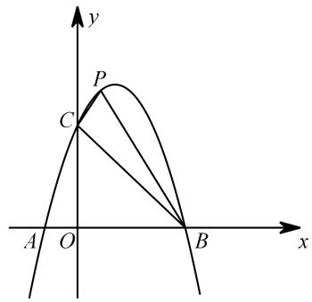

# 思路1：铅垂法列方程解

根据 $B$ 、 $C$ 两点坐标得直线 $B C$ 解析式： $y = \ - x + 3$ ，设点 $P$ 坐标为 $\left( m , - m ^ { 2 } + 2 m + 3 \right)$ ，  
过点 $P$ 作 $P Q \bot x$ 轴交 $B C$ 于点 $\mathcal { Q }$ ，则点 $\mathcal { Q }$ 坐标为 $( m , \enspace - m + 3 )$ ），  
$P Q = \left| \left( - m ^ { 2 } + 2 m + 3 \right) - \left( - m + 3 \right) \right| = \left| - m ^ { 2 } + 3 m \right| , S _ { \scriptscriptstyle \mathrm { s } P B C } = \frac { 1 } { 2 } \times 3 \times \left| - m ^ { 2 } + 3 m \right| = 3 \ ,$ ， 分 类 讨 论 去 绝 对 值 解 方  
程即可得 $m$ 的值．

思路 2：构造等积变形同底等高三角形面积相等

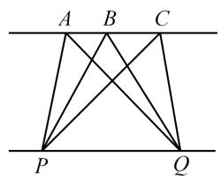

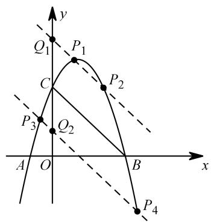

取 $B C$ 作水平宽可知水平宽为 3，根据 $\triangle P B C$ 面积为 3，可知铅垂高为 2，在 $y$ 轴上取点 $\boldsymbol { Q }$ 使得 $C Q = 2$ ，过点 $\mathcal { Q }$ 作 $B C$ 的平行线，交点即为满足条件的 $P$ 点当点 $\boldsymbol { Q }$ 坐标为（0,5）时， $P Q$ 解析式为： $y = \scriptstyle - x + 5$ ，联立方程： $- x ^ { 2 } + 2 x + 3 = - x + 5$ ，解之即可当点 $\boldsymbol { Q }$ 坐标为（0,1）时， $P Q$ 解析式为： $y = \scriptstyle - x + 1$ ，联立方程： $- x ^ { 2 } + 2 x + 3 = - x + 1$ ，解之即可

# 2. 等值问题

# 【问题描述】

【淘宝店铺：向阳百分百】

如图，抛物线 $y = - x ^ { 2 } + 2 x + 3$ 与 $x$ 轴交于 $A , B$ 两点（点 $A$ 在点 $B$ 左侧），与 $y$ 轴交于点 $C$ ，连接 $B C$ ，抛物线上存在一点 $P$ 使得 $\triangle P B C$ 的面积等于 $\triangle B O C$ 的面积，求点 $P$ 坐标

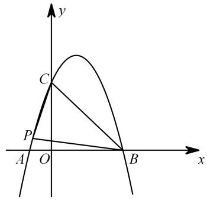

思路 1：铅垂法

计算出 $\triangle B O C$ 面积，将“等积问题”转化为“定积问题”，用铅垂法可解

思路 2：构造等积变形

过点 $O$ 作 $B C$ 的平行线，与抛物线交点即为所求 $P$ 点，  
另外作点 $O$ 关于点 $C$ 的对称点 $M$ ，过点 $M$ 作 $B C$ 平行线与抛物线的交点亦为所求 $P$ 点  
先求直线解析式，再联立方程即可求得 $P$ 点坐标

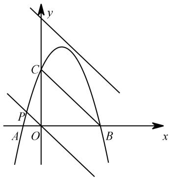

# 二、面积比例问题

# 1、方法突破

除了三角形、四边形面积计算之外，面积比例也是中考题中常见的条件或结论，对面积比例的分析，往往比求面积要复杂得多，这也算是面积问题中最难的一类

大部分题目的处理方法可以总结为两种：（1）计算；（2）转化

# 策略一：运用比例计算类

# 策略二：转化面积比

如图， $B$ 、 $D$ 、 $C$ 三点共线，考虑 $\triangle A B D$ 和△ACD 面积之比

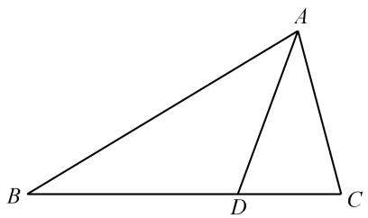

转化为底：共高，面积之比化为底边之比：则 $S _ { \_ A B D } : S _ { \_ A C D } = B D : C D$ ．

更 一 般 地 ， 对 于 共 边 的 两 三 角 形 $\triangle A B D$ 和 $\triangle A C D$ ， 连 接 $B C$ ， 与 $A D$ 交 于 点 $E$ ， 则$S _ { \scriptscriptstyle \triangle A B D } : S _ { \scriptscriptstyle \triangle A C D } = B M : C N = B E : C E .$ ．

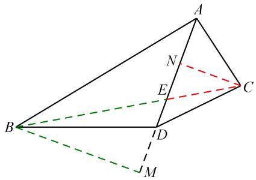

# 策略三：进阶版转化

在有些问题中，高或底边并不容易表示，所以还需在此基础上进一步转化为其他线段比值，比如常见有：“A”字型线段比、“8”字型线段比

“A”字型线段比： $S _ { \scriptscriptstyle \triangle A B D } : S _ { \scriptscriptstyle \triangle A C D } = B D : C D = B A : A M$

“8”字型线段比： $S _ { \scriptscriptstyle \triangle A B D } : S _ { \scriptscriptstyle \triangle A C D } = B D : C D = A B : C M$ ．

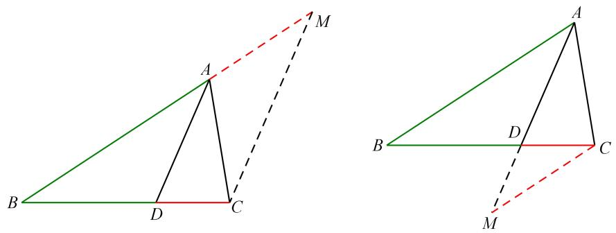

转化为垂线：共底，面积之比化为高之比： $S _ { \scriptscriptstyle \triangle A B D } : S _ { \scriptscriptstyle \triangle A C D } = B D : C D = B M : C N$ ．

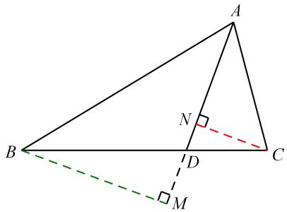

总结：面积能算那就算，算不出来就转换；底边不行就作高，还有垂线和平行

# 三、米勒角问题（最大张角）

# 【问题描述】

1471年，德国数学家米勒向诺德尔提出这样一个问题：

如图，点 $A$ 、 $B$ 直线 $l$ 的同一侧，在直线 $l$ 上取一点 $P$ ，使得 $\angle A P B$ 最大，求 $P$ 点位置

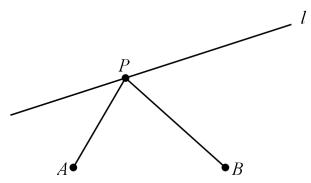

【问题铺垫】

圆外角：如图，像∠APB 这样顶点在圆外，两边和圆相交的角叫圆外角．

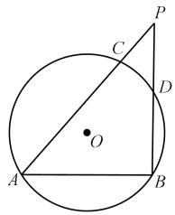

相关结论：圆外角等于这个角所夹两条弧的度数差（大减小）的一半

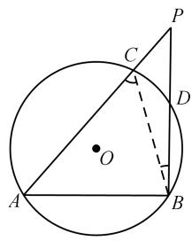

如图， $\angle P = \angle A C B - \angle P B C = \frac { \widehat { A B } - \widehat { C D } } { 2 } .$

换句话说，对同一个圆而言，圆周角 $>$ 圆外角

# 【问题解决】

结论：当点 $P$ 不与 $A$ 、 $B$ 共线时，作 $\triangle P A B$ 的外接圆，当圆与直线 l 相切时，∠APB 最大

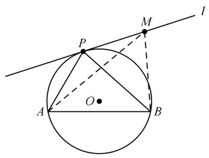

证明：在直线 $l$ 上任取一点 $M$ （不与点 $P$ 重合），连接 AM、BM，  
∠AMB 即为圆 $O$ 的圆外角，  
∴ $\angle A P B { > } \angle A M B$ ， $\angle A P B$ 最大  
∴当圆与直线 $l$ 相切时，∠APB 最大  
特别地，若点 A、 $B$ 与 $P$ 分别在一个角的两边，如下图，则有 $O P ^ { 2 } = O A \cdot O B$ ．（切割线定理）

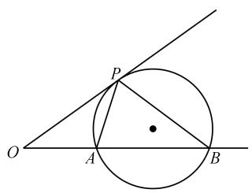

证明：∵ $\angle P O A { = } \angle B O P$ ， $\angle O P A { = } \angle O B P$ （弦切角定理）$\therefore \triangle A O P \neg \triangle P O B , \therefore \frac { O A } { O P } = \frac { O P } { O B } , \therefore O P ^ { 2 } = O A \cdot O B .$ 即可通过 $O A$ 、 $O B$ 线段长确定 $O P$ 长，便知 $P$ 点位置．

# 03 核心·题型

# 03 核心·题型

# 【题型1】作铅垂高解决面积定值问题

# 例1－1 湖北武汉市·中考真题

1．抛物线 $L$ ： $y = - x ^ { 2 } + b x + c$ 经过点 A（0，1），与它的对称轴直线 $x { = } 1$ 交于点 B．

（1）直接写出抛物线 $L$ 的解析式；

（2）如图 1，过定点的直线 $y = k x - k + 4 \big ( k < 0 \big )$ 与抛物线 $L$ 交于点 M、 $N$ ．若△BMN 的面积等于 1，求 $k$ 的值．

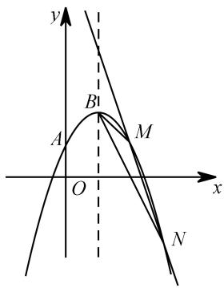

【分析】

（1）解析式： $y = - x ^ { 2 } + 2 x + 1$ ；（2）考虑到直线过定点 $Q$ （1，4），且 $\cdot$ 、 $N$ 均为动点，故考虑用割补法  
$S _ { \_ B M N } = S _ { \_ Q B N } - S _ { \_ Q B M }$ ，分别过 M、 $\cdot$ 作对称轴的垂线，垂足分别记为 $G$ 、 $H$ ，  
$S _ { \triangle B M N } = \frac { 1 } { 2 } Q B \times N H - \frac { 1 } { 2 } Q B \times M G = \frac { 1 } { 2 } Q B \big ( N H - M G \big ) = \frac { 1 } { 2 } Q B \big ( x _ { _ { N } } - x _ { _ { M } } \big ) ,$ ，  
考虑 $x _ { N } - x _ { M }$ ：联立方程： $- x ^ { 2 } + 2 x + 1 = k x - k + 4$ ，化简得 $x ^ { 2 } + { \bigl ( } k - 2 { \bigr ) } x - k + 3 = 0$ ，  
$x _ { \scriptscriptstyle { N } } - x _ { \scriptscriptstyle { M } } = \sqrt { \left( k - 2 \right) ^ { 2 } - 4 \bigl ( - k + 3 \bigr ) } = \sqrt { k ^ { 2 } - 8 } \qquad S _ { \scriptscriptstyle { \Delta B M N } } = \frac { 1 } { 2 } \times 2 \times \sqrt { k ^ { 2 } - 8 } = 1$ ，  
解得： $k _ { 1 } = - 3 , k _ { 2 } = 3$ （舍）  
故 $\cdot$ 的值为－3

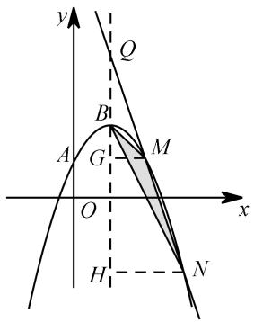

# 2023·齐齐哈尔·中考真题（删减）

2．如图，抛物线 $y = - x ^ { 2 } + { \frac { 7 } { 2 } } x + 2$ 上的点 $A$ ， $C$ 坐标分别为  0, 2 ，  4, 0 ，抛物线与 $\boldsymbol { x }$ 轴负半轴交于点 $B$ ，点 $M$ 为 $y$ 轴负半轴上一点，且 $O M = 2$ ，连接 $A C$ ， $C M$ ，点 $P$ 是抛物线位于第一象限图象上的动点，连接 $A P$ ， $C P$ ，当 $S _ { \triangle P A C } = S _ { \triangle A C M }$ 时，求点 $P$ 的坐标

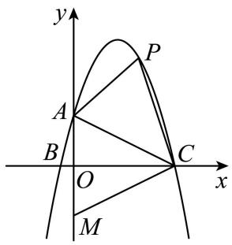

【答案】 $P ( 2 , 5 )$

【分析】过点 $\cdot$ 作 $P F \bot x$ 轴于点 $F$ ，交线段 AC 于点 $\cdot$ ，用待定系数法求得直线 $A C$ 的解析式为$y = - { \frac { 1 } { 2 } } x + 2$ ，设点 $P$ 的横坐标为 $p \big ( 0 < p < 4 \big )$ ， 则 $P \left( p , - p ^ { 2 } + \frac { 7 } { 2 } p + 2 \right)$ , $E { \Bigg ( } p , - { \frac { 1 } { 2 } } p + 2 { \Bigg ) }$ 故$P E = - p ^ { 2 } + 4 p ( 0 < p < 4 )$ ，先求得 $S _ { \triangle A C M } = 8$ ，从而得到 $S _ { \triangle P A C } = \frac { 1 } { 2 } P E \cdot O C = - 2 p ^ { 2 } + 8 p = 8$ ，解出 $p$ 的值，从而得出点 $\cdot$ 的坐标；

【详解】解：过点 $P$ 作 $P F \bot x$ 轴于点 $F$ ，交线段 $\cdot$ 于点 $E$ ，

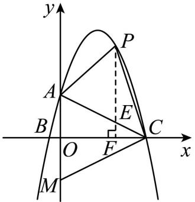

设直线 $A C$ 的解析式为 $y = k x + m ( k \neq 0 )$ ，  
将 $A { \big ( } 0 , 2 { \big ) }$ ， $C \left( 4 , 0 \right)$ 代入 $y = k x + m$ ，得  
$\begin{array} { l } { { \left( m = 2 \right. } } \\ { { \left. 4 k + m = 0 \right. } } \end{array}$ ， 解得 $\left\{ \begin{array} { l l } { \displaystyle k = - \frac { 1 } { 2 } } \\ { \displaystyle m = 2 } \end{array} \right.$ ∴直线 $A C$ 的解 析式 为 $y = - { \frac { 1 } { 2 } } x + 2$   
设点 $P$ 的横坐标为 $p \left( 0 < p < 4 \right)$   
则 $P \left( p , - p ^ { 2 } + \frac { 7 } { 2 } p + 2 \right) , E \left( p , - \frac { 1 } { 2 } p + 2 \right) ,$ ，$P E = - p ^ { 2 } + \frac { 7 } { 2 } p + 2 - \left( - \frac { 1 } { 2 } p + 2 \right) = - p ^ { 2 } + 4 p ( 0 < p < 4 )$   
∵ 8ACMS△  ， 1 2 2 8 82   PE OC   p  p  ，解得 1 2p  p  2 ，∴ P 2,5

# 南通·中考真题

3．定义：若一个函数图象上存在横、纵坐标相等的点，则称该点为这个函数图象的“等值点”．例如，

点 (1,1) 是函数 $y = \frac { 1 } { 2 } x + \frac { 1 } { 2 }$ 的图象的“等值点”．

（1）分别判断函数 $y = x + 2$ ， $y = x ^ { 2 } - x$ 的图象上是否存在“等值点”？如果存在，求出“等值点”的坐标；如果不存在，说明理由；

（2）设函数 $y = { \frac { 3 } { x } } ( x > 0 )$ ， $y = - x + b$ 的图象的“等值点”分别为点 $A$ ， $B$ ，过点 $B$ 作 $B C \perp x$ 轴，垂足为 $C$ ．当 $\Delta A B C$ 的面积为 3 时，求 $^ { b }$ 的值；

解：（1）在 $y = x + 2$ 中，令 $x = x + 2$ ，得 $0 = 2$ 不成立，函数 $y = x + 2$ 的图象上不存在“等值点”；  
在 $y = x ^ { 2 } - x$ 中，令 $x ^ { 2 } - x = x$ ，  
解得： $x _ { 1 } = 0 \ , x _ { 2 } = 2$ ，  
函数 $y = x ^ { 2 } - x$ 的图象上有两个“等值点” $( 0 , 0 )$ 或 (2, 2) ；  
（2）在函数 $y = { \frac { 3 } { x } } ( x > 0 )$ 中，令 $x = { \frac { 3 } { x } }$   
解得： $x = \sqrt { 3 }$ ，  
$\therefore A ( { \sqrt { 3 } } \qquad { \sqrt { 3 } } )$ ，  
在函数 $y = - x + b$ 中，令 $x = - x + b$ ，  
解得： $x = { \frac { 1 } { 2 } } b$   
$\therefore B ( \frac { 1 } { 2 } b , \frac { 1 } { 2 } b ) ,$   
 $B C \perp x$ 轴，  
$\begin{array} { l } { \displaystyle \therefore C ( \frac 1 2 b \quad \phantom { \frac { 1 } { b } } 0 ) } \\ { \displaystyle \phantom { \frac { 1 } { b } } \cdot \cdot B C = \frac 1 2 | b | } \end{array}$   
 $\Delta A B C$ 的面积为 3，  
$\therefore { \frac { 1 } { 2 } } \times { \frac { 1 } { 2 } } | b | \times | \sqrt { 3 } - { \frac { 1 } { 2 } } b | = 3 ,$   
当 $b < 0$ 时， $b ^ { 2 } - 2 \sqrt { 3 } b - 2 4 = 0$ ，  
解得 $b = - 2 \sqrt { 3 }$ ，  
当 $0 \cdot b < 2 \sqrt { 3 }$ 时， $b ^ { 2 } - 2 \sqrt { 3 } b + 2 4 = 0$ ，  
$\begin{array} { r l } { \therefore } & { { } = ( - 2 { \sqrt { 3 } } ) ^ { 2 } - 4 \times 1 \times 2 4 = - 8 4 < 0 } \end{array}$ ，  
方程 $b ^ { 2 } - 2 \sqrt { 3 } b + 2 4 = 0$ 没有实数根，  
当 $b \mathcal { \bar { H } } 2 \sqrt { 3 }$ 时， $b ^ { 2 } - 2 \sqrt { 3 } b - 2 4 = 0$ ，  
解得： $b = 4 \sqrt { 3 }$ ，综上所述， $^ { b }$ 的值为 $- 2 \sqrt { 3 }$ 或 $4 \sqrt { 3 }$

# $2 0 2 3 \cdot \pmb { \mathscr { 1 } }$ 东泰安·中考真题

4．如图 1，二次函数 $y = a x ^ { 2 } + b x + 4$ 的图象经过点 $A ( - 4 , 0 ) , B ( - 1 , 0 )$ ．

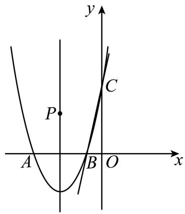  
图1

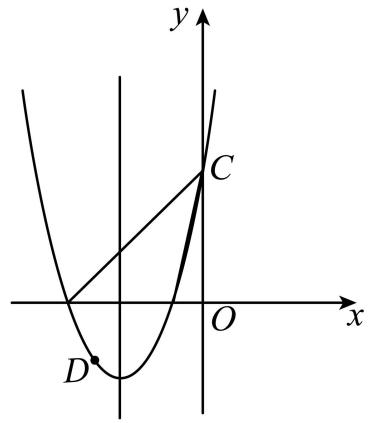  
图2

(1)求二次函数的表达式；

(2)若点 $P$ 在二次函数对称轴上，当 $\triangle B C P$ 面积为 5时，求 $P$ 坐标；

(3)小明认为，在第三象限抛物线上有一点 $D$ ，使 $\angle D A B + \angle A C B = 9 0 ^ { \circ }$ ；请判断小明的说法是否正确，如果正确，请求出 $D$ 的坐标；如果不正确，请说明理由

【答案】 $y = x ^ { 2 } + 5 x + 4$

$$
\left( - \frac { 5 } { 2 } , 4 \right) \quad \left( - \frac { 5 } { 2 } , - 1 6 \right)
$$

【分析】（1）直接运用待定系数法求解即可；

（2）首先求出直线 $B C$ 解析式，然后通过设 $P$ 点坐标，并表示对应 $\boldsymbol { Q }$ 点坐标，从而利用“割补法”计算 $\triangle B C P$ 的面积表达式并建立方程求解即可；

【详解】（1）解：将 $A ( - 4 , 0 ) , B ( - 1 , 0 )$ 代入 $y = a x ^ { 2 } + b x + 4$ 得：$\left\{ { \begin{array} { l l } { 1 6 a - 4 b + 4 = 0 } \\ { a - b + 4 = 0 } \end{array} } \right.$ 解得： $\begin{array} { c } { { \left\{ a = 1 \atop b = 5 \right. } }  \end{array}$ ∴ 抛物 线解 析式 为： $y = x ^ { 2 } + 5 x + 4$ ；

（2）解：由抛物线 $y = x ^ { 2 } + 5 x + 4$ 可知，其对称轴为直线 $x = - { \frac { 5 } { 2 } } , C ( 0 , 4 ) ,$ ，设直线 $B C$ 解析式为： $y = k x + c$ ，将 $B \left( - 1 , 0 \right)$ ， $C ( 0 , 4 )$ 代入解得： $\begin{array} { l } { { \left\{ k = 4 \atop { c = 4 } , \right. } }  \\ { { \left. \rule { 0.3 cm } { 0 ex } \right. } } \end{array}$ ∴直线 $B C$ 解析式为： $y = 4 x + 4$ ，此时，如图所示，作 $P Q / / x$ 轴，交 $B C$ 于点 $\mathcal { Q }$ ，∵点 $P$ 在二次函数对称轴上，∴设 $P \left( - \frac { 5 } { 2 } , m \right)$ ，则 $Q \left( \frac { m - 4 } { 4 } , m \right)$ $P Q = \left| { \frac { m - 4 } { 4 } } - \left( - { \frac { 5 } { 2 } } \right) \right| = \left| { \frac { m + 6 } { 4 } } \right| \qquad S _ { _ { \Delta B C P } } = { \frac { 1 } { 2 } } P Q \left( y _ { c } - y _ { B } \right) = { \frac { 1 } { 2 } } \times \left| { \frac { m + 6 } { 4 } } \right| \times 4 = \left| { \frac { m + 6 } { 2 } } \right|$ ∵要使得 ${ \triangle B C P }$ 面积为 5， $\left| { \frac { m + 6 } { 2 } } \right| = 5$ ，解得： $m = 4$ 或 $m = - 1 6$ ，∴ $P$ 的坐标为 $\left( - \frac { 5 } { 2 } , 4 \right) \precneqq \left( - \frac { 5 } { 2 } , - 1 6 \right)$

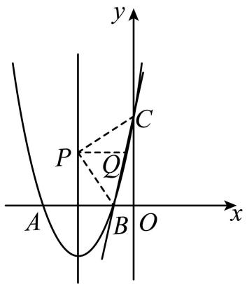

# 【题型2】作平行线解决面积问题

# 例2－1 山东省临沂市·中考真题

5．在平面直角坐标系中，直线 $y = x + 2$ 与 $x$ 轴 交 于 点 $A$ ， 与 $y$ 轴 交 于 点 $B$ ，抛物线$y = a x ^ { 2 } + b x + c ( a < 0 )$ 经过点 $A$ 、 $B$ ．

（1）求 $a$ 、 $^ { b }$ 满足的关系式及 $c$ 的值．

（2）如图，当 $a = - 1$ 时，在抛物线上是否存在点 $P$ ，使 $\Delta P A B$ 的面积为 1？若存在，请求出符合条件的所有点 $P$ 的坐标；若不存在，请说明理由

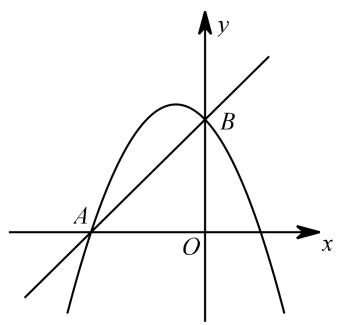

【分析】

（1）点 A 坐标为（－2，0），点 $B$ 坐标为（0，2），

【淘宝店铺：向阳百分百】

代入解析式可得： $c = 2$ ， $\_$ （2）考虑 A、 $\cdot$ 水平距离为 2， $\triangle P A B$ 的面积为 1，故对应的铅垂高为 1当 $a = - 1$ 时，可得 $\cdot$ ，抛物线解析式为 $y = - x ^ { 2 } - x + 2$ 取点 $C$ （0，3）作 $A B$ 的平行线，其解析式为： $y = x + 3$ ，联立方程 $- x ^ { 2 } - x + 2 = x + 3$ ，解得 $\cdot$ ，故点 $P _ { 1 }$ 坐标为（－1，2）取点 $D$ （0，1）作 $\cdot$ 的平行线，其解析式为： $y = x + 1$ ，联立方程 $- x ^ { 2 } - x + 2 = x + 1$ ，解得 $x _ { 1 } = - 1 + { \sqrt { 2 } }$ ， $x _ { 2 } = - 1 - \sqrt { 2 }$ 点 $P _ { 2 }$ 坐标为 $\left( - 1 + { \sqrt { 2 } } , { \sqrt { 2 } } \right)$ 、点 $P _ { 3 }$ 坐标为 $\left( - 1 - { \sqrt { 2 } } , - { \sqrt { 2 } } \right)$

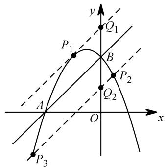

# $2 0 2 3 \cdot \boxed { \pm }$ 川甘孜·中考真题

6．已知抛物线 $y = x ^ { 2 } + b x + c$ 与 $\boldsymbol { x }$ 轴相交于 $A { \left( - 1 , 0 \right) }$ ， $B$ 两点，与 $y$ 轴相交于点 $C ( 0 , - 3 )$

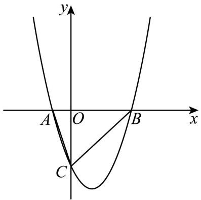

(1)求 $b$ ， $c$ 的值；

$( 2 ) P$ 为第一象限抛物线上一点， ${ \triangle } P B C$ 的面积与 $\triangle A B C$ 的面积相等，求直线 $A P$ 的解析式

【答案】(1) $\left\{ { { b = - 2 } , \atop { c = - 3 . } } \right.$ ， (2) y  x 1(3)存在，点 $P ^ { \prime }$ 的坐标为 $\left( 1 + { \sqrt { 2 1 } } , - 2 + { \sqrt { 2 1 } } \right)$ 或 $\left( 1 - { \sqrt { 2 1 } } , - 2 - { \sqrt { 2 1 } } \right)$

【分析】（1）由待定系数法即可求解；（2） $S _ { \triangle P B C } = S _ { \triangle A B C }$ 得到 $A P / / B C$ ，即可求解；（3）由题意的： $\angle A E P = \angle A E P ^ { \prime } , P ^ { \prime } E = P E$ ，即可求解

【淘宝店铺：向阳百分百】【详解】（1）由题意，得 $\left\{ \begin{array} { c } { 1 - b + c = 0 , } \\ { c = - 3 . } \end{array} \right.$ ,$\therefore { \left\{ \begin{array} { l l } { b = - 2 , } \\ { c = - 3 . } \end{array} \right. }$

（2）由（1）得抛物线的解析式为 $y { = } x ^ { 2 } - 2 x - 3$   
令 $y = 0$ ，则 $x ^ { 2 } - 2 x - 3 = 0$ ，得 $x _ { 1 } = - 1 :$ ， $x _ { 2 } = 3$   
∴B 点的坐标为3，0  
$\cdot S _ { \triangle P B C } = S _ { \triangle A B C }$ ，  
$\therefore A P / / B C$   
$\because B ( 3 , 0 ) , C ( 0 , \ - 3 ) ,$ ，  
∴直线 $B C$ 的解析式为 $y = x - 3$   
$A P / / B C$ ，  
∴可设直线 $A P$ 的解析式为 $y = x + m$   
∵ $A ( - 1 , 0 )$ ）在直线 $A P$ 上，  
$\therefore 0 = - 1 + m$   
∴ $m = 1$ ．  
∴直线 $A P$ 的解析式为 $y = x + 1$

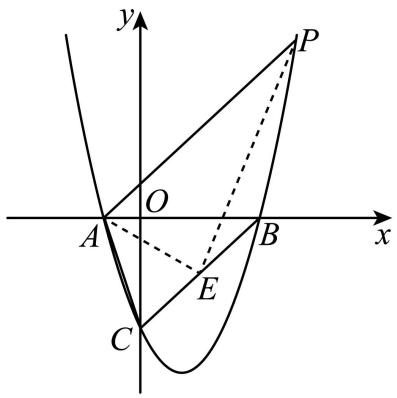

# 四川凉山州·中考真题

7．如图，抛物线 $y = a x ^ { 2 } + b x + c$ 的图象过点 $A ( - 1 , 0 )$ 、 $B ( 3 , 0 )$ 、 $C ( 0 , 3 )$

（1）求抛物线的解析式；  
（2）在抛物线的对称轴上是否存在一点 $P$ ，使得 $\Delta P A C$ 的周长最小，若存在，请求出点 $P$ 的坐标及PAC 的周长；若不存在，请说明理由；  
（3）在（2）的条件下，在 $x$ 轴上方的抛物线上是否存在点 $M$ （不与 $C$ 点重合），使得 $S _ { \Delta P A M } = S _ { \Delta P A C }$ ？若存在，请求出点 $M$ 的坐标；若不存在，请说明理由

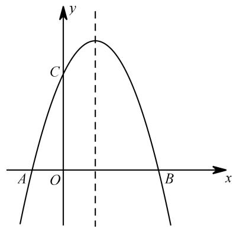

# 【分析】

（1）抛物线解析式为： $\_$ ；

（2）将军饮马问题，作点 $C$ 关于对称轴的对称点 $\cdot$ （2，3），连接 $\cdot$ ，与对称轴交点即为所求 $\cdot$ 点，可得 $\cdot$ 点坐标为（1，2）， $\cdot$ 的周长亦可求

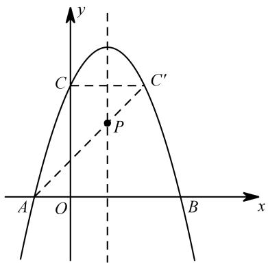

（3）过点 $\cdot$ 作 $A P$ 平行线与抛物线交点即为 $\cdot$ 点，联立方程得解；记 $A P$ 与 $y$ 轴交点为 $\cdot$ 点，作点 $\cdot$ 关于 $Q$ 点的对称点点 $\cdot$ ，过点 $\cdot$ 作 $\cdot$ 的平行线，与抛物线在 $\cdot$ 轴上方部分的交点即为所求 $M$ 点，联立方程得解

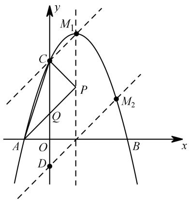

# 连云港·中考真题

8．如图，抛物线 $y = m x ^ { 2 } + ( m ^ { 2 } + 3 ) x - ( 6 m + 9 )$ 与 $x$ 轴交于点 $A$ 、 $B$ ，与 $y$ 轴交于点 $C$ ，已知 $B ( 3 , 0 )$ ．

（1）求 $m$ 的值和直线 $B C$ 对应的函数表达式；

（2） $P$ 为抛物线上一点，若 $S _ { \Delta P B C } = S _ { \Delta A B C }$ ，请直接写出点 $P$ 的坐标；

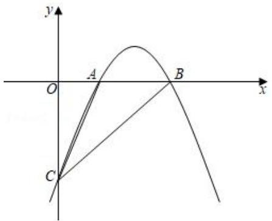

解：（1）将 $B ( 3 , 0 )$ 代入 $y = m x ^ { 2 } + ( m ^ { 2 } + 3 ) x - ( 6 m + 9 )$ ，化简得， $m ^ { 2 } + m = 0$ ，  
则 $m = 0$ （舍)或 $m = - 1$ ， $m = - 1$ ， $\therefore y = - x ^ { 2 } + 4 x - 3$   
$\cdot { \cal C } ( 0 , - 3 )$ ，设直线 $B C$ 的函数表达式为 $y = k x + b$ ，  
将 $B ( 3 , 0 )$ ， $C ( 0 , - 3 )$ 代入表达式，可得， $\left\{ { \begin{array} { l } { 0 = 3 k + b } \\ { - 3 = b } \end{array} } \right.$ 解得， $\begin{array} { l } { \left\{ k = 1 \atop { b = - 3 } \right. } \end{array}$   
直线 $B C$ 的函数表达式为 $y = x - 3$   
（2）如图，过点 $A$ 作 $A P _ { 1 } / / B C$ ，设直线 $A P _ { 1 }$ 交 $y$ 轴于点 $G$ ，将直线 $B C$ 向下平移 $G C$ 个单位，得到  
直线 $P _ { 2 } P _ { 3 }$ ．

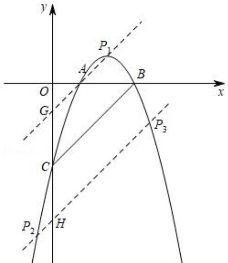

由（1）得直线 $B C$ 的表达式为 $y = x - 3$ ， $A ( 1 , 0 )$ ，直线 $A G$ 的表达式为 $y = x - 1$ ，

联立 $\left\{ \begin{array} { l l } { y = x - 1 } \\ { y = - x ^ { 2 } + 4 x - 3 } \end{array} \right.$ 解得 $\left\{ { \begin{array} { l } { x = 1 } \\ { y = 0 } \end{array} } \right.$ 或 ${ \left\{ \begin{array} { l l } { x = 2 } \\ { y = 1 } \end{array} \right. } ,$   
 $P _ { 1 } ( 2 , 1 )$ 或 $( 1 , 0 )$ ，  
由直线 $A G$ 的表达式可得 $G ( 0 , - 1 )$ ，  
$\therefore G C = 2 \ , C H = 2 \ ,$ ，  
直线 $P _ { 2 } P _ { 3 }$ 的表达式为： $y = x - 5$ ，  
联立 $\left\{ \begin{array} { l l } { y = x - 5 } \\ { y = - x ^ { 2 } + 4 x - 3 } \end{array} \right.$   
解得， $\left\{ \begin{array} { l l } { { x = \displaystyle { \frac { 3 - \sqrt { 1 7 } } { 2 } } } } & { { \qquad \displaystyle { \left[ x = \displaystyle { \frac { 3 + \sqrt { 1 7 } } { 2 } } \right. } } } \\ { { y = \displaystyle { \frac { - 7 - \sqrt { 1 7 } } { 2 } } } } & { { \qquad \displaystyle { \left[ y = \displaystyle { \frac { - 7 + \sqrt { 1 7 } } { 2 } } \right. } } } \end{array} \right.$   
$\therefore P _ { 2 } ( { \frac { 3 - { \sqrt { 1 7 } } } { 2 } } \quad { \frac { - 7 - { \sqrt { 1 7 } } } { 2 } } ) \quad P _ { 3 } ( { \frac { 3 + { \sqrt { 1 7 } } } { 2 } } \quad { \frac { - 7 + { \sqrt { 1 7 } } } { 2 } } )$   
综上可得，符合题意的点 $P$ 的坐标为：(2,1)， $( 1 , 0 )$ ， 3 17 7 17 )2  3 17( 2 ， 7 17 ) 2 , ,

# 2023·黑龙江·中考真题

9．如图，抛物线 $y = a x ^ { 2 } + b x + 3$ 与 $x$ 轴交于 $A { \bigl ( } - 3 , 0 { \bigr ) } , B { \bigl ( } 1 , 0 { \bigr ) }$ 两点，交 $y$ 轴于 点 $C$

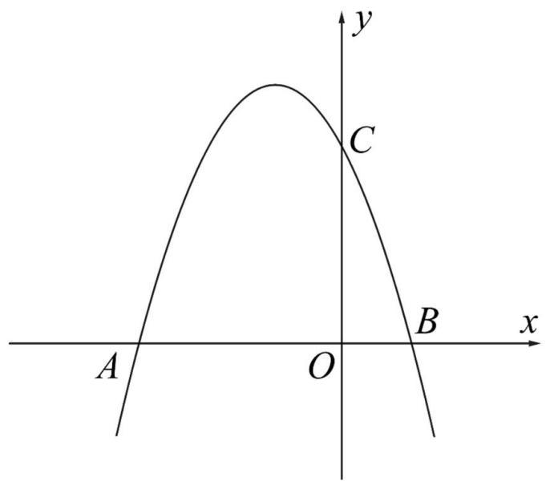

(1)求抛物线的解析式

(2)拋物线上是否存在一点 $P$ ，使得 $S _ { _ { \triangle P B C } } = \frac { 1 } { 2 } S _ { _ { \triangle A B C } }$ ，若存在，请直接写出点 $P$ 的坐标；若不存在，请说明理由．

【答案】 $( 1 ) y = - x ^ { 2 } - 2 x + 3$ 【淘宝店铺：向阳百分百】(2)存在，点 $P$ 的坐标为 2,3 或 3,12

【分析】（1）采用待定系数法，将点A和点 $B$ 坐标直接代入抛物线 $y = a x ^ { 2 } + b x + 3$ ，即可求得抛物线的解析式

（2）过线段 $A B$ 的中点 $D$ ，且与 $B C$ 平行的直线上的点与点 $B$ ，点 $C$ 连线组成的三角形的面积都等于 1 ABCS ， 则此直线与抛物线的交点即为所求；求出此直线的解析式，与抛物线解析式联立，即可求得答案

【详解】（1）解：因为抛物线 $y = a x ^ { 2 } + b x + 3$ 经过点 $A \left( - 3 , 0 \right)$ 和点 $B \mathopen { } \mathclose \bgroup \left( 1 , 0 \aftergroup \egroup \right)$ 两点，所以$\left\{ { \begin{array} { l } { 9 a - 3 b + 3 = 0 } \\ { a + b + 3 = 0 } \end{array} } \right. ,$

解得

$\begin{array} { c } { { \left\{ \begin{array} { l } { { a = - 1 } } \\ { { b = - 2 } } \end{array} \right. , } } \end{array}$ 所以抛物线解析式为： $y = - x ^ { 2 } - 2 x + 3$

（2）解：如图，设线段 $A B$ 的中点为 $D$ ，可知点 $D$ 的坐标为 $\left( - 1 , 0 \right)$ ，过点 $D$ 作与 $B C$ 平行的直线l，假设与抛物线交于点 $P _ { 1 }$ ， $P _ { 2 }$ （ $P _ { 1 }$ 在 $P _ { 2 }$ 的左边），（ $P _ { 2 }$ 在图中未能显示）

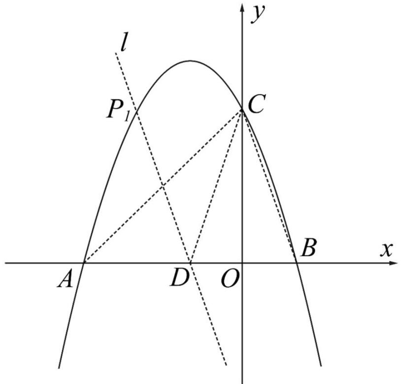

设直线 $B C$ 的函数解析式为 $y = k x + b _ { \mathrm { 1 } } \left( k \neq 0 \right)$ 因为直线 $B C$ 经过点 $\begin{array} { r l } { B \big ( 1 , 0 \big ) } & { { } C \big ( 0 , 3 \big ) } \end{array}$ ，所以$\begin{array} { l } { { \left\{ k + b _ { \scriptscriptstyle 1 } = 0 \right. } } \\ { { \left. b _ { \scriptscriptstyle 1 } = 3 \right. } } \end{array} ,$   
解得 $\begin{array} { c } { { \left\{ k = - 3 \right. } }  \\ { { \left. b _ { 1 } = 3 \right. } } \end{array}$

【淘宝店铺：向阳百分百】

所以，直线 $B C$ 的函数解析式为： $y = - 3 x + 3$   
又 $P _ { 1 } P _ { 2 } / / B C$ ，  
可设直线 $P _ { 1 } P _ { 2 }$ 的函数解析式为 $y = - 3 x + b _ { 2 }$ ，  
因为直线 $P _ { 1 } P _ { 2 }$ 经过点 $D$ $\left( - 1 , 0 \right)$ ，所以  
$3 + b _ { 2 } = 0$   
解得 $b _ { 2 } = - 3$ ．  
所以，直线 $P _ { 1 } P _ { 2 }$ 的函数解析式为 $y = - 3 x - 3$   
根据题意可知，  
$S _ { \_ D B C } = \frac { 1 } { 2 } S _ { \_ A B C }$   
又 $P _ { 1 } P _ { 2 } / / B C$ ，  
所以，直线 $P _ { 1 } P _ { 2 }$ 上任意一点 $P ^ { \prime }$ 与点 $B$ ，点 $C$ 连线组成的 $\triangle P ^ { ' } B C$ 的面积都满足 $S _ { _ { \triangle P ^ { \prime } B C } } = \frac { 1 } { 2 } S _ { _ { \triangle A B C } }$   
所以，直线 $P _ { 1 } P _ { 2 }$ 与抛物线 $y = - x ^ { 2 } - 2 x + 3$ 的交点 $P _ { 1 }$ ， $P _ { 2 }$ 即为所求，可得  
$- 3 x - 3 = - x ^ { 2 } - 2 x + 3$ ，  
化简，得  
$x ^ { 2 } - x - 6 = 0$ ，  
解得 $x _ { 1 } = 3 , x _ { 2 } = - 2$ ，  
所以，点 $P _ { 1 }$ 的坐标为 $\left( - 2 , 3 \right)$ ，点 $P _ { 2 }$ 的坐标为 3,12  
故答案为：存在，点 $P$ 的坐标为 $\left( - 2 , 3 \right)$ 或3,12

# 江苏徐州·中考真题

10．如图，点 $A$ 、 $B$ 在 $y = { \frac { 1 } { 4 } } x ^ { 2 }$ 的图象上．已知 $A$ 、 $B$ 的横坐标分别为 2 、4，直线 $A B$ 与 y 轴交于点 $C$ ，连接 $O A$ 、 $O B$

（1）求直线 $A B$ 的函数表达式；

（2）求 $\Delta A O B$ 的面积；

（3）若函数 $y = { \frac { 1 } { 4 } } x ^ { 2 }$ 的图象上存在点 $P$ ，使 $\Delta P A B$ 的面积等于 $\Delta A O B$ 的面积的一半，则这样的点 $P$ 共有 个．

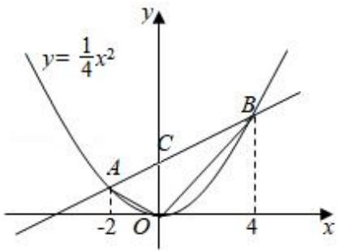

解：（1）点 $A$ 、 $B$ 在 $y = { \frac { 1 } { 4 } } x ^ { 2 }$ 的图象上， $A$ 、 $B$ 的横坐标分别为 2 、4， $A ( - 2 , 1 )$ ， $B ( 4 , 4 )$ ，  
设直线 $A B$ 的解析式为 $y = k x + b$ ，  
$\therefore \{ - 2 k + b = 1$ 解得 $\left\{ { \begin{array} { l } { k = { \frac { 1 } { 2 } } } \\ { b = 2 } \end{array} } \right.$   
直线 $A B$ 为 $y = { \frac { 1 } { 2 } } x + 2$ ；（2）在 $y = { \frac { 1 } { 2 } } x + 2$ 中，令 $x = 0$ ，则 $y = 2$ ， $C$ 的坐标为 $( 0 , 2 )$ ，  
 $O C = 2$ ，  
$\therefore S _ { \scriptscriptstyle  { A O B } } = S _ { \scriptscriptstyle  { A d C } } + S _ { \scriptscriptstyle  { \Delta B O C } } = \frac { 1 } { 2 } \times 2 \times 2 + \frac { 1 } { 2 } \times 2 \times 4 = 6 \ .$   
（3）过 $O C$ 的中点，作 $A B$ 的平行线交抛物线两个交点 $P _ { 1 }$ 、 $P _ { 2 }$ ，此时△ $P _ { 1 } A B$ 的面积和△ $P _ { 2 } A B$ 的面  
积等于 $\Delta A O B$ 的面积的一半，  
作直线 $P _ { 1 } P _ { 2 }$ 关于直线 $A B$ 的对称直线，交抛物线两个交点 $P _ { 3 }$ 、 $P _ { 4 }$ ，此时 $\triangle P _ { 3 } A B$ 的面积和△ $P _ { 4 } A B$ 的面  
积等于 $\Delta A O B$ 的面积的一半，  
所以这样的点 $P$ 共有 4 个，  
故答案为 4

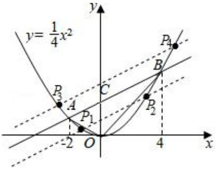

# 【题型 3】面积比例问题的转化定值问题或函数表达式

# 例3－1内蒙古通辽市·中考真题

11．已知，如图，抛物线 $y = a x ^ { 2 } + b x + c ( a \neq 0 )$ 的顶点为 $M ( 1 , 9 )$ ，经过抛物线上的两点 $A ( - 3 , - 7 )$ 和$B ( 3 , m )$ 的直线交抛物线的对称轴于点 $C$

（1）求抛物线的解析式和直线 $A B$ 的解析式

（2）在抛物线上 $A \setminus M$ 两点之间的部分（不包含 $A \setminus M$ 两点），是否存在点 $D$ ，使得 $S _ { \Delta D A C } = 2 S _ { \Delta D C M }$ ？若存在，求出点 $D$ 的坐标；若不存在，请说明理由

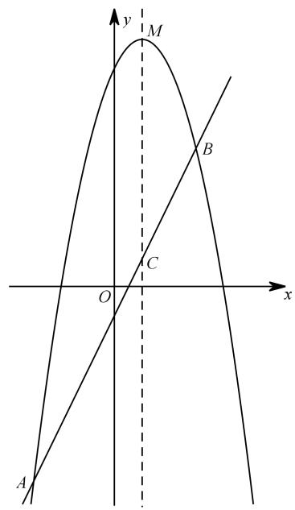

【分析】

（1）设顶点式，代入 $A$ 点坐标，可得解析式为： $y = - x ^ { 2 } + 2 x + 8$ ．  
当 $\cdot$ 时， $y = 5$ ，故点 $\cdot$ 坐标为（3，5），∴直线 $A B$ 的解析式为： $\cdot$   
（2）铅垂法表示 $\triangle A C D$ 的面积：  
设点 $\cdot$ 坐标为 $\left( m , - m ^ { 2 } + 2 m + 8 \right)$ ，过点 $D$ 作 $\cdot$ 轴交 $\cdot$ 于 $\cdot$ 点，  
则 $\cdot$ 点坐标为 $\left( m , 2 m - 1 \right)$ ，线段 $D P { = } - m ^ { 2 } { + } 9$ ，  
$S _ { _ { \Delta A C D } } = \frac { 1 } { 2 } \times 4 \times \left( - m ^ { 2 } + 9 \right) = - 2 m ^ { 2 } + 1 8 ,$ ，  
面积公式表示 $\triangle M C D$ 的面积：  
过点 $\cdot$ 作 $\cdot$ 交 MC 于点 $\cdot$ ，则 $\cdot$ ，  
$S _ { _ { \Delta M C D } } = { \frac { 1 } { 2 } } \times M C \times D Q = { \frac { 1 } { 2 } } \times 8 \times { \bigl ( } 1 - m { \bigr ) } = - 4 m + 4$   
$S _ { \triangle D A C } = 2 S _ { \triangle D C M } - 2 m ^ { 2 } + 1 8 = 2 \left( - 4 m + 4 \right)$   
解得： $\cdot$ 或 $\cdot$ ．考虑 $\cdot$ 点在 $A$ 、 $\cdot$ 之间的抛物线上，故 $m { = } - 1$   
$D$ 点坐标为（－1，5）

# 2023·辽宁盘锦·中考真题

12．如图，抛物线 $y = a x ^ { 2 } + b x + 3$ 与 $x$ 轴交于点 $A { \left( - 1 , 0 \right) }$ ， $B \left( 3 , 0 \right)$ ，与 $y$ 轴交于点 $C$ (1)求抛物线的解析式(2)如图，点 $E$ 是第一象限内一点，连接 $A E$ 交 $y$ 轴于点 $D$ ， $A E$ 的延长线交抛物线于点 $P$ ，点 $F$ 在线段 $C D$ 上，且 $C F = O D$ ，连接 $F A$ ，FE， $B E$ ， $B P$ ，若 $S _ { \triangle A F E } = S _ { \triangle A B E }$ ，求 $\triangle P A B$ 面积

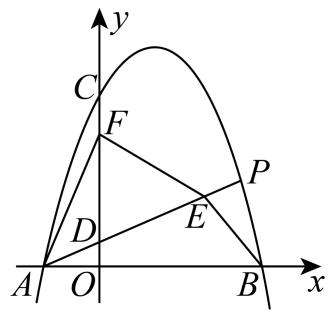

【答案】 $( 1 ) y = - x ^ { 2 } + 2 x + 3$ ，(2)Q 2，3 ， (3) 7

【分析】（1）将点 $A { \left( - 1 , 0 \right) }$ ， $B \left( 3 , 0 \right)$ 代入抛物线 $y = a x ^ { 2 } + b x + 3$ 得到 $\left\{ \begin{array} { l l } { a - b + 3 = 0 } \\ { 9 a + 3 b + 3 = 0 } \end{array} \right.$ 解方程组即可得到答案；

（2）设 $M N = 4 m$ ， $B N = 3 m$ ，则 $B M = Q M = 5 m$ ，则 $Q N = 9 m$ ， $O N = 3 - 3 m$ ，从而表示出点 $\mathcal { Q }$ 的坐标为 $\left( 3 - 3 m , 9 m \right)$ ，代入抛物线解析式，求出 $m$ 的值即可得到答案；

（3）求出直线 $A P$ 的表达式，利用 $S _ { \triangle A F E } = S _ { \triangle A B E }$ ，得到 $\frac { 1 } { 2 } D F \cdot \left( x _ { { \scriptscriptstyle A } } - x _ { { \scriptscriptstyle E } } \right) = \frac { 1 } { 2 } A B \cdot y _ { { \scriptscriptstyle E } }$ ，求出点 $P$ 的坐 标，再根据 PABS $S _ { _ { \triangle P A B } } = \frac { 1 } { 2 } A B \times y _ { P }$ 进行计算即可得到答案

【详解】（1）解：抛物线 $y = a x ^ { 2 } + b x + 3$ 与 $x$ 轴交于点 $A { \left( - 1 , 0 \right) }$ ， $B \left( 3 , 0 \right)$ ，$\cdot \begin{array} { l } { { \displaystyle { a - b + 3 = 0 } } } \\ { { \displaystyle { 9 a + 3 b + 3 = 0 } } } \end{array}$ 解得： $\left\{ { \begin{array} { l } { a = - 1 } \\ { b = 2 } \end{array} } \right.$ , 抛物线的解析式为： $y = - x ^ { 2 } + 2 x + 3$ ；

（2）解：设点 $P \left( m , - m ^ { 2 } + 2 m + 3 \right)$ ，直线 $A P$ 的解析式为 $y = k x + b$ ，  
 A1，0 ， $\cdot \begin{array} { l } { { \left\{ - k + b = 0 \right. } }  \\ { { \left. k m + b = - m ^ { 2 } + 2 m + 3 \right.} } \end{array} $ 解得： $\begin{array} { c } { { \{ k = - ( m - 3 )  } } \\ { {  b = - ( m - 3 ) } ^ { , } } \end{array}$ ，  
直线 $A P$ 的解析式为 $y = - ( m - 3 ) x - ( m - 3 )$ ，当 $x = 0$ 时， $y = - ( m - 3 ) = 3 - m$ ，  
$\therefore \left( 0 , 3 - m \right) \quad \therefore O D = 3 - m \quad \therefore C F = O D = 3 - m$ ，  
在抛物线 $y = - x ^ { 2 } + 2 x + 3$ 中，当 $x = 0$ 时， $y = 3$ ，C 0，3， $O C = 3$ ，  
$\therefore D F = O C - O D - C F = 3 - \left( 3 - m \right) - \left( 3 - m \right) = 2 m - 3$ ，  
设点 $E$ 的坐标 $\begin{array} { r l r l r l } { \big ( t , - \big ( m - 3 \big ) t - \big ( m - 3 \big ) \big ) } & { { } \because A \big ( - 1 , 0 \big ) } & { } & { { } B \big ( 3 , 0 \big ) } & { } & { { } \colon A B = 4 } & { } & { { } \colon S _ { \triangle A F E } = S _ { \triangle A B E } } \end{array}$ ，

$\therefore \frac { 1 } { 2 } D F \cdot \left( x _ { 4 } - x _ { E } \right) = \frac { 1 } { 2 } A B \cdot y _ { E } , \therefore \frac { 1 } { 2 } \times \left( 2 m - 3 \right) \times \left( t + 1 \right) = \frac { 1 } { 2 } \times 4 \times \left[ - \left( m - 3 \right) t - \left( m - 3 \right) \right] ,$ 解得： $m = \frac { 5 } { 2 }$ ， 点 $P$ 的坐标为 $\left( \frac { 5 } { 2 } , \frac { 7 } { 4 } \right)$ ， $\therefore S _ { \scriptscriptstyle \triangle P A B } = \frac { 1 } { 2 } A B \times y _ { \scriptscriptstyle P } = \frac { 1 } { 2 } \times 4 \times \frac { 7 } { 4 } = \frac { 7 } { 2 } .$

13．在平面直角坐标系 $x O y$ 中，已知抛物线 $y = a x ^ { 2 } + b x$ 经过 $A$ （4，0）， $B$ （1，4）两点． $P$ 是抛物线上一点，且在直线 AB 的上方．

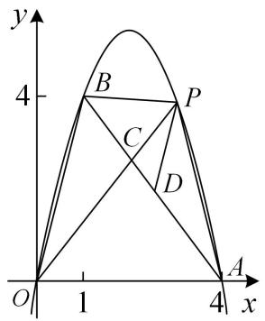

(1)求抛物线的解析式；

(2)若 $\triangle O A B$ 面积是 $\triangle P A B$ 面积的 2倍，求点 $P$ 的坐标【答案】(1) $) y = - \frac { 4 } { 3 } x ^ { 2 } + \frac { 1 6 } { 3 } x$ ，(2)存在， $\left( 2 , \frac { 1 6 } { 3 } \right)$ 或（3，4）

【分析】（1）待定系数法求解析式即可求解；

（2）待定系数法求得直线 $A B$ 的解析式为 $y = - \frac { 4 } { 3 } x + \frac { 1 6 } { 3 }$ 过点 $P$ 作 $P M \bot x$ 轴，垂足为 $M$ ，PM 交 AB于 点 $N$ ． 过 点 $\cdot$ 作 $\cdot$ ， 垂 足 为 $\cdot$ ． 可 得 $S _ { \triangle P A B } = S _ { \triangle P N B } + S _ { \triangle P N A } = \frac { 3 } { 2 } P N$ 设$P \Big ( m , - \frac { 4 } { 3 } m ^ { 2 } + \frac { 1 6 } { 3 } m \Big ) \big ( 1 < m < 4 \big )$ ，则 $N \left( m , - \frac { 4 } { 3 } m + \frac { 1 6 } { 3 } \right)$ 由 $P N = ( - \frac { 4 } { 3 } m ^ { 2 } + \frac { 1 6 } { 3 } m ) - ( - \frac { 4 } { 3 } m + \frac { 1 6 } { 3 } ) = \frac { 8 } { 3 }$ ， 解方程求得 $m$ 的值，进而即可求解；

【详解】（1）解：（1）将 A（4，0）， $\cdot$ （1，4）代入 $y = a x ^ { 2 } + b x$ ，得 $\left\{ { \begin{array} { l } { { 1 6 a + 4 b = 0 } } \\ { { a + b = 4 } } \end{array} } \right.$ 解得 $\left\{ { a = - { \cfrac { 4 } { 3 } } } \right.$ 所以抛物线的解析式为 $y = - \frac { 4 } { 3 } x ^ { 2 } + \frac { 1 6 } { 3 } x$

（2）设直线 $A B$ 的解析式为 $y = k x + t \big ( k \neq 0 \big )$ ，  
将 $\cdot$ （4，0）， $B$ （1，4）代入 $y = k x + t$ ，  
得 $\begin{array} { l } { { \left\{ 4 k + t = 0 \right. } }  \\ { { \left. k + t = 4 \right. } } \end{array}$ 解得 $\left\{ \begin{array} { l } { { k = - { \frac { 4 } { 3 } } } } \\ { { \hfill } } \\ { { t = { \frac { 1 6 } { 3 } } } } \end{array} \right.$ 所以直线 $A B$ 的解析式为 $y = - \frac { 4 } { 3 } x + \frac { 1 6 } { 3 }$   
过点 $P$ 作 $P M \bot x$ 轴，垂足为 $M$ ，PM 交 $\cdot$ 于点 $N$   
过点 $B$ 作 BE⊥PM，垂足为 $E$   
所以 $S _ { \triangle P M B } = S _ { \triangle P N B } + S _ { \triangle P N A } = \frac { 1 } { 2 } P N \times B E + \frac { 1 } { 2 } P N \times A M = \frac { 1 } { 2 } P N \times \left( B E + A M \right) = \frac { 3 } { 2 } P N .$   
因为 $\cdot$ （4，0）， $B$ （1，4），所以 $S _ { \triangle O A B } = \frac { 1 } { 2 } \times 4 \times 4 = 8$   
因为△OAB 的面积是△PAB面积的 2倍，所以 $2 \times \frac { 3 } { 2 } P N = 8$ ， $P N = \frac { 8 } { 3 }$   
设 $P \Big ( m , - \frac { 4 } { 3 } m ^ { 2 } + \frac { 1 6 } { 3 } m \Big ) \big ( 1 < m < 4 \big )$ ，则 $N \left( m , - \frac { 4 } { 3 } m + \frac { 1 6 } { 3 } \right)$   
所以 $P N = ( - \frac { 4 } { 3 } m ^ { 2 } + \frac { 1 6 } { 3 } m ) - ( - \frac { 4 } { 3 } m + \frac { 1 6 } { 3 } ) = \frac { 8 } { 3 }$ ， 即 4 2 203 3m  m 16 83 3 ，  
解得 $m _ { \mathrm { 1 } } = 2$ ， $m _ { 2 } = 3$ ．所以点 $\cdot$ 的坐标为 $\left( 2 , \frac { 1 6 } { 3 } \right)$ 或（3，4）．zz

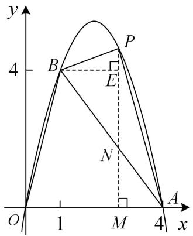

# 2022·福建·统考模拟预测

14．在平面直角坐标系 $x O y$ 中，已知抛物线 $y = a x ^ { 2 } + b x$ 经过 $A$ （4，0）， $B$ （1，4）两点． $P$ 是抛物线上一点，且在直线 $A B$ 的上方

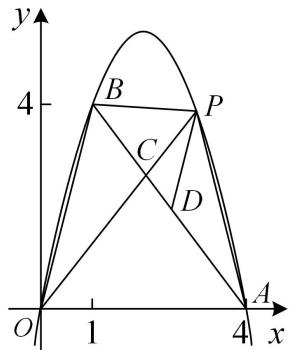

(1)求抛物线的解析式；  
(2)若 $\triangle O A B$ 面积是 $\triangle P A B$ 面积的 2 倍，求点 $P$ 的坐标；

【答案】 $( 1 ) y = - \frac { 4 } { 3 } x ^ { 2 } + \frac { 1 6 } { 3 } x$ (2)存在， $\left( 2 , \frac { 1 6 } { 3 } \right)$ 或（3，4）

【淘宝店铺：向阳百分百】【分析】（1）待定系数法求解析式即可求解；

（2）待定系数法求得直线 $\cdot$ 的解析式为 $y = - \frac { 4 } { 3 } x + \frac { 1 6 } { 3 }$ 过点 $\cdot$ 作 $\cdot$ 轴，垂足为 $M$ ，PM 交$\cdot$ 于 点 $\cdot$ ． 过 点 $B$ 作 $B E \perp P M$ ， 垂 足 为 $E$ ． 可 得 $S _ { \triangle P A B } = S _ { \triangle P N B } + S _ { \triangle P N A } \ = \frac { 3 } { 2 } P N$ 设$P \Big ( m , - \frac { 4 } { 3 } m ^ { 2 } + \frac { 1 6 } { 3 } m \Big ) \big ( 1 < m < 4 \big )$ ，则 $N \left( m , - \frac { 4 } { 3 } m + \frac { 1 6 } { 3 } \right)$ ．由 $P N = ( - \frac { 4 } { 3 } m ^ { 2 } + \frac { 1 6 } { 3 } m ) - ( - \frac { 4 } { 3 } m + \frac { 1 6 } { 3 } ) = \frac { 8 } { 3 }$ ，解方程求得 $m$ 的值，进而即可求解；

【详解】（1）解：（1）将 $\cdot$ （4，0）， $B$ （1，4）代入 $y = a x ^ { 2 } + b x$ ，得 $\left\{ { \begin{array} { l } { { 1 6 a + 4 b = 0 } } \\ { { a + b = 4 } } \end{array} } \right.$ 解得 $\left\{ { a = - { \cfrac { 4 } { 3 } } } \right.$ 所 以抛 物线 的解 析式 为 $y = - \frac { 4 } { 3 } x ^ { 2 } + \frac { 1 6 } { 3 } x$

（2）设直线 $\cdot$ 的解析式为 $y = k x + t \big ( k \neq 0 \big )$ ，  
将 $A$ （4，0）， $\cdot$ （1，4）代入 $y = k x + t$ ，  
得 $\begin{array} { l } { \left\{ 4 k + t = 0 \right. } \\ { \left. k + t = 4 \right. } \end{array}$   
解得 $\left\{ { { k = - \frac { 4 } { 3 } } \atop { t = \frac { 1 6 } { 3 } } } \right. .$   
所以直线 $\cdot$ 的解析式为 $y = - \frac { 4 } { 3 } x + \frac { 1 6 } { 3 }$   
过点 $P$ 作 $P M \bot x$ 轴，垂足为 $M$ ，PM 交 $A B$ 于点 $N$   
过点 $\cdot$ 作 $B E \bot P M$ ，垂足为 $\cdot$   
所以 $S _ { \triangle P M B } = S _ { \triangle P N B } + S _ { \triangle P M } = \frac { 1 } { 2 } P N \times B E + \frac { 1 } { 2 } P N \times A M = \frac { 1 } { 2 } P N \times \left( B E + A M \right) = \frac { 3 } { 2 } P N .$   
因为 $\cdot$ （4，0）， $B$ （1，4），所以 $S _ { _ { \triangle O A B } } = \frac { 1 } { 2 } \times 4 \times 4 = 8$   
因为 $\cdot$ 的面积是 $\triangle P A B$ 面积的 2 倍，  
所以 $2 { \times } \frac { 3 } { 2 } P N = 8$ ， $P N = \frac { 8 } { 3 }$   
设 $P \Big ( m , - \frac { 4 } { 3 } m ^ { 2 } + \frac { 1 6 } { 3 } m \Big ) \big ( 1 < m < 4 \big )$ ，则 $N \left( m , - \frac { 4 } { 3 } m + \frac { 1 6 } { 3 } \right)$ ．所以 $P N = \left( - { \frac { 4 } { 3 } } m ^ { 2 } + { \frac { 1 6 } { 3 } } m \right) - \left( - { \frac { 4 } { 3 } } m + { \frac { 1 6 } { 3 } } \right) = \frac { 8 } { 3 }$ 即 $- \frac { 4 } { 3 } m ^ { 2 } + \frac { 2 0 } { 3 } m - \frac { 1 6 } { 3 } = \frac { 8 } { 3 }$   
解得 $\begin{array} { r } { m _ { 1 } = 2 \quad m _ { 2 } = 3 } \end{array}$   
所以点 $\cdot$ 的坐标为 $\left( 2 , \frac { 1 6 } { 3 } \right)$ 或（3，4）

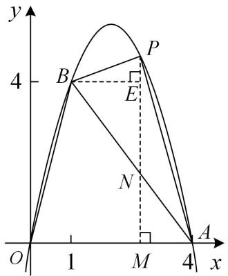

# 【题型4】面积比例问题的转化为线段比

# 例 4－1

15．如图，抛物线 $y = a x ^ { 2 } + 2 x + c ( a < 0 )$ 与 $x$ 轴交于点 $A$ 和点 $B$ （点 $A$ 在原点的左侧，点 $B$ 在原点的右侧），与 $y$ 轴交于点 $C$ ， $O B = O C = 3$

（1）求该抛物线的函数解析式

（2）如图，连接 $B C$ ，点 $D$ 是直线 $B C$ 上方抛物线上的点，连接 $O D$ ， $C D$ ． $O D$ 交 $B C$ 于点 $F$ ，当$S _ { \Delta C O F } : S _ { \Delta C D F } = 3 : 2$ 时，求点 $D$ 的坐标

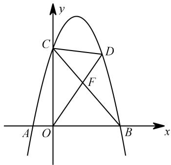

【分析】

（1）解析式： $y = - x ^ { 2 } + 2 x + 3$

（2）显然 $\cdot$ 和 $\cdot$ 共高，可将面积之比化为底边之比

$$
O F : D F = S _ { \scriptscriptstyle \triangle C O F } : S _ { \scriptscriptstyle \triangle C D F } = 3 : 2
$$

思路 1：转化底边之比为“A”字型线段比  
在 $\cdot$ 轴上取点 $\cdot$ （0，5），（为何是这个点？因此此时 OC： $\cdot$ ：2）  
过点 $\cdot$ 作 BC 的平行线交 $X$ 轴于 $G$ 点，  
EG与抛物线交点即为所求 $D$ 点，  
根据平行线分线段成比例， $O F$ ： $\cdot$ ： $\cdot$ ：2  
直线 EG 解析式为： $\cdot$ ，  
与抛物线联立方程，得： $- x ^ { 2 } + 2 x + 3 = - x + 5$ ，  
解得： $x _ { 1 } = 1$ ， $x _ { 2 } = 2$   
故 $D$ 点坐标为（1，4）或（2，3）  
思路 2：转化底边之比为“8”字型线段比

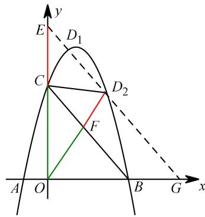

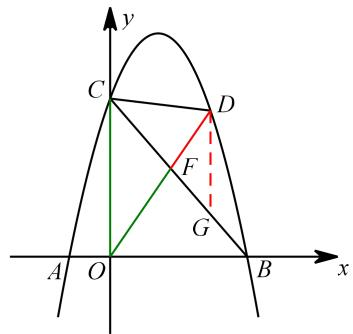

过点 $\cdot$ 作 $\cdot$ 轴交 $B C$ 边于点 $G$ ，则 ${ \frac { O F } { F D } } { = } { \frac { O C } { D G } }$ 又 $O C = 3$ ，故点 $G$ 满足 $\cdot$ 即可．这个问题设$\cdot$ 点坐标即可求解．

也可以构造水平“8”字，过点 $D$ 作 $D G / / x$ 轴交 $B C$ 于点 $G$ ，则 ${ \frac { O F } { F D } } { = } { \frac { O B } { D G } }$ ，又 $O B = 3$ ，∴ $\cdot$ 即可．但此处问题在于水平线段不如竖直线段易求，方法可行但不建议

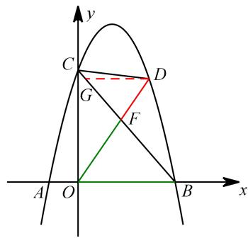

其实本题分析点的位置也能解：

思路 3：设点 $D$ 坐标为 $\left( m , - m ^ { 2 } + 2 m + 3 \right)$ ，

根据 $\cdot$ ： $\cdot$ ：2，可得 $\cdot$ 点坐标为 $\left( \frac { 3 } { 5 } m , - \frac { 3 } { 5 } m ^ { 2 } + \frac { 6 } { 5 } m + \frac { 9 } { 5 } \right)$   
点 $F$ 在直线 $B C$ 上，将点坐标代入直线 $\cdot$ 解析式： $y = - x + 3$ ，  
$- \frac { 3 } { 5 } m ^ { 2 } + \frac { 6 } { 5 } m + \frac { 9 } { 5 } = - \frac { 3 } { 5 } m + 3$   
解得 $\begin{array} { r } { m _ { 1 } = 1 \quad m _ { 2 } = 2 } \end{array}$ ，  
故 $D$ 点坐标为（1，4）或（2，3）  
这个计算的方法要求能理解比例与点坐标之间的关系，即由 $D$ 点坐标如何得到 $F$ 点坐标

# 深圳市中考真题

16．如图抛物线经 $y = a x ^ { 2 } + b x + c$ 过点 $A ( - 1 , 0 )$ ，点 $C ( 0 , 3 )$ ，且 $O B = O C$ ．

（1）求抛物线的解析式及其对称轴；（2）点 $P$ 为抛物线上一点，连接 $C P$ ，直线 $C P$ 把四边形 $C B P A$ 的面积分为3:5两部分，求点 $P$ 的坐标．

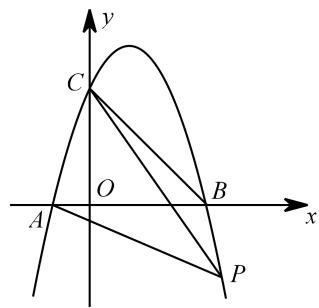

【分析】

（1）解析式为 $y = - x ^ { 2 } + 2 x + 3$ ，对称轴为直线 $\cdot$   
（2）连接 $C P$ ，可将四边形 CBPA分为 $\cdot$ 和 CBP  
即 $S _ { \scriptscriptstyle \triangle C A P } : S _ { \scriptscriptstyle \triangle C B P } = 3 : 5$ 或 $S _ { \scriptscriptstyle \triangle C A P } : S _ { \scriptscriptstyle \triangle C B P } = 5 : 3$ ．  
考虑 $\triangle C A P$ 和△CBP 共底边 $\cdot$ ，记 $C P$ 与 $\cdot$ 轴交于点 $\cdot$ ，则 $S _ { \scriptscriptstyle \triangle C A P } : S _ { \scriptscriptstyle \triangle C B P } = A M : B M$   
$\cdot$ ： $\cdot$ ：3，点 $\cdot$ 坐标为 $\left( { \frac { 3 } { 2 } } , 0 \right)$ ,  
根据 $C$ 、 $\cdot$ 坐标求解直线 CM 解析式： $y = - 2 x + 3$ ，  
联立方程： $- x ^ { 2 } + 2 x + 3 = - 2 x + 3$ ，解得： $x _ { 1 } = 0$ （舍）， $x _ { 2 } = 4$   
故 $\cdot$ 点坐标为（4， $- 5 )$ ）．

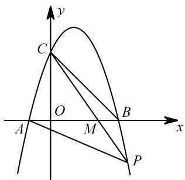

【淘宝店铺：向阳百分百】

$\cdot$ ： $B M { = } 3$ ：5，点 $\cdot$ 坐标为 $\left( \frac { 1 } { 2 } , 0 \right)$ ，  
根据 $C$ 、 $M$ 坐标求解直线 CM 解析式为： $y = - 6 x + 3$ ，  
联立方程： $- x ^ { 2 } + 2 x + 3 = - 6 x + 3$ ，解得： $x _ { 1 } = 0$ （舍）， $x _ { 2 } = 8$ ．  
故 $P$ 点坐标为（8，－45）

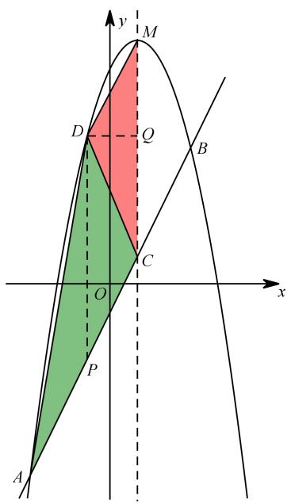

# 牡丹江中考真题

17．抛物线 $y = - x ^ { 2 } + b x + c$ 经过点 $A ( - 3 , 0 )$ 和点 $C ( 0 , 3 )$

（1）求此抛物线所对应的函数解析式，并直接写出顶点 $D$ 的坐标；

（2）若过顶点 $D$ 的直线将 $\Delta A C D$ 的面积分为1:2两部分，并与 $x$ 轴交于点 $\mathcal { Q }$ ，则点 $\mathcal { Q }$ 的坐标为注：抛物线 $y = a x ^ { 2 } + b x + c ( a \neq 0 )$ 的顶点坐标 $( - \frac { b } { 2 a } , \frac { 4 a c - b ^ { 2 } } { 4 a } )$

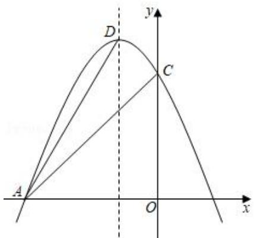

【淘宝店铺：向阳百分百】

解：（1）把点 $A ( - 3 , 0 )$ 和点 $C ( 0 , 3 )$ 代入 $y = - x ^ { 2 } + b x + c$ 得： $\begin{array}{c} \displaystyle { \{ - 9 - 3 b + c = 0  } \\ { c = 3 } \end{array}  $ ,解得： $\left\{ b = - 2 \right. \quad . \cdot y = - x ^ { 2 } - 2 x + 3 \quad \cdot \cdot y = - x ^ { 2 } - 2 x + 3 = - ( x + 1 ) ^ { 2 } + 4$ ，顶点 $D ( - 1 , 4 )$

（2）取线段 $A C$ 的三等分点 $E$ 、 $F$ ，连接 $D E$ 、 $D F$ 交 $x$ 轴于点 $\mathcal { Q } _ { \mathrm { l } }$ 、 $Q _ { 2 }$ ，则：$S _ { \Delta D A E } : S _ { \Delta D E C } = 1 : 2 , S _ { \Delta D A F } : S _ { \Delta D F C } = 2 : 1 ,$ ，点 $A ( - 3 , 0 )$ ，点 $C ( 0 , 3 )$ ， $E ( - 2 , 1 )$ ， $F ( - 1 , 2 )$ ， $D F \perp x$ 轴于点 $Q _ { 2 }$ ， $\phantom { } \cdot Q _ { 2 } ( - 1 , 0 )$ ，设直线 $D E$ 的解析式为： $y = k x + b ( k \neq 0 )$ ，把点 $D ( - 1 , 4 )$ ， $E ( - 2 , 1 )$ 代入，得： $\binom { - k + b = 4 } { - 2 k + b = 1 }$ 解得： $\begin{array} { c } { { \left\{ k = 3 \atop { b = 7 } \right. } }  \end{array}$ ，直线 $D E$ 的表达式为： $y = 3 x + 7$ ，当 $y = 0$ 时， $x = - { \frac { 7 } { 3 } }$ , $\therefore Q _ { 1 } ( - \frac { 7 } { 3 } \quad 0 )$ 故答案为： $\mathcal { Q } _ { 1 } ( - \frac { 7 } { 3 } , \ 0 ) , \mathcal { Q } _ { 2 } ( - 1 , 0 ) .$ ．

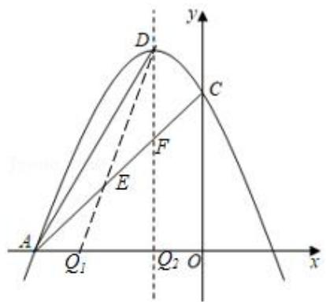

# $2 0 2 2 \cdot \boxed { 2 }$ 川内江中考真题

18．如图，抛物线 $\scriptstyle y = a x ^ { 2 } + b x + c$ 与 $x$ 轴交于 A（﹣4，0），B（2，0），与 $y$ 轴交于点 $C$ （0，2）

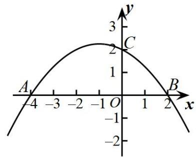

  
备用图

(1)求这条抛物线所对应的函数的表达式；

(2)点 $P$ 为抛物线上一点，连接 $C P$ ，直线 $C P$ 把四边形 CBPA 的面积分为 1：5 两部分，求点 $P$ 的坐

标．

【答案】( $y = - { \frac { 1 } { 4 } } x ^ { 2 } - { \frac { 1 } { 2 } } x + 2$ ，(2)点 $P$ 的坐标为（6，﹣10）或 $\frac { 1 4 } { 3 } \frac { 1 0 } { 9 }$ 【分析】（1）运用待定系数法即可解决问题；

（2）过点 $D$ 作 $\cdot$ 于 $H$ ，交直线 $\cdot$ 于点 $\cdot$ ，过点 $\cdot$ 作 $\cdot$ 于 $E$ ，可用待定系数法求出直线 $A C$ 的解析式，设点 $D$ 的横坐标为 $m$ ，则点 $G$ 的横坐标也为 $\cdot$ ，从而可以用 $m$ 的代数式表示出$\cdot$ ，然后利用cos $\angle E D G = \cos \angle C A O$ 得到 $D E = \frac { 2 \sqrt { 5 } } { 5 } D G$ ， 可得出关于 $\cdot$ 的二次函数，运用二次函数的最值即可解决问题

【详解】（1）∵抛物线 $\cdot$ 与 $\cdot$ 轴交于 $\cdot$ （﹣4，0）， $\cdot$ （2，0），与 $y$ 轴交于点 $\cdot$ （0，2）1a   
$\left\{ \begin{array} { c } { { 1 6 a - 4 b + c = 0 } } \\ { { 4 a + 2 b + c = 0 } } \\ { { c = 2 } } \end{array} \right.$ 4，解得： $\left| b = - { \frac { 1 } { 2 } } \right.$ ∴抛物 线的 解析 式为 $y = - { \frac { 1 } { 4 } } x ^ { 2 } - { \frac { 1 } { 2 } } x + 2$ ；2c 

（2）如图，设直线 $C P$ 交 $x$ 轴于点 $E$ ，

直线 $C P$ 把四边形 CBPA的面积分为 1：5 两部分，  
又∵ $S _ { \triangle } P C B$ ： $S _ { \triangle } P C d = \frac { 1 } { 2 } E B \times \left( y _ { C } - y _ { P } \right) : \frac { 1 } { 2 } A E \times \left( y _ { C } - y _ { P } \right) = E B : A E \ ,$   
则 $E B$ ： $A E { = } 1$ ：5 或 5：1  
则 $A E { = } 5$ 或 1，  
即点 $E$ 的坐标为（1，0）或（﹣3，0），  
将点 $E$ 的坐标代入直线 $C P$ 的表达式： $\cdot$ ，  
解得： $n = - 2$ 或 $\frac { 2 } { 3 }$ ,  
故直线 $C P$ 的表达式为： $y = - 2 x + 2$ 或 $\frac { 2 } { 3 }$ ，  
联立方程组 $\left\{ \begin{array} { c } { { y = - 2 x + 2 } } \\ { { y = - { \cfrac { 1 } { 4 } } x ^ { 2 } - { \cfrac { 1 } { 2 } } x + 2 } } \\ { { \displaystyle } } \end{array} \right. \quad \left\{ \begin{array} { c } { { y = { \cfrac { 2 } { 3 } } x + 2 } } \\ { { \displaystyle { y = - { \cfrac { 1 } { 4 } } x ^ { 2 } - { \cfrac { 1 } { 2 } } x + 2 } } } \end{array} \right.$   
解得： $x = 6$ 或 $- \ { \frac { 1 4 } { 3 } }$ （不合题意值已舍去），  
故点 $\cdot$ 的坐标为（6，﹣10）或 $\frac { 1 4 } { 3 } \qquad \frac { 1 0 } { 9 }$

# 2023·四川泸州中考真题

19．如图，在平面直角坐标系 $x O y$ 中，已知抛物线 $y = a x ^ { 2 } + 2 x + c$ 与坐标轴分别相交于点 A，B，$C \left( 0 , 6 \right)$ 三点，其对称轴为 $x = 2$

(1)求该抛物线的解析式；  
(2)点 $F$ 是该抛物线上位于第一象限的一个动点，直线 $A F$ 分别与 $y$ 轴，直线 $B C$ 交于点 $D$ ， $E$ ．$\textcircled{1}$ 当 $C D = C E$ 时，求 $C D$ 的长；  
$\textcircled{2}$ 若 $\triangle C A D$ ， $\triangle C D E$ ， $\triangle C E F$ 的面积分别为 $S _ { 1 }$ ， $S _ { 2 }$ ， $S _ { 3 }$ ，且满足 $S _ { 1 } + S _ { 3 } = 2 S _ { 2 }$ ，求点 $F$ 的坐标

【答案】 $( 1 ) y = - \frac { 1 } { 2 } x ^ { 2 } + 2 x + 6$ $( 2 ) \textcircled { 1 } 8 - 2 \sqrt { 2 } \ ; \ \textcircled { 2 } F \bigl ( 4 , 6 \bigr )$

【分析】（1）根据抛物线对称轴为 $x = 2$ ， 可得 $- \frac { 2 } { 2 a } = 2$ ，求得 $a = - { \frac { 1 } { 2 } }$ 再将 $C \left( 0 , 6 \right)$ 代 入 抛 物 线 ， 根据待定系数法求得 $c$ ，即可解答；  
（2） $\cdot$ 求出点 $B$ ，点A的坐标，即可得到直线 $B C$ 的解析式为 $y = - x + 6$ ，设 $C D = a$ ，则 $D \left( 0 , 6 - a \right)$ ，求得 $A D$ 的解析式，列方程求出点 $E$ 的坐标，最后根据 $C D = C E$ 列方程，即可求出 $C D$ 的长；$\cdot$ 过 $E , F$ 分别作 $A B$ 的垂线段，交 $A B$ 于点 $G , H$ ，过点 $\cdot$ 作 $E G$ 的垂线段，交 $E G$ 于 点 $\cdot$ ，根据$S _ { 1 } + S _ { 3 } = 2 S _ { 2 }$ ，可得 $A D + E F = 2 D E$ ，即 ${ \frac { D E } { A F } } = { \frac { 1 } { 3 } }$ ，证明 $\triangle D E I { \sim } \triangle A F B$ ，设 $F \left( h , - \frac 1 2 h ^ { 2 } + 2 h + 6 \right)$ 得到直线 $A F$ 的解析式，求出点 $\cdot$ 的坐标，即可得到点 $E$ 的坐标，将点 $E$ 的坐标代入 $y = - x + 6$ 解方程，即可解答【详解】（1）解：根据抛物线的对称轴为 $x = 2$ ，得 $- \frac { 2 } { 2 a } = 2$ ，   
解得 $a = - { \frac { 1 } { 2 } }$ ,  
将 $C \left( 0 , 6 \right)$ 代入抛物线可得 $6 = c$ ，  
抛物线的解析式为 $y = - \frac { 1 } { 2 } x ^ { 2 } + 2 x + 6$ ；

【淘宝店铺：向阳百分百】

（2）解：当 $y = 0$ 时，得 1 2 2 62  x  x  ，  
解得 $x _ { 1 } = 6$ ， $x _ { 2 } = - 2$ ，  
$\therefore A ( - 2 , 0 ) B ( 6 , 0 )$ ，  
设 $C B$ 的解析式为 $y = k x + b$ ，将 $C \left( 0 , 6 \right)$ ， $B \mathopen { } \mathclose \bgroup \left( 6 , 0 \aftergroup \egroup \right)$ 代入 $y = k x + b$ ，  
得 $\left\{ \begin{array} { c } { { 6 = b } } \\ { { 0 = 6 k + b } } \end{array} \right. ,$   
解得 $\left\{ { { k = - 1 \atop b = 6 } } \right.$ ，  
 $C B$ 的解析式为 $y = - x + 6$ ，  
设 $C D = a$ ，则 $D ( 0 , 6 - a )$ ，  
设 $A D$ 的解析式为 $y = k _ { 1 } x + b _ { 1 }$ ，将 $D \left( 0 , 6 - a \right)$ ， $A { \big ( } { - } 2 , 0 { \big ) }$ 代入 $y = k _ { 1 } x + b _ { 1 }$ ，得 $\left\{ \begin{array} { c } { 6 - a = b _ { 1 } } \\ { 0 = - 2 k _ { 1 } + b _ { 1 } } \end{array} \right.$   
解得 $\left\{ \begin{array} { l l } { \displaystyle k _ { 1 } = \frac { 6 - a } { 2 } } \\ { \displaystyle b _ { 1 } = 6 - a } \end{array} \right.$   
$A B$ 的解析式为 $\scriptstyle y = { \frac { 6 - a } { 2 } } x + 6 - a$ ，  
联立方程 $\cdot \left\{ \begin{array} { c } { { y = - x + 6 } } \\ { { y = \displaystyle \frac { 6 - a } { 2 } x + 6 - a } } \end{array} \right. ,$   
解得 $\left\{ \begin{array} { l } { \displaystyle x = \frac { 2 a } { 8 - a } } \\ { \displaystyle y = \frac { 4 8 - 8 a } { 8 - a } } \end{array} , \right.$   
根据 $C D = C E$ ， 得 a  $a = \sqrt { \left( \frac { 2 a } { 8 - a } \right) ^ { 2 } + \left( \frac { 4 8 - 8 a } { 8 - a } - 6 \right) ^ { 2 } }$   
解得 $a _ { \scriptscriptstyle 1 } = 8 - 2 \sqrt { 2 }$ ， $a _ { 2 } = 8 + 2 { \sqrt { 2 } }$ ，  
经检验， $a _ { \scriptscriptstyle 1 } = 8 - 2 \sqrt { 2 }$ ， $a _ { 2 } = 8 + 2 { \sqrt { 2 } }$ 是方程的解，  
点 $F$ 是该抛物线上位于第一象限的一个动点，  
$D$ 在 $y$ 轴正半轴，  
$\therefore a < 6$ ，  
 $\phantom { - } . a = 8 - 2 \sqrt { 2 }$   
即 $C D$ 的长为 $8 - 2 \sqrt { 2 }$ ；  
$\textcircled{2}$ 解：如图，过 $ { \boldsymbol { E } } ,  { \boldsymbol { F } }$ 分别作 $A B$ 的垂线段，交 $A B$ 于点 $G , H$ ，过点 $\cdot$ 作  
$\because S _ { 1 } + S _ { 3 } = 2 S _ { 2 }$ ，  
$\therefore A D + E F = 2 D E$ ，DE 1AF 3  
设 $F \left( h , - \frac 1 2 h ^ { 2 } + 2 h + 6 \right)$ 则 $A H = h + 2$ ，  
$\because E G \bot A B , F H \bot A B$ ，  
$\therefore E G / / F H$ ，  
$\therefore \angle D E I = \angle A F B$ ，  
$\because D I \bot E G$ ，$. \angle D I E = 9 0 ^ { \circ }$ ，  
$\cdot . \triangle D E I { \sim } \triangle A F B$ ，  
 $. D I = \frac { 1 } { 3 } A B = \frac { 1 } { 3 } h + \frac { 2 } { 3 }$ 即点 $D$ 的横坐标为 $\frac { 1 } { 3 } h + \frac { 2 } { 3 }$   
$E I = \frac { 1 } { 3 } F H = - \frac { 1 } { 6 } h ^ { 2 } + \frac { 2 } { 3 } h + 2$   
设 $A F$ 的解析式为 $y = k _ { 2 } x + b _ { 2 }$ ，将 $A \left( - 2 , 0 \right)$ ， $F \left( h , - \frac 1 2 h ^ { 2 } + 2 h + 6 \right) ;$   
代入得 $\left\{ \begin{array} { c } { 0 = - 2 k _ { 2 } + b _ { 2 } } \\ { - \displaystyle \frac { 1 } { 2 } h ^ { 2 } + 2 h + 6 = k _ { 2 } h + b _ { 2 } } \end{array} \right.$   
解得 $\left\{ k _ { 2 } = - \frac { 1 } { 2 } h + 3 \atop b _ { 2 } = - h + 6 \right. ,$   
 $A F$ 的解析式为 $y = \left( - { \frac { 1 } { 2 } } h + 3 \right) x - h + 6$ ，$\cdot . D ( 0 , - h + 6 )$ ，即 $D O = - h + 6$ ，  
 $\cdot \angle D O G = 9 0 ^ { \circ }$ ，  
四边形 $D O G I$ 是矩形，$\cdot \ I G = D O = - h + 6$ ，  
$\therefore E G = E I + I G = - { \frac { 1 } { 6 } } h ^ { 2 } - { \frac { 1 } { 3 } } h + 8$ ， 即 $E \left( \frac 1 3 h + \frac 2 3 , - \frac 1 6 h ^ { 2 } - \frac 1 3 h + 8 \right) ,$   
将 $E { \Bigg ( } { \frac { 1 } { 3 } } h + { \frac { 2 } { 3 } } , - { \frac { 1 } { 6 } } h ^ { 2 } - { \frac { 1 } { 3 } } h + 8 { \Bigg ) }$ 代入 $y = - x + 6$ ，

得 $- { \frac { 1 } { 6 } } h ^ { 2 } - { \frac { 1 } { 3 } } h + 8 = - { \frac { 1 } { 3 } } h - { \frac { 2 } { 3 } } + 6$ 解得 $h _ { 1 } = 4$ ， $h _ { 2 } = - 4 < 0$ （舍去）， $F \big ( 4 , 6 \big )$

# 2022·四川内江中考真题

20．如图，抛物线 $y = a x ^ { 2 } + b x + c$ 与 $\boldsymbol { x }$ 轴交于 A（﹣4，0）， $B$ （2，0），与 $y$ 轴交于点 $C$ （0，2）．

  
备用图

(1)求这条抛物线所对应的函数的表达式；

(2)点 $P$ 为抛物线上一点，连接 $C P$ ，直线 $C P$ 把四边形 CBPA的面积分为 1：5两部分，求点 $P$ 的坐标

【答案】 $y = - { \frac { 1 } { 4 } } x ^ { 2 } - { \frac { 1 } { 2 } } x + 2$ (2)点 $\cdot$ 的坐标为（6，﹣10）或 $( \mathbf { \partial } - \frac { 1 4 } { 3 } , \mathbf { \partial } - \frac { 1 0 } { 9 } )$

【分析】（1）运用待定系数法即可解决问题；

（2）根据 $S _ { \varDelta } P C B$ ： $\frac { 1 } { 2 } E B \times ( y _ { C } - y _ { P } ) \colon \frac { 1 } { 2 } A E \times ( y _ { C } - y _ { P } ) = B E \colon A E ,$ 即可 求解 ．

【详解】（1）∵抛物线 $\cdot$ 与 $\cdot$ 轴交于 $A ~ ( - 4 , ~ 0 ) , ~ B ~ ( 2 , ~ 0 )$ ），与 $\cdot$ 轴交于点 $C$ （0，2）．  
$\therefore \left\{ { 4 a + 2 b + c = 0 } \atop { c = 2 } \right.$   
解得： $\left\{ \begin{array} { l } { \displaystyle { a = - \frac { 1 } { 4 } } } \\ { \displaystyle { b = - \frac { 1 } { 2 } } , } \\ { \displaystyle { c = 2 } } \end{array} \right.$

∴抛物线的解析式为 $y = - { \frac { 1 } { 4 } } x ^ { 2 } - { \frac { 1 } { 2 } } x + 2$ （2）如图，设直线 $\cdot$ 交 $\cdot$ 轴于点 $E$ ，

直线 $C P$ 把四边形 CBPA 的面积分为 1：5 两部分，  
又∵S PCB： $S _ { \triangle } P C A = \frac { 1 } { 2 } E B \times \left( y _ { C } - y _ { P } \right) : \frac { 1 } { 2 } A E \times \left( y _ { C } - y _ { P } \right) = E B : A E \ ,$   
则 $E B$ ： $A E { = } 1$ ：5 或 5：1  
则 $\cdot$ 或 1，  
即点 $\cdot$ 的坐标为（1，0）或（﹣3，0），  
将点 $\cdot$ 的坐标代入直线 $C P$ 的表达式： $y = n x + 2$ ，  
解得： $n = - 2$ 或 $\frac { 2 } { 3 }$   
故直线 $C P$ 的表达式为： $y = - ~ 2 x + 2$ 或 $y = { \frac { 2 } { 3 } } x + 2$ ，  
联立方程组 $\left\{ \begin{array} { c } { { y = - 2 x + 2 } } \\ { { y = - { \cfrac { 1 } { 4 } } x ^ { 2 } - { \cfrac { 1 } { 2 } } x + 2 } } \\ { { \displaystyle } } \end{array} \right. \quad \left\{ \begin{array} { c } { { y = { \cfrac { 2 } { 3 } } x + 2 } } \\ { { \displaystyle { y = - { \cfrac { 1 } { 4 } } x ^ { 2 } - { \cfrac { 1 } { 2 } } x + 2 } } } \end{array} \right.$   
解得： $x { = } 6$ 或 $\frac { 1 4 } { 3 }$ （不合题意值已舍去），  
故点 $P$ 的坐标为（6，﹣10）或 $( - \ \frac { 1 4 } { 3 } , \ - \ \frac { 1 0 } { 9 } )$

# 【题型5】 米勒角（最大张角问题）

# 例题 5-1

21．如图，在平面直角坐标系中，A（1，0）、 $B$ （5，0）直线 l 经过点 $C$ （-1，2），点 $P$ 是直线 l 上的动点，若 $\angle A P B$ 的最大值为 $4 5 ^ { \circ }$ ，求直线 $l$ 的解析式

【分析】

考虑到直线 $l$ 未知但 $\angle A P B$ 的最大值已知为 $4 5 ^ { \circ }$ ，故构造圆记△ABP 外接圆圆心为 $\cdot$ 点，则 $\angle A M B { = } 2 \angle A P B { = } 9 0 ^ { \circ }$ ,

【淘宝店铺：向阳百分百】故可确定 $M$ 点位置

根据 $A$ （1，0）、 $\cdot$ （5，0），不难求得 $\cdot$ 点坐标为（3，2），  
连接 MC、 $M P$ ，考虑到圆 $M$ 与直线 $C P$ 相切，故 $M P \bot C P$ ，△CPM 是直角三角形  
∵ $\cdot _ { M C = 4 }$ ， $2 { \sqrt { 2 } }$ ，  
∴CP2 2 ，即△CPM 是等腰直角三角形，  
易求 $P$ 点坐标为（1，4），  
又 $\cdot$ 点坐标为（-1，2），  
可求直线 $l$ 的解析式为 $y = x + 3$

# 山东烟台中考真题

22．如图，抛物线 $y = a x ^ { 2 } + b x + 3$ 与 $x$ 轴交于 $A$ （-1，0）、 $B$ 两点 ，与 $y$ 轴交于点 $C$ ，过点 $C$ 作 $C D$ $\perp \boldsymbol { y }$ 轴交抛物线于另一点 $D$ ，作 $D E \bot x$ 轴，垂足为点 $E$ ，双曲线 $y = { \frac { 6 } { x } } { \big ( } x > 0 { \big ) }$ 经过点 $D$ ， $B D$ ．

（1）求抛物线的表达式；

（2）动点 $P$ 从点 $O$ 出发，以每秒 1个单位长度的速度沿 $O C$ 方向运动，运动时间为 $t$ 秒，当 $t$ 为何值时， $\angle B P D$ 的度数最大？（请直接写出结果）

  
备用图

【分析】

（1）考虑到点 D 纵坐标与点 C 相同，为 3，代入反比例解析式，可得 D 点坐标为（2，3），根据 A、D 坐标可得抛物线解析式： $y = - x ^ { 2 } + 2 x + 3$

（2）求 t 即求 P点位置思路 2：切割线定理

延长 BD 交 y 轴于 M点，则当 $M P ^ { 2 } = M D \cdot M B$ 时， $\cdot$ BPD 最大．

考虑到 B（3，0）、D（2，3），可得直线 BD 解析式： $y = - 3 x + 9$ ，  
故直线 BD 与 y轴交点 M点坐标为（0，9），  
$M D = 2 { \sqrt { 1 0 } } M B = 3 { \sqrt { 1 0 } }$ ，  
$M P ^ { 2 } = M D \cdot M B = 6 0$ ，  
∴ $M P = 2 { \sqrt { 1 5 } }$ ，  
∴P 点坐标为 $\left( 0 , 9 - 2 { \sqrt { 1 5 } } \right)$ ，  
故 t 的值为 $9 - 2 { \sqrt { 1 5 } }$

# $2 0 2 3 \cdot \boxed { 2 }$ 川宜宾中考真题

23．如图，抛物线 $y = a x ^ { 2 } + b x + c$ 与 $x$ 轴交于点 $A \left( - 4 , 0 \right)$ 、 $B \left( 2 , 0 \right)$ ，且经过点 $C \left( - 2 , 6 \right)$ ．

(1)求抛物线的表达式；  
(2)在 $x$ 轴上方的抛物线上任取一点 $N$ ，射线 $A N$ 、 $B N$ 分别与抛物线的对称轴交于点 $P$ 、 $\mathcal { Q }$ ，点 $\mathcal { Q }$ 关于 $x$ 轴的对称点为 $\boldsymbol { Q ^ { \prime } }$ ，求 $\triangle A P Q ^ { \prime }$ 的面积；  
(3)点 $M$ 是 $y$ 轴上一动点，当 $\angle A M C$ 最大时，求 $M$ 的坐标

【淘宝店铺：向阳百分百】【答案】 $y = - { \frac { 3 } { 4 } } x ^ { 2 } - { \frac { 3 } { 2 } } x + 6$

$$
( 2 ) S _ { _ { \Delta A P Q ^ { \prime } } } = { \frac { 8 1 } { 4 } }
$$

$$
( 3 ) M \big ( 0 , 1 2 { - } 4 \sqrt { 5 } \big )
$$

【分析】（1）设抛物线的解析式为 $y = a ( x + 4 ) ( x - 2 )$ ，代入点 $C$ 的坐标，确定 $a$ 值即 可．（2）设 $N \left( m , - \frac { 3 } { 4 } m ^ { 2 } - \frac { 3 } { 2 } m + 6 \right)$ 直线 $A N$ 的解析式为 $y = k x + b$ ， 直线 $B N$ 的解析式为 $y = p x + q$ ， 表示出 $\cdot$ ， $\cdot$ ， $\mathcal { Q } ^ { \prime }$ 的坐标，进而计算即可

（3）当 $\cdot$ 是 $\cdot$ 轴与经过 $A$ ， $\cdot$ ， $\cdot$ 三点的圆的切点是最大计算即可.

【详解】（1）∵抛物线 $y = a x ^ { 2 } + b x + c$ 与 $x$ 轴交于点 $A \left( - 4 , 0 \right) , B \left( 2 , 0 \right)$ ，  
∴设抛物线的解析式为 $y = a ( x + 4 ) ( x - 2 )$ ，  
∵经过点 $C \left( - 2 , 6 \right)$ ，  
$\therefore 6 = a \left( - 2 + 4 \right) \left( - 2 - 2 \right) ,$   
解得 $a = - { \frac { 3 } { 4 } }$   
$\begin{array} { l } { \displaystyle { \therefore y = - \frac { 3 } { 4 } \big ( x + 4 \big ) \big ( x - 2 \big ) \ : , } } \\ { \displaystyle { \ \therefore y = - \frac { 3 } { 4 } x ^ { 2 } - \frac { 3 } { 2 } x + 6 \ : . } } \end{array}$

（2）如图，当点 $\cdot$ 在对称轴的右侧时，$y = - { \frac { 3 } { 4 } } x ^ { 2 } - { \frac { 3 } { 2 } } x + 6 = - { \frac { 3 } { 4 } } { \bigl ( } x { + } 1 { \bigr ) } ^ { 2 } + { \frac { 2 7 } { 4 } }$ ∴对称轴为直线 $x { = } - 1$ ，

设 $N \left( m , - \frac { 3 } { 4 } m ^ { 2 } - \frac { 3 } { 2 } m + 6 \right)$ 直线 $A N$ 的解析式为 $y = k x + b$ ，直 线 $B N$ 的解析式为 $y = p x + q$ ，  
$\therefore \left\{ \begin{array} { l } { \displaystyle { - 4 k + b = 0 } } \\ { \displaystyle { m k + b = - \frac { 3 } { 4 } m ^ { 2 } \mathrm { ~ - } \frac { 3 } { 2 } m + 6 } ^ { \prime 2 { p } + { q } = 0 } \mathrm { ~ } \frac { 3 } { 4 } m ^ { 2 } \mathrm { ~ \frac { 3 } { 2 } ~ } { m + 6 } } \end{array} \right.$   
解得 $\left\{ \begin{array} { l } { { k = { \displaystyle { \frac { - { \displaystyle { \frac { 3 } { 4 } } m ^ { 2 } } - { \frac { 3 } { 2 } } m + 6 } { m + 4 } } } , \left\{ p = { \displaystyle { \frac { - { \displaystyle { \frac { 3 } { 4 } } m ^ { 2 } } - { \frac { 3 } { 2 } } m + 6 } { m - 2 } } } , \right. } }  \\ { { b = { \displaystyle { \frac { - 3 m ^ { 2 } - 6 m + 2 4 } { m + 4 } } } } } \end{array} \right. ,$   
∴ 直 线 AN 的 解 析 式 为 $y = { \frac { - { \frac { 3 } { 4 } } m ^ { 2 } - { \frac { 3 } { 2 } } m + 6 } { m + 4 } } x + { \frac { - 3 m ^ { 2 } - 6 m + 2 4 } { m + 4 } }$ ， 直 线 B N 的 解 析  
$y = \frac { - \displaystyle { \frac { 3 } { 4 } } m ^ { 2 } - \displaystyle { \frac { 3 } { 2 } } m + 6 } { m - 2 } x + \frac { \displaystyle { \frac { 3 } { 2 } } m ^ { 2 } + 3 m - 1 2 } { m - 2 } ,$   
当 $x { = } - 1$ 时， y  23 m   23 6 3 6 21 42 m m m      9 2 m  9 18m    9 2m    ，4m  4m  4m  4  
$y = { \frac { - { \frac { 3 } { 4 } } m ^ { 2 } - { \frac { 3 } { 2 } } m + 6 } { m - 2 } } \times ( - 1 ) + { \frac { { \frac { 3 } { 2 } } m ^ { 2 } + 3 m - 1 2 } { m - 2 } } = { \frac { { \frac { 9 } { 4 } } m \sp 2 + { \frac { 9 } { 2 } } m - 1 8 } { m - 2 } } \stackrel { 9 } { = } \left( m + 4 \right) ,$   
$\begin{array} { r l } { \underset { \ b { P } \bigg ( - 1 , - \frac { 9 } { 4 } \big ( m - 2 \big ) \bigg ) } { \overset { \underset { \mathrm { \tiny ~ . ~ . ~ } } { \dots } } { \dots } } ~ } & { \underline { { \mathcal { P } } } \bigg ( - 1 , \frac { 9 } { 4 } \big ( m + 4 \big ) \bigg ) \quad \mathscr { Q } ^ { \prime } \bigg ( - 1 , - \frac { 9 } { 4 } \big ( m + 4 \big ) \bigg ) } \\ { \underset { \ b { P } \mathscr { Q } ^ { \prime } = - \frac { 9 } { 4 } \big ( m - 2 \big ) + \frac { 9 } { 4 } \big ( m + 4 \big ) = \frac { 2 7 } { 2 } } } & { } \\ { \underset { \ b { S } _ { \mathscr { A P Q } ^ { \prime } } } { \overset { \quad . \dots } { \dots } } = \frac { 1 } { 2 } \times \frac { 2 7 } { 2 } \times 3 = \frac { 8 1 } { 4 } } & { } \end{array}$   
如图，当点 $\cdot$ 在对称轴的左侧时，  
$\therefore y = - { \frac { 3 } { 4 } } x ^ { 2 } - { \frac { 3 } { 2 } } x + 6 = - { \frac { 3 } { 4 } } { \bigl ( } x + 1 { \bigr ) } ^ { 2 } + { \frac { 2 7 } { 4 } } ,$   
∴对称轴为直线 $x { = } - 1$ ，  
$N { \Bigg ( } m , - { \frac { 3 } { 4 } } m ^ { 2 } - { \frac { 3 } { 2 } } m + 6 { \Bigg ) } \quad P { \Bigg ( } - 1 , - { \frac { 9 } { 4 } } ( m - 2 ) { \Bigg ) } \quad Q { \Bigg ( } - 1 , { \frac { 9 } { 4 } } { \big ( } m + 4 { \big ) } { \Bigg ) } \quad Q ^ { \prime } { \Bigg ( } - 1 , - { \frac { 9 } { 4 } } { \big ( } m + 4 { \big ) } { \Bigg ) }$   
$P Q ^ { \prime } = - \frac { 9 } { 4 } \big ( m - 2 \big ) + \frac { 9 } { 4 } \big ( m + 4 \big ) = \frac { 2 7 } { 2 }$   
$S _ { _ { \triangle A P Q ^ { \prime } } } = \frac { 1 } { 2 } \times \frac { 2 7 } { 2 } \times 3 = \frac { 8 1 } { 4 }$   
综上所述， 4APQS    
（3）当 $\triangle A M C$ 的外接圆与 $O M$ 相切，切点为 $\cdot$ 时， $\angle A M C$ 最大，  
设外接圆的圆心为 $\cdot$ ， $\mathcal { Q }$ 是异于点 $\cdot$ 的一点，连接 $\varrho A$ ， $\varrho C$ ， $\mathcal { Q } A$ 交圆于点 $\cdot$ ，  
则 $\angle A M C = \angle A T C$ ，根据三角形外角性质，得 $\angle A T C > \angle A Q C$ ，故 $\angle A M C > \angle A Q C$   
∴ $\angle A M C$ 最大，  
设 $O A$ 与圆交于点 $\cdot$ ，连接 $M H$ ， $M E$ ，根据切线性质，  
∴ $\angle E M O = \angle M O A = 9 0 ^ { \circ }$ ，  
作直径 $H N$ ，连接 $M N$ ，  
∴ $. \angle H M N = 9 0 ^ { \circ }$ ， $\angle M N H = \angle M A H$ ，  
∵ $E M = E H$ ，  
∴ $\angle E M H = \angle E H M$ ，  
$\therefore 9 0 ^ { \circ } - \angle E M H = 9 0 ^ { \circ } - \angle E H M \ ,$ ，$\angle O M H = \angle M N H = \angle M A H$ ，  
$\triangle O M H ^ { \sim } \triangle O A M$ ，$\frac { O M } { O A } = \frac { O H } { O M }$   
$\therefore O M ^ { 2 } = O A \bullet O H ~ ,$ ，  
设 $O M = y , O H = x$ ，则 $A H = 4 - x$ ，  
$\begin{array} { c } { { y ^ { 2 } = 4 x } } \\ { { \ y = 2 \sqrt { x } } } \end{array}$ ，  
过点 $\cdot$ 作 $E F \bot O A$ ，垂足为 $\cdot$ ，过点 $\cdot$ 作 $C G \bot O A$ ，垂足为 $\cdot$ ，交EM 于点 $\cdot$ ，  
根据垂径定理，得 $A F = F H = { \frac { 4 - x } { 2 } }$ 四边形EMOF 是矩形，  
$E C = E M = O F = x + \frac { 4 - x } { 2 } = \frac { 4 + x } { 2 }$   
根据 $C \left( - 2 , 6 \right)$ ，得 $C D = P M = O G = 2$ ， $C G = 6$   
$P E = E M - P M = { \frac { 4 + x } { 2 } } - 2 = { \frac { x } { 2 } }$ $C P = C G - P G = C G - O M = 6 - 2 { \sqrt { x } }$   
在直角三角形 $P E C$ 中，  
$\begin{array} { r l r } {  { \therefore ( \frac { x } { 2 } ) ^ { 2 } + ( 6 - 2 \sqrt { x } ) ^ { 2 } = ( \frac { 4 + x } { 2 } ) ^ { 2 } , } } \\ & { } & \\ & { } & { \therefore x + 1 6 = 1 2 \sqrt { x } , } \\ & { } & { \therefore ( x + 1 6 ) ^ { 2 } = ( 1 2 \sqrt { x } ) ^ { 2 } , } \\ & { } & \\ & { } & { \therefore x ^ { 2 } - 1 1 2 x + 2 5 6 = 0 , } \end{array}$   
解得 $x _ { 1 } = 5 6 - 2 4 { \sqrt { 5 } }$ ， $x _ { 2 } = 5 6 + 2 4 { \sqrt { 5 } } > 4$ （舍去），$\therefore y = 2 { \sqrt { x } } = 2 { \sqrt { 5 6 - 2 4 { \sqrt { 5 } } } } = 2 { \sqrt { \left( 6 - 2 { \sqrt { 5 } } \right) ^ { 2 } } } = 2 { \left( 6 - 2 { \sqrt { 5 } } \right) } = 1 2 - 4 { \sqrt { 5 } } ,$ ，  
故 $O M = 1 2 - 4 \sqrt { 5 }$ ，∴当 $\angle A M C$ 最大时， $M \left( 0 , 1 2 \mathrm { - } 4 \sqrt { 5 } \right)$

