# 专题 3-4 二次函数选填压轴 7 类常考热点问题

# 题型·解读

# 【题型 1】二次函数图象与系数的关系（给出对称轴）

2023 年湖北省黄石市中考真题  
2023 年内蒙古呼和浩特市中考真题

# 【题型 4】二次函数实际应用

2023 年湖南省娄底市中考真题  
2023 年四川省达州市中考真题  
2023 年山东省烟台市中考真题  
2023 年四川省遂宁市中考真题  
2022 年辽宁省丹东市中考真题  
2022·四川广安中考真题  
2023·湖北襄阳中考真题  
2023·吉林长春中考真题  
2022·四川南充·中考真题

# 【题型 2】二次函数图象与系数的关系（给出对称轴和交点坐标）

# 【题型 5】求参数的值或范围

2023 年黑龙江省牡丹江市中考真题  
2023 年四川省乐山市中考真题  
2023 年四川省眉山市中考真题  
2023 年辽宁省营口市中考真题  
2023 年黑龙江省齐齐哈尔市中考真题  
2023年四川省广安市中考真题  
2023 年辽宁省丹东市中考真题  
2023 武汉市华中科技大学附属中学二模  
2022 年内蒙古呼伦贝尔市、兴安盟中考真题  
2022 黑龙江省牡丹江市中考真题  
2022年吉林省长春市中考真题  
2023·湖北十堰中考真题  
2022·内蒙古呼和浩特中考真题  
2023年福建省中考真题  
2022·湖南湘西中考真题  
2022·江苏盐城中考真题  
2023 年四川省南充市中考真题  
2023·浙江衢州中考真题  
2023 年四川省泸州市中考真题  
2022·山东济南中考真题  
2022·湖北荆门中考真题

# 【题型 3】二次函数图象与系数的关系（题目没给出图像）

# 【题型 6】二次函数新定义问题

2023年山东省菏泽市中考真题  
2023·四川巴中中考真题  
2023 年四川省乐山市中考真题  
2022·四川凉山中考真题  
2023·湖北武汉中考真题  
2023·湖北黄冈中考真题  
2023·青海西宁·中考真题  
2023 年湖南省邵阳市中考真题

# 【题型 7】二次函数中的规律探究问题

2023·山东东营·九年级校考

【淘宝店铺：向阳百分百】

# 满分·技巧

# 二次函数图像与系数 $\pmb { a }$ ， $\pmb { b }$ ， $c$ 的关系

如图，二次函数 $y = a x ^ { 2 } + b x + c$ 的图象关于直线 $\boldsymbol { x } = \boldsymbol { 1 }$ 对称，与 $x$ 轴交于 $A ( x _ { 1 } , 0 )$ ， $B ( x _ { 2 } , 0 )$ 两点，若$- 2 < x _ { 1 } < - 1$

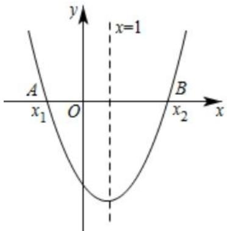

<table><tr><td colspan="1" rowspan="1">考法</td><td colspan="1" rowspan="1">解决方法</td><td colspan="1" rowspan="1">本题结果</td></tr><tr><td colspan="1" rowspan="3">①a, b, c</td><td colspan="1" rowspan="1">a:二次函数图像开口向上时，a&gt;0；开口向下，则a&lt;0，</td><td colspan="1" rowspan="3">a&gt;0b&lt;0c&lt;0</td></tr><tr><td colspan="1" rowspan="1">b：和a共同决定了函数对称轴的位置，“左同右异”</td></tr><tr><td colspan="1" rowspan="1">C:c为图像和y轴交点的纵坐标</td></tr><tr><td colspan="1" rowspan="1">②b² − 4ac</td><td colspan="1" rowspan="1">两个交点：b{-4ac&lt;0一个交点：b²-4ac=0没有交点：b^{-4ac&gt;0</td><td colspan="1" rowspan="1">b2 −4ac&lt;0</td></tr><tr><td colspan="1" rowspan="1">③a+b+ca—b+c4a+2b+c</td><td colspan="1" rowspan="1">用特殊值进行判断：a+b+c即为当x=1时的函数值；4a—2b+c为当x=−2时的函数值</td><td colspan="1" rowspan="1">a+b+c&lt;0a-b+c&lt;0</td></tr><tr><td colspan="1" rowspan="1">④3a+2b</td><td colspan="1" rowspan="1">只有a，b 时，用对称轴代换，消去一个未知数进行判断</td><td colspan="1" rowspan="1">… b=1, ∴ b=−2a ,2a3a+2b=3a−4a=−a&gt;0</td></tr><tr><td colspan="1" rowspan="1">⑤c+a</td><td colspan="1" rowspan="1">只有α，c或只有 b，C时，先用对称轴代换，消去一个未知数，然后利用④中的结果判断结果</td><td colspan="1" rowspan="1">∵a—b+c&lt;0，∴a+c&lt;b，∵a&gt;0,∴b=−2a&lt;0，∴a+c&lt;0</td></tr><tr><td colspan="1" rowspan="1">⑥b+2c</td><td colspan="1" rowspan="1">若c的系数不是1，可以先化成1再进行计算，或这把③中的某个式子中的c的系数变成题里的形式</td><td colspan="1" rowspan="1">b=−2a | b+2c =2(−a + c)而-a=a+ b，2(−a +c)=2(a+ b+c)&lt;0</td></tr><tr><td colspan="1" rowspan="1">am²+bm和a+b的大小关系</td><td colspan="1" rowspan="1">同时加上c，am²+bm+c，a+b+c第一个式子是当χ=m 时的函数值，第二个式子是当x=1时的函数值；由图可知，x=1时函数取最小值</td><td colspan="1" rowspan="1">am²+bm≥a+b</td></tr><tr><td colspan="1" rowspan="1">⑧(a+c) −b2</td><td colspan="1" rowspan="1">(a+c)² −b2=(a+b+c)(a+c−b)</td><td colspan="1" rowspan="1">(a+c)² −b2=(a+b+c)(a+c−b)&gt; 0</td></tr><tr><td colspan="1" rowspan="1"> b2 −4ac和4a的大小关系</td><td colspan="1" rowspan="1">可以把代数式变成顶点的纵坐标公式，顶点坐标(-，4ac-b²)$2a'  4a</td><td colspan="1" rowspan="1">假如定点纵坐标小于—1，则4ac-b2$&lt;−1,4ac −b²&lt;−4a,4ab2− 4ac&gt;4a</td></tr><tr><td colspan="1" rowspan="1">⑩若给出x的值</td><td colspan="1" rowspan="1">a,c的数量关系可以知道，即x₁x2 =C,进而可知a,b，c的关系a</td><td colspan="1" rowspan="1">可以判断关于a,b，c任意式子的正负也可以求出以a,b，c为参数的方程的根</td></tr></table>

# 核心·题型

# 【题型 1】二次函数图象与系数的关系（给出对称轴）

# 2023年湖南省娄底市中考真题

1．已知二次函数 $y = a x ^ { 2 } + b x + c$ 的图象如图所示，给出下列结论： $\textcircled{1} a b c < 0$ ； $\textcircled { 2 } 4 a - 2 b + c > 0$ ；$\textcircled { 3 } a - b > m \textcircled { a m + b }$ （ $m$ 为任意实数）； $\textcircled{4}$ 若点 $\left( - 3 , y _ { 1 } \right)$ 和点 $\left( 3 , { y } _ { 2 } \right)$ 在该图象上，则 $y _ { 1 } > y _ { 2 }$ ．其中正确的结论是（ ）

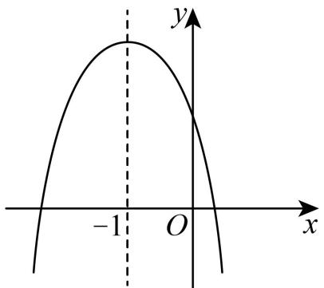

【淘宝店铺：向阳百分百】

A． $\textcircled{1} \textcircled{2}$ B． $\textcircled{1} \textcircled{4}$ C． $\textcircled{2} \textcircled{3}$ D． $\textcircled{2} \textcircled{4}$

【答案】D

【分析】由抛物线的开口向下，与 $\cdot$ 轴交于正半轴，对称轴在 $\cdot$ 轴的左边，可得 $a { < } 0$ ， $c > 0$ ， $b < 0$ ，故 $\textcircled{1}$ 不符合题意；当 $x = 0$ 与 $x = - 2$ 时的函数值相等，可得 $4 a - 2 b + c = c > 0$ ，故 $\cdot$ 符合题意；当 $x { = } - 1$ 时函数值最大，可得 $a - b \geq m { \bigl ( } a m + b { \bigr ) }$ ，故 $\cdot$ 不符合题意；由点 $\left( - 3 , y _ { 1 } \right)$ 和点 $\left( 3 , { y } _ { 2 } \right)$ 在该图象上，而$3 - ( - 1 ) = 4 > ( - 1 ) - ( - 3 ) = 2$ ，且离抛物线的对称轴越远的点的函数值越小，可得 $\textcircled{4}$ 符合题意

【详解】解：∵抛物线的开口向下，与 $\cdot$ 轴交于正半轴，对称轴在 $y$ 轴的左边，∴ a< $\circ , c > 0 , x = - \frac { b } { 2 a } < 0 ,$   
$b < 0$ ，  
$a b c > 0$ ，故 $\textcircled{1}$ 不符合题意；  
∵对称轴为直线 $x { = } - 1$ ，  
∴当 $x = 0$ 与 $x = - 2$ 时的函数值相等，  
$\ 4 a - 2 b + c = c > 0$ ，故 $\textcircled{2}$ 符合题意；  
∵当 $x { = } - 1$ 时函数值最大，  
$\therefore a - b + c \geq a m ^ { 2 } + b m + c$ ，  
$a - b \geq m { \big ( } a m + b { \big ) }$ ；故 $\textcircled{3}$ 不符合题意；  
∵点 $\left( - 3 , y _ { 1 } \right)$ 和点 $\left( 3 , { y } _ { 2 } \right)$ 在该图象上，  
而 $3 - ( - 1 ) = 4 > ( - 1 ) - ( - 3 ) = 2$ ，且离抛物线的对称轴越远的点的函数值越小，∴ $y _ { 1 } > y _ { 2 }$ ．故 $\textcircled{4}$ 符合题意；  
故选：D．

# 2023 年四川省达州市中考真题

2．如图，拋物线 $y = a x ^ { 2 } + b x + c$ （ $^ { a , b , c }$ 为常数）关于直线 $x = 1$ 对称．下列五个结论： $\textcircled{1} a b c > 0$ ；$\textcircled { 2 } 2 a + b = 0$ ； $\textcircled { 3 } 4 a + 2 b + c > 0$ ； $\textcircled { 4 } a m ^ { 2 } + b m > a + b$ ； $\textcircled { 5 } 3 a + c > 0$ ．其中正确的有（ ）

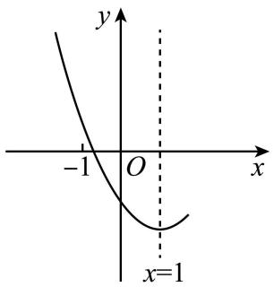

A．4 个 B．3 个 C．2 个 D．1 个

【答案】B

【分析】由抛物线的开口方向、与 $y$ 轴交点以及对称轴的位置可判断 $\cdot$ 、 $b$ 、 $c$ 的符号，由此可判断$\textcircled{1}$ 正确；由抛物线的对称轴为 $x = 1$ ，得到 $- { \frac { b } { 2 a } } = 1$ ，即可判断 $\cdot$ ；可知 $x = 2$ 时和 $x = 0$ 时 的 $y$ 值相等可判断 $\textcircled{3}$ 正确；由图知 $x = 1$ 时二次函数有最小值，可判断 $\textcircled{4}$ 错误；由抛物线的对称轴为 $x = 1$ 可得

【淘宝店铺：向阳百分百】

$b = - 2 a$ ，因此 $y = a x ^ { 2 } - 2 a x + c$ ，根据图像可判断 $\textcircled{5}$ 正确．

【详解】 $\cdot$ ∵抛物线的开口向上，  
$\therefore a > 0$ .  
∵抛物线与 $\cdot$ 轴交点在 $\cdot$ 轴的负半轴上，  
 $c < 0$ .  
由 $- \frac { b } { 2 a } > 0$ 得， $b < 0$ ，  
$\therefore a b c > 0$ ，  
故 $\textcircled{1}$ 正确；  
$\textcircled{2}$ 抛物线的对称轴为 $x = 1$ ，  
$\therefore - { \frac { b } { 2 a } } = 1$ ，  
 $b = - 2 a$ ，  
 $2 a + b = 0$ ，故 $\textcircled{2}$ 正确；  
$\textcircled{3}$ 由抛物线的对称轴为 $x = 1$ ， 可知 $x = 2$ 时和 $x = 0$ 时的 $y$ 值相等．由图知 $x = 0$ 时， $y < 0$ ，  
∴ $x = 2$ 时， $y < 0$ ．  
即 $4 a + 2 b + c < 0$   
故 $\cdot$ 错误；  
$\textcircled{4}$ 由图知 $x = 1$ 时二次函数有最小值，  
$\begin{array} { l } { \therefore a + b + c \leq a m ^ { 2 } + b m + c } \\ { \therefore a + b \leq a m ^ { 2 } + b m } \\ { a + b \leq m ( a x + b ) } \end{array}$ ，  
故 $\cdot$ 错误；  
$\textcircled{5}$ 由抛物线的对称轴为 $x = 1$ 可得 $- { \frac { b } { 2 a } } = 1$ ，  
 $. b = - 2 a$ ，  
$\cdot \ y = a x ^ { 2 } - 2 a x + c$ ，  
当 $x { = } - 1$ 时， $y = a + 2 a + c = 3 a + c$   
由图知 $x { = } - 1$ 时 $y > 0$ ,  
$\cdot 3 a + c > 0$ .  
故 $\textcircled{5}$ 正确  
综上所述：正确的是 $\cdot$ ，有 3 个，  
故选：B

# 2023年山东省烟台市中考真题

3．如图，抛物线 $y = a x ^ { 2 } + b x + c$ 的顶点A的坐标为 $\left( - \frac { 1 } { 2 } , m \right)$ , 与 $x$ 轴的一个交点位于 0 合和 1 之间，则以下结论： $\textcircled{1} a b c > 0$ ； $\textcircled { 2 } 2 b + c > 0$ ； $\textcircled{3}$ 若图象经过点 $\left( - 3 , { y } _ { 1 } \right) , \left( 3 , { y } _ { 2 } \right)$ ，则 $y _ { 1 } > y _ { 2 }$ ； $\textcircled{4}$ 若关于 $x$ 的一元二次方程 $a x ^ { 2 } + b x + c - 3 = 0$ 无实数根，则 $m < 3$ ．其中正确结论的个数是（ ）

【淘宝店铺：向阳百分百】

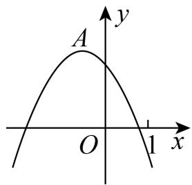

A．1 B．2 C．3 D．4

【答案】C

【分析】根据图象，分别得出 $\cdot$ 、 $b$ 、 $c$ 的符号，即可判断 $\cdot$ ；根据对称轴得出 $a = b$ ，再根据图象得出当 $x = 1$ 时， $y = a + b + c < 0$ ，即可判断 $\textcircled{2}$ ；分别计算两点到对称轴的距离，再根据该抛物线开口向下，在抛物线上的点离对称轴越远，函数值越小，即可判断 $\cdot$ ；将方程 $a x ^ { 2 } + b x + c - 3 = 0$ 移项可得 $a x ^ { 2 } + b x + c = 3$ ，根据该方程无实数根，得出抛物线 $y = a x ^ { 2 } + b x + c$ 与直线 $y = 3$ 没有交点，即可判断 $\textcircled{4}$

【详解】解： $\textcircled{1}$ ∵该抛物线开口向下，∴ $a { < } 0$ ，  
∵该抛物线的对称轴在 $y$ 轴左侧， $\therefore b < 0$ ，  
∵该抛物线于 $y$ 轴交于正半轴，∴ $c > 0$ ，∴ abc $> 0$ ，  
故 $\textcircled{1}$ 正确，符合题意；  
$\cdot$ ∵ $A \left( - \frac { 1 } { 2 } , m \right)$ ∴该抛物线的对称轴为直线 $x = - { \frac { b } { 2 a } } = - { \frac { 1 } { 2 } }$ , 则 $a = b$ ，  
当 $x = 1$ 时， $y = a + b + c$ ，把 $a = b$ 得：当 $x = 1$ 时， $y = 2 b + c$ ，  
由图可知：当 $x = 1$ 时， $y < 0 , \ \therefore 2 b + c < 0$ ，  
故 $\cdot$ 不正确，不符合题意；  
$\cdot$ ∵该抛物线的对称轴为直线 $x = - { \frac { 1 } { 2 } }$   
$\qquad \left( - 3 , y _ { 1 } \right)$ 到对称轴的距离为 $- { \frac { 1 } { 2 } } - ( - 3 ) = \frac { 5 } { 2 }$ $\left( 3 , { y } _ { 2 } \right)$ 到对称轴的距离为 $3 - \left( - { \frac { 1 } { 2 } } \right) = \frac { 7 } { 2 }$ ∵该抛物线开口向下，∴在抛物线上的点离对称轴越远，函数值越小，  
${ \frac { 5 } { 2 } } < { \frac { 7 } { 2 } } \qquad y _ { 1 } > y _ { 2 }$ ，故 $\textcircled{3}$ 正确，符合题意；  
$\cdot$ 将方程 $a x ^ { 2 } + b x + c - 3 = 0$ 移项可得 $a x ^ { 2 } + b x + c = 3$ ，  
∵ $\cdot \ a x ^ { 2 } + b x + c - 3 = 0$ 无实数根，∴抛物线 $y = a x ^ { 2 } + b x + c$ 与直线 $y = 3$ 没有交点，$\mathbf { \partial } \cdot \mathbf { \mathcal { A } } \left( - \frac { 1 } { 2 } , m \right)$ ∴ $m < 3$ ．故 $\textcircled{4}$ 正确  
综上：正确的有： $\cdot$ ，共三个  
故选：C．

# 2023 年四川省遂宁市中考真题

4．抛物线 $y = a x ^ { 2 } + b x + c \left( a \neq 0 \right)$ 的图象如图所示，对称轴为直线 $x = - 2$ ．下列说法： $\textcircled{1} a b c < 0$ ；

$\textcircled { 2 } c - 3 a > 0 ; \textcircled { 3 } 4 a ^ { 2 } - 2 a b \geqslant a t \left( a t + b \right) ( t$ 为全体实数）； $\textcircled{4}$ 若图象上存在点 $A \left( x _ { 1 } , y _ { 1 } \right)$ 和点 $B \left( x _ { 2 } , y _ { 2 } \right)$ ，当 $m < x _ { 1 } < x _ { 2 } < m + 3$ 时，满足 $y _ { 1 } = y _ { 2 }$ ，则 $m$ 的取值范围为 $- 5 < m < - 2$ ．其中正确的个数有（ ）

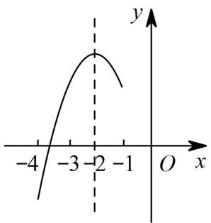

A．1 个 B．2 个 C．3 个 D．4 个

【答案】C

【分析】开口方向，对称轴，与 $y$ 轴的交点位置判断 $\cdot$ ，特殊点判断 $\cdot$ ，最值判断 $\textcircled{3}$ ，对称性判断 $\textcircled{4}$ 即可．

【详解】∵抛物线的开口向下，对称轴为直线 $x = - { \frac { b } { 2 a } } = - 2 < 0$ ，抛物线与 $\cdot$ 轴交点位于负半轴，  
$\therefore a < 0 , b < 0 , c < 0$ ，  
$\therefore a b c < 0$ ，故 $\cdot$ 正确；  
由图象可知， $a - b + c > 0$ ，根据对称轴，得 $b = 4 a$ ，$\therefore a - 4 a + c > 0$   
$\ c - 3 a > 0$ ，  
故 $\textcircled{2}$ 正确；  
∵抛物线的开口向下，对称轴为直线 $x = - { \frac { b } { 2 a } } = - 2 < 0$ ，∴抛物线的最大值为 $y = 4 a - 2 b + c$ ，  
当 $x = t$ 时，其函数值为 $y = a t ^ { 2 } + b t + c$ ，  
$4 a - 2 b + c \geq a t ^ { 2 } + b t + c$ ，  
$4 a - 2 b \geq a t ^ { 2 } + b t$ ，  
∵ $a < 0$ ，  
$a \big ( 4 a - 2 b \big ) { \leqslant } a \big ( a t ^ { 2 } + b t \big )$   
$4 a ^ { 2 } - 2 a b { \leqslant } \mathrm { a t } \left( a t + b \right)$   
故 $\cdot$ 错误；  
如图所示， $A \left( x _ { 1 } , y _ { 1 } \right)$ 和点 $B \left( x _ { 2 } , y _ { 2 } \right)$ 满足 $y _ { 1 } = y _ { 2 }$ ，$\therefore A \left( x _ { 1 } , y _ { 1 } \right)$ 和点 $B \left( x _ { 2 } , y _ { 2 } \right)$ 关于对称轴对称，$x _ { 1 } \left. - 2 , x _ { 2 } \right. - 2$ ,  
∵ $m < x _ { 1 } < x _ { 2 } < m + 3$ ,  
∴ $m < x _ { 1 } < - 2 , - 2 < x _ { 2 } < m + 3 ,$   
解得 $- 5 < m < - 2$ ，  
故 $\textcircled{4}$ 正确；  
故选 C．

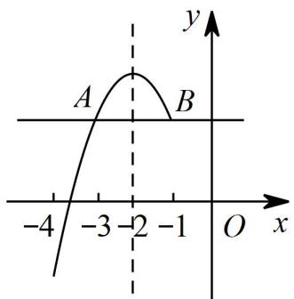

# 2022 年辽宁省丹东市中考真题

5．如图，抛物线 $\scriptstyle y = a x ^ { 2 } + b x + c$ （ $a { \neq } 0$ ）与 $x$ 轴交于点 $A$ （5，0），与 $y$ 轴交于点 $C$ ，其对称轴为直线 $x$ $= 2$ ，结合图象分析如下结论： $\textcircled{1} a b c > 0$ ； $\textcircled { 2 } b + 3 a < 0$ ； $\textcircled{3}$ 当 $x { > } 0$ 时， $y$ 随 $x$ 的增大而增大； $\textcircled{4}$ 若一次函数 $y = k x + b$ （ $k { \neq } 0$ ）的图象经过点 $A$ ，则点 $\textit { E } \left( \boldsymbol { k } , \textit { b } \right)$ 在第四象限； $\textcircled{5}$ 点 $M$ 是抛物线的顶点，若 $C M \bot A M$ ，则 $a { = } \frac { \sqrt { 6 } } { 6 }$ 其中正确的有（ ）

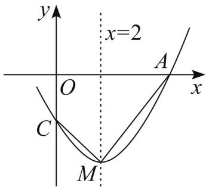

A．1 个 B．2 个 C．3 个 D．4 个

【答案】D

【分析】 $\cdot$ 正确，根据抛物线的位置判断即可； $\cdot$ 正确，利用对称轴公式，可得 $b = - 4 a$ ，可得结论； $\textcircled{3}$ 错误，应该是 $x { > } 2$ 时， $y$ 随 $x$ 的增大而增大； $\textcircled{4}$ 正确，判断出 $\cdot$ ，可得结论； $\textcircled{5}$ 正确，设抛物线的解析式为 $y = a$ $-$ ，可得 $M$ （2，﹣9a）， $\cdot$ ），过点$M$ 作 $\cdot$ 轴于点 $\cdot$ ，设对称轴交 $\cdot$ 轴于点 $\cdot$ ．利用相似三角形的性质，构建方程求出 $a$ 即可

【详解】解：∵抛物线开口向上，  
∴ $\cdot$ ，  
∵对称轴是直线 $x { = } 2$ ，  
$\therefore - { \frac { b } { 2 a } } = 2 ,$

【淘宝店铺：向阳百分百】

$\_$   
∵抛物线交 $y$ 轴的负半轴，  
∴ $. c { < } 0$ ，  
∴ $. a b c > 0$ ，故 $\cdot$ 正确，  
∵ $\cdot$ ， $\cdot$ ，  
$\therefore b + 3 a = - a < 0$ ，故 $\cdot$ 正确，  
观察图象可知，当 $\cdot$ 时， $\cdot$ 随 $x$ 的增大而减小，故 $\cdot$ 错误，  
一次函数 $\cdot$ （ $\cdot$ ）的图象经过点 $\cdot$ ，  
∵ $\cdot$ ，  
∴ $\cdot$ ，此时 $\cdot$ （k， $\cdot$ ）在第四象限，故 $\cdot$ 正确  
∵抛物线经过（﹣1，0），（5，0），  
∴可以假设抛物线的解析式 ${ \rlap / { \ x } \ } y = a \ \left( x + 1 \right) \ \left( x - 5 \right) \ = a \ \left( x - 2 \right) \ { \mathrm { \Omega } } ^ { 2 } - 9 a ,$ ，  
∴M（2， $\cdot$ ）， $\cdot$ （0，﹣5a），  
过点 $M$ 作 $\cdot$ 轴于点 $H$ ，设对称轴交 $x$ 轴于点 $\cdot$   
∵AM⊥CM，  
∴ $-$ ，  
∴ $-$ ，  
∵ $-$ ，  
$\therefore \triangle M H C \sim \triangle M K A$ ，$\cdot \frac { M H } { M K } { = } \frac { C H } { A K }$ $\frac { 2 } { - 9 a } \frac { - 4 a } { 3 }$   
$\therefore a ^ { 2 } = { \frac { 1 } { 6 } } ,$   
∵ $\cdot _ { a > 0 }$ ，  
∴ $\cdot a { = } \frac { \sqrt { 6 } } { 6 }$ 故 $\textcircled{5}$ 正确，  
故选：D

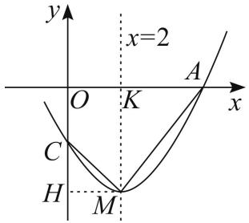

# 【题型2】二次函数图象与系数的关系（给出对称轴和交点坐标）

# 2023年黑龙江省牡丹江市中考真题

6．如图，抛物线 $y = a x ^ { 2 } + b x + c$ 经过点 $\left( - 2 , 0 \right)$ ， $\left( 3 , 0 \right)$ ．下列结论： $\textcircled { 1 } \frac { a b } { c } > 0$ ； $\textcircled{2} c = 2 b$ ； $\textcircled{3}$ 若抛物

【淘宝店铺：向阳百分百】

线上有点 $\left( \frac { 5 } { 2 } , y _ { 1 } \right) , \left( - 3 , y _ { 2 } \right) , \left( - \frac { 1 } { 2 } , y _ { 3 } \right)$ ，则 $y _ { 2 } < y _ { 1 } < y _ { 3 }$ ； $\textcircled{4}$ 方程 $c x ^ { 2 } + b x + a = 0$ 的解为 $x _ { 1 } = \frac { 1 } { 2 }$ ，$x _ { 2 } = - \frac { 1 } { 3 }$ ，其中正确的个数是（ ）

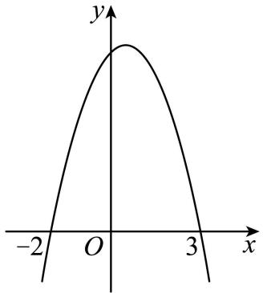

A．4 B．3 C．2 D．1

【答案】D

【分析】本题考查二次函数，掌握二次函数的性质是解题的关键根据二次函数图象可知： $a < 0$ ， $- \frac { b } { 2 a } > 0$ ， $c > 0$ ，得出 $\frac { a b } { c } < 0$ ，故 $\cdot$ 不正 确 ；将点 $\left( - 2 , 0 \right)$ ，3, 0 代入，得出： $a + b = 0$ ，再求出 $c = - 6 b$ ，故 $\textcircled{2}$ 不正确；根据函数图象可得 $y _ { 2 } < y _ { 1 } < y _ { 3 }$ ，故 $\textcircled{3}$ 正确；把 $a = - b$ ，$c = 6 b$ 代入方程 $c x ^ { 2 } + b x + a = 0$ ，得 $6 b x ^ { 2 } + b x - b = 0$ ，解得 $x _ { 1 } = - \frac { 1 } { 2 } x _ { 2 } = \frac { 1 } { 3 }$ 故 $\textcircled{4}$ 不正确．

【详解】解：根据二次函数图象可知： $a < 0 , - \frac { b } { 2 a } > 0 , c > 0 ,$ $b > 0$ ，  
$\frac { a b } { c } < 0$ ，故 $\textcircled{1}$ 不正确；  
将点 $\left( - 2 , 0 \right)$ ， $\left( 3 , 0 \right)$ 代入得出： $\left\{ \begin{array} { l l } { 4 a - 2 b + c = 0 \textcircled { 1 } } \\ { 9 a + 3 b + c = 0 \textcircled { 2 } } \end{array} \right. ,$   
$\textcircled{2} - \textcircled{1}$ 得出： $a + b = 0$ ，  
∴ $a = - b$ ，  
再代入 $\textcircled{1}$ 得出： $c = 6 b$ ，故 $\cdot$ 不正确；  
由图象可知：抛物线开口向下，与 $\cdot$ 轴交点为 $\left( - 2 , 0 \right)$ ， 3, 0 ，$\therefore - 3 < - 2 < - \frac { 1 } { 2 } < 0 < \frac { 5 } { 2 } < 3 ,$   
$\therefore y _ { 2 } < 0 , y _ { 3 } > 0 , y _ { 1 } > 0 ,$   
∵抛物线对称轴为直线 $x = - { \frac { b } { 2 a } } = - { \frac { b } { - 2 b } } = { \frac { 1 } { 2 } }$   
$\because \frac { 1 } { 2 } < \frac { 5 } { 2 } < 3 \ : , \vert - \frac { 1 } { 2 } - \frac { 1 } { 2 } \vert < \left| \frac { 5 } { 2 } - \frac { 1 } { 2 } \right| ,$   
$\cdot \ y _ { 3 } > y _ { 1 } > 0$ ，  
$y _ { 2 } < y _ { 1 } < y _ { 3 }$ ，故 $\textcircled{3}$ 正确；  
把 $a = - b$ ， $c = 6 b$ 代入方程 $c x ^ { 2 } + b x + a = 0$ ，

得 $6 b x ^ { 2 } + b x - b = 0$ $b { \big ( } 2 x + 1 { \big ) } { \big ( } 3 x - 1 { \big ) } = 0$ $\therefore x _ { 1 } = - { \frac { 1 } { 2 } } , x _ { 2 } = { \frac { 1 } { 3 } } ,$ 故 $\cdot$ 不正确； 正确的个数是 1 个， 故选：D

# 2023 年四川省乐山市中考真题

7．如图，抛物线 $y = a x ^ { 2 } + b x + c$ 经过点 $A ( - 1 , 0 ) , \ B ( m , 0 )$ ，且 $1 < m < 2$ ，有下列结论： $\textcircled{1} b < 0$ ；$\textcircled { 2 } a + b > 0$ ； $\textcircled { 3 } 0 < a < - c$ ； $\textcircled{4}$ 若点 $C { \biggl ( } { - } { \frac { 2 } { 3 } } , y _ { 1 } { \biggr ) } , D { \biggl ( } { \frac { 5 } { 3 } } , y _ { 2 } { \biggr ) }$ 在抛 物线 上，则 $y _ { 1 } > y _ { 2 }$ ．其中 ，正确 的结论有（ ）

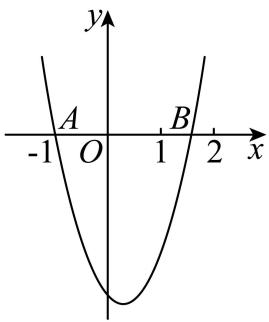

A．4 个 B．3 个 C．2 个 D．1 个

【答案】B

【分析】抛物线 $y = a x ^ { 2 } + b x + c$ 经过点 $A ( - 1 , 0 )$ 、 $B ( m , 0 )$ ，且 $1 < m < 2$ ，，可以得到 $a > 0$ ， $0 < - \frac { b } { 2 a } < \frac { 1 } { 2 }$ 从而可以得到 $\cdot$ 的正负情况，从而可以判断 $\cdot$ ；继而可得出 $- b < a$ ，则 $a + b > 0$ ，即可判断 $\textcircled{2}$ ；由图象可知，当 $x = - 1$ 时， $y = 0$ ，即 $a - b + c = 0$ ，所以有 $a + c = b$ ，从而可得出 $0 < a < - c$ ，即可判断 $\cdot$ ；利用 $\left| { \frac { 1 } { 2 } } - \left( - { \frac { 2 } { 3 } } \right) \right| = \left| { \frac { 5 } { 3 } } - { \frac { 1 } { 2 } } \right|$ , 再根据 $0 < - \frac { b } { 2 a } < \frac { 1 } { 2 }$ 所以 $\left| - { \frac { b } { 2 a } } - \left( - { \frac { 2 } { 3 } } \right) \right| < \left| { \frac { 5 } { 3 } } - \left( - { \frac { b } { 2 a } } \right) \right|$ 从而 可 得 $y _ { 1 } < y _ { 2 }$ ， 即可判断 $\textcircled{4}$ ．

【详解】解 ：∵抛物线 $y = a x ^ { 2 } + b x + c$ 的图象开口向上，∴ $a > 0$ ，  
∵抛物线 $y = a x ^ { 2 } + b x + c$ 经过点 $A ( - 1 , 0 ) , \ B ( m , 0 )$ ，且 $1 < m < 2$ ，  
$0 < - \frac { b } { 2 a } < \frac { 1 } { 2 }$ $b < 0$ ，故 $\textcircled{1}$ 正确；  
$\because 0 < - \frac { b } { 2 a } < \frac { 1 } { 2 } , a > 0 , \therefore - b < a$   
∴ $a + b > 0$ ，故 $\cdot$ 正确；由图象可知，当 $x = - 1$ 时， $y = 0$ ，即 $a - b + c < 0 \qquad a + c = b$ ∵ $a > 0$ ， $b < 0$ ， $\quad 0 < a < - c$ ，故 $\cdot$ 正确；∵ $\cdot \left| { \frac { 1 } { 2 } } - \left( - { \frac { 2 } { 3 } } \right) \right| = \left| { \frac { 5 } { 3 } } - { \frac { 1 } { 2 } } \right|$ ，  
又∵ $0 < - \frac { b } { 2 a } < \frac { 1 } { 2 } \qquad \left| - \frac { b } { 2 a } - \left( - \frac { 2 } { 3 } \right) \right| < \left| \frac { 5 } { 3 } - \left( - \frac { b } { 2 a } \right) \right|$ ，

∵抛物线 $y = a x ^ { 2 } + b x + c$ 的图象开口向上，∴ $y _ { 1 } < y _ { 2 }$ ，故 $\cdot$ 错误∴正确的有 $\cdot$ 共 3 个，故选：B．

# 2023 年四川省眉山市中考真题

8．如图，二次函数 $y = a x ^ { 2 } + b x + c \left( a \neq 0 \right)$ 的图象与 $x$ 轴的一个交点坐标为 $\left( 1 , 0 \right)$ ，对称轴为直线 $x { = } - 1$ ，下列四个结论： $\textcircled{1} a b c {< } 0$ ； $\textcircled { 2 } 4 a - 2 b + c < 0$ ； $\textcircled { 3 } 3 a + c = 0$ ； $\textcircled{4}$ 当 $- 3 < x < 1$ 时， $a x ^ { 2 } + b x + c < 0$ ；其中正确结论的个数为（ ）

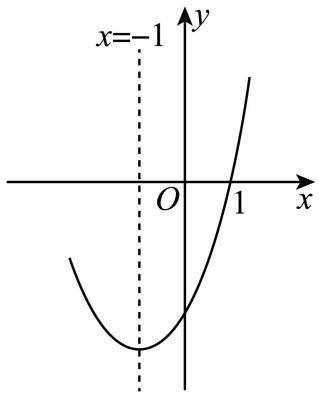

A．1 个 B．2 个 C．3 个 D．4 个

【答案】D

【分析】根据二次函数开口向上，与 $y$ 轴交于 $\cdot$ 轴负半轴， $a > 0$ ， $c < 0$ ，根据对称轴为直线 $x { = } - 1$ 可得 $b = 2 a > 0$ ，由此即可判断 $\cdot$ ；求出二次函数与 $\cdot$ 轴的另一个交点坐标为 $( - 3 , 0 )$ ，进而得到当 $x = - 2$ 时， $y < 0$ ，由此即可判断 $\textcircled{2}$ ；根据 $x = 1$ 时， $y = 0$ ，即可判断 $\textcircled{3}$ ；利用图象法即可判断 $\cdot$

【详解】解：∵二次函数开口向上，与 $\cdot$ 轴交于 $\cdot$ 轴负半轴，  
∴ $a > 0$ ， $c < 0$ ，  
∵二次函数的对称轴为直线 $x { = } - 1$ ，  
$\therefore - { \frac { b } { 2 a } } = - 1$ ，  
$b = 2 a > 0$ ，  
∴ abc ${ \bf \omega } { \bf < } 0$ ，故 $\textcircled{1}$ 正确；  
∵二次函数 $y = a x ^ { 2 } + b x + c \left( a \neq 0 \right)$ 的图象与 $x$ 轴的一个交点坐标为 $\left( 1 , 0 \right)$ ，∴二次函数 $y = a x ^ { 2 } + b x + c \left( a \neq 0 \right)$ 的图象与 $\cdot$ 轴的另一个交点坐标为 $( - 3 , 0 )$ ，∴当 $x = - 2$ 时， $y < 0$ ，  
$\therefore 4 a - 2 b + c < 0$ ，故 $\cdot$ 正确；  
∵ $x = 1$ 时， $y = 0$ ，  
$\textstyle a + b + c = 0$ ，  
∴ $a + 2 a + c = 0$ ，即 $3 a + c = 0$ ，故 $\textcircled{3}$ 正确；  
由函数图象可知，当 $- 3 < x < 1$ 时， $a x ^ { 2 } + b x + c < 0$ ，故 $\textcircled{4}$ 正确；  
综上所述，其中正确的结论有 $\textcircled{1} \textcircled{2} \textcircled{3} \textcircled{4}$ 共 4 个，故选 D

# 2023年辽宁省营口市中考真题

9．如图．抛物线 $y = a x ^ { 2 } + b x + c \left( a \neq 0 \right)$ 与 $x$ 轴交于点 $A \left( - 3 , 0 \right)$ 和点 $B \mathopen { } \mathclose \bgroup \left( 1 , 0 \aftergroup \egroup \right)$ ，与 $y$ 轴交于点 $C$ ．下列说法： $\textcircled{1} a b c { < } 0$ ； $\textcircled{2}$ 抛物线的对称轴为直线 $x { = } - 1$ ； $\textcircled{3}$ 当 $- 3 < x < 0$ 时， $a x ^ { 2 } + b x + c > 0$ ； $\textcircled{4}$ 当 $x > 1$ 时， $y$ 随 $x$ 的增大而增大； $\textcircled { 5 } a m ^ { 2 } + b m \leq a - b$ （ $m$ 为任意实数）其中正确的个数是（ ）

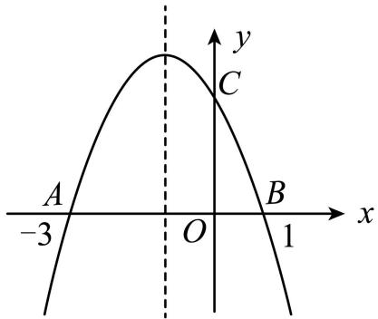

A．1 个 B．2 个 C．3 个 D．4 个

【答案】C

【分析】根据抛物线开口向下，与 $\cdot$ 轴交于正半轴，可得 $a < 0$ ， $c > 0$ ，根据 $A \left( - 3 , 0 \right)$ 和点 $B \mathopen { } \mathclose \bgroup \left( 1 , 0 \aftergroup \egroup \right)$ 可得抛物线的对称轴为直线 $x { = } - 1$ ，即可判断 $\cdot$ ；推出 $b = 2 a < 0$ ，即可判断 $\cdot$ ；根据函数图象即可判断$\cdot$ ；根据当 $x { = } - 1$ 时，抛物线有最大值 $a - b + c$ ，即可得到 $a m ^ { 2 } + b m \leq a - b$ ，即可判断 $\textcircled{5}$

【详解】解：∵抛物线开口向下，与 $y$ 轴交于正半轴，  
∴ $a < 0$ ， $c > 0$ ，  
∵抛物线与 $x$ 轴交于点 $A \left( - 3 , 0 \right)$ 和点 $B \mathopen { } \mathclose \bgroup \left( 1 , 0 \aftergroup \egroup \right)$ ，  
∴抛物线对称轴为直线 $x = { \frac { - 3 + 1 } { 2 } } = - 1$ ，故 $\textcircled{2}$ 正确；  
$\therefore - { \frac { b } { 2 a } } = - 1$   
∴ $b = 2 a < 0$ ，  
∴ $a b c > 0$ ，故 $\textcircled{1}$ 错误；  
由函数图象可知，当 $- 3 < x < 0$ 时，抛物线的函数图象在 $x$ 轴上方，  
∴当 $- 3 < x < 0$ 时， $a x ^ { 2 } + b x + c > 0$ ，故 $\textcircled{3}$ 正确；  
∵抛物线对称轴为直线 $x { = } - 1$ 且开口向下，  
∴当 $x > - 1$ 时， $y$ 随 $x$ 的增大而减小，即当 $x > 1$ 时， $\cdot$ 随 $\cdot$ 的增大而减小，故 $\textcircled{4}$ 错误；∵抛物线对称轴为直线 $x { = } - 1$ 且开口向下，  
∴当 $x { = } - 1$ 时，抛物线有最大值 $y = a - b + c$ ，  
$a m ^ { 2 } + b m + c \leq a - b + c$ ，  
$a m ^ { 2 } + b m \leq a - b$ ，故 $\cdot$ 正确；  
综上所述，正确的有 $\textcircled{2} \textcircled{3} \textcircled{5}$ ，  
故选 C．

# 2023 年黑龙江省齐齐哈尔市中考真题

10．如图，二次函数 $y = a x ^ { 2 } + b x + c \left( a \neq 0 \right)$ 图像的一部分与 $x$ 轴的一个交点坐标为 3, 0 ，对称轴为直线 $x = 1$ ，结合图像给出下列结论：

$$
\textcircled { 1 } a b c > 0 ; \textcircled { 2 } b = 2 a ; \textcircled { 3 } 3 a + c = 0 ;
$$

$\textcircled{4}$ 关于 $x$ 的一元二次方程 $a x ^ { 2 } + b x + c + k ^ { 2 } = 0 ( a \neq 0 )$ 有两个不相等的实数根；

$\textcircled{5}$ 若点 $\left( m , y _ { 1 } \right)$ ， $\left( - m + 2 , y _ { 2 } \right)$ 均在该二次函数图像上，则 $y _ { 1 } = y _ { 2 }$ ．其中正确结论的个数是（ ）

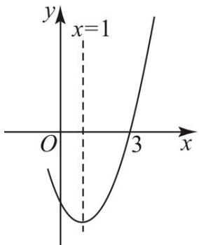

A．4 B．3 C．2 D．1

【答案】B

【分析】根据抛物线的对称轴、开口方向、与 $y$ 轴的交点确定 $\cdot$ 、 $b$ 、 $c$ 的正负，即可判定 $\cdot$ 和 $\textcircled{2}$ ；将点3,0代入抛物线解析式并结合 $b = - 2 a$ 即可判定 $\cdot$ ；运用根的判别式并结合 $\cdot$ 、 $\cdot$ 的正负，判定判别式是否大于零即可判定 $\textcircled{4}$ ；判定点 $\left( m , y _ { 1 } \right)$ ， $\left( - m + 2 , y _ { 2 } \right)$ 的对称轴为 $x = 1$ ，然后根据抛物线的对称性即可判定 $\textcircled{5}$

【详解】解：抛物线开口向上，与 $y$ 轴交于负半轴，  
$\therefore a > 0 , c < 0$ ，  
∵抛物线的对称轴为直线 $x = 1$ ，  
$\cdot - \frac { b } { 2 a } = 1$ ，即 $b = - 2 a < 0$ ，即 $\textcircled{2}$ 错误；  
$\cdot \ a b c > 0$ ，即 $\textcircled{1}$ 正确，  
二次函数 $y = a x ^ { 2 } + b x + c \left( a \neq 0 \right)$ 图像的一部分与 $x$ 轴的一个交点坐标为 3, 0  
$\therefore 9 a + 3 b + c = 0$   
$\scriptstyle \cdot . 9 a + 3 \left( - 2 a \right) + c = 0$ ，即 $3 a + c = 0$ ，故 $\textcircled{3}$ 正确；  
∵关于 $x$ 的一元二次方程 $a x ^ { 2 } + b x + c + k ^ { 2 } = 0 ( a \neq 0 ) \Delta = b ^ { 2 } - 4 a { \left( c + k ^ { 2 } \right) } = b ^ { 2 } - 4 a c - 4 a k ^ { 2 } a > 0 , c < 0$ ，∴ $- 4 a c > 0$ ， $- 4 a k ^ { 2 } \leq 0$ ，  
∴无法判断 $b ^ { 2 } - 4 a c - 4 a k ^ { 2 }$ 的正负，即无法确定关于 $\cdot$ 的一元二次方程 $a x ^ { 2 } + b x + c + k ^ { 2 } = 0 ( a \neq 0 )$ 的根的情况，故 $\textcircled{4}$ 错误；  
${ \frac { m + \left( - m + 2 \right) } { 2 } } = 1$

【淘宝店铺：向阳百分百】

∴点 $\left( m , y _ { 1 } \right)$ ， $\left( - m + 2 , y _ { 2 } \right)$ 关于直线 $x = 1$ 对称  
∵点 $\left( m , y _ { 1 } \right)$ ， $\left( - m + 2 , y _ { 2 } \right)$ 均在该二次函数图像上，∴ $y _ { 1 } = y _ { 2 }$ ，即 $\textcircled{5}$ 正确；  
综上，正确的为 $\textcircled{1} \textcircled{3} \textcircled{5}$ ，共 3 个  
故选：B．

# 2023 年四川省广安市中考真题

11．如图所示，二次函数 $y = a x ^ { 2 } + b x + c ( a , \ b , \ c$ 为常数， $a \neq 0$ )的图象与 $x$ 轴交于点$A { \big ( } { - } 3 , 0 { \big ) } , B { \big ( } 1 , 0 { \big ) }$ ．有下列结论： $\textcircled{1} a b c > 0$ ； $\textcircled{2}$ 若点 $\left( - 2 , y _ { 1 } \right)$ 和 $\left( - 0 . 5 , y _ { 2 } \right)$ 均在抛物线上，则 $y _ { 1 } < y _ { 2 }$ ；$\textcircled { 3 } 5 a - b + c = 0$ ； $\textcircled{4} 4 a + c > 0$ ．其中正确的有（ ）

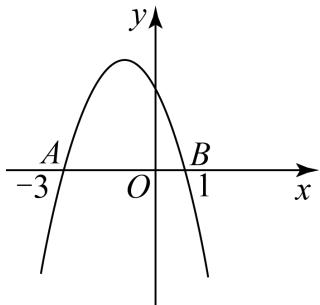

A．1 个 B．2 个 C．3 个 D．4 个

【答案】C

【分析】根据二次函数图像的性质、二次函数图像与系数的关系以及与 $x$ 轴交点问题逐项分析判断即可.

【详解】解：由图可知，二次函数开口方向向下，与y轴正半轴交于一点， $a { < } 0$ ， $c { > } 0$ .  
$\cdot - \frac { b } { 2 a } < 0$   
 $b { < } 0$ .  
$\therefore a b c > 0$ .  
故 $\cdot$ 正确.  
$\cdot \ A \left( - 3 , 0 \right) , B \left( 1 , 0 \right)$ 是关于二次函数对称轴对称，  
$\therefore - { \frac { b } { 2 a } } = - 1 .$   
$\cdot \left( - 2 , y _ { 1 } \right)$ 在对称轴的左边， $\left( - 0 . 5 , y _ { 2 } \right)$ 在对称轴的右边，如图所示，

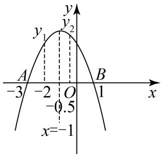

【淘宝店铺：向阳百分百】

$\therefore y _ { 1 } < y _ { 2 }$ .   
故 $\textcircled{2}$ 正确.   
图象与 $x$ 轴交于点 $A { \big ( } { - } 3 , 0 { \big ) } , B { \big ( } 1 , 0 { \big ) }$ ， $\therefore 9 a - 3 b + c = 0 a + b + c = 0$   
$\therefore 1 0 a - 2 b + 2 c = 0$ .   
$\therefore 5 a - b + c = 0$ .   
故 $\cdot$ 正确.   
$\because - { \frac { b } { 2 a } } = - 1 ,$ ，   
$\cdot b = 2 a$ .   
当 $x = 1$ 时， $y = 0$ ，   
$\therefore a + b + c = 0$ .   
$\therefore 3 a + c = 0$ ，   
$\cdot c = - 3 a$ ，   
$\therefore 4 a + c = 4 a - 3 a = a < 0$   
故 $\cdot$ 不正确.   
综上所述，正确的有 $\textcircled{1} \textcircled{2} \textcircled{3}$ .   
故选：C.

# 2023 年辽宁省丹东市中考真题

12．抛物线 $y = a x ^ { 2 } + b x + c \left( a \neq 0 \right)$ 与 $x$ 轴的一个交点为 $A \left( - 3 , 0 \right)$ ，与 $y$ 轴交 于点 $C$ ，点 $D$ 是抛物线的顶点，对称轴为直线 $x = - 1$ ，其部分图象如图所示，则以下 4 个结论： $\textcircled{1} a b c > 0$ ； $\textcircled { 2 } E \left( x _ { 1 } , y _ { 1 } \right)$ ，$F \left( x _ { 2 } , y _ { 2 } \right)$ 是抛物线 $y = a x ^ { 2 } + b x { \bigl ( } a \neq 0 { \bigr ) }$ 上的两个点，若 $x _ { 1 } < x _ { 2 }$ ，且 $x _ { 1 } + x _ { 2 } < - 2$ ，则 $y _ { 1 } < y _ { 2 }$ ； $\textcircled{3}$ 在 $x$ 轴上有一动点 $P$ ，当 $P C + P D$ 的值最小时，则点 $P$ 的坐标为 $\left( - \frac { 3 } { 7 } , 0 \right)$ ； $\textcircled{4}$ 若关于 $x$ 的方程$a x ^ { 2 } + b \left( x - 2 \right) + c = - 4 { \bigl ( } a \neq 0 { \bigr ) }$ 无实数根，则 $^ { b }$ 的取 值范 围是 $b < 1$ ．其中正确的结论有（ ）

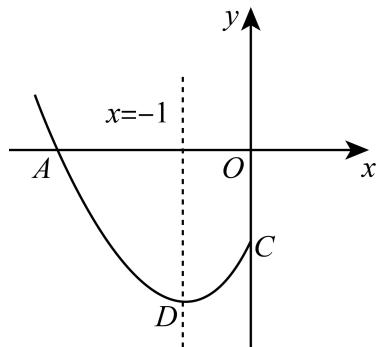

A．1 个 B．2 个 C．3 个 D．4 个

【答案】A

【分析】由图可知 $a > 0 , b > 0 , c < 0$ ，即可判断 $\cdot$ ；易得 $y = a x ^ { 2 } + b x + c$ 向上平移 $| c |$ 个到位长度得到

【淘宝店铺：向阳百分百】

$y = a x ^ { 2 } + b x$ ，则 $y = a x ^ { 2 } + b x$ 的对称轴也为直线 $x = - 1$ ，根据 $x _ { 1 } + x _ { 2 } < - 2$ ，得出 1 2 1x  x   ，则 E  x , y 离对称轴的距离大于 $F \left( x _ { 2 } , y _ { 2 } \right)$ 离对称轴的距离，即可判断 $\textcircled{2}$ ；作点 $C$ 关于 $x$ 轴对称的对应点 $C ^ { \prime }$ ，连接 $C D$ ，交 $x$ 轴于点 $\cdot$ ，把 $A \left( - 3 , 0 \right)$ 代入 $y = a x ^ { 2 } + b x + c$ 得到 $0 = 9 a - 3 b + c$ ，根据对称轴得到 $b = 2 a$ ，则 $c = - 3 a$ ，进而得出 $C ^ { \prime } ( 0 , 3 a )$ ，把 $x { = } - 1$ 代入 $y = a x ^ { 2 } + b x + c$ 得出 $D \left( 1 , - 4 a \right)$ ，用待定系数法求出直线 $C D$ 的函数解析式为 $y = 7 a x + 3 a$ ，即可判断 $\cdot$ ；由图可知，当 $2 b - 4 < - 4 a$ 时，抛物线 $y = a x ^ { 2 } + b x + c$ 与直线 $y = 2 b - 4$ 没有交点，则原方程无实数根，求出 $b < 1$ ，结合 $b > 0$ ，即可判断 $\cdot$

【详解】解：由图可知，  
∵该抛物线开口向上，对称轴在 $y$ 轴左侧，与 $\cdot$ 轴交于负半轴，$\cdot \ : a > 0 , b > 0 , c < 0$ ，  
$a b c { < } 0$ ，故 $\textcircled{1}$ 不正确，不符合题意；∵ $y = a x ^ { 2 } + b x + c$ 向上平移 $| c |$ 个到位长度得到 $y = a x ^ { 2 } + b x$ ，∴ $y = a x ^ { 2 } + b x$ 的对称轴也为直线 $x = - 1$ ，  
∵ $\cdot \ x _ { 1 } + x _ { 2 } < - 2$ ，$\cdot ^ { \frac { x _ { 1 } + x _ { 2 } } { 2 } < - 1 }$   
∵ $x _ { 1 } < x _ { 2 }$ ，  
$\therefore E \big ( x _ { 1 } , y _ { 1 } \big )$ 离对称轴的距离大于 $F \left( x _ { 2 } , y _ { 2 } \right)$ 离对称轴的距离，  
∵函数开口向上，离对称轴越远函数值越大，  
∴ $y _ { 1 } > y _ { 2 }$ ，故 $\textcircled{2}$ 不正确，不符合题意；  
作点 $\cdot$ 关于 $\cdot$ 轴对称的对应点 $C ^ { \prime }$ ，连接 $C ^ { \prime } D$ ，交 $x$ 轴于点 $P$ ，  
把 $A \left( - 3 , 0 \right)$ 代入 $y = a x ^ { 2 } + b x + c$ 得： $0 = 9 a - 3 b + c$ ，  
∵抛物线 $y = a x ^ { 2 } + b x + c$ 的对称轴为直线 $x = - 1$ ，$\cdot - { \frac { b } { 2 a } } = - 1$ ，则 $b = 2 a$ ，$\begin{array} { r } { 0 = 9 a - 6 a + c } \end{array}$ ，整理得： $c = - 3 a$ ，  
$\therefore C ( 0 , - 3 a )$ ，则 $C ^ { \prime } ( 0 , 3 a )$ ，  
把 $x { = } - 1$ 代入 $y = a x ^ { 2 } + b x + c$ 得： $y = a - b + c = a - 2 a - 3 a = - 4 a$ ，  
$D ( 1 , - 4 a )$ ，  
设直线 $C D$ 的函数解析式为 $y = m x + n$ ，  
把 $C ^ { \prime } ( 0 , 3 a )$ ， $D \left( - 1 , - 4 a \right)$ 代入得：  
$\left\{ \begin{array} { l l } { 3 a = n } \\ { - 4 a = - m + n } \end{array} \right.$ 解得： $\begin{array} { l } { \displaystyle { \int m = 7 a } } \\ { \displaystyle { \vphantom { \int } n = 3 a } } \end{array}$   
∴直线 $C ^ { \prime } D$ 的函数解析式为 $y = 7 a x + 3 a$ ，  
把 $y = 0$ 代入得： $0 = 7 a x + 3 a$ ，  
解得： $x = - { \frac { 3 } { 7 } }$   
$P \left( - \frac { 3 } { 7 } , 0 \right)$ 故 $\cdot$ 正确，符合题意；方程 $a x ^ { 2 } + b \left( x - 2 \right) + c = - 4 { \bigl ( } a \neq 0 { \bigr ) }$ 整理为 $a x ^ { 2 } + b x + c = 2 b - 4$ ，  
$\because D ( - 1 , - 4 a )$ ，  
由图可知，当 $2 b - 4 < - 4 a$ 时，抛物线 $y = a x ^ { 2 } + b x + c$ 与直线 $y = 2 b - 4$ 没有交点，则原方程无实数根，  
∵ $b = 2 a$ ，  
$2 b - 4 < - 2 b$ ，  
解得： $b < 1$ ，  
∵ $b > 0$ ，  
∴ $\cdot$ 的取值范围为 $0 < b < 1$ ，故 $\cdot$ 不正确，不符合题意；  
综上：正确的有 $\textcircled{3}$ ，共 1 个，  
故选：A

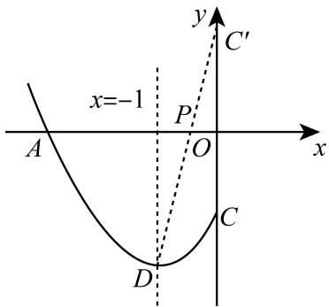

# 2023 武汉市华中科技大学附属中学二模

13．二次函数 $\scriptstyle y = a x ^ { 2 } + b x + c$ （ $a { \neq } 0$ ）的大致图象如图所示，顶点坐标为 $( \mathbf { \nabla } - 2 , \mathbf { \nabla } - 9 a )$ ），下列结论： $\textcircled{1}$ abc ${ } > 0$ ； $\textcircled { 2 } 1 6 a - 4 b + c < 0$ ； $\textcircled{3}$ 若方程 $a x ^ { 2 } + b x + c = - 1$ 有两个根 $x _ { I }$ 和 $x _ { 2 }$ ，且 $x _ { I } { < } x _ { 2 }$ ，则 $- 5 { < } x _ { I } { < }$ $x _ { 2 } < 1$ ； $\textcircled{4}$ 若方程 $| a x ^ { 2 } + b x + c | = 1$ 有四个根，则这四个根的和为﹣8．其中正确结论的是

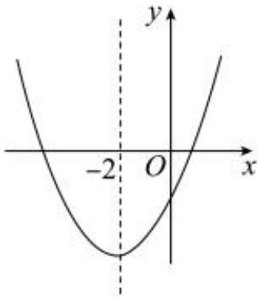

【答案】 $\cdot$

【分析】根据抛物线图象判断参数符号判断 $\textcircled{1}$ ，由顶点坐标可得 $\cdot$ 、 $\cdot$ ，进而判断 $\textcircled{2}$ ；由方程 $a x ^ { 2 } + b x + c = - 1$ 有两个根 $X _ { 1 }$ 和 $X _ { 2 }$ ，且 $x _ { 1 } { < } x _ { 2 }$ ，即可判断 $\cdot$ ；讨论 $a x ^ { 2 } + b x + c = \pm 1$ ，结合根与系数关系求四个根的和判断 $\cdot$

【详解】解：∵抛物线的开口向上，则 $a > 0$ ，对称轴在 $y$ 轴的左侧，则 $b > 0$ ，交 $y$ 轴的负半轴，则$\cdot$ ，  
∴abc $< 0$ ， $\cdot$ 错误；

【淘宝店铺：向阳百分百】

∵抛物线的顶点坐标 $( \mathbf { \nabla } - 2 , \mathbf { \nabla } - 9 a )$ ），  
${ \frac { b } { 2 a } } \qquad { \frac { 4 a c - b ^ { 2 } } { 4 a } } \qquad $ ，  
$-$ ，  
∴抛物线的解析式为 $y = a x ^ { 2 } + 4 a x - 5 a$ ，  
$-$ ， $\cdot$ 正确；  
∵抛物线 $y = a x ^ { 2 } + 4 a x - 5 a$ 交 $\cdot$ 轴于（﹣5，0），（1．0），  
∴若方程 $a$ （ $x { + } 5$ ） $( x - 1 ) = - 1$ 有两个根 $X _ { 1 }$ 和 $X _ { 2 }$ ，且 $x _ { 1 } { < } x _ { 2 }$ ，则 $- 5 < x _ { 1 } < x _ { 2 } < 1$ ， $\textcircled{3}$ 正确；若方程 $\scriptstyle { \left| a x ^ { 2 } + b x + c \right| = 1 }$ 有四个根，设方程 $a x ^ { 2 } + b x + c { = } 1$ 的两根分别为 $x _ { 1 } , \ x _ { 2 }$ ，  
则 ${ \frac { x _ { 1 } + x _ { 2 } } { 2 } } = - \ 2$ ，可得 $x _ { 1 } + x _ { 2 } = - 4$ ，  
设方程 $a x ^ { 2 } + b x + c = - 1$ 的两根分别为 $x _ { 3 } , \ x _ { 4 }$ ，则 ${ \frac { x _ { 3 } + x _ { 4 } } { 2 } } = - 2$ ，可得 $x _ { 3 } + x _ { 4 } = - 4$ ，  
所以这四个根的和为﹣8， $\textcircled{4}$ 正确

# 2022 年内蒙古呼伦贝尔市、兴安盟中考真题

14．如图，抛物线 $y = a x ^ { 2 } + b x + c$ （ $a \neq 0$ ）的对称轴为直线 $x = 1$ ，抛物线与 $x$ 轴的一个交点坐标为$( - 1 , 0 )$ ），下列结论： $\textcircled{1} a b c { < } 0$ ； $\textcircled { 2 } 3 a + c = 0$ ； $\textcircled{3}$ 当 $y > 0$ 时， $x$ 的取值范围是 $- 1 \leq x < 3$ ； $\textcircled{4}$ 点 $\left( - 2 , y _ { 1 } \right)$ ，$\left( 2 , y _ { 2 } \right)$ 都在抛物线上，则有 $y _ { 1 } < 0 < y _ { 2 }$ ．其中结论正确的个数是（ ）

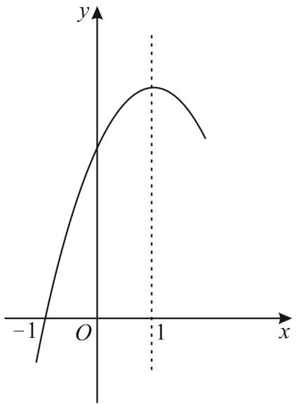

A．1 个 B．2 个 C．3 个 D．4 个

【答案】C

【分析】根据抛物线的开口，对称轴，特殊值 $\cdot$ 可判断 $\cdot$ 正确，根据图像可得，当 $\cdot$ 时，是$\cdot$ 轴上方的图像，可判断 $\cdot$ 错误，求出 $y _ { 1 } = 4 a - 2 b + c$ ， $y _ { 2 } = 4 a + 2 b + c$ ，结合 $\textcircled{1} \textcircled{2}$ 的结论即可判断出

$\cdot$ 正确．

【详解】∵抛物线的开口向下， $\cdot$ ，对称轴为 $x { = } 1$ ，  
$\therefore - { \frac { b } { 2 a } } = 1 ,$   
$b = - 2 a > 0$ ，  
∵抛物线交于 $\cdot$ 轴正半轴，  
∴ $c { > } 0$ ，  
∴ abc ${ < } 0$ ，故 $\textcircled{1}$ 正确；  
∵抛物线与 $\cdot$ 轴交于(-1,0)，  
∴当 $\cdot$ 时， $a - b + c = 0$ ，  
∵ $b = - 2 a$ ，  
∴将 $b = - 2 a$ 代入 $a - b + c = 0$ ，得 $\cdot$ ，故 $\cdot$ 正确；  
根据图像可得，当 $\cdot$ 时，是 $x$ 轴上方的图像，抛物线过点(-1,0)，对称轴为 $x { = } 1$ ，根据抛物线的对称性可得，抛物线过点(3,0)，  
$\cdot$ 时，有 $- 1 < x < 3$ ，故 $\cdot$ 错误；  
∵抛物线与 $x$ 轴的两个交点为：(-1,0)，(3,0)，对称轴为 $x { = } 1$ ，  
当 $x { = } { - } 2$ 时， $y _ { 1 } = 4 a - 2 b + c$ ，  
当 $x { = } 2$ 时， $y _ { 2 } = 4 a + 2 b + c$ ，  
∵ $b = - 2 a$ ， $3 a + c { = } 0$ ， $a { < } 0$ ，  
$y _ { 1 } = 4 a - 2 { \left( - 2 a \right) } + { \left( - 3 a \right) } = 5 a < 0 y _ { 2 } = 4 a + 2 { \left( - 2 a \right) } + { \left( - 3 a \right) } = - 3 a > 0$   
∴ $y _ { 1 } { < } 0 { < } y _ { 2 }$ ，故 $\cdot$ 正确

# 2022黑龙江省牡丹江市中考真题

15．如图，抛物线 $y = a x ^ { 2 } + b x + c \left( a \neq 0 \right)$ 的对称轴是 $x = - 2$ ，并与 $x$ 轴交于 $A$ ， $B$ 两点，若 $O A = 5 O B$ ，则下列结论中： $\textcircled{1} a b c > 0$ ； $\textcircled { 2 } \left( a + c \right) ^ { 2 } - b ^ { 2 } = 0$ ； $\textcircled { 3 } 9 a + 4 c < 0$ ； $\textcircled{4}$ 若 $m$ 为任 意实 数， 则$a m ^ { 2 } + b m + 2 b \geq 4 a$ ，正确的个数是（ ）

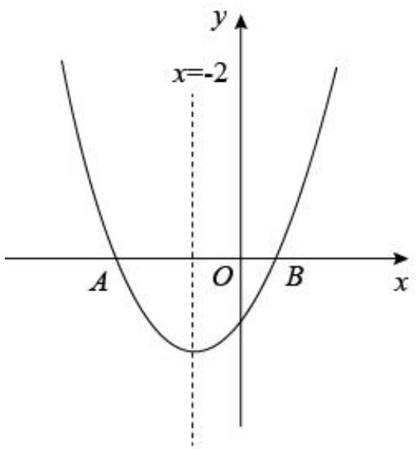

A．1 B．2 C．3 D．4

【答案】C

【分析】根据函数图像的开口方向，对称轴，图像与 $\cdot$ 轴的交点，即可判断 $\cdot$ ；根据对称轴 $\cdot$ ，$O A { = } 5 O B$ ，可得 $\cdot$ ， $\cdot$ ，点 $A ~ \left( - 5 , ~ 0 \right)$ ），点 $B$ （1，0），当 $\cdot$ 时， $\cdot$ 即可判断 $\cdot$ ；根据对称轴 $x = - 2$ 以及 $\cdot$ 得 $a$ 与 $c$ 的关系，即可判断 $\textcircled{3}$ ；根据函数的最小值是当 $\cdot$ 时 $\cdot$ $- 2 b + c$ 即可判断 $\textcircled{4}$ .

【详解】解： $\cdot$ 观察图像可知 $a > 0$ ， $b > 0$ ， $\cdot$ ，  
∴ $. a b c { < } 0$ ，  
故 $\textcircled{1}$ 错误  
$\cdot$ ∵对称轴为直线 $\cdot$ ， $\cdot$ ，可得 $O A { = } 5$ ， $\cdot$   
∴点 $\cdot$ （－5，0），点 $B$ （1，0）  
∴当 $\cdot$ 时， $\cdot$ 即 $a + b + c = 0$   
∴ $( a + c ) ~ ^ { 2 } - b ^ { 2 } = ~ ( a + b + c ) ~ ( a + c - b ) ~ = 0$   
故 $\cdot$ 正确  
$\cdot$ 抛物线的对称轴为直线 $x = - 2$ ，即 $- { \frac { b } { 2 a } }$   
$\cdot$   
$\therefore a + b + c = 0$   
$\therefore 5 a + c = 0$   
∴ $\cdot$   
$-$ ，  
故 $\textcircled{3}$ 正确  
$\textcircled{4}$ 当 $\cdot$ 时函数有最小值 $\cdot$ ，  
当 $\cdot$ 时， $-$   
整理得，若 $\cdot$ 为任意实数，则 $a m ^ { 2 } + b m + 2 b = 4 a$ ，  
故 $\cdot$ 正确  
故选 C

# 【题型 3】二次函数图象与系数的关系（题目没给出图像）

# $2 0 2 2 \cdot \boxed { 2 }$ 川凉山中考真题

16．已知抛物线 $\scriptstyle { y = a x ^ { 2 } + b x + c }$ （ $a \neq 0$ ）经过点（1，0）和点（0，－3），且对称轴在 $y$ 轴的左侧，则下列结论错误的是（ ）

A． $a > 0$   
B． $a + b = 3$   
C．抛物线经过点（－1，0）  
D．关于 $x$ 的一元二次方程 $a x ^ { 2 } + b x + c = - 1$ 有两个不相等的实数根

【答案】C

【分析】根据抛物线的图像与性质，根据各个选项的描述逐项判定即可得出结论

【详解】解：A、根据抛物线 $\cdot$ （ $\scriptstyle a \neq 0$ ）经过点（1，0）和点（0， $- 3 )$ ），且对称轴在 $y$ 轴的左侧可知 $a > 0$ ，该说法正确，故该选项不符合题意；  
B、由抛物线 $\cdot$ （ $\scriptstyle { \dot { . a } } \neq 0$ ）经过点（1，0）和点（0，－3）可知 $\displaystyle { \left\{ \begin{array} { l l } { a + b + c = 0 } \\ { c = - 3 } \end{array} \right. }$ ，解得 $a + b = 3$ ，该说法正确，故该选项不符合题意；  
C、由抛物线 $\scriptstyle y = a x ^ { 2 } + b x + c$ （ $a \neq 0$ ）经过点（1，0），对称轴在 $y$ 轴的左侧，则抛物线不经过（－1，0），该说法错误，故该选项符合题意；  
D、关于 $\cdot$ 的一元二次方程 $\_$ 根的情况，可以转化为抛物线 $\cdot$ （ $\cdot$ ）与直线 $y = - 1$ 的交点情况，根据抛物线 $y = a x ^ { 2 } + b x + c \left( a \neq 0 \right)$ ）经过点（1，0）和点 $\left( 0 , - 3 \right)$ ）， $- 3 < - 1 < 0$ ，结合抛物线开口向上，且对称轴在 $y$ 轴的左侧可知抛物线 $\scriptstyle y = a x ^ { 2 } + b x + c$ （ $a { \neq } 0$ ）与直线 $y = - 1$ 的有两个不同的交点，该说法正确，故该选项不符合题意；  
故选：C．

# 2023·湖北武汉中考真题

17．抛物线 $y = a x ^ { 2 } + b x + c$ （ $^ { a , b , c }$ 是常数， $c < 0$ ）经过 $( 1 , 1 ) , ( m , 0 ) , ( n , 0 )$ 三点，且 $n \geq 3$ ．下列四个结论：

$\textcircled{1} b < 0$ ；  
$\textcircled { 2 } 4 a c - b ^ { 2 } < 4 a$ ；  
$\textcircled{3}$ 当 $n = 3$ 时，若点 $( 2 , t )$ 在该抛物线上，则 $t > 1$ ；  
$\textcircled{4}$ 若关于 $x$ 的一元二次方程 $a x ^ { 2 } + b x + c = x$ 有两个相等的实数根，则 $0 < m \leq \frac { 1 } { 3 }$ 其中正确的是 （填写序号）．

【淘宝店铺：向阳百分百】【答案】 $\cdot$

【分析】 $\textcircled{1}$ 根据图象经过1,1， $c < 0$ ，且抛物线与 $\cdot$ 轴的一个交点一定在 $\left( 3 , 0 \right)$ 或 3,0 的右侧，判断出抛物线的开口向下， $a < 0$ ，再把1,1 代入 $y = a x ^ { 2 } + b x + c$ 得 $a + b + c = 1$ ，即可判断 $\cdot$ 错误；$\textcircled{2}$ 先得出抛物线的对称轴在直线 $x = 1 . 5$ 的右侧，得出抛物线的顶点在点1,1的右侧，得出 ${ \frac { 4 a c - b ^ { 2 } } { 4 a } } > 1$ ，根据 $4 a < 0$ ，即可得出 $4 a c - b ^ { 2 } < 4 a$ ，即可判断 $\cdot$ 正确；  
$\cdot$ 先得出抛物线对称轴在直线 $x = 1 . 5$ 的右侧，得出1,1到对称轴的距离大于 $\left( 2 , t \right)$ 到对称轴的距离，根据 $a < 0$ ，抛物线开口向下，距离抛物线越近的函数值越大，即可得出 $\cdot$ 正确；  
$\textcircled{4}$ 根据方程有两个相等的实数解，得出 $\Delta = \left( b - 1 \right) ^ { 2 } - 4 a c = 0$ ，把 1,1 代入 $y = a x ^ { 2 } + b x + c$ 得 $a + b + c = 1$ ，即 $1 - b = a + c$ ，求出 $a = c$ ，根据根与系数的关系得出 $m n = { \frac { c } { a } } = 1$ ，即 $n = \frac { 1 } { m }$ 根据 $n \geq 3$ ，得出 ${ \frac { 1 } { m } } \geq 3$ ，求出 $\cdot$ 的取值范围，即可判断 $\cdot$ 正确【详解】解： $\cdot$ 图象经过1,1 ， $c < 0$ ，即抛物线与 $\cdot$ 轴则抛物线与 $\cdot$ 轴的两个交点都在 $\left( 1 , 0 \right)$ 的左侧，  
∵ $\mathbf { \Sigma } \left( n , 0 \right)$ 中 $n \geq 3$ ，  
∴抛物线与 $x$ 轴的一个交点一定在 $\left( 3 , 0 \right)$ 或 $\left( 3 , 0 \right)$ 的右侧，∴抛物线的开口一定向下，即 $a < 0$ ，  
把1,1 代入 $y = a x ^ { 2 } + b x + c$ 得 $a + b + c = 1$ ，  
即 $b = 1 - a - c$ ，  
∵ $a < 0$ ， $c < 0$ ，  
∴ $b > 0$ ，故 $\textcircled{1}$ 错误；  
$\textcircled{2}$ ∵ $a < 0$ ， $b > 0$ ， $c < 0$ ，  
0c  ，  
a  
∴方程 $a x ^ { 2 } + b x + c = 0$ 的两个根的积大于 $\cdot$ ，即 $m n > 0$ ，∵ $n \geq 3$ ，  
∴ $m > 0$ ，  
$\cdot \frac { m + n } { 2 } > 1 . 5$ ，  
即抛物线的对称轴在直线 $x = 1 . 5$ 的右侧，  
∴抛物线的顶点在点1,1的右侧，  
${ \frac { 4 a c - b ^ { 2 } } { 4 a } } > 1$ ，  
∵ $4 a < 0$ ，  
∴ $4 a c - b ^ { 2 } < 4 a$ ，故 $\cdot$ 正确；  
$\cdot$ ∵ $m > 0$ ，  
∴当 $n = 3$ 时， $\frac { m + n } { 2 } > 1 . 5$ ，  
∴抛物线对称轴在直线 $x = 1 . 5$ 的右侧，  
∴1,1到对称轴的距离大于 $\left( 2 , t \right)$ 到对称轴的距离，

【淘宝店铺：向阳百分百】

∵ $a < 0$ ，抛物线开口向下，  
∴距离抛物线越近的函数值越大，  
∴ $t > 1$ ，故 $\cdot$ 正确；  
$\cdot$ 方程 $a x ^ { 2 } + b x + c = x$ 可变为 $a x ^ { 2 } + ( b - 1 ) x + c = x$ ，  
∵方程有两个相等的实数解，  
$\therefore \Delta = \left( b - 1 \right) ^ { 2 } - 4 a c = 0 ,$ ，  
∵把 1,1 代入 $y = a x ^ { 2 } + b x + c$ 得 $a + b + c = 1$ ，即 $1 - b = a + c$ ，$\left( a + c \right) ^ { 2 } - 4 a c = 0$ ，  
即 $a ^ { 2 } + 2 a c + c ^ { 2 } - 4 a c = 0$ ，  
$\left( a - c \right) ^ { 2 } = 0$ ，  
$\therefore a - c = 0$ ，  
即 $a = c$ ，  
∵ $\mathsf { \Gamma } ( m , 0 ) , ( n , 0 )$ 在抛物线上，  
$\mathbf { \nabla } m$ ， $\cdot$ 为方程 $a x ^ { 2 } + b x + c = 0$ 的两个根，  
$\therefore m n = { \frac { c } { a } } = 1$   
$n = \frac { 1 } { m }$   
∵ $n \geq 3$ ，  
${ \frac { 1 } { m } } \geq 3$ ，  
$0 < m \leq \frac { 1 } { 3 }$ 故 $\cdot$ 正确；  
综上分析可知，正确的是 $\textcircled{2} \textcircled{3} \textcircled{4}$   
故答案为： $\cdot$

# 2023·湖北黄冈中考真题

18．已知二次函数 $y = a x ^ { 2 } + b x + c ( a < 0 )$ 的图象与 $x$ 轴的一个交点坐标为 $( - 1 , 0 )$ ，对称轴为直线 $x = 1$ ，下列论中： $\textcircled { 1 } a - b + c = 0$ ； $\textcircled{2}$ 若点 $\left( - 3 , y _ { 1 } \right) , \left( 2 , y _ { 2 } \right) , \left( 4 , y _ { 3 } \right)$ 均在该二次函数图象上，则 $y _ { 1 } < y _ { 2 } < y _ { 3 }$ ；$\textcircled{3}$ 若 $m$ 为任意实数，则 $a m ^ { 2 } + b m + c \leq - 4 a ;$ $\textcircled{4}$ 方程 $a x ^ { 2 } + b x + c + 1 = 0$ 的两实数根为 $x _ { 1 } , x _ { 2 }$ ，且 $x _ { 1 } < x _ { 2 }$ ，则 $x _ { 1 } < - 1 , x _ { 2 } > 3$ ．正确结论的序号为（ ）

A． $\textcircled{1} \textcircled{2} \textcircled{3}$ B． $\textcircled{1} \textcircled{3} \textcircled{4}$ C． $\textcircled{2} \textcircled{3} \textcircled{4}$ D． $\textcircled{1} \textcircled{4}$

【答案】B

【分析】将 $( - 1 , 0 )$ 代入 $y = a x ^ { 2 } + b x + c$ ， 可判断 $\cdot$ ；根据抛物线的对称轴及增减性可判断 $\textcircled{2}$ ；根据抛物线的顶点坐标可判断 $\textcircled{3}$ ；根据 $y = a x ^ { 2 } + b x + c + 1$ 的图象与 $x$ 轴的交点的位置可判断 $\textcircled{4}$

【详解】解：将 $( - 1 , 0 )$ 代入 $y = a x ^ { 2 } + b x + c$ ，可得 $a - b + c = 0$ ，

【淘宝店铺：向阳百分百】

故 $\textcircled{1}$ 正确；  
二次函数图象的对称轴为直线 $x = 1$ ，  
点 $\left( - 3 , y _ { 1 } \right) , \left( 2 , y _ { 2 } \right) , \left( 4 , y _ { 3 } \right)$ 到对称轴的距离分别为：4，1，3，  
 $a { < } 0$ ，  
图象开口向下，离对称轴越远，函数值越小，  
 $y _ { 1 } < y _ { 3 } < y _ { 2 }$ ，  
故 $\textcircled{2}$ 错误；  
二次函数图象的对称轴为直线 $x = - { \frac { b } { 2 a } } = 1$ ，  
$\therefore b = - 2 a$ ，  
又 $a - b + c = 0$ ，  
 $\textstyle \cdot \ a + 2 a + c = 0$ ，  
 $c = - 3 a$ ，  
当 $x = 1$ 时， $\cdot$ 取最大值，最大值为 $y = a + b + c = a - 2 a - 3 a = - 4 a$ ，  
即二次函数 $y = a x ^ { 2 } + b x + c ( a < 0 )$ 的图象的顶点坐标为 $\left( 1 , - 4 a \right)$ ，  
若 $\cdot$ 为任意实数，则 $a m ^ { 2 } + b m + c \leq - 4 a$   
故 $\cdot$ 正确；  
二次函数图象的对称轴为直线 $x = 1$ ，与 $x$ 轴的一个交点坐标为 $( - 1 , 0 )$ ，  
与 $\cdot$ 轴的另一个交点坐标为 $( 3 , 0 )$ ，  
 $y = a x ^ { 2 } + b x + c ( a < 0 )$ 的图象向上平移一个单位长度，即为 $y = a x ^ { 2 } + b x + c + 1$ 的图象， $y = a x ^ { 2 } + b x + c + 1$ 的图象与 $\cdot$ 轴的两个交点一个在 $( - 1 , 0 )$ 的左侧，另一个在 $( 3 , 0 )$ 的右侧，若方程 $a x ^ { 2 } + b x + c + 1 = 0$ 的两实数根为 $x _ { 1 } , x _ { 2 }$ ，且 $x _ { 1 } < x _ { 2 }$ ，则 $x _ { 1 } < - 1 , x _ { 2 } > 3$ ，  
故 $\textcircled{4}$ 正确；  
综上可知，正确的有 $\textcircled{1} \textcircled{3} \textcircled{4}$

# 2023·青海西宁·中考真题

19．直线 $y _ { 1 } = a x + b$ 和抛物线 $y _ { 2 } = a x ^ { 2 } + b x$ （a， $^ { b }$ 是常数，且 $a \neq 0$ ）在同一平面直角坐标系中，直线$y _ { 1 } = a x + b$ 经过点 $\left( - 4 , 0 \right)$ ．下列结论：

$\textcircled{1}$ 抛物线 $y _ { 2 } = a x ^ { 2 } + b x$ 的对称轴是直线 $x = - 2$   
$\textcircled{2}$ 抛物线 $y _ { 2 } = a x ^ { 2 } + b x$ 与 $x$ 轴一定有两个交点  
$\textcircled{3}$ 关于 $x$ 的方程 $a x ^ { 2 } + b x = a x + b$ 有两个根 $x _ { 1 } = - 4$ ， $x _ { 2 } = 1$   
$\textcircled{4}$ 若 $a > 0$ ，当 $x { < } - 4$ 或 $x > 1$ 时， $y _ { 1 } > y _ { 2 }$   
其中正确的结论是（ ）

A． $\textcircled{1} \textcircled{2} \textcircled{3} \textcircled{4}$ B． $\textcircled{1} \textcircled{2} \textcircled{3}$ C． $\textcircled{2} \textcircled{3}$ D． $\textcircled{1} \textcircled{4}$

【答案】B

【淘宝店铺：向阳百分百】

【分析】 $\textcircled{1}$ 可得 $- 4 a + b = 0$ ，从而可求 $b = 4 a$ ，即可求解； $\textcircled{2}$ 可得 $\Delta = b ^ { 2 } - 4 a c = b ^ { 2 } \geq 0$ ，由 $a \neq 0$ ，可得 $\Delta = b ^ { 2 } > 0$ ，即可求解； $\textcircled{3}$ 可判断抛物线也过 $\left( - 4 , 0 \right)$ ，从而可得方程 $a x ^ { 2 } + ( b - a ) x - b = 0$ 的一个根为 $x = - 4$ ， 可 求 抛 物 线 $y _ { 3 } = a x ^ { 2 } + \left( b - a \right) x - b$ 的 对 称 轴 为 直 线 $x = - { \frac { 3 } { 2 } }$ 从 而 可 得 抛 物 线$y _ { 3 } = a x ^ { 2 } + \left( b - a \right) x - b$ 与 $x$ 轴的另一个交点为 $\left( 1 , 0 \right)$ ，即可 求解 ； $\cdot$ 当 $a > 0$ ，当 $- 4 < x < 1$ 时， $y _ { 1 } < y _ { 2 }$ ，即可求解．

【详解】解： $\cdot$ 直线 $y _ { 1 } = a x + b$ 经过点 $\left( - 4 , 0 \right)$ ，  
$\therefore - 4 a + b = 0$ ，  
 $b = 4 a$ ，  
抛物线的对称轴为直线 $x = - { \frac { b } { 2 a } } = - { \frac { 4 a } { 2 a } } = - 2$ ，  
故 $\textcircled{1}$ 正确；  
$\Delta = b ^ { 2 } - 4 a c = b ^ { 2 } \geq 0$ ，  
由 $\textcircled{1}$ 得 $b = 4 a$ ，  
 $a \neq 0$ ，  
 $b \neq 0$ ，  
 $\cdot \Delta = b ^ { 2 } > 0$ ，  
抛物线 $y _ { 2 } = a x ^ { 2 } + b x$ 与 $x$ 轴一定有两个交点，  
故 $\textcircled{2}$ 正确；  
$\textcircled{3}$ 当 $x = - 4$ 时，  
$y = 1 6 a - 4 b$   
$= 1 6 a - 1 6 a = 0$ ，  
抛物线也过 $\left( - 4 , 0 \right)$ ，  
由 $a x ^ { 2 } + b x = a x + b$ 得  
方程 $a x ^ { 2 } + ( b - a ) x - b = 0$ ，  
方程的一个根为 $x = - 4$ ，  
抛物线 $y _ { 3 } = a x ^ { 2 } + \left( b - a \right) x - b$ ，  
$\therefore x = - { \frac { b - a } { 2 a } } = - { \frac { 4 a - a } { 2 a } } = - { \frac { 3 } { 2 } }$   
抛物线 $y _ { 3 } = a x ^ { 2 } + \left( b - a \right) x - b$ 的对称轴为直线 $x = - { \frac { 3 } { 2 } }$ ，与 $x$ 轴的一个交点为 $\left( - 4 , 0 \right)$ ，  
$\therefore x - ( - \frac { 3 } { 2 } ) = - \frac { 3 } { 2 } - ( - 4 ) ,$ ，  
解得： $x = 1$ ，  
抛物线 $y _ { 3 } = a x ^ { 2 } + \left( b - a \right) x - b$ 与 $x$ 轴的另一个交点为 $\left( 1 , 0 \right)$ 关于 $x$ 的方程 $a x ^ { 2 } + b x = a x + b$ 有两个根 $x _ { 1 } = - 4 x _ { 2 } = 1$ 故 $\cdot$ 正确；  
$\textcircled{4}$ 当 $a > 0$ ，当 $- 4 < x < 1$ 时， $y _ { 1 } < y _ { 2 }$ ，  
故 $\textcircled{4}$ 错误；

【淘宝店铺：向阳百分百】

故选：B．

# 2023年湖南省邵阳市中考真题

20．已知 $P _ { 1 } \big ( x _ { 1 } , y _ { 1 } \big ) , P _ { 2 } \big ( x _ { 2 } , y _ { 2 } \big )$ 是抛物线 $y = a x ^ { 2 } + 4 a x + 3$ （ $a$ 是常数， $a \neq 0$ 上的点，现有以下四个结论： $\textcircled{1}$ 该抛物线的对称轴是直线 $x = - 2$ ； $\textcircled{2}$ 点0,3在抛物线上； $\textcircled{3}$ 若 $x _ { 1 } > x _ { 2 } > - 2$ ，则 $y _ { 1 } > y _ { 2 }$ ；$\textcircled{4}$ 若 $y _ { 1 } = y _ { 2 }$ ，则 $x _ { 1 } + x _ { 2 } = - 2$ 其中，正确结论的个数为（ ）

A．1 个 B．2 个 C．3 个 D．4 个

【答案】B

【分析】根据对称轴公式 $x = - { \frac { b } { 2 a } } = - { \frac { 4 a } { 2 a } } = - 2$ 可判断 $\textcircled{1}$ ；当 $x = 0$ 时， $y = 3$ ，可判 断 $\cdot$ ；根据抛物线的增减性，分两种情况计算可判断 $\textcircled{3}$ ；利用对称点的坐标得到 1 2 2  x x ，可以判断④．

【详解】解：∵抛物线 $y = a x ^ { 2 } + 4 a x + 3$ （ $a$ 是常数， $a \neq 0$ ，$x = - { \frac { b } { 2 a } } = - { \frac { 4 a } { 2 a } } = - 2$ ，  
故 $\textcircled{1}$ 正确；  
当 $x = 0$ 时， $y = 3$ ，  
∴点0,3在抛物线上，  
故 $\textcircled{2}$ 正确；  
当 $a > 0$ 时， $y _ { 1 } > y _ { 2 }$ ，  
当 $a < 0$ 时， $y _ { 1 } < y _ { 2 }$ ，  
故 $\textcircled{3}$ 错误；  
根据对称点的坐标得到 ${ \frac { x _ { 1 } + x _ { 2 } } { 2 } } = - 2$   
$x _ { 1 } + x _ { 2 } = - 4$ ，  
故 $\cdot$ 错误  
故选 B．

# 2023 年湖北省黄石市中考真题

21．已知二次函数 $y = a x ^ { 2 } + b x + c ( a \neq 0 )$ 的图像经过三点 $A \left( x _ { 1 } , y _ { 1 } \right) , B \left( x _ { 2 } , y _ { 2 } \right) , C \left( - 3 , 0 \right)$ ，且对称轴为直线 $x { = } - 1$ ．有以下结论： $\textcircled { 1 } a + b + c = 0$ ； $\textcircled { 2 } 2 c + 3 b = 0$ ； $\textcircled{3}$ 当 $- 2 < x _ { 1 } < - 1$ ， $0 < x _ { 2 } < 1$ 时，有 $y _ { 1 } < y _ { 2 }$ ；$\textcircled{4}$ 对于任何实数 $k > 0$ ，关于 $x$ 的方程 $a x ^ { 2 } + b x + c = k { \bigl ( } x + 1 { \bigr ) }$ 必有 两个 不相 等的 实数 根．其中 结论正确的有（ ）

【淘宝店铺：向阳百分百】

A．1个 B．2个 C．3个 D． 4 个

【答案】C

【分析】根据二次函数图像的对称轴为 $x { = } - 1$ ，且过 $C ( - 3 , 0 )$ ，结合抛物线的对称轴即可求解

【详解】解： ∵二次函数 $y = a x ^ { 2 } + b x + c ( a \neq 0 )$ 的对称轴为 $x { = } - 1$ ，且图像经过$\cdot - { \frac { b } { 2 a } } = - 1$ ，即 $b = 2 a$ ，  
∴点 $( 1 , 0 )$ 在抛物线上，  
∴ $a + b + c = 0$ ，故结论 $\cdot$ 正确；  
由结论 $\cdot$ 正确可得， $a + b + c = 0$ ，且 $b = 2 a$ ，则 $a = { \frac { b } { 2 } }$   
$\cdot { \frac { b } { 2 } } + b + c = 0$ ，则 $2 c + 3 b = 0$ ，故结论 $\textcircled{2}$ 正确；  
∵当 $- 2 < x _ { 1 } < - 1$ ， $0 < x _ { 2 } < 1$ 时，  
∴点A离对称轴更近，  
当 $a > 0$ 时， $y _ { 1 } < y _ { 2 }$ ；当 $a { < } 0$ 时， $y _ { 1 } > y _ { 2 }$ ；故结论 $\cdot$ 错误；  
由 $a x ^ { 2 } + b x + c = k ( x + 1 )$ 得， $a x ^ { 2 } + ( b - k ) x + c - k = 0$ ，  
∵结论 $\textcircled{1}$ 正确可得， $a + b + c = 0$ ，结论 $\cdot$ 正确可得， $2 c + 3 b = 0$ ，  
$\therefore b = - \frac { 2 } { 3 } c , a = - \frac { 1 } { 3 } c ,$   
$\therefore \Delta = ( b - k ) ^ { 2 } - 4 a ( c - k ) = \left( - { \frac { 2 } { 3 } } c - k \right) ^ { 2 } - 4 \times \left( - { \frac { 1 } { 3 } } c \right) ( c - k )$ ，整 理得 ， $\Delta = \frac { 1 6 } { 9 } c ^ { 2 } + k ^ { 2 }$ ，∵ $\cdot _ { k > 0 }$ ，  
$\therefore \Delta = \frac { 1 6 } { 9 } c ^ { 2 } + k ^ { 2 } > 0 ,$ ，  
∴该方程有两个不相等的实根，故结论 $\cdot$ 正确；  
综上所述，正确的有 $\textcircled{1} \textcircled{2} \textcircled{4}$ ，3个，  
故选：C．

# 2023年内蒙古呼和浩特市中考真题

22．关于 $x$ 的二次函数 $y = m x ^ { 2 } - 6 m x - 5 { \bigl ( } m \neq 0 { \bigr ) }$ 的结论

$\textcircled{1}$ 对于任意实数 $a$ ，都有 $x _ { 1 } = 3 + a$ 对应的函数值与 $x _ { 2 } = 3 - a$ 对应的函数值相等  
$\textcircled{2}$ 若图象过点 $A \left( x _ { 1 } , y _ { 1 } \right)$ ，点 $B \left( x _ { 2 } , y _ { 2 } \right)$ ，点 $C \left( 2 , - 1 3 \right)$ ，则 当 $x _ { 1 } > x _ { 2 } > \frac { 9 } { 2 }$ 时， $\frac { y _ { 1 } - y _ { 2 } } { x _ { 1 } - x _ { 2 } } < 0$   
$\textcircled{3}$ 若 $3 \le x \le 6$ ，对应的 $y$ 的整数值有4个，则 $- \frac { 4 } { 9 } < m \leq - \frac { 1 } { 3 }$ 或 $\frac { 1 } { 3 } \leq m < \frac { 4 } { 9 }$   
$\textcircled{4}$ 当 $m > 0$ 且 $n \leq x \leq 3$ 时， $- 1 4 \leq y \leq n ^ { 2 } + 1$ ，则 $n = 1$ ．  
其中正确的结论有（ ）

A．1 个 B．2 个 C．3 个 D．4 个

【答案】B

【分析】先求出该函数对称轴为直线 $x = 3$ ，再得出 $x _ { 1 } = 3 + a$ 和 $x _ { 2 } = 3 - a$ 关于直线 $x = 3$ 对称，即可判断 $\cdot$ ；把 $C \left( 2 , - 1 3 \right)$ 代入 $y = m x ^ { 2 } - 6 m x - 5 { \bigl ( } m \neq 0 { \bigr ) }$ ，求出 $m = 1$ ，则当 $x > 3$ 时， $\cdot$ 随 $\cdot$ 的增大而增大，得出 $x _ { 1 } - x _ { 2 } > 0 , y _ { 1 } - y _ { 2 } > 0$ ，即可判断 $\cdot$ ；根据 $y = m x ^ { 2 } - 6 m x - 5 = m { \big ( } x - 3 { \big ) } ^ { 2 } \ - 5 - 9 m$ ，然后进行分类讨论：当 $m > 0$ 时，当 $m < 0$ 时，即可判断 $\cdot$ ；根据当 $m > 0$ 且 $n \leq x \leq 3$ 时，得出 $y$ 随 $x$ 的增大而减小，根据 $x = 3$ 时， $y = - 5 - 9 m = - 1 4$ ，求出 $m = 1$ ，则当 $x { = } n$ 时， $y = n ^ { 2 } - 6 n - 5 = n ^ { 2 } + 1$ ，求出 $\cdot$ 的值，即可判断 $\cdot$ ．

【详解】解： $\cdot$ ∵二次函数 $y = m x ^ { 2 } - 6 m x - 5 { \bigl ( } m \neq 0 { \bigr ) }$ ，  
∴该函数的对称轴为直线 $x = - { \frac { - 6 m } { 2 m } } = 3$ ，  
∵ $x _ { 1 } = 3 + a$ ， $x _ { 2 } = 3 - a$ ，  
∴ 1 2 3 x  x  ，即 x1,y1  和 x2,y2  关于直线 x  3对称，  
∴ $x _ { 1 } = 3 + a$ 对应的函数值与 $x _ { 2 } = 3 - a$ 对应的函数值相等，故 $\cdot$ 正确，符合题意；$\textcircled{2}$ 把 $C \left( 2 , - 1 3 \right)$ 代入 $y = m x ^ { 2 } - 6 m x - 5 { \bigl ( } m \neq 0 { \bigr ) }$ 得： $- 1 3 = 4 m - 1 2 m - 5$ ，解得： $m = 1$ ，  
∴二次函数表达式为 $y = x ^ { 2 } - 6 x - 5$ ，  
∵ $a = 1 > 0$ ，该函数的对称轴为直线 $x = 3$ ，  
∴当 $x > 3$ 时， $\cdot$ 随 $\cdot$ 的增大而增大，  
$x _ { 1 } > x _ { 2 } > \frac { 9 } { 2 }$   
∴ $y _ { 1 } > y _ { 2 }$ ，  
$x _ { 1 } - x _ { 2 } > 0 , y _ { 1 } - y _ { 2 } > 0$ ，  
∴ 1 2 0y y  ，故②不正确，不符合题意；  
$y = m x ^ { 2 } - 6 m x - 5 = m { \big ( } x - 3 { \big ) } ^ { 2 } - 5 - 9 m$   
∴当 $x = 3$ 时， $y = - 5 - 9 m$ ，当 $x = 6$ 时， $y = - 5$ ，  
当 $m > 0$ 时，  
∵ $3 \le x \le 6$ ，  
∴y 随 $x$ 的增大而增大，  
∵ $3 \leq x \leq 6$ ，对应的 $y$ 的整数值有4个，  
∴四个整数解为： $- 5 , - 6 , - 7 , - 8$ ，  
∴ $\cdot - 9 < - 5 - 9 m \leq - 8$ ，解得： $\frac { 1 } { 3 } \leq m < \frac { 4 } { 9 }$   
当 $m < 0$ 时，  
∵ $3 \leq x \leq 6$ ，  
∴y 随 $\cdot$ 的增大而减小，  
∵ $3 \le x \le 6$ ，对应的 $y$ 的整数值有4个，  
∴四个整数解为： $- 5 , - 4 , - 3 , - 2$ ，∴ $- 2 \leq - 5 - 9 m < - 1$ ，解得： $- \frac { 4 } { 9 } < m \leq - \frac { 1 } { 3 }$   
综上： $- \frac { 4 } { 9 } < m \leq - \frac { 1 } { 3 }$ 或 $\frac { 1 } { 3 } \leq m < \frac { 4 } { 9 }$ 故 $\textcircled{3}$ 正确，符合题意；$\textcircled{4}$ 当 $m > 0$ 且 $n \leq x \leq 3$ 时， $\cdot$ 随 $\cdot$ 的增大而减小，  
∵ $- 1 4 \leq y \leq n ^ { 2 } + 1$ ，  
∴当 $x = 3$ 时， $y = - 5 - 9 m = - 1 4$ ，解得： $m = 1$ ，  
$\ : \cdot \ : y = x ^ { 2 } - 6 x - 5 \ :$ ，  
当 $x { = } n$ 时， $y = n ^ { 2 } - 6 n - 5 = n ^ { 2 } + 1$ ，  
解得： $n = - 1$ ，故 $\cdot$ 不正确，不符合题意；  
综上：正确的有 $\cdot$ ，共 2 个，  
故选：B．

# 【题型4】二次函数实际应用

# 2022·四川广安中考真题

23．如图是抛物线形拱桥，当拱顶离水面 2米时，水面宽 6米，水面下降 米，水面宽 8 米

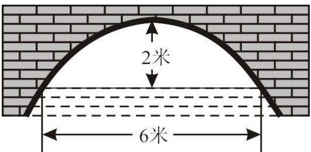

【答案】 $\frac { 1 4 } { 9 }$

【分析】根据已知得出直角坐标系，通过代入 $A$ 点坐标（- 3，0），求出二次函数解析式，再根据把$x { = } 4$ 代入抛物线解析式得出下降高度，即可得出答案

【详解】解：建立平面直角坐标系，设横轴 $\cdot$ 通过 $A B$ ，纵轴 $y$ 通过 $A B$ 中点 $\cdot$ 且通过 $C$ 点，则通过画图可得知 $\cdot$ 为原点，由题意可得： $\cdot$ 米， $\cdot$ 坐标为（0，2），

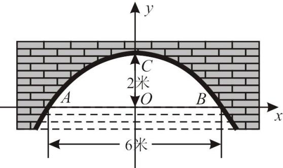

通过以上条件可设顶点式 $\cdot$ ，把点 $\cdot$ 点坐标（ $^ - 3$ ，0）代入得，  
$9 a + 2 = 0$ ，  
$a = - { \frac { 2 } { 9 } }$

【淘宝店铺：向阳百分百】

∴抛物线解析式为： $y = - \frac { 2 } { 9 } x ^ { 2 } + 2$ ；  
当水面下降，水面宽为 8 米时，有  
把 $x = 4$ 代入解析式，得 $y = - { \frac { 2 } { 9 } } \times 4 ^ { 2 } + 2 = - { \frac { 2 } { 9 } } \times 1 6 + 2 = - { \frac { 1 4 } { 9 } }$ ；∴水面下降 $\frac { 1 4 } { 9 }$ 米；故答案为： $\frac { 1 4 } { 9 }$

# 2023·湖北襄阳中考真题

24．如图，一位篮球运动员投篮时，球从A点出手后沿抛物线行进，篮球出手后距离地面的高度 $y ( \mathbf { m } )$ 与篮球距离出手点的水平距离 $x ( \mathrm { m } )$ 之间的函数关系式是 $y = - \frac { 1 } { 5 } ( x - \frac { 3 } { 2 } ) ^ { 2 } + \frac { 7 } { 2 }$ ．下列说法正确的是（填序号）

$\textcircled{1}$ 篮球行进过程中距离地面的最大高度为 $3 . 5 \mathrm { m }$ ； $\textcircled{2}$ 篮球出手点距离地面的高度为 $2 . 2 5 \mathrm { m }$

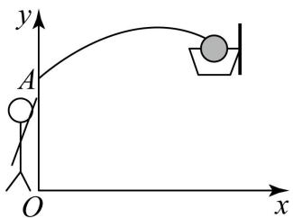

【答案】 $\cdot$

【分析】先求 $y = - \frac { 1 } { 5 } ( x - \frac { 3 } { 2 } ) ^ { 2 } + \frac { 7 } { 2 }$ 的顶点为 1.5,3.5 ，再求 $x = 0$ 时 $y$ 的值即可判断【详解】解：由 $y = - \frac { 1 } { 5 } ( x - \frac { 3 } { 2 } ) ^ { 2 } + \frac { 7 } { 2 }$ 的顶点为 1.5,3.5 ，得篮球行进过程中距离地面的最大高度为 $3 . 5 \mathrm { m }$ ，即 $\textcircled{1}$ 正确；由 $y = - \frac { 1 } { 5 } ( x - \frac { 3 } { 2 } ) ^ { 2 } + \frac { 7 } { 2 }$ 当 $x = 0$ 时， $y = - 0 . 2 \times 2 . 2 5 + 3 . 5 = 3 . 0 5$ ，即 $\textcircled{2}$ 不正确；故答案为： $\cdot$

# 2023·吉林长春中考真题

25．2023年 5 月 8 日，C919 商业首航完成——中国民商业运营国产大飞机正式起步．12时31分航班抵达北京首都机场，穿过隆重的“水门礼”（寓意“接风洗尘”、是国际民航中高级别的礼仪）．如图 $\textcircled{1}$ ，在一次“水门礼”的预演中，两辆消防车面向飞机喷射水柱，喷射的两条水柱近似看作形状相同的地物线的一部分．如图 $\textcircled{2}$ ，当两辆消防车喷水口 $A$ 、 $B$ 的水平距离为80米时，两条水柱在物线的顶点 $H$ 处相遇，此时相遇点 $H$ 距地面20米，喷水口 $A$ 、 $B$ 距地面均为 4 米．若两辆消防车同时后退10米，两条水柱的形状及喷水口 $A ^ { \prime }$ 、 $B ^ { \prime }$ 到地面的距离均保持不变，则此时两条水柱相遇点 $H ^ { \prime }$ 距地面 米．

  
图 $\textcircled{1}$

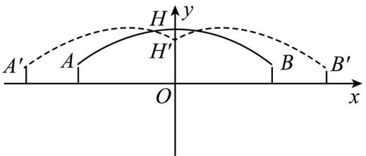  
图②

【答案】19

【分析】根据题意求出原来抛物线的解析式，从而求得平移后的抛物线解析式，再令 $x = 0$ 求平移后的抛物线与 $y$ 轴的交点即可

【详解】解：由题意可知：  
$A \left( - 4 0 , 4 \right) , B \left( 4 0 , 4 \right) , H \left( 0 , 2 0 \right) ,$ ，  
设抛物线解析式为： $y = a x ^ { 2 } + 2 0$ ，  
将 $A \left( - 4 0 , 4 \right)$ 代入解析式 $y = a x ^ { 2 } + 2 0$ ，  
解得： $a = - { \frac { 1 } { 1 0 0 } }$   
$\therefore y = - { \frac { x ^ { 2 } } { 1 0 0 } } + 2 0 ,$ ，  
消防车同时后退10米，即抛物线 $y = - \frac { x ^ { 2 } } { 1 0 0 } + 2 0$ 向左（右）平移10米，  
平移后的抛物线解析式为： $y = - { \frac { \left( x + 1 0 \right) ^ { 2 } } { 1 0 0 } } + 2 0$ ，  
令 $x = 0$ ，解得： $y = 1 9$ ，  
故答案为：19

# 2022·四川南充·中考真题

26．如图，水池中心点 $O$ 处竖直安装一水管，水管喷头喷出抛物线形水柱，喷头上下移动时，抛物线形水柱随之竖直上下平移，水柱落点与点 $O$ 在同一水平面．安装师傅调试发现，喷头高 $2 . 5 \mathrm { m }$ 时，水柱落点距 $O$ 点 $2 . 5 \mathrm { m }$ ；喷头高 $4 \mathrm { m }$ 时，水柱落点距 $O$ 点 $3 \mathrm { m }$ ．那么喷头高 m时，水柱落点距 $O$ 点 $4 \mathrm { m }$

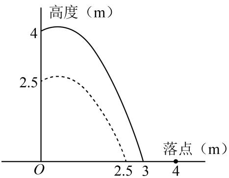

【答案】8

【分析】由题意可知，在调整喷头高度的过程中，水柱的形状不发生变化，则当喷头高 $2 . 5 \mathrm { m }$ 时，可

【淘宝店铺：向阳百分百】

设 $\cdot$ ，将（2.5，0）代入解析式得出 $2 . 5 a + b + 1 = 0$ ；喷头高 $4 \mathrm { m }$ 时，可设 $\cdot$ ，将（3，0）代入解析式得 $\_$ ，联立可求出 $\cdot$ 和 $b$ 的值，设喷头高为 $h$ 时，水柱落点距 $O$ 点 $4 \mathrm { m }$ ，则此时的解析式为 $\cdot$ ，将（4，0）代入可求出 $h$

【详解】解：由题意可知，在调整喷头高度的过程中，水柱的形状不发生变化，  
当喷头高 $2 . 5 \mathrm { m }$ 时，可设 $y = a x ^ { 2 } + b x + 2 . 5$ ，  
将（2.5，0）代入解析式得出 $2 . 5 a + b + 1 = 0 \textcircled { 1 }$ ，  
喷头高 $4 \mathrm { m }$ 时，可设 $\cdot$ ，  
将（3，0）代入解析式得 $9 a + 3 b + 4 = 0 \textcircled { 2 }$ ，  
联立可求出 $a = - { \frac { 2 } { 3 } } , b = { \frac { 2 } { 3 } }$   
设喷头高为 $h$ 时，水柱落点距 $O$ 点 $4 \mathrm { m }$ ，  
∴此时的解析式为 $y = - \frac { 2 } { 3 } x ^ { 2 } + \frac { 2 } { 3 } x + h$   
将（4，0）代入可得 $- \frac { 2 } { 3 } { \times } 4 ^ { 2 } + \frac { 2 } { 3 } { \times } 4 + h = 0$ ，  
解得 $h { = } 8$   
故答案为：8

# 【题型5】求参数的值或范围

# 2022年吉林省长春市中考真题

27．已知二次函数 $y = - x ^ { 2 } - 2 x + 3$ ，当 $a \bullet x \bullet { \frac { 1 } { 2 } }$ 时，函数值 $y$ 的最小值为 1，则 $a$ 的值 为

【答案】 $- 1 - { \sqrt { 3 } }$

【分析】先把函数解析式化为顶点式可得当 $x < - 1$ 时， $\cdot$ 随 $\cdot$ 的增大而增大，当 $x > - 1$ 时， $\cdot$ 随 $\cdot$ 的增大而减小，然后分两种情况讨论：若 $a \geq - 1$ ；若 $a < - 1$ ，即可求解

【详解】解： $y = - x ^ { 2 } - 2 x + 3 = - { \bigl ( } x + 1 { \bigr ) } ^ { 2 } + 4$ ，  
∴当 $x < - 1$ 时， $\cdot$ 随 $\cdot$ 的增大而增大，当 $x > - 1$ 时， $\cdot$ 随 $\cdot$ 的增大而减小，若 $a \geq - 1$ ，当 $a \bullet x \bullet { \frac { 1 } { 2 } }$ 时， $y$ 随 $\cdot$ 的增大而减小，  
此时当 $x = \frac { 1 } { 2 }$ 时，函数值 $\cdot$ 最小，最小值为 $\frac { 7 } { 4 }$ , 不合题意，  
若 $a < - 1$ ，当 $x = a$ 时，函数值 $y$ 最小，最小值为 1，  
$- a ^ { 2 } - 2 a + 3 = 1$ ，  
解得： $a = - 1 - { \sqrt { 3 } }$ 或 $- 1 + { \sqrt { 3 } }$ （舍去）；  
综上所述， $\cdot$ 的值为 $- 1 - { \sqrt { 3 } }$   
故答案为： $- 1 - { \sqrt { 3 } }$

# 2023·湖北十堰中考真题

28．已知点 $A \left( x _ { 1 } , y _ { 1 } \right)$ 在直线 $y = 3 x + 1 9$ 上，点 $B { \left( x _ { 2 } , y _ { 2 } \right) } , C { \left( x _ { 3 } , y _ { 3 } \right) }$ 在抛物线 $y = x ^ { 2 } + 4 x - 1$ 上，若$y _ { 1 } = y _ { 2 } = y _ { 3 }$ 且 $x _ { 1 } < x _ { 2 } < x _ { 3 }$ ，则 $x _ { 1 } + x _ { 2 } + x _ { 3 }$ 的取值范围是（ ）

A． $- 1 2 < x _ { 1 } + x _ { 2 } + x _ { 3 } < - 9$ $\mathrm { B } . \quad - 8 < x _ { 1 } + x _ { 2 } + x _ { 3 } < - 6$ C． $- 9 < x _ { 1 } + x _ { 2 } + x _ { 3 } < 0$ $\mathrm { D } . \mathrm { \ : \ : } - 6 < x _ { 1 } + x _ { 2 } + x _ { 3 } < 1$

【答案】A

【分析】设直线 $y = 3 x + 1 9$ 与抛物线 $y = x ^ { 2 } + 4 x - 1$ 对称轴左边的交点为 $P$ ，设抛物线顶点坐标为 $\boldsymbol { Q }$ ，求得其坐标的横坐标，结合图象分析出 $X _ { 1 }$ 的范围，根据二次函数的性质得出 $x _ { 2 } + x _ { 3 } = 2 \times ( - 2 ) = - 4$ ，进而即可求解

【详解】解：如图所示，设直线 $y = 3 x + 1 9$ 与抛物线 $y = x ^ { 2 } + 4 x - 1$ 对称轴左边的交点为 $P$ ，设抛物线顶点坐标为 $\boldsymbol { Q }$

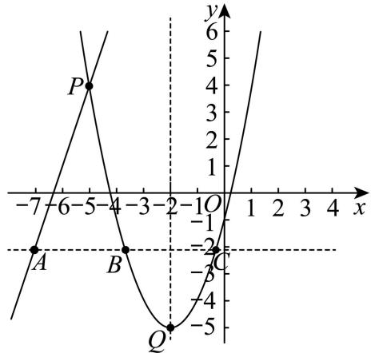

联立 $\left\{ \begin{array} { l l } { { y = 3 x + 1 9 } } \\ { { y = x ^ { 2 } + 4 x - 1 } } \end{array} \right.$   
解得： $\{ x = - 5 \atop 3 \} _ { y = 4 } \{ x = 4 \atop 3 1 $   
$P ( - 5 , 4 )$ ，  
由 $y = x ^ { 2 } + 4 x - 1 = \left( x + 2 \right) ^ { 2 } - 5$ ，则 $\mathcal { Q } ( - 2 , - 5 )$ ，对 称轴 为直 线 $x = - 2$ ，  
设 $m = y _ { 1 } = y _ { 2 } = y _ { 3 }$ ，则点 $A , B , C$ 在 $y = m$ 上，  
∵ $y _ { 1 } = y _ { 2 } = y _ { 3 }$ 且 $x _ { 1 } < x _ { 2 } < x _ { 3 }$ ，  
∴A点在 $P$ 点的左侧，即 $x _ { 1 } < - 5$ ， $x _ { 2 } < - 2 < x _ { 3 }$ ，  
当 $m = - 5$ 时， $x _ { 2 } = x _ { 3 }$   
对于 $y = 3 x + 1 9$ ，当 $y = - 5$ ， $x = - 8$ ，此时 $x _ { 1 } = - 8$ ，  
$x _ { 1 } > - 8$ ，  
$\cdot - 8 < x _ { 1 } < - 5$   
∵对称轴为直线 $x = - 2$ ，则 $x _ { 2 } + x _ { 3 } = 2 \times ( - 2 ) = - 4$ ，  
∴ $x _ { 1 } + x _ { 2 } + x _ { 3 }$ 的取值范围是 $- 1 2 < x _ { 1 } + x _ { 2 } + x _ { 3 } < - 9$ ，

【淘宝店铺：向阳百分百】

故选：A

# 2022·内蒙古呼和浩特中考真题

29．在平面直角坐标系中，点 $C$ 和点 $D$ 的坐标分别为 $( - 1 , - 1 )$ 和 (4, 1) ，抛物线$y = m x ^ { 2 } - 2 m x + 2 ( m \neq 0 )$ 与线段 $C D$ 只有一个公共点，则 $m$ 的取值范围是

【答案】 $m = 3$ 或 $- 1 < m \leq - \frac { 3 } { 8 }$

【分析】根据抛物线求出对称轴 $x = 1$ ， $y$ 轴的交点坐标为(0,2)，顶点坐标为 $( 1 , 2 - m )$ ，直线 $C D$ 的表达式 $y = - 1$ ，分两种情况讨论：当 $m > 0$ 时，当 $m < 0$ 时，利用抛物线的性质可知，当 $| a |$ 越大，则抛物线的开口越小，即可求解

【详解】解：抛物线的对称轴为： $x = - { \frac { - 2 m } { 2 m } } = 1$ ，当 $x = 0$ 时， $y = 2$ ，故抛物线与 $y$ 轴的 交点 坐标  
(0,2)，顶点坐标为 $( 1 , 2 - m )$ ，直线 $\cdot$ 的表达式 $y = - 1$ ，  
当 $m > 0$ 时，且抛物线过点 $D ( 4 , - 1 )$ 时，  
$1 6 m - 8 m + 2 = - 1$ ，解得 $m = - \frac { 3 } { 8 }$ （舍去），  
当 $m > 0$ ，抛物线 $y = m x ^ { 2 } - 2 m x + 2 ( m \neq 0 )$ 与线段 $C D$ 只有一个公共点时，  
即顶点在直线 $\cdot$ 上，则 $2 - m = - 1$ ，解得 $m = 3$ ，  
当 $m < 0$ 时，且抛物线过点 $D ( 4 , - 1 )$ 时，  
$1 6 m - 8 m + 2 = - 1$ ，解得 $m = - \frac { 3 } { 8 }$ -8，  
当抛物线过点 $\left( - 1 , - 1 \right)$ 时，  
$m + 2 m + 2 = - 1$   
解得， $\cdot$   
由抛物线的性质可知，当 $| a |$ 越大，则抛物线的开口越小，且抛物线与线段 $C D$ 只有一个公共点，  
$- 1 < m \leq - \frac { 3 } { 8 } ,$ ，  
综上所述， $m$ 的取值范围为 $m = 3$ 或 $- 1 < m \leq - \frac { 3 } { 8 }$ ，  
故答案为 $m = 3$ 或 $- 1 < m \leq - \frac { 3 } { 8 }$

# 2023年福建省中考真题

30．已知抛物线 $y = a x ^ { 2 } - 2 a x + b ( a > 0 )$ 经过 $A \left( 2 n + 3 , y _ { 1 } \right) , B \left( n - 1 , y _ { 2 } \right)$ 两点，若 $A , B$ 分别位于抛物线对称轴的两侧，且 $y _ { 1 } < y _ { 2 }$ ，则 $n$ 的取值范围是

【答案】 $- 1 < n < 0$

【分析】根据题意，可得抛物线对称轴为直线 $x = 1$ ，开口向上，根据已知条件得出点A在对称轴的【淘宝店铺：向阳百分百】

右侧，且 $y _ { 1 } < y _ { 2 }$ ，进而得出不等式，解不等式即可求解

【详解】解：∵ $y = a x ^ { 2 } - 2 a x + b$ ， $a > 0$   
∴抛物线的对称轴为直线 $x = - { \frac { - 2 a } { 2 a } } = 1$ ，开口向上，$A \left( 2 n + 3 , y _ { 1 } \right) , B \left( n - 1 , y _ { 2 } \right)$ 分别位于抛物线对称轴的两侧，  
假设点 $B$ 在对称轴的右侧，则 $n - 1 > 1$ ，解得 $n > 2$ ，  
$\therefore 2 n + 3 - ( n - 1 ) = n + 4 > 0$   
∴A点在 $B$ 点的右侧，与假设矛盾，则点A在对称轴的右侧，  
$\left\{ { \begin{array} { l } { { 2 n + 3 > 1 } } \\ { { n - 1 < 1 } } \end{array} } \right.$   
解得： $- 1 < n < 2$   
又∵ $y _ { 1 } < y _ { 2 }$ ，  
$\left| \left( 2 n + 3 \right) - 1 \right| < \left| 1 - \left( n - 1 \right) \right|$ $2 n + 2 < 2 - n .$   
解得： $n < 0$ $\cdot - 1 < n < 0$ ，  
故答案为： $- 1 < n < 0$

# 2022·湖南湘西中考真题

31．已知二次函数 $y = - \ x ^ { 2 } + 4 x + 5$ 及一次函数 $y = - x + b$ ，将该二次函数在 $x$ 轴上方的图象沿 $x$ 轴翻折到 $x$ 轴下方，图象的其余部分不变，得到一个新图象（如图所示），当直线 $y = - x + b$ 与新图象有 4 个交点时， $^ { b }$ 的取值范围是

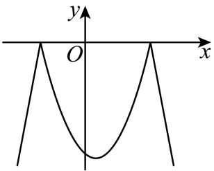

【答案】 $- { \frac { 2 9 } { 4 } } < b < - 1$

【分析】解方程 $- \ x ^ { 2 } + 4 x + 5 = 0$ 得 $A$ （﹣1，0）， $\cdot$ （5，0），再利用折叠的性质求出折叠部分的解析式为 $y = ( x + 1 ) ( x - 5 )$ ，即 $y = x ^ { 2 } - 4 x - 5 ( - 1 \leq x \leq 5 )$ ），然后求出直线 $\cdot$ 经过点 $\cdot$ （﹣1，0）时 $\cdot$ 的值和当直线 $\cdot$ 与抛物线 $y = x ^ { 2 } - 4 x - 5 ( - 1 { \leq } x { \leq } 5$ ）有唯一公共点时 $\cdot$ 的值，从而得到当直线 $\cdot$ 与新图象有 4个交点时， $b$ 的取值范围

【详解】解：如图所示：

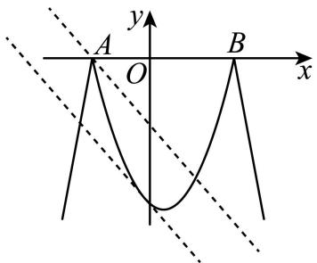

当 $y = 0$ 时， $- \ x ^ { 2 } + 4 x + 5 = 0$ ，解得 $\cdot$ ， $\cdot$ ，则 A（﹣1，0）， $\cdot$ （5，0），  
将该二次函数在 $x$ 轴上方的图象沿 $\cdot$ 轴翻折到 $\cdot$ 轴下方的部分图象的解析式为 $y = ( x + 1 ) ( x - 5 )$ ，即 $-$ ），  
当直线 $y = - x + b$ 经过点 $A$ （﹣1，0）时， $1 + b = 0$ ，解得 $b = - 1$ ；  
当直线 $y = - x + b$ 与抛物线 $y = x ^ { 2 } - 4 x - 5$ （ $\cdot$ ）有唯一公共点时，方程 $x ^ { 2 } - 4 x - 5 = - x + b$ ，即$x ^ { 2 } - 3 x - 5 - b = 0$ 有相等的实数解，即 $\Delta = 3 ^ { 2 } - 4 \times 1 \times ( - 5 - b ) = 0$   
解得 $b = - { \frac { 2 9 } { 4 } }$   
所以当直线 $y = - x + b$ 与新图象有 4个交点时， $\cdot$ 的取值范围为 $- { \frac { 2 9 } { 4 } }$ ，  
故答案为： $- { \frac { 2 9 } { 4 } } < b < - 1$ ．

# 2022·江苏盐城中考真题

32．若点 $P ( m , n )$ 在二次函数 $y = x ^ { 2 } + 2 x + 2$ 的图象上，且点 $P$ 到 $y$ 轴的距离小于 2，则 $n$ 的取值范围是

【答案】 $1 \leq n < 1 0$

【分析】先判断 $- 2 < m < 2$ ，再根据二次函数的性质可得： $n = m ^ { 2 } + 2 m + 2 = { \left( m + 1 \right) } ^ { 2 } + 1$ ，再利用二次 函数的性质求解 $n$ 的范围即可

【详解】解：点 $P$ 到 $y$ 轴的距离小于 2，  
 $. - 2 < m < 2$ ，  
点 $P ( m , n )$ 在二次函数 $y = x ^ { 2 } + 2 x + 2$ 的图象上，$\therefore n = m ^ { 2 } + 2 m + 2 = { \left( m + 1 \right) } ^ { 2 } + 1 ,$ ，  
当 $m = - 1$ 时， $n$ 有最小值为 1  
当 $m = 2$ 时， $n = { \left( 2 + 1 \right) } ^ { 2 } + 1 = 1 0$ ，  
$\therefore n$ 的取值范围为 $1 \leq n < 1 0$ .

# 2023年四川省南充市中考真题

33．抛物线 $y = - x ^ { 2 } + k x + k - \frac { 5 } { 4 }$ 与 $x$ 轴的一个交点为 $A ( m , 0 )$ ，若 $- 2 \leq m \leq 1$ ，则实数 $k$ 的取值范围是( )

A． $- \frac { 2 1 } { 4 } \leq k \leq 1$ B． $k \leq - \frac { 2 1 } { 4 }$ 或 $k \geq 1$ C． $- 5 \leq k \leq { \frac { 9 } { 8 } }$ D． $k \leq - 5$ 或 $k \geq \frac { 9 } { 8 }$

【答案】B

【分析】根据抛物线有交点，则 $- x ^ { 2 } + k x + k - \frac { 5 } { 4 } = 0$ 有实数根，得出 $k \leq - 5$ 或 $k \geq 1$ ，分类讨论，分别求得当 $x = - 2$ 和 $x = 1$ 时 $k$ 的范围，即可求解．

【详解】解：∵抛物线 $y = - x ^ { 2 } + k x + k - \frac { 5 } { 4 }$ 与 $\cdot$ 轴有交点，  
$- x ^ { 2 } + k x + k - \frac { 5 } { 4 } = 0$ 有实数根，  
$\Delta = b ^ { 2 } - 4 a c \ge 0$   
即 $k ^ { 2 } + 4 { \mathord { \left( k - { \frac { 5 } { 4 } } \right) } } = k ^ { 2 } + 4 k - 5 = { \left( k + 2 \right) } ^ { 2 } - 9 \geq 0$   
解得： $k \leq - 5$ 或 $k \geq 1$ ，  
当 $k \leq - 5$ 时，如图所示，  
依题意，当 $x = - 2$ 时， $- 4 - 2 k + k - \frac { 5 } { 4 } \geq 0$ ，  
解得： $k \leq - \frac { 2 1 } { 4 }$ ,  
当 $x = 1$ 时， $- 1 + k + k - \frac { 5 } { 4 } \leq 0$ ， 解得 $k \leq \frac { 9 } { 8 }$ ,  
即 $k \leq - \frac { 2 1 } { 4 }$   
当 $k \geq 1$ 时，  
当 $x = - 2$ 时， $- 4 - 2 k + k - \frac { 5 } { 4 } \leq 0$   
解得： $k \geq - \frac { 2 1 } { 4 }$   
∴ $k \geq 1$

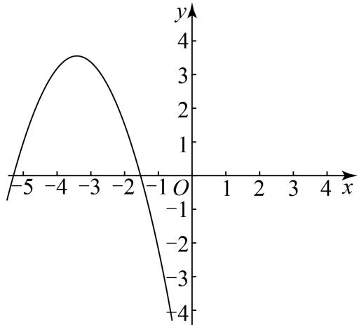

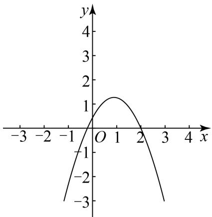

综上所述， $k \leq - \frac { 2 1 } { 4 }$ 或 $k \geq 1$ ，故选：B

# 2023·浙江衢州中考真题

34．已知二次函数 $y = a x ^ { 2 } - 4 a x$ （ $a$ 是常数， $a { < } 0$ ）的图象上有 $A { \big ( } m , y _ { 1 } { \big ) }$ 和 $B \left( 2 m , y _ { 2 } \right)$ 两点．若点A，$B$ 都在直线 $y = - 3 a$ 的上方，且 $y _ { 1 } > y _ { 2 }$ ，则 $m$ 的取值范围是（ ）

$$
\mathrm { ~  ~ { ~ \cal ~ A ~ } ~ } . 1 < m < \frac { 3 } { 2 } { \mathrm { ~  ~ { ~ \cal ~ B ~ } ~ } } . \frac { 4 } { 3 } < m < 2 { \mathrm { ~  ~ { ~ \cal ~ C ~ } ~ } } . \frac { 4 } { 3 } < m < \frac { 3 } { 2 } { \mathrm { ~  ~ { ~ \cal ~ D ~ } ~ } } . \mathrm { m } > 2
$$

【答案】C

【分析】根据已知条件列出不等式，利用二次函数与 $x$ 轴的交点和二次函数的性质，即可解答

【详解】解： $a < 0$ ，  
$\therefore y = - 3 a > 0$ ，  
点A， $B$ 都在直线 $y = - 3 a$ 的上方，且 $y _ { 1 } > y _ { 2 }$ ，  
可列不等式： $4 a m ^ { 2 } - 8 a m > - 3 a$ ，  
 $a < 0$ ，  
可得 $4 m ^ { 2 } - 8 m + 3 < 0$ ，  
设抛物线 $y _ { 1 } = 4 m ^ { 2 } - 8 m + 3$ ，直线 $x _ { 1 } = 0$ ，  
$\therefore 4 m ^ { 2 } - 8 m + 3 < 0$ 可看作抛物线 $y _ { 1 } = 4 m ^ { 2 } - 8 m + 3$ 在直线 $x _ { 1 } = 0$ 下方 的取 值范 围，  
当 $y _ { 1 } = 0$ 时，可得 $0 = 4 m ^ { 2 } - 8 m + 3$ ，  
解得 $m _ { 1 } = \frac { 1 } { 2 } , m _ { 2 } = \frac { 3 } { 2 }$   
$\therefore 4 > 0$ ，  
 $\cdot y _ { 1 } = 4 m ^ { 2 } - 8 m + 3$ 的开口向上，  
$. 4 m ^ { 2 } - 8 m + 3 < 0$ 的解为 $\frac { 1 } { 2 } < m < \frac { 3 } { 2 }$ ，  
根据题意还可列不等式： $a m ^ { 2 } - 4 a m > 4 a m ^ { 2 } - 8 a m$ ，  
 $a < 0$ ，  
可得 $m ^ { 2 } - 4 m < 4 m ^ { 2 } - 8 m$ ，  
整理得 $- 3 m ^ { 2 } + 4 m < 0$ ，  
设抛物线 $y _ { 2 } = - 3 m ^ { 2 } + 4 m$ ，直线 $x _ { 2 } = 0$ ，

【淘宝店铺：向阳百分百】

$\cdot - 3 m ^ { 2 } + 4 m < 0$ 可看作抛物线 $y _ { 2 } = - 3 m ^ { 2 } + 4 m$ 在直线 $x _ { 2 } = 0$ 下方的取值范围，  
当 $y _ { 2 } = 0$ 时，可得 $0 = - 3 m ^ { 2 } + 4 m$ ，  
解得 $m _ { 1 } = 0 , m _ { 2 } = \frac { 4 } { 3 }$   
$Q - 3 < 0$ ，  
抛物线 $y _ { 2 } = - 3 m ^ { 2 } + 4 m$ 开口向下，  
 $. - 3 m ^ { 2 } + 4 m < 0$ 的解为 $m < 0$ 或 $m > \frac { 4 } { 3 }$ ，  
综上所述，可得 $\frac { 4 } { 3 } < m < \frac { 3 } { 2 }$ ，  
故选：C

# 2023 年四川省泸州市中考真题

35．已知二次函数 $y = a x ^ { 2 } - 2 a x + 3$ （其中 $x$ 是自变量），当 $0 < x < 3$ 时对应的函数值 $y$ 均为正数，则 $a$ 的取值范围为（ ）

A． $0 < a < 1$ B． $a < - 1$ 或 $a > 3$ C． $- 3 < a < 0$ 或 $0 < a < 3$ D． $- 1 \leq a < 0$ 或 $0 < a < 3$

【答案】D

【分析】首先根据题意求出对称轴 $x = - { \frac { - 2 a } { 2 a } } = 1$ ，然后分两种情况： $a > 0$ 和 $a { < } 0$ ，分别根据二次函数的性质求解即可

【详解】∵二次函数 $y = a x ^ { 2 } - 2 a x + 3$ ，  
∴对称轴 $x = - { \frac { - 2 a } { 2 a } } = 1$ ，  
当 $a > 0$ 时，  
∵当 $0 < x < 3$ 时对应的函数值 $y$ 均为正数，  
∴此时抛物线与 $\cdot$ 轴没有交点，  
$\Delta = \left( - 2 a \right) ^ { 2 } - 4 a \times 3 < 0$ ，  
∴解得 $0 < a < 3$ ；  
当 $a { < } 0$ 时，  
∵当 $0 < x < 3$ 时对应的函数值 $y$ 均为正数，  
∴当 $x = 3$ 时， $y = 9 a - 6 a + 3 \geq 0$ ，  
∴解得 $a \geq - 1$ ，  
$- 1 \leq a < 0$ ，  
∴综上所述，  
当 $0 < x < 3$ 时对应的函数值 $y$ 均为正数，则 $a$ 的取值范围为 $- 1 \leq a < 0$ 或 $0 < a < 3$ 故选：D

# 2022·山东济南中考真题

36．抛物线 $y = - x ^ { 2 } + 2 m x - m ^ { 2 } + 2$ 与 $y$ 轴交于点 $C$ ，过点 $C$ 作直线 $l$ 垂直于 $y$ 轴，将抛物线在 $y$ 轴右侧的部分沿直线 $l$ 翻折，其余部分保持不变，组成图形 $G$ ，点 $M \left( m { - } 1 , y _ { 1 } \right)$ ， $N \left( m + 1 , y _ { 2 } \right)$ 为图形$G$ 上两点，若 $y _ { 1 } < y _ { 2 }$ ，则 $m$ 的取值范围是（ ）

A． $m < - 1$ 或 $m > 0 \mathrm { ~ B ~ }$ $. - \frac { 1 } { 2 } < m < \frac { 1 } { 2 } \qquad \mathrm { ~ C . ~ } 0 \leq m < \sqrt { 2 } \qquad \mathrm { ~ D . ~ } - 1 < m < 1$

【答案】D

【分析】求出抛物线的对称轴、C 点坐标以及当 $x { = } m { - } 1$ 和 $x { = } m { + } 1$ 时的函数值，再根据 $m { - } 1 { < } m { + } 1$ ，判断出 $\cdot$ 点在 $N$ 点左侧，此时分类讨论：第一种情况，当 $N$ 点在 $y$ 轴左侧时，第二种情况，当 $\cdot$ 点在 $\cdot$ 轴的右侧时，第三种情况，当 $y$ 轴在 $\cdot$ 、 $N$ 点之间时，来讨论，结合图像即可求解

【详解】抛物线解析式 $y = - x ^ { 2 } + 2 m x - m ^ { 2 } + 2$ 变形为： $y = 2 - ( x - m ) ^ { 2 }$ ，  
即抛物线对称轴为 $x = m$ ,  
当 $x { = } m { - } 1$ 时，有 $y = 2 - ( m - 1 - m ) ^ { 2 } = 1$ ，  
当 $x { = } m { + } 1$ 时，有 $y = 2 - ( m + 1 - m ) ^ { 2 } = 1$ ，  
设 $\cdot$ -1,1)为 $\cdot$ 点， $( m { + } 1 , 1 )$ 为 $B$ 点，  
即点 $A ( m \mathrm { - } 1 , 1 )$ 与 $B ( m ^ { + 1 , 1 } )$ 关于抛物线对称轴对称，  
当 $\scriptstyle x = 0$ 时，有 $y = 2 - ( 0 - m ) ^ { 2 } = 2 - m ^ { 2 }$ ，  
∴ $C$ 点坐标为 $( 0 , 2 - m ^ { 2 } )$ ，  
当 $\cdot$ 时，有 $y = 2 - ( m - m ) ^ { 2 } = 2$ ，  
∴抛物线顶点坐标为 $( m , 2 )$ ，  
∵直线 $\cdot$ 轴，  
∴直线 $l$ 为 $y = 2 - m ^ { 2 }$ ，  
∵ $\_$ ，  
∴ $M$ 点在 $\cdot$ 点左侧，  
此时分情况讨论：  
第一种情况，当 $N$ 点在 $\cdot$ 轴左侧时，如图，

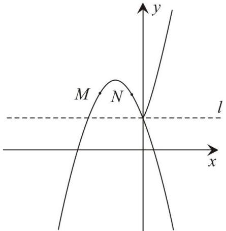

由图可知此时 M、 $\cdot$ 点分别对应 $A$ 、 $\cdot$ 点，即有 $y _ { 1 } = y _ { 2 } = 1$ ，∴此时不符合题意；

【淘宝店铺：向阳百分百】第二种情况，当 $\cdot$ 点在 $\cdot$ 轴的右侧时，如图，由图可知此时 M、 $\cdot$ 点满足 $y _ { 1 } = y _ { 2 }$ ，∴此时不符合题意；第三种情况，当 $y$ 轴在 $M$ 、 $N$ 点之间时，如图，

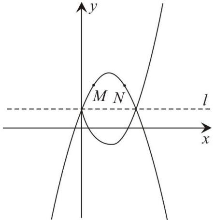

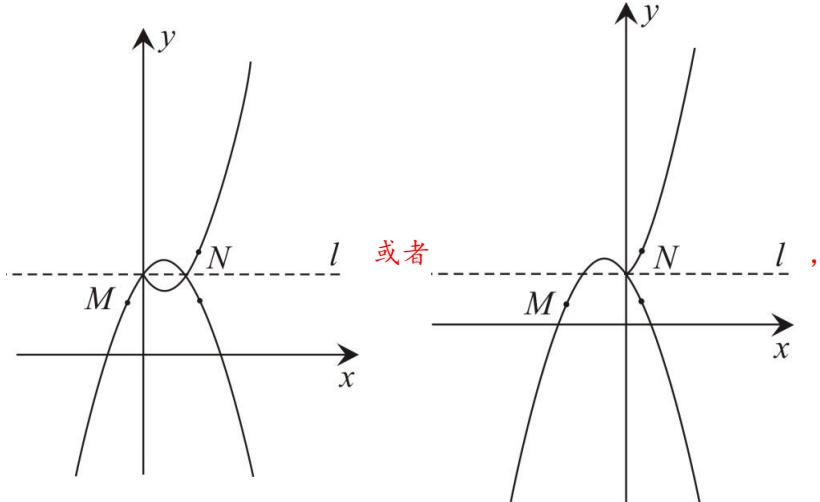

由图可知此时 $\cdot$ 、 $\cdot$ 点满足 $y _ { 1 } { < } y _ { 2 }$ ，  
∴此时符合题意；  
此时由图可知： $m - 1 { < } 0 { < } m + 1$ ，  
解得 $- 1 { < } m { < } 1$ ，  
综上所述： $m$ 的取值范围为： $- 1 { < } m { < } 1$

# 2022·湖北荆门中考真题

37．如图，函数 $y = \left\{ { \begin{array} { l } { x ^ { 2 } - 2 x + 3 ( x < 2 ) } \\ { { } \\ { - { \frac { 3 } { 4 } } x + { \cfrac { 9 } { 2 } } ( x \geq 2 ) } } \end{array} } \right.$ 的图象由抛物线的一部分和一条射线组成，且与直线 $y { = } m$ （ $m$ 为常数）相交于三个不同的点 $A ( x _ { I } , y _ { I } ) , B ( x _ { 2 } , y _ { 2 } ) , C ( x _ { 3 } , y _ { 3 } ) ( x _ { I } < x _ { 2 } < x _ { 3 } )$ ）．设 $t { = } \frac { x _ { 1 } y _ { 1 } + x _ { 2 } y _ { 2 } } { x _ { 3 } y _ { 3 } }$ ，则 $t$ 的取值范围是

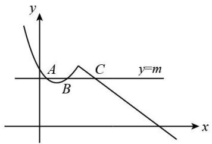

【答案】 $\frac { 3 } { 5 } < t < 1$

【分析】根据 $\cdot$ 、 $\cdot$ 关于对称轴 $\cdot$ 对称，可知 $\cdot$ ，由直线 $\cdot$ （ $m$ 为常数）相交于三个不同的点，可得 $y _ { I } = y _ { 2 } = y _ { 3 } = m$ ，求出 $\cdot$ 的范围，进而求出 $\cdot$ 的范围

【详解】解：由二次函数 $\cdot$ （ $. x { < } 2$ ）可知：图象开口向上，对称轴为 $x = 1$ ，  
∴当 $x = 1$ 时函数有最小值为 2， $\cdot$ ，  
由一次函数 $y = - \ { \frac { 3 } { 4 } } x + { \frac { 9 } { 2 } }$ （ $\langle x { \ge } 2$ ）可知当 $\cdot$ 时有最大值 3，当 $\cdot$ 时 $\frac { 1 0 } { 3 }$   
∵直线 $\cdot$ （ $\cdot$ 为常数）相交于三个不同的点 $. ~ { \cal { A } } ~ ( x _ { I } , ~ y _ { I } ) , ~ { \cal { B } } ~ ( x _ { 2 } , ~ y _ { 2 } ) , ~ { \cal { C } } ~ ( x _ { 3 } , ~ y _ { 3 } ) ~ ( x _ { I } < x _ { 2 } < x _ { 3 } ) ,$ ，  
$\cdot { y _ { I } } { = } { y _ { 2 } } { = } { y _ { 3 } } { = } { m }$ ， $2 < m < 3$ ，  
$\frac { 1 0 } { 3 }$   
$\frac { x _ { 1 } + x _ { 2 } } { x _ { 3 } } \frac { 2 } { x _ { 3 } }$ 3＜t＜15  
故填： $\frac { 3 } { 5 }$

# 【题型6】二次函数新定义问题

# 2023 年山东省菏泽市中考真题

38．若一个点的纵坐标是横坐标的 3 倍，则称这个点为“三倍点”，如： $A ( 1 , 3 ) , B ( - 2 , - 6 ) , C ( 0 , 0 )$ 等都是三倍点”，在 $- 3 < x < 1$ 的范围内，若二次函数 $y = - x ^ { 2 } - x + c$ 的图象上至少存在一个“三倍点”，则 $c$ 的取值范围是（ ）

$$
- \frac { 1 } { 4 } \leq c < 1 \qquad \mathrm { ~ B . ~ } \quad 4 \leq c < - 3 \qquad \mathrm { ~ C . ~ } \quad - \frac { 1 } { 4 } < c < 5 \qquad \mathrm { ~ D . ~ } \quad 4 \leq c < 5
$$

【答案】D

【分析】由题意可得：三倍点所在的直线为 $y = 3 x$ ，根据二次函数 $y = - x ^ { 2 } - x + c$ 的图象上至少存在一个“三倍点”转化为 $y = - x ^ { 2 } - x + c$ 和 $y = 3 x$ 至少有一个交点，求 $\Delta \geq 0$ ， 再 根 据 $x = - 3$ 和 $x = 1$ 时两个函数值大小即可求出

【详解】解：由题意可得：三倍点所在的直线为 $y = 3 x$ ，在 $- 3 < x < 1$ 的范围内，二次函数 $y = - x ^ { 2 } - x + c$ 的图象上至少存在一个“三倍点”，

即在 $- 3 < x < 1$ 的范围内， $y = - x ^ { 2 } - x + c$ 和 $y = 3 x$ 至少有一个交点，  
令 $3 x = - x ^ { 2 } - x + c$ ，整理得： $- x ^ { 2 } - 4 x + c = 0$ ，  
则 $\Delta = b ^ { 2 } - 4 a c = \left( - 4 \right) ^ { 2 } - 4 \times \left( - 1 \right) \times c = 1 6 + 4 c \geq 0$ ，解得 $c \geq - 4$ ，  
$x = { \frac { - \left( - 4 \right) \pm { \sqrt { \left( - 4 \right) ^ { 2 } - 4 \times \left( - 1 \right) c } } } { 2 \times \left( - 1 \right) } } = - { \frac { 4 \pm { \sqrt { 1 6 + 4 c } } } { 2 } } ,$   
$x _ { 1 } = - 2 + { \sqrt { 4 + c } } x _ { 2 } = - 2 - { \sqrt { 4 + c } }$   
∴ $- 3 < - 2 + \sqrt { 4 + c } < 1$ 或 $- 3 < - 2 - \sqrt { 4 + c } < 1$   
当 $- 3 < - 2 + \sqrt { 4 + c } < 1$ 时， $- 1 < \sqrt { 4 + c } < 3$ ，即 $0 \leq \sqrt { 4 + c } < 3$ ，解得 $- 4 \leq c < 5$ ，  
当 $- 3 < - 2 - \sqrt { 4 + c } < 1$ 时， $- 3 < \sqrt { 4 + c } < 1$ ，即 $0 \leq \sqrt { 4 + c } < 1$ ，解得 $- 4 \leq c < - 3$ ，  
综上， $c$ 的取值范围是 $- 4 \leq c < 5$ ，  
故选：D

# $2 0 2 3 \cdot \boxed { 2 }$ 川巴中中考真题

39．规定：如果两个函数的图象关于 $y$ 轴对称，那么称这两个函数互为“Y 函数”．例如：函数 $y = x + 3$ 与 $y = - x + 3$ 互为“Y 函数”．若函数 $y = \frac { k } { 4 } x ^ { 2 } + ( k - 1 ) x + k - 3$ 的图象与 $x$ 轴只 有一 个交 点 ，则它 的“Y 函数”图象与 $x$ 轴的交点坐标为

【答案】 $C ( 3 , 0 )$ 或 $C ( 4 , 0 )$

【分析】根据题意 $y = \frac { k } { 4 } x ^ { 2 } + ( k - 1 ) x + k - 3$ 与 $\cdot$ 轴 的 交 点 坐 标 和 它 的 “ Y 函 数 ” 图 象 与 $\cdot$ 轴的交点坐标关于 $\cdot$ 轴对称，再进行分类讨论，即 $k = 0$ 和 $k \neq 0$ 两种情况，求出 $y = \frac { k } { 4 } x ^ { 2 } + ( k - 1 ) x + k - 3$ 与 $\cdot$ 轴的交点坐标，即可解答

【详解】解： $\textcircled{1}$ 当 $k = 0$ 时，函数的解析式为 $y = - x - 3$ ，  
此时函数的图象与 $\cdot$ 轴只有一个交点成立，  
当 $y = 0$ 时，可得 $0 = - x - 3$ ，解得 $x = - 3$ ，  
 $y = - x - 3$ 与 $x$ 轴的交点坐标为 $\left( - 3 , 0 \right)$ ，  
根据题意可得，它的“Y 函数”图象与 $\cdot$ 轴的交点坐标为 $\left( 3 , 0 \right)$ ；$\cdot$ 当 $k \neq 0$ 时，  
函数 $y = \frac { k } { 4 } x ^ { 2 } + ( k - 1 ) x + k - 3$ 的图象与 $x$ 轴只 有一 个交 点，$\therefore b ^ { 2 } - 4 a c = 0$ ，即 $\big ( k - 1 \big ) ^ { 2 } - 4 \times \frac { k } { 4 } \times \big ( k - 3 \big ) = 0 ,$ ，  
解得 $k = - 1$ ，  
函数的解析式为 $y = - { \frac { 1 } { 4 } } x ^ { 2 } - 2 x - 4$ ，  
当 $y = 0$ 时，可得 $0 = - { \frac { 1 } { 4 } } x ^ { 2 } - 2 x - 4$ ，  
解得 $x = - 4$ ，

【淘宝店铺：向阳百分百】

根据题意可得，它的“Y 函数”图象与 $\cdot$ 轴的交点坐标为 $\left( 4 , 0 \right)$ ， 综上所述，它的“Y 函数”图象与 $x$ 轴的交点坐标为 $C ( 3 , 0 )$ 或 $C ( 4 , 0 )$ ， 故答案为： $C ( 3 , 0 )$ 或 $C ( 4 , 0 )$

# 2023 年四川省乐山市中考真题

40．定义：若 $x , \ y$ 满足 $x ^ { 2 } = 4 y + t , y ^ { 2 } = 4 x + t$ 且 $x \neq y$ （ $t$ 为常数），则称点 $M ( x , y )$ 为“和谐点”

（1）若 $P ( 3 , m )$ 是“和谐点”，则 $m = { } _ { . }$ （2）若双曲线 $y = \frac { k } { x } ( - 3 < x < - 1 )$ 存在“和谐点”，则 $k$ 的取 值范 围为

【答案】 7 $3 < k < 4$

【分析】（1）根据“和谐点”的定义得到 $3 ^ { 2 } = 4 m + t , m ^ { 2 } = 4 \times 3 + t$ ，整理得到 $m ^ { 2 } + 4 m - 2 1 = 0$ ，解得$m _ { 1 } = - 7 , m _ { 2 } = 3$ （不合题意，舍去），即可得到答案；

（2）设点 $\scriptstyle ( a , b )$ 为双曲线 $y = \frac { k } { x } ( - 3 < x < - 1 )$ 上 的 “ 和 谐 点 ” ， 根 据 “ 和 谐 点 ” 的 定 义 整 理 得 到${ \big ( } a - b { \big ) } { \big ( } a + b + 4 { \big ) } = 0$ ，由 $a ^ { \textbf { 1 } } \mathbf { \Sigma } _ { b }$ 得到 $a + b + 4 = 0$ ， 则 $b = - a - 4$ ，由 $b = \frac { k } { a } ( - 3 < a < - 1 )$ 进一步得到$k = - { \bigl ( } a + 2 { \bigr ) } ^ { 2 } + 4$ ，且 $- 3 < a < - 1$ ，根据二次函数的图象和性质即可得到 $k$ 的取值范围

【详解】解：（1）若 $P ( 3 , m )$ 是“和谐点”，则 $3 ^ { 2 } = 4 m + t , m ^ { 2 } = 4 \times 3 + t$ ，  
则 $3 ^ { 2 } - 4 m = t , m ^ { 2 } - 1 2 = t$ ，  
$\therefore 3 ^ { 2 } - 4 m = m ^ { 2 } - 1 2$ ，  
即 $m ^ { 2 } + 4 m - 2 1 = 0$ ，解得 $m _ { 1 } = - 7 , m _ { 2 } = 3$ （不合题意，舍去），  
∴ $m = - 7$ ，  
故答案为： $^ { - 7 }$   
（2）设点 $\scriptstyle ( a , b )$ 为双曲线 $y = \frac { k } { x } ( - 3 < x < - 1 )$ 上的“和谐点”，  
$\therefore a ^ { 2 } = 4 b + t , b ^ { 2 } = 4 a + t \ , b = \frac { k } { a } ( - 3 < a < - 1 ) \ ,$ ，  
即 $a ^ { 2 } - 4 b = b ^ { 2 } - 4 a$ ，  
$ ( a + b ) ( a - b ) + 4 ( a - b ) = 0$   
则 ${ \big ( } a - b { \big ) } { \big ( } a + b + 4 { \big ) } = 0$ ，  
$\because a ^ { \scriptscriptstyle 1 } b$ ， ,  
$\therefore a + b + 4 = 0$ ，  
即 $b = - a - 4$ ，  
$\because b = \frac { k } { a } ( - 3 < a < - 1 ) ,$ ，  
$k = a b = a \left( - a - 4 \right) = - a ^ { 2 } - 4 a = - \left( a + 2 \right) ^ { 2 } + 4$ ，且 $- 3 < a < - 1$ ，  
对抛物线 $k = - { \bigl ( } a + 2 { \bigr ) } ^ { 2 } + 4$ 来说，

【淘宝店铺：向阳百分百】

∵ $- 1 < 0$ ，  
∴开口向下，  
当 $a = - 1$ 时， $k = - { \bigl ( } - 1 + 2 { \bigr ) } ^ { 2 } + 4 = 3$ ，  
当 $a = - 3$ 时， $k = - { \bigl ( } - 3 + 2 { \bigr ) } ^ { 2 } + 4 = 3$ ，  
∵对称轴为 $a = - 2$ ， $- 3 < a < - 1$ ，  
∴当 $a = - 2$ 时， $\cdot$ 取最大值为 4，  
∴ $\cdot$ 的取值范围为 $3 < k < 4$ ，  
故答案为： $3 < k < 4$

# 【题型7】二次函数中的规律探究问题

# $2 0 2 3 \cdot \bot$ 东东营·九年级校考

41．如图，一段抛物线： $y = - x ( x - 3 ) \left( 0 \leq x \leq 3 \right)$ ，记为 $C _ { 1 }$ ，它与 $x$ 轴交于点 $O$ ， $A _ { 1 }$ ；将 $C _ { 1 }$ 绕点 $A _ { 1 }$ 旋转 $1 8 0 ^ { \circ }$ 得 $C _ { 2 }$ ，交 $x$ 轴于点 $A _ { 2 }$ ；将 $C _ { 2 }$ 绕点 $A _ { 2 }$ 旋转 $1 8 0 ^ { \circ }$ 得 $C _ { 3 }$ ，交 $x$ 轴于点 $A _ { 3 }$ ；…如此进行下去，直至得 $C _ { 1 0 }$ ．若 $P ( 2 8 , m )$ 在第 10 段抛物线 $C _ { 1 0 }$ 上，则 $m = { } _ { . }$

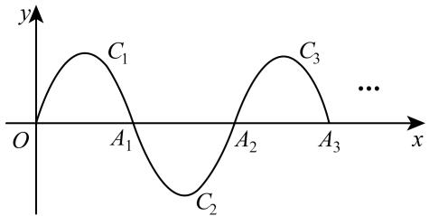

【答案】2

【分析】本题主要考查了二次函数图象旋转，总结归纳出据图象的旋转后解析式规律是解题的关键根 据 图 象 的 旋 转 变 化 规 律 总 结 归 纳 出 旋 转 后 $C _ { n }$ 的 解 析 式 为$y = \left( - 1 \right) ^ { n } \left( x - 3 n + 3 \right) \left( x - 3 n \right) \left( 3 n - 3 \leq x \leq 3 n \right)$ ，进而 求出 抛物 线 $C _ { 1 0 }$ 的解析式，再把 $P ( 2 8 , m )$ 代入，求出$m$ 的值即可

【详解】解：∵一段抛物线 $C _ { 1 }$ $\begin{array} { r l } { : } & { { } y = - x ( x - 3 ) \left( 0 \leq x \leq 3 \right) } \end{array}$ 与 $x$ 轴交于点 $O$ ， $A _ { 1 }$ ，∴图象与 $x$ 轴交点坐标为： $O \left( \left( 0 , 0 \right) , A _ { 1 } \left( 3 , 0 \right) \right)$ ，  
∵将 $C _ { 1 }$ 绕点 $A _ { 1 }$ 旋转 $1 8 0 ^ { \circ }$ 得 $C _ { 2 }$ ，交 $\cdot$ 轴于点 $A _ { 2 }$   
$\therefore A _ { 2 } \left( 6 , 0 \right)$ ；  
∴ $C _ { 2 }$ 的解析式为 $y = \left( x - 3 \right) \left( x - 6 \right) \left( 3 \leq x \leq 6 \right)$ ，  
∵将 $C _ { 2 }$ 绕点 $A _ { 2 }$ 旋转 $1 8 0 ^ { \circ }$ 得 $C _ { 3 }$ ，交 $\cdot$ 轴于点 $A _ { 3 }$ ；  
$A _ { 3 } \left( 9 , 0 \right)$ ；  
∴ $C _ { 3 }$ 的解析式为 $y = - \bigl ( x - 6 \bigr ) \bigl ( x - 9 \bigr ) \bigl ( 6 \leq x \leq 9 \bigr )$ ，

【淘宝店铺：向阳百分百】

∴ $C _ { n }$ 的解析式为 $y = \left( - 1 \right) ^ { n } \left( x - 3 n + 3 \right) \left( x - 3 n \right) \left( 3 n - 3 \leq x \leq 3 n \right) ,$ ∴ $C _ { 1 0 }$ 的解析式为 $y = \left( x - 2 7 \right) \left( x - 3 0 \right) \left( 2 7 \leq x \leq 3 0 \right)$ ，当 $x = 2 8$ 时， $m = \left( 2 8 - 2 7 \right) \times \left( 2 8 - 3 0 \right) = - 2$

# $2 0 2 3 \cdot \boxed { 2 }$ 川达州·统考二模

42．如图，已知点 $A _ { 1 } , A _ { 2 } , . . . , A _ { 2 0 2 4 }$ 在函数 $y = 2 x ^ { 2 }$ 位于第二象限的图像上，点 $B _ { 1 } , B _ { 2 } , . . . , B _ { 2 0 2 4 }$ 在函数 $y = 2 x ^ { 2 }$ 位于第一象限的图像上，点 $C _ { 1 } , C _ { 2 } , . . . , C _ { 2 0 2 4 }$ 在 $y$ 轴的正半轴上，若四边形$O _ { 1 } A _ { 1 } C _ { 1 } B _ { 1 } , C _ { 1 } A _ { 2 } C _ { 2 } B _ { 2 } , . . . , C _ { 2 0 2 3 } A _ { 2 0 2 4 } C _ { 2 0 2 4 } B _ { 2 0 2 4 }$ 都是正方形，则正方形 $C _ { 2 0 2 3 } A _ { 2 0 2 4 } C _ { 2 0 2 4 } B _ { 2 0 2 4 }$ 的边长为( )

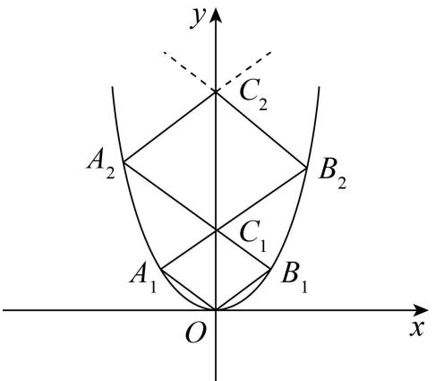

A．1012 B．1012 2 C． 2023 D． ${ \frac { 2 0 2 3 } { 2 } } { \sqrt { 2 } }$ 2

【答案】B

【分析】根据正方形对角线平分一组对角可得 $O B _ { \mathrm { 1 } }$ 与 $y$ 轴的夹角为 $4 5 ^ { \circ }$ ，然后表示出 $O B _ { 1 }$ 的解析式，再与抛物线解析式联立求出点 $B _ { 1 }$ 的坐标，然后求出 $O B _ { 1 }$ 的长，再根据正方形的性质求出 $O C _ { \mathrm { 1 } }$ ，表示出 $C _ { 1 } B _ { 2 }$ 的解析式，与抛物线联立求出 $B _ { 2 }$ 的坐标，然后求出 $C _ { 1 } B _ { 2 }$ 的长，再求出 $C _ { 1 } C _ { 2 }$ 的长，然后表示出$C _ { 2 } B _ { 3 }$ 的解析式，与抛物线联立求出 $B _ { 3 }$ 的坐标，然后求出 $C _ { 2 } B _ { 3 }$ 的长，从而根据边长的变化规律解答即可

【详解】解： $O A _ { 1 } C _ { 1 } B _ { 1 }$ 是正方形，  
 $O B _ { 1 }$ 与 $y$ 轴的夹角为 $4 5 ^ { \circ }$ ，  
 $O B _ { 1 }$ 的解析式为 $y = x$ ，  
联立方程组得： $\left\{ \begin{array} { l l } { y = x } \\ { y = 2 x ^ { 2 } } \end{array} \right.$   
解得 $\left\{ x _ { 1 } = 0 \atop \displaystyle y _ { 1 } = 0  , \right\} \left\{ x _ { 2 } = \frac { 1 } { 2 } \atop \displaystyle y _ { 2 } = \frac { 1 } { 2 } \right\} .$   
 $B$ 点的坐标是： $( \frac { 1 } { 2 } , ~ \frac { 1 } { 2 } )$   
$\therefore O B _ { 1 } = { \sqrt { ( { \frac { 1 } { 2 } } ) ^ { 2 } + ( { \frac { 1 } { 2 } } ) ^ { 2 } } } = { \frac { \sqrt { 2 } } { 2 } } = 1 \times { \frac { \sqrt { 2 } } { 2 } } ;$   
同理可得：正方形 $C _ { 1 } A _ { 2 } C _ { 2 } B _ { 2 }$ 的边长 $C _ { 1 } B _ { 2 } = 2 \times \frac { \sqrt { 2 } } { 2 }$

【淘宝店铺：向阳百分百】

依此类推，正方形 $C _ { 2 0 2 3 } A _ { 2 0 2 4 } C _ { 2 0 2 4 } B _ { 2 0 2 4 }$ 的边长是为 $2 0 2 4 \times { \frac { \sqrt { 2 } } { 2 } } = 1 0 1 2 { \sqrt { 2 } }$ ．故选 B．

# 广东梅州·九年级统考

43．二次函数 $y { = } \frac { 2 } { 3 } x ^ { 2 }$ 的图象如图所示，点 $A o$ 位于坐标原点， $A _ { I }$ ， $A _ { 2 }$ ， $A _ { 3 }$ ，…， $A _ { 2 0 2 3 }$ 在 $y$ 轴的正半轴上， $B _ { I } , B _ { 2 } , B _ { 3 } , . . . , B _ { 2 0 2 3 }$ 在二次函数 $y { = } \frac { 2 } { 3 } x ^ { 2 }$ 第一象限的图象上，若△A0B1A1，△A1B2A2，△A2B3A3，…，$\triangle A _ { 2 0 2 2 } B _ { 2 0 2 3 } A _ { 2 0 2 3 }$ 都是等边三角形，则 $\triangle A _ { 2 0 2 2 } B _ { 2 0 2 3 } A _ { 2 0 2 3 }$ 的周长是（ ）

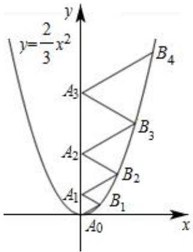

A．6069 B．6066 C．6063 D．6060

【答案】A

【分析】根据等边三角形的性质可得 $\angle A _ { I } A _ { 0 } B _ { I } { = } 6 0 ^ { \circ }$ ，然后表示出 $A o B _ { I }$ 的解析式，与二次函数解析式联立求出点 $\cdot$ 的坐标，再根据等边三角形的性质求出 $\cdot$ ，同理表示出 $\cdot$ 的解析式，与二次函数解析式联立求出点 $\cdot$ 的坐标，再根据等边三角形的性质求出 $\cdot$ ，同理求出 $B _ { 3 }$ 的坐标，然后求出 $\cdot$ ，从而得到等边三角形的边长为从 1 开始的连续自然数，与三角形所在的序数相等，进而求得三角形的周长

【详解】解：∵ $\cdot$ 是等边三角形，  
∴ $\_$ ，  
∴ $. A o B _ { I }$ 的解析式为 ${ \frac { \sqrt { 3 } } { 3 } } x$ ， ,  
联立 $\left\{ \begin{array} { l l } { \displaystyle y = \frac { \sqrt { 3 } } { 3 } x } \\ { \displaystyle y = \frac { 2 } { 3 } x ^ { 2 } } \end{array} \right.$   
解得： $\left\{ x = { \frac { \sqrt { 3 } } { 2 } } \atop { y = { \frac { 1 } { 2 } } } \right. \quad \left\{ x = 0 \right.$   
$\therefore B _ { I } ( \frac { \sqrt { 3 } } { 2 } , \frac { 1 } { 2 } ) ,$

【淘宝店铺：向阳百分百】

∴等边 $\triangle A _ { O } B _ { I } A _ { I }$ 的边长为 $\frac { 1 } { 2 } \times 2 = 1$ ，  
同理， $\cdot$ 的解析式为 $\frac { \sqrt { 3 } } { 3 } x + 1$ ，  
联立 $\left\{ { \begin{array} { l } { \displaystyle y = \frac { \sqrt { 3 } } { 3 } x + 1 } \\ { \displaystyle y = \frac { 2 } { 3 } x ^ { 2 } } \end{array} } , \right.$   
解得 $\left\{ x = \sqrt { 3 } \atop { y = 2 } \right. \ast \left\{ x = - \frac { \sqrt { 3 } } { 2 } \atop { y = \frac { 1 } { 2 } } \right. ,$   
$\cdot B _ { 2 } ( { \sqrt { 3 } } , 2 )$ ，  
∴等边 $\cdot$ 的边长 $\begin{array} { c c } { { } } & { { - } } \\ { { } } & { { } } \end{array}$ ，  
同理可求出 $\cdot$ $\frac { 3 \sqrt { 3 } } { 2 } \frac { 9 } { 2 }$   
所以，等边 $\triangle A _ { 2 } B _ { 3 } A _ { 3 }$ 的边长 $A _ { 2 } A _ { 3 } = 2 \times ( \frac { 9 } { 2 } - 1 - 2 ) = 3 .$ ，  
以此类推，系列等边三角形的边长为从 1 开始的连续自然数，  
△A2022B2023A2023 的边长为 2023，  
$\_$ 的周长是 6069  
故选： $\cdot$

# 2023 下·河北石家庄·九年级统考阶段练习

44．二次函数 $y = x ^ { 2 }$ 的图象如图．点 $A _ { 0 }$ 位于坐标原点，点 $A _ { 1 }$ ， $A _ { 2 }$ ， $A _ { 3 }$ ，…， $A _ { n }$ 在 $y$ 轴的正半轴上，点 $B _ { 1 }$ ， $B _ { 2 }$ ， $B _ { 3 }$ ，…， $B _ { n }$ 在二次函数位于第一象限的图象上，点 $C _ { 1 }$ ， $C _ { 2 }$ ， $C _ { 3 }$ ，…， $C _ { n }$ 在二次函数位于第二象限的图象上，四边形 $A _ { 0 } B _ { 1 } A _ { 1 } C _ { 1 }$ ，四边形 $A _ { 1 } B _ { 2 } A _ { 2 } C _ { 2 }$ ，四边形 $A _ { 2 } B _ { 3 } A _ { 3 } C _ { 3 }$ ，…，四边形． $A _ { n - 1 } B _ { n } A _ { n } C _ { n }$ 都是菱形， $\angle A _ { 0 } B _ { 1 } A _ { 1 } = \angle A _ { 1 } B _ { 2 } A _ { 2 } = \angle A _ { 2 } B _ { 3 } A _ { 3 } = \dots = \angle A _ { n - 1 } B _ { n } A _ { n } = 6 0 ^ { \circ }$ ，则 $\triangle A _ { 0 } B _ { 1 } A _ { 1 }$ 的边长为 ，菱形 $A _ { n - 1 } B _ { n } A _ { n } C _ { n }$ 的周长为

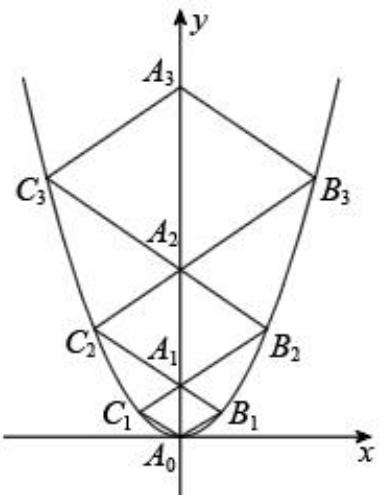

【答案】 23 83n

【分析】过点 $B _ { 1 }$ 作 $B _ { 1 } D _ { 1 }$ 垂直 $x$ 轴于点 $D _ { 1 }$ ，过点 $B _ { 2 }$ 作 $B _ { \imath } D _ { \imath }$ 垂直 $x$ 轴于点 $D _ { 2 }$ ，过点 $B _ { 3 }$ 作 $B _ { 3 } D _ { 3 }$ 垂直 $x$ 轴于点 $D _ { 3 }$ ，过点 $A _ { 1 } E _ { 1 } \perp B _ { 2 } D _ { 2 }$ 于点 $E _ { 1 }$ ，过点 $A _ { 2 } E _ { 2 } \perp B _ { 3 } D _ { 3 }$ 于点 $E _ { 2 }$ ，根据四边形 $A _ { 0 } B _ { 1 } A _ { 1 } C _ { 1 }$ ，四边形 $A _ { 1 } B _ { 2 } A _ { 2 } C _ { 2 }$ ，四 边 形 $A _ { 2 } B _ { 3 } A _ { 3 } C _ { 3 }$ , … , 四 边 形 $A _ { n - 1 } B _ { n } A _ { n } C _ { n }$ 都 是 菱 形$\angle A _ { 0 } B _ { 1 } A _ { 1 } = \angle A _ { 1 } B _ { 2 } A _ { 2 } = \angle A _ { 2 } B _ { 3 } A _ { 3 } = \dots = \angle A _ { n - 1 } B _ { n } A _ { n } = 6 0 ^ { \circ }$ ， 得 到 $\triangle A _ { 0 } B _ { 1 } A _ { 1 }$ 是等边三角形，设点 $B _ { 1 }$ 坐标为$\scriptstyle ( x , y )$ ，则： $y = x ^ { 2 }$ ，在 $\mathrm { R t } _ { \triangle } B _ { 1 } D _ { 1 } A _ { 0 }$ 中，ta $\mathrm { m } \angle B _ { 1 } A _ { 0 } D _ { 1 } = \frac { \sqrt { 3 } } { 3 } = \frac { y } { x }$ 3 y     ，求出点 B1 的坐标，进而求出 △A0 B1 A1 的边长，菱形 $A _ { 0 } B _ { 1 } A _ { 1 } C _ { 1 }$ 的周长，同法求出菱形 $A _ { 1 } B _ { 2 } A _ { 2 } C _ { 2 }$ 的周长，菱形 $A _ { 2 } B _ { 3 } A _ { 3 } C _ { 3 }$ 的周长L ，进而推出菱形 $A _ { n - 1 } B _ { n } A _ { n } C _ { n }$ 的周长．

【详解】过点 $B _ { 1 }$ 作 $B _ { 1 } D _ { 1 }$ 垂直 $x$ 轴于点 $D _ { 1 }$ ，过点 $B _ { 2 }$ 作 $B _ { 2 } D _ { 2 }$ 垂直 $x$ 轴于点 $D _ { 2 }$ ，过点 $B _ { 3 }$ 作 $B _ { 3 } D _ { 3 }$ 垂直 $x$ 轴于点 $D _ { 3 }$ ，过点 $A _ { 1 } E _ { 1 } \perp B _ { 2 } D _ { 2 }$ 于点 $E _ { 1 }$ ，过点 $A _ { 2 } E _ { 2 } \perp B _ { 3 } D _ { 3 }$ 于点 $E _ { 2 }$ ，

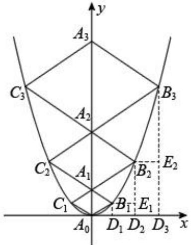

∵四边形 $A _ { 0 } B _ { 1 } A _ { 1 } C _ { 1 }$ ，四边形 $A _ { 1 } B _ { 2 } A _ { 2 } C _ { 2 }$ ，四边形 $A _ { 2 } B _ { 3 } A _ { 3 } C _ { 3 }$ ， 四边形． $A _ { n - 1 } B _ { n } A _ { n } C _ { n }$ 都是菱形，$\angle A _ { 0 } B _ { 1 } A _ { 1 } = \angle A _ { 1 } B _ { 2 } A _ { 2 } = \angle A _ { 2 } B _ { 3 } A _ { 3 } = \dots = \angle A _ { n - 1 } B _ { n } A _ { n } = 6 0 ^ { \circ } ,$ ，  
∴ $\triangle A _ { 0 } B _ { 1 } A _ { 1 }$ 是等边三角形；  
设点 $B _ { 1 }$ 坐标为 $\left( x , y \right)$ ，则： $y = x ^ { 2 }$ ，  
∵ $\angle A _ { 0 } B _ { 1 } A _ { 1 } = 6 0 ^ { \circ }$ ，  
∴ $\angle B _ { 1 } A _ { 0 } D _ { 1 } = 3 0 ^ { \circ }$ ，

【淘宝店铺：向阳百分百】

在 $\mathrm { R t } _ { \triangle } B _ { 1 } D _ { 1 } A _ { 0 }$ 中， $\mathrm { t a n } \angle B _ { 1 } A _ { 0 } D _ { 1 } = \frac { \sqrt { 3 } } { 3 } = \frac { y } { x }$   
$\therefore x ^ { 2 } = { \frac { \sqrt { 3 } } { 3 } } x ,$ ，  
解得： $\left\{ { x _ { 1 } = 0 \atop y _ { 1 } = 0 } \right.$ （舍去）或 $\left\{ { \begin{array} { l } { \displaystyle x _ { 2 } = \frac { \sqrt { 3 } } { 3 } } \\ { \displaystyle y _ { 2 } = \frac { 1 } { 3 } } \end{array} } , \right.$   
$\therefore B _ { 1 } \left( \frac { \sqrt { 3 } } { 3 } , \frac { 1 } { 3 } \right) ,$   
$\therefore A _ { 0 } B _ { 1 } = \sqrt { \left( \frac { \sqrt { 3 } } { 3 } \right) ^ { 2 } + \left( \frac { 1 } { 3 } \right) ^ { 2 } } = \frac { 2 } { 3 } ,$   
∴ $\triangle A _ { 0 } B _ { 1 } A _ { 1 }$ 的边长为 $\frac { 2 } { 3 }$   
∴菱形 $A _ { 0 } B _ { 1 } A _ { 1 } C _ { 1 }$ 的周长 $= { \frac { 2 } { 3 } } \times 4 = { \frac { 8 } { 3 } }$   
设点 $B _ { 2 }$ 坐标为 $\left( x , y \right)$ ，在 $\mathrm { R t } _ { \Delta } B _ { 2 } E _ { 1 } A _ { 1 }$ 中， $\tan \angle B _ { 2 } A _ { 1 } E _ { 1 } = \frac { \sqrt { 3 } } { 3 } = \frac { y - \frac { 2 } { 3 } } { x }$ ,且 $y = x ^ { 2 }$ ，  
$\therefore x ^ { 2 } = { \frac { \sqrt { 3 } } { 3 } } x + { \frac { 2 } { 3 } } ,$   
解得， $\left\{ \begin{array} { c } { { x _ { 1 } = \displaystyle \frac { 2 \sqrt { 3 } } { 3 } } } \\ { { y _ { 1 } = \displaystyle \frac { 4 } { 3 } } } \end{array} \right. \quad \left\{ x _ { 2 } = - \displaystyle \frac { \sqrt { 3 } } { 3 } \right.$ (舍去），  
$\begin{array} { r l } & { \therefore B _ { 2 } \left( \displaystyle { \frac { 2 \sqrt { 3 } } { 3 } } , \displaystyle { \frac { 4 } { 3 } } \right) , } \\ & { } \\ & { \ddots \ O { A _ { 1 } } = \displaystyle { \frac { 2 } { 3 } } , } \\ & { } \\ & { \therefore \ A _ { 1 } \left( 0 , \displaystyle { \frac { 2 } { 3 } } \right) , } \end{array}$   
$A _ { 1 } B _ { 2 } = { \sqrt { \left( { \frac { 2 { \sqrt { 3 } } } { 3 } } \right) ^ { 2 } + \left( { \frac { 4 } { 3 } } - { \frac { 2 } { 3 } } \right) ^ { 2 } } } = { \frac { 4 } { 3 } }$   
∴菱形 $A _ { 1 } B _ { 2 } A _ { 2 } C _ { 2 }$ 的周长 $= { \frac { 4 } { 3 } } \times 4 = { \frac { 1 6 } { 3 } }$ ；  
同法可得：菱形 $A _ { 2 } B _ { 3 } A _ { 3 } C _ { 3 }$ 的周长 $= \frac { 2 4 } { 3 }$ ；  
L  
∴菱形 $A _ { n - 1 } B _ { n } A _ { n } C _ { n }$ 的周长为： $\frac { 8 n } { 3 }$ ；  
故答案为： ${ \frac { 2 } { 3 } } , \ { \frac { 8 n } { 3 } }$

【淘宝店铺：向阳百分百】