# 专题 3-5 二次函数压轴：焦点与准线，动点面积，含参二次函数

# 01 题型•解读

# 【题型 1】焦点与准线

例题 12－1  
例题 12—2  
湘潭市·中考真题  
广东深圳·中考真题  
四川自贡·中考真题  
宜宾·中考真题  
山东滨州·中考真题  
2023·湖北鄂州中考真题  
2022·湖北鄂州中考真题

【题型 2】焦半径倒数和为定值广西南宁·中考真题

# 【题型 3】焦点弦为直径的圆与准线相切

2023·湖南怀化中考真题湖南张家界·中考真题

# 【题型 4】动点运动时间与面积之间的函数图像判断

2023·黑龙江齐齐哈尔中考真题  
2023·辽宁鞍山中考真题  
2023·黑龙江绥化中考真题  
2023·江苏南通中考真题  
2023·辽宁锦州中考真题  
2023·辽宁盘锦中考真题

# 【题型 5】求运动时间与面积之间的函数表达式

2023·广东广州中考真题  
2022·吉林中考真题  
广东深圳·中考真题  
2023·辽宁大连中考真题  
2022·四川绵阳中考真题

# 【题型 6】 解答题压轴题纯含参二次函数问题

2023年浙江省绍兴市中考真题  
2023 年浙江省嘉兴（舟山）市中  
考真题  
2023年浙江省丽水市中考真题  
2023年江苏省南通市中考真题  
2023年江苏省淮安市中考真题  
2022•北京中考真题  
2022•安顺中考真题  
2022•长沙中考真题  
2022•广州中考真题  
2022•贵阳中考真题  
2022•天津中考真题  
2022•嘉兴中考真题  
2022•杭州中考真题  
2022•连云港中考真题

# 02 满分•技巧

# 二次函数的焦点与准线

我们已经知道二次函数的图像是抛物线，一种特别的曲线，其本身还具有这样的性质：抛物线上的任意一点到平面中某个定点和某条定直线的距离始终相等．这个点称为抛物线的焦点，这条直线称为抛物线的准线，本文将讨论一些与抛物线的焦点和准线相关的问题．焦点和准线属于高中内容，高中内容下放也是中考中所常见的

我们知道，二次函数的图像是抛物线，它也可以这样定义：若一个动点 $M ( x , \ y )$ 到定点 $A ( 0 , { \frac { p } { 2 } } )$ 的距离与它到定直线 $y = - { \frac { p } { 2 } }$ 的距离相等，则动点 M 形成的图形就叫抛物线 $x ^ { 2 } = 2 p y ( p > 0 )$ .

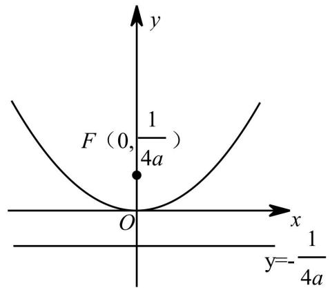

结论 1：对于抛物线 $y = a x ^ { 2 }$ ,焦点坐标为 $\left( 0 , { \frac { 1 } { 4 a } } \right)$ 准线为直线 $y = - { \frac { 1 } { 4 a } }$   
焦点一般用字母 $F$ 表示．而且实际题目中二次项系数很多时候是 $\frac 1 4$ 只是为了焦点坐标便于计算至于形如 $y = a x ^ { 2 } + b x + c$ 的抛物线可化为顶点式 $y = a ( x - h ) ^ { 2 } + k ,$ ,然后通过由 $y = a x ^ { 2 }$ 平移来确定焦点和准线

结论 2：如下图， $F M \bot F N$ 证明：设 $\angle N P F = \alpha$ ， $\angle M Q F = \beta$ ，则 $\alpha + \beta = 1 8 0 ^ { \circ }$ ，$\therefore \angle P F N + \angle Q F M = 9 0 ^ { \circ } - \frac { 1 } { 2 } \alpha + 9 0 ^ { \circ } - \frac { 1 } { 2 } \beta = 9 0 ^ { \circ } ,$ ，

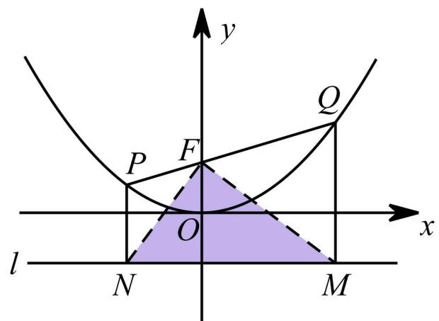

∴FM⊥FN

结论 3：取 $P Q$ 中点 $E$ ，作 $E H \bot x$ 轴交 $\boldsymbol { x }$ 轴于 $H$ 点，则 $P H \bot Q H$

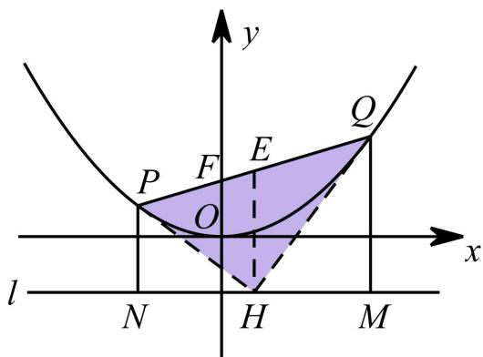

证明：倍长中线证两次全等

结论 4：记 $M N$ 与 $y$ 轴交于点 $G$ ， $\frac { 1 } { P N } + \frac { 1 } { O M } = \frac { 1 } { P F } + \frac { 1 } { Q F } = \frac { 2 } { F G } .$

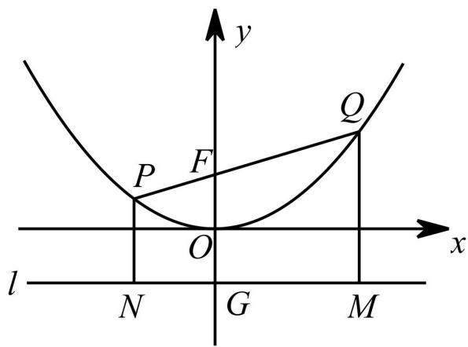

# 03 核心•题型

# 【题型 1】焦点与准线

# 例题 12－1

1．已知抛物线 $y = { \frac { 1 } { 4 } } x ^ { 2 } + 1$ 具有如下性质：抛物线上任意一点到定点 $F \big ( 0 , 2 \big )$ 的距离与到 $x$ 轴的距离相等．如图，点 $M$ 的坐标为 $\left( { \sqrt { 3 } } , 3 \right)$ ， $P$ 是抛物线 $y = { \frac { 1 } { 4 } } x ^ { 2 } + 1$ 上的一个动点，求 $\triangle P M F$ 周长的最小

【淘宝店铺：向阳百分百】

值．

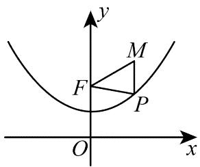

【答案】5

【分析】过点 $M$ 作 $M E \perp x$ 轴于点 $E$ ，交抛物线于点 $P$ ，由点 $P$ 在抛物线上可得出 $P F = P E$ ，结合点到直线之间垂线段最短以及 $M F$ 为定值，即可求得 $\triangle P M F$ 周长的最小值

【详解】解：如图，过点 $M$ 作 $M E \perp x$ 轴于点 $E$ ，交抛物线于点 $P$ ，此时 $\triangle P M F$ 的周长最小

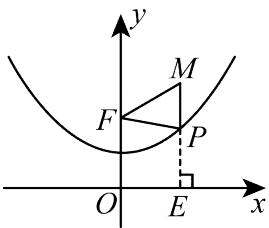

∵点 $F$ 的坐标为 0, 2 ，点 $M$ 的坐标为 $\left( { \sqrt { 3 } } , 3 \right)$ ，  
$M E = 3 \quad M F = { \sqrt { ( { \sqrt { 3 } } - 0 ) ^ { 2 } + ( 3 - 2 ) ^ { 2 } } } = 2$ ；  
由题意，得 $P F = P E$ ，  
所以 $\triangle P M F$ 周长的最小值 $= M P + P F + M F = M E + M F = 3 + 2 = 5$

# 例题 12—2

2．我们知道，二次函数的图像是抛物线，它也可以这样定义：若一个动点 $M ( x , y )$ 到定点 $A ( 0 , { \frac { p } { 2 } } )$ 的距离与它到定直线 $y = - { \frac { p } { 2 } }$ 的距离相等，则动点 M 形成的图形就叫抛物线 $x ^ { 2 } = 2 p y ( p > 0 )$ .

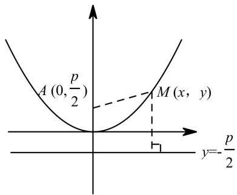

(1)已知动点 $M ( x , \ y )$ 到定点 $A ( 0 , \ 4 )$ 的距离与到定直线 $y { = } { - } 4$ 的距离相等，请写出动点 $M$ 形成的抛物线的解析式

(2)若点 $D$ 的坐标是(1，8)，在(1)中求得的抛物线上是否存在点 $P$ ，使得 $P A + P D$ 最短?若存在，求出点 $P$ 的坐标，若不存在，请说明理由

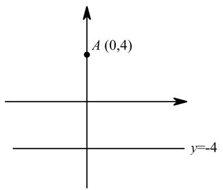

【分析】

(1)由题意得： $M A = { \sqrt { \left( x - 0 \right) ^ { 2 } + \left( y - 4 \right) ^ { 2 } } } = { \sqrt { x ^ { 2 } + \left( y - 4 \right) ^ { 2 } } }$ 过点 $M$ 作 $M B \perp$ 直线 $y = 4$ ，垂足记为 $B$ 点，则 $-$ ，

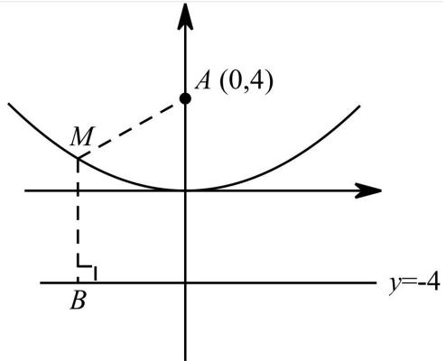

 $M A = M B$ , $\sqrt { x ^ { 2 } + ( y - 4 ) ^ { 2 } } = | y + 4 | .$ ,两边平方，化简得： $y = \frac { x ^ { 2 } } { 1 6 }$ 故 $\cdot$ 点形成的抛物线的解析式为 $y = \frac { x ^ { 2 } } { 1 6 }$

（2）过 $P$ 点做 $P O \bot$ 直线 $y = - 4$ , $P A = P Q ,$ 故求 $\cdot$ 最短，即求 $P Q + P D$ 最短．过点 $D$ 作直线 $y = - 4$ 的垂线，与抛物线交点即为 $P$ 点，垂足为 $Q$ ，此时 $\cdot$ 最短，$P A + P Q = P D + P Q = D Q = 8$ 为最小值，此时 $P$ 点坐标为 $\left( 1 , \frac { 1 } { 1 6 } \right)$

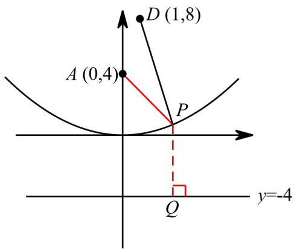

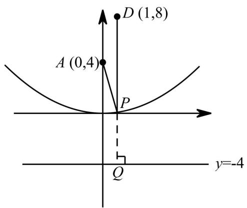

# 湘潭市·中考真题

3．如图，点 $P$ 为抛物线 $y = { \frac { 1 } { 4 } } x ^ { 2 }$ 上一动点

(1)若抛物线 $y = { \frac { 1 } { 4 } } x ^ { 2 }$ 是由抛物线 $y = \frac { 1 } { 4 } ( x + 2 ) ^ { 2 } - 1$ 通过图像平移得到的，请写出平移的过程；

(2)若直线 $l$ 经过 $y$ 轴上一点 $N _ { : }$ ，且平行于 $x$ 轴，点 $N$ 的坐标为 $( 0 , - 1 )$ ，过点 $P$ 作 $P M \perp l$ 于 $M$ ．

$\textcircled{1}$ 问题探究：如图一，在对称轴．上是否存在一定点 $F$ ，使得 $P M { = } P F$ 恒成立?若存在，求出点 $F$ 的坐标：若不存在，请说明理由

$\textcircled{2}$ 问题解决：如图二，若点 $\mathcal { Q }$ 的坐标为(1，5)，求 $\mathcal { Q } P { + } P F$ 的最小值．【答案】（1）向上平移 1 个单位，再向右 2 个单位；（2） $\cdot$ （0，1）， $\cdot$ 【详解】分析：（1）找到抛物线顶点坐标即可找到平移方式（2） $\textcircled{1}$ 设出点 $\cdot$ 坐标，利用 $\cdot$ 计算 $B F$ ， 求得 $\cdot$ 坐标；

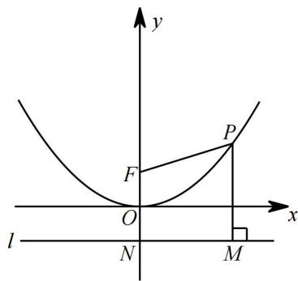  
图1

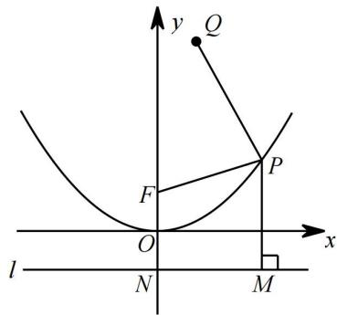  
图2

$\textcircled{2}$ 利用 $\cdot$ ，将 $\mathcal { Q } P { + } P F$ 转化为 $\cdot$ ，利用垂线段最短解决问题详解：（1）∵抛物线 $y = \frac { 1 } { 4 } { \bigl ( } x + 2 { \bigr ) } ^ { 2 } - 1$ 的顶点为（﹣2，﹣1）

∴抛物线 $y = \frac { 1 } { 4 } { \bigl ( } x + 2 { \bigr ) } ^ { 2 } - 1$ 的图象向上平移 1 个单位，再向右 2 个单位得到抛物线 $y = { \frac { 1 } { 4 } } x ^ { 2 }$ 的图象.

（2） $\cdot$ 存在一定点 $F$ ，使得 $\cdot$ 恒成立法一：先考虑特殊位置找出 F 点，再证明一般情况成立考虑特殊位置，当 P 点在顶点 B 时，可得 F 点坐标为(0，1)或(0，-1)(舍掉)，以下证明 P 在抛物线任意位置，均满足 $\cdot$ ：

没 P 点坐标为 $\left( m , { \frac { 1 } { 4 } } m ^ { 2 } \right)$ ，则 $P F = \sqrt { \left( m - 0 \right) ^ { 2 } + ( \frac { 1 } { 4 } m ^ { 2 } - 1 ) ^ { 2 } } = [ \frac { 1 } { 2 } m ^ { 2 } + 1 ) ^ { 2 } = \frac { 1 } { m ^ { 2 } + 1 } ,$

【淘宝店铺：向阳百分百】

$P M = \left| { \frac { 1 } { 4 } } m ^ { 2 } - ( - 1 )  \right| = \left| { \frac { 1 } { 4 } } m ^ { 2 } + 1 \right| = { \frac { 1 } { 4 } } m ^ { 2 } + 1 \quad \cdot \cdot P F = P M$ ∴当 F 点坐标为(0，1)时， $P M = P F$ 恒成立.

法二：如图一，过点 $\cdot$ 作 $\cdot$ 轴于点 $B$ 设点 $\cdot$ 坐标为 $\left( a , \frac { 1 } { 4 } a ^ { 2 } \right) { } P M = P F = \frac { 1 } { 4 } a ^ { 2 } + 1 { } P B = a ,$ ∴RtPBF 中 $B F = { \sqrt { P F ^ { ^ { 2 } } - P B ^ { ^ { 2 } } } } = { \sqrt { \left( { \frac { 1 } { 4 } } a ^ { ^ { 2 } } + 1 \right) - a ^ { ^ { 2 } } } } = { \frac { 1 } { 4 } } a ^ { ^ { 2 } } - 1 ,$ ∴ $\cdot$ ∴点 $\cdot$ 坐标为（0，1）$\textcircled{2}$ 由 $\textcircled{1}$ ， $\cdot$ ， $\mathcal { Q } P + P F$ 的最小值为 $Q P + Q M$ 的最小值

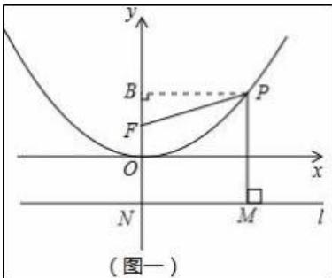

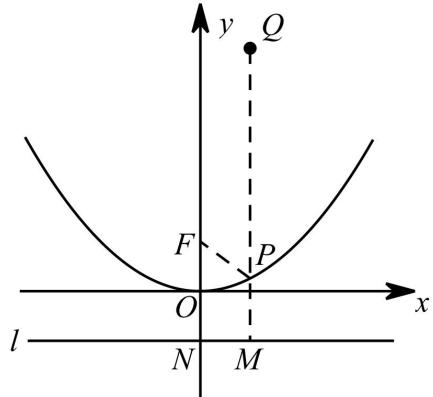

当 $\cdot$ 、 $\cdot$ 、 $M$ 三点共线时， $\cdot$ 有最小值为点 $\cdot$ 纵坐标与 $M$ 纵坐标绝对值的和 6  
∴ $\cdot$ 的最小值为 6

# 广东深圳·中考真题

4．如图 1，抛物线 $y = a x ^ { 2 } + b x + 3$ （ $a { \neq } 0$ ）与 $x$ 轴交于 $A$ （-3，0）和 $B$ （1，0），与 $y$ 轴交于点 $C$ ，顶点为 $D$ ．

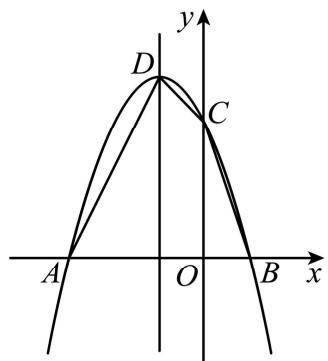  
图1

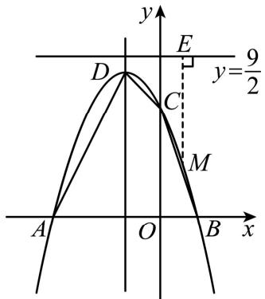  
图2

（1）求解抛物线解析式；

（2）如图 2，过抛物线上任意一点 $M \ ( m , \ n )$ 向直线 $l$ ： $y = \frac { 9 } { 2 }$ 作垂线，垂足为 $E$ ，试问在该抛物线的对称轴上是否存在一点 $F$ ，使得 $M E - M F { = } { \frac { 1 } { 4 } } ?$ ？若存在，请求 $F$ 点的坐标；若不存在，请说明理由

【答案】（1） $y = - x ^ { 2 } - 2 x + 3$ ；（2）存在， $F ( - 1 , \frac { 1 5 } { 4 } )$

【分析】（1）运用待定系数法解答即可；

（2）设 $F$ 点坐标为(-1，t)、点 $\cdot$ ），则有 $n = - m ^ { 2 } - 2 m + 3$ 、进而求得 ME，然后分别通过线段的和差和勾股定理求得 MF 的长，然后得到等式、化简、对比即可求得 t 即可．

【详解】解：（1）将 $\cdot$ （-3，0）和 $\cdot$ （1，0）代入抛物线解析式 $y = a x ^ { 2 } + b x + 3$ 中，可得：$\left\{ \begin{array} { l l } { 0 = 9 a - 3 b + 3 } \\ { 0 = a + b + 3 } \end{array} \right.$ 解得： $\left\{ \begin{array} { l l } { a = - 1 } \\ { b = - 2 } \end{array} \right.$   
∴抛物线解析式为 $\cdot$ ；  
（2）假设存在，设 $\cdot$ 点坐标为(-1， $\cdot$ 、点 $M \ ( m , \ n )$   
$n = - m ^ { 2 } - 2 m + 3$   
$\therefore M E = { \frac { 9 } { 2 } } - n = { \frac { 9 } { 2 } } - \left( - \mathbf { m } ^ { 2 } - 2 m + 3 \right) = \mathbf { m } ^ { 2 } + 2 \mathbf { m } + { \frac { 3 } { 2 } }$   
$M F = M E - { \frac { 1 } { 4 } } = m ^ { 2 } + 2 m + { \frac { 5 } { 4 } }$   
而 $M F = \sqrt { \left( m + 1 \right) ^ { 2 } + \left( - m ^ { 2 } - 2 m + 3 - t \right) ^ { 2 } }$   
$( m + 1 ) ^ { 2 } + \left( - m ^ { 2 } - 2 m + 3 - t \right) ^ { 2 } = \left( m ^ { 2 } + 2 m + \frac { 5 } { 4 } \right) ^ { 2 }$   
$\therefore \left( - m ^ { 2 } - 2 m + 3 - t \right) ^ { 2 } = \left( m ^ { 2 } + 2 m + { \frac { 5 } { 4 } } \right) ^ { 2 } - ( m + 1 ) ^ { 2 }$   
${ \begin{array} { l } { = \left( m ^ { 2 } + 3 m + { \cfrac { 9 } { 4 } } \right) \left( n ^ { 2 } + m + { \cfrac { 1 } { 4 } } \right) = \left( m + { \cfrac { 3 } { 2 } } \right) ^ { 2 } \left( m + { \cfrac { 1 } { 2 } } \right) ^ { 2 } = \left( m ^ { 2 } + 2 m + { \cfrac { 3 } { 4 } } \right) ^ { 2 } } \\ { \vdots } \\ { \cdot m ^ { 2 } - 2 m + 3 - t = \left( m ^ { 2 } + 2 m + { \cfrac { 3 } { 4 } } \right) } \end{array} }$   
$\therefore t - 3 = \frac { 3 } { 4 }$ ， 即 $t = \frac { 1 5 } { 4 }$

$$
\therefore F { \left( - 1 , { \frac { 1 5 } { 4 } } \right) } .
$$

# 四川自贡·中考真题

5．如图，已知直线 AB 与抛物线 $C : y = a x ^ { 2 } + 2 x + c$ 相交于点 $A ( - 1 , \ 0 )$ 和点 $B ( 2 , \ 3 )$ 两点

(1)求抛物线 $C$ 函数表达式；

(2)在抛物线 $C$ 的对称轴上是否存在定点 $F$ ，使抛物线 $C$ 上任意一点 $P$ 到点 $F$ 的距离等于到直线 $y = \frac { 1 7 } { 4 }$ 的距离?若存在，求出定点 $F$ 的坐标；若不存在，请说明理由

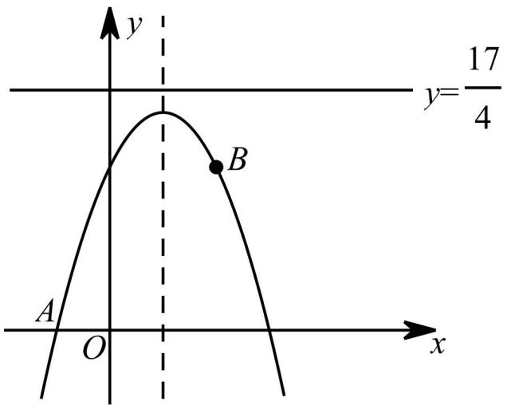

【答案】⑴ $y = - x ^ { 2 } + 2 x + 3$ ；⑵存在. 当 $F { \left( 1 , \frac { 1 5 } { 4 } \right) }$ 时，无论 $x$ 取任何实数，均有 $P G = P F$ . 理由见解析.

【分析】（1）由题意把点（-1，0）、（2，3）代入 $\scriptstyle \mathbf { y } = \mathbf { a } \mathbf { x } ^ { 2 } + 2 \mathbf { x } + \mathbf { c }$ ，得， $\left\{ { \begin{array} { l } { a - 2 + c = 0 } \\ { 4 a + 4 + c = 3 } \end{array} } \right.$ 解得 $\cdot$ ， $\mathtt { c } { = } 3$ ，∴此抛物线 C 函数表达式为： $y = - x ^ { 2 } + 2 x + 3$ ；

（2）问题已经很明显了， $y = \frac { 1 7 } { 4 }$ 是抛物线准线，我们要求的 F 是焦点  
易求抛物线对称轴为直线 $\mathbf { x } { = } 1$ ，不妨取特殊位置得到结果，再证明  
当点 P 在抛物线顶点时，P 点坐标为(1，4)，此时点 P 到直线 $y = \frac { 1 7 } { 4 }$ 的距离为 $\frac 1 4$ 故此时点 P到点 F  
的距离也为 $\frac { 1 } { 4 }$ 满足条件的 F 点坐标有 $( 1 , { \frac { 1 5 } { 4 } } ) ( 1 , { \frac { 1 7 } { 4 } } ) ,$ 考虑到 $( 1 , \frac { 1 7 } { 4 } )$ 在直线 $y = \frac { 1 7 } { 4 }$ L 故需舍去，  
F 点可能的坐标只有 $\left( 1 , \frac { 1 5 } { 4 } \right)$

【淘宝店铺：向阳百分百】

【常规法】：∴对称轴为直线 $\cdot$ ， 当 $\cdot$ 时， $\cdot$ ， ${ \bf X } \imath _ { 2 } \mathrm { = } 3$ ，∴抛物线与 $\cdot$ 轴正半轴交于点 C（3，0），如图 2，分别过点 B，C 作直线 $\mathrm { y } { = } \frac { 1 7 } { 4 }$ 的垂线，垂足为 N，H，

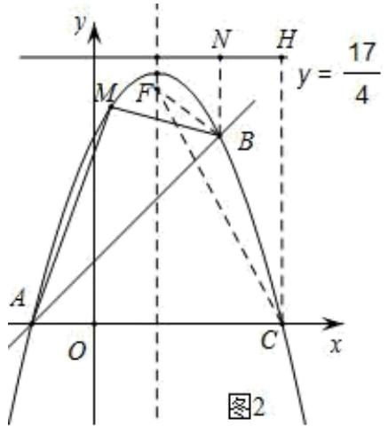

抛物线对称轴上存在点 F，使抛物线 C 上任意一点 P 到点 F 的距离等于到直线 $y { = } \frac { 1 7 } { 4 }$ 的距离，设 F  
（1，a），连接 BF，CF，则 $\frac { 1 7 } { 4 } \frac { 5 } { 4 }$ $\frac { 1 7 } { 4 }$ ,  
由题意可列： ${ \left\{ \begin{array} { l l } { \left( 2 - 1 \right) ^ { 2 } + \left( a - 3 \right) ^ { 2 } = \left( { \frac { 5 } { 4 } } \right) ^ { 2 } } \right.} & { \qquad { \frac { 1 5 } { 4 } } \qquad \qquad { \frac { 1 5 } { 4 } } } \\ { \left( 3 - 1 \right) ^ { 2 } + a ^ { 2 } = \left( { \frac { 1 7 } { 4 } } \right) ^ { 2 } } & { } \end{array}  $

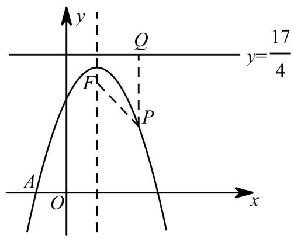

# 宜宾·中考真题

6．在平面直角坐标系 $x O y$ 中，已知抛物线的顶点坐标为(2，0)，且经过点(4，1)，如图，直线 $y = { \frac { 1 } { 4 } } x$ 与抛物线交于 A、 $B$ 两点，直线 $l$ 为 $y = - 1$

(1)求抛物线的解析式；

【淘宝店铺：向阳百分百】

(2)知 $F ( x _ { 0 } , y _ { 0 } )$ 为平面内一定点， $M ( m , \ n )$ 为抛物线上一动点，且点 $M$ 到直线 $l$ 的距离与 点 $M$ 到点 $F$ 的距离总是相等，求定点 $F$ 的坐标．

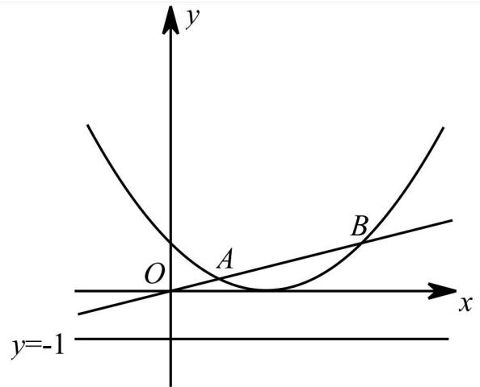

【分析】(1)抛物线： $y = { \frac { 1 } { 4 } } ( x - 2 ) ^ { 2 }$

(2)不难猜测直线 1是抛物线的准线，所求 $F$ 点为抛物线焦点当 $M$ 点在顶点位置时， $\cdot$ 点到直线 $\cdot$ 的距离为 1，故此时 $F$ 点应为(2，1)下证明 $\cdot$ 在抛物线任意位置，均有点 $\cdot$ 到直线 $\cdot$ 的距离与点 $\cdot$ 到点 $F$ 的距离相等

# 山东滨州·中考真题

7．如图，抛物线的顶点为 $A ( h , - 1 )$ ，与 $y$ 轴交于点 $B ( 0 , - \frac { 1 } { 2 } )$ ，点 $F ( 2 , \ 1 )$ 为其对称轴上的一个定点．

（1）求这条抛物线的函数解析式；

（2）已知坐标平面内的点 $D ( 4 , ~ 3 )$ ，请在抛物线上找一点 $Q$ ，使 $\triangle D F Q$ 的周长最小，并求此时DFQ周长的最小值及点 $Q$ 的坐标

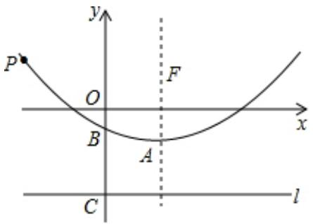

【答案】（1） $y = \frac { 1 } { 8 } { \left( x - 2 \right) } ^ { 2 } - 1$ ；（2）见解析；（3） $2 \sqrt { 2 } + 6$ ， $\left( 4 , - { \frac { 1 } { 2 } } \right)$

【分析】（1）由题意抛物线的顶点 A（2，－1），可以假设抛物线的解析式为 $\_$ ，把

【淘宝店铺：向阳百分百】点 $\cdot$ 坐标代入求出 $\cdot$ 即可

（2）如图，过点 $\cdot$ 作 $Q H \bot$ 直线 $\cdot$ 于 $H$ ，过点 $\cdot$ 作 $\cdot$ 直线 $\cdot$ 于 $\cdot$ ．因为△DFQ 的周长 $= D F { + } D Q { + } F Q$ ，DF 是定值 $= { \sqrt { 2 ^ { 2 } + 2 ^ { 2 } } } = 2 { \sqrt { 2 } }$ ，推出 $D Q { + } Q F$ 的值最小时， $\triangle D F Q$ 的周长最小，再根据垂线段最短解决问题即可

【详解】解：（1）设抛物线的函数解析式为 $y = a \left( x - h \right) ^ { 2 } + k$ ,  
由题意，抛物线的顶点为 $A \left( 2 , - 1 \right)$ ,  
$\therefore y = a \left( x - 2 \right) ^ { 2 } - 1 .$   
又抛物线与 $y$ 轴交于点 $B { \Bigg ( } 0 , - { \frac { 1 } { 2 } } { \Bigg ) }$   
$\begin{array} { l } { \displaystyle \therefore - \frac { 1 } { 2 } = a \big ( 0 - 2 \big ) ^ { 2 } - 1 } \\ { \displaystyle \qquad \therefore a = \frac { 1 } { 8 } } \end{array}$   
抛物线的函数解析式为 $y = \frac { 1 } { 8 } { \left( x - 2 \right) } ^ { 2 } - 1$

（2）如图，过点 $\cdot$ 作 $Q H \bot$ 直线 $\cdot$ 于 $\cdot$ ，过点 $D$ 作 $\cdot$ 直线 $\cdot$ 于 $\cdot$

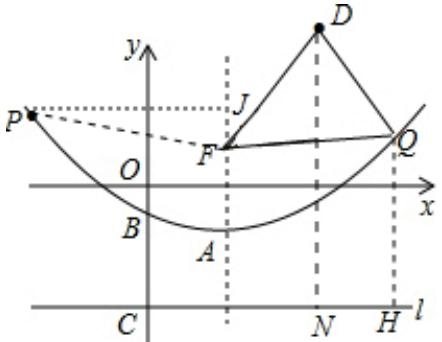

∵ $\bigtriangleup$ DFQ 的周长 $= D F { + } D Q { + } F Q$ ，DF 是定值 ${ \sqrt { 2 ^ { 2 } + 2 ^ { 2 } } } = 2 { \sqrt { 2 } }$ ，  
∴ $\cdot D Q ^ { + } Q F$ 的值最小时， $\cdot$ 的周长最小，  
∵ $\cdot$ ，  
$\therefore D Q + D F = D Q + Q H ,$ ，  
根据垂线段最短可知，当 $D$ ， $\cdot$ ， $\cdot$ 共线时， $\cdot$ 的值最小，此时点 $H$ 与 $\cdot$ 重合，点 $Q$ 在线段 $D N$   
上，  
∴ $D Q { + } Q H$ 的最小值为 6，  
∴△DFQ 的周长的最小值为 $2 \sqrt { 2 } + 6$ ，此时 $\cdot$ （4， $- \frac { 1 } { 2 } )$

# 2023·湖北鄂州中考真题

8．某数学兴趣小组运用《几何画板》软件探究 $y = a x ^ { 2 } \left( a > 0 \right)$ 型抛物线图象．发现：如图 1 所示，该类型图象上任意一点 $P$ 到定点 $F { \left( 0 , \frac { 1 } { 4 a } \right) }$ 的距离 $P F$ ，始终等于它到定直线 l： $y = - { \frac { 1 } { 4 a } }$ 的距离PN（该结论不需要证明）．他们称：定点 $F$ 为图象的焦点，定直线 $l$ 为图象的准线， $y = - { \frac { 1 } { 4 a } }$ 叫

做抛物线的准线方程．准线 $l$ 与 $y$ 轴的交点为 $H$ ．其中原点 $o$ 为 $F H$ 的中点， $F H = 2 O F = \frac { 1 } { 2 a }$ ．例如，抛物线 $y = 2 x ^ { 2 }$ ，其焦点坐标为 $F { \Bigg ( } 0 , { \frac { 1 } { 8 } } { \Bigg ) }$ ，准线方程为 l： $y = - { \frac { 1 } { 8 } }$ ，其中 $P F = P N , F H = 2 O F = \frac { 1 } { 4 }$

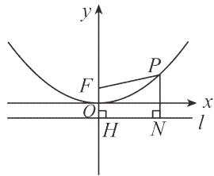  
图1

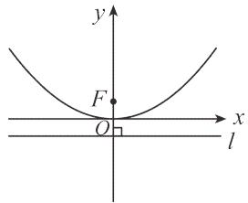  
图2

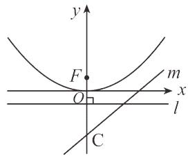  
图3

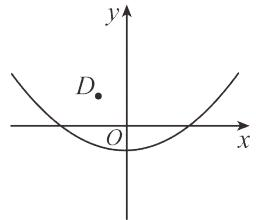  
图4

【基础训练】

(1)请分别直接写出抛物线 $y = { \frac { 1 } { 4 } } x ^ { 2 }$ 的焦点坐标和准线 $l$ 的方程： , ;

# 【技能训练】

(2)如图 2，已知抛物线 $y = { \frac { 1 } { 4 } } x ^ { 2 }$ 上一点 $P \big ( x _ { 0 } , y _ { 0 } \big ) \big ( x _ { 0 } > 0 \big )$ 到焦点 $F$ 的距离是它到 $\boldsymbol { x }$ 轴距离的 3 倍，求点 $P$ 的坐标；

【能力提升】

(3)如图 3，已知抛物线 $y = { \frac { 1 } { 4 } } x ^ { 2 }$ 的焦点为 $F$ ，准线方程为 $l$ ．直线 $m$ 1 3 x  交 y 轴于点 C，抛物线上动点 $P$ 到 $\boldsymbol { x }$ 轴的距离为 $d _ { \mathrm { { \scriptscriptstyle 1 } } }$ ，到直线 $m$ 的距离为 $d _ { 2 }$ ，请直接写出 $d _ { 1 } + d _ { 2 }$ 的最小值；

# 【拓展延伸】

该兴趣小组继续探究还发现：若将抛物线 $y = a x ^ { 2 } \left( a > 0 \right)$ 平移至 $y = a \left( x - h \right) ^ { 2 } + k \left( a > 0 \right)$ ．抛物线$y = a \left( x - h \right) ^ { 2 } + k \left( a > 0 \right)$ 内有一定点 $F { \overset { \underset { \triangledown } { } } { \left( h , k + { \frac { 1 } { 4 a } } \right) } }$ ，直线 $l$ 过点 ${ \cal M } \left( h , k - \frac { 1 } { 4 a } \right)$ 且与 $\boldsymbol { x }$ 轴平行．当动点 $P$ 在该抛物线上运动时，点 $P$ 到直线 $l$ 的距离 $P P _ { 1 }$ 始终等于点 $P$ 到点 $F$ 的距离（该结论不需要证明）．例如：抛物线 $y = 2 { \bigl ( } x - 1 { \bigr ) } ^ { 2 } + 3$ 上的动点 $P$ 到点 $F { \left( 1 , \frac { 2 5 } { 8 } \right) }$ 的距离等于点 $P$ 到直线 $l { : }$ ： $y = \frac { 2 3 } { 8 }$ 的距离．请阅读上面的材料，探究下题：

(4)如图 4，点 $D \bigg ( - 1 , \frac { 3 } { 2 } \bigg )$ 是第二象限内一定点，点 $P$ 是抛物线 $y = \frac { 1 } { 4 } x ^ { 2 } - 1$ 上一动点，当 $P O + P D$ 取最小值时，请求出 $\triangle P O D$ 的面积

【答案】(1) 0,1 ， $y = - 1$ ；( $\begin{array} { c } { { 2 \displaystyle \left( \sqrt { 2 } , \frac { 1 } { 2 } \right) ; } } \\ { { 3 \displaystyle \left( \frac { 8 } { 5 } \sqrt { 5 } - 1 \right. } } \end{array}$   
(

【淘宝店铺：向阳百分百】

(4) 98

【分析】（1）根据题中所给抛物线的焦点坐标和准线方程的定义求解即可；

（2）利用两点间距离公式结合已知条件列式整理得 ${ x _ { 0 } } ^ { 2 } = 8 { y _ { 0 } } ^ { 2 } + 2 y _ { 0 } - 1$ ，然后根据 $y _ { 0 } = \frac { 1 } { 4 } { x _ { 0 } } ^ { 2 }$ ，求出 $y _ { 0 }$ ，进而可得 $x _ { 0 }$ ，问题得解；

（3）过点 $P$ 作 $P E \perp$ 直线 $m$ 交于点 $E$ ，过点 $P$ 作 $P G \bot$ 准线 $l$ 交于点 $G$ ，结合题意和（1）中结论可知$P G = P F = d _ { 1 } + 1 P E = d _ { 2 }$ ，根据两点之间线段最短可得当 $F$ ， $P$ ， $E$ 三点共线时， $d _ { 1 } + d _ { 2 }$ 的值最小；待定系数法求直线 $P E$ 的解析式，求得点 $P$ 的坐标为 $\left( 2 { \sqrt { 5 } } - 4 , 9 - 4 { \sqrt { 5 } } \right)$ ，根据点 $E$ 是直线 $P E$ 和直线 $\cdot$ 的交点，求得点 $E$ 的坐标为 $\left( { \frac { 8 } { 5 } } , - { \frac { 1 1 } { 5 } } \right)$ ， 即可求得 $d _ { \mathrm { { \scriptscriptstyle 1 } } }$ 和 $d _ { 2 }$ 的值，即可求得；

（4）根据题意求得抛物线 $y = \frac { 1 } { 4 } x ^ { 2 } - 1$ 的焦点坐标为 $F \big ( 0 , 0 \big )$ ，准线 $l$ 的方程为 $y = - 2$ ，过点 $P$ 作 $P G \bot$ 准线 $l$ 交于点 $G$ ，结合题意和（1）中结论可知 $P G = P F$ ，则 $P O + P D = P G + P D$ ，根据两点之间线段最短可得当 $D$ ， $P$ ， $G$ 三点共线时， $P O + P D$ 的值最小；求得 $P \left( - { \frac { 1 } { 2 } } , - { \frac { 3 } { 4 } } \right)$ 即可求得 $\triangle P O D$ 的面积．

【详解】（1）解：∵抛物线 $y = { \frac { 1 } { 4 } } \ x ^ { 2 }$ 中 $a = { \frac { 1 } { 4 } }$   
$\therefore { \frac { 1 } { 4 a } } = 1 , - { \frac { 1 } { 4 a } } = - 1 ,$   
∴抛物线 $y = { \frac { 1 } { 4 } } x ^ { 2 }$ 的焦点坐标为(0,1)，准线 $\cdot$ 的方程为 $y = - 1$ 故答案为：0,1 ， $y = - 1$ ；（2）解：由（1）知抛物线 $y = { \frac { 1 } { 4 } } x ^ { 2 }$ 的焦点 $F$ 的坐标为(0,1),∵点 $P \big ( x _ { 0 } , y _ { 0 } \big ) \big ( x _ { 0 } > 0 \big )$ 到焦点 $\cdot$ 的距离是它到 $\cdot$ 轴距离的 3 倍，$\sqrt { { x _ { 0 } } ^ { 2 } + \left( y _ { 0 } - 1 \right) ^ { 2 } } = 3 y _ { 0 }$ ，整理得： ${ x _ { 0 } } ^ { 2 } = 8 { y _ { 0 } } ^ { 2 } + 2 y _ { 0 } - 1$ ，  
又∵ $y _ { 0 } = \frac { 1 } { 4 } { x _ { 0 } } ^ { 2 }$   
$4 y _ { 0 } = 8 { y _ { 0 } } ^ { 2 } + 2 y _ { 0 } - 1$   
解得： $y _ { 0 } = \frac { 1 } { 2 }$ 或 0y $y _ { 0 } = - { \frac { 1 } { 4 } }$ （舍去），  
∴ $x _ { 0 } = \sqrt { 2 }$ ，  
∴点 $\cdot$ 的坐标为 $\left( { \sqrt { 2 } } , { \frac { 1 } { 2 } } \right)$ ；

（3）解：过点 $P$ 作 $P E \perp$ 直线 $m$ 交于点 $E$ ，过点 $P$ 作 $P G \bot$ 准线l交于点 $G$ ，结合题意和（1）中结论可知 $P G = P F = d _ { 1 } + 1$ ， $P E = d _ { 2 }$ ，如图：

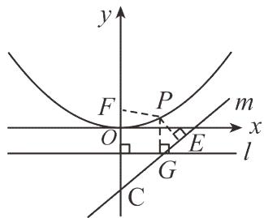

若使得 $d _ { 1 } + d _ { 2 }$ 取最小值，即 $P F + P E - 1$ 的值最小，故当 $F$ ， $P$ ，即此刻 $d _ { 1 } + d _ { 2 }$ 的值最小；  
∵直线 $P E$ 与直线 $m$ 垂直，故设直线 $P E$ 的解析式为 $y = - 2 x + b$ ，将 $F \big ( 0 , 1 \big )$ 代入解得： $b = 1$ ，  
∴直线 $P E$ 的解析式为 $y = - 2 x + 1$ ，  
∵点 $P$ 是直线 $P E$ 和抛物线 $y = { \frac { 1 } { 4 } } x ^ { 2 }$   
令 ${ \frac { 1 } { 4 } } x ^ { 2 } = - 2 x + 1$ ，解得： $x _ { 1 } = 2 \sqrt { 5 } - 4$ ， $x _ { 2 } = - 2 \sqrt { 5 } - 4$ （舍去），故点 $P$ 的坐标为 $\left( 2 { \sqrt { 5 } } - 4 , 9 - 4 { \sqrt { 5 } } \right)$ ，  
$d _ { \scriptscriptstyle 1 } = 9 - 4 \sqrt { 5 }$ ，  
∵点 $E$ 是直线 $P E$ 和直线 $\cdot$ 的交点，  
令 $- 2 x + 1 = { \frac { 1 } { 2 } } x - 3$ ，解得： $x = \frac { 8 } { 5 }$ ，  
故点 $E$ 的坐标为 $\left( { \frac { 8 } { 5 } } , - { \frac { 1 1 } { 5 } } \right)$   
$\therefore d _ { 2 } = \sqrt { \left( 2 \sqrt { 5 } - 4 - \frac { 8 } { 5 } \right) ^ { 2 } + \left( 9 - 4 \sqrt { 5 } + \frac { 1 1 } { 5 } \right) ^ { 2 } } \ ,$   
$d _ { 1 } + d _ { 2 } = { \frac { 8 } { 5 } } { \sqrt { 5 } } - 1$ ．  
即 $d _ { 1 } + d _ { 2 }$ 的最小值为 $\frac { 8 } { 5 } \sqrt { 5 } - 1$ ．  
（4）解：∵抛物线 $y = \frac { 1 } { 4 } x ^ { 2 } - 1$ 中 $a = { \frac { 1 } { 4 } }$   
$\therefore { \frac { 1 } { 4 a } } = 1 , - { \frac { 1 } { 4 a } } = - 1 ,$   
∴抛物线 $y = \frac { 1 } { 4 } x ^ { 2 } - 1$ 的焦点坐标为 $F \big ( 0 , 0 \big )$ ，准线 $l$ 的方程为 $y = - 2$ ，  
过点 $P$ 作 $P G \bot$ 准线 $l$ 交于点 $G$ ，结合题意和（1）中结论可知 $P G = P F$ ，则 $P O + P D = P G + P D$ ，如  
图：

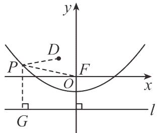

若 使 得 $P O + P D$ 取 最 小 值 ， 即 $P G + P D$ 的 值 最 小 ， 故 当 $D$ ， $P$ ， $G$ 三 点 共 线 时 ，$P O + P D = P G + P D = D G$ ，即此刻 $P O + P D$ 的值最小；如图：

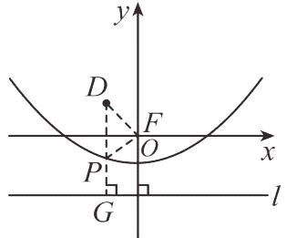

∵点 $D$ 的坐标为 $\left( - 1 , \frac { 3 } { 2 } \right)$ ， $D G \bot$ 准线 $l$ ，∴点 $P$ 的横坐标为 $^ { - 1 }$ ，代入 $y = \frac { 1 } { 4 } x ^ { 2 } - 1$ 解得 $y = - { \frac { 3 } { 4 } }$ 即 $P \left( - \frac { 1 } { 2 } , - \frac { 3 } { 4 } \right) , O P = \frac { 3 } { 2 } + \frac { 3 } { 4 } = \frac { 9 } { 4 } ,$ 则 $\triangle P O D$ 的面积为 $S _ { _ { \Delta P O D } } = \frac { 1 } { 2 } \times \frac { 9 } { 4 } \times 1 = \frac { 9 } { 8 }$

# 2022·湖北鄂州中考真题

9．某数学兴趣小组运用《几何画板》软件探究 $y = a x ^ { 2 }$ （ $a > 0$ ）型抛物线图象．发现：如图 1 所示，该类型图象上任意一点 $M$ 到定点 $F ~ ( 0 , ~ \frac { 1 } { 4 a } )$ 的距离 $M F$ ，始终等于它到定直线 l： $y = - \ { \frac { 1 } { 4 a } }$ 上的距离 MN（该结论不需要证明），他们称：定点 $F$ 为图象的焦点，定直线 $l$ 为图象的准线， $y$ $= - \ { \frac { 1 } { 4 a } }$ 叫做抛物线的准线方程．其中原点 $o$ 为 $F H$ 的中点， $F H { = } 2 O F { = } \ { \frac { 1 } { 2 a } }$ 例如，抛物线 $y$ $= { \frac { 1 } { 2 } } x ^ { 2 }$ ，其焦点坐标为 $F ~ ( 0 , ~ { \frac { 1 } { 2 } } ) _ { ; }$ ，准线方程为 l： $y = - \ { \frac { 1 } { 2 } }$ 其中 $M F { = } M N$ ， $F H { = } 2 O H { = } 1$

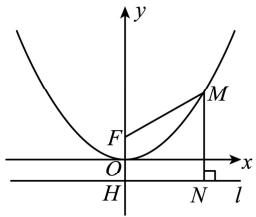  
图1

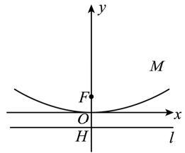  
图2

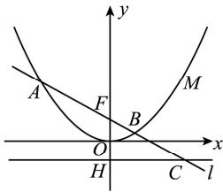  
图3

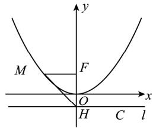  
图4

(1)【基础训练】

请分别直接写出抛物线 $y = 2 x ^ { 2 }$ 的焦点坐标和准线 l 的方程：

(2)【技能训练】

如图 2 所示，已知抛物线 $y = { \frac { 1 } { 8 } } x ^ { 2 }$ 上一点 $P$ 到准线 $l$ 的距离为 6，求点 $P$ 的坐标；

(3)【能力提升】

如图 3 所示，已知过抛物线 $y = a x ^ { 2 }$ （ $a > 0$ ）的焦点 $F$ 的直线依次交抛物线及准线 $l$ 于点 A、B、C．若

【淘宝店铺：向阳百分百】

$B C { = } 2 B F$ ， $A F { = } 4$ ，求 $a$ 的值；

(4)【拓展升华】

古希腊数学家欧多克索斯在深入研究比例理论时，提出了分线段的“中末比”问题：点 $C$ 将一条线段$A B$ 分为两段 $A C$ 和 $C B$ ，使得其中较长一段 $A C$ 是全线段 $A B$ 与另一段 $C B$ 的比例中项，即满足： $\frac { A C } { A B }$ $= { \frac { B C } { A C } } = { \frac { { \sqrt { 5 } } - 1 } { 2 } }$ ．后人把 $\frac { \sqrt { 5 } - 1 } { 2 }$ 这个数称为“黄金分割”把点 $C$ 称为线段 $A B$ 的黄金分割点．如图 4 所示，抛物线 $y = { \frac { 1 } { 4 } } x ^ { 2 }$ 的焦点 ${ \cal F } \left( 0 , \ 1 \right)$ ，准线 $l$ 与 $y$ 轴交于点 $H$ （0，﹣1）， $E$ 为线段 $H F$ 的黄金分割点，点 $M$ 为 $y$ 轴左侧的抛物线上一点． 当 ${ \frac { M H } { M F } } = { \sqrt { 2 } }$ 时，请直接写出 $\triangle H M E$ 的面积值．

【答案】(1) ${ \frac { 1 } { 8 } } \qquad y = - { \frac { 1 } { 8 } }$ (2) $4 \sqrt { 2 }$ ，4）或（ $- 4 \sqrt { 2 }$ ，4 ）(3) $a = { \frac { 1 } { 4 } }$   
(4) $\sqrt { 5 } - 1$ 或 $3 - { \sqrt { 5 } }$ 【分析】（1）根据交点和准线方程的定义求解即可；  
（2）先求出点 $\cdot$ 的纵坐标为 4，然后代入到抛物线解析式中求解即可；  
（3）如图所示，过点 $\cdot$ 作 $\cdot$ 轴于 $D$ ，过点 $\cdot$ 作 $\cdot$ 轴于 $\cdot$ ，证明△FDB∽△FHC，推出 $F D = \frac { 1 } { 6 a }$ 则 $O D = O F - D F = \frac { 1 } { 1 2 a }$ 点 $B$ 的纵坐标为 $\frac { 1 } { 1 2 a }$ 从而求出 $B D = { \frac { \sqrt { 3 } } { 6 a } }$ 证明 $\_$ ，即可求出点 $\cdot$ 的坐标为（ $- 2 \sqrt { 3 }$ ， $2 + { \frac { 1 } { 4 a } } )$ ），再把点 $\cdot$ 的坐标代入抛物线解析式中求解即可；  
（4）如图，当 $\cdot$ 为靠近点 $F$ 的黄金分割点的时候，过点 $M$ 作 $M N \perp l$ 于 $\cdot$ ，则 $\cdot$ ，  
先 证 明 $\cdot$ 是 等 腰 直 角 三 角 形 ， 得 到 $\_$ ， 设 点 $\cdot$ 的 坐 标 为 （ $\cdot$ ， ${ \frac { 1 } { 4 } } m ^ { 2 }$ 则$M N = \frac { 1 } { 4 } m ^ { 2 } + 1 = - m = H N$ ， 求 出 $m = - 2$ ， 然 后 根 据 黄 金 分 割 点 的 定 义 求 出 $H E = \sqrt { 5 } - 1$ ， 则${ \cal S } _ { \triangle H M E } { = } { \frac { 1 } { 2 } } H E \cdot N H = \sqrt { 5 } - 1$ ；同理可求当点 $\cdot$ 是靠近 $\cdot$ 的黄金分割点时△HME 的面积．

【详解】（1）解：由题意得抛物线 $\cdot$ 的焦点坐标和准线 $\cdot$ 的方程分别为（ $( 0 , \frac { 1 } { 8 } ) , y = - \frac { 1 } { 8 } ,$ 故答案为： $( 0 , \frac { 1 } { 8 } ) , y = - \frac { 1 } { 8 } ,$

（2）解：由题意得抛物线 $y = { \frac { 1 } { 8 } } x ^ { 2 }$ 的准线方程为 $y = - \frac { 1 } { 4 a } = - 2$ ，  
∵点 $\cdot$ 到准线 $l$ 的距离为 6，  
∴点 $P$ 的纵坐标为 4，  
∴当 $y = 4$ 时， ${ \frac { 1 } { 8 } } x ^ { 2 } = 4$ ，

【淘宝店铺：向阳百分百】

解得 $x = \pm 4 { \sqrt { 2 } }$ ，  
∴点 $P$ 的坐标为（ $4 \sqrt { 2 }$ ，4）或（ $- 4 \sqrt { 2 }$ （3）解：如图所示，过点 $B$ 作 $B D \perp y$ 由题意得点 $F$ 的坐标为 $\cdot$ （0， $\frac { 1 } { 4 a }$ ）直$B D / / A E / / C H F H = \frac { 1 } { 2 a }$   
$\_$ ，  
$\cdot \frac { B D } { H C } = \frac { F D } { F H } = \frac { F B } { F C } ,$ ，  
∵ $B C { = } 2 B F$ ，  
$\cdot$ ，  
BD FD 1FB  
∴ HC FH = 3FC ，  
$F D = \frac { 1 } { 6 a }$   
$\therefore O D = O F - D F = { \frac { 1 } { 1 2 a } } ,$   
∴点 $\cdot$ 的纵坐标为 $\frac { 1 } { 1 2 a }$   
${ \frac { 1 } { 1 2 a } } = a x ^ { 2 }$   
解得 $x = { \frac { \sqrt { 3 } } { 6 a } }$ （负值舍去），  
$\therefore B D = { \frac { \sqrt { 3 } } { 6 a } } ,$   
$A E / / B D$ ，  
$\_$ ，  
$\therefore \frac { A E } { E F } = \frac { B D } { D F } = \sqrt { 3 } \ ,$ ，  
$A E = { \sqrt { 3 } } E F$ ，  
$\because A E ^ { 2 } + E F ^ { 2 } = A F ^ { 2 } ,$   
$4 E F ^ { 2 } = A F ^ { 2 } = 1 6$ ，  
$\cdot$ ，  
$\therefore A E = 2 { \sqrt { 3 } }$ ，  
∴点 $A$ 的坐标为（ $- 2 \sqrt { 3 }$ ， $2 + { \frac { 1 } { 4 a } }$   
$2 + { \frac { 1 } { 4 a } } = 1 2 a$ ，  
$\therefore 4 8 a ^ { 2 } - 8 a - 1 = 0$ ，  
$\therefore ( 1 2 a + 1 ) ( 4 a - 1 ) = 0 .$ ，  
解得 $a = { \frac { 1 } { 4 } }$ （负值舍去）；（4）解：如图，当 $E$ 为靠近点 $\cdot$ 的黄金分割点的时候，过点 $M$ ∵在 MNH 中， $\sin \angle M H N { = } \frac { M N } { M H } { = } \frac { M F } { M H } { = } \frac { \sqrt { 2 } } { 2 }$   
∴ $\_$ ，  
∴ $\triangle M N H$ 是等腰直角三角形，  
∴ $. N H { = } M N$ ，  
设点 $M$ 的坐标为 ${ \frac { 1 } { 4 } } m ^ { 2 }$ ，  
$\therefore M N = \frac { 1 } { 4 } m ^ { 2 } + 1 = - m = H N ,$   
∴ $, m = - 2$ ，  
∴ $. H N { = } 2$ ，  
∵点 $\cdot$ 是靠近点 $F$ 的黄金分割点，  
$\begin{array} { l } { \displaystyle { \therefore H E = \frac { \sqrt { 5 } - 1 } { 2 } H F = \sqrt { 5 } - 1 , } } \\ { \displaystyle { \therefore S _ { \triangle H M E } = \frac { 1 } { 2 } H E \cdot N H = \sqrt { 5 } - 1 ; } } \end{array}$ ；  
同理当 $E$ 时靠近 $\cdot$ 的黄金分割点点， $E F = \frac { \sqrt { 5 } - 1 } { 2 } H F = \sqrt { 5 } - 1$ ，$\begin{array} { l } { { \therefore H E = 2 - \sqrt { 5 } + 1 = 3 - \sqrt { 5 } , } } \\ { { \nonumber } } \\ { { \therefore S _ { \triangle H M E } = \displaystyle \frac { 1 } { 2 } H E \cdot N H = 3 - \sqrt { 5 } , } } \end{array}$   
综上所述， ${ \cal S } _ { \triangle H M E } { = } 2 \sqrt { 5 } - 2$ 或 ${ \cal S } _ { \triangle H M E } { } ^ { = 3 - \sqrt { 5 } }$

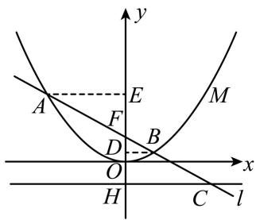  
图3

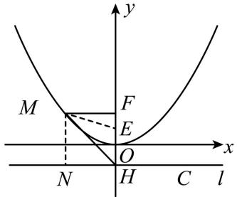

# 【题型 2】焦半径倒数和为定值

# 广西南宁·中考真题

10．如图，抛物线 $y { = } a x ^ { 2 } { + } c$ （ $a { \neq } 0$ ）经过 $C$ （2，0），D（0，﹣1）两点，并与直线 $y = k x$ 交于 $A$ 、 $B$ 【淘宝店铺：向阳百分百】

两点，直线 $l$ 过点 $E$ （0，﹣2）且平行于 $\boldsymbol { x }$ 轴，过 A、 $B$ 两点分别作直线 $l$ 的垂线，垂足分别为点 M、 $N$ ．

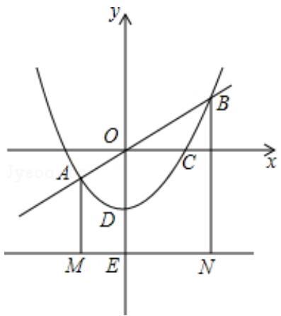

（1）求此抛物线的解析式；（2）求证： $A O { = } A M$ ；（3）探究：

$\textcircled{1}$ 当 $k { = } 0$ 时，直线 $y = k x$ 与 $\boldsymbol { x }$ 轴重合，求出此时 $\frac { 1 } { A M } { + } \frac { 1 } { B N }$ 的值；

$\textcircled{2}$ 试说明无论 $k$ 取何值， $\frac { 1 } { A M } + \frac { 1 } { B N }$ 的值都等于同一个常数

【答案】解：（1） $y = \frac { 1 } { 4 } x ^ { 2 } - 1$   
（2）详见解析  
（3）详见解析

【分析】（1）把点 C、 $\cdot$ 的坐标代入抛物线解析式求出 $a , \ c$ ，即可得解（2）根据抛物线解析式设出点 $\cdot$ 的坐标，然后求出 AO、AM 的长，即可得证（3） $\cdot$ 时，求出 AM、 $B N$ 的长，然后代入 $\frac { 1 } { A M } + \frac { 1 } { B N }$ 计算即可得解；

$\textcircled{2}$ 设点 $A$ （x1， ${ \frac { 1 } { 4 } } { x _ { \mathrm { { l } } } } ^ { 2 } - 1 )$ ）， $B ( x _ { 2 } , \frac { 1 } { 4 } { x _ { 2 } } ^ { 2 } - 1 )$ ，然后表示出 $\frac { 1 } { A M } { + } \frac { 1 } { B N }$ 再联立抛物线与直线解析式，消掉未知数 $y$ 得到关于 $\boldsymbol { X }$ 的一元二次方程，利用根与系数的关系表示出 $\cdot$ ， $X _ { 1 } ^ { \bullet _ { 2 } }$ ，并求出 $\cdot$ ，$X _ { 1 } ^ { ~ 2 } { \bullet _ { X _ { 2 } } } ^ { 2 }$ ，然后代入进行计算即可得解

【详解】解：（1）∵抛物线 ${ \boldsymbol { y } } { = } { \boldsymbol { a } } { \boldsymbol { x } } ^ { 2 } { + } { \boldsymbol { c } }$ （ $a { \neq } 0$ ）经过 $\cdot$ （2，0）， $D$ （0，﹣1），  
$\left\{ { \begin{array} { l } { 4 a + c = 0 } \\ { c = - 1 } \end{array} } \right.$ ，解得 $\left\{ { \begin{array} { l } { \displaystyle a = { \frac { 1 } { 4 } } } \\ { \displaystyle c = - 1 } \end{array} } \right.$   
∴抛物线的解析式为 $\frac { 1 } { 4 }$

（2）证明：设点 $A$ 的坐标为（m， ${ \frac { 1 } { 4 } } m ^ { 2 } - 1 )$ ，$A O = { \sqrt { m ^ { 2 } + \left( { \frac { 1 } { 4 } } m ^ { 2 } - 1 \right) ^ { 2 } } } = { \frac { 1 } { 4 } } m ^ { 2 } + 1$ ．

【淘宝店铺：向阳百分百】

∵直线 $\cdot$ 过点 $\cdot$ （0，﹣2）且平行于 $\cdot$ 轴，∴点 $\cdot$ 的纵坐标为﹣2  
$\therefore A M = \frac { 1 } { 4 } m ^ { 2 } - 1 - ( - 2 ) = \frac { 1 } { 4 } m ^ { 2 } + 1 .$   
∴ $\cdot$   
（3） $\cdot$ 时，直线 $y = k x$ 与 $\cdot$ 轴重合，点 $A$ 、 $\cdot$ 在 $\cdot$ 轴上，  
$-$ ，  
$\quad \cdot { \frac { 1 } { A M } } + { \frac { 1 } { B N } } = { \frac { 1 } { 2 } } + { \frac { 1 } { 2 } } = 1 .$   
$\cdot$ 取任何值时，设点 $\cdot$ $\frac { 1 } { 4 }$ ）， $B ( x _ { 2 } , \frac { 1 } { 4 } { x _ { 2 } } ^ { 2 } - 1 ) ,$ ，  
则 ${ \frac { 1 } { \mathrm { A M } } } + { \frac { 1 } { \mathrm { B N } } } = { \frac { 1 } { { \frac { 1 } { 4 } } \mathrm { x } _ { 1 } ^ { 2 } + 1 } } + { \frac { 1 } { { \frac { 1 } { 4 } } \mathrm { x } _ { 2 } ^ { 2 } + 1 } } = { \frac { 4 { \left( \mathrm { x } _ { 1 } ^ { 2 } + \mathrm { x } _ { 2 } ^ { 2 } + 8 \right) } } { \mathrm { x } _ { 1 } ^ { 2 } \cdot \mathrm { x } _ { 2 } ^ { 2 } + 4 { \left( \mathrm { x } _ { 1 } ^ { 2 } + \mathrm { x } _ { 2 } ^ { 2 } \right) } + 1 6 } }$   
联立 $\left\{ \begin{array} { l l } { \displaystyle y = k x } \\ { \displaystyle y = \frac { 1 } { 4 } x ^ { 2 } - 1 } \end{array} \right.$ 消掉 $y$ 得， $x ^ { 2 } - 4 k x - 4 = 0$ ，  
由根与系数的关系得， $x _ { 1 } { + } x _ { 2 } { = } 4 k , x _ { 1 } { \bullet } x _ { 2 } { = } - 4$ ，  
$\therefore x _ { 1 } ^ { 2 } + x _ { 2 } ^ { 2 } = ( x _ { 1 } + x _ { 2 } ) ^ { 2 } - 2 x _ { 1 } \bullet x _ { 2 } = 1 6 k ^ { 2 } + 8 ,$ ， $\cdot$   
$\therefore \frac { 1 } { \mathrm { A M } } + \frac { 1 } { \mathrm { B N } } = \frac { 4 \big ( 1 6 \mathbf { k } ^ { 2 } + 8 + 8 \big ) } { 1 6 + 4 \big ( 1 6 \mathbf { k } ^ { 2 } + 8 \big ) + 1 6 } = \frac { 6 4 \big ( \mathbf { k } ^ { 2 } + 1 \big ) } { 6 4 \big ( \mathbf { k } ^ { 2 } + 1 \big ) } = 1 .$   
∴无论 $k$ 取何值， $\frac { 1 } { A M } { + } \frac { 1 } { B N }$ 的值都等于同一个常数 1

# 【题型 3】焦点弦为直径的圆与准线相切

# 2023·湖南怀化中考真题

11．如图一所示，在平面直角坐标系中，抛物线 $y = a x ^ { 2 } + b x - 8$ 与 $x$ 轴交于 $A ( - 4 , 0 )$ 、 $B ( 2 , 0 )$ 两点，与$y$ 轴交于点 $C$

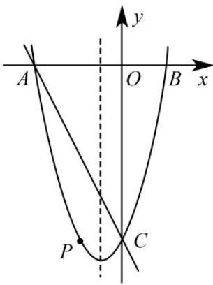  
图一

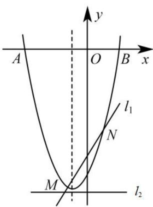  
备用图

(1)求抛物线的函数表达式及顶点坐标；

(2)设直线 $l _ { 1 } : y = k x + k - \frac { 3 5 } { 4 }$ 交抛物线于点 $M , N$ ，求证：无论 $k$ 为何值，平行于 $x$ 轴的直线 $l _ { 2 } : y = - { \frac { 3 7 } { 4 } }$ 上总存在一点 $E$ ，使得 $\angle M E N$ 为直角

【答案】 $( 1 ) y = x ^ { 2 } + 2 x - 8$

(2)见解析

【分析】（1）待定系数法求解析式即可求解；

（2）设 $M \left( x _ { 1 } , y _ { 1 } \right) , ~ N \left( x _ { 2 } , y _ { 2 } \right)$ ，MN 的中点坐标为 $Q \left( { \frac { x _ { 1 } + x _ { 2 } } { 2 } } , { \frac { y _ { 1 } + y _ { 2 } } { 2 } } \right)$ ，联立 $\left\{ \begin{array} { l l } { \displaystyle y = k x + k - \frac { 3 5 } { 4 } } \\ { \displaystyle y = x ^ { 2 } + 2 x - 8 } \end{array} \right.$ ，消去 $y$ ，整理得： $x ^ { 2 } + \left( 2 - k \right) x - k + { \frac { 3 } { 4 } } = 0$ ，得出 $x _ { 1 } + x _ { 2 } = k - 2 , x _ { 1 } x _ { 2 } = - k + \frac { 3 } { 4 }$ 则 $Q \left( \frac { 1 } { 2 } k - 1 , \frac { 1 } { 2 } k ^ { 2 } - \frac { 3 5 } { 4 } \right)$ 设 $\boldsymbol { Q }$ 点到 $l _ { 2 }$ 的 距 离 为 $\boldsymbol { \mathcal { Q } E }$ ， 则 $\ Q E = \ { \frac { 1 } { 2 } } k ^ { 2 } - { \frac { 3 5 } { 4 } } - \left( - { \frac { 3 7 } { 4 } } \right) = { \frac { 1 } { 2 } } k ^ { 2 } + { \frac { 1 } { 2 } }$ , 依 题 意 ， $y _ { 1 } + y _ { 2 } = k ^ { 2 } - \frac { 3 5 } { 2 }$ ,  2 21 2 1 2 1 2y  y  x  x  2 x  x $= { \bigl ( } x _ { 1 } - x _ { 2 } { \bigr ) } { \bigl ( } x _ { 1 } + x _ { 2 } + 2 { \bigr ) } \qquad = k \left( x _ { 1 } - x _ { 2 } \right)$ , 得 出$M N ^ { 2 } = \left( x _ { 1 } - x _ { 2 } \right) ^ { 2 } + \left( y _ { 1 } - y _ { 2 } \right) ^ { 2 } = \left( k ^ { 2 } + 1 \right) ^ { 2 }$ ，则 $M N = k ^ { 2 } + 1$ ， $\frac { 1 } { 2 } M N = Q E$ ， $E$ 点总在 $\odot Q$ 上， $M N$ 为直径，且 $\odot Q$ 与 $l _ { 2 } : y = - { \frac { 3 7 } { 4 } }$ 相切，即可得证．

【详解】（1）解：将 $A ( - 4 , 0 ) , \ B ( 2 , 0 )$ 代入 $y = a x ^ { 2 } + b x - 8$ ，得$\begin{array} { c } { { \left\{ 1 6 a - 4 b - 8 = 0 \right. } } \\ { { \left. 4 a + 2 b - 8 = 0 \right. } } \end{array}$ 解得： $\begin{array} { c } { { \left\{ \begin{array} { l } { { a = 1 } } \\ { { b = 2 } } \end{array} \right. } } \end{array}$ ∴抛物线解析式为： $y = x ^ { 2 } + 2 x - 8$ ；（2）解：设 $M \left( x _ { 1 } , y _ { 1 } \right)$ 、 $N \left( x _ { 2 } , y _ { 2 } \right)$ ， $M N$ 的中点坐标为 $Q \left( { \frac { x _ { 1 } + x _ { 2 } } { 2 } } , { \frac { y _ { 1 } + y _ { 2 } } { 2 } } \right)$ ,联立 $\left\{ \begin{array} { l l } { \displaystyle y = k x + k - \frac { 3 5 } { 4 } } \\ { \displaystyle y = x ^ { 2 } + 2 x - 8 } \end{array} \right.$ ，消去 $y$ ，整理得： $x ^ { 2 } + \left( 2 - k \right) x - k + { \frac { 3 } { 4 } } = 0$ $\begin{array} { r l } & { \ddots x _ { 1 } + x _ { 2 } = k - 2 , x _ { 1 } x _ { 2 } = - k + \frac { 3 } { 4 } , } \\ & { \ddots \frac { x _ { 1 } + x _ { 2 } } { 2 } = \displaystyle \frac { k } { 2 } - 1 , } \\ & { \ddots \frac { y _ { 1 } + y _ { 2 } } { 2 } = \displaystyle \frac { 1 } { 2 } k \left( x _ { 1 } + x _ { 2 } \right) + k - \frac { 3 5 } { 4 } = \displaystyle \frac { 1 } { 2 } k \left( k - 2 \right) + k - \frac { 3 5 } { 4 } = \frac { 1 } { 2 } k ^ { 2 } - \frac { 3 5 } { 4 } , } \\ & { \ddots Q \left( \displaystyle \frac { 1 } { 2 } k - 1 , \displaystyle \frac { 1 } { 2 } k ^ { 2 } - \frac { 3 5 } { 4 } \right) , } \end{array}$ 设 $\boldsymbol { Q }$ 点到 $l _ { 2 }$ 的距离为 $\boldsymbol { \mathcal { Q } E }$ ，则 $\ Q E = { \frac { 1 } { 2 } } k ^ { 2 } - { \frac { 3 5 } { 4 } } - \left( - { \frac { 3 7 } { 4 } } \right) = { \frac { 1 } { 2 } } k ^ { 2 } + { \frac { 1 } { 2 } } ,$ ∵ M  x1, y1  、 N  x2 , y2  ，$\therefore y _ { 1 } + y _ { 2 } = k ^ { 2 } - { \frac { 3 5 } { 2 } } , y _ { 1 } - y _ { 2 } = x _ { 1 } ^ { 2 } - x _ { 2 } ^ { 2 } + 2 { \left( x _ { 1 } - x _ { 2 } \right) } = { \left( x _ { 1 } - x _ { 2 } \right) } { \left( x _ { 1 } + x _ { 2 } + 2 \right) } = k { \left( x _ { 1 } - x _ { 2 } \right) }$

$$
\begin{array} { r l } & { \quad \mathcal { M N } ^ { - } ( - ( X _ { - 1 } - X _ { j } ) ^ { \ast } + ( X _ { - 1 } - Y _ { j } )  } \\ & {  = ( X _ { - 1 } - X _ { j } ) ^ { \ast } + k ^ { \prime } ( x _ { - 1 } - x _ { - 2 } ) ^ { \ast }  } \\ & {  = ( X _ { - 1 } - X _ { j } ) ^ { \ast } ( 1 + k ^ { \prime } ) } \\ & {  = [ ( X _ { + 1 } + x _ { - 2 } ) ^ { \ast } - 4 X _ { 1 } x _ { - 2 } ^ { \ast } ] ( 1 + k ^ { \prime } ) } \\ & {  = [ ( k ^ { \prime } - ) ^ { \ast } + 4 X _ { - 3 } ] ( k ^ { \prime } - 1 ) } \\ & {  = ( k ^ { \prime } - 1 ) ( k ^ { \prime } + 1 )  } \\ & {  = ( k ^ { \prime } + 1 ) ^ { \ast }  } \\ & {  \quad \mathcal { M N } - k ^ { \prime } + 1  } \\ & {  \frac { 1 } { 2 } \mathrm { ~ } M - \theta  \epsilon } \end{array}
$$

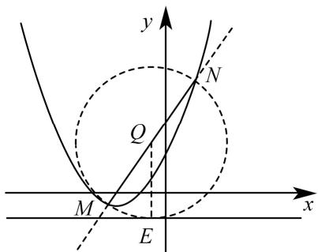

$\therefore Q M = Q N = Q E$ ，  
∴ $E$ 点总在 $\odot Q$ 上， MN 为直径，且 $\odot Q$ 与 $l _ { 2 } : y = - { \frac { 3 7 } { 4 } }$ 相切，  
∴MEN为直角．  
∴无论 $k$ 为何值，平行于 $x$ 轴的直线 $l _ { 2 } : y = - { \frac { 3 7 } { 4 } }$ 上总存在一点 $E$ ，使得MEN为直角

# 湖南张家界·中考真题

12．如图，已知二次函数 $y = a x ^ { 2 } + 1 ( a \neq 0 , a$ 为实数)的图像过点 $A ( - 2 , \ 2 )$ ，一次函数 $y = k x + b ( k$ $\neq 0$ ，k、 $b$ 为实数)的图像 1 经过点 $B ( 0 , \ 2 )$ ．

(1)求 $a$ 值并写出二次函数表达式；

(2)求 $b$ 值；

(3)设直线 1 与二次函数图像交于 $M$ ， $N$ 两点，过 $M$ 作 $M C$ 垂直 $\boldsymbol { x }$ 轴于点 $C$ ，试证明：$M B { = } M C ;$ ；

(4)在(3)的条件下，请判断以线段 MN 为直径的圆与 $\boldsymbol { x }$ 轴的位置关系，并说明理由．

【淘宝店铺：向阳百分百】

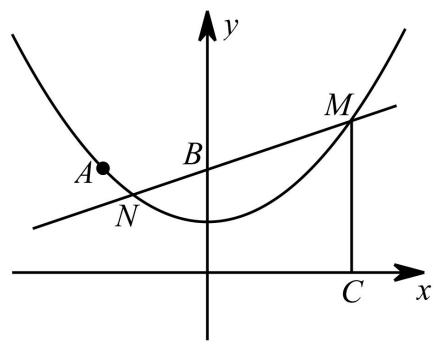

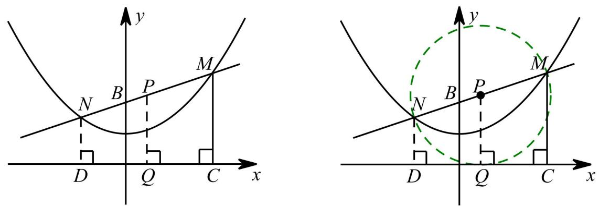

# 【题型 4】动点运动时间与面积之间的函数图像判断

# 2023·黑龙江齐齐哈尔中考真题

13．如图，在正方形 ABCD中， $A B = 4$ ，动点 $M , ~ N$ 分别从点 $A$ ， $B$ 同时出发，沿射线 $A B$ ，射线 $B C$ 的方向匀速运动，且速度的大小相等，连接 $D M$ ，MN ，ND ．设点 $M$ 运动的路程为 $x { \bigl ( } 0 \leq x \leq 4 { \bigr ) }$ ，$\triangle D M N$ 的面积为S，下列图像中能反映S与 $x$ 之间函数关系的是（ ）

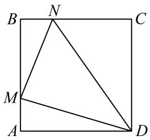

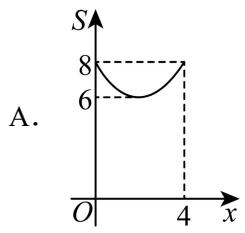

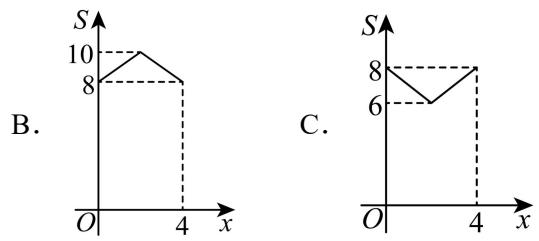

【淘宝店铺：向阳百分百】

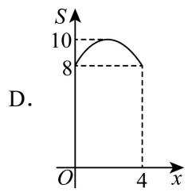

【答案】A

【分析】先根据 $S = S _ { \mathrm { { _ { I E \mathcal { H } \mathcal { H } \mathcal { H } A B C D } } } } - S _ { \mathrm { { V } \it { A D M } } } - S _ { \mathrm { { V D C N } } } - S _ { \mathrm { { V B M N } } }$ ，求出S与 $x$ 之间函数关系式，再判断即可得出结论．

【详解】解： $S = S _ { \scriptscriptstyle { \mathrm { I E } \mathcal { H } \mathcal { H } \ A B C D } } - S _ { \scriptscriptstyle { \mathrm { V A D M } } } - S _ { \scriptscriptstyle { \mathrm { V D C N } } } - S _ { \scriptscriptstyle { \mathrm { V B M N } } }$ ，  
$\begin{array} { l } { \displaystyle = 4 \times 4 - \frac 1 2 \times 4 x - \frac 1 2 \times 4 ( 4 - x ) - \frac 1 2 x ( 4 - x ) } \\ { \displaystyle = \frac 1 2 x ^ { 2 } - 2 x + 8 } \\ { \displaystyle = \frac 1 2 ( x - 2 ) ^ { 2 } + 6 } \end{array}$ ，  
故S与 $x$ 之间函数关系为二次函数，图像开口向上， $x = 2$ 时，函数有最小值 6，  
故选：A

# 2023·辽宁鞍山中考真题

14．如图，在矩形 ABCD中，对角线 $A C , B D$ 交于点 $O$ ， $A B = 4$ ， $B C { = } 4 \sqrt { 3 }$ ，垂直于 $B C$ 的直线 MN从 $A B$ 出发，沿 $B C$ 方向以每秒 $\sqrt { 3 }$ 个单位长度的速度平移，当直线 $M N$ 与 $C D$ 重合时停止运动，运动过程中 $M N$ 分别交矩形的对角线 $A C , B D$ 于点 $E , F _ { : }$ ，以 $E F$ 为边在 $M N$ 左侧作正方形 EFGH ，设正方形 EFGH 与 $\triangle A O B$ 重叠部分的面积为 $S$ ，直线 $M N$ 的运动时间为 $t \mathbf { s }$ ，则下列图象能大致反映 $S$ 与 $t$ 之间函数关系的是（ ）

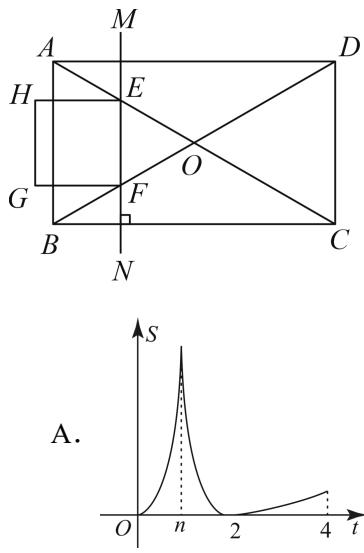

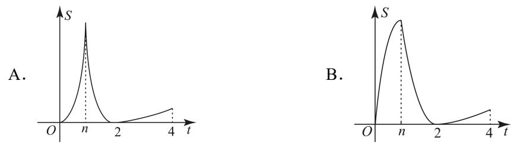

【淘宝店铺：向阳百分百】

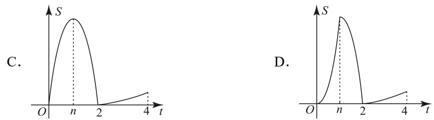

【答案】B

【分析】求出 $M N$ 在 $O$ 点左侧时的两段图象，即可得出结论【详解】解：当 $M N$ 在 $O$ 点左侧，即： $t < 2$ 时：$\textcircled{1}$ 当正方形 EFGH 的边 $G H$ 在 $\triangle A O B$ 的外部时，重叠部分为矩形，如图：

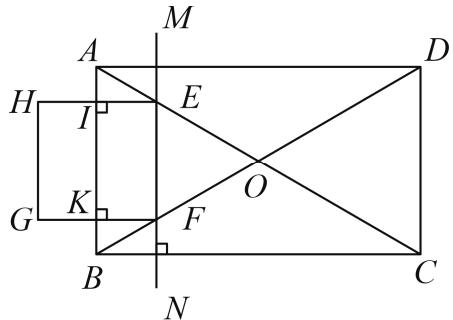

设 $H E , F G$ 分别交 $A B$ 于点 $I , K$ ，  
∵垂直于 $B C$ 的直线MN 从 $A B$ 出发，沿 $B C$ 方向以每秒 $\sqrt { 3 }$ 个单位长度的速度平移，$I E = F K = \sqrt { 3 } t$ ，  
∵在矩形 $A B C D$ 中， $A B = 4$ ， $B C { = } 4 \sqrt { 3 }$ ，  
$A C = { \sqrt { A B ^ { 2 } + B C ^ { 2 } } } = 8$ ，  
$\cdot O A = O B = 4 = A B$ ，  
∴ $\triangle A B O$ 为等边三角形，  
$\angle O A B = \angle O B A = 6 0 ^ { \circ }$ ，  
$A I = B K = I E \div \tan 6 0 ^ { \circ } = t$ ，  
$I K = 4 - 2 t$ ，  
$S = I K \cdot I E = \sqrt { 3 } t \left( 4 - 2 t \right) = - 2 \sqrt { 3 } t ^ { 2 } + 4 \sqrt { 3 } t$ ，图象为开口向下的一段抛物线；

$\textcircled{2}$ 当正方形EFGH 的边 $G H$ 在 $\triangle A O B$ 的内部时，与 $\triangle A O B$ 重叠部分即为正方形EFGH ，如图：

由 $\textcircled{1}$ 可知： $E F = I K = 4 - 2 t$ ，  
∴ $S = \left( 4 - 2 t \right) ^ { 2 }$ ，图象是一段开口向上的抛物线；  
当 $M N$ 过点 $O$ 时，即 $t = 2$ 时， $E , F$ 重合，此时， $S = 0$ ；综上：满足题意的只有 B 选项

# 2023·黑龙江绥化中考真题

15．如图，在菱形 $A B C D$ 中， $\angle A = 6 0 ^ { \circ }$ ， $A B = 4$ ，动点 $M$ ， $N$ 同时从A 点出发，点 $M$ 以每秒2个单位长度沿折线 $A - B - C$ 向终点 $C$ 运动；点 $N$ 以每秒1个单位长度沿线段 $A D$ 向终点 $D$ 运动，当其中一点运动至终点时，另一点随之停止运动．设运动时间为 $x$ 秒， $\triangle A M N$ 的面积为 $y$ 个平方单位，则下列正确表示 $y$ 与 $x$ 函数关系的图象是（ ）

【答案】A

【分析】连接 $B D$ ，过点 $B$ 作 $B E \bot A D$ 于点 $E$ ，根据已知条件得出 $\triangle A B D$ 是等边三角形，进而证明$\triangle A M N \triangle A B E$ 得出 $\angle A N M = \angle A E B = 9 0 ^ { \circ }$ ，当 $0 < t < 4$ 时， $M$ 在 $A B$ 上，当 $4 \leq t < 8$ 时， $M$ 在 $B C$ 上，根据三角形的面积公式得到函数关系式，

【详解】解：如图所示，连接 $B D$ ，过点 $B$ 作 $B E \bot A D$ 于点 $E$ ，当 $0 < t < 4$ 时， $M$ 在 $A B$ 上，

菱形 $A B C D$ 中， $\angle A = 6 0 ^ { \circ }$ ， $A B = 4$ ，∴ $A B = A D$ ，则 $\triangle A B D$ 是等边三角形，

$\therefore A E = E D = \frac { 1 } { 2 } A D = 2 , B E = \sqrt { 3 } A E = 2 \sqrt { 3 }$   
$\mathit { A M } = 2 x , \mathit { A N } = x$ ，  
$\frac { A M } { A N } { = } \frac { A B } { A E } { = } 2$ 2  ，又 A  A  
$\therefore \triangle A M N \sim A B E$   
$\angle A N M = \angle A E B = 9 0 ^ { \circ }$   
$\therefore M N = \sqrt { A M ^ { 2 } - A N ^ { 2 } } = \sqrt { 3 } x \ ,$   
$y = { \frac { 1 } { 2 } } x \times { \sqrt { 3 } } x = { \frac { \sqrt { 3 } } { 2 } } x ^ { 2 }$   
当 $4 \leq t < 8$ 时， $M$ 在 $B C$ 上，  
$y = { \frac { 1 } { 2 } } A N \times B E = { \frac { 1 } { 2 } } x \times 2 { \sqrt { 3 } } = { \sqrt { 3 } } x$ ，  
综上所述， $0 < t < 4$ 时的函数图象是开口向上的抛物线的一部分，当 $4 \leq t < 8$ 时，函数图象是直线的  
一部分，  
故选：A．

# 2023·江苏南通中考真题

16．如图， ${ \triangle A B C }$ 中， $\angle C = 9 0 ^ { \circ }$ ， $A C = 1 5$ ， $B C = 2 0$ ．点 $D$ 从点 A 出发沿折线 $A - C - B$ 运动到点 $B$ 停止，过点 $D$ 作 $D E \bot A B$ ，垂足为 $E$ ．设点 $D$ 运动的路径长为 $x$ ， $\triangle B D E$ 的面积为 $y$ ，若 $y$ 与$x$ 的对应关系如图所示，则 $a - b$ 的值为（ ）

A．54 B．52 C．50 D．48

【答案】B

【分析】根据点 $D$ 运动的路径长为 $x$ ，在图中表示出来，设 $A E = z , B E = 2 5 - z$ ，在直角三角形中，找到等量关系，求出未知数的值，得到 $\triangle B D E$ 的值

【详解】解：当 $x = 1 0$ 时，由题意可知，【淘宝店铺：向阳百分百】

$A D = 1 0 , C D = 5$ ，  
在 $\mathrm { R t } \triangle C D B$ 中，由勾股定理得 $B D ^ { 2 } = C D ^ { 2 } + B C ^ { 2 } = 5 ^ { 2 } + 2 0 ^ { 2 } = 4 2 5$ ，  
设 $A E = z , B E = 2 5 - z$ ，  
$\therefore B E ^ { 2 } = ( z - 2 5 ) ^ { 2 } = z ^ { 2 } - 5 0 z + 6 2 5$ ，  
在 $\mathrm { R t } \triangle A D E$ 中，由勾股定理得 $D E ^ { 2 } = A D ^ { 2 } - A E ^ { 2 } = 1 0 0 - z ^ { 2 }$ ，  
在 $\mathrm { R t } \triangle D E B$ 中，由勾股定理得 $B D ^ { 2 } = D E ^ { 2 } + B E ^ { 2 }$ ，  
即 $4 2 5 = 1 0 0 - z ^ { 2 } + z ^ { 2 } - 5 0 z + 6 2 5$ ，  
解得 $z = 6$ ，  
$\cdot D E = 6 , B E = 1 9$ ，  
$\therefore a = S _ { _ { \Delta B D E } } = \frac { 1 } { 2 } { \times } 1 9 { \times } 8 = 7 6 ,$ ，  
当 $x = 2 5$ 时，由题意可知， $C D = B D = 1 0$ ，  
设 $B E = q , A E = 2 5 - q$ ，  
$A E ^ { 2 } = ( 2 5 - q ) ^ { 2 } = 6 2 5 - 5 0 q + q ^ { 2 }$ ，  
在 $\mathbb { R } \Omega \triangle C D A$ 中，由勾股定理得 $A D ^ { 2 } = A C ^ { 2 } + C D ^ { 2 } = 1 5 ^ { 2 } + 1 0 ^ { 2 } = 3 2 5$ ，  
在 $\mathrm { R t } \triangle B D E$ 中由勾股定理得 $D B ^ { 2 } = B D ^ { 2 } - B E ^ { 2 } = 1 0 0 - q ^ { 2 }$ ，  
RtVDEA中，由勾股定理得 $A D ^ { 2 } = D E ^ { 2 } + A E ^ { 2 }$ ，  
即 $3 2 5 = 1 0 0 - q ^ { 2 } + 6 2 5 - 5 0 q + q ^ { 2 }$ ，  
解得 $q = 8$ ，  
 $D E = 6$ ，  
$\therefore b = S _ { \scriptscriptstyle \triangle B D E } = \frac { 1 } { 2 } \times 6 \times 8 = 2 4$ ，  
$\cdot a - b = 7 6 - 2 4 = 5 2$

故选：B．

# 2023·辽宁锦州中考真题

17．如图，在 $\mathrm { R t } \triangle A B C$ 中， $\angle A C B = 9 0 ^ { \circ }$ ， $A C = 3$ ， $B C = 4$ ，在 $\triangle D E F$ 中， $D E = D F = 5$ ， $E F = 8$ ，BC 与 $E F$ 在同一条直线上，点 $C$ 与点 $E$ 重合． ${ \triangle A B C }$ 以每秒 1 个单位长度的速度沿线段 $E F$ 所在直线向右匀速运动，当点 $B$ 运动到点 $F$ 时， ${ \triangle A B C }$ 停止运动．设运动时间为 $t$ 秒， ${ \triangle A B C }$ 与 $\triangle D E F$ 重叠部分的面积为 $S$ ，则下列图象能大致反映 $S$ 与 $t$ 之间函数关系的是（ ）

【答案】A

【分析】分 $0 \leq t < 4$ ， $4 \leq t < 8$ ， $8 \leq t < 1 2$ 三种情况，分别求出函数解析即可判断

【详解】解：过点 $\cdot$ 作 $D H \bot C B$ 于 $H$ ，

∵ $D E = D F = 5$ ， $E F = 8$ ，  
$E H = F H = { \frac { 1 } { 2 } } E F = 4$ ，  
$\therefore D H = { \sqrt { D E ^ { 2 } - E H ^ { 2 } } } = 3$   
当 $0 \leq t < 4$ 时，  
如图，重叠部分为 $\triangle E P Q$ ，此时 $E Q = t$ ， $P Q / / D H$ ，  
$\triangle E P Q \sim _ { \triangle E D H }$ ，$\cdot \frac { P Q } { D H } = \frac { E Q } { E H }$ , 即 ${ \frac { P Q } { 3 } } = { \frac { t } { 4 } }$   
$P Q = \frac { 3 } { 4 } t$   
$S = \frac { 1 } { 2 } t \times \frac { 3 } { 4 } t = \frac { 3 } { 8 } t ^ { 2 }$   
当 $4 \leq t < 8$ 时，  
如图，重叠部分为四边形 $P Q C ^ { \prime } B ^ { \prime }$ ，此时 $B B ^ { \prime } = C C ^ { \prime } = t$ ， $P B ^ { \prime } / / D E$ ，  
$\therefore B ^ { \prime } F = B C + C F - B B ^ { \prime } = 1 2 - t \ , F C ^ { \prime } = 8 - t \ ,$ ，  
∵ PB∥ DE ，$\mathbf { \dot { \alpha } } _ { \mathbf { \dot { \alpha } } \Delta P B ^ { \prime } F } \mathbf { \sim } _ { \Delta D C F }$ ，  
${ \frac { S _ { _ { \Delta P B ^ { \prime } F } } } { S _ { _ { \Delta D C F } } } } = \left( { \frac { B ^ { \prime } F } { C F } } \right) ^ { 2 }$ ,  
$\begin{array} { r l } & { \quad _ { \mathcal { A } , \mathcal { B } , F } } \\ & { \quad _ { \mathcal { A } , \mathcal { B } , \mathcal { B } , \mathcal { C } , \mathcal { C } } = \frac { 1 } { 2 } \times 8 \times 3 = 1 2 , } \\ & { \quad \quad \quad \quad \quad \quad \quad \quad \quad \quad \quad \quad \quad \quad \quad \quad \quad \quad \quad \quad \quad } \\ & { \quad \quad \quad \quad \quad \quad \quad \quad \quad \quad \quad \quad \quad \quad \quad \quad \quad \quad \quad \quad \quad \quad \quad \quad \quad \quad \cdot \frac { 1 } { \mathcal { B } } \dag \mathcal { B } ^ { c } } \\ & { \quad \quad \quad \quad \quad \quad \quad \quad \quad \quad \quad \quad \quad \quad \quad \quad \quad \quad \quad \quad \quad \quad \quad \quad \quad \quad \quad \quad \quad \quad \quad \quad \quad \quad } \\ & { \quad \quad \quad \quad \quad \quad \quad \quad \quad \quad \quad \quad \quad \quad \quad \quad \quad \quad \quad \quad \quad \quad \quad \quad \quad \quad \quad \quad \quad \quad \quad \quad \quad } \\ & { \quad \quad \quad \quad \quad \quad \quad \quad \quad \quad \quad \quad \quad \quad \quad \quad \quad \quad \quad \quad \quad \quad \quad \quad \quad \quad \quad \quad \quad \quad \quad \quad \quad } \\ & { \quad \quad \quad \quad \quad \quad \quad \quad \quad \quad \quad \quad \quad \quad \quad \quad \quad \quad \quad \quad \quad \quad \quad \quad \quad \quad \quad \quad \quad \quad \quad \quad \quad \quad } \\ & { \quad \quad \quad \quad \quad \quad \quad \quad \quad \quad \quad \quad \quad \quad \quad \quad \quad \quad \quad \quad \quad \quad \quad \quad \quad \quad \quad \quad \quad \quad \quad \quad \quad \quad \quad \quad } \\ & { \quad \quad \quad \quad \quad \quad \quad \quad \quad \quad \quad \quad \quad \quad \quad \quad \quad \quad \quad \quad \quad \quad \quad \quad \quad \quad \quad \quad \quad \quad \quad \quad \quad \quad \quad \quad \quad \quad \quad \quad \quad \quad } \\ &  \quad \quad \quad \quad \quad \quad \quad \quad \quad \quad \quad \quad \quad \quad \quad \quad \quad \quad \quad \quad \quad \quad \quad \quad \quad \quad \quad \quad \quad \quad \quad \quad \quad \quad \quad \quad \quad \quad \end{array}$ C QFS   2C F   C QFS   8  t HFDS  HF 即 1 4 32   4 ,  
$S _ { _ { \Delta C ^ { \prime } Q F } } = \frac { 3 } { 8 } \big ( 8 - t \big ) ^ { 2 }$ ，  
$S = S _ { \scriptscriptstyle \Delta P B ^ { \prime } F } - S _ { \scriptscriptstyle \Delta C Q F } = \frac { 3 } { 1 6 } \big ( 1 2 - t \big ) ^ { 2 } - \frac { 3 } { 8 } \big ( 8 - t \big ) ^ { 2 } = - \frac { 3 } { 1 6 } t ^ { 2 } + \frac { 3 } { 2 } t + 3$

当 $8 \leq t < 1 2$ 时

如图，重叠部分为四边形 $\triangle P F B ^ { \prime }$ ，此时 $B B ^ { \prime } = C C ^ { \prime } = t$ ， $P B ^ { \prime } / / D E$ ，

$\therefore B ^ { \prime } F = B C + C F - B B ^ { \prime } = 1 2 - t$ ，  
$\therefore P B ^ { \prime } / / D E$ ，  
$\triangle P B ^ { \prime } F \sim \triangle D C F$ ，  
${ \frac { S _ { _ { \Delta P B ^ { \prime } F } } } { S _ { _ { \Delta D C F } } } } = \left( { \frac { B ^ { \prime } F } { C F } } \right) ^ { 2 }$ , 即 $\frac { S _ { \scriptscriptstyle \triangle P B ^ { \prime } F } } { 1 2 } = \left( \frac { 1 2 - t } { 8 } \right) ^ { 2 }$   
$S = S _ { \scriptscriptstyle \triangle P B ^ { \prime } F } = \frac { 3 } { 1 6 } \big ( 1 2 - t \big ) ^ { 2 }$

综上， $S = \left\{ \begin{array} { l l } { \displaystyle { \frac { 3 } { 8 } t ^ { 2 } \big ( 0 \leq t < 4 \big ) } } \\ { \displaystyle { - \frac { 3 } { 1 6 } t ^ { 2 } + \frac { 3 } { 2 } t + 3 \big ( 4 \leq t < 8 \big ) } } \\ { \displaystyle { \frac { 3 } { 1 6 } \big ( 1 2 - t \big ) ^ { 2 } \big ( 8 \leq t < 1 2 \big ) } } \end{array} \right.$ ∴符合题意的函数图象是选项 A

# 2023·辽宁盘锦中考真题

18．如图，在平面直角坐标系中，菱形 $A B C D$ 的顶点 $A$ 在 $y$ 轴的正半轴上，顶点 $B$ 、 $C$ 在 $x$ 轴的正半轴上， $D \big ( 2 , \sqrt { 3 } \big )$ ， $P ( - 1 , - 1 )$ ．点 $M$ 在菱形的边 $A D$ 和 $D C$ 上运动（不与点 $A$ ， $C$ 重合），过点$M$ 作 $M N / /  { y }$ 轴，与菱形的另一边交于点 $N$ ，连接 $P M$ ， $P N$ ，设点 $M$ 的横坐标为 $x$ ， $\triangle P M N$ 的面积为 $y$ ，则下列图象能正确反映 $y$ 与 $x$ 之间函数关系的是（ ）

【答案】A

【分析】先根据菱形的性质求出各点坐标，分 $\cdot$ 的横坐标 $x$ 在 $0 \sim 1$ ，1  2 ， $2 \sim 3$ 之间三个阶段，用含 $x$ 的代数式表示出 $\triangle P M N$ 的底和高，进而求出分段函数的解析式，根据解析式判断图象即可【详解】解：菱形 $A B C D$ 的顶点 $\cdot$ 在 $y$ 轴的正半轴上，顶点 $\cdot$ 、 $\cdot$ 在 $\cdot$ 轴的正半轴上， $\cdot \ A B = A D = 2 \ , \ O A = { \sqrt { 3 } } \ ,$ ，

【淘宝店铺：向阳百分百】

$\begin{array} { r l } & { \ddots \ O B = \sqrt { \mathit { A } B ^ { 2 } - O A ^ { 2 } } = \sqrt { 2 ^ { 2 } - \left( \sqrt { 3 } \right) ^ { 2 } } = 1 \ , } \\ & { \ddots \ O C = O B + \mathit { B C } = 1 + 2 = 3 \ , } \\ & { \ddots \ A \left( 0 , \sqrt { 3 } \right) , B \left( 1 , 0 \right) , C \left( 3 , 0 \right) , } \end{array}$   
设直线 $A B$ 的解析式为 $y = k x + b$ ，将 $A { \big ( } 0 , { \sqrt { 3 } } { \big ) }$ ， $B \mathopen { } \mathclose \bgroup \left( 1 , 0 \aftergroup \egroup \right)$ 代入，得：  
$\left\{ \begin{array} { l } { { k + b = 0 } } \\ { { b = \sqrt { 3 } } } \end{array} \right. ,$   
解得 $\left\{ { \begin{array} { l } { k = - { \sqrt { 3 } } } \\ { b = { \sqrt { 3 } } } \end{array} } \right.$   
直线 $A B$ 的解析式为 $y = - { \sqrt { 3 } } x + { \sqrt { 3 } }$   
$\therefore M N / / \textit { y }$ 轴，  
 $\cdot$ 的横坐标为 $\cdot$ ，（1）当 $M$ 的横坐标 $x$ 在 $0 \sim 1$ 之间时，点 $N$ 在线段 $A B$ 上， $\triangle P M N$ 中 MN 上的高为 $1 + x$ ，$\therefore N \left( x , - { \sqrt { 3 } } x + { \sqrt { 3 } } \right) ,$ ，  
$\therefore M N = \sqrt { 3 } - ( - \sqrt { 3 } x + \sqrt { 3 } ) = \sqrt { 3 } x \ ,$   
$\therefore S _ { \scriptscriptstyle \triangle P M N } = \frac { 1 } { 2 } M N \cdot ( 1 + x ) = \frac { 1 } { 2 } \sqrt { 3 } x \cdot ( 1 + x ) = \frac { \sqrt { 3 } } { 2 } x ^ { 2 } + \frac { \sqrt { 3 } } { 2 } x ,$ ，  
该段图象为开口向上的抛物线；（2）当 $\cdot$ 的横坐标 $x$ 在1  2之间时，点 $\cdot$ 在线段 $B C$ 上， $\triangle P M N$ 中 $M N = \sqrt { 3 }$ ， $M N$ 上的高为 $_ { 1 + x }$ ，$\therefore S _ { _ { \_ { \ / { \Delta } P M N } } } = { \frac { 1 } { 2 } } M N \cdot \left( 1 + x \right) = { \frac { 1 } { 2 } } { \sqrt { 3 } } \cdot \left( 1 + x \right) = { \frac { \sqrt { 3 } } { 2 } } x + { \frac { \sqrt { 3 } } { 2 } }$   
该段图象为直线；（3）当 $M$ 的横坐标 $x$ 在 $2 \sim 3$ 之间时，点 $N$ 在线段 $B C$ 上， $\triangle P M N$ 中 $M N$ 上的高为 $1 + x$ ，由 $D \big ( 2 , \sqrt { 3 } \big )$ ， $C \left( 3 , 0 \right)$ 可得直线 $C D$ 的解析式为 $y = - { \sqrt { 3 } } x + 3 { \sqrt { 3 } }$ ，  
$\begin{array} { l } { \displaystyle { \therefore M \Big ( x , - \sqrt { 3 } x + 3 \sqrt { 3 } \Big ) , N \big ( x , 0 \big ) , } } \\ { \displaystyle { } } \\ { \displaystyle { \therefore M N = - \sqrt { 3 } x + 3 \sqrt { 3 } , } } \\ { \displaystyle { \therefore S _ { \scriptscriptstyle { \mathrm { a } P M N } } = \frac { 1 } { 2 } M N \cdot \big ( 1 + x \big ) = \frac { 1 } { 2 } \big ( - \sqrt { 3 } x + 3 \sqrt { 3 } \big ) \cdot \big ( 1 + x \big ) = - \frac { \sqrt { 3 } } { 2 } x ^ { 2 } + \sqrt { 3 } x + \frac { 3 \sqrt { 3 } } { 2 } , } } \end{array}$   
该段图象为开口向下的抛物线；  
观察四个选项可知，只有选项 A 满足条件

# 【题型 5】求运动时间与面积之间的函数表达式

# 2023·广东广州中考真题

19．如图，在Rt△ABC 中， $\angle A C B = 9 0 ^ { \circ }$ ， $A B = 1 0$ ， $A C = 6$ ，点 $M$ 是边 $A C$ 上一动点，点 $D$ ， $E$ 分别是 $A B$ ，MB的中点，当 $A M = 2 . 4$ 时， $D E$ 的长是 ．若点 $N$ 在边 $B C$ 上，且 $C N = A M$ ，

【淘宝店铺：向阳百分百】

点 $F$ ， $G$ 分别是 $M N$ ， $A N$ 的中点，当 $A M > 2 . 4$ 时，四边形 DEFG 面积 $S$ 的取值范围是

【答案】 1.2 $3 < S \le 4$

【分析】根据三角形中位线定理可得 ${ D E } = \frac { 1 } { 2 } A M = 1 . 2$ ，设 $A M = x$ ，从而 $D E = \frac { 1 } { 2 } A M = \frac { 1 } { 2 } x$ ， 由此得到四边形DEFG是平行四边形，结合 $D E$ 边上的高为 $\left( 4 - { \frac { 1 } { 2 } } x \right)$ 即可得到函数解析式，进而得到答案

【详解】解：∵点 $\cdot$ ， $\cdot$ 分别是 $A B$ ， $M B$ 的中点，∴DE 是 $\triangle A B M$ 的中位线，  
$\displaystyle { \cdot } D E = { \frac { 1 } { 2 } } A M = 1 . 2 \ ;$ ；  
如图，设 $A M = x$ ，  
由题意得， $D E / / \ A M$ ，且 $D E = { \frac { 1 } { 2 } } A M$ ，   
$D E = { \frac { 1 } { 2 } } A M = { \frac { 1 } { 2 } } x$   
又 $\cdot$ 、 $\cdot$ 分别是 MN、 $A N$ 的中点，  
$F G / / A M F G = \frac { 1 } { 2 } A M$ ，  
$\therefore D E / / F G , D E = F G ,$ ，  
∴四边形 $D E F G$ 是平行四边形，  
由题意得， $G F$ 与 $A C$ 的距离是 $\frac { 1 } { 2 } x$ ，  
$\therefore B C = \sqrt { A B ^ { 2 } - A C ^ { 2 } } = 8 ,$ ，  
∴ $D E$ 边上的高为 $\left( 4 - { \frac { 1 } { 2 } } x \right)$ ,  
∴四边形 DEFG 面积 $S = { \frac { 1 } { 2 } } x \cdot \left( 4 - { \frac { 1 } { 2 } } x \right) = 2 x - { \frac { 1 } { 4 } } x ^ { 2 } = - { \frac { 1 } { 4 } } { \left( x - 4 \right) } ^ { 2 } + 4 ,$   
∵ $2 . 4 < x \leq 6$ ，  
$3 \leq S \leq 4$ ，  
故答案为：1.2， $3 \leq S \leq 4$

# 2022·吉林中考真题

20．如图，在 ${ \triangle A B C }$ 中， $\angle A C B = 9 0 ^ { \circ }$ ， $\angle A = 3 0 ^ { \circ }$ ， $A B = 6 \mathrm { c m }$ ．动点 $P$ 从点 A 出发，以 $2 \mathrm { c m } / \mathrm { s }$ 的速度沿边 $A B$ 向终点 $B$ 匀速运动．以 $P A$ 为一边作 $\angle A P Q = 1 2 0 ^ { \circ }$ ，另一边 $P Q$ 与折线 $A C - C B$ 相交于点 $\boldsymbol { Q }$ ，以 $P Q$ 为边作菱形 $P Q M N$ ，点 $N$ 在线段 $P B$ 上．设点 $P$ 的运动时间为 $x ( \mathrm { s } )$ ，菱形 $P Q M N$ 与${ \triangle A B C }$ 重叠部分图形的面积为 $y ( \mathrm { c m } ^ { 2 } )$

  
（备用图）

(1)当点 $\boldsymbol { Q }$ 在边 $A C$ 上时， $P Q$ 的长为 $\mathrm { { c m } }$ ；（用含 $x$ 的代数式表示）

(2)当点 $M$ 落在边 $B C$ 上时，求 $x$ 的值；

(3)求 $y$ 关于 $x$ 的函数解析式，并写出自变量 $x$ 的取值范围．

【答案】 $\cdot$

(2)1 (3) $y = { \left\{ \begin{array} { l l } { \displaystyle 2 { \sqrt { 3 } } x ^ { 2 } } & { 0 \leq x \leq 1 } \\ { \displaystyle - 7 { \sqrt { 3 } } x ^ { 2 } + 1 8 { \sqrt { 3 } } x - 9 { \sqrt { 3 } } } & { 1 < x \leq { \frac { 3 } { 2 } } } \\ { \displaystyle { \vphantom { \Biggl ( } { \sqrt { 3 } } x ^ { 2 } - 6 { \sqrt { 3 } } x + 9 { \sqrt { 3 } } } } & { { \frac { 3 } { 2 } } \leq x \leq 3 } \end{array} \right. }$

【分析】（1）先证明 $\angle A = \angle A Q P { = } 3 0 ^ { \circ }$ ，即 $A P { = } P Q$ ，根据题意有 $A P { = } 2 x$ ，即 $P Q = 2 x$ ；（2）当 $M$ 点在 $B C$ 上， $\cdot$ 点在 $A C$ 上，在（1）中已求得 $\cdot$ ，再证明△MNB 是等边三角形，即有 $\cdot$ ，根据 $\_$ ，即有 $x { = } 1$ （s）；（3）分类讨论：当 $0 { < } x \leq 1$ 时，此时菱形 PQMN 在 $\triangle A B C$ 的内部，此时菱形 $\cdot$ 与 $\triangle A B C$ 重叠的面积即是菱形 PQMN 的面积，过 $\cdot$ 点作 $\cdot$ 于 $G$ 点，求出菱形的面积即可；当 $x { > } 1$ ，且 $\cdot$ 点在线段 $\cdot$ 上时，过 $\cdot$ 点作 $\cdot$ 于 $G$ 点，设 $\cdot$ 交 $\cdot$ 于 $\cdot$ 点，MN 交 $B C$ 于 $E$ 点，过 $M$ 点作$\cdot$ 于 $H$ 点，先证明 ENB 是等边三角形、 $\cdot$ 是等边三角形，重叠部分是菱形 PQMN 的面

【淘宝店铺：向阳百分百】

积减去等边 $\triangle M E F$ 的面积，求出菱形 PQMN 的面积和等边△MEF 的面积即可，此时需要求出当 $\cdot$ 点在 $\cdot$ 点时的临界条件； 当 3 32＜x  时，此时 Q 点在线段 BC 上，此时 N 点始终与 B 点重合，过 Q点作 $\cdot$ 于 $G$ 点，重叠部分的面积就是 $\cdot$ 的面积，求出等边△PBQ 的面积即可．

【详解】（1）当 $\cdot$ 点在 $\cdot$ 上时，  
∵ $\angle A = 3 0 ^ { \circ }$ ， $\cdot$ ，  
$\cdot \angle A Q P { = } 3 0 ^ { \circ }$ ，  
∴ $\angle A { = } \angle A Q P$ ，  
∴ ${ } _ { , A P = P Q }$ ，  
∵运动速度为每秒 $\cdot$ ，运动时间为 $\cdot$ 秒，∴ $. A P { = } 2 x$ ，  
∴ $\cdot$ ；  
（2）当 $\cdot$ 点在 $\cdot$ 上， $\mathcal { Q }$ 点在 $\cdot$ 上，如图在（1）中已求得 $A P { = } P Q { = } 2 x$ ，  
∵四边形 QPMN 是菱形，  
$\_$ ， $P Q ~ / / ~ M N$   
∵ $\cdot$ ，  
$\cdot \angle Q P B { = } 6 0 ^ { \circ }$ ，  
∵ PQ ∥ M N ，  
$-$ ，  
∵在 $R t \triangle A B C$ 中， $\angle C { = } 9 0 ^ { \circ }$ ， $\angle A = 3 0 ^ { \circ }$ ，∴ $\cdot$ ，  
∴△MNB 是等边三角形，  
∴BN=MN，  
$\therefore A B = A P + P N + B N = 2 x \times 3 = 6 x = 6 0 c m$ ，  
∴ $\cdot$ （s）；  
（3）当 $P$ 点运动到 $\cdot$ 点时，用时 $6 \div 2 = 3$ （s），  
即 $\cdot$ 的取值范围为： $0 \leq x \leq 3$ ，  
当 $M$ 点刚好在 $B C$ 上时，  
在（2）中已求得此时 $x { = } 1$ ，  
分情况讨论，  
即当 $0 { < } x \leq 1$ 时，此时菱形 PQMN 在 $\cdot$ 的内部，  
∴此时菱形 PQMN 与 $\triangle A B C$ 重叠的面积即是菱形 PQMN 的面积，  
过 $\cdot$ 点作 $\cdot$ 于 $G$ 点，如图，∵ $\angle A P Q { = } 1 2 0 ^ { \circ }$ ，  
∴ $\angle Q P N { = } 6 0 ^ { \circ }$ ，即菱形 PQMN 的内角 $-$ ，  
∴ $\scriptstyle \cdot Q G = P Q \times \sin \angle Q P N = 2 x \times \sin 6 0 ^ { \circ } = { \sqrt { 3 } } x$ ，  
∴重叠的面积等于菱形 $P Q M N$ 的面积为，即为： $y = P N \times Q G = 2 x \times \sqrt { 3 } x = 2 \sqrt { 3 } x ^ { 2 }$ ；  
当 $x { > } 1$ ，且 $\mathcal { Q }$ 点在线段 $A C$ 上时，  
过 $\cdot$ 点作 $\mathcal { Q } G \bot A B$ 于 $G$ 点，设 $\cdot$ 交 $B C$ 于 $F$ 点， $\cdot$ 交 $\cdot$ 于 $E$ 点，过 $M$ 点作 $\cdot$ 于 $\cdot$ 点，如图，  
$P Q \ / / \ M N$ ，  
$\therefore \angle M N B = \angle Q P N = 6 0$ ，  
∵ $\cdot$ ，  
∴△ENB 是等边三角形，  
同理可证明 $\triangle M E F$ 是等边三角形  
∴BN=NE， $\_$ ， $M E { = } E F$ ，  
∵ $-$ ， $\cdot$ ，  
$\therefore B N = 6 - A N = 6 - 4 x$ ，  
∴ME=MN-NE=2x-BN=6x-6，  
∵MH⊥EF，  
$\therefore M H = M E \times \sin \angle M E H = ( 6 x - 6 ) \times \sin 6 0 ^ { \circ } = ( 3 x - 3 ) \sqrt { 3 }$ ，  
∴△MEF 的面积为： $S _ { \triangle M E F } = \frac { 1 } { 2 } \times E F \times M H = \frac { 1 } { 2 } \times ( 6 x - 6 ) \times ( 3 x - 3 ) \sqrt { 3 } = 9 \sqrt { 3 } ( x - 1 ) ^ { 2 }$   
${ \sqrt { 3 } } x$ ，  
∵菱形 $\cdot$ 的面积为 $P N \times Q G = 2 x \times \sqrt { 3 } x = 2 \sqrt { 3 } x ^ { 2 }$ ，  
∴重叠部分的面积为 $y = S _ { \scriptscriptstyle \frac { * } { 3 \xi \beta \beta \beta } \geq M N } - S _ { \scriptscriptstyle \triangle M E F } = 2 \sqrt { 3 } x ^ { 2 } - 9 \sqrt { 3 } ( x - 1 ) ^ { 2 } = - 7 \sqrt { 3 } x ^ { 2 } + 1 8 \sqrt { 3 } x - 9 \sqrt { 3 } \ ,$   
当 $\mathcal { Q }$ 点与 $C$ 点重合时，可知此时 $N$ 点与 $B$ 点重合，如图，  
∵ $\angle C P B { = } \angle C B A { = } 6 0 ^ { \circ }$ ，  
∴ $\triangle P B C$ 是等边三角形，$\cdot P C { = } P B$ ，  
∵ $\cdot$ ，$\scriptstyle \cdot . . A P = P B = 2 x$ ，$\scriptstyle \cdot _ { A } B = A P + P B = 4 x = 6 .$ ，  
则 $\frac { 3 } { 2 }$   
即此时重合部分的面积为： $y = - 7 { \sqrt { 3 } } x ^ { 2 } + 1 8 { \sqrt { 3 } } x - 9 { \sqrt { 3 } } 1 < x \leq { \frac { 3 } { 2 } }$   
当 $\frac { 3 } { 2 } < x \leq 3$ 时，此时 $\mathcal { Q }$ 点在线段 $\cdot$ 上，此时 $N$ 点始终与 $B$ 点重合，过 $\cdot$ 点作 $\mathcal { Q } G \bot A B$ 于 $\cdot$ 点，  
如图，  
∵ $\cdot$ ，  
$\therefore P B = A B - A P = 6 - 2 x$ ，  
∵ $-$ ，  
∴△PQB 是等边三角形，  
∴ $\cdot$ ，同时印证菱形 $\cdot$ 的顶点 $N$ 始终与 $B$ 点重合，$\cdot Q G = P Q \times \sin \angle Q P N = ( 6 - 2 x ) \times \sin 6 0 ^ { \circ } = \sqrt { 3 } ( 3 - x ) ,$ ，  
$\therefore S _ { \triangle P B Q } = \frac { 1 } { 2 } \times P B \times Q G = \frac { 1 } { 2 } \times ( 6 - 2 x ) \times \sqrt { 3 } ( 3 - x ) = \sqrt { 3 } x ^ { 2 } - 6 \sqrt { 3 } x + 9 \sqrt { 3 } \ ,$ ，  
∴此时重叠部分的面积 $y = S _ { \triangle P B Q } = \sqrt { 3 } x ^ { 2 } - 6 \sqrt { 3 } x + 9 \sqrt { 3 }$ ，

综上所述： $y = \left\{ \begin{array} { c c c } { { 2 \sqrt { 3 } x ^ { 2 } } } & { { 0 \leq x \leq 1 } } & { { } } \\ { { } } & { { } } & { { } } \\ { { - 7 \sqrt { 3 } x ^ { 2 } + 1 8 \sqrt { 3 } x - 9 \sqrt { 3 } } } & { { 1 < x \leq \displaystyle \frac { 3 } { 2 } \ . } } & { { } } \\ { { } } & { { } } & { { } } \\ { { \sqrt { 3 } x ^ { 2 } - 6 \sqrt { 3 } x + 9 \sqrt { 3 } } } & { { \displaystyle \frac { 3 } { 2 } \leq x \leq 3 } } & { { } } \end{array} \right.$

【淘宝店铺：向阳百分百】

# 广东深圳·中考真题

21．如图，抛物线 $y = a x ^ { 2 } + b x + 3$ （ $a { \neq } 0$ ）与 $x$ 轴交于 $A$ （-3，0）和 $B$ （1，0），与 $y$ 轴交于点 $C$ ，顶点为 $D$ ．

（1）求解抛物线解析式；

（2）连接 $A D$ ， $C D$ ， $B C$ ，将 $\triangle O B C$ 沿着 $x$ 轴以每秒 1 个单位长度的速度向左平移，得到 $\Delta O ^ { \prime } B ^ { \prime } C ^ { \prime }$ ，点 $O , B , C$ 的对应点分别为点 $O ^ { \prime }$ ， $B ^ { \prime }$ ， $C ^ { \prime }$ ，设平移时间为 $t$ 秒，当点 $\mathrm { ^ o }$ 与点 $A$ 重合时停止移动．记$\Delta O ^ { \prime } B ^ { \prime } C ^ { \prime }$ 与四边形 $A O C D$ 的重叠部分的面积为 $S$ ，请直接写出 $S$ 与时间 $t$ 的函数解析式；

【答案】（1） $y = - x ^ { 2 } - 2 x + 3$ ；（2） $S = \left\{ \begin{array} { l l } { \displaystyle - \frac { 3 } { 2 } t ^ { 2 } + 3 t ( 0 < t < 1 ) } \\ { \displaystyle } \\ { \displaystyle } \\ { \displaystyle - \frac { 2 } { 5 } t ^ { 2 } + \frac { 6 } { 5 } t + \frac { 3 } { 5 } ( \frac { 3 } { 2 } \leq t \leq 3 ) } \\ { \displaystyle } \end{array} \right.$

【分析】（1）运用待定系数法解答即可；（2）分 $0 < t < 1 , 1 \leq \ell < \frac { 3 } { 2 } , \frac { 3 } { 2 } \leq 1 \leq 3$ 三种情况解答即可；

【详解】解：（1）将 $\cdot$ （-3，0）和 $B$ （1，0）代入抛物线解析式 $\cdot$ 中，可得：$\left\{ \begin{array} { l l } { 0 = 9 a - 3 b + 3 } \\ { 0 = a + b + 3 } \end{array} \right.$ ，解得： $\left\{ \begin{array} { l l } { a = - 1 } \\ { b = - 2 } \end{array} \right.$   
∴抛物线解析式为 $y = - x ^ { 2 } - 2 x + 3$ ；  
（2） $- ( x + 1 ) ^ { 2 } + 4$   
∴抛物细的顶点坐标为（-1,4）  
∵A(-3,0)在直线 AD 上  
设抛物线解析式为 $\cdot$   
则有 $\left\{ \begin{array} { l l } { 4 = - k + b } \\ { 0 = - 3 k + b } \end{array} \right.$ ， 解得： $\begin{array} { r } { \left\{ k = 2 \atop { b = 6 } \right. } \end{array}$   
∴直线 AD 的解析式为 $\cdot$ ,  
当 $C ^ { ' }$ 在 $\cdot$ 上时，令 $y = 3$ ，即 $3 { = } 2 \mathrm { x } { + } 6$ ，解得 $\frac { 3 } { 2 }$   
$\cdot$ 如图所示，当 $0 { < } t { < } 1$ 时，

【淘宝店铺：向阳百分百】

$-$   
∵O＇C//OC  
$\therefore \triangle { \cal O } ^ { \prime } B ^ { \prime } C ^ { \prime } \circ \triangle \mathrm { O } B ^ { \prime } \mathrm { M }$ $\cdot \frac { O ^ { ' } C ^ { ' } } { O M } { = } \frac { O ^ { ' } B ^ { ' } } { O B ^ { ' } }$ ,即 $\frac { 3 } { O M } = \frac { 1 } { 1 - { \mathrm { t } } }$ 解得： $\cdot$ (1-t)  
$\begin{array} { c } { { \displaystyle { \frac { 1 } { 2 } } O C \cdot O B ^ { \prime } { } - \frac { 1 } { 2 } O M \cdot O B ^ { \prime } } } \\ { { \displaystyle { \frac { 1 } { 2 } } \times 3 \times 1 - \frac { 1 } { 2 } \times 3 ( 1 - t ) ^ { 2 } = - \frac { 3 } { 2 } t ^ { 2 } + 3 t } } \end{array}$   
$\cdot$ 当 $1 \leq t < \frac { 3 } { 2 }$ 时， $\triangle O ^ { ' } B ^ { ' } C ^ { ' }$ 完全在四边形 $A O C D$ 内，  
$S = \frac { 1 } { 2 } O ^ { \prime } B ^ { \prime } \cdot O ^ { \prime } C ^ { \prime } = \frac { 1 } { 2 } \times 1 \times 3 = \frac { 3 } { 2 }$   
$\textcircled{3}$ 当 $\frac { 3 } { 2 } \leq 1 \leq 3$ 时，如图所示，过 $\cdot$ 点作 $C ^ { \prime } O ^ { \prime }$ ，设 $H G { = } x$ ，  
∵GH//AB  
$\therefore \angle C ^ { \prime } G H = \angle O ^ { \prime } B ^ { \prime } C ^ { \prime } , \angle \mathrm { H G K = \angle K A O }$   
∵ ta $\scriptstyle 1 \angle C ^ { ^ { \prime } } G H = \tan \angle O ^ { \prime } B ^ { \prime } C ^ { \prime } = { \frac { O ^ { \prime } C } { O ^ { \prime } B ^ { \prime } } } = { \frac { 1 } { 3 } }$   
${ \frac { H C } { H G } } = { \frac { 1 } { 3 } }$   
$\ \cdot \ C ^ { ' } H = 3 H G = 3 x$ ，  
∵直线 AD 的解析式为 $y = 2 x + 6$ ,  
∴ tan $\angle H G K = \tan \angle K A 0 ^ { \prime } = 2$

【淘宝店铺：向阳百分百】

$\therefore \frac { K H } { H G } = 2 , \frac { K O ^ { \prime } } { A O ^ { \prime } } = 2$   
$\therefore H K = 2 H G = 2 x , \mathrm { K O ~ ^ { \prime } ~ = 2 A O ~ ^ { \prime } }$   
$\begin{array} { l } { { C ^ { ' } K = C ^ { ' } H + H K = 5 x } } \\ { { \ } } \\ { { A O ^ { ' } = 3 - t } } \\ { { \ } } \\ { { K O ^ { ' } = 2 \left( 3 - t \right) } } \end{array}$   
∵O $-$   
$5 x + 2 ( 3 - t ) = 3$   
$x = \frac { 2 t - 3 } { 5 }$   
${ \bf S } { = } { \bf S } _ { \Delta \mathrm { O } }$ $\_$ GK  
1 1' ' '- 'K HGOC  O B C   
2 2  
$\therefore = { \frac { 1 } { 2 } } \times 1 \times 3 - { \frac { 1 } { 2 } } \cdot 5 x \cdot x = { \frac { 3 } { 2 } } - { \frac { 5 } { 2 } } { \Bigg ( } { \frac { 2 t - 3 } { 5 } } { \Bigg ) } ^ { 2 } = - { \frac { 2 } { 5 } } t ^ { 2 } + { \frac { 6 } { 5 } } t + { \frac { 3 } { 5 } }$   
综上： $S = \left\{ \begin{array} { l l } { \displaystyle - \frac { 3 } { 2 } t ^ { 2 } + 3 t ( 0 < t < 1 ) } \\ { \displaystyle } \\ { \displaystyle } \\ { \displaystyle - \frac { 2 } { 5 } t ^ { 2 } + \frac { 6 } { 5 } t + \frac { 3 } { 5 } ( \frac { 3 } { 2 } \leq t \leq 3 ) } \\ { \displaystyle } \end{array} \right.$

# 2023·辽宁大连中考真题

22．如图 1，在平面直角坐标系 $x O y$ 中，直线 $y = x$ 与直线 $B C$ 相交于点 A ， $P ( t , 0 )$ 为线段 $O B$ 上一动点（不与点 $B$ 重合），过点 $P$ 作 $P D \perp x$ 轴交直线 $B C$ 于点 $D$ ． ${ \triangle } O A B$ 与 $\triangle D P B$ 的重叠面积为S．S关于 $t$ 的函数图象如图 2 所示

  
图1

  
图2

(1)OB的长为 _； ${ \triangle } O A B$ 的面积为

(2)求S关于 $t$ 的函数解析式，并直接写出自变量 $t$ 的取值范围

【答案】(1) 4， 83

【淘宝店铺：向阳百分百】

$$
S = \left\{ \begin{array} { l } { { \displaystyle - \frac { 1 } { 2 } t ^ { 2 } + \frac { 8 } { 3 } \Biggl ( 0 \leq t \leq \frac { 4 } { 3 } \Biggr ) } } \\ { { \displaystyle \frac { 1 } { 4 } t ^ { 2 } - 2 t + 4 \Biggl ( \frac { 4 } { 3 } < t \leq 4 \Biggr ) } } \end{array} \right.
$$

【分析】（1）根据函数图象即可求解

（2）根据（1）的结论，分 $0 \leq t \leq \frac { 4 } { 3 }$ ， $\frac { 4 } { 3 } < t \leq 4$ ，根据 ${ \triangle } O A B$ 与 $\triangle D P B$ 的重叠面积为S，分别求解即可

【详解】（1）解：当 $t = 0$ 时， $P$ 点与 $O$ 重合，此时 $S = \frac { 8 } { 3 } = S _ { \_ A B O }$ ，  
当 $t = 4$ 时， $S = 0$ ，即 $P$ 点与 $B$ 点重合，  
∴ $O B = 4$ ，则 $B \left( 4 , 0 \right)$ ，  
故答案为： 4 ， $\frac { 8 } { 3 }$   
（2）∵A 在 $y = x$ 上，则 $\angle O A B = 4 5 ^ { \circ }$ 设 $A ( a , a )$ ，  
$\begin{array} { l } { { { \cal S } _ { \_ { A O B } } = \displaystyle \frac { 1 } { 2 } \times O B \times a = \displaystyle \frac { 1 } { 2 } \times 4 \times a = \displaystyle \frac { 8 } { 3 } } } \\ { { a = \displaystyle \frac { 4 } { 3 } \quad \ { \cal A } \biggl ( \displaystyle \frac { 4 } { 3 } , \displaystyle \frac { 4 } { 3 } \biggr ) } } \end{array}$   
当 $0 \leq t \leq \frac { 4 } { 3 }$ 时，如图所示，设 $D P$ 交 $O A$ 于点 $E$ ，  
$\angle O A B = 4 5 ^ { \circ } ~ D P \perp O B$ ，  
则 $E P = O P = t$   
$\therefore S = \frac { 8 } { 3 } - \frac { 1 } { 2 } t ^ { 2 }$

当 $\frac { 4 } { 3 } < t \leq 4$ 时，如图所示，

$\because B ( 4 , 0 ) , A \left( \frac { 4 } { 3 } , \frac { 4 } { 3 } \right)$   
设直线 $A B$ 的解析式为 $y = k x + b$ ，  
$\therefore \left\{ { \frac { 4 k + b = 0 } { 3 } } \right. \nonumber$   
解得： $\left\{ { { b = 2 \atop { k = - \frac { 1 } { 2 } } } } , \right.$   
∴直线 $A B$ 的解析式为 $y = - { \frac { 1 } { 2 } } x + 2$ ，  
当 $x = 0$ 时， $y = 2$ ，则 $C \left( 0 , 2 \right)$ ，  
∴ $O C = 2$ ，  
∵ tan $\angle C B O = \frac { D P } { P D } = \frac { O C } { O B } = \frac { 2 } { 4 } = \frac { 1 } { 2 }$   
∵ $B P = 4 - t$ ，则 $D P = 2 - { \frac { 1 } { 2 } } t$   
$\therefore S = S _ { \scriptscriptstyle  { s D P B } } = \frac { 1 } { 2 } D P \times B P = \frac { 1 } { 2 } \times \frac { 1 } { 2 } \times \left( 4 - t \right) ^ { 2 } = \frac { 1 } { 4 } \left( 4 - t \right) ^ { 2 } = \frac { 1 } { 4 } t ^ { 2 } - 2 t + 4 ,$ ，  
综上所述： $S = \left\{ \begin{array} { l } { { \displaystyle - \frac { 1 } { 2 } t ^ { 2 } + \frac { 8 } { 3 } \Biggl ( 0 \leq t \leq \frac { 4 } { 3 } \Biggr ) } } \\ { { \displaystyle \frac { 1 } { 4 } t ^ { 2 } - 2 t + 4 \Biggl ( \frac { 4 } { 3 } < t \leq 4 \Biggr ) } } \end{array} \right. .$

# $2 0 2 2 \cdot \boxed { 2 }$ 川绵阳中考真题

23．如图，平行四边形 ABCD 中， $D B = 2 \sqrt { 3 }$ ， $A B { = } 4$ ， $A D { = } 2$ ，动点 $E$ ， $F$ 同时从 $A$ 点出发，点 $E$ 沿着 $A {  } D {  } B$ 的路线匀速运动，点 $F$ 沿着 $A {  } B {  } D$ 的路线匀速运动，当点 $E$ ， $F$ 相遇时停止运动．

  
图1

  
图2

  
图3

(1)如图 1，设点 $E$ 的速度为 1个单位每秒，点 $F$ 的速度为 4个单位每秒，当运动时间为 $\frac { 2 } { 3 }$ 秒时，设$C E$ 与 $D F$ 交于点 $P$ ，求线段 $E P$ 与 $C P$ 长度的比值；

(2)如图 2，设点 $E$ 的速度为 1 个单位每秒，点 $F$ 的速度为 $\sqrt { 3 }$ 个单位每秒，运动时间为 $x$ 秒，ΔAEF的面积为 $y$ ，求 $y$ 关于 $x$ 的函数解析式，并指出当 $x$ 为何值时， $y$ 的值最大，最大值为多少？

【答案】(1) $\frac { E P } { P C } = \frac { 4 } { 9 }$

$\cdot$ 关于 $\cdot$ 的函数解析式为 $y = \left\{ \begin{array} { l l } { \displaystyle \frac { 3 } { 4 } x ^ { 2 } \left( 0 \leq x \leq 2 \right) } \\ { \displaystyle - \frac { \sqrt { 3 } } { 4 } x ^ { 2 } + \frac { 3 } { 2 } x + \frac { \sqrt { 3 } } { 2 } x \Bigg ( 2 \leq x \leq \frac { 4 \sqrt { 3 } } { 3 } \Bigg ) } \\ { \displaystyle 6 + 2 \sqrt { 3 } - x - \sqrt { 3 } x \Bigg ( \frac { 4 \sqrt { 3 } } { 3 } \leq x \leq 2 \sqrt { 3 } \Bigg ) } \end{array} \right.$ ； 当 $x = \frac { 4 \sqrt { 3 } } { 3 }$ 时， $y$ 的最大值为

$$
2 + { \frac { 2 } { 3 } } { \sqrt { 3 } }
$$

(3)当 $\cdot$ 时，能使 $E M { = } H M$ ．理由见解析

【分析】（1）延长 $D F$ 交 $\cdot$ 的延长线于点 $\cdot$ ，先证得 $\triangle A F D \sim \triangle B F G$ ，可得 ${ \frac { A F } { F B } } { = } { \frac { A D } { B G } }$ 根据题意可得 $A F { = } \frac { 8 } { 3 } , A E { = } \frac { 2 } { 3 }$ 可得到 $\cdot$ ，再证明 $\_$ ，即可求解；

（2）分三种情况讨论：当 $\cdot$ 时， $\cdot$ 点在 $A D$ 上， $F$ 点在 $\cdot$ 上；当 $2 \leq x \leq \frac { 4 \sqrt { 3 } } { 3 }$ 时， $\cdot$ 点在 $B D$ 上， $\cdot$ 点在 $A B$ 上；当 ${ \frac { 4 { \sqrt { 3 } } } { 3 } } \leq x \leq 2 { \sqrt { 3 } }$ 时，点 $E$ 、 $\cdot$ 均在 $B D$ 上，即可求解；

（3）当 $E F / / B D$ 时，能使 $E M { = } H M$ ．理由：连接 $D H$ ，根据直角三角形的性质，即可求解【详解】（1）解：如图，延长 $D F$ 交 $\cdot$ 的延长线于点 $\cdot$ ，

  
图1

【淘宝店铺：向阳百分百】

AF AD∵四边形 $A B C D$ 是平行四边形，∴CG∥AD，∴AFD \~BFG ，FB BG∵点 $\cdot$ 的速度为 1 个单位每秒，点 $\cdot$ 的速度为 4 个单位每秒，运动时间为 $\frac { 2 } { 3 }$ 秒，${ \frac { 8 } { 3 } } \qquad { \frac { 2 } { 3 } } \qquad \qquad { \frac { 4 } { 3 } } \qquad { \frac { 4 } { 3 } } \qquad { \frac { \frac { 8 } { 3 } } { 4 } } = { \frac { 2 } { B G } }$ $\therefore B G = 1 , \therefore C G = 3 , \because C G / / A D , \therefore \triangle P D E \backsimeq \triangle P G C , \therefore \frac { E P } { P C } = \frac { E D } { G C } , \therefore \frac { E P } { P C } = \frac { 4 } { 9 } ;$ （2）解：根据题意得：当 $\cdot$ 时， $E$ 点在 $A D$ 上， $F$ 点在 $\cdot$ 上，此时 $A E { = } x$ ， $A F = \sqrt { 3 } x$ ，∵ $D B = 2 \sqrt { 3 }$ ， $\cdot$ ， $\cdot$ ，$\therefore A D ^ { 2 } + B D ^ { 2 } = A B ^ { 2 } ,$ ，∴ $\cdot$ 是直角三角形，$\frac { A D } { A B } = \frac { 1 } { 2 }$ ，$\_$ ，∴ $\angle A { = } 6 0 ^ { \circ }$ ，如图，过点 $E$ 作 $E H \perp A B$ 交于 $H$ ，

$\therefore E H = A E \cdot \sin 6 0 ^ { \circ } = { \frac { \sqrt { 3 } } { 2 } } x \ ,$   
$\therefore y = { \frac { 1 } { 2 } } \times A F \times E H = { \frac { 1 } { 2 } } \times { \sqrt { 3 } } x \times { \frac { \sqrt { 3 } } { 2 } } x = { \frac { 3 } { 4 } } x ^ { 2 } \ ;$   
∴当 $x { > } 0$ 时， $y$ 随 $x$ 的增大而增大，  
此时当 $\cdot$ 时， $\cdot$ 有最大值 3；  
当 $2 \leq x \leq \frac { 4 \sqrt { 3 } } { 3 }$ 时， $E$ 点在 $\cdot$ 上， $F$ 点在 $\cdot$ 上，  
如图， 过点 $\cdot$ 作 $E N \perp A B$ 交于 $\cdot$ ，过点 $\cdot$ 作 $D M \bot A B$ 交于 $\cdot$ ，则 EN∥DM，  
根据题意得： $\cdot$ ，  
$B E = 2 \sqrt { 3 } + 2 - x$ ，  
在 $\cdot$ 中， $D M = A D \cdot \sin { A } = { \sqrt { 3 } }$ ， $A M { = } 1$   
∵EN∥DM，  
∴△BEN∽△BDM，  
$\therefore { \frac { E N } { D M } } = { \frac { B E } { B D } }$ ,  
$\therefore { \frac { E N } { \sqrt { 3 } } } = { \frac { 2 + 2 { \sqrt { 3 } } - x } { 2 { \sqrt { 3 } } } }$   
∴ 1 3EN   1x2  
$\therefore y = { \frac { 1 } { 2 } } \times A F \times E N = { \frac { 1 } { 2 } } \times ( \sqrt { 3 } x ) \times ( 1 + \sqrt { 3 } - { \frac { 1 } { 2 } } x ) = - { \frac { \sqrt { 3 } } { 4 } } x ^ { 2 } + { \frac { 3 + \sqrt { 3 } } { 2 } } x \ ,$ ，  
此时该函数图象的对称轴为直线 $x = \sqrt { 3 } + 1$   
∴当 $2 \leq x \leq \frac { 4 \sqrt { 3 } } { 3 }$ 时， $y$ 随 $\cdot$ 的增大而增大，  
此时当 $x = \frac { 4 \sqrt { 3 } } { 3 }$ 时， $y$ 有最大值 $2 + { \frac { 2 } { 3 } } { \sqrt { 3 } }$   
当 ${ \frac { 4 { \sqrt { 3 } } } { 3 } } \leq x \leq 2 { \sqrt { 3 } }$ 时，点 $E$ 、 $F$ 均在 $B D$ 上，  
过点 $E$ 作 $E Q \bot A B$ 交于 $\mathcal { Q }$ ，过点 $\cdot$ 作 $F P \bot A B$ 交于 $P$ ，过点 $\cdot$ 作 $\cdot$ 于点 $M$   
∴ $A B + B F = \sqrt { 3 } x$ ， $D A + D E { = } x$ ，  
∵ $A B { = } 4$ ， $\cdot$ ，  
∴ $\cdot B E = 2 \sqrt { 3 } - x + 2$ ， $D F = 4 + { \sqrt { 3 } }$ ，  
∵PF∥DM，  
∴△BFP∽△BDM，  
${ \frac { B F } { B D } } { = } { \frac { P F } { D M } }$ 即 ${ \frac { { \sqrt { 3 } } x - 4 } { 2 { \sqrt { 3 } } } } = { \frac { P F } { \sqrt { 3 } } }$   
$\therefore P F = { \frac { \sqrt { 3 } } { 2 } } x - 2 .$   
$E Q / / D M$ ，  
$\therefore \triangle B E Q \sim \triangle B D M ,$ ，${ \frac { B E } { B D } } = { \frac { E Q } { D M } }$ 即 ${ \frac { 2 { \sqrt { 3 } } + 2 - x } { 2 { \sqrt { 3 } } } } = { \frac { E Q } { \sqrt { 3 } } } ,$   
$E Q = { \sqrt { 3 } } + 1 - { \frac { 1 } { 2 } } x$   
$\therefore y = { \frac { 1 } { 2 } } \times A B \times ( E Q - P F ) = { \frac { 1 } { 2 } } \times 4 \times ( { \sqrt { 3 } } + 1 - { \frac { 1 } { 2 } } x - { \frac { \sqrt { 3 } } { 2 } } x + 2 ) = 6 + 2 { \sqrt { 3 } } - \left( 1 + { \sqrt { 3 } } \right) x ~ ,$   
此时 $y$ 随 $\cdot$ 的增大而减小，

此时当 $x = \frac { 4 \sqrt { 3 } } { 3 }$ 时， $y$ 有最大值 $2 + { \frac { 2 } { 3 } } { \sqrt { 3 } }$ 综上所述： $\cdot$ 关于 $x$ 的函数解析式为 $y = \left\{ \begin{array} { l l } { \displaystyle \frac { 3 } { 4 } x ^ { 2 } \left( 0 \leq x \leq 2 \right) } \\ { \displaystyle - \frac { \sqrt { 3 } } { 4 } x ^ { 2 } + \frac { 3 } { 2 } x + \frac { \sqrt { 3 } } { 2 } x \left( 2 \leq x \leq \frac { 4 \sqrt { 3 } } { 3 } \right) } \\ { \displaystyle 6 { + 2 \sqrt { 3 } - x } { - \sqrt { 3 } x } \left( \frac { 4 \sqrt { 3 } } { 3 } \leq x \leq 2 \sqrt { 3 } \right) } \end{array} \right.$ 当 $x = \frac { 4 \sqrt { 3 } } { 3 }$ 时， $y$ 最大值为 $2 + { \frac { 2 } { 3 } } { \sqrt { 3 } }$

# 【题型 6】解答题压轴题纯含参二次函数问题

# 2023年浙江省绍兴市中考真题

24．已知二次函数 $y = - x ^ { 2 } + b x + c$ ．

(1)当 $b = 4 , c = 3$ 时，  
$\textcircled{1}$ 求该函数图象的顶点坐标  
$\textcircled{2}$ 当 $- 1 \leq x \leq 3$ 时，求 $y$ 的取值范围  
(2)当 $x \le 0$ 时， $y$ 的最大值为 2；当 $x > 0$ 时， $y$ 的最大值为 3，求二次函数的表达式．

【答案】 $\left( 2 , 7 \right)$ ； $\cdot$ 当 $- 1 \leq x \leq 3$ 时， $- 2 \leqslant y \leqslant 7$ (2) $) y = - x ^ { 2 } + 2 x + 2$

【分析】（1） $\cdot$ 将 $b = 4 , c = 3$ 代入解析式，化为顶点式，即可求解；  
$\textcircled{2}$ 已知顶点2,7 ，根据二次函数的增减性，得出当 $x = 2$ 时， $y$ 有最大值 7，当 $x { = } - 1$ 时取得最小值，即可求解；

（2）根据题意 $x \leq 0$ 时， $y$ 的最大值为 2； $x > 0$ 时， $y$ 的最大值为 3，得出抛物线的对称轴 $x = { \frac { b } { 2 } }$ 在 $y$ 轴的右侧，即 $b > 0$ ，由抛物线开口向下， $x \le 0$ 时， $y$ 的最大值为 2，可知 $c = 2$ ，根据顶点坐标的纵坐标为 3，求出 $b = 2$ ，即可得解

【详解】（1）解： $\cdot$ 当 $b = 4 , c = 3$ 时， $y = - x ^ { 2 } + 4 x + 3 = - ( x - 2 ) ^ { 2 } + 7$ ，  
∴顶点坐标为2,7  
$\cdot$ ∵顶点坐标为2,7 ．抛物线开口向下，  
当 $- 1 \leq x \leq 2$ 时， $y$ 随 $x$ 增大而增大，  
当 $2 \leq x \leq 3$ 时， $y$ 随 $x$ 增大而减小，  
∴当 $x = 2$ 时， $y$ 有最大值 7

【淘宝店铺：向阳百分百】

又 $2 - ( - 1 ) > 3 - 2$   
∴当 $x { = } - 1$ 时取得最小值，最小值 $y = - 2$ ；  
∴当 $- 1 \leq x \leq 3$ 时， $- 2 \leqslant y \leqslant 7$   
（2）∵ $x \le 0$ 时， $y$ 的最大值为 2； $x > 0$ 时， $y$ 的最大值为 3，∴抛物线的对称轴 $x = { \frac { b } { 2 } }$ 在 $y$ 轴的右侧，  
∴ $b > 0$ ，∵抛物线开口向下， $x \le 0$ 时， $y$ 的最大值为 2，∴ $c = 2$ ，又∵ ${ \frac { 4 \times ( - 1 ) \times c - b ^ { 2 } } { 4 \times ( - 1 ) } } = 3 \qquad b = \pm 2$ ，  
∵ $b > 0$ ，∴ $b = 2$ ，∴二次函数的表达式为 $y = - x ^ { 2 } + 2 x + 2$

# 2023 年浙江省嘉兴（舟山）市中考真题

25．在二次函数 $y = x ^ { 2 } - 2 t x + 3 ( t > 0 )$ 中，(1)若它的图象过点(2,1)，则 $t$ 的值为多少？

(2)当 $0 \leq x \leq 3$ 时， $y$ 的最小值为 $^ { - 2 }$ ，求出 $t$ 的值：

(3)如果 $A ( m - 2 , a ) , B ( 4 , b ) , C ( m , a )$ 都在这个二次函数的图象上，且 $a < b < 3$ ，求 $m$ 的取值范围．

【答案】 $t = \frac { 3 } { 2 }$ $( 2 ) t = \sqrt { 5 }$ (3) $3 < m < 4$ 或 $m > 6$

【分析】（1）将坐标代入解析式，求解待定参数值；

（2）确定抛物线的对称轴，对待定参数分类讨论，分 $0 < t \leq 3$ ，当 $x = t$ 时，函数值最小，以及 $t > 3$ 当 $x = 3$ 时，函数值最小，求得相应的 $t$ 值即可 得；

（3）由 $A ( m - 2 , a ) , C ( m , a )$ 关于对称轴对称得 $m - 1 = t$ ，且 $\cdot$ 在对称轴左侧， $C$ 在对称轴右侧；确定抛物线与 $\cdot$ 轴交点(0,3)，此交点关于对称轴的对称点为 $( 2 m - 2 , 3 )$ ，结合已知确定出 $m > 3$ ；再分类讨论： $A$ ， $B$ 都在对称轴左边时， $A$ ， $B$ 分别在对称轴两侧时，分别列出不等式进行求解即可

【详解】（1）将(2,1) 代入 $y = x ^ { 2 } - 2 t x + 3$ 中，  
得 $1 = 4 - 4 t + 3$ ，  
解得， $t = \frac { 3 } { 2 }$

（2）抛物线对称轴为 $x = t$ 若 $0 < t \leq 3$ ，当 $x = t$ 时，函数值最小，$\therefore t ^ { 2 } - 2 t ^ { 2 } + 3 = - 2$ ，解得 $t = \pm { \sqrt { 5 } }$ $\therefore t > 0$ ，$\therefore t = { \sqrt { 5 } }$ 若 $t > 3$ ，当 $x = 3$ 时，函数值最小，

【淘宝店铺：向阳百分百】

$\dot { \cdot } - 2 = 9 - 6 t + 3$ ，  
解得 $t = \frac { 7 } { 3 }$ （不合题意，舍去）  
综上所述 $t = { \sqrt { 5 } }$ （3） $A ( m - 2 , a ) , C ( m , a )$ 关于对称轴对称${ \frac { m - 2 + m } { 2 } } = t , m - 1 = t$ ，且 $A$ 在对称轴左侧， $\cdot$ 在对称轴右侧  
抛物线与 $y$ 轴交点为(0,3)，抛物线对称轴为直线 $x = t$ ，  
此交点关于对称轴的对称点为 $( 2 m - 2 , 3 )$   
 $\cdot a < 3 , b < 3$ 且 $t > 0$ $\cdot 4 < 2 m - 2$ ，解得 $m > 3$   
当 $A$ ， $\cdot$ 都在对称轴左边时，  
 $\cdot \ a < b$   
$\therefore 4 < m - 2$ ，  
解得 $m > 6$ ，  
$\cdot m > 6$   
当 $\cdot$ ， $\cdot$ 分别在对称轴两侧时  
$\therefore a < b \therefore B$ 到对称轴的距离大于 $\cdot$ 到对称轴的距离  
$\therefore 4 - ( m - 1 ) > m - 1 - ( m - 2 )$ ，  
解得 $m < 4$   
$\therefore 3 < m < 4$   
综上所述 $3 < m < 4$ 或 $m > 6$

# 2023 年浙江省丽水市中考真题

26．已知点 $\left( - m , 0 \right)$ 和 $\left( 3 m , 0 \right)$ 在二次函数 $y = a x ^ { 2 } + b x + 3 ( a , b$ 是常数， $a \neq 0 \}$ ) 的图像上

(1)当 $m = - 1$ 时，求 $a$ 和 $^ { b }$ 的值；

(2)若二次函数的图像经过点 $A \left( n , 3 \right)$ 且点 $A$ 不在坐标轴上，当 $- 2 < m < - 1$ 时，求 $n$ 的取值范围；

(3)求证： $b ^ { 2 } + 4 a = 0$

【答案】 $( 1 ) a = - 1 , b = - 2$   
(2) $- 4 < n < - 2$   
(3)见解析

【分析】（1）由 $m = - 1$ 可得图像过点 $\left( 1 , 0 \right) \mathcal { \ast } \sigma \left( - 3 , 0 \right)$ ，然后代入解析式解方程组即可解答；

（2）先确定函数图像的对称轴为直线 $x = m$ ， 则抛物线过点 $\left( n , 3 \right) , \left( 0 , 3 \right)$ ，即 $n = 2 m$ ，然后再结合$- 2 < m < - 1$ 即可解答；

（3）根据图像的对称性得 $- { \frac { b } { 2 a } } = m$ ，即 $b = - 2 a m$ ，顶点坐标为 $\left( m , a m ^ { 2 } + b m + 3 \right)$ ；将点 $\left( - m , 0 \right)$ 和

【淘宝店铺：向阳百分百】

$\left( 3 m , 0 \right)$ 分别代入表达式并进行运算可得 $a m ^ { 2 } = - 1$ ；则 $a m ^ { 2 } + b m + 3 = a m ^ { 2 } - 2 a m ^ { 2 } + 3 = - a m ^ { 2 } + 3 = 4$ ，进而得到 ${ \frac { 1 2 a - b ^ { 2 } } { 4 a } } = 4$ ，然后化简变形即可证明结论

【详解】（1）解：当 $m = - 1$ 时，图像过点 $\left( 1 , 0 \right) \mathcal { \ast } \sigma \left( - 3 , 0 \right)$ ，$\left\{ { \begin{array} { l } { 0 = a + b + 3 } \\ { 0 = 9 a - 3 b + 3 } \end{array} } \right.$ 解得 $\begin{array} { c } { { \left\{ \begin{array} { l } { { a = - 1 } } \\ { { b = - 2 } } \end{array} \right. , } } \end{array}$   
$\therefore y = - x ^ { 2 } - 2 x + 3$ ，  
∴ $\cdot \ a = - 1 , b = - 2$   
（2）解：∵函数图像过点 $\left( - m , 0 \right) \quad \left( 3 m , 0 \right)$ ，  
∴函数图像的对称轴为直线 $x = m$   
∵图像过点 $\left( n , 3 \right) , \left( 0 , 3 \right)$ ，  
∴根据图像的对称性得 $n = 2 m$   
∵ $- 2 < m < - 1$ ，  
∴ $- 4 < n < - 2$

（3）解：∵图像过点 $\left( - m , 0 \right) \not \ = \left( 3 m , 0 \right)$ ，

∴根据图像的对称性得 $- { \frac { b } { 2 a } } = m$   
∴ $\AA . b = - 2 a m$ ，顶点坐标为 $\left( m , a m ^ { 2 } + b m + 3 \right)$   
将点 $\left( - m , 0 \right) \quad \left( 3 m , 0 \right)$ 分别代人表达式可得 $\left\{ \begin{array} { c } { { 0 = a m ^ { 2 } - b m + 3 \textcircled { 1 } } } \\ { { 0 = 9 a m ^ { 2 } + 3 b m + 3 \textcircled { 2 } } } \end{array} \right.$   
$\times 3 +$ 得 $1 2 a m ^ { 2 } + 1 2 = 0$ ，   
$\therefore a m ^ { 2 } = - 1$   
$a m ^ { 2 } + b m + 3 = a m ^ { 2 } - 2 a m ^ { 2 } + 3 = - a m ^ { 2 } + 3 = 4$   
$\cdot \frac { 1 2 a - b ^ { 2 } } { 4 a } = 4$   
$1 2 a - b ^ { 2 } = 1 6 a$   
∴ 2b  4 a  0

# 2023 年江苏省南通市中考真题

27．定义：平面直角坐标系 $x O y$ 中，点 $P ( a , b )$ ，点 $Q ( c , d )$ ，若 $c = k a$ ， $d = - k b$ ，其中 $k$ 为常数，且$k \neq 0$ ，则称点 $\boldsymbol { Q }$ 是点 $P$ 的“ $k$ 级变换点”．例如，点 $\left( - 4 , 6 \right)$ 是点 2,3 的“ $^ { - 2 }$ 级变换点”

(1)函数 $y = - { \frac { 4 } { x } }$ 的图象上是否存在点1, 2 的“ $k$ 级变换点”?若存在，求出 $k$ 的值；若不存在，说明理由；

(2)点 $\mathscr { A } \bigg ( t , \frac { 1 } { 2 } t - 2 \bigg )$ 与其“ $k$ 级变换点” $B$ 分别在直线 $l _ { 1 }$ ， $l _ { 2 }$ 上，在 $l _ { 1 }$ ， $l _ { 2 }$ 上分别取点 $\left( m ^ { 2 } , y _ { 1 } \right) , \left( m ^ { 2 } , y _ { 2 } \right)$ ．若$k \leq - 2$ ，求证： $y _ { 1 } - y _ { 2 } \geq 2$ ；

【淘宝店铺：向阳百分百】

(3)关于 $x$ 的二次函数 $y = n x ^ { 2 } - 4 n x - 5 n ( x \geq 0 )$ 的图象上恰有两个点，这两个点的“1 级变换点”都在直线 $y = - x + 5$ 上，求 $n$ 的取值范围

【答案】(1)存在， $k = \pm \sqrt { 2 }$ (2)见解析$( 3 ) n$ 的取值范围为 $0 < n \leq 1$ 且 $n \neq \frac { 1 } { 6 }$ 【分析】（1）根据“ $k$ 级变换点”定义求解即可；

（2）求出点 $B$ 的坐标为 $\left( k t , - { \frac { 1 } { 2 } } k t + 2 k \right)$ 得到直线 $l _ { 1 }$ ， $l _ { 2 }$ 的解析式分别为 $y = { \frac { 1 } { 2 } } x - 2$ 和 $y = - { \frac { 1 } { 2 } } x + 2 k$ ，根据 $k \leq - 2$ 进行证明

（3）由 题意 得，二次 函数 $y = n x ^ { 2 } - 4 n x - 5 n ( x \geq 0 )$ 的图 象上 的点 的“1 级变 换点 ”都在 函数$y = - n x ^ { 2 } + 4 n x + 5 n ( x \geq 0 )$ 的图象上，得到函数 $y = - n x ^ { 2 } + 4 n x + 5 n$ 的图象与直线 $y = - x + 5$ 必有公共点．分当 $n > 0$ 时和当 $n < 0$ ， $x \ge 0$ 时分类讨论即可

【详解】（1）解：函数 $y = - { \frac { 4 } { x } }$ 的图象上存在点1, 2 的“ $k$ 级变换点”  
根据“ $k$ 级变换点”定义，点 $\left( 1 , 2 \right)$ 的“ $k$ 级变换点”为 $\left( k , - 2 k \right)$ ，  
把点 $\left( k , - 2 k \right)$ 代入 $y = - { \frac { 4 } { x } }$ 中，  
得 $k \cdot \left( - 2 k \right) = - 4$ ，解得 $k = \pm \sqrt { 2 }$   
（2）证明：点 $B$ 为点 $A { \bigg ( } t , { \frac { 1 } { 2 } } t - 2 { \bigg ) }$ 的“ $k$ 级变换点”，  
点 $B$ 的坐标为 $\left( k t , - { \frac { 1 } { 2 } } k t + 2 k \right)$   
直线 $l _ { 1 }$ ， $l _ { 2 }$ 的解析式分别为 $y = { \frac { 1 } { 2 } } x - 2$ 和 $y = - { \frac { 1 } { 2 } } x + 2 k$   
当 $x = m ^ { 2 }$ 时， $y _ { 1 } - y _ { 2 } = { \frac { 1 } { 2 } } m ^ { 2 } - 2 - \left( - { \frac { 1 } { 2 } } m ^ { 2 } + 2 k \right) = m ^ { 2 } - 2 k - 2$ ．  
$\because k \leq - 2$ ，  
$\therefore - 2 k - 2 \geq 2$   
$\because m ^ { 2 } \geq 0$ ，  
$\therefore m ^ { 2 } - 2 k - 2 \geq 2$   
$\therefore y _ { 1 } - y _ { 2 } \geq 2$

（3）解：由题意得，二次函数 $y = n x ^ { 2 } - 4 n x - 5 n ( x \geq 0 )$ 的图象上的点的“1级变换点”都在函数 $y = - n x ^ { 2 } + 4 n x + 5 n ( x \geq 0 )$ 的图象上由 $- n x ^ { 2 } + 4 n x + 5 n = - x + 5$ ，整理得 $n x ^ { 2 } - ( 4 n + 1 ) x + 5 - 5 n = 0$ $\because \bigtriangleup = \left[ - \left( 4 n + 1 \right) \right] ^ { 2 } - 4 n \left( 5 - 5 n \right) = 3 6 n ^ { 2 } - 1 2 n + 1 = \left( 6 n - 1 \right) ^ { 2 } \geq 0$ ，函数 $y = - n x ^ { 2 } + 4 n x + 5 n$ 的图象与直线 $y = - x + 5$ 必有公共点

由 $y = - n x ^ { 2 } + 4 n x + 5 n = - n ( x - 5 ) ( x + 1 )$ 得该公共点为 5,0

$\cdot$ 当 $n > 0$ 时，由 $\left( 6 n - 1 \right) ^ { 2 } \neq 0$ 得 $n \neq \frac { 1 } { 6 }$   
又 $5 n \leq 5$ 得 $n \leq 1$ ，  
$\cdot \ 0 < n \leq 1$ 且 $n \neq \frac { 1 } { 6 }$

$\textcircled{2}$ 当 $n < 0$ ， $x \ge 0$ 时，两图象仅有一个公共点，不合题意，舍去综上， $n$ 的取值范围为 $0 < n \leq 1$ 且 $n \neq \frac { 1 } { 6 }$

# 2023 年江苏省淮安市中考真题

28．已知二次函数 $y = x ^ { 2 } + b x - 3$ （ $^ b$ 为常数）

(1)该函数图像与 $x$ 轴交于 $A , B$ 两点，若点 A 坐标为3,0，$\textcircled{1}$ 则 $b$ 的值是 _，点 $B$ 的坐标是$\textcircled{2}$ 当 $\theta < y < 5$ 时，借助图像，求自变量 $x$ 的取值范围；

(2)对于一切实数 $x$ ，若函数值 $y > t$ 总成立，求 $t$ 的取值范围（用含 $b$ 的式子表示）；

(3)当 $m < y < n$ 时（其中 $m , \ n$ 为实数， $m < n$ ），自变量 $x$ 的取值范围是 $1 < x < 2$ ，求 $n$ 和 $^ { b }$ 的值以及 $m$ 的取值范围

【答案】 $( 1 ) \textcircled { 1 } - 2 , \left( - 1 , 0 \right) \textcircled { 2 } - 2 < x < - 1$ 或 $3 < x < 4$   
$( 2 ) t < - 3 - \frac { b ^ { 2 } } { 4 }$   
$b = - 3 , n = - 5 , m < - \frac { 2 1 } { 4 }$

【分析】（1） $\textcircled{1}$ 待定系数法求出函数解析式，令 $y = 0$ ，求出点 $B$ 的坐标即可； $\textcircled{2}$ 画出函数图像，图像法求出 $x$ 的取值范围即可；

（2）求出二次函数的最小值，即可得解；

（3）根据当 $m < y < n$ 时（其中 $m , \ n$ 为实数， $m < n$ ），自变量 $x$ 的取值范围是 $1 < x < 2$ ，得到 $x = 1$ 和$x = 2$ 关于对称轴对称，进而求出 $^ b$ 的值，得到 $n$ 为 $x = 1$ 的函数值，求出 $n$ ，推出直线 $y = m$ 过抛物线顶点或在抛物线的下方，即可得出结论

【详解】（1）解： $\cdot$ ∵函数图像与 $x$ 轴交于 $A , B$ 两点，点 A 坐标为 $\left( 3 , 0 \right)$ ，  
$\therefore 0 = 3 ^ { 2 } + 3 b - 3$ ，  
$b = - 2$ ，  
$\cdot y = x ^ { 2 } - 2 x - 3$ ，  
∴当 $y = 0$ 时， $x ^ { 2 } - 2 x - 3 = 0$ ，  
$\cdot x _ { 1 } = - 1 , x _ { 2 } = 3$ ，

【淘宝店铺：向阳百分百】

∴点 $B$ 的坐标是 $( - 1 , 0 )$ ；故答案为： $- 2 , ( - 1 , 0 )$ ；$\textcircled { 2 } y = x ^ { 2 } - 2 x - 3$ ，  
列表如下：

<table><tr><td rowspan=1 colspan=1>x</td><td rowspan=1 colspan=1>L</td><td rowspan=1 colspan=1>-2</td><td rowspan=1 colspan=1>-1</td><td rowspan=1 colspan=1>1</td><td rowspan=1 colspan=1>3</td><td rowspan=1 colspan=1>4</td><td rowspan=1 colspan=1>L</td></tr><tr><td rowspan=1 colspan=1>y</td><td rowspan=1 colspan=1>L</td><td rowspan=1 colspan=1>5</td><td rowspan=1 colspan=1>0</td><td rowspan=1 colspan=1>-4</td><td rowspan=1 colspan=1>0</td><td rowspan=1 colspan=1>5</td><td rowspan=1 colspan=1>L</td></tr></table>

画出函数图像如下：

由图可知：当 $\theta < y < 5$ 时， $- 2 { < } x { < } - 1$ 或 $3 < x < 4$ ；

（2） $\therefore y = x ^ { 2 } + b x - 3 = \left( x + { \frac { b } { 2 } } \right) ^ { 2 } - 3 - { \frac { b ^ { 2 } } { 4 } } ,$ ∴当 $x = - { \frac { b } { 2 } }$ 时， $y$ 有最小值为 $- 3 - { \frac { b ^ { 2 } } { 4 } }$ ；∵对于一切实数 $x$ ，若函数值 $y > t$ 总成立，$\therefore t < - 3 - { \frac { b ^ { 2 } } { 4 } } ;$

（3） $y = x ^ { 2 } + b x - 3 = \left( x + { \frac { b } { 2 } } \right) ^ { 2 } - 3 - { \frac { b ^ { 2 } } { 4 } }$   
∴抛物线的开口向上，对称轴为 $x = - { \frac { b } { 2 } }$ ,  
又当 $m < y < n$ 时（其中 $m , \ n$ 为实数， $m < n$ ），自变量 $x$ 的取值范围是 $1 < x < 2$ ，∴直线 $y = n$ 与抛物线的两个交点为 ${ \bigl ( } 1 , n { \bigr ) } , { \bigl ( } 2 , n { \bigr ) }$ ，直线 $y = m$ 在抛物线的下方，

$\therefore ( 1 , n ) , ( 2 , n )$ 关于对称轴对称，$\begin{array} { l } { \displaystyle - \frac { b } { 2 } = \frac { 1 + 2 } { 2 } } \\ { \displaystyle b = - 3 } \\ { \displaystyle y = \left( x - \frac { 3 } { 2 } \right) ^ { 2 } - 3 - \frac { 9 } { 4 } = \left( x - \frac { 3 } { 2 } \right) ^ { 2 } - \frac { 2 1 } { 4 } } \\ { \displaystyle n = \left( 1 - \frac { 3 } { 2 } \right) ^ { 2 } - \frac { 2 1 } { 4 } = - 5 } \end{array}$ 当 $x = \frac { 3 } { 2 }$ 时， $y$ 有最小值 $- { \frac { 2 1 } { 4 } }$ ,$\therefore m < - { \frac { 2 1 } { 4 } } .$

# 2022•北京中考真题

29．在平面直角坐标系 $x O y$ 中，点（1， $m$ ），（3， $n$ ）在抛物线 $y = a x ^ { 2 } + b x + c$ （ $a > 0$ ）上，设抛物线的对称轴为直线 $x = t$ ．

（1）当 $c { = } 2$ ， $m = n$ 时，求抛物线与 $y$ 轴交点的坐标及 $t$ 的值；（2）点 $( x _ { 0 } , \ m )$ （ $_ { . x _ { 0 } \ne 1 }$ ）在抛物线上．若 $m { < } n { < } c$ ，求 $t$ 的取值范围及 $x _ { 0 }$ 的取值范围．思路引领：（1）将点（1， $\cdot$ ），（3， $n$ ）代入抛物线解析式，再根据 $m = n$ 得出 $b = - 4 a$ ，再求对称轴即可；

（2）再根据 $\cdot$ ，可确定出对称轴的取值范围，进而可确定 $\cdot$ 的取值范围

【淘宝店铺：向阳百分百】

解：（1）法一、将点（1， $m$ ），（3， $\cdot$ ）代入抛物线解析式，$\therefore { \left\{ { m = a + b + c \atop n = 9 a + 3 b + c } \right. }$   
∵ $m = n$ ，  
∴ $-$ ，整理得， $\cdot$ ，  
∴抛物线的对称轴为直线 x= $\cdot$   
∴ $t { = } 2$ ，  
∵ $c = 2$ ，  
∴抛物线与 $y$ 轴交点的坐标为（0，2）  
法二、当 $\cdot$ 时，点 $A$ （1， $m$ ）， $\cdot$ （3， $n$ ）的纵坐标相等，由抛物线的对称性可得，抛物线的对称轴为 $x { = } \frac { 1 { + } 3 } { 2 }$ ，  
∴ $\scriptstyle t = 2$ ，  
∵ $c = 2$ ，  
∴抛物线与 $\cdot$ 轴交点的坐标为（0，2）  
（2）∵ $\cdot _ { m } < _ { n } < _ { c }$ ，  
$\cdot a + b + c < 9 a + 3 b + c < c$ ，  
解得 $- 4 a < b < - 3 a$ ，  
$\_$ ，  
$\cdot$ 即 $\scriptstyle { \frac { 3 } { 2 } } < t < 2 .$   
  
由题意可知，点 $\cdot$ ）与点（1， $\cdot$ ）关于 $x = t$ 对称；$\cdot$   
当 $\cdot$ 时， $x _ { 0 } = 2$ ；  
当 $\cdot$ 时， $x _ { 0 } = 3$   
∴ $x _ { 0 }$ 的取值范围 $2 < x _ { 0 } < 3$   
综上， $t$ 的取值范围为： $\cdot$ $\cdot$ 的取值范围 $\cdot$

# 2022•安顺中考真题

30．在平面直角坐标系中，如果点 $P$ 的横坐标和纵坐标相等，则称点 $P$ 为和谐点．例如：点（1，1），$( { \frac { 1 } { 2 } } , \ { \frac { 1 } { 2 } } )$ ）， $( - { \sqrt { 2 } } , \ - { \sqrt { 2 } } )$ ，……都是和谐点．

（1）判断函数 $y = 2 x + 1$ 的图象上是否存在和谐点，若存在，求出其和谐点的坐标；

（2）若二次函数 $y = a x ^ { 2 } + 6 x + c$ （ $a \neq 0$ ）的图象上有且只有一个和谐点 $( { \frac { 5 } { 2 } } , \ { \frac { 5 } { 2 } } )$ ．

$\textcircled{1}$ 求 $a$ ， $c$ 的值；

$\textcircled{2}$ 若 $1 { \leqslant } x { \leqslant } m$ 时，函数 $y = a x ^ { 2 } + 6 x + c + \frac { 1 } { 4 }$ （ $a \neq 0$ ）的最小值为﹣1，最大值为 3，求实数 $m$ 的取值范围．

【淘宝店铺：向阳百分百】

思路引领：（1）设函数 $\cdot$ 的和谐点为 $( x , \ x )$ ，可得 $\cdot$ ，求解即可；

（2）将点 $( { \frac { 5 } { 2 } } , \ { \frac { 5 } { 2 } } )$ 代入 $y = a x ^ { 2 } + 6 x + c$ ，再由 $\cdot$ 有且只有一个根， $\Delta = 2 5 - 4 a c { = } 0$ ，两个方程联立即可求 $a$ 、 $c$ 的值；  
$\cdot$ 由 $\cdot$ 可知 $y = - ~ x ^ { 2 } + 6 x - 6 = - ~ ( x - 3 ) ~ ^ { 2 } + 3$ ，当 $\cdot$ 时， $y = - \ 1$ ，当 $x { = } 3$ 时， $\cdot$ ，当 $\cdot$ 时，$\cdot$ ，则 $\cdot$ 时满足题意．  
解：（1）存在和谐点，理由如下，  
设函数 $y = 2 x + 1$ 的和谐点为 $( x , \ x )$ ，  
∴2x+1＝x，  
解得 $x = - 1$ ，  
∴和谐点为 $\cdot$ ）；  
（2） $\cdot$ ∵点 $( { \frac { 5 } { 2 } } , \ { \frac { 5 } { 2 } } )$ 是二次函数 $\cdot$ （ $\cdot$ ）的和谐点，  
$\therefore \frac { 5 } { 2 } = \frac { 2 5 } { 4 } a + 1 5 + c$ ，  
$\therefore c = - { \frac { 2 5 } { 4 } } a - { \frac { 2 5 } { 2 } } ,$   
∵二次函数 $\scriptstyle { y = a x ^ { 2 } + 6 x + c }$ （ $\cdot$ ）的图象上有且只有一个和谐点，  
$\cdot a x ^ { 2 } + 6 x + c = x$ 有且只有一个根，  
$\cdot \Delta = 2 5 - 4 a c { = } 0$ ，  
∴ $\cdot$ ， $\cdot$   
$\textcircled{2}$ 由 $\cdot$ 可知 $-$ ，  
∴抛物线的对称轴为直线 $\cdot$ ，  
当 $\cdot$ 时， $\cdot$ ，  
当 $\cdot$ 时， $\cdot$ ，  
当 $x { = } 5$ 时， $y = - \ 1$ ，  
∵函数的最大值为 3，最小值为﹣1；  
当 $\cdot$ 时，函数的最大值为 3，最小值为﹣1

# 2022•长沙中考真题

31．若关于 $x$ 的函数 $y$ ，当 $t - { \frac { 1 } { 2 } } \leq x \leqslant t + { \frac { 1 } { 2 } }$ 时，函数 $y$ 的最大值为 $M$ ，最小值为 $N$ ，令函数 $h { = } \frac { M { - } N } { 2 }$ ，我们不妨把函数 $h$ 称之为函数 $y$ 的“共同体函数”

（1） $\textcircled{1}$ 若函数 $y { = } 4 0 4 4 x$ ，当 $t { = } 1$ 时，求函数 $y$ 的“共同体函数” $h$ 的值；

$\textcircled{2}$ 若函数 $y = k x + b$ （ $k { \neq } 0$ ， $k$ ， $^ { b }$ 为常数），求函数 $y$ 的“共同体函数” $h$ 的解析式；

（2）若函数 $y { = } \frac { 2 } { x } \ ( x { \geqslant } 1 )$ ），求函数 $y$ 的“共同体函数” $h$ 的最大值；

（3）若函数 $y = - \ x ^ { 2 } + 4 x + k$ ，是否存在实数 $k$ ，使得函数 $y$ 的最大值等于函数 y 的“共同体函数“h的最小值．若存在，求出 $k$ 的值；若不存在，请说明理由

思路引领：（1） $\textcircled{1}$ 由题意求出 $M { = } 6 0 6 6$ ， $\cdot$ ，再由定义可求 $h$ 的值；

$\textcircled{2}$ 分两种情况讨论： $\textcircled{2}$ 当 $k { > } 0$ 时， $M = k t + \frac { 1 } { 2 } k + b , N = k t - \frac { 1 } { 2 } k + b , h = \frac { 1 } { 2 } k ;$ 当 $\cdot$ 时， $\cdot$ ，有 $\cdot$ ， $h { = } { - } \frac { 1 } { 2 } k$ ；

（2）由题意 $\cdot$ 则 $h { = } \frac { 4 } { 4 t ^ { 2 } { - } 1 }$ ， 所以 $h$ 有最大值 $\cdot \frac { 1 } { 2 }$ ；

﹣2； （3）分四种情况 $\cdot$ 当 $\cdot$ $\begin{array} { l } { { \mathrm { i f } \ddot { \pi } \dot { \mathfrak { L } } : \ \textcircled { 1 } \dot { \mathfrak { L } } \ 2 \leqslant t - \displaystyle \frac { 1 } { 2 } \mathfrak { R } \dot { \mathfrak { L } } , \ \displaystyle M = - \ \left( t - \frac { 1 } { 2 } - 2 \right) \ { } ^ { 2 } + 4 + k , \ \displaystyle N = - \ \left( t + \frac { 1 } { 2 } - 2 \right) \ { } ^ { 2 } + 4 + k , \ \displaystyle h = t - \frac { 1 } { 2 } \left( t - \frac { 1 } { 2 } - 2 \right) \ \sin \frac { \Omega } { 2 } + 4 + k , \ } } \\ { { \mathrm { s } \ge 2 \mathfrak { R } \dag } , \ \displaystyle N = - \ \left( t - \frac { 1 } { 2 } - 2 \right) \ { } ^ { 2 } + 4 + k , \ { \cal M } = - \ \ ( t + \frac { 1 } { 2 } - 2 ) \ { } ^ { 2 } + 4 + k , \ \displaystyle h = - \ ( t - \frac { 1 } { 2 } \ \mathfrak { L } + 2 ) \ \frac { 1 } { \sqrt { 3 } } \left( \frac { 1 } { 2 } \le t - \frac { 1 } { 2 } \le 2 \right) \ }  \\ { { \mathrm { N } = - \ \left( t + \frac { 1 } { 2 } - 2 \right) \ ^ { 2 } + 4 + k , \ { \cal M } = 4 + k , \ { \displaystyle h } = \frac { 1 } { 2 } \left( t - \frac { 3 } { 2 } \right) \ \mathfrak { L } \ \Longrightarrow \ } } \end{array}$ $\cdot$ ，即$\cdot$ ， $M { = } 4 { + } k$ ， $h { = } \frac { 1 } { 2 } ~ ( t { - } \frac { 5 } { 2 } )$ 2，画出 $\cdot$ 的函数图象，结合图象可得 $\cdot$ ，解得 $k { = } { - } \frac { 3 1 } { 8 }$

解：（1） $\cdot$ ，  
$\cdot$ ，  
∵函数 $\cdot$ ，  
∴函数的最大值 $\cdot$ ，函数的最小值 $N { = } 2 0 2 2$ ，  
∴ $. h { = } 2 0 2 2$ ；  
$\textcircled{2}$ 当 $k { > } 0$ 时，函数 $\cdot$ 在 $t - \frac { 1 } { 2 } \leq x \leqslant t + \frac { 1 } { 2 }$ 有最大值 $\cdot$ ，有最小值 $N = k t - { \frac { 1 } { 2 } } k { + } b$ ，$\therefore h = { \frac { 1 } { 2 } } k ;$ ；  
当 $k { < } 0$ 时，函数 $y = k x + b$ 在 $t - \frac { 1 } { 2 } \leq x \leqslant t + \frac { 1 } { 2 }$ 有最大值 $\cdot$ ，有最小值 $N = k t + \frac { 1 } { 2 } k { + } b$ ，$\cdot$ ；  
综上所述： $\cdot$ ；（2） $t - { \frac { 1 } { 2 } } \geq 1$ ，即 $\cdot$ ，  
函数 $y = \frac { 2 } { x } \left( x \ge 1 \right)$ ）最大值 $M ^ { = } \frac { 2 } { t - \frac { 1 } { 2 } } ,$ 最小值 $N ^ { = } \frac { 2 } { t + \frac { 1 } { 2 } } ,$ $\cdot$   
当 $\cdot$ 时， $\cdot$ 有最大值 $\cdot$ ；  
（3）存在实数 $\cdot$ ，使得函数 y 的最大值等于函数 $y$ 的“共同体函数“ $h$ 的最小值，理由如下：  
$\therefore y = - x ^ { 2 } + 4 x + k = - ( x - 2 ) ^ { 2 } + 4 + k ,$   
∴函数的对称轴为直线 $\cdot$ ， $\cdot$ 的最大值为 $\cdot$ ，  
$\textcircled{1}$ 当 $\cdot$ 时，即 $\cdot$ ，  
此时 $-$   
$\cdot$ ，  
此时 $\cdot$ 的最小值为 $\cdot$   
$\textcircled{2}$ 当 $t + \frac { 1 } { 2 } \leq 2$ 时，即 $\cdot$ ，  
此时 $-$   
$\cdot$ ，此时 h 的最小值为1；  
$\cdot$ 当 $t - \frac { 1 } { 2 } \leq 2 \leqslant t$ ，即 $\cdot$ ，  
此时 $\_$ $\therefore h = \frac { 1 } { 2 } ( t - \frac { 3 } { 2 } ) ^ { 2 } ,$   
∴h 的最小值为 $\frac { 1 } { 8 }$

$\cdot$ 此时 $N { = } { - } ( t { - } \frac { 1 } { 2 } { - } 2 ) ^ { 2 } { + } 4 { + } k { , } M { = } 4 { + } k { , }$ ，$\therefore h = \frac { 1 } { 2 } ( t - \frac { 5 } { 2 } ) ^ { 2 } ,$ ∴h 的最小值为 $\cdot$ $\cdot$ 的函数图象如图所示： $h$ 的最小值为 $\frac 1 8$ 由题意可得 $\frac { \cdot 1 } { 8 } = 4 { + } k .$ ，解得 $k { = } { - } \frac { 3 1 } { 8 }$ 综上所述： $k$ 的值为 $\cdot$

# 2022•广州中考真题

32．已知直线 l： $y = k x + b$ 经过点（0，7）和点（1，6）

（1）求直线 $l$ 的解析式；

（2）若点 $\textit { P } ( m , \textit { n } )$ ）在直线 $l$ 上，以 $P$ 为顶点的抛物线 $G$ 过点（0，﹣3），且开口向下

$\textcircled{1}$ 求 $m$ 的取值范围；

【淘宝店铺：向阳百分百】

$\textcircled{2}$ 设抛物线 $G$ 与直线 $l$ 的另一个交点为 $\mathcal { Q }$ ，当点 $\mathcal { Q }$ 向左平移 1 个单位长度后得到的点 $\boldsymbol { Q } ^ { \prime }$ ′也在 $G$ 上时，求 $G$ 在 $\frac { 4 m } { 5 } \leq x \leq \frac { 4 m } { 5 } + 1$ 的图象的最高点的坐标

思路引领：（1）用待定系数法求解析式即可；

（2） $\textcircled{1}$ 设抛物线的解析式为 $\_$ ，将点（0，﹣3）代入可得 $\_$ ，再由 $\cdot$ ，求 $m$ 的取值即可；

$\textcircled{2}$ 由题意求出 $\mathcal { Q }$ 点的横坐标为 $\cdot$ ， 联立方程组 $\cdot$ ， 整理得 $a x ^ { 2 } + \mathrm { ~ ( ~ 1 ~ - ~ } 2 m a )$ $\_$ ，根据根与系数的关系可得 $\cdot$ ， 可求 $\cdot$ ，从而可求 $\cdot$ 或 $\cdot$ ，确定抛物线的解析式后即可求解

解：（1）将点（0，7）和点（1，6）代入$\boldsymbol { \cdot } \left\{ _ { k } ^ { b } = 7 \atop { k + b } = 6  ^ { } , \right.$ ，  
解得 푘 =− 1，$\therefore y = - x + 7$ ；  
（2） $\cdot$ ∵点 $\cdot$ （m， $n$ ）在直线 $\cdot$ 上，$\_$ ，  
设抛物线的解析式为 $y = a ( x - m ) ^ { 2 } + 7 - m$ ，  
∵抛物线经过点（0，﹣3），  
$\therefore a m ^ { 2 } + 7 - m = - \ 3$ ，$\therefore a = { \frac { m - 1 0 } { m ^ { 2 } } } ,$   
∵抛物线开口向下，  
$\therefore a < 0$ ，$\cdot$   
∴ $\cdot$ 且 $m \neq 0$ ；  
$\cdot$ ∵抛物线的对称轴为直线 $x { = } m$ ，  
∴ $\cdot$ 点与 $\mathcal { Q }$ 关于 $x { = } m$ 对称，  
∴Q 点的横坐标为 m+ 1，  
联立方程组 $\begin{array} { l c r } { { y = - x + 7 } } \\ { { \left\{ y = a ( x - m ) ^ { 2 } + 7 - m ^ { 2 } \right. } } \end{array}$   
整理得 $a x ^ { 2 } + ~ ( 1 - 2 m a ) ~ x + a m ^ { 2 } - m = 0 ,$ ，  
∵ $P$ 点和 $\cdot$ 点是直线 $\cdot$ 与抛物线 $\cdot$ 的交点，  
$\therefore m + m + \frac { 1 } { 2 } = 2 m - \frac { 1 } { a } ,$ $\therefore a = - 2$ ，  
$\therefore y = - 2 ( x - m ) 2 + 7 - m ,$ ，$-$ ，  
解得 $m = 2$ 或 $m { = } - \frac { 5 } { 2 }$ ，  
当 $m = 2$ 时， $\_$ ，  
此时抛物线的对称轴为直线 $x { = } 2$ ，图象在 $\cdot$ 上的最高点坐标为（2，5）；  
当 $m { = } - \frac { 5 } { 2 } { \nmid }$ 时， $y = - 2 ( x + \frac { 5 } { 2 } ) ^ { 2 } + \frac { 1 9 } { 2 } ,$   
此时抛物线的对称轴为直线 x=−5，  
图象在 $\_$ 上的最高点坐标为（﹣2，9）；  
综上所述： $\cdot$ 在 $\cdot$ 的图象的最高点的坐标为（﹣2，9）或（2，5）

# 2022•贵阳中考真题

33．已知二次函数 $y = a x ^ { 2 } + 4 a x + b$ （1）求二次函数图象的顶点坐标（用含 $a$ ， $^ { b }$ 的代数式表示）；

（2）在平面直角坐标系中，若二次函数的图象与 $x$ 轴交于 $A$ ， $B$ 两点， $A B { = } 6$ ，且图象过（1， $c ,$ ），（3，d），（﹣1， $e ^ { \cdot }$ ），（﹣3， $f )$ 四点，判断 $c$ ， $d$ ， $e$ ， $f$ 的大小，并说明理由；

（3）点 $M \ ( m , \ n )$ ）是二次函数图象上的一个动点，当 $\textrm { - } 2 \leqslant m \leqslant 1$ 时， $n$ 的取值范围是 $- \ 1 \leqslant n \leqslant 1$ ，求二次函数的表达式

思路引领：（1）将二次函数解析式化为顶点式求解（2）分类讨论 $a > 0$ ， $a < 0$ ，根据抛物线对称轴及抛物线开口方向求解．（3）分类讨论 $a > 0$ ， $a < 0$ ，由抛物线开口向上可得 $\cdot$ 时， $\cdot$ ， $m = 1$ 时， $n { = } 1$ ，由抛物线开口向下可得 $m = - 2$ 时， $\cdot$ ， $\cdot$ 时， $\cdot$ ，进而求解

解：（1） $\therefore y = a x ^ { 2 } + 4 a x + b = a$ （ $\cdot$ ） $\cdot$ ，∴二次函数图象的顶点坐标为 $( \mathbf { \nabla } - 2 , \mathbf { \nabla } - 4 a + b )$

（2）由（1）得抛物线对称轴为直线 $\cdot$ ，【淘宝店铺：向阳百分百】

当 $a > 0$ 时，抛物线开口向上，  
$-$ ，$\therefore d > c > e = f .$ ．  
当 $a < 0$ 时，抛物线开口向下，  
$\because 3 - ( - 2 ) > 1 - ( - 2 ) > ( - 1 ) - ( - 2 ) = ( - 2 ) - ( - 3 ) ,$   
$\therefore d < c < e = f .$ ．（3）当 $a > 0$ 时，抛物线开口向上， $x > - 2$ 时， $\cdot$ 随 $\cdot$ 增大而增大，  
∴ $m = - 2$ 时， $\cdot$ ， $m = 1$ 时， $n { = } 1$ ，$\therefore \{ \frac { - 1 = 4 a - 8 a + b } { 1 1 = a + 4 a + b } ,$   
解得 $\begin{array} { c } { { \displaystyle { \left\{ a = \frac { 2 } { 9 } \right. } } } \\ { { \displaystyle { b = - \frac { 1 } { 9 } } } } \end{array} ,$   
$\therefore y = \frac { 2 } { 9 } x ^ { 2 } + \frac { 8 } { 9 } x - \frac { 1 } { 9 } .$   
当 $\cdot$ 时，抛物线开口向下， $x > - 2$ 时， $y$ 随 $x$ 增大而减小，  
∴ $m = - 2$ 时， $\_$ 时， $\cdot$ ，$\cdot$ (id: 解得 $\left\{ \begin{array} { l l } { { a = - { \displaystyle \frac { 2 } { 9 } } } } \\ { { b = { \displaystyle \frac { 1 } { 9 } } } } \end{array} \right. \therefore y { = } - { \displaystyle \frac { 2 } { 9 } } x ^ { 2 } - { \displaystyle \frac { 8 } { 9 } } x + { \displaystyle \frac { 1 } { 9 } } .$   
综上所述， $y = \frac { 2 } { 9 } x ^ { 2 } + \frac { 8 } { 9 } x - \frac { 1 } { 9 }$ 或 $\cdot$ ．

# 2022•天津中考真题

34．已知抛物线 $y = a x ^ { 2 } + b x + c$ （a， $^ { b }$ ， $c$ 是常数， $a > 0$ ）的顶点为 $P$ ，与 $x$ 轴相交于点 $A$ （﹣1，0）和点 $B$ ．

（Ⅰ）若 $b = - 2$ ， $c = - 3$ ，$\textcircled{1}$ 求点 $P$ 的坐标；

$\textcircled{2}$ 直线 $x { = } m$ （ $m$ 是常数， $1 < m < 3$ ）与抛物线相交于点 $M$ ，与 $B P$ 相交于点 $G$ ，当 $_ { M G }$ 取得最大值时，求点 $M$ ， $G$ 的坐标；

（Ⅱ）若 $3 b = 2 c$ ，直线 $x { = } 2$ 与抛物线相交于点 $N$ ， $E$ 是 $x$ 轴的正半轴上的动点， $F$ 是 $y$ 轴的负半轴上的动点，当 $P F { + } F E { + } E N$ 的最小值为 5 时，求点 $E$ ， $F$ 的坐标

思路引领：（Ⅰ） $\cdot$ 利用待定系数法求出抛物线的解析式，即可得顶点 $P$ 的坐标；

$\cdot$ 求出直线 $B P$ 的解析式，设点 $\cdot$ （ $m$ ， $m ^ { 2 } - 2 m - 3 )$ ），则 $G$ （ $\cdot$ ， $\cdot$ ），表示出 MG 的长，可得关于 $m$ 的二次函数，根据二次函数的最值即可求解；

（Ⅱ）由 $3 b = 2 c$ 得 $\cdot$ ， $\cdot$ ，抛物线的解析式为 $\_$ ．可得顶点 $P$ 的坐标为（1，﹣4a），点 $N$ 的坐标为（2， $\textmd { - } 3 a )$ ），作点 $\cdot$ 关于 $y$ 轴的对称点 $\cdot$ ，作点 $\cdot$ 关于 $x$ 轴的对称点$\cdot$ ，得点 $\cdot$ ′的坐标为 $\cdot$ ，点 $N$ 的坐标为（2，3a），当满足条件的点 $\cdot$ ， $\cdot$ 落在直线 $\cdot$ 上时， $\_$ 取得最小值，此时， $-$ 延长 $\cdot$ 与直线 $\cdot$ 相交于点 $H$ ，则$\cdot$ ．在 $\mathrm { R t } \triangle P ^ { \prime } H N$ 中， $P ^ { \prime } H { = } 3$ ， $H N { = } 3 a - ( - 4 a ) = 7 a$ ．由勾股定理可得 $P ^ { \prime } N ^ { \prime }$ $\_$ $= 9 + 4 9 a ^ { 2 } = 2 5$ ．解得 $\cdot$ （舍）．可得点 $P ^ { \prime }$ 的坐标为（﹣1， $- { \frac { 1 6 } { 7 } } )$ ），点 $N ^ { \prime }$ 的坐标为（2，12 ）．利用待定系数法得直线 $\cdot$ ′的解析式为 $y = { \frac { 4 } { 3 } } x - { \frac { 2 0 } { 2 1 } }$ 即可得点 $E$ ， $F$ 的坐标．

解：（Ⅰ） $\cdot$ 若 $b = - 2 , \ c = - 3$ ，  
则抛物线 $-$ ，  
∵抛物线 $\scriptstyle { y = a x ^ { 2 } + b x + c }$ 与 $\cdot$ 轴相交于点 $A ~ \left( \begin{array} { l l } { - 1 , } & { 0 } \end{array} \right)$ ，  
∴ $\_$ ，解得 $a = 1$ ，  
∴抛物线为 $-$ ，  
∴顶点 $\cdot$ 的坐标为（1，﹣4）；  
$\cdot$ 当 $\cdot$ 时， $x ^ { 2 } - 2 x - 3 = 0$ ，  
解得 $\cdot$ ， $\cdot$ ，  
∴B（3，0），  
设直线 $B P$ 的解析式为 $y = k x + n$ ，  
∴ $\begin{array} { l } { { ( 3 k + n = 0 } } \\ { { k + n = - 4 } } \end{array}$ ， 解得 $\cdot$ ，  
∴直线 $B P$ 的解析式为 $\cdot$ ，  
∵直线 $\cdot$ （ $m$ 是常数， $1 < m < 3$ ）与抛物线相交于点 $M$ ，与 $B P$ 相交于点 $G$ ，设点 $\cdot$ （ $\cdot$ ， $m ^ { 2 } - 2 m - 3 )$ ），则 $G ~ \left( m , ~ 2 m - 6 \right)$ ），  
$: M G = 2 m - 6 - ( m ^ { 2 } - 2 m - 3 ) = - m ^ { 2 } + 4 m - 3 = - ( m - 2 ) ^ { 2 } + 1 ,$   
∴当 $\cdot$ 时， $\cdot$ 取得最大值 1，  
此时，点 $M$ （2，﹣3），则 $\cdot$ （2，﹣2）；  
（Ⅱ）∵抛物线 $\scriptstyle { y = a x ^ { 2 } + b x + c }$ 与 $x$ 轴相交于点 $A$ （﹣1，0），  
$\therefore a - b + c = 0$ ，  
又 $3 b = 2 c$ ，  
$b = - 2 a$ ， $\_$ ，  
∴抛物线的解析式为 $\_$   
$-$ ，  
∴顶点 $\cdot$ 的坐标为（1， $\phantom { - } 4 a )$ ），  
∵直线 $x { = } 2$ 与抛物线相交于点 $N _ { i }$ ，  
∴点 $\cdot$ 的坐标为（2， $\cdot$ ），  
作点 $P$ 关于 $y$ 轴的对称点 $\cdot$ ，作点 $\cdot$ 关于 $\cdot$ 轴的对称点 $\cdot$ ，

得点 $P ^ { \prime }$ ′的坐标为（﹣1，﹣4a），点 $N$ 的坐标为（2，3a），

【淘宝店铺：向阳百分百】

当满足条件的点 $E$ ， $F$ 落在直线 $\cdot$ 上时， $\_$ 取得最小值，此时， $-$   
延长 $P _ { \ l } P$ 与直线 $x { = } 2$ 相交于点 $H$ ，则 P'H⊥N'H．  
在 $\mathrm { R t } \triangle P ^ { \prime } H N$ 中， $\cdot$ ， $H N { = } 3 a - \mathrm { ~ ( ~ - ~ } 4 a ) \ = 7 a .$ ．  
∴ $P ^ { \prime } N ^ { \prime } ~ ^ { 2 } = P ^ { \prime } H ^ { 2 } + H N ^ { \prime } ~ ^ { 2 } = 9 + 4 9 a ^ { 2 } = 2 5 ,$ ．  
解得 $a _ { 1 } = { \frac { 4 } { 7 } } , a _ { 2 } = - { \frac { 4 } { 7 } }$ （舍）．  
∴点 $\cdot$ 的坐标为（﹣1， $- { \frac { 1 6 } { 7 } } )$ ，点 $\cdot$ 的坐标为（2， $\frac { 1 2 } { 7 } )$   
∴直线 P'N′的解析式为 y= 4x− $\cdot$ (cid:)  
∴点 $\cdot$ $\cdot$ ，点 $\cdot$ （0， $\cdot$ ．

# 2022•嘉兴中考真题

35．已知抛物线 $L _ { 1 }$ ： $y { = } a$ （ $x { + } 1$ ）2﹣4（ $a \neq 0$ ）经过点 $A$ （1，0）．

（1）求抛物线 $L _ { 1 }$ 的函数表达式

（2）将抛物线 $L _ { 1 }$ 向上平移 $m$ （ $m { > } 0$ ）个单位得到抛物线 $L _ { 2 }$ ．若抛物线 $L _ { 2 }$ 的顶点关于坐标原点 $O$ 的对称点在抛物线 $L _ { 1 }$ 上，求 $m$ 的值

（3）把抛物线 $L _ { 1 }$ 向右平移 $n$ （ $n { > } 0$ ）个单位得到抛物线 $L _ { 3 }$ ，若点 $B$ （1， $y _ { 1 } .$ ）， $C$ （3，y2）在抛物线$L _ { 3 }$ 上，且 $y _ { 1 } > y _ { 2 }$ ，求 $n$ 的取值范围

思路引领：（1）把（1，0）代入抛物线的解析式求出 $a$ 即可；

（2）求出平移后抛物线的顶点关于原点对称点的坐标，利用待定系数法求解即可；

（3）抛物线 $\cdot$ 向右平移 $n$ （ $\cdot$ ）个单位得到抛物线 $\cdot$ ，的解析式为 $\_$ 4，根据 $y _ { 1 }$ $> y _ { 2 }$ ，构建不等式求解即可  
解：（1）∵ $\cdot _ { y } { = } a$ （ $\cdot$ ）2﹣4（ $\cdot$ ）经过点 $A$ （1，0），  
$\therefore 4 a - 4 = 0$ ，  
∴ $a = 1$ ，  
∴抛物线 $L _ { 1 }$ 的函数表达式为 $y = x ^ { 2 } + 2 x - 3$ ；（2） $\_$ ，  
∴抛物线的顶点 $( \mathbf { \partial } - 1 , \mathbf { \partial } - 4 )$ ），  
将抛物线 $\cdot$ 向上平移 $\cdot$ （ $. \mathrm { \Delta } m > 0$ ）个单位得到抛物线 $L _ { 2 }$ ．若抛物线 $\cdot$ 的顶点（﹣1，﹣4+m），而（﹣1， $- ~ 4 { + } m$ ）关于原点的对称点为（1， $4 - m )$ ），  
把（1， $4 - m$ ）代入 $y = x ^ { 2 } + 2 x - 3$ 得到， $\_$ ，  
∴ $\cdot$ ；  
（3）抛物线 $L _ { 1 }$ 向右平移 $\cdot$ （ $\mathbf { \nabla } _ { n > 0 }$ ）个单位得到抛物线 $\cdot$ ，的解析式为 $\_$ ，∵点 $B$ （1， $\cdot$ ）， $\cdot$ （3， $y _ { 2 }$ ）在抛物线 $L _ { 3 }$ 上，  
$\_$ ， $y _ { 2 } = { \mathit { \Omega } } ( 4 - n ) { \mathit { \Omega } } ^ { 2 } - 4 $ ，  
$\cdot$ ，  
∴ $( 2 - n ) { \mathit { \Omega } } ^ { 2 } - 4 > { \mathit { \Omega } } ( 4 - n ) { \mathit { \Omega } } ^ { 2 } - 4 ,$ ，

【淘宝店铺：向阳百分百】解得 $\cdot$ ，∴ $n$ 的取值范围为 $\cdot$

# 2022•杭州中考真题

36．设二次函数 $y _ { 1 } = 2 x ^ { 2 } + b x + c$ （b， $c$ 是常数）的图象与 $x$ 轴交于 $A$ ， $B$ 两点．（1）若 $A$ ， $B$ 两点的坐标分别为（1，0），（2，0），求函数 $y 1$ 的表达式及其图象的对称轴（2）若函数 $y _ { 1 }$ 的表达式可以写成 $y _ { 1 } = 2 ( x - h ) \sp { 2 } - 2 ( h$ 是常数）的形式，求 $b { + } c$ 的最小值．（3）设一次函数 $y _ { 2 } = { x } - { m }$ （ $m$ 是常数），若函数 $y _ { 1 }$ 的表达式还可以写成 $y _ { 1 } = 2 ( x - m ) ( x - m - 2 )$ 的形式，当函数 $y = y _ { 1 } - y _ { 2 }$ 的图象经过点（ $( x _ { 0 } , \ 0 )$ 时，求 $x _ { 0 } - m$ 的值

思路引领：（1）根据 $A$ 、 $\cdot$ 两点的坐标特征，可设函数 $\cdot$ 的表达式为 $-$ ），其中$\cdot$ ， $\cdot$ 是抛物线与 $\cdot$ 轴交点的横坐标；

（2）把函数 $\_$ ，化成一般式，求出对应的 $b$ 、 $c$ 的值，再根据 $\cdot$ 式子的特点求出其最小值；

（3）把 $\cdot$ ， $\cdot$ 代入 $\cdot$ 求出 $y$ 关于 $x$ 的函数表达式，再根据其图象过点 $\cdot$ ，把 $( x _ { 0 } , \ 0 )$ 代入其表达式，形成关于 $x _ { 0 }$ 的一元二次方程，解方程即可

解：（1）∵二次函数 $\cdot$ 过点 $\cdot$ （1，0）、 $\cdot$ （2，0），  
$\therefore y _ { 1 } = 2 ( x - 1 ) ( x - 2 )$ ），即 $\cdot$   
∴抛物线的对称轴为直线 x=− 푏 = 3．  
（2）把 $y _ { 1 } = 2 ( x - h ) ^ { 2 } - 2$ 化成一般式得，  
$\_$ ．  
$-$   
$-$   
$= 2 ( h - 1 ) ^ { 2 } - 4 .$ ．  
把 $b { + } c$ 的值看作是 $h$ 的二次函数，则该二次函数开口向上，有最小值，  
∴当 $\cdot$ 时， $\cdot$ 的最小值是﹣4

（3）由题意得， $\cdot$ $\cdot$ $( x - m - 2 ) \textrm { -- } ( x - m )$ $\begin{array} { r l } { \mathbf { \Phi } } & { { } = \mathbf { \Phi } \left( x - m \right) } \end{array}$ [2 $( x - m ) \quad - 5 ]$ ∵函数 $\cdot$ 的图象经过点 $\cdot$ ，∴ $\cdot$ ）[2 $( x _ { 0 } - m ) \ - \ - \ - \ - \ - \in { 0 }$ $\cdot$ ，或 $2 \ { \mathrm { \Omega } } ( x _ { 0 } - m ) \ { \mathrm { \Omega } } - 5 = 0 .$ 即 x0﹣m＝0 或 x0﹣m= 5

# 2022•连云港中考真题

37．已知二次函数 $y = x ^ { 2 } + \ ( m - 2 ) \ x + m - 4$ ，其中 $m > 2$ （1）当该函数的图象经过原点 $\textit { O } \left( 0 , \ 0 \right)$ ，求此时函数图象的顶点 $A$ 的坐标；

【淘宝店铺：向阳百分百】

（2）求证：二次函数 $y = x ^ { 2 } +$ （m﹣2） $x + m \textrm { - } 4$ 的顶点在第三象限；

（3）如图，在（1）的条件下，若平移该二次函数的图象，使其顶点在直线 $y = - x - 2$ 上运动，平移后所得函数的图象与 $y$ 轴的负半轴的交点为 $B$ ，求△AOB 面积的最大值

思路引领：（1）把 $O$ （0，0）代入 $-$ 可得 $y = x ^ { 2 } + 2 x = \ ( x + 1 ) \ ^ { 2 } - \ 1$ ，即得函数图像的顶点 $\cdot$ 的坐标为（﹣1，﹣1）；

（2）由抛物线顶点坐标公式得 $y = x ^ { 2 } + \ ( m - 2 ) \ x + m - 4$ 的顶点为 $( \frac { 2 - m } { 2 } , \frac { - m ^ { 2 } + 8 m - 2 0 } { 4 } )$ 根据 $\cdot$ 2， $\frac { - m ^ { 2 } + 8 m - 2 0 } { 4 } = - \frac { 1 } { 4 } ( m - 4 ) ^ { 2 } - 1 \leqslant - 1 < 0$ ，可知二次函数 $-$ 的顶点在第三象限；

（3）设平移后图像对应的二次函数表达式为 $y = x ^ { 2 } + b x + c$ ，其顶点为 $\cdot$ ，将 $\cdot$ 代入 $y = - x - 2$ 得 $\cdot$ ，可得 $O B = - ~ c = - { \frac { b ^ { 2 } + 2 b - 8 } { 4 } } ,$ ，过点 A 作 AH⊥OB 于 H，有 S△AOB= $\cdot$ $\bullet { \cal A } { \cal H } = \frac { 1 } { 2 } \times \ ( \mathrm { ~ - ~ } \frac { b ^ { 2 } + 2 b - 8 } { 4 } ) \ \times 1 = - \frac { 1 } { 8 } \ ( b + 1 ) \ ^ { 2 } + \frac { 9 } { 8 } ,$ ， 由二次函数性质得 $\cdot$ 面积的最大值是 $\cdot$

（1）解：把 $\cdot$ （0，0）代入 $-$ 得：$m - 4 = 0$ ，  
解得 $m { = } 4$ ，  
$-$ ，  
∴函数图像的顶点 $A$ 的坐标为（﹣1，﹣1）；（2）证明：由抛物线顶点坐标公式得 $y = x ^ { 2 } + \ ( m - 2 ) \ x + m - 4$ 的顶点为 $( \frac { 2 - m } { 2 } , \ \frac { - m ^ { 2 } + 8 m - 2 0 } { 4 } )$ ∵ $\cdot _ { m } > 2$ ，  
$\_$ ，  
$\cdot$   
$: \frac { - m ^ { 2 } + 8 m - 2 0 } { 4 } = - \frac { 1 } { 4 } ( m - 4 ) ^ { 2 } - 1 \leqslant - 1 < 0 ,$ ，  
∴二次函数 $-$ 的顶点在第三象限；

（3）解：设平移后图像对应的二次函数表达式为 $\cdot$ ，其顶点为 $\cdot$ 当 $\cdot$ 时， $B$ （0， $\cdot$ ，

将 $( - \frac { b } { 2 } , \frac { 4 c - b ^ { 2 } } { 4 } )$ 代入 $y = - x - 2$ 得：  
$\frac { 4 c - b ^ { 2 } } { 4 } = \frac { b } { 2 } - 2 ,$   
$\cdot$   
∵ $\cdot _ { B }$ （0， $c ^ { \dagger }$ ）在 $y$ 轴的负半轴，  
$\therefore c < 0$ ，  
$\cdot$   
过点 $A$ 作 $\cdot$ 于 $H$ ，如图：  
∵A（﹣1，﹣  
∴ $\cdot$ ，  
在 $\triangle A O B$ 中，  
$S _ { \triangle } A O B = \frac { 1 } { 2 } O B ^ { \bullet } { \triangle } H H = \frac { 1 } { 2 } \times ~ ( - \frac { b ^ { 2 } + 2 b - 8 } { 4 } ) ~ \times 1 = - \frac { 1 } { 8 } b ^ { 2 } - \frac { 1 } { 4 } b + 1 = - \frac { 1 } { 8 } ~ ( b + 1 ) ~ ^ { 2 } + \frac { 9 } { 8 } ,$ 108  
∴当 $b = - 1$ 时，此时 $\cdot$ ， $\cdot$ 取最大值，最大值为 $\cdot$   
答： $\cdot$ 面积的最大值是 ${ } _ { \cdot { \frac { 9 } { 8 } } . }$

