# 专题 3-6 圆的综合（27 类题型）

# 题型·解读

# 圆的综合问题常用的规律方法

# 模块一 圆中常见辅助线

【题型 1】遇到弦时

【题型 2】遇到有直径时

【题型 3】遇到有切线时

【题型 4】遇到两相交切线时

【题型 5】遇到三角形的内切圆时

【题型 6】遇到三角形的外接圆时

# 模块二 切线证明

类型 1 有公共点：连半径，证垂直

【题型 7】 特殊角计算证垂直

【题型 8】 勾股定理逆定理证垂直

【题型 9】 通过平行线代换证垂直

【题型 10】利用等角代换法证明垂直

【题型 11】利用三角形全等证明垂直

类型 2 无公共点：作垂直，证半径

【题型 12】角平分线的性质证半径

【题型 13】特殊角计算证垂直

# 模块三 圆中求线段长度

【题型 14】结合勾股定理求线段长

【题型 15】结合三角函数求线段长

【题型 16】结合相似求线段长

【题型 17】利用旋转变换求线段长

# 模块四 以圆为背景的阴影部分面积问题

【题型 18】和差法（割补）

【题型 19】拼接法（等积变形）

# 模块五 其它类型

【题型 20】与圆锥的相关计算

【题型 21】圆内接四边形

【题型 22】圆与相似综合 1：等积式相关证明

【题型 23】圆与相似综合 2：线段积问题

【题型 24】圆中线段间的数量关系（和差倍分）

【题型 25】选填压轴以圆为背景的多结论判断问题

【题型 26】求圆周角的三角函数值

【题型 27】圆中的翻折

# 满分·技巧

# 圆的综合问题常用的规律方法：

技法01：第一问常考考点— 切线，对应规律

$\textcircled{1}$ 切线的判定：常用方法

有切点，连半径，证垂直！

无切点，作垂直，证半径！

☆特别地：题目中所需证的垂直，一般是由已知垂直转化而来的，故有“想证⊥，先找⊥”

$\textcircled{2}$ 切线的性质：常用方法 见切点，连半径，得垂直！因切线所得结论必为⊥，故常以直角三角形来展开后续问题

# 技法02：考题常见结合考点

角平分线$\textcircled{1}$ 知 2 得 1： 知 得 平行线 2 1 $\Rightarrow$ 常用于第 问关联“切线”1等腰△

△相似Rt$\textcircled{2}$ 三角形相似： 结合的可能性最大字、字相似 A 8 常因相似得对应边成比例进而求长度母子△相似 

$\textcircled{3}$ 三角函数：相似三角形与三角函数不分家，所以应用方法类似；特殊之处是：给三角函数，必“找”Rt△

$\textcircled{4}$ 特殊角及其转化：

$1 5 ^ { \circ } $ 推 $3 0 ^ { \circ } . 7 5 ^ { \circ } . 7 5 ^ { \circ }$ 的等腰△ $3 0 ^ { \circ } $ 推等边△（圆心角为 $6 0 ^ { \circ }$ 亦可得） 当圆周角为 $4 5 ^ { \circ } $ 推等腰 $R t \triangle$ （圆心角为 $1 9 0 ^ { \circ }$ 亦可得）  $6 0 ^ { \circ } $ 推1: $1 { : } \sqrt { 3 }$ 型等腰△（圆心角为1 $2 0 ^ { \circ }$ 亦可得）

# 技法03：常见辅助线

$\textcircled{1}$ 连半径——有关切线时，连接的是过切点的半径$\textcircled{2}$ 作弦心距——构造 $\tt R t \triangle$ ，进而用知 2 得 3或做两条弦心距，构造矩形或正方形

$\textcircled{3}$ 连接弦—— 使直径所对的圆周角 ${ = } 9 0 ^ { \circ }$ °，进而在 Rt△中展开问题

# 技法04：圆中等积式证明（三角形相似）

圆中的等积式证明主要有下面几种形式：

（1） $B E { \cdot } E F { = } D E { \cdot } A E$   
（2） $C F ^ { 2 } { = } C G { \cdot } C E$   
（3） $C E ^ { 2 } { = } k { \cdot } D E { \cdot } B O$   
（4） $M N { \cdot } M C { = } a$ （证 $^ { a }$ 为定值）

其中第（1）（2）的形式属最简单的形式，只需要将线段乘积写成比例的形式（ $\langle \frac { B E } { D E } = \frac { A E } { E F } , \frac { C F } { C G } = \frac { C E } { C F } \textcircled $ 然后找到对应的两个三角形相似即可，稍复杂的题目还会有将等积式中的线段替换为其他相等的线段情况；

第（3）种形式和第（2）种类似，建议先写成线段比例的形式，然后再考虑数字的归属问题，将系数分配给某一线段；

第(4)种情况难度最大，题目中只给两条线段，另外两条需要自己找，建议写成 $\frac { M N } { \mathrm { ~ ( ~ ) ~ } } = \frac { \mathrm { ~ ( ~ ) ~ } } { M C }$ 的形式，括号内的一般填入的是题中可求值的线段，再根据题中条件具体分析即可。

# 【圆中的相似模型】

(1)圆周角定理推论(直径所对圆周角为 $9 0 ^ { \circ }$ ;同弧所对圆周角相等)(2)圆的内接四边形对角互补(通常是圆内外两个三角形相似)(3)已知线段比例关系,利用公共角及两边对应成比例证相似

# 技法05：求阴影部分面积

求阴影部分面积主要有 2 种形式： $\textcircled{1}$ 割补法， $\textcircled{2}$ 等级变形（拼接）

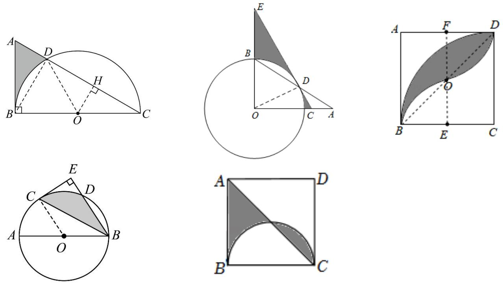

# 核心·题型

# 模块一 圆中常见辅助线

# 【题型 1】遇到弦时

处理方式：常添加弦心距

1．筒车是我国古代发明的一种水利灌溉工具，筒车盛水桶的运行轨道是以轴心 $O$ 为圆心的圆，如图 1．唐代陈廷章在《水轮赋》中写道“水能利物，轮乃曲成”．如图 2，已知圆心 $O$ 在水面上方，且⊙ 푂被水面截得弦퐴퐵长为 8 米，若点 $C$ 为运行轨道的最低点，点 $C$ 到弦퐴퐵所在直线的距离是 2，则⊙푂的半径长为 米．

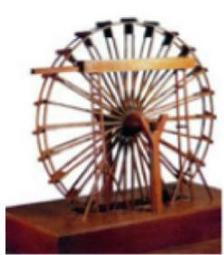  
图1

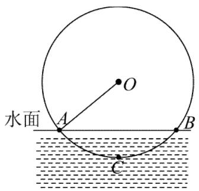  
图2

【答案】5

【分析】本题考查垂径定理的应用，勾股定理等知识，解题的关键是学会添加常用辅助线，构造直角三角形解决问题．连接푂퐶交퐴퐵于点 $\cdot$ ．利用垂径定理得 $A E = 4$ ，再利用勾股定理即可求出半径【详解】解：连接푂퐶交퐴퐵于点 $E$ ．设 $\_$ ，

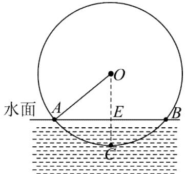

由题意 $\cdot$ ，$\begin{array} { r } { \mathbf { \dot { \mathbf { \rho } } } \cdot A E = B E = \frac { 1 } { 2 } A B = 4 } \end{array}$ （米），  
∵ $\cdot$ ，  
∴ $. O E = r - 2$ ，  
在 $R t \triangle A E O$ 中， $r ^ { 2 } = 4 ^ { 2 } + ( r - 2 ) ^ { 2 }$ ，  
∴ $. r = 5$ 米，  
故答案为：5．

2．如图， $\odot o$ 的半径为 $1 0 { \sqrt { 2 } }$ ，弦 $A B$ 的长为 $1 6 { \sqrt { 2 } }$ ， $P$ 是弦퐴퐵上一动点，则线段푂푃长的最小值为（ ）

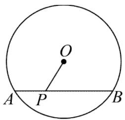

A．10 B．8 2 C．5 D．6 2

【答案】D

【分析】过 $O$ 点作 $\cdot$ 于 $H$ ，连接푂퐵，如图，根据垂径定理得到 $\_$ ，再利用勾股定理计算出푂퐻，然后根据垂线段最短求解

【详解】解：过 $O$ 点作푂퐻 ⊥ 퐴퐵于 $H$ ，连接푂퐵，如图，

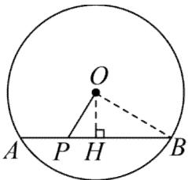

$-$ ，  
在 $\cdot$ 中， $-$   
∴线段푂푃长的最小值为 $6 \sqrt { 2 }$

3．（2022·安徽中考）已知 $_ { \odot O }$ 的半径为 7， $A B$ 是 $_ { \odot O }$ 的弦，点 $P$ 在弦 $A B$ 上．若 $P A { = } 4$ ， $P B { = } 6$ ，则 $O P { = }$ （ ）

A． $\sqrt { 1 4 }$ B．4 C． $\sqrt { 2 3 }$ D．5

【答案】D

【分析】连接 $O A$ ，过点 $O$ 作 $O C \bot A B$ 于点 $C$ ，如图所示，先利用垂径定理求得 $A C = B C = \frac { 1 } { 2 } A B = 5$ ，然后在 RtAOC 中求得 $O C = 2 { \sqrt { 6 } }$ ，再在 $R t \Delta P O C$ 中，利用勾股定理即可求解

【详解】解：连接 $O A$ ，过点 $O$ 作 $O C \bot A B$ 于点 $C$ ，如图所示，

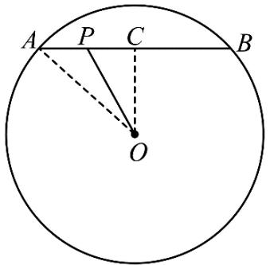

则 $A C = B C = { \frac { 1 } { 2 } } A B$ ， $O A = 7$ ，∵ $P A = 4$ ， $\cdot$ ，

$\therefore A B = P A + P B = 4 + 6 = 1 0$ ，∴ $A C = B C = \frac { 1 } { 2 } A B = 5$ ，$\therefore P C = A C - P A = 5 - 4 = 1$ ，在 RtAOC 中， $O C = { \sqrt { O A ^ { 2 } - A C ^ { 2 } } } = { \sqrt { 7 ^ { 2 } - 5 ^ { 2 } } } = 2 { \sqrt { 6 } }$ ，在 RtPOC中， $O P = \sqrt { O C ^ { 2 } + P C ^ { 2 } } = \sqrt { \left( 2 \sqrt { 6 } \right) ^ { 2 } + 1 ^ { 2 } } = 5 ,$ 故选：D

4．如图， $A B$ 是 $\odot o$ 的直径，弦 $C D$ 交퐴퐵于点 $P$ ， $\angle A P C = 3 0 ^ { \circ }$ ，点 $P$ 是푂퐴的中点，且 $A P = 2$ ，则$C D = .$

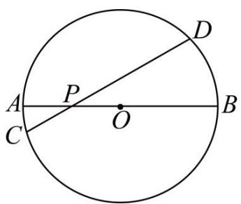

【答案】 $\cdot$

【分析】本题主要考查了圆的垂径定理，勾股定理和含 $3 0 ^ { \circ }$ 角的直角三角形的性质．如图，作 $\cdot$ 于 $\cdot$ ，连接푂퐶，根据垂径定理得 $\cdot$ ，由题意得 $\cdot$ ， $\cdot$ ，在 $\cdot$ 中，根据含 $3 0 ^ { \circ }$ 的直角三角形的性质计算出 $O H = O P = 1$ ，然后在 $R t \triangle { O H C }$ 中，利用勾股定理计算得到 $\cdot$ ，即 $C D = 2 C H = 2 { \sqrt { 1 5 } }$ ．解此题的关键在于作辅助线得到直角三角形，再合理利用各知识点进行计算

【详解】解：如图，作 $O H \perp C D$ 于 $\cdot$ ，连接푂퐶，

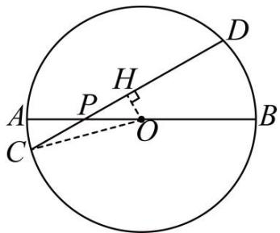

$\cdot$ ，  
∴ $\cdot$ ，则 $\cdot$ ，  
∵ $\cdot$ ，点푃是푂퐴的中点，  
$\cdot . A P = O P = 2$ ，则 $O A = O B = 4$ ，  
∴ $A B = 8$ ，则 $\cdot$ ，  
∵ $\cdot _ { O H \perp C D }$ ， $\angle A P C = 3 0 ^ { \circ }$ ，则 $\_$ ，  
$\begin{array} { r } { \mathbf { \partial } \cdot O H = \frac { 1 } { 2 } O P = 1 . } \end{array}$ ，  
在 $R t \triangle { O H C }$ 中，  
$\because O C = 4 , O H = 1 ,$ ，  
$\therefore C H = { \sqrt { O C ^ { 2 } - O H ^ { 2 } } } = { \sqrt { 1 5 } } ,$ ，  
$\therefore C D = 2 C H = 2 { \sqrt { 1 5 } }$

5．已知⊙푂的半径是 5cm，弦 $A B \parallel C D$ ， $A B = 6 c m$ ， $C D = 8 c m$ ，则 $A B$ 与 $C D$ 的距离是（ ）

A．7푐푚 B．7푐푚或 1푐푚 C．5cm 或 2푐푚 D．1푐푚

【答案】B

【分析】有两种情况，需分类讨论，即 在圆心 $O$ 的同侧或两侧两种情况

【详解】解：如图 $\cdot$ ，过푂作 $\cdot$ 于퐹交 $C D$ 于 $E$ ，连接푂퐴，푂퐶，$\cdot$ ，  
$\_$ ；  
由垂径定理得 $\cdot$ ， $\begin{array} { r } { C E = D E = \frac { 1 } { 2 } C D = 4 , } \end{array}$ ，  
$: \cdot \ : O F = \sqrt { O A ^ { 2 } - A F ^ { 2 } } = 4 , \ : \ : O E = \sqrt { O C ^ { 2 } - C E ^ { 2 } } = 3 .$ ，  
$\therefore E F = O F - O E = 1 c m$ ；如图 $\textcircled{2}$ ，过 $\cdot$ 作 $\cdot$ 于 $F$ 交 $C D$ 于 $E$ ，连接푂퐴，푂퐶，$\cdot$ ，  
$\therefore O E \bot C D$ ；  
同理可得 $-$ ，  
当퐴퐵， $C D$ 在圆心푂的两侧时，  
$E F = O F + O E = 7 ( c m ) ,$ ，  
∴ $\cdot$ 与 $C D$ 的距离为 7푐푚或 1푐푚

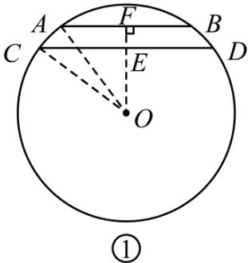

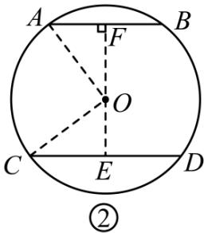

故选 B．

6．如图，已知 $\odot o$ 的直径为 26，弦 $A B = 2 4$ ，动点 $P$ 、 $Q$ 在 $\odot o$ 上，弦 $P Q = 1 0$ ，若点푀、 $N$ 分别是弦 $A B$ 、 $P Q$ 的中点，则线段푀푁的取值范围是（ ）

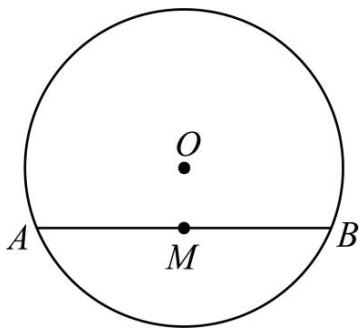

A． $7 \leq M N \leq 1 7$ B． $1 4 \leq M N \leq 3 4$ C． $7 < M N < 1 7$ D． $6 \leq M N \leq 1 6$

【答案】A

【分析】连接푂푀、푂푁、푂퐴、푂푃，由垂径定理得到， $O M \perp A B , O N \perp P Q , A M = \textstyle { \frac { 1 } { 2 } } A B = 1 2 , P N = \textstyle { \frac { 1 } { 2 } } P Q =$ 5，由勾股定理得到 $\cdot$ ， $O N = 1 2$ ，当 $\cdot$ 时， $M$ 、 $\cdot$ 、 $N$ 三点共线时，当퐴퐵、 $\cdot$ 位于点 $O$ 的同侧时，线段푀푁的长度最短，当퐴퐵、 $P Q$ 位于点 $O$ 的两侧时，线段푀푁的长度最长，分别求解即可．

【详解】解：连接푂푀、 $O N$ 、푂퐴、 $\cdot$ ，如图所示，

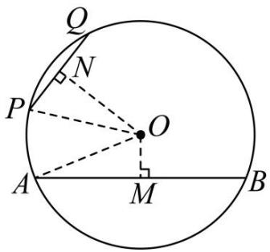

∵ $\odot o$ 的直径为 26，  
$\therefore O A = O P = 1 3$ ，  
∵点 M、 $\cdot$ 分别是弦퐴퐵、 푃푄的中点， $\cdot$ ， $\cdot$ ，  
$\therefore O M \bot A B , O N \bot P Q , A M = \textstyle { \frac { 1 } { 2 } } A B = 1 2 , P N = \textstyle { \frac { 1 } { 2 } } P Q = 5 ,$ ，  
$\therefore O M = \sqrt { 1 3 ^ { 2 } - 1 2 ^ { 2 } } = 5 , O N = \sqrt { 1 3 ^ { 2 } - 5 ^ { 2 } } = 1 2 ,$ ，  
当 $A B \parallel P Q$ 时，M、 $O$ 、 $N$ 三点共线，  
当 $\cdot$ 、푃푄位于点 $\cdot$ 的同侧时，线段푀푁的长度最短 $-$ ，  
当 $\cdot$ 、 $P Q$ 位于点 $\cdot$ 的两侧时，线段푀푁的长度最长 $= O M + O N = 1 2 + 5 = 1 7$ ，  
∴线段푀푁的长度的取值范围是 $\_$

# 【题型 2】遇到直径时

处理方式：常添加（画）直径所对的圆周角作用：利用圆周角的性质得到直角或直角三角形。

7．如图，在△퐴퐵퐶中， $A B = A C$ ， $\angle C = 7 0 ^ { \circ }$ ，以퐴퐵为直径的 $\odot o$ 交 $B C$ 于点 $D$ ，则 $\widehat { B D }$ 的度数为 °．

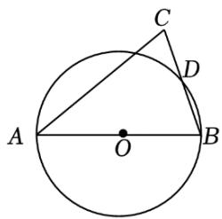

【答案】40

【分析】连接퐴퐷，푂퐷，根据퐴퐷是⊙ 푂的直径，可得 $\_$ ，再根据 $\cdot$ ， $\cdot$ ，可得∠퐵的值，然后求得∠퐷퐴퐵，从而求出∠퐷푂퐵即可．本题考察圆周角定理，解题的关键是正确添加辅助线，并熟知一条弧所对圆周角等于它所对圆心角的一半

【详解】解：连接퐴퐷，푂퐷，如图所示：

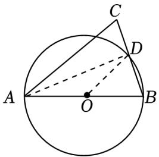

∵퐴퐵是 $\cdot$ 的直径，  
$\_$ ，  
∵ $\mathbf { \nabla } \cdot A B = A C$ ， $\cdot$ ，  
$-$ ，  
$\_$ ，  
$\cdot \angle D O B = 4 0 ^ { \circ }$ ，  
∴ $\widehat { B D }$ 的度数为 $\cdot$

8．如图，点퐴、 $B$ 、 $C$ 、 $D$ 均在 $\odot o$ 上， $A B$ 为直径， $B C = C D$ ．若 $\angle A = 5 0 ^ { \circ }$ ，求 $\angle B$ 的度数

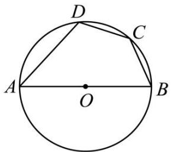

【答案】 $\cdot$

【分析】本题考查了直径所对的圆周角是直角，弦与圆周角的关系；根据已知可得 $\scriptstyle \angle B A C = { \frac { 1 } { 2 } } \angle B A D =$ $\cdot$ ，根据퐴퐵为直径，可得 $\angle A C B = 9 0 ^ { \circ }$ ，进而即可求解

【详解】解：如图，连接퐴퐶  
∵ $\cdot$ ， $\angle B A D = 5 0 ^ { \circ }$ ，  
$\cdot \angle B A C = \frac { 1 } { 2 } \angle B A D = 2 5 ^ { \circ }$ ，  
∵퐴퐵为直径，  
$\_$ ，$. \angle B = 9 0 ^ { \circ } - \angle B A C = 9 0 ^ { \circ } - 2 5 ^ { \circ } = 6 5 ^ { \circ } .$

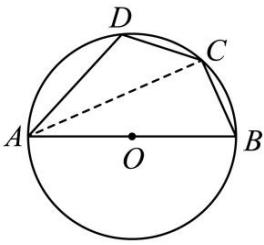

9．如图，在 $\triangle$ 퐴퐵퐷中， $A B = A D$ ，以 $A B$ 为直径作⊙푂，交线段퐵퐷于点퐶，过点퐶作퐶퐹 ⊥ 퐴퐷于点퐸

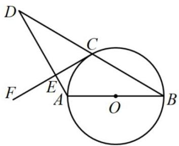

(1)求证： $C F$ 是 $\odot o$ 的切线(2)当 $\angle D = 3 0 ^ { \circ }$ ， $C E = { \sqrt { 3 } }$ 时，求 $\widehat { A C }$ 的长

【答案】(1)见解析$( 2 ) _ { 3 } ^ { 2 } \pi$

【分析】（1）连接 $O C$ ，根据等边对等角得出 $\cdot$ ，再结合圆的基本性质得 $\_$ ，从而得到 $O C \parallel A D$ ，再根据平行线的性质进行证明即可；

（2）连接퐴퐶，由等腰三角形的性质得 $C D = 2 C E = 2 { \sqrt { 3 } }$ ， $-$ ，再根据圆周角定理得出$\angle A O C = 2 \angle B = 6 0 ^ { \circ }$ ，设 $A C = x$ ，根据勾股定理求出半径，最后根据弧长公式求解即可

【详解】（1）证明：如图，连接 $O C$ ，  
$: C F \perp A D$ ，  
$\_$ ，  
∵ $\cdot$ ，  
$\_$ ，  
∵ $\cdot$ ，  
∴ $. . . . B = . . 0 C B$ ，  
∴ $. \angle D = \angle O C B$ ，  
$\therefore O C \parallel A D$ ，  
$\cdot \angle O C E = \angle C E D = 9 0 ^ { \circ }$ ，  
$\therefore O C \bot C F$ ，  
又∵푂퐶为 $\cdot$ 的半径，  
∴퐶퐹是⊙ 푂的切线；  
（2）解：如图，连接 $\cdot$ ，  
∵ $\cdot _ { C F \perp A D }$ ， $\cdot$ ，퐶퐸 = 3，  
$\_$ ，  
∵퐴퐵为直径，  
$\cdot A C \perp B D$ ，  
又∵ $\cdot$ ，  
∴ $. B C = D C = 2 { \sqrt { 3 } }$ ， $\angle B = \angle D = 3 0 ^ { \circ }$ ，  
$-$ ，  
∵在 $R t \triangle A B C$ 中， $\cdot$ ，  
$\mathbf { \nabla } \cdot A B = 2 A C$ ，  
设 $A C = x$ ，则 $\cdot$ ，  
由勾股定理，得 $A B ^ { 2 } = A C ^ { 2 } + B C ^ { 2 }$ ，即 $\cdot$ ，解得 $\cdot$ 或 $\cdot$ （舍去），  
∴ $\cdot$ ，  
$\cdot A B = 4$ ，  
$\cdot$ ，  
$\cdot$

# 【题型 3】遇到有切线时

处理方式：添加过切点的半径（连结圆心和切点）

10．如图， $C D$ 切 $\odot o$ 于 $B$ ，若 $\angle C = 3 0 ^ { \circ }$ ，则∠퐴퐵퐷的度数是

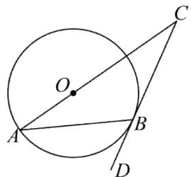

【答案】 $6 0 ^ { \circ }$

【分析】此题考查了切线的性质，连接푂퐵，由切线的性质知△푂퐵퐶是直角三角形，可求出∠퐶푂퐵的度数，由于∠퐶푂퐵是等腰 $\cdot$ 퐴푂퐵的外角，由此可求出∠푂퐵퐴的度数，已知∠푂퐵퐴和∠퐴퐵퐷互余，即可得解，解题的关键是熟练掌握切线性质，直角三角形性质和三角形外角性质及其应用

【详解】如图，连接 ，

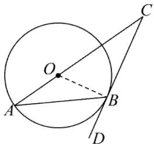

∵퐶퐷与 $\cdot$ 相切于 $\cdot$ ，  
$\_$ ；  
在 $R t \triangle C O B$ 中， $\cdot$ ，  
$-$ ，  
∵ $O A = O B$ ，  
$\therefore \angle O B A = \angle O A B = \textstyle { \frac { 1 } { 2 } } \angle C O B = 3 0 ^ { \circ } ,$ ，$\angle A B D = 9 0 ^ { \circ } - \angle O B A = 6 0 ^ { \circ }$

11．如图，在 $\odot o$ 中， $A B$ 切 $\odot o$ 于点 $A$ ，连接푂퐵交 $\odot o$ 于点퐶．过点퐴作 $A D \parallel O B$ 交 $\odot o$ 于点퐷，连接$C D$ ．若 $\angle B = 4 8 ^ { \circ }$ ．则 $\angle O C D$ 为（ ）

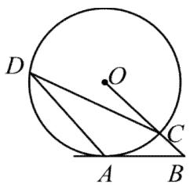

A． $2 1 ^ { \circ }$ B． $2 4 ^ { \circ }$ C． $2 5 ^ { \circ }$ D． $3 0 ^ { \circ }$

【答案】A

【分析】本题考查了切线的性质：圆的切线垂直于经过切点的半径．也考查了圆周角定理．连接푂퐴，如图，根据切线的性质得到 $\angle O A B = 9 0 ^ { \circ }$ ，则利用互余可计算出 $\_$ ，再利用圆周角定理得到 $\angle A D C = 2 1 ^ { \circ }$ ，然后根据平行线的性质得到∠푂퐶퐷的度数

【详解】解：连接푂퐴，如图，

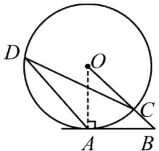

∵ 퐴퐵切 $\odot { } O$ 于点퐴，  
$\therefore O A \bot A B$ ，  
∴ $. \angle O A B = 9 0 ^ { \circ } .$ ，  
∵ $\angle B = 4 8 ^ { \circ }$ ，  
$\therefore \angle A O B = 9 0 ^ { \circ } - 4 8 ^ { \circ } = 4 2 ^ { \circ } ,$ ，  
$\therefore \angle A D C = { \textstyle { \frac { 1 } { 2 } } } \angle A O B = 2 1 ^ { \circ } ,$ ，  
$\because A D \parallel O B$ ，  
$\therefore \angle O C D = \angle A D C = 2 1 ^ { \circ } .$

12．如图，半圆 $\odot o$ 的圆心在 $B C$ 上，퐴퐶、 $A B$ 分别与⊙ 푂相切于点퐶、 $D$ ，半圆 $\odot o$ 交퐵퐶于另一点퐸．连接 $D E$ 、 $A O$ ，求证： $D E \parallel A O$

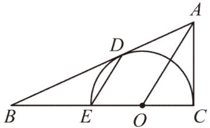

【答案】见解析

【分析】本题考查圆的切线的性质，平行线的判定，全等三角形的判定和性质，连接푂퐷，证明出$-$ 或 $-$ 即可利用同位角相等，两直线平行，或内错角相等，两直线平行证明出结论

【详解】连接 $\cdot$ ，

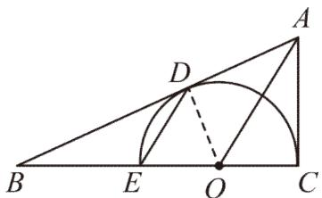

∵ 、 分别为 $\cdot$ 的切线，  
∴ $\cdot$ ， $\angle O C A = \angle O D A = 9 0 ^ { \circ }$ ，  
在 $\cdot$ 和푅푡 $\triangle { O A D }$ 中，  
$\displaystyle { \{ _ { A C \mathrm { ~ = ~ } A D } ^ { O A } , } $   
$-$ ，  
$-$ ，  
∵ $\cdot$ ，  
$\mathbf { \partial } \cdot \angle O D E = \angle O E D$ ，  
∵ $\angle C O D = \angle O D E + \angle O E D$ ，  
$-$ ，  
∴퐷퐸 ∥ 퐴푂

# 【题型 4】遇到两相交切线时

处理方式：常连结切点和圆心、连结圆心和圆外的一点、连结两切点（切线长定理）

13．如图，푃퐴、 푃퐵分别与 $\odot o$ 相切于点퐴、 $B$ ，连接 $A B$ ．若 $A B = P B$ ，点퐶为圆上一点（异于퐴、 $B$ ），则 $\angle A C B = .$ 度

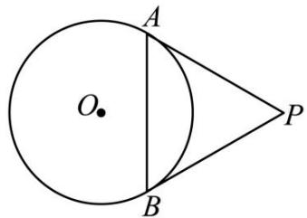

【答案】 $\cdot$ 或 $\cdot$

【分析】本题考查了切线的性质及圆周角定理，分当点퐶在劣弧퐴퐵上时与当点퐶在优弧퐴퐵上时两种情况进行讨论，根据圆周角定理计算 的度数，掌握切线的性质及圆周角定理是解题的关键

【详解】解： $\cdot$ 当点퐶在劣弧퐴퐵上时，如图所示，连接푂퐴、푂퐵，∵푃퐴、 푃퐵分别与 $\cdot$ 相切于퐴、 $\cdot$ 两点，$\therefore O A \bot P A$ ， $O B \perp P B$ ， $\cdot$ ，

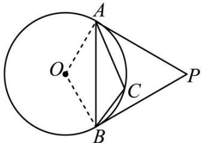

$\cdot \angle O A P = \angle O B P = 9 0 ^ { \circ }$ ，  
∵ $\_$ ，  
$\therefore P A = P B = A B$ ，  
$\_$ ，  
$-$   
$\therefore \angle A C B = { \textstyle { \frac { 1 } { 2 } } } ( 3 6 0 ^ { \circ } - 1 2 0 ^ { \circ } ) = { \textstyle { \frac { 1 } { 2 } } } \times 2 4 0 ^ { \circ } = 1 2 0 ^ { \circ } ;$ ；  
$\textcircled{2}$ 当点 $\cdot$ 在优弧AB上时，如图所示，连接 $\cdot$ $O B$ $\cdot$ 可得 $\cdot$ $\_$

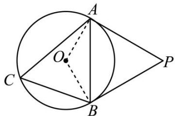

$\begin{array} { r } { \mathrm { \Pi } ^ { * } . \angle A C B = \frac { 1 } { 2 } \angle A O B = \frac { 1 } { 2 } \times 1 2 0 ^ { \circ } = 6 0 ^ { \circ } , } \end{array}$ ，故答案为： $\cdot$ 或 $1 2 0 ^ { \circ }$

14．如图，从点 $P$ 向 $\odot o$ 引两条切线 $P A , P B$ ，切点为퐴， $B$ ，作直径 $B C$ ，连接 $A C$ ，若 $\angle P = 6 0 ^ { \circ }$ ， $P B = 2$ ， 则 $A C = .$

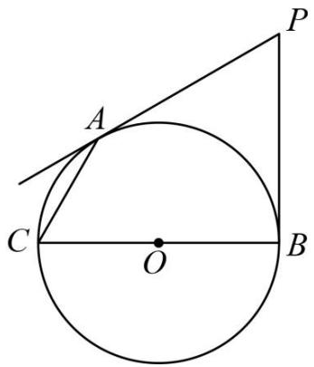

【答案】 $\frac { 2 { \sqrt { 3 } } } { 3 }$

【分析】根据 是切线， $\cdot$ ，判断出 $\cdot$ 퐴퐵푃是正三角形，根据 $\cdot$ ，判断出 $\angle C B P =$ $\cdot$ ，进而得出 $\_$ ，再利用勾股定理求出퐴퐶的长

【详解】解：如图，连接 $A B$ ，∵ $P A$ ，푃퐵是⊙ 푂的切线，

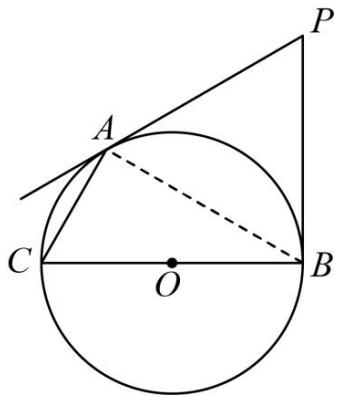

$\therefore \angle O B P = 9 0 ^ { \circ } , P A = P B ,$ ，  
又∵ $\cdot$ ，  
∴ $\cdot$ 퐴푃퐵是等边三角形，  
$\therefore A B = P B = 2 , \angle P B A = 6 0 ^ { \circ } ,$   
$\_$ ，  
∵ 퐵퐶是 $\cdot$ 的直径，  
$\_$ ，  
$\cdot$ ，  
设 $\_$ ，则 $\cdot$ ，  
$\because A C ^ { 2 } + A B ^ { 2 } = B C ^ { 2 } , \qquad $ ，  
$\therefore x ^ { 2 } + 2 ^ { 2 } = ( 2 x ) ^ { 2 }$ ，  
$\begin{array} { r } { \therefore x = \frac { 2 { \sqrt { 3 } } } { 3 } , } \end{array}$   
即퐴퐶的长度为2 3

15．如图，푃퐴、 푃퐵是 $\odot o$ 的切线， $A$ 、 $B$ 为切点， $\angle O A B = 3 0 ^ { \circ }$ (1)求∠퐴푃퐵的度数；(2)当 $A P = 3$ 时，求 $\odot o$ 的半径．【答案】 $( 1 ) \angle A P B = 6 0 ^ { \circ }$ ；(2)⊙ 푂的半径为 $\sqrt { 3 }$ ．

【分析】本题考查了切线长定理，三角形内角和定理，等边三角形的判定与性质（1）根据等腰三角形等边对等角可得 $-$ ，根据圆切线的性质可得 $\angle P A O =$ $\angle P B O = 9 0 ^ { \circ }$ ，从而得到 $-$ ，求得△ 푃퐴퐵是等边三角形，据此求解即可；

（2）根据切线长定理得到 $-$ ，根据含 30度角的直角三角形的性质以及勾股定理计算即可求解

【详解】（1）解：∵ $\cdot$ ，$. \angle O A B = \angle O B A = 3 0 ^ { \circ }$ ，  
∵푃퐴、 푃퐵是 $\cdot$ 的切线，  
$\cdot . \angle P A O = \angle P B O = 9 0 ^ { \circ }$ ，  
$-$ ，  
∴ $. \triangle P A B$ 是等边三角形，  
$\_$ ；  
（2）解：连接 $O P$ ，  
∵ 是⊙ $\cdot$ 的切线，  
∴푂푃平分∠퐴푃퐵，  
$\cdot \angle A P O = \angle B P O = 3 0 ^ { \circ }$ ，  
$\therefore O P = 2 O A$ ，  
∵ $\cdot$ ， $O P ^ { 2 } = O A ^ { 2 } + A P ^ { 2 }$ ，  
$\therefore ( 2 O A ) ^ { 2 } = O A ^ { 2 } + 3 ^ { 2 }$ ，  
∴ $. O A = { \sqrt { 3 } }$ ，  
∴ $\cdot$ 的半径为 $\cdot$

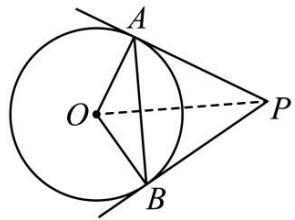

# 【题型 5】遇到三角形的内切圆时

处理方式：连结内心到各三角形顶点，或过内心作三角形各边的垂线段作用：利用内心的性质，可得 $\textcircled{1}$ 内心到三角形三个顶点的连线是三角形的角平分线；

$\textcircled{2}$ 内心到三角形三条边的距离相等。

16．（2023·湖北天门中考）如图，在 ${ \triangle A B C }$ 中， $\angle A C B = 7 0 ^ { \circ }$ ， $\triangle A B C$ 的内切圆 $_ { \odot O }$ 与 $A B { \mathrm { ; } }$ ， $B C$ 分别相切于点 $D$ ， $E$ ，连接 $D E$ ， $_ { A O }$ 的延长线交 $D E$ 于点 $F$ ，则 $\angle A F D =$

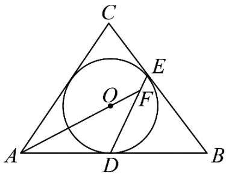

【答案】 $3 5 ^ { \circ }$

【分析】如图所示，连接 $O E$ ，OD， $O B$ ，设OB、 $D E$ 交于 $H$ ，由内切圆的定义结合三角形内角和定理求出 $\angle A O B = 1 2 5 ^ { \circ }$ ，再由切线长定理得到 $B D = B E$ ，进而推出 $O B$ 是 $D E$ 的垂直平分线，即$\angle O H F = 9 0 ^ { \circ }$ ，则 $\angle A F D = \angle A O H - \angle O H F = 3 5 ^ { \circ }$

【详解】解：如图所示，连接 $O E$ ，OD， $O B$ ，设 $O B$ 、 $D E$ 交于 $H$ ，  
∵ $_ { \odot O }$ 是 ${ \triangle A B C }$ 的内切圆，  
∴OA、 $O B$ 分别是 $\angle C A B .$ 、 $\angle C B A$ 的角平分线，  
$\angle O A B = \frac { 1 } { 2 } \angle C A B , \angle O B A = \frac { 1 } { 2 } \angle C B A$ ，  
∵ $\angle A C B = 7 0 ^ { \circ }$ ，  
$\angle C A B + \angle C B A = 1 8 0 ^ { \circ } - \angle A C B = 1 1 0 ^ { \circ }$   
$\therefore \angle O A B + \angle O B A = \frac { 1 } { 2 } \angle C B A + \frac { 1 } { 2 } \angle C A B = 5 5 ^ { \circ } ,$   
∴ $\angle A O B = 1 8 0 ^ { \circ } - \angle O A B - \angle O B A = 1 2 5 ^ { \circ }$   
∵ $_ { \odot O }$ 与 $A B$ ， $B C$ 分别相切于点 $D$ ， $E$ ，  
∴ $B D = B E$ ，  
又∵ $O D = O E$ ，  
$o B$ 是 $D E$ 的垂直平分线，  
$O B \bot D E$ ，即 $\angle O H F = 9 0 ^ { \circ }$ ，  
∴ $\cdot \angle A F D = \angle A O H - \angle O H F = 3 5 ^ { \circ }$   
故答案为： $3 5 ^ { \circ }$

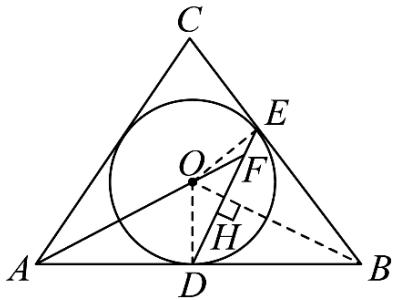

17．如图，在一张푅푡 △ 퐴퐵퐶纸片中， $\angle A C B = 9 0 ^ { \circ }$ ， $B C = 5$ ， $A C = 1 2$ ， $\odot o$ 是它的内切圆．小明用剪刀沿着⊙ 푂的切线 $D E$ 剪下一块三角形 $A D E$ ，则 $\triangle A D E$ 的周长为（ ）

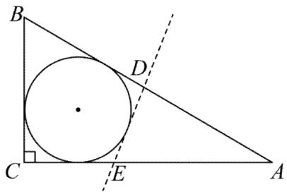

A．19 B．17 C．22 D．20

【答案】D

【分析】本题考查了三角形的内切圆与内心，勾股定理，切线的性质，解决本题的关键是掌握切线的性质．设△ 퐴퐵퐶的内切圆切三边于点퐹， $\cdot$ ， $G$ ，连接푂퐹， 푂퐻， 푂퐺，得四边形푂퐻퐶퐺是正方形，由切线长定理可知 $\cdot$ ，根据퐷퐸是⊙ $o$ 的切线，可得 $M D = M F$ ， $E M = E G$ ，根据勾股定理可得 $A B =$ 13，再求出内切圆的半径 $\textstyle { \frac { 1 } { 2 } } ( A C + B C - A B ) = 2$ ，进而可得 $\cdot$ 퐴퐷퐸的周长

【详解】解：如图，设 $\triangle$ 퐴퐵퐶的内切圆切三边于点퐹、 $H$ 、 $\cdot$ ，连接 $O F$ 、푂퐻、푂퐺，∴四边形푂퐻퐶퐺是正方形，

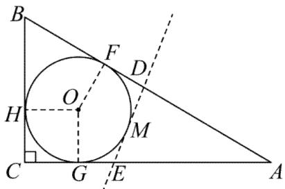

由切线长定理可知 $A F = A G$ ，  
∵퐷퐸是 $\odot { } O$ 的切线，  
$\_$ ， $\cdot$ ，  
∵ $\cdot \angle A C B = 9 0 ^ { \circ }$ ， $\cdot$ ， $A C = 1 2$ ，  
$\cdot A B = { \sqrt { A C ^ { 2 } + B C ^ { 2 } } } = 1 3$ ，  
∵ $\odot { } O$ 是 $\cdot$ 퐴퐵퐶的内切圆，  
∴内切圆的半径 $\_$ ，  
$\cdot$ ，  
$-$ ，$-$ ，  
∴ 的周长为： $-$

18．已知：如图， $\odot o$ 是 $R t \triangle A B C$ 的内切圆， $\angle C = 9 0 ^ { \circ }$ ．若 $A C = 1 2 c m$ ， $B C = 9 c m$ ，求 $\odot o$ 的半径 $r$ ；若 $A C = b$ ， $B C = a$ ， $A B = c$ ，求 $\odot o$ 的半径 $r$

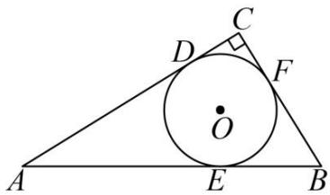

【答案】 $\cdot$ ； $\cdot$

【分析】连接 $O D$ ， $O F$ ，证明四边形푂퐹퐶퐷是正方形，由切线长定理得： $\cdot$ ， $\cdot$ ， $\_$ ，求出 $-$ ，然后可得答案

【详解】解：在 $R t \triangle A B C$ ， $\cdot$ ， $\_$ ， $\cdot$ 根据勾股定理得： $A B = \sqrt { A C ^ { 2 } + B C ^ { 2 } } = \sqrt { 1 2 ^ { 2 } + 9 ^ { 2 } } = 1 5 c m$ ；连接 $\cdot$ ， $\cdot$ ，

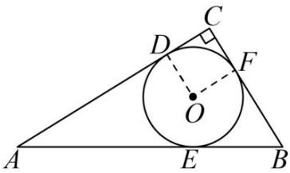

∵ $\cdot$ 是푅푡 △ 퐴퐵퐶的内切圆，  
$-$ ，  
在四边形푂퐹퐶퐷中， $O D = O F$ ， $-$ ，∴四边形푂퐹퐶퐷是正方形；  
∴ $O D = C D$ ，  
由切线长定理得： $\cdot$ ， $\cdot$ ， $B E = B F$ ，  
则 $C D = C F = { \textstyle { \frac { 1 } { 2 } } } ( A C + B C - A B )$ ，  
$\therefore r = { \textstyle { \frac { 1 } { 2 } } } \times ( 1 2 + 9 - 1 5 ) = 3 ,$ ，  
若 $\cdot$ ， $B C = a , A B = c ,$ ，  
由以上可得： $\begin{array} { r } { r = \frac { 1 } { 2 } ( a + b - c ) } \end{array}$ ．

# 【题型 6】遇到三角形的外接圆时

作用：外心到三角形各顶点的距离相等（角平分线交点）

19．如图， $\triangle A B C$ 内接于 $\odot o$ ， $A B = A C$ ，连接 $A O$ (1)求证： $A O \perp B C$ ； (2)若 $O A = 5$ ， $B C = 8$ ，求퐴퐵的长 【答案】(1)见解析 $\cdot$

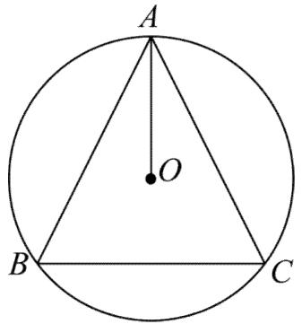

【分析】（1）如图，连接푂퐵、푂퐶，由△ 퐴퐵퐶内接于 $\odot O$ ，可知 $-$ ，进而可知퐴푂是线段퐵퐶的垂直平分线，进而结论得证；

（2）如图 2，延长퐴푂交퐵퐶于 $D$ ，由（1）知， $A D \perp B C$ ， $O B = O A = 5$ ，由垂径定理可得， $B D = { \textstyle { \frac { 1 } { 2 } } } B C = 4$ ，由勾股定理得， $\_$ ，则 $\cdot$ ，由勾股定理得， $A B = \sqrt { A D ^ { 2 } + B D ^ { 2 } }$ ，计算求解即可．

【详解】（1）证明：如图 1，连接 $\cdot$ 、푂퐶，

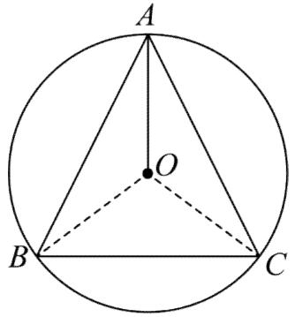  
图1

∵ $\triangle$ 퐴퐵퐶内接于 $\odot { } O$ ，  
$\therefore O A = O B = O C$ ，  
∵ $\cdot _ { A B } = A C$ ，  
∵到线段两端点距离相等的点在垂直平分线上，∴퐴푂是线段퐵퐶的垂直平分线，  
∴퐴푂 ⊥ 퐵퐶；  
（2）解：如图 2，延长퐴푂交퐵퐶于퐷，  
由（1）知， $A D \perp B C$ ， $O B = O A = 5$ ，  
由垂径定理可得， $B D = { \textstyle { \frac { 1 } { 2 } } } B C = 4$ ，  
由勾股定理得， $O D = { \sqrt { O B ^ { 2 } - B D ^ { 2 } } } = 3$ ，  
∴ $\cdot$ ，  
由勾股定理得， $-$ ，  
∴퐴퐵的长为 $4 { \sqrt { 5 } }$ ．

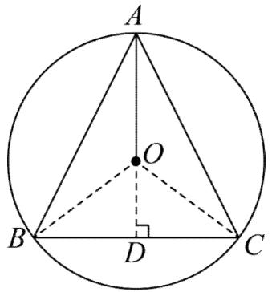  
图2

20．如图，一块等腰三角形钢板的底边长为 $8 0 c m$ ，腰长为 $5 0 c m$ (1)求能从这块钢板上截得的最大圆的半径：(2)用一个圆完整覆盖这块钢板，这个圆的最小半径是多少푐푚？(3)求这块等腰三角形钢板的内心与外心之间距离．

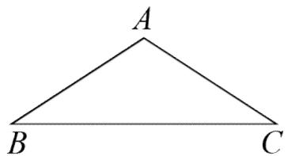

【答案】 $\cdot$ 푐 푚   
(2)40 푐푚   
(3)25푐푚

【分析】(1)由于三角形퐴퐵퐶是等腰三角形，过퐴作 $A D \perp B C$ 于퐷，根据勾股定理得到 $A D = 3 0$ ，又从这块钢板上截得的最大圆就是三角形的内切圆，根据内切圆的圆心的性质知道其圆心在퐴퐷上，分别连接퐴푂、 퐵푂、 퐶푂，然后利用三角形的面积公式即可求解；

(2)由于一个圆完整覆盖这块钢板，那么这个圆是三个三角形的外接圆，设覆盖圆的半径为푅，根据垂径定理和勾股定理即可求解

(3)根据(1)和(2)再利用线段之间的等量关系即可求得【详解】（1）解：如图，过퐴作퐴퐷 ⊥ 퐵퐶于퐷∵ $\_$ $B C = 8 0$

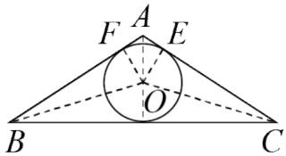

根据等腰三角形和圆的对称性可得： $\cdot$ 、 $O$ 、 $\cdot$ 三点共线$-$ ，  
$-$   
设最大圆半径为 $r$ ，  
则 $S _ { \triangle A B C } = S _ { \triangle A B O } + S _ { \triangle B O C } + S _ { \triangle A O C } ,$ ，  
$-$   
$\textstyle { \frac { 1 } { 2 } } \times 8 0 \times 3 0 = { \frac { 1 } { 2 } } ( 5 0 + 8 0 + 5 0 ) r$   
解得： $\begin{array} { r } { r = { \frac { 4 0 } { 3 } } \ c m } \end{array}$ ；  
（2）设覆盖圆的半径为 $R$ ，圆心为 $\cdot$ ，  
∵ $\triangle$ 퐴퐵퐶是等腰三角形，过퐴作 $A D \perp B C$ 于 $\cdot$ ，  
∴ $. B D = C D = 4 0$ ， $-$ ，  
∴푂'在퐴퐷直线上，连接푂 $\cdot$ ，  
在푅푡 △ 푂'퐷퐶中，  
由 $R ^ { 2 } = 4 0 ^ { 2 } + ( R - 3 0 ) ^ { 2 } $ ，  
$\cdot$   
若以퐵퐷长为半径为 $\cdot$ ，也可以覆盖，  
∴最小为 $\cdot$ ．  
（3）如图， $\cdot$ 即为内心与外心的距离

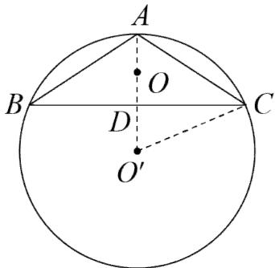

$\begin{array} { r } { A O = A D - D O = 3 0 - \frac { 4 0 } { 3 } = \frac { 5 0 } { 3 } c m , } \end{array}$ ，$\begin{array} { r } { O O ^ { ' } = A O ^ { ' } - A O = \frac { 1 2 5 } { 3 } - \frac { 5 0 } { 3 } = 2 5 c m , } \end{array}$ ，故这个等腰三角形的内心与外心的距离为 $2 5 c m$

# 模块二 切线证明

# 解题模板：

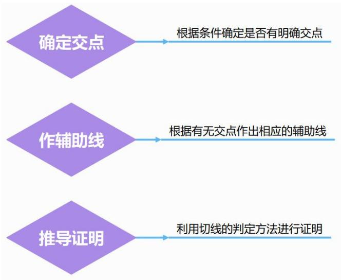

# 类型 1 有公共点：连半径，证垂直

# 【题型 7】 特殊角计算证垂直

21．如图， $A B$ 为 $_ { \odot O }$ 的直径，点 $C$ ， $D$ 在 $_ { \odot O }$ 上， ${ \widehat { A C } } = { \widehat { C D } } = { \widehat { D B } }$ ， $D E \bot A C$ ．求证： $D E$ 是 $_ { \odot O }$ 的切线

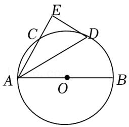

【分析】连接 $\cdot$ ，根据已知条件得到 $\angle B O D = { \frac { 1 } { 3 } } \times 1 8 0 ^ { \circ } = 6 0 ^ { \circ }$ ，求得 $\_$ ，根据等腰三角形的性质得到 $\angle A D O = \angle D A B = 3 0 ^ { \circ }$ ，求得 $\_$ ，根据切线的判定定理即可得到结论

【解答】证明：连接 $\cdot$ ，  
∵ $\_$ ，  
$\_$ ，  
∵ $\cdot$ ，  
$-$ ，  
∵ $O A { = } O D$ ，  
$\cdot \angle A D O = \angle D A B = 3 0 ^ { \circ }$ ，  
∵DE⊥AC，  
∴ $\angle E = 9 0 ^ { \circ }$ ，$\cdot \angle E A D + \angle E D A = 9 0 ^ { \circ }$ ，  
∴ $\_$ ，  
$-$ ，  
$\therefore O D \bot D E$ ，  
∵ $\cdot$ 是 $\cdot$ 的半径，  
∴ $\cdot$ 是 $\odot O$ 的切线

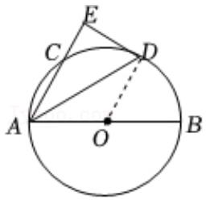

22．如图， $A C$ 是 $\odot O$ 的直径， $B$ 在 $_ { \odot O }$ 上， $B D$ 平分 $\angle A B C$ 交 $_ { \odot O }$ 于点 $D$ ，过点 $D$ 作 $D E / / A C$ 交$B C$ 的延长线于点 $E$

求证： $D E$ 是 $_ { \odot O }$ 的切线

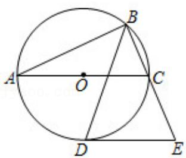

【分析】连接 $O D$ ，根据圆周角定理的推论得到 $\angle A B C = 9 0 ^ { \circ }$ ，根据角平分线的性质求出 $\angle D B E { = } 4 5 ^ { \circ }$ ，根据圆周角定理得到 $\angle D O C$ ，根据平行线的性质求出 $\_$ ，根据切线的判定定理证明结论；

【解答】证明：连接 $O D$ ，∵AC 是 $\cdot$ 的直径，  
∴ $\_$ ，  
∵ $B D$ 平分 $\cdot$ ，  
∴ $\angle D B E { = } 4 5 ^ { \circ }$ ，  
$-$ ，∵DE∥AC，  
$-$ ，∴ $\cdot$ 是 $\odot O$ 的切线；

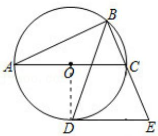

23．如图，在 $_ { \odot O }$ 中， $A B$ 为 $_ { \odot O }$ 的直径， $A C$ 为弦， $O C { = } 4$ ，$\angle O A C = 6 0 ^ { \circ }$

（1）求 $\angle A O C$ 的度数；

（2）在图（1）中， $P$ 为直径 $B A$ 的延长线上一点，且 $S _ { \triangle P A C } = 4 \sqrt { 3 }$ ，求证： $P C$ 为 $_ { \odot O }$ 的切线；

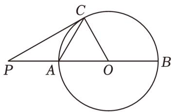

【分析】（1）根据等腰三角形中有一角为 60 度时是等边三角形得到 $\cdot$ 是等边三角形，则∠AOC$= 6 0 ^ { \circ }$ ；

（2）由等边三角形的性质以及勾股定理得出 $\cdot$ 的长，再利用三角形外角的性质以及等腰三角形的性质得出 $\_$ ，进而得出答案；

【解答】（1）解：在 $\triangle O A C$ 中，  
∵ $O A { = } O C { = } 4$ ， $\angle O A C = 6 0 ^ { \circ }$ ，  
∴ $\cdot$ 是等边三角形，  
∴ $\_$ ；  
（2）证明：过点 $C$ 作 $\cdot$ 于点 $D$ ，∵ $\triangle A O C$ 是等边三角形， $\cdot$ ，  
$\cdot$ ， $\_$ ，  
$-$ ，∵ ${ } ^ { \cdot } S _ { \triangle P A C } { = } 4 \sqrt { 3 }$ ，  
$\cdot { \frac { 1 } { 2 } } P A \bullet C D = 4 { \sqrt { 3 } } .$ ，  
∴ $\cdot$ ，  
$\cdot { \cal P } { \cal A } { = } { \cal A } C$ ，  
∴ $\cdot \angle P = \angle P C A = \frac { 1 } { 2 } \angle O A C = 3 0 ^ { \circ } ,$ ，  
$\therefore \angle P C O = \angle P C A + \angle A C O = 3 0 ^ { \circ } + 6 0 ^ { \circ } = 9 0 ^ { \circ }$ ，∴OC⊥PC，  
∵ $O C$ 是 $\odot O$ 的半径，  
∴PC 为 $\odot O$ 的切线

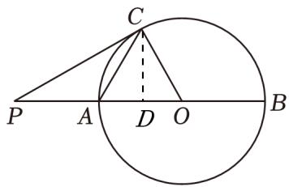

24．已知：在 $\odot o$ 中， $A B$ 是 $\odot o$ 的直径， $A C$ 是弦， $\angle D = 6 0 ^ { \circ }$ ，点 $P$ 是퐴퐵延长线上一点，且 $C P = A C$

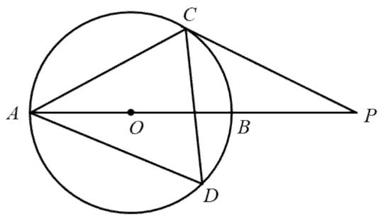

(1)求证： $P C$ 是 $\odot o$ 的切线； (2)若 $P B = { \sqrt { 5 } }$ ，求 $\odot o$ 的直径． 【答案】(1)见解析 $\cdot$

【分析】（1）连接푂퐶，퐵퐶，根据圆周角定理得到 $\_$ ， $\angle A C B = 9 0 ^ { \circ }$ ，从而得到 $\angle B A C = 3 0 ^ { \circ }$ ，再根据等边对等角得到 $-$ ，推出 $\angle A C P = 1 2 0 ^ { \circ }$ ，利用半径相等证明 $\angle O C A = 3 0 ^ { \circ }$ ，从而可得 $\_$ ，即可证明结论；

（2）证明 $B P = B C$ ，得到∠퐵퐶푃，根据∠푂퐶푃的度数求出∠푂퐶퐵，再证明△푂퐶퐵是等边三角形，得到푂퐵的长，可得直径．

【详解】（1）解：连接푂퐶，퐵퐶，

∵ $\angle D = 6 0 ^ { \circ }$ ，  
$\_$ ，  
∵퐴퐵是直径，  
$. \angle A C B = 9 0 ^ { \circ }$ ，  
$. . \angle B A C = 3 0 ^ { \circ }$ ，  
∵ $\cdot _ { A C } = C P$ ，  
$\cdot \angle P = \angle B A C = 3 0 ^ { \circ }$ ，  
$-$ ，  
∵ $\cdot$ ，  
$-$ ，  
∴ $\_$ ，即푃퐶是 $\cdot$ 的切线；（2） $\cdot$ ，  
$-$ ，  
$-$ ，  
$\_$ ，  
∵ $O C = O B$ ， $\_$ ，  
∴ $\cdot$ 是等边三角形，  
∴ $-$ ，

∴⊙ 푂的直径为 $2 \sqrt { 5 }$

# 【题型 8】 勾股定理逆定理证垂直

25．如图，C 是 $_ { \odot 0 }$ 上一点，点 P 在直径 AB 的延长线上， $_ { \odot 0 }$ 的半径为 6， $\mathrm { P B } { = } 4$ ， $\mathrm { P C } { = } 8$ ． 求证：PC 是 $_ { \odot 0 }$ 的切线；

【分析】可以证明 $\mathrm { O C } ^ { 2 } { + } \mathrm { P C } ^ { 2 } { = } \mathrm { O P } ^ { 2 }$ 得△OCP 是直角三角形，即 OC⊥PC，PC 是⊙O 的切线；

【解答】解：如图，连接 OC、BC，

∵ $\odot 0$ 的半径为 6， $\cdot$ ， $\mathrm { P C } { = } 8$ $\scriptstyle \cdot \mathrm { O C } = \mathrm { O B } = 6$ ， $-$ ，$\cdot { \mathrm { O C } } ^ { 2 } + { \mathrm { P C } } ^ { 2 } = 6 ^ { 2 } + 8 ^ { 2 } = 1 0 0$ ， $\_$ ，  
$\_$ ，  
∴△OCP 是直角三角形，  
∴OC⊥PC，  
∴PC 是 $\cdot$ 的切线

26．如图， $C$ 是⊙ 푂上一点，点 $D$ 在直径퐴퐵的延长线上， $\odot o$ 的半径为 6， $D B = 4$ ， $D C = 8$ ．求证：퐷퐶是 $\odot o$ 的切线

【答案】证明见解析

【分析】本题考查了切线的判定定理，勾股定理的逆定理，连接 ，根据边长之间的关系，证明出来△푂퐶퐷为直角三角形，即 $\cdot$ ，掌握切线的判定定理是解题的关键

【详解】证明：连接푂퐶，如图所示：

∵ $\cdot$ 的半径为 6，  
$-$ ，  
∵ $\cdot$ ，  
$\therefore O D = O B + D B = 6 + 4 = 1 0$ ，  
∵ $\cdot D C = 8$ ，  
$\therefore O C ^ { 2 } + D C ^ { 2 } = O D ^ { 2 } .$ ，  
∴ $\cdot$ 为直角三角形，  
$\therefore O C \bot C D$ ，  
∴퐷퐶是 $\cdot$ 的切线．

27． 如图，AD, BD 是 $_ { \odot O }$ 的弦，AD⊥BD，且 ${ \mathrm { B D } } { = } 2 { \mathrm { A D } } { = } 8$ ,点 C 是 BD 的延长线上的一点， $\mathrm { C D } { = } 2$ ，求证：AC 是 $_ { \odot O }$ 的切线.

【分析】先由勾股定理的逆定理证明垂直，再由切线的判断进行解答即可.

【解答】证明:连接 AB，

∵AD⊥BD，且 ${ \mathrm { B D } } { = } 2 { \mathrm { A D } } { = } 8$ ，  
∴AB 为直径， $_ { \mathrm { A B } ^ { 2 } = 8 ^ { 2 } + 4 ^ { 2 } = 8 0 }$ ，  
∵ $\cdot$ ， $\cdot$ ，  
$\therefore \mathrm { A C } ^ { 2 } = 2 ^ { 2 } + 4 ^ { 2 } = 2 0$ ，  
∵ $\mathrm { C D } { = } 2$ ， $\mathrm { B D } { = } 8$ ,  
∴ $\cdot \mathrm { B C } { = } 1 0 ^ { 2 } { = } 1 0 0$ ，$\_$ ，  
∴ $\angle \mathrm { B A C } { = } 9 0 ^ { \circ }$   
∴AC 是 $\cdot$ 的切线

28． 如图， $A D$ ， $B D$ 是 $_ { \odot O }$ 的弦， $A D \perp B D$ ，且 $B D { = } 2 A D { = } 8$ ，点 $C$ 是 $B D$ 的延长线上的一点，CD$= 2$ ，求证： $A C$ 是 $_ { \odot O }$ 的切线

【分析】先根据圆周角定理得到 $\cdot$ 为 $\cdot$ 的直径，再利用勾股定理计算出 AB、AC，接着利用勾股定理的逆定理证明 $\triangle A B C$ 为直角三角形， $\angle B A C = 9 0 ^ { \circ }$ ，所以 $A C \bot A B$ ，然后根据切线的判定定理得到结论．

【解答】证明：∵ $A D \bot B D$ ，  
∴ $\_$ ，  
∴AB 为 $\cdot$ 的直径，  
∵ $\_$ ，  
∴ $\cdot$ ，  
在 $\mathrm { R t } \triangle A D B$ 中， $-$ ，  
在 $\cdot$ 中， $A C ^ { 2 } = A D ^ { 2 } + C D ^ { 2 } = 4 ^ { 2 } + 2 ^ { 2 } = 2 0$ ，$-$ ，  
$\_$ ，  
∴ $\triangle A B C$ 为直角三角形， $\angle B A C = 9 0 ^ { \circ }$ ，  
∴AC⊥AB，  
∵ $\cdot _ { A B }$ 为直径，  
∴AC 是 $\odot O$ 的切线

# 【题型 9】 通过平行线代换证垂直

29．已知： $A B$ 是 $_ { \odot O }$ 的直径， $B D$ 是 $_ { \odot O }$ 的弦，延长 $B D$ 到点 $C$ ，使 $A B { = } A C$ ，连结 $A C$ ，过点 $D$ 作$D E \bot A C$ ，垂足为 $E$ ．求证： $D E$ 为 $_ { \odot O }$ 的切线．

【分析】连接 $O D$ ，根据 $O A { = } O B$ ， $\cdot$ ，得出 OD∥AC， $-$ ，再根据 DE⊥AC，即可证出 $\cdot$ ，从而得出答案

【解答】证明：如图，连接 $O D$

∵AB 是 $\odot O$ 的直径， $\_$ ，   
∵ $\cdot$ ，   
∴ $. C D { = } B D$ ，   
∵ $O A { = } O B$ ，   
∴OD∥AC．   
$: \angle O D E = \angle C E D$   
∵DE⊥AC，   
$: \angle C E D = 9 0 ^ { \circ }$   
∴ $\_$ ，   
$\cdot$ ，   
∵ $\cdot$ 是 $\odot O$ 的半径，   
∴ $D E$ 是 $\cdot$ 的切线．

30．如图，四边形 ABCD 内接于 $\odot O , A B$ 为 $_ { \odot O }$ 的直径，过点 $C$ 作 $C E \bot A D$ 交 $A D$ 的延长线于点 $E$ ，延长 $E C$ ， $A B$ 交于点 $F$ ， $\angle E C D = \angle B C F$ ．

求证： $C E$ 为 $_ { \odot O }$ 的切线；

【分析】连接 $\cdot$ ， $\cdot$ ，可推出 $\cdot$ ，进而可证 $\cdot$ ，进而得出 $\cdot$ 为 $\cdot$ 的切线；

【解答】证明：如图 1，

  
图1

连接 $\cdot$ ， $\cdot$ ，   
∵ $\cdot \ A B$ 是 $\cdot$ 的直径，   
$\_$ ，   
∵CE⊥AE，   
∴ $\cdot$ ，   
∴ $\_$ ，   
∴EF∥BD，   
∴ $\angle E C D = \angle C D B$ ， $\angle B C F = \angle C B D$ ，   
∵ $\angle E C D = \angle B C F$ ，   
∴ $\angle C D B = \angle C B D$ ，   
∴ $\cdot$ ，   
∴半径 $\cdot$ ，   
∴ $\cdot$ 为 $\cdot$ 的切线

31．已知：如图，在 $\triangle$ 퐴퐵퐶中， $A B = A C$ ，以퐴퐵为直径的 $\odot o$ 交 $B C$ 于点 $D$ ，过点 $D$ 作 $D E \bot A C$ 于点E．

(1)求证： $D E$ 是 $\odot o$ 的切线； (2)若 $\angle C A B = 1 2 0 ^ { \circ }$ ， $\odot o$ 的半径等于 5，求线段퐷퐸的长．

【答案】(1)见解析$( 2 ) D E = { \frac { 5 } { 2 } } { \sqrt { 3 } }$

【分析】本题考查了切线的判定、等腰三角形三线合一、含 30 度角的直角三角形的性质等知识点，解题的关键是作出恰当的辅助线

（1）连接 $O D$ 、 $\cdot$ ．由直径퐴퐵可知 $\scriptstyle \angle B D A = \angle C D A = 9 0 ^ { \circ }$ ，再由 $\cdot$ 可知 $B D { = } C D$ ，再结合 $O A { = } O B$ 可知 是 $\cdot$ 的中位线，则 $\cdot$ ，又 $D E \bot A C$ ，因此 $\angle O D E = \angle C E D = 9 0 ^ { \circ }$ ，故可证 是切线（2）由已知条件可知 $\cdot$ ，由等腰三角形△ 퐴퐵퐶三线合一可知 $-$ ，解푅푡 $\cdot$ 퐴퐷퐵可得 $\_$ ，最后解含 $\cdot$ 的푅푡 $\triangle$ 퐶퐷퐸可得 $\cdot$

【详解】（1）解：如下图所示，连接푂퐷、 퐴퐷

∵퐴퐵是直径，  
$-$ ，  
又∵ $\cdot$ ，  
$\cdot$ ，  
∵ $\cdot$ ，  
∴푂퐷是 $\cdot$ 퐴퐵퐶的中位线，  
$\therefore O D \parallel A C$ ，  
$\cdot$ ，  
$-$ ，  
∴퐷퐸是 $\cdot$ 的切线；  
（2）∵ $\odot { } O$ 半径是 5，  
$\cdot$ ，  
∵ $\triangle$ 퐴퐵퐶是等腰三角形，且 $\cdot$ ， $\_$ ，  
∴ $. \angle C A D = \angle B A D = 6 0 ^ { \circ }$ ， $-$ ，  
∴在 $R t \triangle A D B$ 中， $\cdot$ ， $-$ ，∵在 $R t \triangle C D E$ 中， $\angle C = 3 0 ^ { \circ }$ ，  
$\begin{array} { r } { \mathbf { \dot { \mathbf { \rho } } } . D E = \frac { 1 } { 2 } C D = \frac { 5 } { 2 } \sqrt { 3 } . } \end{array}$ ．

# 【题型 10】利用等角代换法证明垂直

32．如图， $A B$ 是 $_ { \odot O }$ 的直径，点 $D$ 在直径 $A B$ 上（ $. D$ 与 $A$ ， $B$ 不重合）， $C D \bot A B$ ，且 $C D { = } A B$ ，连接 $C B$ ，与 $_ { \odot O }$ 交于点 $F$ ，在 $C D$ 上取一点 $E$ ，使得 $E F { = } E C$ ．

求证： $E F$ 是 $_ { \odot O }$ 的切线；

【分析】连接 OF，根据垂直定义可得 $\_$ ，从而可得 $\angle \mathrm { B } + \angle \mathrm { C } = 9 0 ^ { \circ }$ ，然后利用等腰三角形的性质可得 $\_$ ， $\angle C =$ ∠EFC，从而可得 $\angle \mathrm { O F B } + \angle \mathrm { E F C } = 9 0 ^ { \circ }$ ，最后利用平角定义可得∠

OFE $= 9 0 ^ { \circ }$ ，即可解答；

【解答】证明：连接 OF，

∵CD⊥AB，  
$: \angle C { \mathrm { D B } } = 9 0 ^ { \circ }$ ，  
$-$ ，  
∵ $\mathrm { \Delta \cdot _ { O B } = O F }$ ， $\mathrm { E F = E C }$ ，  
∴ $\angle \mathrm { B } { } = \angle \mathrm { O F B } { }$ ， $\angle C = \angle \mathrm { E F C }$ ，  
$-$ ，  
∴ $\angle \mathrm { O F E } = 1 8 0 ^ { \circ } -$ （ $\angle \mathrm { O F B } + \angle \mathrm { E F C } ) \ = 9 0 ^ { \circ } ,$ ，  
∵OF 是 $\odot 0$ 的半径，  
∴EF 是 $\cdot$ 的切线

33．如图， $A B$ 是 $\odot o$ 的弦， $O D \bot O B$ ，交퐴퐵于 $E$ ，且 $A D = E D$ ，求证：퐴퐷是⊙ 푂的切线

【答案】见解析

【分析】本题考查切线的判定，等腰三角形的性质，根据 $\cdot$ 可得 $-$ ，根据等边对等角，可得 $-$ ， $\angle A E D = \angle E A D$ ，结合对顶角相等，通过等量代换可得 $\cdot$ $-$ ，即可证明 是 $\odot { } O$ 的切线

【详解】证明：如图，连接푂퐴，

∵ $\cdot$ ， $\cdot$ ，  
∴ $-$ ， $-$ ，  
∵ $-$ ，  
∴ $. \angle O E B = \angle E A D$ ，  
$\_$ ，  
∴ $\angle B O E = 9 0 ^ { \circ }$ ，  
∴ $-$ ，  
∴ $-$ ，

$: \angle O A D = 9 0 ^ { \circ } .$ ，又∵ 푂퐴是⊙ $\cdot$ 的半径，∴ 퐴퐷是⊙ $\cdot$ 的切线

34．如图，在 $R t \triangle A B C$ 中， $\angle A C B = 9 0 ^ { \circ }$ ，点 $D$ 在퐴퐶边上，以퐴퐷为直径作⊙ 푂交퐴퐵于点퐸，连接 $C E$ ，且 $C B = C E$ ．求证： $C E$ 是 $\odot o$ 的切线

【答案】证明见解析

【分析】本题考查了切线的判定、等腰三角形的判定和性质，连接푂퐸、 퐷퐸，根据等腰三角形的性质和直径所对圆周角是直角得 $\angle O E C = 9 0 ^ { \circ }$ ，即可得到结论，掌握切线的判定定理是解题的关键

【详解】证明：如图，连接푂퐸、 퐷퐸，

∵ $\angle A C B = 9 0 ^ { \circ }$ ，   
$-$ ，   
∵퐴퐷是 $\odot O$ 的直径， $\cdot \angle A E D = \angle D E B = 9 0 ^ { \circ }$ ，   
$\therefore \angle D E C + \angle C E B = 9 0 ^ { \circ }$ ，   
∵ $C E = B C$ ， $\_$ ，   
$-$ ，   
∴ $. \angle A = \angle D E C$ ，   
∵ $\cdot$ ，   
$\because \angle O E D = \angle O D E$ ，   
∵ $-$ ，   
$\cdot \angle D E C + \angle O E D = 9 0 ^ { \circ }$ ，   
即 $\_$ ，   
$\therefore O E \bot C E$ ，   
∵푂퐸是 $\odot { } O$ 的半径，   
∴퐶퐸是⊙ $o$ 的切线．

35．如图， $A B$ 是 $_ { \odot O }$ 的直径，点 $C$ 是圆上一点， $C D \bot A B$ 于点 $D$ ，点 $E$ 是圆外一点， $C A$ 平分∠ $E C D$ ．求证： $C E$ 是 $_ { \odot O }$ 的切线

【分析】利用切线的判定定理证明 $\_$ 即可得出结论

【解答】证明：∵ $C A$ 平分 $\angle E C D$ ，  
$\cdot \angle E C A = \angle D C A$ $\cdot$ ，  
$-$ ，$-$   
∵ $\cdot$ ，$-$ ，  
$-$ ，  
即 $\angle O C E = 9 0 ^ { \circ }$ ，  
∴OC⊥EC，  
∵ $O C$ 是 $\odot O$ 的半径，  
∴ $C E$ 是 $\odot O$ 的切线

36．如图， $\triangle A B C$ 内接于半圆， $A B$ 是直径，过 $A$ 作直线 $M N$ ， $\angle M A C = \angle A B C$ ， $D$ 是弧 $A C$ 的中点，连接 $B D$ 交 $A C$ 于 $G$ ，过 $D$ 作 $D E \bot A B$ 于 $E$ ，交 $A C$ 于 $F$

（1）求证： $M N$ 是半圆的切线（2）求证： $F D { = } F G$ ．

【分析】（1）欲证明 MN 是半圆的切线，只需证得 $\_$ ，即 $\cdot$ 即可；（2）根据圆周角定理推论得到 $\angle A C B = 9 0 ^ { \circ }$ ，由 $D E \bot A B$ 得到 $\_$ ，则 $\_$ ， $\cdot$ $\angle 4 = 9 0 ^ { \circ }$ ，又 $D$ 是弧 $A C$ 的中点，即弧 $\cdot$ 弧 $\cdot$ ，得到 $\angle 3 = \angle 5$ ，于是$\cdot$ ，利用对顶角相等易得 $\angle 1 = \angle 2$ ，则有 $F D { = } F G$

【解答】证明：（1）如图，∵AB 是直径，  
∴ $. \angle A C B { = } 9 0 ^ { \circ }$ ，  
∴ $. \angle C A B + \angle A B C = 9 0 ^ { \circ }$   
又∵ $\angle M A C = \angle A B C$ ，  
∴ $-$ ，即 $\angle M A B = 9 0 ^ { \circ }$ ，  
$\_$ ．  
∴MN 是半圆的切线  
（2）∵ $A B$ 为直径，$. \angle A C B { = } 9 0 ^ { \circ }$ ，  
而 $\cdot$ ，  
$\_$ ，  
∴ $\_$ ， $\_$ ，  
∵ $\cdot$ 是弧 $A C$ 的中点，即弧 $C D =$ 弧 $D A$ ，  
∴ $\cdot$ ，  
∴ $\angle 1 = \angle 4$ ，  
而 $\angle 2 = \angle 4$ ，  
∴ $\_$ ，  
∴ $\cdot$ ．

【题型 11】利用三角形全等证明垂直

37．如图，퐴퐶是 $\odot o$ 的直径， $P A$ 相切于⊙푂，点 $B$ 是圆上一点，且 $P A = P B$ ，连接 $A B$ ， $\angle B A C = 3 0 ^ { \circ }$ ，求证： $P B$ 是 $\odot o$ 的切线．

【分析】如图，连接푂퐵， $O P$ ，由题意可证得△ $A O P \cong \triangle B O P ( S S S )$ ，进而可得 $-$ ，即： $O B \perp O P$ ，即可证明结论；

【详解】证明：如图，连接 $\cdot$ ， $O P$ ，则 $O A = O B$ ，  
∵푃퐴相切于 $\cdot$ ，  
$\_$ ，∵ $\cdot$ ， $\cdot$ ，  
$-$ ，  
∴ $. \angle O A P = \angle O B P = 9 0 ^ { \circ }$ ，即： $O B \perp O P$ ，又∵点 $B$ 是圆上一点，∴푃퐵是 $\cdot$ 的切线

38．如图， $A B$ 是 $\odot o$ 的直径， $A C$ 是 $\odot o$ 的切线，连接 $O C$ ，过퐵作퐵퐷 ∥ 푂퐶交 $\odot o$ 于点 $D$ ，连接퐶퐷并延长，交퐴퐵延长线于 $E$ ，求证： $C E$ 是 $\odot o$ 的切线

【分析】连接 $\cdot$ ，利用푆퐴푆求证△ $C D O \cong \triangle$ 퐶퐴푂即可求证푂퐷 ⊥ 퐶퐸即得证；

【详解】解：证明：如图，连接 $\cdot$

∵퐵퐷 ∥ 푂퐶 $\cdot \angle A O C = \angle O B D$ ， $\angle C O D = \angle O D B$   
∵ $\cdot O B = O D$   
$\mathbf { \partial } \cdot \angle O B D = \angle O D B$   
$\cdot \angle A O C = \angle C O D$   
在 $\triangle$ 퐴푂퐶与 $\cdot$ 퐷푂퐶中   
$\cdot$ $. \triangle A O C \cong \triangle$ 퐷푂퐶(SAS)   
$-$   
∵ $\cdot$ 是⊙ $\cdot$ 切线   
$\therefore \angle O D C = \angle O A C = 9 0 ^ { \circ }$   
∴퐶퐸 ⊥ 푂퐷

∵点 $\cdot$ 在 $\odot { } O$ 上， $O D$ 为⊙ 푂半径，且퐶퐸 ⊥ 푂퐷∴ $\cdot$ 是⊙ $\cdot$ 的切线

39．如图， $A B$ 为 $\odot O$ 的直径，点 $C$ 和点 $D$ 是 $\odot O$ 上的两点，连接 $B C$ ， $D C$ ， $B C { = } C D$ ，CE⊥DA交 $D A$ 的延长线于点 $E$ ．

求证： $C E$ 是 $_ { \odot O }$ 的切线；

【分析】连接 $O D$ ， $\cdot$ ，证得 $\Delta C O D \cong \Delta C O B$ ，可得 $\angle O C D = \angle B C O$ ，从而得到 $-$ ，进而得到 $\cdot$ ，利用切线的判定定理即可求证；

【解答】证明：连接 $O D$ ， $\cdot$ ，如图，

在 $\triangle C O D$ 和 $\triangle C O B$ 中，  
$\cdot$ ，  
∴△COD≌△COB（SSS），  
$\therefore \angle O C D = \angle B C O$ ，  
∵ $\cdot$ ，  
∴ $\_$ ，  
∵ $\angle B = \angle A D C$ ，  
∴ $\cdot \angle A D C = \angle D C O$   
∴DA∥CO，  
∴ $\angle E + \angle E C O = 1 8 0 ^ { \circ }$   
∵CE⊥EA，  
∴ $\angle E = 9 0 ^ { \circ }$ ．$. \angle E C O { = } 9 0 ^ { \circ }$ ，  
$\cdot$ ，  
∵ $\cdot$ 是 $\odot O$ 的半径，  
∴ $\cdot$ 是 $\odot O$ 的切线

40．如图，已知 $A B$ 是 $\odot O$ 的直径， $B C \bot A B$ ，连接 OC，弦 $A D / / O C$ ，直线 $C D$ 交 $B A$ 的延长线于点 $E$

求证： $C D$ 是 $_ { \odot O }$ 的切线；

【分析】连接 $O D$ ，利用 SAS 得到三角形 $C O D$ 与三角形 COB 全等，利用全等三角形的对应角相等得到 $\cdot$ 为直角，即可得证；

【解答】证明：如图，连接 $\cdot$   
∵AD∥OC，  
∴ $\angle D A O = \angle C O B$ ， $\angle A D O = \angle C O D$ ，又∵ $O A { = } O D$ ，  
∴ $\angle D A O = \angle A D O$ ，  
∴ $-$ ，  
在 $\triangle C O D$ 和 $\triangle C O B$ 中，  
ci $\cdot$   
$\Bigr \{ \angle C O D = \angle C O B ,$ ，  
푂퐷 = 푂퐵  
∴△COD≌△COB（SAS），  
$-$ ，  
∵ $\cdot$ 是 $\cdot$ 的半径，  
∴ $\cdot$ 是 $\odot O$ 的切线；

41．如图， $A B$ 为 $_ { \odot O }$ 的直径，四边形 OBCD 是矩形，连接 $A D$ ，延长 $A D$ 交 $_ { \odot O }$ 于 $E$ ，连接 $C E$ ．求证： $C E$ 为 $_ { \odot O }$ 的切线．

【分析】连接 OC、 $B E$ ，根据矩形性质和圆半径相等，推出 $\angle C D E = \angle A E O$ ，进而得到 $\cdot$ ，然后根据 $\cdot$ ，可以推出 $\angle C O E { = } \angle B O C$ ，最后通过证明 $\triangle B O C { \cong } \triangle E O C$ 即可求解

【解答】证明：如图：连接 $\cdot$ 、 $\cdot$ ， $O E$ ， $C D$ 交于点 $P$ ，

∵四边形 OBCD 是矩形，  
∴OB∥ $\cdot$ ， $\angle O B C = 9 0 ^ { \circ }$ ， $\cdot$ ，$\cdot _ { O B } / / C D$ ，  
∴ $\_$ ，  
∵在 $\odot O$ 中， $O A = O B = O E$ ，  
∴ $O E { = } C D$ ，  
∵ $\cdot$ ，  
∴ $\_$ ，$-$ ，  
$\cdot D P { = } P E$ ，  
∵ $O E { = } C D$ ，  
∴ $. O P { = } C P$ ，  
∴ $-$ ，  
∵OB∥CD，  
∴ $\angle D C O = \angle B O C ,$ ，  
∴ $\angle C O E { = } \angle B O C$ ，  
在 $\cdot$ 和 $\triangle E O C$ 中，  
$\cdot$   
퐶푂 = 퐶푂  
$\angle B O C = \angle C O E$   
∴△BOC≌△EOC（SAS），  
∴ $-$ ，$. C E \bot O E$ ，  
又∵ $\cdot$ 为 $\cdot$ 的半径，  
∴ $C E$ 为 $\odot O$ 的切线

# 类型 2 无公共点：作垂直，证半径

# 【题型 12】角平分线的性质证半径

42．如图， $O$ 为正方形 ABCD 对角线 $A C$ 上一点，以 $O$ 为圆心， $O A$ 长为半径的 $\odot O$ 与 $B C$ 相切于点$M$ ．求证： $C D$ 与 $_ { \odot O }$ 相切

【分析】利用正方形的性质得出 $A C$ 平分角 $\cdot$ ，再利用角平分线的性质得出 $\cdot$ ，即可得出答案

【解答】证明：如图所示，连接 OM，过点 $O$ 作 $\cdot$ 于点 $N$ ，  
∵ $\cdot$ 与 $B C$ 相切于点 $M _ { i }$ ，  
∴OM⊥BC，  
又∵ON⊥ $C D$ ， $\cdot$ 为正方形 $A B C D$ 对角线 $\cdot$ 上一点，$\_$ ，  
∴ON 为 $\cdot$ 的半径，  
∴CD 与 $\cdot$ 相切

43．如图，퐵퐷是∠퐴퐵퐶的角平分线，点 $O$ 是퐵퐷上一点， $\odot o$ 与퐴퐵相切于点 M，与 $B D$ 交于点 $E , F .$ ．求证： $B C$ 是 $\odot o$ 的切线．

【分析】连接 $O M$ ，过点푂作 $O N \bot B C$ 于 $N$ ，先根据切线的性质得 $O M \bot A B$ ，再由角平分线的性质得 $O N = O M$ ，进而根据切线的判定可得出结论；

【详解】连接푂푀，过 $O$ 作 $\cdot$ 于 $\cdot$

∵퐴퐵与 $\odot O$ 相切于 $\cdot$ ，  
∴퐴퐵 ⊥ 푂푀  
∵퐵퐷是∠퐴퐵퐶的角平分线，푂푁 ⊥ 퐵퐶，퐴퐵 ⊥ 푂푀，  
∴ $\_$ 半径．  
∴퐵퐶是⊙ 푂的切线

44．如图，在 $R t \triangle A B C$ 中， $\angle A C B = 9 0 ^ { \circ }$ ， $A O$ 是 $\triangle$ 퐴퐵퐶的角平分线，以푂为圆心，푂퐶为半径作 $\odot o$ ，求证： $A B$ 是 $\odot o$ 的切线．

【答案】证明过程见解析；

【分析】题目并没有说明直线퐴퐵与⊙푂有没有交点，所以过点푂作 $O F \bot A B$ 于点 $F$ ，然后证明 $\cdot$ 即可

【详解】证明：如图：过点푂作푂퐹 ⊥ 퐴퐵于点퐹，∵ 퐴푂是 $\triangle$ 퐴퐵퐶的角平分线， $O F \bot A B$ ，푂퐶 ⊥ 퐴퐶，∴ $\cdot$ ，∴ 퐴퐵是⊙ $\cdot$ 的切线

45．如图， $\triangle$ ABC 为等腰三角形，O 是底边 BC 的中点，腰 AB 与 $_ { \odot 0 }$ 相切于点 D．求证：AC 是$_ { \odot 0 }$ 的切线．

【分析】过点 O 作 OE⊥AC 于点 E，连接 OD，OA，根据切线的性质得出 AB⊥OD，根据等腰三角形三线合一的性质得出 AO 是 $\cdot$ BAC 的平分线，根据角平分线的性质得出 $\mathrm { O E = O D }$ ，从而证得结论【解答】证明：过点 O 作 OE⊥AC 于点 E，连接 OD，OA，

∵AB 与 $\cdot$ 相切于点 D，  
∴AB⊥OD，  
∵ $\cdot$ ABC 为等腰三角形，O 是底边 BC 的中点，  
∴AO 是∠BAC 的平分线，  
∴ $\mathrm { \Delta O E { = } O D }$ ，即 OE 是 $\cdot$ 的半径，  
∵圆心到直线的距离等于半径，  
∴AC 是 $\cdot$ 的切线

46．如图，在훥퐴퐵퐶中， $\angle C = 9 0 ^ { \circ }$ ，∠퐵퐴퐶的角平分线交퐵퐶于点 $D$ ，点 $O$ 在퐴퐵上，以点 $O$ 为圆心，푂퐴为半径的圆恰好经过点 $D$ ，分别交 $A C$ 、 $A B$ 于点 $E$ ， $F$ ．

(1)试判断直线 $B C$ 与 $_ { \odot O }$ 的位置关系，并说明理由；(2)若 $B D = 2 \sqrt { 5 }$ ， $B F = 2$ ，求 $_ { \odot O }$ 的半径．

【答案】(1)퐵퐶与 $\cdot$ 相切，理由见详解(2)4

【分析】（1）连接 $\cdot$ ，根据角平分线与等腰三角形得到 $-$ ，再根据直角三角形两锐角互余即可得到证明；

（2）在푅푡훥푂퐵퐷 中根据勾股定理即可得到答案【详解】（1）解：퐵퐶与 $\odot O$ 相切，理由如下，证明：连接 $O D$ ，

∵퐴퐷是∠퐵퐴퐶的角平分线，  
$-$ ，  
∵ $\cdot$ ，

$\cdot \angle B A D = \angle O D A$ ，$-$ ，∵ $\cdot$ ，$\cdot \angle C A D + \angle C D A = 9 0 ^ { \circ }$ ，$-$ ，∴퐵퐶与 $\odot O$ 相切；（2）解：在푅푡훥푂퐵퐷 中设半径为 $\cdot$ ，根据勾股定理可得，$r ^ { 2 } + B D ^ { 2 } = ( r + B F ) ^ { 2 } ,$ ，$\therefore B D = 2 { \sqrt { 5 } } , B F = 2$ ，$\therefore r ^ { 2 } + ( 2 { \sqrt { 5 } } ) ^ { 2 } = ( r + 2 ) ^ { 2 }$ ，解得 $\cdot$ ．

# 【题型 13】特殊角计算证垂直

47．如图，在四边形퐴퐵퐶퐷中， $\angle A = \angle B = 9 0 ^ { \circ }$ ， $A D + B C = C D$ ，以퐴퐵为直径作 $\odot o$ ，求证： $C D$ 与 $\odot o$ 相切

【答案】见解析

【分析】延长퐶푂,퐷퐴交于点퐻，过点푂作 $\cdot$ ，证△ $\cdot$ 퐵푂퐶、△ 퐴퐻푂 ≌△ 퐸퐶푂即可求证 【详解】解：延长퐶푂,퐷퐴交于点 $H$ ，过点 $\cdot$ 作 $O E \bot C D$

∵ $\cdot \angle B A D = \angle A B C = 9 0 ^ { \circ }$   
$\cdot \angle H A O = \angle A B C = 9 0 ^ { \circ }$   
又 $\angle A O H = \angle B O C , A O = B O$   
$-$   
$\mathbf { \dot { \varepsilon } } _ { \mathbf { \cdot } } A H = B C , H O = C O$ $-$   
$\mathbf { \dot { \theta } } \cdot C D = D H , \angle H = \angle D C H$   
∵ $-$   
$-$ $\cdot$   
即圆心푂到 $\cdot$ 的距离等于圆的半径   
∴퐶퐷与 $\odot O$ 相切

# 模块三 圆中求线段长度

# 解题模板：

# 【题型 14】结合勾股定理求线段长

48．如图，在 $R t \triangle A B C$ 中， $\angle C = 9 0 ^ { \circ }$ ， $A D$ 是 $\triangle$ 퐴퐵퐶的角平分线，过点 A、 $D$ 的圆的圆心 $O$ 在边퐴퐵上， $\odot o$ 与边퐴퐵交于另一点 $E$ ．

(1)证明： $B C$ 与 $\odot o$ 相切； (2)若 $A C = 6$ ， $\angle B = 3 0 ^ { \circ }$ ．则 $A D = \_$

【答案】(1)见解析$\cdot$

【分析】（1）根据 $\angle C = 9 0 ^ { \circ }$ ， $\cdot$ 是 $\triangle$ 퐴퐵퐶的角平分线，证明 $\angle O D A + \angle C D A = 9 0 ^ { \circ }$ 即可；（2）根据已知条件可得 $O D = O E = B E$ ，然后利用勾股定理即可求解

【详解】（1）证明：∵ $\angle C = 9 0 ^ { \circ }$ ，  
$\therefore \angle C A D + \angle C D A = 9 0 ^ { \circ }$ ，  
∵ $O A = O D$ ，  
$\cdot \angle O A D = \angle O D A$ ，  
∵퐴퐷是 $\bigtriangleup$ 퐴퐵퐶的角平分线，  
$-$ ，  
$\_$ ，  
∴퐵퐶与 $\cdot$ 相切；  
（2）解：∵퐵퐶与 $\odot { } O$ 相切， $\cdot$   
$\therefore 2 O D = O B$ ，  
∵ $\cdot$ ，  
$\therefore O D = O E = B E .$ ，  
$\therefore \angle C = 9 0 ^ { \circ } , \ A C = 6 , \angle B = 3 0 ^ { \circ } ,$ ，  
$\therefore A B = 2 A C = 1 2$ ，  
$\begin{array} { r } { \therefore O B = \frac { 2 } { 3 } A B = 8 , O D = \frac { 1 } { 3 } A B = 4 , } \end{array}$ ，  
在 $\cdot$ 中， $-$ ，  
在 $\cdot$ 中， $B C = { \sqrt { A B ^ { 2 } - A C ^ { 2 } } } = { \sqrt { 1 2 ^ { 2 } - 6 ^ { 2 } } } = 6 { \sqrt { 3 } }$ ，  
$\therefore C D = B C - B D = 2 { \sqrt { 3 } }$   
∴在푅푡 △ 퐴퐶퐷中， $\_$

49．如图， $A B$ 是 $\odot o$ 的直径， $A C$ 是弦， $D$ 是 $\widehat { A B }$ 的中点， $C D$ 与 $A B$ 交于点 $E$ ． $F$ 是퐴퐵延长线上的一点，且 $C F = E F$ ．

(1)求证： $C F$ 为 $\odot o$ 的切线； (2)连接 $B D$ ．若 $C F = 4$ ， $B F = 2$ ，求 $B D$ 的长

【答案】(1)见解析$( 2 ) 3 { \sqrt { 2 } }$

【分析】（1）如图，连接푂퐶， $O D$ ．证明 $\_$ 即可；

（2）设 $-$ ，则 $\_$ ，在푅푡 $\triangle C O F$ 中， $4 ^ { 2 } + r ^ { 2 } = ( r + 2 ) ^ { 2 }$ ，可得 $r = 3$ 再根据勾股定理可解决问题

【详解】（1）证明：如图，连接푂퐶， 푂퐷，

∵ $\cdot$ ，  
$\mathbf { \partial } \cdot \angle O C D = \angle O D C$ ，∵ $\_$ ，  
$. \angle F C E = \angle F E C$ ，∵ $-$ ，∴ $-$ ，  
∵퐴퐵是直径， $D$ 是 $\cdot$ 的中点，$. \angle D O E = 9 0 ^ { \circ }$ ，  
$-$ ，$-$ ，即 $\angle O C F = 9 0 ^ { \circ }$ ，  
∵푂퐶是半径，  
∴퐶퐹是 $\cdot$ 的切线  
（2）设 $O A = O D = O C = O B = r$ ，则 $O F = r + 2$ ，  
在 $\cdot$ 中， $\_$   
$\therefore 4 ^ { 2 } + r ^ { 2 } = ( r + 2 ) ^ { 2 }$ ，解得 $\cdot r = 3$ ，  
$\cdot O B = O D = 3$ ，  
∵ $\_$ ，  
$\therefore B D ^ { 2 } = O D ^ { 2 } + O B ^ { 2 }$ ，  
$\therefore B D = { \sqrt { O D ^ { 2 } + O B ^ { 2 } } } = 3 { \sqrt { 2 } }$

50．如图，在 $R t \triangle A B C$ 中， $\angle C = 9 0 ^ { \circ }$ ， $B D$ 是角平分线，点푂在퐵퐴上，以点푂为圆心，퐵푂长为半径的圆经过点 $D$ ，交 $B C$ 于点 $E$ ．

（1）求证：퐴퐶是 $\odot o$ 的切线；（2）若 $O B = 1 0$ , $C D = 8$ ，求퐸퐵的长【答案】（1）见解析；（2）12

【分析】（1）如图：连接 $O D$ ，由 $\cdot$ 为角平分线得到一组对角相等，再根据等腰三角形的性质得出一对内错角相等，进而确定出 OD//BC 平行，再利用两直线平行同位角相等可得 $\cdot$ 为直角即可证明；

（2）作 于 可得四边形 ODCG 是矩形，由此可得 $\_$ ，再根据勾股定理和等腰三角形的性质解答即可

【详解】证明：（1）如图：连接 $O D$ ∵ $\cdot O D { = } O B$ ，  
$\cdot$ ，  
∵ 퐵퐷是角平分线,  
$\_$ ,  
$\cdot$   
$\therefore { O D } / / B C ,$   
$-$   
$\therefore O D \bot A C$ .  
∴ 퐴퐶是⊙ 푂的切线；

（2）作푂퐺 ⊥ 퐵퐶于퐺，得矩形 ODCG.

∴ $-$ ,   
Rt△퐵푂퐺中， $B G { = } \sqrt { O B ^ { 2 } - O G ^ { 2 } } = \sqrt { 1 0 ^ { 2 } - 8 ^ { 2 } } { = } 6$   
$-$   
∴ 퐵퐸 = 2퐵퐺 = 12

51．如图，四边形 $A B C D$ 是菱形，以 $A B$ 为直径作 $_ { \odot O }$ ，交 $C B$ 于点 $F$ ，点 $E$ 在 $C D$ 上，且 $C E { = } C F$ ，连接 $A E$ ．

（1）求证： $A E$ 是 $_ { \odot O }$ 的切线；

（2）连接 $A C$ 交 $_ { \odot O }$ 于点 $P$ ，若 $A P = { \sqrt { 3 } }$ ， $B F { = } 1$ ，求 $_ { \odot O }$ 的半径．

【分析】（1）连接 $\cdot$ ，根据菱形的性质得到 $\angle A C F { = } \angle A C E$ ，根据全等三角形的性质得到 $\angle A F C =$   
$\cdot$ ，推出 $\cdot$ ，根据切线的判定定理即可得到结论；（2）连接 $\cdot$ ，根据圆周角定理得到 $\_$ ，求得 $\scriptstyle A C = 2 A P = 2 { \sqrt { 3 } }$ ，根据勾股定理即可得到结  
论．

【解答】（1）证明：连接 $\cdot$ ，

∵四边形 $\cdot$ 为菱形，$-$ ，  
在 $\triangle A C F$ 与 $\triangle A C E$ 中，  
$\cdot$ ，  
∴△ACF≌△ACE（SAS），  
∴ $\angle A F C = \angle A E C ,$ ，  
∵AB 是 $\cdot$ 的直径，  
∴ $-$ ，$\cdot \angle A E C = 9 0 ^ { \circ }$ ，  
∵AB∥DC，  
$-$ ，∴ $\angle B A E { = } 9 0 ^ { \circ }$ ，  
$\cdot$ ，  
∵ $\cdot$ 是 $\cdot$ 的半径，  
∴ $\cdot$ 是 $\odot O$ 的切线；  
（2）解：连接 $B P$ ，  
∵AB 是 $\odot O$ 的直径，$\_$ ，$-$ ，  
$\_$ ，  
设 $\odot O$ 的半径为 $R$ ，  
$-$   
$\therefore ( 2 { \sqrt { 3 } } ) ^ { 2 } - ( 2 R - 1 ) ^ { 2 } = ( 2 R ) ^ { 2 } - 1 ^ { 2 } ,$ ，  
∴ $\cdot R { = } \frac { 3 } { 2 }$ （负值舍去），  
∴ $\odot O$ 的半径为 $\frac { 3 } { 2 }$

  
图2

52．如图，在 $R t \triangle A B C$ 中， $\angle B A C = 9 0 ^ { \circ }$ ， $B D$ 是角平分线，以点 $D$ 为圆心， $D A$ 为半径的 $\odot D$ 与 $A C$ 相交于点 $E$ .

(1)求证： $B C$ 是 $\odot D$ 的切线；(2)若 $A B { = } 5$ ， $B C { = } 1 3$ ，求 $C E$ 的长【答案】（1）证明详见解析；（2） $\cdot$

【分析】（1）过点 $\cdot$ 作 $D F \bot B C$ 于点 $F$ ，根据角平分线的性质得到 $\cdot$ ．根据切线的判定定理即可得到结论；

（2）根据切线的性质得到 $\cdot$ ．根据和勾股定理列方程即可得到结论

【详解】（1）证明：过点 $D$ 作 $\cdot$ 于点 $F$ ，  
∵ $\_$ ， $B D$ 平分 $\angle A B C$ ，  
∴ $. A D { = } D F$ ∵ $A D$ 是 $\odot D$ 的半径， $\cdot$ ，  
∴BC 是 $\cdot$ 的切线；  
（2）解：∵ $\_$   
∴AB 与 $\odot D$ 相切，  
∵BC 是 $\cdot$ 的切线，  
∴ $\cdot$ ．  
∵ $\cdot$ ， $\cdot$ ，  
∴ $C F { = } 1 3 { - } 5 { = } 8$ ， $\cdot$   
在 Rt△DFC 中，  
设 $D F { = } D E { = } r$ ，则 $r ^ { 2 } + 6 4 = ( 1 2 - r ) ^ { 2 }$ ，解得： $\cdot$   
$\cdot C E { = } \frac { 1 6 } { 3 }$

53．如图， $A B$ 是 $_ { \odot O }$ 的直径，AM，BN 分别切 $_ { \odot O }$ 于点 $A$ ， $B$ ， $C D$ 交 AM，BN 于点 $D$ ，C，DO 平分 $\angle A D C$ ．

（1）求证： $C D$ 是 $_ { \odot O }$ 的切线；（2）若 $A D { = } 4$ ， $B C { = } 9$ ，求 $_ { \odot O }$ 的半径 $R$

【分析】（1）过 $\cdot$ 点作 $\cdot$ 于点 $\cdot$ ，通过角平分线的性质得出 $O E { = } O A$ 即可证得结论（2）过点 $\cdot$ 作 $\cdot$ 于点 $\cdot$ ，根据切线的性质可得出 $\cdot$ 的长度，继而在 $\mathrm { R t } \triangle D F C$ 中利用勾股定理可得出 $\cdot$ 的长，继而可得出半径

【解答】（1）证明：过 $\cdot$ 点作 $\cdot$ 于点 $E$ ，  
∵AM 切 $\odot O$ 于点 $\cdot$ ，  
$\cdot$ ，  
又∵ $D O$ 平分 $\angle A D C$ ，  
∴ $O E { = } O A$ ，  
∵ $O A$ 为 $\cdot$ 的半径，  
∴ $O E$ 是 $\odot O$ 的半径，且 $\cdot$ ，  
∴ $C D$ 是 $\cdot$ 的切线

（2）解：过点 $\cdot$ 作 $\cdot$ 于点 $\cdot$ ，∵AM，BN 分别切 $\cdot$ 于点 $\cdot$ ， $B$ ，∴AB⊥AD，AB⊥BC，

∴四边形 ABFD 是矩形，  
$-$ ，  
又∵ $\cdot$ ， $B C { = } 9$ ，  
$\_$ ，  
∵AM，BN， $\cdot$ 分别切 $\odot O$ 于点 $\cdot$ ， $\cdot$ ， $\cdot$ ，  
$-$ ，$\scriptstyle \cdot D C = A D + B C = 4 + 9 = 1 3$ ，  
在 $\cdot$ 中， $\_$ ，  
$-$ ，  
$\cdot A B { = } 1 2$ ，  
∴ $\cdot$ 的半径 $\cdot$ 是 6．

54．如图， $A B$ 为 $_ { \odot O }$ 的直径， $P D$ 切 $_ { \odot O }$ 于点 $C$ ，与 $B A$ 的延长线交于点 $D$ ， $D E \bot P O$ 交 $P O$ 延长线于点 $E$ ，连接 $O C$ ， $P B$ ，已知 $P B { = } 6$ ， $D B { = } 8$ ， $\angle E D B = \angle E P B$

（1）求证： $P B$ 是 $_ { \odot O }$ 的切线；

（2）求 $_ { \odot O }$ 的半径．（3）连接 $B E$ ，求 $B E$ 的长

【分析】（1）由已知角相等及直角三角形的性质得到 $\angle O B P$ 为直角，即可得证；（2）在直角三角形 PBD 中，由 $\cdot$ 与 $D B$ 的长，利用勾股定理求出 $\cdot$ 的长，由切线长定理得到$\_$ ，由 $\cdot$ 求出 $\cdot$ 的长，在直角三角形 $O C D$ 中，设 $O C = r$ ，则有 $O D { = } 8 - r$ ，利用勾股定理列出关于 $\cdot$ 的方程，求出方程的解得到 $\cdot$ 的值，即为圆的半径（3）延长 $P B$ 、 $D E$ 相交于点 $\cdot$ ，证明△PED≌△PEF（ASA），由全等三角形的性质得出 $P D { = } P F { = }$ 10， $\cdot$ ，求出 $D F$ 的长，则可得出答案

【解答】（1）证明：∵ $\cdot$ ，  
$\_$ ，  
∵ $\angle E D B = \angle E P B$ ， $\angle B O E = \angle E D B + \angle D E O , \angle B O E = \angle E P B + \angle O B P ,$ ，$\cdot \angle O B P = \angle D E O = 9 0 ^ { \circ }$ ，  
$\cdot O B \bot P B$ ，  
∴PB 为 $\cdot$ 的切线；  
（2）解：在 $\mathrm { R t } \triangle P B D$ 中， $\_$ ，  
根据勾股定理得： $-$ ，  
∵ ${ } ^ { P D }$ 与 $P B$ 都为 $\cdot$ 的切线，$\therefore P C = P B = 6$ ，$\_$ ；  
在 $\cdot$ 中，设 $\cdot$ ，则有 $O D { = } 8 - r$ ，  
根据勾股定理得： $\left( 8 - r \right) { \bf \nabla } ^ { 2 } = r ^ { 2 } + 4 ^ { 2 }$ ，  
解得： $\cdot$ ，  
则圆的半径为 3

（3）延长 $P B$ 、 $D E$ 相交于点 $F$ ，

∵ $\cdot$ 与 $\cdot$ 都为 $\cdot$ 的切线，  
∴OP 平分 $\angle C P B$ ，  
∴ $-$ ，  
∵ $\cdot$ ，  
∴ $-$ ，  
又∵ $P E { = } P E$ ，  
∴△PED≌△PEF（ASA），  
$\therefore P D = P F = 1 0 , D E = E F ,$ ，  
$\therefore B F = P F - P B = 1 0 - 6 = 4$ ，  
在 $\mathrm { R t } \triangle D B F$ 中， $D F = { \sqrt { D B ^ { 2 } + B F ^ { 2 } } } = { \sqrt { 8 ^ { 2 } + 4 ^ { 2 } } } = 4 { \sqrt { 5 } }$ ，  
$\therefore B E = { \frac { 1 } { 2 } } D F = 2 { \sqrt { 5 } } .$ ．

55．（2023·辽宁大连中考）如图 1，在 $\odot O$ 中， $A B$ 为 $\odot O$ 的直径，点 $C$ 为 $_ { \odot O }$ 上一点， $A D$ 为 $\angle C A B$ 的平分线交 $_ { \odot O }$ 于点 $D$ ，连接 $O D$ 交 $B C$ 于点 $E$ ．

  
图1

  
图2

(1)求 $\angle B E D$ 的度数；

(2)如图 2，过点 $A$ 作 $_ { \odot O }$ 的切线交 $B C$ 延长线于点 $F$ ，过点 $D$ 作 $D G / / A F$ 交 $A B$ 于点 $G$ ．若 $A D = 2 { \sqrt { 3 5 } }$ ，$D E = 4$ ，求 $_ { D G }$ 的长

【答案】(1) $9 0 ^ { \circ }$ (2) $2 { \sqrt { 1 0 } }$

【分析】（1）根据圆周角定理证得两直线平行，再根据平行线的性质即可得到结论；

（2）由勾股定理得到边的关系，求出线段的长，再利用等面积法求解即可

【详解】（1）解：  $A B$ 为 $\odot O$ 的直径，  
 $\angle A C B = 9 0 ^ { \circ }$ ，  
 $A D$ 为 $\angle C A B$ 的平分线，  
\ ? BAC $2 ? B A D$ ，  
 $O A = O D$ ，  
$. \angle B A D = \angle O D A$ ，  
$\therefore \angle B O D = \angle B A D + \angle O D A = 2 \angle B A D$   
$\therefore \angle B O D = \angle B A C$ ，  
$\therefore O D / / A C$ ，  
$. \angle O E B = \angle A C B = 9 0 ^ { \circ }$   
 $. \angle B E D = 9 0 ^ { \circ }$ ；  
（2）解：连接 $B D$ ，  
设 $O A = O B = O D = r$ ，  
则 $O E = r - 4$ ， $A C = 2 O E = 2 r - 8$ ， $A B = 2 r$ ，  
 $A B$ 为 $\odot O$ 的直径，  
 $. \angle A D B = 9 0 ^ { \circ }$ ，  
在 $\mathrm { R t } _ { \Delta A D B }$ 中， $B D ^ { 2 } = A B ^ { 2 } - A D ^ { 2 }$ ，  
由（1）得， $\angle B E D = 9 0 ^ { \circ }$ ，  
$. \angle B E D = \angle B E O = 9 0 ^ { \circ }$ ，  
$\therefore B E ^ { 2 } = O B ^ { 2 } - O E ^ { 2 } , B E ^ { 2 } = B D ^ { 2 } - D E ^ { 2 } ,$   
$\begin{array} { r l } & { \therefore B E ^ { - } = U B ^ { - } - U E ^ { - } , \quad B E ^ { - } = B D ^ { - } - U E ^ { - } , } \\ & { \therefore B D ^ { 2 } = A B ^ { 2 } - A D ^ { 2 } = B E ^ { 2 } + D E ^ { 2 } = O B ^ { 2 } - O E ^ { 2 } + D E ^ { 2 } , } \\ & { \therefore \left( 2 r \right) ^ { 2 } - \left( 2 \sqrt { 3 5 } \right) ^ { 2 } = r ^ { 2 } - \left( r - 4 \right) ^ { 2 } + 4 ^ { 2 } , } \end{array}$   
解得 $r = 7$ 或 $r = - 5$ （不合题意舍去），  
 $. \ A B = 2 r = 1 4$ ，  
$\therefore B D = { \sqrt { A B ^ { 2 } - A D ^ { 2 } } } = { \sqrt { 1 4 ^ { 2 } - ( 2 { \sqrt { 3 5 } } ) ^ { 2 } } } = 2 { \sqrt { 1 4 } } \ ,$ ，  
 $A F$ 是 $_ { \odot O }$ 的切线，  
$\begin{array} { l } { { \ } } \\ { { \ } } \\ { { \displaystyle : D G / / A F } } \\ { { \ } } \\ { { \displaystyle : D G \perp A B } } \\ { { \ } } \\ { { \displaystyle : S _ { \it A B D } = \frac { 1 } { 2 } A D \cdot B D = \frac { 1 } { 2 } A B \cdot D G } } \\ { { \ } } \\ { { \displaystyle : D G = \frac { A D \cdot B D } { { \it A B } } = \frac { 2 \sqrt { 3 5 } \times 4 \sqrt { 1 4 } } { 1 4 } = 2 \sqrt { 1 0 } } } \end{array}$ ．

  
图2

# 【题型 15】结合三角函数求线段长

56．（2023·四川成都中考）如图，以 ${ \triangle A B C }$ 的边 $A C$ 为直径作 $\odot O$ ，交 $B C$ 边于点 $D$ ，过点 $C$ 作$C E / / A B$ 交 $_ { \odot O }$ 于点 $E$ ，连接 $A D$ ， $D E$ ， $\angle B = \angle A D E$ ．

(1)求证： $A C = B C$ ； (2)若 tan $B = 2$ ， $C D = 3$ ，求 $A B$ 和 $D E$ 的长．

【答案】(1)见解析

$$
A B = 2 { \sqrt { 5 } } \ , D E = 2 { \sqrt { 5 } }
$$

【分析】（1）根据 $C E / / A B$ ，得到 $\angle A C E = \angle B A C$ ，再根据同弧所对的圆周角相等，得到$\angle A C E = \angle A D E = \angle B$ ，可证明 ${ \triangle A B C }$ 是等腰三角形，即可解答；

（2）根据直径所对的圆周角为直角，得到 tan 2B   $B = 2 = { \frac { A D } { B D } }$ 设 $B D = x$ ，根据勾股定理列方程，解得$x$ 的值，即可求出 $A B$ ；解法一：过点 $E$ 作 $D C$ 的垂线段，交 $D C$ 的延长线于点 $F$ ，证明 $\angle B = \angle E C F$ ，求出 $E F , D F$ 的长，根据勾股定理即可解出 $D E$ 的长；解法二：连接 $A E$ ,得到角相等，进而证得$\triangle A B C \sim \triangle A D E$ ，根据对应边成比例即可解出 $D E$ 的长

【详解】（1）证明： $\scriptstyle { 0 C E } / / \ A B$ ，$. \angle B A C = \angle A C E$ ，  
 $. \angle B A C = \angle A C E = \angle A D E$ ，  
$Q ? B \quad ? A D E$ ，  
$\therefore \angle B = \angle B A C$ ，  
 $A C = B C$ ；

（2）解：设 $B D = x$ ， $A C$ 是 $_ { \odot O }$ 的直径，$. \angle A D C = \angle A D B = 9 0 ^ { \circ }$ ， tan $B = 2$ ，$\frac { A D } { B D } = 2$ ，即 $A D = 2 x$ ，

根据（1）中的结论，可得 $A C = B C = B D + D C = x + 3$ ，  
根据勾股定理，可得 $A D ^ { 2 } + D C ^ { 2 } = A C ^ { 2 }$ ，即 $\left( 2 x \right) ^ { 2 } + 3 ^ { 2 } = \left( x + 3 \right) ^ { 2 }$ 解得 $x _ { \mathrm { 1 } } = 2$ ， $x _ { 2 } = 0$ （舍去），  
 $B D = 2$ ， $A D = 4$ ,  
根据勾股定理，可得 $A B = \sqrt { A D ^ { 2 } + B D ^ { 2 } } = 2 \sqrt { 5 }$ ；  
解法一：如图，过点 $E$ 作 $D C$ 的垂线段，交 $D C$ 的延长线于点 $\cdot$ ，  
CE  AB ，  
$. \angle E C F = \angle B$ ，  
$\therefore E F \bot C F$ ，  
tan $\angle E C F = \tan \angle B = 2$ ， 即 $\frac { E F } { C F } { = } 2$ ，  
 $\cdot \angle B + \angle B A D = 9 0 ^ { \circ }$ $\angle B A D = 9 0 ^ { \circ } , \angle A D E + \angle E D F = 9 0 ^ { \circ } , \angle B = \angle A D E ,$ ，  
$\cdot \angle B A D = \angle E D F$   
$\begin{array} { r l } & { \therefore \angle D E F = 9 0 ^ { \circ } - \angle E D F = 9 0 ^ { \circ } - \angle B A D = \angle B , } \\ & { \therefore \displaystyle \frac { D F } { E F } = 2 , } \end{array}$   
设 $C F = a$ ，则 $D F = D C + C F = a + 3$ ，  
 $E F = 2 a$ ，  
可得方程 ${ \frac { a + 3 } { 2 a } } = 2$ ， 解得 $a = 1$ ，  
$\therefore E F = 2 D F = 4$ ，  
根据勾股定理，可得 $D E = \sqrt { D F ^ { 2 } + E F ^ { 2 } } = 2 \sqrt { 5 }$   
解法二：如图，连接 $A E$ ,  
 $\angle B = \angle A D E$ ， $\angle A C B = \angle A E D$ ，  
$\therefore \triangle A B C \sim \triangle A D E$ ，  
$\cdot \frac { A B } { A D } { = } \frac { B C } { D E }$ ,  
又 $B C = 5$ ， $A D = 4$ ， $A B = 2 { \sqrt { 5 } }$ ，  
$\begin{array} { l } { \displaystyle \therefore \frac { 2 \sqrt { 5 } } { 4 } = \frac { 5 } { D E } , } \\ { \displaystyle \therefore D E = 2 \sqrt { 5 } . } \end{array}$

57．（2022·内蒙古鄂尔多斯中考）如图，以 $A B$ 为直径的 $_ { \odot O }$ 与 $\triangle A B C$ 的边 $B C$ 相切于点 $B$ ，且与$A C$ 边交于点 $D$ ，点 $E$ 为 $B C$ 中点，连接 $D E$ 、 $B D$

(1)求证： $D E$ 是 $_ { \odot O }$ 的切线；

(2)若 $D E { = } 5$ ， $\cos \angle A B D = \frac { 4 } { 5 }$ ，求 $O E$ 的长．

【答案】(1)见解析$\frac { 2 5 } { 4 }$

【分析】（1）连接 $\cdot$ ，可推出 $\angle B D C = 9 0 ^ { \circ }$ ，进而得出 $\cdot$ ，然后证明 $\triangle D O E { \cong } \triangle B O E$ ，求出$-$ 即可得出结论；

（2 ）可推出 $\angle C = \angle A B D$ ，解直角 $\cdot$ 求得 $\cdot$ ，进而根据三角形中位线定理求得 $O E$

【详解】（1）证明：如图，连接 $\cdot$ ，

∵ $\cdot \ A B$ 为 $\cdot$ 的直径， $\cdot$ 为 $\cdot$ 的切线，$-$ ， $\_$ ，∵ $\cdot$ 是 $B C$ 的中点，  
$\frac { 1 } { 2 } B C$   
在 $\triangle D O E$ 和 BOE 中， $\left\{ { \begin{array} { l } { O D = O B } \\ { D E = B E } \\ { O E = O E } \end{array} } \right.$ ，  
$-$ （SSS），  
$\cdot \angle O D E { = \angle A B C { = } 9 0 ^ { \circ } }$ ，  
∴OD⊥DE，  
∴ $\cdot$ 是 $\cdot$ 的切线；  
（2）解：∵ $\_$ ，  
$\therefore \angle A B D + \angle C B D = 9 0 ^ { \circ }$ ，  
由（1）知： $\angle B D C = 9 0 ^ { \circ }$ ， $\cdot$ ，$-$ ， $\_$ ，∴ $\_$ ，  
在 Rt ABC 中， $A C = \frac { B C } { \cos C } = \frac { 1 0 } { \frac { 4 } { 5 } } = \frac { 2 5 } { 2 } ,$ ∵ $O A { = } O B$ ， $B E { = } C E$ ，  
$\frac { 1 } { 2 } A C = \frac { 2 5 } { 4 }$

58．（2023·四川乐山中考）如图，已知 $_ { \odot O }$ 是 $\mathrm { R t } \triangle A B C$ 的外接圆， $\angle A C B = 9 0 ^ { \circ }$ ， $D$ 是圆上一点，$E$ 是 $D C$ 延长线上一点，连结 $A D$ ， $A E$ ，且 $A D = A E , C A = C E$ ．

(1)求证：直线 $A E$ 是 $_ { \odot O }$ 是的切线；

(2)若 sin $\scriptstyle 1 E = { \frac { 2 } { 3 } }$ ， $_ { \odot O }$ 的半径为 3，求 $A D$ 的长

【答案】(1)见解析$\frac { 8 { \sqrt { 5 } } } { 3 }$

【分析】（1）由 $\angle A C B = 9 0 ^ { \circ }$ ，可知 $A B$ 是 $\odot O$ 的直径，由 $\overbrace { A C = A C } ^ { }$ ，可得 $\angle A B C = \angle A D C$ ，由 $A D = A E$ ，$C A = C E$ ，可得 $\angle E = \angle A D C$ ， $\angle C A E = \angle E$ ，则 $\angle C A E = \angle A D C = \angle A B C$ ，由 $\angle A B C + \angle C A B = 9 0 ^ { \circ }$ ，可得 $\angle C A E + \angle C A B = 9 0 ^ { \circ }$ ，即 $\angle O A E = 9 0 ^ { \circ }$ ，进而结论得证；（2）作 $C F \bot A E$ ，垂足为 $E$ ，如图所示，由题意知， $\triangle A C E$ 是等腰三角形，则 $E F = \frac { 1 } { 2 } A E$ ，由题意知， $A B = 6$ ，sin $\angle A B C = \sin \angle E$ ，可求 $A C = A B \cdot \sin B = 6 \times { \frac { 2 } { 3 } } = 4 \quad C E = 4 \quad C F = C E \cdot \sin E = 4 \times { \frac { 2 } { 3 } } = { \frac { 8 } { 3 } }$ 由勾股定理得 $E F = { \sqrt { C E ^ { 2 } - C F ^ { 2 } } } = { \frac { 4 { \sqrt { 5 } } } { 3 } }$ 根据 $\ A D = A E = 2 E F$ ，计算求解即可

【详解】（1）证明：∵ $\angle A C B = 9 0 ^ { \circ }$ ，  
∴ $A B$ 是 $_ { \odot O }$ 的直径，$A C = A C$ ，  
∴ $\angle A B C = \angle A D C$ ，  
∵ $A D = A E C A = C E$ ，  
∴ $\angle E = \angle A D C$ ， $\angle C A E = \angle E$ ，$\angle C A E = \angle A D C = \angle A B C$ ，  
∵ $\angle A B C + \angle C A B = 9 0 ^ { \circ }$ ,$\angle C A E + \angle C A B = 9 0 ^ { \circ }$ ，  
∴ $\angle O A E = 9 0 ^ { \circ }$ ，  
又∵ $O A$ 是半径，  
∴直线 $A E$ 是 $\odot O$ 是的切线；

（2）解：作 $C F \bot A E$ ，垂足为 $E$ ，如图所示，

∵ $C A = C E$ ，  
∴ $\triangle A C E$ 是等腰三角形，  
∵ $\cdot _ { C F \perp A E }$ ，$E F = { \frac { 1 } { 2 } } A E$ ，  
由题意知， $A B = 6$ ，s $\mathrm { i n } \angle A B C = \sin \angle E$ ，  
$A C = A B \cdot \sin B = 6 \times { \frac { 2 } { 3 } } = 4$ ，  
∴ $C E = 4$ ，  
$C F = C E \cdot \sin E = 4 \times { \frac { 2 } { 3 } } = { \frac { 8 } { 3 } }$   
由勾股定理得 $E F = { \sqrt { C E ^ { 2 } - C F ^ { 2 } } } = { \frac { 4 { \sqrt { 5 } } } { 3 } }$   
$A D = A E = 2 E F = \frac { 8 \sqrt { 5 } } { 3 }$   
∴ $A D$ 的长为 $\frac { 8 { \sqrt { 5 } } } { 3 }$

59．（2023·内蒙古赤峰中考）如图， $A B$ 是 $\odot O$ 的直径， $C$ 是 $_ { \odot O }$ 上一点过点 $C$ 作 $C D \perp A B$ 于点 $E$ ，交 $\odot O$ 于点 $D$ ，点 $F$ 是 $A B$ 延长线上一点，连接 $C F$ ， $A D$ ， $\angle F C D = 2 \angle D A F$ ．

(1)求证： $C F$ 是 $\odot O$ 切线；

(2)若 $A F = 1 0$ ， $\sin { F } = \frac { 2 } { 3 }$ ，求 $C D$ 的长． 【答案】(1)证明见解析 (2) $\frac { 8 { \sqrt { 5 } } } { 3 }$

【分析】（1）根据垂径定理和圆周角定理可推出 $\angle C O B = 2 \angle D A F$ ，利用已知条件进行等量转换即可求出 $\angle C O B = \angle F C D$ ，最后利用 $C D \perp A B$ 可证明 $\angle F C D + \angle O C E = 9 0 ^ { \circ }$ ，从而证明 $C F$ 是 $_ { \odot O }$ 切线（2）根据互余的两个角相等，利用 $\sin { F } = \frac { 2 } { 3 }$ 可求出 $\frac { C E } { C F } { = } \frac { O E } { O C } { = } \frac { 2 } { 3 }$ 设参数表示出 $O E$ 和 $O C$ ，再根据勾股定理用参数表示出 $C E$ 和 $E F$ ，最后利用 $A F = 1 0$ 即可求出参数的值，从而求出 $C E$ 长度，即可求 $C D$ 的长

【详解】（1）解：连接 $O C$ ， $O D$ ，如图所示，

$\cdot C D \perp A B$ ， $A B$ 为 $_ { \odot O }$ 的直径，  
$\therefore \widehat { B C } = \widehat { B D }$ ，  
$\angle C O B = \angle B O D$ ，  
$\cdot \angle B O D = 2 \angle D A F$ ，  
$\therefore \angle C O B = 2 \angle D A F$ ，  
$\therefore \angle F C D = 2 \angle D A F$ ，  
$\because \angle C O B = \angle F C D$ ，  
$\because C D \bot A B$ ，  
$\cdot \angle C O B + \angle O C E = 9 0 ^ { \circ }$   
$\therefore \angle F C D + \angle O C E = 9 0 ^ { \circ }$ ，  
$\therefore O C \bot C F$ ，  
 $C F$ 是 $_ { \odot O }$ 切线

（2）解：连接 $O C$ ，如图所示，

由（1）得， $O C \bot C F$ ，  
$\therefore C E \bot A B$ ，$. \angle O C F = \angle C E F = 9 0 ^ { \circ }$   
 $. \angle F = \angle O C E$   
$\because \sin F = { \frac { 2 } { 3 } }$ ,$\cdot \frac { C E } { C F } { = } \frac { O E } { O C } { = } \frac { 2 } { 3 } .$   
设 $O E = 2 x$ 则 $O C = O A = 3 x$ ，  
在 $\mathrm { R t } _ { \Delta } O C E$ 中， $C E = \sqrt { O C ^ { 2 } - O E ^ { 2 } } = \sqrt { 9 x ^ { 2 } - 4 x ^ { 2 } } = \sqrt { 5 } x$ ，  
$\therefore C F = { \frac { 3 { \sqrt { 5 } } x } { 2 } }$   
在 $\mathrm { R t } \triangle C E F$ 中， $E F = \sqrt { C F ^ { ^ 2 } - C E ^ { ^ 2 } } = \sqrt { \left( \frac { 3 \sqrt { 5 } x } { 2 } \right) ^ { 2 } - 5 x ^ { 2 } } = \frac { 5 } { 2 } x \ .$   
 $\cdot \ A F = 1 0$ ，  
$\therefore A F = A O + O E + E F = 3 x + 2 x + { \frac { 5 } { 2 } } x = 1 0$

$\begin{array} { l } { \displaystyle \langle \cdot \ d \boldsymbol { x } = \frac { 4 } { 3 } } \\ { \displaystyle } \\ { \therefore C E = \sqrt { 5 } \ d { x } = \frac { 4 \sqrt { 5 } } { 3 } } \\ { \displaystyle } \\ { \qquad \quad \cdot \langle Z E \perp \boldsymbol { A } \boldsymbol { B } } \\ { \qquad \quad \therefore C E = \mathcal { \bar { \alpha } } \ d { x } \ d { D } } \\ { \qquad \quad } \\ { \displaystyle \therefore C D = \frac { 8 \sqrt { 5 } } { 3 } } \end{array}$ 故答案为： $\frac { 8 { \sqrt { 5 } } } { 3 }$

60．（2023·甘肃武威中考）如图， ${ \triangle A B C }$ 内接于 $_ { \odot O }$ ， $A B$ 是 $\odot O$ 的直径， $D$ 是 $\odot O$ 上的一点， $C O$ 平分 $\angle B C D$ ， $C E \bot A D$ ，垂足为 $E$ ， $A B$ 与 $C D$ 相交于点 $F$

(1)求证： $C E$ 是 $\odot O$ 的切线；

(2)当 $_ { \odot O }$ 的半径为5， $\sin B = \frac { 3 } { 5 }$ 时，求 $C E$ 的长

【答案】(1)见解析(2 ) $\frac { 2 4 } { 5 }$

【分析】（1）根据同弧所对的圆周角相等，得出 $\angle A D C = \angle B$ ，根据 $O B = O C$ 得出 $\angle B = \angle O C B$ ，角平分线的定义得出 $\angle O C B = \angle O C D$ ，等量代换得出 $\angle A D C = \angle O C D$ ，进而得出 $\angle O C D + \angle E C D = 9 0 ^ { \circ }$ ，即 $C E \bot O C$ ，即可得证；

（2）连接 $O D$ ，得 $O D = O C$ ，则 $\angle O D C = \angle O C D$ ，进而证明 $\scriptstyle \mathtt { \Gamma } _ { \Delta } O C D \cong \Delta O C B$ ，得出 $C D = C B$ ，解 $\mathrm { R t } \triangle A B C$ ， 得出 $C B = 8$ ，则 $C D = 8$ ，进而根据 $C E = C D \cdot \sin \angle A D C = C D \cdot \sin B$ 即可求解

【详解】（1）证明：∵ AC  AC，  
$\angle A D C = \angle B$   
∵ $O B = O C$ ，  
∴ $\angle B = \angle O C B$   
∵ $C O$ 平分 $\angle B C D$ ，  
∴ $\cdot \angle O C B = \angle O C D$ ，  
∴ $. \angle A D C = \angle O C D$   
∵ $\cdot _ { C E \perp A D }$ ，  
∴ $. \angle A D C + \angle E C D = 9 0 ^ { \circ }$ ，  
∴ $\angle O C D + \angle E C D = 9 0 ^ { \circ }$ ，即 $C E \bot O C$

∵ $O C$ 为 $\odot O$ 的半径， ∴ $C E$ 是 $\odot O$ 的切线

（2）连接 $O D$ ，得 $O D = O C$ ，  
∴ $\angle O D C = \angle O C D$   
∵ $\angle O C D = \angle O C B = \angle B$ ，  
$\angle O D C = \angle B$ ，  
∵ $C O = C O$ ，  
$\Delta O C D \cong \Delta O C B$ ，  
∴ $C D = C B$   
∵ $A B$ 是 $_ { \odot O }$ 的直径，  
∴ $\angle A C B = 9 0 ^ { \circ }$ ，  
$\therefore A C = A B \cdot \sin B = 1 0 \times \frac { 3 } { 5 } = 6 \ ,$   
$\therefore C B = \sqrt { A B ^ { 2 } - A C ^ { 2 } } = \sqrt { 1 0 ^ { 2 } - 6 ^ { 2 } } = 8 ,$   
∴ $C D = 8$ ，  
$C E = C D \cdot \sin \angle A D C = C D \cdot \sin B = 8 \times { \frac { 3 } { 5 } } = { \frac { 2 4 } { 5 } }$

61．（2023·湖南衡阳中考）如图， $A B$ 是 $_ { \odot O }$ 的直径， $A C$ 是一条弦， $D$ 是 $\widehat { A C }$ 的中点， $D E \bot A B$ 于点 $E$ ，交 $A C$ 于点 $F$ ，交 $_ { \odot O }$ 于点 $H$ ， $D B$ 交 $A C$ 于点 $G$

(1)求证： $A { \cal F } = D { \cal F }$ ．

(2)若 $A F = \frac { 5 } { 2 } , \sin \angle A B D = \frac { \sqrt { 5 } } { 5 }$ ，求 $_ { \odot O }$ 的半径．

【答案】(1)见解析

(2)5

【分析】（1）根据 $D$ 是 $\widehat { A C }$ 的中点， $D E \bot A B$ 于点 $\cdot$ ，得到 $\widehat { C D } = \widehat { D A } = \widehat { A H }$ ,得到 $\angle A D H = \angle D A C$ 即可得证

（ 2 ） 根 据 5sin ADABD   设 $\scriptstyle A D = { \sqrt { 5 } } x , A B = 5 x$ ， 运 用 勾 股 定 理 ， 得 到    2 2BD  5x  5x  2 5x ， 结合 5sin DEABD   ， 得到 $D E = 2 x$ ，运用勾股定理，得到$B E = \sqrt { \left( 2 \sqrt { 5 } x \right) ^ { 2 } - \left( 2 x \right) ^ { 2 } } = 4 x$ ，从而得到 $A E = x , E F = E D - D F = D E - A F = ( 2 x - { \frac { 5 } { 2 } } )$ 在 $\mathrm { R t } _ { \Delta A E F }$ 中，利用勾股定理计算 $\cdot$ 即可．

【详解】（1）∵ $\cdot$ 是 $\widehat { A C }$ 的中点，  
$\therefore \widehat { C D } = \widehat { D A }$ ，  
$D E \bot A B$ ， $A B$ 是 $\odot O$ 的直径，  
$\widehat { D A } = \widehat { A H }$ ，  
$\widehat { C D } = \widehat { D A } = \widehat { A H }$ ，  
$\angle A D H = \angle D A C$ ，  
∴ $A { \cal F } = D { \cal F }$   
（2） $\because D E \bot A B$ ， $A B$ 是 $\odot O$ 的直径，  
∴ $\angle A D B = 9 0 ^ { \circ }$ ，  
$\therefore \sin \angle A B D = { \frac { \sqrt { 5 } } { 5 } } = { \frac { A D } { A B } } ,$   
设 $\scriptstyle A D = { \sqrt { 5 } } x , A B = 5 x$ ，  
$\begin{array} { r l } & { \dot { \displaystyle } \cdot B D = \sqrt { \left( { { \boldsymbol { 5 } } x } \right) ^ { 2 } - \left( { { \sqrt { 5 } } x } \right) ^ { 2 } } = 2 \sqrt { 5 } x \ , } \\ & { \dot { \displaystyle } \cdot \sin \angle A B D = \frac { \sqrt { 5 } } { 5 } = \frac { D E } { B D } \ , } \\ & { \dot { \displaystyle } \cdot D E = 2 x , } \\ & { \dot { \displaystyle } \cdot B E = \sqrt { \left( 2 \sqrt { 5 } x \right) ^ { 2 } - \left( 2 x \right) ^ { 2 } } = 4 x \ , } \\ & { \dot { \displaystyle } \cdot A E = x , E F = E D - D F = D E - A F = \left( 2 x - \frac { 5 } { 2 } \right) , } \end{array}$   
在 $\mathrm { R t } _ { \Delta A E F }$ 中， $A { \cal F } ^ { 2 } = A { \cal E } ^ { 2 } + E { \cal F } ^ { 2 }$ ，  
$\left( { \frac { 5 } { 2 } } \right) ^ { 2 } = x ^ { 2 } + \left( 2 x - { \frac { 5 } { 2 } } \right) ^ { 2 }$ ，  
解得 $x = 2$ 或 $x = 0$ （舍去），  
∴ $\mathit { A B } = 5 x = 1 0$ ，  
∴ $_ { \odot O }$ 的半径为 5．

62．如图，已知퐴퐵是 $\odot o$ 的直径， $P B$ 是 $\odot o$ 切线， $C$ 是 $\odot o$ 上的点且퐴퐶 ∥ 푂푃

(1)求证： $P C$ 是 $\odot o$ 的切线； (2)若 $\angle A = 6 0 ^ { \circ }$ ， $A B = 4$ ，求 $P C$ 长． 【答案】(1)见详解 $( 2 ) C P = 2 { \sqrt { 3 } }$

【分析】（1）连接 $\cdot$ ，由切线的性质得出 $\_$ ，证△ $. O C P \cong \triangle$ 푂퐵푃 （푆퐴푆），得出 $\angle O C P =$ $\angle O B P = 9 0 ^ { \circ }$ ，进而得出结论；

（2）由 $A B = 4$ ，可得 $\cdot$ ，由 $\angle A = 6 0 ^ { \circ }$ ， $O P = 4$ 可得由勾股定理得 $\cdot$ ，进而得出答案

【详解】（1）证明：连接푂퐶，如图所示：

∵퐵푃是圆的切线，  
$\therefore B P \bot O B$ ，$. \angle O B P = 9 0 ^ { \circ }$ ，  
$\therefore A C \parallel O P$ ，  
∴ $. \angle O A C = \angle B O P$ ， $-$ ，  
又∵ $O A = O C$ ，$-$ ，$. . \angle C O P = \angle B O P$ ，  
在 $\cdot$ 푂퐶푃和 △ 푂퐵푃中， $\cdot$ ，  
$\therefore \Delta O C P \cong \Delta ($ 푂퐵푃 （푆퐴푆），$. \angle O C P = \angle O B P = 9 0 ^ { \circ }$   
$\therefore P C \bot O C$ ，  
∴푃퐶是圆的切线；  
（2）由（1）得△ $\cdot$ 푂퐵푃 （푆퐴푆）  
$\cdot$   
∵퐵푃是圆的切线，  
$\_$ ，  
$\cdot \angle O B P = 9 0 ^ { \circ }$   
∵퐴퐶 ∥ 푂푃，  
∴ $. \angle A = \angle B O P = 6 0 ^ { \circ }$ ，  
$\_$ ，  
∵ $\cdot$ ，  
$\therefore O B = 2$   
∴ $. O P = 4$   
$\therefore C P = { \sqrt { O P ^ { 2 } - B P \ ^ { 2 } \ } } = { \sqrt { 4 ^ { 2 } - 2 ^ { 2 } } } = 2 { \sqrt { 3 } }$

63．（2023·宁夏中考）如图，已知 $A B$ 是 $_ { \odot O }$ 的直径，直线 $D C$ 是 $\odot O$ 的切线，切点为 $C$ ， $A E \bot D C$ ， 垂足为 $E$ ．连接 $A C$ ．

(1)求证： $A C$ 平分 $\angle B A E$ ；

(2)若 $A C = 5$ ， tan $\angle A C E = \frac { 3 } { 4 }$ ， 求 $_ { \odot O }$ 的半径．

【答案】(1)见解析$\quad \odot O$ 的半径为 $\frac { 2 5 } { 6 }$

【分析】（1）连接 $O C$ ，根据切线的性质可得 $O C \bot D E$ ，证明 $\mathit { O C }$ ∥ $A E$ ，根据平行线的性质和等腰三角形的性质求出 $\angle C A O = \angle C A E$ 即可；

（2）连接 $O C$ ，过点 $\cdot$ 作 $O F \bot A C$ 于 $\cdot$ ，证明 $\angle A C E = \angle C O F$ ，根据正切的定义列式求出 $O F$ ，再根据勾股定理求出 $O C$ 即可

【详解】（1）证明：连接 $O C$ ，

∵直线 $D C$ 是 $\odot O$ 的切线，  
$O C \bot D E$ ，  
∵ $A E \bot D C$ ，  
$\therefore O C / / \ A E$ ，  
∴ $\angle O C A = \angle C A E$ ，  
∵ $O A = O C$ ，$\angle O C A = \angle C A O$ ，  
∴ $\angle C A O = \angle C A E$ ，即 $A C$ 平分 $\angle B A E$ ；  
（2）解：连接 $O C$ ，过点 $O$ 作 $O F \bot A C$ 于 $\cdot$ ，则 $C F = \frac { 1 } { 2 } A C = \frac { 5 } { 2 }$ ,

$\cdot \angle O C E = \angle O C F + \angle A C E = 9 0 ^ { \circ } , \angle O C F + \angle C O F = 9 0 ^ { \circ }$ ∴ $\angle A C E = \angle C O F$ ，∴ tan $\angle C O F = \tan \angle A C E = \frac { 3 } { 4 } ,$ $\therefore \frac { C F } { O F } = \frac { \frac { 5 } { 2 } } { O F } = \frac { 3 } { 4 } ,$ $O F = \frac { 1 0 } { 3 }$ $\therefore O C = \sqrt { C F ^ { 2 } + O F ^ { 2 } } = \frac { 2 5 } { 6 } ,$ 即 $_ { \odot O }$ 的半径为 $\frac { 2 5 } { 6 }$

64．（2023·辽宁沈阳中考）如图， $A B$ 是 $\odot O$ 的直径，点 $C$ 是 $_ { \odot O }$ 上的一点（点 $C$ 不与点 A ， $B$ 重合），连接 $A C$ 、 $B C$ ，点 $D$ 是 $A B$ 上的一点， $A C = A D$ ， $B E$ 交 $C D$ 的延长线于点 $E$ ，且 $B E = B C$

(1)求证： $B E$ 是 $_ { \odot O }$ 的切线；

(2)若 $_ { \odot O }$ 的半径为5 ， $\mathrm { t a n } E = { \frac { 1 } { 2 } }$ ，则 $B E$ 的长为

【答案】(1)证明见解析(2)8

【分析】(1)利用圆周角定理，等腰三角形的性质定理，对顶角相等，三角形的内角和定理和圆的切线的判定定理解答即可得出结论；

(2)利用直角三角形的边角关系定理得到 $\frac { D B } { B E } = \frac { 1 } { 2 }$ , 设 $D B = x$ , 则 $B E = 2 x$ , 利用 $\cdot$ 的代数式表示出线段AC，BC，再利用勾股定理列出关于 $x$ 的方程，解方程即可得出结论.

【详解】（1）证明： $A B$ 是 $_ { \odot O }$ 的直径，  
 $\angle A C B = 9 0 ^ { \circ }$ ，  
$\therefore \angle A C D + \angle B C D = 9 0 ^ { \circ }$ ，$A C = A D$ ，  
$\because \angle A C D = \angle A D C$ ，$\cdot \angle A D C = \angle B D E$ ，  
$\therefore \angle A C D = \angle B D E$ ，  
 $\mathbf { \partial } \cdot B E = B C$ ，$\cdot \angle B C D = \angle E$ ，$. \angle B D E + \angle E = 9 0 ^ { \circ }$ ，$\therefore \angle D B E = 1 8 0 ^ { \circ } - \left( \angle B D E + \angle E \right) = 9 0 ^ { \circ }$   
即 $O B \bot B E$   
 $A B$ 为 $_ { \odot O }$ 的直径，  
 $B E$ 是 $_ { \odot O }$ 的切线；  
（2）解： $\therefore \mathrm { t a n } E = { \frac { 1 } { 2 } } \tan E = { \frac { D B } { B E } }$   
$\cdot \frac { D B } { B E } = \frac { 1 } { 2 }$   
设 $D B = x$ ，则 $B E = 2 x$ ，  
$\begin{array} { l l } { \therefore B C = B E = 2 x } & { A D = A B - B D = 1 0 - x } \\ { \because A C = A D } & { } \\ { \therefore A C = 1 0 - x } & { } \end{array}$ ，  
 $A B$ 是 $\odot O$ 的直径，  
 $\angle A C B = 9 0 ^ { \circ }$ ，  
$\therefore A C ^ { 2 } + B C ^ { 2 } = A B ^ { 2 }$ ，  
$\therefore ( 1 0 - x ) ^ { 2 } + ( 2 x ) ^ { 2 } = 1 0 ^ { 2 } ,$   
解得： $x = 0$ ( 不合题意，舍去)或 $x = 4$   
$. B E = 2 x = 8$   
故答案为：8．

65．（2023·浙江湖州中考）如图，在Rt△ABC 中， $\angle A C B = 9 0 ^ { \circ }$ ，点 $O$ 在边 $A C$ 上，以点 $O$ 为圆心， $O C$ 为半径的半圆与斜边 $A B$ 相切于点 $D$ ，交 $O A$ 于点 $E$ ，连结 $O B$ ．

(1)求证： $B D = B C$ ．(2)已知 $O C = 1$ ， $\angle A = 3 0 ^ { \circ }$ ，求 $A B$ 的长

【答案】(1)见解析(2) $2 \sqrt { 3 }$

【分析】（1）连结 $O D$ ，根据切线的性质得 $O D \perp A B$ ，再根据“ $H L$ ”证明 $\mathrm { R t } \triangle O D B \cong \mathrm { R t } \triangle O C B$ ，可得答案；

（2）先求出 $\angle A B C = 6 0 ^ { \circ }$ ，可得 $\angle C B O$ ，根据特殊角三角函数求出 $B C$ ，进而求出答案.

【详解】（1）如图，连结 $O D$ ，

∵半圆 $\cdot$ 与 $A B$ 相切于点 $\cdot$ ，$O D \bot A B$   
∵ $\angle A C B = 9 0 ^ { \circ }$ ，  
∴ $\angle O D B = \angle O C B = 9 0 ^ { \circ }$ .$O D = O C O B = O B$ ，$\mathrm { R t } _ { \triangle } O D B { \cong } \mathrm { R t } _ { \triangle } O C B \big ( H L \big )$   
∴ $B D = B C$ （2）如图，∵ $\angle A = 3 0 ^ { \circ }$ ， $\angle A C B = 9 0 ^ { \circ }$ ，  
∴ $\angle A B C = 6 0 ^ { \circ }$ .${ \mathrm { R t } } \triangle O D B \cong { \mathrm { R t } } \triangle O C B$ ，  
$\therefore \angle C B O = \angle D B O = { \frac { 1 } { 2 } } \angle A B C = 3 0 ^ { \circ } .$   
∵ $O C = 1$ ，  
在 $\mathrm { R t } \triangle B C O$ 中，tan $3 0 ^ { \circ } = { \frac { C O } { B C } }$ ,$\therefore B C = { \frac { O C } { \tan 3 0 ^ { \circ } } } = { \sqrt { 3 } } .$   
在 Rt△ABC 中， sin 30 BC  ，  
$A B = { \frac { B C } { \sin 3 0 ^ { \circ } } } = 2 { \sqrt { 3 } }$ ．

66．（2023·湖南湘西中考）如图，点 $D$ ， $E$ 在以 $A C$ 为直径的 $\odot O$ 上， $\angle A D C$ 的平分线交 $\odot O$ 于点$B$ ，连接 $B A$ ， $E C$ ， $E A$ ，过点 $E$ 作 $E H \perp A C$ ，垂足为 $H$ ，交 $A D$ 于点 $F$

(1)求证： $A E ^ { 2 } = A F \cdot A D$ ；

$\sin \angle A B D = \frac { 2 \sqrt { 5 } } { 5 } , A B = 5$ ，求 $A D$ 的长．

【答案】(1)见解析(2) $A D = 2 { \sqrt { 1 0 } }$

【分析】（1）先证明 $\angle A D E = \angle A E H$ ，再利用两角分别相等的两个三角形相似证明 $\triangle E A F \sim \triangle D A E$ ，利用相似三角形的性质即可求证；

（2）先利用勾股定理求出 $A C$ ，再利用 $\angle A B D = \angle A C D$ 和正弦值即可求出 $A D$

【详解】（1）连接 $E D$ ，$\cdot _ { E H \perp A C }$ ，  
∴ $\angle E A H + \angle A E H = 9 0 ^ { \circ }$ ，∵ $A C$ 是直径，  
∴ $\angle A E C = 9 0 ^ { \circ }$ ，  
$\angle E A H + \angle A C E = 9 0 ^ { \circ }$ ，∴ $\angle A C E = \angle A E H$ ，  
∴ $\angle A D E = \angle A E H$ ，  
又∵ $\angle E A F = \angle D A E$ ，  
$\therefore \Delta E A F \sim \Delta D A E$ ，  
$\frac { A E } { A D } { = } \frac { A F } { A E }$   
$A E ^ { 2 } = A F \cdot A D$ ；  
（2）如图，连接 $B C$ ，  
∵ $\angle A D C$ 的平分线交 $_ { \odot O }$ 于点 $B$ ，  
∴ $\angle A D B = \angle B D C$ ，${ \widehat { A B } } = { \widehat { B C } }$ ，  
∴ $A B = B C$ ，  
∵ $A C$ 是直径，  
∴ $\angle A B C = \angle A D C = 9 0 ^ { \circ }$ ，  
$\because \sin \angle A B D = \frac { 2 \sqrt { 5 } } { 5 } , A B = 5 , \angle A B D = \angle A C D$   
$\therefore A C = \sqrt { 5 ^ { 2 } + 5 ^ { 2 } } = 5 \sqrt { 2 } \ , \frac { A D } { A C } = \sin \angle A C D = \sin \angle A B D = \frac { 2 \sqrt { 5 } } { 5 } ,$   
∴ AD  2 10

67．如图， $A B$ 是 $\odot o$ 的直径，点 $P$ 是 $\odot o$ 外一点， $P A$ 切 $\odot o$ 于点 $A$ ，连接푂푃，过点퐵作퐵퐶 ∥ 푂푃交⊙ 푂于点 $C$ ，点 $E$ 是 $\widehat { A B }$ 的中点，且 $A B = 1 0$ ， $B C = 6$ ．

$( 1 ) P C$ 与 $\odot o$ 有怎样的位置关系？为什么？

(2)求퐶퐸的长．

【答案】(1)푃퐶为⊙푂的切线，原因见解答过程$( 2 ) 7 \sqrt { 2 }$

【分析】（1）连接 $\cdot$ ，证明 $\triangle P O C \cong \triangle P O A$ ，根据全等三角形的性质得到 $-$ ，根据切线的性质得到 $\cdot$ ，根据切线的判定定理证明结论；

（2）连接퐴퐸、퐵퐸、퐴퐶，过点퐵作퐵푀 ⊥ 퐸퐶于푀，根据圆周角定理得到 $-$ ，根据等腰直角三角形的性质计算，得到答案

【详解】（1）解：푃퐶为 $\cdot$ 的切线理由如下：连接 $\cdot$ ，如图所示：

∵ $\cdot$ ，

$\therefore \angle P O C = \angle O C B$ ， $-$ ，∵ $O B = O C$ ，  
$\therefore \angle O B C = \angle O C B$ ，  
$-$ ，  
在 $\triangle$ 푃푂퐶和 $\triangle$ 푃푂퐴中，  
$\cdot$ ，  
$\therefore \triangle P O C \cong \triangle P O A ( S A S )$ ，  
∴ $-$ ，  
∵ 푃퐴切 $\cdot$ 于点퐴，  
$\therefore O A \bot A P$ ，  
$\therefore O C \bot C P$ ，  
∵ 푂퐶是 $\odot { } O$ 的半径，  
∴ 푃퐶为⊙ 푂的切线；

（2）连接퐴퐸、퐵퐸、퐴퐶，过点퐵作 $\cdot$ 于푀，如图所示：

$-$ ，  
∵ $\cdot$ 是 $\odot { } O$ 的直径，  
$-$ ，  
∵点퐸是 $\widehat { A B }$ 的中点，  
$\cdot$ ，  
由勾股定理得： $-$   
$-$

68．（2023·山东济南中考）如图， $A B$ ， $C D$ 为 $\odot O$ 的直径， $C$ 为 $_ { \odot O }$ 上一点，过点 $C$ 的切线与 $A B$ 的延长线交于点 $P$ ， $\angle A B C = 2 \angle B C P$ ，点 $E$ 是 $\widehat { B D }$ 的中点，弦 $C E$ ， $B D$ 相交于点 $E$ ．

(1)求 $\angle O C B$ 的度数； (2)若 $E F = 3$ ，求 $\odot O$ 直径的长．

【答案】(1) $6 0 ^ { \circ }$ (2) $6 \sqrt { 3 }$

【分析】（1）根据切线的性质，得出 $O C \bot P C$ ，再根据直角三角形两锐角互余，得出$\angle O C B + \angle B C P = 9 0 ^ { \circ }$ ， 再 根 据 等 边 对 等 角 ， 得 出 $\angle O C B = \angle O B C$ ， 再 根 据 等 量 代 换 ， 得 出$\angle O C B = 2 \angle B C P$ ，再根据 $\angle O C B + \angle B C P = 9 0 ^ { \circ }$ ，得出 $2 \angle B C P + \angle B C P = 9 0 ^ { \circ }$ ，即 $3 \angle B C P = 9 0 ^ { \circ }$ ，得出 $\angle B C P = 3 0 ^ { \circ }$ ，进而计算即可得出答案；

（2）连接 $D E$ ，根据圆周角定理，得出 $\angle D E C = 9 0 ^ { \circ }$ ，再根据中点的定义，得出 $\widehat { D E } = \widehat { E B }$ ，再根据同弧或同弦所对的圆周角相等，得出 $\angle D C E = \angle E C B = \angle F D E = \frac { 1 } { 2 } \angle D C B = 3 0 ^ { \circ }$ ，再根据正切的定义，得出 $D E = 3 \sqrt { 3 }$ ，再根据 $3 0 ^ { \circ }$ 角所对的直角边等于斜边的一半，得出 $C D = 2 D E = 6 \sqrt { 3 }$ ，进而即可得出答案

【详解】（1）解：∵ $P C$ 与 $\odot O$ 相切于点 $C$ ，$O C \bot P C$ ，  
$\angle O C B + \angle B C P = 9 0 ^ { \circ }$   
∵ $O B = O C$ ，  
∴ $. \angle O C B = \angle O B C$ ，  
∵ $\angle A B C = 2 \angle B C P$ ，  
∴ $\angle O C B = 2 \angle B C P$ ，  
$\therefore 2 \angle B C P + \angle B C P = 9 0 ^ { \circ }$ ，即 $3 \angle B C P = 9 0 ^ { \circ }$ ，∴ $\angle B C P = 3 0 ^ { \circ }$ ，  
∴ $\angle O C B = 2 \angle B C P = 6 0 ^ { \circ }$ ；

（2）解：如图，连接 $D E$ ，

∵ $C D$ 是 $_ { \odot O }$ 直径，  
∴ $\angle D E C = 9 0 ^ { \circ }$ ，  
∵点 $E$ 是 $\widehat { B D }$ 的中点，  
$\widehat { D E } = \widehat { E B }$ ，  
$\therefore \angle D C E = \angle E C B = \angle F D E = \frac { 1 } { 2 } \angle D C B = 3 0 ^ { \circ } ,$   
在 $\mathrm { R t } \triangle F D E$ 中，  
$\because E F = 3 , \angle F D E = 3 0 ^ { \circ } ,$   
$\therefore D E = { \frac { E F } { \tan 3 0 ^ { \circ } } } = 3 { \sqrt { 3 } } \ .$   
在 $\mathrm { R t } \triangle D E C$ 中，  
∵ $\angle D C E = 3 0 ^ { \circ }$ ，

$C D = 2 D E = 6 { \sqrt { 3 } }$ ，∴ $_ { \odot O }$ 的直径的长为 $6 \sqrt { 3 }$

69．（2023·辽宁锦州中考）如图， $A E$ 为 $_ { \odot O }$ 的直径，点 $C$ 在 $\odot O$ 上， $A B$ 与 $\odot O$ 相切于点 $A$ ，与 $O C$ 延长线交于点 $B$ ，过点 $B$ 作 $B D \perp O B$ ，交 $A C$ 的延长线于点 $D$ ．

(1)求证： $A B = B D$ ；

(2)点 $F$ 为 $\odot O$ 上一点，连接 $E F$ ， $B F$ ， $B F$ 与 $A E$ 交于点 $G$ ．若 $\angle E = 4 5 ^ { \circ }$ ， $A B = 5$ ， tan $\angle A B G = \frac { 3 } { 7 }$ 求 $_ { \odot O }$ 的半径及 $A D$ 的长

【答案】(1)见解析$\quad \odot O$ 的半径为 ${ \frac { 1 5 } { 4 } } ; A D = 4 { \sqrt { 5 } }$

【分析】（1）根据 $A B$ 与 $_ { \odot O }$ 相切于点 $\cdot$ 得到 $\angle O A C + \angle B A D = 9 0 ^ { \circ }$ ，再根据 $B D \perp O B$ 得到$\angle B C D + \angle D = 9 0 ^ { \circ }$ ，再根据 $O A = O C$ 得到 $\angle O A C = \angle O C A$ 即可根据角的关系解答；

（2）连接 $O F$ ，过点 $\cdot$ 作 $D M \perp A B$ ，交 $A B$ 延长线于点 $M$ ，在 $\mathrm { R t } \triangle A B G$ 等多个直角三角形中运用三角函数的定义求出 $_ { \odot O }$ 半径 $r = \frac { 1 5 } { 4 }$ 再根据勾股定理求出 $B M = 3$ ， $D M = 4$ 即可解答

【详解】（1）证明：如图，

∵ $A E$ 为 $_ { \odot O }$ 的直径， $A B$ 与 $_ { \odot O }$ 相切于点 $A$ ，  
$\therefore O A \bot A B$ ，  
∴ $\angle O A B = 9 0 ^ { \circ }$ ，  
$\angle O A C + \angle B A D = 9 0 ^ { \circ }$ ，  
$B D \bot O B$ ，  
∴ $\angle O B D = 9 0 ^ { \circ }$   
$\angle B C D + \angle D = 9 0 ^ { \circ }$   
∵ $O A = O C$ ，  
∴ $. \angle O A C = \angle O C A$ ，  
∵ $\angle B C D = \angle O C A$ ，  
∴ $\angle O A C = \angle B C D$ ，

$$
\begin{array} { l } { \therefore \angle B A D = \angle D , } \\ { \therefore A B = A D . } \end{array}
$$

（2）连接 $O F$ ，过点 $\cdot$ 作 $D M \perp A B$ ，交 $A B$ 延长线于点 M，如图，

在 $\mathrm { R t } \triangle A B G$ 中， $\angle G A B = 9 0 ^ { \circ }$ ，  
∴ tan $\angle A B G = { \frac { A G } { A B } } = { \frac { 3 } { 7 } } ,$   
$\therefore A G = A B \cdot \tan \angle A B G = \frac { 1 5 } { 7 } ,$   
∵ $\angle E = 4 5 ^ { \circ }$ ，  
$\angle A O F = 2 \angle E = 9 0 ^ { \circ }$ ，  
∴ $\angle A O F = \angle O A B$ ，  
$\therefore O F / / \ A B$ ，  
∴ $\angle O F G = \angle A B G$ ，  
∴ tan $\angle O F G = \tan \angle A B G = \frac { 3 } { 7 }$   
设 $_ { \odot O }$ 的半径为 $\cdot$ ，  
${ \frac { r - { \frac { 1 5 } { 7 } } } { r } } = { \frac { 3 } { 7 } }$ $\cdot r = \frac { 1 5 } { 4 }$ ∴ tan $\angle O B A = \frac { O A } { A B } = \frac { 3 } { 4 }$ ，  
$\because D M \perp A B$ ，  
∴ $\angle M = 9 0 ^ { \circ }$ ，  
$\angle B D M + \angle D B M = 9 0 ^ { \circ }$ ，  
∵ $B D \perp O B$ ，  
∴ $\angle O B D = 9 0 ^ { \circ }$ ，  
$\cdot \angle O B A + \angle D B M = 9 0 ^ { \circ }$ ，  
∴ $\angle B D M = \angle O B A$ ，  
即 tan $\angle B D M = \tan \angle O B A = \frac { 3 } { 4 }$ ，  
∴设 $B M = 3 x$ ， $D M = 4 x$ ，  
在 $\mathrm { R t } \triangle D B M$ 中， $\angle M = 9 0 ^ { \circ }$ ，  
$\because B M ^ { 2 } + D M ^ { 2 } = B D ^ { 2 } , B D = A B = 5 ,$   
$\therefore ( 3 x ) ^ { 2 } + ( 4 x ) ^ { 2 } = 5 ^ { 2 }$ ，解得 $x = 1$ ，  
$B M = 3 D M = 4$ ，

$A M = A B + B M = 8$ ，$A D = \sqrt { A M ^ { 2 } + D M ^ { 2 } } = 4 \sqrt { 5 }$

70．（2023·辽宁丹东中考）如图，已知 $A B$ 是 $_ { \odot O }$ 的直径， $B D$ 是 $_ { \odot O }$ 的弦，点 $P$ 是 $\odot O$ 外的一点，$P C \bot A B$ ，垂足为点 $C$ ， $P C$ 与 $B D$ 相交于点 $E$ ，连接 $P D$ ，且 $P D = P E$ ，延长 $P D$ 交 $B A$ 的延长线于点 $F$ ．

(1)求证： $P D$ 是 $_ { \odot O }$ 的切线；

(2)若 $D F = 4$ ， $P E = \frac { 7 } { 2 }$ ， $\cos \angle P F C = \frac { 4 } { 5 }$ ，求 $B E$ 的长．

【答案】(1)见解析

(2) $\sqrt { 5 }$

【分析】（1）根据 $P D = P E$ ，得出 $\angle P E D = \angle P D E$ ，进而得出 $\angle P D E = \angle B E C$ ，易得 $\angle B = \angle O D B$ ，根据 $P C \bot A B$ ，得出 $\angle B + \angle B E C = 9 0 ^ { \circ }$ ，则 $\angle O D B + \angle P D E = 9 0 ^ { \circ }$ ，即可求证 $P D$ 是 $_ { \odot O }$ 的切线；

（2）易得 $P D = P E = \frac { 7 } { 2 }$ ， 则 $P F = P D + D F = \frac { 1 5 } { 2 }$ 根据 $\cos \angle P F C = \frac { 4 } { 5 }$ , 求出 $C F = P F \cdot \cos \angle P F C = 6$ ，$O F = \frac { D F } { \cos \angle P F C } = 5$ ， 则 $O C = C F - O F = 1$ ， 根 据 勾 股 定 理 求 出 $O D = 3 \ , P C = \frac { 9 } { 2 }$ , 进而求出$B C = 2 , C E = 1$ ，最后根据勾股定理即可求解．

【详解】（1）证明：∵ $P D = P E$ ，  
∴ $. \angle P E D = \angle P D E$ ，  
∵ $\angle P E D = \angle B E C$ ，  
$\cdot \angle P D E = \angle B E C$ ，  
∵ $O B = O D$ ，  
∴ $\angle B = \angle O D B$ ，  
$P C \bot A B$ ，  
∴ $\angle B C P = 9 0 ^ { \circ }$ ，则 $\angle B + \angle B E C = 9 0 ^ { \circ }$   
∴ $\angle O D B + \angle P D E = 9 0 ^ { \circ }$ ，即 $\angle O D P = 9 0 ^ { \circ }$ ，∴ $P D$ 是 $_ { \odot O }$ 的切线；  
（2）解：∵ $P D = P E$ ， $P E = \frac { 7 } { 2 }$ ,  
$\therefore P D = { \frac { 7 } { 2 } } ,$   
∵ $D F = 4$ ，  
$\begin{array} { l } { { P F = P D + D F = \displaystyle \frac { 1 5 } { 2 } } } \\ { { \displaystyle \cos \angle P F C = \displaystyle \frac { 4 } { 5 } } } \end{array}$   
$\therefore C F = P F \cdot \cos \angle P F C = \frac { 1 5 } { 2 } { \times } \frac { 4 } { 5 } = 6 ,$   
∵ $P D$ 是 $_ { \odot O }$ 的切线，  
$\cdot . O D \bot P D$ ，则 $\angle O D F = 9 0 ^ { \circ }$ ，  
$\scriptstyle O F = { \frac { D F } { \cos \angle P F C } } = { \frac { 4 } { \frac { 4 } { 5 } } } = 5 ,$ ,  
∴ $O C = C F - O F = 6 - 5 = 1$ ，  
根据勾股定理可得： $O D = \sqrt { O F ^ { 2 } - D F ^ { 2 } } = \sqrt { 5 ^ { 2 } - 4 ^ { 2 } } = 3 \ , P C = \sqrt { P F ^ { 2 } - C F ^ { 2 } } = \frac { 9 } { 2 } ,$   
$O B = O D = 3$ ，  
$B C = O B - O C = 3 - 1 = 2 , C E = P C - P E = \frac { 9 } { 2 } - \frac { 7 } { 2 } = 1$   
∴根据勾股定理可得： $B E = { \sqrt { C E ^ { 2 } + B C ^ { 2 } } } = { \sqrt { 1 ^ { 2 } + 2 ^ { 2 } } } = { \sqrt { 5 } }$

71．（2023·辽宁丹东中考）如图，已知 $A B$ 是 $_ { \odot O }$ 的直径， $B D$ 是 $_ { \odot O }$ 的弦，点 $P$ 是 $\odot O$ 外的一点，$P C \bot A B$ ，垂足为点 $C$ ， $P C$ 与 $B D$ 相交于点 $E$ ，连接 $P D$ ，且 $P D = P E$ ，延长 $P D$ 交 $B A$ 的延长线于点 $F$ ．

(1)求证： $P D$ 是 $_ { \odot O }$ 的切线；

(2)若 $D F = 4$ ， $P E = \frac { 7 } { 2 }$ 2 ， $\cos \angle P F C = \frac { 4 } { 5 }$ ，求 $B E$ 的长．

【答案】(1)见解析

(2) $\sqrt { 5 }$

【分析】（1）根据 $P D = P E$ ，得出 $\angle P E D = \angle P D E$ ，进而得出 $\angle P D E = \angle B E C$ ，易得 $\angle B = \angle O D B$ ，根据 $P C \bot A B$ ，得出 $\angle B + \angle B E C = 9 0 ^ { \circ }$ ，则 $\angle O D B + \angle P D E = 9 0 ^ { \circ }$ ，即可求证 $P D$ 是 $_ { \odot O }$ 的切线；（2）易得 $P D = P E = \frac { 7 } { 2 }$ 则 $P F = P D + D F = \frac { 1 5 } { 2 }$ 根据 $\cos \angle P F C = \frac { 4 } { 5 }$ ， 求出 $C F = P F \cdot \cos \angle P F C = 6$ ，$O F = \frac { D F } { \cos \angle P F C } = 5$ ， 则 $O C = C F - O F = 1$ ， 根 据 勾 股 定 理 求 出 $O D = 3 P C = \frac { 9 } { 2 }$ 进而求出$B C = 2 , C E = 1$ ，最后根据勾股定理即可求解

【详解】（1）证明：∵ $P D = P E$ ，∴ $\angle P E D = \angle P D E$ ，

∵ $\angle P E D = \angle B E C$ ，   
$\therefore \angle P D E = \angle B E C$ ，   
∵ $O B = O D$ ，   
∴ $\angle B = \angle O D B$ ，   
$P C \bot A B$ ，   
∴ $\angle B C P = 9 0 ^ { \circ }$ ，则 $\angle B + \angle B E C = 9 0 ^ { \circ }$   
∴ $. \angle O D B + \angle P D E = 9 0 ^ { \circ }$ ，即 $\angle O D P = 9 0 ^ { \circ }$ ， ∴ $P D$ 是 $_ { \odot O }$ 的切线；   
（2）解：∵ $P D = P E$ ， $P E = \frac { 7 } { 2 }$ ，   
$\therefore P D = { \frac { 7 } { 2 } } ,$   
∵ $D F = 4$ ，   
$\therefore P F = P D + D F = \frac { 1 5 } { 2 } ,$   
$\therefore \cos \angle P F C = \frac { 4 } { 5 } ,$   
$\therefore C F = P F \cdot \cos \angle P F C = \frac { 1 5 } { 2 } { \times } \frac { 4 } { 5 } = 6 ,$   
∵ $P D$ 是 $_ { \odot O }$ 的切线，   
∴ $O D \bot P D$ ，则 $\angle O D F = 9 0 ^ { \circ }$ ，   
$\scriptstyle O F = { \frac { D F } { \cos \angle P F C } } = { \frac { 4 } { \frac { 4 } { 5 } } } = 5 ,$   
$\cdot O C = C F - O F = 6 - 5 = 1$ ，   
根据勾股定理可得： $O D = \sqrt { O F ^ { 2 } - D F ^ { 2 } } = \sqrt { 5 ^ { 2 } - 4 ^ { 2 } } = 3 ~ P C = \sqrt { P F ^ { 2 } - C F ^ { 2 } } = \frac { 9 } { 2 }$   
$\therefore O B = O D = 3$ ，   
$B C = O B - O C = 3 - 1 = 2 , C E = P C - P E = \frac { 9 } { 2 } - \frac { 7 } { 2 } = 1$   
∴根据勾股定理可得： $B E = { \sqrt { C E ^ { 2 } + B C ^ { 2 } } } = { \sqrt { 1 ^ { 2 } + 2 ^ { 2 } } } = { \sqrt { 5 } }$ ．

72．（2023·辽宁鞍山中考）如图，四边形 $A B C D$ 内接于 $\odot O , A B$ 为 $\odot O$ 的直径，过点 $D$ 作 $D F \perp B C$ ， 交 $B C$ 的延长线于点 $F$ ，交 $B A$ 的延长线于点 $E$ ，连接 $B D$ ．若 $\angle E A D + \angle B D F = 1 8 0 ^ { \circ }$

(1)求证： $E F$ 为 $_ { \odot O }$ 的切线． (2)若 $B E = 1 0$ ， $\sin \angle B D C = \frac { 2 } { 3 }$ ，求 $\odot O$ 的半径．

【答案】(1)见解析$\quad \odot O$ 的半径为4

【分析】（1）连接 $O D$ ，根据同角的补角相等，得到 $\angle B D F = \angle B A D$ ，等角的余角相等，得到$\angle D B F = \angle A B D$ ，等边对等角，得到 $\angle D B F = \angle A B D = \angle O D B$ ，推出 $O D / / B F$ ，得到 $\angle O D E = \angle F = 9 0 ^ { \circ }$ ，即可得证；

（2）连接 $A C$ ，推出 $\angle E = \angle B A C = \angle B D C$ ，利用锐角三角函数求出 $B F$ 的长，设 $\odot O$ 的半径为 $r$ ，证明 $\triangle { O D E } ^ { \sim } \triangle { B F E }$ ，列出比例式进行求解即可

【详解】（1）证明：连接 $O D$

∵ $\angle E A D + \angle B D F = 1 8 0 ^ { \circ }$ ， $\angle E A D + \angle B A D = 1 8 0 ^ { \circ }$ ，∴ $\angle B D F = \angle B A D$ ，  
∵ $A B$ 为 $_ { \odot O }$ 的直径， $D F \perp B C$ ，  
∴ $\angle A D B = 9 0 ^ { \circ } \angle B F D = 9 0 ^ { \circ }$ ，  
$\therefore \angle B D F + \angle D B F = \angle B A D + \angle A B D = 9 0 ^ { \circ }$   
$\therefore \angle D B F = \angle A B D$ ，  
∵ $O B = O D$ ，  
∴ $\angle D B F = \angle A B D = \angle O D B$ ，  
$O D / / B F$ ，  
∴ $\angle O D E = \angle F = 9 0 ^ { \circ }$ ，即： $O D \bot E F$ ，  
又 $O D$ 为 $_ { \odot O }$ 的半径，  
∴ $E F$ 为 $_ { \odot O }$ 的切线；  
（2）连接 $A C$ ，则： $\angle B A C = \angle B D C$ ，  
∵ $A B$ 为 $_ { \odot O }$ 的直径，  
∴ $\angle A C B = 9 0 ^ { \circ } = \angle F$ ，  
$\therefore A C \| E F$ ，  
∴ $\angle E = \angle B A C = \angle B D C$ ，  
在 $\mathrm { R t } \triangle B F E$ 中， $B E = 1 0$ ， $\sin E = \sin \angle B D C = \frac { 2 } { 3 }$ ，  
$B F = B E \cdot \sin { E } = 1 0 \times \frac { 2 } { 3 } = \frac { 2 0 } { 3 }$   
设 $_ { \odot O }$ 的半径为 $r$ ，则： $O D = O B = r , O E = B E - O B = 1 0 - r$ ，$O D / / B F$ ，  
$\therefore \triangle { O D E } ^ { \sim } \triangle { B F E }$ ，  
$\frac { O D } { B F } { = } \frac { O E } { B E }$ 即： $\frac { r } { { \frac { 2 0 } { 3 } } } = \frac { 1 0 - r } { 1 0 }$ ,∴ $r = 4$ ；  
∴ $_ { \odot O }$ 的半径为 4

73．（2023·四川内江中考）如图，以线段 $A B$ 为直径作 $\odot O$ ，交射线 $A C$ 于点 $C$ ， $A D$ 平分 $\angle C A B$ 交$_ { \odot O }$ 于点 $D$ ，过点 $D$ 作直线 $D E \bot A C$ ，交 $A C$ 的延长线于点 $E$ ，交 $A B$ 的延长线于点 $F$ ．连接 $B D$ 并延长交 $A C$ 的延长线于点 $M$ .

(1)求证：直线 $D E$ 是 $_ { \odot O }$ 的切线；(2)当 $\angle F = 3 0 ^ { \circ }$ 时，判断 $\triangle A B M$ 的形状，并说明理由；(3)在（2）的条件下， $M E = 1$ ，连接 $B C$ 交 $A D$ 于点 $P$ ，求 $A P$ 的长．

【答案】(1)见解析  
(2) $\phantom { } | _ { \triangle A B M }$ 是等边三角形，理由见解析$A P = { \frac { 4 } { 3 } } { \sqrt { 3 } }$

【分析】（1）证明 $O D / / A C$ ，可推出 $O D \bot D E$ ，即可证明直线 $D E$ 是 $_ { \odot O }$ 的切线；

（2）证明 $\angle 1 = \angle 2 = 3 0 ^ { \circ }$ ， $\angle C B D = \angle 1 = 3 0 ^ { \circ }$ ，得到 $\angle A B C = 3 0 ^ { \circ }$ ，据此计算即可证明结论成立；

（3）利用含 30 度的直角三角形的性质求得 $M D = 2$ ，得到等边 $\triangle A B M$ 的边长，在 $\mathrm { R t } _ { \Delta A C P }$ 中，利用余弦函数即可求解

【详解】（1）证明：连接 $O D$ ，

∵ $A D$ 平分 $\angle C A B$ ，  
∴ $\angle 1 = \angle 2$ ，  
∵ $O A = O D$ ，  
∴ $\angle 3 = \angle 2$ ，  
∴ $\angle 3 = \angle 1$ ，∴OD∥AC ，  
$\because D E \bot A C$ ，  
$\therefore O D \bot D E$ ，  
∵ $O D$ 是 $\odot O$ 的半径，  
∴直线 $D E$ 是 $_ { \odot O }$ 的切线；  
（2）解：ABM 是等边三角形，理由如下：∵DE AC ， $\angle F = 3 0 ^ { \circ }$ ，  
∴ $\angle E A F = 6 0 ^ { \circ }$ ，  
∴ $\angle 1 = \angle 2 = 3 0 ^ { \circ }$ ，  
∴ $\angle C B D = \angle 1 = 3 0 ^ { \circ }$ ，  
∵ $A B$ 为 $_ { \odot O }$ 的直径，  
∴ $\angle A C B = 9 0 ^ { \circ }$ ，  
∴ $\angle A B C = 9 0 ^ { \circ } - \angle E A F = 3 0 ^ { \circ }$ ，  
∴ $\angle A B M = \angle A B C + \angle C B D = 6 0 ^ { \circ }$ ，  
∴ $\mathbf { \lambda } _ { \mathbf { \lambda } } \triangle A B M$ 是等边三角形；  
（3）解：∵ $\triangle A B M$ 是等边三角形，  
∴ $\angle M = 6 0 ^ { \circ }$ ，则 $\angle M D E = 3 0 ^ { \circ }$ ，  
∵ $M E = 1$ ，  
$M D = 2 M E = 2$ ，  
∴ $\scriptstyle A B = M B = 4$ ，  
∵ $A B$ 为 $_ { \odot O }$ 的直径， $\angle A B C = 3 0 ^ { \circ }$ ，  
$A C = { \frac { 1 } { 2 } } A B = 2$ ，  
∵ 1  30 ， cos 1  $\angle 1 = \frac { A C } { A P }$ ，即 2cos 30  ，$\cdot A P = \frac { 4 } { 3 } \sqrt { 3 }$

74．（2023·新疆中考）如图， $A B$ 是 $_ { \odot O }$ 的直径，点 $C$ ， $F$ 是 $_ { \odot O }$ 上的点，且 $\angle C B F = \angle B A C$ ，连接 $A F$ ，过点 $C$ 作 $A F$ 的垂线，交 $A F$ 的延长线于点 $D$ ，交 $A B$ 的延长线于点 $E$ ，过点 $F$ 作$F G \perp A B$ 于点 $G$ ，交 $A C$ 于点 $H$

(1)求证： $C E$ 是 $\odot O$ 的切线；

(2)若 tan $E = \frac { 3 } { 4 }$ ， $B E = 4$ ，求 $F H$ 的长

【答案】(1)见解析$( 2 ) \frac { 1 8 } { 5 }$

【分析】（1）连接 $O C$ ，根据 $O C = O A$ ，得出 $\angle O A C = \angle O C A$ ，由 ${ \widehat { F C } } = { \widehat { F C } }$ ，得出 $\angle F A C = \angle F B C$ ，根据已知条件得出 $\angle F A C = \angle A C O$ ，证明 $O C / / \ A D$ ，结合已知条件可得 $O C \bot D E$ ，即可得证；（2）连接 $O C$ ，根据已知条件得出 $\sin E = { \frac { O C } { O E } } = { \frac { 3 } { 5 } }$ cos $E = \frac { 4 } { 5 }$ 得出 $O C { = } 6$ ，证明 $\triangle B C E \sim \triangle C A E$ ，得 出 $C E = 8$ , tan $\angle C A B = \frac { B C } { A C } = \frac { 1 } { 2 }$ 进 而 求 得 $A F = \frac { 3 6 } { 5 }$ , $A G = \frac { 3 } { 5 } A F = \frac { 1 0 8 } { 2 5 }$ , 根 据tan $\angle C A B = \tan \angle H A G = \frac { 1 } { 2 } = \frac { H G } { A G }$ 求得 $H G = \frac { 1 } { 2 } A G = \frac { 5 4 } { 2 5 }$ ， 进而即可求解

【详解】（1）证明：如图所示，连接 $O C$ ，

∵ $O C = O A$ ，   
∴ $\angle O A C = \angle O C A$ ，   
∵ ${ \bf \nabla } \cdot \widehat { F C } = \widehat { F C }$ ，   
$\angle F A C = \angle F B C$   
∵ $\angle C B F = \angle B A C$ ，   
∴ $\angle F A C = \angle C A B$ ，   
∴ $. \angle F A C = \angle A C O$   
∴OC∥ AD   
$A D \perp D E$   
$\therefore O C \bot D E$   
∵ $O C$ 是半径，   
∴ $C E$ 是 $\odot O$ 的切线；   
（2）解：如图所示，连接 $O C$ $\tan E = { \frac { O C } { C E } } = { \frac { 3 } { 4 } } B E = 4$ ， 设 $O C = 3 a$ ，则 $C E = 4 a$   
∴ $O E = 5 a$ ，   
$\therefore \sin E = \frac { O C } { O E } = \frac { 3 } { 5 } , \cos E = \frac { 4 } { 5 }$ 即 $\frac { 3 } { 5 } = \frac { O C } { O C + 4 }$   
解得： $O C { = } 6$ ，   
$O C \bot D E$ ，   
$\therefore \angle B C E + \angle O C B = 9 0 ^ { \circ }$   
∵ $O C = O B$   
∴ $. \angle O C B = \angle O B C$ ，   
$\therefore \angle B C E + \angle O B C = 9 0 ^ { \circ }$ ，   
∵ $A B$ 是直径，   
∴ $\angle A C B = 9 0 ^ { \circ }$ ，   
$\angle C A B + \angle A B C = 9 0 ^ { \circ }$   
∴ $\angle B C E = \angle C A E$ ，   
又 $\angle E = \angle E$ ，   
$\triangle B C E \sim \triangle C A E$ ，   
$\frac { C E } { A E } = \frac { B E } { C E } \frac { C B } { C A } = \frac { C E } { A E }$   
$\therefore C E ^ { 2 } = B E \times A E$ ，   
$C E ^ { 2 } = 4 \times { \left( { 4 + 1 2 } \right) } = 6 4$ ，   
解得： $C E = 8$ ，   
${ \frac { C B } { C A } } = { \frac { C E } { A E } } = { \frac { 8 } { 1 2 + 4 } } = { \frac { 1 } { 2 } }$   
∴ tan $\angle C A B = \frac { B C } { A C } = \frac { 1 } { 2 }$   
∵ $A B$ 是 $_ { \odot O }$ 的直径，   
$B F \bot A F$ ，   
$\therefore D E \bot A D$ ，   
∴ DC ∥ FB   
∴? FBA $? E$ ，   
∴ tan $\angle F B A = \tan \angle E$ ，   
$\scriptstyle \cdot { \frac { A F } { F B } } = { \frac { O C } { C E } } = { \frac { 6 } { 8 } } = { \frac { 3 } { 4 } } ,$   
设 $A F = 3 k$ ，则 $F B = 4 k$ ，   
∴ $A B = 5 k$ ，   
∵ $A B = 1 2$ ,   
$\therefore k = { \frac { 1 2 } { 5 } } ,$ ,   
$\therefore A F = \frac { 3 6 } { 5 }$ $F G \bot A B$ ，   
∴ $\angle A F G = 9 0 ^ { \circ } - \angle G F B = \angle F B A = \angle E$   
$\begin{array} { l } { { \displaystyle { \therefore F G = A F \times \cos E = \frac { 4 } { 5 } A F = \frac { 4 } { 5 } \times \frac { 3 6 } { 5 } = \frac { 1 4 4 } { 2 5 } , } } } \\ { { \displaystyle { \therefore A G = \frac { 3 } { 5 } A F = \frac { 1 0 8 } { 2 5 } } , } } \end{array}$   
∵ $\tan \angle C A B = \tan \angle H A G = \frac { 1 } { 2 } = \frac { H G } { A G }$

$H G = { \frac { 1 } { 2 } } A G = { \frac { 5 4 } { 2 5 } }$ $\therefore F H = F G - H G = \frac { 1 4 4 } { 2 5 } - \frac { 5 4 } { 2 5 } = \frac { 9 0 } { 2 5 } = \frac { 1 8 } { 5 } .$

75．（2023·山东中考）如图， $A B$ 为 $_ { \odot O }$ 的直径， $C$ 是圆上一点， $D$ 是 $\widehat { B C }$ 的中点，弦 $D E \bot A B$ ，垂足为点 $F$ ．

(1)求证： $B C = D E$ ；$( 2 ) P$ 是 $\Re E$ 上一点， $\angle C = 6 , B F = 2$ ，求 tan $\angle B P C$ ；(3)在（2）的条件下，当 $C P$ 是 $\angle A C B$ 的平分线时，求 $C P$ 的长．

【答案】(1)证明见解析；$\frac { 4 } { 3 }$ (3) $7 \sqrt { 2 }$

【分析】（1）由 $D$ 是 $\widehat { B C }$ 的中点得 $\widehat { C D } = \widehat { B D }$ ，由垂径定理得 $\widehat { B E } = \widehat { B D }$ ，得到 $\mathcal { B } \mathcal { C } = \mathcal { D } E$ ，根据同圆中，等弧对等弦即可证明；

（2）连接 $O D$ ，证明 $\triangle A C B \sim \triangle O F D$ ，设 $_ { \odot O }$ 的半径为 $\cdot$ ，利用相似三角形的性质得 $r = 5$ ， $A B = 2 r = 1 0$ ，由勾股定理求得 $B C$ ，得到tan $\angle C A B = \frac { B C } { A C } = \frac { 8 } { 6 } = \frac { 4 } { 3 }$ 即可得到tan $\angle B P C = \frac { 4 } { 3 }$

（3）过点 $\cdot$ 作 $B G \bot C P$ 交 $C P$ 于点 $G$ ，证明 ${ \_ } C B G$ 是等腰直角三角形，解直角三角形得到$C G = B G = B C$ cos $4 5 ^ { \circ } = 4 { \sqrt { 2 } }$ ，由 tan $\angle B P C = \frac { 4 } { 3 }$ 得到 ${ \frac { B G } { G P } } = { \frac { 4 } { 3 } }$ ， 解得 $G P = 3 \sqrt { 2 }$ ，即可求解

【详解】（1）解：∵ $\cdot$ 是 $\widehat { B C }$ 的中点，$\widehat { C D } = \widehat { B D }$ ，  
∵ $D E \bot A B$ 且 $A B$ 为 $\odot O$ 的直径，  
$\widehat { B E } = \widehat { B D }$ ，  
$\pmb { \mathcal { B } } \pmb { C } = \pmb { \mathcal { D } } E$ ，  
$B C = D E$ ；  
（2）解：连接 $O D$ ，  
∵ $\widehat { C D } = \widehat { B D }$ ，  
∴ $\angle C A B = \angle D O B$ ，  
∵ $A B$ 为 $_ { \odot O }$ 的直径，  
∴ $\angle A C B = 9 0 ^ { \circ }$ ，  
$\therefore D E \bot A B$ ，$. \angle D F O = 9 0 ^ { \circ }$ ，  
$\therefore \triangle A C B \sim _ { \triangle } O F D$ ，  
$\frac { A C } { A B } { = } \frac { O F } { O D }$   
设 $_ { \odot O }$ 的半径为 $\cdot$ ，  
则 ${ \frac { 6 } { 2 r } } { = } { \frac { r - 2 } { r } } ,$   
解得 $r = 5$ ，经检验， $r = 5$ 是方程的根，  
∴ $\cdot A B = 2 r = 1 0$ ，  
$B C = \sqrt { A B ^ { 2 } - A C ^ { 2 } } = 8$ ，  
∴ tan $\angle C A B = \frac { B C } { A C } = \frac { 8 } { 6 } = \frac { 4 } { 3 } ,$   
∵ $\angle B P C = \angle C A B$ ，  
∴ tan $\angle B P C = \frac { 4 } { 3 } ;$

（3）解：如图，过点 $\cdot$ 作 $B G \bot C P$ 交 $C P$ 于点 $G$ ，

∴ $. \angle B G C = \angle B G P = 9 0 ^ { \circ }$   
∵ $\angle A C B = 9 0 ^ { \circ }$ ， $C P$ 是 $\angle A C B$ 的平分线，  
$\therefore \angle A C P = \angle B C P = 4 5 ^ { \circ }$ $: \angle C B G = 4 5 ^ { \circ }$   
∴ $\cdot C G = B G = B C \cos 4 5 ^ { \circ } = 4 { \sqrt { 2 } }$ ，  
∵ tan $\angle B P C = \frac { 4 } { 3 }$   
$\frac { B G } { G P } = \frac { 4 } { 3 }$   
$G P = 3 \sqrt { 2 }$ ，

$$
C P = 4 { \sqrt { 2 } } + 3 { \sqrt { 2 } } = 7 { \sqrt { 2 } }
$$

76．（2023·内蒙古呼和浩特中考）已知在 $\mathrm { R t } \triangle A B C$ 中， $\angle A C B = 9 0 ^ { \circ }$ ， $B C = 6$ ， $A C = 8$ ，以边 $A C$ 为直径作 $_ { \odot O }$ ，与 $A B$ 边交于点 $D$ ，点 $M$ 为边 $B C$ 的中点，连接 $D M$ ．

(1)求证： $D M$ 是 $_ { \odot O }$ 的切线；  
(2)点 $P$ 为直线 $B C$ 上任意一动点，连接 $A P$ 交 $_ { \odot O }$ 于点 $\boldsymbol { Q }$ ，连接 $C Q$ ．$\textcircled{1}$ 当 tan $\angle B A P = \frac { 1 } { 3 }$ 时，求 $B P$ 的长；  
$\textcircled{2}$ 求 $\frac { C Q } { A P }$ 的最大值．

【答案】(1)见解析$( 2 ) \textcircled { 1 } \frac { 1 0 } { 3 }$ 或 50 9 ； ② 12

【分析】（1）连接 $O D$ ， $C D$ ，由 $A C$ 是 $_ { \odot O }$ 的直径，可得 $\angle A D C = 9 0 ^ { \circ }$ ，再由直角三角形斜边上的中线等于斜边的一半可得 $M C = M D$ ，根据等腰三角形性质可得 $\angle M D C = \angle M C D$ ，进而可得$\angle M D C + O D C = \angle M C D + \angle O C D = 9 0 ^ { \circ }$ ，即 $\angle O D M = 9 0 ^ { \circ }$ ，再利用切线的判定定理即可证得结论；

（2） $\cdot$ 分两种情况：当点 $P$ 在线段 $B C$ 上时，过点 $P$ 作 $P T \perp A B$ 于点 $T$ ，利用勾股定理和解直角三角形即可求得答案；当点 $P$ 在 $C B$ 的延长线上时，过点 $B$ 作 $B K \perp A P$ 于点 $K$ ，运用勾股定理和解直角三角形即可；$\textcircled{2}$ 设 $C P = n$ ， 则 $A P = \sqrt { A C ^ { 2 } + C P ^ { 2 } } = \sqrt { 6 4 + n ^ { 2 } }$ ， 利 用 面 积 法 可 得 $C Q \cdot A P = A C \cdot C P$ ， 得 出$C Q = \frac { A C \cdot C P } { A P } { = } \frac { 8 n } { \sqrt { 6 4 + n ^ { 2 } } }$ 即 ${ \frac { C Q } { A P } } = { \frac { 8 n } { 6 4 + n ^ { 2 } } }$ 再运用乘法公式和不等式性质可得 $6 4 + n ^ { 2 } \geq 1 6 n$ ，即可得出答案．

【详解】（1）证明：如图，连接 $O D$ ， $C D$ ，

 $A C$ 是 $_ { \odot O }$ 的直径，  
 $. \angle A D C = 9 0 ^ { \circ }$ ，  
$\therefore \angle B D C = 1 8 0 ^ { \circ } - \angle A D C = 9 0 ^ { \circ }$ ，  
点 $M$ 为边 $B C$ 的中点，  
 $. M C = M D$ ，  
$\cdot \angle M D C = \angle M C D$ ，  
 $O C = O D$   
$\cdot \angle O D C = \angle O C D$ ，  
 $\angle A C B = 9 0 ^ { \circ }$ ，即 $\angle M C D + \angle O C D = 9 0 ^ { \circ }$ $\angle M D C + O D C = \angle M C D + \angle O C D = 9 0 ^ { \circ }$ 即 $\angle O D M = 9 0 ^ { \circ }$ ，  
$\cdot . D M \bot O D$ ，  
 $O D$ 是 $_ { \odot O }$ 的半径，  
 $D M$ 是 $_ { \odot O }$ 的切线；

（2） $\cdot$ 当点 $P$ 在线段 $B C$ 上时，如图，过点 $P$ 作 $P T \perp A B$ 于点 $T$ ，

在 $\mathrm { R t } \triangle A B C$ 中， $A B = \sqrt { A C ^ { 2 } + B C ^ { 2 } } = \sqrt { 8 ^ { 2 } + + 6 ^ { 2 } } = 1 0$ ，  
设 $P T = x$ ，  
tan $\angle B A P = \frac { 1 } { 3 }$ ,${ \frac { P T } { A T } } = { \frac { 1 } { 3 } }$   
$\therefore A T = 3 P T = 3 x$ ，  
$\therefore B T = A B - A T = 1 0 - 3 x$ ，  
tan $\angle A B C = { \frac { P T } { B T } } = { \frac { A C } { B C } }$   
$\therefore { \frac { x } { 1 0 - 3 x } } = { \frac { 8 } { 6 } } ,$   
解得： $x = \frac { 8 } { 3 }$   
$\therefore P T = { \frac { 8 } { 3 } } ,$ PT AC $\frac { \frac { 8 } { 3 } } { B P } = \frac { 8 } { 1 0 }$   
sin ABC  即BP AB  
$\therefore B P = { \frac { 1 0 } { 3 } }$   
当点 $P$ 在 $C B$ 的延长线上时，如图，过  
tan $\angle B A P = \frac { 1 } { 3 }$   
$\cdot \frac { B K } { A K } { = } \frac { 1 } { 3 }$ ,  
设 $B K = a$ ，则 $A K = 3 a$ ，  
在 $\operatorname { R t } \triangle A B K$ 中， $A K ^ { 2 } + B K ^ { 2 } = A B ^ { 2 }$ ，  
即 $( 3 a ) ^ { 2 } + a ^ { 2 } = 1 0 ^ { 2 }$ ，  
解得： $a _ { 1 } = { \sqrt { 1 0 } }$ ， $a _ { 2 } = - \sqrt { 1 0 }$ （舍去），  
$\therefore A K = 3 \sqrt { 1 0 } \ , B K = \sqrt { 1 0 } \ ,$ ，  
$\because S _ { \triangle A B P } = { \frac { 1 } { 2 } } A P \cdot B K = { \frac { 1 } { 2 } } B P \cdot A C$ ，  
$\cdot \frac { A P } { B P } { = } \frac { A C } { B K } { = } \frac { 8 } { \sqrt { 1 0 } }$   
设 $B P = m$ ，则 $A P = { \frac { 4 { \sqrt { 1 0 } } } { 5 } } m$ ，  
在 $\mathrm { R t } _ { \triangle A C P }$ 中， $A C ^ { 2 } + C P ^ { 2 } = A P ^ { 2 }$   
即 $8 ^ { 2 } + ( m + 6 ) ^ { 2 } = ( \frac { 4 \sqrt { 1 0 } } { 5 } m ) ^ { 2 } \ : ,$   
解得： $m _ { 1 } = \frac { 5 0 } { 9 }$ , $m _ { \scriptscriptstyle 2 } = - \frac { 1 0 } { 3 }$ （舍去），  
$\therefore B P = \frac { 5 0 } { 9 }$   
综上所述， $B P$ 的长为 $\frac { 1 0 } { 3 }$ 或 $\frac { 5 0 } { 9 }$   
$\textcircled{2}$ 设 $C P = n$ ，则 $A P = \sqrt { A C ^ { 2 } + C P ^ { 2 } } = \sqrt { 6 4 + n ^ { 2 } }$   
如图， $A C$ 是 $\odot O$ 的直径，  
$\cdot . C Q \bot A P$ ，$\cdot C Q \cdot A P = A C \cdot C P$   
$\therefore C Q = { \frac { A C \cdot C P } { A P } } = { \frac { 8 n } { \sqrt { 6 4 + n ^ { 2 } } } } ,$ CQ 8 nAP 26 4 n   
n  0，  
$\therefore ( n - 8 ) ^ { 2 } \geq 0$ ，  
2 64  n 16n ，  
$\therefore { \frac { C Q } { A P } } = { \frac { 8 n } { 6 4 + n ^ { 2 } } } \leq { \frac { 8 n } { 1 6 n } } = { \frac { 1 } { 2 } } ,$ $\frac { C Q } { A P }$ 的最大值为 $\frac { 1 } { 2 }$

77．（2023·四川雅安中考）如图，在 $\mathrm { R t } \triangle A B C$ 中， $\angle A B C = 9 0 ^ { \circ }$ ，以 $A B$ 为直径的 $\odot O$ 与 $A C$ 交于点 $D$ ，点 $E$ 是 $B C$ 的中点，连接 $B D$ ， $D E$

(1)求证： $D E$ 是 $\odot O$ 的切线；

(2)若 $D E = 2$ ， tan $\angle B A C = \frac { 1 } { 2 }$ ，求 $A D$ 的长；

(3)在（2）的条件下，点 $P$ 是 $\odot O$ 上一动点，求 $P A + P B$ 的最大值．

【答案】(1)证明见解析；(2) $A D = { \frac { 1 6 } { 5 } } { \sqrt { 5 } }$   
$8 \sqrt { 2 }$

【分析】（1）连接 $O D$ ，由圆周角定理得到 $\angle A D B = \angle B D C = 9 0 ^ { \circ }$ ，由直角三角形斜边中线的性质结合等腰三角形的性质证得 $\angle E D B = \angle E B D$ ，由等腰三角形的性质得到 $\angle O D B { = } \angle O B D$ ，根据$\angle A B C { = } 9 0 ^ { \circ }$ ，得到 $\angle O D B + \angle E D B = 9 0 ^ { \circ }$ ，由切线的判定即可证得 $D E$ 与 $\odot O$ 相切；

（2）由直角三角形斜边中线的性质求出 $B C$ ，根据三角函数的定义即可求出 $B D$ ；，（3）设 $\mathrm { R t } \triangle A B D$ 的 $A B$ 边高为 $h$ ，由 $A B ^ { 2 } = A P ^ { 2 } + B P ^ { 2 }$ 可得 $( P A + P B ) ^ { 2 } = 6 4 + 2 P A \cdot P B$ ，即可得出当$P A + P B$ 取最大值时， $S _ { \triangle A B D }$ 取最大值，根据 $S _ { _ { \triangle A B P } } = { \frac { 1 } { 2 } } P A \cdot P B = { \frac { 1 } { 2 } } A B \cdot h$ 进而求解即可．

【详解】（1）证明：连接 $O D$ ，如图所示，

∵ $A B$ 为 $_ { \odot O }$ 的直径，  
∴ $\angle A D B = 9 0 ^ { \circ }$ ，  
$\cdot \angle B D C { = } 9 0 ^ { \circ }$ ，  
∵点 $E$ 为 $B C$ 的中点，  
$\therefore D E = B E = { \frac { 1 } { 2 } } B C ,$   
$\therefore \angle E D B = \angle E B D$ ，  
∵ $O B = O D$ ，  
∴ $\angle O D B = \angle O B D$ ，  
∵ $\angle A B C = 9 0 ^ { \circ }$   
∴ $. \angle E B D + \angle O B D = 9 0 ^ { \circ }$ ，$\cdot \angle O D B + \angle E D B = 9 0 ^ { \circ }$ ∵ $O D$ 是 $_ { \odot O }$ 的半径，  
∴ $D E$ 与 $_ { \odot O }$ 相切；  
（2）解：由（1）知， $\angle B D C = 9 0 ^ { \circ }$ ，  
∵ $E$ 是 $B C$ 的中点，  
${ D E } = \frac { 1 } { 2 } B C = 2$ ，  
$B C = 4$ ，  
∵ tan $\angle B A C = \frac { B C } { A B } = \frac { B D } { A D } = \frac { 1 } { 2 }$   
$\therefore A B = 8 , A D = 2 B D ,$ ，  
又∵在 $\mathrm { R t } \triangle A B D$ 中， $A B ^ { 2 } = A D ^ { 2 } + B D ^ { 2 }$ ，即： $( 2 B D ) ^ { 2 } + B D ^ { 2 } = 8 ^ { 2 }$ ，  
∴ $B D = \frac { 8 } { 5 } \sqrt { 5 }$ （负值以舍去），  
$A D = { \frac { 1 6 } { 5 } } { \sqrt { 5 } }$   
（3）设 $\mathrm { R t } \triangle A B D$ 的 $A B$ 边高为 $h$ ，  
由（2）可知 $A B = 8$ ，  
又∵ $A B$ 是直径，  
∴ $\angle A P B = 9 0 ^ { \circ }$ ，  
$\therefore P A ^ { 2 } + P B ^ { 2 } = 8 ^ { 2 } = 6 4$ ，  
$( P A + P B ) ^ { 2 } = 6 4 + 2 P A \cdot P B$   
∴当 $P A + P B$ 取最大值时， $2 P A \cdot P B$ 也取最大值，  
又∵ ABPS  $S _ { \_ { A B P } } = { \frac { 1 } { 2 } } P A \cdot P B = { \frac { 1 } { 2 } } A B \cdot h \ ,$   
∴当 $P A + P B$ 取最大值时， $S _ { \triangle A B P }$ 取最大值，  
此时 $A B$ 边高为 $h$ 取最大值为 $_ { \odot O }$ 半径 $= { \frac { A B } { 2 } } = 4$ ，  
$\begin{array} { l } { { { \displaystyle S _ { \mathrm { \tiny { s } } \ A B P } = \frac { 1 } { 2 } { \cal A } B \cdot h = \frac { 1 } { 2 } \times 8 \times 4 = 1 6 } } } \\ { { { \displaystyle P d \cdot P B = 2 S _ { \mathrm { \tiny { s } } \ A B P } = 3 2 } } } \\ { { { \displaystyle ( P A + P B ) ^ { 2 } = 6 4 + 2 \times 3 2 = 1 2 8 } } } \\ { { { \displaystyle P d + P B = 8 \sqrt { 2 } } } } \end{array}$   
综上所述： $P A + P B$ 的最大值为 $8 \sqrt { 2 }$

# 【题型 16】结合相似求线段长

78．如图， ${ \triangle A B C }$ 是 $_ { \odot O }$ 的内接三角形， $A B = A C$ ， $\angle B A C = 1 2 0 ^ { \circ }$ ， $D$ 是 $B C$ 边上一点，连接 $A D$ 并延长交 $_ { \odot O }$ 于点 $E$ ．若 $A D = 2$ ， $D E = 3$ ，则 $\odot O$ 的半径为（ ）

A． $\sqrt { 1 0 }$ B． ${ \frac { 3 } { 2 } } { \sqrt { 1 0 } }$ C． $2 { \sqrt { 1 0 } }$ D． 3 10

【答案】A

【分析】连接 $O A , O C , C E$ , 根据等腰三角形的性质得到 $\angle B = \angle A C B = 3 0 ^ { \circ }$ , 根据等边三角形的性质得到 $A C = O A$ ，根据相似三角形的判定和性质即可得到结论.

【详解】连接 $O A , O C , C E$ ∵ $\cdot \ A B = A C , \angle B A C = 1 2 0 ^ { \circ }$ ∴ $\angle B = \angle A C B = 3 0 ^ { \circ }$   
$: \angle A O C = 6 0 ^ { \circ }$ ,  
∵ $O A = O C$ ,  
∴ $\triangle A O C$ 是等边三角形,  
∴ $A C = O A$ ,  
∵ $\angle A E C = \angle A C B = 3 0 ^ { \circ }$ ， $\angle C A D = \angle E A C$ ,  
$\therefore \Delta A C D \sim \Delta A E C$ ,$\cdot \frac { A C } { A D } { = } \frac { A E } { A C }$   
$\cdot A C ^ { 2 } = A D \cdot A E$ ,$\because A D = 2 , D E = 3 .$ ,  
$\therefore A C = { \sqrt { A D \times A E } } = { \sqrt { 2 \times ( 2 + 3 ) } } = { \sqrt { 1 0 } }$ ，  
$\cdot . O A = A C = { \sqrt { 1 0 } }$ ，  
即 $_ { \odot O }$ 的半径为 $\sqrt { 1 0 }$

79．（2023·四川泸州中考）如图， $A B$ 是 $\odot O$ 的直径， $A B = 2 { \sqrt { 1 0 } }$ ， $_ { \odot O }$ 的弦 $C D \perp A B$ 于点 $E$ ， $C D = 6$ ．过点 $C$ 作 $_ { \odot O }$ 的切线交 $A B$ 的延长线于点 $F$ ，连接 $B C$

(1)求证： $B C$ 平分 $\angle D C F$ ； $( 2 ) G$ 为 $\widehat { A D }$ 上一点，连接 $C G$ 交 $A B$ 于点 $H$ ，若 $C H = 3 G H$ ，求 $B H$ 的长．

【答案】(1)见解析( $2 ) B H = 2 + \sqrt { 1 0 }$

【分析】（1）利用切线的性质得到 $\angle O C F = 9 0 ^ { \circ }$ ，利用圆周角定理得到 $\angle A C B = 9 0 ^ { \circ }$ ，利用垂径定理推出 $\widehat { B C } = \widehat { B D }$ ，据此可证明 $\angle A = \angle 1 = \angle 2 = \angle 3$ ，即可证明 $B C$ 平分 $\angle D C F$ ；

（2）连接 $O C$ ， $O G$ ，作 $G M \perp A B$ 于点 $M$ ，利用垂径定理求得 $O E = 1$ ，证明 $\triangle G M H ^ { \sim } \triangle C E H$ ，求得 $G M = 1$ ，设 $M H = x$ ，则 $H E = 3 x$ ，在 $\mathrm { R t } \triangle O G M$ 中，利用勾股定理求得 $x = 1$ ，据此求解即可

【详解】（1）解：连接 $O C$ ，

∵ $C F$ 是 $_ { \odot O }$ 的切线，  
$\angle O C F = \angle O C B + \angle 3 = 9 0 ^ { \circ }$   
∵ $A B$ 是 $_ { \odot O }$ 的直径，  
∴ $. \angle A C B = \angle 1 + \angle O C B = 9 0 ^ { \circ }$   
∴ $\angle 1 = \angle 3$ ，  
∵ $A B$ 是 $_ { \odot O }$ 的直径，且 $C D \perp A B$ ，$\widehat { B C } = \widehat { B D }$ ，  
∴ $\angle A = \angle 2$ ，  
∵ $O A = O C$ ，  
∴ $\angle A = \angle 1$ ，  
∴ $\angle A = \angle 1 = \angle 2 = \angle 3$ ，  
∴ $B C$ 平分 $\angle D C F$ ；

（2）解：连接 $O C$ ， $O G$ ，过点 $\cdot$ 作 $G M \perp A B$ 于点 $\cdot$ ，

∵ $A B$ 是 $_ { \odot O }$ 的直径，且 $C D \perp A B$ ，  
$\therefore C E = \frac { 1 } { 2 } C D = 3 , O C = O G = \frac { 1 } { 2 } A B = \sqrt { 1 0 } ,$ $O E = \sqrt { O C ^ { 2 } - C E ^ { 2 } } = 1$ ，$\because G M \bot A B , C D \bot A B ,$ ，  
$C E / / G M$ ，$\therefore \triangle G M H { \sim } \triangle C E H$ ，$\therefore { \frac { G H } { C H } } = { \frac { G M } { C E } } = { \frac { M H } { H E } } ,$ ∵ $C H = 3 G H$ ，$\therefore { \frac { 1 } { 3 } } = { \frac { G M } { 3 } } = { \frac { M H } { H E } } ,$ $G M = 1$ ，  
设 $M H = x$ ，则 $H E = 3 x$ ，$\therefore H O = 3 x - 1 , O M = 4 x - 1$ ，  
在 $\mathrm { R t } \triangle O G M$ 中， $O M ^ { 2 } + G M ^ { 2 } = O G ^ { 2 }$ ，即 ${ \bigl ( } 4 x - 1 { \bigr ) } ^ { 2 } + 1 ^ { 2 } = { \bigl ( } { \sqrt { 1 0 } } { \bigr ) } ^ { 2 }$   
解得 $x = 1$ (负值已舍去)，$B H = H O + O B = 3 \times 1 - 1 + { \sqrt { 1 0 } } = 2 + { \sqrt { 1 0 } }$

80．（2023·四川眉山中考）如图， ${ \triangle A B C }$ 中，以 $A B$ 为直径的 $_ { \odot O }$ 交 $B C$ 于点 $E$ ． $A E$ 平分 $\angle B A C$ ，过点 $E$ 作 $E D \perp A C$ 于点 $D$ ，延长 $D E$ 交 $A B$ 的延长线于点 $P$ ．

(1)求证： $P E$ 是 $\odot O$ 的切线；

(2)若 s $\tan \angle P = \frac { 1 } { 3 } , B P = 4$ ，求 $C D$ 的长．

【答案】(1)见解析

$\frac { 4 } { 3 }$

【分析】（1）连接 $O E$ ，利用角平分线的性质和等边对等角，证明 $A D / / O E$ ，即可解答；

（2）根据sin $\angle P = \frac { 1 } { 3 }$ 可得 $\frac { O E } { O P } { = } \frac { A D } { A P } { = } \frac { 1 } { 3 }$ ， 求出 $O E , A D$ 的长，再利用勾股定理得 $D P , E P$ 的长，即可得到 $D E$ 的长，最后证明 $\triangle C D E ^ { \sim } \triangle E D A$ ，即可解答．

【详解】（1）证明：如图，连接 $O E$ ，

 $O E = O A$ ，  
$. \angle O A E = \angle O E A$ ，  
 $A E$ 平分 $\angle B A C$ ，  
$\cdot \angle D A E = \angle O A E$ ，  
 $\angle O E A = \angle D A E$ ，  
$\therefore A D / / O E$ ，  
$\because A D \perp D E$ ,  
$. \angle O E P = \angle A D E = 9 0 ^ { \circ } .$  $P E$ 是 $_ { \odot O }$ 的切线；（2）解：设 $O E = x$ ，则 $O P = O B + B P = O E + B P = x + 4$ ，$\because \sin \angle P = \frac { 1 } { 3 }$ $\frac { O E } { O P } = \frac { x } { x + 4 } = \frac { 1 } { 3 }$ 解得 $x = 2$ ，$\therefore O P = 6 , A P = A O + O P = 8$ ，$\therefore A D = { \frac { 1 } { 3 } } A P = { \frac { 8 } { 3 } } ,$   
根据勾股定理可得 2 2 EP  OP  OE  4 2 ， 2 2 16 2DP  AP  AD  ,$\therefore D E = D P - E P = { \frac { 4 } { 3 } } { \sqrt { 2 } }$   
 $A B$ 是直径，$. \angle A E B = 9 0 ^ { \circ }$ ，$\therefore \angle C E D + \angle A E D = 9 0 ^ { \circ } ,$ ，$\therefore \angle C E D + \angle C = 9 0 ^ { \circ }$ ，$\therefore \angle D E A = \angle C$ ，$\cdot . \triangle C D E ^ { \sim } \triangle E D A$ ，$\therefore { \frac { D E } { D C } } = { \frac { A D } { D E } } ,$

$$
\therefore D C = { \frac { D E ^ { 2 } } { A D } } = { \frac { 4 } { 3 } }
$$

81．（2023·青海西宁中考）如图， $A B$ 是 $_ { \odot O }$ 的弦，半径 $O C \bot A B$ ，垂足为 $D$ ，弦 $C E$ 与 $A B$ 交于点$F$ ，连接 $A E$ ， $A C$ ， $B C$

(1)求证： $\angle B A C = \angle E$ ； (2)若 $A B = 8$ ， $D C = 2$ ， $C E = 3 \sqrt { 1 0 }$ ，求 $C F$ 的长

【答案】(1)见解析(2 $\frac { 2 { \sqrt { 1 0 } } } { 3 }$

【分析】（1）由垂径定理，得 $A D = B D$ ${ \widehat { A C } } = { \widehat { B C } }$ ，由圆周角定理，得 $\angle B A C = \angle E$ ；

（2）可证 $\triangle A C F \sim _ { \triangle E C A }$ 得 ${ \frac { A C } { E C } } { = } { \frac { C F } { C A } }$ ； $\mathrm { R t } _ { \triangle A D C }$ 中，勾股定理求得 $A C = \sqrt { A D ^ { 2 } + D C ^ { 2 } } = 2 \sqrt { 5 }$ ，于是$C F = \frac { 2 \sqrt { 1 0 } } { 3 } .$

【详解】（1）证明：∵OC  AB $O C$ 是 $_ { \odot O }$ 的半径  
∴ $A D = B D$ ， ${ \widehat { A C } } = { \widehat { B C } }$ （垂直于弦的直径平分弦，并且平分弦所对的两条弧）  
∴ $\angle B A C = \angle E$ （同弧或等弧所对的圆周角相等）  
（2）解：∵ $\angle B A C = \angle E$ 又∵ $\angle A C F = \angle E C A$   
$\triangle A C F \sim _ { \triangle E C A }$ （两角分别相等的两个三角形相似）${ \frac { A C } { E C } } { = } { \frac { C F } { C A } }$ （相似三角形对应边成比例）  
∵ $A B = 8$   
∴ $A D = B D = 4$   
在 $\mathrm { R t } _ { \Delta A D C }$ 中 $\angle A D C = 9 0 ^ { \circ } \quad A D = 4 \quad C D = 2$   
∴ $\cdot A C = \sqrt { A D ^ { 2 } + D C ^ { 2 } } = \sqrt { 4 ^ { 2 } + 2 ^ { 2 } } = 2 \sqrt { 5 }$ （勾股定理）  
即 ${ \frac { 2 { \sqrt { 5 } } } { 3 { \sqrt { 1 0 } } } } = { \frac { C F } { 2 { \sqrt { 5 } } } }$ (id:)  
$\therefore C F = { \frac { 2 { \sqrt { 1 0 } } } { 3 } } .$

82．（2023·江苏苏州中考）如图， ${ \triangle A B C }$ 是 $_ { \odot O }$ 的内接三角形， $A B$ 是 $\odot O$ 的直径，$A C = { \sqrt { 5 } } , B C = 2 { \sqrt { 5 } }$ ，点 $F$ 在 $A B$ 上，连接 $C F$ 并延长，交 $\odot O$ 于点 $D$ ，连接 $B D$ ，作 $B E \bot C D$ ，垂足为 $E$ ．

(1)求证： $\triangle D B E \sim \triangle A B C$ ； (2)若 $A F = 2$ ，求 $E D$ 的长 【答案】(1)证明见解析 (2) $\frac { 3 { \sqrt { 5 } } } { 5 }$

【分析】（1）分别证明 $\angle A C B = 9 0 ^ { \circ } = \angle B E D$ ， $\angle C A B = \angle C D B$ ，从而可得结论；（ 2 ） 求 解 $A B = \sqrt { A C ^ { 2 } + B C ^ { 2 } } = 5$ ， tan $\angle A B C = \frac { A C } { B C } = \frac { 1 } { 2 }$ , 可 得 $B F = 3$ ， 证 明tan tanABC  $\angle D B E = \frac { D E } { B E } = \frac { 1 } { 2 }$ ， , 设 $D E = x$ ，则 $B E = 2 x$ ， $B D = \sqrt { 5 } x$ ，证明 $\triangle A C F \sim \triangle D B F$ ，可得${ \frac { A C } { B D } } { = } { \frac { A F } { D F } } { = } { \frac { C F } { B F } }$ 可得 $D F = 2 x$ ， $E F = x = D E$ ， $B D = B F = 3$ ，从而可得答案．

【详解】（1）证明：∵ $A B$ 是 $\odot O$ 的直径， $B E \bot C D$ ，  
∴ $\angle A C B = 9 0 ^ { \circ } = \angle B E D$ ，  
∵ $\angle C A B = \angle C D B$ ，  
$\triangle D B E \sim \triangle A B C$   
（2） $\therefore A C = \sqrt { 5 } , B C = 2 \sqrt { 5 } , \angle A C B = 9 0 ^ { \circ } ,$   
$\therefore A B = \sqrt { A C ^ { 2 } + B C ^ { 2 } } = 5 , \tan \angle A B C = \frac { A C } { B C } = \frac { 1 } { 2 } ,$   
∵ $A F = 2$ ，  
∴ $B F = 3$ ，  
∵ $\cdot \triangle D B E \sim \triangle A B C$ ，  
∴ $\angle A B C = \angle D B E$ ，  
∴ tan $\angle A B C = \tan \angle D B E = \frac { D E } { B E } = \frac { 1 } { 2 }$ ，  
设 $D E = x$ ，则 $B E = 2 x$ ， $B D = \sqrt { 5 } x$ ，  
∵ $\angle A F C = \angle B F D$ ， $\angle C A B = \angle C D B$ ，  
$\triangle A C F \sim \triangle D B F$ ，${ \frac { A C } { B D } } { = } { \frac { A F } { D F } } { = } { \frac { C F } { B F } }$ $\frac { \sqrt { 5 } } { \sqrt { 5 } x } = \frac { 2 } { D F }$ 则 $D F = 2 x$ ，  
$\begin{array} { l } { \displaystyle \ddot { \bf \Phi } \dot { \bf \cdot } E F = { \boldsymbol x } = D E , } \\ { \displaystyle \ddot { \bf \Phi } \dot { \bf \cdot } B D = B F = 3 { \bf \Phi } , } \\ { \displaystyle \ddot { \bf \Phi } \dot { \bf \cdot } D E = \frac { 3 \sqrt { 5 } } { 5 } . } \end{array}$ ，

83．（2023·河南中考）如图， $P A$ 与 $_ { \odot O }$ 相切于点 $A , P O$ 交 $_ { \odot O }$ 于点 $B$ ，点 $C$ 在 $P A$ 上，且 $C B = C A$ ．若$O A = 5$ ， $P A = 1 2$ ，则 $C A$ 的长为

【答案】 $\frac { 1 0 } { 3 }$

【分 析】 连接 $O C$ ，证 明 $\triangle O A C \cong \triangle O B C$ ，设 $C B = C A = x$ ，则 $P C = P A - C A = 1 2 - x$ ，再 证明$\triangle P A O \sim \triangle P B C$ ，列出比例式计算即可

【详解】如图，连接 $O C$ ，$P A$ 与 $_ { \odot O }$ 相切于点 $\cdot$ ，∴ $\angle O A C = 9 0 ^ { \circ }$ ；

$\left\{ { \begin{array} { l } { O A = O B } \\ { C A = C B } \\ { O C = O C } \end{array} } \right.$   
$\triangle O A C \cong \triangle O B C$ ，  
$\therefore \angle O A C = \angle O B C = 9 0 ^ { \circ }$ ，  
$\therefore \angle P A O = \angle P B C = 9 0 ^ { \circ }$ ，  
∵ $\angle P = \angle P$ ，  
$\triangle P A O \sim _ { \triangle P B C }$ ，  
$\cdot \frac { P O } { P C } { = } \frac { A O } { B C }$   
$O A = 5 P A = 1 2$ ，  
$\therefore P O = \sqrt { 5 ^ { 2 } + 1 2 ^ { 2 } } = 1 3 ~ ,$ ，  
设 $C B = C A = x$ ，则 $P C = P A - C A = 1 2 - x$ ，  
$\cdot { \frac { 1 3 } { 1 2 - x } } = { \frac { 5 } { x } }$ 解得 $x = \frac { 1 0 } { 3 }$ 故 $C A$ 的长为 $\frac { 1 0 } { 3 }$ 故答案为： $\frac { 1 0 } { 3 }$

84．（2023·湖南常德中考）如图，四边形 $A B C D$ 是 $_ { \odot O }$ 的内接四边形， $A B$ 是直径， $C$ 是 $\widehat { B D }$ 的中点，过点 $C$ 作 $C E \bot A D$ 交 $A D$ 的延长线于点 $E$ ．

(1)求证： $C E$ 是 $\odot O$ 的切线；(2)若 $B C = 6$ ， $A C = 8$ ，求 $C E , D E$ 的长【答案】(1)证明见解析；$E C = { \frac { 2 4 } { 5 } } D E = { \frac { 1 8 } { 5 } }$ 【分析】（1）根据“连半径，证垂直”即可，

（2）先由“直径所对的圆周角是直角”，证 ${ \triangle A B C }$ 是直角三角形，用勾股定理求出 $A B$ 长，再通过三角形相似即可求解

【详解】（1）连接 $O C$

∵ $C$ 为 $\widehat { B D }$ 的中点，  
$\stackrel { \bullet } { C D } = \stackrel { \bullet } { B C }$ ，  
∴ $\angle 1 = \angle 2$ ，  
又∵ $O A = O C$ ，  
∴ $\angle 2 = \angle 3$ ，  
∴ $\angle 1 = \angle 3$ ，  
$\therefore A E / / O C$ ，  
又∵ $C E \bot A E$ ，  
$\cdot . C E \bot O C$ ， $O C$ 为半径，  
∴ $C E$ 为 $\odot O$ 的切线，  
（2）∵ $A B$ 为 $_ { \odot O }$ 直径，  
$\angle A C B = 9 0 ^ { \circ }$ ，$\cdot B C = 6 , A C = 8$ ，  
∴ $A B = 1 0$ ，  
又∵ $\angle 1 = \angle 2$ ， $\angle A E C = \angle A C B = 9 0 ^ { \circ }$ ，  
$\triangle A E C \sim _ { \triangle A C B }$ ，$\frac { E C } { C B } = \frac { A C } { A B }$ 即 ${ \frac { E C } { 6 } } = { \frac { 8 } { 1 0 } }$   
$\therefore E C = \frac { 2 4 } { 5 }$ ,  
$\because \widehat { C D } = \widehat { C B }$ ，  
$\mathbf { \partial } \cdot C D = B C = 6$ ，  
在 $\mathbf { R t } \triangle D E C$ 中，由勾股定理得：  
${ D E } = \sqrt { C D ^ { 2 } - C E ^ { 2 } } = \sqrt { 6 ^ { 2 } - \Bigg ( \frac { 2 4 } { 5 } \Bigg ) ^ { 2 } } = \frac { 1 8 } { 5 } .$

85．（2023·山东聊城中考）如图，在 $\mathrm { R t } \triangle A B C$ 中， $\angle A C B = 9 0 ^ { \circ }$ ， $\angle B A C$ 的平分线 $A D$ 交 $B C$ 于点$D$ ， $\angle A D C$ 的平分线 $D E$ 交 $A C$ 于点 $E$ ．以 $A D$ 上的点 $O$ 为圆心， $O D$ 为半径作 $_ { \odot O }$ ，恰好过点 $E$ ．

(1)求证： $A C$ 是 $_ { \odot O }$ 的切线；

(2)若 $C D = 1 2$ ， tan $\angle A B C = \frac { 3 } { 4 }$ ，求 $_ { \odot O }$ 的半径．

【答案】(1)见解析(2) $1 5 - 3 { \sqrt { 5 } }$

【分析】（1）连接 $O E$ ，由题意可知 $O D = O E$ ，可知 $\angle O E D = \angle O D E$ ，易证得 $\angle O E D = \angle C D E$ ， 可知 $O E \parallel C D$ ，由 $\angle A C B = 9 0 ^ { \circ }$ ，易知 $O E \bot A C$ ，进而可证得结论；（2）由角平分线的性质可知 $C D = D F$ ，可得 $B F = \frac { D F } { \tan \angle A B C } = 1 6$ ，进而 可求得 $B D = 2 0$ ，$B C = C D + B D = 3 2$ ， $A C = B C .$  tan $\angle A B C = 2 4$ ， $A D = 1 2 { \sqrt { 5 } }$ ，由 $O E \parallel C D$ ，可证得 $\triangle A E O \sim \triangle A C D$ ，可知 ${ \frac { E O } { C D } } { = } { \frac { A O } { A D } }$ 进而可得 ${ \frac { E O } { 1 2 } } = { \frac { 1 2 { \sqrt { 5 } } - O D } { 1 2 { \sqrt { 5 } } } } = { \frac { 1 2 { \sqrt { 5 } } - E O } { 1 2 { \sqrt { 5 } } } }$ ，求得 $E O = 1 5 - 3 { \sqrt { 5 } }$ ，即为 $\odot O$ 的半径．

【详解】（1）证明：连接 $O E$

由题意可知 $O D = O E$ ，  
∴ $\angle O E D = \angle O D E$ ，  
∵ $D E$ 平分 $\angle A D C$ ，  
∴ $\angle C D E = \angle O D E$ ，  
∴ $\angle O E D = \angle C D E$ ，  
$O E \parallel C D$ ，  
又∵ $\angle A C B = 9 0 ^ { \circ }$ ，  
∴ $\angle A E O = 9 0 ^ { \circ }$ ，  
即 $O E \bot A C$ ，  
∴ $A C$ 是 $\odot O$ 的切线；  
（2）解：过点 $D$ 作 $D F \bot A B$   
∵ $A D$ 平分 $\angle B A C$ ， $D F \bot A B$ ， $\angle A C B = 9 0 ^ { \circ }$ ，  
∴ $C D = D F$ ，  
∵ $C D = 1 2$ ， tan $\angle A B C = \frac { 3 } { 4 }$ ，$B F = { \frac { D F } { \tan \angle A B C } } = 1 6$ ，  
∴ $B D = \sqrt { D F ^ { 2 } + B F ^ { 2 } } = 2 0$ ，则 $B C = C D + B D = 3 2$ ，$\cdot A C = B C \cdot \tan \angle A B C = 2 4$ ，$\therefore A D = \sqrt { A C ^ { 2 } + C D ^ { 2 } } = 1 2 \sqrt { 5 } \ ,$ ，  
$O E \parallel C D$ ，  
$\therefore \Delta A E O \sim \_ A C D$ ，${ \frac { E O } { C D } } { = } { \frac { A O } { A D } }$ 即： ${ \frac { E O } { 1 2 } } { = } { \frac { 1 2 { \sqrt { 5 } } - O D } { 1 2 { \sqrt { 5 } } } } { = } { \frac { 1 2 { \sqrt { 5 } } - E O } { 1 2 { \sqrt { 5 } } } }$   
可得： $E O = 1 5 - 3 { \sqrt { 5 } }$ ，  
∴ $_ { \odot O }$ 的半径为 $1 5 - 3 { \sqrt { 5 } }$

86．（2023·四川中考）如图， $A B$ 为 $_ { \odot O }$ 的直径， $C$ 为 $_ { \odot O }$ 上一点，连接 AC， $B C$ ，过点 $C$ 作 $_ { \odot O }$ 的切线交 $A B$ 延长线于点 $D$ ， $O F \bot B C$ 于点 $E$ ，交 $C D$ 于点 $F$

(1)求证： $\angle B C D = \angle B O E$ ；

(2)若 $\sin \angle C A B = \frac { 3 } { 5 }$ ， $A B = 1 0$ ，求 $B D$ 的长

【答案】(1)见解析(2) $B D$ 的长为 $\frac { 9 0 } { 7 }$

【分析】（1）连接 $O C$ ，利用圆周角定理及半径相等求得 $\angle O A C + \angle O C B = 9 0 ^ { \circ }$ ，根据切线的性质求得 $\angle B C D + \angle O C B = \angle O C D = 9 0 ^ { \circ }$ ，推出 $\angle B C D = \angle O A C$ ，再证明 $O E / / A C$ ，据此即可证明结论成立；（2）先求得 $B C = 6$ ， $A C = 8$ ，设 $B D = x$ ，证明 $\triangle B C D \sim \triangle C A D$ ，利用相似三角形的性质得到

$9 \left( 1 0 + x \right) = 1 6 x$ ，解之即可【详解】（1）证明：连接 $O C$ ，

∵ $A B$ 为 $_ { \odot O }$ 的直径，  
$\therefore \angle A C O + \angle O C B = \angle A C B = 9 0 ^ { \circ } \ ,$   
∵ $O C = O A$ ，  
∴ $. \angle O C A = \angle O A C$ ，  
$\therefore \angle O A C + \angle O C B = 9 0 ^ { \circ } ,$ ，  
∵ $C D$ 是 $_ { \odot O }$ 的切线，  
$\angle B C D + \angle O C B = \angle O C D = 9 0 ^ { \circ }$ ，  
∴ $\angle B C D = \angle O A C$ ，  
$\therefore O F \bot B C$ ，  
$\therefore \angle O F B = \angle A C B = 9 0 ^ { \circ } ,$ ，  
$\therefore O E / / \ A C$ ，  
∴ $. \angle B O E = \angle O A C$ ，  
$\cdot \angle B C D = \angle B O E$ ；  
（2）解：∵ $A B$ 为 $\odot O$ 的直径，  
∴ $\angle A C B = 9 0 ^ { \circ }$ ，  
$\mathrm { s i n } \angle C A B = \frac { 3 } { 5 } ~ A B = 1 0$ ，  
$\mathrm { s i n } \angle C A B = { \frac { B C } { A B } } = { \frac { 3 } { 5 } }$ ,  
$\therefore B C = 6 , A C = { \sqrt { 1 0 ^ { 2 } - 6 ^ { 2 } } } = 8 ,$ ，  
设 $B D = x$ ，则 $A D = 1 0 + x$ ，  
由（1）得 $\angle B C D = \angle C A D$ ，  
又 $\angle D = \angle D$ ，  
$\therefore \Delta B C D \sim \Delta C A D$ ，  
${ \frac { B C } { A C } } = { \frac { C D } { A D } } = { \frac { B D } { C D } }$ 即 ${ \frac { 6 } { 8 } } = { \frac { C D } { 1 0 + x } } = { \frac { x } { C D } } ,$ 整理得 $9 \left( 1 0 + x \right) = 1 6 x$ ，  
解得 $x = \frac { 9 0 } { 7 }$   
∴ BD 的长为 $\frac { 9 0 } { 7 }$

87．（2022·新疆中考）如图， $_ { \odot O }$ 是 ${ \triangle A B C }$ 的外接圆， $A B$ 是 $_ { \odot O }$ 的直径，点 $D$ 在 $_ { \odot O }$ 上， $A C = C D$ ，连接 $A D$ ，延长 $D B$ 交过点 $C$ 的切线于点 $E$ ．

(1)求证： $\angle A B C = \angle C A D$ ； (2)求证： $B E \bot C E$ ； (3)若 $A C = 4$ ， $B C = 3$ ，求 $D B$ 的长．

【答案】(1)见解析  
(2)见解析  
$( 3 ) \frac { 7 } { 5 }$

【分析】（1）由等边等角可得 $\angle A D C = \angle C A D$ ，由同弧所对的圆周角相等可得 $\angle A D C = \angle A B C$ ， 等量代换即可得证；

（2）连接 $O C$ ，根据等边对等角可得 $\angle O C B = \angle O B C = \angle A B C$ ，由四边形ADBC 是 $_ { \odot O }$ 的内接四边形，可得 $\angle C B E = \angle C A D$ ，进而可得 $O C / / B E$ ，即可得证；

（3）根据直径所对的圆周角是直角可得 $\_$ ，从而在 $\cdot$ 中，利用勾股定理求出 BA 的长，再根据同弧所对的圆周角相等可得 $\angle C A B { = } \angle C D B$ ，进而可证 $\triangle A C B \sim \triangle D E C$ ，然后利用相似三角形的性质可求出 $D E$ 的长，最后再利用（2）的结论可证 $\triangle A C B \sim \triangle C E B$ ，利用相似三角形的性质可求出 $\cdot$ 的长，进行计算即可解答

【详解】（1） ${ \widehat { \cdot A C } } = { \widehat { A C } }$ ，  
$\therefore \angle A D C = \angle A B C$   
$\because A C = C D$   
$\therefore \angle A D C = \angle C A D$   
$. \angle A B C = \angle C A D$ （2）如图，连接 $O C$   
 $C E$ 是 $_ { \odot O }$ 的切线，  
$\therefore O C \bot C E$   
$\because C O = O B$   
$\therefore \angle O C B = \angle O B C = \angle A B C$   
四边形 ADBC 是 $\odot O$ 的内接四边形，  
$\because \angle C B E = \angle C A D$   
$\therefore \angle C A D = \angle A B C$ $\because \angle O C B = \angle C B E$   
OC∥BE  
$\because O C \bot C E$   
 BE CE  
（3）解：∵ $A B$ 是 $\odot O$ 的直径，  
$\cdot \angle A C B { = } 9 0 ^ { \circ }$ ，  
∵ $A C { = } 4$ ， $\cdot$ ，  
$\therefore A B = \sqrt { A C ^ { 2 } + B C ^ { 2 } } = 5$ ， $\cdot$   
∵ $-$ ， $\_$ ，  
∴ $\_$ ，$\cdot \frac { A C } { D E } { = } \frac { A B } { C D }$ $\frac { 4 } { D E } = \frac { 5 } { 4 }$   
$\frac { 1 6 } { 5 }$   
∵ $\angle C B E { = } \angle A B C$ ， $\angle A C B = \angle E = 9 0 ^ { \circ }$ ，$\therefore \triangle A C B \sim \triangle C E B$ ，  
$\therefore { \frac { C B } { B E } } = { \frac { A B } { C B } }$ 3 5BE 3 ,  
$\frac { 9 } { 5 }$ ，  
$\frac { 1 6 } { 5 } - \frac { 9 } { 5 } = \frac { 7 } { 5 }$   
∴DB 的长为 $\frac { 7 } { 5 }$

88．（2022·湖北恩施中考）如图， $P$ 为 $\odot O$ 外一点， $P A , \ P B$ 为 $\odot O$ 的切线，切点分别为 A、 $B$ ，直 线 $P O$ 交 $_ { \odot O }$ 于点 $D$ 、 $E$ ，交 $A B$ 于点 $C$ ．

(1)求证： $\angle A D E { = } \angle P A E$ ． (2)若 $\angle A D E { = } 3 0 ^ { \circ }$ ，求证： $A E { = } P E$ ． (3)若 $P E { = } 4$ ， $C D { = } 6$ ，求 $C E$ 的长． 【答案】(1)见解析 (2)见解析 $\cdot$ 的长为 2．

【分析】（1）连接 $\cdot$ ，根据切线的性质得到 $-$ ，根据圆周角定理得到 $\cdot$ ∠  
$D A O { = } 9 0 ^ { \circ }$ ，据此即可证明 $-$ ；（2）由（1）得 $\angle A D E { = } \angle P A E { = } 3 0 ^ { \circ }$ ， $\_$ ，利用三角形外角的性质得到 $\angle A P E = \angle A E D - \angle P A E$   
$= 3 0 ^ { \circ }$ ，再根据等角对等边即可证明 $A E { = } P E$ ；（3）证明 $\mathrm { R t } \triangle E A C \sim \mathrm { R t } \triangle A D C$ ， $\mathrm { R t } \triangle O A C ^ { \sim } \mathrm { R t } \triangle A P C$ ，推出 $D C \times C E { = } O C { \times } P C$ ，设 $C E { = } x$ ，据此列方程  
求解即可

【详解】（1）证明：连接 $O A$ ，

∵ $\cdot$ 为 $\odot O$ 的切线，  
$\cdot$ ，即 $\_$ ，  
$-$ ，  
∵ $\cdot$ 为 $\cdot$ 的直径，  
∴ $\_$ ，即 $\angle O A E + \angle D A O { = } 9 0 ^ { \circ }$ ，  
$-$ ，  
∵ $\cdot$ ，  
$-$ ，  
∴ $\angle A D E { = } \angle P A E$ ；  
（2）证明：∵ $\angle A D E { = } 3 0 ^ { \circ }$ ，  
由（1）得 $-$ ， $\angle A E D = 9 0 ^ { \circ } - \angle A D E = 6 0 ^ { \circ } ,$ ，  
$-$ ，  
$\cdot \angle A P E { = } \angle P A E { = } 3 0 ^ { \circ }$ ，  
∴ $\cdot$ ；  
（3）解：∵ $P A$ 、 $P B$ 为 $\odot O$ 的切线，切点分别为 A、 $B$ ，直线 $\cdot$ 交 $\cdot$ 于点 $C$ $\therefore A B \bot P D$ ，  
∵ $\angle D A E { = } 9 0 ^ { \circ }$ ， $\angle O A P { = } 9 0 ^ { \circ }$ ，  
$\cdot \angle D A C + \angle C A E { = } 9 0 ^ { \circ } .$ ，∠OAC+∠PAC=90°，  
∵ $-$ ，∠OAC+∠AOC=90°，  
∴ $\_$ ， $\_$ ，  
∴Rt△EAC∽Rt△ADC，Rt△OAC∽Rt△APC，  
$\ . { \frac { E C } { A C } } = { \frac { A C } { D C } } , { \frac { O C } { A C } } = { \frac { A C } { P C } }$   
∴ $\_$ ， $A C ^ { 2 } { = } O C { \times } P C$ ，  
即 $D C \times C E { = } O C { \times } P C$ ，  
设 $C E { = } x$ ，则 $D E { = } 6 { + } x$ ， $\frac { x } { 2 }$ $O C = 3 + \frac { x } { 2 } - x = 3 - \frac { x } { 2 } , P C = 4 + x ,$   
$\therefore 6 x = ( 3 - \frac { x } { 2 } ) ( 4 + x ) ,$ ，  
整理得： $\_$ ，  
解得： $\cdot$ (负值已舍)  
∴ $\cdot$ 的长为 2

89．（2022·四川遂宁中考）如图， $_ { \odot O }$ 是 ${ \triangle A B C }$ 的外接圆，点 $O$ 在 $B C$ 上， $\angle B A C$ 的角平分线交 $_ { \odot O }$ 于点 $D$ ，连接 $B D$ ， $C D$ ，过点 $D$ 作 $B C$ 的平行线与 $A C$ 的延长线相交于点 $P$

(1)求证： $P D$ 是 $_ { \odot O }$ 的切线；   
(2)求证： $\triangle A B D \sim \triangle D C P$ ；   
(3)若 $A B = 6$ ， $A C = 8$ ，求点 $O$ 到 $A D$ 的距离．

【答案】(1)见解析(2)见解析

(3)点 $\cdot$ 到 $A D$ 的距离为 $\frac { \sqrt { 2 } } { 2 }$

【分析】（1）连接 $\cdot$ ，证明 $O D \perp B C$ ，则 $O D \bot D P$ ，即可得证；  
（2）由 $B C / / D P$ ， ? ACB ? ADB ，可得 $\angle P = \angle A D B$ ，根据四边形 ABDC 为圆内接四边形，又$\angle D C P + \angle A C D = 1 8 0 ^ { \circ }$ ，可得 $\angle A B D = \angle D C P$ ，即可证明 $\triangle A B D \triangle D C P$ ；  
（3）过点 $O$ 作 $O E \bot A D$ 于点 $E$ ，由 $\triangle A B D \sim \triangle D C P$ ，根据相似三角形的性质可求得 $C P$ ，证明 $\triangle B A D$ $\smile _ { \Delta D A P }$ ，继而求得 $A D , E D$ ，在RtVOED 中，利用勾股定理即可求解【详解】（1）证明：连接 $\cdot$ ，∵ $A D$ 平分 $\angle B A C$ ，  
$B A D = \angle D A C$ ，  
∴ $B D = D C$   
又∵BC 为直径，  
∴ $O$ 为 $B C$ 中点，  
$\therefore O D \bot B C$   
$B C / / D P$ ，  
$. O D \bot D P$   
又∵ $\cdot$ 为半径，  
∴ $\cdot$ 是 $_ { \odot O }$ 的切线；  
（2）证明：∵ $B C / / D P$ ，  
∴ $\angle A C B = \angle P$   
$\because \mathrm { ? } A C B \quad \mathrm { ? } A D B ,$ ，  
∴ $\angle P = \angle A D B$   
∵四边形 ABDC 为圆内接四边形，  
$\angle A B D + \angle A C D = 1 8 0 ^ { \circ }$   
又∵ $\angle D C P + \angle A C D = 1 8 0 ^ { \circ }$   
∴ $\angle A B D = \angle D C P$ ，  
$\mathbf { \dot { \theta } } \cdot \triangle A B D \sim \triangle D C P .$ (cid:)  
（3）过点 $\cdot$ 作 $O E \bot A D$ 于点 $E$ ，  
∵BC 为直径，  
∴ $\angle B A C = 9 0 ^ { \circ }$   
$\because A B = 6 , A C = 8 ,$ ，  
$\therefore B C = \sqrt { A B ^ { 2 } + A C ^ { 2 } } = 1 0 .$   
又∵ $B D = D C$ ，  
$\begin{array} { l } { { \therefore B D ^ { 2 } + D C ^ { 2 } = 2 B D ^ { 2 } = B C ^ { 2 } , } } \\ { { \therefore B D = D C = 5 \sqrt { 2 } . } } \end{array}$   
由（2）知 $\triangle A B D \sim \triangle D C P$ ，  
$\therefore { \frac { A B } { D C } } = { \frac { B D } { C P } } ,$   
$\therefore C P = \frac { B D \cdot D C } { A B } = \frac { 5 0 } { 6 } = \frac { 2 5 } { 3 } ,$   
$\therefore A P = A C + C P = 8 + { \frac { 2 5 } { 3 } } = { \frac { 4 9 } { 3 } } .$   
又∵ $\angle A D B = \angle A C B = \angle P$ ， $\angle B A D = \angle D A P$ ，  
$\therefore \Delta B A D \sim \Delta D A P$ ，${ \frac { A B } { A D } } { = } { \frac { A D } { A P } }$   
$A D ^ { 2 } = A B \cdot A P = 9 8$ ，  
∴ $A D = 7 { \sqrt { 2 } }$ ．  
∵OE  AD ，  
$E D = { \frac { 1 } { 2 } } A D = { \frac { 7 { \sqrt { 2 } } } { 2 } }$   
在RtVOED 中， $O E = { \sqrt { O D ^ { 2 } - E D ^ { 2 } } } = { \sqrt { 2 5 - { \frac { 4 9 } { 2 } } } } = { \frac { \sqrt { 2 } } { 2 } }$   
∴点 $\cdot$ 到 $\cdot$ 的距离为 $\frac { \sqrt { 2 } } { 2 }$

90．（2023·四川宜宾中考）如图，以 $A B$ 为直径的 $_ { \odot O }$ 上有两点 $E$ 、 $F$ ， $\widehat { B E } = \widehat { E F }$ ，过点 $E$ 作直线$C D \perp A F$ 交 $A F$ 的延长线于点 $D$ ，交 $A B$ 的延长线于点 $C$ ，过 $C$ 作 $C M$ 平分 $\angle A C D$ 交 $A E$ 于点$M$ ，交 $B E$ 于点 $N$ ．

(1)求证： $C D$ 是 $\odot O$ 的切线；  
(2)求证： $E M = E N$ ；  
(3)如果 $N$ 是 $C M$ 的中点，且 $A B = 9 { \sqrt { 5 } }$ ，求 $E N$ 的长．  
【答案】(1)见解析  
(2)见解析  
(3) 6

【分析】（1）根据同弧所对的圆周角相等得出 $\angle 1 = \angle 2$ ，根据 $O A = O E$ ，得出 $\angle 1 = \angle 3$ ，则 $\angle 2 = \angle 3$ 可得 $O E / / \ A F$ ，根据已知 $C D \perp A F$ ，得出 $O E \bot C D$ ，即可得证；

（2）根据角平分线的定义得出 $\angle 5 = \angle 6 = { \frac { 1 } { 2 } } \angle D C A$ ，又 $\angle 1 = \angle 2 = \frac { 1 } { 2 } \angle D A C$ ，根据三角形内角和定理得出 $\angle E M C = 4 5 ^ { \circ }$ ，由 $A B$ 是 $_ { \odot O }$ 的直径，即可得证；

（3）取 $E C$ 的中点 $P$ ，连接 $P N$ ，证明 $\angle B E C = \angle O A E$ ，由 $N$ 是 $M C$ 的中点， $P$ 是 $E C$ 的中点，得出$P N / / E M , P N = \frac { 1 } { 2 } E M = \frac { 1 } { 2 } E N$ ，进而得出tan $\angle P E N = { \frac { P N } { E N } } = { \frac { 1 } { 2 } }$ 设 $B E = b$ ，则 $A E = 2 b$ ，勾股定理得出 $A E = 1 8$ ， $E B = 9$ ,证明 $\triangle E C B \sim \triangle A C E$ 得出 $\frac { A E } { E B } = \frac { C E } { C B } = 2$ ，根据角平分线的性质得出$\frac { E N } { B N } = \frac { E C } { B C } = 2$ ，即可求解．

【详解】（1）证明：如图所示，

∵ $\widehat { B E } = \widehat { E F }$ ，∴1 2 ，∵ $O A = O E$ ∴ $\angle 1 = \angle 3$ ，

$\cdot \angle 2 = \angle 3$ ，  
$\therefore O E / / \ A F$   
$\therefore C D \bot A F$ ，  
$O E \bot C D$ ，  
∴ $C D$ 是 $_ { \odot O }$ 的切线；

（2）证明：如图所示，

∵CM 平分 $\angle A C D$   
$\displaystyle : \angle 5 = \angle 6 = \frac { 1 } { 2 } \angle D C A$   
又∵ $\angle 1 = \angle 2 = \frac { 1 } { 2 } \angle D A C$ ， $A D \perp C D$   
则 $\angle A D C = 9 0 ^ { \circ }$ ，  
$\therefore \angle E M C = \angle 1 + \angle 5 = { \frac { 1 } { 2 } } { \big ( } \angle D A C + \angle D C A { \big ) } = { \frac { 1 } { 2 } } { \big ( } 1 8 0 ^ { \circ } - \angle A D C { \big ) } = 4 5 ^ { \circ } \ ,$ ，∵ $A B$ 是 $_ { \odot O }$ 的直径，  
$\angle M E N = \angle A E B = 9 0 ^ { \circ }$ ，  
$\therefore \angle E N M = \angle E M N = 4 5 ^ { \circ }$   
$\therefore E M = E N$ ；

（3）解：如图所示，取 $E C$ 的中点 $P$ ，连接 $P N$ ，

∵ $C D$ 是 $_ { \odot O }$ 的切线，  
$\therefore \angle C E B + \angle O E B = 9 0 ^ { \circ }$   
∵ $\angle A E B = \angle A E O + \angle O E B = 9 0 ^ { \circ }$   
∴ $\angle A E O = \angle B E C$ ，  
又 $\angle O A E = \angle O E A$ ，  
∴ $\angle B E C = \angle O A E$ ，  
∵ $N$ 是 $M C$ 的中点， $P$ 是 $E C$ 的中点，  
$\therefore P N / / E M , P N = \frac { 1 } { 2 } E M = \frac { 1 } { 2 } E N ,$ $\cdot \ A E \bot E B$ ，  
$\therefore P N \bot E B$ ，  
在 $\mathrm { R t } \triangle P E N$ 中， tan $\angle P E N = { \frac { P N } { E N } } = { \frac { 1 } { 2 } }$   
∵ $\angle B E C = \angle O A E$ ，  
∴ tan $\angle E A B = \frac { E B } { A E } = \tan \angle P E N = \frac { 1 } { 2 }$   
设 $B E = b$ ，则 $A E = 2 b$ ，  
$\scriptstyle A B = { \sqrt { 5 } } b$   
∵ $\cdot _ { \ A B = 9 { \sqrt { 5 } } }$   
∴ b  9  
∴ $A E = 1 8$ ， $E B = 9$ ,  
∵ $\angle B E C = \angle E A C$ ， $\angle E C B = \angle A C E$ ，  
$\therefore \Delta E C B \sim \_ A C E$ ，  
$\frac { A E } { E B } = \frac { C E } { C B } = 2$ ,  
∵ $C M$ 是 $\angle A C D$ 的角平分线，  
∴ $N$ 到 $C D , A C$ 的距离相等，设为 $d$ ，在 $\triangle E B C$ ，设点 $C$ 到 $E B$ 的距离为 $h$ ，  
$\begin{array} { l } { \displaystyle \frac { S _ { s B C } } { S _ { s B N C } } = \frac { \displaystyle \frac { 1 } { 2 } E C \times d } { \displaystyle \frac { 1 } { 2 } B C \times d } = \frac { \displaystyle \frac { 1 } { 2 } E N \times h } { \displaystyle \frac { 1 } { 2 } B N \times h } } \\ { \displaystyle \frac { E N } { B N } = \frac { E C } { B C } = 2 } \\ { \displaystyle E N = \frac { 2 } { 3 } E B = 6 } \end{array}$

91．（2022·广西柳州中考）如图，已知 $A B$ 是 $_ { \odot O }$ 的直径，点 $E$ 是 $_ { \odot O }$ 上异于 $A$ ， $B$ 的点，点 $F$ 是 $\mathcal { E } B$ 的中点，连接 $A E$ ， $A F$ ， $B F$ ，过点 $F$ 作 $F C \bot A E$ 交 $A E$ 的延长线于点 $C$ ，交 $A B$ 的延长线于 点 $D$ ， $\angle A D C$ 的平分线 $_ { D G }$ 交 $A F$ 于点 $G$ ，交 $F B$ 于点 $H$ ．

(1)求证： $C D$ 是 $_ { \odot O }$ 的切线； (2)求 sin $\angle F H G$ 的值； (3)若 $G H { = } 4 \sqrt { 2 }$ ， $H B { = } 2$ ，求 $_ { \odot O }$ 的直径． 【答案】(1)见解析 (2) $\frac { \sqrt { 2 } } { 2 }$ $\cdot$ 的直径为 $6 \sqrt { 5 }$

【分析】（1）连接 $O F$ ，先证明 $/ / $ ，则 $\angle O F D = \angle C = 9 0 ^ { \circ }$ ，根据切线的判定定理可得出结论（2）先证 $-$ ， $-$ ，根据三角形的一个外角等于和它不相邻的两个内角之和得出 $\angle F G H = \angle F H G = 4 5 ^ { \circ }$ ，从而可求出 $\cdot$ 的值

（3）先在 $\triangle G F H$ 中求出 $F H$ 的值为 4，根据等积法可得 $\frac { D F } { D B } = \frac { F H } { H B } = 2$ ，再证 $-$ ，根据对应边成比例可得 $\frac { D A } { D F } { = } \frac { D F } { D B } { = } 2$ ，又由角平分线的性质可得 ${ \frac { D A } { D F } } { = } { \frac { A G } { G F } }$ ， 从而可求出 $\cdot$ 、AF．在$\cdot$ 中根据勾股定理可求出 $A B$ 的长，即 $\cdot$ 的直径

【详解】（1）证明：连接 $O F$

∵ $\cdot$ ，$\cdot \angle O A F { = } \angle O F A$ ，  
∵ $\widehat { E F } = \widehat { F B }$ ,$-$ ，  
∴ $-$ ，  
∴OF∥AC，$\cdot$ ，  
$\_$ ，  
∵ $\cdot$ 是半径，  
∴ $C D$ 是 $\cdot$ 的切线  
（2）∵AB 是直径，  
$\therefore \angle A F B = 9 0 ^ { \circ }$ ，  
∵ $\cdot$ ，  
$\cdot \angle O F D = \angle A F B = 9 0 ^ { \circ }$ ，  
$\therefore \angle A F O = \angle D F B$ ，  
∵ $\angle O A F { = } \angle O F A$ ，  
∴ $-$ ，  
∵ $G D$ 平分 $\cdot$ ，  
$\angle A D G = \angle F D G$ ，  
∵ $-$ ， $\angle F H G = \angle D F B + \angle F D G$ ，$-$ ，  
$\sin 4 5 ^ { \circ } = { \frac { \sqrt { 2 } } { 2 } }$

（3）解：过点 $\cdot$ 作 $\cdot$ 于点 $\cdot$ ，HN⊥AD 于点 $\cdot$ ．

∵ $\ H D$ 平分 $\angle A D F$ ， $. H M { = } H N$ ，   
$S _ { \varDelta } D H F : S _ { \varDelta } D H B = F H : H B = D F : D B$   
∵ $\triangle F G H$ 是等腰直角三角形， $G H { = } 4 \sqrt { 2 }$   
$\_$ ，   
$\therefore \frac { D F } { D B } = \frac { 4 } { 2 } = 2$   
设 $\_$ ，   
∵ $-$ ， $\angle D F B = \angle D A F$ ，   
$-$ ， $\_$ ， $\cdot A D { = } 4 k$ ，   
∵ $\cdot$ 平分 $\cdot$   
${ \frac { F G } { A G } } = { \frac { D F } { A D } } = { \frac { 1 } { 2 } }$   
∴ $\cdot$ ， $\cdot \angle A F B = 9 0 ^ { \circ } , A F = 1 2 , F B = 6 ,$ ， $\therefore A B = { \sqrt { A F ^ { 2 } + B F ^ { 2 } } } = { \sqrt { 1 2 ^ { 2 } + 6 2 ^ { 2 } } } = 6 { \sqrt { 5 } }$   
∴ $\cdot$ 的直径为 $6 \sqrt { 5 }$

92．（2022·贵州安顺中考）如图， $A B$ 是 $_ { \odot O }$ 的直径，点 $E$ 是劣弧 $B D$ 上一点， $\angle P A D = \angle A E D$ ，且 $D E = \sqrt { 2 }$ ， $A E$ 平分 $\angle B A D$ ， $A E$ 与 $B D$ 交于点 $F$ ．

(1)求证： $P A$ 是 $\odot O$ 的切线；

(2)若 tan $\angle D A E = { \frac { \sqrt { 2 } } { 2 } }$ ，求 $E F$ 的长；

(3)延长 $D E$ ， $A B$ 交于点 $C$ ，若 $O B = B C$ ，求 $_ { \odot O }$ 的半径．

【答案】(1)见解析(2)1

(3)2

【分析】（1）根据 $A B$ 是 $\odot O$ 的直径，可得 $\angle A D B = 9 0 ^ { \circ }$ ，即 $\angle D A B + \angle D B A = 9 0 ^ { \circ }$ ，根据同弧所对的圆周角相等，以及已知条件可得 $\angle P A D = \angle A B D$ ，等量代换后即可得 $\angle P A B = 9 0 ^ { \circ }$ ，进而得证；（2）连接 $O E , E B$ ，根据角平分线的定义，以及等边对等角可得 $A D / / O E$ ，根据同弧所对的圆周角相等可得 $\angle D A E = \angle D B E$ ，由垂径定理可得 $D E = E B = { \sqrt { 2 } }$ ，进而可得tan $\angle E B F = \frac { \sqrt { 2 } } { 2 }$ 即可求解（3）过点 $B$ 作 $B G / / \ A D$ ，根据平行线分线段成比例，求得 $D G = 2 \sqrt { 2 }$ ，设 $_ { \odot O }$ 的半径为 $x$ ，则$G B = { \frac { 1 } { 2 } } O E = { \frac { 1 } { 2 } } x$ ，证明 $\triangle C G B ^ { \neg } \triangle C D A$ ，可得 $A D = { \frac { 3 } { 2 } } x$ ，在 $\mathrm { R t } _ { \Delta A D B }$ 中， $A D ^ { 2 } + D B ^ { 2 } = A B ^ { 2 }$ ，勾股定理建立方程，解方程即可求解．

【详解】（1）证明：∵ $A B$ 是 $_ { \odot O }$ 的直径，  
$. \angle A D B = 9 0 ^ { \circ }$ ，  
$\cdot \angle D A B + \angle D B A = 9 0 ^ { \circ }$ $\widehat { \cdot A D } = \widehat { A D }$ ，  
$\angle A E D = \angle A B D$ ，  
 $\angle P A D = \angle A E D$ ，  
 $. \angle P A D = \angle A B D$ ，  
$\therefore \angle B A D + \angle P A D = \angle B A D + \angle A B D = 9 0 ^ { \circ }$   
即 $\angle P A B = 9 0 ^ { \circ }$ ，  
 $P A$ 是 $_ { \odot O }$ 的切线，

（2）如图，连接 $O E , E B$ ，

 $A E$ 平分 $\angle B A D$ ， $\angle D A E = \angle B A E$ ，$\cdot { \cal D } E { = } \mathrm { B E } { = } \sqrt { 2 }$   
$\therefore O E \bot B D$   
 $O A = O E$ ，  
$. \angle O E A = \angle O A E$ ，  
$\therefore \angle D A E = \angle A E O$ ，  
$\therefore A D / / O E$ ，  
 $A B$ 是 $_ { \odot O }$ 的直径，  
$\therefore A D \bot D B , A E \bot E B ,$   
即 $-$ ，  
$\because \stackrel { \bullet } { D E } = \stackrel { \bullet } { D E }$ $\cdot \angle D A E = \angle D B E$ ，  
tan tan EBF  $\angle D A E = { \frac { \sqrt { 2 } } { 2 } }$ ,  
$\therefore { \frac { E F } { E B } } = { \frac { \sqrt { 2 } } { 2 } } ,$   
$\therefore E F = \frac { \sqrt { 2 } } { 2 } E B = 1$ （3）如图，过点 $B$ 作 $B G / / \ A D$   
由（2）可知 $A D / / O E$ ，  
$\therefore O E / / B G$ ，$\therefore A O = O B = B C$ ，$. D E = E G = G C$ ，  
设 $_ { \odot O }$ 的半径为 $x$ ，则 $G B = { \frac { 1 } { 2 } } O E = { \frac { 1 } { 2 } } x$ ，  
$\because A D / / B G$ ，$\because _ { \Delta } C G B ^ { \smile } { \triangle } C D A$ ，$\cdot \frac { C G } { C D } = \frac { G B } { A D }$ ,  
$\therefore A D = 3 G B = { \frac { 3 } { 2 } } x$   
OE  DB ，  
$\therefore D B \bot G B$ ，  
 $D E = \sqrt { 2 }$ ，$\cdot D G = 2 D E = 2 { \sqrt { 2 } }$ ，  
在 $\operatorname { R t } \triangle D B G$ 中， $D B ^ { 2 } = D G ^ { 2 } - G B ^ { 2 } = 8 - \left( { \frac { 1 } { 2 } } x \right) ^ { 2 }$ ,  
在 $\mathrm { R t } _ { \Delta A D B }$ 中， $A D ^ { 2 } + D B ^ { 2 } = A B ^ { 2 }$ ，  
${ \Bigg ( } { \frac { 3 } { 2 } } x { \Bigg ) } ^ { 2 } + 8 - { \Bigg ( } { \frac { 1 } { 2 } } x { \Bigg ) } ^ { 2 } = { \big ( } 2 x { \big ) } ^ { 2 }$ ，

解得： $x = 2$ （负值舍去）， $\odot O$ 的半径为 2

93．（2023·湖北中考）如图，等腰 ${ \triangle A B C }$ 内接于 $_ { \odot O }$ ， $A B = A C$ ， $B D$ 是边 $A C$ 上的中线，过点 $C$ 作 $A B$ 的平行线交 $B D$ 的延长线于点 $E$ ， $B E$ 交 $_ { \odot O }$ 于点 $F$ ，连接 $A E , F C$

(1)求证： $A E$ 为 $\odot O$ 的切线； (2)若 $_ { \odot O }$ 的半径为5， $B C = 6$ ，求 $F C$ 的长． 【答案】(1)证明见解析 $F C = 5 { \sqrt { 2 } }$

【分析】（1）证明 $\triangle A B D { \cong } \triangle C E D ( \mathrm { A A S } )$ ，得出 $A B = C E$ ，则四边形 $A B C E$ 是平行四边形， $A E / / B C$ ，作 $A H \perp B C$ 于 $H$ ．得出 $A H$ 为 $B C$ 的垂直平分线．则 $O A \bot A E$ ．又点 A 在 $_ { \odot O }$ 上，即可得证；过点 D 作 DM  BC 于 M ，连接OB ．垂径定理得出 12BH  HC  B ，勾股定理得 $O H = 4$ ，进而可得 $A H$ ，勾股定理求得 $A B$ ，证明 $D M / / A H$ ，可得 $\triangle C M D \sim _ { \triangle } C H A$ ，根据相似三角形的性质得出$M H$ ， $D M$ ，然后求得 $B M$ ，勾股定理求得 $B D$ ，证明 $\triangle F C D \sim \triangle A B D$ ，根据相似三角形的性质即可求解．

【详解】（1）证明， $\because A B / / C E$ ，  
∴ $\angle A B D = \angle C E D , \angle B A D = \angle E C D$   
又 $A D = C D$ ，  
$\therefore \triangle A B D { \cong } \triangle C E D ( \mathrm { A A S } )$   
∴ $A B = C E$   
∴四边形 $A B C E$ 是平行四边形  
$A E / / B C$   
作 $A H \perp B C$ 于 $H$   
又∵ $A B = A C$ ，  
∴ $A H$ 为 $B C$ 的垂直平分线  
∴点 $o$ 在 $A H$ 上  
$A H \bot A E$   
即 $O A \bot A E$ ．又点A在 $_ { \odot O }$ 上，  
∴ $A E$ 为 $_ { \odot O }$ 的切线；（2）解：过点 $D$ 作 $D M \perp B C$ 于 $M$ ，连接 $O B$   
∵ $A H$ 为 $B C$ 的垂直平分线，  
$\therefore B H = H C = { \frac { 1 } { 2 } } B C = 3 \ .$   
$O H = \sqrt { O B ^ { 2 } - B H ^ { 2 } } = \sqrt { 5 ^ { 2 } - 3 ^ { 2 } } = 4 \qquad A H = O A + O H = 5 + 4 = 9$ ．  
$\therefore A B = A C = { \sqrt { A H ^ { 2 } + C H ^ { 2 } } } = { \sqrt { 9 ^ { 2 } + 3 ^ { 2 } } } = 3 { \sqrt { 1 0 } } \ .$   
$C D = \frac { 1 } { 2 } A C = \frac { 3 } { 2 } \sqrt { 1 0 }$ ．  
$\bullet \cdot A H \perp B C , D M \perp B C$ ，  
∴DM∥AH  
$\therefore \Delta C M D \sim _ { \Delta } C H A$ ，  
又 $A D = C D$ ，  
$\therefore { \frac { D M } { A H } } = { \frac { C M } { C H } } = { \frac { C D } { C A } } = { \frac { 1 } { 2 } } .$   
$\therefore M H = \frac { 1 } { 2 } H C = \frac { 3 } { 2 } , D M = \frac { 1 } { 2 } A H = \frac { 9 } { 2 } .$   
$B M = B H + M H = 3 + { \frac { 3 } { 2 } } = { \frac { 9 } { 2 } }$   
$\therefore B D = { \sqrt { B M ^ { 2 } + D M ^ { 2 } } } = { \sqrt { \left( { \frac { 9 } { 2 } } \right) ^ { 2 } + \left( { \frac { 9 } { 2 } } \right) ^ { 2 } } } = { \frac { 9 } { 2 } } { \sqrt { 2 } } ~ .$   
∵ $\angle C F D = \angle B A D , \angle F D C = \angle A D B$ ，  
∴△FCD∽△ABD  
$: \frac { F C } { A B } = \frac { C D } { B D }$   
$\therefore { \frac { F C } { 3 { \sqrt { 1 0 } } } } = { \frac { { \frac { 3 } { 2 } } { \sqrt { 1 0 } } } { { \frac { 9 } { 2 } } { \sqrt { 2 } } } } .$   
$F C = 5 { \sqrt { 2 } }$

94．（2023·内蒙古通辽中考）如图， $A B$ 为 $_ { \odot O }$ 的直径， $D$ ， $E$ 是 $\odot O$ 上的两点，延长 $A B$ 至点 $C$ ，连接 $C D$ ， $\angle B D C = \angle A$ ．

(1)求证： $\triangle A C D \neg \triangle D C B$ ；

(2)求证： $C D$ 是 $\odot O$ 的切线；

(3)若 tan $E = \frac { 3 } { 5 } , A C = 1 0$ ，求 $_ { \odot O }$ 的半径

【答案】(1)见解析(2)见解析

$\quad \odot O$ 的半径为3.2

【分析】（1）利用两角对应相等两个三角形相似，得出结论；

（2）连接 $O D$ ，由圆周角定理得出 $\angle A D B = 9 0 ^ { \circ }$ ，证出 $O D \bot C D$ ，由切线的判定可得出结论；

（3）由相似三角形的性质得出 ${ \frac { C D } { A C } } = { \frac { B C } { C D } } = { \frac { B D } { D A } } = { \frac { 3 } { 5 } }$ 由比例线段求出 $C D$ 和 $B C$ 的长，可求出 $A B$ 的长，则可得出答案

【详解】（1）证明：∵ $\angle A C D = \angle D C B$ ， $\angle B D C = \angle A$ ，$\therefore \Delta A C D \sim \Delta D C B$ ；  
（2）证明：连接 $O D$ ，  
∵ $A B$ 为 $\odot O$ 的直径，  
∴ $\angle A D B = 9 0 ^ { \circ }$ (ci:  
∴ $\angle A + \angle A B D = 9 0 ^ { \circ }$ ，  
∵ $O B = O D$ ，  
∴ $\angle A B D = \angle O D B$ ，  
∵ $\angle B D C = \angle A$ ，  
$\cdot \angle B D C + \angle O D B = 9 0 ^ { \circ }$ ，  
∴ $\angle O D C = 9 0 ^ { \circ }$ ，  
$\therefore O D \bot C D$ ，  
∵ $O D$ 是 $\odot O$ 的半径，

  
图1

∴ $C D$ 是 $\odot O$ 的切线；

（3）解：∵ $\angle A D B = 9 0 ^ { \circ }$ ， ta $\displaystyle { 1 E = \frac { 3 } { 5 } , ~ \angle A = \angle E }$ ，  
$\frac { B D } { A D } = \frac { 3 } { 5 }$ ,  
(cid:) $\therefore \Delta A C D \sim \Delta D C B$ ，  
${ \frac { C D } { A C } } = { \frac { B C } { C D } } = { \frac { B D } { D A } } = { \frac { 3 } { 5 } }$   
∵ $A C = 1 0$ ，  
$\therefore C D = 6 \ , B C = { \frac { 1 8 } { 5 } } = 3 . 6 \ ,$   
∴ $A B = A C - B C = 1 0 - 3 . 6 = 6 . 4$   
∴ $_ { \odot O }$ 的半径为3.2

95．（2023·内蒙古中考）如图， $A B$ 是 $\odot O$ 的直径， $E$ 为 $\odot O$ 上的一点，点 $C$ 是 $\Re E$ 的中点，连接$B C$ ，过点 $C$ 的直线垂直于 $B E$ 的延长线于点 $D$ ，交 $B A$ 的延长线于点 $P$ ．

(1)求证： $P C$ 为 $\odot O$ 的切线； (2)若 $P C = 2 { \sqrt { 2 } } B O$ ， $P B = 1 0$ ，求 $B E$ 的长

【答案】(1)见解析

$$
( 2 ) B E = \frac { 5 } { 3 }
$$

【分析】（1）连接 $O C$ ，根据点 $C$ 是 $\Re E$ 的中点可得 $\angle A B C = \angle C B D$ ，进而证 $O C / / B D$ ，从而得证$\angle P C O = \angle D = 9 0 ^ { \circ }$ 即可；（2）解法一：连接 $A E$ 交 $O C$ 于 $M$ ，根据 $P C = 2 { \sqrt { 2 } } B O$ 及勾股定理求出 $O C = \frac { 5 } { 2 }$ ， 再证明 $A E / / P D$ ，从而得到 ${ \frac { O M } { O C } } { = } { \frac { O A } { O P } }$ 即可求出 $B E$ 的值；解法二：过点 $O$ 作 $O H \perp B D$ 于点 $H$ ，按照解法一步骤求出$O C = \frac { 5 } { 2 }$ 然后证明四边形 $C O H D$ 是矩形，再证明 ${ \scriptstyle \triangle P C O \sim } { \_ P D B }$ ，求得 $B D = \frac { 1 0 } { 3 }$ 进而求出 $B E$ 的值

【详解】（1）证明：连接 $O C$ ，  
$\therefore B D \bot C D$ ，  
 $. \angle D = 9 0 ^ { \circ }$ ，  
点 $C$ 是 $\Re E$ 的中点，  
$\therefore \widehat { A C } = \widehat { C E }$ ，  
$\therefore \angle A B C = \angle C B D$ ，  
$\therefore O B = O C$ ，  
$\therefore \angle O B C = \angle O C B ,$ ，$\cdot \angle O C B { = } \angle C B D$ ，  
$\therefore O C / / B D$ ，  
$\cdot \angle P C O = \angle D = 9 0 ^ { \circ }$ ，$\therefore O C \bot P D$ ，  
 $O C$ 是半径，  
 $P C$ 是 $_ { \odot O }$ 的切线；（2）解法一：连接 $A E$ 交 $O C$ 于 $M$ ，  
$\because P C = 2 { \sqrt { 2 } } B O B O = C O$ ，  
$\therefore P C = 2 { \sqrt { 2 } } C O$ ，  
 $P B = 1 0$ ，  
$\therefore P O = P B - O B = 1 0 - O C$ ，  
在 $\mathrm { R t } \triangle P C O$ 中 $P C ^ { 2 } + O C ^ { 2 } = P O ^ { 2 }$ ，  
$\therefore \left( 2 { \sqrt { 2 } } C O \right) ^ { 2 } + O C ^ { 2 } = \left( 1 0 - O C \right) ^ { 2 }$ ，  
 $O C = \frac { 5 } { 2 }$ 或 $O C = - 5$ （不符合题意，舍去），点 $C$ 是 $\Re E$ 的中点， $O C$ 是半径，  
$O C$ 垂直平分 $A E$   
 $O A = O B$ ，  
OM 是 $\triangle \ A E B$ 的中位线，  
$. B E = 2 O M$ ，  
 $A B$ 是直径，  
$\therefore \angle A E B = \angle D = 9 0 ^ { \circ } \ .$ ，  
$\therefore A E / / P D$ ，  
$\therefore { \frac { O M } { O C } } = { \frac { O A } { O P } } = { \frac { \frac { 5 } { 2 } } { 1 0 - { \frac { 5 } { 2 } } } } = { \frac { 1 } { 3 } }$   
$\therefore O M = \frac { 1 } { 3 } O C = \frac { 1 } { 3 } \times \frac { 5 } { 2 } = \frac { 5 } { 6 } ,$   
$\therefore B E = 2 \times { \frac { 5 } { 6 } } = { \frac { 5 } { 3 } } ;$ ；

解法二：过点 $O$ 作 $O H \perp B D$ 于点 $H$ ， $. \angle D H O = 9 0 ^ { \circ }$ ， $B E = 2 B H$ ，

$\begin{array} { l l } { { } } & { { \because P C = 2 \sqrt 2 B O \quad B O = C O } } \\ { { } } & { { } } \\ { { } } & { { \therefore P C = 2 \sqrt 2 C O } } \\ { { } } & { { } } \\ { { } } & { { \because P B = 1 0 } } \\ { { } } & { { } } \\ { { } } & { { \therefore P O = P B - O B = 1 0 - O C } } \end{array}$ ，  
在 $\mathrm { R t } \triangle P C O$ 中， $P C ^ { 2 } + O C ^ { 2 } = P O ^ { 2 }$ ，  
$\therefore \left( 2 { \sqrt { 2 } } C O \right) ^ { 2 } + O C ^ { 2 } = \left( 1 0 - O C \right) ^ { 2 }$   
 $O C = \frac { 5 } { 2 }$ 或 $O C = - 5$ （不符合题意，舍去），  
$\cdot \angle P D B = \angle D H O = \angle O C D = 9 0 ^ { \circ }$ ，  
四边形 $C O H D$ 是矩形，  
$\therefore D H = C O = { \frac { 5 } { 2 } }$   
$\because O C / / B D$ ，  
$\therefore \Delta P C O \sim _ { \Delta } P D B$ ，  
$\therefore { \frac { P O } { P B } } = { \frac { C O } { B D } } ,$   
$\therefore \frac { \frac { 1 5 } { 2 } } { 1 0 } = \frac { \frac { 5 } { 2 } } { B D } ,$   
$\mathrm { \Delta } B D = { \frac { 1 0 } { 3 } } ,$   
$\therefore B H = \frac { 1 0 } { 3 } - \frac { 5 } { 2 } = \frac { 5 } { 6 }$   
$\therefore B E = 2 B H = 2 \times { \frac { 5 } { 6 } } = { \frac { 5 } { 3 } } .$

96．（2023·陕西中考）如图， ${ \triangle A B C }$ 内接于 $_ { \odot O }$ ， $\angle B A C = 4 5 ^ { \circ }$ ，过点 $B$ 作 $B C$ 的垂线，交 $\odot O$ 于点$D$ ，并与 $C A$ 的延长线交于点 $E$ ，作 $B F \bot A C$ ，垂足为 $M$ ，交 $_ { \odot O }$ 于点 $F$ ．

(1)求证： $B D = B C$ ；(2)若 $_ { \odot O }$ 的半径 $r = 3$ ， $B E = 6$ ，求线段 $B F$ 的长

【答案】(1)见解析(2) $2 \sqrt { 3 } + \sqrt { 6 }$

【 分 析 】（ 1 ） 如 图 ， 连 接 $D C$ ， 根 据 圆 周 角 定 理 得 到 $\angle B D C = \angle B A C = 4 5 ^ { \circ }$ ， 求 得$\angle B C D = 9 0 ^ { \circ } - \angle B D C = 4 5 ^ { \circ }$ ，根据等腰三角形的判定定理即可得到结论；

（2）如图，根据圆周角定理得到 $C D$ 为 $\odot O$ 的直径，求得 $C D = 2 r = 6$ ．根据勾股定理得到$E C = { \sqrt { B E ^ { 2 } + B C ^ { 2 } } } = { \sqrt { 6 ^ { 2 } + \left( 3 { \sqrt { 2 } } \right) ^ { 2 } } } = 3 { \sqrt { 6 } }$ ，根据相似三角形的判定和性质定理即可得到结论．

【详解】（1）证明：如图，连接 $D C$ ，

则 $\angle B D C = \angle B A C = 4 5 ^ { \circ }$ ，  
$\because B D \bot B C$ ，  
$\angle B C D = 9 0 ^ { \circ } - \angle B D C = 4 5 ^ { \circ }$ ，  
$\because \angle B C D = \angle B D C$   
 $B D = B C$ ；  
（2）如图， $\angle D B C = 9 0 ^ { \circ }$ ，  
 $C D$ 为 $_ { \odot O }$ 的直径，  
 $C D = 2 r = 6$   
$\therefore B C = C D \cdot \sin \angle B D C = 6 \times { \frac { \sqrt { 2 } } { 2 } } = 3 { \sqrt { 2 } } \ ,$   
$\therefore E C = { \sqrt { B E ^ { 2 } + B C ^ { 2 } } } = { \sqrt { 6 ^ { 2 } + \left( 3 { \sqrt { 2 } } \right) ^ { 2 } } } = 3 { \sqrt { 6 } } \ ,$ ，  
$\because B F \bot A C$ ，  
$\therefore \angle B M C = \angle E B C = 9 0 ^ { \circ }$ ，  
又 $\angle B C M = \angle B C M$ ，  
$\cdot . \Delta B C M \sim \Delta E C B$   
$\therefore { \frac { B C } { E C } } = { \frac { B M } { E B } } = { \frac { C M } { C B } } ,$   
$\therefore B M = \frac { B C \cdot E B } { E C } = \frac { 3 \sqrt { 2 } \times 6 } { 3 \sqrt { 6 } } = 2 \sqrt { 3 } , C M = \frac { B C ^ { 2 } } { E C } = \frac { \left( 3 \sqrt { 2 } \right) ^ { 2 } } { 3 \sqrt { 6 } } = \sqrt { 6 } ,$ ，连接 $C F$ ，则 $\angle F = \angle B D C = 4 5 ^ { \circ }$ ， $\angle M C F = 4 5 ^ { \circ }$ ，  
$\cdot M F = M C = { \sqrt { 6 } }$ ，  
$\therefore B F = B M + M F = 2 { \sqrt { 3 } } + { \sqrt { 6 } }$

97．（2023·辽宁盘锦中考）如图， ${ \triangle A B C }$ 内接于 $_ { \odot O }$ ， $A B$ 为 $\odot O$ 的直径，延长 $A C$ 到点 $G$ ，使得$C G = C B$ ，连接 $G B$ ，过点 $C$ 作 $C D / / G B$ ，交 $A B$ 于点 $F$ ，交点 $_ { \odot O }$ 于点 $D$ ，过点 $D$ 作 $D E / / \ A B$ ．交$G B$ 的延长线于点 $E$

(1)求证： $D E$ 与 $\odot O$ 相切 (2)若 $A C = 4$ ， $B C = 2$ ，求 $B E$ 的长 【答案】(1)见详解

$$
( 2 ) \frac { 5 } { 3 } \sqrt { 2 }
$$

【分析】（1）连接 $O D$ ，结合圆周角定理，根据 $C G = C B$ ，可得 $\angle C G B = \angle C B G = 4 5 ^ { \circ }$ ，再根据平行的性质 $\angle A C D = \angle C G B = 4 5 ^ { \circ }$ ，即有 $\angle A O D = 2 \angle A C D = 9 0 ^ { \circ }$ ，进而可得 $\angle O D E = \angle A O D = 9 0 ^ { \circ }$ ，问题随之得证；

（2）过 $\cdot$ 点作 $C K \perp A B$ 于点 $K$ ，先证明四边形 BEDF 是平行四边形，即有 $B E = D F$ ，求出$A B = \sqrt { A C ^ { 2 } + B C ^ { 2 } } = 2 \sqrt { 5 }$ ，即有 $O D = A O = O B = { \frac { 1 } { 2 } } A B = { \sqrt { 5 } }$ ，利用三角形函数有sin $\angle A B C = \frac { A C } { A B } = \frac { 2 } { \sqrt { 5 } }$ ，同 理 c $\cos \angle A B C = \frac { 1 } { \sqrt { 5 } }$ ， 即 可 得 $K C = B C \times \sin \angle A B C = \frac { 4 } { \sqrt { 5 } }$ ， $K B = B C \times \cos \angle A B C = \frac { 2 } { \sqrt { 5 } }$ ， 进 而 有$O K = O B - K B = \frac { 3 } { \sqrt { 5 } }$ 再 证 明 $\triangle C K F \sim \triangle D O F$ 可 得 $\scriptstyle { \frac { O F } { F K } } = { \frac { O D } { C K } } = { \frac { \sqrt { 5 } } { \frac { 4 } { \sqrt { 5 } } } } = { \frac { 5 } { 4 } }$ 即 可 得$O F = \frac { 5 } { 9 } O K = \frac { 5 } { 9 } \times \frac { 3 } { \sqrt { 5 } } = \frac { \sqrt { 5 } } { 3 }$ ，在 $\mathsf { R t } \triangle O D F$ 中，有 $D F = \sqrt { O D ^ { 2 } + O F ^ { 2 } } = \frac { 5 } { 3 } \sqrt { 2 }$ ， 问题随之得解．

【详解】（1）连接 $O D$ ，如图，

∵ $A B$ 为 $_ { \odot O }$ 的直径，  
∴ $\angle A C B = 9 0 ^ { \circ }$ ，  
∴ $. \angle G C B = 9 0 ^ { \circ }$ ，  
∵ $C G = C B$ ，  
∴ $\angle C G B = \angle C B G = 4 5 ^ { \circ }$ ，  
∵ $\cdot _ { C D } / / G B$ ，  
∴ $\angle A C D = \angle C G B = 4 5 ^ { \circ }$   
∴ $\angle A O D = 2 \angle A C D = 9 0 ^ { \circ }$ ，即 $O D \perp A B$ ，$D E / / _ { \ A B }$ ，$\cdot \angle O D E = \angle A O D = 9 0 ^ { \circ }$ ，  
∴半径 $O D \bot D E$ ，  
∴ $D E$ 与 $_ { \odot O }$ 相切；  
（2）过 $C$ 点作 $C K \perp A B$ 于点 $K$ ，如图，  
∵CD∥GB ， DE∥ AB ，  
∴四边形 BEDF 是平行四边形，$\therefore B E = D F$ ，  
$\because A C = 4 , B C = 2 ,$ ，  
$A B = \sqrt { A C ^ { 2 } + B C ^ { 2 } } = 2 \sqrt { 5 }$ ，  
$O D = A O = O B = { \frac { 1 } { 2 } } A B = { \sqrt { 5 } }$ ，  
∵CK  AB ，  
∴ $\angle C K B = 9 0 ^ { \circ } = \angle A C B$ ，  
∴在 Rt△ACB ， 2sin ACABC   ，  
同理 cos $\angle A B C = \frac { 1 } { \sqrt { 5 } }$ ，  
∵在 $\mathrm { R t } _ { \Delta } K C B$ 中， $C B = 2$ ，  
$K C = B C \times \sin \angle A B C = \frac { 4 } { \sqrt { 5 } } K B = B C \times \cos \angle A B C = \frac { 2 } { \sqrt { 5 } }$   
$O K = O B - K B = \frac { 3 } { \sqrt { 5 } }$ ，  
$\because C K \bot A B , O D \bot A B ,$ ，  
$O D / / C K$ ，  
$\therefore \Delta C K F \sim _ { \Delta } D O F$ ，  
$\frac { O F } { F K } = \frac { O D } { C K } = \frac { \sqrt { 5 } } { \frac { 4 } { \sqrt { 5 } } } = \frac { 5 } { 4 }$ ，  
$\frac { O F } { F K + O F } = \frac { O F } { O K } = \frac { 5 } { 9 }$   
$O F = \frac { 5 } { 9 } O K = \frac { 5 } { 9 } \times \frac { 3 } { \sqrt { 5 } } = \frac { \sqrt { 5 } } { 3 }$   
∴在 $\mathsf { R t } \triangle O D F$ 中， $D F = \sqrt { O D ^ { 2 } + O F ^ { 2 } } = \frac { 5 } { 3 } \sqrt { 2 }$ ，  
$\therefore B E = D F = { \frac { 5 } { 3 } } { \sqrt { 2 } } \ .$

# 【题型 17】利用旋转变换求线段长

98．（2023·内蒙古呼和浩特中考）如图， ${ \triangle A B C }$ 内接于 $\odot O$ 且 $\angle A C B = 9 0 ^ { \circ }$ ，弦 $C D$ 平分 $\angle A C B$ ，连 接 $A D$ ， $B D$ ．若 $A B = 5$ ， $A C = 4$ ，则 $B D =$ ， $C D =$

【答案】 ${ \frac { 5 } { 2 } } { \sqrt { 2 } } \qquad { \frac { 7 } { 2 } } { \sqrt { 2 } }$

【分析】首先利用已知条件得到 $A B$ 为直径，然后可以证明 $\triangle A D B$ 为等腰直角三角形，由此求出 $B D$ ，接着把 $\triangle A C D$ 绕 $D$ 逆时针旋转 $9 0 ^ { \circ }$ 得到 $\triangle D B E$ ，证明 $\triangle D C E$ 为等腰直角三角形即可解决问题

【详解】解： $\triangle A B C$ 内接于 $\odot O$ 且 $\angle A C B = 9 0 ^ { \circ }$ ，$A B$ 为 $_ { \odot O }$ 的直径，  
 $. \angle A D B = 9 0 ^ { \circ }$ ，  
\ ? DAC ? DBC 180? ，  
弦 $C D$ 平分 $\angle A C B$ ，  
$\cdot \angle A C D = \angle B C D = 4 5 ^ { \circ }$ ，  
 $A D = B D$ ，  
AB  5， $A C = 4$ ，  
$\therefore C B = 3 A D = B D = { \frac { 5 } { 2 } } { \sqrt { 2 } }$   
如图把 $\triangle A C D$ 绕 $D$ 逆时针旋转 $9 0 ^ { \circ }$ 得到 $\triangle D B E$ ，  
$\therefore \angle D B E = \angle D A C B E = A C$ ，  
$\therefore \angle D B C + \angle D B E = 1 8 0 ^ { \circ } ,$   
 $. C$ 、 $B$ 、 $E$ 三点共线，  
$\cdot _ { \triangle D C E }$ 为等腰直角三角形，  
 $\scriptstyle . C E = A C + B C = 7$ ，  
$\therefore C D = D E = { \frac { 7 } { 2 } } { \sqrt { 2 } }$   
故答案为： ${ \frac { 5 } { 2 } } { \sqrt { 2 } } \ , \ { \frac { 7 } { 2 } } { \sqrt { 2 } }$

# 【题型 18】和差法（割补）

99．如图，以边长为 2 的等边 $\triangle A B C$ 顶点 $A$ 为圆心、一定的长为半径画弧，恰好与 $B C$ 边相切，分别交 $A B$ ， $A C$ 于 $D$ ， $E$ ，则图中阴影部分的面积是（ ）

A． ${ \sqrt { 3 } } - { \frac { \pi } { 4 } }$ B． $2 \sqrt { 3 } - \pi$ C． $\frac { ( 6 - \pi ) { \sqrt { 3 } } } { 3 }$ D ． 3 − 휋2【分析】：作 $A F \bot B C$ ，由勾股定理求出 $A F$ ，然后根据 $S _ { \ z h \ z } = S _ { \triangle A B C } - S _ { \ z h \ z h \ A D E }$ 得出答案解：由题意，以 $A$ 为圆心、一定的长为半径画弧，恰好与 $\cdot$ 边相切，设切点为 $\cdot$ ，连接 $\cdot$ ，则 $A F \bot B C$

在等边△ABC 中， $-$ ， $\_$ ,  
∴ $\_$   
在 $\mathrm { R t } \triangle A C F$ 中， $A F { = } \sqrt { A B ^ { 2 } - A F ^ { 2 } } = \sqrt { 3 }$ ，  
$-$

如图，在扇形 $O A B$ 中，已知 $\angle A O B { = } 9 0 ^ { \circ }$ °， $O A = 2$ ，过 $\widehat { A B }$ 的中点 $C$ 作 $C D \bot O A$ ， $C E \bot O B$ ，垂足分别为点 $D$ ， $E$ ，则图中阴影部分的面积为（ ）

A．π﹣1 B．π﹣2 C．π﹣4 $\mathrm { D } . \ { \frac { \pi } { 2 } } - 1$

【分析】：连接 $\cdot$ ，求出 $-$ ，求出 $-$ 求出 $\cdot$ ， $C E { = } O E$ ，根据勾股定理求出 $\scriptstyle { C D = o D = o E = C E = { \sqrt { 2 } } }$ ，再求出阴影部分的面积即可

解：连接 $O C$ ，  
∵ $\cdot$ ，  
∴ $\scriptstyle O C = 0 A = 2$ ，  
∵ $\angle A O B { = } 9 0 ^ { \circ }$ ， $\cdot$ 为 $\cdot$ 的中点，  
$\therefore \angle A O C = \angle B O C = 4 5 ^ { \circ }$   
∵CD⊥OA， $\cdot$ ，  
$\cdot \angle C D O = \angle C E O = 9 0 ^ { \circ }$ ，  
∴ $-$   
$-$ ，  
$-$ ，  
即 $-$ ，  
∴阴影部分的面积 $-$ ，  
故选： $\cdot$ ．

100．（2022·山西·中考真题）如图，扇形纸片 AOB 的半径为 3，沿 $A B$ 折叠扇形纸片，点 $O$ 恰好落在 $\widehat { A B }$ 上的点 $C$ 处，图中阴影部分的面积为（ ）

A．3π  3 3 B． $3 \pi - { \frac { 9 { \sqrt { 3 } } } { 2 } }$ C． 2π  3 3 D． $6 \pi - { \frac { 9 { \sqrt { 3 } } } { 2 } }$

【答案】B

【分析】根据折叠， $\triangle A C B \cong \triangle A O B$ ，进一步得到四边形 OACB 是菱形；进一步由 $O C = O B = B C = 3$ 得到 $\triangle C B C$ 是等边三角形；最后阴影部分面积 $: =$ 扇形 $A O B$ 面积-菱形的面积，即可

【详解】依题意： $\triangle A C B \cong \triangle A O B$ ， $A O = B O = 3$   
∴ $A C = B C = A O = B O = 3$   
∴四边形 $\cdot$ 是菱形  
$\cdot \ A B \bot C O$   
连接 $\cdot$   
$\therefore O C = O B = 3$   
∴ $O C = O B = B C = 3$   
∴ $\triangle C B C$ 是等边三角形  
同理： ${ \triangle } O A C$ 是等边三角形  
故 $\angle A O B = 1 2 0 ^ { \circ }$   
由三线合一，在 $R t \triangle O B D$ 中：  
$\begin{array} { r l } & { \mathcal { L O B } = \displaystyle \frac { 1 } { 2 } \mathcal { L O B } C = 3 0 ^ { \circ } } \\ & { \mathcal { O D } = \displaystyle \frac { 1 } { 2 } \mathcal { O B } = \frac { 3 } { 2 } } \\ & { B D = \sqrt { 3 } \mathcal { O D } = \frac { 3 } { 2 } \sqrt { 3 } } \\ & { S _ { \mathrm { \tiny \# G P - \it \# } } = \displaystyle \frac { 1 } { 2 } \times 2 B D \cdot 2 O D = \frac { 1 } { 2 } \times 2 \times \frac { 3 } { 2 } \sqrt { 3 } \times 2 \times \frac { 3 } { 2 } = \frac { 9 } { 2 } \sqrt { 3 } } \\ & { S _ { \mathrm { \tiny \# G P - \it \# } } = \displaystyle \frac { 1 2 0 ^ { \circ } } { 3 6 0 ^ { \circ } } \cdot \pi \cdot 3 ^ { 2 } = 3 \pi } \end{array}$   
$S _ { \perp \sharp \sharp \sharp } = S _ { \sharp \sharp \sharp \chi _ { \partial A C B } } - S _ { \sharp \sharp \sharp _ { A O B } } = 3 \pi - \frac { 9 } { 2 } \sqrt { 3 }$   
故选：B

101．如图所示的曲边三角形可按下述方法作出：作等边△ABC，分别以点 A，B， $C$ 为圆心，以 AB长为半径作 $\widehat { B C }$ ， $\widehat { A C }$ ， $\widehat { A B }$ ，三弧所围成的图形就是一个曲边三角形．如果一个曲边三角形的周长为 $2 \pi$ ，则此曲边三角形的面积为（ ）

A． $2 \pi - 2 \sqrt { 3 }$ B．2π− 3 C．2π D． $\pi - \sqrt { 3 }$

【分析】：此三角形是由三段弧组成，如果周长为 $2 \pi$ ，则其中的一段弧长为 $\frac { 2 \pi } { 3 }$ 所以根据弧长公式可得 $\frac { 6 0 \pi r } { 1 8 0 } = \frac { 2 \pi } { 3 } .$ 解得 $r { = } 2$ ，即正三角形的边长为 2．那么曲边三角形的面积就 $=$ 三角形的面积+三个弓形的面积  
解：设等边三角形 $\cdot$ 的边长为 $\cdot$ ，

$\cdot \frac { 6 0 \pi r } { 1 8 0 } = \frac { 2 \pi } { 3 } .$ 解得 $r { = } 2$ ，即正三角形的边长为 2，∴这个曲边三角形的面积 $= 2 \times \sqrt { 3 } \times \frac { 1 } { 2 } + ~ ( \frac { 6 0 \pi \times 4 } { 3 6 0 } - \sqrt { 3 } ) ~ \times 3 = 2 \pi - 2 \sqrt { 3 }$

102．（2023·湖北鄂州中考）如图，在 ${ \triangle A B C }$ 中， $\angle A B C = 9 0 ^ { \circ }$ ， $\angle A C B = 3 0 ^ { \circ }$ ， $A B = 4$ ，点 $O$ 为 $B C$ 的中点，以 $O$ 为圆心， $O B$ 长为半径作半圆，交 $A C$ 于点 $D$ ，则图中阴影部分的面积是（ ）

A． 35 3   B． $5 \sqrt { 3 } - 4 \pi$ C． ${ \bar { 5 } } { \sqrt { 3 } } - 2 \pi$ D．10 3  2

【答案】C

【分析】连接 $O D$ ， $B D$ ，作 $O H \bot C D$ 交 $C D$ 于点 $H$ ，首先根据勾股定理求出 $B C$ 的长度，然后利用解直角三角形求出 $B D$ 、 $C D$ 的长度，进而得到 ${ \triangle } O B D$ 是等边三角形， $\angle B O D = 6 0 ^ { \circ }$ ，然后根据 $3 0 ^ { \circ }$ 角直角三角形的性质求出 $O H$ 的长度，最后根据 $S _ { \scriptscriptstyle { \mathbb { B H S } } } = S _ { \scriptscriptstyle { \Delta A C B } } - S _ { \scriptscriptstyle { \triangle C O D } } - S _ { \scriptscriptstyle {  { \textmu } } \scriptscriptstyle { \mathbb { B H S } } \scriptscriptstyle { O D B } }$ 进行计算即可．

【详解】解：如图所示，连接 $O D$ ， $B D$ ，作 $O H \bot C D$ 交 $C D$ 于点 $H$

∵在 ${ \triangle A B C }$ 中， $\angle A B C = 9 0 ^ { \circ }$ ， $\angle A C B = 3 0 ^ { \circ }$ ， $A B = 4$ ，$\mathrm { \it { B C } = \frac { \mathrm { \it { A B } } } { \tan \angle A C B } = \frac { \mathrm { \it { A B } } } { \tan 3 0 ^ { \circ } } = \frac { 4 } { \frac { \sqrt { 3 } } { 3 } } = 4 \sqrt { 3 } } \mathrm { \it { , } }$   
∵点 $O$ 为 $B C$ 的中点，以 $O$ 为圆心， $O B$ 长为半径作半圆，  
∴BC是半圆的直径，  
∴ $\angle C D B = 9 0 ^ { \circ }$ ，  
∵ $\angle A C B = 3 0 ^ { \circ }$ ，  
$B D = { \frac { 1 } { 2 } } B C = 2 { \sqrt { 3 } } \ C D = B C \cdot \cos \angle B C D = 4 { \sqrt { 3 } } \times { \frac { \sqrt { 3 } } { 2 } } = 6$   
又∵ $O B = O C = O D = { \frac { 1 } { 2 } } B C = 2 { \sqrt { 3 } }$ ，$O B = O D = B D$ ，  
$\triangle O B D$ 是等边三角形，  
∴ $\angle B O D = 6 0 ^ { \circ }$ ，  
∵ $O H \bot C D$ ， $\angle O C H = 3 0 ^ { \circ }$ ，$\therefore O H = { \frac { 1 } { 2 } } O C = { \sqrt { 3 } }$

$$
 \dot { S } _ { \perp \perp \perp \infty } = S _ { \mathrm { A d C B } } - S _ { \mathrm { A C O D } } - S _ { \mathrm { B i g B O D B } } = \frac { 1 } { 2 } \times 4 \times 4 \sqrt { 3 } - \frac { 1 } { 2 } \times \sqrt { 3 } \times 6 - \frac { 6 0 \pi \times \left( 2 \sqrt { 3 } \right) ^ { 2 } } { 3 6 0 } = 5 \sqrt { 3 } - 2 \pi \ .
$$

103．如图，在▱ABCD 中， $A D { = } \frac { 2 } { 3 } A B$ ， $\angle B A D { = } 4 5 ^ { \circ }$ ，以点 $A$ 为圆心、 $A D$ 为半径画弧交 $A B$ 于点$E$ ，连接 $C E$ ，若 $A B { = } 3 { \sqrt { 2 } }$ ，则图中阴影部分的面积是

【分析】：过点 $\cdot$ 作 $D F \bot A B$ 于点 $F$ ，根据等腰直角三角形的性质求得 $D F$ ，从而求得 $\cdot$ ，最后由 $S$ $-$ 结合扇形面积公式、平行四边形面积公式、三角形面积公式解题即可．解：过点 $\cdot$ 作 $\cdot$ 于点 $F$ ，

∵ $\cdot$ ， $\_$ °， $\cdot$ ，  
$\mathbf { \partial } \cdot { \mathcal { A } } D { \big / } = { \frac { 2 } { 3 } } \times 3 { \sqrt { 2 } } = 2 { \sqrt { 2 } }$ ，  
$\_$ ，  
∵ $\cdot _ { A E } = _ { A D } = _ { 2 } \sqrt { 2 }$ ，  
$\scriptstyle \cdot _ { \cdot } E B = A B - A E = { \sqrt { 2 } }$ ，  
$-$   
$\begin{array} { l } { { = 3 \sqrt 2 \times 2 - { \frac { 4 5 \pi \times ( 2 \sqrt 2 ) ^ { 2 } } { 3 6 0 } } - { \frac { 1 } { 2 } } \times \sqrt 2 \times 2 } } \\ { { = 5 \sqrt 2 - \pi , } } \end{array}$   
故答案为： $\cdot$

104．如图，直径 $A B$ 为 6 的半圆，绕 $A$ 点逆时针旋转 $6 0 ^ { \circ }$ ，此时点 $B$ 到了点 $B ^ { \prime }$ ′，则图中阴影部分的面积是

【分析】：根据阴影部分的面积 $=$ 以 $A B ^ { \prime }$ 为直径的半圆的面积 $\cdot$ 扇形 $A B B ^ { \prime }$ ′的面积﹣以 $\cdot$ 为直径的

半圆的面积，即可求解  
解：阴影部分的面积 $\cdot$ 以 $A B ^ { \prime }$ ′为直径的半圆的面积 $^ +$ 扇形 $A B B ^ { \prime }$ ′的面积﹣以 $\cdot$ 为直径的半圆的面  
积 $\cdot$ 扇形 $\cdot$ 的面积，  
则阴影部分的面积是： $\cdot$ ，  
故答案为：6π

105．在△ABC 中，已知 $\angle A B C = 9 0 ^ { \circ }$ °， $\angle B A C = 3 0 ^ { \circ }$ ， $B C = 1$ ．如图所示，将△ABC 绕点 $A$ 按逆时针方向旋转 $9 0 ^ { \circ }$ 后得到 $\triangle A B ^ { \prime } C$ ．则图中阴影部分的面积为 ．

【分析】：解直角三角形得到 $A B = { \sqrt { 3 } } B C = { \sqrt { 3 } }$ ， $A C { = } 2 B C { = } 2$ ，然后根据扇形的面积公式即可得到结论．  
解：∵ $\angle A B C = 9 0 ^ { \circ }$ ， $\angle B A C = 3 0 ^ { \circ }$ °， $\cdot$ ，  
$\_$ ， $\_$ ，  
∴图中阴影部分面 $-$ 故答案为： $\cdot$ ；

106．（2023·浙江衢州中考）如图，在 $\mathrm { R t } \triangle A B C$ 中， $\angle A C B = 9 0 ^ { \circ }$ ， $O$ 为 $A C$ 边上一点，连结 $O B$ ，以 $O C$ 为半径的半圆与 $A B$ 边相切于点 $D$ ，交 $A C$ 边于点 $E$

(1)求证： $B C = B D$ ；(2)若 $O B = O A$ ， $A E = 2$ ， $\textcircled{1}$ 求半圆 $O$ 的半径； $\textcircled{2}$ 求图中阴影部分的面积．

【答案】(1)证明过程见解析 (2)①2；② 22 3 

【分析】（1）连接 $O D$ ，由切线的性质得出 $\angle O D B = 9 0 ^ { \circ }$ ，证明 $R t _ { \Delta } O D B { \cong } R t _ { \Delta } O C B$ ，再由全等三角形的判定即可得出结论；

（2） $\textcircled{1}$ 证出 $\angle O B D = \angle O B C = \angle A = 3 0 ^ { \circ }$ ，再由直角三角形的性质即可求解；

$\cdot$ 由勾股定理求出 $A D = 2 { \sqrt { 3 } }$ ， $\angle A O D = 6 0 ^ { \circ }$ ，由三角形面积公式和扇形的面积公式求解即可

【详解】（1）证明：如图，连接 $O D$ ，∵ $B D$ 是 $_ { \odot O }$ 的切线，点 $\cdot$ 为切点，  
∴ $\angle O D B = 9 0 ^ { \circ }$ ，  
∵ $\angle A C B = 9 0 ^ { \circ }$ ， $O C = O D$ ， $O B = O B$ ，$\therefore R t \triangle O D B { \cong } R t \triangle O C B ( H L )$ ，  
∴ $B C = B D$ ；（2）解： $\textcircled{1}$ ∵ $O B = O A$ ，  
$\angle O B D = \angle A$ ，  
$\mathbf { \partial } ^ { \cdot } \operatorname { R t } _ { \Delta } O D B { \cong } \operatorname { R t } _ { \Delta } O C B$ ，  
∴ $\angle O B D = \angle O B C$ ，  
∴ $\angle O B D = \angle O B C = \angle A$ ，  
又∵ $\angle O B D + \angle O B C + \angle A = 9 0 ^ { \circ }$ ∴ $\angle O B D = \angle O B C = \angle A = 3 0 ^ { \circ }$ ，在 $R t { \triangle } O D A$ 中，s $\mathrm { i n } \angle A = { \frac { O D } { O A } }$ $\therefore O D = { \frac { 1 } { 2 } } O A$ ，  
∵ $O D = O E$ ，  
$O E = { \frac { 1 } { 2 } } O A$ ，  
∴ $\mathbf { \nabla } _ { \cdot } O E = A E = 2$ ，  
∴半圆 $O$ 的半径为 2；  
$\cdot$ 在 $R t \triangle O D A$ 中， $O D = 2$ ， $O A = 4$ ，  
$\therefore A D = { \sqrt { O A ^ { 2 } - O D ^ { 2 } } } = 2 { \sqrt { 3 } } \ ,$ ，  
$S _ { \_ O A D } = { \frac { 1 } { 2 } } O D \cdot A D = { \frac { 1 } { 2 } } \times 2 \times 2 { \sqrt { 3 } } = 2 { \sqrt { 3 } }$ ，  
∵ $\angle A = 3 0 ^ { \circ }$ ，  
∴ $\angle A O D = 6 0 ^ { \circ }$ ，  
$\therefore S _ { \scriptscriptstyle  { B H z E } } = S _ { \scriptscriptstyle  { \Delta O D A } } - S _ { \scriptscriptstyle  { \textmu } ^ { * } \scriptscriptstyle \mathscr { C } O D E } = 2 \sqrt { 3 } - \frac { 6 0 \pi \times 2 ^ { 2 } } { 3 6 0 } = 2 \sqrt { 3 } - \frac { 2 \pi } { 3 } .$

107．（2023·山东潍坊中考）如图，正方形 $A B C D$ 内接于 $_ { \odot O }$ ，在 $\widehat { A B }$ 上取一点 $E$ ，连接 $A E \ : , \ : \ : D E$ ．过点 $A$ 作 $A G \bot A E$ ，交 $_ { \odot O }$ 于点 $G$ ，交 $D E$ 于点 $F$ ，连接 $C G$ ， $_ { D G }$ ．

(1)求证： $\triangle A F D \cong \triangle C G D$ ；(2)若 $A B = 2$ ， $\angle B A E = 3 0 ^ { \circ }$ ，求阴影部分的面积

【答案】(1)证明见解析

$$
S _ { \textsc { \textmu } \textsc { \textmu } } = \frac { \pi + \sqrt { 3 } - 3 } { 2 }
$$

【分析】（1）如图，连接 $E G$ ，证明 $\angle E D G = \angle E A G = 9 0 ^ { \circ } = \angle E D C + \angle C D G$ ，再证明 $\angle A D C = 9 0 ^ { \circ }$ ，$A D = C D$ ，可得 $\angle A D F = \angle C D G$ ，结合 $\angle D A F = \angle D C G$ ，从而可得结论；  
（2）如图，连接 $O A$ ， $O D$ ，过 $F$ 作 $F K \perp A D$ 于 $K$ ，设 $F K = x$ ，在 $A D$ 上取 $\cdot$ ，使 $Q F = Q D$ ，证明$\angle O A E = 7 5 ^ { \circ }$ ， $\angle E A D = 3 0 ^ { \circ } + 9 0 ^ { \circ } = 1 2 0 ^ { \circ }$ ， $\angle F A D = 1 2 0 ^ { \circ } - 9 0 ^ { \circ } = 3 0 ^ { \circ }$ ，可得 $A F = 2 x$ ， $A K = \sqrt { 3 } x$ ，求解$\angle A D F = 1 8 0 ^ { \circ } - 3 0 ^ { \circ } - 1 3 5 ^ { \circ } = 1 5 ^ { \circ }$ ，而 $Q F = Q D$ ，可得 $\angle K Q F = 3 0 ^ { \circ }$ ， $F Q = 2 x = Q D$ ， $Q K = \sqrt { 3 } x$ ，可得$2 { \sqrt { 3 } } x + 2 x = 2$ ，再求解 $x$ ，利用 $S _ { \scriptscriptstyle { \mathbb { B H S } } } = S _ { \scriptscriptstyle { \triangle A F D } } + S _ { \scriptscriptstyle { \Xi \mathcal { H } \acute { \iota } } A D }$ 进行计算即可．

【详解】（1）解：如图，连接 $E G$ ， ∵ $A E \bot A G$ ，则 $\angle E A G = 9 0 ^ { \circ }$

$\angle E D G = \angle E A G = 9 0 ^ { \circ } = \angle E D C + \angle C D G$ ，  
∵正方形 $A B C D$ ，  
$\angle A D C = 9 0 ^ { \circ } ~ A D = C D$   
$\therefore \angle A D F + \angle E D C = 9 0 ^ { \circ }$   
$\angle A D F = \angle C D G$ ，  
∵ $\angle D A F = \angle D C G$ ，  
$\triangle A F D { \cong } \triangle C G D$

（2）如图，连接 $O A$ ， $O D$ ，过 $F$ 作 $F K \perp A D$ 于 $K$ ，设 $F K = x$ ，在 $A D$ 上取 $\cdot$ ，使 $Q F = Q D$ ，

∵ $\cdot$ 为正方形中心，  
∴ $\cdot \angle O A B = \angle O A D = \angle O D A = 4 5 ^ { \circ } ,$ ， $\angle A O D = 9 0 ^ { \circ }$ ，而 $\angle B A E = 3 0 ^ { \circ }$ ，  
∴ $\angle O A E = 7 5 ^ { \circ }$ ， $\angle E A D = 3 0 ^ { \circ } + 9 0 ^ { \circ } = 1 2 0 ^ { \circ }$   
∵ $\angle E A G = 9 0 ^ { \circ }$ ，  
∴ $\angle F A D = 1 2 0 ^ { \circ } - 9 0 ^ { \circ } = 3 0 ^ { \circ }$ ，  
$\therefore A F = 2 x , A K = \sqrt { 3 } x ,$ ，$\angle A E D = \frac { 1 } { 2 } \angle A O D = 4 5 ^ { \circ }$   
$\therefore \angle A F D = \angle A E D + \angle E A F = 4 5 ^ { \circ } + 9 0 ^ { \circ } = 1 3 5 ^ { \circ }$   
$\angle A D F = 1 8 0 ^ { \circ } - 3 0 ^ { \circ } - 1 3 5 ^ { \circ } = 1 5 ^ { \circ } \qquad Q F = Q D$ ，  
∴ $\angle Q F D = \angle Q D F = 1 5 ^ { \circ }$ ，  
∴ $\angle K Q F = 3 0 ^ { \circ }$ ，  
$F Q = 2 x = Q D \quad Q K = \sqrt { 3 } x$ ，  
而正方形的边长 $A B = 2 = A D$ ，  
$\therefore 2 { \sqrt { 3 } } x + 2 x = 2$ ，  
解得： $x = { \frac { { \sqrt { 3 } } - 1 } { 2 } }$   
$\begin{array} { l } { { S _ { \scriptscriptstyle { A d F D } } = \displaystyle \frac { 1 } { 2 } { \cal A } D { \cdot } F K = \displaystyle \frac { 1 } { 2 } { \times } 2 { \times } \displaystyle \frac { \sqrt { 3 } - 1 } { 2 } = \displaystyle \frac { \sqrt { 3 } - 1 } { 2 } } } \\ { { \ A D = 2 \quad \it { A O D } = 9 0 \mathrm { ^ { o } } \quad \it { O A } = O D } } \\ { { \ O A = O D = A D { \times } \displaystyle \frac { \sqrt { 2 } } { 2 } = \sqrt { 2 } } } \\ { { \ S _ { \scriptscriptstyle { A d D } } = \displaystyle \frac { 1 } { 2 } { \times } \sqrt { 2 } { \times } \sqrt { 2 } = 1 } } \end{array}$   
而 $S _ { \scriptscriptstyle \boxplus \boxplus \boxplus } S _ { \scriptscriptstyle \boxplus \boxed { \ell } } = \frac { 9 0 \pi \times \left( \sqrt { 2 } \right) ^ { 2 } } { 3 6 0 } { = } \frac { 1 } { 2 } \pi$   
$\therefore S _ { \scriptscriptstyle  { \boxplus \ncong \atop 2 } } = \frac { 1 } { 2 } \pi - 1 + \frac { \sqrt { 3 } - 1 } { 2 } = \frac { \pi + \sqrt { 3 } - 3 } { 2 } \ : .$

108．（2022·内蒙古通辽中考）如图，在 $R t { \triangle A O B }$ 中， $\angle A O B = 9 0 ^ { \circ }$ ，以 $O$ 为圆心， $O B$ 的长为半径的圆交边 $A B$ 于点 $D$ ，点 $C$ 在边 $O A$ 上且 $C D = A C$ ，延长 $C D$ 交 $O B$ 的延长线于点 $E$ ．

(1)求证： $C D$ 是圆的切线；

(2)已知 $\sin \angle O C D = \frac { 4 } { 5 }$ ， $A B = 4 { \sqrt { 5 } }$ ，求 $A C$ 长度及阴影部分面积．

【答案】(1)证明见详解；

$( 2 ) A C { = } 3$ ，阴影部分面积为 $\frac { 5 0 } { 3 } - 4 \pi$ 【分析】（1）连接 $\cdot$ ，证明 $\angle O D E { = } 9 0 ^ { \circ }$ 即可；

（2）在 $\cdot$ 中，由勾股定理求出 OC、OD、 $C D$ ，在 $R t \triangle O C E$ 中，由勾股定理求出 $\cdot$ ，用 OCE的面积减扇形面积即可得出阴影部分面积

【详解】（1）证明：连接 $O D$

∵ $\cdot$   
$-$   
∵AC=CD  
∴∠A=∠ADC  
∵∠ADC=∠BDE  
∴∠A=∠EDB  
∵ $\_$   
∴ $-$   
$\therefore \angle O D B + \angle B D E = 9 0 ^ { \circ }$ 即 $\cdot$ ，  
又 $\cdot$ 在 $_ { \odot o }$ 上  
∴CD 是圆的切线；

（2）解：由（1）可知， $\angle O D C = 9 0 ^ { \circ }$ 在 $R t \triangle O C D$ 中， $\sin \angle O C D = \frac { 4 } { 5 } = \frac { O D } { O C }$ ∴设 $O D { = } O B { = } 4 x$ ，则 $O C { = } 5 x$ ，$C D = { \sqrt { O C ^ { 2 } - O D ^ { 2 } } } = { \sqrt { \left( 5 x \right) ^ { 2 } + \left( 4 x \right) ^ { 2 } } } = 3 x$ $\cdot$ $-$ 在 Rt△OAB 中： $O B ^ { 2 } + O A ^ { 2 } = A B ^ { 2 }$ 即： ${ \bigl ( } 4 x { \bigr ) } ^ { 2 } + { \bigl ( } 8 x ^ { 2 } { \bigr ) } = { \bigl ( } 4 { \sqrt { 5 } } { \bigr ) } ^ { 2 }$ 解得 $x = 1$ ，（-1 舍去）∴ $\cdot A C { = } 3$ ， $\cdot$ ， $\cdot$

在 $R t \triangle O C E$ 中， $\sin \angle O C D = \frac { 4 } { 5 } = \frac { O E } { C E }$   
∴设 $\cdot$ ，则 $\cdot$ ，  
$O E ^ { 2 } + O C ^ { 2 } = C E ^ { 2 }$   
${ \left( 4 y \right) } ^ { 2 } + 5 ^ { 2 } = { \left( 5 y \right) } ^ { 2 }$   
解得 $y = \frac { 5 } { 3 } - \frac { 5 } { 3 }$ 舍去）  
$O E = 4 y = \frac { 2 0 } { 3 }$   
$S _ { \scriptscriptstyle \mathbb { B H Z } } = \frac { 1 } { 2 } O E \cdot O C \cdot \frac { 9 0 \pi \cdot O B ^ { 2 } } { 3 6 0 } = \frac { 1 } { 2 } \times \frac { 2 0 } { 3 } \times 5 . 4 \pi = \frac { 5 0 } { 3 } - 4 \pi$   
∴阴影部分面积为 $\frac { 5 0 } { 3 } - 4 \pi$

109．（2023·湖南怀化中考）如图， $A B$ 是 $_ { \odot O }$ 的直径，点 $P$ 是 $_ { \odot O }$ 外一点， $P A$ 与 $_ { \odot O }$ 相切于点 A ，点 $C$ 为 $_ { \odot O }$ 上的一点．连接 $P C$ 、 $A C$ 、 $O C$ ，且 $P C = P A$ ．

(1)求证： $P C$ 为 $\odot O$ 的切线；(2)延长 $P C$ 与 $A B$ 的延长线交于点 $D$ ，求证： $P D \cdot O C = P A \cdot O D$ ；(3)若 $\angle C A B = 3 0 ^ { \circ }$ ， $O D = 8$ ，求阴影部分的面积．

【答案】(1)见解析(2)见解析

【分析】（1）连接 $P O$ ，证明 $\triangle P A O { \cong } \triangle P C O$ ，即可得证；

（2）根据 $\sin D = { \frac { O C } { O D } } = { \frac { P A } { P D } }$ , 即可得证；

（3）根据圆周角定理得出 $\angle C O D = 2 \angle C A B = 6 0 ^ { \circ }$ ，进而勾股定理求得 $C D$ ，根据 $S _ { \_ { \ / { \mathbb { H } } _ { \ / { \mathbb { H } } _ { \ / { \infty } } ^ { \varSigma } } } } = S _ { \_ { O C D } } - S _ { \tt { H M } _ { \ / { \infty } \ / { \epsilon _ { \ / { \infty } } } O B C } }$ ，即可求解

【详解】（1）证明：∵ $P A$ 是 $_ { \odot O }$ 的切线，  
∴ $. \angle P A O = 9 0 ^ { \circ }$   
如图所示，连接 $P O$   
在 ${ \triangle } P A O$ 与 $\triangle P C O$ 中，  
$\left\{ { { P A = P C } \atop { { Q A = O C } } } \right.$   
$\therefore \Delta P A O \cong \Delta P C O$ SSS  
 $. \angle P C O = \angle P A O = 9 0 ^ { \circ }$   
∵ $C$ 为 $_ { \odot O }$ 上的一点．  
∴ $P C$ 是 $_ { \odot O }$ 的切线；（2）∵ $P C$ 是 $_ { \odot O }$ 的切线；  
$O C \bot P D$ ，$\cdot \sin D = { \frac { O C } { O D } } = { \frac { P A } { P D } }$ $\therefore P D \cdot O C = P A \cdot O D$   
（3）解：∵ ${ \widehat { B C } } = { \widehat { B C } }$ ， $\angle C A B = 3 0 ^ { \circ }$ ， $O D = 8$ $\cdot \angle C O D = 2 \angle C A B = 6 0 ^ { \circ }$ ，$\cdot O C \bot P D$   
∴ $\angle D = 3 0 ^ { \circ }$ ，  
${ \begin{array} { r l } & { O C = { \frac { 1 } { 2 } } O D = 4 } \\ & { C D = 4 { \sqrt { 3 } } } \\ & { S _ { \parallel \parallel \ddagger } = S _ { , o c x } - S _ { \oplus \bar { \Psi } o b c e } = { \frac { 1 } { 2 } } \times C O \times C D - { \frac { 6 0 } { 3 6 0 } } \pi \times C O ^ { 2 } } \\ & { = { \frac { 1 } { 2 } } \times 4 \times 4 { \sqrt { 3 } } - { \frac { 1 } { 6 } } \times 4 ^ { 2 } \pi } \\ & { = 8 { \sqrt { 3 } } - { \frac { 8 } { 3 } } \pi } \end{array} }$

110．（2022·湖南益阳中考）如图， $C$ 是圆 $O$ 被直径 $A B$ 分成的半圆上一点，过点 $C$ 的圆 $O$ 的切线交 $A B$ 的延长线于点 $P$ ，连接 $C A$ ， $C O$ ， $C B$ ．

(1)求证： $\angle A C O = \angle B C P$ ；  
(2)若 $\angle A B C = 2 \angle B C P$ ，求 $\angle P$ 的度数；

(3)在（2）的条件下，若 $A B { = } 4$ ，求图中阴影部分的面积（结果保留π和根号）

【答案】(1)见解析  
$\cdot$   
$\sqrt { 3 }$

【分析】（1）由 $A B$ 是半圆 $O$ 的直径， $C P$ 是半圆 $\cdot$ 的切线，可得 $\angle A C B = \angle O C P$ ，即得 $\_$ $B C P$ ；

（2）由 $\angle A B C = 2 \angle B C P$ ，可得 $\_$ ，从而 $\angle A = 3 0 ^ { \circ }$ ， $\_$ ，可得 $\cdot$ 的度数是 $\cdot$ ；

（3） $\angle A = 3 0 ^ { \circ }$ ，可得 $B C = \frac { 1 } { 2 } A B = 2$ ， $A C { = } \sqrt { 3 } B C$ ，即得 $S _ { \varDelta A B C }$ ，再利用阴影部分的面积等于半圆减去 $\cdot$ 即可解题

【详解】（1）∵ $A B$ 是半圆 $O$ 的直径，  
∴ $\angle A C B = 9 0 ^ { \circ }$ ，  
∵ $C P$ 是半圆 $\cdot$ 的切线，  
$\cdot \angle O C P { = } 9 0 ^ { \circ }$ ，  
∴ $\angle A C B = \angle O C P$ ，  
∴ $-$ ；  
（2）由（1）知 $-$ ，  
∵ $\angle A B C = 2 \angle B C P$ ，  
$-$ ，  
∵ $O A { = } O C$ ，  
∴ $\_$ ，  
$\cdot \angle A B C { = } 2 \angle A$ ，  
∵ $-$ ，  
∴ $\angle A = 3 0 ^ { \circ }$ ， $\_$ ，  
$\cdot \angle A C O = \angle B C P = 3 0 ^ { \circ }$ ，  
∴ $-$ ，  
答： $\cdot$ 的度数是 $\cdot$ ；  
（3）由（2）知 $\angle A = 3 0 ^ { \circ }$ ，  
∵ $\angle A C B = 9 0 ^ { \circ }$ ，  
$\therefore B C = \frac { 1 } { 2 } A B = 2$ ， $A C = { \sqrt { 3 } } B C = 2 { \sqrt { 3 } }$ ，  
$\therefore S _ { \varDelta } A B C = \frac { 1 } { 2 } B C ^ { \bullet } A C = \frac { 1 } { 2 } \times 2 \times 2 \sqrt { 3 } = 2 \sqrt { 3 } ,$ ，  
∴阴影部分的面积是 ${ \frac { 1 } { 2 } } \pi \times ( { \frac { A B } { 2 } } ) ^ { 2 } \qquad \sqrt { 3 } \qquad \sqrt { 3 }$ 答：阴影部分的面积是 $2 \pi - 2 \sqrt { 3 }$

# 【题型 19】拼接法（等积变形）

111．如图，菱形 OABC 的三个顶点 A， $B$ ， $C$ 在 $\odot O$ 上，对角线 AC，OB 交于点 $D$ ，若 $\odot O$ 的半径是 $2 \sqrt { 3 }$ ，则图中阴影部分的面积是（ ）

A．2π B．6π C ${ \frac { \sqrt { 3 } } { 3 } } \pi$ D． 3π

【分析】：根据四边形 OABC 是菱形，得 $B C { = } O C { = } O B$ ，即△COB 是等边三角形，根据 $\cdot$   
$O C D$ ，所以图中阴影部分的面积 $= S _ { \mathrm { \it ~ \it ~ \it ~ \it ~ \it ~ \it ~ \it ~ \it ~ \it ~ \it ~ \it ~ \it ~ C ~ O ~ B ~ } }$ ．  
解：∵四边形 OABC 是菱形，  
$-$ ，  
∴ $\cdot$ 是等边三角形，  
$\_$ °  
∵ $\_$ ，  
∴图中阴影部分的面积＝S 扇形COB= $: = S _ { \scriptscriptstyle  { \textmu \nleq } \textit { \mathrm { C O B } } = } \frac { 6 0 \pi \times ( 2 \sqrt { 3 } ) ^ { 2 } } { 3 6 0 } = 2 \pi .$

112．如图，在边长为 6 的正方形 $A B C D$ 中，以 $B C$ 为直径画半圆，则阴影部分的面积是（ ）

A．9 B．6 C．3 D．12

【分析】：设 AC 与半圆交于点 E，半圆的圆心为 $\cdot$ ，连接 BE，OE，证明 $\cdot$ ，得到弓形 BE的面积 $\cdot$ 弓形 CE 的面积，则 $S _ { \mathcal { B } \mathcal { B } } = S _ { \triangle A B E } = S _ { \triangle A B C } - S _ { \triangle B C E } = \frac { 1 } { 2 } \times 6 \times 6 - \frac { 1 } { 2 } \times 6 \times 3 = 9 .$ ．解：设 AC 与半圆交于点 E，半圆的圆心为 $\cdot$ ，连接 BE，OE，

∵四边形 ABCD 是正方形，  
∴ $. \angle \mathrm { O C E } { = } 4 5 ^ { \circ }$ ° ,  
∵ $\cdot$ ，  
$\therefore \angle \mathrm { O E C } = \angle \mathrm { O C E } = 4 5 ^ { \circ }$ ,  
∴ $\angle \mathrm { E O C = 9 0 ^ { \circ } }$   
∴OE 垂直平分 BC，  
∴BE ${ } = \mathrm { C E }$ ，

∴弓形 BE 的面积 $=$ 弓形 CE 的面积，$\therefore S _ { \scriptscriptstyle  { B C E } } = S _ { \scriptscriptstyle  { C A B E } } = S _ { \scriptscriptstyle  { C A B C } } - S _ { \scriptscriptstyle  { C B C E } } = \frac { 1 } { 2 } \times 6 \times 6 - \frac { 1 } { 2 } \times 6 \times 3 = 9$

113．如图，等边三角形 $A B C$ 内接于 $\odot O$ ， $B C { = } 2 { \sqrt { 3 } }$ ，则图中阴影部分的面积是

【分析】：根据内接于圆 $\cdot$ 的等边三角形的性质可得 $\_$ ， $\_$ ，将阴影部分的  
面积转化为扇形 $A O C$ 的面积，利用扇形面积的公式计算可求解  
解：∵ $\triangle A B C$ 为等边三角形，  
$\therefore S _ { \triangle B O C } { = } S _ { \triangle A O C }$ ， $\angle A O C = 1 2 0 ^ { \circ }$ ，在△OBC 中， $\cdot$ ， $\_$ ， $B C { = } 2 { \sqrt { 3 } }$ ，  
$\_$

114．如图，点 $A$ ， $B$ ， $C$ 是 $\odot O$ 上的点，连接 $A B$ ，AC， $B C$ ，且 $\angle A C B = 1 5 ^ { \circ }$ ，过点 $O$ 作 $O D / / A B$ 交 $\odot O$ 于点 $D$ ，连接 $A D$ ， $B D$ ，已知 $\odot O$ 半径为 2，则图中阴影面积为 ．

【分析】：由圆周角定理可得 $\cdot$ 的度数，由 $\cdot$ 可得 $\_$ ，进而可得 $S _ { \beta \ g \it _ { 3 } ^ { \prime } } { = } S$ 扇形  
AOB，然后根据扇形面积公式计算即可  
解：∵ $\angle A C B = 1 5 ^ { \circ }$   
$\_$   
∵OD∥AB，  
∴ $\_$ ，  
$\therefore S _ { \mathrm { \tiny ~ \mathscr { B } ~ } } = S _ { \mathrm { \tiny ~ \mathscr { B } ~ \mathscr { B } ~ } A O B } = \frac { 3 0 \pi \times 2 ^ { 2 } } { 3 6 0 } = \frac { \pi } { 3 } .$   
故答案为： $\cdot$

115．如图，正方形 ABCD 的边长为 4， $O$ 为对角线的交点，点 E， $F$ 分别为 BC， $A D$ 的中点，以 $C$ 为圆心，4为半径作圆弧 $B D$ ，再分别以 $E$ ， $F$ 为圆心，2 为半径作圆弧 $B O$ ， $O D$ ，则图中阴影部【分析】：连接 $\cdot$ ，根据在同圆或等圆中，相等的圆心角所对的弧，所对的弦分别相等，利用面积割补法可得阴影部分的面积等于弓形面积，即等于扇形 CBD 减去直角三角形 CBD 的面积之差解：连接 $\cdot$ ， $\cdot$ ，如图，

∵正方形 $A B C D$ 的边长为 4， $O$ 为对角线的交点，  
由题意可得： $E F$ ， $B D$ 经过点 $\cdot$ ，且 $E F \bot A D$ ， $\cdot$   
∵点 $E$ ， $\cdot$ 分别为 $\cdot$ ， $\cdot$ 的中点，  
$\scriptstyle \cdot { \cal F } D = { \cal F } O = { \cal E } O = { \cal E } B = 2$ ，  
$\_$   
∴弓形 $\cdot$ 弓形 $\cdot$   
∴阴影部分的面积等于弓形 $B D$ 的面积．  
$\therefore S _ { \mathrm { \tiny ~ B R a s } } = S _ { \mathrm { \tiny ~ A R } \mathrm { \tiny ~ B R } } - S _ { \triangle C B D } = \frac { 9 0 \pi \times 4 ^ { 2 } } { 3 6 0 } - \frac { 1 } { 2 } \times 4 \times 4 = 4 \pi - 8 .$

116．（2023·山东枣庄中考）如图， $A B$ 为 $_ { \odot O }$ 的直径，点 $C$ 是 $\widehat { A D }$ 的中点，过点 $C$ 做射线 $B D$ 的垂 线，垂足为 $E$ ．

(1)求证： $C E$ 是 $\odot O$ 切线；  
(2)若 $B E = 3$ ， $A B = 4$ ，求 $B C$ 的长；  
(3)在（2）的条件下，求阴影部分的面积（用含有 $\pi$ 的式子表示）．【答案】(1)见解析；(2 $) B C = 2 \sqrt { 3 }$ ；  
${ ( 3 ) } \frac { 2 } { 3 } \pi$

【分析】（1）连接 $O C$ ，证明 $O C / / B E$ ，即可得到结论；

（2）连接 $\cdot$ ，证明 $\triangle A C B \sim _ { \triangle } C E B$ ，从而可得 ${ \frac { A B } { B C } } = { \frac { B C } { B E } }$ 再代入求值即可；

（2）连接 $O D$ ， $C D$ ，证明CD∥ $A B$ ，从而可得 $S _ { \_ C O D } = S _ { \_ C B D }$ ，，求出扇形 $C O D$ 的面积即可得到阴影部分的面积．

【详解】（1）证明：连接 $O C$ ，

∵点 $\cdot$ 是 $\widehat { A D }$ 的中点，，$\widehat { A C } = \widehat { D C }$ ，  
∴ $\angle A B C = \angle E B C$ ，  
∵ $O C = O B$ ，  
∴ $\angle A B C = \angle O C B$ ，  
∴ $\angle E B C = \angle O C B$ ，  
$\therefore O C / / B E$ ，  
∵ $B E \bot C E$ ，  
∴半径 $O C \bot C E$ ，  
∴ $C E$ 是 $\odot O$ 切线；

（2）连接 $A C$ ，∵ $A B$ 是 $_ { \odot O }$ 的直径，∴ $\angle A C B = 9 0 ^ { \circ }$ ∴ $. \angle A C B = \angle C E B = 9 0 ^ { \circ }$ ∵ $\angle A B C = \angle E B C$ ，$\therefore \triangle A C B ^ { \sim } \triangle C E B$ ，${ \frac { A B } { B C } } = { \frac { B C } { B E } }$ ,

$\frac { 4 } { B C } = \frac { B C } { 3 }$ $\therefore B C = 2 { \sqrt { 3 } } \ ;$ ；

（3）连接 $O D$ ， $C D$ ，

∵ $A B = 4$ ，  
∴ $O C = O B = 2$ ，  
∵在 $R t \triangle B C E$ 中， $B C = 2 \sqrt { 3 } , B E = 3$ ，  
∴ $\cos \angle C B E = { \frac { B E } { B C } } = { \frac { 3 } { 2 { \sqrt { 3 } } } } = { \frac { \sqrt { 3 } } { 2 } }$   
∴ $\angle C B E = 3 0 ^ { \circ }$ ，  
∴ $\angle C O D = 6 0 ^ { \circ }$ ，  
$\angle A O C = 6 0 ^ { \circ }$ ，  
∵ $O C = O D$ ，  
∴ $\triangle C O D$ 是等边三角形，  
∴ $\angle C D O = 6 0 ^ { \circ }$ ，$. \angle C D O = \angle A O C$ ，  
$C D / / A B$ ，  
$S _ { \_ C O D } = S _ { \_ C B D }$ ，  
$\therefore S _ { \mathrm { \scriptsize { \mathbb P } } } = S _ { \mathrm { \scriptsize { \mathbb H } } \times C O D } = \frac { 6 0 \pi \times 2 ^ { 2 } } { 3 6 0 } = \frac { 2 } { 3 } \pi$

117．（2022·四川绵阳中考）如图， $A B$ 为 $_ { \odot O }$ 的直径， $C$ 为圆上的一点， $D$ 为劣弧 $\widehat { B C }$ 的中点，过点 $D$ 作 $_ { \odot O }$ 的切线与 $A C$ 的延长线交于点 $P$ ，与 $A B$ 的延长线交于点 $F$ ， $A D$ 与 $B C$ 交于点 $E$ ．

(1)求证： $B C$ ∥ $P F$ ；(2)若 $_ { \odot O }$ 的半径为 $\sqrt { 5 }$ ， $D E { = } 1$ ，求 $A E$ 的长度；(3)在（2）的条件下，求 ${ \triangle } D C P$ 的面积．

【答案】(1)见解析(2)3

$\frac { 4 } { 5 }$

【分析】（1）连接 $O D$ ，利用垂径定理可得 $O D \perp B C$ ，由 $P F$ 为 $\cdot$ 的切线可得 $O D \bot P F$ ，由平行线的判定定理可得结论；  
（2）连接 $O D$ ， $B D$ ，设 $A E = x$ ，则 $A D = x + 1$ ，由 $\triangle D C E ^ { \sim } \triangle D A C$ 可得 $C D ^ { 2 } = x + 1$ ， $B D ^ { 2 } = C D ^ { 2 } = x + 1$ ，在 $\mathrm { R t } _ { \Delta A D B }$ 中，利用勾股定理可得 $x = 3$ ，即 $A E = 3$ ；  
（3）连接 OD ， BD ，设 OD 与 BC 交于点 H ，利用 cos cosEDH  DAB  可得 $D H = \frac { 2 \sqrt { 5 } } { 5 }$ 在$\mathrm { R t } \triangle O H B$ 中利用勾股定理可得 $B H = \frac { 4 \sqrt { 5 } } { 5 }$ 所以 $C H = B H = \frac { 4 \sqrt { 5 } } { 5 }$ 又证明四边形 $H D P C$ 为矩形，所以${ \triangle } D C P$ 面积为矩形 $H D P C$ 面积的一半，进而可得 ${ \triangle } D C P$ 的面积【详解】（1）解：证明：如图，连接 $O D$ ， $D$ 为劣弧 $\widehat { B C }$ 的中点，  
$\cdot \widehat { C D } = \widehat { B D }$ ，  
$\therefore O D \bot B C$ ，  
又 $P F$ 为 $\odot O$ 的切线，  
$\therefore O D \bot P F$ ，  
$\cdot . B C / / P F$ ；  
（2）解：如图，连接 $O D$ ， $B D$ ，  
设 $A E = x$ ，则 $A D = x + 1$ ，  
 $D$ 为劣弧 $\widehat { B C }$ 的中点，  
$\widehat { \mathbf { \nabla } } . \widehat { C D } = \widehat { B D }$ ，  
 $C D = B D$ ， $\angle D C E = \angle D A C$ ，  
又 $\angle C D E = \angle A D C$ ，  
$\therefore \triangle D C E \sim \triangle D A C$ ，${ \frac { D E } { C D } } { = } { \frac { C D } { A D } }$ ,  
$\therefore C D ^ { 2 } = D E \cdot A D = 1 \times ( x + 1 ) = x + 1$ ，  
$B D ^ { 2 } = C D ^ { 2 } = x + 1$ ，  
 $A B$ 为 $\odot O$ 的直径，  
 $. \angle A D B = 9 0 ^ { \circ }$ ，  
又 $\odot O$ 的半径为 $\sqrt { 5 }$ ，  
$\cdot \cdot A B = 2 { \sqrt { 5 } }$ ，  
由 $A D ^ { 2 } + B D ^ { 2 } = A B ^ { 2 }$ 得 $( x + 1 ) ^ { 2 } + ( x + 1 ) = ( 2 { \sqrt { 5 } } ) ^ { 2 }$ ，  
解得 $x = 3$ 或 $x = - 6$ （舍），

 $A E = 3$ ；

（3）解：如图，设 $O D$ 与 $B C$ 交于点 $H$ ，  
由（2）知 $A E = 3$ ，  
$\therefore A D = 3 + 1 = 4 , B D = \sqrt { 3 + 1 } = 2 ,$ ，  
在 $\mathrm { R t } _ { \Delta A D B }$ 中，  
$\begin{array} { l } { { \cos \angle D A B = \displaystyle \frac { A D } { A B } = \displaystyle \frac { 4 } { 2 \sqrt { 5 } } = \displaystyle \frac { 2 \sqrt { 5 } } { 5 } \ : , } } \\ { { } } \\ { { \displaystyle : \mathit { O A } = O D \ : , } } \\ { { \displaystyle : \mathit { Z E D H } = \angle D A B \ : , } } \\ { { } } \\ { { \displaystyle : \cdot \cos \angle E D H = \cos \angle D A B = \displaystyle \frac { 2 \sqrt { 5 } } { 5 } \ : , } } \end{array}$   
又 $D E = 1$ ，  
$\therefore D H = D E \times \frac { 2 \sqrt { 5 } } { 5 } = \frac { 2 \sqrt { 5 } } { 5 } \ ,$   
$\therefore O H = O D - D H = { \sqrt { 5 } } - { \frac { 2 { \sqrt { 5 } } } { 5 } } = { \frac { 3 { \sqrt { 5 } } } { 5 } }$   
OH  BC ，  
$\therefore C H = B H = { \sqrt { O B ^ { 2 } - O H ^ { 2 } } } = { \frac { 4 { \sqrt { 5 } } } { 5 } }$   
 $A B$ 为 $\odot O$ 的直径，  
 $\angle A C B = 9 0 ^ { \circ }$ ，  
由（1）可知 $O D \perp P D$ ， $O H \bot B C$ ，  
四边形 HDPC 为矩形，  
$\therefore C P = D H = \frac { 2 \sqrt { 5 } } { 5 } ~ D P = C H = \frac { 4 \sqrt { 5 } } { 5 }$   
$\therefore S _ { _ { \Delta D C P } } = \frac { 1 } { 2 } S _ { _ { \mathrm { \# G F H } D P C } } = \frac { 1 } { 2 } \times \frac { 2 \sqrt { 5 } } { 5 } \times \frac { 4 \sqrt { 5 } } { 5 } = \frac { 4 } { 5 } \ : .$

# 模块五 其它类型

# 【题型 20】与圆锥的相关计算

118．（2023·内蒙古赤峰中考）某班学生表演课本剧，要制作一顶圆锥形的小丑帽．如图，这个圆锥的底面圆周长为 $2 0 \pi \mathrm { c m }$ ，母线 $A B$ 长为 $3 0 \mathrm { c m }$ ，为了使帽子更美观，要粘贴彩带进行装饰，其中需要粘贴一条从点 $A$ 处开始，绕侧面一周又回到点 $A$ 的彩带（彩带宽度忽略不计），这条彩带的最短长度是（ ）

A．30 cm B． $3 0 { \sqrt { 3 } }$ cm C． 60 cm D． 20π cm

【答案】B

【分析】根据圆锥的底面圆周长求得半径为10，根据母线长求得展开后的扇形的圆心角为 $1 2 0 ^ { \circ }$ ，进 而即可求解

【详解】解：∵这个圆锥的底面圆周长为 $2 0 \pi$ cm，  
∴ $. 2 \pi r { = } 2 0 \pi$   
解得： $r = 1 0$ $\cdot ^ { n \pi \times 3 0 } _ { 1 8 0 } = 2 0 \pi$   
解得： $n = 1 2 0$   
∴侧面展开图的圆心角为 $1 2 0 ^ { \circ }$   
如图所示， $A C$ 即为所求，过点 $B$ 作 $B D \perp A C$ ，  
∵ $\angle A B C = 1 2 0 ^ { \circ }$ ， $B A = B C$ ，则 $\angle B A C = 3 0 ^ { \circ }$   
∵ $A B = 3 0$ ，则 $B D = 1 5$   
∴ $A D = 1 5 { \sqrt { 3 } }$ ， $A C = 2 A D = 3 0 { \sqrt { 3 } }$ ，

119．一个圆锥的侧面积为 $3 6 \pi$ ，其底面圆的半径为 4，则该圆锥的母线长为（ ）

A．3 B．4 C．9 D．12

【答案】C

【分析】本题考查圆锥的计算，熟练掌握圆锥的侧面展开图为扇形，扇形的弧长等于圆锥底面的周长，扇形的半径等圆锥的母线长是解题的关键，设该圆锥的母线长为푙，利用圆锥的侧面积公式 $\cdot$ 得到方程，然后解方程即可得到答案

【详解】解：设该圆锥的母线长为 ，  
根据题意得 $S = \pi r l$   
$\pi \times 4 \times l = 3 6 \pi ,$ ，  
解得 $\cdot$ ，  
即该圆锥的母线长是 9

120．如图，在矩形퐴퐵퐶퐷中，以点 $A$ 为圆心，以 $A D$ 长为半径画弧交퐵퐶于点 $E$ ，将扇形퐴퐷퐸剪下来做成圆锥，若 $A B = B E = 2 { \sqrt { 2 } }$ ，则该圆锥底面半径为（ ）

$\frac 1 2$ B ．14 C．1 D．2

【答案】A

【分析】此题考查圆锥的计算，正方形的性质，勾股定理，解题的关键是熟练掌握扇形的弧长公式首先由正方形的性质得到 $\cdot$ 是等腰直角三角形，进而得到 $\angle D A E = 4 5 ^ { \circ }$ ，然后由勾股定理求出$\cdot$ ，然后根据扇形的弧长等于围成的圆锥的底面圆的周长列方程求解即可．

【详解】解：∵在矩形퐴퐵퐶퐷中，  
$-$ ，  
∵ $\mathbf { \dot { \sigma } } _ { A B } = B E = 2 { \sqrt { 2 } }$ ，  
∴ $\bigtriangleup$ 퐴퐵퐸是等腰直角三角形，  
$\therefore \angle B A E = 4 5 ^ { \circ } , A E = \sqrt { A B ^ { 2 } + B E ^ { 2 } } = 4 ,$ ，  
∴ $. \angle D A E = 4 5 ^ { \circ }$ ，  
∵扇形的弧长等于围成的圆锥的底面圆的周长，  
∴圆锥的底面圆的半径为 $\cdot$ ，$\cdot$   
∴解得 $\cdot$

121．如图，要用一个扇形纸片围成一个无底盖的圆锥（接缝处忽略不计），若该圆锥的底面圆周长为 $3 0 \pi c m$ ，侧面积为 $3 6 0 \pi c m ^ { 2 }$ ，则这个扇形的圆心角的度数是（ ）

A． $1 5 0 ^ { \circ }$ B． $1 6 5 ^ { \circ }$ C． $1 3 5 ^ { \circ }$ D．225°

【答案】D

【分析】本题考查了扇形面积公式，根据题意得出圆锥的底面圆周长即为侧面展开图弧长，再根据 $\cdot$ $\scriptstyle { \frac { 1 } { 2 } } l r$ ，求出扇形半径，最后根据 $S = \frac { n \pi r ^ { 2 } } { 3 6 0 }$ 푛휋푟2 即可求出圆心角度数

【详解】解：∵该圆锥的底面圆周长为 $\cdot$   
∴侧面展开图弧长 $\cdot$ ，  
∵侧面积为 $3 6 0 \pi c m ^ { 2 }$ ， $\cdot$ ，  
$\therefore 3 6 0 \pi = { \frac { 1 } { 2 } } \times 3 0 \pi r ,$ ，  
解得： $\cdot$ ，  
∵ $\cdot$   
$\cdot$   
解得： $n = 2 2 5$ ，  
∴这个扇形的圆心角的度数是 $2 2 5 ^ { \circ }$

# 【题型 21】圆内接四边形

122．（2023·山东泰安中考）如图， $A B$ 是 $\odot O$ 的直径， $D , C$ 是 $\odot O$ 上的点， $\angle A D C = 1 1 5 ^ { \circ }$ ，则 $\angle B A C$ 的度数是（ ）

A． $2 5 ^ { \circ }$ B． $3 0 ^ { \circ }$ C． $3 5 ^ { \circ }$ D． $4 0 ^ { \circ }$

【答案】A

【分析】根据圆内接四边形对角互补和直径所对圆周角等于 90 度求解即可

【详解】解：∵ $\angle A D C = 1 1 5 ^ { \circ }$ ，  
∴ $\angle B = 6 5 ^ { \circ }$ ，  
∵ $A B$ 是 $_ { \odot O }$ 的直径，  
∴ $\angle A C B = 9 0 ^ { \circ }$ ，  
∴ $\cdot \angle B A C = 1 8 0 ^ { \circ } - 9 0 ^ { \circ } - 6 5 ^ { \circ } = 2 5 ^ { \circ }$

123．（2023·江苏中考）如图，四边形 $A B C D$ 是 $\odot O$ 的内接四边形， $B C$ 是 $_ { \odot O }$ 的直径， $B C = 2 C D$ ， 则 $\angle B A D$ 的度数是 o

【答案】120

【分析】解：如图，连接 $B D$ ，由 $B C$ 是 $\odot O$ 的直径，可得 $\angle B D C = 9 0 ^ { \circ }$ ，由 $B C = 2 C D$ ，可得 $\angle C B D = 3 0 ^ { \circ }$ ，$\angle C = 6 0 ^ { \circ }$ ，根据 $\angle B A D = 1 8 0 ^ { \circ } - \angle C$ ，计算求解即可

【详解】解：如图，连接 $B D$ ，

∵ $B C$ 是 $_ { \odot O }$ 的直径，  
$\therefore \angle B D C = 9 0 ^ { \circ }$ ，  
∵ $B C = 2 C D$ ，  
∴ $\angle C B D = 3 0 ^ { \circ }$ ，  
∴ $\angle C = 6 0 ^ { \circ }$ ，  
∵四边形 $A B C D$ 是 $_ { \odot O }$ 的内接四边形，  
∴ $\cdot \angle B A D = 1 8 0 ^ { \circ } - \angle C = 1 2 0 ^ { \circ }$ ，  
故答案为：120

124．（2023·山东青岛中考）如图，四边形 $A B C D$ 是 $_ { \odot O }$ 的内接四边形， $\angle B = 5 8 ^ { \circ }$ ， $\angle A C D = 4 0 ^ { \circ }$ ．若$_ { \odot O }$ 的半径为 5，则 $\widehat { D C }$ 的长为（ ）

A． $\frac { 1 3 } { 3 } \pi$ B. $\frac { 1 0 } { 9 } \pi$ C. $\pi$ D. $\frac { 1 } { 2 } \pi$

【答案】C

【分析】连接 $O C , O D$ ，根据圆内接四边形的性质得出 $\angle A D C = 1 8 0 ^ { \circ } - \angle B = 1 2 2 ^ { \circ }$ ，再根据三角形的内角和求出 $\angle C A D = 1 8 ^ { \circ }$ ，进而得出 $\angle C O D = 2 \angle C A D = 3 6 ^ { \circ }$ ，最后根据弧长公式即可求解

【详解】解：连接 $O C , O D$ ，  
∵四边形 ABCD是 $_ { \odot O }$ 的内接四边形， $\angle B = 5 8 ^ { \circ }$ ，  
∴ $\angle A D C = 1 8 0 ^ { \circ } - \angle B = 1 2 2 ^ { \circ }$ ，  
∵ $\angle A C D = 4 0 ^ { \circ }$ ，  
∴ $\angle C A D = 1 8 0 ^ { \circ } - \angle A D C - \angle A C D = 1 8 ^ { \circ }$

$\therefore \angle C O D = 2 \angle C A D = 3 6 ^ { \circ } ,$ $\therefore { l } _ { \dot { \phantom { } } _ { \dot { D C } } } = \frac { 3 6 \pi \times 5 } { 1 8 0 } = \pi ,$ 故选：C．

125．（2023·北京中考）如图，圆内接四边形 ABCD的对角线 $A C$ ， $B D$ 交于点 $E$ ，BD平分 $\angle A B C$ ，$\angle B A C = \angle A D B .$ ．

(1)求证 $D B$ 平分 $\angle A D C$ ，并求 $\angle B A D$ 的大小；(2)过点 $C$ 作 $C F / / A D$ 交 $A B$ 的延长线于点 $F$ ．若 $A C = A D$ ， $B F = 2$ ，求此圆半径的长

【答案】(1)见解析， $\angle B A D = 9 0 ^ { \circ }$

(2) 4

【分析】（1）根据已知得出 ${ \widehat { A B } } = { \widehat { B C } }$ ，则 $\angle A D B = \angle C D B$ ，即可证明 $D B$ 平分 $\angle A D C$ ，进而根据 $B D$ 平分 $\angle A B C$ ，得出 ${ \widehat { A D } } = { \widehat { C D } }$ ，推出 $\widehat { B A D } = \widehat { B C D }$ ，得出 $B D$ 是直径，进而可得 $\angle B A D = 9 0 ^ { \circ }$ ；（2）根据（1）的结论结合已知条件得出， $\angle F = 9 0 ^ { \circ }$ ， $\triangle A D C$ 是等边三角形，进而得出$\angle C D B = \frac { 1 } { 2 } \angle A D C = 3 0 ^ { \circ }$ ，由 $B D$ 是直径，根据含 30度角的直角三角形的性质可得 $B C = \frac { 1 } { 2 } B D$ ，在$\mathrm { R t } \triangle B F C$ 中，根据含30度角的直角三角形的性质求得 $B C$ 的长，进而即可求解

【详解】（1）解：∵ $\angle B A C = \angle A D B$ ${ \widehat { A B } } = { \widehat { B C } }$ ，  
∴ $\angle A D B = \angle C D B$ ，即 $D B$ 平分 $\angle A D C$ $\because B D$ 平分 $\angle A B C$ ，  
$\angle A B D = \angle C B D$ ，  
$\widehat { A D } = \widehat { C D }$ ，  
$\because \widehat { A B } + \widehat { A D } = \widehat { B C } + \widehat { C D }$ ，即 $\widehat { B A D } = \widehat { B C D }$ ，$B D$ 是直径，  
∴ $\angle B A D = 9 0 ^ { \circ }$ ；

（2）解：∵ $\angle B A D = 9 0 ^ { \circ }$ ， $C F / / A D$ ，∴ $\angle F + \angle B A D = 1 8 0 ^ { \circ }$ ，则 $\angle F = 9 0 ^ { \circ }$

$\because \widehat { A D } = \widehat { C D }$ ，$A D = D C$   
∵ $A C = A D$ ，  
$\therefore A C = A D = C D ,$ ，  
∴ $\triangle A D C$ 是等边三角形，则 $\angle A D C = 6 0 ^ { \circ }$   
∵ $B D$ 平分 $\angle A D C$ ，$\therefore \angle C D B = \frac { 1 } { 2 } \angle A D C = 3 0 ^ { \circ } .$   
∵ $B D$ 是直径，  
∴ BCD  90，则 1BC  B  
∵四边形 $A B C D$ 是圆内接四边形，  
∴ $\angle A D C + \angle A B C = 1 8 0 ^ { \circ }$ ，则 $\angle A B C = 1 2 0 ^ { \circ }$ ，  
∴ $\angle F B C = 6 0 ^ { \circ }$ ，  
∴ $\angle F C B = 9 0 ^ { \circ } - 6 0 ^ { \circ } = 3 0 ^ { \circ }$ ，  
∴ $F B = { \frac { 1 } { 2 } } B C$ ．  
∵ $B F = 2$ ，  
∴ $B C = 4$ ，$B D = 2 B C = 8$   
∵ $B D$ 是直径，  
∴此圆半径的长为 ${ \frac { 1 } { 2 } } B D = 4$

# 【题型 22】圆与相似综合 1：等积式相关证明

126．（2022·山东滨州中考）如图，已知 $A C$ 为 $\odot O$ 的直径，直线 $P A$ 与 $_ { \odot O }$ 相切于点 $A$ ，直线 $P D$ 经过 $\odot O$ 上的点 $B$ 且 $\angle C B D = \angle C A B$ ，连接 $O P$ 交 $A B$ 于点 $M$ ．求证：

$( 1 ) P D$ 是 $_ { \odot O }$ 的切线；(2) $A M ^ { 2 } = O M \cdot P M$ 【答案】(1)见解析(2)见解析

【分析】（1）连接 $\cdot$ ，由等边对等角及直径所对的圆周角等于 $9 0 ^ { \circ }$ 即可证明；

（2）根据直线 $\cdot$ 与 $_ { \odot O }$ 相切于点 $A$ ，得到 $\angle O A P = 9 0 ^ { \circ }$ ，根据余角的性质得到 $\angle O A M = \angle A P M$ ，继而证明 $\triangle O A M ^ { \neg } \triangle A P M$ ，根据相似三角形的性质即可得到结论

【详解】（1）连接 $O B$ ，

$\because O A = O B = O C$ ，  
$\because \angle O A B = \angle O B A , \angle O B C = \angle O C B$ ，  
 $\cdot$ 为 $_ { \odot O }$ 的直径，  
$\therefore \angle A B C = 9 0 ^ { \circ } = \angle O B A + \angle O B C$   
$\cdot \angle C B D = \angle C A B$ ，  
$\angle O B A = \angle C B D$ ，  
$\therefore \angle C B D + \angle O B C = 9 0 ^ { \circ } = \angle O B D$ ，  
 $P D$ 是 $_ { \odot O }$ 的切线；  
（2）直线 $\cdot$ 与 $_ { \odot O }$ 相切于点 $\cdot$ ，  
$\cdot \angle O A P = 9 0 ^ { \circ }$ ，  
∵ $P D$ 是 $_ { \odot O }$ 的切线，  
$\therefore \angle A M O = \angle A M P = \angle O A P = 9 0 ^ { \circ }$ ，  
$\therefore \angle O A M + \angle P A M = \angle P A M + \angle A P M = 9 0 ^ { \circ } ,$ $\cdot \angle O A M = \angle A P M$ ，  
$\cdot _ { \triangle } O A M ^ { \smile } { \triangle } A P M$ ，  
$\cdot \frac { A M } { P M } { = } \frac { O M } { A M }$ ,  
$\cdot \ A M ^ { 2 } = O M \cdot P M$

127．（2023·四川广安中考）如图，以Rt△ABC 的直角边 $A B$ 为直径作 $_ { \odot O }$ ，交斜边 $A C$ 于点 $D$ ，点 $E$ 是 $B C$ 的中点，连接 $O E .$ 、DE ．

(1)求证： $D E$ 是 $_ { \odot O }$ 的切线． (2)若 sin C  $\sin C = \frac { 4 } { 5 } , D E = 5$ ，求 $A D$ 的长 (3)求证： $2 D E ^ { 2 } = C D \cdot O E$ ． 【答案】(1)见详解 (2) $\frac { 3 2 } { 3 }$

(3)见详解

【分析】（1）连接 $B D , O D$ ，先根据直角三角形的性质，证明 $B E = D E$ ，再证明 ${ \scriptstyle \triangle O B E } \cong { \_ O D E } ( \mathrm { S S S } )$ 即可；

（2）由（1）中结论，得 $B C = 2 D E = 1 0$ ，先根据三角函数及勾股定理求出 $B D , C D$ 的长，再证明$\triangle A D B \sim \triangle B D C$ 即可；

（3）证明 $\triangle O B E { \sim } _ { \triangle } B D C$ 即可得出结论【详解】（1）证明：连接 $B D , O D$ ，

在 $\mathrm { R t } \triangle A B C$ 中， $\angle A B C = 9 0 ^ { \circ }$ ，  
 $A B$ 是 $_ { \odot O }$ 的直径，  
 $\angle A D B = 9 0 ^ { \circ }$ ,即 $B D \perp A C$ ，  
在 $\mathrm { R t } _ { \Delta B D C }$ 中，点 $E$ 是 $B C$ 的中点，  
$\therefore B E = D E = { \frac { 1 } { 2 } } B C \ ,$ ，  
又 $O B = O D , O E = O E$ ，  
$\therefore \Delta O B E \cong \Delta O D E ( \mathrm { S S S } )$ ，  
$. \angle O B E = \angle O D E = 9 0 ^ { \circ }$ ，  
 $D$ 在 $_ { \odot O }$ 上  
 $D E$ 是 $_ { \odot O }$ 的切线  
（2）解：由（1）中结论，得 $B C = 2 D E = 1 0$ ，  
在RtBDC 中， $\sin C = { \frac { B D } { B C } } = { \frac { B D } { 1 0 } } = { \frac { 4 } { 5 } }$   
$\therefore B D = 8 , C D = \sqrt { B C ^ { 2 } - B D ^ { 2 } } = 6 ,$ ，  
$\therefore \angle A + \angle C = 9 0 ^ { \circ } , \angle A + \angle A B D = 9 0 ^ { \circ } ,$   
$\therefore \therefore \angle C = \angle A B D$   
 $\angle A D B = \angle B D C = 9 0 ^ { \circ }$ ，  
$\triangle A D B \sim \triangle B D C$ ，  
$\therefore { \frac { A D } { B D } } = { \frac { B D } { C D } } , A D = { \frac { B D ^ { 2 } } { C D } } = { \frac { 8 ^ { 2 } } { 6 } } = { \frac { 3 2 } { 3 } }$   
（3）证明： $O A = O B , B E = C E$ ，  
$\cdot . O E / / A C$ ，$. \angle O E B = \angle C$ ，  
$\therefore \angle O B E = \angle B D C = 9 0 ^ { \circ }$ ，  
$\therefore \Delta O B E \sim _ { \Delta B D C }$ ，  
$\therefore \frac { O E } { B C } = \frac { B E } { C D } ,$   
由（1）中结论 $\mathrm { V } O B E { \cong } \mathrm { V } O D E$ ，得 $B E = D E$ ，  
$\stackrel { B C } { \cdot } \stackrel { \textstyle \bar { O E } } { \cdot } = \stackrel { D E } { C D }$   
即 $2 D E ^ { 2 } = C D \cdot O E$

128．（2023·湖北黄石中考）如图， $A B$ 为 $_ { \odot O }$ 的直径， $D A$ 和 $_ { \odot O }$ 相交于点 $F$ ， AC 平分 $\angle D A B$ ，点 $C$ 在 $\odot O$ 上，且 $C D \perp D A$ ， $A C$ 交 $B F$ 于点 $P$

(1)求证： $C D$ 是 $_ { \odot O }$ 的切线； (2)求证： $A C \cdot P C = B C ^ { 2 }$ ； (3)已知 $B C ^ { 2 } = 3 F P \cdot D C$ ，求 $\frac { A F } { A B }$ 的值． (cid:)

【答案】(1)见解析  
(2)见解析  
$( 3 ) \frac 1 3$

【分析】（1）连接 $O C$ ，由等腰三角形的性质得 $\angle O A C = \angle O C A$ ，再证 $\angle D A C = \angle O C A$ ，则 $D A / / O C$ 然后证 $O C \bot C D$ ，即可得出结论；

（2）由圆周角定理得 $\angle A C B = 9 0 ^ { \circ }$ ， $\angle D A C = \angle P B C$ ，再证 $\angle B A C = \angle P B C$ ，然后证 $\triangle A C B \sim \triangle B C P$ ，得 ${ \frac { A C } { B C } } { = } { \frac { B C } { P C } }$ 即可得出结论；

（3）过 $\cdot$ 作 $P E \bot A B$ 于点 $E$ ，证 $A C \cdot P C = 3 F P \cdot D C$ ，再证 $\triangle A C D \sim _ { \triangle B P C }$ ，得 $A C \cdot P C = B P \cdot D C$ ，则 $B P \cdot D C = 3 F P \cdot D C$ ，进而得 $B P = 3 F P$ ，然后由角平分线的性质和三角形面积即可得出结论

【详解】（1）证明：如图 1，连接 $O C$ ，

  
图1

∵ $O A = O C$ ，  
∴ $\angle O A C = \angle O C A$ ，∵ $A C$ 平分 $\angle D A B$ ，∴ $\angle D A C = \angle O A C$ ，∴ $\angle D A C = \angle O C A$ ，$\therefore D A / / O C$ ，  
∵ $\cdot _ { C D \perp D A }$ ，  
$\therefore O C \bot C D$ ，  
∴ $C D$ 是 $_ { \odot O }$ 的切线；（2）证明：∵ $A B$ 为 $\odot O$ 的直径，∴ $\angle A C B = 9 0 ^ { \circ }$ ，  
∵ $A C$ 平分 $\angle D A B$ ，  
∴ $. \angle D A C = \angle B A C$ ，  
∵ $\angle D A C = \angle P B C$ ，  
∴ $\angle B A C = \angle P B C$ ，  
又∵ $\angle A C B = \angle B C P$ ，  
$\therefore \Delta A C B \sim _ { \Delta B C P }$   
${ \frac { A C } { B C } } = { \frac { B C } { P C } }$ ,  
$A C \cdot P C = B C ^ { 2 }$ ；

（3）如图 2，过 $P$ 作 $P E \bot A B$ 于点 $\cdot$ ，

  
图2

由（2）可知， $A C \bullet P C = B C ^ { 2 }$ ，  
∵ $\cdot \ B C ^ { 2 } = 3 F P \cdot D C$ ，  
$\therefore A C \cdot P C = 3 F P \cdot D C$ ，  
∵ $C D \perp D A$ ，  
∴ $\angle A D C = 9 0 ^ { \circ }$ ，  
∵ $A B$ 为 $_ { \odot O }$ 的直径，  
∴ $\angle B C P = 9 0 ^ { \circ }$ ，  
∴ $\angle A D C = \angle B C P$ ，  
∵ $\angle D A C = \angle C B P$ ，  
$\therefore \Delta A C D \sim _ { \Delta } B P C$ ，$\cdot \frac { A C } { B P } { = } \frac { D C } { P C }$   
$A C \cdot P C = B P \cdot D C$ ，  
$B P \cdot D C = 3 F P \cdot D C$ ，  
$\cdot \ B P { = } 3 F P$ ，  
∵ $A B$ 为 $_ { \odot O }$ 的直径，  
∴ $\angle A F B = 9 0 ^ { \circ }$ ，  
$P F \bot A D$ ，  
∵ $A C$ 平分 $\angle D A B , \ P E \bot A B$ ，  
∴ $P F = P E$ ，  
$\frac { S _ { \scriptscriptstyle \Delta A P F } } { S _ { \scriptscriptstyle \Delta A P B } } = \frac { \displaystyle \frac { 1 } { 2 } A F \cdot F P } { \displaystyle \frac { 1 } { 2 } A B \cdot P E } { = \frac { \displaystyle \frac { 1 } { 2 } A F \cdot F P } { \displaystyle \frac { 1 } { 2 } B P \cdot A F } }$   
$\frac { A F } { A B } = \frac { F P } { B P } = \frac { F P } { 3 F P } = \frac { 1 } { 3 }$

129．（2023·湖南永州中考）如图，以 $A B$ 为直径的 $_ { \odot O }$ 是 ${ \triangle A B C }$ 的外接圆，延长 $B C$ 到点 $D$ ．使得$\angle B A C = \angle B D A$ ，点 $E$ 在 $D A$ 的延长线上，点 A 在线段 $A C$ 上， $C E$ 交 $B M$ 于 $N$ ， $C E$ 交 $A B$ 于 $G$

(1)求证： $E D$ 是 $\odot O$ 的切线；

(2)若 $A C = \sqrt { 6 } , B D = 5 , A C > C D$ ，求 $B C$ 的长；

(3)若 $D E \cdot A M = A C \cdot A D$ ，求证： $B M \perp C E$ 【答案】(1)证明见解析 (2) 3 (3)证明见解析

【分析】（1）由 $A B$ 是 $\odot O$ 的直径得到 $\angle A C B = 9 0 ^ { \circ }$ ，则 $\angle B A C + \angle A B C = 9 0 ^ { \circ }$ ，由 $\angle B A C = \angle B D A$ 得到 $\angle B D A + \angle A B C = 9 0 ^ { \circ }$ ，则 $\angle B A D = 9 0 ^ { \circ }$ ，结论得证；

（2）证明 $\triangle A C B \sim \triangle D C A$ ，则 ${ \frac { B C } { A C } } { = } { \frac { A C } { D C } } { = } { \frac { A C } { B D - B C } }$ ，可得 $\frac { B C } { \sqrt { 6 } } = \frac { \sqrt { 6 } } { 5 - B C }$ ，解得 $B C = 2$ 或 3，由 $A C > C D$ 即可得到 $B C$ 的长；

（3）先证明 $\triangle A B C \sim \triangle D A C$ ， 则 ${ \frac { A C } { D C } } { = } { \frac { A B } { A D } }$ 得到 $A C \cdot A D = C D \cdot A B$ ，由 $D E \cdot A M = A C \cdot A D$ 得到$D E \cdot A M = C D \cdot A B$ ，则 ${ \frac { A M } { D C } } { = } { \frac { A B } { D E } }$ 由同角的余角相等得到 $\angle B A M = \angle C D E$ ，则 $\triangle A M B ^ { \triangle } D C E$ ，得 $\angle E = \angle A B M$ ，进一步得到 $\angle E G A + \angle E = \angle A B M + \angle B G N = 9 0 ^ { \circ }$ ，则 $\angle B N G = 9 0 ^ { \circ }$ ，即可得到结论

【详解】（1）证明：∵ $A B$ 是 $\odot O$ 的直径，  
∴ $\angle A C B = 9 0 ^ { \circ }$ ，  
$\angle B A C + \angle A B C = 9 0 ^ { \circ }$ ，  
∵ $\angle B A C = \angle B D A$ ，  
$\cdot \angle B D A + \angle A B C = 9 0 ^ { \circ }$ ，  
∴ $\angle B A D = 9 0 ^ { \circ }$ ，  
∴ $E D$ 是 $_ { \odot O }$ 的切线；  
（2） $\because \angle B A C = \angle B D A , \angle A C B = \angle D C A = 9 0 ^ { \circ } ,$ ，$\triangle A C B \sim _ { \triangle } D C A$ ，  
${ \frac { B C } { A C } } = { \frac { A C } { D C } } = { \frac { A C } { B D - B C } }$   
$\therefore { \frac { B C } { \sqrt { 6 } } } = { \frac { \sqrt { 6 } } { 5 - B C } } ,$   
解得 $B C = 2$ 或 3，  
当 $B C = 2$ 时， $C D = B D - B C = 3$ ，  
当 $B C = 3$ 时， $C D = B D - B C = 2$ ，  
∵ $A C > C D$ ，即 ${ \sqrt { 6 } } > C D$ ，  
∴ $B C = 3$ ；  
（3）证明：∵ $A B$ 是 $\odot O$ 的直径，  
∴ $\angle A C B = \angle D C A = 9 0 ^ { \circ }$ ，  
∵ $\angle B A C = \angle B D A$ ，  
$\triangle A B C \sim \triangle D A C$ ，  
${ \frac { A C } { D C } } { = } { \frac { A B } { A D } }$   
$A C \cdot A D = C D \cdot A B$ ，  
∵ DE  AM  AC  AD ，  
∴ DE  AM  CD AB ，  
AM AB  
D C D E  
∵ $\angle B A M = \angle C D E$ ，  
$\triangle A M B ^ { \smile } \triangle D C E$ ，  
∴ $\angle E = \angle A B M$ ，  
∵ $\angle E G A = \angle B G N$ ，  
$\angle E G A + \angle E = \angle A B M + \angle B G N = 9 0 ^ { \circ }$   
∴ $\angle B N G = 9 0 ^ { \circ }$ ，

$\therefore B M \bot C E$

130．（2023·四川遂宁中考）如图，四边形 $A B C D$ 内接于 $_ { \odot O }$ ， $A B$ 为 $\odot O$ 的直径， $A D = C D$ ，过 点 $D$ 的直线 $l$ 交 $B A$ 的延长线于点 $M$ ，交 $B C$ 的延长线于点 $N$ ，且 $\angle A D M = \angle D A C$ ．

(1)求证： $M N$ 是 $_ { \odot O }$ 的切线；   
(2)求证： $A D ^ { 2 } = A B \cdot C N$ ；   
(3)当 $A B = 6$ ， $\sin \angle D C A = \frac { \sqrt { 3 } } { 3 }$ 时，求 $A M$ 的长   
【答案】(1)见解析   
(2)见解析   
(3)6

【分析】（1）连接 $O D$ ， $O C$ ，根据圆心角，弦，弧的关系可得 $\angle A O D = \angle D O C$ ，根据直径所对的圆周角是 90 度可得 $\angle A C B = 9 0 ^ { \circ }$ ，半径相等可得 $O C = O A = O B = O D$ ，根据等腰的判定可得 ${ \triangle A O C }$ 是等腰三角形，根据等腰三角形三线合一的性质可得 $O D$ 垂直平分 $A C$ ，根据平行线的判定和性质可得$O D \perp M N$ ，即可证明；

（2）连接 $B D$ ，根据同弧所对的圆周角相等可得 $\angle A B D = \angle A C D$ ，根据平行线的性质可得$\angle A C B = \angle M N B = 9 0 ^ { \circ }$ ， $\angle C D N = \angle A C D$ ，推得 $\angle D C N = \angle B A D$ ，根据相似三角形的判定和性质可得$A D \cdot C D = A B \cdot C N$ ，即可求证；

（3）令 $O D$ 与 $A C$ 交于点 $H$ ，根据正弦的定义可求得 $C D { = } A D { = } 2 { \sqrt { 3 } }$ ， $D H = 2$ ，根据勾股定理可求得 $A C = 2 A H = 4 { \sqrt { 2 } }$ ， $B C = 2$ ，根据矩形的判定和性质可得 $C N = 2 \mathrm { ~ , } B N = 4$ ，根据相似三角形的判定和性质可求得 $B M = 1 2$ ,即可求得

【详解】（1）连接 $O D$ ， $O C$ ，如图：

∵ $A D = C D$ ，  
∴ $. \angle A O D = \angle D O C$ ，  
∵四边形 ABCD内接于 $_ { \odot O }$ ， $A B$ 为 $\odot O$ 的直径，$\angle A C B = 9 0 ^ { \circ }$ ，  
$O C = O A = O B = O D$ ，  
∴ ${ \triangle A O C }$ 是等腰三角形，  
又∵ $\angle A O D = \angle D O C$ ，  
∴ $O D$ 垂直平分 $A C$ ，  
∵ $\angle A D M = \angle D A C$ ，  
$A C \parallel M N$ ，

$O D \perp M N$ ，即 $M N$ 是 $\odot O$ 的切线；（2）连接 $B D$ ，如图：

∵ AD  AD  
∴ $\angle A B D = \angle A C D$ ，  
∵ AC  MN ， ,  
∴ $\angle A C B = \angle M N B = 9 0 ^ { \circ }$ ， $\angle C D N = \angle A C D$ ，  
∴ $\angle C D N = \angle A B D$ ，  
$. \angle D C N = \angle B A D$ ，  
∵ $\angle C D N = \angle A B D$ ， $\angle A D B = \angle D N C = 9 0 ^ { \circ }$ ，DCN  BAD ，$\therefore \Delta A B D \sim _ { \Delta } C D N$ ，  
${ \frac { C N } { A D } } { = } { \frac { C D } { A B } }$   
即 $A D \cdot C D = A B \cdot C N$ ，  
又∵ $A D = C D$ ，  
$\therefore A D ^ { 2 } = A B \cdot C N \ ;$ ；  
（3）令 $O D$ 与 $A C$ 交于点 $H$ ，如图：  
∵ $\angle D C A = \angle D B A$ ，  
$\therefore \sin \angle D C A = \sin \angle D B A = \frac { A D } { A B } = \frac { \sqrt { 3 } } { 3 } ,$   
∵ $A B = 6$ ，  
∴ $A D = 2 { \sqrt { 3 } }$ ，  
∴ $C D = A D = 2 { \sqrt { 3 } }$ ，  
∵ $\angle D A C = \angle D C A$ ，  
$\therefore \sin \angle D C A = \sin \angle D A C = \frac { D H } { A D } = \frac { \sqrt { 3 } } { 3 } ,$   
∴ $D H = 2$ ，  
在 $\mathrm { R t } \triangle A H D$ 中， $A H = { \sqrt { A D ^ { 2 } - H D ^ { 2 } } } = { \sqrt { \left( 2 { \sqrt { 3 } } \right) ^ { 2 } - 2 ^ { 2 } } } = 2 { \sqrt { 2 } }$ ，$A C = 2 A H = 4 { \sqrt { 2 } }$ ，  
在 $\mathrm { R t } \triangle A B C$ 中， $B C = { \sqrt { A B ^ { 2 } - A C ^ { 2 } } } = { \sqrt { 6 ^ { 2 } - \left( 4 { \sqrt { 2 } } \right) ^ { 2 } } } = 2$ ，  
∵ $O D \perp M N$ ， BN  MN ， $A C \bot B C$ ，  
∴四边形 HCND 为矩形，  
∴ $C N = D H = 2$ ,  
$\cdot B N = B C + C N = 4$   
$A C \parallel M N$ ，  
∴VBAC∽VBMN ，  
${ \frac { B A } { B M } } = { \frac { B C } { B N } }$   
即 $\frac { 6 } { B M } = \frac { 2 } { 4 }$ ,  
$\therefore B M = 1 2$ ,  
∴ $\scriptstyle A M = B M - B A = 1 2 - 6 = 6$

131．（2023·黑龙江大庆中考）如图， $A B$ 是 $\odot O$ 的直径，点 $C$ 是圆上的一点， $C D \perp A D$ 于点 $D$ ，AD交 $\odot O$ 于点 $F$ ，连接 $A C$ ，若 $A C$ 平分 $\angle D A B$ ，过点 $F$ 作 $F G \bot A B$ 于点 $G$ ，交 $A C$ 于点 $H$ ，延长$A B$ ， $D C$ 交于点 $E$ ．

(1)求证： $C D$ 是 $_ { \odot O }$ 的切线； (2)求证： $A F \cdot A C = A E \cdot A H$ ； (3)若 si $\scriptstyle 1 < D E A = { \frac { 4 } { 5 } }$ 求 $\frac { A H } { F H }$ 的值．

【答案】(1)证明，见解析  
(2)证明，见解析  
(3) ${ \frac { A H } { F H } } { = } \frac { 4 { \sqrt { 1 0 } } } { 5 }$

【分析】（1）连接 $O C$ ，根据 $A C$ 平分 $\angle D A B$ ，则 $\angle D A C = \angle C A B$ ，根据 $O A = O C$ ，得 $\angle C A B = \angle O C A$ ，根据平行线的判定和性质，即可；

（2）由（1）得， $\angle D A C = \angle C A B$ ，根据 $\angle A H F \angle C A B + 9 0 ^ { \circ }$ ， $\angle A C E = \angle O C A + 9 0 ^ { \circ }$ ，相似三角形的判定和性质，即可；

（3）根据si $\mathfrak { n } \angle D E A = \frac { 4 } { 5 }$ ， 则 $\frac { O C } { O E } = \frac { 4 } { 5 }$ 设 $_ { \odot O }$ 的半径为 $_ { 4 x }$ ，则 $O E = 5 x$ ，根据勾股定理求出 $C E$ ；根据 $\scriptstyle A E = O A + O E$ ， $A D = \frac { 4 } { 5 } { \times } 9 x$ ，根据勾股定理求出 $D E$ ，再根据 $D C = D E - C E$ ，在根据勾股定理求出 $A C$ ，根据 ${ \frac { A H } { F H } } { = } { \frac { A C } { C E } }$ 即可

【详解】（1）连接 $O C$ ∵ $A C$ 平分 $\angle D A B$ ，

$\angle D A C = \angle C A B$ ，  
∵ $O A = O C$ ，  
∴ $\angle C A B = \angle O C A$ ，  
∴ $. \angle D A C = \angle O C A$ ，  
$\therefore A D / / O C$ ，  
$C D \bot A D$ ，  
∴ $\angle D = \angle O C E = 9 0 ^ { \circ } \ ,$ ，∴ $C D$ 是 $_ { \odot O }$ 的切线  
（2）证明，如下：  
由（1）得， $\angle O C E = 9 0 ^ { \circ }$ ，  
∵ $\angle D A C = \angle C A B$ ，$F G \bot A B$ ，  
∴ $\angle F G A = 9 0 ^ { \circ }$ ，  
∴ $\angle A H F = \angle C A B + 9 0 ^ { \circ }$ ，  
∵ $\angle A C E = \angle O C A + 9 0 ^ { \circ }$ ，  
$\triangle A C E \sim _ { \triangle A H F }$ ，$\frac { A C } { A H } = \frac { A E } { A F }$   
$\therefore A C \cdot A F = A E \cdot A H \ .$   
（3）∵ sin $\angle D E A = \frac { 4 } { 5 }$   
$\therefore { \frac { O C } { O E } } = { \frac { 4 } { 5 } } ,$   
设 $_ { \odot O }$ 的半径为 $_ { 4 x }$ ，  
$O E = 5 x$ ，  
$\begin{array} { r l } & { \dot { x } : G E = \sqrt { \partial G ^ { 2 } - \partial G ^ { 2 } } = 3 x , } \\ & { \dot { x } : \mathcal { H } = \partial A + \partial G = 9 x , } \\ & { \dot { x } : \partial I = \frac { 4 } { 3 } x \nabla ^ { 3 } x - \frac { 3 6 } { 5 } x , \quad D E = \sqrt { 4 k ^ { 2 } - \mathcal { A } D ^ { 2 } } = \frac { 2 7 } { 5 } x , } \\ & { \dot { x } : D R = D C + C E , } \\ & { \dot { x } : D C = \frac { 1 2 } { 5 } x , } \\ & { \dot { x } : \partial C ^ { 2 } = \mathcal { A } D ^ { 2 } + \partial C ^ { 2 } = \left( \frac { 3 6 } { 5 } \right) ^ { 2 } + \left( \frac { 1 2 } { 5 } \right) ^ { 2 } , } \\ & { \dot { x } : \mathcal { A } C = \frac { 1 2 8 \Gamma } { 5 } x , } \\ & { \dot { x } : \mathcal { A } C = \frac { 1 2 8 \Gamma } { 5 } x . } \\ & { \dot { x } : \mathcal { Q } _ { 4 } \mathcal { A } C \mathcal { L } \mathcal { L } , } \end{array}$

$$
\frac { A H } { F H } = \frac { A C } { C E } = \frac { \frac { 1 2 \sqrt { 1 0 } } { 5 } x } { 3 x } = \frac { 4 \sqrt { 1 0 } } { 5 }
$$

132．（2023·山东滨州中考）如图，点 $E$ 是 ${ \triangle A B C }$ 的内心， $A E$ 的延长线与边 $B C$ 相交于点 $F$ ，与${ \triangle A B C }$ 的外接圆相交于点 $D$

(1)求证： $S _ { \triangle A B F } : S _ { \triangle A C F } = A B : A C$ ；  
(2)求证： $A B : A C = B F : C F$ ；  
(3)求证： $A F ^ { 2 } = A B \cdot A C - B F \cdot C F$ ；  
(4)猜想：线段 $D F , D E , D A$ 三者之间存在的等量关系．（直接写出，不需证明．）【答案】(1)见解析(2)见解析  
(3)见解析  
(4) ${ \cal D } E ^ { 2 } = { \cal D } F \cdot { \cal A } D$

【分析】（1）过点 $F$ 作 $F H \bot A C , F G \bot A B$ ，垂足分别为 $H , G$ ，则 $F G = F H$ ，进而表示出两个三角形的面积，即可求解；

（2）过点 $\cdot$ 作 $A M \perp B C$ 于点 $M$ ，表示出两三角形的面积，即可求解；

（3）连接 $D B , D C$ ，证明 $\triangle B F D \sim \triangle A F C$ 得出 $B { \cal F } \cdot C { \cal F } = A { \cal F } \cdot D { \cal F }$ ，证明 $\triangle A B F \sim \triangle A D C$ ，得出$A B \cdot A C = A D \cdot A F$ ，即可 $A B \cdot A C = ( A F + D F ) \cdot A F$ ，恒等式变形即可求解；

（4）连接 $B E$ ，证明 $\triangle A B D \neg \triangle B F D$ ，得出 $D B = D A \cdot D F$ ，证明 $\angle B E D = \angle D B E$ ，得出 $D B = D E$ ，即可求解．

【详解】（1）证明：如图所示，过点 $F$ 作 $F H \bot A C , F G \bot A B$ ，垂足分别为 $H , G$ ，

∵点 $E$ 是 ${ \triangle A B C }$ 的内心，∴ $A D$ 是 $\angle B A C$ 的角平分线，$F H \bot A C , F G \bot A B$ ，∴ $F G = F H$ ，

$S _ { \scriptscriptstyle \Delta A B F } = \frac { 1 } { 2 } A B \cdot F G , S _ { \scriptscriptstyle \Delta A C F } = \frac { 1 } { 2 } A C \cdot F H$ $S _ { \triangle A B F } : S _ { \triangle A C F } = A B : A C$ ； （2）证明：如图所示，过点 $\cdot$ 作 $A M \perp B C$ 于点 $M$ ,

$$
\textcircled { \scriptsize { 1 } } \textcircled { \scriptsize { 1 } } \textcircled { \scriptsize { 1 } } \textcircled { \scriptsize { 1 } } \textcircled { \scriptsize { 2 } } \textcircled { \scriptsize { 1 } } \textcircled { \scriptsize { 2 } } \textcircled { \scriptsize { 1 } } \textcircled { \scriptsize { 2 } } \textcircled { \scriptsize { 1 } } \textcircled { \scriptsize { 2 } } \textcircled { \scriptsize { 1 } } \textcircled { \scriptsize { 2 } } \textcircled { \scriptsize { 1 } } \textcircled { \scriptsize { 2 } } \textcircled { \scriptsize { 1 } } \textcircled { \scriptsize { 2 } } \textcircled { \scriptsize { 1 } } \textcircled { \scriptsize { 2 } } \textcircled { \scriptsize { 2 } } \textcircled { \scriptsize { 1 } } \textcircled { \scriptsize { 2 } } \textcircled { \scriptsize { 2 } } \textcircled { \scriptsize { 1 } } 
$$

$\because S _ { _ { \Delta A B F } } = \frac { 1 } { 2 } B F \cdot A M , S _ { _ { \Delta A C F } } = \frac { 1 } { 2 } F C \cdot A M \ ,$ ，  
$\therefore S _ { \triangle A B F } : S _ { \triangle A C F } = B F : F C \ ,$   
由（1）可得 $S _ { \triangle A B F } : S _ { \triangle A C F } = A B : A C$ ，  
$\therefore A B : A C = B F : C F :$   
（3）证明：连接 $D B , D C$ ，

$$
\underset { \ b { p } } { \overset { \displaystyle \bigwedge } { } }
$$

$\widehat { A B } = \widehat { A B } , \widehat { D C } = \widehat { D C }$   
$\therefore \angle A C F = \angle B D F , \angle F A C = \angle F B D$   
∴BFD∽AFC  
${ \frac { B F } { A F } } { = } { \frac { D F } { C F } }$ ,  
$\therefore B F \cdot C F = A F \cdot D F$   
A C  AC ，  
∴ $. \angle F B A = \angle A D C$ ，  
又 $\angle B A D = \angle D A C$ ，  
$\triangle A B F \sim \triangle A D C$ ，  
$\cdot \frac { A B } { A D } { = } \frac { A F } { A C }$ ,  
$A B \cdot A C = A D \cdot A F$ ；  
$\therefore A B \cdot A C = \left( A F + D F \right) \cdot A F = A F ^ { 2 } + A F \cdot D F \ ,$ $\therefore A F ^ { 2 } = A B \cdot A C - B F \cdot C F ,$ ，  
（4）解：如图所示，连接 $B E$ ，  
∵点 $E$ 是 ${ \triangle A B C }$ 的内心，  
∴ BE 是 $\angle B A C$ 的角平分线，$\angle A B E = \angle F B E$ ，  
∵ $\angle C B D = \angle C A D = \angle B A D$ ， $\angle A D B = \angle B D F$   
$\therefore \triangle A B D \sim _ { \triangle } B F D$ ，  
$\cdot \frac { D B } { D F } { = } \frac { D A } { D B }$   
$\therefore D B ^ { 2 } = D A \cdot D F$ ，  
$\angle B E D = \angle B A E + \angle A B E = \frac { 1 } { 2 } \angle B A C + \frac { 1 } { 2 } \angle A B C$   
$\angle D B E = \angle D B C + \angle F B E = \angle D A C + \angle F B E = \frac { 1 } { 2 } \angle B A C + \frac { 1 } { 2 } \angle A B C ,$   
∴BED  DBE ，  
∴DB  DE ，  
∴ 2 DE  DA  DF

# 【题型 23】圆与相似综合 2：线段积问题

133．（2023·江苏无锡中考）如图， $A B$ 是 $_ { \odot O }$ 的直径， $C D$ 与 $A B$ 相交于点 $E$ ．过点 $D$ 的圆 $O$ 的切线 $D F / / A B$ ，交 $C A$ 的延长线于点 $F$ ， $C F = C D$ ．

(1)求 $\angle F$ 的度数； (2)若 $D E \cdot D C = 8$ ，求 $_ { \odot O }$ 的半径．

【答案】(1) $6 7 . 5 ^ { \circ }$

(2) 2

【分析】（1）连接 $O D$ ，根据 $F D$ 为 $\odot O$ 的切线，则 $\angle O D F = 9 0 ^ { \circ }$ ，由 $D F / / A B$ ，则 $\angle A O D = 9 0 ^ { \circ }$ ，根据圆周角定理可得 $\angle A C D = \frac { 1 } { 2 } \angle A O D = 4 5 ^ { \circ }$ ，又 $C F = C D$ ，根据等边对等角以及三角形内角和定理即

可求解；

（2）证明 $\triangle D A E \sim \triangle D C A$ ，根据相似三角形的性质，代入数据即可求解

【详解】（1）如图，连接 $O D$

 $F D$ 为 $_ { \odot O }$ 的切线，  
$\cdot \angle O D F = 9 0 ^ { \circ }$   
$\because D F / / \ A B$ ，  
 $\angle A O D = 9 0 ^ { \circ }$   
 AD  AD ，  
$\therefore \angle A C D = \frac { 1 } { 2 } \angle A O D = 4 5 ^ { \circ } .$   
 CF  CD ，  
$\therefore \angle F = { \frac { 1 } { 2 } } \times ( 1 8 0 - \angle A C D ) = 6 7 . 5 ^ { \circ }$   
（2）如图，连接 $A D$ ，  
$\because \ A O = O D \ , \angle A O D = 9 0 ^ { \circ } \ ,$   
 $\angle E A D = 4 5 ^ { \circ }$   
 $\angle A C D = 4 5 ^ { \circ }$ ，  
 $\cdot \angle A C D = \angle E A D$ ，且 $\angle A D E = \angle C D A$ ，  
$\therefore \Delta D A E \sim _ { \Delta } D C A$ ，${ \frac { D E } { D A } } { = } { \frac { D A } { D C } }$ , 即 $D A ^ { 2 } = D E \cdot D C = 8$ ，  
 $D A = 2 \sqrt { 2 }$ ，  
 $O A = O D = { \frac { \sqrt { 2 } } { 2 } } A D = 2$ ，即半径为2．

134．（2022·湖南株洲中考）如图所示， ${ \triangle A B C }$ 的顶点A 、 $B$ 在 $\odot O$ 上，顶点 $C$ 在 $\odot O$ 外，边 $A C$ 与$\odot O$ 相交于点 $D$ ， $\angle B A C = 4 5 ^ { \circ }$ ，连接 $O B$ 、 $O D$ ，已知 $O D / / B C$

(1)求证：直线 $B C$ 是 $\odot O$ 的切线；

(2)若线段 $O D$ 与线段 $A B$ 相交于点 $E$ ，连接 $B D$ ． $\textcircled{1}$ 求证： $\triangle A B D \triangle D B E$ ； $\textcircled{2}$ 若 $A B \cdot B E = 6$ ，求 $\odot O$ 的半径的长度．

【答案】(1)见解析$( 2 ) \textcircled{ 1 }$ 见解析； $\textcircled{2} \sqrt { 3 }$

【分析】（1）根据圆周角定理可得 $-$ ，再由 $O D / / B C$ ，可得 $\cdot$ ，即可求证；（2） $\cdot$ 根据 $\scriptstyle \angle B O D = 2 \angle B A C = 9 0 ^ { \circ }$ ， $O B { = } O D$ ，可得 $\angle B A C { = } \angle O D B$ ，即可求证； $\textcircled{2}$ 根据 $\triangle A B D \triangle D B E$ ，可得 $B D ^ { 2 } = A B \cdot B E$ ，即 $B D ^ { 2 } = 6$ ，再由勾股定理，即可求解．

【详解】（1）证明∶∵ $\_$ ，$-$ ，  
∴OD⊥OB，  
∵OD∥BC，  
$\cdot$ ，  
∵OB 为半径，  
∴直线 $B C$ 是 $o$ 的切线；  
（2）解： $\cdot$ ∵ $\angle B A C { = } 4 5 ^ { \circ }$ ，  
$-$ ， $O B { = } O D$ ，$\_$ ，  
$-$ ，  
∵ $\angle A B D = \angle D B E$ ，  
$\therefore \Delta A B D \sim _ { \Delta } D B E$ ；  
$\textcircled { 2 } \because \textcircled { \scriptsize { \sim } } \textcircled { \sim } \textcircled { \scriptsize { \sim } } \textcircled { \scriptsize { \sim } } \textcircled { \scriptsize { \sim } } \textcircled { \scriptsize { \sim } } \textcircled { \scriptsize { \sim } } \textcircled { \scriptsize { \sim } } \textcircled { \scriptsize { \sim } } \textcircled { \scriptsize { \sim } } \textcircled { \scriptsize { \sim } } $ ，  
$\therefore \frac { A B } { B D } = \frac { B D } { B E }$   
$B D ^ { 2 } = A B \cdot B E$ ，  
∵ $A B \cdot B E = 6$ ，  
$\therefore B D ^ { 2 } = 6$ ，  
$\because O D ^ { 2 } + O B ^ { 2 } = 2 O B ^ { 2 } = B D ^ { 2 } ~ ,$ ，  
∴ $O B ^ { 2 } = 3 $ ，  
∴ $O B = \sqrt { 3 }$ 或 $- { \sqrt { 3 } }$ （舍去）  
即 $o$ 的半径的长为 $\sqrt { 3 }$

135．（2022·湖北黄石中考）如图 $C D$ 是 $_ { \odot O }$ 直径， $A$ 是 $_ { \odot O }$ 上异于 $C , \ D$ 的一点，点 $B$ 是 $D C$ 延长线上一点，连接 $A B$ 、 $A C$ 、 $A D$ ，且 $\angle B A C = \angle A D B$ ．

(1)求证：直线 $A B$ 是 $_ { \odot O }$ 的切线；   
(2)若 $B C = 2 O C$ ，求 tan $\angle A D B$ 的值；   
(3)在（2）的条件下，作 $\angle C A D$ 的平分线 $A P$ 交 $_ { \odot O }$ 于 $P$ ，交 $C D$ 于 $E$ ，连接 $P C$ 、 $P D$ ，若 $A B = 2 { \sqrt { 6 } }$ ， 求 $A E \cdot A P$ 的值．   
【答案】(1)见解析   
(2) $\frac { \sqrt { 2 } } { 2 }$   
(3) $4 \sqrt { 2 }$

【分析】（1）如图所示，连接 $\cdot$ ，根据直径所对的圆周角是直角得到 $\angle O A C + \angle O A D = 9 0 ^ { \circ }$ ，再证明 $\angle O A D = \angle B A C$ 即可证明结论；

（2）先证明 $\triangle B C A \sim \triangle B A D$ ，得到 ${ \frac { A C } { A D } } { = } { \frac { B C } { B A } }$ 令半径 $O C = O A = r$ ，则 $B C = 2 r$ ， $O B = 3 r$ ， 利用勾股定理求出 $A B = 2 \sqrt { 2 } r$ ，解直角三角形即可答案；

（3）先求出 $C D = 2 \sqrt { 3 }$ ，在 $\mathrm { R t } \triangle C A D$ 中， $\frac { A C } { A D } = \frac { \sqrt { 2 } } { 2 }$ $A C ^ { 2 } + A D ^ { 2 } = C D ^ { 2 }$ ，解得 $A C = 2$ ， $A D = 2 { \sqrt { 2 } }$ ，证明 $\triangle C A P \sim \triangle E A D$ ，得到 ${ \frac { A C } { A E } } { = } { \frac { A P } { A D } }$ 则 $A E \cdot A P = A C \cdot A D = 4 { \sqrt { 2 } }$

【详解】（1）解：如图所示，连接 $O A$ ，  
∵ $C D$ 是 $\odot O$ 直径，  
∴ $\angle C A D = 9 0 ^ { \circ }$ ，$\angle O A C + \angle O A D = 9 0 ^ { \circ }$ ，  
又∵ $O A = O D$ ，  
∴ $\angle O A D = \angle O D A$ ，  
∵ $\angle B A C = \angle A D B$ ，  
∴ $. \angle O A D = \angle B A C$ ，  
∴ $\angle B A C + \angle O A C = 9 0 ^ { \circ }$ ，即 $\angle B A O = 9 0 ^ { \circ }$ ，∴ $\cdot \ A B \perp O A$ ，  
又∵ $O A$ 为半径，  
∴直线 $A B$ 是 $_ { \odot O }$ 的切线；（2）解：∵ $\angle B A C = \angle A D B$ ， $\angle B = \angle B$ ，  
$\therefore \triangle B C A \sim \triangle B A D$ ，  
${ \frac { A C } { A D } } { = } { \frac { B C } { B A } }$ ,  
由 $B C = 2 O C$ 知，令半径 $O C = O A = r$ ，则 $B C = 2 r$ $O B = 3 r$ 在 $R t \triangle B A O$ 中， $A B = \sqrt { O B ^ { 2 } - O A ^ { 2 } } = 2 \sqrt { 2 } r$ ，  
在 $\mathrm { R t } \triangle C A D$ 中， tan $\angle A D C = \frac { A C } { A D } = \frac { B C } { B A } = \frac { 2 r } { 2 \sqrt { 2 } r } = \frac { \sqrt { 2 } } { 2 }$   
即 tan $\angle A D B = { \frac { \sqrt { 2 } } { 2 } }$ ；  
（3）解：在（2）的条件下， $A B = 2 { \sqrt { 2 } } r = 2 { \sqrt { 6 } }$ ，  
∴ $r = { \sqrt { 3 } }$ ，  
∴ $C D = 2 \sqrt { 3 }$ ，  
在 $\mathrm { R t } \triangle C A D$ 中， $\frac { A C } { A D } = \frac { \sqrt { 2 } } { 2 }$ $A C ^ { 2 } + A D ^ { 2 } = C D ^ { 2 }$   
解得 $A C = 2$ ， $A D = 2 { \sqrt { 2 } }$ ，  
∵ $A P$ 平分 $\angle C A D$ ，  
∴ $\angle C A P = \angle E A D$ ，  
又∵ $\angle A P C = \angle A D E$ ，  
$\therefore \Delta C A P \sim \Delta E A D$ ，${ \frac { A C } { A E } } { = } { \frac { A P } { A D } }$ $\cdot A E \cdot A P = A C \cdot A D = 2 \times 2 { \sqrt { 2 } } = 4 { \sqrt { 2 } } \ .$

# 【题型 24】圆中线段间的数量关系（和差倍分）

136．（2022·贵州黔西中考）如图，在 ${ \triangle A B C }$ 中， $A B = A C$ ，以 $A B$ 为直径作 $_ { \odot O }$ ，分别交 $B C$ 于点 $D$ ，交 $A C$ 于点 $E$ ， $D H \bot A C$ ，垂足为 $H$ ，连接 $D E$ 并延长交 $B A$ 的延长线于点 $F$ ．

(1)求证： $D H$ 是 $_ { \odot O }$ 的切线；

(2)若 $E$ 为 $A H$ 的中点，求 $\frac { E F } { F D }$ 的值． 【答案】(1)见解析

$\frac { 2 } { 3 }$

【分析】（1）连接 $O D$ ，证明 $O D / / A C$ ，由 $D H \bot A C$ ，可得 $D H \perp O D$ ，即可证明结论；（2）连接 $A D$ 和 $B E$ ，由圆周角定理可以得出 $\angle A D B = \angle A E B = 9 0 ^ { \circ }$ ，可以得出 $D H / / B E$ ，OD∥ AC ，进而根据平行线分线段成比例推出 $\cdot$ ， $\cdot$ ，根据 $E$ 为 $A H$ 的中点，可得出 $\_$ ，$A E = { \frac { 1 } { 3 } } A C$ ，根据 $O D / / A C$ 且 $O D = { \frac { 1 } { 2 } } A C$ ， 可以得出 $\triangle F A E { \sim } \triangle F O D$ ，根据相似三角形的性质得到${ \frac { F E } { F D } } { = } { \frac { A E } { O D } }$ 将 $A E$ ， $\cdot$ 代入即可求出答案．

【详解】（1）连接 $O D$ ，则 $O D = O B$ $\angle O D B = \angle A B C$   
∵ $A B = A C$ ，  
∴ $\angle A B C = \angle C$   
∴ $\angle O D B = \angle C$   
$\therefore O D / / \ A C$ $\angle D H C = \angle H D O$ $D H \bot A C$ ，$\angle D H C = \angle H D O = 9 0 ^ { \circ }$   
$\therefore D H \bot O D$   
∴ $\cdot$ 是 $\odot O$ 的切线．  
（2）连接 $A D$ 和 $B E$   
∵ $\cdot \ A B$ 是 $_ { \odot O }$ 的直径，  
∴ $O A = O B$ ， $\angle A D B = \angle A E B = 9 0 ^ { \circ }$   
∵OD∥ AC  
$\frac { O B } { O A } = \frac { B D } { C D } = 1$   
$\therefore C D = B D$   
∴ OD / / AC 且 $O D = { \frac { 1 } { 2 } } A C$   
∵OD∥AE ，  
∴ $\angle A E F = \angle O D F$   
∵ $\angle F = \angle F$ ，  
$\triangle F A E \sim \triangle F O D$   
$\frac { F E } { F D } { = } \frac { A E } { O D }$ $\angle D H A = \angle B E A = 9 0 ^ { \circ }$   
∴ DH ∥ BE  
$\therefore { \frac { C H } { H E } } = { \frac { C D } { B D } } = 1$   
$C H = H E$ ．  
∵ $\cdot$ 为 $A H$ 的中点，  
∴ $A E = E H = C H$   
$\therefore A E = \frac { 1 } { 3 } A C$   
$\therefore { \frac { F E } { F D } } = { \frac { A E } { O D } } = { \frac { { \frac { 1 } { 3 } } A C } { { \frac { 1 } { 2 } } A C } } = { \frac { 2 } { 3 } } .$

137．（2022·广西桂林中考）如图， $A B$ 是 $_ { \odot O }$ 的直径，点 $C$ 是圆上的一点， $C D \bot A D$ 于点 $D$ ，AD交 $_ { \odot O }$ 于点 $F$ ，连接 $A C$ ，若 $A C$ 平分 $\angle D A B$ ，过点 $F$ 作 $F G \bot A B$ 于点 $G$ 交 $A C$ 于点 $H$ ．

(1)求证： $C D$ 是 $_ { \odot O }$ 的切线；

(2)延长 $A B$ 和 $D C$ 交于点 $E$ ，若 $\scriptstyle A E { = } 4 B E$ ，求 co $\mathbf { \sigma } _ { \mathbf { S } } \angle D A B$ 的值；

(3)在（2）的条件下，求 $\frac { F H } { A F }$ 的值．

【答案】(1)见解析  
$( 2 ) \frac { 3 } { 5 }$   
$\frac { 1 } { 2 }$

【分析】（1）如图 1，连接 $\cdot$ ，根据等腰三角形的性质得到 $\angle C A O = \angle A C O$ ，由角平分线的定义得到 $\angle D A C = \angle O A C$ ，等量代换得到 $-$ ，根据平行线的判定定理得到 $A D / / O C$ ，由平行线的性质即可得到结论；

（2）设 $\cdot$ ，则 $A B { = } 3 x$ ，根据平行线的性质得 $\angle C O E = \angle D A B$ ，由三角函数定义可得结论；

（3）证明 $\_$ ，列比例式可解答【详解】（1）如图 1，连接 $O C$ ，

  
图1

∵ $\cdot$ ，  
∴ $-$ ，  
∵AC 平分 $\cdot$ ，  
∴ $\angle D A C = \angle O A C$ ，  
∴ $-$ ，  
∴AD∥OC，  
∵ $\cdot C D \bot A D$ ，  
$\_$ ，  
∵ $O C$ 是 $\odot O$ 的半径，  
∴ $C D$ 是 $\odot O$ 的切线；  
（2）∵ $\scriptstyle A E = 4 B E$ ， $O A { = } O B$ ，设 $\cdot$ ，则 $A B { = } 3 x$ ，  
∴ $-$ ，  
∵AD∥OC，  
∴ $-$ ，  
$\therefore \cos \angle D A B = \cos \angle C O E = { \frac { O C } { O E } } = { \frac { 1 . 5 x } { 2 . 5 x } } = { \frac { 3 } { 5 } } ;$   
（3）由（2）知： $-$ ，  
$\therefore E C = \sqrt { O E ^ { 2 } - O C ^ { 2 } } = \sqrt { \left( 2 . 5 x \right) ^ { 2 } - \left( 1 . 5 x \right) ^ { 2 } } = 2 x ,$   
∵FG⊥AB，  
∴ $. \angle A G F { = } 9 0 ^ { \circ }$ ，  
$\therefore \angle A F G + \angle F A G = 9 0 ^ { \circ }$ ，  
∵ $-$ ， $\angle C O E = \angle D A B$ ，  
∴ $\_$ ，  
∵ $\angle F A H = \angle C A E$ ，  
$-$ ，  
$\therefore { \frac { F H } { A F } } = { \frac { C E } { A E } } = { \frac { 2 x } { 4 x } } = { \frac { 1 } { 2 } } .$

138．（2022·黑龙江绥化中考）如图所示，在 $_ { \odot O }$ 的内接 $\triangle A M N$ 中， $\angle M A N = 9 0 ^ { \circ }$ ， $A M = 2 A N$ ，作 $A B \bot M N$ 于点 $P$ ，交 $_ { \odot O }$ 于另一点 $B$ ， $C$ 是 $\acute { A }$ 上的一个动点（不与 $A , M$ 重合），射线 $M C$ 交线段 $B A$ 的延长线于点 $D$ ，分别连接 $A C$ 和 $B C$ ， $B C$ 交 $M N$ 于点 $E$ ．

(1)求证： $\triangle C M A ^ { \sim } \triangle C B D$ ．(2)若 $M N { = } 1 0$ ， ${ \widehat { M C } } = { \widehat { N C } }$ ，求 $B C$ 的长(3)在点 $C$ 运动过程中，当tan $\angle M D B = \frac { 3 } { 4 }$ 时，求 $\frac { M E } { N E }$ 的值．

【答案】(1)证明见解析  
(2) $3 { \sqrt { 1 0 } }$   
$\frac { 3 } { 2 }$

【分析】（1）利用圆周角定理得到 $-$ ，再利用两角分别相等即可证明相似；

（2）连接 $O C$ ，先证明 MN 是直径，再求出 $\cdot$ 和 $N P$ 的长，接着证明 $\triangle C O E ^ { \sim } \triangle B P E$ ，利用相似三角形的性质求出 $\cdot$ 和 $\cdot$ ，再利用勾股定理求解即可；

（3）先过 $C$ 点作 $C G \bot M N$ ，垂足为 $G$ ，连接 $\cdot$ ，设出 $G M = 3 x$ ， $C G = 4 x ,$ ，再利用三角函数和勾股定理分别表示出 $P B$ 和 $P G$ ，最后利用相似三角形的性质表示出 $E G$ ，然后表示出 $\cdot$ 和 $\cdot$ ，算出比值即可．

【详解】（1）解：∵AB⊥MN，  
∴ $\angle A P M { = } 9 0 ^ { \circ }$ ，  
∴ $\angle D + \angle D M P { = } 9 0 ^ { \circ }$ ，  
又∵ $\angle D M P + \angle N A C = 1 8 0 ^ { \circ }$ ， $\angle M A N { = } 9 0 ^ { \circ }$ ，  
$-$ ，  
$\cdot \angle C A M { = } \angle D$ ，  
∵ $\angle C M A = \angle A B C$ ，  
$\therefore \Delta C M A \sim \Delta C B D \ .$   
（2）连接 $O C$ ，  
∵ $\angle M A N = 9 0 ^ { \circ }$ ，  
∴MN 是直径，  
∵ $M N { = } 1 0$ ，  
$\therefore O M = O N = O C = 5 .$ ，  
∵ $A M = 2 A N$ ，且 $A M ^ { 2 } + A N ^ { 2 } = M N ^ { 2 }$ ，  
$\cdot \ A N = 2 { \sqrt { 5 } } , \ A M = 4 { \sqrt { 5 } }$ ，  
$\because S _ { _ { \triangle A M N } } = { \frac { 1 } { 2 } } A M \cdot A N = { \frac { 1 } { 2 } } M N \cdot A P ,$ ，  
∴ $A P = 4$ ，  
$B P = A P = 4$ ，  
∴ $N P = \sqrt { A N ^ { 2 } - A P ^ { 2 } } = 2$ ，  
$\therefore O P = 5 - 2 = 3$ ，  
∵ MC  NC ，  
∴OC⊥MN，  
$\therefore \angle C O E { = } 9 0 ^ { \circ }$ ，  
∵AB⊥MN，  
$\cdot \angle B P E { = } 9 0 ^ { \circ }$ ，  
∴ $\angle B P E { = } \angle C O E$ ，  
又∵ $\_$ ，  
$\triangle C O E ^ { \sim } \triangle B P E$ $\cdot \frac { C O } { B P } = \frac { O E } { P E } = \frac { C E } { B E } .$   
即 ′id:) $\frac { 5 } { 4 } = \frac { O E } { P E } = \frac { C E } { B E }$   
由 $O E + P E = O P = 3$ ，  
$O E = { \frac { 5 } { 3 } } , P E = { \frac { 4 } { 3 } }$

$C E = { \sqrt { O C ^ { 2 } + O E ^ { 2 } } } = { \sqrt { 5 ^ { 2 } + { \left( { \frac { 5 } { 3 } } \right) } ^ { 2 } } } = { \frac { 5 } { 3 } } { \sqrt { 1 0 } }$ $B E = { \sqrt { B P ^ { 2 } + P E ^ { 2 } } } = { \sqrt { 4 ^ { 2 } + { \Bigg ( } { \frac { 4 } { 3 } } { \Bigg ) } ^ { 2 } } } = { \frac { 4 } { 3 } } { \sqrt { 1 0 } }$ ∴ 5 410 10 3 10BC    ．

（3）过 $\cdot$ 点作 $C G \bot M N _ { : }$ ，垂足为 $G$ ，连接 $C N _ { : }$ ，则 $\angle C G M { = } 9 0 ^ { \circ }$ ，  
$\therefore \angle C M G + \angle G C M = 9 0 ^ { \circ }$ ，  
∵MN 是直径，  
$\_$ ，  
$\therefore \angle C N M + \angle D M P { = } 9 0 ^ { \circ }$ ，  
∵ $-$ ，  
∴ $\angle D { = } \angle C N M { = } \angle G C M ,$ ，  
∵ tan $\angle M D B = \frac { 3 } { 4 }$ ，  
∴ tan $\angle C N M = \tan \angle G C M = \frac { 3 } { 4 }$   
∵ tan $\angle G C M = { \frac { G M } { C G } }$   
∴设 $\mathit { G M } = 3 x , \mathit { C G } = 4 x ,$ ，  
∴ $C M = 5 x$ ，  
$\displaystyle \cdot { C N = \frac { 2 0 x } { 3 } } , { N G = \frac { 1 6 x } { 3 } } ,$   
$N M = \frac { 2 5 x } { 3 } ,$ $\cdot O M = O N = { \frac { 2 5 x } { 6 } } ,$   
∵ $A M = 2 A N$ ，且 $A M ^ { 2 } + A N ^ { 2 } = M N ^ { 2 }$ ，  
$\begin{array} { l } { { \displaystyle \therefore A N = \frac { 5 \sqrt { 5 } } { 3 } x ~ , ~ { \cal A M } = \frac { 1 0 \sqrt { 5 } } { 3 } x ~ , } } \\ { { \displaystyle \cdots { \cal S } _ { { \scriptscriptstyle \triangle A M N } } = \frac { 1 } { 2 } A M \cdot A N = \frac { 1 } { 2 } M N \cdot A P ~ , } } \end{array}$   
$\begin{array} { l } { \displaystyle { \therefore A P = \frac { 1 0 } { 3 } x = P B , } } \\ { \displaystyle { \vphantom { \frac { 1 0 } { \sqrt { 3 } } x } } } \\ { \displaystyle { \vphantom { \frac { 1 0 } { \sqrt { 3 } } x } } } \\ { \displaystyle { \vphantom { \frac { 1 0 } { \sqrt { 3 } } x } } } \end{array}$   
∵ $\angle C G E = \angle B P E = 9 0 ^ { \circ } ,$ ， $\angle C E G = \angle B E P$ ，  
∴△CGE∽△BPE ，  
${ \frac { C G } { B P } } = { \frac { G E } { P E } } = { \frac { C E } { B E } }$   
即 $\frac { 4 x } { \frac { 1 0 } { 3 } x } = \frac { G E } { P E } = \frac { C E } { B E }$   
$\begin{array} { l l } { { G E = 2 x } } & { { \ P E { = } { \displaystyle { \frac { 5 } { 3 } } x } } } \\ { { } } & { { } } \\ { { M E = 5 x } } & { { N E { = } { \displaystyle { \frac { 1 0 x } { 3 } } } } } \end{array}$   
$\therefore M E : N E = 3 : 2$ ，  
$\frac { M E } { N E }$ 的值为 $\frac { 3 } { 2 }$

139．（2023·湖北宜昌中考）如图 1，已知 $A B$ 是 $_ { \odot O }$ 的直径， $P B$ 是 $_ { \odot O }$ 的切线， $P A$ 交 $_ { \odot O }$ 于点 $C$ ，$\ A B = 4 , \ P B = 3 \ .$ ．

  
图1

  
图2

(1)填空：PBA的度数是 _， $P A$ 的长为

(2)求 ${ \triangle A B C }$ 的面积；

(3)如图 2， $C D \perp A B$ ，垂足为 $D$ ． $E$ 是 $\widehat { A C }$ 上一点， $A E = 5 E C$ ．延长 $A E$ ，与 $D C$ ， $B P$ 的延长线分别交于点 $F , G$ ，求 $\frac { E F } { F G }$ 的值．

【答案】 $9 0 ^ { \circ }$ ，5；(2 ) $\frac { 9 6 } { 2 5 }$   
$\frac { 7 } { 1 8 }$

【分析】（1）根据切线性质和勾股定理分别求解即可；

（2）由面积法求出 $B C = \frac { 1 2 } { 5 }$ 再利用勾股定理求 $A C$ ，则 ${ \triangle A B C }$ 的面积可求；

（3）先证明 $\triangle E A C \sim \triangle P A G$ ，得到 ${ \frac { A C } { A G } } = { \frac { A E } { A P } } = { \frac { E C } { G P } }$ 利用 $A E = 5 E C$ ，分别得到 $G P = 1$ ， $A B = B G$ 进而计算 $A G = 4 \sqrt { 2 }$ ， $A F = \frac { 6 4 { \sqrt { 2 } } } { 2 5 }$ 在分别求出 $E F , F G$ 则问题可解；

【详解】（1）解：∵ $A B$ 是 $\odot O$ 的直径， $P B$ 是 $_ { \odot O }$ 的切线，∴PBA的度数是 $9 0 ^ { \circ }$ ；  
$A B = 4 , P B = 3$ ，  
$\therefore P A = { \sqrt { A B ^ { 2 } + P B ^ { 2 } } } = { \sqrt { 4 ^ { 2 } + 3 ^ { 2 } } } = 5 ;$ ；  
故答案为： $9 0 ^ { \circ }$ ，5；  
（2）如图，  
∵ $A B$ 是 $_ { \odot O }$ 的直径，  
$\cdot \angle A C B = \angle P C B = 9 0 ^ { \circ }$ ，  
$\because A B = 4 , P B = 3 , P A = 5 ,$   
∴由面积法 ${ \frac { 1 } { 2 } } A B \cdot P B = { \frac { 1 } { 2 } } A P \cdot B C$ ，  
$B C = \frac { 1 2 } { 5 }$   
$\therefore A C = { \sqrt { A B ^ { 2 } - B C ^ { 2 } } } = { \sqrt { 4 ^ { 2 } - \left( { \frac { 1 2 } { 5 } } \right) ^ { 2 } } } = { \frac { 1 6 } { 5 } } ,$   
$\therefore S _ { \triangle A B C } = \frac { 1 } { 2 } \times \frac { 1 6 } { 5 } \times \frac { 1 2 } { 5 } = \frac { 9 6 } { 2 5 }$   
（3）方法一：如图，  
由 $\angle A C B = \angle A B P = 9 0 ^ { \circ }$   
∴ $\angle A P B = \angle A B C$   
 $\angle F E C = \angle A B C$ $. \angle F E C = \angle A P B$   
∴ $\angle A E C = \angle A P G$   
 $\cdot \angle E A C = \angle P A G$   
$\triangle E A C \sim \triangle P A G$ $\cdot { \frac { A C } { A G } } { = } { \frac { A E } { A P } } { = } { \frac { E C } { G P } }$   
设 $E C = x , \quad A E = 5 x$   
 $A P = 5$   
$\backslash \ G P = 1$   
$\therefore B G = B P + P G = 3 + 1 = 4$   
$\therefore A B = B G$   
$. . . A B G$ 是等腰直角三角形， $A G = 4 \sqrt { 2 }$   
$\because A C = \frac { 1 6 } { 5 }$   
$\therefore x = \frac { 2 { \sqrt { 2 } } } { 5 }$   
$\therefore A E = 5 x = 2 { \sqrt { 2 } }$   
$\because \angle G A B = 4 5 ^ { \circ }$ $. . . F A D$ 是等腰直角三角形  
$\because \cos \angle C A D = \frac { A D } { A C } = \frac { A C } { A B }$   
$\begin{array} { r l } & { \quad : \displaystyle \frac { \lambda D } { 5 } = \frac { \frac { 1 0 } { 5 } } { 4 } , } \\ & { \quad : \displaystyle \frac { 4 } { 5 } . \frac { \dot { \sqrt { 5 } } } { 5 } = \frac { 6 4 } { 2 5 } , } \\ & { \quad : \displaystyle \frac { \dot { \sqrt { 5 } } } { 5 } = \frac { 6 4 \sqrt { 2 } } { 2 5 } , } \\ & { \quad : \displaystyle \frac { \dot { \sqrt { 5 } } } { 5 } = \frac { 4 \sqrt { 5 } } { 2 5 } , } \\ & { \quad : \displaystyle E F = A F - A E \frac { 1 4 \sqrt { 2 } } { 2 5 } , } \\ & { \quad : \displaystyle E G = A G - A F = \frac { 3 6 \sqrt { 2 } } { 2 5 } , } \end{array}$

$$
\therefore { \frac { E F } { F G } } = { \frac { 1 4 } { 2 5 } } { \sqrt { 2 } } : { \frac { 3 6 } { 2 5 } } { \sqrt { 2 } } = { \frac { 7 } { 1 8 } }
$$

方法二：如图

由 $\angle A C B = \angle A D C = 9 0 ^ { \circ }$   
 $. \angle A C D = \angle A B C$   
 $\cdot \angle F E C = \angle A B C$   
 $. \angle F E C = \angle A C D$ $\therefore \angle A E C = \angle A C F$   
 $\cdot \angle E A C = \angle C A F$ $. \triangle E A C \sim \triangle C A F$ $\cdot { \frac { A C } { A F } } { = } { \frac { A E } { A C } } { = } { \frac { E C } { F C } }$   
设 $E C = x , A E = 5 x$   
$\begin{array} { r l } & { \displaystyle \cdot \cdot \cdot A C = \frac { 1 6 } { 5 } } \\ & { \displaystyle } \\ & { \displaystyle : \cdot F C = \frac { 1 6 } { 2 5 } } \\ & { \displaystyle } \\ & { \displaystyle \cdot \cdot A D = \frac { 6 4 } { 2 5 } , \quad C D = \frac { 4 8 } { 2 5 } } \\ & { \displaystyle } \\ & { \displaystyle : \cdot F D = F C + C D = \frac { 1 6 } { 2 5 } + \frac { 4 8 } { 2 5 } = \frac { 6 4 } { 2 5 } } \\ & { \displaystyle } \\ & { \displaystyle : \cdot A D = D F } \end{array}$   
$\cdot . . A D F$ 是等腰直角三角形， $A F = { \frac { 6 4 } { 2 5 } } { \sqrt { 2 } }$   
$\therefore x = \frac { 2 { \sqrt { 2 } } } { 5 }$   
$\therefore A E = 5 x = 2 { \sqrt { 2 } }$   
$\therefore E F = A F - A E = { \frac { 1 4 { \sqrt { 2 } } } { 2 5 } }$   
$\because \angle F A D = 4 5 ^ { \circ }$ $. \triangle G A B$ 是等腰直角三角形， $A G = 4 \sqrt { 2 }$ ，  
$\therefore G F = A G - A F = { \frac { 3 6 { \sqrt { 2 } } } { 2 5 } }$   
$\therefore { \frac { E F } { F G } } = { \frac { 1 4 } { 2 5 } } { \sqrt { 2 } } : { \frac { 3 6 } { 2 5 } } { \sqrt { 2 } } = { \frac { 7 } { 1 8 } } .$

# 【题型 25】选填压轴以圆为背景的多结论判断问题

140．如图，点 $E$ 是 ${ \triangle A B C }$ 的内心， $A E$ 的延长线和 ${ \triangle A B C }$ 的外接圆相交于点 $D$ ，与 $B C$ 相交于点 $G$ ，则下列结论： $\textcircled { 1 } \angle B A D = \angle C A D$ ； $\textcircled{2}$ 若 $\angle B A C = 6 0 ^ { \circ }$ ，则 $\angle B E C = 1 2 0 ^ { \circ }$ ； $\textcircled{3}$ 若点 $G$ 为 $B C$ 的中点，则 $\angle B G D = 9 0 ^ { \circ }$ ； $\textcircled{4} B D = D E$ ．其中一定正确的个数是（ ）

A．1 B．2 C．3 D．4

【答案】D

【分析】根据点 $E$ 是 ${ \triangle A B C }$ 的内心，可得 $\angle B A D = \angle C A D$ ，故 $\cdot$ 正确；连接 $\cdot$ ， $\cdot$ ，可得 $\cdot$ $\cdot$ （ $\angle C B E + \angle B C E$ ），从而得到 $-$ ，进而得到 $\_$ ，故 $\cdot$ 正确；$\angle B A D = \angle C A D$ ，得出 $\widehat { B D } = \widehat { C D }$ ，再由点 $G$ 为 $B C$ 的中点，则 $\angle B G D = 9 0 ^ { \circ }$ 成立，故 $\cdot$ 正确；根据点 $E$ 是 ${ \triangle A B C }$ 的内心和三角形的外角的性质，可得 $\angle B E D = \frac { 1 } { 2 } \big ( \angle B A C + \angle A B C \big )$ ，再由圆周角定理可得$\angle D B E = \frac { 1 } { 2 } \big ( \angle B A C + \angle A B C \big )$ ，从而得到 $-$ ，故 $\cdot$ 正确；即可求解．

【详解】解：∵点 $E$ 是 ${ \triangle A B C }$ 的内心，∴ $\angle B A D = \angle C A D$ ，故 $\textcircled{1}$ 正确；如图，连接 $B E$ ， $C E$ ，

∵点 $E$ 是 ${ \triangle A B C }$ 的内心，  
∴ $\cdot \angle A B C { = } 2 \angle C B E$ ， $-$ ，$\cdot \angle A B C + \angle A C B = 2$ （ $\angle C B E + \angle B C E )$ ），∵ $\_$ ，  
$. \angle A B C + \angle A C B = 1 2 0 ^ { \circ }$ ，  
$\therefore \angle C B E + \angle B C E = 6 0 ^ { \circ } .$ ，  
∴ $\_$ ，故 $\cdot$ 正确；  
∵点 $E$ 是 ${ \triangle A B C }$ 的内心，$\cdot \angle B A D = \angle C A D$ ，  
$\widehat { B D } = \widehat { C D }$ ,  
∵点 $G$ 为 $B C$ 的中点，  
∴线段 $\cdot$ 经过圆心 $O$ ，  
∴ $\angle B G D = 9 0 ^ { \circ }$ 成立，故 $\cdot$ 正确；  
∵点 $E$ 是 ${ \triangle A B C }$ 的内心，  
$\therefore \angle B A D = \angle C A D = \frac { 1 } { 2 } \angle B A C , \angle A B E = \angle C B E = \frac { 1 } { 2 } \angle A B C ,$ ∵ $\cdot \angle B E D = \angle B A D + \angle A B E$ ，  
$\therefore \angle B E D = \frac { 1 } { 2 } \mathopen { } \mathclose \bgroup \left( \angle B A C + \angle A B C \aftergroup \egroup \right) ,$   
∵ $\angle C B D = \angle C A D$ ，  
∴ $\cdot \angle D B E = \angle C B E + \angle C B D = \angle C B E + \angle C A D ,$ ，  
$\angle D B E = \frac { 1 } { 2 } \mathopen { } \mathclose \bgroup \left( \angle B A C + \angle A B C \aftergroup \egroup \right)$   
∴ $-$ ，  
∴ $B D = D E$ ，故 $\cdot$ 正确；  
∴正确的有 4 个  
故选：D

141．（2022·湖北武汉中考）如图，点 $P$ 是 $_ { \odot O }$ 上一点， $A B$ 是一条弦，点 $C$ 是 $\widehat { A P B }$ 上一点，与点$D$ 关于 $A B$ 对称， $A D$ 交 $\odot O$ 于点 $E$ ， $C E$ 与 $A B$ 交于点 $F$ ，且 $B D / / C E$ ．给出下面四个结论： $\textcircled{1}$ $C D$ 平分 $\angle B C E$ ； $\textcircled { 2 } B E = B D$ ； $\textcircled { 3 } A E ^ { 2 } = A F \times A B$ ； $\textcircled{4} B D$ 为 $_ { \odot O }$ 的切线．其中所有正确结论的序号是

【答案】 $\cdot$

【分析】根据点 $A B$ 为 $C D$ 的垂直平分线，得出 $B D { = } B C$ ， $A D { = } A C$ ，根据等边对等角得出 $\angle B D C = \angle$ $\cdot$ ，利用平行线性质可判断 $\textcircled{1}$ 正确；利用 $\triangle A D B { \cong } \triangle A C B$ （SSS）得出 $\_$ ，利用圆周角弧与弦关系可判断 $\textcircled{2}$ 正确；根据等弧所对的圆周角相等可得 $\angle A E F \neq \angle A B E$ ，从而可得 $\triangle A E F$ 与 $\triangle A B E$ 不相似，即可判断 $\textcircled{3}$ ；连结 $O B$ ，利用垂径定理得出 $\cdot$ ，利用平行线性质得出 $O B \bot B D$ ，即可判断 $\textcircled{4}$ 正确

【详解】解：∵点 $C$ 是 $\widehat { A P B }$ 上一点，与点 $\cdot$ 关于 $A B$ 对称，∴AB 为 $C D$ 的垂直平分线，

∴BD=BC， $A D { = } A C$ ，  
$-$ ，  
∵ BD∥CE ，  
$-$ ，  
$-$ ，  
∴CD 平分 $\angle B C E$ ，故 $\textcircled{1}$ 正确；  
在 $\triangle A D B$ 和 $\triangle A C B$ 中，  
∵ $A D { = } A C$ ， $\cdot$ ， $\cdot$ ，  
∴△ADB≌△ACB（SSS），  
∴ $-$ ，  
$\therefore \widehat { B E } = \widehat { B C }$ ，  
$\_$ ，故 $\textcircled{2}$ 正确；  
∵ $\cdot _ { A C \neq A E }$ ，  
$\widehat { A C } \widehat { A E }$ ，  
∴ $\cdot \angle A E F { \neq } \angle A B E$ ，  
∴ $\triangle A E F$ 与 $\triangle A B E$ 不相似，故 $\textcircled{3}$ 错误；连结 $O B$ ，  
∵ ${ \widehat { B E } } = { \widehat { B C } }$ ， $\cdot$ 为弦，  
$\cdot$ ，  
$\because B D / / C E$ ，  
$\cdot$ ，  
∴ $\cdot$ 为 $_ { \odot O }$ 的切线．故 $\cdot$ 正确，  
∴其中所有正确结论的序号是 $\textcircled{1} \textcircled{2} \textcircled{4}$ 故答案为 $\cdot$

# 【题型 26】求圆周角的三角函数值

142．（2023·山东中考）如图，在平面直角坐标系中，点 $P$ 在第一象限内， ${ \odot } P$ 与 $x$ 轴相切于点 $C$ ，与 $y$ 轴相交于点 $A \left( 0 , 8 \right)$ ， $B \mathopen { } \mathclose \bgroup \left( 0 , 2 \aftergroup \egroup \right)$ ．连接 $A C$ ， $B C$

(1)求点 $P$ 的坐标； (2)求 cos $\angle A C B$ 的值 【答案】(1) (4,5)

(2) cos $\angle A C B = \frac { 4 } { 5 }$

【分析】（1）如图，连接 $P C$ ， $P B$ ，过点 $P$ 作 $P D \perp A B$ ，垂足为 $D$ ，由垂径定理得 $B D = { \frac { 1 } { 2 } } A B$ ，由$A \left( 0 , 8 \right)$ ， $B \mathopen { } \mathclose \bgroup \left( 0 , 2 \aftergroup \egroup \right)$ 得 $B D = 3$ ， $O D = 5$ ，由切线性质，得 $P C = P B$ ， $\angle P C O = 9 0 ^ { \circ }$ ，进一步可证四边形OCPD 是矩形，得 $P C = O D = 5$ ， $\mathrm { R t } _ { \Delta } P D B$ 中， $P D = \sqrt { P B ^ { 2 } - \ B D ^ { 2 } } = 4$ ，于是 $P$ 的坐标 (4,5) ；

（2）如图，由等腰三角三线合一，得? DPB $\frac { 1 } { 2 } A P B$ ，由圆周角定理，而 $\angle A C B = \frac { 1 } { 2 } \angle A P B$ ，从而? ACB ? DPB ， RtDPB中， $\cos ? D P B \quad { \frac { P D } { P B } } = { \frac { 4 } { 5 } }$ 于是co $\angle A C B = \frac { 4 } { 5 }$

【详解】（1）如图，连接 $P C$ ， $P B$ ，过点 $P$ 作 $P D \perp A B$ ，垂足为 $D$ ，则 $B D = { \frac { 1 } { 2 } } A B$   
∵点 A0,8 ， $B \mathopen { } \mathclose \bgroup \left( 0 , 2 \aftergroup \egroup \right)$   
$B D = { \frac { 1 } { 2 } } A B = { \frac { 1 } { 2 } } ( O A - \ O B ) = 3 O D = O B + \ B D = 5$

∵ $\odot P$ 与 $x$ 轴相切于点 $C$ ∴ $P C = P B$ ， $\angle P C O = 9 0 ^ { \circ }$ ∵? COD ? PDO 90?∴四边形OCPD 是矩形$\therefore P C = O D = 5$

∴ $P B = 5$   
$\mathrm { R t } _ { \Delta } P D B$ 中， $P D = { \sqrt { P B ^ { 2 } - \ B D ^ { 2 } } } = { \sqrt { 5 ^ { 2 } - \ 3 ^ { 2 } } } = 4$   
∴点 $P$ 的坐标 (4,5)  
（2）如图， $P A = P B$ ， $P D \perp A B$   
$\therefore ? D P B { \frac { 1 } { 2 } } A P B$   
而 $\angle A C B = \frac { 1 } { 2 } \angle A P B$   
∴? ACB ? DPB  
$\mathrm { R t } _ { \Delta } D P B$ 中， cos DPB? ${ \frac { P D } { P B } } = { \frac { 4 } { 5 } }$   
∴ $\cos \angle A C B = \frac { 4 } { 5 }$

143．（2023·江苏苏州中考）如图， $A B$ 是半圆 $O$ 的直径，点 $C , D$ 在半圆上， $\widehat { C D } = \widehat { D B }$ ，连接$O C , C A , O D$ ，过点 $B$ 作 $E B \perp A B$ ，交 $O D$ 的延长线于点 $E$ ．设 ${ \triangle } O A C$ 的面积为 $S _ { 1 } , \triangle O B E$ 的面积为 $S _ { 2 }$ ，若 $\frac { S _ { 1 } } { S _ { 2 } } = \frac { 2 } { 3 }$ 则 tan $\angle A C O$ 的值为（ ）

A． 2 B． 2 2 C． 75 D． 32 3

【答案】A

【分析】如图，过 $C$ 作 $C H \bot A O$ 于 $H$ ，证明 $\angle C O D = \angle B O E = \angle C A O$ ， 由 $\frac { S _ { 1 } } { S _ { 2 } } = \frac { 2 } { 3 }$ 即 $\frac { \frac { 1 } { 2 } O A \bullet C H } { \frac { 1 } { 2 } O B \bullet B E } = \frac { 2 } { 3 } ,$ 可得 ${ \frac { C H } { B E } } { = } { \frac { 2 } { 3 } }$ ， 证明 tan $\angle A = \tan \angle B O E$ ，可得 $\frac { C H } { B E } { = } \frac { A H } { O B } { = } \frac { 2 } { 3 }$ ， 设 $A H = 2 m$ ，则 $B O = 3 m = A O = C O$ ，可得 $O H = 3 m - 2 m = m$ ， $C H = \sqrt { 9 m ^ { 2 } - m ^ { 2 } } = 2 \sqrt { 2 } m$ ，再利用正切的定义可得答案．

【详解】解：如图，过 $C$ 作 $C H \bot A O$ 于 $H$ ，

∵CD  BD ，  
∴ $. \angle C O D = \angle B O E = \angle C A O$ ，  
${ \frac { S _ { 1 } } { S _ { 2 } } } = { \frac { 2 } { 3 } }$ 即 $\frac { \frac { 1 } { 2 } O A \bullet C H } { \frac { 1 } { 2 } O B \bullet B E } = \frac { 2 } { 3 } ,$   
$\therefore { \frac { C H } { B E } } = { \frac { 2 } { 3 } } ,$   
∵ $\angle A = \angle B O E$ ，  
∴ tan $\angle A = \tan \angle B O E$ ，${ \frac { C H } { A H } } { = } { \frac { B E } { O B } }$ 即 $\frac { C H } { B E } { = } \frac { A H } { O B } { = } \frac { 2 } { 3 }$ ,  
设 $A H = 2 m$ ，则 $B O = 3 m = A O = C O$ ，  
$O H = 3 m - 2 m = m$ ，  
$\therefore C H = \sqrt { 9 m ^ { 2 } - m ^ { 2 } } = 2 \sqrt { 2 } m ,$ ，  
∴ tan A  $\angle A = { \frac { C H } { A H } } = { \frac { 2 { \sqrt { 2 } } m } { 2 m } } = { \sqrt { 2 } }$ ，  
∵ $\cdot { \cal O } A = { \cal O } C$ ，  
∴ $\angle A = \angle A C O$ ，  
∴ tan $\angle A C O = \sqrt { 2 }$

144．如图 1，在四边形퐴퐵퐶퐷中， $A D \parallel B C$ ， $\angle D A B = 9 0 ^ { \circ }$ ， $A B$ 是 $\odot o$ 的直径，퐶푂平分∠퐵퐶퐷

  
图1

  
图2

(1)求证：直线 $C D$ 与 $\odot o$ 相切；

(2)如图 2，记（1）中的切点为 $E$ ， $P$ 为优弧 $\widehat { A E }$ 上一点， $A D = 1$ ， $B C = 2$ ．求푡푎푛∠퐴푃퐸的值．

【答案】(1)见解析

$\cdot$

【分析】（1）作 $\cdot$ 于퐸，根据퐴퐴푆证△ $O C E \cong \triangle$ 푂퐶퐵，得出 $\cdot$ ，即可得出结论；

（2）作 $\cdot$ 于 $F$ ，连接 $. B E$ ，则四边形퐴퐵퐹퐷是矩形，得 $\cdot$ ， $B { \cal F } = A D = 1$ ，则 $\cdot$ ，证퐴퐷、퐵퐶是⊙ $o$ 的切线，由切线长定理得 $\_$ ， $\_$ ，则 $-$ ，由勾股定理得 $D F = 2 { \sqrt { 2 } }$ ，即 $\cdot$ ，则 $\cdot$ ，证 $\angle A B E = \angle B C H$ ，由圆周角定理得 $\angle A P E =$ $\angle A B E$ ，则 $-$ ，由三角函数定义即可得出答案

【详解】（1）证明：作 $O E \bot C D$ 于 $\cdot$ ，如图所示：

  
图1

则 $\angle O E C = 9 0 ^ { \circ }$ ，  
$\cdot$ ，  
∴ $\_$ ，  
$\therefore \angle O B C = 1 8 0 ^ { \circ } - \angle D A B = 9 0 ^ { \circ }$ ，  
$-$ ，  
∵ 퐶푂平分∠퐵퐶퐷，  
$\therefore \angle O C E = \angle O C B ,$ ，  
∵在△ 푂퐶퐸和 $\cdot$ 푂퐶퐵中，  
$\left\{ \begin{array} { c } { { \angle O E C = \angle O B C } } \\ { { \angle O C E = \angle O C B , } } \\ { { O C = O C } } \end{array} \right.$ ，  
$-$ ，  
∴ $\cdot$ ，  
又∵ $\cdot$ ，  
∴直线 $\cdot$ 与 $\cdot$ 相切

（2）解：作 $D F \bot B C$ 于 $\cdot$ ，连接 $B E$ ，交푂퐶于퐻，做퐷퐹 ⊥ 퐵퐶于퐹，如图所示：

  
图2

$\because \angle D A B = 9 0 ^ { \circ } , A D \parallel B C ,$ ，$-$ ，$\angle D A B = \angle A B C = \angle B F D = 9 0 ^ { \circ } ,$ ，∴四边形퐴퐵퐹퐷是矩形，$-$ ，$\therefore C F = B C - B F = 2 - 1 = 1 ,$ ，

∵ $-$ ，  
∴ $A D \perp A B$ ， $B C \bot A B$ ，  
$\cdot$ ，퐵퐶是⊙ 푂的切线，  
由（1）得퐶퐷是⊙푂的切线，  
$\therefore E D = A D = 1 , E C = B C = 2 ,$ ，  
$-$ ，  
$\therefore { \cal D } F = \sqrt { 3 ^ { 2 } - 1 ^ { 2 } } = 2 \sqrt { 2 } ,$ ，  
∴ $A B = D F = 2 { \sqrt { 2 } }$ ，  
∵ $\cdot$ ，퐶푂平分∠퐵퐶퐷， $B C = C E$ ，  
$\_$ ，  
$: \angle B C H + \angle C B H = \angle C B H + \angle A B H = 9 0 ^ { \circ } ,$ ，  
$-$ ，$-$ ，$\cdot \angle A P E = \angle B C H$ ，  
∵ $\_$ ，  
$\_$

145．（2022·广西梧州中考）如图，以 $A B$ 为直径的半圆中，点 $O$ 为圆心，点 $C$ 在圆上，过点 $C$ 作$C D / / A B$ ，且 $C D = O B$ ．连接 $A D$ ，分别交 $O C , B C$ 于点 $E , ~ F$ ，与 $_ { \odot O }$ 交于点 $G$ ，若 $\angle A B C = 4 5 ^ { \circ }$

(1)求证： $\textcircled { 1 } \triangle A B F \sim \triangle D C F$ ； $\textcircled{2} C D$ 是 $_ { \odot O }$ 的切线． (2)求 $\frac { E F } { F G }$ 的值．

【答案】 $\cdot$ 证明过程见解析； $\cdot$ 证明过程见解析(2) $\frac { E F } { F G } = \frac { 5 } { 4 }$

【分析】（1） $\textcircled{1}$ 由 $C D / / A B$ 得到 $\angle D { = } \angle A$ ，结合对顶角 $\_$ 相等即可证明；  
$\cdot$ 由 $\cdot$ 得到 $-$ ，进而得到 $\_$ ，再根据 $C D / / A B$ 得到 $\_$ $C O B { = } 9 0 ^ { \circ }$ 由此即可证明 $C D$ 是 $_ { \odot O }$ 的切线  
（2）连接 $\cdot$ ，连接 $\cdot$ 交 $C D$ 于 $\cdot$ 点，证明四边形 COBD 为正方形，由（1）中 $\triangle A B F \sim \triangle D C F$ 相似比为 $\frac { 1 } { 2 }$ 结合 $\triangle C E F \sim \triangle B D F$ 得到 $\cdot$ 为 $\cdot$ 的中点，再证明 $-$ （ASA）得到 $\cdot$ 为 $C D$ 的中点；设 $\cdot$ ，在 $\cdot$ 中由勾股定理求出 $\cdot$ ，进而在 $\cdot$ 中由勾股定理求出 $F G$ ，最后 $E F { = } D E { - } D G { - } F G$ 即可求出 $\frac { E F } { F G }$ 的比值【详解】（1）证明： $\cdot$ ∵ $C D$ ∥AB ，  
∴ $\angle D { = } \angle A$ ，  
且对顶角 $\_$ ，  
$\therefore \triangle A B F \sim \triangle D C F$ ；  
$\textcircled{2}$ ∵ $\cdot$ ，  
$-$ ，  
$\therefore \angle C O B = 1 8 0 ^ { \circ } - \angle O C B - \angle A B C = 9 0 ^ { \circ } ,$ ，  
∵CD∥ AB ，  
$-$ ，  
∴ $C D$ 是圆 $\cdot$ 的切线  
（2）解：连接 $D B$ ，连接 $\cdot$ 交 $C D$ 于 $M$ 点，如下图所示：  
∵ $C D / / B O$ 且 $C D { = } B O$ ，  
∴四边形 COBD 为平行四边形，  
∵ $\angle C O B { = } 9 0 ^ { \circ }$ ， $\cdot$ ，  
∴四边形 COBD 为正方形，  
由（1）知： $\triangle A B F \sim \triangle D C F$ ，  
$\therefore \frac { C F } { B F } = \frac { C D } { A B } = \frac { 1 } { 2 } ,$   
∵CE∥DB，  
$\therefore \Delta C E F \sim \Delta B D F$ ，$\frac { C E } { B D } { = } \frac { C F } { B F } { = } \frac { 1 } { 2 }$ 即 $\cdot$ 为 $\cdot$ 的中点，  
∵ $\cdot$ 是半圆的直径，$\cdot \angle A G B = \angle B G D = 9 0 ^ { \circ }$ ，  
$\therefore \angle G B D + \angle B D G = 9 0 ^ { \circ } = \angle B D C = \angle B D G + \angle E D C ,$ ，  
$-$ ，  
且 $\cdot$ ， $-$ ，  
$\therefore \triangle B D M \cong \triangle D C E$ （ASA），  
$\cdot D M { = } C E$ ，即 $M$ 为 $C D$ 的中点，  
设 $C M { = } x$ ，则 $B C = 2 { \sqrt { 2 } } x$ ，  
由勾股定理知： $B M = \sqrt { D M ^ { 2 } + D B ^ { 2 } } = \sqrt { 5 } x$ ，  
在 $\mathrm { R t } \triangle M B D$ 中由等面积法知： $\frac { 1 } { 2 } B M ? D G \quad \frac { 1 } { 2 } D M ? D B$ ，  
代入数据得到： $\sqrt { 5 } x ? D G$ $x ? 2 x$ ，解得 $D G = \frac { 2 \sqrt { 5 } } { 5 } x$ ，

在 Rt△DGB 中由勾股定理可知： 2 2 4 5xBG = DB - DG = ，又 $\triangle C E F \sim \triangle B D F$ 且其相似比为 $\frac { C E } { B D } { = } \frac { C F } { B F } { = } \frac { 1 } { 2 }$ $B F = { \frac { 2 } { 3 } } B C = { \frac { 4 { \sqrt { 2 } } x } { 3 } }$ 在 $\cdot$ 中由勾股定理可知： $F G = \sqrt { B F ^ { 2 } - B G ^ { 2 } } = \frac { 4 \sqrt { 5 } x } { 1 5 }$ ，$\begin{array} { l } { E F = D E - D G - F G = \sqrt { 5 } x - \displaystyle \frac { 2 \sqrt { 5 } x } { 5 } - \displaystyle \frac { 4 \sqrt { 5 } x } { 1 5 } = \frac { \sqrt { 5 } x } { 3 } } \\ { \displaystyle \frac { E F } { F G } = \displaystyle \frac { \sqrt { 5 } x } { 3 } \cdot \displaystyle \frac { 1 5 } { 4 \sqrt { 5 } x } = \frac { 5 } { 4 } } \end{array}$

# 【题型 27】圆中的翻折

146．如图，以圆 O 的一条弦 BC 为对称轴将弧 BC 折叠后与弦 AB 交于点 D，则 $\mathrm { C D } { = } \mathrm { C A }$ 特别的，若将弧 BC 折叠后过圆心，则 $\mathrm { C D } { = } \mathrm { C A }$ ， $\angle C \mathrm { A B = 6 0 } ^ { \circ }$

147．如图， $A B$ 为 $\odot O$ 的直径，点 $C$ 为圆上一点， $\angle B A C = 2 0 ^ { \circ }$ ，将劣弧 $A C$ 沿弦 $A C$ 所在的直线翻折，交 $A B$ 于点 $D$ ，则 $\angle A C D$ 的度数等于( )．

A． $4 0 ^ { \circ }$ B． $5 0 ^ { \circ }$ C． $8 0 ^ { \circ }$ D． $1 0 0 ^ { \circ }$

【答案】B

【分析】连接 $B C$ ，根据直径所对的圆周角是直角求出 $\angle A C B$ ，根据直角三角形两锐角互余求出 $\angle B$ ，再根据优弧 $\widehat { A C }$ 所对的圆周角为 $\angle A D C$ ，得到 $\angle A D C + \angle B = 1 8 0 ^ { \circ }$ ，然后根据 $\angle D C A = \angle C D B - \angle A$ ，计算求得 $\angle A C D$ 的度数

【详解】解：如图，连接 $B C$ ，

 $A B$ 是直径， $\angle A C B = 9 0 ^ { \circ }$ ，   
 $\cdot \angle B A C = 2 0 ^ { \circ }$ $^ { \circ } = 2 0 ^ { \circ } , ~ \therefore \angle B = 9 0 ^ { \circ } - \angle B A C = 9 0 ^ { \circ } - 2 0 ^ { \circ } = 7 0 ^ { \circ } .$   
根据翻折的性质， $\widehat { A C }$ 所对的圆周角为 $\angle B$ ，优弧 $\widehat { A C }$ 所对的圆周角为 $\angle A D C$ ，   
$\therefore \angle A D C + \angle B = 1 8 0 ^ { \circ } , \therefore \angle B = \angle C D B = 7 0 ^ { \circ } ,$   
 $. \angle A C D = \angle C D B - \angle A = 7 0 ^ { \circ } - 2 0 ^ { \circ } = 5 0 ^ { \circ }$ ，故选:B．

148．如图，将 $_ { \odot O }$ 上的 $\widehat { B C }$ 沿弦 $B C$ 翻折交半径 $O A$ 于点 $D$ ，再将 $\widehat { B D }$ 沿 $B D$ 翻折交 $B C$ 于点 $E$ ，连接 $D E$ ． 若 $A D { = } 2 O D$ ，则 $\frac { D E } { A B }$ 的值为（ ）

A． $\frac { \sqrt { 3 } } { 6 }$ B． 6 C． 3 D． 6   
3 6

【答案】D

【分析】如图，连接 AC， $\cdot$ ， $\cdot$ ，过点 $\cdot$ 作 $C H \bot A B$ 于 $\cdot$ ．设 $O A = 3 a$ ，则 $\cdot$ ．首先证明$A C { = } C D { = } D E$ ，求出 $\cdot$ （用 $\cdot$ 表示），即可解决问题

【详解】解：如图，连接 $A C$ ， $C D$ ， $\cdot$ ，过点 $C$ 作 $\cdot$ 于 $\cdot$ ．设 $\cdot$ ，则 $A B { = } 6 a$ ∵在同圆或等圆中， $\angle A B C$ 所对的弧有 $\widehat { A C }$ ， $\widehat { C D }$ ， $\widehat { D E }$ ， $-$ ，∵ $\cdot$ ， $. A H { = } D H$ ，∵ $A D { = } 2 O D$ ， $-$ ，在 $\mathrm { R t } \triangle { O C H }$ 中， $C H { = } \sqrt { O C ^ { 2 } - O H ^ { 2 } } = \sqrt { \left( 3 a \right) ^ { 2 } - \left( 2 a \right) ^ { 2 } } = \sqrt { 5 } a \ ,$ ，在 $\cdot$ 中， $A C = { \sqrt { A H ^ { 2 } + C H ^ { 2 } } } = { \sqrt { a ^ { 2 } + \left( { \sqrt { 5 } } a \right) ^ { 2 } } } = { \sqrt { 6 } } a \ ,$ ，$\frac { D E } { A B } = \frac { A C } { A B } = \frac { \sqrt { 6 } a } { 6 a } = \frac { \sqrt { 6 } } { 6 }$ 故选：D．

149．如图，已知 $\Delta A B C$ 内接于 $\odot O$ ， $A B = A C = 8$ ，将弧 $A B$ 沿弦 $A B$ 翻折后恰好经过弦 $A C$ 的中点$D$ ，则 $\odot O$ 的半径为( )

A． $\sqrt { 1 7 }$ B． 8 14 C．5 D． $2 \sqrt { 7 }$

【答案】B

【分析】连接 $B D$ ，作 $B E \bot A C$ 于 $E$ ，连接 $A O$ 并延长交 $B C$ 于 $F$ ，连接 $O C$ ，可由 $\angle D A B = \angle C A B$ 推出 $B D = B C$ ，进而求得 $D E$ ， $B E$ ， $B D$ ， $B C$ ， $A F$ ，再在 $\mathrm { R t } _ { \Delta } C O F$ 中列方程求得

【详解】解：如图，

连接 $B D$ ，作 $B E \bot A C$ 于 $E$ ，连接 $_ { A O }$ 并延长交 $B C$ 于 $F$ ，连接 $O C$ ，$\because \angle D A B = \angle C A B , \therefore \widehat { B D } = \widehat { B C } , \therefore B C = B D , \therefore D E = C E = \frac { 1 } { 2 } C D = \frac { 1 } { 4 } A C = 2 ,$ 在 $\mathrm { R t } _ { \Delta A B E }$ 中， $A B = 8$ ， $A E = A D + D E = 6 \quad \therefore B E = { \sqrt { 8 ^ { 2 } - 6 ^ { 2 } } } = 2 { \sqrt { 7 } }$ ，

在RtBDE 中， $D E = 2 B E = 2 { \sqrt { 7 } } \quad \therefore B C = B D = { \sqrt { \left( 2 { \sqrt { 7 } } \right) ^ { 2 } + 2 ^ { 2 } } } = 4 { \sqrt { 2 } }$ ，根据对称性可得， $A F \bot B C$ ， $C F = B F = { \frac { 1 } { 2 } } B C = 2 { \sqrt { 2 } }$ ，在 $\mathrm { R t } _ { \Delta A C F }$ 中， $C F { = } 2 \sqrt { 2 }$ ， $A C = 8$ ， $. A F = 2 { \sqrt { 1 4 } }$ ，设 $O A = O C = R$ ，在 $\mathrm { R t } _ { \Delta } C O F$ 中，由勾股定理得， $R ^ { 2 } - \left( 2 { \sqrt { 1 4 } } - R \right) ^ { 2 } = \left( 2 { \sqrt { 2 } } \right) ^ { 2 } \therefore R = { \frac { 8 { \sqrt { 1 4 } } } { 7 } }$ 故选：B．

150．如图， $A B$ 为 $_ { \odot O }$ 的直径，将 $\widehat { B C }$ 沿 $B C$ 翻折，翻折后的弧交 $A B$ 于 $D$ ． 若 $B C = 4 { \sqrt { 5 } }$ ，s $\ln \angle A B C = \frac { \sqrt { 5 } } { 5 }$ 则图中阴影部分的面积为（ ）

A． $\frac { 2 5 } { 6 } \pi - 2$ $\frac { 2 5 } { 3 } \pi - 2$ C.8 D.10

【答案】C

【分析】连结 AC，DC，过点 $\cdot$ 作 $\cdot$ 与 $\cdot$ ，点 $D$ 关于 $\cdot$ 的对称点 $D ^ { \prime }$ ，连结 $\cdot$ ，设 $A C { = } x$ ，根据直径时圆周角性质得出 $\angle A C B { = } 9 0 ^ { \circ }$ ，利用三角函数求出 $A B = \sqrt { 5 } x$ ，然后利用勾股定理构建方程$B C ^ { 2 } + A C ^ { 2 } = A B ^ { 2 }$ ，即 $x ^ { 2 } + \left( 4 \sqrt { 5 } \right) ^ { 2 } = \left( \sqrt { 5 } x \right) ^ { 2 }$ ，求出 $x = 2 { \sqrt { 5 } }$ ， $A B = 1 0$ ，利用面积桥求出斜边上高 $C E$ 与 $\cdot$ ，根据 $B C$ 为折痕，点 $D$ 与点 $\cdot$ 对称，得出 $\angle A B C = \angle D ^ { \prime } B C ,$ ， $\widehat { A C } = \widehat { D ^ { \prime } C } = \widehat { D C }$ ，可得 $\cdot$ ，利用等腰三角形性质求出 $A E { = } D E { = } 2$ ，利用弓形 $\cdot$ 弓形 $D C$ 进行面积转化求即即可

【详解】解：连接 $\cdot$ ， $\cdot$ ，过点 $C$ 作 $\cdot$ 与 $\cdot$ ，点 $D$ 关于 $B C$ 的对称点 $\cdot$ ，连接 $C D ^ { \prime }$ ， $B D ^ { \prime }$   
设 $\cdot$ ，∵ $A B$ 为直径，∴ $\_$ ，  
$\sin \angle A B C = { \frac { \sqrt { 5 } } { 5 } } = { \frac { A C } { A B } } = { \frac { x } { A B } } \qquad A B = { \sqrt { 5 } } x$ ，  
$B C ^ { 2 } + A C ^ { 2 } = A B ^ { 2 }$ ，即 $x ^ { 2 } + \left( 4 \sqrt { 5 } \right) ^ { 2 } = \left( \sqrt { 5 } x \right) ^ { 2 }$ ，解得 $x = 2 { \sqrt { 5 } }$ ， $A B = 1 0$ ，  
$\cdot { \frac { 1 } { 2 } } C E \cdot A B = { \frac { 1 } { 2 } } A C \cdot B C , \therefore C E = { \frac { A C \cdot B C } { A B } } = { \frac { 2 { \sqrt { 5 } } \times 4 { \sqrt { 5 } } } { 1 0 } } = 4 , \therefore A E = { \sqrt { A C ^ { 2 } - C E ^ { 2 } } } = 2 ,$ ，  
∵ $B C$ 为折痕，点 $D$ 与点 $D ^ { \prime }$ 对称，∴ $\angle A B C = \angle D ^ { \prime } B C$ ， $\widehat { C D } = \widehat { D ^ { \prime } C }$ ，  
∴ $\widehat { A C } = \widehat { D ^ { \prime } C } = \widehat { D C }$ ， $\cdot$ ，∵ $C E \bot A D$ ，∴ $A E { = } D E { = } 2$ ， $\cdot$ ，∴弓形 $\cdot$ 弓形 $\cdot$ ，  
$\therefore S _ { \scriptscriptstyle \mathcal { M } , \scriptscriptstyle \mathcal { G } } = S _ { \scriptscriptstyle \mathcal { M } } A C D = \frac { 1 } { 2 } A D \cdot C E = \frac { 1 } { 2 } \times 4 \times 4 = 8$ ．故选：C

151．如图，在 $_ { \odot O }$ 中，点 $C$ 在优弧 $\widehat { A B }$ 上，将弧 $\widehat { B C }$ 沿 $B C$ 折叠后刚好经过 $A B$ 的中点 $D$ ．若 $_ { \odot O }$ 的半径为 5， $A B = 4 { \sqrt { 5 } }$ ，则 $\widehat { A C }$ 的长是（ ）

A． $\frac { 5 \pi } { 2 }$ B． 25 C． $\frac { 1 0 \pi } { 3 }$ D． 4 4

【答案】A

【分析】连接 AC、OB、OD、 $\cdot$ ，作 $C F \perp A B$ 于点 $F$ ，作 $O E \bot C F$ 于点 $E$ ，由垂径定理可知 $O D \perp A B$ 于点 $\cdot$ ，由勾股定理可知 $\cdot$ 的值，再利用折叠性质判断 $\cdot$ ，利用等腰三角形性质得出$A F = D F = { \frac { 1 } { 2 } } A D = { \sqrt { 5 } }$ ，再证明四边形 ODFE 为正方形，得到 $\cdot$ 为等腰三角形，计算出弧 $\cdot$ 所对圆周角度数，进而得弧 $A C$ 所对圆周角度数，再代入弧长公式可得弧长

【详解】解：连接 $A C$ 、 $O B$ 、 $\cdot$ 、 $C D$ ，作 $C F \perp A B$ 于点 $F$ ，作 $O E \bot C F$ 于点 $\cdot$ ，

由垂径定理可知 $O D \perp A B$ 于点 $D$ ， $A D = B D = { \frac { 1 } { 2 } } A B = 2 { \sqrt { 5 } }$   
又 $\cdot O B = 5 \ . \ . O D = { \sqrt { O B ^ { 2 } - B D ^ { 2 } } } = { \sqrt { 2 5 - 2 0 } } = { \sqrt { 5 } }$   
 $\cdot$ 、 $\cdot$ 所对的圆周角为 $\angle C B A$ 、 $\angle C B D$ ，且 $\angle C B A = \angle C B D$   
 $C A = C D$ ， $\cdot$ 为等腰三角形 $\cdot C F \bot A B \therefore A F = D F = { \frac { 1 } { 2 } } A D = { \sqrt { 5 } }$   
又四边形 $\cdot$ 为矩形且 $O D { = } D F { = } \sqrt { 5 }$ 四边形 $O D F E$ 为正方形 $O E = { \sqrt { 5 } }$   
$\therefore C E = { \sqrt { C O ^ { 2 } - O E ^ { 2 } } } = { \sqrt { 2 5 - 5 } } = 2 { \sqrt { 5 } } \ : C F = C E + E F = 3 { \sqrt { 5 } } = B F$   
故△CFB 为等腰三角形， $\angle C B A = 4 5 ^ { \circ } \therefore \widehat { A C }$ 所对的圆心角为 $9 0 ^ { \circ } \therefore \widehat { A C } = \frac { 9 0 \pi \times 5 } { 1 8 0 } = \frac { 5 \pi } { 2 }$ 故选 A．

152．如图，在扇形 $O B A$ 中， $\angle A O B = 1 2 0 ^ { \circ }$ ，点 $C$ ， $D$ 分别是 $\widehat { A B }$ 和 $O A$ 上的点，且 $C D / / O B$ ，将扇形沿 $C D$ 翻折，翻折后的 $\widehat { A ^ { \prime } C }$ 恰好经过点 $O$ ．若 $O A = 2$ ，则图中阴影部分的面积是

【答案】 $\pi - { \frac { 2 { \sqrt { 3 } } } { 3 } }$

【详解】过点 $\cdot$ 作 $O E \bot C D$ 交 $\widehat { A C }$ 于点 $\cdot$ ，连接 $\cdot$ ，由折叠的性质结合所作辅助线可得出 $\triangle O E C$ 为等边三角形，即 $\angle E O C = 6 0 ^ { \circ }$ ．再根据平行线的性质可求出 $\angle O D C = 6 0 ^ { \circ }$ ，从而可求出 $\angle D O E = 3 0 ^ { \circ }$ ，进而可求出 AOC  90，COB  30 ，利用锐角三角函数可求出 2 3tan 30OD  OC    ， 最后根据 $S _ { \scriptscriptstyle { \mathbb { B H } _ { \scriptscriptstyle \perp , \zeta , \zeta } ^ { \mathrm { E F } } } } = S _ { \scriptscriptstyle { \boxplus \atop { \boxplus \atop { \boxplus \atop { \scriptstyle { \Xi } } } } } \scriptscriptstyle { \mathcal { H } _ { \scriptscriptstyle { \zeta } , O C A } } } - S _ { \scriptscriptstyle { \triangle O C D } }$ ，结合扇形面积公式和三角形面积公式求解即可．

【分析】解：过点 $O$ 作 $O E \bot C D$ 交 $\widehat { A C }$ 于点 $E$ ，连接 $O C ,$ ， $C E$ ，如图，

∴ $O C = O E = E C = O A = 2$ ，∴ $\triangle O E C$ 为等边三角形，∴ $\angle E O C = 6 0 ^ { \circ }$   
∵ $\angle A O B = 1 2 0 ^ { \circ }$ ， $C D / / O B$ ，∴ODC  60  
∵ $O E \bot C D$ $\begin{array} { r l r } { ) } & { { } } & { \angle D O E = 9 0 ^ { \circ } - 6 0 ^ { \circ } = 3 0 ^ { \circ } } \end{array}$ ，∴ $\angle A O C = 9 0 ^ { \circ }$ ，COB  30 ，  
∴ tanOD  OC  $3 0 ^ { \circ } = { \frac { \sqrt { 3 } } { 3 } } O C = { \frac { 2 { \sqrt { 3 } } } { 3 } } ;$   
$\therefore S _ { \perp \perp \perp } = S _ { \perp \perp \perp } - S _ { \triangle \ o C D } = { \frac { 9 0 \times \pi \times 2 ^ { 2 } } { 3 6 0 } } - { \frac { 1 } { 2 } } \times 2 \times { \frac { 2 \sqrt { 3 } } { 3 } } = \pi - { \frac { 2 \sqrt { 3 } } { 3 } } .$ 故答案为： $\pi - { \frac { 2 { \sqrt { 3 } } } { 3 } } .$

153．如图， $A B$ 是 $_ { \odot O }$ 的直径，点 $C$ 是 $_ { \odot O }$ 上一点，将劣弧 $B C$ 沿弦 $B C$ 折叠交直径 $A B$ 于点 $D$ ，连接 $C D$ ，若 $\angle A B C = \alpha \left( 0 ^ { \circ } < \alpha < 4 5 ^ { \circ } \right)$ ，则下列式子正确的是（ ）

A．sin $\alpha = { \frac { B C } { A B } }$ B. $\sin \alpha = { \frac { C D } { A B } }$ C. cos $\alpha = \frac { A D } { B D }$ D. cosα = CD BC

【答案】B

【分析】连 $A C$ ，由 $\cdot$ 是 $_ { \odot O }$ 的直径，可知 $\angle A C B = 9 0 ^ { \circ }$ ，由折叠， $\widehat { A C }$ 和 $\widehat { C D }$ 所在的圆为等圆，可

推得 $A C = C D$ ，再利用正弦定义求解即可

【详解】解：连 $A C$ ，

∵ $A B$ 是 $_ { \odot O }$ 的直径，∴ $\angle A C B = 9 0 ^ { \circ }$ ，由折叠， $\widehat { A C }$ 和 $\widehat { C D }$ 所在的圆为等圆，又∵ $\angle C B D = \angle A B C$ ，∴ AC 和 $\widehat { C D }$ 所对的圆周角相等，∴ ${ \widehat { A C } } = { \widehat { C D } }$ ，∴ $A C = C D$ ，在 $\mathrm { R t } \triangle A C B$ 中， $\sin \alpha = { \frac { A C } { A B } } = { \frac { C D } { A B } }$ 故选：B.